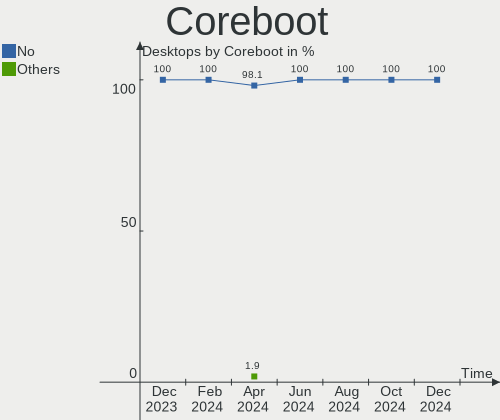
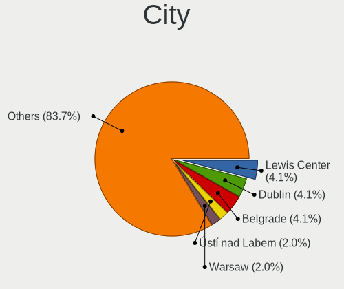
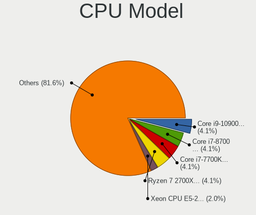
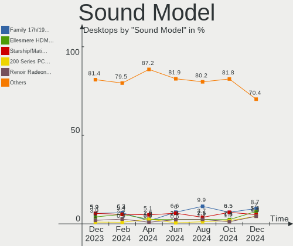

Kubuntu - Hardware Trends (Desktops)
------------------------------------

A project to identify most popular hardware characteristics and track their change
over time based on data collected by Linux users at https://Linux-Hardware.org.

Anyone can contribute to this report by the [hw-probe](https://github.com/linuxhw/hw-probe) tool:

    sudo -E hw-probe -all -upload

This report is for one last month. Overall report since the beginning of time: [TestDays](https://github.com/linuxhw/TestDays)

Period: Aug, 2023.

Contents
--------

* [ System ](#system)
  - [ OS                       ](#os)
  - [ OS Family                ](#os-family)
  - [ Kernel                   ](#kernel)
  - [ Kernel Family            ](#kernel-family)
  - [ Kernel Major Ver.        ](#kernel-major-ver)
  - [ Arch                     ](#arch)
  - [ DE                       ](#de)
  - [ Display Server           ](#display-server)
  - [ Display Manager          ](#display-manager)
  - [ OS Lang                  ](#os-lang)
  - [ Boot Mode                ](#boot-mode)
  - [ Filesystem               ](#filesystem)
  - [ Part. scheme             ](#part-scheme)
  - [ Dual Boot with Linux/BSD ](#dual-boot-with-linuxbsd)
  - [ Dual Boot (Win)          ](#dual-boot-win)

* [ Board ](#board)
  - [ Vendor                   ](#vendor)
  - [ Model                    ](#model)
  - [ Model Family             ](#model-family)
  - [ MFG Year                 ](#mfg-year)
  - [ Form Factor              ](#form-factor)
  - [ Secure Boot              ](#secure-boot)
  - [ Coreboot                 ](#coreboot)
  - [ RAM Size                 ](#ram-size)
  - [ RAM Used                 ](#ram-used)
  - [ Total Drives             ](#total-drives)
  - [ Has CD-ROM               ](#has-cd-rom)
  - [ Has Ethernet             ](#has-ethernet)
  - [ Has WiFi                 ](#has-wifi)
  - [ Has Bluetooth            ](#has-bluetooth)

* [ Location ](#location)
  - [ Country                  ](#country)
  - [ City                     ](#city)

* [ Drives ](#drives)
  - [ Drive Vendor             ](#drive-vendor)
  - [ Drive Model              ](#drive-model)
  - [ HDD Vendor               ](#hdd-vendor)
  - [ SSD Vendor               ](#ssd-vendor)
  - [ Drive Kind               ](#drive-kind)
  - [ Drive Connector          ](#drive-connector)
  - [ Drive Size               ](#drive-size)
  - [ Space Total              ](#space-total)
  - [ Space Used               ](#space-used)
  - [ Malfunc. Drives          ](#malfunc-drives)
  - [ Malfunc. Drive Vendor    ](#malfunc-drive-vendor)
  - [ Malfunc. HDD Vendor      ](#malfunc-hdd-vendor)
  - [ Malfunc. Drive Kind      ](#malfunc-drive-kind)
  - [ Failed Drives            ](#failed-drives)
  - [ Failed Drive Vendor      ](#failed-drive-vendor)
  - [ Drive Status             ](#drive-status)

* [ Storage controller ](#storage-controller)
  - [ Storage Vendor           ](#storage-vendor)
  - [ Storage Model            ](#storage-model)
  - [ Storage Kind             ](#storage-kind)

* [ Processor ](#processor)
  - [ CPU Vendor               ](#cpu-vendor)
  - [ CPU Model                ](#cpu-model)
  - [ CPU Model Family         ](#cpu-model-family)
  - [ CPU Cores                ](#cpu-cores)
  - [ CPU Sockets              ](#cpu-sockets)
  - [ CPU Threads              ](#cpu-threads)
  - [ CPU Op-Modes             ](#cpu-op-modes)
  - [ CPU Microcode            ](#cpu-microcode)
  - [ CPU Microarch            ](#cpu-microarch)

* [ Graphics ](#graphics)
  - [ GPU Vendor               ](#gpu-vendor)
  - [ GPU Model                ](#gpu-model)
  - [ GPU Combo                ](#gpu-combo)
  - [ GPU Driver               ](#gpu-driver)
  - [ GPU Memory               ](#gpu-memory)

* [ Monitor ](#monitor)
  - [ Monitor Vendor           ](#monitor-vendor)
  - [ Monitor Model            ](#monitor-model)
  - [ Monitor Resolution       ](#monitor-resolution)
  - [ Monitor Diagonal         ](#monitor-diagonal)
  - [ Monitor Width            ](#monitor-width)
  - [ Aspect Ratio             ](#aspect-ratio)
  - [ Monitor Area             ](#monitor-area)
  - [ Pixel Density            ](#pixel-density)
  - [ Multiple Monitors        ](#multiple-monitors)

* [ Network ](#network)
  - [ Net Controller Vendor    ](#net-controller-vendor)
  - [ Net Controller Model     ](#net-controller-model)
  - [ Wireless Vendor          ](#wireless-vendor)
  - [ Wireless Model           ](#wireless-model)
  - [ Ethernet Vendor          ](#ethernet-vendor)
  - [ Ethernet Model           ](#ethernet-model)
  - [ Net Controller Kind      ](#net-controller-kind)
  - [ Used Controller          ](#used-controller)
  - [ NICs                     ](#nics)
  - [ IPv6                     ](#ipv6)

* [ Bluetooth ](#bluetooth)
  - [ Bluetooth Vendor         ](#bluetooth-vendor)
  - [ Bluetooth Model          ](#bluetooth-model)

* [ Sound ](#sound)
  - [ Sound Vendor             ](#sound-vendor)
  - [ Sound Model              ](#sound-model)

* [ Memory ](#memory)
  - [ Memory Vendor            ](#memory-vendor)
  - [ Memory Model             ](#memory-model)
  - [ Memory Kind              ](#memory-kind)
  - [ Memory Form Factor       ](#memory-form-factor)
  - [ Memory Size              ](#memory-size)
  - [ Memory Speed             ](#memory-speed)

* [ Printers & scanners ](#printers--scanners)
  - [ Printer Vendor           ](#printer-vendor)
  - [ Printer Model            ](#printer-model)
  - [ Scanner Vendor           ](#scanner-vendor)
  - [ Scanner Model            ](#scanner-model)

* [ Camera ](#camera)
  - [ Camera Vendor            ](#camera-vendor)
  - [ Camera Model             ](#camera-model)

* [ Security ](#security)
  - [ Fingerprint Vendor       ](#fingerprint-vendor)
  - [ Fingerprint Model        ](#fingerprint-model)
  - [ Chipcard Vendor          ](#chipcard-vendor)
  - [ Chipcard Model           ](#chipcard-model)

* [ Unsupported ](#unsupported)
  - [ Unsupported Devices      ](#unsupported-devices)
  - [ Unsupported Device Types ](#unsupported-device-types)

System
------

OS
--

Installed operating systems

| Name          | Desktops | Percent |
|---------------|----------|---------|
| Kubuntu 22.04 | 26       | 49.06%  |
| Kubuntu 23.04 | 22       | 41.51%  |
| Kubuntu 11    | 3        | 5.66%   |
| Kubuntu 23.10 | 1        | 1.89%   |
| Kubuntu 20.04 | 1        | 1.89%   |

OS Family
---------

OS without a version

| Name    | Desktops | Percent |
|---------|----------|---------|
| Kubuntu | 53       | 100%    |

Kernel
------

Version of the Linux kernel

| Version               | Desktops | Percent |
|-----------------------|----------|---------|
| 6.2.0-27-generic      | 14       | 26.42%  |
| 6.2.0-26-generic      | 11       | 20.75%  |
| 5.15.0-78-generic     | 10       | 18.87%  |
| 6.2.0-31-generic      | 4        | 7.55%   |
| 5.15.0-79-generic     | 4        | 7.55%   |
| 5.15.0-82-generic     | 2        | 3.77%   |
| 6.4.10-060410-generic | 1        | 1.89%   |
| 6.4.0-060400-generic  | 1        | 1.89%   |
| 6.3.0-7-generic       | 1        | 1.89%   |
| 6.2.0-25-generic      | 1        | 1.89%   |
| 6.2.0-1007-lowlatency | 1        | 1.89%   |
| 5.4.0-155-generic     | 1        | 1.89%   |
| 5.15.0-76-generic     | 1        | 1.89%   |
| 5.15.0-75-generic     | 1        | 1.89%   |

Kernel Family
-------------

Linux kernel without a distro release

| Version | Desktops | Percent |
|---------|----------|---------|
| 6.2.0   | 31       | 58.49%  |
| 5.15.0  | 18       | 33.96%  |
| 6.4.10  | 1        | 1.89%   |
| 6.4.0   | 1        | 1.89%   |
| 6.3.0   | 1        | 1.89%   |
| 5.4.0   | 1        | 1.89%   |

Kernel Major Ver.
-----------------

Linux kernel major version

| Version | Desktops | Percent |
|---------|----------|---------|
| 6.2     | 31       | 58.49%  |
| 5.15    | 18       | 33.96%  |
| 6.4     | 2        | 3.77%   |
| 6.3     | 1        | 1.89%   |
| 5.4     | 1        | 1.89%   |

Arch
----

OS architecture (x86_64, i586, etc.)

| Name   | Desktops | Percent |
|--------|----------|---------|
| x86_64 | 53       | 100%    |

DE
--

Desktop Environment

| Name | Desktops | Percent |
|------|----------|---------|
| KDE5 | 52       | 98.11%  |
| KDE  | 1        | 1.89%   |

Display Server
--------------

X11 or Wayland

| Name    | Desktops | Percent |
|---------|----------|---------|
| X11     | 49       | 92.45%  |
| Wayland | 3        | 5.66%   |
| Tty     | 1        | 1.89%   |

Display Manager
---------------

SDDM, LightDM, etc.

| Name    | Desktops | Percent |
|---------|----------|---------|
| SDDM    | 27       | 50.94%  |
| Unknown | 25       | 47.17%  |
| GDM3    | 1        | 1.89%   |

OS Lang
-------

Language

| Lang                 | Desktops | Percent |
|----------------------|----------|---------|
| en_US                | 24       | 45.28%  |
| de_DE                | 7        | 13.21%  |
| en_GB                | 5        | 9.43%   |
| pt_BR                | 2        | 3.77%   |
| fr_FR                | 2        | 3.77%   |
| fr_BE                | 2        | 3.77%   |
| es_ES                | 2        | 3.77%   |
| الافتراضيّ | 1        | 1.89%   |
| zh_CN                | 1        | 1.89%   |
| ru_RU                | 1        | 1.89%   |
| it_IT                | 1        | 1.89%   |
| es_PA                | 1        | 1.89%   |
| en_CH                | 1        | 1.89%   |
| en_AU                | 1        | 1.89%   |
| de_CH                | 1        | 1.89%   |
| C                    | 1        | 1.89%   |

Boot Mode
---------

EFI or BIOS

| Mode | Desktops | Percent |
|------|----------|---------|
| BIOS | 39       | 73.58%  |
| EFI  | 14       | 26.42%  |

Filesystem
----------

Type of filesystem

| Type  | Desktops | Percent |
|-------|----------|---------|
| Ext4  | 40       | 75.47%  |
| Tmpfs | 9        | 16.98%  |
| Xfs   | 2        | 3.77%   |
| Btrfs | 2        | 3.77%   |

Part. scheme
------------

Scheme of partitioning

| Type    | Desktops | Percent |
|---------|----------|---------|
| GPT     | 26       | 49.06%  |
| Unknown | 24       | 45.28%  |
| MBR     | 3        | 5.66%   |

Dual Boot with Linux/BSD
------------------------

Hosting more than one Linux/BSD

| Dual boot | Desktops | Percent |
|-----------|----------|---------|
| No        | 45       | 84.91%  |
| Yes       | 8        | 15.09%  |

Dual Boot (Win)
---------------

Hosting Linux and Windows

| Dual boot | Desktops | Percent |
|-----------|----------|---------|
| No        | 39       | 73.58%  |
| Yes       | 14       | 26.42%  |

Board
-----

Vendor
------

Motherboard manufacturer

| Name                | Desktops | Percent |
|---------------------|----------|---------|
| ASUSTek Computer    | 15       | 28.3%   |
| MSI                 | 10       | 18.87%  |
| Gigabyte Technology | 10       | 18.87%  |
| ASRock              | 5        | 9.43%   |
| Hewlett-Packard     | 4        | 7.55%   |
| Dell                | 4        | 7.55%   |
| Intel               | 2        | 3.77%   |
| Fujitsu             | 1        | 1.89%   |
| AZW                 | 1        | 1.89%   |
| Unknown             | 1        | 1.89%   |

Model
-----

Motherboard model

| Name                               | Desktops | Percent |
|------------------------------------|----------|---------|
| MSI MS-7D74                        | 1        | 1.89%   |
| MSI MS-7C95                        | 1        | 1.89%   |
| MSI MS-7C86                        | 1        | 1.89%   |
| MSI MS-7C56                        | 1        | 1.89%   |
| MSI MS-7C52                        | 1        | 1.89%   |
| MSI MS-7C09                        | 1        | 1.89%   |
| MSI MS-7B86                        | 1        | 1.89%   |
| MSI MS-7B78                        | 1        | 1.89%   |
| MSI MS-7A69                        | 1        | 1.89%   |
| MSI MS-7893                        | 1        | 1.89%   |
| Intel H55                          | 1        | 1.89%   |
| Intel D53427RKE G87971-402         | 1        | 1.89%   |
| HP Z440 Workstation                | 1        | 1.89%   |
| HP ProDesk 600 G1 SFF              | 1        | 1.89%   |
| HP Compaq dc7900 Small Form Factor | 1        | 1.89%   |
| HP 500-330nz                       | 1        | 1.89%   |
| Gigabyte Z690 AORUS MASTER         | 1        | 1.89%   |
| Gigabyte Z390 M GAMING             | 1        | 1.89%   |
| Gigabyte X570 AORUS MASTER         | 1        | 1.89%   |
| Gigabyte X470 AORUS ULTRA GAMING   | 1        | 1.89%   |
| Gigabyte TRX40 DESIGNARE           | 1        | 1.89%   |
| Gigabyte H310M H                   | 1        | 1.89%   |
| Gigabyte B550 GAMING X V2          | 1        | 1.89%   |
| Gigabyte B550 AORUS ELITE V2       | 1        | 1.89%   |
| Gigabyte B365M D3H                 | 1        | 1.89%   |
| Gigabyte AX370-Gaming K7           | 1        | 1.89%   |
| Fujitsu ESPRIMO P958               | 1        | 1.89%   |
| Dell Precision WorkStation T7500   | 1        | 1.89%   |
| Dell Precision WorkStation T3500   | 1        | 1.89%   |
| Dell OptiPlex 790                  | 1        | 1.89%   |
| Dell OptiPlex 7090                 | 1        | 1.89%   |
| AZW MINI S                         | 1        | 1.89%   |
| ASUS TUF Gaming X570-PLUS          | 1        | 1.89%   |
| ASUS TUF Gaming B550-PLUS          | 1        | 1.89%   |
| ASUS TUF Gaming A520M-PLUS WIFI    | 1        | 1.89%   |
| ASUS ROG STRIX X670E-A GAMING WIFI | 1        | 1.89%   |
| ASUS ROG STRIX B450-F GAMING II    | 1        | 1.89%   |
| ASUS Q87M-E                        | 1        | 1.89%   |
| ASUS Pro WS 565-ACE                | 1        | 1.89%   |
| ASUS PRIME Z690-P WIFI D4          | 1        | 1.89%   |

Model Family
------------

Motherboard model prefix

| Name                  | Desktops | Percent |
|-----------------------|----------|---------|
| ASUS PRIME            | 4        | 7.55%   |
| ASUS TUF              | 3        | 5.66%   |
| Gigabyte B550         | 2        | 3.77%   |
| Dell Precision        | 2        | 3.77%   |
| Dell OptiPlex         | 2        | 3.77%   |
| ASUS ROG              | 2        | 3.77%   |
| MSI MS-7D74           | 1        | 1.89%   |
| MSI MS-7C95           | 1        | 1.89%   |
| MSI MS-7C86           | 1        | 1.89%   |
| MSI MS-7C56           | 1        | 1.89%   |
| MSI MS-7C52           | 1        | 1.89%   |
| MSI MS-7C09           | 1        | 1.89%   |
| MSI MS-7B86           | 1        | 1.89%   |
| MSI MS-7B78           | 1        | 1.89%   |
| MSI MS-7A69           | 1        | 1.89%   |
| MSI MS-7893           | 1        | 1.89%   |
| Intel H55             | 1        | 1.89%   |
| Intel D53427RKE       | 1        | 1.89%   |
| HP Z440               | 1        | 1.89%   |
| HP ProDesk            | 1        | 1.89%   |
| HP Compaq             | 1        | 1.89%   |
| HP 500-330nz          | 1        | 1.89%   |
| Gigabyte Z690         | 1        | 1.89%   |
| Gigabyte Z390         | 1        | 1.89%   |
| Gigabyte X570         | 1        | 1.89%   |
| Gigabyte X470         | 1        | 1.89%   |
| Gigabyte TRX40        | 1        | 1.89%   |
| Gigabyte H310M        | 1        | 1.89%   |
| Gigabyte B365M        | 1        | 1.89%   |
| Gigabyte AX370-Gaming | 1        | 1.89%   |
| Fujitsu ESPRIMO       | 1        | 1.89%   |
| AZW MINI              | 1        | 1.89%   |
| ASUS Q87M-E           | 1        | 1.89%   |
| ASUS Pro              | 1        | 1.89%   |
| ASUS P8Z68-V          | 1        | 1.89%   |
| ASUS P5QD             | 1        | 1.89%   |
| ASUS M5A99X           | 1        | 1.89%   |
| ASUS M5A97            | 1        | 1.89%   |
| ASRock Z77            | 1        | 1.89%   |
| ASRock Z68            | 1        | 1.89%   |

MFG Year
--------

Motherboard manufacture year

| Year | Desktops | Percent |
|------|----------|---------|
| 2020 | 8        | 15.09%  |
| 2019 | 6        | 11.32%  |
| 2018 | 6        | 11.32%  |
| 2021 | 5        | 9.43%   |
| 2017 | 4        | 7.55%   |
| 2022 | 3        | 5.66%   |
| 2014 | 3        | 5.66%   |
| 2012 | 3        | 5.66%   |
| 2011 | 3        | 5.66%   |
| 2009 | 3        | 5.66%   |
| 2016 | 2        | 3.77%   |
| 2015 | 2        | 3.77%   |
| 2013 | 2        | 3.77%   |
| 2023 | 1        | 1.89%   |
| 2010 | 1        | 1.89%   |
| 2008 | 1        | 1.89%   |

Form Factor
-----------

Physical design of the computer

| Name    | Desktops | Percent |
|---------|----------|---------|
| Desktop | 53       | 100%    |

Secure Boot
-----------

Enabled or disabled

| State    | Desktops | Percent |
|----------|----------|---------|
| Disabled | 53       | 100%    |

Coreboot
--------

Have coreboot on board

| Used | Desktops | Percent |
|------|----------|---------|
| No   | 53       | 100%    |

RAM Size
--------

Total RAM memory

| Size in GB  | Desktops | Percent |
|-------------|----------|---------|
| 16.01-24.0  | 17       | 32.08%  |
| 64.01-256.0 | 12       | 22.64%  |
| 32.01-64.0  | 9        | 16.98%  |
| 4.01-8.0    | 4        | 7.55%   |
| 24.01-32.0  | 4        | 7.55%   |
| 8.01-16.0   | 4        | 7.55%   |
| 3.01-4.0    | 3        | 5.66%   |

RAM Used
--------

Used RAM memory

| Used GB    | Desktops | Percent |
|------------|----------|---------|
| 2.01-3.0   | 14       | 26.42%  |
| 4.01-8.0   | 12       | 22.64%  |
| 3.01-4.0   | 12       | 22.64%  |
| 8.01-16.0  | 8        | 15.09%  |
| 1.01-2.0   | 3        | 5.66%   |
| 16.01-24.0 | 2        | 3.77%   |
| 32.01-64.0 | 1        | 1.89%   |
| 24.01-32.0 | 1        | 1.89%   |

Total Drives
------------

Number of drives on board

| Drives | Desktops | Percent |
|--------|----------|---------|
| 2      | 13       | 24.53%  |
| 4      | 12       | 22.64%  |
| 3      | 11       | 20.75%  |
| 1      | 10       | 18.87%  |
| 5      | 3        | 5.66%   |
| 8      | 2        | 3.77%   |
| 6      | 2        | 3.77%   |

Has CD-ROM
----------

Has CD-ROM on board

| Presented | Desktops | Percent |
|-----------|----------|---------|
| No        | 35       | 66.04%  |
| Yes       | 18       | 33.96%  |

Has Ethernet
------------

Has Ethernet on board

| Presented | Desktops | Percent |
|-----------|----------|---------|
| Yes       | 52       | 98.11%  |
| No        | 1        | 1.89%   |

Has WiFi
--------

Has WiFi module

| Presented | Desktops | Percent |
|-----------|----------|---------|
| Yes       | 27       | 50.94%  |
| No        | 26       | 49.06%  |

Has Bluetooth
-------------

Has Bluetooth module

| Presented | Desktops | Percent |
|-----------|----------|---------|
| No        | 29       | 54.72%  |
| Yes       | 24       | 45.28%  |

Location
--------

Country
-------

Geographic location (country)

| Country      | Desktops | Percent |
|--------------|----------|---------|
| USA          | 14       | 26.42%  |
| Germany      | 7        | 13.21%  |
| UK           | 5        | 9.43%   |
| Switzerland  | 4        | 7.55%   |
| France       | 3        | 5.66%   |
| Spain        | 2        | 3.77%   |
| Russia       | 2        | 3.77%   |
| Brazil       | 2        | 3.77%   |
| South Korea  | 1        | 1.89%   |
| Saudi Arabia | 1        | 1.89%   |
| Réunion     | 1        | 1.89%   |
| Portugal     | 1        | 1.89%   |
| Poland       | 1        | 1.89%   |
| Panama       | 1        | 1.89%   |
| Netherlands  | 1        | 1.89%   |
| Kazakhstan   | 1        | 1.89%   |
| Jordan       | 1        | 1.89%   |
| Finland      | 1        | 1.89%   |
| Czechia      | 1        | 1.89%   |
| China        | 1        | 1.89%   |
| Belgium      | 1        | 1.89%   |
| Australia    | 1        | 1.89%   |

City
----

Geographic location (city)

| City               | Desktops | Percent |
|--------------------|----------|---------|
| Oberburg           | 2        | 3.77%   |
| Zurich             | 1        | 1.89%   |
| Worcester Park     | 1        | 1.89%   |
| Warsaw             | 1        | 1.89%   |
| Virginia Beach     | 1        | 1.89%   |
| Villamartin        | 1        | 1.89%   |
| Uelversheim        | 1        | 1.89%   |
| Tuusula            | 1        | 1.89%   |
| Tilburg            | 1        | 1.89%   |
| Sutton in Ashfield | 1        | 1.89%   |
| Simpsonville       | 1        | 1.89%   |
| Sao Paulo          | 1        | 1.89%   |
| San Miguelito      | 1        | 1.89%   |
| Portimao           | 1        | 1.89%   |
| Platteville        | 1        | 1.89%   |
| Pirey              | 1        | 1.89%   |
| Pilsen             | 1        | 1.89%   |
| Pasco              | 1        | 1.89%   |
| Parma Heights      | 1        | 1.89%   |
| Paris              | 1        | 1.89%   |
| Novato             | 1        | 1.89%   |
| North Little Rock  | 1        | 1.89%   |
| Nizhniy Novgorod   | 1        | 1.89%   |
| Moscow             | 1        | 1.89%   |
| Melbourne          | 1        | 1.89%   |
| London             | 1        | 1.89%   |
| Lessines           | 1        | 1.89%   |
| Le Tampon          | 1        | 1.89%   |
| Jena               | 1        | 1.89%   |
| Itaguai            | 1        | 1.89%   |
| Indianapolis       | 1        | 1.89%   |
| Hoddesdon          | 1        | 1.89%   |
| Heidenheim         | 1        | 1.89%   |
| Hefei              | 1        | 1.89%   |
| Hamm               | 1        | 1.89%   |
| Hamburg            | 1        | 1.89%   |
| Green Valley       | 1        | 1.89%   |
| Geneva             | 1        | 1.89%   |
| Edwardsville       | 1        | 1.89%   |
| Dammam             | 1        | 1.89%   |

Drives
------

Drive Vendor
------------

Hard drive vendors

| Vendor                      | Desktops | Drives | Percent |
|-----------------------------|----------|--------|---------|
| Seagate                     | 20       | 29     | 16.53%  |
| Samsung Electronics         | 18       | 34     | 14.88%  |
| WDC                         | 17       | 23     | 14.05%  |
| SanDisk                     | 9        | 13     | 7.44%   |
| Crucial                     | 8        | 11     | 6.61%   |
| Toshiba                     | 7        | 7      | 5.79%   |
| Hitachi                     | 4        | 4      | 3.31%   |
| PNY                         | 3        | 3      | 2.48%   |
| Phison Electronics          | 3        | 3      | 2.48%   |
| Kingston                    | 3        | 4      | 2.48%   |
| HGST                        | 3        | 4      | 2.48%   |
| A-DATA Technology           | 3        | 4      | 2.48%   |
| SPCC                        | 2        | 2      | 1.65%   |
| Silicon Motion              | 2        | 2      | 1.65%   |
| Phison                      | 2        | 2      | 1.65%   |
| KIOXIA                      | 2        | 2      | 1.65%   |
| China                       | 2        | 2      | 1.65%   |
| Team                        | 1        | 1      | 0.83%   |
| Smartbuy                    | 1        | 1      | 0.83%   |
| S3+                         | 1        | 1      | 0.83%   |
| Realtek Semiconductor       | 1        | 1      | 0.83%   |
| Neo                         | 1        | 1      | 0.83%   |
| KIOXIA-EXCERIA              | 1        | 1      | 0.83%   |
| Kingston Technology Company | 1        | 1      | 0.83%   |
| Integral                    | 1        | 1      | 0.83%   |
| HS-SSD-E100                 | 1        | 1      | 0.83%   |
| Fanxiang                    | 1        | 1      | 0.83%   |
| Emtec                       | 1        | 2      | 0.83%   |
| Corsair                     | 1        | 1      | 0.83%   |
| Apple                       | 1        | 1      | 0.83%   |

Drive Model
-----------

Hard drive models

| Model                                                 | Desktops | Percent |
|-------------------------------------------------------|----------|---------|
| Samsung SSD 860 EVO 500GB                             | 4        | 2.74%   |
| Samsung SSD 850 EVO 500GB                             | 3        | 2.05%   |
| WDC WD10EZEX-60WN4A0 1TB                              | 2        | 1.37%   |
| Toshiba DT01ACA200 2TB                                | 2        | 1.37%   |
| Seagate ST4000DM004-2CV104 4TB                        | 2        | 1.37%   |
| Seagate ST2000DM008-2FR102 2TB                        | 2        | 1.37%   |
| Sandisk WD Black SN850 256GB                          | 2        | 1.37%   |
| Samsung NVMe SSD Controller SM981/PM981/PM983 500GB   | 2        | 1.37%   |
| Samsung NVMe SSD Controller PM9A1/PM9A3/980PRO 1024GB | 2        | 1.37%   |
| Phison PS5013 E13 NVMe Controller 512GB               | 2        | 1.37%   |
| Crucial CT1000BX500SSD1 1TB                           | 2        | 1.37%   |
| WDC WDS500G1B0B-00AS40 500GB SSD                      | 1        | 0.68%   |
| WDC WD6003FZBX-00K5WB0 6TB                            | 1        | 0.68%   |
| WDC WD6003FZBX-00GXAB0 6TB                            | 1        | 0.68%   |
| WDC WD5000LPCX-24VHAT0 500GB                          | 1        | 0.68%   |
| WDC WD40PURX-64AKYY0 4TB                              | 1        | 0.68%   |
| WDC WD40EZRZ-22GXCB0 4TB                              | 1        | 0.68%   |
| WDC WD40EZRZ-00WN9B0 4TB                              | 1        | 0.68%   |
| WDC WD40EFRX-68N32N0 4TB                              | 1        | 0.68%   |
| WDC WD30EZRX-00MMMB0 3TB                              | 1        | 0.68%   |
| WDC WD20EZRZ-00Z5HB0 2TB                              | 1        | 0.68%   |
| WDC WD20EARS-60MVWB0 2TB                              | 1        | 0.68%   |
| WDC WD10EZRZ-00HTKB0 1TB                              | 1        | 0.68%   |
| WDC WD10EZEX-60M2NA0 1TB                              | 1        | 0.68%   |
| WDC WD10EZEX-22MFCA0 1TB                              | 1        | 0.68%   |
| WDC WD10EZEX-08WN4A0 1TB                              | 1        | 0.68%   |
| WDC WD10EZEX-00BBHA0 1TB                              | 1        | 0.68%   |
| WDC WD10EAVS-00D7B1 1TB                               | 1        | 0.68%   |
| WDC WD10EACS-65D6B0 1TB                               | 1        | 0.68%   |
| WDC WD1002FAEX-00Y9A0 1TB                             | 1        | 0.68%   |
| WDC WD Green 2.5 1000GB                               | 1        | 0.68%   |
| Toshiba MQ01ABD050 500GB                              | 1        | 0.68%   |
| Toshiba MD08ADA600 6TB                                | 1        | 0.68%   |
| Toshiba HDWR460 6TB                                   | 1        | 0.68%   |
| Toshiba HDWR11A 10TB                                  | 1        | 0.68%   |
| Toshiba HDWD110 1TB                                   | 1        | 0.68%   |
| Team T2531TB SSD                                      | 1        | 0.68%   |
| SPCC Solid State Disk 1TB                             | 1        | 0.68%   |
| SPCC M.2 PCIe SSD 2TB                                 | 1        | 0.68%   |
| Smartbuy SSD 120GB                                    | 1        | 0.68%   |

HDD Vendor
----------

Hard disk drive vendors

| Vendor              | Desktops | Drives | Percent |
|---------------------|----------|--------|---------|
| Seagate             | 18       | 27     | 36%     |
| WDC                 | 15       | 21     | 30%     |
| Toshiba             | 7        | 7      | 14%     |
| Hitachi             | 4        | 4      | 8%      |
| HGST                | 3        | 4      | 6%      |
| Samsung Electronics | 2        | 2      | 4%      |
| Apple               | 1        | 1      | 2%      |

SSD Vendor
----------

Solid state drive vendors

| Vendor              | Desktops | Drives | Percent |
|---------------------|----------|--------|---------|
| Samsung Electronics | 11       | 14     | 25%     |
| Crucial             | 6        | 8      | 13.64%  |
| SanDisk             | 5        | 5      | 11.36%  |
| PNY                 | 3        | 3      | 6.82%   |
| Kingston            | 3        | 4      | 6.82%   |
| WDC                 | 2        | 2      | 4.55%   |
| China               | 2        | 2      | 4.55%   |
| A-DATA Technology   | 2        | 2      | 4.55%   |
| Team                | 1        | 1      | 2.27%   |
| SPCC                | 1        | 1      | 2.27%   |
| Smartbuy            | 1        | 1      | 2.27%   |
| Seagate             | 1        | 1      | 2.27%   |
| S3+                 | 1        | 1      | 2.27%   |
| Neo                 | 1        | 1      | 2.27%   |
| KIOXIA-EXCERIA      | 1        | 1      | 2.27%   |
| Integral            | 1        | 1      | 2.27%   |
| Emtec               | 1        | 2      | 2.27%   |
| Corsair             | 1        | 1      | 2.27%   |

Drive Kind
----------

HDD or SSD

| Kind    | Desktops | Drives | Percent |
|---------|----------|--------|---------|
| HDD     | 35       | 66     | 36.46%  |
| SSD     | 33       | 51     | 34.38%  |
| NVMe    | 27       | 45     | 28.13%  |
| Unknown | 1        | 1      | 1.04%   |

Drive Connector
---------------

SATA, SAS, NVMe, etc.

| Type | Desktops | Drives | Percent |
|------|----------|--------|---------|
| SATA | 49       | 115    | 63.64%  |
| NVMe | 27       | 45     | 35.06%  |
| SAS  | 1        | 3      | 1.3%    |

Drive Size
----------

Size of hard drive

| Size in TB | Desktops | Drives | Percent |
|------------|----------|--------|---------|
| 0.01-0.5   | 31       | 47     | 36.05%  |
| 0.51-1.0   | 30       | 36     | 34.88%  |
| 1.01-2.0   | 9        | 11     | 10.47%  |
| 3.01-4.0   | 7        | 8      | 8.14%   |
| 4.01-10.0  | 7        | 13     | 8.14%   |
| 2.01-3.0   | 2        | 2      | 2.33%   |

Space Total
-----------

Amount of disk space available on the file system

| Size in GB     | Desktops | Percent |
|----------------|----------|---------|
| More than 3000 | 14       | 26.42%  |
| 501-1000       | 14       | 26.42%  |
| 101-250        | 8        | 15.09%  |
| 1001-2000      | 8        | 15.09%  |
| 2001-3000      | 4        | 7.55%   |
| 251-500        | 3        | 5.66%   |
| 51-100         | 1        | 1.89%   |
| Unknown        | 1        | 1.89%   |

Space Used
----------

Amount of used disk space

| Used GB        | Desktops | Percent |
|----------------|----------|---------|
| 251-500        | 10       | 18.87%  |
| 51-100         | 8        | 15.09%  |
| More than 3000 | 7        | 13.21%  |
| 101-250        | 7        | 13.21%  |
| 501-1000       | 7        | 13.21%  |
| 1001-2000      | 5        | 9.43%   |
| 21-50          | 4        | 7.55%   |
| 2001-3000      | 2        | 3.77%   |
| 1-20           | 2        | 3.77%   |
| Unknown        | 1        | 1.89%   |

Malfunc. Drives
---------------

Drive models with a malfunction

| Model                                   | Desktops | Drives | Percent |
|-----------------------------------------|----------|--------|---------|
| WDC WD40EFRX-68N32N0 4TB                | 1        | 2      | 10%     |
| WDC WD30EZRX-00MMMB0 3TB                | 1        | 1      | 10%     |
| WDC WD10EZEX-22MFCA0 1TB                | 1        | 1      | 10%     |
| WDC WD10EAVS-00D7B1 1TB                 | 1        | 1      | 10%     |
| Seagate ST9500325AS 500GB               | 1        | 1      | 10%     |
| Seagate ST3500320AS 500GB               | 1        | 1      | 10%     |
| Samsung Electronics HD501LJ 500GB       | 1        | 1      | 10%     |
| Neo Forza NFS121SA312-6007000 120GB SSD | 1        | 1      | 10%     |
| HGST HTS541010A9E680 1TB                | 1        | 1      | 10%     |
| Apple HDD HTS541010A9E662 1TB           | 1        | 1      | 10%     |

Malfunc. Drive Vendor
---------------------

Vendors of faulty drives

| Vendor              | Desktops | Drives | Percent |
|---------------------|----------|--------|---------|
| WDC                 | 4        | 5      | 40%     |
| Seagate             | 2        | 2      | 20%     |
| Samsung Electronics | 1        | 1      | 10%     |
| Neo                 | 1        | 1      | 10%     |
| HGST                | 1        | 1      | 10%     |
| Apple               | 1        | 1      | 10%     |

Malfunc. HDD Vendor
-------------------

Vendors of faulty HDD drives

| Vendor              | Desktops | Drives | Percent |
|---------------------|----------|--------|---------|
| WDC                 | 4        | 5      | 44.44%  |
| Seagate             | 2        | 2      | 22.22%  |
| Samsung Electronics | 1        | 1      | 11.11%  |
| HGST                | 1        | 1      | 11.11%  |
| Apple               | 1        | 1      | 11.11%  |

Malfunc. Drive Kind
-------------------

Kinds of faulty drives

| Kind | Desktops | Drives | Percent |
|------|----------|--------|---------|
| HDD  | 7        | 10     | 87.5%   |
| SSD  | 1        | 1      | 12.5%   |

Failed Drives
-------------

Failed drive models

Zero info for selected period =(

Failed Drive Vendor
-------------------

Failed drive vendors

Zero info for selected period =(

Drive Status
------------

Number of failed and malfunc. drives

| Status   | Desktops | Drives | Percent |
|----------|----------|--------|---------|
| Detected | 36       | 96     | 57.14%  |
| Works    | 20       | 56     | 31.75%  |
| Malfunc  | 7        | 11     | 11.11%  |

Storage controller
------------------

Storage Vendor
--------------

Storage controller vendors

| Vendor                      | Desktops | Percent |
|-----------------------------|----------|---------|
| Intel                       | 28       | 29.79%  |
| AMD                         | 24       | 25.53%  |
| Samsung Electronics         | 9        | 9.57%   |
| Phison Electronics          | 5        | 5.32%   |
| SanDisk                     | 4        | 4.26%   |
| ASMedia Technology          | 4        | 4.26%   |
| Realtek Semiconductor       | 3        | 3.19%   |
| Silicon Motion              | 2        | 2.13%   |
| Micron/Crucial Technology   | 2        | 2.13%   |
| Marvell Technology Group    | 2        | 2.13%   |
| LSI Logic / Symbios Logic   | 2        | 2.13%   |
| KIOXIA                      | 2        | 2.13%   |
| JMicron Technology          | 2        | 2.13%   |
| Seagate Technology          | 1        | 1.06%   |
| Nvidia                      | 1        | 1.06%   |
| MAXIO Technology (Hangzhou) | 1        | 1.06%   |
| Kingston Technology Company | 1        | 1.06%   |
| ADATA Technology            | 1        | 1.06%   |

Storage Model
-------------

Storage controller models

| Model                                                                          | Desktops | Percent |
|--------------------------------------------------------------------------------|----------|---------|
| AMD FCH SATA Controller [AHCI mode]                                            | 13       | 11.61%  |
| AMD 500 Series Chipset SATA Controller                                         | 7        | 6.25%   |
| Intel 200 Series PCH SATA controller [AHCI mode]                               | 5        | 4.46%   |
| AMD 400 Series Chipset SATA Controller                                         | 5        | 4.46%   |
| Samsung NVMe SSD Controller SM981/PM981/PM983                                  | 4        | 3.57%   |
| Samsung NVMe SSD Controller PM9A1/PM9A3/980PRO                                 | 4        | 3.57%   |
| ASMedia ASM1062 Serial ATA Controller                                          | 4        | 3.57%   |
| Intel Cannon Lake PCH SATA AHCI Controller                                     | 3        | 2.68%   |
| Intel 8 Series/C220 Series Chipset Family 6-port SATA Controller 1 [AHCI mode] | 3        | 2.68%   |
| AMD X370 Series Chipset SATA Controller                                        | 3        | 2.68%   |
| AMD SB7x0/SB8x0/SB9x0 SATA Controller [AHCI mode]                              | 3        | 2.68%   |
| Silicon Motion SM2263EN/SM2263XT (DRAM-less) NVMe SSD Controllers              | 2        | 1.79%   |
| SanDisk WD PC SN810 / Black SN850 NVMe SSD                                     | 2        | 1.79%   |
| Phison PS5013 E13 NVMe Controller                                              | 2        | 1.79%   |
| Micron/Crucial P2 [Nick P2] / P3 / P3 Plus NVMe PCIe SSD (DRAM-less)           | 2        | 1.79%   |
| Intel Volume Management Device NVMe RAID Controller                            | 2        | 1.79%   |
| Intel Alder Lake-S PCH SATA Controller [AHCI Mode]                             | 2        | 1.79%   |
| Intel 82801JI (ICH10 Family) 4 port SATA IDE Controller #1                     | 2        | 1.79%   |
| Intel 82801JI (ICH10 Family) 2 port SATA IDE Controller #2                     | 2        | 1.79%   |
| Intel 6 Series/C200 Series Chipset Family 6 port Desktop SATA AHCI Controller  | 2        | 1.79%   |
| Seagate FireCuda/IronWolf 510 SSD                                              | 1        | 0.89%   |
| Sandisk Western Digital WD Black SN850X NVMe SSD                               | 1        | 0.89%   |
| SanDisk WD Blue SN570 NVMe SSD 2TB                                             | 1        | 0.89%   |
| SanDisk WD Black SN770 / PC SN740 256GB / PC SN560 (DRAM-less) NVMe SSD        | 1        | 0.89%   |
| Samsung NVMe SSD Controller SM951/PM951                                        | 1        | 0.89%   |
| Samsung NVMe SSD Controller 980                                                | 1        | 0.89%   |
| Realtek RTS5765DL NVMe SSD Controller (DRAM-less)                              | 1        | 0.89%   |
| Realtek RTS5763DL NVMe SSD Controller (DRAM-less)                              | 1        | 0.89%   |
| Realtek RTS5763DL NVMe SSD Controller                                          | 1        | 0.89%   |
| Phison Electronics Non-Volatile memory controller                              | 1        | 0.89%   |
| Phison E18 PCIe4 NVMe Controller                                               | 1        | 0.89%   |
| Phison E12 NVMe Controller                                                     | 1        | 0.89%   |
| Nvidia MCP61 SATA Controller                                                   | 1        | 0.89%   |
| Nvidia MCP61 IDE                                                               | 1        | 0.89%   |
| MAXIO (Hangzhou) NVMe SSD Controller MAP1202                                   | 1        | 0.89%   |
| Marvell Group 88SE9230 PCIe 2.0 x2 4-port SATA 6 Gb/s RAID Controller          | 1        | 0.89%   |
| Marvell Group 88SE9172 SATA 6Gb/s Controller                                   | 1        | 0.89%   |
| LSI Logic / Symbios Logic SAS2004 PCI-Express Fusion-MPT SAS-2 [Spitfire]      | 1        | 0.89%   |
| LSI Logic / Symbios Logic SAS1068E PCI-Express Fusion-MPT SAS                  | 1        | 0.89%   |
| KIOXIA NVMe SSD Controller BG5 (DRAM-less)                                     | 1        | 0.89%   |

Storage Kind
------------

Kind of storage controller (IDE, SATA, NVMe, SAS, ...)

| Kind | Desktops | Percent |
|------|----------|---------|
| SATA | 48       | 56.47%  |
| NVMe | 27       | 31.76%  |
| IDE  | 6        | 7.06%   |
| RAID | 2        | 2.35%   |
| SAS  | 1        | 1.18%   |
| SCSI | 1        | 1.18%   |

Processor
---------

CPU Vendor
----------

Processor vendors

| Vendor | Desktops | Percent |
|--------|----------|---------|
| Intel  | 28       | 52.83%  |
| AMD    | 25       | 47.17%  |

CPU Model
---------

Processor models

| Model                                          | Desktops | Percent |
|------------------------------------------------|----------|---------|
| AMD Ryzen 5 3600 6-Core Processor              | 4        | 7.55%   |
| Intel Core i5-2400 CPU @ 3.10GHz               | 2        | 3.77%   |
| AMD Ryzen 7 5800X 8-Core Processor             | 2        | 3.77%   |
| AMD Ryzen 7 3700X 8-Core Processor             | 2        | 3.77%   |
| AMD Ryzen 5 1600X Six-Core Processor           | 2        | 3.77%   |
| Intel Xeon CPU W5580 @ 3.20GHz                 | 1        | 1.89%   |
| Intel Xeon CPU W3580 @ 3.33GHz                 | 1        | 1.89%   |
| Intel Xeon CPU E5-2667 v4 @ 3.20GHz            | 1        | 1.89%   |
| Intel Pentium CPU G4600 @ 3.60GHz              | 1        | 1.89%   |
| Intel Core i9-9900K CPU @ 3.60GHz              | 1        | 1.89%   |
| Intel Core i9-7900X CPU @ 3.30GHz              | 1        | 1.89%   |
| Intel Core i9-10900T CPU @ 1.90GHz             | 1        | 1.89%   |
| Intel Core i7-7700K CPU @ 4.20GHz              | 1        | 1.89%   |
| Intel Core i7-4790S CPU @ 3.20GHz              | 1        | 1.89%   |
| Intel Core i7-2600K CPU @ 3.40GHz              | 1        | 1.89%   |
| Intel Core i5-9600K CPU @ 3.70GHz              | 1        | 1.89%   |
| Intel Core i5-9400F CPU @ 2.90GHz              | 1        | 1.89%   |
| Intel Core i5-9400 CPU @ 2.90GHz               | 1        | 1.89%   |
| Intel Core i5-8500 CPU @ 3.00GHz               | 1        | 1.89%   |
| Intel Core i5-7200U CPU @ 2.50GHz              | 1        | 1.89%   |
| Intel Core i5-4590T CPU @ 2.00GHz              | 1        | 1.89%   |
| Intel Core i5-4590 CPU @ 3.30GHz               | 1        | 1.89%   |
| Intel Core i5-3570K CPU @ 3.40GHz              | 1        | 1.89%   |
| Intel Core i5-3427U CPU @ 1.80GHz              | 1        | 1.89%   |
| Intel Core i5 CPU 660 @ 3.33GHz                | 1        | 1.89%   |
| Intel Core 2 Quad CPU Q8200 @ 2.33GHz          | 1        | 1.89%   |
| Intel Core 2 Duo CPU E8500 @ 3.16GHz           | 1        | 1.89%   |
| Intel Celeron N5095A @ 2.00GHz                 | 1        | 1.89%   |
| Intel 12th Gen Core i9-12900K                  | 1        | 1.89%   |
| Intel 12th Gen Core i7-12700K                  | 1        | 1.89%   |
| Intel 11th Gen Core i7-11700 @ 2.50GHz         | 1        | 1.89%   |
| AMD Ryzen Threadripper 3970X 32-Core Processor | 1        | 1.89%   |
| AMD Ryzen 9 7950X 16-Core Processor            | 1        | 1.89%   |
| AMD Ryzen 9 7900 12-Core Processor             | 1        | 1.89%   |
| AMD Ryzen 9 5950X 16-Core Processor            | 1        | 1.89%   |
| AMD Ryzen 7 5700G with Radeon Graphics         | 1        | 1.89%   |
| AMD Ryzen 7 2700X Eight-Core Processor         | 1        | 1.89%   |
| AMD Ryzen 7 1700 Eight-Core Processor          | 1        | 1.89%   |
| AMD Ryzen 5 5600X 6-Core Processor             | 1        | 1.89%   |
| AMD Ryzen 5 5600 6-Core Processor              | 1        | 1.89%   |

CPU Model Family
----------------

Processor model prefix

| Model                  | Desktops | Percent |
|------------------------|----------|---------|
| Intel Core i5          | 12       | 22.64%  |
| AMD Ryzen 5            | 10       | 18.87%  |
| AMD Ryzen 7            | 7        | 13.21%  |
| Other                  | 3        | 5.66%   |
| Intel Xeon             | 3        | 5.66%   |
| Intel Core i9          | 3        | 5.66%   |
| Intel Core i7          | 3        | 5.66%   |
| AMD Ryzen 9            | 3        | 5.66%   |
| AMD FX                 | 2        | 3.77%   |
| Intel Pentium          | 1        | 1.89%   |
| Intel Core 2 Quad      | 1        | 1.89%   |
| Intel Core 2 Duo       | 1        | 1.89%   |
| Intel Celeron          | 1        | 1.89%   |
| AMD Ryzen Threadripper | 1        | 1.89%   |
| AMD Phenom II X4       | 1        | 1.89%   |
| AMD Athlon 64 X2       | 1        | 1.89%   |

CPU Cores
---------

Number of processor cores

| Number | Desktops | Percent |
|--------|----------|---------|
| 6      | 14       | 26.42%  |
| 4      | 13       | 24.53%  |
| 8      | 11       | 20.75%  |
| 2      | 6        | 11.32%  |
| 16     | 3        | 5.66%   |
| 12     | 2        | 3.77%   |
| 10     | 2        | 3.77%   |
| 32     | 1        | 1.89%   |
| 3      | 1        | 1.89%   |

CPU Sockets
-----------

Number of sockets

| Number | Desktops | Percent |
|--------|----------|---------|
| 1      | 52       | 98.11%  |
| 2      | 1        | 1.89%   |

CPU Threads
-----------

Threads per core (Hyper-Threading)

| Number | Desktops | Percent |
|--------|----------|---------|
| 2      | 37       | 69.81%  |
| 1      | 16       | 30.19%  |

CPU Op-Modes
------------

CPU Operation Modes (32-bit, 64-bit)

| Op mode        | Desktops | Percent |
|----------------|----------|---------|
| 32-bit, 64-bit | 53       | 100%    |

CPU Microcode
-------------

Microcode number

| Number     | Desktops | Percent |
|------------|----------|---------|
| Unknown    | 41       | 77.36%  |
| 0x08701030 | 2        | 3.77%   |
| 0x906e9    | 1        | 1.89%   |
| 0x90672    | 1        | 1.89%   |
| 0x0a601203 | 1        | 1.89%   |
| 0x0a201025 | 1        | 1.89%   |
| 0x08701021 | 1        | 1.89%   |
| 0x0830107a | 1        | 1.89%   |
| 0x0800820d | 1        | 1.89%   |
| 0x08001138 | 1        | 1.89%   |
| 0x08001126 | 1        | 1.89%   |
| 0x0600063e | 1        | 1.89%   |

CPU Microarch
-------------

Microarchitecture

| Name             | Desktops | Percent |
|------------------|----------|---------|
| Zen 2            | 8        | 15.09%  |
| KabyLake         | 8        | 15.09%  |
| Zen 3            | 6        | 11.32%  |
| Unknown          | 4        | 7.55%   |
| Zen              | 3        | 5.66%   |
| SandyBridge      | 3        | 5.66%   |
| Haswell          | 3        | 5.66%   |
| Zen+             | 2        | 3.77%   |
| Penryn           | 2        | 3.77%   |
| Nehalem          | 2        | 3.77%   |
| IvyBridge        | 2        | 3.77%   |
| Westmere         | 1        | 1.89%   |
| Skylake          | 1        | 1.89%   |
| Piledriver       | 1        | 1.89%   |
| K8 Hammer        | 1        | 1.89%   |
| K10              | 1        | 1.89%   |
| Icelake          | 1        | 1.89%   |
| CometLake        | 1        | 1.89%   |
| Bulldozer        | 1        | 1.89%   |
| Broadwell        | 1        | 1.89%   |
| Alderlake Hybrid | 1        | 1.89%   |

Graphics
--------

GPU Vendor
----------

Vendors of graphics cards

| Vendor            | Desktops | Percent |
|-------------------|----------|---------|
| Nvidia            | 26       | 43.33%  |
| AMD               | 17       | 28.33%  |
| Intel             | 16       | 26.67%  |
| ASPEED Technology | 1        | 1.67%   |

GPU Model
---------

Graphics card models

| Model                                                                       | Desktops | Percent |
|-----------------------------------------------------------------------------|----------|---------|
| AMD Ellesmere [Radeon RX 470/480/570/570X/580/580X/590]                     | 4        | 6.35%   |
| AMD Navi 22 [Radeon RX 6700/6700 XT/6750 XT / 6800M/6850M XT]               | 3        | 4.76%   |
| Nvidia TU117 [GeForce GTX 1650]                                             | 2        | 3.17%   |
| Nvidia GA106 [GeForce RTX 3060 Lite Hash Rate]                              | 2        | 3.17%   |
| Intel Xeon E3-1200 v3/4th Gen Core Processor Integrated Graphics Controller | 2        | 3.17%   |
| Intel HD Graphics 630                                                       | 2        | 3.17%   |
| Intel 2nd Generation Core Processor Family Integrated Graphics Controller   | 2        | 3.17%   |
| AMD Raphael                                                                 | 2        | 3.17%   |
| Nvidia TU106 [GeForce RTX 2060 Rev. A]                                      | 1        | 1.59%   |
| Nvidia TU104 [GeForce RTX 2070 SUPER]                                       | 1        | 1.59%   |
| Nvidia TU102 [TITAN RTX]                                                    | 1        | 1.59%   |
| Nvidia GT200GL [Quadro FX 4800]                                             | 1        | 1.59%   |
| Nvidia GP108 [GeForce GT 1030]                                              | 1        | 1.59%   |
| Nvidia GP107 [GeForce GTX 1050]                                             | 1        | 1.59%   |
| Nvidia GP107 [GeForce GTX 1050 Ti]                                          | 1        | 1.59%   |
| Nvidia GP106 [GeForce GTX 1060 6GB]                                         | 1        | 1.59%   |
| Nvidia GP106 [GeForce GTX 1060 3GB]                                         | 1        | 1.59%   |
| Nvidia GP104 [GeForce GTX 1080]                                             | 1        | 1.59%   |
| Nvidia GP104 [GeForce GTX 1070]                                             | 1        | 1.59%   |
| Nvidia GM204 [GeForce GTX 970]                                              | 1        | 1.59%   |
| Nvidia GM107 [GeForce GTX 745]                                              | 1        | 1.59%   |
| Nvidia GK107 [GeForce GT 740]                                               | 1        | 1.59%   |
| Nvidia GF119 [NVS 310]                                                      | 1        | 1.59%   |
| Nvidia GF108 [GeForce GT 730]                                               | 1        | 1.59%   |
| Nvidia GF108 [GeForce GT 630]                                               | 1        | 1.59%   |
| Nvidia GF100GL [Quadro 4000]                                                | 1        | 1.59%   |
| Nvidia GA104 [GeForce RTX 3070]                                             | 1        | 1.59%   |
| Nvidia GA102 [GeForce RTX 3090]                                             | 1        | 1.59%   |
| Nvidia GA102 [GeForce RTX 3080 Ti]                                          | 1        | 1.59%   |
| Nvidia G92 [GeForce 9600 GSO]                                               | 1        | 1.59%   |
| Nvidia G84GL [Quadro FX 570]                                                | 1        | 1.59%   |
| Nvidia AD102 [GeForce RTX 4090]                                             | 1        | 1.59%   |
| Intel RocketLake-S GT1 [UHD Graphics 750]                                   | 1        | 1.59%   |
| Intel JasperLake [UHD Graphics]                                             | 1        | 1.59%   |
| Intel IvyBridge GT2 [HD Graphics 4000]                                      | 1        | 1.59%   |
| Intel HD Graphics 620                                                       | 1        | 1.59%   |
| Intel DG2 [Arc A380]                                                        | 1        | 1.59%   |
| Intel CometLake-S GT2 [UHD Graphics 630]                                    | 1        | 1.59%   |
| Intel CoffeeLake-S GT2 [UHD Graphics 630]                                   | 1        | 1.59%   |
| Intel AlderLake-S GT1                                                       | 1        | 1.59%   |

GPU Combo
---------

Combinations of graphics cards

| Name           | Desktops | Percent |
|----------------|----------|---------|
| 1 x Nvidia     | 21       | 39.62%  |
| 1 x AMD        | 13       | 24.53%  |
| 1 x Intel      | 10       | 18.87%  |
| 2 x Nvidia     | 2        | 3.77%   |
| Intel + Nvidia | 2        | 3.77%   |
| Intel + AMD    | 2        | 3.77%   |
| 2 x AMD        | 1        | 1.89%   |
| 1 x ASPEED     | 1        | 1.89%   |
| AMD + Nvidia   | 1        | 1.89%   |

GPU Driver
----------

Free vs proprietary

| Driver      | Desktops | Percent |
|-------------|----------|---------|
| Free        | 31       | 58.49%  |
| Proprietary | 21       | 39.62%  |
| Unknown     | 1        | 1.89%   |

GPU Memory
----------

Total video memory

| Size in GB | Desktops | Percent |
|------------|----------|---------|
| Unknown    | 27       | 50.94%  |
| 3.01-4.0   | 7        | 13.21%  |
| 7.01-8.0   | 5        | 9.43%   |
| 8.01-16.0  | 4        | 7.55%   |
| 16.01-24.0 | 3        | 5.66%   |
| 5.01-6.0   | 2        | 3.77%   |
| 1.01-2.0   | 2        | 3.77%   |
| 2.01-3.0   | 1        | 1.89%   |
| 0.51-1.0   | 1        | 1.89%   |
| 0.01-0.5   | 1        | 1.89%   |

Monitor
-------

Monitor Vendor
--------------

Monitor vendors

| Vendor                  | Desktops | Percent |
|-------------------------|----------|---------|
| Goldstar                | 6        | 9.52%   |
| Dell                    | 6        | 9.52%   |
| Samsung Electronics     | 5        | 7.94%   |
| AOC                     | 5        | 7.94%   |
| Iiyama                  | 4        | 6.35%   |
| Hewlett-Packard         | 4        | 6.35%   |
| Ancor Communications    | 4        | 6.35%   |
| Acer                    | 4        | 6.35%   |
| Lenovo                  | 3        | 4.76%   |
| Philips                 | 2        | 3.17%   |
| Gigabyte Technology     | 2        | 3.17%   |
| Eizo                    | 2        | 3.17%   |
| BenQ                    | 2        | 3.17%   |
| ASUSTek Computer        | 2        | 3.17%   |
| Wacom                   | 1        | 1.59%   |
| ViewSonic               | 1        | 1.59%   |
| Unknown                 | 1        | 1.59%   |
| RTK                     | 1        | 1.59%   |
| ONKYO                   | 1        | 1.59%   |
| NEC Computers           | 1        | 1.59%   |
| MiTAC                   | 1        | 1.59%   |
| Mi                      | 1        | 1.59%   |
| LG Electronics          | 1        | 1.59%   |
| Hitachi                 | 1        | 1.59%   |
| Chi Mei Optoelectronics | 1        | 1.59%   |
| CHD                     | 1        | 1.59%   |

Monitor Model
-------------

Monitor models

| Model                                                                 | Desktops | Percent |
|-----------------------------------------------------------------------|----------|---------|
| Goldstar ULTRAWIDE GSM59F1 2560x1080 673x284mm 28.8-inch              | 2        | 3.08%   |
| Wacom CintiqPro24P WAC1063 3840x2160 522x293mm 23.6-inch              | 1        | 1.54%   |
| ViewSonic VX3276-QHD VSCE635 2560x1440 698x393mm 31.5-inch            | 1        | 1.54%   |
| Unknown LCD Monitor Dell SE2717H/HX 1920x1080                         | 1        | 1.54%   |
| Samsung Electronics U28E590 SAM0C4D 3840x2160 607x345mm 27.5-inch     | 1        | 1.54%   |
| Samsung Electronics U28E570 SAM0D6F 3840x2160 607x345mm 27.5-inch     | 1        | 1.54%   |
| Samsung Electronics SMT22A550 SAM07AE 1920x1080 477x268mm 21.5-inch   | 1        | 1.54%   |
| Samsung Electronics S24R35x SAM100E 1920x1080 521x293mm 23.5-inch     | 1        | 1.54%   |
| Samsung Electronics LCD Monitor SAM069B 1920x1080 890x500mm 40.2-inch | 1        | 1.54%   |
| Samsung Electronics LC24RG50 SAM0F90 1920x1080 532x304mm 24.1-inch    | 1        | 1.54%   |
| RTK LCD Monitor RTK1D1A 1920x1080 1020x570mm 46.0-inch                | 1        | 1.54%   |
| Philips PHL 242E1GZ PHLC24C 1920x1080 527x296mm 23.8-inch             | 1        | 1.54%   |
| Philips PHL 240V5A PHLC10C 1920x1080 527x296mm 23.8-inch              | 1        | 1.54%   |
| ONKYO LCD Monitor TX-SR508                                            | 1        | 1.54%   |
| NEC Computers E233WM NEC2BE4 1920x1080 509x286mm 23.0-inch            | 1        | 1.54%   |
| MiTAC TV MTCEE01 1920x1080                                            | 1        | 1.54%   |
| Mi Redmi Monitor XMI23C3 1920x1080 527x293mm 23.7-inch                | 1        | 1.54%   |
| LG Electronics LCD Monitor D2342P 4800x1080                           | 1        | 1.54%   |
| Lenovo LEN G34w-10 LEN66A1 3440x1440 797x334mm 34.0-inch              | 1        | 1.54%   |
| Lenovo LEN D32qc-20 LEN66A6 2560x1440 698x393mm 31.5-inch             | 1        | 1.54%   |
| Lenovo L1940p Wide LEN1148 1440x900 410x257mm 19.1-inch               | 1        | 1.54%   |
| Iiyama PLG2888UH IVM710B 3840x2160                                    | 1        | 1.54%   |
| Iiyama PLE2403WS IVM5604 1920x1200 520x330mm 24.2-inch                | 1        | 1.54%   |
| Iiyama PL3266Q IVM7617 2560x1440 697x392mm 31.5-inch                  | 1        | 1.54%   |
| Iiyama PL2202W IVM5603 1680x1050 490x320mm 23.0-inch                  | 1        | 1.54%   |
| Hitachi HISENSE HEC002F 3840x2160 1872x1053mm 84.6-inch               | 1        | 1.54%   |
| Hewlett-Packard V28 4K HPN3681 3840x2160 621x341mm 27.9-inch          | 1        | 1.54%   |
| Hewlett-Packard P202 HWP322A 1600x900 443x249mm 20.0-inch             | 1        | 1.54%   |
| Hewlett-Packard 27yh HPN351C 1920x1080 598x336mm 27.0-inch            | 1        | 1.54%   |
| Hewlett-Packard 2311 HWP2939 1920x1080 509x286mm 23.0-inch            | 1        | 1.54%   |
| Goldstar HDR 4K GSM7707 3840x2160 600x340mm 27.2-inch                 | 1        | 1.54%   |
| Goldstar FULL HD GSM5B55 1920x1080 480x270mm 21.7-inch                | 1        | 1.54%   |
| Goldstar E2251 GSM586D 1920x1080 477x268mm 21.5-inch                  | 1        | 1.54%   |
| Goldstar 2D HD LG TV GSM59CA 1366x768 510x290mm 23.1-inch             | 1        | 1.54%   |
| Gigabyte Technology M27Q GBT270D 2560x1440 596x335mm 26.9-inch        | 1        | 1.54%   |
| Gigabyte Technology G27Q GBT2709 2560x1440 598x336mm 27.0-inch        | 1        | 1.54%   |
| Eizo EV2455 ENC2569 1920x1080 519x324mm 24.1-inch                     | 1        | 1.54%   |
| Eizo EV2336W ENC2390 1920x1080 510x287mm 23.0-inch                    | 1        | 1.54%   |
| Dell U2412M DELA07B 1920x1200 518x324mm 24.1-inch                     | 1        | 1.54%   |
| Dell S2009W DELA045 1600x900 443x249mm 20.0-inch                      | 1        | 1.54%   |

Monitor Resolution
------------------

Monitor screen resolution

| Resolution         | Desktops | Percent |
|--------------------|----------|---------|
| 1920x1080 (FHD)    | 27       | 48.21%  |
| 3840x2160 (4K)     | 9        | 16.07%  |
| 2560x1440 (QHD)    | 7        | 12.5%   |
| 2560x1080          | 2        | 3.57%   |
| 1920x1200 (WUXGA)  | 2        | 3.57%   |
| 1680x1050 (WSXGA+) | 2        | 3.57%   |
| 1600x900 (HD+)     | 2        | 3.57%   |
| 4800x1080          | 1        | 1.79%   |
| 3440x1440          | 1        | 1.79%   |
| 1440x900 (WXGA+)   | 1        | 1.79%   |
| 1280x1024 (SXGA)   | 1        | 1.79%   |
| Unknown            | 1        | 1.79%   |

Monitor Diagonal
----------------

Diagonal size in inches

| Inches  | Desktops | Percent |
|---------|----------|---------|
| 24      | 16       | 26.67%  |
| 27      | 10       | 16.67%  |
| 23      | 8        | 13.33%  |
| 21      | 7        | 11.67%  |
| 31      | 4        | 6.67%   |
| 34      | 3        | 5%      |
| 20      | 3        | 5%      |
| 46      | 2        | 3.33%   |
| Unknown | 2        | 3.33%   |
| 84      | 1        | 1.67%   |
| 72      | 1        | 1.67%   |
| 25      | 1        | 1.67%   |
| 19      | 1        | 1.67%   |
| 17      | 1        | 1.67%   |

Monitor Width
-------------

Physical width

| Width in mm | Desktops | Percent |
|-------------|----------|---------|
| 501-600     | 28       | 49.12%  |
| 401-500     | 12       | 21.05%  |
| 601-700     | 7        | 12.28%  |
| 701-800     | 3        | 5.26%   |
| 1501-2000   | 2        | 3.51%   |
| 1001-1500   | 2        | 3.51%   |
| Unknown     | 2        | 3.51%   |
| 301-350     | 1        | 1.75%   |

Aspect Ratio
------------

Proportional relationship between the width and the height

| Ratio   | Desktops | Percent |
|---------|----------|---------|
| 16/9    | 37       | 74%     |
| 16/10   | 6        | 12%     |
| 21/9    | 3        | 6%      |
| Unknown | 2        | 4%      |
| 5/4     | 1        | 2%      |
| 3/2     | 1        | 2%      |

Monitor Area
------------

Area in inch²

| Area in inch² | Desktops | Percent |
|----------------|----------|---------|
| 201-250        | 20       | 34.48%  |
| 301-350        | 10       | 17.24%  |
| 251-300        | 8        | 13.79%  |
| 351-500        | 7        | 12.07%  |
| 151-200        | 6        | 10.34%  |
| More than 1000 | 2        | 3.45%   |
| 501-1000       | 2        | 3.45%   |
| Unknown        | 2        | 3.45%   |
| 141-150        | 1        | 1.72%   |

Pixel Density
-------------

Pixels per inch

| Density | Desktops | Percent |
|---------|----------|---------|
| 51-100  | 33       | 61.11%  |
| 101-120 | 11       | 20.37%  |
| 1-50    | 3        | 5.56%   |
| 121-160 | 3        | 5.56%   |
| 161-240 | 2        | 3.7%    |
| Unknown | 2        | 3.7%    |

Multiple Monitors
-----------------

Total monitors connected

| Total | Desktops | Percent |
|-------|----------|---------|
| 1     | 34       | 64.15%  |
| 2     | 14       | 26.42%  |
| 0     | 3        | 5.66%   |
| 3     | 2        | 3.77%   |

Network
-------

Net Controller Vendor
---------------------

Controller vendors

| Vendor                    | Desktops | Percent |
|---------------------------|----------|---------|
| Intel                     | 31       | 38.27%  |
| Realtek Semiconductor     | 30       | 37.04%  |
| Qualcomm Atheros          | 4        | 4.94%   |
| TP-Link                   | 3        | 3.7%    |
| MediaTek                  | 3        | 3.7%    |
| Broadcom                  | 2        | 2.47%   |
| Wilocity                  | 1        | 1.23%   |
| Solarflare Communications | 1        | 1.23%   |
| Ralink Technology         | 1        | 1.23%   |
| Nvidia                    | 1        | 1.23%   |
| NetGear                   | 1        | 1.23%   |
| Linksys                   | 1        | 1.23%   |
| Huawei Technologies       | 1        | 1.23%   |
| Aquantia                  | 1        | 1.23%   |

Net Controller Model
--------------------

Controller models

| Model                                                             | Desktops | Percent |
|-------------------------------------------------------------------|----------|---------|
| Realtek RTL8111/8168/8411 PCI Express Gigabit Ethernet Controller | 16       | 17.39%  |
| Intel I211 Gigabit Network Connection                             | 9        | 9.78%   |
| Realtek RTL8125 2.5GbE Controller                                 | 8        | 8.7%    |
| Intel Ethernet Connection (2) I219-V                              | 4        | 4.35%   |
| Intel Wi-Fi 6 AX200                                               | 3        | 3.26%   |
| Intel I210 Gigabit Network Connection                             | 3        | 3.26%   |
| TP-Link 802.11ac NIC                                              | 2        | 2.17%   |
| MediaTek MT7922 802.11ax PCI Express Wireless Network Adapter     | 2        | 2.17%   |
| Intel Ethernet Connection I217-LM                                 | 2        | 2.17%   |
| Intel 82579LM Gigabit Network Connection (Lewisville)             | 2        | 2.17%   |
| Wilocity Wil6200 802.11ad Wireless Network Adapter                | 1        | 1.09%   |
| TP-Link TL-WN823N v2/v3 [Realtek RTL8192EU]                       | 1        | 1.09%   |
| Solarflare SFC9020 10G Ethernet Controller                        | 1        | 1.09%   |
| Realtek RTL8821CE 802.11ac PCIe Wireless Network Adapter          | 1        | 1.09%   |
| Realtek RTL8812AE 802.11ac PCIe Wireless Network Adapter          | 1        | 1.09%   |
| Realtek RTL8192CU 802.11n WLAN Adapter                            | 1        | 1.09%   |
| Realtek RTL8192CE PCIe Wireless Network Adapter                   | 1        | 1.09%   |
| Realtek RTL8188EUS 802.11n Wireless Network Adapter               | 1        | 1.09%   |
| Realtek RTL8188ETV Wireless LAN 802.11n Network Adapter           | 1        | 1.09%   |
| Realtek RTL8188CUS 802.11n WLAN Adapter                           | 1        | 1.09%   |
| Realtek RTL8153 Gigabit Ethernet Adapter                          | 1        | 1.09%   |
| Realtek RTL810xE PCI Express Fast Ethernet controller             | 1        | 1.09%   |
| Realtek RTL-8100/8101L/8139 PCI Fast Ethernet Adapter             | 1        | 1.09%   |
| Realtek 802.11ax WLAN Adapter                                     | 1        | 1.09%   |
| Ralink RT5370 Wireless Adapter                                    | 1        | 1.09%   |
| Qualcomm Atheros QCA6174 802.11ac Wireless Network Adapter        | 1        | 1.09%   |
| Qualcomm Atheros Killer E2500 Gigabit Ethernet Controller         | 1        | 1.09%   |
| Qualcomm Atheros AR9485 Wireless Network Adapter                  | 1        | 1.09%   |
| Qualcomm Atheros AR8121/AR8113/AR8114 Gigabit or Fast Ethernet    | 1        | 1.09%   |
| Nvidia MCP61 Ethernet                                             | 1        | 1.09%   |
| NetGear WNA1100 Wireless-N 150 [Atheros AR9271]                   | 1        | 1.09%   |
| MediaTek moto g22                                                 | 1        | 1.09%   |
| Linksys AE1000 v1 802.11n [Ralink RT3572]                         | 1        | 1.09%   |
| Intel Wireless-AC 9260                                            | 1        | 1.09%   |
| Intel Wireless 7265                                               | 1        | 1.09%   |
| Intel Wireless 3165                                               | 1        | 1.09%   |
| Intel Wi-Fi 6 AX210/AX211/AX411 160MHz                            | 1        | 1.09%   |
| Intel Ethernet Controller I225-V                                  | 1        | 1.09%   |
| Intel Ethernet Connection (7) I219-V                              | 1        | 1.09%   |
| Intel Ethernet Connection (7) I219-LM                             | 1        | 1.09%   |

Wireless Vendor
---------------

Wireless vendors

| Vendor                | Desktops | Percent |
|-----------------------|----------|---------|
| Intel                 | 10       | 35.71%  |
| Realtek Semiconductor | 7        | 25%     |
| TP-Link               | 3        | 10.71%  |
| Qualcomm Atheros      | 2        | 7.14%   |
| MediaTek              | 2        | 7.14%   |
| Wilocity              | 1        | 3.57%   |
| Ralink Technology     | 1        | 3.57%   |
| NetGear               | 1        | 3.57%   |
| Linksys               | 1        | 3.57%   |

Wireless Model
--------------

Wireless models

| Model                                                         | Desktops | Percent |
|---------------------------------------------------------------|----------|---------|
| Intel Wi-Fi 6 AX200                                           | 3        | 10.34%  |
| TP-Link 802.11ac NIC                                          | 2        | 6.9%    |
| MediaTek MT7922 802.11ax PCI Express Wireless Network Adapter | 2        | 6.9%    |
| Wilocity Wil6200 802.11ad Wireless Network Adapter            | 1        | 3.45%   |
| TP-Link TL-WN823N v2/v3 [Realtek RTL8192EU]                   | 1        | 3.45%   |
| Realtek RTL8821CE 802.11ac PCIe Wireless Network Adapter      | 1        | 3.45%   |
| Realtek RTL8812AE 802.11ac PCIe Wireless Network Adapter      | 1        | 3.45%   |
| Realtek RTL8192CU 802.11n WLAN Adapter                        | 1        | 3.45%   |
| Realtek RTL8192CE PCIe Wireless Network Adapter               | 1        | 3.45%   |
| Realtek RTL8188EUS 802.11n Wireless Network Adapter           | 1        | 3.45%   |
| Realtek RTL8188ETV Wireless LAN 802.11n Network Adapter       | 1        | 3.45%   |
| Realtek RTL8188CUS 802.11n WLAN Adapter                       | 1        | 3.45%   |
| Realtek 802.11ax WLAN Adapter                                 | 1        | 3.45%   |
| Ralink RT5370 Wireless Adapter                                | 1        | 3.45%   |
| Qualcomm Atheros QCA6174 802.11ac Wireless Network Adapter    | 1        | 3.45%   |
| Qualcomm Atheros AR9485 Wireless Network Adapter              | 1        | 3.45%   |
| NetGear WNA1100 Wireless-N 150 [Atheros AR9271]               | 1        | 3.45%   |
| Linksys AE1000 v1 802.11n [Ralink RT3572]                     | 1        | 3.45%   |
| Intel Wireless-AC 9260                                        | 1        | 3.45%   |
| Intel Wireless 7265                                           | 1        | 3.45%   |
| Intel Wireless 3165                                           | 1        | 3.45%   |
| Intel Wi-Fi 6 AX210/AX211/AX411 160MHz                        | 1        | 3.45%   |
| Intel Dual Band Wireless-AC 3168NGW [Stone Peak]              | 1        | 3.45%   |
| Intel Centrino Advanced-N 6235                                | 1        | 3.45%   |
| Intel Alder Lake-S PCH CNVi WiFi                              | 1        | 3.45%   |

Ethernet Vendor
---------------

Ethernet vendors

| Vendor                    | Desktops | Percent |
|---------------------------|----------|---------|
| Realtek Semiconductor     | 27       | 44.26%  |
| Intel                     | 25       | 40.98%  |
| Qualcomm Atheros          | 2        | 3.28%   |
| Broadcom                  | 2        | 3.28%   |
| Solarflare Communications | 1        | 1.64%   |
| Nvidia                    | 1        | 1.64%   |
| MediaTek                  | 1        | 1.64%   |
| Huawei Technologies       | 1        | 1.64%   |
| Aquantia                  | 1        | 1.64%   |

Ethernet Model
--------------

Ethernet models

| Model                                                              | Desktops | Percent |
|--------------------------------------------------------------------|----------|---------|
| Realtek RTL8111/8168/8411 PCI Express Gigabit Ethernet Controller  | 16       | 25.4%   |
| Intel I211 Gigabit Network Connection                              | 9        | 14.29%  |
| Realtek RTL8125 2.5GbE Controller                                  | 8        | 12.7%   |
| Intel Ethernet Connection (2) I219-V                               | 4        | 6.35%   |
| Intel I210 Gigabit Network Connection                              | 3        | 4.76%   |
| Intel Ethernet Connection I217-LM                                  | 2        | 3.17%   |
| Intel 82579LM Gigabit Network Connection (Lewisville)              | 2        | 3.17%   |
| Solarflare SFC9020 10G Ethernet Controller                         | 1        | 1.59%   |
| Realtek RTL8153 Gigabit Ethernet Adapter                           | 1        | 1.59%   |
| Realtek RTL810xE PCI Express Fast Ethernet controller              | 1        | 1.59%   |
| Realtek RTL-8100/8101L/8139 PCI Fast Ethernet Adapter              | 1        | 1.59%   |
| Qualcomm Atheros Killer E2500 Gigabit Ethernet Controller          | 1        | 1.59%   |
| Qualcomm Atheros AR8121/AR8113/AR8114 Gigabit or Fast Ethernet     | 1        | 1.59%   |
| Nvidia MCP61 Ethernet                                              | 1        | 1.59%   |
| MediaTek moto g22                                                  | 1        | 1.59%   |
| Intel Ethernet Controller I225-V                                   | 1        | 1.59%   |
| Intel Ethernet Connection (7) I219-V                               | 1        | 1.59%   |
| Intel Ethernet Connection (7) I219-LM                              | 1        | 1.59%   |
| Intel Ethernet Connection (2) I218-LM                              | 1        | 1.59%   |
| Intel Ethernet Connection (14) I219-LM                             | 1        | 1.59%   |
| Intel 82579V Gigabit Network Connection                            | 1        | 1.59%   |
| Intel 82567LM-3 Gigabit Network Connection                         | 1        | 1.59%   |
| Huawei MLA-L11                                                     | 1        | 1.59%   |
| Broadcom NetXtreme BCM5761 Gigabit Ethernet PCIe                   | 1        | 1.59%   |
| Broadcom NetXtreme BCM5721 Gigabit Ethernet PCI Express            | 1        | 1.59%   |
| Aquantia AQC113C NBase-T/IEEE 802.3bz Ethernet Controller [AQtion] | 1        | 1.59%   |

Net Controller Kind
-------------------

Ethernet, WiFi or modem

| Kind     | Desktops | Percent |
|----------|----------|---------|
| Ethernet | 52       | 65.82%  |
| WiFi     | 27       | 34.18%  |

Used Controller
---------------

Currently used network controller

| Kind     | Desktops | Percent |
|----------|----------|---------|
| Ethernet | 45       | 81.82%  |
| WiFi     | 10       | 18.18%  |

NICs
----

Total network controllers on board

| Total | Desktops | Percent |
|-------|----------|---------|
| 1     | 32       | 60.38%  |
| 2     | 15       | 28.3%   |
| 3     | 4        | 7.55%   |
| 6     | 1        | 1.89%   |
| 0     | 1        | 1.89%   |

IPv6
----

IPv6 vs IPv4

| Used | Desktops | Percent |
|------|----------|---------|
| No   | 36       | 67.92%  |
| Yes  | 17       | 32.08%  |

Bluetooth
---------

Bluetooth Vendor
----------------

Controller vendors

| Vendor                          | Desktops | Percent |
|---------------------------------|----------|---------|
| Intel                           | 10       | 41.67%  |
| Cambridge Silicon Radio         | 6        | 25%     |
| TP-Link                         | 1        | 4.17%   |
| Realtek Semiconductor           | 1        | 4.17%   |
| Qualcomm Atheros Communications | 1        | 4.17%   |
| MediaTek                        | 1        | 4.17%   |
| IMC Networks                    | 1        | 4.17%   |
| Foxconn / Hon Hai               | 1        | 4.17%   |
| Broadcom                        | 1        | 4.17%   |
| ASUSTek Computer                | 1        | 4.17%   |

Bluetooth Model
---------------

Controller models

| Model                                               | Desktops | Percent |
|-----------------------------------------------------|----------|---------|
| Cambridge Silicon Radio Bluetooth Dongle (HCI mode) | 6        | 25%     |
| Intel AX200 Bluetooth                               | 3        | 12.5%   |
| Intel Bluetooth wireless interface                  | 2        | 8.33%   |
| TP-Link UB5A Adapter                                | 1        | 4.17%   |
| Realtek Bluetooth Radio                             | 1        | 4.17%   |
| Qualcomm Atheros AR3011 Bluetooth                   | 1        | 4.17%   |
| MediaTek Wireless_Device                            | 1        | 4.17%   |
| Intel Wireless-AC 9260 Bluetooth Adapter            | 1        | 4.17%   |
| Intel Centrino Bluetooth Wireless Transceiver       | 1        | 4.17%   |
| Intel Bluetooth Device                              | 1        | 4.17%   |
| Intel AX210 Bluetooth                               | 1        | 4.17%   |
| Intel AX201 Bluetooth                               | 1        | 4.17%   |
| IMC Networks Bluetooth Radio                        | 1        | 4.17%   |
| Foxconn / Hon Hai Wireless_Device                   | 1        | 4.17%   |
| Broadcom Bluetooth Controller                       | 1        | 4.17%   |
| ASUS Bluetooth Device                               | 1        | 4.17%   |

Sound
-----

Sound Vendor
------------

Sound card vendors

| Vendor                   | Desktops | Percent |
|--------------------------|----------|---------|
| Intel                    | 28       | 29.79%  |
| AMD                      | 27       | 28.72%  |
| Nvidia                   | 25       | 26.6%   |
| C-Media Electronics      | 3        | 3.19%   |
| Texas Instruments        | 2        | 2.13%   |
| TEAC                     | 1        | 1.06%   |
| SteelSeries ApS          | 1        | 1.06%   |
| SAVITECH                 | 1        | 1.06%   |
| Realtek Semiconductor    | 1        | 1.06%   |
| Micro Star International | 1        | 1.06%   |
| KTMicro                  | 1        | 1.06%   |
| Giga-Byte Technology     | 1        | 1.06%   |
| Focusrite-Novation       | 1        | 1.06%   |
| ASUSTek Computer         | 1        | 1.06%   |

Sound Model
-----------

Sound card models

| Model                                                                      | Desktops | Percent |
|----------------------------------------------------------------------------|----------|---------|
| AMD Starship/Matisse HD Audio Controller                                   | 11       | 10%     |
| AMD Navi 21/23 HDMI/DP Audio Controller                                    | 5        | 4.55%   |
| AMD Family 17h (Models 00h-0fh) HD Audio Controller                        | 5        | 4.55%   |
| Intel 200 Series PCH HD Audio                                              | 4        | 3.64%   |
| AMD Ellesmere HDMI Audio [Radeon RX 470/480 / 570/580/590]                 | 4        | 3.64%   |
| Intel Cannon Lake PCH cAVS                                                 | 3        | 2.73%   |
| Intel 82801JI (ICH10 Family) HD Audio Controller                           | 3        | 2.73%   |
| Intel 8 Series/C220 Series Chipset High Definition Audio Controller        | 3        | 2.73%   |
| Intel 6 Series/C200 Series Chipset Family High Definition Audio Controller | 3        | 2.73%   |
| AMD SBx00 Azalia (Intel HDA)                                               | 3        | 2.73%   |
| AMD Family 17h/19h HD Audio Controller                                     | 3        | 2.73%   |
| Texas Instruments PCM2902 Audio Codec                                      | 2        | 1.82%   |
| Nvidia TU107 GeForce GTX 1650 High Definition Audio Controller             | 2        | 1.82%   |
| Nvidia GP107GL High Definition Audio Controller                            | 2        | 1.82%   |
| Nvidia GP106 High Definition Audio Controller                              | 2        | 1.82%   |
| Nvidia GP104 High Definition Audio Controller                              | 2        | 1.82%   |
| Nvidia GF108 High Definition Audio Controller                              | 2        | 1.82%   |
| Nvidia GA106 High Definition Audio Controller                              | 2        | 1.82%   |
| Nvidia GA102 High Definition Audio Controller                              | 2        | 1.82%   |
| Intel Xeon E3-1200 v3/4th Gen Core Processor HD Audio Controller           | 2        | 1.82%   |
| Intel Alder Lake-S HD Audio Controller                                     | 2        | 1.82%   |
| Intel 7 Series/C216 Chipset Family High Definition Audio Controller        | 2        | 1.82%   |
| AMD Renoir Radeon High Definition Audio Controller                         | 2        | 1.82%   |
| AMD Rembrandt Radeon High Definition Audio Controller                      | 2        | 1.82%   |
| AMD Baffin HDMI/DP Audio [Radeon RX 550 640SP / RX 560/560X]               | 2        | 1.82%   |
| TEAC US-1x2HR                                                              | 1        | 0.91%   |
| SteelSeries ApS SteelSeries Arctis 1 Wireless                              | 1        | 0.91%   |
| SAVITECH SA9123 USB Audio                                                  | 1        | 0.91%   |
| Realtek Semiconductor USB Audio                                            | 1        | 0.91%   |
| Nvidia TU106 High Definition Audio Controller                              | 1        | 0.91%   |
| Nvidia TU104 HD Audio Controller                                           | 1        | 0.91%   |
| Nvidia TU102 High Definition Audio Controller                              | 1        | 0.91%   |
| Nvidia MCP61 High Definition Audio                                         | 1        | 0.91%   |
| Nvidia GP108 High Definition Audio Controller                              | 1        | 0.91%   |
| Nvidia GM204 High Definition Audio Controller                              | 1        | 0.91%   |
| Nvidia GM107 High Definition Audio Controller [GeForce 940MX]              | 1        | 0.91%   |
| Nvidia GK107 HDMI Audio Controller                                         | 1        | 0.91%   |
| Nvidia GF119 HDMI Audio Controller                                         | 1        | 0.91%   |
| Nvidia GF110 High Definition Audio Controller                              | 1        | 0.91%   |
| Nvidia GA104 High Definition Audio Controller                              | 1        | 0.91%   |

Memory
------

Memory Vendor
-------------

Memory module vendors

| Vendor              | Desktops | Percent |
|---------------------|----------|---------|
| Corsair             | 8        | 25.81%  |
| Samsung Electronics | 5        | 16.13%  |
| Kingston            | 5        | 16.13%  |
| Unknown             | 3        | 9.68%   |
| Micron Technology   | 3        | 9.68%   |
| Crucial             | 2        | 6.45%   |
| A-DATA Technology   | 2        | 6.45%   |
| SK hynix            | 1        | 3.23%   |
| Silicon Power       | 1        | 3.23%   |
| Patriot             | 1        | 3.23%   |

Memory Model
------------

Memory module models

| Model                                                     | Desktops | Percent |
|-----------------------------------------------------------|----------|---------|
| Corsair RAM CMK16GX4M2B3200C16 8GB DIMM DDR4 3600MT/s     | 2        | 6.25%   |
| Unknown RAM Module 8GB DIMM DDR3 800MT/s                  | 1        | 3.13%   |
| Unknown RAM Module 4GB DIMM DDR2 266MT/s                  | 1        | 3.13%   |
| Unknown RAM Module 2GB DIMM 1333MT/s                      | 1        | 3.13%   |
| SK hynix RAM HMA81GR7MFR8N-UH 8GB DIMM DDR4 2400MT/s      | 1        | 3.13%   |
| Silicon Power RAM SP008GBLFU240B02 8GB DIMM DDR4 2400MT/s | 1        | 3.13%   |
| Samsung RAM M391B5773CH0-YH9 2GB DIMM DDR3 1333MT/s       | 1        | 3.13%   |
| Samsung RAM M378B5173EB0-YK0 4GB DIMM DDR3 1600MT/s       | 1        | 3.13%   |
| Samsung RAM M378A5244CB0-CTD 4GB DIMM DDR4 3334MT/s       | 1        | 3.13%   |
| Samsung RAM M378A4G43MB1-CTD 32GB DIMM DDR4 3466MT/s      | 1        | 3.13%   |
| Samsung RAM M378A2G43MX3-CWE 16GB DIMM DDR4 3200MT/s      | 1        | 3.13%   |
| Patriot RAM PSD48G240081 8GB DIMM DDR4 2800MT/s           | 1        | 3.13%   |
| Micron RAM Module 8GB DIMM DDR4 2667MT/s                  | 1        | 3.13%   |
| Micron RAM ITC 4096MB DIMM DDR3 1648MT/s                  | 1        | 3.13%   |
| Micron RAM 36ASF4G72PZ-2G3B1 32GB DIMM DDR4 2400MT/s      | 1        | 3.13%   |
| Kingston RAM KF556C40-32 32GB DIMM DDR5 5808MT/s          | 1        | 3.13%   |
| Kingston RAM KF2666C16D4/8G 8GB DIMM DDR4 2667MT/s        | 1        | 3.13%   |
| Kingston RAM 9965745-028.A00G 16GB DIMM DDR4 2666MT/s     | 1        | 3.13%   |
| Kingston RAM 9965589-026.D00G 8GB DIMM DDR4 2400MT/s      | 1        | 3.13%   |
| Kingston RAM 9905474-012.A00LF 2GB DIMM DDR3 1333MT/s     | 1        | 3.13%   |
| Crucial RAM CT32G4DFD832A.M16FF 32GB DIMM DDR4 3200MT/s   | 1        | 3.13%   |
| Crucial RAM BL16G36C16U4R.M8FB1 16GB DIMM DDR4 3600MT/s   | 1        | 3.13%   |
| Corsair RAM CMX8GX3M2A1600C9 4GB DIMM DDR3 1800MT/s       | 1        | 3.13%   |
| Corsair RAM CMX16GX3M4A1333C9 4GB DIMM DDR3 1333MT/s      | 1        | 3.13%   |
| Corsair RAM CMW32GX4M2D3600C18 16GB DIMM DDR4 3600MT/s    | 1        | 3.13%   |
| Corsair RAM CMU16GX4M2C3000C15 8GB DIMM DDR4 3200MT/s     | 1        | 3.13%   |
| Corsair RAM CMT32GX5M2D6000Z36 16GB DIMM DDR5 4800MT/s    | 1        | 3.13%   |
| Corsair RAM CMK16GX4M1A2666C16 16GB DIMM DDR4 2800MT/s    | 1        | 3.13%   |
| Corsair RAM CMH32GX4M2D3600C18 16GB DIMM DDR4 3600MT/s    | 1        | 3.13%   |
| A-DATA RAM DDR4 3200 8GB DIMM DDR4 3600MT/s               | 1        | 3.13%   |
| A-DATA RAM DDR4 2133 2OZ 8GB DIMM DDR4 2133MT/s           | 1        | 3.13%   |

Memory Kind
-----------

Memory module kinds

| Kind    | Desktops | Percent |
|---------|----------|---------|
| DDR4    | 15       | 62.5%   |
| DDR3    | 5        | 20.83%  |
| DDR5    | 2        | 8.33%   |
| DDR2    | 1        | 4.17%   |
| Unknown | 1        | 4.17%   |

Memory Form Factor
------------------

Physical design of the memory module

| Name | Desktops | Percent |
|------|----------|---------|
| DIMM | 24       | 100%    |

Memory Size
-----------

Memory module size

| Size  | Desktops | Percent |
|-------|----------|---------|
| 8192  | 9        | 33.33%  |
| 32768 | 5        | 18.52%  |
| 16384 | 5        | 18.52%  |
| 4096  | 5        | 18.52%  |
| 2048  | 3        | 11.11%  |

Memory Speed
------------

Memory module speed

| Speed | Desktops | Percent |
|-------|----------|---------|
| 3600  | 5        | 17.24%  |
| 1333  | 4        | 13.79%  |
| 3200  | 3        | 10.34%  |
| 2800  | 2        | 6.9%    |
| 2667  | 2        | 6.9%    |
| 2400  | 2        | 6.9%    |
| 5808  | 1        | 3.45%   |
| 4800  | 1        | 3.45%   |
| 3466  | 1        | 3.45%   |
| 3334  | 1        | 3.45%   |
| 2666  | 1        | 3.45%   |
| 2133  | 1        | 3.45%   |
| 1800  | 1        | 3.45%   |
| 1648  | 1        | 3.45%   |
| 1600  | 1        | 3.45%   |
| 800   | 1        | 3.45%   |
| 266   | 1        | 3.45%   |

Printers & scanners
-------------------

Printer Vendor
--------------

Printer device vendors

| Vendor      | Desktops | Percent |
|-------------|----------|---------|
| Seiko Epson | 2        | 100%    |

Printer Model
-------------

Printer device models

| Model                      | Desktops | Percent |
|----------------------------|----------|---------|
| Seiko Epson XP-7100 Series | 1        | 50%     |
| Seiko Epson XP-2200 Series | 1        | 50%     |

Scanner Vendor
--------------

Scanner device vendors

Zero info for selected period =(

Scanner Model
-------------

Scanner device models

Zero info for selected period =(

Camera
------

Camera Vendor
-------------

Camera device vendors

| Vendor                | Desktops | Percent |
|-----------------------|----------|---------|
| Logitech              | 7        | 58.33%  |
| Samsung Electronics   | 1        | 8.33%   |
| Realtek Semiconductor | 1        | 8.33%   |
| OPPO Electronics      | 1        | 8.33%   |
| MacroSilicon          | 1        | 8.33%   |
| GEMBIRD               | 1        | 8.33%   |

Camera Model
------------

Camera device models

| Model                                   | Desktops | Percent |
|-----------------------------------------|----------|---------|
| Logitech Webcam C270                    | 2        | 16.67%  |
| Logitech HD Pro Webcam C920             | 2        | 16.67%  |
| Samsung Galaxy series, misc. (MTP mode) | 1        | 8.33%   |
| Realtek FULL HD 1080P Webcam            | 1        | 8.33%   |
| OPPO Oppo N1                            | 1        | 8.33%   |
| MacroSilicon USB Video                  | 1        | 8.33%   |
| Logitech HD Webcam C910                 | 1        | 8.33%   |
| Logitech HD Webcam C615                 | 1        | 8.33%   |
| Logitech C922 Pro Stream Webcam         | 1        | 8.33%   |
| GEMBIRD USB2.0 PC CAMERA                | 1        | 8.33%   |

Security
--------

Fingerprint Vendor
------------------

Fingerprint sensor vendors

Zero info for selected period =(

Fingerprint Model
-----------------

Fingerprint sensor models

Zero info for selected period =(

Chipcard Vendor
---------------

Chipcard module vendors

| Vendor  | Desktops | Percent |
|---------|----------|---------|
| OmniKey | 1        | 100%    |

Chipcard Model
--------------

Chipcard module models

| Model                       | Desktops | Percent |
|-----------------------------|----------|---------|
| OmniKey CardMan 3021 / 3121 | 1        | 100%    |

Unsupported
-----------

Unsupported Devices
-------------------

Total unsupported devices on board

| Total | Desktops | Percent |
|-------|----------|---------|
| 0     | 45       | 84.91%  |
| 1     | 7        | 13.21%  |
| 2     | 1        | 1.89%   |

Unsupported Device Types
------------------------

Types of unsupported devices

| Type             | Desktops | Percent |
|------------------|----------|---------|
| Graphics card    | 4        | 50%     |
| Net/wireless     | 2        | 25%     |
| Unassigned class | 1        | 12.5%   |
| Camera           | 1        | 12.5%   |

