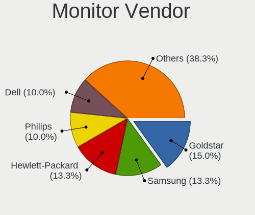
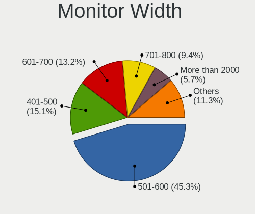
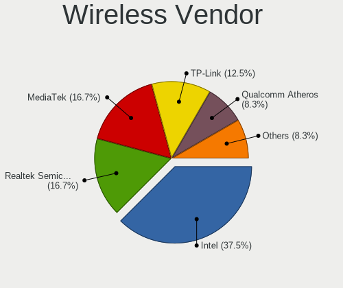
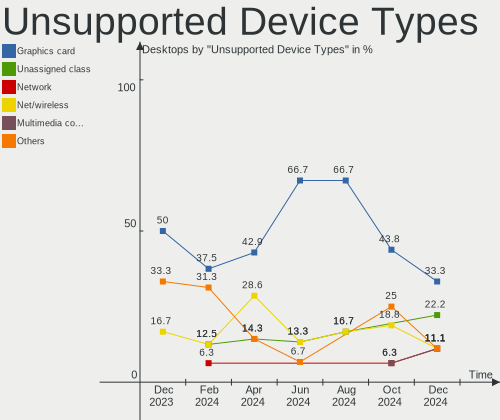

Kubuntu - Hardware Trends (Desktops)
------------------------------------

A project to identify most popular hardware characteristics and track their change
over time based on data collected by Linux users at https://Linux-Hardware.org.

Anyone can contribute to this report by the [hw-probe](https://github.com/linuxhw/hw-probe) tool:

    sudo -E hw-probe -all -upload

This report is for one last month. Overall report since the beginning of time: [TestDays](https://github.com/linuxhw/TestDays)

Period: Sep, 2023.

Contents
--------

* [ System ](#system)
  - [ OS                       ](#os)
  - [ OS Family                ](#os-family)
  - [ Kernel                   ](#kernel)
  - [ Kernel Family            ](#kernel-family)
  - [ Kernel Major Ver.        ](#kernel-major-ver)
  - [ Arch                     ](#arch)
  - [ DE                       ](#de)
  - [ Display Server           ](#display-server)
  - [ Display Manager          ](#display-manager)
  - [ OS Lang                  ](#os-lang)
  - [ Boot Mode                ](#boot-mode)
  - [ Filesystem               ](#filesystem)
  - [ Part. scheme             ](#part-scheme)
  - [ Dual Boot with Linux/BSD ](#dual-boot-with-linuxbsd)
  - [ Dual Boot (Win)          ](#dual-boot-win)

* [ Board ](#board)
  - [ Vendor                   ](#vendor)
  - [ Model                    ](#model)
  - [ Model Family             ](#model-family)
  - [ MFG Year                 ](#mfg-year)
  - [ Form Factor              ](#form-factor)
  - [ Secure Boot              ](#secure-boot)
  - [ Coreboot                 ](#coreboot)
  - [ RAM Size                 ](#ram-size)
  - [ RAM Used                 ](#ram-used)
  - [ Total Drives             ](#total-drives)
  - [ Has CD-ROM               ](#has-cd-rom)
  - [ Has Ethernet             ](#has-ethernet)
  - [ Has WiFi                 ](#has-wifi)
  - [ Has Bluetooth            ](#has-bluetooth)

* [ Location ](#location)
  - [ Country                  ](#country)
  - [ City                     ](#city)

* [ Drives ](#drives)
  - [ Drive Vendor             ](#drive-vendor)
  - [ Drive Model              ](#drive-model)
  - [ HDD Vendor               ](#hdd-vendor)
  - [ SSD Vendor               ](#ssd-vendor)
  - [ Drive Kind               ](#drive-kind)
  - [ Drive Connector          ](#drive-connector)
  - [ Drive Size               ](#drive-size)
  - [ Space Total              ](#space-total)
  - [ Space Used               ](#space-used)
  - [ Malfunc. Drives          ](#malfunc-drives)
  - [ Malfunc. Drive Vendor    ](#malfunc-drive-vendor)
  - [ Malfunc. HDD Vendor      ](#malfunc-hdd-vendor)
  - [ Malfunc. Drive Kind      ](#malfunc-drive-kind)
  - [ Failed Drives            ](#failed-drives)
  - [ Failed Drive Vendor      ](#failed-drive-vendor)
  - [ Drive Status             ](#drive-status)

* [ Storage controller ](#storage-controller)
  - [ Storage Vendor           ](#storage-vendor)
  - [ Storage Model            ](#storage-model)
  - [ Storage Kind             ](#storage-kind)

* [ Processor ](#processor)
  - [ CPU Vendor               ](#cpu-vendor)
  - [ CPU Model                ](#cpu-model)
  - [ CPU Model Family         ](#cpu-model-family)
  - [ CPU Cores                ](#cpu-cores)
  - [ CPU Sockets              ](#cpu-sockets)
  - [ CPU Threads              ](#cpu-threads)
  - [ CPU Op-Modes             ](#cpu-op-modes)
  - [ CPU Microcode            ](#cpu-microcode)
  - [ CPU Microarch            ](#cpu-microarch)

* [ Graphics ](#graphics)
  - [ GPU Vendor               ](#gpu-vendor)
  - [ GPU Model                ](#gpu-model)
  - [ GPU Combo                ](#gpu-combo)
  - [ GPU Driver               ](#gpu-driver)
  - [ GPU Memory               ](#gpu-memory)

* [ Monitor ](#monitor)
  - [ Monitor Vendor           ](#monitor-vendor)
  - [ Monitor Model            ](#monitor-model)
  - [ Monitor Resolution       ](#monitor-resolution)
  - [ Monitor Diagonal         ](#monitor-diagonal)
  - [ Monitor Width            ](#monitor-width)
  - [ Aspect Ratio             ](#aspect-ratio)
  - [ Monitor Area             ](#monitor-area)
  - [ Pixel Density            ](#pixel-density)
  - [ Multiple Monitors        ](#multiple-monitors)

* [ Network ](#network)
  - [ Net Controller Vendor    ](#net-controller-vendor)
  - [ Net Controller Model     ](#net-controller-model)
  - [ Wireless Vendor          ](#wireless-vendor)
  - [ Wireless Model           ](#wireless-model)
  - [ Ethernet Vendor          ](#ethernet-vendor)
  - [ Ethernet Model           ](#ethernet-model)
  - [ Net Controller Kind      ](#net-controller-kind)
  - [ Used Controller          ](#used-controller)
  - [ NICs                     ](#nics)
  - [ IPv6                     ](#ipv6)

* [ Bluetooth ](#bluetooth)
  - [ Bluetooth Vendor         ](#bluetooth-vendor)
  - [ Bluetooth Model          ](#bluetooth-model)

* [ Sound ](#sound)
  - [ Sound Vendor             ](#sound-vendor)
  - [ Sound Model              ](#sound-model)

* [ Memory ](#memory)
  - [ Memory Vendor            ](#memory-vendor)
  - [ Memory Model             ](#memory-model)
  - [ Memory Kind              ](#memory-kind)
  - [ Memory Form Factor       ](#memory-form-factor)
  - [ Memory Size              ](#memory-size)
  - [ Memory Speed             ](#memory-speed)

* [ Printers & scanners ](#printers--scanners)
  - [ Printer Vendor           ](#printer-vendor)
  - [ Printer Model            ](#printer-model)
  - [ Scanner Vendor           ](#scanner-vendor)
  - [ Scanner Model            ](#scanner-model)

* [ Camera ](#camera)
  - [ Camera Vendor            ](#camera-vendor)
  - [ Camera Model             ](#camera-model)

* [ Security ](#security)
  - [ Fingerprint Vendor       ](#fingerprint-vendor)
  - [ Fingerprint Model        ](#fingerprint-model)
  - [ Chipcard Vendor          ](#chipcard-vendor)
  - [ Chipcard Model           ](#chipcard-model)

* [ Unsupported ](#unsupported)
  - [ Unsupported Devices      ](#unsupported-devices)
  - [ Unsupported Device Types ](#unsupported-device-types)

System
------

OS
--

Installed operating systems

| Name          | Desktops | Percent |
|---------------|----------|---------|
| Kubuntu 22.04 | 25       | 51.02%  |
| Kubuntu 23.04 | 22       | 44.9%   |
| Kubuntu 23.10 | 1        | 2.04%   |
| Kubuntu 11    | 1        | 2.04%   |

OS Family
---------

OS without a version

| Name    | Desktops | Percent |
|---------|----------|---------|
| Kubuntu | 49       | 100%    |

Kernel
------

Version of the Linux kernel

| Version                | Desktops | Percent |
|------------------------|----------|---------|
| 6.2.0-32-generic       | 14       | 28.57%  |
| 6.2.0-33-generic       | 9        | 18.37%  |
| 5.15.0-83-generic      | 5        | 10.2%   |
| 6.2.0-31-generic       | 2        | 4.08%   |
| 6.2.0-1013-lowlatency  | 2        | 4.08%   |
| 6.5.3-060503-generic   | 1        | 2.04%   |
| 6.5.1-060501-generic   | 1        | 2.04%   |
| 6.5.0-5-generic        | 1        | 2.04%   |
| 6.5.0-1003-oem         | 1        | 2.04%   |
| 6.4.6-060406-generic   | 1        | 2.04%   |
| 6.3.8-1-liquorix-amd64 | 1        | 2.04%   |
| 6.2.0-26-generic       | 1        | 2.04%   |
| 6.2.0-1010-nvidia      | 1        | 2.04%   |
| 5.19.0-45-generic      | 1        | 2.04%   |
| 5.19.0-42-generic      | 1        | 2.04%   |
| 5.15.0-86-lowlatency   | 1        | 2.04%   |
| 5.15.0-84-generic      | 1        | 2.04%   |
| 5.15.0-83-lowlatency   | 1        | 2.04%   |
| 5.15.0-79-generic      | 1        | 2.04%   |
| 5.15.0-78-generic      | 1        | 2.04%   |
| 5.15.0-75-generic      | 1        | 2.04%   |
| 5.15.0-73-generic      | 1        | 2.04%   |

Kernel Family
-------------

Linux kernel without a distro release

| Version | Desktops | Percent |
|---------|----------|---------|
| 6.2.0   | 29       | 59.18%  |
| 5.15.0  | 12       | 24.49%  |
| 6.5.0   | 2        | 4.08%   |
| 5.19.0  | 2        | 4.08%   |
| 6.5.3   | 1        | 2.04%   |
| 6.5.1   | 1        | 2.04%   |
| 6.4.6   | 1        | 2.04%   |
| 6.3.8   | 1        | 2.04%   |

Kernel Major Ver.
-----------------

Linux kernel major version

| Version | Desktops | Percent |
|---------|----------|---------|
| 6.2     | 29       | 59.18%  |
| 5.15    | 12       | 24.49%  |
| 6.5     | 4        | 8.16%   |
| 5.19    | 2        | 4.08%   |
| 6.4     | 1        | 2.04%   |
| 6.3     | 1        | 2.04%   |

Arch
----

OS architecture (x86_64, i586, etc.)

| Name   | Desktops | Percent |
|--------|----------|---------|
| x86_64 | 49       | 100%    |

DE
--

Desktop Environment

| Name | Desktops | Percent |
|------|----------|---------|
| KDE5 | 49       | 100%    |

Display Server
--------------

X11 or Wayland

| Name    | Desktops | Percent |
|---------|----------|---------|
| X11     | 46       | 93.88%  |
| Wayland | 2        | 4.08%   |
| Tty     | 1        | 2.04%   |

Display Manager
---------------

SDDM, LightDM, etc.

| Name    | Desktops | Percent |
|---------|----------|---------|
| SDDM    | 35       | 71.43%  |
| Unknown | 13       | 26.53%  |
| GDM3    | 1        | 2.04%   |

OS Lang
-------

Language

| Lang            | Desktops | Percent |
|-----------------|----------|---------|
| en_US           | 20       | 40.82%  |
| de_DE           | 7        | 14.29%  |
| ru_RU           | 4        | 8.16%   |
| fr_FR           | 4        | 8.16%   |
| en_GB           | 4        | 8.16%   |
| pl_PL           | 1        | 2.04%   |
| nl_NL           | 1        | 2.04%   |
| nl_BE           | 1        | 2.04%   |
| it_IT           | 1        | 2.04%   |
| es_ES           | 1        | 2.04%   |
| es_CO           | 1        | 2.04%   |
| en_US.ISO8859-1 | 1        | 2.04%   |
| en_FI           | 1        | 2.04%   |
| en_CH           | 1        | 2.04%   |
| de_CH           | 1        | 2.04%   |

Boot Mode
---------

EFI or BIOS

| Mode | Desktops | Percent |
|------|----------|---------|
| BIOS | 26       | 53.06%  |
| EFI  | 23       | 46.94%  |

Filesystem
----------

Type of filesystem

| Type  | Desktops | Percent |
|-------|----------|---------|
| Ext4  | 35       | 71.43%  |
| Tmpfs | 11       | 22.45%  |
| Btrfs | 3        | 6.12%   |

Part. scheme
------------

Scheme of partitioning

| Type    | Desktops | Percent |
|---------|----------|---------|
| GPT     | 32       | 65.31%  |
| Unknown | 13       | 26.53%  |
| MBR     | 4        | 8.16%   |

Dual Boot with Linux/BSD
------------------------

Hosting more than one Linux/BSD

| Dual boot | Desktops | Percent |
|-----------|----------|---------|
| No        | 36       | 73.47%  |
| Yes       | 13       | 26.53%  |

Dual Boot (Win)
---------------

Hosting Linux and Windows

| Dual boot | Desktops | Percent |
|-----------|----------|---------|
| No        | 33       | 67.35%  |
| Yes       | 16       | 32.65%  |

Board
-----

Vendor
------

Motherboard manufacturer

| Name                | Desktops | Percent |
|---------------------|----------|---------|
| ASUSTek Computer    | 19       | 38.78%  |
| MSI                 | 7        | 14.29%  |
| Gigabyte Technology | 6        | 12.24%  |
| Hewlett-Packard     | 4        | 8.16%   |
| ASRock              | 4        | 8.16%   |
| Unknown             | 3        | 6.12%   |
| Lenovo              | 2        | 4.08%   |
| Dell                | 1        | 2.04%   |
| AZW                 | 1        | 2.04%   |
| Alienware           | 1        | 2.04%   |
| Acer                | 1        | 2.04%   |

Model
-----

Motherboard model

| Name                                        | Desktops | Percent |
|---------------------------------------------|----------|---------|
| Unknown                                     | 3        | 6.12%   |
| ASUS All Series                             | 2        | 4.08%   |
| MSI MS-7D75                                 | 1        | 2.04%   |
| MSI MS-7D17                                 | 1        | 2.04%   |
| MSI MS-7C86                                 | 1        | 2.04%   |
| MSI MS-7C56                                 | 1        | 2.04%   |
| MSI MS-7B78                                 | 1        | 2.04%   |
| MSI MS-7B24                                 | 1        | 2.04%   |
| MSI MS-7924                                 | 1        | 2.04%   |
| Lenovo IdeaCentre Gaming5 17IAB7 90T100BHMZ | 1        | 2.04%   |
| Lenovo IdeaCentre 3 07ADA05 90MV0059RS      | 1        | 2.04%   |
| HP Z220 CMT Workstation                     | 1        | 2.04%   |
| HP xw6600 Workstation                       | 1        | 2.04%   |
| HP ProDesk 600 G1 SFF                       | 1        | 2.04%   |
| HP EliteDesk 800 G1 SFF                     | 1        | 2.04%   |
| Gigabyte H510M H                            | 1        | 2.04%   |
| Gigabyte H310M H                            | 1        | 2.04%   |
| Gigabyte GA-970A-DS3                        | 1        | 2.04%   |
| Gigabyte B650M AORUS ELITE AX               | 1        | 2.04%   |
| Gigabyte B550M AORUS ELITE                  | 1        | 2.04%   |
| Gigabyte AX370-Gaming K7                    | 1        | 2.04%   |
| Dell Precision WorkStation T7500            | 1        | 2.04%   |
| AZW MINI S                                  | 1        | 2.04%   |
| ASUS TUF Z390-PRO GAMING                    | 1        | 2.04%   |
| ASUS TUF X470-PLUS GAMING                   | 1        | 2.04%   |
| ASUS TUF Gaming Z590-PLUS WIFI              | 1        | 2.04%   |
| ASUS TUF Gaming X570-PLUS                   | 1        | 2.04%   |
| ASUS ROG STRIX B560-A GAMING WIFI           | 1        | 2.04%   |
| ASUS ROG STRIX B450-I GAMING                | 1        | 2.04%   |
| ASUS PRIME Z390-P                           | 1        | 2.04%   |
| ASUS PRIME X670-P WIFI                      | 1        | 2.04%   |
| ASUS PRIME X670-P                           | 1        | 2.04%   |
| ASUS PRIME X470-PRO                         | 1        | 2.04%   |
| ASUS PRIME X370-PRO                         | 1        | 2.04%   |
| ASUS PRIME B365M-A                          | 1        | 2.04%   |
| ASUS PRIME A320M-K                          | 1        | 2.04%   |
| ASUS Maximus IX FORMULA                     | 1        | 2.04%   |
| ASUS EB1501P                                | 1        | 2.04%   |
| ASUS Amd Am5                                | 1        | 2.04%   |
| ASUS A0000001                               | 1        | 2.04%   |

Model Family
------------

Motherboard model prefix

| Name                     | Desktops | Percent |
|--------------------------|----------|---------|
| ASUS PRIME               | 7        | 14.29%  |
| ASUS TUF                 | 4        | 8.16%   |
| Unknown                  | 3        | 6.12%   |
| Lenovo IdeaCentre        | 2        | 4.08%   |
| ASUS ROG                 | 2        | 4.08%   |
| ASUS All                 | 2        | 4.08%   |
| MSI MS-7D75              | 1        | 2.04%   |
| MSI MS-7D17              | 1        | 2.04%   |
| MSI MS-7C86              | 1        | 2.04%   |
| MSI MS-7C56              | 1        | 2.04%   |
| MSI MS-7B78              | 1        | 2.04%   |
| MSI MS-7B24              | 1        | 2.04%   |
| MSI MS-7924              | 1        | 2.04%   |
| HP Z220                  | 1        | 2.04%   |
| HP xw6600                | 1        | 2.04%   |
| HP ProDesk               | 1        | 2.04%   |
| HP EliteDesk             | 1        | 2.04%   |
| Gigabyte H510M           | 1        | 2.04%   |
| Gigabyte H310M           | 1        | 2.04%   |
| Gigabyte GA-970A-DS3     | 1        | 2.04%   |
| Gigabyte B650M           | 1        | 2.04%   |
| Gigabyte B550M           | 1        | 2.04%   |
| Gigabyte AX370-Gaming    | 1        | 2.04%   |
| Dell Precision           | 1        | 2.04%   |
| AZW MINI                 | 1        | 2.04%   |
| ASUS Maximus             | 1        | 2.04%   |
| ASUS EB1501P             | 1        | 2.04%   |
| ASUS Amd                 | 1        | 2.04%   |
| ASUS A0000001            | 1        | 2.04%   |
| ASRock Z68               | 1        | 2.04%   |
| ASRock H87               | 1        | 2.04%   |
| ASRock B650M             | 1        | 2.04%   |
| ASRock ALiveXFire-eSATA2 | 1        | 2.04%   |
| Alienware Aurora         | 1        | 2.04%   |
| Acer Aspire              | 1        | 2.04%   |

MFG Year
--------

Motherboard manufacture year

| Year | Desktops | Percent |
|------|----------|---------|
| 2018 | 9        | 18.37%  |
| 2022 | 8        | 16.33%  |
| 2020 | 4        | 8.16%   |
| 2019 | 4        | 8.16%   |
| 2021 | 3        | 6.12%   |
| 2017 | 3        | 6.12%   |
| 2013 | 3        | 6.12%   |
| 2012 | 3        | 6.12%   |
| 2023 | 2        | 4.08%   |
| 2014 | 2        | 4.08%   |
| 2009 | 2        | 4.08%   |
| 2008 | 2        | 4.08%   |
| 2016 | 1        | 2.04%   |
| 2011 | 1        | 2.04%   |
| 2010 | 1        | 2.04%   |
| 2007 | 1        | 2.04%   |

Form Factor
-----------

Physical design of the computer

| Name    | Desktops | Percent |
|---------|----------|---------|
| Desktop | 49       | 100%    |

Secure Boot
-----------

Enabled or disabled

| State    | Desktops | Percent |
|----------|----------|---------|
| Disabled | 48       | 97.96%  |
| Enabled  | 1        | 2.04%   |

Coreboot
--------

Have coreboot on board

| Used | Desktops | Percent |
|------|----------|---------|
| No   | 49       | 100%    |

RAM Size
--------

Total RAM memory

| Size in GB  | Desktops | Percent |
|-------------|----------|---------|
| 16.01-24.0  | 13       | 26.53%  |
| 32.01-64.0  | 11       | 22.45%  |
| 4.01-8.0    | 6        | 12.24%  |
| 24.01-32.0  | 6        | 12.24%  |
| 64.01-256.0 | 6        | 12.24%  |
| 8.01-16.0   | 6        | 12.24%  |
| 3.01-4.0    | 1        | 2.04%   |

RAM Used
--------

Used RAM memory

| Used GB    | Desktops | Percent |
|------------|----------|---------|
| 4.01-8.0   | 19       | 38.78%  |
| 2.01-3.0   | 10       | 20.41%  |
| 3.01-4.0   | 9        | 18.37%  |
| 1.01-2.0   | 7        | 14.29%  |
| 16.01-24.0 | 2        | 4.08%   |
| 8.01-16.0  | 1        | 2.04%   |
| 0.51-1.0   | 1        | 2.04%   |

Total Drives
------------

Number of drives on board

| Drives | Desktops | Percent |
|--------|----------|---------|
| 1      | 11       | 22.45%  |
| 4      | 10       | 20.41%  |
| 3      | 10       | 20.41%  |
| 2      | 9        | 18.37%  |
| 5      | 4        | 8.16%   |
| 6      | 3        | 6.12%   |
| 7      | 2        | 4.08%   |

Has CD-ROM
----------

Has CD-ROM on board

| Presented | Desktops | Percent |
|-----------|----------|---------|
| No        | 25       | 51.02%  |
| Yes       | 24       | 48.98%  |

Has Ethernet
------------

Has Ethernet on board

| Presented | Desktops | Percent |
|-----------|----------|---------|
| Yes       | 49       | 100%    |

Has WiFi
--------

Has WiFi module

| Presented | Desktops | Percent |
|-----------|----------|---------|
| No        | 28       | 57.14%  |
| Yes       | 21       | 42.86%  |

Has Bluetooth
-------------

Has Bluetooth module

| Presented | Desktops | Percent |
|-----------|----------|---------|
| Yes       | 26       | 53.06%  |
| No        | 23       | 46.94%  |

Location
--------

Country
-------

Geographic location (country)

| Country     | Desktops | Percent |
|-------------|----------|---------|
| USA         | 11       | 22.45%  |
| Germany     | 8        | 16.33%  |
| France      | 5        | 10.2%   |
| UK          | 4        | 8.16%   |
| Russia      | 4        | 8.16%   |
| Switzerland | 2        | 4.08%   |
| Netherlands | 2        | 4.08%   |
| Turkey      | 1        | 2.04%   |
| Sweden      | 1        | 2.04%   |
| Spain       | 1        | 2.04%   |
| Romania     | 1        | 2.04%   |
| Poland      | 1        | 2.04%   |
| Italy       | 1        | 2.04%   |
| Finland     | 1        | 2.04%   |
| Chile       | 1        | 2.04%   |
| Canada      | 1        | 2.04%   |
| Bulgaria    | 1        | 2.04%   |
| Belgium     | 1        | 2.04%   |
| Bangladesh  | 1        | 2.04%   |
| Austria     | 1        | 2.04%   |

City
----

Geographic location (city)

| City                | Desktops | Percent |
|---------------------|----------|---------|
| Arzamas             | 2        | 4.08%   |
| Zuchwil             | 1        | 2.04%   |
| Wolfschlugen        | 1        | 2.04%   |
| Victoria            | 1        | 2.04%   |
| Varna               | 1        | 2.04%   |
| Vaggeryd            | 1        | 2.04%   |
| Ufa                 | 1        | 2.04%   |
| Stone Mountain      | 1        | 2.04%   |
| Southampton         | 1        | 2.04%   |
| Sindelfingen        | 1        | 2.04%   |
| Sibiu               | 1        | 2.04%   |
| Sheffield           | 1        | 2.04%   |
| Santiago            | 1        | 2.04%   |
| San Francisco       | 1        | 2.04%   |
| Roissy-en-Brie      | 1        | 2.04%   |
| Rho                 | 1        | 2.04%   |
| Pontarlier          | 1        | 2.04%   |
| Oxford              | 1        | 2.04%   |
| Oldenburg           | 1        | 2.04%   |
| North Little Rock   | 1        | 2.04%   |
| Morehead City       | 1        | 2.04%   |
| Montevrain          | 1        | 2.04%   |
| Miami               | 1        | 2.04%   |
| Mataró             | 1        | 2.04%   |
| Lubon               | 1        | 2.04%   |
| Lake Saint Louis    | 1        | 2.04%   |
| La Seyne-sur-Mer    | 1        | 2.04%   |
| Jena                | 1        | 2.04%   |
| Istanbul            | 1        | 2.04%   |
| Irkutsk             | 1        | 2.04%   |
| Ihlow               | 1        | 2.04%   |
| Hendrik-Ido-Ambacht | 1        | 2.04%   |
| Helsinki            | 1        | 2.04%   |
| Hamburg             | 1        | 2.04%   |
| Hallein             | 1        | 2.04%   |
| Halle               | 1        | 2.04%   |
| Geneva              | 1        | 2.04%   |
| Frankfurt am Main   | 1        | 2.04%   |
| Elkridge            | 1        | 2.04%   |
| Dhaka               | 1        | 2.04%   |

Drives
------

Drive Vendor
------------

Hard drive vendors

| Vendor                      | Desktops | Drives | Percent |
|-----------------------------|----------|--------|---------|
| Samsung Electronics         | 22       | 34     | 19.64%  |
| Seagate                     | 19       | 25     | 16.96%  |
| WDC                         | 15       | 24     | 13.39%  |
| SanDisk                     | 10       | 13     | 8.93%   |
| Toshiba                     | 8        | 10     | 7.14%   |
| Kingston                    | 5        | 7      | 4.46%   |
| Crucial                     | 4        | 4      | 3.57%   |
| Kingston Technology Company | 3        | 4      | 2.68%   |
| Silicon Motion              | 2        | 2      | 1.79%   |
| MAXIO Technology (Hangzhou) | 2        | 2      | 1.79%   |
| A-DATA Technology           | 2        | 2      | 1.79%   |
| Transcend                   | 1        | 1      | 0.89%   |
| Team                        | 1        | 1      | 0.89%   |
| SPCC                        | 1        | 1      | 0.89%   |
| SABRENT                     | 1        | 1      | 0.89%   |
| PNY                         | 1        | 1      | 0.89%   |
| Plextor                     | 1        | 1      | 0.89%   |
| Micron/Crucial Technology   | 1        | 2      | 0.89%   |
| M.2 SSD                     | 1        | 1      | 0.89%   |
| LDLC                        | 1        | 2      | 0.89%   |
| KIOXIA-EXCERIA              | 1        | 1      | 0.89%   |
| JMicron Technology          | 1        | 1      | 0.89%   |
| Intenso                     | 1        | 1      | 0.89%   |
| Intel                       | 1        | 1      | 0.89%   |
| Inateck                     | 1        | 1      | 0.89%   |
| Hjwdz                       | 1        | 1      | 0.89%   |
| HGST                        | 1        | 1      | 0.89%   |
| Hewlett-Packard             | 1        | 2      | 0.89%   |
| Corsair                     | 1        | 2      | 0.89%   |
| AMD                         | 1        | 1      | 0.89%   |
| Unknown                     | 1        | 1      | 0.89%   |

Drive Model
-----------

Hard drive models

| Model                                                 | Desktops | Percent |
|-------------------------------------------------------|----------|---------|
| Seagate ST2000DM008-2FR102 2TB                        | 4        | 2.8%    |
| Seagate ST2000DM001-1ER164 2TB                        | 3        | 2.1%    |
| Samsung SSD 860 EVO 500GB                             | 3        | 2.1%    |
| Toshiba DT01ACA100 1TB                                | 2        | 1.4%    |
| Silicon Motion SM2263EN/SM2263XT SSD Controller 512GB | 2        | 1.4%    |
| SanDisk SSD PLUS 1000GB                               | 2        | 1.4%    |
| SanDisk SDSSDH3 1T00 1TB                              | 2        | 1.4%    |
| SanDisk NVMe SSD Drive 1TB                            | 2        | 1.4%    |
| Samsung SSD 980 1TB                                   | 2        | 1.4%    |
| Samsung SSD 970 EVO Plus 500GB                        | 2        | 1.4%    |
| Samsung SSD 860 EVO 1TB                               | 2        | 1.4%    |
| Samsung SSD 850 EVO 500GB                             | 2        | 1.4%    |
| Samsung SSD 850 EVO 250GB                             | 2        | 1.4%    |
| Samsung NVMe SSD Controller SM981/PM981/PM983 256GB   | 2        | 1.4%    |
| MAXIO (Hangzhou) NVMe SSD Controller MAP1202 512GB    | 2        | 1.4%    |
| Kingston Company A2000 NVMe SSD 1TB                   | 2        | 1.4%    |
| Crucial CT240BX500SSD1 240GB                          | 2        | 1.4%    |
| WDC WDS500G2B0B-00YS70 500GB SSD                      | 1        | 0.7%    |
| WDC WDS500G1B0B-00AS40 500GB SSD                      | 1        | 0.7%    |
| WDC WDS400T2B0A-00SM50 4TB SSD                        | 1        | 0.7%    |
| WDC WD7502ABYS-02A6B0 752GB                           | 1        | 0.7%    |
| WDC WD42PURZ-85B4YY0 4TB                              | 1        | 0.7%    |
| WDC WD40EZRZ-00GXCB0 4TB                              | 1        | 0.7%    |
| WDC WD4003FFBX-68MU3N0 4TB                            | 1        | 0.7%    |
| WDC WD30EFRX-68AX9N0 3TB                              | 1        | 0.7%    |
| WDC WD2005FBYZ-01YCBB1 2TB                            | 1        | 0.7%    |
| WDC WD10EZEX-60WN4A0 1TB                              | 1        | 0.7%    |
| WDC WD10EZEX-08WN4A0 1TB                              | 1        | 0.7%    |
| WDC WD10EVDS-63N5B1 1TB                               | 1        | 0.7%    |
| WDC WD10EARX-00N0YB0 1TB                              | 1        | 0.7%    |
| WDC WD10EARS-22Y5B1 1TB                               | 1        | 0.7%    |
| WDC WD10EADS-65L5B1 1TB                               | 1        | 0.7%    |
| WDC WD1005FBYZ-01YCBB1 1TB                            | 1        | 0.7%    |
| WDC WD1003FBYZ-010FB0 1TB                             | 1        | 0.7%    |
| WDC WD1003FBYX-01Y7B1 1TB                             | 1        | 0.7%    |
| WDC WD1002FBYS-02A6B0 1TB                             | 1        | 0.7%    |
| WDC WD1002FAEX-00Z3A0 1TB                             | 1        | 0.7%    |
| WDC WD Blue SA510 2.5 500GB                           | 1        | 0.7%    |
| WDC PC SN530 SDBPMPZ-256G-1001 256GB                  | 1        | 0.7%    |
| Transcend TS128GSSD230S 128GB                         | 1        | 0.7%    |

HDD Vendor
----------

Hard disk drive vendors

| Vendor              | Desktops | Drives | Percent |
|---------------------|----------|--------|---------|
| Seagate             | 18       | 24     | 41.86%  |
| WDC                 | 11       | 19     | 25.58%  |
| Toshiba             | 8        | 9      | 18.6%   |
| Samsung Electronics | 4        | 4      | 9.3%    |
| SABRENT             | 1        | 1      | 2.33%   |
| HGST                | 1        | 1      | 2.33%   |

SSD Vendor
----------

Solid state drive vendors

| Vendor              | Desktops | Drives | Percent |
|---------------------|----------|--------|---------|
| Samsung Electronics | 15       | 16     | 34.09%  |
| SanDisk             | 6        | 9      | 13.64%  |
| WDC                 | 4        | 4      | 9.09%   |
| Kingston            | 4        | 5      | 9.09%   |
| Crucial             | 4        | 4      | 9.09%   |
| A-DATA Technology   | 2        | 2      | 4.55%   |
| Transcend           | 1        | 1      | 2.27%   |
| Toshiba             | 1        | 1      | 2.27%   |
| SPCC                | 1        | 1      | 2.27%   |
| PNY                 | 1        | 1      | 2.27%   |
| Plextor             | 1        | 1      | 2.27%   |
| KIOXIA-EXCERIA      | 1        | 1      | 2.27%   |
| JMicron Technology  | 1        | 1      | 2.27%   |
| Hewlett-Packard     | 1        | 1      | 2.27%   |
| AMD                 | 1        | 1      | 2.27%   |

Drive Kind
----------

HDD or SSD

| Kind    | Desktops | Drives | Percent |
|---------|----------|--------|---------|
| SSD     | 33       | 49     | 34.02%  |
| HDD     | 32       | 58     | 32.99%  |
| NVMe    | 27       | 38     | 27.84%  |
| Unknown | 5        | 6      | 5.15%   |

Drive Connector
---------------

SATA, SAS, NVMe, etc.

| Type | Desktops | Drives | Percent |
|------|----------|--------|---------|
| SATA | 42       | 105    | 56%     |
| NVMe | 25       | 36     | 33.33%  |
| SAS  | 8        | 10     | 10.67%  |

Drive Size
----------

Size of hard drive

| Size in TB | Desktops | Drives | Percent |
|------------|----------|--------|---------|
| 0.01-0.5   | 29       | 35     | 36.25%  |
| 0.51-1.0   | 26       | 43     | 32.5%   |
| 1.01-2.0   | 15       | 18     | 18.75%  |
| 3.01-4.0   | 6        | 7      | 7.5%    |
| 2.01-3.0   | 2        | 2      | 2.5%    |
| 4.01-10.0  | 2        | 2      | 2.5%    |

Space Total
-----------

Amount of disk space available on the file system

| Size in GB     | Desktops | Percent |
|----------------|----------|---------|
| More than 3000 | 12       | 24.49%  |
| 501-1000       | 11       | 22.45%  |
| 101-250        | 10       | 20.41%  |
| 1001-2000      | 6        | 12.24%  |
| 251-500        | 5        | 10.2%   |
| 2001-3000      | 4        | 8.16%   |
| 21-50          | 1        | 2.04%   |

Space Used
----------

Amount of used disk space

| Used GB        | Desktops | Percent |
|----------------|----------|---------|
| 101-250        | 10       | 20.41%  |
| 21-50          | 7        | 14.29%  |
| 251-500        | 6        | 12.24%  |
| 501-1000       | 6        | 12.24%  |
| 1-20           | 5        | 10.2%   |
| More than 3000 | 4        | 8.16%   |
| 2001-3000      | 4        | 8.16%   |
| 51-100         | 4        | 8.16%   |
| 1001-2000      | 3        | 6.12%   |

Malfunc. Drives
---------------

Drive models with a malfunction

| Model                                 | Desktops | Drives | Percent |
|---------------------------------------|----------|--------|---------|
| WDC WD7502ABYS-02A6B0 752GB           | 1        | 1      | 11.11%  |
| WDC WD10EADS-65L5B1 1TB               | 1        | 1      | 11.11%  |
| Seagate ST9500325AS 500GB             | 1        | 1      | 11.11%  |
| Seagate ST500DM002-1BD142 500GB       | 1        | 1      | 11.11%  |
| Seagate ST1000VX000-1CU162 1TB        | 1        | 1      | 11.11%  |
| Samsung Electronics SSD 870 EVO 500GB | 1        | 1      | 11.11%  |
| Samsung Electronics HD501LJ 500GB     | 1        | 1      | 11.11%  |
| Intel SSDPEKNW512G8 512GB             | 1        | 1      | 11.11%  |
| HGST HTS541010A9E680 1TB              | 1        | 1      | 11.11%  |

Malfunc. Drive Vendor
---------------------

Vendors of faulty drives

| Vendor              | Desktops | Drives | Percent |
|---------------------|----------|--------|---------|
| Seagate             | 3        | 3      | 33.33%  |
| WDC                 | 2        | 2      | 22.22%  |
| Samsung Electronics | 2        | 2      | 22.22%  |
| Intel               | 1        | 1      | 11.11%  |
| HGST                | 1        | 1      | 11.11%  |

Malfunc. HDD Vendor
-------------------

Vendors of faulty HDD drives

| Vendor              | Desktops | Drives | Percent |
|---------------------|----------|--------|---------|
| Seagate             | 3        | 3      | 42.86%  |
| WDC                 | 2        | 2      | 28.57%  |
| Samsung Electronics | 1        | 1      | 14.29%  |
| HGST                | 1        | 1      | 14.29%  |

Malfunc. Drive Kind
-------------------

Kinds of faulty drives

| Kind | Desktops | Drives | Percent |
|------|----------|--------|---------|
| HDD  | 5        | 7      | 71.43%  |
| NVMe | 1        | 1      | 14.29%  |
| SSD  | 1        | 1      | 14.29%  |

Failed Drives
-------------

Failed drive models

Zero info for selected period =(

Failed Drive Vendor
-------------------

Failed drive vendors

Zero info for selected period =(

Drive Status
------------

Number of failed and malfunc. drives

| Status   | Desktops | Drives | Percent |
|----------|----------|--------|---------|
| Detected | 31       | 82     | 51.67%  |
| Works    | 22       | 60     | 36.67%  |
| Malfunc  | 7        | 9      | 11.67%  |

Storage controller
------------------

Storage Vendor
--------------

Storage controller vendors

| Vendor                      | Desktops | Percent |
|-----------------------------|----------|---------|
| Intel                       | 29       | 34.94%  |
| AMD                         | 20       | 24.1%   |
| Samsung Electronics         | 11       | 13.25%  |
| SanDisk                     | 5        | 6.02%   |
| Silicon Motion              | 4        | 4.82%   |
| Kingston Technology Company | 4        | 4.82%   |
| ASMedia Technology          | 3        | 3.61%   |
| MAXIO Technology (Hangzhou) | 2        | 2.41%   |
| Silicon Image               | 1        | 1.2%    |
| Phison Electronics          | 1        | 1.2%    |
| Micron/Crucial Technology   | 1        | 1.2%    |
| LSI Logic / Symbios Logic   | 1        | 1.2%    |
| JMicron Technology          | 1        | 1.2%    |

Storage Model
-------------

Storage controller models

| Model                                                                                   | Desktops | Percent |
|-----------------------------------------------------------------------------------------|----------|---------|
| AMD FCH SATA Controller [AHCI mode]                                                     | 15       | 15%     |
| Samsung NVMe SSD Controller SM981/PM981/PM983                                           | 5        | 5%      |
| Silicon Motion SM2263EN/SM2263XT (DRAM-less) NVMe SSD Controllers                       | 4        | 4%      |
| Intel Cannon Lake PCH SATA AHCI Controller                                              | 4        | 4%      |
| Intel 500 Series Chipset Family SATA AHCI Controller                                    | 4        | 4%      |
| AMD 400 Series Chipset SATA Controller                                                  | 4        | 4%      |
| SanDisk WD Black SN770 / PC SN740 256GB / PC SN560 (DRAM-less) NVMe SSD                 | 3        | 3%      |
| Intel SATA Controller [RAID mode]                                                       | 3        | 3%      |
| Intel 8 Series/C220 Series Chipset Family 6-port SATA Controller 1 [AHCI mode]          | 3        | 3%      |
| ASMedia ASM1062 Serial ATA Controller                                                   | 3        | 3%      |
| Samsung NVMe SSD Controller PM9A1/PM9A3/980PRO                                          | 2        | 2%      |
| Samsung NVMe SSD Controller 980                                                         | 2        | 2%      |
| MAXIO (Hangzhou) NVMe SSD Controller MAP1202                                            | 2        | 2%      |
| Kingston Company Company Non-Volatile memory controller                                 | 2        | 2%      |
| Kingston Company A2000 NVMe SSD                                                         | 2        | 2%      |
| Intel 82801JI (ICH10 Family) SATA AHCI Controller                                       | 2        | 2%      |
| Intel 6 Series/C200 Series Chipset Family Desktop SATA Controller (IDE mode, ports 4-5) | 2        | 2%      |
| Intel 6 Series/C200 Series Chipset Family Desktop SATA Controller (IDE mode, ports 0-3) | 2        | 2%      |
| Intel 200 Series PCH SATA controller [AHCI mode]                                        | 2        | 2%      |
| AMD X370 Series Chipset SATA Controller                                                 | 2        | 2%      |
| AMD 500 Series Chipset SATA Controller                                                  | 2        | 2%      |
| Silicon Image SiI 3132 Serial ATA Raid II Controller                                    | 1        | 1%      |
| Sandisk Western Digital WD Black SN850X NVMe SSD                                        | 1        | 1%      |
| SanDisk PC SN530 NVMe SSD (DRAM-less)                                                   | 1        | 1%      |
| Samsung NVMe SSD Controller SM961/PM961/SM963                                           | 1        | 1%      |
| Samsung NVMe SSD Controller SM951/PM951                                                 | 1        | 1%      |
| Samsung NVMe SSD Controller S4LV008[Pascal]                                             | 1        | 1%      |
| Phison PS5021-E21 PCIe4 NVMe Controller (DRAM-less)                                     | 1        | 1%      |
| Micron/Crucial P2 [Nick P2] / P3 / P3 Plus NVMe PCIe SSD (DRAM-less)                    | 1        | 1%      |
| Micron/Crucial P1 NVMe PCIe SSD[Frampton]                                               | 1        | 1%      |
| LSI Logic / Symbios Logic SAS1068E PCI-Express Fusion-MPT SAS                           | 1        | 1%      |
| Kingston Company U-SNS8154P3 NVMe SSD                                                   | 1        | 1%      |
| Kingston Company KC3000/Renegade NVMe SSD                                               | 1        | 1%      |
| JMicron JMB363 SATA/IDE Controller                                                      | 1        | 1%      |
| Intel SSD 660P Series                                                                   | 1        | 1%      |
| Intel SATA controller                                                                   | 1        | 1%      |
| Intel NM10/ICH7 Family SATA Controller [AHCI mode]                                      | 1        | 1%      |
| Intel C610/X99 series chipset 6-Port SATA Controller [AHCI mode]                        | 1        | 1%      |
| Intel Alder Lake-S PCH SATA Controller [AHCI Mode]                                      | 1        | 1%      |
| Intel Alder Lake-P SATA AHCI Controller                                                 | 1        | 1%      |

Storage Kind
------------

Kind of storage controller (IDE, SATA, NVMe, SAS, ...)

| Kind | Desktops | Percent |
|------|----------|---------|
| SATA | 43       | 54.43%  |
| NVMe | 25       | 31.65%  |
| IDE  | 6        | 7.59%   |
| RAID | 4        | 5.06%   |
| SCSI | 1        | 1.27%   |

Processor
---------

CPU Vendor
----------

Processor vendors

| Vendor | Desktops | Percent |
|--------|----------|---------|
| Intel  | 29       | 59.18%  |
| AMD    | 20       | 40.82%  |

CPU Model
---------

Processor models

| Model                                         | Desktops | Percent |
|-----------------------------------------------|----------|---------|
| AMD Ryzen 5 3600 6-Core Processor             | 3        | 6.12%   |
| Intel Core i7 CPU 920 @ 2.67GHz               | 2        | 4.08%   |
| Intel 11th Gen Core i5-11400F @ 2.60GHz       | 2        | 4.08%   |
| AMD Ryzen 5 7600X 6-Core Processor            | 2        | 4.08%   |
| Intel Xeon CPU W5580 @ 3.20GHz                | 1        | 2.04%   |
| Intel Xeon CPU E5430 @ 2.66GHz                | 1        | 2.04%   |
| Intel N100                                    | 1        | 2.04%   |
| Intel Core i9-9900K CPU @ 3.60GHz             | 1        | 2.04%   |
| Intel Core i9-10900T CPU @ 1.90GHz            | 1        | 2.04%   |
| Intel Core i7-6700K CPU @ 4.00GHz             | 1        | 2.04%   |
| Intel Core i7-5960X CPU @ 3.00GHz             | 1        | 2.04%   |
| Intel Core i7-4790 CPU @ 3.60GHz              | 1        | 2.04%   |
| Intel Core i7-4771 CPU @ 3.50GHz              | 1        | 2.04%   |
| Intel Core i7-4770 CPU @ 3.40GHz              | 1        | 2.04%   |
| Intel Core i7-3770 CPU @ 3.40GHz              | 1        | 2.04%   |
| Intel Core i5-9600K CPU @ 3.70GHz             | 1        | 2.04%   |
| Intel Core i5-9400 CPU @ 2.90GHz              | 1        | 2.04%   |
| Intel Core i5-8400 CPU @ 2.80GHz              | 1        | 2.04%   |
| Intel Core i5-4690 CPU @ 3.50GHz              | 1        | 2.04%   |
| Intel Core i5-4590 CPU @ 3.30GHz              | 1        | 2.04%   |
| Intel Core i5-2500K CPU @ 3.30GHz             | 1        | 2.04%   |
| Intel Core i5-2400 CPU @ 3.10GHz              | 1        | 2.04%   |
| Intel Core i5-2300 CPU @ 2.80GHz              | 1        | 2.04%   |
| Intel Celeron G5905 CPU @ 3.50GHz             | 1        | 2.04%   |
| Intel Celeron G4900 CPU @ 3.10GHz             | 1        | 2.04%   |
| Intel Atom CPU D525 @ 1.80GHz                 | 1        | 2.04%   |
| Intel 12th Gen Core i5-12400F                 | 1        | 2.04%   |
| Intel 12th Gen Core i3-1220P                  | 1        | 2.04%   |
| Intel 11th Gen Core i7-11700K @ 3.60GHz       | 1        | 2.04%   |
| AMD Ryzen 9 7950X3D 16-Core Processor         | 1        | 2.04%   |
| AMD Ryzen 9 7950X 16-Core Processor           | 1        | 2.04%   |
| AMD Ryzen 9 5950X 16-Core Processor           | 1        | 2.04%   |
| AMD Ryzen 7 7800X3D 8-Core Processor          | 1        | 2.04%   |
| AMD Ryzen 7 7700X 8-Core Processor            | 1        | 2.04%   |
| AMD Ryzen 7 2700X Eight-Core Processor        | 1        | 2.04%   |
| AMD Ryzen 7 1700 Eight-Core Processor         | 1        | 2.04%   |
| AMD Ryzen 5 5600X 6-Core Processor            | 1        | 2.04%   |
| AMD Ryzen 5 5500                              | 1        | 2.04%   |
| AMD Ryzen 5 3500U with Radeon Vega Mobile Gfx | 1        | 2.04%   |
| AMD Ryzen 5 2600 Six-Core Processor           | 1        | 2.04%   |

CPU Model Family
----------------

Processor model prefix

| Model            | Desktops | Percent |
|------------------|----------|---------|
| AMD Ryzen 5      | 11       | 22.45%  |
| Intel Core i7    | 8        | 16.33%  |
| Intel Core i5    | 8        | 16.33%  |
| Other            | 6        | 12.24%  |
| AMD Ryzen 7      | 4        | 8.16%   |
| AMD Ryzen 9      | 3        | 6.12%   |
| Intel Xeon       | 2        | 4.08%   |
| Intel Core i9    | 2        | 4.08%   |
| Intel Celeron    | 2        | 4.08%   |
| Intel Atom       | 1        | 2.04%   |
| AMD Phenom II X4 | 1        | 2.04%   |
| AMD FX           | 1        | 2.04%   |

CPU Cores
---------

Number of processor cores

| Number | Desktops | Percent |
|--------|----------|---------|
| 4      | 16       | 32.65%  |
| 6      | 15       | 30.61%  |
| 8      | 8        | 16.33%  |
| 16     | 3        | 6.12%   |
| 2      | 3        | 6.12%   |
| 10     | 2        | 4.08%   |
| 3      | 1        | 2.04%   |
| 1      | 1        | 2.04%   |

CPU Sockets
-----------

Number of sockets

| Number | Desktops | Percent |
|--------|----------|---------|
| 1      | 48       | 97.96%  |
| 2      | 1        | 2.04%   |

CPU Threads
-----------

Threads per core (Hyper-Threading)

| Number | Desktops | Percent |
|--------|----------|---------|
| 2      | 36       | 73.47%  |
| 1      | 13       | 26.53%  |

CPU Op-Modes
------------

CPU Operation Modes (32-bit, 64-bit)

| Op mode        | Desktops | Percent |
|----------------|----------|---------|
| 32-bit, 64-bit | 49       | 100%    |

CPU Microcode
-------------

Microcode number

| Number     | Desktops | Percent |
|------------|----------|---------|
| Unknown    | 34       | 69.39%  |
| 0x0a601203 | 5        | 10.2%   |
| 0x906ea    | 1        | 2.04%   |
| 0x306c3    | 1        | 2.04%   |
| 0x206a7    | 1        | 2.04%   |
| 0x0a50000d | 1        | 2.04%   |
| 0x0a20120a | 1        | 2.04%   |
| 0x0a201025 | 1        | 2.04%   |
| 0x08701013 | 1        | 2.04%   |
| 0x08108109 | 1        | 2.04%   |
| 0x0800820d | 1        | 2.04%   |
| 0x08001126 | 1        | 2.04%   |

CPU Microarch
-------------

Microarchitecture

| Name             | Desktops | Percent |
|------------------|----------|---------|
| Unknown          | 9        | 18.37%  |
| Haswell          | 6        | 12.24%  |
| KabyLake         | 5        | 10.2%   |
| Zen+             | 3        | 6.12%   |
| Zen 3            | 3        | 6.12%   |
| Zen 2            | 3        | 6.12%   |
| Zen              | 3        | 6.12%   |
| SandyBridge      | 3        | 6.12%   |
| Nehalem          | 3        | 6.12%   |
| Icelake          | 2        | 4.08%   |
| CometLake        | 2        | 4.08%   |
| Skylake          | 1        | 2.04%   |
| Piledriver       | 1        | 2.04%   |
| Penryn           | 1        | 2.04%   |
| K10              | 1        | 2.04%   |
| IvyBridge        | 1        | 2.04%   |
| Bonnell          | 1        | 2.04%   |
| Alderlake Hybrid | 1        | 2.04%   |

Graphics
--------

GPU Vendor
----------

Vendors of graphics cards

| Vendor | Desktops | Percent |
|--------|----------|---------|
| Nvidia | 25       | 47.17%  |
| Intel  | 14       | 26.42%  |
| AMD    | 14       | 26.42%  |

GPU Model
---------

Graphics card models

| Model                                                                       | Desktops | Percent |
|-----------------------------------------------------------------------------|----------|---------|
| AMD Raphael                                                                 | 6        | 10.53%  |
| Nvidia GA106 [GeForce RTX 3060 Lite Hash Rate]                              | 4        | 7.02%   |
| Intel Xeon E3-1200 v3/4th Gen Core Processor Integrated Graphics Controller | 3        | 5.26%   |
| Intel 2nd Generation Core Processor Family Integrated Graphics Controller   | 3        | 5.26%   |
| AMD Ellesmere [Radeon RX 470/480/570/570X/580/580X/590]                     | 3        | 5.26%   |
| Nvidia TU116 [GeForce GTX 1660]                                             | 2        | 3.51%   |
| Nvidia GP108 [GeForce GT 1030]                                              | 2        | 3.51%   |
| Nvidia GP107 [GeForce GTX 1050 Ti]                                          | 2        | 3.51%   |
| AMD Navi 31 [Radeon RX 7900 XT/7900 XTX]                                    | 2        | 3.51%   |
| Nvidia TU117 [GeForce GTX 1650]                                             | 1        | 1.75%   |
| Nvidia TU116 [GeForce GTX 1660 SUPER]                                       | 1        | 1.75%   |
| Nvidia TU106 [GeForce RTX 2070]                                             | 1        | 1.75%   |
| Nvidia TU104 [GeForce RTX 2080 Rev. A]                                      | 1        | 1.75%   |
| Nvidia GT218 [ION]                                                          | 1        | 1.75%   |
| Nvidia GT218 [GeForce 210]                                                  | 1        | 1.75%   |
| Nvidia GT200GL [Quadro FX 4800]                                             | 1        | 1.75%   |
| Nvidia GK208B [GeForce GT 710]                                              | 1        | 1.75%   |
| Nvidia GK110 [GeForce GTX TITAN]                                            | 1        | 1.75%   |
| Nvidia GK107GL [Quadro K600]                                                | 1        | 1.75%   |
| Nvidia GF119 [GeForce GT 520]                                               | 1        | 1.75%   |
| Nvidia GF100GL [Quadro 4000]                                                | 1        | 1.75%   |
| Nvidia GA106 [Geforce RTX 3050]                                             | 1        | 1.75%   |
| Nvidia GA102 [GeForce RTX 3080 Ti]                                          | 1        | 1.75%   |
| Nvidia G92GL [Quadro FX 3700]                                               | 1        | 1.75%   |
| Nvidia AD102 [GeForce RTX 4090]                                             | 1        | 1.75%   |
| Intel IvyBridge GT2 [HD Graphics 4000]                                      | 1        | 1.75%   |
| Intel HD Graphics 530                                                       | 1        | 1.75%   |
| Intel CometLake-S GT2 [UHD Graphics 630]                                    | 1        | 1.75%   |
| Intel CometLake-S GT1 [UHD Graphics 610]                                    | 1        | 1.75%   |
| Intel CoffeeLake-S GT2 [UHD Graphics 630]                                   | 1        | 1.75%   |
| Intel CoffeeLake-S GT1 [UHD Graphics 610]                                   | 1        | 1.75%   |
| Intel Alder Lake-UP3 GT1 [UHD Graphics]                                     | 1        | 1.75%   |
| Intel Alder Lake-N [UHD Graphics]                                           | 1        | 1.75%   |
| AMD RV730 PRO [Radeon HD 4650]                                              | 1        | 1.75%   |
| AMD Raven Ridge [Radeon Vega Series / Radeon Vega Mobile Series]            | 1        | 1.75%   |
| AMD Picasso/Raven 2 [Radeon Vega Series / Radeon Vega Mobile Series]        | 1        | 1.75%   |
| AMD Navi 33 [Radeon RX 7700S/7600/7600S/7600M XT/PRO W7600]                 | 1        | 1.75%   |
| AMD Navi 22 [Radeon RX 6700/6700 XT/6750 XT / 6800M/6850M XT]               | 1        | 1.75%   |
| AMD Cypress XT [Radeon HD 5870]                                             | 1        | 1.75%   |

GPU Combo
---------

Combinations of graphics cards

| Name           | Desktops | Percent |
|----------------|----------|---------|
| 1 x Nvidia     | 22       | 44.9%   |
| 1 x Intel      | 11       | 22.45%  |
| 1 x AMD        | 9        | 18.37%  |
| 2 x AMD        | 3        | 6.12%   |
| 2 x Nvidia     | 1        | 2.04%   |
| Intel + Nvidia | 1        | 2.04%   |
| Intel + AMD    | 1        | 2.04%   |
| AMD + Nvidia   | 1        | 2.04%   |

GPU Driver
----------

Free vs proprietary

| Driver      | Desktops | Percent |
|-------------|----------|---------|
| Free        | 31       | 63.27%  |
| Proprietary | 17       | 34.69%  |
| Unknown     | 1        | 2.04%   |

GPU Memory
----------

Total video memory

| Size in GB | Desktops | Percent |
|------------|----------|---------|
| Unknown    | 21       | 42.86%  |
| 7.01-8.0   | 6        | 12.24%  |
| 8.01-16.0  | 5        | 10.2%   |
| 5.01-6.0   | 4        | 8.16%   |
| 1.01-2.0   | 4        | 8.16%   |
| 0.51-1.0   | 3        | 6.12%   |
| 0.01-0.5   | 3        | 6.12%   |
| 3.01-4.0   | 2        | 4.08%   |
| 16.01-24.0 | 1        | 2.04%   |

Monitor
-------

Monitor Vendor
--------------

Monitor vendors

| Vendor               | Desktops | Percent |
|----------------------|----------|---------|
| Hewlett-Packard      | 9        | 16.07%  |
| Samsung Electronics  | 8        | 14.29%  |
| Dell                 | 7        | 12.5%   |
| Acer                 | 5        | 8.93%   |
| Iiyama               | 3        | 5.36%   |
| Goldstar             | 3        | 5.36%   |
| Philips              | 2        | 3.57%   |
| Hitachi              | 2        | 3.57%   |
| Xerox                | 1        | 1.79%   |
| ViewSonic            | 1        | 1.79%   |
| ONKYO                | 1        | 1.79%   |
| MSI                  | 1        | 1.79%   |
| Mi                   | 1        | 1.79%   |
| LG Electronics       | 1        | 1.79%   |
| Lenovo               | 1        | 1.79%   |
| HYU                  | 1        | 1.79%   |
| HKC                  | 1        | 1.79%   |
| HannStar             | 1        | 1.79%   |
| Haier                | 1        | 1.79%   |
| DENON                | 1        | 1.79%   |
| CVT                  | 1        | 1.79%   |
| CHD                  | 1        | 1.79%   |
| ASUSTek Computer     | 1        | 1.79%   |
| AOC                  | 1        | 1.79%   |
| Ancor Communications | 1        | 1.79%   |

Monitor Model
-------------

Monitor models

| Model                                                                 | Desktops | Percent |
|-----------------------------------------------------------------------|----------|---------|
| Xerox XM7-22w XER089D 1680x1050 474x296mm 22.0-inch                   | 1        | 1.67%   |
| ViewSonic VX2457 VSCB931 1920x1080 521x293mm 23.5-inch                | 1        | 1.67%   |
| Samsung Electronics U28E590 SAM0C4D 3840x2160 610x350mm 27.7-inch     | 1        | 1.67%   |
| Samsung Electronics SyncMaster SAM0192 1280x1024 338x270mm 17.0-inch  | 1        | 1.67%   |
| Samsung Electronics SMB2430L SAM0645 1920x1080 521x293mm 23.5-inch    | 1        | 1.67%   |
| Samsung Electronics S23B350 SAM08D6 1920x1080 510x287mm 23.0-inch     | 1        | 1.67%   |
| Samsung Electronics S22E450 SAM0C7C 1680x1050 473x291mm 21.9-inch     | 1        | 1.67%   |
| Samsung Electronics S22C450 SAM09C7 1680x1050 473x291mm 21.9-inch     | 1        | 1.67%   |
| Samsung Electronics Odyssey G7 SAM72C1 3840x2160 697x392mm 31.5-inch  | 1        | 1.67%   |
| Samsung Electronics LCD Monitor SAM7103 3840x2160 700x390mm 31.5-inch | 1        | 1.67%   |
| Samsung Electronics LCD Monitor SAM07BA 1920x1080 890x500mm 40.2-inch | 1        | 1.67%   |
| Philips PHL 258B6QU PHL08F5 2560x1440 553x311mm 25.0-inch             | 1        | 1.67%   |
| Philips FTV PHL04C3 3840x2160 1440x810mm 65.0-inch                    | 1        | 1.67%   |
| ONKYO LCD Monitor TX-SR508                                            | 1        | 1.67%   |
| MSI MAG321CURV MSI3DA2 3840x2160 700x390mm 31.5-inch                  | 1        | 1.67%   |
| Mi Monitor XMI3444 3440x1440 797x334mm 34.0-inch                      | 1        | 1.67%   |
| LG Electronics LCD Monitor D2342P 4800x1080                           | 1        | 1.67%   |
| Lenovo LEN G34w-10 LEN66A1 3440x1440 797x334mm 34.0-inch              | 1        | 1.67%   |
| Iiyama PLE483 IVM4829 1280x1024 376x301mm 19.0-inch                   | 1        | 1.67%   |
| Iiyama PL3288UH IVM7610 3840x2160 698x393mm 31.5-inch                 | 1        | 1.67%   |
| Iiyama PL2775HD IVM6604 1920x1080 598x336mm 27.0-inch                 | 1        | 1.67%   |
| Iiyama PL2530H IVM6132 1920x1080 544x303mm 24.5-inch                  | 1        | 1.67%   |
| HYU B HYU0001 1440x900 420x240mm 19.0-inch                            | 1        | 1.67%   |
| HKC S01 HKC2113 1920x1080 476x268mm 21.5-inch                         | 1        | 1.67%   |
| Hitachi Hisense HEC0030 1920x1080 580x330mm 26.3-inch                 | 1        | 1.67%   |
| Hitachi HISENSE HEC002F 3840x2160 1872x1053mm 84.6-inch               | 1        | 1.67%   |
| Hewlett-Packard Z27u G3 HPN36D2 2560x1440 597x336mm 27.0-inch         | 1        | 1.67%   |
| Hewlett-Packard Z27n G2 HPN3489 2560x1440 597x336mm 27.0-inch         | 1        | 1.67%   |
| Hewlett-Packard w2216 HWP280B 1680x1050 465x291mm 21.6-inch           | 1        | 1.67%   |
| Hewlett-Packard VH240a HPN349A 1920x1080 527x296mm 23.8-inch          | 1        | 1.67%   |
| Hewlett-Packard V28 4K HPN3681 3840x2160 621x341mm 27.9-inch          | 1        | 1.67%   |
| Hewlett-Packard P24 G4 HPN36F4 1920x1080 527x296mm 23.8-inch          | 1        | 1.67%   |
| Hewlett-Packard LA2405 HWP284B 1920x1200 518x324mm 24.1-inch          | 1        | 1.67%   |
| Hewlett-Packard E243i HPN3462 1920x1200 518x324mm 24.1-inch           | 1        | 1.67%   |
| Hewlett-Packard E221c HWP3092 1920x1080 497x292mm 22.7-inch           | 1        | 1.67%   |
| Hewlett-Packard 24w HPN3431 1920x1080 527x296mm 23.8-inch             | 1        | 1.67%   |
| HannStar HL227D HSD6312 1920x1080 477x268mm 21.5-inch                 | 1        | 1.67%   |
| Haier LYF24Z6 HAR2410 1920x1080 640x360mm 28.9-inch                   | 1        | 1.67%   |
| Goldstar ULTRAWIDE GSM76F9 2560x1080 798x334mm 34.1-inch              | 1        | 1.67%   |
| Goldstar ULTRAWIDE GSM59F1 2560x1080 673x284mm 28.8-inch              | 1        | 1.67%   |

Monitor Resolution
------------------

Monitor screen resolution

| Resolution         | Desktops | Percent |
|--------------------|----------|---------|
| 1920x1080 (FHD)    | 26       | 47.27%  |
| 3840x2160 (4K)     | 11       | 20%     |
| 2560x1080          | 3        | 5.45%   |
| 1680x1050 (WSXGA+) | 3        | 5.45%   |
| 3440x1440          | 2        | 3.64%   |
| 2560x1440 (QHD)    | 2        | 3.64%   |
| 1440x900 (WXGA+)   | 2        | 3.64%   |
| 1280x1024 (SXGA)   | 2        | 3.64%   |
| 4800x1080          | 1        | 1.82%   |
| 3840x1600          | 1        | 1.82%   |
| 1920x1200 (WUXGA)  | 1        | 1.82%   |
| Unknown            | 1        | 1.82%   |

Monitor Diagonal
----------------

Diagonal size in inches

| Inches  | Desktops | Percent |
|---------|----------|---------|
| 27      | 9        | 16.07%  |
| 23      | 8        | 14.29%  |
| 24      | 7        | 12.5%   |
| 34      | 5        | 8.93%   |
| 31      | 5        | 8.93%   |
| 21      | 5        | 8.93%   |
| 19      | 3        | 5.36%   |
| 84      | 2        | 3.57%   |
| 22      | 2        | 3.57%   |
| 72      | 1        | 1.79%   |
| 65      | 1        | 1.79%   |
| 46      | 1        | 1.79%   |
| 43      | 1        | 1.79%   |
| 37      | 1        | 1.79%   |
| 28      | 1        | 1.79%   |
| 26      | 1        | 1.79%   |
| 25      | 1        | 1.79%   |
| 17      | 1        | 1.79%   |
| Unknown | 1        | 1.79%   |

Monitor Width
-------------

Physical width

| Width in mm | Desktops | Percent |
|-------------|----------|---------|
| 501-600     | 23       | 41.82%  |
| 401-500     | 9        | 16.36%  |
| 601-700     | 8        | 14.55%  |
| 701-800     | 5        | 9.09%   |
| 1501-2000   | 3        | 5.45%   |
| 1001-1500   | 2        | 3.64%   |
| 801-900     | 1        | 1.82%   |
| 351-400     | 1        | 1.82%   |
| 301-350     | 1        | 1.82%   |
| 901-1000    | 1        | 1.82%   |
| Unknown     | 1        | 1.82%   |

Aspect Ratio
------------

Proportional relationship between the width and the height

| Ratio   | Desktops | Percent |
|---------|----------|---------|
| 16/9    | 35       | 70%     |
| 21/9    | 6        | 12%     |
| 16/10   | 6        | 12%     |
| 5/4     | 2        | 4%      |
| Unknown | 1        | 2%      |

Monitor Area
------------

Area in inch²

| Area in inch² | Desktops | Percent |
|----------------|----------|---------|
| 201-250        | 16       | 28.57%  |
| 351-500        | 11       | 19.64%  |
| 301-350        | 9        | 16.07%  |
| 251-300        | 6        | 10.71%  |
| 151-200        | 5        | 8.93%   |
| More than 1000 | 4        | 7.14%   |
| 501-1000       | 3        | 5.36%   |
| 141-150        | 1        | 1.79%   |
| Unknown        | 1        | 1.79%   |

Pixel Density
-------------

Pixels per inch

| Density | Desktops | Percent |
|---------|----------|---------|
| 51-100  | 34       | 64.15%  |
| 101-120 | 9        | 16.98%  |
| 121-160 | 6        | 11.32%  |
| 1-50    | 3        | 5.66%   |
| Unknown | 1        | 1.89%   |

Multiple Monitors
-----------------

Total monitors connected

| Total | Desktops | Percent |
|-------|----------|---------|
| 1     | 35       | 71.43%  |
| 2     | 10       | 20.41%  |
| 3     | 3        | 6.12%   |
| 0     | 1        | 2.04%   |

Network
-------

Net Controller Vendor
---------------------

Controller vendors

| Vendor                          | Desktops | Percent |
|---------------------------------|----------|---------|
| Realtek Semiconductor           | 31       | 44.29%  |
| Intel                           | 21       | 30%     |
| Broadcom                        | 4        | 5.71%   |
| TP-Link                         | 3        | 4.29%   |
| Qualcomm Atheros                | 3        | 4.29%   |
| MediaTek                        | 3        | 4.29%   |
| Qualcomm Atheros Communications | 1        | 1.43%   |
| NetGear                         | 1        | 1.43%   |
| Microsoft                       | 1        | 1.43%   |
| Belkin Components               | 1        | 1.43%   |
| Arduino SA                      | 1        | 1.43%   |

Net Controller Model
--------------------

Controller models

| Model                                                                                     | Desktops | Percent |
|-------------------------------------------------------------------------------------------|----------|---------|
| Realtek RTL8111/8168/8411 PCI Express Gigabit Ethernet Controller                         | 19       | 23.75%  |
| Realtek RTL8125 2.5GbE Controller                                                         | 9        | 11.25%  |
| Intel I211 Gigabit Network Connection                                                     | 6        | 7.5%    |
| MediaTek MT7922 802.11ax PCI Express Wireless Network Adapter                             | 3        | 3.75%   |
| Intel Ethernet Controller I225-V                                                          | 3        | 3.75%   |
| Realtek RTL88x2bu [AC1200 Techkey]                                                        | 2        | 2.5%    |
| Realtek RTL8852BE PCIe 802.11ax Wireless Network Controller                               | 2        | 2.5%    |
| Realtek RTL8153 Gigabit Ethernet Adapter                                                  | 2        | 2.5%    |
| Intel Ethernet Connection I217-LM                                                         | 2        | 2.5%    |
| Intel Ethernet Connection (2) I218-V                                                      | 2        | 2.5%    |
| Intel 82579LM Gigabit Network Connection (Lewisville)                                     | 2        | 2.5%    |
| TP-Link TL-WN823N v2/v3 [Realtek RTL8192EU]                                               | 1        | 1.25%   |
| TP-Link 802.11ac WLAN Adapter                                                             | 1        | 1.25%   |
| TP-Link 802.11ac NIC                                                                      | 1        | 1.25%   |
| Realtek RTL8822BE 802.11a/b/g/n/ac WiFi adapter                                           | 1        | 1.25%   |
| Realtek RTL8814AU 802.11a/b/g/n/ac Wireless Adapter                                       | 1        | 1.25%   |
| Realtek RTL810xE PCI Express Fast Ethernet controller                                     | 1        | 1.25%   |
| Qualcomm Atheros Killer E2500 Gigabit Ethernet Controller                                 | 1        | 1.25%   |
| Qualcomm Atheros AR9271 802.11n                                                           | 1        | 1.25%   |
| Qualcomm Atheros AR9287 Wireless Network Adapter (PCI-Express)                            | 1        | 1.25%   |
| Qualcomm Atheros AR2417 Wireless Network Adapter [AR5007G 802.11bg]                       | 1        | 1.25%   |
| NetGear A6210                                                                             | 1        | 1.25%   |
| Microsoft Xbox Wireless Adapter for Windows                                               | 1        | 1.25%   |
| Intel Wireless-AC 9260                                                                    | 1        | 1.25%   |
| Intel Wi-Fi 6 AX210/AX211/AX411 160MHz                                                    | 1        | 1.25%   |
| Intel Wi-Fi 6 AX200                                                                       | 1        | 1.25%   |
| Intel Tiger Lake PCH CNVi WiFi                                                            | 1        | 1.25%   |
| Intel I210 Gigabit Network Connection                                                     | 1        | 1.25%   |
| Intel Ethernet Connection (7) I219-V                                                      | 1        | 1.25%   |
| Intel Ethernet Connection (2) I219-V                                                      | 1        | 1.25%   |
| Intel CNVi: Wi-Fi                                                                         | 1        | 1.25%   |
| Intel 82583V Gigabit Network Connection                                                   | 1        | 1.25%   |
| Intel 82567LF-2 Gigabit Network Connection                                                | 1        | 1.25%   |
| Broadcom NetXtreme BCM5761 Gigabit Ethernet PCIe                                          | 1        | 1.25%   |
| Broadcom NetXtreme BCM5755 Gigabit Ethernet PCI Express                                   | 1        | 1.25%   |
| Broadcom NetLink BCM5784M Gigabit Ethernet PCIe                                           | 1        | 1.25%   |
| Broadcom BCM4360 802.11ac Wireless Network Adapter                                        | 1        | 1.25%   |
| Belkin Components F7D2101 802.11n Surf & Share Wireless Adapter v1000 [Realtek RTL8192SU] | 1        | 1.25%   |
| Arduino SA Mega 2560 (CDC ACM)                                                            | 1        | 1.25%   |

Wireless Vendor
---------------

Wireless vendors

| Vendor                          | Desktops | Percent |
|---------------------------------|----------|---------|
| Realtek Semiconductor           | 5        | 21.74%  |
| Intel                           | 5        | 21.74%  |
| TP-Link                         | 3        | 13.04%  |
| MediaTek                        | 3        | 13.04%  |
| Qualcomm Atheros                | 2        | 8.7%    |
| Qualcomm Atheros Communications | 1        | 4.35%   |
| NetGear                         | 1        | 4.35%   |
| Microsoft                       | 1        | 4.35%   |
| Broadcom                        | 1        | 4.35%   |
| Belkin Components               | 1        | 4.35%   |

Wireless Model
--------------

Wireless models

| Model                                                                                     | Desktops | Percent |
|-------------------------------------------------------------------------------------------|----------|---------|
| MediaTek MT7922 802.11ax PCI Express Wireless Network Adapter                             | 3        | 12.5%   |
| Realtek RTL88x2bu [AC1200 Techkey]                                                        | 2        | 8.33%   |
| Realtek RTL8852BE PCIe 802.11ax Wireless Network Controller                               | 2        | 8.33%   |
| TP-Link TL-WN823N v2/v3 [Realtek RTL8192EU]                                               | 1        | 4.17%   |
| TP-Link 802.11ac WLAN Adapter                                                             | 1        | 4.17%   |
| TP-Link 802.11ac NIC                                                                      | 1        | 4.17%   |
| Realtek RTL8822BE 802.11a/b/g/n/ac WiFi adapter                                           | 1        | 4.17%   |
| Realtek RTL8814AU 802.11a/b/g/n/ac Wireless Adapter                                       | 1        | 4.17%   |
| Qualcomm Atheros AR9271 802.11n                                                           | 1        | 4.17%   |
| Qualcomm Atheros AR9287 Wireless Network Adapter (PCI-Express)                            | 1        | 4.17%   |
| Qualcomm Atheros AR2417 Wireless Network Adapter [AR5007G 802.11bg]                       | 1        | 4.17%   |
| NetGear A6210                                                                             | 1        | 4.17%   |
| Microsoft Xbox Wireless Adapter for Windows                                               | 1        | 4.17%   |
| Intel Wireless-AC 9260                                                                    | 1        | 4.17%   |
| Intel Wi-Fi 6 AX210/AX211/AX411 160MHz                                                    | 1        | 4.17%   |
| Intel Wi-Fi 6 AX200                                                                       | 1        | 4.17%   |
| Intel Tiger Lake PCH CNVi WiFi                                                            | 1        | 4.17%   |
| Intel CNVi: Wi-Fi                                                                         | 1        | 4.17%   |
| Broadcom BCM4360 802.11ac Wireless Network Adapter                                        | 1        | 4.17%   |
| Belkin Components F7D2101 802.11n Surf & Share Wireless Adapter v1000 [Realtek RTL8192SU] | 1        | 4.17%   |

Ethernet Vendor
---------------

Ethernet vendors

| Vendor                | Desktops | Percent |
|-----------------------|----------|---------|
| Realtek Semiconductor | 30       | 58.82%  |
| Intel                 | 17       | 33.33%  |
| Broadcom              | 3        | 5.88%   |
| Qualcomm Atheros      | 1        | 1.96%   |

Ethernet Model
--------------

Ethernet models

| Model                                                             | Desktops | Percent |
|-------------------------------------------------------------------|----------|---------|
| Realtek RTL8111/8168/8411 PCI Express Gigabit Ethernet Controller | 19       | 34.55%  |
| Realtek RTL8125 2.5GbE Controller                                 | 9        | 16.36%  |
| Intel I211 Gigabit Network Connection                             | 6        | 10.91%  |
| Intel Ethernet Controller I225-V                                  | 3        | 5.45%   |
| Realtek RTL8153 Gigabit Ethernet Adapter                          | 2        | 3.64%   |
| Intel Ethernet Connection I217-LM                                 | 2        | 3.64%   |
| Intel Ethernet Connection (2) I218-V                              | 2        | 3.64%   |
| Intel 82579LM Gigabit Network Connection (Lewisville)             | 2        | 3.64%   |
| Realtek RTL810xE PCI Express Fast Ethernet controller             | 1        | 1.82%   |
| Qualcomm Atheros Killer E2500 Gigabit Ethernet Controller         | 1        | 1.82%   |
| Intel I210 Gigabit Network Connection                             | 1        | 1.82%   |
| Intel Ethernet Connection (7) I219-V                              | 1        | 1.82%   |
| Intel Ethernet Connection (2) I219-V                              | 1        | 1.82%   |
| Intel 82583V Gigabit Network Connection                           | 1        | 1.82%   |
| Intel 82567LF-2 Gigabit Network Connection                        | 1        | 1.82%   |
| Broadcom NetXtreme BCM5761 Gigabit Ethernet PCIe                  | 1        | 1.82%   |
| Broadcom NetXtreme BCM5755 Gigabit Ethernet PCI Express           | 1        | 1.82%   |
| Broadcom NetLink BCM5784M Gigabit Ethernet PCIe                   | 1        | 1.82%   |

Net Controller Kind
-------------------

Ethernet, WiFi or modem

| Kind     | Desktops | Percent |
|----------|----------|---------|
| Ethernet | 49       | 69.01%  |
| WiFi     | 21       | 29.58%  |
| Modem    | 1        | 1.41%   |

Used Controller
---------------

Currently used network controller

| Kind     | Desktops | Percent |
|----------|----------|---------|
| Ethernet | 42       | 77.78%  |
| WiFi     | 12       | 22.22%  |

NICs
----

Total network controllers on board

| Total | Desktops | Percent |
|-------|----------|---------|
| 1     | 32       | 65.31%  |
| 2     | 13       | 26.53%  |
| 3     | 3        | 6.12%   |
| 0     | 1        | 2.04%   |

IPv6
----

IPv6 vs IPv4

| Used | Desktops | Percent |
|------|----------|---------|
| No   | 36       | 73.47%  |
| Yes  | 13       | 26.53%  |

Bluetooth
---------

Bluetooth Vendor
----------------

Controller vendors

| Vendor                  | Desktops | Percent |
|-------------------------|----------|---------|
| Cambridge Silicon Radio | 8        | 29.63%  |
| Intel                   | 5        | 18.52%  |
| ASUSTek Computer        | 4        | 14.81%  |
| Realtek Semiconductor   | 3        | 11.11%  |
| TP-Link                 | 2        | 7.41%   |
| MediaTek                | 2        | 7.41%   |
| Realtek                 | 1        | 3.7%    |
| IMC Networks            | 1        | 3.7%    |
| Foxconn / Hon Hai       | 1        | 3.7%    |

Bluetooth Model
---------------

Controller models

| Model                                                 | Desktops | Percent |
|-------------------------------------------------------|----------|---------|
| Cambridge Silicon Radio Bluetooth Dongle (HCI mode)   | 8        | 29.63%  |
| Realtek Bluetooth Radio                               | 3        | 11.11%  |
| TP-Link UB5A Adapter                                  | 2        | 7.41%   |
| MediaTek Wireless_Device                              | 2        | 7.41%   |
| Intel AX201 Bluetooth                                 | 2        | 7.41%   |
| Realtek Bluetooth Radio                               | 1        | 3.7%    |
| Intel Wireless-AC 9260 Bluetooth Adapter              | 1        | 3.7%    |
| Intel AX210 Bluetooth                                 | 1        | 3.7%    |
| Intel AX200 Bluetooth                                 | 1        | 3.7%    |
| IMC Networks Bluetooth Radio                          | 1        | 3.7%    |
| Foxconn / Hon Hai Wireless_Device                     | 1        | 3.7%    |
| ASUS Qualcomm Bluetooth 4.1                           | 1        | 3.7%    |
| ASUS Broadcom BCM20702 Single-Chip Bluetooth 4.0 + LE | 1        | 3.7%    |
| ASUS Bluetooth Radio                                  | 1        | 3.7%    |
| ASUS ASUS USB-BT500                                   | 1        | 3.7%    |

Sound
-----

Sound Vendor
------------

Sound card vendors

| Vendor                     | Desktops | Percent |
|----------------------------|----------|---------|
| Intel                      | 27       | 30%     |
| Nvidia                     | 24       | 26.67%  |
| AMD                        | 21       | 23.33%  |
| VIA Technologies           | 3        | 3.33%   |
| Logitech                   | 2        | 2.22%   |
| Focusrite-Novation         | 2        | 2.22%   |
| Sennheiser Communications  | 1        | 1.11%   |
| PreSonus Audio Electronics | 1        | 1.11%   |
| Plantronics                | 1        | 1.11%   |
| Micro Star International   | 1        | 1.11%   |
| Generalplus Technology     | 1        | 1.11%   |
| Creative Technology        | 1        | 1.11%   |
| Creative Labs              | 1        | 1.11%   |
| Corsair                    | 1        | 1.11%   |
| Cayin                      | 1        | 1.11%   |
| C-Media Electronics        | 1        | 1.11%   |
| ASUSTek Computer           | 1        | 1.11%   |

Sound Model
-----------

Sound card models

| Model                                                                      | Desktops | Percent |
|----------------------------------------------------------------------------|----------|---------|
| AMD Family 17h/19h HD Audio Controller                                     | 8        | 7.41%   |
| AMD Rembrandt Radeon High Definition Audio Controller                      | 6        | 5.56%   |
| Nvidia GA106 High Definition Audio Controller                              | 5        | 4.63%   |
| AMD Starship/Matisse HD Audio Controller                                   | 5        | 4.63%   |
| Intel Cannon Lake PCH cAVS                                                 | 4        | 3.7%    |
| AMD Family 17h (Models 00h-0fh) HD Audio Controller                        | 4        | 3.7%    |
| VIA Technologies ICE1712 [Envy24] PCI Multi-Channel I/O Controller         | 3        | 2.78%   |
| Nvidia TU116 High Definition Audio Controller                              | 3        | 2.78%   |
| Intel Xeon E3-1200 v3/4th Gen Core Processor HD Audio Controller           | 3        | 2.78%   |
| Intel Tiger Lake-H HD Audio Controller                                     | 3        | 2.78%   |
| Intel 8 Series/C220 Series Chipset High Definition Audio Controller        | 3        | 2.78%   |
| Intel 6 Series/C200 Series Chipset Family High Definition Audio Controller | 3        | 2.78%   |
| AMD Navi 31 HDMI/DP Audio                                                  | 3        | 2.78%   |
| AMD Ellesmere HDMI Audio [Radeon RX 470/480 / 570/580/590]                 | 3        | 2.78%   |
| Nvidia High Definition Audio Controller                                    | 2        | 1.85%   |
| Nvidia GP108 High Definition Audio Controller                              | 2        | 1.85%   |
| Nvidia GP107GL High Definition Audio Controller                            | 2        | 1.85%   |
| Intel 9 Series Chipset Family HD Audio Controller                          | 2        | 1.85%   |
| Intel 82801JI (ICH10 Family) HD Audio Controller                           | 2        | 1.85%   |
| Intel 200 Series PCH HD Audio                                              | 2        | 1.85%   |
| AMD Raven/Raven2/Fenghuang HDMI/DP Audio Controller                        | 2        | 1.85%   |
| Sennheiser Communications Headset [PC 8]                                   | 1        | 0.93%   |
| PreSonus Audio Electronics PreSonus AudioBox iTwo                          | 1        | 0.93%   |
| Plantronics Poly BT700                                                     | 1        | 0.93%   |
| Nvidia TU107 GeForce GTX 1650 High Definition Audio Controller             | 1        | 0.93%   |
| Nvidia TU106 High Definition Audio Controller                              | 1        | 0.93%   |
| Nvidia TU104 HD Audio Controller                                           | 1        | 0.93%   |
| Nvidia GK208 HDMI/DP Audio Controller                                      | 1        | 0.93%   |
| Nvidia GK110 High Definition Audio Controller                              | 1        | 0.93%   |
| Nvidia GK107 HDMI Audio Controller                                         | 1        | 0.93%   |
| Nvidia GF119 HDMI Audio Controller                                         | 1        | 0.93%   |
| Nvidia GF110 High Definition Audio Controller                              | 1        | 0.93%   |
| Nvidia GA102 High Definition Audio Controller                              | 1        | 0.93%   |
| Nvidia AD102 High Definition Audio Controller                              | 1        | 0.93%   |
| Micro Star International USB Audio                                         | 1        | 0.93%   |
| Logitech V10 Notebook Speakers                                             | 1        | 0.93%   |
| Logitech G432 Gaming Headset                                               | 1        | 0.93%   |
| Intel Smart Sound Technology (SST) Audio Controller                        | 1        | 0.93%   |
| Intel NM10/ICH7 Family High Definition Audio Controller                    | 1        | 0.93%   |
| Intel Comet Lake PCH-V cAVS                                                | 1        | 0.93%   |

Memory
------

Memory Vendor
-------------

Memory module vendors

| Vendor              | Desktops | Percent |
|---------------------|----------|---------|
| Kingston            | 8        | 25.81%  |
| Corsair             | 6        | 19.35%  |
| G.Skill             | 5        | 16.13%  |
| Samsung Electronics | 4        | 12.9%   |
| SK hynix            | 3        | 9.68%   |
| Unknown             | 2        | 6.45%   |
| Crucial             | 2        | 6.45%   |
| Patriot             | 1        | 3.23%   |

Memory Model
------------

Memory module models

| Model                                                   | Desktops | Percent |
|---------------------------------------------------------|----------|---------|
| Corsair RAM CMW32GX4M2D3600C18 16GB DIMM DDR4 3600MT/s  | 2        | 6.06%   |
| Unknown RAM Module 2GB SODIMM DDR2 800MT/s              | 1        | 3.03%   |
| Unknown RAM 3600 C20 Series 32GB DIMM DDR4 3666MT/s     | 1        | 3.03%   |
| SK hynix RAM HMT451U6BFR8A-PB 4GB DIMM DDR3 1600MT/s    | 1        | 3.03%   |
| SK hynix RAM HMT125U6AFP8C-G7 2GB DIMM 1066MT/s         | 1        | 3.03%   |
| SK hynix RAM HMA81GU6DJR8N-XN 8GB DIMM DDR4 3200MT/s    | 1        | 3.03%   |
| Samsung RAM M471A5244CB0-CWE 4GB SODIMM DDR4 3200MT/s   | 1        | 3.03%   |
| Samsung RAM M378B5273CH0-CK0 4096MB DIMM DDR3 2000MT/s  | 1        | 3.03%   |
| Samsung RAM M378A5244CB0-CRC 4GB DIMM DDR4 3066MT/s     | 1        | 3.03%   |
| Samsung RAM M378A2G43AB3-CWE 16GB DIMM DDR4 3200MT/s    | 1        | 3.03%   |
| Patriot RAM PSD44G240041 4GB DIMM DDR4 2400MT/s         | 1        | 3.03%   |
| Kingston RAM KHX1600C9D3/4GX 4GB DIMM DDR3 1600MT/s     | 1        | 3.03%   |
| Kingston RAM KHX1600C10D3/4G 4GB DIMM DDR3 1600MT/s     | 1        | 3.03%   |
| Kingston RAM KF560C36-32 32GB DIMM 4800MT/s             | 1        | 3.03%   |
| Kingston RAM KF560C36-16 16GB DIMM DDR5 6000MT/s        | 1        | 3.03%   |
| Kingston RAM KF556C36-16 16GB DIMM DDR5 6400MT/s        | 1        | 3.03%   |
| Kingston RAM KF3200C16D4/8GX 8GB DIMM DDR4 3600MT/s     | 1        | 3.03%   |
| Kingston RAM 99U5471-002.A01LF 2GB DIMM DDR3 1334MT/s   | 1        | 3.03%   |
| Kingston RAM 9965745-028.A00G 16GB DIMM DDR4 2666MT/s   | 1        | 3.03%   |
| G.Skill RAM F5-6000J3636F16G 16GB DIMM DDR5 6400MT/s    | 1        | 3.03%   |
| G.Skill RAM F5-6000J3038F16G 16GB DIMM DDR5 6000MT/s    | 1        | 3.03%   |
| G.Skill RAM F4-3200C16-8GIS 8GB DIMM DDR4 3200MT/s      | 1        | 3.03%   |
| G.Skill RAM F4-3000C16-8GISB 8192MB DIMM DDR4 3200MT/s  | 1        | 3.03%   |
| G.Skill RAM F4-2400C15-8GNT 8GB DIMM DDR4 2666MT/s      | 1        | 3.03%   |
| G.Skill RAM F4-2400C15-8GIS 8GB DIMM DDR4 2400MT/s      | 1        | 3.03%   |
| Crucial RAM BLS8G3D1609DS1S00. 8GB DIMM DDR3 1800MT/s   | 1        | 3.03%   |
| Crucial RAM BLS16G4D32AESB.M16F 16GB DIMM DDR4 2400MT/s | 1        | 3.03%   |
| Corsair RAM CMK64GX4M2E3200C16 32GB DIMM DDR4 3200MT/s  | 1        | 3.03%   |
| Corsair RAM CMK5X16G1B52C40A2 16GB DIMM DDR5 4800MT/s   | 1        | 3.03%   |
| Corsair RAM CMK16GX4M2Z2933C16 8GB DIMM DDR4 3000MT/s   | 1        | 3.03%   |
| Corsair RAM CMK16GX4M2B3200C16 8GB DIMM DDR4 3600MT/s   | 1        | 3.03%   |
| Corsair RAM CMH32GX4M2D3600C18 16GB DIMM DDR4 3600MT/s  | 1        | 3.03%   |

Memory Kind
-----------

Memory module kinds

| Kind    | Desktops | Percent |
|---------|----------|---------|
| DDR4    | 15       | 53.57%  |
| DDR5    | 6        | 21.43%  |
| DDR3    | 5        | 17.86%  |
| DDR2    | 1        | 3.57%   |
| Unknown | 1        | 3.57%   |

Memory Form Factor
------------------

Physical design of the memory module

| Name   | Desktops | Percent |
|--------|----------|---------|
| DIMM   | 26       | 92.86%  |
| SODIMM | 2        | 7.14%   |

Memory Size
-----------

Memory module size

| Size  | Desktops | Percent |
|-------|----------|---------|
| 16384 | 11       | 36.67%  |
| 8192  | 8        | 26.67%  |
| 4096  | 5        | 16.67%  |
| 32768 | 3        | 10%     |
| 2048  | 3        | 10%     |

Memory Speed
------------

Memory module speed

| Speed | Desktops | Percent |
|-------|----------|---------|
| 3200  | 6        | 18.75%  |
| 3600  | 4        | 12.5%   |
| 2400  | 4        | 12.5%   |
| 6400  | 2        | 6.25%   |
| 6000  | 2        | 6.25%   |
| 4800  | 2        | 6.25%   |
| 2666  | 2        | 6.25%   |
| 3666  | 1        | 3.13%   |
| 3066  | 1        | 3.13%   |
| 3000  | 1        | 3.13%   |
| 2000  | 1        | 3.13%   |
| 1866  | 1        | 3.13%   |
| 1800  | 1        | 3.13%   |
| 1648  | 1        | 3.13%   |
| 1334  | 1        | 3.13%   |
| 1066  | 1        | 3.13%   |
| 800   | 1        | 3.13%   |

Printers & scanners
-------------------

Printer Vendor
--------------

Printer device vendors

| Vendor | Desktops | Percent |
|--------|----------|---------|
| Pantum | 1        | 100%    |

Printer Model
-------------

Printer device models

| Model                | Desktops | Percent |
|----------------------|----------|---------|
| Pantum P2200W series | 1        | 100%    |

Scanner Vendor
--------------

Scanner device vendors

Zero info for selected period =(

Scanner Model
-------------

Scanner device models

Zero info for selected period =(

Camera
------

Camera Vendor
-------------

Camera device vendors

| Vendor                        | Desktops | Percent |
|-------------------------------|----------|---------|
| Logitech                      | 5        | 35.71%  |
| Microdia                      | 2        | 14.29%  |
| Sunplus Innovation Technology | 1        | 7.14%   |
| Microsoft                     | 1        | 7.14%   |
| MacroSilicon                  | 1        | 7.14%   |
| Jieli Technology              | 1        | 7.14%   |
| Cubeternet                    | 1        | 7.14%   |
| Chicony Electronics           | 1        | 7.14%   |
| A4Tech                        | 1        | 7.14%   |

Camera Model
------------

Camera device models

| Model                             | Desktops | Percent |
|-----------------------------------|----------|---------|
| Microdia USB 2.0 Camera           | 2        | 14.29%  |
| Sunplus Aukey-PC-LM1E Camera      | 1        | 7.14%   |
| Microsoft LifeCam HD-3000         | 1        | 7.14%   |
| MacroSilicon USB3. 0 capture      | 1        | 7.14%   |
| Logitech Webcam C270              | 1        | 7.14%   |
| Logitech QuickCam Pro 9000        | 1        | 7.14%   |
| Logitech HD Webcam C615           | 1        | 7.14%   |
| Logitech HD Pro Webcam C920       | 1        | 7.14%   |
| Logitech C922 Pro Stream Webcam   | 1        | 7.14%   |
| Jieli USB PHY 2.0                 | 1        | 7.14%   |
| Cubeternet USB2.0 Camera          | 1        | 7.14%   |
| Chicony HP 720p HD Monitor Webcam | 1        | 7.14%   |
| A4Tech FHD 1080P PC Camera        | 1        | 7.14%   |

Security
--------

Fingerprint Vendor
------------------

Fingerprint sensor vendors

Zero info for selected period =(

Fingerprint Model
-----------------

Fingerprint sensor models

Zero info for selected period =(

Chipcard Vendor
---------------

Chipcard module vendors

Zero info for selected period =(

Chipcard Model
--------------

Chipcard module models

Zero info for selected period =(

Unsupported
-----------

Unsupported Devices
-------------------

Total unsupported devices on board

| Total | Desktops | Percent |
|-------|----------|---------|
| 0     | 41       | 83.67%  |
| 1     | 6        | 12.24%  |
| 2     | 2        | 4.08%   |

Unsupported Device Types
------------------------

Types of unsupported devices

| Type             | Desktops | Percent |
|------------------|----------|---------|
| Net/wireless     | 5        | 50%     |
| Graphics card    | 3        | 30%     |
| Unassigned class | 1        | 10%     |
| Storage/raid     | 1        | 10%     |

