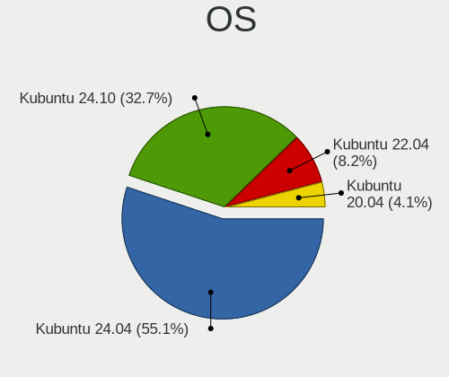
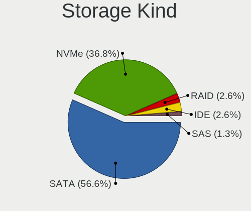
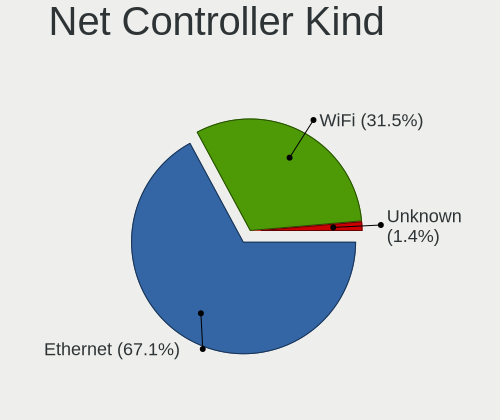
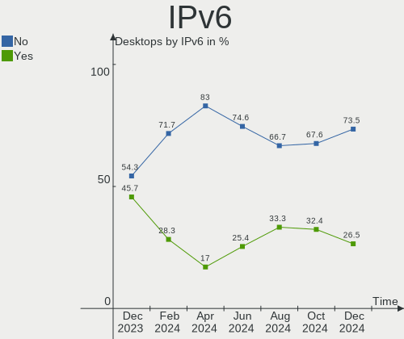

Kubuntu - Hardware Trends (Desktops)
------------------------------------

A project to identify most popular hardware characteristics and track their change
over time based on data collected by Linux users at https://Linux-Hardware.org.

Anyone can contribute to this report by the [hw-probe](https://github.com/linuxhw/hw-probe) tool:

    sudo -E hw-probe -all -upload

This report is for one last month. Overall report since the beginning of time: [TestCoverage](https://github.com/linuxhw/TestCoverage)

Period: Dec, 2022.

Contents
--------

* [ System ](#system)
  - [ OS                       ](#os)
  - [ OS Family                ](#os-family)
  - [ Kernel                   ](#kernel)
  - [ Kernel Family            ](#kernel-family)
  - [ Kernel Major Ver.        ](#kernel-major-ver)
  - [ Arch                     ](#arch)
  - [ DE                       ](#de)
  - [ Display Server           ](#display-server)
  - [ Display Manager          ](#display-manager)
  - [ OS Lang                  ](#os-lang)
  - [ Boot Mode                ](#boot-mode)
  - [ Filesystem               ](#filesystem)
  - [ Part. scheme             ](#part-scheme)
  - [ Dual Boot with Linux/BSD ](#dual-boot-with-linuxbsd)
  - [ Dual Boot (Win)          ](#dual-boot-win)

* [ Board ](#board)
  - [ Vendor                   ](#vendor)
  - [ Model                    ](#model)
  - [ Model Family             ](#model-family)
  - [ MFG Year                 ](#mfg-year)
  - [ Form Factor              ](#form-factor)
  - [ Secure Boot              ](#secure-boot)
  - [ Coreboot                 ](#coreboot)
  - [ RAM Size                 ](#ram-size)
  - [ RAM Used                 ](#ram-used)
  - [ Total Drives             ](#total-drives)
  - [ Has CD-ROM               ](#has-cd-rom)
  - [ Has Ethernet             ](#has-ethernet)
  - [ Has WiFi                 ](#has-wifi)
  - [ Has Bluetooth            ](#has-bluetooth)

* [ Location ](#location)
  - [ Country                  ](#country)
  - [ City                     ](#city)

* [ Drives ](#drives)
  - [ Drive Vendor             ](#drive-vendor)
  - [ Drive Model              ](#drive-model)
  - [ HDD Vendor               ](#hdd-vendor)
  - [ SSD Vendor               ](#ssd-vendor)
  - [ Drive Kind               ](#drive-kind)
  - [ Drive Connector          ](#drive-connector)
  - [ Drive Size               ](#drive-size)
  - [ Space Total              ](#space-total)
  - [ Space Used               ](#space-used)
  - [ Malfunc. Drives          ](#malfunc-drives)
  - [ Malfunc. Drive Vendor    ](#malfunc-drive-vendor)
  - [ Malfunc. HDD Vendor      ](#malfunc-hdd-vendor)
  - [ Malfunc. Drive Kind      ](#malfunc-drive-kind)
  - [ Failed Drives            ](#failed-drives)
  - [ Failed Drive Vendor      ](#failed-drive-vendor)
  - [ Drive Status             ](#drive-status)

* [ Storage controller ](#storage-controller)
  - [ Storage Vendor           ](#storage-vendor)
  - [ Storage Model            ](#storage-model)
  - [ Storage Kind             ](#storage-kind)

* [ Processor ](#processor)
  - [ CPU Vendor               ](#cpu-vendor)
  - [ CPU Model                ](#cpu-model)
  - [ CPU Model Family         ](#cpu-model-family)
  - [ CPU Cores                ](#cpu-cores)
  - [ CPU Sockets              ](#cpu-sockets)
  - [ CPU Threads              ](#cpu-threads)
  - [ CPU Op-Modes             ](#cpu-op-modes)
  - [ CPU Microcode            ](#cpu-microcode)
  - [ CPU Microarch            ](#cpu-microarch)

* [ Graphics ](#graphics)
  - [ GPU Vendor               ](#gpu-vendor)
  - [ GPU Model                ](#gpu-model)
  - [ GPU Combo                ](#gpu-combo)
  - [ GPU Driver               ](#gpu-driver)
  - [ GPU Memory               ](#gpu-memory)

* [ Monitor ](#monitor)
  - [ Monitor Vendor           ](#monitor-vendor)
  - [ Monitor Model            ](#monitor-model)
  - [ Monitor Resolution       ](#monitor-resolution)
  - [ Monitor Diagonal         ](#monitor-diagonal)
  - [ Monitor Width            ](#monitor-width)
  - [ Aspect Ratio             ](#aspect-ratio)
  - [ Monitor Area             ](#monitor-area)
  - [ Pixel Density            ](#pixel-density)
  - [ Multiple Monitors        ](#multiple-monitors)

* [ Network ](#network)
  - [ Net Controller Vendor    ](#net-controller-vendor)
  - [ Net Controller Model     ](#net-controller-model)
  - [ Wireless Vendor          ](#wireless-vendor)
  - [ Wireless Model           ](#wireless-model)
  - [ Ethernet Vendor          ](#ethernet-vendor)
  - [ Ethernet Model           ](#ethernet-model)
  - [ Net Controller Kind      ](#net-controller-kind)
  - [ Used Controller          ](#used-controller)
  - [ NICs                     ](#nics)
  - [ IPv6                     ](#ipv6)

* [ Bluetooth ](#bluetooth)
  - [ Bluetooth Vendor         ](#bluetooth-vendor)
  - [ Bluetooth Model          ](#bluetooth-model)

* [ Sound ](#sound)
  - [ Sound Vendor             ](#sound-vendor)
  - [ Sound Model              ](#sound-model)

* [ Memory ](#memory)
  - [ Memory Vendor            ](#memory-vendor)
  - [ Memory Model             ](#memory-model)
  - [ Memory Kind              ](#memory-kind)
  - [ Memory Form Factor       ](#memory-form-factor)
  - [ Memory Size              ](#memory-size)
  - [ Memory Speed             ](#memory-speed)

* [ Printers & scanners ](#printers--scanners)
  - [ Printer Vendor           ](#printer-vendor)
  - [ Printer Model            ](#printer-model)
  - [ Scanner Vendor           ](#scanner-vendor)
  - [ Scanner Model            ](#scanner-model)

* [ Camera ](#camera)
  - [ Camera Vendor            ](#camera-vendor)
  - [ Camera Model             ](#camera-model)

* [ Security ](#security)
  - [ Fingerprint Vendor       ](#fingerprint-vendor)
  - [ Fingerprint Model        ](#fingerprint-model)
  - [ Chipcard Vendor          ](#chipcard-vendor)
  - [ Chipcard Model           ](#chipcard-model)

* [ Unsupported ](#unsupported)
  - [ Unsupported Devices      ](#unsupported-devices)
  - [ Unsupported Device Types ](#unsupported-device-types)

System
------

OS
--

Installed operating systems

| Name          | Desktops | Percent |
|---------------|----------|---------|
| Kubuntu 22.04 | 21       | 50%     |
| Kubuntu 22.10 | 11       | 26.19%  |
| Kubuntu 20.04 | 7        | 16.67%  |
| Kubuntu 21.10 | 1        | 2.38%   |
| Kubuntu 21.04 | 1        | 2.38%   |
| Kubuntu 11    | 1        | 2.38%   |

OS Family
---------

OS without a version

| Name    | Desktops | Percent |
|---------|----------|---------|
| Kubuntu | 42       | 100%    |

Kernel
------

Version of the Linux kernel

| Version                | Desktops | Percent |
|------------------------|----------|---------|
| 5.15.0-56-generic      | 17       | 40.48%  |
| 5.19.0-26-generic      | 5        | 11.9%   |
| 5.15.0-56-lowlatency   | 4        | 9.52%   |
| 5.19.0-21-generic      | 2        | 4.76%   |
| 5.15.0-53-generic      | 2        | 4.76%   |
| 6.0.9-060009-generic   | 1        | 2.38%   |
| 5.4.0-120-generic      | 1        | 2.38%   |
| 5.19.0-28-generic      | 1        | 2.38%   |
| 5.19.0-23-generic      | 1        | 2.38%   |
| 5.19.0-1012-lowlatency | 1        | 2.38%   |
| 5.17.0-1021-oem        | 1        | 2.38%   |
| 5.15.0-48-generic      | 1        | 2.38%   |
| 5.15.0-47-generic      | 1        | 2.38%   |
| 5.15.0-43-lowlatency   | 1        | 2.38%   |
| 5.13.0-52-generic      | 1        | 2.38%   |
| 5.11.0-49-generic      | 1        | 2.38%   |
| 5.11.0-43-generic      | 1        | 2.38%   |

Kernel Family
-------------

Linux kernel without a distro release

| Version | Desktops | Percent |
|---------|----------|---------|
| 5.15.0  | 26       | 61.9%   |
| 5.19.0  | 10       | 23.81%  |
| 5.11.0  | 2        | 4.76%   |
| 6.0.9   | 1        | 2.38%   |
| 5.4.0   | 1        | 2.38%   |
| 5.17.0  | 1        | 2.38%   |
| 5.13.0  | 1        | 2.38%   |

Kernel Major Ver.
-----------------

Linux kernel major version

| Version | Desktops | Percent |
|---------|----------|---------|
| 5.15    | 26       | 61.9%   |
| 5.19    | 10       | 23.81%  |
| 5.11    | 2        | 4.76%   |
| 6.0     | 1        | 2.38%   |
| 5.4     | 1        | 2.38%   |
| 5.17    | 1        | 2.38%   |
| 5.13    | 1        | 2.38%   |

Arch
----

OS architecture (x86_64, i586, etc.)

| Name   | Desktops | Percent |
|--------|----------|---------|
| x86_64 | 42       | 100%    |

DE
--

Desktop Environment

| Name  | Desktops | Percent |
|-------|----------|---------|
| KDE5  | 41       | 97.62%  |
| GNOME | 1        | 2.38%   |

Display Server
--------------

X11 or Wayland

| Name | Desktops | Percent |
|------|----------|---------|
| X11  | 40       | 95.24%  |
| Web  | 1        | 2.38%   |
| Tty  | 1        | 2.38%   |

Display Manager
---------------

SDDM, LightDM, etc.

| Name    | Desktops | Percent |
|---------|----------|---------|
| SDDM    | 27       | 64.29%  |
| Unknown | 10       | 23.81%  |
| GDM3    | 3        | 7.14%   |
| LightDM | 2        | 4.76%   |

OS Lang
-------

Language

| Lang  | Desktops | Percent |
|-------|----------|---------|
| en_US | 17       | 40.48%  |
| de_DE | 6        | 14.29%  |
| fr_FR | 4        | 9.52%   |
| it_IT | 2        | 4.76%   |
| es_ES | 2        | 4.76%   |
| uk_UA | 1        | 2.38%   |
| sl_SI | 1        | 2.38%   |
| ru_RU | 1        | 2.38%   |
| pt_BR | 1        | 2.38%   |
| nl_NL | 1        | 2.38%   |
| hu_HU | 1        | 2.38%   |
| fi_FI | 1        | 2.38%   |
| en_NZ | 1        | 2.38%   |
| en_GB | 1        | 2.38%   |
| en_AU | 1        | 2.38%   |
| C     | 1        | 2.38%   |

Boot Mode
---------

EFI or BIOS

| Mode | Desktops | Percent |
|------|----------|---------|
| BIOS | 26       | 61.9%   |
| EFI  | 16       | 38.1%   |

Filesystem
----------

Type of filesystem

| Type    | Desktops | Percent |
|---------|----------|---------|
| Ext4    | 39       | 92.86%  |
| Btrfs   | 2        | 4.76%   |
| Overlay | 1        | 2.38%   |

Part. scheme
------------

Scheme of partitioning

| Type    | Desktops | Percent |
|---------|----------|---------|
| GPT     | 23       | 54.76%  |
| Unknown | 10       | 23.81%  |
| MBR     | 9        | 21.43%  |

Dual Boot with Linux/BSD
------------------------

Hosting more than one Linux/BSD

| Dual boot | Desktops | Percent |
|-----------|----------|---------|
| No        | 35       | 83.33%  |
| Yes       | 7        | 16.67%  |

Dual Boot (Win)
---------------

Hosting Linux and Windows

| Dual boot | Desktops | Percent |
|-----------|----------|---------|
| No        | 24       | 57.14%  |
| Yes       | 18       | 42.86%  |

Board
-----

Vendor
------

Motherboard manufacturer

| Name                | Desktops | Percent |
|---------------------|----------|---------|
| Gigabyte Technology | 10       | 23.81%  |
| ASUSTek Computer    | 9        | 21.43%  |
| MSI                 | 6        | 14.29%  |
| ASRock              | 5        | 11.9%   |
| Dell                | 4        | 9.52%   |
| Lenovo              | 3        | 7.14%   |
| BESSTAR Tech        | 2        | 4.76%   |
| Pegatron            | 1        | 2.38%   |
| Hewlett-Packard     | 1        | 2.38%   |
| Acer                | 1        | 2.38%   |

Model
-----

Motherboard model

| Name                              | Desktops | Percent |
|-----------------------------------|----------|---------|
| Pegatron p7-1011it                | 1        | 2.38%   |
| MSI MS-7C35                       | 1        | 2.38%   |
| MSI MS-7B79                       | 1        | 2.38%   |
| MSI MS-7B24                       | 1        | 2.38%   |
| MSI MS-7B17                       | 1        | 2.38%   |
| MSI MS-7A38                       | 1        | 2.38%   |
| MSI A0000001                      | 1        | 2.38%   |
| Lenovo ThinkCentre M75e 5065A11   | 1        | 2.38%   |
| Lenovo ThinkCentre M73 10B1S0PR00 | 1        | 2.38%   |
| Lenovo ThinkCentre A70 7844H9G    | 1        | 2.38%   |
| HP Pavilion Power Desktop 580-1xx | 1        | 2.38%   |
| Gigabyte Z97M-DS3H                | 1        | 2.38%   |
| Gigabyte Z590 UD AC               | 1        | 2.38%   |
| Gigabyte X670 AORUS ELITE AX      | 1        | 2.38%   |
| Gigabyte X570 I AORUS PRO WIFI    | 1        | 2.38%   |
| Gigabyte X470 AORUS ULTRA GAMING  | 1        | 2.38%   |
| Gigabyte B450M S2H                | 1        | 2.38%   |
| Gigabyte B450 I AORUS PRO WIFI    | 1        | 2.38%   |
| Gigabyte B450 AORUS ELITE         | 1        | 2.38%   |
| Gigabyte AB350M-DS3H V2           | 1        | 2.38%   |
| Gigabyte 970-GAMING               | 1        | 2.38%   |
| Dell XPS 8700                     | 1        | 2.38%   |
| Dell Precision T3600              | 1        | 2.38%   |
| Dell OptiPlex 7020                | 1        | 2.38%   |
| Dell Inspiron 660                 | 1        | 2.38%   |
| BESSTAR Tech HM90                 | 1        | 2.38%   |
| BESSTAR Tech HM80                 | 1        | 2.38%   |
| ASUS Z170 PRO GAMING/AURA         | 1        | 2.38%   |
| ASUS UNLOCK INSTALL               | 1        | 2.38%   |
| ASUS TUF Z390-PLUS GAMING         | 1        | 2.38%   |
| ASUS SABERTOOTH Z77               | 1        | 2.38%   |
| ASUS ROG STRIX X570-F GAMING      | 1        | 2.38%   |
| ASUS PRIME B350-PLUS              | 1        | 2.38%   |
| ASUS P7P55D                       | 1        | 2.38%   |
| ASUS H170-PRO                     | 1        | 2.38%   |
| ASUS All Series                   | 1        | 2.38%   |
| ASRock X570 Steel Legend          | 1        | 2.38%   |
| ASRock H570 Steel Legend          | 1        | 2.38%   |
| ASRock B75 Pro3-M                 | 1        | 2.38%   |
| ASRock B660M Pro RS               | 1        | 2.38%   |

Model Family
------------

Motherboard model prefix

| Name                 | Desktops | Percent |
|----------------------|----------|---------|
| Lenovo ThinkCentre   | 3        | 7.14%   |
| Gigabyte B450        | 2        | 4.76%   |
| Pegatron p7-1011it   | 1        | 2.38%   |
| MSI MS-7C35          | 1        | 2.38%   |
| MSI MS-7B79          | 1        | 2.38%   |
| MSI MS-7B24          | 1        | 2.38%   |
| MSI MS-7B17          | 1        | 2.38%   |
| MSI MS-7A38          | 1        | 2.38%   |
| MSI A0000001         | 1        | 2.38%   |
| HP Pavilion          | 1        | 2.38%   |
| Gigabyte Z97M-DS3H   | 1        | 2.38%   |
| Gigabyte Z590        | 1        | 2.38%   |
| Gigabyte X670        | 1        | 2.38%   |
| Gigabyte X570        | 1        | 2.38%   |
| Gigabyte X470        | 1        | 2.38%   |
| Gigabyte B450M       | 1        | 2.38%   |
| Gigabyte AB350M-DS3H | 1        | 2.38%   |
| Gigabyte 970-GAMING  | 1        | 2.38%   |
| Dell XPS             | 1        | 2.38%   |
| Dell Precision       | 1        | 2.38%   |
| Dell OptiPlex        | 1        | 2.38%   |
| Dell Inspiron        | 1        | 2.38%   |
| BESSTAR Tech HM90    | 1        | 2.38%   |
| BESSTAR Tech HM80    | 1        | 2.38%   |
| ASUS Z170            | 1        | 2.38%   |
| ASUS UNLOCK          | 1        | 2.38%   |
| ASUS TUF             | 1        | 2.38%   |
| ASUS SABERTOOTH      | 1        | 2.38%   |
| ASUS ROG             | 1        | 2.38%   |
| ASUS PRIME           | 1        | 2.38%   |
| ASUS P7P55D          | 1        | 2.38%   |
| ASUS H170-PRO        | 1        | 2.38%   |
| ASUS All             | 1        | 2.38%   |
| ASRock X570          | 1        | 2.38%   |
| ASRock H570          | 1        | 2.38%   |
| ASRock B75           | 1        | 2.38%   |
| ASRock B660M         | 1        | 2.38%   |
| ASRock B450M         | 1        | 2.38%   |
| Acer Aspire          | 1        | 2.38%   |

MFG Year
--------

Motherboard manufacture year

| Year | Desktops | Percent |
|------|----------|---------|
| 2018 | 11       | 26.19%  |
| 2019 | 6        | 14.29%  |
| 2021 | 5        | 11.9%   |
| 2014 | 4        | 9.52%   |
| 2015 | 3        | 7.14%   |
| 2017 | 2        | 4.76%   |
| 2013 | 2        | 4.76%   |
| 2012 | 2        | 4.76%   |
| 2011 | 2        | 4.76%   |
| 2010 | 2        | 4.76%   |
| 2022 | 1        | 2.38%   |
| 2016 | 1        | 2.38%   |
| 2009 | 1        | 2.38%   |

Form Factor
-----------

Physical design of the computer

| Name    | Desktops | Percent |
|---------|----------|---------|
| Desktop | 42       | 100%    |

Secure Boot
-----------

Enabled or disabled

| State    | Desktops | Percent |
|----------|----------|---------|
| Disabled | 41       | 97.62%  |
| Enabled  | 1        | 2.38%   |

Coreboot
--------

Have coreboot on board

| Used | Desktops | Percent |
|------|----------|---------|
| No   | 42       | 100%    |

RAM Size
--------

Total RAM memory

| Size in GB  | Desktops | Percent |
|-------------|----------|---------|
| 16.01-24.0  | 12       | 28.57%  |
| 32.01-64.0  | 11       | 26.19%  |
| 8.01-16.0   | 9        | 21.43%  |
| 4.01-8.0    | 4        | 9.52%   |
| 3.01-4.0    | 3        | 7.14%   |
| 24.01-32.0  | 2        | 4.76%   |
| 64.01-256.0 | 1        | 2.38%   |

RAM Used
--------

Used RAM memory

| Used GB    | Desktops | Percent |
|------------|----------|---------|
| 2.01-3.0   | 14       | 33.33%  |
| 4.01-8.0   | 12       | 28.57%  |
| 1.01-2.0   | 6        | 14.29%  |
| 3.01-4.0   | 5        | 11.9%   |
| 16.01-24.0 | 3        | 7.14%   |
| 8.01-16.0  | 2        | 4.76%   |

Total Drives
------------

Number of drives on board

| Drives | Desktops | Percent |
|--------|----------|---------|
| 1      | 12       | 28.57%  |
| 3      | 11       | 26.19%  |
| 2      | 8        | 19.05%  |
| 4      | 5        | 11.9%   |
| 5      | 4        | 9.52%   |
| 6      | 2        | 4.76%   |

Has CD-ROM
----------

Has CD-ROM on board

| Presented | Desktops | Percent |
|-----------|----------|---------|
| No        | 22       | 52.38%  |
| Yes       | 20       | 47.62%  |

Has Ethernet
------------

Has Ethernet on board

| Presented | Desktops | Percent |
|-----------|----------|---------|
| Yes       | 42       | 100%    |

Has WiFi
--------

Has WiFi module

| Presented | Desktops | Percent |
|-----------|----------|---------|
| Yes       | 22       | 52.38%  |
| No        | 20       | 47.62%  |

Has Bluetooth
-------------

Has Bluetooth module

| Presented | Desktops | Percent |
|-----------|----------|---------|
| No        | 23       | 54.76%  |
| Yes       | 19       | 45.24%  |

Location
--------

Country
-------

Geographic location (country)

| Country     | Desktops | Percent |
|-------------|----------|---------|
| USA         | 9        | 21.43%  |
| Germany     | 8        | 19.05%  |
| Italy       | 4        | 9.52%   |
| France      | 4        | 9.52%   |
| Russia      | 3        | 7.14%   |
| Spain       | 2        | 4.76%   |
| UK          | 1        | 2.38%   |
| Thailand    | 1        | 2.38%   |
| Slovenia    | 1        | 2.38%   |
| New Zealand | 1        | 2.38%   |
| Netherlands | 1        | 2.38%   |
| Latvia      | 1        | 2.38%   |
| Kazakhstan  | 1        | 2.38%   |
| Hungary     | 1        | 2.38%   |
| Finland     | 1        | 2.38%   |
| Canada      | 1        | 2.38%   |
| Brazil      | 1        | 2.38%   |
| Australia   | 1        | 2.38%   |

City
----

Geographic location (city)

| City             | Desktops | Percent |
|------------------|----------|---------|
| Munich           | 3        | 7.14%   |
| Vigo             | 1        | 2.38%   |
| Temryuk          | 1        | 2.38%   |
| Tapioszele       | 1        | 2.38%   |
| Sydney           | 1        | 2.38%   |
| Stadtlohn        | 1        | 2.38%   |
| St Petersburg    | 1        | 2.38%   |
| Schiffweiler     | 1        | 2.38%   |
| Rome             | 1        | 2.38%   |
| Roche-la-Moliere | 1        | 2.38%   |
| Rio de Janeiro   | 1        | 2.38%   |
| Riga             | 1        | 2.38%   |
| Olathe           | 1        | 2.38%   |
| Novorossiysk     | 1        | 2.38%   |
| Munday           | 1        | 2.38%   |
| Milwaukee        | 1        | 2.38%   |
| Milan            | 1        | 2.38%   |
| Marzabotto       | 1        | 2.38%   |
| London           | 1        | 2.38%   |
| Ljubljana        | 1        | 2.38%   |
| Lappeenranta     | 1        | 2.38%   |
| Labaroche        | 1        | 2.38%   |
| Koblenz          | 1        | 2.38%   |
| Khon Kaen        | 1        | 2.38%   |
| Issaquah         | 1        | 2.38%   |
| Indianapolis     | 1        | 2.38%   |
| Hamilton         | 1        | 2.38%   |
| Elkridge         | 1        | 2.38%   |
| Durham           | 1        | 2.38%   |
| Dolzago          | 1        | 2.38%   |
| Cochem           | 1        | 2.38%   |
| Chaumontel       | 1        | 2.38%   |
| Châtellerault   | 1        | 2.38%   |
| Borne            | 1        | 2.38%   |
| Augsburg         | 1        | 2.38%   |
| Auckland         | 1        | 2.38%   |
| Atlanta          | 1        | 2.38%   |
| Astana           | 1        | 2.38%   |
| Alicante         | 1        | 2.38%   |
| Aiken            | 1        | 2.38%   |

Drives
------

Drive Vendor
------------

Hard drive vendors

| Vendor                    | Desktops | Drives | Percent |
|---------------------------|----------|--------|---------|
| WDC                       | 16       | 20     | 17.2%   |
| Samsung Electronics       | 15       | 26     | 16.13%  |
| Seagate                   | 10       | 10     | 10.75%  |
| Kingston                  | 8        | 8      | 8.6%    |
| Toshiba                   | 6        | 7      | 6.45%   |
| SanDisk                   | 6        | 7      | 6.45%   |
| Crucial                   | 4        | 4      | 4.3%    |
| Intenso                   | 3        | 3      | 3.23%   |
| Intel                     | 3        | 3      | 3.23%   |
| Hitachi                   | 3        | 3      | 3.23%   |
| Unknown                   | 2        | 3      | 2.15%   |
| Silicon Motion            | 2        | 2      | 2.15%   |
| Phison                    | 2        | 2      | 2.15%   |
| Corsair                   | 2        | 2      | 2.15%   |
| SK hynix                  | 1        | 1      | 1.08%   |
| Shenzhen                  | 1        | 1      | 1.08%   |
| SABRENT                   | 1        | 1      | 1.08%   |
| Patriot                   | 1        | 1      | 1.08%   |
| OCZ                       | 1        | 1      | 1.08%   |
| Micron/Crucial Technology | 1        | 2      | 1.08%   |
| Micron Technology         | 1        | 1      | 1.08%   |
| HGST                      | 1        | 1      | 1.08%   |
| China                     | 1        | 1      | 1.08%   |
| AMD                       | 1        | 1      | 1.08%   |
| A-DATA Technology         | 1        | 1      | 1.08%   |

Drive Model
-----------

Hard drive models

| Model                                                  | Desktops | Percent |
|--------------------------------------------------------|----------|---------|
| Samsung NVMe SSD Controller SM981/PM981/PM983 500GB    | 5        | 4.76%   |
| Kingston SA400S37240G 240GB SSD                        | 3        | 2.86%   |
| Kingston SA2000M81000G 1TB                             | 3        | 2.86%   |
| WDC WD20EZBX-00AYRA0 2TB                               | 2        | 1.9%    |
| Silicon Motion SM2263EN/SM2263XT SSD Controller 1024GB | 2        | 1.9%    |
| Samsung SSD 870 EVO 4TB                                | 2        | 1.9%    |
| Intenso SSD 120GB                                      | 2        | 1.9%    |
| WDC WDS500G2B0A 500GB SSD                              | 1        | 0.95%   |
| WDC WD80EFBX-68AZZN0 8TB                               | 1        | 0.95%   |
| WDC WD6003FZBX-00K5WB0 6TB                             | 1        | 0.95%   |
| WDC WD5000AAKX-08U6AA0 500GB                           | 1        | 0.95%   |
| WDC WD5000AAKX-001CA0 500GB                            | 1        | 0.95%   |
| WDC WD5000AAKS-60WWPA0 500GB                           | 1        | 0.95%   |
| WDC WD40EZRZ-00GXCB0 4TB                               | 1        | 0.95%   |
| WDC WD3200AAJS-56M0A0 320GB                            | 1        | 0.95%   |
| WDC WD30EZRX-00MMMB0 3TB                               | 1        | 0.95%   |
| WDC WD20EZRX-00D8PB0 2TB                               | 1        | 0.95%   |
| WDC WD20EARX-00PASB0 2TB                               | 1        | 0.95%   |
| WDC WD10EZEX-60WN4A0 1TB                               | 1        | 0.95%   |
| WDC WD10EVDS-63U8B1 1TB                                | 1        | 0.95%   |
| WDC WD10EADX-22TDHB0 1TB                               | 1        | 0.95%   |
| WDC WD10EACS-65D6B0 1TB                                | 1        | 0.95%   |
| Unknown SD/MMC/MS PRO 64GB                             | 1        | 0.95%   |
| Unknown SD/MMC 2GB                                     | 1        | 0.95%   |
| Unknown M.S./M.S.Pro/HG 16GB                           | 1        | 0.95%   |
| Toshiba MK3252GSX 320GB                                | 1        | 0.95%   |
| Toshiba HDWR460 6TB                                    | 1        | 0.95%   |
| Toshiba HDWD120 2TB                                    | 1        | 0.95%   |
| Toshiba HDWD110 1TB                                    | 1        | 0.95%   |
| Toshiba DT01ACA200 2TB                                 | 1        | 0.95%   |
| Toshiba DT01ACA100 1TB                                 | 1        | 0.95%   |
| SK hynix SHGP31-500GM-2 500GB                          | 1        | 0.95%   |
| Shenzhen YongzhenWeiye 120GB                           | 1        | 0.95%   |
| Seagate ST8000DM004-2CX188 8TB                         | 1        | 0.95%   |
| Seagate ST8000AS0002-1NA17Z 8TB                        | 1        | 0.95%   |
| Seagate ST4000VX013-2XG104 4TB                         | 1        | 0.95%   |
| Seagate ST4000DM004-2CV104 4TB                         | 1        | 0.95%   |
| Seagate ST31000524AS 1TB                               | 1        | 0.95%   |
| Seagate ST1000VM002-1CT162 1TB                         | 1        | 0.95%   |
| Seagate ST1000LM024 HN-M101MBB 1TB                     | 1        | 0.95%   |

HDD Vendor
----------

Hard disk drive vendors

| Vendor              | Desktops | Drives | Percent |
|---------------------|----------|--------|---------|
| WDC                 | 15       | 19     | 41.67%  |
| Seagate             | 9        | 9      | 25%     |
| Toshiba             | 6        | 7      | 16.67%  |
| Hitachi             | 3        | 3      | 8.33%   |
| Unknown             | 1        | 1      | 2.78%   |
| Samsung Electronics | 1        | 1      | 2.78%   |
| HGST                | 1        | 1      | 2.78%   |

SSD Vendor
----------

Solid state drive vendors

| Vendor              | Desktops | Drives | Percent |
|---------------------|----------|--------|---------|
| Samsung Electronics | 11       | 16     | 33.33%  |
| Kingston            | 5        | 5      | 15.15%  |
| Crucial             | 4        | 4      | 12.12%  |
| SanDisk             | 3        | 3      | 9.09%   |
| Intenso             | 2        | 2      | 6.06%   |
| Intel               | 2        | 2      | 6.06%   |
| WDC                 | 1        | 1      | 3.03%   |
| Patriot             | 1        | 1      | 3.03%   |
| OCZ                 | 1        | 1      | 3.03%   |
| Micron Technology   | 1        | 1      | 3.03%   |
| China               | 1        | 1      | 3.03%   |
| A-DATA Technology   | 1        | 1      | 3.03%   |

Drive Kind
----------

HDD or SSD

| Kind    | Desktops | Drives | Percent |
|---------|----------|--------|---------|
| SSD     | 27       | 38     | 34.18%  |
| HDD     | 27       | 41     | 34.18%  |
| NVMe    | 21       | 28     | 26.58%  |
| Unknown | 4        | 5      | 5.06%   |

Drive Connector
---------------

SATA, SAS, NVMe, etc.

| Type | Desktops | Drives | Percent |
|------|----------|--------|---------|
| SATA | 37       | 76     | 58.73%  |
| NVMe | 20       | 27     | 31.75%  |
| SAS  | 6        | 9      | 9.52%   |

Drive Size
----------

Size of hard drive

| Size in TB | Desktops | Drives | Percent |
|------------|----------|--------|---------|
| 0.01-0.5   | 23       | 33     | 38.98%  |
| 0.51-1.0   | 15       | 17     | 25.42%  |
| 1.01-2.0   | 10       | 13     | 16.95%  |
| 3.01-4.0   | 6        | 7      | 10.17%  |
| 4.01-10.0  | 4        | 8      | 6.78%   |
| 2.01-3.0   | 1        | 1      | 1.69%   |

Space Total
-----------

Amount of disk space available on the file system

| Size in GB     | Desktops | Percent |
|----------------|----------|---------|
| 251-500        | 12       | 28.57%  |
| More than 3000 | 8        | 19.05%  |
| 101-250        | 7        | 16.67%  |
| 501-1000       | 7        | 16.67%  |
| 1001-2000      | 4        | 9.52%   |
| 2001-3000      | 3        | 7.14%   |
| 1-20           | 1        | 2.38%   |

Space Used
----------

Amount of used disk space

| Used GB        | Desktops | Percent |
|----------------|----------|---------|
| 21-50          | 8        | 19.05%  |
| 101-250        | 8        | 19.05%  |
| 501-1000       | 6        | 14.29%  |
| 251-500        | 5        | 11.9%   |
| 1-20           | 5        | 11.9%   |
| 1001-2000      | 4        | 9.52%   |
| More than 3000 | 3        | 7.14%   |
| 51-100         | 2        | 4.76%   |
| 2001-3000      | 1        | 2.38%   |

Malfunc. Drives
---------------

Drive models with a malfunction

| Model                                    | Desktops | Drives | Percent |
|------------------------------------------|----------|--------|---------|
| WDC WD30EZRX-00MMMB0 3TB                 | 1        | 1      | 14.29%  |
| WDC WD20EARX-00PASB0 2TB                 | 1        | 1      | 14.29%  |
| SanDisk SDSSDX240GG25 240GB              | 1        | 1      | 14.29%  |
| Samsung Electronics SSD 980 PRO 2TB      | 1        | 1      | 14.29%  |
| Samsung Electronics SSD 870 EVO 4TB      | 1        | 1      | 14.29%  |
| Samsung Electronics SSD 840 Series 120GB | 1        | 1      | 14.29%  |
| Hitachi HTS541010A9E680 1TB              | 1        | 1      | 14.29%  |

Malfunc. Drive Vendor
---------------------

Vendors of faulty drives

| Vendor              | Desktops | Drives | Percent |
|---------------------|----------|--------|---------|
| Samsung Electronics | 3        | 3      | 42.86%  |
| WDC                 | 2        | 2      | 28.57%  |
| SanDisk             | 1        | 1      | 14.29%  |
| Hitachi             | 1        | 1      | 14.29%  |

Malfunc. HDD Vendor
-------------------

Vendors of faulty HDD drives

| Vendor  | Desktops | Drives | Percent |
|---------|----------|--------|---------|
| WDC     | 2        | 2      | 66.67%  |
| Hitachi | 1        | 1      | 33.33%  |

Malfunc. Drive Kind
-------------------

Kinds of faulty drives

| Kind | Desktops | Drives | Percent |
|------|----------|--------|---------|
| SSD  | 3        | 3      | 42.86%  |
| HDD  | 3        | 3      | 42.86%  |
| NVMe | 1        | 1      | 14.29%  |

Failed Drives
-------------

Failed drive models

Zero info for selected period =(

Failed Drive Vendor
-------------------

Failed drive vendors

Zero info for selected period =(

Drive Status
------------

Number of failed and malfunc. drives

| Status   | Desktops | Drives | Percent |
|----------|----------|--------|---------|
| Detected | 27       | 48     | 50.94%  |
| Works    | 21       | 57     | 39.62%  |
| Malfunc  | 5        | 7      | 9.43%   |

Storage controller
------------------

Storage Vendor
--------------

Storage controller vendors

| Vendor                      | Desktops | Percent |
|-----------------------------|----------|---------|
| Intel                       | 23       | 33.33%  |
| AMD                         | 20       | 28.99%  |
| Samsung Electronics         | 7        | 10.14%  |
| Phison Electronics          | 4        | 5.8%    |
| ASMedia Technology          | 4        | 5.8%    |
| SanDisk                     | 3        | 4.35%   |
| Kingston Technology Company | 3        | 4.35%   |
| Silicon Motion              | 2        | 2.9%    |
| SK hynix                    | 1        | 1.45%   |
| Micron/Crucial Technology   | 1        | 1.45%   |
| JMicron Technology          | 1        | 1.45%   |

Storage Model
-------------

Storage controller models

| Model                                                                                   | Desktops | Percent |
|-----------------------------------------------------------------------------------------|----------|---------|
| AMD FCH SATA Controller [AHCI mode]                                                     | 15       | 17.86%  |
| AMD 400 Series Chipset SATA Controller                                                  | 7        | 8.33%   |
| Samsung NVMe SSD Controller SM981/PM981/PM983                                           | 4        | 4.76%   |
| Kingston Company A2000 NVMe SSD                                                         | 3        | 3.57%   |
| Intel Cannon Lake PCH SATA AHCI Controller                                              | 3        | 3.57%   |
| Intel 8 Series/C220 Series Chipset Family 6-port SATA Controller 1 [AHCI mode]          | 3        | 3.57%   |
| Intel 7 Series/C210 Series Chipset Family 6-port SATA Controller [AHCI mode]            | 3        | 3.57%   |
| ASMedia ASM1062 Serial ATA Controller                                                   | 3        | 3.57%   |
| AMD 300 Series Chipset SATA Controller                                                  | 3        | 3.57%   |
| Silicon Motion SM2263EN/SM2263XT SSD Controller                                         | 2        | 2.38%   |
| SanDisk Non-Volatile memory controller                                                  | 2        | 2.38%   |
| Phison E12 NVMe Controller                                                              | 2        | 2.38%   |
| Intel 6 Series/C200 Series Chipset Family 6 port Desktop SATA AHCI Controller           | 2        | 2.38%   |
| Intel 500 Series Chipset Family SATA AHCI Controller                                    | 2        | 2.38%   |
| AMD SB7x0/SB8x0/SB9x0 SATA Controller [AHCI mode]                                       | 2        | 2.38%   |
| SK hynix Gold P31/PC711 NVMe Solid State Drive                                          | 1        | 1.19%   |
| SanDisk WD PC SN810 / Black SN850 NVMe SSD                                              | 1        | 1.19%   |
| SanDisk WD Blue SN570 NVMe SSD                                                          | 1        | 1.19%   |
| Samsung NVMe SSD Controller SM961/PM961/SM963                                           | 1        | 1.19%   |
| Samsung NVMe SSD Controller SM951/PM951                                                 | 1        | 1.19%   |
| Samsung NVMe SSD Controller PM9A1/PM9A3/980PRO                                          | 1        | 1.19%   |
| Samsung NVMe SSD Controller 980                                                         | 1        | 1.19%   |
| Phison PS5013 E13 NVMe Controller                                                       | 1        | 1.19%   |
| Phison E7 NVMe Controller                                                               | 1        | 1.19%   |
| Micron/Crucial P2 NVMe PCIe SSD                                                         | 1        | 1.19%   |
| JMicron JMB363 SATA/IDE Controller                                                      | 1        | 1.19%   |
| Intel SSD 660P Series                                                                   | 1        | 1.19%   |
| Intel SATA Controller [RAID mode]                                                       | 1        | 1.19%   |
| Intel Q170/Q150/B150/H170/H110/Z170/CM236 Chipset SATA Controller [AHCI Mode]           | 1        | 1.19%   |
| Intel NM10/ICH7 Family SATA Controller [IDE mode]                                       | 1        | 1.19%   |
| Intel C610/X99 series chipset sSATA Controller [AHCI mode]                              | 1        | 1.19%   |
| Intel C610/X99 series chipset 6-Port SATA Controller [AHCI mode]                        | 1        | 1.19%   |
| Intel C600/X79 series chipset 6-Port SATA AHCI Controller                               | 1        | 1.19%   |
| Intel Alder Lake-S PCH SATA Controller [AHCI Mode]                                      | 1        | 1.19%   |
| Intel 9 Series Chipset Family SATA Controller [AHCI Mode]                               | 1        | 1.19%   |
| Intel 6 Series/C200 Series Chipset Family Desktop SATA Controller (IDE mode, ports 4-5) | 1        | 1.19%   |
| Intel 6 Series/C200 Series Chipset Family Desktop SATA Controller (IDE mode, ports 0-3) | 1        | 1.19%   |
| Intel 5 Series/3400 Series Chipset 4 port SATA IDE Controller                           | 1        | 1.19%   |
| Intel 5 Series/3400 Series Chipset 2 port SATA IDE Controller                           | 1        | 1.19%   |
| ASMedia SATA controller                                                                 | 1        | 1.19%   |

Storage Kind
------------

Kind of storage controller (IDE, SATA, NVMe, SAS, ...)

| Kind | Desktops | Percent |
|------|----------|---------|
| SATA | 38       | 62.3%   |
| NVMe | 19       | 31.15%  |
| IDE  | 3        | 4.92%   |
| RAID | 1        | 1.64%   |

Processor
---------

CPU Vendor
----------

Processor vendors

| Vendor | Desktops | Percent |
|--------|----------|---------|
| Intel  | 22       | 52.38%  |
| AMD    | 20       | 47.62%  |

CPU Model
---------

Processor models

| Model                                       | Desktops | Percent |
|---------------------------------------------|----------|---------|
| Intel Core i3-4150 CPU @ 3.50GHz            | 2        | 4.76%   |
| AMD Ryzen 9 5900X 12-Core Processor         | 2        | 4.76%   |
| AMD Ryzen 7 1700 Eight-Core Processor       | 2        | 4.76%   |
| AMD Ryzen 5 5600G with Radeon Graphics      | 2        | 4.76%   |
| AMD Ryzen 5 3400G with Radeon Vega Graphics | 2        | 4.76%   |
| Intel Xeon CPU E5-1620 0 @ 3.60GHz          | 1        | 2.38%   |
| Intel Pentium CPU G2030 @ 3.00GHz           | 1        | 2.38%   |
| Intel Core i9-9900KF CPU @ 3.60GHz          | 1        | 2.38%   |
| Intel Core i7-6700K CPU @ 4.00GHz           | 1        | 2.38%   |
| Intel Core i7-6700 CPU @ 3.40GHz            | 1        | 2.38%   |
| Intel Core i7-5820K CPU @ 3.30GHz           | 1        | 2.38%   |
| Intel Core i7-4790 CPU @ 3.60GHz            | 1        | 2.38%   |
| Intel Core i5-9600K CPU @ 3.70GHz           | 1        | 2.38%   |
| Intel Core i5-4590 CPU @ 3.30GHz            | 1        | 2.38%   |
| Intel Core i5-3570K CPU @ 3.40GHz           | 1        | 2.38%   |
| Intel Core i5-3350P CPU @ 3.10GHz           | 1        | 2.38%   |
| Intel Core i5-2310 CPU @ 2.90GHz            | 1        | 2.38%   |
| Intel Core i5 CPU 650 @ 3.20GHz             | 1        | 2.38%   |
| Intel Core i3-3220 CPU @ 3.30GHz            | 1        | 2.38%   |
| Intel Core i3-2100 CPU @ 3.10GHz            | 1        | 2.38%   |
| Intel Core 2 Duo CPU E7500 @ 2.93GHz        | 1        | 2.38%   |
| Intel Celeron G4900 CPU @ 3.10GHz           | 1        | 2.38%   |
| Intel 12th Gen Core i5-12400F               | 1        | 2.38%   |
| Intel 11th Gen Core i9-11900 @ 2.50GHz      | 1        | 2.38%   |
| Intel 11th Gen Core i5-11400F @ 2.60GHz     | 1        | 2.38%   |
| AMD Ryzen 9 7950X 16-Core Processor         | 1        | 2.38%   |
| AMD Ryzen 9 4900H with Radeon Graphics      | 1        | 2.38%   |
| AMD Ryzen 7 5800X 8-Core Processor          | 1        | 2.38%   |
| AMD Ryzen 7 4800U with Radeon Graphics      | 1        | 2.38%   |
| AMD Ryzen 7 2700X Eight-Core Processor      | 1        | 2.38%   |
| AMD Ryzen 7 2700 Eight-Core Processor       | 1        | 2.38%   |
| AMD Ryzen 5 5600X 6-Core Processor          | 1        | 2.38%   |
| AMD Ryzen 5 2600X Six-Core Processor        | 1        | 2.38%   |
| AMD Ryzen 5 1600 Six-Core Processor         | 1        | 2.38%   |
| AMD Ryzen 5 1400 Quad-Core Processor        | 1        | 2.38%   |
| AMD FX-8350 Eight-Core Processor            | 1        | 2.38%   |
| AMD Athlon II X2 250 Processor              | 1        | 2.38%   |

CPU Model Family
----------------

Processor model prefix

| Model            | Desktops | Percent |
|------------------|----------|---------|
| AMD Ryzen 5      | 8        | 19.05%  |
| Intel Core i5    | 6        | 14.29%  |
| AMD Ryzen 7      | 6        | 14.29%  |
| Intel Core i7    | 4        | 9.52%   |
| Intel Core i3    | 4        | 9.52%   |
| AMD Ryzen 9      | 4        | 9.52%   |
| Other            | 3        | 7.14%   |
| Intel Xeon       | 1        | 2.38%   |
| Intel Pentium    | 1        | 2.38%   |
| Intel Core i9    | 1        | 2.38%   |
| Intel Core 2 Duo | 1        | 2.38%   |
| Intel Celeron    | 1        | 2.38%   |
| AMD FX           | 1        | 2.38%   |
| AMD Athlon II X2 | 1        | 2.38%   |

CPU Cores
---------

Number of processor cores

| Number | Desktops | Percent |
|--------|----------|---------|
| 4      | 12       | 28.57%  |
| 8      | 9        | 21.43%  |
| 6      | 9        | 21.43%  |
| 2      | 9        | 21.43%  |
| 12     | 2        | 4.76%   |
| 16     | 1        | 2.38%   |

CPU Sockets
-----------

Number of sockets

| Number | Desktops | Percent |
|--------|----------|---------|
| 1      | 42       | 100%    |

CPU Threads
-----------

Threads per core (Hyper-Threading)

| Number | Desktops | Percent |
|--------|----------|---------|
| 2      | 33       | 78.57%  |
| 1      | 9        | 21.43%  |

CPU Op-Modes
------------

CPU Operation Modes (32-bit, 64-bit)

| Op mode        | Desktops | Percent |
|----------------|----------|---------|
| 32-bit, 64-bit | 42       | 100%    |

CPU Microcode
-------------

Microcode number

| Number     | Desktops | Percent |
|------------|----------|---------|
| Unknown    | 17       | 40.48%  |
| 0x506e3    | 2        | 4.76%   |
| 0x306c3    | 2        | 4.76%   |
| 0x306a9    | 2        | 4.76%   |
| 0x206a7    | 2        | 4.76%   |
| 0x0800820d | 2        | 4.76%   |
| 0xa0671    | 1        | 2.38%   |
| 0x906ed    | 1        | 2.38%   |
| 0x306f2    | 1        | 2.38%   |
| 0x206d7    | 1        | 2.38%   |
| 0x20655    | 1        | 2.38%   |
| 0x1067a    | 1        | 2.38%   |
| 0x0a601203 | 1        | 2.38%   |
| 0x0a50000d | 1        | 2.38%   |
| 0x0a50000c | 1        | 2.38%   |
| 0x0a201204 | 1        | 2.38%   |
| 0x0a201009 | 1        | 2.38%   |
| 0x08108109 | 1        | 2.38%   |
| 0x08001138 | 1        | 2.38%   |
| 0x08001126 | 1        | 2.38%   |
| 0x06000822 | 1        | 2.38%   |

CPU Microarch
-------------

Microarchitecture

| Name        | Desktops | Percent |
|-------------|----------|---------|
| Zen 3       | 6        | 14.29%  |
| Zen+        | 5        | 11.9%   |
| Haswell     | 5        | 11.9%   |
| Zen         | 4        | 9.52%   |
| IvyBridge   | 4        | 9.52%   |
| SandyBridge | 3        | 7.14%   |
| KabyLake    | 3        | 7.14%   |
| Unknown     | 3        | 7.14%   |
| Zen 2       | 2        | 4.76%   |
| Skylake     | 2        | 4.76%   |
| Westmere    | 1        | 2.38%   |
| Piledriver  | 1        | 2.38%   |
| Penryn      | 1        | 2.38%   |
| K10         | 1        | 2.38%   |
| Icelake     | 1        | 2.38%   |

Graphics
--------

GPU Vendor
----------

Vendors of graphics cards

| Vendor | Desktops | Percent |
|--------|----------|---------|
| Nvidia | 20       | 45.45%  |
| AMD    | 18       | 40.91%  |
| Intel  | 6        | 13.64%  |

GPU Model
---------

Graphics card models

| Model                                                                     | Desktops | Percent |
|---------------------------------------------------------------------------|----------|---------|
| AMD Ellesmere [Radeon RX 470/480/570/570X/580/580X/590]                   | 3        | 6.82%   |
| Nvidia GK208B [GeForce GT 720]                                            | 2        | 4.55%   |
| Intel 4th Generation Core Processor Family Integrated Graphics Controller | 2        | 4.55%   |
| AMD Renoir                                                                | 2        | 4.55%   |
| AMD Picasso/Raven 2 [Radeon Vega Series / Radeon Vega Mobile Series]      | 2        | 4.55%   |
| AMD Lexa PRO [Radeon 540/540X/550/550X / RX 540X/550/550X]                | 2        | 4.55%   |
| Nvidia TU117 [GeForce GTX 1650]                                           | 1        | 2.27%   |
| Nvidia TU106 [GeForce RTX 2060 Rev. A]                                    | 1        | 2.27%   |
| Nvidia TU104 [GeForce RTX 2080 SUPER]                                     | 1        | 2.27%   |
| Nvidia TU102 [GeForce RTX 2080 Ti]                                        | 1        | 2.27%   |
| Nvidia GT218 [GeForce 405]                                                | 1        | 2.27%   |
| Nvidia GT215 [GeForce GT 240]                                             | 1        | 2.27%   |
| Nvidia GP108 [GeForce GT 1030]                                            | 1        | 2.27%   |
| Nvidia GP107 [GeForce GTX 1050]                                           | 1        | 2.27%   |
| Nvidia GP107 [GeForce GTX 1050 Ti]                                        | 1        | 2.27%   |
| Nvidia GP104 [GeForce GTX 1070]                                           | 1        | 2.27%   |
| Nvidia GM204 [GeForce GTX 970]                                            | 1        | 2.27%   |
| Nvidia GM107 [GeForce GTX 745]                                            | 1        | 2.27%   |
| Nvidia GK208B [GeForce GT 730]                                            | 1        | 2.27%   |
| Nvidia GK208B [GeForce GT 710]                                            | 1        | 2.27%   |
| Nvidia GK104 [GeForce GTX 770]                                            | 1        | 2.27%   |
| Nvidia GF106GL [Quadro 2000]                                              | 1        | 2.27%   |
| Nvidia GA102 [GeForce RTX 3080 Ti]                                        | 1        | 2.27%   |
| Nvidia AD103 [GeForce RTX 4080]                                           | 1        | 2.27%   |
| Intel Xeon E3-1200 v2/3rd Gen Core processor Graphics Controller          | 1        | 2.27%   |
| Intel HD Graphics 530                                                     | 1        | 2.27%   |
| Intel CoffeeLake-S GT2 [UHD Graphics 630]                                 | 1        | 2.27%   |
| Intel CoffeeLake-S GT1 [UHD Graphics 610]                                 | 1        | 2.27%   |
| AMD Vega 10 XL/XT [Radeon RX Vega 56/64]                                  | 1        | 2.27%   |
| AMD RV710 [Radeon HD 4350/4550]                                           | 1        | 2.27%   |
| AMD RS780L [Radeon 3000]                                                  | 1        | 2.27%   |
| AMD Raphael                                                               | 1        | 2.27%   |
| AMD Oland PRO [Radeon R7 240/340 / Radeon 520]                            | 1        | 2.27%   |
| AMD Navi 23 [Radeon RX 6600/6600 XT/6600M]                                | 1        | 2.27%   |
| AMD Navi 22 [Radeon RX 6700/6700 XT/6750 XT / 6800M]                      | 1        | 2.27%   |
| AMD Curacao XT / Trinidad XT [Radeon R7 370 / R9 270X/370X]               | 1        | 2.27%   |
| AMD Cezanne [Radeon Vega Series / Radeon Vega Mobile Series]              | 1        | 2.27%   |

GPU Combo
---------

Combinations of graphics cards

| Name         | Desktops | Percent |
|--------------|----------|---------|
| 1 x Nvidia   | 19       | 45.24%  |
| 1 x AMD      | 16       | 38.1%   |
| 1 x Intel    | 5        | 11.9%   |
| Intel + AMD  | 1        | 2.38%   |
| AMD + Nvidia | 1        | 2.38%   |

GPU Driver
----------

Free vs proprietary

| Driver      | Desktops | Percent |
|-------------|----------|---------|
| Free        | 28       | 66.67%  |
| Proprietary | 13       | 30.95%  |
| Unknown     | 1        | 2.38%   |

GPU Memory
----------

Total video memory

| Size in GB | Desktops | Percent |
|------------|----------|---------|
| Unknown    | 20       | 47.62%  |
| 1.01-2.0   | 8        | 19.05%  |
| 3.01-4.0   | 6        | 14.29%  |
| 8.01-16.0  | 3        | 7.14%   |
| 7.01-8.0   | 2        | 4.76%   |
| 5.01-6.0   | 1        | 2.38%   |
| 0.51-1.0   | 1        | 2.38%   |
| 0.01-0.5   | 1        | 2.38%   |

Monitor
-------

Monitor Vendor
--------------

Monitor vendors

| Vendor               | Desktops | Percent |
|----------------------|----------|---------|
| Goldstar             | 10       | 20.83%  |
| Dell                 | 8        | 16.67%  |
| Samsung Electronics  | 6        | 12.5%   |
| Ancor Communications | 4        | 8.33%   |
| Hewlett-Packard      | 3        | 6.25%   |
| Acer                 | 3        | 6.25%   |
| Iiyama               | 2        | 4.17%   |
| AOC                  | 2        | 4.17%   |
| ViewSonic            | 1        | 2.08%   |
| NEC Computers        | 1        | 2.08%   |
| Medion               | 1        | 2.08%   |
| HUAWEI               | 1        | 2.08%   |
| Grundig              | 1        | 2.08%   |
| GMS                  | 1        | 2.08%   |
| Gigabyte Technology  | 1        | 2.08%   |
| Denver               | 1        | 2.08%   |
| BenQ                 | 1        | 2.08%   |
| ASUSTek Computer     | 1        | 2.08%   |

Monitor Model
-------------

Monitor models

| Model                                                                   | Desktops | Percent |
|-------------------------------------------------------------------------|----------|---------|
| Dell S3422DW DELD102 3440x1440 797x334mm 34.0-inch                      | 2        | 3.92%   |
| ViewSonic VX2439wm VSC3D24 1920x1080 520x290mm 23.4-inch                | 1        | 1.96%   |
| Samsung Electronics SyncMaster SAM060B 1920x1080 510x290mm 23.1-inch    | 1        | 1.96%   |
| Samsung Electronics SyncMaster SAM0192 1280x1024 338x270mm 17.0-inch    | 1        | 1.96%   |
| Samsung Electronics SMB2240W SAM0699 1680x1050 459x296mm 21.5-inch      | 1        | 1.96%   |
| Samsung Electronics LF27T35 SAM707F 1920x1080 598x337mm 27.0-inch       | 1        | 1.96%   |
| Samsung Electronics LCD Monitor SAM71B4 3840x2160 1872x1053mm 84.6-inch | 1        | 1.96%   |
| Samsung Electronics C24F390 SAM0D2C 1920x1080 521x293mm 23.5-inch       | 1        | 1.96%   |
| NEC Computers E243WMi NEC2B07 1920x1080 543x317mm 24.8-inch             | 1        | 1.96%   |
| Medion LCD Monitor MD 20144 1920x1080                                   | 1        | 1.96%   |
| Iiyama PLG2888UH IVM710B 3840x2160                                      | 1        | 1.96%   |
| Iiyama PLE2207WS IVM5609 1680x1050 474x296mm 22.0-inch                  | 1        | 1.96%   |
| HUAWEI ZQE-CAA HWV6A25 3440x1440 797x334mm 34.0-inch                    | 1        | 1.96%   |
| Hewlett-Packard w2007 HWP26A6 1680x1050 433x271mm 20.1-inch             | 1        | 1.96%   |
| Hewlett-Packard 24f HPN3545 1920x1080 527x296mm 23.8-inch               | 1        | 1.96%   |
| Hewlett-Packard 23es HWP331E 1920x1080 509x286mm 23.0-inch              | 1        | 1.96%   |
| Grundig WXGA GRU4448 1600x1200                                          | 1        | 1.96%   |
| Grundig LCD Monitor WUXGA 1920x1080                                     | 1        | 1.96%   |
| Goldstar W2253 GSM56DC 1920x1080 510x290mm 23.1-inch                    | 1        | 1.96%   |
| Goldstar W2252 GSM567E 1680x1050 474x296mm 22.0-inch                    | 1        | 1.96%   |
| Goldstar ULTRAWIDE GSM76E4 3440x1440 800x335mm 34.1-inch                | 1        | 1.96%   |
| Goldstar ULTRAWIDE GSM59F2 2560x1080 798x334mm 34.1-inch                | 1        | 1.96%   |
| Goldstar TV SSCR2 GSMC0C8 3840x2160                                     | 1        | 1.96%   |
| Goldstar L226WA GSM5636 1680x1050 473x296mm 22.0-inch                   | 1        | 1.96%   |
| Goldstar E2711 GSM583D 1920x1080 477x268mm 21.5-inch                    | 1        | 1.96%   |
| Goldstar E2241 GSM581A 1920x1080 477x268mm 21.5-inch                    | 1        | 1.96%   |
| Goldstar 26LB75 GSM5673 1920x1080 700x390mm 31.5-inch                   | 1        | 1.96%   |
| Goldstar 22M35 GSM5A31 1920x1080 480x270mm 21.7-inch                    | 1        | 1.96%   |
| GMS M270 GMS2700 2560x1440 576x324mm 26.0-inch                          | 1        | 1.96%   |
| Gigabyte Technology M32U GBT3204 3840x2160 697x392mm 31.5-inch          | 1        | 1.96%   |
| Denver PGM340 LHC3400 3440x1440 798x334mm 34.1-inch                     | 1        | 1.96%   |
| Dell U2412M DELA07A 1920x1200 518x324mm 24.1-inch                       | 1        | 1.96%   |
| Dell U2410 DELF016 1920x1200 520x320mm 24.0-inch                        | 1        | 1.96%   |
| Dell P2717H DEL40F7 1920x1080 598x336mm 27.0-inch                       | 1        | 1.96%   |
| Dell E2720HS DELA15E 1920x1080 598x336mm 27.0-inch                      | 1        | 1.96%   |
| Dell E228WFP DELD014 1680x1050 470x300mm 22.0-inch                      | 1        | 1.96%   |
| Dell E177FP DELA023 1280x1024 338x270mm 17.0-inch                       | 1        | 1.96%   |
| Dell 1704FPV DEL3016 1280x1024 338x270mm 17.0-inch                      | 1        | 1.96%   |
| BenQ GW2265 BNQ78D1 1920x1080 477x268mm 21.5-inch                       | 1        | 1.96%   |
| ASUSTek Computer ROG XG27AQ AUS276B 2560x1440 597x336mm 27.0-inch       | 1        | 1.96%   |

Monitor Resolution
------------------

Monitor screen resolution

| Resolution         | Desktops | Percent |
|--------------------|----------|---------|
| 1920x1080 (FHD)    | 20       | 45.45%  |
| 3840x2160 (4K)     | 6        | 13.64%  |
| 1680x1050 (WSXGA+) | 6        | 13.64%  |
| 3440x1440          | 5        | 11.36%  |
| 2560x1440 (QHD)    | 2        | 4.55%   |
| 1920x1200 (WUXGA)  | 2        | 4.55%   |
| 1280x1024 (SXGA)   | 2        | 4.55%   |
| 2560x1080          | 1        | 2.27%   |

Monitor Diagonal
----------------

Diagonal size in inches

| Inches  | Desktops | Percent |
|---------|----------|---------|
| 23      | 8        | 16.33%  |
| 27      | 7        | 14.29%  |
| 34      | 6        | 12.24%  |
| 24      | 5        | 10.2%   |
| 21      | 5        | 10.2%   |
| 22      | 4        | 8.16%   |
| 31      | 3        | 6.12%   |
| Unknown | 3        | 6.12%   |
| 17      | 2        | 4.08%   |
| 84      | 1        | 2.04%   |
| 72      | 1        | 2.04%   |
| 54      | 1        | 2.04%   |
| 26      | 1        | 2.04%   |
| 25      | 1        | 2.04%   |
| 20      | 1        | 2.04%   |

Monitor Width
-------------

Physical width

| Width in mm | Desktops | Percent |
|-------------|----------|---------|
| 501-600     | 17       | 36.96%  |
| 401-500     | 11       | 23.91%  |
| 701-800     | 6        | 13.04%  |
| 601-700     | 4        | 8.7%    |
| Unknown     | 3        | 6.52%   |
| 301-350     | 2        | 4.35%   |
| 1501-2000   | 2        | 4.35%   |
| 1001-1500   | 1        | 2.17%   |

Aspect Ratio
------------

Proportional relationship between the width and the height

| Ratio   | Desktops | Percent |
|---------|----------|---------|
| 16/9    | 25       | 56.82%  |
| 16/10   | 7        | 15.91%  |
| 21/9    | 6        | 13.64%  |
| Unknown | 3        | 6.82%   |
| 5/4     | 2        | 4.55%   |
| 3/2     | 1        | 2.27%   |

Monitor Area
------------

Area in inch²

| Area in inch² | Desktops | Percent |
|----------------|----------|---------|
| 201-250        | 17       | 35.42%  |
| 351-500        | 9        | 18.75%  |
| 301-350        | 7        | 14.58%  |
| 251-300        | 5        | 10.42%  |
| More than 1000 | 3        | 6.25%   |
| Unknown        | 3        | 6.25%   |
| 151-200        | 2        | 4.17%   |
| 141-150        | 2        | 4.17%   |

Pixel Density
-------------

Pixels per inch

| Density | Desktops | Percent |
|---------|----------|---------|
| 51-100  | 27       | 61.36%  |
| 101-120 | 12       | 27.27%  |
| Unknown | 3        | 6.82%   |
| 121-160 | 2        | 4.55%   |

Multiple Monitors
-----------------

Total monitors connected

| Total | Desktops | Percent |
|-------|----------|---------|
| 1     | 31       | 73.81%  |
| 2     | 8        | 19.05%  |
| 0     | 2        | 4.76%   |
| 3     | 1        | 2.38%   |

Network
-------

Net Controller Vendor
---------------------

Controller vendors

| Vendor                   | Desktops | Percent |
|--------------------------|----------|---------|
| Realtek Semiconductor    | 27       | 43.55%  |
| Intel                    | 18       | 29.03%  |
| MediaTek                 | 4        | 6.45%   |
| Qualcomm Atheros         | 3        | 4.84%   |
| Broadcom                 | 3        | 4.84%   |
| Ralink Technology        | 2        | 3.23%   |
| TP-Link                  | 1        | 1.61%   |
| Ralink                   | 1        | 1.61%   |
| Marvell Technology Group | 1        | 1.61%   |
| ASIX Electronics         | 1        | 1.61%   |
| Aquantia                 | 1        | 1.61%   |

Net Controller Model
--------------------

Controller models

| Model                                                             | Desktops | Percent |
|-------------------------------------------------------------------|----------|---------|
| Realtek RTL8111/8168/8411 PCI Express Gigabit Ethernet Controller | 24       | 32%     |
| Intel I211 Gigabit Network Connection                             | 6        | 8%      |
| Realtek RTL8125 2.5GbE Controller                                 | 4        | 5.33%   |
| MediaTek MT7921K (RZ608) Wi-Fi 6E 80MHz                           | 3        | 4%      |
| Intel Wi-Fi 6 AX200                                               | 3        | 4%      |
| Intel Ethernet Controller I225-V                                  | 3        | 4%      |
| Ralink MT7601U Wireless Adapter                                   | 2        | 2.67%   |
| Intel Ethernet Connection (7) I219-V                              | 2        | 2.67%   |
| Intel Cannon Lake PCH CNVi WiFi                                   | 2        | 2.67%   |
| Intel 82579V Gigabit Network Connection                           | 2        | 2.67%   |
| Broadcom BCM4360 802.11ac Wireless Network Adapter                | 2        | 2.67%   |
| TP-Link Archer T2U PLUS [RTL8821AU]                               | 1        | 1.33%   |
| Realtek RTL88x2bu [AC1200 Techkey]                                | 1        | 1.33%   |
| Realtek RTL8821CE 802.11ac PCIe Wireless Network Adapter          | 1        | 1.33%   |
| Realtek RTL8812AU 802.11a/b/g/n/ac 2T2R DB WLAN Adapter           | 1        | 1.33%   |
| Realtek RTL8188FTV 802.11b/g/n 1T1R 2.4G WLAN Adapter             | 1        | 1.33%   |
| Realtek 802.11ac+Bluetooth 5.0 Adapter                            | 1        | 1.33%   |
| Ralink RT2800 802.11n PCI                                         | 1        | 1.33%   |
| Qualcomm Atheros Killer E220x Gigabit Ethernet Controller         | 1        | 1.33%   |
| Qualcomm Atheros AR9485 Wireless Network Adapter                  | 1        | 1.33%   |
| Qualcomm Atheros AR93xx Wireless Network Adapter                  | 1        | 1.33%   |
| MediaTek MT7922 802.11ax PCI Express Wireless Network Adapter     | 1        | 1.33%   |
| Marvell Group 88E8057 PCI-E Gigabit Ethernet Controller           | 1        | 1.33%   |
| Intel Wireless-AC 9260                                            | 1        | 1.33%   |
| Intel Tiger Lake PCH CNVi WiFi                                    | 1        | 1.33%   |
| Intel Ethernet Connection I217-LM                                 | 1        | 1.33%   |
| Intel Ethernet Connection (2) I219-V                              | 1        | 1.33%   |
| Intel Ethernet Connection (2) I218-V                              | 1        | 1.33%   |
| Intel Ethernet Connection (17) I219-V                             | 1        | 1.33%   |
| Intel 82579LM Gigabit Network Connection (Lewisville)             | 1        | 1.33%   |
| Broadcom BCM43142 802.11b/g/n                                     | 1        | 1.33%   |
| ASIX AX88179 Gigabit Ethernet                                     | 1        | 1.33%   |
| Aquantia AQC107 NBase-T/IEEE 802.3bz Ethernet Controller [AQtion] | 1        | 1.33%   |

Wireless Vendor
---------------

Wireless vendors

| Vendor                | Desktops | Percent |
|-----------------------|----------|---------|
| Intel                 | 7        | 28%     |
| Realtek Semiconductor | 5        | 20%     |
| MediaTek              | 4        | 16%     |
| Broadcom              | 3        | 12%     |
| Ralink Technology     | 2        | 8%      |
| Qualcomm Atheros      | 2        | 8%      |
| TP-Link               | 1        | 4%      |
| Ralink                | 1        | 4%      |

Wireless Model
--------------

Wireless models

| Model                                                         | Desktops | Percent |
|---------------------------------------------------------------|----------|---------|
| MediaTek MT7921K (RZ608) Wi-Fi 6E 80MHz                       | 3        | 12%     |
| Intel Wi-Fi 6 AX200                                           | 3        | 12%     |
| Ralink MT7601U Wireless Adapter                               | 2        | 8%      |
| Intel Cannon Lake PCH CNVi WiFi                               | 2        | 8%      |
| Broadcom BCM4360 802.11ac Wireless Network Adapter            | 2        | 8%      |
| TP-Link Archer T2U PLUS [RTL8821AU]                           | 1        | 4%      |
| Realtek RTL88x2bu [AC1200 Techkey]                            | 1        | 4%      |
| Realtek RTL8821CE 802.11ac PCIe Wireless Network Adapter      | 1        | 4%      |
| Realtek RTL8812AU 802.11a/b/g/n/ac 2T2R DB WLAN Adapter       | 1        | 4%      |
| Realtek RTL8188FTV 802.11b/g/n 1T1R 2.4G WLAN Adapter         | 1        | 4%      |
| Realtek 802.11ac+Bluetooth 5.0 Adapter                        | 1        | 4%      |
| Ralink RT2800 802.11n PCI                                     | 1        | 4%      |
| Qualcomm Atheros AR9485 Wireless Network Adapter              | 1        | 4%      |
| Qualcomm Atheros AR93xx Wireless Network Adapter              | 1        | 4%      |
| MediaTek MT7922 802.11ax PCI Express Wireless Network Adapter | 1        | 4%      |
| Intel Wireless-AC 9260                                        | 1        | 4%      |
| Intel Tiger Lake PCH CNVi WiFi                                | 1        | 4%      |
| Broadcom BCM43142 802.11b/g/n                                 | 1        | 4%      |

Ethernet Vendor
---------------

Ethernet vendors

| Vendor                   | Desktops | Percent |
|--------------------------|----------|---------|
| Realtek Semiconductor    | 27       | 56.25%  |
| Intel                    | 17       | 35.42%  |
| Qualcomm Atheros         | 1        | 2.08%   |
| Marvell Technology Group | 1        | 2.08%   |
| ASIX Electronics         | 1        | 2.08%   |
| Aquantia                 | 1        | 2.08%   |

Ethernet Model
--------------

Ethernet models

| Model                                                             | Desktops | Percent |
|-------------------------------------------------------------------|----------|---------|
| Realtek RTL8111/8168/8411 PCI Express Gigabit Ethernet Controller | 24       | 48%     |
| Intel I211 Gigabit Network Connection                             | 6        | 12%     |
| Realtek RTL8125 2.5GbE Controller                                 | 4        | 8%      |
| Intel Ethernet Controller I225-V                                  | 3        | 6%      |
| Intel Ethernet Connection (7) I219-V                              | 2        | 4%      |
| Intel 82579V Gigabit Network Connection                           | 2        | 4%      |
| Qualcomm Atheros Killer E220x Gigabit Ethernet Controller         | 1        | 2%      |
| Marvell Group 88E8057 PCI-E Gigabit Ethernet Controller           | 1        | 2%      |
| Intel Ethernet Connection I217-LM                                 | 1        | 2%      |
| Intel Ethernet Connection (2) I219-V                              | 1        | 2%      |
| Intel Ethernet Connection (2) I218-V                              | 1        | 2%      |
| Intel Ethernet Connection (17) I219-V                             | 1        | 2%      |
| Intel 82579LM Gigabit Network Connection (Lewisville)             | 1        | 2%      |
| ASIX AX88179 Gigabit Ethernet                                     | 1        | 2%      |
| Aquantia AQC107 NBase-T/IEEE 802.3bz Ethernet Controller [AQtion] | 1        | 2%      |

Net Controller Kind
-------------------

Ethernet, WiFi or modem

| Kind     | Desktops | Percent |
|----------|----------|---------|
| Ethernet | 42       | 65.63%  |
| WiFi     | 22       | 34.38%  |

Used Controller
---------------

Currently used network controller

| Kind     | Desktops | Percent |
|----------|----------|---------|
| Ethernet | 36       | 75%     |
| WiFi     | 12       | 25%     |

NICs
----

Total network controllers on board

| Total | Desktops | Percent |
|-------|----------|---------|
| 1     | 24       | 57.14%  |
| 2     | 11       | 26.19%  |
| 3     | 7        | 16.67%  |

IPv6
----

IPv6 vs IPv4

| Used | Desktops | Percent |
|------|----------|---------|
| No   | 27       | 64.29%  |
| Yes  | 15       | 35.71%  |

Bluetooth
---------

Bluetooth Vendor
----------------

Controller vendors

| Vendor                  | Desktops | Percent |
|-------------------------|----------|---------|
| Intel                   | 7        | 35%     |
| Cambridge Silicon Radio | 6        | 30%     |
| MediaTek                | 3        | 15%     |
| Broadcom                | 2        | 10%     |
| Realtek Semiconductor   | 1        | 5%      |
| ASUSTek Computer        | 1        | 5%      |

Bluetooth Model
---------------

Controller models

| Model                                                 | Desktops | Percent |
|-------------------------------------------------------|----------|---------|
| Cambridge Silicon Radio Bluetooth Dongle (HCI mode)   | 6        | 30%     |
| MediaTek Wireless_Device                              | 3        | 15%     |
| Intel Bluetooth 9460/9560 Jefferson Peak (JfP)        | 3        | 15%     |
| Intel AX200 Bluetooth                                 | 3        | 15%     |
| Realtek  Bluetooth 4.2 Adapter                        | 1        | 5%      |
| Intel Wireless-AC 9260 Bluetooth Adapter              | 1        | 5%      |
| Broadcom BCM43142 Bluetooth 4.0                       | 1        | 5%      |
| Broadcom BCM20702A0 Bluetooth 4.0                     | 1        | 5%      |
| ASUS Broadcom BCM20702 Single-Chip Bluetooth 4.0 + LE | 1        | 5%      |

Sound
-----

Sound Vendor
------------

Sound card vendors

| Vendor                  | Desktops | Percent |
|-------------------------|----------|---------|
| AMD                     | 23       | 28.05%  |
| Intel                   | 22       | 26.83%  |
| Nvidia                  | 20       | 24.39%  |
| C-Media Electronics     | 6        | 7.32%   |
| Veho                    | 1        | 1.22%   |
| Unknown (ABC)           | 1        | 1.22%   |
| Texas Instruments       | 1        | 1.22%   |
| Tenx Technology         | 1        | 1.22%   |
| TEAC                    | 1        | 1.22%   |
| SteelSeries ApS         | 1        | 1.22%   |
| Roland                  | 1        | 1.22%   |
| Logitech                | 1        | 1.22%   |
| Blue Microphones        | 1        | 1.22%   |
| BEHRINGER International | 1        | 1.22%   |
| ASUSTek Computer        | 1        | 1.22%   |

Sound Model
-----------

Sound card models

| Model                                                                      | Desktops | Percent |
|----------------------------------------------------------------------------|----------|---------|
| AMD Family 17h/19h HD Audio Controller                                     | 7        | 7%      |
| AMD Family 17h (Models 00h-0fh) HD Audio Controller                        | 7        | 7%      |
| Nvidia GK208 HDMI/DP Audio Controller                                      | 4        | 4%      |
| AMD Starship/Matisse HD Audio Controller                                   | 4        | 4%      |
| AMD Renoir Radeon High Definition Audio Controller                         | 4        | 4%      |
| Intel Cannon Lake PCH cAVS                                                 | 3        | 3%      |
| Intel 8 Series/C220 Series Chipset High Definition Audio Controller        | 3        | 3%      |
| Intel 7 Series/C216 Chipset Family High Definition Audio Controller        | 3        | 3%      |
| Intel 6 Series/C200 Series Chipset Family High Definition Audio Controller | 3        | 3%      |
| AMD Ellesmere HDMI Audio [Radeon RX 470/480 / 570/580/590]                 | 3        | 3%      |
| Nvidia High Definition Audio Controller                                    | 2        | 2%      |
| Nvidia GP107GL High Definition Audio Controller                            | 2        | 2%      |
| Intel Xeon E3-1200 v3/4th Gen Core Processor HD Audio Controller           | 2        | 2%      |
| Intel Tiger Lake-H HD Audio Controller                                     | 2        | 2%      |
| Intel 100 Series/C230 Series Chipset Family HD Audio Controller            | 2        | 2%      |
| C-Media Electronics Audio Adapter (Unitek Y-247A)                          | 2        | 2%      |
| AMD SBx00 Azalia (Intel HDA)                                               | 2        | 2%      |
| AMD Raven/Raven2/Fenghuang HDMI/DP Audio Controller                        | 2        | 2%      |
| AMD Oland/Hainan/Cape Verde/Pitcairn HDMI Audio [Radeon HD 7000 Series]    | 2        | 2%      |
| AMD Navi 21/23 HDMI/DP Audio Controller                                    | 2        | 2%      |
| AMD Baffin HDMI/DP Audio [Radeon RX 550 640SP / RX 560/560X]               | 2        | 2%      |
| Veho ARK200                                                                | 1        | 1%      |
| Unknown (ABC) MIC_TEST                                                     | 1        | 1%      |
| Texas Instruments PCM2902 Audio Codec                                      | 1        | 1%      |
| Tenx Technology USB AUDIO                                                  | 1        | 1%      |
| TEAC US-1x2HR                                                              | 1        | 1%      |
| SteelSeries ApS Arctis Pro Wireless                                        | 1        | 1%      |
| Roland EDIROL UA-25EX                                                      | 1        | 1%      |
| Nvidia TU107 GeForce GTX 1650 High Definition Audio Controller             | 1        | 1%      |
| Nvidia TU106 High Definition Audio Controller                              | 1        | 1%      |
| Nvidia TU104 HD Audio Controller                                           | 1        | 1%      |
| Nvidia TU102 High Definition Audio Controller                              | 1        | 1%      |
| Nvidia GP108 High Definition Audio Controller                              | 1        | 1%      |
| Nvidia GP104 High Definition Audio Controller                              | 1        | 1%      |
| Nvidia GM204 High Definition Audio Controller                              | 1        | 1%      |
| Nvidia GM107 High Definition Audio Controller [GeForce 940MX]              | 1        | 1%      |
| Nvidia GK104 HDMI Audio Controller                                         | 1        | 1%      |
| Nvidia GF106 High Definition Audio Controller                              | 1        | 1%      |
| Nvidia GA102 High Definition Audio Controller                              | 1        | 1%      |
| Nvidia Audio device                                                        | 1        | 1%      |

Memory
------

Memory Vendor
-------------

Memory module vendors

| Vendor              | Desktops | Percent |
|---------------------|----------|---------|
| Kingston            | 9        | 32.14%  |
| G.Skill             | 4        | 14.29%  |
| Corsair             | 4        | 14.29%  |
| SK hynix            | 3        | 10.71%  |
| Unknown             | 2        | 7.14%   |
| Unifosa             | 1        | 3.57%   |
| Team                | 1        | 3.57%   |
| Samsung Electronics | 1        | 3.57%   |
| Patriot             | 1        | 3.57%   |
| Crucial             | 1        | 3.57%   |
| A-DATA Technology   | 1        | 3.57%   |

Memory Model
------------

Memory module models

| Model                                                    | Desktops | Percent |
|----------------------------------------------------------|----------|---------|
| Unknown RAM Module 4GB DIMM DDR 1333MT/s                 | 1        | 3.23%   |
| Unknown RAM Module 2GB DIMM SDRAM 1066MT/s               | 1        | 3.23%   |
| Unifosa RAM Module 2GB DIMM DDR3 1333MT/s                | 1        | 3.23%   |
| Team RAM TEAMGROUP-UD4-3600 16GB DIMM DDR4 3600MT/s      | 1        | 3.23%   |
| SK hynix RAM HMT451U6BFR8C-PB 4GB DIMM DDR3 1600MT/s     | 1        | 3.23%   |
| SK hynix RAM HMT351R7CFR8C-PB 4GB DIMM DDR3 1600MT/s     | 1        | 3.23%   |
| SK hynix RAM HMA81GU6MFR8N-UH 8GB DIMM DDR4 2400MT/s     | 1        | 3.23%   |
| Samsung RAM M378B5273DH0-CH9 4096MB DIMM DDR3 2133MT/s   | 1        | 3.23%   |
| Patriot RAM PSD38G16002 8GB DIMM DDR3 1600MT/s           | 1        | 3.23%   |
| Kingston RAM KHX3333C16D4/8GX 8GB DIMM DDR4 3800MT/s     | 1        | 3.23%   |
| Kingston RAM KHX3200C16D4/8GX 8GB DIMM DDR4 3600MT/s     | 1        | 3.23%   |
| Kingston RAM KHX3200C16D4/16GX 16GB DIMM DDR4 3600MT/s   | 1        | 3.23%   |
| Kingston RAM KHX3000C15D4/8GX 8GB DIMM DDR4 3400MT/s     | 1        | 3.23%   |
| Kingston RAM KHX2133C14D4/8G 8GB DIMM DDR4 2667MT/s      | 1        | 3.23%   |
| Kingston RAM KHX2133C14/16G 16384MB DIMM DDR4 2176MT/s   | 1        | 3.23%   |
| Kingston RAM KHX1600C10D3/8GX 8192MB DIMM DDR3 1600MT/s  | 1        | 3.23%   |
| Kingston RAM CBD32D4S2S8MF-16 16GB SODIMM DDR4 3200MT/s  | 1        | 3.23%   |
| Kingston RAM 99U5471-002.A00LF 2048MB DIMM DDR3 1334MT/s | 1        | 3.23%   |
| Kingston RAM 99U5458-002.A00LF 2048MB DIMM DDR3 1333MT/s | 1        | 3.23%   |
| Kingston RAM 9905474-012.A00LF 2048MB DIMM DDR3 1333MT/s | 1        | 3.23%   |
| G.Skill RAM F4-3800C14-16GTZN 16GB DIMM DDR4 3800MT/s    | 1        | 3.23%   |
| G.Skill RAM F4-3600C16-8GTZNC 8GB DIMM DDR4 3800MT/s     | 1        | 3.23%   |
| G.Skill RAM F3-17000CL9-4GBSR 4096MB DIMM DDR3 1866MT/s  | 1        | 3.23%   |
| G.Skill RAM F3-1600C11-8GNT 8GB DIMM DDR3 1600MT/s       | 1        | 3.23%   |
| Crucial RAM BLS8G4D30BESBK.8FD 8GB DIMM DDR4 3000MT/s    | 1        | 3.23%   |
| Crucial RAM BLS8G4D30BESBK.8FB 8GB DIMM DDR4 3000MT/s    | 1        | 3.23%   |
| Corsair RAM CMK32GX4M4A2666C16 8GB DIMM DDR4 2667MT/s    | 1        | 3.23%   |
| Corsair RAM CMK32GX4M2D3600C18 16GB DIMM DDR4 3600MT/s   | 1        | 3.23%   |
| Corsair RAM CMK16GX4M2B3200C16 8GB DIMM DDR4 3600MT/s    | 1        | 3.23%   |
| Corsair RAM CMH64GX5M2B5600Z40 32GB DIMM DDR5 4800MT/s   | 1        | 3.23%   |
| A-DATA RAM DDR4 3200 16GB DIMM DDR4 3400MT/s             | 1        | 3.23%   |

Memory Kind
-----------

Memory module kinds

| Kind  | Desktops | Percent |
|-------|----------|---------|
| DDR4  | 15       | 57.69%  |
| DDR3  | 8        | 30.77%  |
| SDRAM | 1        | 3.85%   |
| DDR5  | 1        | 3.85%   |
| DDR   | 1        | 3.85%   |

Memory Form Factor
------------------

Physical design of the memory module

| Name   | Desktops | Percent |
|--------|----------|---------|
| DIMM   | 25       | 96.15%  |
| SODIMM | 1        | 3.85%   |

Memory Size
-----------

Memory module size

| Size  | Desktops | Percent |
|-------|----------|---------|
| 8192  | 12       | 42.86%  |
| 16384 | 5        | 17.86%  |
| 4096  | 5        | 17.86%  |
| 32768 | 3        | 10.71%  |
| 2048  | 3        | 10.71%  |

Memory Speed
------------

Memory module speed

| Speed | Desktops | Percent |
|-------|----------|---------|
| 3600  | 5        | 17.24%  |
| 1600  | 5        | 17.24%  |
| 3800  | 3        | 10.34%  |
| 1333  | 3        | 10.34%  |
| 3400  | 2        | 6.9%    |
| 2667  | 2        | 6.9%    |
| 4800  | 1        | 3.45%   |
| 3200  | 1        | 3.45%   |
| 3000  | 1        | 3.45%   |
| 2400  | 1        | 3.45%   |
| 2176  | 1        | 3.45%   |
| 2133  | 1        | 3.45%   |
| 1866  | 1        | 3.45%   |
| 1334  | 1        | 3.45%   |
| 1066  | 1        | 3.45%   |

Printers & scanners
-------------------

Printer Vendor
--------------

Printer device vendors

| Vendor              | Desktops | Percent |
|---------------------|----------|---------|
| Seiko Epson         | 2        | 50%     |
| Samsung Electronics | 1        | 25%     |
| Dymo-CoStar         | 1        | 25%     |

Printer Model
-------------

Printer device models

| Model                       | Desktops | Percent |
|-----------------------------|----------|---------|
| Seiko Epson XP-3100 Series  | 1        | 25%     |
| Seiko Epson XP-2100 Series  | 1        | 25%     |
| Samsung M2070 Series        | 1        | 25%     |
| Dymo-CoStar LabelWriter 450 | 1        | 25%     |

Scanner Vendor
--------------

Scanner device vendors

| Vendor | Desktops | Percent |
|--------|----------|---------|
| Canon  | 1        | 100%    |

Scanner Model
-------------

Scanner device models

| Model                                  | Desktops | Percent |
|----------------------------------------|----------|---------|
| Canon CanoScan LiDE 50/LiDE 35/LiDE 40 | 1        | 100%    |

Camera
------

Camera Vendor
-------------

Camera device vendors

| Vendor                        | Desktops | Percent |
|-------------------------------|----------|---------|
| Logitech                      | 5        | 50%     |
| Microsoft                     | 2        | 20%     |
| Microdia                      | 2        | 20%     |
| Sunplus Innovation Technology | 1        | 10%     |

Camera Model
------------

Camera device models

| Model                         | Desktops | Percent |
|-------------------------------|----------|---------|
| Microsoft LifeCam HD-3000     | 2        | 20%     |
| Logitech Webcam C270          | 2        | 20%     |
| Sunplus UC40M Audio           | 1        | 10%     |
| Microdia PC Microscope camera | 1        | 10%     |
| Microdia Integrated Camera    | 1        | 10%     |
| Logitech Webcam C170          | 1        | 10%     |
| Logitech HD Webcam C615       | 1        | 10%     |
| Logitech HD Pro Webcam C920   | 1        | 10%     |

Security
--------

Fingerprint Vendor
------------------

Fingerprint sensor vendors

Zero info for selected period =(

Fingerprint Model
-----------------

Fingerprint sensor models

Zero info for selected period =(

Chipcard Vendor
---------------

Chipcard module vendors

Zero info for selected period =(

Chipcard Model
--------------

Chipcard module models

Zero info for selected period =(

Unsupported
-----------

Unsupported Devices
-------------------

Total unsupported devices on board

| Total | Desktops | Percent |
|-------|----------|---------|
| 0     | 38       | 90.48%  |
| 1     | 3        | 7.14%   |
| 2     | 1        | 2.38%   |

Unsupported Device Types
------------------------

Types of unsupported devices

| Type                  | Desktops | Percent |
|-----------------------|----------|---------|
| Graphics card         | 2        | 33.33%  |
| Unassigned class      | 1        | 16.67%  |
| Net/wireless          | 1        | 16.67%  |
| Multimedia controller | 1        | 16.67%  |
| Bluetooth             | 1        | 16.67%  |

