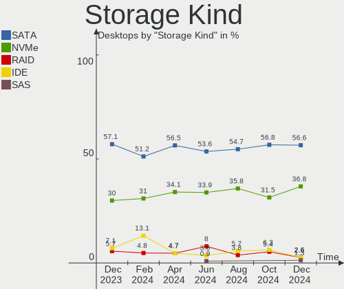
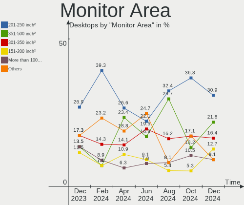
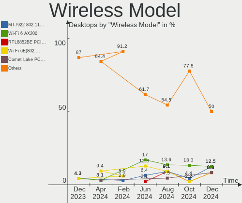
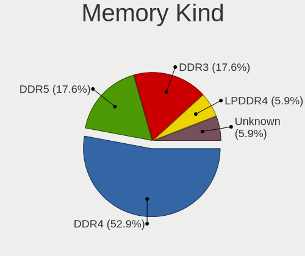
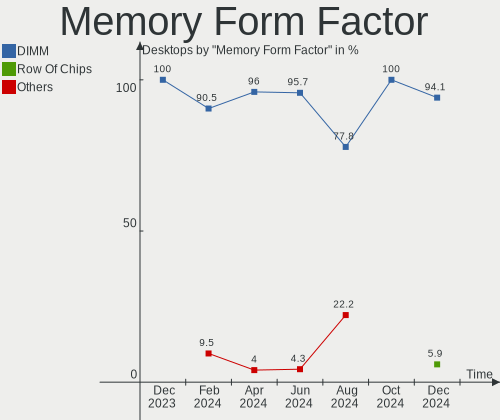

Kubuntu - Hardware Trends (Desktops)
------------------------------------

A project to identify most popular hardware characteristics and track their change
over time based on data collected by Linux users at https://Linux-Hardware.org.

Anyone can contribute to this report by the [hw-probe](https://github.com/linuxhw/hw-probe) tool:

    sudo -E hw-probe -all -upload

This report is for one last month. Overall report since the beginning of time: [TestDays](https://github.com/linuxhw/TestDays)

Period: Dec, 2023.

Contents
--------

* [ System ](#system)
  - [ OS                       ](#os)
  - [ OS Family                ](#os-family)
  - [ Kernel                   ](#kernel)
  - [ Kernel Family            ](#kernel-family)
  - [ Kernel Major Ver.        ](#kernel-major-ver)
  - [ Arch                     ](#arch)
  - [ DE                       ](#de)
  - [ Display Server           ](#display-server)
  - [ Display Manager          ](#display-manager)
  - [ OS Lang                  ](#os-lang)
  - [ Boot Mode                ](#boot-mode)
  - [ Filesystem               ](#filesystem)
  - [ Part. scheme             ](#part-scheme)
  - [ Dual Boot with Linux/BSD ](#dual-boot-with-linuxbsd)
  - [ Dual Boot (Win)          ](#dual-boot-win)

* [ Board ](#board)
  - [ Vendor                   ](#vendor)
  - [ Model                    ](#model)
  - [ Model Family             ](#model-family)
  - [ MFG Year                 ](#mfg-year)
  - [ Form Factor              ](#form-factor)
  - [ Secure Boot              ](#secure-boot)
  - [ Coreboot                 ](#coreboot)
  - [ RAM Size                 ](#ram-size)
  - [ RAM Used                 ](#ram-used)
  - [ Total Drives             ](#total-drives)
  - [ Has CD-ROM               ](#has-cd-rom)
  - [ Has Ethernet             ](#has-ethernet)
  - [ Has WiFi                 ](#has-wifi)
  - [ Has Bluetooth            ](#has-bluetooth)

* [ Location ](#location)
  - [ Country                  ](#country)
  - [ City                     ](#city)

* [ Drives ](#drives)
  - [ Drive Vendor             ](#drive-vendor)
  - [ Drive Model              ](#drive-model)
  - [ HDD Vendor               ](#hdd-vendor)
  - [ SSD Vendor               ](#ssd-vendor)
  - [ Drive Kind               ](#drive-kind)
  - [ Drive Connector          ](#drive-connector)
  - [ Drive Size               ](#drive-size)
  - [ Space Total              ](#space-total)
  - [ Space Used               ](#space-used)
  - [ Malfunc. Drives          ](#malfunc-drives)
  - [ Malfunc. Drive Vendor    ](#malfunc-drive-vendor)
  - [ Malfunc. HDD Vendor      ](#malfunc-hdd-vendor)
  - [ Malfunc. Drive Kind      ](#malfunc-drive-kind)
  - [ Failed Drives            ](#failed-drives)
  - [ Failed Drive Vendor      ](#failed-drive-vendor)
  - [ Drive Status             ](#drive-status)

* [ Storage controller ](#storage-controller)
  - [ Storage Vendor           ](#storage-vendor)
  - [ Storage Model            ](#storage-model)
  - [ Storage Kind             ](#storage-kind)

* [ Processor ](#processor)
  - [ CPU Vendor               ](#cpu-vendor)
  - [ CPU Model                ](#cpu-model)
  - [ CPU Model Family         ](#cpu-model-family)
  - [ CPU Cores                ](#cpu-cores)
  - [ CPU Sockets              ](#cpu-sockets)
  - [ CPU Threads              ](#cpu-threads)
  - [ CPU Op-Modes             ](#cpu-op-modes)
  - [ CPU Microcode            ](#cpu-microcode)
  - [ CPU Microarch            ](#cpu-microarch)

* [ Graphics ](#graphics)
  - [ GPU Vendor               ](#gpu-vendor)
  - [ GPU Model                ](#gpu-model)
  - [ GPU Combo                ](#gpu-combo)
  - [ GPU Driver               ](#gpu-driver)
  - [ GPU Memory               ](#gpu-memory)

* [ Monitor ](#monitor)
  - [ Monitor Vendor           ](#monitor-vendor)
  - [ Monitor Model            ](#monitor-model)
  - [ Monitor Resolution       ](#monitor-resolution)
  - [ Monitor Diagonal         ](#monitor-diagonal)
  - [ Monitor Width            ](#monitor-width)
  - [ Aspect Ratio             ](#aspect-ratio)
  - [ Monitor Area             ](#monitor-area)
  - [ Pixel Density            ](#pixel-density)
  - [ Multiple Monitors        ](#multiple-monitors)

* [ Network ](#network)
  - [ Net Controller Vendor    ](#net-controller-vendor)
  - [ Net Controller Model     ](#net-controller-model)
  - [ Wireless Vendor          ](#wireless-vendor)
  - [ Wireless Model           ](#wireless-model)
  - [ Ethernet Vendor          ](#ethernet-vendor)
  - [ Ethernet Model           ](#ethernet-model)
  - [ Net Controller Kind      ](#net-controller-kind)
  - [ Used Controller          ](#used-controller)
  - [ NICs                     ](#nics)
  - [ IPv6                     ](#ipv6)

* [ Bluetooth ](#bluetooth)
  - [ Bluetooth Vendor         ](#bluetooth-vendor)
  - [ Bluetooth Model          ](#bluetooth-model)

* [ Sound ](#sound)
  - [ Sound Vendor             ](#sound-vendor)
  - [ Sound Model              ](#sound-model)

* [ Memory ](#memory)
  - [ Memory Vendor            ](#memory-vendor)
  - [ Memory Model             ](#memory-model)
  - [ Memory Kind              ](#memory-kind)
  - [ Memory Form Factor       ](#memory-form-factor)
  - [ Memory Size              ](#memory-size)
  - [ Memory Speed             ](#memory-speed)

* [ Printers & scanners ](#printers--scanners)
  - [ Printer Vendor           ](#printer-vendor)
  - [ Printer Model            ](#printer-model)
  - [ Scanner Vendor           ](#scanner-vendor)
  - [ Scanner Model            ](#scanner-model)

* [ Camera ](#camera)
  - [ Camera Vendor            ](#camera-vendor)
  - [ Camera Model             ](#camera-model)

* [ Security ](#security)
  - [ Fingerprint Vendor       ](#fingerprint-vendor)
  - [ Fingerprint Model        ](#fingerprint-model)
  - [ Chipcard Vendor          ](#chipcard-vendor)
  - [ Chipcard Model           ](#chipcard-model)

* [ Unsupported ](#unsupported)
  - [ Unsupported Devices      ](#unsupported-devices)
  - [ Unsupported Device Types ](#unsupported-device-types)

System
------

OS
--

Installed operating systems

| Name          | Desktops | Percent |
|---------------|----------|---------|
| Kubuntu 23.10 | 25       | 54.35%  |
| Kubuntu 22.04 | 18       | 39.13%  |
| Kubuntu 23.04 | 3        | 6.52%   |

OS Family
---------

OS without a version

| Name    | Desktops | Percent |
|---------|----------|---------|
| Kubuntu | 46       | 100%    |

Kernel
------

Version of the Linux kernel

| Version               | Desktops | Percent |
|-----------------------|----------|---------|
| 6.5.0-14-generic      | 18       | 39.13%  |
| 6.2.0-37-generic      | 5        | 10.87%  |
| 6.2.0-39-generic      | 4        | 8.7%    |
| 6.5.0-13-generic      | 3        | 6.52%   |
| 5.15.0-91-generic     | 3        | 6.52%   |
| 6.2.0-1017-lowlatency | 2        | 4.35%   |
| 5.15.0-89-generic     | 2        | 4.35%   |
| 5.15.0-86-generic     | 2        | 4.35%   |
| 6.6.1-060601-generic  | 1        | 2.17%   |
| 6.5.0-9-generic       | 1        | 2.17%   |
| 6.5.0-13-lowlatency   | 1        | 2.17%   |
| 6.2.0-1018-lowlatency | 1        | 2.17%   |
| 5.15.0-91-lowlatency  | 1        | 2.17%   |
| 5.15.0-89-lowlatency  | 1        | 2.17%   |
| 5.15.0-88-generic     | 1        | 2.17%   |

Kernel Family
-------------

Linux kernel without a distro release

| Version | Desktops | Percent |
|---------|----------|---------|
| 6.5.0   | 23       | 50%     |
| 6.2.0   | 12       | 26.09%  |
| 5.15.0  | 10       | 21.74%  |
| 6.6.1   | 1        | 2.17%   |

Kernel Major Ver.
-----------------

Linux kernel major version

| Version | Desktops | Percent |
|---------|----------|---------|
| 6.5     | 23       | 50%     |
| 6.2     | 12       | 26.09%  |
| 5.15    | 10       | 21.74%  |
| 6.6     | 1        | 2.17%   |

Arch
----

OS architecture (x86_64, i586, etc.)

| Name    | Desktops | Percent |
|---------|----------|---------|
| x86_64  | 44       | 95.65%  |
| riscv64 | 2        | 4.35%   |

DE
--

Desktop Environment

| Name | Desktops | Percent |
|------|----------|---------|
| KDE5 | 46       | 100%    |

Display Server
--------------

X11 or Wayland

| Name    | Desktops | Percent |
|---------|----------|---------|
| X11     | 42       | 91.3%   |
| Wayland | 4        | 8.7%    |

Display Manager
---------------

SDDM, LightDM, etc.

| Name    | Desktops | Percent |
|---------|----------|---------|
| SDDM    | 29       | 63.04%  |
| Unknown | 14       | 30.43%  |
| GDM3    | 2        | 4.35%   |
| LightDM | 1        | 2.17%   |

OS Lang
-------

Language

| Lang  | Desktops | Percent |
|-------|----------|---------|
| en_US | 18       | 39.13%  |
| fr_FR | 7        | 15.22%  |
| en_GB | 5        | 10.87%  |
| de_DE | 4        | 8.7%    |
| it_IT | 3        | 6.52%   |
| pt_BR | 2        | 4.35%   |
| en_CA | 2        | 4.35%   |
| C     | 2        | 4.35%   |
| et_EE | 1        | 2.17%   |
| es_CO | 1        | 2.17%   |
| en_PH | 1        | 2.17%   |

Boot Mode
---------

EFI or BIOS

| Mode | Desktops | Percent |
|------|----------|---------|
| BIOS | 31       | 67.39%  |
| EFI  | 15       | 32.61%  |

Filesystem
----------

Type of filesystem

| Type    | Desktops | Percent |
|---------|----------|---------|
| Ext4    | 27       | 58.7%   |
| Tmpfs   | 15       | 32.61%  |
| Btrfs   | 2        | 4.35%   |
| Xfs     | 1        | 2.17%   |
| Overlay | 1        | 2.17%   |

Part. scheme
------------

Scheme of partitioning

| Type    | Desktops | Percent |
|---------|----------|---------|
| GPT     | 29       | 63.04%  |
| Unknown | 14       | 30.43%  |
| MBR     | 3        | 6.52%   |

Dual Boot with Linux/BSD
------------------------

Hosting more than one Linux/BSD

| Dual boot | Desktops | Percent |
|-----------|----------|---------|
| No        | 38       | 82.61%  |
| Yes       | 8        | 17.39%  |

Dual Boot (Win)
---------------

Hosting Linux and Windows

| Dual boot | Desktops | Percent |
|-----------|----------|---------|
| No        | 27       | 58.7%   |
| Yes       | 19       | 41.3%   |

Board
-----

Vendor
------

Motherboard manufacturer

| Name                | Desktops | Percent |
|---------------------|----------|---------|
| ASUSTek Computer    | 12       | 26.09%  |
| Gigabyte Technology | 9        | 19.57%  |
| MSI                 | 6        | 13.04%  |
| Hewlett-Packard     | 6        | 13.04%  |
| ASRock              | 4        | 8.7%    |
| Dell                | 2        | 4.35%   |
| Unknown             | 2        | 4.35%   |
| Semp Toshiba        | 1        | 2.17%   |
| Packard Bell        | 1        | 2.17%   |
| Lenovo              | 1        | 2.17%   |
| Fujitsu             | 1        | 2.17%   |
| Foxconn             | 1        | 2.17%   |

Model
-----

Motherboard model

| Name                            | Desktops | Percent |
|---------------------------------|----------|---------|
| Unknown                         | 2        | 4.35%   |
| Semp Toshiba STI                | 1        | 2.17%   |
| Packard Bell IMEDIA S1710       | 1        | 2.17%   |
| MSI MS-7D74                     | 1        | 2.17%   |
| MSI MS-7C56                     | 1        | 2.17%   |
| MSI MS-7B78                     | 1        | 2.17%   |
| MSI MS-7B61                     | 1        | 2.17%   |
| MSI MS-7B51                     | 1        | 2.17%   |
| MSI MS-7817                     | 1        | 2.17%   |
| Lenovo ThinkCentre M92p 2992E5U | 1        | 2.17%   |
| HP Pavilion Desktop 595-p0xxx   | 1        | 2.17%   |
| HP OMEN 25L Desktop GT12-0xxx   | 1        | 2.17%   |
| HP F01                          | 1        | 2.17%   |
| HP Compaq Pro 6300 MT           | 1        | 2.17%   |
| HP 870-119                      | 1        | 2.17%   |
| HP 260-a152ng                   | 1        | 2.17%   |
| Gigabyte X670E AORUS MASTER     | 1        | 2.17%   |
| Gigabyte P55-UD3                | 1        | 2.17%   |
| Gigabyte F2A68HM-H              | 1        | 2.17%   |
| Gigabyte B550M DS3H             | 1        | 2.17%   |
| Gigabyte B550M AORUS PRO-P      | 1        | 2.17%   |
| Gigabyte B550 AORUS ELITE V2    | 1        | 2.17%   |
| Gigabyte AX370-Gaming K7        | 1        | 2.17%   |
| Gigabyte 970-GAMING             | 1        | 2.17%   |
| Gigabyte 4995                   | 1        | 2.17%   |
| Fujitsu ESPRIMO E710            | 1        | 2.17%   |
| Foxconn p7-1012                 | 1        | 2.17%   |
| Dell OptiPlex 7040              | 1        | 2.17%   |
| Dell OptiPlex 390               | 1        | 2.17%   |
| ASUS TUF X470-PLUS GAMING       | 1        | 2.17%   |
| ASUS TUF Gaming X570-PLUS       | 1        | 2.17%   |
| ASUS ROG STRIX TRX40-XE GAMING  | 1        | 2.17%   |
| ASUS ROG STRIX B450-F GAMING    | 1        | 2.17%   |
| ASUS ROG STRIX B350-F GAMING    | 1        | 2.17%   |
| ASUS Pro WS WRX80E-SAGE SE WIFI | 1        | 2.17%   |
| ASUS PRIME H610M-A D4           | 1        | 2.17%   |
| ASUS PRIME A320M-K              | 1        | 2.17%   |
| ASUS M4A88TD-M EVO              | 1        | 2.17%   |
| ASUS CROSSHAIR VI HERO          | 1        | 2.17%   |
| ASUS Crosshair V Formula        | 1        | 2.17%   |

Model Family
------------

Motherboard model prefix

| Name                  | Desktops | Percent |
|-----------------------|----------|---------|
| ASUS ROG              | 3        | 6.52%   |
| Gigabyte B550M        | 2        | 4.35%   |
| Dell OptiPlex         | 2        | 4.35%   |
| ASUS TUF              | 2        | 4.35%   |
| ASUS PRIME            | 2        | 4.35%   |
| ASUS CROSSHAIR        | 2        | 4.35%   |
| Unknown               | 2        | 4.35%   |
| Semp Toshiba STI      | 1        | 2.17%   |
| Packard Bell IMEDIA   | 1        | 2.17%   |
| MSI MS-7D74           | 1        | 2.17%   |
| MSI MS-7C56           | 1        | 2.17%   |
| MSI MS-7B78           | 1        | 2.17%   |
| MSI MS-7B61           | 1        | 2.17%   |
| MSI MS-7B51           | 1        | 2.17%   |
| MSI MS-7817           | 1        | 2.17%   |
| Lenovo ThinkCentre    | 1        | 2.17%   |
| HP Pavilion           | 1        | 2.17%   |
| HP OMEN               | 1        | 2.17%   |
| HP F01                | 1        | 2.17%   |
| HP Compaq             | 1        | 2.17%   |
| HP 870-119            | 1        | 2.17%   |
| HP 260-a152ng         | 1        | 2.17%   |
| Gigabyte X670E        | 1        | 2.17%   |
| Gigabyte P55-UD3      | 1        | 2.17%   |
| Gigabyte F2A68HM-H    | 1        | 2.17%   |
| Gigabyte B550         | 1        | 2.17%   |
| Gigabyte AX370-Gaming | 1        | 2.17%   |
| Gigabyte 970-GAMING   | 1        | 2.17%   |
| Gigabyte 4995         | 1        | 2.17%   |
| Fujitsu ESPRIMO       | 1        | 2.17%   |
| Foxconn p7-1012       | 1        | 2.17%   |
| ASUS Pro              | 1        | 2.17%   |
| ASUS M4A88TD-M        | 1        | 2.17%   |
| ASUS All              | 1        | 2.17%   |
| ASRock Z170A-X1       | 1        | 2.17%   |
| ASRock X670E          | 1        | 2.17%   |
| ASRock X570           | 1        | 2.17%   |
| ASRock B560M          | 1        | 2.17%   |

MFG Year
--------

Motherboard manufacture year

| Year | Desktops | Percent |
|------|----------|---------|
| 2018 | 6        | 13.04%  |
| 2020 | 5        | 10.87%  |
| 2016 | 5        | 10.87%  |
| 2012 | 5        | 10.87%  |
| 2023 | 4        | 8.7%    |
| 2017 | 4        | 8.7%    |
| 2024 | 2        | 4.35%   |
| 2022 | 2        | 4.35%   |
| 2021 | 2        | 4.35%   |
| 2019 | 2        | 4.35%   |
| 2011 | 2        | 4.35%   |
| 2010 | 2        | 4.35%   |
| 2009 | 2        | 4.35%   |
| 2015 | 1        | 2.17%   |
| 2014 | 1        | 2.17%   |
| 2013 | 1        | 2.17%   |

Form Factor
-----------

Physical design of the computer

| Name    | Desktops | Percent |
|---------|----------|---------|
| Desktop | 46       | 100%    |

Secure Boot
-----------

Enabled or disabled

| State    | Desktops | Percent |
|----------|----------|---------|
| Disabled | 45       | 97.83%  |
| Enabled  | 1        | 2.17%   |

Coreboot
--------

Have coreboot on board

| Used | Desktops | Percent |
|------|----------|---------|
| No   | 46       | 100%    |

RAM Size
--------

Total RAM memory

| Size in GB      | Desktops | Percent |
|-----------------|----------|---------|
| 32.01-64.0      | 16       | 34.78%  |
| 16.01-24.0      | 9        | 19.57%  |
| 8.01-16.0       | 6        | 13.04%  |
| 4.01-8.0        | 5        | 10.87%  |
| 64.01-256.0     | 5        | 10.87%  |
| 3.01-4.0        | 3        | 6.52%   |
| More than 256.0 | 1        | 2.17%   |
| 24.01-32.0      | 1        | 2.17%   |

RAM Used
--------

Used RAM memory

| Used GB    | Desktops | Percent |
|------------|----------|---------|
| 3.01-4.0   | 14       | 30.43%  |
| 4.01-8.0   | 13       | 28.26%  |
| 1.01-2.0   | 8        | 17.39%  |
| 2.01-3.0   | 4        | 8.7%    |
| 16.01-24.0 | 3        | 6.52%   |
| 8.01-16.0  | 3        | 6.52%   |
| 24.01-32.0 | 1        | 2.17%   |

Total Drives
------------

Number of drives on board

| Drives | Desktops | Percent |
|--------|----------|---------|
| 2      | 12       | 26.09%  |
| 4      | 11       | 23.91%  |
| 1      | 10       | 21.74%  |
| 3      | 8        | 17.39%  |
| 7      | 2        | 4.35%   |
| 5      | 2        | 4.35%   |
| 6      | 1        | 2.17%   |

Has CD-ROM
----------

Has CD-ROM on board

| Presented | Desktops | Percent |
|-----------|----------|---------|
| No        | 26       | 56.52%  |
| Yes       | 20       | 43.48%  |

Has Ethernet
------------

Has Ethernet on board

| Presented | Desktops | Percent |
|-----------|----------|---------|
| Yes       | 44       | 95.65%  |
| No        | 2        | 4.35%   |

Has WiFi
--------

Has WiFi module

| Presented | Desktops | Percent |
|-----------|----------|---------|
| No        | 25       | 54.35%  |
| Yes       | 21       | 45.65%  |

Has Bluetooth
-------------

Has Bluetooth module

| Presented | Desktops | Percent |
|-----------|----------|---------|
| No        | 31       | 67.39%  |
| Yes       | 15       | 32.61%  |

Location
--------

Country
-------

Geographic location (country)

| Country     | Desktops | Percent |
|-------------|----------|---------|
| USA         | 11       | 23.91%  |
| France      | 7        | 15.22%  |
| UK          | 5        | 10.87%  |
| Italy       | 4        | 8.7%    |
| Germany     | 4        | 8.7%    |
| China       | 2        | 4.35%   |
| Canada      | 2        | 4.35%   |
| Brazil      | 2        | 4.35%   |
| Switzerland | 1        | 2.17%   |
| Sweden      | 1        | 2.17%   |
| Spain       | 1        | 2.17%   |
| Romania     | 1        | 2.17%   |
| Philippines | 1        | 2.17%   |
| Peru        | 1        | 2.17%   |
| Indonesia   | 1        | 2.17%   |
| Estonia     | 1        | 2.17%   |
| Colombia    | 1        | 2.17%   |

City
----

Geographic location (city)

| City                     | Desktops | Percent |
|--------------------------|----------|---------|
| Hamburg                  | 2        | 4.35%   |
| Zofingen                 | 1        | 2.17%   |
| Woodbridge               | 1        | 2.17%   |
| Weymouth                 | 1        | 2.17%   |
| Welwyn                   | 1        | 2.17%   |
| Walnut Creek             | 1        | 2.17%   |
| Vélez-Málaga           | 1        | 2.17%   |
| Talence                  | 1        | 2.17%   |
| Shinnston                | 1        | 2.17%   |
| Santo André             | 1        | 2.17%   |
| Santa Clara              | 1        | 2.17%   |
| Roche-la-Moliere         | 1        | 2.17%   |
| Rho                      | 1        | 2.17%   |
| Reno                     | 1        | 2.17%   |
| Rakvere                  | 1        | 2.17%   |
| Pasturana                | 1        | 2.17%   |
| Palermo                  | 1        | 2.17%   |
| Nashville                | 1        | 2.17%   |
| Milan                    | 1        | 2.17%   |
| Martinopolis             | 1        | 2.17%   |
| Manchester               | 1        | 2.17%   |
| Makati City              | 1        | 2.17%   |
| Lima                     | 1        | 2.17%   |
| Langon                   | 1        | 2.17%   |
| Lacanau                  | 1        | 2.17%   |
| La Wantzenau             | 1        | 2.17%   |
| Kunming                  | 1        | 2.17%   |
| Kalmar                   | 1        | 2.17%   |
| Jianshui                 | 1        | 2.17%   |
| Jakarta                  | 1        | 2.17%   |
| Herschweiler-Pettersheim | 1        | 2.17%   |
| Great Falls              | 1        | 2.17%   |
| Golders Green            | 1        | 2.17%   |
| Fulton                   | 1        | 2.17%   |
| Fremont                  | 1        | 2.17%   |
| Frankfurt am Main        | 1        | 2.17%   |
| Duluth                   | 1        | 2.17%   |
| Chicago                  | 1        | 2.17%   |
| Carlisle                 | 1        | 2.17%   |
| Burlington               | 1        | 2.17%   |

Drives
------

Drive Vendor
------------

Hard drive vendors

| Vendor                    | Desktops | Drives | Percent |
|---------------------------|----------|--------|---------|
| Seagate                   | 19       | 30     | 19.19%  |
| Samsung Electronics       | 18       | 28     | 18.18%  |
| WDC                       | 11       | 16     | 11.11%  |
| SanDisk                   | 8        | 8      | 8.08%   |
| Crucial                   | 7        | 7      | 7.07%   |
| Kingston                  | 4        | 6      | 4.04%   |
| A-DATA Technology         | 4        | 4      | 4.04%   |
| Toshiba                   | 2        | 4      | 2.02%   |
| Hitachi                   | 2        | 3      | 2.02%   |
| China                     | 2        | 2      | 2.02%   |
| USB                       | 1        | 2      | 1.01%   |
| Unknown                   | 1        | 1      | 1.01%   |
| uFound                    | 1        | 1      | 1.01%   |
| TO Exter                  | 1        | 1      | 1.01%   |
| SSI                       | 1        | 1      | 1.01%   |
| SPCC                      | 1        | 1      | 1.01%   |
| Silicon Motion            | 1        | 1      | 1.01%   |
| PNY                       | 1        | 1      | 1.01%   |
| OCZ                       | 1        | 1      | 1.01%   |
| Micron/Crucial Technology | 1        | 1      | 1.01%   |
| Micron Technology         | 1        | 1      | 1.01%   |
| Maxtor                    | 1        | 1      | 1.01%   |
| Lexar                     | 1        | 1      | 1.01%   |
| LaCie                     | 1        | 1      | 1.01%   |
| KIOXIA                    | 1        | 1      | 1.01%   |
| HGST                      | 1        | 1      | 1.01%   |
| GOODRAM                   | 1        | 1      | 1.01%   |
| Galaxy G                  | 1        | 1      | 1.01%   |
| G-TECH                    | 1        | 1      | 1.01%   |
| Fanxiang                  | 1        | 1      | 1.01%   |
| External                  | 1        | 1      | 1.01%   |
| Corsair                   | 1        | 1      | 1.01%   |

Drive Model
-----------

Hard drive models

| Model                                               | Desktops | Percent |
|-----------------------------------------------------|----------|---------|
| Seagate ST2000DM008-2FR102 2TB                      | 3        | 2.48%   |
| Seagate ST1000DM003-1SB102 1TB                      | 3        | 2.48%   |
| Seagate ST31000524AS 1TB                            | 2        | 1.65%   |
| SanDisk SSD PLUS 240GB                              | 2        | 1.65%   |
| Samsung SSD 980 1TB                                 | 2        | 1.65%   |
| Samsung SSD 870 QVO 2TB                             | 2        | 1.65%   |
| Samsung SSD 850 EVO 500GB                           | 2        | 1.65%   |
| Samsung NVMe SSD Controller SM981/PM981/PM983 512GB | 2        | 1.65%   |
| Samsung NVMe SSD Controller PM9A1/PM9A3/980PRO 2TB  | 2        | 1.65%   |
| WDC WDS500G1B0B-00AS40 500GB SSD                    | 1        | 0.83%   |
| WDC WD5000YS-01MPB1 500GB                           | 1        | 0.83%   |
| WDC WD5000AAKX-001CA0 500GB                         | 1        | 0.83%   |
| WDC WD40EZRZ-00GXCB0 4TB                            | 1        | 0.83%   |
| WDC WD40EZAX-00C8UB0 4TB                            | 1        | 0.83%   |
| WDC WD30EZRX-00MMMB0 3TB                            | 1        | 0.83%   |
| WDC WD20EZRX-19D8PB0 2TB                            | 1        | 0.83%   |
| WDC WD2002FAEX-007BA0 2TB                           | 1        | 0.83%   |
| WDC WD10EZEX-08WN4A0 1TB                            | 1        | 0.83%   |
| WDC WD10EAVS-00D7B1 1TB                             | 1        | 0.83%   |
| WDC WD1003FZEX-00K3CA0 1TB                          | 1        | 0.83%   |
| USB 3.0 12TB                                        | 1        | 0.83%   |
| Unknown SD/MMC/MS PRO 512GB                         | 1        | 0.83%   |
| uFound S600 SATA3 512G                              | 1        | 0.83%   |
| Toshiba MQ01ABF050 500GB                            | 1        | 0.83%   |
| Toshiba MK1002TSKB 1TB                              | 1        | 0.83%   |
| Toshiba DT01ACA100 1TB                              | 1        | 0.83%   |
| Toshiba DT01ACA050 500GB                            | 1        | 0.83%   |
| TO Exter nal USB 3.0 480GB                          | 1        | 0.83%   |
| SSI H/W RAID0 De 2TB                                | 1        | 0.83%   |
| SPCC Solid State Disk 256GB                         | 1        | 0.83%   |
| Silicon Motion QUANXING N200 512GB                  | 1        | 0.83%   |
| Seagate ST932032 5AS 320GB                          | 1        | 0.83%   |
| Seagate ST500LM021-1KJ152 500GB                     | 1        | 0.83%   |
| Seagate ST4000DX001-1CE168 4TB                      | 1        | 0.83%   |
| Seagate ST4000DM006-2G5107 4TB                      | 1        | 0.83%   |
| Seagate ST4000DM004-2CV104 4TB                      | 1        | 0.83%   |
| Seagate ST3500312CS 500GB                           | 1        | 0.83%   |
| Seagate ST3250318AS 250GB                           | 1        | 0.83%   |
| Seagate ST31000528AS 1TB                            | 1        | 0.83%   |
| Seagate ST2000LM015-2E8174 2TB                      | 1        | 0.83%   |

HDD Vendor
----------

Hard disk drive vendors

| Vendor              | Desktops | Drives | Percent |
|---------------------|----------|--------|---------|
| Seagate             | 18       | 29     | 42.86%  |
| WDC                 | 10       | 15     | 23.81%  |
| Samsung Electronics | 3        | 3      | 7.14%   |
| Toshiba             | 2        | 4      | 4.76%   |
| Hitachi             | 2        | 3      | 4.76%   |
| USB                 | 1        | 2      | 2.38%   |
| Unknown             | 1        | 1      | 2.38%   |
| TO Exter            | 1        | 1      | 2.38%   |
| SSI                 | 1        | 1      | 2.38%   |
| Maxtor              | 1        | 1      | 2.38%   |
| HGST                | 1        | 1      | 2.38%   |
| External            | 1        | 1      | 2.38%   |

SSD Vendor
----------

Solid state drive vendors

| Vendor              | Desktops | Drives | Percent |
|---------------------|----------|--------|---------|
| Samsung Electronics | 9        | 11     | 25.71%  |
| SanDisk             | 5        | 5      | 14.29%  |
| Crucial             | 5        | 5      | 14.29%  |
| Kingston            | 4        | 5      | 11.43%  |
| A-DATA Technology   | 3        | 3      | 8.57%   |
| China               | 2        | 2      | 5.71%   |
| WDC                 | 1        | 1      | 2.86%   |
| SPCC                | 1        | 1      | 2.86%   |
| PNY                 | 1        | 1      | 2.86%   |
| OCZ                 | 1        | 1      | 2.86%   |
| Lexar               | 1        | 1      | 2.86%   |
| GOODRAM             | 1        | 1      | 2.86%   |
| Corsair             | 1        | 1      | 2.86%   |

Drive Kind
----------

HDD or SSD

| Kind    | Desktops | Drives | Percent |
|---------|----------|--------|---------|
| HDD     | 31       | 62     | 38.75%  |
| SSD     | 24       | 38     | 30%     |
| NVMe    | 21       | 26     | 26.25%  |
| Unknown | 4        | 5      | 5%      |

Drive Connector
---------------

SATA, SAS, NVMe, etc.

| Type | Desktops | Drives | Percent |
|------|----------|--------|---------|
| SATA | 40       | 94     | 57.14%  |
| NVMe | 21       | 26     | 30%     |
| SAS  | 9        | 11     | 12.86%  |

Drive Size
----------

Size of hard drive

| Size in TB | Desktops | Drives | Percent |
|------------|----------|--------|---------|
| 0.01-0.5   | 28       | 45     | 40.58%  |
| 0.51-1.0   | 17       | 22     | 24.64%  |
| 1.01-2.0   | 14       | 21     | 20.29%  |
| 3.01-4.0   | 7        | 8      | 10.14%  |
| 2.01-3.0   | 2        | 2      | 2.9%    |
| 10.01-20.0 | 1        | 2      | 1.45%   |

Space Total
-----------

Amount of disk space available on the file system

| Size in GB     | Desktops | Percent |
|----------------|----------|---------|
| 1001-2000      | 12       | 26.09%  |
| More than 3000 | 9        | 19.57%  |
| 101-250        | 7        | 15.22%  |
| 501-1000       | 7        | 15.22%  |
| 2001-3000      | 5        | 10.87%  |
| 251-500        | 4        | 8.7%    |
| 1-20           | 1        | 2.17%   |
| 51-100         | 1        | 2.17%   |

Space Used
----------

Amount of used disk space

| Used GB        | Desktops | Percent |
|----------------|----------|---------|
| 101-250        | 10       | 21.74%  |
| More than 3000 | 7        | 15.22%  |
| 501-1000       | 7        | 15.22%  |
| 51-100         | 7        | 15.22%  |
| 251-500        | 4        | 8.7%    |
| 21-50          | 4        | 8.7%    |
| 1-20           | 4        | 8.7%    |
| 1001-2000      | 3        | 6.52%   |

Malfunc. Drives
---------------

Drive models with a malfunction

| Model                             | Desktops | Drives | Percent |
|-----------------------------------|----------|--------|---------|
| WDC WD2002FAEX-007BA0 2TB         | 1        | 6      | 33.33%  |
| Samsung Electronics HD501LJ 500GB | 1        | 1      | 33.33%  |
| Hitachi HDP725032GLA380 320GB     | 1        | 2      | 33.33%  |

Malfunc. Drive Vendor
---------------------

Vendors of faulty drives

| Vendor              | Desktops | Drives | Percent |
|---------------------|----------|--------|---------|
| WDC                 | 1        | 6      | 33.33%  |
| Samsung Electronics | 1        | 1      | 33.33%  |
| Hitachi             | 1        | 2      | 33.33%  |

Malfunc. HDD Vendor
-------------------

Vendors of faulty HDD drives

| Vendor              | Desktops | Drives | Percent |
|---------------------|----------|--------|---------|
| WDC                 | 1        | 6      | 33.33%  |
| Samsung Electronics | 1        | 1      | 33.33%  |
| Hitachi             | 1        | 2      | 33.33%  |

Malfunc. Drive Kind
-------------------

Kinds of faulty drives

| Kind | Desktops | Drives | Percent |
|------|----------|--------|---------|
| HDD  | 3        | 9      | 100%    |

Failed Drives
-------------

Failed drive models

Zero info for selected period =(

Failed Drive Vendor
-------------------

Failed drive vendors

Zero info for selected period =(

Drive Status
------------

Number of failed and malfunc. drives

| Status   | Desktops | Drives | Percent |
|----------|----------|--------|---------|
| Detected | 33       | 86     | 63.46%  |
| Works    | 16       | 36     | 30.77%  |
| Malfunc  | 3        | 9      | 5.77%   |

Storage controller
------------------

Storage Vendor
--------------

Storage controller vendors

| Vendor                      | Desktops | Percent |
|-----------------------------|----------|---------|
| AMD                         | 24       | 32.88%  |
| Intel                       | 18       | 24.66%  |
| Samsung Electronics         | 11       | 15.07%  |
| ASMedia Technology          | 4        | 5.48%   |
| SanDisk                     | 3        | 4.11%   |
| Micron/Crucial Technology   | 2        | 2.74%   |
| Marvell Technology Group    | 2        | 2.74%   |
| VIA Technologies            | 1        | 1.37%   |
| Silicon Motion              | 1        | 1.37%   |
| Realtek Semiconductor       | 1        | 1.37%   |
| Nvidia                      | 1        | 1.37%   |
| Micron Technology           | 1        | 1.37%   |
| LSI Logic / Symbios Logic   | 1        | 1.37%   |
| KIOXIA                      | 1        | 1.37%   |
| Kingston Technology Company | 1        | 1.37%   |
| INNOGRIT                    | 1        | 1.37%   |

Storage Model
-------------

Storage controller models

| Model                                                                                   | Desktops | Percent |
|-----------------------------------------------------------------------------------------|----------|---------|
| AMD FCH SATA Controller [AHCI mode]                                                     | 13       | 14.77%  |
| Samsung NVMe SSD Controller SM981/PM981/PM983                                           | 4        | 4.55%   |
| ASMedia ASM1062 Serial ATA Controller                                                   | 4        | 4.55%   |
| AMD SB7x0/SB8x0/SB9x0 SATA Controller [AHCI mode]                                       | 4        | 4.55%   |
| AMD 500 Series Chipset SATA Controller                                                  | 4        | 4.55%   |
| Samsung NVMe SSD Controller PM9A1/PM9A3/980PRO                                          | 3        | 3.41%   |
| Samsung NVMe SSD Controller 980 (DRAM-less)                                             | 3        | 3.41%   |
| Intel Q170/Q150/B150/H170/H110/Z170/CM236 Chipset SATA Controller [AHCI Mode]           | 3        | 3.41%   |
| Intel 7 Series/C210 Series Chipset Family 6-port SATA Controller [AHCI mode]            | 3        | 3.41%   |
| AMD 400 Series Chipset SATA Controller                                                  | 3        | 3.41%   |
| Micron/Crucial P2 [Nick P2] / P3 / P3 Plus NVMe PCIe SSD (DRAM-less)                    | 2        | 2.27%   |
| Intel Cannon Lake PCH SATA AHCI Controller                                              | 2        | 2.27%   |
| Intel 5 Series/3400 Series Chipset 6 port SATA AHCI Controller                          | 2        | 2.27%   |
| AMD X370 Series Chipset SATA Controller                                                 | 2        | 2.27%   |
| AMD SB7x0/SB8x0/SB9x0 IDE Controller                                                    | 2        | 2.27%   |
| VIA VT6415 PATA IDE Host Controller                                                     | 1        | 1.14%   |
| Silicon Motion SM2263EN/SM2263XT (DRAM-less) NVMe SSD Controllers                       | 1        | 1.14%   |
| SanDisk WD PC SN810 / Black SN850 NVMe SSD                                              | 1        | 1.14%   |
| SanDisk WD Blue SN500 / PC SN520 x2 M.2 2280 NVMe SSD                                   | 1        | 1.14%   |
| SanDisk Ultra 3D / WD Blue SN570 NVMe SSD (DRAM-less)                                   | 1        | 1.14%   |
| Samsung NVMe SSD Controller SM951/PM951                                                 | 1        | 1.14%   |
| Samsung NVMe SSD Controller S4LV008[Pascal]                                             | 1        | 1.14%   |
| Realtek RTS5763DL NVMe SSD Controller (DRAM-less)                                       | 1        | 1.14%   |
| Nvidia MCP73 IDE Controller                                                             | 1        | 1.14%   |
| Nvidia GeForce 7100/nForce 630i SATA                                                    | 1        | 1.14%   |
| Micron 9400 MAX NVMe SSD                                                                | 1        | 1.14%   |
| Marvell Group 88SE9215 PCIe 2.0 x1 4-port SATA 6 Gb/s Controller                        | 1        | 1.14%   |
| Marvell Group 88SE9123 PCIe SATA 6.0 Gb/s controller                                    | 1        | 1.14%   |
| LSI Logic / Symbios Logic MegaRAID SAS 2108 [Liberator]                                 | 1        | 1.14%   |
| KIOXIA NVMe SSD Controller CD8                                                          | 1        | 1.14%   |
| Kingston Company KC3000/FURY Renegade NVMe SSD E18                                      | 1        | 1.14%   |
| Intel Volume Management Device NVMe RAID Controller Intel Corporation                   | 1        | 1.14%   |
| Intel SATA Controller [RAID mode]                                                       | 1        | 1.14%   |
| Intel Alder Lake-S PCH SATA Controller [AHCI Mode]                                      | 1        | 1.14%   |
| Intel 9 Series Chipset Family SATA Controller [AHCI Mode]                               | 1        | 1.14%   |
| Intel 8 Series/C220 Series Chipset Family 4-port SATA Controller 1 [IDE mode]           | 1        | 1.14%   |
| Intel 8 Series/C220 Series Chipset Family 2-port SATA Controller 2 [IDE mode]           | 1        | 1.14%   |
| Intel 700 Series Chipset Family SATA AHCI Controller                                    | 1        | 1.14%   |
| Intel 6 Series/C200 Series Chipset Family Desktop SATA Controller (IDE mode, ports 4-5) | 1        | 1.14%   |
| Intel 6 Series/C200 Series Chipset Family Desktop SATA Controller (IDE mode, ports 0-3) | 1        | 1.14%   |

Storage Kind
------------

Kind of storage controller (IDE, SATA, NVMe, SAS, ...)

| Kind | Desktops | Percent |
|------|----------|---------|
| SATA | 40       | 57.14%  |
| NVMe | 21       | 30%     |
| IDE  | 5        | 7.14%   |
| RAID | 4        | 5.71%   |

Processor
---------

CPU Vendor
----------

Processor vendors

| Vendor        | Desktops | Percent |
|---------------|----------|---------|
| AMD           | 25       | 54.35%  |
| Intel         | 19       | 41.3%   |
| sifive,u74-mc | 2        | 4.35%   |

CPU Model
---------

Processor models

| Model                                          | Desktops | Percent |
|------------------------------------------------|----------|---------|
| sifive,u74-mc rv64imafdc_zicntr_zicsr_zifence  | 2        | 4.35%   |
| Intel Core i7-8700 CPU @ 3.20GHz               | 2        | 4.35%   |
| Intel Core i5-3470 CPU @ 3.20GHz               | 2        | 4.35%   |
| AMD Ryzen 5 5600G with Radeon Graphics         | 2        | 4.35%   |
| Intel Pentium Dual-Core CPU E5200 @ 2.50GHz    | 1        | 2.17%   |
| Intel Core i7-6700 CPU @ 3.40GHz               | 1        | 2.17%   |
| Intel Core i7-3770 CPU @ 3.40GHz               | 1        | 2.17%   |
| Intel Core i7-10700F CPU @ 2.90GHz             | 1        | 2.17%   |
| Intel Core i5-9600K CPU @ 3.70GHz              | 1        | 2.17%   |
| Intel Core i5-6500 CPU @ 3.20GHz               | 1        | 2.17%   |
| Intel Core i5-6400 CPU @ 2.70GHz               | 1        | 2.17%   |
| Intel Core i5-4590 CPU @ 3.30GHz               | 1        | 2.17%   |
| Intel Core i5-2400 CPU @ 3.10GHz               | 1        | 2.17%   |
| Intel Core i5-10400F CPU @ 2.90GHz             | 1        | 2.17%   |
| Intel Core i5 CPU 750 @ 2.67GHz                | 1        | 2.17%   |
| Intel Core i5 CPU 650 @ 3.20GHz                | 1        | 2.17%   |
| Intel Celeron CPU G1840 @ 2.80GHz              | 1        | 2.17%   |
| Intel 13th Gen Core i7-13700                   | 1        | 2.17%   |
| Intel 12th Gen Core i7-12700                   | 1        | 2.17%   |
| AMD Ryzen Threadripper PRO 3995WX 64-Cores     | 1        | 2.17%   |
| AMD Ryzen Threadripper 3960X 24-Core Processor | 1        | 2.17%   |
| AMD Ryzen 9 7950X 16-Core Processor            | 1        | 2.17%   |
| AMD Ryzen 9 7900X3D 12-Core Processor          | 1        | 2.17%   |
| AMD Ryzen 9 7900X 12-Core Processor            | 1        | 2.17%   |
| AMD Ryzen 9 5900X 12-Core Processor            | 1        | 2.17%   |
| AMD Ryzen 7 5800X 8-Core Processor             | 1        | 2.17%   |
| AMD Ryzen 7 2700X Eight-Core Processor         | 1        | 2.17%   |
| AMD Ryzen 7 2700 Eight-Core Processor          | 1        | 2.17%   |
| AMD Ryzen 7 1800X Eight-Core Processor         | 1        | 2.17%   |
| AMD Ryzen 7 1700X Eight-Core Processor         | 1        | 2.17%   |
| AMD Ryzen 5 5600X 6-Core Processor             | 1        | 2.17%   |
| AMD Ryzen 5 3600XT 6-Core Processor            | 1        | 2.17%   |
| AMD Ryzen 5 1600X Six-Core Processor           | 1        | 2.17%   |
| AMD Ryzen 3 3200G with Radeon Vega Graphics    | 1        | 2.17%   |
| AMD Ryzen 3 1300X Quad-Core Processor          | 1        | 2.17%   |
| AMD Phenom II X4 955 Processor                 | 1        | 2.17%   |
| AMD FX-8350 Eight-Core Processor               | 1        | 2.17%   |
| AMD FX-8120 Eight-Core Processor               | 1        | 2.17%   |
| AMD C-60 APU with Radeon HD Graphics           | 1        | 2.17%   |
| AMD Athlon II X2 220 Processor                 | 1        | 2.17%   |

CPU Model Family
----------------

Processor model prefix

| Model                   | Desktops | Percent |
|-------------------------|----------|---------|
| Intel Core i5           | 10       | 21.74%  |
| Intel Core i7           | 5        | 10.87%  |
| AMD Ryzen 7             | 5        | 10.87%  |
| AMD Ryzen 5             | 5        | 10.87%  |
| Other                   | 4        | 8.7%    |
| AMD Ryzen 9             | 4        | 8.7%    |
| AMD Ryzen Threadripper  | 2        | 4.35%   |
| AMD Ryzen 3             | 2        | 4.35%   |
| AMD FX                  | 2        | 4.35%   |
| Intel Pentium Dual-Core | 1        | 2.17%   |
| Intel Celeron           | 1        | 2.17%   |
| AMD Phenom II X4        | 1        | 2.17%   |
| AMD C-60                | 1        | 2.17%   |
| AMD Athlon II X2        | 1        | 2.17%   |
| AMD A8                  | 1        | 2.17%   |
| AMD A6                  | 1        | 2.17%   |

CPU Cores
---------

Number of processor cores

| Number  | Desktops | Percent |
|---------|----------|---------|
| 4       | 15       | 32.61%  |
| 6       | 9        | 19.57%  |
| 8       | 6        | 13.04%  |
| 2       | 6        | 13.04%  |
| 12      | 4        | 8.7%    |
| 16      | 2        | 4.35%   |
| Unknown | 2        | 4.35%   |
| 64      | 1        | 2.17%   |
| 24      | 1        | 2.17%   |

CPU Sockets
-----------

Number of sockets

| Number  | Desktops | Percent |
|---------|----------|---------|
| 1       | 44       | 95.65%  |
| Unknown | 2        | 4.35%   |

CPU Threads
-----------

Threads per core (Hyper-Threading)

| Number  | Desktops | Percent |
|---------|----------|---------|
| 2       | 28       | 60.87%  |
| 1       | 16       | 34.78%  |
| Unknown | 2        | 4.35%   |

CPU Op-Modes
------------

CPU Operation Modes (32-bit, 64-bit)

| Op mode        | Desktops | Percent |
|----------------|----------|---------|
| 32-bit, 64-bit | 44       | 95.65%  |
| Unknown        | 2        | 4.35%   |

CPU Microcode
-------------

Microcode number

| Number     | Desktops | Percent |
|------------|----------|---------|
| Unknown    | 33       | 71.74%  |
| 0x0800820d | 2        | 4.35%   |
| 0x106e5    | 1        | 2.17%   |
| 0x0a601203 | 1        | 2.17%   |
| 0x0a601201 | 1        | 2.17%   |
| 0x0a50000f | 1        | 2.17%   |
| 0x0a50000c | 1        | 2.17%   |
| 0x0a201016 | 1        | 2.17%   |
| 0x0830107a | 1        | 2.17%   |
| 0x08001138 | 1        | 2.17%   |
| 0x08001126 | 1        | 2.17%   |
| 0x06000822 | 1        | 2.17%   |
| 0x05000119 | 1        | 2.17%   |

CPU Microarch
-------------

Microarchitecture

| Name             | Desktops | Percent |
|------------------|----------|---------|
| Unknown          | 6        | 13.04%  |
| Zen 3            | 5        | 10.87%  |
| Zen              | 4        | 8.7%    |
| Zen+             | 3        | 6.52%   |
| Zen 2            | 3        | 6.52%   |
| Skylake          | 3        | 6.52%   |
| KabyLake         | 3        | 6.52%   |
| IvyBridge        | 3        | 6.52%   |
| K10              | 2        | 4.35%   |
| Haswell          | 2        | 4.35%   |
| CometLake        | 2        | 4.35%   |
| Westmere         | 1        | 2.17%   |
| Steamroller      | 1        | 2.17%   |
| SandyBridge      | 1        | 2.17%   |
| Puma             | 1        | 2.17%   |
| Piledriver       | 1        | 2.17%   |
| Penryn           | 1        | 2.17%   |
| Nehalem          | 1        | 2.17%   |
| Bulldozer        | 1        | 2.17%   |
| Bobcat           | 1        | 2.17%   |
| Alderlake Hybrid | 1        | 2.17%   |

Graphics
--------

GPU Vendor
----------

Vendors of graphics cards

| Vendor | Desktops | Percent |
|--------|----------|---------|
| Nvidia | 20       | 43.48%  |
| AMD    | 19       | 41.3%   |
| Intel  | 7        | 15.22%  |

GPU Model
---------

Graphics card models

| Model                                                                     | Desktops | Percent |
|---------------------------------------------------------------------------|----------|---------|
| AMD Ellesmere [Radeon RX 470/480/570/570X/580/580X/590]                   | 4        | 8.33%   |
| Nvidia GA106 [GeForce RTX 3060 Lite Hash Rate]                            | 3        | 6.25%   |
| AMD Raphael                                                               | 3        | 6.25%   |
| Nvidia GP107 [GeForce GTX 1050 Ti]                                        | 2        | 4.17%   |
| Nvidia GM204 [GeForce GTX 970]                                            | 2        | 4.17%   |
| Intel Xeon E3-1200 v2/3rd Gen Core processor Graphics Controller          | 2        | 4.17%   |
| AMD Navi 23 [Radeon RX 6600/6600 XT/6600M]                                | 2        | 4.17%   |
| AMD Cezanne [Radeon Vega Series / Radeon Vega Mobile Series]              | 2        | 4.17%   |
| Nvidia TU106 [GeForce RTX 2060 Rev. A]                                    | 1        | 2.08%   |
| Nvidia GP107 [GeForce GTX 1050]                                           | 1        | 2.08%   |
| Nvidia GP106 [GeForce GTX 1060 6GB]                                       | 1        | 2.08%   |
| Nvidia GM206 [GeForce GTX 960]                                            | 1        | 2.08%   |
| Nvidia GM107GL [Quadro K620]                                              | 1        | 2.08%   |
| Nvidia GK208B [GeForce GT 730]                                            | 1        | 2.08%   |
| Nvidia GK208B [GeForce GT 710]                                            | 1        | 2.08%   |
| Nvidia GF119 [GeForce GT 610]                                             | 1        | 2.08%   |
| Nvidia GF108 [GeForce GT 730]                                             | 1        | 2.08%   |
| Nvidia GF106 [GeForce GTS 450]                                            | 1        | 2.08%   |
| Nvidia GA104 [GeForce RTX 3070]                                           | 1        | 2.08%   |
| Nvidia GA102GL [RTX A5000]                                                | 1        | 2.08%   |
| Nvidia GA102 [GeForce RTX 3090 Ti]                                        | 1        | 2.08%   |
| Intel Raptor Lake-S GT1 [UHD Graphics 770]                                | 1        | 2.08%   |
| Intel HD Graphics 530                                                     | 1        | 2.08%   |
| Intel DG2 [Arc A380]                                                      | 1        | 2.08%   |
| Intel AlderLake-S GT1                                                     | 1        | 2.08%   |
| Intel 2nd Generation Core Processor Family Integrated Graphics Controller | 1        | 2.08%   |
| AMD Wrestler [Radeon HD 6290]                                             | 1        | 2.08%   |
| AMD Turks [Radeon HD 7600 Series]                                         | 1        | 2.08%   |
| AMD RS880 [Radeon HD 4250]                                                | 1        | 2.08%   |
| AMD Pinewood [Mobility Radeon HD 5570/6550A]                              | 1        | 2.08%   |
| AMD Picasso/Raven 2 [Radeon Vega Series / Radeon Vega Mobile Series]      | 1        | 2.08%   |
| AMD Park [Mobility Radeon HD 5430]                                        | 1        | 2.08%   |
| AMD Navi 33 [Radeon RX 7700S/7600/7600S/7600M XT/PRO W7600]               | 1        | 2.08%   |
| AMD Navi 21 [Radeon RX 6800/6800 XT / 6900 XT]                            | 1        | 2.08%   |
| AMD Mullins [Radeon R4/R5 Graphics]                                       | 1        | 2.08%   |
| AMD Caicos PRO [Radeon HD 7450]                                           | 1        | 2.08%   |

GPU Combo
---------

Combinations of graphics cards

| Name         | Desktops | Percent |
|--------------|----------|---------|
| 1 x Nvidia   | 18       | 39.13%  |
| 1 x AMD      | 16       | 34.78%  |
| 1 x Intel    | 7        | 15.22%  |
| Other        | 2        | 4.35%   |
| 2 x AMD      | 2        | 4.35%   |
| AMD + Nvidia | 1        | 2.17%   |

GPU Driver
----------

Free vs proprietary

| Driver      | Desktops | Percent |
|-------------|----------|---------|
| Free        | 27       | 58.7%   |
| Proprietary | 16       | 34.78%  |
| Unknown     | 3        | 6.52%   |

GPU Memory
----------

Total video memory

| Size in GB | Desktops | Percent |
|------------|----------|---------|
| Unknown    | 27       | 58.7%   |
| 3.01-4.0   | 5        | 10.87%  |
| 1.01-2.0   | 4        | 8.7%    |
| 8.01-16.0  | 3        | 6.52%   |
| 7.01-8.0   | 2        | 4.35%   |
| 5.01-6.0   | 2        | 4.35%   |
| 0.01-0.5   | 2        | 4.35%   |
| 16.01-24.0 | 1        | 2.17%   |

Monitor
-------

Monitor Vendor
--------------

Monitor vendors

| Vendor              | Desktops | Percent |
|---------------------|----------|---------|
| Samsung Electronics | 10       | 20%     |
| Goldstar            | 8        | 16%     |
| Hewlett-Packard     | 4        | 8%      |
| Dell                | 4        | 8%      |
| Iiyama              | 3        | 6%      |
| Sony                | 2        | 4%      |
| Lenovo              | 2        | 4%      |
| ASUSTek Computer    | 2        | 4%      |
| Westinghouse        | 1        | 2%      |
| ViewSonic           | 1        | 2%      |
| Unknown (XXX)       | 1        | 2%      |
| Philips             | 1        | 2%      |
| ONKYO               | 1        | 2%      |
| NEC Computers       | 1        | 2%      |
| MStar               | 1        | 2%      |
| MiTAC               | 1        | 2%      |
| LG Electronics      | 1        | 2%      |
| Insignia            | 1        | 2%      |
| Gigabyte Technology | 1        | 2%      |
| DTV                 | 1        | 2%      |
| CHO                 | 1        | 2%      |
| BenQ                | 1        | 2%      |
| Acer                | 1        | 2%      |

Monitor Model
-------------

Monitor models

| Model                                                                 | Desktops | Percent |
|-----------------------------------------------------------------------|----------|---------|
| Westinghouse WD32HT1360 WET0025 1366x768 700x390mm 31.5-inch          | 1        | 1.75%   |
| ViewSonic XG271QG VSC2E3B 2560x1440 596x335mm 26.9-inch               | 1        | 1.75%   |
| Unknown (XXX) Union TV XXX2841 1920x1080 1209x680mm 54.6-inch         | 1        | 1.75%   |
| Sony TV SNY5803 1360x768                                              | 1        | 1.75%   |
| Sony TV SNY4302 1920x1080                                             | 1        | 1.75%   |
| Samsung Electronics SyncMaster SAM0587 1920x1200 518x324mm 24.1-inch  | 1        | 1.75%   |
| Samsung Electronics SyncMaster SAM0303 1680x1050 494x320mm 23.2-inch  | 1        | 1.75%   |
| Samsung Electronics SyncMaster SAM027D 1680x1050 433x271mm 20.1-inch  | 1        | 1.75%   |
| Samsung Electronics SMBX2035 SAM06FE 1600x900 443x249mm 20.0-inch     | 1        | 1.75%   |
| Samsung Electronics S27E370 SAM0CF4 1920x1080 600x340mm 27.2-inch     | 1        | 1.75%   |
| Samsung Electronics S24E650 SAM0C86 1920x1200 518x324mm 24.1-inch     | 1        | 1.75%   |
| Samsung Electronics S24E450 SAM0C81 1920x1080 531x299mm 24.0-inch     | 1        | 1.75%   |
| Samsung Electronics LS32A70 SAM7166 3840x2160 698x393mm 31.5-inch     | 1        | 1.75%   |
| Samsung Electronics LS24C36x SAM7314 1920x1080 598x336mm 27.0-inch    | 1        | 1.75%   |
| Samsung Electronics LCD Monitor SAM723F 3840x2160 700x390mm 31.5-inch | 1        | 1.75%   |
| Samsung Electronics LC24RG50 SAM0F90 1920x1080 530x300mm 24.0-inch    | 1        | 1.75%   |
| Samsung Electronics C27F390 SAM0D32 1920x1080 598x336mm 27.0-inch     | 1        | 1.75%   |
| Philips PHL 241V8 PHLC212 1920x1080 527x296mm 23.8-inch               | 1        | 1.75%   |
| ONKYO LCD Monitor TX-SR508                                            | 1        | 1.75%   |
| NEC Computers E231W NEC67EB 1920x1080 510x287mm 23.0-inch             | 1        | 1.75%   |
| MStar TV MST0030 1920x1080 708x398mm 32.0-inch                        | 1        | 1.75%   |
| MiTAC LEDTV SZM0001 1366x768 1150x650mm 52.0-inch                     | 1        | 1.75%   |
| LG Electronics LCD Monitor D2342P 4800x1080                           | 1        | 1.75%   |
| Lenovo P24h-10 LEN61AE 2560x1440 527x296mm 23.8-inch                  | 1        | 1.75%   |
| Lenovo D22e-20 LEN66D2 1920x1080 478x260mm 21.4-inch                  | 1        | 1.75%   |
| Insignia NS-40D510NA17 BBY4063 1920x1080 885x498mm 40.0-inch          | 1        | 1.75%   |
| Iiyama PLE2207WS IVM5609 1680x1050 474x296mm 22.0-inch                | 1        | 1.75%   |
| Iiyama PL3288UH IVM1176 3840x2160 698x393mm 31.5-inch                 | 1        | 1.75%   |
| Iiyama PL2796HS IVM6669 1920x1080 598x336mm 27.0-inch                 | 1        | 1.75%   |
| Iiyama PL2796HS IVM6668 1920x1080 598x336mm 27.0-inch                 | 1        | 1.75%   |
| Hewlett-Packard w1907 HWP26A3 1440x900 408x255mm 18.9-inch            | 1        | 1.75%   |
| Hewlett-Packard VH240a HPN3499 1920x1080 527x296mm 23.8-inch          | 1        | 1.75%   |
| Hewlett-Packard V221 HWP3111 1920x1080 477x268mm 21.5-inch            | 1        | 1.75%   |
| Hewlett-Packard TouchSmart HWP4205 1920x1080 510x287mm 23.0-inch      | 1        | 1.75%   |
| Hewlett-Packard L1945w HWP2804 1440x900 408x255mm 18.9-inch           | 1        | 1.75%   |
| Goldstar W2340 GSM57A8 1920x1080 510x290mm 23.1-inch                  | 1        | 1.75%   |
| Goldstar W2253 GSM56DC 1920x1080 510x290mm 23.1-inch                  | 1        | 1.75%   |
| Goldstar ULTRAWIDE GSM59F1 2560x1080 673x284mm 28.8-inch              | 1        | 1.75%   |
| Goldstar TV SSCR2 GSMC0C8 3840x2160                                   | 1        | 1.75%   |
| Goldstar LG IPS FULLHD GSM5AB8 1920x1080 480x270mm 21.7-inch          | 1        | 1.75%   |

Monitor Resolution
------------------

Monitor screen resolution

| Resolution         | Desktops | Percent |
|--------------------|----------|---------|
| 1920x1080 (FHD)    | 22       | 43.14%  |
| 3840x2160 (4K)     | 8        | 15.69%  |
| 2560x1440 (QHD)    | 4        | 7.84%   |
| 1920x1200 (WUXGA)  | 3        | 5.88%   |
| 1680x1050 (WSXGA+) | 3        | 5.88%   |
| 1600x900 (HD+)     | 2        | 3.92%   |
| 1440x900 (WXGA+)   | 2        | 3.92%   |
| 4800x1080          | 1        | 1.96%   |
| 3440x1440          | 1        | 1.96%   |
| 2560x1080          | 1        | 1.96%   |
| 1366x768 (WXGA)    | 1        | 1.96%   |
| 1360x768           | 1        | 1.96%   |
| 1280x1024 (SXGA)   | 1        | 1.96%   |
| Unknown            | 1        | 1.96%   |

Monitor Diagonal
----------------

Diagonal size in inches

| Inches  | Desktops | Percent |
|---------|----------|---------|
| 24      | 9        | 17.31%  |
| 27      | 8        | 15.38%  |
| 23      | 6        | 11.54%  |
| 31      | 4        | 7.69%   |
| 72      | 3        | 5.77%   |
| 21      | 3        | 5.77%   |
| 20      | 3        | 5.77%   |
| 52      | 2        | 3.85%   |
| 40      | 2        | 3.85%   |
| 34      | 2        | 3.85%   |
| 63      | 1        | 1.92%   |
| 54      | 1        | 1.92%   |
| 43      | 1        | 1.92%   |
| 42      | 1        | 1.92%   |
| 32      | 1        | 1.92%   |
| 26      | 1        | 1.92%   |
| 22      | 1        | 1.92%   |
| 19      | 1        | 1.92%   |
| 18      | 1        | 1.92%   |
| Unknown | 1        | 1.92%   |

Monitor Width
-------------

Physical width

| Width in mm | Desktops | Percent |
|-------------|----------|---------|
| 501-600     | 19       | 40.43%  |
| 401-500     | 9        | 19.15%  |
| 601-700     | 4        | 8.51%   |
| 1001-1500   | 4        | 8.51%   |
| 701-800     | 3        | 6.38%   |
| 1501-2000   | 3        | 6.38%   |
| 801-900     | 2        | 4.26%   |
| 901-1000    | 2        | 4.26%   |
| Unknown     | 1        | 2.13%   |

Aspect Ratio
------------

Proportional relationship between the width and the height

| Ratio   | Desktops | Percent |
|---------|----------|---------|
| 16/9    | 33       | 75%     |
| 16/10   | 7        | 15.91%  |
| 21/9    | 2        | 4.55%   |
| 3/2     | 1        | 2.27%   |
| Unknown | 1        | 2.27%   |

Monitor Area
------------

Area in inch²

| Area in inch² | Desktops | Percent |
|----------------|----------|---------|
| 201-250        | 14       | 26.92%  |
| 301-350        | 9        | 17.31%  |
| More than 1000 | 7        | 13.46%  |
| 351-500        | 7        | 13.46%  |
| 151-200        | 6        | 11.54%  |
| 251-300        | 4        | 7.69%   |
| 501-1000       | 4        | 7.69%   |
| Unknown        | 1        | 1.92%   |

Pixel Density
-------------

Pixels per inch

| Density | Desktops | Percent |
|---------|----------|---------|
| 51-100  | 29       | 60.42%  |
| 101-120 | 8        | 16.67%  |
| 1-50    | 6        | 12.5%   |
| 121-160 | 3        | 6.25%   |
| 161-240 | 1        | 2.08%   |
| Unknown | 1        | 2.08%   |

Multiple Monitors
-----------------

Total monitors connected

| Total | Desktops | Percent |
|-------|----------|---------|
| 1     | 31       | 67.39%  |
| 2     | 12       | 26.09%  |
| 0     | 2        | 4.35%   |
| 4     | 1        | 2.17%   |

Network
-------

Net Controller Vendor
---------------------

Controller vendors

| Vendor                          | Desktops | Percent |
|---------------------------------|----------|---------|
| Realtek Semiconductor           | 31       | 47.69%  |
| Intel                           | 20       | 30.77%  |
| Qualcomm Atheros                | 2        | 3.08%   |
| NetGear                         | 2        | 3.08%   |
| D-Link System                   | 2        | 3.08%   |
| TP-Link                         | 1        | 1.54%   |
| Ralink Technology               | 1        | 1.54%   |
| Qualcomm Atheros Communications | 1        | 1.54%   |
| Nvidia                          | 1        | 1.54%   |
| Microsoft                       | 1        | 1.54%   |
| MediaTek                        | 1        | 1.54%   |
| ASUSTek Computer                | 1        | 1.54%   |
| Apple                           | 1        | 1.54%   |

Net Controller Model
--------------------

Controller models

| Model                                                                      | Desktops | Percent |
|----------------------------------------------------------------------------|----------|---------|
| Realtek RTL8111/8168/8411 PCI Express Gigabit Ethernet Controller          | 16       | 21.92%  |
| Realtek RTL8125 2.5GbE Controller                                          | 8        | 10.96%  |
| Intel I211 Gigabit Network Connection                                      | 7        | 9.59%   |
| Realtek RTL8188EUS 802.11n Wireless Network Adapter                        | 4        | 5.48%   |
| Realtek 802.11ac NIC                                                       | 2        | 2.74%   |
| Intel Ethernet Connection (2) I219-V                                       | 2        | 2.74%   |
| Intel 82579LM Gigabit Network Connection (Lewisville)                      | 2        | 2.74%   |
| TP-Link TL-WN722N v2/v3 [Realtek RTL8188EUS]                               | 1        | 1.37%   |
| Realtek RTL88x2bu [AC1200 Techkey]                                         | 1        | 1.37%   |
| Realtek RTL8822CE 802.11ac PCIe Wireless Network Adapter                   | 1        | 1.37%   |
| Realtek RTL8821CE 802.11ac PCIe Wireless Network Adapter                   | 1        | 1.37%   |
| Realtek RTL8153 Gigabit Ethernet Adapter                                   | 1        | 1.37%   |
| Realtek RTL810xE PCI Express Fast Ethernet controller                      | 1        | 1.37%   |
| Realtek 802.11ac WLAN Adapter                                              | 1        | 1.37%   |
| Ralink RT5370 Wireless Adapter                                             | 1        | 1.37%   |
| Qualcomm Atheros Killer E2500 Gigabit Ethernet Controller                  | 1        | 1.37%   |
| Qualcomm Atheros Killer E220x Gigabit Ethernet Controller                  | 1        | 1.37%   |
| Qualcomm Atheros AR9271 802.11n                                            | 1        | 1.37%   |
| Nvidia MCP73 Ethernet                                                      | 1        | 1.37%   |
| NetGear WNA1100 Wireless-N 150 [Atheros AR9271]                            | 1        | 1.37%   |
| NetGear WNA1000M 802.11bgn [Realtek RTL8188CUS]                            | 1        | 1.37%   |
| Microsoft Wireless XBox Controller Dongle                                  | 1        | 1.37%   |
| MediaTek MT7922 802.11ax PCI Express Wireless Network Adapter              | 1        | 1.37%   |
| Intel Wireless 8260                                                        | 1        | 1.37%   |
| Intel Wireless 7265                                                        | 1        | 1.37%   |
| Intel Wi-Fi 6 AX210/AX211/AX411 160MHz                                     | 1        | 1.37%   |
| Intel Wi-Fi 6 AX200                                                        | 1        | 1.37%   |
| Intel I210 Gigabit Network Connection                                      | 1        | 1.37%   |
| Intel Ethernet Controller X550                                             | 1        | 1.37%   |
| Intel Ethernet Controller I225-V                                           | 1        | 1.37%   |
| Intel Ethernet Connection (7) I219-V                                       | 1        | 1.37%   |
| Intel Ethernet Connection (17) I219-V                                      | 1        | 1.37%   |
| Intel Ethernet Connection (11) I219-V                                      | 1        | 1.37%   |
| Intel 82583V Gigabit Network Connection                                    | 1        | 1.37%   |
| Intel 82579V Gigabit Network Connection                                    | 1        | 1.37%   |
| D-Link System DGE-528T Gigabit Ethernet Adapter                            | 1        | 1.37%   |
| D-Link System AirPlus G DWL-G122 Wireless Adapter(rev.C1) [Ralink RT2571W] | 1        | 1.37%   |
| ASUS 802.11ax WLAN Adapter                                                 | 1        | 1.37%   |
| Apple iPad 4/Mini1                                                         | 1        | 1.37%   |

Wireless Vendor
---------------

Wireless vendors

| Vendor                          | Desktops | Percent |
|---------------------------------|----------|---------|
| Realtek Semiconductor           | 10       | 43.48%  |
| Intel                           | 4        | 17.39%  |
| NetGear                         | 2        | 8.7%    |
| TP-Link                         | 1        | 4.35%   |
| Ralink Technology               | 1        | 4.35%   |
| Qualcomm Atheros Communications | 1        | 4.35%   |
| Microsoft                       | 1        | 4.35%   |
| MediaTek                        | 1        | 4.35%   |
| D-Link System                   | 1        | 4.35%   |
| ASUSTek Computer                | 1        | 4.35%   |

Wireless Model
--------------

Wireless models

| Model                                                                      | Desktops | Percent |
|----------------------------------------------------------------------------|----------|---------|
| Realtek RTL8188EUS 802.11n Wireless Network Adapter                        | 4        | 17.39%  |
| Realtek 802.11ac NIC                                                       | 2        | 8.7%    |
| TP-Link TL-WN722N v2/v3 [Realtek RTL8188EUS]                               | 1        | 4.35%   |
| Realtek RTL88x2bu [AC1200 Techkey]                                         | 1        | 4.35%   |
| Realtek RTL8822CE 802.11ac PCIe Wireless Network Adapter                   | 1        | 4.35%   |
| Realtek RTL8821CE 802.11ac PCIe Wireless Network Adapter                   | 1        | 4.35%   |
| Realtek 802.11ac WLAN Adapter                                              | 1        | 4.35%   |
| Ralink RT5370 Wireless Adapter                                             | 1        | 4.35%   |
| Qualcomm Atheros AR9271 802.11n                                            | 1        | 4.35%   |
| NetGear WNA1100 Wireless-N 150 [Atheros AR9271]                            | 1        | 4.35%   |
| NetGear WNA1000M 802.11bgn [Realtek RTL8188CUS]                            | 1        | 4.35%   |
| Microsoft Wireless XBox Controller Dongle                                  | 1        | 4.35%   |
| MediaTek MT7922 802.11ax PCI Express Wireless Network Adapter              | 1        | 4.35%   |
| Intel Wireless 8260                                                        | 1        | 4.35%   |
| Intel Wireless 7265                                                        | 1        | 4.35%   |
| Intel Wi-Fi 6 AX210/AX211/AX411 160MHz                                     | 1        | 4.35%   |
| Intel Wi-Fi 6 AX200                                                        | 1        | 4.35%   |
| D-Link System AirPlus G DWL-G122 Wireless Adapter(rev.C1) [Ralink RT2571W] | 1        | 4.35%   |
| ASUS 802.11ax WLAN Adapter                                                 | 1        | 4.35%   |

Ethernet Vendor
---------------

Ethernet vendors

| Vendor                | Desktops | Percent |
|-----------------------|----------|---------|
| Realtek Semiconductor | 26       | 53.06%  |
| Intel                 | 18       | 36.73%  |
| Qualcomm Atheros      | 2        | 4.08%   |
| Nvidia                | 1        | 2.04%   |
| D-Link System         | 1        | 2.04%   |
| Apple                 | 1        | 2.04%   |

Ethernet Model
--------------

Ethernet models

| Model                                                             | Desktops | Percent |
|-------------------------------------------------------------------|----------|---------|
| Realtek RTL8111/8168/8411 PCI Express Gigabit Ethernet Controller | 16       | 32%     |
| Realtek RTL8125 2.5GbE Controller                                 | 8        | 16%     |
| Intel I211 Gigabit Network Connection                             | 7        | 14%     |
| Intel Ethernet Connection (2) I219-V                              | 2        | 4%      |
| Intel 82579LM Gigabit Network Connection (Lewisville)             | 2        | 4%      |
| Realtek RTL8153 Gigabit Ethernet Adapter                          | 1        | 2%      |
| Realtek RTL810xE PCI Express Fast Ethernet controller             | 1        | 2%      |
| Qualcomm Atheros Killer E2500 Gigabit Ethernet Controller         | 1        | 2%      |
| Qualcomm Atheros Killer E220x Gigabit Ethernet Controller         | 1        | 2%      |
| Nvidia MCP73 Ethernet                                             | 1        | 2%      |
| Intel I210 Gigabit Network Connection                             | 1        | 2%      |
| Intel Ethernet Controller X550                                    | 1        | 2%      |
| Intel Ethernet Controller I225-V                                  | 1        | 2%      |
| Intel Ethernet Connection (7) I219-V                              | 1        | 2%      |
| Intel Ethernet Connection (17) I219-V                             | 1        | 2%      |
| Intel Ethernet Connection (11) I219-V                             | 1        | 2%      |
| Intel 82583V Gigabit Network Connection                           | 1        | 2%      |
| Intel 82579V Gigabit Network Connection                           | 1        | 2%      |
| D-Link System DGE-528T Gigabit Ethernet Adapter                   | 1        | 2%      |
| Apple iPad 4/Mini1                                                | 1        | 2%      |

Net Controller Kind
-------------------

Ethernet, WiFi or modem

| Kind     | Desktops | Percent |
|----------|----------|---------|
| Ethernet | 44       | 67.69%  |
| WiFi     | 21       | 32.31%  |

Used Controller
---------------

Currently used network controller

| Kind     | Desktops | Percent |
|----------|----------|---------|
| Ethernet | 31       | 67.39%  |
| WiFi     | 15       | 32.61%  |

NICs
----

Total network controllers on board

| Total | Desktops | Percent |
|-------|----------|---------|
| 1     | 33       | 71.74%  |
| 2     | 9        | 19.57%  |
| 3     | 2        | 4.35%   |
| 0     | 2        | 4.35%   |

IPv6
----

IPv6 vs IPv4

| Used | Desktops | Percent |
|------|----------|---------|
| No   | 25       | 54.35%  |
| Yes  | 21       | 45.65%  |

Bluetooth
---------

Bluetooth Vendor
----------------

Controller vendors

| Vendor                  | Desktops | Percent |
|-------------------------|----------|---------|
| Intel                   | 4        | 26.67%  |
| Cambridge Silicon Radio | 4        | 26.67%  |
| Realtek Semiconductor   | 3        | 20%     |
| Broadcom                | 2        | 13.33%  |
| MediaTek                | 1        | 6.67%   |
| ASUSTek Computer        | 1        | 6.67%   |

Bluetooth Model
---------------

Controller models

| Model                                               | Desktops | Percent |
|-----------------------------------------------------|----------|---------|
| Cambridge Silicon Radio Bluetooth Dongle (HCI mode) | 4        | 26.67%  |
| Realtek Bluetooth Radio                             | 2        | 13.33%  |
| Intel Bluetooth wireless interface                  | 2        | 13.33%  |
| Realtek  Bluetooth 4.2 Adapter                      | 1        | 6.67%   |
| MediaTek Wireless_Device                            | 1        | 6.67%   |
| Intel AX210 Bluetooth                               | 1        | 6.67%   |
| Intel AX200 Bluetooth                               | 1        | 6.67%   |
| Broadcom HP Bluethunder                             | 1        | 6.67%   |
| Broadcom BCM20702A0 Bluetooth 4.0                   | 1        | 6.67%   |
| ASUS Bluetooth Device                               | 1        | 6.67%   |

Sound
-----

Sound Vendor
------------

Sound card vendors

| Vendor                     | Desktops | Percent |
|----------------------------|----------|---------|
| AMD                        | 26       | 32.5%   |
| Nvidia                     | 20       | 25%     |
| Intel                      | 19       | 23.75%  |
| Logitech                   | 2        | 2.5%    |
| JMTek                      | 2        | 2.5%    |
| C-Media Electronics        | 2        | 2.5%    |
| ASUSTek Computer           | 2        | 2.5%    |
| PreSonus Audio Electronics | 1        | 1.25%   |
| Micro Star International   | 1        | 1.25%   |
| Focusrite-Novation         | 1        | 1.25%   |
| Corsair                    | 1        | 1.25%   |
| Comtrue                    | 1        | 1.25%   |
| AudioQuest                 | 1        | 1.25%   |
| Astro Gaming               | 1        | 1.25%   |

Sound Model
-----------

Sound card models

| Model                                                               | Desktops | Percent |
|---------------------------------------------------------------------|----------|---------|
| AMD Starship/Matisse HD Audio Controller                            | 6        | 5.88%   |
| AMD Family 17h/19h HD Audio Controller                              | 6        | 5.88%   |
| AMD Family 17h (Models 00h-0fh) HD Audio Controller                 | 6        | 5.88%   |
| AMD SBx00 Azalia (Intel HDA)                                        | 5        | 4.9%    |
| AMD Ellesmere HDMI Audio [Radeon RX 470/480 / 570/580/590]          | 4        | 3.92%   |
| Nvidia GP107GL High Definition Audio Controller                     | 3        | 2.94%   |
| Nvidia GA106 High Definition Audio Controller                       | 3        | 2.94%   |
| Intel 7 Series/C216 Chipset Family High Definition Audio Controller | 3        | 2.94%   |
| Intel 100 Series/C230 Series Chipset Family HD Audio Controller     | 3        | 2.94%   |
| AMD Rembrandt Radeon High Definition Audio Controller               | 3        | 2.94%   |
| AMD Navi 21/23 HDMI/DP Audio Controller                             | 3        | 2.94%   |
| Nvidia GM204 High Definition Audio Controller                       | 2        | 1.96%   |
| Nvidia GK208 HDMI/DP Audio Controller                               | 2        | 1.96%   |
| Nvidia GF108 High Definition Audio Controller                       | 2        | 1.96%   |
| Nvidia GA102 High Definition Audio Controller                       | 2        | 1.96%   |
| Intel Cannon Lake PCH cAVS                                          | 2        | 1.96%   |
| Intel 5 Series/3400 Series Chipset High Definition Audio            | 2        | 1.96%   |
| ASUSTek Computer USB Audio                                          | 2        | 1.96%   |
| AMD Renoir Radeon High Definition Audio Controller                  | 2        | 1.96%   |
| AMD FCH Azalia Controller                                           | 2        | 1.96%   |
| PreSonus Audio Electronics Studio 24c                               | 1        | 0.98%   |
| Nvidia TU106 High Definition Audio Controller                       | 1        | 0.98%   |
| Nvidia MCP73 High Definition Audio                                  | 1        | 0.98%   |
| Nvidia GP106 High Definition Audio Controller                       | 1        | 0.98%   |
| Nvidia GM206 High Definition Audio Controller                       | 1        | 0.98%   |
| Nvidia GM107 High Definition Audio Controller [GeForce 940MX]       | 1        | 0.98%   |
| Nvidia GF106 High Definition Audio Controller                       | 1        | 0.98%   |
| Nvidia GA104 High Definition Audio Controller                       | 1        | 0.98%   |
| Micro Star International USB Audio                                  | 1        | 0.98%   |
| Logitech Logi USB Headset                                           | 1        | 0.98%   |
| Logitech H390 headset with microphone                               | 1        | 0.98%   |
| JMTek USB Speaker                                                   | 1        | 0.98%   |
| JMTek USB PnP Audio Device                                          | 1        | 0.98%   |
| Intel Smart Sound Technology (SST) Audio Controller                 | 1        | 0.98%   |
| Intel DG2 Audio Controller                                          | 1        | 0.98%   |
| Intel Comet Lake PCH cAVS                                           | 1        | 0.98%   |
| Intel Alder Lake-S HD Audio Controller                              | 1        | 0.98%   |
| Intel 9 Series Chipset Family HD Audio Controller                   | 1        | 0.98%   |
| Intel 8 Series/C220 Series Chipset High Definition Audio Controller | 1        | 0.98%   |
| Intel 700 Series Chipset Family Precise Touch and Stylus Port #1    | 1        | 0.98%   |

Memory
------

Memory Vendor
-------------

Memory module vendors

| Vendor              | Desktops | Percent |
|---------------------|----------|---------|
| Kingston            | 8        | 33.33%  |
| Corsair             | 5        | 20.83%  |
| Unknown             | 2        | 8.33%   |
| SK hynix            | 2        | 8.33%   |
| Samsung Electronics | 2        | 8.33%   |
| Crucial             | 2        | 8.33%   |
| Transcend           | 1        | 4.17%   |
| Patriot             | 1        | 4.17%   |
| Unknown             | 1        | 4.17%   |

Memory Model
------------

Memory module models

| Model                                                  | Desktops | Percent |
|--------------------------------------------------------|----------|---------|
| Corsair RAM CMK16GX4M2B3200C16 8GB DIMM DDR4 3600MT/s  | 2        | 8%      |
| Unknown RAM Module 4GB DIMM 1333MT/s                   | 1        | 4%      |
| Unknown RAM Module 2GB DIMM 1333MT/s                   | 1        | 4%      |
| Unknown RAM Module 16GB DIMM DDR4 2667MT/s             | 1        | 4%      |
| Transcend RAM JM1333KLN-4G 4GB DIMM DDR3 1600MT/s      | 1        | 4%      |
| SK hynix RAM HMT41GU7AFR8A-PB 8GB DIMM DDR3 1600MT/s   | 1        | 4%      |
| SK hynix RAM HMA451U6AFR8N-TF 4GB DIMM DDR4 2133MT/s   | 1        | 4%      |
| Samsung RAM Module 8GB DIMM DDR4 2666MT/s              | 1        | 4%      |
| Samsung RAM M391B5673FH0-CH9 2GB DIMM DDR3 1333MT/s    | 1        | 4%      |
| Patriot RAM PSD38G16002 8GB DIMM DDR3 1600MT/s         | 1        | 4%      |
| Kingston RAM Module 16GB DIMM DDR4 2933MT/s            | 1        | 4%      |
| Kingston RAM KHX3600C18D4/16GX 16GB DIMM DDR4 3600MT/s | 1        | 4%      |
| Kingston RAM KHX3200C16D4/16GX 16GB DIMM DDR4 3600MT/s | 1        | 4%      |
| Kingston RAM KF560C36-32 32GB DIMM DDR5 4800MT/s       | 1        | 4%      |
| Kingston RAM KF3200C16D4/16GX 16GB DIMM DDR4 3200MT/s  | 1        | 4%      |
| Kingston RAM 99U5584-005.A00LF 4GB DIMM DDR3 1600MT/s  | 1        | 4%      |
| Kingston RAM 9965745-028.A00G 16GB DIMM DDR4 2667MT/s  | 1        | 4%      |
| Kingston RAM 9965745-020.A00G 32GB DIMM DDR4 3600MT/s  | 1        | 4%      |
| Crucial RAM CT8G4DFS8266.M8FJ 8GB DIMM DDR4 2667MT/s   | 1        | 4%      |
| Crucial RAM CT32G48C40U5.C16A1 32GB DIMM DDR5 4800MT/s | 1        | 4%      |
| Corsair RAM CMW32GX4M2D3600C18 16GB DIMM DDR4 3600MT/s | 1        | 4%      |
| Corsair RAM CMK32GX4M2E3200C16 16GB DIMM DDR4 3534MT/s | 1        | 4%      |
| Corsair RAM CM4X16GE2400Z16K4 16GB DIMM DDR4 2400MT/s  | 1        | 4%      |
| Unknown                                                | 1        | 4%      |

Memory Kind
-----------

Memory module kinds

| Kind    | Desktops | Percent |
|---------|----------|---------|
| DDR4    | 14       | 63.64%  |
| DDR3    | 4        | 18.18%  |
| DDR5    | 2        | 9.09%   |
| SDRAM   | 1        | 4.55%   |
| Unknown | 1        | 4.55%   |

Memory Form Factor
------------------

Physical design of the memory module

| Name | Desktops | Percent |
|------|----------|---------|
| DIMM | 22       | 100%    |

Memory Size
-----------

Memory module size

| Size  | Desktops | Percent |
|-------|----------|---------|
| 16384 | 9        | 37.5%   |
| 8192  | 6        | 25%     |
| 4096  | 4        | 16.67%  |
| 32768 | 3        | 12.5%   |
| 2048  | 2        | 8.33%   |

Memory Speed
------------

Memory module speed

| Speed | Desktops | Percent |
|-------|----------|---------|
| 3600  | 6        | 25%     |
| 1600  | 4        | 16.67%  |
| 2667  | 3        | 12.5%   |
| 4800  | 2        | 8.33%   |
| 2666  | 2        | 8.33%   |
| 1333  | 2        | 8.33%   |
| 3534  | 1        | 4.17%   |
| 3200  | 1        | 4.17%   |
| 2933  | 1        | 4.17%   |
| 2400  | 1        | 4.17%   |
| 2133  | 1        | 4.17%   |

Printers & scanners
-------------------

Printer Vendor
--------------

Printer device vendors

| Vendor | Desktops | Percent |
|--------|----------|---------|
| Zebra  | 1        | 100%    |

Printer Model
-------------

Printer device models

| Model             | Desktops | Percent |
|-------------------|----------|---------|
| Zebra Thrmal 2844 | 1        | 100%    |

Scanner Vendor
--------------

Scanner device vendors

Zero info for selected period =(

Scanner Model
-------------

Scanner device models

Zero info for selected period =(

Camera
------

Camera Vendor
-------------

Camera device vendors

| Vendor                        | Desktops | Percent |
|-------------------------------|----------|---------|
| Logitech                      | 6        | 50%     |
| Trust                         | 1        | 8.33%   |
| Sunplus Innovation Technology | 1        | 8.33%   |
| Microsoft                     | 1        | 8.33%   |
| Chicony Electronics           | 1        | 8.33%   |
| AVerMedia Technologies        | 1        | 8.33%   |
| ANYKA                         | 1        | 8.33%   |

Camera Model
------------

Camera device models

| Model                             | Desktops | Percent |
|-----------------------------------|----------|---------|
| Logitech Webcam C270              | 2        | 15.38%  |
| Logitech HD Pro Webcam C920       | 2        | 15.38%  |
| Trust Full HD Webcam              | 1        | 7.69%   |
| Sunplus UC40M Audio               | 1        | 7.69%   |
| Microsoft LifeCam HD-3000         | 1        | 7.69%   |
| Logitech Webcam C930e             | 1        | 7.69%   |
| Logitech C922 Pro Stream Webcam   | 1        | 7.69%   |
| Logitech C920 PRO HD Webcam       | 1        | 7.69%   |
| Chicony HP High Definition Webcam | 1        | 7.69%   |
| AVerMedia PW310O Webcam           | 1        | 7.69%   |
| ANYKA FHD Camera                  | 1        | 7.69%   |

Security
--------

Fingerprint Vendor
------------------

Fingerprint sensor vendors

Zero info for selected period =(

Fingerprint Model
-----------------

Fingerprint sensor models

Zero info for selected period =(

Chipcard Vendor
---------------

Chipcard module vendors

| Vendor      | Desktops | Percent |
|-------------|----------|---------|
| Alcor Micro | 1        | 100%    |

Chipcard Model
--------------

Chipcard module models

| Model                        | Desktops | Percent |
|------------------------------|----------|---------|
| Alcor Micro Watchdata W 1981 | 1        | 100%    |

Unsupported
-----------

Unsupported Devices
-------------------

Total unsupported devices on board

| Total | Desktops | Percent |
|-------|----------|---------|
| 0     | 40       | 86.96%  |
| 1     | 6        | 13.04%  |

Unsupported Device Types
------------------------

Types of unsupported devices

| Type          | Desktops | Percent |
|---------------|----------|---------|
| Graphics card | 3        | 50%     |
| Sound         | 1        | 16.67%  |
| Net/wireless  | 1        | 16.67%  |
| Chipcard      | 1        | 16.67%  |

