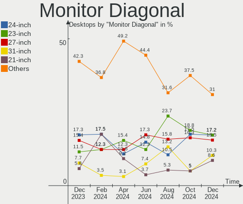

Kubuntu - Hardware Trends (Desktops)
------------------------------------

A project to identify most popular hardware characteristics and track their change
over time based on data collected by Linux users at https://Linux-Hardware.org.

Anyone can contribute to this report by the [hw-probe](https://github.com/linuxhw/hw-probe) tool:

    sudo -E hw-probe -all -upload

This report is for one last month. Overall report since the beginning of time: [TestCoverage](https://github.com/linuxhw/TestCoverage)

Period: May, 2022.

Contents
--------

* [ System ](#system)
  - [ OS                       ](#os)
  - [ OS Family                ](#os-family)
  - [ Kernel                   ](#kernel)
  - [ Kernel Family            ](#kernel-family)
  - [ Kernel Major Ver.        ](#kernel-major-ver)
  - [ Arch                     ](#arch)
  - [ DE                       ](#de)
  - [ Display Server           ](#display-server)
  - [ Display Manager          ](#display-manager)
  - [ OS Lang                  ](#os-lang)
  - [ Boot Mode                ](#boot-mode)
  - [ Filesystem               ](#filesystem)
  - [ Part. scheme             ](#part-scheme)
  - [ Dual Boot with Linux/BSD ](#dual-boot-with-linuxbsd)
  - [ Dual Boot (Win)          ](#dual-boot-win)

* [ Board ](#board)
  - [ Vendor                   ](#vendor)
  - [ Model                    ](#model)
  - [ Model Family             ](#model-family)
  - [ MFG Year                 ](#mfg-year)
  - [ Form Factor              ](#form-factor)
  - [ Secure Boot              ](#secure-boot)
  - [ Coreboot                 ](#coreboot)
  - [ RAM Size                 ](#ram-size)
  - [ RAM Used                 ](#ram-used)
  - [ Total Drives             ](#total-drives)
  - [ Has CD-ROM               ](#has-cd-rom)
  - [ Has Ethernet             ](#has-ethernet)
  - [ Has WiFi                 ](#has-wifi)
  - [ Has Bluetooth            ](#has-bluetooth)

* [ Location ](#location)
  - [ Country                  ](#country)
  - [ City                     ](#city)

* [ Drives ](#drives)
  - [ Drive Vendor             ](#drive-vendor)
  - [ Drive Model              ](#drive-model)
  - [ HDD Vendor               ](#hdd-vendor)
  - [ SSD Vendor               ](#ssd-vendor)
  - [ Drive Kind               ](#drive-kind)
  - [ Drive Connector          ](#drive-connector)
  - [ Drive Size               ](#drive-size)
  - [ Space Total              ](#space-total)
  - [ Space Used               ](#space-used)
  - [ Malfunc. Drives          ](#malfunc-drives)
  - [ Malfunc. Drive Vendor    ](#malfunc-drive-vendor)
  - [ Malfunc. HDD Vendor      ](#malfunc-hdd-vendor)
  - [ Malfunc. Drive Kind      ](#malfunc-drive-kind)
  - [ Failed Drives            ](#failed-drives)
  - [ Failed Drive Vendor      ](#failed-drive-vendor)
  - [ Drive Status             ](#drive-status)

* [ Storage controller ](#storage-controller)
  - [ Storage Vendor           ](#storage-vendor)
  - [ Storage Model            ](#storage-model)
  - [ Storage Kind             ](#storage-kind)

* [ Processor ](#processor)
  - [ CPU Vendor               ](#cpu-vendor)
  - [ CPU Model                ](#cpu-model)
  - [ CPU Model Family         ](#cpu-model-family)
  - [ CPU Cores                ](#cpu-cores)
  - [ CPU Sockets              ](#cpu-sockets)
  - [ CPU Threads              ](#cpu-threads)
  - [ CPU Op-Modes             ](#cpu-op-modes)
  - [ CPU Microcode            ](#cpu-microcode)
  - [ CPU Microarch            ](#cpu-microarch)

* [ Graphics ](#graphics)
  - [ GPU Vendor               ](#gpu-vendor)
  - [ GPU Model                ](#gpu-model)
  - [ GPU Combo                ](#gpu-combo)
  - [ GPU Driver               ](#gpu-driver)
  - [ GPU Memory               ](#gpu-memory)

* [ Monitor ](#monitor)
  - [ Monitor Vendor           ](#monitor-vendor)
  - [ Monitor Model            ](#monitor-model)
  - [ Monitor Resolution       ](#monitor-resolution)
  - [ Monitor Diagonal         ](#monitor-diagonal)
  - [ Monitor Width            ](#monitor-width)
  - [ Aspect Ratio             ](#aspect-ratio)
  - [ Monitor Area             ](#monitor-area)
  - [ Pixel Density            ](#pixel-density)
  - [ Multiple Monitors        ](#multiple-monitors)

* [ Network ](#network)
  - [ Net Controller Vendor    ](#net-controller-vendor)
  - [ Net Controller Model     ](#net-controller-model)
  - [ Wireless Vendor          ](#wireless-vendor)
  - [ Wireless Model           ](#wireless-model)
  - [ Ethernet Vendor          ](#ethernet-vendor)
  - [ Ethernet Model           ](#ethernet-model)
  - [ Net Controller Kind      ](#net-controller-kind)
  - [ Used Controller          ](#used-controller)
  - [ NICs                     ](#nics)
  - [ IPv6                     ](#ipv6)

* [ Bluetooth ](#bluetooth)
  - [ Bluetooth Vendor         ](#bluetooth-vendor)
  - [ Bluetooth Model          ](#bluetooth-model)

* [ Sound ](#sound)
  - [ Sound Vendor             ](#sound-vendor)
  - [ Sound Model              ](#sound-model)

* [ Memory ](#memory)
  - [ Memory Vendor            ](#memory-vendor)
  - [ Memory Model             ](#memory-model)
  - [ Memory Kind              ](#memory-kind)
  - [ Memory Form Factor       ](#memory-form-factor)
  - [ Memory Size              ](#memory-size)
  - [ Memory Speed             ](#memory-speed)

* [ Printers & scanners ](#printers--scanners)
  - [ Printer Vendor           ](#printer-vendor)
  - [ Printer Model            ](#printer-model)
  - [ Scanner Vendor           ](#scanner-vendor)
  - [ Scanner Model            ](#scanner-model)

* [ Camera ](#camera)
  - [ Camera Vendor            ](#camera-vendor)
  - [ Camera Model             ](#camera-model)

* [ Security ](#security)
  - [ Fingerprint Vendor       ](#fingerprint-vendor)
  - [ Fingerprint Model        ](#fingerprint-model)
  - [ Chipcard Vendor          ](#chipcard-vendor)
  - [ Chipcard Model           ](#chipcard-model)

* [ Unsupported ](#unsupported)
  - [ Unsupported Devices      ](#unsupported-devices)
  - [ Unsupported Device Types ](#unsupported-device-types)

System
------

OS
--

Installed operating systems

| Name          | Desktops | Percent |
|---------------|----------|---------|
| Kubuntu 22.04 | 19       | 45.24%  |
| Kubuntu 20.04 | 11       | 26.19%  |
| Kubuntu 11    | 9        | 21.43%  |
| Kubuntu 18.04 | 2        | 4.76%   |
| Kubuntu 21.10 | 1        | 2.38%   |

OS Family
---------

OS without a version

| Name    | Desktops | Percent |
|---------|----------|---------|
| Kubuntu | 42       | 100%    |

Kernel
------

Version of the Linux kernel

| Version                | Desktops | Percent |
|------------------------|----------|---------|
| 5.15.0-27-generic      | 8        | 19.05%  |
| 5.15.0-30-generic      | 6        | 14.29%  |
| 5.13.0-40-generic      | 6        | 14.29%  |
| 5.13.0-41-generic      | 5        | 11.9%   |
| 5.4.0-110-generic      | 4        | 9.52%   |
| 5.15.0-27-lowlatency   | 2        | 4.76%   |
| 5.13.0-44-generic      | 2        | 4.76%   |
| 5.4.0-91-generic       | 1        | 2.38%   |
| 5.4.0-113-generic      | 1        | 2.38%   |
| 5.4.0-109-generic      | 1        | 2.38%   |
| 5.15.29-051529-generic | 1        | 2.38%   |
| 5.15.13-051513-generic | 1        | 2.38%   |
| 5.15.0-33-generic      | 1        | 2.38%   |
| 5.15.0-30-lowlatency   | 1        | 2.38%   |
| 5.10.0-1052-oem        | 1        | 2.38%   |
| 4.15.0-156-generic     | 1        | 2.38%   |

Kernel Family
-------------

Linux kernel without a distro release

| Version | Desktops | Percent |
|---------|----------|---------|
| 5.15.0  | 18       | 42.86%  |
| 5.13.0  | 13       | 30.95%  |
| 5.4.0   | 7        | 16.67%  |
| 5.15.29 | 1        | 2.38%   |
| 5.15.13 | 1        | 2.38%   |
| 5.10.0  | 1        | 2.38%   |
| 4.15.0  | 1        | 2.38%   |

Kernel Major Ver.
-----------------

Linux kernel major version

| Version | Desktops | Percent |
|---------|----------|---------|
| 5.15    | 20       | 47.62%  |
| 5.13    | 13       | 30.95%  |
| 5.4     | 7        | 16.67%  |
| 5.10    | 1        | 2.38%   |
| 4.15    | 1        | 2.38%   |

Arch
----

OS architecture (x86_64, i586, etc.)

| Name   | Desktops | Percent |
|--------|----------|---------|
| x86_64 | 42       | 100%    |

DE
--

Desktop Environment

| Name | Desktops | Percent |
|------|----------|---------|
| KDE5 | 41       | 97.62%  |
| KDE  | 1        | 2.38%   |

Display Server
--------------

X11 or Wayland

| Name | Desktops | Percent |
|------|----------|---------|
| X11  | 41       | 97.62%  |
| Tty  | 1        | 2.38%   |

Display Manager
---------------

SDDM, LightDM, etc.

| Name    | Desktops | Percent |
|---------|----------|---------|
| SDDM    | 25       | 59.52%  |
| Unknown | 16       | 38.1%   |
| LightDM | 1        | 2.38%   |

OS Lang
-------

Language

| Lang   | Desktops | Percent |
|--------|----------|---------|
| en_US  | 13       | 30.95%  |
| fr_FR  | 6        | 14.29%  |
| de_DE  | 4        | 9.52%   |
| ru_RU  | 3        | 7.14%   |
| pt_BR  | 3        | 7.14%   |
| en_GB  | 2        | 4.76%   |
| en_CA  | 2        | 4.76%   |
| de_AT  | 2        | 4.76%   |
| sv_SE  | 1        | 2.38%   |
| pl_PL  | 1        | 2.38%   |
| hu_HU  | 1        | 2.38%   |
| es_CO  | 1        | 2.38%   |
| en_ZA  | 1        | 2.38%   |
| en_001 | 1        | 2.38%   |
| cs_CZ  | 1        | 2.38%   |

Boot Mode
---------

EFI or BIOS

| Mode | Desktops | Percent |
|------|----------|---------|
| BIOS | 21       | 50%     |
| EFI  | 21       | 50%     |

Filesystem
----------

Type of filesystem

| Type  | Desktops | Percent |
|-------|----------|---------|
| Ext4  | 36       | 85.71%  |
| Btrfs | 4        | 9.52%   |
| Xfs   | 2        | 4.76%   |

Part. scheme
------------

Scheme of partitioning

| Type    | Desktops | Percent |
|---------|----------|---------|
| Unknown | 23       | 54.76%  |
| GPT     | 16       | 38.1%   |
| MBR     | 3        | 7.14%   |

Dual Boot with Linux/BSD
------------------------

Hosting more than one Linux/BSD

| Dual boot | Desktops | Percent |
|-----------|----------|---------|
| No        | 33       | 78.57%  |
| Yes       | 9        | 21.43%  |

Dual Boot (Win)
---------------

Hosting Linux and Windows

| Dual boot | Desktops | Percent |
|-----------|----------|---------|
| No        | 29       | 69.05%  |
| Yes       | 13       | 30.95%  |

Board
-----

Vendor
------

Motherboard manufacturer

| Name                | Desktops | Percent |
|---------------------|----------|---------|
| ASUSTek Computer    | 17       | 40.48%  |
| Gigabyte Technology | 7        | 16.67%  |
| MSI                 | 6        | 14.29%  |
| Lenovo              | 2        | 4.76%   |
| Hewlett-Packard     | 2        | 4.76%   |
| ASRock              | 2        | 4.76%   |
| Supermicro          | 1        | 2.38%   |
| Positivo            | 1        | 2.38%   |
| Intel               | 1        | 2.38%   |
| Fujitsu             | 1        | 2.38%   |
| Foxconn             | 1        | 2.38%   |
| Dell                | 1        | 2.38%   |

Model
-----

Motherboard model

| Name                              | Desktops | Percent |
|-----------------------------------|----------|---------|
| ASUS All Series                   | 2        | 4.76%   |
| Supermicro X8ST3                  | 1        | 2.38%   |
| Positivo POS-PIQ57BQ              | 1        | 2.38%   |
| MSI p6-2475ea                     | 1        | 2.38%   |
| MSI MS-7C56                       | 1        | 2.38%   |
| MSI MS-7B89                       | 1        | 2.38%   |
| MSI MS-7B84                       | 1        | 2.38%   |
| MSI MS-7B79                       | 1        | 2.38%   |
| MSI MS-7B78                       | 1        | 2.38%   |
| Lenovo ThinkCentre M90p 5864AL2   | 1        | 2.38%   |
| Lenovo ThinkCentre M83 10AHS2XB00 | 1        | 2.38%   |
| Intel MAHOBAY                     | 1        | 2.38%   |
| HP EliteDesk 800 G1 SFF           | 1        | 2.38%   |
| HP Compaq 8100 Elite CMT PC       | 1        | 2.38%   |
| Gigabyte Z370P D3                 | 1        | 2.38%   |
| Gigabyte Z270-HD3P                | 1        | 2.38%   |
| Gigabyte X570 GAMING X            | 1        | 2.38%   |
| Gigabyte GA-78LMT-S2P             | 1        | 2.38%   |
| Gigabyte F2A88XM-D3H              | 1        | 2.38%   |
| Gigabyte B85M-D2V                 | 1        | 2.38%   |
| Gigabyte 990FXA-UD3               | 1        | 2.38%   |
| Fujitsu ESPRIMO E710              | 1        | 2.38%   |
| Foxconn p6-2346eg                 | 1        | 2.38%   |
| Dell Precision Tower 7810         | 1        | 2.38%   |
| ASUS TUF X470-PLUS GAMING         | 1        | 2.38%   |
| ASUS TUF Gaming B460M-PLUS        | 1        | 2.38%   |
| ASUS TUF B450M-PLUS GAMING        | 1        | 2.38%   |
| ASUS ROG ZENITH EXTREME           | 1        | 2.38%   |
| ASUS ROG STRIX B550-I GAMING      | 1        | 2.38%   |
| ASUS ROG Maximus Z690 EXTREME     | 1        | 2.38%   |
| ASUS ROG CROSSHAIR VIII DARK HERO | 1        | 2.38%   |
| ASUS PRIME B460M-K                | 1        | 2.38%   |
| ASUS PRIME B250-PLUS              | 1        | 2.38%   |
| ASUS PRIME A320M-K                | 1        | 2.38%   |
| ASUS P8B75-M                      | 1        | 2.38%   |
| ASUS P7P55D-E PRO                 | 1        | 2.38%   |
| ASUS P7H55-M LE                   | 1        | 2.38%   |
| ASUS F1A75-M LE                   | 1        | 2.38%   |
| ASUS EB1501P                      | 1        | 2.38%   |
| ASRock B560M Pro4                 | 1        | 2.38%   |
| ASRock B460 Phantom Gaming 4      | 1        | 2.38%   |

Model Family
------------

Motherboard model prefix

| Name                  | Desktops | Percent |
|-----------------------|----------|---------|
| ASUS ROG              | 4        | 9.52%   |
| ASUS TUF              | 3        | 7.14%   |
| ASUS PRIME            | 3        | 7.14%   |
| Lenovo ThinkCentre    | 2        | 4.76%   |
| ASUS All              | 2        | 4.76%   |
| Supermicro X8ST3      | 1        | 2.38%   |
| Positivo POS-PIQ57BQ  | 1        | 2.38%   |
| MSI p6-2475ea         | 1        | 2.38%   |
| MSI MS-7C56           | 1        | 2.38%   |
| MSI MS-7B89           | 1        | 2.38%   |
| MSI MS-7B84           | 1        | 2.38%   |
| MSI MS-7B79           | 1        | 2.38%   |
| MSI MS-7B78           | 1        | 2.38%   |
| Intel MAHOBAY         | 1        | 2.38%   |
| HP EliteDesk          | 1        | 2.38%   |
| HP Compaq             | 1        | 2.38%   |
| Gigabyte Z370P        | 1        | 2.38%   |
| Gigabyte Z270-HD3P    | 1        | 2.38%   |
| Gigabyte X570         | 1        | 2.38%   |
| Gigabyte GA-78LMT-S2P | 1        | 2.38%   |
| Gigabyte F2A88XM-D3H  | 1        | 2.38%   |
| Gigabyte B85M-D2V     | 1        | 2.38%   |
| Gigabyte 990FXA-UD3   | 1        | 2.38%   |
| Fujitsu ESPRIMO       | 1        | 2.38%   |
| Foxconn p6-2346eg     | 1        | 2.38%   |
| Dell Precision        | 1        | 2.38%   |
| ASUS P8B75-M          | 1        | 2.38%   |
| ASUS P7P55D-E         | 1        | 2.38%   |
| ASUS P7H55-M          | 1        | 2.38%   |
| ASUS F1A75-M          | 1        | 2.38%   |
| ASUS EB1501P          | 1        | 2.38%   |
| ASRock B560M          | 1        | 2.38%   |
| ASRock B460           | 1        | 2.38%   |

MFG Year
--------

Motherboard manufacture year

| Year | Desktops | Percent |
|------|----------|---------|
| 2013 | 7        | 16.67%  |
| 2018 | 6        | 14.29%  |
| 2010 | 6        | 14.29%  |
| 2020 | 5        | 11.9%   |
| 2019 | 4        | 9.52%   |
| 2017 | 4        | 9.52%   |
| 2012 | 4        | 9.52%   |
| 2021 | 3        | 7.14%   |
| 2016 | 1        | 2.38%   |
| 2014 | 1        | 2.38%   |
| 2009 | 1        | 2.38%   |

Form Factor
-----------

Physical design of the computer

| Name    | Desktops | Percent |
|---------|----------|---------|
| Desktop | 42       | 100%    |

Secure Boot
-----------

Enabled or disabled

| State    | Desktops | Percent |
|----------|----------|---------|
| Disabled | 42       | 100%    |

Coreboot
--------

Have coreboot on board

| Used | Desktops | Percent |
|------|----------|---------|
| No   | 42       | 100%    |

RAM Size
--------

Total RAM memory

| Size in GB  | Desktops | Percent |
|-------------|----------|---------|
| 16.01-24.0  | 10       | 23.81%  |
| 4.01-8.0    | 8        | 19.05%  |
| 8.01-16.0   | 8        | 19.05%  |
| 32.01-64.0  | 6        | 14.29%  |
| 64.01-256.0 | 5        | 11.9%   |
| 3.01-4.0    | 3        | 7.14%   |
| 24.01-32.0  | 2        | 4.76%   |

RAM Used
--------

Used RAM memory

| Used GB   | Desktops | Percent |
|-----------|----------|---------|
| 2.01-3.0  | 14       | 33.33%  |
| 1.01-2.0  | 10       | 23.81%  |
| 3.01-4.0  | 9        | 21.43%  |
| 4.01-8.0  | 8        | 19.05%  |
| 8.01-16.0 | 1        | 2.38%   |

Total Drives
------------

Number of drives on board

| Drives | Desktops | Percent |
|--------|----------|---------|
| 2      | 12       | 28.57%  |
| 1      | 11       | 26.19%  |
| 3      | 7        | 16.67%  |
| 4      | 6        | 14.29%  |
| 5      | 4        | 9.52%   |
| 6      | 2        | 4.76%   |

Has CD-ROM
----------

Has CD-ROM on board

| Presented | Desktops | Percent |
|-----------|----------|---------|
| No        | 23       | 54.76%  |
| Yes       | 19       | 45.24%  |

Has Ethernet
------------

Has Ethernet on board

| Presented | Desktops | Percent |
|-----------|----------|---------|
| Yes       | 42       | 100%    |

Has WiFi
--------

Has WiFi module

| Presented | Desktops | Percent |
|-----------|----------|---------|
| No        | 24       | 57.14%  |
| Yes       | 18       | 42.86%  |

Has Bluetooth
-------------

Has Bluetooth module

| Presented | Desktops | Percent |
|-----------|----------|---------|
| No        | 29       | 69.05%  |
| Yes       | 13       | 30.95%  |

Location
--------

Country
-------

Geographic location (country)

| Country      | Desktops | Percent |
|--------------|----------|---------|
| France       | 8        | 19.05%  |
| Germany      | 5        | 11.9%   |
| USA          | 4        | 9.52%   |
| Russia       | 3        | 7.14%   |
| Canada       | 3        | 7.14%   |
| Brazil       | 3        | 7.14%   |
| UK           | 2        | 4.76%   |
| Austria      | 2        | 4.76%   |
| Sweden       | 1        | 2.38%   |
| Spain        | 1        | 2.38%   |
| South Africa | 1        | 2.38%   |
| Serbia       | 1        | 2.38%   |
| Portugal     | 1        | 2.38%   |
| Poland       | 1        | 2.38%   |
| Indonesia    | 1        | 2.38%   |
| Hungary      | 1        | 2.38%   |
| Czechia      | 1        | 2.38%   |
| Colombia     | 1        | 2.38%   |
| Bulgaria     | 1        | 2.38%   |
| Belgium      | 1        | 2.38%   |

City
----

Geographic location (city)

| City                    | Desktops | Percent |
|-------------------------|----------|---------|
| Paris                   | 2        | 4.76%   |
| Berlin                  | 2        | 4.76%   |
| Wroclaw                 | 1        | 2.38%   |
| Vienna                  | 1        | 2.38%   |
| Toronto                 | 1        | 2.38%   |
| Szekszárd              | 1        | 2.38%   |
| Solna                   | 1        | 2.38%   |
| Sofia                   | 1        | 2.38%   |
| Saskatoon               | 1        | 2.38%   |
| San Bernardino          | 1        | 2.38%   |
| Salzburg                | 1        | 2.38%   |
| Saint-Mandrier-sur-Mer  | 1        | 2.38%   |
| Prague                  | 1        | 2.38%   |
| Porto                   | 1        | 2.38%   |
| Novosibirsk             | 1        | 2.38%   |
| North Kingstown         | 1        | 2.38%   |
| Nittel                  | 1        | 2.38%   |
| Nice                    | 1        | 2.38%   |
| Moscow                  | 1        | 2.38%   |
| Medellín               | 1        | 2.38%   |
| Malton                  | 1        | 2.38%   |
| Mâcon                  | 1        | 2.38%   |
| Longmont                | 1        | 2.38%   |
| Liverpool               | 1        | 2.38%   |
| Laval                   | 1        | 2.38%   |
| Lauf an der Pegnitz     | 1        | 2.38%   |
| Johannesburg            | 1        | 2.38%   |
| Jamestown               | 1        | 2.38%   |
| Jakarta                 | 1        | 2.38%   |
| Ituporanga              | 1        | 2.38%   |
| Gross-Umstadt           | 1        | 2.38%   |
| Grenoble                | 1        | 2.38%   |
| Ghent                   | 1        | 2.38%   |
| Geispolsheim            | 1        | 2.38%   |
| Cabo de Santo Agostinho | 1        | 2.38%   |
| Brasília               | 1        | 2.38%   |
| Brampton                | 1        | 2.38%   |
| Belgrade                | 1        | 2.38%   |
| Belgorod                | 1        | 2.38%   |
| Alcobendas              | 1        | 2.38%   |

Drives
------

Drive Vendor
------------

Hard drive vendors

| Vendor                    | Desktops | Drives | Percent |
|---------------------------|----------|--------|---------|
| Samsung Electronics       | 20       | 24     | 22.22%  |
| Seagate                   | 19       | 34     | 21.11%  |
| WDC                       | 9        | 11     | 10%     |
| Kingston                  | 7        | 7      | 7.78%   |
| Toshiba                   | 5        | 6      | 5.56%   |
| SanDisk                   | 5        | 5      | 5.56%   |
| Hitachi                   | 3        | 3      | 3.33%   |
| Crucial                   | 3        | 4      | 3.33%   |
| Intel                     | 2        | 2      | 2.22%   |
| HGST                      | 2        | 2      | 2.22%   |
| A-DATA Technology         | 2        | 2      | 2.22%   |
| Verbatim                  | 1        | 1      | 1.11%   |
| Transcend                 | 1        | 1      | 1.11%   |
| Phison                    | 1        | 1      | 1.11%   |
| Patriot                   | 1        | 1      | 1.11%   |
| OCZ                       | 1        | 1      | 1.11%   |
| Netac                     | 1        | 1      | 1.11%   |
| Micron/Crucial Technology | 1        | 1      | 1.11%   |
| MAXTOR                    | 1        | 1      | 1.11%   |
| LDLC                      | 1        | 2      | 1.11%   |
| INNOVATION IT             | 1        | 1      | 1.11%   |
| Gigabyte Technology       | 1        | 1      | 1.11%   |
| DREVO                     | 1        | 1      | 1.11%   |
| Corsair                   | 1        | 1      | 1.11%   |

Drive Model
-----------

Hard drive models

| Model                                      | Desktops | Percent |
|--------------------------------------------|----------|---------|
| Seagate ST3500413AS 500GB                  | 3        | 2.86%   |
| Samsung SSD 850 EVO 500GB                  | 3        | 2.86%   |
| Samsung NVMe SSD Drive 500GB               | 3        | 2.86%   |
| Kingston SA400S37240G 240GB SSD            | 3        | 2.86%   |
| WDC WD5000AADS-00S9B0 500GB                | 2        | 1.9%    |
| Seagate ST4000DM004-2CV104 4TB             | 2        | 1.9%    |
| Seagate ST2000DM008-2FR102 2TB             | 2        | 1.9%    |
| Seagate ST1000DM010-2EP102 1TB             | 2        | 1.9%    |
| WDC WD5000LUCT-63RC2Y0 500GB               | 1        | 0.95%   |
| WDC WD5000AURX-63UY4Y0 500GB               | 1        | 0.95%   |
| WDC WD5000AAKX-75U6AA0 500GB               | 1        | 0.95%   |
| WDC WD5000AADS-67S9B1 500GB                | 1        | 0.95%   |
| WDC WD40EFAX-68JH4N1 4TB                   | 1        | 0.95%   |
| WDC WD3200AAJS-22B4A0 320GB                | 1        | 0.95%   |
| WDC WD30EFRX-68EUZN0 3TB                   | 1        | 0.95%   |
| WDC WD10SPZX-24Z10 1TB                     | 1        | 0.95%   |
| WDC WD10SPCX-60KHST0 1TB                   | 1        | 0.95%   |
| Verbatim Vi550 S3 SSD 256GB                | 1        | 0.95%   |
| Transcend TS1TMTE220S 1TB                  | 1        | 0.95%   |
| Toshiba THNSNH512GCST 512GB SSD            | 1        | 0.95%   |
| Toshiba MK3261GSYN 320GB                   | 1        | 0.95%   |
| Toshiba HDWE140 4TB                        | 1        | 0.95%   |
| Toshiba DT01ACA200 2TB                     | 1        | 0.95%   |
| Toshiba DT01ACA100 1TB                     | 1        | 0.95%   |
| Seagate ST95005620AS 500GB                 | 1        | 0.95%   |
| Seagate ST9500325AS 500GB                  | 1        | 0.95%   |
| Seagate ST9250827AS 250GB                  | 1        | 0.95%   |
| Seagate ST9250320AS 250GB                  | 1        | 0.95%   |
| Seagate ST3400833AS 400GB                  | 1        | 0.95%   |
| Seagate ST3400620AS 400GB                  | 1        | 0.95%   |
| Seagate ST31500341AS 1TB                   | 1        | 0.95%   |
| Seagate ST3000LM016-1N217V 3TB             | 1        | 0.95%   |
| Seagate ST3000DM007-1WY10G 3TB             | 1        | 0.95%   |
| Seagate ST2000DX002-2DV164 2TB             | 1        | 0.95%   |
| Seagate ST2000DM001-1ER164 2TB             | 1        | 0.95%   |
| Seagate ST2000DM001-1CH164 2TB             | 1        | 0.95%   |
| Seagate ST12000VN0008-2JH101 12TB          | 1        | 0.95%   |
| Seagate ST1000LM024 HN-M101MBB 1TB         | 1        | 0.95%   |
| Seagate ST1000DM003-1ER162 1TB             | 1        | 0.95%   |
| Seagate NVMe SSD Drive 2TB                 | 1        | 0.95%   |
| Seagate FireCuda 530 ZP2000GM30023 2TB     | 1        | 0.95%   |
| Seagate FireCuda 520 SSD ZP2000GM30002 2TB | 1        | 0.95%   |
| Seagate Expansion 4TB                      | 1        | 0.95%   |
| SanDisk SSD PLUS 480 GB                    | 1        | 0.95%   |
| SanDisk SSD PLUS 240GB                     | 1        | 0.95%   |
| SanDisk SSD PLUS 120GB                     | 1        | 0.95%   |
| SanDisk SD6SB2M256G1022I 256GB SSD         | 1        | 0.95%   |
| Sandisk NVMe SSD Drive 500GB               | 1        | 0.95%   |
| Samsung SSD 980 1TB                        | 1        | 0.95%   |
| Samsung SSD 970 EVO Plus 250GB             | 1        | 0.95%   |
| Samsung SSD 970 EVO 500GB                  | 1        | 0.95%   |
| Samsung SSD 870 QVO 1TB                    | 1        | 0.95%   |
| Samsung SSD 870 EVO 500GB                  | 1        | 0.95%   |
| Samsung SSD 870 EVO 1TB                    | 1        | 0.95%   |
| Samsung SSD 860 PRO 256GB                  | 1        | 0.95%   |
| Samsung SSD 860 EVO 1TB                    | 1        | 0.95%   |
| Samsung SSD 850 EVO 250GB                  | 1        | 0.95%   |
| Samsung SSD 850 EVO 1TB                    | 1        | 0.95%   |
| Samsung SSD 850 120GB                      | 1        | 0.95%   |
| Samsung SSD 840 PRO Series 128GB           | 1        | 0.95%   |

HDD Vendor
----------

Hard disk drive vendors

| Vendor              | Desktops | Drives | Percent |
|---------------------|----------|--------|---------|
| Seagate             | 17       | 30     | 44.74%  |
| WDC                 | 9        | 11     | 23.68%  |
| Toshiba             | 4        | 5      | 10.53%  |
| Samsung Electronics | 3        | 3      | 7.89%   |
| Hitachi             | 3        | 3      | 7.89%   |
| HGST                | 2        | 2      | 5.26%   |

SSD Vendor
----------

Solid state drive vendors

| Vendor              | Desktops | Drives | Percent |
|---------------------|----------|--------|---------|
| Samsung Electronics | 14       | 14     | 37.84%  |
| Kingston            | 5        | 5      | 13.51%  |
| SanDisk             | 4        | 4      | 10.81%  |
| Intel               | 2        | 2      | 5.41%   |
| Crucial             | 2        | 3      | 5.41%   |
| Verbatim            | 1        | 1      | 2.7%    |
| Toshiba             | 1        | 1      | 2.7%    |
| Patriot             | 1        | 1      | 2.7%    |
| OCZ                 | 1        | 1      | 2.7%    |
| Netac               | 1        | 1      | 2.7%    |
| MAXTOR              | 1        | 1      | 2.7%    |
| INNOVATION IT       | 1        | 1      | 2.7%    |
| DREVO               | 1        | 1      | 2.7%    |
| Corsair             | 1        | 1      | 2.7%    |
| A-DATA Technology   | 1        | 1      | 2.7%    |

Drive Kind
----------

HDD or SSD

| Kind    | Desktops | Drives | Percent |
|---------|----------|--------|---------|
| SSD     | 29       | 38     | 42.65%  |
| HDD     | 26       | 54     | 38.24%  |
| NVMe    | 12       | 20     | 17.65%  |
| Unknown | 1        | 2      | 1.47%   |

Drive Connector
---------------

SATA, SAS, NVMe, etc.

| Type | Desktops | Drives | Percent |
|------|----------|--------|---------|
| SATA | 39       | 91     | 75%     |
| NVMe | 12       | 20     | 23.08%  |
| SAS  | 1        | 3      | 1.92%   |

Drive Size
----------

Size of hard drive

| Size in TB | Desktops | Drives | Percent |
|------------|----------|--------|---------|
| 0.01-0.5   | 32       | 47     | 48.48%  |
| 0.51-1.0   | 20       | 25     | 30.3%   |
| 3.01-4.0   | 6        | 8      | 9.09%   |
| 1.01-2.0   | 4        | 6      | 6.06%   |
| 2.01-3.0   | 3        | 5      | 4.55%   |
| 10.01-20.0 | 1        | 1      | 1.52%   |

Space Total
-----------

Amount of disk space available on the file system

| Size in GB     | Desktops | Percent |
|----------------|----------|---------|
| More than 3000 | 11       | 26.19%  |
| 501-1000       | 8        | 19.05%  |
| 101-250        | 7        | 16.67%  |
| 1001-2000      | 6        | 14.29%  |
| 251-500        | 4        | 9.52%   |
| 2001-3000      | 3        | 7.14%   |
| 21-50          | 2        | 4.76%   |
| 51-100         | 1        | 2.38%   |

Space Used
----------

Amount of used disk space

| Used GB        | Desktops | Percent |
|----------------|----------|---------|
| 101-250        | 8        | 19.05%  |
| 1-20           | 7        | 16.67%  |
| 2001-3000      | 6        | 14.29%  |
| More than 3000 | 4        | 9.52%   |
| 251-500        | 4        | 9.52%   |
| 21-50          | 4        | 9.52%   |
| 501-1000       | 4        | 9.52%   |
| 51-100         | 3        | 7.14%   |
| 1001-2000      | 2        | 4.76%   |

Malfunc. Drives
---------------

Drive models with a malfunction

| Model                               | Desktops | Drives | Percent |
|-------------------------------------|----------|--------|---------|
| Seagate ST31500341AS 1TB            | 1        | 1      | 50%     |
| Samsung Electronics SSD 870 EVO 1TB | 1        | 1      | 50%     |

Malfunc. Drive Vendor
---------------------

Vendors of faulty drives

| Vendor              | Desktops | Drives | Percent |
|---------------------|----------|--------|---------|
| Seagate             | 1        | 1      | 50%     |
| Samsung Electronics | 1        | 1      | 50%     |

Malfunc. HDD Vendor
-------------------

Vendors of faulty HDD drives

| Vendor  | Desktops | Drives | Percent |
|---------|----------|--------|---------|
| Seagate | 1        | 1      | 100%    |

Malfunc. Drive Kind
-------------------

Kinds of faulty drives

| Kind | Desktops | Drives | Percent |
|------|----------|--------|---------|
| SSD  | 1        | 1      | 50%     |
| HDD  | 1        | 1      | 50%     |

Failed Drives
-------------

Failed drive models

Zero info for selected period =(

Failed Drive Vendor
-------------------

Failed drive vendors

Zero info for selected period =(

Drive Status
------------

Number of failed and malfunc. drives

| Status   | Desktops | Drives | Percent |
|----------|----------|--------|---------|
| Detected | 23       | 60     | 51.11%  |
| Works    | 20       | 52     | 44.44%  |
| Malfunc  | 2        | 2      | 4.44%   |

Storage controller
------------------

Storage Vendor
--------------

Storage controller vendors

| Vendor                      | Desktops | Percent |
|-----------------------------|----------|---------|
| Intel                       | 25       | 40.32%  |
| AMD                         | 17       | 27.42%  |
| Samsung Electronics         | 6        | 9.68%   |
| Seagate Technology          | 2        | 3.23%   |
| Kingston Technology Company | 2        | 3.23%   |
| JMicron Technology          | 2        | 3.23%   |
| Silicon Motion              | 1        | 1.61%   |
| Sandisk                     | 1        | 1.61%   |
| Phison Electronics          | 1        | 1.61%   |
| Micron/Crucial Technology   | 1        | 1.61%   |
| Micron Technology           | 1        | 1.61%   |
| Marvell Technology Group    | 1        | 1.61%   |
| ASMedia Technology          | 1        | 1.61%   |
| ADATA Technology            | 1        | 1.61%   |

Storage Model
-------------

Storage controller models

| Model                                                                          | Desktops | Percent |
|--------------------------------------------------------------------------------|----------|---------|
| AMD FCH SATA Controller [AHCI mode]                                            | 11       | 14.1%   |
| AMD 400 Series Chipset SATA Controller                                         | 6        | 7.69%   |
| Samsung NVMe SSD Controller SM981/PM981/PM983                                  | 4        | 5.13%   |
| Intel 8 Series/C220 Series Chipset Family 6-port SATA Controller 1 [AHCI mode] | 4        | 5.13%   |
| Intel 5 Series/3400 Series Chipset 6 port SATA AHCI Controller                 | 3        | 3.85%   |
| Intel 400 Series Chipset Family SATA AHCI Controller                           | 3        | 3.85%   |
| Intel 200 Series PCH SATA controller [AHCI mode]                               | 3        | 3.85%   |
| Kingston Company A2000 NVMe SSD                                                | 2        | 2.56%   |
| Intel 7 Series/C210 Series Chipset Family 6-port SATA Controller [AHCI mode]   | 2        | 2.56%   |
| Intel 5 Series/3400 Series Chipset 4 port SATA IDE Controller                  | 2        | 2.56%   |
| Intel 5 Series/3400 Series Chipset 2 port SATA IDE Controller                  | 2        | 2.56%   |
| AMD SB7x0/SB8x0/SB9x0 SATA Controller [AHCI mode]                              | 2        | 2.56%   |
| AMD 500 Series Chipset SATA Controller                                         | 2        | 2.56%   |
| Silicon Motion SM2262/SM2262EN SSD Controller                                  | 1        | 1.28%   |
| Seagate FireCuda 530 SSD                                                       | 1        | 1.28%   |
| Seagate FireCuda 520 SSD                                                       | 1        | 1.28%   |
| Sandisk WD Black 2018/SN750 / PC SN720 NVMe SSD                                | 1        | 1.28%   |
| Samsung NVMe SSD Controller SM961/PM961/SM963                                  | 1        | 1.28%   |
| Samsung NVMe SSD Controller PM9A1/PM9A3/980PRO                                 | 1        | 1.28%   |
| Samsung NVMe SSD Controller 980                                                | 1        | 1.28%   |
| Phison E16 PCIe4 NVMe Controller                                               | 1        | 1.28%   |
| Micron/Crucial P2 NVMe PCIe SSD                                                | 1        | 1.28%   |
| Micron Non-Volatile memory controller                                          | 1        | 1.28%   |
| Marvell Group 88SE914D SATA-600 Controller                                     | 1        | 1.28%   |
| JMicron JMB368 IDE controller                                                  | 1        | 1.28%   |
| JMicron JMB363 SATA/IDE Controller                                             | 1        | 1.28%   |
| Intel Volume Management Device NVMe RAID Controller                            | 1        | 1.28%   |
| Intel NM10/ICH7 Family SATA Controller [AHCI mode]                             | 1        | 1.28%   |
| Intel C610/X99 series chipset sSATA Controller [AHCI mode]                     | 1        | 1.28%   |
| Intel C600/X79 series chipset SATA RAID Controller                             | 1        | 1.28%   |
| Intel Alder Lake-S PCH SATA Controller [AHCI Mode]                             | 1        | 1.28%   |
| Intel 9 Series Chipset Family SATA Controller [AHCI Mode]                      | 1        | 1.28%   |
| Intel 82801JI (ICH10 Family) SATA AHCI Controller                              | 1        | 1.28%   |
| Intel 7 Series/C210 Series Chipset Family 4-port SATA Controller [IDE mode]    | 1        | 1.28%   |
| Intel 7 Series/C210 Series Chipset Family 2-port SATA Controller [IDE mode]    | 1        | 1.28%   |
| Intel 6 Series/C200 Series Chipset Family 6 port Desktop SATA AHCI Controller  | 1        | 1.28%   |
| Intel 500 Series Chipset Family SATA AHCI Controller                           | 1        | 1.28%   |
| Intel 5 Series/3400 Series Chipset PT IDER Controller                          | 1        | 1.28%   |
| ASMedia ASM1062 Serial ATA Controller                                          | 1        | 1.28%   |
| AMD X399 Series Chipset SATA Controller                                        | 1        | 1.28%   |
| AMD SB7x0/SB8x0/SB9x0 IDE Controller                                           | 1        | 1.28%   |
| AMD FCH SATA Controller [IDE mode]                                             | 1        | 1.28%   |
| AMD FCH SATA Controller D                                                      | 1        | 1.28%   |
| AMD FCH IDE Controller                                                         | 1        | 1.28%   |
| ADATA XPG SX8200 Pro PCIe Gen3x4 M.2 2280 Solid State Drive                    | 1        | 1.28%   |

Storage Kind
------------

Kind of storage controller (IDE, SATA, NVMe, SAS, ...)

| Kind | Desktops | Percent |
|------|----------|---------|
| SATA | 39       | 66.1%   |
| NVMe | 12       | 20.34%  |
| IDE  | 6        | 10.17%  |
| RAID | 2        | 3.39%   |

Processor
---------

CPU Vendor
----------

Processor vendors

| Vendor | Desktops | Percent |
|--------|----------|---------|
| Intel  | 25       | 59.52%  |
| AMD    | 17       | 40.48%  |

CPU Model
---------

Processor models

| Model                                          | Desktops | Percent |
|------------------------------------------------|----------|---------|
| AMD Ryzen 7 2700X Eight-Core Processor         | 3        | 7.14%   |
| Intel Core i5-10400F CPU @ 2.90GHz             | 2        | 4.76%   |
| AMD Ryzen 9 5900X 12-Core Processor            | 2        | 4.76%   |
| Intel Xeon CPU E5-2630 v3 @ 2.40GHz            | 1        | 2.38%   |
| Intel Xeon CPU E3-1275 V2 @ 3.50GHz            | 1        | 2.38%   |
| Intel Pentium CPU G3430 @ 3.30GHz              | 1        | 2.38%   |
| Intel Pentium CPU G3220 @ 3.00GHz              | 1        | 2.38%   |
| Intel Pentium CPU G2030 @ 3.00GHz              | 1        | 2.38%   |
| Intel Core i7-8700K CPU @ 3.70GHz              | 1        | 2.38%   |
| Intel Core i7-6700 CPU @ 3.40GHz               | 1        | 2.38%   |
| Intel Core i7-4790K CPU @ 4.00GHz              | 1        | 2.38%   |
| Intel Core i7-4770 CPU @ 3.40GHz               | 1        | 2.38%   |
| Intel Core i7 CPU 960 @ 3.20GHz                | 1        | 2.38%   |
| Intel Core i5-7500 CPU @ 3.40GHz               | 1        | 2.38%   |
| Intel Core i5-4690 CPU @ 3.50GHz               | 1        | 2.38%   |
| Intel Core i5-3570K CPU @ 3.40GHz              | 1        | 2.38%   |
| Intel Core i5-3350P CPU @ 3.10GHz              | 1        | 2.38%   |
| Intel Core i5-10400 CPU @ 2.90GHz              | 1        | 2.38%   |
| Intel Core i5 CPU 760 @ 2.80GHz                | 1        | 2.38%   |
| Intel Core i5 CPU 750 @ 2.67GHz                | 1        | 2.38%   |
| Intel Core i5 CPU 650 @ 3.20GHz                | 1        | 2.38%   |
| Intel Core i3-10100F CPU @ 3.60GHz             | 1        | 2.38%   |
| Intel Core i3 CPU 540 @ 3.07GHz                | 1        | 2.38%   |
| Intel Core i3 CPU 530 @ 2.93GHz                | 1        | 2.38%   |
| Intel Atom CPU D525 @ 1.80GHz                  | 1        | 2.38%   |
| Intel 12th Gen Core i9-12900K                  | 1        | 2.38%   |
| AMD Ryzen Threadripper 1950X 16-Core Processor | 1        | 2.38%   |
| AMD Ryzen 9 3900X 12-Core Processor            | 1        | 2.38%   |
| AMD Ryzen 7 5700X 8-Core Processor             | 1        | 2.38%   |
| AMD Ryzen 7 5700G with Radeon Graphics         | 1        | 2.38%   |
| AMD Ryzen 5 2600X Six-Core Processor           | 1        | 2.38%   |
| AMD Ryzen 5 2400G with Radeon Vega Graphics    | 1        | 2.38%   |
| AMD FX-8350 Eight-Core Processor               | 1        | 2.38%   |
| AMD FX-4300 Quad-Core Processor                | 1        | 2.38%   |
| AMD A8-9600 RADEON R7, 10 COMPUTE CORES 4C+6G  | 1        | 2.38%   |
| AMD A8-5500 APU with Radeon HD Graphics        | 1        | 2.38%   |
| AMD A8-3870 APU with Radeon HD Graphics        | 1        | 2.38%   |
| AMD A10-5800K APU with Radeon HD Graphics      | 1        | 2.38%   |

CPU Model Family
----------------

Processor model prefix

| Model                  | Desktops | Percent |
|------------------------|----------|---------|
| Intel Core i5          | 10       | 23.81%  |
| Intel Core i7          | 5        | 11.9%   |
| AMD Ryzen 7            | 5        | 11.9%   |
| Intel Pentium          | 3        | 7.14%   |
| Intel Core i3          | 3        | 7.14%   |
| AMD Ryzen 9            | 3        | 7.14%   |
| AMD A8                 | 3        | 7.14%   |
| Intel Xeon             | 2        | 4.76%   |
| AMD Ryzen 5            | 2        | 4.76%   |
| AMD FX                 | 2        | 4.76%   |
| Other                  | 1        | 2.38%   |
| Intel Atom             | 1        | 2.38%   |
| AMD Ryzen Threadripper | 1        | 2.38%   |
| AMD A10                | 1        | 2.38%   |

CPU Cores
---------

Number of processor cores

| Number | Desktops | Percent |
|--------|----------|---------|
| 4      | 15       | 35.71%  |
| 2      | 11       | 26.19%  |
| 8      | 6        | 14.29%  |
| 6      | 5        | 11.9%   |
| 12     | 3        | 7.14%   |
| 16     | 2        | 4.76%   |

CPU Sockets
-----------

Number of sockets

| Number | Desktops | Percent |
|--------|----------|---------|
| 1      | 42       | 100%    |

CPU Threads
-----------

Threads per core (Hyper-Threading)

| Number | Desktops | Percent |
|--------|----------|---------|
| 2      | 31       | 73.81%  |
| 1      | 11       | 26.19%  |

CPU Op-Modes
------------

CPU Operation Modes (32-bit, 64-bit)

| Op mode        | Desktops | Percent |
|----------------|----------|---------|
| 32-bit, 64-bit | 42       | 100%    |

CPU Microcode
-------------

Microcode number

| Number     | Desktops | Percent |
|------------|----------|---------|
| Unknown    | 7        | 16.67%  |
| 0xa0653    | 3        | 7.14%   |
| 0x306a9    | 3        | 7.14%   |
| 0x0800820d | 3        | 7.14%   |
| 0x306c3    | 2        | 4.76%   |
| 0x106e5    | 2        | 4.76%   |
| 0x0a201204 | 2        | 4.76%   |
| 0x06001119 | 2        | 4.76%   |
| 0x06000852 | 2        | 4.76%   |
| 0xa0655    | 1        | 2.38%   |
| 0x906ea    | 1        | 2.38%   |
| 0x906e9    | 1        | 2.38%   |
| 0x90672    | 1        | 2.38%   |
| 0x506e3    | 1        | 2.38%   |
| 0x306f2    | 1        | 2.38%   |
| 0x20655    | 1        | 2.38%   |
| 0x20652    | 1        | 2.38%   |
| 0x106ca    | 1        | 2.38%   |
| 0x106a5    | 1        | 2.38%   |
| 0x0a50000c | 1        | 2.38%   |
| 0x0a201009 | 1        | 2.38%   |
| 0x08701021 | 1        | 2.38%   |
| 0x08101016 | 1        | 2.38%   |
| 0x0600611a | 1        | 2.38%   |
| 0x03000027 | 1        | 2.38%   |

CPU Microarch
-------------

Microarchitecture

| Name       | Desktops | Percent |
|------------|----------|---------|
| Haswell    | 6        | 14.29%  |
| Zen+       | 4        | 9.52%   |
| Zen 3      | 4        | 9.52%   |
| Piledriver | 4        | 9.52%   |
| IvyBridge  | 4        | 9.52%   |
| CometLake  | 4        | 9.52%   |
| Westmere   | 3        | 7.14%   |
| Nehalem    | 3        | 7.14%   |
| Zen        | 2        | 4.76%   |
| KabyLake   | 2        | 4.76%   |
| Zen 2      | 1        | 2.38%   |
| Skylake    | 1        | 2.38%   |
| K10 Llano  | 1        | 2.38%   |
| Excavator  | 1        | 2.38%   |
| Bonnell    | 1        | 2.38%   |
| Unknown    | 1        | 2.38%   |

Graphics
--------

GPU Vendor
----------

Vendors of graphics cards

| Vendor                     | Desktops | Percent |
|----------------------------|----------|---------|
| Nvidia                     | 25       | 53.19%  |
| AMD                        | 12       | 25.53%  |
| Intel                      | 9        | 19.15%  |
| Matrox Electronics Systems | 1        | 2.13%   |

GPU Model
---------

Graphics card models

| Model                                                                       | Desktops | Percent |
|-----------------------------------------------------------------------------|----------|---------|
| Intel Xeon E3-1200 v3/4th Gen Core Processor Integrated Graphics Controller | 4        | 8.51%   |
| Nvidia GP107 [GeForce GTX 1050 Ti]                                          | 3        | 6.38%   |
| AMD Ellesmere [Radeon RX 470/480/570/570X/580/580X/590]                     | 3        | 6.38%   |
| Nvidia GP108 [GeForce GT 1030]                                              | 2        | 4.26%   |
| Nvidia GM206 [GeForce GTX 960]                                              | 2        | 4.26%   |
| AMD Cedar [Radeon HD 5000/6000/7350/8350 Series]                            | 2        | 4.26%   |
| Nvidia TU117 [GeForce GTX 1650]                                             | 1        | 2.13%   |
| Nvidia TU102 [GeForce RTX 2080 Ti]                                          | 1        | 2.13%   |
| Nvidia GT218 [ION]                                                          | 1        | 2.13%   |
| Nvidia GT215 [GeForce GT 240]                                               | 1        | 2.13%   |
| Nvidia GT200b [GeForce GTX 275]                                             | 1        | 2.13%   |
| Nvidia GP107GL [Quadro P400]                                                | 1        | 2.13%   |
| Nvidia GP106 [GeForce GTX 1060 6GB]                                         | 1        | 2.13%   |
| Nvidia GP104 [GeForce GTX 1070]                                             | 1        | 2.13%   |
| Nvidia GP104 [GeForce GTX 1070 Ti]                                          | 1        | 2.13%   |
| Nvidia GM204GL [Quadro M4000]                                               | 1        | 2.13%   |
| Nvidia GK208B [GeForce GT 710]                                              | 1        | 2.13%   |
| Nvidia GF119 [GeForce GT 620 OEM]                                           | 1        | 2.13%   |
| Nvidia GF119 [GeForce GT 610]                                               | 1        | 2.13%   |
| Nvidia GF116 [GeForce GTX 550 Ti]                                           | 1        | 2.13%   |
| Nvidia GF108 [GeForce GT 620]                                               | 1        | 2.13%   |
| Nvidia GF106 [GeForce GTS 450]                                              | 1        | 2.13%   |
| Nvidia GF100GL [Quadro 4000]                                                | 1        | 2.13%   |
| Nvidia GA102 [GeForce RTX 3090]                                             | 1        | 2.13%   |
| Matrox Electronics Systems MGA G200eW WPCM450                               | 1        | 2.13%   |
| Intel Xeon E3-1200 v2/3rd Gen Core processor Graphics Controller            | 1        | 2.13%   |
| Intel IvyBridge GT2 [HD Graphics 4000]                                      | 1        | 2.13%   |
| Intel HD Graphics 530                                                       | 1        | 2.13%   |
| Intel Core Processor Integrated Graphics Controller                         | 1        | 2.13%   |
| Intel CometLake-S GT2 [UHD Graphics 630]                                    | 1        | 2.13%   |
| AMD Turks PRO [Radeon HD 7570]                                              | 1        | 2.13%   |
| AMD Sumo [Radeon HD 6550D]                                                  | 1        | 2.13%   |
| AMD Raven Ridge [Radeon Vega Series / Radeon Vega Mobile Series]            | 1        | 2.13%   |
| AMD Navi 21 [Radeon RX 6800/6800 XT / 6900 XT]                              | 1        | 2.13%   |
| AMD Lexa PRO [Radeon 540/540X/550/550X / RX 540X/550/550X]                  | 1        | 2.13%   |
| AMD Cape Verde PRO [Radeon HD 7750/8740 / R7 250E]                          | 1        | 2.13%   |
| AMD Caicos [Radeon HD 6450/7450/8450 / R5 230 OEM]                          | 1        | 2.13%   |

GPU Combo
---------

Combinations of graphics cards

| Name            | Desktops | Percent |
|-----------------|----------|---------|
| 1 x Nvidia      | 23       | 54.76%  |
| 1 x AMD         | 11       | 26.19%  |
| 1 x Intel       | 7        | 16.67%  |
| Nvidia + Matrox | 1        | 2.38%   |

GPU Driver
----------

Free vs proprietary

| Driver      | Desktops | Percent |
|-------------|----------|---------|
| Free        | 25       | 59.52%  |
| Proprietary | 17       | 40.48%  |

GPU Memory
----------

Total video memory

| Size in GB | Desktops | Percent |
|------------|----------|---------|
| Unknown    | 10       | 23.81%  |
| 1.01-2.0   | 8        | 19.05%  |
| 0.51-1.0   | 7        | 16.67%  |
| 3.01-4.0   | 6        | 14.29%  |
| 7.01-8.0   | 4        | 9.52%   |
| 0.01-0.5   | 3        | 7.14%   |
| 8.01-16.0  | 2        | 4.76%   |
| 5.01-6.0   | 1        | 2.38%   |
| 16.01-24.0 | 1        | 2.38%   |

Monitor
-------

Monitor Vendor
--------------

Monitor vendors

| Vendor              | Desktops | Percent |
|---------------------|----------|---------|
| Dell                | 8        | 16.33%  |
| Samsung Electronics | 7        | 14.29%  |
| Goldstar            | 5        | 10.2%   |
| Hewlett-Packard     | 4        | 8.16%   |
| BenQ                | 4        | 8.16%   |
| Acer                | 3        | 6.12%   |
| LG Electronics      | 2        | 4.08%   |
| ASUSTek Computer    | 2        | 4.08%   |
| AOC                 | 2        | 4.08%   |
| Sony                | 1        | 2.04%   |
| PiLot               | 1        | 2.04%   |
| NCS                 | 1        | 2.04%   |
| Medion              | 1        | 2.04%   |
| LG Display          | 1        | 2.04%   |
| Iiyama              | 1        | 2.04%   |
| Idek Iiyama         | 1        | 2.04%   |
| HJW                 | 1        | 2.04%   |
| Denver              | 1        | 2.04%   |
| DENON               | 1        | 2.04%   |
| CHD                 | 1        | 2.04%   |
| Apple               | 1        | 2.04%   |

Monitor Model
-------------

Monitor models

| Model                                                                | Desktops | Percent |
|----------------------------------------------------------------------|----------|---------|
| Samsung Electronics C24F390 SAM0D2C 1920x1080 521x293mm 23.5-inch    | 2        | 3.77%   |
| Sony LCD Monitor TV                                                  | 1        | 1.89%   |
| Samsung Electronics SyncMaster SAM05CC 1920x1080 530x300mm 24.0-inch | 1        | 1.89%   |
| Samsung Electronics SyncMaster SAM01E1 1280x1024 376x301mm 19.0-inch | 1        | 1.89%   |
| Samsung Electronics SyncMaster SAM01B7 1280x1024 338x270mm 17.0-inch | 1        | 1.89%   |
| Samsung Electronics SMS27A350H SAM07CE 1920x1080 598x336mm 27.0-inch | 1        | 1.89%   |
| Samsung Electronics S24F350 SAM0D20 1920x1080 521x293mm 23.5-inch    | 1        | 1.89%   |
| Samsung Electronics C27F390 SAM0D32 1920x1080 598x336mm 27.0-inch    | 1        | 1.89%   |
| PiLot POLYTRON-TV PLT0014 1920x1080 521x293mm 23.5-inch              | 1        | 1.89%   |
| NCS LCD Monitor NCS2275 1920x1080 256x192mm 12.6-inch                | 1        | 1.89%   |
| Medion MD 20130 MED3616 1920x1200 550x344mm 25.5-inch                | 1        | 1.89%   |
| LG Electronics LCD Monitor LG ULTRAWIDE 1920x1080                    | 1        | 1.89%   |
| LG Electronics LCD Monitor L1770HR 1280x1024                         | 1        | 1.89%   |
| LG Display LCD Monitor LGD0396 1600x900 380x210mm 17.1-inch          | 1        | 1.89%   |
| Iiyama PL3288UH IVM1176 3840x2160 698x393mm 31.5-inch                | 1        | 1.89%   |
| Idek Iiyama LCD Monitor PL2792UH 3840x2160                           | 1        | 1.89%   |
| HJW HDMI TO USB HJW0001 1920x1080 708x398mm 32.0-inch                | 1        | 1.89%   |
| Hewlett-Packard 27cw HWP3194 1920x1080 598x336mm 27.0-inch           | 1        | 1.89%   |
| Hewlett-Packard 24w HPN3431 1920x1080 527x296mm 23.8-inch            | 1        | 1.89%   |
| Hewlett-Packard 24f HPN3545 1920x1080 527x296mm 23.8-inch            | 1        | 1.89%   |
| Hewlett-Packard 2010 HWP2889 1600x900 442x249mm 20.0-inch            | 1        | 1.89%   |
| Goldstar W2243C GSM575E 1920x1080 477x268mm 21.5-inch                | 1        | 1.89%   |
| Goldstar ULTRAWIDE GSM59F1 2560x1080 673x284mm 28.8-inch             | 1        | 1.89%   |
| Goldstar HDR WFHD GSM7714 2560x1080 798x334mm 34.1-inch              | 1        | 1.89%   |
| Goldstar HDR 4K GSM7706 3840x2160 600x340mm 27.2-inch                | 1        | 1.89%   |
| Goldstar 24EN33 GSM59E3 1920x1080 531x299mm 24.0-inch                | 1        | 1.89%   |
| Denver 274K144IGHUCA LHC2700 3840x2160 597x336mm 27.0-inch           | 1        | 1.89%   |
| DENON AVR DON0063 1920x1080                                          | 1        | 1.89%   |
| Dell U2412M DELA07A 1920x1200 518x324mm 24.1-inch                    | 1        | 1.89%   |
| Dell U2412M DELA079 1920x1200 518x324mm 24.1-inch                    | 1        | 1.89%   |
| Dell S2421HN DEL41F2 1920x1080 527x296mm 23.8-inch                   | 1        | 1.89%   |
| Dell S2340L DELD058 1920x1080 510x290mm 23.1-inch                    | 1        | 1.89%   |
| Dell P2415Q DELA0BE 3840x2160 527x296mm 23.8-inch                    | 1        | 1.89%   |
| Dell P2213 DELF043 1680x1050 473x296mm 22.0-inch                     | 1        | 1.89%   |
| Dell P2213 DELF042 1680x1050 473x296mm 22.0-inch                     | 1        | 1.89%   |
| Dell E228WFP DELD015 1680x1050 470x300mm 22.0-inch                   | 1        | 1.89%   |
| Dell E228WFP DELD014 1680x1050 473x296mm 22.0-inch                   | 1        | 1.89%   |
| Dell E1911 DELF037 1440x900 408x255mm 18.9-inch                      | 1        | 1.89%   |
| CHD PMOS320-IQC-1 CHD0320 2560x1440 698x393mm 31.5-inch              | 1        | 1.89%   |
| BenQ LCD Monitor GW2250 1920x1080                                    | 1        | 1.89%   |
| BenQ LCD Monitor GL2450H                                             | 1        | 1.89%   |
| BenQ GW2480 BNQ78E7 1920x1080 527x296mm 23.8-inch                    | 1        | 1.89%   |
| BenQ EX2780Q BNQ7F76 2560x1440 597x336mm 27.0-inch                   | 1        | 1.89%   |
| ASUSTek Computer VG32VQ1B AUS32E0 2560x1440 697x392mm 31.5-inch      | 1        | 1.89%   |
| ASUSTek Computer VG32V AUS32A3 2560x1440 697x393mm 31.5-inch         | 1        | 1.89%   |
| ASUSTek Computer PA248QV AUS2400 1920x1200 518x324mm 24.1-inch       | 1        | 1.89%   |
| Apple LCD Monitor Cinema HD 4480x1600                                | 1        | 1.89%   |
| AOC LCD Monitor 2470W 3840x1080                                      | 1        | 1.89%   |
| AOC 27V2G5 AOC2702 1920x1080 600x340mm 27.2-inch                     | 1        | 1.89%   |
| Acer XB273 GX ACR0746 1920x1080 598x336mm 27.0-inch                  | 1        | 1.89%   |
| Acer P223W ACR000E 1680x1050 474x296mm 22.0-inch                     | 1        | 1.89%   |
| Acer AL1715 ACR5770 1280x1024 338x270mm 17.0-inch                    | 1        | 1.89%   |

Monitor Resolution
------------------

Monitor screen resolution

| Resolution         | Desktops | Percent |
|--------------------|----------|---------|
| 1920x1080 (FHD)    | 18       | 37.5%   |
| 3840x2160 (4K)     | 6        | 12.5%   |
| 2560x1440 (QHD)    | 5        | 10.42%  |
| 1680x1050 (WSXGA+) | 4        | 8.33%   |
| 1280x1024 (SXGA)   | 4        | 8.33%   |
| 2560x1080          | 2        | 4.17%   |
| 1920x1200 (WUXGA)  | 2        | 4.17%   |
| 1600x900 (HD+)     | 2        | 4.17%   |
| Unknown            | 2        | 4.17%   |
| 4480x1600          | 1        | 2.08%   |
| 3840x1080          | 1        | 2.08%   |
| 1440x900 (WXGA+)   | 1        | 2.08%   |

Monitor Diagonal
----------------

Diagonal size in inches

| Inches  | Desktops | Percent |
|---------|----------|---------|
| 27      | 8        | 16.67%  |
| 24      | 8        | 16.67%  |
| Unknown | 6        | 12.5%   |
| 23      | 5        | 10.42%  |
| 31      | 4        | 8.33%   |
| 22      | 4        | 8.33%   |
| 17      | 3        | 6.25%   |
| 34      | 2        | 4.17%   |
| 72      | 1        | 2.08%   |
| 32      | 1        | 2.08%   |
| 25      | 1        | 2.08%   |
| 21      | 1        | 2.08%   |
| 20      | 1        | 2.08%   |
| 19      | 1        | 2.08%   |
| 18      | 1        | 2.08%   |
| 12      | 1        | 2.08%   |

Monitor Width
-------------

Physical width

| Width in mm | Desktops | Percent |
|-------------|----------|---------|
| 501-600     | 20       | 43.48%  |
| 401-500     | 7        | 15.22%  |
| Unknown     | 6        | 13.04%  |
| 601-700     | 4        | 8.7%    |
| 701-800     | 3        | 6.52%   |
| 351-400     | 2        | 4.35%   |
| 301-350     | 2        | 4.35%   |
| 201-300     | 1        | 2.17%   |
| 1501-2000   | 1        | 2.17%   |

Aspect Ratio
------------

Proportional relationship between the width and the height

| Ratio   | Desktops | Percent |
|---------|----------|---------|
| 16/9    | 25       | 55.56%  |
| 16/10   | 8        | 17.78%  |
| Unknown | 6        | 13.33%  |
| 5/4     | 3        | 6.67%   |
| 21/9    | 2        | 4.44%   |
| 4/3     | 1        | 2.22%   |

Monitor Area
------------

Area in inch²

| Area in inch² | Desktops | Percent |
|----------------|----------|---------|
| 201-250        | 14       | 29.79%  |
| 301-350        | 8        | 17.02%  |
| 351-500        | 7        | 14.89%  |
| Unknown        | 6        | 12.77%  |
| 151-200        | 4        | 8.51%   |
| 251-300        | 3        | 6.38%   |
| 141-150        | 2        | 4.26%   |
| More than 1000 | 1        | 2.13%   |
| 71-80          | 1        | 2.13%   |
| 121-130        | 1        | 2.13%   |

Pixel Density
-------------

Pixels per inch

| Density | Desktops | Percent |
|---------|----------|---------|
| 51-100  | 27       | 64.29%  |
| Unknown | 6        | 14.29%  |
| 101-120 | 4        | 9.52%   |
| 161-240 | 3        | 7.14%   |
| 1-50    | 1        | 2.38%   |
| 121-160 | 1        | 2.38%   |

Multiple Monitors
-----------------

Total monitors connected

| Total | Desktops | Percent |
|-------|----------|---------|
| 1     | 30       | 71.43%  |
| 2     | 11       | 26.19%  |
| 4     | 1        | 2.38%   |

Network
-------

Net Controller Vendor
---------------------

Controller vendors

| Vendor                | Desktops | Percent |
|-----------------------|----------|---------|
| Realtek Semiconductor | 26       | 47.27%  |
| Intel                 | 18       | 32.73%  |
| Qualcomm Atheros      | 4        | 7.27%   |
| Ralink                | 2        | 3.64%   |
| Aquantia              | 2        | 3.64%   |
| Xiaomi                | 1        | 1.82%   |
| TP-Link               | 1        | 1.82%   |
| Samsung Electronics   | 1        | 1.82%   |

Net Controller Model
--------------------

Controller models

| Model                                                                  | Desktops | Percent |
|------------------------------------------------------------------------|----------|---------|
| Realtek RTL8111/8168/8411 PCI Express Gigabit Ethernet Controller      | 22       | 32.35%  |
| Intel Wi-Fi 6 AX200                                                    | 4        | 5.88%   |
| Intel I211 Gigabit Network Connection                                  | 3        | 4.41%   |
| Intel Ethernet Connection I217-LM                                      | 3        | 4.41%   |
| Intel 82578DM Gigabit Network Connection                               | 3        | 4.41%   |
| Realtek RTL88x2bu [AC1200 Techkey]                                     | 2        | 2.94%   |
| Qualcomm Atheros AR8161 Gigabit Ethernet                               | 2        | 2.94%   |
| Intel Ethernet Controller I225-V                                       | 2        | 2.94%   |
| Xiaomi Mi/Redmi series (RNDIS)                                         | 1        | 1.47%   |
| TP-Link 802.11ac WLAN Adapter                                          | 1        | 1.47%   |
| Samsung Galaxy series, misc. (tethering mode)                          | 1        | 1.47%   |
| Realtek RTL8188GU 802.11n WLAN Adapter (After Modeswitch)              | 1        | 1.47%   |
| Realtek RTL8188FTV 802.11b/g/n 1T1R 2.4G WLAN Adapter                  | 1        | 1.47%   |
| Realtek RTL8188EUS 802.11n Wireless Network Adapter                    | 1        | 1.47%   |
| Realtek RTL8188EE Wireless Network Adapter                             | 1        | 1.47%   |
| Realtek RTL8153 Gigabit Ethernet Adapter                               | 1        | 1.47%   |
| Realtek RTL8125 2.5GbE Controller                                      | 1        | 1.47%   |
| Realtek RTL810xE PCI Express Fast Ethernet controller                  | 1        | 1.47%   |
| Realtek RTL-8100/8101L/8139 PCI Fast Ethernet Adapter                  | 1        | 1.47%   |
| Realtek 802.11ac NIC                                                   | 1        | 1.47%   |
| Ralink RT5390R 802.11bgn PCIe Wireless Network Adapter                 | 1        | 1.47%   |
| Ralink RT2790 Wireless 802.11n 1T/2R PCIe                              | 1        | 1.47%   |
| Qualcomm Atheros AR9227 Wireless Network Adapter                       | 1        | 1.47%   |
| Qualcomm Atheros AR5416 Wireless Network Adapter [AR5008 802.11(a)bgn] | 1        | 1.47%   |
| Intel Wireless 8260                                                    | 1        | 1.47%   |
| Intel Ethernet Connection I219-LM                                      | 1        | 1.47%   |
| Intel Ethernet Connection (2) I219-V                                   | 1        | 1.47%   |
| Intel Ethernet Connection (12) I219-V                                  | 1        | 1.47%   |
| Intel Ethernet Connection (11) I219-V                                  | 1        | 1.47%   |
| Intel Dual Band Wireless-AC 3168NGW [Stone Peak]                       | 1        | 1.47%   |
| Intel Alder Lake-S PCH CNVi WiFi                                       | 1        | 1.47%   |
| Intel 82579V Gigabit Network Connection                                | 1        | 1.47%   |
| Intel 82574L Gigabit Network Connection                                | 1        | 1.47%   |
| Aquantia AQC113CS NBase-T/IEEE 802.3bz Ethernet Controller [AQtion]    | 1        | 1.47%   |
| Aquantia AQC107 NBase-T/IEEE 802.3bz Ethernet Controller [AQtion]      | 1        | 1.47%   |

Wireless Vendor
---------------

Wireless vendors

| Vendor                | Desktops | Percent |
|-----------------------|----------|---------|
| Intel                 | 7        | 38.89%  |
| Realtek Semiconductor | 6        | 33.33%  |
| Ralink                | 2        | 11.11%  |
| Qualcomm Atheros      | 2        | 11.11%  |
| TP-Link               | 1        | 5.56%   |

Wireless Model
--------------

Wireless models

| Model                                                                  | Desktops | Percent |
|------------------------------------------------------------------------|----------|---------|
| Intel Wi-Fi 6 AX200                                                    | 4        | 21.05%  |
| Realtek RTL88x2bu [AC1200 Techkey]                                     | 2        | 10.53%  |
| TP-Link 802.11ac WLAN Adapter                                          | 1        | 5.26%   |
| Realtek RTL8188GU 802.11n WLAN Adapter (After Modeswitch)              | 1        | 5.26%   |
| Realtek RTL8188FTV 802.11b/g/n 1T1R 2.4G WLAN Adapter                  | 1        | 5.26%   |
| Realtek RTL8188EUS 802.11n Wireless Network Adapter                    | 1        | 5.26%   |
| Realtek RTL8188EE Wireless Network Adapter                             | 1        | 5.26%   |
| Realtek 802.11ac NIC                                                   | 1        | 5.26%   |
| Ralink RT5390R 802.11bgn PCIe Wireless Network Adapter                 | 1        | 5.26%   |
| Ralink RT2790 Wireless 802.11n 1T/2R PCIe                              | 1        | 5.26%   |
| Qualcomm Atheros AR9227 Wireless Network Adapter                       | 1        | 5.26%   |
| Qualcomm Atheros AR5416 Wireless Network Adapter [AR5008 802.11(a)bgn] | 1        | 5.26%   |
| Intel Wireless 8260                                                    | 1        | 5.26%   |
| Intel Dual Band Wireless-AC 3168NGW [Stone Peak]                       | 1        | 5.26%   |
| Intel Alder Lake-S PCH CNVi WiFi                                       | 1        | 5.26%   |

Ethernet Vendor
---------------

Ethernet vendors

| Vendor                | Desktops | Percent |
|-----------------------|----------|---------|
| Realtek Semiconductor | 24       | 51.06%  |
| Intel                 | 17       | 36.17%  |
| Qualcomm Atheros      | 2        | 4.26%   |
| Aquantia              | 2        | 4.26%   |
| Xiaomi                | 1        | 2.13%   |
| Samsung Electronics   | 1        | 2.13%   |

Ethernet Model
--------------

Ethernet models

| Model                                                               | Desktops | Percent |
|---------------------------------------------------------------------|----------|---------|
| Realtek RTL8111/8168/8411 PCI Express Gigabit Ethernet Controller   | 22       | 44.9%   |
| Intel I211 Gigabit Network Connection                               | 3        | 6.12%   |
| Intel Ethernet Connection I217-LM                                   | 3        | 6.12%   |
| Intel 82578DM Gigabit Network Connection                            | 3        | 6.12%   |
| Qualcomm Atheros AR8161 Gigabit Ethernet                            | 2        | 4.08%   |
| Intel Ethernet Controller I225-V                                    | 2        | 4.08%   |
| Xiaomi Mi/Redmi series (RNDIS)                                      | 1        | 2.04%   |
| Samsung Galaxy series, misc. (tethering mode)                       | 1        | 2.04%   |
| Realtek RTL8153 Gigabit Ethernet Adapter                            | 1        | 2.04%   |
| Realtek RTL8125 2.5GbE Controller                                   | 1        | 2.04%   |
| Realtek RTL810xE PCI Express Fast Ethernet controller               | 1        | 2.04%   |
| Realtek RTL-8100/8101L/8139 PCI Fast Ethernet Adapter               | 1        | 2.04%   |
| Intel Ethernet Connection I219-LM                                   | 1        | 2.04%   |
| Intel Ethernet Connection (2) I219-V                                | 1        | 2.04%   |
| Intel Ethernet Connection (12) I219-V                               | 1        | 2.04%   |
| Intel Ethernet Connection (11) I219-V                               | 1        | 2.04%   |
| Intel 82579V Gigabit Network Connection                             | 1        | 2.04%   |
| Intel 82574L Gigabit Network Connection                             | 1        | 2.04%   |
| Aquantia AQC113CS NBase-T/IEEE 802.3bz Ethernet Controller [AQtion] | 1        | 2.04%   |
| Aquantia AQC107 NBase-T/IEEE 802.3bz Ethernet Controller [AQtion]   | 1        | 2.04%   |

Net Controller Kind
-------------------

Ethernet, WiFi or modem

| Kind     | Desktops | Percent |
|----------|----------|---------|
| Ethernet | 42       | 70%     |
| WiFi     | 18       | 30%     |

Used Controller
---------------

Currently used network controller

| Kind     | Desktops | Percent |
|----------|----------|---------|
| Ethernet | 36       | 81.82%  |
| WiFi     | 8        | 18.18%  |

NICs
----

Total network controllers on board

| Total | Desktops | Percent |
|-------|----------|---------|
| 1     | 27       | 64.29%  |
| 2     | 11       | 26.19%  |
| 3     | 4        | 9.52%   |

IPv6
----

IPv6 vs IPv4

| Used | Desktops | Percent |
|------|----------|---------|
| No   | 25       | 59.52%  |
| Yes  | 17       | 40.48%  |

Bluetooth
---------

Bluetooth Vendor
----------------

Controller vendors

| Vendor                  | Desktops | Percent |
|-------------------------|----------|---------|
| Intel                   | 7        | 53.85%  |
| Cambridge Silicon Radio | 6        | 46.15%  |

Bluetooth Model
---------------

Controller models

| Model                                               | Desktops | Percent |
|-----------------------------------------------------|----------|---------|
| Cambridge Silicon Radio Bluetooth Dongle (HCI mode) | 6        | 46.15%  |
| Intel AX200 Bluetooth                               | 4        | 30.77%  |
| Intel Wireless-AC 3168 Bluetooth                    | 1        | 7.69%   |
| Intel Bluetooth wireless interface                  | 1        | 7.69%   |
| Intel Bluetooth Device                              | 1        | 7.69%   |

Sound
-----

Sound Vendor
------------

Sound card vendors

| Vendor                 | Desktops | Percent |
|------------------------|----------|---------|
| Nvidia                 | 24       | 27.91%  |
| Intel                  | 24       | 27.91%  |
| AMD                    | 23       | 26.74%  |
| C-Media Electronics    | 3        | 3.49%   |
| GN Netcom              | 2        | 2.33%   |
| Creative Labs          | 2        | 2.33%   |
| M-Audio                | 1        | 1.16%   |
| Logitech               | 1        | 1.16%   |
| JMTek                  | 1        | 1.16%   |
| Generalplus Technology | 1        | 1.16%   |
| Corsair                | 1        | 1.16%   |
| Bose                   | 1        | 1.16%   |
| ASUSTek Computer       | 1        | 1.16%   |
| Arturia                | 1        | 1.16%   |

Sound Model
-----------

Sound card models

| Model                                                                             | Desktops | Percent |
|-----------------------------------------------------------------------------------|----------|---------|
| Intel 5 Series/3400 Series Chipset High Definition Audio                          | 5        | 5.26%   |
| AMD Family 17h (Models 00h-0fh) HD Audio Controller                               | 5        | 5.26%   |
| Nvidia GP107GL High Definition Audio Controller                                   | 4        | 4.21%   |
| Intel 8 Series/C220 Series Chipset High Definition Audio Controller               | 4        | 4.21%   |
| AMD Starship/Matisse HD Audio Controller                                          | 4        | 4.21%   |
| Intel Xeon E3-1200 v3/4th Gen Core Processor HD Audio Controller                  | 3        | 3.16%   |
| Intel Comet Lake PCH-V cAVS                                                       | 3        | 3.16%   |
| Intel 7 Series/C216 Chipset Family High Definition Audio Controller               | 3        | 3.16%   |
| Intel 200 Series PCH HD Audio                                                     | 3        | 3.16%   |
| AMD FCH Azalia Controller                                                         | 3        | 3.16%   |
| AMD Ellesmere HDMI Audio [Radeon RX 470/480 / 570/580/590]                        | 3        | 3.16%   |
| Nvidia High Definition Audio Controller                                           | 2        | 2.11%   |
| Nvidia GP108 High Definition Audio Controller                                     | 2        | 2.11%   |
| Nvidia GP104 High Definition Audio Controller                                     | 2        | 2.11%   |
| Nvidia GM206 High Definition Audio Controller                                     | 2        | 2.11%   |
| Nvidia GF119 HDMI Audio Controller                                                | 2        | 2.11%   |
| Creative Labs EMU10k1 [Sound Blaster Live! Series]                                | 2        | 2.11%   |
| AMD SBx00 Azalia (Intel HDA)                                                      | 2        | 2.11%   |
| AMD Family 17h/19h HD Audio Controller                                            | 2        | 2.11%   |
| AMD Cedar HDMI Audio [Radeon HD 5400/6300/7300 Series]                            | 2        | 2.11%   |
| Nvidia TU107 GeForce GTX 1650 High Definition Audio Controller                    | 1        | 1.05%   |
| Nvidia TU102 High Definition Audio Controller                                     | 1        | 1.05%   |
| Nvidia GP106 High Definition Audio Controller                                     | 1        | 1.05%   |
| Nvidia GM204 High Definition Audio Controller                                     | 1        | 1.05%   |
| Nvidia GK208 HDMI/DP Audio Controller                                             | 1        | 1.05%   |
| Nvidia GF116 High Definition Audio Controller                                     | 1        | 1.05%   |
| Nvidia GF110 High Definition Audio Controller                                     | 1        | 1.05%   |
| Nvidia GF108 High Definition Audio Controller                                     | 1        | 1.05%   |
| Nvidia GF106 High Definition Audio Controller                                     | 1        | 1.05%   |
| Nvidia GA102 High Definition Audio Controller                                     | 1        | 1.05%   |
| M-Audio AIR 192 8                                                                 | 1        | 1.05%   |
| Logitech G935 Gaming Headset                                                      | 1        | 1.05%   |
| JMTek USB PnP Audio Device                                                        | 1        | 1.05%   |
| Intel NM10/ICH7 Family High Definition Audio Controller                           | 1        | 1.05%   |
| Intel C610/X99 series chipset HD Audio Controller                                 | 1        | 1.05%   |
| Intel Audio device                                                                | 1        | 1.05%   |
| Intel Alder Lake-S HD Audio Controller                                            | 1        | 1.05%   |
| Intel 9 Series Chipset Family HD Audio Controller                                 | 1        | 1.05%   |
| Intel 6 Series/C200 Series Chipset Family High Definition Audio Controller        | 1        | 1.05%   |
| GN Netcom Jabra Link 370                                                          | 1        | 1.05%   |
| GN Netcom Jabra EVOLVE LINK                                                       | 1        | 1.05%   |
| Generalplus Technology Usb Audio Device                                           | 1        | 1.05%   |
| Corsair HS80 RGB Wireless Gaming Receiver                                         | 1        | 1.05%   |
| C-Media Electronics USB Advanced Audio Device                                     | 1        | 1.05%   |
| C-Media Electronics CM108 Audio Controller                                        | 1        | 1.05%   |
| C-Media Electronics CM106 Like Sound Device                                       | 1        | 1.05%   |
| Bose USB Audio                                                                    | 1        | 1.05%   |
| ASUSTek Computer USB Audio                                                        | 1        | 1.05%   |
| Arturia MiniLab mkII                                                              | 1        | 1.05%   |
| AMD Turks HDMI Audio [Radeon HD 6500/6600 / 6700M Series]                         | 1        | 1.05%   |
| AMD Renoir Radeon High Definition Audio Controller                                | 1        | 1.05%   |
| AMD Raven/Raven2/Fenghuang HDMI/DP Audio Controller                               | 1        | 1.05%   |
| AMD Oland/Hainan/Cape Verde/Pitcairn HDMI Audio [Radeon HD 7000 Series]           | 1        | 1.05%   |
| AMD Navi 21/23 HDMI/DP Audio Controller                                           | 1        | 1.05%   |
| AMD Family 15h (Models 60h-6fh) Audio Controller                                  | 1        | 1.05%   |
| AMD Caicos HDMI Audio [Radeon HD 6450 / 7450/8450/8490 OEM / R5 230/235/235X OEM] | 1        | 1.05%   |
| AMD Baffin HDMI/DP Audio [Radeon RX 550 640SP / RX 560/560X]                      | 1        | 1.05%   |

Memory
------

Memory Vendor
-------------

Memory module vendors

| Vendor              | Desktops | Percent |
|---------------------|----------|---------|
| Kingston            | 8        | 33.33%  |
| Unknown             | 3        | 12.5%   |
| SK Hynix            | 3        | 12.5%   |
| G.Skill             | 3        | 12.5%   |
| Corsair             | 2        | 8.33%   |
| Samsung Electronics | 1        | 4.17%   |
| PNY                 | 1        | 4.17%   |
| Patriot             | 1        | 4.17%   |
| Nanya Technology    | 1        | 4.17%   |
| Micron Technology   | 1        | 4.17%   |

Memory Model
------------

Memory module models

| Model                                                    | Desktops | Percent |
|----------------------------------------------------------|----------|---------|
| Unknown RAM Module 2048MB SODIMM DDR2 800MT/s            | 1        | 3.7%    |
| Unknown RAM Module 16GB DIMM DDR4 2667MT/s               | 1        | 3.7%    |
| Unknown RAM 3600 C20 Series 32GB DIMM DDR4 3666MT/s      | 1        | 3.7%    |
| SK Hynix RAM HMT451U6BFR8A-PB 4GB DIMM DDR3 1600MT/s     | 1        | 3.7%    |
| SK Hynix RAM HMT451U6AFR8A-PB 4GB DIMM DDR3 1600MT/s     | 1        | 3.7%    |
| SK Hynix RAM HMT351U6EFR8C-PB 4096MB DIMM DDR3 1600MT/s  | 1        | 3.7%    |
| Samsung RAM M378B5673EH1-CH9 2048MB DIMM DDR3 1333MT/s   | 1        | 3.7%    |
| PNY RAM 8GBF1X08QFHH38-135-K 8GB DIMM DDR4 3200MT/s      | 1        | 3.7%    |
| Patriot RAM PSD416G26662 16GB DIMM DDR4 2667MT/s         | 1        | 3.7%    |
| Nanya RAM NT4GC64B8HG0NF-DI 4096MB DIMM DDR3 1600MT/s    | 1        | 3.7%    |
| Micron RAM 9ASF51272PZ-2G3B1 4GB RIMM DDR4 2400MT/s      | 1        | 3.7%    |
| Micron RAM 36ASF4G72PZ-2G3B1 32GB RIMM DDR4 2400MT/s     | 1        | 3.7%    |
| Kingston RAM KP223C-ELD 2GB DIMM DDR3 1600MT/s           | 1        | 3.7%    |
| Kingston RAM KHX3466C19D4/16G 16GB DIMM DDR4 3467MT/s    | 1        | 3.7%    |
| Kingston RAM KHX3200C16D4/8GX 8192MB DIMM DDR4 3533MT/s  | 1        | 3.7%    |
| Kingston RAM KHX2400C15/8G 8192MB DIMM DDR4 2933MT/s     | 1        | 3.7%    |
| Kingston RAM KF2666C16D4/4G 4096MB DIMM DDR4 2666MT/s    | 1        | 3.7%    |
| Kingston RAM ACR16D3LU1KBG/4G 4GB DIMM DDR3 1600MT/s     | 1        | 3.7%    |
| Kingston RAM 9965745-028.A00G 16384MB DIMM DDR4 2666MT/s | 1        | 3.7%    |
| Kingston RAM 9965525-018.A00LF 4GB DIMM DDR3 1333MT/s    | 1        | 3.7%    |
| Kingston RAM 9905595-010.A 2GB DIMM DDR3 1600MT/s        | 1        | 3.7%    |
| G.Skill RAM F5-6000U3636E16G 16GB DIMM 6000MT/s          | 1        | 3.7%    |
| G.Skill RAM F4-3200C16-8GVKB 8GB DIMM DDR4 3200MT/s      | 1        | 3.7%    |
| G.Skill RAM F4-3200C16-8GTZKO 8GB DIMM DDR4 3200MT/s     | 1        | 3.7%    |
| Corsair RAM CMR16GX4M2C3000C15 8GB DIMM DDR4 3066MT/s    | 1        | 3.7%    |
| Corsair RAM CMK32GX4M2A2133C13 16GB DIMM DDR4 2133MT/s   | 1        | 3.7%    |
| Corsair RAM CMK16GX4M2D3000C16 8GB DIMM DDR4 3200MT/s    | 1        | 3.7%    |

Memory Kind
-----------

Memory module kinds

| Kind    | Desktops | Percent |
|---------|----------|---------|
| DDR4    | 14       | 60.87%  |
| DDR3    | 6        | 26.09%  |
| SDRAM   | 1        | 4.35%   |
| DDR2    | 1        | 4.35%   |
| Unknown | 1        | 4.35%   |

Memory Form Factor
------------------

Physical design of the memory module

| Name   | Desktops | Percent |
|--------|----------|---------|
| DIMM   | 20       | 90.91%  |
| SODIMM | 1        | 4.55%   |
| RIMM   | 1        | 4.55%   |

Memory Size
-----------

Memory module size

| Size  | Desktops | Percent |
|-------|----------|---------|
| 4096  | 7        | 29.17%  |
| 16384 | 6        | 25%     |
| 8192  | 6        | 25%     |
| 2048  | 3        | 12.5%   |
| 32768 | 2        | 8.33%   |

Memory Speed
------------

Memory module speed

| Speed | Desktops | Percent |
|-------|----------|---------|
| 1600  | 5        | 20.83%  |
| 3200  | 3        | 12.5%   |
| 2667  | 2        | 8.33%   |
| 2666  | 2        | 8.33%   |
| 1333  | 2        | 8.33%   |
| 6000  | 1        | 4.17%   |
| 3666  | 1        | 4.17%   |
| 3533  | 1        | 4.17%   |
| 3467  | 1        | 4.17%   |
| 3466  | 1        | 4.17%   |
| 3066  | 1        | 4.17%   |
| 2933  | 1        | 4.17%   |
| 2400  | 1        | 4.17%   |
| 2133  | 1        | 4.17%   |
| 800   | 1        | 4.17%   |

Printers & scanners
-------------------

Printer Vendor
--------------

Printer device vendors

| Vendor          | Desktops | Percent |
|-----------------|----------|---------|
| SAT             | 1        | 50%     |
| Hewlett-Packard | 1        | 50%     |

Printer Model
-------------

Printer device models

| Model            | Desktops | Percent |
|------------------|----------|---------|
| SAT SAT38TUSE    | 1        | 50%     |
| HP LaserJet 1022 | 1        | 50%     |

Scanner Vendor
--------------

Scanner device vendors

| Vendor         | Desktops | Percent |
|----------------|----------|---------|
| Canon          | 2        | 66.67%  |
| Mustek Systems | 1        | 33.33%  |

Scanner Model
-------------

Scanner device models

| Model                                      | Desktops | Percent |
|--------------------------------------------|----------|---------|
| Mustek Systems ScanExpress A3 USB 1200 PRO | 1        | 33.33%  |
| Canon CanoScan LiDE 50/LiDE 35/LiDE 40     | 1        | 33.33%  |
| Canon CanoScan LiDE 220                    | 1        | 33.33%  |

Camera
------

Camera Vendor
-------------

Camera device vendors

| Vendor              | Desktops | Percent |
|---------------------|----------|---------|
| Logitech            | 7        | 53.85%  |
| Mimaki Engineering  | 1        | 7.69%   |
| Microsoft           | 1        | 7.69%   |
| Hewlett-Packard     | 1        | 7.69%   |
| GEMBIRD             | 1        | 7.69%   |
| Cubeternet          | 1        | 7.69%   |
| Creative Technology | 1        | 7.69%   |

Camera Model
------------

Camera device models

| Model                               | Desktops | Percent |
|-------------------------------------|----------|---------|
| Logitech Webcam C270                | 2        | 15.38%  |
| Logitech C922 Pro Stream Webcam     | 2        | 15.38%  |
| Mimaki Engineering HD WEB CAMERA    | 1        | 7.69%   |
| Microsoft LifeCam Cinema            | 1        | 7.69%   |
| Logitech Webcam C930e               | 1        | 7.69%   |
| Logitech Webcam C310                | 1        | 7.69%   |
| Logitech C920 PRO HD Webcam         | 1        | 7.69%   |
| HP Webcam 1300                      | 1        | 7.69%   |
| GEMBIRD USB2.0 PC CAMERA            | 1        | 7.69%   |
| Cubeternet USB2.0 Camera            | 1        | 7.69%   |
| Creative Live! Cam Chat HD [VF0700] | 1        | 7.69%   |

Security
--------

Fingerprint Vendor
------------------

Fingerprint sensor vendors

Zero info for selected period =(

Fingerprint Model
-----------------

Fingerprint sensor models

Zero info for selected period =(

Chipcard Vendor
---------------

Chipcard module vendors

| Vendor                | Desktops | Percent |
|-----------------------|----------|---------|
| Gemalto (was Gemplus) | 1        | 100%    |

Chipcard Model
--------------

Chipcard module models

| Model                                             | Desktops | Percent |
|---------------------------------------------------|----------|---------|
| Gemalto (was Gemplus) GemPC Twin SmartCard Reader | 1        | 100%    |

Unsupported
-----------

Unsupported Devices
-------------------

Total unsupported devices on board

| Total | Desktops | Percent |
|-------|----------|---------|
| 0     | 34       | 80.95%  |
| 1     | 8        | 19.05%  |

Unsupported Device Types
------------------------

Types of unsupported devices

| Type                     | Desktops | Percent |
|--------------------------|----------|---------|
| Net/wireless             | 4        | 50%     |
| Unassigned class         | 1        | 12.5%   |
| Storage/ide              | 1        | 12.5%   |
| Communication controller | 1        | 12.5%   |
| Chipcard                 | 1        | 12.5%   |

