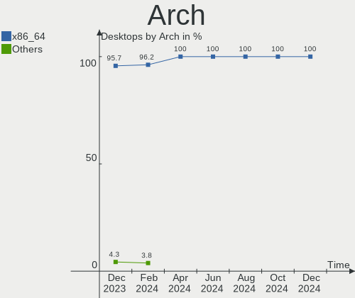
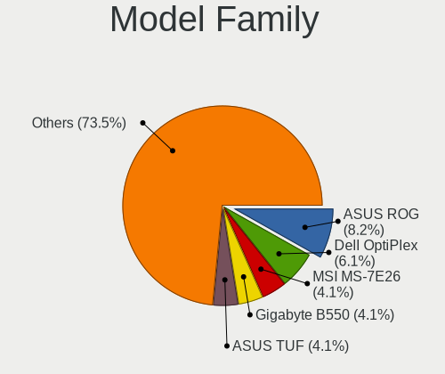
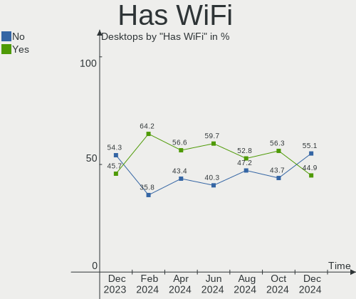
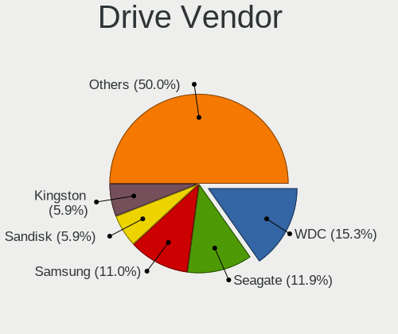
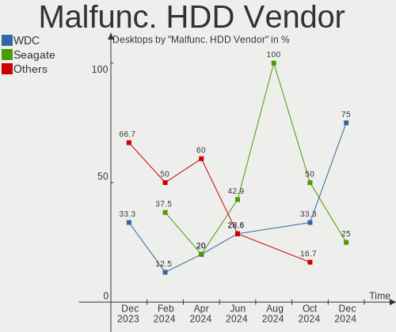
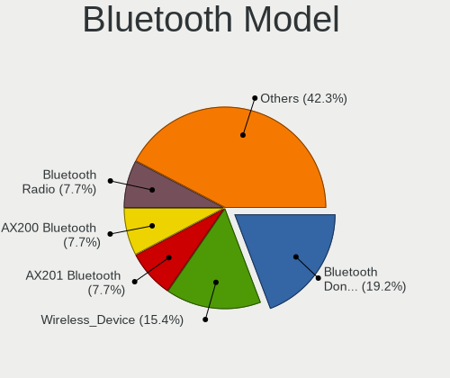
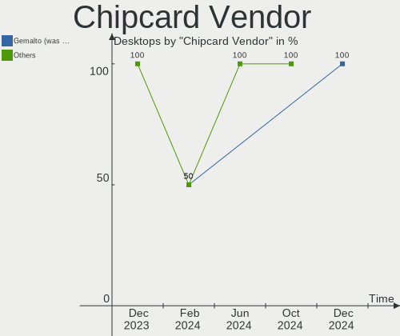

Kubuntu Hardware Trends (Desktops)
----------------------------------

A project to identify most popular hardware characteristics and track their change
over time based on data collected by Kubuntu users at https://Linux-Hardware.org.

Anyone can contribute to this report by the [hw-probe](https://github.com/linuxhw/hw-probe) tool:

    sudo -E hw-probe -all -upload

Full-feature report is available here: https://linux-hardware.org/?view=trends

Period: Nov, 2021.

Contents
--------

* [ System ](#system)
  - [ OS                       ](#os)
  - [ OS Family                ](#os-family)
  - [ Kernel                   ](#kernel)
  - [ Kernel Family            ](#kernel-family)
  - [ Kernel Major Ver.        ](#kernel-major-ver)
  - [ Arch                     ](#arch)
  - [ DE                       ](#de)
  - [ Display Server           ](#display-server)
  - [ Display Manager          ](#display-manager)
  - [ OS Lang                  ](#os-lang)
  - [ Boot Mode                ](#boot-mode)
  - [ Filesystem               ](#filesystem)
  - [ Part. scheme             ](#part-scheme)
  - [ Dual Boot with Linux/BSD ](#dual-boot-with-linuxbsd)
  - [ Dual Boot (Win)          ](#dual-boot-win)

* [ Board ](#board)
  - [ Vendor                   ](#vendor)
  - [ Model                    ](#model)
  - [ Model Family             ](#model-family)
  - [ MFG Year                 ](#mfg-year)
  - [ Form Factor              ](#form-factor)
  - [ Secure Boot              ](#secure-boot)
  - [ Coreboot                 ](#coreboot)
  - [ RAM Size                 ](#ram-size)
  - [ RAM Used                 ](#ram-used)
  - [ Total Drives             ](#total-drives)
  - [ Has CD-ROM               ](#has-cd-rom)
  - [ Has Ethernet             ](#has-ethernet)
  - [ Has WiFi                 ](#has-wifi)
  - [ Has Bluetooth            ](#has-bluetooth)

* [ Location ](#location)
  - [ Country                  ](#country)
  - [ City                     ](#city)

* [ Drives ](#drives)
  - [ Drive Vendor             ](#drive-vendor)
  - [ Drive Model              ](#drive-model)
  - [ HDD Vendor               ](#hdd-vendor)
  - [ SSD Vendor               ](#ssd-vendor)
  - [ Drive Kind               ](#drive-kind)
  - [ Drive Connector          ](#drive-connector)
  - [ Drive Size               ](#drive-size)
  - [ Space Total              ](#space-total)
  - [ Space Used               ](#space-used)
  - [ Malfunc. Drives          ](#malfunc-drives)
  - [ Malfunc. Drive Vendor    ](#malfunc-drive-vendor)
  - [ Malfunc. HDD Vendor      ](#malfunc-hdd-vendor)
  - [ Malfunc. Drive Kind      ](#malfunc-drive-kind)
  - [ Failed Drives            ](#failed-drives)
  - [ Failed Drive Vendor      ](#failed-drive-vendor)
  - [ Drive Status             ](#drive-status)

* [ Storage controller ](#storage-controller)
  - [ Storage Vendor           ](#storage-vendor)
  - [ Storage Model            ](#storage-model)
  - [ Storage Kind             ](#storage-kind)

* [ Processor ](#processor)
  - [ CPU Vendor               ](#cpu-vendor)
  - [ CPU Model                ](#cpu-model)
  - [ CPU Model Family         ](#cpu-model-family)
  - [ CPU Cores                ](#cpu-cores)
  - [ CPU Sockets              ](#cpu-sockets)
  - [ CPU Threads              ](#cpu-threads)
  - [ CPU Op-Modes             ](#cpu-op-modes)
  - [ CPU Microcode            ](#cpu-microcode)
  - [ CPU Microarch            ](#cpu-microarch)

* [ Graphics ](#graphics)
  - [ GPU Vendor               ](#gpu-vendor)
  - [ GPU Model                ](#gpu-model)
  - [ GPU Combo                ](#gpu-combo)
  - [ GPU Driver               ](#gpu-driver)
  - [ GPU Memory               ](#gpu-memory)

* [ Monitor ](#monitor)
  - [ Monitor Vendor           ](#monitor-vendor)
  - [ Monitor Model            ](#monitor-model)
  - [ Monitor Resolution       ](#monitor-resolution)
  - [ Monitor Diagonal         ](#monitor-diagonal)
  - [ Monitor Width            ](#monitor-width)
  - [ Aspect Ratio             ](#aspect-ratio)
  - [ Monitor Area             ](#monitor-area)
  - [ Pixel Density            ](#pixel-density)
  - [ Multiple Monitors        ](#multiple-monitors)

* [ Network ](#network)
  - [ Net Controller Vendor    ](#net-controller-vendor)
  - [ Net Controller Model     ](#net-controller-model)
  - [ Wireless Vendor          ](#wireless-vendor)
  - [ Wireless Model           ](#wireless-model)
  - [ Ethernet Vendor          ](#ethernet-vendor)
  - [ Ethernet Model           ](#ethernet-model)
  - [ Net Controller Kind      ](#net-controller-kind)
  - [ Used Controller          ](#used-controller)
  - [ NICs                     ](#nics)
  - [ IPv6                     ](#ipv6)

* [ Bluetooth ](#bluetooth)
  - [ Bluetooth Vendor         ](#bluetooth-vendor)
  - [ Bluetooth Model          ](#bluetooth-model)

* [ Sound ](#sound)
  - [ Sound Vendor             ](#sound-vendor)
  - [ Sound Model              ](#sound-model)

* [ Memory ](#memory)
  - [ Memory Vendor            ](#memory-vendor)
  - [ Memory Model             ](#memory-model)
  - [ Memory Kind              ](#memory-kind)
  - [ Memory Form Factor       ](#memory-form-factor)
  - [ Memory Size              ](#memory-size)
  - [ Memory Speed             ](#memory-speed)

* [ Printers & scanners ](#printers--scanners)
  - [ Printer Vendor           ](#printer-vendor)
  - [ Printer Model            ](#printer-model)
  - [ Scanner Vendor           ](#scanner-vendor)
  - [ Scanner Model            ](#scanner-model)

* [ Camera ](#camera)
  - [ Camera Vendor            ](#camera-vendor)
  - [ Camera Model             ](#camera-model)

* [ Security ](#security)
  - [ Fingerprint Vendor       ](#fingerprint-vendor)
  - [ Fingerprint Model        ](#fingerprint-model)
  - [ Chipcard Vendor          ](#chipcard-vendor)
  - [ Chipcard Model           ](#chipcard-model)

* [ Unsupported ](#unsupported)
  - [ Unsupported Devices      ](#unsupported-devices)
  - [ Unsupported Device Types ](#unsupported-device-types)

System
------

OS
--

Installed operating systems

| Name          | Desktops | Percent |
|---------------|----------|---------|
| Kubuntu 20.04 | 13       | 41.94%  |
| Kubuntu 21.10 | 9        | 29.03%  |
| Kubuntu 18.04 | 5        | 16.13%  |
| Kubuntu 21.04 | 2        | 6.45%   |
| Kubuntu 22.04 | 1        | 3.23%   |
| Kubuntu 16.04 | 1        | 3.23%   |

OS Family
---------

OS without a version

| Name    | Desktops | Percent |
|---------|----------|---------|
| Kubuntu | 31       | 100%    |

Kernel
------

Version of the Linux kernel

| Version                  | Desktops | Percent |
|--------------------------|----------|---------|
| 5.11.0-40-generic        | 5        | 16.13%  |
| 5.4.0-90-generic         | 4        | 12.9%   |
| 5.13.0-21-generic        | 3        | 9.68%   |
| 5.13.0-20-generic        | 3        | 9.68%   |
| 5.11.0-27-generic        | 2        | 6.45%   |
| 4.15.0-162-generic       | 2        | 6.45%   |
| 5.4.0-91-generic         | 1        | 3.23%   |
| 5.4.0-89-generic         | 1        | 3.23%   |
| 5.4.0-74-generic         | 1        | 3.23%   |
| 5.16.0-051600rc3-generic | 1        | 3.23%   |
| 5.13.12-051312-generic   | 1        | 3.23%   |
| 5.13.0-22-generic        | 1        | 3.23%   |
| 5.13.0-20-lowlatency     | 1        | 3.23%   |
| 5.11.0-38-generic        | 1        | 3.23%   |
| 5.11.0-37-generic        | 1        | 3.23%   |
| 5.11.0-25-generic        | 1        | 3.23%   |
| 4.4.0-210-generic        | 1        | 3.23%   |
| 4.15.0-156-generic       | 1        | 3.23%   |

Kernel Family
-------------

Linux kernel without a distro release

| Version | Desktops | Percent |
|---------|----------|---------|
| 5.11.0  | 10       | 32.26%  |
| 5.13.0  | 8        | 25.81%  |
| 5.4.0   | 7        | 22.58%  |
| 4.15.0  | 3        | 9.68%   |
| 5.16.0  | 1        | 3.23%   |
| 5.13.12 | 1        | 3.23%   |
| 4.4.0   | 1        | 3.23%   |

Kernel Major Ver.
-----------------

Linux kernel major version

| Version | Desktops | Percent |
|---------|----------|---------|
| 5.11    | 10       | 32.26%  |
| 5.13    | 9        | 29.03%  |
| 5.4     | 7        | 22.58%  |
| 4.15    | 3        | 9.68%   |
| 5.16    | 1        | 3.23%   |
| 4.4     | 1        | 3.23%   |

Arch
----

OS architecture (x86_64, i586, etc.)

| Name   | Desktops | Percent |
|--------|----------|---------|
| x86_64 | 31       | 100%    |

DE
--

Desktop Environment

| Name | Desktops | Percent |
|------|----------|---------|
| KDE5 | 28       | 90.32%  |
| KDE  | 3        | 9.68%   |

Display Server
--------------

X11 or Wayland

| Name | Desktops | Percent |
|------|----------|---------|
| X11  | 29       | 93.55%  |
| Tty  | 2        | 6.45%   |

Display Manager
---------------

SDDM, LightDM, etc.

| Name    | Desktops | Percent |
|---------|----------|---------|
| SDDM    | 27       | 87.1%   |
| Unknown | 3        | 9.68%   |
| GDM     | 1        | 3.23%   |

OS Lang
-------

Language

| Lang  | Desktops | Percent |
|-------|----------|---------|
| en_US | 8        | 25.81%  |
| fr_FR | 3        | 9.68%   |
| de_DE | 3        | 9.68%   |
| pt_BR | 2        | 6.45%   |
| pl_PL | 2        | 6.45%   |
| it_IT | 2        | 6.45%   |
| hu_HU | 2        | 6.45%   |
| en_AU | 2        | 6.45%   |
| C     | 2        | 6.45%   |
| ru_RU | 1        | 3.23%   |
| fr_BE | 1        | 3.23%   |
| en_IL | 1        | 3.23%   |
| en_CA | 1        | 3.23%   |
| bg_BG | 1        | 3.23%   |

Boot Mode
---------

EFI or BIOS

| Mode | Desktops | Percent |
|------|----------|---------|
| EFI  | 19       | 61.29%  |
| BIOS | 12       | 38.71%  |

Filesystem
----------

Type of filesystem

| Type    | Desktops | Percent |
|---------|----------|---------|
| Ext4    | 30       | 96.77%  |
| Overlay | 1        | 3.23%   |

Part. scheme
------------

Scheme of partitioning

| Type    | Desktops | Percent |
|---------|----------|---------|
| Unknown | 14       | 45.16%  |
| GPT     | 13       | 41.94%  |
| MBR     | 4        | 12.9%   |

Dual Boot with Linux/BSD
------------------------

Hosting more than one Linux/BSD

| Dual boot | Desktops | Percent |
|-----------|----------|---------|
| No        | 24       | 77.42%  |
| Yes       | 7        | 22.58%  |

Dual Boot (Win)
---------------

Hosting Linux and Windows

| Dual boot | Desktops | Percent |
|-----------|----------|---------|
| No        | 20       | 64.52%  |
| Yes       | 11       | 35.48%  |

Board
-----

Vendor
------

Motherboard manufacturer

| Name                | Desktops | Percent |
|---------------------|----------|---------|
| ASUSTek Computer    | 11       | 35.48%  |
| Gigabyte Technology | 5        | 16.13%  |
| Hewlett-Packard     | 4        | 12.9%   |
| MSI                 | 3        | 9.68%   |
| Dell                | 2        | 6.45%   |
| ASRock              | 2        | 6.45%   |
| SUPoX COMPUTER      | 1        | 3.23%   |
| Fujitsu             | 1        | 3.23%   |
| Biostar             | 1        | 3.23%   |
| Unknown             | 1        | 3.23%   |

Model
-----

Motherboard model

| Name                             | Desktops | Percent |
|----------------------------------|----------|---------|
| ASUS ROG STRIX B550-F GAMING     | 2        | 6.45%   |
| SUPoX COMPUTER B250A-BTC PRO     | 1        | 3.23%   |
| MSI MS-7C94                      | 1        | 3.23%   |
| MSI MS-7C83                      | 1        | 3.23%   |
| MSI MS-7C36                      | 1        | 3.23%   |
| HP Z440 Workstation              | 1        | 3.23%   |
| HP ProDesk 400 G6 MT             | 1        | 3.23%   |
| HP Compaq 8100 Elite SFF PC      | 1        | 3.23%   |
| HP Compaq 6200 Pro SFF PC        | 1        | 3.23%   |
| Gigabyte GA-870A-UD3             | 1        | 3.23%   |
| Gigabyte F2A88XM-D3H             | 1        | 3.23%   |
| Gigabyte B550 AORUS ELITE V2     | 1        | 3.23%   |
| Gigabyte B550 AORUS ELITE        | 1        | 3.23%   |
| Gigabyte B365M DS3H              | 1        | 3.23%   |
| Fujitsu D3433-S2 S26361-D3433-S2 | 1        | 3.23%   |
| Dell Precision Tower 5810        | 1        | 3.23%   |
| Dell OptiPlex 9020               | 1        | 3.23%   |
| Biostar A68MD PRO                | 1        | 3.23%   |
| ASUS STRIX Z270E GAMING          | 1        | 3.23%   |
| ASUS ROG STRIX B450-F GAMING II  | 1        | 3.23%   |
| ASUS PRIME Z590-P                | 1        | 3.23%   |
| ASUS PRIME B560M-K               | 1        | 3.23%   |
| ASUS PRIME B450M-A               | 1        | 3.23%   |
| ASUS PRIME B350-PLUS             | 1        | 3.23%   |
| ASUS H170M-PLUS                  | 1        | 3.23%   |
| ASUS EB1501P                     | 1        | 3.23%   |
| ASUS All Series                  | 1        | 3.23%   |
| ASRock H61M-VS                   | 1        | 3.23%   |
| ASRock B550 Phantom Gaming 4/ac  | 1        | 3.23%   |
| Unknown                          | 1        | 3.23%   |

Model Family
------------

Motherboard model prefix

| Name                     | Desktops | Percent |
|--------------------------|----------|---------|
| ASUS PRIME               | 4        | 12.9%   |
| ASUS ROG                 | 3        | 9.68%   |
| HP Compaq                | 2        | 6.45%   |
| Gigabyte B550            | 2        | 6.45%   |
| SUPoX COMPUTER B250A-BTC | 1        | 3.23%   |
| MSI MS-7C94              | 1        | 3.23%   |
| MSI MS-7C83              | 1        | 3.23%   |
| MSI MS-7C36              | 1        | 3.23%   |
| HP Z440                  | 1        | 3.23%   |
| HP ProDesk               | 1        | 3.23%   |
| Gigabyte GA-870A-UD3     | 1        | 3.23%   |
| Gigabyte F2A88XM-D3H     | 1        | 3.23%   |
| Gigabyte B365M           | 1        | 3.23%   |
| Fujitsu D3433-S2         | 1        | 3.23%   |
| Dell Precision           | 1        | 3.23%   |
| Dell OptiPlex            | 1        | 3.23%   |
| Biostar A68MD            | 1        | 3.23%   |
| ASUS STRIX               | 1        | 3.23%   |
| ASUS H170M-PLUS          | 1        | 3.23%   |
| ASUS EB1501P             | 1        | 3.23%   |
| ASUS All                 | 1        | 3.23%   |
| ASRock H61M-VS           | 1        | 3.23%   |
| ASRock B550              | 1        | 3.23%   |
| Unknown                  | 1        | 3.23%   |

MFG Year
--------

Motherboard manufacture year

| Year | Desktops | Percent |
|------|----------|---------|
| 2020 | 8        | 25.81%  |
| 2021 | 6        | 19.35%  |
| 2019 | 4        | 12.9%   |
| 2018 | 3        | 9.68%   |
| 2015 | 3        | 9.68%   |
| 2011 | 2        | 6.45%   |
| 2010 | 2        | 6.45%   |
| 2017 | 1        | 3.23%   |
| 2016 | 1        | 3.23%   |
| 2014 | 1        | 3.23%   |

Form Factor
-----------

Physical design of the computer

| Name    | Desktops | Percent |
|---------|----------|---------|
| Desktop | 31       | 100%    |

Secure Boot
-----------

Enabled or disabled

| State    | Desktops | Percent |
|----------|----------|---------|
| Disabled | 30       | 96.77%  |
| Enabled  | 1        | 3.23%   |

Coreboot
--------

Have coreboot on board

| Used | Desktops | Percent |
|------|----------|---------|
| No   | 31       | 100%    |

RAM Size
--------

Total RAM memory

| Size in GB  | Desktops | Percent |
|-------------|----------|---------|
| 16.01-24.0  | 11       | 35.48%  |
| 32.01-64.0  | 7        | 22.58%  |
| 24.01-32.0  | 4        | 12.9%   |
| 4.01-8.0    | 3        | 9.68%   |
| 3.01-4.0    | 2        | 6.45%   |
| 64.01-256.0 | 2        | 6.45%   |
| 8.01-16.0   | 2        | 6.45%   |

RAM Used
--------

Used RAM memory

| Used GB   | Desktops | Percent |
|-----------|----------|---------|
| 3.01-4.0  | 12       | 38.71%  |
| 2.01-3.0  | 7        | 22.58%  |
| 4.01-8.0  | 5        | 16.13%  |
| 1.01-2.0  | 3        | 9.68%   |
| 8.01-16.0 | 3        | 9.68%   |
| 0.01-0.5  | 1        | 3.23%   |

Total Drives
------------

Number of drives on board

| Drives | Desktops | Percent |
|--------|----------|---------|
| 1      | 10       | 32.26%  |
| 2      | 9        | 29.03%  |
| 3      | 6        | 19.35%  |
| 4      | 4        | 12.9%   |
| 7      | 1        | 3.23%   |
| 5      | 1        | 3.23%   |

Has CD-ROM
----------

Has CD-ROM on board

| Presented | Desktops | Percent |
|-----------|----------|---------|
| No        | 19       | 61.29%  |
| Yes       | 12       | 38.71%  |

Has Ethernet
------------

Has Ethernet on board

| Presented | Desktops | Percent |
|-----------|----------|---------|
| Yes       | 31       | 100%    |

Has WiFi
--------

Has WiFi module

| Presented | Desktops | Percent |
|-----------|----------|---------|
| No        | 16       | 51.61%  |
| Yes       | 15       | 48.39%  |

Has Bluetooth
-------------

Has Bluetooth module

| Presented | Desktops | Percent |
|-----------|----------|---------|
| No        | 18       | 58.06%  |
| Yes       | 13       | 41.94%  |

Location
--------

Country
-------

Geographic location (country)

| Country   | Desktops | Percent |
|-----------|----------|---------|
| USA       | 4        | 12.9%   |
| France    | 4        | 12.9%   |
| Germany   | 3        | 9.68%   |
| Poland    | 2        | 6.45%   |
| Italy     | 2        | 6.45%   |
| Hungary   | 2        | 6.45%   |
| Brazil    | 2        | 6.45%   |
| Belgium   | 2        | 6.45%   |
| Australia | 2        | 6.45%   |
| Turkey    | 1        | 3.23%   |
| Sweden    | 1        | 3.23%   |
| Russia    | 1        | 3.23%   |
| Israel    | 1        | 3.23%   |
| Hong Kong | 1        | 3.23%   |
| Finland   | 1        | 3.23%   |
| Canada    | 1        | 3.23%   |
| Bulgaria  | 1        | 3.23%   |

City
----

Geographic location (city)

| City            | Desktops | Percent |
|-----------------|----------|---------|
| Roissy-en-Brie  | 2        | 6.45%   |
| Wasilla         | 1        | 3.23%   |
| Warsaw          | 1        | 3.23%   |
| Vidin           | 1        | 3.23%   |
| Verl            | 1        | 3.23%   |
| Valensole       | 1        | 3.23%   |
| Uppsala         | 1        | 3.23%   |
| Szeksz??rd      | 1        | 3.23%   |
| Sydney          | 1        | 3.23%   |
| Sulmin          | 1        | 3.23%   |
| Seminole        | 1        | 3.23%   |
| Sao Jose        | 1        | 3.23%   |
| Samara          | 1        | 3.23%   |
| Oulu            | 1        | 3.23%   |
| Nieul-le-Dolent | 1        | 3.23%   |
| Maracai         | 1        | 3.23%   |
| Ilmenau         | 1        | 3.23%   |
| Haifa           | 1        | 3.23%   |
| Fort Lauderdale | 1        | 3.23%   |
| Florence        | 1        | 3.23%   |
| Fleurus         | 1        | 3.23%   |
| Duncan          | 1        | 3.23%   |
| De Panne        | 1        | 3.23%   |
| Central         | 1        | 3.23%   |
| Canberra        | 1        | 3.23%   |
| Cagliari        | 1        | 3.23%   |
| Budapest        | 1        | 3.23%   |
| Bradenton       | 1        | 3.23%   |
| Berlin          | 1        | 3.23%   |
| Bal?±kesir      | 1        | 3.23%   |

Drives
------

Drive Vendor
------------

Hard drive vendors

| Vendor                      | Desktops | Drives | Percent |
|-----------------------------|----------|--------|---------|
| WDC                         | 13       | 14     | 19.7%   |
| Samsung Electronics         | 12       | 16     | 18.18%  |
| Seagate                     | 6        | 7      | 9.09%   |
| Kingston                    | 6        | 7      | 9.09%   |
| Crucial                     | 5        | 5      | 7.58%   |
| Toshiba                     | 4        | 4      | 6.06%   |
| Micron Technology           | 4        | 4      | 6.06%   |
| PNY                         | 2        | 3      | 3.03%   |
| Hitachi                     | 2        | 2      | 3.03%   |
| GOODRAM                     | 2        | 3      | 3.03%   |
| A-DATA Technology           | 2        | 2      | 3.03%   |
| Yangtze Memory Technologies | 1        | 1      | 1.52%   |
| ROG                         | 1        | 1      | 1.52%   |
| OCZ                         | 1        | 1      | 1.52%   |
| KIOXIA                      | 1        | 1      | 1.52%   |
| KingSpec                    | 1        | 1      | 1.52%   |
| Intenso                     | 1        | 1      | 1.52%   |
| DREVO                       | 1        | 1      | 1.52%   |
| China                       | 1        | 1      | 1.52%   |

Drive Model
-----------

Hard drive models

| Model                                    | Desktops | Percent |
|------------------------------------------|----------|---------|
| WDC WD10JPVX-22JC3T0 1TB                 | 2        | 2.7%    |
| Toshiba HDWD110 1TB                      | 2        | 2.7%    |
| Samsung SSD 870 QVO 1TB                  | 2        | 2.7%    |
| Samsung SSD 860 EVO 2TB                  | 2        | 2.7%    |
| Samsung SSD 860 EVO 1TB                  | 2        | 2.7%    |
| PNY CS900 240GB SSD                      | 2        | 2.7%    |
| Kingston SA400S37480G 480GB SSD          | 2        | 2.7%    |
| Kingston SA2000M81000G 1TB               | 2        | 2.7%    |
| Yangtze Memory NVMe SSD Drive 1024GB     | 1        | 1.35%   |
| WDC WDS100T2B0C-00PXH0 1TB               | 1        | 1.35%   |
| WDC WDS100T2B0B-00YS70 1TB SSD           | 1        | 1.35%   |
| WDC WDS100T2B0A-00SM50 1TB SSD           | 1        | 1.35%   |
| WDC WD6400AAKS-75A7B0 640GB              | 1        | 1.35%   |
| WDC WD5000AADS-00S9B0 500GB              | 1        | 1.35%   |
| WDC WD20SPZX-22UA7T0 2TB                 | 1        | 1.35%   |
| WDC WD20EARX-00PASB0 2TB                 | 1        | 1.35%   |
| WDC WD10PURX-64D85Y0 1TB                 | 1        | 1.35%   |
| WDC WD10EZEX-60WN4A0 1TB                 | 1        | 1.35%   |
| WDC WD10EARS-00Y5B1 1TB                  | 1        | 1.35%   |
| WDC WD10EACS-00ZJB0 1TB                  | 1        | 1.35%   |
| WDC WD1000DHTZ-04N21V1 1TB               | 1        | 1.35%   |
| Toshiba HDWD220 2TB                      | 1        | 1.35%   |
| Toshiba HDWA130 3TB                      | 1        | 1.35%   |
| Seagate ST9250315AS 250GB                | 1        | 1.35%   |
| Seagate ST5000DM000-1FK178 5TB           | 1        | 1.35%   |
| Seagate ST4000DM005-2DP166 4TB           | 1        | 1.35%   |
| Seagate ST3500312CS 500GB                | 1        | 1.35%   |
| Seagate ST31000524AS 1TB                 | 1        | 1.35%   |
| Seagate ST1000LM048-2E7172 1TB           | 1        | 1.35%   |
| Seagate ST1000DM003-1ER162 1TB           | 1        | 1.35%   |
| Samsung SSD PM830 2.5 7mm 128GB          | 1        | 1.35%   |
| Samsung SSD 980 500GB                    | 1        | 1.35%   |
| Samsung SSD 860 QVO 2TB                  | 1        | 1.35%   |
| Samsung SSD 860 EVO mSATA 250GB          | 1        | 1.35%   |
| Samsung SSD 860 EVO 250GB                | 1        | 1.35%   |
| Samsung SSD 850 EVO 500GB                | 1        | 1.35%   |
| Samsung SSD 850 EVO 250GB                | 1        | 1.35%   |
| Samsung NVMe SSD Drive 500GB             | 1        | 1.35%   |
| Samsung HD321KJ 320GB                    | 1        | 1.35%   |
| ROG ESD-S1CL 1TB                         | 1        | 1.35%   |
| PNY CS900 120GB SSD                      | 1        | 1.35%   |
| OCZ VERTEX PLUS 64GB SSD                 | 1        | 1.35%   |
| Micron NVMe SSD Drive 250GB              | 1        | 1.35%   |
| Micron MTFDDAK256TBN-1AR1ZABHA 256GB SSD | 1        | 1.35%   |
| Micron MTFDDAK256MBF-1AN1ZABHA 256GB SSD | 1        | 1.35%   |
| Micron M600_MTFDDAK1T0MBF 1TB SSD        | 1        | 1.35%   |
| KIOXIA KBG30ZMV256G 256GB                | 1        | 1.35%   |
| Kingston SH103S3120G 120GB SSD           | 1        | 1.35%   |
| Kingston SE50S37240G 240GB SSD           | 1        | 1.35%   |
| Kingston SA400S37960G 960GB SSD          | 1        | 1.35%   |
| KingSpec NT-256 256GB                    | 1        | 1.35%   |
| Intenso SSD SATAIII 256GB                | 1        | 1.35%   |
| Hitachi HTS545016B9A300 160GB            | 1        | 1.35%   |
| Hitachi HDS723015BLA642 1TB              | 1        | 1.35%   |
| GOODRAM SSDPR-CX400-512 512GB            | 1        | 1.35%   |
| GOODRAM SSDPR-CX400-256 256GB            | 1        | 1.35%   |
| GOODRAM SSDPR-CL100-240-G3 240GB         | 1        | 1.35%   |
| DREVO X1 SSD 240GB                       | 1        | 1.35%   |
| Crucial CT500P5SSD8 500GB                | 1        | 1.35%   |
| Crucial CT500P1SSD8 500GB                | 1        | 1.35%   |

HDD Vendor
----------

Hard disk drive vendors

| Vendor              | Desktops | Drives | Percent |
|---------------------|----------|--------|---------|
| WDC                 | 10       | 11     | 43.48%  |
| Seagate             | 6        | 7      | 26.09%  |
| Toshiba             | 4        | 4      | 17.39%  |
| Hitachi             | 2        | 2      | 8.7%    |
| Samsung Electronics | 1        | 1      | 4.35%   |

SSD Vendor
----------

Solid state drive vendors

| Vendor              | Desktops | Drives | Percent |
|---------------------|----------|--------|---------|
| Samsung Electronics | 9        | 13     | 29.03%  |
| Kingston            | 4        | 5      | 12.9%   |
| Micron Technology   | 3        | 3      | 9.68%   |
| WDC                 | 2        | 2      | 6.45%   |
| PNY                 | 2        | 3      | 6.45%   |
| GOODRAM             | 2        | 3      | 6.45%   |
| Crucial             | 2        | 2      | 6.45%   |
| A-DATA Technology   | 2        | 2      | 6.45%   |
| OCZ                 | 1        | 1      | 3.23%   |
| KingSpec            | 1        | 1      | 3.23%   |
| Intenso             | 1        | 1      | 3.23%   |
| DREVO               | 1        | 1      | 3.23%   |
| China               | 1        | 1      | 3.23%   |

Drive Kind
----------

HDD or SSD

| Kind    | Desktops | Drives | Percent |
|---------|----------|--------|---------|
| SSD     | 24       | 38     | 46.15%  |
| HDD     | 16       | 25     | 30.77%  |
| NVMe    | 11       | 11     | 21.15%  |
| Unknown | 1        | 1      | 1.92%   |

Drive Connector
---------------

SATA, SAS, NVMe, etc.

| Type | Desktops | Drives | Percent |
|------|----------|--------|---------|
| SATA | 27       | 63     | 69.23%  |
| NVMe | 11       | 11     | 28.21%  |
| SAS  | 1        | 1      | 2.56%   |

Drive Size
----------

Size of hard drive

| Size in TB | Desktops | Drives | Percent |
|------------|----------|--------|---------|
| 0.01-0.5   | 20       | 29     | 46.51%  |
| 0.51-1.0   | 16       | 25     | 37.21%  |
| 1.01-2.0   | 4        | 6      | 9.3%    |
| 3.01-4.0   | 1        | 1      | 2.33%   |
| 2.01-3.0   | 1        | 1      | 2.33%   |
| 4.01-10.0  | 1        | 1      | 2.33%   |

Space Total
-----------

Amount of disk space available on the file system

| Size in GB     | Desktops | Percent |
|----------------|----------|---------|
| 101-250        | 7        | 22.58%  |
| 501-1000       | 6        | 19.35%  |
| 1001-2000      | 5        | 16.13%  |
| 2001-3000      | 4        | 12.9%   |
| More than 3000 | 3        | 9.68%   |
| 251-500        | 3        | 9.68%   |
| 51-100         | 2        | 6.45%   |
| 1-20           | 1        | 3.23%   |

Space Used
----------

Amount of used disk space

| Used GB        | Desktops | Percent |
|----------------|----------|---------|
| 101-250        | 7        | 22.58%  |
| 51-100         | 7        | 22.58%  |
| 1-20           | 4        | 12.9%   |
| 21-50          | 3        | 9.68%   |
| 1001-2000      | 3        | 9.68%   |
| 501-1000       | 3        | 9.68%   |
| More than 3000 | 2        | 6.45%   |
| 251-500        | 2        | 6.45%   |

Malfunc. Drives
---------------

Drive models with a malfunction

| Model                          | Desktops | Drives | Percent |
|--------------------------------|----------|--------|---------|
| Seagate ST9250315AS 250GB      | 1        | 1      | 33.33%  |
| Seagate ST31000524AS 1TB       | 1        | 1      | 33.33%  |
| Seagate ST1000DM003-1ER162 1TB | 1        | 1      | 33.33%  |

Malfunc. Drive Vendor
---------------------

Vendors of faulty drives

| Vendor  | Desktops | Drives | Percent |
|---------|----------|--------|---------|
| Seagate | 3        | 3      | 100%    |

Malfunc. HDD Vendor
-------------------

Vendors of faulty HDD drives

| Vendor  | Desktops | Drives | Percent |
|---------|----------|--------|---------|
| Seagate | 3        | 3      | 100%    |

Malfunc. Drive Kind
-------------------

Kinds of faulty drives

| Kind | Desktops | Drives | Percent |
|------|----------|--------|---------|
| HDD  | 3        | 3      | 100%    |

Failed Drives
-------------

Failed drive models

Zero info for selected period =(

Failed Drive Vendor
-------------------

Failed drive vendors

Zero info for selected period =(

Drive Status
------------

Number of failed and malfunc. drives

| Status   | Desktops | Drives | Percent |
|----------|----------|--------|---------|
| Works    | 17       | 33     | 48.57%  |
| Detected | 15       | 39     | 42.86%  |
| Malfunc  | 3        | 3      | 8.57%   |

Storage controller
------------------

Storage Vendor
--------------

Storage controller vendors

| Vendor                       | Desktops | Percent |
|------------------------------|----------|---------|
| Intel                        | 18       | 40%     |
| AMD                          | 13       | 28.89%  |
| Micron/Crucial Technology    | 3        | 6.67%   |
| Samsung Electronics          | 2        | 4.44%   |
| Kingston Technology Company  | 2        | 4.44%   |
| Yangtze Memory Technologies  | 1        | 2.22%   |
| Toshiba America Info Systems | 1        | 2.22%   |
| Sandisk                      | 1        | 2.22%   |
| Micron Technology            | 1        | 2.22%   |
| LSI Logic / Symbios Logic    | 1        | 2.22%   |
| JMicron Technology           | 1        | 2.22%   |
| ASMedia Technology           | 1        | 2.22%   |

Storage Model
-------------

Storage controller models

| Model                                                                                   | Desktops | Percent |
|-----------------------------------------------------------------------------------------|----------|---------|
| AMD Starship/Matisse Chipset SATA Controller [AHCI mode]                                | 6        | 11.54%  |
| AMD FCH SATA Controller [AHCI mode]                                                     | 4        | 7.69%   |
| Intel 200 Series PCH SATA controller [AHCI mode]                                        | 3        | 5.77%   |
| Micron/Crucial Non-Volatile memory controller                                           | 2        | 3.85%   |
| Kingston Company A2000 NVMe SSD                                                         | 2        | 3.85%   |
| Intel Q170/Q150/B150/H170/H110/Z170/CM236 Chipset SATA Controller [AHCI Mode]           | 2        | 3.85%   |
| Intel 6 Series/C200 Series Chipset Family Desktop SATA Controller (IDE mode, ports 4-5) | 2        | 3.85%   |
| Intel 6 Series/C200 Series Chipset Family Desktop SATA Controller (IDE mode, ports 0-3) | 2        | 3.85%   |
| Intel 500 Series Chipset Family SATA AHCI Controller                                    | 2        | 3.85%   |
| AMD 400 Series Chipset SATA Controller                                                  | 2        | 3.85%   |
| Yangtze Memory Non-Volatile memory controller                                           | 1        | 1.92%   |
| Toshiba America Info Systems BG3 NVMe SSD Controller                                    | 1        | 1.92%   |
| Sandisk WD Blue SN550 NVMe SSD                                                          | 1        | 1.92%   |
| Samsung NVMe SSD Controller SM981/PM981/PM983                                           | 1        | 1.92%   |
| Samsung NVMe SSD Controller 980                                                         | 1        | 1.92%   |
| Micron/Crucial NVMe Controller                                                          | 1        | 1.92%   |
| Micron Non-Volatile memory controller                                                   | 1        | 1.92%   |
| LSI Logic / Symbios Logic MegaRAID SAS 2108 [Liberator]                                 | 1        | 1.92%   |
| JMicron JMB363 SATA/IDE Controller                                                      | 1        | 1.92%   |
| Intel NM10/ICH7 Family SATA Controller [AHCI mode]                                      | 1        | 1.92%   |
| Intel Cannon Lake PCH SATA AHCI Controller                                              | 1        | 1.92%   |
| Intel C610/X99 series chipset sSATA Controller [RAID mode]                              | 1        | 1.92%   |
| Intel C610/X99 series chipset sSATA Controller [AHCI mode]                              | 1        | 1.92%   |
| Intel C610/X99 series chipset 6-Port SATA Controller [AHCI mode]                        | 1        | 1.92%   |
| Intel C600/X79 series chipset SATA RAID Controller                                      | 1        | 1.92%   |
| Intel 9 Series Chipset Family SATA Controller [AHCI Mode]                               | 1        | 1.92%   |
| Intel 8 Series/C220 Series Chipset Family 6-port SATA Controller 1 [AHCI mode]          | 1        | 1.92%   |
| Intel 6 Series/C200 Series Chipset Family 6 port Desktop SATA AHCI Controller           | 1        | 1.92%   |
| Intel 5 Series/3400 Series Chipset 6 port SATA AHCI Controller                          | 1        | 1.92%   |
| Intel 400 Series Chipset Family SATA AHCI Controller                                    | 1        | 1.92%   |
| ASMedia ASM1062 Serial ATA Controller                                                   | 1        | 1.92%   |
| AMD SB7x0/SB8x0/SB9x0 SATA Controller [AHCI mode]                                       | 1        | 1.92%   |
| AMD SB7x0/SB8x0/SB9x0 IDE Controller                                                    | 1        | 1.92%   |
| AMD FCH SATA Controller [IDE mode]                                                      | 1        | 1.92%   |
| AMD 300 Series Chipset SATA Controller                                                  | 1        | 1.92%   |

Storage Kind
------------

Kind of storage controller (IDE, SATA, NVMe, SAS, ...)

| Kind | Desktops | Percent |
|------|----------|---------|
| SATA | 28       | 63.64%  |
| NVMe | 11       | 25%     |
| IDE  | 3        | 6.82%   |
| RAID | 2        | 4.55%   |

Processor
---------

CPU Vendor
----------

Processor vendors

| Vendor | Desktops | Percent |
|--------|----------|---------|
| Intel  | 18       | 58.06%  |
| AMD    | 13       | 41.94%  |

CPU Model
---------

Processor models

| Model                                       | Desktops | Percent |
|---------------------------------------------|----------|---------|
| AMD Ryzen 5 3600 6-Core Processor           | 4        | 12.9%   |
| Intel Core i7-7700 CPU @ 3.60GHz            | 2        | 6.45%   |
| Intel Xeon CPU L3426 @ 1.87GHz              | 1        | 3.23%   |
| Intel Xeon CPU E5-2658A v3 @ 2.20GHz        | 1        | 3.23%   |
| Intel Xeon CPU E5-1650 v3 @ 3.50GHz         | 1        | 3.23%   |
| Intel Pentium CPU G620 @ 2.60GHz            | 1        | 3.23%   |
| Intel Pentium CPU G4560 @ 3.50GHz           | 1        | 3.23%   |
| Intel Core i7-4790 CPU @ 3.60GHz            | 1        | 3.23%   |
| Intel Core i7-10700K CPU @ 3.80GHz          | 1        | 3.23%   |
| Intel Core i5-9400F CPU @ 2.90GHz           | 1        | 3.23%   |
| Intel Core i5-8500 CPU @ 3.00GHz            | 1        | 3.23%   |
| Intel Core i5-6400 CPU @ 2.70GHz            | 1        | 3.23%   |
| Intel Core i5-4690 CPU @ 3.50GHz            | 1        | 3.23%   |
| Intel Core i5-3470 CPU @ 3.20GHz            | 1        | 3.23%   |
| Intel Core i5-2500 CPU @ 3.30GHz            | 1        | 3.23%   |
| Intel Atom CPU D525 @ 1.80GHz               | 1        | 3.23%   |
| Intel 11th Gen Core i7-11700K @ 3.60GHz     | 1        | 3.23%   |
| Intel 11th Gen Core i7-11700 @ 2.50GHz      | 1        | 3.23%   |
| AMD Ryzen 9 3950X 16-Core Processor         | 1        | 3.23%   |
| AMD Ryzen 7 5700G with Radeon Graphics      | 1        | 3.23%   |
| AMD Ryzen 7 3700X 8-Core Processor          | 1        | 3.23%   |
| AMD Ryzen 5 5600X 6-Core Processor          | 1        | 3.23%   |
| AMD Ryzen 5 3600X 6-Core Processor          | 1        | 3.23%   |
| AMD Ryzen 5 2400G with Radeon Vega Graphics | 1        | 3.23%   |
| AMD Athlon II X4 635 Processor              | 1        | 3.23%   |
| AMD A8-6500 APU with Radeon HD Graphics     | 1        | 3.23%   |
| AMD A10-5800K APU with Radeon HD Graphics   | 1        | 3.23%   |

CPU Model Family
----------------

Processor model prefix

| Model            | Desktops | Percent |
|------------------|----------|---------|
| AMD Ryzen 5      | 7        | 22.58%  |
| Intel Core i5    | 6        | 19.35%  |
| Intel Core i7    | 4        | 12.9%   |
| Intel Xeon       | 3        | 9.68%   |
| Other            | 2        | 6.45%   |
| Intel Pentium    | 2        | 6.45%   |
| AMD Ryzen 7      | 2        | 6.45%   |
| Intel Atom       | 1        | 3.23%   |
| AMD Ryzen 9      | 1        | 3.23%   |
| AMD Athlon II X4 | 1        | 3.23%   |
| AMD A8           | 1        | 3.23%   |
| AMD A10          | 1        | 3.23%   |

CPU Cores
---------

Number of processor cores

| Number | Desktops | Percent |
|--------|----------|---------|
| 4      | 10       | 32.26%  |
| 6      | 9        | 29.03%  |
| 8      | 5        | 16.13%  |
| 2      | 5        | 16.13%  |
| 16     | 1        | 3.23%   |
| 12     | 1        | 3.23%   |

CPU Sockets
-----------

Number of sockets

| Number | Desktops | Percent |
|--------|----------|---------|
| 1      | 31       | 100%    |

CPU Threads
-----------

Threads per core (Hyper-Threading)

| Number | Desktops | Percent |
|--------|----------|---------|
| 2      | 23       | 74.19%  |
| 1      | 8        | 25.81%  |

CPU Op-Modes
------------

CPU Operation Modes (32-bit, 64-bit)

| Op mode        | Desktops | Percent |
|----------------|----------|---------|
| 32-bit, 64-bit | 31       | 100%    |

CPU Microcode
-------------

Microcode number

| Number     | Desktops | Percent |
|------------|----------|---------|
| 0x08701021 | 5        | 16.13%  |
| Unknown    | 5        | 16.13%  |
| 0xa0671    | 2        | 6.45%   |
| 0x906ea    | 2        | 6.45%   |
| 0x306f2    | 2        | 6.45%   |
| 0x306c3    | 2        | 6.45%   |
| 0x206a7    | 2        | 6.45%   |
| 0x06001119 | 2        | 6.45%   |
| 0xa0655    | 1        | 3.23%   |
| 0x906e9    | 1        | 3.23%   |
| 0x506e3    | 1        | 3.23%   |
| 0x306a9    | 1        | 3.23%   |
| 0x106e5    | 1        | 3.23%   |
| 0x0a50000c | 1        | 3.23%   |
| 0x0a201009 | 1        | 3.23%   |
| 0x0810100b | 1        | 3.23%   |
| 0x010000db | 1        | 3.23%   |

CPU Microarch
-------------

Microarchitecture

| Name        | Desktops | Percent |
|-------------|----------|---------|
| Zen 2       | 7        | 22.58%  |
| KabyLake    | 5        | 16.13%  |
| Haswell     | 4        | 12.9%   |
| Zen 3       | 2        | 6.45%   |
| SandyBridge | 2        | 6.45%   |
| Piledriver  | 2        | 6.45%   |
| Zen         | 1        | 3.23%   |
| Skylake     | 1        | 3.23%   |
| Nehalem     | 1        | 3.23%   |
| K10         | 1        | 3.23%   |
| IvyBridge   | 1        | 3.23%   |
| Icelake     | 1        | 3.23%   |
| CometLake   | 1        | 3.23%   |
| Bonnell     | 1        | 3.23%   |
| Unknown     | 1        | 3.23%   |

Graphics
--------

GPU Vendor
----------

Vendors of graphics cards

| Vendor | Desktops | Percent |
|--------|----------|---------|
| Nvidia | 13       | 40.63%  |
| AMD    | 10       | 31.25%  |
| Intel  | 9        | 28.13%  |

GPU Model
---------

Graphics card models

| Model                                                                       | Desktops | Percent |
|-----------------------------------------------------------------------------|----------|---------|
| Nvidia GP108 [GeForce GT 1030]                                              | 2        | 5.88%   |
| Intel Xeon E3-1200 v3/4th Gen Core Processor Integrated Graphics Controller | 2        | 5.88%   |
| Intel 2nd Generation Core Processor Family Integrated Graphics Controller   | 2        | 5.88%   |
| Nvidia TU116 [GeForce GTX 1660]                                             | 1        | 2.94%   |
| Nvidia TU116 [GeForce GTX 1660 Ti]                                          | 1        | 2.94%   |
| Nvidia TU104 [GeForce RTX 2070 SUPER]                                       | 1        | 2.94%   |
| Nvidia GT218 [ION]                                                          | 1        | 2.94%   |
| Nvidia GT215 [GeForce GT 240]                                               | 1        | 2.94%   |
| Nvidia GP107GL [Quadro P400]                                                | 1        | 2.94%   |
| Nvidia GP107 [GeForce GTX 1050 Ti]                                          | 1        | 2.94%   |
| Nvidia GM200GL [Tesla M40]                                                  | 1        | 2.94%   |
| Nvidia GM107GL [Quadro K2200]                                               | 1        | 2.94%   |
| Nvidia GK208B [GeForce GT 730]                                              | 1        | 2.94%   |
| Nvidia GK110BGL [Tesla K40m]                                                | 1        | 2.94%   |
| Nvidia GA104 [GeForce RTX 3070]                                             | 1        | 2.94%   |
| Nvidia GA104 [GeForce RTX 3060 Ti Lite Hash Rate]                           | 1        | 2.94%   |
| Intel Xeon E3-1200 v2/3rd Gen Core processor Graphics Controller            | 1        | 2.94%   |
| Intel HD Graphics 630                                                       | 1        | 2.94%   |
| Intel HD Graphics 530                                                       | 1        | 2.94%   |
| Intel CometLake-S GT2 [UHD Graphics 630]                                    | 1        | 2.94%   |
| Intel CoffeeLake-S GT2 [UHD Graphics 630]                                   | 1        | 2.94%   |
| AMD Turks PRO [Radeon HD 6570/7570/8550 / R5 230]                           | 1        | 2.94%   |
| AMD Richland [Radeon HD 8570D]                                              | 1        | 2.94%   |
| AMD Redwood XT [Radeon HD 5670/5690/5730]                                   | 1        | 2.94%   |
| AMD Raven Ridge [Radeon Vega Series / Radeon Vega Mobile Series]            | 1        | 2.94%   |
| AMD Lexa XT [Radeon PRO WX 3200]                                            | 1        | 2.94%   |
| AMD Lexa PRO [Radeon 540/540X/550/550X / RX 540X/550/550X]                  | 1        | 2.94%   |
| AMD Ellesmere [Radeon RX 470/480/570/570X/580/580X/590]                     | 1        | 2.94%   |
| AMD Cezanne                                                                 | 1        | 2.94%   |
| AMD Caicos [Radeon HD 6450/7450/8450 / R5 230 OEM]                          | 1        | 2.94%   |
| AMD Baffin [Radeon RX 550 640SP / RX 560/560X]                              | 1        | 2.94%   |

GPU Combo
---------

Combinations of graphics cards

| Name           | Desktops | Percent |
|----------------|----------|---------|
| 1 x Nvidia     | 11       | 35.48%  |
| 1 x AMD        | 10       | 32.26%  |
| 1 x Intel      | 8        | 25.81%  |
| 3 x Nvidia     | 1        | 3.23%   |
| Intel + Nvidia | 1        | 3.23%   |

GPU Driver
----------

Free vs proprietary

| Driver      | Desktops | Percent |
|-------------|----------|---------|
| Free        | 18       | 58.06%  |
| Proprietary | 12       | 38.71%  |
| Unknown     | 1        | 3.23%   |

GPU Memory
----------

Total video memory

| Size in GB | Desktops | Percent |
|------------|----------|---------|
| Unknown    | 9        | 29.03%  |
| 3.01-4.0   | 7        | 22.58%  |
| 1.01-2.0   | 4        | 12.9%   |
| 0.01-0.5   | 4        | 12.9%   |
| 7.01-8.0   | 3        | 9.68%   |
| 5.01-6.0   | 2        | 6.45%   |
| 0.51-1.0   | 2        | 6.45%   |

Monitor
-------

Monitor Vendor
--------------

Monitor vendors

| Vendor               | Desktops | Percent |
|----------------------|----------|---------|
| Samsung Electronics  | 5        | 14.71%  |
| Goldstar             | 4        | 11.76%  |
| BenQ                 | 3        | 8.82%   |
| ViewSonic            | 2        | 5.88%   |
| Philips              | 2        | 5.88%   |
| Iiyama               | 2        | 5.88%   |
| Dell                 | 2        | 5.88%   |
| AOC                  | 2        | 5.88%   |
| Unknown              | 1        | 2.94%   |
| Sony                 | 1        | 2.94%   |
| Sceptre Tech         | 1        | 2.94%   |
| SAC                  | 1        | 2.94%   |
| QUS                  | 1        | 2.94%   |
| Panasonic            | 1        | 2.94%   |
| LG Display           | 1        | 2.94%   |
| Hewlett-Packard      | 1        | 2.94%   |
| Fujitsu Siemens      | 1        | 2.94%   |
| ASUSTek Computer     | 1        | 2.94%   |
| Ancor Communications | 1        | 2.94%   |
| Acer                 | 1        | 2.94%   |

Monitor Model
-------------

Monitor models

| Model                                                                 | Desktops | Percent |
|-----------------------------------------------------------------------|----------|---------|
| ViewSonic VA2448 SERIES VSC3828 1920x1080 521x293mm 23.5-inch         | 1        | 2.56%   |
| ViewSonic VA2246 SERIES VSC6F2E 1920x1080 477x268mm 21.5-inch         | 1        | 2.56%   |
| Unknown LCD Monitor SAMSUNG 1920x1080                                 | 1        | 2.56%   |
| Sony LCD Monitor TV 3840x1080                                         | 1        | 2.56%   |
| Sceptre Tech E248W-1920 SPT099D 1920x1080 443x249mm 20.0-inch         | 1        | 2.56%   |
| Samsung Electronics SyncMaster SAM0115 1280x1024 376x301mm 19.0-inch  | 1        | 2.56%   |
| Samsung Electronics S24E450 SAM0C82 1920x1080 530x300mm 24.0-inch     | 1        | 2.56%   |
| Samsung Electronics LF27T450F SAM7099 1920x1080 597x336mm 27.0-inch   | 1        | 2.56%   |
| Samsung Electronics LCD Monitor SMS24A350H                            | 1        | 2.56%   |
| Samsung Electronics C27F591 SAM0D37 1920x1080 598x336mm 27.0-inch     | 1        | 2.56%   |
| SAC HDMI SAC2400 2560x1440 527x296mm 23.8-inch                        | 1        | 2.56%   |
| QUS Monitor QUS3536 3840x2160 800x450mm 36.1-inch                     | 1        | 2.56%   |
| Philips LCD Monitor PHL 275E1 4480x1440                               | 1        | 2.56%   |
| Philips LCD Monitor FTV                                               | 1        | 2.56%   |
| Panasonic TV MEIC328 1920x1080 698x392mm 31.5-inch                    | 1        | 2.56%   |
| LG Display LCD Monitor LGD0396 1600x900 382x215mm 17.3-inch           | 1        | 2.56%   |
| Iiyama X2485 IVM6122 1920x1080 520x320mm 24.0-inch                    | 1        | 2.56%   |
| Iiyama PLX2283H IVM5638 1920x1080 477x268mm 21.5-inch                 | 1        | 2.56%   |
| Iiyama PLE2403WS IVM5604 1920x1200 519x324mm 24.1-inch                | 1        | 2.56%   |
| Iiyama PL2283H IVM562E 1920x1080 496x292mm 22.7-inch                  | 1        | 2.56%   |
| Hewlett-Packard E23 G4 HPN3685 1920x1080 509x286mm 23.0-inch          | 1        | 2.56%   |
| Goldstar MP59G GSM5B35 1920x1080 480x270mm 21.7-inch                  | 1        | 2.56%   |
| Goldstar E2360 GSM57E2 1920x1080 510x290mm 23.1-inch                  | 1        | 2.56%   |
| Goldstar 25BL56WY GSM5B82 1920x1200 540x340mm 25.1-inch               | 1        | 2.56%   |
| Goldstar 24MB65 GSM5A4B 1920x1200 520x330mm 24.2-inch                 | 1        | 2.56%   |
| Fujitsu Siemens D22W-1 FUS076D 1680x1050 470x300mm 22.0-inch          | 1        | 2.56%   |
| Dell P3221D DEL41E9 2560x1440 698x393mm 31.5-inch                     | 1        | 2.56%   |
| Dell P2414H DELA09B 1920x1080 530x300mm 24.0-inch                     | 1        | 2.56%   |
| Dell P2214H DELA098 1920x1080 480x270mm 21.7-inch                     | 1        | 2.56%   |
| BenQ ZOWIE XL LCD BNQ7F31 1920x1080 531x298mm 24.0-inch               | 1        | 2.56%   |
| BenQ LCD Monitor GW2250 1920x1080                                     | 1        | 2.56%   |
| BenQ LCD Monitor GL2450 3840x1080                                     | 1        | 2.56%   |
| BenQ LCD Monitor GL2450                                               | 1        | 2.56%   |
| ASUSTek Computer VG24V AUS2420 1920x1080 521x293mm 23.5-inch          | 1        | 2.56%   |
| AOC LCD Monitor 2460 1680x1050                                        | 1        | 2.56%   |
| AOC 936W AOC1936 1366x768 410x230mm 18.5-inch                         | 1        | 2.56%   |
| Ancor Communications ASUS VE276 ACI27F4 1920x1080 600x340mm 27.2-inch | 1        | 2.56%   |
| Acer LCD Monitor KG272 S                                              | 1        | 2.56%   |
| Acer LCD Monitor G235H 3840x1080                                      | 1        | 2.56%   |

Monitor Resolution
------------------

Monitor screen resolution

| Resolution         | Desktops | Percent |
|--------------------|----------|---------|
| 1920x1080 (FHD)    | 14       | 43.75%  |
| Unknown            | 4        | 12.5%   |
| 3840x1080          | 3        | 9.38%   |
| 2560x1440 (QHD)    | 2        | 6.25%   |
| 1920x1200 (WUXGA)  | 2        | 6.25%   |
| 1680x1050 (WSXGA+) | 2        | 6.25%   |
| 4480x1440          | 1        | 3.13%   |
| 3840x2160 (4K)     | 1        | 3.13%   |
| 1600x900 (HD+)     | 1        | 3.13%   |
| 1366x768 (WXGA)    | 1        | 3.13%   |
| 1280x1024 (SXGA)   | 1        | 3.13%   |

Monitor Diagonal
----------------

Diagonal size in inches

| Inches  | Desktops | Percent |
|---------|----------|---------|
| Unknown | 7        | 21.21%  |
| 24      | 5        | 15.15%  |
| 23      | 5        | 15.15%  |
| 27      | 4        | 12.12%  |
| 21      | 3        | 9.09%   |
| 31      | 2        | 6.06%   |
| 22      | 2        | 6.06%   |
| 36      | 1        | 3.03%   |
| 25      | 1        | 3.03%   |
| 19      | 1        | 3.03%   |
| 18      | 1        | 3.03%   |
| 17      | 1        | 3.03%   |

Monitor Width
-------------

Physical width

| Width in mm | Desktops | Percent |
|-------------|----------|---------|
| 501-600     | 13       | 43.33%  |
| Unknown     | 7        | 23.33%  |
| 401-500     | 5        | 16.67%  |
| 601-700     | 2        | 6.67%   |
| 351-400     | 2        | 6.67%   |
| 701-800     | 1        | 3.33%   |

Aspect Ratio
------------

Proportional relationship between the width and the height

| Ratio   | Desktops | Percent |
|---------|----------|---------|
| 16/9    | 17       | 60.71%  |
| Unknown | 7        | 25%     |
| 16/10   | 3        | 10.71%  |
| 5/4     | 1        | 3.57%   |

Monitor Area
------------

Area in inch²

| Area in inch² | Desktops | Percent |
|----------------|----------|---------|
| 201-250        | 9        | 31.03%  |
| Unknown        | 7        | 24.14%  |
| 301-350        | 4        | 13.79%  |
| 351-500        | 2        | 6.9%    |
| 251-300        | 2        | 6.9%    |
| 151-200        | 2        | 6.9%    |
| 141-150        | 1        | 3.45%   |
| 121-130        | 1        | 3.45%   |
| 501-1000       | 1        | 3.45%   |

Pixel Density
-------------

Pixels per inch

| Density | Desktops | Percent |
|---------|----------|---------|
| 51-100  | 16       | 55.17%  |
| Unknown | 7        | 24.14%  |
| 101-120 | 4        | 13.79%  |
| 121-160 | 2        | 6.9%    |

Multiple Monitors
-----------------

Total monitors connected

| Total | Desktops | Percent |
|-------|----------|---------|
| 1     | 20       | 64.52%  |
| 2     | 9        | 29.03%  |
| 3     | 2        | 6.45%   |

Network
-------

Net Controller Vendor
---------------------

Controller vendors

| Vendor                | Desktops | Percent |
|-----------------------|----------|---------|
| Realtek Semiconductor | 19       | 44.19%  |
| Intel                 | 17       | 39.53%  |
| Ralink Technology     | 2        | 4.65%   |
| Qualcomm Atheros      | 2        | 4.65%   |
| DisplayLink           | 1        | 2.33%   |
| D-Link                | 1        | 2.33%   |
| Aquantia              | 1        | 2.33%   |

Net Controller Model
--------------------

Controller models

| Model                                                             | Desktops | Percent |
|-------------------------------------------------------------------|----------|---------|
| Realtek RTL8111/8168/8411 PCI Express Gigabit Ethernet Controller | 13       | 26%     |
| Intel Wi-Fi 6 AX200                                               | 5        | 10%     |
| Realtek RTL8125 2.5GbE Controller                                 | 4        | 8%      |
| Realtek RTL88x2bu [AC1200 Techkey]                                | 2        | 4%      |
| Ralink RT5370 Wireless Adapter                                    | 2        | 4%      |
| Intel I211 Gigabit Network Connection                             | 2        | 4%      |
| Intel Ethernet Controller I225-V                                  | 2        | 4%      |
| Intel Ethernet Connection I217-LM                                 | 2        | 4%      |
| Intel Ethernet Connection (2) I219-V                              | 2        | 4%      |
| Realtek RTL8188EUS 802.11n Wireless Network Adapter               | 1        | 2%      |
| Realtek RTL810xE PCI Express Fast Ethernet controller             | 1        | 2%      |
| Realtek 802.11ac NIC                                              | 1        | 2%      |
| Qualcomm Atheros QCA6174 802.11ac Wireless Network Adapter        | 1        | 2%      |
| Qualcomm Atheros AR8152 v2.0 Fast Ethernet                        | 1        | 2%      |
| Intel Wi-Fi 6 AX210/AX211/AX411 160MHz                            | 1        | 2%      |
| Intel I210 Gigabit Network Connection                             | 1        | 2%      |
| Intel Ethernet Connection (2) I219-LM                             | 1        | 2%      |
| Intel Ethernet Connection (2) I218-LM                             | 1        | 2%      |
| Intel Ethernet Connection (14) I219-V                             | 1        | 2%      |
| Intel Dual Band Wireless-AC 3168NGW [Stone Peak]                  | 1        | 2%      |
| Intel 82579LM Gigabit Network Connection (Lewisville)             | 1        | 2%      |
| Intel 82578DM Gigabit Network Connection                          | 1        | 2%      |
| DisplayLink Dell Universal Dock D6000                             | 1        | 2%      |
| D-Link DWA-171                                                    | 1        | 2%      |
| Aquantia AQC107 NBase-T/IEEE 802.3bz Ethernet Controller [AQtion] | 1        | 2%      |

Wireless Vendor
---------------

Wireless vendors

| Vendor                | Desktops | Percent |
|-----------------------|----------|---------|
| Intel                 | 7        | 46.67%  |
| Realtek Semiconductor | 4        | 26.67%  |
| Ralink Technology     | 2        | 13.33%  |
| Qualcomm Atheros      | 1        | 6.67%   |
| D-Link                | 1        | 6.67%   |

Wireless Model
--------------

Wireless models

| Model                                                      | Desktops | Percent |
|------------------------------------------------------------|----------|---------|
| Intel Wi-Fi 6 AX200                                        | 5        | 33.33%  |
| Realtek RTL88x2bu [AC1200 Techkey]                         | 2        | 13.33%  |
| Ralink RT5370 Wireless Adapter                             | 2        | 13.33%  |
| Realtek RTL8188EUS 802.11n Wireless Network Adapter        | 1        | 6.67%   |
| Realtek 802.11ac NIC                                       | 1        | 6.67%   |
| Qualcomm Atheros QCA6174 802.11ac Wireless Network Adapter | 1        | 6.67%   |
| Intel Wi-Fi 6 AX210/AX211/AX411 160MHz                     | 1        | 6.67%   |
| Intel Dual Band Wireless-AC 3168NGW [Stone Peak]           | 1        | 6.67%   |
| D-Link DWA-171                                             | 1        | 6.67%   |

Ethernet Vendor
---------------

Ethernet vendors

| Vendor                | Desktops | Percent |
|-----------------------|----------|---------|
| Realtek Semiconductor | 17       | 51.52%  |
| Intel                 | 13       | 39.39%  |
| Qualcomm Atheros      | 1        | 3.03%   |
| DisplayLink           | 1        | 3.03%   |
| Aquantia              | 1        | 3.03%   |

Ethernet Model
--------------

Ethernet models

| Model                                                             | Desktops | Percent |
|-------------------------------------------------------------------|----------|---------|
| Realtek RTL8111/8168/8411 PCI Express Gigabit Ethernet Controller | 13       | 37.14%  |
| Realtek RTL8125 2.5GbE Controller                                 | 4        | 11.43%  |
| Intel I211 Gigabit Network Connection                             | 2        | 5.71%   |
| Intel Ethernet Controller I225-V                                  | 2        | 5.71%   |
| Intel Ethernet Connection I217-LM                                 | 2        | 5.71%   |
| Intel Ethernet Connection (2) I219-V                              | 2        | 5.71%   |
| Realtek RTL810xE PCI Express Fast Ethernet controller             | 1        | 2.86%   |
| Qualcomm Atheros AR8152 v2.0 Fast Ethernet                        | 1        | 2.86%   |
| Intel I210 Gigabit Network Connection                             | 1        | 2.86%   |
| Intel Ethernet Connection (2) I219-LM                             | 1        | 2.86%   |
| Intel Ethernet Connection (2) I218-LM                             | 1        | 2.86%   |
| Intel Ethernet Connection (14) I219-V                             | 1        | 2.86%   |
| Intel 82579LM Gigabit Network Connection (Lewisville)             | 1        | 2.86%   |
| Intel 82578DM Gigabit Network Connection                          | 1        | 2.86%   |
| DisplayLink Dell Universal Dock D6000                             | 1        | 2.86%   |
| Aquantia AQC107 NBase-T/IEEE 802.3bz Ethernet Controller [AQtion] | 1        | 2.86%   |

Net Controller Kind
-------------------

Ethernet, WiFi or modem

| Kind     | Desktops | Percent |
|----------|----------|---------|
| Ethernet | 31       | 67.39%  |
| WiFi     | 15       | 32.61%  |

Used Controller
---------------

Currently used network controller

| Kind     | Desktops | Percent |
|----------|----------|---------|
| Ethernet | 25       | 65.79%  |
| WiFi     | 13       | 34.21%  |

NICs
----

Total network controllers on board

| Total | Desktops | Percent |
|-------|----------|---------|
| 1     | 21       | 67.74%  |
| 2     | 9        | 29.03%  |
| 3     | 1        | 3.23%   |

IPv6
----

IPv6 vs IPv4

| Used | Desktops | Percent |
|------|----------|---------|
| No   | 22       | 70.97%  |
| Yes  | 9        | 29.03%  |

Bluetooth
---------

Bluetooth Vendor
----------------

Controller vendors

| Vendor                     | Desktops | Percent |
|----------------------------|----------|---------|
| Intel                      | 6        | 46.15%  |
| Cambridge Silicon Radio    | 4        | 30.77%  |
| Integrated System Solution | 2        | 15.38%  |
| ASUSTek Computer           | 1        | 7.69%   |

Bluetooth Model
---------------

Controller models

| Model                                                 | Desktops | Percent |
|-------------------------------------------------------|----------|---------|
| Intel AX200 Bluetooth                                 | 4        | 30.77%  |
| Cambridge Silicon Radio Bluetooth Dongle (HCI mode)   | 4        | 30.77%  |
| Integrated System Solution KY-BT100 Bluetooth Adapter | 2        | 15.38%  |
| Intel Wireless-AC 3168 Bluetooth                      | 1        | 7.69%   |
| Intel AX210 Bluetooth                                 | 1        | 7.69%   |
| ASUS Qualcomm Bluetooth 4.1                           | 1        | 7.69%   |

Sound
-----

Sound Vendor
------------

Sound card vendors

| Vendor                    | Desktops | Percent |
|---------------------------|----------|---------|
| Intel                     | 18       | 34.62%  |
| AMD                       | 15       | 28.85%  |
| Nvidia                    | 12       | 23.08%  |
| Logitech                  | 2        | 3.85%   |
| C-Media Electronics       | 2        | 3.85%   |
| Sennheiser Communications | 1        | 1.92%   |
| Creative Technology       | 1        | 1.92%   |
| ASUSTek Computer          | 1        | 1.92%   |

Sound Model
-----------

Sound card models

| Model                                                                             | Desktops | Percent |
|-----------------------------------------------------------------------------------|----------|---------|
| AMD Starship/Matisse HD Audio Controller                                          | 8        | 12.7%   |
| Intel 6 Series/C200 Series Chipset Family High Definition Audio Controller        | 3        | 4.76%   |
| Intel 200 Series PCH HD Audio                                                     | 3        | 4.76%   |
| AMD Baffin HDMI/DP Audio [Radeon RX 550 640SP / RX 560/560X]                      | 3        | 4.76%   |
| Nvidia TU116 High Definition Audio Controller                                     | 2        | 3.17%   |
| Nvidia High Definition Audio Controller                                           | 2        | 3.17%   |
| Nvidia GP108 High Definition Audio Controller                                     | 2        | 3.17%   |
| Nvidia GP107GL High Definition Audio Controller                                   | 2        | 3.17%   |
| Nvidia GA104 High Definition Audio Controller                                     | 2        | 3.17%   |
| Intel Xeon E3-1200 v3/4th Gen Core Processor HD Audio Controller                  | 2        | 3.17%   |
| Intel Tiger Lake-H HD Audio Controller                                            | 2        | 3.17%   |
| Intel C610/X99 series chipset HD Audio Controller                                 | 2        | 3.17%   |
| Intel 100 Series/C230 Series Chipset Family HD Audio Controller                   | 2        | 3.17%   |
| C-Media Electronics Blue Snowball                                                 | 2        | 3.17%   |
| AMD FCH Azalia Controller                                                         | 2        | 3.17%   |
| AMD Family 17h (Models 10h-1fh) HD Audio Controller                               | 2        | 3.17%   |
| Sennheiser Communications EPOS GSA 70                                             | 1        | 1.59%   |
| Nvidia TU104 HD Audio Controller                                                  | 1        | 1.59%   |
| Nvidia GM107 High Definition Audio Controller [GeForce 940MX]                     | 1        | 1.59%   |
| Nvidia GK208 HDMI/DP Audio Controller                                             | 1        | 1.59%   |
| Logitech PRO X Wireless Gaming Headset                                            | 1        | 1.59%   |
| Logitech Blue Snowball                                                            | 1        | 1.59%   |
| Intel NM10/ICH7 Family High Definition Audio Controller                           | 1        | 1.59%   |
| Intel Comet Lake PCH-V cAVS                                                       | 1        | 1.59%   |
| Intel Cannon Lake PCH cAVS                                                        | 1        | 1.59%   |
| Intel 9 Series Chipset Family HD Audio Controller                                 | 1        | 1.59%   |
| Intel 8 Series/C220 Series Chipset High Definition Audio Controller               | 1        | 1.59%   |
| Intel 5 Series/3400 Series Chipset High Definition Audio                          | 1        | 1.59%   |
| Creative Technology SB Omni Surround 5.1                                          | 1        | 1.59%   |
| ASUSTek Computer ROG STRIX Go 2.4                                                 | 1        | 1.59%   |
| AMD Turks HDMI Audio [Radeon HD 6500/6600 / 6700M Series]                         | 1        | 1.59%   |
| AMD Trinity HDMI Audio Controller                                                 | 1        | 1.59%   |
| AMD SBx00 Azalia (Intel HDA)                                                      | 1        | 1.59%   |
| AMD Renoir Radeon High Definition Audio Controller                                | 1        | 1.59%   |
| AMD Redwood HDMI Audio [Radeon HD 5000 Series]                                    | 1        | 1.59%   |
| AMD Raven/Raven2/Fenghuang HDMI/DP Audio Controller                               | 1        | 1.59%   |
| AMD Ellesmere HDMI Audio [Radeon RX 470/480 / 570/580/590]                        | 1        | 1.59%   |
| AMD Caicos HDMI Audio [Radeon HD 6450 / 7450/8450/8490 OEM / R5 230/235/235X OEM] | 1        | 1.59%   |

Memory
------

Memory Vendor
-------------

Memory module vendors

| Vendor              | Desktops | Percent |
|---------------------|----------|---------|
| Crucial             | 5        | 17.86%  |
| Kingston            | 4        | 14.29%  |
| Unknown             | 3        | 10.71%  |
| SK Hynix            | 3        | 10.71%  |
| Corsair             | 3        | 10.71%  |
| Samsung Electronics | 2        | 7.14%   |
| Micron Technology   | 2        | 7.14%   |
| Team                | 1        | 3.57%   |
| Ramaxel Technology  | 1        | 3.57%   |
| Patriot             | 1        | 3.57%   |
| G.Skill             | 1        | 3.57%   |
| Elpida              | 1        | 3.57%   |
| Unknown             | 1        | 3.57%   |

Memory Model
------------

Memory module models

| Model                                                        | Desktops | Percent |
|--------------------------------------------------------------|----------|---------|
| Unknown RAM Module 8192MB DIMM DDR3 1600MT/s                 | 2        | 6.06%   |
| Kingston RAM KHX3200C16D4/8GX 8GB DIMM DDR4 3533MT/s         | 2        | 6.06%   |
| Corsair RAM CMK16GX4M2B3200C16 8GB DIMM DDR4 3600MT/s        | 2        | 6.06%   |
| Unknown RAM Module 2048MB SODIMM DDR2 800MT/s                | 1        | 3.03%   |
| Team RAM TEAMGROUP-UD4-2666 16GB DIMM DDR4 2667MT/s          | 1        | 3.03%   |
| Team RAM TEAMGROUP-UD4-2400 8192MB DIMM DDR4 3007MT/s        | 1        | 3.03%   |
| SK Hynix RAM Module 4GB DIMM DDR3 1333MT/s                   | 1        | 3.03%   |
| SK Hynix RAM HMA42GR7MFR4N-TF 16384MB DIMM DDR4 2133MT/s     | 1        | 3.03%   |
| SK Hynix RAM HMA42GR7AFR4N-TF 16384MB DIMM DDR4 2133MT/s     | 1        | 3.03%   |
| SK Hynix RAM HMA41GR7MFR8N-TF 8GB RIMM DDR4 2133MT/s         | 1        | 3.03%   |
| Samsung RAM M393A2G40DB0-CPB 16GB DIMM DDR4 2133MT/s         | 1        | 3.03%   |
| Samsung RAM M393A1G43DB0-CPB 8GB RIMM DDR4 2133MT/s          | 1        | 3.03%   |
| Ramaxel RAM RMR5040ED58E9W160 4096MB DIMM DDR3 1333MT/s      | 1        | 3.03%   |
| Patriot RAM PSD416G320081 16384MB DIMM DDR4 3200MT/s         | 1        | 3.03%   |
| Micron RAM Module 8192MB DIMM DDR4 2667MT/s                  | 1        | 3.03%   |
| Micron RAM 8JTF12864AZ-1G4F1 1024MB DIMM DDR3 1333MT/s       | 1        | 3.03%   |
| Kingston RAM KP223C-ELD 2GB DIMM DDR3 1600MT/s               | 1        | 3.03%   |
| Kingston RAM KHX2133C14D4/4G 4GB DIMM DDR4 2933MT/s          | 1        | 3.03%   |
| Kingston RAM 99U5471-025.A00LF 4096MB DIMM DDR3 1333MT/s     | 1        | 3.03%   |
| Kingston RAM 9905595-010.A 2GB DIMM DDR3 1600MT/s            | 1        | 3.03%   |
| Kingston RAM 9905471-014.A00LF 4096MB DIMM DDR3 1333MT/s     | 1        | 3.03%   |
| G.Skill RAM F4-2666C18-32GTZR 32GB DIMM DDR4 2667MT/s        | 1        | 3.03%   |
| Elpida RAM Module 2GB DIMM DDR3 1333MT/s                     | 1        | 3.03%   |
| Crucial RAM CT8G4SFD824A.C16FBD1 8192MB SODIMM DDR4 2400MT/s | 1        | 3.03%   |
| Crucial RAM CT16G4DFRA32A.C8FE 16384MB DIMM DDR4 3200MT/s    | 1        | 3.03%   |
| Crucial RAM CT16G4DFRA32A.C16FN 16384MB DIMM DDR4 3200MT/s   | 1        | 3.03%   |
| Crucial RAM CT102464BD160B.C16 8192MB DIMM DDR3 1600MT/s     | 1        | 3.03%   |
| Crucial RAM BLS8G3D1609DS1S00. 8192MB DIMM DDR3 1600MT/s     | 1        | 3.03%   |
| Corsair RAM CMK32GX4M2D3600C18 16GB DIMM DDR4 3600MT/s       | 1        | 3.03%   |
| Unknown                                                      | 1        | 3.03%   |

Memory Kind
-----------

Memory module kinds

| Kind | Desktops | Percent |
|------|----------|---------|
| DDR4 | 15       | 65.22%  |
| DDR3 | 7        | 30.43%  |
| DDR2 | 1        | 4.35%   |

Memory Form Factor
------------------

Physical design of the memory module

| Name   | Desktops | Percent |
|--------|----------|---------|
| DIMM   | 20       | 86.96%  |
| SODIMM | 2        | 8.7%    |
| RIMM   | 1        | 4.35%   |

Memory Size
-----------

Memory module size

| Size  | Desktops | Percent |
|-------|----------|---------|
| 8192  | 10       | 38.46%  |
| 16384 | 7        | 26.92%  |
| 4096  | 4        | 15.38%  |
| 2048  | 3        | 11.54%  |
| 32768 | 1        | 3.85%   |
| 1024  | 1        | 3.85%   |

Memory Speed
------------

Memory module speed

| Speed | Desktops | Percent |
|-------|----------|---------|
| 3200  | 4        | 16%     |
| 1600  | 4        | 16%     |
| 3600  | 3        | 12%     |
| 2667  | 3        | 12%     |
| 1333  | 3        | 12%     |
| 3533  | 2        | 8%      |
| 2133  | 2        | 8%      |
| 3007  | 1        | 4%      |
| 2933  | 1        | 4%      |
| 2400  | 1        | 4%      |
| 800   | 1        | 4%      |

Printers & scanners
-------------------

Printer Vendor
--------------

Printer device vendors

| Vendor             | Desktops | Percent |
|--------------------|----------|---------|
| Hewlett-Packard    | 1        | 50%     |
| Brother Industries | 1        | 50%     |

Printer Model
-------------

Printer device models

| Model              | Desktops | Percent |
|--------------------|----------|---------|
| HP DeskJet D1360   | 1        | 50%     |
| Brother HL-L2380DW | 1        | 50%     |

Scanner Vendor
--------------

Scanner device vendors

| Vendor         | Desktops | Percent |
|----------------|----------|---------|
| Mustek Systems | 1        | 50%     |
| Canon          | 1        | 50%     |

Scanner Model
-------------

Scanner device models

| Model                               | Desktops | Percent |
|-------------------------------------|----------|---------|
| Mustek Systems BearPaw 1200 CU Plus | 1        | 50%     |
| Canon CanoScan LIDE 25              | 1        | 50%     |

Camera
------

Camera Vendor
-------------

Camera device vendors

| Vendor                 | Desktops | Percent |
|------------------------|----------|---------|
| Logitech               | 5        | 50%     |
| Generalplus Technology | 2        | 20%     |
| Microsoft              | 1        | 10%     |
| Genesys Logic          | 1        | 10%     |
| Apple                  | 1        | 10%     |

Camera Model
------------

Camera device models

| Model                                  | Desktops | Percent |
|----------------------------------------|----------|---------|
| Logitech Webcam C270                   | 2        | 20%     |
| Generalplus GENERAL WEBCAM             | 2        | 20%     |
| Microsoft LifeCam VX-500 [1357]        | 1        | 10%     |
| Logitech Webcam Pro 9000               | 1        | 10%     |
| Logitech QuickCam Deluxe for Notebooks | 1        | 10%     |
| Logitech B525 HD Webcam                | 1        | 10%     |
| Genesys Logic USB2.0 UVC PC Camera     | 1        | 10%     |
| Apple iPhone 5/5C/5S/6/SE              | 1        | 10%     |

Security
--------

Fingerprint Vendor
------------------

Fingerprint sensor vendors

Zero info for selected period =(

Fingerprint Model
-----------------

Fingerprint sensor models

Zero info for selected period =(

Chipcard Vendor
---------------

Chipcard module vendors

| Vendor                | Desktops | Percent |
|-----------------------|----------|---------|
| Gemalto (was Gemplus) | 1        | 50%     |
| Advanced Card Systems | 1        | 50%     |

Chipcard Model
--------------

Chipcard module models

| Model                                             | Desktops | Percent |
|---------------------------------------------------|----------|---------|
| Gemalto (was Gemplus) GemPC Twin SmartCard Reader | 1        | 50%     |
| Advanced Card Systems ACR38 SmartCard Reader      | 1        | 50%     |

Unsupported
-----------

Unsupported Devices
-------------------

Total unsupported devices on board

| Total | Desktops | Percent |
|-------|----------|---------|
| 0     | 25       | 80.65%  |
| 1     | 6        | 19.35%  |

Unsupported Device Types
------------------------

Types of unsupported devices

| Type                     | Desktops | Percent |
|--------------------------|----------|---------|
| Unassigned class         | 2        | 33.33%  |
| Net/wireless             | 1        | 16.67%  |
| Graphics card            | 1        | 16.67%  |
| Communication controller | 1        | 16.67%  |
| Chipcard                 | 1        | 16.67%  |

