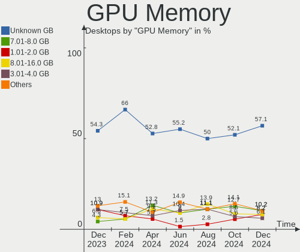
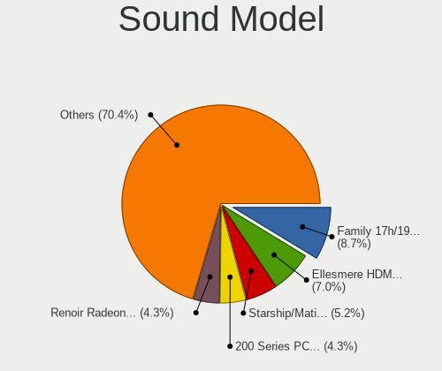
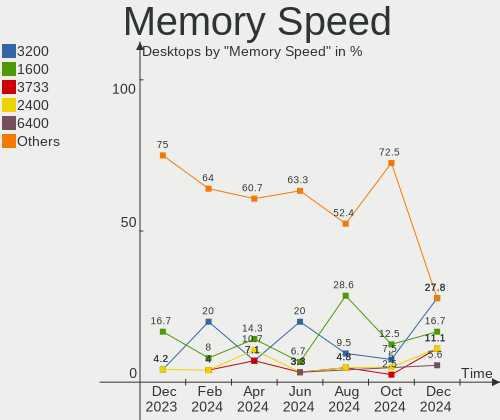

Kubuntu - Hardware Trends (Desktops)
------------------------------------

A project to identify most popular hardware characteristics and track their change
over time based on data collected by Linux users at https://Linux-Hardware.org.

Anyone can contribute to this report by the [hw-probe](https://github.com/linuxhw/hw-probe) tool:

    sudo -E hw-probe -all -upload

This report is for one last month. Overall report since the beginning of time: [TestDays](https://github.com/linuxhw/TestDays)

Period: Apr, 2024.

Contents
--------

* [ System ](#system)
  - [ OS                       ](#os)
  - [ OS Family                ](#os-family)
  - [ Kernel                   ](#kernel)
  - [ Kernel Family            ](#kernel-family)
  - [ Kernel Major Ver.        ](#kernel-major-ver)
  - [ Arch                     ](#arch)
  - [ DE                       ](#de)
  - [ Display Server           ](#display-server)
  - [ Display Manager          ](#display-manager)
  - [ OS Lang                  ](#os-lang)
  - [ Boot Mode                ](#boot-mode)
  - [ Filesystem               ](#filesystem)
  - [ Part. scheme             ](#part-scheme)
  - [ Dual Boot with Linux/BSD ](#dual-boot-with-linuxbsd)
  - [ Dual Boot (Win)          ](#dual-boot-win)

* [ Board ](#board)
  - [ Vendor                   ](#vendor)
  - [ Model                    ](#model)
  - [ Model Family             ](#model-family)
  - [ MFG Year                 ](#mfg-year)
  - [ Form Factor              ](#form-factor)
  - [ Secure Boot              ](#secure-boot)
  - [ Coreboot                 ](#coreboot)
  - [ RAM Size                 ](#ram-size)
  - [ RAM Used                 ](#ram-used)
  - [ Total Drives             ](#total-drives)
  - [ Has CD-ROM               ](#has-cd-rom)
  - [ Has Ethernet             ](#has-ethernet)
  - [ Has WiFi                 ](#has-wifi)
  - [ Has Bluetooth            ](#has-bluetooth)

* [ Location ](#location)
  - [ Country                  ](#country)
  - [ City                     ](#city)

* [ Drives ](#drives)
  - [ Drive Vendor             ](#drive-vendor)
  - [ Drive Model              ](#drive-model)
  - [ HDD Vendor               ](#hdd-vendor)
  - [ SSD Vendor               ](#ssd-vendor)
  - [ Drive Kind               ](#drive-kind)
  - [ Drive Connector          ](#drive-connector)
  - [ Drive Size               ](#drive-size)
  - [ Space Total              ](#space-total)
  - [ Space Used               ](#space-used)
  - [ Malfunc. Drives          ](#malfunc-drives)
  - [ Malfunc. Drive Vendor    ](#malfunc-drive-vendor)
  - [ Malfunc. HDD Vendor      ](#malfunc-hdd-vendor)
  - [ Malfunc. Drive Kind      ](#malfunc-drive-kind)
  - [ Failed Drives            ](#failed-drives)
  - [ Failed Drive Vendor      ](#failed-drive-vendor)
  - [ Drive Status             ](#drive-status)

* [ Storage controller ](#storage-controller)
  - [ Storage Vendor           ](#storage-vendor)
  - [ Storage Model            ](#storage-model)
  - [ Storage Kind             ](#storage-kind)

* [ Processor ](#processor)
  - [ CPU Vendor               ](#cpu-vendor)
  - [ CPU Model                ](#cpu-model)
  - [ CPU Model Family         ](#cpu-model-family)
  - [ CPU Cores                ](#cpu-cores)
  - [ CPU Sockets              ](#cpu-sockets)
  - [ CPU Threads              ](#cpu-threads)
  - [ CPU Op-Modes             ](#cpu-op-modes)
  - [ CPU Microcode            ](#cpu-microcode)
  - [ CPU Microarch            ](#cpu-microarch)

* [ Graphics ](#graphics)
  - [ GPU Vendor               ](#gpu-vendor)
  - [ GPU Model                ](#gpu-model)
  - [ GPU Combo                ](#gpu-combo)
  - [ GPU Driver               ](#gpu-driver)
  - [ GPU Memory               ](#gpu-memory)

* [ Monitor ](#monitor)
  - [ Monitor Vendor           ](#monitor-vendor)
  - [ Monitor Model            ](#monitor-model)
  - [ Monitor Resolution       ](#monitor-resolution)
  - [ Monitor Diagonal         ](#monitor-diagonal)
  - [ Monitor Width            ](#monitor-width)
  - [ Aspect Ratio             ](#aspect-ratio)
  - [ Monitor Area             ](#monitor-area)
  - [ Pixel Density            ](#pixel-density)
  - [ Multiple Monitors        ](#multiple-monitors)

* [ Network ](#network)
  - [ Net Controller Vendor    ](#net-controller-vendor)
  - [ Net Controller Model     ](#net-controller-model)
  - [ Wireless Vendor          ](#wireless-vendor)
  - [ Wireless Model           ](#wireless-model)
  - [ Ethernet Vendor          ](#ethernet-vendor)
  - [ Ethernet Model           ](#ethernet-model)
  - [ Net Controller Kind      ](#net-controller-kind)
  - [ Used Controller          ](#used-controller)
  - [ NICs                     ](#nics)
  - [ IPv6                     ](#ipv6)

* [ Bluetooth ](#bluetooth)
  - [ Bluetooth Vendor         ](#bluetooth-vendor)
  - [ Bluetooth Model          ](#bluetooth-model)

* [ Sound ](#sound)
  - [ Sound Vendor             ](#sound-vendor)
  - [ Sound Model              ](#sound-model)

* [ Memory ](#memory)
  - [ Memory Vendor            ](#memory-vendor)
  - [ Memory Model             ](#memory-model)
  - [ Memory Kind              ](#memory-kind)
  - [ Memory Form Factor       ](#memory-form-factor)
  - [ Memory Size              ](#memory-size)
  - [ Memory Speed             ](#memory-speed)

* [ Printers & scanners ](#printers--scanners)
  - [ Printer Vendor           ](#printer-vendor)
  - [ Printer Model            ](#printer-model)
  - [ Scanner Vendor           ](#scanner-vendor)
  - [ Scanner Model            ](#scanner-model)

* [ Camera ](#camera)
  - [ Camera Vendor            ](#camera-vendor)
  - [ Camera Model             ](#camera-model)

* [ Security ](#security)
  - [ Fingerprint Vendor       ](#fingerprint-vendor)
  - [ Fingerprint Model        ](#fingerprint-model)
  - [ Chipcard Vendor          ](#chipcard-vendor)
  - [ Chipcard Model           ](#chipcard-model)

* [ Unsupported ](#unsupported)
  - [ Unsupported Devices      ](#unsupported-devices)
  - [ Unsupported Device Types ](#unsupported-device-types)

System
------

OS
--

Installed operating systems

| Name          | Desktops | Percent |
|---------------|----------|---------|
| Kubuntu 22.04 | 24       | 45.28%  |
| Kubuntu 23.10 | 16       | 30.19%  |
| Kubuntu 24.04 | 10       | 18.87%  |
| Kubuntu 20.04 | 2        | 3.77%   |
| Kubuntu 18.04 | 1        | 1.89%   |

OS Family
---------

OS without a version

| Name    | Desktops | Percent |
|---------|----------|---------|
| Kubuntu | 53       | 100%    |

Kernel
------

Version of the Linux kernel

| Version                | Desktops | Percent |
|------------------------|----------|---------|
| 6.5.0-28-generic       | 13       | 24.53%  |
| 6.8.0-31-generic       | 7        | 13.21%  |
| 6.5.0-26-generic       | 6        | 11.32%  |
| 6.5.0-27-generic       | 5        | 9.43%   |
| 5.15.0-102-generic     | 4        | 7.55%   |
| 6.5.0-9-generic        | 2        | 3.77%   |
| 6.5.0-28-lowlatency    | 2        | 3.77%   |
| 5.15.0-94-generic      | 2        | 3.77%   |
| 5.15.0-101-generic     | 2        | 3.77%   |
| 6.8.0-28-generic       | 1        | 1.89%   |
| 6.8.0-22-generic       | 1        | 1.89%   |
| 6.5.0-27-lowlatency    | 1        | 1.89%   |
| 6.5.0-26-lowlatency    | 1        | 1.89%   |
| 6.5.0-15-generic       | 1        | 1.89%   |
| 6.2.0-1018-lowlatency  | 1        | 1.89%   |
| 5.15.13-051513-generic | 1        | 1.89%   |
| 5.15.0-91-generic      | 1        | 1.89%   |
| 5.15.0-57-generic      | 1        | 1.89%   |
| 4.15.0-213-generic     | 1        | 1.89%   |

Kernel Family
-------------

Linux kernel without a distro release

| Version | Desktops | Percent |
|---------|----------|---------|
| 6.5.0   | 31       | 58.49%  |
| 5.15.0  | 10       | 18.87%  |
| 6.8.0   | 9        | 16.98%  |
| 6.2.0   | 1        | 1.89%   |
| 5.15.13 | 1        | 1.89%   |
| 4.15.0  | 1        | 1.89%   |

Kernel Major Ver.
-----------------

Linux kernel major version

| Version | Desktops | Percent |
|---------|----------|---------|
| 6.5     | 31       | 58.49%  |
| 5.15    | 11       | 20.75%  |
| 6.8     | 9        | 16.98%  |
| 6.2     | 1        | 1.89%   |
| 4.15    | 1        | 1.89%   |

Arch
----

OS architecture (x86_64, i586, etc.)

| Name   | Desktops | Percent |
|--------|----------|---------|
| x86_64 | 53       | 100%    |

DE
--

Desktop Environment

| Name | Desktops | Percent |
|------|----------|---------|
| KDE5 | 52       | 98.11%  |
| XFCE | 1        | 1.89%   |

Display Server
--------------

X11 or Wayland

| Name    | Desktops | Percent |
|---------|----------|---------|
| X11     | 47       | 88.68%  |
| Wayland | 5        | 9.43%   |
| Tty     | 1        | 1.89%   |

Display Manager
---------------

SDDM, LightDM, etc.

| Name    | Desktops | Percent |
|---------|----------|---------|
| SDDM    | 32       | 60.38%  |
| Unknown | 18       | 33.96%  |
| GDM3    | 2        | 3.77%   |
| LightDM | 1        | 1.89%   |

OS Lang
-------

Language

| Lang           | Desktops | Percent |
|----------------|----------|---------|
| en_US          | 21       | 39.62%  |
| pt_BR          | 4        | 7.55%   |
| en_GB          | 4        | 7.55%   |
| de_DE          | 4        | 7.55%   |
| ru_RU          | 3        | 5.66%   |
| fr_FR          | 2        | 3.77%   |
| en_AU          | 2        | 3.77%   |
| nl_NL          | 1        | 1.89%   |
| nl_BE          | 1        | 1.89%   |
| it_IT          | 1        | 1.89%   |
| fr_CA          | 1        | 1.89%   |
| es_VE          | 1        | 1.89%   |
| es_ES          | 1        | 1.89%   |
| en_ZA          | 1        | 1.89%   |
| en_SG          | 1        | 1.89%   |
| en_NZ          | 1        | 1.89%   |
| en_DK          | 1        | 1.89%   |
| de_LU          | 1        | 1.89%   |
| de_AT          | 1        | 1.89%   |
| ca_ES@valencia | 1        | 1.89%   |

Boot Mode
---------

EFI or BIOS

| Mode | Desktops | Percent |
|------|----------|---------|
| BIOS | 32       | 60.38%  |
| EFI  | 21       | 39.62%  |

Filesystem
----------

Type of filesystem

| Type  | Desktops | Percent |
|-------|----------|---------|
| Ext4  | 35       | 66.04%  |
| Tmpfs | 10       | 18.87%  |
| Btrfs | 5        | 9.43%   |
| Zfs   | 2        | 3.77%   |
| Ext2  | 1        | 1.89%   |

Part. scheme
------------

Scheme of partitioning

| Type    | Desktops | Percent |
|---------|----------|---------|
| GPT     | 33       | 62.26%  |
| Unknown | 18       | 33.96%  |
| MBR     | 2        | 3.77%   |

Dual Boot with Linux/BSD
------------------------

Hosting more than one Linux/BSD

| Dual boot | Desktops | Percent |
|-----------|----------|---------|
| No        | 42       | 79.25%  |
| Yes       | 11       | 20.75%  |

Dual Boot (Win)
---------------

Hosting Linux and Windows

| Dual boot | Desktops | Percent |
|-----------|----------|---------|
| No        | 35       | 66.04%  |
| Yes       | 18       | 33.96%  |

Board
-----

Vendor
------

Motherboard manufacturer

| Name                | Desktops | Percent |
|---------------------|----------|---------|
| ASUSTek Computer    | 13       | 24.53%  |
| Gigabyte Technology | 12       | 22.64%  |
| MSI                 | 11       | 20.75%  |
| Dell                | 4        | 7.55%   |
| ASRock              | 3        | 5.66%   |
| Intel               | 2        | 3.77%   |
| Hewlett-Packard     | 2        | 3.77%   |
| Pegatron            | 1        | 1.89%   |
| JWIPC               | 1        | 1.89%   |
| Fujitsu             | 1        | 1.89%   |
| ECS                 | 1        | 1.89%   |
| Acer                | 1        | 1.89%   |
| Unknown             | 1        | 1.89%   |

Model
-----

Motherboard model

| Name                                       | Desktops | Percent |
|--------------------------------------------|----------|---------|
| MSI MS-7C91                                | 2        | 3.77%   |
| Dell OptiPlex 7040                         | 2        | 3.77%   |
| Pegatron TouchSmart 7320 Lavaca-B EU L6 PC | 1        | 1.89%   |
| MSI MS-7E06                                | 1        | 1.89%   |
| MSI MS-7D91                                | 1        | 1.89%   |
| MSI MS-7D25                                | 1        | 1.89%   |
| MSI MS-7C71                                | 1        | 1.89%   |
| MSI MS-7C02                                | 1        | 1.89%   |
| MSI MS-7B85                                | 1        | 1.89%   |
| MSI MS-7B78                                | 1        | 1.89%   |
| MSI MS-7786                                | 1        | 1.89%   |
| MSI Creator B660 P100A (MS-B929)           | 1        | 1.89%   |
| JWIPC BF24                                 | 1        | 1.89%   |
| Intel X99                                  | 1        | 1.89%   |
| Intel B250                                 | 1        | 1.89%   |
| HP ProDesk 600 G1 SFF                      | 1        | 1.89%   |
| HP OMEN 25L Desktop GT12-0xxx              | 1        | 1.89%   |
| Gigabyte Z790 UD AC                        | 1        | 1.89%   |
| Gigabyte Z790 AORUS ELITE AX               | 1        | 1.89%   |
| Gigabyte Z77-D3H                           | 1        | 1.89%   |
| Gigabyte Z590 UD AC                        | 1        | 1.89%   |
| Gigabyte H61MA-D3V                         | 1        | 1.89%   |
| Gigabyte H310MS2P                          | 1        | 1.89%   |
| Gigabyte B75M-D2V                          | 1        | 1.89%   |
| Gigabyte B550M K                           | 1        | 1.89%   |
| Gigabyte B365 M AORUS ELITE                | 1        | 1.89%   |
| Gigabyte AX370-Gaming K7                   | 1        | 1.89%   |
| Gigabyte A320M-DS2                         | 1        | 1.89%   |
| Gigabyte 970A-DS3P                         | 1        | 1.89%   |
| Fujitsu ALDA-CE                            | 1        | 1.89%   |
| ECS RZ410AA-ABZ a6040.it                   | 1        | 1.89%   |
| Dell OptiPlex 9020                         | 1        | 1.89%   |
| Dell Inspiron 570                          | 1        | 1.89%   |
| ASUS TUF Gaming B650M-E WIFI               | 1        | 1.89%   |
| ASUS TUF B450M-PLUS GAMING                 | 1        | 1.89%   |
| ASUS SABERTOOTH 990FX                      | 1        | 1.89%   |
| ASUS ROG STRIX Z790-A GAMING WIFI D4       | 1        | 1.89%   |
| ASUS ROG STRIX B450-I GAMING               | 1        | 1.89%   |
| ASUS ROG STRIX B450-F GAMING II            | 1        | 1.89%   |
| ASUS ROG CROSSHAIR X670E HERO              | 1        | 1.89%   |

Model Family
------------

Motherboard model prefix

| Name                  | Desktops | Percent |
|-----------------------|----------|---------|
| ASUS ROG              | 4        | 7.55%   |
| Dell OptiPlex         | 3        | 5.66%   |
| MSI MS-7C91           | 2        | 3.77%   |
| Gigabyte Z790         | 2        | 3.77%   |
| ASUS TUF              | 2        | 3.77%   |
| ASUS PRIME            | 2        | 3.77%   |
| Pegatron TouchSmart   | 1        | 1.89%   |
| MSI MS-7E06           | 1        | 1.89%   |
| MSI MS-7D91           | 1        | 1.89%   |
| MSI MS-7D25           | 1        | 1.89%   |
| MSI MS-7C71           | 1        | 1.89%   |
| MSI MS-7C02           | 1        | 1.89%   |
| MSI MS-7B85           | 1        | 1.89%   |
| MSI MS-7B78           | 1        | 1.89%   |
| MSI MS-7786           | 1        | 1.89%   |
| MSI Creator           | 1        | 1.89%   |
| JWIPC BF24            | 1        | 1.89%   |
| Intel X99             | 1        | 1.89%   |
| Intel B250            | 1        | 1.89%   |
| HP ProDesk            | 1        | 1.89%   |
| HP OMEN               | 1        | 1.89%   |
| Gigabyte Z77-D3H      | 1        | 1.89%   |
| Gigabyte Z590         | 1        | 1.89%   |
| Gigabyte H61MA-D3V    | 1        | 1.89%   |
| Gigabyte H310MS2P     | 1        | 1.89%   |
| Gigabyte B75M-D2V     | 1        | 1.89%   |
| Gigabyte B550M        | 1        | 1.89%   |
| Gigabyte B365         | 1        | 1.89%   |
| Gigabyte AX370-Gaming | 1        | 1.89%   |
| Gigabyte A320M-DS2    | 1        | 1.89%   |
| Gigabyte 970A-DS3P    | 1        | 1.89%   |
| Fujitsu ALDA-CE       | 1        | 1.89%   |
| ECS RZ410AA-ABZ       | 1        | 1.89%   |
| Dell Inspiron         | 1        | 1.89%   |
| ASUS SABERTOOTH       | 1        | 1.89%   |
| ASUS P7H55-M          | 1        | 1.89%   |
| ASUS P6T              | 1        | 1.89%   |
| ASUS P5K              | 1        | 1.89%   |
| ASUS KGPE-D16         | 1        | 1.89%   |
| ASRock Z690           | 1        | 1.89%   |

MFG Year
--------

Motherboard manufacture year

| Year | Desktops | Percent |
|------|----------|---------|
| 2018 | 7        | 13.21%  |
| 2022 | 6        | 11.32%  |
| 2020 | 6        | 11.32%  |
| 2012 | 6        | 11.32%  |
| 2023 | 5        | 9.43%   |
| 2021 | 3        | 5.66%   |
| 2019 | 3        | 5.66%   |
| 2017 | 3        | 5.66%   |
| 2016 | 2        | 3.77%   |
| 2014 | 2        | 3.77%   |
| 2013 | 2        | 3.77%   |
| 2011 | 2        | 3.77%   |
| 2009 | 2        | 3.77%   |
| 2024 | 1        | 1.89%   |
| 2010 | 1        | 1.89%   |
| 2008 | 1        | 1.89%   |
| 2007 | 1        | 1.89%   |

Form Factor
-----------

Physical design of the computer

| Name    | Desktops | Percent |
|---------|----------|---------|
| Desktop | 53       | 100%    |

Secure Boot
-----------

Enabled or disabled

| State    | Desktops | Percent |
|----------|----------|---------|
| Disabled | 51       | 96.23%  |
| Enabled  | 2        | 3.77%   |

Coreboot
--------

Have coreboot on board

| Used | Desktops | Percent |
|------|----------|---------|
| No   | 52       | 98.11%  |
| Yes  | 1        | 1.89%   |

RAM Size
--------

Total RAM memory

| Size in GB  | Desktops | Percent |
|-------------|----------|---------|
| 32.01-64.0  | 20       | 37.74%  |
| 16.01-24.0  | 13       | 24.53%  |
| 8.01-16.0   | 6        | 11.32%  |
| 64.01-256.0 | 5        | 9.43%   |
| 4.01-8.0    | 4        | 7.55%   |
| 3.01-4.0    | 3        | 5.66%   |
| 24.01-32.0  | 2        | 3.77%   |

RAM Used
--------

Used RAM memory

| Used GB    | Desktops | Percent |
|------------|----------|---------|
| 4.01-8.0   | 18       | 33.96%  |
| 2.01-3.0   | 12       | 22.64%  |
| 3.01-4.0   | 8        | 15.09%  |
| 8.01-16.0  | 6        | 11.32%  |
| 1.01-2.0   | 5        | 9.43%   |
| 24.01-32.0 | 3        | 5.66%   |
| 16.01-24.0 | 1        | 1.89%   |

Total Drives
------------

Number of drives on board

| Drives | Desktops | Percent |
|--------|----------|---------|
| 3      | 16       | 30.19%  |
| 2      | 13       | 24.53%  |
| 1      | 10       | 18.87%  |
| 4      | 6        | 11.32%  |
| 5      | 5        | 9.43%   |
| 6      | 2        | 3.77%   |
| 7      | 1        | 1.89%   |

Has CD-ROM
----------

Has CD-ROM on board

| Presented | Desktops | Percent |
|-----------|----------|---------|
| No        | 36       | 67.92%  |
| Yes       | 17       | 32.08%  |

Has Ethernet
------------

Has Ethernet on board

| Presented | Desktops | Percent |
|-----------|----------|---------|
| Yes       | 52       | 98.11%  |
| No        | 1        | 1.89%   |

Has WiFi
--------

Has WiFi module

| Presented | Desktops | Percent |
|-----------|----------|---------|
| Yes       | 30       | 56.6%   |
| No        | 23       | 43.4%   |

Has Bluetooth
-------------

Has Bluetooth module

| Presented | Desktops | Percent |
|-----------|----------|---------|
| Yes       | 27       | 50.94%  |
| No        | 26       | 49.06%  |

Location
--------

Country
-------

Geographic location (country)

| Country      | Desktops | Percent |
|--------------|----------|---------|
| USA          | 9        | 16.98%  |
| Brazil       | 5        | 9.43%   |
| Russia       | 4        | 7.55%   |
| Germany      | 4        | 7.55%   |
| UK           | 3        | 5.66%   |
| Switzerland  | 2        | 3.77%   |
| Sweden       | 2        | 3.77%   |
| Spain        | 2        | 3.77%   |
| Norway       | 2        | 3.77%   |
| France       | 2        | 3.77%   |
| Belgium      | 2        | 3.77%   |
| Australia    | 2        | 3.77%   |
| Venezuela    | 1        | 1.89%   |
| Turkey       | 1        | 1.89%   |
| South Africa | 1        | 1.89%   |
| Singapore    | 1        | 1.89%   |
| Serbia       | 1        | 1.89%   |
| New Zealand  | 1        | 1.89%   |
| Netherlands  | 1        | 1.89%   |
| Luxembourg   | 1        | 1.89%   |
| Denmark      | 1        | 1.89%   |
| Canada       | 1        | 1.89%   |
| Bulgaria     | 1        | 1.89%   |
| Bangladesh   | 1        | 1.89%   |
| Austria      | 1        | 1.89%   |
| Argentina    | 1        | 1.89%   |

City
----

Geographic location (city)

| City                 | Desktops | Percent |
|----------------------|----------|---------|
| Sao Paulo            | 3        | 5.66%   |
| Zurich               | 2        | 3.77%   |
| Sydney               | 2        | 3.77%   |
| Zuid-Scharwoude      | 1        | 1.89%   |
| Wellington           | 1        | 1.89%   |
| Vienna               | 1        | 1.89%   |
| Vaudreuil-Dorion     | 1        | 1.89%   |
| Trondheim            | 1        | 1.89%   |
| Stockholm            | 1        | 1.89%   |
| Southwark            | 1        | 1.89%   |
| Solingen             | 1        | 1.89%   |
| Sofia                | 1        | 1.89%   |
| Singapore            | 1        | 1.89%   |
| Sealy                | 1        | 1.89%   |
| Rotselaar            | 1        | 1.89%   |
| Pratt                | 1        | 1.89%   |
| Port Elizabeth       | 1        | 1.89%   |
| Phoenix              | 1        | 1.89%   |
| Penza                | 1        | 1.89%   |
| Paranavai            | 1        | 1.89%   |
| Odense               | 1        | 1.89%   |
| Nizhniy Novgorod     | 1        | 1.89%   |
| Naples               | 1        | 1.89%   |
| Montpellier          | 1        | 1.89%   |
| Malmo                | 1        | 1.89%   |
| Luxembourg           | 1        | 1.89%   |
| London               | 1        | 1.89%   |
| Lansing              | 1        | 1.89%   |
| Krasnodar            | 1        | 1.89%   |
| Kolomna              | 1        | 1.89%   |
| Jamestown            | 1        | 1.89%   |
| Istanbul             | 1        | 1.89%   |
| Igarassu             | 1        | 1.89%   |
| Hamburg              | 1        | 1.89%   |
| Green Valley         | 1        | 1.89%   |
| Ghent                | 1        | 1.89%   |
| Freiburg im Breisgau | 1        | 1.89%   |
| Fiksdal              | 1        | 1.89%   |
| Dinan                | 1        | 1.89%   |
| Córdoba             | 1        | 1.89%   |

Drives
------

Drive Vendor
------------

Hard drive vendors

| Vendor                      | Desktops | Drives | Percent |
|-----------------------------|----------|--------|---------|
| WDC                         | 22       | 28     | 17.89%  |
| Samsung Electronics         | 19       | 31     | 15.45%  |
| Seagate                     | 15       | 21     | 12.2%   |
| Sandisk                     | 11       | 14     | 8.94%   |
| Crucial                     | 7        | 11     | 5.69%   |
| Toshiba                     | 6        | 8      | 4.88%   |
| Kingston                    | 5        | 5      | 4.07%   |
| A-DATA Technology           | 4        | 4      | 3.25%   |
| China                       | 3        | 3      | 2.44%   |
| SPCC                        | 2        | 2      | 1.63%   |
| Silicon Motion              | 2        | 2      | 1.63%   |
| PNY                         | 2        | 2      | 1.63%   |
| Phison Electronics          | 2        | 2      | 1.63%   |
| Micron/Crucial Technology   | 2        | 2      | 1.63%   |
| Lite-On Technology          | 2        | 2      | 1.63%   |
| Intenso                     | 2        | 2      | 1.63%   |
| Hitachi                     | 2        | 2      | 1.63%   |
| Unknown                     | 2        | 2      | 1.63%   |
| Unknown                     | 1        | 1      | 0.81%   |
| T-FORCE                     | 1        | 1      | 0.81%   |
| SK hynix                    | 1        | 1      | 0.81%   |
| Patriot                     | 1        | 1      | 0.81%   |
| Neo                         | 1        | 1      | 0.81%   |
| MicroFrom                   | 1        | 1      | 0.81%   |
| LITEONIT                    | 1        | 1      | 0.81%   |
| Lexar                       | 1        | 1      | 0.81%   |
| Kingston Technology Company | 1        | 1      | 0.81%   |
| JMicron Technology          | 1        | 1      | 0.81%   |
| HGST                        | 1        | 1      | 0.81%   |
| Gigabyte Technology         | 1        | 1      | 0.81%   |
| Apple                       | 1        | 1      | 0.81%   |

Drive Model
-----------

Hard drive models

| Model                                              | Desktops | Percent |
|----------------------------------------------------|----------|---------|
| Samsung NVMe SSD Controller SM981/PM981/PM983 1TB  | 4        | 2.86%   |
| WDC WD5000AAKX-001CA0 500GB                        | 2        | 1.43%   |
| WDC WD10EZEX-08WN4A0 1TB                           | 2        | 1.43%   |
| Seagate ST8000DM004-2CX188 8TB                     | 2        | 1.43%   |
| Seagate ST31000528AS 1TB                           | 2        | 1.43%   |
| Seagate ST2000DM006-2DM164 2TB                     | 2        | 1.43%   |
| Samsung SSD 980 500GB                              | 2        | 1.43%   |
| Samsung NVMe SSD Controller PM9A1/PM9A3/980PRO 1TB | 2        | 1.43%   |
| Lite-On CX2-8B256-Q11 NVMe LITEON 256GB            | 2        | 1.43%   |
| Unknown                                            | 2        | 1.43%   |
| WDC WDS500G2B0A 500GB SSD                          | 1        | 0.71%   |
| WDC WDS500G1B0B-00AS40 500GB SSD                   | 1        | 0.71%   |
| WDC WDS200T2B0A-00SM50 2TB SSD                     | 1        | 0.71%   |
| WDC WDS100T2B0A-00SM50 1TB SSD                     | 1        | 0.71%   |
| WDC WDBNCE5000PNC 500GB SSD                        | 1        | 0.71%   |
| WDC WD7500AADS-00M2B0 752GB                        | 1        | 0.71%   |
| WDC WD5000AZLX-08K2TA0 500GB                       | 1        | 0.71%   |
| WDC WD5000AURX-63UY4Y0 500GB                       | 1        | 0.71%   |
| WDC WD5000AAKX-753CA1 500GB                        | 1        | 0.71%   |
| WDC WD40EZRZ-22GXCB0 4TB                           | 1        | 0.71%   |
| WDC WD40EFAX-68JH4N1 4TB                           | 1        | 0.71%   |
| WDC WD4003FRYZ-01F0DB0 4TB                         | 1        | 0.71%   |
| WDC WD30EZRZ-00GXCB0 3TB                           | 1        | 0.71%   |
| WDC WD2500AAKX-00ERMA0 250GB                       | 1        | 0.71%   |
| WDC WD20EARX-00ZUDB0 2TB                           | 1        | 0.71%   |
| WDC WD20EARS-00MVWB0 2TB                           | 1        | 0.71%   |
| WDC WD10EZEX-60WN4A2 1TB                           | 1        | 0.71%   |
| WDC WD10EZEX-22MFCA0 1TB                           | 1        | 0.71%   |
| WDC WD10EZEX-21M2NA0 1TB                           | 1        | 0.71%   |
| WDC WD10EZEX-00RKKA0 1TB                           | 1        | 0.71%   |
| WDC WD10EARS-00Y5B1 1TB                            | 1        | 0.71%   |
| Unknown SD/MMC/MS PRO 128GB                        | 1        | 0.71%   |
| Toshiba MG09ACA18TE 18TB                           | 1        | 0.71%   |
| Toshiba MG08ACA16TE 16TB                           | 1        | 0.71%   |
| Toshiba HDWG160 6TB                                | 1        | 0.71%   |
| Toshiba HDWD120 2TB                                | 1        | 0.71%   |
| Toshiba DT01ACA200 2TB                             | 1        | 0.71%   |
| Toshiba DT01ACA100 1TB                             | 1        | 0.71%   |
| T-FORCE 1TB                                        | 1        | 0.71%   |
| SPCC Solid State Disk 120GB                        | 1        | 0.71%   |

HDD Vendor
----------

Hard disk drive vendors

| Vendor              | Desktops | Drives | Percent |
|---------------------|----------|--------|---------|
| WDC                 | 18       | 22     | 40%     |
| Seagate             | 14       | 20     | 31.11%  |
| Toshiba             | 6        | 8      | 13.33%  |
| Samsung Electronics | 2        | 2      | 4.44%   |
| Hitachi             | 2        | 2      | 4.44%   |
| Unknown             | 1        | 1      | 2.22%   |
| HGST                | 1        | 1      | 2.22%   |
| Apple               | 1        | 1      | 2.22%   |

SSD Vendor
----------

Solid state drive vendors

| Vendor              | Desktops | Drives | Percent |
|---------------------|----------|--------|---------|
| Samsung Electronics | 9        | 11     | 19.57%  |
| Crucial             | 7        | 11     | 15.22%  |
| WDC                 | 5        | 6      | 10.87%  |
| SanDisk             | 5        | 5      | 10.87%  |
| A-DATA Technology   | 4        | 4      | 8.7%    |
| China               | 3        | 3      | 6.52%   |
| PNY                 | 2        | 2      | 4.35%   |
| Kingston            | 2        | 2      | 4.35%   |
| Unknown             | 2        | 2      | 4.35%   |
| SPCC                | 1        | 1      | 2.17%   |
| Patriot             | 1        | 1      | 2.17%   |
| Neo                 | 1        | 1      | 2.17%   |
| LITEONIT            | 1        | 1      | 2.17%   |
| Lexar               | 1        | 1      | 2.17%   |
| Intenso             | 1        | 1      | 2.17%   |
| Gigabyte Technology | 1        | 1      | 2.17%   |

Drive Kind
----------

HDD or SSD

| Kind    | Desktops | Drives | Percent |
|---------|----------|--------|---------|
| HDD     | 38       | 57     | 34.23%  |
| SSD     | 37       | 53     | 33.33%  |
| NVMe    | 32       | 42     | 28.83%  |
| Unknown | 4        | 4      | 3.6%    |

Drive Connector
---------------

SATA, SAS, NVMe, etc.

| Type | Desktops | Drives | Percent |
|------|----------|--------|---------|
| SATA | 50       | 106    | 56.18%  |
| NVMe | 32       | 41     | 35.96%  |
| SAS  | 7        | 9      | 7.87%   |

Drive Size
----------

Size of hard drive

| Size in TB | Desktops | Drives | Percent |
|------------|----------|--------|---------|
| 0.01-0.5   | 32       | 43     | 38.55%  |
| 0.51-1.0   | 21       | 28     | 25.3%   |
| 1.01-2.0   | 14       | 21     | 16.87%  |
| 3.01-4.0   | 7        | 7      | 8.43%   |
| 4.01-10.0  | 5        | 7      | 6.02%   |
| 10.01-20.0 | 3        | 3      | 3.61%   |
| 2.01-3.0   | 1        | 1      | 1.2%    |

Space Total
-----------

Amount of disk space available on the file system

| Size in GB     | Desktops | Percent |
|----------------|----------|---------|
| More than 3000 | 12       | 22.64%  |
| 1001-2000      | 10       | 18.87%  |
| 501-1000       | 8        | 15.09%  |
| 251-500        | 7        | 13.21%  |
| 101-250        | 7        | 13.21%  |
| 2001-3000      | 6        | 11.32%  |
| 1-20           | 1        | 1.89%   |
| 51-100         | 1        | 1.89%   |
| Unknown        | 1        | 1.89%   |

Space Used
----------

Amount of used disk space

| Used GB        | Desktops | Percent |
|----------------|----------|---------|
| 101-250        | 9        | 16.98%  |
| 21-50          | 7        | 13.21%  |
| 1001-2000      | 7        | 13.21%  |
| More than 3000 | 6        | 11.32%  |
| 501-1000       | 6        | 11.32%  |
| 51-100         | 6        | 11.32%  |
| 251-500        | 5        | 9.43%   |
| 1-20           | 4        | 7.55%   |
| 2001-3000      | 2        | 3.77%   |
| Unknown        | 1        | 1.89%   |

Malfunc. Drives
---------------

Drive models with a malfunction

| Model                                   | Desktops | Drives | Percent |
|-----------------------------------------|----------|--------|---------|
| WDC WD10EZEX-22MFCA0 1TB                | 1        | 1      | 14.29%  |
| Toshiba DT01ACA100 1TB                  | 1        | 2      | 14.29%  |
| Seagate ST4000NM0053 4TB                | 1        | 1      | 14.29%  |
| Samsung Electronics HD501LJ 500GB       | 1        | 1      | 14.29%  |
| Neo Forza NFS121SA312-6007000 120GB SSD | 1        | 1      | 14.29%  |
| Hitachi HTS543232A7A384 320GB           | 1        | 1      | 14.29%  |
| China SSD 480GB                         | 1        | 1      | 14.29%  |

Malfunc. Drive Vendor
---------------------

Vendors of faulty drives

| Vendor              | Desktops | Drives | Percent |
|---------------------|----------|--------|---------|
| WDC                 | 1        | 1      | 14.29%  |
| Toshiba             | 1        | 2      | 14.29%  |
| Seagate             | 1        | 1      | 14.29%  |
| Samsung Electronics | 1        | 1      | 14.29%  |
| Neo                 | 1        | 1      | 14.29%  |
| Hitachi             | 1        | 1      | 14.29%  |
| China               | 1        | 1      | 14.29%  |

Malfunc. HDD Vendor
-------------------

Vendors of faulty HDD drives

| Vendor              | Desktops | Drives | Percent |
|---------------------|----------|--------|---------|
| WDC                 | 1        | 1      | 20%     |
| Toshiba             | 1        | 2      | 20%     |
| Seagate             | 1        | 1      | 20%     |
| Samsung Electronics | 1        | 1      | 20%     |
| Hitachi             | 1        | 1      | 20%     |

Malfunc. Drive Kind
-------------------

Kinds of faulty drives

| Kind | Desktops | Drives | Percent |
|------|----------|--------|---------|
| HDD  | 5        | 6      | 71.43%  |
| SSD  | 2        | 2      | 28.57%  |

Failed Drives
-------------

Failed drive models

Zero info for selected period =(

Failed Drive Vendor
-------------------

Failed drive vendors

Zero info for selected period =(

Drive Status
------------

Number of failed and malfunc. drives

| Status   | Desktops | Drives | Percent |
|----------|----------|--------|---------|
| Detected | 31       | 93     | 49.21%  |
| Works    | 26       | 55     | 41.27%  |
| Malfunc  | 6        | 8      | 9.52%   |

Storage controller
------------------

Storage Vendor
--------------

Storage controller vendors

| Vendor                      | Desktops | Percent |
|-----------------------------|----------|---------|
| Intel                       | 29       | 31.52%  |
| AMD                         | 22       | 23.91%  |
| Samsung Electronics         | 13       | 14.13%  |
| SanDisk                     | 6        | 6.52%   |
| Kingston Technology Company | 4        | 4.35%   |
| Phison Electronics          | 3        | 3.26%   |
| JMicron Technology          | 3        | 3.26%   |
| Micron/Crucial Technology   | 2        | 2.17%   |
| Marvell Technology Group    | 2        | 2.17%   |
| Lite-On Technology          | 2        | 2.17%   |
| SK hynix                    | 1        | 1.09%   |
| Silicon Motion              | 1        | 1.09%   |
| Promise Technology          | 1        | 1.09%   |
| Nvidia                      | 1        | 1.09%   |
| MAXIO Technology (Hangzhou) | 1        | 1.09%   |
| ASMedia Technology          | 1        | 1.09%   |

Storage Model
-------------

Storage controller models

| Model                                                                          | Desktops | Percent |
|--------------------------------------------------------------------------------|----------|---------|
| AMD FCH SATA Controller [AHCI mode]                                            | 9        | 8.57%   |
| AMD 400 Series Chipset SATA Controller                                         | 7        | 6.67%   |
| Samsung NVMe SSD Controller SM981/PM981/PM983                                  | 6        | 5.71%   |
| AMD SB7x0/SB8x0/SB9x0 SATA Controller [AHCI mode]                              | 5        | 4.76%   |
| Intel Raptor Lake SATA AHCI Controller                                         | 4        | 3.81%   |
| Samsung NVMe SSD Controller PM9A1/PM9A3/980PRO                                 | 3        | 2.86%   |
| Samsung NVMe SSD Controller 980 (DRAM-less)                                    | 3        | 2.86%   |
| Kingston Company A2000 NVMe SSD SM2263EN                                       | 3        | 2.86%   |
| Intel Alder Lake-S PCH SATA Controller [AHCI Mode]                             | 3        | 2.86%   |
| Intel 8 Series/C220 Series Chipset Family 6-port SATA Controller 1 [AHCI mode] | 3        | 2.86%   |
| AMD 600 Series Chipset SATA Controller                                         | 3        | 2.86%   |
| AMD 500 Series Chipset SATA Controller                                         | 3        | 2.86%   |
| SanDisk WD Black SN770 / PC SN740 256GB / PC SN560 (DRAM-less) NVMe SSD        | 2        | 1.9%    |
| Phison PS5013-E13 PCIe3 NVMe Controller (DRAM-less)                            | 2        | 1.9%    |
| Lite-On CX2-8B256, CX2-8B512 NVMe SSD                                          | 2        | 1.9%    |
| JMicron JMB363 SATA/IDE Controller                                             | 2        | 1.9%    |
| Intel SATA Controller [RAID mode]                                              | 2        | 1.9%    |
| Intel Q170/Q150/B150/H170/H110/Z170/CM236 Chipset SATA Controller [AHCI Mode]  | 2        | 1.9%    |
| Intel Cannon Lake PCH SATA AHCI Controller                                     | 2        | 1.9%    |
| Intel 7 Series/C210 Series Chipset Family 6-port SATA Controller [AHCI mode]   | 2        | 1.9%    |
| Intel 6 Series/C200 Series Chipset Family 6 port Desktop SATA AHCI Controller  | 2        | 1.9%    |
| Intel 200 Series PCH SATA controller [AHCI mode]                               | 2        | 1.9%    |
| AMD FCH SATA Controller D                                                      | 2        | 1.9%    |
| SK hynix PC401 NVMe Solid State Drive 256GB                                    | 1        | 0.95%   |
| Silicon Motion SM2262/SM2262EN SSD Controller                                  | 1        | 0.95%   |
| SanDisk WD Blue SN550 NVMe SSD 2TB (DRAM-less)                                 | 1        | 0.95%   |
| Sandisk WD Black SN850X NVMe SSD                                               | 1        | 0.95%   |
| SanDisk Ultra 3D / WD Blue SN570 NVMe SSD (DRAM-less)                          | 1        | 0.95%   |
| SanDisk Ultra 3D / WD Blue SN550 NVMe SSD                                      | 1        | 0.95%   |
| Samsung NVMe SSD Controller SM951/PM951                                        | 1        | 0.95%   |
| Samsung NVMe SSD Controller S4LV008[Pascal]                                    | 1        | 0.95%   |
| Promise Pegasus RAID Controller                                                | 1        | 0.95%   |
| Phison PS5021-E21 PCIe4 NVMe Controller (DRAM-less)                            | 1        | 0.95%   |
| Nvidia MCP61 SATA Controller                                                   | 1        | 0.95%   |
| Nvidia MCP61 IDE                                                               | 1        | 0.95%   |
| Micron/Crucial T500 NVMe PCIe SSD                                              | 1        | 0.95%   |
| Micron/Crucial P2 [Nick P2] / P3 / P3 Plus NVMe PCIe SSD (DRAM-less)           | 1        | 0.95%   |
| MAXIO (Hangzhou) NVMe SSD Controller MAP1602 (DRAM-less)                       | 1        | 0.95%   |
| Marvell Group 88SE9215 PCIe 2.0 x1 4-port SATA 6 Gb/s Controller               | 1        | 0.95%   |
| Marvell Group 88SE9172 SATA 6Gb/s Controller                                   | 1        | 0.95%   |

Storage Kind
------------

Kind of storage controller (IDE, SATA, NVMe, SAS, ...)

| Kind | Desktops | Percent |
|------|----------|---------|
| SATA | 48       | 56.47%  |
| NVMe | 29       | 34.12%  |
| RAID | 4        | 4.71%   |
| IDE  | 4        | 4.71%   |

Processor
---------

CPU Vendor
----------

Processor vendors

| Vendor | Desktops | Percent |
|--------|----------|---------|
| Intel  | 30       | 56.6%   |
| AMD    | 23       | 43.4%   |

CPU Model
---------

Processor models

| Model                                      | Desktops | Percent |
|--------------------------------------------|----------|---------|
| AMD Ryzen 7 2700X Eight-Core Processor     | 3        | 5.66%   |
| Intel Core i7-6700 CPU @ 3.40GHz           | 2        | 3.77%   |
| Intel Core i7-14700K                       | 2        | 3.77%   |
| AMD Ryzen 5 3600 6-Core Processor          | 2        | 3.77%   |
| AMD Ryzen 5 1600X Six-Core Processor       | 2        | 3.77%   |
| Intel Xeon CPU E5-2660 v3 @ 2.60GHz        | 1        | 1.89%   |
| Intel Pentium Gold G5420 CPU @ 3.80GHz     | 1        | 1.89%   |
| Intel Pentium CPU G850 @ 2.90GHz           | 1        | 1.89%   |
| Intel Core i9-7900X CPU @ 3.30GHz          | 1        | 1.89%   |
| Intel Core i7-9700K CPU @ 3.60GHz          | 1        | 1.89%   |
| Intel Core i7-8700 CPU @ 3.20GHz           | 1        | 1.89%   |
| Intel Core i7-7700T CPU @ 2.90GHz          | 1        | 1.89%   |
| Intel Core i7-4790 CPU @ 3.60GHz           | 1        | 1.89%   |
| Intel Core i7-3770 CPU @ 3.40GHz           | 1        | 1.89%   |
| Intel Core i7-2600K CPU @ 3.40GHz          | 1        | 1.89%   |
| Intel Core i7-10700KF CPU @ 3.80GHz        | 1        | 1.89%   |
| Intel Core i7-10700 CPU @ 2.90GHz          | 1        | 1.89%   |
| Intel Core i7 CPU 920 @ 2.67GHz            | 1        | 1.89%   |
| Intel Core i5-4590 CPU @ 3.30GHz           | 1        | 1.89%   |
| Intel Core i5-4460 CPU @ 3.20GHz           | 1        | 1.89%   |
| Intel Core i5-3470 CPU @ 3.20GHz           | 1        | 1.89%   |
| Intel Core i5 CPU 650 @ 3.20GHz            | 1        | 1.89%   |
| Intel Core 2 Quad CPU Q6600 @ 2.40GHz      | 1        | 1.89%   |
| Intel Celeron J4125 CPU @ 2.00GHz          | 1        | 1.89%   |
| Intel 13th Gen Core i7-13700KF             | 1        | 1.89%   |
| Intel 13th Gen Core i7-13700K              | 1        | 1.89%   |
| Intel 12th Gen Core i9-12900K              | 1        | 1.89%   |
| Intel 12th Gen Core i7-12700K              | 1        | 1.89%   |
| Intel 12th Gen Core i7-12700F              | 1        | 1.89%   |
| Intel 12th Gen Core i5-12600K              | 1        | 1.89%   |
| Intel 11th Gen Core i9-11900K @ 3.50GHz    | 1        | 1.89%   |
| AMD Ryzen 9 7950X 16-Core Processor        | 1        | 1.89%   |
| AMD Ryzen 9 7900X3D 12-Core Processor      | 1        | 1.89%   |
| AMD Ryzen 9 7900 12-Core Processor         | 1        | 1.89%   |
| AMD Ryzen 9 3900X 12-Core Processor        | 1        | 1.89%   |
| AMD Ryzen 7 PRO 4750G with Radeon Graphics | 1        | 1.89%   |
| AMD Ryzen 7 5800X3D 8-Core Processor       | 1        | 1.89%   |
| AMD Ryzen 7 5800X 8-Core Processor         | 1        | 1.89%   |
| AMD Ryzen 7 5700X 8-Core Processor         | 1        | 1.89%   |
| AMD Ryzen 5 2600 Six-Core Processor        | 1        | 1.89%   |

CPU Model Family
----------------

Processor model prefix

| Model              | Desktops | Percent |
|--------------------|----------|---------|
| Intel Core i7      | 13       | 24.53%  |
| Other              | 7        | 13.21%  |
| AMD Ryzen 7        | 6        | 11.32%  |
| AMD Ryzen 5        | 5        | 9.43%   |
| Intel Core i5      | 4        | 7.55%   |
| AMD Ryzen 9        | 4        | 7.55%   |
| AMD FX             | 3        | 5.66%   |
| Intel Xeon         | 1        | 1.89%   |
| Intel Pentium Gold | 1        | 1.89%   |
| Intel Pentium      | 1        | 1.89%   |
| Intel Core i9      | 1        | 1.89%   |
| Intel Core 2 Quad  | 1        | 1.89%   |
| Intel Celeron      | 1        | 1.89%   |
| AMD Ryzen 7 PRO    | 1        | 1.89%   |
| AMD Opteron        | 1        | 1.89%   |
| AMD Athlon II X2   | 1        | 1.89%   |
| AMD Athlon 64 X2   | 1        | 1.89%   |
| AMD A4             | 1        | 1.89%   |

CPU Cores
---------

Number of processor cores

| Number | Desktops | Percent |
|--------|----------|---------|
| 4      | 14       | 26.42%  |
| 8      | 11       | 20.75%  |
| 6      | 6        | 11.32%  |
| 2      | 6        | 11.32%  |
| 16     | 5        | 9.43%   |
| 12     | 5        | 9.43%   |
| 10     | 3        | 5.66%   |
| 20     | 2        | 3.77%   |
| 3      | 1        | 1.89%   |

CPU Sockets
-----------

Number of sockets

| Number | Desktops | Percent |
|--------|----------|---------|
| 1      | 52       | 98.11%  |
| 2      | 1        | 1.89%   |

CPU Threads
-----------

Threads per core (Hyper-Threading)

| Number | Desktops | Percent |
|--------|----------|---------|
| 2      | 42       | 79.25%  |
| 1      | 11       | 20.75%  |

CPU Op-Modes
------------

CPU Operation Modes (32-bit, 64-bit)

| Op mode        | Desktops | Percent |
|----------------|----------|---------|
| 32-bit, 64-bit | 53       | 100%    |

CPU Microcode
-------------

Microcode number

| Number     | Desktops | Percent |
|------------|----------|---------|
| Unknown    | 38       | 71.7%   |
| 0x06000852 | 3        | 5.66%   |
| 0x906ea    | 2        | 3.77%   |
| 0x0800820d | 2        | 3.77%   |
| 0x906e9    | 1        | 1.89%   |
| 0x706a8    | 1        | 1.89%   |
| 0x0a601203 | 1        | 1.89%   |
| 0x0a201016 | 1        | 1.89%   |
| 0x08600103 | 1        | 1.89%   |
| 0x08001138 | 1        | 1.89%   |
| 0x08001126 | 1        | 1.89%   |
| 0x010000c8 | 1        | 1.89%   |

CPU Microarch
-------------

Microarchitecture

| Name             | Desktops | Percent |
|------------------|----------|---------|
| Unknown          | 9        | 16.98%  |
| Zen+             | 4        | 7.55%   |
| Zen 2            | 4        | 7.55%   |
| KabyLake         | 4        | 7.55%   |
| Haswell          | 4        | 7.55%   |
| Zen 3            | 3        | 5.66%   |
| Skylake          | 3        | 5.66%   |
| Piledriver       | 3        | 5.66%   |
| Zen              | 2        | 3.77%   |
| SandyBridge      | 2        | 3.77%   |
| IvyBridge        | 2        | 3.77%   |
| CometLake        | 2        | 3.77%   |
| Alderlake Hybrid | 2        | 3.77%   |
| Westmere         | 1        | 1.89%   |
| Nehalem          | 1        | 1.89%   |
| K8 Hammer        | 1        | 1.89%   |
| K10 Llano        | 1        | 1.89%   |
| K10              | 1        | 1.89%   |
| Icelake          | 1        | 1.89%   |
| Goldmont plus    | 1        | 1.89%   |
| Core             | 1        | 1.89%   |
| Bulldozer        | 1        | 1.89%   |

Graphics
--------

GPU Vendor
----------

Vendors of graphics cards

| Vendor | Desktops | Percent |
|--------|----------|---------|
| Nvidia | 23       | 38.33%  |
| AMD    | 19       | 31.67%  |
| Intel  | 18       | 30%     |

GPU Model
---------

Graphics card models

| Model                                                                       | Desktops | Percent |
|-----------------------------------------------------------------------------|----------|---------|
| Intel AlderLake-S GT1                                                       | 3        | 4.76%   |
| AMD Raphael                                                                 | 3        | 4.76%   |
| AMD Navi 10 [Radeon RX 5600 OEM/5600 XT / 5700/5700 XT]                     | 3        | 4.76%   |
| AMD Ellesmere [Radeon RX 470/480/570/570X/580/580X/590]                     | 3        | 4.76%   |
| Nvidia GA106 [GeForce RTX 3060 Lite Hash Rate]                              | 2        | 3.17%   |
| Intel Xeon E3-1200 v3/4th Gen Core Processor Integrated Graphics Controller | 2        | 3.17%   |
| Intel HD Graphics 530                                                       | 2        | 3.17%   |
| Intel CoffeeLake-S GT2 [UHD Graphics 630]                                   | 2        | 3.17%   |
| Intel 2nd Generation Core Processor Family Integrated Graphics Controller   | 2        | 3.17%   |
| AMD Turks GL [FirePro V3900]                                                | 2        | 3.17%   |
| AMD Lexa PRO [Radeon 540/540X/550/550X / RX 540X/550/550X]                  | 2        | 3.17%   |
| Nvidia TU104 [GeForce RTX 2070 SUPER]                                       | 1        | 1.59%   |
| Nvidia TU104 [GeForce RTX 2060]                                             | 1        | 1.59%   |
| Nvidia GT200 [GeForce GTX 260]                                              | 1        | 1.59%   |
| Nvidia GP108 [GeForce GT 1030]                                              | 1        | 1.59%   |
| Nvidia GP107 [GeForce GTX 1050 Ti]                                          | 1        | 1.59%   |
| Nvidia GP104 [GeForce GTX 1070]                                             | 1        | 1.59%   |
| Nvidia GP102 [GeForce GTX 1080 Ti]                                          | 1        | 1.59%   |
| Nvidia GM206 [GeForce GTX 960]                                              | 1        | 1.59%   |
| Nvidia GM206 [GeForce GTX 950]                                              | 1        | 1.59%   |
| Nvidia GK208B [GeForce GT 730]                                              | 1        | 1.59%   |
| Nvidia GF116 [GeForce GTX 550 Ti]                                           | 1        | 1.59%   |
| Nvidia GF114 [GeForce GTX 560]                                              | 1        | 1.59%   |
| Nvidia GA104 [GeForce RTX 3060 Ti Lite Hash Rate]                           | 1        | 1.59%   |
| Nvidia GA102 [GeForce RTX 3080]                                             | 1        | 1.59%   |
| Nvidia GA102 [GeForce RTX 3080 Lite Hash Rate]                              | 1        | 1.59%   |
| Nvidia G98 [GeForce 8400 GS Rev. 2]                                         | 1        | 1.59%   |
| Nvidia G96C [GeForce 9500 GT]                                               | 1        | 1.59%   |
| Nvidia AD106 [GeForce RTX 4060 Ti]                                          | 1        | 1.59%   |
| Nvidia AD104 [GeForce RTX 4070 Ti]                                          | 1        | 1.59%   |
| Nvidia AD103 [GeForce RTX 4080]                                             | 1        | 1.59%   |
| Nvidia AD102 [GeForce RTX 4090]                                             | 1        | 1.59%   |
| Intel Xeon E3-1200 v2/3rd Gen Core processor Graphics Controller            | 1        | 1.59%   |
| Intel Raptor Lake-S GT1 [UHD Graphics 770]                                  | 1        | 1.59%   |
| Intel IvyBridge GT2 [HD Graphics 4000]                                      | 1        | 1.59%   |
| Intel HD Graphics 630                                                       | 1        | 1.59%   |
| Intel GeminiLake [UHD Graphics 600]                                         | 1        | 1.59%   |
| Intel Core Processor Integrated Graphics Controller                         | 1        | 1.59%   |
| Intel CoffeeLake-S GT1 [UHD Graphics 610]                                   | 1        | 1.59%   |
| AMD Turks XT [Radeon HD 6670/7670]                                          | 1        | 1.59%   |

GPU Combo
---------

Combinations of graphics cards

| Name           | Desktops | Percent |
|----------------|----------|---------|
| 1 x Nvidia     | 22       | 41.51%  |
| 1 x AMD        | 14       | 26.42%  |
| 1 x Intel      | 11       | 20.75%  |
| 2 x AMD        | 3        | 5.66%   |
| Intel + AMD    | 2        | 3.77%   |
| Intel + Nvidia | 1        | 1.89%   |

GPU Driver
----------

Free vs proprietary

| Driver      | Desktops | Percent |
|-------------|----------|---------|
| Free        | 34       | 64.15%  |
| Proprietary | 17       | 32.08%  |
| Unknown     | 2        | 3.77%   |

GPU Memory
----------

Total video memory

| Size in GB | Desktops | Percent |
|------------|----------|---------|
| Unknown    | 28       | 52.83%  |
| 7.01-8.0   | 7        | 13.21%  |
| 8.01-16.0  | 6        | 11.32%  |
| 3.01-4.0   | 4        | 7.55%   |
| 1.01-2.0   | 3        | 5.66%   |
| 0.01-0.5   | 2        | 3.77%   |
| 5.01-6.0   | 1        | 1.89%   |
| 16.01-24.0 | 1        | 1.89%   |
| 0.51-1.0   | 1        | 1.89%   |

Monitor
-------

Monitor Vendor
--------------

Monitor vendors

| Vendor               | Desktops | Percent |
|----------------------|----------|---------|
| Samsung Electronics  | 7        | 10.94%  |
| Goldstar             | 7        | 10.94%  |
| AOC                  | 7        | 10.94%  |
| Hewlett-Packard      | 6        | 9.38%   |
| Dell                 | 6        | 9.38%   |
| BenQ                 | 4        | 6.25%   |
| Iiyama               | 3        | 4.69%   |
| Acer                 | 3        | 4.69%   |
| ASUSTek Computer     | 2        | 3.13%   |
| ___                  | 1        | 1.56%   |
| ViewSonic            | 1        | 1.56%   |
| Unknown              | 1        | 1.56%   |
| Toshiba              | 1        | 1.56%   |
| SuperFrame           | 1        | 1.56%   |
| Sceptre Tech         | 1        | 1.56%   |
| RTK                  | 1        | 1.56%   |
| Philips              | 1        | 1.56%   |
| PAR                  | 1        | 1.56%   |
| Onkyo                | 1        | 1.56%   |
| MSI                  | 1        | 1.56%   |
| Mi                   | 1        | 1.56%   |
| Lenovo               | 1        | 1.56%   |
| Insignia             | 1        | 1.56%   |
| Gigabyte Technology  | 1        | 1.56%   |
| Envision Peripherals | 1        | 1.56%   |
| Eizo                 | 1        | 1.56%   |
| Aosiman              | 1        | 1.56%   |
| Unknown              | 1        | 1.56%   |

Monitor Model
-------------

Monitor models

| Model                                                                   | Desktops | Percent |
|-------------------------------------------------------------------------|----------|---------|
| Hewlett-Packard w1907 HWP26A3 1440x900 408x255mm 18.9-inch              | 2        | 2.9%    |
| Acer H233H ACR00A0 1920x1080 510x287mm 23.0-inch                        | 2        | 2.9%    |
| ___ ZeroMOD ___3132 504x315 150x100mm 7.1-inch                          | 1        | 1.45%   |
| ViewSonic VG2236 SERIES VSCE726 1920x1080 477x268mm 21.5-inch           | 1        | 1.45%   |
| Unknown LCD Monitor FFFF 2288x1287 2550x2550mm 142.0-inch               | 1        | 1.45%   |
| Toshiba LCD-MONITOR LCDE980 1440x900 408x255mm 18.9-inch                | 1        | 1.45%   |
| SuperFrame SFP2701G SUE2712 2560x1440 530x280mm 23.6-inch               | 1        | 1.45%   |
| Sceptre Tech E246W-1080p SPT2422 1920x1080 521x293mm 23.5-inch          | 1        | 1.45%   |
| Samsung Electronics S27F350 SAM0D22 1920x1080 600x340mm 27.2-inch       | 1        | 1.45%   |
| Samsung Electronics S24D360 SAM0B25 1920x1080 521x293mm 23.5-inch       | 1        | 1.45%   |
| Samsung Electronics S20B300 SAM08A8 1600x900 443x249mm 20.0-inch        | 1        | 1.45%   |
| Samsung Electronics LU28R55 SAM1015 3840x2160 630x360mm 28.6-inch       | 1        | 1.45%   |
| Samsung Electronics LF22T35 SAM707B 1920x1080 477x268mm 21.5-inch       | 1        | 1.45%   |
| Samsung Electronics LCD Monitor SAM0FA1 3840x2160 1872x1053mm 84.6-inch | 1        | 1.45%   |
| Samsung Electronics LCD Monitor SAM094D 1920x1080 890x500mm 40.2-inch   | 1        | 1.45%   |
| Samsung Electronics LC27RG50 SAM100A 1920x1080 532x304mm 24.1-inch      | 1        | 1.45%   |
| RTK Verbatim M14 RTK0001 1920x1080 300x190mm 14.0-inch                  | 1        | 1.45%   |
| Philips PHL 273V7 PHLC156 1920x1080 598x336mm 27.0-inch                 | 1        | 1.45%   |
| PAR LED1920X1080 PAR9C63 1920x1080 710x400mm 32.1-inch                  | 1        | 1.45%   |
| Onkyo TX-SR508 ONK0A42 1920x540                                         | 1        | 1.45%   |
| MSI MAG342CQRV MSI3DB6 3440x1440 797x333mm 34.0-inch                    | 1        | 1.45%   |
| Mi Monitor XMI3444 3440x1440 797x334mm 34.0-inch                        | 1        | 1.45%   |
| Lenovo LEN T2454pA LEN60C9 1920x1080 518x324mm 24.1-inch                | 1        | 1.45%   |
| Insignia NS24D310NA21 BBY0024 1680x1050 640x384mm 29.4-inch             | 1        | 1.45%   |
| Iiyama PLE2208HDS IVM560A 1920x1080 477x268mm 21.5-inch                 | 1        | 1.45%   |
| Iiyama PL3288UH IVM1176 3840x2160 698x393mm 31.5-inch                   | 1        | 1.45%   |
| Iiyama PL2780H IVM6609 1920x1080 598x336mm 27.0-inch                    | 1        | 1.45%   |
| Iiyama PL2409HD IVM560C 1920x1080 521x293mm 23.5-inch                   | 1        | 1.45%   |
| Hewlett-Packard X34 HPN3728 3440x1440 800x335mm 34.1-inch               | 1        | 1.45%   |
| Hewlett-Packard VH240a HPN349A 1920x1080 527x296mm 23.8-inch            | 1        | 1.45%   |
| Hewlett-Packard 27yh HPN351E 1920x1080 598x336mm 27.0-inch              | 1        | 1.45%   |
| Hewlett-Packard 27yh HPN351C 1920x1080 598x336mm 27.0-inch              | 1        | 1.45%   |
| Hewlett-Packard 24w HPN3431 1920x1080 530x300mm 24.0-inch               | 1        | 1.45%   |
| Goldstar ULTRAWIDE GSM5AE2 3440x1440 800x335mm 34.1-inch                | 1        | 1.45%   |
| Goldstar ULTRAWIDE GSM59F1 2560x1080 673x284mm 28.8-inch                | 1        | 1.45%   |
| Goldstar ULTRAGEAR+ GSM5C34 2560x1440 590x333mm 26.7-inch               | 1        | 1.45%   |
| Goldstar IPS WSXGA GSM5B01 1440x900 419x262mm 19.5-inch                 | 1        | 1.45%   |
| Goldstar IPS FULLHD GSM5AB8 1920x1080 480x270mm 21.7-inch               | 1        | 1.45%   |
| Goldstar HDR WQHD GSM7717 3840x1600 879x366mm 37.5-inch                 | 1        | 1.45%   |
| Goldstar D2342P GSM5841 1920x1080 510x290mm 23.1-inch                   | 1        | 1.45%   |

Monitor Resolution
------------------

Monitor screen resolution

| Resolution         | Desktops | Percent |
|--------------------|----------|---------|
| 1920x1080 (FHD)    | 25       | 42.37%  |
| 3840x2160 (4K)     | 7        | 11.86%  |
| 3440x1440          | 5        | 8.47%   |
| 2560x1440 (QHD)    | 4        | 6.78%   |
| 1440x900 (WXGA+)   | 4        | 6.78%   |
| 1920x1200 (WUXGA)  | 2        | 3.39%   |
| 1600x900 (HD+)     | 2        | 3.39%   |
| 504x315            | 1        | 1.69%   |
| 480x1920           | 1        | 1.69%   |
| 3840x1600          | 1        | 1.69%   |
| 2560x1080          | 1        | 1.69%   |
| 2288x1287          | 1        | 1.69%   |
| 1920x540           | 1        | 1.69%   |
| 1680x1050 (WSXGA+) | 1        | 1.69%   |
| 1366x768 (WXGA)    | 1        | 1.69%   |
| 1360x768           | 1        | 1.69%   |
| 1280x1024 (SXGA)   | 1        | 1.69%   |

Monitor Diagonal
----------------

Diagonal size in inches

| Inches  | Desktops | Percent |
|---------|----------|---------|
| 23      | 10       | 15.38%  |
| 27      | 8        | 12.31%  |
| 24      | 8        | 12.31%  |
| 34      | 6        | 9.23%   |
| 21      | 6        | 9.23%   |
| 32      | 3        | 4.62%   |
| 19      | 3        | 4.62%   |
| 18      | 3        | 4.62%   |
| 31      | 2        | 3.08%   |
| 28      | 2        | 3.08%   |
| 20      | 2        | 3.08%   |
| 142     | 1        | 1.54%   |
| 84      | 1        | 1.54%   |
| 72      | 1        | 1.54%   |
| 54      | 1        | 1.54%   |
| 37      | 1        | 1.54%   |
| 29      | 1        | 1.54%   |
| 26      | 1        | 1.54%   |
| 22      | 1        | 1.54%   |
| 17      | 1        | 1.54%   |
| 15      | 1        | 1.54%   |
| 7       | 1        | 1.54%   |
| Unknown | 1        | 1.54%   |

Monitor Width
-------------

Physical width

| Width in mm    | Desktops | Percent |
|----------------|----------|---------|
| 501-600        | 25       | 40.32%  |
| 401-500        | 14       | 22.58%  |
| 701-800        | 9        | 14.52%  |
| 601-700        | 5        | 8.06%   |
| 301-350        | 2        | 3.23%   |
| 1501-2000      | 2        | 3.23%   |
| More than 2000 | 1        | 1.61%   |
| 801-900        | 1        | 1.61%   |
| 101-200        | 1        | 1.61%   |
| 1001-1500      | 1        | 1.61%   |
| Unknown        | 1        | 1.61%   |

Aspect Ratio
------------

Proportional relationship between the width and the height

| Ratio | Desktops | Percent |
|-------|----------|---------|
| 16/9  | 36       | 64.29%  |
| 16/10 | 9        | 16.07%  |
| 21/9  | 7        | 12.5%   |
| 5/4   | 1        | 1.79%   |
| 3/2   | 1        | 1.79%   |
| 1.00  | 1        | 1.79%   |
| 0.25  | 1        | 1.79%   |

Monitor Area
------------

Area in inch²

| Area in inch² | Desktops | Percent |
|----------------|----------|---------|
| 201-250        | 16       | 25%     |
| 351-500        | 14       | 21.88%  |
| 301-350        | 9        | 14.06%  |
| 151-200        | 8        | 12.5%   |
| 251-300        | 6        | 9.38%   |
| More than 1000 | 4        | 6.25%   |
| 141-150        | 3        | 4.69%   |
| 1-40           | 1        | 1.56%   |
| 101-110        | 1        | 1.56%   |
| 501-1000       | 1        | 1.56%   |
| Unknown        | 1        | 1.56%   |

Pixel Density
-------------

Pixels per inch

| Density | Desktops | Percent |
|---------|----------|---------|
| 51-100  | 35       | 60.34%  |
| 101-120 | 14       | 24.14%  |
| 121-160 | 5        | 8.62%   |
| 1-50    | 3        | 5.17%   |
| Unknown | 1        | 1.72%   |

Multiple Monitors
-----------------

Total monitors connected

| Total | Desktops | Percent |
|-------|----------|---------|
| 1     | 31       | 58.49%  |
| 2     | 19       | 35.85%  |
| 4     | 1        | 1.89%   |
| 3     | 1        | 1.89%   |
| 0     | 1        | 1.89%   |

Network
-------

Net Controller Vendor
---------------------

Controller vendors

| Vendor                    | Desktops | Percent |
|---------------------------|----------|---------|
| Realtek Semiconductor     | 35       | 44.87%  |
| Intel                     | 25       | 32.05%  |
| TP-Link                   | 2        | 2.56%   |
| Samsung Electronics       | 2        | 2.56%   |
| Ralink Technology         | 2        | 2.56%   |
| Ralink                    | 2        | 2.56%   |
| Qualcomm Atheros          | 2        | 2.56%   |
| Xiaomi                    | 1        | 1.28%   |
| Solarflare Communications | 1        | 1.28%   |
| Nvidia                    | 1        | 1.28%   |
| MediaTek                  | 1        | 1.28%   |
| Broadcom                  | 1        | 1.28%   |
| ASUSTek Computer          | 1        | 1.28%   |
| ASIX Electronics          | 1        | 1.28%   |
| Aquantia                  | 1        | 1.28%   |

Net Controller Model
--------------------

Controller models

| Model                                                                  | Desktops | Percent |
|------------------------------------------------------------------------|----------|---------|
| Realtek RTL8111/8168/8211/8411 PCI Express Gigabit Ethernet Controller | 23       | 23.96%  |
| Realtek RTL8125 2.5GbE Controller                                      | 10       | 10.42%  |
| Intel I211 Gigabit Network Connection                                  | 6        | 6.25%   |
| Intel Raptor Lake-S PCH CNVi WiFi                                      | 4        | 4.17%   |
| Intel Ethernet Controller I225-V                                       | 4        | 4.17%   |
| Intel Wi-Fi 6E(802.11ax) AX210/AX1675* 2x2 [Typhoon Peak]              | 3        | 3.13%   |
| Intel Ethernet Connection I217-LM                                      | 2        | 2.08%   |
| Intel Ethernet Connection (2) I219-LM                                  | 2        | 2.08%   |
| Intel Alder Lake-S PCH CNVi WiFi                                       | 2        | 2.08%   |
| Xiaomi Mi/Redmi series (RNDIS)                                         | 1        | 1.04%   |
| TP-Link 802.11ac WLAN Adapter                                          | 1        | 1.04%   |
| TP-Link 802.11ac NIC                                                   | 1        | 1.04%   |
| Solarflare SFC9020 10G Ethernet Controller                             | 1        | 1.04%   |
| Samsung GT-I9070 (network tethering, USB debugging enabled)            | 1        | 1.04%   |
| Samsung Galaxy series, misc. (tethering mode)                          | 1        | 1.04%   |
| Realtek RTL88x2bu [AC1200 Techkey]                                     | 1        | 1.04%   |
| Realtek RTL8822CE 802.11ac PCIe Wireless Network Adapter               | 1        | 1.04%   |
| Realtek RTL8822BE 802.11a/b/g/n/ac WiFi adapter                        | 1        | 1.04%   |
| Realtek RTL8821CE 802.11ac PCIe Wireless Network Adapter               | 1        | 1.04%   |
| Realtek RTL8821AE 802.11ac PCIe Wireless Network Adapter               | 1        | 1.04%   |
| Realtek RTL8812AE 802.11ac PCIe Wireless Network Adapter               | 1        | 1.04%   |
| Realtek RTL8192CE PCIe Wireless Network Adapter                        | 1        | 1.04%   |
| Realtek RTL8188CUS 802.11n WLAN Adapter                                | 1        | 1.04%   |
| Realtek RTL8187 Wireless Adapter                                       | 1        | 1.04%   |
| Realtek RTL-8110SC/8169SC Gigabit Ethernet                             | 1        | 1.04%   |
| Realtek Killer E3000 2.5GbE Controller                                 | 1        | 1.04%   |
| Realtek 802.11ac WLAN Adapter                                          | 1        | 1.04%   |
| Ralink MT7601U Wireless Adapter                                        | 1        | 1.04%   |
| Ralink Airlink101 AWLL6070 802.11bgn Wireless Adapter [Ralink RT2770]  | 1        | 1.04%   |
| Ralink RT5390 Wireless 802.11n 1T/1R PCIe                              | 1        | 1.04%   |
| Ralink RT2561/RT61 rev B 802.11g                                       | 1        | 1.04%   |
| Qualcomm Atheros Killer E2500 Gigabit Ethernet Controller              | 1        | 1.04%   |
| Qualcomm Atheros AR8161 Gigabit Ethernet                               | 1        | 1.04%   |
| Nvidia MCP61 Ethernet                                                  | 1        | 1.04%   |
| MediaTek Wi-Fi 6E MT7902 Wireless Network Adapter                      | 1        | 1.04%   |
| Intel Wi-Fi 6 AX200                                                    | 1        | 1.04%   |
| Intel Wi-Fi 5(802.11ac) Wireless-AC 9x6x [Thunder Peak]                | 1        | 1.04%   |
| Intel Tiger Lake PCH CNVi WiFi                                         | 1        | 1.04%   |
| Intel I210 Gigabit Network Connection                                  | 1        | 1.04%   |
| Intel Ethernet Controller I226-V                                       | 1        | 1.04%   |

Wireless Vendor
---------------

Wireless vendors

| Vendor                | Desktops | Percent |
|-----------------------|----------|---------|
| Intel                 | 14       | 43.75%  |
| Realtek Semiconductor | 10       | 31.25%  |
| TP-Link               | 2        | 6.25%   |
| Ralink Technology     | 2        | 6.25%   |
| Ralink                | 2        | 6.25%   |
| MediaTek              | 1        | 3.13%   |
| ASUSTek Computer      | 1        | 3.13%   |

Wireless Model
--------------

Wireless models

| Model                                                                 | Desktops | Percent |
|-----------------------------------------------------------------------|----------|---------|
| Intel Raptor Lake-S PCH CNVi WiFi                                     | 4        | 12.5%   |
| Intel Wi-Fi 6E(802.11ax) AX210/AX1675* 2x2 [Typhoon Peak]             | 3        | 9.38%   |
| Intel Alder Lake-S PCH CNVi WiFi                                      | 2        | 6.25%   |
| TP-Link 802.11ac WLAN Adapter                                         | 1        | 3.13%   |
| TP-Link 802.11ac NIC                                                  | 1        | 3.13%   |
| Realtek RTL88x2bu [AC1200 Techkey]                                    | 1        | 3.13%   |
| Realtek RTL8822CE 802.11ac PCIe Wireless Network Adapter              | 1        | 3.13%   |
| Realtek RTL8822BE 802.11a/b/g/n/ac WiFi adapter                       | 1        | 3.13%   |
| Realtek RTL8821CE 802.11ac PCIe Wireless Network Adapter              | 1        | 3.13%   |
| Realtek RTL8821AE 802.11ac PCIe Wireless Network Adapter              | 1        | 3.13%   |
| Realtek RTL8812AE 802.11ac PCIe Wireless Network Adapter              | 1        | 3.13%   |
| Realtek RTL8192CE PCIe Wireless Network Adapter                       | 1        | 3.13%   |
| Realtek RTL8188CUS 802.11n WLAN Adapter                               | 1        | 3.13%   |
| Realtek RTL8187 Wireless Adapter                                      | 1        | 3.13%   |
| Realtek 802.11ac WLAN Adapter                                         | 1        | 3.13%   |
| Ralink MT7601U Wireless Adapter                                       | 1        | 3.13%   |
| Ralink Airlink101 AWLL6070 802.11bgn Wireless Adapter [Ralink RT2770] | 1        | 3.13%   |
| Ralink RT5390 Wireless 802.11n 1T/1R PCIe                             | 1        | 3.13%   |
| Ralink RT2561/RT61 rev B 802.11g                                      | 1        | 3.13%   |
| MediaTek Wi-Fi 6E MT7902 Wireless Network Adapter                     | 1        | 3.13%   |
| Intel Wi-Fi 6 AX200                                                   | 1        | 3.13%   |
| Intel Wi-Fi 5(802.11ac) Wireless-AC 9x6x [Thunder Peak]               | 1        | 3.13%   |
| Intel Tiger Lake PCH CNVi WiFi                                        | 1        | 3.13%   |
| Intel Dual Band Wireless-AC 3168NGW [Stone Peak]                      | 1        | 3.13%   |
| Intel Comet Lake PCH CNVi WiFi                                        | 1        | 3.13%   |
| ASUS 802.11ac WLAN                                                    | 1        | 3.13%   |

Ethernet Vendor
---------------

Ethernet vendors

| Vendor                    | Desktops | Percent |
|---------------------------|----------|---------|
| Realtek Semiconductor     | 32       | 53.33%  |
| Intel                     | 18       | 30%     |
| Samsung Electronics       | 2        | 3.33%   |
| Qualcomm Atheros          | 2        | 3.33%   |
| Xiaomi                    | 1        | 1.67%   |
| Solarflare Communications | 1        | 1.67%   |
| Nvidia                    | 1        | 1.67%   |
| Broadcom                  | 1        | 1.67%   |
| ASIX Electronics          | 1        | 1.67%   |
| Aquantia                  | 1        | 1.67%   |

Ethernet Model
--------------

Ethernet models

| Model                                                                          | Desktops | Percent |
|--------------------------------------------------------------------------------|----------|---------|
| Realtek RTL8111/8168/8211/8411 PCI Express Gigabit Ethernet Controller         | 23       | 35.94%  |
| Realtek RTL8125 2.5GbE Controller                                              | 10       | 15.63%  |
| Intel I211 Gigabit Network Connection                                          | 6        | 9.38%   |
| Intel Ethernet Controller I225-V                                               | 4        | 6.25%   |
| Intel Ethernet Connection I217-LM                                              | 2        | 3.13%   |
| Intel Ethernet Connection (2) I219-LM                                          | 2        | 3.13%   |
| Xiaomi Mi/Redmi series (RNDIS)                                                 | 1        | 1.56%   |
| Solarflare SFC9020 10G Ethernet Controller                                     | 1        | 1.56%   |
| Samsung GT-I9070 (network tethering, USB debugging enabled)                    | 1        | 1.56%   |
| Samsung Galaxy series, misc. (tethering mode)                                  | 1        | 1.56%   |
| Realtek RTL-8110SC/8169SC Gigabit Ethernet                                     | 1        | 1.56%   |
| Realtek Killer E3000 2.5GbE Controller                                         | 1        | 1.56%   |
| Qualcomm Atheros Killer E2500 Gigabit Ethernet Controller                      | 1        | 1.56%   |
| Qualcomm Atheros AR8161 Gigabit Ethernet                                       | 1        | 1.56%   |
| Nvidia MCP61 Ethernet                                                          | 1        | 1.56%   |
| Intel I210 Gigabit Network Connection                                          | 1        | 1.56%   |
| Intel Ethernet Controller I226-V                                               | 1        | 1.56%   |
| Intel Ethernet Connection (7) I219-LM                                          | 1        | 1.56%   |
| Intel Ethernet Connection (2) I219-V                                           | 1        | 1.56%   |
| Intel 82574L Gigabit Network Connection                                        | 1        | 1.56%   |
| Broadcom NetLink BCM57788 Gigabit Ethernet PCIe                                | 1        | 1.56%   |
| ASIX AX88179 Gigabit Ethernet                                                  | 1        | 1.56%   |
| Aquantia AQtion AQC107 NBase-T/IEEE 802.3an Ethernet Controller [Atlantic 10G] | 1        | 1.56%   |

Net Controller Kind
-------------------

Ethernet, WiFi or modem

| Kind     | Desktops | Percent |
|----------|----------|---------|
| Ethernet | 52       | 63.41%  |
| WiFi     | 30       | 36.59%  |

Used Controller
---------------

Currently used network controller

| Kind     | Desktops | Percent |
|----------|----------|---------|
| Ethernet | 43       | 79.63%  |
| WiFi     | 11       | 20.37%  |

NICs
----

Total network controllers on board

| Total | Desktops | Percent |
|-------|----------|---------|
| 2     | 27       | 50.94%  |
| 1     | 23       | 43.4%   |
| 5     | 1        | 1.89%   |
| 4     | 1        | 1.89%   |
| 3     | 1        | 1.89%   |

IPv6
----

IPv6 vs IPv4

| Used | Desktops | Percent |
|------|----------|---------|
| No   | 44       | 83.02%  |
| Yes  | 9        | 16.98%  |

Bluetooth
---------

Bluetooth Vendor
----------------

Controller vendors

| Vendor                  | Desktops | Percent |
|-------------------------|----------|---------|
| Intel                   | 14       | 53.85%  |
| Cambridge Silicon Radio | 4        | 15.38%  |
| Realtek Semiconductor   | 3        | 11.54%  |
| IMC Networks            | 2        | 7.69%   |
| TP-Link                 | 1        | 3.85%   |
| SiW                     | 1        | 3.85%   |
| ASUSTek Computer        | 1        | 3.85%   |

Bluetooth Model
---------------

Controller models

| Model                                               | Desktops | Percent |
|-----------------------------------------------------|----------|---------|
| Intel AX211 Bluetooth                               | 5        | 19.23%  |
| Cambridge Silicon Radio Bluetooth Dongle (HCI mode) | 4        | 15.38%  |
| Intel AX210 Bluetooth                               | 3        | 11.54%  |
| Realtek Bluetooth Radio                             | 2        | 7.69%   |
| Intel Bluetooth 9460/9560 Jefferson Peak (JfP)      | 2        | 7.69%   |
| TP-Link UB500 Adapter                               | 1        | 3.85%   |
| SiW SiW                                             | 1        | 3.85%   |
| Realtek 802.11ac WLAN Adapter                       | 1        | 3.85%   |
| Intel Wireless-AC 9260 Bluetooth Adapter            | 1        | 3.85%   |
| Intel Wireless-AC 3168 Bluetooth                    | 1        | 3.85%   |
| Intel AX201 Bluetooth                               | 1        | 3.85%   |
| Intel AX200 Bluetooth                               | 1        | 3.85%   |
| IMC Networks Wireless_Device                        | 1        | 3.85%   |
| IMC Networks Bluetooth Radio                        | 1        | 3.85%   |
| ASUS Bluetooth Radio                                | 1        | 3.85%   |

Sound
-----

Sound Vendor
------------

Sound card vendors

| Vendor                   | Desktops | Percent |
|--------------------------|----------|---------|
| Intel                    | 29       | 29.9%   |
| AMD                      | 26       | 26.8%   |
| Nvidia                   | 21       | 21.65%  |
| C-Media Electronics      | 4        | 4.12%   |
| SteelSeries ApS          | 2        | 2.06%   |
| Creative Labs            | 2        | 2.06%   |
| ASUSTek Computer         | 2        | 2.06%   |
| TEAC                     | 1        | 1.03%   |
| Realtek Semiconductor    | 1        | 1.03%   |
| Razer USA                | 1        | 1.03%   |
| Micro Star International | 1        | 1.03%   |
| Medeli Electronics       | 1        | 1.03%   |
| Logitech                 | 1        | 1.03%   |
| JMTek                    | 1        | 1.03%   |
| Hewlett-Packard          | 1        | 1.03%   |
| Creative Technology      | 1        | 1.03%   |
| Audio-Technica           | 1        | 1.03%   |
| Antlion Audio            | 1        | 1.03%   |

Sound Model
-----------

Sound card models

| Model                                                                                           | Desktops | Percent |
|-------------------------------------------------------------------------------------------------|----------|---------|
| AMD Starship/Matisse HD Audio Controller                                                        | 6        | 5.13%   |
| AMD Family 17h (Models 00h-0fh) HD Audio Controller                                             | 6        | 5.13%   |
| Intel Raptor Lake High Definition Audio Controller                                              | 5        | 4.27%   |
| AMD SBx00 Azalia (Intel HDA)                                                                    | 5        | 4.27%   |
| AMD Navi 10 HDMI Audio                                                                          | 4        | 3.42%   |
| Nvidia Audio device                                                                             | 3        | 2.56%   |
| Intel Alder Lake-S HD Audio Controller                                                          | 3        | 2.56%   |
| Intel 8 Series/C220 Series Chipset High Definition Audio Controller                             | 3        | 2.56%   |
| Intel 200 Series PCH HD Audio                                                                   | 3        | 2.56%   |
| AMD Turks HDMI Audio [Radeon HD 6500/6600 / 6700M Series]                                       | 3        | 2.56%   |
| AMD Rembrandt Radeon High Definition Audio Controller                                           | 3        | 2.56%   |
| AMD Ellesmere HDMI Audio [Radeon RX 470/480 / 570/580/590]                                      | 3        | 2.56%   |
| AMD Baffin HDMI/DP Audio [Radeon RX 550 640SP / RX 560/560X]                                    | 3        | 2.56%   |
| Nvidia TU104 HD Audio Controller                                                                | 2        | 1.71%   |
| Nvidia GM206 High Definition Audio Controller                                                   | 2        | 1.71%   |
| Nvidia GA106 High Definition Audio Controller                                                   | 2        | 1.71%   |
| Nvidia GA102 High Definition Audio Controller                                                   | 2        | 1.71%   |
| Intel Xeon E3-1200 v3/4th Gen Core Processor HD Audio Controller                                | 2        | 1.71%   |
| Intel Cannon Lake PCH cAVS                                                                      | 2        | 1.71%   |
| Intel 7 Series/C216 Chipset Family High Definition Audio Controller                             | 2        | 1.71%   |
| Intel 6 Series/C200 Series Chipset Family High Definition Audio Controller                      | 2        | 1.71%   |
| Intel 100 Series/C230 Series Chipset Family HD Audio Controller                                 | 2        | 1.71%   |
| Creative Labs CA0132 Sound Core3D [Sound Blaster Recon3D / Z-Series / Sound BlasterX AE-5 Plus] | 2        | 1.71%   |
| C-Media Electronics USB Audio Device                                                            | 2        | 1.71%   |
| C-Media Electronics Blue Snowball                                                               | 2        | 1.71%   |
| ASUSTek Computer USB Audio                                                                      | 2        | 1.71%   |
| AMD Navi 31 HDMI/DP Audio                                                                       | 2        | 1.71%   |
| AMD Family 17h/19h HD Audio Controller                                                          | 2        | 1.71%   |
| TEAC US-16x08                                                                                   | 1        | 0.85%   |
| SteelSeries ApS SteelSeries Arctis Pro                                                          | 1        | 0.85%   |
| SteelSeries ApS Arctis Pro Wireless                                                             | 1        | 0.85%   |
| Realtek Semiconductor GP20                                                                      | 1        | 0.85%   |
| Razer USA Razer BlackShark V2 Pro                                                               | 1        | 0.85%   |
| Nvidia MCP61 High Definition Audio                                                              | 1        | 0.85%   |
| Nvidia GP108 High Definition Audio Controller                                                   | 1        | 0.85%   |
| Nvidia GP107GL High Definition Audio Controller                                                 | 1        | 0.85%   |
| Nvidia GP104 High Definition Audio Controller                                                   | 1        | 0.85%   |
| Nvidia GP102 HDMI Audio Controller                                                              | 1        | 0.85%   |
| Nvidia GK208 HDMI/DP Audio Controller                                                           | 1        | 0.85%   |
| Nvidia GF116 High Definition Audio Controller                                                   | 1        | 0.85%   |

Memory
------

Memory Vendor
-------------

Memory module vendors

| Vendor              | Desktops | Percent |
|---------------------|----------|---------|
| Kingston            | 5        | 19.23%  |
| Corsair             | 5        | 19.23%  |
| G.Skill             | 4        | 15.38%  |
| Samsung Electronics | 3        | 11.54%  |
| Micron Technology   | 2        | 7.69%   |
| Crucial             | 2        | 7.69%   |
| A-DATA Technology   | 2        | 7.69%   |
| Unknown (ABCD)      | 1        | 3.85%   |
| Unknown             | 1        | 3.85%   |
| Juhor               | 1        | 3.85%   |

Memory Model
------------

Memory module models

| Model                                                        | Desktops | Percent |
|--------------------------------------------------------------|----------|---------|
| Micron RAM 16JTF1G64AZ-1G6E1 8GB DIMM DDR3 1600MT/s          | 2        | 6.67%   |
| Kingston RAM KF3200C16D4/8GX 8192MB DIMM DDR4 3600MT/s       | 2        | 6.67%   |
| Unknown RAM Module 4GB DIMM DDR 1333MT/s                     | 1        | 3.33%   |
| Unknown (ABCD) RAM 123456789012345678 4GB DIMM DDR4 2400MT/s | 1        | 3.33%   |
| Samsung RAM Module 2GB DIMM DDR3 1333MT/s                    | 1        | 3.33%   |
| Samsung RAM M471B5773DH0-CH9 2GB DIMM DDR3 1333MT/s          | 1        | 3.33%   |
| Samsung RAM M378B1G73DB0-CK0 8192MB DIMM DDR3 2133MT/s       | 1        | 3.33%   |
| Kingston RAM KHX3200C16D4/8GX 8GB DIMM DDR4 3733MT/s         | 1        | 3.33%   |
| Kingston RAM 99U5700-028.A00G 8GB SODIMM DDR4 2400MT/s       | 1        | 3.33%   |
| Kingston RAM 9965745-028.A00G 16GB DIMM DDR4 2667MT/s        | 1        | 3.33%   |
| Kingston RAM 9905625-139.A00G 16GB DIMM DDR4 2133MT/s        | 1        | 3.33%   |
| Kingston RAM 9905598-043.A00G 16GB DIMM DDR4 2133MT/s        | 1        | 3.33%   |
| Juhor RAM JHD3600U1816JG 16GB DIMM DDR4 2667MT/s             | 1        | 3.33%   |
| G.Skill RAM F4-3600C18-16GVK 16GB DIMM DDR4 3733MT/s         | 1        | 3.33%   |
| G.Skill RAM F4-3000C16-16GVRB 16GB DIMM DDR4 3200MT/s        | 1        | 3.33%   |
| G.Skill RAM F4-2400C15-8GNT 8GB DIMM DDR4 2666MT/s           | 1        | 3.33%   |
| G.Skill RAM F3-1600C9-4GAB 4GB DIMM DDR3 1600MT/s            | 1        | 3.33%   |
| G.Skill RAM F3-12800CL9-4GBXL 4GB DIMM DDR3 1867MT/s         | 1        | 3.33%   |
| Crucial RAM BLS4G3D1609DS 4096MB DIMM DDR3 1600MT/s          | 1        | 3.33%   |
| Crucial RAM 36KSF2G72PZ-1G6N1 16GB DIMM DDR3 800MT/s         | 1        | 3.33%   |
| Crucial RAM 36KSF2G72PZ-1G6E1 16GB DIMM DDR3 800MT/s         | 1        | 3.33%   |
| Corsair RAM CMV8GX4M1A2400C16 8192MB DIMM DDR4 2400MT/s      | 1        | 3.33%   |
| Corsair RAM CMK64GX5M2B5600C40 32GB DIMM DDR5 5600MT/s       | 1        | 3.33%   |
| Corsair RAM CMK32GX4M2E3200C16 16GB DIMM DDR4 3534MT/s       | 1        | 3.33%   |
| Corsair RAM CMK16GX4M2B3200C16 8GB DIMM DDR4 3600MT/s        | 1        | 3.33%   |
| Corsair RAM CMH64GX4M4D3600C18 16GB DIMM DDR4 3600MT/s       | 1        | 3.33%   |
| A-DATA RAM AX5U6000C3016G-BLABR 16GB DIMM DDR5 4800MT/s      | 1        | 3.33%   |
| A-DATA RAM AD4U3200316G22-BHYD 16GB DIMM DDR4 3200MT/s       | 1        | 3.33%   |

Memory Kind
-----------

Memory module kinds

| Kind   | Desktops | Percent |
|--------|----------|---------|
| DDR4   | 14       | 53.85%  |
| DDR3   | 6        | 23.08%  |
| SDRAM  | 2        | 7.69%   |
| DDR5   | 2        | 7.69%   |
| LPDDR4 | 1        | 3.85%   |
| DDR    | 1        | 3.85%   |

Memory Form Factor
------------------

Physical design of the memory module

| Name   | Desktops | Percent |
|--------|----------|---------|
| DIMM   | 24       | 96%     |
| SODIMM | 1        | 4%      |

Memory Size
-----------

Memory module size

| Size  | Desktops | Percent |
|-------|----------|---------|
| 16384 | 11       | 44%     |
| 8192  | 8        | 32%     |
| 4096  | 3        | 12%     |
| 2048  | 2        | 8%      |
| 32768 | 1        | 4%      |

Memory Speed
------------

Memory module speed

| Speed | Desktops | Percent |
|-------|----------|---------|
| 3600  | 4        | 14.29%  |
| 1600  | 4        | 14.29%  |
| 2400  | 3        | 10.71%  |
| 1333  | 3        | 10.71%  |
| 3733  | 2        | 7.14%   |
| 3200  | 2        | 7.14%   |
| 2667  | 2        | 7.14%   |
| 2133  | 2        | 7.14%   |
| 5600  | 1        | 3.57%   |
| 4800  | 1        | 3.57%   |
| 3534  | 1        | 3.57%   |
| 2666  | 1        | 3.57%   |
| 1867  | 1        | 3.57%   |
| 800   | 1        | 3.57%   |

Printers & scanners
-------------------

Printer Vendor
--------------

Printer device vendors

| Vendor          | Desktops | Percent |
|-----------------|----------|---------|
| Hewlett-Packard | 1        | 100%    |

Printer Model
-------------

Printer device models

| Model                        | Desktops | Percent |
|------------------------------|----------|---------|
| HP OfficeJet Pro 7730 series | 1        | 100%    |

Scanner Vendor
--------------

Scanner device vendors

Zero info for selected period =(

Scanner Model
-------------

Scanner device models

Zero info for selected period =(

Camera
------

Camera Vendor
-------------

Camera device vendors

| Vendor                   | Desktops | Percent |
|--------------------------|----------|---------|
| Logitech                 | 7        | 38.89%  |
| Z-Star Microelectronics  | 2        | 11.11%  |
| Samsung Electronics      | 1        | 5.56%   |
| Realtek Semiconductor    | 1        | 5.56%   |
| Razer USA                | 1        | 5.56%   |
| Novatek Microelectronics | 1        | 5.56%   |
| Microdia                 | 1        | 5.56%   |
| MacroSilicon             | 1        | 5.56%   |
| eMeet                    | 1        | 5.56%   |
| Apple                    | 1        | 5.56%   |
| Alcor Micro              | 1        | 5.56%   |

Camera Model
------------

Camera device models

| Model                                   | Desktops | Percent |
|-----------------------------------------|----------|---------|
| Logitech C922 Pro Stream Webcam         | 2        | 11.11%  |
| Z-Star Vimicro USB Camera (Altair)      | 1        | 5.56%   |
| Z-Star Venus USB2.0 Camera              | 1        | 5.56%   |
| Samsung Galaxy series, misc. (MTP mode) | 1        | 5.56%   |
| Realtek Streaming Webcam                | 1        | 5.56%   |
| Razer USA Razer Kiyo X                  | 1        | 5.56%   |
| Novatek HP High Definition 2MP Webcam   | 1        | 5.56%   |
| Microdia Webcam Vitade AF               | 1        | 5.56%   |
| MacroSilicon MiraBox Capture            | 1        | 5.56%   |
| Logitech Webcam C310                    | 1        | 5.56%   |
| Logitech HD Webcam C525                 | 1        | 5.56%   |
| Logitech C920 PRO HD Webcam             | 1        | 5.56%   |
| Logitech BRIO Ultra HD Webcam           | 1        | 5.56%   |
| Logitech Brio 500                       | 1        | 5.56%   |
| eMeet HD Webcam C960                    | 1        | 5.56%   |
| Apple iPhone 5/5C/5S/6/SE/7/8/X         | 1        | 5.56%   |
| Alcor Micro USB 2.0 PC Camera           | 1        | 5.56%   |

Security
--------

Fingerprint Vendor
------------------

Fingerprint sensor vendors

| Vendor                     | Desktops | Percent |
|----------------------------|----------|---------|
| Shenzhen Goodix Technology | 1        | 100%    |

Fingerprint Model
-----------------

Fingerprint sensor models

| Model                               | Desktops | Percent |
|-------------------------------------|----------|---------|
| Shenzhen Goodix  Fingerprint Device | 1        | 100%    |

Chipcard Vendor
---------------

Chipcard module vendors

Zero info for selected period =(

Chipcard Model
--------------

Chipcard module models

Zero info for selected period =(

Unsupported
-----------

Unsupported Devices
-------------------

Total unsupported devices on board

| Total | Desktops | Percent |
|-------|----------|---------|
| 0     | 47       | 88.68%  |
| 1     | 4        | 7.55%   |
| 2     | 2        | 3.77%   |

Unsupported Device Types
------------------------

Types of unsupported devices

| Type             | Desktops | Percent |
|------------------|----------|---------|
| Graphics card    | 3        | 42.86%  |
| Net/wireless     | 2        | 28.57%  |
| Unassigned class | 1        | 14.29%  |
| Storage/raid     | 1        | 14.29%  |

