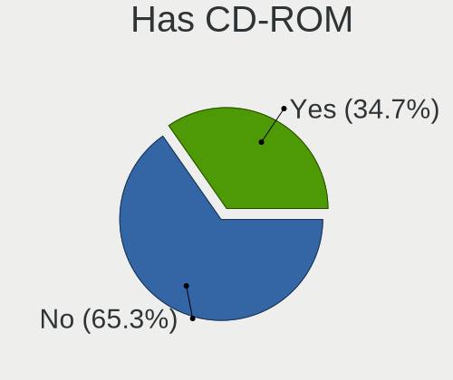
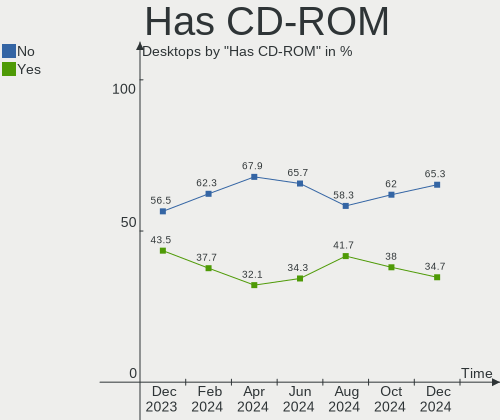
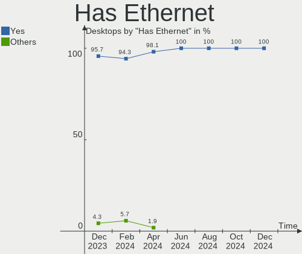
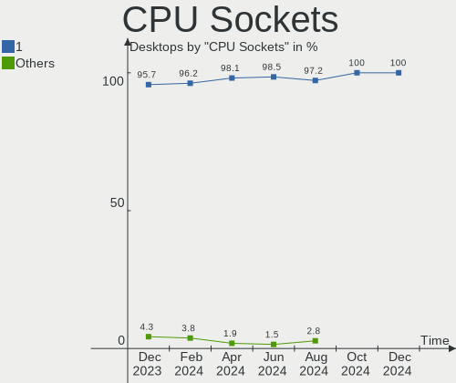

Kubuntu - Hardware Trends (Desktops)
------------------------------------

A project to identify most popular hardware characteristics and track their change
over time based on data collected by Linux users at https://Linux-Hardware.org.

Anyone can contribute to this report by the [hw-probe](https://github.com/linuxhw/hw-probe) tool:

    sudo -E hw-probe -all -upload

This report is for one last month. Overall report since the beginning of time: [TestDays](https://github.com/linuxhw/TestDays)

Period: Nov, 2023.

Contents
--------

* [ System ](#system)
  - [ OS                       ](#os)
  - [ OS Family                ](#os-family)
  - [ Kernel                   ](#kernel)
  - [ Kernel Family            ](#kernel-family)
  - [ Kernel Major Ver.        ](#kernel-major-ver)
  - [ Arch                     ](#arch)
  - [ DE                       ](#de)
  - [ Display Server           ](#display-server)
  - [ Display Manager          ](#display-manager)
  - [ OS Lang                  ](#os-lang)
  - [ Boot Mode                ](#boot-mode)
  - [ Filesystem               ](#filesystem)
  - [ Part. scheme             ](#part-scheme)
  - [ Dual Boot with Linux/BSD ](#dual-boot-with-linuxbsd)
  - [ Dual Boot (Win)          ](#dual-boot-win)

* [ Board ](#board)
  - [ Vendor                   ](#vendor)
  - [ Model                    ](#model)
  - [ Model Family             ](#model-family)
  - [ MFG Year                 ](#mfg-year)
  - [ Form Factor              ](#form-factor)
  - [ Secure Boot              ](#secure-boot)
  - [ Coreboot                 ](#coreboot)
  - [ RAM Size                 ](#ram-size)
  - [ RAM Used                 ](#ram-used)
  - [ Total Drives             ](#total-drives)
  - [ Has CD-ROM               ](#has-cd-rom)
  - [ Has Ethernet             ](#has-ethernet)
  - [ Has WiFi                 ](#has-wifi)
  - [ Has Bluetooth            ](#has-bluetooth)

* [ Location ](#location)
  - [ Country                  ](#country)
  - [ City                     ](#city)

* [ Drives ](#drives)
  - [ Drive Vendor             ](#drive-vendor)
  - [ Drive Model              ](#drive-model)
  - [ HDD Vendor               ](#hdd-vendor)
  - [ SSD Vendor               ](#ssd-vendor)
  - [ Drive Kind               ](#drive-kind)
  - [ Drive Connector          ](#drive-connector)
  - [ Drive Size               ](#drive-size)
  - [ Space Total              ](#space-total)
  - [ Space Used               ](#space-used)
  - [ Malfunc. Drives          ](#malfunc-drives)
  - [ Malfunc. Drive Vendor    ](#malfunc-drive-vendor)
  - [ Malfunc. HDD Vendor      ](#malfunc-hdd-vendor)
  - [ Malfunc. Drive Kind      ](#malfunc-drive-kind)
  - [ Failed Drives            ](#failed-drives)
  - [ Failed Drive Vendor      ](#failed-drive-vendor)
  - [ Drive Status             ](#drive-status)

* [ Storage controller ](#storage-controller)
  - [ Storage Vendor           ](#storage-vendor)
  - [ Storage Model            ](#storage-model)
  - [ Storage Kind             ](#storage-kind)

* [ Processor ](#processor)
  - [ CPU Vendor               ](#cpu-vendor)
  - [ CPU Model                ](#cpu-model)
  - [ CPU Model Family         ](#cpu-model-family)
  - [ CPU Cores                ](#cpu-cores)
  - [ CPU Sockets              ](#cpu-sockets)
  - [ CPU Threads              ](#cpu-threads)
  - [ CPU Op-Modes             ](#cpu-op-modes)
  - [ CPU Microcode            ](#cpu-microcode)
  - [ CPU Microarch            ](#cpu-microarch)

* [ Graphics ](#graphics)
  - [ GPU Vendor               ](#gpu-vendor)
  - [ GPU Model                ](#gpu-model)
  - [ GPU Combo                ](#gpu-combo)
  - [ GPU Driver               ](#gpu-driver)
  - [ GPU Memory               ](#gpu-memory)

* [ Monitor ](#monitor)
  - [ Monitor Vendor           ](#monitor-vendor)
  - [ Monitor Model            ](#monitor-model)
  - [ Monitor Resolution       ](#monitor-resolution)
  - [ Monitor Diagonal         ](#monitor-diagonal)
  - [ Monitor Width            ](#monitor-width)
  - [ Aspect Ratio             ](#aspect-ratio)
  - [ Monitor Area             ](#monitor-area)
  - [ Pixel Density            ](#pixel-density)
  - [ Multiple Monitors        ](#multiple-monitors)

* [ Network ](#network)
  - [ Net Controller Vendor    ](#net-controller-vendor)
  - [ Net Controller Model     ](#net-controller-model)
  - [ Wireless Vendor          ](#wireless-vendor)
  - [ Wireless Model           ](#wireless-model)
  - [ Ethernet Vendor          ](#ethernet-vendor)
  - [ Ethernet Model           ](#ethernet-model)
  - [ Net Controller Kind      ](#net-controller-kind)
  - [ Used Controller          ](#used-controller)
  - [ NICs                     ](#nics)
  - [ IPv6                     ](#ipv6)

* [ Bluetooth ](#bluetooth)
  - [ Bluetooth Vendor         ](#bluetooth-vendor)
  - [ Bluetooth Model          ](#bluetooth-model)

* [ Sound ](#sound)
  - [ Sound Vendor             ](#sound-vendor)
  - [ Sound Model              ](#sound-model)

* [ Memory ](#memory)
  - [ Memory Vendor            ](#memory-vendor)
  - [ Memory Model             ](#memory-model)
  - [ Memory Kind              ](#memory-kind)
  - [ Memory Form Factor       ](#memory-form-factor)
  - [ Memory Size              ](#memory-size)
  - [ Memory Speed             ](#memory-speed)

* [ Printers & scanners ](#printers--scanners)
  - [ Printer Vendor           ](#printer-vendor)
  - [ Printer Model            ](#printer-model)
  - [ Scanner Vendor           ](#scanner-vendor)
  - [ Scanner Model            ](#scanner-model)

* [ Camera ](#camera)
  - [ Camera Vendor            ](#camera-vendor)
  - [ Camera Model             ](#camera-model)

* [ Security ](#security)
  - [ Fingerprint Vendor       ](#fingerprint-vendor)
  - [ Fingerprint Model        ](#fingerprint-model)
  - [ Chipcard Vendor          ](#chipcard-vendor)
  - [ Chipcard Model           ](#chipcard-model)

* [ Unsupported ](#unsupported)
  - [ Unsupported Devices      ](#unsupported-devices)
  - [ Unsupported Device Types ](#unsupported-device-types)

System
------

OS
--

Installed operating systems

| Name          | Desktops | Percent |
|---------------|----------|---------|
| Kubuntu 22.04 | 30       | 50%     |
| Kubuntu 23.10 | 26       | 43.33%  |
| Kubuntu 23.04 | 2        | 3.33%   |
| Kubuntu 20.04 | 1        | 1.67%   |
| Kubuntu 11    | 1        | 1.67%   |

OS Family
---------

OS without a version

| Name    | Desktops | Percent |
|---------|----------|---------|
| Kubuntu | 60       | 100%    |

Kernel
------

Version of the Linux kernel

| Version                     | Desktops | Percent |
|-----------------------------|----------|---------|
| 6.5.0-10-generic            | 16       | 26.67%  |
| 6.2.0-36-generic            | 7        | 11.67%  |
| 5.15.0-88-generic           | 6        | 10%     |
| 6.5.0-13-generic            | 4        | 6.67%   |
| 6.2.0-37-generic            | 4        | 6.67%   |
| 6.5.0-10-lowlatency         | 3        | 5%      |
| 5.15.0-88-lowlatency        | 3        | 5%      |
| 6.5.0-9-generic             | 2        | 3.33%   |
| 5.15.0-89-generic           | 2        | 3.33%   |
| 6.5.5-060505-generic        | 1        | 1.67%   |
| 6.5.10-x64v3-xanmod1        | 1        | 1.67%   |
| 6.2.0-39-generic            | 1        | 1.67%   |
| 6.2.0-35-generic            | 1        | 1.67%   |
| 6.2.0-1016-lowlatency       | 1        | 1.67%   |
| 5.4.0-166-generic           | 1        | 1.67%   |
| 5.15.0-87-generic           | 1        | 1.67%   |
| 5.15.0-86-generic           | 1        | 1.67%   |
| 5.15.0-84-generic           | 1        | 1.67%   |
| 5.15.0-79-generic           | 1        | 1.67%   |
| 5.15.0-75-generic           | 1        | 1.67%   |
| 5.15.0-522304060810-generic | 1        | 1.67%   |
| 5.15.0-50-generic           | 1        | 1.67%   |

Kernel Family
-------------

Linux kernel without a distro release

| Version | Desktops | Percent |
|---------|----------|---------|
| 6.5.0   | 25       | 41.67%  |
| 5.15.0  | 18       | 30%     |
| 6.2.0   | 14       | 23.33%  |
| 6.5.5   | 1        | 1.67%   |
| 6.5.10  | 1        | 1.67%   |
| 5.4.0   | 1        | 1.67%   |

Kernel Major Ver.
-----------------

Linux kernel major version

| Version | Desktops | Percent |
|---------|----------|---------|
| 6.5     | 27       | 45%     |
| 5.15    | 18       | 30%     |
| 6.2     | 14       | 23.33%  |
| 5.4     | 1        | 1.67%   |

Arch
----

OS architecture (x86_64, i586, etc.)

| Name   | Desktops | Percent |
|--------|----------|---------|
| x86_64 | 60       | 100%    |

DE
--

Desktop Environment

| Name  | Desktops | Percent |
|-------|----------|---------|
| KDE5  | 57       | 95%     |
| MATE  | 1        | 1.67%   |
| KDE   | 1        | 1.67%   |
| GNOME | 1        | 1.67%   |

Display Server
--------------

X11 or Wayland

| Name    | Desktops | Percent |
|---------|----------|---------|
| X11     | 54       | 90%     |
| Wayland | 6        | 10%     |

Display Manager
---------------

SDDM, LightDM, etc.

| Name    | Desktops | Percent |
|---------|----------|---------|
| SDDM    | 36       | 60%     |
| Unknown | 19       | 31.67%  |
| GDM3    | 3        | 5%      |
| LightDM | 2        | 3.33%   |

OS Lang
-------

Language

| Lang  | Desktops | Percent |
|-------|----------|---------|
| en_US | 31       | 51.67%  |
| it_IT | 7        | 11.67%  |
| de_DE | 6        | 10%     |
| en_GB | 4        | 6.67%   |
| pl_PL | 2        | 3.33%   |
| fr_FR | 2        | 3.33%   |
| en_AU | 2        | 3.33%   |
| pt_PT | 1        | 1.67%   |
| nl_NL | 1        | 1.67%   |
| es_MX | 1        | 1.67%   |
| es_ES | 1        | 1.67%   |
| es_AR | 1        | 1.67%   |
| en_IN | 1        | 1.67%   |

Boot Mode
---------

EFI or BIOS

| Mode | Desktops | Percent |
|------|----------|---------|
| BIOS | 31       | 51.67%  |
| EFI  | 29       | 48.33%  |

Filesystem
----------

Type of filesystem

| Type    | Desktops | Percent |
|---------|----------|---------|
| Ext4    | 41       | 68.33%  |
| Tmpfs   | 12       | 20%     |
| Btrfs   | 4        | 6.67%   |
| Xfs     | 1        | 1.67%   |
| Overlay | 1        | 1.67%   |
| F2fs    | 1        | 1.67%   |

Part. scheme
------------

Scheme of partitioning

| Type    | Desktops | Percent |
|---------|----------|---------|
| GPT     | 40       | 66.67%  |
| Unknown | 18       | 30%     |
| MBR     | 2        | 3.33%   |

Dual Boot with Linux/BSD
------------------------

Hosting more than one Linux/BSD

| Dual boot | Desktops | Percent |
|-----------|----------|---------|
| No        | 51       | 85%     |
| Yes       | 9        | 15%     |

Dual Boot (Win)
---------------

Hosting Linux and Windows

| Dual boot | Desktops | Percent |
|-----------|----------|---------|
| No        | 40       | 66.67%  |
| Yes       | 20       | 33.33%  |

Board
-----

Vendor
------

Motherboard manufacturer

| Name                | Desktops | Percent |
|---------------------|----------|---------|
| ASUSTek Computer    | 24       | 40%     |
| Gigabyte Technology | 10       | 16.67%  |
| MSI                 | 7        | 11.67%  |
| Dell                | 5        | 8.33%   |
| ASRock              | 5        | 8.33%   |
| Lenovo              | 3        | 5%      |
| Hewlett-Packard     | 3        | 5%      |
| BESSTAR Tech        | 1        | 1.67%   |
| AZW                 | 1        | 1.67%   |
| Unknown             | 1        | 1.67%   |

Model
-----

Motherboard model

| Name                                | Desktops | Percent |
|-------------------------------------|----------|---------|
| ASUS Z170-A                         | 2        | 3.33%   |
| ASUS TUF Gaming X570-PLUS           | 2        | 3.33%   |
| ASUS ROG STRIX X670E-E GAMING WIFI  | 2        | 3.33%   |
| MSI MS-7D42                         | 1        | 1.67%   |
| MSI MS-7D18                         | 1        | 1.67%   |
| MSI MS-7C91                         | 1        | 1.67%   |
| MSI MS-7C56                         | 1        | 1.67%   |
| MSI MS-7B86                         | 1        | 1.67%   |
| MSI MS-7B78                         | 1        | 1.67%   |
| MSI MS-7885                         | 1        | 1.67%   |
| Lenovo ThinkCentre M91p 4518A31     | 1        | 1.67%   |
| Lenovo ThinkCentre M83 10ANA00PAU   | 1        | 1.67%   |
| Lenovo ThinkCentre M720t 10SQ0070GE | 1        | 1.67%   |
| HP F01                              | 1        | 1.67%   |
| HP 500-210a                         | 1        | 1.67%   |
| HP 260 G2 DM                        | 1        | 1.67%   |
| Gigabyte Z97X-Gaming 7              | 1        | 1.67%   |
| Gigabyte X570 UD                    | 1        | 1.67%   |
| Gigabyte X570 AORUS MASTER          | 1        | 1.67%   |
| Gigabyte X570 AORUS ELITE           | 1        | 1.67%   |
| Gigabyte P35-DS3L                   | 1        | 1.67%   |
| Gigabyte H81M-DS2                   | 1        | 1.67%   |
| Gigabyte GA-970A-DS3                | 1        | 1.67%   |
| Gigabyte B550M DS3H                 | 1        | 1.67%   |
| Gigabyte B550I AORUS PRO AX         | 1        | 1.67%   |
| Gigabyte AX370-Gaming K7            | 1        | 1.67%   |
| Dell Vostro 470                     | 1        | 1.67%   |
| Dell Precision WorkStation T7500    | 1        | 1.67%   |
| Dell Precision T5610                | 1        | 1.67%   |
| Dell OptiPlex 790                   | 1        | 1.67%   |
| Dell OptiPlex 3020                  | 1        | 1.67%   |
| BESSTAR Tech TH50                   | 1        | 1.67%   |
| AZW LZX                             | 1        | 1.67%   |
| ASUS TUF Gaming Z490-PLUS           | 1        | 1.67%   |
| ASUS TUF Gaming B560M-PLUS          | 1        | 1.67%   |
| ASUS TUF Gaming B450-PLUS II        | 1        | 1.67%   |
| ASUS SABERTOOTH Z77                 | 1        | 1.67%   |
| ASUS SABERTOOTH 990FX R2.0          | 1        | 1.67%   |
| ASUS ROG STRIX X570-E GAMING        | 1        | 1.67%   |
| ASUS ROG STRIX B460-I GAMING        | 1        | 1.67%   |

Model Family
------------

Motherboard model prefix

| Name                  | Desktops | Percent |
|-----------------------|----------|---------|
| ASUS TUF              | 5        | 8.33%   |
| ASUS ROG              | 5        | 8.33%   |
| ASUS PRIME            | 5        | 8.33%   |
| Lenovo ThinkCentre    | 3        | 5%      |
| Gigabyte X570         | 3        | 5%      |
| Dell Precision        | 2        | 3.33%   |
| Dell OptiPlex         | 2        | 3.33%   |
| ASUS Z170-A           | 2        | 3.33%   |
| ASUS SABERTOOTH       | 2        | 3.33%   |
| MSI MS-7D42           | 1        | 1.67%   |
| MSI MS-7D18           | 1        | 1.67%   |
| MSI MS-7C91           | 1        | 1.67%   |
| MSI MS-7C56           | 1        | 1.67%   |
| MSI MS-7B86           | 1        | 1.67%   |
| MSI MS-7B78           | 1        | 1.67%   |
| MSI MS-7885           | 1        | 1.67%   |
| HP F01                | 1        | 1.67%   |
| HP 500-210a           | 1        | 1.67%   |
| HP 260                | 1        | 1.67%   |
| Gigabyte Z97X-Gaming  | 1        | 1.67%   |
| Gigabyte P35-DS3L     | 1        | 1.67%   |
| Gigabyte H81M-DS2     | 1        | 1.67%   |
| Gigabyte GA-970A-DS3  | 1        | 1.67%   |
| Gigabyte B550M        | 1        | 1.67%   |
| Gigabyte B550I        | 1        | 1.67%   |
| Gigabyte AX370-Gaming | 1        | 1.67%   |
| Dell Vostro           | 1        | 1.67%   |
| BESSTAR Tech TH50     | 1        | 1.67%   |
| AZW LZX               | 1        | 1.67%   |
| ASUS P8Z77-V          | 1        | 1.67%   |
| ASUS P8Z77-M          | 1        | 1.67%   |
| ASUS P7P55D-E         | 1        | 1.67%   |
| ASUS M5A97            | 1        | 1.67%   |
| ASUS All              | 1        | 1.67%   |
| ASRock Z690M-ITX      | 1        | 1.67%   |
| ASRock X570           | 1        | 1.67%   |
| ASRock P67            | 1        | 1.67%   |
| ASRock H61M-VS        | 1        | 1.67%   |
| ASRock B760M          | 1        | 1.67%   |
| Unknown               | 1        | 1.67%   |

MFG Year
--------

Motherboard manufacture year

| Year | Desktops | Percent |
|------|----------|---------|
| 2019 | 10       | 16.67%  |
| 2020 | 9        | 15%     |
| 2012 | 7        | 11.67%  |
| 2022 | 5        | 8.33%   |
| 2014 | 4        | 6.67%   |
| 2011 | 4        | 6.67%   |
| 2021 | 3        | 5%      |
| 2018 | 3        | 5%      |
| 2015 | 3        | 5%      |
| 2013 | 3        | 5%      |
| 2023 | 2        | 3.33%   |
| 2017 | 2        | 3.33%   |
| 2009 | 2        | 3.33%   |
| 2016 | 1        | 1.67%   |
| 2010 | 1        | 1.67%   |
| 2007 | 1        | 1.67%   |

Form Factor
-----------

Physical design of the computer

| Name    | Desktops | Percent |
|---------|----------|---------|
| Desktop | 60       | 100%    |

Secure Boot
-----------

Enabled or disabled

| State    | Desktops | Percent |
|----------|----------|---------|
| Disabled | 59       | 98.33%  |
| Enabled  | 1        | 1.67%   |

Coreboot
--------

Have coreboot on board

| Used | Desktops | Percent |
|------|----------|---------|
| No   | 60       | 100%    |

RAM Size
--------

Total RAM memory

| Size in GB  | Desktops | Percent |
|-------------|----------|---------|
| 32.01-64.0  | 21       | 35%     |
| 16.01-24.0  | 18       | 30%     |
| 64.01-256.0 | 8        | 13.33%  |
| 8.01-16.0   | 5        | 8.33%   |
| 4.01-8.0    | 4        | 6.67%   |
| 3.01-4.0    | 2        | 3.33%   |
| 24.01-32.0  | 2        | 3.33%   |

RAM Used
--------

Used RAM memory

| Used GB    | Desktops | Percent |
|------------|----------|---------|
| 4.01-8.0   | 22       | 36.67%  |
| 2.01-3.0   | 15       | 25%     |
| 8.01-16.0  | 10       | 16.67%  |
| 3.01-4.0   | 7        | 11.67%  |
| 1.01-2.0   | 5        | 8.33%   |
| 16.01-24.0 | 1        | 1.67%   |

Total Drives
------------

Number of drives on board

| Drives | Desktops | Percent |
|--------|----------|---------|
| 2      | 18       | 30%     |
| 4      | 12       | 20%     |
| 1      | 10       | 16.67%  |
| 3      | 9        | 15%     |
| 5      | 4        | 6.67%   |
| 7      | 3        | 5%      |
| 6      | 3        | 5%      |
| 0      | 1        | 1.67%   |

Has CD-ROM
----------

Has CD-ROM on board

| Presented | Desktops | Percent |
|-----------|----------|---------|
| No        | 40       | 66.67%  |
| Yes       | 20       | 33.33%  |

Has Ethernet
------------

Has Ethernet on board

| Presented | Desktops | Percent |
|-----------|----------|---------|
| Yes       | 60       | 100%    |

Has WiFi
--------

Has WiFi module

| Presented | Desktops | Percent |
|-----------|----------|---------|
| No        | 31       | 51.67%  |
| Yes       | 29       | 48.33%  |

Has Bluetooth
-------------

Has Bluetooth module

| Presented | Desktops | Percent |
|-----------|----------|---------|
| No        | 33       | 55%     |
| Yes       | 27       | 45%     |

Location
--------

Country
-------

Geographic location (country)

| Country      | Desktops | Percent |
|--------------|----------|---------|
| USA          | 17       | 28.33%  |
| Italy        | 8        | 13.33%  |
| Germany      | 7        | 11.67%  |
| UK           | 4        | 6.67%   |
| France       | 3        | 5%      |
| Sweden       | 2        | 3.33%   |
| Spain        | 2        | 3.33%   |
| Norway       | 2        | 3.33%   |
| Australia    | 2        | 3.33%   |
| Switzerland  | 1        | 1.67%   |
| Saudi Arabia | 1        | 1.67%   |
| Russia       | 1        | 1.67%   |
| Romania      | 1        | 1.67%   |
| Portugal     | 1        | 1.67%   |
| Poland       | 1        | 1.67%   |
| Netherlands  | 1        | 1.67%   |
| Mexico       | 1        | 1.67%   |
| India        | 1        | 1.67%   |
| Denmark      | 1        | 1.67%   |
| Czechia      | 1        | 1.67%   |
| China        | 1        | 1.67%   |
| Argentina    | 1        | 1.67%   |

City
----

Geographic location (city)

| City                    | Desktops | Percent |
|-------------------------|----------|---------|
| Milan                   | 3        | 5%      |
| Paris                   | 2        | 3.33%   |
| Milano                  | 2        | 3.33%   |
| Vallingby               | 1        | 1.67%   |
| Tijuana                 | 1        | 1.67%   |
| Siziano                 | 1        | 1.67%   |
| Sherman                 | 1        | 1.67%   |
| Seville                 | 1        | 1.67%   |
| Ronde                   | 1        | 1.67%   |
| Rome                    | 1        | 1.67%   |
| Pilsen                  | 1        | 1.67%   |
| Petrozavodsk            | 1        | 1.67%   |
| Perth                   | 1        | 1.67%   |
| Parma Heights           | 1        | 1.67%   |
| Paderborn               | 1        | 1.67%   |
| Olching                 | 1        | 1.67%   |
| Northville              | 1        | 1.67%   |
| North Little Rock       | 1        | 1.67%   |
| Newtownabbey            | 1        | 1.67%   |
| Moss                    | 1        | 1.67%   |
| Morehead City           | 1        | 1.67%   |
| Matosinhos Municipality | 1        | 1.67%   |
| Mainz                   | 1        | 1.67%   |
| Lucca                   | 1        | 1.67%   |
| Linköping              | 1        | 1.67%   |
| Lillehammer             | 1        | 1.67%   |
| La Crosse               | 1        | 1.67%   |
| Krakow                  | 1        | 1.67%   |
| Kent                    | 1        | 1.67%   |
| Karlsbad                | 1        | 1.67%   |
| Jianshui                | 1        | 1.67%   |
| Iasi                    | 1        | 1.67%   |
| Huntsville              | 1        | 1.67%   |
| Horstmar                | 1        | 1.67%   |
| Hook End                | 1        | 1.67%   |
| Hof                     | 1        | 1.67%   |
| Hialeah                 | 1        | 1.67%   |
| Hampton                 | 1        | 1.67%   |
| Hamburg                 | 1        | 1.67%   |
| Green Valley            | 1        | 1.67%   |

Drives
------

Drive Vendor
------------

Hard drive vendors

| Vendor                       | Desktops | Drives | Percent |
|------------------------------|----------|--------|---------|
| Samsung Electronics          | 29       | 54     | 21.48%  |
| WDC                          | 19       | 25     | 14.07%  |
| Seagate                      | 19       | 31     | 14.07%  |
| SanDisk                      | 11       | 11     | 8.15%   |
| Kingston                     | 10       | 11     | 7.41%   |
| Crucial                      | 5        | 5      | 3.7%    |
| Toshiba                      | 4        | 5      | 2.96%   |
| HGST                         | 4        | 4      | 2.96%   |
| Corsair                      | 4        | 4      | 2.96%   |
| A-DATA Technology            | 4        | 4      | 2.96%   |
| SPCC                         | 3        | 4      | 2.22%   |
| PNY                          | 3        | 3      | 2.22%   |
| Micron/Crucial Technology    | 3        | 3      | 2.22%   |
| Kingston Technology Company  | 2        | 2      | 1.48%   |
| YMTC                         | 1        | 1      | 0.74%   |
| SSSTC                        | 1        | 1      | 0.74%   |
| Silicon Motion               | 1        | 1      | 0.74%   |
| Shenzhen Longsys Electronics | 1        | 1      | 0.74%   |
| S3+                          | 1        | 1      | 0.74%   |
| Phison Electronics           | 1        | 1      | 0.74%   |
| Phison                       | 1        | 1      | 0.74%   |
| Micron Technology            | 1        | 1      | 0.74%   |
| Maxtor                       | 1        | 1      | 0.74%   |
| LITEON                       | 1        | 1      | 0.74%   |
| Intel                        | 1        | 1      | 0.74%   |
| Hitachi                      | 1        | 1      | 0.74%   |
| Hewlett-Packard              | 1        | 1      | 0.74%   |
| Fanxiang                     | 1        | 1      | 0.74%   |
| Unknown                      | 1        | 1      | 0.74%   |

Drive Model
-----------

Hard drive models

| Model                                               | Desktops | Percent |
|-----------------------------------------------------|----------|---------|
| Seagate ST2000DM008-2FR102 2TB                      | 5        | 2.89%   |
| Samsung SSD 860 EVO 1TB                             | 4        | 2.31%   |
| Samsung SSD 980 1TB                                 | 3        | 1.73%   |
| Samsung SSD 870 QVO 2TB                             | 3        | 1.73%   |
| Samsung SSD 850 EVO 500GB                           | 3        | 1.73%   |
| WDC WD10EZEX-08WN4A0 1TB                            | 2        | 1.16%   |
| Toshiba MQ01ACF050 500GB                            | 2        | 1.16%   |
| Seagate ST3500418AS 500GB                           | 2        | 1.16%   |
| Seagate ST2000DM006-2DM164 2TB                      | 2        | 1.16%   |
| Sandisk WD_BLACK SN850X 2000GB                      | 2        | 1.16%   |
| SanDisk NVMe SSD Drive 1TB                          | 2        | 1.16%   |
| Samsung SSD 980 PRO 1TB                             | 2        | 1.16%   |
| Samsung SSD 850 EVO 250GB                           | 2        | 1.16%   |
| Samsung SSD 850 EVO 1TB                             | 2        | 1.16%   |
| Samsung SSD 840 EVO 250GB                           | 2        | 1.16%   |
| Samsung NVMe SSD Controller SM981/PM981/PM983 250GB | 2        | 1.16%   |
| Samsung NVMe SSD Controller PM9A1/PM9A3/980PRO 2TB  | 2        | 1.16%   |
| Micron/Crucial P2 NVMe PCIe SSD 1TB                 | 2        | 1.16%   |
| Kingston SA400S37240G 240GB SSD                     | 2        | 1.16%   |
| A-DATA SU630 480GB SSD                              | 2        | 1.16%   |
| YMTC PC005 512GB                                    | 1        | 0.58%   |
| WDC WDS500G3X0C-00SJG0 500GB                        | 1        | 0.58%   |
| WDC WDS500G1B0B-00AS40 500GB SSD                    | 1        | 0.58%   |
| WDC WDS480G2G0B-00EPW0 480GB SSD                    | 1        | 0.58%   |
| WDC WDS100T3X0C-00SJG0 1TB                          | 1        | 0.58%   |
| WDC WDS100T2B0C-00PXH0 1TB                          | 1        | 0.58%   |
| WDC WDBNCE2500PNC 250GB SSD                         | 1        | 0.58%   |
| WDC WD82PURZ-85TEUY0 8TB                            | 1        | 0.58%   |
| WDC WD6400BPVT-80HXZT1 640GB                        | 1        | 0.58%   |
| WDC WD5000AAKS-00V1A0 500GB                         | 1        | 0.58%   |
| WDC WD40EURX-63BMCY0 4TB                            | 1        | 0.58%   |
| WDC WD30EZRX-00SPEB0 3TB                            | 1        | 0.58%   |
| WDC WD20PURZ-85AKKY0 2TB                            | 1        | 0.58%   |
| WDC WD20EZRZ-00Z5HB0 2TB                            | 1        | 0.58%   |
| WDC WD20EARS-00MVWB0 2TB                            | 1        | 0.58%   |
| WDC WD2003FZEX-00Z4SA0 2TB                          | 1        | 0.58%   |
| WDC WD2002FFSX-68PF8N0 2TB                          | 1        | 0.58%   |
| WDC WD20 03FZEX-00Z4SA0 2TB                         | 1        | 0.58%   |
| WDC WD10EZRZ-00HTKB0 1TB                            | 1        | 0.58%   |
| WDC WD10EZEX-22MFCA0 1TB                            | 1        | 0.58%   |

HDD Vendor
----------

Hard disk drive vendors

| Vendor              | Desktops | Drives | Percent |
|---------------------|----------|--------|---------|
| Seagate             | 19       | 31     | 40.43%  |
| WDC                 | 14       | 19     | 29.79%  |
| Toshiba             | 4        | 5      | 8.51%   |
| Samsung Electronics | 4        | 5      | 8.51%   |
| HGST                | 4        | 4      | 8.51%   |
| Maxtor              | 1        | 1      | 2.13%   |
| Hitachi             | 1        | 1      | 2.13%   |

SSD Vendor
----------

Solid state drive vendors

| Vendor              | Desktops | Drives | Percent |
|---------------------|----------|--------|---------|
| Samsung Electronics | 18       | 26     | 31.58%  |
| Kingston            | 7        | 8      | 12.28%  |
| SanDisk             | 5        | 5      | 8.77%   |
| Crucial             | 5        | 5      | 8.77%   |
| A-DATA Technology   | 4        | 4      | 7.02%   |
| WDC                 | 3        | 3      | 5.26%   |
| SPCC                | 3        | 3      | 5.26%   |
| PNY                 | 3        | 3      | 5.26%   |
| Corsair             | 2        | 2      | 3.51%   |
| SSSTC               | 1        | 1      | 1.75%   |
| S3+                 | 1        | 1      | 1.75%   |
| Micron Technology   | 1        | 1      | 1.75%   |
| LITEON              | 1        | 1      | 1.75%   |
| Hewlett-Packard     | 1        | 1      | 1.75%   |
| Fanxiang            | 1        | 1      | 1.75%   |
| Unknown             | 1        | 1      | 1.75%   |

Drive Kind
----------

HDD or SSD

| Kind | Desktops | Drives | Percent |
|------|----------|--------|---------|
| SSD  | 44       | 66     | 41.12%  |
| HDD  | 32       | 66     | 29.91%  |
| NVMe | 31       | 49     | 28.97%  |

Drive Connector
---------------

SATA, SAS, NVMe, etc.

| Type | Desktops | Drives | Percent |
|------|----------|--------|---------|
| SATA | 54       | 125    | 60%     |
| NVMe | 31       | 49     | 34.44%  |
| SAS  | 5        | 7      | 5.56%   |

Drive Size
----------

Size of hard drive

| Size in TB | Desktops | Drives | Percent |
|------------|----------|--------|---------|
| 0.01-0.5   | 39       | 55     | 39%     |
| 0.51-1.0   | 26       | 30     | 26%     |
| 1.01-2.0   | 19       | 29     | 19%     |
| 3.01-4.0   | 8        | 8      | 8%      |
| 4.01-10.0  | 4        | 5      | 4%      |
| 2.01-3.0   | 3        | 4      | 3%      |
| 10.01-20.0 | 1        | 1      | 1%      |

Space Total
-----------

Amount of disk space available on the file system

| Size in GB     | Desktops | Percent |
|----------------|----------|---------|
| More than 3000 | 18       | 30%     |
| 251-500        | 9        | 15%     |
| 1001-2000      | 9        | 15%     |
| 501-1000       | 9        | 15%     |
| 2001-3000      | 7        | 11.67%  |
| 101-250        | 6        | 10%     |
| 1-20           | 1        | 1.67%   |
| 51-100         | 1        | 1.67%   |

Space Used
----------

Amount of used disk space

| Used GB        | Desktops | Percent |
|----------------|----------|---------|
| 101-250        | 11       | 18.33%  |
| 501-1000       | 11       | 18.33%  |
| More than 3000 | 10       | 16.67%  |
| 251-500        | 8        | 13.33%  |
| 21-50          | 5        | 8.33%   |
| 1001-2000      | 5        | 8.33%   |
| 51-100         | 4        | 6.67%   |
| 2001-3000      | 3        | 5%      |
| 1-20           | 3        | 5%      |

Malfunc. Drives
---------------

Drive models with a malfunction

| Model                                                 | Desktops | Drives | Percent |
|-------------------------------------------------------|----------|--------|---------|
| WDC WD5000AAKS-00V1A0 500GB                           | 1        | 1      | 9.09%   |
| WDC WD40EURX-63BMCY0 4TB                              | 1        | 1      | 9.09%   |
| WDC WD20PURZ-85AKKY0 2TB                              | 1        | 1      | 9.09%   |
| SSSTC CVB-8D128-HP 128GB SSD                          | 1        | 1      | 9.09%   |
| Seagate ST9500325AS 500GB                             | 1        | 1      | 9.09%   |
| Samsung Electronics SSD 970 EVO 500GB S466NX0K713615T | 1        | 1      | 9.09%   |
| Samsung Electronics HD501LJ 500GB                     | 1        | 1      | 9.09%   |
| Samsung Electronics HD103SI 1TB                       | 1        | 1      | 9.09%   |
| HGST HTS541010A9E680 1TB                              | 1        | 1      | 9.09%   |
| Corsair CSSD-V64GB2                                   | 1        | 1      | 9.09%   |
| A-DATA Technology SP900 256GB SSD                     | 1        | 1      | 9.09%   |

Malfunc. Drive Vendor
---------------------

Vendors of faulty drives

| Vendor              | Desktops | Drives | Percent |
|---------------------|----------|--------|---------|
| WDC                 | 3        | 3      | 27.27%  |
| Samsung Electronics | 3        | 3      | 27.27%  |
| SSSTC               | 1        | 1      | 9.09%   |
| Seagate             | 1        | 1      | 9.09%   |
| HGST                | 1        | 1      | 9.09%   |
| Corsair             | 1        | 1      | 9.09%   |
| A-DATA Technology   | 1        | 1      | 9.09%   |

Malfunc. HDD Vendor
-------------------

Vendors of faulty HDD drives

| Vendor              | Desktops | Drives | Percent |
|---------------------|----------|--------|---------|
| WDC                 | 3        | 3      | 42.86%  |
| Samsung Electronics | 2        | 2      | 28.57%  |
| Seagate             | 1        | 1      | 14.29%  |
| HGST                | 1        | 1      | 14.29%  |

Malfunc. Drive Kind
-------------------

Kinds of faulty drives

| Kind | Desktops | Drives | Percent |
|------|----------|--------|---------|
| HDD  | 6        | 7      | 66.67%  |
| SSD  | 2        | 3      | 22.22%  |
| NVMe | 1        | 1      | 11.11%  |

Failed Drives
-------------

Failed drive models

Zero info for selected period =(

Failed Drive Vendor
-------------------

Failed drive vendors

Zero info for selected period =(

Drive Status
------------

Number of failed and malfunc. drives

| Status   | Desktops | Drives | Percent |
|----------|----------|--------|---------|
| Detected | 32       | 83     | 44.44%  |
| Works    | 31       | 87     | 43.06%  |
| Malfunc  | 9        | 11     | 12.5%   |

Storage controller
------------------

Storage Vendor
--------------

Storage controller vendors

| Vendor                       | Desktops | Percent |
|------------------------------|----------|---------|
| Intel                        | 37       | 33.04%  |
| AMD                          | 22       | 19.64%  |
| Samsung Electronics          | 16       | 14.29%  |
| SanDisk                      | 9        | 8.04%   |
| Kingston Technology Company  | 5        | 4.46%   |
| ASMedia Technology           | 4        | 3.57%   |
| Phison Electronics           | 3        | 2.68%   |
| Micron/Crucial Technology    | 3        | 2.68%   |
| Marvell Technology Group     | 3        | 2.68%   |
| JMicron Technology           | 2        | 1.79%   |
| Broadcom / LSI               | 2        | 1.79%   |
| Zhaoxin                      | 1        | 0.89%   |
| Yangtze Memory Technologies  | 1        | 0.89%   |
| Silicon Motion               | 1        | 0.89%   |
| Shenzhen Longsys Electronics | 1        | 0.89%   |
| Realtek Semiconductor        | 1        | 0.89%   |
| LSI Logic / Symbios Logic    | 1        | 0.89%   |

Storage Model
-------------

Storage controller models

| Model                                                                          | Desktops | Percent |
|--------------------------------------------------------------------------------|----------|---------|
| AMD FCH SATA Controller [AHCI mode]                                            | 15       | 12.3%   |
| Samsung NVMe SSD Controller SM981/PM981/PM983                                  | 7        | 5.74%   |
| Samsung NVMe SSD Controller 980 (DRAM-less)                                    | 5        | 4.1%    |
| Samsung NVMe SSD Controller PM9A1/PM9A3/980PRO                                 | 4        | 3.28%   |
| Intel 8 Series/C220 Series Chipset Family 6-port SATA Controller 1 [AHCI mode] | 4        | 3.28%   |
| Intel 6 Series/C200 Series Chipset Family 6 port Desktop SATA AHCI Controller  | 4        | 3.28%   |
| ASMedia ASM1062 Serial ATA Controller                                          | 4        | 3.28%   |
| AMD 500 Series Chipset SATA Controller                                         | 4        | 3.28%   |
| AMD 400 Series Chipset SATA Controller                                         | 4        | 3.28%   |
| Intel Alder Lake-S PCH SATA Controller [AHCI Mode]                             | 3        | 2.46%   |
| Intel 7 Series/C210 Series Chipset Family 6-port SATA Controller [AHCI mode]   | 3        | 2.46%   |
| Intel 200 Series PCH SATA controller [AHCI mode]                               | 3        | 2.46%   |
| AMD SB7x0/SB8x0/SB9x0 SATA Controller [AHCI mode]                              | 3        | 2.46%   |
| Sandisk WD Black SN850X NVMe SSD                                               | 2        | 1.64%   |
| SanDisk Extreme Pro / WD Black SN750 / PC SN730 / Red SN700 NVMe SSD           | 2        | 1.64%   |
| Micron/Crucial P2 [Nick P2] / P3 / P3 Plus NVMe PCIe SSD (DRAM-less)           | 2        | 1.64%   |
| Kingston Company KC3000/FURY Renegade NVMe SSD E18                             | 2        | 1.64%   |
| Kingston Company A2000 NVMe SSD SM2263EN                                       | 2        | 1.64%   |
| Intel Q170/Q150/B150/H170/H110/Z170/CM236 Chipset SATA Controller [AHCI Mode]  | 2        | 1.64%   |
| Intel 9 Series Chipset Family SATA Controller [AHCI Mode]                      | 2        | 1.64%   |
| Intel 500 Series Chipset Family SATA AHCI Controller                           | 2        | 1.64%   |
| Zhaoxin ZX-100/ZX-200/KX-6000/KX-6000G/KH-40000 StorX AHCI Controller          | 1        | 0.82%   |
| Yangtze Memory PC005 NVMe SSD                                                  | 1        | 0.82%   |
| Silicon Motion SM2263EN/SM2263XT (DRAM-less) NVMe SSD Controllers              | 1        | 0.82%   |
| Shenzhen Longsys Non-Volatile memory controller                                | 1        | 0.82%   |
| SanDisk WD Black SN770 / PC SN740 256GB / PC SN560 (DRAM-less) NVMe SSD        | 1        | 0.82%   |
| SanDisk WD Black NVMe SSD                                                      | 1        | 0.82%   |
| SanDisk Ultra 3D / WD Blue SN570 NVMe SSD (DRAM-less)                          | 1        | 0.82%   |
| SanDisk Ultra 3D / WD Blue SN550 NVMe SSD                                      | 1        | 0.82%   |
| SanDisk PC SN520 x2 M.2 2242 NVMe SSD                                          | 1        | 0.82%   |
| Samsung NVMe SSD Controller SM961/PM961/SM963                                  | 1        | 0.82%   |
| Realtek RTS5772DL NVMe SSD Controller (DRAM-less)                              | 1        | 0.82%   |
| Phison PS5013-E13 PCIe3 NVMe Controller (DRAM-less)                            | 1        | 0.82%   |
| Phison E18 PCIe4 NVMe Controller                                               | 1        | 0.82%   |
| Phison E16 PCIe4 NVMe Controller                                               | 1        | 0.82%   |
| Micron/Crucial P5 Plus NVMe PCIe SSD                                           | 1        | 0.82%   |
| Marvell Group 88SE9172 SATA 6Gb/s Controller                                   | 1        | 0.82%   |
| Marvell Group 88SE914D SATA-600 Controller                                     | 1        | 0.82%   |
| Marvell Group 88SE9120 SATA 6Gb/s Controller                                   | 1        | 0.82%   |
| LSI Logic / Symbios Logic SAS1068E PCI-Express Fusion-MPT SAS                  | 1        | 0.82%   |

Storage Kind
------------

Kind of storage controller (IDE, SATA, NVMe, SAS, ...)

| Kind | Desktops | Percent |
|------|----------|---------|
| SATA | 57       | 60%     |
| NVMe | 31       | 32.63%  |
| RAID | 3        | 3.16%   |
| IDE  | 2        | 2.11%   |
| SAS  | 1        | 1.05%   |
| SCSI | 1        | 1.05%   |

Processor
---------

CPU Vendor
----------

Processor vendors

| Vendor       | Desktops | Percent |
|--------------|----------|---------|
| Intel        | 37       | 61.67%  |
| AMD          | 22       | 36.67%  |
| CentaurHauls | 1        | 1.67%   |

CPU Model
---------

Processor models

| Model                                          | Desktops | Percent |
|------------------------------------------------|----------|---------|
| Intel Core i7-4790K CPU @ 4.00GHz              | 2        | 3.33%   |
| Intel Core i7-10700F CPU @ 2.90GHz             | 2        | 3.33%   |
| Intel Core i5-9400 CPU @ 2.90GHz               | 2        | 3.33%   |
| Intel Core i5-2400 CPU @ 3.10GHz               | 2        | 3.33%   |
| AMD Ryzen 7 3700X 8-Core Processor             | 2        | 3.33%   |
| AMD FX-6300 Six-Core Processor                 | 2        | 3.33%   |
| Intel Xeon CPU W5580 @ 3.20GHz                 | 1        | 1.67%   |
| Intel Xeon CPU E5-2630 v2 @ 2.60GHz            | 1        | 1.67%   |
| Intel Core i9-7900X CPU @ 3.30GHz              | 1        | 1.67%   |
| Intel Core i7-6800K CPU @ 3.40GHz              | 1        | 1.67%   |
| Intel Core i7-6700 CPU @ 3.40GHz               | 1        | 1.67%   |
| Intel Core i7-3770K CPU @ 3.50GHz              | 1        | 1.67%   |
| Intel Core i7-3770 CPU @ 3.40GHz               | 1        | 1.67%   |
| Intel Core i7-2600K CPU @ 3.40GHz              | 1        | 1.67%   |
| Intel Core i5-8600K CPU @ 3.60GHz              | 1        | 1.67%   |
| Intel Core i5-6500 CPU @ 3.20GHz               | 1        | 1.67%   |
| Intel Core i5-4590 CPU @ 3.30GHz               | 1        | 1.67%   |
| Intel Core i5-4570S CPU @ 2.90GHz              | 1        | 1.67%   |
| Intel Core i5-4570 CPU @ 3.20GHz               | 1        | 1.67%   |
| Intel Core i5-4440 CPU @ 3.10GHz               | 1        | 1.67%   |
| Intel Core i5-3570K CPU @ 3.40GHz              | 1        | 1.67%   |
| Intel Core i5 CPU 760 @ 2.80GHz                | 1        | 1.67%   |
| Intel Core i5 CPU 650 @ 3.20GHz                | 1        | 1.67%   |
| Intel Core i3-3240 CPU @ 3.40GHz               | 1        | 1.67%   |
| Intel Core i3-2120 CPU @ 3.30GHz               | 1        | 1.67%   |
| Intel Core 2 Duo CPU E6550 @ 2.33GHz           | 1        | 1.67%   |
| Intel Celeron CPU 3855U @ 1.60GHz              | 1        | 1.67%   |
| Intel 13th Gen Core i7-13700                   | 1        | 1.67%   |
| Intel 13th Gen Core i5-13600K                  | 1        | 1.67%   |
| Intel 13th Gen Core i5-13500                   | 1        | 1.67%   |
| Intel 12th Gen Core i7-12700K                  | 1        | 1.67%   |
| Intel 12th Gen Core i3-1220P                   | 1        | 1.67%   |
| Intel 11th Gen Core i7-11700F @ 2.50GHz        | 1        | 1.67%   |
| Intel 11th Gen Core i5-11600 @ 2.80GHz         | 1        | 1.67%   |
| Intel 11th Gen Core i5-11320H @ 3.20GHz        | 1        | 1.67%   |
| CentaurHauls ZHAOXIN KaiXian KX-6640MA@2.2+GHz | 1        | 1.67%   |
| AMD Ryzen 9 7950X 16-Core Processor            | 1        | 1.67%   |
| AMD Ryzen 9 7900X3D 12-Core Processor          | 1        | 1.67%   |
| AMD Ryzen 9 5950X 16-Core Processor            | 1        | 1.67%   |
| AMD Ryzen 9 5900X 12-Core Processor            | 1        | 1.67%   |

CPU Model Family
----------------

Processor model prefix

| Model            | Desktops | Percent |
|------------------|----------|---------|
| Intel Core i5    | 13       | 21.67%  |
| Other            | 9        | 15%     |
| Intel Core i7    | 9        | 15%     |
| AMD Ryzen 7      | 8        | 13.33%  |
| AMD Ryzen 9      | 6        | 10%     |
| AMD Ryzen 5      | 4        | 6.67%   |
| AMD FX           | 3        | 5%      |
| Intel Xeon       | 2        | 3.33%   |
| Intel Core i3    | 2        | 3.33%   |
| Intel Core i9    | 1        | 1.67%   |
| Intel Core 2 Duo | 1        | 1.67%   |
| Intel Celeron    | 1        | 1.67%   |
| AMD Ryzen 7 PRO  | 1        | 1.67%   |

CPU Cores
---------

Number of processor cores

| Number | Desktops | Percent |
|--------|----------|---------|
| 4      | 18       | 30%     |
| 8      | 13       | 21.67%  |
| 6      | 9        | 15%     |
| 12     | 6        | 10%     |
| 2      | 5        | 8.33%   |
| 16     | 3        | 5%      |
| 14     | 2        | 3.33%   |
| 10     | 2        | 3.33%   |
| 3      | 2        | 3.33%   |

CPU Sockets
-----------

Number of sockets

| Number | Desktops | Percent |
|--------|----------|---------|
| 1      | 58       | 96.67%  |
| 2      | 2        | 3.33%   |

CPU Threads
-----------

Threads per core (Hyper-Threading)

| Number | Desktops | Percent |
|--------|----------|---------|
| 2      | 43       | 71.67%  |
| 1      | 17       | 28.33%  |

CPU Op-Modes
------------

CPU Operation Modes (32-bit, 64-bit)

| Op mode        | Desktops | Percent |
|----------------|----------|---------|
| 32-bit, 64-bit | 60       | 100%    |

CPU Microcode
-------------

Microcode number

| Number     | Desktops | Percent |
|------------|----------|---------|
| Unknown    | 39       | 65%     |
| 0x08701021 | 4        | 6.67%   |
| 0x08701030 | 2        | 3.33%   |
| 0xa0655    | 1        | 1.67%   |
| 0x906ea    | 1        | 1.67%   |
| 0x806c2    | 1        | 1.67%   |
| 0x506e3    | 1        | 1.67%   |
| 0x306e4    | 1        | 1.67%   |
| 0x306c3    | 1        | 1.67%   |
| 0x306a9    | 1        | 1.67%   |
| 0x0a601206 | 1        | 1.67%   |
| 0x0a50000d | 1        | 1.67%   |
| 0x0a20120a | 1        | 1.67%   |
| 0x0a201025 | 1        | 1.67%   |
| 0x08600106 | 1        | 1.67%   |
| 0x0800820d | 1        | 1.67%   |
| 0x08001126 | 1        | 1.67%   |
| 0x06000852 | 1        | 1.67%   |

CPU Microarch
-------------

Microarchitecture

| Name             | Desktops | Percent |
|------------------|----------|---------|
| Zen 2            | 8        | 13.33%  |
| Unknown          | 7        | 11.67%  |
| Zen 3            | 6        | 10%     |
| Haswell          | 6        | 10%     |
| IvyBridge        | 5        | 8.33%   |
| Skylake          | 4        | 6.67%   |
| SandyBridge      | 4        | 6.67%   |
| Piledriver       | 3        | 5%      |
| KabyLake         | 3        | 5%      |
| Zen+             | 2        | 3.33%   |
| Nehalem          | 2        | 3.33%   |
| Icelake          | 2        | 3.33%   |
| CometLake        | 2        | 3.33%   |
| Zen              | 1        | 1.67%   |
| Westmere         | 1        | 1.67%   |
| TigerLake        | 1        | 1.67%   |
| Core             | 1        | 1.67%   |
| Broadwell        | 1        | 1.67%   |
| Alderlake Hybrid | 1        | 1.67%   |

Graphics
--------

GPU Vendor
----------

Vendors of graphics cards

| Vendor  | Desktops | Percent |
|---------|----------|---------|
| Nvidia  | 31       | 50%     |
| Intel   | 15       | 24.19%  |
| AMD     | 15       | 24.19%  |
| Zhaoxin | 1        | 1.61%   |

GPU Model
---------

Graphics card models

| Model                                                                       | Desktops | Percent |
|-----------------------------------------------------------------------------|----------|---------|
| Nvidia GK208B [GeForce GT 710]                                              | 4        | 6.06%   |
| AMD Ellesmere [Radeon RX 470/480/570/570X/580/580X/590]                     | 4        | 6.06%   |
| Nvidia GP107 [GeForce GTX 1050 Ti]                                          | 3        | 4.55%   |
| Intel 2nd Generation Core Processor Family Integrated Graphics Controller   | 3        | 4.55%   |
| Nvidia GP106 [GeForce GTX 1060 6GB]                                         | 2        | 3.03%   |
| Nvidia GP104 [GeForce GTX 1080]                                             | 2        | 3.03%   |
| Nvidia GK107GL [Quadro K2000]                                               | 2        | 3.03%   |
| Intel Xeon E3-1200 v3/4th Gen Core Processor Integrated Graphics Controller | 2        | 3.03%   |
| Intel IvyBridge GT2 [HD Graphics 4000]                                      | 2        | 3.03%   |
| AMD Raphael                                                                 | 2        | 3.03%   |
| Zhaoxin ZX-E C-960 GPU                                                      | 1        | 1.52%   |
| Nvidia TU116 [GeForce GTX 1660]                                             | 1        | 1.52%   |
| Nvidia TU116 [GeForce GTX 1650]                                             | 1        | 1.52%   |
| Nvidia TU106 [GeForce RTX 2060 Rev. A]                                      | 1        | 1.52%   |
| Nvidia GT218 [GeForce 210]                                                  | 1        | 1.52%   |
| Nvidia GT200GL [Quadro FX 4800]                                             | 1        | 1.52%   |
| Nvidia GP107GL [Quadro P620]                                                | 1        | 1.52%   |
| Nvidia GP104 [GeForce GTX 1070]                                             | 1        | 1.52%   |
| Nvidia GM206 [GeForce GTX 960]                                              | 1        | 1.52%   |
| Nvidia GK208B [GeForce GT 730]                                              | 1        | 1.52%   |
| Nvidia GF108 [GeForce GT 630]                                               | 1        | 1.52%   |
| Nvidia GF100GL [Quadro 4000]                                                | 1        | 1.52%   |
| Nvidia GA106 [GeForce RTX 3060]                                             | 1        | 1.52%   |
| Nvidia GA106 [GeForce RTX 3060 Lite Hash Rate]                              | 1        | 1.52%   |
| Nvidia GA104 [GeForce RTX 3070 Lite Hash Rate]                              | 1        | 1.52%   |
| Nvidia GA104 [GeForce RTX 3060]                                             | 1        | 1.52%   |
| Nvidia GA102 [GeForce RTX 3080]                                             | 1        | 1.52%   |
| Nvidia GA102 [GeForce RTX 3080 Ti]                                          | 1        | 1.52%   |
| Nvidia G96CGL [Quadro FX 580]                                               | 1        | 1.52%   |
| Nvidia AD104 [GeForce RTX 4070]                                             | 1        | 1.52%   |
| Nvidia AD103 [GeForce RTX 4080]                                             | 1        | 1.52%   |
| Intel Xeon E3-1200 v2/3rd Gen Core processor Graphics Controller            | 1        | 1.52%   |
| Intel TigerLake-LP GT2 [Iris Xe Graphics]                                   | 1        | 1.52%   |
| Intel RocketLake-S GT1 [UHD Graphics 750]                                   | 1        | 1.52%   |
| Intel Raptor Lake-S GT1 [UHD Graphics 770]                                  | 1        | 1.52%   |
| Intel HD Graphics 530                                                       | 1        | 1.52%   |
| Intel HD Graphics 510                                                       | 1        | 1.52%   |
| Intel CoffeeLake-S GT2 [UHD Graphics 630]                                   | 1        | 1.52%   |
| Intel Alder Lake-UP3 GT1 [UHD Graphics]                                     | 1        | 1.52%   |
| AMD Vega 10 XL/XT [Radeon RX Vega 56/64]                                    | 1        | 1.52%   |

GPU Combo
---------

Combinations of graphics cards

| Name        | Desktops | Percent |
|-------------|----------|---------|
| 1 x Nvidia  | 29       | 48.33%  |
| 1 x Intel   | 13       | 21.67%  |
| 1 x AMD     | 12       | 20%     |
| 2 x Nvidia  | 2        | 3.33%   |
| 2 x AMD     | 2        | 3.33%   |
| 1 x Zhaoxin | 1        | 1.67%   |
| Intel + AMD | 1        | 1.67%   |

GPU Driver
----------

Free vs proprietary

| Driver      | Desktops | Percent |
|-------------|----------|---------|
| Free        | 33       | 55%     |
| Proprietary | 26       | 43.33%  |
| Unknown     | 1        | 1.67%   |

GPU Memory
----------

Total video memory

| Size in GB | Desktops | Percent |
|------------|----------|---------|
| Unknown    | 28       | 46.67%  |
| 7.01-8.0   | 7        | 11.67%  |
| 8.01-16.0  | 7        | 11.67%  |
| 3.01-4.0   | 5        | 8.33%   |
| 5.01-6.0   | 4        | 6.67%   |
| 1.01-2.0   | 4        | 6.67%   |
| 0.51-1.0   | 2        | 3.33%   |
| 0.01-0.5   | 2        | 3.33%   |
| 2.01-3.0   | 1        | 1.67%   |

Monitor
-------

Monitor Vendor
--------------

Monitor vendors

| Vendor               | Desktops | Percent |
|----------------------|----------|---------|
| Samsung Electronics  | 11       | 16.92%  |
| Dell                 | 9        | 13.85%  |
| Hewlett-Packard      | 6        | 9.23%   |
| Goldstar             | 6        | 9.23%   |
| Philips              | 5        | 7.69%   |
| Iiyama               | 3        | 4.62%   |
| BenQ                 | 3        | 4.62%   |
| Ancor Communications | 3        | 4.62%   |
| Acer                 | 3        | 4.62%   |
| MSI                  | 2        | 3.08%   |
| Lenovo               | 2        | 3.08%   |
| Hitachi              | 2        | 3.08%   |
| ViewSonic            | 1        | 1.54%   |
| Sony                 | 1        | 1.54%   |
| Planar               | 1        | 1.54%   |
| Panasonic            | 1        | 1.54%   |
| ONKYO                | 1        | 1.54%   |
| LG Electronics       | 1        | 1.54%   |
| Eizo                 | 1        | 1.54%   |
| CVT                  | 1        | 1.54%   |
| Apple                | 1        | 1.54%   |
| AOC                  | 1        | 1.54%   |

Monitor Model
-------------

Monitor models

| Model                                                                 | Desktops | Percent |
|-----------------------------------------------------------------------|----------|---------|
| Goldstar LG TV SSCR2 GSMC0C8 3840x2160                                | 2        | 2.94%   |
| ViewSonic VX2770 SERIES VSC3A2C 1920x1080 597x336mm 27.0-inch         | 1        | 1.47%   |
| Sony TV SNY5304 1600x900                                              | 1        | 1.47%   |
| Samsung Electronics SyncMaster SAM055E 1920x1080 510x290mm 23.1-inch  | 1        | 1.47%   |
| Samsung Electronics SyncMaster SAM0522 1600x900 443x249mm 20.0-inch   | 1        | 1.47%   |
| Samsung Electronics S27D391 SAM0B89 1920x1080 598x336mm 27.0-inch     | 1        | 1.47%   |
| Samsung Electronics LS32A70 SAM7166 3840x2160 698x393mm 31.5-inch     | 1        | 1.47%   |
| Samsung Electronics LS24A33x SAM71D8 1920x1080 530x300mm 24.0-inch    | 1        | 1.47%   |
| Samsung Electronics LCD Monitor SAM07C0 1920x1080 480x270mm 21.7-inch | 1        | 1.47%   |
| Samsung Electronics LCD Monitor SAM03FB 1280x720                      | 1        | 1.47%   |
| Samsung Electronics LCD Monitor SAM03BB 1920x1080 886x498mm 40.0-inch | 1        | 1.47%   |
| Samsung Electronics LCD Monitor S24R35x 1920x1080                     | 1        | 1.47%   |
| Samsung Electronics LC24RG50 SAM0F90 1920x1080 532x304mm 24.1-inch    | 1        | 1.47%   |
| Samsung Electronics CF791 SAM0DC3 3440x1440 797x333mm 34.0-inch       | 1        | 1.47%   |
| Planar PCT2235 PLN2235 1920x1080 477x268mm 21.5-inch                  | 1        | 1.47%   |
| Philips PHL 328E9F PHLC181 2560x1440 697x392mm 31.5-inch              | 1        | 1.47%   |
| Philips PHL 276E7 PHLC108 1920x1080 598x336mm 27.0-inch               | 1        | 1.47%   |
| Philips PHL 273V7 PHLC156 1920x1080 598x336mm 27.0-inch               | 1        | 1.47%   |
| Philips PHL 273V5 PHLC0D2 1920x1080 598x336mm 27.0-inch               | 1        | 1.47%   |
| Philips PHL 245E1 PHLC20B 2560x1440 527x296mm 23.8-inch               | 1        | 1.47%   |
| Philips PHL 242B1 PHL0943 1920x1080 527x296mm 23.8-inch               | 1        | 1.47%   |
| Panasonic TV MEIA09B 1280x720 698x392mm 31.5-inch                     | 1        | 1.47%   |
| ONKYO LCD Monitor TX-SR508                                            | 1        | 1.47%   |
| MSI MAG301CR2 MSI3CB4 2560x1080 690x291mm 29.5-inch                   | 1        | 1.47%   |
| MSI MAG271CQR MSI3FA7 2560x1440 597x336mm 27.0-inch                   | 1        | 1.47%   |
| LG Electronics LCD Monitor D2342P 4800x1080                           | 1        | 1.47%   |
| Lenovo LEN G34w-10 LEN66A1 3440x1440 800x330mm 34.1-inch              | 1        | 1.47%   |
| Lenovo LEN G27c-10 LEN66A3 1920x1080 597x336mm 27.0-inch              | 1        | 1.47%   |
| Iiyama PL3494WQ IVM7631 3440x1440 797x334mm 34.0-inch                 | 1        | 1.47%   |
| Iiyama PL2888UH IVM7104 3840x2160 621x341mm 27.9-inch                 | 1        | 1.47%   |
| Iiyama PL2792Q IVM6637 2560x1440 600x340mm 27.2-inch                  | 1        | 1.47%   |
| Iiyama PL2760Q IVM663D 2560x1440 597x336mm 27.0-inch                  | 1        | 1.47%   |
| Hitachi HDMI HEC0088 1920x540                                         | 1        | 1.47%   |
| Hitachi HDMI HEC0030 1920x1080 580x330mm 26.3-inch                    | 1        | 1.47%   |
| Hewlett-Packard ZR2440w HWP2956 1920x1200 520x320mm 24.0-inch         | 1        | 1.47%   |
| Hewlett-Packard w2007 HWP26A7 1680x1050 433x271mm 20.1-inch           | 1        | 1.47%   |
| Hewlett-Packard TouchSmart HWP4205 1920x1080 510x287mm 23.0-inch      | 1        | 1.47%   |
| Hewlett-Packard Pavilion32 HWP3338 2560x1440 708x399mm 32.0-inch      | 1        | 1.47%   |
| Hewlett-Packard 27yh HPN351C 1920x1080 598x336mm 27.0-inch            | 1        | 1.47%   |
| Hewlett-Packard 20wm HWP3086 1600x900 443x249mm 20.0-inch             | 1        | 1.47%   |

Monitor Resolution
------------------

Monitor screen resolution

| Resolution         | Desktops | Percent |
|--------------------|----------|---------|
| 1920x1080 (FHD)    | 30       | 47.62%  |
| 2560x1440 (QHD)    | 8        | 12.7%   |
| 3840x2160 (4K)     | 6        | 9.52%   |
| 3440x1440          | 4        | 6.35%   |
| 1600x900 (HD+)     | 3        | 4.76%   |
| 2560x1080          | 2        | 3.17%   |
| 1920x1200 (WUXGA)  | 2        | 3.17%   |
| 1280x720 (HD)      | 2        | 3.17%   |
| 4800x1080          | 1        | 1.59%   |
| 2560x1600          | 1        | 1.59%   |
| 1920x540           | 1        | 1.59%   |
| 1680x1050 (WSXGA+) | 1        | 1.59%   |
| 1280x1024 (SXGA)   | 1        | 1.59%   |
| Unknown            | 1        | 1.59%   |

Monitor Diagonal
----------------

Diagonal size in inches

| Inches  | Desktops | Percent |
|---------|----------|---------|
| 27      | 16       | 25%     |
| 24      | 15       | 23.44%  |
| 34      | 5        | 7.81%   |
| 23      | 5        | 7.81%   |
| 72      | 3        | 4.69%   |
| 31      | 3        | 4.69%   |
| 20      | 3        | 4.69%   |
| Unknown | 3        | 4.69%   |
| 29      | 2        | 3.13%   |
| 21      | 2        | 3.13%   |
| 84      | 1        | 1.56%   |
| 48      | 1        | 1.56%   |
| 46      | 1        | 1.56%   |
| 40      | 1        | 1.56%   |
| 32      | 1        | 1.56%   |
| 26      | 1        | 1.56%   |
| 17      | 1        | 1.56%   |

Monitor Width
-------------

Physical width

| Width in mm | Desktops | Percent |
|-------------|----------|---------|
| 501-600     | 34       | 55.74%  |
| 701-800     | 6        | 9.84%   |
| 601-700     | 6        | 9.84%   |
| 401-500     | 4        | 6.56%   |
| 1501-2000   | 4        | 6.56%   |
| Unknown     | 3        | 4.92%   |
| 1001-1500   | 2        | 3.28%   |
| 801-900     | 1        | 1.64%   |
| 301-350     | 1        | 1.64%   |

Aspect Ratio
------------

Proportional relationship between the width and the height

| Ratio   | Desktops | Percent |
|---------|----------|---------|
| 16/9    | 45       | 75%     |
| 21/9    | 6        | 10%     |
| 16/10   | 5        | 8.33%   |
| Unknown | 2        | 3.33%   |
| 5/4     | 1        | 1.67%   |
| 1.96    | 1        | 1.67%   |

Monitor Area
------------

Area in inch²

| Area in inch² | Desktops | Percent |
|----------------|----------|---------|
| 301-350        | 17       | 26.56%  |
| 201-250        | 16       | 25%     |
| 351-500        | 10       | 15.63%  |
| 251-300        | 6        | 9.38%   |
| More than 1000 | 4        | 6.25%   |
| 151-200        | 4        | 6.25%   |
| 501-1000       | 3        | 4.69%   |
| Unknown        | 3        | 4.69%   |
| 141-150        | 1        | 1.56%   |

Pixel Density
-------------

Pixels per inch

| Density | Desktops | Percent |
|---------|----------|---------|
| 51-100  | 38       | 61.29%  |
| 101-120 | 13       | 20.97%  |
| 1-50    | 4        | 6.45%   |
| 121-160 | 3        | 4.84%   |
| Unknown | 3        | 4.84%   |
| 161-240 | 1        | 1.61%   |

Multiple Monitors
-----------------

Total monitors connected

| Total | Desktops | Percent |
|-------|----------|---------|
| 1     | 44       | 73.33%  |
| 2     | 13       | 21.67%  |
| 0     | 2        | 3.33%   |
| 3     | 1        | 1.67%   |

Network
-------

Net Controller Vendor
---------------------

Controller vendors

| Vendor                          | Desktops | Percent |
|---------------------------------|----------|---------|
| Realtek Semiconductor           | 35       | 39.77%  |
| Intel                           | 33       | 37.5%   |
| Qualcomm Atheros                | 4        | 4.55%   |
| TP-Link                         | 2        | 2.27%   |
| NetGear                         | 2        | 2.27%   |
| MediaTek                        | 2        | 2.27%   |
| Broadcom                        | 2        | 2.27%   |
| ZyXEL Communications            | 1        | 1.14%   |
| Solarflare Communications       | 1        | 1.14%   |
| Ralink Technology               | 1        | 1.14%   |
| Qualcomm Atheros Communications | 1        | 1.14%   |
| QinHeng Electronics             | 1        | 1.14%   |
| Mellanox Technologies           | 1        | 1.14%   |
| AVM                             | 1        | 1.14%   |
| ASUSTek Computer                | 1        | 1.14%   |

Net Controller Model
--------------------

Controller models

| Model                                                             | Desktops | Percent |
|-------------------------------------------------------------------|----------|---------|
| Realtek RTL8111/8168/8411 PCI Express Gigabit Ethernet Controller | 25       | 24.51%  |
| Realtek RTL8125 2.5GbE Controller                                 | 10       | 9.8%    |
| Intel I211 Gigabit Network Connection                             | 7        | 6.86%   |
| Intel Wi-Fi 6 AX200                                               | 5        | 4.9%    |
| Intel Ethernet Controller I225-V                                  | 4        | 3.92%   |
| Intel Wireless 7265                                               | 3        | 2.94%   |
| Intel Wi-Fi 6 AX210/AX211/AX411 160MHz                            | 3        | 2.94%   |
| Intel Ethernet Connection (2) I219-V                              | 3        | 2.94%   |
| Intel 82579LM Gigabit Network Connection (Lewisville)             | 3        | 2.94%   |
| Realtek RTL88x2bu [AC1200 Techkey]                                | 2        | 1.96%   |
| MediaTek MT7921K (RZ608) Wi-Fi 6E 80MHz                           | 2        | 1.96%   |
| Intel Wireless-AC 9260                                            | 2        | 1.96%   |
| Intel Ethernet Connection (2) I218-V                              | 2        | 1.96%   |
| Intel Ethernet Connection (17) I219-V                             | 2        | 1.96%   |
| ZyXEL ZyAIR G-202 802.11bg                                        | 1        | 0.98%   |
| TP-Link TL-WN823N v2/v3 [Realtek RTL8192EU]                       | 1        | 0.98%   |
| TP-Link AC600 wireless Realtek RTL8811AU [Archer T2U Nano]        | 1        | 0.98%   |
| Solarflare SFC9020 10G Ethernet Controller                        | 1        | 0.98%   |
| Realtek RTL8723BE PCIe Wireless Network Adapter                   | 1        | 0.98%   |
| Ralink MT7601U Wireless Adapter                                   | 1        | 0.98%   |
| Qualcomm Atheros QCA9984 802.11ac Wave 2 Wireless Network Adapter | 1        | 0.98%   |
| Qualcomm Atheros Killer E2500 Gigabit Ethernet Controller         | 1        | 0.98%   |
| Qualcomm Atheros AR9271 802.11n                                   | 1        | 0.98%   |
| Qualcomm Atheros AR9485 Wireless Network Adapter                  | 1        | 0.98%   |
| Qualcomm Atheros AR8152 v2.0 Fast Ethernet                        | 1        | 0.98%   |
| QinHeng UsbMonitor                                                | 1        | 0.98%   |
| NetGear WNA1100 Wireless-N 150 [Atheros AR9271]                   | 1        | 0.98%   |
| NetGear A6210                                                     | 1        | 0.98%   |
| Mellanox MT27500 Family [ConnectX-3]                              | 1        | 0.98%   |
| Intel I210 Gigabit Network Connection                             | 1        | 0.98%   |
| Intel Ethernet Connection I217-LM                                 | 1        | 0.98%   |
| Intel Ethernet Connection (7) I219-V                              | 1        | 0.98%   |
| Intel Ethernet Connection (12) I219-V                             | 1        | 0.98%   |
| Intel Ethernet Connection (11) I219-V                             | 1        | 0.98%   |
| Intel Comet Lake PCH CNVi WiFi                                    | 1        | 0.98%   |
| Intel Alder Lake-S PCH CNVi WiFi                                  | 1        | 0.98%   |
| Intel 82579V Gigabit Network Connection                           | 1        | 0.98%   |
| Intel 82574L Gigabit Network Connection                           | 1        | 0.98%   |
| Intel 700 Series Chipset Family Wi-Fi                             | 1        | 0.98%   |
| Broadcom NetXtreme BCM5761 Gigabit Ethernet PCIe                  | 1        | 0.98%   |

Wireless Vendor
---------------

Wireless vendors

| Vendor                          | Desktops | Percent |
|---------------------------------|----------|---------|
| Intel                           | 15       | 46.88%  |
| Realtek Semiconductor           | 3        | 9.38%   |
| TP-Link                         | 2        | 6.25%   |
| Qualcomm Atheros                | 2        | 6.25%   |
| NetGear                         | 2        | 6.25%   |
| MediaTek                        | 2        | 6.25%   |
| ZyXEL Communications            | 1        | 3.13%   |
| Ralink Technology               | 1        | 3.13%   |
| Qualcomm Atheros Communications | 1        | 3.13%   |
| Broadcom                        | 1        | 3.13%   |
| AVM                             | 1        | 3.13%   |
| ASUSTek Computer                | 1        | 3.13%   |

Wireless Model
--------------

Wireless models

| Model                                                             | Desktops | Percent |
|-------------------------------------------------------------------|----------|---------|
| Intel Wi-Fi 6 AX200                                               | 5        | 15.15%  |
| Intel Wireless 7265                                               | 3        | 9.09%   |
| Intel Wi-Fi 6 AX210/AX211/AX411 160MHz                            | 3        | 9.09%   |
| Realtek RTL88x2bu [AC1200 Techkey]                                | 2        | 6.06%   |
| MediaTek MT7921K (RZ608) Wi-Fi 6E 80MHz                           | 2        | 6.06%   |
| Intel Wireless-AC 9260                                            | 2        | 6.06%   |
| ZyXEL ZyAIR G-202 802.11bg                                        | 1        | 3.03%   |
| TP-Link TL-WN823N v2/v3 [Realtek RTL8192EU]                       | 1        | 3.03%   |
| TP-Link AC600 wireless Realtek RTL8811AU [Archer T2U Nano]        | 1        | 3.03%   |
| Realtek RTL8723BE PCIe Wireless Network Adapter                   | 1        | 3.03%   |
| Ralink MT7601U Wireless Adapter                                   | 1        | 3.03%   |
| Qualcomm Atheros QCA9984 802.11ac Wave 2 Wireless Network Adapter | 1        | 3.03%   |
| Qualcomm Atheros AR9271 802.11n                                   | 1        | 3.03%   |
| Qualcomm Atheros AR9485 Wireless Network Adapter                  | 1        | 3.03%   |
| NetGear WNA1100 Wireless-N 150 [Atheros AR9271]                   | 1        | 3.03%   |
| NetGear A6210                                                     | 1        | 3.03%   |
| Intel Comet Lake PCH CNVi WiFi                                    | 1        | 3.03%   |
| Intel Alder Lake-S PCH CNVi WiFi                                  | 1        | 3.03%   |
| Intel 700 Series Chipset Family Wi-Fi                             | 1        | 3.03%   |
| Broadcom BCM4352 802.11ac Dual Band Wireless Network Adapter      | 1        | 3.03%   |
| AVM Fritz!WLAN N 2.4 [Atheros AR9001U]                            | 1        | 3.03%   |
| ASUS 802.11ax WLAN Adapter                                        | 1        | 3.03%   |

Ethernet Vendor
---------------

Ethernet vendors

| Vendor                    | Desktops | Percent |
|---------------------------|----------|---------|
| Realtek Semiconductor     | 34       | 51.52%  |
| Intel                     | 27       | 40.91%  |
| Qualcomm Atheros          | 2        | 3.03%   |
| Solarflare Communications | 1        | 1.52%   |
| Mellanox Technologies     | 1        | 1.52%   |
| Broadcom                  | 1        | 1.52%   |

Ethernet Model
--------------

Ethernet models

| Model                                                             | Desktops | Percent |
|-------------------------------------------------------------------|----------|---------|
| Realtek RTL8111/8168/8411 PCI Express Gigabit Ethernet Controller | 25       | 36.76%  |
| Realtek RTL8125 2.5GbE Controller                                 | 10       | 14.71%  |
| Intel I211 Gigabit Network Connection                             | 7        | 10.29%  |
| Intel Ethernet Controller I225-V                                  | 4        | 5.88%   |
| Intel Ethernet Connection (2) I219-V                              | 3        | 4.41%   |
| Intel 82579LM Gigabit Network Connection (Lewisville)             | 3        | 4.41%   |
| Intel Ethernet Connection (2) I218-V                              | 2        | 2.94%   |
| Intel Ethernet Connection (17) I219-V                             | 2        | 2.94%   |
| Solarflare SFC9020 10G Ethernet Controller                        | 1        | 1.47%   |
| Qualcomm Atheros Killer E2500 Gigabit Ethernet Controller         | 1        | 1.47%   |
| Qualcomm Atheros AR8152 v2.0 Fast Ethernet                        | 1        | 1.47%   |
| Mellanox MT27500 Family [ConnectX-3]                              | 1        | 1.47%   |
| Intel I210 Gigabit Network Connection                             | 1        | 1.47%   |
| Intel Ethernet Connection I217-LM                                 | 1        | 1.47%   |
| Intel Ethernet Connection (7) I219-V                              | 1        | 1.47%   |
| Intel Ethernet Connection (12) I219-V                             | 1        | 1.47%   |
| Intel Ethernet Connection (11) I219-V                             | 1        | 1.47%   |
| Intel 82579V Gigabit Network Connection                           | 1        | 1.47%   |
| Intel 82574L Gigabit Network Connection                           | 1        | 1.47%   |
| Broadcom NetXtreme BCM5761 Gigabit Ethernet PCIe                  | 1        | 1.47%   |

Net Controller Kind
-------------------

Ethernet, WiFi or modem

| Kind     | Desktops | Percent |
|----------|----------|---------|
| Ethernet | 60       | 66.67%  |
| WiFi     | 29       | 32.22%  |
| Modem    | 1        | 1.11%   |

Used Controller
---------------

Currently used network controller

| Kind     | Desktops | Percent |
|----------|----------|---------|
| Ethernet | 45       | 71.43%  |
| WiFi     | 18       | 28.57%  |

NICs
----

Total network controllers on board

| Total | Desktops | Percent |
|-------|----------|---------|
| 1     | 35       | 58.33%  |
| 2     | 16       | 26.67%  |
| 3     | 8        | 13.33%  |
| 4     | 1        | 1.67%   |

IPv6
----

IPv6 vs IPv4

| Used | Desktops | Percent |
|------|----------|---------|
| No   | 41       | 68.33%  |
| Yes  | 19       | 31.67%  |

Bluetooth
---------

Bluetooth Vendor
----------------

Controller vendors

| Vendor                          | Desktops | Percent |
|---------------------------------|----------|---------|
| Intel                           | 14       | 51.85%  |
| Cambridge Silicon Radio         | 4        | 14.81%  |
| Realtek Semiconductor           | 3        | 11.11%  |
| ASUSTek Computer                | 3        | 11.11%  |
| Qualcomm Atheros Communications | 1        | 3.7%    |
| MediaTek                        | 1        | 3.7%    |
| Broadcom                        | 1        | 3.7%    |

Bluetooth Model
---------------

Controller models

| Model                                               | Desktops | Percent |
|-----------------------------------------------------|----------|---------|
| Intel AX200 Bluetooth                               | 5        | 17.86%  |
| Cambridge Silicon Radio Bluetooth Dongle (HCI mode) | 4        | 14.29%  |
| Realtek Bluetooth Radio                             | 3        | 10.71%  |
| Intel Bluetooth wireless interface                  | 3        | 10.71%  |
| Intel AX210 Bluetooth                               | 3        | 10.71%  |
| Intel Bluetooth Device                              | 2        | 7.14%   |
| Qualcomm Atheros Bluetooth USB Host Controller      | 1        | 3.57%   |
| MediaTek Wireless_Device                            | 1        | 3.57%   |
| Intel Wireless-AC 9260 Bluetooth Adapter            | 1        | 3.57%   |
| Intel AX201 Bluetooth                               | 1        | 3.57%   |
| Broadcom HP Bluethunder                             | 1        | 3.57%   |
| ASUS Broadcom BCM20702A0 Bluetooth                  | 1        | 3.57%   |
| ASUS BCM20702A0                                     | 1        | 3.57%   |
| ASUS ASUS USB-BT500                                 | 1        | 3.57%   |

Sound
-----

Sound Vendor
------------

Sound card vendors

| Vendor                   | Desktops | Percent |
|--------------------------|----------|---------|
| Intel                    | 36       | 30.77%  |
| Nvidia                   | 30       | 25.64%  |
| AMD                      | 28       | 23.93%  |
| C-Media Electronics      | 3        | 2.56%   |
| GN Netcom                | 2        | 1.71%   |
| ASUSTek Computer         | 2        | 1.71%   |
| Zhaoxin                  | 1        | 0.85%   |
| VIA Technologies         | 1        | 0.85%   |
| RODE Microphones         | 1        | 0.85%   |
| Realtek Semiconductor    | 1        | 0.85%   |
| Razer USA                | 1        | 0.85%   |
| Nordic Semiconductor ASA | 1        | 0.85%   |
| Logitech                 | 1        | 0.85%   |
| Kingston Technology      | 1        | 0.85%   |
| JMTek                    | 1        | 0.85%   |
| Generalplus Technology   | 1        | 0.85%   |
| Focusrite-Novation       | 1        | 0.85%   |
| DSEA A/S                 | 1        | 0.85%   |
| Dell                     | 1        | 0.85%   |
| Creative Technology      | 1        | 0.85%   |
| Creative Labs            | 1        | 0.85%   |
| Bose                     | 1        | 0.85%   |

Sound Model
-----------

Sound card models

| Model                                                                             | Desktops | Percent |
|-----------------------------------------------------------------------------------|----------|---------|
| AMD Starship/Matisse HD Audio Controller                                          | 12       | 9.3%    |
| Nvidia GK208 HDMI/DP Audio Controller                                             | 5        | 3.88%   |
| AMD Ellesmere HDMI Audio [Radeon RX 470/480 / 570/580/590]                        | 5        | 3.88%   |
| Nvidia GP107GL High Definition Audio Controller                                   | 4        | 3.1%    |
| Intel 8 Series/C220 Series Chipset High Definition Audio Controller               | 4        | 3.1%    |
| Intel 7 Series/C216 Chipset Family High Definition Audio Controller               | 4        | 3.1%    |
| Intel 6 Series/C200 Series Chipset Family High Definition Audio Controller        | 4        | 3.1%    |
| Nvidia GP104 High Definition Audio Controller                                     | 3        | 2.33%   |
| Intel Alder Lake-S HD Audio Controller                                            | 3        | 2.33%   |
| Intel 200 Series PCH HD Audio                                                     | 3        | 2.33%   |
| AMD Family 17h (Models 00h-0fh) HD Audio Controller                               | 3        | 2.33%   |
| Nvidia TU116 High Definition Audio Controller                                     | 2        | 1.55%   |
| Nvidia GP106 High Definition Audio Controller                                     | 2        | 1.55%   |
| Nvidia GK107 HDMI Audio Controller                                                | 2        | 1.55%   |
| Nvidia GA106 High Definition Audio Controller                                     | 2        | 1.55%   |
| Nvidia GA104 High Definition Audio Controller                                     | 2        | 1.55%   |
| Nvidia GA102 High Definition Audio Controller                                     | 2        | 1.55%   |
| Nvidia Audio device                                                               | 2        | 1.55%   |
| Intel Xeon E3-1200 v3/4th Gen Core Processor HD Audio Controller                  | 2        | 1.55%   |
| Intel Tiger Lake-H HD Audio Controller                                            | 2        | 1.55%   |
| Intel 9 Series Chipset Family HD Audio Controller                                 | 2        | 1.55%   |
| Intel 5 Series/3400 Series Chipset High Definition Audio                          | 2        | 1.55%   |
| Intel 100 Series/C230 Series Chipset Family HD Audio Controller                   | 2        | 1.55%   |
| ASUSTek Computer USB Audio                                                        | 2        | 1.55%   |
| AMD SBx00 Azalia (Intel HDA)                                                      | 2        | 1.55%   |
| AMD Renoir Radeon High Definition Audio Controller                                | 2        | 1.55%   |
| AMD Rembrandt Radeon High Definition Audio Controller                             | 2        | 1.55%   |
| AMD Navi 21/23 HDMI/DP Audio Controller                                           | 2        | 1.55%   |
| AMD Family 17h/19h HD Audio Controller                                            | 2        | 1.55%   |
| Zhaoxin ZX-E High Definition Audio Controller                                     | 1        | 0.78%   |
| Zhaoxin ZX-100/KX-5000/KX-6000/KX-6000G/KH-40000 High Definition Audio Controller | 1        | 0.78%   |
| VIA Technologies ICE1712 [Envy24] PCI Multi-Channel I/O Controller                | 1        | 0.78%   |
| RODE Microphones Podcaster                                                        | 1        | 0.78%   |
| Realtek Semiconductor USB Audio                                                   | 1        | 0.78%   |
| Razer USA Razer USB Sound Card                                                    | 1        | 0.78%   |
| Nvidia TU106 High Definition Audio Controller                                     | 1        | 0.78%   |
| Nvidia High Definition Audio Controller                                           | 1        | 0.78%   |
| Nvidia GM206 High Definition Audio Controller                                     | 1        | 0.78%   |
| Nvidia GF110 High Definition Audio Controller                                     | 1        | 0.78%   |
| Nvidia GF108 High Definition Audio Controller                                     | 1        | 0.78%   |

Memory
------

Memory Vendor
-------------

Memory module vendors

| Vendor              | Desktops | Percent |
|---------------------|----------|---------|
| Corsair             | 11       | 29.73%  |
| Kingston            | 6        | 16.22%  |
| G.Skill             | 6        | 16.22%  |
| Samsung Electronics | 3        | 8.11%   |
| Crucial             | 3        | 8.11%   |
| Transcend           | 1        | 2.7%    |
| SK hynix            | 1        | 2.7%    |
| Patriot             | 1        | 2.7%    |
| Nanya Technology    | 1        | 2.7%    |
| Micron Technology   | 1        | 2.7%    |
| KINGBANK            | 1        | 2.7%    |
| GeIL                | 1        | 2.7%    |
| Unknown             | 1        | 2.7%    |

Memory Model
------------

Memory module models

| Model                                                          | Desktops | Percent |
|----------------------------------------------------------------|----------|---------|
| Corsair RAM CMK16GX4M2B3000C15 8GB DIMM DDR4 3533MT/s          | 2        | 4.65%   |
| Transcend RAM TS512MLK64V3N 4GB DIMM DDR3 1333MT/s             | 1        | 2.33%   |
| SK hynix RAM HKNNNFBMAVAR-NEH 2GB Row Of Chips LPDDR4 3200MT/s | 1        | 2.33%   |
| Samsung RAM M393B2G70DB0-YK0 16384MB DIMM 1600MT/s             | 1        | 2.33%   |
| Samsung RAM M378B1G73DB0-CK0 8GB DIMM DDR3 2133MT/s            | 1        | 2.33%   |
| Samsung RAM M378A2K43DB1-CTD 16384MB DIMM DDR4 2667MT/s        | 1        | 2.33%   |
| Patriot RAM 3200 C16 Series 16GB DIMM DDR4 3600MT/s            | 1        | 2.33%   |
| Nanya RAM NT4GC64B8HG0NF-DI 4GB DIMM DDR3 1600MT/s             | 1        | 2.33%   |
| Micron RAM 9JSF51272PZ-1G9E2 4GB DIMM DDR3 1866MT/s            | 1        | 2.33%   |
| Kingston RAM KHX3200C16D4/8GX 8GB DIMM DDR4 3733MT/s           | 1        | 2.33%   |
| Kingston RAM KHX3000C15/16GX 16GB DIMM DDR4 3333MT/s           | 1        | 2.33%   |
| Kingston RAM KHX1866C10D3/4G 4GB DIMM DDR3 1923MT/s            | 1        | 2.33%   |
| Kingston RAM KF556C40-32 32GB DIMM DDR5 5808MT/s               | 1        | 2.33%   |
| Kingston RAM KF552C40-16 16GB DIMM DDR5 5200MT/s               | 1        | 2.33%   |
| Kingston RAM KF3600C18D4/32GX 32GB DIMM DDR4 3600MT/s          | 1        | 2.33%   |
| Kingston RAM 9965745-028.A00G 16GB DIMM DDR4 2667MT/s          | 1        | 2.33%   |
| KINGBANK RAM Module 16GB DIMM DDR4 3200MT/s                    | 1        | 2.33%   |
| GeIL RAM CL9-9-9 D3-1600 8GB DIMM DDR3 1867MT/s                | 1        | 2.33%   |
| G.Skill RAM F5-6000J3040G32G 32GB DIMM DDR5 6000MT/s           | 1        | 2.33%   |
| G.Skill RAM F4-4000C18-8GVK 8GB DIMM DDR4 4000MT/s             | 1        | 2.33%   |
| G.Skill RAM F4-3600C16-16GTZNC 16GB DIMM DDR4 3600MT/s         | 1        | 2.33%   |
| G.Skill RAM F4-3200C16-8GVKB 8GB DIMM DDR4 3866MT/s            | 1        | 2.33%   |
| G.Skill RAM F4-3200C16-16GIS 16GB DIMM DDR4 3600MT/s           | 1        | 2.33%   |
| G.Skill RAM F3-10666CL9-4GBXL 4GB DIMM DDR3 1333MT/s           | 1        | 2.33%   |
| Crucial RAM CT8G4SFS832A.M8FRS 8GB DIMM DDR4 3200MT/s          | 1        | 2.33%   |
| Crucial RAM CT51264BA1339.M16F 4GB DIMM DDR3 1333MT/s          | 1        | 2.33%   |
| Crucial RAM BLS8G3D1609ES2LX0. 8192MB DIMM DDR3 1600MT/s       | 1        | 2.33%   |
| Corsair RAM CMW64GX4M4D3600C18 16GB DIMM DDR4 3600MT/s         | 1        | 2.33%   |
| Corsair RAM CMW32GX4M2Z3600C18 16GB DIMM DDR4 3733MT/s         | 1        | 2.33%   |
| Corsair RAM CMW32GX4M2D3600C18 16GB DIMM DDR4 3600MT/s         | 1        | 2.33%   |
| Corsair RAM CMW32GX4M2C3200C16 16GB DIMM DDR4 3400MT/s         | 1        | 2.33%   |
| Corsair RAM CMW32GX4M2.3600C18 16GB DIMM DDR4 2133MT/s         | 1        | 2.33%   |
| Corsair RAM CMK8GX4M1A2400C16 8GB DIMM DDR4 2800MT/s           | 1        | 2.33%   |
| Corsair RAM CMK32GX4M2E3200C16 16GB DIMM DDR4 3534MT/s         | 1        | 2.33%   |
| Corsair RAM CMK16GX4M2E3200C16 8GB DIMM DDR4 3200MT/s          | 1        | 2.33%   |
| Corsair RAM CMK16GX4M2D3600C18 8GB DIMM DDR4 3600MT/s          | 1        | 2.33%   |
| Corsair RAM CMK16GX4M2B3200C16 8GB DIMM DDR4 3600MT/s          | 1        | 2.33%   |
| Corsair RAM CMH32GX4M2D3600C18 16GB DIMM DDR4 3600MT/s         | 1        | 2.33%   |
| Corsair RAM CMH32GX4M2.3600C18 16GB DIMM DDR4 2133MT/s         | 1        | 2.33%   |
| Corsair RAM CM4X8GD3200C16K2E 8GB DIMM DDR4 3200MT/s           | 1        | 2.33%   |

Memory Kind
-----------

Memory module kinds

| Kind   | Desktops | Percent |
|--------|----------|---------|
| DDR4   | 22       | 66.67%  |
| DDR3   | 7        | 21.21%  |
| DDR5   | 3        | 9.09%   |
| LPDDR4 | 1        | 3.03%   |

Memory Form Factor
------------------

Physical design of the memory module

| Name         | Desktops | Percent |
|--------------|----------|---------|
| DIMM         | 32       | 96.97%  |
| Row Of Chips | 1        | 3.03%   |

Memory Size
-----------

Memory module size

| Size  | Desktops | Percent |
|-------|----------|---------|
| 8192  | 15       | 38.46%  |
| 16384 | 14       | 35.9%   |
| 4096  | 5        | 12.82%  |
| 32768 | 4        | 10.26%  |
| 2048  | 1        | 2.56%   |

Memory Speed
------------

Memory module speed

| Speed | Desktops | Percent |
|-------|----------|---------|
| 3600  | 8        | 20%     |
| 3200  | 4        | 10%     |
| 2133  | 3        | 7.5%    |
| 1600  | 3        | 7.5%    |
| 1333  | 3        | 7.5%    |
| 3733  | 2        | 5%      |
| 3533  | 2        | 5%      |
| 2667  | 2        | 5%      |
| 6000  | 1        | 2.5%    |
| 5808  | 1        | 2.5%    |
| 5200  | 1        | 2.5%    |
| 4000  | 1        | 2.5%    |
| 3866  | 1        | 2.5%    |
| 3666  | 1        | 2.5%    |
| 3534  | 1        | 2.5%    |
| 3400  | 1        | 2.5%    |
| 3333  | 1        | 2.5%    |
| 2800  | 1        | 2.5%    |
| 2666  | 1        | 2.5%    |
| 1867  | 1        | 2.5%    |
| 1866  | 1        | 2.5%    |

Printers & scanners
-------------------

Printer Vendor
--------------

Printer device vendors

| Vendor          | Desktops | Percent |
|-----------------|----------|---------|
| Ricoh           | 1        | 25%     |
| Pantum          | 1        | 25%     |
| Hewlett-Packard | 1        | 25%     |
| Canon           | 1        | 25%     |

Printer Model
-------------

Printer device models

| Model                     | Desktops | Percent |
|---------------------------|----------|---------|
| Ricoh SP 211SU            | 1        | 25%     |
| Pantum P2200W series      | 1        | 25%     |
| HP LaserJet M14-M17       | 1        | 25%     |
| Canon PIXMA MG5500 Series | 1        | 25%     |

Scanner Vendor
--------------

Scanner device vendors

| Vendor | Desktops | Percent |
|--------|----------|---------|
| Canon  | 1        | 100%    |

Scanner Model
-------------

Scanner device models

| Model                  | Desktops | Percent |
|------------------------|----------|---------|
| Canon CanoScan LIDE 25 | 1        | 100%    |

Camera
------

Camera Vendor
-------------

Camera device vendors

| Vendor              | Desktops | Percent |
|---------------------|----------|---------|
| Logitech            | 7        | 46.67%  |
| Trust               | 2        | 13.33%  |
| Chicony Electronics | 2        | 13.33%  |
| YT-221117-J         | 1        | 6.67%   |
| Razer USA           | 1        | 6.67%   |
| Microdia            | 1        | 6.67%   |
| MacroSilicon        | 1        | 6.67%   |

Camera Model
------------

Camera device models

| Model                             | Desktops | Percent |
|-----------------------------------|----------|---------|
| YT-221117-J USB2.0 Camera         | 1        | 6.67%   |
| Trust USB Camera                  | 1        | 6.67%   |
| Trust 17676 Webcam                | 1        | 6.67%   |
| Razer USA Gaming Webcam [Kiyo]    | 1        | 6.67%   |
| Microdia USB Live camera          | 1        | 6.67%   |
| MacroSilicon USB Video            | 1        | 6.67%   |
| Logitech Webcam C270              | 1        | 6.67%   |
| Logitech Webcam C210              | 1        | 6.67%   |
| Logitech HD Webcam C910           | 1        | 6.67%   |
| Logitech HD Pro Webcam C920       | 1        | 6.67%   |
| Logitech CrystalCam               | 1        | 6.67%   |
| Logitech C922 Pro Stream Webcam   | 1        | 6.67%   |
| Logitech BRIO Ultra HD Webcam     | 1        | 6.67%   |
| Chicony USB2.0 FHD UVC WebCam     | 1        | 6.67%   |
| Chicony HP High Definition Webcam | 1        | 6.67%   |

Security
--------

Fingerprint Vendor
------------------

Fingerprint sensor vendors

Zero info for selected period =(

Fingerprint Model
-----------------

Fingerprint sensor models

Zero info for selected period =(

Chipcard Vendor
---------------

Chipcard module vendors

Zero info for selected period =(

Chipcard Model
--------------

Chipcard module models

Zero info for selected period =(

Unsupported
-----------

Unsupported Devices
-------------------

Total unsupported devices on board

| Total | Desktops | Percent |
|-------|----------|---------|
| 0     | 51       | 85%     |
| 1     | 7        | 11.67%  |
| 2     | 2        | 3.33%   |

Unsupported Device Types
------------------------

Types of unsupported devices

| Type             | Desktops | Percent |
|------------------|----------|---------|
| Net/wireless     | 3        | 30%     |
| Graphics card    | 3        | 30%     |
| Unassigned class | 1        | 10%     |
| Storage/ide      | 1        | 10%     |
| Sound            | 1        | 10%     |
| Card reader      | 1        | 10%     |

