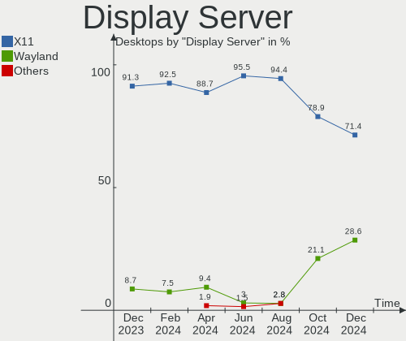
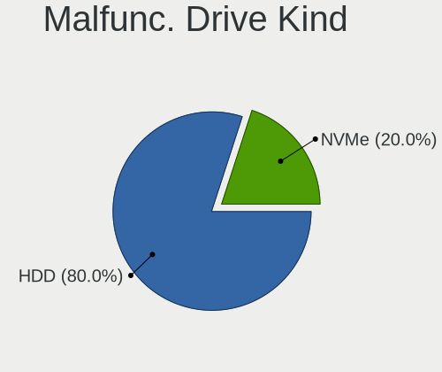
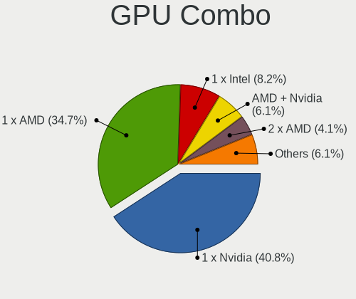
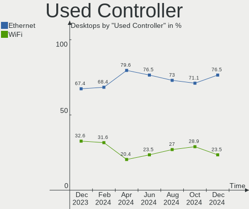

Kubuntu - Hardware Trends (Desktops)
------------------------------------

A project to identify most popular hardware characteristics and track their change
over time based on data collected by Linux users at https://Linux-Hardware.org.

Anyone can contribute to this report by the [hw-probe](https://github.com/linuxhw/hw-probe) tool:

    sudo -E hw-probe -all -upload

This report is for one last month. Overall report since the beginning of time: [TestDays](https://github.com/linuxhw/TestDays)

Period: Oct, 2023.

Contents
--------

* [ System ](#system)
  - [ OS                       ](#os)
  - [ OS Family                ](#os-family)
  - [ Kernel                   ](#kernel)
  - [ Kernel Family            ](#kernel-family)
  - [ Kernel Major Ver.        ](#kernel-major-ver)
  - [ Arch                     ](#arch)
  - [ DE                       ](#de)
  - [ Display Server           ](#display-server)
  - [ Display Manager          ](#display-manager)
  - [ OS Lang                  ](#os-lang)
  - [ Boot Mode                ](#boot-mode)
  - [ Filesystem               ](#filesystem)
  - [ Part. scheme             ](#part-scheme)
  - [ Dual Boot with Linux/BSD ](#dual-boot-with-linuxbsd)
  - [ Dual Boot (Win)          ](#dual-boot-win)

* [ Board ](#board)
  - [ Vendor                   ](#vendor)
  - [ Model                    ](#model)
  - [ Model Family             ](#model-family)
  - [ MFG Year                 ](#mfg-year)
  - [ Form Factor              ](#form-factor)
  - [ Secure Boot              ](#secure-boot)
  - [ Coreboot                 ](#coreboot)
  - [ RAM Size                 ](#ram-size)
  - [ RAM Used                 ](#ram-used)
  - [ Total Drives             ](#total-drives)
  - [ Has CD-ROM               ](#has-cd-rom)
  - [ Has Ethernet             ](#has-ethernet)
  - [ Has WiFi                 ](#has-wifi)
  - [ Has Bluetooth            ](#has-bluetooth)

* [ Location ](#location)
  - [ Country                  ](#country)
  - [ City                     ](#city)

* [ Drives ](#drives)
  - [ Drive Vendor             ](#drive-vendor)
  - [ Drive Model              ](#drive-model)
  - [ HDD Vendor               ](#hdd-vendor)
  - [ SSD Vendor               ](#ssd-vendor)
  - [ Drive Kind               ](#drive-kind)
  - [ Drive Connector          ](#drive-connector)
  - [ Drive Size               ](#drive-size)
  - [ Space Total              ](#space-total)
  - [ Space Used               ](#space-used)
  - [ Malfunc. Drives          ](#malfunc-drives)
  - [ Malfunc. Drive Vendor    ](#malfunc-drive-vendor)
  - [ Malfunc. HDD Vendor      ](#malfunc-hdd-vendor)
  - [ Malfunc. Drive Kind      ](#malfunc-drive-kind)
  - [ Failed Drives            ](#failed-drives)
  - [ Failed Drive Vendor      ](#failed-drive-vendor)
  - [ Drive Status             ](#drive-status)

* [ Storage controller ](#storage-controller)
  - [ Storage Vendor           ](#storage-vendor)
  - [ Storage Model            ](#storage-model)
  - [ Storage Kind             ](#storage-kind)

* [ Processor ](#processor)
  - [ CPU Vendor               ](#cpu-vendor)
  - [ CPU Model                ](#cpu-model)
  - [ CPU Model Family         ](#cpu-model-family)
  - [ CPU Cores                ](#cpu-cores)
  - [ CPU Sockets              ](#cpu-sockets)
  - [ CPU Threads              ](#cpu-threads)
  - [ CPU Op-Modes             ](#cpu-op-modes)
  - [ CPU Microcode            ](#cpu-microcode)
  - [ CPU Microarch            ](#cpu-microarch)

* [ Graphics ](#graphics)
  - [ GPU Vendor               ](#gpu-vendor)
  - [ GPU Model                ](#gpu-model)
  - [ GPU Combo                ](#gpu-combo)
  - [ GPU Driver               ](#gpu-driver)
  - [ GPU Memory               ](#gpu-memory)

* [ Monitor ](#monitor)
  - [ Monitor Vendor           ](#monitor-vendor)
  - [ Monitor Model            ](#monitor-model)
  - [ Monitor Resolution       ](#monitor-resolution)
  - [ Monitor Diagonal         ](#monitor-diagonal)
  - [ Monitor Width            ](#monitor-width)
  - [ Aspect Ratio             ](#aspect-ratio)
  - [ Monitor Area             ](#monitor-area)
  - [ Pixel Density            ](#pixel-density)
  - [ Multiple Monitors        ](#multiple-monitors)

* [ Network ](#network)
  - [ Net Controller Vendor    ](#net-controller-vendor)
  - [ Net Controller Model     ](#net-controller-model)
  - [ Wireless Vendor          ](#wireless-vendor)
  - [ Wireless Model           ](#wireless-model)
  - [ Ethernet Vendor          ](#ethernet-vendor)
  - [ Ethernet Model           ](#ethernet-model)
  - [ Net Controller Kind      ](#net-controller-kind)
  - [ Used Controller          ](#used-controller)
  - [ NICs                     ](#nics)
  - [ IPv6                     ](#ipv6)

* [ Bluetooth ](#bluetooth)
  - [ Bluetooth Vendor         ](#bluetooth-vendor)
  - [ Bluetooth Model          ](#bluetooth-model)

* [ Sound ](#sound)
  - [ Sound Vendor             ](#sound-vendor)
  - [ Sound Model              ](#sound-model)

* [ Memory ](#memory)
  - [ Memory Vendor            ](#memory-vendor)
  - [ Memory Model             ](#memory-model)
  - [ Memory Kind              ](#memory-kind)
  - [ Memory Form Factor       ](#memory-form-factor)
  - [ Memory Size              ](#memory-size)
  - [ Memory Speed             ](#memory-speed)

* [ Printers & scanners ](#printers--scanners)
  - [ Printer Vendor           ](#printer-vendor)
  - [ Printer Model            ](#printer-model)
  - [ Scanner Vendor           ](#scanner-vendor)
  - [ Scanner Model            ](#scanner-model)

* [ Camera ](#camera)
  - [ Camera Vendor            ](#camera-vendor)
  - [ Camera Model             ](#camera-model)

* [ Security ](#security)
  - [ Fingerprint Vendor       ](#fingerprint-vendor)
  - [ Fingerprint Model        ](#fingerprint-model)
  - [ Chipcard Vendor          ](#chipcard-vendor)
  - [ Chipcard Model           ](#chipcard-model)

* [ Unsupported ](#unsupported)
  - [ Unsupported Devices      ](#unsupported-devices)
  - [ Unsupported Device Types ](#unsupported-device-types)

System
------

OS
--

Installed operating systems

| Name          | Desktops | Percent |
|---------------|----------|---------|
| Kubuntu 22.04 | 24       | 42.11%  |
| Kubuntu 23.04 | 19       | 33.33%  |
| Kubuntu 23.10 | 11       | 19.3%   |
| Kubuntu 20.04 | 1        | 1.75%   |
| Kubuntu 18.04 | 1        | 1.75%   |
| Kubuntu 11    | 1        | 1.75%   |

OS Family
---------

OS without a version

| Name    | Desktops | Percent |
|---------|----------|---------|
| Kubuntu | 57       | 100%    |

Kernel
------

Version of the Linux kernel

| Version               | Desktops | Percent |
|-----------------------|----------|---------|
| 6.2.0-34-generic      | 13       | 22.81%  |
| 6.5.0-9-generic       | 7        | 12.28%  |
| 6.2.0-35-generic      | 7        | 12.28%  |
| 5.15.0-86-generic     | 6        | 10.53%  |
| 6.2.0-36-generic      | 3        | 5.26%   |
| 5.15.0-87-generic     | 3        | 5.26%   |
| 5.15.0-84-generic     | 3        | 5.26%   |
| 6.5.0-5-generic       | 2        | 3.51%   |
| 6.2.0-33-generic      | 2        | 3.51%   |
| 5.15.0-79-generic     | 2        | 3.51%   |
| 6.5.0-10-generic      | 1        | 1.75%   |
| 6.2.0-1015-lowlatency | 1        | 1.75%   |
| 6.2.0-1014-lowlatency | 1        | 1.75%   |
| 6.2.0-1013-lowlatency | 1        | 1.75%   |
| 6.1.58-x64v3-xanmod1  | 1        | 1.75%   |
| 5.15.0-86-lowlatency  | 1        | 1.75%   |
| 5.15.0-78-generic     | 1        | 1.75%   |
| 5.15.0-41-lowlatency  | 1        | 1.75%   |
| 4.15.0-213-generic    | 1        | 1.75%   |

Kernel Family
-------------

Linux kernel without a distro release

| Version | Desktops | Percent |
|---------|----------|---------|
| 6.2.0   | 28       | 49.12%  |
| 5.15.0  | 17       | 29.82%  |
| 6.5.0   | 10       | 17.54%  |
| 6.1.58  | 1        | 1.75%   |
| 4.15.0  | 1        | 1.75%   |

Kernel Major Ver.
-----------------

Linux kernel major version

| Version | Desktops | Percent |
|---------|----------|---------|
| 6.2     | 28       | 49.12%  |
| 5.15    | 17       | 29.82%  |
| 6.5     | 10       | 17.54%  |
| 6.1     | 1        | 1.75%   |
| 4.15    | 1        | 1.75%   |

Arch
----

OS architecture (x86_64, i586, etc.)

| Name   | Desktops | Percent |
|--------|----------|---------|
| x86_64 | 57       | 100%    |

DE
--

Desktop Environment

| Name  | Desktops | Percent |
|-------|----------|---------|
| KDE5  | 56       | 98.25%  |
| GNOME | 1        | 1.75%   |

Display Server
--------------

X11 or Wayland

| Name    | Desktops | Percent |
|---------|----------|---------|
| X11     | 54       | 94.74%  |
| Wayland | 3        | 5.26%   |

Display Manager
---------------

SDDM, LightDM, etc.

| Name    | Desktops | Percent |
|---------|----------|---------|
| SDDM    | 37       | 64.91%  |
| Unknown | 18       | 31.58%  |
| LightDM | 1        | 1.75%   |
| GDM     | 1        | 1.75%   |

OS Lang
-------

Language

| Lang  | Desktops | Percent |
|-------|----------|---------|
| en_US | 27       | 47.37%  |
| it_IT | 6        | 10.53%  |
| de_DE | 6        | 10.53%  |
| fr_FR | 4        | 7.02%   |
| sv_SE | 2        | 3.51%   |
| es_ES | 2        | 3.51%   |
| en_GB | 2        | 3.51%   |
| en_CA | 2        | 3.51%   |
| zh_CN | 1        | 1.75%   |
| ru_RU | 1        | 1.75%   |
| nl_NL | 1        | 1.75%   |
| es_PE | 1        | 1.75%   |
| en_NZ | 1        | 1.75%   |
| en_AG | 1        | 1.75%   |

Boot Mode
---------

EFI or BIOS

| Mode | Desktops | Percent |
|------|----------|---------|
| BIOS | 35       | 61.4%   |
| EFI  | 22       | 38.6%   |

Filesystem
----------

Type of filesystem

| Type  | Desktops | Percent |
|-------|----------|---------|
| Ext4  | 40       | 70.18%  |
| Tmpfs | 12       | 21.05%  |
| Btrfs | 4        | 7.02%   |
| Xfs   | 1        | 1.75%   |

Part. scheme
------------

Scheme of partitioning

| Type    | Desktops | Percent |
|---------|----------|---------|
| GPT     | 35       | 61.4%   |
| Unknown | 18       | 31.58%  |
| MBR     | 4        | 7.02%   |

Dual Boot with Linux/BSD
------------------------

Hosting more than one Linux/BSD

| Dual boot | Desktops | Percent |
|-----------|----------|---------|
| No        | 46       | 80.7%   |
| Yes       | 11       | 19.3%   |

Dual Boot (Win)
---------------

Hosting Linux and Windows

| Dual boot | Desktops | Percent |
|-----------|----------|---------|
| No        | 36       | 63.16%  |
| Yes       | 21       | 36.84%  |

Board
-----

Vendor
------

Motherboard manufacturer

| Name                                 | Desktops | Percent |
|--------------------------------------|----------|---------|
| ASUSTek Computer                     | 17       | 29.82%  |
| MSI                                  | 12       | 21.05%  |
| Gigabyte Technology                  | 8        | 14.04%  |
| ASRock                               | 5        | 8.77%   |
| Hewlett-Packard                      | 3        | 5.26%   |
| Dell                                 | 2        | 3.51%   |
| SYWZ                                 | 1        | 1.75%   |
| Shenzhen Meigao Electronic Equipment | 1        | 1.75%   |
| Lenovo                               | 1        | 1.75%   |
| Intel                                | 1        | 1.75%   |
| Fujitsu                              | 1        | 1.75%   |
| ECS                                  | 1        | 1.75%   |
| Colorful Technology                  | 1        | 1.75%   |
| AZW                                  | 1        | 1.75%   |
| ASRockRack                           | 1        | 1.75%   |
| Unknown                              | 1        | 1.75%   |

Model
-----

Motherboard model

| Name                                       | Desktops | Percent |
|--------------------------------------------|----------|---------|
| ASUS ROG STRIX B550-F GAMING               | 2        | 3.51%   |
| ASUS All Series                            | 2        | 3.51%   |
| SYWZ S210H Series                          | 1        | 1.75%   |
| Shenzhen Meigao Electronic Equipment UM450 | 1        | 1.75%   |
| MSI MS-7D96                                | 1        | 1.75%   |
| MSI MS-7D95                                | 1        | 1.75%   |
| MSI MS-7D20                                | 1        | 1.75%   |
| MSI MS-7D17                                | 1        | 1.75%   |
| MSI MS-7C86                                | 1        | 1.75%   |
| MSI MS-7C37                                | 1        | 1.75%   |
| MSI MS-7B86                                | 1        | 1.75%   |
| MSI MS-7B79                                | 1        | 1.75%   |
| MSI MS-7B78                                | 1        | 1.75%   |
| MSI MS-7B61                                | 1        | 1.75%   |
| MSI MS-7A70                                | 1        | 1.75%   |
| MSI MS-7816                                | 1        | 1.75%   |
| Lenovo ThinkCentre M92p 3228A1U            | 1        | 1.75%   |
| Intel Jasper Lake Client Platform          | 1        | 1.75%   |
| HP Z220 CMT Workstation                    | 1        | 1.75%   |
| HP Compaq Elite 8300 CMT                   | 1        | 1.75%   |
| HP 500-267c                                | 1        | 1.75%   |
| Gigabyte Z77X-UP7                          | 1        | 1.75%   |
| Gigabyte Z490 AORUS ELITE AC               | 1        | 1.75%   |
| Gigabyte Z390 GAMING X                     | 1        | 1.75%   |
| Gigabyte Z370P D3                          | 1        | 1.75%   |
| Gigabyte H110M-H                           | 1        | 1.75%   |
| Gigabyte GA-970A-DS3                       | 1        | 1.75%   |
| Gigabyte GA-890FXA-UD5                     | 1        | 1.75%   |
| Gigabyte AX370-Gaming K7                   | 1        | 1.75%   |
| Fujitsu ESPRIMO P400                       | 1        | 1.75%   |
| ECS DREAMSYS                               | 1        | 1.75%   |
| Dell Precision 5820 Tower                  | 1        | 1.75%   |
| Dell Inspiron 660                          | 1        | 1.75%   |
| Colorful BATTLE-AX B450M-HD V14            | 1        | 1.75%   |
| AZW SER                                    | 1        | 1.75%   |
| ASUS TUF Gaming X570-PLUS                  | 1        | 1.75%   |
| ASUS ROG STRIX X670E-A GAMING WIFI         | 1        | 1.75%   |
| ASUS ROG CROSSHAIR VII HERO                | 1        | 1.75%   |
| ASUS PRIME Z790M-PLUS D4                   | 1        | 1.75%   |
| ASUS PRIME H310M-K R2.0                    | 1        | 1.75%   |

Model Family
------------

Motherboard model prefix

| Name                                       | Desktops | Percent |
|--------------------------------------------|----------|---------|
| ASUS PRIME                                 | 5        | 8.77%   |
| ASUS ROG                                   | 4        | 7.02%   |
| ASUS All                                   | 2        | 3.51%   |
| SYWZ S210H                                 | 1        | 1.75%   |
| Shenzhen Meigao Electronic Equipment UM450 | 1        | 1.75%   |
| MSI MS-7D96                                | 1        | 1.75%   |
| MSI MS-7D95                                | 1        | 1.75%   |
| MSI MS-7D20                                | 1        | 1.75%   |
| MSI MS-7D17                                | 1        | 1.75%   |
| MSI MS-7C86                                | 1        | 1.75%   |
| MSI MS-7C37                                | 1        | 1.75%   |
| MSI MS-7B86                                | 1        | 1.75%   |
| MSI MS-7B79                                | 1        | 1.75%   |
| MSI MS-7B78                                | 1        | 1.75%   |
| MSI MS-7B61                                | 1        | 1.75%   |
| MSI MS-7A70                                | 1        | 1.75%   |
| MSI MS-7816                                | 1        | 1.75%   |
| Lenovo ThinkCentre                         | 1        | 1.75%   |
| Intel Jasper                               | 1        | 1.75%   |
| HP Z220                                    | 1        | 1.75%   |
| HP Compaq                                  | 1        | 1.75%   |
| HP 500-267c                                | 1        | 1.75%   |
| Gigabyte Z77X-UP7                          | 1        | 1.75%   |
| Gigabyte Z490                              | 1        | 1.75%   |
| Gigabyte Z390                              | 1        | 1.75%   |
| Gigabyte Z370P                             | 1        | 1.75%   |
| Gigabyte H110M-H                           | 1        | 1.75%   |
| Gigabyte GA-970A-DS3                       | 1        | 1.75%   |
| Gigabyte GA-890FXA-UD5                     | 1        | 1.75%   |
| Gigabyte AX370-Gaming                      | 1        | 1.75%   |
| Fujitsu ESPRIMO                            | 1        | 1.75%   |
| ECS DREAMSYS                               | 1        | 1.75%   |
| Dell Precision                             | 1        | 1.75%   |
| Dell Inspiron                              | 1        | 1.75%   |
| Colorful BATTLE-AX                         | 1        | 1.75%   |
| AZW SER                                    | 1        | 1.75%   |
| ASUS TUF                                   | 1        | 1.75%   |
| ASUS P8Z77-V                               | 1        | 1.75%   |
| ASUS M4A89GTD-PRO                          | 1        | 1.75%   |
| ASUS M11BB                                 | 1        | 1.75%   |

MFG Year
--------

Motherboard manufacture year

| Year | Desktops | Percent |
|------|----------|---------|
| 2012 | 9        | 15.79%  |
| 2022 | 8        | 14.04%  |
| 2020 | 8        | 14.04%  |
| 2018 | 6        | 10.53%  |
| 2019 | 5        | 8.77%   |
| 2021 | 4        | 7.02%   |
| 2017 | 4        | 7.02%   |
| 2013 | 4        | 7.02%   |
| 2014 | 3        | 5.26%   |
| 2016 | 2        | 3.51%   |
| 2010 | 2        | 3.51%   |
| 2023 | 1        | 1.75%   |
| 2011 | 1        | 1.75%   |

Form Factor
-----------

Physical design of the computer

| Name    | Desktops | Percent |
|---------|----------|---------|
| Desktop | 57       | 100%    |

Secure Boot
-----------

Enabled or disabled

| State    | Desktops | Percent |
|----------|----------|---------|
| Disabled | 54       | 94.74%  |
| Enabled  | 3        | 5.26%   |

Coreboot
--------

Have coreboot on board

| Used | Desktops | Percent |
|------|----------|---------|
| No   | 57       | 100%    |

RAM Size
--------

Total RAM memory

| Size in GB      | Desktops | Percent |
|-----------------|----------|---------|
| 16.01-24.0      | 20       | 35.09%  |
| 32.01-64.0      | 15       | 26.32%  |
| 8.01-16.0       | 7        | 12.28%  |
| 4.01-8.0        | 6        | 10.53%  |
| 64.01-256.0     | 6        | 10.53%  |
| 24.01-32.0      | 2        | 3.51%   |
| More than 256.0 | 1        | 1.75%   |

RAM Used
--------

Used RAM memory

| Used GB    | Desktops | Percent |
|------------|----------|---------|
| 4.01-8.0   | 17       | 29.82%  |
| 2.01-3.0   | 14       | 24.56%  |
| 3.01-4.0   | 11       | 19.3%   |
| 1.01-2.0   | 7        | 12.28%  |
| 24.01-32.0 | 3        | 5.26%   |
| 8.01-16.0  | 3        | 5.26%   |
| 16.01-24.0 | 2        | 3.51%   |

Total Drives
------------

Number of drives on board

| Drives | Desktops | Percent |
|--------|----------|---------|
| 2      | 19       | 33.33%  |
| 1      | 13       | 22.81%  |
| 4      | 7        | 12.28%  |
| 3      | 7        | 12.28%  |
| 5      | 6        | 10.53%  |
| 6      | 3        | 5.26%   |
| 8      | 2        | 3.51%   |

Has CD-ROM
----------

Has CD-ROM on board

| Presented | Desktops | Percent |
|-----------|----------|---------|
| No        | 34       | 59.65%  |
| Yes       | 23       | 40.35%  |

Has Ethernet
------------

Has Ethernet on board

| Presented | Desktops | Percent |
|-----------|----------|---------|
| Yes       | 57       | 100%    |

Has WiFi
--------

Has WiFi module

| Presented | Desktops | Percent |
|-----------|----------|---------|
| No        | 30       | 52.63%  |
| Yes       | 27       | 47.37%  |

Has Bluetooth
-------------

Has Bluetooth module

| Presented | Desktops | Percent |
|-----------|----------|---------|
| No        | 32       | 56.14%  |
| Yes       | 25       | 43.86%  |

Location
--------

Country
-------

Geographic location (country)

| Country     | Desktops | Percent |
|-------------|----------|---------|
| USA         | 11       | 19.3%   |
| Italy       | 8        | 14.04%  |
| Germany     | 6        | 10.53%  |
| France      | 5        | 8.77%   |
| Canada      | 4        | 7.02%   |
| UK          | 2        | 3.51%   |
| Sweden      | 2        | 3.51%   |
| Spain       | 2        | 3.51%   |
| Peru        | 2        | 3.51%   |
| Netherlands | 2        | 3.51%   |
| Lithuania   | 2        | 3.51%   |
| Bangladesh  | 2        | 3.51%   |
| Turkey      | 1        | 1.75%   |
| Russia      | 1        | 1.75%   |
| Poland      | 1        | 1.75%   |
| Norway      | 1        | 1.75%   |
| New Zealand | 1        | 1.75%   |
| Latvia      | 1        | 1.75%   |
| Kazakhstan  | 1        | 1.75%   |
| Hong Kong   | 1        | 1.75%   |
| Argentina   | 1        | 1.75%   |

City
----

Geographic location (city)

| City                 | Desktops | Percent |
|----------------------|----------|---------|
| Florence             | 2        | 3.51%   |
| Wellsboro            | 1        | 1.75%   |
| Vladivostok          | 1        | 1.75%   |
| Vilnius              | 1        | 1.75%   |
| Trujillo             | 1        | 1.75%   |
| Trieste              | 1        | 1.75%   |
| Tourcoing            | 1        | 1.75%   |
| The Hague            | 1        | 1.75%   |
| Shinnston            | 1        | 1.75%   |
| Sayre                | 1        | 1.75%   |
| Saskatoon            | 1        | 1.75%   |
| Saro                 | 1        | 1.75%   |
| San Cesario di Lecce | 1        | 1.75%   |
| Roya                 | 1        | 1.75%   |
| Rome                 | 1        | 1.75%   |
| Rexburg              | 1        | 1.75%   |
| Quilmes              | 1        | 1.75%   |
| Porter               | 1        | 1.75%   |
| Pordenone            | 1        | 1.75%   |
| Polkowice            | 1        | 1.75%   |
| Phoenix              | 1        | 1.75%   |
| Pescara              | 1        | 1.75%   |
| Panevezys            | 1        | 1.75%   |
| Oslo                 | 1        | 1.75%   |
| Olesa de Montserrat  | 1        | 1.75%   |
| Ohsweken             | 1        | 1.75%   |
| Morehead City        | 1        | 1.75%   |
| Montreal             | 1        | 1.75%   |
| Montauban            | 1        | 1.75%   |
| Mirpur               | 1        | 1.75%   |
| Lima                 | 1        | 1.75%   |
| Lafayette            | 1        | 1.75%   |
| La Wantzenau         | 1        | 1.75%   |
| Karaganda            | 1        | 1.75%   |
| Jena                 | 1        | 1.75%   |
| Ihlow                | 1        | 1.75%   |
| Hong Kong            | 1        | 1.75%   |
| Helsingborg          | 1        | 1.75%   |
| Hanover              | 1        | 1.75%   |
| Hamburg              | 1        | 1.75%   |

Drives
------

Drive Vendor
------------

Hard drive vendors

| Vendor                      | Desktops | Drives | Percent |
|-----------------------------|----------|--------|---------|
| WDC                         | 21       | 25     | 16.94%  |
| Seagate                     | 19       | 33     | 15.32%  |
| Samsung Electronics         | 19       | 31     | 15.32%  |
| Crucial                     | 9        | 9      | 7.26%   |
| Kingston                    | 8        | 9      | 6.45%   |
| SanDisk                     | 6        | 10     | 4.84%   |
| Toshiba                     | 4        | 4      | 3.23%   |
| Hitachi                     | 4        | 4      | 3.23%   |
| Phison Electronics          | 3        | 3      | 2.42%   |
| Kingston Technology Company | 3        | 4      | 2.42%   |
| Intel                       | 3        | 3      | 2.42%   |
| HGST                        | 3        | 3      | 2.42%   |
| SPCC                        | 2        | 6      | 1.61%   |
| Patriot                     | 2        | 2      | 1.61%   |
| Intenso                     | 2        | 2      | 1.61%   |
| Verbatim                    | 1        | 1      | 0.81%   |
| Unknown                     | 1        | 1      | 0.81%   |
| Teutons                     | 1        | 1      | 0.81%   |
| Silicon Motion              | 1        | 1      | 0.81%   |
| RSH-338H                    | 1        | 1      | 0.81%   |
| PNY                         | 1        | 1      | 0.81%   |
| OCZ                         | 1        | 1      | 0.81%   |
| Micron/Crucial Technology   | 1        | 1      | 0.81%   |
| Maxtor                      | 1        | 1      | 0.81%   |
| Lexar                       | 1        | 1      | 0.81%   |
| Lenovo                      | 1        | 1      | 0.81%   |
| KingFast                    | 1        | 1      | 0.81%   |
| Kimtigo                     | 1        | 1      | 0.81%   |
| JMicron Technology          | 1        | 1      | 0.81%   |
| Gigabyte Technology         | 1        | 1      | 0.81%   |
| A-DATA Technology           | 1        | 1      | 0.81%   |

Drive Model
-----------

Hard drive models

| Model                                             | Desktops | Percent |
|---------------------------------------------------|----------|---------|
| Seagate ST2000DM008-2FR102 2TB                    | 8        | 5.23%   |
| Samsung SSD 860 EVO 500GB                         | 4        | 2.61%   |
| Samsung NVMe SSD Controller SM981/PM981/PM983 1TB | 4        | 2.61%   |
| WDC WD10EZEX-08WN4A0 1TB                          | 2        | 1.31%   |
| SPCC Solid State Disk 1TB                         | 2        | 1.31%   |
| SanDisk SSD PLUS 240GB                            | 2        | 1.31%   |
| Samsung SSD 980 PRO 2TB                           | 2        | 1.31%   |
| Samsung SSD 980 1TB                               | 2        | 1.31%   |
| Phison PS5013 E13 NVMe Controller 256GB           | 2        | 1.31%   |
| Kingston Company SNV2S1000G 1TB                   | 2        | 1.31%   |
| Kingston SV300S37A240G 240GB SSD                  | 2        | 1.31%   |
| Kingston SA400S37240G 240GB SSD                   | 2        | 1.31%   |
| Crucial CT250MX500SSD1 250GB                      | 2        | 1.31%   |
| WDC WDS500G2B0A-00SM50 500GB SSD                  | 1        | 0.65%   |
| WDC WDS500G1B0B-00AS40 500GB SSD                  | 1        | 0.65%   |
| WDC WDS120G2G0A-00JH30 120GB SSD                  | 1        | 0.65%   |
| WDC WDS100T2B0A-00SM50 1TB SSD                    | 1        | 0.65%   |
| WDC WDS100T1R0B-68A4Z0 1TB SSD                    | 1        | 0.65%   |
| WDC WDBNCE5000PNC 500GB SSD                       | 1        | 0.65%   |
| WDC WD5000AAKX-60U6AA0 500GB                      | 1        | 0.65%   |
| WDC WD5000AAKS-00A7B2 500GB                       | 1        | 0.65%   |
| WDC WD40EFRX-68WT0N0 4TB                          | 1        | 0.65%   |
| WDC WD40EFAX-68JH4N1 4TB                          | 1        | 0.65%   |
| WDC WD30EFRX-68EUZN0 3TB                          | 1        | 0.65%   |
| WDC WD2500AAKX-00U6AA0 250GB                      | 1        | 0.65%   |
| WDC WD2500AAKX-00ERMA0 250GB                      | 1        | 0.65%   |
| WDC WD20EZBX-00AYRA0 2TB                          | 1        | 0.65%   |
| WDC WD1600JD-00FYB0 160GB                         | 1        | 0.65%   |
| WDC WD10EZRX-00L4HB0 1TB                          | 1        | 0.65%   |
| WDC WD10EZEX-60ZF5A0 1TB                          | 1        | 0.65%   |
| WDC WD10EZEX-00WN4A0 1TB                          | 1        | 0.65%   |
| WDC WD10EARS-22Y5B1 1TB                           | 1        | 0.65%   |
| WDC WD101EFAX-68LDBN0 10TB                        | 1        | 0.65%   |
| WDC WD1003FZEX-00K3CA0 1TB                        | 1        | 0.65%   |
| WDC WD1002FAEX-00Z3A0 1TB                         | 1        | 0.65%   |
| WDC WD Blue SA510 2.5 500GB                       | 1        | 0.65%   |
| Verbatim Vi550 S3 128GB                           | 1        | 0.65%   |
| Unknown NVMe SSD Drive 2TB                        | 1        | 0.65%   |
| Toshiba MK6475GSX 640GB                           | 1        | 0.65%   |
| Toshiba HDWD220 2TB                               | 1        | 0.65%   |

HDD Vendor
----------

Hard disk drive vendors

| Vendor              | Desktops | Drives | Percent |
|---------------------|----------|--------|---------|
| Seagate             | 18       | 32     | 39.13%  |
| WDC                 | 14       | 18     | 30.43%  |
| Toshiba             | 4        | 4      | 8.7%    |
| Hitachi             | 4        | 4      | 8.7%    |
| HGST                | 3        | 3      | 6.52%   |
| Samsung Electronics | 2        | 2      | 4.35%   |
| Maxtor              | 1        | 1      | 2.17%   |

SSD Vendor
----------

Solid state drive vendors

| Vendor              | Desktops | Drives | Percent |
|---------------------|----------|--------|---------|
| Samsung Electronics | 13       | 14     | 26%     |
| WDC                 | 7        | 7      | 14%     |
| Kingston            | 7        | 7      | 14%     |
| Crucial             | 7        | 7      | 14%     |
| SanDisk             | 5        | 9      | 10%     |
| SPCC                | 2        | 6      | 4%      |
| Verbatim            | 1        | 1      | 2%      |
| Teutons             | 1        | 1      | 2%      |
| PNY                 | 1        | 1      | 2%      |
| Patriot             | 1        | 1      | 2%      |
| OCZ                 | 1        | 1      | 2%      |
| Lexar               | 1        | 1      | 2%      |
| KingFast            | 1        | 1      | 2%      |
| Kimtigo             | 1        | 1      | 2%      |
| Gigabyte Technology | 1        | 1      | 2%      |

Drive Kind
----------

HDD or SSD

| Kind    | Desktops | Drives | Percent |
|---------|----------|--------|---------|
| SSD     | 39       | 59     | 38.61%  |
| HDD     | 34       | 64     | 33.66%  |
| NVMe    | 24       | 37     | 23.76%  |
| Unknown | 4        | 4      | 3.96%   |

Drive Connector
---------------

SATA, SAS, NVMe, etc.

| Type | Desktops | Drives | Percent |
|------|----------|--------|---------|
| SATA | 51       | 115    | 62.2%   |
| NVMe | 24       | 36     | 29.27%  |
| SAS  | 7        | 13     | 8.54%   |

Drive Size
----------

Size of hard drive

| Size in TB | Desktops | Drives | Percent |
|------------|----------|--------|---------|
| 0.01-0.5   | 35       | 49     | 38.89%  |
| 0.51-1.0   | 27       | 36     | 30%     |
| 1.01-2.0   | 18       | 24     | 20%     |
| 3.01-4.0   | 5        | 7      | 5.56%   |
| 2.01-3.0   | 3        | 4      | 3.33%   |
| 4.01-10.0  | 2        | 3      | 2.22%   |

Space Total
-----------

Amount of disk space available on the file system

| Size in GB     | Desktops | Percent |
|----------------|----------|---------|
| 1001-2000      | 16       | 28.07%  |
| More than 3000 | 12       | 21.05%  |
| 251-500        | 8        | 14.04%  |
| 101-250        | 8        | 14.04%  |
| 501-1000       | 7        | 12.28%  |
| 2001-3000      | 6        | 10.53%  |

Space Used
----------

Amount of used disk space

| Used GB        | Desktops | Percent |
|----------------|----------|---------|
| 251-500        | 13       | 22.81%  |
| 501-1000       | 10       | 17.54%  |
| 1001-2000      | 9        | 15.79%  |
| More than 3000 | 6        | 10.53%  |
| 101-250        | 6        | 10.53%  |
| 51-100         | 5        | 8.77%   |
| 21-50          | 4        | 7.02%   |
| 1-20           | 4        | 7.02%   |

Malfunc. Drives
---------------

Drive models with a malfunction

| Model                                 | Desktops | Drives | Percent |
|---------------------------------------|----------|--------|---------|
| WDC WD30EFRX-68EUZN0 3TB              | 1        | 1      | 12.5%   |
| Toshiba MK6475GSX 640GB               | 1        | 1      | 12.5%   |
| Seagate ST9500325AS 500GB             | 1        | 1      | 12.5%   |
| Seagate ST31500341AS 1TB              | 1        | 1      | 12.5%   |
| SanDisk SSD PLUS 1000GB               | 1        | 1      | 12.5%   |
| Samsung Electronics SSD 870 EVO 500GB | 1        | 1      | 12.5%   |
| Samsung Electronics HD501LJ 500GB     | 1        | 1      | 12.5%   |
| HGST HTS541010A9E680 1TB              | 1        | 1      | 12.5%   |

Malfunc. Drive Vendor
---------------------

Vendors of faulty drives

| Vendor              | Desktops | Drives | Percent |
|---------------------|----------|--------|---------|
| Seagate             | 2        | 2      | 25%     |
| Samsung Electronics | 2        | 2      | 25%     |
| WDC                 | 1        | 1      | 12.5%   |
| Toshiba             | 1        | 1      | 12.5%   |
| SanDisk             | 1        | 1      | 12.5%   |
| HGST                | 1        | 1      | 12.5%   |

Malfunc. HDD Vendor
-------------------

Vendors of faulty HDD drives

| Vendor              | Desktops | Drives | Percent |
|---------------------|----------|--------|---------|
| Seagate             | 2        | 2      | 33.33%  |
| WDC                 | 1        | 1      | 16.67%  |
| Toshiba             | 1        | 1      | 16.67%  |
| Samsung Electronics | 1        | 1      | 16.67%  |
| HGST                | 1        | 1      | 16.67%  |

Malfunc. Drive Kind
-------------------

Kinds of faulty drives

| Kind | Desktops | Drives | Percent |
|------|----------|--------|---------|
| HDD  | 5        | 6      | 71.43%  |
| SSD  | 2        | 2      | 28.57%  |

Failed Drives
-------------

Failed drive models

Zero info for selected period =(

Failed Drive Vendor
-------------------

Failed drive vendors

Zero info for selected period =(

Drive Status
------------

Number of failed and malfunc. drives

| Status   | Desktops | Drives | Percent |
|----------|----------|--------|---------|
| Detected | 34       | 89     | 50.75%  |
| Works    | 26       | 67     | 38.81%  |
| Malfunc  | 7        | 8      | 10.45%  |

Storage controller
------------------

Storage Vendor
--------------

Storage controller vendors

| Vendor                           | Desktops | Percent |
|----------------------------------|----------|---------|
| Intel                            | 35       | 37.23%  |
| AMD                              | 22       | 23.4%   |
| Samsung Electronics              | 10       | 10.64%  |
| Kingston Technology Company      | 4        | 4.26%   |
| ASMedia Technology               | 4        | 4.26%   |
| Phison Electronics               | 3        | 3.19%   |
| Micron/Crucial Technology        | 3        | 3.19%   |
| Marvell Technology Group         | 3        | 3.19%   |
| Silicon Motion                   | 2        | 2.13%   |
| JMicron Technology               | 2        | 2.13%   |
| Silicon Image                    | 1        | 1.06%   |
| Shenzhen Shichuangyi Electronics | 1        | 1.06%   |
| SanDisk                          | 1        | 1.06%   |
| MAXIO Technology (Hangzhou)      | 1        | 1.06%   |
| LSI Logic / Symbios Logic        | 1        | 1.06%   |
| ADATA Technology                 | 1        | 1.06%   |

Storage Model
-------------

Storage controller models

| Model                                                                          | Desktops | Percent |
|--------------------------------------------------------------------------------|----------|---------|
| AMD FCH SATA Controller [AHCI mode]                                            | 13       | 11.21%  |
| Samsung NVMe SSD Controller SM981/PM981/PM983                                  | 6        | 5.17%   |
| AMD 400 Series Chipset SATA Controller                                         | 6        | 5.17%   |
| Intel 7 Series/C210 Series Chipset Family 6-port SATA Controller [AHCI mode]   | 5        | 4.31%   |
| Intel 200 Series PCH SATA controller [AHCI mode]                               | 5        | 4.31%   |
| Intel 8 Series/C220 Series Chipset Family 6-port SATA Controller 1 [AHCI mode] | 4        | 3.45%   |
| AMD 500 Series Chipset SATA Controller                                         | 4        | 3.45%   |
| Intel Volume Management Device NVMe RAID Controller                            | 3        | 2.59%   |
| Intel Cannon Lake PCH SATA AHCI Controller                                     | 3        | 2.59%   |
| Intel 500 Series Chipset Family SATA AHCI Controller                           | 3        | 2.59%   |
| ASMedia ASM1062 Serial ATA Controller                                          | 3        | 2.59%   |
| AMD SB7x0/SB8x0/SB9x0 SATA Controller [AHCI mode]                              | 3        | 2.59%   |
| AMD SB7x0/SB8x0/SB9x0 IDE Controller                                           | 3        | 2.59%   |
| Silicon Motion SM2263EN/SM2263XT (DRAM-less) NVMe SSD Controllers              | 2        | 1.72%   |
| Samsung NVMe SSD Controller PM9A1/PM9A3/980PRO                                 | 2        | 1.72%   |
| Samsung NVMe SSD Controller 980 (DRAM-less)                                    | 2        | 1.72%   |
| Phison PS5013-E13 PCIe3 NVMe Controller (DRAM-less)                            | 2        | 1.72%   |
| Marvell Group 88SE9172 SATA 6Gb/s Controller                                   | 2        | 1.72%   |
| Kingston Company NV2 NVMe SSD SM2267XT                                         | 2        | 1.72%   |
| Intel SSD 660P Series                                                          | 2        | 1.72%   |
| Intel Q170/Q150/B150/H170/H110/Z170/CM236 Chipset SATA Controller [AHCI Mode]  | 2        | 1.72%   |
| Intel 700 Series Chipset Family SATA AHCI Controller                           | 2        | 1.72%   |
| AMD SB7x0/SB8x0/SB9x0 SATA Controller [IDE mode]                               | 2        | 1.72%   |
| Silicon Image SiI 3114 [SATALink/SATARaid] Serial ATA Controller               | 1        | 0.86%   |
| Shenzhen Shichuangyi MAP1202-Based NVMe SSD (DRAM-less)                        | 1        | 0.86%   |
| SanDisk WD Black SN770 / PC SN740 256GB / PC SN560 (DRAM-less) NVMe SSD        | 1        | 0.86%   |
| Samsung NVMe SSD Controller SM951/PM951                                        | 1        | 0.86%   |
| Phison E12 NVMe Controller                                                     | 1        | 0.86%   |
| Micron/Crucial P5 Plus NVMe PCIe SSD                                           | 1        | 0.86%   |
| Micron/Crucial P2 [Nick P2] / P3 / P3 Plus NVMe PCIe SSD (DRAM-less)           | 1        | 0.86%   |
| Micron/Crucial P1 NVMe PCIe SSD[Frampton2]                                     | 1        | 0.86%   |
| MAXIO (Hangzhou) NVMe SSD Controller MAP1202                                   | 1        | 0.86%   |
| Marvell Group 88SE9220 PCIe 2.0 x2 2-port SATA 6 Gb/s RAID Controller          | 1        | 0.86%   |
| Marvell Group 88SE9215 PCIe 2.0 x1 4-port SATA 6 Gb/s Controller               | 1        | 0.86%   |
| LSI Logic / Symbios Logic SAS2008 PCI-Express Fusion-MPT SAS-2 [Falcon]        | 1        | 0.86%   |
| Kingston Company NV2 NVMe SSD E21T                                             | 1        | 0.86%   |
| Kingston Company NV1 NVMe SSD SM2263XT                                         | 1        | 0.86%   |
| Kingston Company KC3000/FURY Renegade NVMe SSD E18                             | 1        | 0.86%   |
| Kingston Company A2000 NVMe SSD SM2263EN                                       | 1        | 0.86%   |
| JMicron JMB368 IDE controller                                                  | 1        | 0.86%   |

Storage Kind
------------

Kind of storage controller (IDE, SATA, NVMe, SAS, ...)

| Kind | Desktops | Percent |
|------|----------|---------|
| SATA | 53       | 58.89%  |
| NVMe | 24       | 26.67%  |
| IDE  | 7        | 7.78%   |
| RAID | 5        | 5.56%   |
| SAS  | 1        | 1.11%   |

Processor
---------

CPU Vendor
----------

Processor vendors

| Vendor | Desktops | Percent |
|--------|----------|---------|
| Intel  | 34       | 59.65%  |
| AMD    | 23       | 40.35%  |

CPU Model
---------

Processor models

| Model                                       | Desktops | Percent |
|---------------------------------------------|----------|---------|
| Intel Core i3-4130 CPU @ 3.40GHz            | 3        | 5.26%   |
| Intel Core i7-4790K CPU @ 4.00GHz           | 2        | 3.51%   |
| Intel Core i5-3570 CPU @ 3.40GHz            | 2        | 3.51%   |
| Intel Core i5-3330 CPU @ 3.00GHz            | 2        | 3.51%   |
| AMD Ryzen 7 2700X Eight-Core Processor      | 2        | 3.51%   |
| Intel Xeon W-2104 CPU @ 3.20GHz             | 1        | 1.75%   |
| Intel Pentium Dual-Core CPU E5300 @ 2.60GHz | 1        | 1.75%   |
| Intel Pentium CPU G645 @ 2.90GHz            | 1        | 1.75%   |
| Intel Pentium CPU G4560 @ 3.50GHz           | 1        | 1.75%   |
| Intel Core i9-8950HK CPU @ 2.90GHz          | 1        | 1.75%   |
| Intel Core i9-10900T CPU @ 1.90GHz          | 1        | 1.75%   |
| Intel Core i7-8700K CPU @ 3.70GHz           | 1        | 1.75%   |
| Intel Core i7-8700 CPU @ 3.20GHz            | 1        | 1.75%   |
| Intel Core i7-7700K CPU @ 4.20GHz           | 1        | 1.75%   |
| Intel Core i7-4960X CPU @ 3.60GHz           | 1        | 1.75%   |
| Intel Core i7-3770K CPU @ 3.50GHz           | 1        | 1.75%   |
| Intel Core i7-3770 CPU @ 3.40GHz            | 1        | 1.75%   |
| Intel Core i7-10700 CPU @ 2.90GHz           | 1        | 1.75%   |
| Intel Core i5-9600K CPU @ 3.70GHz           | 1        | 1.75%   |
| Intel Core i5-9400F CPU @ 2.90GHz           | 1        | 1.75%   |
| Intel Core i5-8400 CPU @ 2.80GHz            | 1        | 1.75%   |
| Intel Core i5-7400 CPU @ 3.00GHz            | 1        | 1.75%   |
| Intel Core i5-10400F CPU @ 2.90GHz          | 1        | 1.75%   |
| Intel Celeron N5105 @ 2.00GHz               | 1        | 1.75%   |
| Intel 13th Gen Core i3-13100                | 1        | 1.75%   |
| Intel 12th Gen Core i7-12700KF              | 1        | 1.75%   |
| Intel 12th Gen Core i7-12700K               | 1        | 1.75%   |
| Intel 12th Gen Core i3-1220P                | 1        | 1.75%   |
| Intel 11th Gen Core i7-11700K @ 3.60GHz     | 1        | 1.75%   |
| Intel 11th Gen Core i5-11400F @ 2.60GHz     | 1        | 1.75%   |
| AMD Ryzen 9 7950X 16-Core Processor         | 1        | 1.75%   |
| AMD Ryzen 9 5950X 16-Core Processor         | 1        | 1.75%   |
| AMD Ryzen 7 7840HS w/ Radeon 780M Graphics  | 1        | 1.75%   |
| AMD Ryzen 7 5800X 8-Core Processor          | 1        | 1.75%   |
| AMD Ryzen 7 3700X 8-Core Processor          | 1        | 1.75%   |
| AMD Ryzen 5 5600G with Radeon Graphics      | 1        | 1.75%   |
| AMD Ryzen 5 4600G with Radeon Graphics      | 1        | 1.75%   |
| AMD Ryzen 5 4500U with Radeon Graphics      | 1        | 1.75%   |
| AMD Ryzen 5 3500 6-Core Processor           | 1        | 1.75%   |
| AMD Ryzen 5 3400G with Radeon Vega Graphics | 1        | 1.75%   |

CPU Model Family
----------------

Processor model prefix

| Model                   | Desktops | Percent |
|-------------------------|----------|---------|
| Intel Core i7           | 9        | 15.79%  |
| Intel Core i5           | 9        | 15.79%  |
| AMD Ryzen 5             | 8        | 14.04%  |
| Other                   | 6        | 10.53%  |
| AMD Ryzen 7             | 5        | 8.77%   |
| Intel Core i3           | 3        | 5.26%   |
| Intel Pentium           | 2        | 3.51%   |
| Intel Core i9           | 2        | 3.51%   |
| AMD Ryzen 9             | 2        | 3.51%   |
| AMD FX                  | 2        | 3.51%   |
| Intel Xeon              | 1        | 1.75%   |
| Intel Pentium Dual-Core | 1        | 1.75%   |
| Intel Celeron           | 1        | 1.75%   |
| AMD Ryzen 3             | 1        | 1.75%   |
| AMD Phenom II X6        | 1        | 1.75%   |
| AMD Phenom II X4        | 1        | 1.75%   |
| AMD EPYC                | 1        | 1.75%   |
| AMD E2                  | 1        | 1.75%   |
| AMD A10                 | 1        | 1.75%   |

CPU Cores
---------

Number of processor cores

| Number | Desktops | Percent |
|--------|----------|---------|
| 6      | 17       | 29.82%  |
| 4      | 17       | 29.82%  |
| 2      | 8        | 14.04%  |
| 8      | 7        | 12.28%  |
| 16     | 2        | 3.51%   |
| 12     | 2        | 3.51%   |
| 10     | 2        | 3.51%   |
| 24     | 1        | 1.75%   |
| 3      | 1        | 1.75%   |

CPU Sockets
-----------

Number of sockets

| Number | Desktops | Percent |
|--------|----------|---------|
| 1      | 57       | 100%    |

CPU Threads
-----------

Threads per core (Hyper-Threading)

| Number | Desktops | Percent |
|--------|----------|---------|
| 2      | 38       | 66.67%  |
| 1      | 19       | 33.33%  |

CPU Op-Modes
------------

CPU Operation Modes (32-bit, 64-bit)

| Op mode        | Desktops | Percent |
|----------------|----------|---------|
| 32-bit, 64-bit | 57       | 100%    |

CPU Microcode
-------------

Microcode number

| Number     | Desktops | Percent |
|------------|----------|---------|
| Unknown    | 42       | 73.68%  |
| 0x306c3    | 2        | 3.51%   |
| 0xa0671    | 1        | 1.75%   |
| 0x306a9    | 1        | 1.75%   |
| 0x0a704101 | 1        | 1.75%   |
| 0x0a201025 | 1        | 1.75%   |
| 0x0a201016 | 1        | 1.75%   |
| 0x08701021 | 1        | 1.75%   |
| 0x08600109 | 1        | 1.75%   |
| 0x0830107a | 1        | 1.75%   |
| 0x0800820d | 1        | 1.75%   |
| 0x08001126 | 1        | 1.75%   |
| 0x05000119 | 1        | 1.75%   |
| 0x010000dc | 1        | 1.75%   |
| 0x010000c8 | 1        | 1.75%   |

CPU Microarch
-------------

Microarchitecture

| Name             | Desktops | Percent |
|------------------|----------|---------|
| KabyLake         | 9        | 15.79%  |
| IvyBridge        | 7        | 12.28%  |
| Zen 2            | 6        | 10.53%  |
| Unknown          | 6        | 10.53%  |
| Zen+             | 5        | 8.77%   |
| Haswell          | 5        | 8.77%   |
| Zen 3            | 3        | 5.26%   |
| Piledriver       | 3        | 5.26%   |
| CometLake        | 3        | 5.26%   |
| K10              | 2        | 3.51%   |
| Alderlake Hybrid | 2        | 3.51%   |
| Zen              | 1        | 1.75%   |
| Skylake          | 1        | 1.75%   |
| SandyBridge      | 1        | 1.75%   |
| Penryn           | 1        | 1.75%   |
| Icelake          | 1        | 1.75%   |
| Bobcat           | 1        | 1.75%   |

Graphics
--------

GPU Vendor
----------

Vendors of graphics cards

| Vendor | Desktops | Percent |
|--------|----------|---------|
| Nvidia | 25       | 42.37%  |
| Intel  | 17       | 28.81%  |
| AMD    | 17       | 28.81%  |

GPU Model
---------

Graphics card models

| Model                                                                       | Desktops | Percent |
|-----------------------------------------------------------------------------|----------|---------|
| AMD Ellesmere [Radeon RX 470/480/570/570X/580/580X/590]                     | 4        | 6.45%   |
| Intel Xeon E3-1200 v2/3rd Gen Core processor Graphics Controller            | 3        | 4.84%   |
| Intel 4th Generation Core Processor Family Integrated Graphics Controller   | 3        | 4.84%   |
| Nvidia TU117 [GeForce GTX 1650]                                             | 2        | 3.23%   |
| Nvidia TU116 [GeForce GTX 1660 SUPER]                                       | 2        | 3.23%   |
| Nvidia GP107 [GeForce GTX 1050 Ti]                                          | 2        | 3.23%   |
| Nvidia TU106 [GeForce RTX 2060 Rev. A]                                      | 1        | 1.61%   |
| Nvidia TU104 [GeForce RTX 2080 SUPER]                                       | 1        | 1.61%   |
| Nvidia GT218 [GeForce 210]                                                  | 1        | 1.61%   |
| Nvidia GP106GL [Quadro P2000]                                               | 1        | 1.61%   |
| Nvidia GP106 [GeForce GTX 1060 6GB]                                         | 1        | 1.61%   |
| Nvidia GP106 [GeForce GTX 1060 6GB Rev. 2]                                  | 1        | 1.61%   |
| Nvidia GP106 [GeForce GTX 1060 3GB]                                         | 1        | 1.61%   |
| Nvidia GP104 [GeForce GTX 1080]                                             | 1        | 1.61%   |
| Nvidia GP104 [GeForce GTX 1070]                                             | 1        | 1.61%   |
| Nvidia GM206 [GeForce GTX 950]                                              | 1        | 1.61%   |
| Nvidia GM107 [GeForce GTX 750 Ti]                                           | 1        | 1.61%   |
| Nvidia GK208B [GeForce GT 730]                                              | 1        | 1.61%   |
| Nvidia GK208B [GeForce GT 710]                                              | 1        | 1.61%   |
| Nvidia GK208 [GeForce GT 630 Rev. 2]                                        | 1        | 1.61%   |
| Nvidia GK106 [GeForce GTX 660]                                              | 1        | 1.61%   |
| Nvidia GK104 [GeForce GTX 760]                                              | 1        | 1.61%   |
| Nvidia GA106 [GeForce RTX 3060 Lite Hash Rate]                              | 1        | 1.61%   |
| Nvidia GA106 [Geforce RTX 3050]                                             | 1        | 1.61%   |
| Nvidia GA104 [GeForce RTX 3070]                                             | 1        | 1.61%   |
| Nvidia GA102 [GeForce RTX 3080 Ti]                                          | 1        | 1.61%   |
| Intel Xeon E3-1200 v3/4th Gen Core Processor Integrated Graphics Controller | 1        | 1.61%   |
| Intel RocketLake-S GT1 [UHD Graphics 750]                                   | 1        | 1.61%   |
| Intel JasperLake [UHD Graphics]                                             | 1        | 1.61%   |
| Intel IvyBridge GT2 [HD Graphics 4000]                                      | 1        | 1.61%   |
| Intel HD Graphics 630                                                       | 1        | 1.61%   |
| Intel HD Graphics 610                                                       | 1        | 1.61%   |
| Intel CometLake-S GT2 [UHD Graphics 630]                                    | 1        | 1.61%   |
| Intel CoffeeLake-H GT2 [UHD Graphics 630]                                   | 1        | 1.61%   |
| Intel Alder Lake-UP3 GT1 [UHD Graphics]                                     | 1        | 1.61%   |
| Intel 4 Series Chipset Integrated Graphics Controller                       | 1        | 1.61%   |
| Intel 2nd Generation Core Processor Family Integrated Graphics Controller   | 1        | 1.61%   |
| AMD Wrestler [Radeon HD 7340]                                               | 1        | 1.61%   |
| AMD RV730 GL [FirePro V3750]                                                | 1        | 1.61%   |
| AMD RS880 [Radeon HD 4290]                                                  | 1        | 1.61%   |

GPU Combo
---------

Combinations of graphics cards

| Name       | Desktops | Percent |
|------------|----------|---------|
| 1 x Nvidia | 24       | 42.11%  |
| 1 x AMD    | 16       | 28.07%  |
| 1 x Intel  | 15       | 26.32%  |
| 3 x Nvidia | 1        | 1.75%   |
| 3 x AMD    | 1        | 1.75%   |

GPU Driver
----------

Free vs proprietary

| Driver      | Desktops | Percent |
|-------------|----------|---------|
| Free        | 34       | 59.65%  |
| Proprietary | 22       | 38.6%   |
| Unknown     | 1        | 1.75%   |

GPU Memory
----------

Total video memory

| Size in GB | Desktops | Percent |
|------------|----------|---------|
| Unknown    | 30       | 52.63%  |
| 3.01-4.0   | 8        | 14.04%  |
| 7.01-8.0   | 5        | 8.77%   |
| 1.01-2.0   | 4        | 7.02%   |
| 5.01-6.0   | 3        | 5.26%   |
| 0.01-0.5   | 3        | 5.26%   |
| 8.01-16.0  | 2        | 3.51%   |
| 4.01-5.0   | 1        | 1.75%   |
| 2.01-3.0   | 1        | 1.75%   |

Monitor
-------

Monitor Vendor
--------------

Monitor vendors

| Vendor               | Desktops | Percent |
|----------------------|----------|---------|
| Samsung Electronics  | 13       | 21.31%  |
| Goldstar             | 6        | 9.84%   |
| Dell                 | 5        | 8.2%    |
| Iiyama               | 4        | 6.56%   |
| Hewlett-Packard      | 4        | 6.56%   |
| Acer                 | 4        | 6.56%   |
| Eizo                 | 3        | 4.92%   |
| Philips              | 2        | 3.28%   |
| Lenovo               | 2        | 3.28%   |
| Hitachi              | 2        | 3.28%   |
| ASUSTek Computer     | 2        | 3.28%   |
| Ancor Communications | 2        | 3.28%   |
| Vizio                | 1        | 1.64%   |
| ViewSonic            | 1        | 1.64%   |
| Sony                 | 1        | 1.64%   |
| RTK                  | 1        | 1.64%   |
| ONKYO                | 1        | 1.64%   |
| Microsoft            | 1        | 1.64%   |
| Medion               | 1        | 1.64%   |
| LG Electronics       | 1        | 1.64%   |
| IPS                  | 1        | 1.64%   |
| Gigabyte Technology  | 1        | 1.64%   |
| CVT                  | 1        | 1.64%   |
| BenQ                 | 1        | 1.64%   |

Monitor Model
-------------

Monitor models

| Model                                                                   | Desktops | Percent |
|-------------------------------------------------------------------------|----------|---------|
| Samsung Electronics C27F390 SAM0D32 1920x1080 598x336mm 27.0-inch       | 2        | 2.99%   |
| Samsung Electronics C24F390 SAM0D2C 1920x1080 521x293mm 23.5-inch       | 2        | 2.99%   |
| Eizo EV2333W ENC2068 1920x1080 510x287mm 23.0-inch                      | 2        | 2.99%   |
| Dell U2412M DELA07A 1920x1200 518x324mm 24.1-inch                       | 2        | 2.99%   |
| Vizio D32h-G9 VIZ1028 1366x768 521x293mm 23.5-inch                      | 1        | 1.49%   |
| ViewSonic VP2365WB VSC7123 1920x1080 509x286mm 23.0-inch                | 1        | 1.49%   |
| Sony TV SNYD301 1360x768                                                | 1        | 1.49%   |
| Samsung Electronics T24C550 SAM0AA0 1920x1080 521x293mm 23.5-inch       | 1        | 1.49%   |
| Samsung Electronics SyncMaster SAM05D5 1360x768                         | 1        | 1.49%   |
| Samsung Electronics SyncMaster SAM058D 1600x900 443x249mm 20.0-inch     | 1        | 1.49%   |
| Samsung Electronics SA300/SA350 SAM078F 1920x1080 477x268mm 21.5-inch   | 1        | 1.49%   |
| Samsung Electronics S22D300 SAM0B3E 1920x1080 477x268mm 21.5-inch       | 1        | 1.49%   |
| Samsung Electronics LU28R55 SAM1016 3840x2160 632x360mm 28.6-inch       | 1        | 1.49%   |
| Samsung Electronics LS49AG95 SAM71AA 2560x1440 1193x336mm 48.8-inch     | 1        | 1.49%   |
| Samsung Electronics LCD Monitor SAM0FEF 3840x2160 1872x1053mm 84.6-inch | 1        | 1.49%   |
| Samsung Electronics LCD Monitor SAM0992 1920x1080 890x500mm 40.2-inch   | 1        | 1.49%   |
| Samsung Electronics LCD Monitor SAM07D0 1360x768 580x320mm 26.1-inch    | 1        | 1.49%   |
| RTK LCD Monitor RTK1D1A 1920x1080 1020x570mm 46.0-inch                  | 1        | 1.49%   |
| Philips PHL 230B8Q PHL0936 1920x1200 488x297mm 22.5-inch                | 1        | 1.49%   |
| Philips PHI22PFL3405H PHLD072 1920x1080 640x360mm 28.9-inch             | 1        | 1.49%   |
| ONKYO LCD Monitor TX-SR508                                              | 1        | 1.49%   |
| Microsoft Xbox One MSH0001 1920x1080 700x390mm 31.5-inch                | 1        | 1.49%   |
| Medion MD7212AT MED491C 1280x1024 359x287mm 18.1-inch                   | 1        | 1.49%   |
| LG Electronics LCD Monitor D2342P 4800x1080                             | 1        | 1.49%   |
| Lenovo LEN L24e-20 LEN65DF 1920x1080 527x296mm 23.8-inch                | 1        | 1.49%   |
| Lenovo LEN G34w-10 LEN66A1 3440x1440 800x330mm 34.1-inch                | 1        | 1.49%   |
| IPS DP IPS0001 2560x1440 697x392mm 31.5-inch                            | 1        | 1.49%   |
| Iiyama PLE2008HDS IVM539C 1600x900 443x249mm 20.0-inch                  | 1        | 1.49%   |
| Iiyama PL3288UH IVM7610 3840x2160 698x393mm 31.5-inch                   | 1        | 1.49%   |
| Iiyama PL3288UH IVM1176 3840x2160 698x393mm 31.5-inch                   | 1        | 1.49%   |
| Iiyama PL2592H IVM6135 1920x1080 544x303mm 24.5-inch                    | 1        | 1.49%   |
| Hitachi Hisense HEC0030 1920x1080 580x330mm 26.3-inch                   | 1        | 1.49%   |
| Hitachi HISENSE HEC002F 3840x2160 1872x1053mm 84.6-inch                 | 1        | 1.49%   |
| Hewlett-Packard LA2405 HWP284B 1920x1200 518x324mm 24.1-inch            | 1        | 1.49%   |
| Hewlett-Packard E233 HPN3461 1920x1080 509x286mm 23.0-inch              | 1        | 1.49%   |
| Hewlett-Packard 27fw HPN354A 1920x1080 598x336mm 27.0-inch              | 1        | 1.49%   |
| Hewlett-Packard 27cw HWP3194 1920x1080 598x336mm 27.0-inch              | 1        | 1.49%   |
| Goldstar W2243 GSM56FE 1920x1080 477x269mm 21.6-inch                    | 1        | 1.49%   |
| Goldstar LG ULTRAWIDE GSM59F1 2560x1080 800x340mm 34.2-inch             | 1        | 1.49%   |
| Goldstar LG TV SSCR2 GSMC0C8 3840x2160                                  | 1        | 1.49%   |

Monitor Resolution
------------------

Monitor screen resolution

| Resolution         | Desktops | Percent |
|--------------------|----------|---------|
| 1920x1080 (FHD)    | 29       | 46.77%  |
| 3840x2160 (4K)     | 9        | 14.52%  |
| 2560x1440 (QHD)    | 3        | 4.84%   |
| 1920x1200 (WUXGA)  | 3        | 4.84%   |
| 1360x768           | 3        | 4.84%   |
| 3840x1080          | 2        | 3.23%   |
| 2560x1080          | 2        | 3.23%   |
| 1600x900 (HD+)     | 2        | 3.23%   |
| 1366x768 (WXGA)    | 2        | 3.23%   |
| 1280x1024 (SXGA)   | 2        | 3.23%   |
| Unknown            | 2        | 3.23%   |
| 4800x1080          | 1        | 1.61%   |
| 3440x1440          | 1        | 1.61%   |
| 1680x1050 (WSXGA+) | 1        | 1.61%   |

Monitor Diagonal
----------------

Diagonal size in inches

| Inches  | Desktops | Percent |
|---------|----------|---------|
| 23      | 10       | 16.13%  |
| 24      | 9        | 14.52%  |
| 31      | 6        | 9.68%   |
| 27      | 6        | 9.68%   |
| 21      | 4        | 6.45%   |
| 84      | 3        | 4.84%   |
| 34      | 3        | 4.84%   |
| Unknown | 3        | 4.84%   |
| 72      | 2        | 3.23%   |
| 46      | 2        | 3.23%   |
| 40      | 2        | 3.23%   |
| 28      | 2        | 3.23%   |
| 22      | 2        | 3.23%   |
| 20      | 2        | 3.23%   |
| 18      | 2        | 3.23%   |
| 64      | 1        | 1.61%   |
| 48      | 1        | 1.61%   |
| 26      | 1        | 1.61%   |
| 19      | 1        | 1.61%   |

Monitor Width
-------------

Physical width

| Width in mm | Desktops | Percent |
|-------------|----------|---------|
| 501-600     | 26       | 41.94%  |
| 401-500     | 9        | 14.52%  |
| 601-700     | 8        | 12.9%   |
| 1501-2000   | 5        | 8.06%   |
| 1001-1500   | 4        | 6.45%   |
| 701-800     | 3        | 4.84%   |
| Unknown     | 3        | 4.84%   |
| 801-900     | 2        | 3.23%   |
| 351-400     | 2        | 3.23%   |

Aspect Ratio
------------

Proportional relationship between the width and the height

| Ratio   | Desktops | Percent |
|---------|----------|---------|
| 16/9    | 43       | 76.79%  |
| 16/10   | 5        | 8.93%   |
| 21/9    | 3        | 5.36%   |
| 6/5     | 2        | 3.57%   |
| Unknown | 2        | 3.57%   |
| 32/9    | 1        | 1.79%   |

Monitor Area
------------

Area in inch

| Area in inch | Desktops | Percent |
|----------------|----------|---------|
| 201-250        | 20       | 32.79%  |
| 351-500        | 11       | 18.03%  |
| More than 1000 | 6        | 9.84%   |
| 301-350        | 6        | 9.84%   |
| 251-300        | 5        | 8.2%    |
| 501-1000       | 5        | 8.2%    |
| 151-200        | 4        | 6.56%   |
| Unknown        | 3        | 4.92%   |
| 141-150        | 1        | 1.64%   |

Pixel Density
-------------

Pixels per inch

| Density | Desktops | Percent |
|---------|----------|---------|
| 51-100  | 38       | 66.67%  |
| 1-50    | 6        | 10.53%  |
| 101-120 | 6        | 10.53%  |
| 121-160 | 3        | 5.26%   |
| Unknown | 3        | 5.26%   |
| 161-240 | 1        | 1.75%   |

Multiple Monitors
-----------------

Total monitors connected

| Total | Desktops | Percent |
|-------|----------|---------|
| 1     | 39       | 68.42%  |
| 2     | 16       | 28.07%  |
| 0     | 2        | 3.51%   |

Network
-------

Net Controller Vendor
---------------------

Controller vendors

| Vendor                            | Desktops | Percent |
|-----------------------------------|----------|---------|
| Realtek Semiconductor             | 38       | 43.18%  |
| Intel                             | 27       | 30.68%  |
| Qualcomm Atheros                  | 5        | 5.68%   |
| TP-Link                           | 3        | 3.41%   |
| MediaTek                          | 2        | 2.27%   |
| Broadcom                          | 2        | 2.27%   |
| Van Ooijen Technische Informatica | 1        | 1.14%   |
| Tehuti Networks                   | 1        | 1.14%   |
| Microsoft                         | 1        | 1.14%   |
| Huawei Technologies               | 1        | 1.14%   |
| Google                            | 1        | 1.14%   |
| Edimax Technology                 | 1        | 1.14%   |
| Belkin Components                 | 1        | 1.14%   |
| ASUSTek Computer                  | 1        | 1.14%   |
| Arduino SA                        | 1        | 1.14%   |
| Aquantia                          | 1        | 1.14%   |
| American Megatrends               | 1        | 1.14%   |

Net Controller Model
--------------------

Controller models

| Model                                                             | Desktops | Percent |
|-------------------------------------------------------------------|----------|---------|
| Realtek RTL8111/8168/8411 PCI Express Gigabit Ethernet Controller | 31       | 30.1%   |
| Realtek RTL8125 2.5GbE Controller                                 | 6        | 5.83%   |
| Intel Ethernet Controller I225-V                                  | 6        | 5.83%   |
| Intel I211 Gigabit Network Connection                             | 4        | 3.88%   |
| Realtek RTL8188EUS 802.11n Wireless Network Adapter               | 3        | 2.91%   |
| Intel Wi-Fi 6 AX200                                               | 3        | 2.91%   |
| Intel 82579LM Gigabit Network Connection (Lewisville)             | 3        | 2.91%   |
| Qualcomm Atheros AR9485 Wireless Network Adapter                  | 2        | 1.94%   |
| Intel Wireless-AC 9260                                            | 2        | 1.94%   |
| Intel Ethernet Connection (7) I219-V                              | 2        | 1.94%   |
| Intel Ethernet Connection (2) I219-V                              | 2        | 1.94%   |
| Van Ooijen Technische Informatica Teensyduino Serial              | 1        | 0.97%   |
| TP-Link TL-WN823N v2/v3 [Realtek RTL8192EU]                       | 1        | 0.97%   |
| TP-Link Archer T2U PLUS [RTL8821AU]                               | 1        | 0.97%   |
| TP-Link 802.11ac WLAN Adapter                                     | 1        | 0.97%   |
| Tehuti Networks TN9210 10GBase-T Ethernet Adapter                 | 1        | 0.97%   |
| Realtek RTL88x2bu [AC1200 Techkey]                                | 1        | 0.97%   |
| Realtek RTL8821CE 802.11ac PCIe Wireless Network Adapter          | 1        | 0.97%   |
| Realtek RTL8812AU 802.11a/b/g/n/ac 2T2R DB WLAN Adapter           | 1        | 0.97%   |
| Realtek 802.11ac WLAN Adapter                                     | 1        | 0.97%   |
| Realtek 802.11ac NIC                                              | 1        | 0.97%   |
| Qualcomm Atheros Killer E2500 Gigabit Ethernet Controller         | 1        | 0.97%   |
| Qualcomm Atheros AR9462 Wireless Network Adapter                  | 1        | 0.97%   |
| Qualcomm Atheros AR8161 Gigabit Ethernet                          | 1        | 0.97%   |
| Microsoft Xbox Wireless Adapter for Windows                       | 1        | 0.97%   |
| MediaTek MT7922 802.11ax PCI Express Wireless Network Adapter     | 1        | 0.97%   |
| MediaTek MT7921K (RZ608) Wi-Fi 6E 80MHz                           | 1        | 0.97%   |
| Intel Wireless 8265 / 8275                                        | 1        | 0.97%   |
| Intel Wireless 7260                                               | 1        | 0.97%   |
| Intel Wi-Fi 6 AX210/AX211/AX411 160MHz                            | 1        | 0.97%   |
| Intel I210 Gigabit Network Connection                             | 1        | 0.97%   |
| Intel Ethernet Controller X550                                    | 1        | 0.97%   |
| Intel Ethernet Controller I219-V                                  | 1        | 0.97%   |
| Intel Ethernet Connection I217-V                                  | 1        | 0.97%   |
| Intel Ethernet Connection (5) I219-LM                             | 1        | 0.97%   |
| Intel Ethernet Connection (11) I219-V                             | 1        | 0.97%   |
| Intel Dual Band Wireless-AC 3168NGW [Stone Peak]                  | 1        | 0.97%   |
| Intel Comet Lake PCH CNVi WiFi                                    | 1        | 0.97%   |
| Intel 82579V Gigabit Network Connection                           | 1        | 0.97%   |
| Intel 700 Series Chipset Family Wi-Fi                             | 1        | 0.97%   |

Wireless Vendor
---------------

Wireless vendors

| Vendor                | Desktops | Percent |
|-----------------------|----------|---------|
| Intel                 | 10       | 32.26%  |
| Realtek Semiconductor | 8        | 25.81%  |
| TP-Link               | 3        | 9.68%   |
| Qualcomm Atheros      | 3        | 9.68%   |
| MediaTek              | 2        | 6.45%   |
| Microsoft             | 1        | 3.23%   |
| Edimax Technology     | 1        | 3.23%   |
| Broadcom              | 1        | 3.23%   |
| Belkin Components     | 1        | 3.23%   |
| ASUSTek Computer      | 1        | 3.23%   |

Wireless Model
--------------

Wireless models

| Model                                                                                     | Desktops | Percent |
|-------------------------------------------------------------------------------------------|----------|---------|
| Realtek RTL8188EUS 802.11n Wireless Network Adapter                                       | 3        | 9.38%   |
| Intel Wi-Fi 6 AX200                                                                       | 3        | 9.38%   |
| Qualcomm Atheros AR9485 Wireless Network Adapter                                          | 2        | 6.25%   |
| Intel Wireless-AC 9260                                                                    | 2        | 6.25%   |
| TP-Link TL-WN823N v2/v3 [Realtek RTL8192EU]                                               | 1        | 3.13%   |
| TP-Link Archer T2U PLUS [RTL8821AU]                                                       | 1        | 3.13%   |
| TP-Link 802.11ac WLAN Adapter                                                             | 1        | 3.13%   |
| Realtek RTL88x2bu [AC1200 Techkey]                                                        | 1        | 3.13%   |
| Realtek RTL8821CE 802.11ac PCIe Wireless Network Adapter                                  | 1        | 3.13%   |
| Realtek RTL8812AU 802.11a/b/g/n/ac 2T2R DB WLAN Adapter                                   | 1        | 3.13%   |
| Realtek 802.11ac WLAN Adapter                                                             | 1        | 3.13%   |
| Realtek 802.11ac NIC                                                                      | 1        | 3.13%   |
| Qualcomm Atheros AR9462 Wireless Network Adapter                                          | 1        | 3.13%   |
| Microsoft Xbox Wireless Adapter for Windows                                               | 1        | 3.13%   |
| MediaTek MT7922 802.11ax PCI Express Wireless Network Adapter                             | 1        | 3.13%   |
| MediaTek MT7921K (RZ608) Wi-Fi 6E 80MHz                                                   | 1        | 3.13%   |
| Intel Wireless 8265 / 8275                                                                | 1        | 3.13%   |
| Intel Wireless 7260                                                                       | 1        | 3.13%   |
| Intel Wi-Fi 6 AX210/AX211/AX411 160MHz                                                    | 1        | 3.13%   |
| Intel Dual Band Wireless-AC 3168NGW [Stone Peak]                                          | 1        | 3.13%   |
| Intel Comet Lake PCH CNVi WiFi                                                            | 1        | 3.13%   |
| Intel 700 Series Chipset Family Wi-Fi                                                     | 1        | 3.13%   |
| Edimax EW-7811Un 802.11n Wireless Adapter [Realtek RTL8188CUS]                            | 1        | 3.13%   |
| Broadcom BCM43228 802.11a/b/g/n                                                           | 1        | 3.13%   |
| Belkin Components F7D2101 802.11n Surf & Share Wireless Adapter v1000 [Realtek RTL8192SU] | 1        | 3.13%   |
| ASUS 802.11ac NIC                                                                         | 1        | 3.13%   |

Ethernet Vendor
---------------

Ethernet vendors

| Vendor                | Desktops | Percent |
|-----------------------|----------|---------|
| Realtek Semiconductor | 37       | 55.22%  |
| Intel                 | 22       | 32.84%  |
| Qualcomm Atheros      | 2        | 2.99%   |
| Tehuti Networks       | 1        | 1.49%   |
| Huawei Technologies   | 1        | 1.49%   |
| Google                | 1        | 1.49%   |
| Broadcom              | 1        | 1.49%   |
| Aquantia              | 1        | 1.49%   |
| American Megatrends   | 1        | 1.49%   |

Ethernet Model
--------------

Ethernet models

| Model                                                             | Desktops | Percent |
|-------------------------------------------------------------------|----------|---------|
| Realtek RTL8111/8168/8411 PCI Express Gigabit Ethernet Controller | 31       | 44.93%  |
| Realtek RTL8125 2.5GbE Controller                                 | 6        | 8.7%    |
| Intel Ethernet Controller I225-V                                  | 6        | 8.7%    |
| Intel I211 Gigabit Network Connection                             | 4        | 5.8%    |
| Intel 82579LM Gigabit Network Connection (Lewisville)             | 3        | 4.35%   |
| Intel Ethernet Connection (7) I219-V                              | 2        | 2.9%    |
| Intel Ethernet Connection (2) I219-V                              | 2        | 2.9%    |
| Tehuti Networks TN9210 10GBase-T Ethernet Adapter                 | 1        | 1.45%   |
| Qualcomm Atheros Killer E2500 Gigabit Ethernet Controller         | 1        | 1.45%   |
| Qualcomm Atheros AR8161 Gigabit Ethernet                          | 1        | 1.45%   |
| Intel I210 Gigabit Network Connection                             | 1        | 1.45%   |
| Intel Ethernet Controller X550                                    | 1        | 1.45%   |
| Intel Ethernet Controller I219-V                                  | 1        | 1.45%   |
| Intel Ethernet Connection I217-V                                  | 1        | 1.45%   |
| Intel Ethernet Connection (5) I219-LM                             | 1        | 1.45%   |
| Intel Ethernet Connection (11) I219-V                             | 1        | 1.45%   |
| Intel 82579V Gigabit Network Connection                           | 1        | 1.45%   |
| Huawei ALP-AL00                                                   | 1        | 1.45%   |
| Google Pixel 8 Pro                                                | 1        | 1.45%   |
| Broadcom NetLink BCM57781 Gigabit Ethernet PCIe                   | 1        | 1.45%   |
| Aquantia AQC107 NBase-T/IEEE 802.3bz Ethernet Controller [AQtion] | 1        | 1.45%   |
| American Megatrends Virtual Ethernet.                             | 1        | 1.45%   |

Net Controller Kind
-------------------

Ethernet, WiFi or modem

| Kind     | Desktops | Percent |
|----------|----------|---------|
| Ethernet | 57       | 67.06%  |
| WiFi     | 27       | 31.76%  |
| Modem    | 1        | 1.18%   |

Used Controller
---------------

Currently used network controller

| Kind     | Desktops | Percent |
|----------|----------|---------|
| Ethernet | 45       | 75%     |
| WiFi     | 15       | 25%     |

NICs
----

Total network controllers on board

| Total | Desktops | Percent |
|-------|----------|---------|
| 1     | 34       | 59.65%  |
| 2     | 16       | 28.07%  |
| 3     | 6        | 10.53%  |
| 4     | 1        | 1.75%   |

IPv6
----

IPv6 vs IPv4

| Used | Desktops | Percent |
|------|----------|---------|
| No   | 42       | 73.68%  |
| Yes  | 15       | 26.32%  |

Bluetooth
---------

Bluetooth Vendor
----------------

Controller vendors

| Vendor                  | Desktops | Percent |
|-------------------------|----------|---------|
| Intel                   | 9        | 36%     |
| Cambridge Silicon Radio | 4        | 16%     |
| ASUSTek Computer        | 3        | 12%     |
| Realtek Semiconductor   | 2        | 8%      |
| Broadcom                | 2        | 8%      |
| TP-Link                 | 1        | 4%      |
| MediaTek                | 1        | 4%      |
| Logitech                | 1        | 4%      |
| Lite-On Technology      | 1        | 4%      |
| Foxconn / Hon Hai       | 1        | 4%      |

Bluetooth Model
---------------

Controller models

| Model                                               | Desktops | Percent |
|-----------------------------------------------------|----------|---------|
| Cambridge Silicon Radio Bluetooth Dongle (HCI mode) | 4        | 15.38%  |
| Intel AX200 Bluetooth                               | 3        | 11.54%  |
| Realtek Bluetooth Radio                             | 2        | 7.69%   |
| Intel Wireless-AC 9260 Bluetooth Adapter            | 2        | 7.69%   |
| ASUS ASUS USB-BT500                                 | 2        | 7.69%   |
| TP-Link UB500 Adapter                               | 1        | 3.85%   |
| MediaTek Wireless_Device                            | 1        | 3.85%   |
| Logitech BT Mini-Receiver (HCI mode)                | 1        | 3.85%   |
| Lite-On Bluetooth Device                            | 1        | 3.85%   |
| Intel Wireless-AC 3168 Bluetooth                    | 1        | 3.85%   |
| Intel Bluetooth wireless interface                  | 1        | 3.85%   |
| Intel Bluetooth Device                              | 1        | 3.85%   |
| Intel Bluetooth 9460/9560 Jefferson Peak (JfP)      | 1        | 3.85%   |
| Intel AX210 Bluetooth                               | 1        | 3.85%   |
| Foxconn / Hon Hai Wireless_Device                   | 1        | 3.85%   |
| Broadcom BCM92046DG-CL1ROM Bluetooth 2.1 UHE Dongle | 1        | 3.85%   |
| Broadcom BCM92046DG-CL1ROM Bluetooth 2.1 Adapter    | 1        | 3.85%   |
| ASUS BCM20702A0                                     | 1        | 3.85%   |

Sound
-----

Sound Vendor
------------

Sound card vendors

| Vendor                                          | Desktops | Percent |
|-------------------------------------------------|----------|---------|
| Intel                                           | 34       | 34%     |
| AMD                                             | 26       | 26%     |
| Nvidia                                          | 25       | 25%     |
| C-Media Electronics                             | 3        | 3%      |
| VIA Technologies                                | 2        | 2%      |
| Texas Instruments                               | 2        | 2%      |
| Plantronics                                     | 1        | 1%      |
| Logitech                                        | 1        | 1%      |
| Licensed by Sony Computer Entertainment America | 1        | 1%      |
| JMTek                                           | 1        | 1%      |
| Generalplus Technology                          | 1        | 1%      |
| Creative Labs                                   | 1        | 1%      |
| Cambridge Audio                                 | 1        | 1%      |
| ASUSTek Computer                                | 1        | 1%      |

Sound Model
-----------

Sound card models

| Model                                                                   | Desktops | Percent |
|-------------------------------------------------------------------------|----------|---------|
| Intel 7 Series/C216 Chipset Family High Definition Audio Controller     | 6        | 5.13%   |
| Intel 200 Series PCH HD Audio                                           | 5        | 4.27%   |
| AMD Starship/Matisse HD Audio Controller                                | 5        | 4.27%   |
| AMD Family 17h/19h HD Audio Controller                                  | 5        | 4.27%   |
| AMD Ellesmere HDMI Audio [Radeon RX 470/480 / 570/580/590]              | 5        | 4.27%   |
| Intel 8 Series/C220 Series Chipset High Definition Audio Controller     | 4        | 3.42%   |
| AMD SBx00 Azalia (Intel HDA)                                            | 4        | 3.42%   |
| AMD Family 17h (Models 00h-0fh) HD Audio Controller                     | 4        | 3.42%   |
| Nvidia GP106 High Definition Audio Controller                           | 3        | 2.56%   |
| Nvidia GK208 HDMI/DP Audio Controller                                   | 3        | 2.56%   |
| Intel Xeon E3-1200 v3/4th Gen Core Processor HD Audio Controller        | 3        | 2.56%   |
| Intel Cannon Lake PCH cAVS                                              | 3        | 2.56%   |
| AMD Renoir Radeon High Definition Audio Controller                      | 3        | 2.56%   |
| VIA Technologies ICE1712 [Envy24] PCI Multi-Channel I/O Controller      | 2        | 1.71%   |
| Nvidia TU116 High Definition Audio Controller                           | 2        | 1.71%   |
| Nvidia TU107 GeForce GTX 1650 High Definition Audio Controller          | 2        | 1.71%   |
| Nvidia GP107GL High Definition Audio Controller                         | 2        | 1.71%   |
| Nvidia GP104 High Definition Audio Controller                           | 2        | 1.71%   |
| Nvidia GA106 High Definition Audio Controller                           | 2        | 1.71%   |
| Intel Tiger Lake-H HD Audio Controller                                  | 2        | 1.71%   |
| Intel 700 Series Chipset Family Precise Touch and Stylus Port #1        | 2        | 1.71%   |
| Intel 100 Series/C230 Series Chipset Family HD Audio Controller         | 2        | 1.71%   |
| AMD Rembrandt Radeon High Definition Audio Controller                   | 2        | 1.71%   |
| AMD Oland/Hainan/Cape Verde/Pitcairn HDMI Audio [Radeon HD 7000 Series] | 2        | 1.71%   |
| AMD Navi 21/23 HDMI/DP Audio Controller                                 | 2        | 1.71%   |
| Texas Instruments PCM2903C Audio CODEC                                  | 1        | 0.85%   |
| Texas Instruments PCM2900C Audio CODEC                                  | 1        | 0.85%   |
| Plantronics BT600                                                       | 1        | 0.85%   |
| Nvidia TU106 High Definition Audio Controller                           | 1        | 0.85%   |
| Nvidia TU104 HD Audio Controller                                        | 1        | 0.85%   |
| Nvidia High Definition Audio Controller                                 | 1        | 0.85%   |
| Nvidia GM206 High Definition Audio Controller                           | 1        | 0.85%   |
| Nvidia GM107 High Definition Audio Controller [GeForce 940MX]           | 1        | 0.85%   |
| Nvidia GK106 HDMI Audio Controller                                      | 1        | 0.85%   |
| Nvidia GK104 HDMI Audio Controller                                      | 1        | 0.85%   |
| Nvidia GA104 High Definition Audio Controller                           | 1        | 0.85%   |
| Nvidia GA102 High Definition Audio Controller                           | 1        | 0.85%   |
| Logitech 960 Headset                                                    | 1        | 0.85%   |
| Licensed by Sony Computer Entertainment America Wired USB Headset       | 1        | 0.85%   |
| JMTek USB PnP Audio Device                                              | 1        | 0.85%   |

Memory
------

Memory Vendor
-------------

Memory module vendors

| Vendor              | Desktops | Percent |
|---------------------|----------|---------|
| Kingston            | 10       | 32.26%  |
| Corsair             | 7        | 22.58%  |
| Unknown             | 3        | 9.68%   |
| Crucial             | 3        | 9.68%   |
| SK hynix            | 1        | 3.23%   |
| Samsung Electronics | 1        | 3.23%   |
| Ramaxel Technology  | 1        | 3.23%   |
| Patriot             | 1        | 3.23%   |
| Nanya Technology    | 1        | 3.23%   |
| Micron Technology   | 1        | 3.23%   |
| G.Skill             | 1        | 3.23%   |
| A-DATA Technology   | 1        | 3.23%   |

Memory Model
------------

Memory module models

| Model                                                   | Desktops | Percent |
|---------------------------------------------------------|----------|---------|
| Corsair RAM CMK16GX4M2B3200C16 8GB DIMM DDR4 3600MT/s   | 3        | 8.33%   |
| Unknown RAM Module 8GB DIMM DDR3 1600MT/s               | 1        | 2.78%   |
| Unknown RAM Module 4GB DIMM 1333MT/s                    | 1        | 2.78%   |
| Unknown RAM Module 16GB DIMM DDR4 2667MT/s              | 1        | 2.78%   |
| SK hynix RAM HMA81GR7AFR8N-VK 8GB DIMM DDR4 2666MT/s    | 1        | 2.78%   |
| Samsung RAM M378B5173DB0-CK0 4GB DIMM DDR3 1600MT/s     | 1        | 2.78%   |
| Ramaxel RAM RMUA5090KB78HAF2133 8GB DIMM DDR4 2400MT/s  | 1        | 2.78%   |
| Patriot RAM 3200 C16 Series 8GB DIMM DDR4 3266MT/s      | 1        | 2.78%   |
| Nanya RAM NT2GC64B8HC0NF-CG 2GB DIMM DDR3 1333MT/s      | 1        | 2.78%   |
| Micron RAM 16JTF1G64AZ-1G6J1 8GB DIMM DDR3 1600MT/s     | 1        | 2.78%   |
| Micron RAM 16JTF1G64AZ-1G6E1 8GB DIMM DDR3 1600MT/s     | 1        | 2.78%   |
| Kingston RAM KHX2666C16/8G 8GB DIMM DDR4 3466MT/s       | 1        | 2.78%   |
| Kingston RAM KHX2666C15D4/4G 4GB DIMM DDR4 3200MT/s     | 1        | 2.78%   |
| Kingston RAM KHX2400C11D3/4GX 4GB DIMM DDR3 2400MT/s    | 1        | 2.78%   |
| Kingston RAM KF3200C16D4/8GX 8GB DIMM DDR4 3600MT/s     | 1        | 2.78%   |
| Kingston RAM KF3200C16D4/16GX 16GB DIMM DDR4 3200MT/s   | 1        | 2.78%   |
| Kingston RAM HX318C10FK2/16 8GB DIMM DDR3               | 1        | 2.78%   |
| Kingston RAM HP24D4U7S8MBP-8 8GB DIMM DDR4 2400MT/s     | 1        | 2.78%   |
| Kingston RAM 9965745-028.A00G 16GB DIMM DDR4 2667MT/s   | 1        | 2.78%   |
| Kingston RAM 9965694-009.B00G 32GB DIMM DDR4 3200MT/s   | 1        | 2.78%   |
| Kingston RAM 9905702-119.A00G 8GB DIMM DDR4 2667MT/s    | 1        | 2.78%   |
| Kingston RAM 9905678-173.A00G 8GB DIMM DDR4 2400MT/s    | 1        | 2.78%   |
| Kingston RAM 9905474-050.A00LF 4GB DIMM DDR3 1333MT/s   | 1        | 2.78%   |
| Kingston RAM 9905403-038.A00LF 4GB DIMM DDR3 1333MT/s   | 1        | 2.78%   |
| G.Skill RAM F4-3200C16-16GIS 16GB DIMM DDR4 3600MT/s    | 1        | 2.78%   |
| Crucial RAM CT8G4DFS824A.M8FD 8GB DIMM DDR4 3400MT/s    | 1        | 2.78%   |
| Crucial RAM CT8G4DFD824A.C16FHP 8GB DIMM DDR4 2400MT/s  | 1        | 2.78%   |
| Crucial RAM CT16G56C46S5.M8G1 16GB SODIMM DDR5 5600MT/s | 1        | 2.78%   |
| Corsair RAM CMX16GX3M2A1333C9 8GB DIMM DDR3 1333MT/s    | 1        | 2.78%   |
| Corsair RAM CMW32GX4M2D3600C18 16GB DIMM DDR4 3600MT/s  | 1        | 2.78%   |
| Corsair RAM CMK32GX4M2E3200C16 16GB DIMM DDR4 3534MT/s  | 1        | 2.78%   |
| Corsair RAM CMK32GX4M2A2133C13 16GB DIMM DDR4 2133MT/s  | 1        | 2.78%   |
| Corsair RAM CMH32GX4M2D3600C18 16GB DIMM DDR4 3600MT/s  | 1        | 2.78%   |
| A-DATA RAM AO2L16BC8R2-BR2S 8GB DIMM DDR3 1600MT/s      | 1        | 2.78%   |

Memory Kind
-----------

Memory module kinds

| Kind    | Desktops | Percent |
|---------|----------|---------|
| DDR4    | 18       | 64.29%  |
| DDR3    | 7        | 25%     |
| SDRAM   | 1        | 3.57%   |
| DDR5    | 1        | 3.57%   |
| Unknown | 1        | 3.57%   |

Memory Form Factor
------------------

Physical design of the memory module

| Name   | Desktops | Percent |
|--------|----------|---------|
| DIMM   | 26       | 96.3%   |
| SODIMM | 1        | 3.7%    |

Memory Size
-----------

Memory module size

| Size  | Desktops | Percent |
|-------|----------|---------|
| 8192  | 13       | 44.83%  |
| 16384 | 8        | 27.59%  |
| 4096  | 5        | 17.24%  |
| 32768 | 2        | 6.9%    |
| 2048  | 1        | 3.45%   |

Memory Speed
------------

Memory module speed

| Speed | Desktops | Percent |
|-------|----------|---------|
| 3600  | 6        | 19.35%  |
| 1333  | 6        | 19.35%  |
| 3200  | 3        | 9.68%   |
| 2667  | 3        | 9.68%   |
| 2400  | 3        | 9.68%   |
| 1600  | 3        | 9.68%   |
| 5600  | 1        | 3.23%   |
| 3534  | 1        | 3.23%   |
| 3466  | 1        | 3.23%   |
| 3400  | 1        | 3.23%   |
| 3266  | 1        | 3.23%   |
| 2666  | 1        | 3.23%   |
| 2133  | 1        | 3.23%   |

Printers & scanners
-------------------

Printer Vendor
--------------

Printer device vendors

| Vendor | Desktops | Percent |
|--------|----------|---------|
| Pantum | 1        | 100%    |

Printer Model
-------------

Printer device models

| Model                | Desktops | Percent |
|----------------------|----------|---------|
| Pantum P2200W series | 1        | 100%    |

Scanner Vendor
--------------

Scanner device vendors

| Vendor      | Desktops | Percent |
|-------------|----------|---------|
| Seiko Epson | 1        | 100%    |

Scanner Model
-------------

Scanner device models

| Model                                                   | Desktops | Percent |
|---------------------------------------------------------|----------|---------|
| Seiko Epson GT-F720 [GT-S620/Perfection V30/V300 Photo] | 1        | 100%    |

Camera
------

Camera Vendor
-------------

Camera device vendors

| Vendor                 | Desktops | Percent |
|------------------------|----------|---------|
| Logitech               | 7        | 46.67%  |
| Microsoft              | 2        | 13.33%  |
| Microdia               | 2        | 13.33%  |
| Trust                  | 1        | 6.67%   |
| Realtek Semiconductor  | 1        | 6.67%   |
| Cubeternet             | 1        | 6.67%   |
| AVerMedia Technologies | 1        | 6.67%   |

Camera Model
------------

Camera device models

| Model                           | Desktops | Percent |
|---------------------------------|----------|---------|
| Logitech C922 Pro Stream Webcam | 2        | 13.33%  |
| Trust Full HD Webcam            | 1        | 6.67%   |
| Realtek NexiGo N660P FHD Webcam | 1        | 6.67%   |
| Microsoft LifeCam Studio        | 1        | 6.67%   |
| Microsoft LifeCam Cinema        | 1        | 6.67%   |
| Microdia Webcam Vitade AF       | 1        | 6.67%   |
| Microdia Camera                 | 1        | 6.67%   |
| Logitech Webcam C310            | 1        | 6.67%   |
| Logitech Logitech Webcam C160   | 1        | 6.67%   |
| Logitech HD Webcam C525         | 1        | 6.67%   |
| Logitech HD Webcam C510         | 1        | 6.67%   |
| Logitech HD Pro Webcam C920     | 1        | 6.67%   |
| Cubeternet USB2.0 Camera        | 1        | 6.67%   |
| AVerMedia PW310O Webcam         | 1        | 6.67%   |

Security
--------

Fingerprint Vendor
------------------

Fingerprint sensor vendors

Zero info for selected period =(

Fingerprint Model
-----------------

Fingerprint sensor models

Zero info for selected period =(

Chipcard Vendor
---------------

Chipcard module vendors

| Vendor      | Desktops | Percent |
|-------------|----------|---------|
| Alcor Micro | 1        | 100%    |

Chipcard Model
--------------

Chipcard module models

| Model                               | Desktops | Percent |
|-------------------------------------|----------|---------|
| Alcor Micro AU9540 Smartcard Reader | 1        | 100%    |

Unsupported
-----------

Unsupported Devices
-------------------

Total unsupported devices on board

| Total | Desktops | Percent |
|-------|----------|---------|
| 0     | 48       | 84.21%  |
| 1     | 9        | 15.79%  |

Unsupported Device Types
------------------------

Types of unsupported devices

| Type                     | Desktops | Percent |
|--------------------------|----------|---------|
| Graphics card            | 3        | 37.5%   |
| Net/wireless             | 2        | 25%     |
| Net/ethernet             | 1        | 12.5%   |
| Communication controller | 1        | 12.5%   |
| Chipcard                 | 1        | 12.5%   |

