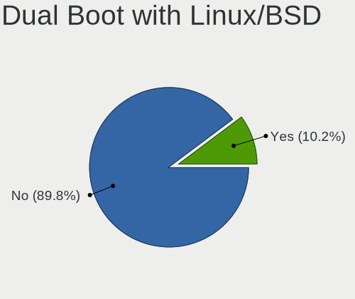
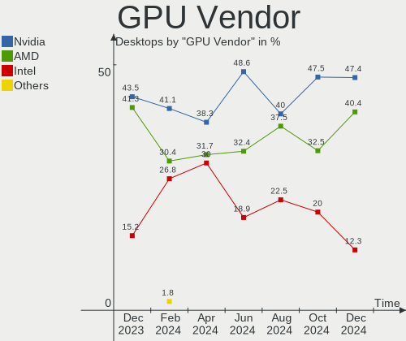
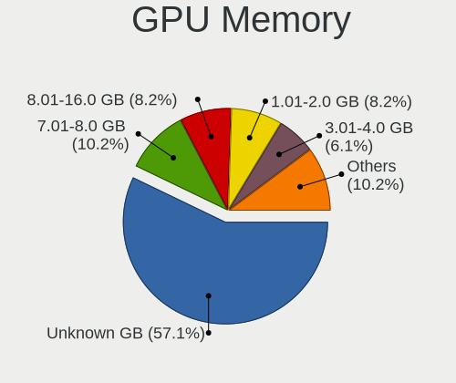

Kubuntu Hardware Trends (Desktops)
----------------------------------

A project to identify most popular hardware characteristics and track their change
over time based on data collected by Kubuntu users at https://Linux-Hardware.org.

Anyone can contribute to this report by the [hw-probe](https://github.com/linuxhw/hw-probe) tool:

    sudo -E hw-probe -all -upload

Full-feature report is available here: https://linux-hardware.org/?view=trends

Period: Mar, 2022.

Contents
--------

* [ System ](#system)
  - [ OS                       ](#os)
  - [ OS Family                ](#os-family)
  - [ Kernel                   ](#kernel)
  - [ Kernel Family            ](#kernel-family)
  - [ Kernel Major Ver.        ](#kernel-major-ver)
  - [ Arch                     ](#arch)
  - [ DE                       ](#de)
  - [ Display Server           ](#display-server)
  - [ Display Manager          ](#display-manager)
  - [ OS Lang                  ](#os-lang)
  - [ Boot Mode                ](#boot-mode)
  - [ Filesystem               ](#filesystem)
  - [ Part. scheme             ](#part-scheme)
  - [ Dual Boot with Linux/BSD ](#dual-boot-with-linuxbsd)
  - [ Dual Boot (Win)          ](#dual-boot-win)

* [ Board ](#board)
  - [ Vendor                   ](#vendor)
  - [ Model                    ](#model)
  - [ Model Family             ](#model-family)
  - [ MFG Year                 ](#mfg-year)
  - [ Form Factor              ](#form-factor)
  - [ Secure Boot              ](#secure-boot)
  - [ Coreboot                 ](#coreboot)
  - [ RAM Size                 ](#ram-size)
  - [ RAM Used                 ](#ram-used)
  - [ Total Drives             ](#total-drives)
  - [ Has CD-ROM               ](#has-cd-rom)
  - [ Has Ethernet             ](#has-ethernet)
  - [ Has WiFi                 ](#has-wifi)
  - [ Has Bluetooth            ](#has-bluetooth)

* [ Location ](#location)
  - [ Country                  ](#country)
  - [ City                     ](#city)

* [ Drives ](#drives)
  - [ Drive Vendor             ](#drive-vendor)
  - [ Drive Model              ](#drive-model)
  - [ HDD Vendor               ](#hdd-vendor)
  - [ SSD Vendor               ](#ssd-vendor)
  - [ Drive Kind               ](#drive-kind)
  - [ Drive Connector          ](#drive-connector)
  - [ Drive Size               ](#drive-size)
  - [ Space Total              ](#space-total)
  - [ Space Used               ](#space-used)
  - [ Malfunc. Drives          ](#malfunc-drives)
  - [ Malfunc. Drive Vendor    ](#malfunc-drive-vendor)
  - [ Malfunc. HDD Vendor      ](#malfunc-hdd-vendor)
  - [ Malfunc. Drive Kind      ](#malfunc-drive-kind)
  - [ Failed Drives            ](#failed-drives)
  - [ Failed Drive Vendor      ](#failed-drive-vendor)
  - [ Drive Status             ](#drive-status)

* [ Storage controller ](#storage-controller)
  - [ Storage Vendor           ](#storage-vendor)
  - [ Storage Model            ](#storage-model)
  - [ Storage Kind             ](#storage-kind)

* [ Processor ](#processor)
  - [ CPU Vendor               ](#cpu-vendor)
  - [ CPU Model                ](#cpu-model)
  - [ CPU Model Family         ](#cpu-model-family)
  - [ CPU Cores                ](#cpu-cores)
  - [ CPU Sockets              ](#cpu-sockets)
  - [ CPU Threads              ](#cpu-threads)
  - [ CPU Op-Modes             ](#cpu-op-modes)
  - [ CPU Microcode            ](#cpu-microcode)
  - [ CPU Microarch            ](#cpu-microarch)

* [ Graphics ](#graphics)
  - [ GPU Vendor               ](#gpu-vendor)
  - [ GPU Model                ](#gpu-model)
  - [ GPU Combo                ](#gpu-combo)
  - [ GPU Driver               ](#gpu-driver)
  - [ GPU Memory               ](#gpu-memory)

* [ Monitor ](#monitor)
  - [ Monitor Vendor           ](#monitor-vendor)
  - [ Monitor Model            ](#monitor-model)
  - [ Monitor Resolution       ](#monitor-resolution)
  - [ Monitor Diagonal         ](#monitor-diagonal)
  - [ Monitor Width            ](#monitor-width)
  - [ Aspect Ratio             ](#aspect-ratio)
  - [ Monitor Area             ](#monitor-area)
  - [ Pixel Density            ](#pixel-density)
  - [ Multiple Monitors        ](#multiple-monitors)

* [ Network ](#network)
  - [ Net Controller Vendor    ](#net-controller-vendor)
  - [ Net Controller Model     ](#net-controller-model)
  - [ Wireless Vendor          ](#wireless-vendor)
  - [ Wireless Model           ](#wireless-model)
  - [ Ethernet Vendor          ](#ethernet-vendor)
  - [ Ethernet Model           ](#ethernet-model)
  - [ Net Controller Kind      ](#net-controller-kind)
  - [ Used Controller          ](#used-controller)
  - [ NICs                     ](#nics)
  - [ IPv6                     ](#ipv6)

* [ Bluetooth ](#bluetooth)
  - [ Bluetooth Vendor         ](#bluetooth-vendor)
  - [ Bluetooth Model          ](#bluetooth-model)

* [ Sound ](#sound)
  - [ Sound Vendor             ](#sound-vendor)
  - [ Sound Model              ](#sound-model)

* [ Memory ](#memory)
  - [ Memory Vendor            ](#memory-vendor)
  - [ Memory Model             ](#memory-model)
  - [ Memory Kind              ](#memory-kind)
  - [ Memory Form Factor       ](#memory-form-factor)
  - [ Memory Size              ](#memory-size)
  - [ Memory Speed             ](#memory-speed)

* [ Printers & scanners ](#printers--scanners)
  - [ Printer Vendor           ](#printer-vendor)
  - [ Printer Model            ](#printer-model)
  - [ Scanner Vendor           ](#scanner-vendor)
  - [ Scanner Model            ](#scanner-model)

* [ Camera ](#camera)
  - [ Camera Vendor            ](#camera-vendor)
  - [ Camera Model             ](#camera-model)

* [ Security ](#security)
  - [ Fingerprint Vendor       ](#fingerprint-vendor)
  - [ Fingerprint Model        ](#fingerprint-model)
  - [ Chipcard Vendor          ](#chipcard-vendor)
  - [ Chipcard Model           ](#chipcard-model)

* [ Unsupported ](#unsupported)
  - [ Unsupported Devices      ](#unsupported-devices)
  - [ Unsupported Device Types ](#unsupported-device-types)

System
------

OS
--

Installed operating systems

| Name          | Desktops | Percent |
|---------------|----------|---------|
| Kubuntu 20.04 | 12       | 35.29%  |
| Kubuntu 21.10 | 10       | 29.41%  |
| Kubuntu 11    | 5        | 14.71%  |
| Kubuntu 22.04 | 2        | 5.88%   |
| Kubuntu 21.04 | 2        | 5.88%   |
| Kubuntu 2.0   | 1        | 2.94%   |
| Kubuntu 18.04 | 1        | 2.94%   |
| Kubuntu 12.04 | 1        | 2.94%   |

OS Family
---------

OS without a version

| Name    | Desktops | Percent |
|---------|----------|---------|
| Kubuntu | 34       | 100%    |

Kernel
------

Version of the Linux kernel

| Version                   | Desktops | Percent |
|---------------------------|----------|---------|
| 5.13.0-35-generic         | 10       | 29.41%  |
| 5.13.0-30-generic         | 4        | 11.76%  |
| 5.13.0-37-generic         | 3        | 8.82%   |
| 5.4.0-105-generic         | 2        | 5.88%   |
| 5.4.0-100-generic         | 2        | 5.88%   |
| 5.11.0-49-generic         | 2        | 5.88%   |
| 5.4.0-52-generic          | 1        | 2.94%   |
| 5.4.0-42-generic          | 1        | 2.94%   |
| 5.4.0-104-generic         | 1        | 2.94%   |
| 5.17.0-051700-generic     | 1        | 2.94%   |
| 5.15.29-051529-generic    | 1        | 2.94%   |
| 5.15.0-18-generic         | 1        | 2.94%   |
| 5.13.0-39-generic         | 1        | 2.94%   |
| 5.13.0-28-generic         | 1        | 2.94%   |
| 5.10.86-051086-lowlatency | 1        | 2.94%   |
| 4.15.0-171-generic        | 1        | 2.94%   |
| 3.13.0-117-generic        | 1        | 2.94%   |

Kernel Family
-------------

Linux kernel without a distro release

| Version | Desktops | Percent |
|---------|----------|---------|
| 5.13.0  | 19       | 55.88%  |
| 5.4.0   | 7        | 20.59%  |
| 5.11.0  | 2        | 5.88%   |
| 5.17.0  | 1        | 2.94%   |
| 5.15.29 | 1        | 2.94%   |
| 5.15.0  | 1        | 2.94%   |
| 5.10.86 | 1        | 2.94%   |
| 4.15.0  | 1        | 2.94%   |
| 3.13.0  | 1        | 2.94%   |

Kernel Major Ver.
-----------------

Linux kernel major version

| Version | Desktops | Percent |
|---------|----------|---------|
| 5.13    | 19       | 55.88%  |
| 5.4     | 7        | 20.59%  |
| 5.15    | 2        | 5.88%   |
| 5.11    | 2        | 5.88%   |
| 5.17    | 1        | 2.94%   |
| 5.10    | 1        | 2.94%   |
| 4.15    | 1        | 2.94%   |
| 3.13    | 1        | 2.94%   |

Arch
----

OS architecture (x86_64, i586, etc.)

| Name   | Desktops | Percent |
|--------|----------|---------|
| x86_64 | 34       | 100%    |

DE
--

Desktop Environment

| Name | Desktops | Percent |
|------|----------|---------|
| KDE5 | 32       | 94.12%  |
| XFCE | 1        | 2.94%   |
| KDE4 | 1        | 2.94%   |

Display Server
--------------

X11 or Wayland

| Name    | Desktops | Percent |
|---------|----------|---------|
| X11     | 33       | 97.06%  |
| Wayland | 1        | 2.94%   |

Display Manager
---------------

SDDM, LightDM, etc.

| Name    | Desktops | Percent |
|---------|----------|---------|
| SDDM    | 21       | 61.76%  |
| Unknown | 10       | 29.41%  |
| LightDM | 3        | 8.82%   |

OS Lang
-------

Language

| Lang  | Desktops | Percent |
|-------|----------|---------|
| en_US | 13       | 38.24%  |
| en_GB | 3        | 8.82%   |
| ru_RU | 2        | 5.88%   |
| it_IT | 2        | 5.88%   |
| fr_FR | 2        | 5.88%   |
| tr_TR | 1        | 2.94%   |
| sv_SE | 1        | 2.94%   |
| sr_RS | 1        | 2.94%   |
| pl_PL | 1        | 2.94%   |
| hu_HU | 1        | 2.94%   |
| hr_HR | 1        | 2.94%   |
| fr_DZ | 1        | 2.94%   |
| es_MX | 1        | 2.94%   |
| en_IL | 1        | 2.94%   |
| en_CA | 1        | 2.94%   |
| de_DE | 1        | 2.94%   |
| C     | 1        | 2.94%   |

Boot Mode
---------

EFI or BIOS

| Mode | Desktops | Percent |
|------|----------|---------|
| BIOS | 20       | 58.82%  |
| EFI  | 14       | 41.18%  |

Filesystem
----------

Type of filesystem

| Type    | Desktops | Percent |
|---------|----------|---------|
| Ext4    | 31       | 91.18%  |
| Xfs     | 1        | 2.94%   |
| Overlay | 1        | 2.94%   |
| Btrfs   | 1        | 2.94%   |

Part. scheme
------------

Scheme of partitioning

| Type    | Desktops | Percent |
|---------|----------|---------|
| Unknown | 20       | 58.82%  |
| GPT     | 12       | 35.29%  |
| MBR     | 2        | 5.88%   |

Dual Boot with Linux/BSD
------------------------

Hosting more than one Linux/BSD

| Dual boot | Desktops | Percent |
|-----------|----------|---------|
| No        | 27       | 79.41%  |
| Yes       | 7        | 20.59%  |

Dual Boot (Win)
---------------

Hosting Linux and Windows

| Dual boot | Desktops | Percent |
|-----------|----------|---------|
| No        | 20       | 58.82%  |
| Yes       | 14       | 41.18%  |

Board
-----

Vendor
------

Motherboard manufacturer

| Name                | Desktops | Percent |
|---------------------|----------|---------|
| ASUSTek Computer    | 6        | 17.65%  |
| MSI                 | 5        | 14.71%  |
| Gigabyte Technology | 5        | 14.71%  |
| Dell                | 5        | 14.71%  |
| Hewlett-Packard     | 4        | 11.76%  |
| ASRock              | 4        | 11.76%  |
| Pegatron            | 1        | 2.94%   |
| Packard Bell        | 1        | 2.94%   |
| Lenovo              | 1        | 2.94%   |
| Intel               | 1        | 2.94%   |
| Foxconn             | 1        | 2.94%   |

Model
-----

Motherboard model

| Name                                       | Desktops | Percent |
|--------------------------------------------|----------|---------|
| Pegatron TouchSmart 7320 Lavaca-B EU L6 PC | 1        | 2.94%   |
| Packard Bell IMEDIA S2885                  | 1        | 2.94%   |
| MSI MS-7C36                                | 1        | 2.94%   |
| MSI MS-7B89                                | 1        | 2.94%   |
| MSI MS-7817                                | 1        | 2.94%   |
| MSI MS-7721                                | 1        | 2.94%   |
| MSI dx5150 SFF                             | 1        | 2.94%   |
| Lenovo ThinkCentre Edge72 3484BTG          | 1        | 2.94%   |
| Intel DP965LT AAD41694-206                 | 1        | 2.94%   |
| HP Z440 Workstation                        | 1        | 2.94%   |
| HP Z420 Workstation                        | 1        | 2.94%   |
| HP ProDesk 600 G2 SFF                      | 1        | 2.94%   |
| HP OMEN by Desktop PC 870-2XX              | 1        | 2.94%   |
| Gigabyte Z590 AORUS PRO AX                 | 1        | 2.94%   |
| Gigabyte X570 AORUS PRO WIFI               | 1        | 2.94%   |
| Gigabyte B75M-HD3                          | 1        | 2.94%   |
| Gigabyte B450 AORUS M                      | 1        | 2.94%   |
| Gigabyte A320M-S2H V2                      | 1        | 2.94%   |
| Foxconn G41MXE/G41MXE-K                    | 1        | 2.94%   |
| Dell Precision WorkStation T5400           | 1        | 2.94%   |
| Dell Precision Tower 5810                  | 1        | 2.94%   |
| Dell Precision T7610                       | 1        | 2.94%   |
| Dell OptiPlex 9020                         | 1        | 2.94%   |
| Dell Inspiron 531s                         | 1        | 2.94%   |
| ASUS STRIX Z270E GAMING                    | 1        | 2.94%   |
| ASUS ROG STRIX X570-E GAMING WIFI II       | 1        | 2.94%   |
| ASUS ROG Maximus XII FORMULA               | 1        | 2.94%   |
| ASUS PRIME B460-PLUS                       | 1        | 2.94%   |
| ASUS P8B75-M                               | 1        | 2.94%   |
| ASUS All Series                            | 1        | 2.94%   |
| ASRock T6010                               | 1        | 2.94%   |
| ASRock FM2A75 Pro4+                        | 1        | 2.94%   |
| ASRock B360 Gaming K4                      | 1        | 2.94%   |
| ASRock 990FX Killer                        | 1        | 2.94%   |

Model Family
------------

Motherboard model prefix

| Name                | Desktops | Percent |
|---------------------|----------|---------|
| Dell Precision      | 3        | 8.82%   |
| ASUS ROG            | 2        | 5.88%   |
| Pegatron TouchSmart | 1        | 2.94%   |
| Packard Bell IMEDIA | 1        | 2.94%   |
| MSI MS-7C36         | 1        | 2.94%   |
| MSI MS-7B89         | 1        | 2.94%   |
| MSI MS-7817         | 1        | 2.94%   |
| MSI MS-7721         | 1        | 2.94%   |
| MSI dx5150          | 1        | 2.94%   |
| Lenovo ThinkCentre  | 1        | 2.94%   |
| Intel DP965LT       | 1        | 2.94%   |
| HP Z440             | 1        | 2.94%   |
| HP Z420             | 1        | 2.94%   |
| HP ProDesk          | 1        | 2.94%   |
| HP OMEN             | 1        | 2.94%   |
| Gigabyte Z590       | 1        | 2.94%   |
| Gigabyte X570       | 1        | 2.94%   |
| Gigabyte B75M-HD3   | 1        | 2.94%   |
| Gigabyte B450       | 1        | 2.94%   |
| Gigabyte A320M-S2H  | 1        | 2.94%   |
| Foxconn G41MXE      | 1        | 2.94%   |
| Dell OptiPlex       | 1        | 2.94%   |
| Dell Inspiron       | 1        | 2.94%   |
| ASUS STRIX          | 1        | 2.94%   |
| ASUS PRIME          | 1        | 2.94%   |
| ASUS P8B75-M        | 1        | 2.94%   |
| ASUS All            | 1        | 2.94%   |
| ASRock T6010        | 1        | 2.94%   |
| ASRock FM2A75       | 1        | 2.94%   |
| ASRock B360         | 1        | 2.94%   |
| ASRock 990FX        | 1        | 2.94%   |

MFG Year
--------

Motherboard manufacture year

| Year | Desktops | Percent |
|------|----------|---------|
| 2018 | 5        | 14.71%  |
| 2014 | 5        | 14.71%  |
| 2015 | 4        | 11.76%  |
| 2021 | 3        | 8.82%   |
| 2013 | 3        | 8.82%   |
| 2012 | 3        | 8.82%   |
| 2020 | 2        | 5.88%   |
| 2019 | 2        | 5.88%   |
| 2006 | 2        | 5.88%   |
| 2016 | 1        | 2.94%   |
| 2011 | 1        | 2.94%   |
| 2010 | 1        | 2.94%   |
| 2008 | 1        | 2.94%   |
| 2007 | 1        | 2.94%   |

Form Factor
-----------

Physical design of the computer

| Name    | Desktops | Percent |
|---------|----------|---------|
| Desktop | 34       | 100%    |

Secure Boot
-----------

Enabled or disabled

| State    | Desktops | Percent |
|----------|----------|---------|
| Disabled | 32       | 94.12%  |
| Enabled  | 2        | 5.88%   |

Coreboot
--------

Have coreboot on board

| Used | Desktops | Percent |
|------|----------|---------|
| No   | 34       | 100%    |

RAM Size
--------

Total RAM memory

| Size in GB  | Desktops | Percent |
|-------------|----------|---------|
| 16.01-24.0  | 13       | 38.24%  |
| 32.01-64.0  | 6        | 17.65%  |
| 4.01-8.0    | 5        | 14.71%  |
| 64.01-256.0 | 3        | 8.82%   |
| 8.01-16.0   | 3        | 8.82%   |
| 3.01-4.0    | 2        | 5.88%   |
| 24.01-32.0  | 1        | 2.94%   |
| 2.01-3.0    | 1        | 2.94%   |

RAM Used
--------

Used RAM memory

| Used GB    | Desktops | Percent |
|------------|----------|---------|
| 3.01-4.0   | 11       | 32.35%  |
| 1.01-2.0   | 9        | 26.47%  |
| 4.01-8.0   | 5        | 14.71%  |
| 2.01-3.0   | 4        | 11.76%  |
| 24.01-32.0 | 2        | 5.88%   |
| 8.01-16.0  | 2        | 5.88%   |
| Unknown    | 1        | 2.94%   |

Total Drives
------------

Number of drives on board

| Drives | Desktops | Percent |
|--------|----------|---------|
| 2      | 11       | 32.35%  |
| 1      | 8        | 23.53%  |
| 4      | 6        | 17.65%  |
| 3      | 5        | 14.71%  |
| 5      | 3        | 8.82%   |
| 12     | 1        | 2.94%   |

Has CD-ROM
----------

Has CD-ROM on board

| Presented | Desktops | Percent |
|-----------|----------|---------|
| No        | 19       | 55.88%  |
| Yes       | 15       | 44.12%  |

Has Ethernet
------------

Has Ethernet on board

| Presented | Desktops | Percent |
|-----------|----------|---------|
| Yes       | 34       | 100%    |

Has WiFi
--------

Has WiFi module

| Presented | Desktops | Percent |
|-----------|----------|---------|
| Yes       | 19       | 55.88%  |
| No        | 15       | 44.12%  |

Has Bluetooth
-------------

Has Bluetooth module

| Presented | Desktops | Percent |
|-----------|----------|---------|
| No        | 24       | 70.59%  |
| Yes       | 10       | 29.41%  |

Location
--------

Country
-------

Geographic location (country)

| Country      | Desktops | Percent |
|--------------|----------|---------|
| USA          | 10       | 29.41%  |
| Italy        | 3        | 8.82%   |
| UK           | 2        | 5.88%   |
| Turkey       | 2        | 5.88%   |
| Russia       | 2        | 5.88%   |
| Germany      | 2        | 5.88%   |
| France       | 2        | 5.88%   |
| Sweden       | 1        | 2.94%   |
| Serbia       | 1        | 2.94%   |
| Saudi Arabia | 1        | 2.94%   |
| Poland       | 1        | 2.94%   |
| Mexico       | 1        | 2.94%   |
| Israel       | 1        | 2.94%   |
| Hungary      | 1        | 2.94%   |
| Greece       | 1        | 2.94%   |
| Croatia      | 1        | 2.94%   |
| Canada       | 1        | 2.94%   |
| Algeria      | 1        | 2.94%   |

City
----

Geographic location (city)

| City          | Desktops | Percent |
|---------------|----------|---------|
| Moscow        | 2        | 5.88%   |
| Zagreb        | 1        | 2.94%   |
| Warsaw        | 1        | 2.94%   |
| Sparks        | 1        | 2.94%   |
| Savannah      | 1        | 2.94%   |
| Saint-Jerome  | 1        | 2.94%   |
| Rozzano       | 1        | 2.94%   |
| Ringwood      | 1        | 2.94%   |
| Ponchatoula   | 1        | 2.94%   |
| Plymouth      | 1        | 2.94%   |
| Pátrai       | 1        | 2.94%   |
| Paris         | 1        | 2.94%   |
| Oran          | 1        | 2.94%   |
| Newton        | 1        | 2.94%   |
| Milan         | 1        | 2.94%   |
| Mexico City   | 1        | 2.94%   |
| Marseille     | 1        | 2.94%   |
| La Vergne     | 1        | 2.94%   |
| Kamenz        | 1        | 2.94%   |
| İzmit        | 1        | 2.94%   |
| Hyattsville   | 1        | 2.94%   |
| Herzliya      | 1        | 2.94%   |
| Gross-Umstadt | 1        | 2.94%   |
| Gothenburg    | 1        | 2.94%   |
| Gladstone     | 1        | 2.94%   |
| Fort Dodge    | 1        | 2.94%   |
| Fano          | 1        | 2.94%   |
| Budakeszi     | 1        | 2.94%   |
| Belgrade      | 1        | 2.94%   |
| Balıkesir    | 1        | 2.94%   |
| Aurora        | 1        | 2.94%   |
| Albuquerque   | 1        | 2.94%   |
| Al Qatif      | 1        | 2.94%   |

Drives
------

Drive Vendor
------------

Hard drive vendors

| Vendor              | Desktops | Drives | Percent |
|---------------------|----------|--------|---------|
| WDC                 | 18       | 37     | 25.71%  |
| Samsung Electronics | 13       | 16     | 18.57%  |
| Seagate             | 12       | 14     | 17.14%  |
| Kingston            | 8        | 8      | 11.43%  |
| Toshiba             | 5        | 7      | 7.14%   |
| HGST                | 3        | 2      | 4.29%   |
| A-DATA Technology   | 2        | 2      | 2.86%   |
| Unknown             | 1        | 1      | 1.43%   |
| Team                | 1        | 1      | 1.43%   |
| sage                | 1        | 1      | 1.43%   |
| PNY                 | 1        | 1      | 1.43%   |
| Phison              | 1        | 1      | 1.43%   |
| MAXTOR              | 1        | 1      | 1.43%   |
| Hitachi             | 1        | 1      | 1.43%   |
| Hewlett-Packard     | 1        | 1      | 1.43%   |
| Fujitsu             | 1        | 1      | 1.43%   |

Drive Model
-----------

Hard drive models

| Model                              | Desktops | Percent |
|------------------------------------|----------|---------|
| WDC WD10EZEX-60WN4A0 1TB           | 2        | 2.27%   |
| WDC WDS500G2B0A-00SM50 500GB SSD   | 1        | 1.14%   |
| WDC WDBNCE5000PNC 500GB SSD        | 1        | 1.14%   |
| WDC WD800JD-75MSA3 80GB            | 1        | 1.14%   |
| WDC WD6401AALS-22A7B2 640GB        | 1        | 1.14%   |
| WDC WD5000AVJS-63TRA0 500GB        | 1        | 1.14%   |
| WDC WD5000AADS-67S9B1 500GB        | 1        | 1.14%   |
| WDC WD5000AADS-00S9B0 500GB        | 1        | 1.14%   |
| WDC WD40EMRX-82UZ0N0 4TB           | 1        | 1.14%   |
| WDC WD4003FZEX-00Z4SA0 4TB         | 1        | 1.14%   |
| WDC WD3200JD-22KLB0 320GB          | 1        | 1.14%   |
| WDC WD3200AAKX-22ERMA0 320GB       | 1        | 1.14%   |
| WDC WD3200AAKX-00ERMA0 320GB       | 1        | 1.14%   |
| WDC WD3200AAJS-00L7A0 320GB        | 1        | 1.14%   |
| WDC WD3200AAJB-56R1A0 320GB        | 1        | 1.14%   |
| WDC WD30EZRX-00MMMB0 3TB           | 1        | 1.14%   |
| WDC WD30EZRX-00D 3TB               | 1        | 1.14%   |
| WDC WD30EZRS-11J99B1 3TB           | 1        | 1.14%   |
| WDC WD20EZRZ-00Z5HB0 2TB           | 1        | 1.14%   |
| WDC WD20EFRX-68EUZN0 2TB           | 1        | 1.14%   |
| WDC WD20EARX-00PASB0 2TB           | 1        | 1.14%   |
| WDC WD2003FYYS-02W0B0 2TB          | 1        | 1.14%   |
| WDC WD10JPVX-75JC3T0 1TB           | 1        | 1.14%   |
| WDC WD10EZEX-21M2NA0 1TB           | 1        | 1.14%   |
| WDC WD10EZEX-00BN5A0 1TB           | 1        | 1.14%   |
| WDC WD10EACS-65D6B0 1TB            | 1        | 1.14%   |
| WDC WD10EACS-32ZJB0 1TB            | 1        | 1.14%   |
| WDC WD10EACS-00ZJB0 1TB            | 1        | 1.14%   |
| WDC WD10EACS-00C7B0 1TB            | 1        | 1.14%   |
| WDC WD1003FZEX-00MK2A0 1TB         | 1        | 1.14%   |
| WDC WD1003FZEX-00K3CA0 1TB         | 1        | 1.14%   |
| WDC WD1001FALS-40U9B0 1TB          | 1        | 1.14%   |
| Unknown SU32G  32GB                | 1        | 1.14%   |
| Toshiba MQ04ABF100 1TB             | 1        | 1.14%   |
| Toshiba MQ01ABD100 1TB             | 1        | 1.14%   |
| Toshiba MK7575GSX 752GB            | 1        | 1.14%   |
| Toshiba MK3261GSYN 320GB           | 1        | 1.14%   |
| Toshiba HDWJ110 1TB                | 1        | 1.14%   |
| Toshiba HDWD240 4TB                | 1        | 1.14%   |
| Toshiba HDWD130 3TB                | 1        | 1.14%   |
| Team T253X6001T 1TB SSD            | 1        | 1.14%   |
| Seagate ST9500325AS 500GB          | 1        | 1.14%   |
| Seagate ST8000DM004-2U9188 8TB     | 1        | 1.14%   |
| Seagate ST6000VN0033-2EE110 6TB    | 1        | 1.14%   |
| Seagate ST500VT001-1K6142 500GB    | 1        | 1.14%   |
| Seagate ST500DM002-1BD142 500GB    | 1        | 1.14%   |
| Seagate ST3500413AS 500GB          | 1        | 1.14%   |
| Seagate ST31000528AS 1TB           | 1        | 1.14%   |
| Seagate ST1000LM024 HN-M101MBB 1TB | 1        | 1.14%   |
| Seagate ST1000DM010-2EP102 1TB     | 1        | 1.14%   |
| Seagate Portable 5TB               | 1        | 1.14%   |
| Seagate FreeAgent XTreme 500GB     | 1        | 1.14%   |
| Seagate Expansion 320GB            | 1        | 1.14%   |
| Samsung SSD 870 QVO 2TB            | 1        | 1.14%   |
| Samsung SSD 860 QVO 1TB            | 1        | 1.14%   |
| Samsung SSD 860 EVO 500GB          | 1        | 1.14%   |
| Samsung SSD 860 EVO 250GB          | 1        | 1.14%   |
| Samsung SSD 850 EVO M.2 500GB      | 1        | 1.14%   |
| Samsung SSD 850 EVO 500GB          | 1        | 1.14%   |
| Samsung SSD 850 EVO 250GB          | 1        | 1.14%   |

HDD Vendor
----------

Hard disk drive vendors

| Vendor              | Desktops | Drives | Percent |
|---------------------|----------|--------|---------|
| WDC                 | 17       | 35     | 37.78%  |
| Seagate             | 11       | 13     | 24.44%  |
| Toshiba             | 5        | 7      | 11.11%  |
| Samsung Electronics | 4        | 4      | 8.89%   |
| HGST                | 3        | 2      | 6.67%   |
| sage                | 1        | 1      | 2.22%   |
| MAXTOR              | 1        | 1      | 2.22%   |
| Hitachi             | 1        | 1      | 2.22%   |
| Hewlett-Packard     | 1        | 1      | 2.22%   |
| Fujitsu             | 1        | 1      | 2.22%   |

SSD Vendor
----------

Solid state drive vendors

| Vendor              | Desktops | Drives | Percent |
|---------------------|----------|--------|---------|
| Samsung Electronics | 7        | 10     | 36.84%  |
| Kingston            | 6        | 6      | 31.58%  |
| WDC                 | 2        | 2      | 10.53%  |
| A-DATA Technology   | 2        | 2      | 10.53%  |
| Team                | 1        | 1      | 5.26%   |
| PNY                 | 1        | 1      | 5.26%   |

Drive Kind
----------

HDD or SSD

| Kind    | Desktops | Drives | Percent |
|---------|----------|--------|---------|
| HDD     | 27       | 66     | 52.94%  |
| SSD     | 17       | 22     | 33.33%  |
| NVMe    | 5        | 5      | 9.8%    |
| MMC     | 1        | 1      | 1.96%   |
| Unknown | 1        | 1      | 1.96%   |

Drive Connector
---------------

SATA, SAS, NVMe, etc.

| Type | Desktops | Drives | Percent |
|------|----------|--------|---------|
| SATA | 32       | 84     | 80%     |
| NVMe | 5        | 5      | 12.5%   |
| SAS  | 2        | 5      | 5%      |
| MMC  | 1        | 1      | 2.5%    |

Drive Size
----------

Size of hard drive

| Size in TB | Desktops | Drives | Percent |
|------------|----------|--------|---------|
| 0.01-0.5   | 25       | 43     | 44.64%  |
| 0.51-1.0   | 16       | 26     | 28.57%  |
| 1.01-2.0   | 7        | 9      | 12.5%   |
| 3.01-4.0   | 3        | 4      | 5.36%   |
| 2.01-3.0   | 3        | 4      | 5.36%   |
| 4.01-10.0  | 2        | 2      | 3.57%   |

Space Total
-----------

Amount of disk space available on the file system

| Size in GB     | Desktops | Percent |
|----------------|----------|---------|
| More than 3000 | 8        | 23.53%  |
| 251-500        | 6        | 17.65%  |
| 1001-2000      | 6        | 17.65%  |
| 501-1000       | 4        | 11.76%  |
| 2001-3000      | 3        | 8.82%   |
| 101-250        | 3        | 8.82%   |
| 21-50          | 1        | 2.94%   |
| 1-20           | 1        | 2.94%   |
| 51-100         | 1        | 2.94%   |
| Unknown        | 1        | 2.94%   |

Space Used
----------

Amount of used disk space

| Used GB        | Desktops | Percent |
|----------------|----------|---------|
| 21-50          | 7        | 20.59%  |
| 1001-2000      | 5        | 14.71%  |
| 501-1000       | 5        | 14.71%  |
| More than 3000 | 4        | 11.76%  |
| 101-250        | 4        | 11.76%  |
| 1-20           | 4        | 11.76%  |
| 251-500        | 3        | 8.82%   |
| 51-100         | 1        | 2.94%   |
| Unknown        | 1        | 2.94%   |

Malfunc. Drives
---------------

Drive models with a malfunction

| Model                             | Desktops | Drives | Percent |
|-----------------------------------|----------|--------|---------|
| WDC WD4003FZEX-00Z4SA0 4TB        | 1        | 2      | 11.11%  |
| WDC WD3200JD-22KLB0 320GB         | 1        | 1      | 11.11%  |
| WDC WD3200AAJB-56R1A0 320GB       | 1        | 1      | 11.11%  |
| WDC WD20EFRX-68EUZN0 2TB          | 1        | 2      | 11.11%  |
| WDC WD10EZEX-21M2NA0 1TB          | 1        | 1      | 11.11%  |
| WDC WD1001FALS-40U9B0 1TB         | 1        | 1      | 11.11%  |
| Seagate ST9500325AS 500GB         | 1        | 1      | 11.11%  |
| Samsung Electronics HM160HI 160GB | 1        | 1      | 11.11%  |
| Fujitsu MHV2060BH PL 64GB         | 1        | 1      | 11.11%  |

Malfunc. Drive Vendor
---------------------

Vendors of faulty drives

| Vendor              | Desktops | Drives | Percent |
|---------------------|----------|--------|---------|
| WDC                 | 4        | 8      | 57.14%  |
| Seagate             | 1        | 1      | 14.29%  |
| Samsung Electronics | 1        | 1      | 14.29%  |
| Fujitsu             | 1        | 1      | 14.29%  |

Malfunc. HDD Vendor
-------------------

Vendors of faulty HDD drives

| Vendor              | Desktops | Drives | Percent |
|---------------------|----------|--------|---------|
| WDC                 | 4        | 8      | 57.14%  |
| Seagate             | 1        | 1      | 14.29%  |
| Samsung Electronics | 1        | 1      | 14.29%  |
| Fujitsu             | 1        | 1      | 14.29%  |

Malfunc. Drive Kind
-------------------

Kinds of faulty drives

| Kind | Desktops | Drives | Percent |
|------|----------|--------|---------|
| HDD  | 5        | 11     | 100%    |

Failed Drives
-------------

Failed drive models

Zero info for selected period =(

Failed Drive Vendor
-------------------

Failed drive vendors

Zero info for selected period =(

Drive Status
------------

Number of failed and malfunc. drives

| Status   | Desktops | Drives | Percent |
|----------|----------|--------|---------|
| Detected | 20       | 49     | 51.28%  |
| Works    | 14       | 35     | 35.9%   |
| Malfunc  | 5        | 11     | 12.82%  |

Storage controller
------------------

Storage Vendor
--------------

Storage controller vendors

| Vendor                      | Desktops | Percent |
|-----------------------------|----------|---------|
| Intel                       | 22       | 50%     |
| AMD                         | 10       | 22.73%  |
| Marvell Technology Group    | 3        | 6.82%   |
| Samsung Electronics         | 2        | 4.55%   |
| Kingston Technology Company | 2        | 4.55%   |
| Phison Electronics          | 1        | 2.27%   |
| Nvidia                      | 1        | 2.27%   |
| JMicron Technology          | 1        | 2.27%   |
| Broadcom / LSI              | 1        | 2.27%   |
| ASMedia Technology          | 1        | 2.27%   |

Storage Model
-------------

Storage controller models

| Model                                                                          | Desktops | Percent |
|--------------------------------------------------------------------------------|----------|---------|
| AMD FCH SATA Controller [AHCI mode]                                            | 8        | 13.33%  |
| Intel 8 Series/C220 Series Chipset Family 6-port SATA Controller 1 [AHCI mode] | 4        | 6.67%   |
| Samsung NVMe SSD Controller SM981/PM981/PM983                                  | 2        | 3.33%   |
| Kingston Company A2000 NVMe SSD                                                | 2        | 3.33%   |
| Intel Q170/Q150/B150/H170/H110/Z170/CM236 Chipset SATA Controller [AHCI Mode]  | 2        | 3.33%   |
| Intel C610/X99 series chipset sSATA Controller [AHCI mode]                     | 2        | 3.33%   |
| Intel C610/X99 series chipset 6-Port SATA Controller [AHCI mode]               | 2        | 3.33%   |
| Intel C600/X79 series chipset IDE-r Controller                                 | 2        | 3.33%   |
| Intel 7 Series/C210 Series Chipset Family 4-port SATA Controller [IDE mode]    | 2        | 3.33%   |
| Intel 7 Series/C210 Series Chipset Family 2-port SATA Controller [IDE mode]    | 2        | 3.33%   |
| Intel 6 Series/C200 Series Chipset Family 6 port Desktop SATA AHCI Controller  | 2        | 3.33%   |
| AMD 400 Series Chipset SATA Controller                                         | 2        | 3.33%   |
| Phison E12 NVMe Controller                                                     | 1        | 1.67%   |
| Nvidia MCP61 SATA Controller                                                   | 1        | 1.67%   |
| Nvidia MCP61 IDE                                                               | 1        | 1.67%   |
| Marvell Group 88SE9172 SATA 6Gb/s Controller                                   | 1        | 1.67%   |
| Marvell Group 88SE9128 PCIe SATA 6 Gb/s RAID controller                        | 1        | 1.67%   |
| Marvell Group 88SE6101/6102 single-port PATA133 interface                      | 1        | 1.67%   |
| JMicron JMB368 IDE controller                                                  | 1        | 1.67%   |
| JMicron JMB363 SATA/IDE Controller                                             | 1        | 1.67%   |
| Intel NM10/ICH7 Family SATA Controller [IDE mode]                              | 1        | 1.67%   |
| Intel Cannon Lake PCH SATA AHCI Controller                                     | 1        | 1.67%   |
| Intel C602 chipset 4-Port SATA Storage Control Unit                            | 1        | 1.67%   |
| Intel C600/X79 series chipset SATA RAID Controller                             | 1        | 1.67%   |
| Intel C600/X79 series chipset 6-Port SATA AHCI Controller                      | 1        | 1.67%   |
| Intel 9 Series Chipset Family SATA Controller [AHCI Mode]                      | 1        | 1.67%   |
| Intel 82801HB (ICH8) 4 port SATA Controller [AHCI mode]                        | 1        | 1.67%   |
| Intel 82801G (ICH7 Family) IDE Controller                                      | 1        | 1.67%   |
| Intel 631xESB/632xESB SATA AHCI Controller                                     | 1        | 1.67%   |
| Intel 631xESB/632xESB IDE Controller                                           | 1        | 1.67%   |
| Intel 500 Series Chipset Family SATA AHCI Controller                           | 1        | 1.67%   |
| Intel 400 Series Chipset Family SATA AHCI Controller                           | 1        | 1.67%   |
| Intel 200 Series PCH SATA controller [AHCI mode]                               | 1        | 1.67%   |
| Broadcom / LSI SAS2308 PCI-Express Fusion-MPT SAS-2                            | 1        | 1.67%   |
| ASMedia ASM1062 Serial ATA Controller                                          | 1        | 1.67%   |
| AMD SB7x0/SB8x0/SB9x0 SATA Controller [AHCI mode]                              | 1        | 1.67%   |
| AMD SB7x0/SB8x0/SB9x0 IDE Controller                                           | 1        | 1.67%   |
| AMD IXP SB4x0 Serial ATA Controller                                            | 1        | 1.67%   |
| AMD IXP SB4x0 IDE Controller                                                   | 1        | 1.67%   |
| AMD 300 Series Chipset SATA Controller                                         | 1        | 1.67%   |

Storage Kind
------------

Kind of storage controller (IDE, SATA, NVMe, SAS, ...)

| Kind | Desktops | Percent |
|------|----------|---------|
| SATA | 27       | 58.7%   |
| IDE  | 11       | 23.91%  |
| NVMe | 5        | 10.87%  |
| SAS  | 2        | 4.35%   |
| RAID | 1        | 2.17%   |

Processor
---------

CPU Vendor
----------

Processor vendors

| Vendor | Desktops | Percent |
|--------|----------|---------|
| Intel  | 23       | 67.65%  |
| AMD    | 11       | 32.35%  |

CPU Model
---------

Processor models

| Model                                       | Desktops | Percent |
|---------------------------------------------|----------|---------|
| Intel Xeon CPU E5-1620 v3 @ 3.50GHz         | 2        | 5.88%   |
| Intel Core i5-4460 CPU @ 3.20GHz            | 2        | 5.88%   |
| AMD Ryzen 9 3900X 12-Core Processor         | 2        | 5.88%   |
| Intel Xeon CPU X5450 @ 3.00GHz              | 1        | 2.94%   |
| Intel Xeon CPU E5-2643 0 @ 3.30GHz          | 1        | 2.94%   |
| Intel Xeon CPU E5-1650 v2 @ 3.50GHz         | 1        | 2.94%   |
| Intel Pentium Dual-Core CPU E5500 @ 2.80GHz | 1        | 2.94%   |
| Intel Pentium CPU G645 @ 2.90GHz            | 1        | 2.94%   |
| Intel Core i9-10900K CPU @ 3.70GHz          | 1        | 2.94%   |
| Intel Core i7-7700 CPU @ 3.60GHz            | 1        | 2.94%   |
| Intel Core i7-4790K CPU @ 4.00GHz           | 1        | 2.94%   |
| Intel Core i7-4770 CPU @ 3.40GHz            | 1        | 2.94%   |
| Intel Core i5-9400F CPU @ 2.90GHz           | 1        | 2.94%   |
| Intel Core i5-7400 CPU @ 3.00GHz            | 1        | 2.94%   |
| Intel Core i5-6500 CPU @ 3.20GHz            | 1        | 2.94%   |
| Intel Core i5-3570K CPU @ 3.40GHz           | 1        | 2.94%   |
| Intel Core i5-3470 CPU @ 3.20GHz            | 1        | 2.94%   |
| Intel Core i5-10400F CPU @ 2.90GHz          | 1        | 2.94%   |
| Intel Core i3-4130 CPU @ 3.40GHz            | 1        | 2.94%   |
| Intel Core i3-2120 CPU @ 3.30GHz            | 1        | 2.94%   |
| Intel Core 2 Duo CPU E6550 @ 2.33GHz        | 1        | 2.94%   |
| Intel 11th Gen Core i9-11900K @ 3.50GHz     | 1        | 2.94%   |
| AMD Sempron Processor LE-1300               | 1        | 2.94%   |
| AMD Ryzen 9 5950X 16-Core Processor         | 1        | 2.94%   |
| AMD Ryzen 7 3700X 8-Core Processor          | 1        | 2.94%   |
| AMD Ryzen 7 2700 Eight-Core Processor       | 1        | 2.94%   |
| AMD Ryzen 5 3600 6-Core Processor           | 1        | 2.94%   |
| AMD FX-8370 Eight-Core Processor            | 1        | 2.94%   |
| AMD Athlon X4 880K Quad Core Processor      | 1        | 2.94%   |
| AMD Athlon 64 Processor 3200+               | 1        | 2.94%   |
| AMD A4-4020 APU with Radeon HD Graphics     | 1        | 2.94%   |

CPU Model Family
----------------

Processor model prefix

| Model                   | Desktops | Percent |
|-------------------------|----------|---------|
| Intel Core i5           | 8        | 23.53%  |
| Intel Xeon              | 5        | 14.71%  |
| Intel Core i7           | 3        | 8.82%   |
| AMD Ryzen 9             | 3        | 8.82%   |
| Intel Core i3           | 2        | 5.88%   |
| AMD Ryzen 7             | 2        | 5.88%   |
| Other                   | 1        | 2.94%   |
| Intel Pentium Dual-Core | 1        | 2.94%   |
| Intel Pentium           | 1        | 2.94%   |
| Intel Core i9           | 1        | 2.94%   |
| Intel Core 2 Duo        | 1        | 2.94%   |
| AMD Sempron             | 1        | 2.94%   |
| AMD Ryzen 5             | 1        | 2.94%   |
| AMD FX                  | 1        | 2.94%   |
| AMD Athlon X4           | 1        | 2.94%   |
| AMD Athlon 64           | 1        | 2.94%   |
| AMD A4                  | 1        | 2.94%   |

CPU Cores
---------

Number of processor cores

| Number | Desktops | Percent |
|--------|----------|---------|
| 4      | 13       | 38.24%  |
| 2      | 6        | 17.65%  |
| 8      | 4        | 11.76%  |
| 6      | 4        | 11.76%  |
| 1      | 3        | 8.82%   |
| 12     | 2        | 5.88%   |
| 16     | 1        | 2.94%   |
| 10     | 1        | 2.94%   |

CPU Sockets
-----------

Number of sockets

| Number | Desktops | Percent |
|--------|----------|---------|
| 1      | 33       | 97.06%  |
| 2      | 1        | 2.94%   |

CPU Threads
-----------

Threads per core (Hyper-Threading)

| Number | Desktops | Percent |
|--------|----------|---------|
| 2      | 21       | 61.76%  |
| 1      | 13       | 38.24%  |

CPU Op-Modes
------------

CPU Operation Modes (32-bit, 64-bit)

| Op mode        | Desktops | Percent |
|----------------|----------|---------|
| 32-bit, 64-bit | 34       | 100%    |

CPU Microcode
-------------

Microcode number

| Number     | Desktops | Percent |
|------------|----------|---------|
| Unknown    | 13       | 38.24%  |
| 0x906e9    | 2        | 5.88%   |
| 0x08701021 | 2        | 5.88%   |
| 0xa0671    | 1        | 2.94%   |
| 0xa0653    | 1        | 2.94%   |
| 0x906ea    | 1        | 2.94%   |
| 0x6fb      | 1        | 2.94%   |
| 0x506e3    | 1        | 2.94%   |
| 0x306f2    | 1        | 2.94%   |
| 0x306e4    | 1        | 2.94%   |
| 0x306c3    | 1        | 2.94%   |
| 0x206d7    | 1        | 2.94%   |
| 0x206a7    | 1        | 2.94%   |
| 0x1067a    | 1        | 2.94%   |
| 0x10676    | 1        | 2.94%   |
| 0x0a201009 | 1        | 2.94%   |
| 0x08701013 | 1        | 2.94%   |
| 0x0800820d | 1        | 2.94%   |
| 0x06000852 | 1        | 2.94%   |
| 0x00000000 | 1        | 2.94%   |

CPU Microarch
-------------

Microarchitecture

| Name        | Desktops | Percent |
|-------------|----------|---------|
| Haswell     | 7        | 20.59%  |
| Zen 2       | 4        | 11.76%  |
| SandyBridge | 3        | 8.82%   |
| KabyLake    | 3        | 8.82%   |
| IvyBridge   | 3        | 8.82%   |
| Piledriver  | 2        | 5.88%   |
| Penryn      | 2        | 5.88%   |
| K8 Hammer   | 2        | 5.88%   |
| CometLake   | 2        | 5.88%   |
| Zen+        | 1        | 2.94%   |
| Zen 3       | 1        | 2.94%   |
| Steamroller | 1        | 2.94%   |
| Skylake     | 1        | 2.94%   |
| Icelake     | 1        | 2.94%   |
| Core        | 1        | 2.94%   |

Graphics
--------

GPU Vendor
----------

Vendors of graphics cards

| Vendor | Desktops | Percent |
|--------|----------|---------|
| Nvidia | 18       | 50%     |
| AMD    | 10       | 27.78%  |
| Intel  | 8        | 22.22%  |

GPU Model
---------

Graphics card models

| Model                                                                       | Desktops | Percent |
|-----------------------------------------------------------------------------|----------|---------|
| Nvidia TU116 [GeForce GTX 1660 Ti]                                          | 2        | 5.26%   |
| Intel Xeon E3-1200 v3/4th Gen Core Processor Integrated Graphics Controller | 2        | 5.26%   |
| Intel 2nd Generation Core Processor Family Integrated Graphics Controller   | 2        | 5.26%   |
| Nvidia TU117 [GeForce GTX 1650]                                             | 1        | 2.63%   |
| Nvidia TU116 [GeForce GTX 1660 SUPER]                                       | 1        | 2.63%   |
| Nvidia TU116 [GeForce GTX 1650 SUPER]                                       | 1        | 2.63%   |
| Nvidia GP107 [GeForce GTX 1050 Ti]                                          | 1        | 2.63%   |
| Nvidia GP106 [GeForce GTX 1060 3GB]                                         | 1        | 2.63%   |
| Nvidia GP104 [GeForce GTX 1070]                                             | 1        | 2.63%   |
| Nvidia GP102 [GeForce GTX 1080 Ti]                                          | 1        | 2.63%   |
| Nvidia GK107GL [Quadro K600]                                                | 1        | 2.63%   |
| Nvidia GK107GL [Quadro K420]                                                | 1        | 2.63%   |
| Nvidia GK106GL [Quadro K4000]                                               | 1        | 2.63%   |
| Nvidia GF119 [NVS 310]                                                      | 1        | 2.63%   |
| Nvidia GF108 [GeForce GT 730]                                               | 1        | 2.63%   |
| Nvidia GF108 [GeForce GT 630]                                               | 1        | 2.63%   |
| Nvidia GF104 [GeForce GTX 460]                                              | 1        | 2.63%   |
| Nvidia GA104 [GeForce RTX 3070]                                             | 1        | 2.63%   |
| Nvidia G72 [GeForce 7300 GS]                                                | 1        | 2.63%   |
| Intel IvyBridge GT2 [HD Graphics 4000]                                      | 1        | 2.63%   |
| Intel HD Graphics 530                                                       | 1        | 2.63%   |
| Intel 4th Generation Core Processor Family Integrated Graphics Controller   | 1        | 2.63%   |
| Intel 4 Series Chipset Integrated Graphics Controller                       | 1        | 2.63%   |
| AMD Trinity 2 [Radeon HD 7480D]                                             | 1        | 2.63%   |
| AMD RV515 [Radeon X1300/X1550]                                              | 1        | 2.63%   |
| AMD RV515 [Radeon X1300/X1550 Series] (Secondary)                           | 1        | 2.63%   |
| AMD RS480 [Radeon Xpress 200 Series] (Secondary)                            | 1        | 2.63%   |
| AMD RS480 [Radeon Xpress 200 Series]                                        | 1        | 2.63%   |
| AMD Pitcairn LE GL [FirePro W5000]                                          | 1        | 2.63%   |
| AMD Oland XT [Radeon HD 8670 / R5 340X OEM / R7 250/350/350X OEM]           | 1        | 2.63%   |
| AMD Navi 23 [Radeon RX 6600/6600 XT/6600M]                                  | 1        | 2.63%   |
| AMD Curacao PRO [Radeon R7 370 / R9 270/370 OEM]                            | 1        | 2.63%   |
| AMD Cape Verde PRO [Radeon HD 7750/8740 / R7 250E]                          | 1        | 2.63%   |
| AMD Caicos [Radeon HD 6450/7450/8450 / R5 230 OEM]                          | 1        | 2.63%   |
| AMD Baffin [Radeon RX 550 640SP / RX 560/560X]                              | 1        | 2.63%   |

GPU Combo
---------

Combinations of graphics cards

| Name       | Desktops | Percent |
|------------|----------|---------|
| 1 x Nvidia | 18       | 52.94%  |
| 1 x AMD    | 8        | 23.53%  |
| 1 x Intel  | 6        | 17.65%  |
| 2 x AMD    | 2        | 5.88%   |

GPU Driver
----------

Free vs proprietary

| Driver      | Desktops | Percent |
|-------------|----------|---------|
| Free        | 20       | 58.82%  |
| Proprietary | 12       | 35.29%  |
| Unknown     | 2        | 5.88%   |

GPU Memory
----------

Total video memory

| Size in GB | Desktops | Percent |
|------------|----------|---------|
| Unknown    | 11       | 32.35%  |
| 3.01-4.0   | 4        | 11.76%  |
| 1.01-2.0   | 4        | 11.76%  |
| 7.01-8.0   | 3        | 8.82%   |
| 5.01-6.0   | 3        | 8.82%   |
| 0.51-1.0   | 3        | 8.82%   |
| 0.01-0.5   | 3        | 8.82%   |
| 2.01-3.0   | 2        | 5.88%   |
| 8.01-16.0  | 1        | 2.94%   |

Monitor
-------

Monitor Vendor
--------------

Monitor vendors

| Vendor               | Desktops | Percent |
|----------------------|----------|---------|
| Samsung Electronics  | 10       | 23.81%  |
| Philips              | 4        | 9.52%   |
| Goldstar             | 4        | 9.52%   |
| Acer                 | 4        | 9.52%   |
| Dell                 | 3        | 7.14%   |
| BenQ                 | 3        | 7.14%   |
| AOC                  | 3        | 7.14%   |
| Hewlett-Packard      | 2        | 4.76%   |
| Ancor Communications | 2        | 4.76%   |
| Xiaomi               | 1        | 2.38%   |
| Sony                 | 1        | 2.38%   |
| Sceptre              | 1        | 2.38%   |
| NEC Computers        | 1        | 2.38%   |
| Iiyama               | 1        | 2.38%   |
| EMP                  | 1        | 2.38%   |
| Unknown              | 1        | 2.38%   |

Monitor Model
-------------

Monitor models

| Model                                                                          | Desktops | Percent |
|--------------------------------------------------------------------------------|----------|---------|
| Xiaomi Mi TV XMD00E1 3840x2160 708x398mm 32.0-inch                             | 1        | 2.22%   |
| Sony TV SNYC901 1920x1080                                                      | 1        | 2.22%   |
| Sceptre LCD Monitor E24                                                        | 1        | 2.22%   |
| Samsung Electronics U32R59x SAM0F96 3840x2160 700x390mm 31.5-inch              | 1        | 2.22%   |
| Samsung Electronics U32R59x SAM0F94 3840x2160 697x392mm 31.5-inch              | 1        | 2.22%   |
| Samsung Electronics T24C300 SAM0A99 1920x1080 521x293mm 23.5-inch              | 1        | 2.22%   |
| Samsung Electronics SyncMaster SAM0017 1024x768 300x230mm 14.9-inch            | 1        | 2.22%   |
| Samsung Electronics SMBX2450 SAM0721 1920x1080 530x300mm 24.0-inch             | 1        | 2.22%   |
| Samsung Electronics S34J55x SAM0F70 3440x1440 800x330mm 34.1-inch              | 1        | 2.22%   |
| Samsung Electronics S24R35x SAM100E 1920x1080 527x296mm 23.8-inch              | 1        | 2.22%   |
| Samsung Electronics LCD Monitor SMS24A350H                                     | 1        | 2.22%   |
| Samsung Electronics LCD Monitor SAM7016 3840x2160 950x540mm 43.0-inch          | 1        | 2.22%   |
| Samsung Electronics LCD Monitor SAM07BB 1360x768 410x256mm 19.0-inch           | 1        | 2.22%   |
| Samsung Electronics LCD Monitor SAM02A3 1360x768                               | 1        | 2.22%   |
| Samsung Electronics C24F390 SAM0D2D 1920x1080 521x293mm 23.5-inch              | 1        | 2.22%   |
| Philips PHL 345E2 PHLC237 3440x1440 800x335mm 34.1-inch                        | 1        | 2.22%   |
| Philips PHL 288P6L PHL08F2 3840x2160 621x341mm 27.9-inch                       | 1        | 2.22%   |
| Philips LCD Monitor PHL 275E1 4480x1440                                        | 1        | 2.22%   |
| Philips 220AW PHL0855 1680x1050 434x270mm 20.1-inch                            | 1        | 2.22%   |
| NEC Computers LCD Monitor EA241WM                                              | 1        | 2.22%   |
| Iiyama PL2273HDS IVM561A 1920x1080 477x268mm 21.5-inch                         | 1        | 2.22%   |
| Hewlett-Packard TouchSmart HP_touchsmart HWP4211 1920x1080 509x286mm 23.0-inch | 1        | 2.22%   |
| Hewlett-Packard 22fw HPN3541 1920x1080 476x268mm 21.5-inch                     | 1        | 2.22%   |
| Goldstar ULTRAGEAR GSM776E 2560x1440 697x392mm 31.5-inch                       | 1        | 2.22%   |
| Goldstar ULTRAGEAR GSM773B 2560x1080 798x334mm 34.1-inch                       | 1        | 2.22%   |
| Goldstar IPS FULLHD GSM5AB8 1920x1080 480x270mm 21.7-inch                      | 1        | 2.22%   |
| Goldstar E2742 GSM58C9 1920x1080 600x340mm 27.2-inch                           | 1        | 2.22%   |
| EMP 775 MODEL EMP0775 1600x1200 320x240mm 15.7-inch                            | 1        | 2.22%   |
| Dell U3415W DELA0A6 3440x1440 798x335mm 34.1-inch                              | 1        | 2.22%   |
| Dell U2412M DELA07A 1920x1200 518x324mm 24.1-inch                              | 1        | 2.22%   |
| Dell U2412M DELA079 1920x1200 518x324mm 24.1-inch                              | 1        | 2.22%   |
| Dell P2214H DELA098 1920x1080 477x268mm 21.5-inch                              | 1        | 2.22%   |
| BenQ LCD Monitor GL2450H 3840x1080                                             | 1        | 2.22%   |
| BenQ GW2480 BNQ78E7 1920x1080 527x296mm 23.8-inch                              | 1        | 2.22%   |
| BenQ GW2270 BNQ78DB 1920x1080 476x268mm 21.5-inch                              | 1        | 2.22%   |
| AOC LCD Monitor 2470W                                                          | 1        | 2.22%   |
| AOC 2778G5 AOC2778 1920x1080 598x336mm 27.0-inch                               | 1        | 2.22%   |
| AOC 2475W AOC2475 1920x1080 521x293mm 23.5-inch                                | 1        | 2.22%   |
| Ancor Communications MX259 ACI25C2 1920x1080 553x309mm 24.9-inch               | 1        | 2.22%   |
| Ancor Communications ASUS VS228 ACI22FD 1920x1080 480x270mm 21.7-inch          | 1        | 2.22%   |
| Acer S271HL ACR02CA 1920x1080 598x336mm 27.0-inch                              | 1        | 2.22%   |
| Acer S230HL ACR0280 1920x1080 509x286mm 23.0-inch                              | 1        | 2.22%   |
| Acer P223W ACR000E 1680x1050 474x296mm 22.0-inch                               | 1        | 2.22%   |
| Acer KA272U ACR075D 2560x1440 597x336mm 27.0-inch                              | 1        | 2.22%   |
| Unknown                                                                        | 1        | 2.22%   |

Monitor Resolution
------------------

Monitor screen resolution

| Resolution         | Desktops | Percent |
|--------------------|----------|---------|
| 1920x1080 (FHD)    | 16       | 39.02%  |
| Unknown            | 5        | 12.2%   |
| 3840x2160 (4K)     | 4        | 9.76%   |
| 2560x1440 (QHD)    | 3        | 7.32%   |
| 3840x1080          | 2        | 4.88%   |
| 3440x1440          | 2        | 4.88%   |
| 1680x1050 (WSXGA+) | 2        | 4.88%   |
| 4480x1440          | 1        | 2.44%   |
| 2560x1080          | 1        | 2.44%   |
| 1920x540           | 1        | 2.44%   |
| 1920x1200 (WUXGA)  | 1        | 2.44%   |
| 1600x1200          | 1        | 2.44%   |
| 1360x768           | 1        | 2.44%   |
| 1024x768 (XGA)     | 1        | 2.44%   |

Monitor Diagonal
----------------

Diagonal size in inches

| Inches  | Desktops | Percent |
|---------|----------|---------|
| 23      | 6        | 15.38%  |
| Unknown | 6        | 15.38%  |
| 27      | 5        | 12.82%  |
| 24      | 5        | 12.82%  |
| 21      | 4        | 10.26%  |
| 34      | 3        | 7.69%   |
| 31      | 2        | 5.13%   |
| 22      | 2        | 5.13%   |
| 15      | 2        | 5.13%   |
| 84      | 1        | 2.56%   |
| 72      | 1        | 2.56%   |
| 43      | 1        | 2.56%   |
| 19      | 1        | 2.56%   |

Monitor Width
-------------

Physical width

| Width in mm | Desktops | Percent |
|-------------|----------|---------|
| 501-600     | 13       | 35.14%  |
| 401-500     | 7        | 18.92%  |
| Unknown     | 6        | 16.22%  |
| 701-800     | 3        | 8.11%   |
| 601-700     | 3        | 8.11%   |
| 301-350     | 2        | 5.41%   |
| 1501-2000   | 2        | 5.41%   |
| 901-1000    | 1        | 2.7%    |

Aspect Ratio
------------

Proportional relationship between the width and the height

| Ratio   | Desktops | Percent |
|---------|----------|---------|
| 16/9    | 21       | 58.33%  |
| Unknown | 5        | 13.89%  |
| 16/10   | 4        | 11.11%  |
| 21/9    | 3        | 8.33%   |
| 4/3     | 2        | 5.56%   |
| 32/9    | 1        | 2.78%   |

Monitor Area
------------

Area in inch²

| Area in inch² | Desktops | Percent |
|----------------|----------|---------|
| 201-250        | 13       | 35.14%  |
| Unknown        | 6        | 16.22%  |
| 351-500        | 5        | 13.51%  |
| 301-350        | 5        | 13.51%  |
| More than 1000 | 2        | 5.41%   |
| 251-300        | 2        | 5.41%   |
| 151-200        | 1        | 2.7%    |
| 111-120        | 1        | 2.7%    |
| 101-110        | 1        | 2.7%    |
| 501-1000       | 1        | 2.7%    |

Pixel Density
-------------

Pixels per inch

| Density | Desktops | Percent |
|---------|----------|---------|
| 51-100  | 19       | 51.35%  |
| 101-120 | 8        | 21.62%  |
| Unknown | 6        | 16.22%  |
| 121-160 | 3        | 8.11%   |
| 1-50    | 1        | 2.7%    |

Multiple Monitors
-----------------

Total monitors connected

| Total | Desktops | Percent |
|-------|----------|---------|
| 1     | 24       | 70.59%  |
| 2     | 8        | 23.53%  |
| 4     | 1        | 2.94%   |
| 3     | 1        | 2.94%   |

Network
-------

Net Controller Vendor
---------------------

Controller vendors

| Vendor                | Desktops | Percent |
|-----------------------|----------|---------|
| Realtek Semiconductor | 18       | 36%     |
| Intel                 | 14       | 28%     |
| Qualcomm Atheros      | 5        | 10%     |
| NetGear               | 3        | 6%      |
| Ralink                | 2        | 4%      |
| Broadcom              | 2        | 4%      |
| Aquantia              | 2        | 4%      |
| Ralink Technology     | 1        | 2%      |
| Nvidia                | 1        | 2%      |
| MEDIATEK              | 1        | 2%      |
| Edimax Technology     | 1        | 2%      |

Net Controller Model
--------------------

Controller models

| Model                                                             | Desktops | Percent |
|-------------------------------------------------------------------|----------|---------|
| Realtek RTL8111/8168/8411 PCI Express Gigabit Ethernet Controller | 15       | 25.42%  |
| Intel Wi-Fi 6 AX200                                               | 3        | 5.08%   |
| Intel I211 Gigabit Network Connection                             | 3        | 5.08%   |
| NetGear A6100 AC600 DB Wireless Adapter [Realtek RTL8811AU]       | 2        | 3.39%   |
| Intel Ethernet Controller I225-V                                  | 2        | 3.39%   |
| Intel Ethernet Connection I217-LM                                 | 2        | 3.39%   |
| Intel Dual Band Wireless-AC 3168NGW [Stone Peak]                  | 2        | 3.39%   |
| Intel 82579LM Gigabit Network Connection (Lewisville)             | 2        | 3.39%   |
| Aquantia AQC107 NBase-T/IEEE 802.3bz Ethernet Controller [AQtion] | 2        | 3.39%   |
| Realtek RTL8192EU 802.11b/g/n WLAN Adapter                        | 1        | 1.69%   |
| Realtek RTL8192EE PCIe Wireless Network Adapter                   | 1        | 1.69%   |
| Realtek RTL8125 2.5GbE Controller                                 | 1        | 1.69%   |
| Realtek RTL-8100/8101L/8139 PCI Fast Ethernet Adapter             | 1        | 1.69%   |
| Realtek 802.11ac NIC                                              | 1        | 1.69%   |
| Ralink RT2870/RT3070 Wireless Adapter                             | 1        | 1.69%   |
| Ralink RT5390 Wireless 802.11n 1T/1R PCIe                         | 1        | 1.69%   |
| Ralink RT2790 Wireless 802.11n 1T/2R PCIe                         | 1        | 1.69%   |
| Qualcomm Atheros QCA8171 Gigabit Ethernet                         | 1        | 1.69%   |
| Qualcomm Atheros QCA6174 802.11ac Wireless Network Adapter        | 1        | 1.69%   |
| Qualcomm Atheros Killer E220x Gigabit Ethernet Controller         | 1        | 1.69%   |
| Qualcomm Atheros AR9462 Wireless Network Adapter                  | 1        | 1.69%   |
| Qualcomm Atheros AR93xx Wireless Network Adapter                  | 1        | 1.69%   |
| Nvidia MCP61 Ethernet                                             | 1        | 1.69%   |
| NetGear A6150                                                     | 1        | 1.69%   |
| MEDIATEK RZ608 Wi-Fi 6E 80MHz                                     | 1        | 1.69%   |
| Intel I210 Gigabit Network Connection                             | 1        | 1.69%   |
| Intel Ethernet Connection (7) I219-V                              | 1        | 1.69%   |
| Intel Ethernet Connection (2) I219-V                              | 1        | 1.69%   |
| Intel Ethernet Connection (2) I219-LM                             | 1        | 1.69%   |
| Intel Ethernet Connection (2) I218-LM                             | 1        | 1.69%   |
| Intel Comet Lake PCH CNVi WiFi                                    | 1        | 1.69%   |
| Intel Centrino Ultimate-N 6300                                    | 1        | 1.69%   |
| Edimax RTL8192S WLAN Adapter                                      | 1        | 1.69%   |
| Broadcom NetXtreme BCM5754 Gigabit Ethernet PCI Express           | 1        | 1.69%   |
| Broadcom NetXtreme BCM5751 Gigabit Ethernet PCI Express           | 1        | 1.69%   |

Wireless Vendor
---------------

Wireless vendors

| Vendor                | Desktops | Percent |
|-----------------------|----------|---------|
| Intel                 | 6        | 30%     |
| Realtek Semiconductor | 3        | 15%     |
| Qualcomm Atheros      | 3        | 15%     |
| NetGear               | 3        | 15%     |
| Ralink                | 2        | 10%     |
| Ralink Technology     | 1        | 5%      |
| MEDIATEK              | 1        | 5%      |
| Edimax Technology     | 1        | 5%      |

Wireless Model
--------------

Wireless models

| Model                                                       | Desktops | Percent |
|-------------------------------------------------------------|----------|---------|
| Intel Wi-Fi 6 AX200                                         | 3        | 14.29%  |
| NetGear A6100 AC600 DB Wireless Adapter [Realtek RTL8811AU] | 2        | 9.52%   |
| Intel Dual Band Wireless-AC 3168NGW [Stone Peak]            | 2        | 9.52%   |
| Realtek RTL8192EU 802.11b/g/n WLAN Adapter                  | 1        | 4.76%   |
| Realtek RTL8192EE PCIe Wireless Network Adapter             | 1        | 4.76%   |
| Realtek 802.11ac NIC                                        | 1        | 4.76%   |
| Ralink RT2870/RT3070 Wireless Adapter                       | 1        | 4.76%   |
| Ralink RT5390 Wireless 802.11n 1T/1R PCIe                   | 1        | 4.76%   |
| Ralink RT2790 Wireless 802.11n 1T/2R PCIe                   | 1        | 4.76%   |
| Qualcomm Atheros QCA6174 802.11ac Wireless Network Adapter  | 1        | 4.76%   |
| Qualcomm Atheros AR9462 Wireless Network Adapter            | 1        | 4.76%   |
| Qualcomm Atheros AR93xx Wireless Network Adapter            | 1        | 4.76%   |
| NetGear A6150                                               | 1        | 4.76%   |
| MEDIATEK RZ608 Wi-Fi 6E 80MHz                               | 1        | 4.76%   |
| Intel Comet Lake PCH CNVi WiFi                              | 1        | 4.76%   |
| Intel Centrino Ultimate-N 6300                              | 1        | 4.76%   |
| Edimax RTL8192S WLAN Adapter                                | 1        | 4.76%   |

Ethernet Vendor
---------------

Ethernet vendors

| Vendor                | Desktops | Percent |
|-----------------------|----------|---------|
| Realtek Semiconductor | 17       | 45.95%  |
| Intel                 | 13       | 35.14%  |
| Qualcomm Atheros      | 2        | 5.41%   |
| Broadcom              | 2        | 5.41%   |
| Aquantia              | 2        | 5.41%   |
| Nvidia                | 1        | 2.7%    |

Ethernet Model
--------------

Ethernet models

| Model                                                             | Desktops | Percent |
|-------------------------------------------------------------------|----------|---------|
| Realtek RTL8111/8168/8411 PCI Express Gigabit Ethernet Controller | 15       | 39.47%  |
| Intel I211 Gigabit Network Connection                             | 3        | 7.89%   |
| Intel Ethernet Controller I225-V                                  | 2        | 5.26%   |
| Intel Ethernet Connection I217-LM                                 | 2        | 5.26%   |
| Intel 82579LM Gigabit Network Connection (Lewisville)             | 2        | 5.26%   |
| Aquantia AQC107 NBase-T/IEEE 802.3bz Ethernet Controller [AQtion] | 2        | 5.26%   |
| Realtek RTL8125 2.5GbE Controller                                 | 1        | 2.63%   |
| Realtek RTL-8100/8101L/8139 PCI Fast Ethernet Adapter             | 1        | 2.63%   |
| Qualcomm Atheros QCA8171 Gigabit Ethernet                         | 1        | 2.63%   |
| Qualcomm Atheros Killer E220x Gigabit Ethernet Controller         | 1        | 2.63%   |
| Nvidia MCP61 Ethernet                                             | 1        | 2.63%   |
| Intel I210 Gigabit Network Connection                             | 1        | 2.63%   |
| Intel Ethernet Connection (7) I219-V                              | 1        | 2.63%   |
| Intel Ethernet Connection (2) I219-V                              | 1        | 2.63%   |
| Intel Ethernet Connection (2) I219-LM                             | 1        | 2.63%   |
| Intel Ethernet Connection (2) I218-LM                             | 1        | 2.63%   |
| Broadcom NetXtreme BCM5754 Gigabit Ethernet PCI Express           | 1        | 2.63%   |
| Broadcom NetXtreme BCM5751 Gigabit Ethernet PCI Express           | 1        | 2.63%   |

Net Controller Kind
-------------------

Ethernet, WiFi or modem

| Kind     | Desktops | Percent |
|----------|----------|---------|
| Ethernet | 34       | 64.15%  |
| WiFi     | 19       | 35.85%  |

Used Controller
---------------

Currently used network controller

| Kind     | Desktops | Percent |
|----------|----------|---------|
| Ethernet | 27       | 69.23%  |
| WiFi     | 12       | 30.77%  |

NICs
----

Total network controllers on board

| Total | Desktops | Percent |
|-------|----------|---------|
| 1     | 20       | 58.82%  |
| 2     | 10       | 29.41%  |
| 3     | 4        | 11.76%  |

IPv6
----

IPv6 vs IPv4

| Used | Desktops | Percent |
|------|----------|---------|
| No   | 18       | 52.94%  |
| Yes  | 16       | 47.06%  |

Bluetooth
---------

Bluetooth Vendor
----------------

Controller vendors

| Vendor                  | Desktops | Percent |
|-------------------------|----------|---------|
| Intel                   | 5        | 41.67%  |
| Cambridge Silicon Radio | 4        | 33.33%  |
| Lite-On Technology      | 1        | 8.33%   |
| Broadcom                | 1        | 8.33%   |
| ASUSTek Computer        | 1        | 8.33%   |

Bluetooth Model
---------------

Controller models

| Model                                               | Desktops | Percent |
|-----------------------------------------------------|----------|---------|
| Cambridge Silicon Radio Bluetooth Dongle (HCI mode) | 4        | 33.33%  |
| Intel AX200 Bluetooth                               | 3        | 25%     |
| Lite-On Bluetooth Device                            | 1        | 8.33%   |
| Intel Wireless-AC 3168 Bluetooth                    | 1        | 8.33%   |
| Intel AX201 Bluetooth                               | 1        | 8.33%   |
| Broadcom ANYCOM Blue USB-200/250                    | 1        | 8.33%   |
| ASUS Qualcomm Bluetooth 4.1                         | 1        | 8.33%   |

Sound
-----

Sound Vendor
------------

Sound card vendors

| Vendor               | Desktops | Percent |
|----------------------|----------|---------|
| Intel                | 23       | 35.94%  |
| Nvidia               | 18       | 28.13%  |
| AMD                  | 14       | 21.88%  |
| Razer USA            | 2        | 3.13%   |
| Tenx Technology      | 1        | 1.56%   |
| Plantronics          | 1        | 1.56%   |
| Logitech             | 1        | 1.56%   |
| Giga-Byte Technology | 1        | 1.56%   |
| ESS Technology       | 1        | 1.56%   |
| Creative Labs        | 1        | 1.56%   |
| Corsair              | 1        | 1.56%   |

Sound Model
-----------

Sound card models

| Model                                                                             | Desktops | Percent |
|-----------------------------------------------------------------------------------|----------|---------|
| AMD Starship/Matisse HD Audio Controller                                          | 5        | 7.04%   |
| Nvidia TU116 High Definition Audio Controller                                     | 4        | 5.63%   |
| Intel 8 Series/C220 Series Chipset High Definition Audio Controller               | 4        | 5.63%   |
| AMD Oland/Hainan/Cape Verde/Pitcairn HDMI Audio [Radeon HD 7000 Series]           | 4        | 5.63%   |
| Intel Xeon E3-1200 v3/4th Gen Core Processor HD Audio Controller                  | 3        | 4.23%   |
| Nvidia GK107 HDMI Audio Controller                                                | 2        | 2.82%   |
| Nvidia GF108 High Definition Audio Controller                                     | 2        | 2.82%   |
| Intel C610/X99 series chipset HD Audio Controller                                 | 2        | 2.82%   |
| Intel C600/X79 series chipset High Definition Audio Controller                    | 2        | 2.82%   |
| Intel 7 Series/C216 Chipset Family High Definition Audio Controller               | 2        | 2.82%   |
| Intel 6 Series/C200 Series Chipset Family High Definition Audio Controller        | 2        | 2.82%   |
| Intel 100 Series/C230 Series Chipset Family HD Audio Controller                   | 2        | 2.82%   |
| AMD FCH Azalia Controller                                                         | 2        | 2.82%   |
| Tenx Technology USB AUDIO                                                         | 1        | 1.41%   |
| Razer USA Razer Nari                                                              | 1        | 1.41%   |
| Razer USA Kraken 7.1 V2                                                           | 1        | 1.41%   |
| Plantronics BT600                                                                 | 1        | 1.41%   |
| Nvidia TU107 GeForce GTX 1650 High Definition Audio Controller                    | 1        | 1.41%   |
| Nvidia MCP61 High Definition Audio                                                | 1        | 1.41%   |
| Nvidia GP107GL High Definition Audio Controller                                   | 1        | 1.41%   |
| Nvidia GP106 High Definition Audio Controller                                     | 1        | 1.41%   |
| Nvidia GP104 High Definition Audio Controller                                     | 1        | 1.41%   |
| Nvidia GP102 HDMI Audio Controller                                                | 1        | 1.41%   |
| Nvidia GK106 HDMI Audio Controller                                                | 1        | 1.41%   |
| Nvidia GF119 HDMI Audio Controller                                                | 1        | 1.41%   |
| Nvidia GF104 High Definition Audio Controller                                     | 1        | 1.41%   |
| Nvidia GA104 High Definition Audio Controller                                     | 1        | 1.41%   |
| Logitech [G533 Wireless Headset Dongle]                                           | 1        | 1.41%   |
| Intel Tiger Lake-H HD Audio Controller                                            | 1        | 1.41%   |
| Intel NM10/ICH7 Family High Definition Audio Controller                           | 1        | 1.41%   |
| Intel Comet Lake PCH-V cAVS                                                       | 1        | 1.41%   |
| Intel Comet Lake PCH cAVS                                                         | 1        | 1.41%   |
| Intel Cannon Lake PCH cAVS                                                        | 1        | 1.41%   |
| Intel 9 Series Chipset Family HD Audio Controller                                 | 1        | 1.41%   |
| Intel 82801H (ICH8 Family) HD Audio Controller                                    | 1        | 1.41%   |
| Intel 631xESB/632xESB High Definition Audio Controller                            | 1        | 1.41%   |
| Intel 200 Series PCH HD Audio                                                     | 1        | 1.41%   |
| Giga-Byte Technology USB Audio                                                    | 1        | 1.41%   |
| ESS Technology ES1938/ES1946/ES1969 Solo-1 Audiodrive                             | 1        | 1.41%   |
| Creative Labs EMU10k1 [Sound Blaster Live! Series]                                | 1        | 1.41%   |
| Corsair HS70 Pro Wireless Gaming Headset                                          | 1        | 1.41%   |
| AMD Trinity HDMI Audio Controller                                                 | 1        | 1.41%   |
| AMD SBx00 Azalia (Intel HDA)                                                      | 1        | 1.41%   |
| AMD Navi 21/23 HDMI/DP Audio Controller                                           | 1        | 1.41%   |
| AMD IXP SB400 AC'97 Audio Controller                                              | 1        | 1.41%   |
| AMD Family 17h (Models 00h-0fh) HD Audio Controller                               | 1        | 1.41%   |
| AMD Caicos HDMI Audio [Radeon HD 6450 / 7450/8450/8490 OEM / R5 230/235/235X OEM] | 1        | 1.41%   |
| AMD Baffin HDMI/DP Audio [Radeon RX 550 640SP / RX 560/560X]                      | 1        | 1.41%   |

Memory
------

Memory Vendor
-------------

Memory module vendors

| Vendor              | Desktops | Percent |
|---------------------|----------|---------|
| G.Skill             | 7        | 25.93%  |
| Kingston            | 5        | 18.52%  |
| Samsung Electronics | 4        | 14.81%  |
| Corsair             | 3        | 11.11%  |
| Crucial             | 2        | 7.41%   |
| Transcend           | 1        | 3.7%    |
| Team                | 1        | 3.7%    |
| SK Hynix            | 1        | 3.7%    |
| Patriot             | 1        | 3.7%    |
| Micron Technology   | 1        | 3.7%    |
| Centon              | 1        | 3.7%    |

Memory Model
------------

Memory module models

| Model                                                       | Desktops | Percent |
|-------------------------------------------------------------|----------|---------|
| Transcend RAM Module 256MB DIMM DDR2 667MT/s                | 1        | 3.7%    |
| Team RAM TEAMGROUP-UD3-1600 8192MB DIMM DDR3 1600MT/s       | 1        | 3.7%    |
| SK Hynix RAM Module 512MB DIMM DDR2 667MT/s                 | 1        | 3.7%    |
| Samsung RAM Module 8192MB SODIMM DDR4 2400MT/s              | 1        | 3.7%    |
| Samsung RAM M378B5273DH0-CK0 4GB DIMM DDR3 2200MT/s         | 1        | 3.7%    |
| Samsung RAM M378B5273CH0-CK0 4GB DIMM DDR3 2000MT/s         | 1        | 3.7%    |
| Samsung RAM M3 78T2953EZ3-CF7 1GB DIMM DDR2 800MT/s         | 1        | 3.7%    |
| Patriot RAM 3000 C16 Series 16GB DIMM DDR4 3200MT/s         | 1        | 3.7%    |
| Micron RAM 16JTF51264AZ-1G6K1 4GB DIMM DDR3 1600MT/s        | 1        | 3.7%    |
| Kingston RAM Module 1024MB DIMM DDR2 667MT/s                | 1        | 3.7%    |
| Kingston RAM KHX3000C15D4/8GX 8GB DIMM DDR4 3400MT/s        | 1        | 3.7%    |
| Kingston RAM KHX2400C15D4/4G 4GB DIMM DDR4 3151MT/s         | 1        | 3.7%    |
| Kingston RAM KHX2400C15/8G 8GB DIMM DDR4 2933MT/s           | 1        | 3.7%    |
| Kingston RAM 9905702-120.A00G 8GB DIMM DDR4 2667MT/s        | 1        | 3.7%    |
| G.Skill RAM F4-3600C18-32GTZR 32GB DIMM DDR4 3600MT/s       | 1        | 3.7%    |
| G.Skill RAM F4-3600C16-16GTZNC 16384MB DIMM DDR4 3600MT/s   | 1        | 3.7%    |
| G.Skill RAM F4-3200C16-8GIS 8192MB DIMM DDR4 3200MT/s       | 1        | 3.7%    |
| G.Skill RAM F4-3200C16-32GVK 32GB DIMM DDR4 3200MT/s        | 1        | 3.7%    |
| G.Skill RAM F4-3000C16-16GISB 16GB DIMM DDR4 3000MT/s       | 1        | 3.7%    |
| G.Skill RAM F3-2133C10-8GXM 8192MB DIMM DDR3 2132MT/s       | 1        | 3.7%    |
| G.Skill RAM F3-1600C11-8GNT 8GB DIMM DDR3 1600MT/s          | 1        | 3.7%    |
| Crucial RAM BLS16G4D32AESB.M16FE 16384MB DIMM DDR4 3400MT/s | 1        | 3.7%    |
| Crucial RAM BL8G36C16U4R.M8FE1 8192MB DIMM DDR4 3600MT/s    | 1        | 3.7%    |
| Corsair RAM Module 4GB DIMM DDR3 1867MT/s                   | 1        | 3.7%    |
| Corsair RAM CMW16GX4M2C3200C16 8GB DIMM DDR4 3266MT/s       | 1        | 3.7%    |
| Corsair RAM CML8GX3M1A1600C10 8192MB DIMM DDR3 1600MT/s     | 1        | 3.7%    |
| Centon RAM MICT38UXB 2GB 2GB DIMM DDR2 880MT/s              | 1        | 3.7%    |

Memory Kind
-----------

Memory module kinds

| Kind | Desktops | Percent |
|------|----------|---------|
| DDR4 | 12       | 60%     |
| DDR3 | 6        | 30%     |
| DDR2 | 2        | 10%     |

Memory Form Factor
------------------

Physical design of the memory module

| Name   | Desktops | Percent |
|--------|----------|---------|
| DIMM   | 19       | 95%     |
| SODIMM | 1        | 5%      |

Memory Size
-----------

Memory module size

| Size  | Desktops | Percent |
|-------|----------|---------|
| 8192  | 11       | 44%     |
| 4096  | 4        | 16%     |
| 16384 | 3        | 12%     |
| 32768 | 2        | 8%      |
| 1024  | 2        | 8%      |
| 2048  | 1        | 4%      |
| 512   | 1        | 4%      |
| 256   | 1        | 4%      |

Memory Speed
------------

Memory module speed

| Speed | Desktops | Percent |
|-------|----------|---------|
| 3600  | 3        | 12%     |
| 3200  | 3        | 12%     |
| 1600  | 3        | 12%     |
| 3400  | 2        | 8%      |
| 3266  | 1        | 4%      |
| 3151  | 1        | 4%      |
| 3000  | 1        | 4%      |
| 2933  | 1        | 4%      |
| 2667  | 1        | 4%      |
| 2400  | 1        | 4%      |
| 2200  | 1        | 4%      |
| 2132  | 1        | 4%      |
| 2000  | 1        | 4%      |
| 1867  | 1        | 4%      |
| 1800  | 1        | 4%      |
| 880   | 1        | 4%      |
| 800   | 1        | 4%      |
| 667   | 1        | 4%      |

Printers & scanners
-------------------

Printer Vendor
--------------

Printer device vendors

| Vendor                 | Desktops | Percent |
|------------------------|----------|---------|
| Panasonic (Matsushita) | 1        | 50%     |
| Hewlett-Packard        | 1        | 50%     |

Printer Model
-------------

Printer device models

| Model                              | Desktops | Percent |
|------------------------------------|----------|---------|
| Panasonic (Matsushita) KX-MB1500CX | 1        | 50%     |
| HP LaserJet M101-M106              | 1        | 50%     |

Scanner Vendor
--------------

Scanner device vendors

| Vendor          | Desktops | Percent |
|-----------------|----------|---------|
| Canon           | 2        | 66.67%  |
| Hewlett-Packard | 1        | 33.33%  |

Scanner Model
-------------

Scanner device models

| Model                   | Desktops | Percent |
|-------------------------|----------|---------|
| HP ScanJet 3770         | 1        | 33.33%  |
| Canon CanoScan LiDE 220 | 1        | 33.33%  |
| Canon CanoScan LiDE 110 | 1        | 33.33%  |

Camera
------

Camera Vendor
-------------

Camera device vendors

| Vendor                   | Desktops | Percent |
|--------------------------|----------|---------|
| Logitech                 | 3        | 50%     |
| Microdia                 | 2        | 33.33%  |
| Novatek Microelectronics | 1        | 16.67%  |

Camera Model
------------

Camera device models

| Model                                 | Desktops | Percent |
|---------------------------------------|----------|---------|
| Novatek HP High Definition 2MP Webcam | 1        | 16.67%  |
| Microdia Webcam Vitade AF             | 1        | 16.67%  |
| Microdia Hy-HD-Camera                 | 1        | 16.67%  |
| Logitech Webcam Pro 9000              | 1        | 16.67%  |
| Logitech Webcam C270                  | 1        | 16.67%  |
| Logitech B525 HD Webcam               | 1        | 16.67%  |

Security
--------

Fingerprint Vendor
------------------

Fingerprint sensor vendors

Zero info for selected period =(

Fingerprint Model
-----------------

Fingerprint sensor models

Zero info for selected period =(

Chipcard Vendor
---------------

Chipcard module vendors

Zero info for selected period =(

Chipcard Model
--------------

Chipcard module models

Zero info for selected period =(

Unsupported
-----------

Unsupported Devices
-------------------

Total unsupported devices on board

| Total | Desktops | Percent |
|-------|----------|---------|
| 0     | 27       | 79.41%  |
| 1     | 7        | 20.59%  |

Unsupported Device Types
------------------------

Types of unsupported devices

| Type             | Desktops | Percent |
|------------------|----------|---------|
| Net/wireless     | 3        | 37.5%   |
| Graphics card    | 3        | 37.5%   |
| Unassigned class | 2        | 25%     |

