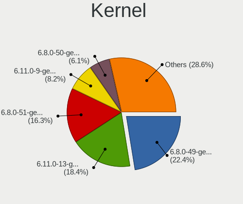
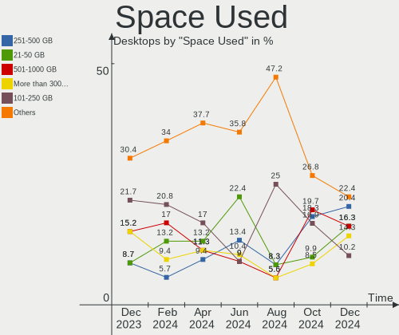
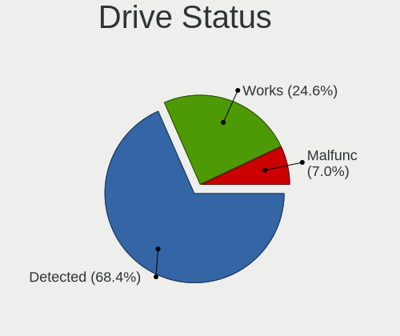
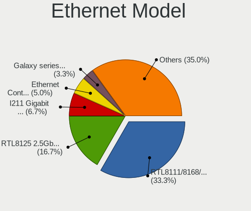
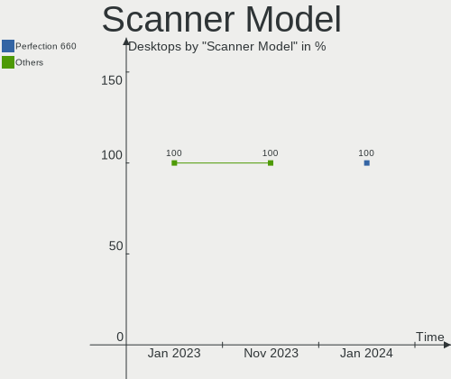
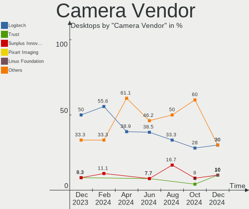

Kubuntu Hardware Trends (Desktops)
----------------------------------

A project to identify most popular hardware characteristics and track their change
over time based on data collected by Kubuntu users at https://Linux-Hardware.org.

Anyone can contribute to this report by the [hw-probe](https://github.com/linuxhw/hw-probe) tool:

    sudo -E hw-probe -all -upload

Full-feature report is available here: https://linux-hardware.org/?view=trends&formfactor=desktop

Period: Aug, 2021.

Contents
--------

* [ System ](#system)
  - [ OS                       ](#os)
  - [ OS Family                ](#os-family)
  - [ Kernel                   ](#kernel)
  - [ Kernel Family            ](#kernel-family)
  - [ Kernel Major Ver.        ](#kernel-major-ver)
  - [ Arch                     ](#arch)
  - [ DE                       ](#de)
  - [ Display Server           ](#display-server)
  - [ Display Manager          ](#display-manager)
  - [ OS Lang                  ](#os-lang)
  - [ Boot Mode                ](#boot-mode)
  - [ Filesystem               ](#filesystem)
  - [ Part. scheme             ](#part-scheme)
  - [ Dual Boot with Linux/BSD ](#dual-boot-with-linuxbsd)
  - [ Dual Boot (Win)          ](#dual-boot-win)

* [ Board ](#board)
  - [ Vendor                   ](#vendor)
  - [ Model                    ](#model)
  - [ Model Family             ](#model-family)
  - [ MFG Year                 ](#mfg-year)
  - [ Form Factor              ](#form-factor)
  - [ Secure Boot              ](#secure-boot)
  - [ Coreboot                 ](#coreboot)
  - [ RAM Size                 ](#ram-size)
  - [ RAM Used                 ](#ram-used)
  - [ Total Drives             ](#total-drives)
  - [ Has CD-ROM               ](#has-cd-rom)
  - [ Has Ethernet             ](#has-ethernet)
  - [ Has WiFi                 ](#has-wifi)
  - [ Has Bluetooth            ](#has-bluetooth)

* [ Location ](#location)
  - [ Country                  ](#country)
  - [ City                     ](#city)

* [ Drives ](#drives)
  - [ Drive Vendor             ](#drive-vendor)
  - [ Drive Model              ](#drive-model)
  - [ HDD Vendor               ](#hdd-vendor)
  - [ SSD Vendor               ](#ssd-vendor)
  - [ Drive Kind               ](#drive-kind)
  - [ Drive Connector          ](#drive-connector)
  - [ Drive Size               ](#drive-size)
  - [ Space Total              ](#space-total)
  - [ Space Used               ](#space-used)
  - [ Malfunc. Drives          ](#malfunc-drives)
  - [ Malfunc. Drive Vendor    ](#malfunc-drive-vendor)
  - [ Malfunc. HDD Vendor      ](#malfunc-hdd-vendor)
  - [ Malfunc. Drive Kind      ](#malfunc-drive-kind)
  - [ Failed Drives            ](#failed-drives)
  - [ Failed Drive Vendor      ](#failed-drive-vendor)
  - [ Drive Status             ](#drive-status)

* [ Storage controller ](#storage-controller)
  - [ Storage Vendor           ](#storage-vendor)
  - [ Storage Model            ](#storage-model)
  - [ Storage Kind             ](#storage-kind)

* [ Processor ](#processor)
  - [ CPU Vendor               ](#cpu-vendor)
  - [ CPU Model                ](#cpu-model)
  - [ CPU Model Family         ](#cpu-model-family)
  - [ CPU Cores                ](#cpu-cores)
  - [ CPU Sockets              ](#cpu-sockets)
  - [ CPU Threads              ](#cpu-threads)
  - [ CPU Op-Modes             ](#cpu-op-modes)
  - [ CPU Microcode            ](#cpu-microcode)
  - [ CPU Microarch            ](#cpu-microarch)

* [ Graphics ](#graphics)
  - [ GPU Vendor               ](#gpu-vendor)
  - [ GPU Model                ](#gpu-model)
  - [ GPU Combo                ](#gpu-combo)
  - [ GPU Driver               ](#gpu-driver)
  - [ GPU Memory               ](#gpu-memory)

* [ Monitor ](#monitor)
  - [ Monitor Vendor           ](#monitor-vendor)
  - [ Monitor Model            ](#monitor-model)
  - [ Monitor Resolution       ](#monitor-resolution)
  - [ Monitor Diagonal         ](#monitor-diagonal)
  - [ Monitor Width            ](#monitor-width)
  - [ Aspect Ratio             ](#aspect-ratio)
  - [ Monitor Area             ](#monitor-area)
  - [ Pixel Density            ](#pixel-density)
  - [ Multiple Monitors        ](#multiple-monitors)

* [ Network ](#network)
  - [ Net Controller Vendor    ](#net-controller-vendor)
  - [ Net Controller Model     ](#net-controller-model)
  - [ Wireless Vendor          ](#wireless-vendor)
  - [ Wireless Model           ](#wireless-model)
  - [ Ethernet Vendor          ](#ethernet-vendor)
  - [ Ethernet Model           ](#ethernet-model)
  - [ Net Controller Kind      ](#net-controller-kind)
  - [ Used Controller          ](#used-controller)
  - [ NICs                     ](#nics)
  - [ IPv6                     ](#ipv6)

* [ Bluetooth ](#bluetooth)
  - [ Bluetooth Vendor         ](#bluetooth-vendor)
  - [ Bluetooth Model          ](#bluetooth-model)

* [ Sound ](#sound)
  - [ Sound Vendor             ](#sound-vendor)
  - [ Sound Model              ](#sound-model)

* [ Memory ](#memory)
  - [ Memory Vendor            ](#memory-vendor)
  - [ Memory Model             ](#memory-model)
  - [ Memory Kind              ](#memory-kind)
  - [ Memory Form Factor       ](#memory-form-factor)
  - [ Memory Size              ](#memory-size)
  - [ Memory Speed             ](#memory-speed)

* [ Printers & scanners ](#printers--scanners)
  - [ Printer Vendor           ](#printer-vendor)
  - [ Printer Model            ](#printer-model)
  - [ Scanner Vendor           ](#scanner-vendor)
  - [ Scanner Model            ](#scanner-model)

* [ Camera ](#camera)
  - [ Camera Vendor            ](#camera-vendor)
  - [ Camera Model             ](#camera-model)

* [ Security ](#security)
  - [ Fingerprint Vendor       ](#fingerprint-vendor)
  - [ Fingerprint Model        ](#fingerprint-model)
  - [ Chipcard Vendor          ](#chipcard-vendor)
  - [ Chipcard Model           ](#chipcard-model)

* [ Unsupported ](#unsupported)
  - [ Unsupported Devices      ](#unsupported-devices)
  - [ Unsupported Device Types ](#unsupported-device-types)

System
------

OS
--

Installed operating systems

| Name          | Desktops | Percent |
|---------------|----------|---------|
| Kubuntu 20.04 | 16       | 53.33%  |
| Kubuntu 21.04 | 11       | 36.67%  |
| Kubuntu 21.10 | 1        | 3.33%   |
| Kubuntu 20.10 | 1        | 3.33%   |
| Kubuntu 18.04 | 1        | 3.33%   |

OS Family
---------

OS without a version

| Name    | Desktops | Percent |
|---------|----------|---------|
| Kubuntu | 30       | 100%    |

Kernel
------

Version of the Linux kernel

| Version               | Desktops | Percent |
|-----------------------|----------|---------|
| 5.11.0-25-generic     | 10       | 33.33%  |
| 5.4.0-81-generic      | 6        | 20%     |
| 5.4.0-80-generic      | 4        | 13.33%  |
| 5.11.0-31-generic     | 4        | 13.33%  |
| 5.9.16-050916-generic | 1        | 3.33%   |
| 5.13.9-051309-generic | 1        | 3.33%   |
| 5.11.0-33-generic     | 1        | 3.33%   |
| 5.11.0-31-lowlatency  | 1        | 3.33%   |
| 5.11.0-27-generic     | 1        | 3.33%   |
| 5.11.0-25-lowlatency  | 1        | 3.33%   |

Kernel Family
-------------

Linux kernel without a distro release

| Version | Desktops | Percent |
|---------|----------|---------|
| 5.11.0  | 18       | 60%     |
| 5.4.0   | 10       | 33.33%  |
| 5.9.16  | 1        | 3.33%   |
| 5.13.9  | 1        | 3.33%   |

Kernel Major Ver.
-----------------

Linux kernel major version

| Version | Desktops | Percent |
|---------|----------|---------|
| 5.11    | 18       | 60%     |
| 5.4     | 10       | 33.33%  |
| 5.9     | 1        | 3.33%   |
| 5.13    | 1        | 3.33%   |

Arch
----

OS architecture (x86_64, i586, etc.)

| Name   | Desktops | Percent |
|--------|----------|---------|
| x86_64 | 30       | 100%    |

DE
--

Desktop Environment

| Name  | Desktops | Percent |
|-------|----------|---------|
| KDE5  | 18       | 60%     |
| KDE   | 11       | 36.67%  |
| Unity | 1        | 3.33%   |

Display Server
--------------

X11 or Wayland

| Name | Desktops | Percent |
|------|----------|---------|
| X11  | 30       | 100%    |

Display Manager
---------------

SDDM, LightDM, etc.

| Name    | Desktops | Percent |
|---------|----------|---------|
| SDDM    | 17       | 56.67%  |
| Unknown | 11       | 36.67%  |
| GDM     | 2        | 6.67%   |

OS Lang
-------

Language

| Lang  | Desktops | Percent |
|-------|----------|---------|
| pt_BR | 6        | 20%     |
| en_GB | 6        | 20%     |
| en_US | 4        | 13.33%  |
| fr_FR | 2        | 6.67%   |
| en_AU | 2        | 6.67%   |
| zh_TW | 1        | 3.33%   |
| uk_UA | 1        | 3.33%   |
| ru_UA | 1        | 3.33%   |
| ru_RU | 1        | 3.33%   |
| pl_PL | 1        | 3.33%   |
| it_IT | 1        | 3.33%   |
| hu_HU | 1        | 3.33%   |
| es_MX | 1        | 3.33%   |
| es_AR | 1        | 3.33%   |
| en_PH | 1        | 3.33%   |

Boot Mode
---------

EFI or BIOS

| Mode | Desktops | Percent |
|------|----------|---------|
| EFI  | 18       | 60%     |
| BIOS | 12       | 40%     |

Filesystem
----------

Type of filesystem

| Type | Desktops | Percent |
|------|----------|---------|
| Ext4 | 28       | 93.33%  |
| XXXX | 1        | 3.33%   |
| Xfs  | 1        | 3.33%   |

Part. scheme
------------

Scheme of partitioning

| Type    | Desktops | Percent |
|---------|----------|---------|
| GPT     | 17       | 56.67%  |
| Unknown | 11       | 36.67%  |
| MBR     | 2        | 6.67%   |

Dual Boot with Linux/BSD
------------------------

Hosting more than one Linux/BSD

| Dual boot | Desktops | Percent |
|-----------|----------|---------|
| No        | 21       | 70%     |
| Yes       | 9        | 30%     |

Dual Boot (Win)
---------------

Hosting Linux and Windows

| Dual boot | Desktops | Percent |
|-----------|----------|---------|
| No        | 17       | 56.67%  |
| Yes       | 13       | 43.33%  |

Board
-----

Vendor
------

Motherboard manufacturer

| Name                | Desktops | Percent |
|---------------------|----------|---------|
| ASUSTek Computer    | 9        | 30%     |
| Gigabyte Technology | 6        | 20%     |
| MSI                 | 4        | 13.33%  |
| ASRock              | 3        | 10%     |
| Lenovo              | 2        | 6.67%   |
| Dell                | 2        | 6.67%   |
| Wistron             | 1        | 3.33%   |
| SYWZ                | 1        | 3.33%   |
| SUPoX COMPUTER      | 1        | 3.33%   |
| Hewlett-Packard     | 1        | 3.33%   |

Model
-----

Motherboard model

| Name                               | Desktops | Percent |
|------------------------------------|----------|---------|
| Wistron ProLiant ML110 G6          | 1        | 3.33%   |
| SYWZ S210H Series                  | 1        | 3.33%   |
| SUPoX COMPUTER B250A-BTC PRO       | 1        | 3.33%   |
| MSI MS-7C91                        | 1        | 3.33%   |
| MSI MS-7B87                        | 1        | 3.33%   |
| MSI MS-7817                        | 1        | 3.33%   |
| MSI MS-7693                        | 1        | 3.33%   |
| Lenovo ThinkStation E32 30A10057BR | 1        | 3.33%   |
| Lenovo ThinkCentre E73 10DU0015UK  | 1        | 3.33%   |
| HP Pavilion Desktop TP01-0xxx      | 1        | 3.33%   |
| Gigabyte Z390 M GAMING             | 1        | 3.33%   |
| Gigabyte M61SME-S2L                | 1        | 3.33%   |
| Gigabyte H310M M.2                 | 1        | 3.33%   |
| Gigabyte F2A68HM-S1                | 1        | 3.33%   |
| Gigabyte B75M-D3V                  | 1        | 3.33%   |
| Gigabyte A520M S2H                 | 1        | 3.33%   |
| Dell OptiPlex 790                  | 1        | 3.33%   |
| Dell Inspiron 530                  | 1        | 3.33%   |
| ASUS Z170-WS                       | 1        | 3.33%   |
| ASUS ROG STRIX B550-E GAMING       | 1        | 3.33%   |
| ASUS PRIME Z270-A                  | 1        | 3.33%   |
| ASUS PRIME H310M-D R2.0            | 1        | 3.33%   |
| ASUS PRIME B460M-A                 | 1        | 3.33%   |
| ASUS PRIME B450M-A                 | 1        | 3.33%   |
| ASUS P8Z77-V PRO                   | 1        | 3.33%   |
| ASUS H61-PLUS                      | 1        | 3.33%   |
| ASUS All Series                    | 1        | 3.33%   |
| ASRock X570 Pro4                   | 1        | 3.33%   |
| ASRock B550 Extreme4               | 1        | 3.33%   |
| ASRock AB350 Pro4                  | 1        | 3.33%   |

Model Family
------------

Motherboard model prefix

| Name                     | Desktops | Percent |
|--------------------------|----------|---------|
| ASUS PRIME               | 4        | 13.33%  |
| Wistron ProLiant         | 1        | 3.33%   |
| SYWZ S210H               | 1        | 3.33%   |
| SUPoX COMPUTER B250A-BTC | 1        | 3.33%   |
| MSI MS-7C91              | 1        | 3.33%   |
| MSI MS-7B87              | 1        | 3.33%   |
| MSI MS-7817              | 1        | 3.33%   |
| MSI MS-7693              | 1        | 3.33%   |
| Lenovo ThinkStation      | 1        | 3.33%   |
| Lenovo ThinkCentre       | 1        | 3.33%   |
| HP Pavilion              | 1        | 3.33%   |
| Gigabyte Z390            | 1        | 3.33%   |
| Gigabyte M61SME-S2L      | 1        | 3.33%   |
| Gigabyte H310M           | 1        | 3.33%   |
| Gigabyte F2A68HM-S1      | 1        | 3.33%   |
| Gigabyte B75M-D3V        | 1        | 3.33%   |
| Gigabyte A520M           | 1        | 3.33%   |
| Dell OptiPlex            | 1        | 3.33%   |
| Dell Inspiron            | 1        | 3.33%   |
| ASUS Z170-WS             | 1        | 3.33%   |
| ASUS ROG                 | 1        | 3.33%   |
| ASUS P8Z77-V             | 1        | 3.33%   |
| ASUS H61-PLUS            | 1        | 3.33%   |
| ASUS All                 | 1        | 3.33%   |
| ASRock X570              | 1        | 3.33%   |
| ASRock B550              | 1        | 3.33%   |
| ASRock AB350             | 1        | 3.33%   |

MFG Year
--------

Motherboard manufacture year

| Year | Desktops | Percent |
|------|----------|---------|
| 2021 | 6        | 20%     |
| 2018 | 6        | 20%     |
| 2019 | 4        | 13.33%  |
| 2020 | 3        | 10%     |
| 2015 | 3        | 10%     |
| 2012 | 2        | 6.67%   |
| 2017 | 1        | 3.33%   |
| 2016 | 1        | 3.33%   |
| 2013 | 1        | 3.33%   |
| 2010 | 1        | 3.33%   |
| 2009 | 1        | 3.33%   |
| 2007 | 1        | 3.33%   |

Form Factor
-----------

Physical design of the computer

| Name    | Desktops | Percent |
|---------|----------|---------|
| Desktop | 30       | 100%    |

Secure Boot
-----------

Enabled or disabled

| State    | Desktops | Percent |
|----------|----------|---------|
| Disabled | 30       | 100%    |

Coreboot
--------

Have coreboot on board

| Used | Desktops | Percent |
|------|----------|---------|
| No   | 30       | 100%    |

RAM Size
--------

Total RAM memory

| Size in GB  | Desktops | Percent |
|-------------|----------|---------|
| 16.01-24.0  | 8        | 26.67%  |
| 32.01-64.0  | 7        | 23.33%  |
| 3.01-4.0    | 4        | 13.33%  |
| 8.01-16.0   | 4        | 13.33%  |
| 4.01-8.0    | 3        | 10%     |
| 24.01-32.0  | 2        | 6.67%   |
| 64.01-256.0 | 2        | 6.67%   |

RAM Used
--------

Used RAM memory

| Used GB    | Desktops | Percent |
|------------|----------|---------|
| 4.01-8.0   | 9        | 30%     |
| 1.01-2.0   | 6        | 20%     |
| 3.01-4.0   | 5        | 16.67%  |
| 2.01-3.0   | 5        | 16.67%  |
| 8.01-16.0  | 3        | 10%     |
| 16.01-24.0 | 1        | 3.33%   |
| 0.51-1.0   | 1        | 3.33%   |

Total Drives
------------

Number of drives on board

| Drives | Desktops | Percent |
|--------|----------|---------|
| 2      | 8        | 26.67%  |
| 3      | 7        | 23.33%  |
| 1      | 7        | 23.33%  |
| 4      | 3        | 10%     |
| 5      | 2        | 6.67%   |
| 9      | 1        | 3.33%   |
| 7      | 1        | 3.33%   |
| 6      | 1        | 3.33%   |

Has CD-ROM
----------

Has CD-ROM on board

| Presented | Desktops | Percent |
|-----------|----------|---------|
| No        | 18       | 60%     |
| Yes       | 12       | 40%     |

Has Ethernet
------------

Has Ethernet on board

| Presented | Desktops | Percent |
|-----------|----------|---------|
| Yes       | 30       | 100%    |

Has WiFi
--------

Has WiFi module

| Presented | Desktops | Percent |
|-----------|----------|---------|
| No        | 21       | 70%     |
| Yes       | 9        | 30%     |

Has Bluetooth
-------------

Has Bluetooth module

| Presented | Desktops | Percent |
|-----------|----------|---------|
| No        | 24       | 80%     |
| Yes       | 6        | 20%     |

Location
--------

Country
-------

Geographic location (country)

| Country     | Desktops | Percent |
|-------------|----------|---------|
| Brazil      | 7        | 23.33%  |
| UK          | 5        | 16.67%  |
| USA         | 4        | 13.33%  |
| France      | 2        | 6.67%   |
| Australia   | 2        | 6.67%   |
| Ukraine     | 1        | 3.33%   |
| Taiwan      | 1        | 3.33%   |
| Russia      | 1        | 3.33%   |
| Poland      | 1        | 3.33%   |
| Philippines | 1        | 3.33%   |
| Mexico      | 1        | 3.33%   |
| Italy       | 1        | 3.33%   |
| Hungary     | 1        | 3.33%   |
| Germany     | 1        | 3.33%   |
| Argentina   | 1        | 3.33%   |

City
----

Geographic location (city)

| City           | Desktops | Percent |
|----------------|----------|---------|
| London         | 3        | 10%     |
| Trindade       | 1        | 3.33%   |
| Torun          | 1        | 3.33%   |
| S??o Paulo     | 1        | 3.33%   |
| Sao Jose       | 1        | 3.33%   |
| Santos         | 1        | 3.33%   |
| Rome           | 1        | 3.33%   |
| Rexburg        | 1        | 3.33%   |
| Quezon City    | 1        | 3.33%   |
| Perth          | 1        | 3.33%   |
| Perm           | 1        | 3.33%   |
| Paris          | 1        | 3.33%   |
| Paraiba do Sul | 1        | 3.33%   |
| New Taipei     | 1        | 3.33%   |
| Metepec        | 1        | 3.33%   |
| Maurecourt     | 1        | 3.33%   |
| Maracai        | 1        | 3.33%   |
| Manchester     | 1        | 3.33%   |
| Los Angeles    | 1        | 3.33%   |
| Kharkiv        | 1        | 3.33%   |
| Greenwich      | 1        | 3.33%   |
| Eugene         | 1        | 3.33%   |
| Egelsbach      | 1        | 3.33%   |
| Curitiba       | 1        | 3.33%   |
| Budapest       | 1        | 3.33%   |
| Ashburn        | 1        | 3.33%   |
| Adrogue        | 1        | 3.33%   |
| Adelaide       | 1        | 3.33%   |

Drives
------

Drive Vendor
------------

Hard drive vendors

| Vendor              | Desktops | Drives | Percent |
|---------------------|----------|--------|---------|
| WDC                 | 12       | 14     | 18.75%  |
| Seagate             | 11       | 18     | 17.19%  |
| Samsung Electronics | 11       | 18     | 17.19%  |
| Kingston            | 6        | 7      | 9.38%   |
| Crucial             | 4        | 8      | 6.25%   |
| Micron Technology   | 3        | 3      | 4.69%   |
| Intel               | 3        | 3      | 4.69%   |
| VENO                | 2        | 2      | 3.13%   |
| Hitachi             | 2        | 2      | 3.13%   |
| Gigabyte Technology | 2        | 2      | 3.13%   |
| StoreJet            | 1        | 1      | 1.56%   |
| SanDisk             | 1        | 1      | 1.56%   |
| Mushkin             | 1        | 1      | 1.56%   |
| Leven               | 1        | 1      | 1.56%   |
| KingSpec            | 1        | 1      | 1.56%   |
| HGST                | 1        | 2      | 1.56%   |
| Fujitsu             | 1        | 1      | 1.56%   |
| China               | 1        | 1      | 1.56%   |

Drive Model
-----------

Hard drive models

| Model                                          | Desktops | Percent |
|------------------------------------------------|----------|---------|
| Kingston SA400S37240G 240GB SSD                | 3        | 3.75%   |
| WDC WD10EARS-00Y5B1 1TB                        | 2        | 2.5%    |
| VENO SCORP SSD 240GB                           | 2        | 2.5%    |
| Seagate ST2000DM006-2DM164 2TB                 | 2        | 2.5%    |
| Samsung HD103SJ 1TB                            | 2        | 2.5%    |
| WDC WDS240G2G0A-00JH30 240GB SSD               | 1        | 1.25%   |
| WDC WD60EZAZ-00ZGHB0 6TB                       | 1        | 1.25%   |
| WDC WD40EZAZ-00SF3B0 4TB                       | 1        | 1.25%   |
| WDC WD30EZRS-42KEZB0 3TB                       | 1        | 1.25%   |
| WDC WD2502ABYS-23B7A0 39M4511 42C0463IBM 250GB | 1        | 1.25%   |
| WDC WD20SPZX-22UA7T0 2TB                       | 1        | 1.25%   |
| WDC WD20EZRX-00D8PB0 2TB                       | 1        | 1.25%   |
| WDC WD10JPVX-22JC3T0 1TB                       | 1        | 1.25%   |
| WDC WD10EZEX-60WN4A1 1TB                       | 1        | 1.25%   |
| WDC WD10EZEX-08WN4A0 1TB                       | 1        | 1.25%   |
| WDC WD10EZEX-08M2NA0 1TB                       | 1        | 1.25%   |
| StoreJet Transcend 500GB                       | 1        | 1.25%   |
| Seagate ST5000DM000-1FK178 5TB                 | 1        | 1.25%   |
| Seagate ST4000DM005-2DP166 4TB                 | 1        | 1.25%   |
| Seagate ST4000DM000-2AE166 4TB                 | 1        | 1.25%   |
| Seagate ST3500418AS 500GB                      | 1        | 1.25%   |
| Seagate ST3500413AS 500GB                      | 1        | 1.25%   |
| Seagate ST2000DM008-2FR102 2TB                 | 1        | 1.25%   |
| Seagate ST2000DM001-1E6164 2TB                 | 1        | 1.25%   |
| Seagate ST16000NM001G-2KK103 16TB              | 1        | 1.25%   |
| Seagate ST12000NM0007-2A1101 12TB              | 1        | 1.25%   |
| Seagate ST1000LM048-2E7172 1TB                 | 1        | 1.25%   |
| Seagate ST1000DM003-9YN162 1TB                 | 1        | 1.25%   |
| Seagate ST1000DM003-1CH162 1TB                 | 1        | 1.25%   |
| SanDisk SSD PLUS 240GB                         | 1        | 1.25%   |
| Samsung SSD 970 EVO 1TB                        | 1        | 1.25%   |
| Samsung SSD 950 PRO 256GB                      | 1        | 1.25%   |
| Samsung SSD 870 QVO 2TB                        | 1        | 1.25%   |
| Samsung SSD 860 EVO 1TB                        | 1        | 1.25%   |
| Samsung SSD 850 EVO 500GB                      | 1        | 1.25%   |
| Samsung SSD 850 EVO 250GB                      | 1        | 1.25%   |
| Samsung SSD 850 EVO 1TB                        | 1        | 1.25%   |
| Samsung PSSD T7 2TB                            | 1        | 1.25%   |
| Samsung NVMe SSD Drive 512GB                   | 1        | 1.25%   |
| Samsung NVMe SSD Drive 2TB                     | 1        | 1.25%   |
| Samsung NVMe SSD Drive 250GB                   | 1        | 1.25%   |
| Samsung NVMe SSD Drive 1TB                     | 1        | 1.25%   |
| Samsung MZMPC128HBFU-000L1 128GB SSD           | 1        | 1.25%   |
| Samsung HD502HJ 500GB                          | 1        | 1.25%   |
| Samsung HD103SI 1TB                            | 1        | 1.25%   |
| Samsung HD082GJ 80GB                           | 1        | 1.25%   |
| Mushkin MKNSSDRE1TB                            | 1        | 1.25%   |
| Micron MTFDHBA256TCK-1AS1AABHA 256GB           | 1        | 1.25%   |
| Micron MTFDDAK256TBN-1AR1ZABHA 256GB SSD       | 1        | 1.25%   |
| Micron 1100 SATA 256GB SSD                     | 1        | 1.25%   |
| Leven JS500120C 120GB                          | 1        | 1.25%   |
| Kingston SMS200S360G 64GB SSD                  | 1        | 1.25%   |
| Kingston SH100S3120G 120GB SSD                 | 1        | 1.25%   |
| Kingston SA400S37960G 960GB SSD                | 1        | 1.25%   |
| Kingston SA400S37480G 480GB SSD                | 1        | 1.25%   |
| KingSpec NT-256 256GB SSD                      | 1        | 1.25%   |
| Intel SSDSCKKW010X6 1TB                        | 1        | 1.25%   |
| Intel SSDSC2BF180A4H 180GB                     | 1        | 1.25%   |
| Intel SSDPEKNW010T8 1TB                        | 1        | 1.25%   |
| Hitachi HTS545016B9A300 160GB                  | 1        | 1.25%   |

HDD Vendor
----------

Hard disk drive vendors

| Vendor              | Desktops | Drives | Percent |
|---------------------|----------|--------|---------|
| WDC                 | 12       | 13     | 38.71%  |
| Seagate             | 11       | 18     | 35.48%  |
| Samsung Electronics | 4        | 5      | 12.9%   |
| Hitachi             | 2        | 2      | 6.45%   |
| HGST                | 1        | 2      | 3.23%   |
| Fujitsu             | 1        | 1      | 3.23%   |

SSD Vendor
----------

Solid state drive vendors

| Vendor              | Desktops | Drives | Percent |
|---------------------|----------|--------|---------|
| Samsung Electronics | 6        | 7      | 21.43%  |
| Kingston            | 6        | 7      | 21.43%  |
| VENO                | 2        | 2      | 7.14%   |
| Micron Technology   | 2        | 2      | 7.14%   |
| Intel               | 2        | 2      | 7.14%   |
| Crucial             | 2        | 6      | 7.14%   |
| WDC                 | 1        | 1      | 3.57%   |
| StoreJet            | 1        | 1      | 3.57%   |
| SanDisk             | 1        | 1      | 3.57%   |
| Mushkin             | 1        | 1      | 3.57%   |
| Leven               | 1        | 1      | 3.57%   |
| KingSpec            | 1        | 1      | 3.57%   |
| Gigabyte Technology | 1        | 1      | 3.57%   |
| China               | 1        | 1      | 3.57%   |

Drive Kind
----------

HDD or SSD

| Kind | Desktops | Drives | Percent |
|------|----------|--------|---------|
| SSD  | 20       | 34     | 40.82%  |
| HDD  | 20       | 41     | 40.82%  |
| NVMe | 9        | 11     | 18.37%  |

Drive Connector
---------------

SATA, SAS, NVMe, etc.

| Type | Desktops | Drives | Percent |
|------|----------|--------|---------|
| SATA | 29       | 73     | 72.5%   |
| NVMe | 9        | 11     | 22.5%   |
| SAS  | 2        | 2      | 5%      |

Drive Size
----------

Size of hard drive

| Size in TB | Desktops | Drives | Percent |
|------------|----------|--------|---------|
| 0.01-0.5   | 20       | 28     | 40.82%  |
| 0.51-1.0   | 13       | 24     | 26.53%  |
| 1.01-2.0   | 8        | 10     | 16.33%  |
| 3.01-4.0   | 3        | 4      | 6.12%   |
| 4.01-10.0  | 3        | 4      | 6.12%   |
| 2.01-3.0   | 1        | 1      | 2.04%   |
| 10.01-20.0 | 1        | 4      | 2.04%   |

Space Total
-----------

Amount of disk space available on the file system

| Size in GB     | Desktops | Percent |
|----------------|----------|---------|
| 101-250        | 8        | 26.67%  |
| 501-1000       | 7        | 23.33%  |
| More than 3000 | 6        | 20%     |
| 2001-3000      | 5        | 16.67%  |
| 251-500        | 2        | 6.67%   |
| 21-50          | 1        | 3.33%   |
| 1001-2000      | 1        | 3.33%   |

Space Used
----------

Amount of used disk space

| Used GB        | Desktops | Percent |
|----------------|----------|---------|
| 1-20           | 7        | 23.33%  |
| 1001-2000      | 6        | 20%     |
| 501-1000       | 5        | 16.67%  |
| 251-500        | 4        | 13.33%  |
| 101-250        | 3        | 10%     |
| More than 3000 | 2        | 6.67%   |
| 21-50          | 2        | 6.67%   |
| 51-100         | 1        | 3.33%   |

Malfunc. Drives
---------------

Drive models with a malfunction

| Model                                          | Desktops | Drives | Percent |
|------------------------------------------------|----------|--------|---------|
| WDC WD2502ABYS-23B7A0 39M4511 42C0463IBM 250GB | 1        | 1      | 11.11%  |
| WDC WD10EARS-00Y5B1 1TB                        | 1        | 1      | 11.11%  |
| VENO SCORP SSD 240GB                           | 1        | 1      | 11.11%  |
| Seagate ST3500418AS 500GB                      | 1        | 1      | 11.11%  |
| Seagate ST2000DM001-1E6164 2TB                 | 1        | 1      | 11.11%  |
| Samsung Electronics HD082GJ 80GB               | 1        | 1      | 11.11%  |
| Intel SSDSCKKW010X6 1TB                        | 1        | 1      | 11.11%  |
| Crucial CT525MX300SSD4 528GB                   | 1        | 1      | 11.11%  |
| Crucial CT1050MX300SSD1 1050GB                 | 1        | 1      | 11.11%  |

Malfunc. Drive Vendor
---------------------

Vendors of faulty drives

| Vendor              | Desktops | Drives | Percent |
|---------------------|----------|--------|---------|
| WDC                 | 2        | 2      | 25%     |
| Seagate             | 2        | 2      | 25%     |
| VENO                | 1        | 1      | 12.5%   |
| Samsung Electronics | 1        | 1      | 12.5%   |
| Intel               | 1        | 1      | 12.5%   |
| Crucial             | 1        | 2      | 12.5%   |

Malfunc. HDD Vendor
-------------------

Vendors of faulty HDD drives

| Vendor              | Desktops | Drives | Percent |
|---------------------|----------|--------|---------|
| WDC                 | 2        | 2      | 40%     |
| Seagate             | 2        | 2      | 40%     |
| Samsung Electronics | 1        | 1      | 20%     |

Malfunc. Drive Kind
-------------------

Kinds of faulty drives

| Kind | Desktops | Drives | Percent |
|------|----------|--------|---------|
| HDD  | 4        | 5      | 57.14%  |
| SSD  | 3        | 4      | 42.86%  |

Failed Drives
-------------

Failed drive models

Zero info for selected period =(

Failed Drive Vendor
-------------------

Failed drive vendors

Zero info for selected period =(

Drive Status
------------

Number of failed and malfunc. drives

| Status   | Desktops | Drives | Percent |
|----------|----------|--------|---------|
| Works    | 18       | 43     | 50%     |
| Detected | 11       | 34     | 30.56%  |
| Malfunc  | 7        | 9      | 19.44%  |

Storage controller
------------------

Storage Vendor
--------------

Storage controller vendors

| Vendor                    | Desktops | Percent |
|---------------------------|----------|---------|
| Intel                     | 19       | 45.24%  |
| AMD                       | 10       | 23.81%  |
| Samsung Electronics       | 5        | 11.9%   |
| ASMedia Technology        | 3        | 7.14%   |
| Micron/Crucial Technology | 2        | 4.76%   |
| Phison Electronics        | 1        | 2.38%   |
| Nvidia                    | 1        | 2.38%   |
| Micron Technology         | 1        | 2.38%   |

Storage Model
-------------

Storage controller models

| Model                                                                          | Desktops | Percent |
|--------------------------------------------------------------------------------|----------|---------|
| AMD FCH SATA Controller [AHCI mode]                                            | 5        | 9.8%    |
| Intel 8 Series/C220 Series Chipset Family 6-port SATA Controller 1 [AHCI mode] | 4        | 7.84%   |
| AMD Starship/Matisse Chipset SATA Controller [AHCI mode]                       | 4        | 7.84%   |
| Samsung NVMe SSD Controller SM981/PM981/PM983                                  | 3        | 5.88%   |
| Intel Cannon Lake PCH SATA AHCI Controller                                     | 3        | 5.88%   |
| Intel SATA Controller [RAID mode]                                              | 2        | 3.92%   |
| Intel 6 Series/C200 Series Chipset Family 6 port Desktop SATA AHCI Controller  | 2        | 3.92%   |
| Intel 200 Series PCH SATA controller [AHCI mode]                               | 2        | 3.92%   |
| ASMedia ASM1062 Serial ATA Controller                                          | 2        | 3.92%   |
| AMD 400 Series Chipset SATA Controller                                         | 2        | 3.92%   |
| Samsung NVMe SSD Controller SM961/PM961/SM963                                  | 1        | 1.96%   |
| Samsung NVMe SSD Controller SM951/PM951                                        | 1        | 1.96%   |
| Samsung NVMe SSD Controller PM9A1/PM9A3/980PRO                                 | 1        | 1.96%   |
| Phison E16 PCIe4 NVMe Controller                                               | 1        | 1.96%   |
| Nvidia MCP61 SATA Controller                                                   | 1        | 1.96%   |
| Nvidia MCP61 IDE                                                               | 1        | 1.96%   |
| Micron/Crucial NVMe Controller                                                 | 1        | 1.96%   |
| Micron/Crucial Non-Volatile memory controller                                  | 1        | 1.96%   |
| Micron Non-Volatile memory controller                                          | 1        | 1.96%   |
| Intel SSD 660P Series                                                          | 1        | 1.96%   |
| Intel Q170/Q150/B150/H170/H110/Z170/CM236 Chipset SATA Controller [AHCI Mode]  | 1        | 1.96%   |
| Intel 82801IR/IO/IH (ICH9R/DO/DH) 4 port SATA Controller [IDE mode]            | 1        | 1.96%   |
| Intel 82801I (ICH9 Family) 2 port SATA Controller [IDE mode]                   | 1        | 1.96%   |
| Intel 7 Series/C210 Series Chipset Family 6-port SATA Controller [AHCI mode]   | 1        | 1.96%   |
| Intel 7 Series/C210 Series Chipset Family 4-port SATA Controller [IDE mode]    | 1        | 1.96%   |
| Intel 7 Series/C210 Series Chipset Family 2-port SATA Controller [IDE mode]    | 1        | 1.96%   |
| Intel 5 Series/3400 Series Chipset 6 port SATA AHCI Controller                 | 1        | 1.96%   |
| Intel 400 Series Chipset Family SATA AHCI Controller                           | 1        | 1.96%   |
| ASMedia ASM1061 SATA IDE Controller                                            | 1        | 1.96%   |
| AMD SB7x0/SB8x0/SB9x0 SATA Controller [AHCI mode]                              | 1        | 1.96%   |
| AMD FCH SATA Controller [IDE mode]                                             | 1        | 1.96%   |
| AMD 300 Series Chipset SATA Controller                                         | 1        | 1.96%   |

Storage Kind
------------

Kind of storage controller (IDE, SATA, NVMe, SAS, ...)

| Kind | Desktops | Percent |
|------|----------|---------|
| SATA | 25       | 62.5%   |
| NVMe | 9        | 22.5%   |
| IDE  | 4        | 10%     |
| RAID | 2        | 5%      |

Processor
---------

CPU Vendor
----------

Processor vendors

| Vendor | Desktops | Percent |
|--------|----------|---------|
| Intel  | 19       | 63.33%  |
| AMD    | 11       | 36.67%  |

CPU Model
---------

Processor models

| Model                                        | Desktops | Percent |
|----------------------------------------------|----------|---------|
| Intel Xeon CPU X3430 @ 2.40GHz               | 1        | 3.33%   |
| Intel Xeon CPU E3-1240 v3 @ 3.40GHz          | 1        | 3.33%   |
| Intel Pentium CPU G4560 @ 3.50GHz            | 1        | 3.33%   |
| Intel Pentium CPU G3220 @ 3.00GHz            | 1        | 3.33%   |
| Intel Core i9-8950HK CPU @ 2.90GHz           | 1        | 3.33%   |
| Intel Core i7-9700F CPU @ 3.00GHz            | 1        | 3.33%   |
| Intel Core i7-8700 CPU @ 3.20GHz             | 1        | 3.33%   |
| Intel Core i7-7700K CPU @ 4.20GHz            | 1        | 3.33%   |
| Intel Core i7-6700K CPU @ 4.00GHz            | 1        | 3.33%   |
| Intel Core i7-2700K CPU @ 3.50GHz            | 1        | 3.33%   |
| Intel Core i5-9400 CPU @ 2.90GHz             | 1        | 3.33%   |
| Intel Core i5-4460 CPU @ 3.20GHz             | 1        | 3.33%   |
| Intel Core i5-3550 CPU @ 3.30GHz             | 1        | 3.33%   |
| Intel Core i5-2310 CPU @ 2.90GHz             | 1        | 3.33%   |
| Intel Core i5-10400F CPU @ 2.90GHz           | 1        | 3.33%   |
| Intel Core i3-9100F CPU @ 3.60GHz            | 1        | 3.33%   |
| Intel Core i3-4170 CPU @ 3.70GHz             | 1        | 3.33%   |
| Intel Core i3-2120 CPU @ 3.30GHz             | 1        | 3.33%   |
| Intel Core 2 Duo CPU E8600 @ 3.33GHz         | 1        | 3.33%   |
| AMD Ryzen 9 5900X 12-Core Processor          | 1        | 3.33%   |
| AMD Ryzen 9 3900XT 12-Core Processor         | 1        | 3.33%   |
| AMD Ryzen 7 5800X 8-Core Processor           | 1        | 3.33%   |
| AMD Ryzen 7 2700X Eight-Core Processor       | 1        | 3.33%   |
| AMD Ryzen 5 5600X 6-Core Processor           | 1        | 3.33%   |
| AMD Ryzen 5 5600G with Radeon Graphics       | 1        | 3.33%   |
| AMD Ryzen 5 2600 Six-Core Processor          | 1        | 3.33%   |
| AMD Ryzen 5 2400G with Radeon Vega Graphics  | 1        | 3.33%   |
| AMD FX-8350 Eight-Core Processor             | 1        | 3.33%   |
| AMD Athlon 64 X2 Dual Core Processor 5000+   | 1        | 3.33%   |
| AMD A6-7480 Radeon R5, 8 Compute Cores 2C+6G | 1        | 3.33%   |

CPU Model Family
----------------

Processor model prefix

| Model            | Desktops | Percent |
|------------------|----------|---------|
| Intel Core i7    | 5        | 16.67%  |
| Intel Core i5    | 5        | 16.67%  |
| AMD Ryzen 5      | 4        | 13.33%  |
| Intel Core i3    | 3        | 10%     |
| Intel Xeon       | 2        | 6.67%   |
| Intel Pentium    | 2        | 6.67%   |
| AMD Ryzen 9      | 2        | 6.67%   |
| AMD Ryzen 7      | 2        | 6.67%   |
| Intel Core i9    | 1        | 3.33%   |
| Intel Core 2 Duo | 1        | 3.33%   |
| AMD FX           | 1        | 3.33%   |
| AMD Athlon 64 X2 | 1        | 3.33%   |
| AMD A6           | 1        | 3.33%   |

CPU Cores
---------

Number of processor cores

| Number | Desktops | Percent |
|--------|----------|---------|
| 4      | 11       | 36.67%  |
| 6      | 7        | 23.33%  |
| 2      | 6        | 20%     |
| 8      | 3        | 10%     |
| 12     | 2        | 6.67%   |
| 1      | 1        | 3.33%   |

CPU Sockets
-----------

Number of sockets

| Number | Desktops | Percent |
|--------|----------|---------|
| 1      | 30       | 100%    |

CPU Threads
-----------

Threads per core (Hyper-Threading)

| Number | Desktops | Percent |
|--------|----------|---------|
| 2      | 20       | 66.67%  |
| 1      | 10       | 33.33%  |

CPU Op-Modes
------------

CPU Operation Modes (32-bit, 64-bit)

| Op mode        | Desktops | Percent |
|----------------|----------|---------|
| 32-bit, 64-bit | 30       | 100%    |

CPU Microcode
-------------

Microcode number

| Number     | Desktops | Percent |
|------------|----------|---------|
| Unknown    | 6        | 20%     |
| 0x906ea    | 4        | 13.33%  |
| 0x306c3    | 3        | 10%     |
| 0x206a7    | 3        | 10%     |
| 0x0a201016 | 3        | 10%     |
| 0x0800820d | 2        | 6.67%   |
| 0xa0655    | 1        | 3.33%   |
| 0x906ed    | 1        | 3.33%   |
| 0x506e3    | 1        | 3.33%   |
| 0x306a9    | 1        | 3.33%   |
| 0x106e5    | 1        | 3.33%   |
| 0x1067a    | 1        | 3.33%   |
| 0x0a50000c | 1        | 3.33%   |
| 0x0810100b | 1        | 3.33%   |
| 0x06000852 | 1        | 3.33%   |

CPU Microarch
-------------

Microarchitecture

| Name        | Desktops | Percent |
|-------------|----------|---------|
| KabyLake    | 7        | 23.33%  |
| Zen 3       | 4        | 13.33%  |
| Haswell     | 4        | 13.33%  |
| SandyBridge | 3        | 10%     |
| Zen+        | 2        | 6.67%   |
| Zen 2       | 1        | 3.33%   |
| Zen         | 1        | 3.33%   |
| Skylake     | 1        | 3.33%   |
| Piledriver  | 1        | 3.33%   |
| Penryn      | 1        | 3.33%   |
| Nehalem     | 1        | 3.33%   |
| K8 Hammer   | 1        | 3.33%   |
| IvyBridge   | 1        | 3.33%   |
| Excavator   | 1        | 3.33%   |
| CometLake   | 1        | 3.33%   |

Graphics
--------

GPU Vendor
----------

Vendors of graphics cards

| Vendor | Desktops | Percent |
|--------|----------|---------|
| AMD    | 12       | 40%     |
| Nvidia | 11       | 36.67%  |
| Intel  | 7        | 23.33%  |

GPU Model
---------

Graphics card models

| Model                                                                       | Desktops | Percent |
|-----------------------------------------------------------------------------|----------|---------|
| AMD Ellesmere [Radeon RX 470/480/570/570X/580/580X/590]                     | 3        | 10%     |
| Nvidia GK208B [GeForce GT 730]                                              | 2        | 6.67%   |
| AMD Turks PRO [Radeon HD 6570/7570/8550 / R5 230]                           | 2        | 6.67%   |
| Nvidia TU104 [GeForce RTX 2070 SUPER]                                       | 1        | 3.33%   |
| Nvidia GP107GL [Quadro P400]                                                | 1        | 3.33%   |
| Nvidia GP106 [GeForce GTX 1060 3GB]                                         | 1        | 3.33%   |
| Nvidia GP104 [GeForce GTX 1070 Ti]                                          | 1        | 3.33%   |
| Nvidia GK208B [GeForce GT 710]                                              | 1        | 3.33%   |
| Nvidia GK107GL [Quadro K600]                                                | 1        | 3.33%   |
| Nvidia GA102 [GeForce RTX 3080 Ti]                                          | 1        | 3.33%   |
| Nvidia GA102 [GeForce RTX 3080 Lite Hash Rate]                              | 1        | 3.33%   |
| Nvidia G96GL [Quadro FX 380]                                                | 1        | 3.33%   |
| Intel Xeon E3-1200 v3/4th Gen Core Processor Integrated Graphics Controller | 1        | 3.33%   |
| Intel Xeon E3-1200 v2/3rd Gen Core processor Graphics Controller            | 1        | 3.33%   |
| Intel HD Graphics 530                                                       | 1        | 3.33%   |
| Intel CometLake-S GT2 [UHD Graphics 630]                                    | 1        | 3.33%   |
| Intel CoffeeLake-H GT2 [UHD Graphics 630]                                   | 1        | 3.33%   |
| Intel 4th Generation Core Processor Family Integrated Graphics Controller   | 1        | 3.33%   |
| Intel 2nd Generation Core Processor Family Integrated Graphics Controller   | 1        | 3.33%   |
| AMD Wani [Radeon R5/R6/R7 Graphics]                                         | 1        | 3.33%   |
| AMD Turks XT [Radeon HD 6670/7670]                                          | 1        | 3.33%   |
| AMD Raven Ridge [Radeon Vega Series / Radeon Vega Mobile Series]            | 1        | 3.33%   |
| AMD Navi 10 [Radeon RX 5600 OEM/5600 XT / 5700/5700 XT]                     | 1        | 3.33%   |
| AMD Lexa PRO [Radeon 540/540X/550/550X / RX 540X/550/550X]                  | 1        | 3.33%   |
| AMD Cezanne                                                                 | 1        | 3.33%   |
| AMD Caicos [Radeon HD 6450/7450/8450 / R5 230 OEM]                          | 1        | 3.33%   |

GPU Combo
---------

Combinations of graphics cards

| Name       | Desktops | Percent |
|------------|----------|---------|
| 1 x AMD    | 12       | 40%     |
| 1 x Nvidia | 11       | 36.67%  |
| 1 x Intel  | 7        | 23.33%  |

GPU Driver
----------

Free vs proprietary

| Driver      | Desktops | Percent |
|-------------|----------|---------|
| Free        | 19       | 63.33%  |
| Proprietary | 10       | 33.33%  |
| Unknown     | 1        | 3.33%   |

GPU Memory
----------

Total video memory

| Size in GB | Desktops | Percent |
|------------|----------|---------|
| Unknown    | 10       | 33.33%  |
| 7.01-8.0   | 5        | 16.67%  |
| 1.01-2.0   | 5        | 16.67%  |
| 0.51-1.0   | 4        | 13.33%  |
| 8.01-16.0  | 2        | 6.67%   |
| 0.01-0.5   | 2        | 6.67%   |
| 3.01-4.0   | 1        | 3.33%   |
| 2.01-3.0   | 1        | 3.33%   |

Monitor
-------

Monitor Vendor
--------------

Monitor vendors

| Vendor               | Desktops | Percent |
|----------------------|----------|---------|
| Goldstar             | 9        | 27.27%  |
| Samsung Electronics  | 6        | 18.18%  |
| ViewSonic            | 3        | 9.09%   |
| Philips              | 2        | 6.06%   |
| Iiyama               | 2        | 6.06%   |
| Ancor Communications | 2        | 6.06%   |
| Acer                 | 2        | 6.06%   |
| MSI                  | 1        | 3.03%   |
| LG Electronics       | 1        | 3.03%   |
| Idek Iiyama          | 1        | 3.03%   |
| HannStar             | 1        | 3.03%   |
| BenQ                 | 1        | 3.03%   |
| AOC                  | 1        | 3.03%   |
| Achieva Shimian      | 1        | 3.03%   |

Monitor Model
-------------

Monitor models

| Model                                                                 | Desktops | Percent |
|-----------------------------------------------------------------------|----------|---------|
| Goldstar LG ULTRAWIDE GSM59F1 1920x1080 580x240mm 24.7-inch           | 2        | 5.71%   |
| ViewSonic VX2453 Series VSC0C28 1920x1080 520x290mm 23.4-inch         | 1        | 2.86%   |
| ViewSonic VG2860 SERIES VSC1F30 3840x2160 621x341mm 27.9-inch         | 1        | 2.86%   |
| ViewSonic VA916 Series VSC7C20 1280x1024 376x301mm 19.0-inch          | 1        | 2.86%   |
| Samsung Electronics SyncMaster SAM05B0 1920x1080                      | 1        | 2.86%   |
| Samsung Electronics SyncMaster SAM01B7 1280x1024 338x270mm 17.0-inch  | 1        | 2.86%   |
| Samsung Electronics S24D590 SAM0B47 1920x1080 520x290mm 23.4-inch     | 1        | 2.86%   |
| Samsung Electronics S19D300 SAM0B35 1366x768 410x230mm 18.5-inch      | 1        | 2.86%   |
| Samsung Electronics C49RG9x SAM0F9C 3840x1080 1190x340mm 48.7-inch    | 1        | 2.86%   |
| Samsung Electronics C27F591 SAM0D37 1920x1080 598x336mm 27.0-inch     | 1        | 2.86%   |
| Philips 220V4 PHLC0B2 1680x1050 474x296mm 22.0-inch                   | 1        | 2.86%   |
| Philips 200V4 PHLC0BF 1600x900 432x240mm 19.5-inch                    | 1        | 2.86%   |
| MSI Optix MAG27CQ MSI1462 2560x1440 597x336mm 27.0-inch               | 1        | 2.86%   |
| LG Electronics LCD Monitor LG IPS FULLHD 3840x1080                    | 1        | 2.86%   |
| LG Electronics LCD Monitor LG IPS FULLHD                              | 1        | 2.86%   |
| Iiyama PLE2208HDD IVM5616 1920x1080 477x268mm 21.5-inch               | 1        | 2.86%   |
| Iiyama PL4071UH IVM0009 3840x2160 880x490mm 39.7-inch                 | 1        | 2.86%   |
| Idek Iiyama LCD Monitor PL2595W 5760x1200                             | 1        | 2.86%   |
| Idek Iiyama LCD Monitor PL2595W                                       | 1        | 2.86%   |
| HannStar HE247DPB HSD49B7 1920x1080 521x293mm 23.5-inch               | 1        | 2.86%   |
| Goldstar Ultra HD GSM5B09 3840x2160 600x340mm 27.2-inch               | 1        | 2.86%   |
| Goldstar L1752HQ GSM4458 1280x1024 338x270mm 17.0-inch                | 1        | 2.86%   |
| Goldstar HD GSM5ACB 1366x768 410x230mm 18.5-inch                      | 1        | 2.86%   |
| Goldstar FULL HD GSM5B55 1920x1080 480x270mm 21.7-inch                | 1        | 2.86%   |
| Goldstar E2441 GSM5820 1920x1080 531x299mm 24.0-inch                  | 1        | 2.86%   |
| Goldstar E2350 GSM5791 1920x1080 510x290mm 23.1-inch                  | 1        | 2.86%   |
| Goldstar 24M35 GSM5A4E 1920x1080 521x293mm 23.5-inch                  | 1        | 2.86%   |
| BenQ G2400W BNQ780A 1920x1200 519x324mm 24.1-inch                     | 1        | 2.86%   |
| AOC 936W AOC1936 1366x768 410x230mm 18.5-inch                         | 1        | 2.86%   |
| Ancor Communications ROG PG27AQ ACI27B3 3840x2160 598x336mm 27.0-inch | 1        | 2.86%   |
| Ancor Communications ASUS VS247 ACI249A 1920x1080 521x293mm 23.5-inch | 1        | 2.86%   |
| Achieva Shimian QHD270 ACB1087 2560x1440 597x304mm 26.4-inch          | 1        | 2.86%   |
| Acer XB253Q ACR0741 1920x1080 540x300mm 24.3-inch                     | 1        | 2.86%   |
| Acer KG251Q ACR0591 1920x1080 544x303mm 24.5-inch                     | 1        | 2.86%   |

Monitor Resolution
------------------

Monitor screen resolution

| Resolution         | Desktops | Percent |
|--------------------|----------|---------|
| 1920x1080 (FHD)    | 10       | 30.3%   |
| 3840x2160 (4K)     | 5        | 15.15%  |
| 1366x768 (WXGA)    | 3        | 9.09%   |
| 1280x1024 (SXGA)   | 3        | 9.09%   |
| 3840x1080          | 2        | 6.06%   |
| 2560x1080          | 2        | 6.06%   |
| Unknown            | 2        | 6.06%   |
| 5760x1200          | 1        | 3.03%   |
| 3440x1440          | 1        | 3.03%   |
| 2560x1440 (QHD)    | 1        | 3.03%   |
| 1920x1200 (WUXGA)  | 1        | 3.03%   |
| 1680x1050 (WSXGA+) | 1        | 3.03%   |
| 1600x900 (HD+)     | 1        | 3.03%   |

Monitor Diagonal
----------------

Diagonal size in inches

| Inches  | Desktops | Percent |
|---------|----------|---------|
| 24      | 4        | 12.9%   |
| 23      | 4        | 12.9%   |
| 34      | 3        | 9.68%   |
| 27      | 3        | 9.68%   |
| 18      | 3        | 9.68%   |
| Unknown | 3        | 9.68%   |
| 21      | 2        | 6.45%   |
| 19      | 2        | 6.45%   |
| 17      | 2        | 6.45%   |
| 48      | 1        | 3.23%   |
| 39      | 1        | 3.23%   |
| 30      | 1        | 3.23%   |
| 26      | 1        | 3.23%   |
| 22      | 1        | 3.23%   |

Monitor Width
-------------

Physical width

| Width in mm | Desktops | Percent |
|-------------|----------|---------|
| 501-600     | 11       | 36.67%  |
| 401-500     | 6        | 20%     |
| 701-800     | 3        | 10%     |
| Unknown     | 3        | 10%     |
| 601-700     | 2        | 6.67%   |
| 301-350     | 2        | 6.67%   |
| 801-900     | 1        | 3.33%   |
| 351-400     | 1        | 3.33%   |
| 1001-1500   | 1        | 3.33%   |

Aspect Ratio
------------

Proportional relationship between the width and the height

| Ratio   | Desktops | Percent |
|---------|----------|---------|
| 16/9    | 18       | 60%     |
| 5/4     | 3        | 10%     |
| 21/9    | 3        | 10%     |
| 16/10   | 2        | 6.67%   |
| Unknown | 2        | 6.67%   |
| 32/9    | 1        | 3.33%   |
| 1.96    | 1        | 3.33%   |

Monitor Area
------------

Area in inch

| Area in inch | Desktops | Percent |
|----------------|----------|---------|
| 201-250        | 8        | 25.81%  |
| 141-150        | 5        | 16.13%  |
| 351-500        | 4        | 12.9%   |
| 251-300        | 4        | 12.9%   |
| 301-350        | 3        | 9.68%   |
| Unknown        | 3        | 9.68%   |
| 151-200        | 2        | 6.45%   |
| 501-1000       | 2        | 6.45%   |

Pixel Density
-------------

Pixels per inch

| Density | Desktops | Percent |
|---------|----------|---------|
| 51-100  | 20       | 66.67%  |
| 101-120 | 5        | 16.67%  |
| Unknown | 3        | 10%     |
| 161-240 | 1        | 3.33%   |
| 121-160 | 1        | 3.33%   |

Multiple Monitors
-----------------

Total monitors connected

| Total | Desktops | Percent |
|-------|----------|---------|
| 1     | 21       | 70%     |
| 2     | 9        | 30%     |

Network
-------

Net Controller Vendor
---------------------

Controller vendors

| Vendor                          | Desktops | Percent |
|---------------------------------|----------|---------|
| Realtek Semiconductor           | 20       | 51.28%  |
| Intel                           | 10       | 25.64%  |
| Broadcom                        | 3        | 7.69%   |
| TP-Link                         | 1        | 2.56%   |
| Qualcomm Atheros Communications | 1        | 2.56%   |
| Qualcomm Atheros                | 1        | 2.56%   |
| Nvidia                          | 1        | 2.56%   |
| Microsoft                       | 1        | 2.56%   |
| 3Com                            | 1        | 2.56%   |

Net Controller Model
--------------------

Controller models

| Model                                                                         | Desktops | Percent |
|-------------------------------------------------------------------------------|----------|---------|
| Realtek RTL8111/8168/8411 PCI Express Gigabit Ethernet Controller             | 19       | 42.22%  |
| Realtek RTL8125 2.5GbE Controller                                             | 2        | 4.44%   |
| Intel I211 Gigabit Network Connection                                         | 2        | 4.44%   |
| TP-Link Archer T9UH v1 [Realtek RTL8814AU]                                    | 1        | 2.22%   |
| Realtek RTL8821CE 802.11ac PCIe Wireless Network Adapter                      | 1        | 2.22%   |
| Realtek RTL8153 Gigabit Ethernet Adapter                                      | 1        | 2.22%   |
| Qualcomm Atheros TP-Link TL-WN322G v3 / TL-WN422G v2 802.11g [Atheros AR9271] | 1        | 2.22%   |
| Qualcomm Atheros AR9485 Wireless Network Adapter                              | 1        | 2.22%   |
| Nvidia MCP61 Ethernet                                                         | 1        | 2.22%   |
| Microsoft Wireless XBox Controller Dongle                                     | 1        | 2.22%   |
| Intel Wireless 7260                                                           | 1        | 2.22%   |
| Intel Wi-Fi 6 AX200                                                           | 1        | 2.22%   |
| Intel I210 Gigabit Network Connection                                         | 1        | 2.22%   |
| Intel Ethernet Controller I225-V                                              | 1        | 2.22%   |
| Intel Ethernet Connection I217-LM                                             | 1        | 2.22%   |
| Intel Ethernet Connection (7) I219-V                                          | 1        | 2.22%   |
| Intel Ethernet Connection (2) I219-V                                          | 1        | 2.22%   |
| Intel Ethernet Connection (2) I219-LM                                         | 1        | 2.22%   |
| Intel 82579V Gigabit Network Connection                                       | 1        | 2.22%   |
| Intel 82579LM Gigabit Network Connection (Lewisville)                         | 1        | 2.22%   |
| Intel 82574L Gigabit Network Connection                                       | 1        | 2.22%   |
| Broadcom NetXtreme BCM5723 Gigabit Ethernet PCIe                              | 1        | 2.22%   |
| Broadcom BCM4360 802.11ac Wireless Network Adapter                            | 1        | 2.22%   |
| Broadcom BCM4352 802.11ac Wireless Network Adapter                            | 1        | 2.22%   |
| 3Com 3c940 10/100/1000Base-T [Marvell]                                        | 1        | 2.22%   |

Wireless Vendor
---------------

Wireless vendors

| Vendor                          | Desktops | Percent |
|---------------------------------|----------|---------|
| Intel                           | 2        | 22.22%  |
| Broadcom                        | 2        | 22.22%  |
| TP-Link                         | 1        | 11.11%  |
| Realtek Semiconductor           | 1        | 11.11%  |
| Qualcomm Atheros Communications | 1        | 11.11%  |
| Qualcomm Atheros                | 1        | 11.11%  |
| Microsoft                       | 1        | 11.11%  |

Wireless Model
--------------

Wireless models

| Model                                                                         | Desktops | Percent |
|-------------------------------------------------------------------------------|----------|---------|
| TP-Link Archer T9UH v1 [Realtek RTL8814AU]                                    | 1        | 11.11%  |
| Realtek RTL8821CE 802.11ac PCIe Wireless Network Adapter                      | 1        | 11.11%  |
| Qualcomm Atheros TP-Link TL-WN322G v3 / TL-WN422G v2 802.11g [Atheros AR9271] | 1        | 11.11%  |
| Qualcomm Atheros AR9485 Wireless Network Adapter                              | 1        | 11.11%  |
| Microsoft Wireless XBox Controller Dongle                                     | 1        | 11.11%  |
| Intel Wireless 7260                                                           | 1        | 11.11%  |
| Intel Wi-Fi 6 AX200                                                           | 1        | 11.11%  |
| Broadcom BCM4360 802.11ac Wireless Network Adapter                            | 1        | 11.11%  |
| Broadcom BCM4352 802.11ac Wireless Network Adapter                            | 1        | 11.11%  |

Ethernet Vendor
---------------

Ethernet vendors

| Vendor                | Desktops | Percent |
|-----------------------|----------|---------|
| Realtek Semiconductor | 20       | 60.61%  |
| Intel                 | 10       | 30.3%   |
| Nvidia                | 1        | 3.03%   |
| Broadcom              | 1        | 3.03%   |
| 3Com                  | 1        | 3.03%   |

Ethernet Model
--------------

Ethernet models

| Model                                                             | Desktops | Percent |
|-------------------------------------------------------------------|----------|---------|
| Realtek RTL8111/8168/8411 PCI Express Gigabit Ethernet Controller | 19       | 52.78%  |
| Realtek RTL8125 2.5GbE Controller                                 | 2        | 5.56%   |
| Intel I211 Gigabit Network Connection                             | 2        | 5.56%   |
| Realtek RTL8153 Gigabit Ethernet Adapter                          | 1        | 2.78%   |
| Nvidia MCP61 Ethernet                                             | 1        | 2.78%   |
| Intel I210 Gigabit Network Connection                             | 1        | 2.78%   |
| Intel Ethernet Controller I225-V                                  | 1        | 2.78%   |
| Intel Ethernet Connection I217-LM                                 | 1        | 2.78%   |
| Intel Ethernet Connection (7) I219-V                              | 1        | 2.78%   |
| Intel Ethernet Connection (2) I219-V                              | 1        | 2.78%   |
| Intel Ethernet Connection (2) I219-LM                             | 1        | 2.78%   |
| Intel 82579V Gigabit Network Connection                           | 1        | 2.78%   |
| Intel 82579LM Gigabit Network Connection (Lewisville)             | 1        | 2.78%   |
| Intel 82574L Gigabit Network Connection                           | 1        | 2.78%   |
| Broadcom NetXtreme BCM5723 Gigabit Ethernet PCIe                  | 1        | 2.78%   |
| 3Com 3c940 10/100/1000Base-T [Marvell]                            | 1        | 2.78%   |

Net Controller Kind
-------------------

Ethernet, WiFi or modem

| Kind     | Desktops | Percent |
|----------|----------|---------|
| Ethernet | 30       | 76.92%  |
| WiFi     | 9        | 23.08%  |

Used Controller
---------------

Currently used network controller

| Kind     | Desktops | Percent |
|----------|----------|---------|
| Ethernet | 28       | 77.78%  |
| WiFi     | 8        | 22.22%  |

NICs
----

Total network controllers on board

| Total | Desktops | Percent |
|-------|----------|---------|
| 1     | 20       | 66.67%  |
| 2     | 9        | 30%     |
| 3     | 1        | 3.33%   |

IPv6
----

IPv6 vs IPv4

| Used | Desktops | Percent |
|------|----------|---------|
| No   | 20       | 66.67%  |
| Yes  | 10       | 33.33%  |

Bluetooth
---------

Bluetooth Vendor
----------------

Controller vendors

| Vendor                  | Desktops | Percent |
|-------------------------|----------|---------|
| Realtek Semiconductor   | 2        | 33.33%  |
| Intel                   | 2        | 33.33%  |
| Cambridge Silicon Radio | 1        | 16.67%  |
| ASUSTek Computer        | 1        | 16.67%  |

Bluetooth Model
---------------

Controller models

| Model                                               | Desktops | Percent |
|-----------------------------------------------------|----------|---------|
| Realtek Bluetooth Radio                             | 2        | 33.33%  |
| Intel Bluetooth wireless interface                  | 1        | 16.67%  |
| Intel AX200 Bluetooth                               | 1        | 16.67%  |
| Cambridge Silicon Radio Bluetooth Dongle (HCI mode) | 1        | 16.67%  |
| ASUS ASUS USB-BT500                                 | 1        | 16.67%  |

Sound
-----

Sound Vendor
------------

Sound card vendors

| Vendor                    | Desktops | Percent |
|---------------------------|----------|---------|
| Intel                     | 18       | 30%     |
| AMD                       | 16       | 26.67%  |
| Nvidia                    | 11       | 18.33%  |
| C-Media Electronics       | 7        | 11.67%  |
| Texas Instruments         | 1        | 1.67%   |
| Sennheiser Communications | 1        | 1.67%   |
| Plantronics               | 1        | 1.67%   |
| GN Netcom                 | 1        | 1.67%   |
| Focusrite-Novation        | 1        | 1.67%   |
| Creative Labs             | 1        | 1.67%   |
| Cambridge Audio           | 1        | 1.67%   |
| BEHRINGER International   | 1        | 1.67%   |

Sound Model
-----------

Sound card models

| Model                                                                             | Desktops | Percent |
|-----------------------------------------------------------------------------------|----------|---------|
| Intel Cannon Lake PCH cAVS                                                        | 4        | 6.06%   |
| AMD Starship/Matisse HD Audio Controller                                          | 4        | 6.06%   |
| Nvidia GK208 HDMI/DP Audio Controller                                             | 3        | 4.55%   |
| Intel 8 Series/C220 Series Chipset High Definition Audio Controller               | 3        | 4.55%   |
| Intel 200 Series PCH HD Audio                                                     | 3        | 4.55%   |
| C-Media Electronics USB Audio Device                                              | 3        | 4.55%   |
| AMD Turks HDMI Audio [Radeon HD 6500/6600 / 6700M Series]                         | 3        | 4.55%   |
| AMD Ellesmere HDMI Audio [Radeon RX 470/480 / 570/580/590]                        | 3        | 4.55%   |
| Nvidia GA102 High Definition Audio Controller                                     | 2        | 3.03%   |
| Intel Xeon E3-1200 v3/4th Gen Core Processor HD Audio Controller                  | 2        | 3.03%   |
| Intel 7 Series/C216 Chipset Family High Definition Audio Controller               | 2        | 3.03%   |
| Intel 6 Series/C200 Series Chipset Family High Definition Audio Controller        | 2        | 3.03%   |
| AMD Family 17h (Models 10h-1fh) HD Audio Controller                               | 2        | 3.03%   |
| AMD Family 17h (Models 00h-0fh) HD Audio Controller                               | 2        | 3.03%   |
| Texas Instruments PCM2704 16-bit stereo audio DAC                                 | 1        | 1.52%   |
| Sennheiser Communications SP 20 for Lync                                          | 1        | 1.52%   |
| Plantronics GameCom 777 5.1 Headset                                               | 1        | 1.52%   |
| Nvidia TU104 HD Audio Controller                                                  | 1        | 1.52%   |
| Nvidia MCP61 High Definition Audio                                                | 1        | 1.52%   |
| Nvidia GP107GL High Definition Audio Controller                                   | 1        | 1.52%   |
| Nvidia GP106 High Definition Audio Controller                                     | 1        | 1.52%   |
| Nvidia GP104 High Definition Audio Controller                                     | 1        | 1.52%   |
| Nvidia GK107 HDMI Audio Controller                                                | 1        | 1.52%   |
| Intel Comet Lake PCH-V Smart Sound Technology Audio Controller                    | 1        | 1.52%   |
| Intel 82801I (ICH9 Family) HD Audio Controller                                    | 1        | 1.52%   |
| Intel 100 Series/C230 Series Chipset Family HD Audio Controller                   | 1        | 1.52%   |
| GN Netcom Jabra Link 370                                                          | 1        | 1.52%   |
| Focusrite-Novation Speedio                                                        | 1        | 1.52%   |
| Creative Labs Sound Core3D [Sound Blaster Recon3D / Z-Series]                     | 1        | 1.52%   |
| Cambridge Audio DAC100 USB 2                                                      | 1        | 1.52%   |
| C-Media Electronics USB2.0 High-Speed True HD Audio                               | 1        | 1.52%   |
| C-Media Electronics TONOR TC-777 Audio Device                                     | 1        | 1.52%   |
| C-Media Electronics Q9-1                                                          | 1        | 1.52%   |
| C-Media Electronics CM106 Like Sound Device                                       | 1        | 1.52%   |
| BEHRINGER International UMC204HD 192k                                             | 1        | 1.52%   |
| AMD SBx00 Azalia (Intel HDA)                                                      | 1        | 1.52%   |
| AMD Renoir Radeon High Definition Audio Controller                                | 1        | 1.52%   |
| AMD Raven/Raven2/Fenghuang HDMI/DP Audio Controller                               | 1        | 1.52%   |
| AMD Navi 10 HDMI Audio                                                            | 1        | 1.52%   |
| AMD FCH Azalia Controller                                                         | 1        | 1.52%   |
| AMD Caicos HDMI Audio [Radeon HD 6450 / 7450/8450/8490 OEM / R5 230/235/235X OEM] | 1        | 1.52%   |
| AMD Baffin HDMI/DP Audio [Radeon RX 550 640SP / RX 560/560X]                      | 1        | 1.52%   |

Memory
------

Memory Vendor
-------------

Memory module vendors

| Vendor              | Desktops | Percent |
|---------------------|----------|---------|
| SK Hynix            | 5        | 20.83%  |
| Corsair             | 5        | 20.83%  |
| Unknown             | 3        | 12.5%   |
| Samsung Electronics | 2        | 8.33%   |
| Kingston            | 2        | 8.33%   |
| G.Skill             | 2        | 8.33%   |
| Ramaxel Technology  | 1        | 4.17%   |
| Micron Technology   | 1        | 4.17%   |
| Crucial             | 1        | 4.17%   |
| AMD                 | 1        | 4.17%   |
| A-DATA Technology   | 1        | 4.17%   |

Memory Model
------------

Memory module models

| Model                                                     | Desktops | Percent |
|-----------------------------------------------------------|----------|---------|
| Unknown RAM Module 4GB DIMM DDR3 1600MT/s                 | 1        | 4%      |
| Unknown RAM Module 2GB DIMM 800MT/s                       | 1        | 4%      |
| Unknown RAM CL17-17-17 D4-2400 16384MB DIMM DDR4 2400MT/s | 1        | 4%      |
| SK Hynix RAM HYMP125U64CP8-S6 2GB DIMM DDR2 49926MT/s     | 1        | 4%      |
| SK Hynix RAM HMT451U6AFR8A-PB 4096MB DIMM DDR3 1600MT/s   | 1        | 4%      |
| SK Hynix RAM HMT351U7CFR8C-PB 4096MB DIMM DDR3 1600MT/s   | 1        | 4%      |
| SK Hynix RAM HMT351U6CFR8C-PB 4096MB DIMM DDR3 1800MT/s   | 1        | 4%      |
| SK Hynix RAM HMT351U6CFR8C-H9 4096MB DIMM DDR3 1333MT/s   | 1        | 4%      |
| SK Hynix RAM HMT351U6BFR8C-H9 4096MB DIMM DDR3 1333MT/s   | 1        | 4%      |
| Samsung RAM Module 8192MB DIMM DDR4 2666MT/s              | 1        | 4%      |
| Samsung RAM M391B5273DH0-CK0 4096MB DIMM DDR3 1600MT/s    | 1        | 4%      |
| Ramaxel RAM RMR5030KQ68F9F1600 4096MB DIMM DDR3 1600MT/s  | 1        | 4%      |
| Micron RAM 8JTF25664AZ-1G4M1 2048MB DIMM DDR3 1333MT/s    | 1        | 4%      |
| Kingston RAM Module 4096MB DIMM DDR3 1600MT/s             | 1        | 4%      |
| Kingston RAM KHX2666C16/8G 8GB DIMM DDR4 3200MT/s         | 1        | 4%      |
| G.Skill RAM F4-3200C16-16GVK 16GB DIMM DDR4 3600MT/s      | 1        | 4%      |
| G.Skill RAM F4-2800C16-8GRK 8192MB DIMM DDR4 2133MT/s     | 1        | 4%      |
| Crucial RAM BL16G32C16U4B.16FE 16GB DIMM DDR4 2666MT/s    | 1        | 4%      |
| Corsair RAM CMZ16GX3M2A2133C10 8GB DIMM DDR3 2133MT/s     | 1        | 4%      |
| Corsair RAM CMK8GX4M1A2400C16 8192MB DIMM DDR4 2800MT/s   | 1        | 4%      |
| Corsair RAM CMK32GX4M2E3200C16 16GB DIMM DDR4 3200MT/s    | 1        | 4%      |
| Corsair RAM CMK32GX4M2A2666C16 16GB DIMM DDR4 3100MT/s    | 1        | 4%      |
| Corsair RAM CMH32GX4M2Z3200C16 16GB DIMM DDR4 2666MT/s    | 1        | 4%      |
| AMD RAM AE38G1601U2 8192MB DIMM DDR3 1600MT/s             | 1        | 4%      |
| A-DATA RAM Module 4GB DIMM DDR4 2400MT/s                  | 1        | 4%      |

Memory Kind
-----------

Memory module kinds

| Kind    | Desktops | Percent |
|---------|----------|---------|
| DDR4    | 10       | 50%     |
| DDR3    | 8        | 40%     |
| DDR2    | 1        | 5%      |
| Unknown | 1        | 5%      |

Memory Form Factor
------------------

Physical design of the memory module

| Name | Desktops | Percent |
|------|----------|---------|
| DIMM | 20       | 100%    |

Memory Size
-----------

Memory module size

| Size  | Desktops | Percent |
|-------|----------|---------|
| 4096  | 7        | 33.33%  |
| 8192  | 6        | 28.57%  |
| 16384 | 5        | 23.81%  |
| 2048  | 3        | 14.29%  |

Memory Speed
------------

Memory module speed

| Speed | Desktops | Percent |
|-------|----------|---------|
| 1600  | 5        | 22.73%  |
| 2666  | 3        | 13.64%  |
| 3200  | 2        | 9.09%   |
| 2800  | 2        | 9.09%   |
| 2133  | 2        | 9.09%   |
| 1333  | 2        | 9.09%   |
| 49926 | 1        | 4.55%   |
| 3600  | 1        | 4.55%   |
| 3100  | 1        | 4.55%   |
| 2400  | 1        | 4.55%   |
| 1800  | 1        | 4.55%   |
| 800   | 1        | 4.55%   |

Printers & scanners
-------------------

Printer Vendor
--------------

Printer device vendors

| Vendor             | Desktops | Percent |
|--------------------|----------|---------|
| Brother Industries | 1        | 100%    |

Printer Model
-------------

Printer device models

| Model               | Desktops | Percent |
|---------------------|----------|---------|
| Brother DCP-9020CDW | 1        | 100%    |

Scanner Vendor
--------------

Scanner device vendors

| Vendor | Desktops | Percent |
|--------|----------|---------|
| Canon  | 1        | 100%    |

Scanner Model
-------------

Scanner device models

| Model                  | Desktops | Percent |
|------------------------|----------|---------|
| Canon CanoScan LIDE 25 | 1        | 100%    |

Camera
------

Camera Vendor
-------------

Camera device vendors

| Vendor    | Desktops | Percent |
|-----------|----------|---------|
| Logitech  | 4        | 66.67%  |
| Microsoft | 1        | 16.67%  |
| Microdia  | 1        | 16.67%  |

Camera Model
------------

Camera device models

| Model                           | Desktops | Percent |
|---------------------------------|----------|---------|
| Logitech Webcam C270            | 2        | 33.33%  |
| Microsoft LifeCam VX-500 [1357] | 1        | 16.67%  |
| Microdia USB 2.0 Camera         | 1        | 16.67%  |
| Logitech HD Pro Webcam C920     | 1        | 16.67%  |
| Logitech C922 Pro Stream Webcam | 1        | 16.67%  |

Security
--------

Fingerprint Vendor
------------------

Fingerprint sensor vendors

| Vendor                     | Desktops | Percent |
|----------------------------|----------|---------|
| Shenzhen Goodix Technology | 1        | 100%    |

Fingerprint Model
-----------------

Fingerprint sensor models

| Model                               | Desktops | Percent |
|-------------------------------------|----------|---------|
| Shenzhen Goodix  Fingerprint Device | 1        | 100%    |

Chipcard Vendor
---------------

Chipcard module vendors

Zero info for selected period =(

Chipcard Model
--------------

Chipcard module models

Zero info for selected period =(

Unsupported
-----------

Unsupported Devices
-------------------

Total unsupported devices on board

| Total | Desktops | Percent |
|-------|----------|---------|
| 0     | 29       | 96.67%  |
| 1     | 1        | 3.33%   |

Unsupported Device Types
------------------------

Types of unsupported devices

| Type          | Desktops | Percent |
|---------------|----------|---------|
| Graphics card | 1        | 100%    |

