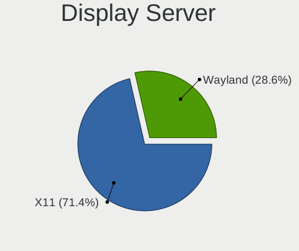
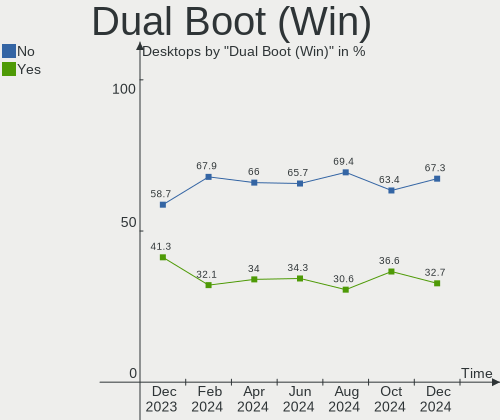
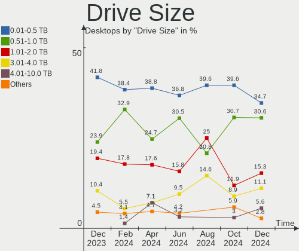
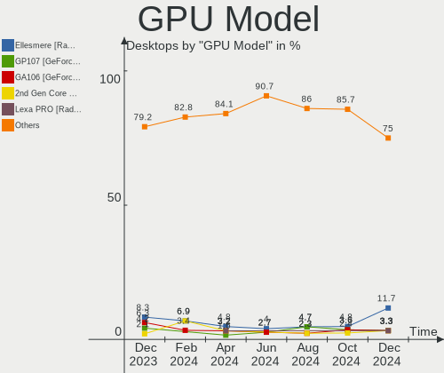
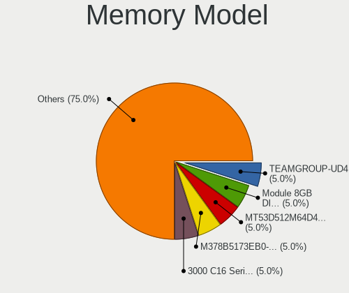
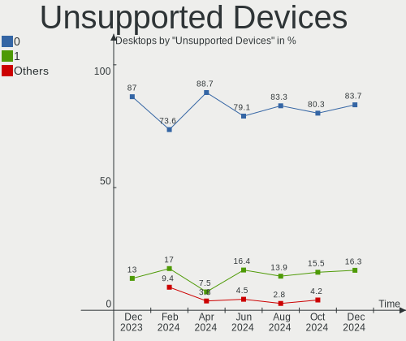

Kubuntu Hardware Trends (Desktop)
---------------------------------

A project to identify most popular hardware characteristics and track their change
over time based on data collected by Kubuntu users at https://Linux-Hardware.org.

Anyone can contribute to the study by uploading probes of their computers by
the [hw-probe](https://github.com/linuxhw/hw-probe) tool:

    sudo -E hw-probe -all -upload

Full-feature report is available here: https://linux-hardware.org/?view=trends&formfactor=desktop

Period: Mar, 2021.

Contents
--------

- [ OS                       ](#os)
- [ OS Family                ](#os-family)
- [ Kernel                   ](#kernel)
- [ Kernel Family            ](#kernel-family)
- [ Kernel Major Ver.        ](#kernel-major-ver)
- [ Arch                     ](#arch)
- [ DE                       ](#de)
- [ Display Server           ](#display-server)
- [ Display Manager          ](#display-manager)
- [ OS Lang                  ](#os-lang)
- [ Boot Mode                ](#boot-mode)
- [ Filesystem               ](#filesystem)
- [ Part. scheme             ](#part-scheme)
- [ Dual Boot with Linux/BSD ](#dual-boot-with-linux/bsd)
- [ Dual Boot (Win)          ](#dual-boot-win)
- [ Country                  ](#country)
- [ City                     ](#city)
- [ Vendor                   ](#vendor)
- [ Model                    ](#model)
- [ Model Family             ](#model-family)
- [ MFG Year                 ](#mfg-year)
- [ Form Factor              ](#form-factor)
- [ Secure Boot              ](#secure-boot)
- [ Coreboot                 ](#coreboot)
- [ RAM Size                 ](#ram-size)
- [ RAM Used                 ](#ram-used)
- [ Has CD-ROM               ](#has-cd-rom)
- [ Total Drives             ](#total-drives)
- [ Has Ethernet             ](#has-ethernet)
- [ Has WiFi                 ](#has-wifi)
- [ Has Bluetooth            ](#has-bluetooth)
- [ Drive Vendor             ](#drive-vendor)
- [ Drive Model              ](#drive-model)
- [ HDD Vendor               ](#hdd-vendor)
- [ SSD Vendor               ](#ssd-vendor)
- [ Drive Kind               ](#drive-kind)
- [ Drive Connector          ](#drive-connector)
- [ Drive Size               ](#drive-size)
- [ Space Total              ](#space-total)
- [ Space Used               ](#space-used)
- [ Malfunc. Drives          ](#malfunc-drives)
- [ Malfunc. Drive Vendor    ](#malfunc-drive-vendor)
- [ Malfunc. HDD Vendor      ](#malfunc-hdd-vendor)
- [ Malfunc. Drive Kind      ](#malfunc-drive-kind)
- [ Failed Drives            ](#failed-drives)
- [ Failed Drive Vendor      ](#failed-drive-vendor)
- [ Drive Status             ](#drive-status)
- [ Storage Vendor           ](#storage-vendor)
- [ Storage Model            ](#storage-model)
- [ Storage Kind             ](#storage-kind)
- [ CPU Vendor               ](#cpu-vendor)
- [ CPU Model                ](#cpu-model)
- [ CPU Model Family         ](#cpu-model-family)
- [ CPU Cores                ](#cpu-cores)
- [ CPU Sockets              ](#cpu-sockets)
- [ CPU Threads              ](#cpu-threads)
- [ CPU Op-Modes             ](#cpu-op-modes)
- [ CPU Microcode            ](#cpu-microcode)
- [ CPU Microarch            ](#cpu-microarch)
- [ GPU Vendor               ](#gpu-vendor)
- [ GPU Model                ](#gpu-model)
- [ GPU Combo                ](#gpu-combo)
- [ GPU Driver               ](#gpu-driver)
- [ GPU Memory               ](#gpu-memory)
- [ Monitor Vendor           ](#monitor-vendor)
- [ Monitor Model            ](#monitor-model)
- [ Monitor Resolution       ](#monitor-resolution)
- [ Monitor Diagonal         ](#monitor-diagonal)
- [ Monitor Width            ](#monitor-width)
- [ Aspect Ratio             ](#aspect-ratio)
- [ Monitor Area             ](#monitor-area)
- [ Pixel Density            ](#pixel-density)
- [ Multiple Monitors        ](#multiple-monitors)
- [ Net Controller Vendor    ](#net-controller-vendor)
- [ Net Controller Model     ](#net-controller-model)
- [ Wireless Vendor          ](#wireless-vendor)
- [ Wireless Model           ](#wireless-model)
- [ Ethernet Vendor          ](#ethernet-vendor)
- [ Ethernet Model           ](#ethernet-model)
- [ Net Controller Kind      ](#net-controller-kind)
- [ Used Controller          ](#used-controller)
- [ NICs                     ](#nics)
- [ IPv6                     ](#ipv6)
- [ Memory Vendor            ](#memory-vendor)
- [ Memory Model             ](#memory-model)
- [ Memory Kind              ](#memory-kind)
- [ Memory Form Factor       ](#memory-form-factor)
- [ Memory Size              ](#memory-size)
- [ Memory Speed             ](#memory-speed)
- [ Sound Vendor             ](#sound-vendor)
- [ Sound Model              ](#sound-model)
- [ Camera Vendor            ](#camera-vendor)
- [ Camera Model             ](#camera-model)
- [ Fingerprint Vendor       ](#fingerprint-vendor)
- [ Fingerprint Model        ](#fingerprint-model)
- [ Chipcard Vendor          ](#chipcard-vendor)
- [ Chipcard Model           ](#chipcard-model)
- [ Printer Vendor           ](#printer-vendor)
- [ Printer Model            ](#printer-model)
- [ Scanner Vendor           ](#scanner-vendor)
- [ Scanner Model            ](#scanner-model)
- [ Bluetooth Vendor         ](#bluetooth-vendor)
- [ Bluetooth Model          ](#bluetooth-model)
- [ Unsupported Devices      ](#unsupported-devices)
- [ Unsupported Device Types ](#unsupported-device-types)

OS
--

Installed operating systems

| Name          | Desktops | Percent |
|---------------|----------|---------|
| Kubuntu 20.04 | 30       | 68.18%  |
| Kubuntu 20.10 | 11       | 25%     |
| Kubuntu 18.04 | 2        | 4.55%   |
| Kubuntu 18.10 | 1        | 2.27%   |

OS Family
---------

OS without a version

| Name    | Desktops | Percent |
|---------|----------|---------|
| Kubuntu | 44       | 100%    |

Kernel
------

Version of the Linux kernel

| Version               | Desktops | Percent |
|-----------------------|----------|---------|
| 5.8.0-45-generic      | 11       | 25%     |
| 5.8.0-44-generic      | 7        | 15.91%  |
| 5.8.0-48-generic      | 5        | 11.36%  |
| 5.4.0-70-generic      | 5        | 11.36%  |
| 5.4.0-67-generic      | 4        | 9.09%   |
| 5.4.0-66-generic      | 3        | 6.82%   |
| 5.4.0-48-generic      | 2        | 4.55%   |
| 5.8.0-44-lowlatency   | 1        | 2.27%   |
| 5.8.0-25-generic      | 1        | 2.27%   |
| 5.4.0-66-lowlatency   | 1        | 2.27%   |
| 5.4.0-65-generic      | 1        | 2.27%   |
| 5.4.0-42-generic      | 1        | 2.27%   |
| 5.10.0-051000-generic | 1        | 2.27%   |
| 4.18.0-25-generic     | 1        | 2.27%   |

Kernel Family
-------------

Linux kernel without a distro release

| Version | Desktops | Percent |
|---------|----------|---------|
| 5.8.0   | 25       | 56.82%  |
| 5.4.0   | 17       | 38.64%  |
| 5.10.0  | 1        | 2.27%   |
| 4.18.0  | 1        | 2.27%   |

Kernel Major Ver.
-----------------

Linux kernel major version

| Version | Desktops | Percent |
|---------|----------|---------|
| 5.8     | 25       | 56.82%  |
| 5.4     | 17       | 38.64%  |
| 5.10    | 1        | 2.27%   |
| 4.18    | 1        | 2.27%   |

Arch
----

OS architecture (x86_64, i586, etc.)

| Name   | Desktops | Percent |
|--------|----------|---------|
| x86_64 | 44       | 100%    |

DE
--

Desktop Environment

| Name | Desktops | Percent |
|------|----------|---------|
| KDE5 | 22       | 50%     |
| KDE  | 22       | 50%     |

Display Server
--------------

X11 or Wayland

| Name | Desktops | Percent |
|------|----------|---------|
| X11  | 41       | 93.18%  |
| Tty  | 3        | 6.82%   |

Display Manager
---------------

SDDM, LightDM, etc.

| Name    | Desktops | Percent |
|---------|----------|---------|
| Unknown | 21       | 47.73%  |
| SDDM    | 18       | 40.91%  |
| GDM     | 4        | 9.09%   |
| TDM     | 1        | 2.27%   |

OS Lang
-------

Language

| Lang  | Desktops | Percent |
|-------|----------|---------|
| en_US | 20       | 45.45%  |
| ru_RU | 7        | 15.91%  |
| de_DE | 4        | 9.09%   |
| en_CA | 3        | 6.82%   |
| pl_PL | 2        | 4.55%   |
| uk_UA | 1        | 2.27%   |
| ru_UA | 1        | 2.27%   |
| fr_FR | 1        | 2.27%   |
| fi_FI | 1        | 2.27%   |
| en_NZ | 1        | 2.27%   |
| en_IN | 1        | 2.27%   |
| en_GB | 1        | 2.27%   |
| cs_CZ | 1        | 2.27%   |

Boot Mode
---------

EFI or BIOS

| Mode | Desktops | Percent |
|------|----------|---------|
| BIOS | 26       | 59.09%  |
| EFI  | 18       | 40.91%  |

Filesystem
----------

Type of filesystem

| Type    | Desktops | Percent |
|---------|----------|---------|
| Ext4    | 38       | 86.36%  |
| Zfs     | 2        | 4.55%   |
| Btrfs   | 2        | 4.55%   |
| Overlay | 1        | 2.27%   |
| Ext3    | 1        | 2.27%   |

Part. scheme
------------

Scheme of partitioning

| Type    | Desktops | Percent |
|---------|----------|---------|
| Unknown | 21       | 47.73%  |
| GPT     | 14       | 31.82%  |
| MBR     | 9        | 20.45%  |

Dual Boot with Linux/BSD
------------------------

Hosting more than one Linux/BSD

| Dual boot | Desktops | Percent |
|-----------|----------|---------|
| No        | 37       | 84.09%  |
| Yes       | 7        | 15.91%  |

Dual Boot (Win)
---------------

Hosting Linux and Windows

| Dual boot | Desktops | Percent |
|-----------|----------|---------|
| No        | 30       | 68.18%  |
| Yes       | 14       | 31.82%  |

Country
-------

Geographic location (country)

| Country     | Desktops | Percent |
|-------------|----------|---------|
| USA         | 9        | 20.45%  |
| Russia      | 8        | 18.18%  |
| Ukraine     | 4        | 9.09%   |
| Germany     | 4        | 9.09%   |
| Canada      | 3        | 6.82%   |
| Poland      | 2        | 4.55%   |
| Finland     | 2        | 4.55%   |
| Sweden      | 1        | 2.27%   |
| Slovakia    | 1        | 2.27%   |
| Serbia      | 1        | 2.27%   |
| Romania     | 1        | 2.27%   |
| New Zealand | 1        | 2.27%   |
| India       | 1        | 2.27%   |
| France      | 1        | 2.27%   |
| Czechia     | 1        | 2.27%   |
| Colombia    | 1        | 2.27%   |
| Bulgaria    | 1        | 2.27%   |
| Brazil      | 1        | 2.27%   |
| Belarus     | 1        | 2.27%   |

City
----

Geographic location (city)

| City               | Desktops | Percent |
|--------------------|----------|---------|
| Usol'ye-Sibirskoye | 3        | 6.82%   |
| Washington         | 1        | 2.27%   |
| Thrissur           | 1        | 2.27%   |
| Tampere            | 1        | 2.27%   |
| Sulmin             | 1        | 2.27%   |
| Srednyaya Akhtuba  | 1        | 2.27%   |
| Sofia              | 1        | 2.27%   |
| Shevchenkivske     | 1        | 2.27%   |
| San Francisco      | 1        | 2.27%   |
| San Diego          | 1        | 2.27%   |
| Piatra Neamţ      | 1        | 2.27%   |
| Ottawa             | 1        | 2.27%   |
| Oryol              | 1        | 2.27%   |
| Odessa             | 1        | 2.27%   |
| Novosibirsk        | 1        | 2.27%   |
| Nitra              | 1        | 2.27%   |
| Mount Pearl        | 1        | 2.27%   |
| Most               | 1        | 2.27%   |
| Moscow             | 1        | 2.27%   |
| Minsk              | 1        | 2.27%   |
| Maurecourt         | 1        | 2.27%   |
| Mankato            | 1        | 2.27%   |
| Lviv               | 1        | 2.27%   |
| Longueuil          | 1        | 2.27%   |
| Kungsholmen        | 1        | 2.27%   |
| Krasnodar          | 1        | 2.27%   |
| Helsinki           | 1        | 2.27%   |
| Harrison           | 1        | 2.27%   |
| Greensboro         | 1        | 2.27%   |
| Gorlice            | 1        | 2.27%   |
| Gera               | 1        | 2.27%   |
| Freudenstadt       | 1        | 2.27%   |
| Charlotte          | 1        | 2.27%   |
| Böblingen         | 1        | 2.27%   |
| Brasília          | 1        | 2.27%   |
| Boone              | 1        | 2.27%   |
| Bonn               | 1        | 2.27%   |
| Belgrade           | 1        | 2.27%   |
| Auckland           | 1        | 2.27%   |
| Armenia            | 1        | 2.27%   |
| Albuquerque        | 1        | 2.27%   |
| Unknown            | 1        | 2.27%   |

Vendor
------

Motherboard manufacturer

| Name                | Desktops | Percent |
|---------------------|----------|---------|
| ASUSTek Computer    | 15       | 34.09%  |
| Gigabyte Technology | 11       | 25%     |
| MSI                 | 5        | 11.36%  |
| ASRock              | 5        | 11.36%  |
| Hewlett-Packard     | 2        | 4.55%   |
| Acer                | 2        | 4.55%   |
| Wortmann AG         | 1        | 2.27%   |
| Seco                | 1        | 2.27%   |
| Dell                | 1        | 2.27%   |
| Unknown             | 1        | 2.27%   |

Model
-----

Motherboard model

| Name                          | Desktops | Percent |
|-------------------------------|----------|---------|
| Wortmann AG TERRA_PC          | 1        | 2.27%   |
| Seco C40                      | 1        | 2.27%   |
| MSI MS-7C76                   | 1        | 2.27%   |
| MSI MS-7C39                   | 1        | 2.27%   |
| MSI MS-7B09                   | 1        | 2.27%   |
| MSI MS-7A32                   | 1        | 2.27%   |
| MSI MS-7996                   | 1        | 2.27%   |
| HP Z400 Workstation           | 1        | 2.27%   |
| HP EliteDesk 800 G3 SFF       | 1        | 2.27%   |
| Gigabyte Z87-HD3              | 1        | 2.27%   |
| Gigabyte Z390 AORUS PRO       | 1        | 2.27%   |
| Gigabyte Z170X-UD5            | 1        | 2.27%   |
| Gigabyte P61-S3               | 1        | 2.27%   |
| Gigabyte GA-970-Gaming SLI-CF | 1        | 2.27%   |
| Gigabyte GA-78LMT-USB3        | 1        | 2.27%   |
| Gigabyte B550M AORUS PRO-P    | 1        | 2.27%   |
| Gigabyte B450M S2H            | 1        | 2.27%   |
| Gigabyte B365M DS3H           | 1        | 2.27%   |
| Gigabyte AB350-Gaming 3       | 1        | 2.27%   |
| Gigabyte A320M-H              | 1        | 2.27%   |
| Dell OptiPlex 7010            | 1        | 2.27%   |
| ASUS Z170 PRO GAMING          | 1        | 2.27%   |
| ASUS TUF X470-PLUS GAMING     | 1        | 2.27%   |
| ASUS TUF GAMING X570-PLUS     | 1        | 2.27%   |
| ASUS ROG STRIX B550-F GAMING  | 1        | 2.27%   |
| ASUS ROG STRIX B550-A GAMING  | 1        | 2.27%   |
| ASUS PRIME H270-PRO           | 1        | 2.27%   |
| ASUS PRIME B350-PLUS          | 1        | 2.27%   |
| ASUS P9X79                    | 1        | 2.27%   |
| ASUS P8H77-V LE               | 1        | 2.27%   |
| ASUS P6T SE                   | 1        | 2.27%   |
| ASUS Maximus IV Extreme       | 1        | 2.27%   |
| ASUS M5A97 R2.0               | 1        | 2.27%   |
| ASUS M5A97 LE R2.0            | 1        | 2.27%   |
| ASUS M4A88TD-V EVO/USB3       | 1        | 2.27%   |
| ASUS All Series               | 1        | 2.27%   |
| ASRock X470 Gaming-ITX/ac     | 1        | 2.27%   |
| ASRock H67DE3                 | 1        | 2.27%   |
| ASRock G41C-VS                | 1        | 2.27%   |
| ASRock B550 Extreme4          | 1        | 2.27%   |
| ASRock 990FX Extreme3         | 1        | 2.27%   |
| Acer Aspire X3900             | 1        | 2.27%   |
| Acer Aspire X3400             | 1        | 2.27%   |
| Unknown                       | 1        | 2.27%   |

Model Family
------------

Motherboard model prefix

| Name                   | Desktops | Percent |
|------------------------|----------|---------|
| ASUS TUF               | 2        | 4.55%   |
| ASUS ROG               | 2        | 4.55%   |
| ASUS PRIME             | 2        | 4.55%   |
| ASUS M5A97             | 2        | 4.55%   |
| Acer Aspire            | 2        | 4.55%   |
| Wortmann AG TERRA      | 1        | 2.27%   |
| Seco C40               | 1        | 2.27%   |
| MSI MS-7C76            | 1        | 2.27%   |
| MSI MS-7C39            | 1        | 2.27%   |
| MSI MS-7B09            | 1        | 2.27%   |
| MSI MS-7A32            | 1        | 2.27%   |
| MSI MS-7996            | 1        | 2.27%   |
| HP Z400                | 1        | 2.27%   |
| HP EliteDesk           | 1        | 2.27%   |
| Gigabyte Z87-HD3       | 1        | 2.27%   |
| Gigabyte Z390          | 1        | 2.27%   |
| Gigabyte Z170X-UD5     | 1        | 2.27%   |
| Gigabyte P61-S3        | 1        | 2.27%   |
| Gigabyte GA-970-Gaming | 1        | 2.27%   |
| Gigabyte GA-78LMT-USB3 | 1        | 2.27%   |
| Gigabyte B550M         | 1        | 2.27%   |
| Gigabyte B450M         | 1        | 2.27%   |
| Gigabyte B365M         | 1        | 2.27%   |
| Gigabyte AB350-Gaming  | 1        | 2.27%   |
| Gigabyte A320M-H       | 1        | 2.27%   |
| Dell OptiPlex          | 1        | 2.27%   |
| ASUS Z170              | 1        | 2.27%   |
| ASUS P9X79             | 1        | 2.27%   |
| ASUS P8H77-V           | 1        | 2.27%   |
| ASUS P6T               | 1        | 2.27%   |
| ASUS Maximus           | 1        | 2.27%   |
| ASUS M4A88TD-V         | 1        | 2.27%   |
| ASUS All               | 1        | 2.27%   |
| ASRock X470            | 1        | 2.27%   |
| ASRock H67DE3          | 1        | 2.27%   |
| ASRock G41C-VS         | 1        | 2.27%   |
| ASRock B550            | 1        | 2.27%   |
| ASRock 990FX           | 1        | 2.27%   |
| Unknown                | 1        | 2.27%   |

MFG Year
--------

Motherboard manufacture year

| Year | Desktops | Percent |
|------|----------|---------|
| 2020 | 9        | 20.45%  |
| 2018 | 7        | 15.91%  |
| 2019 | 5        | 11.36%  |
| 2012 | 5        | 11.36%  |
| 2016 | 4        | 9.09%   |
| 2021 | 3        | 6.82%   |
| 2015 | 2        | 4.55%   |
| 2014 | 2        | 4.55%   |
| 2013 | 2        | 4.55%   |
| 2010 | 2        | 4.55%   |
| 2009 | 2        | 4.55%   |
| 2017 | 1        | 2.27%   |

Form Factor
-----------

Physical design of the computer

| Name    | Desktops | Percent |
|---------|----------|---------|
| Desktop | 44       | 100%    |

Secure Boot
-----------

Enabled or disabled

| State    | Desktops | Percent |
|----------|----------|---------|
| Disabled | 43       | 97.73%  |
| Enabled  | 1        | 2.27%   |

Coreboot
--------

Have coreboot on board

| Used | Desktops | Percent |
|------|----------|---------|
| No   | 44       | 100%    |

RAM Size
--------

Total RAM memory

| Size in GB  | Desktops | Percent |
|-------------|----------|---------|
| 16.01-24.0  | 13       | 29.55%  |
| 8.01-16.0   | 8        | 18.18%  |
| 32.01-64.0  | 7        | 15.91%  |
| 4.01-8.0    | 6        | 13.64%  |
| 3.01-4.0    | 4        | 9.09%   |
| 24.01-32.0  | 3        | 6.82%   |
| 64.01-256.0 | 3        | 6.82%   |

RAM Used
--------

Used RAM memory

| Used GB    | Desktops | Percent |
|------------|----------|---------|
| 4.01-8.0   | 15       | 34.09%  |
| 3.01-4.0   | 8        | 18.18%  |
| 8.01-16.0  | 7        | 15.91%  |
| 2.01-3.0   | 6        | 13.64%  |
| 1.01-2.0   | 6        | 13.64%  |
| 24.01-32.0 | 1        | 2.27%   |
| 0.51-1.0   | 1        | 2.27%   |

Has CD-ROM
----------

Has CD-ROM on board

| Presented | Desktops | Percent |
|-----------|----------|---------|
| No        | 29       | 65.91%  |
| Yes       | 15       | 34.09%  |

Total Drives
------------

Number of drives on board

| Drives | Desktops | Percent |
|--------|----------|---------|
| 2      | 12       | 27.27%  |
| 3      | 11       | 25%     |
| 1      | 10       | 22.73%  |
| 4      | 6        | 13.64%  |
| 5      | 2        | 4.55%   |
| 10     | 1        | 2.27%   |
| 7      | 1        | 2.27%   |
| 0      | 1        | 2.27%   |

Has Ethernet
------------

Has Ethernet on board

| Presented | Desktops | Percent |
|-----------|----------|---------|
| Yes       | 44       | 100%    |

Has WiFi
--------

Has WiFi module

| Presented | Desktops | Percent |
|-----------|----------|---------|
| No        | 29       | 65.91%  |
| Yes       | 15       | 34.09%  |

Has Bluetooth
-------------

Has Bluetooth module

| Presented | Desktops | Percent |
|-----------|----------|---------|
| No        | 26       | 59.09%  |
| Yes       | 18       | 40.91%  |

Drive Vendor
------------

Hard drive vendors

| Vendor              | Desktops | Drives | Percent |
|---------------------|----------|--------|---------|
| Samsung Electronics | 18       | 27     | 18.18%  |
| WDC                 | 17       | 21     | 17.17%  |
| Seagate             | 12       | 17     | 12.12%  |
| Toshiba             | 7        | 7      | 7.07%   |
| Sandisk             | 7        | 7      | 7.07%   |
| Hitachi             | 4        | 4      | 4.04%   |
| Micron Technology   | 3        | 3      | 3.03%   |
| Kingston            | 3        | 3      | 3.03%   |
| Crucial             | 3        | 3      | 3.03%   |
| Transcend           | 2        | 2      | 2.02%   |
| Patriot             | 2        | 2      | 2.02%   |
| GOODRAM             | 2        | 3      | 2.02%   |
| Corsair             | 2        | 2      | 2.02%   |
| China               | 2        | 2      | 2.02%   |
| A-DATA Technology   | 2        | 2      | 2.02%   |
| WD MediaMax         | 1        | 1      | 1.01%   |
| Verbatim            | 1        | 1      | 1.01%   |
| SABRENT             | 1        | 1      | 1.01%   |
| PLEXTOR             | 1        | 1      | 1.01%   |
| MDT                 | 1        | 1      | 1.01%   |
| MAXTOR              | 1        | 1      | 1.01%   |
| LITEON              | 1        | 1      | 1.01%   |
| Intenso             | 1        | 2      | 1.01%   |
| Intel               | 1        | 1      | 1.01%   |
| Gigabyte Technology | 1        | 1      | 1.01%   |
| Fujitsu             | 1        | 1      | 1.01%   |
| EMTEC               | 1        | 1      | 1.01%   |
| ASMT                | 1        | 1      | 1.01%   |

Drive Model
-----------

Hard drive models

| Model                               | Desktops | Percent |
|-------------------------------------|----------|---------|
| WDC WD1003FZEX-00MK2A0 1TB          | 2        | 1.72%   |
| Toshiba DT01ACA300 3TB              | 2        | 1.72%   |
| Seagate ST3320620AS 320GB           | 2        | 1.72%   |
| Seagate Expansion 1TB               | 2        | 1.72%   |
| Samsung SSD 850 EVO 1TB             | 2        | 1.72%   |
| Samsung NVMe SSD Drive 500GB        | 2        | 1.72%   |
| Patriot Burst 240GB SSD             | 2        | 1.72%   |
| WDC WDS200T2B0C-00PXH0 2TB          | 1        | 0.86%   |
| WDC WDS100T2B0A-00SM50 1TB SSD      | 1        | 0.86%   |
| WDC WD60EZAZ-00ZGHB0 6TB            | 1        | 0.86%   |
| WDC WD3200BEVT-22ZCT0 320GB         | 1        | 0.86%   |
| WDC WD3200AAKX-001CA0 320GB         | 1        | 0.86%   |
| WDC WD3200AAKS-75SBA0 320GB         | 1        | 0.86%   |
| WDC WD3200AAJS-56M0A0 320GB         | 1        | 0.86%   |
| WDC WD20EZRZ-00Z5HB0 2TB            | 1        | 0.86%   |
| WDC WD20EARS-00MVWB0 2TB            | 1        | 0.86%   |
| WDC WD2005FBYZ-01YCBB2 2TB          | 1        | 0.86%   |
| WDC WD10EZEX-22RKKA0 1TB            | 1        | 0.86%   |
| WDC WD10EZEX-00WN4A0 1TB            | 1        | 0.86%   |
| WDC WD10EARS-00MVWB0 1TB            | 1        | 0.86%   |
| WDC WD10EADS-00L5B1 1TB             | 1        | 0.86%   |
| WDC WD1003FZEX-00K3CA0 1TB          | 1        | 0.86%   |
| WDC WD1002FAEX-00Z3A0 1TB           | 1        | 0.86%   |
| WDC WD1002FAEX-00Y9A0 1TB           | 1        | 0.86%   |
| WDC WD1001FALS-00J7B0 1TB           | 1        | 0.86%   |
| WD MediaMax WL1000GSA3272C 1TB      | 1        | 0.86%   |
| Verbatim Vi550 S3 SSD 128GB         | 1        | 0.86%   |
| Transcend TS256GMTE220S 256GB       | 1        | 0.86%   |
| Transcend TS128GSSD230S 128GB       | 1        | 0.86%   |
| Toshiba MQ01ABF050 500GB            | 1        | 0.86%   |
| Toshiba HDWD130 3TB                 | 1        | 0.86%   |
| Toshiba HDWD110 1TB                 | 1        | 0.86%   |
| Toshiba HDWA130 3TB                 | 1        | 0.86%   |
| Toshiba DT01ACA100 1TB              | 1        | 0.86%   |
| Seagate ST500LM012 HN-M500MBB 500GB | 1        | 0.86%   |
| Seagate ST3250820AS 250GB           | 1        | 0.86%   |
| Seagate ST320DM000-1BD14C 320GB     | 1        | 0.86%   |
| Seagate ST31500541AS 1TB            | 1        | 0.86%   |
| Seagate ST31500341AS 1TB            | 1        | 0.86%   |
| Seagate ST2000DM006-2DM164 2TB      | 1        | 0.86%   |
| Seagate ST2000DM001-1CH164 2TB      | 1        | 0.86%   |
| Seagate ST1000LM048-2E7172 1TB      | 1        | 0.86%   |
| Seagate ST1000LM024 HN-M101MBB 1TB  | 1        | 0.86%   |
| Seagate ST1000DM010-2EP102 1TB      | 1        | 0.86%   |
| Seagate ST1000DM003-1CH162 1TB      | 1        | 0.86%   |
| Seagate Expansion Desk 8TB          | 1        | 0.86%   |
| Seagate Backup+ BK 1TB              | 1        | 0.86%   |
| SanDisk SSD PLUS 240 GB             | 1        | 0.86%   |
| SanDisk SDSSDH3500G 500GB           | 1        | 0.86%   |
| SanDisk SDSSDH31000G 1TB            | 1        | 0.86%   |
| SanDisk SDSSDH3 250G                | 1        | 0.86%   |
| Sandisk NVMe SSD Drive 500GB        | 1        | 0.86%   |
| Sandisk NVMe SSD Drive 1TB          | 1        | 0.86%   |
| SanDisk DF4032  32GB                | 1        | 0.86%   |
| Samsung SSD 970 PRO 512GB           | 1        | 0.86%   |
| Samsung SSD 970 EVO 1TB             | 1        | 0.86%   |
| Samsung SSD 960 EVO 250GB           | 1        | 0.86%   |
| Samsung SSD 960 EVO 1TB             | 1        | 0.86%   |
| Samsung SSD 950 PRO 512GB           | 1        | 0.86%   |
| Samsung SSD 870 QVO 2TB             | 1        | 0.86%   |

HDD Vendor
----------

Hard disk drive vendors

| Vendor              | Desktops | Drives | Percent |
|---------------------|----------|--------|---------|
| WDC                 | 15       | 19     | 34.09%  |
| Seagate             | 11       | 16     | 25%     |
| Toshiba             | 7        | 7      | 15.91%  |
| Samsung Electronics | 4        | 4      | 9.09%   |
| Hitachi             | 4        | 4      | 9.09%   |
| WD MediaMax         | 1        | 1      | 2.27%   |
| MAXTOR              | 1        | 1      | 2.27%   |
| Fujitsu             | 1        | 1      | 2.27%   |

SSD Vendor
----------

Solid state drive vendors

| Vendor              | Desktops | Drives | Percent |
|---------------------|----------|--------|---------|
| Samsung Electronics | 10       | 12     | 24.39%  |
| SanDisk             | 4        | 4      | 9.76%   |
| Kingston            | 3        | 3      | 7.32%   |
| Crucial             | 3        | 3      | 7.32%   |
| Patriot             | 2        | 2      | 4.88%   |
| Micron Technology   | 2        | 2      | 4.88%   |
| GOODRAM             | 2        | 3      | 4.88%   |
| Corsair             | 2        | 2      | 4.88%   |
| China               | 2        | 2      | 4.88%   |
| A-DATA Technology   | 2        | 2      | 4.88%   |
| WDC                 | 1        | 1      | 2.44%   |
| Verbatim            | 1        | 1      | 2.44%   |
| Transcend           | 1        | 1      | 2.44%   |
| SABRENT             | 1        | 1      | 2.44%   |
| PLEXTOR             | 1        | 1      | 2.44%   |
| LITEON              | 1        | 1      | 2.44%   |
| Intenso             | 1        | 1      | 2.44%   |
| Intel               | 1        | 1      | 2.44%   |
| ASMT                | 1        | 1      | 2.44%   |

Drive Kind
----------

HDD or SSD

| Kind    | Desktops | Drives | Percent |
|---------|----------|--------|---------|
| HDD     | 30       | 53     | 40%     |
| SSD     | 28       | 44     | 37.33%  |
| NVMe    | 12       | 17     | 16%     |
| Unknown | 4        | 4      | 5.33%   |
| MMC     | 1        | 1      | 1.33%   |

Drive Connector
---------------

SATA, SAS, NVMe, etc.

| Type | Desktops | Drives | Percent |
|------|----------|--------|---------|
| SATA | 41       | 94     | 69.49%  |
| NVMe | 12       | 17     | 20.34%  |
| SAS  | 5        | 7      | 8.47%   |
| MMC  | 1        | 1      | 1.69%   |

Drive Size
----------

Size of hard drive

| Size in TB | Desktops | Drives | Percent |
|------------|----------|--------|---------|
| 0.01-0.5   | 30       | 46     | 45.45%  |
| 0.51-1.0   | 25       | 39     | 37.88%  |
| 1.01-2.0   | 5        | 6      | 7.58%   |
| 2.01-3.0   | 4        | 4      | 6.06%   |
| 4.01-10.0  | 2        | 2      | 3.03%   |

Space Total
-----------

Amount of disk space available on the file system

| Size in GB     | Desktops | Percent |
|----------------|----------|---------|
| 251-500        | 8        | 18.18%  |
| 1001-2000      | 8        | 18.18%  |
| 501-1000       | 8        | 18.18%  |
| More than 3000 | 6        | 13.64%  |
| 101-250        | 6        | 13.64%  |
| 2001-3000      | 4        | 9.09%   |
| 21-50          | 2        | 4.55%   |
| 1-20           | 1        | 2.27%   |
| 51-100         | 1        | 2.27%   |

Space Used
----------

Amount of used disk space

| Used GB        | Desktops | Percent |
|----------------|----------|---------|
| 251-500        | 6        | 13.64%  |
| 21-50          | 6        | 13.64%  |
| 101-250        | 6        | 13.64%  |
| 1-20           | 6        | 13.64%  |
| 1001-2000      | 5        | 11.36%  |
| 501-1000       | 5        | 11.36%  |
| 51-100         | 5        | 11.36%  |
| More than 3000 | 3        | 6.82%   |
| 2001-3000      | 2        | 4.55%   |

Malfunc. Drives
---------------

Drive models with a malfunction

| Model                                        | Desktops | Drives | Percent |
|----------------------------------------------|----------|--------|---------|
| WDC WD3200AAKX-001CA0 320GB                  | 1        | 1      | 14.29%  |
| WDC WD20EZRZ-00Z5HB0 2TB                     | 1        | 1      | 14.29%  |
| WDC WD1002FAEX-00Z3A0 1TB                    | 1        | 1      | 14.29%  |
| Seagate ST1000DM003-1CH162 1TB               | 1        | 1      | 14.29%  |
| SanDisk SSD PLUS 240 GB                      | 1        | 1      | 14.29%  |
| Micron Technology 1100_MTFDDAK1T0TBN 1TB SSD | 1        | 1      | 14.29%  |
| Hitachi HDS721050CLA362 500GB                | 1        | 1      | 14.29%  |

Malfunc. Drive Vendor
---------------------

Vendors of faulty drives

| Vendor            | Desktops | Drives | Percent |
|-------------------|----------|--------|---------|
| WDC               | 3        | 3      | 42.86%  |
| Seagate           | 1        | 1      | 14.29%  |
| SanDisk           | 1        | 1      | 14.29%  |
| Micron Technology | 1        | 1      | 14.29%  |
| Hitachi           | 1        | 1      | 14.29%  |

Malfunc. HDD Vendor
-------------------

Vendors of faulty HDD drives

| Vendor  | Desktops | Drives | Percent |
|---------|----------|--------|---------|
| WDC     | 3        | 3      | 60%     |
| Seagate | 1        | 1      | 20%     |
| Hitachi | 1        | 1      | 20%     |

Malfunc. Drive Kind
-------------------

Kinds of faulty drives

| Kind | Desktops | Drives | Percent |
|------|----------|--------|---------|
| HDD  | 5        | 5      | 71.43%  |
| SSD  | 2        | 2      | 28.57%  |

Failed Drives
-------------

Failed drive models

Zero info for selected period =(

Failed Drive Vendor
-------------------

Failed drive vendors

Zero info for selected period =(

Drive Status
------------

Number of failed and malfunc. drives

| Status   | Desktops | Drives | Percent |
|----------|----------|--------|---------|
| Detected | 24       | 70     | 45.28%  |
| Works    | 22       | 42     | 41.51%  |
| Malfunc  | 7        | 7      | 13.21%  |

Storage Vendor
--------------

Storage controller vendors

| Vendor              | Desktops | Percent |
|---------------------|----------|---------|
| Intel               | 23       | 36.51%  |
| AMD                 | 20       | 31.75%  |
| Samsung Electronics | 8        | 12.7%   |
| Sandisk             | 3        | 4.76%   |
| ASMedia Technology  | 2        | 3.17%   |
| VIA Technologies    | 1        | 1.59%   |
| Silicon Motion      | 1        | 1.59%   |
| Silicon Image       | 1        | 1.59%   |
| Phison Electronics  | 1        | 1.59%   |
| Nvidia              | 1        | 1.59%   |
| Micron Technology   | 1        | 1.59%   |
| JMicron Technology  | 1        | 1.59%   |

Storage Model
-------------

Storage controller models

| Model                                                                                   | Desktops | Percent |
|-----------------------------------------------------------------------------------------|----------|---------|
| AMD FCH SATA Controller [AHCI mode]                                                     | 10       | 12.35%  |
| Samsung NVMe SSD Controller SM981/PM981/PM983                                           | 6        | 7.41%   |
| AMD SB7x0/SB8x0/SB9x0 SATA Controller [AHCI mode]                                       | 5        | 6.17%   |
| Intel 200 Series PCH SATA controller [AHCI mode]                                        | 4        | 4.94%   |
| AMD Starship/Matisse Chipset SATA Controller [AHCI mode]                                | 4        | 4.94%   |
| Intel Q170/Q150/B150/H170/H110/Z170/CM236 Chipset SATA Controller [AHCI Mode]           | 3        | 3.7%    |
| Intel 6 Series/C200 Series Chipset Family 6 port Desktop SATA AHCI Controller           | 3        | 3.7%    |
| AMD SB7x0/SB8x0/SB9x0 IDE Controller                                                    | 3        | 3.7%    |
| AMD 400 Series Chipset SATA Controller                                                  | 3        | 3.7%    |
| Samsung NVMe SSD Controller SM961/PM961/SM963                                           | 2        | 2.47%   |
| ASMedia ASM1062 Serial ATA Controller                                                   | 2        | 2.47%   |
| AMD 300 Series Chipset SATA Controller                                                  | 2        | 2.47%   |
| VIA VT6415 PATA IDE Host Controller                                                     | 1        | 1.23%   |
| Silicon Motion SM2262/SM2262EN SSD Controller                                           | 1        | 1.23%   |
| Silicon Image SiI 3132 Serial ATA Raid II Controller                                    | 1        | 1.23%   |
| Sandisk WD Blue SN550 NVMe SSD                                                          | 1        | 1.23%   |
| Sandisk WD Blue SN500 / PC SN520 NVMe SSD                                               | 1        | 1.23%   |
| Sandisk WD Black SN750 / PC SN730 NVMe SSD                                              | 1        | 1.23%   |
| Samsung NVMe SSD Controller SM951/PM951                                                 | 1        | 1.23%   |
| Samsung NVMe SSD Controller PM9A1/980PRO                                                | 1        | 1.23%   |
| Phison E16 PCIe4 NVMe Controller                                                        | 1        | 1.23%   |
| Nvidia MCP78S [GeForce 8200] IDE                                                        | 1        | 1.23%   |
| Nvidia MCP78S [GeForce 8200] AHCI Controller                                            | 1        | 1.23%   |
| Micron Non-Volatile memory controller                                                   | 1        | 1.23%   |
| JMicron JMB363 SATA/IDE Controller                                                      | 1        | 1.23%   |
| Intel SATA Controller [RAID mode]                                                       | 1        | 1.23%   |
| Intel NM10/ICH7 Family SATA Controller [IDE mode]                                       | 1        | 1.23%   |
| Intel Comet Lake SATA AHCI Controller                                                   | 1        | 1.23%   |
| Intel Cannon Lake PCH SATA AHCI Controller                                              | 1        | 1.23%   |
| Intel C600/X79 series chipset 6-Port SATA AHCI Controller                               | 1        | 1.23%   |
| Intel 9 Series Chipset Family SATA Controller [AHCI Mode]                               | 1        | 1.23%   |
| Intel 82801JI (ICH10 Family) 4 port SATA IDE Controller #1                              | 1        | 1.23%   |
| Intel 82801JI (ICH10 Family) 2 port SATA IDE Controller #2                              | 1        | 1.23%   |
| Intel 82801G (ICH7 Family) IDE Controller                                               | 1        | 1.23%   |
| Intel 8 Series/C220 Series Chipset Family 6-port SATA Controller 1 [AHCI mode]          | 1        | 1.23%   |
| Intel 7 Series/C210 Series Chipset Family 6-port SATA Controller [AHCI mode]            | 1        | 1.23%   |
| Intel 7 Series/C210 Series Chipset Family 4-port SATA Controller [IDE mode]             | 1        | 1.23%   |
| Intel 7 Series/C210 Series Chipset Family 2-port SATA Controller [IDE mode]             | 1        | 1.23%   |
| Intel 7 Series Chipset Family 6-port SATA Controller [AHCI mode]                        | 1        | 1.23%   |
| Intel 6 Series/C200 Series Chipset Family Desktop SATA Controller (IDE mode, ports 4-5) | 1        | 1.23%   |
| Intel 6 Series/C200 Series Chipset Family Desktop SATA Controller (IDE mode, ports 0-3) | 1        | 1.23%   |
| Intel 5 Series/3400 Series Chipset 6 port SATA AHCI Controller                          | 1        | 1.23%   |
| AMD X399 Series Chipset SATA Controller                                                 | 1        | 1.23%   |
| AMD X370 Series Chipset SATA Controller                                                 | 1        | 1.23%   |
| AMD SB7x0/SB8x0/SB9x0 SATA Controller [IDE mode]                                        | 1        | 1.23%   |
| AMD FCH SATA Controller D                                                               | 1        | 1.23%   |

Storage Kind
------------

Kind of storage controller (IDE, SATA, NVMe, SAS, ...)

| Kind | Desktops | Percent |
|------|----------|---------|
| SATA | 39       | 63.93%  |
| NVMe | 12       | 19.67%  |
| IDE  | 8        | 13.11%  |
| RAID | 2        | 3.28%   |

CPU Vendor
----------

Processor vendors

| Vendor | Desktops | Percent |
|--------|----------|---------|
| Intel  | 23       | 52.27%  |
| AMD    | 21       | 47.73%  |

CPU Model
---------

Processor models

| Model                                          | Desktops | Percent |
|------------------------------------------------|----------|---------|
| AMD Ryzen 7 3700X 8-Core Processor             | 3        | 6.82%   |
| Intel Core i7-6700K CPU @ 4.00GHz              | 2        | 4.55%   |
| AMD FX-8350 Eight-Core Processor               | 2        | 4.55%   |
| Intel Xeon CPU W3670 @ 3.20GHz                 | 1        | 2.27%   |
| Intel Pentium Dual-Core CPU E5500 @ 2.80GHz    | 1        | 2.27%   |
| Intel Pentium CPU G850 @ 2.90GHz               | 1        | 2.27%   |
| Intel Core i9-9900K CPU @ 3.60GHz              | 1        | 2.27%   |
| Intel Core i7-7700 CPU @ 3.60GHz               | 1        | 2.27%   |
| Intel Core i7-4820K CPU @ 3.70GHz              | 1        | 2.27%   |
| Intel Core i7-3770 CPU @ 3.40GHz               | 1        | 2.27%   |
| Intel Core i7-2600K CPU @ 3.40GHz              | 1        | 2.27%   |
| Intel Core i7 CPU 930 @ 2.80GHz                | 1        | 2.27%   |
| Intel Core i5-9400F CPU @ 2.90GHz              | 1        | 2.27%   |
| Intel Core i5-7600 CPU @ 3.50GHz               | 1        | 2.27%   |
| Intel Core i5-4590 CPU @ 3.30GHz               | 1        | 2.27%   |
| Intel Core i5-4460 CPU @ 3.20GHz               | 1        | 2.27%   |
| Intel Core i5-3570 CPU @ 3.40GHz               | 1        | 2.27%   |
| Intel Core i5-3470 CPU @ 3.20GHz               | 1        | 2.27%   |
| Intel Core i5-10400 CPU @ 2.90GHz              | 1        | 2.27%   |
| Intel Core i3-9100 CPU @ 3.60GHz               | 1        | 2.27%   |
| Intel Core i3-6100 CPU @ 3.70GHz               | 1        | 2.27%   |
| Intel Core i3-2100 CPU @ 3.10GHz               | 1        | 2.27%   |
| Intel Core i3 CPU 550 @ 3.20GHz                | 1        | 2.27%   |
| Intel Celeron CPU 1007U @ 1.50GHz              | 1        | 2.27%   |
| AMD Ryzen Threadripper 1950X 16-Core Processor | 1        | 2.27%   |
| AMD Ryzen Embedded V1605B with Radeon Vega Gfx | 1        | 2.27%   |
| AMD Ryzen 9 3900XT 12-Core Processor           | 1        | 2.27%   |
| AMD Ryzen 7 5800X 8-Core Processor             | 1        | 2.27%   |
| AMD Ryzen 7 2700X Eight-Core Processor         | 1        | 2.27%   |
| AMD Ryzen 7 1800X Eight-Core Processor         | 1        | 2.27%   |
| AMD Ryzen 5 3600X 6-Core Processor             | 1        | 2.27%   |
| AMD Ryzen 5 3600 6-Core Processor              | 1        | 2.27%   |
| AMD Ryzen 5 3500X 6-Core Processor             | 1        | 2.27%   |
| AMD Ryzen 5 2600 Six-Core Processor            | 1        | 2.27%   |
| AMD Ryzen 5 1600X Six-Core Processor           | 1        | 2.27%   |
| AMD Phenom II X6 1075T Processor               | 1        | 2.27%   |
| AMD Phenom II X4 965 Processor                 | 1        | 2.27%   |
| AMD Phenom II X4 955 Processor                 | 1        | 2.27%   |
| AMD FX-8120 Eight-Core Processor               | 1        | 2.27%   |
| AMD Athlon II X2 215 Processor                 | 1        | 2.27%   |

CPU Model Family
----------------

Processor model prefix

| Model                   | Desktops | Percent |
|-------------------------|----------|---------|
| Intel Core i7           | 7        | 15.91%  |
| Intel Core i5           | 7        | 15.91%  |
| AMD Ryzen 7             | 6        | 13.64%  |
| AMD Ryzen 5             | 5        | 11.36%  |
| Intel Core i3           | 4        | 9.09%   |
| AMD FX                  | 3        | 6.82%   |
| AMD Phenom II X4        | 2        | 4.55%   |
| Intel Xeon              | 1        | 2.27%   |
| Intel Pentium Dual-Core | 1        | 2.27%   |
| Intel Pentium           | 1        | 2.27%   |
| Intel Core i9           | 1        | 2.27%   |
| Intel Celeron           | 1        | 2.27%   |
| AMD Ryzen Threadripper  | 1        | 2.27%   |
| AMD Ryzen Embedded      | 1        | 2.27%   |
| AMD Ryzen 9             | 1        | 2.27%   |
| AMD Phenom II X6        | 1        | 2.27%   |
| AMD Athlon II X2        | 1        | 2.27%   |

CPU Cores
---------

Number of processor cores

| Number | Desktops | Percent |
|--------|----------|---------|
| 4      | 19       | 43.18%  |
| 6      | 9        | 20.45%  |
| 8      | 7        | 15.91%  |
| 2      | 7        | 15.91%  |
| 16     | 1        | 2.27%   |
| 12     | 1        | 2.27%   |

CPU Sockets
-----------

Number of sockets

| Number | Desktops | Percent |
|--------|----------|---------|
| 1      | 44       | 100%    |

CPU Threads
-----------

Threads per core (Hyper-Threading)

| Number | Desktops | Percent |
|--------|----------|---------|
| 2      | 29       | 65.91%  |
| 1      | 15       | 34.09%  |

CPU Op-Modes
------------

CPU Operation Modes (32-bit, 64-bit)

| Op mode        | Desktops | Percent |
|----------------|----------|---------|
| 32-bit, 64-bit | 44       | 100%    |

CPU Microcode
-------------

Microcode number

| Number     | Desktops | Percent |
|------------|----------|---------|
| Unknown    | 8        | 18.18%  |
| 0x306a9    | 4        | 9.09%   |
| 0x08701021 | 4        | 9.09%   |
| 0x506e3    | 3        | 6.82%   |
| 0x206a7    | 3        | 6.82%   |
| 0x08001137 | 2        | 4.55%   |
| 0x010000c8 | 2        | 4.55%   |
| 0x906ec    | 1        | 2.27%   |
| 0x906eb    | 1        | 2.27%   |
| 0x906ea    | 1        | 2.27%   |
| 0x906e9    | 1        | 2.27%   |
| 0x306e4    | 1        | 2.27%   |
| 0x306c3    | 1        | 2.27%   |
| 0x206c2    | 1        | 2.27%   |
| 0x20655    | 1        | 2.27%   |
| 0x106a5    | 1        | 2.27%   |
| 0x1067a    | 1        | 2.27%   |
| 0x0a201009 | 1        | 2.27%   |
| 0x08701013 | 1        | 2.27%   |
| 0x08701011 | 1        | 2.27%   |
| 0x0800820d | 1        | 2.27%   |
| 0x08001138 | 1        | 2.27%   |
| 0x0600063e | 1        | 2.27%   |
| 0x010000dc | 1        | 2.27%   |
| 0x010000c7 | 1        | 2.27%   |

CPU Microarch
-------------

Microarchitecture

| Name        | Desktops | Percent |
|-------------|----------|---------|
| Zen 2       | 7        | 15.91%  |
| KabyLake    | 5        | 11.36%  |
| IvyBridge   | 5        | 11.36%  |
| Zen         | 4        | 9.09%   |
| K10         | 4        | 9.09%   |
| Skylake     | 3        | 6.82%   |
| SandyBridge | 3        | 6.82%   |
| Zen+        | 2        | 4.55%   |
| Westmere    | 2        | 4.55%   |
| Piledriver  | 2        | 4.55%   |
| Haswell     | 2        | 4.55%   |
| Zen 3       | 1        | 2.27%   |
| Penryn      | 1        | 2.27%   |
| Nehalem     | 1        | 2.27%   |
| CometLake   | 1        | 2.27%   |
| Bulldozer   | 1        | 2.27%   |

GPU Vendor
----------

Vendors of graphics cards

| Vendor | Desktops | Percent |
|--------|----------|---------|
| Nvidia | 20       | 43.48%  |
| AMD    | 16       | 34.78%  |
| Intel  | 10       | 21.74%  |

GPU Model
---------

Graphics card models

| Model                                                                       | Desktops | Percent |
|-----------------------------------------------------------------------------|----------|---------|
| Nvidia GP104 [GeForce GTX 1070]                                             | 3        | 6.38%   |
| AMD Ellesmere [Radeon RX 470/480/570/570X/580/580X/590]                     | 3        | 6.38%   |
| Nvidia GP108 [GeForce GT 1030]                                              | 2        | 4.26%   |
| Intel CoffeeLake-S GT2 [UHD Graphics 630]                                   | 2        | 4.26%   |
| AMD Juniper XT [Radeon HD 5770]                                             | 2        | 4.26%   |
| Nvidia TU116 [GeForce GTX 1660]                                             | 1        | 2.13%   |
| Nvidia TU104 [GeForce RTX 2080]                                             | 1        | 2.13%   |
| Nvidia TU104 [GeForce RTX 2070 SUPER]                                       | 1        | 2.13%   |
| Nvidia GP107 [GeForce GTX 1050 Ti]                                          | 1        | 2.13%   |
| Nvidia GP104 [GeForce GTX 1080]                                             | 1        | 2.13%   |
| Nvidia GP104 [GeForce GTX 1070 Ti]                                          | 1        | 2.13%   |
| Nvidia GP102 [GeForce GTX 1080 Ti]                                          | 1        | 2.13%   |
| Nvidia GM206 [GeForce GTX 960]                                              | 1        | 2.13%   |
| Nvidia GM204 [GeForce GTX 970]                                              | 1        | 2.13%   |
| Nvidia GM107 [GeForce GTX 750 Ti]                                           | 1        | 2.13%   |
| Nvidia GK208B [GeForce GT 730]                                              | 1        | 2.13%   |
| Nvidia GK104 [GeForce GTX 760]                                              | 1        | 2.13%   |
| Nvidia GF119 [GeForce GT 610]                                               | 1        | 2.13%   |
| Nvidia GF108 [GeForce GT 730]                                               | 1        | 2.13%   |
| Nvidia GA102 [GeForce RTX 3080]                                             | 1        | 2.13%   |
| Nvidia C77 [GeForce 8200]                                                   | 1        | 2.13%   |
| Intel Xeon E3-1200 v3/4th Gen Core Processor Integrated Graphics Controller | 1        | 2.13%   |
| Intel Xeon E3-1200 v2/3rd Gen Core processor Graphics Controller            | 1        | 2.13%   |
| Intel HD Graphics 630                                                       | 1        | 2.13%   |
| Intel HD Graphics 530                                                       | 1        | 2.13%   |
| Intel Core Processor Integrated Graphics Controller                         | 1        | 2.13%   |
| Intel CometLake-S GT2 [UHD Graphics 630]                                    | 1        | 2.13%   |
| Intel 3rd Gen Core processor Graphics Controller                            | 1        | 2.13%   |
| Intel 2nd Generation Core Processor Family Integrated Graphics Controller   | 1        | 2.13%   |
| AMD Vega 10 XL/XT [Radeon RX Vega 56/64]                                    | 1        | 2.13%   |
| AMD RV730 XT [Radeon HD 4670]                                               | 1        | 2.13%   |
| AMD Raven Ridge [Radeon Vega Series / Radeon Vega Mobile Series]            | 1        | 2.13%   |
| AMD Pitcairn XT [Radeon HD 7870 GHz Edition]                                | 1        | 2.13%   |
| AMD Pitcairn PRO [Radeon HD 7850 / R7 265 / R9 270 1024SP]                  | 1        | 2.13%   |
| AMD Juniper PRO [Radeon HD 5750]                                            | 1        | 2.13%   |
| AMD Hawaii PRO [Radeon R9 290/390]                                          | 1        | 2.13%   |
| AMD Caicos [Radeon HD 6450/7450/8450 / R5 230 OEM]                          | 1        | 2.13%   |
| AMD Caicos PRO [Radeon HD 7450]                                             | 1        | 2.13%   |
| AMD Baffin [Radeon RX 550 640SP / RX 560/560X]                              | 1        | 2.13%   |
| AMD Baffin [Radeon RX 460/560D / Pro 450/455/460/555/555X/560/560X]         | 1        | 2.13%   |

GPU Combo
---------

Combinations of graphics cards

| Name       | Desktops | Percent |
|------------|----------|---------|
| 1 x Nvidia | 18       | 40.91%  |
| 1 x AMD    | 16       | 36.36%  |
| 1 x Intel  | 9        | 20.45%  |
| 2 x Nvidia | 1        | 2.27%   |

GPU Driver
----------

Free vs proprietary

| Driver      | Desktops | Percent |
|-------------|----------|---------|
| Free        | 25       | 56.82%  |
| Proprietary | 19       | 43.18%  |

GPU Memory
----------

Total video memory

| Size in GB | Desktops | Percent |
|------------|----------|---------|
| Unknown    | 14       | 31.82%  |
| 7.01-8.0   | 9        | 20.45%  |
| 1.01-2.0   | 7        | 15.91%  |
| 0.51-1.0   | 5        | 11.36%  |
| 3.01-4.0   | 4        | 9.09%   |
| 8.01-16.0  | 2        | 4.55%   |
| 0.01-0.5   | 2        | 4.55%   |
| 5.01-6.0   | 1        | 2.27%   |

Monitor Vendor
--------------

Monitor vendors

| Vendor              | Desktops | Percent |
|---------------------|----------|---------|
| Dell                | 6        | 11.54%  |
| Samsung Electronics | 5        | 9.62%   |
| Goldstar            | 5        | 9.62%   |
| Acer                | 5        | 9.62%   |
| Hewlett-Packard     | 4        | 7.69%   |
| ASUSTek Computer    | 4        | 7.69%   |
| Philips             | 3        | 5.77%   |
| AOC                 | 3        | 5.77%   |
| ViewSonic           | 2        | 3.85%   |
| BenQ                | 2        | 3.85%   |
| Unknown             | 1        | 1.92%   |
| SNN                 | 1        | 1.92%   |
| SFX                 | 1        | 1.92%   |
| Packard Bell        | 1        | 1.92%   |
| Onkyo               | 1        | 1.92%   |
| Lenovo              | 1        | 1.92%   |
| InfoVision          | 1        | 1.92%   |
| Idek Iiyama         | 1        | 1.92%   |
| HPN                 | 1        | 1.92%   |
| HannStar            | 1        | 1.92%   |
| Gateway             | 1        | 1.92%   |
| Envision            | 1        | 1.92%   |
| DENON               | 1        | 1.92%   |

Monitor Model
-------------

Monitor models

| Model                                                                  | Desktops | Percent |
|------------------------------------------------------------------------|----------|---------|
| AOC 2460G5 AOC0001 1920x1080 530x300mm 24.0-inch                       | 2        | 3.39%   |
| ViewSonic VA2261 VSC0F30 1920x1080 477x268mm 21.5-inch                 | 1        | 1.69%   |
| ViewSonic VA1921 SERIES VSC0E2F 1366x768 410x230mm 18.5-inch           | 1        | 1.69%   |
| Unknown LCD Monitor SAMSUNG 3840x2160                                  | 1        | 1.69%   |
| SNN SUNNY SNN0002 1920x1080 1150x650mm 52.0-inch                       | 1        | 1.69%   |
| SFX LCD Monitor SFX0001 1920x1200 1150x650mm 52.0-inch                 | 1        | 1.69%   |
| Samsung Electronics U28E590 SAM0C4D 3840x2160 607x345mm 27.5-inch      | 1        | 1.69%   |
| Samsung Electronics U28D590 SAM0B80 3840x2160 607x345mm 27.5-inch      | 1        | 1.69%   |
| Samsung Electronics SyncMaster SAM01E1 1280x1024 376x301mm 19.0-inch   | 1        | 1.69%   |
| Samsung Electronics SMS24A850 SAM0825 1920x1200 518x324mm 24.1-inch    | 1        | 1.69%   |
| Samsung Electronics LCD Monitor SAM0C39 1920x1080 1050x590mm 47.4-inch | 1        | 1.69%   |
| Samsung Electronics LCD Monitor C34H89x 3440x1440                      | 1        | 1.69%   |
| Philips PHL 273V5 PHLC0D2 1920x1080 600x340mm 27.2-inch                | 1        | 1.69%   |
| Philips LCD Monitor PHILIPS FTV 3600x1080                              | 1        | 1.69%   |
| Philips 231E PHLC039 1920x1080 510x287mm 23.0-inch                     | 1        | 1.69%   |
| Packard Bell Viseo 230Ws PKB00C1 1920x1080 509x286mm 23.0-inch         | 1        | 1.69%   |
| Onkyo TX-NR535 ONK0E51 3840x2160 1095x616mm 49.5-inch                  | 1        | 1.69%   |
| Lenovo LEN T24i-10 LEN61CE 1920x1080 527x296mm 23.8-inch               | 1        | 1.69%   |
| InfoVision LCD Monitor IVO057F 1920x1080 309x174mm 14.0-inch           | 1        | 1.69%   |
| Idek Iiyama LCD Monitor PL2595W 5760x1200                              | 1        | 1.69%   |
| Idek Iiyama LCD Monitor PL2595W                                        | 1        | 1.69%   |
| HPN LCD Monitor HP 22yh 1920x1080                                      | 1        | 1.69%   |
| Hewlett-Packard LCD Monitor E232 1920x1080                             | 1        | 1.69%   |
| Hewlett-Packard LCD Monitor 2311                                       | 1        | 1.69%   |
| Hewlett-Packard E232 HWP3279 1920x1080 509x286mm 23.0-inch             | 1        | 1.69%   |
| Hewlett-Packard 22w HPN342E 1920x1080 480x270mm 21.7-inch              | 1        | 1.69%   |
| Hewlett-Packard 22cwa HWP3183 1920x1080 476x268mm 21.5-inch            | 1        | 1.69%   |
| HannStar HL229DPB HSD6325 1920x1080 477x268mm 21.5-inch                | 1        | 1.69%   |
| Goldstar W2600 GSM5675 1920x1200 550x343mm 25.5-inch                   | 1        | 1.69%   |
| Goldstar LG ULTRAWIDE GSM59F1 1920x1080 580x240mm 24.7-inch            | 1        | 1.69%   |
| Goldstar LG FULL HD GSM5ABB 1920x1080 480x270mm 21.7-inch              | 1        | 1.69%   |
| Goldstar HDR 4K GSM7706 3840x2160 600x340mm 27.2-inch                  | 1        | 1.69%   |
| Goldstar E2041 GSM4ECA 1600x900 443x249mm 20.0-inch                    | 1        | 1.69%   |
| Gateway LCD Monitor FPD2185W 3600x1080                                 | 1        | 1.69%   |
| Gateway LCD Monitor FPD2185W                                           | 1        | 1.69%   |
| Envision EN-7100si EPIE783 1280x1024 340x270mm 17.1-inch               | 1        | 1.69%   |
| DENON AVR DON0055 1920x540                                             | 1        | 1.69%   |
| Dell U2718Q DELA0EC 3840x2160 609x349mm 27.6-inch                      | 1        | 1.69%   |
| Dell U2518D DEL413A 2560x1440 553x311mm 25.0-inch                      | 1        | 1.69%   |
| Dell U2419H DEL4148 1920x1080 527x296mm 23.8-inch                      | 1        | 1.69%   |
| Dell U2412M DELA07A 1920x1200 518x324mm 24.1-inch                      | 1        | 1.69%   |
| Dell LCD Monitor 2408WFP 3840x1200                                     | 1        | 1.69%   |
| Dell 1704FPT DEL4005 1280x1024 338x270mm 17.0-inch                     | 1        | 1.69%   |
| BenQ GW2470 BNQ78D9 1920x1080 530x300mm 24.0-inch                      | 1        | 1.69%   |
| BenQ GW2270 BNQ78DB 1920x1080 476x268mm 21.5-inch                      | 1        | 1.69%   |
| ASUSTek Computer VP28U AUS28B1 3840x2160 621x341mm 27.9-inch           | 1        | 1.69%   |
| ASUSTek Computer VP249 AUS24AF 1920x1080 527x296mm 23.8-inch           | 1        | 1.69%   |
| ASUSTek Computer VP249 AUS24AA 1920x1080 530x300mm 24.0-inch           | 1        | 1.69%   |
| ASUSTek Computer VG245 AUS24A1 1920x1080 531x299mm 24.0-inch           | 1        | 1.69%   |
| AOC U2868 AOC2868 3840x2160 621x341mm 27.9-inch                        | 1        | 1.69%   |
| AOC LCD Monitor 2460 1920x1080                                         | 1        | 1.69%   |
| AOC G2460 AOC2460 1920x1080 530x300mm 24.0-inch                        | 1        | 1.69%   |
| Acer VG271U ACR06D7 2560x1440 597x336mm 27.0-inch                      | 1        | 1.69%   |
| Acer R271 ACR0496 1920x1080 598x336mm 27.0-inch                        | 1        | 1.69%   |
| Acer R231 ACR0504 1920x1080 509x286mm 23.0-inch                        | 1        | 1.69%   |
| Acer LCD Monitor XB270HU 2560x1440                                     | 1        | 1.69%   |
| Acer H226HQL ACR0319 1920x1080 476x268mm 21.5-inch                     | 1        | 1.69%   |
| Acer G235H ACR0113 1920x1080 510x287mm 23.0-inch                       | 1        | 1.69%   |

Monitor Resolution
------------------

Monitor screen resolution

| Resolution        | Desktops | Percent |
|-------------------|----------|---------|
| 1920x1080 (FHD)   | 18       | 39.13%  |
| 3840x2160 (4K)    | 7        | 15.22%  |
| 1920x1200 (WUXGA) | 4        | 8.7%    |
| 2560x1440 (QHD)   | 3        | 6.52%   |
| 1280x1024 (SXGA)  | 3        | 6.52%   |
| Unknown           | 3        | 6.52%   |
| 5760x1200         | 1        | 2.17%   |
| 3840x1200         | 1        | 2.17%   |
| 3600x1080         | 1        | 2.17%   |
| 3440x1440         | 1        | 2.17%   |
| 2560x1080         | 1        | 2.17%   |
| 1920x540          | 1        | 2.17%   |
| 1600x900 (HD+)    | 1        | 2.17%   |
| 1366x768 (WXGA)   | 1        | 2.17%   |

Monitor Diagonal
----------------

Diagonal size in inches

| Inches  | Desktops | Percent |
|---------|----------|---------|
| 24      | 10       | 18.87%  |
| Unknown | 10       | 18.87%  |
| 27      | 8        | 15.09%  |
| 21      | 7        | 13.21%  |
| 23      | 5        | 9.43%   |
| 52      | 2        | 3.77%   |
| 25      | 2        | 3.77%   |
| 17      | 2        | 3.77%   |
| 49      | 1        | 1.89%   |
| 47      | 1        | 1.89%   |
| 34      | 1        | 1.89%   |
| 20      | 1        | 1.89%   |
| 19      | 1        | 1.89%   |
| 18      | 1        | 1.89%   |
| 14      | 1        | 1.89%   |

Monitor Width
-------------

Physical width

| Width in mm | Desktops | Percent |
|-------------|----------|---------|
| 501-600     | 20       | 38.46%  |
| Unknown     | 10       | 19.23%  |
| 401-500     | 9        | 17.31%  |
| 601-700     | 4        | 7.69%   |
| 1001-1500   | 4        | 7.69%   |
| 301-350     | 3        | 5.77%   |
| 701-800     | 1        | 1.92%   |
| 351-400     | 1        | 1.92%   |

Aspect Ratio
------------

Proportional relationship between the width and the height

| Ratio   | Desktops | Percent |
|---------|----------|---------|
| 16/9    | 26       | 60.47%  |
| Unknown | 9        | 20.93%  |
| 5/4     | 3        | 6.98%   |
| 16/10   | 3        | 6.98%   |
| 32/9    | 1        | 2.33%   |
| 21/9    | 1        | 2.33%   |

Monitor Area
------------

Area in inch²

| Area in inch² | Desktops | Percent |
|----------------|----------|---------|
| 201-250        | 15       | 30.61%  |
| Unknown        | 10       | 20.41%  |
| 301-350        | 8        | 16.33%  |
| 251-300        | 4        | 8.16%   |
| More than 1000 | 3        | 6.12%   |
| 151-200        | 3        | 6.12%   |
| 141-150        | 3        | 6.12%   |
| 81-90          | 1        | 2.04%   |
| 351-500        | 1        | 2.04%   |
| 501-1000       | 1        | 2.04%   |

Pixel Density
-------------

Pixels per inch

| Density | Desktops | Percent |
|---------|----------|---------|
| 51-100  | 24       | 46.15%  |
| Unknown | 10       | 19.23%  |
| 101-120 | 9        | 17.31%  |
| 121-160 | 5        | 9.62%   |
| 1-50    | 3        | 5.77%   |
| 161-240 | 1        | 1.92%   |

Multiple Monitors
-----------------

Total monitors connected

| Total | Desktops | Percent |
|-------|----------|---------|
| 1     | 27       | 61.36%  |
| 2     | 15       | 34.09%  |
| 3     | 1        | 2.27%   |
| 0     | 1        | 2.27%   |

Net Controller Vendor
---------------------

Controller vendors

| Vendor                          | Desktops | Percent |
|---------------------------------|----------|---------|
| Realtek Semiconductor           | 26       | 43.33%  |
| Intel                           | 17       | 28.33%  |
| Broadcom Inc. and subsidiaries  | 5        | 8.33%   |
| Ralink Technology               | 2        | 3.33%   |
| Xiaomi                          | 1        | 1.67%   |
| TP-Link                         | 1        | 1.67%   |
| Ralink                          | 1        | 1.67%   |
| Qualcomm Atheros Communications | 1        | 1.67%   |
| Qualcomm Atheros                | 1        | 1.67%   |
| Nvidia                          | 1        | 1.67%   |
| Mellanox Technologies           | 1        | 1.67%   |
| DisplayLink                     | 1        | 1.67%   |
| ASIX Electronics                | 1        | 1.67%   |
| Apple                           | 1        | 1.67%   |

Net Controller Model
--------------------

Controller models

| Model                                                                    | Desktops | Percent |
|--------------------------------------------------------------------------|----------|---------|
| Realtek RTL8111/8168/8411 PCI Express Gigabit Ethernet Controller        | 21       | 30.43%  |
| Intel I211 Gigabit Network Connection                                    | 5        | 7.25%   |
| Realtek RTL8125 2.5GbE Controller                                        | 3        | 4.35%   |
| Intel Ethernet Connection (2) I219-V                                     | 3        | 4.35%   |
| Broadcom Inc. and subsidiaries BCM4360 802.11ac Wireless Network Adapter | 3        | 4.35%   |
| Realtek RTL8153 Gigabit Ethernet Adapter                                 | 2        | 2.9%    |
| Intel Wireless-AC 9260                                                   | 2        | 2.9%    |
| Intel Wi-Fi 6 AX200                                                      | 2        | 2.9%    |
| Intel Ethernet Controller I225-V                                         | 2        | 2.9%    |
| Intel 82579V Gigabit Network Connection                                  | 2        | 2.9%    |
| Xiaomi Mi/Redmi series (RNDIS + ADB)                                     | 1        | 1.45%   |
| TP-Link AC600 wireless Realtek RTL8811AU [Archer T2U Nano]               | 1        | 1.45%   |
| Realtek RTL8188EUS 802.11n Wireless Network Adapter                      | 1        | 1.45%   |
| Realtek RTL8188EE Wireless Network Adapter                               | 1        | 1.45%   |
| Realtek RTL8188CE 802.11b/g/n WiFi Adapter                               | 1        | 1.45%   |
| Realtek RTL8187B Wireless 802.11g 54Mbps Network Adapter                 | 1        | 1.45%   |
| Realtek RTL810xE PCI Express Fast Ethernet controller                    | 1        | 1.45%   |
| Ralink RT2501/RT2573 Wireless Adapter                                    | 1        | 1.45%   |
| Ralink MT7601U Wireless Adapter                                          | 1        | 1.45%   |
| Ralink RT5360 Wireless 802.11n 1T/1R                                     | 1        | 1.45%   |
| Qualcomm Atheros AR9271 802.11n                                          | 1        | 1.45%   |
| Qualcomm Atheros AR8132 Fast Ethernet                                    | 1        | 1.45%   |
| Nvidia MCP77 Ethernet                                                    | 1        | 1.45%   |
| Mellanox MT26448 [ConnectX EN 10GigE, PCIe 2.0 5GT/s]                    | 1        | 1.45%   |
| Intel Ethernet Connection (7) I219-V                                     | 1        | 1.45%   |
| Intel Ethernet Connection (5) I219-LM                                    | 1        | 1.45%   |
| Intel Comet Lake PCH CNVi WiFi                                           | 1        | 1.45%   |
| Intel 82579LM Gigabit Network Connection (Lewisville)                    | 1        | 1.45%   |
| Intel 82578DC Gigabit Network Connection                                 | 1        | 1.45%   |
| DisplayLink ThinkPad USB 3.0 Pro Dock                                    | 1        | 1.45%   |
| Broadcom Inc. and subsidiaries NetXtreme BCM5764M Gigabit Ethernet PCIe  | 1        | 1.45%   |
| Broadcom Inc. and subsidiaries NetLink BCM57781 Gigabit Ethernet PCIe    | 1        | 1.45%   |
| ASIX AX88179 Gigabit Ethernet                                            | 1        | 1.45%   |
| Apple iPad 4/Mini1                                                       | 1        | 1.45%   |

Wireless Vendor
---------------

Wireless vendors

| Vendor                          | Desktops | Percent |
|---------------------------------|----------|---------|
| Intel                           | 5        | 29.41%  |
| Realtek Semiconductor           | 4        | 23.53%  |
| Broadcom Inc. and subsidiaries  | 3        | 17.65%  |
| Ralink Technology               | 2        | 11.76%  |
| TP-Link                         | 1        | 5.88%   |
| Ralink                          | 1        | 5.88%   |
| Qualcomm Atheros Communications | 1        | 5.88%   |

Wireless Model
--------------

Wireless models

| Model                                                                    | Desktops | Percent |
|--------------------------------------------------------------------------|----------|---------|
| Broadcom Inc. and subsidiaries BCM4360 802.11ac Wireless Network Adapter | 3        | 17.65%  |
| Intel Wireless-AC 9260                                                   | 2        | 11.76%  |
| Intel Wi-Fi 6 AX200                                                      | 2        | 11.76%  |
| TP-Link AC600 wireless Realtek RTL8811AU [Archer T2U Nano]               | 1        | 5.88%   |
| Realtek RTL8188EUS 802.11n Wireless Network Adapter                      | 1        | 5.88%   |
| Realtek RTL8188EE Wireless Network Adapter                               | 1        | 5.88%   |
| Realtek RTL8188CE 802.11b/g/n WiFi Adapter                               | 1        | 5.88%   |
| Realtek RTL8187B Wireless 802.11g 54Mbps Network Adapter                 | 1        | 5.88%   |
| Ralink RT2501/RT2573 Wireless Adapter                                    | 1        | 5.88%   |
| Ralink MT7601U Wireless Adapter                                          | 1        | 5.88%   |
| Ralink RT5360 Wireless 802.11n 1T/1R                                     | 1        | 5.88%   |
| Qualcomm Atheros AR9271 802.11n                                          | 1        | 5.88%   |
| Intel Comet Lake PCH CNVi WiFi                                           | 1        | 5.88%   |

Ethernet Vendor
---------------

Ethernet vendors

| Vendor                         | Desktops | Percent |
|--------------------------------|----------|---------|
| Realtek Semiconductor          | 25       | 51.02%  |
| Intel                          | 15       | 30.61%  |
| Broadcom Inc. and subsidiaries | 2        | 4.08%   |
| Xiaomi                         | 1        | 2.04%   |
| Qualcomm Atheros               | 1        | 2.04%   |
| Nvidia                         | 1        | 2.04%   |
| Mellanox Technologies          | 1        | 2.04%   |
| DisplayLink                    | 1        | 2.04%   |
| ASIX Electronics               | 1        | 2.04%   |
| Apple                          | 1        | 2.04%   |

Ethernet Model
--------------

Ethernet models

| Model                                                                   | Desktops | Percent |
|-------------------------------------------------------------------------|----------|---------|
| Realtek RTL8111/8168/8411 PCI Express Gigabit Ethernet Controller       | 21       | 40.38%  |
| Intel I211 Gigabit Network Connection                                   | 5        | 9.62%   |
| Realtek RTL8125 2.5GbE Controller                                       | 3        | 5.77%   |
| Intel Ethernet Connection (2) I219-V                                    | 3        | 5.77%   |
| Realtek RTL8153 Gigabit Ethernet Adapter                                | 2        | 3.85%   |
| Intel Ethernet Controller I225-V                                        | 2        | 3.85%   |
| Intel 82579V Gigabit Network Connection                                 | 2        | 3.85%   |
| Xiaomi Mi/Redmi series (RNDIS + ADB)                                    | 1        | 1.92%   |
| Realtek RTL810xE PCI Express Fast Ethernet controller                   | 1        | 1.92%   |
| Qualcomm Atheros AR8132 Fast Ethernet                                   | 1        | 1.92%   |
| Nvidia MCP77 Ethernet                                                   | 1        | 1.92%   |
| Mellanox MT26448 [ConnectX EN 10GigE, PCIe 2.0 5GT/s]                   | 1        | 1.92%   |
| Intel Ethernet Connection (7) I219-V                                    | 1        | 1.92%   |
| Intel Ethernet Connection (5) I219-LM                                   | 1        | 1.92%   |
| Intel 82579LM Gigabit Network Connection (Lewisville)                   | 1        | 1.92%   |
| Intel 82578DC Gigabit Network Connection                                | 1        | 1.92%   |
| DisplayLink ThinkPad USB 3.0 Pro Dock                                   | 1        | 1.92%   |
| Broadcom Inc. and subsidiaries NetXtreme BCM5764M Gigabit Ethernet PCIe | 1        | 1.92%   |
| Broadcom Inc. and subsidiaries NetLink BCM57781 Gigabit Ethernet PCIe   | 1        | 1.92%   |
| ASIX AX88179 Gigabit Ethernet                                           | 1        | 1.92%   |
| Apple iPad 4/Mini1                                                      | 1        | 1.92%   |

Net Controller Kind
-------------------

Ethernet, WiFi or modem

| Kind     | Desktops | Percent |
|----------|----------|---------|
| Ethernet | 44       | 74.58%  |
| WiFi     | 15       | 25.42%  |

Used Controller
---------------

Currently used network controller

| Kind     | Desktops | Percent |
|----------|----------|---------|
| Ethernet | 41       | 75.93%  |
| WiFi     | 13       | 24.07%  |

NICs
----

Total network controllers on board

| Total | Desktops | Percent |
|-------|----------|---------|
| 1     | 32       | 72.73%  |
| 2     | 11       | 25%     |
| 3     | 1        | 2.27%   |

IPv6
----

IPv6 vs IPv4

| Used | Desktops | Percent |
|------|----------|---------|
| No   | 37       | 84.09%  |
| Yes  | 7        | 15.91%  |

Memory Vendor
-------------

Memory module vendors

| Vendor              | Desktops | Percent |
|---------------------|----------|---------|
| Corsair             | 7        | 25.93%  |
| Unknown             | 6        | 22.22%  |
| Crucial             | 5        | 18.52%  |
| Kingston            | 3        | 11.11%  |
| Team                | 2        | 7.41%   |
| Samsung Electronics | 2        | 7.41%   |
| Micron Technology   | 1        | 3.7%    |
| G.Skill             | 1        | 3.7%    |

Memory Model
------------

Memory module models

| Model                                                       | Desktops | Percent |
|-------------------------------------------------------------|----------|---------|
| Corsair RAM CMK16GX4M2B3000C15 8GB DIMM DDR4 3466MT/s       | 2        | 6.67%   |
| Unknown RAM Module 8192MB DIMM DDR3 1333MT/s                | 1        | 3.33%   |
| Unknown RAM Module 8192MB DIMM 1333MT/s                     | 1        | 3.33%   |
| Unknown RAM Module 4096MB DIMM DDR4 2400MT/s                | 1        | 3.33%   |
| Unknown RAM Module 4096MB DIMM DDR3 1333MT/s                | 1        | 3.33%   |
| Unknown RAM Module 2048MB DIMM SDRAM                        | 1        | 3.33%   |
| Unknown RAM Module 2048MB DIMM 1066MT/s                     | 1        | 3.33%   |
| Team RAM TEAMGROUP-UD4-3200 16384MB DIMM DDR4 3200MT/s      | 1        | 3.33%   |
| Team RAM TEAMGROUP-UD4-2666 8192MB DIMM DDR4 2667MT/s       | 1        | 3.33%   |
| Samsung RAM Module 2048MB DIMM DDR3 1066MT/s                | 1        | 3.33%   |
| Samsung RAM M378A5244CB0-CRC 4GB DIMM DDR4 2400MT/s         | 1        | 3.33%   |
| Micron RAM V01D3L84GB52852813 4096MB DIMM DDR3 1333MT/s     | 1        | 3.33%   |
| Kingston RAM KHX3200C16D4/8GX 8GB DIMM DDR4 3533MT/s        | 1        | 3.33%   |
| Kingston RAM KHX2666C15S4/16G 16384MB SODIMM DDR4 2667MT/s  | 1        | 3.33%   |
| Kingston RAM 99U5595-001.A00LF 2048MB DIMM DDR3 1600MT/s    | 1        | 3.33%   |
| Kingston RAM 99U5471-011.A01LF 2048MB DIMM DDR3 1333MT/s    | 1        | 3.33%   |
| G.Skill RAM F4-2800C16-8GRR 8192MB DIMM DDR4 2133MT/s       | 1        | 3.33%   |
| Crucial RAM CT8G4DFS824A.C8FDD1 8192MB DIMM DDR4 3200MT/s   | 1        | 3.33%   |
| Crucial RAM CT51264BA160BJ.C8F 4GB DIMM DDR3 1600MT/s       | 1        | 3.33%   |
| Crucial RAM CT51264BA160BJ.C8 4096MB DIMM DDR3 1600MT/s     | 1        | 3.33%   |
| Crucial RAM CT102464BA1339.C16 8192MB DIMM DDR3 1333MT/s    | 1        | 3.33%   |
| Crucial RAM BLS8G4D30AESBK.M8FE 8192MB DIMM DDR4 3600MT/s   | 1        | 3.33%   |
| Crucial RAM BLS16G4D26BFSE.16FD 16384MB DIMM DDR4 2666MT/s  | 1        | 3.33%   |
| Crucial RAM BLS16G4D240FSC.16FBR 16384MB DIMM DDR4 2400MT/s | 1        | 3.33%   |
| Corsair RAM CMX8GX3M2A1600C9 4096MB DIMM DDR3 1800MT/s      | 1        | 3.33%   |
| Corsair RAM CMX16GX3M4A1600C9 4096MB DIMM DDR3 1600MT/s     | 1        | 3.33%   |
| Corsair RAM CMW32GX4M2C3200C16 16GB DIMM DDR4 3200MT/s      | 1        | 3.33%   |
| Corsair RAM CMK32GX4M2Z3600C18 16GB DIMM DDR4 3800MT/s      | 1        | 3.33%   |
| Corsair RAM CMK16GX4M2B3200C16 8GB DIMM DDR4 3266MT/s       | 1        | 3.33%   |

Memory Kind
-----------

Memory module kinds

| Kind    | Desktops | Percent |
|---------|----------|---------|
| DDR4    | 14       | 56%     |
| DDR3    | 8        | 32%     |
| Unknown | 2        | 8%      |
| SDRAM   | 1        | 4%      |

Memory Form Factor
------------------

Physical design of the memory module

| Name   | Desktops | Percent |
|--------|----------|---------|
| DIMM   | 24       | 96%     |
| SODIMM | 1        | 4%      |

Memory Size
-----------

Memory module size

| Size  | Desktops | Percent |
|-------|----------|---------|
| 8192  | 10       | 37.04%  |
| 4096  | 7        | 25.93%  |
| 16384 | 6        | 22.22%  |
| 2048  | 4        | 14.81%  |

Memory Speed
------------

Memory module speed

| Speed   | Desktops | Percent |
|---------|----------|---------|
| 1333    | 5        | 17.86%  |
| 3200    | 3        | 10.71%  |
| 2400    | 3        | 10.71%  |
| 1600    | 3        | 10.71%  |
| 3466    | 2        | 7.14%   |
| 2667    | 2        | 7.14%   |
| 1066    | 2        | 7.14%   |
| 3800    | 1        | 3.57%   |
| 3600    | 1        | 3.57%   |
| 3533    | 1        | 3.57%   |
| 3266    | 1        | 3.57%   |
| 2666    | 1        | 3.57%   |
| 2133    | 1        | 3.57%   |
| 1800    | 1        | 3.57%   |
| Unknown | 1        | 3.57%   |

Sound Vendor
------------

Sound card vendors

| Vendor              | Desktops | Percent |
|---------------------|----------|---------|
| AMD                 | 24       | 31.17%  |
| Intel               | 23       | 29.87%  |
| Nvidia              | 20       | 25.97%  |
| C-Media Electronics | 3        | 3.9%    |
| Creative Technology | 2        | 2.6%    |
| Creative Labs       | 2        | 2.6%    |
| Texas Instruments   | 1        | 1.3%    |
| SteelSeries ApS     | 1        | 1.3%    |
| Logitech            | 1        | 1.3%    |

Sound Model
-----------

Sound card models

| Model                                                                             | Desktops | Percent |
|-----------------------------------------------------------------------------------|----------|---------|
| AMD Starship/Matisse HD Audio Controller                                          | 7        | 7.87%   |
| Nvidia GP104 High Definition Audio Controller                                     | 5        | 5.62%   |
| AMD SBx00 Azalia (Intel HDA)                                                      | 5        | 5.62%   |
| Intel 6 Series/C200 Series Chipset Family High Definition Audio Controller        | 4        | 4.49%   |
| Intel 200 Series PCH HD Audio                                                     | 4        | 4.49%   |
| AMD Family 17h (Models 00h-0fh) HD Audio Controller                               | 4        | 4.49%   |
| Intel 7 Series/C216 Chipset Family High Definition Audio Controller               | 3        | 3.37%   |
| Intel 100 Series/C230 Series Chipset Family HD Audio Controller                   | 3        | 3.37%   |
| AMD Juniper HDMI Audio [Radeon HD 5700 Series]                                    | 3        | 3.37%   |
| AMD Ellesmere HDMI Audio [Radeon RX 470/480 / 570/580/590]                        | 3        | 3.37%   |
| Nvidia TU104 HD Audio Controller                                                  | 2        | 2.25%   |
| Nvidia GP108 High Definition Audio Controller                                     | 2        | 2.25%   |
| Intel 82801JI (ICH10 Family) HD Audio Controller                                  | 2        | 2.25%   |
| AMD Oland/Hainan/Cape Verde/Pitcairn HDMI Audio [Radeon HD 7000 Series]           | 2        | 2.25%   |
| AMD Caicos HDMI Audio [Radeon HD 6450 / 7450/8450/8490 OEM / R5 230/235/235X OEM] | 2        | 2.25%   |
| AMD Baffin HDMI/DP Audio [Radeon RX 550 640SP / RX 560/560X]                      | 2        | 2.25%   |
| Texas Instruments PCM2900 Audio Codec                                             | 1        | 1.12%   |
| SteelSeries ApS Arctis Pro Wireless                                               | 1        | 1.12%   |
| Nvidia TU116 High Definition Audio Controller                                     | 1        | 1.12%   |
| Nvidia MCP72XE/MCP72P/MCP78U/MCP78S High Definition Audio                         | 1        | 1.12%   |
| Nvidia GP107GL High Definition Audio Controller                                   | 1        | 1.12%   |
| Nvidia GP102 HDMI Audio Controller                                                | 1        | 1.12%   |
| Nvidia GM206 High Definition Audio Controller                                     | 1        | 1.12%   |
| Nvidia GM204 High Definition Audio Controller                                     | 1        | 1.12%   |
| Nvidia GM107 High Definition Audio Controller [GeForce 940MX]                     | 1        | 1.12%   |
| Nvidia GK208 HDMI/DP Audio Controller                                             | 1        | 1.12%   |
| Nvidia GK104 HDMI Audio Controller                                                | 1        | 1.12%   |
| Nvidia GF119 HDMI Audio Controller                                                | 1        | 1.12%   |
| Nvidia GF108 High Definition Audio Controller                                     | 1        | 1.12%   |
| Nvidia GA102 High Definition Audio Controller                                     | 1        | 1.12%   |
| Logitech Clear Chat Comfort USB Headset                                           | 1        | 1.12%   |
| Intel Xeon E3-1200 v3/4th Gen Core Processor HD Audio Controller                  | 1        | 1.12%   |
| Intel NM10/ICH7 Family High Definition Audio Controller                           | 1        | 1.12%   |
| Intel Comet Lake PCH cAVS                                                         | 1        | 1.12%   |
| Intel Cannon Lake PCH cAVS                                                        | 1        | 1.12%   |
| Intel C600/X79 series chipset High Definition Audio Controller                    | 1        | 1.12%   |
| Intel 9 Series Chipset Family HD Audio Controller                                 | 1        | 1.12%   |
| Intel 8 Series/C220 Series Chipset High Definition Audio Controller               | 1        | 1.12%   |
| Intel 5 Series/3400 Series Chipset High Definition Audio                          | 1        | 1.12%   |
| Creative Technology Sound Blaster Play! 2                                         | 1        | 1.12%   |
| Creative Technology SB Omni Surround 5.1                                          | 1        | 1.12%   |
| Creative Labs Sound Core3D [Sound Blaster Recon3D / Z-Series]                     | 1        | 1.12%   |
| Creative Labs EMU10k2/CA0100/CA0102/CA10200 [Sound Blaster Audigy Series]         | 1        | 1.12%   |
| C-Media Electronics CMI8788 [Oxygen HD Audio]                                     | 1        | 1.12%   |
| C-Media Electronics CM108 Audio Controller                                        | 1        | 1.12%   |
| C-Media Electronics CM106 Like Sound Device                                       | 1        | 1.12%   |
| C-Media Electronics Blue Snowball                                                 | 1        | 1.12%   |
| AMD Vega 10 HDMI Audio [Radeon Vega 56/64]                                        | 1        | 1.12%   |
| AMD RV710/730 HDMI Audio [Radeon HD 4000 series]                                  | 1        | 1.12%   |
| AMD Raven/Raven2/Fenghuang HDMI/DP Audio Controller                               | 1        | 1.12%   |
| AMD Hawaii HDMI Audio [Radeon R9 290/290X / 390/390X]                             | 1        | 1.12%   |
| AMD Family 17h (Models 10h-1fh) HD Audio Controller                               | 1        | 1.12%   |

Camera Vendor
-------------

Camera device vendors

| Vendor                      | Desktops | Percent |
|-----------------------------|----------|---------|
| Z-Star Microelectronics     | 3        | 27.27%  |
| Logitech                    | 3        | 27.27%  |
| Samsung Electronics         | 1        | 9.09%   |
| Microdia                    | 1        | 9.09%   |
| KYE Systems (Mouse Systems) | 1        | 9.09%   |
| Huawei Technologies         | 1        | 9.09%   |
| Genesys Logic               | 1        | 9.09%   |

Camera Model
------------

Camera device models

| Model                                          | Desktops | Percent |
|------------------------------------------------|----------|---------|
| Z-Star Venus USB2.0 Camera                     | 2        | 18.18%  |
| Z-Star Full HD 1080P PC Camera                 | 1        | 9.09%   |
| Samsung Galaxy A5 (MTP)                        | 1        | 9.09%   |
| Microdia Webcam Vitade AF                      | 1        | 9.09%   |
| Logitech Webcam C270                           | 1        | 9.09%   |
| Logitech HD Webcam C615                        | 1        | 9.09%   |
| Logitech HD Pro Webcam C920                    | 1        | 9.09%   |
| KYE Systems (Mouse Systems) Genius FaceCam 320 | 1        | 9.09%   |
| Huawei UVC Camera                              | 1        | 9.09%   |
| Genesys Logic USB2.0 UVC PC Camera             | 1        | 9.09%   |

Fingerprint Vendor
------------------

Fingerprint sensor vendors

Zero info for selected period =(

Fingerprint Model
-----------------

Fingerprint sensor models

Zero info for selected period =(

Chipcard Vendor
---------------

Chipcard module vendors

Zero info for selected period =(

Chipcard Model
--------------

Chipcard module models

Zero info for selected period =(

Printer Vendor
--------------

Printer device vendors

| Vendor             | Desktops | Percent |
|--------------------|----------|---------|
| Hewlett-Packard    | 1        | 50%     |
| Brother Industries | 1        | 50%     |

Printer Model
-------------

Printer device models

| Model             | Desktops | Percent |
|-------------------|----------|---------|
| HP LaserJet P1102 | 1        | 50%     |
| Brother MFC-7420  | 1        | 50%     |

Scanner Vendor
--------------

Scanner device vendors

Zero info for selected period =(

Scanner Model
-------------

Scanner device models

Zero info for selected period =(

Bluetooth Vendor
----------------

Controller vendors

| Vendor                          | Desktops | Percent |
|---------------------------------|----------|---------|
| Cambridge Silicon Radio         | 9        | 47.37%  |
| Intel                           | 5        | 26.32%  |
| Broadcom                        | 2        | 10.53%  |
| Realtek Semiconductor           | 1        | 5.26%   |
| Qualcomm Atheros Communications | 1        | 5.26%   |
| ASUSTek Computer                | 1        | 5.26%   |

Bluetooth Model
---------------

Controller models

| Model                                               | Desktops | Percent |
|-----------------------------------------------------|----------|---------|
| Cambridge Silicon Radio Bluetooth Dongle (HCI mode) | 9        | 47.37%  |
| Intel Wireless-AC 9260 Bluetooth Adapter            | 2        | 10.53%  |
| Intel AX200 Bluetooth                               | 2        | 10.53%  |
| Broadcom BCM20702A0 Bluetooth 4.0                   | 2        | 10.53%  |
| Realtek Bluetooth Radio                             | 1        | 5.26%   |
| Qualcomm Atheros AR3011 Bluetooth                   | 1        | 5.26%   |
| Intel Bluetooth Device                              | 1        | 5.26%   |
| ASUS ASUS USB-BT500                                 | 1        | 5.26%   |

Unsupported Devices
-------------------

Total unsupported devices on board

| Total | Desktops | Percent |
|-------|----------|---------|
| 0     | 43       | 97.73%  |
| 1     | 1        | 2.27%   |

Unsupported Device Types
------------------------

Types of unsupported devices

| Type                  | Desktops | Percent |
|-----------------------|----------|---------|
| Multimedia controller | 1        | 100%    |

