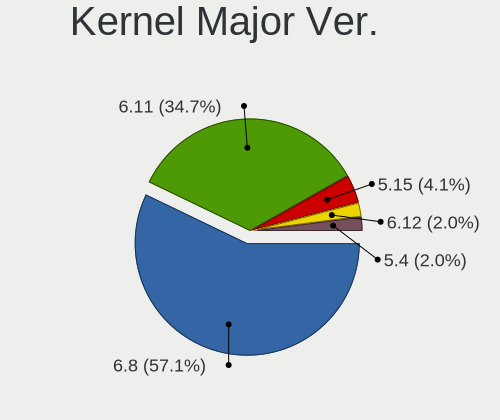
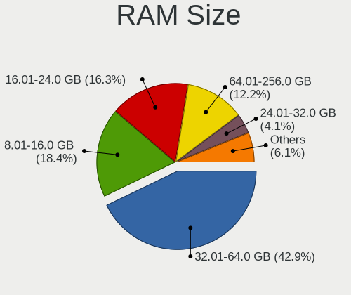
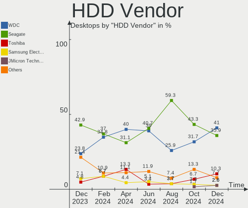
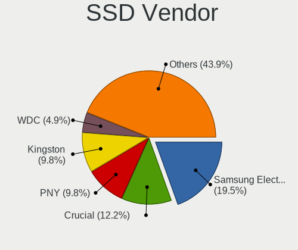
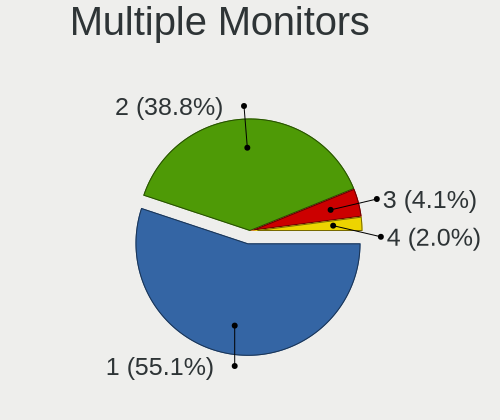
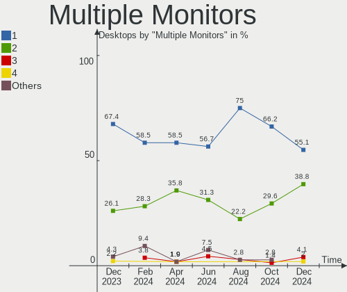

Kubuntu - Hardware Trends (Desktops)
------------------------------------

A project to identify most popular hardware characteristics and track their change
over time based on data collected by Linux users at https://Linux-Hardware.org.

Anyone can contribute to this report by the [hw-probe](https://github.com/linuxhw/hw-probe) tool:

    sudo -E hw-probe -all -upload

This report is for one last month. Overall report since the beginning of time: [TestCoverage](https://github.com/linuxhw/TestCoverage)

Period: Jun, 2022.

Contents
--------

* [ System ](#system)
  - [ OS                       ](#os)
  - [ OS Family                ](#os-family)
  - [ Kernel                   ](#kernel)
  - [ Kernel Family            ](#kernel-family)
  - [ Kernel Major Ver.        ](#kernel-major-ver)
  - [ Arch                     ](#arch)
  - [ DE                       ](#de)
  - [ Display Server           ](#display-server)
  - [ Display Manager          ](#display-manager)
  - [ OS Lang                  ](#os-lang)
  - [ Boot Mode                ](#boot-mode)
  - [ Filesystem               ](#filesystem)
  - [ Part. scheme             ](#part-scheme)
  - [ Dual Boot with Linux/BSD ](#dual-boot-with-linuxbsd)
  - [ Dual Boot (Win)          ](#dual-boot-win)

* [ Board ](#board)
  - [ Vendor                   ](#vendor)
  - [ Model                    ](#model)
  - [ Model Family             ](#model-family)
  - [ MFG Year                 ](#mfg-year)
  - [ Form Factor              ](#form-factor)
  - [ Secure Boot              ](#secure-boot)
  - [ Coreboot                 ](#coreboot)
  - [ RAM Size                 ](#ram-size)
  - [ RAM Used                 ](#ram-used)
  - [ Total Drives             ](#total-drives)
  - [ Has CD-ROM               ](#has-cd-rom)
  - [ Has Ethernet             ](#has-ethernet)
  - [ Has WiFi                 ](#has-wifi)
  - [ Has Bluetooth            ](#has-bluetooth)

* [ Location ](#location)
  - [ Country                  ](#country)
  - [ City                     ](#city)

* [ Drives ](#drives)
  - [ Drive Vendor             ](#drive-vendor)
  - [ Drive Model              ](#drive-model)
  - [ HDD Vendor               ](#hdd-vendor)
  - [ SSD Vendor               ](#ssd-vendor)
  - [ Drive Kind               ](#drive-kind)
  - [ Drive Connector          ](#drive-connector)
  - [ Drive Size               ](#drive-size)
  - [ Space Total              ](#space-total)
  - [ Space Used               ](#space-used)
  - [ Malfunc. Drives          ](#malfunc-drives)
  - [ Malfunc. Drive Vendor    ](#malfunc-drive-vendor)
  - [ Malfunc. HDD Vendor      ](#malfunc-hdd-vendor)
  - [ Malfunc. Drive Kind      ](#malfunc-drive-kind)
  - [ Failed Drives            ](#failed-drives)
  - [ Failed Drive Vendor      ](#failed-drive-vendor)
  - [ Drive Status             ](#drive-status)

* [ Storage controller ](#storage-controller)
  - [ Storage Vendor           ](#storage-vendor)
  - [ Storage Model            ](#storage-model)
  - [ Storage Kind             ](#storage-kind)

* [ Processor ](#processor)
  - [ CPU Vendor               ](#cpu-vendor)
  - [ CPU Model                ](#cpu-model)
  - [ CPU Model Family         ](#cpu-model-family)
  - [ CPU Cores                ](#cpu-cores)
  - [ CPU Sockets              ](#cpu-sockets)
  - [ CPU Threads              ](#cpu-threads)
  - [ CPU Op-Modes             ](#cpu-op-modes)
  - [ CPU Microcode            ](#cpu-microcode)
  - [ CPU Microarch            ](#cpu-microarch)

* [ Graphics ](#graphics)
  - [ GPU Vendor               ](#gpu-vendor)
  - [ GPU Model                ](#gpu-model)
  - [ GPU Combo                ](#gpu-combo)
  - [ GPU Driver               ](#gpu-driver)
  - [ GPU Memory               ](#gpu-memory)

* [ Monitor ](#monitor)
  - [ Monitor Vendor           ](#monitor-vendor)
  - [ Monitor Model            ](#monitor-model)
  - [ Monitor Resolution       ](#monitor-resolution)
  - [ Monitor Diagonal         ](#monitor-diagonal)
  - [ Monitor Width            ](#monitor-width)
  - [ Aspect Ratio             ](#aspect-ratio)
  - [ Monitor Area             ](#monitor-area)
  - [ Pixel Density            ](#pixel-density)
  - [ Multiple Monitors        ](#multiple-monitors)

* [ Network ](#network)
  - [ Net Controller Vendor    ](#net-controller-vendor)
  - [ Net Controller Model     ](#net-controller-model)
  - [ Wireless Vendor          ](#wireless-vendor)
  - [ Wireless Model           ](#wireless-model)
  - [ Ethernet Vendor          ](#ethernet-vendor)
  - [ Ethernet Model           ](#ethernet-model)
  - [ Net Controller Kind      ](#net-controller-kind)
  - [ Used Controller          ](#used-controller)
  - [ NICs                     ](#nics)
  - [ IPv6                     ](#ipv6)

* [ Bluetooth ](#bluetooth)
  - [ Bluetooth Vendor         ](#bluetooth-vendor)
  - [ Bluetooth Model          ](#bluetooth-model)

* [ Sound ](#sound)
  - [ Sound Vendor             ](#sound-vendor)
  - [ Sound Model              ](#sound-model)

* [ Memory ](#memory)
  - [ Memory Vendor            ](#memory-vendor)
  - [ Memory Model             ](#memory-model)
  - [ Memory Kind              ](#memory-kind)
  - [ Memory Form Factor       ](#memory-form-factor)
  - [ Memory Size              ](#memory-size)
  - [ Memory Speed             ](#memory-speed)

* [ Printers & scanners ](#printers--scanners)
  - [ Printer Vendor           ](#printer-vendor)
  - [ Printer Model            ](#printer-model)
  - [ Scanner Vendor           ](#scanner-vendor)
  - [ Scanner Model            ](#scanner-model)

* [ Camera ](#camera)
  - [ Camera Vendor            ](#camera-vendor)
  - [ Camera Model             ](#camera-model)

* [ Security ](#security)
  - [ Fingerprint Vendor       ](#fingerprint-vendor)
  - [ Fingerprint Model        ](#fingerprint-model)
  - [ Chipcard Vendor          ](#chipcard-vendor)
  - [ Chipcard Model           ](#chipcard-model)

* [ Unsupported ](#unsupported)
  - [ Unsupported Devices      ](#unsupported-devices)
  - [ Unsupported Device Types ](#unsupported-device-types)

System
------

OS
--

Installed operating systems

| Name          | Desktops | Percent |
|---------------|----------|---------|
| Kubuntu 22.04 | 21       | 60%     |
| Kubuntu 20.04 | 6        | 17.14%  |
| Kubuntu 21.10 | 4        | 11.43%  |
| Kubuntu 22.10 | 1        | 2.86%   |
| Kubuntu 21.04 | 1        | 2.86%   |
| Kubuntu 18.04 | 1        | 2.86%   |
| Kubuntu 11    | 1        | 2.86%   |

OS Family
---------

OS without a version

| Name    | Desktops | Percent |
|---------|----------|---------|
| Kubuntu | 35       | 100%    |

Kernel
------

Version of the Linux kernel

| Version                    | Desktops | Percent |
|----------------------------|----------|---------|
| 5.15.0-40-generic          | 6        | 17.14%  |
| 5.15.0-37-generic          | 4        | 11.43%  |
| 5.13.0-51-generic          | 4        | 11.43%  |
| 5.15.0-33-generic          | 2        | 5.71%   |
| 5.13.0-48-generic          | 2        | 5.71%   |
| 5.4.0-120-lowlatency       | 1        | 2.86%   |
| 5.4.0-120-generic          | 1        | 2.86%   |
| 5.4.0-117-generic          | 1        | 2.86%   |
| 5.18.4-xanmod1-x64v2       | 1        | 2.86%   |
| 5.18.4-xanmod1             | 1        | 2.86%   |
| 5.18.4-vitodoc             | 1        | 2.86%   |
| 5.17.14-xanmod1            | 1        | 2.86%   |
| 5.17.0-12.1-liquorix-amd64 | 1        | 2.86%   |
| 5.15.0-39-generic          | 1        | 2.86%   |
| 5.15.0-37-lowlatency       | 1        | 2.86%   |
| 5.15.0-35-lowlatency       | 1        | 2.86%   |
| 5.15.0-35-generic          | 1        | 2.86%   |
| 5.15.0-25-generic          | 1        | 2.86%   |
| 5.13.0-52-generic          | 1        | 2.86%   |
| 5.13.0-48-lowlatency       | 1        | 2.86%   |
| 5.13.0-46-generic          | 1        | 2.86%   |
| 5.11.0-49-generic          | 1        | 2.86%   |

Kernel Family
-------------

Linux kernel without a distro release

| Version | Desktops | Percent |
|---------|----------|---------|
| 5.15.0  | 17       | 48.57%  |
| 5.13.0  | 9        | 25.71%  |
| 5.4.0   | 3        | 8.57%   |
| 5.18.4  | 3        | 8.57%   |
| 5.17.14 | 1        | 2.86%   |
| 5.17.0  | 1        | 2.86%   |
| 5.11.0  | 1        | 2.86%   |

Kernel Major Ver.
-----------------

Linux kernel major version

| Version | Desktops | Percent |
|---------|----------|---------|
| 5.15    | 17       | 48.57%  |
| 5.13    | 9        | 25.71%  |
| 5.4     | 3        | 8.57%   |
| 5.18    | 3        | 8.57%   |
| 5.17    | 2        | 5.71%   |
| 5.11    | 1        | 2.86%   |

Arch
----

OS architecture (x86_64, i586, etc.)

| Name   | Desktops | Percent |
|--------|----------|---------|
| x86_64 | 35       | 100%    |

DE
--

Desktop Environment

| Name | Desktops | Percent |
|------|----------|---------|
| KDE5 | 35       | 100%    |

Display Server
--------------

X11 or Wayland

| Name    | Desktops | Percent |
|---------|----------|---------|
| X11     | 33       | 94.29%  |
| Wayland | 2        | 5.71%   |

Display Manager
---------------

SDDM, LightDM, etc.

| Name    | Desktops | Percent |
|---------|----------|---------|
| SDDM    | 23       | 65.71%  |
| Unknown | 6        | 17.14%  |
| GDM3    | 3        | 8.57%   |
| LightDM | 2        | 5.71%   |
| GDM     | 1        | 2.86%   |

OS Lang
-------

Language

| Lang  | Desktops | Percent |
|-------|----------|---------|
| en_US | 14       | 40%     |
| en_GB | 5        | 14.29%  |
| it_IT | 3        | 8.57%   |
| ru_RU | 2        | 5.71%   |
| es_AR | 2        | 5.71%   |
| de_DE | 2        | 5.71%   |
| zh_TW | 1        | 2.86%   |
| pt_BR | 1        | 2.86%   |
| pl_PL | 1        | 2.86%   |
| en_ZA | 1        | 2.86%   |
| en_NZ | 1        | 2.86%   |
| en_IN | 1        | 2.86%   |
| de_CH | 1        | 2.86%   |

Boot Mode
---------

EFI or BIOS

| Mode | Desktops | Percent |
|------|----------|---------|
| EFI  | 19       | 54.29%  |
| BIOS | 16       | 45.71%  |

Filesystem
----------

Type of filesystem

| Type    | Desktops | Percent |
|---------|----------|---------|
| Ext4    | 29       | 82.86%  |
| Btrfs   | 4        | 11.43%  |
| Xfs     | 1        | 2.86%   |
| Overlay | 1        | 2.86%   |

Part. scheme
------------

Scheme of partitioning

| Type    | Desktops | Percent |
|---------|----------|---------|
| GPT     | 18       | 51.43%  |
| Unknown | 17       | 48.57%  |

Dual Boot with Linux/BSD
------------------------

Hosting more than one Linux/BSD

| Dual boot | Desktops | Percent |
|-----------|----------|---------|
| No        | 30       | 85.71%  |
| Yes       | 5        | 14.29%  |

Dual Boot (Win)
---------------

Hosting Linux and Windows

| Dual boot | Desktops | Percent |
|-----------|----------|---------|
| No        | 20       | 57.14%  |
| Yes       | 15       | 42.86%  |

Board
-----

Vendor
------

Motherboard manufacturer

| Name                | Desktops | Percent |
|---------------------|----------|---------|
| ASUSTek Computer    | 10       | 28.57%  |
| Gigabyte Technology | 6        | 17.14%  |
| MSI                 | 4        | 11.43%  |
| ASRock              | 4        | 11.43%  |
| Dell                | 3        | 8.57%   |
| Hewlett-Packard     | 2        | 5.71%   |
| Apple               | 2        | 5.71%   |
| Intel               | 1        | 2.86%   |
| Huanan              | 1        | 2.86%   |
| AZW                 | 1        | 2.86%   |
| ABIT                | 1        | 2.86%   |

Model
-----

Motherboard model

| Name                               | Desktops | Percent |
|------------------------------------|----------|---------|
| MSI MS-7D54                        | 1        | 2.86%   |
| MSI MS-7C37                        | 1        | 2.86%   |
| MSI MS-7B79                        | 1        | 2.86%   |
| MSI MS-7A78                        | 1        | 2.86%   |
| Intel X99                          | 1        | 2.86%   |
| Huanan X99-F8 GAMING V5.0          | 1        | 2.86%   |
| HP xw8600 Workstation              | 1        | 2.86%   |
| HP Compaq dc5700 Small Form Factor | 1        | 2.86%   |
| Gigabyte Z490 AORUS ELITE AC       | 1        | 2.86%   |
| Gigabyte Z270-HD3P                 | 1        | 2.86%   |
| Gigabyte X570 AORUS PRO            | 1        | 2.86%   |
| Gigabyte GA-78LMT-USB3 6.0         | 1        | 2.86%   |
| Gigabyte B450M DS3H                | 1        | 2.86%   |
| Gigabyte A320M-S2H V2              | 1        | 2.86%   |
| Dell XPS 8300                      | 1        | 2.86%   |
| Dell OptiPlex 9020                 | 1        | 2.86%   |
| Dell OptiPlex 7070                 | 1        | 2.86%   |
| AZW Gemini J45                     | 1        | 2.86%   |
| ASUS WS X299 PRO                   | 1        | 2.86%   |
| ASUS TUF Gaming X570-PLUS          | 1        | 2.86%   |
| ASUS TUF Gaming B560M-PLUS WIFI    | 1        | 2.86%   |
| ASUS ROG ZENITH EXTREME            | 1        | 2.86%   |
| ASUS ROG STRIX X570-E GAMING       | 1        | 2.86%   |
| ASUS ROG Maximus Z690 HERO         | 1        | 2.86%   |
| ASUS P5QC                          | 1        | 2.86%   |
| ASUS M5A78L-M LE/USB3              | 1        | 2.86%   |
| ASUS CROSSHAIR VI HERO             | 1        | 2.86%   |
| ASUS All Series                    | 1        | 2.86%   |
| ASRock X570M Pro4                  | 1        | 2.86%   |
| ASRock T6010                       | 1        | 2.86%   |
| ASRock A320M Pro4                  | 1        | 2.86%   |
| ASRock 960GM-VGS3 FX               | 1        | 2.86%   |
| Apple MacPro6,1                    | 1        | 2.86%   |
| Apple MacPro5,1                    | 1        | 2.86%   |
| ABIT IP35 Pro                      | 1        | 2.86%   |

Model Family
------------

Motherboard model prefix

| Name                   | Desktops | Percent |
|------------------------|----------|---------|
| ASUS ROG               | 3        | 8.57%   |
| Dell OptiPlex          | 2        | 5.71%   |
| ASUS TUF               | 2        | 5.71%   |
| MSI MS-7D54            | 1        | 2.86%   |
| MSI MS-7C37            | 1        | 2.86%   |
| MSI MS-7B79            | 1        | 2.86%   |
| MSI MS-7A78            | 1        | 2.86%   |
| Intel X99              | 1        | 2.86%   |
| Huanan X99-F8          | 1        | 2.86%   |
| HP xw8600              | 1        | 2.86%   |
| HP Compaq              | 1        | 2.86%   |
| Gigabyte Z490          | 1        | 2.86%   |
| Gigabyte Z270-HD3P     | 1        | 2.86%   |
| Gigabyte X570          | 1        | 2.86%   |
| Gigabyte GA-78LMT-USB3 | 1        | 2.86%   |
| Gigabyte B450M         | 1        | 2.86%   |
| Gigabyte A320M-S2H     | 1        | 2.86%   |
| Dell XPS               | 1        | 2.86%   |
| AZW Gemini             | 1        | 2.86%   |
| ASUS WS                | 1        | 2.86%   |
| ASUS P5QC              | 1        | 2.86%   |
| ASUS M5A78L-M          | 1        | 2.86%   |
| ASUS CROSSHAIR         | 1        | 2.86%   |
| ASUS All               | 1        | 2.86%   |
| ASRock X570M           | 1        | 2.86%   |
| ASRock T6010           | 1        | 2.86%   |
| ASRock A320M           | 1        | 2.86%   |
| ASRock 960GM-VGS3      | 1        | 2.86%   |
| Apple MacPro6          | 1        | 2.86%   |
| Apple MacPro5          | 1        | 2.86%   |
| ABIT IP35              | 1        | 2.86%   |

MFG Year
--------

Motherboard manufacture year

| Year | Desktops | Percent |
|------|----------|---------|
| 2019 | 11       | 31.43%  |
| 2018 | 6        | 17.14%  |
| 2021 | 3        | 8.57%   |
| 2015 | 3        | 8.57%   |
| 2008 | 3        | 8.57%   |
| 2017 | 2        | 5.71%   |
| 2020 | 1        | 2.86%   |
| 2016 | 1        | 2.86%   |
| 2014 | 1        | 2.86%   |
| 2012 | 1        | 2.86%   |
| 2011 | 1        | 2.86%   |
| 2010 | 1        | 2.86%   |
| 2006 | 1        | 2.86%   |

Form Factor
-----------

Physical design of the computer

| Name    | Desktops | Percent |
|---------|----------|---------|
| Desktop | 35       | 100%    |

Secure Boot
-----------

Enabled or disabled

| State    | Desktops | Percent |
|----------|----------|---------|
| Disabled | 35       | 100%    |

Coreboot
--------

Have coreboot on board

| Used | Desktops | Percent |
|------|----------|---------|
| No   | 35       | 100%    |

RAM Size
--------

Total RAM memory

| Size in GB  | Desktops | Percent |
|-------------|----------|---------|
| 16.01-24.0  | 13       | 37.14%  |
| 32.01-64.0  | 10       | 28.57%  |
| 64.01-256.0 | 4        | 11.43%  |
| 8.01-16.0   | 4        | 11.43%  |
| 4.01-8.0    | 2        | 5.71%   |
| 3.01-4.0    | 1        | 2.86%   |
| 24.01-32.0  | 1        | 2.86%   |

RAM Used
--------

Used RAM memory

| Used GB    | Desktops | Percent |
|------------|----------|---------|
| 1.01-2.0   | 10       | 28.57%  |
| 2.01-3.0   | 9        | 25.71%  |
| 4.01-8.0   | 7        | 20%     |
| 3.01-4.0   | 4        | 11.43%  |
| 8.01-16.0  | 3        | 8.57%   |
| 16.01-24.0 | 1        | 2.86%   |
| 0.51-1.0   | 1        | 2.86%   |

Total Drives
------------

Number of drives on board

| Drives | Desktops | Percent |
|--------|----------|---------|
| 1      | 10       | 28.57%  |
| 2      | 9        | 25.71%  |
| 3      | 7        | 20%     |
| 4      | 4        | 11.43%  |
| 6      | 2        | 5.71%   |
| 11     | 1        | 2.86%   |
| 10     | 1        | 2.86%   |
| 5      | 1        | 2.86%   |

Has CD-ROM
----------

Has CD-ROM on board

| Presented | Desktops | Percent |
|-----------|----------|---------|
| No        | 23       | 65.71%  |
| Yes       | 12       | 34.29%  |

Has Ethernet
------------

Has Ethernet on board

| Presented | Desktops | Percent |
|-----------|----------|---------|
| Yes       | 34       | 97.14%  |
| No        | 1        | 2.86%   |

Has WiFi
--------

Has WiFi module

| Presented | Desktops | Percent |
|-----------|----------|---------|
| Yes       | 22       | 62.86%  |
| No        | 13       | 37.14%  |

Has Bluetooth
-------------

Has Bluetooth module

| Presented | Desktops | Percent |
|-----------|----------|---------|
| No        | 21       | 60%     |
| Yes       | 14       | 40%     |

Location
--------

Country
-------

Geographic location (country)

| Country      | Desktops | Percent |
|--------------|----------|---------|
| USA          | 8        | 22.86%  |
| UK           | 4        | 11.43%  |
| Russia       | 3        | 8.57%   |
| Italy        | 3        | 8.57%   |
| Germany      | 3        | 8.57%   |
| Switzerland  | 2        | 5.71%   |
| Poland       | 2        | 5.71%   |
| Brazil       | 2        | 5.71%   |
| Argentina    | 2        | 5.71%   |
| Taiwan       | 1        | 2.86%   |
| South Africa | 1        | 2.86%   |
| Slovenia     | 1        | 2.86%   |
| New Zealand  | 1        | 2.86%   |
| Malta        | 1        | 2.86%   |
| India        | 1        | 2.86%   |

City
----

Geographic location (city)

| City                 | Desktops | Percent |
|----------------------|----------|---------|
| Moscow               | 2        | 5.71%   |
| Wilmington           | 1        | 2.86%   |
| Waukee               | 1        | 2.86%   |
| Washington           | 1        | 2.86%   |
| Vrhnika              | 1        | 2.86%   |
| Ustron               | 1        | 2.86%   |
| Union City           | 1        | 2.86%   |
| Therwil              | 1        | 2.86%   |
| Tainan City          | 1        | 2.86%   |
| Sunbury-on-Thames    | 1        | 2.86%   |
| Steinhausen          | 1        | 2.86%   |
| Sliema               | 1        | 2.86%   |
| Sedziszow Malopolski | 1        | 2.86%   |
| Rozzano              | 1        | 2.86%   |
| Redditch             | 1        | 2.86%   |
| Pretoria             | 1        | 2.86%   |
| Potenza              | 1        | 2.86%   |
| Mira                 | 1        | 2.86%   |
| Krasnodar            | 1        | 2.86%   |
| Kolkata              | 1        | 2.86%   |
| Jellico              | 1        | 2.86%   |
| Itaborai             | 1        | 2.86%   |
| Hamburg              | 1        | 2.86%   |
| Goiânia             | 1        | 2.86%   |
| General Pacheco      | 1        | 2.86%   |
| Folsom               | 1        | 2.86%   |
| El Paso              | 1        | 2.86%   |
| Derby                | 1        | 2.86%   |
| Coeur d'Alene        | 1        | 2.86%   |
| Cloppenburg          | 1        | 2.86%   |
| Bradford             | 1        | 2.86%   |
| Berlin               | 1        | 2.86%   |
| Berisso              | 1        | 2.86%   |
| Auckland             | 1        | 2.86%   |

Drives
------

Drive Vendor
------------

Hard drive vendors

| Vendor              | Desktops | Drives | Percent |
|---------------------|----------|--------|---------|
| WDC                 | 17       | 32     | 23.29%  |
| Samsung Electronics | 14       | 20     | 19.18%  |
| Seagate             | 10       | 20     | 13.7%   |
| Kingston            | 6        | 7      | 8.22%   |
| Toshiba             | 4        | 4      | 5.48%   |
| Unknown             | 3        | 3      | 4.11%   |
| SanDisk             | 3        | 6      | 4.11%   |
| Crucial             | 3        | 3      | 4.11%   |
| JMicron Technology  | 2        | 2      | 2.74%   |
| Hitachi             | 2        | 2      | 2.74%   |
| XPG                 | 1        | 1      | 1.37%   |
| Transcend           | 1        | 1      | 1.37%   |
| Silicon Motion      | 1        | 1      | 1.37%   |
| Phison              | 1        | 1      | 1.37%   |
| KingSpec            | 1        | 1      | 1.37%   |
| Hewlett-Packard     | 1        | 1      | 1.37%   |
| China               | 1        | 1      | 1.37%   |
| Apple               | 1        | 1      | 1.37%   |
| A-DATA Technology   | 1        | 1      | 1.37%   |

Drive Model
-----------

Hard drive models

| Model                               | Desktops | Percent |
|-------------------------------------|----------|---------|
| WDC WD10EZEX-22MFCA0 1TB            | 2        | 2.22%   |
| Seagate ST500LM012 HN-M500MBB 500GB | 2        | 2.22%   |
| Samsung SSD 970 EVO 1TB             | 2        | 2.22%   |
| XPG NVMe SSD Drive 1024GB           | 1        | 1.11%   |
| WDC WDS500G2B0C-00PXH0 500GB        | 1        | 1.11%   |
| WDC WDS500G1X0E-00AFY0 500GB        | 1        | 1.11%   |
| WDC WDS240G2G0A-00JH30 240GB SSD    | 1        | 1.11%   |
| WDC WDS120G2G0A-00JH30 120GB SSD    | 1        | 1.11%   |
| WDC WDS100T2B0C-00PXH0 1TB          | 1        | 1.11%   |
| WDC WDS100T2B0B-00YS70 1TB SSD      | 1        | 1.11%   |
| WDC WD5000BEVT-00A0RT0 500GB        | 1        | 1.11%   |
| WDC WD5000AZLX-08K2TA0 500GB        | 1        | 1.11%   |
| WDC WD5000AAKX-753CA1 500GB         | 1        | 1.11%   |
| WDC WD40EZRZ-00GXCB0 4TB            | 1        | 1.11%   |
| WDC WD40EZRX-22SPEB0 4TB            | 1        | 1.11%   |
| WDC WD40EFRX-68N32N0 4TB            | 1        | 1.11%   |
| WDC WD3200AAKX-22ERMA0 320GB        | 1        | 1.11%   |
| WDC WD3200AAKX-00ERMA0 320GB        | 1        | 1.11%   |
| WDC WD30EZRZ-00Z5HB0 3TB            | 1        | 1.11%   |
| WDC WD30EZRX-00MMMB0 3TB            | 1        | 1.11%   |
| WDC WD20EARX-32PASB0 2TB            | 1        | 1.11%   |
| WDC WD1600BEVT-22ZCT0 160GB         | 1        | 1.11%   |
| WDC WD10EURX-63UY4Y0 1TB            | 1        | 1.11%   |
| WDC WD10EURX-63C57Y0 1TB            | 1        | 1.11%   |
| WDC WD1002FAEX-00Z3A0 1TB           | 1        | 1.11%   |
| Unknown Sabrent Disk Dev 240GB      | 1        | 1.11%   |
| Unknown MMC Card  196GB             | 1        | 1.11%   |
| Unknown 256GB PCS 2.5" S            | 1        | 1.11%   |
| Transcend TS256GSSD370S 256GB       | 1        | 1.11%   |
| Toshiba MK5076GSX 500GB             | 1        | 1.11%   |
| Toshiba KBG30ZMS128G 128GB NVMe SSD | 1        | 1.11%   |
| Toshiba HDWD130 3TB                 | 1        | 1.11%   |
| Toshiba A100 240GB SSD              | 1        | 1.11%   |
| Silicon Motion NVMe SSD Drive 512GB | 1        | 1.11%   |
| Seagate ST8000DM004-2CX188 8TB      | 1        | 1.11%   |
| Seagate ST6000DM003-2CY186 6TB      | 1        | 1.11%   |
| Seagate ST500LT012-1DG142 500GB     | 1        | 1.11%   |
| Seagate ST5000DM000 4GB             | 1        | 1.11%   |
| Seagate ST4000DM004-2CV104 4TB      | 1        | 1.11%   |
| Seagate ST4000DM000 4GB             | 1        | 1.11%   |
| Seagate ST3500312CS 500GB           | 1        | 1.11%   |
| Seagate ST33000650SS 3TB            | 1        | 1.11%   |
| Seagate ST2000DX001-1NS164 2TB      | 1        | 1.11%   |
| Seagate ST2000DM008-2FR102 2TB      | 1        | 1.11%   |
| Seagate ST2000DM006-2DM164 2TB      | 1        | 1.11%   |
| Seagate ST2000DM001-1E61 2TB        | 1        | 1.11%   |
| Seagate ST1000DM003-1CH162 1TB      | 1        | 1.11%   |
| Seagate BUP Ultra 1TB               | 1        | 1.11%   |
| Seagate Backup+ Hub BK 8TB          | 1        | 1.11%   |
| SanDisk Ultra II 960GB SSD          | 1        | 1.11%   |
| SanDisk SSD PLUS 120GB              | 1        | 1.11%   |
| SanDisk NVMe SSD Drive 1TB          | 1        | 1.11%   |
| Samsung SSD 970 EVO Plus 500GB      | 1        | 1.11%   |
| Samsung SSD 970 EVO 250GB           | 1        | 1.11%   |
| Samsung SSD 870 QVO 1TB             | 1        | 1.11%   |
| Samsung SSD 860 QVO 1TB             | 1        | 1.11%   |
| Samsung SSD 860 EVO 500GB           | 1        | 1.11%   |
| Samsung SSD 860 EVO 4TB             | 1        | 1.11%   |
| Samsung SSD 860 EVO 2TB             | 1        | 1.11%   |
| Samsung SSD 860 EVO 250GB           | 1        | 1.11%   |

HDD Vendor
----------

Hard disk drive vendors

| Vendor              | Desktops | Drives | Percent |
|---------------------|----------|--------|---------|
| WDC                 | 14       | 26     | 42.42%  |
| Seagate             | 10       | 20     | 30.3%   |
| Samsung Electronics | 3        | 3      | 9.09%   |
| Toshiba             | 2        | 2      | 6.06%   |
| Hitachi             | 2        | 2      | 6.06%   |
| Unknown             | 1        | 1      | 3.03%   |
| JMicron Technology  | 1        | 1      | 3.03%   |

SSD Vendor
----------

Solid state drive vendors

| Vendor              | Desktops | Drives | Percent |
|---------------------|----------|--------|---------|
| Samsung Electronics | 7        | 10     | 25%     |
| Kingston            | 4        | 4      | 14.29%  |
| WDC                 | 3        | 3      | 10.71%  |
| Crucial             | 3        | 3      | 10.71%  |
| SanDisk             | 2        | 5      | 7.14%   |
| Unknown             | 1        | 1      | 3.57%   |
| Transcend           | 1        | 1      | 3.57%   |
| Toshiba             | 1        | 1      | 3.57%   |
| KingSpec            | 1        | 1      | 3.57%   |
| JMicron Technology  | 1        | 1      | 3.57%   |
| Hewlett-Packard     | 1        | 1      | 3.57%   |
| China               | 1        | 1      | 3.57%   |
| Apple               | 1        | 1      | 3.57%   |
| A-DATA Technology   | 1        | 1      | 3.57%   |

Drive Kind
----------

HDD or SSD

| Kind | Desktops | Drives | Percent |
|------|----------|--------|---------|
| SSD  | 24       | 34     | 39.34%  |
| HDD  | 23       | 55     | 37.7%   |
| NVMe | 13       | 18     | 21.31%  |
| MMC  | 1        | 1      | 1.64%   |

Drive Connector
---------------

SATA, SAS, NVMe, etc.

| Type | Desktops | Drives | Percent |
|------|----------|--------|---------|
| SATA | 32       | 81     | 60.38%  |
| NVMe | 13       | 18     | 24.53%  |
| SAS  | 7        | 8      | 13.21%  |
| MMC  | 1        | 1      | 1.89%   |

Drive Size
----------

Size of hard drive

| Size in TB | Desktops | Drives | Percent |
|------------|----------|--------|---------|
| 0.01-0.5   | 26       | 40     | 47.27%  |
| 0.51-1.0   | 10       | 17     | 18.18%  |
| 1.01-2.0   | 8        | 10     | 14.55%  |
| 3.01-4.0   | 5        | 13     | 9.09%   |
| 2.01-3.0   | 4        | 4      | 7.27%   |
| 4.01-10.0  | 2        | 5      | 3.64%   |

Space Total
-----------

Amount of disk space available on the file system

| Size in GB     | Desktops | Percent |
|----------------|----------|---------|
| More than 3000 | 10       | 28.57%  |
| 501-1000       | 8        | 22.86%  |
| 1001-2000      | 6        | 17.14%  |
| 101-250        | 5        | 14.29%  |
| 2001-3000      | 3        | 8.57%   |
| 251-500        | 2        | 5.71%   |
| 1-20           | 1        | 2.86%   |

Space Used
----------

Amount of used disk space

| Used GB        | Desktops | Percent |
|----------------|----------|---------|
| 1-20           | 8        | 22.86%  |
| 101-250        | 5        | 14.29%  |
| 501-1000       | 5        | 14.29%  |
| 1001-2000      | 4        | 11.43%  |
| 251-500        | 3        | 8.57%   |
| 21-50          | 3        | 8.57%   |
| 51-100         | 3        | 8.57%   |
| More than 3000 | 2        | 5.71%   |
| 2001-3000      | 2        | 5.71%   |

Malfunc. Drives
---------------

Drive models with a malfunction

| Model                               | Desktops | Drives | Percent |
|-------------------------------------|----------|--------|---------|
| Seagate ST500LM012 HN-M500MBB 500GB | 1        | 1      | 20%     |
| Seagate ST1000DM003-1CH162 1TB      | 1        | 1      | 20%     |
| Samsung Electronics SSD 970 EVO 1TB | 1        | 1      | 20%     |
| Samsung Electronics HD103SI 1TB     | 1        | 1      | 20%     |
| Hitachi HDP725050GLA360 500GB       | 1        | 1      | 20%     |

Malfunc. Drive Vendor
---------------------

Vendors of faulty drives

| Vendor              | Desktops | Drives | Percent |
|---------------------|----------|--------|---------|
| Samsung Electronics | 2        | 2      | 50%     |
| Seagate             | 1        | 2      | 25%     |
| Hitachi             | 1        | 1      | 25%     |

Malfunc. HDD Vendor
-------------------

Vendors of faulty HDD drives

| Vendor              | Desktops | Drives | Percent |
|---------------------|----------|--------|---------|
| Seagate             | 1        | 2      | 33.33%  |
| Samsung Electronics | 1        | 1      | 33.33%  |
| Hitachi             | 1        | 1      | 33.33%  |

Malfunc. Drive Kind
-------------------

Kinds of faulty drives

| Kind | Desktops | Drives | Percent |
|------|----------|--------|---------|
| HDD  | 2        | 4      | 66.67%  |
| NVMe | 1        | 1      | 33.33%  |

Failed Drives
-------------

Failed drive models

Zero info for selected period =(

Failed Drive Vendor
-------------------

Failed drive vendors

Zero info for selected period =(

Drive Status
------------

Number of failed and malfunc. drives

| Status   | Desktops | Drives | Percent |
|----------|----------|--------|---------|
| Detected | 23       | 59     | 52.27%  |
| Works    | 18       | 44     | 40.91%  |
| Malfunc  | 3        | 5      | 6.82%   |

Storage controller
------------------

Storage Vendor
--------------

Storage controller vendors

| Vendor                       | Desktops | Percent |
|------------------------------|----------|---------|
| Intel                        | 19       | 33.93%  |
| AMD                          | 15       | 26.79%  |
| Samsung Electronics          | 5        | 8.93%   |
| SanDisk                      | 3        | 5.36%   |
| Kingston Technology Company  | 3        | 5.36%   |
| ASMedia Technology           | 3        | 5.36%   |
| Marvell Technology Group     | 2        | 3.57%   |
| Toshiba America Info Systems | 1        | 1.79%   |
| Silicon Motion               | 1        | 1.79%   |
| Phison Electronics           | 1        | 1.79%   |
| JMicron Technology           | 1        | 1.79%   |
| Broadcom / LSI               | 1        | 1.79%   |
| ADATA Technology             | 1        | 1.79%   |

Storage Model
-------------

Storage controller models

| Model                                                                            | Desktops | Percent |
|----------------------------------------------------------------------------------|----------|---------|
| AMD FCH SATA Controller [AHCI mode]                                              | 12       | 16.9%   |
| Samsung NVMe SSD Controller SM981/PM981/PM983                                    | 4        | 5.63%   |
| Intel C610/X99 series chipset 6-Port SATA Controller [AHCI mode]                 | 3        | 4.23%   |
| Intel 200 Series PCH SATA controller [AHCI mode]                                 | 3        | 4.23%   |
| AMD SB7x0/SB8x0/SB9x0 IDE Controller                                             | 3        | 4.23%   |
| SanDisk WD Blue SN550 NVMe SSD                                                   | 2        | 2.82%   |
| Kingston Company A2000 NVMe SSD                                                  | 2        | 2.82%   |
| Intel SATA Controller [RAID mode]                                                | 2        | 2.82%   |
| Intel C610/X99 series chipset sSATA Controller [AHCI mode]                       | 2        | 2.82%   |
| Intel 82801JI (ICH10 Family) SATA AHCI Controller                                | 2        | 2.82%   |
| ASMedia ASM1062 Serial ATA Controller                                            | 2        | 2.82%   |
| AMD SB7x0/SB8x0/SB9x0 SATA Controller [IDE mode]                                 | 2        | 2.82%   |
| AMD 400 Series Chipset SATA Controller                                           | 2        | 2.82%   |
| Toshiba America Info Systems Toshiba America Info Non-Volatile memory controller | 1        | 1.41%   |
| Silicon Motion SM2263EN/SM2263XT SSD Controller                                  | 1        | 1.41%   |
| SanDisk WD PC SN810 / Black SN850 NVMe SSD                                       | 1        | 1.41%   |
| Samsung Apple PCIe SSD                                                           | 1        | 1.41%   |
| Phison E16 PCIe4 NVMe Controller                                                 | 1        | 1.41%   |
| Marvell Group 88SE9230 PCIe 2.0 x2 4-port SATA 6 Gb/s RAID Controller            | 1        | 1.41%   |
| Marvell Group 88SE9172 SATA 6Gb/s Controller                                     | 1        | 1.41%   |
| Kingston Company Company Non-Volatile memory controller                          | 1        | 1.41%   |
| JMicron JMB363 SATA/IDE Controller                                               | 1        | 1.41%   |
| Intel Volume Management Device NVMe RAID Controller                              | 1        | 1.41%   |
| Intel Comet Lake SATA AHCI Controller                                            | 1        | 1.41%   |
| Intel Celeron N3350/Pentium N4200/Atom E3900 Series SATA AHCI Controller         | 1        | 1.41%   |
| Intel Alder Lake-S PCH SATA Controller [AHCI Mode]                               | 1        | 1.41%   |
| Intel 82801IR/IO/IH (ICH9R/DO/DH) 4 port SATA Controller [IDE mode]              | 1        | 1.41%   |
| Intel 82801I (ICH9 Family) 2 port SATA Controller [IDE mode]                     | 1        | 1.41%   |
| Intel 82801HR/HO/HH (ICH8R/DO/DH) 2 port SATA Controller [IDE mode]              | 1        | 1.41%   |
| Intel 82801H (ICH8 Family) 4 port SATA Controller [IDE mode]                     | 1        | 1.41%   |
| Intel 8 Series/C220 Series Chipset Family 6-port SATA Controller 1 [AHCI mode]   | 1        | 1.41%   |
| Intel 631xESB/632xESB/3100 Chipset SATA IDE Controller                           | 1        | 1.41%   |
| Intel 631xESB/632xESB IDE Controller                                             | 1        | 1.41%   |
| Intel 6 Series/C200 Series Chipset Family 6 port Desktop SATA AHCI Controller    | 1        | 1.41%   |
| Intel 500 Series Chipset Family SATA AHCI Controller                             | 1        | 1.41%   |
| Broadcom / LSI SAS1068 PCI-X Fusion-MPT SAS                                      | 1        | 1.41%   |
| ASMedia ASM1166 Serial ATA Controller                                            | 1        | 1.41%   |
| AMD X399 Series Chipset SATA Controller                                          | 1        | 1.41%   |
| AMD X370 Series Chipset SATA Controller                                          | 1        | 1.41%   |
| AMD SB7x0/SB8x0/SB9x0 SATA Controller [AHCI mode]                                | 1        | 1.41%   |
| AMD FCH SATA Controller D                                                        | 1        | 1.41%   |
| AMD 300 Series Chipset SATA Controller                                           | 1        | 1.41%   |
| ADATA XPG SX8200 Pro PCIe Gen3x4 M.2 2280 Solid State Drive                      | 1        | 1.41%   |

Storage Kind
------------

Kind of storage controller (IDE, SATA, NVMe, SAS, ...)

| Kind | Desktops | Percent |
|------|----------|---------|
| SATA | 30       | 57.69%  |
| NVMe | 12       | 23.08%  |
| IDE  | 6        | 11.54%  |
| RAID | 3        | 5.77%   |
| SCSI | 1        | 1.92%   |

Processor
---------

CPU Vendor
----------

Processor vendors

| Vendor | Desktops | Percent |
|--------|----------|---------|
| Intel  | 20       | 57.14%  |
| AMD    | 15       | 42.86%  |

CPU Model
---------

Processor models

| Model                                          | Desktops | Percent |
|------------------------------------------------|----------|---------|
| AMD Ryzen 9 3900X 12-Core Processor            | 3        | 8.57%   |
| AMD Ryzen 9 5950X 16-Core Processor            | 2        | 5.71%   |
| Intel Xeon CPU X5690 @ 3.47GHz                 | 1        | 2.86%   |
| Intel Xeon CPU X5450 @ 3.00GHz                 | 1        | 2.86%   |
| Intel Xeon CPU E5-4627 v4 @ 2.60GHz            | 1        | 2.86%   |
| Intel Xeon CPU E5-2650 v3 @ 2.30GHz            | 1        | 2.86%   |
| Intel Xeon CPU E5-1620 v2 @ 3.70GHz            | 1        | 2.86%   |
| Intel Pentium D CPU 3.40GHz                    | 1        | 2.86%   |
| Intel Pentium CPU J4205 @ 1.50GHz              | 1        | 2.86%   |
| Intel Core i9-9900 CPU @ 3.10GHz               | 1        | 2.86%   |
| Intel Core i9-10980XE CPU @ 3.00GHz            | 1        | 2.86%   |
| Intel Core i7-7700K CPU @ 4.20GHz              | 1        | 2.86%   |
| Intel Core i7-5820K CPU @ 3.30GHz              | 1        | 2.86%   |
| Intel Core i7-4770S CPU @ 3.10GHz              | 1        | 2.86%   |
| Intel Core i7-10700 CPU @ 2.90GHz              | 1        | 2.86%   |
| Intel Core i5-7500 CPU @ 3.40GHz               | 1        | 2.86%   |
| Intel Core i5-2320 CPU @ 3.00GHz               | 1        | 2.86%   |
| Intel Core i3-4130 CPU @ 3.40GHz               | 1        | 2.86%   |
| Intel Core 2 Quad CPU Q9550 @ 2.83GHz          | 1        | 2.86%   |
| Intel Core 2 Duo CPU E8400 @ 3.00GHz           | 1        | 2.86%   |
| Intel 12th Gen Core i7-12700K                  | 1        | 2.86%   |
| Intel 11th Gen Core i5-11400 @ 2.60GHz         | 1        | 2.86%   |
| AMD Sempron 145 Processor                      | 1        | 2.86%   |
| AMD Ryzen Threadripper 1950X 16-Core Processor | 1        | 2.86%   |
| AMD Ryzen 7 2700 Eight-Core Processor          | 1        | 2.86%   |
| AMD Ryzen 7 1700X Eight-Core Processor         | 1        | 2.86%   |
| AMD Ryzen 5 5600X 6-Core Processor             | 1        | 2.86%   |
| AMD Ryzen 5 5500                               | 1        | 2.86%   |
| AMD Ryzen 5 3400G with Radeon Vega Graphics    | 1        | 2.86%   |
| AMD Ryzen 3 3200G with Radeon Vega Graphics    | 1        | 2.86%   |
| AMD FX-8350 Eight-Core Processor               | 1        | 2.86%   |
| AMD FX-8320 Eight-Core Processor               | 1        | 2.86%   |

CPU Model Family
----------------

Processor model prefix

| Model                  | Desktops | Percent |
|------------------------|----------|---------|
| Intel Xeon             | 5        | 14.29%  |
| AMD Ryzen 9            | 5        | 14.29%  |
| Intel Core i7          | 4        | 11.43%  |
| AMD Ryzen 5            | 3        | 8.57%   |
| Other                  | 2        | 5.71%   |
| Intel Core i9          | 2        | 5.71%   |
| Intel Core i5          | 2        | 5.71%   |
| AMD Ryzen 7            | 2        | 5.71%   |
| AMD FX                 | 2        | 5.71%   |
| Intel Pentium D        | 1        | 2.86%   |
| Intel Pentium          | 1        | 2.86%   |
| Intel Core i3          | 1        | 2.86%   |
| Intel Core 2 Quad      | 1        | 2.86%   |
| Intel Core 2 Duo       | 1        | 2.86%   |
| AMD Sempron            | 1        | 2.86%   |
| AMD Ryzen Threadripper | 1        | 2.86%   |
| AMD Ryzen 3            | 1        | 2.86%   |

CPU Cores
---------

Number of processor cores

| Number | Desktops | Percent |
|--------|----------|---------|
| 4      | 11       | 31.43%  |
| 8      | 6        | 17.14%  |
| 12     | 4        | 11.43%  |
| 6      | 4        | 11.43%  |
| 16     | 3        | 8.57%   |
| 2      | 3        | 8.57%   |
| 20     | 1        | 2.86%   |
| 18     | 1        | 2.86%   |
| 10     | 1        | 2.86%   |
| 1      | 1        | 2.86%   |

CPU Sockets
-----------

Number of sockets

| Number | Desktops | Percent |
|--------|----------|---------|
| 1      | 32       | 91.43%  |
| 2      | 3        | 8.57%   |

CPU Threads
-----------

Threads per core (Hyper-Threading)

| Number | Desktops | Percent |
|--------|----------|---------|
| 2      | 25       | 71.43%  |
| 1      | 10       | 28.57%  |

CPU Op-Modes
------------

CPU Operation Modes (32-bit, 64-bit)

| Op mode        | Desktops | Percent |
|----------------|----------|---------|
| 32-bit, 64-bit | 35       | 100%    |

CPU Microcode
-------------

Microcode number

| Number     | Desktops | Percent |
|------------|----------|---------|
| Unknown    | 12       | 34.29%  |
| 0x906e9    | 2        | 5.71%   |
| 0x0a201205 | 2        | 5.71%   |
| 0x08701021 | 2        | 5.71%   |
| 0x08001137 | 2        | 5.71%   |
| 0xa0671    | 1        | 2.86%   |
| 0xa0655    | 1        | 2.86%   |
| 0x906ed    | 1        | 2.86%   |
| 0x90672    | 1        | 2.86%   |
| 0x50657    | 1        | 2.86%   |
| 0x406f1    | 1        | 2.86%   |
| 0x306f2    | 1        | 2.86%   |
| 0x306e4    | 1        | 2.86%   |
| 0x1067a    | 1        | 2.86%   |
| 0x10676    | 1        | 2.86%   |
| 0x0a50000c | 1        | 2.86%   |
| 0x08701013 | 1        | 2.86%   |
| 0x0800820d | 1        | 2.86%   |
| 0x06000852 | 1        | 2.86%   |
| 0x010000c8 | 1        | 2.86%   |

CPU Microarch
-------------

Microarchitecture

| Name             | Desktops | Percent |
|------------------|----------|---------|
| Zen 3            | 4        | 11.43%  |
| Haswell          | 4        | 11.43%  |
| Zen+             | 3        | 8.57%   |
| Zen 2            | 3        | 8.57%   |
| Penryn           | 3        | 8.57%   |
| KabyLake         | 3        | 8.57%   |
| Zen              | 2        | 5.71%   |
| Piledriver       | 2        | 5.71%   |
| Westmere         | 1        | 2.86%   |
| Skylake          | 1        | 2.86%   |
| SandyBridge      | 1        | 2.86%   |
| NetBurst         | 1        | 2.86%   |
| K10              | 1        | 2.86%   |
| IvyBridge        | 1        | 2.86%   |
| Icelake          | 1        | 2.86%   |
| Goldmont         | 1        | 2.86%   |
| CometLake        | 1        | 2.86%   |
| Broadwell        | 1        | 2.86%   |
| Alderlake Hybrid | 1        | 2.86%   |

Graphics
--------

GPU Vendor
----------

Vendors of graphics cards

| Vendor | Desktops | Percent |
|--------|----------|---------|
| Nvidia | 19       | 52.78%  |
| AMD    | 11       | 30.56%  |
| Intel  | 6        | 16.67%  |

GPU Model
---------

Graphics card models

| Model                                                                              | Desktops | Percent |
|------------------------------------------------------------------------------------|----------|---------|
| Nvidia TU104 [GeForce RTX 2080 SUPER]                                              | 2        | 5.56%   |
| AMD Tahiti XT [Radeon HD 7970/8970 OEM / R9 280X]                                  | 2        | 5.56%   |
| AMD Picasso/Raven 2 [Radeon Vega Series / Radeon Vega Mobile Series]               | 2        | 5.56%   |
| AMD Ellesmere [Radeon RX 470/480/570/570X/580/580X/590]                            | 2        | 5.56%   |
| Nvidia TU117 [GeForce GTX 1650]                                                    | 1        | 2.78%   |
| Nvidia TU116 [GeForce GTX 1660 SUPER]                                              | 1        | 2.78%   |
| Nvidia TU116 [GeForce GTX 1650 SUPER]                                              | 1        | 2.78%   |
| Nvidia TU106 [GeForce RTX 2060 SUPER]                                              | 1        | 2.78%   |
| Nvidia TU102 [GeForce RTX 2080 Ti Rev. A]                                          | 1        | 2.78%   |
| Nvidia GT218 [GeForce 210]                                                         | 1        | 2.78%   |
| Nvidia GT200GL [Quadro FX 5800]                                                    | 1        | 2.78%   |
| Nvidia GP108 [GeForce GT 1030]                                                     | 1        | 2.78%   |
| Nvidia GP107 [GeForce GTX 1050 Ti]                                                 | 1        | 2.78%   |
| Nvidia GP106GL [Quadro P2000]                                                      | 1        | 2.78%   |
| Nvidia GP106 [GeForce GTX 1060 6GB]                                                | 1        | 2.78%   |
| Nvidia GP106 [GeForce GTX 1060 3GB]                                                | 1        | 2.78%   |
| Nvidia GP104 [GeForce GTX 1070]                                                    | 1        | 2.78%   |
| Nvidia GK107 [GeForce GTX 650]                                                     | 1        | 2.78%   |
| Nvidia GK106GL [Quadro K4000]                                                      | 1        | 2.78%   |
| Nvidia GF108 [GeForce GT 730]                                                      | 1        | 2.78%   |
| Nvidia G92 [GeForce 9800 GT]                                                       | 1        | 2.78%   |
| Intel Xeon E3-1200 v3/4th Gen Core Processor Integrated Graphics Controller        | 1        | 2.78%   |
| Intel RocketLake-S GT1 [UHD Graphics 730]                                          | 1        | 2.78%   |
| Intel CoffeeLake-S GT2 [UHD Graphics 630]                                          | 1        | 2.78%   |
| Intel Celeron N3350/Pentium N4200/Atom E3900 Series Integrated Graphics Controller | 1        | 2.78%   |
| Intel 82Q963/Q965 Integrated Graphics Controller                                   | 1        | 2.78%   |
| Intel 4th Generation Core Processor Family Integrated Graphics Controller          | 1        | 2.78%   |
| AMD RS780L [Radeon 3000]                                                           | 1        | 2.78%   |
| AMD Navi 14 [Radeon RX 5500/5500M / Pro 5500M]                                     | 1        | 2.78%   |
| AMD Lexa PRO [Radeon 540/540X/550/550X / RX 540X/550/550X]                         | 1        | 2.78%   |
| AMD Ellesmere [Radeon Pro WX 5100]                                                 | 1        | 2.78%   |
| AMD Cedar [Radeon HD 5000/6000/7350/8350 Series]                                   | 1        | 2.78%   |

GPU Combo
---------

Combinations of graphics cards

| Name        | Desktops | Percent |
|-------------|----------|---------|
| 1 x Nvidia  | 19       | 54.29%  |
| 1 x AMD     | 9        | 25.71%  |
| 1 x Intel   | 5        | 14.29%  |
| 2 x AMD     | 1        | 2.86%   |
| Intel + AMD | 1        | 2.86%   |

GPU Driver
----------

Free vs proprietary

| Driver      | Desktops | Percent |
|-------------|----------|---------|
| Free        | 22       | 62.86%  |
| Proprietary | 13       | 37.14%  |

GPU Memory
----------

Total video memory

| Size in GB | Desktops | Percent |
|------------|----------|---------|
| Unknown    | 13       | 37.14%  |
| 7.01-8.0   | 5        | 14.29%  |
| 3.01-4.0   | 5        | 14.29%  |
| 0.51-1.0   | 4        | 11.43%  |
| 5.01-6.0   | 3        | 8.57%   |
| 2.01-3.0   | 2        | 5.71%   |
| 4.01-5.0   | 1        | 2.86%   |
| 1.01-2.0   | 1        | 2.86%   |
| 8.01-16.0  | 1        | 2.86%   |

Monitor
-------

Monitor Vendor
--------------

Monitor vendors

| Vendor               | Desktops | Percent |
|----------------------|----------|---------|
| Samsung Electronics  | 8        | 17.39%  |
| Dell                 | 7        | 15.22%  |
| AOC                  | 5        | 10.87%  |
| Sony                 | 4        | 8.7%    |
| Goldstar             | 4        | 8.7%    |
| Philips              | 3        | 6.52%   |
| Hewlett-Packard      | 3        | 6.52%   |
| BenQ                 | 3        | 6.52%   |
| Tatung               | 1        | 2.17%   |
| STD                  | 1        | 2.17%   |
| Skyworth             | 1        | 2.17%   |
| RTK                  | 1        | 2.17%   |
| NEC Computers        | 1        | 2.17%   |
| Iiyama               | 1        | 2.17%   |
| ASUSTek Computer     | 1        | 2.17%   |
| Ancor Communications | 1        | 2.17%   |
| Acer                 | 1        | 2.17%   |

Monitor Model
-------------

Monitor models

| Model                                                                | Desktops | Percent |
|----------------------------------------------------------------------|----------|---------|
| Dell P2719H DEL4184 1920x1080 598x336mm 27.0-inch                    | 2        | 4.08%   |
| BenQ GL2450H BNQ78A7 1920x1080 531x298mm 24.0-inch                   | 2        | 4.08%   |
| Tatung V22A100 TAT1600 1360x768 480x270mm 21.7-inch                  | 1        | 2.04%   |
| STD LED STD0001 2560x1440 330x220mm 15.6-inch                        | 1        | 2.04%   |
| Sony TV SNYEE01 1920x1080                                            | 1        | 2.04%   |
| Sony TV SNYC901 1920x1080                                            | 1        | 2.04%   |
| Sony TV SNY4602 1360x768                                             | 1        | 2.04%   |
| Sony TV *02 SNY9403 1920x1080 1218x685mm 55.0-inch                   | 1        | 2.04%   |
| Skyworth SII SPRT RPT SII9575 1920x1080 698x392mm 31.5-inch          | 1        | 2.04%   |
| Samsung Electronics U28D590 SAM0B81 3840x2160 608x345mm 27.5-inch    | 1        | 2.04%   |
| Samsung Electronics U28D590 SAM0B80 3840x2160 607x345mm 27.5-inch    | 1        | 2.04%   |
| Samsung Electronics SyncMaster SAM02D0 1280x1024 376x301mm 19.0-inch | 1        | 2.04%   |
| Samsung Electronics SyncMaster SAM0225 1440x900 410x257mm 19.1-inch  | 1        | 2.04%   |
| Samsung Electronics SyncMaster SAM01DA 1280x1024 376x301mm 19.0-inch | 1        | 2.04%   |
| Samsung Electronics SMS24A450 SAM083A 1920x1200 518x324mm 24.1-inch  | 1        | 2.04%   |
| Samsung Electronics SM2333TN SAM06FC 1920x1080 477x268mm 21.5-inch   | 1        | 2.04%   |
| Samsung Electronics S27B350 SAM08DC 1920x1080 598x336mm 27.0-inch    | 1        | 2.04%   |
| Samsung Electronics LCD Monitor SAM0A74 1280x720 949x543mm 43.0-inch | 1        | 2.04%   |
| Samsung Electronics LCD Monitor LC27T55 1920x1080                    | 1        | 2.04%   |
| RTK LCD Monitor RTK1D1A 1920x1080 1020x570mm 46.0-inch               | 1        | 2.04%   |
| Philips PHL 246V5 PHLC0C5 1920x1080 531x299mm 24.0-inch              | 1        | 2.04%   |
| Philips PHL 242V8 PHLC219 1920x1080 527x296mm 23.8-inch              | 1        | 2.04%   |
| Philips FTV PHL01EA 1920x1080 1440x810mm 65.0-inch                   | 1        | 2.04%   |
| NEC Computers EA275UHD NEC2BAF 3840x2160 597x336mm 27.0-inch         | 1        | 2.04%   |
| Iiyama PL2409HD IVM560C 1920x1080 521x293mm 23.5-inch                | 1        | 2.04%   |
| Hewlett-Packard Z27 HPN3536 3840x2160 597x336mm 27.0-inch            | 1        | 2.04%   |
| Hewlett-Packard LA2405 HWP284B 1920x1200 518x324mm 24.1-inch         | 1        | 2.04%   |
| Hewlett-Packard 22y HPN3503 1920x1080 477x268mm 21.5-inch            | 1        | 2.04%   |
| Goldstar ULTRAWIDE GSM5AE2 3440x1440 800x335mm 34.1-inch             | 1        | 2.04%   |
| Goldstar ULTRAWIDE GSM59F1 2560x1080 673x284mm 28.8-inch             | 1        | 2.04%   |
| Goldstar E2351 GSM5872 1920x1080 510x290mm 23.1-inch                 | 1        | 2.04%   |
| Goldstar 32 FHD GSM7700 1920x1080 698x392mm 31.5-inch                | 1        | 2.04%   |
| Dell U3415W DELA0AA 3440x1440 800x330mm 34.1-inch                    | 1        | 2.04%   |
| Dell U2412M DELA07B 1920x1200 518x324mm 24.1-inch                    | 1        | 2.04%   |
| Dell P2714T DEL40A6 1920x1080 600x340mm 27.2-inch                    | 1        | 2.04%   |
| Dell LCD Monitor P2314H 3840x1080                                    | 1        | 2.04%   |
| Dell LCD Monitor P2314H                                              | 1        | 2.04%   |
| Dell D1918H DEL2005 1366x768 410x230mm 18.5-inch                     | 1        | 2.04%   |
| BenQ XL2420TE BNQ7F26 1920x1080 531x298mm 24.0-inch                  | 1        | 2.04%   |
| ASUSTek Computer VG24V AUS2420 1920x1080 521x293mm 23.5-inch         | 1        | 2.04%   |
| AOC 27V2G5 AOC2702 1920x1080 598x336mm 27.0-inch                     | 1        | 2.04%   |
| AOC 2475W AOC2475 1920x1080 521x293mm 23.5-inch                      | 1        | 2.04%   |
| AOC 2270W AOC2270 1920x1080 480x270mm 21.7-inch                      | 1        | 2.04%   |
| AOC 2269W AOC2269 1920x1080 477x268mm 21.5-inch                      | 1        | 2.04%   |
| AOC 2070W AOC2070 1600x900 434x236mm 19.4-inch                       | 1        | 2.04%   |
| Ancor Communications LCD Monitor ASUS PB298 2560x1080                | 1        | 2.04%   |
| Acer G226HQL ACR0346 1920x1080 477x268mm 21.5-inch                   | 1        | 2.04%   |

Monitor Resolution
------------------

Monitor screen resolution

| Resolution        | Desktops | Percent |
|-------------------|----------|---------|
| 1920x1080 (FHD)   | 22       | 50%     |
| 3840x2160 (4K)    | 5        | 11.36%  |
| 3440x1440         | 2        | 4.55%   |
| 2560x1080         | 2        | 4.55%   |
| 1920x1200 (WUXGA) | 2        | 4.55%   |
| 1360x768          | 2        | 4.55%   |
| 1280x1024 (SXGA)  | 2        | 4.55%   |
| 3840x1080         | 1        | 2.27%   |
| 2560x1440 (QHD)   | 1        | 2.27%   |
| 1600x900 (HD+)    | 1        | 2.27%   |
| 1440x900 (WXGA+)  | 1        | 2.27%   |
| 1366x768 (WXGA)   | 1        | 2.27%   |
| 1280x720 (HD)     | 1        | 2.27%   |
| Unknown           | 1        | 2.27%   |

Monitor Diagonal
----------------

Diagonal size in inches

| Inches  | Desktops | Percent |
|---------|----------|---------|
| 27      | 7        | 15.56%  |
| 24      | 7        | 15.56%  |
| 23      | 6        | 13.33%  |
| 21      | 5        | 11.11%  |
| 19      | 4        | 8.89%   |
| 72      | 3        | 6.67%   |
| 34      | 3        | 6.67%   |
| Unknown | 3        | 6.67%   |
| 65      | 1        | 2.22%   |
| 57      | 1        | 2.22%   |
| 55      | 1        | 2.22%   |
| 46      | 1        | 2.22%   |
| 43      | 1        | 2.22%   |
| 31      | 1        | 2.22%   |
| 18      | 1        | 2.22%   |

Monitor Width
-------------

Physical width

| Width in mm | Desktops | Percent |
|-------------|----------|---------|
| 501-600     | 16       | 38.1%   |
| 401-500     | 8        | 19.05%  |
| 1001-1500   | 4        | 9.52%   |
| 701-800     | 3        | 7.14%   |
| 1501-2000   | 3        | 7.14%   |
| Unknown     | 3        | 7.14%   |
| 601-700     | 2        | 4.76%   |
| 351-400     | 2        | 4.76%   |
| 901-1000    | 1        | 2.38%   |

Aspect Ratio
------------

Proportional relationship between the width and the height

| Ratio   | Desktops | Percent |
|---------|----------|---------|
| 16/9    | 24       | 68.57%  |
| 21/9    | 3        | 8.57%   |
| 16/10   | 3        | 8.57%   |
| Unknown | 3        | 8.57%   |
| 5/4     | 2        | 5.71%   |

Monitor Area
------------

Area in inch²

| Area in inch² | Desktops | Percent |
|----------------|----------|---------|
| 201-250        | 10       | 24.39%  |
| 301-350        | 7        | 17.07%  |
| 151-200        | 7        | 17.07%  |
| More than 1000 | 5        | 12.2%   |
| 351-500        | 4        | 9.76%   |
| Unknown        | 3        | 7.32%   |
| 251-300        | 2        | 4.88%   |
| 501-1000       | 2        | 4.88%   |
| 141-150        | 1        | 2.44%   |

Pixel Density
-------------

Pixels per inch

| Density | Desktops | Percent |
|---------|----------|---------|
| 51-100  | 21       | 53.85%  |
| 1-50    | 6        | 15.38%  |
| 101-120 | 6        | 15.38%  |
| Unknown | 3        | 7.69%   |
| 161-240 | 2        | 5.13%   |
| 121-160 | 1        | 2.56%   |

Multiple Monitors
-----------------

Total monitors connected

| Total | Desktops | Percent |
|-------|----------|---------|
| 1     | 20       | 57.14%  |
| 2     | 13       | 37.14%  |
| 3     | 2        | 5.71%   |

Network
-------

Net Controller Vendor
---------------------

Controller vendors

| Vendor                          | Desktops | Percent |
|---------------------------------|----------|---------|
| Realtek Semiconductor           | 21       | 33.33%  |
| Intel                           | 17       | 26.98%  |
| Qualcomm Atheros                | 4        | 6.35%   |
| Broadcom                        | 4        | 6.35%   |
| Qualcomm Atheros Communications | 3        | 4.76%   |
| Broadcom Limited                | 2        | 3.17%   |
| Aquantia                        | 2        | 3.17%   |
| Wilocity                        | 1        | 1.59%   |
| TP-Link                         | 1        | 1.59%   |
| Ralink Technology               | 1        | 1.59%   |
| Micro Star International        | 1        | 1.59%   |
| MediaTek                        | 1        | 1.59%   |
| Linksys                         | 1        | 1.59%   |
| Edimax Technology               | 1        | 1.59%   |
| D-Link                          | 1        | 1.59%   |
| ASUSTek Computer                | 1        | 1.59%   |
| ASIX Electronics                | 1        | 1.59%   |

Net Controller Model
--------------------

Controller models

| Model                                                                         | Desktops | Percent |
|-------------------------------------------------------------------------------|----------|---------|
| Realtek RTL8111/8168/8411 PCI Express Gigabit Ethernet Controller             | 12       | 17.39%  |
| Intel I211 Gigabit Network Connection                                         | 5        | 7.25%   |
| Realtek RTL8125 2.5GbE Controller                                             | 4        | 5.8%    |
| Qualcomm Atheros AR9271 802.11n                                               | 3        | 4.35%   |
| Intel Wireless-AC 9260                                                        | 2        | 2.9%    |
| Aquantia AQC107 NBase-T/IEEE 802.3bz Ethernet Controller [AQtion]             | 2        | 2.9%    |
| Wilocity Wil6200 802.11ad Wireless Network Adapter                            | 1        | 1.45%   |
| TP-Link Archer T9UH v1 [Realtek RTL8814AU]                                    | 1        | 1.45%   |
| Realtek RTL8812AU 802.11a/b/g/n/ac 2T2R DB WLAN Adapter                       | 1        | 1.45%   |
| Realtek RTL8192EU 802.11b/g/n WLAN Adapter                                    | 1        | 1.45%   |
| Realtek RTL8169 PCI Gigabit Ethernet Controller                               | 1        | 1.45%   |
| Realtek RTL8153 Gigabit Ethernet Adapter                                      | 1        | 1.45%   |
| Realtek RTL810xE PCI Express Fast Ethernet controller                         | 1        | 1.45%   |
| Realtek RTL-8110SC/8169SC Gigabit Ethernet                                    | 1        | 1.45%   |
| Ralink RT2870/RT3070 Wireless Adapter                                         | 1        | 1.45%   |
| Qualcomm Atheros QCA6174 802.11ac Wireless Network Adapter                    | 1        | 1.45%   |
| Qualcomm Atheros Killer E2500 Gigabit Ethernet Controller                     | 1        | 1.45%   |
| Qualcomm Atheros AR9287 Wireless Network Adapter (PCI-Express)                | 1        | 1.45%   |
| Qualcomm Atheros AR8121/AR8113/AR8114 Gigabit or Fast Ethernet                | 1        | 1.45%   |
| Micro Star International MS-3871 802.11bgn Wireless Module [Ralink RT8070]    | 1        | 1.45%   |
| MediaTek TECNO SPARK 3                                                        | 1        | 1.45%   |
| Linksys WUSB6100M 802.11a/b/g/n/ac Wireless Adapter                           | 1        | 1.45%   |
| Intel Wireless 3165                                                           | 1        | 1.45%   |
| Intel Wi-Fi 6 AX210/AX211/AX411 160MHz                                        | 1        | 1.45%   |
| Intel Wi-Fi 6 AX200                                                           | 1        | 1.45%   |
| Intel Tiger Lake PCH CNVi WiFi                                                | 1        | 1.45%   |
| Intel I210 Gigabit Network Connection                                         | 1        | 1.45%   |
| Intel Ethernet Controller I225-V                                              | 1        | 1.45%   |
| Intel Ethernet Connection I217-LM                                             | 1        | 1.45%   |
| Intel Ethernet Connection (7) I219-LM                                         | 1        | 1.45%   |
| Intel Ethernet Connection (2) I219-V                                          | 1        | 1.45%   |
| Intel Ethernet Connection (2) I218-V                                          | 1        | 1.45%   |
| Intel Comet Lake PCH CNVi WiFi                                                | 1        | 1.45%   |
| Intel 82574L Gigabit Network Connection                                       | 1        | 1.45%   |
| Intel 82571EB/82571GB Gigabit Ethernet Controller D0/D1 (copper applications) | 1        | 1.45%   |
| Edimax EW-7811Un 802.11n Wireless Adapter [Realtek RTL8188CUS]                | 1        | 1.45%   |
| D-Link DWA-131 Wireless N Nano Adapter (Rev. E1) [Realtek RTL8192EU]          | 1        | 1.45%   |
| Broadcom NetXtreme BCM57762 Gigabit Ethernet PCIe                             | 1        | 1.45%   |
| Broadcom NetXtreme BCM5755 Gigabit Ethernet PCI Express                       | 1        | 1.45%   |
| Broadcom NetLink BCM57788 Gigabit Ethernet PCIe                               | 1        | 1.45%   |
| Broadcom Limited NetXtreme BCM5755 Gigabit Ethernet PCI Express               | 1        | 1.45%   |
| Broadcom Limited BCM4360 802.11ac Wireless Network Adapter                    | 1        | 1.45%   |
| Broadcom BCM4360 802.11ac Wireless Network Adapter                            | 1        | 1.45%   |
| Broadcom BCM43224 802.11a/b/g/n                                               | 1        | 1.45%   |
| Broadcom BCM4313 802.11bgn Wireless Network Adapter                           | 1        | 1.45%   |
| ASUS USB-N13 802.11n Network Adapter (rev. B1) [Realtek RTL8192CU]            | 1        | 1.45%   |
| ASIX AX88179 Gigabit Ethernet                                                 | 1        | 1.45%   |

Wireless Vendor
---------------

Wireless vendors

| Vendor                          | Desktops | Percent |
|---------------------------------|----------|---------|
| Intel                           | 6        | 24%     |
| Qualcomm Atheros Communications | 3        | 12%     |
| Broadcom                        | 3        | 12%     |
| Realtek Semiconductor           | 2        | 8%      |
| Qualcomm Atheros                | 2        | 8%      |
| Wilocity                        | 1        | 4%      |
| TP-Link                         | 1        | 4%      |
| Ralink Technology               | 1        | 4%      |
| Micro Star International        | 1        | 4%      |
| Linksys                         | 1        | 4%      |
| Edimax Technology               | 1        | 4%      |
| D-Link                          | 1        | 4%      |
| Broadcom Limited                | 1        | 4%      |
| ASUSTek Computer                | 1        | 4%      |

Wireless Model
--------------

Wireless models

| Model                                                                      | Desktops | Percent |
|----------------------------------------------------------------------------|----------|---------|
| Qualcomm Atheros AR9271 802.11n                                            | 3        | 11.54%  |
| Intel Wireless-AC 9260                                                     | 2        | 7.69%   |
| Wilocity Wil6200 802.11ad Wireless Network Adapter                         | 1        | 3.85%   |
| TP-Link Archer T9UH v1 [Realtek RTL8814AU]                                 | 1        | 3.85%   |
| Realtek RTL8812AU 802.11a/b/g/n/ac 2T2R DB WLAN Adapter                    | 1        | 3.85%   |
| Realtek RTL8192EU 802.11b/g/n WLAN Adapter                                 | 1        | 3.85%   |
| Ralink RT2870/RT3070 Wireless Adapter                                      | 1        | 3.85%   |
| Qualcomm Atheros QCA6174 802.11ac Wireless Network Adapter                 | 1        | 3.85%   |
| Qualcomm Atheros AR9287 Wireless Network Adapter (PCI-Express)             | 1        | 3.85%   |
| Micro Star International MS-3871 802.11bgn Wireless Module [Ralink RT8070] | 1        | 3.85%   |
| Linksys WUSB6100M 802.11a/b/g/n/ac Wireless Adapter                        | 1        | 3.85%   |
| Intel Wireless 3165                                                        | 1        | 3.85%   |
| Intel Wi-Fi 6 AX210/AX211/AX411 160MHz                                     | 1        | 3.85%   |
| Intel Wi-Fi 6 AX200                                                        | 1        | 3.85%   |
| Intel Tiger Lake PCH CNVi WiFi                                             | 1        | 3.85%   |
| Intel Comet Lake PCH CNVi WiFi                                             | 1        | 3.85%   |
| Edimax EW-7811Un 802.11n Wireless Adapter [Realtek RTL8188CUS]             | 1        | 3.85%   |
| D-Link DWA-131 Wireless N Nano Adapter (Rev. E1) [Realtek RTL8192EU]       | 1        | 3.85%   |
| Broadcom Limited BCM4360 802.11ac Wireless Network Adapter                 | 1        | 3.85%   |
| Broadcom BCM4360 802.11ac Wireless Network Adapter                         | 1        | 3.85%   |
| Broadcom BCM43224 802.11a/b/g/n                                            | 1        | 3.85%   |
| Broadcom BCM4313 802.11bgn Wireless Network Adapter                        | 1        | 3.85%   |
| ASUS USB-N13 802.11n Network Adapter (rev. B1) [Realtek RTL8192CU]         | 1        | 3.85%   |

Ethernet Vendor
---------------

Ethernet vendors

| Vendor                | Desktops | Percent |
|-----------------------|----------|---------|
| Realtek Semiconductor | 19       | 46.34%  |
| Intel                 | 12       | 29.27%  |
| Broadcom              | 3        | 7.32%   |
| Qualcomm Atheros      | 2        | 4.88%   |
| Aquantia              | 2        | 4.88%   |
| MediaTek              | 1        | 2.44%   |
| Broadcom Limited      | 1        | 2.44%   |
| ASIX Electronics      | 1        | 2.44%   |

Ethernet Model
--------------

Ethernet models

| Model                                                                         | Desktops | Percent |
|-------------------------------------------------------------------------------|----------|---------|
| Realtek RTL8111/8168/8411 PCI Express Gigabit Ethernet Controller             | 12       | 27.91%  |
| Intel I211 Gigabit Network Connection                                         | 5        | 11.63%  |
| Realtek RTL8125 2.5GbE Controller                                             | 4        | 9.3%    |
| Aquantia AQC107 NBase-T/IEEE 802.3bz Ethernet Controller [AQtion]             | 2        | 4.65%   |
| Realtek RTL8169 PCI Gigabit Ethernet Controller                               | 1        | 2.33%   |
| Realtek RTL8153 Gigabit Ethernet Adapter                                      | 1        | 2.33%   |
| Realtek RTL810xE PCI Express Fast Ethernet controller                         | 1        | 2.33%   |
| Realtek RTL-8110SC/8169SC Gigabit Ethernet                                    | 1        | 2.33%   |
| Qualcomm Atheros Killer E2500 Gigabit Ethernet Controller                     | 1        | 2.33%   |
| Qualcomm Atheros AR8121/AR8113/AR8114 Gigabit or Fast Ethernet                | 1        | 2.33%   |
| MediaTek TECNO SPARK 3                                                        | 1        | 2.33%   |
| Intel I210 Gigabit Network Connection                                         | 1        | 2.33%   |
| Intel Ethernet Controller I225-V                                              | 1        | 2.33%   |
| Intel Ethernet Connection I217-LM                                             | 1        | 2.33%   |
| Intel Ethernet Connection (7) I219-LM                                         | 1        | 2.33%   |
| Intel Ethernet Connection (2) I219-V                                          | 1        | 2.33%   |
| Intel Ethernet Connection (2) I218-V                                          | 1        | 2.33%   |
| Intel 82574L Gigabit Network Connection                                       | 1        | 2.33%   |
| Intel 82571EB/82571GB Gigabit Ethernet Controller D0/D1 (copper applications) | 1        | 2.33%   |
| Broadcom NetXtreme BCM57762 Gigabit Ethernet PCIe                             | 1        | 2.33%   |
| Broadcom NetXtreme BCM5755 Gigabit Ethernet PCI Express                       | 1        | 2.33%   |
| Broadcom NetLink BCM57788 Gigabit Ethernet PCIe                               | 1        | 2.33%   |
| Broadcom Limited NetXtreme BCM5755 Gigabit Ethernet PCI Express               | 1        | 2.33%   |
| ASIX AX88179 Gigabit Ethernet                                                 | 1        | 2.33%   |

Net Controller Kind
-------------------

Ethernet, WiFi or modem

| Kind     | Desktops | Percent |
|----------|----------|---------|
| Ethernet | 34       | 60.71%  |
| WiFi     | 22       | 39.29%  |

Used Controller
---------------

Currently used network controller

| Kind     | Desktops | Percent |
|----------|----------|---------|
| Ethernet | 24       | 68.57%  |
| WiFi     | 11       | 31.43%  |

NICs
----

Total network controllers on board

| Total | Desktops | Percent |
|-------|----------|---------|
| 1     | 17       | 48.57%  |
| 2     | 11       | 31.43%  |
| 3     | 4        | 11.43%  |
| 6     | 1        | 2.86%   |
| 4     | 1        | 2.86%   |
| 0     | 1        | 2.86%   |

IPv6
----

IPv6 vs IPv4

| Used | Desktops | Percent |
|------|----------|---------|
| No   | 29       | 82.86%  |
| Yes  | 6        | 17.14%  |

Bluetooth
---------

Bluetooth Vendor
----------------

Controller vendors

| Vendor                   | Desktops | Percent |
|--------------------------|----------|---------|
| Intel                    | 6        | 40%     |
| Cambridge Silicon Radio  | 5        | 33.33%  |
| Apple                    | 2        | 13.33%  |
| Micro Star International | 1        | 6.67%   |
| ASUSTek Computer         | 1        | 6.67%   |

Bluetooth Model
---------------

Controller models

| Model                                               | Desktops | Percent |
|-----------------------------------------------------|----------|---------|
| Cambridge Silicon Radio Bluetooth Dongle (HCI mode) | 5        | 31.25%  |
| Intel Wireless-AC 9260 Bluetooth Adapter            | 2        | 12.5%   |
| Micro Star International Bluetooth Device           | 1        | 6.25%   |
| Intel Bluetooth wireless interface                  | 1        | 6.25%   |
| Intel Bluetooth Device                              | 1        | 6.25%   |
| Intel Bluetooth 9460/9560 Jefferson Peak (JfP)      | 1        | 6.25%   |
| Intel AX210 Bluetooth                               | 1        | 6.25%   |
| Intel AX200 Bluetooth                               | 1        | 6.25%   |
| ASUS Bluetooth Device                               | 1        | 6.25%   |
| Apple Built-in Bluetooth 2.0+EDR HCI                | 1        | 6.25%   |
| Apple Bluetooth USB Host Controller                 | 1        | 6.25%   |

Sound
-----

Sound Vendor
------------

Sound card vendors

| Vendor                   | Desktops | Percent |
|--------------------------|----------|---------|
| Intel                    | 20       | 29.85%  |
| AMD                      | 20       | 29.85%  |
| Nvidia                   | 17       | 25.37%  |
| TerraTec Electronic      | 1        | 1.49%   |
| Micro Star International | 1        | 1.49%   |
| Logitech                 | 1        | 1.49%   |
| Kingston Technology      | 1        | 1.49%   |
| JMTek                    | 1        | 1.49%   |
| GN Netcom                | 1        | 1.49%   |
| Corsair                  | 1        | 1.49%   |
| C-Media Electronics      | 1        | 1.49%   |
| Bose                     | 1        | 1.49%   |
| ASUSTek Computer         | 1        | 1.49%   |

Sound Model
-----------

Sound card models

| Model                                                                      | Desktops | Percent |
|----------------------------------------------------------------------------|----------|---------|
| AMD Starship/Matisse HD Audio Controller                                   | 6        | 8.11%   |
| Nvidia GP106 High Definition Audio Controller                              | 3        | 4.05%   |
| Intel C610/X99 series chipset HD Audio Controller                          | 3        | 4.05%   |
| Intel 200 Series PCH HD Audio                                              | 3        | 4.05%   |
| AMD SBx00 Azalia (Intel HDA)                                               | 3        | 4.05%   |
| AMD Family 17h/19h HD Audio Controller                                     | 3        | 4.05%   |
| AMD Ellesmere HDMI Audio [Radeon RX 470/480 / 570/580/590]                 | 3        | 4.05%   |
| Nvidia TU116 High Definition Audio Controller                              | 2        | 2.7%    |
| Nvidia TU104 HD Audio Controller                                           | 2        | 2.7%    |
| Intel Xeon E3-1200 v3/4th Gen Core Processor HD Audio Controller           | 2        | 2.7%    |
| Intel 82801JI (ICH10 Family) HD Audio Controller                           | 2        | 2.7%    |
| Intel 8 Series/C220 Series Chipset High Definition Audio Controller        | 2        | 2.7%    |
| AMD Tahiti HDMI Audio [Radeon HD 7870 XT / 7950/7970]                      | 2        | 2.7%    |
| AMD Raven/Raven2/Fenghuang HDMI/DP Audio Controller                        | 2        | 2.7%    |
| AMD Family 17h (Models 00h-0fh) HD Audio Controller                        | 2        | 2.7%    |
| TerraTec Electronic Aureon 5.1 MkII                                        | 1        | 1.35%   |
| Nvidia TU107 GeForce GTX 1650 High Definition Audio Controller             | 1        | 1.35%   |
| Nvidia TU106 High Definition Audio Controller                              | 1        | 1.35%   |
| Nvidia TU102 High Definition Audio Controller                              | 1        | 1.35%   |
| Nvidia High Definition Audio Controller                                    | 1        | 1.35%   |
| Nvidia GP108 High Definition Audio Controller                              | 1        | 1.35%   |
| Nvidia GP107GL High Definition Audio Controller                            | 1        | 1.35%   |
| Nvidia GP104 High Definition Audio Controller                              | 1        | 1.35%   |
| Nvidia GK107 HDMI Audio Controller                                         | 1        | 1.35%   |
| Nvidia GK106 HDMI Audio Controller                                         | 1        | 1.35%   |
| Nvidia GF108 High Definition Audio Controller                              | 1        | 1.35%   |
| Micro Star International USB Audio                                         | 1        | 1.35%   |
| Logitech G935 Gaming Headset                                               | 1        | 1.35%   |
| Kingston Technology HyperX 7.1 Audio                                       | 1        | 1.35%   |
| JMTek USB PnP Audio Device                                                 | 1        | 1.35%   |
| Intel Tiger Lake-H HD Audio Controller                                     | 1        | 1.35%   |
| Intel Comet Lake PCH cAVS                                                  | 1        | 1.35%   |
| Intel Celeron N3350/Pentium N4200/Atom E3900 Series Audio Cluster          | 1        | 1.35%   |
| Intel Cannon Lake PCH cAVS                                                 | 1        | 1.35%   |
| Intel C600/X79 series chipset High Definition Audio Controller             | 1        | 1.35%   |
| Intel Alder Lake-S HD Audio Controller                                     | 1        | 1.35%   |
| Intel 82801I (ICH9 Family) HD Audio Controller                             | 1        | 1.35%   |
| Intel 82801H (ICH8 Family) HD Audio Controller                             | 1        | 1.35%   |
| Intel 631xESB/632xESB High Definition Audio Controller                     | 1        | 1.35%   |
| Intel 6 Series/C200 Series Chipset Family High Definition Audio Controller | 1        | 1.35%   |
| GN Netcom Jabra Evolve2 40                                                 | 1        | 1.35%   |
| Corsair HS45 Surround USB Sound Adapter                                    | 1        | 1.35%   |
| C-Media Electronics CMI8788 [Oxygen HD Audio]                              | 1        | 1.35%   |
| Bose USB Audio                                                             | 1        | 1.35%   |
| ASUSTek Computer USB Audio                                                 | 1        | 1.35%   |
| AMD Renoir Radeon High Definition Audio Controller                         | 1        | 1.35%   |
| AMD Navi 10 HDMI Audio                                                     | 1        | 1.35%   |
| AMD Cedar HDMI Audio [Radeon HD 5400/6300/7300 Series]                     | 1        | 1.35%   |
| AMD Baffin HDMI/DP Audio [Radeon RX 550 640SP / RX 560/560X]               | 1        | 1.35%   |

Memory
------

Memory Vendor
-------------

Memory module vendors

| Vendor              | Desktops | Percent |
|---------------------|----------|---------|
| Corsair             | 6        | 28.57%  |
| Kingston            | 3        | 14.29%  |
| G.Skill             | 3        | 14.29%  |
| Micron Technology   | 2        | 9.52%   |
| Unknown             | 1        | 4.76%   |
| Team                | 1        | 4.76%   |
| SK hynix            | 1        | 4.76%   |
| Samsung Electronics | 1        | 4.76%   |
| Crucial             | 1        | 4.76%   |
| Atermiter           | 1        | 4.76%   |
| Unknown             | 1        | 4.76%   |

Memory Model
------------

Memory module models

| Model                                                       | Desktops | Percent |
|-------------------------------------------------------------|----------|---------|
| Unknown RAM Module 8192MB DIMM 1333MT/s                     | 1        | 3.7%    |
| Unknown RAM Module 4096MB DIMM 1333MT/s                     | 1        | 3.7%    |
| Team RAM TEAMGROUP-UD4-3200 8GB DIMM DDR4 3733MT/s          | 1        | 3.7%    |
| SK hynix RAM HYMP151F72CP4N3-Y5 4096MB FB-DIMM DDR2 667MT/s | 1        | 3.7%    |
| SK hynix RAM HMP31GF7EMR4C-Y5D5 8192MB FB-DIMM DDR2 667MT/s | 1        | 3.7%    |
| SK hynix RAM HMP31GF7AFR4C-Y5D5 8192MB FB-DIMM DDR2 667MT/s | 1        | 3.7%    |
| Samsung RAM Module 8192MB DIMM DDR3 1333MT/s                | 1        | 3.7%    |
| Samsung RAM Module 16384MB DIMM DDR3 1333MT/s               | 1        | 3.7%    |
| Micron RAM Module 4GB DIMM DDR3 1866MT/s                    | 1        | 3.7%    |
| Micron RAM 8ATF1G64AZ-2G6E1 8GB DIMM DDR4 2667MT/s          | 1        | 3.7%    |
| Kingston RAM KHX2400C15/8G 8GB DIMM DDR4 2933MT/s           | 1        | 3.7%    |
| Kingston RAM 9965639-002.A02G 8GB DIMM DDR4 2133MT/s        | 1        | 3.7%    |
| Kingston RAM 9905702-120.A00G 8GB DIMM DDR4 2667MT/s        | 1        | 3.7%    |
| G.Skill RAM F4-3600C16-8GTZNC 8GB DIMM DDR4 3800MT/s        | 1        | 3.7%    |
| G.Skill RAM F4-3600C16-16GTZNC 16GB DIMM DDR4 3600MT/s      | 1        | 3.7%    |
| G.Skill RAM F4-3200C16-16GVK 16GB DIMM DDR4 3600MT/s        | 1        | 3.7%    |
| Crucial RAM BLS16G4D30AESB.M16FE 16GB DIMM DDR4 3200MT/s    | 1        | 3.7%    |
| Corsair RAM Module 16GB DIMM DDR4 2133MT/s                  | 1        | 3.7%    |
| Corsair RAM CMW32GX4M2A2666C16 16GB DIMM DDR4 2667MT/s      | 1        | 3.7%    |
| Corsair RAM CMK32GX5M2B5600C36 16GB DIMM 5800MT/s           | 1        | 3.7%    |
| Corsair RAM CMK32GX4M4A2400C16 8GB DIMM DDR4 2400MT/s       | 1        | 3.7%    |
| Corsair RAM CMK16GX4M2B3200C16 8GB DIMM DDR4 3600MT/s       | 1        | 3.7%    |
| Corsair RAM CMK16GX4M2B3000C15 8192MB DIMM DDR4 3000MT/s    | 1        | 3.7%    |
| Corsair RAM CMK16GX4M2A2400C14 8GB DIMM DDR4 2800MT/s       | 1        | 3.7%    |
| Corsair RAM CMD16GX4M2B3200C14 8GB DIMM DDR4 3200MT/s       | 1        | 3.7%    |
| Atermiter RAM Module 16GB DIMM DDR4 2400MT/s                | 1        | 3.7%    |
| Unknown                                                     | 1        | 3.7%    |

Memory Kind
-----------

Memory module kinds

| Kind    | Desktops | Percent |
|---------|----------|---------|
| DDR4    | 15       | 71.43%  |
| DDR3    | 2        | 9.52%   |
| DDR2    | 2        | 9.52%   |
| Unknown | 2        | 9.52%   |

Memory Form Factor
------------------

Physical design of the memory module

| Name    | Desktops | Percent |
|---------|----------|---------|
| DIMM    | 20       | 95.24%  |
| FB-DIMM | 1        | 4.76%   |

Memory Size
-----------

Memory module size

| Size  | Desktops | Percent |
|-------|----------|---------|
| 8192  | 11       | 45.83%  |
| 16384 | 8        | 33.33%  |
| 4096  | 3        | 12.5%   |
| 32768 | 1        | 4.17%   |
| 2048  | 1        | 4.17%   |

Memory Speed
------------

Memory module speed

| Speed | Desktops | Percent |
|-------|----------|---------|
| 3600  | 3        | 13.04%  |
| 2667  | 3        | 13.04%  |
| 3200  | 2        | 8.7%    |
| 2400  | 2        | 8.7%    |
| 2133  | 2        | 8.7%    |
| 1333  | 2        | 8.7%    |
| 5800  | 1        | 4.35%   |
| 3800  | 1        | 4.35%   |
| 3733  | 1        | 4.35%   |
| 3466  | 1        | 4.35%   |
| 2933  | 1        | 4.35%   |
| 2800  | 1        | 4.35%   |
| 1866  | 1        | 4.35%   |
| 1066  | 1        | 4.35%   |
| 667   | 1        | 4.35%   |

Printers & scanners
-------------------

Printer Vendor
--------------

Printer device vendors

| Vendor             | Desktops | Percent |
|--------------------|----------|---------|
| Hewlett-Packard    | 1        | 50%     |
| Brother Industries | 1        | 50%     |

Printer Model
-------------

Printer device models

| Model               | Desktops | Percent |
|---------------------|----------|---------|
| HP LaserJet 1022    | 1        | 50%     |
| Brother DCP-L2540DW | 1        | 50%     |

Scanner Vendor
--------------

Scanner device vendors

| Vendor      | Desktops | Percent |
|-------------|----------|---------|
| Seiko Epson | 1        | 50%     |
| Canon       | 1        | 50%     |

Scanner Model
-------------

Scanner device models

| Model                                       | Desktops | Percent |
|---------------------------------------------|----------|---------|
| Seiko Epson GT-X820 [Perfection V600 Photo] | 1        | 50%     |
| Canon CanoScan LiDE 210                     | 1        | 50%     |

Camera
------

Camera Vendor
-------------

Camera device vendors

| Vendor       | Desktops | Percent |
|--------------|----------|---------|
| Logitech     | 3        | 50%     |
| Microsoft    | 1        | 16.67%  |
| Microdia     | 1        | 16.67%  |
| MacroSilicon | 1        | 16.67%  |

Camera Model
------------

Camera device models

| Model                         | Desktops | Percent |
|-------------------------------|----------|---------|
| Logitech HD Pro Webcam C920   | 2        | 33.33%  |
| Microsoft LifeCam Cinema      | 1        | 16.67%  |
| Microdia Integrated Camera    | 1        | 16.67%  |
| MacroSilicon MiraBox Capture  | 1        | 16.67%  |
| Logitech BRIO Ultra HD Webcam | 1        | 16.67%  |

Security
--------

Fingerprint Vendor
------------------

Fingerprint sensor vendors

| Vendor    | Desktops | Percent |
|-----------|----------|---------|
| Synaptics | 1        | 100%    |

Fingerprint Model
-----------------

Fingerprint sensor models

| Model                                        | Desktops | Percent |
|----------------------------------------------|----------|---------|
| Synaptics  WBDI Fingerprint Reader - USB 052 | 1        | 100%    |

Chipcard Vendor
---------------

Chipcard module vendors

Zero info for selected period =(

Chipcard Model
--------------

Chipcard module models

Zero info for selected period =(

Unsupported
-----------

Unsupported Devices
-------------------

Total unsupported devices on board

| Total | Desktops | Percent |
|-------|----------|---------|
| 0     | 27       | 77.14%  |
| 1     | 6        | 17.14%  |
| 3     | 1        | 2.86%   |
| 2     | 1        | 2.86%   |

Unsupported Device Types
------------------------

Types of unsupported devices

| Type                  | Desktops | Percent |
|-----------------------|----------|---------|
| Unassigned class      | 3        | 37.5%   |
| Net/wireless          | 2        | 25%     |
| Multimedia controller | 2        | 25%     |
| Fingerprint reader    | 1        | 12.5%   |

