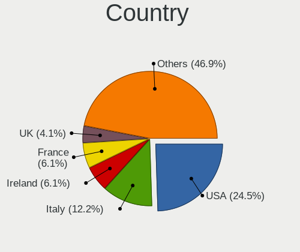
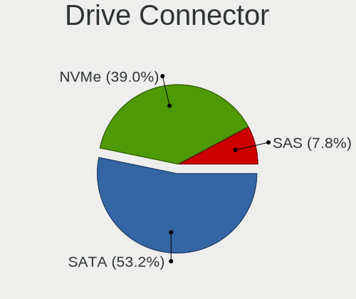
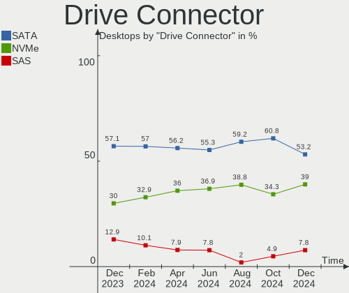
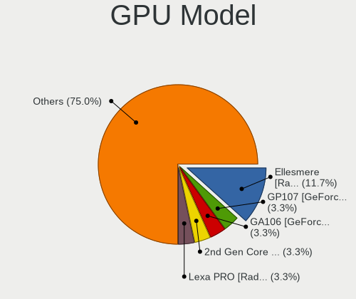
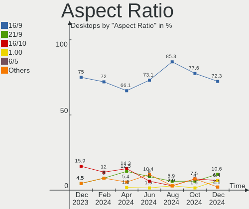
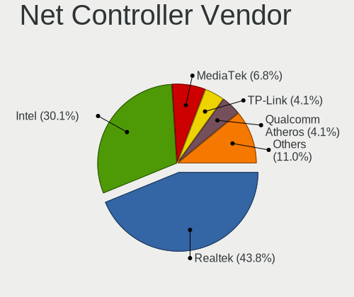
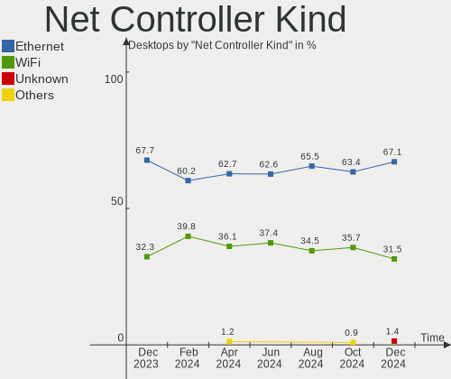
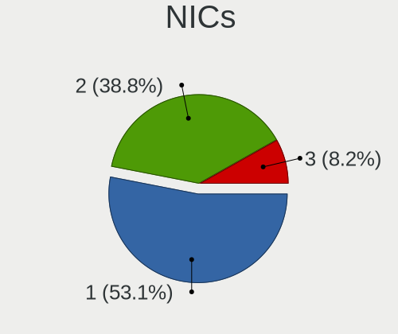

Kubuntu Hardware Trends (Desktops)
----------------------------------

A project to identify most popular hardware characteristics and track their change
over time based on data collected by Kubuntu users at https://Linux-Hardware.org.

Anyone can contribute to this report by the [hw-probe](https://github.com/linuxhw/hw-probe) tool:

    sudo -E hw-probe -all -upload

Full-feature report is available here: https://linux-hardware.org/?view=trends

Period: Jan, 2022.

Contents
--------

* [ System ](#system)
  - [ OS                       ](#os)
  - [ OS Family                ](#os-family)
  - [ Kernel                   ](#kernel)
  - [ Kernel Family            ](#kernel-family)
  - [ Kernel Major Ver.        ](#kernel-major-ver)
  - [ Arch                     ](#arch)
  - [ DE                       ](#de)
  - [ Display Server           ](#display-server)
  - [ Display Manager          ](#display-manager)
  - [ OS Lang                  ](#os-lang)
  - [ Boot Mode                ](#boot-mode)
  - [ Filesystem               ](#filesystem)
  - [ Part. scheme             ](#part-scheme)
  - [ Dual Boot with Linux/BSD ](#dual-boot-with-linuxbsd)
  - [ Dual Boot (Win)          ](#dual-boot-win)

* [ Board ](#board)
  - [ Vendor                   ](#vendor)
  - [ Model                    ](#model)
  - [ Model Family             ](#model-family)
  - [ MFG Year                 ](#mfg-year)
  - [ Form Factor              ](#form-factor)
  - [ Secure Boot              ](#secure-boot)
  - [ Coreboot                 ](#coreboot)
  - [ RAM Size                 ](#ram-size)
  - [ RAM Used                 ](#ram-used)
  - [ Total Drives             ](#total-drives)
  - [ Has CD-ROM               ](#has-cd-rom)
  - [ Has Ethernet             ](#has-ethernet)
  - [ Has WiFi                 ](#has-wifi)
  - [ Has Bluetooth            ](#has-bluetooth)

* [ Location ](#location)
  - [ Country                  ](#country)
  - [ City                     ](#city)

* [ Drives ](#drives)
  - [ Drive Vendor             ](#drive-vendor)
  - [ Drive Model              ](#drive-model)
  - [ HDD Vendor               ](#hdd-vendor)
  - [ SSD Vendor               ](#ssd-vendor)
  - [ Drive Kind               ](#drive-kind)
  - [ Drive Connector          ](#drive-connector)
  - [ Drive Size               ](#drive-size)
  - [ Space Total              ](#space-total)
  - [ Space Used               ](#space-used)
  - [ Malfunc. Drives          ](#malfunc-drives)
  - [ Malfunc. Drive Vendor    ](#malfunc-drive-vendor)
  - [ Malfunc. HDD Vendor      ](#malfunc-hdd-vendor)
  - [ Malfunc. Drive Kind      ](#malfunc-drive-kind)
  - [ Failed Drives            ](#failed-drives)
  - [ Failed Drive Vendor      ](#failed-drive-vendor)
  - [ Drive Status             ](#drive-status)

* [ Storage controller ](#storage-controller)
  - [ Storage Vendor           ](#storage-vendor)
  - [ Storage Model            ](#storage-model)
  - [ Storage Kind             ](#storage-kind)

* [ Processor ](#processor)
  - [ CPU Vendor               ](#cpu-vendor)
  - [ CPU Model                ](#cpu-model)
  - [ CPU Model Family         ](#cpu-model-family)
  - [ CPU Cores                ](#cpu-cores)
  - [ CPU Sockets              ](#cpu-sockets)
  - [ CPU Threads              ](#cpu-threads)
  - [ CPU Op-Modes             ](#cpu-op-modes)
  - [ CPU Microcode            ](#cpu-microcode)
  - [ CPU Microarch            ](#cpu-microarch)

* [ Graphics ](#graphics)
  - [ GPU Vendor               ](#gpu-vendor)
  - [ GPU Model                ](#gpu-model)
  - [ GPU Combo                ](#gpu-combo)
  - [ GPU Driver               ](#gpu-driver)
  - [ GPU Memory               ](#gpu-memory)

* [ Monitor ](#monitor)
  - [ Monitor Vendor           ](#monitor-vendor)
  - [ Monitor Model            ](#monitor-model)
  - [ Monitor Resolution       ](#monitor-resolution)
  - [ Monitor Diagonal         ](#monitor-diagonal)
  - [ Monitor Width            ](#monitor-width)
  - [ Aspect Ratio             ](#aspect-ratio)
  - [ Monitor Area             ](#monitor-area)
  - [ Pixel Density            ](#pixel-density)
  - [ Multiple Monitors        ](#multiple-monitors)

* [ Network ](#network)
  - [ Net Controller Vendor    ](#net-controller-vendor)
  - [ Net Controller Model     ](#net-controller-model)
  - [ Wireless Vendor          ](#wireless-vendor)
  - [ Wireless Model           ](#wireless-model)
  - [ Ethernet Vendor          ](#ethernet-vendor)
  - [ Ethernet Model           ](#ethernet-model)
  - [ Net Controller Kind      ](#net-controller-kind)
  - [ Used Controller          ](#used-controller)
  - [ NICs                     ](#nics)
  - [ IPv6                     ](#ipv6)

* [ Bluetooth ](#bluetooth)
  - [ Bluetooth Vendor         ](#bluetooth-vendor)
  - [ Bluetooth Model          ](#bluetooth-model)

* [ Sound ](#sound)
  - [ Sound Vendor             ](#sound-vendor)
  - [ Sound Model              ](#sound-model)

* [ Memory ](#memory)
  - [ Memory Vendor            ](#memory-vendor)
  - [ Memory Model             ](#memory-model)
  - [ Memory Kind              ](#memory-kind)
  - [ Memory Form Factor       ](#memory-form-factor)
  - [ Memory Size              ](#memory-size)
  - [ Memory Speed             ](#memory-speed)

* [ Printers & scanners ](#printers--scanners)
  - [ Printer Vendor           ](#printer-vendor)
  - [ Printer Model            ](#printer-model)
  - [ Scanner Vendor           ](#scanner-vendor)
  - [ Scanner Model            ](#scanner-model)

* [ Camera ](#camera)
  - [ Camera Vendor            ](#camera-vendor)
  - [ Camera Model             ](#camera-model)

* [ Security ](#security)
  - [ Fingerprint Vendor       ](#fingerprint-vendor)
  - [ Fingerprint Model        ](#fingerprint-model)
  - [ Chipcard Vendor          ](#chipcard-vendor)
  - [ Chipcard Model           ](#chipcard-model)

* [ Unsupported ](#unsupported)
  - [ Unsupported Devices      ](#unsupported-devices)
  - [ Unsupported Device Types ](#unsupported-device-types)

System
------

OS
--

Installed operating systems

| Name          | Desktops | Percent |
|---------------|----------|---------|
| Kubuntu 20.04 | 15       | 48.39%  |
| Kubuntu 21.10 | 7        | 22.58%  |
| Kubuntu 11    | 5        | 16.13%  |
| Kubuntu 18.04 | 2        | 6.45%   |
| Kubuntu 21.04 | 1        | 3.23%   |
| Kubuntu 19.10 | 1        | 3.23%   |

OS Family
---------

OS without a version

| Name    | Desktops | Percent |
|---------|----------|---------|
| Kubuntu | 31       | 100%    |

Kernel
------

Version of the Linux kernel

| Version                    | Desktops | Percent |
|----------------------------|----------|---------|
| 5.11.0-44-generic          | 5        | 16.13%  |
| 5.4.0-96-generic           | 4        | 12.9%   |
| 5.13.0-27-generic          | 4        | 12.9%   |
| 5.13.0-25-generic          | 3        | 9.68%   |
| 5.4.0-94-generic           | 2        | 6.45%   |
| 5.4.0-91-generic           | 2        | 6.45%   |
| 5.13.0-22-generic          | 2        | 6.45%   |
| 5.11.0-46-generic          | 2        | 6.45%   |
| 5.4.0-92-generic           | 1        | 3.23%   |
| 5.3.0-64-generic           | 1        | 3.23%   |
| 5.16.2-sparky-amd64        | 1        | 3.23%   |
| 5.15.0-15.1-liquorix-amd64 | 1        | 3.23%   |
| 5.13.0-23-lowlatency       | 1        | 3.23%   |
| 5.13.0-23-generic          | 1        | 3.23%   |
| 5.11.0-43-generic          | 1        | 3.23%   |

Kernel Family
-------------

Linux kernel without a distro release

| Version | Desktops | Percent |
|---------|----------|---------|
| 5.13.0  | 11       | 35.48%  |
| 5.4.0   | 9        | 29.03%  |
| 5.11.0  | 8        | 25.81%  |
| 5.3.0   | 1        | 3.23%   |
| 5.16.2  | 1        | 3.23%   |
| 5.15.0  | 1        | 3.23%   |

Kernel Major Ver.
-----------------

Linux kernel major version

| Version | Desktops | Percent |
|---------|----------|---------|
| 5.13    | 11       | 35.48%  |
| 5.4     | 9        | 29.03%  |
| 5.11    | 8        | 25.81%  |
| 5.3     | 1        | 3.23%   |
| 5.16    | 1        | 3.23%   |
| 5.15    | 1        | 3.23%   |

Arch
----

OS architecture (x86_64, i586, etc.)

| Name   | Desktops | Percent |
|--------|----------|---------|
| x86_64 | 31       | 100%    |

DE
--

Desktop Environment

| Name | Desktops | Percent |
|------|----------|---------|
| KDE5 | 30       | 96.77%  |
| KDE  | 1        | 3.23%   |

Display Server
--------------

X11 or Wayland

| Name | Desktops | Percent |
|------|----------|---------|
| X11  | 30       | 96.77%  |
| Tty  | 1        | 3.23%   |

Display Manager
---------------

SDDM, LightDM, etc.

| Name    | Desktops | Percent |
|---------|----------|---------|
| SDDM    | 18       | 58.06%  |
| Unknown | 9        | 29.03%  |
| GDM3    | 2        | 6.45%   |
| LightDM | 1        | 3.23%   |
| GDM     | 1        | 3.23%   |

OS Lang
-------

Language

| Lang  | Desktops | Percent |
|-------|----------|---------|
| en_US | 9        | 29.03%  |
| pt_BR | 3        | 9.68%   |
| pl_PL | 3        | 9.68%   |
| it_IT | 2        | 6.45%   |
| fr_FR | 2        | 6.45%   |
| en_GB | 2        | 6.45%   |
| de_DE | 2        | 6.45%   |
| es_AR | 1        | 3.23%   |
| en_PK | 1        | 3.23%   |
| en_IL | 1        | 3.23%   |
| en_IE | 1        | 3.23%   |
| en_CA | 1        | 3.23%   |
| en_AU | 1        | 3.23%   |
| el_GR | 1        | 3.23%   |
| de_CH | 1        | 3.23%   |

Boot Mode
---------

EFI or BIOS

| Mode | Desktops | Percent |
|------|----------|---------|
| BIOS | 23       | 74.19%  |
| EFI  | 8        | 25.81%  |

Filesystem
----------

Type of filesystem

| Type  | Desktops | Percent |
|-------|----------|---------|
| Ext4  | 30       | 96.77%  |
| Btrfs | 1        | 3.23%   |

Part. scheme
------------

Scheme of partitioning

| Type    | Desktops | Percent |
|---------|----------|---------|
| Unknown | 20       | 64.52%  |
| GPT     | 7        | 22.58%  |
| MBR     | 4        | 12.9%   |

Dual Boot with Linux/BSD
------------------------

Hosting more than one Linux/BSD

| Dual boot | Desktops | Percent |
|-----------|----------|---------|
| No        | 24       | 77.42%  |
| Yes       | 7        | 22.58%  |

Dual Boot (Win)
---------------

Hosting Linux and Windows

| Dual boot | Desktops | Percent |
|-----------|----------|---------|
| No        | 18       | 58.06%  |
| Yes       | 13       | 41.94%  |

Board
-----

Vendor
------

Motherboard manufacturer

| Name                | Desktops | Percent |
|---------------------|----------|---------|
| ASUSTek Computer    | 9        | 29.03%  |
| Gigabyte Technology | 5        | 16.13%  |
| ASRock              | 5        | 16.13%  |
| MSI                 | 4        | 12.9%   |
| Dell                | 3        | 9.68%   |
| Lenovo              | 2        | 6.45%   |
| Hewlett-Packard     | 2        | 6.45%   |
| Biostar             | 1        | 3.23%   |

Model
-----

Motherboard model

| Name                               | Desktops | Percent |
|------------------------------------|----------|---------|
| MSI MS-7D18                        | 1        | 3.23%   |
| MSI MS-7A40                        | 1        | 3.23%   |
| MSI MS-7851                        | 1        | 3.23%   |
| MSI MS-7792                        | 1        | 3.23%   |
| Lenovo ThinkStation E32 30A10057BR | 1        | 3.23%   |
| Lenovo ThinkCentre M58 3231W2Y     | 1        | 3.23%   |
| HP Z200 Workstation                | 1        | 3.23%   |
| HP Compaq dc5700 Small Form Factor | 1        | 3.23%   |
| Gigabyte X570 AORUS PRO            | 1        | 3.23%   |
| Gigabyte GA-990X-Gaming SLI-CF     | 1        | 3.23%   |
| Gigabyte GA-870A-UD3               | 1        | 3.23%   |
| Gigabyte B550 AORUS PRO AC         | 1        | 3.23%   |
| Gigabyte A320M-H                   | 1        | 3.23%   |
| Dell Studio Slim 540s              | 1        | 3.23%   |
| Dell OptiPlex 9020                 | 1        | 3.23%   |
| Dell OptiPlex 755                  | 1        | 3.23%   |
| Biostar H81MGV3                    | 1        | 3.23%   |
| ASUS ROG ZENITH EXTREME            | 1        | 3.23%   |
| ASUS PRIME B560M-K                 | 1        | 3.23%   |
| ASUS P7P55D-E PRO                  | 1        | 3.23%   |
| ASUS Maximus VIII RANGER           | 1        | 3.23%   |
| ASUS K30AD_M31AD_M51AD             | 1        | 3.23%   |
| ASUS H61M-A/BR                     | 1        | 3.23%   |
| ASUS EB1501P                       | 1        | 3.23%   |
| ASUS CM6330_CM6630_CM6730_CM6830-8 | 1        | 3.23%   |
| ASUS All Series                    | 1        | 3.23%   |
| ASRock Z77 Pro4-M                  | 1        | 3.23%   |
| ASRock Z68 Pro3                    | 1        | 3.23%   |
| ASRock G41C-GS                     | 1        | 3.23%   |
| ASRock B75 Pro3-M                  | 1        | 3.23%   |
| ASRock B550 Extreme4               | 1        | 3.23%   |

Model Family
------------

Motherboard model prefix

| Name                    | Desktops | Percent |
|-------------------------|----------|---------|
| Dell OptiPlex           | 2        | 6.45%   |
| MSI MS-7D18             | 1        | 3.23%   |
| MSI MS-7A40             | 1        | 3.23%   |
| MSI MS-7851             | 1        | 3.23%   |
| MSI MS-7792             | 1        | 3.23%   |
| Lenovo ThinkStation     | 1        | 3.23%   |
| Lenovo ThinkCentre      | 1        | 3.23%   |
| HP Z200                 | 1        | 3.23%   |
| HP Compaq               | 1        | 3.23%   |
| Gigabyte X570           | 1        | 3.23%   |
| Gigabyte GA-990X-Gaming | 1        | 3.23%   |
| Gigabyte GA-870A-UD3    | 1        | 3.23%   |
| Gigabyte B550           | 1        | 3.23%   |
| Gigabyte A320M-H        | 1        | 3.23%   |
| Dell Studio             | 1        | 3.23%   |
| Biostar H81MGV3         | 1        | 3.23%   |
| ASUS ROG                | 1        | 3.23%   |
| ASUS PRIME              | 1        | 3.23%   |
| ASUS P7P55D-E           | 1        | 3.23%   |
| ASUS Maximus            | 1        | 3.23%   |
| ASUS K30AD              | 1        | 3.23%   |
| ASUS H61M-A             | 1        | 3.23%   |
| ASUS EB1501P            | 1        | 3.23%   |
| ASUS CM6330             | 1        | 3.23%   |
| ASUS All                | 1        | 3.23%   |
| ASRock Z77              | 1        | 3.23%   |
| ASRock Z68              | 1        | 3.23%   |
| ASRock G41C-GS          | 1        | 3.23%   |
| ASRock B75              | 1        | 3.23%   |
| ASRock B550             | 1        | 3.23%   |

MFG Year
--------

Motherboard manufacture year

| Year | Desktops | Percent |
|------|----------|---------|
| 2014 | 4        | 12.9%   |
| 2020 | 3        | 9.68%   |
| 2013 | 3        | 9.68%   |
| 2012 | 3        | 9.68%   |
| 2010 | 3        | 9.68%   |
| 2009 | 3        | 9.68%   |
| 2021 | 2        | 6.45%   |
| 2019 | 2        | 6.45%   |
| 2018 | 2        | 6.45%   |
| 2008 | 2        | 6.45%   |
| 2017 | 1        | 3.23%   |
| 2016 | 1        | 3.23%   |
| 2011 | 1        | 3.23%   |
| 2006 | 1        | 3.23%   |

Form Factor
-----------

Physical design of the computer

| Name    | Desktops | Percent |
|---------|----------|---------|
| Desktop | 31       | 100%    |

Secure Boot
-----------

Enabled or disabled

| State    | Desktops | Percent |
|----------|----------|---------|
| Disabled | 31       | 100%    |

Coreboot
--------

Have coreboot on board

| Used | Desktops | Percent |
|------|----------|---------|
| No   | 31       | 100%    |

RAM Size
--------

Total RAM memory

| Size in GB  | Desktops | Percent |
|-------------|----------|---------|
| 16.01-24.0  | 7        | 22.58%  |
| 4.01-8.0    | 5        | 16.13%  |
| 3.01-4.0    | 5        | 16.13%  |
| 8.01-16.0   | 5        | 16.13%  |
| 64.01-256.0 | 4        | 12.9%   |
| 32.01-64.0  | 3        | 9.68%   |
| 24.01-32.0  | 2        | 6.45%   |

RAM Used
--------

Used RAM memory

| Used GB   | Desktops | Percent |
|-----------|----------|---------|
| 1.01-2.0  | 8        | 25.81%  |
| 4.01-8.0  | 7        | 22.58%  |
| 2.01-3.0  | 7        | 22.58%  |
| 3.01-4.0  | 4        | 12.9%   |
| 8.01-16.0 | 4        | 12.9%   |
| 0.51-1.0  | 1        | 3.23%   |

Total Drives
------------

Number of drives on board

| Drives | Desktops | Percent |
|--------|----------|---------|
| 1      | 12       | 38.71%  |
| 2      | 7        | 22.58%  |
| 3      | 5        | 16.13%  |
| 5      | 3        | 9.68%   |
| 4      | 3        | 9.68%   |
| 9      | 1        | 3.23%   |

Has CD-ROM
----------

Has CD-ROM on board

| Presented | Desktops | Percent |
|-----------|----------|---------|
| Yes       | 17       | 54.84%  |
| No        | 14       | 45.16%  |

Has Ethernet
------------

Has Ethernet on board

| Presented | Desktops | Percent |
|-----------|----------|---------|
| Yes       | 31       | 100%    |

Has WiFi
--------

Has WiFi module

| Presented | Desktops | Percent |
|-----------|----------|---------|
| Yes       | 16       | 51.61%  |
| No        | 15       | 48.39%  |

Has Bluetooth
-------------

Has Bluetooth module

| Presented | Desktops | Percent |
|-----------|----------|---------|
| No        | 17       | 54.84%  |
| Yes       | 14       | 45.16%  |

Location
--------

Country
-------

Geographic location (country)

| Country     | Desktops | Percent |
|-------------|----------|---------|
| France      | 5        | 16.13%  |
| USA         | 4        | 12.9%   |
| Brazil      | 3        | 9.68%   |
| UK          | 2        | 6.45%   |
| Spain       | 2        | 6.45%   |
| Poland      | 2        | 6.45%   |
| Italy       | 2        | 6.45%   |
| Germany     | 2        | 6.45%   |
| Switzerland | 1        | 3.23%   |
| Pakistan    | 1        | 3.23%   |
| Israel      | 1        | 3.23%   |
| Ireland     | 1        | 3.23%   |
| Greece      | 1        | 3.23%   |
| Canada      | 1        | 3.23%   |
| Austria     | 1        | 3.23%   |
| Australia   | 1        | 3.23%   |
| Argentina   | 1        | 3.23%   |

City
----

Geographic location (city)

| City                | Desktops | Percent |
|---------------------|----------|---------|
| S??o Paulo          | 3        | 9.68%   |
| Paris               | 2        | 6.45%   |
| Woodbine            | 1        | 3.23%   |
| Warsaw              | 1        | 3.23%   |
| Sydney              | 1        | 3.23%   |
| Spittal an der Drau | 1        | 3.23%   |
| Sligo               | 1        | 3.23%   |
| Secaucus            | 1        | 3.23%   |
| Sciez               | 1        | 3.23%   |
| Ramacca             | 1        | 3.23%   |
| Pouydesseaux        | 1        | 3.23%   |
| Olivos              | 1        | 3.23%   |
| Oberwil             | 1        | 3.23%   |
| Mijas               | 1        | 3.23%   |
| Manhattan Beach     | 1        | 3.23%   |
| Manchester          | 1        | 3.23%   |
| Lublin              | 1        | 3.23%   |
| Lepe                | 1        | 3.23%   |
| Krefeld             | 1        | 3.23%   |
| Kavala              | 1        | 3.23%   |
| Islamabad           | 1        | 3.23%   |
| Haifa               | 1        | 3.23%   |
| Enghien-les-Bains   | 1        | 3.23%   |
| Duncan              | 1        | 3.23%   |
| Chicago             | 1        | 3.23%   |
| Catford             | 1        | 3.23%   |
| Casabianca          | 1        | 3.23%   |
| Boxberg             | 1        | 3.23%   |

Drives
------

Drive Vendor
------------

Hard drive vendors

| Vendor              | Desktops | Drives | Percent |
|---------------------|----------|--------|---------|
| Samsung Electronics | 14       | 21     | 22.95%  |
| WDC                 | 12       | 14     | 19.67%  |
| Seagate             | 6        | 8      | 9.84%   |
| SanDisk             | 4        | 4      | 6.56%   |
| Kingston            | 3        | 3      | 4.92%   |
| PNY                 | 2        | 2      | 3.28%   |
| Phison              | 2        | 2      | 3.28%   |
| Hitachi             | 2        | 2      | 3.28%   |
| Verbatim            | 1        | 1      | 1.64%   |
| Unknown             | 1        | 2      | 1.64%   |
| SABRENT             | 1        | 1      | 1.64%   |
| Realtek             | 1        | 1      | 1.64%   |
| Patriot             | 1        | 1      | 1.64%   |
| MAXTOR              | 1        | 1      | 1.64%   |
| LDLC                | 1        | 1      | 1.64%   |
| KIOXIA-EXCERIA      | 1        | 1      | 1.64%   |
| Intenso             | 1        | 1      | 1.64%   |
| Intel               | 1        | 1      | 1.64%   |
| Inateck             | 1        | 1      | 1.64%   |
| Crucial             | 1        | 1      | 1.64%   |
| Corsair             | 1        | 1      | 1.64%   |
| China               | 1        | 1      | 1.64%   |
| ASMT                | 1        | 1      | 1.64%   |
| A-DATA Technology   | 1        | 1      | 1.64%   |

Drive Model
-----------

Hard drive models

| Model                            | Desktops | Percent |
|----------------------------------|----------|---------|
| Samsung SSD 860 EVO 500GB        | 4        | 5.71%   |
| Samsung SSD 850 EVO 1TB          | 2        | 2.86%   |
| PNY CS900 240GB SSD              | 2        | 2.86%   |
| WDC WDS500G2B0A-00SM50 500GB SSD | 1        | 1.43%   |
| WDC WD60EZAZ-00ZGHB0 6TB         | 1        | 1.43%   |
| WDC WD5000BPKT-60PK4T0 500GB     | 1        | 1.43%   |
| WDC WD5000AZLX-08K2TA0 500GB     | 1        | 1.43%   |
| WDC WD20EZRZ-00Z5HB0 2TB         | 1        | 1.43%   |
| WDC WD20EZRX-00D8PB0 2TB         | 1        | 1.43%   |
| WDC WD20EURX-73T0FY0 2TB         | 1        | 1.43%   |
| WDC WD20EARX-00PASB0 2TB         | 1        | 1.43%   |
| WDC WD1600AAJS-22L7A0 160GB      | 1        | 1.43%   |
| WDC WD10SPZX-21Z10T0 1TB         | 1        | 1.43%   |
| WDC WD10EZRX-00A8LB0 1TB         | 1        | 1.43%   |
| WDC WD10EURX-83UY4Y0 1TB         | 1        | 1.43%   |
| WDC WD10EADS-00L5B1 1TB          | 1        | 1.43%   |
| WDC WD1002FAEX-00Z3A0 1TB        | 1        | 1.43%   |
| Verbatim Vi550 S3 SSD 512GB      | 1        | 1.43%   |
| Unknown SD/MMC 16GB              | 1        | 1.43%   |
| Unknown M.S./M.S.Pro/HG 16GB     | 1        | 1.43%   |
| Seagate ST4000DM000-2AE166 4TB   | 1        | 1.43%   |
| Seagate ST3160215AS 160GB        | 1        | 1.43%   |
| Seagate ST3000VN007-2AH16M 3TB   | 1        | 1.43%   |
| Seagate ST250DM000-1BD141 250GB  | 1        | 1.43%   |
| Seagate ST2000VM003-1ET164 2TB   | 1        | 1.43%   |
| Seagate ST2000DM001-1E6164 2TB   | 1        | 1.43%   |
| Seagate ST1000DM003-1CH162 1TB   | 1        | 1.43%   |
| Seagate Backup+ Hub BK 8TB       | 1        | 1.43%   |
| SanDisk SSD PLUS 480GB           | 1        | 1.43%   |
| SanDisk SSD PLUS 240GB           | 1        | 1.43%   |
| SanDisk SSD PLUS 240 GB          | 1        | 1.43%   |
| Sandisk NVMe SSD Drive 256GB     | 1        | 1.43%   |
| Samsung SSD 980 500GB            | 1        | 1.43%   |
| Samsung SSD 970 EVO Plus 1TB     | 1        | 1.43%   |
| Samsung SSD 870 QVO 1TB          | 1        | 1.43%   |
| Samsung SSD 870 EVO 500GB        | 1        | 1.43%   |
| Samsung SSD 850 EVO 500GB        | 1        | 1.43%   |
| Samsung SSD 850 EVO 250GB        | 1        | 1.43%   |
| Samsung SSD 850 EVO 120GB        | 1        | 1.43%   |
| Samsung NVMe SSD Drive 2TB       | 1        | 1.43%   |
| Samsung NVMe SSD Drive 250GB     | 1        | 1.43%   |
| Samsung NVMe SSD Drive 1TB       | 1        | 1.43%   |
| Samsung HD103UJ 1TB              | 1        | 1.43%   |
| Samsung HD080HJ/ 80GB            | 1        | 1.43%   |
| SABRENT Disk 1TB                 | 1        | 1.43%   |
| Realtek RTL9210B NVME 1TB        | 1        | 1.43%   |
| Phison NVMe SSD Drive 1TB        | 1        | 1.43%   |
| Phison NVMe SSD Drive 1024GB     | 1        | 1.43%   |
| Patriot Burst 240GB SSD          | 1        | 1.43%   |
| MAXTOR STM3500630AS 500GB        | 1        | 1.43%   |
| LDLC F7+480GB SSD                | 1        | 1.43%   |
| KIOXIA-EXCERIA SATA SSD 480GB    | 1        | 1.43%   |
| Kingston SV300S37A60G 64GB SSD   | 1        | 1.43%   |
| Kingston SV300S37A480G 480GB SSD | 1        | 1.43%   |
| Kingston SA400S37480G 480GB SSD  | 1        | 1.43%   |
| Intenso SSD Sata III 256GB       | 1        | 1.43%   |
| Intel SSDSC2BW180A3L 180GB       | 1        | 1.43%   |
| Inateck FE202x Series 1TB        | 1        | 1.43%   |
| Hitachi HTS723232L9A360 320GB    | 1        | 1.43%   |
| Hitachi HTS545050B9A300 500GB    | 1        | 1.43%   |

HDD Vendor
----------

Hard disk drive vendors

| Vendor              | Desktops | Drives | Percent |
|---------------------|----------|--------|---------|
| WDC                 | 11       | 13     | 50%     |
| Seagate             | 6        | 8      | 27.27%  |
| Samsung Electronics | 2        | 2      | 9.09%   |
| Hitachi             | 2        | 2      | 9.09%   |
| MAXTOR              | 1        | 1      | 4.55%   |

SSD Vendor
----------

Solid state drive vendors

| Vendor              | Desktops | Drives | Percent |
|---------------------|----------|--------|---------|
| Samsung Electronics | 10       | 12     | 34.48%  |
| SanDisk             | 3        | 3      | 10.34%  |
| Kingston            | 3        | 3      | 10.34%  |
| PNY                 | 2        | 2      | 6.9%    |
| WDC                 | 1        | 1      | 3.45%   |
| Verbatim            | 1        | 1      | 3.45%   |
| SABRENT             | 1        | 1      | 3.45%   |
| Patriot             | 1        | 1      | 3.45%   |
| LDLC                | 1        | 1      | 3.45%   |
| KIOXIA-EXCERIA      | 1        | 1      | 3.45%   |
| Intenso             | 1        | 1      | 3.45%   |
| Intel               | 1        | 1      | 3.45%   |
| China               | 1        | 1      | 3.45%   |
| ASMT                | 1        | 1      | 3.45%   |
| A-DATA Technology   | 1        | 1      | 3.45%   |

Drive Kind
----------

HDD or SSD

| Kind    | Desktops | Drives | Percent |
|---------|----------|--------|---------|
| SSD     | 22       | 31     | 43.14%  |
| HDD     | 19       | 26     | 37.25%  |
| NVMe    | 8        | 13     | 15.69%  |
| Unknown | 2        | 3      | 3.92%   |

Drive Connector
---------------

SATA, SAS, NVMe, etc.

| Type | Desktops | Drives | Percent |
|------|----------|--------|---------|
| SATA | 30       | 54     | 73.17%  |
| NVMe | 8        | 12     | 19.51%  |
| SAS  | 3        | 7      | 7.32%   |

Drive Size
----------

Size of hard drive

| Size in TB | Desktops | Drives | Percent |
|------------|----------|--------|---------|
| 0.01-0.5   | 24       | 34     | 54.55%  |
| 0.51-1.0   | 10       | 13     | 22.73%  |
| 1.01-2.0   | 6        | 6      | 13.64%  |
| 4.01-10.0  | 2        | 2      | 4.55%   |
| 3.01-4.0   | 1        | 1      | 2.27%   |
| 2.01-3.0   | 1        | 1      | 2.27%   |

Space Total
-----------

Amount of disk space available on the file system

| Size in GB     | Desktops | Percent |
|----------------|----------|---------|
| 501-1000       | 8        | 25.81%  |
| 251-500        | 7        | 22.58%  |
| More than 3000 | 5        | 16.13%  |
| 101-250        | 5        | 16.13%  |
| 2001-3000      | 2        | 6.45%   |
| 1001-2000      | 2        | 6.45%   |
| 1-20           | 1        | 3.23%   |
| 51-100         | 1        | 3.23%   |

Space Used
----------

Amount of used disk space

| Used GB        | Desktops | Percent |
|----------------|----------|---------|
| 501-1000       | 7        | 22.58%  |
| 251-500        | 5        | 16.13%  |
| 21-50          | 4        | 12.9%   |
| 101-250        | 4        | 12.9%   |
| 1-20           | 3        | 9.68%   |
| 51-100         | 3        | 9.68%   |
| 2001-3000      | 2        | 6.45%   |
| 1001-2000      | 2        | 6.45%   |
| More than 3000 | 1        | 3.23%   |

Malfunc. Drives
---------------

Drive models with a malfunction

| Model                             | Desktops | Drives | Percent |
|-----------------------------------|----------|--------|---------|
| WDC WD1600AAJS-22L7A0 160GB       | 1        | 1      | 14.29%  |
| Seagate ST3160215AS 160GB         | 1        | 1      | 14.29%  |
| Seagate ST2000DM001-1E6164 2TB    | 1        | 1      | 14.29%  |
| Seagate ST1000DM003-1CH162 1TB    | 1        | 1      | 14.29%  |
| SanDisk SSD PLUS 240 GB           | 1        | 1      | 14.29%  |
| Samsung Electronics HD103UJ 1TB   | 1        | 1      | 14.29%  |
| Samsung Electronics HD080HJ/ 80GB | 1        | 1      | 14.29%  |

Malfunc. Drive Vendor
---------------------

Vendors of faulty drives

| Vendor              | Desktops | Drives | Percent |
|---------------------|----------|--------|---------|
| Seagate             | 3        | 3      | 42.86%  |
| Samsung Electronics | 2        | 2      | 28.57%  |
| WDC                 | 1        | 1      | 14.29%  |
| SanDisk             | 1        | 1      | 14.29%  |

Malfunc. HDD Vendor
-------------------

Vendors of faulty HDD drives

| Vendor              | Desktops | Drives | Percent |
|---------------------|----------|--------|---------|
| Seagate             | 3        | 3      | 50%     |
| Samsung Electronics | 2        | 2      | 33.33%  |
| WDC                 | 1        | 1      | 16.67%  |

Malfunc. Drive Kind
-------------------

Kinds of faulty drives

| Kind | Desktops | Drives | Percent |
|------|----------|--------|---------|
| HDD  | 4        | 6      | 80%     |
| SSD  | 1        | 1      | 20%     |

Failed Drives
-------------

Failed drive models

Zero info for selected period =(

Failed Drive Vendor
-------------------

Failed drive vendors

Zero info for selected period =(

Drive Status
------------

Number of failed and malfunc. drives

| Status   | Desktops | Drives | Percent |
|----------|----------|--------|---------|
| Detected | 21       | 51     | 60%     |
| Works    | 9        | 15     | 25.71%  |
| Malfunc  | 5        | 7      | 14.29%  |

Storage controller
------------------

Storage Vendor
--------------

Storage controller vendors

| Vendor                    | Desktops | Percent |
|---------------------------|----------|---------|
| Intel                     | 22       | 45.83%  |
| AMD                       | 9        | 18.75%  |
| ASMedia Technology        | 5        | 10.42%  |
| Samsung Electronics       | 4        | 8.33%   |
| Phison Electronics        | 3        | 6.25%   |
| JMicron Technology        | 2        | 4.17%   |
| Sandisk                   | 1        | 2.08%   |
| Micron/Crucial Technology | 1        | 2.08%   |
| Marvell Technology Group  | 1        | 2.08%   |

Storage Model
-------------

Storage controller models

| Model                                                                                   | Desktops | Percent |
|-----------------------------------------------------------------------------------------|----------|---------|
| AMD FCH SATA Controller [AHCI mode]                                                     | 5        | 8.33%   |
| Intel 8 Series/C220 Series Chipset Family 6-port SATA Controller 1 [AHCI mode]          | 4        | 6.67%   |
| ASMedia ASM1062 Serial ATA Controller                                                   | 4        | 6.67%   |
| Samsung NVMe SSD Controller SM981/PM981/PM983                                           | 3        | 5%      |
| Phison E12 NVMe Controller                                                              | 2        | 3.33%   |
| JMicron JMB363 SATA/IDE Controller                                                      | 2        | 3.33%   |
| Intel SATA Controller [RAID mode]                                                       | 2        | 3.33%   |
| Intel 7 Series/C210 Series Chipset Family 6-port SATA Controller [AHCI mode]            | 2        | 3.33%   |
| Intel 6 Series/C200 Series Chipset Family Desktop SATA Controller (IDE mode, ports 4-5) | 2        | 3.33%   |
| Intel 6 Series/C200 Series Chipset Family Desktop SATA Controller (IDE mode, ports 0-3) | 2        | 3.33%   |
| Intel 500 Series Chipset Family SATA AHCI Controller                                    | 2        | 3.33%   |
| AMD Starship/Matisse Chipset SATA Controller [AHCI mode]                                | 2        | 3.33%   |
| AMD SB7x0/SB8x0/SB9x0 SATA Controller [AHCI mode]                                       | 2        | 3.33%   |
| Sandisk WD Black NVMe SSD                                                               | 1        | 1.67%   |
| Samsung NVMe SSD Controller PM9A1/PM9A3/980PRO                                          | 1        | 1.67%   |
| Samsung NVMe SSD Controller 980                                                         | 1        | 1.67%   |
| Phison E16 PCIe4 NVMe Controller                                                        | 1        | 1.67%   |
| Micron/Crucial Non-Volatile memory controller                                           | 1        | 1.67%   |
| Marvell Group 88SE914D SATA-600 Controller                                              | 1        | 1.67%   |
| Intel Q170/Q150/B150/H170/H110/Z170/CM236 Chipset SATA Controller [AHCI Mode]           | 1        | 1.67%   |
| Intel NM10/ICH7 Family SATA Controller [IDE mode]                                       | 1        | 1.67%   |
| Intel NM10/ICH7 Family SATA Controller [AHCI mode]                                      | 1        | 1.67%   |
| Intel 9 Series Chipset Family SATA Controller [AHCI Mode]                               | 1        | 1.67%   |
| Intel 82Q35 Express PT IDER Controller                                                  | 1        | 1.67%   |
| Intel 82801JI (ICH10 Family) 4 port SATA IDE Controller #1                              | 1        | 1.67%   |
| Intel 82801JI (ICH10 Family) 2 port SATA IDE Controller #2                              | 1        | 1.67%   |
| Intel 82801JD/DO (ICH10 Family) SATA AHCI Controller                                    | 1        | 1.67%   |
| Intel 82801IR/IO/IH (ICH9R/DO/DH) 6 port SATA Controller [AHCI mode]                    | 1        | 1.67%   |
| Intel 82801HR/HO/HH (ICH8R/DO/DH) 2 port SATA Controller [IDE mode]                     | 1        | 1.67%   |
| Intel 82801H (ICH8 Family) 4 port SATA Controller [IDE mode]                            | 1        | 1.67%   |
| Intel 82801G (ICH7 Family) IDE Controller                                               | 1        | 1.67%   |
| Intel 6 Series/C200 Series Chipset Family 6 port Desktop SATA AHCI Controller           | 1        | 1.67%   |
| Intel 5 Series/3400 Series Chipset 6 port SATA AHCI Controller                          | 1        | 1.67%   |
| Intel 4 Series Chipset PT IDER Controller                                               | 1        | 1.67%   |
| ASMedia SATA controller                                                                 | 1        | 1.67%   |
| AMD X399 Series Chipset SATA Controller                                                 | 1        | 1.67%   |
| AMD SB7x0/SB8x0/SB9x0 IDE Controller                                                    | 1        | 1.67%   |
| AMD FCH SATA Controller D                                                               | 1        | 1.67%   |
| AMD 400 Series Chipset SATA Controller                                                  | 1        | 1.67%   |

Storage Kind
------------

Kind of storage controller (IDE, SATA, NVMe, SAS, ...)

| Kind | Desktops | Percent |
|------|----------|---------|
| SATA | 25       | 56.82%  |
| IDE  | 9        | 20.45%  |
| NVMe | 8        | 18.18%  |
| RAID | 2        | 4.55%   |

Processor
---------

CPU Vendor
----------

Processor vendors

| Vendor | Desktops | Percent |
|--------|----------|---------|
| Intel  | 22       | 70.97%  |
| AMD    | 9        | 29.03%  |

CPU Model
---------

Processor models

| Model                                          | Desktops | Percent |
|------------------------------------------------|----------|---------|
| Intel Core i7-4790 CPU @ 3.60GHz               | 2        | 6.45%   |
| Intel Core i5-3570K CPU @ 3.40GHz              | 2        | 6.45%   |
| Intel Core 2 Duo CPU E8400 @ 3.00GHz           | 2        | 6.45%   |
| AMD Ryzen 9 5950X 16-Core Processor            | 2        | 6.45%   |
| Intel Xeon CPU E3-1240 v3 @ 3.40GHz            | 1        | 3.23%   |
| Intel Pentium D CPU 3.40GHz                    | 1        | 3.23%   |
| Intel Pentium 4 CPU 3.00GHz                    | 1        | 3.23%   |
| Intel Core i7-7700K CPU @ 4.20GHz              | 1        | 3.23%   |
| Intel Core i7-4790K CPU @ 4.00GHz              | 1        | 3.23%   |
| Intel Core i7-4770K CPU @ 3.50GHz              | 1        | 3.23%   |
| Intel Core i7-4770 CPU @ 3.40GHz               | 1        | 3.23%   |
| Intel Core i7-3770 CPU @ 3.40GHz               | 1        | 3.23%   |
| Intel Core i7-2600K CPU @ 3.40GHz              | 1        | 3.23%   |
| Intel Core i5-3470T CPU @ 2.90GHz              | 1        | 3.23%   |
| Intel Core i5 CPU 760 @ 2.80GHz                | 1        | 3.23%   |
| Intel Core i5 CPU 650 @ 3.20GHz                | 1        | 3.23%   |
| Intel Core 2 Duo CPU E7400 @ 2.80GHz           | 1        | 3.23%   |
| Intel Atom CPU D525 @ 1.80GHz                  | 1        | 3.23%   |
| Intel 11th Gen Core i7-11700 @ 2.50GHz         | 1        | 3.23%   |
| Intel 11th Gen Core i5-11600 @ 2.80GHz         | 1        | 3.23%   |
| AMD Ryzen Threadripper 1950X 16-Core Processor | 1        | 3.23%   |
| AMD Ryzen 9 3900XT 12-Core Processor           | 1        | 3.23%   |
| AMD Ryzen 5 3400G with Radeon Vega Graphics    | 1        | 3.23%   |
| AMD Ryzen 3 2200G with Radeon Vega Graphics    | 1        | 3.23%   |
| AMD FX-8350 Eight-Core Processor               | 1        | 3.23%   |
| AMD Athlon II X4 635 Processor                 | 1        | 3.23%   |
| AMD A10-5800K APU with Radeon HD Graphics      | 1        | 3.23%   |

CPU Model Family
----------------

Processor model prefix

| Model                  | Desktops | Percent |
|------------------------|----------|---------|
| Intel Core i7          | 8        | 25.81%  |
| Intel Core i5          | 5        | 16.13%  |
| Intel Core 2 Duo       | 3        | 9.68%   |
| AMD Ryzen 9            | 3        | 9.68%   |
| Other                  | 2        | 6.45%   |
| Intel Xeon             | 1        | 3.23%   |
| Intel Pentium D        | 1        | 3.23%   |
| Intel Pentium 4        | 1        | 3.23%   |
| Intel Atom             | 1        | 3.23%   |
| AMD Ryzen Threadripper | 1        | 3.23%   |
| AMD Ryzen 5            | 1        | 3.23%   |
| AMD Ryzen 3            | 1        | 3.23%   |
| AMD FX                 | 1        | 3.23%   |
| AMD Athlon II X4       | 1        | 3.23%   |
| AMD A10                | 1        | 3.23%   |

CPU Cores
---------

Number of processor cores

| Number | Desktops | Percent |
|--------|----------|---------|
| 4      | 16       | 51.61%  |
| 2      | 8        | 25.81%  |
| 16     | 3        | 9.68%   |
| 12     | 1        | 3.23%   |
| 8      | 1        | 3.23%   |
| 6      | 1        | 3.23%   |
| 1      | 1        | 3.23%   |

CPU Sockets
-----------

Number of sockets

| Number | Desktops | Percent |
|--------|----------|---------|
| 1      | 31       | 100%    |

CPU Threads
-----------

Threads per core (Hyper-Threading)

| Number | Desktops | Percent |
|--------|----------|---------|
| 2      | 22       | 70.97%  |
| 1      | 9        | 29.03%  |

CPU Op-Modes
------------

CPU Operation Modes (32-bit, 64-bit)

| Op mode        | Desktops | Percent |
|----------------|----------|---------|
| 32-bit, 64-bit | 31       | 100%    |

CPU Microcode
-------------

Microcode number

| Number     | Desktops | Percent |
|------------|----------|---------|
| Unknown    | 9        | 29.03%  |
| 0x306c3    | 6        | 19.35%  |
| 0x306a9    | 4        | 12.9%   |
| 0x1067a    | 3        | 9.68%   |
| 0xf43      | 1        | 3.23%   |
| 0xa0671    | 1        | 3.23%   |
| 0x106e5    | 1        | 3.23%   |
| 0x106ca    | 1        | 3.23%   |
| 0x08108109 | 1        | 3.23%   |
| 0x08101016 | 1        | 3.23%   |
| 0x06001119 | 1        | 3.23%   |
| 0x010000db | 1        | 3.23%   |
| 0x00000000 | 1        | 3.23%   |

CPU Microarch
-------------

Microarchitecture

| Name        | Desktops | Percent |
|-------------|----------|---------|
| Haswell     | 6        | 19.35%  |
| IvyBridge   | 4        | 12.9%   |
| Penryn      | 3        | 9.68%   |
| Zen 3       | 2        | 6.45%   |
| Zen         | 2        | 6.45%   |
| Piledriver  | 2        | 6.45%   |
| NetBurst    | 2        | 6.45%   |
| Zen+        | 1        | 3.23%   |
| Zen 2       | 1        | 3.23%   |
| Westmere    | 1        | 3.23%   |
| SandyBridge | 1        | 3.23%   |
| Nehalem     | 1        | 3.23%   |
| KabyLake    | 1        | 3.23%   |
| K10         | 1        | 3.23%   |
| Icelake     | 1        | 3.23%   |
| Bonnell     | 1        | 3.23%   |
| Unknown     | 1        | 3.23%   |

Graphics
--------

GPU Vendor
----------

Vendors of graphics cards

| Vendor | Desktops | Percent |
|--------|----------|---------|
| Nvidia | 15       | 46.88%  |
| Intel  | 9        | 28.13%  |
| AMD    | 8        | 25%     |

GPU Model
---------

Graphics card models

| Model                                                                     | Desktops | Percent |
|---------------------------------------------------------------------------|----------|---------|
| Intel IvyBridge GT2 [HD Graphics 4000]                                    | 3        | 9.38%   |
| Nvidia GP104 [GeForce GTX 1070]                                           | 2        | 6.25%   |
| Intel 4 Series Chipset Integrated Graphics Controller                     | 2        | 6.25%   |
| Nvidia TU104 [GeForce RTX 2070 SUPER]                                     | 1        | 3.13%   |
| Nvidia GT218 [ION]                                                        | 1        | 3.13%   |
| Nvidia GP107GL [Quadro P400]                                              | 1        | 3.13%   |
| Nvidia GP107 [GeForce GTX 1050 Ti]                                        | 1        | 3.13%   |
| Nvidia GP102 [GeForce GTX 1080 Ti]                                        | 1        | 3.13%   |
| Nvidia GM206 [GeForce GTX 960]                                            | 1        | 3.13%   |
| Nvidia GM204 [GeForce GTX 970]                                            | 1        | 3.13%   |
| Nvidia GK208B [GeForce GT 710]                                            | 1        | 3.13%   |
| Nvidia GK208 [GeForce GT 630 Rev. 2]                                      | 1        | 3.13%   |
| Nvidia GK107GL [Quadro K600]                                              | 1        | 3.13%   |
| Nvidia GK106 [GeForce GTX 645 OEM]                                        | 1        | 3.13%   |
| Nvidia GK104 [GeForce GTX 760 OEM]                                        | 1        | 3.13%   |
| Nvidia GF119 [GeForce GT 610]                                             | 1        | 3.13%   |
| Intel Xeon E3-1200 v2/3rd Gen Core processor Graphics Controller          | 1        | 3.13%   |
| Intel RocketLake-S GT1 [UHD Graphics 750]                                 | 1        | 3.13%   |
| Intel 82Q963/Q965 Integrated Graphics Controller                          | 1        | 3.13%   |
| Intel 2nd Generation Core Processor Family Integrated Graphics Controller | 1        | 3.13%   |
| AMD Trinity [Radeon HD 7660D]                                             | 1        | 3.13%   |
| AMD Tahiti XT [Radeon HD 7970/8970 OEM / R9 280X]                         | 1        | 3.13%   |
| AMD RV630 XT [Radeon HD 2600 XT]                                          | 1        | 3.13%   |
| AMD Redwood XT [Radeon HD 5670/5690/5730]                                 | 1        | 3.13%   |
| AMD Raven Ridge [Radeon Vega Series / Radeon Vega Mobile Series]          | 1        | 3.13%   |
| AMD Picasso/Raven 2 [Radeon Vega Series / Radeon Vega Mobile Series]      | 1        | 3.13%   |
| AMD Ellesmere [Radeon RX 470/480/570/570X/580/580X/590]                   | 1        | 3.13%   |
| AMD Cedar [Radeon HD 5000/6000/7350/8350 Series]                          | 1        | 3.13%   |

GPU Combo
---------

Combinations of graphics cards

| Name           | Desktops | Percent |
|----------------|----------|---------|
| 1 x Nvidia     | 14       | 45.16%  |
| 1 x Intel      | 8        | 25.81%  |
| 1 x AMD        | 8        | 25.81%  |
| Intel + Nvidia | 1        | 3.23%   |

GPU Driver
----------

Free vs proprietary

| Driver      | Desktops | Percent |
|-------------|----------|---------|
| Free        | 19       | 61.29%  |
| Proprietary | 11       | 35.48%  |
| Unknown     | 1        | 3.23%   |

GPU Memory
----------

Total video memory

| Size in GB | Desktops | Percent |
|------------|----------|---------|
| Unknown    | 14       | 45.16%  |
| 1.01-2.0   | 5        | 16.13%  |
| 0.51-1.0   | 4        | 12.9%   |
| 7.01-8.0   | 2        | 6.45%   |
| 3.01-4.0   | 2        | 6.45%   |
| 0.01-0.5   | 2        | 6.45%   |
| 2.01-3.0   | 1        | 3.23%   |
| 8.01-16.0  | 1        | 3.23%   |

Monitor
-------

Monitor Vendor
--------------

Monitor vendors

| Vendor               | Desktops | Percent |
|----------------------|----------|---------|
| Samsung Electronics  | 7        | 18.92%  |
| Hewlett-Packard      | 4        | 10.81%  |
| Philips              | 3        | 8.11%   |
| AOC                  | 3        | 8.11%   |
| Acer                 | 3        | 8.11%   |
| ViewSonic            | 2        | 5.41%   |
| Dell                 | 2        | 5.41%   |
| BenQ                 | 2        | 5.41%   |
| Ancor Communications | 2        | 5.41%   |
| Sony                 | 1        | 2.7%    |
| LG Display           | 1        | 2.7%    |
| Iiyama               | 1        | 2.7%    |
| Idek Iiyama          | 1        | 2.7%    |
| Grundig              | 1        | 2.7%    |
| GRM                  | 1        | 2.7%    |
| Goldstar             | 1        | 2.7%    |
| Eizo                 | 1        | 2.7%    |
| Apple                | 1        | 2.7%    |

Monitor Model
-------------

Monitor models

| Model                                                                  | Desktops | Percent |
|------------------------------------------------------------------------|----------|---------|
| ViewSonic VA2719-2K VSC6B34 2560x1440 597x336mm 27.0-inch              | 1        | 2.44%   |
| ViewSonic VA2448 SERIES VSC3828 1920x1080 521x293mm 23.5-inch          | 1        | 2.44%   |
| ViewSonic TD1630-3 VSCC234 1366x768 344x193mm 15.5-inch                | 1        | 2.44%   |
| Sony LCD Monitor TV                                                    | 1        | 2.44%   |
| Samsung Electronics SyncMaster SAM0304 1680x1050 490x320mm 23.0-inch   | 1        | 2.44%   |
| Samsung Electronics SMS24A450 SAM083A 1920x1200 520x320mm 24.0-inch    | 1        | 2.44%   |
| Samsung Electronics S34J55x SAM0F71 3440x1440 797x333mm 34.0-inch      | 1        | 2.44%   |
| Samsung Electronics S24R65x SAM1023 1920x1080 530x300mm 24.0-inch      | 1        | 2.44%   |
| Samsung Electronics LCD Monitor SAM0B30 1920x1080 885x498mm 40.0-inch  | 1        | 2.44%   |
| Samsung Electronics LCD Monitor SAM0A7A 1920x1080 1060x626mm 48.5-inch | 1        | 2.44%   |
| Samsung Electronics LCD Monitor SAM0900 1366x768                       | 1        | 2.44%   |
| Philips PHL 276E9Q PHLC17B 1920x1080 598x336mm 27.0-inch               | 1        | 2.44%   |
| Philips PHL 276E7 PHLC108 1920x1080 598x336mm 27.0-inch                | 1        | 2.44%   |
| Philips FTV PHL01EA 1920x1080 1440x810mm 65.0-inch                     | 1        | 2.44%   |
| LG Display LCD Monitor LGD0396 1600x900 382x215mm 17.3-inch            | 1        | 2.44%   |
| Iiyama PLG2488H IVM6127 1920x1080 531x299mm 24.0-inch                  | 1        | 2.44%   |
| Idek Iiyama LCD Monitor PL2595W 5760x1200                              | 1        | 2.44%   |
| Idek Iiyama LCD Monitor PL2595W                                        | 1        | 2.44%   |
| Hewlett-Packard LA2405 HWP284B 1920x1200 520x320mm 24.0-inch           | 1        | 2.44%   |
| Hewlett-Packard L2445w HWP280F 1920x1200 518x324mm 24.1-inch           | 1        | 2.44%   |
| Hewlett-Packard 27m HPN3579 1920x1080 600x340mm 27.2-inch              | 1        | 2.44%   |
| Hewlett-Packard 24es HWP3320 1920x1080 527x296mm 23.8-inch             | 1        | 2.44%   |
| Grundig UHD GRU4448 3840x2160 1210x680mm 54.6-inch                     | 1        | 2.44%   |
| GRM Q22 FHD View GRM2731 1920x1080 477x268mm 21.5-inch                 | 1        | 2.44%   |
| Goldstar W2246 GSM5783 1920x1080 477x268mm 21.5-inch                   | 1        | 2.44%   |
| Eizo EV2333W ENC2069 1920x1080 510x287mm 23.0-inch                     | 1        | 2.44%   |
| Dell U2412M DELA07A 1920x1200 518x324mm 24.1-inch                      | 1        | 2.44%   |
| Dell P190S DEL405B 1280x1024 380x300mm 19.1-inch                       | 1        | 2.44%   |
| Dell LCD Monitor DEL4048 1280x1024 380x300mm 19.1-inch                 | 1        | 2.44%   |
| BenQ LCD Monitor G2750 1920x1080                                       | 1        | 2.44%   |
| BenQ GL2780 BNQ78EC 1920x1080 598x336mm 27.0-inch                      | 1        | 2.44%   |
| Apple LCD Monitor Cinema HD 4480x1600                                  | 1        | 2.44%   |
| AOC 712Sa AOC1712 1280x1024 340x270mm 17.1-inch                        | 1        | 2.44%   |
| AOC 27B1 AOC2701 1920x1080 598x336mm 27.0-inch                         | 1        | 2.44%   |
| AOC 2460G4 AOC2460 1920x1080 531x299mm 24.0-inch                       | 1        | 2.44%   |
| Ancor Communications VS278 ACI27A1 1920x1080 598x336mm 27.0-inch       | 1        | 2.44%   |
| Ancor Communications VS248 ACI2498 1920x1080 531x299mm 24.0-inch       | 1        | 2.44%   |
| Acer XB253Q ACR0741 1920x1080 540x300mm 24.3-inch                      | 1        | 2.44%   |
| Acer G276HL ACR0300 1920x1080 598x336mm 27.0-inch                      | 1        | 2.44%   |
| Acer G246HL ACR02FF 1920x1080 531x299mm 24.0-inch                      | 1        | 2.44%   |
| Acer AL1716 ACRAD46 1280x1024 338x270mm 17.0-inch                      | 1        | 2.44%   |

Monitor Resolution
------------------

Monitor screen resolution

| Resolution         | Desktops | Percent |
|--------------------|----------|---------|
| 1920x1080 (FHD)    | 17       | 47.22%  |
| 1280x1024 (SXGA)   | 4        | 11.11%  |
| 1920x1200 (WUXGA)  | 3        | 8.33%   |
| 2560x1440 (QHD)    | 2        | 5.56%   |
| 1366x768 (WXGA)    | 2        | 5.56%   |
| Unknown            | 2        | 5.56%   |
| 5760x1200          | 1        | 2.78%   |
| 4480x1600          | 1        | 2.78%   |
| 3840x2160 (4K)     | 1        | 2.78%   |
| 3440x1440          | 1        | 2.78%   |
| 1680x1050 (WSXGA+) | 1        | 2.78%   |
| 1600x900 (HD+)     | 1        | 2.78%   |

Monitor Diagonal
----------------

Diagonal size in inches

| Inches  | Desktops | Percent |
|---------|----------|---------|
| 24      | 10       | 27.03%  |
| 27      | 7        | 18.92%  |
| 23      | 3        | 8.11%   |
| 17      | 3        | 8.11%   |
| Unknown | 3        | 8.11%   |
| 21      | 2        | 5.41%   |
| 19      | 2        | 5.41%   |
| 65      | 1        | 2.7%    |
| 54      | 1        | 2.7%    |
| 48      | 1        | 2.7%    |
| 40      | 1        | 2.7%    |
| 34      | 1        | 2.7%    |
| 31      | 1        | 2.7%    |
| 15      | 1        | 2.7%    |

Monitor Width
-------------

Physical width

| Width in mm | Desktops | Percent |
|-------------|----------|---------|
| 501-600     | 17       | 48.57%  |
| 401-500     | 3        | 8.57%   |
| 351-400     | 3        | 8.57%   |
| 301-350     | 3        | 8.57%   |
| 1001-1500   | 3        | 8.57%   |
| Unknown     | 3        | 8.57%   |
| 801-900     | 1        | 2.86%   |
| 701-800     | 1        | 2.86%   |
| 601-700     | 1        | 2.86%   |

Aspect Ratio
------------

Proportional relationship between the width and the height

| Ratio   | Desktops | Percent |
|---------|----------|---------|
| 16/9    | 19       | 59.38%  |
| 5/4     | 4        | 12.5%   |
| 16/10   | 4        | 12.5%   |
| Unknown | 3        | 9.38%   |
| 3/2     | 1        | 3.13%   |
| 21/9    | 1        | 3.13%   |

Monitor Area
------------

Area in inch

| Area in inch | Desktops | Percent |
|----------------|----------|---------|
| 301-350        | 7        | 20%     |
| 201-250        | 7        | 20%     |
| 251-300        | 5        | 14.29%  |
| More than 1000 | 3        | 8.57%   |
| 151-200        | 3        | 8.57%   |
| Unknown        | 3        | 8.57%   |
| 351-500        | 2        | 5.71%   |
| 141-150        | 2        | 5.71%   |
| 121-130        | 1        | 2.86%   |
| 101-110        | 1        | 2.86%   |
| 501-1000       | 1        | 2.86%   |

Pixel Density
-------------

Pixels per inch

| Density | Desktops | Percent |
|---------|----------|---------|
| 51-100  | 21       | 67.74%  |
| 101-120 | 4        | 12.9%   |
| 1-50    | 3        | 9.68%   |
| Unknown | 3        | 9.68%   |

Multiple Monitors
-----------------

Total monitors connected

| Total | Desktops | Percent |
|-------|----------|---------|
| 1     | 20       | 64.52%  |
| 2     | 8        | 25.81%  |
| 3     | 3        | 9.68%   |

Network
-------

Net Controller Vendor
---------------------

Controller vendors

| Vendor                          | Desktops | Percent |
|---------------------------------|----------|---------|
| Realtek Semiconductor           | 23       | 42.59%  |
| Intel                           | 14       | 25.93%  |
| Ralink Technology               | 2        | 3.7%    |
| Qualcomm Atheros Communications | 2        | 3.7%    |
| Qualcomm Atheros                | 2        | 3.7%    |
| Broadcom Limited                | 2        | 3.7%    |
| Broadcom                        | 2        | 3.7%    |
| Wilocity                        | 1        | 1.85%   |
| TP-Link                         | 1        | 1.85%   |
| Samsung Electronics             | 1        | 1.85%   |
| NetGear                         | 1        | 1.85%   |
| ASIX Electronics                | 1        | 1.85%   |
| Arduino SA                      | 1        | 1.85%   |
| Aquantia                        | 1        | 1.85%   |

Net Controller Model
--------------------

Controller models

| Model                                                             | Desktops | Percent |
|-------------------------------------------------------------------|----------|---------|
| Realtek RTL8111/8168/8411 PCI Express Gigabit Ethernet Controller | 17       | 30.36%  |
| Realtek RTL8125 2.5GbE Controller                                 | 3        | 5.36%   |
| Intel I211 Gigabit Network Connection                             | 3        | 5.36%   |
| Qualcomm Atheros AR9271 802.11n                                   | 2        | 3.57%   |
| Intel Ethernet Connection I217-LM                                 | 2        | 3.57%   |
| Wilocity Wil6200 802.11ad Wireless Network Adapter                | 1        | 1.79%   |
| TP-Link TL-WN821N v5/v6 [RTL8192EU]                               | 1        | 1.79%   |
| Samsung Galaxy series, misc. (tethering mode)                     | 1        | 1.79%   |
| Realtek RTL88x2bu [AC1200 Techkey]                                | 1        | 1.79%   |
| Realtek RTL8821AE 802.11ac PCIe Wireless Network Adapter          | 1        | 1.79%   |
| Realtek RTL8169 PCI Gigabit Ethernet Controller                   | 1        | 1.79%   |
| Realtek RTL8153 Gigabit Ethernet Adapter                          | 1        | 1.79%   |
| Ralink MT7610U ("Archer T2U" 2.4G+5G WLAN Adapter                 | 1        | 1.79%   |
| Ralink MT7601U Wireless Adapter                                   | 1        | 1.79%   |
| Qualcomm Atheros QCA6174 802.11ac Wireless Network Adapter        | 1        | 1.79%   |
| Qualcomm Atheros AR9485 Wireless Network Adapter                  | 1        | 1.79%   |
| NetGear WN111(v2) RangeMax Next Wireless [Atheros AR9170+AR9101]  | 1        | 1.79%   |
| Intel Wireless-AC 9260                                            | 1        | 1.79%   |
| Intel Wi-Fi 6 AX200                                               | 1        | 1.79%   |
| Intel Ethernet Connection I217-V                                  | 1        | 1.79%   |
| Intel Ethernet Connection (2) I219-V                              | 1        | 1.79%   |
| Intel Ethernet Connection (2) I218-V                              | 1        | 1.79%   |
| Intel Ethernet Connection (14) I219-V                             | 1        | 1.79%   |
| Intel Dual Band Wireless-AC 3168NGW [Stone Peak]                  | 1        | 1.79%   |
| Intel 82578DM Gigabit Network Connection                          | 1        | 1.79%   |
| Intel 82567LM-3 Gigabit Network Connection                        | 1        | 1.79%   |
| Intel 82566DM-2 Gigabit Network Connection                        | 1        | 1.79%   |
| Broadcom Limited NetXtreme BCM5755 Gigabit Ethernet PCI Express   | 1        | 1.79%   |
| Broadcom Limited BCM4306 802.11b/g Wireless LAN Controller        | 1        | 1.79%   |
| Broadcom BCM4360 802.11ac Wireless Network Adapter                | 1        | 1.79%   |
| Broadcom BCM4352 802.11ac Wireless Network Adapter                | 1        | 1.79%   |
| ASIX AX88179 Gigabit Ethernet                                     | 1        | 1.79%   |
| Arduino SA Uno R3 (CDC ACM)                                       | 1        | 1.79%   |
| Aquantia AQC107 NBase-T/IEEE 802.3bz Ethernet Controller [AQtion] | 1        | 1.79%   |

Wireless Vendor
---------------

Wireless vendors

| Vendor                          | Desktops | Percent |
|---------------------------------|----------|---------|
| Intel                           | 3        | 17.65%  |
| Realtek Semiconductor           | 2        | 11.76%  |
| Ralink Technology               | 2        | 11.76%  |
| Qualcomm Atheros Communications | 2        | 11.76%  |
| Qualcomm Atheros                | 2        | 11.76%  |
| Broadcom                        | 2        | 11.76%  |
| Wilocity                        | 1        | 5.88%   |
| TP-Link                         | 1        | 5.88%   |
| NetGear                         | 1        | 5.88%   |
| Broadcom Limited                | 1        | 5.88%   |

Wireless Model
--------------

Wireless models

| Model                                                            | Desktops | Percent |
|------------------------------------------------------------------|----------|---------|
| Qualcomm Atheros AR9271 802.11n                                  | 2        | 11.76%  |
| Wilocity Wil6200 802.11ad Wireless Network Adapter               | 1        | 5.88%   |
| TP-Link TL-WN821N v5/v6 [RTL8192EU]                              | 1        | 5.88%   |
| Realtek RTL88x2bu [AC1200 Techkey]                               | 1        | 5.88%   |
| Realtek RTL8821AE 802.11ac PCIe Wireless Network Adapter         | 1        | 5.88%   |
| Ralink MT7610U ("Archer T2U" 2.4G+5G WLAN Adapter                | 1        | 5.88%   |
| Ralink MT7601U Wireless Adapter                                  | 1        | 5.88%   |
| Qualcomm Atheros QCA6174 802.11ac Wireless Network Adapter       | 1        | 5.88%   |
| Qualcomm Atheros AR9485 Wireless Network Adapter                 | 1        | 5.88%   |
| NetGear WN111(v2) RangeMax Next Wireless [Atheros AR9170+AR9101] | 1        | 5.88%   |
| Intel Wireless-AC 9260                                           | 1        | 5.88%   |
| Intel Wi-Fi 6 AX200                                              | 1        | 5.88%   |
| Intel Dual Band Wireless-AC 3168NGW [Stone Peak]                 | 1        | 5.88%   |
| Broadcom Limited BCM4306 802.11b/g Wireless LAN Controller       | 1        | 5.88%   |
| Broadcom BCM4360 802.11ac Wireless Network Adapter               | 1        | 5.88%   |
| Broadcom BCM4352 802.11ac Wireless Network Adapter               | 1        | 5.88%   |

Ethernet Vendor
---------------

Ethernet vendors

| Vendor                | Desktops | Percent |
|-----------------------|----------|---------|
| Realtek Semiconductor | 22       | 57.89%  |
| Intel                 | 12       | 31.58%  |
| Samsung Electronics   | 1        | 2.63%   |
| Broadcom Limited      | 1        | 2.63%   |
| ASIX Electronics      | 1        | 2.63%   |
| Aquantia              | 1        | 2.63%   |

Ethernet Model
--------------

Ethernet models

| Model                                                             | Desktops | Percent |
|-------------------------------------------------------------------|----------|---------|
| Realtek RTL8111/8168/8411 PCI Express Gigabit Ethernet Controller | 17       | 44.74%  |
| Realtek RTL8125 2.5GbE Controller                                 | 3        | 7.89%   |
| Intel I211 Gigabit Network Connection                             | 3        | 7.89%   |
| Intel Ethernet Connection I217-LM                                 | 2        | 5.26%   |
| Samsung Galaxy series, misc. (tethering mode)                     | 1        | 2.63%   |
| Realtek RTL8169 PCI Gigabit Ethernet Controller                   | 1        | 2.63%   |
| Realtek RTL8153 Gigabit Ethernet Adapter                          | 1        | 2.63%   |
| Intel Ethernet Connection I217-V                                  | 1        | 2.63%   |
| Intel Ethernet Connection (2) I219-V                              | 1        | 2.63%   |
| Intel Ethernet Connection (2) I218-V                              | 1        | 2.63%   |
| Intel Ethernet Connection (14) I219-V                             | 1        | 2.63%   |
| Intel 82578DM Gigabit Network Connection                          | 1        | 2.63%   |
| Intel 82567LM-3 Gigabit Network Connection                        | 1        | 2.63%   |
| Intel 82566DM-2 Gigabit Network Connection                        | 1        | 2.63%   |
| Broadcom Limited NetXtreme BCM5755 Gigabit Ethernet PCI Express   | 1        | 2.63%   |
| ASIX AX88179 Gigabit Ethernet                                     | 1        | 2.63%   |
| Aquantia AQC107 NBase-T/IEEE 802.3bz Ethernet Controller [AQtion] | 1        | 2.63%   |

Net Controller Kind
-------------------

Ethernet, WiFi or modem

| Kind     | Desktops | Percent |
|----------|----------|---------|
| Ethernet | 31       | 64.58%  |
| WiFi     | 16       | 33.33%  |
| Modem    | 1        | 2.08%   |

Used Controller
---------------

Currently used network controller

| Kind     | Desktops | Percent |
|----------|----------|---------|
| Ethernet | 30       | 68.18%  |
| WiFi     | 14       | 31.82%  |

NICs
----

Total network controllers on board

| Total | Desktops | Percent |
|-------|----------|---------|
| 1     | 20       | 64.52%  |
| 2     | 10       | 32.26%  |
| 6     | 1        | 3.23%   |

IPv6
----

IPv6 vs IPv4

| Used | Desktops | Percent |
|------|----------|---------|
| No   | 26       | 83.87%  |
| Yes  | 5        | 16.13%  |

Bluetooth
---------

Bluetooth Vendor
----------------

Controller vendors

| Vendor                          | Desktops | Percent |
|---------------------------------|----------|---------|
| Cambridge Silicon Radio         | 4        | 26.67%  |
| Intel                           | 3        | 20%     |
| Realtek Semiconductor           | 2        | 13.33%  |
| ASUSTek Computer                | 2        | 13.33%  |
| Qualcomm Atheros Communications | 1        | 6.67%   |
| Integrated System Solution      | 1        | 6.67%   |
| IMC Networks                    | 1        | 6.67%   |
| AboCom Systems                  | 1        | 6.67%   |

Bluetooth Model
---------------

Controller models

| Model                                                 | Desktops | Percent |
|-------------------------------------------------------|----------|---------|
| Cambridge Silicon Radio Bluetooth Dongle (HCI mode)   | 4        | 26.67%  |
| Realtek Bluetooth Radio                               | 2        | 13.33%  |
| Qualcomm Atheros AR3011 Bluetooth                     | 1        | 6.67%   |
| Intel Wireless-AC 9260 Bluetooth Adapter              | 1        | 6.67%   |
| Intel Wireless-AC 3168 Bluetooth                      | 1        | 6.67%   |
| Intel Bluetooth Device                                | 1        | 6.67%   |
| Integrated System Solution KY-BT100 Bluetooth Adapter | 1        | 6.67%   |
| IMC Networks Bluetooth Radio                          | 1        | 6.67%   |
| ASUS Bluetooth Device                                 | 1        | 6.67%   |
| ASUS BCM20702A0                                       | 1        | 6.67%   |
| AboCom Systems AboCom Bluetooth Device                | 1        | 6.67%   |

Sound
-----

Sound Vendor
------------

Sound card vendors

| Vendor              | Desktops | Percent |
|---------------------|----------|---------|
| Intel               | 22       | 41.51%  |
| Nvidia              | 15       | 28.3%   |
| AMD                 | 10       | 18.87%  |
| C-Media Electronics | 2        | 3.77%   |
| TerraTec Electronic | 1        | 1.89%   |
| Kingston Technology | 1        | 1.89%   |
| GN Netcom           | 1        | 1.89%   |
| Corsair             | 1        | 1.89%   |

Sound Model
-----------

Sound card models

| Model                                                                      | Desktops | Percent |
|----------------------------------------------------------------------------|----------|---------|
| Intel 8 Series/C220 Series Chipset High Definition Audio Controller        | 5        | 8.2%    |
| Intel 6 Series/C200 Series Chipset Family High Definition Audio Controller | 3        | 4.92%   |
| AMD Starship/Matisse HD Audio Controller                                   | 3        | 4.92%   |
| Nvidia GP107GL High Definition Audio Controller                            | 2        | 3.28%   |
| Nvidia GP104 High Definition Audio Controller                              | 2        | 3.28%   |
| Nvidia GK208 HDMI/DP Audio Controller                                      | 2        | 3.28%   |
| Intel Tiger Lake-H HD Audio Controller                                     | 2        | 3.28%   |
| Intel NM10/ICH7 Family High Definition Audio Controller                    | 2        | 3.28%   |
| Intel 7 Series/C216 Chipset Family High Definition Audio Controller        | 2        | 3.28%   |
| Intel 5 Series/3400 Series Chipset High Definition Audio                   | 2        | 3.28%   |
| C-Media Electronics Blue Snowball                                          | 2        | 3.28%   |
| AMD SBx00 Azalia (Intel HDA)                                               | 2        | 3.28%   |
| AMD Raven/Raven2/Fenghuang HDMI/DP Audio Controller                        | 2        | 3.28%   |
| AMD Family 17h (Models 10h-1fh) HD Audio Controller                        | 2        | 3.28%   |
| TerraTec Electronic Aureon 5.1 MkII                                        | 1        | 1.64%   |
| Nvidia TU104 HD Audio Controller                                           | 1        | 1.64%   |
| Nvidia High Definition Audio Controller                                    | 1        | 1.64%   |
| Nvidia GP102 HDMI Audio Controller                                         | 1        | 1.64%   |
| Nvidia GM206 High Definition Audio Controller                              | 1        | 1.64%   |
| Nvidia GM204 High Definition Audio Controller                              | 1        | 1.64%   |
| Nvidia GK107 HDMI Audio Controller                                         | 1        | 1.64%   |
| Nvidia GK106 HDMI Audio Controller                                         | 1        | 1.64%   |
| Nvidia GK104 HDMI Audio Controller                                         | 1        | 1.64%   |
| Nvidia GF119 HDMI Audio Controller                                         | 1        | 1.64%   |
| Kingston Technology HyperX 7.1 Audio                                       | 1        | 1.64%   |
| Intel 9 Series Chipset Family HD Audio Controller                          | 1        | 1.64%   |
| Intel 82801JI (ICH10 Family) HD Audio Controller                           | 1        | 1.64%   |
| Intel 82801JD/DO (ICH10 Family) HD Audio Controller                        | 1        | 1.64%   |
| Intel 82801I (ICH9 Family) HD Audio Controller                             | 1        | 1.64%   |
| Intel 82801H (ICH8 Family) HD Audio Controller                             | 1        | 1.64%   |
| Intel 100 Series/C230 Series Chipset Family HD Audio Controller            | 1        | 1.64%   |
| GN Netcom Jabra Link 370                                                   | 1        | 1.64%   |
| Corsair VOID PRO Wireless Gaming Headset                                   | 1        | 1.64%   |
| C-Media Electronics TONOR TC-777 Audio Device                              | 1        | 1.64%   |
| AMD Trinity HDMI Audio Controller                                          | 1        | 1.64%   |
| AMD Tahiti HDMI Audio [Radeon HD 7870 XT / 7950/7970]                      | 1        | 1.64%   |
| AMD RV630 HDMI Audio [Radeon HD 2600 PRO/XT / HD 3610]                     | 1        | 1.64%   |
| AMD Redwood HDMI Audio [Radeon HD 5000 Series]                             | 1        | 1.64%   |
| AMD FCH Azalia Controller                                                  | 1        | 1.64%   |
| AMD Family 17h (Models 00h-0fh) HD Audio Controller                        | 1        | 1.64%   |
| AMD Ellesmere HDMI Audio [Radeon RX 470/480 / 570/580/590]                 | 1        | 1.64%   |
| AMD Cedar HDMI Audio [Radeon HD 5400/6300/7300 Series]                     | 1        | 1.64%   |

Memory
------

Memory Vendor
-------------

Memory module vendors

| Vendor              | Desktops | Percent |
|---------------------|----------|---------|
| Corsair             | 4        | 30.77%  |
| SK Hynix            | 2        | 15.38%  |
| Samsung Electronics | 2        | 15.38%  |
| Kingston            | 2        | 15.38%  |
| Crucial             | 2        | 15.38%  |
| Unknown             | 1        | 7.69%   |

Memory Model
------------

Memory module models

| Model                                                      | Desktops | Percent |
|------------------------------------------------------------|----------|---------|
| Unknown RAM Module 2048MB SODIMM DDR2 800MT/s              | 1        | 7.69%   |
| SK Hynix RAM HMT41GU6AFR8C-PB 8192MB DIMM DDR3 1600MT/s    | 1        | 7.69%   |
| SK Hynix RAM HMT351U7CFR8C-PB 4096MB DIMM DDR3 1600MT/s    | 1        | 7.69%   |
| Samsung RAM M391B5273DH0-CK0 4096MB DIMM DDR3 1600MT/s     | 1        | 7.69%   |
| Samsung RAM M378B1G73DB0-CK0 8192MB DIMM DDR3 2133MT/s     | 1        | 7.69%   |
| Kingston RAM Module 2048MB DIMM DDR2 800MT/s               | 1        | 7.69%   |
| Kingston RAM KHX1866C10D3/8G 8192MB DIMM DDR3 1867MT/s     | 1        | 7.69%   |
| Crucial RAM CT16G4DFRA32A.M16FR 16384MB DIMM DDR4 3200MT/s | 1        | 7.69%   |
| Crucial RAM CT102464BA160B.C16 8GB DIMM DDR3 1600MT/s      | 1        | 7.69%   |
| Corsair RAM CMZ32GX3M4X1600C10 8192MB DIMM DDR3 1600MT/s   | 1        | 7.69%   |
| Corsair RAM CMK32GX4M2Z3600C18 16384MB DIMM DDR4 3800MT/s  | 1        | 7.69%   |
| Corsair RAM CMK32GX4M2B3200C16 16384MB DIMM DDR4 3400MT/s  | 1        | 7.69%   |
| Corsair RAM CMK16GX4M2E3200C16 8GB DIMM DDR4 3200MT/s      | 1        | 7.69%   |

Memory Kind
-----------

Memory module kinds

| Kind | Desktops | Percent |
|------|----------|---------|
| DDR3 | 6        | 50%     |
| DDR4 | 4        | 33.33%  |
| DDR2 | 2        | 16.67%  |

Memory Form Factor
------------------

Physical design of the memory module

| Name   | Desktops | Percent |
|--------|----------|---------|
| DIMM   | 11       | 91.67%  |
| SODIMM | 1        | 8.33%   |

Memory Size
-----------

Memory module size

| Size  | Desktops | Percent |
|-------|----------|---------|
| 8192  | 6        | 50%     |
| 16384 | 3        | 25%     |
| 2048  | 2        | 16.67%  |
| 4096  | 1        | 8.33%   |

Memory Speed
------------

Memory module speed

| Speed | Desktops | Percent |
|-------|----------|---------|
| 1600  | 4        | 33.33%  |
| 3200  | 2        | 16.67%  |
| 2133  | 2        | 16.67%  |
| 800   | 2        | 16.67%  |
| 3800  | 1        | 8.33%   |
| 3400  | 1        | 8.33%   |

Printers & scanners
-------------------

Printer Vendor
--------------

Printer device vendors

| Vendor             | Desktops | Percent |
|--------------------|----------|---------|
| Hewlett-Packard    | 1        | 50%     |
| Brother Industries | 1        | 50%     |

Printer Model
-------------

Printer device models

| Model                   | Desktops | Percent |
|-------------------------|----------|---------|
| HP LaserJet CP1025nw    | 1        | 50%     |
| Brother HL-2170W series | 1        | 50%     |

Scanner Vendor
--------------

Scanner device vendors

| Vendor          | Desktops | Percent |
|-----------------|----------|---------|
| Seiko Epson     | 1        | 50%     |
| Hewlett-Packard | 1        | 50%     |

Scanner Model
-------------

Scanner device models

| Model                        | Desktops | Percent |
|------------------------------|----------|---------|
| Seiko Epson ES-D200 [GT-S50] | 1        | 50%     |
| HP ScanJet 82x0C             | 1        | 50%     |

Camera
------

Camera Vendor
-------------

Camera device vendors

| Vendor                      | Desktops | Percent |
|-----------------------------|----------|---------|
| Logitech                    | 5        | 55.56%  |
| Z-Star Microelectronics     | 1        | 11.11%  |
| Samsung Electronics         | 1        | 11.11%  |
| MacroSilicon                | 1        | 11.11%  |
| KYE Systems (Mouse Systems) | 1        | 11.11%  |

Camera Model
------------

Camera device models

| Model                                           | Desktops | Percent |
|-------------------------------------------------|----------|---------|
| Z-Star Vimicro USB Camera (Altair)              | 1        | 11.11%  |
| Samsung Galaxy A5 (MTP)                         | 1        | 11.11%  |
| MacroSilicon MiraBox Capture                    | 1        | 11.11%  |
| Logitech Webcam C270                            | 1        | 11.11%  |
| Logitech Webcam C210                            | 1        | 11.11%  |
| Logitech Webcam C200                            | 1        | 11.11%  |
| Logitech Webcam C170                            | 1        | 11.11%  |
| Logitech HD Pro Webcam C920                     | 1        | 11.11%  |
| KYE Systems (Mouse Systems) Genius WideCam F100 | 1        | 11.11%  |

Security
--------

Fingerprint Vendor
------------------

Fingerprint sensor vendors

| Vendor         | Desktops | Percent |
|----------------|----------|---------|
| DigitalPersona | 1        | 100%    |

Fingerprint Model
-----------------

Fingerprint sensor models

| Model                             | Desktops | Percent |
|-----------------------------------|----------|---------|
| DigitalPersona Fingerprint Reader | 1        | 100%    |

Chipcard Vendor
---------------

Chipcard module vendors

| Vendor                | Desktops | Percent |
|-----------------------|----------|---------|
| Gemalto (was Gemplus) | 1        | 100%    |

Chipcard Model
--------------

Chipcard module models

| Model                                             | Desktops | Percent |
|---------------------------------------------------|----------|---------|
| Gemalto (was Gemplus) GemPC Twin SmartCard Reader | 1        | 100%    |

Unsupported
-----------

Unsupported Devices
-------------------

Total unsupported devices on board

| Total | Desktops | Percent |
|-------|----------|---------|
| 0     | 26       | 83.87%  |
| 1     | 5        | 16.13%  |

Unsupported Device Types
------------------------

Types of unsupported devices

| Type               | Desktops | Percent |
|--------------------|----------|---------|
| Storage/ide        | 2        | 40%     |
| Graphics card      | 1        | 20%     |
| Fingerprint reader | 1        | 20%     |
| Chipcard           | 1        | 20%     |

