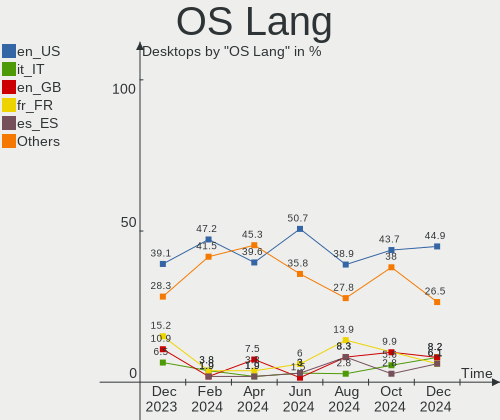
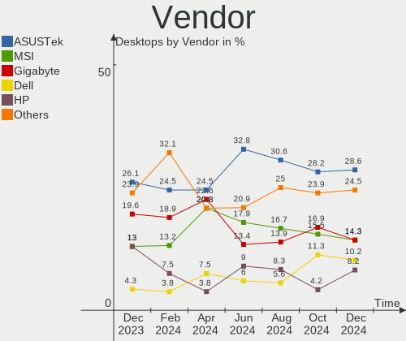
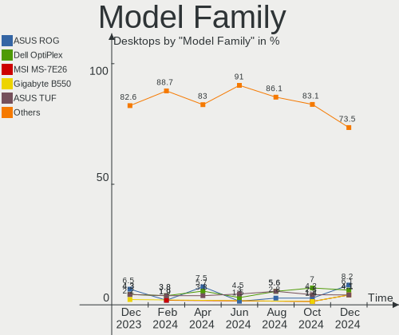
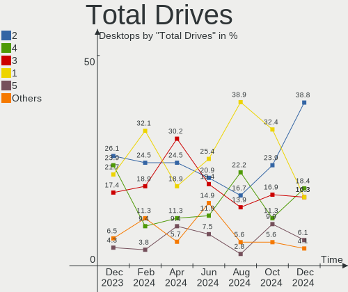
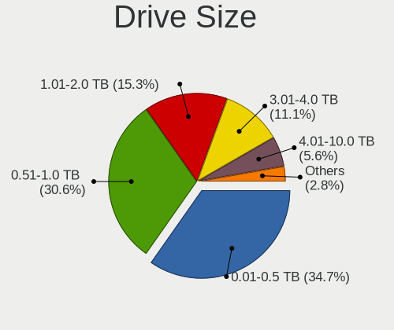
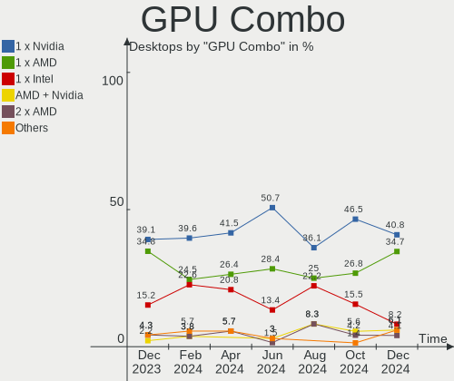
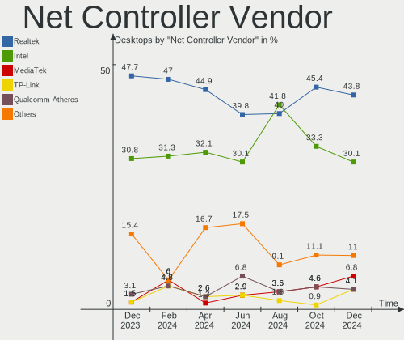
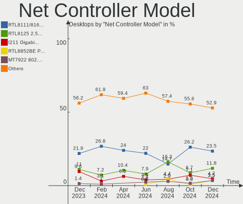
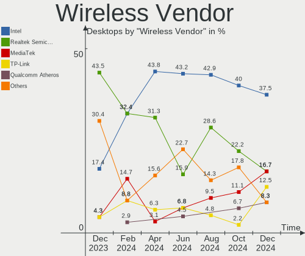
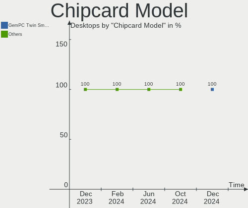

Kubuntu - Hardware Trends (Desktops)
------------------------------------

A project to identify most popular hardware characteristics and track their change
over time based on data collected by Linux users at https://Linux-Hardware.org.

Anyone can contribute to this report by the [hw-probe](https://github.com/linuxhw/hw-probe) tool:

    sudo -E hw-probe -all -upload

This report is for one last month. Overall report since the beginning of time: [TestCoverage](https://github.com/linuxhw/TestCoverage)

Period: Oct, 2022.

Contents
--------

* [ System ](#system)
  - [ OS                       ](#os)
  - [ OS Family                ](#os-family)
  - [ Kernel                   ](#kernel)
  - [ Kernel Family            ](#kernel-family)
  - [ Kernel Major Ver.        ](#kernel-major-ver)
  - [ Arch                     ](#arch)
  - [ DE                       ](#de)
  - [ Display Server           ](#display-server)
  - [ Display Manager          ](#display-manager)
  - [ OS Lang                  ](#os-lang)
  - [ Boot Mode                ](#boot-mode)
  - [ Filesystem               ](#filesystem)
  - [ Part. scheme             ](#part-scheme)
  - [ Dual Boot with Linux/BSD ](#dual-boot-with-linuxbsd)
  - [ Dual Boot (Win)          ](#dual-boot-win)

* [ Board ](#board)
  - [ Vendor                   ](#vendor)
  - [ Model                    ](#model)
  - [ Model Family             ](#model-family)
  - [ MFG Year                 ](#mfg-year)
  - [ Form Factor              ](#form-factor)
  - [ Secure Boot              ](#secure-boot)
  - [ Coreboot                 ](#coreboot)
  - [ RAM Size                 ](#ram-size)
  - [ RAM Used                 ](#ram-used)
  - [ Total Drives             ](#total-drives)
  - [ Has CD-ROM               ](#has-cd-rom)
  - [ Has Ethernet             ](#has-ethernet)
  - [ Has WiFi                 ](#has-wifi)
  - [ Has Bluetooth            ](#has-bluetooth)

* [ Location ](#location)
  - [ Country                  ](#country)
  - [ City                     ](#city)

* [ Drives ](#drives)
  - [ Drive Vendor             ](#drive-vendor)
  - [ Drive Model              ](#drive-model)
  - [ HDD Vendor               ](#hdd-vendor)
  - [ SSD Vendor               ](#ssd-vendor)
  - [ Drive Kind               ](#drive-kind)
  - [ Drive Connector          ](#drive-connector)
  - [ Drive Size               ](#drive-size)
  - [ Space Total              ](#space-total)
  - [ Space Used               ](#space-used)
  - [ Malfunc. Drives          ](#malfunc-drives)
  - [ Malfunc. Drive Vendor    ](#malfunc-drive-vendor)
  - [ Malfunc. HDD Vendor      ](#malfunc-hdd-vendor)
  - [ Malfunc. Drive Kind      ](#malfunc-drive-kind)
  - [ Failed Drives            ](#failed-drives)
  - [ Failed Drive Vendor      ](#failed-drive-vendor)
  - [ Drive Status             ](#drive-status)

* [ Storage controller ](#storage-controller)
  - [ Storage Vendor           ](#storage-vendor)
  - [ Storage Model            ](#storage-model)
  - [ Storage Kind             ](#storage-kind)

* [ Processor ](#processor)
  - [ CPU Vendor               ](#cpu-vendor)
  - [ CPU Model                ](#cpu-model)
  - [ CPU Model Family         ](#cpu-model-family)
  - [ CPU Cores                ](#cpu-cores)
  - [ CPU Sockets              ](#cpu-sockets)
  - [ CPU Threads              ](#cpu-threads)
  - [ CPU Op-Modes             ](#cpu-op-modes)
  - [ CPU Microcode            ](#cpu-microcode)
  - [ CPU Microarch            ](#cpu-microarch)

* [ Graphics ](#graphics)
  - [ GPU Vendor               ](#gpu-vendor)
  - [ GPU Model                ](#gpu-model)
  - [ GPU Combo                ](#gpu-combo)
  - [ GPU Driver               ](#gpu-driver)
  - [ GPU Memory               ](#gpu-memory)

* [ Monitor ](#monitor)
  - [ Monitor Vendor           ](#monitor-vendor)
  - [ Monitor Model            ](#monitor-model)
  - [ Monitor Resolution       ](#monitor-resolution)
  - [ Monitor Diagonal         ](#monitor-diagonal)
  - [ Monitor Width            ](#monitor-width)
  - [ Aspect Ratio             ](#aspect-ratio)
  - [ Monitor Area             ](#monitor-area)
  - [ Pixel Density            ](#pixel-density)
  - [ Multiple Monitors        ](#multiple-monitors)

* [ Network ](#network)
  - [ Net Controller Vendor    ](#net-controller-vendor)
  - [ Net Controller Model     ](#net-controller-model)
  - [ Wireless Vendor          ](#wireless-vendor)
  - [ Wireless Model           ](#wireless-model)
  - [ Ethernet Vendor          ](#ethernet-vendor)
  - [ Ethernet Model           ](#ethernet-model)
  - [ Net Controller Kind      ](#net-controller-kind)
  - [ Used Controller          ](#used-controller)
  - [ NICs                     ](#nics)
  - [ IPv6                     ](#ipv6)

* [ Bluetooth ](#bluetooth)
  - [ Bluetooth Vendor         ](#bluetooth-vendor)
  - [ Bluetooth Model          ](#bluetooth-model)

* [ Sound ](#sound)
  - [ Sound Vendor             ](#sound-vendor)
  - [ Sound Model              ](#sound-model)

* [ Memory ](#memory)
  - [ Memory Vendor            ](#memory-vendor)
  - [ Memory Model             ](#memory-model)
  - [ Memory Kind              ](#memory-kind)
  - [ Memory Form Factor       ](#memory-form-factor)
  - [ Memory Size              ](#memory-size)
  - [ Memory Speed             ](#memory-speed)

* [ Printers & scanners ](#printers--scanners)
  - [ Printer Vendor           ](#printer-vendor)
  - [ Printer Model            ](#printer-model)
  - [ Scanner Vendor           ](#scanner-vendor)
  - [ Scanner Model            ](#scanner-model)

* [ Camera ](#camera)
  - [ Camera Vendor            ](#camera-vendor)
  - [ Camera Model             ](#camera-model)

* [ Security ](#security)
  - [ Fingerprint Vendor       ](#fingerprint-vendor)
  - [ Fingerprint Model        ](#fingerprint-model)
  - [ Chipcard Vendor          ](#chipcard-vendor)
  - [ Chipcard Model           ](#chipcard-model)

* [ Unsupported ](#unsupported)
  - [ Unsupported Devices      ](#unsupported-devices)
  - [ Unsupported Device Types ](#unsupported-device-types)

System
------

OS
--

Installed operating systems

| Name          | Desktops | Percent |
|---------------|----------|---------|
| Kubuntu 22.04 | 29       | 50.88%  |
| Kubuntu 20.04 | 13       | 22.81%  |
| Kubuntu 22.10 | 7        | 12.28%  |
| Kubuntu 11    | 6        | 10.53%  |
| Kubuntu 21.04 | 1        | 1.75%   |
| Kubuntu 18.04 | 1        | 1.75%   |

OS Family
---------

OS without a version

| Name    | Desktops | Percent |
|---------|----------|---------|
| Kubuntu | 57       | 100%    |

Kernel
------

Version of the Linux kernel

| Version                | Desktops | Percent |
|------------------------|----------|---------|
| 5.15.0-48-generic      | 12       | 21.05%  |
| 5.15.0-52-generic      | 10       | 17.54%  |
| 5.15.0-50-generic      | 6        | 10.53%  |
| 5.19.0-23-generic      | 4        | 7.02%   |
| 5.4.0-131-generic      | 3        | 5.26%   |
| 5.15.0-48-lowlatency   | 3        | 5.26%   |
| 5.4.0-126-generic      | 2        | 3.51%   |
| 5.15.0-46-generic      | 2        | 3.51%   |
| 6.0.3-060003-generic   | 1        | 1.75%   |
| 6.0.1-060001-generic   | 1        | 1.75%   |
| 5.4.0-120-generic      | 1        | 1.75%   |
| 5.19.12-xanmod1        | 1        | 1.75%   |
| 5.19.0-21-generic      | 1        | 1.75%   |
| 5.19.0-1009-lowlatency | 1        | 1.75%   |
| 5.17.0-1017-oem        | 1        | 1.75%   |
| 5.15.0-53-generic      | 1        | 1.75%   |
| 5.15.0-52-lowlatency   | 1        | 1.75%   |
| 5.15.0-50-lowlatency   | 1        | 1.75%   |
| 5.15.0-47-generic      | 1        | 1.75%   |
| 5.15.0-43-generic      | 1        | 1.75%   |
| 5.13.0-44-generic      | 1        | 1.75%   |
| 5.11.0-49-lowlatency   | 1        | 1.75%   |
| 4.15.0-194-generic     | 1        | 1.75%   |

Kernel Family
-------------

Linux kernel without a distro release

| Version | Desktops | Percent |
|---------|----------|---------|
| 5.15.0  | 38       | 66.67%  |
| 5.4.0   | 6        | 10.53%  |
| 5.19.0  | 6        | 10.53%  |
| 6.0.3   | 1        | 1.75%   |
| 6.0.1   | 1        | 1.75%   |
| 5.19.12 | 1        | 1.75%   |
| 5.17.0  | 1        | 1.75%   |
| 5.13.0  | 1        | 1.75%   |
| 5.11.0  | 1        | 1.75%   |
| 4.15.0  | 1        | 1.75%   |

Kernel Major Ver.
-----------------

Linux kernel major version

| Version | Desktops | Percent |
|---------|----------|---------|
| 5.15    | 38       | 66.67%  |
| 5.19    | 7        | 12.28%  |
| 5.4     | 6        | 10.53%  |
| 6.0     | 2        | 3.51%   |
| 5.17    | 1        | 1.75%   |
| 5.13    | 1        | 1.75%   |
| 5.11    | 1        | 1.75%   |
| 4.15    | 1        | 1.75%   |

Arch
----

OS architecture (x86_64, i586, etc.)

| Name   | Desktops | Percent |
|--------|----------|---------|
| x86_64 | 57       | 100%    |

DE
--

Desktop Environment

| Name  | Desktops | Percent |
|-------|----------|---------|
| KDE5  | 55       | 96.49%  |
| KDE   | 1        | 1.75%   |
| GNOME | 1        | 1.75%   |

Display Server
--------------

X11 or Wayland

| Name | Desktops | Percent |
|------|----------|---------|
| X11  | 57       | 100%    |

Display Manager
---------------

SDDM, LightDM, etc.

| Name    | Desktops | Percent |
|---------|----------|---------|
| SDDM    | 32       | 56.14%  |
| Unknown | 19       | 33.33%  |
| LightDM | 4        | 7.02%   |
| GDM3    | 2        | 3.51%   |

OS Lang
-------

Language

| Lang  | Desktops | Percent |
|-------|----------|---------|
| en_US | 21       | 36.84%  |
| it_IT | 8        | 14.04%  |
| de_DE | 5        | 8.77%   |
| fr_FR | 3        | 5.26%   |
| ru_RU | 2        | 3.51%   |
| nl_NL | 2        | 3.51%   |
| en_PH | 2        | 3.51%   |
| zh_CN | 1        | 1.75%   |
| uk_UA | 1        | 1.75%   |
| ru_UA | 1        | 1.75%   |
| pt_BR | 1        | 1.75%   |
| nl_BE | 1        | 1.75%   |
| fr_BE | 1        | 1.75%   |
| es_ES | 1        | 1.75%   |
| en_NZ | 1        | 1.75%   |
| en_DK | 1        | 1.75%   |
| en_CA | 1        | 1.75%   |
| en_AU | 1        | 1.75%   |
| el_GR | 1        | 1.75%   |
| de_LU | 1        | 1.75%   |
| C     | 1        | 1.75%   |

Boot Mode
---------

EFI or BIOS

| Mode | Desktops | Percent |
|------|----------|---------|
| BIOS | 38       | 66.67%  |
| EFI  | 19       | 33.33%  |

Filesystem
----------

Type of filesystem

| Type    | Desktops | Percent |
|---------|----------|---------|
| Ext4    | 52       | 91.23%  |
| Btrfs   | 3        | 5.26%   |
| Overlay | 2        | 3.51%   |

Part. scheme
------------

Scheme of partitioning

| Type    | Desktops | Percent |
|---------|----------|---------|
| GPT     | 29       | 50.88%  |
| Unknown | 19       | 33.33%  |
| MBR     | 9        | 15.79%  |

Dual Boot with Linux/BSD
------------------------

Hosting more than one Linux/BSD

| Dual boot | Desktops | Percent |
|-----------|----------|---------|
| No        | 48       | 84.21%  |
| Yes       | 9        | 15.79%  |

Dual Boot (Win)
---------------

Hosting Linux and Windows

| Dual boot | Desktops | Percent |
|-----------|----------|---------|
| No        | 40       | 70.18%  |
| Yes       | 17       | 29.82%  |

Board
-----

Vendor
------

Motherboard manufacturer

| Name                | Desktops | Percent |
|---------------------|----------|---------|
| ASUSTek Computer    | 20       | 35.09%  |
| Gigabyte Technology | 8        | 14.04%  |
| MSI                 | 6        | 10.53%  |
| Dell                | 5        | 8.77%   |
| ASRock              | 5        | 8.77%   |
| Lenovo              | 3        | 5.26%   |
| Shuttle             | 2        | 3.51%   |
| Medion              | 1        | 1.75%   |
| JWIPC               | 1        | 1.75%   |
| Hewlett-Packard     | 1        | 1.75%   |
| Google              | 1        | 1.75%   |
| Gateway             | 1        | 1.75%   |
| EVGA                | 1        | 1.75%   |
| Apple               | 1        | 1.75%   |
| Acer                | 1        | 1.75%   |

Model
-----

Motherboard model

| Name                              | Desktops | Percent |
|-----------------------------------|----------|---------|
| Shuttle XS35V4                    | 1        | 1.75%   |
| Shuttle SH61R                     | 1        | 1.75%   |
| MSI MS-7C80                       | 1        | 1.75%   |
| MSI MS-7B84                       | 1        | 1.75%   |
| MSI MS-7A40                       | 1        | 1.75%   |
| MSI MS-7996                       | 1        | 1.75%   |
| MSI MS-7971                       | 1        | 1.75%   |
| MSI MS-7641                       | 1        | 1.75%   |
| Medion H110H4-EM2                 | 1        | 1.75%   |
| Lenovo ThinkCentre M90p 5498A2U   | 1        | 1.75%   |
| Lenovo ThinkCentre A70 7844H9G    | 1        | 1.75%   |
| Lenovo H50-50 90B60068IX          | 1        | 1.75%   |
| JWIPC BF24                        | 1        | 1.75%   |
| HP ENVY Desktop 795-0xxx          | 1        | 1.75%   |
| Google Kench                      | 1        | 1.75%   |
| Gigabyte Z77X-UP7                 | 1        | 1.75%   |
| Gigabyte Z68XP-UD3                | 1        | 1.75%   |
| Gigabyte Z370P D3                 | 1        | 1.75%   |
| Gigabyte P55-US3L                 | 1        | 1.75%   |
| Gigabyte B450 AORUS ELITE         | 1        | 1.75%   |
| Gigabyte B365M D2V                | 1        | 1.75%   |
| Gigabyte AX370M-Gaming 3          | 1        | 1.75%   |
| Gigabyte AB350M-DS3H V2           | 1        | 1.75%   |
| Gateway DX4850                    | 1        | 1.75%   |
| EVGA 122-CK-NF68                  | 1        | 1.75%   |
| Dell Vostro 270s                  | 1        | 1.75%   |
| Dell Precision WorkStation T7400  | 1        | 1.75%   |
| Dell OptiPlex 780                 | 1        | 1.75%   |
| Dell OptiPlex 7010                | 1        | 1.75%   |
| Dell OptiPlex 3010                | 1        | 1.75%   |
| ASUS TUF X470-PLUS GAMING         | 1        | 1.75%   |
| ASUS TUF Gaming B550-PLUS         | 1        | 1.75%   |
| ASUS STRIX Z270E GAMING           | 1        | 1.75%   |
| ASUS SABERTOOTH 990FX R2.0        | 1        | 1.75%   |
| ASUS ROG STRIX Z690-F GAMING WIFI | 1        | 1.75%   |
| ASUS ROG STRIX Z390-E GAMING      | 1        | 1.75%   |
| ASUS ROG STRIX B550-I GAMING      | 1        | 1.75%   |
| ASUS ROG STRIX B550-F GAMING      | 1        | 1.75%   |
| ASUS ROG CROSSHAIR VII HERO       | 1        | 1.75%   |
| ASUS PRIME X570-P                 | 1        | 1.75%   |

Model Family
------------

Motherboard model prefix

| Name                   | Desktops | Percent |
|------------------------|----------|---------|
| ASUS ROG               | 5        | 8.77%   |
| ASUS PRIME             | 5        | 8.77%   |
| Dell OptiPlex          | 3        | 5.26%   |
| Lenovo ThinkCentre     | 2        | 3.51%   |
| ASUS TUF               | 2        | 3.51%   |
| ASUS M5A78L-M          | 2        | 3.51%   |
| Shuttle XS35V4         | 1        | 1.75%   |
| Shuttle SH61R          | 1        | 1.75%   |
| MSI MS-7C80            | 1        | 1.75%   |
| MSI MS-7B84            | 1        | 1.75%   |
| MSI MS-7A40            | 1        | 1.75%   |
| MSI MS-7996            | 1        | 1.75%   |
| MSI MS-7971            | 1        | 1.75%   |
| MSI MS-7641            | 1        | 1.75%   |
| Medion H110H4-EM2      | 1        | 1.75%   |
| Lenovo H50-50          | 1        | 1.75%   |
| JWIPC BF24             | 1        | 1.75%   |
| HP ENVY                | 1        | 1.75%   |
| Google Kench           | 1        | 1.75%   |
| Gigabyte Z77X-UP7      | 1        | 1.75%   |
| Gigabyte Z68XP-UD3     | 1        | 1.75%   |
| Gigabyte Z370P         | 1        | 1.75%   |
| Gigabyte P55-US3L      | 1        | 1.75%   |
| Gigabyte B450          | 1        | 1.75%   |
| Gigabyte B365M         | 1        | 1.75%   |
| Gigabyte AX370M-Gaming | 1        | 1.75%   |
| Gigabyte AB350M-DS3H   | 1        | 1.75%   |
| Gateway DX4850         | 1        | 1.75%   |
| EVGA 122-CK-NF68       | 1        | 1.75%   |
| Dell Vostro            | 1        | 1.75%   |
| Dell Precision         | 1        | 1.75%   |
| ASUS STRIX             | 1        | 1.75%   |
| ASUS SABERTOOTH        | 1        | 1.75%   |
| ASUS P8H61-M           | 1        | 1.75%   |
| ASUS P7P55D-E          | 1        | 1.75%   |
| ASUS M4A88TD-M         | 1        | 1.75%   |
| ASUS All               | 1        | 1.75%   |
| ASRock Z170            | 1        | 1.75%   |
| ASRock H61M-VS         | 1        | 1.75%   |
| ASRock B560M           | 1        | 1.75%   |

MFG Year
--------

Motherboard manufacture year

| Year | Desktops | Percent |
|------|----------|---------|
| 2018 | 9        | 15.79%  |
| 2020 | 6        | 10.53%  |
| 2012 | 6        | 10.53%  |
| 2016 | 5        | 8.77%   |
| 2011 | 5        | 8.77%   |
| 2010 | 5        | 8.77%   |
| 2009 | 4        | 7.02%   |
| 2021 | 3        | 5.26%   |
| 2019 | 3        | 5.26%   |
| 2014 | 3        | 5.26%   |
| 2022 | 2        | 3.51%   |
| 2017 | 2        | 3.51%   |
| 2013 | 2        | 3.51%   |
| 2008 | 1        | 1.75%   |
| 2007 | 1        | 1.75%   |

Form Factor
-----------

Physical design of the computer

| Name    | Desktops | Percent |
|---------|----------|---------|
| Desktop | 57       | 100%    |

Secure Boot
-----------

Enabled or disabled

| State    | Desktops | Percent |
|----------|----------|---------|
| Disabled | 57       | 100%    |

Coreboot
--------

Have coreboot on board

| Used | Desktops | Percent |
|------|----------|---------|
| No   | 56       | 98.25%  |
| Yes  | 1        | 1.75%   |

RAM Size
--------

Total RAM memory

| Size in GB | Desktops | Percent |
|------------|----------|---------|
| 32.01-64.0 | 23       | 40.35%  |
| 16.01-24.0 | 12       | 21.05%  |
| 8.01-16.0  | 11       | 19.3%   |
| 3.01-4.0   | 8        | 14.04%  |
| 24.01-32.0 | 2        | 3.51%   |
| 4.01-8.0   | 1        | 1.75%   |

RAM Used
--------

Used RAM memory

| Used GB    | Desktops | Percent |
|------------|----------|---------|
| 4.01-8.0   | 16       | 28.07%  |
| 2.01-3.0   | 12       | 21.05%  |
| 1.01-2.0   | 12       | 21.05%  |
| 3.01-4.0   | 8        | 14.04%  |
| 8.01-16.0  | 6        | 10.53%  |
| 0.51-1.0   | 2        | 3.51%   |
| 24.01-32.0 | 1        | 1.75%   |

Total Drives
------------

Number of drives on board

| Drives | Desktops | Percent |
|--------|----------|---------|
| 2      | 18       | 31.58%  |
| 1      | 15       | 26.32%  |
| 3      | 10       | 17.54%  |
| 4      | 7        | 12.28%  |
| 5      | 6        | 10.53%  |
| 6      | 1        | 1.75%   |

Has CD-ROM
----------

Has CD-ROM on board

| Presented | Desktops | Percent |
|-----------|----------|---------|
| No        | 32       | 56.14%  |
| Yes       | 25       | 43.86%  |

Has Ethernet
------------

Has Ethernet on board

| Presented | Desktops | Percent |
|-----------|----------|---------|
| Yes       | 57       | 100%    |

Has WiFi
--------

Has WiFi module

| Presented | Desktops | Percent |
|-----------|----------|---------|
| No        | 33       | 57.89%  |
| Yes       | 24       | 42.11%  |

Has Bluetooth
-------------

Has Bluetooth module

| Presented | Desktops | Percent |
|-----------|----------|---------|
| No        | 33       | 57.89%  |
| Yes       | 24       | 42.11%  |

Location
--------

Country
-------

Geographic location (country)

| Country     | Desktops | Percent |
|-------------|----------|---------|
| USA         | 10       | 17.54%  |
| Italy       | 10       | 17.54%  |
| Germany     | 6        | 10.53%  |
| France      | 4        | 7.02%   |
| Netherlands | 3        | 5.26%   |
| Ukraine     | 2        | 3.51%   |
| Poland      | 2        | 3.51%   |
| Philippines | 2        | 3.51%   |
| Brazil      | 2        | 3.51%   |
| Belgium     | 2        | 3.51%   |
| Turkey      | 1        | 1.75%   |
| Spain       | 1        | 1.75%   |
| Serbia      | 1        | 1.75%   |
| New Zealand | 1        | 1.75%   |
| Malaysia    | 1        | 1.75%   |
| Luxembourg  | 1        | 1.75%   |
| Japan       | 1        | 1.75%   |
| Greece      | 1        | 1.75%   |
| Denmark     | 1        | 1.75%   |
| Canada      | 1        | 1.75%   |
| Belarus     | 1        | 1.75%   |
| Australia   | 1        | 1.75%   |
| Armenia     | 1        | 1.75%   |
| Argentina   | 1        | 1.75%   |

City
----

Geographic location (city)

| City                   | Desktops | Percent |
|------------------------|----------|---------|
| Palermo                | 2        | 3.51%   |
| Zonhoven               | 1        | 1.75%   |
| Yerevan                | 1        | 1.75%   |
| Wroclaw                | 1        | 1.75%   |
| Whangarei              | 1        | 1.75%   |
| Weimar                 | 1        | 1.75%   |
| Vitebsk                | 1        | 1.75%   |
| Valencia               | 1        | 1.75%   |
| Trieste                | 1        | 1.75%   |
| Treviolo               | 1        | 1.75%   |
| Tholey                 | 1        | 1.75%   |
| Syeverodonets'k        | 1        | 1.75%   |
| Savignano sul Rubicone | 1        | 1.75%   |
| Saskatoon              | 1        | 1.75%   |
| Sappemeer              | 1        | 1.75%   |
| Santo André           | 1        | 1.75%   |
| San Leonardo           | 1        | 1.75%   |
| San Giovanni Lupatoto  | 1        | 1.75%   |
| Rome                   | 1        | 1.75%   |
| Rio de Janeiro         | 1        | 1.75%   |
| Portland               | 1        | 1.75%   |
| Paris                  | 1        | 1.75%   |
| Overveen               | 1        | 1.75%   |
| Odessa                 | 1        | 1.75%   |
| Nice                   | 1        | 1.75%   |
| Milan                  | 1        | 1.75%   |
| Miami                  | 1        | 1.75%   |
| Mainz                  | 1        | 1.75%   |
| Luxembourg             | 1        | 1.75%   |
| Kuala Lumpur           | 1        | 1.75%   |
| Kent                   | 1        | 1.75%   |
| Kaifenheim             | 1        | 1.75%   |
| Istanbul               | 1        | 1.75%   |
| Imus                   | 1        | 1.75%   |
| Iesi                   | 1        | 1.75%   |
| Heddesbach             | 1        | 1.75%   |
| Gig Harbor             | 1        | 1.75%   |
| Flemalle               | 1        | 1.75%   |
| Exton                  | 1        | 1.75%   |
| Évreux                | 1        | 1.75%   |

Drives
------

Drive Vendor
------------

Hard drive vendors

| Vendor                      | Desktops | Drives | Percent |
|-----------------------------|----------|--------|---------|
| WDC                         | 22       | 28     | 18.18%  |
| Seagate                     | 20       | 25     | 16.53%  |
| Samsung Electronics         | 20       | 25     | 16.53%  |
| Toshiba                     | 6        | 9      | 4.96%   |
| Kingston                    | 6        | 6      | 4.96%   |
| Hitachi                     | 5        | 5      | 4.13%   |
| Crucial                     | 5        | 5      | 4.13%   |
| SanDisk                     | 3        | 3      | 2.48%   |
| PNY                         | 3        | 3      | 2.48%   |
| Lexar                       | 3        | 3      | 2.48%   |
| HGST                        | 3        | 3      | 2.48%   |
| Phison                      | 2        | 2      | 1.65%   |
| Patriot                     | 2        | 2      | 1.65%   |
| KIOXIA-EXCERIA              | 2        | 2      | 1.65%   |
| Kingston Technology Company | 2        | 2      | 1.65%   |
| Intel                       | 2        | 2      | 1.65%   |
| Emtec                       | 2        | 2      | 1.65%   |
| Phison Electronics          | 1        | 1      | 0.83%   |
| Micron/Crucial Technology   | 1        | 1      | 0.83%   |
| Maxtor                      | 1        | 1      | 0.83%   |
| Intenso                     | 1        | 1      | 0.83%   |
| HS-SSD-C100                 | 1        | 1      | 0.83%   |
| Hewlett-Packard             | 1        | 1      | 0.83%   |
| Gigabyte Technology         | 1        | 1      | 0.83%   |
| External                    | 1        | 1      | 0.83%   |
| Dogfish                     | 1        | 1      | 0.83%   |
| CS900 SS                    | 1        | 1      | 0.83%   |
| Corsair                     | 1        | 3      | 0.83%   |
| China                       | 1        | 1      | 0.83%   |
| A-DATA Technology           | 1        | 1      | 0.83%   |

Drive Model
-----------

Hard drive models

| Model                             | Desktops | Percent |
|-----------------------------------|----------|---------|
| WDC WD20EZRZ-00Z5HB0 2TB          | 2        | 1.49%   |
| Seagate ST9500325AS 500GB         | 2        | 1.49%   |
| Seagate ST4000DM004-2CV104 4TB    | 2        | 1.49%   |
| Seagate ST2000VM003-1CT164 2TB    | 2        | 1.49%   |
| Samsung SSD 980 500GB             | 2        | 1.49%   |
| Samsung SSD 970 EVO Plus 1TB      | 2        | 1.49%   |
| Samsung HD103SJ 1TB               | 2        | 1.49%   |
| PNY CS900 480GB SSD               | 2        | 1.49%   |
| Kingston SA2000M81000G 1TB        | 2        | 1.49%   |
| WDC WDS100T1X0E-00AFY0 1TB        | 1        | 0.75%   |
| WDC WD8004FRYZ-01VAEB0 8TB        | 1        | 0.75%   |
| WDC WD6400BEVT-22A0RT0 640GB      | 1        | 0.75%   |
| WDC WD6400AAKS-22A7B2 640GB       | 1        | 0.75%   |
| WDC WD5000BEVT-22A0RT0 500GB      | 1        | 0.75%   |
| WDC WD5000AAKX-001CA0 500GB       | 1        | 0.75%   |
| WDC WD40EZRX-22SPEB0 4TB          | 1        | 0.75%   |
| WDC WD30EZRX-00SPEB0 3TB          | 1        | 0.75%   |
| WDC WD20EZRX-00D8PB0 2TB          | 1        | 0.75%   |
| WDC WD20EARX-00PASB0 2TB          | 1        | 0.75%   |
| WDC WD2003FZEX-00SRLA0 2TB        | 1        | 0.75%   |
| WDC WD2002FFSX-68PF8N0 2TB        | 1        | 0.75%   |
| WDC WD1600AAJS-75M0A0 160GB       | 1        | 0.75%   |
| WDC WD1600AAJS-07M0A0 160GB       | 1        | 0.75%   |
| WDC WD10JPVX-22JC3T0 1TB          | 1        | 0.75%   |
| WDC WD10EZEX-60WN4A0 1TB          | 1        | 0.75%   |
| WDC WD10EZEX-21WN4A0 1TB          | 1        | 0.75%   |
| WDC WD10EZEX-08M2NA0 1TB          | 1        | 0.75%   |
| WDC WD10EZEX-00RKKA0 1TB          | 1        | 0.75%   |
| WDC WD10EARS-00MVWB0 1TB          | 1        | 0.75%   |
| WDC WD10EARS-003BB1 1TB           | 1        | 0.75%   |
| WDC WD10EADS-00M2B0 1TB           | 1        | 0.75%   |
| WDC WD1003FBYX-01Y7B1 1TB         | 1        | 0.75%   |
| Toshiba THNSNJ128GCST 128GB SSD   | 1        | 0.75%   |
| Toshiba KBG40ZNT256G MEMORY 256GB | 1        | 0.75%   |
| Toshiba HDWQ140 4TB               | 1        | 0.75%   |
| Toshiba HDWL120 2TB               | 1        | 0.75%   |
| Toshiba HDWD130 3TB               | 1        | 0.75%   |
| Toshiba HDWD120 2TB               | 1        | 0.75%   |
| Toshiba DT01ACA100 1TB            | 1        | 0.75%   |
| Toshiba DT01ABA300 3TB            | 1        | 0.75%   |

HDD Vendor
----------

Hard disk drive vendors

| Vendor              | Desktops | Drives | Percent |
|---------------------|----------|--------|---------|
| WDC                 | 22       | 27     | 36.07%  |
| Seagate             | 20       | 25     | 32.79%  |
| Toshiba             | 6        | 7      | 9.84%   |
| Hitachi             | 5        | 5      | 8.2%    |
| Samsung Electronics | 4        | 5      | 6.56%   |
| HGST                | 3        | 3      | 4.92%   |
| Maxtor              | 1        | 1      | 1.64%   |

SSD Vendor
----------

Solid state drive vendors

| Vendor              | Desktops | Drives | Percent |
|---------------------|----------|--------|---------|
| Samsung Electronics | 10       | 10     | 25.64%  |
| Crucial             | 5        | 5      | 12.82%  |
| Kingston            | 4        | 4      | 10.26%  |
| PNY                 | 3        | 3      | 7.69%   |
| Lexar               | 3        | 3      | 7.69%   |
| SanDisk             | 2        | 2      | 5.13%   |
| Patriot             | 2        | 2      | 5.13%   |
| Intel               | 2        | 2      | 5.13%   |
| Toshiba             | 1        | 1      | 2.56%   |
| KIOXIA-EXCERIA      | 1        | 1      | 2.56%   |
| Hewlett-Packard     | 1        | 1      | 2.56%   |
| Gigabyte Technology | 1        | 1      | 2.56%   |
| Emtec               | 1        | 1      | 2.56%   |
| Dogfish             | 1        | 1      | 2.56%   |
| Corsair             | 1        | 3      | 2.56%   |
| China               | 1        | 1      | 2.56%   |

Drive Kind
----------

HDD or SSD

| Kind    | Desktops | Drives | Percent |
|---------|----------|--------|---------|
| HDD     | 45       | 73     | 45%     |
| SSD     | 31       | 41     | 31%     |
| NVMe    | 20       | 24     | 20%     |
| Unknown | 4        | 4      | 4%      |

Drive Connector
---------------

SATA, SAS, NVMe, etc.

| Type | Desktops | Drives | Percent |
|------|----------|--------|---------|
| SATA | 52       | 115    | 70.27%  |
| NVMe | 19       | 23     | 25.68%  |
| SAS  | 3        | 4      | 4.05%   |

Drive Size
----------

Size of hard drive

| Size in TB | Desktops | Drives | Percent |
|------------|----------|--------|---------|
| 0.01-0.5   | 37       | 56     | 44.58%  |
| 0.51-1.0   | 19       | 24     | 22.89%  |
| 1.01-2.0   | 14       | 19     | 16.87%  |
| 3.01-4.0   | 5        | 6      | 6.02%   |
| 2.01-3.0   | 4        | 5      | 4.82%   |
| 4.01-10.0  | 3        | 3      | 3.61%   |
| 10.01-20.0 | 1        | 1      | 1.2%    |

Space Total
-----------

Amount of disk space available on the file system

| Size in GB     | Desktops | Percent |
|----------------|----------|---------|
| More than 3000 | 10       | 17.54%  |
| 251-500        | 9        | 15.79%  |
| 2001-3000      | 9        | 15.79%  |
| 501-1000       | 9        | 15.79%  |
| 1001-2000      | 8        | 14.04%  |
| 101-250        | 6        | 10.53%  |
| 21-50          | 3        | 5.26%   |
| 1-20           | 2        | 3.51%   |
| 51-100         | 1        | 1.75%   |

Space Used
----------

Amount of used disk space

| Used GB        | Desktops | Percent |
|----------------|----------|---------|
| 251-500        | 10       | 17.54%  |
| 101-250        | 9        | 15.79%  |
| 1-20           | 9        | 15.79%  |
| 1001-2000      | 8        | 14.04%  |
| 21-50          | 7        | 12.28%  |
| More than 3000 | 5        | 8.77%   |
| 2001-3000      | 4        | 7.02%   |
| 501-1000       | 4        | 7.02%   |
| 51-100         | 1        | 1.75%   |

Malfunc. Drives
---------------

Drive models with a malfunction

| Model                           | Desktops | Drives | Percent |
|---------------------------------|----------|--------|---------|
| WDC WD5000BEVT-22A0RT0 500GB    | 1        | 1      | 10%     |
| WDC WD30EZRX-00SPEB0 3TB        | 1        | 1      | 10%     |
| WDC WD10EZEX-21WN4A0 1TB        | 1        | 1      | 10%     |
| WDC WD10EZEX-08M2NA0 1TB        | 1        | 1      | 10%     |
| WDC WD10EARS-00MVWB0 1TB        | 1        | 1      | 10%     |
| Seagate ST500DM002-1BD142 500GB | 1        | 1      | 10%     |
| Seagate ST31500341AS 1TB        | 1        | 1      | 10%     |
| Intel SSDSC2KW120H6 120GB       | 1        | 1      | 10%     |
| Hitachi HTS547550A9E384 500GB   | 1        | 1      | 10%     |
| Crucial CT120M500SSD1 120GB     | 1        | 1      | 10%     |

Malfunc. Drive Vendor
---------------------

Vendors of faulty drives

| Vendor  | Desktops | Drives | Percent |
|---------|----------|--------|---------|
| WDC     | 4        | 5      | 44.44%  |
| Seagate | 2        | 2      | 22.22%  |
| Intel   | 1        | 1      | 11.11%  |
| Hitachi | 1        | 1      | 11.11%  |
| Crucial | 1        | 1      | 11.11%  |

Malfunc. HDD Vendor
-------------------

Vendors of faulty HDD drives

| Vendor  | Desktops | Drives | Percent |
|---------|----------|--------|---------|
| WDC     | 4        | 5      | 57.14%  |
| Seagate | 2        | 2      | 28.57%  |
| Hitachi | 1        | 1      | 14.29%  |

Malfunc. Drive Kind
-------------------

Kinds of faulty drives

| Kind | Desktops | Drives | Percent |
|------|----------|--------|---------|
| HDD  | 7        | 8      | 77.78%  |
| SSD  | 2        | 2      | 22.22%  |

Failed Drives
-------------

Failed drive models

Zero info for selected period =(

Failed Drive Vendor
-------------------

Failed drive vendors

Zero info for selected period =(

Drive Status
------------

Number of failed and malfunc. drives

| Status   | Desktops | Drives | Percent |
|----------|----------|--------|---------|
| Detected | 32       | 72     | 48.48%  |
| Works    | 25       | 60     | 37.88%  |
| Malfunc  | 9        | 10     | 13.64%  |

Storage controller
------------------

Storage Vendor
--------------

Storage controller vendors

| Vendor                      | Desktops | Percent |
|-----------------------------|----------|---------|
| Intel                       | 35       | 39.77%  |
| AMD                         | 21       | 23.86%  |
| Samsung Electronics         | 9        | 10.23%  |
| Kingston Technology Company | 4        | 4.55%   |
| Phison Electronics          | 3        | 3.41%   |
| Marvell Technology Group    | 3        | 3.41%   |
| JMicron Technology          | 3        | 3.41%   |
| ASMedia Technology          | 3        | 3.41%   |
| SanDisk                     | 2        | 2.27%   |
| KIOXIA                      | 2        | 2.27%   |
| Nvidia                      | 1        | 1.14%   |
| Micron/Crucial Technology   | 1        | 1.14%   |
| ADATA Technology            | 1        | 1.14%   |

Storage Model
-------------

Storage controller models

| Model                                                                                   | Desktops | Percent |
|-----------------------------------------------------------------------------------------|----------|---------|
| AMD FCH SATA Controller [AHCI mode]                                                     | 9        | 8.33%   |
| Samsung NVMe SSD Controller SM981/PM981/PM983                                           | 5        | 4.63%   |
| AMD 400 Series Chipset SATA Controller                                                  | 5        | 4.63%   |
| Intel Q170/Q150/B150/H170/H110/Z170/CM236 Chipset SATA Controller [AHCI Mode]           | 4        | 3.7%    |
| Intel 6 Series/C200 Series Chipset Family 6 port Desktop SATA AHCI Controller           | 4        | 3.7%    |
| Intel 200 Series PCH SATA controller [AHCI mode]                                        | 4        | 3.7%    |
| Samsung NVMe SSD Controller 980                                                         | 3        | 2.78%   |
| Phison E12 NVMe Controller                                                              | 3        | 2.78%   |
| Kingston Company A2000 NVMe SSD                                                         | 3        | 2.78%   |
| JMicron JMB363 SATA/IDE Controller                                                      | 3        | 2.78%   |
| Intel 7 Series/C210 Series Chipset Family 6-port SATA Controller [AHCI mode]            | 3        | 2.78%   |
| ASMedia ASM1062 Serial ATA Controller                                                   | 3        | 2.78%   |
| AMD SB7x0/SB8x0/SB9x0 IDE Controller                                                    | 3        | 2.78%   |
| AMD FCH SATA Controller D                                                               | 3        | 2.78%   |
| AMD 500 Series Chipset SATA Controller                                                  | 3        | 2.78%   |
| Marvell Group 88SE9172 SATA 6Gb/s Controller                                            | 2        | 1.85%   |
| Intel Volume Management Device NVMe RAID Controller                                     | 2        | 1.85%   |
| Intel SATA Controller [RAID mode]                                                       | 2        | 1.85%   |
| Intel Alder Lake-S PCH SATA Controller [AHCI Mode]                                      | 2        | 1.85%   |
| Intel 82801JI (ICH10 Family) SATA AHCI Controller                                       | 2        | 1.85%   |
| Intel 6 Series/C200 Series Chipset Family Desktop SATA Controller (IDE mode, ports 4-5) | 2        | 1.85%   |
| Intel 6 Series/C200 Series Chipset Family Desktop SATA Controller (IDE mode, ports 0-3) | 2        | 1.85%   |
| Intel 5 Series/3400 Series Chipset 4 port SATA IDE Controller                           | 2        | 1.85%   |
| Intel 5 Series/3400 Series Chipset 2 port SATA IDE Controller                           | 2        | 1.85%   |
| AMD SB7x0/SB8x0/SB9x0 SATA Controller [AHCI mode]                                       | 2        | 1.85%   |
| AMD 300 Series Chipset SATA Controller                                                  | 2        | 1.85%   |
| SanDisk WD PC SN810 / Black SN850 NVMe SSD                                              | 1        | 0.93%   |
| SanDisk WD Black 2018/SN750 / PC SN720 NVMe SSD                                         | 1        | 0.93%   |
| Samsung NVMe SSD Controller PM9A1/PM9A3/980PRO                                          | 1        | 0.93%   |
| Nvidia MCP55 SATA Controller                                                            | 1        | 0.93%   |
| Nvidia MCP55 IDE                                                                        | 1        | 0.93%   |
| Micron/Crucial P1 NVMe PCIe SSD                                                         | 1        | 0.93%   |
| Marvell Group 88SE914D SATA-600 Controller                                              | 1        | 0.93%   |
| KIOXIA NVMe SSD Controller BG4                                                          | 1        | 0.93%   |
| KIOXIA NVMe SSD                                                                         | 1        | 0.93%   |
| Kingston Company U-SNS8154P3 NVMe SSD                                                   | 1        | 0.93%   |
| Intel Sunrise Point-LP SATA Controller [AHCI mode]                                      | 1        | 0.93%   |
| Intel NM10/ICH7 Family SATA Controller [IDE mode]                                       | 1        | 0.93%   |
| Intel Comet Lake SATA AHCI Controller                                                   | 1        | 0.93%   |
| Intel Cannon Lake PCH SATA AHCI Controller                                              | 1        | 0.93%   |

Storage Kind
------------

Kind of storage controller (IDE, SATA, NVMe, SAS, ...)

| Kind | Desktops | Percent |
|------|----------|---------|
| SATA | 47       | 55.95%  |
| NVMe | 19       | 22.62%  |
| IDE  | 12       | 14.29%  |
| RAID | 6        | 7.14%   |

Processor
---------

CPU Vendor
----------

Processor vendors

| Vendor | Desktops | Percent |
|--------|----------|---------|
| Intel  | 36       | 63.16%  |
| AMD    | 21       | 36.84%  |

CPU Model
---------

Processor models

| Model                                      | Desktops | Percent |
|--------------------------------------------|----------|---------|
| Intel Pentium CPU G2020 @ 2.90GHz          | 2        | 3.51%   |
| Intel Core i7-3770K CPU @ 3.50GHz          | 2        | 3.51%   |
| Intel Core 2 Duo CPU E7500 @ 2.93GHz       | 2        | 3.51%   |
| AMD Ryzen 9 5900X 12-Core Processor        | 2        | 3.51%   |
| AMD Ryzen 5 1600 Six-Core Processor        | 2        | 3.51%   |
| AMD FX-8320 Eight-Core Processor           | 2        | 3.51%   |
| Intel Xeon CPU X5260 @ 3.33GHz             | 1        | 1.75%   |
| Intel Xeon CPU X3440 @ 2.53GHz             | 1        | 1.75%   |
| Intel Xeon CPU W3530 @ 2.80GHz             | 1        | 1.75%   |
| Intel Pentium CPU G4600 @ 3.60GHz          | 1        | 1.75%   |
| Intel Pentium CPU G4400 @ 3.30GHz          | 1        | 1.75%   |
| Intel Core i9-9900K CPU @ 3.60GHz          | 1        | 1.75%   |
| Intel Core i7-9700 CPU @ 3.00GHz           | 1        | 1.75%   |
| Intel Core i7-8700K CPU @ 3.70GHz          | 1        | 1.75%   |
| Intel Core i7-8700 CPU @ 3.20GHz           | 1        | 1.75%   |
| Intel Core i7-7700K CPU @ 4.20GHz          | 1        | 1.75%   |
| Intel Core i7-4790 CPU @ 3.60GHz           | 1        | 1.75%   |
| Intel Core i7-4770 CPU @ 3.40GHz           | 1        | 1.75%   |
| Intel Core i7-3770 CPU @ 3.40GHz           | 1        | 1.75%   |
| Intel Core i7 CPU 920 @ 2.67GHz            | 1        | 1.75%   |
| Intel Core i5-7500 CPU @ 3.40GHz           | 1        | 1.75%   |
| Intel Core i5-7400 CPU @ 3.00GHz           | 1        | 1.75%   |
| Intel Core i5-6600K CPU @ 3.50GHz          | 1        | 1.75%   |
| Intel Core i5-3470 CPU @ 3.20GHz           | 1        | 1.75%   |
| Intel Core i5-2300 CPU @ 2.80GHz           | 1        | 1.75%   |
| Intel Core i5-10600 CPU @ 3.30GHz          | 1        | 1.75%   |
| Intel Core i5-10400F CPU @ 2.90GHz         | 1        | 1.75%   |
| Intel Core i5 CPU 760 @ 2.80GHz            | 1        | 1.75%   |
| Intel Core i3-3220 CPU @ 3.30GHz           | 1        | 1.75%   |
| Intel Core i3 CPU 530 @ 2.93GHz            | 1        | 1.75%   |
| Intel Core 2 Duo CPU E6750 @ 2.66GHz       | 1        | 1.75%   |
| Intel Celeron CPU J1900 @ 1.99GHz          | 1        | 1.75%   |
| Intel Celeron CPU G540 @ 2.50GHz           | 1        | 1.75%   |
| Intel Celeron CPU 3865U @ 1.80GHz          | 1        | 1.75%   |
| Intel 12th Gen Core i9-12900K              | 1        | 1.75%   |
| Intel 12th Gen Core i5-12400               | 1        | 1.75%   |
| AMD Ryzen 9 5950X 16-Core Processor        | 1        | 1.75%   |
| AMD Ryzen 7 PRO 4750G with Radeon Graphics | 1        | 1.75%   |
| AMD Ryzen 7 5700G with Radeon Graphics     | 1        | 1.75%   |
| AMD Ryzen 7 3800X 8-Core Processor         | 1        | 1.75%   |

CPU Model Family
----------------

Processor model prefix

| Model            | Desktops | Percent |
|------------------|----------|---------|
| Intel Core i7    | 10       | 17.54%  |
| Intel Core i5    | 8        | 14.04%  |
| AMD Ryzen 5      | 7        | 12.28%  |
| Intel Pentium    | 4        | 7.02%   |
| AMD Ryzen 7      | 4        | 7.02%   |
| Intel Xeon       | 3        | 5.26%   |
| Intel Core 2 Duo | 3        | 5.26%   |
| Intel Celeron    | 3        | 5.26%   |
| AMD Ryzen 9      | 3        | 5.26%   |
| Other            | 2        | 3.51%   |
| Intel Core i3    | 2        | 3.51%   |
| AMD FX           | 2        | 3.51%   |
| Intel Core i9    | 1        | 1.75%   |
| AMD Ryzen 7 PRO  | 1        | 1.75%   |
| AMD Phenom II X6 | 1        | 1.75%   |
| AMD Phenom II X4 | 1        | 1.75%   |
| AMD Athlon II X4 | 1        | 1.75%   |
| AMD A4           | 1        | 1.75%   |

CPU Cores
---------

Number of processor cores

| Number | Desktops | Percent |
|--------|----------|---------|
| 4      | 23       | 40.35%  |
| 6      | 11       | 19.3%   |
| 2      | 11       | 19.3%   |
| 8      | 7        | 12.28%  |
| 16     | 2        | 3.51%   |
| 12     | 2        | 3.51%   |
| 1      | 1        | 1.75%   |

CPU Sockets
-----------

Number of sockets

| Number | Desktops | Percent |
|--------|----------|---------|
| 1      | 56       | 98.25%  |
| 2      | 1        | 1.75%   |

CPU Threads
-----------

Threads per core (Hyper-Threading)

| Number | Desktops | Percent |
|--------|----------|---------|
| 2      | 35       | 61.4%   |
| 1      | 22       | 38.6%   |

CPU Op-Modes
------------

CPU Operation Modes (32-bit, 64-bit)

| Op mode        | Desktops | Percent |
|----------------|----------|---------|
| 32-bit, 64-bit | 57       | 100%    |

CPU Microcode
-------------

Microcode number

| Number     | Desktops | Percent |
|------------|----------|---------|
| Unknown    | 27       | 47.37%  |
| 0x306a9    | 3        | 5.26%   |
| 0xa0653    | 2        | 3.51%   |
| 0x906e9    | 2        | 3.51%   |
| 0x106e5    | 2        | 3.51%   |
| 0x06000852 | 2        | 3.51%   |
| 0x906ed    | 1        | 1.75%   |
| 0x906ec    | 1        | 1.75%   |
| 0x906ea    | 1        | 1.75%   |
| 0x90675    | 1        | 1.75%   |
| 0x506e3    | 1        | 1.75%   |
| 0x306c3    | 1        | 1.75%   |
| 0x30678    | 1        | 1.75%   |
| 0x1067a    | 1        | 1.75%   |
| 0x10676    | 1        | 1.75%   |
| 0x0a50000d | 1        | 1.75%   |
| 0x0a50000c | 1        | 1.75%   |
| 0x0a20120a | 1        | 1.75%   |
| 0x0a201016 | 1        | 1.75%   |
| 0x0a201005 | 1        | 1.75%   |
| 0x08701021 | 1        | 1.75%   |
| 0x08600103 | 1        | 1.75%   |
| 0x08001138 | 1        | 1.75%   |
| 0x03000027 | 1        | 1.75%   |
| 0x010000c8 | 1        | 1.75%   |

CPU Microarch
-------------

Microarchitecture

| Name             | Desktops | Percent |
|------------------|----------|---------|
| KabyLake         | 9        | 15.79%  |
| IvyBridge        | 7        | 12.28%  |
| Zen 3            | 6        | 10.53%  |
| Nehalem          | 4        | 7.02%   |
| Zen+             | 3        | 5.26%   |
| Zen 2            | 3        | 5.26%   |
| Zen              | 3        | 5.26%   |
| Penryn           | 3        | 5.26%   |
| K10              | 3        | 5.26%   |
| Skylake          | 2        | 3.51%   |
| SandyBridge      | 2        | 3.51%   |
| Piledriver       | 2        | 3.51%   |
| Haswell          | 2        | 3.51%   |
| CometLake        | 2        | 3.51%   |
| Westmere         | 1        | 1.75%   |
| Silvermont       | 1        | 1.75%   |
| K10 Llano        | 1        | 1.75%   |
| Core             | 1        | 1.75%   |
| Alderlake Hybrid | 1        | 1.75%   |
| Unknown          | 1        | 1.75%   |

Graphics
--------

GPU Vendor
----------

Vendors of graphics cards

| Vendor | Desktops | Percent |
|--------|----------|---------|
| Nvidia | 35       | 59.32%  |
| AMD    | 18       | 30.51%  |
| Intel  | 6        | 10.17%  |

GPU Model
---------

Graphics card models

| Model                                                            | Desktops | Percent |
|------------------------------------------------------------------|----------|---------|
| Nvidia GP107 [GeForce GTX 1050 Ti]                               | 6        | 10%     |
| Nvidia GK208B [GeForce GT 710]                                   | 3        | 5%      |
| Nvidia GP104 [GeForce GTX 1070]                                  | 2        | 3.33%   |
| Intel Xeon E3-1200 v2/3rd Gen Core processor Graphics Controller | 2        | 3.33%   |
| AMD Cedar [Radeon HD 5000/6000/7350/8350 Series]                 | 2        | 3.33%   |
| AMD Cape Verde XT [Radeon HD 7770/8760 / R7 250X]                | 2        | 3.33%   |
| Nvidia TU116 [GeForce GTX 1660 Ti]                               | 1        | 1.67%   |
| Nvidia TU116 [GeForce GTX 1650]                                  | 1        | 1.67%   |
| Nvidia TU106 [GeForce RTX 2060 Rev. A]                           | 1        | 1.67%   |
| Nvidia GT218 [GeForce 210]                                       | 1        | 1.67%   |
| Nvidia GT215 [GeForce GT 240]                                    | 1        | 1.67%   |
| Nvidia GP107 [GeForce GTX 1050]                                  | 1        | 1.67%   |
| Nvidia GP104 [GeForce GTX 1080]                                  | 1        | 1.67%   |
| Nvidia GM206 [GeForce GTX 960]                                   | 1        | 1.67%   |
| Nvidia GM204 [GeForce GTX 970]                                   | 1        | 1.67%   |
| Nvidia GM107GL [Quadro K620]                                     | 1        | 1.67%   |
| Nvidia GM107 [GeForce GTX 750 Ti]                                | 1        | 1.67%   |
| Nvidia GM107 [GeForce GTX 745]                                   | 1        | 1.67%   |
| Nvidia GK208B [GeForce GT 720]                                   | 1        | 1.67%   |
| Nvidia GK107 [GeForce GTX 650]                                   | 1        | 1.67%   |
| Nvidia GK104 [GeForce GTX 680]                                   | 1        | 1.67%   |
| Nvidia GF119 [GeForce GT 620 OEM]                                | 1        | 1.67%   |
| Nvidia GF119 [GeForce GT 520]                                    | 1        | 1.67%   |
| Nvidia GF108 [GeForce GT 630]                                    | 1        | 1.67%   |
| Nvidia GF104 [GeForce GTX 460]                                   | 1        | 1.67%   |
| Nvidia GA106 [GeForce RTX 3060 Lite Hash Rate]                   | 1        | 1.67%   |
| Nvidia GA106 [Geforce RTX 3050]                                  | 1        | 1.67%   |
| Nvidia GA104 [GeForce RTX 3070]                                  | 1        | 1.67%   |
| Nvidia GA104 [GeForce RTX 3070 Ti]                               | 1        | 1.67%   |
| Nvidia GA102 [GeForce RTX 3090]                                  | 1        | 1.67%   |
| Nvidia G84 [GeForce 8600 GT]                                     | 1        | 1.67%   |
| Intel Kaby Lake-U GT1 Integrated Graphics Controller             | 1        | 1.67%   |
| Intel HD Graphics 630                                            | 1        | 1.67%   |
| Intel Atom Processor Z36xxx/Z37xxx Series Graphics & Display     | 1        | 1.67%   |
| Intel 4 Series Chipset Integrated Graphics Controller            | 1        | 1.67%   |
| AMD Vega 10 XL/XT [Radeon RX Vega 56/64]                         | 1        | 1.67%   |
| AMD Tonga PRO [Radeon R9 285/380]                                | 1        | 1.67%   |
| AMD Tahiti XT [Radeon HD 7970/8970 OEM / R9 280X]                | 1        | 1.67%   |
| AMD SuperSumo [Radeon HD 6410D]                                  | 1        | 1.67%   |
| AMD RS880 [Radeon HD 4250]                                       | 1        | 1.67%   |

GPU Combo
---------

Combinations of graphics cards

| Name        | Desktops | Percent |
|-------------|----------|---------|
| 1 x Nvidia  | 34       | 59.65%  |
| 1 x AMD     | 17       | 29.82%  |
| 1 x Intel   | 4        | 7.02%   |
| 2 x Nvidia  | 1        | 1.75%   |
| Intel + AMD | 1        | 1.75%   |

GPU Driver
----------

Free vs proprietary

| Driver      | Desktops | Percent |
|-------------|----------|---------|
| Free        | 28       | 49.12%  |
| Proprietary | 27       | 47.37%  |
| Unknown     | 2        | 3.51%   |

GPU Memory
----------

Total video memory

| Size in GB | Desktops | Percent |
|------------|----------|---------|
| Unknown    | 19       | 33.33%  |
| 3.01-4.0   | 9        | 15.79%  |
| 1.01-2.0   | 7        | 12.28%  |
| 7.01-8.0   | 6        | 10.53%  |
| 0.51-1.0   | 6        | 10.53%  |
| 0.01-0.5   | 5        | 8.77%   |
| 5.01-6.0   | 2        | 3.51%   |
| 2.01-3.0   | 1        | 1.75%   |
| 16.01-24.0 | 1        | 1.75%   |
| 8.01-16.0  | 1        | 1.75%   |

Monitor
-------

Monitor Vendor
--------------

Monitor vendors

| Vendor              | Desktops | Percent |
|---------------------|----------|---------|
| Samsung Electronics | 15       | 22.73%  |
| Goldstar            | 9        | 13.64%  |
| Dell                | 8        | 12.12%  |
| Hewlett-Packard     | 6        | 9.09%   |
| Philips             | 5        | 7.58%   |
| Gigabyte Technology | 2        | 3.03%   |
| BenQ                | 2        | 3.03%   |
| AOC                 | 2        | 3.03%   |
| Acer                | 2        | 3.03%   |
| Vizio               | 1        | 1.52%   |
| Toshiba             | 1        | 1.52%   |
| Sony                | 1        | 1.52%   |
| PAR                 | 1        | 1.52%   |
| Panasonic           | 1        | 1.52%   |
| NEC Computers       | 1        | 1.52%   |
| MSI                 | 1        | 1.52%   |
| Medion              | 1        | 1.52%   |
| LG Electronics      | 1        | 1.52%   |
| Iiyama              | 1        | 1.52%   |
| Idek Iiyama         | 1        | 1.52%   |
| HKC                 | 1        | 1.52%   |
| Denver              | 1        | 1.52%   |
| Apple               | 1        | 1.52%   |
| AIO                 | 1        | 1.52%   |

Monitor Model
-------------

Monitor models

| Model                                                               | Desktops | Percent |
|---------------------------------------------------------------------|----------|---------|
| Samsung Electronics C27F390 SAM0D32 1920x1080 598x336mm 27.0-inch   | 2        | 2.82%   |
| Vizio E320-B0 VIZ1007 1366x768 697x392mm 31.5-inch                  | 1        | 1.41%   |
| Toshiba TV TSB0108 1920x540 698x393mm 31.5-inch                     | 1        | 1.41%   |
| Sony LCD Monitor TV                                                 | 1        | 1.41%   |
| Samsung Electronics U28E590 SAM0C4D 3840x2160 607x345mm 27.5-inch   | 1        | 1.41%   |
| Samsung Electronics SMT24A550 SAM07B5 1920x1080 531x299mm 24.0-inch | 1        | 1.41%   |
| Samsung Electronics SMS24A450 SAM083A 1920x1200 518x324mm 24.1-inch | 1        | 1.41%   |
| Samsung Electronics SMEX2220 SAM0686 1920x1080 477x268mm 21.5-inch  | 1        | 1.41%   |
| Samsung Electronics S27C450 SAM09D1 1920x1080 598x336mm 27.0-inch   | 1        | 1.41%   |
| Samsung Electronics S27B350 SAM08DC 1920x1080 598x336mm 27.0-inch   | 1        | 1.41%   |
| Samsung Electronics S24F350 SAM0D21 1920x1080 521x293mm 23.5-inch   | 1        | 1.41%   |
| Samsung Electronics S24D330 SAM0D92 1920x1080 531x299mm 24.0-inch   | 1        | 1.41%   |
| Samsung Electronics S19A10N SAM083E 1366x768 410x230mm 18.5-inch    | 1        | 1.41%   |
| Samsung Electronics LCD Monitor SAM04FD 1360x768                    | 1        | 1.41%   |
| Samsung Electronics LCD Monitor SAM03FB 1280x720                    | 1        | 1.41%   |
| Samsung Electronics LCD Monitor S22F350 1920x1080                   | 1        | 1.41%   |
| Samsung Electronics C27F398 SAM0D45 1920x1080 598x336mm 27.0-inch   | 1        | 1.41%   |
| Samsung Electronics C24F390 SAM0D2C 1920x1080 520x290mm 23.4-inch   | 1        | 1.41%   |
| Philips PHL 276E9Q PHLC17B 1920x1080 598x336mm 27.0-inch            | 1        | 1.41%   |
| Philips PHL 241P8Q PHL0914 1920x1080 527x296mm 23.8-inch            | 1        | 1.41%   |
| Philips 247E4 PHLC0C0 1920x1080 521x293mm 23.5-inch                 | 1        | 1.41%   |
| Philips 206VL PHLC08C 1600x900 443x249mm 20.0-inch                  | 1        | 1.41%   |
| Philips 150P PHL080A 1024x768 307x230mm 15.1-inch                   | 1        | 1.41%   |
| PAR LED1920X1080 PAR9C63 1920x1080 710x400mm 32.1-inch              | 1        | 1.41%   |
| Panasonic LCD Monitor TV                                            | 1        | 1.41%   |
| NEC Computers E241N NEC2C86 1920x1080 527x296mm 23.8-inch           | 1        | 1.41%   |
| MSI G24C6 MSI3BA0 1920x1080 521x293mm 23.5-inch                     | 1        | 1.41%   |
| Medion LCD Monitor MD 20144 1920x1080                               | 1        | 1.41%   |
| LG Electronics LCD Monitor LG TV 3840x1200                          | 1        | 1.41%   |
| Iiyama PL3288UH IVM1176 3840x2160 698x393mm 31.5-inch               | 1        | 1.41%   |
| Idek Iiyama LCD Monitor PLE2607WS                                   | 1        | 1.41%   |
| HKC LCD Monitor 1280x1024                                           | 1        | 1.41%   |
| Hewlett-Packard LE2002x HWP2963 1600x900 443x249mm 20.0-inch        | 1        | 1.41%   |
| Hewlett-Packard LCD Monitor E241i 3840x1200                         | 1        | 1.41%   |
| Hewlett-Packard LCD Monitor 2509 1920x1080                          | 1        | 1.41%   |
| Hewlett-Packard 27cw HWP3194 1920x1080 598x336mm 27.0-inch          | 1        | 1.41%   |
| Hewlett-Packard 24y HPN3504 1920x1080 530x300mm 24.0-inch           | 1        | 1.41%   |
| Hewlett-Packard 24mh HPN366C 1920x1080 527x296mm 23.8-inch          | 1        | 1.41%   |
| Goldstar W2252 GSM5682 1680x1050 473x266mm 21.4-inch                | 1        | 1.41%   |
| Goldstar ULTRAWIDE GSM76FE 2560x1080 798x334mm 34.1-inch            | 1        | 1.41%   |

Monitor Resolution
------------------

Monitor screen resolution

| Resolution         | Desktops | Percent |
|--------------------|----------|---------|
| 1920x1080 (FHD)    | 33       | 50.77%  |
| 3840x2160 (4K)     | 4        | 6.15%   |
| 1680x1050 (WSXGA+) | 4        | 6.15%   |
| 2560x1440 (QHD)    | 3        | 4.62%   |
| 1920x1200 (WUXGA)  | 3        | 4.62%   |
| Unknown            | 3        | 4.62%   |
| 3840x1200          | 2        | 3.08%   |
| 2560x1080          | 2        | 3.08%   |
| 1600x900 (HD+)     | 2        | 3.08%   |
| 1366x768 (WXGA)    | 2        | 3.08%   |
| 4480x1600          | 1        | 1.54%   |
| 3840x1600          | 1        | 1.54%   |
| 1920x540           | 1        | 1.54%   |
| 1440x900 (WXGA+)   | 1        | 1.54%   |
| 1280x720 (HD)      | 1        | 1.54%   |
| 1280x1024 (SXGA)   | 1        | 1.54%   |
| 1024x768 (XGA)     | 1        | 1.54%   |

Monitor Diagonal
----------------

Diagonal size in inches

| Inches  | Desktops | Percent |
|---------|----------|---------|
| 24      | 13       | 19.7%   |
| 27      | 12       | 18.18%  |
| 23      | 9        | 13.64%  |
| Unknown | 8        | 12.12%  |
| 21      | 5        | 7.58%   |
| 31      | 4        | 6.06%   |
| 20      | 3        | 4.55%   |
| 34      | 2        | 3.03%   |
| 22      | 2        | 3.03%   |
| 19      | 2        | 3.03%   |
| 72      | 1        | 1.52%   |
| 42      | 1        | 1.52%   |
| 37      | 1        | 1.52%   |
| 32      | 1        | 1.52%   |
| 18      | 1        | 1.52%   |
| 15      | 1        | 1.52%   |

Monitor Width
-------------

Physical width

| Width in mm | Desktops | Percent |
|-------------|----------|---------|
| 501-600     | 30       | 47.62%  |
| 401-500     | 12       | 19.05%  |
| Unknown     | 8        | 12.7%   |
| 601-700     | 5        | 7.94%   |
| 701-800     | 3        | 4.76%   |
| 801-900     | 1        | 1.59%   |
| 351-400     | 1        | 1.59%   |
| 301-350     | 1        | 1.59%   |
| 1501-2000   | 1        | 1.59%   |
| 901-1000    | 1        | 1.59%   |

Aspect Ratio
------------

Proportional relationship between the width and the height

| Ratio   | Desktops | Percent |
|---------|----------|---------|
| 16/9    | 39       | 68.42%  |
| Unknown | 7        | 12.28%  |
| 16/10   | 6        | 10.53%  |
| 21/9    | 3        | 5.26%   |
| 5/4     | 1        | 1.75%   |
| 4/3     | 1        | 1.75%   |

Monitor Area
------------

Area in inch²

| Area in inch² | Desktops | Percent |
|----------------|----------|---------|
| 201-250        | 23       | 35.94%  |
| 301-350        | 12       | 18.75%  |
| Unknown        | 8        | 12.5%   |
| 351-500        | 7        | 10.94%  |
| 151-200        | 6        | 9.38%   |
| 251-300        | 3        | 4.69%   |
| 501-1000       | 2        | 3.13%   |
| More than 1000 | 1        | 1.56%   |
| 141-150        | 1        | 1.56%   |
| 101-110        | 1        | 1.56%   |

Pixel Density
-------------

Pixels per inch

| Density | Desktops | Percent |
|---------|----------|---------|
| 51-100  | 37       | 63.79%  |
| 101-120 | 8        | 13.79%  |
| Unknown | 8        | 13.79%  |
| 1-50    | 2        | 3.45%   |
| 121-160 | 2        | 3.45%   |
| 161-240 | 1        | 1.72%   |

Multiple Monitors
-----------------

Total monitors connected

| Total | Desktops | Percent |
|-------|----------|---------|
| 1     | 36       | 63.16%  |
| 2     | 19       | 33.33%  |
| 0     | 2        | 3.51%   |

Network
-------

Net Controller Vendor
---------------------

Controller vendors

| Vendor                          | Desktops | Percent |
|---------------------------------|----------|---------|
| Realtek Semiconductor           | 40       | 51.95%  |
| Intel                           | 21       | 27.27%  |
| Qualcomm Atheros                | 3        | 3.9%    |
| Broadcom                        | 3        | 3.9%    |
| Wacom                           | 1        | 1.3%    |
| TP-Link                         | 1        | 1.3%    |
| Ralink Technology               | 1        | 1.3%    |
| Qualcomm Atheros Communications | 1        | 1.3%    |
| OnePlus                         | 1        | 1.3%    |
| Nvidia                          | 1        | 1.3%    |
| NetGear                         | 1        | 1.3%    |
| Bose                            | 1        | 1.3%    |
| AVM                             | 1        | 1.3%    |
| ASUSTek Computer                | 1        | 1.3%    |

Net Controller Model
--------------------

Controller models

| Model                                                             | Desktops | Percent |
|-------------------------------------------------------------------|----------|---------|
| Realtek RTL8111/8168/8411 PCI Express Gigabit Ethernet Controller | 35       | 39.33%  |
| Intel Ethernet Controller I225-V                                  | 3        | 3.37%   |
| Intel Ethernet Connection (2) I219-V                              | 3        | 3.37%   |
| Realtek RTL8125 2.5GbE Controller                                 | 2        | 2.25%   |
| Intel Wi-Fi 6 AX200                                               | 2        | 2.25%   |
| Intel Ethernet Connection (7) I219-V                              | 2        | 2.25%   |
| Intel 82579V Gigabit Network Connection                           | 2        | 2.25%   |
| Intel 82574L Gigabit Network Connection                           | 2        | 2.25%   |
| Wacom ACK-40401 [Wireless Accessory Kit]                          | 1        | 1.12%   |
| TP-Link TL-WN722N v2/v3 [Realtek RTL8188EUS]                      | 1        | 1.12%   |
| Realtek RTL8822BE 802.11a/b/g/n/ac WiFi adapter                   | 1        | 1.12%   |
| Realtek RTL8821AE 802.11ac PCIe Wireless Network Adapter          | 1        | 1.12%   |
| Realtek RTL8192EU 802.11b/g/n WLAN Adapter                        | 1        | 1.12%   |
| Realtek RTL8192EE PCIe Wireless Network Adapter                   | 1        | 1.12%   |
| Realtek RTL8188EE Wireless Network Adapter                        | 1        | 1.12%   |
| Realtek RTL8169 PCI Gigabit Ethernet Controller                   | 1        | 1.12%   |
| Realtek RTL8153 Gigabit Ethernet Adapter                          | 1        | 1.12%   |
| Realtek RTL810xE PCI Express Fast Ethernet controller             | 1        | 1.12%   |
| Realtek 802.11ac NIC                                              | 1        | 1.12%   |
| Ralink RT5370 Wireless Adapter                                    | 1        | 1.12%   |
| Qualcomm Atheros QCA6174 802.11ac Wireless Network Adapter        | 1        | 1.12%   |
| Qualcomm Atheros AR9271 802.11n                                   | 1        | 1.12%   |
| Qualcomm Atheros AR9485 Wireless Network Adapter                  | 1        | 1.12%   |
| Qualcomm Atheros AR9462 Wireless Network Adapter                  | 1        | 1.12%   |
| Qualcomm Atheros AR8161 Gigabit Ethernet                          | 1        | 1.12%   |
| OnePlus OnePlus                                                   | 1        | 1.12%   |
| Nvidia MCP55 Ethernet                                             | 1        | 1.12%   |
| NetGear A6100 AC600 DB Wireless Adapter [Realtek RTL8811AU]       | 1        | 1.12%   |
| Intel Wireless-AC 9260                                            | 1        | 1.12%   |
| Intel Wireless 7265                                               | 1        | 1.12%   |
| Intel Wireless 7260                                               | 1        | 1.12%   |
| Intel I211 Gigabit Network Connection                             | 1        | 1.12%   |
| Intel Ethernet Connection (17) I219-V                             | 1        | 1.12%   |
| Intel Ethernet Connection (11) I219-V                             | 1        | 1.12%   |
| Intel Dual Band Wireless-AC 3168NGW [Stone Peak]                  | 1        | 1.12%   |
| Intel Cannon Lake PCH CNVi WiFi                                   | 1        | 1.12%   |
| Intel Alder Lake-S PCH CNVi WiFi                                  | 1        | 1.12%   |
| Intel 82579LM Gigabit Network Connection (Lewisville)             | 1        | 1.12%   |
| Intel 82578DM Gigabit Network Connection                          | 1        | 1.12%   |
| Intel 82567LM-3 Gigabit Network Connection                        | 1        | 1.12%   |

Wireless Vendor
---------------

Wireless vendors

| Vendor                          | Desktops | Percent |
|---------------------------------|----------|---------|
| Intel                           | 8        | 30.77%  |
| Realtek Semiconductor           | 6        | 23.08%  |
| Qualcomm Atheros                | 3        | 11.54%  |
| Broadcom                        | 2        | 7.69%   |
| Wacom                           | 1        | 3.85%   |
| TP-Link                         | 1        | 3.85%   |
| Ralink Technology               | 1        | 3.85%   |
| Qualcomm Atheros Communications | 1        | 3.85%   |
| NetGear                         | 1        | 3.85%   |
| AVM                             | 1        | 3.85%   |
| ASUSTek Computer                | 1        | 3.85%   |

Wireless Model
--------------

Wireless models

| Model                                                          | Desktops | Percent |
|----------------------------------------------------------------|----------|---------|
| Intel Wi-Fi 6 AX200                                            | 2        | 7.69%   |
| Wacom ACK-40401 [Wireless Accessory Kit]                       | 1        | 3.85%   |
| TP-Link TL-WN722N v2/v3 [Realtek RTL8188EUS]                   | 1        | 3.85%   |
| Realtek RTL8822BE 802.11a/b/g/n/ac WiFi adapter                | 1        | 3.85%   |
| Realtek RTL8821AE 802.11ac PCIe Wireless Network Adapter       | 1        | 3.85%   |
| Realtek RTL8192EU 802.11b/g/n WLAN Adapter                     | 1        | 3.85%   |
| Realtek RTL8192EE PCIe Wireless Network Adapter                | 1        | 3.85%   |
| Realtek RTL8188EE Wireless Network Adapter                     | 1        | 3.85%   |
| Realtek 802.11ac NIC                                           | 1        | 3.85%   |
| Ralink RT5370 Wireless Adapter                                 | 1        | 3.85%   |
| Qualcomm Atheros QCA6174 802.11ac Wireless Network Adapter     | 1        | 3.85%   |
| Qualcomm Atheros AR9271 802.11n                                | 1        | 3.85%   |
| Qualcomm Atheros AR9485 Wireless Network Adapter               | 1        | 3.85%   |
| Qualcomm Atheros AR9462 Wireless Network Adapter               | 1        | 3.85%   |
| NetGear A6100 AC600 DB Wireless Adapter [Realtek RTL8811AU]    | 1        | 3.85%   |
| Intel Wireless-AC 9260                                         | 1        | 3.85%   |
| Intel Wireless 7265                                            | 1        | 3.85%   |
| Intel Wireless 7260                                            | 1        | 3.85%   |
| Intel Dual Band Wireless-AC 3168NGW [Stone Peak]               | 1        | 3.85%   |
| Intel Cannon Lake PCH CNVi WiFi                                | 1        | 3.85%   |
| Intel Alder Lake-S PCH CNVi WiFi                               | 1        | 3.85%   |
| Broadcom BCM43602 802.11ac Wireless LAN SoC                    | 1        | 3.85%   |
| Broadcom BCM4352 802.11ac Wireless Network Adapter             | 1        | 3.85%   |
| AVM FRITZ WLAN N v2 [RT5572/rt2870.bin]                        | 1        | 3.85%   |
| ASUS AC51 802.11a/b/g/n/ac Wireless Adapter [Mediatek MT7610U] | 1        | 3.85%   |

Ethernet Vendor
---------------

Ethernet vendors

| Vendor                | Desktops | Percent |
|-----------------------|----------|---------|
| Realtek Semiconductor | 38       | 63.33%  |
| Intel                 | 18       | 30%     |
| Qualcomm Atheros      | 1        | 1.67%   |
| OnePlus               | 1        | 1.67%   |
| Nvidia                | 1        | 1.67%   |
| Broadcom              | 1        | 1.67%   |

Ethernet Model
--------------

Ethernet models

| Model                                                             | Desktops | Percent |
|-------------------------------------------------------------------|----------|---------|
| Realtek RTL8111/8168/8411 PCI Express Gigabit Ethernet Controller | 35       | 56.45%  |
| Intel Ethernet Controller I225-V                                  | 3        | 4.84%   |
| Intel Ethernet Connection (2) I219-V                              | 3        | 4.84%   |
| Realtek RTL8125 2.5GbE Controller                                 | 2        | 3.23%   |
| Intel Ethernet Connection (7) I219-V                              | 2        | 3.23%   |
| Intel 82579V Gigabit Network Connection                           | 2        | 3.23%   |
| Intel 82574L Gigabit Network Connection                           | 2        | 3.23%   |
| Realtek RTL8169 PCI Gigabit Ethernet Controller                   | 1        | 1.61%   |
| Realtek RTL8153 Gigabit Ethernet Adapter                          | 1        | 1.61%   |
| Realtek RTL810xE PCI Express Fast Ethernet controller             | 1        | 1.61%   |
| Qualcomm Atheros AR8161 Gigabit Ethernet                          | 1        | 1.61%   |
| OnePlus OnePlus                                                   | 1        | 1.61%   |
| Nvidia MCP55 Ethernet                                             | 1        | 1.61%   |
| Intel I211 Gigabit Network Connection                             | 1        | 1.61%   |
| Intel Ethernet Connection (17) I219-V                             | 1        | 1.61%   |
| Intel Ethernet Connection (11) I219-V                             | 1        | 1.61%   |
| Intel 82579LM Gigabit Network Connection (Lewisville)             | 1        | 1.61%   |
| Intel 82578DM Gigabit Network Connection                          | 1        | 1.61%   |
| Intel 82567LM-3 Gigabit Network Connection                        | 1        | 1.61%   |
| Broadcom NetXtreme BCM5754 Gigabit Ethernet PCI Express           | 1        | 1.61%   |

Net Controller Kind
-------------------

Ethernet, WiFi or modem

| Kind     | Desktops | Percent |
|----------|----------|---------|
| Ethernet | 57       | 69.51%  |
| WiFi     | 24       | 29.27%  |
| Modem    | 1        | 1.22%   |

Used Controller
---------------

Currently used network controller

| Kind     | Desktops | Percent |
|----------|----------|---------|
| Ethernet | 47       | 78.33%  |
| WiFi     | 13       | 21.67%  |

NICs
----

Total network controllers on board

| Total | Desktops | Percent |
|-------|----------|---------|
| 1     | 36       | 63.16%  |
| 2     | 18       | 31.58%  |
| 3     | 3        | 5.26%   |

IPv6
----

IPv6 vs IPv4

| Used | Desktops | Percent |
|------|----------|---------|
| No   | 41       | 71.93%  |
| Yes  | 16       | 28.07%  |

Bluetooth
---------

Bluetooth Vendor
----------------

Controller vendors

| Vendor                  | Desktops | Percent |
|-------------------------|----------|---------|
| Cambridge Silicon Radio | 10       | 41.67%  |
| Intel                   | 8        | 33.33%  |
| ASUSTek Computer        | 2        | 8.33%   |
| Realtek Semiconductor   | 1        | 4.17%   |
| Realtek                 | 1        | 4.17%   |
| IMC Networks            | 1        | 4.17%   |
| Broadcom                | 1        | 4.17%   |

Bluetooth Model
---------------

Controller models

| Model                                               | Desktops | Percent |
|-----------------------------------------------------|----------|---------|
| Cambridge Silicon Radio Bluetooth Dongle (HCI mode) | 10       | 41.67%  |
| Intel Bluetooth wireless interface                  | 2        | 8.33%   |
| Intel AX200 Bluetooth                               | 2        | 8.33%   |
| Realtek  Bluetooth 4.2 Adapter                      | 1        | 4.17%   |
| Realtek Bluetooth Radio                             | 1        | 4.17%   |
| Intel Wireless-AC 9260 Bluetooth Adapter            | 1        | 4.17%   |
| Intel Wireless-AC 3168 Bluetooth                    | 1        | 4.17%   |
| Intel Bluetooth Device                              | 1        | 4.17%   |
| Intel Bluetooth 9460/9560 Jefferson Peak (JfP)      | 1        | 4.17%   |
| IMC Networks Bluetooth Radio                        | 1        | 4.17%   |
| Broadcom BCM20702A0 Bluetooth 4.0                   | 1        | 4.17%   |
| ASUS Qualcomm Bluetooth 4.1                         | 1        | 4.17%   |
| ASUS Broadcom BCM20702A0 Bluetooth                  | 1        | 4.17%   |

Sound
-----

Sound Vendor
------------

Sound card vendors

| Vendor              | Desktops | Percent |
|---------------------|----------|---------|
| Nvidia              | 34       | 29.82%  |
| Intel               | 34       | 29.82%  |
| AMD                 | 30       | 26.32%  |
| C-Media Electronics | 4        | 3.51%   |
| Razer USA           | 2        | 1.75%   |
| ZOOM                | 1        | 0.88%   |
| Yamaha              | 1        | 0.88%   |
| Texas Instruments   | 1        | 0.88%   |
| Tenx Technology     | 1        | 0.88%   |
| KORG                | 1        | 0.88%   |
| Kingston Technology | 1        | 0.88%   |
| Hangzhou Worlde     | 1        | 0.88%   |
| Corsair             | 1        | 0.88%   |
| Blue Microphones    | 1        | 0.88%   |
| ASUSTek Computer    | 1        | 0.88%   |

Sound Model
-----------

Sound card models

| Model                                                                      | Desktops | Percent |
|----------------------------------------------------------------------------|----------|---------|
| Nvidia GP107GL High Definition Audio Controller                            | 7        | 5.51%   |
| Intel 6 Series/C200 Series Chipset Family High Definition Audio Controller | 6        | 4.72%   |
| AMD Starship/Matisse HD Audio Controller                                   | 6        | 4.72%   |
| AMD SBx00 Azalia (Intel HDA)                                               | 5        | 3.94%   |
| AMD Oland/Hainan/Cape Verde/Pitcairn HDMI Audio [Radeon HD 7000 Series]    | 5        | 3.94%   |
| AMD Family 17h/19h HD Audio Controller                                     | 5        | 3.94%   |
| Nvidia GK208 HDMI/DP Audio Controller                                      | 4        | 3.15%   |
| Intel 200 Series PCH HD Audio                                              | 4        | 3.15%   |
| Intel 100 Series/C230 Series Chipset Family HD Audio Controller            | 4        | 3.15%   |
| AMD Family 17h (Models 00h-0fh) HD Audio Controller                        | 4        | 3.15%   |
| Nvidia GP104 High Definition Audio Controller                              | 3        | 2.36%   |
| Nvidia GM107 High Definition Audio Controller [GeForce 940MX]              | 3        | 2.36%   |
| Intel 7 Series/C216 Chipset Family High Definition Audio Controller        | 3        | 2.36%   |
| Intel 5 Series/3400 Series Chipset High Definition Audio                   | 3        | 2.36%   |
| AMD Renoir Radeon High Definition Audio Controller                         | 3        | 2.36%   |
| Nvidia TU116 High Definition Audio Controller                              | 2        | 1.57%   |
| Nvidia High Definition Audio Controller                                    | 2        | 1.57%   |
| Nvidia GF119 HDMI Audio Controller                                         | 2        | 1.57%   |
| Nvidia GA106 High Definition Audio Controller                              | 2        | 1.57%   |
| Nvidia GA104 High Definition Audio Controller                              | 2        | 1.57%   |
| Intel Cannon Lake PCH cAVS                                                 | 2        | 1.57%   |
| Intel Alder Lake-S HD Audio Controller                                     | 2        | 1.57%   |
| Intel 82801JI (ICH10 Family) HD Audio Controller                           | 2        | 1.57%   |
| AMD Cedar HDMI Audio [Radeon HD 5400/6300/7300 Series]                     | 2        | 1.57%   |
| ZOOM HD8                                                                   | 1        | 0.79%   |
| Yamaha Steinberg UR22mkII                                                  | 1        | 0.79%   |
| Texas Instruments PCM2904 Audio Codec                                      | 1        | 0.79%   |
| Tenx Technology USB AUDIO                                                  | 1        | 0.79%   |
| Razer USA Razer Kraken V3 X                                                | 1        | 0.79%   |
| Razer USA Kraken Tournament Edition                                        | 1        | 0.79%   |
| Nvidia TU106 High Definition Audio Controller                              | 1        | 0.79%   |
| Nvidia MCP55 High Definition Audio                                         | 1        | 0.79%   |
| Nvidia GM206 High Definition Audio Controller                              | 1        | 0.79%   |
| Nvidia GM204 High Definition Audio Controller                              | 1        | 0.79%   |
| Nvidia GK107 HDMI Audio Controller                                         | 1        | 0.79%   |
| Nvidia GK104 HDMI Audio Controller                                         | 1        | 0.79%   |
| Nvidia GF108 High Definition Audio Controller                              | 1        | 0.79%   |
| Nvidia GF104 High Definition Audio Controller                              | 1        | 0.79%   |
| Nvidia GA102 High Definition Audio Controller                              | 1        | 0.79%   |
| KORG Pa700                                                                 | 1        | 0.79%   |

Memory
------

Memory Vendor
-------------

Memory module vendors

| Vendor            | Desktops | Percent |
|-------------------|----------|---------|
| Kingston          | 9        | 30%     |
| Corsair           | 6        | 20%     |
| Unknown           | 5        | 16.67%  |
| Crucial           | 5        | 16.67%  |
| SK hynix          | 2        | 6.67%   |
| Micron Technology | 1        | 3.33%   |
| Lexar             | 1        | 3.33%   |
| G.Skill           | 1        | 3.33%   |

Memory Model
------------

Memory module models

| Model                                                       | Desktops | Percent |
|-------------------------------------------------------------|----------|---------|
| Unknown RAM Module 8GB DIMM DDR3 1333MT/s                   | 1        | 3.03%   |
| Unknown RAM Module 8192MB DIMM DDR3 1333MT/s                | 1        | 3.03%   |
| Unknown RAM Module 8192MB DIMM 1600MT/s                     | 1        | 3.03%   |
| Unknown RAM Module 4096MB DIMM 1333MT/s                     | 1        | 3.03%   |
| Unknown RAM Module 2048MB DIMM 1333MT/s                     | 1        | 3.03%   |
| Unknown RAM Module 16GB DIMM DDR4 2667MT/s                  | 1        | 3.03%   |
| SK hynix RAM HYMP351F72AMP4D2Y5 4096MB FB-DIMM DDR2 667MT/s | 1        | 3.03%   |
| SK hynix RAM HMA451U6AFR8N-TF 4096MB DIMM DDR4 2133MT/s     | 1        | 3.03%   |
| Micron RAM 16JTF1G64AZ-1G6E1 8GB DIMM DDR3 1600MT/s         | 1        | 3.03%   |
| Lexar RAM LD4AU016G-3200ST 16GB DIMM DDR4 3200MT/s          | 1        | 3.03%   |
| Kingston RAM KHX3200C16D4/16GX 16GB DIMM DDR4 3600MT/s      | 1        | 3.03%   |
| Kingston RAM KHX2400C15/16G 16GB DIMM DDR4 3334MT/s         | 1        | 3.03%   |
| Kingston RAM KHX2133C14D4/8G 8GB DIMM 2667MT/s              | 1        | 3.03%   |
| Kingston RAM KF3600C18D4/16GX 16GB DIMM DDR4 3600MT/s       | 1        | 3.03%   |
| Kingston RAM KF3200C16D4/16GX 16GB DIMM DDR4 3200MT/s       | 1        | 3.03%   |
| Kingston RAM 99U5700-028.A00G 8GB SODIMM DDR4 2400MT/s      | 1        | 3.03%   |
| Kingston RAM 99U5474-002.A01LF 1024MB DIMM DDR3 1333MT/s    | 1        | 3.03%   |
| Kingston RAM 99U5471-066.A00LF 8192MB DIMM DDR3 1600MT/s    | 1        | 3.03%   |
| Kingston RAM 99U5471-054.A00LF 8GB DIMM DDR3 1600MT/s       | 1        | 3.03%   |
| Kingston RAM 99U5471-052.A00LF 8GB DIMM DDR3 1333MT/s       | 1        | 3.03%   |
| Kingston RAM 9905471-060.A00LF 8GB DIMM DDR3 1333MT/s       | 1        | 3.03%   |
| G.Skill RAM F4-3000C15-8GVGB 8GB DIMM DDR4 3066MT/s         | 1        | 3.03%   |
| Crucial RAM CT4G4DFS824A.M8FF 4096MB DIMM DDR4 2400MT/s     | 1        | 3.03%   |
| Crucial RAM CT102464BA160B.C16 8GB DIMM DDR3 1600MT/s       | 1        | 3.03%   |
| Crucial RAM BLS8G3D1609ES2LX0. 8192MB DIMM DDR3 1600MT/s    | 1        | 3.03%   |
| Crucial RAM BLS16G4D30AESB.M16FE 16GB DIMM DDR4 3200MT/s    | 1        | 3.03%   |
| Crucial RAM BL16G32C16U4B.16FE 16GB DIMM DDR4 3200MT/s      | 1        | 3.03%   |
| Corsair RAM CMZ32GX3M4X1600C10 8192MB DIMM DDR3 1600MT/s    | 1        | 3.03%   |
| Corsair RAM CMV8GX3M1A1333C9 8GB DIMM DDR3 1333MT/s         | 1        | 3.03%   |
| Corsair RAM CMK32GX4M2B3200C16 16GB DIMM DDR4 3400MT/s      | 1        | 3.03%   |
| Corsair RAM CMK32GX4M2A2133C13 16GB DIMM DDR4 2133MT/s      | 1        | 3.03%   |
| Corsair RAM CMK16GX4M2E3200C16 8GB DIMM DDR4 3200MT/s       | 1        | 3.03%   |
| Corsair RAM CMK16GX4M2B3200C16 8192MB DIMM DDR4 3600MT/s    | 1        | 3.03%   |

Memory Kind
-----------

Memory module kinds

| Kind    | Desktops | Percent |
|---------|----------|---------|
| DDR4    | 16       | 57.14%  |
| DDR3    | 8        | 28.57%  |
| Unknown | 2        | 7.14%   |
| SDRAM   | 1        | 3.57%   |
| DDR2    | 1        | 3.57%   |

Memory Form Factor
------------------

Physical design of the memory module

| Name    | Desktops | Percent |
|---------|----------|---------|
| DIMM    | 26       | 92.86%  |
| SODIMM  | 1        | 3.57%   |
| FB-DIMM | 1        | 3.57%   |

Memory Size
-----------

Memory module size

| Size  | Desktops | Percent |
|-------|----------|---------|
| 8192  | 14       | 48.28%  |
| 16384 | 10       | 34.48%  |
| 4096  | 3        | 10.34%  |
| 2048  | 1        | 3.45%   |
| 1024  | 1        | 3.45%   |

Memory Speed
------------

Memory module speed

| Speed | Desktops | Percent |
|-------|----------|---------|
| 1600  | 7        | 23.33%  |
| 3200  | 5        | 16.67%  |
| 1333  | 5        | 16.67%  |
| 3600  | 3        | 10%     |
| 2667  | 2        | 6.67%   |
| 2400  | 2        | 6.67%   |
| 2133  | 2        | 6.67%   |
| 3400  | 1        | 3.33%   |
| 3334  | 1        | 3.33%   |
| 3066  | 1        | 3.33%   |
| 667   | 1        | 3.33%   |

Printers & scanners
-------------------

Printer Vendor
--------------

Printer device vendors

| Vendor          | Desktops | Percent |
|-----------------|----------|---------|
| Seiko Epson     | 2        | 40%     |
| Zebra           | 1        | 20%     |
| Hewlett-Packard | 1        | 20%     |
| Canon           | 1        | 20%     |

Printer Model
-------------

Printer device models

| Model                                                  | Desktops | Percent |
|--------------------------------------------------------|----------|---------|
| Zebra ZTC LP2844-Z-200dpi                              | 1        | 20%     |
| Seiko Epson ME Office 600F/Stylus Office BX300F/TX300F | 1        | 20%     |
| Seiko Epson L3110 Series                               | 1        | 20%     |
| HP DeskJet D2300                                       | 1        | 20%     |
| Canon LaserShot LBP-1120 Printer                       | 1        | 20%     |

Scanner Vendor
--------------

Scanner device vendors

Zero info for selected period =(

Scanner Model
-------------

Scanner device models

Zero info for selected period =(

Camera
------

Camera Vendor
-------------

Camera device vendors

| Vendor                        | Desktops | Percent |
|-------------------------------|----------|---------|
| Logitech                      | 6        | 35.29%  |
| Microdia                      | 2        | 11.76%  |
| Unknown                       | 1        | 5.88%   |
| Sunplus Innovation Technology | 1        | 5.88%   |
| Silicon Motion                | 1        | 5.88%   |
| Microsoft                     | 1        | 5.88%   |
| Lenovo                        | 1        | 5.88%   |
| Cubeternet                    | 1        | 5.88%   |
| Creative Technology           | 1        | 5.88%   |
| AVerMedia Technologies        | 1        | 5.88%   |
| Alcor Micro                   | 1        | 5.88%   |

Camera Model
------------

Camera device models

| Model                                                               | Desktops | Percent |
|---------------------------------------------------------------------|----------|---------|
| Microdia Webcam Vitade AF                                           | 2        | 11.76%  |
| Unknown HD camera                                                   | 1        | 5.88%   |
| Sunplus SPCA2281 Web Camera                                         | 1        | 5.88%   |
| Silicon Motion 300k Pixel Camera                                    | 1        | 5.88%   |
| Microsoft LifeCam HD-3000                                           | 1        | 5.88%   |
| Logitech Webcam C270                                                | 1        | 5.88%   |
| Logitech Webcam C170                                                | 1        | 5.88%   |
| Logitech QuickCam Sphere                                            | 1        | 5.88%   |
| Logitech QuickCam Pro for Notebooks                                 | 1        | 5.88%   |
| Logitech Logi 4K Stream Edition                                     | 1        | 5.88%   |
| Logitech HD Webcam C910                                             | 1        | 5.88%   |
| Lenovo FHD Webcam                                                   | 1        | 5.88%   |
| Cubeternet EtronTech CMOS based eSP570 WebCam [Onyx Titanium TC101] | 1        | 5.88%   |
| Creative Live! Cam Chat HD [VF0700]                                 | 1        | 5.88%   |
| AVerMedia PW310O Webcam                                             | 1        | 5.88%   |
| Alcor Micro USB2.0 Camera                                           | 1        | 5.88%   |

Security
--------

Fingerprint Vendor
------------------

Fingerprint sensor vendors

| Vendor    | Desktops | Percent |
|-----------|----------|---------|
| Synaptics | 1        | 100%    |

Fingerprint Model
-----------------

Fingerprint sensor models

| Model                                        | Desktops | Percent |
|----------------------------------------------|----------|---------|
| Synaptics  WBDI Fingerprint Reader - USB 052 | 1        | 100%    |

Chipcard Vendor
---------------

Chipcard module vendors

| Vendor                   | Desktops | Percent |
|--------------------------|----------|---------|
| Reiner SCT Kartensysteme | 1        | 50%     |
| BIT4ID                   | 1        | 50%     |

Chipcard Model
--------------

Chipcard module models

| Model                                                                      | Desktops | Percent |
|----------------------------------------------------------------------------|----------|---------|
| Reiner SCT Kartensysteme cyberJack RFID basis contactless smartcard reader | 1        | 50%     |
| BIT4ID miniLector EVO                                                      | 1        | 50%     |

Unsupported
-----------

Unsupported Devices
-------------------

Total unsupported devices on board

| Total | Desktops | Percent |
|-------|----------|---------|
| 0     | 48       | 84.21%  |
| 1     | 8        | 14.04%  |
| 2     | 1        | 1.75%   |

Unsupported Device Types
------------------------

Types of unsupported devices

| Type               | Desktops | Percent |
|--------------------|----------|---------|
| Graphics card      | 3        | 33.33%  |
| Net/wireless       | 2        | 22.22%  |
| Storage/ide        | 1        | 11.11%  |
| Sound              | 1        | 11.11%  |
| Fingerprint reader | 1        | 11.11%  |
| Chipcard           | 1        | 11.11%  |

