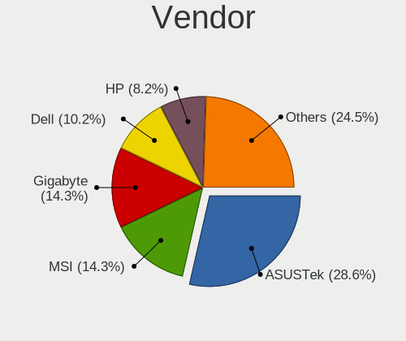
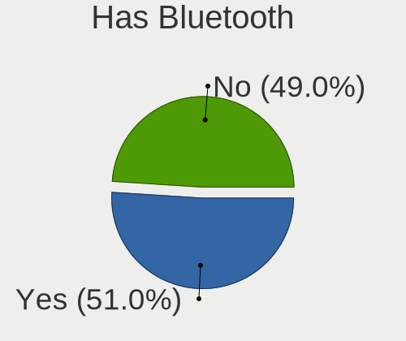
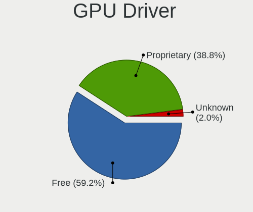
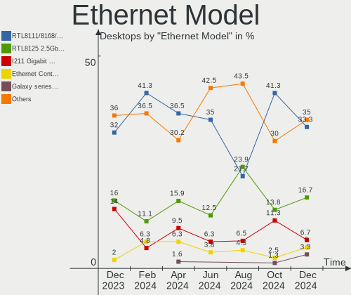
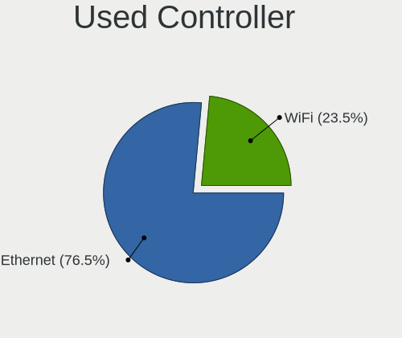

Kubuntu - Hardware Trends (Desktops)
------------------------------------

A project to identify most popular hardware characteristics and track their change
over time based on data collected by Linux users at https://Linux-Hardware.org.

Anyone can contribute to this report by the [hw-probe](https://github.com/linuxhw/hw-probe) tool:

    sudo -E hw-probe -all -upload

This report is for one last month. Overall report since the beginning of time: [TestCoverage](https://github.com/linuxhw/TestCoverage)

Period: Aug, 2022.

Contents
--------

* [ System ](#system)
  - [ OS                       ](#os)
  - [ OS Family                ](#os-family)
  - [ Kernel                   ](#kernel)
  - [ Kernel Family            ](#kernel-family)
  - [ Kernel Major Ver.        ](#kernel-major-ver)
  - [ Arch                     ](#arch)
  - [ DE                       ](#de)
  - [ Display Server           ](#display-server)
  - [ Display Manager          ](#display-manager)
  - [ OS Lang                  ](#os-lang)
  - [ Boot Mode                ](#boot-mode)
  - [ Filesystem               ](#filesystem)
  - [ Part. scheme             ](#part-scheme)
  - [ Dual Boot with Linux/BSD ](#dual-boot-with-linuxbsd)
  - [ Dual Boot (Win)          ](#dual-boot-win)

* [ Board ](#board)
  - [ Vendor                   ](#vendor)
  - [ Model                    ](#model)
  - [ Model Family             ](#model-family)
  - [ MFG Year                 ](#mfg-year)
  - [ Form Factor              ](#form-factor)
  - [ Secure Boot              ](#secure-boot)
  - [ Coreboot                 ](#coreboot)
  - [ RAM Size                 ](#ram-size)
  - [ RAM Used                 ](#ram-used)
  - [ Total Drives             ](#total-drives)
  - [ Has CD-ROM               ](#has-cd-rom)
  - [ Has Ethernet             ](#has-ethernet)
  - [ Has WiFi                 ](#has-wifi)
  - [ Has Bluetooth            ](#has-bluetooth)

* [ Location ](#location)
  - [ Country                  ](#country)
  - [ City                     ](#city)

* [ Drives ](#drives)
  - [ Drive Vendor             ](#drive-vendor)
  - [ Drive Model              ](#drive-model)
  - [ HDD Vendor               ](#hdd-vendor)
  - [ SSD Vendor               ](#ssd-vendor)
  - [ Drive Kind               ](#drive-kind)
  - [ Drive Connector          ](#drive-connector)
  - [ Drive Size               ](#drive-size)
  - [ Space Total              ](#space-total)
  - [ Space Used               ](#space-used)
  - [ Malfunc. Drives          ](#malfunc-drives)
  - [ Malfunc. Drive Vendor    ](#malfunc-drive-vendor)
  - [ Malfunc. HDD Vendor      ](#malfunc-hdd-vendor)
  - [ Malfunc. Drive Kind      ](#malfunc-drive-kind)
  - [ Failed Drives            ](#failed-drives)
  - [ Failed Drive Vendor      ](#failed-drive-vendor)
  - [ Drive Status             ](#drive-status)

* [ Storage controller ](#storage-controller)
  - [ Storage Vendor           ](#storage-vendor)
  - [ Storage Model            ](#storage-model)
  - [ Storage Kind             ](#storage-kind)

* [ Processor ](#processor)
  - [ CPU Vendor               ](#cpu-vendor)
  - [ CPU Model                ](#cpu-model)
  - [ CPU Model Family         ](#cpu-model-family)
  - [ CPU Cores                ](#cpu-cores)
  - [ CPU Sockets              ](#cpu-sockets)
  - [ CPU Threads              ](#cpu-threads)
  - [ CPU Op-Modes             ](#cpu-op-modes)
  - [ CPU Microcode            ](#cpu-microcode)
  - [ CPU Microarch            ](#cpu-microarch)

* [ Graphics ](#graphics)
  - [ GPU Vendor               ](#gpu-vendor)
  - [ GPU Model                ](#gpu-model)
  - [ GPU Combo                ](#gpu-combo)
  - [ GPU Driver               ](#gpu-driver)
  - [ GPU Memory               ](#gpu-memory)

* [ Monitor ](#monitor)
  - [ Monitor Vendor           ](#monitor-vendor)
  - [ Monitor Model            ](#monitor-model)
  - [ Monitor Resolution       ](#monitor-resolution)
  - [ Monitor Diagonal         ](#monitor-diagonal)
  - [ Monitor Width            ](#monitor-width)
  - [ Aspect Ratio             ](#aspect-ratio)
  - [ Monitor Area             ](#monitor-area)
  - [ Pixel Density            ](#pixel-density)
  - [ Multiple Monitors        ](#multiple-monitors)

* [ Network ](#network)
  - [ Net Controller Vendor    ](#net-controller-vendor)
  - [ Net Controller Model     ](#net-controller-model)
  - [ Wireless Vendor          ](#wireless-vendor)
  - [ Wireless Model           ](#wireless-model)
  - [ Ethernet Vendor          ](#ethernet-vendor)
  - [ Ethernet Model           ](#ethernet-model)
  - [ Net Controller Kind      ](#net-controller-kind)
  - [ Used Controller          ](#used-controller)
  - [ NICs                     ](#nics)
  - [ IPv6                     ](#ipv6)

* [ Bluetooth ](#bluetooth)
  - [ Bluetooth Vendor         ](#bluetooth-vendor)
  - [ Bluetooth Model          ](#bluetooth-model)

* [ Sound ](#sound)
  - [ Sound Vendor             ](#sound-vendor)
  - [ Sound Model              ](#sound-model)

* [ Memory ](#memory)
  - [ Memory Vendor            ](#memory-vendor)
  - [ Memory Model             ](#memory-model)
  - [ Memory Kind              ](#memory-kind)
  - [ Memory Form Factor       ](#memory-form-factor)
  - [ Memory Size              ](#memory-size)
  - [ Memory Speed             ](#memory-speed)

* [ Printers & scanners ](#printers--scanners)
  - [ Printer Vendor           ](#printer-vendor)
  - [ Printer Model            ](#printer-model)
  - [ Scanner Vendor           ](#scanner-vendor)
  - [ Scanner Model            ](#scanner-model)

* [ Camera ](#camera)
  - [ Camera Vendor            ](#camera-vendor)
  - [ Camera Model             ](#camera-model)

* [ Security ](#security)
  - [ Fingerprint Vendor       ](#fingerprint-vendor)
  - [ Fingerprint Model        ](#fingerprint-model)
  - [ Chipcard Vendor          ](#chipcard-vendor)
  - [ Chipcard Model           ](#chipcard-model)

* [ Unsupported ](#unsupported)
  - [ Unsupported Devices      ](#unsupported-devices)
  - [ Unsupported Device Types ](#unsupported-device-types)

System
------

OS
--

Installed operating systems

| Name          | Desktops | Percent |
|---------------|----------|---------|
| Kubuntu 22.04 | 23       | 65.71%  |
| Kubuntu 20.04 | 8        | 22.86%  |
| Kubuntu 18.04 | 2        | 5.71%   |
| Kubuntu 11.1  | 1        | 2.86%   |
| Kubuntu 11    | 1        | 2.86%   |

OS Family
---------

OS without a version

| Name    | Desktops | Percent |
|---------|----------|---------|
| Kubuntu | 35       | 100%    |

Kernel
------

Version of the Linux kernel

| Version                | Desktops | Percent |
|------------------------|----------|---------|
| 5.15.0-46-generic      | 16       | 45.71%  |
| 5.15.0-43-generic      | 9        | 25.71%  |
| 5.4.0-122-generic      | 2        | 5.71%   |
| 5.4.0-124-generic      | 1        | 2.86%   |
| 5.16.0-051600-generic  | 1        | 2.86%   |
| 5.15.49-051549-generic | 1        | 2.86%   |
| 5.15.0-46-lowlatency   | 1        | 2.86%   |
| 5.15.0-43-lowlatency   | 1        | 2.86%   |
| 5.15.0-41-generic      | 1        | 2.86%   |
| 5.15.0-25-generic      | 1        | 2.86%   |
| 4.15.0-166-generic     | 1        | 2.86%   |

Kernel Family
-------------

Linux kernel without a distro release

| Version | Desktops | Percent |
|---------|----------|---------|
| 5.15.0  | 29       | 82.86%  |
| 5.4.0   | 3        | 8.57%   |
| 5.16.0  | 1        | 2.86%   |
| 5.15.49 | 1        | 2.86%   |
| 4.15.0  | 1        | 2.86%   |

Kernel Major Ver.
-----------------

Linux kernel major version

| Version | Desktops | Percent |
|---------|----------|---------|
| 5.15    | 30       | 85.71%  |
| 5.4     | 3        | 8.57%   |
| 5.16    | 1        | 2.86%   |
| 4.15    | 1        | 2.86%   |

Arch
----

OS architecture (x86_64, i586, etc.)

| Name   | Desktops | Percent |
|--------|----------|---------|
| x86_64 | 35       | 100%    |

DE
--

Desktop Environment

| Name | Desktops | Percent |
|------|----------|---------|
| KDE5 | 35       | 100%    |

Display Server
--------------

X11 or Wayland

| Name | Desktops | Percent |
|------|----------|---------|
| X11  | 34       | 97.14%  |
| Tty  | 1        | 2.86%   |

Display Manager
---------------

SDDM, LightDM, etc.

| Name    | Desktops | Percent |
|---------|----------|---------|
| SDDM    | 24       | 68.57%  |
| Unknown | 10       | 28.57%  |
| GDM3    | 1        | 2.86%   |

OS Lang
-------

Language

| Lang  | Desktops | Percent |
|-------|----------|---------|
| en_US | 16       | 45.71%  |
| fr_FR | 4        | 11.43%  |
| pt_BR | 3        | 8.57%   |
| de_DE | 3        | 8.57%   |
| pl_PL | 1        | 2.86%   |
| et_EE | 1        | 2.86%   |
| es_PE | 1        | 2.86%   |
| es_CO | 1        | 2.86%   |
| es_AR | 1        | 2.86%   |
| en_NZ | 1        | 2.86%   |
| en_CA | 1        | 2.86%   |
| en_AU | 1        | 2.86%   |
| en_AG | 1        | 2.86%   |

Boot Mode
---------

EFI or BIOS

| Mode | Desktops | Percent |
|------|----------|---------|
| BIOS | 24       | 68.57%  |
| EFI  | 11       | 31.43%  |

Filesystem
----------

Type of filesystem

| Type    | Desktops | Percent |
|---------|----------|---------|
| Ext4    | 30       | 85.71%  |
| Overlay | 2        | 5.71%   |
| Btrfs   | 2        | 5.71%   |
| Ext3    | 1        | 2.86%   |

Part. scheme
------------

Scheme of partitioning

| Type    | Desktops | Percent |
|---------|----------|---------|
| Unknown | 22       | 62.86%  |
| GPT     | 11       | 31.43%  |
| MBR     | 2        | 5.71%   |

Dual Boot with Linux/BSD
------------------------

Hosting more than one Linux/BSD

| Dual boot | Desktops | Percent |
|-----------|----------|---------|
| No        | 32       | 91.43%  |
| Yes       | 3        | 8.57%   |

Dual Boot (Win)
---------------

Hosting Linux and Windows

| Dual boot | Desktops | Percent |
|-----------|----------|---------|
| No        | 19       | 54.29%  |
| Yes       | 16       | 45.71%  |

Board
-----

Vendor
------

Motherboard manufacturer

| Name                | Desktops | Percent |
|---------------------|----------|---------|
| Gigabyte Technology | 11       | 31.43%  |
| ASUSTek Computer    | 8        | 22.86%  |
| MSI                 | 6        | 17.14%  |
| Lenovo              | 2        | 5.71%   |
| Hewlett-Packard     | 2        | 5.71%   |
| ASRock              | 2        | 5.71%   |
| Supermicro          | 1        | 2.86%   |
| Positivo            | 1        | 2.86%   |
| Pegatron            | 1        | 2.86%   |
| Dell                | 1        | 2.86%   |

Model
-----

Motherboard model

| Name                              | Desktops | Percent |
|-----------------------------------|----------|---------|
| Supermicro SKAGIT09               | 1        | 2.86%   |
| Positivo POS-PARS760GCD           | 1        | 2.86%   |
| Pegatron p6740la                  | 1        | 2.86%   |
| MSI MS-7C80                       | 1        | 2.86%   |
| MSI MS-7C56                       | 1        | 2.86%   |
| MSI MS-7B86                       | 1        | 2.86%   |
| MSI MS-7A34                       | 1        | 2.86%   |
| MSI MS-7916                       | 1        | 2.86%   |
| MSI A0000001                      | 1        | 2.86%   |
| Lenovo ThinkCentre M83 10AM000UUS | 1        | 2.86%   |
| Lenovo ThinkCentre M79 10JAS01500 | 1        | 2.86%   |
| HP Slim Desktop 290-a0xxx         | 1        | 2.86%   |
| HP ProDesk 600 G2 SFF             | 1        | 2.86%   |
| Gigabyte Z490 AORUS ELITE AC      | 1        | 2.86%   |
| Gigabyte H97-Gaming 3             | 1        | 2.86%   |
| Gigabyte H81M-DS2                 | 1        | 2.86%   |
| Gigabyte H61M-S1                  | 1        | 2.86%   |
| Gigabyte H410M S2 V2              | 1        | 2.86%   |
| Gigabyte H370AORUSGAMING3WIFI     | 1        | 2.86%   |
| Gigabyte GA-MA770T-UD3            | 1        | 2.86%   |
| Gigabyte G1.SNIPER B7-CF          | 1        | 2.86%   |
| Gigabyte B85M-HD3                 | 1        | 2.86%   |
| Gigabyte B450 I AORUS PRO WIFI    | 1        | 2.86%   |
| Gigabyte 970A-DS3P                | 1        | 2.86%   |
| Dell Inspiron 3650                | 1        | 2.86%   |
| ASUS TUF Gaming B450-PLUS II      | 1        | 2.86%   |
| ASUS ROG Maximus XI HERO          | 1        | 2.86%   |
| ASUS PRIME X570-P                 | 1        | 2.86%   |
| ASUS P5K/EPU                      | 1        | 2.86%   |
| ASUS H170M-PLUS/BR                | 1        | 2.86%   |
| ASUS ER919AA-ABA SR1820NX NA620   | 1        | 2.86%   |
| ASUS CDP12000Rv3                  | 1        | 2.86%   |
| ASUS All Series                   | 1        | 2.86%   |
| ASRock FM2A88M-HD+ R3.0           | 1        | 2.86%   |
| ASRock B450M/ac R2.0              | 1        | 2.86%   |

Model Family
------------

Motherboard model prefix

| Name                          | Desktops | Percent |
|-------------------------------|----------|---------|
| Lenovo ThinkCentre            | 2        | 5.71%   |
| Supermicro SKAGIT09           | 1        | 2.86%   |
| Positivo POS-PARS760GCD       | 1        | 2.86%   |
| Pegatron p6740la              | 1        | 2.86%   |
| MSI MS-7C80                   | 1        | 2.86%   |
| MSI MS-7C56                   | 1        | 2.86%   |
| MSI MS-7B86                   | 1        | 2.86%   |
| MSI MS-7A34                   | 1        | 2.86%   |
| MSI MS-7916                   | 1        | 2.86%   |
| MSI A0000001                  | 1        | 2.86%   |
| HP Slim                       | 1        | 2.86%   |
| HP ProDesk                    | 1        | 2.86%   |
| Gigabyte Z490                 | 1        | 2.86%   |
| Gigabyte H97-Gaming           | 1        | 2.86%   |
| Gigabyte H81M-DS2             | 1        | 2.86%   |
| Gigabyte H61M-S1              | 1        | 2.86%   |
| Gigabyte H410M                | 1        | 2.86%   |
| Gigabyte H370AORUSGAMING3WIFI | 1        | 2.86%   |
| Gigabyte GA-MA770T-UD3        | 1        | 2.86%   |
| Gigabyte G1.SNIPER            | 1        | 2.86%   |
| Gigabyte B85M-HD3             | 1        | 2.86%   |
| Gigabyte B450                 | 1        | 2.86%   |
| Gigabyte 970A-DS3P            | 1        | 2.86%   |
| Dell Inspiron                 | 1        | 2.86%   |
| ASUS TUF                      | 1        | 2.86%   |
| ASUS ROG                      | 1        | 2.86%   |
| ASUS PRIME                    | 1        | 2.86%   |
| ASUS P5K                      | 1        | 2.86%   |
| ASUS H170M-PLUS               | 1        | 2.86%   |
| ASUS ER919AA-ABA              | 1        | 2.86%   |
| ASUS CDP12000Rv3              | 1        | 2.86%   |
| ASUS All                      | 1        | 2.86%   |
| ASRock FM2A88M-HD+            | 1        | 2.86%   |
| ASRock B450M                  | 1        | 2.86%   |

MFG Year
--------

Motherboard manufacture year

| Year | Desktops | Percent |
|------|----------|---------|
| 2018 | 6        | 17.14%  |
| 2020 | 5        | 14.29%  |
| 2013 | 5        | 14.29%  |
| 2015 | 3        | 8.57%   |
| 2014 | 3        | 8.57%   |
| 2021 | 2        | 5.71%   |
| 2016 | 2        | 5.71%   |
| 2011 | 2        | 5.71%   |
| 2022 | 1        | 2.86%   |
| 2019 | 1        | 2.86%   |
| 2017 | 1        | 2.86%   |
| 2012 | 1        | 2.86%   |
| 2009 | 1        | 2.86%   |
| 2008 | 1        | 2.86%   |
| 2006 | 1        | 2.86%   |

Form Factor
-----------

Physical design of the computer

| Name    | Desktops | Percent |
|---------|----------|---------|
| Desktop | 35       | 100%    |

Secure Boot
-----------

Enabled or disabled

| State    | Desktops | Percent |
|----------|----------|---------|
| Disabled | 35       | 100%    |

Coreboot
--------

Have coreboot on board

| Used | Desktops | Percent |
|------|----------|---------|
| No   | 35       | 100%    |

RAM Size
--------

Total RAM memory

| Size in GB  | Desktops | Percent |
|-------------|----------|---------|
| 16.01-24.0  | 15       | 42.86%  |
| 32.01-64.0  | 5        | 14.29%  |
| 4.01-8.0    | 4        | 11.43%  |
| 8.01-16.0   | 4        | 11.43%  |
| 64.01-256.0 | 3        | 8.57%   |
| 3.01-4.0    | 2        | 5.71%   |
| 24.01-32.0  | 1        | 2.86%   |
| 2.01-3.0    | 1        | 2.86%   |

RAM Used
--------

Used RAM memory

| Used GB   | Desktops | Percent |
|-----------|----------|---------|
| 3.01-4.0  | 10       | 28.57%  |
| 1.01-2.0  | 8        | 22.86%  |
| 4.01-8.0  | 6        | 17.14%  |
| 2.01-3.0  | 6        | 17.14%  |
| 8.01-16.0 | 4        | 11.43%  |
| 0.51-1.0  | 1        | 2.86%   |

Total Drives
------------

Number of drives on board

| Drives | Desktops | Percent |
|--------|----------|---------|
| 2      | 13       | 37.14%  |
| 3      | 8        | 22.86%  |
| 1      | 8        | 22.86%  |
| 5      | 4        | 11.43%  |
| 6      | 1        | 2.86%   |
| 4      | 1        | 2.86%   |

Has CD-ROM
----------

Has CD-ROM on board

| Presented | Desktops | Percent |
|-----------|----------|---------|
| Yes       | 18       | 51.43%  |
| No        | 17       | 48.57%  |

Has Ethernet
------------

Has Ethernet on board

| Presented | Desktops | Percent |
|-----------|----------|---------|
| Yes       | 34       | 97.14%  |
| No        | 1        | 2.86%   |

Has WiFi
--------

Has WiFi module

| Presented | Desktops | Percent |
|-----------|----------|---------|
| Yes       | 18       | 51.43%  |
| No        | 17       | 48.57%  |

Has Bluetooth
-------------

Has Bluetooth module

| Presented | Desktops | Percent |
|-----------|----------|---------|
| No        | 19       | 54.29%  |
| Yes       | 16       | 45.71%  |

Location
--------

Country
-------

Geographic location (country)

| Country     | Desktops | Percent |
|-------------|----------|---------|
| USA         | 11       | 31.43%  |
| Germany     | 4        | 11.43%  |
| France      | 4        | 11.43%  |
| Brazil      | 4        | 11.43%  |
| Poland      | 2        | 5.71%   |
| New Zealand | 2        | 5.71%   |
| Peru        | 1        | 2.86%   |
| Netherlands | 1        | 2.86%   |
| India       | 1        | 2.86%   |
| Estonia     | 1        | 2.86%   |
| Ecuador     | 1        | 2.86%   |
| Colombia    | 1        | 2.86%   |
| Canada      | 1        | 2.86%   |
| Argentina   | 1        | 2.86%   |

City
----

Geographic location (city)

| City              | Desktops | Percent |
|-------------------|----------|---------|
| Auckland          | 2        | 5.71%   |
| Wroclaw           | 1        | 2.86%   |
| Wilkszyn          | 1        | 2.86%   |
| Washington        | 1        | 2.86%   |
| Tubarao           | 1        | 2.86%   |
| Templeton         | 1        | 2.86%   |
| Tartu             | 1        | 2.86%   |
| Rio de Janeiro    | 1        | 2.86%   |
| Raleigh           | 1        | 2.86%   |
| Plouescat         | 1        | 2.86%   |
| Paulhan           | 1        | 2.86%   |
| Paraná           | 1        | 2.86%   |
| Ocala             | 1        | 2.86%   |
| Neckarsulm        | 1        | 2.86%   |
| Nashville         | 1        | 2.86%   |
| Munich            | 1        | 2.86%   |
| Lindenhurst       | 1        | 2.86%   |
| Lima              | 1        | 2.86%   |
| Kansas City       | 1        | 2.86%   |
| Ismaning          | 1        | 2.86%   |
| Guayaquil         | 1        | 2.86%   |
| Greenwood Village | 1        | 2.86%   |
| Ettringen         | 1        | 2.86%   |
| Ellisville        | 1        | 2.86%   |
| Dallas            | 1        | 2.86%   |
| Chunchura         | 1        | 2.86%   |
| Chia              | 1        | 2.86%   |
| Chateauguay       | 1        | 2.86%   |
| Canela            | 1        | 2.86%   |
| Brasília         | 1        | 2.86%   |
| Bougival          | 1        | 2.86%   |
| Aurora            | 1        | 2.86%   |
| Arpajon           | 1        | 2.86%   |
| Amsterdam         | 1        | 2.86%   |

Drives
------

Drive Vendor
------------

Hard drive vendors

| Vendor                | Desktops | Drives | Percent |
|-----------------------|----------|--------|---------|
| Samsung Electronics   | 11       | 13     | 15.28%  |
| WDC                   | 9        | 10     | 12.5%   |
| Seagate               | 8        | 10     | 11.11%  |
| Kingston              | 8        | 10     | 11.11%  |
| Toshiba               | 6        | 8      | 8.33%   |
| SanDisk               | 5        | 5      | 6.94%   |
| Hitachi               | 3        | 3      | 4.17%   |
| Crucial               | 3        | 3      | 4.17%   |
| HGST                  | 2        | 3      | 2.78%   |
| China                 | 2        | 3      | 2.78%   |
| Verbatim              | 1        | 1      | 1.39%   |
| USB3.0                | 1        | 1      | 1.39%   |
| SK hynix              | 1        | 1      | 1.39%   |
| Realtek Semiconductor | 1        | 1      | 1.39%   |
| PNY                   | 1        | 1      | 1.39%   |
| Phison Electronics    | 1        | 1      | 1.39%   |
| Phison                | 1        | 1      | 1.39%   |
| Maxtor                | 1        | 1      | 1.39%   |
| Magnetic Data         | 1        | 1      | 1.39%   |
| KODAK                 | 1        | 1      | 1.39%   |
| KIOXIA                | 1        | 1      | 1.39%   |
| KingFast              | 1        | 1      | 1.39%   |
| Intel                 | 1        | 1      | 1.39%   |
| GOODRAM               | 1        | 1      | 1.39%   |
| Corsair               | 1        | 2      | 1.39%   |

Drive Model
-----------

Hard drive models

| Model                                | Desktops | Percent |
|--------------------------------------|----------|---------|
| Toshiba MQ01ABD100 1TB               | 2        | 2.56%   |
| Toshiba DT01ACA100 1TB               | 2        | 2.56%   |
| SanDisk NVMe SSD Drive 500GB         | 2        | 2.56%   |
| Samsung SSD 860 EVO 500GB            | 2        | 2.56%   |
| Samsung SSD 850 EVO 500GB            | 2        | 2.56%   |
| Kingston SA400S37240G 240GB SSD      | 2        | 2.56%   |
| Kingston NVMe SSD Drive 500GB        | 2        | 2.56%   |
| Hitachi HDS721010CLA332 1TB          | 2        | 2.56%   |
| WDC WDS500G2B0A-00SM50 500GB SSD     | 1        | 1.28%   |
| WDC WD5000AVVS-63M8B0 500GB          | 1        | 1.28%   |
| WDC WD5000AAKS-00V2B0 500GB          | 1        | 1.28%   |
| WDC WD40EFAX-68JH4N1 4TB             | 1        | 1.28%   |
| WDC WD15EARS-22Z5B1 1TB              | 1        | 1.28%   |
| WDC WD10PURX-64D85Y0 1TB             | 1        | 1.28%   |
| WDC WD10EZEX-08WN4A0 1TB             | 1        | 1.28%   |
| WDC WD10EZEX-00KUWA0 1TB             | 1        | 1.28%   |
| WDC WD10EZEX-00ER1A0 1TB             | 1        | 1.28%   |
| WDC WD10EURX-63C57Y0 1TB             | 1        | 1.28%   |
| Verbatim Vi550 S3 SSD 256GB          | 1        | 1.28%   |
| USB3.0 Super Speed 128GB             | 1        | 1.28%   |
| Toshiba TL100 120GB SSD              | 1        | 1.28%   |
| Toshiba MQ02ABF100 1TB               | 1        | 1.28%   |
| Toshiba MK2555GSX 250GB              | 1        | 1.28%   |
| SK hynix NVMe SSD Drive 2TB          | 1        | 1.28%   |
| Seagate ST8000AS0002-1NA17Z 8TB      | 1        | 1.28%   |
| Seagate ST4000VN008-2DR166 4TB       | 1        | 1.28%   |
| Seagate ST4000VN000-1H4168 4TB       | 1        | 1.28%   |
| Seagate ST3500414CS 500GB            | 1        | 1.28%   |
| Seagate ST2000DX001-1CM164 2TB       | 1        | 1.28%   |
| Seagate ST2000DM008-2FR102 2TB       | 1        | 1.28%   |
| Seagate ST2000DM001-1ER164 2TB       | 1        | 1.28%   |
| Seagate ST2000DL003-9VT166 2TB       | 1        | 1.28%   |
| Seagate ST1000DM003-1SB102 1TB       | 1        | 1.28%   |
| SanDisk SSD PLUS 480GB               | 1        | 1.28%   |
| SanDisk SDSSDA120G 120GB             | 1        | 1.28%   |
| SanDisk NVMe SSD Drive 128GB         | 1        | 1.28%   |
| Samsung SSD 860 QVO 1TB              | 1        | 1.28%   |
| Samsung SSD 850 EVO 120GB            | 1        | 1.28%   |
| Samsung SP2504C 250GB                | 1        | 1.28%   |
| Samsung Portable SSD T5 500GB        | 1        | 1.28%   |
| Samsung NVMe SSD Drive 500GB         | 1        | 1.28%   |
| Samsung NVMe SSD Drive 1TB           | 1        | 1.28%   |
| Samsung MZ7WD960HMHP-00003 960GB SSD | 1        | 1.28%   |
| Samsung HD502HJ 500GB                | 1        | 1.28%   |
| Samsung HD103SJ 1TB                  | 1        | 1.28%   |
| Realtek NVMe SSD Drive 256GB         | 1        | 1.28%   |
| PNY SSD2SC240G1CS1754D117-820 240GB  | 1        | 1.28%   |
| Phison NVMe SSD Drive 1024GB         | 1        | 1.28%   |
| Phison PCIe SSD 256GB                | 1        | 1.28%   |
| Maxtor 6V300F0 304GB                 | 1        | 1.28%   |
| Magnetic Data MD02500-BQDW-RO 250GB  | 1        | 1.28%   |
| KODAK SSD X100 480GB                 | 1        | 1.28%   |
| KIOXIA NVMe SSD Drive 256GB          | 1        | 1.28%   |
| Kingston SV300S37A60G 64GB SSD       | 1        | 1.28%   |
| Kingston SV300S37A120G 120GB SSD     | 1        | 1.28%   |
| Kingston SUV400S37240G 240GB SSD     | 1        | 1.28%   |
| Kingston SNVS250G 250GB              | 1        | 1.28%   |
| Kingston SA400S37120G 120GB SSD      | 1        | 1.28%   |
| KingFast SSD 256GB                   | 1        | 1.28%   |
| Intel SSDPEKNW010T8 1TB              | 1        | 1.28%   |

HDD Vendor
----------

Hard disk drive vendors

| Vendor              | Desktops | Drives | Percent |
|---------------------|----------|--------|---------|
| WDC                 | 8        | 9      | 25%     |
| Seagate             | 8        | 10     | 25%     |
| Toshiba             | 5        | 7      | 15.63%  |
| Samsung Electronics | 3        | 3      | 9.38%   |
| Hitachi             | 3        | 3      | 9.38%   |
| HGST                | 2        | 3      | 6.25%   |
| USB3.0              | 1        | 1      | 3.13%   |
| Maxtor              | 1        | 1      | 3.13%   |
| Magnetic Data       | 1        | 1      | 3.13%   |

SSD Vendor
----------

Solid state drive vendors

| Vendor              | Desktops | Drives | Percent |
|---------------------|----------|--------|---------|
| Samsung Electronics | 7        | 8      | 26.92%  |
| Kingston            | 6        | 6      | 23.08%  |
| SanDisk             | 2        | 2      | 7.69%   |
| Crucial             | 2        | 2      | 7.69%   |
| China               | 2        | 3      | 7.69%   |
| WDC                 | 1        | 1      | 3.85%   |
| Verbatim            | 1        | 1      | 3.85%   |
| Toshiba             | 1        | 1      | 3.85%   |
| PNY                 | 1        | 1      | 3.85%   |
| KODAK               | 1        | 1      | 3.85%   |
| KingFast            | 1        | 1      | 3.85%   |
| GOODRAM             | 1        | 1      | 3.85%   |

Drive Kind
----------

HDD or SSD

| Kind | Desktops | Drives | Percent |
|------|----------|--------|---------|
| HDD  | 23       | 38     | 39.66%  |
| SSD  | 22       | 28     | 37.93%  |
| NVMe | 13       | 18     | 22.41%  |

Drive Connector
---------------

SATA, SAS, NVMe, etc.

| Type | Desktops | Drives | Percent |
|------|----------|--------|---------|
| SATA | 31       | 64     | 67.39%  |
| NVMe | 13       | 18     | 28.26%  |
| SAS  | 2        | 2      | 4.35%   |

Drive Size
----------

Size of hard drive

| Size in TB | Desktops | Drives | Percent |
|------------|----------|--------|---------|
| 0.01-0.5   | 24       | 31     | 47.06%  |
| 0.51-1.0   | 17       | 22     | 33.33%  |
| 1.01-2.0   | 5        | 5      | 9.8%    |
| 3.01-4.0   | 3        | 6      | 5.88%   |
| 4.01-10.0  | 2        | 2      | 3.92%   |

Space Total
-----------

Amount of disk space available on the file system

| Size in GB     | Desktops | Percent |
|----------------|----------|---------|
| 101-250        | 8        | 22.86%  |
| 501-1000       | 6        | 17.14%  |
| More than 3000 | 5        | 14.29%  |
| 251-500        | 5        | 14.29%  |
| 1001-2000      | 5        | 14.29%  |
| 2001-3000      | 3        | 8.57%   |
| 21-50          | 1        | 2.86%   |
| 1-20           | 1        | 2.86%   |
| 51-100         | 1        | 2.86%   |

Space Used
----------

Amount of used disk space

| Used GB        | Desktops | Percent |
|----------------|----------|---------|
| 251-500        | 6        | 17.14%  |
| 1-20           | 6        | 17.14%  |
| 21-50          | 5        | 14.29%  |
| 101-250        | 5        | 14.29%  |
| 501-1000       | 4        | 11.43%  |
| 51-100         | 3        | 8.57%   |
| More than 3000 | 2        | 5.71%   |
| 2001-3000      | 2        | 5.71%   |
| 1001-2000      | 2        | 5.71%   |

Malfunc. Drives
---------------

Drive models with a malfunction

| Model                       | Desktops | Drives | Percent |
|-----------------------------|----------|--------|---------|
| WDC WD5000AVVS-63M8B0 500GB | 1        | 1      | 100%    |

Malfunc. Drive Vendor
---------------------

Vendors of faulty drives

| Vendor | Desktops | Drives | Percent |
|--------|----------|--------|---------|
| WDC    | 1        | 1      | 100%    |

Malfunc. HDD Vendor
-------------------

Vendors of faulty HDD drives

| Vendor | Desktops | Drives | Percent |
|--------|----------|--------|---------|
| WDC    | 1        | 1      | 100%    |

Malfunc. Drive Kind
-------------------

Kinds of faulty drives

| Kind | Desktops | Drives | Percent |
|------|----------|--------|---------|
| HDD  | 1        | 1      | 100%    |

Failed Drives
-------------

Failed drive models

Zero info for selected period =(

Failed Drive Vendor
-------------------

Failed drive vendors

Zero info for selected period =(

Drive Status
------------

Number of failed and malfunc. drives

| Status   | Desktops | Drives | Percent |
|----------|----------|--------|---------|
| Detected | 22       | 57     | 62.86%  |
| Works    | 12       | 26     | 34.29%  |
| Malfunc  | 1        | 1      | 2.86%   |

Storage controller
------------------

Storage Vendor
--------------

Storage controller vendors

| Vendor                      | Desktops | Percent |
|-----------------------------|----------|---------|
| Intel                       | 19       | 34.55%  |
| AMD                         | 15       | 27.27%  |
| SanDisk                     | 3        | 5.45%   |
| Phison Electronics          | 3        | 5.45%   |
| Kingston Technology Company | 3        | 5.45%   |
| Samsung Electronics         | 2        | 3.64%   |
| SK hynix                    | 1        | 1.82%   |
| Silicon Image               | 1        | 1.82%   |
| Realtek Semiconductor       | 1        | 1.82%   |
| Nvidia                      | 1        | 1.82%   |
| Micron/Crucial Technology   | 1        | 1.82%   |
| Marvell Technology Group    | 1        | 1.82%   |
| LSI Logic / Symbios Logic   | 1        | 1.82%   |
| KIOXIA                      | 1        | 1.82%   |
| Broadcom / LSI              | 1        | 1.82%   |
| ASMedia Technology          | 1        | 1.82%   |

Storage Model
-------------

Storage controller models

| Model                                                                                   | Desktops | Percent |
|-----------------------------------------------------------------------------------------|----------|---------|
| AMD FCH SATA Controller [AHCI mode]                                                     | 9        | 13.24%  |
| Intel 8 Series/C220 Series Chipset Family 6-port SATA Controller 1 [AHCI mode]          | 4        | 5.88%   |
| AMD SB7x0/SB8x0/SB9x0 SATA Controller [AHCI mode]                                       | 4        | 5.88%   |
| AMD 400 Series Chipset SATA Controller                                                  | 4        | 5.88%   |
| Phison E12 NVMe Controller                                                              | 3        | 4.41%   |
| Kingston Company Company Non-Volatile memory controller                                 | 3        | 4.41%   |
| Intel Q170/Q150/B150/H170/H110/Z170/CM236 Chipset SATA Controller [AHCI Mode]           | 3        | 4.41%   |
| Intel Comet Lake SATA AHCI Controller                                                   | 3        | 4.41%   |
| Samsung NVMe SSD Controller SM981/PM981/PM983                                           | 2        | 2.94%   |
| Intel Cannon Lake PCH SATA AHCI Controller                                              | 2        | 2.94%   |
| Intel 9 Series Chipset Family SATA Controller [AHCI Mode]                               | 2        | 2.94%   |
| AMD SB7x0/SB8x0/SB9x0 IDE Controller                                                    | 2        | 2.94%   |
| SK hynix Gold P31 SSD                                                                   | 1        | 1.47%   |
| Silicon Image SiI 3132 Serial ATA Raid II Controller                                    | 1        | 1.47%   |
| SanDisk WD Blue SN570 NVMe SSD                                                          | 1        | 1.47%   |
| SanDisk WD Blue SN550 NVMe SSD                                                          | 1        | 1.47%   |
| SanDisk PC SN520 NVMe SSD                                                               | 1        | 1.47%   |
| Realtek Realtek Non-Volatile memory controller                                          | 1        | 1.47%   |
| Nvidia MCP51 Serial ATA Controller                                                      | 1        | 1.47%   |
| Nvidia MCP51 IDE                                                                        | 1        | 1.47%   |
| Micron/Crucial P2 NVMe PCIe SSD                                                         | 1        | 1.47%   |
| Marvell Group 88SE6101/6102 single-port PATA133 interface                               | 1        | 1.47%   |
| LSI Logic / Symbios Logic MegaRAID SAS 1078                                             | 1        | 1.47%   |
| KIOXIA Non-Volatile memory controller                                                   | 1        | 1.47%   |
| Intel SSD 660P Series                                                                   | 1        | 1.47%   |
| Intel SATA Controller [RAID mode]                                                       | 1        | 1.47%   |
| Intel C610/X99 series chipset sSATA Controller [AHCI mode]                              | 1        | 1.47%   |
| Intel C610/X99 series chipset 6-Port SATA Controller [AHCI mode]                        | 1        | 1.47%   |
| Intel 82801IB (ICH9) 2 port SATA Controller [IDE mode]                                  | 1        | 1.47%   |
| Intel 82801I (ICH9 Family) 2 port SATA Controller [IDE mode]                            | 1        | 1.47%   |
| Intel 6 Series/C200 Series Chipset Family Desktop SATA Controller (IDE mode, ports 4-5) | 1        | 1.47%   |
| Intel 6 Series/C200 Series Chipset Family Desktop SATA Controller (IDE mode, ports 0-3) | 1        | 1.47%   |
| Intel 6 Series/C200 Series Chipset Family 6 port Desktop SATA AHCI Controller           | 1        | 1.47%   |
| Broadcom / LSI SAS3008 PCI-Express Fusion-MPT SAS-3                                     | 1        | 1.47%   |
| ASMedia ASM1062 Serial ATA Controller                                                   | 1        | 1.47%   |
| AMD FCH SATA Controller D                                                               | 1        | 1.47%   |
| AMD FCH IDE Controller                                                                  | 1        | 1.47%   |
| AMD 500 Series Chipset SATA Controller                                                  | 1        | 1.47%   |
| AMD 300 Series Chipset SATA Controller                                                  | 1        | 1.47%   |

Storage Kind
------------

Kind of storage controller (IDE, SATA, NVMe, SAS, ...)

| Kind | Desktops | Percent |
|------|----------|---------|
| SATA | 31       | 58.49%  |
| NVMe | 13       | 24.53%  |
| IDE  | 6        | 11.32%  |
| RAID | 2        | 3.77%   |
| SAS  | 1        | 1.89%   |

Processor
---------

CPU Vendor
----------

Processor vendors

| Vendor | Desktops | Percent |
|--------|----------|---------|
| Intel  | 19       | 54.29%  |
| AMD    | 16       | 45.71%  |

CPU Model
---------

Processor models

| Model                                         | Desktops | Percent |
|-----------------------------------------------|----------|---------|
| Intel Core i7-4790K CPU @ 4.00GHz             | 2        | 5.71%   |
| Intel Core i5-6500 CPU @ 3.20GHz              | 2        | 5.71%   |
| AMD Ryzen 7 5700G with Radeon Graphics        | 2        | 5.71%   |
| AMD Ryzen 5 3600 6-Core Processor             | 2        | 5.71%   |
| Intel Xeon CPU X5450 @ 3.00GHz                | 1        | 2.86%   |
| Intel Xeon CPU E5-2698 v4 @ 2.20GHz           | 1        | 2.86%   |
| Intel Pentium CPU G2020 @ 2.90GHz             | 1        | 2.86%   |
| Intel Core i9-10850K CPU @ 3.60GHz            | 1        | 2.86%   |
| Intel Core i7-6700K CPU @ 4.00GHz             | 1        | 2.86%   |
| Intel Core i7-6700 CPU @ 3.40GHz              | 1        | 2.86%   |
| Intel Core i7-4790 CPU @ 3.60GHz              | 1        | 2.86%   |
| Intel Core i7-10700 CPU @ 2.90GHz             | 1        | 2.86%   |
| Intel Core i5-9400 CPU @ 2.90GHz              | 1        | 2.86%   |
| Intel Core i5-8400 CPU @ 2.80GHz              | 1        | 2.86%   |
| Intel Core i5-4590 CPU @ 3.30GHz              | 1        | 2.86%   |
| Intel Core i5-4440 CPU @ 3.10GHz              | 1        | 2.86%   |
| Intel Core i5-2300 CPU @ 2.80GHz              | 1        | 2.86%   |
| Intel Core i3-4130 CPU @ 3.40GHz              | 1        | 2.86%   |
| Intel Core i3-10100F CPU @ 3.60GHz            | 1        | 2.86%   |
| AMD Ryzen 7 3800X 8-Core Processor            | 1        | 2.86%   |
| AMD Ryzen 7 1800X Eight-Core Processor        | 1        | 2.86%   |
| AMD Ryzen 5 1600X Six-Core Processor          | 1        | 2.86%   |
| AMD Ryzen 5 1600 Six-Core Processor           | 1        | 2.86%   |
| AMD Phenom II X4 B50 Processor                | 1        | 2.86%   |
| AMD Phenom II X2 555 Processor                | 1        | 2.86%   |
| AMD Opteron Processor 4180                    | 1        | 2.86%   |
| AMD FX-8320 Eight-Core Processor              | 1        | 2.86%   |
| AMD Athlon 64 Processor 3400+                 | 1        | 2.86%   |
| AMD A8-7600 Radeon R7, 10 Compute Cores 4C+6G | 1        | 2.86%   |
| AMD A6-9225 RADEON R4, 5 COMPUTE CORES 2C+3G  | 1        | 2.86%   |
| AMD A4 PRO-7300B APU with Radeon HD Graphics  | 1        | 2.86%   |

CPU Model Family
----------------

Processor model prefix

| Model            | Desktops | Percent |
|------------------|----------|---------|
| Intel Core i5    | 7        | 20%     |
| Intel Core i7    | 6        | 17.14%  |
| AMD Ryzen 7      | 4        | 11.43%  |
| AMD Ryzen 5      | 4        | 11.43%  |
| Intel Xeon       | 2        | 5.71%   |
| Intel Core i3    | 2        | 5.71%   |
| Intel Pentium    | 1        | 2.86%   |
| Intel Core i9    | 1        | 2.86%   |
| AMD Phenom II X4 | 1        | 2.86%   |
| AMD Phenom II X2 | 1        | 2.86%   |
| AMD Opteron      | 1        | 2.86%   |
| AMD FX           | 1        | 2.86%   |
| AMD Athlon 64    | 1        | 2.86%   |
| AMD A8           | 1        | 2.86%   |
| AMD A6           | 1        | 2.86%   |
| AMD A4           | 1        | 2.86%   |

CPU Cores
---------

Number of processor cores

| Number | Desktops | Percent |
|--------|----------|---------|
| 4      | 14       | 40%     |
| 6      | 7        | 20%     |
| 8      | 5        | 14.29%  |
| 2      | 5        | 14.29%  |
| 1      | 2        | 5.71%   |
| 20     | 1        | 2.86%   |
| 10     | 1        | 2.86%   |

CPU Sockets
-----------

Number of sockets

| Number | Desktops | Percent |
|--------|----------|---------|
| 1      | 35       | 100%    |

CPU Threads
-----------

Threads per core (Hyper-Threading)

| Number | Desktops | Percent |
|--------|----------|---------|
| 2      | 21       | 60%     |
| 1      | 14       | 40%     |

CPU Op-Modes
------------

CPU Operation Modes (32-bit, 64-bit)

| Op mode        | Desktops | Percent |
|----------------|----------|---------|
| 32-bit, 64-bit | 35       | 100%    |

CPU Microcode
-------------

Microcode number

| Number     | Desktops | Percent |
|------------|----------|---------|
| Unknown    | 18       | 51.43%  |
| 0x306c3    | 3        | 8.57%   |
| 0xa0655    | 2        | 5.71%   |
| 0x010000c8 | 2        | 5.71%   |
| 0x906ed    | 1        | 2.86%   |
| 0x406f1    | 1        | 2.86%   |
| 0x306a9    | 1        | 2.86%   |
| 0x206a7    | 1        | 2.86%   |
| 0x0a50000c | 1        | 2.86%   |
| 0x08701021 | 1        | 2.86%   |
| 0x08001138 | 1        | 2.86%   |
| 0x08001136 | 1        | 2.86%   |
| 0x06003106 | 1        | 2.86%   |
| 0x06000852 | 1        | 2.86%   |

CPU Microarch
-------------

Microarchitecture

| Name        | Desktops | Percent |
|-------------|----------|---------|
| Haswell     | 6        | 17.14%  |
| Skylake     | 4        | 11.43%  |
| Zen 2       | 3        | 8.57%   |
| Zen         | 3        | 8.57%   |
| K10         | 3        | 8.57%   |
| CometLake   | 3        | 8.57%   |
| Zen 3       | 2        | 5.71%   |
| Piledriver  | 2        | 5.71%   |
| KabyLake    | 2        | 5.71%   |
| Steamroller | 1        | 2.86%   |
| SandyBridge | 1        | 2.86%   |
| Penryn      | 1        | 2.86%   |
| K8 Hammer   | 1        | 2.86%   |
| IvyBridge   | 1        | 2.86%   |
| Excavator   | 1        | 2.86%   |
| Broadwell   | 1        | 2.86%   |

Graphics
--------

GPU Vendor
----------

Vendors of graphics cards

| Vendor            | Desktops | Percent |
|-------------------|----------|---------|
| Nvidia            | 19       | 47.5%   |
| Intel             | 10       | 25%     |
| AMD               | 10       | 25%     |
| ASPEED Technology | 1        | 2.5%    |

GPU Model
---------

Graphics card models

| Model                                                                       | Desktops | Percent |
|-----------------------------------------------------------------------------|----------|---------|
| Nvidia GP107 [GeForce GTX 1050 Ti]                                          | 5        | 12.5%   |
| Intel Xeon E3-1200 v3/4th Gen Core Processor Integrated Graphics Controller | 3        | 7.5%    |
| Intel HD Graphics 530                                                       | 3        | 7.5%    |
| AMD Ellesmere [Radeon RX 470/480/570/570X/580/580X/590]                     | 3        | 7.5%    |
| Nvidia GP106 [GeForce GTX 1060 6GB]                                         | 2        | 5%      |
| Nvidia TU117 [GeForce GTX 1650]                                             | 1        | 2.5%    |
| Nvidia TU116 [GeForce GTX 1660 Ti]                                          | 1        | 2.5%    |
| Nvidia TU116 [GeForce GTX 1660 SUPER]                                       | 1        | 2.5%    |
| Nvidia TU116 [GeForce GTX 1650 SUPER]                                       | 1        | 2.5%    |
| Nvidia TU106 [GeForce RTX 2060 12GB]                                        | 1        | 2.5%    |
| Nvidia GP104 [GeForce GTX 1080]                                             | 1        | 2.5%    |
| Nvidia GM107 [GeForce GTX 750 Ti]                                           | 1        | 2.5%    |
| Nvidia GK208B [GeForce GT 730]                                              | 1        | 2.5%    |
| Nvidia GK106 [GeForce GTX 650 Ti]                                           | 1        | 2.5%    |
| Nvidia GA104 [GeForce RTX 3060]                                             | 1        | 2.5%    |
| Nvidia G92 [GeForce 9800 GT]                                                | 1        | 2.5%    |
| Nvidia C51 [GeForce 6150 LE]                                                | 1        | 2.5%    |
| Intel Xeon E3-1200 v2/3rd Gen Core processor Graphics Controller            | 1        | 2.5%    |
| Intel CoffeeLake-S GT2 [UHD Graphics 630]                                   | 1        | 2.5%    |
| Intel 4th Generation Core Processor Family Integrated Graphics Controller   | 1        | 2.5%    |
| Intel 2nd Generation Core Processor Family Integrated Graphics Controller   | 1        | 2.5%    |
| ASPEED Technology ASPEED Graphics Family                                    | 1        | 2.5%    |
| AMD Vesuvius [Radeon R9 295X2]                                              | 1        | 2.5%    |
| AMD Turks PRO [Radeon HD 6570/7570/8550 / R5 230]                           | 1        | 2.5%    |
| AMD Stoney [Radeon R2/R3/R4/R5 Graphics]                                    | 1        | 2.5%    |
| AMD Richland [Radeon HD 8470D]                                              | 1        | 2.5%    |
| AMD Oland XT [Radeon HD 8670 / R5 340X OEM / R7 250/350/350X OEM]           | 1        | 2.5%    |
| AMD Oland PRO [Radeon R7 240/340 / Radeon 520]                              | 1        | 2.5%    |
| AMD Cezanne                                                                 | 1        | 2.5%    |

GPU Combo
---------

Combinations of graphics cards

| Name                     | Desktops | Percent |
|--------------------------|----------|---------|
| 1 x Nvidia               | 17       | 48.57%  |
| 1 x AMD                  | 8        | 22.86%  |
| 1 x Intel                | 7        | 20%     |
| Nvidia + ASPEED          | 1        | 2.86%   |
| Intel + AMD + 1 x Nvidia | 1        | 2.86%   |
| Intel + AMD              | 1        | 2.86%   |

GPU Driver
----------

Free vs proprietary

| Driver      | Desktops | Percent |
|-------------|----------|---------|
| Free        | 22       | 62.86%  |
| Proprietary | 12       | 34.29%  |
| Unknown     | 1        | 2.86%   |

GPU Memory
----------

Total video memory

| Size in GB | Desktops | Percent |
|------------|----------|---------|
| Unknown    | 15       | 42.86%  |
| 3.01-4.0   | 6        | 17.14%  |
| 7.01-8.0   | 3        | 8.57%   |
| 5.01-6.0   | 3        | 8.57%   |
| 0.51-1.0   | 3        | 8.57%   |
| 8.01-16.0  | 2        | 5.71%   |
| 0.01-0.5   | 2        | 5.71%   |
| 1.01-2.0   | 1        | 2.86%   |

Monitor
-------

Monitor Vendor
--------------

Monitor vendors

| Vendor               | Desktops | Percent |
|----------------------|----------|---------|
| Samsung Electronics  | 8        | 20%     |
| Goldstar             | 6        | 15%     |
| AOC                  | 4        | 10%     |
| Hewlett-Packard      | 3        | 7.5%    |
| Dell                 | 3        | 7.5%    |
| Ancor Communications | 2        | 5%      |
| Acer                 | 2        | 5%      |
| Vita                 | 1        | 2.5%    |
| ViewSonic            | 1        | 2.5%    |
| Planar               | 1        | 2.5%    |
| Philips              | 1        | 2.5%    |
| Lenovo Group Limited | 1        | 2.5%    |
| Iiyama               | 1        | 2.5%    |
| Idek Iiyama          | 1        | 2.5%    |
| Hitachi              | 1        | 2.5%    |
| Hisense              | 1        | 2.5%    |
| CVT                  | 1        | 2.5%    |
| BenQ                 | 1        | 2.5%    |
| ASUSTek Computer     | 1        | 2.5%    |

Monitor Model
-------------

Monitor models

| Model                                                                 | Desktops | Percent |
|-----------------------------------------------------------------------|----------|---------|
| Vita VT988 VIT03DC 1280x1024 376x301mm 19.0-inch                      | 1        | 2.38%   |
| ViewSonic VA2718-FHD VSCD839 1920x1080 598x336mm 27.0-inch            | 1        | 2.38%   |
| Samsung Electronics U32J59x SAM0F35 3840x2160 697x392mm 31.5-inch     | 1        | 2.38%   |
| Samsung Electronics SyncMaster SAM04E6 1920x1080 477x268mm 21.5-inch  | 1        | 2.38%   |
| Samsung Electronics S22D390 SAM0B63 1920x1080 477x268mm 21.5-inch     | 1        | 2.38%   |
| Samsung Electronics S22B350 SAM08D4 1920x1080 480x270mm 21.7-inch     | 1        | 2.38%   |
| Samsung Electronics S20C300 SAM0A18 1600x900 432x240mm 19.5-inch      | 1        | 2.38%   |
| Samsung Electronics LCD Monitor SAM0658 1920x1080 886x498mm 40.0-inch | 1        | 2.38%   |
| Samsung Electronics LCD Monitor S24C450                               | 1        | 2.38%   |
| Samsung Electronics C34H89x SAM0E25 3440x1440 797x333mm 34.0-inch     | 1        | 2.38%   |
| Planar PLL2710W PLN2710 1920x1080 597x336mm 27.0-inch                 | 1        | 2.38%   |
| Philips PHL 242V8 PHLC219 1920x1080 527x296mm 23.8-inch               | 1        | 2.38%   |
| Lenovo Group Limited LCD Monitor L24q-10 5120x1440                    | 1        | 2.38%   |
| Lenovo Group Limited LCD Monitor L24q-10                              | 1        | 2.38%   |
| Iiyama PL2083H IVM53A1 1600x900 434x236mm 19.4-inch                   | 1        | 2.38%   |
| Idek Iiyama LCD Monitor PL2480H 3840x1080                             | 1        | 2.38%   |
| Hitachi HDMI HEC0088 1920x540                                         | 1        | 2.38%   |
| Hisense LCD Monitor 65R6+ 3840x2160                                   | 1        | 2.38%   |
| Hewlett-Packard LA2205 HWP2849 1680x1050 473x296mm 22.0-inch          | 1        | 2.38%   |
| Hewlett-Packard E231 HWP3063 1920x1080 509x286mm 23.0-inch            | 1        | 2.38%   |
| Hewlett-Packard 2311 HWP2939 1920x1080 509x286mm 23.0-inch            | 1        | 2.38%   |
| Goldstar LCD Monitor GSM5AB8 1920x1080 480x270mm 21.7-inch            | 1        | 2.38%   |
| Goldstar HDR WFHD GSM5BBA 2560x1080 798x334mm 34.1-inch               | 1        | 2.38%   |
| Goldstar FULL HD GSM5BDF 1920x1080 480x270mm 21.7-inch                | 1        | 2.38%   |
| Goldstar E2711 GSM583D 1920x1080 477x268mm 21.5-inch                  | 1        | 2.38%   |
| Goldstar E2351 GSM5872 1920x1080 510x290mm 23.1-inch                  | 1        | 2.38%   |
| Goldstar 32inch FHD GSM76F5 1920x1080 698x392mm 31.5-inch             | 1        | 2.38%   |
| Goldstar 22EA53 GSM59A5 1920x1080 477x268mm 21.5-inch                 | 1        | 2.38%   |
| Dell S2421NX DEL41FB 1920x1080 527x296mm 23.8-inch                    | 1        | 2.38%   |
| Dell P2417H DELA0DA 1920x1080 527x296mm 23.8-inch                     | 1        | 2.38%   |
| Dell E153FP DELA00C 1024x768 304x228mm 15.0-inch                      | 1        | 2.38%   |
| CVT 4:3 CVT0001 1280x1024 320x206mm 15.0-inch                         | 1        | 2.38%   |
| BenQ VZ2350 BNQ7B36 1920x1080 509x286mm 23.0-inch                     | 1        | 2.38%   |
| ASUSTek Computer VA32AQ AUS32A1 2560x1440 698x393mm 31.5-inch         | 1        | 2.38%   |
| AOC Q3277 AOC3277 2560x1440 708x399mm 32.0-inch                       | 1        | 2.38%   |
| AOC 2450W AOC2450 1920x1080 520x290mm 23.4-inch                       | 1        | 2.38%   |
| AOC 2251w AOC2251 1920x1080 477x268mm 21.5-inch                       | 1        | 2.38%   |
| AOC 2036 AOC2036 1600x900 443x249mm 20.0-inch                         | 1        | 2.38%   |
| Ancor Communications VK228 ACI22D1 1920x1080 477x268mm 21.5-inch      | 1        | 2.38%   |
| Ancor Communications LCD Monitor ASUS VH238 1920x1080                 | 1        | 2.38%   |
| Acer SB220Q ACR06AB 1920x1080 476x268mm 21.5-inch                     | 1        | 2.38%   |
| Acer KG241Q S ACR074D 1920x1080 521x293mm 23.5-inch                   | 1        | 2.38%   |

Monitor Resolution
------------------

Monitor screen resolution

| Resolution         | Desktops | Percent |
|--------------------|----------|---------|
| 1920x1080 (FHD)    | 21       | 55.26%  |
| 3840x2160 (4K)     | 3        | 7.89%   |
| 1600x900 (HD+)     | 3        | 7.89%   |
| Unknown            | 2        | 5.26%   |
| 5120x1440          | 1        | 2.63%   |
| 3840x1080          | 1        | 2.63%   |
| 3440x1440          | 1        | 2.63%   |
| 2560x1440 (QHD)    | 1        | 2.63%   |
| 2560x1080          | 1        | 2.63%   |
| 1920x540           | 1        | 2.63%   |
| 1680x1050 (WSXGA+) | 1        | 2.63%   |
| 1280x1024 (SXGA)   | 1        | 2.63%   |
| 1024x768 (XGA)     | 1        | 2.63%   |

Monitor Diagonal
----------------

Diagonal size in inches

| Inches  | Desktops | Percent |
|---------|----------|---------|
| 21      | 8        | 21.05%  |
| 23      | 5        | 13.16%  |
| Unknown | 4        | 10.53%  |
| 31      | 3        | 7.89%   |
| 24      | 3        | 7.89%   |
| 19      | 3        | 7.89%   |
| 34      | 2        | 5.26%   |
| 27      | 2        | 5.26%   |
| 22      | 2        | 5.26%   |
| 48      | 1        | 2.63%   |
| 40      | 1        | 2.63%   |
| 39      | 1        | 2.63%   |
| 32      | 1        | 2.63%   |
| 20      | 1        | 2.63%   |
| 15      | 1        | 2.63%   |

Monitor Width
-------------

Physical width

| Width in mm | Desktops | Percent |
|-------------|----------|---------|
| 401-500     | 13       | 34.21%  |
| 501-600     | 10       | 26.32%  |
| Unknown     | 4        | 10.53%  |
| 701-800     | 3        | 7.89%   |
| 601-700     | 3        | 7.89%   |
| 801-900     | 2        | 5.26%   |
| 351-400     | 1        | 2.63%   |
| 301-350     | 1        | 2.63%   |
| 1001-1500   | 1        | 2.63%   |

Aspect Ratio
------------

Proportional relationship between the width and the height

| Ratio   | Desktops | Percent |
|---------|----------|---------|
| 16/9    | 25       | 69.44%  |
| Unknown | 4        | 11.11%  |
| 21/9    | 2        | 5.56%   |
| 16/10   | 2        | 5.56%   |
| 5/4     | 1        | 2.78%   |
| 4/3     | 1        | 2.78%   |
| 1.96    | 1        | 2.78%   |

Monitor Area
------------

Area in inch²

| Area in inch² | Desktops | Percent |
|----------------|----------|---------|
| 201-250        | 12       | 35.29%  |
| 151-200        | 7        | 20.59%  |
| 351-500        | 6        | 17.65%  |
| Unknown        | 4        | 11.76%  |
| 301-350        | 2        | 5.88%   |
| 501-1000       | 2        | 5.88%   |
| 101-110        | 1        | 2.94%   |

Pixel Density
-------------

Pixels per inch

| Density | Desktops | Percent |
|---------|----------|---------|
| 51-100  | 22       | 59.46%  |
| 101-120 | 9        | 24.32%  |
| Unknown | 4        | 10.81%  |
| 1-50    | 1        | 2.7%    |
| 121-160 | 1        | 2.7%    |

Multiple Monitors
-----------------

Total monitors connected

| Total | Desktops | Percent |
|-------|----------|---------|
| 1     | 24       | 68.57%  |
| 2     | 10       | 28.57%  |
| 0     | 1        | 2.86%   |

Network
-------

Net Controller Vendor
---------------------

Controller vendors

| Vendor                   | Desktops | Percent |
|--------------------------|----------|---------|
| Realtek Semiconductor    | 23       | 45.1%   |
| Intel                    | 11       | 21.57%  |
| TP-Link                  | 3        | 5.88%   |
| Qualcomm Atheros         | 3        | 5.88%   |
| Ralink Technology        | 2        | 3.92%   |
| Realtek                  | 1        | 1.96%   |
| Nvidia                   | 1        | 1.96%   |
| Microsoft                | 1        | 1.96%   |
| Marvell Technology Group | 1        | 1.96%   |
| Huawei Technologies      | 1        | 1.96%   |
| DisplayLink              | 1        | 1.96%   |
| Broadcom                 | 1        | 1.96%   |
| ASIX Electronics         | 1        | 1.96%   |
| Aquantia                 | 1        | 1.96%   |

Net Controller Model
--------------------

Controller models

| Model                                                             | Desktops | Percent |
|-------------------------------------------------------------------|----------|---------|
| Realtek RTL8111/8168/8411 PCI Express Gigabit Ethernet Controller | 18       | 30%     |
| Intel Wireless-AC 9260                                            | 3        | 5%      |
| Intel Ethernet Connection (7) I219-V                              | 3        | 5%      |
| Realtek RTL8821CE 802.11ac PCIe Wireless Network Adapter          | 2        | 3.33%   |
| Realtek RTL8188EUS 802.11n Wireless Network Adapter               | 2        | 3.33%   |
| Realtek RTL8125 2.5GbE Controller                                 | 2        | 3.33%   |
| Qualcomm Atheros Killer E220x Gigabit Ethernet Controller         | 2        | 3.33%   |
| Intel Ethernet Connection (2) I219-V                              | 2        | 3.33%   |
| TP-Link TL-WN823N v2/v3 [Realtek RTL8192EU]                       | 1        | 1.67%   |
| TP-Link TL-WN722N v2                                              | 1        | 1.67%   |
| TP-Link Archer T3U [Realtek RTL8812BU]                            | 1        | 1.67%   |
| Realtek RTL8192EE PCIe Wireless Network Adapter                   | 1        | 1.67%   |
| Realtek RTL8153 Gigabit Ethernet Adapter                          | 1        | 1.67%   |
| Realtek RTL-8100/8101L/8139 PCI Fast Ethernet Adapter             | 1        | 1.67%   |
| Realtek 802.11ac NIC                                              | 1        | 1.67%   |
| Ralink RT5572 Wireless Adapter                                    | 1        | 1.67%   |
| Ralink MT7601U Wireless Adapter                                   | 1        | 1.67%   |
| Qualcomm Atheros QCA9565 / AR9565 Wireless Network Adapter        | 1        | 1.67%   |
| Nvidia MCP51 Ethernet Controller                                  | 1        | 1.67%   |
| Microsoft Wireless XBox Controller Dongle                         | 1        | 1.67%   |
| Marvell Group 88E8056 PCI-E Gigabit Ethernet Controller           | 1        | 1.67%   |
| Intel Wi-Fi 6 AX210/AX211/AX411 160MHz                            | 1        | 1.67%   |
| Intel I211 Gigabit Network Connection                             | 1        | 1.67%   |
| Intel I210 Gigabit Network Connection                             | 1        | 1.67%   |
| Intel Ethernet Connection I217-LM                                 | 1        | 1.67%   |
| Intel Ethernet Connection (11) I219-V                             | 1        | 1.67%   |
| Intel Comet Lake PCH CNVi WiFi                                    | 1        | 1.67%   |
| Intel Cannon Lake PCH CNVi WiFi                                   | 1        | 1.67%   |
| Intel 82574L Gigabit Network Connection                           | 1        | 1.67%   |
| Huawei JNY-LX1                                                    | 1        | 1.67%   |
| DisplayLink Dell Universal Dock D6000                             | 1        | 1.67%   |
| Broadcom BCM4360 802.11ac Wireless Network Adapter                | 1        | 1.67%   |
| ASIX AX88772                                                      | 1        | 1.67%   |
| Aquantia AQC107 NBase-T/IEEE 802.3bz Ethernet Controller [AQtion] | 1        | 1.67%   |

Wireless Vendor
---------------

Wireless vendors

| Vendor                | Desktops | Percent |
|-----------------------|----------|---------|
| Intel                 | 5        | 27.78%  |
| Realtek Semiconductor | 4        | 22.22%  |
| TP-Link               | 3        | 16.67%  |
| Ralink Technology     | 2        | 11.11%  |
| Realtek               | 1        | 5.56%   |
| Qualcomm Atheros      | 1        | 5.56%   |
| Microsoft             | 1        | 5.56%   |
| Broadcom              | 1        | 5.56%   |

Wireless Model
--------------

Wireless models

| Model                                                      | Desktops | Percent |
|------------------------------------------------------------|----------|---------|
| Intel Wireless-AC 9260                                     | 3        | 15%     |
| Realtek RTL8821CE 802.11ac PCIe Wireless Network Adapter   | 2        | 10%     |
| Realtek RTL8188EUS 802.11n Wireless Network Adapter        | 2        | 10%     |
| TP-Link TL-WN823N v2/v3 [Realtek RTL8192EU]                | 1        | 5%      |
| TP-Link TL-WN722N v2                                       | 1        | 5%      |
| TP-Link Archer T3U [Realtek RTL8812BU]                     | 1        | 5%      |
| Realtek RTL8192EE PCIe Wireless Network Adapter            | 1        | 5%      |
| Realtek 802.11ac NIC                                       | 1        | 5%      |
| Ralink RT5572 Wireless Adapter                             | 1        | 5%      |
| Ralink MT7601U Wireless Adapter                            | 1        | 5%      |
| Qualcomm Atheros QCA9565 / AR9565 Wireless Network Adapter | 1        | 5%      |
| Microsoft Wireless XBox Controller Dongle                  | 1        | 5%      |
| Intel Wi-Fi 6 AX210/AX211/AX411 160MHz                     | 1        | 5%      |
| Intel Comet Lake PCH CNVi WiFi                             | 1        | 5%      |
| Intel Cannon Lake PCH CNVi WiFi                            | 1        | 5%      |
| Broadcom BCM4360 802.11ac Wireless Network Adapter         | 1        | 5%      |

Ethernet Vendor
---------------

Ethernet vendors

| Vendor                   | Desktops | Percent |
|--------------------------|----------|---------|
| Realtek Semiconductor    | 21       | 53.85%  |
| Intel                    | 10       | 25.64%  |
| Qualcomm Atheros         | 2        | 5.13%   |
| Nvidia                   | 1        | 2.56%   |
| Marvell Technology Group | 1        | 2.56%   |
| Huawei Technologies      | 1        | 2.56%   |
| DisplayLink              | 1        | 2.56%   |
| ASIX Electronics         | 1        | 2.56%   |
| Aquantia                 | 1        | 2.56%   |

Ethernet Model
--------------

Ethernet models

| Model                                                             | Desktops | Percent |
|-------------------------------------------------------------------|----------|---------|
| Realtek RTL8111/8168/8411 PCI Express Gigabit Ethernet Controller | 18       | 45%     |
| Intel Ethernet Connection (7) I219-V                              | 3        | 7.5%    |
| Realtek RTL8125 2.5GbE Controller                                 | 2        | 5%      |
| Qualcomm Atheros Killer E220x Gigabit Ethernet Controller         | 2        | 5%      |
| Intel Ethernet Connection (2) I219-V                              | 2        | 5%      |
| Realtek RTL8153 Gigabit Ethernet Adapter                          | 1        | 2.5%    |
| Realtek RTL-8100/8101L/8139 PCI Fast Ethernet Adapter             | 1        | 2.5%    |
| Nvidia MCP51 Ethernet Controller                                  | 1        | 2.5%    |
| Marvell Group 88E8056 PCI-E Gigabit Ethernet Controller           | 1        | 2.5%    |
| Intel I211 Gigabit Network Connection                             | 1        | 2.5%    |
| Intel I210 Gigabit Network Connection                             | 1        | 2.5%    |
| Intel Ethernet Connection I217-LM                                 | 1        | 2.5%    |
| Intel Ethernet Connection (11) I219-V                             | 1        | 2.5%    |
| Intel 82574L Gigabit Network Connection                           | 1        | 2.5%    |
| Huawei JNY-LX1                                                    | 1        | 2.5%    |
| DisplayLink Dell Universal Dock D6000                             | 1        | 2.5%    |
| ASIX AX88772                                                      | 1        | 2.5%    |
| Aquantia AQC107 NBase-T/IEEE 802.3bz Ethernet Controller [AQtion] | 1        | 2.5%    |

Net Controller Kind
-------------------

Ethernet, WiFi or modem

| Kind     | Desktops | Percent |
|----------|----------|---------|
| Ethernet | 34       | 65.38%  |
| WiFi     | 18       | 34.62%  |

Used Controller
---------------

Currently used network controller

| Kind     | Desktops | Percent |
|----------|----------|---------|
| Ethernet | 25       | 71.43%  |
| WiFi     | 10       | 28.57%  |

NICs
----

Total network controllers on board

| Total | Desktops | Percent |
|-------|----------|---------|
| 1     | 24       | 68.57%  |
| 2     | 9        | 25.71%  |
| 4     | 1        | 2.86%   |
| 3     | 1        | 2.86%   |

IPv6
----

IPv6 vs IPv4

| Used | Desktops | Percent |
|------|----------|---------|
| No   | 24       | 68.57%  |
| Yes  | 11       | 31.43%  |

Bluetooth
---------

Bluetooth Vendor
----------------

Controller vendors

| Vendor                          | Desktops | Percent |
|---------------------------------|----------|---------|
| Intel                           | 5        | 29.41%  |
| Realtek Semiconductor           | 4        | 23.53%  |
| Cambridge Silicon Radio         | 4        | 23.53%  |
| TP-Link                         | 1        | 5.88%   |
| Qualcomm Atheros Communications | 1        | 5.88%   |
| Broadcom                        | 1        | 5.88%   |
| ASUSTek Computer                | 1        | 5.88%   |

Bluetooth Model
---------------

Controller models

| Model                                               | Desktops | Percent |
|-----------------------------------------------------|----------|---------|
| Cambridge Silicon Radio Bluetooth Dongle (HCI mode) | 4        | 22.22%  |
| Realtek Bluetooth Radio                             | 3        | 16.67%  |
| Intel Wireless-AC 9260 Bluetooth Adapter            | 3        | 16.67%  |
| Intel Bluetooth 9460/9560 Jefferson Peak (JfP)      | 2        | 11.11%  |
| TP-Link UB500 Adapter                               | 1        | 5.56%   |
| Realtek  Bluetooth 4.2 Adapter                      | 1        | 5.56%   |
| Qualcomm Atheros  Bluetooth Device                  | 1        | 5.56%   |
| Intel AX210 Bluetooth                               | 1        | 5.56%   |
| Broadcom BCM20702A0 Bluetooth 4.0                   | 1        | 5.56%   |
| ASUS ASUS USB-BT500                                 | 1        | 5.56%   |

Sound
-----

Sound Vendor
------------

Sound card vendors

| Vendor                   | Desktops | Percent |
|--------------------------|----------|---------|
| Nvidia                   | 18       | 28.13%  |
| Intel                    | 18       | 28.13%  |
| AMD                      | 18       | 28.13%  |
| Kingston Technology      | 2        | 3.13%   |
| JMTek                    | 2        | 3.13%   |
| Samson Technologies      | 1        | 1.56%   |
| Nordic Semiconductor ASA | 1        | 1.56%   |
| GN Netcom                | 1        | 1.56%   |
| Generalplus Technology   | 1        | 1.56%   |
| Dell                     | 1        | 1.56%   |
| BY EDIFIER               | 1        | 1.56%   |

Sound Model
-----------

Sound card models

| Model                                                                      | Desktops | Percent |
|----------------------------------------------------------------------------|----------|---------|
| Nvidia GP107GL High Definition Audio Controller                            | 5        | 6.76%   |
| Intel 8 Series/C220 Series Chipset High Definition Audio Controller        | 4        | 5.41%   |
| Intel 100 Series/C230 Series Chipset Family HD Audio Controller            | 4        | 5.41%   |
| Nvidia TU116 High Definition Audio Controller                              | 3        | 4.05%   |
| Intel Xeon E3-1200 v3/4th Gen Core Processor HD Audio Controller           | 3        | 4.05%   |
| Intel Comet Lake PCH cAVS                                                  | 3        | 4.05%   |
| AMD Starship/Matisse HD Audio Controller                                   | 3        | 4.05%   |
| AMD SBx00 Azalia (Intel HDA)                                               | 3        | 4.05%   |
| AMD Family 17h (Models 00h-0fh) HD Audio Controller                        | 3        | 4.05%   |
| AMD Ellesmere HDMI Audio [Radeon RX 470/480 / 570/580/590]                 | 3        | 4.05%   |
| Nvidia GP106 High Definition Audio Controller                              | 2        | 2.7%    |
| JMTek USB PnP Audio Device                                                 | 2        | 2.7%    |
| Intel Cannon Lake PCH cAVS                                                 | 2        | 2.7%    |
| Intel 9 Series Chipset Family HD Audio Controller                          | 2        | 2.7%    |
| Intel 6 Series/C200 Series Chipset Family High Definition Audio Controller | 2        | 2.7%    |
| AMD Renoir Radeon High Definition Audio Controller                         | 2        | 2.7%    |
| AMD Oland/Hainan/Cape Verde/Pitcairn HDMI Audio [Radeon HD 7000 Series]    | 2        | 2.7%    |
| AMD FCH Azalia Controller                                                  | 2        | 2.7%    |
| AMD Family 17h/19h HD Audio Controller                                     | 2        | 2.7%    |
| Samson Technologies Meteor condenser microphone                            | 1        | 1.35%   |
| Nvidia TU107 GeForce GTX 1650 High Definition Audio Controller             | 1        | 1.35%   |
| Nvidia TU106 High Definition Audio Controller                              | 1        | 1.35%   |
| Nvidia MCP51 High Definition Audio                                         | 1        | 1.35%   |
| Nvidia GP104 High Definition Audio Controller                              | 1        | 1.35%   |
| Nvidia GM107 High Definition Audio Controller [GeForce 940MX]              | 1        | 1.35%   |
| Nvidia GK208 HDMI/DP Audio Controller                                      | 1        | 1.35%   |
| Nvidia GK106 HDMI Audio Controller                                         | 1        | 1.35%   |
| Nvidia GA104 High Definition Audio Controller                              | 1        | 1.35%   |
| Nordic Semiconductor ASA Smart Control                                     | 1        | 1.35%   |
| Kingston Technology HyperX QuadCast                                        | 1        | 1.35%   |
| Kingston Technology HyperX Cloud Revolver S                                | 1        | 1.35%   |
| Intel 82801I (ICH9 Family) HD Audio Controller                             | 1        | 1.35%   |
| GN Netcom Jabra UC VOICE 550 MS mono USB                                   | 1        | 1.35%   |
| Generalplus Technology USB Audio Device                                    | 1        | 1.35%   |
| Dell AC511 Sound Bar                                                       | 1        | 1.35%   |
| BY EDIFIER EDIFIER G2 II GAMING HEADSET                                    | 1        | 1.35%   |
| AMD Turks HDMI Audio [Radeon HD 6500/6600 / 6700M Series]                  | 1        | 1.35%   |
| AMD Trinity HDMI Audio Controller                                          | 1        | 1.35%   |
| AMD High Definition Audio Controller                                       | 1        | 1.35%   |
| AMD Hawaii HDMI Audio [Radeon R9 290/290X / 390/390X]                      | 1        | 1.35%   |
| AMD Family 15h (Models 60h-6fh) Audio Controller                           | 1        | 1.35%   |

Memory
------

Memory Vendor
-------------

Memory module vendors

| Vendor              | Desktops | Percent |
|---------------------|----------|---------|
| Unknown             | 3        | 18.75%  |
| Kingston            | 3        | 18.75%  |
| G.Skill             | 3        | 18.75%  |
| Corsair             | 2        | 12.5%   |
| Unknown (82B5)      | 1        | 6.25%   |
| Transcend           | 1        | 6.25%   |
| SK hynix            | 1        | 6.25%   |
| Samsung Electronics | 1        | 6.25%   |
| AMD                 | 1        | 6.25%   |

Memory Model
------------

Memory module models

| Model                                                          | Desktops | Percent |
|----------------------------------------------------------------|----------|---------|
| Unknown RAM Module 4096MB DIMM 1333MT/s                        | 1        | 5.56%   |
| Unknown RAM Module 2GB DIMM DDR2 800MT/s                       | 1        | 5.56%   |
| Unknown RAM Module 2048MB DIMM DDR3 1333MT/s                   | 1        | 5.56%   |
| Unknown (82B5) RAM OP:59900.11/12.2M 2048MB DIMM DDR3 1333MT/s | 1        | 5.56%   |
| Transcend RAM TS512MLK64V3N 4096MB DIMM DDR3 1333MT/s          | 1        | 5.56%   |
| SK hynix RAM Module 8GB DIMM DDR4 2133MT/s                     | 1        | 5.56%   |
| Samsung RAM M378B5773CH0-CH9 2GB DIMM DDR3 1867MT/s            | 1        | 5.56%   |
| Kingston RAM KHX1866C10D3/4G 4096MB DIMM DDR3 1867MT/s         | 1        | 5.56%   |
| Kingston RAM KF3600C18D4/16GX 16GB DIMM DDR4 3600MT/s          | 1        | 5.56%   |
| Kingston RAM KF3200C16D4/32GX 32GB DIMM DDR4 3200MT/s          | 1        | 5.56%   |
| G.Skill RAM F4-4400C19-16GVK 16GB DIMM DDR4 4000MT/s           | 1        | 5.56%   |
| G.Skill RAM F4-2400C15-8GFXR 8GB DIMM DDR4 2666MT/s            | 1        | 5.56%   |
| G.Skill RAM F3-2133C9-8GXH 8192MB DIMM DDR3 2133MT/s           | 1        | 5.56%   |
| G.Skill RAM F3-1600C9-8GXM 8GB DIMM DDR3 1600MT/s              | 1        | 5.56%   |
| Corsair RAM VS2GB1333D4 2GB DIMM 1600MT/s                      | 1        | 5.56%   |
| Corsair RAM CMY16GX3M2A1600C9 8GB DIMM DDR3 2133MT/s           | 1        | 5.56%   |
| AMD RAM R9S48G3206U2S 8GB DIMM DDR4 3200MT/s                   | 1        | 5.56%   |
| AMD RAM R948G3206U2S 8GB DIMM DDR4 3200MT/s                    | 1        | 5.56%   |

Memory Kind
-----------

Memory module kinds

| Kind    | Desktops | Percent |
|---------|----------|---------|
| DDR4    | 6        | 42.86%  |
| DDR3    | 5        | 35.71%  |
| SDRAM   | 1        | 7.14%   |
| DDR2    | 1        | 7.14%   |
| Unknown | 1        | 7.14%   |

Memory Form Factor
------------------

Physical design of the memory module

| Name | Desktops | Percent |
|------|----------|---------|
| DIMM | 14       | 100%    |

Memory Size
-----------

Memory module size

| Size  | Desktops | Percent |
|-------|----------|---------|
| 8192  | 6        | 40%     |
| 4096  | 3        | 20%     |
| 2048  | 3        | 20%     |
| 16384 | 2        | 13.33%  |
| 32768 | 1        | 6.67%   |

Memory Speed
------------

Memory module speed

| Speed | Desktops | Percent |
|-------|----------|---------|
| 2133  | 4        | 25%     |
| 1333  | 3        | 18.75%  |
| 3200  | 2        | 12.5%   |
| 1600  | 2        | 12.5%   |
| 4000  | 1        | 6.25%   |
| 3600  | 1        | 6.25%   |
| 2666  | 1        | 6.25%   |
| 1867  | 1        | 6.25%   |
| 800   | 1        | 6.25%   |

Printers & scanners
-------------------

Printer Vendor
--------------

Printer device vendors

| Vendor             | Desktops | Percent |
|--------------------|----------|---------|
| Hewlett-Packard    | 2        | 66.67%  |
| Brother Industries | 1        | 33.33%  |

Printer Model
-------------

Printer device models

| Model                    | Desktops | Percent |
|--------------------------|----------|---------|
| HP OfficeJet 5500 series | 1        | 33.33%  |
| HP ENVY 4500 series      | 1        | 33.33%  |
| Brother MFC-J460DW       | 1        | 33.33%  |

Scanner Vendor
--------------

Scanner device vendors

Zero info for selected period =(

Scanner Model
-------------

Scanner device models

Zero info for selected period =(

Camera
------

Camera Vendor
-------------

Camera device vendors

| Vendor            | Desktops | Percent |
|-------------------|----------|---------|
| Logitech          | 2        | 28.57%  |
| Xiongmai          | 1        | 14.29%  |
| Microdia          | 1        | 14.29%  |
| Jieli Technology  | 1        | 14.29%  |
| Asuscom Network   | 1        | 14.29%  |
| ARC International | 1        | 14.29%  |

Camera Model
------------

Camera device models

| Model                              | Desktops | Percent |
|------------------------------------|----------|---------|
| Xiongmai web camera                | 1        | 14.29%  |
| Microdia Integrated Camera         | 1        | 14.29%  |
| Logitech Webcam C270               | 1        | 14.29%  |
| Logitech C920 PRO HD Webcam        | 1        | 14.29%  |
| Jieli USB PHY 2.0                  | 1        | 14.29%  |
| Asuscom Network HD 1080P PC-Camera | 1        | 14.29%  |
| ARC International Camera           | 1        | 14.29%  |

Security
--------

Fingerprint Vendor
------------------

Fingerprint sensor vendors

Zero info for selected period =(

Fingerprint Model
-----------------

Fingerprint sensor models

Zero info for selected period =(

Chipcard Vendor
---------------

Chipcard module vendors

| Vendor           | Desktops | Percent |
|------------------|----------|---------|
| SCM Microsystems | 1        | 100%    |

Chipcard Model
--------------

Chipcard module models

| Model                                                  | Desktops | Percent |
|--------------------------------------------------------|----------|---------|
| SCM Microsystems SCR331-LC1 / SCR3310 SmartCard Reader | 1        | 100%    |

Unsupported
-----------

Unsupported Devices
-------------------

Total unsupported devices on board

| Total | Desktops | Percent |
|-------|----------|---------|
| 0     | 30       | 85.71%  |
| 1     | 4        | 11.43%  |
| 5     | 1        | 2.86%   |

Unsupported Device Types
------------------------

Types of unsupported devices

| Type                     | Desktops | Percent |
|--------------------------|----------|---------|
| Communication controller | 2        | 33.33%  |
| Unassigned class         | 1        | 16.67%  |
| Net/wireless             | 1        | 16.67%  |
| Multimedia controller    | 1        | 16.67%  |
| Graphics card            | 1        | 16.67%  |

