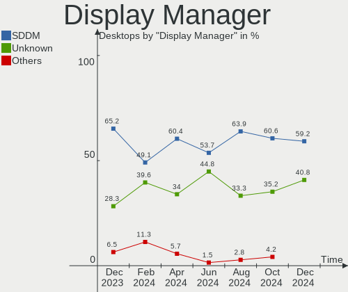
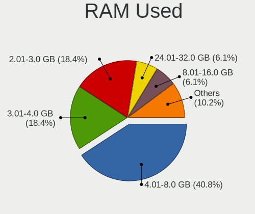
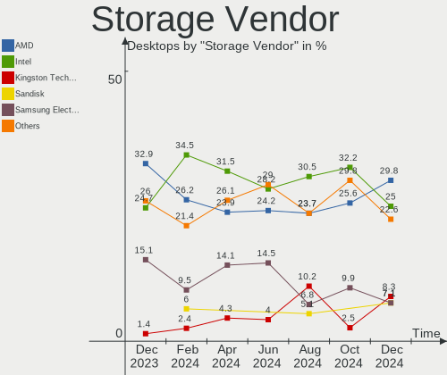
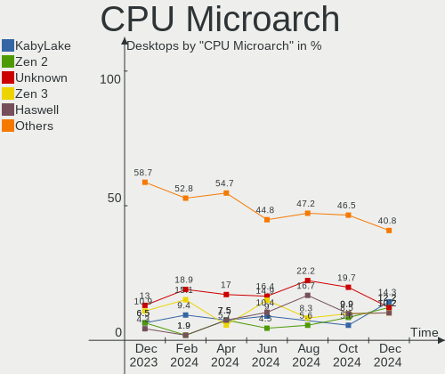

Kubuntu - Hardware Trends (Desktops)
------------------------------------

A project to identify most popular hardware characteristics and track their change
over time based on data collected by Linux users at https://Linux-Hardware.org.

Anyone can contribute to this report by the [hw-probe](https://github.com/linuxhw/hw-probe) tool:

    sudo -E hw-probe -all -upload

This report is for one last month. Overall report since the beginning of time: [TestDays](https://github.com/linuxhw/TestDays)

Period: May, 2023.

Contents
--------

* [ System ](#system)
  - [ OS                       ](#os)
  - [ OS Family                ](#os-family)
  - [ Kernel                   ](#kernel)
  - [ Kernel Family            ](#kernel-family)
  - [ Kernel Major Ver.        ](#kernel-major-ver)
  - [ Arch                     ](#arch)
  - [ DE                       ](#de)
  - [ Display Server           ](#display-server)
  - [ Display Manager          ](#display-manager)
  - [ OS Lang                  ](#os-lang)
  - [ Boot Mode                ](#boot-mode)
  - [ Filesystem               ](#filesystem)
  - [ Part. scheme             ](#part-scheme)
  - [ Dual Boot with Linux/BSD ](#dual-boot-with-linuxbsd)
  - [ Dual Boot (Win)          ](#dual-boot-win)

* [ Board ](#board)
  - [ Vendor                   ](#vendor)
  - [ Model                    ](#model)
  - [ Model Family             ](#model-family)
  - [ MFG Year                 ](#mfg-year)
  - [ Form Factor              ](#form-factor)
  - [ Secure Boot              ](#secure-boot)
  - [ Coreboot                 ](#coreboot)
  - [ RAM Size                 ](#ram-size)
  - [ RAM Used                 ](#ram-used)
  - [ Total Drives             ](#total-drives)
  - [ Has CD-ROM               ](#has-cd-rom)
  - [ Has Ethernet             ](#has-ethernet)
  - [ Has WiFi                 ](#has-wifi)
  - [ Has Bluetooth            ](#has-bluetooth)

* [ Location ](#location)
  - [ Country                  ](#country)
  - [ City                     ](#city)

* [ Drives ](#drives)
  - [ Drive Vendor             ](#drive-vendor)
  - [ Drive Model              ](#drive-model)
  - [ HDD Vendor               ](#hdd-vendor)
  - [ SSD Vendor               ](#ssd-vendor)
  - [ Drive Kind               ](#drive-kind)
  - [ Drive Connector          ](#drive-connector)
  - [ Drive Size               ](#drive-size)
  - [ Space Total              ](#space-total)
  - [ Space Used               ](#space-used)
  - [ Malfunc. Drives          ](#malfunc-drives)
  - [ Malfunc. Drive Vendor    ](#malfunc-drive-vendor)
  - [ Malfunc. HDD Vendor      ](#malfunc-hdd-vendor)
  - [ Malfunc. Drive Kind      ](#malfunc-drive-kind)
  - [ Failed Drives            ](#failed-drives)
  - [ Failed Drive Vendor      ](#failed-drive-vendor)
  - [ Drive Status             ](#drive-status)

* [ Storage controller ](#storage-controller)
  - [ Storage Vendor           ](#storage-vendor)
  - [ Storage Model            ](#storage-model)
  - [ Storage Kind             ](#storage-kind)

* [ Processor ](#processor)
  - [ CPU Vendor               ](#cpu-vendor)
  - [ CPU Model                ](#cpu-model)
  - [ CPU Model Family         ](#cpu-model-family)
  - [ CPU Cores                ](#cpu-cores)
  - [ CPU Sockets              ](#cpu-sockets)
  - [ CPU Threads              ](#cpu-threads)
  - [ CPU Op-Modes             ](#cpu-op-modes)
  - [ CPU Microcode            ](#cpu-microcode)
  - [ CPU Microarch            ](#cpu-microarch)

* [ Graphics ](#graphics)
  - [ GPU Vendor               ](#gpu-vendor)
  - [ GPU Model                ](#gpu-model)
  - [ GPU Combo                ](#gpu-combo)
  - [ GPU Driver               ](#gpu-driver)
  - [ GPU Memory               ](#gpu-memory)

* [ Monitor ](#monitor)
  - [ Monitor Vendor           ](#monitor-vendor)
  - [ Monitor Model            ](#monitor-model)
  - [ Monitor Resolution       ](#monitor-resolution)
  - [ Monitor Diagonal         ](#monitor-diagonal)
  - [ Monitor Width            ](#monitor-width)
  - [ Aspect Ratio             ](#aspect-ratio)
  - [ Monitor Area             ](#monitor-area)
  - [ Pixel Density            ](#pixel-density)
  - [ Multiple Monitors        ](#multiple-monitors)

* [ Network ](#network)
  - [ Net Controller Vendor    ](#net-controller-vendor)
  - [ Net Controller Model     ](#net-controller-model)
  - [ Wireless Vendor          ](#wireless-vendor)
  - [ Wireless Model           ](#wireless-model)
  - [ Ethernet Vendor          ](#ethernet-vendor)
  - [ Ethernet Model           ](#ethernet-model)
  - [ Net Controller Kind      ](#net-controller-kind)
  - [ Used Controller          ](#used-controller)
  - [ NICs                     ](#nics)
  - [ IPv6                     ](#ipv6)

* [ Bluetooth ](#bluetooth)
  - [ Bluetooth Vendor         ](#bluetooth-vendor)
  - [ Bluetooth Model          ](#bluetooth-model)

* [ Sound ](#sound)
  - [ Sound Vendor             ](#sound-vendor)
  - [ Sound Model              ](#sound-model)

* [ Memory ](#memory)
  - [ Memory Vendor            ](#memory-vendor)
  - [ Memory Model             ](#memory-model)
  - [ Memory Kind              ](#memory-kind)
  - [ Memory Form Factor       ](#memory-form-factor)
  - [ Memory Size              ](#memory-size)
  - [ Memory Speed             ](#memory-speed)

* [ Printers & scanners ](#printers--scanners)
  - [ Printer Vendor           ](#printer-vendor)
  - [ Printer Model            ](#printer-model)
  - [ Scanner Vendor           ](#scanner-vendor)
  - [ Scanner Model            ](#scanner-model)

* [ Camera ](#camera)
  - [ Camera Vendor            ](#camera-vendor)
  - [ Camera Model             ](#camera-model)

* [ Security ](#security)
  - [ Fingerprint Vendor       ](#fingerprint-vendor)
  - [ Fingerprint Model        ](#fingerprint-model)
  - [ Chipcard Vendor          ](#chipcard-vendor)
  - [ Chipcard Model           ](#chipcard-model)

* [ Unsupported ](#unsupported)
  - [ Unsupported Devices      ](#unsupported-devices)
  - [ Unsupported Device Types ](#unsupported-device-types)

System
------

OS
--

Installed operating systems

| Name          | Desktops | Percent |
|---------------|----------|---------|
| Kubuntu 22.04 | 29       | 67.44%  |
| Kubuntu 23.04 | 9        | 20.93%  |
| Kubuntu 11    | 3        | 6.98%   |
| Kubuntu 22.10 | 1        | 2.33%   |
| Kubuntu 20.04 | 1        | 2.33%   |

OS Family
---------

OS without a version

| Name    | Desktops | Percent |
|---------|----------|---------|
| Kubuntu | 43       | 100%    |

Kernel
------

Version of the Linux kernel

| Version                | Desktops | Percent |
|------------------------|----------|---------|
| 5.19.0-41-generic      | 8        | 18.6%   |
| 6.2.0-20-generic       | 7        | 16.28%  |
| 5.15.0-72-generic      | 7        | 16.28%  |
| 5.19.0-42-generic      | 5        | 11.63%  |
| 5.15.0-71-generic      | 4        | 9.3%    |
| 5.19.0-1025-lowlatency | 2        | 4.65%   |
| 6.2.0-1003-lowlatency  | 1        | 2.33%   |
| 5.4.0-21-generic       | 1        | 2.33%   |
| 5.19.0-38-generic      | 1        | 2.33%   |
| 5.19.0-35-generic      | 1        | 2.33%   |
| 5.19.0-1023-lowlatency | 1        | 2.33%   |
| 5.15.0-71-lowlatency   | 1        | 2.33%   |
| 5.15.0-70-lowlatency   | 1        | 2.33%   |
| 5.15.0-69-generic      | 1        | 2.33%   |
| 5.15.0-58-generic      | 1        | 2.33%   |
| 5.15.0-47-generic      | 1        | 2.33%   |

Kernel Family
-------------

Linux kernel without a distro release

| Version | Desktops | Percent |
|---------|----------|---------|
| 5.19.0  | 18       | 41.86%  |
| 5.15.0  | 16       | 37.21%  |
| 6.2.0   | 8        | 18.6%   |
| 5.4.0   | 1        | 2.33%   |

Kernel Major Ver.
-----------------

Linux kernel major version

| Version | Desktops | Percent |
|---------|----------|---------|
| 5.19    | 18       | 41.86%  |
| 5.15    | 16       | 37.21%  |
| 6.2     | 8        | 18.6%   |
| 5.4     | 1        | 2.33%   |

Arch
----

OS architecture (x86_64, i586, etc.)

| Name   | Desktops | Percent |
|--------|----------|---------|
| x86_64 | 43       | 100%    |

DE
--

Desktop Environment

| Name | Desktops | Percent |
|------|----------|---------|
| KDE5 | 43       | 100%    |

Display Server
--------------

X11 or Wayland

| Name    | Desktops | Percent |
|---------|----------|---------|
| X11     | 40       | 93.02%  |
| Tty     | 2        | 4.65%   |
| Wayland | 1        | 2.33%   |

Display Manager
---------------

SDDM, LightDM, etc.

| Name    | Desktops | Percent |
|---------|----------|---------|
| SDDM    | 21       | 48.84%  |
| Unknown | 18       | 41.86%  |
| LightDM | 3        | 6.98%   |
| GDM3    | 1        | 2.33%   |

OS Lang
-------

Language

| Lang  | Desktops | Percent |
|-------|----------|---------|
| en_US | 15       | 34.88%  |
| de_DE | 8        | 18.6%   |
| it_IT | 3        | 6.98%   |
| en_GB | 3        | 6.98%   |
| es_MX | 2        | 4.65%   |
| pt_PT | 1        | 2.33%   |
| nl_NL | 1        | 2.33%   |
| fr_CA | 1        | 2.33%   |
| es_ES | 1        | 2.33%   |
| es_AR | 1        | 2.33%   |
| en_PH | 1        | 2.33%   |
| en_NZ | 1        | 2.33%   |
| en_IN | 1        | 2.33%   |
| en_DE | 1        | 2.33%   |
| en_CA | 1        | 2.33%   |
| en_AU | 1        | 2.33%   |
| el_GR | 1        | 2.33%   |

Boot Mode
---------

EFI or BIOS

| Mode | Desktops | Percent |
|------|----------|---------|
| BIOS | 28       | 65.12%  |
| EFI  | 15       | 34.88%  |

Filesystem
----------

Type of filesystem

| Type  | Desktops | Percent |
|-------|----------|---------|
| Ext4  | 32       | 74.42%  |
| Tmpfs | 10       | 23.26%  |
| Btrfs | 1        | 2.33%   |

Part. scheme
------------

Scheme of partitioning

| Type    | Desktops | Percent |
|---------|----------|---------|
| GPT     | 18       | 41.86%  |
| Unknown | 18       | 41.86%  |
| MBR     | 7        | 16.28%  |

Dual Boot with Linux/BSD
------------------------

Hosting more than one Linux/BSD

| Dual boot | Desktops | Percent |
|-----------|----------|---------|
| No        | 37       | 86.05%  |
| Yes       | 6        | 13.95%  |

Dual Boot (Win)
---------------

Hosting Linux and Windows

| Dual boot | Desktops | Percent |
|-----------|----------|---------|
| No        | 32       | 74.42%  |
| Yes       | 11       | 25.58%  |

Board
-----

Vendor
------

Motherboard manufacturer

| Name                | Desktops | Percent |
|---------------------|----------|---------|
| ASUSTek Computer    | 18       | 41.86%  |
| Gigabyte Technology | 9        | 20.93%  |
| MSI                 | 3        | 6.98%   |
| ASRock              | 3        | 6.98%   |
| Packard Bell        | 1        | 2.33%   |
| Intel               | 1        | 2.33%   |
| Hewlett-Packard     | 1        | 2.33%   |
| Fujitsu             | 1        | 2.33%   |
| Dell                | 1        | 2.33%   |
| Biostar             | 1        | 2.33%   |
| AZW                 | 1        | 2.33%   |
| AMI                 | 1        | 2.33%   |
| Alienware           | 1        | 2.33%   |
| Acer                | 1        | 2.33%   |

Model
-----

Motherboard model

| Name                             | Desktops | Percent |
|----------------------------------|----------|---------|
| ASUS All Series                  | 3        | 6.98%   |
| Packard Bell IMEDIA D6001 GE AIO | 1        | 2.33%   |
| MSI MS-7C86                      | 1        | 2.33%   |
| MSI MS-7A40                      | 1        | 2.33%   |
| MSI MS-7A33                      | 1        | 2.33%   |
| Intel H61                        | 1        | 2.33%   |
| HP Compaq Elite 8300 SFF         | 1        | 2.33%   |
| Gigabyte Z490 AORUS ELITE AC     | 1        | 2.33%   |
| Gigabyte X570S AORUS ELITE AX    | 1        | 2.33%   |
| Gigabyte H87-HD3                 | 1        | 2.33%   |
| Gigabyte H310M H 2.0             | 1        | 2.33%   |
| Gigabyte GA-78LMT-USB3 R2        | 1        | 2.33%   |
| Gigabyte B75M-D3H                | 1        | 2.33%   |
| Gigabyte B365M DS3H              | 1        | 2.33%   |
| Gigabyte AX370-Gaming K7         | 1        | 2.33%   |
| Gigabyte A320M-H                 | 1        | 2.33%   |
| Fujitsu ESPRIMO D556/2           | 1        | 2.33%   |
| Dell OptiPlex 7010               | 1        | 2.33%   |
| Biostar AM1MHP                   | 1        | 2.33%   |
| AZW GTR                          | 1        | 2.33%   |
| ASUS Z170-PRO                    | 1        | 2.33%   |
| ASUS TUF Gaming X570-PLUS        | 1        | 2.33%   |
| ASUS ROG STRIX Z390-E GAMING     | 1        | 2.33%   |
| ASUS ROG STRIX X399-E GAMING     | 1        | 2.33%   |
| ASUS ROG CROSSHAIR VII HERO      | 1        | 2.33%   |
| ASUS PRIME X570-PRO              | 1        | 2.33%   |
| ASUS PRIME B350M-A               | 1        | 2.33%   |
| ASUS PRIME A320M-K               | 1        | 2.33%   |
| ASUS P9X79                       | 1        | 2.33%   |
| ASUS P8H61-M LX R2.0             | 1        | 2.33%   |
| ASUS P7P55-M                     | 1        | 2.33%   |
| ASUS P5Q                         | 1        | 2.33%   |
| ASUS M5A99X EVO                  | 1        | 2.33%   |
| ASUS M5A97 PLUS                  | 1        | 2.33%   |
| ASUS F1A75-V PRO                 | 1        | 2.33%   |
| ASRock X99 Extreme6/ac           | 1        | 2.33%   |
| ASRock FM2A88X Extreme6+         | 1        | 2.33%   |
| ASRock AB350M Pro4               | 1        | 2.33%   |
| AMI Intel                        | 1        | 2.33%   |
| Alienware Aurora                 | 1        | 2.33%   |

Model Family
------------

Motherboard model prefix

| Name                   | Desktops | Percent |
|------------------------|----------|---------|
| ASUS ROG               | 3        | 6.98%   |
| ASUS PRIME             | 3        | 6.98%   |
| ASUS All               | 3        | 6.98%   |
| Packard Bell IMEDIA    | 1        | 2.33%   |
| MSI MS-7C86            | 1        | 2.33%   |
| MSI MS-7A40            | 1        | 2.33%   |
| MSI MS-7A33            | 1        | 2.33%   |
| Intel H61              | 1        | 2.33%   |
| HP Compaq              | 1        | 2.33%   |
| Gigabyte Z490          | 1        | 2.33%   |
| Gigabyte X570S         | 1        | 2.33%   |
| Gigabyte H87-HD3       | 1        | 2.33%   |
| Gigabyte H310M         | 1        | 2.33%   |
| Gigabyte GA-78LMT-USB3 | 1        | 2.33%   |
| Gigabyte B75M-D3H      | 1        | 2.33%   |
| Gigabyte B365M         | 1        | 2.33%   |
| Gigabyte AX370-Gaming  | 1        | 2.33%   |
| Gigabyte A320M-H       | 1        | 2.33%   |
| Fujitsu ESPRIMO        | 1        | 2.33%   |
| Dell OptiPlex          | 1        | 2.33%   |
| Biostar AM1MHP         | 1        | 2.33%   |
| AZW GTR                | 1        | 2.33%   |
| ASUS Z170-PRO          | 1        | 2.33%   |
| ASUS TUF               | 1        | 2.33%   |
| ASUS P9X79             | 1        | 2.33%   |
| ASUS P8H61-M           | 1        | 2.33%   |
| ASUS P7P55-M           | 1        | 2.33%   |
| ASUS P5Q               | 1        | 2.33%   |
| ASUS M5A99X            | 1        | 2.33%   |
| ASUS M5A97             | 1        | 2.33%   |
| ASUS F1A75-V           | 1        | 2.33%   |
| ASRock X99             | 1        | 2.33%   |
| ASRock FM2A88X         | 1        | 2.33%   |
| ASRock AB350M          | 1        | 2.33%   |
| AMI Intel              | 1        | 2.33%   |
| Alienware Aurora       | 1        | 2.33%   |
| Acer Aspire            | 1        | 2.33%   |

MFG Year
--------

Motherboard manufacture year

| Year | Desktops | Percent |
|------|----------|---------|
| 2017 | 9        | 20.93%  |
| 2018 | 5        | 11.63%  |
| 2013 | 4        | 9.3%    |
| 2012 | 4        | 9.3%    |
| 2019 | 3        | 6.98%   |
| 2014 | 3        | 6.98%   |
| 2022 | 2        | 4.65%   |
| 2021 | 2        | 4.65%   |
| 2020 | 2        | 4.65%   |
| 2011 | 2        | 4.65%   |
| 2010 | 2        | 4.65%   |
| 2008 | 2        | 4.65%   |
| 2016 | 1        | 2.33%   |
| 2015 | 1        | 2.33%   |
| 2009 | 1        | 2.33%   |

Form Factor
-----------

Physical design of the computer

| Name    | Desktops | Percent |
|---------|----------|---------|
| Desktop | 43       | 100%    |

Secure Boot
-----------

Enabled or disabled

| State    | Desktops | Percent |
|----------|----------|---------|
| Disabled | 42       | 97.67%  |
| Enabled  | 1        | 2.33%   |

Coreboot
--------

Have coreboot on board

| Used | Desktops | Percent |
|------|----------|---------|
| No   | 43       | 100%    |

RAM Size
--------

Total RAM memory

| Size in GB  | Desktops | Percent |
|-------------|----------|---------|
| 16.01-24.0  | 11       | 25.58%  |
| 32.01-64.0  | 10       | 23.26%  |
| 4.01-8.0    | 8        | 18.6%   |
| 8.01-16.0   | 7        | 16.28%  |
| 64.01-256.0 | 4        | 9.3%    |
| 3.01-4.0    | 2        | 4.65%   |
| 24.01-32.0  | 1        | 2.33%   |

RAM Used
--------

Used RAM memory

| Used GB    | Desktops | Percent |
|------------|----------|---------|
| 4.01-8.0   | 11       | 25.58%  |
| 2.01-3.0   | 10       | 23.26%  |
| 1.01-2.0   | 10       | 23.26%  |
| 3.01-4.0   | 9        | 20.93%  |
| 16.01-24.0 | 2        | 4.65%   |
| 8.01-16.0  | 1        | 2.33%   |

Total Drives
------------

Number of drives on board

| Drives | Desktops | Percent |
|--------|----------|---------|
| 2      | 14       | 32.56%  |
| 1      | 10       | 23.26%  |
| 3      | 8        | 18.6%   |
| 5      | 4        | 9.3%    |
| 4      | 4        | 9.3%    |
| 6      | 3        | 6.98%   |

Has CD-ROM
----------

Has CD-ROM on board

| Presented | Desktops | Percent |
|-----------|----------|---------|
| No        | 26       | 60.47%  |
| Yes       | 17       | 39.53%  |

Has Ethernet
------------

Has Ethernet on board

| Presented | Desktops | Percent |
|-----------|----------|---------|
| Yes       | 43       | 100%    |

Has WiFi
--------

Has WiFi module

| Presented | Desktops | Percent |
|-----------|----------|---------|
| Yes       | 27       | 62.79%  |
| No        | 16       | 37.21%  |

Has Bluetooth
-------------

Has Bluetooth module

| Presented | Desktops | Percent |
|-----------|----------|---------|
| No        | 25       | 58.14%  |
| Yes       | 18       | 41.86%  |

Location
--------

Country
-------

Geographic location (country)

| Country     | Desktops | Percent |
|-------------|----------|---------|
| USA         | 10       | 23.26%  |
| Germany     | 9        | 20.93%  |
| UK          | 3        | 6.98%   |
| Mexico      | 3        | 6.98%   |
| Italy       | 3        | 6.98%   |
| Canada      | 3        | 6.98%   |
| Spain       | 2        | 4.65%   |
| Portugal    | 1        | 2.33%   |
| Philippines | 1        | 2.33%   |
| New Zealand | 1        | 2.33%   |
| Netherlands | 1        | 2.33%   |
| Indonesia   | 1        | 2.33%   |
| India       | 1        | 2.33%   |
| Greece      | 1        | 2.33%   |
| Brazil      | 1        | 2.33%   |
| Australia   | 1        | 2.33%   |
| Argentina   | 1        | 2.33%   |

City
----

Geographic location (city)

| City                  | Desktops | Percent |
|-----------------------|----------|---------|
| Dudley                | 2        | 4.65%   |
| Weilmuenster          | 1        | 2.33%   |
| Tulsa                 | 1        | 2.33%   |
| Thessaloniki          | 1        | 2.33%   |
| Sydney                | 1        | 2.33%   |
| Stevenage             | 1        | 2.33%   |
| Stendal               | 1        | 2.33%   |
| Singen                | 1        | 2.33%   |
| Sao Paulo             | 1        | 2.33%   |
| San Juan del Río     | 1        | 2.33%   |
| Saint-Hyacinthe       | 1        | 2.33%   |
| Rome                  | 1        | 2.33%   |
| Ridgetown             | 1        | 2.33%   |
| Ponta Delgada         | 1        | 2.33%   |
| Ober-Morlen           | 1        | 2.33%   |
| Oaxaca City           | 1        | 2.33%   |
| Niebla                | 1        | 2.33%   |
| Munich                | 1        | 2.33%   |
| Montreal              | 1        | 2.33%   |
| Metepec               | 1        | 2.33%   |
| Martin                | 1        | 2.33%   |
| Madera                | 1        | 2.33%   |
| Lucknow               | 1        | 2.33%   |
| London                | 1        | 2.33%   |
| La Mesa               | 1        | 2.33%   |
| La Calahorra          | 1        | 2.33%   |
| Jena                  | 1        | 2.33%   |
| Houston               | 1        | 2.33%   |
| Hornsea               | 1        | 2.33%   |
| Hamburg               | 1        | 2.33%   |
| Haarlem               | 1        | 2.33%   |
| Glens Falls           | 1        | 2.33%   |
| Giugliano in Campania | 1        | 2.33%   |
| Frankfurt am Main     | 1        | 2.33%   |
| Forlì                | 1        | 2.33%   |
| Elyria                | 1        | 2.33%   |
| Dresden               | 1        | 2.33%   |
| Caloocan City         | 1        | 2.33%   |
| Boise                 | 1        | 2.33%   |
| Banyuwangi            | 1        | 2.33%   |

Drives
------

Drive Vendor
------------

Hard drive vendors

| Vendor                    | Desktops | Drives | Percent |
|---------------------------|----------|--------|---------|
| WDC                       | 15       | 19     | 18.52%  |
| Samsung Electronics       | 13       | 31     | 16.05%  |
| Seagate                   | 10       | 13     | 12.35%  |
| PNY                       | 5        | 6      | 6.17%   |
| A-DATA Technology         | 5        | 5      | 6.17%   |
| Sandisk                   | 4        | 5      | 4.94%   |
| Toshiba                   | 3        | 4      | 3.7%    |
| Kingston                  | 3        | 4      | 3.7%    |
| Hitachi                   | 3        | 6      | 3.7%    |
| Crucial                   | 3        | 3      | 3.7%    |
| HGST                      | 2        | 2      | 2.47%   |
| China                     | 2        | 2      | 2.47%   |
| Unknown                   | 2        | 2      | 2.47%   |
| Unknown                   | 1        | 3      | 1.23%   |
| T-FORCE                   | 1        | 1      | 1.23%   |
| Patriot                   | 1        | 1      | 1.23%   |
| Mushkin                   | 1        | 1      | 1.23%   |
| Micron/Crucial Technology | 1        | 1      | 1.23%   |
| Micron Technology         | 1        | 1      | 1.23%   |
| Maxtor                    | 1        | 1      | 1.23%   |
| KIOXIA                    | 1        | 1      | 1.23%   |
| Hewlett-Packard           | 1        | 1      | 1.23%   |
| BlueRay                   | 1        | 1      | 1.23%   |
| Apple                     | 1        | 1      | 1.23%   |

Drive Model
-----------

Hard drive models

| Model                            | Desktops | Percent |
|----------------------------------|----------|---------|
| WDC WD1003FZEX-00MK2A0 1TB       | 2        | 1.9%    |
| Seagate ST2000DM008-2FR102 2TB   | 2        | 1.9%    |
| Samsung SSD 980 PRO 2TB          | 2        | 1.9%    |
| Samsung SSD 870 QVO 2TB          | 2        | 1.9%    |
| Samsung SSD 870 QVO 1TB          | 2        | 1.9%    |
| Samsung SSD 850 PRO 512GB        | 2        | 1.9%    |
| Samsung SSD 840 EVO 250GB        | 2        | 1.9%    |
| PNY CS900 500GB SSD              | 2        | 1.9%    |
| Unknown                          | 2        | 1.9%    |
| WDC WDS500G1B0C-00S6U0 500GB     | 1        | 0.95%   |
| WDC WDS500G1B0B-00AS40 500GB SSD | 1        | 0.95%   |
| WDC WDS200T2B0A-00SM50 2TB SSD   | 1        | 0.95%   |
| WDC WDS120G2G0A-00JH30 120GB SSD | 1        | 0.95%   |
| WDC WDBNCE5000PNC 500GB SSD      | 1        | 0.95%   |
| WDC WD800BB-55JKA0 80GB          | 1        | 0.95%   |
| WDC WD5000AAKX-60U6AA0 500GB     | 1        | 0.95%   |
| WDC WD5000AAKX-00ERMA0 500GB     | 1        | 0.95%   |
| WDC WD5000AAKS-22V1A0 500GB      | 1        | 0.95%   |
| WDC WD20EARX-00PASB0 2TB         | 1        | 0.95%   |
| WDC WD20EADS-14R6B0 2TB          | 1        | 0.95%   |
| WDC WD10EZEX-08M2NA0 1TB         | 1        | 0.95%   |
| WDC WD10EZEX-00MFCA0 1TB         | 1        | 0.95%   |
| WDC WD10EFRX-68JCSN0 1TB         | 1        | 0.95%   |
| WDC WD10EAVS-32D7B1 1TB          | 1        | 0.95%   |
| WDC WD1002FAEX-00Y9A0 1TB        | 1        | 0.95%   |
| WDC WD Green 2.5 1000GB SSD      | 1        | 0.95%   |
| Unknown SD/MMC/M.S.PRO 32GB      | 1        | 0.95%   |
| Unknown SD/MMC 2GB               | 1        | 0.95%   |
| Unknown M.S./M.S.Pro/HG 16GB     | 1        | 0.95%   |
| Toshiba MG03ACA200 2TB           | 1        | 0.95%   |
| Toshiba DT01ACA200 2TB           | 1        | 0.95%   |
| Toshiba DT01ACA100 1TB           | 1        | 0.95%   |
| Toshiba DT01ACA050 500GB         | 1        | 0.95%   |
| T-FORCE 512GB                    | 1        | 0.95%   |
| Seagate ST4000DX001-1CE168 4TB   | 1        | 0.95%   |
| Seagate ST4000DM004-2CV104 4TB   | 1        | 0.95%   |
| Seagate ST3500418AS 500GB        | 1        | 0.95%   |
| Seagate ST3500312CS 500GB        | 1        | 0.95%   |
| Seagate ST3160815AS 160GB        | 1        | 0.95%   |
| Seagate ST31000528AS 1TB         | 1        | 0.95%   |

HDD Vendor
----------

Hard disk drive vendors

| Vendor              | Desktops | Drives | Percent |
|---------------------|----------|--------|---------|
| WDC                 | 11       | 13     | 33.33%  |
| Seagate             | 10       | 12     | 30.3%   |
| Toshiba             | 3        | 4      | 9.09%   |
| Hitachi             | 3        | 6      | 9.09%   |
| Samsung Electronics | 2        | 3      | 6.06%   |
| HGST                | 2        | 2      | 6.06%   |
| Maxtor              | 1        | 1      | 3.03%   |
| Apple               | 1        | 1      | 3.03%   |

SSD Vendor
----------

Solid state drive vendors

| Vendor              | Desktops | Drives | Percent |
|---------------------|----------|--------|---------|
| Samsung Electronics | 10       | 19     | 25.64%  |
| WDC                 | 5        | 5      | 12.82%  |
| PNY                 | 5        | 6      | 12.82%  |
| A-DATA Technology   | 5        | 5      | 12.82%  |
| SanDisk             | 3        | 3      | 7.69%   |
| Kingston            | 2        | 3      | 5.13%   |
| Crucial             | 2        | 2      | 5.13%   |
| China               | 2        | 2      | 5.13%   |
| Patriot             | 1        | 1      | 2.56%   |
| Mushkin             | 1        | 1      | 2.56%   |
| Micron Technology   | 1        | 1      | 2.56%   |
| Hewlett-Packard     | 1        | 1      | 2.56%   |
| BlueRay             | 1        | 1      | 2.56%   |

Drive Kind
----------

HDD or SSD

| Kind    | Desktops | Drives | Percent |
|---------|----------|--------|---------|
| SSD     | 30       | 50     | 40.54%  |
| HDD     | 26       | 42     | 35.14%  |
| NVMe    | 13       | 16     | 17.57%  |
| Unknown | 4        | 6      | 5.41%   |
| MMC     | 1        | 1      | 1.35%   |

Drive Connector
---------------

SATA, SAS, NVMe, etc.

| Type | Desktops | Drives | Percent |
|------|----------|--------|---------|
| SATA | 40       | 94     | 71.43%  |
| NVMe | 13       | 16     | 23.21%  |
| SAS  | 2        | 4      | 3.57%   |
| MMC  | 1        | 1      | 1.79%   |

Drive Size
----------

Size of hard drive

| Size in TB | Desktops | Drives | Percent |
|------------|----------|--------|---------|
| 0.01-0.5   | 31       | 55     | 49.21%  |
| 0.51-1.0   | 18       | 21     | 28.57%  |
| 1.01-2.0   | 11       | 12     | 17.46%  |
| 3.01-4.0   | 2        | 2      | 3.17%   |
| 10.01-20.0 | 1        | 2      | 1.59%   |

Space Total
-----------

Amount of disk space available on the file system

| Size in GB     | Desktops | Percent |
|----------------|----------|---------|
| 251-500        | 9        | 20.93%  |
| 1001-2000      | 8        | 18.6%   |
| 101-250        | 7        | 16.28%  |
| More than 3000 | 6        | 13.95%  |
| 2001-3000      | 6        | 13.95%  |
| 501-1000       | 5        | 11.63%  |
| 51-100         | 2        | 4.65%   |

Space Used
----------

Amount of used disk space

| Used GB        | Desktops | Percent |
|----------------|----------|---------|
| 101-250        | 8        | 18.6%   |
| 251-500        | 6        | 13.95%  |
| 21-50          | 6        | 13.95%  |
| 1001-2000      | 6        | 13.95%  |
| 51-100         | 6        | 13.95%  |
| 501-1000       | 5        | 11.63%  |
| 1-20           | 4        | 9.3%    |
| More than 3000 | 2        | 4.65%   |

Malfunc. Drives
---------------

Drive models with a malfunction

| Model                             | Desktops | Drives | Percent |
|-----------------------------------|----------|--------|---------|
| WDC WD20EADS-14R6B0 2TB           | 1        | 1      | 25%     |
| Samsung Electronics HD501LJ 500GB | 1        | 1      | 25%     |
| Maxtor STM3250310AS 250GB         | 1        | 1      | 25%     |
| Hitachi HDS721010CLA630 1TB       | 1        | 1      | 25%     |

Malfunc. Drive Vendor
---------------------

Vendors of faulty drives

| Vendor              | Desktops | Drives | Percent |
|---------------------|----------|--------|---------|
| WDC                 | 1        | 1      | 25%     |
| Samsung Electronics | 1        | 1      | 25%     |
| Maxtor              | 1        | 1      | 25%     |
| Hitachi             | 1        | 1      | 25%     |

Malfunc. HDD Vendor
-------------------

Vendors of faulty HDD drives

| Vendor              | Desktops | Drives | Percent |
|---------------------|----------|--------|---------|
| WDC                 | 1        | 1      | 25%     |
| Samsung Electronics | 1        | 1      | 25%     |
| Maxtor              | 1        | 1      | 25%     |
| Hitachi             | 1        | 1      | 25%     |

Malfunc. Drive Kind
-------------------

Kinds of faulty drives

| Kind | Desktops | Drives | Percent |
|------|----------|--------|---------|
| HDD  | 4        | 4      | 100%    |

Failed Drives
-------------

Failed drive models

Zero info for selected period =(

Failed Drive Vendor
-------------------

Failed drive vendors

Zero info for selected period =(

Drive Status
------------

Number of failed and malfunc. drives

| Status   | Desktops | Drives | Percent |
|----------|----------|--------|---------|
| Detected | 30       | 72     | 62.5%   |
| Works    | 14       | 39     | 29.17%  |
| Malfunc  | 4        | 4      | 8.33%   |

Storage controller
------------------

Storage Vendor
--------------

Storage controller vendors

| Vendor                      | Desktops | Percent |
|-----------------------------|----------|---------|
| Intel                       | 23       | 37.1%   |
| AMD                         | 18       | 29.03%  |
| Samsung Electronics         | 7        | 11.29%  |
| ASMedia Technology          | 4        | 6.45%   |
| SanDisk                     | 3        | 4.84%   |
| Micron/Crucial Technology   | 2        | 3.23%   |
| Silicon Image               | 1        | 1.61%   |
| Nvidia                      | 1        | 1.61%   |
| KIOXIA                      | 1        | 1.61%   |
| Kingston Technology Company | 1        | 1.61%   |
| JMicron Technology          | 1        | 1.61%   |

Storage Model
-------------

Storage controller models

| Model                                                                                   | Desktops | Percent |
|-----------------------------------------------------------------------------------------|----------|---------|
| AMD FCH SATA Controller [AHCI mode]                                                     | 13       | 16.67%  |
| Samsung NVMe SSD Controller PM9A1/PM9A3/980PRO                                          | 4        | 5.13%   |
| ASMedia ASM1062 Serial ATA Controller                                                   | 4        | 5.13%   |
| Samsung NVMe SSD Controller SM981/PM981/PM983                                           | 2        | 2.56%   |
| Intel Q170/Q150/B150/H170/H110/Z170/CM236 Chipset SATA Controller [AHCI Mode]           | 2        | 2.56%   |
| Intel 9 Series Chipset Family SATA Controller [AHCI Mode]                               | 2        | 2.56%   |
| Intel 82801JI (ICH10 Family) SATA AHCI Controller                                       | 2        | 2.56%   |
| Intel 8 Series/C220 Series Chipset Family 6-port SATA Controller 1 [AHCI mode]          | 2        | 2.56%   |
| Intel 7 Series/C210 Series Chipset Family 6-port SATA Controller [AHCI mode]            | 2        | 2.56%   |
| Intel 6 Series/C200 Series Chipset Family 6 port Desktop SATA AHCI Controller           | 2        | 2.56%   |
| Intel 200 Series PCH SATA controller [AHCI mode]                                        | 2        | 2.56%   |
| AMD X370 Series Chipset SATA Controller                                                 | 2        | 2.56%   |
| AMD SB7x0/SB8x0/SB9x0 SATA Controller [AHCI mode]                                       | 2        | 2.56%   |
| AMD FCH SATA Controller D                                                               | 2        | 2.56%   |
| AMD FCH IDE Controller                                                                  | 2        | 2.56%   |
| AMD 400 Series Chipset SATA Controller                                                  | 2        | 2.56%   |
| AMD 300 Series Chipset SATA Controller                                                  | 2        | 2.56%   |
| Silicon Image SiI 3132 Serial ATA Raid II Controller                                    | 1        | 1.28%   |
| SanDisk WD Blue SN570 NVMe SSD 1TB                                                      | 1        | 1.28%   |
| SanDisk WD Blue SN500 / PC SN520 NVMe SSD                                               | 1        | 1.28%   |
| SanDisk WD Black 2018/SN750 / PC SN720 NVMe SSD                                         | 1        | 1.28%   |
| Samsung NVMe SSD Controller SM951/PM951                                                 | 1        | 1.28%   |
| Samsung NVMe SSD Controller 980                                                         | 1        | 1.28%   |
| Nvidia MCP73 IDE Controller                                                             | 1        | 1.28%   |
| Nvidia GeForce 7100/nForce 630i SATA                                                    | 1        | 1.28%   |
| Micron/Crucial P2 NVMe PCIe SSD                                                         | 1        | 1.28%   |
| Micron/Crucial NVMe Storage Controller                                                  | 1        | 1.28%   |
| KIOXIA NVMe SSD Controller BG4                                                          | 1        | 1.28%   |
| Kingston Company Company Non-Volatile memory controller                                 | 1        | 1.28%   |
| JMicron JMB362 SATA Controller                                                          | 1        | 1.28%   |
| Intel Comet Lake SATA AHCI Controller                                                   | 1        | 1.28%   |
| Intel Celeron N3350/Pentium N4200/Atom E3900 Series SATA AHCI Controller                | 1        | 1.28%   |
| Intel Cannon Lake PCH SATA AHCI Controller                                              | 1        | 1.28%   |
| Intel C610/X99 series chipset 6-Port SATA Controller [AHCI mode]                        | 1        | 1.28%   |
| Intel C600/X79 series chipset 6-Port SATA AHCI Controller                               | 1        | 1.28%   |
| Intel 7 Series/C210 Series Chipset Family 4-port SATA Controller [IDE mode]             | 1        | 1.28%   |
| Intel 7 Series/C210 Series Chipset Family 2-port SATA Controller [IDE mode]             | 1        | 1.28%   |
| Intel 6 Series/C200 Series Chipset Family Desktop SATA Controller (IDE mode, ports 4-5) | 1        | 1.28%   |
| Intel 6 Series/C200 Series Chipset Family Desktop SATA Controller (IDE mode, ports 0-3) | 1        | 1.28%   |
| Intel 5 Series/3400 Series Chipset 4 port SATA IDE Controller                           | 1        | 1.28%   |

Storage Kind
------------

Kind of storage controller (IDE, SATA, NVMe, SAS, ...)

| Kind | Desktops | Percent |
|------|----------|---------|
| SATA | 39       | 66.1%   |
| NVMe | 13       | 22.03%  |
| IDE  | 7        | 11.86%  |

Processor
---------

CPU Vendor
----------

Processor vendors

| Vendor | Desktops | Percent |
|--------|----------|---------|
| Intel  | 24       | 55.81%  |
| AMD    | 19       | 44.19%  |

CPU Model
---------

Processor models

| Model                                          | Desktops | Percent |
|------------------------------------------------|----------|---------|
| Intel Core i7-3770 CPU @ 3.40GHz               | 3        | 6.98%   |
| Intel Core i7-4790K CPU @ 4.00GHz              | 2        | 4.65%   |
| Intel Core i5-9600K CPU @ 3.70GHz              | 2        | 4.65%   |
| AMD Ryzen 7 5800X 8-Core Processor             | 2        | 4.65%   |
| AMD Ryzen 5 2400G with Radeon Vega Graphics    | 2        | 4.65%   |
| Intel Xeon CPU E3-1240 v3 @ 3.40GHz            | 1        | 2.33%   |
| Intel Pentium Dual CPU E2200 @ 2.20GHz         | 1        | 2.33%   |
| Intel Pentium CPU G3220 @ 3.00GHz              | 1        | 2.33%   |
| Intel Core i9-10900T CPU @ 1.90GHz             | 1        | 2.33%   |
| Intel Core i7-6700K CPU @ 4.00GHz              | 1        | 2.33%   |
| Intel Core i7-6700 CPU @ 3.40GHz               | 1        | 2.33%   |
| Intel Core i7-5820K CPU @ 3.30GHz              | 1        | 2.33%   |
| Intel Core i7-3820 CPU @ 3.60GHz               | 1        | 2.33%   |
| Intel Core i7-10700 CPU @ 2.90GHz              | 1        | 2.33%   |
| Intel Core i7 CPU 920 @ 2.67GHz                | 1        | 2.33%   |
| Intel Core i7 CPU 860 @ 2.80GHz                | 1        | 2.33%   |
| Intel Core i5-8500 CPU @ 3.00GHz               | 1        | 2.33%   |
| Intel Core i5-2400 CPU @ 3.10GHz               | 1        | 2.33%   |
| Intel Core i5-2300 CPU @ 2.80GHz               | 1        | 2.33%   |
| Intel Core i3-3220 CPU @ 3.30GHz               | 1        | 2.33%   |
| Intel Core 2 Quad CPU @ 2.40GHz                | 1        | 2.33%   |
| Intel Celeron CPU N3350 @ 1.10GHz              | 1        | 2.33%   |
| AMD Ryzen Threadripper 2950X 16-Core Processor | 1        | 2.33%   |
| AMD Ryzen 9 6900HX with Radeon Graphics        | 1        | 2.33%   |
| AMD Ryzen 9 5900X 12-Core Processor            | 1        | 2.33%   |
| AMD Ryzen 9 3900X 12-Core Processor            | 1        | 2.33%   |
| AMD Ryzen 7 3700X 8-Core Processor             | 1        | 2.33%   |
| AMD Ryzen 7 1700 Eight-Core Processor          | 1        | 2.33%   |
| AMD Ryzen 5 1600X Six-Core Processor           | 1        | 2.33%   |
| AMD Ryzen 3 3200G with Radeon Vega Graphics    | 1        | 2.33%   |
| AMD Ryzen 3 2200G with Radeon Vega Graphics    | 1        | 2.33%   |
| AMD Phenom II X4 980 Processor                 | 1        | 2.33%   |
| AMD FX-8300 Eight-Core Processor               | 1        | 2.33%   |
| AMD FX-4300 Quad-Core Processor                | 1        | 2.33%   |
| AMD Athlon 5350 APU with Radeon R3             | 1        | 2.33%   |
| AMD A8-3870 APU with Radeon HD Graphics        | 1        | 2.33%   |
| AMD A10-7850K APU with Radeon R7 Graphics      | 1        | 2.33%   |

CPU Model Family
----------------

Processor model prefix

| Model                  | Desktops | Percent |
|------------------------|----------|---------|
| Intel Core i7          | 12       | 27.91%  |
| Intel Core i5          | 5        | 11.63%  |
| AMD Ryzen 7            | 4        | 9.3%    |
| AMD Ryzen 9            | 3        | 6.98%   |
| AMD Ryzen 5            | 3        | 6.98%   |
| AMD Ryzen 3            | 2        | 4.65%   |
| AMD FX                 | 2        | 4.65%   |
| Intel Xeon             | 1        | 2.33%   |
| Intel Pentium Dual     | 1        | 2.33%   |
| Intel Pentium          | 1        | 2.33%   |
| Intel Core i9          | 1        | 2.33%   |
| Intel Core i3          | 1        | 2.33%   |
| Intel Core 2 Quad      | 1        | 2.33%   |
| Intel Celeron          | 1        | 2.33%   |
| AMD Ryzen Threadripper | 1        | 2.33%   |
| AMD Phenom II X4       | 1        | 2.33%   |
| AMD Athlon             | 1        | 2.33%   |
| AMD A8                 | 1        | 2.33%   |
| AMD A10                | 1        | 2.33%   |

CPU Cores
---------

Number of processor cores

| Number | Desktops | Percent |
|--------|----------|---------|
| 4      | 22       | 51.16%  |
| 8      | 6        | 13.95%  |
| 2      | 6        | 13.95%  |
| 6      | 5        | 11.63%  |
| 12     | 2        | 4.65%   |
| 16     | 1        | 2.33%   |
| 10     | 1        | 2.33%   |

CPU Sockets
-----------

Number of sockets

| Number | Desktops | Percent |
|--------|----------|---------|
| 1      | 43       | 100%    |

CPU Threads
-----------

Threads per core (Hyper-Threading)

| Number | Desktops | Percent |
|--------|----------|---------|
| 2      | 29       | 67.44%  |
| 1      | 14       | 32.56%  |

CPU Op-Modes
------------

CPU Operation Modes (32-bit, 64-bit)

| Op mode        | Desktops | Percent |
|----------------|----------|---------|
| 32-bit, 64-bit | 43       | 100%    |

CPU Microcode
-------------

Microcode number

| Number     | Desktops | Percent |
|------------|----------|---------|
| Unknown    | 29       | 67.44%  |
| 0x506e3    | 2        | 4.65%   |
| 0x08701021 | 2        | 4.65%   |
| 0x506c9    | 1        | 2.33%   |
| 0x206d7    | 1        | 2.33%   |
| 0x106e5    | 1        | 2.33%   |
| 0x0a20120a | 1        | 2.33%   |
| 0x0a201016 | 1        | 2.33%   |
| 0x08001137 | 1        | 2.33%   |
| 0x08001126 | 1        | 2.33%   |
| 0x0700010f | 1        | 2.33%   |
| 0x06000852 | 1        | 2.33%   |
| 0x03000027 | 1        | 2.33%   |

CPU Microarch
-------------

Microarchitecture

| Name        | Desktops | Percent |
|-------------|----------|---------|
| Zen         | 5        | 11.63%  |
| Haswell     | 5        | 11.63%  |
| IvyBridge   | 4        | 9.3%    |
| Zen 3       | 3        | 6.98%   |
| SandyBridge | 3        | 6.98%   |
| KabyLake    | 3        | 6.98%   |
| Zen+        | 2        | 4.65%   |
| Zen 2       | 2        | 4.65%   |
| Skylake     | 2        | 4.65%   |
| Piledriver  | 2        | 4.65%   |
| Nehalem     | 2        | 4.65%   |
| Core        | 2        | 4.65%   |
| CometLake   | 2        | 4.65%   |
| Steamroller | 1        | 2.33%   |
| K10 Llano   | 1        | 2.33%   |
| K10         | 1        | 2.33%   |
| Jaguar      | 1        | 2.33%   |
| Goldmont    | 1        | 2.33%   |
| Unknown     | 1        | 2.33%   |

Graphics
--------

GPU Vendor
----------

Vendors of graphics cards

| Vendor | Desktops | Percent |
|--------|----------|---------|
| Nvidia | 21       | 46.67%  |
| AMD    | 14       | 31.11%  |
| Intel  | 10       | 22.22%  |

GPU Model
---------

Graphics card models

| Model                                                                       | Desktops | Percent |
|-----------------------------------------------------------------------------|----------|---------|
| Nvidia GP108 [GeForce GT 1030]                                              | 3        | 6.38%   |
| Intel IvyBridge GT2 [HD Graphics 4000]                                      | 3        | 6.38%   |
| Nvidia TU117 [GeForce GTX 1650]                                             | 2        | 4.26%   |
| Nvidia TU104 [GeForce RTX 2070 SUPER]                                       | 2        | 4.26%   |
| Nvidia GP107 [GeForce GTX 1050 Ti]                                          | 2        | 4.26%   |
| Nvidia GP104 [GeForce GTX 1070]                                             | 2        | 4.26%   |
| Nvidia GK208B [GeForce GT 710]                                              | 2        | 4.26%   |
| Intel Xeon E3-1200 v3/4th Gen Core Processor Integrated Graphics Controller | 2        | 4.26%   |
| AMD Raven Ridge [Radeon Vega Series / Radeon Vega Mobile Series]            | 2        | 4.26%   |
| Nvidia GP107 [GeForce GTX 1050]                                             | 1        | 2.13%   |
| Nvidia GP106 [GeForce GTX 1060 6GB]                                         | 1        | 2.13%   |
| Nvidia GM204 [GeForce GTX 980]                                              | 1        | 2.13%   |
| Nvidia GM107 [GeForce GTX 750 Ti]                                           | 1        | 2.13%   |
| Nvidia GK107GL [Quadro K600]                                                | 1        | 2.13%   |
| Nvidia GK107GL [Quadro K420]                                                | 1        | 2.13%   |
| Nvidia GK107 [GeForce GT 740]                                               | 1        | 2.13%   |
| Nvidia GA106 [GeForce RTX 3060 Lite Hash Rate]                              | 1        | 2.13%   |
| Nvidia G98 [GeForce 9300 GE]                                                | 1        | 2.13%   |
| Intel HD Graphics 500                                                       | 1        | 2.13%   |
| Intel DG2 [Arc A380]                                                        | 1        | 2.13%   |
| Intel CometLake-S GT2 [UHD Graphics 630]                                    | 1        | 2.13%   |
| Intel CoffeeLake-S GT2 [UHD Graphics 630]                                   | 1        | 2.13%   |
| Intel 2nd Generation Core Processor Family Integrated Graphics Controller   | 1        | 2.13%   |
| AMD Sumo [Radeon HD 6550D]                                                  | 1        | 2.13%   |
| AMD Rembrandt [Radeon 680M]                                                 | 1        | 2.13%   |
| AMD Picasso/Raven 2 [Radeon Vega Series / Radeon Vega Mobile Series]        | 1        | 2.13%   |
| AMD Oland XT [Radeon HD 8670 / R5 340X OEM / R7 250/350/350X OEM]           | 1        | 2.13%   |
| AMD Navi 22 [Radeon RX 6700/6700 XT/6750 XT / 6800M/6850M XT]               | 1        | 2.13%   |
| AMD Navi 21 [Radeon RX 6800/6800 XT / 6900 XT]                              | 1        | 2.13%   |
| AMD Navi 10 [Radeon RX 5600 OEM/5600 XT / 5700/5700 XT]                     | 1        | 2.13%   |
| AMD Lexa PRO [Radeon 540/540X/550/550X / RX 540X/550/550X]                  | 1        | 2.13%   |
| AMD Kaveri [Radeon R7 Graphics]                                             | 1        | 2.13%   |
| AMD Ellesmere [Radeon RX 470/480/570/570X/580/580X/590]                     | 1        | 2.13%   |
| AMD Cypress PRO [Radeon HD 5850]                                            | 1        | 2.13%   |
| AMD Cape Verde XT [Radeon HD 7770/8760 / R7 250X]                           | 1        | 2.13%   |
| AMD Baffin [Radeon RX 550 640SP / RX 560/560X]                              | 1        | 2.13%   |

GPU Combo
---------

Combinations of graphics cards

| Name       | Desktops | Percent |
|------------|----------|---------|
| 1 x Nvidia | 19       | 44.19%  |
| 1 x AMD    | 13       | 30.23%  |
| 1 x Intel  | 9        | 20.93%  |
| 2 x Nvidia | 1        | 2.33%   |
| 2 x AMD    | 1        | 2.33%   |

GPU Driver
----------

Free vs proprietary

| Driver      | Desktops | Percent |
|-------------|----------|---------|
| Free        | 23       | 53.49%  |
| Proprietary | 19       | 44.19%  |
| Unknown     | 1        | 2.33%   |

GPU Memory
----------

Total video memory

| Size in GB | Desktops | Percent |
|------------|----------|---------|
| Unknown    | 21       | 48.84%  |
| 1.01-2.0   | 7        | 16.28%  |
| 3.01-4.0   | 6        | 13.95%  |
| 8.01-16.0  | 3        | 6.98%   |
| 5.01-6.0   | 2        | 4.65%   |
| 0.51-1.0   | 2        | 4.65%   |
| 7.01-8.0   | 1        | 2.33%   |
| 0.01-0.5   | 1        | 2.33%   |

Monitor
-------

Monitor Vendor
--------------

Monitor vendors

| Vendor               | Desktops | Percent |
|----------------------|----------|---------|
| Samsung Electronics  | 6        | 12.5%   |
| Goldstar             | 6        | 12.5%   |
| Dell                 | 6        | 12.5%   |
| ASUSTek Computer     | 3        | 6.25%   |
| Philips              | 2        | 4.17%   |
| Hewlett-Packard      | 2        | 4.17%   |
| BenQ                 | 2        | 4.17%   |
| Acer                 | 2        | 4.17%   |
| VIZ                  | 1        | 2.08%   |
| RTK                  | 1        | 2.08%   |
| Pioneer              | 1        | 2.08%   |
| ONN                  | 1        | 2.08%   |
| ONKYO                | 1        | 2.08%   |
| Medion Akoya         | 1        | 2.08%   |
| LG Electronics       | 1        | 2.08%   |
| Lenovo               | 1        | 2.08%   |
| Insignia             | 1        | 2.08%   |
| HZB                  | 1        | 2.08%   |
| Hitachi              | 1        | 2.08%   |
| HannStar             | 1        | 2.08%   |
| GRM                  | 1        | 2.08%   |
| FUS                  | 1        | 2.08%   |
| Element              | 1        | 2.08%   |
| Eizo                 | 1        | 2.08%   |
| DTV                  | 1        | 2.08%   |
| AOC                  | 1        | 2.08%   |
| Ancor Communications | 1        | 2.08%   |

Monitor Model
-------------

Monitor models

| Model                                                                 | Desktops | Percent |
|-----------------------------------------------------------------------|----------|---------|
| VIZ LCD Monitor D32h-J04 1920x1080                                    | 1        | 1.92%   |
| Samsung Electronics T24C550 SAM0AA1 1920x1080 521x293mm 23.5-inch     | 1        | 1.92%   |
| Samsung Electronics S34J55x SAM0F70 3440x1440 797x333mm 34.0-inch     | 1        | 1.92%   |
| Samsung Electronics S27E510 SAM0C5F 1920x1080 598x336mm 27.0-inch     | 1        | 1.92%   |
| Samsung Electronics S23B550 SAM0919 1920x1080 510x290mm 23.1-inch     | 1        | 1.92%   |
| Samsung Electronics LF24T450G SAM71C9 1920x1200 519x324mm 24.1-inch   | 1        | 1.92%   |
| Samsung Electronics LCD Monitor SAM0B30 1920x1080 885x498mm 40.0-inch | 1        | 1.92%   |
| RTK FHD HDR RTK3B3A 1920x1080 344x195mm 15.6-inch                     | 1        | 1.92%   |
| Pioneer PIONEER_PDP PIO00BD 1920x540                                  | 1        | 1.92%   |
| Philips PHL 247E6 PHLC0E7 1920x1080 521x293mm 23.5-inch               | 1        | 1.92%   |
| Philips PHL 240P4QPY PHL08CD 1920x1200 518x324mm 24.1-inch            | 1        | 1.92%   |
| ONN ONA18HO015 ONN0101 1920x1080 698x393mm 31.5-inch                  | 1        | 1.92%   |
| ONKYO LCD Monitor TX-SR508                                            | 1        | 1.92%   |
| Medion Akoya MD20491 MEC5201 1920x1080 521x293mm 23.5-inch            | 1        | 1.92%   |
| LG Electronics LCD Monitor D2342P 4800x1080                           | 1        | 1.92%   |
| Lenovo L197 Wide LEN1152 1440x900 410x257mm 19.1-inch                 | 1        | 1.92%   |
| Insignia NS-39D220NA16 BBY3533 1680x1050 708x398mm 32.0-inch          | 1        | 1.92%   |
| HZB 13728626231 HZB3132 480x1920                                      | 1        | 1.92%   |
| Hitachi HISENSE HEC002F 3840x2160 1872x1053mm 84.6-inch               | 1        | 1.92%   |
| Hewlett-Packard P34hc G4 HPN36FA 3440x1440 797x334mm 34.0-inch        | 1        | 1.92%   |
| Hewlett-Packard 27f HPN354B 1920x1080 598x336mm 27.0-inch             | 1        | 1.92%   |
| HannStar Hanns.G HG191 HSD1C2B 1440x900 408x255mm 18.9-inch           | 1        | 1.92%   |
| GRM Q22 FHD View GRM2731 1920x1080 477x268mm 21.5-inch                | 1        | 1.92%   |
| Goldstar W2241 GSM56B3 1680x1050 474x296mm 22.0-inch                  | 1        | 1.92%   |
| Goldstar ULTRAGEAR GSM5C08 1920x1080 530x300mm 24.0-inch              | 1        | 1.92%   |
| Goldstar HDR 4K GSM7706 3840x2160 600x340mm 27.2-inch                 | 1        | 1.92%   |
| Goldstar HD GSM5ACD 1366x768 410x230mm 18.5-inch                      | 1        | 1.92%   |
| Goldstar FULL HD GSM5B55 1920x1080 480x270mm 21.7-inch                | 1        | 1.92%   |
| Goldstar E2351 GSM5872 1920x1080 510x290mm 23.1-inch                  | 1        | 1.92%   |
| FUS LCD Monitor SL3220W 1680x1050                                     | 1        | 1.92%   |
| Element EM2FPAB24B EMT2380 1920x1080 526x296mm 23.8-inch              | 1        | 1.92%   |
| Eizo EV2760 ENC3117 2560x1440 597x336mm 27.0-inch                     | 1        | 1.92%   |
| DTV DTV DTV0030 1600x1200 708x398mm 32.0-inch                         | 1        | 1.92%   |
| Dell U2718Q DELA0EC 3840x2160 609x349mm 27.6-inch                     | 1        | 1.92%   |
| Dell U2715H DELD067 2560x1440 597x336mm 27.0-inch                     | 1        | 1.92%   |
| Dell U2715H DELD065 2560x1440 597x336mm 27.0-inch                     | 1        | 1.92%   |
| Dell ST2210 DELA05A 1920x1080 477x268mm 21.5-inch                     | 1        | 1.92%   |
| Dell S2721QS DELA198 3840x2160 597x336mm 27.0-inch                    | 1        | 1.92%   |
| Dell P2415Q DELA0BE 3840x2160 527x296mm 23.8-inch                     | 1        | 1.92%   |
| Dell P2314H DEL4098 1920x1080 509x286mm 23.0-inch                     | 1        | 1.92%   |

Monitor Resolution
------------------

Monitor screen resolution

| Resolution         | Desktops | Percent |
|--------------------|----------|---------|
| 1920x1080 (FHD)    | 17       | 38.64%  |
| 3840x2160 (4K)     | 5        | 11.36%  |
| 1680x1050 (WSXGA+) | 4        | 9.09%   |
| 2560x1440 (QHD)    | 3        | 6.82%   |
| 1920x1200 (WUXGA)  | 3        | 6.82%   |
| 3440x1440          | 2        | 4.55%   |
| 1440x900 (WXGA+)   | 2        | 4.55%   |
| 1366x768 (WXGA)    | 2        | 4.55%   |
| 480x1920           | 1        | 2.27%   |
| 4800x1080          | 1        | 2.27%   |
| 1920x540           | 1        | 2.27%   |
| 1360x768           | 1        | 2.27%   |
| 1280x1024 (SXGA)   | 1        | 2.27%   |
| Unknown            | 1        | 2.27%   |

Monitor Diagonal
----------------

Diagonal size in inches

| Inches  | Desktops | Percent |
|---------|----------|---------|
| 23      | 9        | 19.57%  |
| 27      | 8        | 17.39%  |
| 24      | 6        | 13.04%  |
| Unknown | 5        | 10.87%  |
| 21      | 4        | 8.7%    |
| 18      | 3        | 6.52%   |
| 34      | 2        | 4.35%   |
| 32      | 2        | 4.35%   |
| 84      | 1        | 2.17%   |
| 54      | 1        | 2.17%   |
| 31      | 1        | 2.17%   |
| 22      | 1        | 2.17%   |
| 20      | 1        | 2.17%   |
| 19      | 1        | 2.17%   |
| 15      | 1        | 2.17%   |

Monitor Width
-------------

Physical width

| Width in mm | Desktops | Percent |
|-------------|----------|---------|
| 501-600     | 21       | 46.67%  |
| 401-500     | 10       | 22.22%  |
| Unknown     | 5        | 11.11%  |
| 701-800     | 4        | 8.89%   |
| 601-700     | 2        | 4.44%   |
| 301-350     | 1        | 2.22%   |
| 1501-2000   | 1        | 2.22%   |
| 1001-1500   | 1        | 2.22%   |

Aspect Ratio
------------

Proportional relationship between the width and the height

| Ratio   | Desktops | Percent |
|---------|----------|---------|
| 16/9    | 26       | 63.41%  |
| 16/10   | 7        | 17.07%  |
| Unknown | 3        | 7.32%   |
| 21/9    | 2        | 4.88%   |
| 32/9    | 1        | 2.44%   |
| 3/2     | 1        | 2.44%   |
| 0.25    | 1        | 2.44%   |

Monitor Area
------------

Area in inch²

| Area in inch² | Desktops | Percent |
|----------------|----------|---------|
| 201-250        | 14       | 31.82%  |
| 301-350        | 8        | 18.18%  |
| 351-500        | 5        | 11.36%  |
| Unknown        | 5        | 11.36%  |
| 151-200        | 4        | 9.09%   |
| 251-300        | 3        | 6.82%   |
| More than 1000 | 2        | 4.55%   |
| 141-150        | 2        | 4.55%   |
| 101-110        | 1        | 2.27%   |

Pixel Density
-------------

Pixels per inch

| Density | Desktops | Percent |
|---------|----------|---------|
| 51-100  | 25       | 54.35%  |
| 101-120 | 9        | 19.57%  |
| Unknown | 5        | 10.87%  |
| 161-240 | 3        | 6.52%   |
| 1-50    | 2        | 4.35%   |
| 121-160 | 2        | 4.35%   |

Multiple Monitors
-----------------

Total monitors connected

| Total | Desktops | Percent |
|-------|----------|---------|
| 1     | 30       | 69.77%  |
| 2     | 11       | 25.58%  |
| 4     | 1        | 2.33%   |
| 0     | 1        | 2.33%   |

Network
-------

Net Controller Vendor
---------------------

Controller vendors

| Vendor                | Desktops | Percent |
|-----------------------|----------|---------|
| Realtek Semiconductor | 29       | 41.43%  |
| Intel                 | 20       | 28.57%  |
| Qualcomm Atheros      | 6        | 8.57%   |
| Broadcom              | 4        | 5.71%   |
| TP-Link               | 2        | 2.86%   |
| MediaTek              | 2        | 2.86%   |
| Aquantia              | 2        | 2.86%   |
| Samsung Electronics   | 1        | 1.43%   |
| Ralink                | 1        | 1.43%   |
| Nvidia                | 1        | 1.43%   |
| AVM                   | 1        | 1.43%   |
| ASUSTek Computer      | 1        | 1.43%   |

Net Controller Model
--------------------

Controller models

| Model                                                                         | Desktops | Percent |
|-------------------------------------------------------------------------------|----------|---------|
| Realtek RTL8111/8168/8411 PCI Express Gigabit Ethernet Controller             | 21       | 26.58%  |
| Intel I211 Gigabit Network Connection                                         | 5        | 6.33%   |
| Realtek RTL8125 2.5GbE Controller                                             | 3        | 3.8%    |
| Intel Wi-Fi 6 AX200                                                           | 3        | 3.8%    |
| Intel Ethernet Connection (2) I218-V                                          | 3        | 3.8%    |
| Realtek RTL8192CE PCIe Wireless Network Adapter                               | 2        | 2.53%   |
| Qualcomm Atheros QCA8171 Gigabit Ethernet                                     | 2        | 2.53%   |
| Qualcomm Atheros AR93xx Wireless Network Adapter                              | 2        | 2.53%   |
| MediaTek MT7921K (RZ608) Wi-Fi 6E 80MHz                                       | 2        | 2.53%   |
| Intel 82579V Gigabit Network Connection                                       | 2        | 2.53%   |
| Intel 82579LM Gigabit Network Connection (Lewisville)                         | 2        | 2.53%   |
| Broadcom BCM4352 802.11ac Wireless Network Adapter                            | 2        | 2.53%   |
| Aquantia AQC107 NBase-T/IEEE 802.3bz Ethernet Controller [AQtion]             | 2        | 2.53%   |
| TP-Link 802.11n NIC                                                           | 1        | 1.27%   |
| TP-Link 802.11ac WLAN Adapter                                                 | 1        | 1.27%   |
| Samsung Galaxy series, misc. (tethering mode)                                 | 1        | 1.27%   |
| Realtek RTL8822BE 802.11a/b/g/n/ac WiFi adapter                               | 1        | 1.27%   |
| Realtek RTL8821CE 802.11ac PCIe Wireless Network Adapter                      | 1        | 1.27%   |
| Realtek RTL8192EE PCIe Wireless Network Adapter                               | 1        | 1.27%   |
| Realtek RTL8188CE 802.11b/g/n WiFi Adapter                                    | 1        | 1.27%   |
| Realtek RTL810xE PCI Express Fast Ethernet controller                         | 1        | 1.27%   |
| Realtek 802.11ac NIC                                                          | 1        | 1.27%   |
| Ralink RT2760 Wireless 802.11n 1T/2R                                          | 1        | 1.27%   |
| Qualcomm Atheros Killer E2500 Gigabit Ethernet Controller                     | 1        | 1.27%   |
| Qualcomm Atheros AR9485 Wireless Network Adapter                              | 1        | 1.27%   |
| Qualcomm Atheros AR2413/AR2414 Wireless Network Adapter [AR5005G(S) 802.11bg] | 1        | 1.27%   |
| Nvidia MCP73 Ethernet                                                         | 1        | 1.27%   |
| Intel Wireless-AC 9260                                                        | 1        | 1.27%   |
| Intel Wireless 8260                                                           | 1        | 1.27%   |
| Intel I210 Gigabit Network Connection                                         | 1        | 1.27%   |
| Intel Ethernet Controller I225-V                                              | 1        | 1.27%   |
| Intel Ethernet Connection (7) I219-V                                          | 1        | 1.27%   |
| Intel Ethernet Connection (2) I219-V                                          | 1        | 1.27%   |
| Intel Dual Band Wireless-AC 3168NGW [Stone Peak]                              | 1        | 1.27%   |
| Intel Comet Lake PCH CNVi WiFi                                                | 1        | 1.27%   |
| Intel Cannon Lake PCH CNVi WiFi                                               | 1        | 1.27%   |
| Intel 82541PI Gigabit Ethernet Controller                                     | 1        | 1.27%   |
| Broadcom Network controller                                                   | 1        | 1.27%   |
| Broadcom NetLink BCM5784M Gigabit Ethernet PCIe                               | 1        | 1.27%   |
| AVM FRITZ WLAN N v2 [RT5572/rt2870.bin]                                       | 1        | 1.27%   |

Wireless Vendor
---------------

Wireless vendors

| Vendor                | Desktops | Percent |
|-----------------------|----------|---------|
| Realtek Semiconductor | 7        | 25%     |
| Intel                 | 7        | 25%     |
| Qualcomm Atheros      | 4        | 14.29%  |
| Broadcom              | 3        | 10.71%  |
| TP-Link               | 2        | 7.14%   |
| MediaTek              | 2        | 7.14%   |
| Ralink                | 1        | 3.57%   |
| AVM                   | 1        | 3.57%   |
| ASUSTek Computer      | 1        | 3.57%   |

Wireless Model
--------------

Wireless models

| Model                                                                         | Desktops | Percent |
|-------------------------------------------------------------------------------|----------|---------|
| Intel Wi-Fi 6 AX200                                                           | 3        | 10.34%  |
| Realtek RTL8192CE PCIe Wireless Network Adapter                               | 2        | 6.9%    |
| Qualcomm Atheros AR93xx Wireless Network Adapter                              | 2        | 6.9%    |
| MediaTek MT7921K (RZ608) Wi-Fi 6E 80MHz                                       | 2        | 6.9%    |
| Broadcom BCM4352 802.11ac Wireless Network Adapter                            | 2        | 6.9%    |
| TP-Link 802.11n NIC                                                           | 1        | 3.45%   |
| TP-Link 802.11ac WLAN Adapter                                                 | 1        | 3.45%   |
| Realtek RTL8822BE 802.11a/b/g/n/ac WiFi adapter                               | 1        | 3.45%   |
| Realtek RTL8821CE 802.11ac PCIe Wireless Network Adapter                      | 1        | 3.45%   |
| Realtek RTL8192EE PCIe Wireless Network Adapter                               | 1        | 3.45%   |
| Realtek RTL8188CE 802.11b/g/n WiFi Adapter                                    | 1        | 3.45%   |
| Realtek 802.11ac NIC                                                          | 1        | 3.45%   |
| Ralink RT2760 Wireless 802.11n 1T/2R                                          | 1        | 3.45%   |
| Qualcomm Atheros AR9485 Wireless Network Adapter                              | 1        | 3.45%   |
| Qualcomm Atheros AR2413/AR2414 Wireless Network Adapter [AR5005G(S) 802.11bg] | 1        | 3.45%   |
| Intel Wireless-AC 9260                                                        | 1        | 3.45%   |
| Intel Wireless 8260                                                           | 1        | 3.45%   |
| Intel Dual Band Wireless-AC 3168NGW [Stone Peak]                              | 1        | 3.45%   |
| Intel Comet Lake PCH CNVi WiFi                                                | 1        | 3.45%   |
| Intel Cannon Lake PCH CNVi WiFi                                               | 1        | 3.45%   |
| Broadcom Network controller                                                   | 1        | 3.45%   |
| AVM FRITZ WLAN N v2 [RT5572/rt2870.bin]                                       | 1        | 3.45%   |
| ASUS 802.11ac NIC                                                             | 1        | 3.45%   |

Ethernet Vendor
---------------

Ethernet vendors

| Vendor                | Desktops | Percent |
|-----------------------|----------|---------|
| Realtek Semiconductor | 25       | 52.08%  |
| Intel                 | 15       | 31.25%  |
| Qualcomm Atheros      | 3        | 6.25%   |
| Aquantia              | 2        | 4.17%   |
| Samsung Electronics   | 1        | 2.08%   |
| Nvidia                | 1        | 2.08%   |
| Broadcom              | 1        | 2.08%   |

Ethernet Model
--------------

Ethernet models

| Model                                                             | Desktops | Percent |
|-------------------------------------------------------------------|----------|---------|
| Realtek RTL8111/8168/8411 PCI Express Gigabit Ethernet Controller | 21       | 42%     |
| Intel I211 Gigabit Network Connection                             | 5        | 10%     |
| Realtek RTL8125 2.5GbE Controller                                 | 3        | 6%      |
| Intel Ethernet Connection (2) I218-V                              | 3        | 6%      |
| Qualcomm Atheros QCA8171 Gigabit Ethernet                         | 2        | 4%      |
| Intel 82579V Gigabit Network Connection                           | 2        | 4%      |
| Intel 82579LM Gigabit Network Connection (Lewisville)             | 2        | 4%      |
| Aquantia AQC107 NBase-T/IEEE 802.3bz Ethernet Controller [AQtion] | 2        | 4%      |
| Samsung Galaxy series, misc. (tethering mode)                     | 1        | 2%      |
| Realtek RTL810xE PCI Express Fast Ethernet controller             | 1        | 2%      |
| Qualcomm Atheros Killer E2500 Gigabit Ethernet Controller         | 1        | 2%      |
| Nvidia MCP73 Ethernet                                             | 1        | 2%      |
| Intel I210 Gigabit Network Connection                             | 1        | 2%      |
| Intel Ethernet Controller I225-V                                  | 1        | 2%      |
| Intel Ethernet Connection (7) I219-V                              | 1        | 2%      |
| Intel Ethernet Connection (2) I219-V                              | 1        | 2%      |
| Intel 82541PI Gigabit Ethernet Controller                         | 1        | 2%      |
| Broadcom NetLink BCM5784M Gigabit Ethernet PCIe                   | 1        | 2%      |

Net Controller Kind
-------------------

Ethernet, WiFi or modem

| Kind     | Desktops | Percent |
|----------|----------|---------|
| Ethernet | 43       | 61.43%  |
| WiFi     | 27       | 38.57%  |

Used Controller
---------------

Currently used network controller

| Kind     | Desktops | Percent |
|----------|----------|---------|
| Ethernet | 30       | 66.67%  |
| WiFi     | 15       | 33.33%  |

NICs
----

Total network controllers on board

| Total | Desktops | Percent |
|-------|----------|---------|
| 1     | 19       | 44.19%  |
| 2     | 18       | 41.86%  |
| 3     | 3        | 6.98%   |
| 5     | 1        | 2.33%   |
| 4     | 1        | 2.33%   |
| 0     | 1        | 2.33%   |

IPv6
----

IPv6 vs IPv4

| Used | Desktops | Percent |
|------|----------|---------|
| No   | 25       | 58.14%  |
| Yes  | 18       | 41.86%  |

Bluetooth
---------

Bluetooth Vendor
----------------

Controller vendors

| Vendor                  | Desktops | Percent |
|-------------------------|----------|---------|
| Intel                   | 7        | 35%     |
| Realtek Semiconductor   | 3        | 15%     |
| Cambridge Silicon Radio | 3        | 15%     |
| MediaTek                | 2        | 10%     |
| TP-Link                 | 1        | 5%      |
| IMC Networks            | 1        | 5%      |
| Edimax Technology       | 1        | 5%      |
| D-Link                  | 1        | 5%      |
| ASUSTek Computer        | 1        | 5%      |

Bluetooth Model
---------------

Controller models

| Model                                               | Desktops | Percent |
|-----------------------------------------------------|----------|---------|
| Realtek Bluetooth Radio                             | 3        | 14.29%  |
| Intel AX200 Bluetooth                               | 3        | 14.29%  |
| Cambridge Silicon Radio Bluetooth Dongle (HCI mode) | 3        | 14.29%  |
| MediaTek Wireless_Device                            | 2        | 9.52%   |
| Intel Bluetooth 9460/9560 Jefferson Peak (JfP)      | 2        | 9.52%   |
| TP-Link UB500 Adapter                               | 1        | 4.76%   |
| Intel Wireless-AC 9260 Bluetooth Adapter            | 1        | 4.76%   |
| Intel Wireless-AC 3168 Bluetooth                    | 1        | 4.76%   |
| Intel Bluetooth wireless interface                  | 1        | 4.76%   |
| IMC Networks BCM20702A0                             | 1        | 4.76%   |
| Edimax Bluetooth Adapter                            | 1        | 4.76%   |
| D-Link DBT-122 Bluetooth adapter                    | 1        | 4.76%   |
| ASUS BCM20702A0                                     | 1        | 4.76%   |

Sound
-----

Sound Vendor
------------

Sound card vendors

| Vendor              | Desktops | Percent |
|---------------------|----------|---------|
| Intel               | 24       | 31.58%  |
| Nvidia              | 21       | 27.63%  |
| AMD                 | 21       | 27.63%  |
| Kingston Technology | 2        | 2.63%   |
| Texas Instruments   | 1        | 1.32%   |
| Tenx Technology     | 1        | 1.32%   |
| GN Netcom           | 1        | 1.32%   |
| Dell                | 1        | 1.32%   |
| Creative Labs       | 1        | 1.32%   |
| Corsair             | 1        | 1.32%   |
| C-Media Electronics | 1        | 1.32%   |
| AudioQuest          | 1        | 1.32%   |

Sound Model
-----------

Sound card models

| Model                                                                      | Desktops | Percent |
|----------------------------------------------------------------------------|----------|---------|
| AMD Starship/Matisse HD Audio Controller                                   | 5        | 5.43%   |
| AMD Family 17h/19h HD Audio Controller                                     | 5        | 5.43%   |
| Nvidia GP108 High Definition Audio Controller                              | 3        | 3.26%   |
| Nvidia GP107GL High Definition Audio Controller                            | 3        | 3.26%   |
| Nvidia GK107 HDMI Audio Controller                                         | 3        | 3.26%   |
| Intel 7 Series/C216 Chipset Family High Definition Audio Controller        | 3        | 3.26%   |
| Intel 6 Series/C200 Series Chipset Family High Definition Audio Controller | 3        | 3.26%   |
| AMD SBx00 Azalia (Intel HDA)                                               | 3        | 3.26%   |
| AMD Raven/Raven2/Fenghuang HDMI/DP Audio Controller                        | 3        | 3.26%   |
| AMD FCH Azalia Controller                                                  | 3        | 3.26%   |
| AMD Family 17h (Models 00h-0fh) HD Audio Controller                        | 3        | 3.26%   |
| Nvidia TU107 GeForce GTX 1650 High Definition Audio Controller             | 2        | 2.17%   |
| Nvidia TU104 HD Audio Controller                                           | 2        | 2.17%   |
| Nvidia GP104 High Definition Audio Controller                              | 2        | 2.17%   |
| Nvidia GK208 HDMI/DP Audio Controller                                      | 2        | 2.17%   |
| Kingston Technology HyperX 7.1 Audio                                       | 2        | 2.17%   |
| Intel Xeon E3-1200 v3/4th Gen Core Processor HD Audio Controller           | 2        | 2.17%   |
| Intel 9 Series Chipset Family HD Audio Controller                          | 2        | 2.17%   |
| Intel 82801JI (ICH10 Family) HD Audio Controller                           | 2        | 2.17%   |
| Intel 8 Series/C220 Series Chipset High Definition Audio Controller        | 2        | 2.17%   |
| Intel 200 Series PCH HD Audio                                              | 2        | 2.17%   |
| Intel 100 Series/C230 Series Chipset Family HD Audio Controller            | 2        | 2.17%   |
| AMD Oland/Hainan/Cape Verde/Pitcairn HDMI Audio [Radeon HD 7000 Series]    | 2        | 2.17%   |
| AMD Navi 21/23 HDMI/DP Audio Controller                                    | 2        | 2.17%   |
| AMD Baffin HDMI/DP Audio [Radeon RX 550 640SP / RX 560/560X]               | 2        | 2.17%   |
| Texas Instruments PCM2704 16-bit stereo audio DAC                          | 1        | 1.09%   |
| Tenx Technology USB AUDIO                                                  | 1        | 1.09%   |
| Nvidia MCP73 High Definition Audio                                         | 1        | 1.09%   |
| Nvidia GP106 High Definition Audio Controller                              | 1        | 1.09%   |
| Nvidia GM204 High Definition Audio Controller                              | 1        | 1.09%   |
| Nvidia GM107 High Definition Audio Controller [GeForce 940MX]              | 1        | 1.09%   |
| Nvidia GA106 High Definition Audio Controller                              | 1        | 1.09%   |
| Intel DG2 Audio Controller                                                 | 1        | 1.09%   |
| Intel Comet Lake PCH-V cAVS                                                | 1        | 1.09%   |
| Intel Comet Lake PCH cAVS                                                  | 1        | 1.09%   |
| Intel Celeron N3350/Pentium N4200/Atom E3900 Series Audio Cluster          | 1        | 1.09%   |
| Intel Cannon Lake PCH cAVS                                                 | 1        | 1.09%   |
| Intel C610/X99 series chipset HD Audio Controller                          | 1        | 1.09%   |
| Intel C600/X79 series chipset High Definition Audio Controller             | 1        | 1.09%   |
| Intel 5 Series/3400 Series Chipset High Definition Audio                   | 1        | 1.09%   |

Memory
------

Memory Vendor
-------------

Memory module vendors

| Vendor              | Desktops | Percent |
|---------------------|----------|---------|
| G.Skill             | 5        | 26.32%  |
| Corsair             | 4        | 21.05%  |
| Unknown             | 3        | 15.79%  |
| Kingston            | 3        | 15.79%  |
| Team                | 2        | 10.53%  |
| Unknown (ABCD)      | 1        | 5.26%   |
| Samsung Electronics | 1        | 5.26%   |

Memory Model
------------

Memory module models

| Model                                                          | Desktops | Percent |
|----------------------------------------------------------------|----------|---------|
| Unknown RAM Module 4GB DIMM DDR3 1066MT/s                      | 1        | 4.55%   |
| Unknown RAM Module 4GB DIMM DDR 1333MT/s                       | 1        | 4.55%   |
| Unknown RAM Module 2GB DIMM DDR3 1066MT/s                      | 1        | 4.55%   |
| Unknown RAM 1866 CL10 Series 8192MB DIMM DDR3 933MT/s          | 1        | 4.55%   |
| Unknown (ABCD) RAM 123456789012345678 2GB DIMM LPDDR4 2400MT/s | 1        | 4.55%   |
| Team RAM TEAMGROUP-UD4-2666 16384MB DIMM DDR4 2933MT/s         | 1        | 4.55%   |
| Team RAM TEAMGROUP-UD3-1600 4GB DIMM DDR3 1600MT/s             | 1        | 4.55%   |
| Samsung RAM M378B5173DB0-CK0 4GB DIMM DDR3 1600MT/s            | 1        | 4.55%   |
| Kingston RAM KHX1600C9D3/4GX 4GB DIMM DDR3 1600MT/s            | 1        | 4.55%   |
| Kingston RAM KHX1600C9D3/2GX 2GB DIMM DDR3 1600MT/s            | 1        | 4.55%   |
| Kingston RAM 99U5474-028.A00LF 4GB DIMM DDR3 1333MT/s          | 1        | 4.55%   |
| Kingston RAM 9965745-020.A00G 32GB DIMM DDR4 3600MT/s          | 1        | 4.55%   |
| Kingston RAM 9905584-022.A00LF 4GB DIMM DDR3 1600MT/s          | 1        | 4.55%   |
| G.Skill RAM F4-3600C18-16GVK 16384MB DIMM DDR4 3733MT/s        | 1        | 4.55%   |
| G.Skill RAM F4-3600C18-16GTZR 16GB DIMM DDR4 3600MT/s          | 1        | 4.55%   |
| G.Skill RAM F4-2666C15-8GVR 8GB DIMM DDR4 2800MT/s             | 1        | 4.55%   |
| G.Skill RAM F4-2400C15-4GRK 4GB DIMM DDR4 2400MT/s             | 1        | 4.55%   |
| G.Skill RAM F4-2133C15-8GVR 8GB DIMM DDR4 2133MT/s             | 1        | 4.55%   |
| Corsair RAM CMZ8GX3M4X1600C9 2GB DIMM DDR3 1333MT/s            | 1        | 4.55%   |
| Corsair RAM CMK32GX4M2Z3600C18 16GB DIMM DDR4 3800MT/s         | 1        | 4.55%   |
| Corsair RAM CMK16GX4M2B3200C16 8GB DIMM DDR4 3600MT/s          | 1        | 4.55%   |
| Corsair RAM CMK16GX4M2A2400C16 8GB DIMM DDR4 2933MT/s          | 1        | 4.55%   |

Memory Kind
-----------

Memory module kinds

| Kind   | Desktops | Percent |
|--------|----------|---------|
| DDR4   | 9        | 52.94%  |
| DDR3   | 6        | 35.29%  |
| LPDDR4 | 1        | 5.88%   |
| DDR    | 1        | 5.88%   |

Memory Form Factor
------------------

Physical design of the memory module

| Name | Desktops | Percent |
|------|----------|---------|
| DIMM | 17       | 100%    |

Memory Size
-----------

Memory module size

| Size  | Desktops | Percent |
|-------|----------|---------|
| 8192  | 6        | 28.57%  |
| 4096  | 6        | 28.57%  |
| 16384 | 5        | 23.81%  |
| 2048  | 3        | 14.29%  |
| 32768 | 1        | 4.76%   |

Memory Speed
------------

Memory module speed

| Speed | Desktops | Percent |
|-------|----------|---------|
| 3600  | 3        | 15%     |
| 2400  | 3        | 15%     |
| 1600  | 3        | 15%     |
| 2933  | 2        | 10%     |
| 1333  | 2        | 10%     |
| 3800  | 1        | 5%      |
| 3733  | 1        | 5%      |
| 2800  | 1        | 5%      |
| 2133  | 1        | 5%      |
| 1866  | 1        | 5%      |
| 1800  | 1        | 5%      |
| 1066  | 1        | 5%      |

Printers & scanners
-------------------

Printer Vendor
--------------

Printer device vendors

| Vendor              | Desktops | Percent |
|---------------------|----------|---------|
| Prolific Technology | 1        | 33.33%  |
| Hewlett-Packard     | 1        | 33.33%  |
| Brother Industries  | 1        | 33.33%  |

Printer Model
-------------

Printer device models

| Model                         | Desktops | Percent |
|-------------------------------|----------|---------|
| Prolific PL2305 Parallel Port | 1        | 33.33%  |
| HP LaserJet 1012              | 1        | 33.33%  |
| Brother HL-L2310D series      | 1        | 33.33%  |

Scanner Vendor
--------------

Scanner device vendors

Zero info for selected period =(

Scanner Model
-------------

Scanner device models

Zero info for selected period =(

Camera
------

Camera Vendor
-------------

Camera device vendors

| Vendor                 | Desktops | Percent |
|------------------------|----------|---------|
| Samsung Electronics    | 3        | 33.33%  |
| Logitech               | 2        | 22.22%  |
| Sonix Technology       | 1        | 11.11%  |
| Microdia               | 1        | 11.11%  |
| Generalplus Technology | 1        | 11.11%  |
| ARC International      | 1        | 11.11%  |

Camera Model
------------

Camera device models

| Model                                   | Desktops | Percent |
|-----------------------------------------|----------|---------|
| Samsung Galaxy series, misc. (MTP mode) | 3        | 33.33%  |
| Sonix USB 2.0 Camera                    | 1        | 11.11%  |
| Microdia Webcam Vitade AF               | 1        | 11.11%  |
| Logitech HD Webcam C525                 | 1        | 11.11%  |
| Logitech HD Pro Webcam C920             | 1        | 11.11%  |
| Generalplus GENERAL WEBCAM              | 1        | 11.11%  |
| ARC International Camera                | 1        | 11.11%  |

Security
--------

Fingerprint Vendor
------------------

Fingerprint sensor vendors

| Vendor                | Desktops | Percent |
|-----------------------|----------|---------|
| LighTuning Technology | 1        | 100%    |

Fingerprint Model
-----------------

Fingerprint sensor models

| Model                         | Desktops | Percent |
|-------------------------------|----------|---------|
| LighTuning Fingerprint Sensor | 1        | 100%    |

Chipcard Vendor
---------------

Chipcard module vendors

Zero info for selected period =(

Chipcard Model
--------------

Chipcard module models

Zero info for selected period =(

Unsupported
-----------

Unsupported Devices
-------------------

Total unsupported devices on board

| Total | Desktops | Percent |
|-------|----------|---------|
| 0     | 31       | 72.09%  |
| 1     | 12       | 27.91%  |

Unsupported Device Types
------------------------

Types of unsupported devices

| Type                     | Desktops | Percent |
|--------------------------|----------|---------|
| Graphics card            | 4        | 33.33%  |
| Net/wireless             | 3        | 25%     |
| Unassigned class         | 2        | 16.67%  |
| Fingerprint reader       | 1        | 8.33%   |
| Communication controller | 1        | 8.33%   |
| Camera                   | 1        | 8.33%   |

