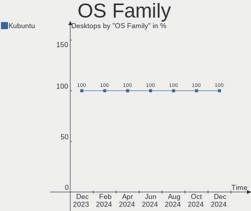
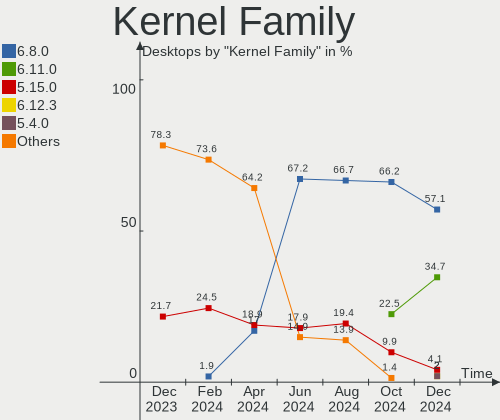
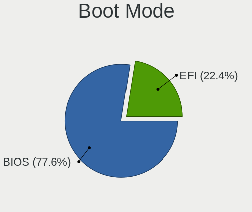
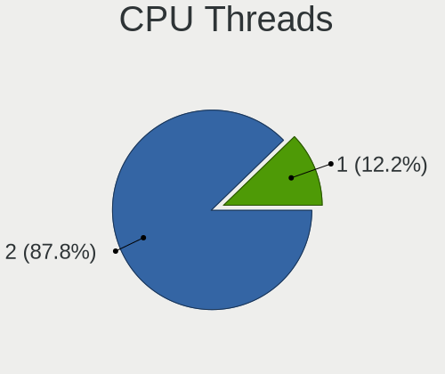

Kubuntu Hardware Trends (Desktops)
----------------------------------

A project to identify most popular hardware characteristics and track their change
over time based on data collected by Kubuntu users at https://Linux-Hardware.org.

Anyone can contribute to this report by the [hw-probe](https://github.com/linuxhw/hw-probe) tool:

    sudo -E hw-probe -all -upload

Full-feature report is available here: https://linux-hardware.org/?view=trends&formfactor=desktop

Period: Oct, 2021.

Contents
--------

* [ System ](#system)
  - [ OS                       ](#os)
  - [ OS Family                ](#os-family)
  - [ Kernel                   ](#kernel)
  - [ Kernel Family            ](#kernel-family)
  - [ Kernel Major Ver.        ](#kernel-major-ver)
  - [ Arch                     ](#arch)
  - [ DE                       ](#de)
  - [ Display Server           ](#display-server)
  - [ Display Manager          ](#display-manager)
  - [ OS Lang                  ](#os-lang)
  - [ Boot Mode                ](#boot-mode)
  - [ Filesystem               ](#filesystem)
  - [ Part. scheme             ](#part-scheme)
  - [ Dual Boot with Linux/BSD ](#dual-boot-with-linuxbsd)
  - [ Dual Boot (Win)          ](#dual-boot-win)

* [ Board ](#board)
  - [ Vendor                   ](#vendor)
  - [ Model                    ](#model)
  - [ Model Family             ](#model-family)
  - [ MFG Year                 ](#mfg-year)
  - [ Form Factor              ](#form-factor)
  - [ Secure Boot              ](#secure-boot)
  - [ Coreboot                 ](#coreboot)
  - [ RAM Size                 ](#ram-size)
  - [ RAM Used                 ](#ram-used)
  - [ Total Drives             ](#total-drives)
  - [ Has CD-ROM               ](#has-cd-rom)
  - [ Has Ethernet             ](#has-ethernet)
  - [ Has WiFi                 ](#has-wifi)
  - [ Has Bluetooth            ](#has-bluetooth)

* [ Location ](#location)
  - [ Country                  ](#country)
  - [ City                     ](#city)

* [ Drives ](#drives)
  - [ Drive Vendor             ](#drive-vendor)
  - [ Drive Model              ](#drive-model)
  - [ HDD Vendor               ](#hdd-vendor)
  - [ SSD Vendor               ](#ssd-vendor)
  - [ Drive Kind               ](#drive-kind)
  - [ Drive Connector          ](#drive-connector)
  - [ Drive Size               ](#drive-size)
  - [ Space Total              ](#space-total)
  - [ Space Used               ](#space-used)
  - [ Malfunc. Drives          ](#malfunc-drives)
  - [ Malfunc. Drive Vendor    ](#malfunc-drive-vendor)
  - [ Malfunc. HDD Vendor      ](#malfunc-hdd-vendor)
  - [ Malfunc. Drive Kind      ](#malfunc-drive-kind)
  - [ Failed Drives            ](#failed-drives)
  - [ Failed Drive Vendor      ](#failed-drive-vendor)
  - [ Drive Status             ](#drive-status)

* [ Storage controller ](#storage-controller)
  - [ Storage Vendor           ](#storage-vendor)
  - [ Storage Model            ](#storage-model)
  - [ Storage Kind             ](#storage-kind)

* [ Processor ](#processor)
  - [ CPU Vendor               ](#cpu-vendor)
  - [ CPU Model                ](#cpu-model)
  - [ CPU Model Family         ](#cpu-model-family)
  - [ CPU Cores                ](#cpu-cores)
  - [ CPU Sockets              ](#cpu-sockets)
  - [ CPU Threads              ](#cpu-threads)
  - [ CPU Op-Modes             ](#cpu-op-modes)
  - [ CPU Microcode            ](#cpu-microcode)
  - [ CPU Microarch            ](#cpu-microarch)

* [ Graphics ](#graphics)
  - [ GPU Vendor               ](#gpu-vendor)
  - [ GPU Model                ](#gpu-model)
  - [ GPU Combo                ](#gpu-combo)
  - [ GPU Driver               ](#gpu-driver)
  - [ GPU Memory               ](#gpu-memory)

* [ Monitor ](#monitor)
  - [ Monitor Vendor           ](#monitor-vendor)
  - [ Monitor Model            ](#monitor-model)
  - [ Monitor Resolution       ](#monitor-resolution)
  - [ Monitor Diagonal         ](#monitor-diagonal)
  - [ Monitor Width            ](#monitor-width)
  - [ Aspect Ratio             ](#aspect-ratio)
  - [ Monitor Area             ](#monitor-area)
  - [ Pixel Density            ](#pixel-density)
  - [ Multiple Monitors        ](#multiple-monitors)

* [ Network ](#network)
  - [ Net Controller Vendor    ](#net-controller-vendor)
  - [ Net Controller Model     ](#net-controller-model)
  - [ Wireless Vendor          ](#wireless-vendor)
  - [ Wireless Model           ](#wireless-model)
  - [ Ethernet Vendor          ](#ethernet-vendor)
  - [ Ethernet Model           ](#ethernet-model)
  - [ Net Controller Kind      ](#net-controller-kind)
  - [ Used Controller          ](#used-controller)
  - [ NICs                     ](#nics)
  - [ IPv6                     ](#ipv6)

* [ Bluetooth ](#bluetooth)
  - [ Bluetooth Vendor         ](#bluetooth-vendor)
  - [ Bluetooth Model          ](#bluetooth-model)

* [ Sound ](#sound)
  - [ Sound Vendor             ](#sound-vendor)
  - [ Sound Model              ](#sound-model)

* [ Memory ](#memory)
  - [ Memory Vendor            ](#memory-vendor)
  - [ Memory Model             ](#memory-model)
  - [ Memory Kind              ](#memory-kind)
  - [ Memory Form Factor       ](#memory-form-factor)
  - [ Memory Size              ](#memory-size)
  - [ Memory Speed             ](#memory-speed)

* [ Printers & scanners ](#printers--scanners)
  - [ Printer Vendor           ](#printer-vendor)
  - [ Printer Model            ](#printer-model)
  - [ Scanner Vendor           ](#scanner-vendor)
  - [ Scanner Model            ](#scanner-model)

* [ Camera ](#camera)
  - [ Camera Vendor            ](#camera-vendor)
  - [ Camera Model             ](#camera-model)

* [ Security ](#security)
  - [ Fingerprint Vendor       ](#fingerprint-vendor)
  - [ Fingerprint Model        ](#fingerprint-model)
  - [ Chipcard Vendor          ](#chipcard-vendor)
  - [ Chipcard Model           ](#chipcard-model)

* [ Unsupported ](#unsupported)
  - [ Unsupported Devices      ](#unsupported-devices)
  - [ Unsupported Device Types ](#unsupported-device-types)

System
------

OS
--

Installed operating systems

| Name          | Desktops | Percent |
|---------------|----------|---------|
| Kubuntu 20.04 | 20       | 58.82%  |
| Kubuntu 21.10 | 6        | 17.65%  |
| Kubuntu 21.04 | 4        | 11.76%  |
| Kubuntu 20.10 | 2        | 5.88%   |
| Kubuntu 18.04 | 1        | 2.94%   |
| Kubuntu       | 1        | 2.94%   |

OS Family
---------

OS without a version

| Name    | Desktops | Percent |
|---------|----------|---------|
| Kubuntu | 34       | 100%    |

Kernel
------

Version of the Linux kernel

| Version               | Desktops | Percent |
|-----------------------|----------|---------|
| 5.11.0-37-generic     | 14       | 41.18%  |
| 5.13.0-19-generic     | 4        | 11.76%  |
| 5.4.0-88-generic      | 3        | 8.82%   |
| 5.11.0-38-generic     | 3        | 8.82%   |
| 5.8.0-63-lowlatency   | 2        | 5.88%   |
| 5.13.0-20-generic     | 2        | 5.88%   |
| 5.8.18-050818-generic | 1        | 2.94%   |
| 5.8.0-63-generic      | 1        | 2.94%   |
| 5.8.0-50-generic      | 1        | 2.94%   |
| 5.6.15-050615-generic | 1        | 2.94%   |
| 5.4.0-87-generic      | 1        | 2.94%   |
| 5.14.10-mainline      | 1        | 2.94%   |

Kernel Family
-------------

Linux kernel without a distro release

| Version | Desktops | Percent |
|---------|----------|---------|
| 5.11.0  | 17       | 50%     |
| 5.13.0  | 6        | 17.65%  |
| 5.8.0   | 4        | 11.76%  |
| 5.4.0   | 4        | 11.76%  |
| 5.8.18  | 1        | 2.94%   |
| 5.6.15  | 1        | 2.94%   |
| 5.14.10 | 1        | 2.94%   |

Kernel Major Ver.
-----------------

Linux kernel major version

| Version | Desktops | Percent |
|---------|----------|---------|
| 5.11    | 17       | 50%     |
| 5.13    | 6        | 17.65%  |
| 5.8     | 5        | 14.71%  |
| 5.4     | 4        | 11.76%  |
| 5.6     | 1        | 2.94%   |
| 5.14    | 1        | 2.94%   |

Arch
----

OS architecture (x86_64, i586, etc.)

| Name   | Desktops | Percent |
|--------|----------|---------|
| x86_64 | 34       | 100%    |

DE
--

Desktop Environment

| Name | Desktops | Percent |
|------|----------|---------|
| KDE5 | 34       | 100%    |

Display Server
--------------

X11 or Wayland

| Name    | Desktops | Percent |
|---------|----------|---------|
| X11     | 32       | 94.12%  |
| Wayland | 1        | 2.94%   |
| Tty     | 1        | 2.94%   |

Display Manager
---------------

SDDM, LightDM, etc.

| Name    | Desktops | Percent |
|---------|----------|---------|
| SDDM    | 25       | 73.53%  |
| Unknown | 6        | 17.65%  |
| LightDM | 3        | 8.82%   |

OS Lang
-------

Language

| Lang  | Desktops | Percent |
|-------|----------|---------|
| en_US | 17       | 50%     |
| fr_FR | 3        | 8.82%   |
| en_GB | 3        | 8.82%   |
| ru_RU | 2        | 5.88%   |
| pt_BR | 2        | 5.88%   |
| zh_TW | 1        | 2.94%   |
| es_MX | 1        | 2.94%   |
| es_HN | 1        | 2.94%   |
| en_ZA | 1        | 2.94%   |
| en_CA | 1        | 2.94%   |
| en_AU | 1        | 2.94%   |
| de_DE | 1        | 2.94%   |

Boot Mode
---------

EFI or BIOS

| Mode | Desktops | Percent |
|------|----------|---------|
| BIOS | 20       | 58.82%  |
| EFI  | 14       | 41.18%  |

Filesystem
----------

Type of filesystem

| Type    | Desktops | Percent |
|---------|----------|---------|
| Ext4    | 29       | 85.29%  |
| Overlay | 2        | 5.88%   |
| Zfs     | 1        | 2.94%   |
| ExX4    | 1        | 2.94%   |
| Btrfs   | 1        | 2.94%   |

Part. scheme
------------

Scheme of partitioning

| Type    | Desktops | Percent |
|---------|----------|---------|
| GPT     | 16       | 47.06%  |
| Unknown | 13       | 38.24%  |
| MBR     | 5        | 14.71%  |

Dual Boot with Linux/BSD
------------------------

Hosting more than one Linux/BSD

| Dual boot | Desktops | Percent |
|-----------|----------|---------|
| No        | 32       | 94.12%  |
| Yes       | 2        | 5.88%   |

Dual Boot (Win)
---------------

Hosting Linux and Windows

| Dual boot | Desktops | Percent |
|-----------|----------|---------|
| Yes       | 17       | 50%     |
| No        | 17       | 50%     |

Board
-----

Vendor
------

Motherboard manufacturer

| Name                | Desktops | Percent |
|---------------------|----------|---------|
| Gigabyte Technology | 8        | 23.53%  |
| ASUSTek Computer    | 8        | 23.53%  |
| MSI                 | 6        | 17.65%  |
| ASRock              | 4        | 11.76%  |
| Lenovo              | 2        | 5.88%   |
| Intel               | 2        | 5.88%   |
| Hewlett-Packard     | 2        | 5.88%   |
| Fujitsu             | 1        | 2.94%   |
| Unknown             | 1        | 2.94%   |

Model
-----

Motherboard model

| Name                            | Desktops | Percent |
|---------------------------------|----------|---------|
| Gigabyte A320M-S2H V2           | 2        | 5.88%   |
| Gigabyte 970A-DS3P              | 2        | 5.88%   |
| ASUS PRIME B450M-A              | 2        | 5.88%   |
| MSI MS-7C37                     | 1        | 2.94%   |
| MSI MS-7C02                     | 1        | 2.94%   |
| MSI MS-7B93                     | 1        | 2.94%   |
| MSI MS-7A34                     | 1        | 2.94%   |
| MSI MS-7A32                     | 1        | 2.94%   |
| MSI MS-7788                     | 1        | 2.94%   |
| Lenovo ThinkCentre M71e 3157RV2 | 1        | 2.94%   |
| Lenovo H50-55 90BG003JUS        | 1        | 2.94%   |
| Intel DH67CL AAG10212-206       | 1        | 2.94%   |
| Intel D54250WYK H13922-303      | 1        | 2.94%   |
| HP Z440 Workstation             | 1        | 2.94%   |
| HP Pavilion Desktop TP01-1xxx   | 1        | 2.94%   |
| Gigabyte H55N-USB3              | 1        | 2.94%   |
| Gigabyte B450 AORUS ELITE       | 1        | 2.94%   |
| Gigabyte AX370-Gaming 5         | 1        | 2.94%   |
| Gigabyte A320M-S2H              | 1        | 2.94%   |
| Fujitsu ESPRIMO P2560           | 1        | 2.94%   |
| ASUS ROG STRIX X570-I GAMING    | 1        | 2.94%   |
| ASUS ROG STRIX X570-E GAMING    | 1        | 2.94%   |
| ASUS PRIME X570-P               | 1        | 2.94%   |
| ASUS PRIME B350M-A              | 1        | 2.94%   |
| ASUS PRIME B350-PLUS            | 1        | 2.94%   |
| ASUS H170M-PLUS                 | 1        | 2.94%   |
| ASRock Z370 Pro4                | 1        | 2.94%   |
| ASRock X570 Pro4                | 1        | 2.94%   |
| ASRock B550M Steel Legend       | 1        | 2.94%   |
| ASRock A520M-ITX/ac             | 1        | 2.94%   |
| Unknown                         | 1        | 2.94%   |

Model Family
------------

Motherboard model prefix

| Name                  | Desktops | Percent |
|-----------------------|----------|---------|
| ASUS PRIME            | 5        | 14.71%  |
| Gigabyte A320M-S2H    | 3        | 8.82%   |
| Gigabyte 970A-DS3P    | 2        | 5.88%   |
| ASUS ROG              | 2        | 5.88%   |
| MSI MS-7C37           | 1        | 2.94%   |
| MSI MS-7C02           | 1        | 2.94%   |
| MSI MS-7B93           | 1        | 2.94%   |
| MSI MS-7A34           | 1        | 2.94%   |
| MSI MS-7A32           | 1        | 2.94%   |
| MSI MS-7788           | 1        | 2.94%   |
| Lenovo ThinkCentre    | 1        | 2.94%   |
| Lenovo H50-55         | 1        | 2.94%   |
| Intel DH67CL          | 1        | 2.94%   |
| Intel D54250WYK       | 1        | 2.94%   |
| HP Z440               | 1        | 2.94%   |
| HP Pavilion           | 1        | 2.94%   |
| Gigabyte H55N-USB3    | 1        | 2.94%   |
| Gigabyte B450         | 1        | 2.94%   |
| Gigabyte AX370-Gaming | 1        | 2.94%   |
| Fujitsu ESPRIMO       | 1        | 2.94%   |
| ASUS H170M-PLUS       | 1        | 2.94%   |
| ASRock Z370           | 1        | 2.94%   |
| ASRock X570           | 1        | 2.94%   |
| ASRock B550M          | 1        | 2.94%   |
| ASRock A520M-ITX      | 1        | 2.94%   |
| Unknown               | 1        | 2.94%   |

MFG Year
--------

Motherboard manufacture year

| Year | Desktops | Percent |
|------|----------|---------|
| 2021 | 11       | 32.35%  |
| 2020 | 6        | 17.65%  |
| 2019 | 5        | 14.71%  |
| 2016 | 3        | 8.82%   |
| 2011 | 3        | 8.82%   |
| 2018 | 2        | 5.88%   |
| 2010 | 2        | 5.88%   |
| 2013 | 1        | 2.94%   |
| 2012 | 1        | 2.94%   |

Form Factor
-----------

Physical design of the computer

| Name    | Desktops | Percent |
|---------|----------|---------|
| Desktop | 34       | 100%    |

Secure Boot
-----------

Enabled or disabled

| State    | Desktops | Percent |
|----------|----------|---------|
| Disabled | 33       | 97.06%  |
| Enabled  | 1        | 2.94%   |

Coreboot
--------

Have coreboot on board

| Used | Desktops | Percent |
|------|----------|---------|
| No   | 34       | 100%    |

RAM Size
--------

Total RAM memory

| Size in GB  | Desktops | Percent |
|-------------|----------|---------|
| 16.01-24.0  | 12       | 35.29%  |
| 32.01-64.0  | 7        | 20.59%  |
| 8.01-16.0   | 5        | 14.71%  |
| 24.01-32.0  | 3        | 8.82%   |
| 4.01-8.0    | 2        | 5.88%   |
| 3.01-4.0    | 2        | 5.88%   |
| 64.01-256.0 | 2        | 5.88%   |
| 1.01-2.0    | 1        | 2.94%   |

RAM Used
--------

Used RAM memory

| Used GB    | Desktops | Percent |
|------------|----------|---------|
| 4.01-8.0   | 10       | 29.41%  |
| 2.01-3.0   | 10       | 29.41%  |
| 3.01-4.0   | 6        | 17.65%  |
| 1.01-2.0   | 4        | 11.76%  |
| 8.01-16.0  | 3        | 8.82%   |
| 24.01-32.0 | 1        | 2.94%   |

Total Drives
------------

Number of drives on board

| Drives | Desktops | Percent |
|--------|----------|---------|
| 1      | 9        | 26.47%  |
| 3      | 7        | 20.59%  |
| 2      | 7        | 20.59%  |
| 4      | 5        | 14.71%  |
| 5      | 4        | 11.76%  |
| 6      | 2        | 5.88%   |

Has CD-ROM
----------

Has CD-ROM on board

| Presented | Desktops | Percent |
|-----------|----------|---------|
| No        | 22       | 64.71%  |
| Yes       | 12       | 35.29%  |

Has Ethernet
------------

Has Ethernet on board

| Presented | Desktops | Percent |
|-----------|----------|---------|
| Yes       | 33       | 97.06%  |
| No        | 1        | 2.94%   |

Has WiFi
--------

Has WiFi module

| Presented | Desktops | Percent |
|-----------|----------|---------|
| No        | 21       | 61.76%  |
| Yes       | 13       | 38.24%  |

Has Bluetooth
-------------

Has Bluetooth module

| Presented | Desktops | Percent |
|-----------|----------|---------|
| No        | 21       | 61.76%  |
| Yes       | 13       | 38.24%  |

Location
--------

Country
-------

Geographic location (country)

| Country      | Desktops | Percent |
|--------------|----------|---------|
| USA          | 7        | 20.59%  |
| France       | 4        | 11.76%  |
| UK           | 3        | 8.82%   |
| Brazil       | 3        | 8.82%   |
| Ukraine      | 2        | 5.88%   |
| Russia       | 2        | 5.88%   |
| Germany      | 2        | 5.88%   |
| Taiwan       | 1        | 2.94%   |
| Sweden       | 1        | 2.94%   |
| South Africa | 1        | 2.94%   |
| Norway       | 1        | 2.94%   |
| Mexico       | 1        | 2.94%   |
| Hungary      | 1        | 2.94%   |
| Honduras     | 1        | 2.94%   |
| Canada       | 1        | 2.94%   |
| Austria      | 1        | 2.94%   |
| Australia    | 1        | 2.94%   |
| Argentina    | 1        | 2.94%   |

City
----

Geographic location (city)

| City                      | Desktops | Percent |
|---------------------------|----------|---------|
| Odessa                    | 2        | 5.88%   |
| Xalapa                    | 1        | 2.94%   |
| Wyoming                   | 1        | 2.94%   |
| Westmead                  | 1        | 2.94%   |
| Wallenhorst               | 1        | 2.94%   |
| Vienna                    | 1        | 2.94%   |
| Usol'ye-Sibirskoye        | 1        | 2.94%   |
| Uppsala                   | 1        | 2.94%   |
| Tegucigalpa               | 1        | 2.94%   |
| Taoyuan District          | 1        | 2.94%   |
| Tambau                    | 1        | 2.94%   |
| Solon                     | 1        | 2.94%   |
| S??o Carlos               | 1        | 2.94%   |
| Santo Andr?©              | 1        | 2.94%   |
| Saint-Hilaire-de-Brethmas | 1        | 2.94%   |
| Recklinghausen            | 1        | 2.94%   |
| R??ros                    | 1        | 2.94%   |
| Pretoria                  | 1        | 2.94%   |
| Owensboro                 | 1        | 2.94%   |
| Orange                    | 1        | 2.94%   |
| Novosibirsk               | 1        | 2.94%   |
| Los Angeles               | 1        | 2.94%   |
| London                    | 1        | 2.94%   |
| Kelowna                   | 1        | 2.94%   |
| Helena                    | 1        | 2.94%   |
| Hackney                   | 1        | 2.94%   |
| Chadrac                   | 1        | 2.94%   |
| Cardiff                   | 1        | 2.94%   |
| Buenos Aires              | 1        | 2.94%   |
| Budapest                  | 1        | 2.94%   |
| Bradenton                 | 1        | 2.94%   |
| Bethany                   | 1        | 2.94%   |
| ?‰lancourt                | 1        | 2.94%   |

Drives
------

Drive Vendor
------------

Hard drive vendors

| Vendor              | Desktops | Drives | Percent |
|---------------------|----------|--------|---------|
| Samsung Electronics | 14       | 23     | 19.18%  |
| Seagate             | 13       | 16     | 17.81%  |
| WDC                 | 9        | 17     | 12.33%  |
| Kingston            | 6        | 6      | 8.22%   |
| Toshiba             | 5        | 6      | 6.85%   |
| Hitachi             | 3        | 3      | 4.11%   |
| Crucial             | 3        | 3      | 4.11%   |
| China               | 3        | 3      | 4.11%   |
| Intel               | 2        | 4      | 2.74%   |
| Unknown             | 1        | 1      | 1.37%   |
| Transcend           | 1        | 1      | 1.37%   |
| Team                | 1        | 1      | 1.37%   |
| Super Talent        | 1        | 1      | 1.37%   |
| STM                 | 1        | 1      | 1.37%   |
| PLEXTOR             | 1        | 1      | 1.37%   |
| Micron Technology   | 1        | 1      | 1.37%   |
| MAXTOR              | 1        | 1      | 1.37%   |
| KIOXIA              | 1        | 1      | 1.37%   |
| KingSpec            | 1        | 1      | 1.37%   |
| JMicron             | 1        | 1      | 1.37%   |
| HGST                | 1        | 1      | 1.37%   |
| Gigabyte Technology | 1        | 1      | 1.37%   |
| AEGO                | 1        | 1      | 1.37%   |
| A-DATA Technology   | 1        | 1      | 1.37%   |

Drive Model
-----------

Hard drive models

| Model                                    | Desktops | Percent |
|------------------------------------------|----------|---------|
| Seagate ST2000DM001-1ER164 2TB           | 3        | 3.3%    |
| Samsung SSD 860 EVO 1TB                  | 3        | 3.3%    |
| Toshiba HDWD110 1TB                      | 2        | 2.2%    |
| Seagate ST2000DM008-2FR102 2TB           | 2        | 2.2%    |
| Seagate ST1000DM003-1ER162 1TB           | 2        | 2.2%    |
| Samsung SSD 840 EVO 250GB                | 2        | 2.2%    |
| Samsung NVMe SSD Drive 500GB             | 2        | 2.2%    |
| Samsung NVMe SSD Drive 1TB               | 2        | 2.2%    |
| WDC WDS240G2G0A-00JH30 240GB SSD         | 1        | 1.1%    |
| WDC WD5000AAKS-00A7B0 500GB              | 1        | 1.1%    |
| WDC WD40PURZ-85AKKY0 4TB                 | 1        | 1.1%    |
| WDC WD40EZAZ-00SF3B0 4TB                 | 1        | 1.1%    |
| WDC WD30PURX-64P6ZY0 3TB                 | 1        | 1.1%    |
| WDC WD30EZRZ-00Z5HB0 3TB                 | 1        | 1.1%    |
| WDC WD20EFRX-68EUZN0 2TB                 | 1        | 1.1%    |
| WDC WD20EARX-008FB0 2TB                  | 1        | 1.1%    |
| WDC WD20EARS-00MVWB0 2TB                 | 1        | 1.1%    |
| WDC WD2003FZEX-00SRLA0 2TB               | 1        | 1.1%    |
| WDC WD10EZEX-75WN4A0 1TB                 | 1        | 1.1%    |
| WDC WD10EZEX-00WN4A0 1TB                 | 1        | 1.1%    |
| WDC WD10EARS-00MVWB0 1TB                 | 1        | 1.1%    |
| Unknown TPH00500500GB 80                 | 1        | 1.1%    |
| Transcend TS256GMTE220S 256GB            | 1        | 1.1%    |
| Toshiba MK7575GSX 752GB                  | 1        | 1.1%    |
| Toshiba HDWD240 4TB                      | 1        | 1.1%    |
| Toshiba HDWD120 2TB                      | 1        | 1.1%    |
| Team T2535T120G 120GB SSD                | 1        | 1.1%    |
| Super Talent FTM56N325H 256GB SSD        | 1        | 1.1%    |
| STM STLINK 3MB                           | 1        | 1.1%    |
| Seagate ST500DM005 HD502HJ 500GB         | 1        | 1.1%    |
| Seagate ST4000DM004-2CV104 4TB           | 1        | 1.1%    |
| Seagate ST3000DM008-2DM166 3TB           | 1        | 1.1%    |
| Seagate ST3000DM001-1ER166 3TB           | 1        | 1.1%    |
| Seagate ST2000VN004-2E4164 2TB           | 1        | 1.1%    |
| Seagate ST2000DM001-1CH164 2TB           | 1        | 1.1%    |
| Seagate ST2000DL003-9VT166 2TB           | 1        | 1.1%    |
| Seagate ST1000LM024 HN-M101MBB 1TB       | 1        | 1.1%    |
| Seagate ST1000DM010-2EP102 1TB           | 1        | 1.1%    |
| Samsung SSD PM830 2.5 7mm 128GB          | 1        | 1.1%    |
| Samsung SSD 970 EVO Plus 500GB           | 1        | 1.1%    |
| Samsung SSD 970 EVO Plus 1TB             | 1        | 1.1%    |
| Samsung SSD 970 EVO 500GB                | 1        | 1.1%    |
| Samsung SSD 970 EVO 250GB                | 1        | 1.1%    |
| Samsung SSD 870 QVO 1TB                  | 1        | 1.1%    |
| Samsung SSD 860 QVO 1TB                  | 1        | 1.1%    |
| Samsung SSD 850 PRO 512GB                | 1        | 1.1%    |
| Samsung NVMe SSD Drive 256GB             | 1        | 1.1%    |
| Samsung MZ7LF192HCGS-000L1 192GB SSD     | 1        | 1.1%    |
| Samsung MZ7GE240HMGR-00003 240GB SSD     | 1        | 1.1%    |
| Samsung HD753LJ 752GB                    | 1        | 1.1%    |
| Samsung HD502IJ 500GB                    | 1        | 1.1%    |
| Samsung HD161GJ 160GB                    | 1        | 1.1%    |
| PLEXTOR PX-256S3C 256GB SSD              | 1        | 1.1%    |
| Micron MTFDDAK256MBF-1AN1ZABHA 256GB SSD | 1        | 1.1%    |
| MAXTOR STM380215AS 80GB                  | 1        | 1.1%    |
| KIOXIA KXG60ZNV256G 256GB                | 1        | 1.1%    |
| Kingston SV300S37A120G 120GB SSD         | 1        | 1.1%    |
| Kingston SUV400S37240G 240GB SSD         | 1        | 1.1%    |
| Kingston SUV300S37A120G 120GB SSD        | 1        | 1.1%    |
| Kingston SHSS37A240G 240GB SSD           | 1        | 1.1%    |

HDD Vendor
----------

Hard disk drive vendors

| Vendor              | Desktops | Drives | Percent |
|---------------------|----------|--------|---------|
| Seagate             | 13       | 16     | 37.14%  |
| WDC                 | 9        | 16     | 25.71%  |
| Toshiba             | 5        | 6      | 14.29%  |
| Samsung Electronics | 3        | 3      | 8.57%   |
| Hitachi             | 3        | 3      | 8.57%   |
| MAXTOR              | 1        | 1      | 2.86%   |
| HGST                | 1        | 1      | 2.86%   |

SSD Vendor
----------

Solid state drive vendors

| Vendor              | Desktops | Drives | Percent |
|---------------------|----------|--------|---------|
| Samsung Electronics | 9        | 11     | 31.03%  |
| Kingston            | 6        | 6      | 20.69%  |
| Crucial             | 3        | 3      | 10.34%  |
| China               | 3        | 3      | 10.34%  |
| WDC                 | 1        | 1      | 3.45%   |
| Team                | 1        | 1      | 3.45%   |
| Super Talent        | 1        | 1      | 3.45%   |
| PLEXTOR             | 1        | 1      | 3.45%   |
| Micron Technology   | 1        | 1      | 3.45%   |
| KingSpec            | 1        | 1      | 3.45%   |
| Intel               | 1        | 2      | 3.45%   |
| AEGO                | 1        | 1      | 3.45%   |

Drive Kind
----------

HDD or SSD

| Kind    | Desktops | Drives | Percent |
|---------|----------|--------|---------|
| SSD     | 23       | 32     | 37.7%   |
| HDD     | 23       | 46     | 37.7%   |
| NVMe    | 12       | 15     | 19.67%  |
| Unknown | 3        | 3      | 4.92%   |

Drive Connector
---------------

SATA, SAS, NVMe, etc.

| Type | Desktops | Drives | Percent |
|------|----------|--------|---------|
| SATA | 32       | 79     | 69.57%  |
| NVMe | 12       | 15     | 26.09%  |
| SAS  | 2        | 2      | 4.35%   |

Drive Size
----------

Size of hard drive

| Size in TB | Desktops | Drives | Percent |
|------------|----------|--------|---------|
| 0.01-0.5   | 21       | 28     | 36.21%  |
| 0.51-1.0   | 16       | 21     | 27.59%  |
| 1.01-2.0   | 13       | 19     | 22.41%  |
| 3.01-4.0   | 4        | 6      | 6.9%    |
| 2.01-3.0   | 4        | 4      | 6.9%    |

Space Total
-----------

Amount of disk space available on the file system

| Size in GB     | Desktops | Percent |
|----------------|----------|---------|
| More than 3000 | 7        | 20.59%  |
| 1001-2000      | 7        | 20.59%  |
| 101-250        | 6        | 17.65%  |
| 1-20           | 4        | 11.76%  |
| 501-1000       | 4        | 11.76%  |
| 251-500        | 3        | 8.82%   |
| 2001-3000      | 3        | 8.82%   |

Space Used
----------

Amount of used disk space

| Used GB        | Desktops | Percent |
|----------------|----------|---------|
| 501-1000       | 10       | 29.41%  |
| 1-20           | 6        | 17.65%  |
| More than 3000 | 5        | 14.71%  |
| 51-100         | 4        | 11.76%  |
| 251-500        | 3        | 8.82%   |
| 21-50          | 2        | 5.88%   |
| 101-250        | 2        | 5.88%   |
| 2001-3000      | 1        | 2.94%   |
| 1001-2000      | 1        | 2.94%   |

Malfunc. Drives
---------------

Drive models with a malfunction

| Model                       | Desktops | Drives | Percent |
|-----------------------------|----------|--------|---------|
| WDC WD5000AAKS-00A7B0 500GB | 1        | 1      | 16.67%  |
| WDC WD30PURX-64P6ZY0 3TB    | 1        | 1      | 16.67%  |
| WDC WD20EARX-008FB0 2TB     | 1        | 1      | 16.67%  |
| Intel SSDPEKKW512G7 512GB   | 1        | 1      | 16.67%  |
| Intel SSDPEKKW256G7 256GB   | 1        | 1      | 16.67%  |
| Hitachi HDS723020BLA642 2TB | 1        | 1      | 16.67%  |

Malfunc. Drive Vendor
---------------------

Vendors of faulty drives

| Vendor  | Desktops | Drives | Percent |
|---------|----------|--------|---------|
| WDC     | 3        | 3      | 50%     |
| Intel   | 2        | 2      | 33.33%  |
| Hitachi | 1        | 1      | 16.67%  |

Malfunc. HDD Vendor
-------------------

Vendors of faulty HDD drives

| Vendor  | Desktops | Drives | Percent |
|---------|----------|--------|---------|
| WDC     | 3        | 3      | 75%     |
| Hitachi | 1        | 1      | 25%     |

Malfunc. Drive Kind
-------------------

Kinds of faulty drives

| Kind | Desktops | Drives | Percent |
|------|----------|--------|---------|
| HDD  | 3        | 4      | 60%     |
| NVMe | 2        | 2      | 40%     |

Failed Drives
-------------

Failed drive models

Zero info for selected period =(

Failed Drive Vendor
-------------------

Failed drive vendors

Zero info for selected period =(

Drive Status
------------

Number of failed and malfunc. drives

| Status   | Desktops | Drives | Percent |
|----------|----------|--------|---------|
| Works    | 21       | 48     | 51.22%  |
| Detected | 15       | 42     | 36.59%  |
| Malfunc  | 5        | 6      | 12.2%   |

Storage controller
------------------

Storage Vendor
--------------

Storage controller vendors

| Vendor                       | Desktops | Percent |
|------------------------------|----------|---------|
| AMD                          | 23       | 46.94%  |
| Intel                        | 13       | 26.53%  |
| Samsung Electronics          | 6        | 12.24%  |
| ASMedia Technology           | 2        | 4.08%   |
| Toshiba America Info Systems | 1        | 2.04%   |
| Silicon Motion               | 1        | 2.04%   |
| Realtek Semiconductor        | 1        | 2.04%   |
| Phison Electronics           | 1        | 2.04%   |
| Marvell Technology Group     | 1        | 2.04%   |

Storage Model
-------------

Storage controller models

| Model                                                                                   | Desktops | Percent |
|-----------------------------------------------------------------------------------------|----------|---------|
| AMD FCH SATA Controller [AHCI mode]                                                     | 17       | 25.76%  |
| Samsung NVMe SSD Controller SM981/PM981/PM983                                           | 6        | 9.09%   |
| AMD 300 Series Chipset SATA Controller                                                  | 5        | 7.58%   |
| AMD 400 Series Chipset SATA Controller                                                  | 4        | 6.06%   |
| Intel SSD 600P Series                                                                   | 2        | 3.03%   |
| Intel NM10/ICH7 Family SATA Controller [IDE mode]                                       | 2        | 3.03%   |
| Intel 6 Series/C200 Series Chipset Family 6 port Desktop SATA AHCI Controller           | 2        | 3.03%   |
| ASMedia ASM1062 Serial ATA Controller                                                   | 2        | 3.03%   |
| AMD X370 Series Chipset SATA Controller                                                 | 2        | 3.03%   |
| AMD Starship/Matisse Chipset SATA Controller [AHCI mode]                                | 2        | 3.03%   |
| AMD SB7x0/SB8x0/SB9x0 SATA Controller [AHCI mode]                                       | 2        | 3.03%   |
| AMD SB7x0/SB8x0/SB9x0 IDE Controller                                                    | 2        | 3.03%   |
| Toshiba America Info Systems XG6 NVMe SSD Controller                                    | 1        | 1.52%   |
| Silicon Motion SM2262/SM2262EN SSD Controller                                           | 1        | 1.52%   |
| Samsung NVMe SSD Controller SM961/PM961/SM963                                           | 1        | 1.52%   |
| Samsung NVMe SSD Controller PM9A1/PM9A3/980PRO                                          | 1        | 1.52%   |
| Realtek RTS5763DL NVMe SSD Controller                                                   | 1        | 1.52%   |
| Phison E16 PCIe4 NVMe Controller                                                        | 1        | 1.52%   |
| Marvell Group 88SE9215 PCIe 2.0 x1 4-port SATA 6 Gb/s Controller                        | 1        | 1.52%   |
| Intel SATA Controller [RAID mode]                                                       | 1        | 1.52%   |
| Intel Q170/Q150/B150/H170/H110/Z170/CM236 Chipset SATA Controller [AHCI Mode]           | 1        | 1.52%   |
| Intel C610/X99 series chipset sSATA Controller [RAID mode]                              | 1        | 1.52%   |
| Intel C600/X79 series chipset SATA RAID Controller                                      | 1        | 1.52%   |
| Intel 82801G (ICH7 Family) IDE Controller                                               | 1        | 1.52%   |
| Intel 8 Series SATA Controller 1 [AHCI mode]                                            | 1        | 1.52%   |
| Intel 6 Series/C200 Series Chipset Family Desktop SATA Controller (IDE mode, ports 4-5) | 1        | 1.52%   |
| Intel 6 Series/C200 Series Chipset Family Desktop SATA Controller (IDE mode, ports 0-3) | 1        | 1.52%   |
| Intel 5 Series/3400 Series Chipset 6 port SATA AHCI Controller                          | 1        | 1.52%   |
| Intel 200 Series PCH SATA controller [AHCI mode]                                        | 1        | 1.52%   |
| AMD FCH SATA Controller D                                                               | 1        | 1.52%   |

Storage Kind
------------

Kind of storage controller (IDE, SATA, NVMe, SAS, ...)

| Kind | Desktops | Percent |
|------|----------|---------|
| SATA | 29       | 60.42%  |
| NVMe | 12       | 25%     |
| IDE  | 5        | 10.42%  |
| RAID | 2        | 4.17%   |

Processor
---------

CPU Vendor
----------

Processor vendors

| Vendor | Desktops | Percent |
|--------|----------|---------|
| AMD    | 23       | 67.65%  |
| Intel  | 11       | 32.35%  |

CPU Model
---------

Processor models

| Model                                          | Desktops | Percent |
|------------------------------------------------|----------|---------|
| AMD Ryzen 5 3600 6-Core Processor              | 3        | 8.82%   |
| AMD Ryzen 9 3900X 12-Core Processor            | 2        | 5.88%   |
| AMD Ryzen 5 5600X 6-Core Processor             | 2        | 5.88%   |
| AMD Ryzen 5 1600 Six-Core Processor            | 2        | 5.88%   |
| Intel Xeon CPU X5450 @ 3.00GHz                 | 1        | 2.94%   |
| Intel Xeon CPU E5-1650 v3 @ 3.50GHz            | 1        | 2.94%   |
| Intel Pentium Dual-Core CPU E5800 @ 3.20GHz    | 1        | 2.94%   |
| Intel Pentium CPU G630 @ 2.70GHz               | 1        | 2.94%   |
| Intel Core i7-2600 CPU @ 3.40GHz               | 1        | 2.94%   |
| Intel Core i7-10700 CPU @ 2.90GHz              | 1        | 2.94%   |
| Intel Core i5-9600K CPU @ 3.70GHz              | 1        | 2.94%   |
| Intel Core i5-6400 CPU @ 2.70GHz               | 1        | 2.94%   |
| Intel Core i5-4250U CPU @ 1.30GHz              | 1        | 2.94%   |
| Intel Core i3-2100 CPU @ 3.10GHz               | 1        | 2.94%   |
| Intel Core i3 CPU 540 @ 3.07GHz                | 1        | 2.94%   |
| AMD Ryzen 9 3950X 16-Core Processor            | 1        | 2.94%   |
| AMD Ryzen 7 5800X 8-Core Processor             | 1        | 2.94%   |
| AMD Ryzen 7 3800X 8-Core Processor             | 1        | 2.94%   |
| AMD Ryzen 7 3700X 8-Core Processor             | 1        | 2.94%   |
| AMD Ryzen 7 1800X Eight-Core Processor         | 1        | 2.94%   |
| AMD Ryzen 7 1700 Eight-Core Processor          | 1        | 2.94%   |
| AMD Ryzen 5 3600X 6-Core Processor             | 1        | 2.94%   |
| AMD Ryzen 5 3400G with Radeon Vega Graphics    | 1        | 2.94%   |
| AMD Ryzen 5 2400G with Radeon Vega Graphics    | 1        | 2.94%   |
| AMD Ryzen 3 2200G with Radeon Vega Graphics    | 1        | 2.94%   |
| AMD FX-8350 Eight-Core Processor               | 1        | 2.94%   |
| AMD FX-8300 Eight-Core Processor               | 1        | 2.94%   |
| AMD A10-9700 RADEON R7, 10 COMPUTE CORES 4C+6G | 1        | 2.94%   |
| AMD A10-7800 Radeon R7, 12 Compute Cores 4C+8G | 1        | 2.94%   |

CPU Model Family
----------------

Processor model prefix

| Model                   | Desktops | Percent |
|-------------------------|----------|---------|
| AMD Ryzen 5             | 10       | 29.41%  |
| AMD Ryzen 7             | 5        | 14.71%  |
| Intel Core i5           | 3        | 8.82%   |
| AMD Ryzen 9             | 3        | 8.82%   |
| Intel Xeon              | 2        | 5.88%   |
| Intel Core i7           | 2        | 5.88%   |
| Intel Core i3           | 2        | 5.88%   |
| AMD FX                  | 2        | 5.88%   |
| AMD A10                 | 2        | 5.88%   |
| Intel Pentium Dual-Core | 1        | 2.94%   |
| Intel Pentium           | 1        | 2.94%   |
| AMD Ryzen 3             | 1        | 2.94%   |

CPU Cores
---------

Number of processor cores

| Number | Desktops | Percent |
|--------|----------|---------|
| 6      | 10       | 29.41%  |
| 4      | 8        | 23.53%  |
| 2      | 7        | 20.59%  |
| 8      | 6        | 17.65%  |
| 12     | 2        | 5.88%   |
| 16     | 1        | 2.94%   |

CPU Sockets
-----------

Number of sockets

| Number | Desktops | Percent |
|--------|----------|---------|
| 1      | 34       | 100%    |

CPU Threads
-----------

Threads per core (Hyper-Threading)

| Number | Desktops | Percent |
|--------|----------|---------|
| 2      | 28       | 82.35%  |
| 1      | 6        | 17.65%  |

CPU Op-Modes
------------

CPU Operation Modes (32-bit, 64-bit)

| Op mode        | Desktops | Percent |
|----------------|----------|---------|
| 32-bit, 64-bit | 34       | 100%    |

CPU Microcode
-------------

Microcode number

| Number     | Desktops | Percent |
|------------|----------|---------|
| Unknown    | 11       | 32.35%  |
| 0x08701021 | 6        | 17.65%  |
| 0x206a7    | 3        | 8.82%   |
| 0x08001138 | 2        | 5.88%   |
| 0xa0655    | 1        | 2.94%   |
| 0x906ec    | 1        | 2.94%   |
| 0x40651    | 1        | 2.94%   |
| 0x306f2    | 1        | 2.94%   |
| 0x20655    | 1        | 2.94%   |
| 0x10676    | 1        | 2.94%   |
| 0x0a201016 | 1        | 2.94%   |
| 0x08701013 | 1        | 2.94%   |
| 0x08101016 | 1        | 2.94%   |
| 0x08001137 | 1        | 2.94%   |
| 0x06003106 | 1        | 2.94%   |
| 0x06000852 | 1        | 2.94%   |

CPU Microarch
-------------

Microarchitecture

| Name        | Desktops | Percent |
|-------------|----------|---------|
| Zen 2       | 9        | 26.47%  |
| Zen         | 5        | 14.71%  |
| Zen 3       | 3        | 8.82%   |
| SandyBridge | 3        | 8.82%   |
| Zen+        | 2        | 5.88%   |
| Piledriver  | 2        | 5.88%   |
| Penryn      | 2        | 5.88%   |
| Haswell     | 2        | 5.88%   |
| Westmere    | 1        | 2.94%   |
| Steamroller | 1        | 2.94%   |
| Skylake     | 1        | 2.94%   |
| KabyLake    | 1        | 2.94%   |
| Excavator   | 1        | 2.94%   |
| CometLake   | 1        | 2.94%   |

Graphics
--------

GPU Vendor
----------

Vendors of graphics cards

| Vendor | Desktops | Percent |
|--------|----------|---------|
| AMD    | 16       | 43.24%  |
| Nvidia | 15       | 40.54%  |
| Intel  | 6        | 16.22%  |

GPU Model
---------

Graphics card models

| Model                                                                     | Desktops | Percent |
|---------------------------------------------------------------------------|----------|---------|
| Nvidia TU116 [GeForce GTX 1660]                                           | 2        | 5.41%   |
| Nvidia GP108 [GeForce GT 1030]                                            | 2        | 5.41%   |
| AMD Vega 10 XL/XT [Radeon RX Vega 56/64]                                  | 2        | 5.41%   |
| AMD Navi 21 [Radeon RX 6800/6800 XT / 6900 XT]                            | 2        | 5.41%   |
| AMD Navi 10 [Radeon RX 5600 OEM/5600 XT / 5700/5700 XT]                   | 2        | 5.41%   |
| Nvidia TU106 [GeForce RTX 2060 Rev. A]                                    | 1        | 2.7%    |
| Nvidia GP106 [GeForce GTX 1060 6GB]                                       | 1        | 2.7%    |
| Nvidia GP104 [GeForce GTX 1070]                                           | 1        | 2.7%    |
| Nvidia GM107GL [Quadro K620]                                              | 1        | 2.7%    |
| Nvidia GM107GL [Quadro K2200]                                             | 1        | 2.7%    |
| Nvidia GK110BGL [Tesla K40m]                                              | 1        | 2.7%    |
| Nvidia GK107 [GeForce GTX 650]                                            | 1        | 2.7%    |
| Nvidia GF119 [GeForce GT 610]                                             | 1        | 2.7%    |
| Nvidia GF108 [GeForce GT 430]                                             | 1        | 2.7%    |
| Nvidia GA102 [GeForce RTX 3080 Ti]                                        | 1        | 2.7%    |
| Nvidia G92 [GeForce 8800 GT]                                              | 1        | 2.7%    |
| Intel HD Graphics 530                                                     | 1        | 2.7%    |
| Intel Haswell-ULT Integrated Graphics Controller                          | 1        | 2.7%    |
| Intel Core Processor Integrated Graphics Controller                       | 1        | 2.7%    |
| Intel CometLake-S GT2 [UHD Graphics 630]                                  | 1        | 2.7%    |
| Intel 4 Series Chipset Integrated Graphics Controller                     | 1        | 2.7%    |
| Intel 2nd Generation Core Processor Family Integrated Graphics Controller | 1        | 2.7%    |
| AMD Wani [Radeon R5/R6/R7 Graphics]                                       | 1        | 2.7%    |
| AMD Tahiti PRO [Radeon HD 7950/8950 OEM / R9 280]                         | 1        | 2.7%    |
| AMD Oland PRO [Radeon R7 240/340]                                         | 1        | 2.7%    |
| AMD Navi 23 WKS-XL [Radeon PRO W6600]                                     | 1        | 2.7%    |
| AMD Navi 22 [Radeon RX 6700/6700 XT / 6800M]                              | 1        | 2.7%    |
| AMD Kaveri [Radeon R7 Graphics]                                           | 1        | 2.7%    |
| AMD Hawaii PRO [Radeon R9 290/390]                                        | 1        | 2.7%    |
| AMD Curacao XT / Trinidad XT [Radeon R7 370 / R9 270X/370X]               | 1        | 2.7%    |
| AMD Baffin [Radeon RX 550 640SP / RX 560/560X]                            | 1        | 2.7%    |
| AMD Baffin [Radeon RX 460/560D / Pro 450/455/460/555/555X/560/560X]       | 1        | 2.7%    |

GPU Combo
---------

Combinations of graphics cards

| Name           | Desktops | Percent |
|----------------|----------|---------|
| 1 x AMD        | 14       | 41.18%  |
| 1 x Nvidia     | 12       | 35.29%  |
| 1 x Intel      | 5        | 14.71%  |
| AMD + Nvidia   | 2        | 5.88%   |
| Intel + Nvidia | 1        | 2.94%   |

GPU Driver
----------

Free vs proprietary

| Driver      | Desktops | Percent |
|-------------|----------|---------|
| Free        | 20       | 58.82%  |
| Proprietary | 14       | 41.18%  |

GPU Memory
----------

Total video memory

| Size in GB | Desktops | Percent |
|------------|----------|---------|
| Unknown    | 12       | 35.29%  |
| 7.01-8.0   | 5        | 14.71%  |
| 5.01-6.0   | 4        | 11.76%  |
| 3.01-4.0   | 4        | 11.76%  |
| 8.01-16.0  | 3        | 8.82%   |
| 1.01-2.0   | 2        | 5.88%   |
| 0.51-1.0   | 2        | 5.88%   |
| 2.01-3.0   | 1        | 2.94%   |
| 0.01-0.5   | 1        | 2.94%   |

Monitor
-------

Monitor Vendor
--------------

Monitor vendors

| Vendor               | Desktops | Percent |
|----------------------|----------|---------|
| Samsung Electronics  | 7        | 15.22%  |
| Dell                 | 5        | 10.87%  |
| Goldstar             | 4        | 8.7%    |
| AOC                  | 4        | 8.7%    |
| Acer                 | 4        | 8.7%    |
| Ancor Communications | 3        | 6.52%   |
| HannStar             | 2        | 4.35%   |
| BenQ                 | 2        | 4.35%   |
| Unknown (XXX)        | 1        | 2.17%   |
| Unknown              | 1        | 2.17%   |
| Sony                 | 1        | 2.17%   |
| SHARP                | 1        | 2.17%   |
| Sceptre Tech         | 1        | 2.17%   |
| SAC                  | 1        | 2.17%   |
| Philips              | 1        | 2.17%   |
| ONN                  | 1        | 2.17%   |
| MSI                  | 1        | 2.17%   |
| LG Electronics       | 1        | 2.17%   |
| Iiyama               | 1        | 2.17%   |
| HJW                  | 1        | 2.17%   |
| HCG                  | 1        | 2.17%   |
| CTX                  | 1        | 2.17%   |
| ASUSTek Computer     | 1        | 2.17%   |

Monitor Model
-------------

Monitor models

| Model                                                                 | Desktops | Percent |
|-----------------------------------------------------------------------|----------|---------|
| Goldstar LG ULTRAWIDE GSM59F1 1920x1080 580x240mm 24.7-inch           | 2        | 4.08%   |
| Unknown LCD Monitor SAMSUNG                                           | 1        | 2.04%   |
| Unknown (XXX) Beyond TV XXX2851 3840x2160 1209x680mm 54.6-inch        | 1        | 2.04%   |
| Sony TV SNYEE01 1920x1080 1600x900mm 72.3-inch                        | 1        | 2.04%   |
| SHARP LCD Monitor HDMI                                                | 1        | 2.04%   |
| Sceptre Tech E248W-1920 SPT099D 1920x1080 443x249mm 20.0-inch         | 1        | 2.04%   |
| Samsung Electronics U28E850 SAM0CCB 3840x2160 607x345mm 27.5-inch     | 1        | 2.04%   |
| Samsung Electronics SyncMaster SAM03E5 1680x1050 470x300mm 22.0-inch  | 1        | 2.04%   |
| Samsung Electronics SMT27A300 SAM087A 1920x1080 598x336mm 27.0-inch   | 1        | 2.04%   |
| Samsung Electronics LF24T35 SAM707D 1920x1080 528x297mm 23.9-inch     | 1        | 2.04%   |
| Samsung Electronics LCD Monitor SyncMaster 4480x1080                  | 1        | 2.04%   |
| Samsung Electronics LCD Monitor SAM0C44 3840x2160 890x500mm 40.2-inch | 1        | 2.04%   |
| Samsung Electronics LCD Monitor SAM0509 1920x1080                     | 1        | 2.04%   |
| Samsung Electronics C32JG5x SAM0FDE 2560x1440 697x392mm 31.5-inch     | 1        | 2.04%   |
| Samsung Electronics C27F398 SAM0D44 1920x1080 598x336mm 27.0-inch     | 1        | 2.04%   |
| SAC LED MONITOR SAC952D 1920x1080 443x249mm 20.0-inch                 | 1        | 2.04%   |
| Philips LCD Monitor PHL 233V5 1920x1080                               | 1        | 2.04%   |
| ONN ONA18HO015 ONN0101 1920x1080 698x393mm 31.5-inch                  | 1        | 2.04%   |
| MSI Optix MAG27CQ MSI1462 2560x1440 597x336mm 27.0-inch               | 1        | 2.04%   |
| LG Electronics LCD Monitor 27GL850 4480x1440                          | 1        | 2.04%   |
| Iiyama PL2294H IVM563B 1920x1080 476x268mm 21.5-inch                  | 1        | 2.04%   |
| HJW MACROSILICON HJW1836 1680x1050 530x290mm 23.8-inch                | 1        | 2.04%   |
| HCG AVR254/5/354 HCG0163 1920x540                                     | 1        | 2.04%   |
| HannStar HZ281H HSD6735 1920x1200 593x371mm 27.5-inch                 | 1        | 2.04%   |
| HannStar HE247DPB HSD49B7 1920x1080 521x293mm 23.5-inch               | 1        | 2.04%   |
| Goldstar Ultra HD GSM5B09 3840x2160 600x340mm 27.2-inch               | 1        | 2.04%   |
| Goldstar IPS FULLHD GSM5AB8 1920x1080 480x270mm 21.7-inch             | 1        | 2.04%   |
| Dell U2715H DELD066 1920x1080 600x340mm 27.2-inch                     | 1        | 2.04%   |
| Dell U2415 DELA0B9 1920x1080 518x324mm 24.1-inch                      | 1        | 2.04%   |
| Dell S2421HS DEL41F4 1920x1080 527x296mm 23.8-inch                    | 1        | 2.04%   |
| Dell S1709W DELD018 1440x900 370x230mm 17.2-inch                      | 1        | 2.04%   |
| Dell LCD Monitor U2414H                                               | 1        | 2.04%   |
| CTX 315-DP CTX7935 2560x1440 698x393mm 31.5-inch                      | 1        | 2.04%   |
| BenQ LCD Monitor GL2450 3840x1080                                     | 1        | 2.04%   |
| BenQ LCD Monitor GL2450                                               | 1        | 2.04%   |
| BenQ GW2765 BNQ78D6 1920x1080 600x340mm 27.2-inch                     | 1        | 2.04%   |
| ASUSTek Computer VG27AQL1A AUS2705 2560x1440 597x336mm 27.0-inch      | 1        | 2.04%   |
| AOC U34G2G4R3 AOC3402 3440x1440 797x334mm 34.0-inch                   | 1        | 2.04%   |
| AOC LCD Monitor 1943W 1366x768                                        | 1        | 2.04%   |
| AOC 27E1 AOC2701 1920x1080 598x336mm 27.0-inch                        | 1        | 2.04%   |
| AOC 2778G5 AOC2778 1920x1080 598x336mm 27.0-inch                      | 1        | 2.04%   |
| Ancor Communications MW221 ACI22B1 1680x1050 473x296mm 22.0-inch      | 1        | 2.04%   |
| Ancor Communications ASUS VP228 ACI22C3 1920x1080 480x270mm 21.7-inch | 1        | 2.04%   |
| Ancor Communications ASUS VN247 ACI24C3 1920x1080 520x290mm 23.4-inch | 1        | 2.04%   |
| Acer VG270U ACR06C9 2560x1440 597x336mm 27.0-inch                     | 1        | 2.04%   |
| Acer V223W ACR0027 1680x1050 473x296mm 22.0-inch                      | 1        | 2.04%   |
| Acer GF246 ACR055F 1920x1080 530x300mm 24.0-inch                      | 1        | 2.04%   |
| Acer ED273 A ACR0628 1920x1080 598x336mm 27.0-inch                    | 1        | 2.04%   |

Monitor Resolution
------------------

Monitor screen resolution

| Resolution         | Desktops | Percent |
|--------------------|----------|---------|
| 1920x1080 (FHD)    | 15       | 34.09%  |
| 2560x1440 (QHD)    | 7        | 15.91%  |
| 3840x2160 (4K)     | 4        | 9.09%   |
| 1680x1050 (WSXGA+) | 3        | 6.82%   |
| Unknown            | 3        | 6.82%   |
| 3440x1440          | 2        | 4.55%   |
| 2560x1080          | 2        | 4.55%   |
| 4480x1440          | 1        | 2.27%   |
| 4480x1080          | 1        | 2.27%   |
| 3840x1080          | 1        | 2.27%   |
| 1920x540           | 1        | 2.27%   |
| 1920x1200 (WUXGA)  | 1        | 2.27%   |
| 1440x900 (WXGA+)   | 1        | 2.27%   |
| 1400x1050          | 1        | 2.27%   |
| 1366x768 (WXGA)    | 1        | 2.27%   |

Monitor Diagonal
----------------

Diagonal size in inches

| Inches  | Desktops | Percent |
|---------|----------|---------|
| 27      | 11       | 25.58%  |
| Unknown | 7        | 16.28%  |
| 34      | 4        | 9.3%    |
| 24      | 4        | 9.3%    |
| 23      | 4        | 9.3%    |
| 31      | 3        | 6.98%   |
| 22      | 3        | 6.98%   |
| 21      | 3        | 6.98%   |
| 84      | 1        | 2.33%   |
| 72      | 1        | 2.33%   |
| 54      | 1        | 2.33%   |
| 17      | 1        | 2.33%   |

Monitor Width
-------------

Physical width

| Width in mm | Desktops | Percent |
|-------------|----------|---------|
| 501-600     | 15       | 37.5%   |
| Unknown     | 7        | 17.5%   |
| 401-500     | 6        | 15%     |
| 701-800     | 4        | 10%     |
| 601-700     | 4        | 10%     |
| 1501-2000   | 2        | 5%      |
| 351-400     | 1        | 2.5%    |
| 1001-1500   | 1        | 2.5%    |

Aspect Ratio
------------

Proportional relationship between the width and the height

| Ratio   | Desktops | Percent |
|---------|----------|---------|
| 16/9    | 20       | 55.56%  |
| 16/10   | 6        | 16.67%  |
| Unknown | 5        | 13.89%  |
| 21/9    | 4        | 11.11%  |
| 32/9    | 1        | 2.78%   |

Monitor Area
------------

Area in inch²

| Area in inch² | Desktops | Percent |
|----------------|----------|---------|
| 301-350        | 11       | 26.19%  |
| 201-250        | 11       | 26.19%  |
| 351-500        | 7        | 16.67%  |
| Unknown        | 7        | 16.67%  |
| More than 1000 | 3        | 7.14%   |
| 251-300        | 1        | 2.38%   |
| 151-200        | 1        | 2.38%   |
| 131-140        | 1        | 2.38%   |

Pixel Density
-------------

Pixels per inch

| Density | Desktops | Percent |
|---------|----------|---------|
| 51-100  | 19       | 51.35%  |
| 101-120 | 8        | 21.62%  |
| Unknown | 7        | 18.92%  |
| 1-50    | 1        | 2.7%    |
| 161-240 | 1        | 2.7%    |
| 121-160 | 1        | 2.7%    |

Multiple Monitors
-----------------

Total monitors connected

| Total | Desktops | Percent |
|-------|----------|---------|
| 1     | 22       | 64.71%  |
| 2     | 7        | 20.59%  |
| 3     | 3        | 8.82%   |
| 4     | 1        | 2.94%   |
| 0     | 1        | 2.94%   |

Network
-------

Net Controller Vendor
---------------------

Controller vendors

| Vendor                | Desktops | Percent |
|-----------------------|----------|---------|
| Realtek Semiconductor | 25       | 58.14%  |
| Intel                 | 12       | 27.91%  |
| TP-Link               | 2        | 4.65%   |
| Sigma Designs         | 1        | 2.33%   |
| Ralink Technology     | 1        | 2.33%   |
| Qualcomm Atheros      | 1        | 2.33%   |
| ASUSTek Computer      | 1        | 2.33%   |

Net Controller Model
--------------------

Controller models

| Model                                                             | Desktops | Percent |
|-------------------------------------------------------------------|----------|---------|
| Realtek RTL8111/8168/8411 PCI Express Gigabit Ethernet Controller | 19       | 38.78%  |
| Intel I211 Gigabit Network Connection                             | 6        | 12.24%  |
| Realtek 802.11ac NIC                                              | 3        | 6.12%   |
| Realtek RTL8125 2.5GbE Controller                                 | 2        | 4.08%   |
| Realtek RTL810xE PCI Express Fast Ethernet controller             | 2        | 4.08%   |
| Intel Wi-Fi 6 AX200                                               | 2        | 4.08%   |
| Intel Ethernet Connection (2) I219-V                              | 2        | 4.08%   |
| TP-Link Archer T4U ver.3                                          | 1        | 2.04%   |
| TP-Link 802.11ac WLAN Adapter                                     | 1        | 2.04%   |
| Sigma Designs Aeotec Z-Stick Gen5 (ZW090) - UZB                   | 1        | 2.04%   |
| Realtek RTL8822CE 802.11ac PCIe Wireless Network Adapter          | 1        | 2.04%   |
| Realtek RTL8821AE 802.11ac PCIe Wireless Network Adapter          | 1        | 2.04%   |
| Realtek RTL8192EE PCIe Wireless Network Adapter                   | 1        | 2.04%   |
| Ralink MT7601U Wireless Adapter                                   | 1        | 2.04%   |
| Qualcomm Atheros Killer E2500 Gigabit Ethernet Controller         | 1        | 2.04%   |
| Intel Ethernet Connection I218-V                                  | 1        | 2.04%   |
| Intel Ethernet Connection (2) I218-LM                             | 1        | 2.04%   |
| Intel Dual Band Wireless-AC 3168NGW [Stone Peak]                  | 1        | 2.04%   |
| Intel 82579V Gigabit Network Connection                           | 1        | 2.04%   |
| ASUS WL-167G v3 802.11n Adapter [Realtek RTL8188SU]               | 1        | 2.04%   |

Wireless Vendor
---------------

Wireless vendors

| Vendor                | Desktops | Percent |
|-----------------------|----------|---------|
| Realtek Semiconductor | 6        | 46.15%  |
| Intel                 | 3        | 23.08%  |
| TP-Link               | 2        | 15.38%  |
| Ralink Technology     | 1        | 7.69%   |
| ASUSTek Computer      | 1        | 7.69%   |

Wireless Model
--------------

Wireless models

| Model                                                    | Desktops | Percent |
|----------------------------------------------------------|----------|---------|
| Realtek 802.11ac NIC                                     | 3        | 23.08%  |
| Intel Wi-Fi 6 AX200                                      | 2        | 15.38%  |
| TP-Link Archer T4U ver.3                                 | 1        | 7.69%   |
| TP-Link 802.11ac WLAN Adapter                            | 1        | 7.69%   |
| Realtek RTL8822CE 802.11ac PCIe Wireless Network Adapter | 1        | 7.69%   |
| Realtek RTL8821AE 802.11ac PCIe Wireless Network Adapter | 1        | 7.69%   |
| Realtek RTL8192EE PCIe Wireless Network Adapter          | 1        | 7.69%   |
| Ralink MT7601U Wireless Adapter                          | 1        | 7.69%   |
| Intel Dual Band Wireless-AC 3168NGW [Stone Peak]         | 1        | 7.69%   |
| ASUS WL-167G v3 802.11n Adapter [Realtek RTL8188SU]      | 1        | 7.69%   |

Ethernet Vendor
---------------

Ethernet vendors

| Vendor                | Desktops | Percent |
|-----------------------|----------|---------|
| Realtek Semiconductor | 23       | 65.71%  |
| Intel                 | 11       | 31.43%  |
| Qualcomm Atheros      | 1        | 2.86%   |

Ethernet Model
--------------

Ethernet models

| Model                                                             | Desktops | Percent |
|-------------------------------------------------------------------|----------|---------|
| Realtek RTL8111/8168/8411 PCI Express Gigabit Ethernet Controller | 19       | 54.29%  |
| Intel I211 Gigabit Network Connection                             | 6        | 17.14%  |
| Realtek RTL8125 2.5GbE Controller                                 | 2        | 5.71%   |
| Realtek RTL810xE PCI Express Fast Ethernet controller             | 2        | 5.71%   |
| Intel Ethernet Connection (2) I219-V                              | 2        | 5.71%   |
| Qualcomm Atheros Killer E2500 Gigabit Ethernet Controller         | 1        | 2.86%   |
| Intel Ethernet Connection I218-V                                  | 1        | 2.86%   |
| Intel Ethernet Connection (2) I218-LM                             | 1        | 2.86%   |
| Intel 82579V Gigabit Network Connection                           | 1        | 2.86%   |

Net Controller Kind
-------------------

Ethernet, WiFi or modem

| Kind     | Desktops | Percent |
|----------|----------|---------|
| Ethernet | 33       | 70.21%  |
| WiFi     | 13       | 27.66%  |
| Modem    | 1        | 2.13%   |

Used Controller
---------------

Currently used network controller

| Kind     | Desktops | Percent |
|----------|----------|---------|
| Ethernet | 30       | 71.43%  |
| WiFi     | 12       | 28.57%  |

NICs
----

Total network controllers on board

| Total | Desktops | Percent |
|-------|----------|---------|
| 1     | 27       | 79.41%  |
| 2     | 7        | 20.59%  |

IPv6
----

IPv6 vs IPv4

| Used | Desktops | Percent |
|------|----------|---------|
| No   | 26       | 76.47%  |
| Yes  | 8        | 23.53%  |

Bluetooth
---------

Bluetooth Vendor
----------------

Controller vendors

| Vendor                  | Desktops | Percent |
|-------------------------|----------|---------|
| Cambridge Silicon Radio | 6        | 46.15%  |
| Realtek Semiconductor   | 4        | 30.77%  |
| Intel                   | 3        | 23.08%  |

Bluetooth Model
---------------

Controller models

| Model                                               | Desktops | Percent |
|-----------------------------------------------------|----------|---------|
| Cambridge Silicon Radio Bluetooth Dongle (HCI mode) | 6        | 46.15%  |
| Realtek Bluetooth Radio                             | 3        | 23.08%  |
| Intel AX200 Bluetooth                               | 2        | 15.38%  |
| Realtek RTL8821A Bluetooth                          | 1        | 7.69%   |
| Intel Wireless-AC 3168 Bluetooth                    | 1        | 7.69%   |

Sound
-----

Sound Vendor
------------

Sound card vendors

| Vendor                    | Desktops | Percent |
|---------------------------|----------|---------|
| AMD                       | 24       | 38.71%  |
| Nvidia                    | 13       | 20.97%  |
| Intel                     | 11       | 17.74%  |
| C-Media Electronics       | 4        | 6.45%   |
| Texas Instruments         | 2        | 3.23%   |
| Logitech                  | 2        | 3.23%   |
| Yamaha                    | 1        | 1.61%   |
| Sony                      | 1        | 1.61%   |
| Sennheiser Communications | 1        | 1.61%   |
| Fry's Electronics         | 1        | 1.61%   |
| Dell                      | 1        | 1.61%   |
| Corsair                   | 1        | 1.61%   |

Sound Model
-----------

Sound card models

| Model                                                                      | Desktops | Percent |
|----------------------------------------------------------------------------|----------|---------|
| AMD Starship/Matisse HD Audio Controller                                   | 11       | 14.1%   |
| AMD Navi 21 HDMI Audio [Radeon RX 6800/6800 XT / 6900 XT]                  | 4        | 5.13%   |
| AMD Family 17h (Models 00h-0fh) HD Audio Controller                        | 4        | 5.13%   |
| Intel 6 Series/C200 Series Chipset Family High Definition Audio Controller | 3        | 3.85%   |
| AMD Family 17h (Models 10h-1fh) HD Audio Controller                        | 3        | 3.85%   |
| Nvidia TU116 High Definition Audio Controller                              | 2        | 2.56%   |
| Nvidia GP108 High Definition Audio Controller                              | 2        | 2.56%   |
| Nvidia GM107 High Definition Audio Controller [GeForce 940MX]              | 2        | 2.56%   |
| Intel NM10/ICH7 Family High Definition Audio Controller                    | 2        | 2.56%   |
| C-Media Electronics Audio Adapter (Unitek Y-247A)                          | 2        | 2.56%   |
| AMD Vega 10 HDMI Audio [Radeon Vega 56/64]                                 | 2        | 2.56%   |
| AMD SBx00 Azalia (Intel HDA)                                               | 2        | 2.56%   |
| AMD Oland/Hainan/Cape Verde/Pitcairn HDMI Audio [Radeon HD 7000 Series]    | 2        | 2.56%   |
| AMD Navi 10 HDMI Audio                                                     | 2        | 2.56%   |
| AMD Baffin HDMI/DP Audio [Radeon RX 550 640SP / RX 560/560X]               | 2        | 2.56%   |
| Yamaha Steinberg UR22mkII                                                  | 1        | 1.28%   |
| Texas Instruments PCM2900C Audio CODEC                                     | 1        | 1.28%   |
| Texas Instruments PCM2702 16-bit stereo audio DAC                          | 1        | 1.28%   |
| Sony DualShock 4 [CUH-ZCT2x]                                               | 1        | 1.28%   |
| Sennheiser Communications SP 20 for Lync                                   | 1        | 1.28%   |
| Nvidia TU106 High Definition Audio Controller                              | 1        | 1.28%   |
| Nvidia GP106 High Definition Audio Controller                              | 1        | 1.28%   |
| Nvidia GP104 High Definition Audio Controller                              | 1        | 1.28%   |
| Nvidia GK107 HDMI Audio Controller                                         | 1        | 1.28%   |
| Nvidia GF119 HDMI Audio Controller                                         | 1        | 1.28%   |
| Nvidia GF108 High Definition Audio Controller                              | 1        | 1.28%   |
| Nvidia GA102 High Definition Audio Controller                              | 1        | 1.28%   |
| Logitech Yeti X                                                            | 1        | 1.28%   |
| Logitech G930                                                              | 1        | 1.28%   |
| Logitech 960 Headset                                                       | 1        | 1.28%   |
| Intel Haswell-ULT HD Audio Controller                                      | 1        | 1.28%   |
| Intel Comet Lake PCH cAVS                                                  | 1        | 1.28%   |
| Intel C610/X99 series chipset HD Audio Controller                          | 1        | 1.28%   |
| Intel 8 Series HD Audio Controller                                         | 1        | 1.28%   |
| Intel 5 Series/3400 Series Chipset High Definition Audio                   | 1        | 1.28%   |
| Intel 200 Series PCH HD Audio                                              | 1        | 1.28%   |
| Intel 100 Series/C230 Series Chipset Family HD Audio Controller            | 1        | 1.28%   |
| Fry's Electronics EDIFIER R19U                                             | 1        | 1.28%   |
| Dell AC511 USB SoundBar                                                    | 1        | 1.28%   |
| Corsair VOID ELITE Wireless Gaming Dongle                                  | 1        | 1.28%   |
| C-Media Electronics TONOR TC-777 Audio Device                              | 1        | 1.28%   |
| C-Media Electronics CMI8788 [Oxygen HD Audio]                              | 1        | 1.28%   |
| C-Media Electronics CM106 Like Sound Device                                | 1        | 1.28%   |
| AMD Tahiti HDMI Audio [Radeon HD 7870 XT / 7950/7970]                      | 1        | 1.28%   |
| AMD Kaveri HDMI/DP Audio Controller                                        | 1        | 1.28%   |
| AMD Kabini HDMI/DP Audio                                                   | 1        | 1.28%   |
| AMD Hawaii HDMI Audio [Radeon R9 290/290X / 390/390X]                      | 1        | 1.28%   |
| AMD Family 15h (Models 60h-6fh) Audio Controller                           | 1        | 1.28%   |

Memory
------

Memory Vendor
-------------

Memory module vendors

| Vendor              | Desktops | Percent |
|---------------------|----------|---------|
| Kingston            | 5        | 20.83%  |
| G.Skill             | 4        | 16.67%  |
| Corsair             | 4        | 16.67%  |
| SK Hynix            | 3        | 12.5%   |
| Crucial             | 3        | 12.5%   |
| Unknown             | 2        | 8.33%   |
| Samsung Electronics | 1        | 4.17%   |
| Gloway              | 1        | 4.17%   |
| GeIL                | 1        | 4.17%   |

Memory Model
------------

Memory module models

| Model                                                      | Desktops | Percent |
|------------------------------------------------------------|----------|---------|
| Unknown RAM Module 4096MB DIMM DDR2 1067MT/s               | 1        | 3.33%   |
| Unknown RAM Module 2GB DIMM 1333MT/s                       | 1        | 3.33%   |
| SK Hynix RAM Module 16GB DIMM DDR4 3200MT/s                | 1        | 3.33%   |
| SK Hynix RAM HMT451U6BFR8C-PB 4GB DIMM DDR3                | 1        | 3.33%   |
| SK Hynix RAM HMT41GU6BFR8C-PB 8192MB DIMM DDR3 1600MT/s    | 1        | 3.33%   |
| SK Hynix RAM HMA42GR7MFR4N-TF 16384MB DIMM DDR4 2133MT/s   | 1        | 3.33%   |
| SK Hynix RAM HMA42GR7AFR4N-TF 16384MB DIMM DDR4 2133MT/s   | 1        | 3.33%   |
| Samsung RAM M393A2G40DB0-CPB 16384MB DIMM DDR4 2133MT/s    | 1        | 3.33%   |
| Kingston RAM KHX3200C18D4/8G 8192MB DIMM DDR4 3333MT/s     | 1        | 3.33%   |
| Kingston RAM KHX3200C16D4/4GX 4096MB DIMM DDR4 3600MT/s    | 1        | 3.33%   |
| Kingston RAM KHX2400C15D4/4G 4GB DIMM DDR4 3151MT/s        | 1        | 3.33%   |
| Kingston RAM KHX1600C9D3/4GX 4096MB DIMM DDR3 2400MT/s     | 1        | 3.33%   |
| Kingston RAM 9905599-029.A00G 4GB DIMM DDR4 2133MT/s       | 1        | 3.33%   |
| Kingston RAM 9905403-038.A00G 4096MB DIMM DDR3 1333MT/s    | 1        | 3.33%   |
| Gloway RAM TYA4U2666D19161C 16GB DIMM DDR4 2133MT/s        | 1        | 3.33%   |
| GeIL RAM CL11-11-11 D3 8192MB DIMM DDR3 1600MT/s           | 1        | 3.33%   |
| G.Skill RAM F4-3600C19-8GVRB 8192MB DIMM DDR4 2933MT/s     | 1        | 3.33%   |
| G.Skill RAM F4-3200C16-8GTZR 8GB DIMM DDR4 3200MT/s        | 1        | 3.33%   |
| G.Skill RAM F4-3200C14-16GTZ 16384MB DIMM DDR4 3600MT/s    | 1        | 3.33%   |
| G.Skill RAM F4-2800C16-8GRR 8GB DIMM DDR4 2133MT/s         | 1        | 3.33%   |
| Crucial RAM CT8G4DFD8213.C16FBR2 8192MB DIMM DDR4 2133MT/s | 1        | 3.33%   |
| Crucial RAM CT102464BF160B.T16 8192MB SODIMM DDR3 1600MT/s | 1        | 3.33%   |
| Crucial RAM BLS8G4D32AESCK.M8FE 8192MB DIMM DDR4 3200MT/s  | 1        | 3.33%   |
| Crucial RAM BL8G32C16U4W.M8FE 8192MB DIMM DDR4 3600MT/s    | 1        | 3.33%   |
| Corsair RAM CMZ16GX3M2A16 8192MB DIMM DDR3 1600MT/s        | 1        | 3.33%   |
| Corsair RAM CMK32GX4M2Z3600C18 16384MB DIMM DDR4 3800MT/s  | 1        | 3.33%   |
| Corsair RAM CMK32GX4M2E3200C16 16GB DIMM DDR4 3200MT/s     | 1        | 3.33%   |
| Corsair RAM CMK32GX4M2B3200C16 16GB DIMM DDR4 3400MT/s     | 1        | 3.33%   |
| Corsair RAM CMK32GX4M2.3200C16 16GB DIMM DDR4 3200MT/s     | 1        | 3.33%   |
| Corsair RAM CM3X2G1600C9 2048MB DIMM DDR3 1333MT/s         | 1        | 3.33%   |

Memory Kind
-----------

Memory module kinds

| Kind    | Desktops | Percent |
|---------|----------|---------|
| DDR4    | 14       | 63.64%  |
| DDR3    | 6        | 27.27%  |
| DDR2    | 1        | 4.55%   |
| Unknown | 1        | 4.55%   |

Memory Form Factor
------------------

Physical design of the memory module

| Name   | Desktops | Percent |
|--------|----------|---------|
| DIMM   | 21       | 95.45%  |
| SODIMM | 1        | 4.55%   |

Memory Size
-----------

Memory module size

| Size  | Desktops | Percent |
|-------|----------|---------|
| 8192  | 10       | 40%     |
| 16384 | 7        | 28%     |
| 4096  | 6        | 24%     |
| 2048  | 2        | 8%      |

Memory Speed
------------

Memory module speed

| Speed | Desktops | Percent |
|-------|----------|---------|
| 3600  | 4        | 15.38%  |
| 3200  | 4        | 15.38%  |
| 2133  | 4        | 15.38%  |
| 1600  | 4        | 15.38%  |
| 1333  | 3        | 11.54%  |
| 3800  | 1        | 3.85%   |
| 3400  | 1        | 3.85%   |
| 3333  | 1        | 3.85%   |
| 3151  | 1        | 3.85%   |
| 2933  | 1        | 3.85%   |
| 2400  | 1        | 3.85%   |
| 1067  | 1        | 3.85%   |

Printers & scanners
-------------------

Printer Vendor
--------------

Printer device vendors

| Vendor          | Desktops | Percent |
|-----------------|----------|---------|
| Hewlett-Packard | 1        | 50%     |
| Canon           | 1        | 50%     |

Printer Model
-------------

Printer device models

| Model                     | Desktops | Percent |
|---------------------------|----------|---------|
| HP LaserJet P2015 series  | 1        | 50%     |
| Canon PIXMA MG2500 Series | 1        | 50%     |

Scanner Vendor
--------------

Scanner device vendors

Zero info for selected period =(

Scanner Model
-------------

Scanner device models

Zero info for selected period =(

Camera
------

Camera Vendor
-------------

Camera device vendors

| Vendor                  | Desktops | Percent |
|-------------------------|----------|---------|
| Logitech                | 5        | 35.71%  |
| Microdia                | 2        | 14.29%  |
| Z-Star Microelectronics | 1        | 7.14%   |
| Samsung Electronics     | 1        | 7.14%   |
| MacroSilicon            | 1        | 7.14%   |
| Lenovo                  | 1        | 7.14%   |
| HDR webcam              | 1        | 7.14%   |
| ARC International       | 1        | 7.14%   |
| Apple                   | 1        | 7.14%   |

Camera Model
------------

Camera device models

| Model                           | Desktops | Percent |
|---------------------------------|----------|---------|
| Logitech HD Pro Webcam C920     | 2        | 14.29%  |
| Z-Star Venus USB2.0 Camera      | 1        | 7.14%   |
| Samsung Galaxy A5 (MTP)         | 1        | 7.14%   |
| Microdia USB 2.0 Camera         | 1        | 7.14%   |
| Microdia Sonix USB 2.0 Camera   | 1        | 7.14%   |
| MacroSilicon USB Video          | 1        | 7.14%   |
| Logitech Webcam C270            | 1        | 7.14%   |
| Logitech Webcam C170            | 1        | 7.14%   |
| Logitech C922 Pro Stream Webcam | 1        | 7.14%   |
| Lenovo FHD Webcam               | 1        | 7.14%   |
| HDR webcam HDR webcam           | 1        | 7.14%   |
| ARC International Camera        | 1        | 7.14%   |
| Apple iPhone 5/5C/5S/6/SE       | 1        | 7.14%   |

Security
--------

Fingerprint Vendor
------------------

Fingerprint sensor vendors

Zero info for selected period =(

Fingerprint Model
-----------------

Fingerprint sensor models

Zero info for selected period =(

Chipcard Vendor
---------------

Chipcard module vendors

Zero info for selected period =(

Chipcard Model
--------------

Chipcard module models

Zero info for selected period =(

Unsupported
-----------

Unsupported Devices
-------------------

Total unsupported devices on board

| Total | Desktops | Percent |
|-------|----------|---------|
| 0     | 31       | 91.18%  |
| 1     | 3        | 8.82%   |

Unsupported Device Types
------------------------

Types of unsupported devices

| Type             | Desktops | Percent |
|------------------|----------|---------|
| Unassigned class | 1        | 33.33%  |
| Net/wireless     | 1        | 33.33%  |
| Graphics card    | 1        | 33.33%  |

