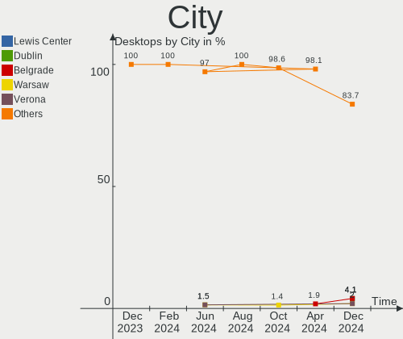
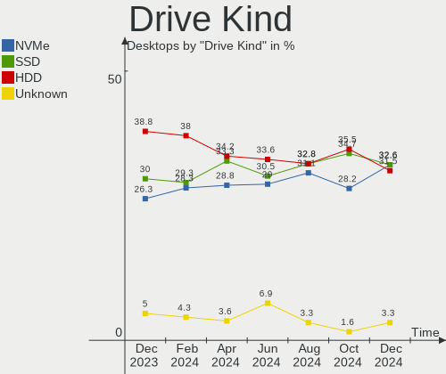
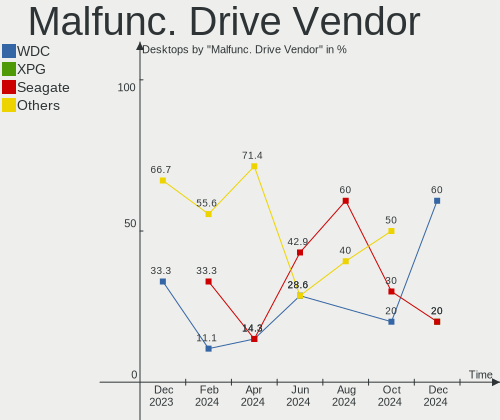
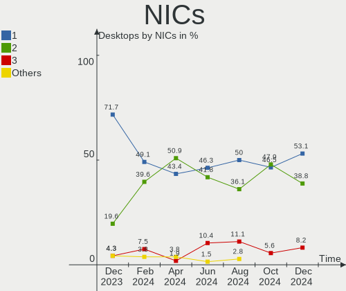

Kubuntu Hardware Trends (Desktops)
----------------------------------

A project to identify most popular hardware characteristics and track their change
over time based on data collected by Kubuntu users at https://Linux-Hardware.org.

Anyone can contribute to this report by the [hw-probe](https://github.com/linuxhw/hw-probe) tool:

    sudo -E hw-probe -all -upload

Full-feature report is available here: https://linux-hardware.org/?view=trends

Period: Dec, 2021.

Contents
--------

* [ System ](#system)
  - [ OS                       ](#os)
  - [ OS Family                ](#os-family)
  - [ Kernel                   ](#kernel)
  - [ Kernel Family            ](#kernel-family)
  - [ Kernel Major Ver.        ](#kernel-major-ver)
  - [ Arch                     ](#arch)
  - [ DE                       ](#de)
  - [ Display Server           ](#display-server)
  - [ Display Manager          ](#display-manager)
  - [ OS Lang                  ](#os-lang)
  - [ Boot Mode                ](#boot-mode)
  - [ Filesystem               ](#filesystem)
  - [ Part. scheme             ](#part-scheme)
  - [ Dual Boot with Linux/BSD ](#dual-boot-with-linuxbsd)
  - [ Dual Boot (Win)          ](#dual-boot-win)

* [ Board ](#board)
  - [ Vendor                   ](#vendor)
  - [ Model                    ](#model)
  - [ Model Family             ](#model-family)
  - [ MFG Year                 ](#mfg-year)
  - [ Form Factor              ](#form-factor)
  - [ Secure Boot              ](#secure-boot)
  - [ Coreboot                 ](#coreboot)
  - [ RAM Size                 ](#ram-size)
  - [ RAM Used                 ](#ram-used)
  - [ Total Drives             ](#total-drives)
  - [ Has CD-ROM               ](#has-cd-rom)
  - [ Has Ethernet             ](#has-ethernet)
  - [ Has WiFi                 ](#has-wifi)
  - [ Has Bluetooth            ](#has-bluetooth)

* [ Location ](#location)
  - [ Country                  ](#country)
  - [ City                     ](#city)

* [ Drives ](#drives)
  - [ Drive Vendor             ](#drive-vendor)
  - [ Drive Model              ](#drive-model)
  - [ HDD Vendor               ](#hdd-vendor)
  - [ SSD Vendor               ](#ssd-vendor)
  - [ Drive Kind               ](#drive-kind)
  - [ Drive Connector          ](#drive-connector)
  - [ Drive Size               ](#drive-size)
  - [ Space Total              ](#space-total)
  - [ Space Used               ](#space-used)
  - [ Malfunc. Drives          ](#malfunc-drives)
  - [ Malfunc. Drive Vendor    ](#malfunc-drive-vendor)
  - [ Malfunc. HDD Vendor      ](#malfunc-hdd-vendor)
  - [ Malfunc. Drive Kind      ](#malfunc-drive-kind)
  - [ Failed Drives            ](#failed-drives)
  - [ Failed Drive Vendor      ](#failed-drive-vendor)
  - [ Drive Status             ](#drive-status)

* [ Storage controller ](#storage-controller)
  - [ Storage Vendor           ](#storage-vendor)
  - [ Storage Model            ](#storage-model)
  - [ Storage Kind             ](#storage-kind)

* [ Processor ](#processor)
  - [ CPU Vendor               ](#cpu-vendor)
  - [ CPU Model                ](#cpu-model)
  - [ CPU Model Family         ](#cpu-model-family)
  - [ CPU Cores                ](#cpu-cores)
  - [ CPU Sockets              ](#cpu-sockets)
  - [ CPU Threads              ](#cpu-threads)
  - [ CPU Op-Modes             ](#cpu-op-modes)
  - [ CPU Microcode            ](#cpu-microcode)
  - [ CPU Microarch            ](#cpu-microarch)

* [ Graphics ](#graphics)
  - [ GPU Vendor               ](#gpu-vendor)
  - [ GPU Model                ](#gpu-model)
  - [ GPU Combo                ](#gpu-combo)
  - [ GPU Driver               ](#gpu-driver)
  - [ GPU Memory               ](#gpu-memory)

* [ Monitor ](#monitor)
  - [ Monitor Vendor           ](#monitor-vendor)
  - [ Monitor Model            ](#monitor-model)
  - [ Monitor Resolution       ](#monitor-resolution)
  - [ Monitor Diagonal         ](#monitor-diagonal)
  - [ Monitor Width            ](#monitor-width)
  - [ Aspect Ratio             ](#aspect-ratio)
  - [ Monitor Area             ](#monitor-area)
  - [ Pixel Density            ](#pixel-density)
  - [ Multiple Monitors        ](#multiple-monitors)

* [ Network ](#network)
  - [ Net Controller Vendor    ](#net-controller-vendor)
  - [ Net Controller Model     ](#net-controller-model)
  - [ Wireless Vendor          ](#wireless-vendor)
  - [ Wireless Model           ](#wireless-model)
  - [ Ethernet Vendor          ](#ethernet-vendor)
  - [ Ethernet Model           ](#ethernet-model)
  - [ Net Controller Kind      ](#net-controller-kind)
  - [ Used Controller          ](#used-controller)
  - [ NICs                     ](#nics)
  - [ IPv6                     ](#ipv6)

* [ Bluetooth ](#bluetooth)
  - [ Bluetooth Vendor         ](#bluetooth-vendor)
  - [ Bluetooth Model          ](#bluetooth-model)

* [ Sound ](#sound)
  - [ Sound Vendor             ](#sound-vendor)
  - [ Sound Model              ](#sound-model)

* [ Memory ](#memory)
  - [ Memory Vendor            ](#memory-vendor)
  - [ Memory Model             ](#memory-model)
  - [ Memory Kind              ](#memory-kind)
  - [ Memory Form Factor       ](#memory-form-factor)
  - [ Memory Size              ](#memory-size)
  - [ Memory Speed             ](#memory-speed)

* [ Printers & scanners ](#printers--scanners)
  - [ Printer Vendor           ](#printer-vendor)
  - [ Printer Model            ](#printer-model)
  - [ Scanner Vendor           ](#scanner-vendor)
  - [ Scanner Model            ](#scanner-model)

* [ Camera ](#camera)
  - [ Camera Vendor            ](#camera-vendor)
  - [ Camera Model             ](#camera-model)

* [ Security ](#security)
  - [ Fingerprint Vendor       ](#fingerprint-vendor)
  - [ Fingerprint Model        ](#fingerprint-model)
  - [ Chipcard Vendor          ](#chipcard-vendor)
  - [ Chipcard Model           ](#chipcard-model)

* [ Unsupported ](#unsupported)
  - [ Unsupported Devices      ](#unsupported-devices)
  - [ Unsupported Device Types ](#unsupported-device-types)

System
------

OS
--

Installed operating systems

| Name          | Desktops | Percent |
|---------------|----------|---------|
| Kubuntu 21.10 | 16       | 45.71%  |
| Kubuntu 20.04 | 13       | 37.14%  |
| Kubuntu 22.04 | 3        | 8.57%   |
| Kubuntu 21.04 | 3        | 8.57%   |

OS Family
---------

OS without a version

| Name    | Desktops | Percent |
|---------|----------|---------|
| Kubuntu | 35       | 100%    |

Kernel
------

Version of the Linux kernel

| Version                  | Desktops | Percent |
|--------------------------|----------|---------|
| 5.13.0-22-generic        | 7        | 20%     |
| 5.11.0-43-generic        | 7        | 20%     |
| 5.13.0-22-lowlatency     | 5        | 14.29%  |
| 5.4.0-91-generic         | 3        | 8.57%   |
| 5.13.0-23-generic        | 2        | 5.71%   |
| 5.11.0-44-generic        | 2        | 5.71%   |
| 5.11.0-41-generic        | 2        | 5.71%   |
| 5.16.0-051600rc3-generic | 1        | 2.86%   |
| 5.15.6-051506-lowlatency | 1        | 2.86%   |
| 5.15.12-051512-generic   | 1        | 2.86%   |
| 5.15.0-13-generic        | 1        | 2.86%   |
| 5.13.0-21-lowlatency     | 1        | 2.86%   |
| 5.13.0-19-generic        | 1        | 2.86%   |
| 5.11.0-27-generic        | 1        | 2.86%   |

Kernel Family
-------------

Linux kernel without a distro release

| Version | Desktops | Percent |
|---------|----------|---------|
| 5.13.0  | 16       | 45.71%  |
| 5.11.0  | 12       | 34.29%  |
| 5.4.0   | 3        | 8.57%   |
| 5.16.0  | 1        | 2.86%   |
| 5.15.6  | 1        | 2.86%   |
| 5.15.12 | 1        | 2.86%   |
| 5.15.0  | 1        | 2.86%   |

Kernel Major Ver.
-----------------

Linux kernel major version

| Version | Desktops | Percent |
|---------|----------|---------|
| 5.13    | 16       | 45.71%  |
| 5.11    | 12       | 34.29%  |
| 5.4     | 3        | 8.57%   |
| 5.15    | 3        | 8.57%   |
| 5.16    | 1        | 2.86%   |

Arch
----

OS architecture (x86_64, i586, etc.)

| Name   | Desktops | Percent |
|--------|----------|---------|
| x86_64 | 35       | 100%    |

DE
--

Desktop Environment

| Name | Desktops | Percent |
|------|----------|---------|
| KDE5 | 34       | 97.14%  |
| KDE  | 1        | 2.86%   |

Display Server
--------------

X11 or Wayland

| Name    | Desktops | Percent |
|---------|----------|---------|
| X11     | 32       | 91.43%  |
| Wayland | 3        | 8.57%   |

Display Manager
---------------

SDDM, LightDM, etc.

| Name    | Desktops | Percent |
|---------|----------|---------|
| SDDM    | 26       | 74.29%  |
| Unknown | 6        | 17.14%  |
| GDM     | 2        | 5.71%   |
| LightDM | 1        | 2.86%   |

OS Lang
-------

Language

| Lang  | Desktops | Percent |
|-------|----------|---------|
| en_US | 10       | 28.57%  |
| fr_FR | 5        | 14.29%  |
| de_DE | 4        | 11.43%  |
| en_AU | 3        | 8.57%   |
| ru_RU | 2        | 5.71%   |
| pt_BR | 2        | 5.71%   |
| de_AT | 2        | 5.71%   |
| zh_CN | 1        | 2.86%   |
| pl_PL | 1        | 2.86%   |
| it_IT | 1        | 2.86%   |
| hu_HU | 1        | 2.86%   |
| en_GB | 1        | 2.86%   |
| en_CA | 1        | 2.86%   |
| cs_CZ | 1        | 2.86%   |

Boot Mode
---------

EFI or BIOS

| Mode | Desktops | Percent |
|------|----------|---------|
| BIOS | 19       | 54.29%  |
| EFI  | 16       | 45.71%  |

Filesystem
----------

Type of filesystem

| Type  | Desktops | Percent |
|-------|----------|---------|
| Ext4  | 34       | 97.14%  |
| Btrfs | 1        | 2.86%   |

Part. scheme
------------

Scheme of partitioning

| Type    | Desktops | Percent |
|---------|----------|---------|
| Unknown | 17       | 48.57%  |
| GPT     | 15       | 42.86%  |
| MBR     | 3        | 8.57%   |

Dual Boot with Linux/BSD
------------------------

Hosting more than one Linux/BSD

| Dual boot | Desktops | Percent |
|-----------|----------|---------|
| No        | 24       | 68.57%  |
| Yes       | 11       | 31.43%  |

Dual Boot (Win)
---------------

Hosting Linux and Windows

| Dual boot | Desktops | Percent |
|-----------|----------|---------|
| No        | 23       | 65.71%  |
| Yes       | 12       | 34.29%  |

Board
-----

Vendor
------

Motherboard manufacturer

| Name                | Desktops | Percent |
|---------------------|----------|---------|
| Gigabyte Technology | 9        | 25.71%  |
| ASUSTek Computer    | 9        | 25.71%  |
| ASRock              | 6        | 17.14%  |
| MSI                 | 3        | 8.57%   |
| Acer                | 3        | 8.57%   |
| Lenovo              | 2        | 5.71%   |
| Hewlett-Packard     | 2        | 5.71%   |
| Intel               | 1        | 2.86%   |

Model
-----

Motherboard model

| Name                               | Desktops | Percent |
|------------------------------------|----------|---------|
| Gigabyte H110M-S2H                 | 2        | 5.71%   |
| MSI MS-7D18                        | 1        | 2.86%   |
| MSI MS-7C09                        | 1        | 2.86%   |
| MSI MS-7C02                        | 1        | 2.86%   |
| Lenovo ThinkCentre M93p 10AAS11Y00 | 1        | 2.86%   |
| Lenovo Product                     | 1        | 2.86%   |
| Intel X99 V1.0                     | 1        | 2.86%   |
| HP Z2 Tower G5 Workstation         | 1        | 2.86%   |
| HP 870-119                         | 1        | 2.86%   |
| Gigabyte X470 AORUS GAMING 7 WIFI  | 1        | 2.86%   |
| Gigabyte P35-DS3L                  | 1        | 2.86%   |
| Gigabyte GA-870A-UD3               | 1        | 2.86%   |
| Gigabyte B550M DS3H                | 1        | 2.86%   |
| Gigabyte B550 VISION D-P           | 1        | 2.86%   |
| Gigabyte B150M-HD3-CF              | 1        | 2.86%   |
| Gigabyte A320M-S2H                 | 1        | 2.86%   |
| ASUS TUF B450M-PLUS GAMING         | 1        | 2.86%   |
| ASUS ROG ZENITH EXTREME            | 1        | 2.86%   |
| ASUS ROG STRIX Z490-I GAMING       | 1        | 2.86%   |
| ASUS ROG STRIX X570-I GAMING       | 1        | 2.86%   |
| ASUS ROG STRIX B550-F GAMING       | 1        | 2.86%   |
| ASUS PRIME B450M-A                 | 1        | 2.86%   |
| ASUS P8B75-M                       | 1        | 2.86%   |
| ASUS M4A785TD-M EVO                | 1        | 2.86%   |
| ASUS All Series                    | 1        | 2.86%   |
| ASRock Z87 Pro4                    | 1        | 2.86%   |
| ASRock X370 Killer SLI             | 1        | 2.86%   |
| ASRock H55M-LE                     | 1        | 2.86%   |
| ASRock B560M Pro4                  | 1        | 2.86%   |
| ASRock B550M Pro4                  | 1        | 2.86%   |
| ASRock B550 Phantom Gaming 4/ac    | 1        | 2.86%   |
| Acer Veriton M4630G                | 1        | 2.86%   |
| Acer Aspire TC-105                 | 1        | 2.86%   |
| Acer Aspire T3-605                 | 1        | 2.86%   |

Model Family
------------

Motherboard model prefix

| Name                  | Desktops | Percent |
|-----------------------|----------|---------|
| ASUS ROG              | 4        | 11.43%  |
| Gigabyte H110M-S2H    | 2        | 5.71%   |
| Acer Aspire           | 2        | 5.71%   |
| MSI MS-7D18           | 1        | 2.86%   |
| MSI MS-7C09           | 1        | 2.86%   |
| MSI MS-7C02           | 1        | 2.86%   |
| Lenovo ThinkCentre    | 1        | 2.86%   |
| Lenovo Product        | 1        | 2.86%   |
| Intel X99             | 1        | 2.86%   |
| HP Z2                 | 1        | 2.86%   |
| HP 870-119            | 1        | 2.86%   |
| Gigabyte X470         | 1        | 2.86%   |
| Gigabyte P35-DS3L     | 1        | 2.86%   |
| Gigabyte GA-870A-UD3  | 1        | 2.86%   |
| Gigabyte B550M        | 1        | 2.86%   |
| Gigabyte B550         | 1        | 2.86%   |
| Gigabyte B150M-HD3-CF | 1        | 2.86%   |
| Gigabyte A320M-S2H    | 1        | 2.86%   |
| ASUS TUF              | 1        | 2.86%   |
| ASUS PRIME            | 1        | 2.86%   |
| ASUS P8B75-M          | 1        | 2.86%   |
| ASUS M4A785TD-M       | 1        | 2.86%   |
| ASUS All              | 1        | 2.86%   |
| ASRock Z87            | 1        | 2.86%   |
| ASRock X370           | 1        | 2.86%   |
| ASRock H55M-LE        | 1        | 2.86%   |
| ASRock B560M          | 1        | 2.86%   |
| ASRock B550M          | 1        | 2.86%   |
| ASRock B550           | 1        | 2.86%   |
| Acer Veriton          | 1        | 2.86%   |

MFG Year
--------

Motherboard manufacture year

| Year | Desktops | Percent |
|------|----------|---------|
| 2021 | 10       | 28.57%  |
| 2019 | 5        | 14.29%  |
| 2020 | 3        | 8.57%   |
| 2015 | 3        | 8.57%   |
| 2010 | 3        | 8.57%   |
| 2018 | 2        | 5.71%   |
| 2014 | 2        | 5.71%   |
| 2013 | 2        | 5.71%   |
| 2012 | 2        | 5.71%   |
| 2017 | 1        | 2.86%   |
| 2016 | 1        | 2.86%   |
| 2007 | 1        | 2.86%   |

Form Factor
-----------

Physical design of the computer

| Name    | Desktops | Percent |
|---------|----------|---------|
| Desktop | 35       | 100%    |

Secure Boot
-----------

Enabled or disabled

| State    | Desktops | Percent |
|----------|----------|---------|
| Disabled | 34       | 97.14%  |
| Enabled  | 1        | 2.86%   |

Coreboot
--------

Have coreboot on board

| Used | Desktops | Percent |
|------|----------|---------|
| No   | 35       | 100%    |

RAM Size
--------

Total RAM memory

| Size in GB  | Desktops | Percent |
|-------------|----------|---------|
| 16.01-24.0  | 15       | 42.86%  |
| 32.01-64.0  | 7        | 20%     |
| 8.01-16.0   | 7        | 20%     |
| 4.01-8.0    | 4        | 11.43%  |
| 64.01-256.0 | 2        | 5.71%   |

RAM Used
--------

Used RAM memory

| Used GB    | Desktops | Percent |
|------------|----------|---------|
| 2.01-3.0   | 11       | 31.43%  |
| 1.01-2.0   | 8        | 22.86%  |
| 4.01-8.0   | 7        | 20%     |
| 3.01-4.0   | 7        | 20%     |
| 16.01-24.0 | 1        | 2.86%   |
| 8.01-16.0  | 1        | 2.86%   |

Total Drives
------------

Number of drives on board

| Drives | Desktops | Percent |
|--------|----------|---------|
| 3      | 11       | 31.43%  |
| 1      | 9        | 25.71%  |
| 2      | 8        | 22.86%  |
| 4      | 4        | 11.43%  |
| 5      | 2        | 5.71%   |
| 9      | 1        | 2.86%   |

Has CD-ROM
----------

Has CD-ROM on board

| Presented | Desktops | Percent |
|-----------|----------|---------|
| No        | 19       | 54.29%  |
| Yes       | 16       | 45.71%  |

Has Ethernet
------------

Has Ethernet on board

| Presented | Desktops | Percent |
|-----------|----------|---------|
| Yes       | 35       | 100%    |

Has WiFi
--------

Has WiFi module

| Presented | Desktops | Percent |
|-----------|----------|---------|
| No        | 21       | 60%     |
| Yes       | 14       | 40%     |

Has Bluetooth
-------------

Has Bluetooth module

| Presented | Desktops | Percent |
|-----------|----------|---------|
| No        | 22       | 62.86%  |
| Yes       | 13       | 37.14%  |

Location
--------

Country
-------

Geographic location (country)

| Country    | Desktops | Percent |
|------------|----------|---------|
| USA        | 6        | 17.14%  |
| Germany    | 5        | 14.29%  |
| France     | 5        | 14.29%  |
| Australia  | 3        | 8.57%   |
| UK         | 2        | 5.71%   |
| Italy      | 2        | 5.71%   |
| Austria    | 2        | 5.71%   |
| Uzbekistan | 1        | 2.86%   |
| Turkey     | 1        | 2.86%   |
| Spain      | 1        | 2.86%   |
| Serbia     | 1        | 2.86%   |
| Russia     | 1        | 2.86%   |
| Hungary    | 1        | 2.86%   |
| Czechia    | 1        | 2.86%   |
| China      | 1        | 2.86%   |
| Canada     | 1        | 2.86%   |
| Brazil     | 1        | 2.86%   |

City
----

Geographic location (city)

| City            | Desktops | Percent |
|-----------------|----------|---------|
| Villemomble     | 2        | 5.71%   |
| Sydney          | 2        | 5.71%   |
| Vicosa do Ceara | 1        | 2.86%   |
| Turin           | 1        | 2.86%   |
| Thousand Oaks   | 1        | 2.86%   |
| Southend-on-Sea | 1        | 2.86%   |
| Shanghai        | 1        | 2.86%   |
| Secaucus        | 1        | 2.86%   |
| Sankt P?¶lten   | 1        | 2.86%   |
| Rho             | 1        | 2.86%   |
| Reichertshofen  | 1        | 2.86%   |
| Orlando         | 1        | 2.86%   |
| Nauheim         | 1        | 2.86%   |
| Mieuxce         | 1        | 2.86%   |
| Middleburg      | 1        | 2.86%   |
| Lyon            | 1        | 2.86%   |
| London          | 1        | 2.86%   |
| Lepe            | 1        | 2.86%   |
| Le Havre        | 1        | 2.86%   |
| Lancaster       | 1        | 2.86%   |
| Krasnoyarsk     | 1        | 2.86%   |
| Jihlava         | 1        | 2.86%   |
| Jacksonville    | 1        | 2.86%   |
| Hamburg         | 1        | 2.86%   |
| Fergana         | 1        | 2.86%   |
| Enns            | 1        | 2.86%   |
| Darmstadt       | 1        | 2.86%   |
| Cologne         | 1        | 2.86%   |
| Canberra        | 1        | 2.86%   |
| Budapest        | 1        | 2.86%   |
| Brantford       | 1        | 2.86%   |
| Belgrade        | 1        | 2.86%   |
| Bal?±kesir      | 1        | 2.86%   |

Drives
------

Drive Vendor
------------

Hard drive vendors

| Vendor              | Desktops | Drives | Percent |
|---------------------|----------|--------|---------|
| Seagate             | 18       | 27     | 25.71%  |
| Samsung Electronics | 14       | 24     | 20%     |
| WDC                 | 13       | 17     | 18.57%  |
| Crucial             | 5        | 5      | 7.14%   |
| SanDisk             | 3        | 3      | 4.29%   |
| XPG                 | 2        | 2      | 2.86%   |
| HGST                | 2        | 2      | 2.86%   |
| Unknown             | 1        | 1      | 1.43%   |
| Transcend           | 1        | 1      | 1.43%   |
| Silicon Motion      | 1        | 1      | 1.43%   |
| SABRENT             | 1        | 1      | 1.43%   |
| Micron Technology   | 1        | 1      | 1.43%   |
| LIO-ORG             | 1        | 1      | 1.43%   |
| Kingston            | 1        | 1      | 1.43%   |
| JMicron             | 1        | 1      | 1.43%   |
| Hitachi             | 1        | 1      | 1.43%   |
| Fujitsu             | 1        | 1      | 1.43%   |
| ASMT                | 1        | 1      | 1.43%   |
| Apacer              | 1        | 1      | 1.43%   |
| A-DATA Technology   | 1        | 1      | 1.43%   |

Drive Model
-----------

Hard drive models

| Model                                       | Desktops | Percent |
|---------------------------------------------|----------|---------|
| Seagate ST500DM002-1BD142 500GB             | 2        | 2.3%    |
| Seagate Backup+ Hub BK 8TB                  | 2        | 2.3%    |
| Samsung NVMe SSD Drive 500GB                | 2        | 2.3%    |
| XPG NVMe SSD Drive 512GB                    | 1        | 1.15%   |
| XPG GAMMIX S11 Pro 1TB                      | 1        | 1.15%   |
| WDC WDS100T2B0C-00PXH0 1TB                  | 1        | 1.15%   |
| WDC WD5000LPCX-24C6HT0 500GB                | 1        | 1.15%   |
| WDC WD5000AZLX-21K2TA0 500GB                | 1        | 1.15%   |
| WDC WD5000AURX-63UY4Y0 500GB                | 1        | 1.15%   |
| WDC WD5000AAKX-60U6AA0 500GB                | 1        | 1.15%   |
| WDC WD5000AAKS-07TMA0 500GB                 | 1        | 1.15%   |
| WDC WD5000AAJS-00A8B0 500GB                 | 1        | 1.15%   |
| WDC WD5000AADS-67S9B1 500GB                 | 1        | 1.15%   |
| WDC WD40EFAX-68JH4N1 4TB                    | 1        | 1.15%   |
| WDC WD20EZRX-00D8PB0 2TB                    | 1        | 1.15%   |
| WDC WD20EARX-32PASB0 2TB                    | 1        | 1.15%   |
| WDC WD20EARX-00PASB0 2TB                    | 1        | 1.15%   |
| WDC WD10EZRZ-00HTKB0 1TB                    | 1        | 1.15%   |
| WDC WD10EZEX-75M2NA0 1TB                    | 1        | 1.15%   |
| WDC WD10EZEX-22RKKA0 1TB                    | 1        | 1.15%   |
| WDC WD10EZEX-08WN4A0 1TB                    | 1        | 1.15%   |
| Unknown SD/MMC/MS PRO 7GB                   | 1        | 1.15%   |
| Transcend TS32GSSD370S 32GB                 | 1        | 1.15%   |
| Silicon Motion NVMe SSD Drive 256GB         | 1        | 1.15%   |
| Seagate ST5000LM000-2AN170 5TB              | 1        | 1.15%   |
| Seagate ST4000DM004-2CV104 4TB              | 1        | 1.15%   |
| Seagate ST4000DM000-1F2168 4TB              | 1        | 1.15%   |
| Seagate ST3500413AS 500GB                   | 1        | 1.15%   |
| Seagate ST3320418AS 320GB                   | 1        | 1.15%   |
| Seagate ST3250310AS 250GB                   | 1        | 1.15%   |
| Seagate ST31000524AS 1TB                    | 1        | 1.15%   |
| Seagate ST3000VN007-2AH16M 3TB              | 1        | 1.15%   |
| Seagate ST3000VN000-1HJ166 3TB              | 1        | 1.15%   |
| Seagate ST2000NM000A-2J2100 2TB             | 1        | 1.15%   |
| Seagate ST2000DM001-1ER164 2TB              | 1        | 1.15%   |
| Seagate ST1000DX001-1NS162 1TB              | 1        | 1.15%   |
| Seagate ST1000DM003-1SB102 1TB              | 1        | 1.15%   |
| Seagate ST1000DM003-1ER162 1TB              | 1        | 1.15%   |
| Seagate ST1000DM003-1CH162 1TB              | 1        | 1.15%   |
| Seagate ST10000VN0004-1ZD101 10TB           | 1        | 1.15%   |
| Seagate OOS2000G 2TB                        | 1        | 1.15%   |
| Seagate FireCuda 510 SSD ZP500GM30001 500GB | 1        | 1.15%   |
| Seagate Expansion 1TB                       | 1        | 1.15%   |
| Seagate BUP Slim SL 2TB                     | 1        | 1.15%   |
| SanDisk SDSSDHII240G 240GB                  | 1        | 1.15%   |
| SanDisk SD8SB8U-256G-1006 256GB SSD         | 1        | 1.15%   |
| Sandisk NVMe SSD Drive 500GB                | 1        | 1.15%   |
| Samsung SSD 980 PRO 2TB                     | 1        | 1.15%   |
| Samsung SSD 980 500GB                       | 1        | 1.15%   |
| Samsung SSD 980 1TB                         | 1        | 1.15%   |
| Samsung SSD 970 EVO Plus 500GB              | 1        | 1.15%   |
| Samsung SSD 970 EVO Plus 250GB              | 1        | 1.15%   |
| Samsung SSD 970 EVO 1TB                     | 1        | 1.15%   |
| Samsung SSD 960 PRO 512GB                   | 1        | 1.15%   |
| Samsung SSD 960 EVO 250GB                   | 1        | 1.15%   |
| Samsung SSD 870 QVO 1TB                     | 1        | 1.15%   |
| Samsung SSD 860 EVO 500GB                   | 1        | 1.15%   |
| Samsung SSD 860 EVO 1TB                     | 1        | 1.15%   |
| Samsung SSD 850 EVO 500GB                   | 1        | 1.15%   |
| Samsung SSD 850 EVO 250GB                   | 1        | 1.15%   |

HDD Vendor
----------

Hard disk drive vendors

| Vendor              | Desktops | Drives | Percent |
|---------------------|----------|--------|---------|
| Seagate             | 17       | 23     | 44.74%  |
| WDC                 | 12       | 16     | 31.58%  |
| Samsung Electronics | 2        | 3      | 5.26%   |
| HGST                | 2        | 2      | 5.26%   |
| Unknown             | 1        | 1      | 2.63%   |
| SABRENT             | 1        | 1      | 2.63%   |
| LIO-ORG             | 1        | 1      | 2.63%   |
| Hitachi             | 1        | 1      | 2.63%   |
| Fujitsu             | 1        | 1      | 2.63%   |

SSD Vendor
----------

Solid state drive vendors

| Vendor              | Desktops | Drives | Percent |
|---------------------|----------|--------|---------|
| Samsung Electronics | 4        | 6      | 26.67%  |
| Crucial             | 4        | 4      | 26.67%  |
| SanDisk             | 2        | 2      | 13.33%  |
| Transcend           | 1        | 1      | 6.67%   |
| Kingston            | 1        | 1      | 6.67%   |
| ASMT                | 1        | 1      | 6.67%   |
| Apacer              | 1        | 1      | 6.67%   |
| A-DATA Technology   | 1        | 1      | 6.67%   |

Drive Kind
----------

HDD or SSD

| Kind    | Desktops | Drives | Percent |
|---------|----------|--------|---------|
| HDD     | 28       | 49     | 46.67%  |
| NVMe    | 17       | 23     | 28.33%  |
| SSD     | 13       | 17     | 21.67%  |
| Unknown | 2        | 4      | 3.33%   |

Drive Connector
---------------

SATA, SAS, NVMe, etc.

| Type | Desktops | Drives | Percent |
|------|----------|--------|---------|
| SATA | 32       | 59     | 58.18%  |
| NVMe | 17       | 23     | 30.91%  |
| SAS  | 6        | 11     | 10.91%  |

Drive Size
----------

Size of hard drive

| Size in TB | Desktops | Drives | Percent |
|------------|----------|--------|---------|
| 0.01-0.5   | 23       | 32     | 45.1%   |
| 0.51-1.0   | 14       | 19     | 27.45%  |
| 1.01-2.0   | 6        | 7      | 11.76%  |
| 3.01-4.0   | 4        | 4      | 7.84%   |
| 2.01-3.0   | 2        | 2      | 3.92%   |
| 4.01-10.0  | 2        | 2      | 3.92%   |

Space Total
-----------

Amount of disk space available on the file system

| Size in GB     | Desktops | Percent |
|----------------|----------|---------|
| More than 3000 | 10       | 28.57%  |
| 251-500        | 9        | 25.71%  |
| 1001-2000      | 6        | 17.14%  |
| 101-250        | 5        | 14.29%  |
| 501-1000       | 3        | 8.57%   |
| 2001-3000      | 1        | 2.86%   |
| 51-100         | 1        | 2.86%   |

Space Used
----------

Amount of used disk space

| Used GB        | Desktops | Percent |
|----------------|----------|---------|
| More than 3000 | 7        | 20%     |
| 1-20           | 6        | 17.14%  |
| 101-250        | 5        | 14.29%  |
| 501-1000       | 5        | 14.29%  |
| 251-500        | 4        | 11.43%  |
| 21-50          | 4        | 11.43%  |
| 1001-2000      | 2        | 5.71%   |
| 51-100         | 2        | 5.71%   |

Malfunc. Drives
---------------

Drive models with a malfunction

| Model                                 | Desktops | Drives | Percent |
|---------------------------------------|----------|--------|---------|
| WDC WD10EZEX-75M2NA0 1TB              | 1        | 1      | 16.67%  |
| Seagate ST31000524AS 1TB              | 1        | 1      | 16.67%  |
| Seagate ST1000DM003-1SB102 1TB        | 1        | 1      | 16.67%  |
| Samsung Electronics SSD 960 PRO 512GB | 1        | 1      | 16.67%  |
| Samsung Electronics SP1614N 160GB     | 1        | 1      | 16.67%  |
| Samsung Electronics HD502HJ 500GB     | 1        | 1      | 16.67%  |

Malfunc. Drive Vendor
---------------------

Vendors of faulty drives

| Vendor              | Desktops | Drives | Percent |
|---------------------|----------|--------|---------|
| Seagate             | 2        | 2      | 40%     |
| Samsung Electronics | 2        | 3      | 40%     |
| WDC                 | 1        | 1      | 20%     |

Malfunc. HDD Vendor
-------------------

Vendors of faulty HDD drives

| Vendor              | Desktops | Drives | Percent |
|---------------------|----------|--------|---------|
| Seagate             | 2        | 2      | 50%     |
| WDC                 | 1        | 1      | 25%     |
| Samsung Electronics | 1        | 2      | 25%     |

Malfunc. Drive Kind
-------------------

Kinds of faulty drives

| Kind | Desktops | Drives | Percent |
|------|----------|--------|---------|
| HDD  | 4        | 5      | 80%     |
| NVMe | 1        | 1      | 20%     |

Failed Drives
-------------

Failed drive models

Zero info for selected period =(

Failed Drive Vendor
-------------------

Failed drive vendors

Zero info for selected period =(

Drive Status
------------

Number of failed and malfunc. drives

| Status   | Desktops | Drives | Percent |
|----------|----------|--------|---------|
| Detected | 19       | 49     | 45.24%  |
| Works    | 18       | 38     | 42.86%  |
| Malfunc  | 5        | 6      | 11.9%   |

Storage controller
------------------

Storage Vendor
--------------

Storage controller vendors

| Vendor                    | Desktops | Percent |
|---------------------------|----------|---------|
| Intel                     | 19       | 33.93%  |
| AMD                       | 16       | 28.57%  |
| Samsung Electronics       | 10       | 17.86%  |
| Sandisk                   | 2        | 3.57%   |
| JMicron Technology        | 2        | 3.57%   |
| ADATA Technology          | 2        | 3.57%   |
| Silicon Motion            | 1        | 1.79%   |
| Seagate Technology        | 1        | 1.79%   |
| Micron/Crucial Technology | 1        | 1.79%   |
| Micron Technology         | 1        | 1.79%   |
| ASMedia Technology        | 1        | 1.79%   |

Storage Model
-------------

Storage controller models

| Model                                                                          | Desktops | Percent |
|--------------------------------------------------------------------------------|----------|---------|
| AMD FCH SATA Controller [AHCI mode]                                            | 8        | 11.59%  |
| Samsung NVMe SSD Controller SM981/PM981/PM983                                  | 7        | 10.14%  |
| Intel 8 Series/C220 Series Chipset Family 6-port SATA Controller 1 [AHCI mode] | 5        | 7.25%   |
| AMD Starship/Matisse Chipset SATA Controller [AHCI mode]                       | 5        | 7.25%   |
| Intel Q170/Q150/B150/H170/H110/Z170/CM236 Chipset SATA Controller [AHCI Mode]  | 4        | 5.8%    |
| AMD 400 Series Chipset SATA Controller                                         | 4        | 5.8%    |
| Samsung NVMe SSD Controller SM961/PM961/SM963                                  | 2        | 2.9%    |
| Samsung NVMe SSD Controller 980                                                | 2        | 2.9%    |
| Intel 500 Series Chipset Family SATA AHCI Controller                           | 2        | 2.9%    |
| AMD SB7x0/SB8x0/SB9x0 SATA Controller [IDE mode]                               | 2        | 2.9%    |
| AMD SB7x0/SB8x0/SB9x0 IDE Controller                                           | 2        | 2.9%    |
| ADATA XPG SX8200 Pro PCIe Gen3x4 M.2 2280 Solid State Drive                    | 2        | 2.9%    |
| Silicon Motion SM2263EN/SM2263XT SSD Controller                                | 1        | 1.45%   |
| Seagate FireCuda 510 SSD                                                       | 1        | 1.45%   |
| Sandisk WD PC SN810 / Black SN850 NVMe SSD                                     | 1        | 1.45%   |
| Sandisk Non-Volatile memory controller                                         | 1        | 1.45%   |
| Samsung NVMe SSD Controller PM9A1/PM9A3/980PRO                                 | 1        | 1.45%   |
| Micron/Crucial NVMe Controller                                                 | 1        | 1.45%   |
| Micron Non-Volatile memory controller                                          | 1        | 1.45%   |
| JMicron JMB368 IDE controller                                                  | 1        | 1.45%   |
| JMicron JMB363 SATA/IDE Controller                                             | 1        | 1.45%   |
| Intel Comet Lake SATA AHCI Controller                                          | 1        | 1.45%   |
| Intel Comet Lake PCH-H RAID                                                    | 1        | 1.45%   |
| Intel 9 Series Chipset Family SATA Controller [AHCI Mode]                      | 1        | 1.45%   |
| Intel 82801IB (ICH9) 2 port SATA Controller [IDE mode]                         | 1        | 1.45%   |
| Intel 82801I (ICH9 Family) 2 port SATA Controller [IDE mode]                   | 1        | 1.45%   |
| Intel 7 Series/C210 Series Chipset Family 6-port SATA Controller [AHCI mode]   | 1        | 1.45%   |
| Intel 7 Series/C210 Series Chipset Family 4-port SATA Controller [IDE mode]    | 1        | 1.45%   |
| Intel 7 Series/C210 Series Chipset Family 2-port SATA Controller [IDE mode]    | 1        | 1.45%   |
| Intel 5 Series/3400 Series Chipset 4 port SATA IDE Controller                  | 1        | 1.45%   |
| Intel 5 Series/3400 Series Chipset 2 port SATA IDE Controller                  | 1        | 1.45%   |
| Intel 200 Series PCH SATA controller [AHCI mode]                               | 1        | 1.45%   |
| ASMedia SATA controller                                                        | 1        | 1.45%   |
| AMD X399 Series Chipset SATA Controller                                        | 1        | 1.45%   |
| AMD X370 Series Chipset SATA Controller                                        | 1        | 1.45%   |
| AMD FCH SATA Controller D                                                      | 1        | 1.45%   |

Storage Kind
------------

Kind of storage controller (IDE, SATA, NVMe, SAS, ...)

| Kind | Desktops | Percent |
|------|----------|---------|
| SATA | 31       | 57.41%  |
| NVMe | 17       | 31.48%  |
| IDE  | 5        | 9.26%   |
| RAID | 1        | 1.85%   |

Processor
---------

CPU Vendor
----------

Processor vendors

| Vendor | Desktops | Percent |
|--------|----------|---------|
| Intel  | 19       | 54.29%  |
| AMD    | 16       | 45.71%  |

CPU Model
---------

Processor models

| Model                                          | Desktops | Percent |
|------------------------------------------------|----------|---------|
| AMD Ryzen 5 3600 6-Core Processor              | 4        | 11.43%  |
| AMD Ryzen 7 2700X Eight-Core Processor         | 2        | 5.71%   |
| Intel Xeon CPU X3440 @ 2.53GHz                 | 1        | 2.86%   |
| Intel Xeon CPU E5-2620 v3 @ 2.40GHz            | 1        | 2.86%   |
| Intel Core i9-10900K CPU @ 3.70GHz             | 1        | 2.86%   |
| Intel Core i7-8700 CPU @ 3.20GHz               | 1        | 2.86%   |
| Intel Core i7-7700 CPU @ 3.60GHz               | 1        | 2.86%   |
| Intel Core i7-6700K CPU @ 4.00GHz              | 1        | 2.86%   |
| Intel Core i7-6700 CPU @ 3.40GHz               | 1        | 2.86%   |
| Intel Core i7-4790K CPU @ 4.00GHz              | 1        | 2.86%   |
| Intel Core i7-3770 CPU @ 3.40GHz               | 1        | 2.86%   |
| Intel Core i7-10700K CPU @ 3.80GHz             | 1        | 2.86%   |
| Intel Core i5-6400 CPU @ 2.70GHz               | 1        | 2.86%   |
| Intel Core i5-4570T CPU @ 2.90GHz              | 1        | 2.86%   |
| Intel Core i5-4440S CPU @ 2.80GHz              | 1        | 2.86%   |
| Intel Core i5-4440 CPU @ 3.10GHz               | 1        | 2.86%   |
| Intel Core i5-4430 CPU @ 3.00GHz               | 1        | 2.86%   |
| Intel Core i5-3570K CPU @ 3.40GHz              | 1        | 2.86%   |
| Intel Core i5-10400F CPU @ 2.90GHz             | 1        | 2.86%   |
| Intel Core 2 Duo CPU E6550 @ 2.33GHz           | 1        | 2.86%   |
| Intel 11th Gen Core i5-11600 @ 2.80GHz         | 1        | 2.86%   |
| AMD Ryzen Threadripper 1950X 16-Core Processor | 1        | 2.86%   |
| AMD Ryzen 9 5950X 16-Core Processor            | 1        | 2.86%   |
| AMD Ryzen 7 5700G with Radeon Graphics         | 1        | 2.86%   |
| AMD Ryzen 5 5600X 6-Core Processor             | 1        | 2.86%   |
| AMD Ryzen 5 3400G with Radeon Vega Graphics    | 1        | 2.86%   |
| AMD Ryzen 5 2400G with Radeon Vega Graphics    | 1        | 2.86%   |
| AMD Ryzen 3 3200G with Radeon Vega Graphics    | 1        | 2.86%   |
| AMD Phenom II X4 955 Processor                 | 1        | 2.86%   |
| AMD Athlon II X4 620 Processor                 | 1        | 2.86%   |
| AMD A8-6500 APU with Radeon HD Graphics        | 1        | 2.86%   |

CPU Model Family
----------------

Processor model prefix

| Model                  | Desktops | Percent |
|------------------------|----------|---------|
| Intel Core i7          | 7        | 20%     |
| Intel Core i5          | 7        | 20%     |
| AMD Ryzen 5            | 7        | 20%     |
| AMD Ryzen 7            | 3        | 8.57%   |
| Intel Xeon             | 2        | 5.71%   |
| Other                  | 1        | 2.86%   |
| Intel Core i9          | 1        | 2.86%   |
| Intel Core 2 Duo       | 1        | 2.86%   |
| AMD Ryzen Threadripper | 1        | 2.86%   |
| AMD Ryzen 9            | 1        | 2.86%   |
| AMD Ryzen 3            | 1        | 2.86%   |
| AMD Phenom II X4       | 1        | 2.86%   |
| AMD Athlon II X4       | 1        | 2.86%   |
| AMD A8                 | 1        | 2.86%   |

CPU Cores
---------

Number of processor cores

| Number | Desktops | Percent |
|--------|----------|---------|
| 4      | 16       | 45.71%  |
| 6      | 9        | 25.71%  |
| 8      | 4        | 11.43%  |
| 2      | 3        | 8.57%   |
| 16     | 2        | 5.71%   |
| 10     | 1        | 2.86%   |

CPU Sockets
-----------

Number of sockets

| Number | Desktops | Percent |
|--------|----------|---------|
| 1      | 35       | 100%    |

CPU Threads
-----------

Threads per core (Hyper-Threading)

| Number | Desktops | Percent |
|--------|----------|---------|
| 2      | 26       | 74.29%  |
| 1      | 9        | 25.71%  |

CPU Op-Modes
------------

CPU Operation Modes (32-bit, 64-bit)

| Op mode        | Desktops | Percent |
|----------------|----------|---------|
| 32-bit, 64-bit | 35       | 100%    |

CPU Microcode
-------------

Microcode number

| Number     | Desktops | Percent |
|------------|----------|---------|
| Unknown    | 11       | 31.43%  |
| 0x306c3    | 4        | 11.43%  |
| 0xa0655    | 2        | 5.71%   |
| 0x0a201016 | 2        | 5.71%   |
| 0x08701021 | 2        | 5.71%   |
| 0x08108109 | 2        | 5.71%   |
| 0x0800820d | 2        | 5.71%   |
| 0xa0671    | 1        | 2.86%   |
| 0xa0653    | 1        | 2.86%   |
| 0x906e9    | 1        | 2.86%   |
| 0x306a9    | 1        | 2.86%   |
| 0x106e5    | 1        | 2.86%   |
| 0x0a50000c | 1        | 2.86%   |
| 0x08701013 | 1        | 2.86%   |
| 0x08101016 | 1        | 2.86%   |
| 0x010000db | 1        | 2.86%   |
| 0x010000c8 | 1        | 2.86%   |

CPU Microarch
-------------

Microarchitecture

| Name       | Desktops | Percent |
|------------|----------|---------|
| Haswell    | 6        | 17.14%  |
| Zen+       | 4        | 11.43%  |
| Zen 2      | 4        | 11.43%  |
| Zen 3      | 3        | 8.57%   |
| Skylake    | 3        | 8.57%   |
| CometLake  | 3        | 8.57%   |
| Zen        | 2        | 5.71%   |
| KabyLake   | 2        | 5.71%   |
| K10        | 2        | 5.71%   |
| IvyBridge  | 2        | 5.71%   |
| Piledriver | 1        | 2.86%   |
| Nehalem    | 1        | 2.86%   |
| Icelake    | 1        | 2.86%   |
| Core       | 1        | 2.86%   |

Graphics
--------

GPU Vendor
----------

Vendors of graphics cards

| Vendor | Desktops | Percent |
|--------|----------|---------|
| AMD    | 16       | 41.03%  |
| Nvidia | 12       | 30.77%  |
| Intel  | 11       | 28.21%  |

GPU Model
---------

Graphics card models

| Model                                                                       | Desktops | Percent |
|-----------------------------------------------------------------------------|----------|---------|
| Intel Xeon E3-1200 v3/4th Gen Core Processor Integrated Graphics Controller | 4        | 10.26%  |
| AMD Ellesmere [Radeon RX 470/480/570/570X/580/580X/590]                     | 3        | 7.69%   |
| Nvidia GK208B [GeForce GT 710]                                              | 2        | 5.13%   |
| Intel CometLake-S GT2 [UHD Graphics 630]                                    | 2        | 5.13%   |
| AMD Picasso/Raven 2 [Radeon Vega Series / Radeon Vega Mobile Series]        | 2        | 5.13%   |
| AMD Baffin [Radeon RX 550 640SP / RX 560/560X]                              | 2        | 5.13%   |
| Nvidia TU116 [GeForce GTX 1660 Ti]                                          | 1        | 2.56%   |
| Nvidia TU102 [GeForce RTX 2080 Ti Rev. A]                                   | 1        | 2.56%   |
| Nvidia GT218 [GeForce 210]                                                  | 1        | 2.56%   |
| Nvidia GP107 [GeForce GTX 1050 Ti]                                          | 1        | 2.56%   |
| Nvidia GP106GL [Quadro P2200]                                               | 1        | 2.56%   |
| Nvidia GP106 [GeForce GTX 1060 6GB]                                         | 1        | 2.56%   |
| Nvidia GK106 [GeForce GTX 650 Ti]                                           | 1        | 2.56%   |
| Nvidia GK106 [GeForce GTX 650 OEM]                                          | 1        | 2.56%   |
| Nvidia GA106 [GeForce RTX 3060 Lite Hash Rate]                              | 1        | 2.56%   |
| Nvidia GA104 [GeForce RTX 3060 Ti Lite Hash Rate]                           | 1        | 2.56%   |
| Intel RocketLake-S GT1 [UHD Graphics 750]                                   | 1        | 2.56%   |
| Intel IvyBridge GT2 [HD Graphics 4000]                                      | 1        | 2.56%   |
| Intel HD Graphics 630                                                       | 1        | 2.56%   |
| Intel HD Graphics 530                                                       | 1        | 2.56%   |
| Intel CoffeeLake-S GT2 [UHD Graphics 630]                                   | 1        | 2.56%   |
| AMD Tonga PRO [Radeon R9 285/380]                                           | 1        | 2.56%   |
| AMD Richland [Radeon HD 8570D]                                              | 1        | 2.56%   |
| AMD Raven Ridge [Radeon Vega Series / Radeon Vega Mobile Series]            | 1        | 2.56%   |
| AMD Oland XT [Radeon HD 8670 / R5 340X OEM / R7 250/350/350X OEM]           | 1        | 2.56%   |
| AMD Navi 23 [Radeon RX 6600/6600 XT/6600M]                                  | 1        | 2.56%   |
| AMD Lexa XT [Radeon PRO WX 3100]                                            | 1        | 2.56%   |
| AMD Cezanne                                                                 | 1        | 2.56%   |
| AMD Cape Verde PRO [Radeon HD 7750/8740 / R7 250E]                          | 1        | 2.56%   |
| AMD Caicos PRO [Radeon HD 7450]                                             | 1        | 2.56%   |

GPU Combo
---------

Combinations of graphics cards

| Name           | Desktops | Percent |
|----------------|----------|---------|
| 1 x AMD        | 16       | 45.71%  |
| 1 x Nvidia     | 11       | 31.43%  |
| 1 x Intel      | 7        | 20%     |
| Intel + Nvidia | 1        | 2.86%   |

GPU Driver
----------

Free vs proprietary

| Driver      | Desktops | Percent |
|-------------|----------|---------|
| Free        | 25       | 71.43%  |
| Proprietary | 10       | 28.57%  |

GPU Memory
----------

Total video memory

| Size in GB | Desktops | Percent |
|------------|----------|---------|
| Unknown    | 15       | 42.86%  |
| 7.01-8.0   | 4        | 11.43%  |
| 3.01-4.0   | 4        | 11.43%  |
| 1.01-2.0   | 3        | 8.57%   |
| 0.51-1.0   | 3        | 8.57%   |
| 8.01-16.0  | 2        | 5.71%   |
| 0.01-0.5   | 2        | 5.71%   |
| 5.01-6.0   | 1        | 2.86%   |
| 4.01-5.0   | 1        | 2.86%   |

Monitor
-------

Monitor Vendor
--------------

Monitor vendors

| Vendor               | Desktops | Percent |
|----------------------|----------|---------|
| Samsung Electronics  | 9        | 22.5%   |
| Dell                 | 4        | 10%     |
| BenQ                 | 4        | 10%     |
| Acer                 | 4        | 10%     |
| ViewSonic            | 2        | 5%      |
| Philips              | 2        | 5%      |
| Iiyama               | 2        | 5%      |
| Goldstar             | 2        | 5%      |
| Ancor Communications | 2        | 5%      |
| Sony                 | 1        | 2.5%    |
| QUS                  | 1        | 2.5%    |
| NEC Computers        | 1        | 2.5%    |
| LG Electronics       | 1        | 2.5%    |
| Hewlett-Packard      | 1        | 2.5%    |
| DENON                | 1        | 2.5%    |
| Compal               | 1        | 2.5%    |
| ASUSTek Computer     | 1        | 2.5%    |
| AOC                  | 1        | 2.5%    |

Monitor Model
-------------

Monitor models

| Model                                                                  | Desktops | Percent |
|------------------------------------------------------------------------|----------|---------|
| ViewSonic XG2405 VSC0D39 1920x1080 530x300mm 24.0-inch                 | 1        | 2.38%   |
| ViewSonic VG2030wm VSCA51E 1680x1050 433x270mm 20.1-inch               | 1        | 2.38%   |
| Sony TV SNY7702 1920x1080 886x498mm 40.0-inch                          | 1        | 2.38%   |
| Samsung Electronics U32J59x SAM0F35 3840x2160 697x392mm 31.5-inch      | 1        | 2.38%   |
| Samsung Electronics SyncMaster SAM0524 1920x1080 477x268mm 21.5-inch   | 1        | 2.38%   |
| Samsung Electronics SyncMaster SAM01CE 1024x768 304x228mm 15.0-inch    | 1        | 2.38%   |
| Samsung Electronics SMB1940 SAM06B9 1280x1024 376x301mm 19.0-inch      | 1        | 2.38%   |
| Samsung Electronics S27E330 SAM0D90 1920x1080 598x336mm 27.0-inch      | 1        | 2.38%   |
| Samsung Electronics S22F350 SAM0D1A 1920x1080 480x270mm 21.7-inch      | 1        | 2.38%   |
| Samsung Electronics LU28R55 SAM1017 3840x2160 630x360mm 28.6-inch      | 1        | 2.38%   |
| Samsung Electronics LCD Monitor SAM7103 3840x2160 700x390mm 31.5-inch  | 1        | 2.38%   |
| Samsung Electronics LCD Monitor SAM0E27 1920x1080 1210x680mm 54.6-inch | 1        | 2.38%   |
| Samsung Electronics LCD Monitor SAM0A74 1280x720 949x543mm 43.0-inch   | 1        | 2.38%   |
| QUS Monitor QUS3536 3840x2160 800x450mm 36.1-inch                      | 1        | 2.38%   |
| Philips PHL 276E7 PHLC108 1920x1080 598x336mm 27.0-inch                | 1        | 2.38%   |
| Philips FTV PHL01EA 1920x1080 1440x810mm 65.0-inch                     | 1        | 2.38%   |
| NEC Computers LCD2180UX NEC662C 1600x1200 430x320mm 21.1-inch          | 1        | 2.38%   |
| LG Electronics LCD Monitor LG HD 1366x768                              | 1        | 2.38%   |
| Iiyama PLT2250MTS IVM5613 1680x1050 480x270mm 21.7-inch                | 1        | 2.38%   |
| Iiyama PLE2607WS IVM5608 1920x1200 550x344mm 25.5-inch                 | 1        | 2.38%   |
| Hewlett-Packard 24w HPN3431 1920x1080 527x296mm 23.8-inch              | 1        | 2.38%   |
| Goldstar E2441 GSM5820 1920x1080 531x299mm 24.0-inch                   | 1        | 2.38%   |
| Goldstar 22M35 GSM5A31 1920x1080 480x270mm 21.7-inch                   | 1        | 2.38%   |
| DENON AVRHD DON0042 3840x2160 1120x630mm 50.6-inch                     | 1        | 2.38%   |
| Dell UP3017 DEL40FA 2560x1600 641x401mm 29.8-inch                      | 1        | 2.38%   |
| Dell U3818DW DELA0F3 3840x1600 880x370mm 37.6-inch                     | 1        | 2.38%   |
| Dell U2711 DELA057 2560x1440 597x336mm 27.0-inch                       | 1        | 2.38%   |
| Dell S2721DGF DEL41D9 2560x1440 597x336mm 27.0-inch                    | 1        | 2.38%   |
| Compal TERRA 2446W WOR2446 1920x1080 527x296mm 23.8-inch               | 1        | 2.38%   |
| BenQ GW2480 BNQ78E7 1920x1080 527x296mm 23.8-inch                      | 1        | 2.38%   |
| BenQ GL2460 BNQ78CE 1920x1080 531x299mm 24.0-inch                      | 1        | 2.38%   |
| BenQ GL2450H BNQ78A7 1920x1080 530x300mm 24.0-inch                     | 1        | 2.38%   |
| BenQ G2200W BNQ780E 1680x1050 470x300mm 22.0-inch                      | 1        | 2.38%   |
| ASUSTek Computer VG245 AUS24A1 1920x1080 531x299mm 24.0-inch           | 1        | 2.38%   |
| AOC Q32G1WG4 AOC3201 2560x1440 697x393mm 31.5-inch                     | 1        | 2.38%   |
| Ancor Communications VX238 ACI23C1 1920x1080 510x290mm 23.1-inch       | 1        | 2.38%   |
| Ancor Communications ASUS VC239 ACI23C4 1920x1080 510x290mm 23.1-inch  | 1        | 2.38%   |
| Acer P223WA ACR000E 1680x1050 474x296mm 22.0-inch                      | 1        | 2.38%   |
| Acer LCD Monitor KG272 S 3840x1080                                     | 1        | 2.38%   |
| Acer LCD Monitor G235H                                                 | 1        | 2.38%   |
| Acer GF276 ACR0560 1920x1080 598x336mm 27.0-inch                       | 1        | 2.38%   |
| Acer AIO LCD ACR0101 1920x1080 520x290mm 23.4-inch                     | 1        | 2.38%   |

Monitor Resolution
------------------

Monitor screen resolution

| Resolution         | Desktops | Percent |
|--------------------|----------|---------|
| 1920x1080 (FHD)    | 18       | 47.37%  |
| 3840x2160 (4K)     | 6        | 15.79%  |
| 1680x1050 (WSXGA+) | 3        | 7.89%   |
| 2560x1440 (QHD)    | 2        | 5.26%   |
| 3840x1600          | 1        | 2.63%   |
| 3840x1080          | 1        | 2.63%   |
| 2560x1600          | 1        | 2.63%   |
| 1600x1200          | 1        | 2.63%   |
| 1366x768 (WXGA)    | 1        | 2.63%   |
| 1280x720 (HD)      | 1        | 2.63%   |
| 1280x1024 (SXGA)   | 1        | 2.63%   |
| 1024x768 (XGA)     | 1        | 2.63%   |
| Unknown            | 1        | 2.63%   |

Monitor Diagonal
----------------

Diagonal size in inches

| Inches  | Desktops | Percent |
|---------|----------|---------|
| 24      | 7        | 17.07%  |
| 27      | 5        | 12.2%   |
| 21      | 5        | 12.2%   |
| 23      | 4        | 9.76%   |
| 43      | 2        | 4.88%   |
| 31      | 2        | 4.88%   |
| 22      | 2        | 4.88%   |
| Unknown | 2        | 4.88%   |
| 65      | 1        | 2.44%   |
| 54      | 1        | 2.44%   |
| 50      | 1        | 2.44%   |
| 46      | 1        | 2.44%   |
| 37      | 1        | 2.44%   |
| 36      | 1        | 2.44%   |
| 29      | 1        | 2.44%   |
| 28      | 1        | 2.44%   |
| 25      | 1        | 2.44%   |
| 20      | 1        | 2.44%   |
| 19      | 1        | 2.44%   |
| 15      | 1        | 2.44%   |

Monitor Width
-------------

Physical width

| Width in mm | Desktops | Percent |
|-------------|----------|---------|
| 501-600     | 16       | 40%     |
| 401-500     | 8        | 20%     |
| 601-700     | 4        | 10%     |
| 1001-1500   | 4        | 10%     |
| 901-1000    | 2        | 5%      |
| Unknown     | 2        | 5%      |
| 801-900     | 1        | 2.5%    |
| 701-800     | 1        | 2.5%    |
| 351-400     | 1        | 2.5%    |
| 301-350     | 1        | 2.5%    |

Aspect Ratio
------------

Proportional relationship between the width and the height

| Ratio   | Desktops | Percent |
|---------|----------|---------|
| 16/9    | 25       | 69.44%  |
| 16/10   | 5        | 13.89%  |
| 4/3     | 2        | 5.56%   |
| Unknown | 2        | 5.56%   |
| 5/4     | 1        | 2.78%   |
| 21/9    | 1        | 2.78%   |

Monitor Area
------------

Area in inch²

| Area in inch² | Desktops | Percent |
|----------------|----------|---------|
| 201-250        | 15       | 39.47%  |
| 301-350        | 5        | 13.16%  |
| 501-1000       | 5        | 13.16%  |
| 351-500        | 4        | 10.53%  |
| More than 1000 | 3        | 7.89%   |
| 151-200        | 2        | 5.26%   |
| Unknown        | 2        | 5.26%   |
| 251-300        | 1        | 2.63%   |
| 101-110        | 1        | 2.63%   |

Pixel Density
-------------

Pixels per inch

| Density | Desktops | Percent |
|---------|----------|---------|
| 51-100  | 20       | 54.05%  |
| 101-120 | 9        | 24.32%  |
| 1-50    | 3        | 8.11%   |
| 121-160 | 3        | 8.11%   |
| Unknown | 2        | 5.41%   |

Multiple Monitors
-----------------

Total monitors connected

| Total | Desktops | Percent |
|-------|----------|---------|
| 1     | 27       | 77.14%  |
| 2     | 7        | 20%     |
| 3     | 1        | 2.86%   |

Network
-------

Net Controller Vendor
---------------------

Controller vendors

| Vendor                | Desktops | Percent |
|-----------------------|----------|---------|
| Realtek Semiconductor | 23       | 46%     |
| Intel                 | 16       | 32%     |
| Qualcomm Atheros      | 4        | 8%      |
| Aquantia              | 2        | 4%      |
| Wilocity              | 1        | 2%      |
| Ralink Technology     | 1        | 2%      |
| Microsoft             | 1        | 2%      |
| Huawei Technologies   | 1        | 2%      |
| ASIX Electronics      | 1        | 2%      |

Net Controller Model
--------------------

Controller models

| Model                                                                                         | Desktops | Percent |
|-----------------------------------------------------------------------------------------------|----------|---------|
| Realtek RTL8111/8168/8411 PCI Express Gigabit Ethernet Controller                             | 21       | 37.5%   |
| Intel I211 Gigabit Network Connection                                                         | 4        | 7.14%   |
| Intel Ethernet Controller I225-V                                                              | 3        | 5.36%   |
| Realtek RTL8125 2.5GbE Controller                                                             | 2        | 3.57%   |
| Qualcomm Atheros AR9227 Wireless Network Adapter                                              | 2        | 3.57%   |
| Intel Wi-Fi 6 AX200                                                                           | 2        | 3.57%   |
| Intel Ethernet Connection I217-V                                                              | 2        | 3.57%   |
| Wilocity Wil6200 802.11ad Wireless Network Adapter                                            | 1        | 1.79%   |
| Realtek RTL8192CE PCIe Wireless Network Adapter                                               | 1        | 1.79%   |
| Realtek Realtek 8812AU/8821AU 802.11ac WLAN Adapter [USB Wireless Dual-Band Adapter 2.4/5Ghz] | 1        | 1.79%   |
| Realtek 802.11ac NIC                                                                          | 1        | 1.79%   |
| Ralink MT7601U Wireless Adapter                                                               | 1        | 1.79%   |
| Qualcomm Atheros QCA6174 802.11ac Wireless Network Adapter                                    | 1        | 1.79%   |
| Qualcomm Atheros AR9462 Wireless Network Adapter                                              | 1        | 1.79%   |
| Microsoft Wireless XBox Controller Dongle                                                     | 1        | 1.79%   |
| Intel Wireless-AC 9260                                                                        | 1        | 1.79%   |
| Intel Wireless 7265                                                                           | 1        | 1.79%   |
| Intel Ethernet Connection I217-LM                                                             | 1        | 1.79%   |
| Intel Ethernet Connection (2) I218-V                                                          | 1        | 1.79%   |
| Intel Ethernet Connection (11) I219-V                                                         | 1        | 1.79%   |
| Intel Ethernet Connection (11) I219-LM                                                        | 1        | 1.79%   |
| Intel Dual Band Wireless-AC 3168NGW [Stone Peak]                                              | 1        | 1.79%   |
| Intel 82579LM Gigabit Network Connection (Lewisville)                                         | 1        | 1.79%   |
| Huawei ELE-AL00                                                                               | 1        | 1.79%   |
| ASIX AX88179 Gigabit Ethernet                                                                 | 1        | 1.79%   |
| Aquantia AQC107 NBase-T/IEEE 802.3bz Ethernet Controller [AQtion]                             | 1        | 1.79%   |
| Aquantia AQC100 10G Ethernet MAC controller [AQtion]                                          | 1        | 1.79%   |

Wireless Vendor
---------------

Wireless vendors

| Vendor                | Desktops | Percent |
|-----------------------|----------|---------|
| Intel                 | 5        | 33.33%  |
| Qualcomm Atheros      | 4        | 26.67%  |
| Realtek Semiconductor | 3        | 20%     |
| Wilocity              | 1        | 6.67%   |
| Ralink Technology     | 1        | 6.67%   |
| Microsoft             | 1        | 6.67%   |

Wireless Model
--------------

Wireless models

| Model                                                                                         | Desktops | Percent |
|-----------------------------------------------------------------------------------------------|----------|---------|
| Qualcomm Atheros AR9227 Wireless Network Adapter                                              | 2        | 13.33%  |
| Intel Wi-Fi 6 AX200                                                                           | 2        | 13.33%  |
| Wilocity Wil6200 802.11ad Wireless Network Adapter                                            | 1        | 6.67%   |
| Realtek RTL8192CE PCIe Wireless Network Adapter                                               | 1        | 6.67%   |
| Realtek Realtek 8812AU/8821AU 802.11ac WLAN Adapter [USB Wireless Dual-Band Adapter 2.4/5Ghz] | 1        | 6.67%   |
| Realtek 802.11ac NIC                                                                          | 1        | 6.67%   |
| Ralink MT7601U Wireless Adapter                                                               | 1        | 6.67%   |
| Qualcomm Atheros QCA6174 802.11ac Wireless Network Adapter                                    | 1        | 6.67%   |
| Qualcomm Atheros AR9462 Wireless Network Adapter                                              | 1        | 6.67%   |
| Microsoft Wireless XBox Controller Dongle                                                     | 1        | 6.67%   |
| Intel Wireless-AC 9260                                                                        | 1        | 6.67%   |
| Intel Wireless 7265                                                                           | 1        | 6.67%   |
| Intel Dual Band Wireless-AC 3168NGW [Stone Peak]                                              | 1        | 6.67%   |

Ethernet Vendor
---------------

Ethernet vendors

| Vendor                | Desktops | Percent |
|-----------------------|----------|---------|
| Realtek Semiconductor | 23       | 56.1%   |
| Intel                 | 14       | 34.15%  |
| Aquantia              | 2        | 4.88%   |
| Huawei Technologies   | 1        | 2.44%   |
| ASIX Electronics      | 1        | 2.44%   |

Ethernet Model
--------------

Ethernet models

| Model                                                             | Desktops | Percent |
|-------------------------------------------------------------------|----------|---------|
| Realtek RTL8111/8168/8411 PCI Express Gigabit Ethernet Controller | 21       | 51.22%  |
| Intel I211 Gigabit Network Connection                             | 4        | 9.76%   |
| Intel Ethernet Controller I225-V                                  | 3        | 7.32%   |
| Realtek RTL8125 2.5GbE Controller                                 | 2        | 4.88%   |
| Intel Ethernet Connection I217-V                                  | 2        | 4.88%   |
| Intel Ethernet Connection I217-LM                                 | 1        | 2.44%   |
| Intel Ethernet Connection (2) I218-V                              | 1        | 2.44%   |
| Intel Ethernet Connection (11) I219-V                             | 1        | 2.44%   |
| Intel Ethernet Connection (11) I219-LM                            | 1        | 2.44%   |
| Intel 82579LM Gigabit Network Connection (Lewisville)             | 1        | 2.44%   |
| Huawei ELE-AL00                                                   | 1        | 2.44%   |
| ASIX AX88179 Gigabit Ethernet                                     | 1        | 2.44%   |
| Aquantia AQC107 NBase-T/IEEE 802.3bz Ethernet Controller [AQtion] | 1        | 2.44%   |
| Aquantia AQC100 10G Ethernet MAC controller [AQtion]              | 1        | 2.44%   |

Net Controller Kind
-------------------

Ethernet, WiFi or modem

| Kind     | Desktops | Percent |
|----------|----------|---------|
| Ethernet | 35       | 71.43%  |
| WiFi     | 14       | 28.57%  |

Used Controller
---------------

Currently used network controller

| Kind     | Desktops | Percent |
|----------|----------|---------|
| Ethernet | 34       | 79.07%  |
| WiFi     | 9        | 20.93%  |

NICs
----

Total network controllers on board

| Total | Desktops | Percent |
|-------|----------|---------|
| 1     | 23       | 65.71%  |
| 2     | 11       | 31.43%  |
| 6     | 1        | 2.86%   |

IPv6
----

IPv6 vs IPv4

| Used | Desktops | Percent |
|------|----------|---------|
| No   | 28       | 80%     |
| Yes  | 7        | 20%     |

Bluetooth
---------

Bluetooth Vendor
----------------

Controller vendors

| Vendor                  | Desktops | Percent |
|-------------------------|----------|---------|
| Intel                   | 5        | 38.46%  |
| Cambridge Silicon Radio | 5        | 38.46%  |
| Lite-On Technology      | 1        | 7.69%   |
| Edimax Technology       | 1        | 7.69%   |
| ASUSTek Computer        | 1        | 7.69%   |

Bluetooth Model
---------------

Controller models

| Model                                                   | Desktops | Percent |
|---------------------------------------------------------|----------|---------|
| Cambridge Silicon Radio Bluetooth Dongle (HCI mode)     | 5        | 38.46%  |
| Intel AX200 Bluetooth                                   | 2        | 15.38%  |
| Lite-On Bluetooth Device                                | 1        | 7.69%   |
| Intel Wireless-AC 9260 Bluetooth Adapter                | 1        | 7.69%   |
| Intel Wireless-AC 3168 Bluetooth                        | 1        | 7.69%   |
| Intel Bluetooth wireless interface                      | 1        | 7.69%   |
| Edimax EW-7611ULB 802.11b/g/n and Bluetooth 4.0 Adapter | 1        | 7.69%   |
| ASUS Bluetooth Device                                   | 1        | 7.69%   |

Sound
-----

Sound Vendor
------------

Sound card vendors

| Vendor                               | Desktops | Percent |
|--------------------------------------|----------|---------|
| AMD                                  | 20       | 32.26%  |
| Intel                                | 19       | 30.65%  |
| Nvidia                               | 12       | 19.35%  |
| Focusrite-Novation                   | 2        | 3.23%   |
| VIA Technologies                     | 1        | 1.61%   |
| Thesycon Systemsoftware & Consulting | 1        | 1.61%   |
| Texas Instruments                    | 1        | 1.61%   |
| Samson Technologies                  | 1        | 1.61%   |
| Logitech                             | 1        | 1.61%   |
| JMTek                                | 1        | 1.61%   |
| Hint                                 | 1        | 1.61%   |
| Creative Labs                        | 1        | 1.61%   |
| C-Media Electronics                  | 1        | 1.61%   |

Sound Model
-----------

Sound card models

| Model                                                                             | Desktops | Percent |
|-----------------------------------------------------------------------------------|----------|---------|
| Intel 8 Series/C220 Series Chipset High Definition Audio Controller               | 5        | 6.49%   |
| AMD Starship/Matisse HD Audio Controller                                          | 5        | 6.49%   |
| Intel Xeon E3-1200 v3/4th Gen Core Processor HD Audio Controller                  | 4        | 5.19%   |
| Intel 100 Series/C230 Series Chipset Family HD Audio Controller                   | 4        | 5.19%   |
| AMD Family 17h (Models 10h-1fh) HD Audio Controller                               | 4        | 5.19%   |
| AMD Raven/Raven2/Fenghuang HDMI/DP Audio Controller                               | 3        | 3.9%    |
| AMD Ellesmere HDMI Audio [Radeon RX 470/480 / 570/580/590]                        | 3        | 3.9%    |
| AMD Baffin HDMI/DP Audio [Radeon RX 550 640SP / RX 560/560X]                      | 3        | 3.9%    |
| Nvidia GP106 High Definition Audio Controller                                     | 2        | 2.6%    |
| Nvidia GK208 HDMI/DP Audio Controller                                             | 2        | 2.6%    |
| Nvidia GK106 HDMI Audio Controller                                                | 2        | 2.6%    |
| Intel Comet Lake PCH cAVS                                                         | 2        | 2.6%    |
| Intel 7 Series/C216 Chipset Family High Definition Audio Controller               | 2        | 2.6%    |
| Focusrite-Novation Scarlett 2i2 Camera                                            | 2        | 2.6%    |
| AMD SBx00 Azalia (Intel HDA)                                                      | 2        | 2.6%    |
| AMD Oland/Hainan/Cape Verde/Pitcairn HDMI Audio [Radeon HD 7000 Series]           | 2        | 2.6%    |
| AMD Family 17h (Models 00h-0fh) HD Audio Controller                               | 2        | 2.6%    |
| VIA Technologies ICE1712 [Envy24] PCI Multi-Channel I/O Controller                | 1        | 1.3%    |
| Thesycon Systemsoftware & Consulting USB HiRes Audio                              | 1        | 1.3%    |
| Texas Instruments PCM2900C Audio CODEC                                            | 1        | 1.3%    |
| Samson Technologies C01U condenser microphone                                     | 1        | 1.3%    |
| Nvidia TU116 High Definition Audio Controller                                     | 1        | 1.3%    |
| Nvidia TU102 High Definition Audio Controller                                     | 1        | 1.3%    |
| Nvidia High Definition Audio Controller                                           | 1        | 1.3%    |
| Nvidia GP107GL High Definition Audio Controller                                   | 1        | 1.3%    |
| Nvidia GA104 High Definition Audio Controller                                     | 1        | 1.3%    |
| Nvidia Audio device                                                               | 1        | 1.3%    |
| Logitech Blue Snowball                                                            | 1        | 1.3%    |
| JMTek Widget C                                                                    | 1        | 1.3%    |
| Intel Tiger Lake-H HD Audio Controller                                            | 1        | 1.3%    |
| Intel Audio device                                                                | 1        | 1.3%    |
| Intel 9 Series Chipset Family HD Audio Controller                                 | 1        | 1.3%    |
| Intel 82801I (ICH9 Family) HD Audio Controller                                    | 1        | 1.3%    |
| Intel 5 Series/3400 Series Chipset High Definition Audio                          | 1        | 1.3%    |
| Intel 200 Series PCH HD Audio                                                     | 1        | 1.3%    |
| Hint Miditrak 2120                                                                | 1        | 1.3%    |
| Hint Audiotrak INCA88                                                             | 1        | 1.3%    |
| Creative Labs Sound Core3D [Sound Blaster Recon3D / Z-Series]                     | 1        | 1.3%    |
| C-Media Electronics Audio Adapter                                                 | 1        | 1.3%    |
| AMD Trinity HDMI Audio Controller                                                 | 1        | 1.3%    |
| AMD Tonga HDMI Audio [Radeon R9 285/380]                                          | 1        | 1.3%    |
| AMD Renoir Radeon High Definition Audio Controller                                | 1        | 1.3%    |
| AMD Navi 21 HDMI Audio [Radeon RX 6800/6800 XT / 6900 XT]                         | 1        | 1.3%    |
| AMD FCH Azalia Controller                                                         | 1        | 1.3%    |
| AMD Caicos HDMI Audio [Radeon HD 6450 / 7450/8450/8490 OEM / R5 230/235/235X OEM] | 1        | 1.3%    |

Memory
------

Memory Vendor
-------------

Memory module vendors

| Vendor              | Desktops | Percent |
|---------------------|----------|---------|
| Crucial             | 4        | 21.05%  |
| Corsair             | 4        | 21.05%  |
| Unknown             | 3        | 15.79%  |
| Kingston            | 3        | 15.79%  |
| G.Skill             | 3        | 15.79%  |
| Unknown (0x0C97)    | 1        | 5.26%   |
| Samsung Electronics | 1        | 5.26%   |

Memory Model
------------

Memory module models

| Model                                                      | Desktops | Percent |
|------------------------------------------------------------|----------|---------|
| G.Skill RAM F4-3200C14-8GFX 8GB DIMM DDR4 3733MT/s         | 2        | 9.09%   |
| Unknown RAM Module 4GB DIMM SDRAM                          | 1        | 4.55%   |
| Unknown RAM Module 4GB DIMM 1333MT/s                       | 1        | 4.55%   |
| Unknown RAM Module 4096MB DIMM 1333MT/s                    | 1        | 4.55%   |
| Unknown RAM Module 2048MB DIMM 1333MT/s                    | 1        | 4.55%   |
| Unknown (0x0C97) RAM TXU8G1M2666C19 8GB DIMM DDR4 2667MT/s | 1        | 4.55%   |
| Samsung RAM Module 16384MB DIMM DDR4 3200MT/s              | 1        | 4.55%   |
| Kingston RAM KHX2666C16/8G 8GB DIMM DDR4 3200MT/s          | 1        | 4.55%   |
| Kingston RAM KHX2400C11D3/8GX 8192MB DIMM DDR3 2400MT/s    | 1        | 4.55%   |
| Kingston RAM KHX2133C14D4/8G 8GB DIMM DDR4 2667MT/s        | 1        | 4.55%   |
| Kingston RAM 99U5702-101.A00G 8192MB DIMM DDR4 2133MT/s    | 1        | 4.55%   |
| Kingston RAM 9905702-120.A00G 8192MB DIMM DDR4 2667MT/s    | 1        | 4.55%   |
| G.Skill RAM F4-3200C16-16GIS 16GB DIMM DDR4 3600MT/s       | 1        | 4.55%   |
| Crucial RAM CT102464BA160B.M16 8192MB DIMM DDR3 1600MT/s   | 1        | 4.55%   |
| Crucial RAM CB8GU2400.C8ET 8192MB DIMM DDR4 2400MT/s       | 1        | 4.55%   |
| Crucial RAM BLS16G4D32AESB.M16FE 16GB DIMM DDR4 3400MT/s   | 1        | 4.55%   |
| Crucial RAM BL8G36C16U4B.M8FE1 8GB DIMM DDR4 3733MT/s      | 1        | 4.55%   |
| Corsair RAM CMK64GX4M2D3600C18 32GB DIMM DDR4 3600MT/s     | 1        | 4.55%   |
| Corsair RAM CMK32GX4M2B3466C16 16GB DIMM DDR4 3466MT/s     | 1        | 4.55%   |
| Corsair RAM CMK16GX4M2E3200C16 8GB DIMM DDR4 3200MT/s      | 1        | 4.55%   |
| Corsair RAM CMK16GX4M2B3200C16 8GB DIMM DDR4 3600MT/s      | 1        | 4.55%   |

Memory Kind
-----------

Memory module kinds

| Kind    | Desktops | Percent |
|---------|----------|---------|
| DDR4    | 14       | 73.68%  |
| DDR3    | 2        | 10.53%  |
| Unknown | 2        | 10.53%  |
| SDRAM   | 1        | 5.26%   |

Memory Form Factor
------------------

Physical design of the memory module

| Name | Desktops | Percent |
|------|----------|---------|
| DIMM | 19       | 100%    |

Memory Size
-----------

Memory module size

| Size  | Desktops | Percent |
|-------|----------|---------|
| 8192  | 11       | 55%     |
| 16384 | 4        | 20%     |
| 4096  | 3        | 15%     |
| 32768 | 1        | 5%      |
| 2048  | 1        | 5%      |

Memory Speed
------------

Memory module speed

| Speed   | Desktops | Percent |
|---------|----------|---------|
| 3733    | 3        | 14.29%  |
| 3600    | 3        | 14.29%  |
| 3200    | 3        | 14.29%  |
| 2667    | 3        | 14.29%  |
| 2400    | 2        | 9.52%   |
| 1333    | 2        | 9.52%   |
| 3466    | 1        | 4.76%   |
| 3400    | 1        | 4.76%   |
| 2133    | 1        | 4.76%   |
| 1600    | 1        | 4.76%   |
| Unknown | 1        | 4.76%   |

Printers & scanners
-------------------

Printer Vendor
--------------

Printer device vendors

| Vendor              | Desktops | Percent |
|---------------------|----------|---------|
| Samsung Electronics | 1        | 50%     |
| Brother Industries  | 1        | 50%     |

Printer Model
-------------

Printer device models

| Model                   | Desktops | Percent |
|-------------------------|----------|---------|
| Samsung CLX-3170 Series | 1        | 50%     |
| Brother DCP-J140W       | 1        | 50%     |

Scanner Vendor
--------------

Scanner device vendors

| Vendor | Desktops | Percent |
|--------|----------|---------|
| Canon  | 2        | 100%    |

Scanner Model
-------------

Scanner device models

| Model                   | Desktops | Percent |
|-------------------------|----------|---------|
| Canon CanoScan LIDE 25  | 1        | 50%     |
| Canon CanoScan LiDE 220 | 1        | 50%     |

Camera
------

Camera Vendor
-------------

Camera device vendors

| Vendor                 | Desktops | Percent |
|------------------------|----------|---------|
| Logitech               | 4        | 44.44%  |
| Generalplus Technology | 2        | 22.22%  |
| Realtek Semiconductor  | 1        | 11.11%  |
| Genesys Logic          | 1        | 11.11%  |
| ARC International      | 1        | 11.11%  |

Camera Model
------------

Camera device models

| Model                      | Desktops | Percent |
|----------------------------|----------|---------|
| Logitech Webcam C270       | 2        | 22.22%  |
| Generalplus GENERAL WEBCAM | 2        | 22.22%  |
| Realtek HK 2M CAM          | 1        | 11.11%  |
| Logitech Webcam C210       | 1        | 11.11%  |
| Logitech HD Webcam C510    | 1        | 11.11%  |
| Genesys Logic Camera       | 1        | 11.11%  |
| ARC International Camera   | 1        | 11.11%  |

Security
--------

Fingerprint Vendor
------------------

Fingerprint sensor vendors

Zero info for selected period =(

Fingerprint Model
-----------------

Fingerprint sensor models

Zero info for selected period =(

Chipcard Vendor
---------------

Chipcard module vendors

| Vendor                | Desktops | Percent |
|-----------------------|----------|---------|
| Gemalto (was Gemplus) | 1        | 100%    |

Chipcard Model
--------------

Chipcard module models

| Model                                             | Desktops | Percent |
|---------------------------------------------------|----------|---------|
| Gemalto (was Gemplus) GemPC Twin SmartCard Reader | 1        | 100%    |

Unsupported
-----------

Unsupported Devices
-------------------

Total unsupported devices on board

| Total | Desktops | Percent |
|-------|----------|---------|
| 0     | 31       | 88.57%  |
| 1     | 2        | 5.71%   |
| 4     | 1        | 2.86%   |
| 3     | 1        | 2.86%   |

Unsupported Device Types
------------------------

Types of unsupported devices

| Type                     | Desktops | Percent |
|--------------------------|----------|---------|
| Sound                    | 2        | 25%     |
| Net/wireless             | 2        | 25%     |
| Multimedia controller    | 1        | 12.5%   |
| Communication controller | 1        | 12.5%   |
| Chipcard                 | 1        | 12.5%   |
| Bluetooth                | 1        | 12.5%   |

