Kubuntu - Hardware Trends (Notebooks)
-------------------------------------

A project to identify most popular hardware characteristics and track their change
over time based on data collected by Linux users at https://Linux-Hardware.org.

Anyone can contribute to this report by the [hw-probe](https://github.com/linuxhw/hw-probe) tool:

    sudo -E hw-probe -all -upload

This report is for one last month. Overall report since the beginning of time: [TestDays](https://github.com/linuxhw/TestDays)

Period: Dec, 2025.

Contents
--------

* [ System ](#system)
  - [ OS                       ](#os)
  - [ OS Family                ](#os-family)
  - [ Kernel                   ](#kernel)
  - [ Kernel Family            ](#kernel-family)
  - [ Kernel Major Ver.        ](#kernel-major-ver)
  - [ Arch                     ](#arch)
  - [ DE                       ](#de)
  - [ Display Server           ](#display-server)
  - [ Display Manager          ](#display-manager)
  - [ OS Lang                  ](#os-lang)
  - [ Boot Mode                ](#boot-mode)
  - [ Filesystem               ](#filesystem)
  - [ Part. scheme             ](#part-scheme)
  - [ Dual Boot with Linux/BSD ](#dual-boot-with-linuxbsd)
  - [ Dual Boot (Win)          ](#dual-boot-win)

* [ Board ](#board)
  - [ Vendor                   ](#vendor)
  - [ Model                    ](#model)
  - [ Model Family             ](#model-family)
  - [ MFG Year                 ](#mfg-year)
  - [ Form Factor              ](#form-factor)
  - [ Secure Boot              ](#secure-boot)
  - [ Coreboot                 ](#coreboot)
  - [ RAM Size                 ](#ram-size)
  - [ RAM Used                 ](#ram-used)
  - [ Total Drives             ](#total-drives)
  - [ Has CD-ROM               ](#has-cd-rom)
  - [ Has Ethernet             ](#has-ethernet)
  - [ Has WiFi                 ](#has-wifi)
  - [ Has Bluetooth            ](#has-bluetooth)

* [ Location ](#location)
  - [ Country                  ](#country)
  - [ City                     ](#city)

* [ Drives ](#drives)
  - [ Drive Vendor             ](#drive-vendor)
  - [ Drive Model              ](#drive-model)
  - [ HDD Vendor               ](#hdd-vendor)
  - [ SSD Vendor               ](#ssd-vendor)
  - [ Drive Kind               ](#drive-kind)
  - [ Drive Connector          ](#drive-connector)
  - [ Drive Size               ](#drive-size)
  - [ Space Total              ](#space-total)
  - [ Space Used               ](#space-used)
  - [ Malfunc. Drives          ](#malfunc-drives)
  - [ Malfunc. Drive Vendor    ](#malfunc-drive-vendor)
  - [ Malfunc. HDD Vendor      ](#malfunc-hdd-vendor)
  - [ Malfunc. Drive Kind      ](#malfunc-drive-kind)
  - [ Failed Drives            ](#failed-drives)
  - [ Failed Drive Vendor      ](#failed-drive-vendor)
  - [ Drive Status             ](#drive-status)

* [ Storage controller ](#storage-controller)
  - [ Storage Vendor           ](#storage-vendor)
  - [ Storage Model            ](#storage-model)
  - [ Storage Kind             ](#storage-kind)

* [ Processor ](#processor)
  - [ CPU Vendor               ](#cpu-vendor)
  - [ CPU Model                ](#cpu-model)
  - [ CPU Model Family         ](#cpu-model-family)
  - [ CPU Cores                ](#cpu-cores)
  - [ CPU Sockets              ](#cpu-sockets)
  - [ CPU Threads              ](#cpu-threads)
  - [ CPU Op-Modes             ](#cpu-op-modes)
  - [ CPU Microcode            ](#cpu-microcode)
  - [ CPU Microarch            ](#cpu-microarch)

* [ Graphics ](#graphics)
  - [ GPU Vendor               ](#gpu-vendor)
  - [ GPU Model                ](#gpu-model)
  - [ GPU Combo                ](#gpu-combo)
  - [ GPU Driver               ](#gpu-driver)
  - [ GPU Memory               ](#gpu-memory)

* [ Monitor ](#monitor)
  - [ Monitor Vendor           ](#monitor-vendor)
  - [ Monitor Model            ](#monitor-model)
  - [ Monitor Resolution       ](#monitor-resolution)
  - [ Monitor Diagonal         ](#monitor-diagonal)
  - [ Monitor Width            ](#monitor-width)
  - [ Aspect Ratio             ](#aspect-ratio)
  - [ Monitor Area             ](#monitor-area)
  - [ Pixel Density            ](#pixel-density)
  - [ Multiple Monitors        ](#multiple-monitors)

* [ Network ](#network)
  - [ Net Controller Vendor    ](#net-controller-vendor)
  - [ Net Controller Model     ](#net-controller-model)
  - [ Wireless Vendor          ](#wireless-vendor)
  - [ Wireless Model           ](#wireless-model)
  - [ Ethernet Vendor          ](#ethernet-vendor)
  - [ Ethernet Model           ](#ethernet-model)
  - [ Net Controller Kind      ](#net-controller-kind)
  - [ Used Controller          ](#used-controller)
  - [ NICs                     ](#nics)
  - [ IPv6                     ](#ipv6)

* [ Bluetooth ](#bluetooth)
  - [ Bluetooth Vendor         ](#bluetooth-vendor)
  - [ Bluetooth Model          ](#bluetooth-model)

* [ Sound ](#sound)
  - [ Sound Vendor             ](#sound-vendor)
  - [ Sound Model              ](#sound-model)

* [ Memory ](#memory)
  - [ Memory Vendor            ](#memory-vendor)
  - [ Memory Model             ](#memory-model)
  - [ Memory Kind              ](#memory-kind)
  - [ Memory Form Factor       ](#memory-form-factor)
  - [ Memory Size              ](#memory-size)
  - [ Memory Speed             ](#memory-speed)

* [ Printers & scanners ](#printers--scanners)
  - [ Printer Vendor           ](#printer-vendor)
  - [ Printer Model            ](#printer-model)
  - [ Scanner Vendor           ](#scanner-vendor)
  - [ Scanner Model            ](#scanner-model)

* [ Camera ](#camera)
  - [ Camera Vendor            ](#camera-vendor)
  - [ Camera Model             ](#camera-model)

* [ Security ](#security)
  - [ Fingerprint Vendor       ](#fingerprint-vendor)
  - [ Fingerprint Model        ](#fingerprint-model)
  - [ Chipcard Vendor          ](#chipcard-vendor)
  - [ Chipcard Model           ](#chipcard-model)

* [ Unsupported ](#unsupported)
  - [ Unsupported Devices      ](#unsupported-devices)
  - [ Unsupported Device Types ](#unsupported-device-types)

System
------

OS
--

Installed operating systems

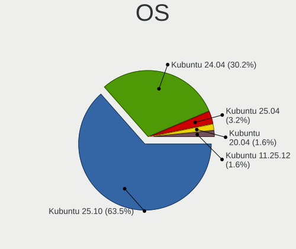

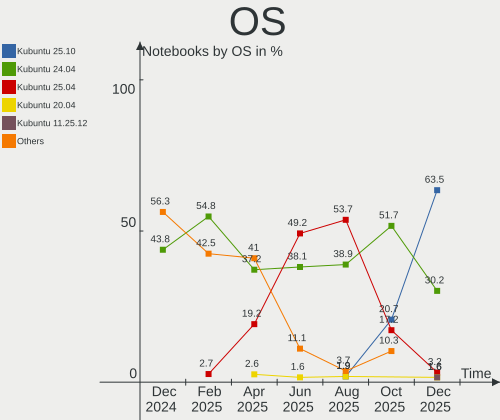

| Name             | Notebooks | Percent |
|------------------|-----------|---------|
| Kubuntu 25.10    | 40        | 63.49%  |
| Kubuntu 24.04    | 19        | 30.16%  |
| Kubuntu 25.04    | 2         | 3.17%   |
| Kubuntu 20.04    | 1         | 1.59%   |
| Kubuntu 11.25.12 | 1         | 1.59%   |

OS Family
---------

OS without a version

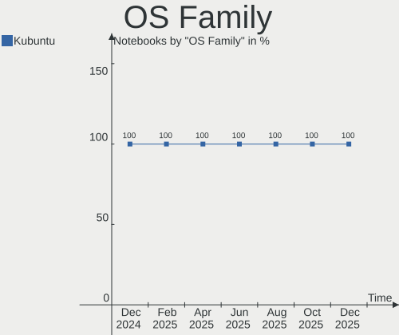

| Name    | Notebooks | Percent |
|---------|-----------|---------|
| Kubuntu | 63        | 100%    |

Kernel
------

Version of the Linux kernel

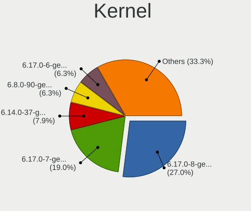

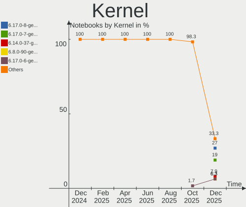

| Version                | Notebooks | Percent |
|------------------------|-----------|---------|
| 6.17.0-8-generic       | 17        | 26.98%  |
| 6.17.0-7-generic       | 12        | 19.05%  |
| 6.14.0-37-generic      | 5         | 7.94%   |
| 6.8.0-90-generic       | 4         | 6.35%   |
| 6.17.0-6-generic       | 4         | 6.35%   |
| 6.14.0-36-generic      | 4         | 6.35%   |
| 6.8.0-88-generic       | 3         | 4.76%   |
| 6.17.0-5-generic       | 3         | 4.76%   |
| 6.18.1-061801-generic  | 2         | 3.17%   |
| 6.8.0-88-lowlatency    | 1         | 1.59%   |
| 6.17.11-x64v3-xanmod1  | 1         | 1.59%   |
| 6.17.1-061701-generic  | 1         | 1.59%   |
| 6.14.0-35-generic      | 1         | 1.59%   |
| 6.14.0-34-kfocus       | 1         | 1.59%   |
| 6.14.0-34-generic      | 1         | 1.59%   |
| 6.14.0-27-generic      | 1         | 1.59%   |
| 6.10.14-061014-generic | 1         | 1.59%   |
| 5.4.0-224-generic      | 1         | 1.59%   |

Kernel Family
-------------

Linux kernel without a distro release

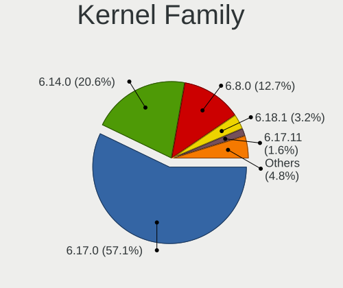

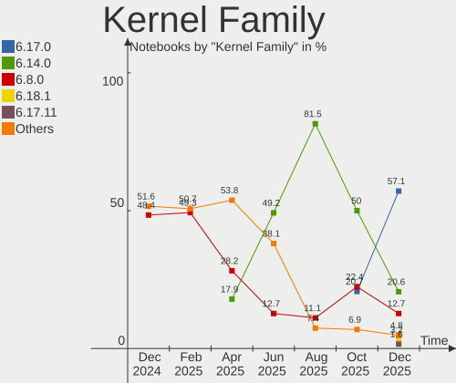

| Version | Notebooks | Percent |
|---------|-----------|---------|
| 6.17.0  | 36        | 57.14%  |
| 6.14.0  | 13        | 20.63%  |
| 6.8.0   | 8         | 12.7%   |
| 6.18.1  | 2         | 3.17%   |
| 6.17.11 | 1         | 1.59%   |
| 6.17.1  | 1         | 1.59%   |
| 6.10.14 | 1         | 1.59%   |
| 5.4.0   | 1         | 1.59%   |

Kernel Major Ver.
-----------------

Linux kernel major version

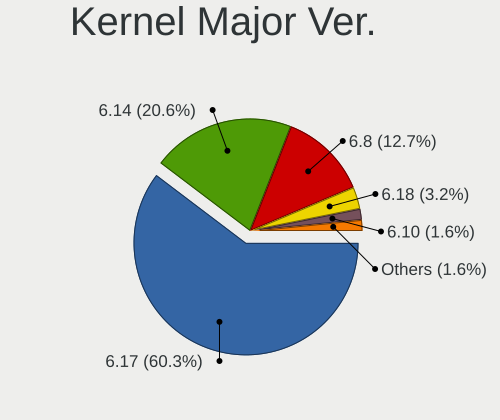

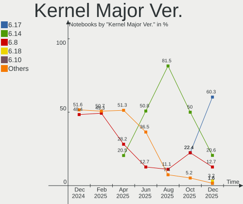

| Version | Notebooks | Percent |
|---------|-----------|---------|
| 6.17    | 38        | 60.32%  |
| 6.14    | 13        | 20.63%  |
| 6.8     | 8         | 12.7%   |
| 6.18    | 2         | 3.17%   |
| 6.10    | 1         | 1.59%   |
| 5.4     | 1         | 1.59%   |

Arch
----

OS architecture (x86_64, i586, etc.)

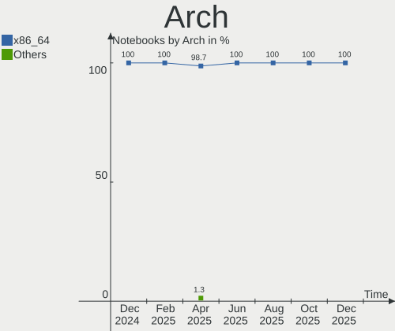

| Name   | Notebooks | Percent |
|--------|-----------|---------|
| x86_64 | 63        | 100%    |

DE
--

Desktop Environment

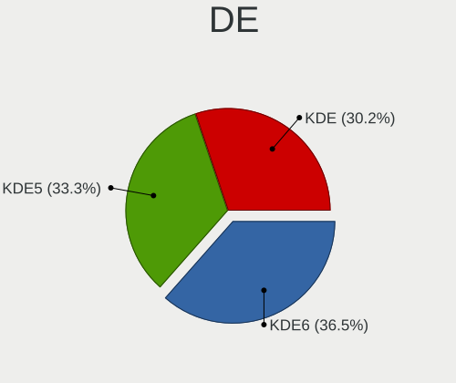

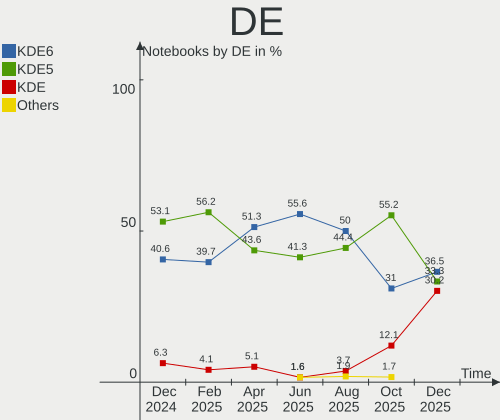

| Name | Notebooks | Percent |
|------|-----------|---------|
| KDE6 | 23        | 36.51%  |
| KDE5 | 21        | 33.33%  |
| KDE  | 19        | 30.16%  |

Display Server
--------------

X11 or Wayland

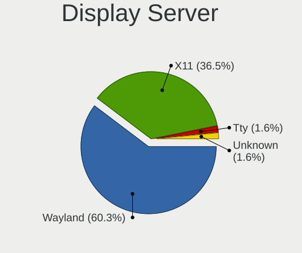

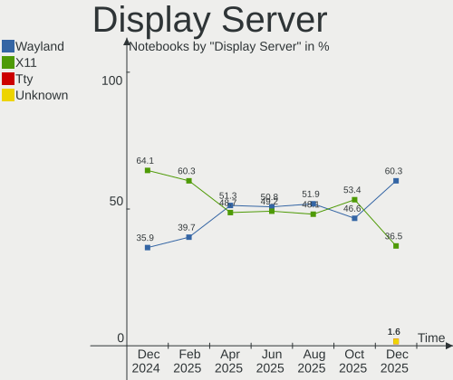

| Name    | Notebooks | Percent |
|---------|-----------|---------|
| Wayland | 38        | 60.32%  |
| X11     | 23        | 36.51%  |
| Tty     | 1         | 1.59%   |
| Unknown | 1         | 1.59%   |

Display Manager
---------------

SDDM, LightDM, etc.

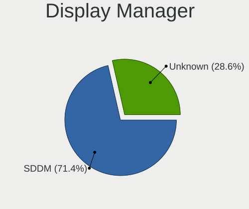

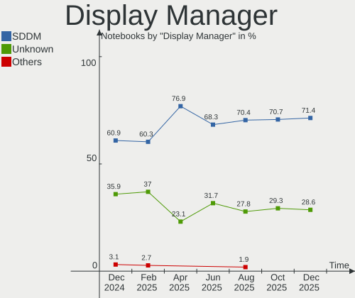

| Name    | Notebooks | Percent |
|---------|-----------|---------|
| SDDM    | 45        | 71.43%  |
| Unknown | 18        | 28.57%  |

OS Lang
-------

Language

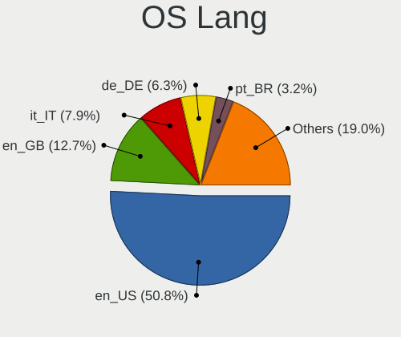

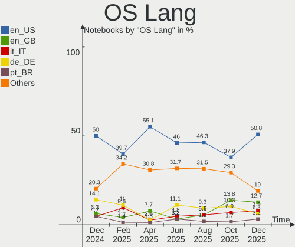

| Lang  | Notebooks | Percent |
|-------|-----------|---------|
| en_US | 32        | 50.79%  |
| en_GB | 8         | 12.7%   |
| it_IT | 5         | 7.94%   |
| de_DE | 4         | 6.35%   |
| pt_BR | 2         | 3.17%   |
| es_ES | 2         | 3.17%   |
| C     | 2         | 3.17%   |
| zh_CN | 1         | 1.59%   |
| ru_RU | 1         | 1.59%   |
| pl_PL | 1         | 1.59%   |
| nb_NO | 1         | 1.59%   |
| hu_HU | 1         | 1.59%   |
| en_ZA | 1         | 1.59%   |
| el_GR | 1         | 1.59%   |
| de_AT | 1         | 1.59%   |

Boot Mode
---------

EFI or BIOS

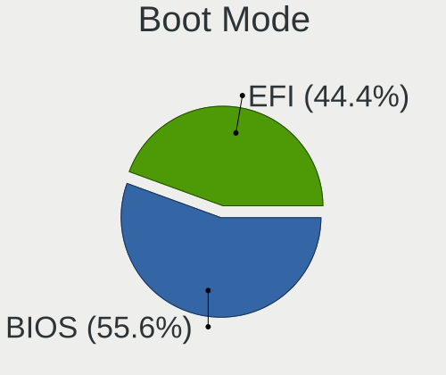

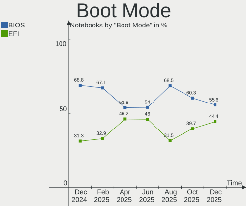

| Mode | Notebooks | Percent |
|------|-----------|---------|
| BIOS | 35        | 55.56%  |
| EFI  | 28        | 44.44%  |

Filesystem
----------

Type of filesystem

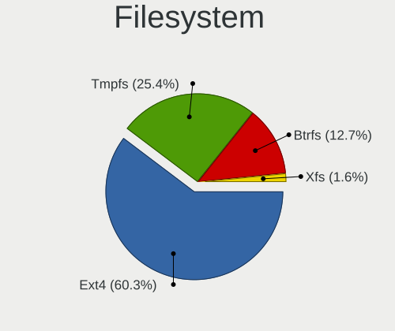

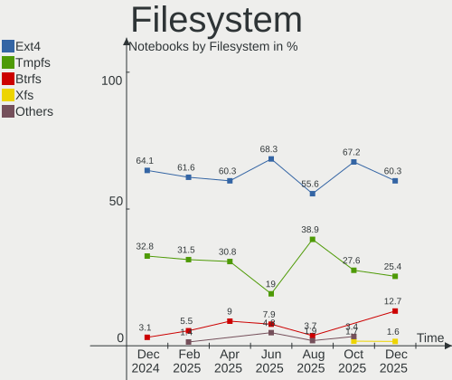

| Type  | Notebooks | Percent |
|-------|-----------|---------|
| Ext4  | 38        | 60.32%  |
| Tmpfs | 16        | 25.4%   |
| Btrfs | 8         | 12.7%   |
| Xfs   | 1         | 1.59%   |

Part. scheme
------------

Scheme of partitioning

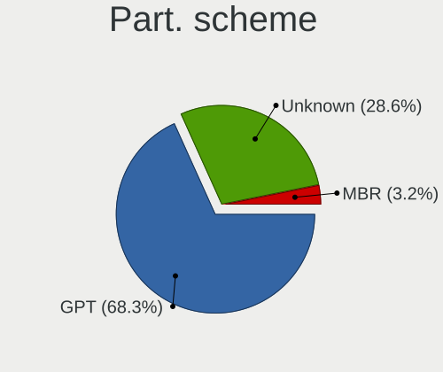

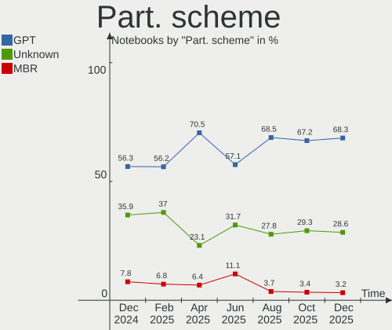

| Type    | Notebooks | Percent |
|---------|-----------|---------|
| GPT     | 43        | 68.25%  |
| Unknown | 18        | 28.57%  |
| MBR     | 2         | 3.17%   |

Dual Boot with Linux/BSD
------------------------

Hosting more than one Linux/BSD

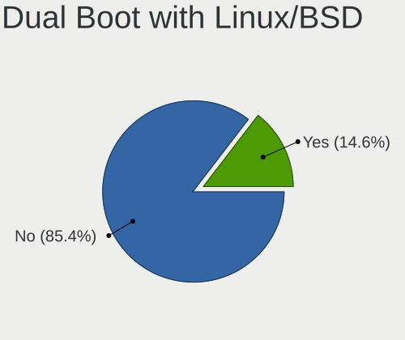

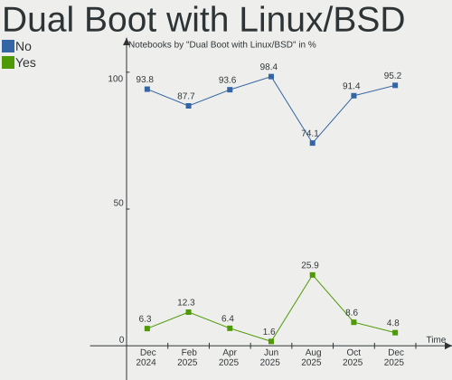

| Dual boot | Notebooks | Percent |
|-----------|-----------|---------|
| No        | 60        | 95.24%  |
| Yes       | 3         | 4.76%   |

Dual Boot (Win)
---------------

Hosting Linux and Windows

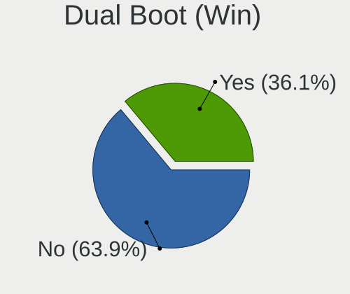

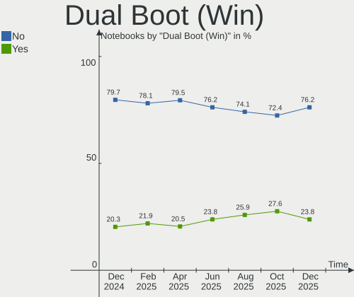

| Dual boot | Notebooks | Percent |
|-----------|-----------|---------|
| No        | 48        | 76.19%  |
| Yes       | 15        | 23.81%  |

Board
-----

Vendor
------

Motherboard manufacturer

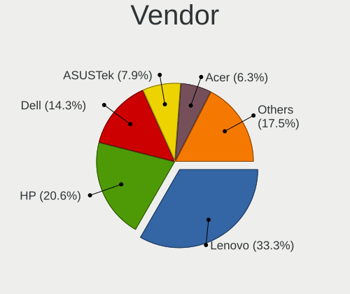

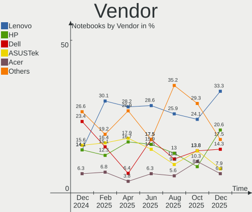

| Name                | Notebooks | Percent |
|---------------------|-----------|---------|
| Lenovo              | 21        | 33.33%  |
| Hewlett-Packard     | 13        | 20.63%  |
| Dell                | 9         | 14.29%  |
| ASUSTek Computer    | 5         | 7.94%   |
| Acer                | 4         | 6.35%   |
| Samsung Electronics | 3         | 4.76%   |
| MSI                 | 2         | 3.17%   |
| Razer               | 1         | 1.59%   |
| HUAWEI              | 1         | 1.59%   |
| Google              | 1         | 1.59%   |
| Framework           | 1         | 1.59%   |
| Carbon Systems      | 1         | 1.59%   |
| Apple               | 1         | 1.59%   |

Model
-----

Motherboard model

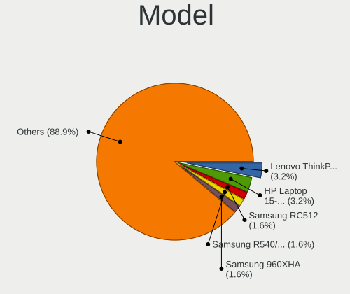

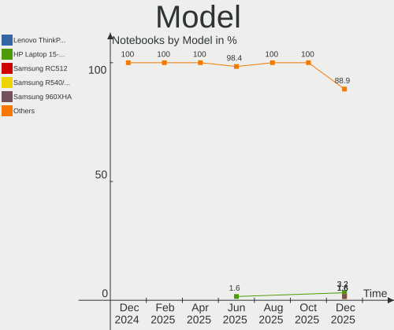

| Name                                            | Notebooks | Percent |
|-------------------------------------------------|-----------|---------|
| Lenovo ThinkPad T16 Gen 2 21K7CTO1WW            | 2         | 3.17%   |
| HP Laptop 15-fd0xxx                             | 2         | 3.17%   |
| Samsung RC512                                   | 1         | 1.59%   |
| Samsung R540/SA41/E452                          | 1         | 1.59%   |
| Samsung 960XHA                                  | 1         | 1.59%   |
| Razer Blade Stealth 13 (Early 2020) - RZ09-0310 | 1         | 1.59%   |
| MSI Stealth 14 AI Studio A1VFG                  | 1         | 1.59%   |
| MSI GS76 Stealth 11UG                           | 1         | 1.59%   |
| Lenovo Yoga Slim 7 14ILL10 83JX                 | 1         | 1.59%   |
| Lenovo ThinkPad X201 3680AV3                    | 1         | 1.59%   |
| Lenovo ThinkPad X1 Carbon 7th 20QES3HS00        | 1         | 1.59%   |
| Lenovo ThinkPad T480 20L6SC5502                 | 1         | 1.59%   |
| Lenovo ThinkPad T470P 20J7S00000                | 1         | 1.59%   |
| Lenovo ThinkPad T14s Gen 4 21F8S04T00           | 1         | 1.59%   |
| Lenovo ThinkPad T14p Gen 3 21RUA00JCD           | 1         | 1.59%   |
| Lenovo ThinkPad T14 Gen 6 21QJS0H400            | 1         | 1.59%   |
| Lenovo ThinkPad P51 20HH000UUS                  | 1         | 1.59%   |
| Lenovo ThinkPad P16v Gen 1 21FES05H00           | 1         | 1.59%   |
| Lenovo ThinkPad L14 Gen 2 20X2SBS200            | 1         | 1.59%   |
| Lenovo ThinkPad E16 Gen 3 21STS03E00            | 1         | 1.59%   |
| Lenovo ThinkPad E14 Gen 4 21E4001KBO            | 1         | 1.59%   |
| Lenovo Legion S7 15IMH5 82BC                    | 1         | 1.59%   |
| Lenovo IdeaPad Slim 5 14IRL8 82XD               | 1         | 1.59%   |
| Lenovo IdeaPad Slim 3 16ABR8 82XR               | 1         | 1.59%   |
| Lenovo IdeaPad Slim 3 15IAN8 82XB               | 1         | 1.59%   |
| Lenovo IdeaPad Gaming 3 15IHU6 82K1             | 1         | 1.59%   |
| Lenovo IdeaPad 1 15ALC7 82R4                    | 1         | 1.59%   |
| HUAWEI BOM-WXX9                                 | 1         | 1.59%   |
| HP ZBook 17 G2                                  | 1         | 1.59%   |
| HP Victus by Gaming Laptop 16-s1xxx             | 1         | 1.59%   |
| HP Victus by Gaming Laptop 15-fb3xxx            | 1         | 1.59%   |
| HP Victus by Gaming Laptop 15-fa2xxx            | 1         | 1.59%   |
| HP Pavilion Notebook 15-bc5xxx                  | 1         | 1.59%   |
| HP Pavilion Notebook                            | 1         | 1.59%   |
| HP Pavilion Gaming Laptop 15-dk0xxx             | 1         | 1.59%   |
| HP Notebook                                     | 1         | 1.59%   |
| HP Laptop 15s-du3xxx                            | 1         | 1.59%   |
| HP Laptop 15-bs0xx                              | 1         | 1.59%   |
| HP EliteBook 8770w                              | 1         | 1.59%   |
| Google Rull                                     | 1         | 1.59%   |

Model Family
------------

Motherboard model prefix

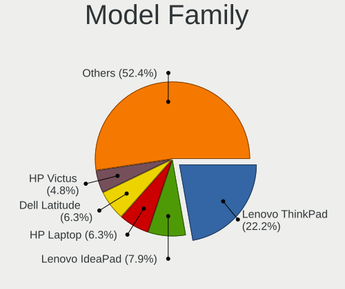

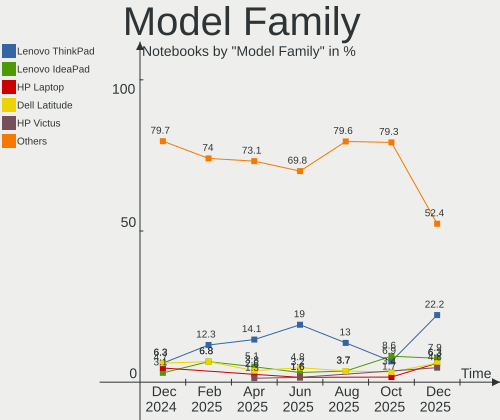

| Name                   | Notebooks | Percent |
|------------------------|-----------|---------|
| Lenovo ThinkPad        | 14        | 22.22%  |
| Lenovo IdeaPad         | 5         | 7.94%   |
| HP Laptop              | 4         | 6.35%   |
| Dell Latitude          | 4         | 6.35%   |
| HP Victus              | 3         | 4.76%   |
| HP Pavilion            | 3         | 4.76%   |
| Dell Inspiron          | 3         | 4.76%   |
| Acer Nitro             | 2         | 3.17%   |
| Samsung RC512          | 1         | 1.59%   |
| Samsung R540           | 1         | 1.59%   |
| Samsung 960XHA         | 1         | 1.59%   |
| Razer Blade            | 1         | 1.59%   |
| MSI Stealth            | 1         | 1.59%   |
| MSI GS76               | 1         | 1.59%   |
| Lenovo Yoga            | 1         | 1.59%   |
| Lenovo Legion          | 1         | 1.59%   |
| HUAWEI BOM-WXX9        | 1         | 1.59%   |
| HP ZBook               | 1         | 1.59%   |
| HP Notebook            | 1         | 1.59%   |
| HP EliteBook           | 1         | 1.59%   |
| Google Rull            | 1         | 1.59%   |
| Framework Laptop       | 1         | 1.59%   |
| Dell XPS               | 1         | 1.59%   |
| Dell Pro               | 1         | 1.59%   |
| Carbon Systems Iridium | 1         | 1.59%   |
| ASUS ZenBook           | 1         | 1.59%   |
| ASUS GL752VW           | 1         | 1.59%   |
| ASUS G750JM            | 1         | 1.59%   |
| ASUS G750JH            | 1         | 1.59%   |
| ASUS ASUS              | 1         | 1.59%   |
| Apple MacBookAir7      | 1         | 1.59%   |
| Acer TravelMate        | 1         | 1.59%   |
| Acer Predator          | 1         | 1.59%   |

MFG Year
--------

Motherboard manufacture year

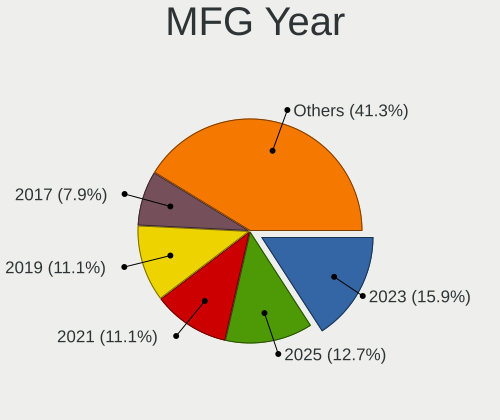

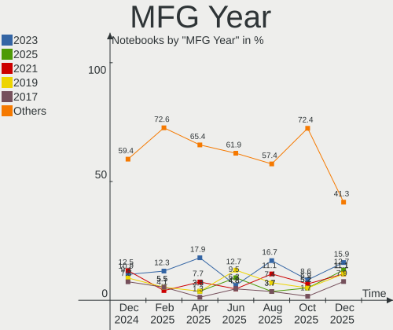

| Year    | Notebooks | Percent |
|---------|-----------|---------|
| 2023    | 10        | 15.87%  |
| 2025    | 8         | 12.7%   |
| 2021    | 7         | 11.11%  |
| 2019    | 7         | 11.11%  |
| 2017    | 5         | 7.94%   |
| 2024    | 4         | 6.35%   |
| 2022    | 3         | 4.76%   |
| 2020    | 3         | 4.76%   |
| 2018    | 3         | 4.76%   |
| 2014    | 2         | 3.17%   |
| 2013    | 2         | 3.17%   |
| 2011    | 2         | 3.17%   |
| 2010    | 2         | 3.17%   |
| 2016    | 1         | 1.59%   |
| 2015    | 1         | 1.59%   |
| 2012    | 1         | 1.59%   |
| 2006    | 1         | 1.59%   |
| Unknown | 1         | 1.59%   |

Form Factor
-----------

Physical design of the computer

| Name     | Notebooks | Percent |
|----------|-----------|---------|
| Notebook | 63        | 100%    |

Secure Boot
-----------

Enabled or disabled

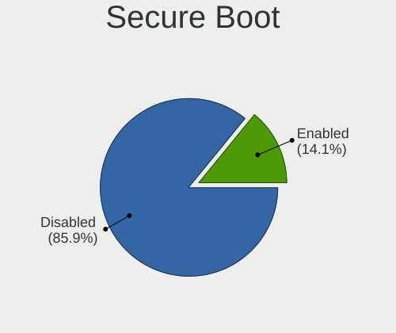

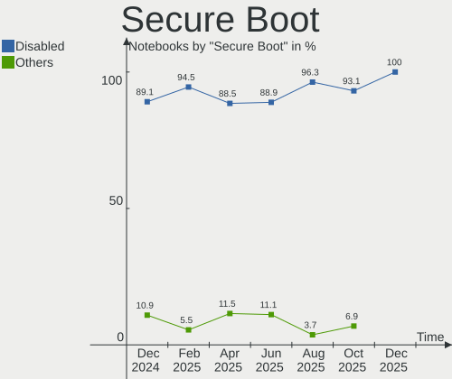

| State    | Notebooks | Percent |
|----------|-----------|---------|
| Disabled | 63        | 100%    |

Coreboot
--------

Have coreboot on board

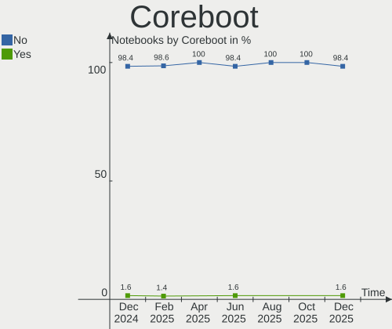

| Used | Notebooks | Percent |
|------|-----------|---------|
| No   | 62        | 98.41%  |
| Yes  | 1         | 1.59%   |

RAM Size
--------

Total RAM memory

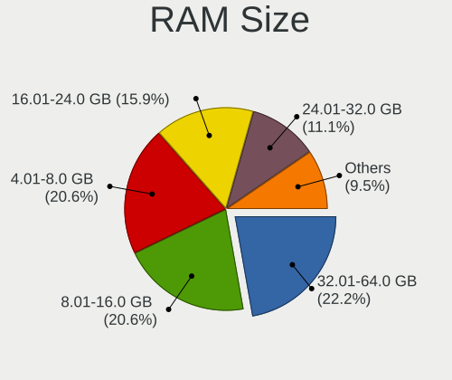

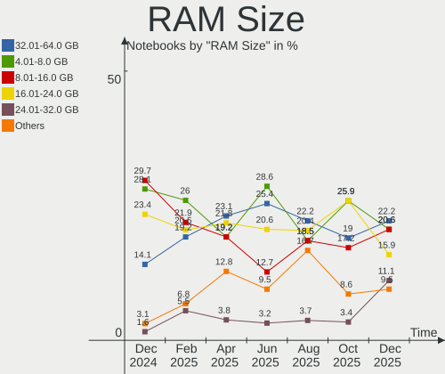

| Size in GB  | Notebooks | Percent |
|-------------|-----------|---------|
| 32.01-64.0  | 14        | 22.22%  |
| 4.01-8.0    | 13        | 20.63%  |
| 8.01-16.0   | 13        | 20.63%  |
| 16.01-24.0  | 10        | 15.87%  |
| 24.01-32.0  | 7         | 11.11%  |
| 3.01-4.0    | 3         | 4.76%   |
| 64.01-256.0 | 3         | 4.76%   |

RAM Used
--------

Used RAM memory

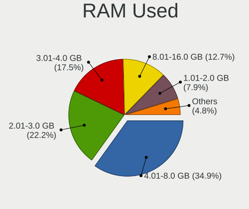

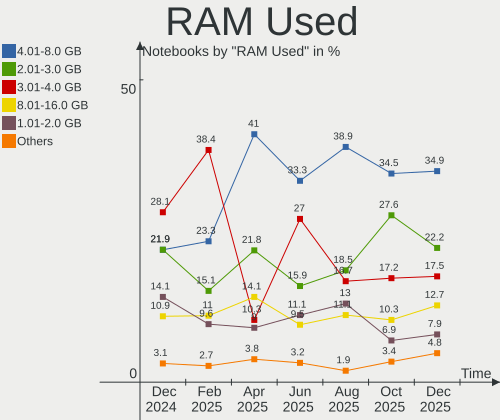

| Used GB    | Notebooks | Percent |
|------------|-----------|---------|
| 4.01-8.0   | 22        | 34.92%  |
| 2.01-3.0   | 14        | 22.22%  |
| 3.01-4.0   | 11        | 17.46%  |
| 8.01-16.0  | 8         | 12.7%   |
| 1.01-2.0   | 5         | 7.94%   |
| 32.01-64.0 | 2         | 3.17%   |
| 16.01-24.0 | 1         | 1.59%   |

Total Drives
------------

Number of drives on board

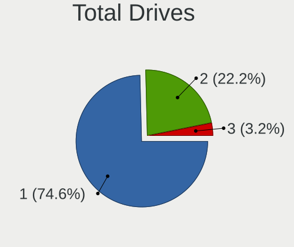

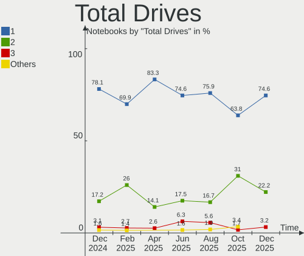

| Drives | Notebooks | Percent |
|--------|-----------|---------|
| 1      | 47        | 74.6%   |
| 2      | 14        | 22.22%  |
| 3      | 2         | 3.17%   |

Has CD-ROM
----------

Has CD-ROM on board

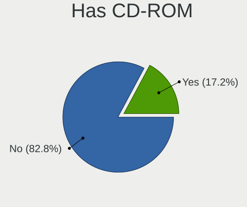

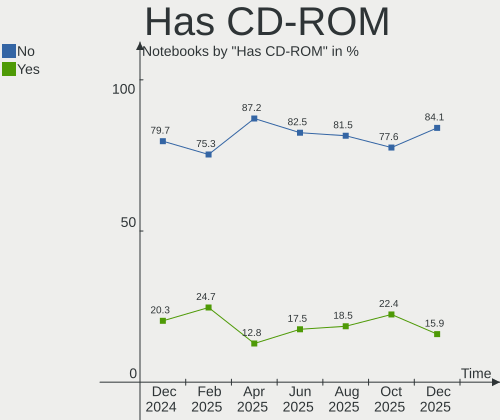

| Presented | Notebooks | Percent |
|-----------|-----------|---------|
| No        | 53        | 84.13%  |
| Yes       | 10        | 15.87%  |

Has Ethernet
------------

Has Ethernet on board

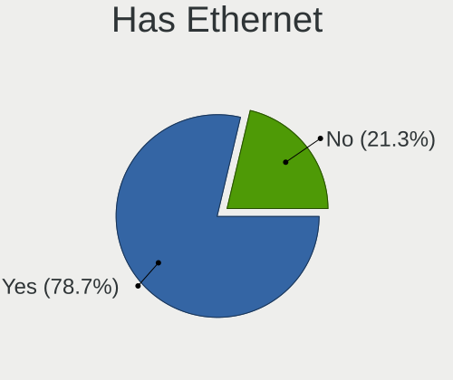

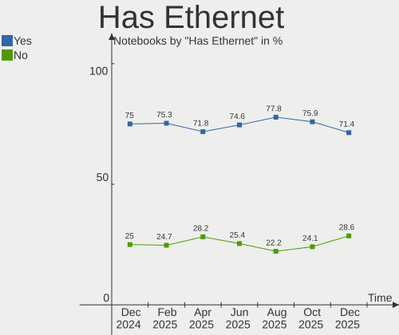

| Presented | Notebooks | Percent |
|-----------|-----------|---------|
| Yes       | 45        | 71.43%  |
| No        | 18        | 28.57%  |

Has WiFi
--------

Has WiFi module

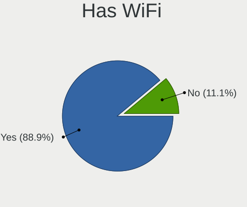

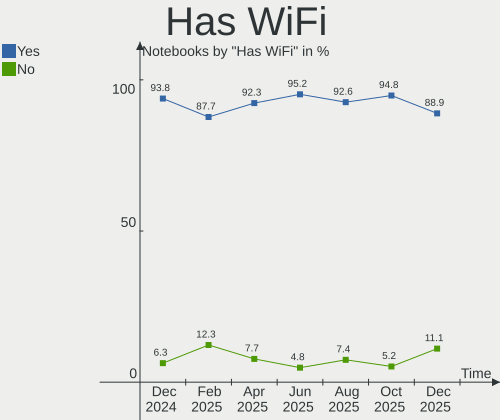

| Presented | Notebooks | Percent |
|-----------|-----------|---------|
| Yes       | 56        | 88.89%  |
| No        | 7         | 11.11%  |

Has Bluetooth
-------------

Has Bluetooth module

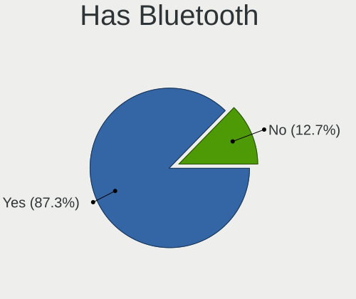

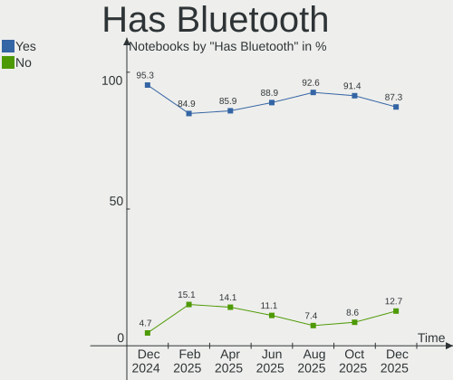

| Presented | Notebooks | Percent |
|-----------|-----------|---------|
| Yes       | 55        | 87.3%   |
| No        | 8         | 12.7%   |

Location
--------

Country
-------

Geographic location (country)

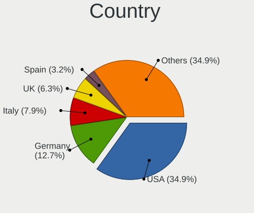

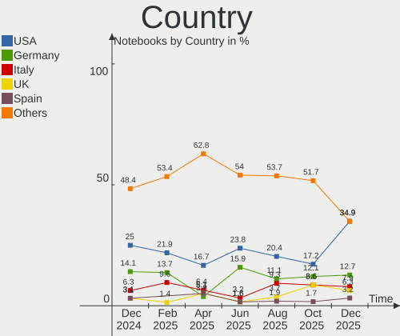

| Country      | Notebooks | Percent |
|--------------|-----------|---------|
| USA          | 22        | 34.92%  |
| Germany      | 8         | 12.7%   |
| Italy        | 5         | 7.94%   |
| UK           | 4         | 6.35%   |
| Spain        | 2         | 3.17%   |
| Poland       | 2         | 3.17%   |
| Pakistan     | 2         | 3.17%   |
| Bulgaria     | 2         | 3.17%   |
| Brazil       | 2         | 3.17%   |
| Australia    | 2         | 3.17%   |
| Turkey       | 1         | 1.59%   |
| Thailand     | 1         | 1.59%   |
| South Africa | 1         | 1.59%   |
| Russia       | 1         | 1.59%   |
| Norway       | 1         | 1.59%   |
| Nigeria      | 1         | 1.59%   |
| Netherlands  | 1         | 1.59%   |
| India        | 1         | 1.59%   |
| Hungary      | 1         | 1.59%   |
| Greece       | 1         | 1.59%   |
| Colombia     | 1         | 1.59%   |
| China        | 1         | 1.59%   |

City
----

Geographic location (city)

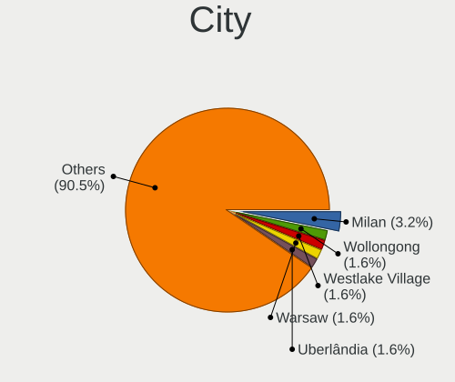

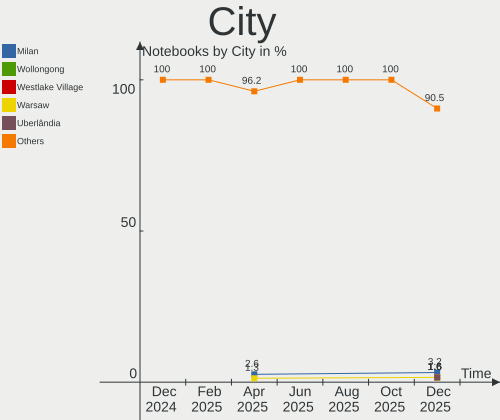

| City                 | Notebooks | Percent |
|----------------------|-----------|---------|
| Milan                | 2         | 3.17%   |
| Wollongong           | 1         | 1.59%   |
| Westlake Village     | 1         | 1.59%   |
| Warsaw               | 1         | 1.59%   |
| Uberlândia          | 1         | 1.59%   |
| Turin                | 1         | 1.59%   |
| Trowbridge           | 1         | 1.59%   |
| Traverse City        | 1         | 1.59%   |
| Sydney               | 1         | 1.59%   |
| Stuttgart            | 1         | 1.59%   |
| Sterling             | 1         | 1.59%   |
| Springfield          | 1         | 1.59%   |
| Sofia                | 1         | 1.59%   |
| Sialkot              | 1         | 1.59%   |
| Shoreham-by-Sea      | 1         | 1.59%   |
| Seattle              | 1         | 1.59%   |
| Salt Lake City       | 1         | 1.59%   |
| Rio de Janeiro       | 1         | 1.59%   |
| Presezzo             | 1         | 1.59%   |
| Portland             | 1         | 1.59%   |
| Pocatello            | 1         | 1.59%   |
| Ostrów Wielkopolski | 1         | 1.59%   |
| Nunspeet             | 1         | 1.59%   |
| Neumünster          | 1         | 1.59%   |
| Moscow               | 1         | 1.59%   |
| Monroe               | 1         | 1.59%   |
| Mérida              | 1         | 1.59%   |
| Maplewood            | 1         | 1.59%   |
| Manchester           | 1         | 1.59%   |
| Madrid               | 1         | 1.59%   |
| Long Beach           | 1         | 1.59%   |
| Leipzig              | 1         | 1.59%   |
| Knoxville            | 1         | 1.59%   |
| Kecskemét           | 1         | 1.59%   |
| Karachi              | 1         | 1.59%   |
| Jinan                | 1         | 1.59%   |
| Istanbul             | 1         | 1.59%   |
| High Point           | 1         | 1.59%   |
| Henderson            | 1         | 1.59%   |
| Haskovo              | 1         | 1.59%   |

Drives
------

Drive Vendor
------------

Hard drive vendors

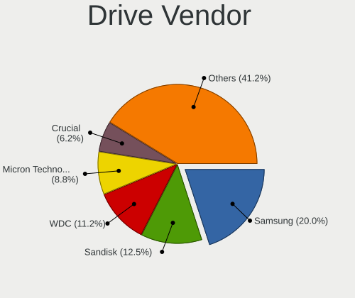

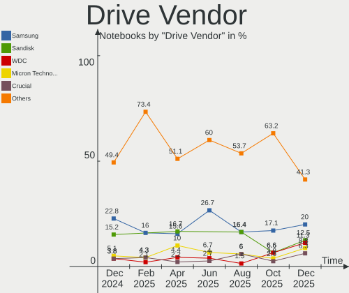

| Vendor                         | Notebooks | Drives | Percent |
|--------------------------------|-----------|--------|---------|
| Samsung Electronics            | 16        | 16     | 20%     |
| Sandisk                        | 10        | 10     | 12.5%   |
| WDC                            | 9         | 9      | 11.25%  |
| Micron Technology              | 7         | 7      | 8.75%   |
| Crucial                        | 5         | 5      | 6.25%   |
| SK hynix                       | 4         | 4      | 5%      |
| Unknown                        | 3         | 3      | 3.75%   |
| Toshiba                        | 3         | 3      | 3.75%   |
| Phison                         | 2         | 2      | 2.5%    |
| KIOXIA                         | 2         | 3      | 2.5%    |
| Kingston Technology Company    | 2         | 2      | 2.5%    |
| Union Memory (Shenzhen)        | 1         | 1      | 1.25%   |
| UMIS                           | 1         | 1      | 1.25%   |
| SSSTC                          | 1         | 1      | 1.25%   |
| Solid State Storage Technology | 1         | 1      | 1.25%   |
| Seagate                        | 1         | 1      | 1.25%   |
| PNY                            | 1         | 1      | 1.25%   |
| Micron/Crucial Technology      | 1         | 1      | 1.25%   |
| Kingston                       | 1         | 1      | 1.25%   |
| KingSpec                       | 1         | 1      | 1.25%   |
| Hitachi                        | 1         | 1      | 1.25%   |
| HGST                           | 1         | 1      | 1.25%   |
| Fujitsu                        | 1         | 1      | 1.25%   |
| EDILOCA                        | 1         | 1      | 1.25%   |
| ASMT                           | 1         | 1      | 1.25%   |
| Apricorn                       | 1         | 1      | 1.25%   |
| Apple                          | 1         | 1      | 1.25%   |
| ADATA Technology               | 1         | 1      | 1.25%   |

Drive Model
-----------

Hard drive models

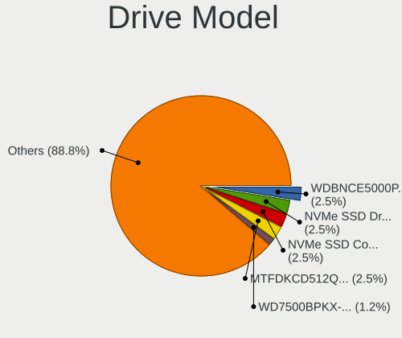

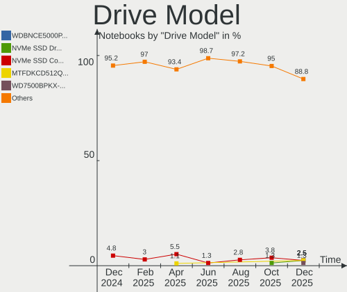

| Model                                              | Notebooks | Percent |
|----------------------------------------------------|-----------|---------|
| WDC WDBNCE5000PNC 500GB SSD                        | 2         | 2.5%    |
| SanDisk NVMe SSD Drive 512GB                       | 2         | 2.5%    |
| Samsung NVMe SSD Controller SM981/PM981/PM983 1TB  | 2         | 2.5%    |
| Micron MTFDKCD512QFM-1BD1AABLA 512GB               | 2         | 2.5%    |
| WDC WD7500BPKX-80HPJT0 752GB                       | 1         | 1.25%   |
| WDC WD5000LPCX-60VHAT0 500GB                       | 1         | 1.25%   |
| WDC WD40NPZZ-00PDPT0 4TB                           | 1         | 1.25%   |
| WDC WD10JPVX-60JC3T0 1TB                           | 1         | 1.25%   |
| WDC WD Green SN350 1TB                             | 1         | 1.25%   |
| WDC WD Game Drive 500GB                            | 1         | 1.25%   |
| WDC PC SN520 SDAPMUW-512G                          | 1         | 1.25%   |
| Unknown SD/MMC/MS PRO 2GB                          | 1         | 1.25%   |
| Unknown MMC Card  16GB                             | 1         | 1.25%   |
| Unknown MMC Card  128GB                            | 1         | 1.25%   |
| Union Memory (Shenzhen) UMIS RPJTJ256MKP1MDQ 256GB | 1         | 1.25%   |
| UMIS RPJTJ256MKP1MDY 256GB                         | 1         | 1.25%   |
| Toshiba MK5076GSX 500GB                            | 1         | 1.25%   |
| Toshiba KBG40ZNS256G NVMe 256GB                    | 1         | 1.25%   |
| Toshiba BG3 NVMe SSD Controller 256GB              | 1         | 1.25%   |
| SSSTC CL4-8D1024 1TB                               | 1         | 1.25%   |
| Solid State Storage SSSTC CL4-8D256-Q79 256GB      | 1         | 1.25%   |
| SK hynix SKHynix_HFS512GEJ9X164N 512GB             | 1         | 1.25%   |
| SK hynix SKHynix_HFS512GEJ9X162N 512GB             | 1         | 1.25%   |
| SK hynix SKHynix_HFS001TEM4X169N 1TB               | 1         | 1.25%   |
| SK hynix BC711 NVMe 512GB                          | 1         | 1.25%   |
| Seagate ST2000LX001-1RG174 2TB                     | 1         | 1.25%   |
| Sandisk WD_BLACK SN770 2TB                         | 1         | 1.25%   |
| Sandisk WD Blue SN500 / PC SN520 NVMe SSD 128GB    | 1         | 1.25%   |
| Sandisk WD Black SN850 1TB                         | 1         | 1.25%   |
| Sandisk WD Black SN750 / PC SN730 NVMe SSD 500GB   | 1         | 1.25%   |
| SanDisk SSD PLUS 240 GB                            | 1         | 1.25%   |
| SanDisk SDSSDA240G 240GB                           | 1         | 1.25%   |
| Sandisk PC SN5000S SDEPNSJ-1T00-1006 1024GB        | 1         | 1.25%   |
| SanDisk NVMe SSD Drive 1TB                         | 1         | 1.25%   |
| Samsung SSD 870 QVO 4TB                            | 1         | 1.25%   |
| Samsung SSD 870 QVO 1TB                            | 1         | 1.25%   |
| Samsung SSD 870 EVO 500GB                          | 1         | 1.25%   |
| Samsung SSD 860 EVO 1TB                            | 1         | 1.25%   |
| Samsung PM9B1 NVMe 512GB                           | 1         | 1.25%   |
| Samsung NVMe SSD Controller PM9A1/PM9A3/980PRO 1TB | 1         | 1.25%   |

HDD Vendor
----------

Hard disk drive vendors

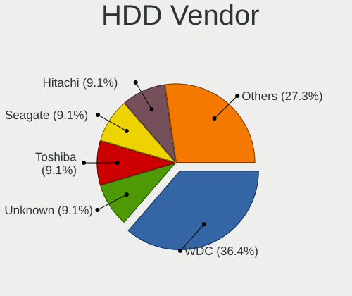

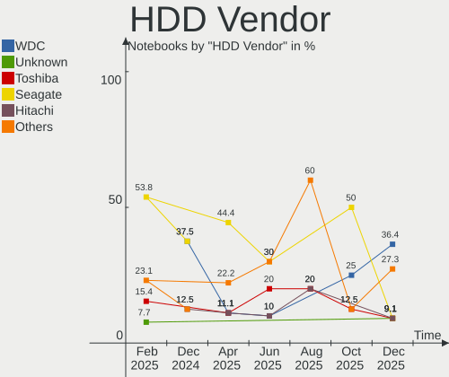

| Vendor   | Notebooks | Drives | Percent |
|----------|-----------|--------|---------|
| WDC      | 4         | 4      | 36.36%  |
| Unknown  | 1         | 1      | 9.09%   |
| Toshiba  | 1         | 1      | 9.09%   |
| Seagate  | 1         | 1      | 9.09%   |
| Hitachi  | 1         | 1      | 9.09%   |
| HGST     | 1         | 1      | 9.09%   |
| Fujitsu  | 1         | 1      | 9.09%   |
| Apricorn | 1         | 1      | 9.09%   |

SSD Vendor
----------

Solid state drive vendors

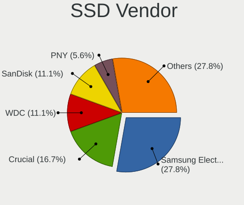

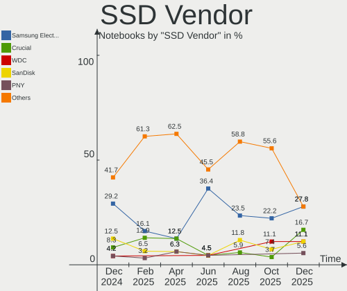

| Vendor              | Notebooks | Drives | Percent |
|---------------------|-----------|--------|---------|
| Samsung Electronics | 5         | 5      | 27.78%  |
| Crucial             | 3         | 3      | 16.67%  |
| WDC                 | 2         | 2      | 11.11%  |
| SanDisk             | 2         | 2      | 11.11%  |
| PNY                 | 1         | 1      | 5.56%   |
| Micron Technology   | 1         | 1      | 5.56%   |
| Kingston            | 1         | 1      | 5.56%   |
| KingSpec            | 1         | 1      | 5.56%   |
| EDILOCA             | 1         | 1      | 5.56%   |
| Apple               | 1         | 1      | 5.56%   |

Drive Kind
----------

HDD or SSD

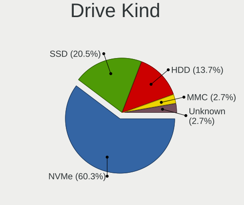

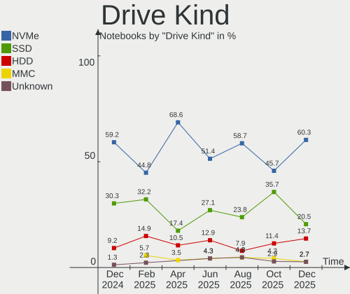

| Kind    | Notebooks | Drives | Percent |
|---------|-----------|--------|---------|
| NVMe    | 44        | 48     | 60.27%  |
| SSD     | 15        | 18     | 20.55%  |
| HDD     | 10        | 11     | 13.7%   |
| MMC     | 2         | 2      | 2.74%   |
| Unknown | 2         | 2      | 2.74%   |

Drive Connector
---------------

SATA, SAS, NVMe, etc.

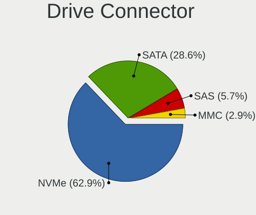

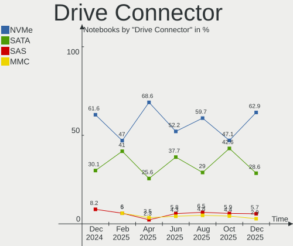

| Type | Notebooks | Drives | Percent |
|------|-----------|--------|---------|
| NVMe | 44        | 48     | 62.86%  |
| SATA | 20        | 27     | 28.57%  |
| SAS  | 4         | 4      | 5.71%   |
| MMC  | 2         | 2      | 2.86%   |

Drive Size
----------

Size of hard drive

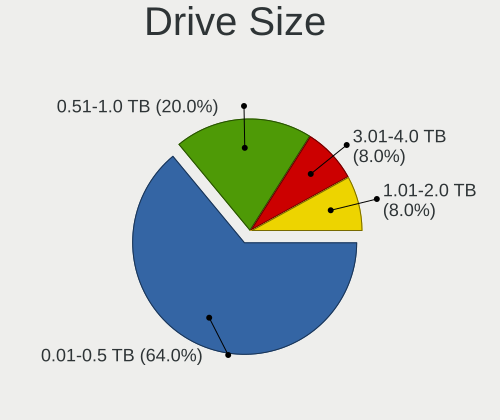

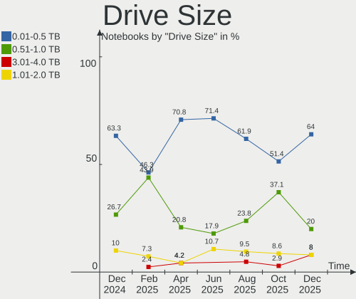

| Size in TB | Notebooks | Drives | Percent |
|------------|-----------|--------|---------|
| 0.01-0.5   | 16        | 19     | 64%     |
| 0.51-1.0   | 5         | 6      | 20%     |
| 3.01-4.0   | 2         | 2      | 8%      |
| 1.01-2.0   | 2         | 2      | 8%      |

Space Total
-----------

Amount of disk space available on the file system

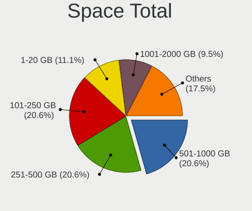

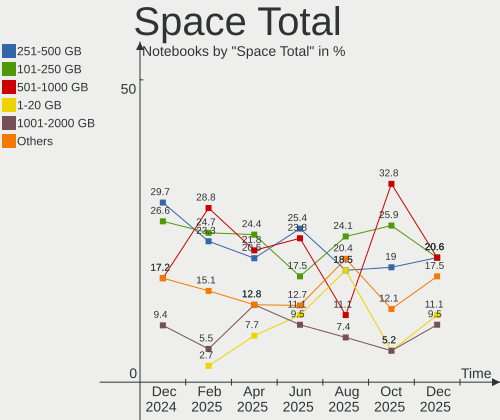

| Size in GB     | Notebooks | Percent |
|----------------|-----------|---------|
| 251-500        | 13        | 20.63%  |
| 101-250        | 13        | 20.63%  |
| 501-1000       | 13        | 20.63%  |
| 1-20           | 7         | 11.11%  |
| 1001-2000      | 6         | 9.52%   |
| More than 3000 | 3         | 4.76%   |
| 2001-3000      | 3         | 4.76%   |
| 51-100         | 2         | 3.17%   |
| Unknown        | 2         | 3.17%   |
| 21-50          | 1         | 1.59%   |

Space Used
----------

Amount of used disk space

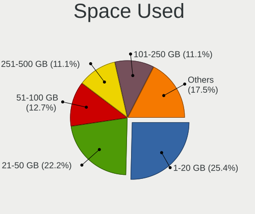

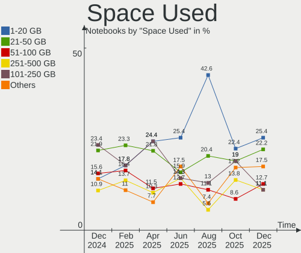

| Used GB        | Notebooks | Percent |
|----------------|-----------|---------|
| 1-20           | 16        | 25.4%   |
| 21-50          | 14        | 22.22%  |
| 51-100         | 8         | 12.7%   |
| 251-500        | 7         | 11.11%  |
| 101-250        | 7         | 11.11%  |
| 501-1000       | 5         | 7.94%   |
| 1001-2000      | 2         | 3.17%   |
| Unknown        | 2         | 3.17%   |
| More than 3000 | 1         | 1.59%   |
| 2001-3000      | 1         | 1.59%   |

Malfunc. Drives
---------------

Drive models with a malfunction

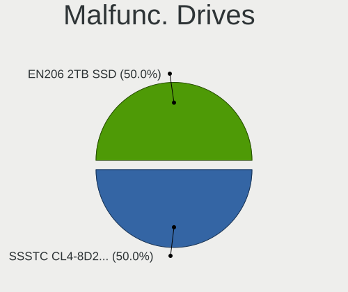

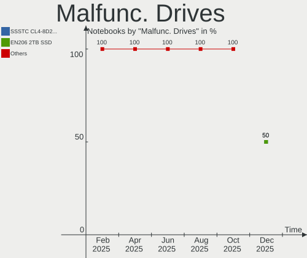

| Model                                                    | Notebooks | Drives | Percent |
|----------------------------------------------------------|-----------|--------|---------|
| Solid State Storage Technology SSSTC CL4-8D256-Q79 256GB | 1         | 1      | 50%     |
| EDILOCA EN206 2TB SSD                                    | 1         | 1      | 50%     |

Malfunc. Drive Vendor
---------------------

Vendors of faulty drives

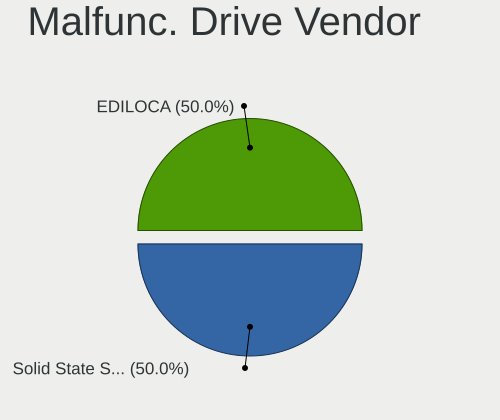

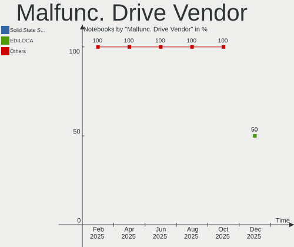

| Vendor                         | Notebooks | Drives | Percent |
|--------------------------------|-----------|--------|---------|
| Solid State Storage Technology | 1         | 1      | 50%     |
| EDILOCA                        | 1         | 1      | 50%     |

Malfunc. HDD Vendor
-------------------

Vendors of faulty HDD drives

Zero info for selected period =(

Malfunc. Drive Kind
-------------------

Kinds of faulty drives

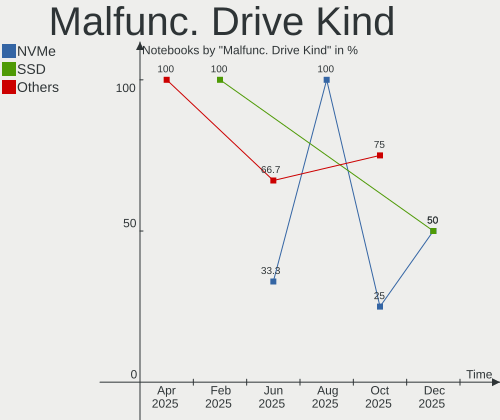

| Kind | Notebooks | Drives | Percent |
|------|-----------|--------|---------|
| NVMe | 1         | 1      | 50%     |
| SSD  | 1         | 1      | 50%     |

Failed Drives
-------------

Failed drive models

Zero info for selected period =(

Failed Drive Vendor
-------------------

Failed drive vendors

Zero info for selected period =(

Drive Status
------------

Number of failed and malfunc. drives

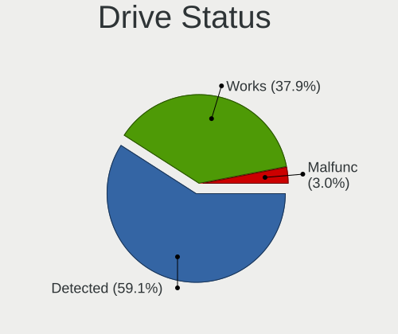

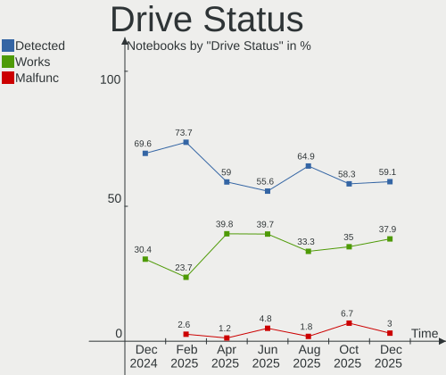

| Status   | Notebooks | Drives | Percent |
|----------|-----------|--------|---------|
| Detected | 39        | 51     | 59.09%  |
| Works    | 25        | 28     | 37.88%  |
| Malfunc  | 2         | 2      | 3.03%   |

Storage controller
------------------

Storage Vendor
--------------

Storage controller vendors

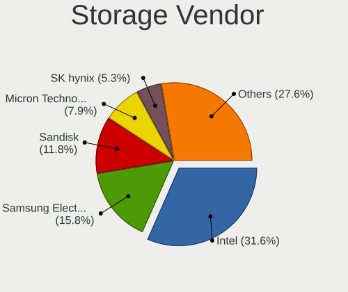

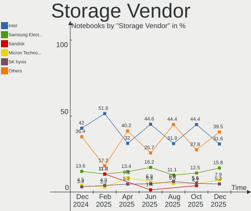

| Vendor                                  | Notebooks | Percent |
|-----------------------------------------|-----------|---------|
| Intel                                   | 24        | 31.58%  |
| Samsung Electronics                     | 12        | 15.79%  |
| Sandisk                                 | 9         | 11.84%  |
| Micron Technology                       | 6         | 7.89%   |
| SK hynix                                | 4         | 5.26%   |
| AMD                                     | 4         | 5.26%   |
| Micron/Crucial Technology               | 3         | 3.95%   |
| KIOXIA                                  | 3         | 3.95%   |
| Solid State Storage Technology          | 2         | 2.63%   |
| Shenzhen Unionmemory Information System | 2         | 2.63%   |
| Phison Electronics                      | 2         | 2.63%   |
| Kingston Technology Company             | 2         | 2.63%   |
| Toshiba America Info Systems            | 1         | 1.32%   |
| JMicron Technology                      | 1         | 1.32%   |
| ADATA Technology                        | 1         | 1.32%   |

Storage Model
-------------

Storage controller models

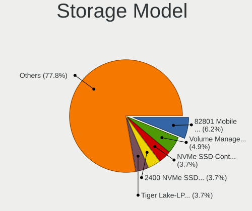

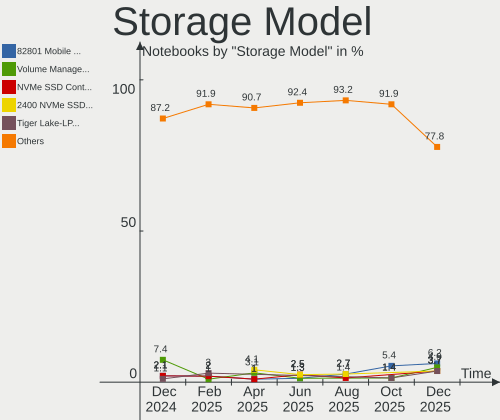

| Model                                                                          | Notebooks | Percent |
|--------------------------------------------------------------------------------|-----------|---------|
| Intel 82801 Mobile SATA Controller [RAID mode]                                 | 5         | 6.17%   |
| Intel Volume Management Device NVMe RAID Controller                            | 4         | 4.94%   |
| Samsung NVMe SSD Controller PM9A1/PM9A3/980PRO                                 | 3         | 3.7%    |
| Micron 2400 NVMe SSD (DRAM-less)                                               | 3         | 3.7%    |
| Intel Tiger Lake-LP SATA Controller                                            | 3         | 3.7%    |
| Intel 8 Series/C220 Series Chipset Family 6-port SATA Controller 1 [AHCI mode] | 3         | 3.7%    |
| AMD FCH SATA Controller [AHCI mode]                                            | 3         | 3.7%    |
| Solid State Storage CL4-8D512 NVMe SSD M.2 (DRAM-less)                         | 2         | 2.47%   |
| Shenzhen Unionmemory Information System AM6A0 PCIe 4.0 NVMe SSD 256GB          | 2         | 2.47%   |
| SanDisk WD PC SN810 / Black SN850 NVMe SSD                                     | 2         | 2.47%   |
| Sandisk WD PC SN5000S M.2 2280 NVMe SSD (DRAM-less)                            | 2         | 2.47%   |
| Samsung NVMe SSD Controller SM981/PM981/PM983                                  | 2         | 2.47%   |
| Samsung NVMe SSD Controller PM9B1 (DRAM-less)                                  | 2         | 2.47%   |
| Samsung NVMe SSD Controller 980 (DRAM-less)                                    | 2         | 2.47%   |
| Micron/Crucial P2 [Nick P2] / P3 / P3 Plus NVMe PCIe SSD (DRAM-less)           | 2         | 2.47%   |
| Kingston Company NV3 NVMe SSD [TC2201] (DRAM-less)                             | 2         | 2.47%   |
| Intel Sunrise Point-LP SATA Controller [AHCI mode]                             | 2         | 2.47%   |
| Intel RST Volume Management Device Controller                                  | 2         | 2.47%   |
| Intel HM170/QM170 Chipset SATA Controller [AHCI Mode]                          | 2         | 2.47%   |
| Toshiba America Info Systems BG3 x2 NVMe SSD Controller (DRAM-less)            | 1         | 1.23%   |
| SK hynix PVC10 NVMe Solid State Drive (DRAM-less)                              | 1         | 1.23%   |
| SK hynix Platinum P41/PC801 NVMe Solid State Drive                             | 1         | 1.23%   |
| SK hynix Gold P31/BC711/PC711 NVMe Solid State Drive                           | 1         | 1.23%   |
| SK hynix BC901 NVMe Solid State Drive (DRAM-less)                              | 1         | 1.23%   |
| SanDisk WD SN560/SN740/SN770/SN5000 NVMe SSD                                   | 1         | 1.23%   |
| SanDisk WD PC SN540 / Green SN350 NVMe SSD 1 TB (DRAM-less)                    | 1         | 1.23%   |
| Sandisk WD PC SN5000S M.2 2230 NVMe SSD (DRAM-less)                            | 1         | 1.23%   |
| SanDisk WD Blue SN500 / PC SN520 x2 M.2 2280 NVMe SSD                          | 1         | 1.23%   |
| SanDisk PC SN520 x2 M.2 2242 NVMe SSD                                          | 1         | 1.23%   |
| SanDisk Extreme Pro / WD Black SN750 / PC SN730 / Red SN700 NVMe SSD           | 1         | 1.23%   |
| Samsung S4LN058A01[SSUBX] AHCI SSD Controller (Apple slot)                     | 1         | 1.23%   |
| Samsung NVMe SSD Controller PM9C1a (DRAM-less)                                 | 1         | 1.23%   |
| Samsung NVMe SSD 9100 PRO [PM9E1]                                              | 1         | 1.23%   |
| Phison PS5019-E19 PCIe4 NVMe Controller (DRAM-less)                            | 1         | 1.23%   |
| Phison PS5013-E13 PCIe3 NVMe Controller (DRAM-less)                            | 1         | 1.23%   |
| Micron/Crucial P3 Plus NVMe PCIe SSD (DRAM-less)                               | 1         | 1.23%   |
| Micron 3400 NVMe SSD [Hendrix]                                                 | 1         | 1.23%   |
| Micron 2650 NVMe SSD (DRAM-less)                                               | 1         | 1.23%   |
| Micron 2300 NVMe SSD [Santana]                                                 | 1         | 1.23%   |
| KIOXIA NVMe SSD Controller XG8                                                 | 1         | 1.23%   |

Storage Kind
------------

Kind of storage controller (IDE, SATA, NVMe, SAS, ...)

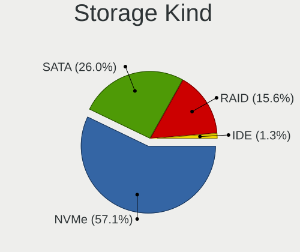

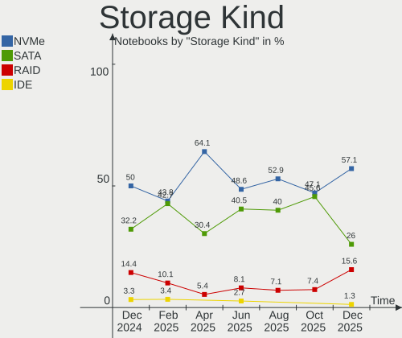

| Kind | Notebooks | Percent |
|------|-----------|---------|
| NVMe | 44        | 57.14%  |
| SATA | 20        | 25.97%  |
| RAID | 12        | 15.58%  |
| IDE  | 1         | 1.3%    |

Processor
---------

CPU Vendor
----------

Processor vendors

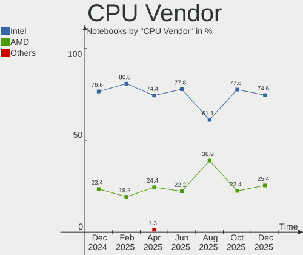

| Vendor | Notebooks | Percent |
|--------|-----------|---------|
| Intel  | 47        | 74.6%   |
| AMD    | 16        | 25.4%   |

CPU Model
---------

Processor models

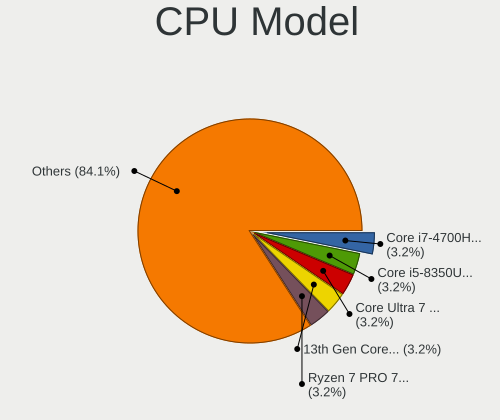

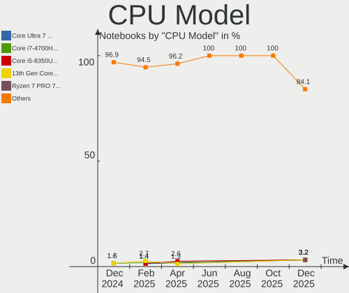

| Model                                         | Notebooks | Percent |
|-----------------------------------------------|-----------|---------|
| Intel Core Ultra 7 258V                       | 2         | 3.17%   |
| Intel Core i7-4700HQ CPU @ 2.40GHz            | 2         | 3.17%   |
| Intel Core i5-8350U CPU @ 1.70GHz             | 2         | 3.17%   |
| Intel 13th Gen Core i5-13420H                 | 2         | 3.17%   |
| AMD Ryzen 7 PRO 7840U w/ Radeon 780M Graphics | 2         | 3.17%   |
| AMD Ryzen 5 5500U with Radeon Graphics        | 2         | 3.17%   |
| Intel Xeon CPU E3-1505M v6 @ 3.00GHz          | 1         | 1.59%   |
| Intel N150                                    | 1         | 1.59%   |
| Intel Core Ultra 9 285H                       | 1         | 1.59%   |
| Intel Core Ultra 7 265U                       | 1         | 1.59%   |
| Intel Core Ultra 7 155H                       | 1         | 1.59%   |
| Intel Core Ultra 5 225H                       | 1         | 1.59%   |
| Intel Core i7-9750H CPU @ 2.60GHz             | 1         | 1.59%   |
| Intel Core i7-7700HQ CPU @ 2.80GHz            | 1         | 1.59%   |
| Intel Core i7-4710MQ CPU @ 2.50GHz            | 1         | 1.59%   |
| Intel Core i7-4500U CPU @ 1.80GHz             | 1         | 1.59%   |
| Intel Core i7-3630QM CPU @ 2.40GHz            | 1         | 1.59%   |
| Intel Core i7-2670QM CPU @ 2.20GHz            | 1         | 1.59%   |
| Intel Core i7-10875H CPU @ 2.30GHz            | 1         | 1.59%   |
| Intel Core i7-1065G7 CPU @ 1.30GHz            | 1         | 1.59%   |
| Intel Core i5-9300H CPU @ 2.40GHz             | 1         | 1.59%   |
| Intel Core i5-8365U CPU @ 1.60GHz             | 1         | 1.59%   |
| Intel Core i5-8300H CPU @ 2.30GHz             | 1         | 1.59%   |
| Intel Core i5-8265U CPU @ 1.60GHz             | 1         | 1.59%   |
| Intel Core i5-7200U CPU @ 2.50GHz             | 1         | 1.59%   |
| Intel Core i5-6300HQ CPU @ 2.30GHz            | 1         | 1.59%   |
| Intel Core i5-5250U CPU @ 1.60GHz             | 1         | 1.59%   |
| Intel Core i5-10310U CPU @ 1.70GHz            | 1         | 1.59%   |
| Intel Core i5-10210U CPU @ 1.60GHz            | 1         | 1.59%   |
| Intel Core i5 CPU M 520 @ 2.40GHz             | 1         | 1.59%   |
| Intel Core i3-N305                            | 1         | 1.59%   |
| Intel Core i3-6006U CPU @ 2.00GHz             | 1         | 1.59%   |
| Intel Core i3 CPU M 380 @ 2.53GHz             | 1         | 1.59%   |
| Intel 13th Gen Core i7-1365U                  | 1         | 1.59%   |
| Intel 13th Gen Core i7-13620H                 | 1         | 1.59%   |
| Intel 13th Gen Core i5-1334U                  | 1         | 1.59%   |
| Intel 12th Gen Core i9-12900H                 | 1         | 1.59%   |
| Intel 12th Gen Core i7-1255U                  | 1         | 1.59%   |
| Intel 12th Gen Core i5-1235U                  | 1         | 1.59%   |
| Intel 11th Gen Core i9-11900H @ 2.50GHz       | 1         | 1.59%   |

CPU Model Family
----------------

Processor model prefix

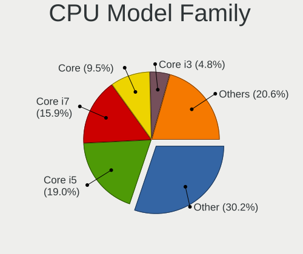

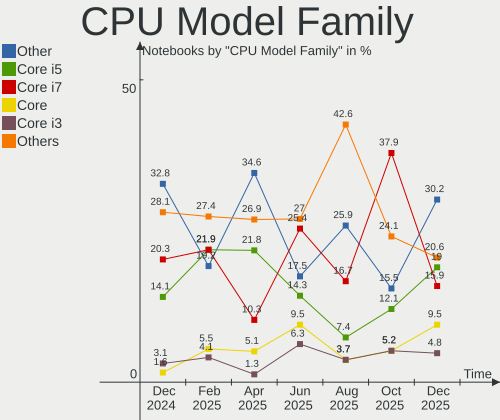

| Model           | Notebooks | Percent |
|-----------------|-----------|---------|
| Other           | 19        | 30.16%  |
| Intel Core i5   | 12        | 19.05%  |
| Intel Core i7   | 10        | 15.87%  |
| Intel Core      | 6         | 9.52%   |
| Intel Core i3   | 3         | 4.76%   |
| AMD Ryzen 5     | 3         | 4.76%   |
| AMD Ryzen 7 PRO | 2         | 3.17%   |
| AMD Ryzen 7     | 2         | 3.17%   |
| Intel Xeon      | 1         | 1.59%   |
| AMD Ryzen 9     | 1         | 1.59%   |
| AMD Ryzen 5 PRO | 1         | 1.59%   |
| AMD A6          | 1         | 1.59%   |
| AMD A4          | 1         | 1.59%   |
| AMD A10         | 1         | 1.59%   |

CPU Cores
---------

Number of processor cores

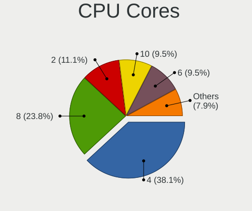

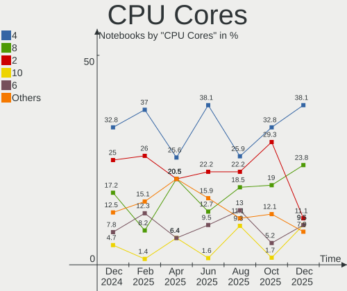

| Number | Notebooks | Percent |
|--------|-----------|---------|
| 4      | 24        | 38.1%   |
| 8      | 15        | 23.81%  |
| 2      | 7         | 11.11%  |
| 10     | 6         | 9.52%   |
| 6      | 6         | 9.52%   |
| 16     | 2         | 3.17%   |
| 14     | 2         | 3.17%   |
| 12     | 1         | 1.59%   |

CPU Sockets
-----------

Number of sockets

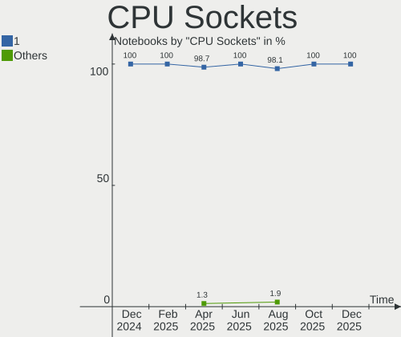

| Number | Notebooks | Percent |
|--------|-----------|---------|
| 1      | 63        | 100%    |

CPU Threads
-----------

Threads per core (Hyper-Threading)

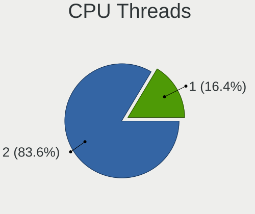

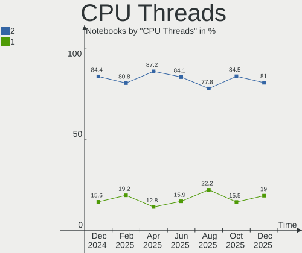

| Number | Notebooks | Percent |
|--------|-----------|---------|
| 2      | 51        | 80.95%  |
| 1      | 12        | 19.05%  |

CPU Op-Modes
------------

CPU Operation Modes (32-bit, 64-bit)

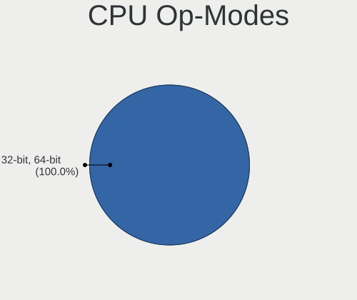

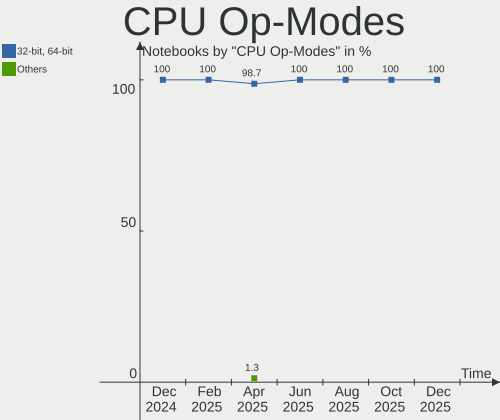

| Op mode        | Notebooks | Percent |
|----------------|-----------|---------|
| 32-bit, 64-bit | 63        | 100%    |

CPU Microcode
-------------

Microcode number

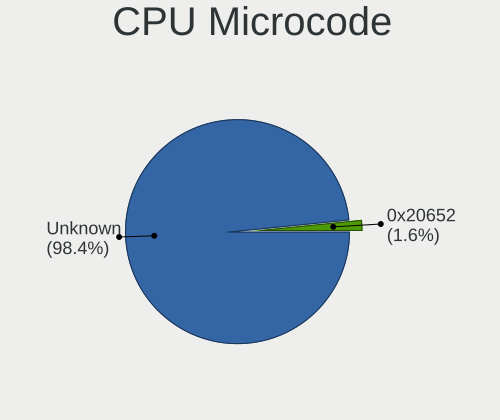

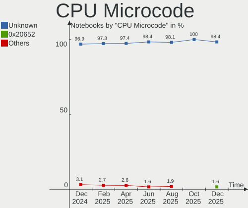

| Number  | Notebooks | Percent |
|---------|-----------|---------|
| Unknown | 62        | 98.41%  |
| 0x20652 | 1         | 1.59%   |

CPU Microarch
-------------

Microarchitecture

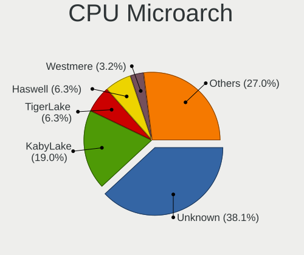

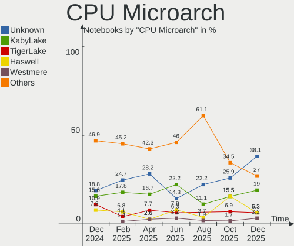

| Name               | Notebooks | Percent |
|--------------------|-----------|---------|
| Unknown            | 24        | 38.1%   |
| KabyLake           | 12        | 19.05%  |
| TigerLake          | 4         | 6.35%   |
| Haswell            | 4         | 6.35%   |
| Westmere           | 2         | 3.17%   |
| Skylake            | 2         | 3.17%   |
| ArrowLake-H Hybrid | 2         | 3.17%   |
| Alderlake Hybrid   | 2         | 3.17%   |
| Zen 3              | 1         | 1.59%   |
| SandyBridge        | 1         | 1.59%   |
| Puma               | 1         | 1.59%   |
| Meteorlake Hybrid  | 1         | 1.59%   |
| Lunarlake Hybrid   | 1         | 1.59%   |
| K10 Llano          | 1         | 1.59%   |
| IvyBridge          | 1         | 1.59%   |
| IceLake            | 1         | 1.59%   |
| Excavator          | 1         | 1.59%   |
| CometLake          | 1         | 1.59%   |
| Broadwell          | 1         | 1.59%   |

Graphics
--------

GPU Vendor
----------

Vendors of graphics cards

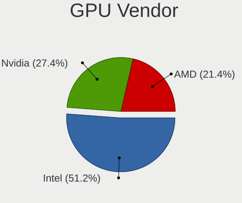

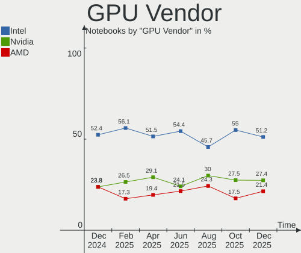

| Vendor | Notebooks | Percent |
|--------|-----------|---------|
| Intel  | 43        | 51.19%  |
| Nvidia | 23        | 27.38%  |
| AMD    | 18        | 21.43%  |

GPU Model
---------

Graphics card models

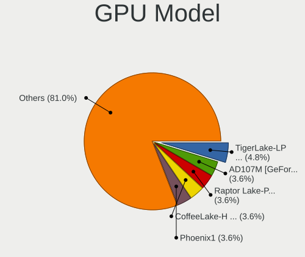

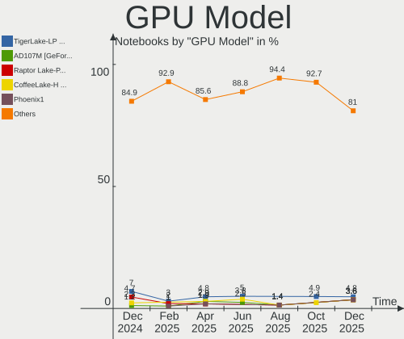

| Model                                                           | Notebooks | Percent |
|-----------------------------------------------------------------|-----------|---------|
| Intel TigerLake-LP GT2 [Iris Xe Graphics]                       | 4         | 4.76%   |
| Nvidia AD107M [GeForce RTX 4060 Max-Q / Mobile]                 | 3         | 3.57%   |
| Intel Raptor Lake-P [UHD Graphics]                              | 3         | 3.57%   |
| Intel CoffeeLake-H GT2 [UHD Graphics 630]                       | 3         | 3.57%   |
| AMD Phoenix1                                                    | 3         | 3.57%   |
| AMD Krackan [Radeon 840M / 860M Graphics]                       | 3         | 3.57%   |
| Nvidia TU117M [GeForce GTX 1650 Mobile / Max-Q]                 | 2         | 2.38%   |
| Intel WhiskeyLake-U GT2 [UHD Graphics 620]                      | 2         | 2.38%   |
| Intel TigerLake-H GT1 [UHD Graphics]                            | 2         | 2.38%   |
| Intel Raptor Lake-P [Iris Xe Graphics]                          | 2         | 2.38%   |
| Intel Lunar Lake [Intel Arc Graphics 130V / 140V]               | 2         | 2.38%   |
| Intel Kaby Lake-R GT2 [UHD Graphics 620]                        | 2         | 2.38%   |
| Intel CometLake-U GT2 [UHD Graphics]                            | 2         | 2.38%   |
| Intel Arrow Lake-P [Arc Pro 130T/140T]                          | 2         | 2.38%   |
| Intel Alder Lake-UP3 GT2 [Iris Xe Graphics]                     | 2         | 2.38%   |
| Intel 4th Gen Core Processor Integrated Graphics Controller     | 2         | 2.38%   |
| AMD Lucienne                                                    | 2         | 2.38%   |
| AMD HawkPoint1                                                  | 2         | 2.38%   |
| Nvidia TU117M [GeForce GTX 1650 Ti Mobile]                      | 1         | 1.19%   |
| Nvidia TU106M [GeForce RTX 2060 Max-Q]                          | 1         | 1.19%   |
| Nvidia GP107M [GeForce GTX 1050 3 GB Max-Q]                     | 1         | 1.19%   |
| Nvidia GM206GLM [Quadro M2200 Mobile]                           | 1         | 1.19%   |
| Nvidia GM108M [GeForce 940MX]                                   | 1         | 1.19%   |
| Nvidia GM107M [GeForce GTX 960M]                                | 1         | 1.19%   |
| Nvidia GM107M [GeForce GTX 860M]                                | 1         | 1.19%   |
| Nvidia GK107GLM [Quadro K1100M]                                 | 1         | 1.19%   |
| Nvidia GK104M [GeForce GTX 780M]                                | 1         | 1.19%   |
| Nvidia GK104GLM [Quadro K3000M]                                 | 1         | 1.19%   |
| Nvidia GB207M [GeForce RTX 5050 Max-Q / Mobile]                 | 1         | 1.19%   |
| Nvidia GB206M [GeForce RTX 5060 Max-Q / Mobile]                 | 1         | 1.19%   |
| Nvidia GA107M [GeForce RTX 3050 Ti Mobile]                      | 1         | 1.19%   |
| Nvidia GA107M [GeForce RTX 3050 Mobile]                         | 1         | 1.19%   |
| Nvidia GA107BM / GN20-P0-R-K2 [GeForce RTX 3050 6GB Laptop GPU] | 1         | 1.19%   |
| Nvidia GA106M [GeForce RTX 3060 Mobile / Max-Q]                 | 1         | 1.19%   |
| Nvidia GA104M [GeForce RTX 3070 Mobile / Max-Q]                 | 1         | 1.19%   |
| Nvidia AD107GLM [RTX 2000 Ada Generation Laptop GPU]            | 1         | 1.19%   |
| Intel Skylake-U GT2 [HD Graphics 520]                           | 1         | 1.19%   |
| Intel Skylake-H GT2 [HD Graphics 530]                           | 1         | 1.19%   |
| Intel Meteor Lake-P [Intel Arc Graphics]                        | 1         | 1.19%   |
| Intel Kaby Lake-U GT2 [HD Graphics 620]                         | 1         | 1.19%   |

GPU Combo
---------

Combinations of graphics cards

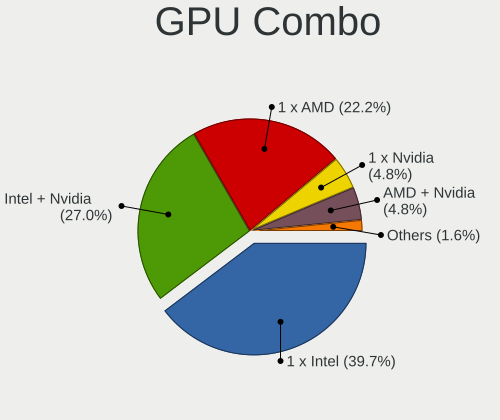

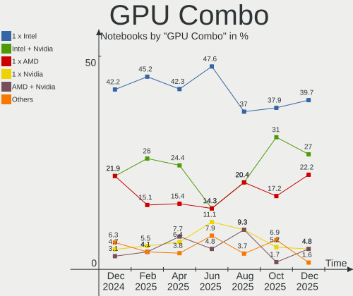

| Name           | Notebooks | Percent |
|----------------|-----------|---------|
| 1 x Intel      | 25        | 39.68%  |
| Intel + Nvidia | 17        | 26.98%  |
| 1 x AMD        | 14        | 22.22%  |
| 1 x Nvidia     | 3         | 4.76%   |
| AMD + Nvidia   | 3         | 4.76%   |
| Intel + AMD    | 1         | 1.59%   |

GPU Driver
----------

Free vs proprietary

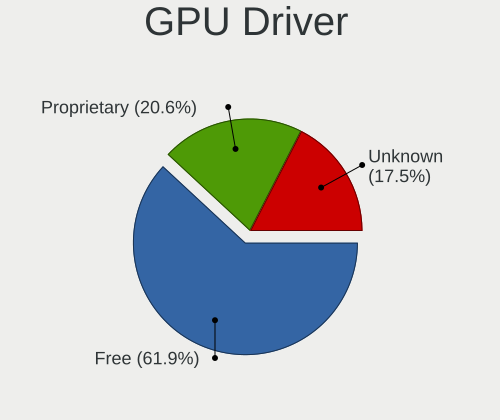

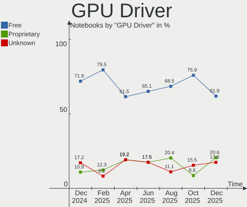

| Driver      | Notebooks | Percent |
|-------------|-----------|---------|
| Free        | 39        | 61.9%   |
| Proprietary | 13        | 20.63%  |
| Unknown     | 11        | 17.46%  |

GPU Memory
----------

Total video memory

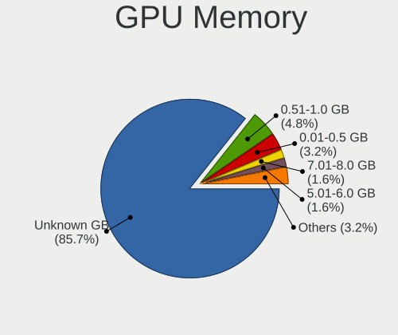

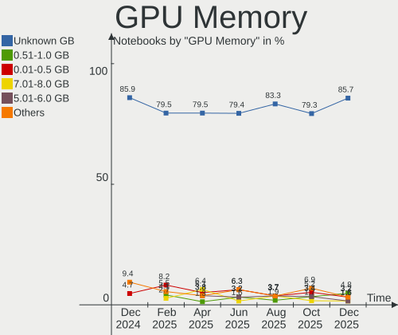

| Size in GB | Notebooks | Percent |
|------------|-----------|---------|
| Unknown    | 54        | 85.71%  |
| 0.51-1.0   | 3         | 4.76%   |
| 0.01-0.5   | 2         | 3.17%   |
| 7.01-8.0   | 1         | 1.59%   |
| 5.01-6.0   | 1         | 1.59%   |
| 3.01-4.0   | 1         | 1.59%   |
| 1.01-2.0   | 1         | 1.59%   |

Monitor
-------

Monitor Vendor
--------------

Monitor vendors

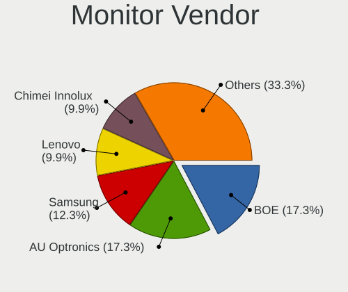

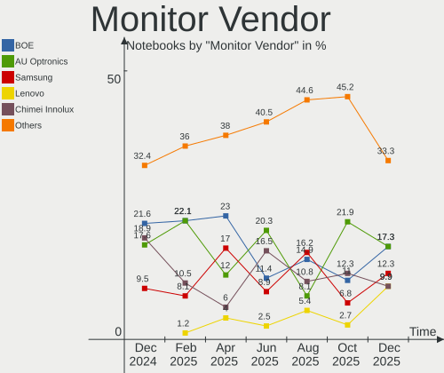

| Vendor                  | Notebooks | Percent |
|-------------------------|-----------|---------|
| BOE                     | 14        | 17.28%  |
| AU Optronics            | 14        | 17.28%  |
| Samsung Electronics     | 10        | 12.35%  |
| Lenovo                  | 8         | 9.88%   |
| Chimei Innolux          | 8         | 9.88%   |
| LG Display              | 4         | 4.94%   |
| Philips                 | 3         | 3.7%    |
| CSW                     | 3         | 3.7%    |
| Goldstar                | 2         | 2.47%   |
| Dell                    | 2         | 2.47%   |
| Xiaomi                  | 1         | 1.23%   |
| Vizio                   | 1         | 1.23%   |
| SKG                     | 1         | 1.23%   |
| RTK                     | 1         | 1.23%   |
| Panasonic               | 1         | 1.23%   |
| InfoVision              | 1         | 1.23%   |
| Hewlett-Packard         | 1         | 1.23%   |
| Denver                  | 1         | 1.23%   |
| CSOT                    | 1         | 1.23%   |
| Chi Mei Optoelectronics | 1         | 1.23%   |
| BenQ                    | 1         | 1.23%   |
| Apple                   | 1         | 1.23%   |
| Acer                    | 1         | 1.23%   |

Monitor Model
-------------

Monitor models

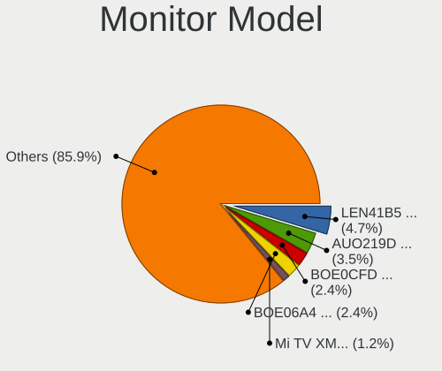

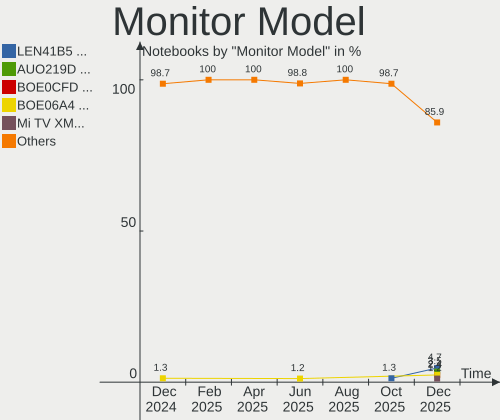

| Model                                                                   | Notebooks | Percent |
|-------------------------------------------------------------------------|-----------|---------|
| Lenovo LCD Monitor LEN41B5 1920x1200 344x215mm 16.0-inch                | 4         | 4.71%   |
| AU Optronics LCD Monitor AUO219D 1920x1080 381x214mm 17.2-inch          | 3         | 3.53%   |
| BOE LCD Monitor BOE0CFD 1920x1080 344x194mm 15.5-inch                   | 2         | 2.35%   |
| BOE LCD Monitor BOE06A4 1366x768 344x194mm 15.5-inch                    | 2         | 2.35%   |
| Xiaomi Mi TV XMD009A 2880x1800 480x270mm 21.7-inch                      | 1         | 1.18%   |
| Vizio E190VA VIZ0067 1920x1080 410x230mm 18.5-inch                      | 1         | 1.18%   |
| SKG H27F22 SKG2756 1920x1080 600x330mm 27.0-inch                        | 1         | 1.18%   |
| Samsung Electronics S27F350 SAM0D22 1920x1080 598x336mm 27.0-inch       | 1         | 1.18%   |
| Samsung Electronics LCD Monitor SEC5441 1280x800 331x207mm 15.4-inch    | 1         | 1.18%   |
| Samsung Electronics LCD Monitor SEC3245 1366x768 340x190mm 15.3-inch    | 1         | 1.18%   |
| Samsung Electronics LCD Monitor SDC4188 2880x1800 312x195mm 14.5-inch   | 1         | 1.18%   |
| Samsung Electronics LCD Monitor SDC4187 1920x1200 302x189mm 14.0-inch   | 1         | 1.18%   |
| Samsung Electronics LCD Monitor SDC4171 2880x1800 302x189mm 14.0-inch   | 1         | 1.18%   |
| Samsung Electronics LCD Monitor SDC3754 1600x900 382x215mm 17.3-inch    | 1         | 1.18%   |
| Samsung Electronics LCD Monitor SAM7016 3840x2160 1872x1053mm 84.6-inch | 1         | 1.18%   |
| Samsung Electronics LCD Monitor SAM0C39 1920x1080 885x498mm 40.0-inch   | 1         | 1.18%   |
| Samsung Electronics ATNA60CL10-0 SDC41AF 2880x1800 344x215mm 16.0-inch  | 1         | 1.18%   |
| Samsung Electronics ATNA40HQ01-0  SDC4203                               | 1         | 1.18%   |
| RTK '' RTK2555 1920x1080 698x393mm 31.5-inch                            | 1         | 1.18%   |
| Philips PHL 346E2C PHLC247 3440x1440 797x334mm 34.0-inch                | 1         | 1.18%   |
| Philips PHL 240B9 PHL0966 1920x1200 518x324mm 24.1-inch                 | 1         | 1.18%   |
| Philips 271P4 PHL08C3 1920x1080 597x336mm 27.0-inch                     | 1         | 1.18%   |
| Philips 226V4 PHLC0B1 1920x1080 477x268mm 21.5-inch                     | 1         | 1.18%   |
| Panasonic TV MEIA296 1920x1080 698x392mm 31.5-inch                      | 1         | 1.18%   |
| LG Display LCD Monitor LGD07A8 1920x1200 345x215mm 16.0-inch            | 1         | 1.18%   |
| LG Display LCD Monitor LGD073B 1920x1080 309x174mm 14.0-inch            | 1         | 1.18%   |
| LG Display LCD Monitor LGD0538 1920x1080 344x194mm 15.5-inch            | 1         | 1.18%   |
| LG Display LCD Monitor LGD03AB 1366x768 344x194mm 15.5-inch             | 1         | 1.18%   |
| Lenovo LCD Monitor LEN9156 1920x1200 344x215mm 16.0-inch                | 1         | 1.18%   |
| Lenovo LCD Monitor LEN403D 1920x1200 301x188mm 14.0-inch                | 1         | 1.18%   |
| Lenovo LCD Monitor LEN4011 1280x800 261x163mm 12.1-inch                 | 1         | 1.18%   |
| Lenovo B140UAN02.7 LEN403A 1920x1200 302x188mm 14.0-inch                | 1         | 1.18%   |
| InfoVision LCD Monitor IVO057D 1920x1080 309x174mm 14.0-inch            | 1         | 1.18%   |
| Hewlett-Packard ENVY 27s HPN3417 3840x2160 597x336mm 27.0-inch          | 1         | 1.18%   |
| Goldstar HDR WFHD GSM5BB9 2560x1080 798x334mm 34.1-inch                 | 1         | 1.18%   |
| Goldstar E2355V GSM58FD 1920x1080 510x290mm 23.1-inch                   | 1         | 1.18%   |
| Goldstar E2011 GSM4ED3 1600x900 443x249mm 20.0-inch                     | 1         | 1.18%   |
| Denver MO-HST-27C LHCFFFC 1920x1080 597x336mm 27.0-inch                 | 1         | 1.18%   |
| Dell P2723D DELD140 2560x1440 597x336mm 27.0-inch                       | 1         | 1.18%   |
| Dell P2717H DEL40F7 1920x1080 598x336mm 27.0-inch                       | 1         | 1.18%   |

Monitor Resolution
------------------

Monitor screen resolution

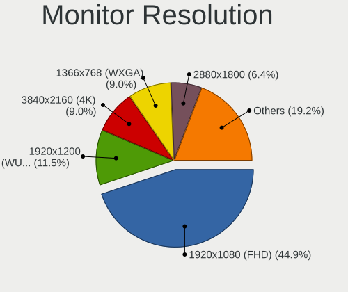

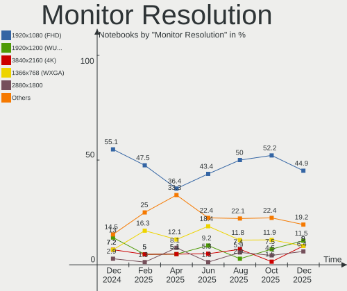

| Resolution        | Notebooks | Percent |
|-------------------|-----------|---------|
| 1920x1080 (FHD)   | 35        | 44.87%  |
| 1920x1200 (WUXGA) | 9         | 11.54%  |
| 3840x2160 (4K)    | 7         | 8.97%   |
| 1366x768 (WXGA)   | 7         | 8.97%   |
| 2880x1800         | 5         | 6.41%   |
| 1600x900 (HD+)    | 4         | 5.13%   |
| 3072x1920         | 2         | 2.56%   |
| 2560x1440 (QHD)   | 2         | 2.56%   |
| 1440x900 (WXGA+)  | 2         | 2.56%   |
| 3440x1440         | 1         | 1.28%   |
| 2560x1080         | 1         | 1.28%   |
| 2256x1504         | 1         | 1.28%   |
| 1280x800 (WXGA)   | 1         | 1.28%   |
| Unknown           | 1         | 1.28%   |

Monitor Diagonal
----------------

Diagonal size in inches

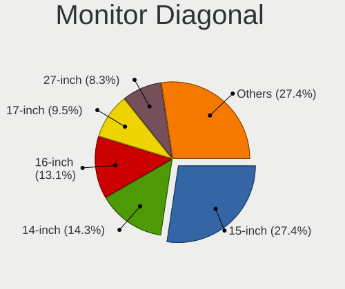

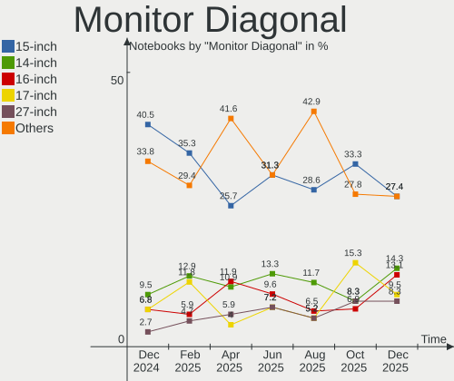

| Inches  | Notebooks | Percent |
|---------|-----------|---------|
| 15      | 23        | 27.38%  |
| 14      | 12        | 14.29%  |
| 16      | 11        | 13.1%   |
| 17      | 8         | 9.52%   |
| 27      | 7         | 8.33%   |
| 13      | 7         | 8.33%   |
| 31      | 3         | 3.57%   |
| 84      | 2         | 2.38%   |
| 34      | 2         | 2.38%   |
| 54      | 1         | 1.19%   |
| 43      | 1         | 1.19%   |
| 24      | 1         | 1.19%   |
| 23      | 1         | 1.19%   |
| 21      | 1         | 1.19%   |
| 20      | 1         | 1.19%   |
| 18      | 1         | 1.19%   |
| 12      | 1         | 1.19%   |
| Unknown | 1         | 1.19%   |

Monitor Width
-------------

Physical width

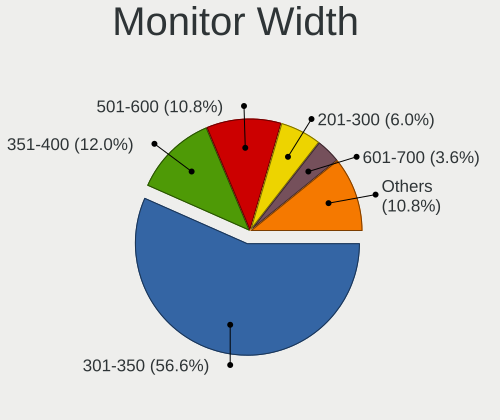

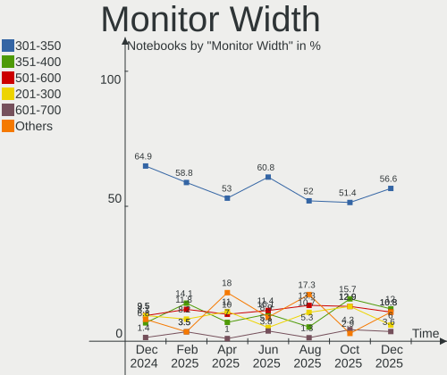

| Width in mm | Notebooks | Percent |
|-------------|-----------|---------|
| 301-350     | 47        | 56.63%  |
| 351-400     | 10        | 12.05%  |
| 501-600     | 9         | 10.84%  |
| 201-300     | 5         | 6.02%   |
| 601-700     | 3         | 3.61%   |
| 701-800     | 2         | 2.41%   |
| 401-500     | 2         | 2.41%   |
| 1501-2000   | 2         | 2.41%   |
| 1001-1500   | 1         | 1.2%    |
| 901-1000    | 1         | 1.2%    |
| Unknown     | 1         | 1.2%    |

Aspect Ratio
------------

Proportional relationship between the width and the height

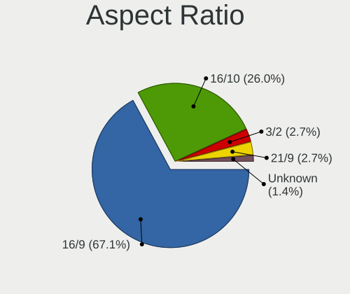

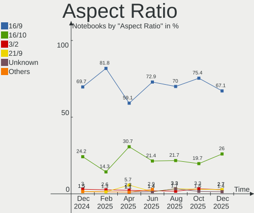

| Ratio   | Notebooks | Percent |
|---------|-----------|---------|
| 16/9    | 49        | 67.12%  |
| 16/10   | 19        | 26.03%  |
| 3/2     | 2         | 2.74%   |
| 21/9    | 2         | 2.74%   |
| Unknown | 1         | 1.37%   |

Monitor Area
------------

Area in inch²

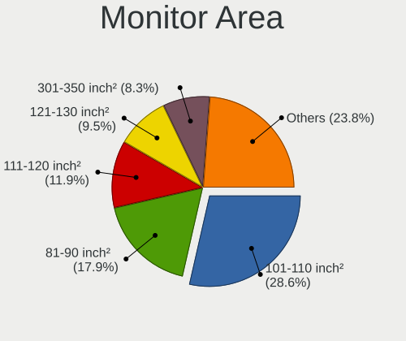

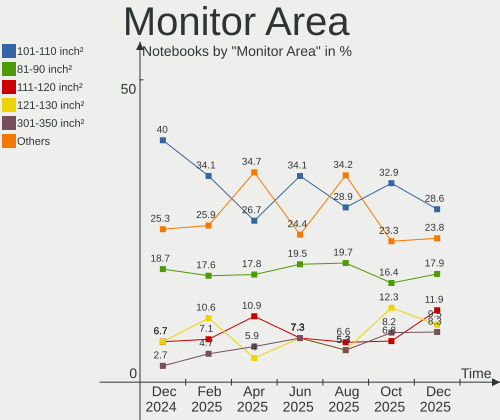

| Area in inch² | Notebooks | Percent |
|----------------|-----------|---------|
| 101-110        | 24        | 28.57%  |
| 81-90          | 15        | 17.86%  |
| 111-120        | 10        | 11.9%   |
| 121-130        | 8         | 9.52%   |
| 301-350        | 7         | 8.33%   |
| 351-500        | 5         | 5.95%   |
| More than 1000 | 3         | 3.57%   |
| 71-80          | 3         | 3.57%   |
| 201-250        | 2         | 2.38%   |
| 151-200        | 2         | 2.38%   |
| 61-70          | 1         | 1.19%   |
| 251-300        | 1         | 1.19%   |
| 501-1000       | 1         | 1.19%   |
| 91-100         | 1         | 1.19%   |
| Unknown        | 1         | 1.19%   |

Pixel Density
-------------

Pixels per inch

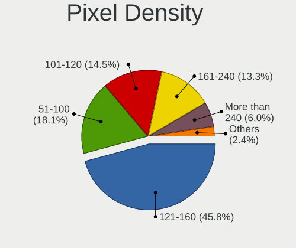

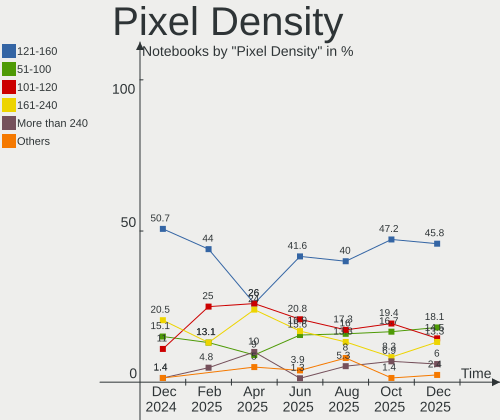

| Density       | Notebooks | Percent |
|---------------|-----------|---------|
| 121-160       | 38        | 45.78%  |
| 51-100        | 15        | 18.07%  |
| 101-120       | 12        | 14.46%  |
| 161-240       | 11        | 13.25%  |
| More than 240 | 5         | 6.02%   |
| 1-50          | 1         | 1.2%    |
| Unknown       | 1         | 1.2%    |

Multiple Monitors
-----------------

Total monitors connected

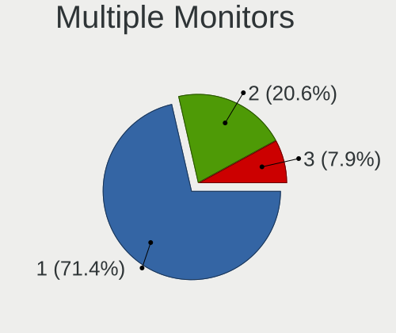

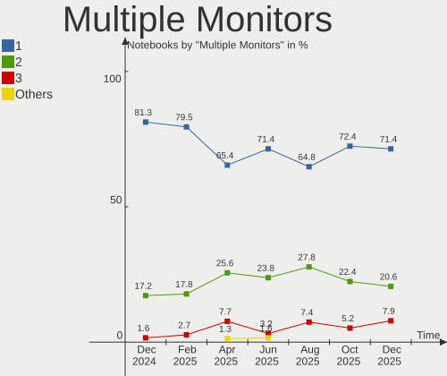

| Total | Notebooks | Percent |
|-------|-----------|---------|
| 1     | 45        | 71.43%  |
| 2     | 13        | 20.63%  |
| 3     | 5         | 7.94%   |

Network
-------

Net Controller Vendor
---------------------

Controller vendors

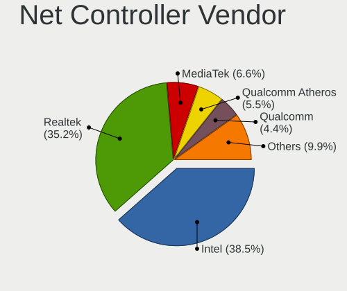

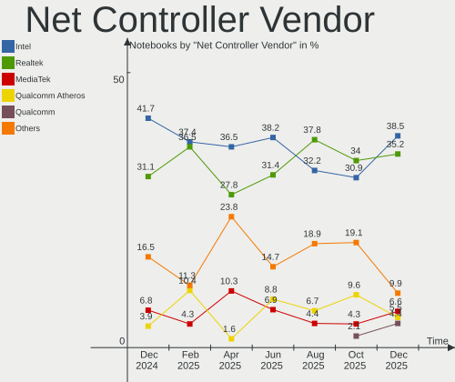

| Vendor                      | Notebooks | Percent |
|-----------------------------|-----------|---------|
| Intel                       | 35        | 38.46%  |
| Realtek Semiconductor       | 32        | 35.16%  |
| MediaTek                    | 6         | 6.59%   |
| Qualcomm Atheros            | 5         | 5.49%   |
| Qualcomm                    | 4         | 4.4%    |
| TP-Link                     | 2         | 2.2%    |
| Broadcom Limited            | 2         | 2.2%    |
| Shenzhen Goodix Technology  | 1         | 1.1%    |
| Ralink Technology           | 1         | 1.1%    |
| Motorcomm Microelectronics. | 1         | 1.1%    |
| Marvell Technology Group    | 1         | 1.1%    |
| Broadcom                    | 1         | 1.1%    |

Net Controller Model
--------------------

Controller models

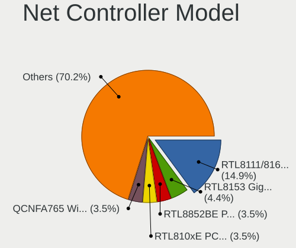

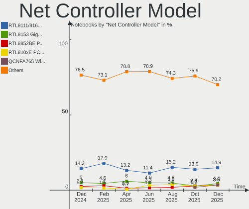

| Model                                                                           | Notebooks | Percent |
|---------------------------------------------------------------------------------|-----------|---------|
| Realtek RTL8111/8168/8211/8411 PCI Express Gigabit Ethernet Controller          | 17        | 14.91%  |
| Realtek RTL8153 Gigabit Ethernet Adapter                                        | 5         | 4.39%   |
| Realtek RTL8852BE PCIe 802.11ax Wireless Network Controller                     | 4         | 3.51%   |
| Realtek RTL810xE PCI Express Fast Ethernet controller                           | 4         | 3.51%   |
| Qualcomm QCNFA765 Wireless Network Adapter                                      | 4         | 3.51%   |
| Intel Wireless 8265 / 8275                                                      | 4         | 3.51%   |
| MediaTek MT7922 802.11ax PCI Express Wireless Network Adapter                   | 3         | 2.63%   |
| Intel Wi-Fi 6 AX200                                                             | 3         | 2.63%   |
| Intel Raptor Lake PCH CNVi WiFi                                                 | 3         | 2.63%   |
| Realtek RTL8852BE-VT PCIe 802.11ax Wireless Network Controller                  | 2         | 1.75%   |
| Realtek RTL8822CE 802.11ac PCIe Wireless Network Adapter                        | 2         | 1.75%   |
| Realtek RTL8188EE Wireless Network Adapter                                      | 2         | 1.75%   |
| Realtek Killer E3000 2.5GbE Controller                                          | 2         | 1.75%   |
| Qualcomm Atheros QCA8171 Gigabit Ethernet                                       | 2         | 1.75%   |
| Qualcomm Atheros AR9462 Wireless Network Adapter                                | 2         | 1.75%   |
| MediaTek MT7925 802.11be 160MHz 2x2 PCIe Wireless Network Adapter [Filogic 360] | 2         | 1.75%   |
| Intel Wi-Fi 7(802.11be) AX1775*/AX1790*/BE20*/BE401/BE1750* 2x2                 | 2         | 1.75%   |
| Intel Wi-Fi 6E(802.11ax) AX210/AX1675* 2x2 [Typhoon Peak]                       | 2         | 1.75%   |
| Intel Wi-Fi 6 AX201                                                             | 2         | 1.75%   |
| Intel Ethernet Connection (4) I219-LM                                           | 2         | 1.75%   |
| Intel Cannon Point-LP CNVi [Wireless-AC]                                        | 2         | 1.75%   |
| Intel BE201 320MHz                                                              | 2         | 1.75%   |
| Intel Arrow Lake CNVi WiFi                                                      | 2         | 1.75%   |
| Intel Alder Lake-P PCH CNVi WiFi                                                | 2         | 1.75%   |
| TP-Link USB 10/100 LAN                                                          | 1         | 0.88%   |
| TP-Link 802.11ac NIC                                                            | 1         | 0.88%   |
| Shenzhen Goodix Fingerprint Reader                                              | 1         | 0.88%   |
| Realtek RTL8822BE 802.11a/b/g/n/ac WiFi adapter                                 | 1         | 0.88%   |
| Realtek 802.11be WLAN Adapter                                                   | 1         | 0.88%   |
| Realtek 802.11ac NIC                                                            | 1         | 0.88%   |
| Ralink RT5370 Wireless Adapter                                                  | 1         | 0.88%   |
| Qualcomm Atheros QCA9565 / AR9565 Wireless Network Adapter                      | 1         | 0.88%   |
| Qualcomm Atheros QCA6174 802.11ac Wireless Network Adapter                      | 1         | 0.88%   |
| Motorcomm Microelectronics. YT6801 Gigabit Ethernet Controller                  | 1         | 0.88%   |
| MediaTek MT7921 802.11ax PCIe Wireless Network Adapter [Filogic 330]            | 1         | 0.88%   |
| Marvell Group 88E8040 PCI-E Fast Ethernet Controller                            | 1         | 0.88%   |
| Intel Wireless 8260                                                             | 1         | 0.88%   |
| Intel Wireless 7260                                                             | 1         | 0.88%   |
| Intel Tiger Lake PCH CNVi WiFi                                                  | 1         | 0.88%   |
| Intel Ice Lake-LP PCH CNVi WiFi                                                 | 1         | 0.88%   |

Wireless Vendor
---------------

Wireless vendors

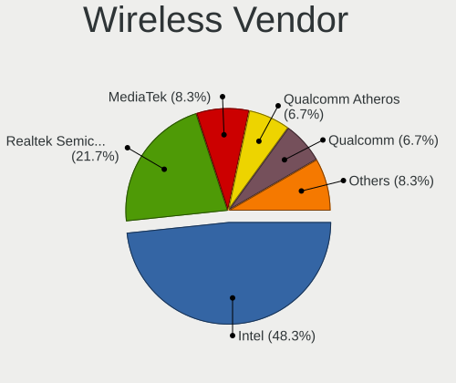

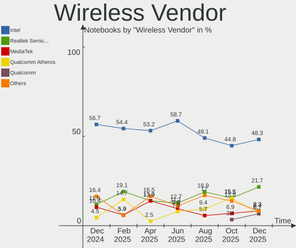

| Vendor                | Notebooks | Percent |
|-----------------------|-----------|---------|
| Intel                 | 29        | 48.33%  |
| Realtek Semiconductor | 13        | 21.67%  |
| MediaTek              | 5         | 8.33%   |
| Qualcomm Atheros      | 4         | 6.67%   |
| Qualcomm              | 4         | 6.67%   |
| Broadcom Limited      | 2         | 3.33%   |
| TP-Link               | 1         | 1.67%   |
| Ralink Technology     | 1         | 1.67%   |
| Broadcom              | 1         | 1.67%   |

Wireless Model
--------------

Wireless models

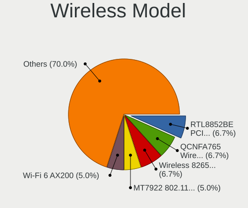

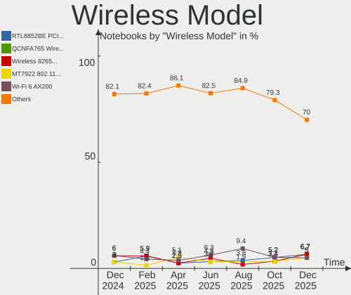

| Model                                                                           | Notebooks | Percent |
|---------------------------------------------------------------------------------|-----------|---------|
| Realtek RTL8852BE PCIe 802.11ax Wireless Network Controller                     | 4         | 6.67%   |
| Qualcomm QCNFA765 Wireless Network Adapter                                      | 4         | 6.67%   |
| Intel Wireless 8265 / 8275                                                      | 4         | 6.67%   |
| MediaTek MT7922 802.11ax PCI Express Wireless Network Adapter                   | 3         | 5%      |
| Intel Wi-Fi 6 AX200                                                             | 3         | 5%      |
| Intel Raptor Lake PCH CNVi WiFi                                                 | 3         | 5%      |
| Realtek RTL8852BE-VT PCIe 802.11ax Wireless Network Controller                  | 2         | 3.33%   |
| Realtek RTL8822CE 802.11ac PCIe Wireless Network Adapter                        | 2         | 3.33%   |
| Realtek RTL8188EE Wireless Network Adapter                                      | 2         | 3.33%   |
| Qualcomm Atheros AR9462 Wireless Network Adapter                                | 2         | 3.33%   |
| Intel Wi-Fi 6E(802.11ax) AX210/AX1675* 2x2 [Typhoon Peak]                       | 2         | 3.33%   |
| Intel Wi-Fi 6 AX201                                                             | 2         | 3.33%   |
| Intel Cannon Point-LP CNVi [Wireless-AC]                                        | 2         | 3.33%   |
| TP-Link 802.11ac NIC                                                            | 1         | 1.67%   |
| Realtek RTL8822BE 802.11a/b/g/n/ac WiFi adapter                                 | 1         | 1.67%   |
| Realtek 802.11be WLAN Adapter                                                   | 1         | 1.67%   |
| Realtek 802.11ac NIC                                                            | 1         | 1.67%   |
| Ralink RT5370 Wireless Adapter                                                  | 1         | 1.67%   |
| Qualcomm Atheros QCA9565 / AR9565 Wireless Network Adapter                      | 1         | 1.67%   |
| Qualcomm Atheros QCA6174 802.11ac Wireless Network Adapter                      | 1         | 1.67%   |
| MediaTek MT7925 802.11be 160MHz 2x2 PCIe Wireless Network Adapter [Filogic 360] | 1         | 1.67%   |
| MediaTek MT7921 802.11ax PCIe Wireless Network Adapter [Filogic 330]            | 1         | 1.67%   |
| Intel Wireless 8260                                                             | 1         | 1.67%   |
| Intel Wireless 7260                                                             | 1         | 1.67%   |
| Intel Wi-Fi 7(802.11be) AX1775*/AX1790*/BE20*/BE401/BE1750* 2x2                 | 1         | 1.67%   |
| Intel Tiger Lake PCH CNVi WiFi                                                  | 1         | 1.67%   |
| Intel Ice Lake-LP PCH CNVi WiFi                                                 | 1         | 1.67%   |
| Intel Dual Band Wireless-AC 3168NGW [Stone Peak]                                | 1         | 1.67%   |
| Intel Comet Lake PCH-LP CNVi WiFi                                               | 1         | 1.67%   |
| Intel Comet Lake PCH CNVi WiFi                                                  | 1         | 1.67%   |
| Intel Centrino Wireless-N 130                                                   | 1         | 1.67%   |
| Intel Centrino Ultimate-N 6300                                                  | 1         | 1.67%   |
| Intel Centrino Advanced-N 6205 [Taylor Peak]                                    | 1         | 1.67%   |
| Intel Alder Lake-P PCH CNVi WiFi                                                | 1         | 1.67%   |
| Intel Alder Lake-N PCH CNVi WiFi                                                | 1         | 1.67%   |
| Broadcom Limited BCM4360 802.11ac Dual Band Wireless Network Adapter            | 1         | 1.67%   |
| Broadcom Limited BCM4313 802.11bgn Wireless Network Adapter                     | 1         | 1.67%   |
| Broadcom BCM4352 802.11ac Dual Band Wireless Network Adapter                    | 1         | 1.67%   |

Ethernet Vendor
---------------

Ethernet vendors

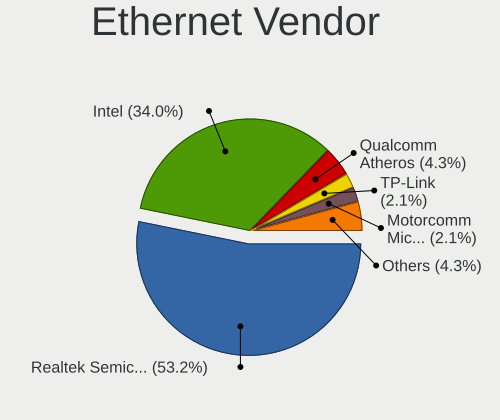

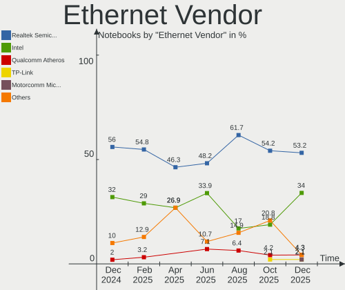

| Vendor                      | Notebooks | Percent |
|-----------------------------|-----------|---------|
| Realtek Semiconductor       | 25        | 53.19%  |
| Intel                       | 16        | 34.04%  |
| Qualcomm Atheros            | 2         | 4.26%   |
| TP-Link                     | 1         | 2.13%   |
| Motorcomm Microelectronics. | 1         | 2.13%   |
| MediaTek                    | 1         | 2.13%   |
| Marvell Technology Group    | 1         | 2.13%   |

Ethernet Model
--------------

Ethernet models

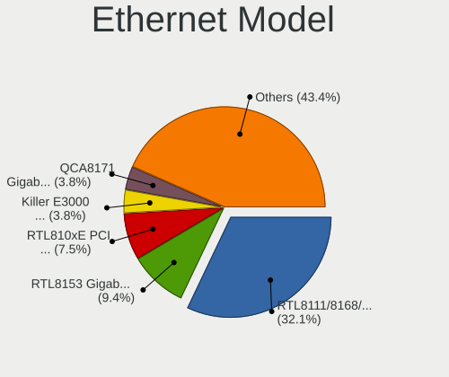

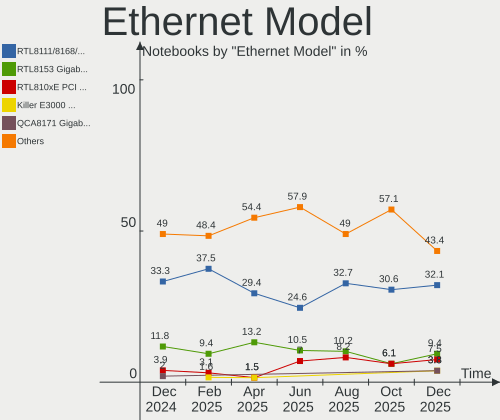

| Model                                                                           | Notebooks | Percent |
|---------------------------------------------------------------------------------|-----------|---------|
| Realtek RTL8111/8168/8211/8411 PCI Express Gigabit Ethernet Controller          | 17        | 32.08%  |
| Realtek RTL8153 Gigabit Ethernet Adapter                                        | 5         | 9.43%   |
| Realtek RTL810xE PCI Express Fast Ethernet controller                           | 4         | 7.55%   |
| Realtek Killer E3000 2.5GbE Controller                                          | 2         | 3.77%   |
| Qualcomm Atheros QCA8171 Gigabit Ethernet                                       | 2         | 3.77%   |
| Intel Ethernet Connection (4) I219-LM                                           | 2         | 3.77%   |
| Intel BE201 320MHz                                                              | 2         | 3.77%   |
| Intel Arrow Lake CNVi WiFi                                                      | 2         | 3.77%   |
| TP-Link USB 10/100 LAN                                                          | 1         | 1.89%   |
| Motorcomm Microelectronics. YT6801 Gigabit Ethernet Controller                  | 1         | 1.89%   |
| MediaTek MT7925 802.11be 160MHz 2x2 PCIe Wireless Network Adapter [Filogic 360] | 1         | 1.89%   |
| Marvell Group 88E8040 PCI-E Fast Ethernet Controller                            | 1         | 1.89%   |
| Intel Wi-Fi 7(802.11be) AX1775*/AX1790*/BE20*/BE401/BE1750* 2x2                 | 1         | 1.89%   |
| Intel Ethernet Connection I217-LM                                               | 1         | 1.89%   |
| Intel Ethernet Connection (6) I219-LM                                           | 1         | 1.89%   |
| Intel Ethernet Connection (5) I219-V                                            | 1         | 1.89%   |
| Intel Ethernet Connection (5) I219-LM                                           | 1         | 1.89%   |
| Intel Ethernet Connection (24) I219-V                                           | 1         | 1.89%   |
| Intel Ethernet Connection (24) I219-LM                                          | 1         | 1.89%   |
| Intel Ethernet Connection (23) I219-LM                                          | 1         | 1.89%   |
| Intel Ethernet Connection (16) I219-V                                           | 1         | 1.89%   |
| Intel Ethernet Connection (13) I219-LM                                          | 1         | 1.89%   |
| Intel Alder Lake-P PCH CNVi WiFi                                                | 1         | 1.89%   |
| Intel 82579LM Gigabit Network Connection (Lewisville)                           | 1         | 1.89%   |
| Intel 82577LM Gigabit Network Connection                                        | 1         | 1.89%   |

Net Controller Kind
-------------------

Ethernet, WiFi or modem

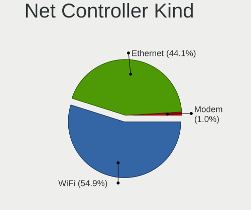

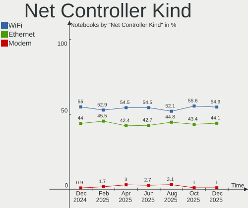

| Kind     | Notebooks | Percent |
|----------|-----------|---------|
| WiFi     | 56        | 54.9%   |
| Ethernet | 45        | 44.12%  |
| Modem    | 1         | 0.98%   |

Used Controller
---------------

Currently used network controller

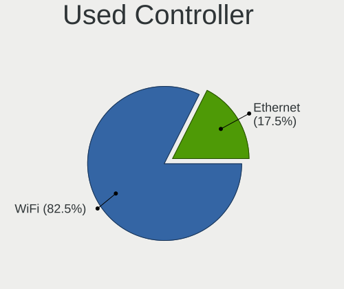

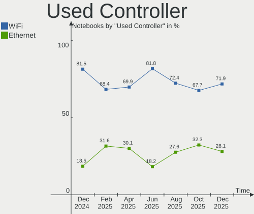

| Kind     | Notebooks | Percent |
|----------|-----------|---------|
| WiFi     | 46        | 71.88%  |
| Ethernet | 18        | 28.13%  |

NICs
----

Total network controllers on board

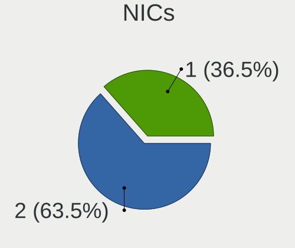

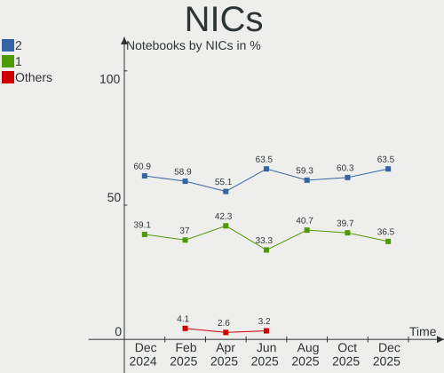

| Total | Notebooks | Percent |
|-------|-----------|---------|
| 2     | 40        | 63.49%  |
| 1     | 23        | 36.51%  |

IPv6
----

IPv6 vs IPv4

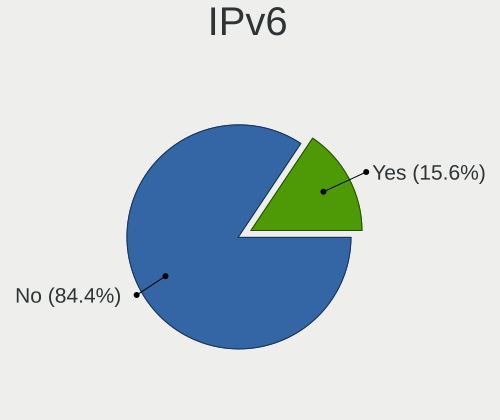

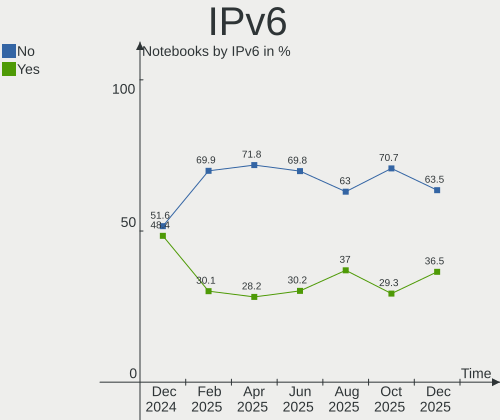

| Used | Notebooks | Percent |
|------|-----------|---------|
| No   | 40        | 63.49%  |
| Yes  | 23        | 36.51%  |

Bluetooth
---------

Bluetooth Vendor
----------------

Controller vendors

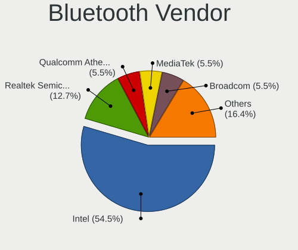

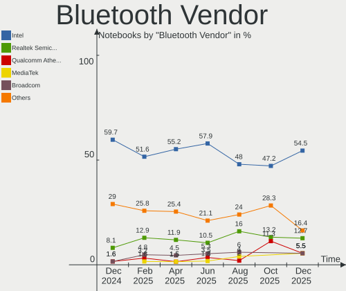

| Vendor                          | Notebooks | Percent |
|---------------------------------|-----------|---------|
| Intel                           | 30        | 54.55%  |
| Realtek Semiconductor           | 7         | 12.73%  |
| Qualcomm Atheros Communications | 3         | 5.45%   |
| MediaTek                        | 3         | 5.45%   |
| Broadcom                        | 3         | 5.45%   |
| USI                             | 2         | 3.64%   |
| IMC Networks                    | 2         | 3.64%   |
| Foxconn / Hon Hai               | 2         | 3.64%   |
| Toshiba                         | 1         | 1.82%   |
| Realtek                         | 1         | 1.82%   |
| Apple                           | 1         | 1.82%   |

Bluetooth Model
---------------

Controller models

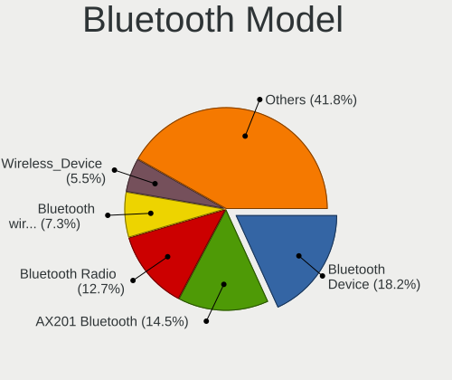

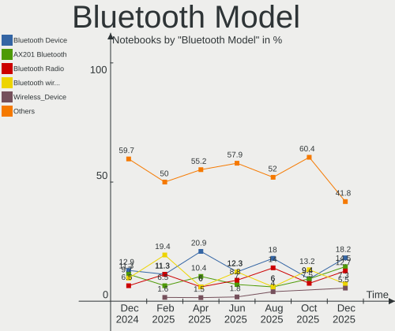

| Model                                            | Notebooks | Percent |
|--------------------------------------------------|-----------|---------|
| Intel Bluetooth Device                           | 10        | 18.18%  |
| Intel AX201 Bluetooth                            | 8         | 14.55%  |
| Realtek Bluetooth Radio                          | 7         | 12.73%  |
| Intel Bluetooth wireless interface               | 4         | 7.27%   |
| MediaTek Wireless_Device                         | 3         | 5.45%   |
| USI Bluetooth Device                             | 2         | 3.64%   |
| Intel Bluetooth 9460/9560 Jefferson Peak (JfP)   | 2         | 3.64%   |
| Intel AX210 Bluetooth                            | 2         | 3.64%   |
| Intel AX200 Bluetooth                            | 2         | 3.64%   |
| Toshiba Atheros AR3012 Bluetooth                 | 1         | 1.82%   |
| Realtek Bluetooth Radio                          | 1         | 1.82%   |
| Qualcomm Atheros  Bluetooth Device               | 1         | 1.82%   |
| Qualcomm Atheros AR9462 Bluetooth                | 1         | 1.82%   |
| Qualcomm Atheros AR3012 Bluetooth 4.0            | 1         | 1.82%   |
| Intel Wireless-AC 3168 Bluetooth                 | 1         | 1.82%   |
| Intel Centrino Advanced-N 6230 Bluetooth adapter | 1         | 1.82%   |
| IMC Networks Wireless_Device                     | 1         | 1.82%   |
| IMC Networks BCM20702A0                          | 1         | 1.82%   |
| Foxconn / Hon Hai Wireless_Device                | 1         | 1.82%   |
| Foxconn / Hon Hai MediaTek Bluetooth Adapter     | 1         | 1.82%   |
| Broadcom HP Portable SoftSailing                 | 1         | 1.82%   |
| Broadcom BCM2070 Bluetooth 2.1 + EDR             | 1         | 1.82%   |
| Broadcom BCM2045B (BDC-2.1)                      | 1         | 1.82%   |
| Apple Bluetooth USB Host Controller              | 1         | 1.82%   |

Sound
-----

Sound Vendor
------------

Sound card vendors

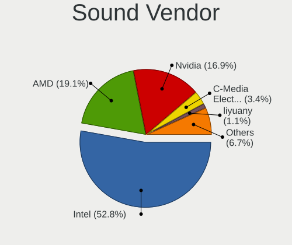

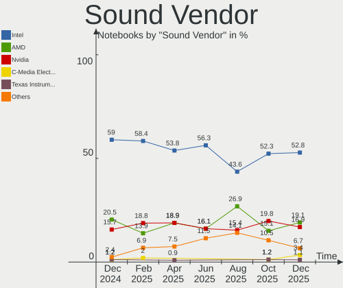

| Vendor                | Notebooks | Percent |
|-----------------------|-----------|---------|
| Intel                 | 47        | 52.81%  |
| AMD                   | 17        | 19.1%   |
| Nvidia                | 15        | 16.85%  |
| C-Media Electronics   | 3         | 3.37%   |
| Texas Instruments     | 1         | 1.12%   |
| Realtek Semiconductor | 1         | 1.12%   |
| Plantronics           | 1         | 1.12%   |
| liyuany               | 1         | 1.12%   |
| JMTek                 | 1         | 1.12%   |
| Jieli Technology      | 1         | 1.12%   |
| Hewlett-Packard       | 1         | 1.12%   |

Sound Model
-----------

Sound card models

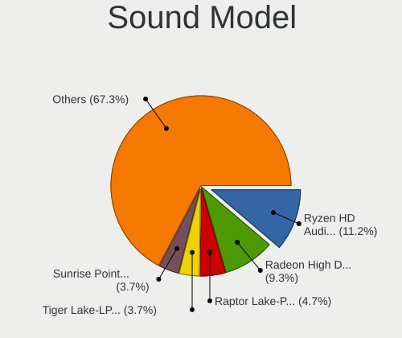

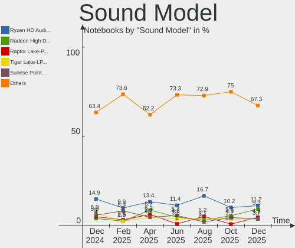

| Model                                                               | Notebooks | Percent |
|---------------------------------------------------------------------|-----------|---------|
| AMD Ryzen HD Audio Controller                                       | 12        | 11.21%  |
| AMD Radeon High Definition Audio Controller                         | 10        | 9.35%   |
| Intel Raptor Lake-P/U/H cAVS                                        | 5         | 4.67%   |
| Intel Tiger Lake-LP Smart Sound Technology Audio Controller         | 4         | 3.74%   |
| Intel Sunrise Point-LP HD Audio                                     | 4         | 3.74%   |
| Nvidia AD107 High Definition Audio Controller                       | 3         | 2.8%    |
| Intel Cannon Lake PCH cAVS                                          | 3         | 2.8%    |
| Intel Arrow Lake cAVS                                               | 3         | 2.8%    |
| Intel Alder Lake PCH-P High Definition Audio Controller             | 3         | 2.8%    |
| Intel 8 Series/C220 Series Chipset High Definition Audio Controller | 3         | 2.8%    |
| AMD Renoir/Cezanne HDMI/DP Audio Controller                         | 3         | 2.8%    |
| Nvidia TU107 GeForce GTX 1650 High Definition Audio Controller      | 2         | 1.87%   |
| Nvidia GK104 HDMI Audio Controller                                  | 2         | 1.87%   |
| Intel Tiger Lake-H HD Audio Controller                              | 2         | 1.87%   |
| Intel Lunar Lake-M HD Audio Controller                              | 2         | 1.87%   |
| Intel Comet Lake PCH-LP cAVS                                        | 2         | 1.87%   |
| Intel CM238 HD Audio Controller                                     | 2         | 1.87%   |
| Intel Cannon Point-LP High Definition Audio Controller              | 2         | 1.87%   |
| Intel Alder Lake-N PCH High Definition Audio Controller             | 2         | 1.87%   |
| Intel 5 Series/3400 Series Chipset High Definition Audio            | 2         | 1.87%   |
| AMD Kabini HDMI/DP Audio                                            | 2         | 1.87%   |
| AMD FCH Azalia Controller                                           | 2         | 1.87%   |
| Texas Instruments PCM2902 Audio Codec                               | 1         | 0.93%   |
| Realtek Semiconductor USB Audio                                     | 1         | 0.93%   |
| Plantronics Blackwire 3210 Series                                   | 1         | 0.93%   |
| Nvidia TU106 High Definition Audio Controller                       | 1         | 0.93%   |
| Nvidia GP107GL High Definition Audio Controller                     | 1         | 0.93%   |
| Nvidia GM206 High Definition Audio Controller                       | 1         | 0.93%   |
| Nvidia GK107 HDMI Audio Controller                                  | 1         | 0.93%   |
| Nvidia GB206 High Definition Audio Controller                       | 1         | 0.93%   |
| Nvidia GA107 High Definition Audio Controller                       | 1         | 0.93%   |
| Nvidia GA106 High Definition Audio Controller                       | 1         | 0.93%   |
| Nvidia GA104 High Definition Audio Controller                       | 1         | 0.93%   |
| liyuany USB Audio                                                   | 1         | 0.93%   |
| JMTek USB PnP Audio Device                                          | 1         | 0.93%   |
| Jieli Technology Tylubio ST200                                      | 1         | 0.93%   |
| Intel Xeon E3-1200 v3/4th Gen Core Processor HD Audio Controller    | 1         | 0.93%   |
| Intel Wildcat Point-LP High Definition Audio Controller             | 1         | 0.93%   |
| Intel Meteor Lake-P HD Audio Controller                             | 1         | 0.93%   |
| Intel Ice Lake-LP Smart Sound Technology Audio Controller           | 1         | 0.93%   |

Memory
------

Memory Vendor
-------------

Memory module vendors

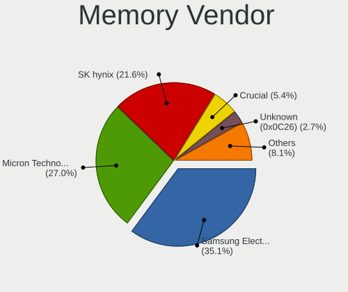

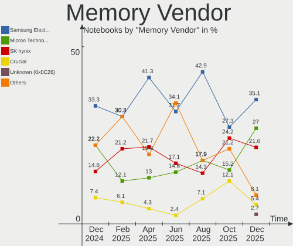

| Vendor              | Notebooks | Percent |
|---------------------|-----------|---------|
| Samsung Electronics | 13        | 35.14%  |
| Micron Technology   | 10        | 27.03%  |
| SK hynix            | 8         | 21.62%  |
| Crucial             | 2         | 5.41%   |
| Unknown (0x0C26)    | 1         | 2.7%    |
| Unknown (0x0B5E)    | 1         | 2.7%    |
| Elpida              | 1         | 2.7%    |
| A-DATA Technology   | 1         | 2.7%    |

Memory Model
------------

Memory module models

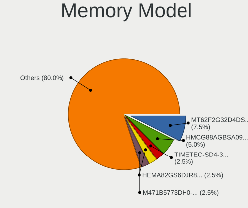

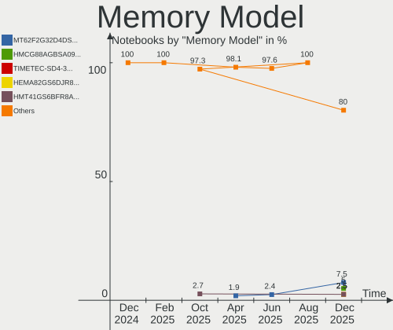

| Model                                                            | Notebooks | Percent |
|------------------------------------------------------------------|-----------|---------|
| Micron RAM MT62F2G32D4DS-026 WT 8GiB SODIMM LPDDR5 7500MT/s      | 3         | 7.5%    |
| SK hynix RAM HMCG88AGBSA095N 32GB SODIMM DDR5 5600MT/s           | 2         | 5%      |
| Unknown (0x0C26) RAM TIMETEC-SD4-3200 16GB SODIMM DDR4 3200MT/s  | 1         | 2.5%    |
| Unknown (0x0B5E) RAM HEMA82GS6DJR8N-XN 16GB SODIMM DDR4 3200MT/s | 1         | 2.5%    |
| SK hynix RAM HMT41GS6BFR8A-PB 8GB SODIMM DDR3 2667MT/s           | 1         | 2.5%    |
| SK hynix RAM HMT41GS6AFR8A-PB 8GiB SODIMM DDR3 2667MT/s          | 1         | 2.5%    |
| SK hynix RAM HMT41GS6AFR8A-PB 8GB SODIMM DDR3 1600MT/s           | 1         | 2.5%    |
| SK hynix RAM HMT325S6BFR8C-G7 2048MB SODIMM DDR3 1067MT/s        | 1         | 2.5%    |
| SK hynix RAM HMCG88AHBVA327N 32GB SODIMM DDR5 6400MT/s           | 1         | 2.5%    |
| SK hynix RAM HMCG78AGBSA092N 16GB SODIMM DDR5 5600MT/s           | 1         | 2.5%    |
| SK hynix RAM HMA81GS6AFR8N-UH 8GB SODIMM DDR4 2667MT/s           | 1         | 2.5%    |
| Samsung RAM M471B5773DH0-CH9 2GB SODIMM DDR3 1600MT/s            | 1         | 2.5%    |
| Samsung RAM M471B5673FH0-CF8 2048MB SODIMM DDR3 1067MT/s         | 1         | 2.5%    |
| Samsung RAM M471B5273DH0-CH9 4GB SODIMM DDR3 1600MT/s            | 1         | 2.5%    |
| Samsung RAM M471A5244CB0-CWE 4GB Row Of Chips DDR4 3200MT/s      | 1         | 2.5%    |
| Samsung RAM M471A2K43EB1-CWE 16GB SODIMM DDR4 3200MT/s           | 1         | 2.5%    |
| Samsung RAM M471A2K43DB1-CWE 16GB SODIMM DDR4 3200MT/s           | 1         | 2.5%    |
| Samsung RAM M471A1K43CB1-CRC 8GB SODIMM DDR4 8400MT/s            | 1         | 2.5%    |
| Samsung RAM M471A1K43BB1-CRC 8GB SODIMM DDR4 2667MT/s            | 1         | 2.5%    |
| Samsung RAM M425R2GA3PB0-CWMOD 16GiB SODIMM DDR5 5600MT/s        | 1         | 2.5%    |
| Samsung RAM M425R2GA3EB0-CWMOL 16GB SODIMM DDR5 5600MT/s         | 1         | 2.5%    |
| Samsung RAM K4UBE3D4AA-MGCL 8GB Row Of Chips LPDDR4 4267MT/s     | 1         | 2.5%    |
| Samsung RAM K4E6E304EC-EGCG 4GB Row Of Chips LPDDR3 2133MT/s     | 1         | 2.5%    |
| Samsung RAM K3LKBKB@BM-MGCP 2GB Row Of Chips LPDDR5 6400MT/s     | 1         | 2.5%    |
| Samsung RAM K3LKBKB0BM-MGCP 2GB Row Of Chips LPDDR5 6400MT/s     | 1         | 2.5%    |
| Micron RAM MTC16C2085S1SC56BD1 32GB SODIMM DDR5 5600MT/s         | 1         | 2.5%    |
| Micron RAM Module 4GB Row Of Chips LPDDR5 8533MT/s               | 1         | 2.5%    |
| Micron RAM CT64G56C46S5.M16B1 64GB SODIMM DDR5 5600MT/s          | 1         | 2.5%    |
| Micron RAM 8ATF2G64HZ-3G2E2 16GB SODIMM DDR4 3200MT/s            | 1         | 2.5%    |
| Micron RAM 4ATF51264HZ-2G3B1 4GB SODIMM DDR4 3200MT/s            | 1         | 2.5%    |
| Micron RAM 16KTF1G64HZ-1G6N1 8GB SODIMM DDR3 1600MT/s            | 1         | 2.5%    |
| Micron RAM 16ATF2G64HZ-3G2J1 16GB SODIMM DDR4 3200MT/s           | 1         | 2.5%    |
| Elpida RAM Module 4GB SODIMM DDR3 1600MT/s                       | 1         | 2.5%    |
| Crucial RAM CT16G4SFRA32A.C8FF 16GB SODIMM DDR4 3200MT/s         | 1         | 2.5%    |
| Crucial RAM CT16G4SFRA32A.C8FE 16GB SODIMM DDR4 3200MT/s         | 1         | 2.5%    |
| Crucial RAM CT16G4SFD824A.M16FE 16GB SODIMM DDR4 2400MT/s        | 1         | 2.5%    |
| A-DATA RAM AO1P32NCSV1-BEWS 16GB SODIMM DDR4 3200MT/s            | 1         | 2.5%    |

Memory Kind
-----------

Memory module kinds

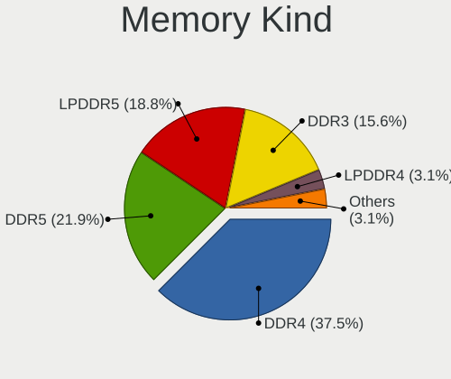

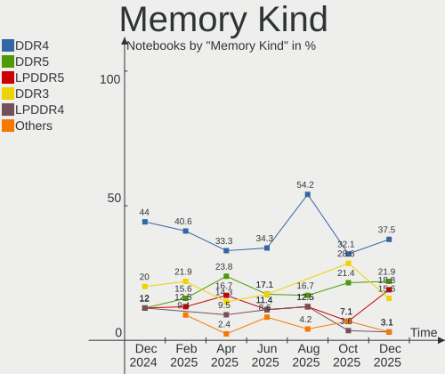

| Kind   | Notebooks | Percent |
|--------|-----------|---------|
| DDR4   | 12        | 37.5%   |
| DDR5   | 7         | 21.88%  |
| LPDDR5 | 6         | 18.75%  |
| DDR3   | 5         | 15.63%  |
| LPDDR4 | 1         | 3.13%   |
| LPDDR3 | 1         | 3.13%   |

Memory Form Factor
------------------

Physical design of the memory module

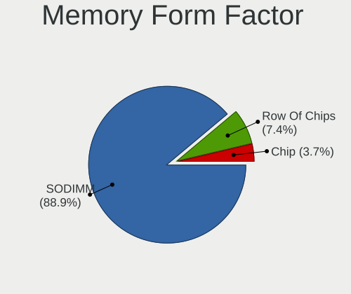

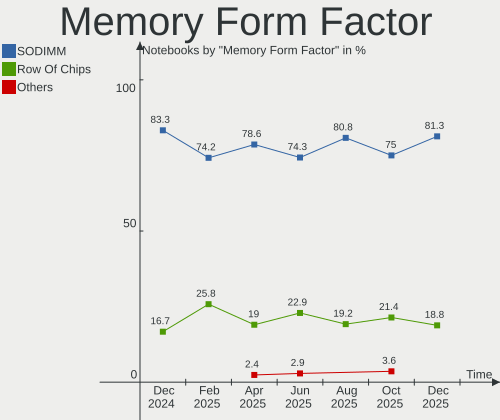

| Name         | Notebooks | Percent |
|--------------|-----------|---------|
| SODIMM       | 26        | 81.25%  |
| Row Of Chips | 6         | 18.75%  |

Memory Size
-----------

Memory module size

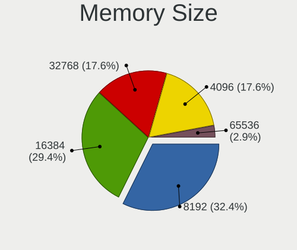

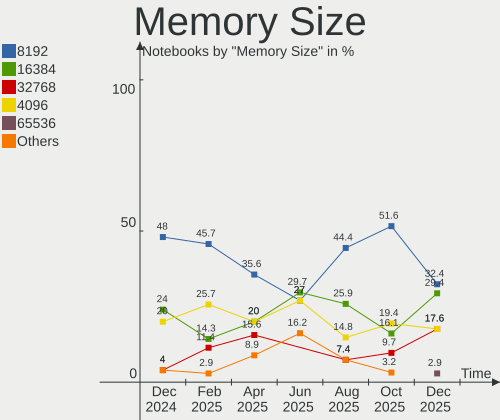

| Size  | Notebooks | Percent |
|-------|-----------|---------|
| 8192  | 11        | 32.35%  |
| 16384 | 10        | 29.41%  |
| 32768 | 6         | 17.65%  |
| 4096  | 6         | 17.65%  |
| 65536 | 1         | 2.94%   |

Memory Speed
------------

Memory module speed

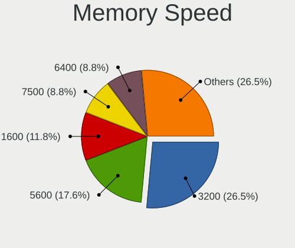

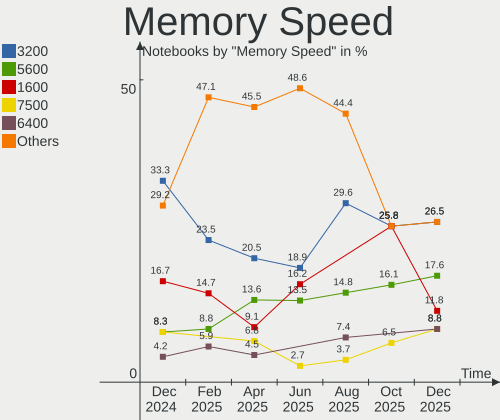

| Speed | Notebooks | Percent |
|-------|-----------|---------|
| 3200  | 9         | 26.47%  |
| 5600  | 6         | 17.65%  |
| 1600  | 4         | 11.76%  |
| 7500  | 3         | 8.82%   |
| 6400  | 3         | 8.82%   |
| 2667  | 3         | 8.82%   |
| 8533  | 1         | 2.94%   |
| 8400  | 1         | 2.94%   |
| 4267  | 1         | 2.94%   |
| 2400  | 1         | 2.94%   |
| 2133  | 1         | 2.94%   |
| 1067  | 1         | 2.94%   |

Printers & scanners
-------------------

Printer Vendor
--------------

Printer device vendors

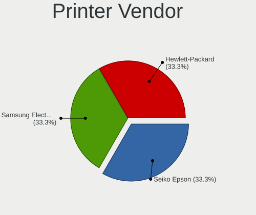

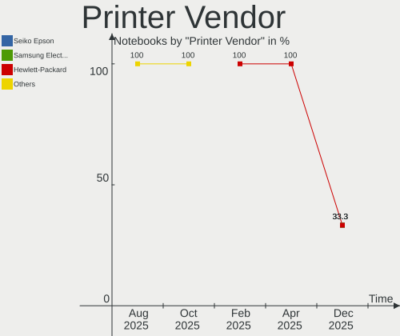

| Vendor              | Notebooks | Percent |
|---------------------|-----------|---------|
| Seiko Epson         | 1         | 33.33%  |
| Samsung Electronics | 1         | 33.33%  |
| Hewlett-Packard     | 1         | 33.33%  |

Printer Model
-------------

Printer device models

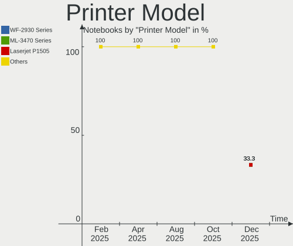

| Model                      | Notebooks | Percent |
|----------------------------|-----------|---------|
| Seiko Epson WF-2930 Series | 1         | 33.33%  |
| Samsung ML-3470 Series     | 1         | 33.33%  |
| HP Laserjet P1505          | 1         | 33.33%  |

Scanner Vendor
--------------

Scanner device vendors

Zero info for selected period =(

Scanner Model
-------------

Scanner device models

Zero info for selected period =(

Camera
------

Camera Vendor
-------------

Camera device vendors

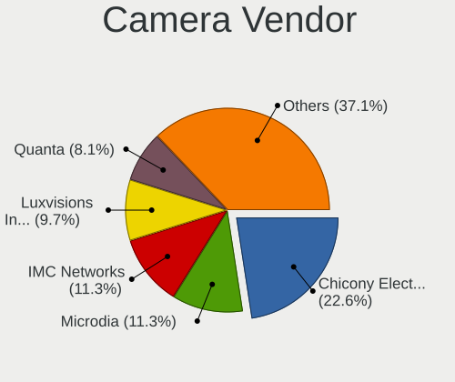

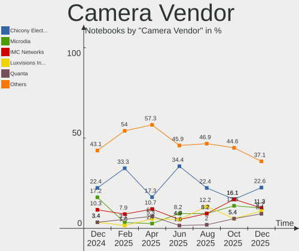

| Vendor                                 | Notebooks | Percent |
|----------------------------------------|-----------|---------|
| Chicony Electronics                    | 14        | 22.58%  |
| Microdia                               | 7         | 11.29%  |
| IMC Networks                           | 7         | 11.29%  |
| Luxvisions Innotech Limited            | 6         | 9.68%   |
| Quanta                                 | 5         | 8.06%   |
| Realtek Semiconductor                  | 4         | 6.45%   |
| Bison Electronics                      | 4         | 6.45%   |
| Sunplus Innovation Technology          | 3         | 4.84%   |
| Syntek                                 | 2         | 3.23%   |
| Foxlink                                | 2         | 3.23%   |
| DigiTech                               | 2         | 3.23%   |
| Shinetech                              | 1         | 1.61%   |
| Logitech                               | 1         | 1.61%   |
| Lenovo                                 | 1         | 1.61%   |
| kingcome                               | 1         | 1.61%   |
| Cheng Uei Precision Industry (Foxlink) | 1         | 1.61%   |
| Anker PowerConf C200                   | 1         | 1.61%   |

Camera Model
------------

Camera device models

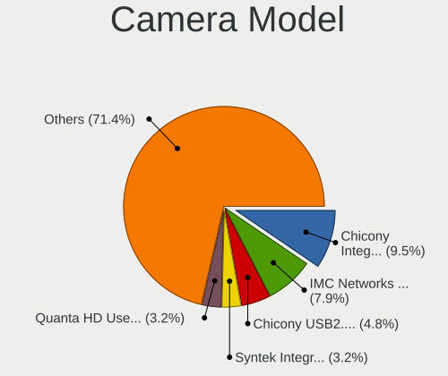

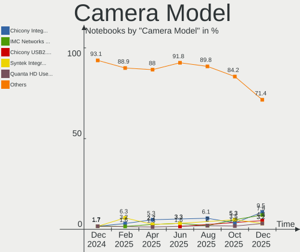

| Model                                                | Notebooks | Percent |
|------------------------------------------------------|-----------|---------|
| Chicony Integrated Camera                            | 6         | 9.52%   |
| IMC Networks Integrated Camera                       | 5         | 7.94%   |
| Chicony USB2.0 HD UVC WebCam                         | 3         | 4.76%   |
| Syntek Integrated Camera                             | 2         | 3.17%   |
| Quanta HD User Facing                                | 2         | 3.17%   |
| Microdia Integrated_Webcam_HD                        | 2         | 3.17%   |
| Microdia Integrated_Webcam_FHD                       | 2         | 3.17%   |
| Luxvisions Innotech Limited Integrated Camera        | 2         | 3.17%   |
| Foxlink HP True Vision FHD Camera                    | 2         | 3.17%   |
| Sunplus Integrated_Webcam_HD                         | 1         | 1.59%   |
| Sunplus HP TrueVision HD Camera                      | 1         | 1.59%   |
| Sunplus Dell HD Webcam                               | 1         | 1.59%   |
| Shinetech ASUS FHD webcam                            | 1         | 1.59%   |
| Realtek USB Video device                             | 1         | 1.59%   |
| Realtek Integrated_Webcam_HD                         | 1         | 1.59%   |
| Realtek Integrated Webcam HD                         | 1         | 1.59%   |
| Realtek HP Truevision HD                             | 1         | 1.59%   |
| Quanta HP Wide Vision HD Camera                      | 1         | 1.59%   |
| Quanta ACER HD User Facing                           | 1         | 1.59%   |
| Quanta Acer FHD User Facing                          | 1         | 1.59%   |
| Microdia Webcam Vitade AF                            | 1         | 1.59%   |
| Microdia Laptop_Integrated_Webcam_HD                 | 1         | 1.59%   |
| Microdia HP Webcam                                   | 1         | 1.59%   |
| Luxvisions Innotech Limited Integrated RGB Camera    | 1         | 1.59%   |
| Luxvisions Innotech Limited HP Wide Vision HD Camera | 1         | 1.59%   |
| Luxvisions Innotech Limited HP TrueVision HD Camera  | 1         | 1.59%   |
| Luxvisions Innotech Limited HP True Vision HD Camera | 1         | 1.59%   |
| Logitech C920 PRO HD Webcam                          | 1         | 1.59%   |
| Lenovo Integrated Webcam                             | 1         | 1.59%   |
| kingcome FHD WebCam                                  | 1         | 1.59%   |
| IMC Networks USB2.0 HD IR UVC WebCam                 | 1         | 1.59%   |
| IMC Networks ov9734_azurewave_camera                 | 1         | 1.59%   |
| DigiTech WebCam SCB-1110M                            | 1         | 1.59%   |
| DigiTech USB 2.0 PC Camera                           | 1         | 1.59%   |
| Chicony Integrated IR Camera                         | 1         | 1.59%   |
| Chicony Integrated HP HD Webcam                      | 1         | 1.59%   |
| Chicony Integrated Camera (1920x1080)                | 1         | 1.59%   |
| Chicony Integrated Camera (1280x720@30)              | 1         | 1.59%   |
| Chicony HP True Vision FHD Camera                    | 1         | 1.59%   |
| Chicony ACER HD User Facing                          | 1         | 1.59%   |

Security
--------

Fingerprint Vendor
------------------

Fingerprint sensor vendors

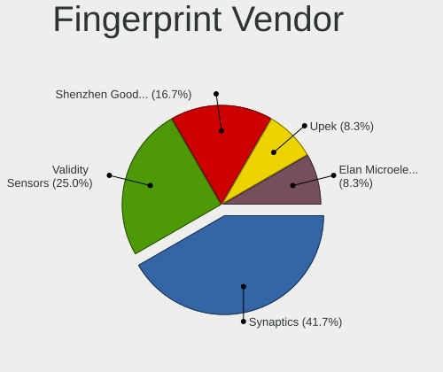

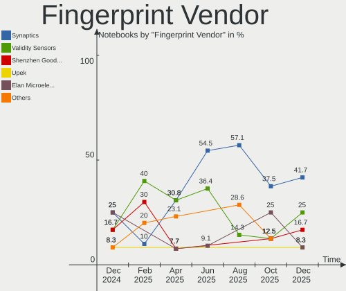

| Vendor                     | Notebooks | Percent |
|----------------------------|-----------|---------|
| Synaptics                  | 5         | 41.67%  |
| Validity Sensors           | 3         | 25%     |
| Shenzhen Goodix Technology | 2         | 16.67%  |
| Upek                       | 1         | 8.33%   |
| Elan Microelectronics      | 1         | 8.33%   |

Fingerprint Model
-----------------

Fingerprint sensor models

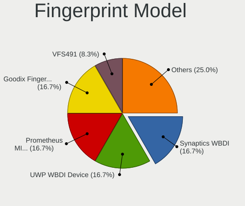

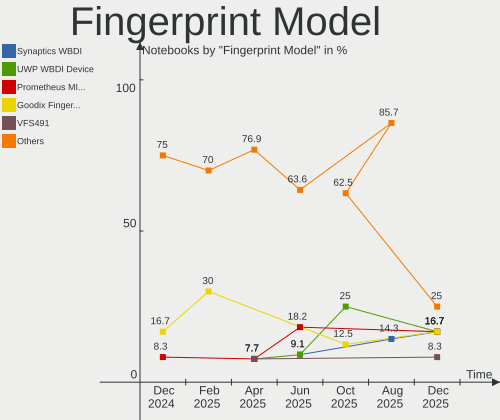

| Model                                                  | Notebooks | Percent |
|--------------------------------------------------------|-----------|---------|
| Validity Sensors Synaptics WBDI                        | 2         | 16.67%  |
| Synaptics UWP WBDI Device                              | 2         | 16.67%  |
| Synaptics Prometheus MIS Touch Fingerprint Reader      | 2         | 16.67%  |
| Shenzhen Goodix  Fingerprint Device                    | 2         | 16.67%  |
| Validity Sensors VFS491                                | 1         | 8.33%   |
| Upek Biometric Touchchip/Touchstrip Fingerprint Sensor | 1         | 8.33%   |
| Synaptics Metallica MIS Touch Fingerprint Reader       | 1         | 8.33%   |
| Elan ELAN:ARM-M4                                       | 1         | 8.33%   |

Chipcard Vendor
---------------

Chipcard module vendors

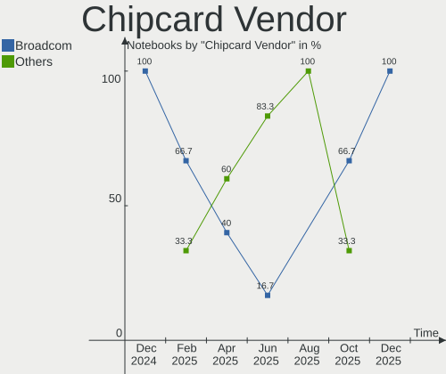

| Vendor   | Notebooks | Percent |
|----------|-----------|---------|
| Broadcom | 3         | 100%    |

Chipcard Model
--------------

Chipcard module models

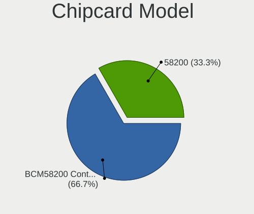

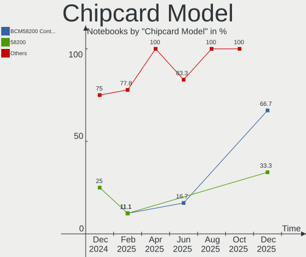

| Model                                                                       | Notebooks | Percent |
|-----------------------------------------------------------------------------|-----------|---------|
| Broadcom BCM58200 ControlVault 3 (FingerPrint sensor + Contacted SmartCard) | 2         | 66.67%  |
| Broadcom 58200                                                              | 1         | 33.33%  |

Unsupported
-----------

Unsupported Devices
-------------------

Total unsupported devices on board

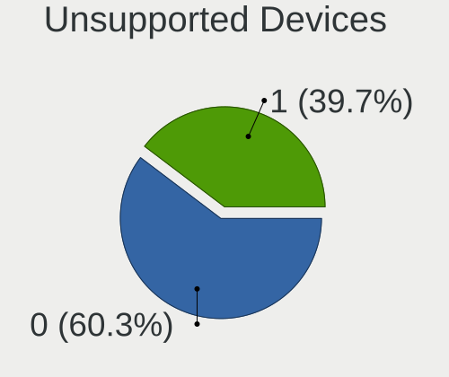

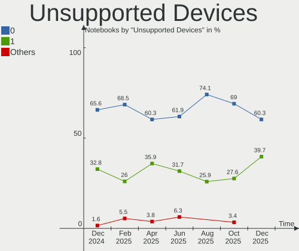

| Total | Notebooks | Percent |
|-------|-----------|---------|
| 0     | 38        | 60.32%  |
| 1     | 25        | 39.68%  |

Unsupported Device Types
------------------------

Types of unsupported devices

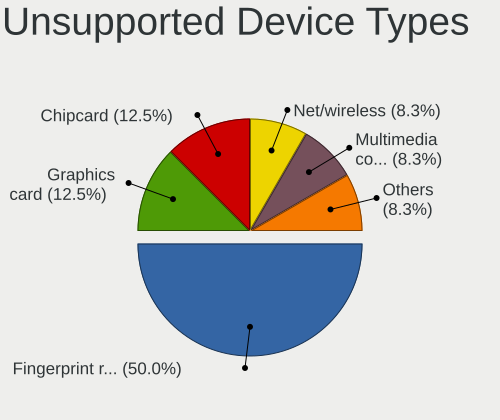

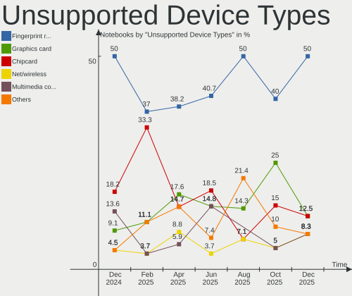

| Type                     | Notebooks | Percent |
|--------------------------|-----------|---------|
| Fingerprint reader       | 12        | 50%     |
| Graphics card            | 3         | 12.5%   |
| Chipcard                 | 3         | 12.5%   |
| Net/wireless             | 2         | 8.33%   |
| Multimedia controller    | 2         | 8.33%   |
| Communication controller | 2         | 8.33%   |

