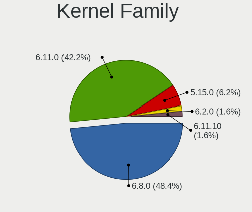
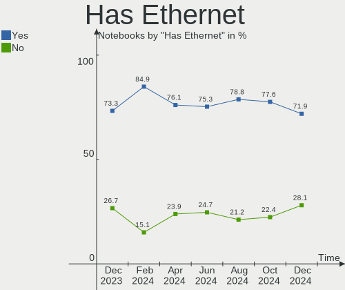
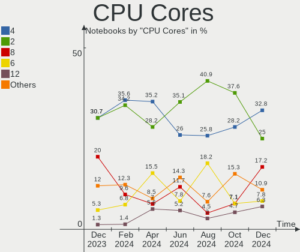
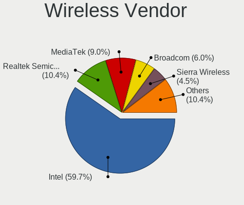
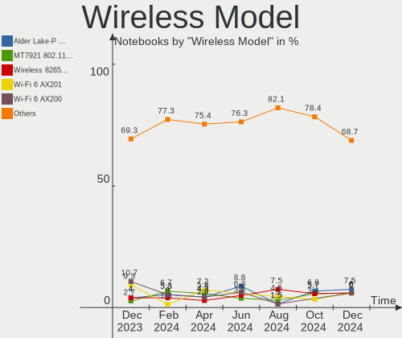

Kubuntu Hardware Trends (Notebooks)
-----------------------------------

A project to identify most popular hardware characteristics and track their change
over time based on data collected by Kubuntu users at https://Linux-Hardware.org.

Anyone can contribute to this report by the [hw-probe](https://github.com/linuxhw/hw-probe) tool:

    sudo -E hw-probe -all -upload

Full-feature report is available here: https://linux-hardware.org/?view=trends

Period: Nov, 2021.

Contents
--------

* [ System ](#system)
  - [ OS                       ](#os)
  - [ OS Family                ](#os-family)
  - [ Kernel                   ](#kernel)
  - [ Kernel Family            ](#kernel-family)
  - [ Kernel Major Ver.        ](#kernel-major-ver)
  - [ Arch                     ](#arch)
  - [ DE                       ](#de)
  - [ Display Server           ](#display-server)
  - [ Display Manager          ](#display-manager)
  - [ OS Lang                  ](#os-lang)
  - [ Boot Mode                ](#boot-mode)
  - [ Filesystem               ](#filesystem)
  - [ Part. scheme             ](#part-scheme)
  - [ Dual Boot with Linux/BSD ](#dual-boot-with-linuxbsd)
  - [ Dual Boot (Win)          ](#dual-boot-win)

* [ Board ](#board)
  - [ Vendor                   ](#vendor)
  - [ Model                    ](#model)
  - [ Model Family             ](#model-family)
  - [ MFG Year                 ](#mfg-year)
  - [ Form Factor              ](#form-factor)
  - [ Secure Boot              ](#secure-boot)
  - [ Coreboot                 ](#coreboot)
  - [ RAM Size                 ](#ram-size)
  - [ RAM Used                 ](#ram-used)
  - [ Total Drives             ](#total-drives)
  - [ Has CD-ROM               ](#has-cd-rom)
  - [ Has Ethernet             ](#has-ethernet)
  - [ Has WiFi                 ](#has-wifi)
  - [ Has Bluetooth            ](#has-bluetooth)

* [ Location ](#location)
  - [ Country                  ](#country)
  - [ City                     ](#city)

* [ Drives ](#drives)
  - [ Drive Vendor             ](#drive-vendor)
  - [ Drive Model              ](#drive-model)
  - [ HDD Vendor               ](#hdd-vendor)
  - [ SSD Vendor               ](#ssd-vendor)
  - [ Drive Kind               ](#drive-kind)
  - [ Drive Connector          ](#drive-connector)
  - [ Drive Size               ](#drive-size)
  - [ Space Total              ](#space-total)
  - [ Space Used               ](#space-used)
  - [ Malfunc. Drives          ](#malfunc-drives)
  - [ Malfunc. Drive Vendor    ](#malfunc-drive-vendor)
  - [ Malfunc. HDD Vendor      ](#malfunc-hdd-vendor)
  - [ Malfunc. Drive Kind      ](#malfunc-drive-kind)
  - [ Failed Drives            ](#failed-drives)
  - [ Failed Drive Vendor      ](#failed-drive-vendor)
  - [ Drive Status             ](#drive-status)

* [ Storage controller ](#storage-controller)
  - [ Storage Vendor           ](#storage-vendor)
  - [ Storage Model            ](#storage-model)
  - [ Storage Kind             ](#storage-kind)

* [ Processor ](#processor)
  - [ CPU Vendor               ](#cpu-vendor)
  - [ CPU Model                ](#cpu-model)
  - [ CPU Model Family         ](#cpu-model-family)
  - [ CPU Cores                ](#cpu-cores)
  - [ CPU Sockets              ](#cpu-sockets)
  - [ CPU Threads              ](#cpu-threads)
  - [ CPU Op-Modes             ](#cpu-op-modes)
  - [ CPU Microcode            ](#cpu-microcode)
  - [ CPU Microarch            ](#cpu-microarch)

* [ Graphics ](#graphics)
  - [ GPU Vendor               ](#gpu-vendor)
  - [ GPU Model                ](#gpu-model)
  - [ GPU Combo                ](#gpu-combo)
  - [ GPU Driver               ](#gpu-driver)
  - [ GPU Memory               ](#gpu-memory)

* [ Monitor ](#monitor)
  - [ Monitor Vendor           ](#monitor-vendor)
  - [ Monitor Model            ](#monitor-model)
  - [ Monitor Resolution       ](#monitor-resolution)
  - [ Monitor Diagonal         ](#monitor-diagonal)
  - [ Monitor Width            ](#monitor-width)
  - [ Aspect Ratio             ](#aspect-ratio)
  - [ Monitor Area             ](#monitor-area)
  - [ Pixel Density            ](#pixel-density)
  - [ Multiple Monitors        ](#multiple-monitors)

* [ Network ](#network)
  - [ Net Controller Vendor    ](#net-controller-vendor)
  - [ Net Controller Model     ](#net-controller-model)
  - [ Wireless Vendor          ](#wireless-vendor)
  - [ Wireless Model           ](#wireless-model)
  - [ Ethernet Vendor          ](#ethernet-vendor)
  - [ Ethernet Model           ](#ethernet-model)
  - [ Net Controller Kind      ](#net-controller-kind)
  - [ Used Controller          ](#used-controller)
  - [ NICs                     ](#nics)
  - [ IPv6                     ](#ipv6)

* [ Bluetooth ](#bluetooth)
  - [ Bluetooth Vendor         ](#bluetooth-vendor)
  - [ Bluetooth Model          ](#bluetooth-model)

* [ Sound ](#sound)
  - [ Sound Vendor             ](#sound-vendor)
  - [ Sound Model              ](#sound-model)

* [ Memory ](#memory)
  - [ Memory Vendor            ](#memory-vendor)
  - [ Memory Model             ](#memory-model)
  - [ Memory Kind              ](#memory-kind)
  - [ Memory Form Factor       ](#memory-form-factor)
  - [ Memory Size              ](#memory-size)
  - [ Memory Speed             ](#memory-speed)

* [ Printers & scanners ](#printers--scanners)
  - [ Printer Vendor           ](#printer-vendor)
  - [ Printer Model            ](#printer-model)
  - [ Scanner Vendor           ](#scanner-vendor)
  - [ Scanner Model            ](#scanner-model)

* [ Camera ](#camera)
  - [ Camera Vendor            ](#camera-vendor)
  - [ Camera Model             ](#camera-model)

* [ Security ](#security)
  - [ Fingerprint Vendor       ](#fingerprint-vendor)
  - [ Fingerprint Model        ](#fingerprint-model)
  - [ Chipcard Vendor          ](#chipcard-vendor)
  - [ Chipcard Model           ](#chipcard-model)

* [ Unsupported ](#unsupported)
  - [ Unsupported Devices      ](#unsupported-devices)
  - [ Unsupported Device Types ](#unsupported-device-types)

System
------

OS
--

Installed operating systems

| Name          | Notebooks | Percent |
|---------------|-----------|---------|
| Kubuntu 21.10 | 20        | 42.55%  |
| Kubuntu 20.04 | 18        | 38.3%   |
| Kubuntu 21.04 | 5         | 10.64%  |
| Kubuntu 20.10 | 2         | 4.26%   |
| Kubuntu 19.04 | 1         | 2.13%   |
| Kubuntu 18.04 | 1         | 2.13%   |

OS Family
---------

OS without a version

| Name    | Notebooks | Percent |
|---------|-----------|---------|
| Kubuntu | 47        | 100%    |

Kernel
------

Version of the Linux kernel

| Version               | Notebooks | Percent |
|-----------------------|-----------|---------|
| 5.11.0-40-generic     | 11        | 23.4%   |
| 5.13.0-21-generic     | 10        | 21.28%  |
| 5.13.0-20-generic     | 6         | 12.77%  |
| 5.11.0-38-generic     | 5         | 10.64%  |
| 5.8.0-63-generic      | 2         | 4.26%   |
| 5.4.0-90-generic      | 2         | 4.26%   |
| 5.13.0-19-generic     | 2         | 4.26%   |
| 5.11.0-37-generic     | 2         | 4.26%   |
| 5.15.5-051505-generic | 1         | 2.13%   |
| 5.15.2-xanmod1        | 1         | 2.13%   |
| 5.14.3-051403-generic | 1         | 2.13%   |
| 5.11.0-34-generic     | 1         | 2.13%   |
| 5.11.0-27-generic     | 1         | 2.13%   |
| 5.0.0-38-generic      | 1         | 2.13%   |
| 4.15.0-161-generic    | 1         | 2.13%   |

Kernel Family
-------------

Linux kernel without a distro release

| Version | Notebooks | Percent |
|---------|-----------|---------|
| 5.11.0  | 20        | 42.55%  |
| 5.13.0  | 18        | 38.3%   |
| 5.8.0   | 2         | 4.26%   |
| 5.4.0   | 2         | 4.26%   |
| 5.15.5  | 1         | 2.13%   |
| 5.15.2  | 1         | 2.13%   |
| 5.14.3  | 1         | 2.13%   |
| 5.0.0   | 1         | 2.13%   |
| 4.15.0  | 1         | 2.13%   |

Kernel Major Ver.
-----------------

Linux kernel major version

| Version | Notebooks | Percent |
|---------|-----------|---------|
| 5.11    | 20        | 42.55%  |
| 5.13    | 18        | 38.3%   |
| 5.8     | 2         | 4.26%   |
| 5.4     | 2         | 4.26%   |
| 5.15    | 2         | 4.26%   |
| 5.14    | 1         | 2.13%   |
| 5.0     | 1         | 2.13%   |
| 4.15    | 1         | 2.13%   |

Arch
----

OS architecture (x86_64, i586, etc.)

| Name   | Notebooks | Percent |
|--------|-----------|---------|
| x86_64 | 47        | 100%    |

DE
--

Desktop Environment

| Name | Notebooks | Percent |
|------|-----------|---------|
| KDE5 | 46        | 97.87%  |
| KDE  | 1         | 2.13%   |

Display Server
--------------

X11 or Wayland

| Name | Notebooks | Percent |
|------|-----------|---------|
| X11  | 47        | 100%    |

Display Manager
---------------

SDDM, LightDM, etc.

| Name    | Notebooks | Percent |
|---------|-----------|---------|
| SDDM    | 38        | 80.85%  |
| LightDM | 4         | 8.51%   |
| GDM     | 3         | 6.38%   |
| Unknown | 2         | 4.26%   |

OS Lang
-------

Language

| Lang  | Notebooks | Percent |
|-------|-----------|---------|
| en_US | 24        | 51.06%  |
| de_DE | 5         | 10.64%  |
| pl_PL | 3         | 6.38%   |
| en_GB | 3         | 6.38%   |
| en_CA | 3         | 6.38%   |
| fr_FR | 2         | 4.26%   |
| en_IN | 2         | 4.26%   |
| ru_RU | 1         | 2.13%   |
| fr_BE | 1         | 2.13%   |
| es_ES | 1         | 2.13%   |
| en_ZA | 1         | 2.13%   |
| C     | 1         | 2.13%   |

Boot Mode
---------

EFI or BIOS

| Mode | Notebooks | Percent |
|------|-----------|---------|
| EFI  | 35        | 74.47%  |
| BIOS | 12        | 25.53%  |

Filesystem
----------

Type of filesystem

| Type    | Notebooks | Percent |
|---------|-----------|---------|
| Ext4    | 43        | 91.49%  |
| Overlay | 2         | 4.26%   |
| Zfs     | 1         | 2.13%   |
| Btrfs   | 1         | 2.13%   |

Part. scheme
------------

Scheme of partitioning

| Type    | Notebooks | Percent |
|---------|-----------|---------|
| GPT     | 33        | 70.21%  |
| Unknown | 11        | 23.4%   |
| MBR     | 3         | 6.38%   |

Dual Boot with Linux/BSD
------------------------

Hosting more than one Linux/BSD

| Dual boot | Notebooks | Percent |
|-----------|-----------|---------|
| No        | 42        | 89.36%  |
| Yes       | 5         | 10.64%  |

Dual Boot (Win)
---------------

Hosting Linux and Windows

| Dual boot | Notebooks | Percent |
|-----------|-----------|---------|
| No        | 26        | 55.32%  |
| Yes       | 21        | 44.68%  |

Board
-----

Vendor
------

Motherboard manufacturer

| Name             | Notebooks | Percent |
|------------------|-----------|---------|
| Lenovo           | 14        | 29.79%  |
| Dell             | 9         | 19.15%  |
| ASUSTek Computer | 7         | 14.89%  |
| Hewlett-Packard  | 6         | 12.77%  |
| MSI              | 3         | 6.38%   |
| Acer             | 3         | 6.38%   |
| TUXEDO           | 1         | 2.13%   |
| Sony             | 1         | 2.13%   |
| HUAWEI           | 1         | 2.13%   |
| Fujitsu          | 1         | 2.13%   |
| Apple            | 1         | 2.13%   |

Model
-----

Motherboard model

| Name                                   | Notebooks | Percent |
|----------------------------------------|-----------|---------|
| TUXEDO Pulse 15 Gen1                   | 1         | 2.13%   |
| Sony VPCF236FM                         | 1         | 2.13%   |
| MSI GP72 7RDX                          | 1         | 2.13%   |
| MSI GE75 Raider 10SF                   | 1         | 2.13%   |
| MSI GE66 Raider 11UG                   | 1         | 2.13%   |
| Lenovo V155-15API 81V5                 | 1         | 2.13%   |
| Lenovo ThinkPad X230 23252UU           | 1         | 2.13%   |
| Lenovo ThinkPad X1 Extreme 20MFCTO1WW  | 1         | 2.13%   |
| Lenovo ThinkPad T14 Gen 1 20S0000MRT   | 1         | 2.13%   |
| Lenovo ThinkPad L15 Gen 2 20X4S27200   | 1         | 2.13%   |
| Lenovo ThinkPad E15 20RDCTO1WW         | 1         | 2.13%   |
| Lenovo ThinkPad E15 20RD004FMH         | 1         | 2.13%   |
| Lenovo ThinkPad E14 20RBS25S00         | 1         | 2.13%   |
| Lenovo ThinkBook 15p Gen 2 21B1        | 1         | 2.13%   |
| Lenovo ThinkBook 14p Gen 2 20YN        | 1         | 2.13%   |
| Lenovo IdeaPad S145-15IWL 81S9         | 1         | 2.13%   |
| Lenovo IdeaPad 320-17IKB 80XM          | 1         | 2.13%   |
| Lenovo IdeaPad 110-17IKB 80VK          | 1         | 2.13%   |
| Lenovo G710 20252                      | 1         | 2.13%   |
| HUAWEI NBLK-WAX9X                      | 1         | 2.13%   |
| HP ProBook 640 G4                      | 1         | 2.13%   |
| HP ProBook 440 G7                      | 1         | 2.13%   |
| HP Pavilion Notebook 15-bc5xxx         | 1         | 2.13%   |
| HP Pavilion Aero Laptop 13-be0xxx      | 1         | 2.13%   |
| HP Laptop 15s-eq2xxx                   | 1         | 2.13%   |
| HP EliteBook 840 G3                    | 1         | 2.13%   |
| Fujitsu LIFEBOOK T904                  | 1         | 2.13%   |
| Dell XPS 15 9500                       | 1         | 2.13%   |
| Dell XPS 13 9380                       | 1         | 2.13%   |
| Dell Studio 1735                       | 1         | 2.13%   |
| Dell Precision 5530                    | 1         | 2.13%   |
| Dell Latitude E7250                    | 1         | 2.13%   |
| Dell Latitude E5530 non-vPro           | 1         | 2.13%   |
| Dell Latitude E5430 non-vPro           | 1         | 2.13%   |
| Dell Inspiron 15 5510                  | 1         | 2.13%   |
| Dell G3 3579                           | 1         | 2.13%   |
| ASUS VivoBook_ASUSLaptop X515JA_X515JA | 1         | 2.13%   |
| ASUS UX430UNR                          | 1         | 2.13%   |
| ASUS Strix GL703GS_GL703GS             | 1         | 2.13%   |
| ASUS S451LB                            | 1         | 2.13%   |
| ASUS ROG Zephyrus M16 GU603HE_GU603HE  | 1         | 2.13%   |
| ASUS P552LJ                            | 1         | 2.13%   |
| ASUS K50IJ                             | 1         | 2.13%   |
| Apple MacBookPro9,2                    | 1         | 2.13%   |
| Acer Aspire F5-771G                    | 1         | 2.13%   |
| Acer Aspire A315-51                    | 1         | 2.13%   |
| Acer Aspire 1810TZ                     | 1         | 2.13%   |

Model Family
------------

Motherboard model prefix

| Name              | Notebooks | Percent |
|-------------------|-----------|---------|
| Lenovo ThinkPad   | 7         | 14.89%  |
| Lenovo IdeaPad    | 3         | 6.38%   |
| Dell Latitude     | 3         | 6.38%   |
| Acer Aspire       | 3         | 6.38%   |
| Lenovo ThinkBook  | 2         | 4.26%   |
| HP ProBook        | 2         | 4.26%   |
| HP Pavilion       | 2         | 4.26%   |
| Dell XPS          | 2         | 4.26%   |
| TUXEDO Pulse      | 1         | 2.13%   |
| Sony VPCF236FM    | 1         | 2.13%   |
| MSI GP72          | 1         | 2.13%   |
| MSI GE75          | 1         | 2.13%   |
| MSI GE66          | 1         | 2.13%   |
| Lenovo V155-15API | 1         | 2.13%   |
| Lenovo G710       | 1         | 2.13%   |
| HUAWEI NBLK-WAX9X | 1         | 2.13%   |
| HP Laptop         | 1         | 2.13%   |
| HP EliteBook      | 1         | 2.13%   |
| Fujitsu LIFEBOOK  | 1         | 2.13%   |
| Dell Studio       | 1         | 2.13%   |
| Dell Precision    | 1         | 2.13%   |
| Dell Inspiron     | 1         | 2.13%   |
| Dell G3           | 1         | 2.13%   |
| ASUS VivoBook     | 1         | 2.13%   |
| ASUS UX430UNR     | 1         | 2.13%   |
| ASUS Strix        | 1         | 2.13%   |
| ASUS S451LB       | 1         | 2.13%   |
| ASUS ROG          | 1         | 2.13%   |
| ASUS P552LJ       | 1         | 2.13%   |
| ASUS K50IJ        | 1         | 2.13%   |
| Apple MacBookPro9 | 1         | 2.13%   |

MFG Year
--------

Motherboard manufacture year

| Year | Notebooks | Percent |
|------|-----------|---------|
| 2021 | 18        | 38.3%   |
| 2020 | 9         | 19.15%  |
| 2019 | 4         | 8.51%   |
| 2018 | 4         | 8.51%   |
| 2017 | 3         | 6.38%   |
| 2012 | 2         | 4.26%   |
| 2010 | 2         | 4.26%   |
| 2016 | 1         | 2.13%   |
| 2014 | 1         | 2.13%   |
| 2013 | 1         | 2.13%   |
| 2011 | 1         | 2.13%   |
| 2008 | 1         | 2.13%   |

Form Factor
-----------

Physical design of the computer

| Name     | Notebooks | Percent |
|----------|-----------|---------|
| Notebook | 47        | 100%    |

Secure Boot
-----------

Enabled or disabled

| State    | Notebooks | Percent |
|----------|-----------|---------|
| Disabled | 41        | 87.23%  |
| Enabled  | 6         | 12.77%  |

Coreboot
--------

Have coreboot on board

| Used | Notebooks | Percent |
|------|-----------|---------|
| No   | 47        | 100%    |

RAM Size
--------

Total RAM memory

| Size in GB | Notebooks | Percent |
|------------|-----------|---------|
| 4.01-8.0   | 16        | 34.04%  |
| 16.01-24.0 | 12        | 25.53%  |
| 8.01-16.0  | 10        | 21.28%  |
| 32.01-64.0 | 6         | 12.77%  |
| 3.01-4.0   | 3         | 6.38%   |

RAM Used
--------

Used RAM memory

| Used GB    | Notebooks | Percent |
|------------|-----------|---------|
| 2.01-3.0   | 19        | 40.43%  |
| 1.01-2.0   | 11        | 23.4%   |
| 4.01-8.0   | 8         | 17.02%  |
| 3.01-4.0   | 7         | 14.89%  |
| 16.01-24.0 | 1         | 2.13%   |
| 0.51-1.0   | 1         | 2.13%   |

Total Drives
------------

Number of drives on board

| Drives | Notebooks | Percent |
|--------|-----------|---------|
| 1      | 31        | 65.96%  |
| 2      | 16        | 34.04%  |

Has CD-ROM
----------

Has CD-ROM on board

| Presented | Notebooks | Percent |
|-----------|-----------|---------|
| No        | 36        | 76.6%   |
| Yes       | 11        | 23.4%   |

Has Ethernet
------------

Has Ethernet on board

| Presented | Notebooks | Percent |
|-----------|-----------|---------|
| Yes       | 37        | 78.72%  |
| No        | 10        | 21.28%  |

Has WiFi
--------

Has WiFi module

| Presented | Notebooks | Percent |
|-----------|-----------|---------|
| Yes       | 47        | 100%    |

Has Bluetooth
-------------

Has Bluetooth module

| Presented | Notebooks | Percent |
|-----------|-----------|---------|
| Yes       | 41        | 87.23%  |
| No        | 6         | 12.77%  |

Location
--------

Country
-------

Geographic location (country)

| Country      | Notebooks | Percent |
|--------------|-----------|---------|
| USA          | 7         | 14.89%  |
| Germany      | 6         | 12.77%  |
| Poland       | 3         | 6.38%   |
| Canada       | 3         | 6.38%   |
| Belgium      | 3         | 6.38%   |
| UK           | 2         | 4.26%   |
| Russia       | 2         | 4.26%   |
| Mexico       | 2         | 4.26%   |
| India        | 2         | 4.26%   |
| France       | 2         | 4.26%   |
| Brazil       | 2         | 4.26%   |
| Vietnam      | 1         | 2.13%   |
| Ukraine      | 1         | 2.13%   |
| Turkey       | 1         | 2.13%   |
| Tunisia      | 1         | 2.13%   |
| Switzerland  | 1         | 2.13%   |
| Spain        | 1         | 2.13%   |
| South Africa | 1         | 2.13%   |
| Slovenia     | 1         | 2.13%   |
| Netherlands  | 1         | 2.13%   |
| Indonesia    | 1         | 2.13%   |
| Georgia      | 1         | 2.13%   |
| China        | 1         | 2.13%   |
| Argentina    | 1         | 2.13%   |

City
----

Geographic location (city)

| City              | Notebooks | Percent |
|-------------------|-----------|---------|
| Escondido         | 2         | 4.26%   |
| Berlin            | 2         | 4.26%   |
| Zurich            | 1         | 2.13%   |
| Zapopan           | 1         | 2.13%   |
| Zabrze            | 1         | 2.13%   |
| Tunis             | 1         | 2.13%   |
| Thunder Bay       | 1         | 2.13%   |
| Starnberg         | 1         | 2.13%   |
| Stafford          | 1         | 2.13%   |
| St Petersburg     | 1         | 2.13%   |
| Shenzhen          | 1         | 2.13%   |
| Roubaix           | 1         | 2.13%   |
| Rio de Janeiro    | 1         | 2.13%   |
| Radomsko          | 1         | 2.13%   |
| Pune              | 1         | 2.13%   |
| Portland          | 1         | 2.13%   |
| Plymouth          | 1         | 2.13%   |
| Mumbai            | 1         | 2.13%   |
| Moscow            | 1         | 2.13%   |
| Montreal          | 1         | 2.13%   |
| Mogi das Cruzes   | 1         | 2.13%   |
| Merelbeke         | 1         | 2.13%   |
| Le??n             | 1         | 2.13%   |
| Khmelnytskyi      | 1         | 2.13%   |
| K'alak'i T'bilisi | 1         | 2.13%   |
| Jakarta           | 1         | 2.13%   |
| Istanbul          | 1         | 2.13%   |
| Hanoi             | 1         | 2.13%   |
| Hamburg           | 1         | 2.13%   |
| Guanajuato City   | 1         | 2.13%   |
| Grosuplje         | 1         | 2.13%   |
| Gelsenkirchen     | 1         | 2.13%   |
| Geel              | 1         | 2.13%   |
| Gdansk            | 1         | 2.13%   |
| Durmersheim       | 1         | 2.13%   |
| Durban            | 1         | 2.13%   |
| Cochrane          | 1         | 2.13%   |
| Christiansburg    | 1         | 2.13%   |
| Buenos Aires      | 1         | 2.13%   |
| Brest             | 1         | 2.13%   |
| Bastogne          | 1         | 2.13%   |
| Barnsley          | 1         | 2.13%   |
| Aurora            | 1         | 2.13%   |
| Amsterdam         | 1         | 2.13%   |
| Allendale         | 1         | 2.13%   |

Drives
------

Drive Vendor
------------

Hard drive vendors

| Vendor                         | Notebooks | Drives | Percent |
|--------------------------------|-----------|--------|---------|
| Samsung Electronics            | 12        | 13     | 20.34%  |
| WDC                            | 9         | 11     | 15.25%  |
| Kingston                       | 4         | 4      | 6.78%   |
| Toshiba                        | 3         | 4      | 5.08%   |
| Intel                          | 3         | 3      | 5.08%   |
| Crucial                        | 3         | 3      | 5.08%   |
| Silicon Motion                 | 2         | 2      | 3.39%   |
| Seagate                        | 2         | 3      | 3.39%   |
| Sandisk                        | 2         | 2      | 3.39%   |
| Micron Technology              | 2         | 2      | 3.39%   |
| HGST                           | 2         | 2      | 3.39%   |
| Unknown                        | 1         | 1      | 1.69%   |
| Team                           | 1         | 1      | 1.69%   |
| Solid State Storage Technology | 1         | 1      | 1.69%   |
| SK Hynix                       | 1         | 1      | 1.69%   |
| PNY                            | 1         | 1      | 1.69%   |
| Phison                         | 1         | 1      | 1.69%   |
| Patriot                        | 1         | 1      | 1.69%   |
| Mushkin                        | 1         | 1      | 1.69%   |
| Micron/Crucial Technology      | 1         | 1      | 1.69%   |
| LITEON                         | 1         | 1      | 1.69%   |
| Hitachi                        | 1         | 1      | 1.69%   |
| Gigabyte Technology            | 1         | 1      | 1.69%   |
| Apple                          | 1         | 1      | 1.69%   |
| A-DATA Technology              | 1         | 1      | 1.69%   |
| Unknown                        | 1         | 1      | 1.69%   |

Drive Model
-----------

Hard drive models

| Model                                    | Notebooks | Percent |
|------------------------------------------|-----------|---------|
| WDC WD5000LPLX-60ZNTT1 500GB             | 1         | 1.59%   |
| WDC WD5000BEVT-80A0RT1 500GB             | 1         | 1.59%   |
| WDC WD3200BEVT-80A0RT0 320GB             | 1         | 1.59%   |
| WDC WD2500BEVT-75ZCT2 250GB              | 1         | 1.59%   |
| WDC WD20SPZX-08UA7 2TB                   | 1         | 1.59%   |
| WDC WD10SPZX-60Z10T0 1TB                 | 1         | 1.59%   |
| WDC WD10SPZX-24Z10T0 1TB                 | 1         | 1.59%   |
| WDC PC SN730 SDBQNTY-512G-1001 512GB     | 1         | 1.59%   |
| WDC PC SN730 SDBPNTY-1T00-1032 1TB       | 1         | 1.59%   |
| WDC PC SN520 SDAPNUW-256G-1006 256GB     | 1         | 1.59%   |
| Unknown MMC Card  64GB                   | 1         | 1.59%   |
| Toshiba THNSNJ128GCSU 128GB SSD          | 1         | 1.59%   |
| Toshiba MQ04ABF100 1TB                   | 1         | 1.59%   |
| Toshiba MK7559GSXP 752GB                 | 1         | 1.59%   |
| Toshiba KBG30ZMS128G NVMe 128GB          | 1         | 1.59%   |
| Team T2535T240G 240GB SSD                | 1         | 1.59%   |
| Solid State Storage NVMe SSD Drive 256GB | 1         | 1.59%   |
| SK Hynix SKHynix_HFS512GDE9X084N 512GB   | 1         | 1.59%   |
| Silicon Motion R5MP240G8 240GB           | 1         | 1.59%   |
| Silicon Motion NVMe SSD Drive 128GB      | 1         | 1.59%   |
| Seagate ST500LM000-1EJ162 500GB          | 1         | 1.59%   |
| Seagate ST2000LM015-2E8174 2TB           | 1         | 1.59%   |
| Seagate ST2000LM007-1R8174 2TB           | 1         | 1.59%   |
| SanDisk SSD G5 BICS4 500GB               | 1         | 1.59%   |
| Sandisk NVMe SSD Drive 256GB             | 1         | 1.59%   |
| Samsung SSD PM871 mSATA 256GB            | 1         | 1.59%   |
| Samsung SSD 980 PRO 500GB                | 1         | 1.59%   |
| Samsung SSD 980 1TB                      | 1         | 1.59%   |
| Samsung SSD 970 EVO Plus 1TB             | 1         | 1.59%   |
| Samsung SSD 860 EVO M.2 1TB              | 1         | 1.59%   |
| Samsung PM981 NVMe 512GB                 | 1         | 1.59%   |
| Samsung NVMe SSD Drive 512GB             | 1         | 1.59%   |
| Samsung NVMe SSD Drive 1TB               | 1         | 1.59%   |
| Samsung NVMe SSD Drive 1024GB            | 1         | 1.59%   |
| Samsung MZVLW128HEGR-00000 128GB         | 1         | 1.59%   |
| Samsung MZVLB512HBJQ-000L7 512GB         | 1         | 1.59%   |
| Samsung MZVL2512HCJQ-00BL2 512GB         | 1         | 1.59%   |
| Samsung MZVKV512HAJH-000L1 512GB         | 1         | 1.59%   |
| PNY CS1311 480GB SSD                     | 1         | 1.59%   |
| Phison NVMe SSD Drive 1TB                | 1         | 1.59%   |
| Patriot P210 1TB SSD                     | 1         | 1.59%   |
| Mushkin MKNSSDEC120GB                    | 1         | 1.59%   |
| Micron/Crucial NVMe SSD Drive 500GB      | 1         | 1.59%   |
| Micron MTFDHBA512QFD-1AX1AABHA 512GB     | 1         | 1.59%   |
| Micron MTFDDAK256MAM-1K12 256GB SSD      | 1         | 1.59%   |
| LITEON CA5-8D512 512GB                   | 1         | 1.59%   |
| Kingston SV300S37A120G 120GB SSD         | 1         | 1.59%   |
| Kingston SNVS500GB                       | 1         | 1.59%   |
| Kingston SM2280S3G2120G 120GB SSD        | 1         | 1.59%   |
| Kingston OM8SBP3512K-AH 512GB            | 1         | 1.59%   |
| Intel SSDPEKNW512G8 512GB                | 1         | 1.59%   |
| Intel SSDPEKKF512G8L 512GB               | 1         | 1.59%   |
| Intel NVMe SSD Drive 512GB               | 1         | 1.59%   |
| Hitachi HTS727575A9E364 752GB            | 1         | 1.59%   |
| HGST HTS721010A9E630 1TB                 | 1         | 1.59%   |
| HGST HTS541010A7E630 1TB                 | 1         | 1.59%   |
| Gigabyte GP-GSM2NE8256GNTD 256GB         | 1         | 1.59%   |
| Crucial CT500MX500SSD1 500GB             | 1         | 1.59%   |
| Crucial CT240BX500SSD1 240GB             | 1         | 1.59%   |
| Crucial CT1000MX500SSD1 1TB              | 1         | 1.59%   |

HDD Vendor
----------

Hard disk drive vendors

| Vendor  | Notebooks | Drives | Percent |
|---------|-----------|--------|---------|
| WDC     | 7         | 8      | 46.67%  |
| Toshiba | 2         | 2      | 13.33%  |
| Seagate | 2         | 3      | 13.33%  |
| HGST    | 2         | 2      | 13.33%  |
| Hitachi | 1         | 1      | 6.67%   |
| Apple   | 1         | 1      | 6.67%   |

SSD Vendor
----------

Solid state drive vendors

| Vendor              | Notebooks | Drives | Percent |
|---------------------|-----------|--------|---------|
| Crucial             | 3         | 3      | 20%     |
| Samsung Electronics | 2         | 2      | 13.33%  |
| Kingston            | 2         | 2      | 13.33%  |
| Toshiba             | 1         | 1      | 6.67%   |
| Team                | 1         | 1      | 6.67%   |
| SanDisk             | 1         | 1      | 6.67%   |
| PNY                 | 1         | 1      | 6.67%   |
| Patriot             | 1         | 1      | 6.67%   |
| Mushkin             | 1         | 1      | 6.67%   |
| Micron Technology   | 1         | 1      | 6.67%   |
| Unknown             | 1         | 1      | 6.67%   |

Drive Kind
----------

HDD or SSD

| Kind | Notebooks | Drives | Percent |
|------|-----------|--------|---------|
| NVMe | 28        | 31     | 48.28%  |
| HDD  | 15        | 17     | 25.86%  |
| SSD  | 14        | 15     | 24.14%  |
| MMC  | 1         | 1      | 1.72%   |

Drive Connector
---------------

SATA, SAS, NVMe, etc.

| Type | Notebooks | Drives | Percent |
|------|-----------|--------|---------|
| NVMe | 28        | 31     | 50%     |
| SATA | 27        | 32     | 48.21%  |
| MMC  | 1         | 1      | 1.79%   |

Drive Size
----------

Size of hard drive

| Size in TB | Notebooks | Drives | Percent |
|------------|-----------|--------|---------|
| 0.01-0.5   | 17        | 19     | 56.67%  |
| 0.51-1.0   | 10        | 10     | 33.33%  |
| 1.01-2.0   | 3         | 3      | 10%     |

Space Total
-----------

Amount of disk space available on the file system

| Size in GB | Notebooks | Percent |
|------------|-----------|---------|
| 251-500    | 17        | 36.17%  |
| 101-250    | 17        | 36.17%  |
| 501-1000   | 6         | 12.77%  |
| 1-20       | 3         | 6.38%   |
| 1001-2000  | 2         | 4.26%   |
| 2001-3000  | 1         | 2.13%   |
| 51-100     | 1         | 2.13%   |

Space Used
----------

Amount of used disk space

| Used GB   | Notebooks | Percent |
|-----------|-----------|---------|
| 1-20      | 15        | 31.91%  |
| 101-250   | 12        | 25.53%  |
| 21-50     | 8         | 17.02%  |
| 51-100    | 6         | 12.77%  |
| 251-500   | 4         | 8.51%   |
| 1001-2000 | 1         | 2.13%   |
| 501-1000  | 1         | 2.13%   |

Malfunc. Drives
---------------

Drive models with a malfunction

| Model                                   | Notebooks | Drives | Percent |
|-----------------------------------------|-----------|--------|---------|
| Toshiba MK7559GSXP 752GB                | 1         | 1      | 33.33%  |
| Samsung Electronics SSD 860 EVO M.2 1TB | 1         | 1      | 33.33%  |
| Hitachi HTS727575A9E364 752GB           | 1         | 1      | 33.33%  |

Malfunc. Drive Vendor
---------------------

Vendors of faulty drives

| Vendor              | Notebooks | Drives | Percent |
|---------------------|-----------|--------|---------|
| Toshiba             | 1         | 1      | 33.33%  |
| Samsung Electronics | 1         | 1      | 33.33%  |
| Hitachi             | 1         | 1      | 33.33%  |

Malfunc. HDD Vendor
-------------------

Vendors of faulty HDD drives

| Vendor  | Notebooks | Drives | Percent |
|---------|-----------|--------|---------|
| Toshiba | 1         | 1      | 50%     |
| Hitachi | 1         | 1      | 50%     |

Malfunc. Drive Kind
-------------------

Kinds of faulty drives

| Kind | Notebooks | Drives | Percent |
|------|-----------|--------|---------|
| HDD  | 2         | 2      | 66.67%  |
| SSD  | 1         | 1      | 33.33%  |

Failed Drives
-------------

Failed drive models

Zero info for selected period =(

Failed Drive Vendor
-------------------

Failed drive vendors

Zero info for selected period =(

Drive Status
------------

Number of failed and malfunc. drives

| Status   | Notebooks | Drives | Percent |
|----------|-----------|--------|---------|
| Works    | 33        | 45     | 68.75%  |
| Detected | 12        | 16     | 25%     |
| Malfunc  | 3         | 3      | 6.25%   |

Storage controller
------------------

Storage Vendor
--------------

Storage controller vendors

| Vendor                         | Notebooks | Percent |
|--------------------------------|-----------|---------|
| Intel                          | 35        | 54.69%  |
| Samsung Electronics            | 10        | 15.63%  |
| Sandisk                        | 4         | 6.25%   |
| Silicon Motion                 | 2         | 3.13%   |
| Phison Electronics             | 2         | 3.13%   |
| Kingston Technology Company    | 2         | 3.13%   |
| AMD                            | 2         | 3.13%   |
| Toshiba America Info Systems   | 1         | 1.56%   |
| Solid State Storage Technology | 1         | 1.56%   |
| SK Hynix                       | 1         | 1.56%   |
| Micron/Crucial Technology      | 1         | 1.56%   |
| Micron Technology              | 1         | 1.56%   |
| Lite-On Technology             | 1         | 1.56%   |
| ADATA Technology               | 1         | 1.56%   |

Storage Model
-------------

Storage controller models

| Model                                                                         | Notebooks | Percent |
|-------------------------------------------------------------------------------|-----------|---------|
| Intel Sunrise Point-LP SATA Controller [AHCI mode]                            | 7         | 10.29%  |
| Samsung NVMe SSD Controller SM981/PM981/PM983                                 | 5         | 7.35%   |
| Intel Comet Lake SATA AHCI Controller                                         | 4         | 5.88%   |
| Intel 82801 Mobile SATA Controller [RAID mode]                                | 4         | 5.88%   |
| Samsung NVMe SSD Controller PM9A1/PM9A3/980PRO                                | 3         | 4.41%   |
| Intel Cannon Lake Mobile PCH SATA AHCI Controller                             | 3         | 4.41%   |
| Intel 7 Series Chipset Family 6-port SATA Controller [AHCI mode]              | 3         | 4.41%   |
| Silicon Motion SM2263EN/SM2263XT SSD Controller                               | 2         | 2.94%   |
| Sandisk WD Black SN750 / PC SN730 NVMe SSD                                    | 2         | 2.94%   |
| Kingston Company Company Non-Volatile memory controller                       | 2         | 2.94%   |
| Intel 82801IBM/IEM (ICH9M/ICH9M-E) 4 port SATA Controller [AHCI mode]         | 2         | 2.94%   |
| Intel 8 Series SATA Controller 1 [AHCI mode]                                  | 2         | 2.94%   |
| AMD FCH SATA Controller [AHCI mode]                                           | 2         | 2.94%   |
| Toshiba America Info Systems BG3 NVMe SSD Controller                          | 1         | 1.47%   |
| Solid State Storage Non-Volatile memory controller                            | 1         | 1.47%   |
| SK Hynix Gold P31 SSD                                                         | 1         | 1.47%   |
| Sandisk WD Blue SN500 / PC SN520 NVMe SSD                                     | 1         | 1.47%   |
| Sandisk PC SN520 NVMe SSD                                                     | 1         | 1.47%   |
| Samsung NVMe SSD Controller SM961/PM961/SM963                                 | 1         | 1.47%   |
| Samsung NVMe SSD Controller SM951/PM951                                       | 1         | 1.47%   |
| Samsung NVMe SSD Controller 980                                               | 1         | 1.47%   |
| Phison NVMe Storage Controller                                                | 1         | 1.47%   |
| Phison E12 NVMe Controller                                                    | 1         | 1.47%   |
| Micron/Crucial P2 NVMe PCIe SSD                                               | 1         | 1.47%   |
| Micron Non-Volatile memory controller                                         | 1         | 1.47%   |
| Lite-On Non-Volatile memory controller                                        | 1         | 1.47%   |
| Intel Wildcat Point-LP SATA Controller [AHCI Mode]                            | 1         | 1.47%   |
| Intel Volume Management Device NVMe RAID Controller                           | 1         | 1.47%   |
| Intel SSD Pro 7600p/760p/E 6100p Series                                       | 1         | 1.47%   |
| Intel SSD 660P Series                                                         | 1         | 1.47%   |
| Intel Non-Volatile memory controller                                          | 1         | 1.47%   |
| Intel HM170/QM170 Chipset SATA Controller [AHCI Mode]                         | 1         | 1.47%   |
| Intel Cannon Point-LP SATA Controller [AHCI Mode]                             | 1         | 1.47%   |
| Intel 82801HM/HEM (ICH8M/ICH8M-E) SATA Controller [AHCI mode]                 | 1         | 1.47%   |
| Intel 8 Series/C220 Series Chipset Family 2-port SATA Controller 2 [IDE mode] | 1         | 1.47%   |
| Intel 8 Series Chipset Family 4-port SATA Controller 1 [IDE mode] - Mobile    | 1         | 1.47%   |
| Intel 6 Series/C200 Series Chipset Family 6 port Mobile SATA AHCI Controller  | 1         | 1.47%   |
| Intel 500 Series Chipset Family SATA AHCI Controller                          | 1         | 1.47%   |
| Intel 400 Series Chipset Family SATA AHCI Controller                          | 1         | 1.47%   |
| ADATA XPG SX8200 Pro PCIe Gen3x4 M.2 2280 Solid State Drive                   | 1         | 1.47%   |

Storage Kind
------------

Kind of storage controller (IDE, SATA, NVMe, SAS, ...)

| Kind | Notebooks | Percent |
|------|-----------|---------|
| SATA | 30        | 46.88%  |
| NVMe | 28        | 43.75%  |
| RAID | 5         | 7.81%   |
| IDE  | 1         | 1.56%   |

Processor
---------

CPU Vendor
----------

Processor vendors

| Vendor | Notebooks | Percent |
|--------|-----------|---------|
| Intel  | 41        | 87.23%  |
| AMD    | 6         | 12.77%  |

CPU Model
---------

Processor models

| Model                                         | Notebooks | Percent |
|-----------------------------------------------|-----------|---------|
| Intel Core i5-10210U CPU @ 1.60GHz            | 3         | 6.38%   |
| Intel 11th Gen Core i7-11800H @ 2.30GHz       | 3         | 6.38%   |
| Intel Core i7-8750H CPU @ 2.20GHz             | 2         | 4.26%   |
| Intel Core i7-10750H CPU @ 2.60GHz            | 2         | 4.26%   |
| Intel Core i7-10510U CPU @ 1.80GHz            | 2         | 4.26%   |
| Intel Core i5-7200U CPU @ 2.50GHz             | 2         | 4.26%   |
| Intel Core i5-3320M CPU @ 2.60GHz             | 2         | 4.26%   |
| Intel Core i5-3210M CPU @ 2.50GHz             | 2         | 4.26%   |
| Intel Pentium Dual-Core CPU T4500 @ 2.30GHz   | 1         | 2.13%   |
| Intel Pentium CPU 4415U @ 2.30GHz             | 1         | 2.13%   |
| Intel Genuine CPU U4100 @ 1.30GHz             | 1         | 2.13%   |
| Intel Core i7-8850H CPU @ 2.60GHz             | 1         | 2.13%   |
| Intel Core i7-8565U CPU @ 1.80GHz             | 1         | 2.13%   |
| Intel Core i7-8550U CPU @ 1.80GHz             | 1         | 2.13%   |
| Intel Core i7-7700HQ CPU @ 2.80GHz            | 1         | 2.13%   |
| Intel Core i7-5500U CPU @ 2.40GHz             | 1         | 2.13%   |
| Intel Core i7-2670QM CPU @ 2.20GHz            | 1         | 2.13%   |
| Intel Core i5-9300H CPU @ 2.40GHz             | 1         | 2.13%   |
| Intel Core i5-8300H CPU @ 2.30GHz             | 1         | 2.13%   |
| Intel Core i5-8265U CPU @ 1.60GHz             | 1         | 2.13%   |
| Intel Core i5-7300U CPU @ 2.60GHz             | 1         | 2.13%   |
| Intel Core i5-6300U CPU @ 2.40GHz             | 1         | 2.13%   |
| Intel Core i5-5300U CPU @ 2.30GHz             | 1         | 2.13%   |
| Intel Core i5-4300U CPU @ 1.90GHz             | 1         | 2.13%   |
| Intel Core i5-4200U CPU @ 1.60GHz             | 1         | 2.13%   |
| Intel Core i5-4200M CPU @ 2.50GHz             | 1         | 2.13%   |
| Intel Core i5-1035G1 CPU @ 1.00GHz            | 1         | 2.13%   |
| Intel Core i3-7130U CPU @ 2.70GHz             | 1         | 2.13%   |
| Intel Core 2 Duo CPU T8100 @ 2.10GHz          | 1         | 2.13%   |
| Intel 11th Gen Core i7-1165G7 @ 2.80GHz       | 1         | 2.13%   |
| Intel 11th Gen Core i5-11300H @ 3.10GHz       | 1         | 2.13%   |
| AMD Ryzen 7 5800H with Radeon Graphics        | 1         | 2.13%   |
| AMD Ryzen 7 4800H with Radeon Graphics        | 1         | 2.13%   |
| AMD Ryzen 5 5600U with Radeon Graphics        | 1         | 2.13%   |
| AMD Ryzen 5 5500U with Radeon Graphics        | 1         | 2.13%   |
| AMD Ryzen 5 3500U with Radeon Vega Mobile Gfx | 1         | 2.13%   |
| AMD Ryzen 3 3200U with Radeon Vega Mobile Gfx | 1         | 2.13%   |

CPU Model Family
----------------

Processor model prefix

| Model                   | Notebooks | Percent |
|-------------------------|-----------|---------|
| Intel Core i5           | 19        | 40.43%  |
| Intel Core i7           | 12        | 25.53%  |
| Other                   | 5         | 10.64%  |
| AMD Ryzen 5             | 3         | 6.38%   |
| AMD Ryzen 7             | 2         | 4.26%   |
| Intel Pentium Dual-Core | 1         | 2.13%   |
| Intel Pentium           | 1         | 2.13%   |
| Intel Genuine           | 1         | 2.13%   |
| Intel Core i3           | 1         | 2.13%   |
| Intel Core 2 Duo        | 1         | 2.13%   |
| AMD Ryzen 3             | 1         | 2.13%   |

CPU Cores
---------

Number of processor cores

| Number | Notebooks | Percent |
|--------|-----------|---------|
| 2      | 19        | 40.43%  |
| 4      | 16        | 34.04%  |
| 6      | 7         | 14.89%  |
| 8      | 5         | 10.64%  |

CPU Sockets
-----------

Number of sockets

| Number | Notebooks | Percent |
|--------|-----------|---------|
| 1      | 47        | 100%    |

CPU Threads
-----------

Threads per core (Hyper-Threading)

| Number | Notebooks | Percent |
|--------|-----------|---------|
| 2      | 44        | 93.62%  |
| 1      | 3         | 6.38%   |

CPU Op-Modes
------------

CPU Operation Modes (32-bit, 64-bit)

| Op mode        | Notebooks | Percent |
|----------------|-----------|---------|
| 32-bit, 64-bit | 47        | 100%    |

CPU Microcode
-------------

Microcode number

| Number     | Notebooks | Percent |
|------------|-----------|---------|
| 0x906ea    | 5         | 10.64%  |
| Unknown    | 5         | 10.64%  |
| 0x806ec    | 4         | 8.51%   |
| 0x806e9    | 4         | 8.51%   |
| 0x306a9    | 4         | 8.51%   |
| 0x806d1    | 3         | 6.38%   |
| 0x806c1    | 2         | 4.26%   |
| 0x40651    | 2         | 4.26%   |
| 0x306d4    | 2         | 4.26%   |
| 0x1067a    | 2         | 4.26%   |
| 0x0a50000c | 2         | 4.26%   |
| 0xa0652    | 1         | 2.13%   |
| 0x906e9    | 1         | 2.13%   |
| 0x806ea    | 1         | 2.13%   |
| 0x706e5    | 1         | 2.13%   |
| 0x406e3    | 1         | 2.13%   |
| 0x306c3    | 1         | 2.13%   |
| 0x206a7    | 1         | 2.13%   |
| 0x10676    | 1         | 2.13%   |
| 0x08608103 | 1         | 2.13%   |
| 0x08600103 | 1         | 2.13%   |
| 0x08108109 | 1         | 2.13%   |
| 0x08108102 | 1         | 2.13%   |

CPU Microarch
-------------

Microarchitecture

| Name        | Notebooks | Percent |
|-------------|-----------|---------|
| KabyLake    | 19        | 40.43%  |
| IvyBridge   | 4         | 8.51%   |
| Icelake     | 4         | 8.51%   |
| Penryn      | 3         | 6.38%   |
| Haswell     | 3         | 6.38%   |
| Zen+        | 2         | 4.26%   |
| Zen 3       | 2         | 4.26%   |
| TigerLake   | 2         | 4.26%   |
| CometLake   | 2         | 4.26%   |
| Broadwell   | 2         | 4.26%   |
| Zen 2       | 1         | 2.13%   |
| Skylake     | 1         | 2.13%   |
| SandyBridge | 1         | 2.13%   |
| Unknown     | 1         | 2.13%   |

Graphics
--------

GPU Vendor
----------

Vendors of graphics cards

| Vendor | Notebooks | Percent |
|--------|-----------|---------|
| Intel  | 37        | 59.68%  |
| Nvidia | 17        | 27.42%  |
| AMD    | 8         | 12.9%   |

GPU Model
---------

Graphics card models

| Model                                                                | Notebooks | Percent |
|----------------------------------------------------------------------|-----------|---------|
| Intel CometLake-U GT2 [UHD Graphics]                                 | 5         | 8.06%   |
| Intel HD Graphics 620                                                | 4         | 6.45%   |
| Intel 3rd Gen Core processor Graphics Controller                     | 4         | 6.45%   |
| Intel TigerLake-H GT1 [UHD Graphics]                                 | 3         | 4.84%   |
| Intel CoffeeLake-H GT2 [UHD Graphics 630]                            | 3         | 4.84%   |
| Nvidia GP107M [GeForce GTX 1050 Mobile]                              | 2         | 3.23%   |
| Intel WhiskeyLake-U GT2 [UHD Graphics 620]                           | 2         | 3.23%   |
| Intel TigerLake-LP GT2 [Iris Xe Graphics]                            | 2         | 3.23%   |
| Intel Mobile 4 Series Chipset Integrated Graphics Controller         | 2         | 3.23%   |
| Intel HD Graphics 5500                                               | 2         | 3.23%   |
| Intel Haswell-ULT Integrated Graphics Controller                     | 2         | 3.23%   |
| Intel CometLake-H GT2 [UHD Graphics]                                 | 2         | 3.23%   |
| AMD Picasso/Raven 2 [Radeon Vega Series / Radeon Vega Mobile Series] | 2         | 3.23%   |
| AMD Cezanne                                                          | 2         | 3.23%   |
| Nvidia TU117M [GeForce GTX 1650 Ti Mobile]                           | 1         | 1.61%   |
| Nvidia TU106M [GeForce RTX 2070 Mobile / Max-Q Refresh]              | 1         | 1.61%   |
| Nvidia GP108M [GeForce MX150]                                        | 1         | 1.61%   |
| Nvidia GP107M [GeForce GTX 1050 Ti Mobile]                           | 1         | 1.61%   |
| Nvidia GP107M [GeForce GTX 1050 3 GB Max-Q]                          | 1         | 1.61%   |
| Nvidia GP107GLM [Quadro P2000 Mobile]                                | 1         | 1.61%   |
| Nvidia GP104BM [GeForce GTX 1070 Mobile]                             | 1         | 1.61%   |
| Nvidia GM107M [GeForce GTX 950M]                                     | 1         | 1.61%   |
| Nvidia GK208M [GeForce GT 740M]                                      | 1         | 1.61%   |
| Nvidia GK208BM [GeForce 920M]                                        | 1         | 1.61%   |
| Nvidia GF117M [GeForce 610M/710M/810M/820M / GT 620M/625M/630M/720M] | 1         | 1.61%   |
| Nvidia GF108M [GeForce GT 540M]                                      | 1         | 1.61%   |
| Nvidia GA107M [GeForce RTX 3050 Ti Mobile]                           | 1         | 1.61%   |
| Nvidia GA107M [GeForce RTX 3050 Mobile]                              | 1         | 1.61%   |
| Nvidia GA104M [GeForce RTX 3070 Mobile / Max-Q]                      | 1         | 1.61%   |
| Intel UHD Graphics 620                                               | 1         | 1.61%   |
| Intel Skylake GT2 [HD Graphics 520]                                  | 1         | 1.61%   |
| Intel Kaby Lake-U GT1 Integrated Graphics Controller                 | 1         | 1.61%   |
| Intel Iris Plus Graphics G1 (Ice Lake)                               | 1         | 1.61%   |
| Intel HD Graphics 630                                                | 1         | 1.61%   |
| Intel 4th Gen Core Processor Integrated Graphics Controller          | 1         | 1.61%   |
| AMD RV635/M86 [Mobility Radeon HD 3650]                              | 1         | 1.61%   |
| AMD Renoir                                                           | 1         | 1.61%   |
| AMD Lucienne                                                         | 1         | 1.61%   |
| AMD Lexa [Radeon 540X/550X/630 / RX 640 / E9171 MCM]                 | 1         | 1.61%   |

GPU Combo
---------

Combinations of graphics cards

| Name           | Notebooks | Percent |
|----------------|-----------|---------|
| 1 x Intel      | 22        | 46.81%  |
| Intel + Nvidia | 14        | 29.79%  |
| 1 x AMD        | 7         | 14.89%  |
| 1 x Nvidia     | 3         | 6.38%   |
| Intel + AMD    | 1         | 2.13%   |

GPU Driver
----------

Free vs proprietary

| Driver      | Notebooks | Percent |
|-------------|-----------|---------|
| Free        | 34        | 72.34%  |
| Proprietary | 12        | 25.53%  |
| Unknown     | 1         | 2.13%   |

GPU Memory
----------

Total video memory

| Size in GB | Notebooks | Percent |
|------------|-----------|---------|
| Unknown    | 25        | 53.19%  |
| 1.01-2.0   | 8         | 17.02%  |
| 3.01-4.0   | 5         | 10.64%  |
| 0.01-0.5   | 4         | 8.51%   |
| 7.01-8.0   | 2         | 4.26%   |
| 0.51-1.0   | 2         | 4.26%   |
| 2.01-3.0   | 1         | 2.13%   |

Monitor
-------

Monitor Vendor
--------------

Monitor vendors

| Vendor                  | Notebooks | Percent |
|-------------------------|-----------|---------|
| BOE                     | 12        | 21.82%  |
| Chimei Innolux          | 11        | 20%     |
| AU Optronics            | 11        | 20%     |
| Sharp                   | 5         | 9.09%   |
| Samsung Electronics     | 4         | 7.27%   |
| Acer                    | 4         | 7.27%   |
| LG Display              | 3         | 5.45%   |
| Medion                  | 1         | 1.82%   |
| Goldstar                | 1         | 1.82%   |
| Chi Mei Optoelectronics | 1         | 1.82%   |
| Apple                   | 1         | 1.82%   |
| AOC                     | 1         | 1.82%   |

Monitor Model
-------------

Monitor models

| Model                                                                     | Notebooks | Percent |
|---------------------------------------------------------------------------|-----------|---------|
| Sharp LQ156T1JW04 SHP153C 2560x1440 344x194mm 15.5-inch                   | 1         | 1.82%   |
| Sharp LQ156M1JW01 SHP14C3 1920x1080 344x194mm 15.5-inch                   | 1         | 1.82%   |
| Sharp LQ133T1JW17 SHP1409 2560x1440 294x165mm 13.3-inch                   | 1         | 1.82%   |
| Sharp LCD Monitor SHP14D1 1920x1200 336x210mm 15.6-inch                   | 1         | 1.82%   |
| Sharp LCD Monitor SHP148D 3840x2160 344x194mm 15.5-inch                   | 1         | 1.82%   |
| Samsung Electronics S34J55x SAM0F71 3440x1440 797x333mm 34.0-inch         | 1         | 1.82%   |
| Samsung Electronics S23C350 SAM0A35 1920x1080 510x287mm 23.0-inch         | 1         | 1.82%   |
| Samsung Electronics LCD Monitor SEC3052 1366x768 256x144mm 11.6-inch      | 1         | 1.82%   |
| Samsung Electronics LCD Monitor SAM0C39 1920x1080 1050x590mm 47.4-inch    | 1         | 1.82%   |
| Medion MD 20122 MED3601 1680x1050 474x296mm 22.0-inch                     | 1         | 1.82%   |
| LG Display LCD Monitor LGD06B9 1920x1200 286x179mm 13.3-inch              | 1         | 1.82%   |
| LG Display LCD Monitor LGD0436 1920x1080 276x156mm 12.5-inch              | 1         | 1.82%   |
| LG Display LCD Monitor LGD033E 1366x768 309x174mm 14.0-inch               | 1         | 1.82%   |
| Goldstar LX26W GSM5652 1680x1050 474x296mm 22.0-inch                      | 1         | 1.82%   |
| Chimei Innolux LCD Monitor CMN1747 1920x1080 381x214mm 17.2-inch          | 1         | 1.82%   |
| Chimei Innolux LCD Monitor CMN1728 1600x900 382x215mm 17.3-inch           | 1         | 1.82%   |
| Chimei Innolux LCD Monitor CMN15F5 1920x1080 344x193mm 15.5-inch          | 1         | 1.82%   |
| Chimei Innolux LCD Monitor CMN15E7 1920x1080 344x193mm 15.5-inch          | 1         | 1.82%   |
| Chimei Innolux LCD Monitor CMN15E6 1366x768 344x193mm 15.5-inch           | 1         | 1.82%   |
| Chimei Innolux LCD Monitor CMN15C9 1366x768 344x193mm 15.5-inch           | 1         | 1.82%   |
| Chimei Innolux LCD Monitor CMN152E 1920x1080 344x193mm 15.5-inch          | 1         | 1.82%   |
| Chimei Innolux LCD Monitor CMN1515 1920x1080 344x193mm 15.5-inch          | 1         | 1.82%   |
| Chimei Innolux LCD Monitor CMN14E5 1920x1080 309x173mm 13.9-inch          | 1         | 1.82%   |
| Chimei Innolux LCD Monitor CMN14D2 1920x1080 309x173mm 13.9-inch          | 1         | 1.82%   |
| Chimei Innolux LCD Monitor CMN14C3 1366x768 309x173mm 13.9-inch           | 1         | 1.82%   |
| Chi Mei Optoelectronics LCD Monitor CMO1601 1920x1080 374x192mm 16.6-inch | 1         | 1.82%   |
| BOE LCD Monitor BOE0919 3840x2160 344x194mm 15.5-inch                     | 1         | 1.82%   |
| BOE LCD Monitor BOE0877 1920x1080 309x173mm 13.9-inch                     | 1         | 1.82%   |
| BOE LCD Monitor BOE0868 1920x1080 309x174mm 14.0-inch                     | 1         | 1.82%   |
| BOE LCD Monitor BOE085E 1920x1080 344x194mm 15.5-inch                     | 1         | 1.82%   |
| BOE LCD Monitor BOE0812 1920x1080 344x194mm 15.5-inch                     | 1         | 1.82%   |
| BOE LCD Monitor BOE07DB 1920x1080 309x174mm 14.0-inch                     | 1         | 1.82%   |
| BOE LCD Monitor BOE07B0 1920x1080 344x194mm 15.5-inch                     | 1         | 1.82%   |
| BOE LCD Monitor BOE0792 1920x1080 340x190mm 15.3-inch                     | 1         | 1.82%   |
| BOE LCD Monitor BOE0687 1920x1080 344x193mm 15.5-inch                     | 1         | 1.82%   |
| BOE LCD Monitor BOE0685 1600x900 382x215mm 17.3-inch                      | 1         | 1.82%   |
| BOE LCD Monitor BOE0684 1600x900 382x215mm 17.3-inch                      | 1         | 1.82%   |
| BOE LCD Monitor BOE0672 1366x768 344x194mm 15.5-inch                      | 1         | 1.82%   |
| AU Optronics LCD Monitor AUOD98A 1366x768 344x194mm 15.5-inch             | 1         | 1.82%   |
| AU Optronics LCD Monitor AUOC199 2560x1600 344x215mm 16.0-inch            | 1         | 1.82%   |
| AU Optronics LCD Monitor AUOA195 2240x1400 300x188mm 13.9-inch            | 1         | 1.82%   |
| AU Optronics LCD Monitor AUO509D 1920x1080 382x215mm 17.3-inch            | 1         | 1.82%   |
| AU Optronics LCD Monitor AUO329D 1920x1080 382x214mm 17.2-inch            | 1         | 1.82%   |
| AU Optronics LCD Monitor AUO323C 1366x768 310x170mm 13.9-inch             | 1         | 1.82%   |
| AU Optronics LCD Monitor AUO21ED 1920x1080 344x194mm 15.5-inch            | 1         | 1.82%   |
| AU Optronics LCD Monitor AUO21EC 1366x768 340x190mm 15.3-inch             | 1         | 1.82%   |
| AU Optronics LCD Monitor AUO123D 1920x1080 309x173mm 13.9-inch            | 1         | 1.82%   |
| AU Optronics LCD Monitor AUO119D 1920x1080 381x214mm 17.2-inch            | 1         | 1.82%   |
| AU Optronics LCD Monitor AUO106C 1366x768 277x156mm 12.5-inch             | 1         | 1.82%   |
| Apple Color LCD APP9CC7 1280x800 290x180mm 13.4-inch                      | 1         | 1.82%   |
| AOC 27E1 AOC2701 1920x1080 598x336mm 27.0-inch                            | 1         | 1.82%   |
| Acer V173 ACR0035 1280x1024 338x271mm 17.1-inch                           | 1         | 1.82%   |
| Acer RG271 ACR0784 1920x1080 597x335mm 27.0-inch                          | 1         | 1.82%   |
| Acer GD245HQ ACR0126 1920x1080 521x293mm 23.5-inch                        | 1         | 1.82%   |
| Acer EB321HQ A ACR0506 1920x1080 698x393mm 31.5-inch                      | 1         | 1.82%   |

Monitor Resolution
------------------

Monitor screen resolution

| Resolution         | Notebooks | Percent |
|--------------------|-----------|---------|
| 1920x1080 (FHD)    | 27        | 50%     |
| 1366x768 (WXGA)    | 10        | 18.52%  |
| 2560x1440 (QHD)    | 3         | 5.56%   |
| 1600x900 (HD+)     | 3         | 5.56%   |
| 3840x2160 (4K)     | 2         | 3.7%    |
| 1920x1200 (WUXGA)  | 2         | 3.7%    |
| 1680x1050 (WSXGA+) | 2         | 3.7%    |
| 3440x1440          | 1         | 1.85%   |
| 2560x1600          | 1         | 1.85%   |
| 2240x1400          | 1         | 1.85%   |
| 1280x800 (WXGA)    | 1         | 1.85%   |
| 1280x1024 (SXGA)   | 1         | 1.85%   |

Monitor Diagonal
----------------

Diagonal size in inches

| Inches | Notebooks | Percent |
|--------|-----------|---------|
| 15     | 21        | 38.18%  |
| 13     | 10        | 18.18%  |
| 17     | 8         | 14.55%  |
| 14     | 3         | 5.45%   |
| 27     | 2         | 3.64%   |
| 23     | 2         | 3.64%   |
| 22     | 2         | 3.64%   |
| 16     | 2         | 3.64%   |
| 12     | 2         | 3.64%   |
| 47     | 1         | 1.82%   |
| 34     | 1         | 1.82%   |
| 31     | 1         | 1.82%   |

Monitor Width
-------------

Physical width

| Width in mm | Notebooks | Percent |
|-------------|-----------|---------|
| 301-350     | 31        | 57.41%  |
| 351-400     | 8         | 14.81%  |
| 201-300     | 6         | 11.11%  |
| 501-600     | 4         | 7.41%   |
| 401-500     | 2         | 3.7%    |
| 701-800     | 1         | 1.85%   |
| 601-700     | 1         | 1.85%   |
| 1001-1500   | 1         | 1.85%   |

Aspect Ratio
------------

Proportional relationship between the width and the height

| Ratio | Notebooks | Percent |
|-------|-----------|---------|
| 16/9  | 41        | 82%     |
| 16/10 | 7         | 14%     |
| 5/4   | 1         | 2%      |
| 21/9  | 1         | 2%      |

Monitor Area
------------

Area in inch

| Area in inch | Notebooks | Percent |
|----------------|-----------|---------|
| 101-110        | 20        | 37.04%  |
| 81-90          | 11        | 20.37%  |
| 121-130        | 6         | 11.11%  |
| 201-250        | 3         | 5.56%   |
| 71-80          | 2         | 3.7%    |
| 61-70          | 2         | 3.7%    |
| 351-500        | 2         | 3.7%    |
| 301-350        | 2         | 3.7%    |
| 111-120        | 2         | 3.7%    |
| 141-150        | 1         | 1.85%   |
| 131-140        | 1         | 1.85%   |
| 501-1000       | 1         | 1.85%   |
| 91-100         | 1         | 1.85%   |

Pixel Density
-------------

Pixels per inch

| Density       | Notebooks | Percent |
|---------------|-----------|---------|
| 121-160       | 24        | 44.44%  |
| 101-120       | 14        | 25.93%  |
| 51-100        | 7         | 12.96%  |
| 161-240       | 6         | 11.11%  |
| More than 240 | 2         | 3.7%    |
| 1-50          | 1         | 1.85%   |

Multiple Monitors
-----------------

Total monitors connected

| Total | Notebooks | Percent |
|-------|-----------|---------|
| 1     | 37        | 78.72%  |
| 2     | 8         | 17.02%  |
| 3     | 1         | 2.13%   |
| 0     | 1         | 2.13%   |

Network
-------

Net Controller Vendor
---------------------

Controller vendors

| Vendor                | Notebooks | Percent |
|-----------------------|-----------|---------|
| Intel                 | 29        | 38.67%  |
| Realtek Semiconductor | 24        | 32%     |
| Qualcomm Atheros      | 11        | 14.67%  |
| Broadcom              | 5         | 6.67%   |
| Ralink Technology     | 2         | 2.67%   |
| MEDIATEK              | 1         | 1.33%   |
| Lenovo                | 1         | 1.33%   |
| Edimax Technology     | 1         | 1.33%   |
| ASIX Electronics      | 1         | 1.33%   |

Net Controller Model
--------------------

Controller models

| Model                                                             | Notebooks | Percent |
|-------------------------------------------------------------------|-----------|---------|
| Realtek RTL8111/8168/8411 PCI Express Gigabit Ethernet Controller | 15        | 16.67%  |
| Intel Comet Lake PCH-LP CNVi WiFi                                 | 5         | 5.56%   |
| Realtek RTL8852AE 802.11ax PCIe Wireless Network Adapter          | 3         | 3.33%   |
| Qualcomm Atheros QCA9377 802.11ac Wireless Network Adapter        | 3         | 3.33%   |
| Intel Cannon Lake PCH CNVi WiFi                                   | 3         | 3.33%   |
| Realtek RTL8822CE 802.11ac PCIe Wireless Network Adapter          | 2         | 2.22%   |
| Qualcomm Atheros QCA6174 802.11ac Wireless Network Adapter        | 2         | 2.22%   |
| Intel Wireless 8265 / 8275                                        | 2         | 2.22%   |
| Intel Wireless 7260                                               | 2         | 2.22%   |
| Intel Dual Band Wireless-AC 3165 Plus Bluetooth                   | 2         | 2.22%   |
| Intel Comet Lake PCH CNVi WiFi                                    | 2         | 2.22%   |
| Intel Centrino Advanced-N 6205 [Taylor Peak]                      | 2         | 2.22%   |
| Broadcom NetXtreme BCM5761 Gigabit Ethernet PCIe                  | 2         | 2.22%   |
| Realtek RTL8822BE 802.11a/b/g/n/ac WiFi adapter                   | 1         | 1.11%   |
| Realtek RTL8821CE 802.11ac PCIe Wireless Network Adapter          | 1         | 1.11%   |
| Realtek RTL8821AE 802.11ac PCIe Wireless Network Adapter          | 1         | 1.11%   |
| Realtek RTL8153 Gigabit Ethernet Adapter                          | 1         | 1.11%   |
| Realtek RTL810xE PCI Express Fast Ethernet controller             | 1         | 1.11%   |
| Realtek Realtek Ethernet controller                               | 1         | 1.11%   |
| Realtek Killer E3000 2.5GbE Controller                            | 1         | 1.11%   |
| Realtek 802.11ac NIC                                              | 1         | 1.11%   |
| Ralink RT5372 Wireless Adapter                                    | 1         | 1.11%   |
| Ralink MT7601U Wireless Adapter                                   | 1         | 1.11%   |
| Qualcomm Atheros QCA8172 Fast Ethernet                            | 1         | 1.11%   |
| Qualcomm Atheros Killer E2500 Gigabit Ethernet Controller         | 1         | 1.11%   |
| Qualcomm Atheros Killer E2400 Gigabit Ethernet Controller         | 1         | 1.11%   |
| Qualcomm Atheros AR9485 Wireless Network Adapter                  | 1         | 1.11%   |
| Qualcomm Atheros AR9285 Wireless Network Adapter (PCI-Express)    | 1         | 1.11%   |
| Qualcomm Atheros AR8131 Gigabit Ethernet                          | 1         | 1.11%   |
| Qualcomm Atheros AR8121/AR8113/AR8114 Gigabit or Fast Ethernet    | 1         | 1.11%   |
| MEDIATEK Network controller                                       | 1         | 1.11%   |
| Lenovo ThinkPad Lan                                               | 1         | 1.11%   |
| Intel Wireless-AC 9260                                            | 1         | 1.11%   |
| Intel Wireless 8260                                               | 1         | 1.11%   |
| Intel Wireless 7265                                               | 1         | 1.11%   |
| Intel Wi-Fi 6 AX210/AX211/AX411 160MHz                            | 1         | 1.11%   |
| Intel Wi-Fi 6 AX200                                               | 1         | 1.11%   |
| Intel Tiger Lake PCH CNVi WiFi                                    | 1         | 1.11%   |
| Intel Ice Lake-LP PCH CNVi WiFi                                   | 1         | 1.11%   |
| Intel Ethernet Connection I219-LM                                 | 1         | 1.11%   |
| Intel Ethernet Connection I218-LM                                 | 1         | 1.11%   |
| Intel Ethernet Connection (7) I219-V                              | 1         | 1.11%   |
| Intel Ethernet Connection (4) I219-LM                             | 1         | 1.11%   |
| Intel Ethernet Connection (3) I218-LM                             | 1         | 1.11%   |
| Intel Ethernet Connection (13) I219-V                             | 1         | 1.11%   |
| Intel Ethernet Connection (10) I219-V                             | 1         | 1.11%   |
| Intel Dual Band Wireless-AC 3168NGW [Stone Peak]                  | 1         | 1.11%   |
| Intel Centrino Wireless-N 6150                                    | 1         | 1.11%   |
| Intel Centrino Wireless-N 1000 [Condor Peak]                      | 1         | 1.11%   |
| Intel Centrino Wireless-N + WiMAX 6150                            | 1         | 1.11%   |
| Intel 82579LM Gigabit Network Connection (Lewisville)             | 1         | 1.11%   |
| Edimax EW-7811Un 802.11n Wireless Adapter [Realtek RTL8188CUS]    | 1         | 1.11%   |
| Broadcom NetXtreme BCM57765 Gigabit Ethernet PCIe                 | 1         | 1.11%   |
| Broadcom NetLink BCM5784M Gigabit Ethernet PCIe                   | 1         | 1.11%   |
| Broadcom BCM4331 802.11a/b/g/n                                    | 1         | 1.11%   |
| Broadcom BCM4322 802.11a/b/g/n Wireless LAN Controller            | 1         | 1.11%   |
| Broadcom BCM43142 802.11b/g/n                                     | 1         | 1.11%   |
| ASIX AX88179 Gigabit Ethernet                                     | 1         | 1.11%   |

Wireless Vendor
---------------

Wireless vendors

| Vendor                | Notebooks | Percent |
|-----------------------|-----------|---------|
| Intel                 | 28        | 54.9%   |
| Realtek Semiconductor | 9         | 17.65%  |
| Qualcomm Atheros      | 7         | 13.73%  |
| Broadcom              | 3         | 5.88%   |
| Ralink Technology     | 2         | 3.92%   |
| MEDIATEK              | 1         | 1.96%   |
| Edimax Technology     | 1         | 1.96%   |

Wireless Model
--------------

Wireless models

| Model                                                          | Notebooks | Percent |
|----------------------------------------------------------------|-----------|---------|
| Intel Comet Lake PCH-LP CNVi WiFi                              | 5         | 9.62%   |
| Realtek RTL8852AE 802.11ax PCIe Wireless Network Adapter       | 3         | 5.77%   |
| Qualcomm Atheros QCA9377 802.11ac Wireless Network Adapter     | 3         | 5.77%   |
| Intel Cannon Lake PCH CNVi WiFi                                | 3         | 5.77%   |
| Realtek RTL8822CE 802.11ac PCIe Wireless Network Adapter       | 2         | 3.85%   |
| Qualcomm Atheros QCA6174 802.11ac Wireless Network Adapter     | 2         | 3.85%   |
| Intel Wireless 8265 / 8275                                     | 2         | 3.85%   |
| Intel Wireless 7260                                            | 2         | 3.85%   |
| Intel Dual Band Wireless-AC 3165 Plus Bluetooth                | 2         | 3.85%   |
| Intel Comet Lake PCH CNVi WiFi                                 | 2         | 3.85%   |
| Intel Centrino Advanced-N 6205 [Taylor Peak]                   | 2         | 3.85%   |
| Realtek RTL8822BE 802.11a/b/g/n/ac WiFi adapter                | 1         | 1.92%   |
| Realtek RTL8821CE 802.11ac PCIe Wireless Network Adapter       | 1         | 1.92%   |
| Realtek RTL8821AE 802.11ac PCIe Wireless Network Adapter       | 1         | 1.92%   |
| Realtek 802.11ac NIC                                           | 1         | 1.92%   |
| Ralink RT5372 Wireless Adapter                                 | 1         | 1.92%   |
| Ralink MT7601U Wireless Adapter                                | 1         | 1.92%   |
| Qualcomm Atheros AR9485 Wireless Network Adapter               | 1         | 1.92%   |
| Qualcomm Atheros AR9285 Wireless Network Adapter (PCI-Express) | 1         | 1.92%   |
| MEDIATEK Network controller                                    | 1         | 1.92%   |
| Intel Wireless-AC 9260                                         | 1         | 1.92%   |
| Intel Wireless 8260                                            | 1         | 1.92%   |
| Intel Wireless 7265                                            | 1         | 1.92%   |
| Intel Wi-Fi 6 AX210/AX211/AX411 160MHz                         | 1         | 1.92%   |
| Intel Wi-Fi 6 AX200                                            | 1         | 1.92%   |
| Intel Tiger Lake PCH CNVi WiFi                                 | 1         | 1.92%   |
| Intel Ice Lake-LP PCH CNVi WiFi                                | 1         | 1.92%   |
| Intel Dual Band Wireless-AC 3168NGW [Stone Peak]               | 1         | 1.92%   |
| Intel Centrino Wireless-N 6150                                 | 1         | 1.92%   |
| Intel Centrino Wireless-N 1000 [Condor Peak]                   | 1         | 1.92%   |
| Intel Centrino Wireless-N + WiMAX 6150                         | 1         | 1.92%   |
| Edimax EW-7811Un 802.11n Wireless Adapter [Realtek RTL8188CUS] | 1         | 1.92%   |
| Broadcom BCM4331 802.11a/b/g/n                                 | 1         | 1.92%   |
| Broadcom BCM4322 802.11a/b/g/n Wireless LAN Controller         | 1         | 1.92%   |
| Broadcom BCM43142 802.11b/g/n                                  | 1         | 1.92%   |

Ethernet Vendor
---------------

Ethernet vendors

| Vendor                | Notebooks | Percent |
|-----------------------|-----------|---------|
| Realtek Semiconductor | 19        | 50%     |
| Intel                 | 8         | 21.05%  |
| Qualcomm Atheros      | 5         | 13.16%  |
| Broadcom              | 4         | 10.53%  |
| Lenovo                | 1         | 2.63%   |
| ASIX Electronics      | 1         | 2.63%   |

Ethernet Model
--------------

Ethernet models

| Model                                                             | Notebooks | Percent |
|-------------------------------------------------------------------|-----------|---------|
| Realtek RTL8111/8168/8411 PCI Express Gigabit Ethernet Controller | 15        | 39.47%  |
| Broadcom NetXtreme BCM5761 Gigabit Ethernet PCIe                  | 2         | 5.26%   |
| Realtek RTL8153 Gigabit Ethernet Adapter                          | 1         | 2.63%   |
| Realtek RTL810xE PCI Express Fast Ethernet controller             | 1         | 2.63%   |
| Realtek Realtek Ethernet controller                               | 1         | 2.63%   |
| Realtek Killer E3000 2.5GbE Controller                            | 1         | 2.63%   |
| Qualcomm Atheros QCA8172 Fast Ethernet                            | 1         | 2.63%   |
| Qualcomm Atheros Killer E2500 Gigabit Ethernet Controller         | 1         | 2.63%   |
| Qualcomm Atheros Killer E2400 Gigabit Ethernet Controller         | 1         | 2.63%   |
| Qualcomm Atheros AR8131 Gigabit Ethernet                          | 1         | 2.63%   |
| Qualcomm Atheros AR8121/AR8113/AR8114 Gigabit or Fast Ethernet    | 1         | 2.63%   |
| Lenovo ThinkPad Lan                                               | 1         | 2.63%   |
| Intel Ethernet Connection I219-LM                                 | 1         | 2.63%   |
| Intel Ethernet Connection I218-LM                                 | 1         | 2.63%   |
| Intel Ethernet Connection (7) I219-V                              | 1         | 2.63%   |
| Intel Ethernet Connection (4) I219-LM                             | 1         | 2.63%   |
| Intel Ethernet Connection (3) I218-LM                             | 1         | 2.63%   |
| Intel Ethernet Connection (13) I219-V                             | 1         | 2.63%   |
| Intel Ethernet Connection (10) I219-V                             | 1         | 2.63%   |
| Intel 82579LM Gigabit Network Connection (Lewisville)             | 1         | 2.63%   |
| Broadcom NetXtreme BCM57765 Gigabit Ethernet PCIe                 | 1         | 2.63%   |
| Broadcom NetLink BCM5784M Gigabit Ethernet PCIe                   | 1         | 2.63%   |
| ASIX AX88179 Gigabit Ethernet                                     | 1         | 2.63%   |

Net Controller Kind
-------------------

Ethernet, WiFi or modem

| Kind     | Notebooks | Percent |
|----------|-----------|---------|
| WiFi     | 47        | 55.95%  |
| Ethernet | 37        | 44.05%  |

Used Controller
---------------

Currently used network controller

| Kind     | Notebooks | Percent |
|----------|-----------|---------|
| WiFi     | 42        | 63.64%  |
| Ethernet | 24        | 36.36%  |

NICs
----

Total network controllers on board

| Total | Notebooks | Percent |
|-------|-----------|---------|
| 2     | 35        | 74.47%  |
| 1     | 12        | 25.53%  |

IPv6
----

IPv6 vs IPv4

| Used | Notebooks | Percent |
|------|-----------|---------|
| No   | 31        | 65.96%  |
| Yes  | 16        | 34.04%  |

Bluetooth
---------

Bluetooth Vendor
----------------

Controller vendors

| Vendor                          | Notebooks | Percent |
|---------------------------------|-----------|---------|
| Intel                           | 23        | 53.49%  |
| Realtek Semiconductor           | 6         | 13.95%  |
| Realtek                         | 2         | 4.65%   |
| Qualcomm Atheros Communications | 2         | 4.65%   |
| Lite-On Technology              | 2         | 4.65%   |
| IMC Networks                    | 2         | 4.65%   |
| Foxconn International           | 1         | 2.33%   |
| Foxconn / Hon Hai               | 1         | 2.33%   |
| Dell                            | 1         | 2.33%   |
| Cambridge Silicon Radio         | 1         | 2.33%   |
| Broadcom                        | 1         | 2.33%   |
| Apple                           | 1         | 2.33%   |

Bluetooth Model
---------------

Controller models

| Model                                               | Notebooks | Percent |
|-----------------------------------------------------|-----------|---------|
| Intel Bluetooth wireless interface                  | 8         | 18.6%   |
| Intel Bluetooth Device                              | 7         | 16.28%  |
| Realtek Bluetooth Radio                             | 5         | 11.63%  |
| Intel Bluetooth 9460/9560 Jefferson Peak (JfP)      | 4         | 9.3%    |
| Realtek Bluetooth Radio                             | 2         | 4.65%   |
| Lite-On Qualcomm Atheros QCA9377 Bluetooth          | 2         | 4.65%   |
| Realtek  Bluetooth 4.2 Adapter                      | 1         | 2.33%   |
| Qualcomm Atheros  Bluetooth Device                  | 1         | 2.33%   |
| Qualcomm Atheros QCA61x4 Bluetooth 4.0              | 1         | 2.33%   |
| Intel Wireless-AC 9260 Bluetooth Adapter            | 1         | 2.33%   |
| Intel Wireless-AC 3168 Bluetooth                    | 1         | 2.33%   |
| Intel AX210 Bluetooth                               | 1         | 2.33%   |
| Intel AX200 Bluetooth                               | 1         | 2.33%   |
| IMC Networks Wireless_Device                        | 1         | 2.33%   |
| IMC Networks Bluetooth USB Host Controller          | 1         | 2.33%   |
| Foxconn International BCM43142A0 Bluetooth module   | 1         | 2.33%   |
| Foxconn / Hon Hai Bluetooth Device                  | 1         | 2.33%   |
| Dell BCM20702A0                                     | 1         | 2.33%   |
| Cambridge Silicon Radio Bluetooth Dongle (HCI mode) | 1         | 2.33%   |
| Broadcom BCM20702 Bluetooth 4.0 [ThinkPad]          | 1         | 2.33%   |
| Apple Bluetooth USB Host Controller                 | 1         | 2.33%   |

Sound
-----

Sound Vendor
------------

Sound card vendors

| Vendor                   | Notebooks | Percent |
|--------------------------|-----------|---------|
| Intel                    | 40        | 65.57%  |
| Nvidia                   | 10        | 16.39%  |
| AMD                      | 7         | 11.48%  |
| GN Netcom                | 2         | 3.28%   |
| Magic Control Technology | 1         | 1.64%   |
| Generalplus Technology   | 1         | 1.64%   |

Sound Model
-----------

Sound card models

| Model                                                                      | Notebooks | Percent |
|----------------------------------------------------------------------------|-----------|---------|
| Intel Sunrise Point-LP HD Audio                                            | 6         | 8.33%   |
| AMD Family 17h (Models 10h-1fh) HD Audio Controller                        | 6         | 8.33%   |
| Intel Comet Lake PCH-LP cAVS                                               | 5         | 6.94%   |
| Intel Cannon Lake PCH cAVS                                                 | 5         | 6.94%   |
| Intel 7 Series/C216 Chipset Family High Definition Audio Controller        | 4         | 5.56%   |
| AMD Renoir Radeon High Definition Audio Controller                         | 4         | 5.56%   |
| Nvidia GP107GL High Definition Audio Controller                            | 3         | 4.17%   |
| Intel Tiger Lake-H HD Audio Controller                                     | 3         | 4.17%   |
| Nvidia Audio device                                                        | 2         | 2.78%   |
| Intel Wildcat Point-LP High Definition Audio Controller                    | 2         | 2.78%   |
| Intel Tiger Lake-LP Smart Sound Technology Audio Controller                | 2         | 2.78%   |
| Intel Haswell-ULT HD Audio Controller                                      | 2         | 2.78%   |
| Intel Comet Lake PCH cAVS                                                  | 2         | 2.78%   |
| Intel Cannon Point-LP High Definition Audio Controller                     | 2         | 2.78%   |
| Intel Broadwell-U Audio Controller                                         | 2         | 2.78%   |
| Intel 82801I (ICH9 Family) HD Audio Controller                             | 2         | 2.78%   |
| Intel 8 Series HD Audio Controller                                         | 2         | 2.78%   |
| AMD Raven/Raven2/Fenghuang HDMI/DP Audio Controller                        | 2         | 2.78%   |
| Nvidia TU106 High Definition Audio Controller                              | 1         | 1.39%   |
| Nvidia GP104 High Definition Audio Controller                              | 1         | 1.39%   |
| Nvidia GK208 HDMI/DP Audio Controller                                      | 1         | 1.39%   |
| Nvidia GF108 High Definition Audio Controller                              | 1         | 1.39%   |
| Nvidia GA104 High Definition Audio Controller                              | 1         | 1.39%   |
| Magic Control Technology USB3.0 External Graphics Device                   | 1         | 1.39%   |
| Intel Xeon E3-1200 v3/4th Gen Core Processor HD Audio Controller           | 1         | 1.39%   |
| Intel Ice Lake-LP Smart Sound Technology Audio Controller                  | 1         | 1.39%   |
| Intel CM238 HD Audio Controller                                            | 1         | 1.39%   |
| Intel 82801H (ICH8 Family) HD Audio Controller                             | 1         | 1.39%   |
| Intel 8 Series/C220 Series Chipset High Definition Audio Controller        | 1         | 1.39%   |
| Intel 6 Series/C200 Series Chipset Family High Definition Audio Controller | 1         | 1.39%   |
| GN Netcom Jabra Link 380                                                   | 1         | 1.39%   |
| GN Netcom Jabra EVOLVE 20 SE MS                                            | 1         | 1.39%   |
| Generalplus Technology USB Audio Device                                    | 1         | 1.39%   |
| AMD RV635 HDMI Audio [Radeon HD 3650/3730/3750]                            | 1         | 1.39%   |

Memory
------

Memory Vendor
-------------

Memory module vendors

| Vendor              | Notebooks | Percent |
|---------------------|-----------|---------|
| Samsung Electronics | 18        | 34.62%  |
| SK Hynix            | 12        | 23.08%  |
| Kingston            | 8         | 15.38%  |
| Micron Technology   | 4         | 7.69%   |
| Unknown             | 2         | 3.85%   |
| Elpida              | 2         | 3.85%   |
| Silicon Power       | 1         | 1.92%   |
| GOODRAM             | 1         | 1.92%   |
| G.Skill             | 1         | 1.92%   |
| CSX                 | 1         | 1.92%   |
| Crucial             | 1         | 1.92%   |
| A-DATA Technology   | 1         | 1.92%   |

Memory Model
------------

Memory module models

| Model                                                            | Notebooks | Percent |
|------------------------------------------------------------------|-----------|---------|
| SK Hynix RAM HMT41GS6BFR8A-PB 8GB SODIMM DDR3 1600MT/s           | 2         | 3.64%   |
| SK Hynix RAM HMA851S6AFR6N-UH 4096MB SODIMM DDR4 2667MT/s        | 2         | 3.64%   |
| SK Hynix RAM HMA82GS6JJR8N-VK 16GB SODIMM DDR4 2667MT/s          | 2         | 3.64%   |
| Samsung RAM M471A2K43CB1-CTD 16384MB SODIMM DDR4 2667MT/s        | 2         | 3.64%   |
| Samsung RAM M471A1G44AB0-CWE 8192MB SODIMM DDR4 3200MT/s         | 2         | 3.64%   |
| Unknown RAM Module 4GB SODIMM DDR3                               | 1         | 1.82%   |
| Unknown RAM Module 4096MB SODIMM DDR4 2133MT/s                   | 1         | 1.82%   |
| Unknown RAM Module 4096MB SODIMM DDR3                            | 1         | 1.82%   |
| SK Hynix RAM HMT451S6BFR8A-PB 4GB SODIMM DDR3 1600MT/s           | 1         | 1.82%   |
| SK Hynix RAM HMT425S6AFR6A-PB 2GB SODIMM DDR3 1600MT/s           | 1         | 1.82%   |
| SK Hynix RAM HMA851S6DJR6N-XN 4GB SODIMM DDR4 3200MT/s           | 1         | 1.82%   |
| SK Hynix RAM HMA851S6CJR6N-VK 4GB Row Of Chips DDR4 2667MT/s     | 1         | 1.82%   |
| SK Hynix RAM HMA82GS6CJR8N-VK 16GB SODIMM DDR4 2667MT/s          | 1         | 1.82%   |
| SK Hynix RAM H9CCNNNCLGALAR-NVD 8GB Row Of Chips LPDDR3 2133MT/s | 1         | 1.82%   |
| Silicon Power RAM SP008GBSFU266B02 8GB SODIMM DDR4 2667MT/s      | 1         | 1.82%   |
| Samsung RAM Module 8192MB SODIMM DDR4 2133MT/s                   | 1         | 1.82%   |
| Samsung RAM Module 8192MB SODIMM DDR3 1600MT/s                   | 1         | 1.82%   |
| Samsung RAM M471B5773CHS-CH9 2048MB SODIMM DDR3 4199MT/s         | 1         | 1.82%   |
| Samsung RAM M471B5273EB0-YKO 4GB SODIMM DDR3 1600MT/s            | 1         | 1.82%   |
| Samsung RAM M471B5173BH0-YK0 4GB SODIMM DDR3 1600MT/s            | 1         | 1.82%   |
| Samsung RAM M471A5244CB0-CWE 4GB SODIMM DDR4 3200MT/s            | 1         | 1.82%   |
| Samsung RAM M471A5143SB1-CRC 4GB SODIMM DDR4 2400MT/s            | 1         | 1.82%   |
| Samsung RAM M471A5143EB1-CRC 4GB SODIMM DDR4 2400MT/s            | 1         | 1.82%   |
| Samsung RAM M471A2K43EB1-CWE 16GB SODIMM DDR4 3200MT/s           | 1         | 1.82%   |
| Samsung RAM M471A2K43DB1-CWE 16GB SODIMM DDR4 3200MT/s           | 1         | 1.82%   |
| Samsung RAM M471A2G44AM0-CWE 16GB SODIMM DDR4 3200MT/s           | 1         | 1.82%   |
| Samsung RAM M471A1K43EB1-CWE 8192MB SODIMM DDR4 3200MT/s         | 1         | 1.82%   |
| Samsung RAM M471A1G44AB0-CWE 8192MB Row Of Chips DDR4 3200MT/s   | 1         | 1.82%   |
| Samsung RAM M4 70T5663RZ3-CF7 2GB SODIMM DDR 975MT/s             | 1         | 1.82%   |
| Samsung RAM K4EBE304EB-EGCG 8GB Row Of Chips LPDDR3 2133MT/s     | 1         | 1.82%   |
| Micron RAM Module 4096MB SODIMM DDR3 1600MT/s                    | 1         | 1.82%   |
| Micron RAM 8ATF1G64HZ-3G2J1 8GB SODIMM DDR4 3200MT/s             | 1         | 1.82%   |
| Micron RAM 4ATF51264HZ-2G3AZ 4GB SODIMM DDR4 2133MT/s            | 1         | 1.82%   |
| Micron RAM 4ATF1G64HZ-3G2E1 8GB SODIMM DDR4 3200MT/s             | 1         | 1.82%   |
| Micron RAM 16ATF2G64HZ-2G6E1 16GB SODIMM DDR4 2667MT/s           | 1         | 1.82%   |
| Kingston RAM MSI24D4S7D8MH-16 16384MB SODIMM DDR4 2400MT/s       | 1         | 1.82%   |
| Kingston RAM Module 8GB SODIMM DDR4 2667MT/s                     | 1         | 1.82%   |
| Kingston RAM KHYXPX-MIE 8GB SODIMM DDR4 2667MT/s                 | 1         | 1.82%   |
| Kingston RAM KCRXJ6-MIE 16384MB SODIMM DDR4 2667MT/s             | 1         | 1.82%   |
| Kingston RAM KCDT82-MIE 4096MB SODIMM DDR4 3200MT/s              | 1         | 1.82%   |
| Kingston RAM ACR24D4S7S8MB-8 8GB SODIMM DDR4 2400MT/s            | 1         | 1.82%   |
| Kingston RAM 99U5428-065.A00LF 8GB SODIMM DDR3 1334MT/s          | 1         | 1.82%   |
| Kingston RAM 9905700-013.A00G 8192MB SODIMM DDR4 2667MT/s        | 1         | 1.82%   |
| GOODRAM RAM Module 8GB SODIMM DDR4 2400MT/s                      | 1         | 1.82%   |
| G.Skill RAM F3-1600C11-8GRSL 8192MB SODIMM DDR3 1600MT/s         | 1         | 1.82%   |
| Elpida RAM EBJ41UF8BDU0-GN-F 4GB SODIMM DDR3 1600MT/s            | 1         | 1.82%   |
| Elpida RAM EBE21UE8AFSA-8G-F 2GB SODIMM DDR2 2048MT/s            | 1         | 1.82%   |
| CSX RAM V01L3SF8GB52852816 8GB SODIMM DDR3 1600MT/s              | 1         | 1.82%   |
| Crucial RAM CT51264BF160BJ.C8F 4096MB SODIMM DDR3 1600MT/s       | 1         | 1.82%   |
| A-DATA RAM Module 16GB SODIMM DDR4 2667MT/s                      | 1         | 1.82%   |

Memory Kind
-----------

Memory module kinds

| Kind   | Notebooks | Percent |
|--------|-----------|---------|
| DDR4   | 26        | 60.47%  |
| DDR3   | 10        | 23.26%  |
| SDRAM  | 2         | 4.65%   |
| LPDDR4 | 2         | 4.65%   |
| LPDDR3 | 2         | 4.65%   |
| DDR2   | 1         | 2.33%   |

Memory Form Factor
------------------

Physical design of the memory module

| Name         | Notebooks | Percent |
|--------------|-----------|---------|
| SODIMM       | 36        | 90%     |
| Row Of Chips | 4         | 10%     |

Memory Size
-----------

Memory module size

| Size  | Notebooks | Percent |
|-------|-----------|---------|
| 8192  | 17        | 39.53%  |
| 4096  | 12        | 27.91%  |
| 16384 | 10        | 23.26%  |
| 2048  | 4         | 9.3%    |

Memory Speed
------------

Memory module speed

| Speed   | Notebooks | Percent |
|---------|-----------|---------|
| 2667    | 13        | 27.66%  |
| 3200    | 10        | 21.28%  |
| 1600    | 9         | 19.15%  |
| 2400    | 5         | 10.64%  |
| 2133    | 5         | 10.64%  |
| 4199    | 1         | 2.13%   |
| 2048    | 1         | 2.13%   |
| 1334    | 1         | 2.13%   |
| 975     | 1         | 2.13%   |
| Unknown | 1         | 2.13%   |

Printers & scanners
-------------------

Printer Vendor
--------------

Printer device vendors

Zero info for selected period =(

Printer Model
-------------

Printer device models

Zero info for selected period =(

Scanner Vendor
--------------

Scanner device vendors

Zero info for selected period =(

Scanner Model
-------------

Scanner device models

Zero info for selected period =(

Camera
------

Camera Vendor
-------------

Camera device vendors

| Vendor                                 | Notebooks | Percent |
|----------------------------------------|-----------|---------|
| IMC Networks                           | 12        | 27.27%  |
| Microdia                               | 8         | 18.18%  |
| Chicony Electronics                    | 8         | 18.18%  |
| Acer                                   | 5         | 11.36%  |
| Quanta                                 | 3         | 6.82%   |
| Syntek                                 | 1         | 2.27%   |
| Suyin                                  | 1         | 2.27%   |
| Sunplus Innovation Technology          | 1         | 2.27%   |
| Ricoh                                  | 1         | 2.27%   |
| Realtek Semiconductor                  | 1         | 2.27%   |
| Cheng Uei Precision Industry (Foxlink) | 1         | 2.27%   |
| Apple                                  | 1         | 2.27%   |
| 8SSC21B70095V1SR17900E1                | 1         | 2.27%   |

Camera Model
------------

Camera device models

| Model                                                           | Notebooks | Percent |
|-----------------------------------------------------------------|-----------|---------|
| IMC Networks Integrated Camera                                  | 6         | 13.33%  |
| Microdia Integrated_Webcam_HD                                   | 4         | 8.89%   |
| IMC Networks USB2.0 HD UVC WebCam                               | 3         | 6.67%   |
| Acer Integrated Camera                                          | 3         | 6.67%   |
| Microdia Integrated Webcam                                      | 2         | 4.44%   |
| Chicony HP HD Camera                                            | 2         | 4.44%   |
| Chicony HD Webcam                                               | 2         | 4.44%   |
| Syntek EasyCamera                                               | 1         | 2.22%   |
| Suyin Acer/Lenovo Webcam [CN0316]                               | 1         | 2.22%   |
| Sunplus Integrated_Webcam_HD                                    | 1         | 2.22%   |
| Ricoh USB2.0 Camera                                             | 1         | 2.22%   |
| Realtek USB Camera                                              | 1         | 2.22%   |
| Quanta VGA WebCam                                               | 1         | 2.22%   |
| Quanta HP TrueVision HD Camera                                  | 1         | 2.22%   |
| Quanta HP HD Camera                                             | 1         | 2.22%   |
| Microdia Laptop_Integrated_Webcam_2M                            | 1         | 2.22%   |
| Microdia Integrated_Webcam_FHD                                  | 1         | 2.22%   |
| IMC Networks USB2.0 VGA UVC WebCam                              | 1         | 2.22%   |
| IMC Networks USB2.0 UVC HD Webcam                               | 1         | 2.22%   |
| IMC Networks ov9734_azurewave_camera                            | 1         | 2.22%   |
| Chicony Integrated Camera (1280x720@30)                         | 1         | 2.22%   |
| Chicony Integrated Camera                                       | 1         | 2.22%   |
| Chicony HP Wide Vision HD                                       | 1         | 2.22%   |
| Chicony 2.0M UVC Webcam / CNF7129                               | 1         | 2.22%   |
| Cheng Uei Precision Industry (Foxlink) HP Wide Vision HD Camera | 1         | 2.22%   |
| Apple FaceTime HD Camera                                        | 1         | 2.22%   |
| Acer Integrated IR Camera                                       | 1         | 2.22%   |
| Acer HD Webcam                                                  | 1         | 2.22%   |
| Acer EasyCamera                                                 | 1         | 2.22%   |
| 8SSC21B70095V1SR17900E1 Integrated Camera                       | 1         | 2.22%   |

Security
--------

Fingerprint Vendor
------------------

Fingerprint sensor vendors

| Vendor                     | Notebooks | Percent |
|----------------------------|-----------|---------|
| Shenzhen Goodix Technology | 4         | 36.36%  |
| Synaptics                  | 3         | 27.27%  |
| Validity Sensors           | 2         | 18.18%  |
| Elan Microelectronics      | 1         | 9.09%   |
| AuthenTec                  | 1         | 9.09%   |

Fingerprint Model
-----------------

Fingerprint sensor models

| Model                                             | Notebooks | Percent |
|---------------------------------------------------|-----------|---------|
| Shenzhen Goodix  FingerPrint Device               | 3         | 27.27%  |
| Synaptics Prometheus MIS Touch Fingerprint Reader | 2         | 18.18%  |
| Validity Sensors VFS495 Fingerprint Reader        | 1         | 9.09%   |
| Validity Sensors VFS Fingerprint sensor           | 1         | 9.09%   |
| Synaptics Metallica MIS Touch Fingerprint Reader  | 1         | 9.09%   |
| Shenzhen Goodix FingerPrint                       | 1         | 9.09%   |
| Elan ELAN:Fingerprint                             | 1         | 9.09%   |
| AuthenTec AES2810                                 | 1         | 9.09%   |

Chipcard Vendor
---------------

Chipcard module vendors

| Vendor      | Notebooks | Percent |
|-------------|-----------|---------|
| Upek        | 1         | 33.33%  |
| Broadcom    | 1         | 33.33%  |
| Alcor Micro | 1         | 33.33%  |

Chipcard Model
--------------

Chipcard module models

| Model                                                                        | Notebooks | Percent |
|------------------------------------------------------------------------------|-----------|---------|
| Upek TouchChip Fingerprint Coprocessor (WBF advanced mode)                   | 1         | 33.33%  |
| Broadcom BCM5880 Secure Applications Processor with fingerprint swipe sensor | 1         | 33.33%  |
| Alcor Micro AU9540 Smartcard Reader                                          | 1         | 33.33%  |

Unsupported
-----------

Unsupported Devices
-------------------

Total unsupported devices on board

| Total | Notebooks | Percent |
|-------|-----------|---------|
| 0     | 28        | 59.57%  |
| 1     | 15        | 31.91%  |
| 2     | 3         | 6.38%   |
| 4     | 1         | 2.13%   |

Unsupported Device Types
------------------------

Types of unsupported devices

| Type               | Notebooks | Percent |
|--------------------|-----------|---------|
| Fingerprint reader | 11        | 44%     |
| Net/wireless       | 6         | 24%     |
| Graphics card      | 3         | 12%     |
| Chipcard           | 3         | 12%     |
| Net/ethernet       | 1         | 4%      |
| Card reader        | 1         | 4%      |

