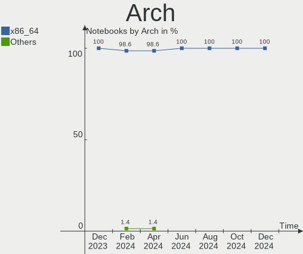
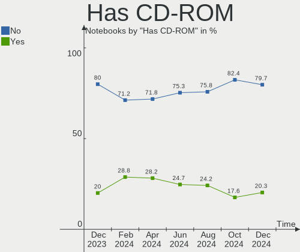
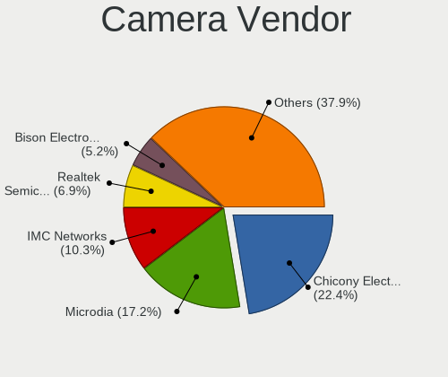

Kubuntu - Hardware Trends (Notebooks)
-------------------------------------

A project to identify most popular hardware characteristics and track their change
over time based on data collected by Linux users at https://Linux-Hardware.org.

Anyone can contribute to this report by the [hw-probe](https://github.com/linuxhw/hw-probe) tool:

    sudo -E hw-probe -all -upload

This report is for one last month. Overall report since the beginning of time: [TestCoverage](https://github.com/linuxhw/TestCoverage)

Period: Nov, 2022.

Contents
--------

* [ System ](#system)
  - [ OS                       ](#os)
  - [ OS Family                ](#os-family)
  - [ Kernel                   ](#kernel)
  - [ Kernel Family            ](#kernel-family)
  - [ Kernel Major Ver.        ](#kernel-major-ver)
  - [ Arch                     ](#arch)
  - [ DE                       ](#de)
  - [ Display Server           ](#display-server)
  - [ Display Manager          ](#display-manager)
  - [ OS Lang                  ](#os-lang)
  - [ Boot Mode                ](#boot-mode)
  - [ Filesystem               ](#filesystem)
  - [ Part. scheme             ](#part-scheme)
  - [ Dual Boot with Linux/BSD ](#dual-boot-with-linuxbsd)
  - [ Dual Boot (Win)          ](#dual-boot-win)

* [ Board ](#board)
  - [ Vendor                   ](#vendor)
  - [ Model                    ](#model)
  - [ Model Family             ](#model-family)
  - [ MFG Year                 ](#mfg-year)
  - [ Form Factor              ](#form-factor)
  - [ Secure Boot              ](#secure-boot)
  - [ Coreboot                 ](#coreboot)
  - [ RAM Size                 ](#ram-size)
  - [ RAM Used                 ](#ram-used)
  - [ Total Drives             ](#total-drives)
  - [ Has CD-ROM               ](#has-cd-rom)
  - [ Has Ethernet             ](#has-ethernet)
  - [ Has WiFi                 ](#has-wifi)
  - [ Has Bluetooth            ](#has-bluetooth)

* [ Location ](#location)
  - [ Country                  ](#country)
  - [ City                     ](#city)

* [ Drives ](#drives)
  - [ Drive Vendor             ](#drive-vendor)
  - [ Drive Model              ](#drive-model)
  - [ HDD Vendor               ](#hdd-vendor)
  - [ SSD Vendor               ](#ssd-vendor)
  - [ Drive Kind               ](#drive-kind)
  - [ Drive Connector          ](#drive-connector)
  - [ Drive Size               ](#drive-size)
  - [ Space Total              ](#space-total)
  - [ Space Used               ](#space-used)
  - [ Malfunc. Drives          ](#malfunc-drives)
  - [ Malfunc. Drive Vendor    ](#malfunc-drive-vendor)
  - [ Malfunc. HDD Vendor      ](#malfunc-hdd-vendor)
  - [ Malfunc. Drive Kind      ](#malfunc-drive-kind)
  - [ Failed Drives            ](#failed-drives)
  - [ Failed Drive Vendor      ](#failed-drive-vendor)
  - [ Drive Status             ](#drive-status)

* [ Storage controller ](#storage-controller)
  - [ Storage Vendor           ](#storage-vendor)
  - [ Storage Model            ](#storage-model)
  - [ Storage Kind             ](#storage-kind)

* [ Processor ](#processor)
  - [ CPU Vendor               ](#cpu-vendor)
  - [ CPU Model                ](#cpu-model)
  - [ CPU Model Family         ](#cpu-model-family)
  - [ CPU Cores                ](#cpu-cores)
  - [ CPU Sockets              ](#cpu-sockets)
  - [ CPU Threads              ](#cpu-threads)
  - [ CPU Op-Modes             ](#cpu-op-modes)
  - [ CPU Microcode            ](#cpu-microcode)
  - [ CPU Microarch            ](#cpu-microarch)

* [ Graphics ](#graphics)
  - [ GPU Vendor               ](#gpu-vendor)
  - [ GPU Model                ](#gpu-model)
  - [ GPU Combo                ](#gpu-combo)
  - [ GPU Driver               ](#gpu-driver)
  - [ GPU Memory               ](#gpu-memory)

* [ Monitor ](#monitor)
  - [ Monitor Vendor           ](#monitor-vendor)
  - [ Monitor Model            ](#monitor-model)
  - [ Monitor Resolution       ](#monitor-resolution)
  - [ Monitor Diagonal         ](#monitor-diagonal)
  - [ Monitor Width            ](#monitor-width)
  - [ Aspect Ratio             ](#aspect-ratio)
  - [ Monitor Area             ](#monitor-area)
  - [ Pixel Density            ](#pixel-density)
  - [ Multiple Monitors        ](#multiple-monitors)

* [ Network ](#network)
  - [ Net Controller Vendor    ](#net-controller-vendor)
  - [ Net Controller Model     ](#net-controller-model)
  - [ Wireless Vendor          ](#wireless-vendor)
  - [ Wireless Model           ](#wireless-model)
  - [ Ethernet Vendor          ](#ethernet-vendor)
  - [ Ethernet Model           ](#ethernet-model)
  - [ Net Controller Kind      ](#net-controller-kind)
  - [ Used Controller          ](#used-controller)
  - [ NICs                     ](#nics)
  - [ IPv6                     ](#ipv6)

* [ Bluetooth ](#bluetooth)
  - [ Bluetooth Vendor         ](#bluetooth-vendor)
  - [ Bluetooth Model          ](#bluetooth-model)

* [ Sound ](#sound)
  - [ Sound Vendor             ](#sound-vendor)
  - [ Sound Model              ](#sound-model)

* [ Memory ](#memory)
  - [ Memory Vendor            ](#memory-vendor)
  - [ Memory Model             ](#memory-model)
  - [ Memory Kind              ](#memory-kind)
  - [ Memory Form Factor       ](#memory-form-factor)
  - [ Memory Size              ](#memory-size)
  - [ Memory Speed             ](#memory-speed)

* [ Printers & scanners ](#printers--scanners)
  - [ Printer Vendor           ](#printer-vendor)
  - [ Printer Model            ](#printer-model)
  - [ Scanner Vendor           ](#scanner-vendor)
  - [ Scanner Model            ](#scanner-model)

* [ Camera ](#camera)
  - [ Camera Vendor            ](#camera-vendor)
  - [ Camera Model             ](#camera-model)

* [ Security ](#security)
  - [ Fingerprint Vendor       ](#fingerprint-vendor)
  - [ Fingerprint Model        ](#fingerprint-model)
  - [ Chipcard Vendor          ](#chipcard-vendor)
  - [ Chipcard Model           ](#chipcard-model)

* [ Unsupported ](#unsupported)
  - [ Unsupported Devices      ](#unsupported-devices)
  - [ Unsupported Device Types ](#unsupported-device-types)

System
------

OS
--

Installed operating systems

| Name          | Notebooks | Percent |
|---------------|-----------|---------|
| Kubuntu 22.04 | 50        | 57.47%  |
| Kubuntu 22.10 | 24        | 27.59%  |
| Kubuntu 20.04 | 5         | 5.75%   |
| Kubuntu 11    | 5         | 5.75%   |
| Kubuntu 18.04 | 2         | 2.3%    |
| Kubuntu 21.10 | 1         | 1.15%   |

OS Family
---------

OS without a version

| Name    | Notebooks | Percent |
|---------|-----------|---------|
| Kubuntu | 87        | 100%    |

Kernel
------

Version of the Linux kernel

| Version              | Notebooks | Percent |
|----------------------|-----------|---------|
| 5.15.0-52-generic    | 27        | 31.03%  |
| 5.19.0-23-generic    | 21        | 24.14%  |
| 5.15.0-53-generic    | 19        | 21.84%  |
| 5.4.0-131-generic    | 4         | 4.6%    |
| 5.15.0-43-generic    | 4         | 4.6%    |
| 6.0.7-060007-generic | 2         | 2.3%    |
| 6.0.0-060000-generic | 1         | 1.15%   |
| 5.4.0-132-generic    | 1         | 1.15%   |
| 5.19.0-21-generic    | 1         | 1.15%   |
| 5.15.0-57-generic    | 1         | 1.15%   |
| 5.15.0-53-lowlatency | 1         | 1.15%   |
| 5.15.0-43-lowlatency | 1         | 1.15%   |
| 5.15.0-1024-realtime | 1         | 1.15%   |
| 5.15.0-1010-nvidia   | 1         | 1.15%   |
| 5.13.0-52-generic    | 1         | 1.15%   |
| 4.15.0-194-generic   | 1         | 1.15%   |

Kernel Family
-------------

Linux kernel without a distro release

| Version | Notebooks | Percent |
|---------|-----------|---------|
| 5.15.0  | 55        | 63.22%  |
| 5.19.0  | 22        | 25.29%  |
| 5.4.0   | 5         | 5.75%   |
| 6.0.7   | 2         | 2.3%    |
| 6.0.0   | 1         | 1.15%   |
| 5.13.0  | 1         | 1.15%   |
| 4.15.0  | 1         | 1.15%   |

Kernel Major Ver.
-----------------

Linux kernel major version

| Version | Notebooks | Percent |
|---------|-----------|---------|
| 5.15    | 55        | 63.22%  |
| 5.19    | 22        | 25.29%  |
| 5.4     | 5         | 5.75%   |
| 6.0     | 3         | 3.45%   |
| 5.13    | 1         | 1.15%   |
| 4.15    | 1         | 1.15%   |

Arch
----

OS architecture (x86_64, i586, etc.)

| Name   | Notebooks | Percent |
|--------|-----------|---------|
| x86_64 | 87        | 100%    |

DE
--

Desktop Environment

| Name | Notebooks | Percent |
|------|-----------|---------|
| KDE5 | 84        | 96.55%  |
| KDE  | 2         | 2.3%    |
| MATE | 1         | 1.15%   |

Display Server
--------------

X11 or Wayland

| Name    | Notebooks | Percent |
|---------|-----------|---------|
| X11     | 81        | 93.1%   |
| Wayland | 5         | 5.75%   |
| Tty     | 1         | 1.15%   |

Display Manager
---------------

SDDM, LightDM, etc.

| Name    | Notebooks | Percent |
|---------|-----------|---------|
| SDDM    | 58        | 66.67%  |
| Unknown | 22        | 25.29%  |
| LightDM | 4         | 4.6%    |
| GDM3    | 3         | 3.45%   |

OS Lang
-------

Language

| Lang   | Notebooks | Percent |
|--------|-----------|---------|
| en_US  | 38        | 43.68%  |
| it_IT  | 9         | 10.34%  |
| de_DE  | 8         | 9.2%    |
| ru_RU  | 5         | 5.75%   |
| en_GB  | 4         | 4.6%    |
| pt_BR  | 3         | 3.45%   |
| pl_PL  | 2         | 2.3%    |
| fr_FR  | 2         | 2.3%    |
| en_IN  | 2         | 2.3%    |
| tr_TR  | 1         | 1.15%   |
| pt_PT  | 1         | 1.15%   |
| nl_NL  | 1         | 1.15%   |
| hu_HU  | 1         | 1.15%   |
| es_ES  | 1         | 1.15%   |
| es_CR  | 1         | 1.15%   |
| es_AR  | 1         | 1.15%   |
| es_419 | 1         | 1.15%   |
| en_SG  | 1         | 1.15%   |
| en_NZ  | 1         | 1.15%   |
| en_DE  | 1         | 1.15%   |
| en_AG  | 1         | 1.15%   |
| de_AT  | 1         | 1.15%   |
| da_DK  | 1         | 1.15%   |

Boot Mode
---------

EFI or BIOS

| Mode | Notebooks | Percent |
|------|-----------|---------|
| EFI  | 49        | 56.32%  |
| BIOS | 38        | 43.68%  |

Filesystem
----------

Type of filesystem

| Type    | Notebooks | Percent |
|---------|-----------|---------|
| Ext4    | 81        | 93.1%   |
| Overlay | 3         | 3.45%   |
| Btrfs   | 3         | 3.45%   |

Part. scheme
------------

Scheme of partitioning

| Type    | Notebooks | Percent |
|---------|-----------|---------|
| GPT     | 59        | 67.82%  |
| Unknown | 22        | 25.29%  |
| MBR     | 6         | 6.9%    |

Dual Boot with Linux/BSD
------------------------

Hosting more than one Linux/BSD

| Dual boot | Notebooks | Percent |
|-----------|-----------|---------|
| No        | 76        | 87.36%  |
| Yes       | 11        | 12.64%  |

Dual Boot (Win)
---------------

Hosting Linux and Windows

| Dual boot | Notebooks | Percent |
|-----------|-----------|---------|
| No        | 58        | 66.67%  |
| Yes       | 29        | 33.33%  |

Board
-----

Vendor
------

Motherboard manufacturer

| Name                | Notebooks | Percent |
|---------------------|-----------|---------|
| Lenovo              | 20        | 22.99%  |
| Dell                | 17        | 19.54%  |
| Hewlett-Packard     | 13        | 14.94%  |
| Acer                | 7         | 8.05%   |
| ASUSTek Computer    | 5         | 5.75%   |
| MSI                 | 4         | 4.6%    |
| HUAWEI              | 3         | 3.45%   |
| Timi                | 2         | 2.3%    |
| VALE                | 1         | 1.15%   |
| Toshiba             | 1         | 1.15%   |
| Sony                | 1         | 1.15%   |
| Razer               | 1         | 1.15%   |
| PC Specialist       | 1         | 1.15%   |
| Panasonic           | 1         | 1.15%   |
| Notebook            | 1         | 1.15%   |
| Monster             | 1         | 1.15%   |
| Haier               | 1         | 1.15%   |
| GPU Company         | 1         | 1.15%   |
| GPD                 | 1         | 1.15%   |
| Google              | 1         | 1.15%   |
| Gigabyte Technology | 1         | 1.15%   |
| Digma               | 1         | 1.15%   |
| AXIOO               | 1         | 1.15%   |
| Apple               | 1         | 1.15%   |

Model
-----

Motherboard model

| Name                                  | Notebooks | Percent |
|---------------------------------------|-----------|---------|
| Dell G3 3779                          | 2         | 2.3%    |
| Unknown                               | 2         | 2.3%    |
| VALE Notebook Slim S132               | 1         | 1.15%   |
| Toshiba Satellite C670D-126           | 1         | 1.15%   |
| Timi TM1703                           | 1         | 1.15%   |
| Timi TM1701                           | 1         | 1.15%   |
| Sony VGN-FW21E                        | 1         | 1.15%   |
| Razer Blade Stealth                   | 1         | 1.15%   |
| PC Specialist PB50_70RF,RD,RC         | 1         | 1.15%   |
| Panasonic CF-31WBLEHLM                | 1         | 1.15%   |
| Notebook P65_P67SE                    | 1         | 1.15%   |
| MSI Vector GP66 12UGS                 | 1         | 1.15%   |
| MSI Prestige 15 A12SC                 | 1         | 1.15%   |
| MSI GS75 Stealth 10SE                 | 1         | 1.15%   |
| Monster TULPAR T7                     | 1         | 1.15%   |
| Lenovo V14-IIL 82C4                   | 1         | 1.15%   |
| Lenovo ThinkPad X260 20F5S28R00       | 1         | 1.15%   |
| Lenovo ThinkPad X230 23256N6          | 1         | 1.15%   |
| Lenovo ThinkPad T440s 20AQ007SMZ      | 1         | 1.15%   |
| Lenovo ThinkPad T440p 20AW000GUS      | 1         | 1.15%   |
| Lenovo ThinkPad T430 2349P25          | 1         | 1.15%   |
| Lenovo ThinkPad T430 2349DS5          | 1         | 1.15%   |
| Lenovo ThinkPad P15v Gen 1 20TQ001WUS | 1         | 1.15%   |
| Lenovo ThinkPad L15 Gen 1 20U8S0AH00  | 1         | 1.15%   |
| Lenovo ThinkPad E14 Gen 2 20TA00EWFR  | 1         | 1.15%   |
| Lenovo ThinkBook 14 G4 ABA 21DK       | 1         | 1.15%   |
| Lenovo Legion 5 15IMH05H 81Y6         | 1         | 1.15%   |
| Lenovo IdeaPad Z510 20287             | 1         | 1.15%   |
| Lenovo IdeaPad 5 Pro 14ACN6 82L7      | 1         | 1.15%   |
| Lenovo IdeaPad 320-15IKB 80YE         | 1         | 1.15%   |
| Lenovo IdeaPad 3 15ALC6 82MF          | 1         | 1.15%   |
| Lenovo IdeaPad 3 15ADA05 81W1         | 1         | 1.15%   |
| Lenovo G500 20236                     | 1         | 1.15%   |
| Lenovo G40-45 80E1                    | 1         | 1.15%   |
| Lenovo B590 20206                     | 1         | 1.15%   |
| HUAWEI NBLK-WAX9X                     | 1         | 1.15%   |
| HUAWEI KPL-W0X                        | 1         | 1.15%   |
| HUAWEI BOD-WXX9                       | 1         | 1.15%   |
| HP ProBook 5330m                      | 1         | 1.15%   |
| HP Pavilion g6                        | 1         | 1.15%   |

Model Family
------------

Motherboard model prefix

| Name                   | Notebooks | Percent |
|------------------------|-----------|---------|
| Lenovo ThinkPad        | 9         | 10.34%  |
| Dell Latitude          | 6         | 6.9%    |
| Lenovo IdeaPad         | 5         | 5.75%   |
| Dell Inspiron          | 5         | 5.75%   |
| HP Laptop              | 4         | 4.6%    |
| HP EliteBook           | 3         | 3.45%   |
| Acer Aspire            | 3         | 3.45%   |
| HP Pavilion            | 2         | 2.3%    |
| Dell XPS               | 2         | 2.3%    |
| Dell G3                | 2         | 2.3%    |
| Acer Nitro             | 2         | 2.3%    |
| Unknown                | 2         | 2.3%    |
| VALE Notebook          | 1         | 1.15%   |
| Toshiba Satellite      | 1         | 1.15%   |
| Timi TM1703            | 1         | 1.15%   |
| Timi TM1701            | 1         | 1.15%   |
| Sony VGN-FW21E         | 1         | 1.15%   |
| Razer Blade            | 1         | 1.15%   |
| PC Specialist PB50     | 1         | 1.15%   |
| Panasonic CF-31WBLEHLM | 1         | 1.15%   |
| Notebook P65           | 1         | 1.15%   |
| MSI Vector             | 1         | 1.15%   |
| MSI Prestige           | 1         | 1.15%   |
| MSI GS75               | 1         | 1.15%   |
| Monster TULPAR         | 1         | 1.15%   |
| Lenovo V14-IIL         | 1         | 1.15%   |
| Lenovo ThinkBook       | 1         | 1.15%   |
| Lenovo Legion          | 1         | 1.15%   |
| Lenovo G500            | 1         | 1.15%   |
| Lenovo G40-45          | 1         | 1.15%   |
| Lenovo B590            | 1         | 1.15%   |
| HUAWEI NBLK-WAX9X      | 1         | 1.15%   |
| HUAWEI KPL-W0X         | 1         | 1.15%   |
| HUAWEI BOD-WXX9        | 1         | 1.15%   |
| HP ProBook             | 1         | 1.15%   |
| HP OMEN                | 1         | 1.15%   |
| HP 250                 | 1         | 1.15%   |
| Haier A1420EM          | 1         | 1.15%   |
| GPU Company GWNR71517  | 1         | 1.15%   |
| GPD G1621-02           | 1         | 1.15%   |

MFG Year
--------

Motherboard manufacture year

| Year | Notebooks | Percent |
|------|-----------|---------|
| 2021 | 16        | 18.39%  |
| 2020 | 10        | 11.49%  |
| 2022 | 8         | 9.2%    |
| 2019 | 8         | 9.2%    |
| 2011 | 8         | 9.2%    |
| 2014 | 7         | 8.05%   |
| 2013 | 7         | 8.05%   |
| 2012 | 7         | 8.05%   |
| 2018 | 6         | 6.9%    |
| 2017 | 4         | 4.6%    |
| 2016 | 3         | 3.45%   |
| 2008 | 2         | 2.3%    |
| 2015 | 1         | 1.15%   |

Form Factor
-----------

Physical design of the computer

| Name     | Notebooks | Percent |
|----------|-----------|---------|
| Notebook | 87        | 100%    |

Secure Boot
-----------

Enabled or disabled

| State    | Notebooks | Percent |
|----------|-----------|---------|
| Disabled | 78        | 89.66%  |
| Enabled  | 9         | 10.34%  |

Coreboot
--------

Have coreboot on board

| Used | Notebooks | Percent |
|------|-----------|---------|
| No   | 86        | 98.85%  |
| Yes  | 1         | 1.15%   |

RAM Size
--------

Total RAM memory

| Size in GB  | Notebooks | Percent |
|-------------|-----------|---------|
| 4.01-8.0    | 36        | 41.38%  |
| 16.01-24.0  | 17        | 19.54%  |
| 32.01-64.0  | 12        | 13.79%  |
| 3.01-4.0    | 10        | 11.49%  |
| 8.01-16.0   | 9         | 10.34%  |
| 64.01-256.0 | 2         | 2.3%    |
| 24.01-32.0  | 1         | 1.15%   |

RAM Used
--------

Used RAM memory

| Used GB   | Notebooks | Percent |
|-----------|-----------|---------|
| 1.01-2.0  | 27        | 31.03%  |
| 2.01-3.0  | 22        | 25.29%  |
| 3.01-4.0  | 18        | 20.69%  |
| 4.01-8.0  | 14        | 16.09%  |
| 8.01-16.0 | 5         | 5.75%   |
| 0.51-1.0  | 1         | 1.15%   |

Total Drives
------------

Number of drives on board

| Drives | Notebooks | Percent |
|--------|-----------|---------|
| 1      | 58        | 66.67%  |
| 2      | 25        | 28.74%  |
| 4      | 2         | 2.3%    |
| 3      | 2         | 2.3%    |

Has CD-ROM
----------

Has CD-ROM on board

| Presented | Notebooks | Percent |
|-----------|-----------|---------|
| No        | 68        | 78.16%  |
| Yes       | 19        | 21.84%  |

Has Ethernet
------------

Has Ethernet on board

| Presented | Notebooks | Percent |
|-----------|-----------|---------|
| Yes       | 61        | 70.11%  |
| No        | 26        | 29.89%  |

Has WiFi
--------

Has WiFi module

| Presented | Notebooks | Percent |
|-----------|-----------|---------|
| Yes       | 87        | 100%    |

Has Bluetooth
-------------

Has Bluetooth module

| Presented | Notebooks | Percent |
|-----------|-----------|---------|
| Yes       | 68        | 78.16%  |
| No        | 19        | 21.84%  |

Location
--------

Country
-------

Geographic location (country)

| Country     | Notebooks | Percent |
|-------------|-----------|---------|
| USA         | 16        | 18.39%  |
| Germany     | 13        | 14.94%  |
| Italy       | 12        | 13.79%  |
| Poland      | 4         | 4.6%    |
| France      | 4         | 4.6%    |
| UK          | 3         | 3.45%   |
| Russia      | 3         | 3.45%   |
| Brazil      | 3         | 3.45%   |
| Spain       | 2         | 2.3%    |
| Slovakia    | 2         | 2.3%    |
| Kazakhstan  | 2         | 2.3%    |
| Indonesia   | 2         | 2.3%    |
| India       | 2         | 2.3%    |
| Argentina   | 2         | 2.3%    |
| Turkey      | 1         | 1.15%   |
| Switzerland | 1         | 1.15%   |
| South Korea | 1         | 1.15%   |
| Singapore   | 1         | 1.15%   |
| Romania     | 1         | 1.15%   |
| Portugal    | 1         | 1.15%   |
| New Zealand | 1         | 1.15%   |
| Netherlands | 1         | 1.15%   |
| Mexico      | 1         | 1.15%   |
| Lithuania   | 1         | 1.15%   |
| Israel      | 1         | 1.15%   |
| Hungary     | 1         | 1.15%   |
| Estonia     | 1         | 1.15%   |
| Denmark     | 1         | 1.15%   |
| Croatia     | 1         | 1.15%   |
| Costa Rica  | 1         | 1.15%   |
| Bulgaria    | 1         | 1.15%   |

City
----

Geographic location (city)

| City             | Notebooks | Percent |
|------------------|-----------|---------|
| Berlin           | 5         | 5.75%   |
| Milan            | 2         | 2.3%    |
| Bologna          | 2         | 2.3%    |
| Zurich           | 1         | 1.15%   |
| Zagreb           | 1         | 1.15%   |
| Yuma             | 1         | 1.15%   |
| Yaroslavl        | 1         | 1.15%   |
| Wiesbaden        | 1         | 1.15%   |
| Washington       | 1         | 1.15%   |
| Warsaw           | 1         | 1.15%   |
| Valdosta         | 1         | 1.15%   |
| Utena            | 1         | 1.15%   |
| Turin            | 1         | 1.15%   |
| Tallinn          | 1         | 1.15%   |
| Soveria Mannelli | 1         | 1.15%   |
| Sompolno         | 1         | 1.15%   |
| Sofia            | 1         | 1.15%   |
| Singapore        | 1         | 1.15%   |
| Santa Cruz       | 1         | 1.15%   |
| Samarinda        | 1         | 1.15%   |
| Samara           | 1         | 1.15%   |
| Rotterdam        | 1         | 1.15%   |
| Rome             | 1         | 1.15%   |
| Ramat Gan        | 1         | 1.15%   |
| Porto            | 1         | 1.15%   |
| Pontassieve      | 1         | 1.15%   |
| Pilar            | 1         | 1.15%   |
| Philadelphia     | 1         | 1.15%   |
| Pavlodar         | 1         | 1.15%   |
| Parma            | 1         | 1.15%   |
| Paris            | 1         | 1.15%   |
| Ocala            | 1         | 1.15%   |
| Niddatal         | 1         | 1.15%   |
| Natal            | 1         | 1.15%   |
| Mossoro          | 1         | 1.15%   |
| Moscow           | 1         | 1.15%   |
| Minneapolis      | 1         | 1.15%   |
| Miami            | 1         | 1.15%   |
| Martin           | 1         | 1.15%   |
| Maraussan        | 1         | 1.15%   |

Drives
------

Drive Vendor
------------

Hard drive vendors

| Vendor                      | Notebooks | Drives | Percent |
|-----------------------------|-----------|--------|---------|
| Samsung Electronics         | 18        | 22     | 15.65%  |
| Seagate                     | 10        | 11     | 8.7%    |
| SanDisk                     | 10        | 10     | 8.7%    |
| WDC                         | 8         | 8      | 6.96%   |
| Kingston                    | 8         | 10     | 6.96%   |
| Unknown                     | 6         | 7      | 5.22%   |
| Toshiba                     | 6         | 6      | 5.22%   |
| SK hynix                    | 6         | 6      | 5.22%   |
| Micron Technology           | 4         | 4      | 3.48%   |
| Intel                       | 4         | 4      | 3.48%   |
| KIOXIA                      | 3         | 3      | 2.61%   |
| SABRENT                     | 2         | 2      | 1.74%   |
| Unknown                     | 2         | 2      | 1.74%   |
| WALRAM                      | 1         | 1      | 0.87%   |
| VISIPRO                     | 1         | 1      | 0.87%   |
| Verbatim                    | 1         | 1      | 0.87%   |
| Union Memory                | 1         | 1      | 0.87%   |
| UMIS                        | 1         | 1      | 0.87%   |
| SSSTC                       | 1         | 1      | 0.87%   |
| SPCC                        | 1         | 1      | 0.87%   |
| Solid State Storage         | 1         | 1      | 0.87%   |
| Ramos Technology            | 1         | 1      | 0.87%   |
| PNY                         | 1         | 1      | 0.87%   |
| Phison Electronics          | 1         | 1      | 0.87%   |
| Phison                      | 1         | 1      | 0.87%   |
| Patriot                     | 1         | 1      | 0.87%   |
| Micron/Crucial Technology   | 1         | 1      | 0.87%   |
| LITEON                      | 1         | 1      | 0.87%   |
| Kingston Technology Company | 1         | 1      | 0.87%   |
| KESU                        | 1         | 1      | 0.87%   |
| Intenso                     | 1         | 1      | 0.87%   |
| HS-SSD-C100                 | 1         | 1      | 0.87%   |
| Hitachi                     | 1         | 1      | 0.87%   |
| HGST                        | 1         | 1      | 0.87%   |
| GOODRAM                     | 1         | 1      | 0.87%   |
| faspeed                     | 1         | 1      | 0.87%   |
| External                    | 1         | 1      | 0.87%   |
| Drevo                       | 1         | 1      | 0.87%   |
| Dogfish                     | 1         | 1      | 0.87%   |
| China                       | 1         | 1      | 0.87%   |

Drive Model
-----------

Hard drive models

| Model                                             | Notebooks | Percent |
|---------------------------------------------------|-----------|---------|
| Micron 3400_MTFDKBA1T0TFH 1TB                     | 3         | 2.48%   |
| Seagate ST1000LM035-1RK172 1TB                    | 2         | 1.65%   |
| Seagate ST1000LM024 HN-M101MBB 1TB                | 2         | 1.65%   |
| Samsung SSD 970 EVO Plus 500GB                    | 2         | 1.65%   |
| Samsung NVMe SSD Controller SM981/PM981/PM983 1TB | 2         | 1.65%   |
| SABRENT Disk 500GB                                | 2         | 1.65%   |
| Kingston SA400S37480G 480GB SSD                   | 2         | 1.65%   |
| Kingston SA400S37240G 240GB SSD                   | 2         | 1.65%   |
| Unknown                                           | 2         | 1.65%   |
| WDC WDS250G2B0A-00SM50 250GB SSD                  | 1         | 0.83%   |
| WDC WDBNCE0010PNC 1TB SSD                         | 1         | 0.83%   |
| WDC WD5000LPVT-24G33T1 500GB                      | 1         | 0.83%   |
| WDC WD2500BEVS-22UST0 250GB                       | 1         | 0.83%   |
| WDC WD10SPSX-08A6W 1TB                            | 1         | 0.83%   |
| WDC WD10JPVX-11JC3T0 1TB                          | 1         | 0.83%   |
| WDC WD10 JPVX-00JC3T0 1TB                         | 1         | 0.83%   |
| WDC PC SN730 SDBPNTY-512G-1101 512GB              | 1         | 0.83%   |
| WALRAM 240G                                       | 1         | 0.83%   |
| VISIPRO SSD 256GB                                 | 1         | 0.83%   |
| Verbatim Vi500 S3 120GB SSD                       | 1         | 0.83%   |
| Unknown MMC64G  64GB                              | 1         | 0.83%   |
| Unknown MMC Card  7GB                             | 1         | 0.83%   |
| Unknown MMC Card  536GB                           | 1         | 0.83%   |
| Unknown MMC Card  32GB                            | 1         | 0.83%   |
| Unknown MMC Card  128GB                           | 1         | 0.83%   |
| Unknown GF8S5  513GB                              | 1         | 0.83%   |
| Unknown GD2S5  128GB                              | 1         | 0.83%   |
| Union Memory UMIS RPITJ512VME2OWD 512GB           | 1         | 0.83%   |
| UMIS RPJTJ512MEE1OWX 512GB                        | 1         | 0.83%   |
| Toshiba THNSNK128GVN8 128GB SSD                   | 1         | 0.83%   |
| Toshiba THNSN51T02DUK NVMe 1024GB                 | 1         | 0.83%   |
| Toshiba THNSF5512GPUK 512GB                       | 1         | 0.83%   |
| Toshiba MQ01ABD100 1TB                            | 1         | 0.83%   |
| Toshiba KXG6AZNV1T02 1TB                          | 1         | 0.83%   |
| Toshiba KXG60ZNV256G 256GB                        | 1         | 0.83%   |
| SSSTC CA6-8D512 512GB                             | 1         | 0.83%   |
| SPCC Solid State Disk 128GB                       | 1         | 0.83%   |
| Solid State Storage SSSTC CL1-4D256 256GB         | 1         | 0.83%   |
| SK hynix SHPP41-2000GM 2TB                        | 1         | 0.83%   |
| SK hynix HFS256GD9TNG-62A0A 256GB                 | 1         | 0.83%   |

HDD Vendor
----------

Hard disk drive vendors

| Vendor  | Notebooks | Drives | Percent |
|---------|-----------|--------|---------|
| Seagate | 10        | 11     | 52.63%  |
| WDC     | 5         | 5      | 26.32%  |
| Toshiba | 1         | 1      | 5.26%   |
| KESU    | 1         | 1      | 5.26%   |
| Hitachi | 1         | 1      | 5.26%   |
| HGST    | 1         | 1      | 5.26%   |

SSD Vendor
----------

Solid state drive vendors

| Vendor              | Notebooks | Drives | Percent |
|---------------------|-----------|--------|---------|
| Samsung Electronics | 8         | 10     | 19.51%  |
| Kingston            | 8         | 10     | 19.51%  |
| SanDisk             | 5         | 5      | 12.2%   |
| WDC                 | 2         | 2      | 4.88%   |
| Intel               | 2         | 2      | 4.88%   |
| VISIPRO             | 1         | 1      | 2.44%   |
| Verbatim            | 1         | 1      | 2.44%   |
| Toshiba             | 1         | 1      | 2.44%   |
| SPCC                | 1         | 1      | 2.44%   |
| SK hynix            | 1         | 1      | 2.44%   |
| Ramos Technology    | 1         | 1      | 2.44%   |
| PNY                 | 1         | 1      | 2.44%   |
| Patriot             | 1         | 1      | 2.44%   |
| LITEON              | 1         | 1      | 2.44%   |
| Intenso             | 1         | 1      | 2.44%   |
| HS-SSD-C100         | 1         | 1      | 2.44%   |
| GOODRAM             | 1         | 1      | 2.44%   |
| Drevo               | 1         | 1      | 2.44%   |
| Dogfish             | 1         | 1      | 2.44%   |
| China               | 1         | 1      | 2.44%   |
| Unknown             | 1         | 1      | 2.44%   |

Drive Kind
----------

HDD or SSD

| Kind    | Notebooks | Drives | Percent |
|---------|-----------|--------|---------|
| NVMe    | 44        | 48     | 40.37%  |
| SSD     | 37        | 45     | 33.94%  |
| HDD     | 19        | 20     | 17.43%  |
| MMC     | 7         | 8      | 6.42%   |
| Unknown | 2         | 2      | 1.83%   |

Drive Connector
---------------

SATA, SAS, NVMe, etc.

| Type | Notebooks | Drives | Percent |
|------|-----------|--------|---------|
| SATA | 49        | 62     | 47.12%  |
| NVMe | 42        | 45     | 40.38%  |
| MMC  | 7         | 8      | 6.73%   |
| SAS  | 6         | 8      | 5.77%   |

Drive Size
----------

Size of hard drive

| Size in TB | Notebooks | Drives | Percent |
|------------|-----------|--------|---------|
| 0.01-0.5   | 31        | 40     | 57.41%  |
| 0.51-1.0   | 20        | 22     | 37.04%  |
| 3.01-4.0   | 1         | 1      | 1.85%   |
| 1.01-2.0   | 1         | 1      | 1.85%   |
| 4.01-10.0  | 1         | 1      | 1.85%   |

Space Total
-----------

Amount of disk space available on the file system

| Size in GB     | Notebooks | Percent |
|----------------|-----------|---------|
| 101-250        | 28        | 32.18%  |
| 251-500        | 20        | 22.99%  |
| 501-1000       | 17        | 19.54%  |
| 1001-2000      | 8         | 9.2%    |
| 51-100         | 6         | 6.9%    |
| 1-20           | 3         | 3.45%   |
| More than 3000 | 2         | 2.3%    |
| 21-50          | 2         | 2.3%    |
| 2001-3000      | 1         | 1.15%   |

Space Used
----------

Amount of used disk space

| Used GB        | Notebooks | Percent |
|----------------|-----------|---------|
| 21-50          | 20        | 22.99%  |
| 101-250        | 19        | 21.84%  |
| 1-20           | 19        | 21.84%  |
| 51-100         | 14        | 16.09%  |
| 251-500        | 7         | 8.05%   |
| 501-1000       | 7         | 8.05%   |
| More than 3000 | 1         | 1.15%   |

Malfunc. Drives
---------------

Drive models with a malfunction

| Model                                | Notebooks | Drives | Percent |
|--------------------------------------|-----------|--------|---------|
| VISIPRO SSD 256GB                    | 1         | 1      | 20%     |
| SK hynix BC711 HFM512GD3JX013N 512GB | 1         | 1      | 20%     |
| Seagate ST1000LM024 HN-M101MBB 1TB   | 1         | 1      | 20%     |
| Kingston SUV400S37240G 240GB SSD     | 1         | 1      | 20%     |
| Hitachi HTS725050A7E630 500GB        | 1         | 1      | 20%     |

Malfunc. Drive Vendor
---------------------

Vendors of faulty drives

| Vendor   | Notebooks | Drives | Percent |
|----------|-----------|--------|---------|
| VISIPRO  | 1         | 1      | 20%     |
| SK hynix | 1         | 1      | 20%     |
| Seagate  | 1         | 1      | 20%     |
| Kingston | 1         | 1      | 20%     |
| Hitachi  | 1         | 1      | 20%     |

Malfunc. HDD Vendor
-------------------

Vendors of faulty HDD drives

| Vendor  | Notebooks | Drives | Percent |
|---------|-----------|--------|---------|
| Seagate | 1         | 1      | 50%     |
| Hitachi | 1         | 1      | 50%     |

Malfunc. Drive Kind
-------------------

Kinds of faulty drives

| Kind | Notebooks | Drives | Percent |
|------|-----------|--------|---------|
| SSD  | 2         | 2      | 40%     |
| HDD  | 2         | 2      | 40%     |
| NVMe | 1         | 1      | 20%     |

Failed Drives
-------------

Failed drive models

Zero info for selected period =(

Failed Drive Vendor
-------------------

Failed drive vendors

Zero info for selected period =(

Drive Status
------------

Number of failed and malfunc. drives

| Status   | Notebooks | Drives | Percent |
|----------|-----------|--------|---------|
| Works    | 47        | 60     | 49.47%  |
| Detected | 43        | 58     | 45.26%  |
| Malfunc  | 5         | 5      | 5.26%   |

Storage controller
------------------

Storage Vendor
--------------

Storage controller vendors

| Vendor                         | Notebooks | Percent |
|--------------------------------|-----------|---------|
| Intel                          | 57        | 52.78%  |
| Samsung Electronics            | 12        | 11.11%  |
| AMD                            | 8         | 7.41%   |
| SanDisk                        | 6         | 5.56%   |
| Toshiba America Info Systems   | 5         | 4.63%   |
| SK hynix                       | 5         | 4.63%   |
| Micron Technology              | 4         | 3.7%    |
| Union Memory (Shenzhen)        | 2         | 1.85%   |
| Solid State Storage Technology | 2         | 1.85%   |
| Phison Electronics             | 2         | 1.85%   |
| KIOXIA                         | 2         | 1.85%   |
| Micron/Crucial Technology      | 1         | 0.93%   |
| Kingston Technology Company    | 1         | 0.93%   |
| Biwin Storage Technology       | 1         | 0.93%   |

Storage Model
-------------

Storage controller models

| Model                                                                          | Notebooks | Percent |
|--------------------------------------------------------------------------------|-----------|---------|
| Intel 7 Series Chipset Family 6-port SATA Controller [AHCI mode]               | 11        | 9.91%   |
| AMD FCH SATA Controller [AHCI mode]                                            | 7         | 6.31%   |
| Samsung NVMe SSD Controller SM981/PM981/PM983                                  | 5         | 4.5%    |
| Intel Sunrise Point-LP SATA Controller [AHCI mode]                             | 5         | 4.5%    |
| Intel 82801 Mobile SATA Controller [RAID mode]                                 | 5         | 4.5%    |
| Intel 8 Series/C220 Series Chipset Family 6-port SATA Controller 1 [AHCI mode] | 5         | 4.5%    |
| Micron Non-Volatile memory controller                                          | 4         | 3.6%    |
| Intel Cannon Lake Mobile PCH SATA AHCI Controller                              | 4         | 3.6%    |
| Intel 6 Series/C200 Series Chipset Family 6 port Mobile SATA AHCI Controller   | 4         | 3.6%    |
| Toshiba America Info Systems XG6 NVMe SSD Controller                           | 3         | 2.7%    |
| Samsung NVMe SSD Controller 980                                                | 3         | 2.7%    |
| Intel Celeron/Pentium Silver Processor SATA Controller                         | 3         | 2.7%    |
| Union Memory (Shenzhen) Non-Volatile memory controller                         | 2         | 1.8%    |
| Toshiba America Info Systems XG4 NVMe SSD Controller                           | 2         | 1.8%    |
| Solid State Storage Non-Volatile memory controller                             | 2         | 1.8%    |
| SK hynix Gold P31/PC711 NVMe Solid State Drive                                 | 2         | 1.8%    |
| SanDisk WD Black SN750 / PC SN730 NVMe SSD                                     | 2         | 1.8%    |
| SanDisk Non-Volatile memory controller                                         | 2         | 1.8%    |
| Samsung NVMe SSD Controller PM9A1/PM9A3/980PRO                                 | 2         | 1.8%    |
| KIOXIA NVMe SSD Controller BG4                                                 | 2         | 1.8%    |
| Intel Wildcat Point-LP SATA Controller [AHCI Mode]                             | 2         | 1.8%    |
| Intel Volume Management Device NVMe RAID Controller                            | 2         | 1.8%    |
| Intel SSD 660P Series                                                          | 2         | 1.8%    |
| Intel Comet Lake SATA AHCI Controller                                          | 2         | 1.8%    |
| Intel 82801IBM/IEM (ICH9M/ICH9M-E) 4 port SATA Controller [AHCI mode]          | 2         | 1.8%    |
| Intel 8 Series SATA Controller 1 [AHCI mode]                                   | 2         | 1.8%    |
| Intel 400 Series Chipset Family SATA AHCI Controller                           | 2         | 1.8%    |
| SK hynix PC401 NVMe Solid State Drive 256GB                                    | 1         | 0.9%    |
| SK hynix Non-Volatile memory controller                                        | 1         | 0.9%    |
| SK hynix BC501 NVMe Solid State Drive                                          | 1         | 0.9%    |
| SanDisk WD Blue SN550 NVMe SSD                                                 | 1         | 0.9%    |
| SanDisk WD Blue SN500 / PC SN520 NVMe SSD                                      | 1         | 0.9%    |
| Samsung NVMe SSD Controller SM961/PM961/SM963                                  | 1         | 0.9%    |
| Samsung NVMe SSD Controller PM9B1                                              | 1         | 0.9%    |
| Phison PS5013 E13 NVMe Controller                                              | 1         | 0.9%    |
| Phison E16 PCIe4 NVMe Controller                                               | 1         | 0.9%    |
| Micron/Crucial P2 NVMe PCIe SSD                                                | 1         | 0.9%    |
| Kingston Company A2000 NVMe SSD                                                | 1         | 0.9%    |
| Intel Tiger Lake-LP SATA Controller                                            | 1         | 0.9%    |
| Intel SATA Controller [RAID mode]                                              | 1         | 0.9%    |

Storage Kind
------------

Kind of storage controller (IDE, SATA, NVMe, SAS, ...)

| Kind | Notebooks | Percent |
|------|-----------|---------|
| SATA | 57        | 52.78%  |
| NVMe | 42        | 38.89%  |
| RAID | 8         | 7.41%   |
| IDE  | 1         | 0.93%   |

Processor
---------

CPU Vendor
----------

Processor vendors

| Vendor | Notebooks | Percent |
|--------|-----------|---------|
| Intel  | 68        | 78.16%  |
| AMD    | 19        | 21.84%  |

CPU Model
---------

Processor models

| Model                                         | Notebooks | Percent |
|-----------------------------------------------|-----------|---------|
| Intel Core i7-10750H CPU @ 2.60GHz            | 3         | 3.45%   |
| Intel Core i5-3320M CPU @ 2.60GHz             | 3         | 3.45%   |
| AMD Ryzen 7 5800H with Radeon Graphics        | 3         | 3.45%   |
| Intel Pentium CPU 2020M @ 2.40GHz             | 2         | 2.3%    |
| Intel Core i7-9750H CPU @ 2.60GHz             | 2         | 2.3%    |
| Intel Core i7-8750H CPU @ 2.20GHz             | 2         | 2.3%    |
| Intel Core i5-8265U CPU @ 1.60GHz             | 2         | 2.3%    |
| Intel Core i5-8250U CPU @ 1.60GHz             | 2         | 2.3%    |
| Intel Core i5-4200M CPU @ 2.50GHz             | 2         | 2.3%    |
| Intel Core i5-3210M CPU @ 2.50GHz             | 2         | 2.3%    |
| Intel Core i5-2520M CPU @ 2.50GHz             | 2         | 2.3%    |
| Intel Celeron N4020 CPU @ 1.10GHz             | 2         | 2.3%    |
| Intel 12th Gen Core i9-12900H                 | 2         | 2.3%    |
| AMD Ryzen 7 PRO 4750U with Radeon Graphics    | 2         | 2.3%    |
| AMD Ryzen 5 5500U with Radeon Graphics        | 2         | 2.3%    |
| AMD Ryzen 5 3500U with Radeon Vega Mobile Gfx | 2         | 2.3%    |
| AMD A8-6410 APU with AMD Radeon R5 Graphics   | 2         | 2.3%    |
| Intel Pentium Dual-Core CPU T4500 @ 2.30GHz   | 1         | 1.15%   |
| Intel Pentium CPU N3540 @ 2.16GHz             | 1         | 1.15%   |
| Intel Pentium CPU 6405U @ 2.40GHz             | 1         | 1.15%   |
| Intel Core i7-8565U CPU @ 1.80GHz             | 1         | 1.15%   |
| Intel Core i7-8550U CPU @ 1.80GHz             | 1         | 1.15%   |
| Intel Core i7-7700HQ CPU @ 2.80GHz            | 1         | 1.15%   |
| Intel Core i7-7500U CPU @ 2.70GHz             | 1         | 1.15%   |
| Intel Core i7-6920HQ CPU @ 2.90GHz            | 1         | 1.15%   |
| Intel Core i7-6500U CPU @ 2.50GHz             | 1         | 1.15%   |
| Intel Core i7-5600U CPU @ 2.60GHz             | 1         | 1.15%   |
| Intel Core i7-4900MQ CPU @ 2.80GHz            | 1         | 1.15%   |
| Intel Core i7-4720HQ CPU @ 2.60GHz            | 1         | 1.15%   |
| Intel Core i7-4700MQ CPU @ 2.40GHz            | 1         | 1.15%   |
| Intel Core i7-4600U CPU @ 2.10GHz             | 1         | 1.15%   |
| Intel Core i7-3610QM CPU @ 2.30GHz            | 1         | 1.15%   |
| Intel Core i7-2640M CPU @ 2.80GHz             | 1         | 1.15%   |
| Intel Core i5-8300H CPU @ 2.30GHz             | 1         | 1.15%   |
| Intel Core i5-7200U CPU @ 2.50GHz             | 1         | 1.15%   |
| Intel Core i5-6300U CPU @ 2.40GHz             | 1         | 1.15%   |
| Intel Core i5-4310U CPU @ 2.00GHz             | 1         | 1.15%   |
| Intel Core i5-4300M CPU @ 2.60GHz             | 1         | 1.15%   |
| Intel Core i5-3340M CPU @ 2.70GHz             | 1         | 1.15%   |
| Intel Core i5-2450M CPU @ 2.50GHz             | 1         | 1.15%   |

CPU Model Family
----------------

Processor model prefix

| Model                   | Notebooks | Percent |
|-------------------------|-----------|---------|
| Intel Core i5           | 22        | 25.29%  |
| Intel Core i7           | 20        | 22.99%  |
| Other                   | 11        | 12.64%  |
| AMD Ryzen 7             | 6         | 6.9%    |
| Intel Celeron           | 5         | 5.75%   |
| AMD Ryzen 5             | 5         | 5.75%   |
| Intel Pentium           | 4         | 4.6%    |
| Intel Core i3           | 4         | 4.6%    |
| AMD Ryzen 7 PRO         | 2         | 2.3%    |
| AMD A8                  | 2         | 2.3%    |
| Intel Pentium Dual-Core | 1         | 1.15%   |
| Intel Core 2 Duo        | 1         | 1.15%   |
| AMD Ryzen 9             | 1         | 1.15%   |
| AMD Ryzen 3             | 1         | 1.15%   |
| AMD E                   | 1         | 1.15%   |
| AMD A6                  | 1         | 1.15%   |

CPU Cores
---------

Number of processor cores

| Number | Notebooks | Percent |
|--------|-----------|---------|
| 2      | 38        | 43.68%  |
| 4      | 27        | 31.03%  |
| 8      | 9         | 10.34%  |
| 6      | 9         | 10.34%  |
| 14     | 4         | 4.6%    |

CPU Sockets
-----------

Number of sockets

| Number | Notebooks | Percent |
|--------|-----------|---------|
| 1      | 87        | 100%    |

CPU Threads
-----------

Threads per core (Hyper-Threading)

| Number | Notebooks | Percent |
|--------|-----------|---------|
| 2      | 72        | 82.76%  |
| 1      | 15        | 17.24%  |

CPU Op-Modes
------------

CPU Operation Modes (32-bit, 64-bit)

| Op mode        | Notebooks | Percent |
|----------------|-----------|---------|
| 32-bit, 64-bit | 87        | 100%    |

CPU Microcode
-------------

Microcode number

| Number     | Notebooks | Percent |
|------------|-----------|---------|
| Unknown    | 34        | 39.08%  |
| 0x906a3    | 4         | 4.6%    |
| 0x806c1    | 4         | 4.6%    |
| 0x306a9    | 4         | 4.6%    |
| 0x08108109 | 4         | 4.6%    |
| 0x806ea    | 3         | 3.45%   |
| 0x306c3    | 3         | 3.45%   |
| 0xa0652    | 2         | 2.3%    |
| 0x906ea    | 2         | 2.3%    |
| 0x806ec    | 2         | 2.3%    |
| 0x706a8    | 2         | 2.3%    |
| 0x306d4    | 2         | 2.3%    |
| 0x206a7    | 2         | 2.3%    |
| 0x906e9    | 1         | 1.15%   |
| 0x806e9    | 1         | 1.15%   |
| 0x806d1    | 1         | 1.15%   |
| 0x806c2    | 1         | 1.15%   |
| 0x706a1    | 1         | 1.15%   |
| 0x506e3    | 1         | 1.15%   |
| 0x506c9    | 1         | 1.15%   |
| 0x406e3    | 1         | 1.15%   |
| 0x40651    | 1         | 1.15%   |
| 0x10676    | 1         | 1.15%   |
| 0x0a50000d | 1         | 1.15%   |
| 0x0a50000c | 1         | 1.15%   |
| 0x0a404102 | 1         | 1.15%   |
| 0x08608103 | 1         | 1.15%   |
| 0x08600109 | 1         | 1.15%   |
| 0x08600106 | 1         | 1.15%   |
| 0x08101007 | 1         | 1.15%   |
| 0x07030104 | 1         | 1.15%   |
| 0x03000027 | 1         | 1.15%   |

CPU Microarch
-------------

Microarchitecture

| Name             | Notebooks | Percent |
|------------------|-----------|---------|
| KabyLake         | 17        | 19.54%  |
| IvyBridge        | 10        | 11.49%  |
| Haswell          | 8         | 9.2%    |
| TigerLake        | 6         | 6.9%    |
| Zen 3            | 5         | 5.75%   |
| SandyBridge      | 5         | 5.75%   |
| Unknown          | 5         | 5.75%   |
| Zen+             | 4         | 4.6%    |
| Skylake          | 3         | 3.45%   |
| Goldmont plus    | 3         | 3.45%   |
| CometLake        | 3         | 3.45%   |
| Zen 2            | 2         | 2.3%    |
| Silvermont       | 2         | 2.3%    |
| Puma             | 2         | 2.3%    |
| Penryn           | 2         | 2.3%    |
| Icelake          | 2         | 2.3%    |
| Broadwell        | 2         | 2.3%    |
| Alderlake Hybrid | 2         | 2.3%    |
| Zen              | 1         | 1.15%   |
| K10 Llano        | 1         | 1.15%   |
| Goldmont         | 1         | 1.15%   |
| Bobcat           | 1         | 1.15%   |

Graphics
--------

GPU Vendor
----------

Vendors of graphics cards

| Vendor | Notebooks | Percent |
|--------|-----------|---------|
| Intel  | 66        | 56.41%  |
| Nvidia | 27        | 23.08%  |
| AMD    | 24        | 20.51%  |

GPU Model
---------

Graphics card models

| Model                                                                                 | Notebooks | Percent |
|---------------------------------------------------------------------------------------|-----------|---------|
| Intel 3rd Gen Core processor Graphics Controller                                      | 10        | 8.2%    |
| Intel 4th Gen Core Processor Integrated Graphics Controller                           | 6         | 4.92%   |
| Intel TigerLake-LP GT2 [Iris Xe Graphics]                                             | 5         | 4.1%    |
| Intel 2nd Generation Core Processor Family Integrated Graphics Controller             | 5         | 4.1%    |
| Intel CoffeeLake-H GT2 [UHD Graphics 630]                                             | 4         | 3.28%   |
| Intel Alder Lake-P Integrated Graphics Controller                                     | 4         | 3.28%   |
| AMD Picasso/Raven 2 [Radeon Vega Series / Radeon Vega Mobile Series]                  | 4         | 3.28%   |
| AMD Cezanne [Radeon Vega Series / Radeon Vega Mobile Series]                          | 4         | 3.28%   |
| Nvidia GP107M [GeForce GTX 1050 Mobile]                                               | 3         | 2.46%   |
| Intel WhiskeyLake-U GT2 [UHD Graphics 620]                                            | 3         | 2.46%   |
| Intel UHD Graphics 620                                                                | 3         | 2.46%   |
| Intel HD Graphics 620                                                                 | 3         | 2.46%   |
| Intel GeminiLake [UHD Graphics 600]                                                   | 3         | 2.46%   |
| Intel CometLake-H GT2 [UHD Graphics]                                                  | 3         | 2.46%   |
| AMD Topaz XT [Radeon R7 M260/M265 / M340/M360 / M440/M445 / 530/535 / 620/625 Mobile] | 3         | 2.46%   |
| Nvidia TU106M [GeForce RTX 2060 Mobile]                                               | 2         | 1.64%   |
| Nvidia GP108M [GeForce MX150]                                                         | 2         | 1.64%   |
| Nvidia GA104 [Geforce RTX 3070 Ti Laptop GPU]                                         | 2         | 1.64%   |
| Intel Skylake GT2 [HD Graphics 520]                                                   | 2         | 1.64%   |
| Intel HD Graphics 5500                                                                | 2         | 1.64%   |
| Intel Haswell-ULT Integrated Graphics Controller                                      | 2         | 1.64%   |
| AMD Renoir                                                                            | 2         | 1.64%   |
| AMD Mullins [Radeon R4/R5 Graphics]                                                   | 2         | 1.64%   |
| AMD Lucienne                                                                          | 2         | 1.64%   |
| Nvidia TU117M [GeForce MX450]                                                         | 1         | 0.82%   |
| Nvidia TU117M [GeForce GTX 1650 Mobile / Max-Q]                                       | 1         | 0.82%   |
| Nvidia TU116M [GeForce GTX 1660 Ti Mobile]                                            | 1         | 0.82%   |
| Nvidia TU106BM [GeForce RTX 2070 Mobile / Max-Q]                                      | 1         | 0.82%   |
| Nvidia GP107M [GeForce GTX 1050 Ti Mobile]                                            | 1         | 0.82%   |
| Nvidia GP107GLM [Quadro P620]                                                         | 1         | 0.82%   |
| Nvidia GM204M [GeForce GTX 970M]                                                      | 1         | 0.82%   |
| Nvidia GM108M [GeForce MX130]                                                         | 1         | 0.82%   |
| Nvidia GM108M [GeForce 940MX]                                                         | 1         | 0.82%   |
| Nvidia GM107GLM [Quadro M2000M]                                                       | 1         | 0.82%   |
| Nvidia GK208M [GeForce GT 740M]                                                       | 1         | 0.82%   |
| Nvidia GK208M [GeForce GT 730M]                                                       | 1         | 0.82%   |
| Nvidia GK107M [GeForce GT 640M]                                                       | 1         | 0.82%   |
| Nvidia GK104GLM [Quadro K3100M]                                                       | 1         | 0.82%   |
| Nvidia GF117M [GeForce 610M/710M/810M/820M / GT 620M/625M/630M/720M]                  | 1         | 0.82%   |
| Nvidia GA107M [GeForce RTX 3050 Mobile]                                               | 1         | 0.82%   |

GPU Combo
---------

Combinations of graphics cards

| Name           | Notebooks | Percent |
|----------------|-----------|---------|
| 1 x Intel      | 38        | 43.68%  |
| Intel + Nvidia | 24        | 27.59%  |
| 1 x AMD        | 13        | 14.94%  |
| 2 x AMD        | 5         | 5.75%   |
| Intel + AMD    | 4         | 4.6%    |
| AMD + Nvidia   | 2         | 2.3%    |
| 1 x Nvidia     | 1         | 1.15%   |

GPU Driver
----------

Free vs proprietary

| Driver      | Notebooks | Percent |
|-------------|-----------|---------|
| Free        | 69        | 79.31%  |
| Proprietary | 18        | 20.69%  |

GPU Memory
----------

Total video memory

| Size in GB | Notebooks | Percent |
|------------|-----------|---------|
| Unknown    | 63        | 72.41%  |
| 1.01-2.0   | 5         | 5.75%   |
| 0.01-0.5   | 5         | 5.75%   |
| 7.01-8.0   | 4         | 4.6%    |
| 3.01-4.0   | 4         | 4.6%    |
| 0.51-1.0   | 4         | 4.6%    |
| 2.01-3.0   | 1         | 1.15%   |
| 8.01-16.0  | 1         | 1.15%   |

Monitor
-------

Monitor Vendor
--------------

Monitor vendors

| Vendor                  | Notebooks | Percent |
|-------------------------|-----------|---------|
| AU Optronics            | 18        | 17.48%  |
| BOE                     | 16        | 15.53%  |
| LG Display              | 15        | 14.56%  |
| Chimei Innolux          | 15        | 14.56%  |
| Samsung Electronics     | 13        | 12.62%  |
| Sharp                   | 4         | 3.88%   |
| Sceptre Tech            | 2         | 1.94%   |
| Lenovo                  | 2         | 1.94%   |
| InfoVision              | 2         | 1.94%   |
| Chi Mei Optoelectronics | 2         | 1.94%   |
| ASUSTek Computer        | 2         | 1.94%   |
| ViewSonic               | 1         | 0.97%   |
| Toshiba                 | 1         | 0.97%   |
| SLD                     | 1         | 0.97%   |
| Philips                 | 1         | 0.97%   |
| KDC                     | 1         | 0.97%   |
| HUAWEI                  | 1         | 0.97%   |
| HKC                     | 1         | 0.97%   |
| CVT                     | 1         | 0.97%   |
| BenQ                    | 1         | 0.97%   |
| Apple                   | 1         | 0.97%   |
| Ancor Communications    | 1         | 0.97%   |
| Acer                    | 1         | 0.97%   |

Monitor Model
-------------

Monitor models

| Model                                                                   | Notebooks | Percent |
|-------------------------------------------------------------------------|-----------|---------|
| LG Display LCD Monitor LGD040A 1920x1080 309x175mm 14.0-inch            | 2         | 1.94%   |
| Chimei Innolux LCD Monitor CMN15DB 1366x768 344x193mm 15.5-inch         | 2         | 1.94%   |
| AU Optronics LCD Monitor AUO80ED 1920x1080 344x193mm 15.5-inch          | 2         | 1.94%   |
| AU Optronics LCD Monitor AUO139D 1920x1080 381x214mm 17.2-inch          | 2         | 1.94%   |
| ViewSonic XG270 VSCF638 1920x1080 598x336mm 27.0-inch                   | 1         | 0.97%   |
| Toshiba TV TSB0206 1920x1080                                            | 1         | 0.97%   |
| SLD LCD Monitor SLD003C 1366x768 309x173mm 13.9-inch                    | 1         | 0.97%   |
| Sharp LQ173M1JW05 SHP14EC 1920x1080 382x215mm 17.3-inch                 | 1         | 0.97%   |
| Sharp LQ125T1JW02 SHP142F 2560x1440 277x155mm 12.5-inch                 | 1         | 0.97%   |
| Sharp LCD Monitor SHP1476 3840x2160 346x194mm 15.6-inch                 | 1         | 0.97%   |
| Sharp LCD Monitor SHP1417 1366x768 256x144mm 11.6-inch                  | 1         | 0.97%   |
| Sceptre Tech U55 SPT15B9 3840x2160 708x398mm 32.0-inch                  | 1         | 0.97%   |
| Sceptre Tech Sceptre Q27 SPT0AD2 2560x1440 597x336mm 27.0-inch          | 1         | 0.97%   |
| Samsung Electronics S34J55x SAM0F72 3440x1440 797x333mm 34.0-inch       | 1         | 0.97%   |
| Samsung Electronics S24C450 SAM0B11 1920x1080 530x300mm 24.0-inch       | 1         | 0.97%   |
| Samsung Electronics LCD Monitor SEC5441 1366x768 344x194mm 15.5-inch    | 1         | 0.97%   |
| Samsung Electronics LCD Monitor SEC315A 1366x768 344x194mm 15.5-inch    | 1         | 0.97%   |
| Samsung Electronics LCD Monitor SEC3155 1366x768 293x165mm 13.2-inch    | 1         | 0.97%   |
| Samsung Electronics LCD Monitor SEC3152 1366x768 344x194mm 15.5-inch    | 1         | 0.97%   |
| Samsung Electronics LCD Monitor SEC304C 1366x768 309x174mm 14.0-inch    | 1         | 0.97%   |
| Samsung Electronics LCD Monitor SEC3047 1366x768 277x156mm 12.5-inch    | 1         | 0.97%   |
| Samsung Electronics LCD Monitor SDC5441 1366x768 344x194mm 15.5-inch    | 1         | 0.97%   |
| Samsung Electronics LCD Monitor SDC415F 3840x2160 344x194mm 15.5-inch   | 1         | 0.97%   |
| Samsung Electronics LCD Monitor SAM0D4F 1920x1080 1210x680mm 54.6-inch  | 1         | 0.97%   |
| Samsung Electronics LCD Monitor SAM0D43 3840x2160 1872x1053mm 84.6-inch | 1         | 0.97%   |
| Samsung Electronics 770 Analog SAM12D7 1280x1024 338x270mm 17.0-inch    | 1         | 0.97%   |
| Philips PHL 272B8Q PHL0918 2560x1440 597x336mm 27.0-inch                | 1         | 0.97%   |
| LG Display LCD Monitor LGD06B3 1920x1200 336x210mm 15.6-inch            | 1         | 0.97%   |
| LG Display LCD Monitor LGD068D 1920x1080 309x174mm 14.0-inch            | 1         | 0.97%   |
| LG Display LCD Monitor LGD064C 1920x1080 344x194mm 15.5-inch            | 1         | 0.97%   |
| LG Display LCD Monitor LGD05E5 1920x1080 344x194mm 15.5-inch            | 1         | 0.97%   |
| LG Display LCD Monitor LGD0570 1920x1080 344x194mm 15.5-inch            | 1         | 0.97%   |
| LG Display LCD Monitor LGD04B9 1920x1080 344x194mm 15.5-inch            | 1         | 0.97%   |
| LG Display LCD Monitor LGD046A 1366x768 344x194mm 15.5-inch             | 1         | 0.97%   |
| LG Display LCD Monitor LGD0464 1366x768 293x165mm 13.2-inch             | 1         | 0.97%   |
| LG Display LCD Monitor LGD03E0 1366x768 345x194mm 15.6-inch             | 1         | 0.97%   |
| LG Display LCD Monitor LGD037E 1920x1080 345x194mm 15.6-inch            | 1         | 0.97%   |
| LG Display LCD Monitor LGD033A 1366x768 344x194mm 15.5-inch             | 1         | 0.97%   |
| LG Display LCD Monitor LGD02DC 1366x768 344x194mm 15.5-inch             | 1         | 0.97%   |
| LG Display LCD Monitor LGD0266 1366x768 344x194mm 15.5-inch             | 1         | 0.97%   |

Monitor Resolution
------------------

Monitor screen resolution

| Resolution        | Notebooks | Percent |
|-------------------|-----------|---------|
| 1920x1080 (FHD)   | 44        | 45.36%  |
| 1366x768 (WXGA)   | 29        | 29.9%   |
| 2560x1440 (QHD)   | 7         | 7.22%   |
| 3840x2160 (4K)    | 4         | 4.12%   |
| 1600x900 (HD+)    | 3         | 3.09%   |
| 3440x1440         | 2         | 2.06%   |
| 2560x1600         | 2         | 2.06%   |
| 1920x1200 (WUXGA) | 2         | 2.06%   |
| 3840x1100         | 1         | 1.03%   |
| 2240x1400         | 1         | 1.03%   |
| 1280x800 (WXGA)   | 1         | 1.03%   |
| 1280x1024 (SXGA)  | 1         | 1.03%   |

Monitor Diagonal
----------------

Diagonal size in inches

| Inches | Notebooks | Percent |
|--------|-----------|---------|
| 15     | 41        | 39.81%  |
| 14     | 14        | 13.59%  |
| 17     | 12        | 11.65%  |
| 13     | 11        | 10.68%  |
| 27     | 4         | 3.88%   |
| 24     | 4         | 3.88%   |
| 12     | 4         | 3.88%   |
| 34     | 2         | 1.94%   |
| 16     | 2         | 1.94%   |
| 11     | 2         | 1.94%   |
| 84     | 1         | 0.97%   |
| 74     | 1         | 0.97%   |
| 54     | 1         | 0.97%   |
| 32     | 1         | 0.97%   |
| 26     | 1         | 0.97%   |
| 23     | 1         | 0.97%   |
| 21     | 1         | 0.97%   |

Monitor Width
-------------

Physical width

| Width in mm | Notebooks | Percent |
|-------------|-----------|---------|
| 301-350     | 60        | 60%     |
| 351-400     | 14        | 14%     |
| 501-600     | 10        | 10%     |
| 201-300     | 10        | 10%     |
| 701-800     | 2         | 2%      |
| 1501-2000   | 2         | 2%      |
| 401-500     | 1         | 1%      |
| 1001-1500   | 1         | 1%      |

Aspect Ratio
------------

Proportional relationship between the width and the height

| Ratio | Notebooks | Percent |
|-------|-----------|---------|
| 16/9  | 79        | 86.81%  |
| 16/10 | 8         | 8.79%   |
| 21/9  | 2         | 2.2%    |
| 5/4   | 1         | 1.1%    |
| 3.40  | 1         | 1.1%    |

Monitor Area
------------

Area in inch

| Area in inch | Notebooks | Percent |
|----------------|-----------|---------|
| 101-110        | 42        | 41.18%  |
| 81-90          | 21        | 20.59%  |
| 121-130        | 10        | 9.8%    |
| 201-250        | 6         | 5.88%   |
| 301-350        | 5         | 4.9%    |
| 61-70          | 4         | 3.92%   |
| More than 1000 | 3         | 2.94%   |
| 71-80          | 3         | 2.94%   |
| 51-60          | 3         | 2.94%   |
| 351-500        | 2         | 1.96%   |
| 141-150        | 1         | 0.98%   |
| 131-140        | 1         | 0.98%   |
| 111-120        | 1         | 0.98%   |

Pixel Density
-------------

Pixels per inch

| Density       | Notebooks | Percent |
|---------------|-----------|---------|
| 121-160       | 46        | 46.94%  |
| 101-120       | 32        | 32.65%  |
| 51-100        | 10        | 10.2%   |
| 161-240       | 6         | 6.12%   |
| More than 240 | 2         | 2.04%   |
| 1-50          | 2         | 2.04%   |

Multiple Monitors
-----------------

Total monitors connected

| Total | Notebooks | Percent |
|-------|-----------|---------|
| 1     | 70        | 80.46%  |
| 2     | 16        | 18.39%  |
| 4     | 1         | 1.15%   |

Network
-------

Net Controller Vendor
---------------------

Controller vendors

| Vendor                            | Notebooks | Percent |
|-----------------------------------|-----------|---------|
| Intel                             | 51        | 37.23%  |
| Realtek Semiconductor             | 45        | 32.85%  |
| Qualcomm Atheros                  | 14        | 10.22%  |
| Broadcom                          | 9         | 6.57%   |
| TP-Link                           | 2         | 1.46%   |
| Sierra Wireless                   | 2         | 1.46%   |
| MediaTek                          | 2         | 1.46%   |
| Marvell Technology Group          | 2         | 1.46%   |
| Hewlett-Packard                   | 2         | 1.46%   |
| ASIX Electronics                  | 2         | 1.46%   |
| Ralink Technology                 | 1         | 0.73%   |
| Ericsson Business Mobile Networks | 1         | 0.73%   |
| DisplayLink                       | 1         | 0.73%   |
| Broadcom Limited                  | 1         | 0.73%   |
| Belkin Components                 | 1         | 0.73%   |
| AVM                               | 1         | 0.73%   |

Net Controller Model
--------------------

Controller models

| Model                                                             | Notebooks | Percent |
|-------------------------------------------------------------------|-----------|---------|
| Realtek RTL8111/8168/8411 PCI Express Gigabit Ethernet Controller | 21        | 12.8%   |
| Intel 82579LM Gigabit Network Connection (Lewisville)             | 7         | 4.27%   |
| Realtek RTL810xE PCI Express Fast Ethernet controller             | 6         | 3.66%   |
| Intel Wireless 7260                                               | 6         | 3.66%   |
| Realtek RTL8821CE 802.11ac PCIe Wireless Network Adapter          | 5         | 3.05%   |
| Intel Centrino Advanced-N 6205 [Taylor Peak]                      | 5         | 3.05%   |
| Realtek RTL8822CE 802.11ac PCIe Wireless Network Adapter          | 4         | 2.44%   |
| Intel Wireless 8265 / 8275                                        | 4         | 2.44%   |
| Intel Wireless 7265                                               | 4         | 2.44%   |
| Intel Wi-Fi 6 AX201                                               | 4         | 2.44%   |
| Intel Wi-Fi 6 AX200                                               | 4         | 2.44%   |
| Intel Cannon Lake PCH CNVi WiFi                                   | 4         | 2.44%   |
| Intel Alder Lake-P PCH CNVi WiFi                                  | 4         | 2.44%   |
| Realtek RTL8153 Gigabit Ethernet Adapter                          | 3         | 1.83%   |
| Realtek 802.11n WLAN Adapter                                      | 3         | 1.83%   |
| Qualcomm Atheros QCA6174 802.11ac Wireless Network Adapter        | 3         | 1.83%   |
| Intel Comet Lake PCH CNVi WiFi                                    | 3         | 1.83%   |
| Broadcom BCM4313 802.11bgn Wireless Network Adapter               | 3         | 1.83%   |
| Realtek RTL88x2bu [AC1200 Techkey]                                | 2         | 1.22%   |
| Realtek RTL8125 2.5GbE Controller                                 | 2         | 1.22%   |
| Qualcomm Atheros QCA9565 / AR9565 Wireless Network Adapter        | 2         | 1.22%   |
| Qualcomm Atheros QCA9377 802.11ac Wireless Network Adapter        | 2         | 1.22%   |
| Qualcomm Atheros AR9485 Wireless Network Adapter                  | 2         | 1.22%   |
| Qualcomm Atheros AR9285 Wireless Network Adapter (PCI-Express)    | 2         | 1.22%   |
| Intel Wireless 8260                                               | 2         | 1.22%   |
| Intel Ethernet Connection I218-LM                                 | 2         | 1.22%   |
| Intel Ethernet Connection I217-LM                                 | 2         | 1.22%   |
| Broadcom NetLink BCM57785 Gigabit Ethernet PCIe                   | 2         | 1.22%   |
| Broadcom BCM43228 802.11a/b/g/n                                   | 2         | 1.22%   |
| ASIX AX88179 Gigabit Ethernet                                     | 2         | 1.22%   |
| TP-Link UE300 10/100/1000 LAN (ethernet mode) [Realtek RTL8153]   | 1         | 0.61%   |
| TP-Link TL-WN722N v2/v3 [Realtek RTL8188EUS]                      | 1         | 0.61%   |
| Sierra Wireless EM7345 4G LTE                                     | 1         | 0.61%   |
| Sierra Wireless EM7305 Modem                                      | 1         | 0.61%   |
| Realtek RTL8852AE 802.11ax PCIe Wireless Network Adapter          | 1         | 0.61%   |
| Realtek RTL8723BE PCIe Wireless Network Adapter                   | 1         | 0.61%   |
| Realtek RTL8188EE Wireless Network Adapter                        | 1         | 0.61%   |
| Realtek RTL8152 Fast Ethernet Adapter                             | 1         | 0.61%   |
| Realtek Realtek Network controller                                | 1         | 0.61%   |
| Realtek Killer E3000 2.5GbE Controller                            | 1         | 0.61%   |

Wireless Vendor
---------------

Wireless vendors

| Vendor                | Notebooks | Percent |
|-----------------------|-----------|---------|
| Intel                 | 49        | 51.04%  |
| Realtek Semiconductor | 19        | 19.79%  |
| Qualcomm Atheros      | 11        | 11.46%  |
| Broadcom              | 7         | 7.29%   |
| Sierra Wireless       | 2         | 2.08%   |
| MediaTek              | 2         | 2.08%   |
| TP-Link               | 1         | 1.04%   |
| Ralink Technology     | 1         | 1.04%   |
| Hewlett-Packard       | 1         | 1.04%   |
| Broadcom Limited      | 1         | 1.04%   |
| Belkin Components     | 1         | 1.04%   |
| AVM                   | 1         | 1.04%   |

Wireless Model
--------------

Wireless models

| Model                                                          | Notebooks | Percent |
|----------------------------------------------------------------|-----------|---------|
| Intel Wireless 7260                                            | 6         | 6.25%   |
| Realtek RTL8821CE 802.11ac PCIe Wireless Network Adapter       | 5         | 5.21%   |
| Intel Centrino Advanced-N 6205 [Taylor Peak]                   | 5         | 5.21%   |
| Realtek RTL8822CE 802.11ac PCIe Wireless Network Adapter       | 4         | 4.17%   |
| Intel Wireless 8265 / 8275                                     | 4         | 4.17%   |
| Intel Wireless 7265                                            | 4         | 4.17%   |
| Intel Wi-Fi 6 AX201                                            | 4         | 4.17%   |
| Intel Wi-Fi 6 AX200                                            | 4         | 4.17%   |
| Intel Cannon Lake PCH CNVi WiFi                                | 4         | 4.17%   |
| Intel Alder Lake-P PCH CNVi WiFi                               | 4         | 4.17%   |
| Realtek 802.11n WLAN Adapter                                   | 3         | 3.13%   |
| Qualcomm Atheros QCA6174 802.11ac Wireless Network Adapter     | 3         | 3.13%   |
| Intel Comet Lake PCH CNVi WiFi                                 | 3         | 3.13%   |
| Broadcom BCM4313 802.11bgn Wireless Network Adapter            | 3         | 3.13%   |
| Realtek RTL88x2bu [AC1200 Techkey]                             | 2         | 2.08%   |
| Qualcomm Atheros QCA9565 / AR9565 Wireless Network Adapter     | 2         | 2.08%   |
| Qualcomm Atheros QCA9377 802.11ac Wireless Network Adapter     | 2         | 2.08%   |
| Qualcomm Atheros AR9485 Wireless Network Adapter               | 2         | 2.08%   |
| Qualcomm Atheros AR9285 Wireless Network Adapter (PCI-Express) | 2         | 2.08%   |
| Intel Wireless 8260                                            | 2         | 2.08%   |
| Broadcom BCM43228 802.11a/b/g/n                                | 2         | 2.08%   |
| TP-Link TL-WN722N v2/v3 [Realtek RTL8188EUS]                   | 1         | 1.04%   |
| Sierra Wireless EM7345 4G LTE                                  | 1         | 1.04%   |
| Sierra Wireless EM7305 Modem                                   | 1         | 1.04%   |
| Realtek RTL8852AE 802.11ax PCIe Wireless Network Adapter       | 1         | 1.04%   |
| Realtek RTL8723BE PCIe Wireless Network Adapter                | 1         | 1.04%   |
| Realtek RTL8188EE Wireless Network Adapter                     | 1         | 1.04%   |
| Realtek Realtek Network controller                             | 1         | 1.04%   |
| Realtek 802.11ac NIC                                           | 1         | 1.04%   |
| Ralink RT5370 Wireless Adapter                                 | 1         | 1.04%   |
| MediaTek WLAN controller                                       | 1         | 1.04%   |
| MediaTek MT7921 802.11ax PCI Express Wireless Network Adapter  | 1         | 1.04%   |
| Intel Wireless 3165                                            | 1         | 1.04%   |
| Intel Wireless 3160                                            | 1         | 1.04%   |
| Intel WiFi Link 5100                                           | 1         | 1.04%   |
| Intel Wi-Fi 6 AX210/AX211/AX411 160MHz                         | 1         | 1.04%   |
| Intel Tiger Lake PCH CNVi WiFi                                 | 1         | 1.04%   |
| Intel Ice Lake-LP PCH CNVi WiFi                                | 1         | 1.04%   |
| Intel Comet Lake PCH-LP CNVi WiFi                              | 1         | 1.04%   |
| Intel Centrino Ultimate-N 6300                                 | 1         | 1.04%   |

Ethernet Vendor
---------------

Ethernet vendors

| Vendor                   | Notebooks | Percent |
|--------------------------|-----------|---------|
| Realtek Semiconductor    | 33        | 51.56%  |
| Intel                    | 18        | 28.13%  |
| Broadcom                 | 4         | 6.25%   |
| Qualcomm Atheros         | 3         | 4.69%   |
| Marvell Technology Group | 2         | 3.13%   |
| ASIX Electronics         | 2         | 3.13%   |
| TP-Link                  | 1         | 1.56%   |
| DisplayLink              | 1         | 1.56%   |

Ethernet Model
--------------

Ethernet models

| Model                                                             | Notebooks | Percent |
|-------------------------------------------------------------------|-----------|---------|
| Realtek RTL8111/8168/8411 PCI Express Gigabit Ethernet Controller | 21        | 31.82%  |
| Intel 82579LM Gigabit Network Connection (Lewisville)             | 7         | 10.61%  |
| Realtek RTL810xE PCI Express Fast Ethernet controller             | 6         | 9.09%   |
| Realtek RTL8153 Gigabit Ethernet Adapter                          | 3         | 4.55%   |
| Realtek RTL8125 2.5GbE Controller                                 | 2         | 3.03%   |
| Intel Ethernet Connection I218-LM                                 | 2         | 3.03%   |
| Intel Ethernet Connection I217-LM                                 | 2         | 3.03%   |
| Broadcom NetLink BCM57785 Gigabit Ethernet PCIe                   | 2         | 3.03%   |
| ASIX AX88179 Gigabit Ethernet                                     | 2         | 3.03%   |
| TP-Link UE300 10/100/1000 LAN (ethernet mode) [Realtek RTL8153]   | 1         | 1.52%   |
| Realtek RTL8152 Fast Ethernet Adapter                             | 1         | 1.52%   |
| Realtek Killer E3000 2.5GbE Controller                            | 1         | 1.52%   |
| Realtek Killer E2600 Gigabit Ethernet Controller                  | 1         | 1.52%   |
| Qualcomm Atheros QCA8172 Fast Ethernet                            | 1         | 1.52%   |
| Qualcomm Atheros Killer E2500 Gigabit Ethernet Controller         | 1         | 1.52%   |
| Qualcomm Atheros Killer E220x Gigabit Ethernet Controller         | 1         | 1.52%   |
| Marvell Group 88E8055 PCI-E Gigabit Ethernet Controller           | 1         | 1.52%   |
| Marvell Group 88E8040 PCI-E Fast Ethernet Controller              | 1         | 1.52%   |
| Intel Ethernet controller                                         | 1         | 1.52%   |
| Intel Ethernet Connection I219-LM                                 | 1         | 1.52%   |
| Intel Ethernet Connection I217-V                                  | 1         | 1.52%   |
| Intel Ethernet Connection (3) I218-LM                             | 1         | 1.52%   |
| Intel Ethernet Connection (2) I219-LM                             | 1         | 1.52%   |
| Intel Ethernet Connection (11) I219-V                             | 1         | 1.52%   |
| Intel Ethernet Connection (10) I219-LM                            | 1         | 1.52%   |
| DisplayLink USB 3.0 DOCK                                          | 1         | 1.52%   |
| Broadcom NetXtreme BCM57765 Gigabit Ethernet PCIe                 | 1         | 1.52%   |
| Broadcom NetXtreme BCM57761 Gigabit Ethernet PCIe                 | 1         | 1.52%   |

Net Controller Kind
-------------------

Ethernet, WiFi or modem

| Kind     | Notebooks | Percent |
|----------|-----------|---------|
| WiFi     | 87        | 57.62%  |
| Ethernet | 62        | 41.06%  |
| Modem    | 2         | 1.32%   |

Used Controller
---------------

Currently used network controller

| Kind     | Notebooks | Percent |
|----------|-----------|---------|
| WiFi     | 77        | 84.62%  |
| Ethernet | 14        | 15.38%  |

NICs
----

Total network controllers on board

| Total | Notebooks | Percent |
|-------|-----------|---------|
| 2     | 58        | 66.67%  |
| 1     | 25        | 28.74%  |
| 0     | 4         | 4.6%    |

IPv6
----

IPv6 vs IPv4

| Used | Notebooks | Percent |
|------|-----------|---------|
| No   | 69        | 79.31%  |
| Yes  | 18        | 20.69%  |

Bluetooth
---------

Bluetooth Vendor
----------------

Controller vendors

| Vendor                          | Notebooks | Percent |
|---------------------------------|-----------|---------|
| Intel                           | 37        | 54.41%  |
| Realtek Semiconductor           | 9         | 13.24%  |
| Qualcomm Atheros Communications | 8         | 11.76%  |
| Broadcom                        | 5         | 7.35%   |
| Cambridge Silicon Radio         | 2         | 2.94%   |
| Realtek                         | 1         | 1.47%   |
| Lite-On Technology              | 1         | 1.47%   |
| IMC Networks                    | 1         | 1.47%   |
| Hewlett-Packard                 | 1         | 1.47%   |
| Foxconn / Hon Hai               | 1         | 1.47%   |
| Apple                           | 1         | 1.47%   |
| Alps Electric                   | 1         | 1.47%   |

Bluetooth Model
---------------

Controller models

| Model                                               | Notebooks | Percent |
|-----------------------------------------------------|-----------|---------|
| Intel Bluetooth wireless interface                  | 14        | 20.59%  |
| Intel AX201 Bluetooth                               | 9         | 13.24%  |
| Realtek Bluetooth Radio                             | 8         | 11.76%  |
| Intel Bluetooth 9460/9560 Jefferson Peak (JfP)      | 5         | 7.35%   |
| Intel Bluetooth Device                              | 4         | 5.88%   |
| Qualcomm Atheros QCA61x4 Bluetooth 4.0              | 3         | 4.41%   |
| Intel AX200 Bluetooth                               | 3         | 4.41%   |
| Qualcomm Atheros  Bluetooth Device                  | 2         | 2.94%   |
| Qualcomm Atheros AR3012 Bluetooth 4.0               | 2         | 2.94%   |
| Cambridge Silicon Radio Bluetooth Dongle (HCI mode) | 2         | 2.94%   |
| Broadcom BCM20702 Bluetooth 4.0 [ThinkPad]          | 2         | 2.94%   |
| Realtek  Bluetooth 4.2 Adapter                      | 1         | 1.47%   |
| Realtek Bluetooth Radio                             | 1         | 1.47%   |
| Qualcomm Atheros AR9462 Bluetooth                   | 1         | 1.47%   |
| Lite-On Wireless_Device                             | 1         | 1.47%   |
| Intel Centrino Bluetooth Wireless Transceiver       | 1         | 1.47%   |
| Intel AX210 Bluetooth                               | 1         | 1.47%   |
| IMC Networks Wireless_Device                        | 1         | 1.47%   |
| HP Broadcom 2070 Bluetooth Combo                    | 1         | 1.47%   |
| Foxconn / Hon Hai BCM20702A0                        | 1         | 1.47%   |
| Broadcom HP Portable Valentine                      | 1         | 1.47%   |
| Broadcom HP Portable Bumble Bee                     | 1         | 1.47%   |
| Broadcom BCM20702A0 Bluetooth 4.0                   | 1         | 1.47%   |
| Apple Bluetooth Host Controller                     | 1         | 1.47%   |
| Alps Electric BCM2046 Bluetooth Device              | 1         | 1.47%   |

Sound
-----

Sound Vendor
------------

Sound card vendors

| Vendor                  | Notebooks | Percent |
|-------------------------|-----------|---------|
| Intel                   | 68        | 62.39%  |
| AMD                     | 20        | 18.35%  |
| Nvidia                  | 12        | 11.01%  |
| Trust                   | 1         | 0.92%   |
| Silicon Motion          | 1         | 0.92%   |
| Realtek Semiconductor   | 1         | 0.92%   |
| Razer USA               | 1         | 0.92%   |
| Lenovo                  | 1         | 0.92%   |
| JMTek                   | 1         | 0.92%   |
| Cambridge Silicon Radio | 1         | 0.92%   |
| C-Media Electronics     | 1         | 0.92%   |
| Blue Microphones        | 1         | 0.92%   |

Sound Model
-----------

Sound card models

| Model                                                                      | Notebooks | Percent |
|----------------------------------------------------------------------------|-----------|---------|
| AMD Family 17h/19h HD Audio Controller                                     | 15        | 10.87%  |
| Intel 7 Series/C216 Chipset Family High Definition Audio Controller        | 11        | 7.97%   |
| Intel Sunrise Point-LP HD Audio                                            | 8         | 5.8%    |
| AMD Renoir Radeon High Definition Audio Controller                         | 8         | 5.8%    |
| Intel Tiger Lake-LP Smart Sound Technology Audio Controller                | 6         | 4.35%   |
| Intel 8 Series/C220 Series Chipset High Definition Audio Controller        | 6         | 4.35%   |
| Intel Xeon E3-1200 v3/4th Gen Core Processor HD Audio Controller           | 5         | 3.62%   |
| Intel Cannon Lake PCH cAVS                                                 | 5         | 3.62%   |
| AMD Raven/Raven2/Fenghuang HDMI/DP Audio Controller                        | 5         | 3.62%   |
| Intel Alder Lake PCH-P High Definition Audio Controller                    | 4         | 2.9%    |
| Intel 6 Series/C200 Series Chipset Family High Definition Audio Controller | 4         | 2.9%    |
| Nvidia TU106 High Definition Audio Controller                              | 3         | 2.17%   |
| Intel Comet Lake PCH cAVS                                                  | 3         | 2.17%   |
| Intel Celeron/Pentium Silver Processor High Definition Audio               | 3         | 2.17%   |
| Intel Cannon Point-LP High Definition Audio Controller                     | 3         | 2.17%   |
| AMD FCH Azalia Controller                                                  | 3         | 2.17%   |
| Nvidia GP107GL High Definition Audio Controller                            | 2         | 1.45%   |
| Nvidia GA104 High Definition Audio Controller                              | 2         | 1.45%   |
| Intel Wildcat Point-LP High Definition Audio Controller                    | 2         | 1.45%   |
| Intel Haswell-ULT HD Audio Controller                                      | 2         | 1.45%   |
| Intel Comet Lake PCH-LP cAVS                                               | 2         | 1.45%   |
| Intel Broadwell-U Audio Controller                                         | 2         | 1.45%   |
| Intel 82801I (ICH9 Family) HD Audio Controller                             | 2         | 1.45%   |
| Intel 8 Series HD Audio Controller                                         | 2         | 1.45%   |
| AMD Navi 21/23 HDMI/DP Audio Controller                                    | 2         | 1.45%   |
| AMD Kabini HDMI/DP Audio                                                   | 2         | 1.45%   |
| Trust GXT 450 Gaming Headset                                               | 1         | 0.72%   |
| Silicon Motion SMI USB Display                                             | 1         | 0.72%   |
| Realtek Semiconductor USB Audio                                            | 1         | 0.72%   |
| Razer USA Kraken Tournament Edition                                        | 1         | 0.72%   |
| Nvidia TU116 High Definition Audio Controller                              | 1         | 0.72%   |
| Nvidia GM107 High Definition Audio Controller [GeForce 940MX]              | 1         | 0.72%   |
| Nvidia GK104 HDMI Audio Controller                                         | 1         | 0.72%   |
| Nvidia GA106 High Definition Audio Controller                              | 1         | 0.72%   |
| Nvidia Audio device                                                        | 1         | 0.72%   |
| Lenovo ThinkPad USB-C Dock Audio                                           | 1         | 0.72%   |
| JMTek USB PnP Audio Device                                                 | 1         | 0.72%   |
| Intel Tiger Lake-H HD Audio Controller                                     | 1         | 0.72%   |
| Intel Ice Lake-LP Smart Sound Technology Audio Controller                  | 1         | 0.72%   |
| Intel CM238 HD Audio Controller                                            | 1         | 0.72%   |

Memory
------

Memory Vendor
-------------

Memory module vendors

| Vendor              | Notebooks | Percent |
|---------------------|-----------|---------|
| Samsung Electronics | 18        | 29.03%  |
| SK hynix            | 12        | 19.35%  |
| Micron Technology   | 7         | 11.29%  |
| Unknown (ABCD)      | 4         | 6.45%   |
| Kingston            | 3         | 4.84%   |
| Ramaxel Technology  | 2         | 3.23%   |
| Crucial             | 2         | 3.23%   |
| Corsair             | 2         | 3.23%   |
| Unknown             | 1         | 1.61%   |
| Team                | 1         | 1.61%   |
| Super Talent        | 1         | 1.61%   |
| Smart               | 1         | 1.61%   |
| SHARETRONIC         | 1         | 1.61%   |
| Imation             | 1         | 1.61%   |
| GOODRAM             | 1         | 1.61%   |
| Goldkey             | 1         | 1.61%   |
| Elpida              | 1         | 1.61%   |
| CSX                 | 1         | 1.61%   |
| A-DATA Technology   | 1         | 1.61%   |
| Unknown             | 1         | 1.61%   |

Memory Model
------------

Memory module models

| Model                                                            | Notebooks | Percent |
|------------------------------------------------------------------|-----------|---------|
| Unknown (ABCD) RAM 123456789012345678 2GB SODIMM LPDDR4 2400MT/s | 4         | 6.06%   |
| SK hynix RAM HMT351S6CFR8C-H9 4GB SODIMM DDR3 1333MT/s           | 2         | 3.03%   |
| SK hynix RAM HMAA1GS6CJR6N-XN 8GB SODIMM DDR4 3200MT/s           | 2         | 3.03%   |
| Samsung RAM M471A2K43EB1-CWE 16GB SODIMM DDR4 3200MT/s           | 2         | 3.03%   |
| Samsung RAM M471A2K43DB1-CWE 16GB SODIMM DDR4 3200MT/s           | 2         | 3.03%   |
| Unknown RAM Module 2048MB SODIMM DDR2                            | 1         | 1.52%   |
| Team RAM TEAMGROUP-SD4-3200 8GB SODIMM DDR4 3200MT/s             | 1         | 1.52%   |
| Super Talent RAM SUPERTALENT02 4GB SODIMM DDR3 1600MT/s          | 1         | 1.52%   |
| Smart RAM SF564128CJ8NWMNSEG 4GB SODIMM DDR3 1600MT/s            | 1         | 1.52%   |
| SK hynix RAM HMT451S6BFR8A-PB 4GB SODIMM DDR3 1600MT/s           | 1         | 1.52%   |
| SK hynix RAM HMT351S6CFR8C-PB 4GB SODIMM DDR3 1600MT/s           | 1         | 1.52%   |
| SK hynix RAM HMT351S6BFR8C-H9 4GB SODIMM DDR3 1333MT/s           | 1         | 1.52%   |
| SK hynix RAM HMAA1GS6CJR6N-XN 8GB Row Of Chips DDR4 3200MT/s     | 1         | 1.52%   |
| SK hynix RAM HMA851S6CJR6N-VK 4GB Row Of Chips DDR4 2667MT/s     | 1         | 1.52%   |
| SK hynix RAM HMA82GS6AFR8N-UH 16384MB SODIMM DDR4 2667MT/s       | 1         | 1.52%   |
| SK hynix RAM HMA81GS6DJR8N-XN 8GB SODIMM DDR4 3200MT/s           | 1         | 1.52%   |
| SK hynix RAM H9JCNNNFA5MLYR-N6E 4GB Row Of Chips LPDDR5 6400MT/s | 1         | 1.52%   |
| SK hynix RAM H9HCNNNCPMMLXR-NEE 2GB Row Of Chips LPDDR4 4267MT/s | 1         | 1.52%   |
| SHARETRONIC RAM Module 4GB SODIMM DDR3 1333MT/s                  | 1         | 1.52%   |
| Samsung RAM Module 8GB SODIMM DDR4 3200MT/s                      | 1         | 1.52%   |
| Samsung RAM Module 16GB SODIMM DDR4 2667MT/s                     | 1         | 1.52%   |
| Samsung RAM M471B5173QH0-YK0 4GB SODIMM DDR3 1600MT/s            | 1         | 1.52%   |
| Samsung RAM M471B1G73EB0-YK0 8GB SODIMM DDR3 1600MT/s            | 1         | 1.52%   |
| Samsung RAM M471B1G73DB0-YK0 8GB SODIMM DDR3 1600MT/s            | 1         | 1.52%   |
| Samsung RAM M471A5244CB0-CWE 4GB Row Of Chips DDR4 3200MT/s      | 1         | 1.52%   |
| Samsung RAM M471A5244CB0-CTD 4GB SODIMM DDR4 3266MT/s            | 1         | 1.52%   |
| Samsung RAM M471A5244CB0-CRC 4GB SODIMM DDR4 2667MT/s            | 1         | 1.52%   |
| Samsung RAM M471A5244BB0-CRC 4GB Row Of Chips DDR4 2400MT/s      | 1         | 1.52%   |
| Samsung RAM M471A5244BB0-CRC 4096MB SODIMM DDR4 2667MT/s         | 1         | 1.52%   |
| Samsung RAM M471A2K43CB1-CRC 16GB SODIMM DDR4 2667MT/s           | 1         | 1.52%   |
| Samsung RAM M471A1K43CB1-CTD 8GB SODIMM DDR4 2667MT/s            | 1         | 1.52%   |
| Samsung RAM M471A1K43BB1-CRC 8GB SODIMM DDR4 2667MT/s            | 1         | 1.52%   |
| Samsung RAM M471A1G44AB0-CWE 8GB SODIMM DDR4 3200MT/s            | 1         | 1.52%   |
| Samsung RAM M425R1GB4BB0-CQKOD 8GB SODIMM 4800MT/s               | 1         | 1.52%   |
| Samsung RAM K3LKBKB@BM-MGCP 2GB Row Of Chips LPDDR5 6400MT/s     | 1         | 1.52%   |
| Ramaxel RAM RMT3170ME68F9F1600 4GB SODIMM DDR3 1600MT/s          | 1         | 1.52%   |
| Ramaxel RAM RMT3170EB68F9W1600 4GB SODIMM DDR3 1600MT/s          | 1         | 1.52%   |
| Micron RAM Module 16GB SODIMM DDR4 3200MT/s                      | 1         | 1.52%   |
| Micron RAM 8ATF2G64HZ-3G2E2 16GB SODIMM DDR4 3200MT/s            | 1         | 1.52%   |
| Micron RAM 8ATF2G64HZ-3G2E1 8GB Row Of Chips DDR4 3200MT/s       | 1         | 1.52%   |

Memory Kind
-----------

Memory module kinds

| Kind   | Notebooks | Percent |
|--------|-----------|---------|
| DDR4   | 29        | 53.7%   |
| DDR3   | 16        | 29.63%  |
| LPDDR4 | 5         | 9.26%   |
| LPDDR5 | 2         | 3.7%    |
| DDR5   | 1         | 1.85%   |
| DDR2   | 1         | 1.85%   |

Memory Form Factor
------------------

Physical design of the memory module

| Name         | Notebooks | Percent |
|--------------|-----------|---------|
| SODIMM       | 48        | 84.21%  |
| Row Of Chips | 8         | 14.04%  |
| Chip         | 1         | 1.75%   |

Memory Size
-----------

Memory module size

| Size  | Notebooks | Percent |
|-------|-----------|---------|
| 8192  | 24        | 41.38%  |
| 4096  | 16        | 27.59%  |
| 16384 | 14        | 24.14%  |
| 32768 | 2         | 3.45%   |
| 2048  | 2         | 3.45%   |

Memory Speed
------------

Memory module speed

| Speed   | Notebooks | Percent |
|---------|-----------|---------|
| 3200    | 18        | 31.58%  |
| 1600    | 12        | 21.05%  |
| 2667    | 10        | 17.54%  |
| 2400    | 6         | 10.53%  |
| 1333    | 5         | 8.77%   |
| 6400    | 2         | 3.51%   |
| 4800    | 1         | 1.75%   |
| 4267    | 1         | 1.75%   |
| 3266    | 1         | 1.75%   |
| Unknown | 1         | 1.75%   |

Printers & scanners
-------------------

Printer Vendor
--------------

Printer device vendors

Zero info for selected period =(

Printer Model
-------------

Printer device models

Zero info for selected period =(

Scanner Vendor
--------------

Scanner device vendors

Zero info for selected period =(

Scanner Model
-------------

Scanner device models

Zero info for selected period =(

Camera
------

Camera Vendor
-------------

Camera device vendors

| Vendor                                 | Notebooks | Percent |
|----------------------------------------|-----------|---------|
| Chicony Electronics                    | 20        | 24.1%   |
| Acer                                   | 11        | 13.25%  |
| IMC Networks                           | 8         | 9.64%   |
| Sunplus Innovation Technology          | 7         | 8.43%   |
| Quanta                                 | 7         | 8.43%   |
| Microdia                               | 5         | 6.02%   |
| Realtek Semiconductor                  | 4         | 4.82%   |
| Y Media                                | 2         | 2.41%   |
| Syntek                                 | 2         | 2.41%   |
| Lite-On Technology                     | 2         | 2.41%   |
| Cheng Uei Precision Industry (Foxlink) | 2         | 2.41%   |
| Apple                                  | 2         | 2.41%   |
| USB Camera                             | 1         | 1.2%    |
| Suyin                                  | 1         | 1.2%    |
| Sunplus Technology                     | 1         | 1.2%    |
| SN0002                                 | 1         | 1.2%    |
| Ricoh                                  | 1         | 1.2%    |
| Luxvisions Innotech Limited            | 1         | 1.2%    |
| Logitech                               | 1         | 1.2%    |
| Huawei Technologies                    | 1         | 1.2%    |
| HRY                                    | 1         | 1.2%    |
| Alpha Imaging Technology               | 1         | 1.2%    |
| Alcor Micro                            | 1         | 1.2%    |

Camera Model
------------

Camera device models

| Model                                         | Notebooks | Percent |
|-----------------------------------------------|-----------|---------|
| Sunplus Integrated_Webcam_HD                  | 6         | 7.23%   |
| Chicony Integrated Camera                     | 6         | 7.23%   |
| IMC Networks USB2.0 HD UVC WebCam             | 3         | 3.61%   |
| IMC Networks Integrated Camera                | 3         | 3.61%   |
| Y Media USB Camera                            | 2         | 2.41%   |
| Realtek USB Camera                            | 2         | 2.41%   |
| Quanta ov9734_techfront_camera                | 2         | 2.41%   |
| Quanta HP TrueVision HD Camera                | 2         | 2.41%   |
| Microdia Integrated_Webcam_HD                 | 2         | 2.41%   |
| Lite-On HP Webcam                             | 2         | 2.41%   |
| Chicony HD User Facing                        | 2         | 2.41%   |
| Acer Lenovo EasyCamera                        | 2         | 2.41%   |
| Acer HD Webcam                                | 2         | 2.41%   |
| Acer HD Camera                                | 2         | 2.41%   |
| USB Camera USB Camera                         | 1         | 1.2%    |
| Syntek Lenovo EasyCamera                      | 1         | 1.2%    |
| Syntek Integrated Camera                      | 1         | 1.2%    |
| Suyin 1.3M HD WebCam                          | 1         | 1.2%    |
| Sunplus 1.3M HD WebCam                        | 1         | 1.2%    |
| Sunplus Laptop Integrated Webcam HD           | 1         | 1.2%    |
| SN0002 HIK 1080P USB CAMERA                   | 1         | 1.2%    |
| Ricoh Sony Vaio Integrated Webcam             | 1         | 1.2%    |
| Realtek Integrated_Webcam_HD                  | 1         | 1.2%    |
| Realtek Integrated Webcam                     | 1         | 1.2%    |
| Quanta HP HD Camera                           | 1         | 1.2%    |
| Quanta hm1091_techfront                       | 1         | 1.2%    |
| Quanta Acer FHD User Facing                   | 1         | 1.2%    |
| Microdia Laptop_Integrated_Webcam_HD          | 1         | 1.2%    |
| Microdia Integrated_Webcam_1.3M               | 1         | 1.2%    |
| Microdia Dell Laptop Integrated Webcam HD     | 1         | 1.2%    |
| Luxvisions Innotech Limited Integrated Camera | 1         | 1.2%    |
| Logitech Webcam C270                          | 1         | 1.2%    |
| IMC Networks VGA UVC WebCam                   | 1         | 1.2%    |
| IMC Networks EasyCamera                       | 1         | 1.2%    |
| Huawei HiCamera                               | 1         | 1.2%    |
| HRY USB Camera                                | 1         | 1.2%    |
| Chicony XiaoMi USB 2.0 Webcam                 | 1         | 1.2%    |
| Chicony VGA Webcam                            | 1         | 1.2%    |
| Chicony USB2.0 Camera                         | 1         | 1.2%    |
| Chicony thinkpad t430s camera                 | 1         | 1.2%    |

Security
--------

Fingerprint Vendor
------------------

Fingerprint sensor vendors

| Vendor                     | Notebooks | Percent |
|----------------------------|-----------|---------|
| Validity Sensors           | 5         | 29.41%  |
| Shenzhen Goodix Technology | 4         | 23.53%  |
| Synaptics                  | 3         | 17.65%  |
| Elan Microelectronics      | 3         | 17.65%  |
| LighTuning Technology      | 1         | 5.88%   |
| Focal-systems.Corp         | 1         | 5.88%   |

Fingerprint Model
-----------------

Fingerprint sensor models

| Model                                             | Notebooks | Percent |
|---------------------------------------------------|-----------|---------|
| Shenzhen Goodix  Fingerprint Device               | 3         | 17.65%  |
| Validity Sensors VFS 5011 fingerprint sensor      | 2         | 11.76%  |
| Elan ELAN:Fingerprint                             | 2         | 11.76%  |
| Unknown                                           | 2         | 11.76%  |
| Validity Sensors VFS7552 Touch Fingerprint Sensor | 1         | 5.88%   |
| Validity Sensors VFS495 Fingerprint Reader        | 1         | 5.88%   |
| Validity Sensors VFS471 Fingerprint Reader        | 1         | 5.88%   |
| Synaptics Prometheus MIS Touch Fingerprint Reader | 1         | 5.88%   |
| Shenzhen Goodix Fingerprint Reader                | 1         | 5.88%   |
| LighTuning ES603 Swipe Fingerprint Sensor         | 1         | 5.88%   |
| Focal-systems.Corp FT9201Fingerprint.             | 1         | 5.88%   |
| Elan ELAN:ARM-M4                                  | 1         | 5.88%   |

Chipcard Vendor
---------------

Chipcard module vendors

| Vendor      | Notebooks | Percent |
|-------------|-----------|---------|
| Broadcom    | 4         | 44.44%  |
| Alcor Micro | 4         | 44.44%  |
| Upek        | 1         | 11.11%  |

Chipcard Model
--------------

Chipcard module models

| Model                                                                        | Notebooks | Percent |
|------------------------------------------------------------------------------|-----------|---------|
| Alcor Micro AU9540 Smartcard Reader                                          | 4         | 44.44%  |
| Broadcom BCM5880 Secure Applications Processor                               | 2         | 22.22%  |
| Upek TouchChip Fingerprint Coprocessor (WBF advanced mode)                   | 1         | 11.11%  |
| Broadcom BCM5880 Secure Applications Processor with fingerprint swipe sensor | 1         | 11.11%  |
| Broadcom 58200                                                               | 1         | 11.11%  |

Unsupported
-----------

Unsupported Devices
-------------------

Total unsupported devices on board

| Total | Notebooks | Percent |
|-------|-----------|---------|
| 0     | 59        | 67.82%  |
| 1     | 21        | 24.14%  |
| 2     | 7         | 8.05%   |

Unsupported Device Types
------------------------

Types of unsupported devices

| Type                  | Notebooks | Percent |
|-----------------------|-----------|---------|
| Fingerprint reader    | 17        | 47.22%  |
| Chipcard              | 8         | 22.22%  |
| Graphics card         | 5         | 13.89%  |
| Net/wireless          | 3         | 8.33%   |
| Multimedia controller | 2         | 5.56%   |
| Camera                | 1         | 2.78%   |

