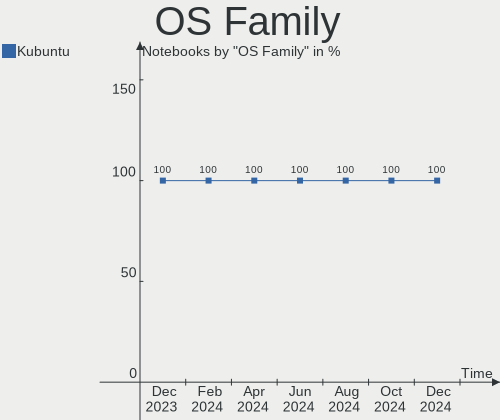
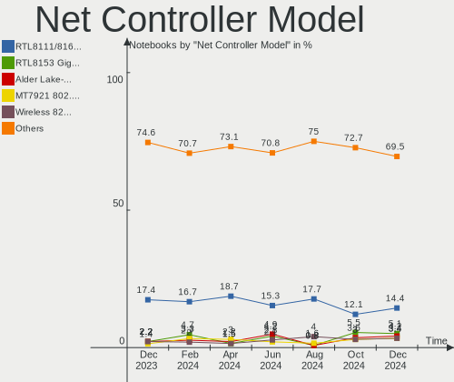
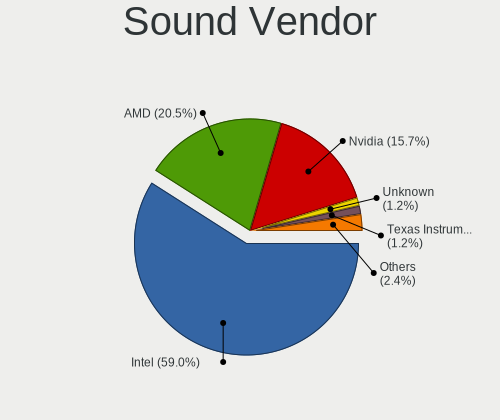

Kubuntu - Hardware Trends (Notebooks)
-------------------------------------

A project to identify most popular hardware characteristics and track their change
over time based on data collected by Linux users at https://Linux-Hardware.org.

Anyone can contribute to this report by the [hw-probe](https://github.com/linuxhw/hw-probe) tool:

    sudo -E hw-probe -all -upload

This report is for one last month. Overall report since the beginning of time: [TestDays](https://github.com/linuxhw/TestDays)

Period: Dec, 2023.

Contents
--------

* [ System ](#system)
  - [ OS                       ](#os)
  - [ OS Family                ](#os-family)
  - [ Kernel                   ](#kernel)
  - [ Kernel Family            ](#kernel-family)
  - [ Kernel Major Ver.        ](#kernel-major-ver)
  - [ Arch                     ](#arch)
  - [ DE                       ](#de)
  - [ Display Server           ](#display-server)
  - [ Display Manager          ](#display-manager)
  - [ OS Lang                  ](#os-lang)
  - [ Boot Mode                ](#boot-mode)
  - [ Filesystem               ](#filesystem)
  - [ Part. scheme             ](#part-scheme)
  - [ Dual Boot with Linux/BSD ](#dual-boot-with-linuxbsd)
  - [ Dual Boot (Win)          ](#dual-boot-win)

* [ Board ](#board)
  - [ Vendor                   ](#vendor)
  - [ Model                    ](#model)
  - [ Model Family             ](#model-family)
  - [ MFG Year                 ](#mfg-year)
  - [ Form Factor              ](#form-factor)
  - [ Secure Boot              ](#secure-boot)
  - [ Coreboot                 ](#coreboot)
  - [ RAM Size                 ](#ram-size)
  - [ RAM Used                 ](#ram-used)
  - [ Total Drives             ](#total-drives)
  - [ Has CD-ROM               ](#has-cd-rom)
  - [ Has Ethernet             ](#has-ethernet)
  - [ Has WiFi                 ](#has-wifi)
  - [ Has Bluetooth            ](#has-bluetooth)

* [ Location ](#location)
  - [ Country                  ](#country)
  - [ City                     ](#city)

* [ Drives ](#drives)
  - [ Drive Vendor             ](#drive-vendor)
  - [ Drive Model              ](#drive-model)
  - [ HDD Vendor               ](#hdd-vendor)
  - [ SSD Vendor               ](#ssd-vendor)
  - [ Drive Kind               ](#drive-kind)
  - [ Drive Connector          ](#drive-connector)
  - [ Drive Size               ](#drive-size)
  - [ Space Total              ](#space-total)
  - [ Space Used               ](#space-used)
  - [ Malfunc. Drives          ](#malfunc-drives)
  - [ Malfunc. Drive Vendor    ](#malfunc-drive-vendor)
  - [ Malfunc. HDD Vendor      ](#malfunc-hdd-vendor)
  - [ Malfunc. Drive Kind      ](#malfunc-drive-kind)
  - [ Failed Drives            ](#failed-drives)
  - [ Failed Drive Vendor      ](#failed-drive-vendor)
  - [ Drive Status             ](#drive-status)

* [ Storage controller ](#storage-controller)
  - [ Storage Vendor           ](#storage-vendor)
  - [ Storage Model            ](#storage-model)
  - [ Storage Kind             ](#storage-kind)

* [ Processor ](#processor)
  - [ CPU Vendor               ](#cpu-vendor)
  - [ CPU Model                ](#cpu-model)
  - [ CPU Model Family         ](#cpu-model-family)
  - [ CPU Cores                ](#cpu-cores)
  - [ CPU Sockets              ](#cpu-sockets)
  - [ CPU Threads              ](#cpu-threads)
  - [ CPU Op-Modes             ](#cpu-op-modes)
  - [ CPU Microcode            ](#cpu-microcode)
  - [ CPU Microarch            ](#cpu-microarch)

* [ Graphics ](#graphics)
  - [ GPU Vendor               ](#gpu-vendor)
  - [ GPU Model                ](#gpu-model)
  - [ GPU Combo                ](#gpu-combo)
  - [ GPU Driver               ](#gpu-driver)
  - [ GPU Memory               ](#gpu-memory)

* [ Monitor ](#monitor)
  - [ Monitor Vendor           ](#monitor-vendor)
  - [ Monitor Model            ](#monitor-model)
  - [ Monitor Resolution       ](#monitor-resolution)
  - [ Monitor Diagonal         ](#monitor-diagonal)
  - [ Monitor Width            ](#monitor-width)
  - [ Aspect Ratio             ](#aspect-ratio)
  - [ Monitor Area             ](#monitor-area)
  - [ Pixel Density            ](#pixel-density)
  - [ Multiple Monitors        ](#multiple-monitors)

* [ Network ](#network)
  - [ Net Controller Vendor    ](#net-controller-vendor)
  - [ Net Controller Model     ](#net-controller-model)
  - [ Wireless Vendor          ](#wireless-vendor)
  - [ Wireless Model           ](#wireless-model)
  - [ Ethernet Vendor          ](#ethernet-vendor)
  - [ Ethernet Model           ](#ethernet-model)
  - [ Net Controller Kind      ](#net-controller-kind)
  - [ Used Controller          ](#used-controller)
  - [ NICs                     ](#nics)
  - [ IPv6                     ](#ipv6)

* [ Bluetooth ](#bluetooth)
  - [ Bluetooth Vendor         ](#bluetooth-vendor)
  - [ Bluetooth Model          ](#bluetooth-model)

* [ Sound ](#sound)
  - [ Sound Vendor             ](#sound-vendor)
  - [ Sound Model              ](#sound-model)

* [ Memory ](#memory)
  - [ Memory Vendor            ](#memory-vendor)
  - [ Memory Model             ](#memory-model)
  - [ Memory Kind              ](#memory-kind)
  - [ Memory Form Factor       ](#memory-form-factor)
  - [ Memory Size              ](#memory-size)
  - [ Memory Speed             ](#memory-speed)

* [ Printers & scanners ](#printers--scanners)
  - [ Printer Vendor           ](#printer-vendor)
  - [ Printer Model            ](#printer-model)
  - [ Scanner Vendor           ](#scanner-vendor)
  - [ Scanner Model            ](#scanner-model)

* [ Camera ](#camera)
  - [ Camera Vendor            ](#camera-vendor)
  - [ Camera Model             ](#camera-model)

* [ Security ](#security)
  - [ Fingerprint Vendor       ](#fingerprint-vendor)
  - [ Fingerprint Model        ](#fingerprint-model)
  - [ Chipcard Vendor          ](#chipcard-vendor)
  - [ Chipcard Model           ](#chipcard-model)

* [ Unsupported ](#unsupported)
  - [ Unsupported Devices      ](#unsupported-devices)
  - [ Unsupported Device Types ](#unsupported-device-types)

System
------

OS
--

Installed operating systems

| Name          | Notebooks | Percent |
|---------------|-----------|---------|
| Kubuntu 22.04 | 34        | 45.33%  |
| Kubuntu 23.10 | 31        | 41.33%  |
| Kubuntu 23.04 | 5         | 6.67%   |
| Kubuntu 24.04 | 3         | 4%      |
| Kubuntu 20.04 | 2         | 2.67%   |

OS Family
---------

OS without a version

| Name    | Notebooks | Percent |
|---------|-----------|---------|
| Kubuntu | 75        | 100%    |

Kernel
------

Version of the Linux kernel

| Version                 | Notebooks | Percent |
|-------------------------|-----------|---------|
| 6.5.0-14-generic        | 19        | 25.33%  |
| 5.15.0-91-generic       | 11        | 14.67%  |
| 6.2.0-39-generic        | 10        | 13.33%  |
| 6.2.0-37-generic        | 8         | 10.67%  |
| 6.5.0-13-generic        | 5         | 6.67%   |
| 6.7.0-060700rc5-generic | 1         | 1.33%   |
| 6.6.7-060607-generic    | 1         | 1.33%   |
| 6.6.5-x64v4-xanmod1     | 1         | 1.33%   |
| 6.6.4-1-liquorix-amd64  | 1         | 1.33%   |
| 6.6.2-t2-jammy          | 1         | 1.33%   |
| 6.6.1-060601-generic    | 1         | 1.33%   |
| 6.6.0-14-generic        | 1         | 1.33%   |
| 6.6.0-060600rc5-generic | 1         | 1.33%   |
| 6.5.0-9-generic         | 1         | 1.33%   |
| 6.5.0-14-lowlatency     | 1         | 1.33%   |
| 6.5.0-13-lowlatency     | 1         | 1.33%   |
| 6.5.0-1009-oem          | 1         | 1.33%   |
| 6.5.0-10010-tuxedo      | 1         | 1.33%   |
| 6.2.0-35-generic        | 1         | 1.33%   |
| 6.2.0-26-generic        | 1         | 1.33%   |
| 6.2.0-20-generic        | 1         | 1.33%   |
| 6.1.69-t2-jammy         | 1         | 1.33%   |
| 6.1.0-1026-oem          | 1         | 1.33%   |
| 5.4.0-152-generic       | 1         | 1.33%   |
| 5.15.0-91-lowlatency    | 1         | 1.33%   |
| 5.15.0-89-generic       | 1         | 1.33%   |
| 5.15.0-56-generic       | 1         | 1.33%   |

Kernel Family
-------------

Linux kernel without a distro release

| Version | Notebooks | Percent |
|---------|-----------|---------|
| 6.5.0   | 29        | 38.67%  |
| 6.2.0   | 21        | 28%     |
| 5.15.0  | 14        | 18.67%  |
| 6.6.0   | 2         | 2.67%   |
| 6.7.0   | 1         | 1.33%   |
| 6.6.7   | 1         | 1.33%   |
| 6.6.5   | 1         | 1.33%   |
| 6.6.4   | 1         | 1.33%   |
| 6.6.2   | 1         | 1.33%   |
| 6.6.1   | 1         | 1.33%   |
| 6.1.69  | 1         | 1.33%   |
| 6.1.0   | 1         | 1.33%   |
| 5.4.0   | 1         | 1.33%   |

Kernel Major Ver.
-----------------

Linux kernel major version

| Version | Notebooks | Percent |
|---------|-----------|---------|
| 6.5     | 29        | 38.67%  |
| 6.2     | 21        | 28%     |
| 5.15    | 14        | 18.67%  |
| 6.6     | 7         | 9.33%   |
| 6.1     | 2         | 2.67%   |
| 6.7     | 1         | 1.33%   |
| 5.4     | 1         | 1.33%   |

Arch
----

OS architecture (x86_64, i586, etc.)

| Name   | Notebooks | Percent |
|--------|-----------|---------|
| x86_64 | 75        | 100%    |

DE
--

Desktop Environment

| Name | Notebooks | Percent |
|------|-----------|---------|
| KDE5 | 75        | 100%    |

Display Server
--------------

X11 or Wayland

| Name    | Notebooks | Percent |
|---------|-----------|---------|
| X11     | 67        | 89.33%  |
| Wayland | 8         | 10.67%  |

Display Manager
---------------

SDDM, LightDM, etc.

| Name    | Notebooks | Percent |
|---------|-----------|---------|
| SDDM    | 50        | 66.67%  |
| Unknown | 23        | 30.67%  |
| GDM3    | 2         | 2.67%   |

OS Lang
-------

Language

| Lang  | Notebooks | Percent |
|-------|-----------|---------|
| en_US | 25        | 33.33%  |
| en_GB | 7         | 9.33%   |
| ru_RU | 6         | 8%      |
| de_DE | 6         | 8%      |
| it_IT | 5         | 6.67%   |
| fr_FR | 4         | 5.33%   |
| es_ES | 4         | 5.33%   |
| en_CA | 4         | 5.33%   |
| en_IN | 3         | 4%      |
| fr_CH | 2         | 2.67%   |
| zh_TW | 1         | 1.33%   |
| sv_SE | 1         | 1.33%   |
| sk_SK | 1         | 1.33%   |
| pl_PL | 1         | 1.33%   |
| es_MX | 1         | 1.33%   |
| es_CL | 1         | 1.33%   |
| en_IL | 1         | 1.33%   |
| en_AU | 1         | 1.33%   |
| de_AT | 1         | 1.33%   |

Boot Mode
---------

EFI or BIOS

| Mode | Notebooks | Percent |
|------|-----------|---------|
| BIOS | 39        | 52%     |
| EFI  | 36        | 48%     |

Filesystem
----------

Type of filesystem

| Type    | Notebooks | Percent |
|---------|-----------|---------|
| Ext4    | 55        | 73.33%  |
| Tmpfs   | 18        | 24%     |
| Overlay | 1         | 1.33%   |
| Btrfs   | 1         | 1.33%   |

Part. scheme
------------

Scheme of partitioning

| Type    | Notebooks | Percent |
|---------|-----------|---------|
| GPT     | 47        | 62.67%  |
| Unknown | 23        | 30.67%  |
| MBR     | 5         | 6.67%   |

Dual Boot with Linux/BSD
------------------------

Hosting more than one Linux/BSD

| Dual boot | Notebooks | Percent |
|-----------|-----------|---------|
| No        | 69        | 92%     |
| Yes       | 6         | 8%      |

Dual Boot (Win)
---------------

Hosting Linux and Windows

| Dual boot | Notebooks | Percent |
|-----------|-----------|---------|
| No        | 49        | 65.33%  |
| Yes       | 26        | 34.67%  |

Board
-----

Vendor
------

Motherboard manufacturer

| Name                             | Notebooks | Percent |
|----------------------------------|-----------|---------|
| Lenovo                           | 20        | 26.67%  |
| Hewlett-Packard                  | 14        | 18.67%  |
| Acer                             | 8         | 10.67%  |
| ASUSTek Computer                 | 6         | 8%      |
| Dell                             | 5         | 6.67%   |
| Apple                            | 4         | 5.33%   |
| HUAWEI                           | 3         | 4%      |
| Notebook                         | 2         | 2.67%   |
| MSI                              | 2         | 2.67%   |
| TUXEDO                           | 1         | 1.33%   |
| Timi                             | 1         | 1.33%   |
| PC Specialist                    | 1         | 1.33%   |
| Micro Computer (HK) Tech Limited | 1         | 1.33%   |
| Google                           | 1         | 1.33%   |
| Gateway                          | 1         | 1.33%   |
| Framework                        | 1         | 1.33%   |
| eMachines                        | 1         | 1.33%   |
| Eluktronics                      | 1         | 1.33%   |
| ARDOR GAMING                     | 1         | 1.33%   |
| Unknown                          | 1         | 1.33%   |

Model
-----

Motherboard model

| Name                                               | Notebooks | Percent |
|----------------------------------------------------|-----------|---------|
| HP Notebook                                        | 2         | 2.67%   |
| Apple MacBookAir9,1                                | 2         | 2.67%   |
| TUXEDO Pulse 14 Gen1                               | 1         | 1.33%   |
| Timi Mi NoteBook Pro                               | 1         | 1.33%   |
| PC Specialist 14 Fusion Pro                        | 1         | 1.33%   |
| Notebook W65_67SR                                  | 1         | 1.33%   |
| Notebook NL5xNU                                    | 1         | 1.33%   |
| MSI Prestige 14Evo A11M                            | 1         | 1.33%   |
| MSI GF63 Thin 9RCX                                 | 1         | 1.33%   |
| Micro (HK) Tech Limited Venus series               | 1         | 1.33%   |
| Lenovo Yoga Slim 7 13ACN5 82CY                     | 1         | 1.33%   |
| Lenovo ThinkPad X220 4290B19                       | 1         | 1.33%   |
| Lenovo ThinkPad X13 Gen 2a 20XH0076IG              | 1         | 1.33%   |
| Lenovo ThinkPad X1 Carbon Gen 11 21HNS00100        | 1         | 1.33%   |
| Lenovo ThinkPad T520 4243ED3                       | 1         | 1.33%   |
| Lenovo ThinkPad T500 20564RG                       | 1         | 1.33%   |
| Lenovo ThinkPad T480 20L6SE6900                    | 1         | 1.33%   |
| Lenovo ThinkPad T450 20BUS05V00                    | 1         | 1.33%   |
| Lenovo ThinkPad T440p 20AWA16R00                   | 1         | 1.33%   |
| Lenovo ThinkPad E595 20NFCTO1WW                    | 1         | 1.33%   |
| Lenovo ThinkPad E590 20NB005MUS                    | 1         | 1.33%   |
| Lenovo M30-70 80H8                                 | 1         | 1.33%   |
| Lenovo Legion Pro 7 16IRX8H 82WQ                   | 1         | 1.33%   |
| Lenovo Legion Pro 5 16ARX8 82WM                    | 1         | 1.33%   |
| Lenovo Legion 5 15ARH05H 82B1                      | 1         | 1.33%   |
| Lenovo K14 G2 IRU 21G1                             | 1         | 1.33%   |
| Lenovo IdeaPad Pro 5 16APH8 83AR                   | 1         | 1.33%   |
| Lenovo IdeaPad L340-15IWL 81LG                     | 1         | 1.33%   |
| Lenovo IdeaPad 5 14ALC05 82LM                      | 1         | 1.33%   |
| Lenovo G500 20236                                  | 1         | 1.33%   |
| HUAWEI RLEF-XX                                     | 1         | 1.33%   |
| HUAWEI HVY-WXX9                                    | 1         | 1.33%   |
| HUAWEI BOD-WXX9                                    | 1         | 1.33%   |
| HP ZBook Studio 15.6 inch G8 Mobile Workstation PC | 1         | 1.33%   |
| HP ZBook Power 15.6 inch G9 Mobile Workstation PC  | 1         | 1.33%   |
| HP ProBook 470 G5                                  | 1         | 1.33%   |
| HP Pavilion Laptop 15-eg2xxx                       | 1         | 1.33%   |
| HP Pavilion 17                                     | 1         | 1.33%   |
| HP Laptop 15-dw3xxx                                | 1         | 1.33%   |
| HP Laptop 14-em0xxx                                | 1         | 1.33%   |

Model Family
------------

Motherboard model prefix

| Name                          | Notebooks | Percent |
|-------------------------------|-----------|---------|
| Lenovo ThinkPad               | 10        | 13.33%  |
| Acer Aspire                   | 5         | 6.67%   |
| Lenovo Legion                 | 3         | 4%      |
| Lenovo IdeaPad                | 3         | 4%      |
| HP Laptop                     | 3         | 4%      |
| HP ZBook                      | 2         | 2.67%   |
| HP Pavilion                   | 2         | 2.67%   |
| HP Notebook                   | 2         | 2.67%   |
| ASUS VivoBook                 | 2         | 2.67%   |
| Apple MacBookAir9             | 2         | 2.67%   |
| TUXEDO Pulse                  | 1         | 1.33%   |
| Timi Mi                       | 1         | 1.33%   |
| PC Specialist 14              | 1         | 1.33%   |
| Notebook W65                  | 1         | 1.33%   |
| Notebook NL5xNU               | 1         | 1.33%   |
| MSI Prestige                  | 1         | 1.33%   |
| MSI GF63                      | 1         | 1.33%   |
| Micro (HK) Tech Limited Venus | 1         | 1.33%   |
| Lenovo Yoga                   | 1         | 1.33%   |
| Lenovo M30-70                 | 1         | 1.33%   |
| Lenovo K14                    | 1         | 1.33%   |
| Lenovo G500                   | 1         | 1.33%   |
| HUAWEI RLEF-XX                | 1         | 1.33%   |
| HUAWEI HVY-WXX9               | 1         | 1.33%   |
| HUAWEI BOD-WXX9               | 1         | 1.33%   |
| HP ProBook                    | 1         | 1.33%   |
| HP G62                        | 1         | 1.33%   |
| HP ENVY                       | 1         | 1.33%   |
| HP EliteBook                  | 1         | 1.33%   |
| HP 340S                       | 1         | 1.33%   |
| Google Cave                   | 1         | 1.33%   |
| Gateway NV54                  | 1         | 1.33%   |
| Framework Laptop              | 1         | 1.33%   |
| eMachines eME732G             | 1         | 1.33%   |
| Eluktronics MECH-17           | 1         | 1.33%   |
| Dell XPS                      | 1         | 1.33%   |
| Dell Vostro                   | 1         | 1.33%   |
| Dell Precision                | 1         | 1.33%   |
| Dell Latitude                 | 1         | 1.33%   |
| Dell Inspiron                 | 1         | 1.33%   |

MFG Year
--------

Motherboard manufacture year

| Year | Notebooks | Percent |
|------|-----------|---------|
| 2023 | 12        | 16%     |
| 2020 | 10        | 13.33%  |
| 2021 | 9         | 12%     |
| 2022 | 8         | 10.67%  |
| 2019 | 8         | 10.67%  |
| 2013 | 5         | 6.67%   |
| 2014 | 4         | 5.33%   |
| 2018 | 3         | 4%      |
| 2011 | 3         | 4%      |
| 2010 | 3         | 4%      |
| 2017 | 2         | 2.67%   |
| 2008 | 2         | 2.67%   |
| 2007 | 2         | 2.67%   |
| 2016 | 1         | 1.33%   |
| 2015 | 1         | 1.33%   |
| 2012 | 1         | 1.33%   |
| 2009 | 1         | 1.33%   |

Form Factor
-----------

Physical design of the computer

| Name     | Notebooks | Percent |
|----------|-----------|---------|
| Notebook | 75        | 100%    |

Secure Boot
-----------

Enabled or disabled

| State    | Notebooks | Percent |
|----------|-----------|---------|
| Disabled | 67        | 89.33%  |
| Enabled  | 8         | 10.67%  |

Coreboot
--------

Have coreboot on board

| Used | Notebooks | Percent |
|------|-----------|---------|
| No   | 74        | 98.67%  |
| Yes  | 1         | 1.33%   |

RAM Size
--------

Total RAM memory

| Size in GB  | Notebooks | Percent |
|-------------|-----------|---------|
| 4.01-8.0    | 18        | 24%     |
| 8.01-16.0   | 18        | 24%     |
| 16.01-24.0  | 15        | 20%     |
| 32.01-64.0  | 10        | 13.33%  |
| 3.01-4.0    | 7         | 9.33%   |
| 24.01-32.0  | 5         | 6.67%   |
| 2.01-3.0    | 1         | 1.33%   |
| 64.01-256.0 | 1         | 1.33%   |

RAM Used
--------

Used RAM memory

| Used GB    | Notebooks | Percent |
|------------|-----------|---------|
| 4.01-8.0   | 25        | 33.33%  |
| 1.01-2.0   | 17        | 22.67%  |
| 2.01-3.0   | 14        | 18.67%  |
| 3.01-4.0   | 13        | 17.33%  |
| 8.01-16.0  | 5         | 6.67%   |
| 16.01-24.0 | 1         | 1.33%   |

Total Drives
------------

Number of drives on board

| Drives | Notebooks | Percent |
|--------|-----------|---------|
| 1      | 47        | 62.67%  |
| 2      | 26        | 34.67%  |
| 3      | 2         | 2.67%   |

Has CD-ROM
----------

Has CD-ROM on board

| Presented | Notebooks | Percent |
|-----------|-----------|---------|
| No        | 60        | 80%     |
| Yes       | 15        | 20%     |

Has Ethernet
------------

Has Ethernet on board

| Presented | Notebooks | Percent |
|-----------|-----------|---------|
| Yes       | 54        | 72%     |
| No        | 21        | 28%     |

Has WiFi
--------

Has WiFi module

| Presented | Notebooks | Percent |
|-----------|-----------|---------|
| Yes       | 74        | 98.67%  |
| No        | 1         | 1.33%   |

Has Bluetooth
-------------

Has Bluetooth module

| Presented | Notebooks | Percent |
|-----------|-----------|---------|
| Yes       | 64        | 85.33%  |
| No        | 11        | 14.67%  |

Location
--------

Country
-------

Geographic location (country)

| Country     | Notebooks | Percent |
|-------------|-----------|---------|
| USA         | 9         | 12%     |
| Germany     | 9         | 12%     |
| Russia      | 7         | 9.33%   |
| Italy       | 6         | 8%      |
| Spain       | 5         | 6.67%   |
| Canada      | 5         | 6.67%   |
| UK          | 4         | 5.33%   |
| India       | 4         | 5.33%   |
| Switzerland | 2         | 2.67%   |
| Netherlands | 2         | 2.67%   |
| Indonesia   | 2         | 2.67%   |
| France      | 2         | 2.67%   |
| Turkey      | 1         | 1.33%   |
| Taiwan      | 1         | 1.33%   |
| Sweden      | 1         | 1.33%   |
| Slovakia    | 1         | 1.33%   |
| Romania     | 1         | 1.33%   |
| Poland      | 1         | 1.33%   |
| Norway      | 1         | 1.33%   |
| Mexico      | 1         | 1.33%   |
| Martinique  | 1         | 1.33%   |
| Luxembourg  | 1         | 1.33%   |
| Israel      | 1         | 1.33%   |
| Finland     | 1         | 1.33%   |
| Czechia     | 1         | 1.33%   |
| Chile       | 1         | 1.33%   |
| Brazil      | 1         | 1.33%   |
| Bangladesh  | 1         | 1.33%   |
| Austria     | 1         | 1.33%   |
| Australia   | 1         | 1.33%   |

City
----

Geographic location (city)

| City                    | Notebooks | Percent |
|-------------------------|-----------|---------|
| Madrid                  | 2         | 2.67%   |
| Wil                     | 1         | 1.33%   |
| Wiesbaden               | 1         | 1.33%   |
| Vitoria-Gasteiz         | 1         | 1.33%   |
| Victoria                | 1         | 1.33%   |
| Veroli                  | 1         | 1.33%   |
| Verdal                  | 1         | 1.33%   |
| Ufa                     | 1         | 1.33%   |
| Trier                   | 1         | 1.33%   |
| Tizayuca                | 1         | 1.33%   |
| Tampere                 | 1         | 1.33%   |
| Taipei                  | 1         | 1.33%   |
| Surabaya                | 1         | 1.33%   |
| St. John's              | 1         | 1.33%   |
| St Petersburg           | 1         | 1.33%   |
| Spillern                | 1         | 1.33%   |
| Seattle                 | 1         | 1.33%   |
| Satna                   | 1         | 1.33%   |
| Santiago                | 1         | 1.33%   |
| San Gabriel             | 1         | 1.33%   |
| Salt Lake City          | 1         | 1.33%   |
| Ramat Gan               | 1         | 1.33%   |
| Prague                  | 1         | 1.33%   |
| Plattsmouth             | 1         | 1.33%   |
| Patrun                  | 1         | 1.33%   |
| Padova                  | 1         | 1.33%   |
| Oryol                   | 1         | 1.33%   |
| Nuland                  | 1         | 1.33%   |
| Novoural'sk             | 1         | 1.33%   |
| Norrköping             | 1         | 1.33%   |
| Neustadt am Ruebenberge | 1         | 1.33%   |
| Neunkirchen             | 1         | 1.33%   |
| Moscow                  | 1         | 1.33%   |
| Milan                   | 1         | 1.33%   |
| Luxembourg              | 1         | 1.33%   |
| Lodz                    | 1         | 1.33%   |
| Liebefeld               | 1         | 1.33%   |
| Laval                   | 1         | 1.33%   |
| Las Vegas               | 1         | 1.33%   |
| Langfurth               | 1         | 1.33%   |

Drives
------

Drive Vendor
------------

Hard drive vendors

| Vendor                      | Notebooks | Drives | Percent |
|-----------------------------|-----------|--------|---------|
| Samsung Electronics         | 15        | 17     | 14.85%  |
| Sandisk                     | 9         | 9      | 8.91%   |
| WDC                         | 7         | 8      | 6.93%   |
| SK hynix                    | 7         | 7      | 6.93%   |
| Seagate                     | 7         | 7      | 6.93%   |
| Kingston                    | 7         | 7      | 6.93%   |
| Toshiba                     | 6         | 6      | 5.94%   |
| KIOXIA                      | 4         | 4      | 3.96%   |
| Apple                       | 4         | 5      | 3.96%   |
| Unknown                     | 3         | 4      | 2.97%   |
| HGST                        | 3         | 3      | 2.97%   |
| SPCC                        | 2         | 2      | 1.98%   |
| SABRENT                     | 2         | 2      | 1.98%   |
| Phison Electronics          | 2         | 2      | 1.98%   |
| MAXIO Technology (Hangzhou) | 2         | 2      | 1.98%   |
| Intenso                     | 2         | 2      | 1.98%   |
| Intel                       | 2         | 2      | 1.98%   |
| Hitachi                     | 2         | 2      | 1.98%   |
| China                       | 2         | 2      | 1.98%   |
| XrayDisk                    | 1         | 1      | 0.99%   |
| UMIS                        | 1         | 1      | 0.99%   |
| Silicon Motion              | 1         | 1      | 0.99%   |
| PNY                         | 1         | 1      | 0.99%   |
| Phison                      | 1         | 1      | 0.99%   |
| Patriot                     | 1         | 1      | 0.99%   |
| LS                          | 1         | 1      | 0.99%   |
| KXG50ZNV                    | 1         | 1      | 0.99%   |
| Kingston Technology Company | 1         | 1      | 0.99%   |
| KingSpec                    | 1         | 1      | 0.99%   |
| Crucial                     | 1         | 1      | 0.99%   |
| BAITITON                    | 1         | 1      | 0.99%   |
| ASMT109x                    | 1         | 1      | 0.99%   |

Drive Model
-----------

Hard drive models

| Model                                               | Notebooks | Percent |
|-----------------------------------------------------|-----------|---------|
| Samsung NVMe SSD Controller SM981/PM981/PM983 512GB | 3         | 2.86%   |
| WDC WDS500G2B0A-00SM50 500GB SSD                    | 2         | 1.9%    |
| Toshiba MQ01ABD100 1TB                              | 2         | 1.9%    |
| Seagate ST500LT012-1DG142 500GB                     | 2         | 1.9%    |
| SanDisk NVMe SSD Drive 2TB                          | 2         | 1.9%    |
| Samsung SSD 980 PRO 1TB                             | 2         | 1.9%    |
| Phison PS5013 E13 NVMe Controller 512GB             | 2         | 1.9%    |
| MAXIO (Hangzhou) NVMe SSD Controller MAP1202 256GB  | 2         | 1.9%    |
| China SSD 1TB                                       | 2         | 1.9%    |
| Apple ANS2 NVMe Controller 256GB                    | 2         | 1.9%    |
| XrayDisk 256GB                                      | 1         | 0.95%   |
| WDC WDS250G2B0A-00SM50 250GB SSD                    | 1         | 0.95%   |
| WDC WD10SPZX-24Z10 1TB                              | 1         | 0.95%   |
| WDC WD10SPZX-00Z10T0 1TB                            | 1         | 0.95%   |
| WDC WD10EZEX-60WN4A0 1TB                            | 1         | 0.95%   |
| WDC PC SN530 SDBPMPZ-256G-1101 256GB                | 1         | 0.95%   |
| WDC PC SN520 SDAPNUW-256G-1006 256GB                | 1         | 0.95%   |
| Unknown SD/MMC/MS PRO 512GB                         | 1         | 0.95%   |
| Unknown MMC Card  32GB                              | 1         | 0.95%   |
| Unknown MMC Card  16GB                              | 1         | 0.95%   |
| UMIS RPETJ512MGE2QDQ 512GB                          | 1         | 0.95%   |
| Toshiba XG6 NVMe SSD Controller 512GB               | 1         | 0.95%   |
| Toshiba THNSNH128GMCT 128GB SSD                     | 1         | 0.95%   |
| Toshiba MQ01ABF032 320GB                            | 1         | 0.95%   |
| Toshiba MK5059GSXP 500GB                            | 1         | 0.95%   |
| SPCC Solid State Disk 512GB                         | 1         | 0.95%   |
| SPCC Solid State Disk 480GB                         | 1         | 0.95%   |
| SK hynix SKHynix_HFS001TEJ9X115N 1024GB             | 1         | 0.95%   |
| SK hynix SKHynix_HFS001TEJ4X112N 1TB                | 1         | 0.95%   |
| SK hynix HFS001TEJ9X125N 1TB                        | 1         | 0.95%   |
| SK hynix HFS001TEJ9X108N 1TB                        | 1         | 0.95%   |
| SK hynix HFM512GD3JX013N 512GB                      | 1         | 0.95%   |
| SK hynix BC511 512GB                                | 1         | 0.95%   |
| SK hynix BC501 NVMe Solid State Drive 512GB         | 1         | 0.95%   |
| Silicon Motion PCIe-8 SSD 512GB                     | 1         | 0.95%   |
| Seagate ST9320325AS 320GB                           | 1         | 0.95%   |
| Seagate ST1000LM035-1RK172 1TB                      | 1         | 0.95%   |
| Seagate Game Drive PS4 4TB                          | 1         | 0.95%   |
| Seagate BUP Mac SL 4TB                              | 1         | 0.95%   |
| Seagate BarracudaFastSSD 500GB                      | 1         | 0.95%   |

HDD Vendor
----------

Hard disk drive vendors

| Vendor  | Notebooks | Drives | Percent |
|---------|-----------|--------|---------|
| Seagate | 5         | 5      | 25%     |
| Toshiba | 4         | 4      | 20%     |
| WDC     | 3         | 3      | 15%     |
| HGST    | 3         | 3      | 15%     |
| SABRENT | 2         | 2      | 10%     |
| Hitachi | 2         | 2      | 10%     |
| Unknown | 1         | 1      | 5%      |

SSD Vendor
----------

Solid state drive vendors

| Vendor              | Notebooks | Drives | Percent |
|---------------------|-----------|--------|---------|
| Kingston            | 5         | 5      | 18.52%  |
| WDC                 | 3         | 3      | 11.11%  |
| SPCC                | 2         | 2      | 7.41%   |
| SanDisk             | 2         | 2      | 7.41%   |
| Samsung Electronics | 2         | 2      | 7.41%   |
| Intenso             | 2         | 2      | 7.41%   |
| China               | 2         | 2      | 7.41%   |
| Apple               | 2         | 2      | 7.41%   |
| Toshiba             | 1         | 1      | 3.7%    |
| Seagate             | 1         | 1      | 3.7%    |
| PNY                 | 1         | 1      | 3.7%    |
| LS                  | 1         | 1      | 3.7%    |
| KingSpec            | 1         | 1      | 3.7%    |
| BAITITON            | 1         | 1      | 3.7%    |
| ASMT109x            | 1         | 1      | 3.7%    |

Drive Kind
----------

HDD or SSD

| Kind    | Notebooks | Drives | Percent |
|---------|-----------|--------|---------|
| NVMe    | 47        | 54     | 49.47%  |
| SSD     | 26        | 27     | 27.37%  |
| HDD     | 18        | 20     | 18.95%  |
| MMC     | 2         | 3      | 2.11%   |
| Unknown | 2         | 2      | 2.11%   |

Drive Connector
---------------

SATA, SAS, NVMe, etc.

| Type | Notebooks | Drives | Percent |
|------|-----------|--------|---------|
| NVMe | 47        | 53     | 51.09%  |
| SATA | 35        | 41     | 38.04%  |
| SAS  | 8         | 9      | 8.7%    |
| MMC  | 2         | 3      | 2.17%   |

Drive Size
----------

Size of hard drive

| Size in TB | Notebooks | Drives | Percent |
|------------|-----------|--------|---------|
| 0.01-0.5   | 26        | 29     | 59.09%  |
| 0.51-1.0   | 14        | 14     | 31.82%  |
| 1.01-2.0   | 3         | 3      | 6.82%   |
| 3.01-4.0   | 1         | 1      | 2.27%   |

Space Total
-----------

Amount of disk space available on the file system

| Size in GB     | Notebooks | Percent |
|----------------|-----------|---------|
| 251-500        | 28        | 37.33%  |
| 501-1000       | 22        | 29.33%  |
| 101-250        | 11        | 14.67%  |
| 1001-2000      | 8         | 10.67%  |
| More than 3000 | 2         | 2.67%   |
| 1-20           | 2         | 2.67%   |
| 21-50          | 1         | 1.33%   |
| 51-100         | 1         | 1.33%   |

Space Used
----------

Amount of used disk space

| Used GB        | Notebooks | Percent |
|----------------|-----------|---------|
| 21-50          | 13        | 17.33%  |
| 101-250        | 13        | 17.33%  |
| 1-20           | 13        | 17.33%  |
| 251-500        | 12        | 16%     |
| 51-100         | 12        | 16%     |
| 501-1000       | 11        | 14.67%  |
| More than 3000 | 1         | 1.33%   |

Malfunc. Drives
---------------

Drive models with a malfunction

| Model                           | Notebooks | Drives | Percent |
|---------------------------------|-----------|--------|---------|
| Seagate ST500LT012-1DG142 500GB | 1         | 1      | 33.33%  |
| SABRENT Disk 2TB                | 1         | 1      | 33.33%  |
| HGST HTS545050A7E680 500GB      | 1         | 1      | 33.33%  |

Malfunc. Drive Vendor
---------------------

Vendors of faulty drives

| Vendor  | Notebooks | Drives | Percent |
|---------|-----------|--------|---------|
| Seagate | 1         | 1      | 33.33%  |
| SABRENT | 1         | 1      | 33.33%  |
| HGST    | 1         | 1      | 33.33%  |

Malfunc. HDD Vendor
-------------------

Vendors of faulty HDD drives

| Vendor  | Notebooks | Drives | Percent |
|---------|-----------|--------|---------|
| Seagate | 1         | 1      | 33.33%  |
| SABRENT | 1         | 1      | 33.33%  |
| HGST    | 1         | 1      | 33.33%  |

Malfunc. Drive Kind
-------------------

Kinds of faulty drives

| Kind | Notebooks | Drives | Percent |
|------|-----------|--------|---------|
| HDD  | 2         | 3      | 100%    |

Failed Drives
-------------

Failed drive models

Zero info for selected period =(

Failed Drive Vendor
-------------------

Failed drive vendors

Zero info for selected period =(

Drive Status
------------

Number of failed and malfunc. drives

| Status   | Notebooks | Drives | Percent |
|----------|-----------|--------|---------|
| Detected | 46        | 65     | 58.23%  |
| Works    | 31        | 38     | 39.24%  |
| Malfunc  | 2         | 3      | 2.53%   |

Storage controller
------------------

Storage Vendor
--------------

Storage controller vendors

| Vendor                       | Notebooks | Percent |
|------------------------------|-----------|---------|
| Intel                        | 37        | 38.14%  |
| Samsung Electronics          | 16        | 16.49%  |
| AMD                          | 11        | 11.34%  |
| SanDisk                      | 8         | 8.25%   |
| SK hynix                     | 7         | 7.22%   |
| KIOXIA                       | 4         | 4.12%   |
| Phison Electronics           | 3         | 3.09%   |
| Kingston Technology Company  | 3         | 3.09%   |
| MAXIO Technology (Hangzhou)  | 2         | 2.06%   |
| Apple                        | 2         | 2.06%   |
| Union Memory (Shenzhen)      | 1         | 1.03%   |
| Toshiba America Info Systems | 1         | 1.03%   |
| Silicon Motion               | 1         | 1.03%   |
| Micron/Crucial Technology    | 1         | 1.03%   |

Storage Model
-------------

Storage controller models

| Model                                                                          | Notebooks | Percent |
|--------------------------------------------------------------------------------|-----------|---------|
| AMD FCH SATA Controller [AHCI mode]                                            | 11        | 10.68%  |
| Samsung NVMe SSD Controller PM9A1/PM9A3/980PRO                                 | 7         | 6.8%    |
| Samsung NVMe SSD Controller SM981/PM981/PM983                                  | 6         | 5.83%   |
| Intel Volume Management Device NVMe RAID Controller                            | 5         | 4.85%   |
| Intel Sunrise Point-LP SATA Controller [AHCI mode]                             | 4         | 3.88%   |
| Intel Tiger Lake-LP SATA Controller                                            | 3         | 2.91%   |
| Intel 82801IBM/IEM (ICH9M/ICH9M-E) 4 port SATA Controller [AHCI mode]          | 3         | 2.91%   |
| Intel 5 Series/3400 Series Chipset 4 port SATA AHCI Controller                 | 3         | 2.91%   |
| SK hynix Platinum P41/PC801 NVMe Solid State Drive                             | 2         | 1.94%   |
| SK hynix BC901 NVMe Solid State Drive (DRAM-less)                              | 2         | 1.94%   |
| Samsung NVMe SSD Controller 980 (DRAM-less)                                    | 2         | 1.94%   |
| Phison PS5013-E13 PCIe3 NVMe Controller (DRAM-less)                            | 2         | 1.94%   |
| MAXIO (Hangzhou) NVMe SSD Controller MAP1202                                   | 2         | 1.94%   |
| KIOXIA NVMe SSD Controller BG4 (DRAM-less)                                     | 2         | 1.94%   |
| Kingston Company OM3PDP3 NVMe SSD                                              | 2         | 1.94%   |
| Intel Volume Management Device NVMe RAID Controller Intel Corporation          | 2         | 1.94%   |
| Intel 82801 Mobile SATA Controller [RAID mode]                                 | 2         | 1.94%   |
| Intel 8 Series/C220 Series Chipset Family 6-port SATA Controller 1 [AHCI mode] | 2         | 1.94%   |
| Intel 8 Series SATA Controller 1 [AHCI mode]                                   | 2         | 1.94%   |
| Intel 7 Series Chipset Family 6-port SATA Controller [AHCI mode]               | 2         | 1.94%   |
| Intel 6 Series/C200 Series Chipset Family 6 port Mobile SATA AHCI Controller   | 2         | 1.94%   |
| Apple ANS2 NVMe Controller                                                     | 2         | 1.94%   |
| Union Memory (Shenzhen) AM630 PCIe 4.0 x4 NVMe SSD Controller                  | 1         | 0.97%   |
| Toshiba America Info Systems XG6 NVMe SSD Controller                           | 1         | 0.97%   |
| SK hynix Gold P31/BC711/PC711 NVMe Solid State Drive                           | 1         | 0.97%   |
| SK hynix BC511 NVMe SSD                                                        | 1         | 0.97%   |
| SK hynix BC501 NVMe Solid State Drive                                          | 1         | 0.97%   |
| Silicon Motion Non-Volatile memory controller                                  | 1         | 0.97%   |
| SanDisk WD PC SN810 / Black SN850 NVMe SSD                                     | 1         | 0.97%   |
| Sandisk WD PC SN740 NVMe SSD 512GB (DRAM-less)                                 | 1         | 0.97%   |
| SanDisk WD Blue SN500 / PC SN520 x2 M.2 2280 NVMe SSD                          | 1         | 0.97%   |
| Sandisk WD Black SN850X NVMe SSD                                               | 1         | 0.97%   |
| SanDisk WD Black SN770 / PC SN740 256GB / PC SN560 (DRAM-less) NVMe SSD        | 1         | 0.97%   |
| SanDisk Ultra 3D / WD Blue SN550 NVMe SSD                                      | 1         | 0.97%   |
| SanDisk PC SN530 NVMe SSD (DRAM-less)                                          | 1         | 0.97%   |
| SanDisk IX SN530 NVMe SSD (DRAM-less)                                          | 1         | 0.97%   |
| Samsung S4LN058A01[SSUBX] AHCI SSD Controller (Apple slot)                     | 1         | 0.97%   |
| Samsung S4LN053X01 AHCI SSD Controller(Apple slot)                             | 1         | 0.97%   |
| Phison E16 PCIe4 NVMe Controller                                               | 1         | 0.97%   |
| Micron/Crucial P2 [Nick P2] / P3 / P3 Plus NVMe PCIe SSD (DRAM-less)           | 1         | 0.97%   |

Storage Kind
------------

Kind of storage controller (IDE, SATA, NVMe, SAS, ...)

| Kind | Notebooks | Percent |
|------|-----------|---------|
| NVMe | 47        | 47.47%  |
| SATA | 41        | 41.41%  |
| RAID | 10        | 10.1%   |
| IDE  | 1         | 1.01%   |

Processor
---------

CPU Vendor
----------

Processor vendors

| Vendor | Notebooks | Percent |
|--------|-----------|---------|
| Intel  | 54        | 72%     |
| AMD    | 21        | 28%     |

CPU Model
---------

Processor models

| Model                                       | Notebooks | Percent |
|---------------------------------------------|-----------|---------|
| Intel 11th Gen Core i5-1135G7 @ 2.40GHz     | 4         | 5.33%   |
| AMD Ryzen 7 4800H with Radeon Graphics      | 3         | 4%      |
| Intel Core i5-8265U CPU @ 1.60GHz           | 2         | 2.67%   |
| Intel 13th Gen Core i7-1365U                | 2         | 2.67%   |
| AMD Ryzen 7 7840U w/ Radeon 780M Graphics   | 2         | 2.67%   |
| Intel Pentium Dual-Core CPU T4400 @ 2.20GHz | 1         | 1.33%   |
| Intel Core m3-6Y30 CPU @ 0.90GHz            | 1         | 1.33%   |
| Intel Core i7-9750H CPU @ 2.60GHz           | 1         | 1.33%   |
| Intel Core i7-8665U CPU @ 1.90GHz           | 1         | 1.33%   |
| Intel Core i7-8650U CPU @ 1.90GHz           | 1         | 1.33%   |
| Intel Core i7-7700HQ CPU @ 2.80GHz          | 1         | 1.33%   |
| Intel Core i7-7500U CPU @ 2.70GHz           | 1         | 1.33%   |
| Intel Core i7-4870HQ CPU @ 2.50GHz          | 1         | 1.33%   |
| Intel Core i7-4700MQ CPU @ 2.40GHz          | 1         | 1.33%   |
| Intel Core i7-3632QM CPU @ 2.20GHz          | 1         | 1.33%   |
| Intel Core i7-1065G7 CPU @ 1.30GHz          | 1         | 1.33%   |
| Intel Core i5-9400 CPU @ 2.90GHz            | 1         | 1.33%   |
| Intel Core i5-7300U CPU @ 2.60GHz           | 1         | 1.33%   |
| Intel Core i5-7200U CPU @ 2.50GHz           | 1         | 1.33%   |
| Intel Core i5-5300U CPU @ 2.30GHz           | 1         | 1.33%   |
| Intel Core i5-5257U CPU @ 2.70GHz           | 1         | 1.33%   |
| Intel Core i5-4300M CPU @ 2.60GHz           | 1         | 1.33%   |
| Intel Core i5-4210U CPU @ 1.70GHz           | 1         | 1.33%   |
| Intel Core i5-2540M CPU @ 2.60GHz           | 1         | 1.33%   |
| Intel Core i5-2520M CPU @ 2.50GHz           | 1         | 1.33%   |
| Intel Core i5-2450M CPU @ 2.50GHz           | 1         | 1.33%   |
| Intel Core i5-1030NG7 CPU @ 1.10GHz         | 1         | 1.33%   |
| Intel Core i5 CPU M 560 @ 2.67GHz           | 1         | 1.33%   |
| Intel Core i5 CPU M 450 @ 2.40GHz           | 1         | 1.33%   |
| Intel Core i3-N305                          | 1         | 1.33%   |
| Intel Core i3-4030U CPU @ 1.90GHz           | 1         | 1.33%   |
| Intel Core i3-3110M CPU @ 2.40GHz           | 1         | 1.33%   |
| Intel Core i3-1000NG4 CPU @ 1.10GHz         | 1         | 1.33%   |
| Intel Core i3 CPU M 330 @ 2.13GHz           | 1         | 1.33%   |
| Intel Core 2 Duo CPU T9400 @ 2.53GHz        | 1         | 1.33%   |
| Intel Core 2 Duo CPU T6400 @ 2.00GHz        | 1         | 1.33%   |
| Intel Celeron J4125 CPU @ 2.00GHz           | 1         | 1.33%   |
| Intel Celeron CPU 1005M @ 1.90GHz           | 1         | 1.33%   |
| Intel 13th Gen Core i9-13900HX              | 1         | 1.33%   |
| Intel 13th Gen Core i7-13800H               | 1         | 1.33%   |

CPU Model Family
----------------

Processor model prefix

| Model                   | Notebooks | Percent |
|-------------------------|-----------|---------|
| Other                   | 19        | 25.33%  |
| Intel Core i5           | 15        | 20%     |
| AMD Ryzen 7             | 11        | 14.67%  |
| Intel Core i7           | 9         | 12%     |
| Intel Core i3           | 5         | 6.67%   |
| AMD Ryzen 5             | 4         | 5.33%   |
| Intel Core 2 Duo        | 2         | 2.67%   |
| Intel Celeron           | 2         | 2.67%   |
| AMD Ryzen 9             | 2         | 2.67%   |
| Intel Pentium Dual-Core | 1         | 1.33%   |
| Intel Core m3           | 1         | 1.33%   |
| AMD Ryzen 7 PRO         | 1         | 1.33%   |
| AMD Ryzen 3             | 1         | 1.33%   |
| AMD A6                  | 1         | 1.33%   |
| AMD A10                 | 1         | 1.33%   |

CPU Cores
---------

Number of processor cores

| Number | Notebooks | Percent |
|--------|-----------|---------|
| 4      | 23        | 30.67%  |
| 2      | 23        | 30.67%  |
| 8      | 15        | 20%     |
| 10     | 4         | 5.33%   |
| 6      | 4         | 5.33%   |
| 14     | 3         | 4%      |
| 24     | 1         | 1.33%   |
| 16     | 1         | 1.33%   |
| 12     | 1         | 1.33%   |

CPU Sockets
-----------

Number of sockets

| Number | Notebooks | Percent |
|--------|-----------|---------|
| 1      | 75        | 100%    |

CPU Threads
-----------

Threads per core (Hyper-Threading)

| Number | Notebooks | Percent |
|--------|-----------|---------|
| 2      | 66        | 88%     |
| 1      | 9         | 12%     |

CPU Op-Modes
------------

CPU Operation Modes (32-bit, 64-bit)

| Op mode        | Notebooks | Percent |
|----------------|-----------|---------|
| 32-bit, 64-bit | 75        | 100%    |

CPU Microcode
-------------

Microcode number

| Number     | Notebooks | Percent |
|------------|-----------|---------|
| Unknown    | 60        | 80%     |
| 0x0a50000c | 3         | 4%      |
| 0x0a704103 | 2         | 2.67%   |
| 0x906ed    | 1         | 1.33%   |
| 0x806eb    | 1         | 1.33%   |
| 0x306d4    | 1         | 1.33%   |
| 0x20655    | 1         | 1.33%   |
| 0x0a601203 | 1         | 1.33%   |
| 0x0a50000d | 1         | 1.33%   |
| 0x0a404102 | 1         | 1.33%   |
| 0x08608103 | 1         | 1.33%   |
| 0x08600103 | 1         | 1.33%   |
| 0x07030106 | 1         | 1.33%   |

CPU Microarch
-------------

Microarchitecture

| Name             | Notebooks | Percent |
|------------------|-----------|---------|
| Unknown          | 13        | 17.33%  |
| KabyLake         | 10        | 13.33%  |
| TigerLake        | 8         | 10.67%  |
| Alderlake Hybrid | 7         | 9.33%   |
| Haswell          | 5         | 6.67%   |
| Zen 3            | 4         | 5.33%   |
| Zen 2            | 4         | 5.33%   |
| Westmere         | 3         | 4%      |
| SandyBridge      | 3         | 4%      |
| Penryn           | 3         | 4%      |
| IvyBridge        | 3         | 4%      |
| IceLake          | 3         | 4%      |
| Zen+             | 2         | 2.67%   |
| Broadwell        | 2         | 2.67%   |
| Zen              | 1         | 1.33%   |
| Skylake          | 1         | 1.33%   |
| Puma             | 1         | 1.33%   |
| Goldmont plus    | 1         | 1.33%   |
| Excavator        | 1         | 1.33%   |

Graphics
--------

GPU Vendor
----------

Vendors of graphics cards

| Vendor | Notebooks | Percent |
|--------|-----------|---------|
| Intel  | 49        | 52.13%  |
| AMD    | 25        | 26.6%   |
| Nvidia | 20        | 21.28%  |

GPU Model
---------

Graphics card models

| Model                                                                     | Notebooks | Percent |
|---------------------------------------------------------------------------|-----------|---------|
| Intel TigerLake-LP GT2 [Iris Xe Graphics]                                 | 8         | 8.42%   |
| Intel Raptor Lake-P [Iris Xe Graphics]                                    | 4         | 4.21%   |
| AMD Renoir [Radeon RX Vega 6 (Ryzen 4000/5000 Mobile Series)]             | 4         | 4.21%   |
| Intel WhiskeyLake-U GT2 [UHD Graphics 620]                                | 3         | 3.16%   |
| Intel HD Graphics 620                                                     | 3         | 3.16%   |
| Intel 3rd Gen Core processor Graphics Controller                          | 3         | 3.16%   |
| AMD Phoenix1                                                              | 3         | 3.16%   |
| AMD Cezanne [Radeon Vega Series / Radeon Vega Mobile Series]              | 3         | 3.16%   |
| Nvidia GA107M [GeForce RTX 3050 Mobile]                                   | 2         | 2.11%   |
| Intel Mobile 4 Series Chipset Integrated Graphics Controller              | 2         | 2.11%   |
| Intel Haswell-ULT Integrated Graphics Controller                          | 2         | 2.11%   |
| Intel Core Processor Integrated Graphics Controller                       | 2         | 2.11%   |
| Intel Alder Lake-P GT2 [Iris Xe Graphics]                                 | 2         | 2.11%   |
| Intel 4th Gen Core Processor Integrated Graphics Controller               | 2         | 2.11%   |
| Intel 2nd Generation Core Processor Family Integrated Graphics Controller | 2         | 2.11%   |
| AMD Rembrandt [Radeon 680M]                                               | 2         | 2.11%   |
| AMD Picasso/Raven 2 [Radeon Vega Series / Radeon Vega Mobile Series]      | 2         | 2.11%   |
| Nvidia TU106M [GeForce RTX 2060 Mobile]                                   | 1         | 1.05%   |
| Nvidia TU106 [GeForce RTX 2060 Rev. A]                                    | 1         | 1.05%   |
| Nvidia GP108M [GeForce MX230]                                             | 1         | 1.05%   |
| Nvidia GP108M [GeForce MX150]                                             | 1         | 1.05%   |
| Nvidia GP107M [GeForce GTX 1050 Ti Max-Q]                                 | 1         | 1.05%   |
| Nvidia GP106M [GeForce GTX 1060 Mobile]                                   | 1         | 1.05%   |
| Nvidia GM108M [GeForce 930MX]                                             | 1         | 1.05%   |
| Nvidia GK107M [GeForce GT 750M]                                           | 1         | 1.05%   |
| Nvidia GK107M [GeForce GT 750M Mac Edition]                               | 1         | 1.05%   |
| Nvidia GF117M [GeForce 610M/710M/810M/820M / GT 620M/625M/630M/720M]      | 1         | 1.05%   |
| Nvidia GA107GLM [RTX A2000 Mobile]                                        | 1         | 1.05%   |
| Nvidia GA107GLM [RTX A2000 8GB Laptop GPU]                                | 1         | 1.05%   |
| Nvidia GA106M [GeForce RTX 3060 Mobile / Max-Q]                           | 1         | 1.05%   |
| Nvidia GA104M [GeForce RTX 3080 Mobile / Max-Q 8GB/16GB]                  | 1         | 1.05%   |
| Nvidia G96CM [GeForce 9600M GT]                                           | 1         | 1.05%   |
| Nvidia AD107M [GeForce RTX 4060 Max-Q / Mobile]                           | 1         | 1.05%   |
| Nvidia AD107GLM [RTX 2000 Ada Generation Laptop GPU]                      | 1         | 1.05%   |
| Nvidia AD104M [GeForce RTX 4080 Max-Q / Mobile]                           | 1         | 1.05%   |
| Intel UHD Graphics 620                                                    | 1         | 1.05%   |
| Intel TigerLake-H GT1 [UHD Graphics]                                      | 1         | 1.05%   |
| Intel Raptor Lake-S UHD Graphics                                          | 1         | 1.05%   |
| Intel Raptor Lake-P [UHD Graphics]                                        | 1         | 1.05%   |
| Intel Iris Plus Graphics G7 (Ice Lake)                                    | 1         | 1.05%   |

GPU Combo
---------

Combinations of graphics cards

| Name           | Notebooks | Percent |
|----------------|-----------|---------|
| 1 x Intel      | 34        | 45.33%  |
| 1 x AMD        | 19        | 25.33%  |
| Intel + Nvidia | 13        | 17.33%  |
| AMD + Nvidia   | 4         | 5.33%   |
| 1 x Nvidia     | 3         | 4%      |
| Intel + AMD    | 2         | 2.67%   |

GPU Driver
----------

Free vs proprietary

| Driver      | Notebooks | Percent |
|-------------|-----------|---------|
| Free        | 59        | 78.67%  |
| Proprietary | 15        | 20%     |
| Unknown     | 1         | 1.33%   |

GPU Memory
----------

Total video memory

| Size in GB | Notebooks | Percent |
|------------|-----------|---------|
| Unknown    | 59        | 78.67%  |
| 0.01-0.5   | 12        | 16%     |
| 0.51-1.0   | 2         | 2.67%   |
| 3.01-4.0   | 1         | 1.33%   |
| 1.01-2.0   | 1         | 1.33%   |

Monitor
-------

Monitor Vendor
--------------

Monitor vendors

| Vendor                  | Notebooks | Percent |
|-------------------------|-----------|---------|
| BOE                     | 22        | 25.29%  |
| AU Optronics            | 17        | 19.54%  |
| LG Display              | 11        | 12.64%  |
| Chimei Innolux          | 11        | 12.64%  |
| Samsung Electronics     | 5         | 5.75%   |
| Apple                   | 4         | 4.6%    |
| Goldstar                | 3         | 3.45%   |
| ASUSTek Computer        | 3         | 3.45%   |
| Lenovo                  | 2         | 2.3%    |
| Dell                    | 2         | 2.3%    |
| ViewSonic               | 1         | 1.15%   |
| Philips                 | 1         | 1.15%   |
| Iiyama                  | 1         | 1.15%   |
| Hewlett-Packard         | 1         | 1.15%   |
| Chi Mei Optoelectronics | 1         | 1.15%   |
| Ancor Communications    | 1         | 1.15%   |
| Acer                    | 1         | 1.15%   |

Monitor Model
-------------

Monitor models

| Model                                                                 | Notebooks | Percent |
|-----------------------------------------------------------------------|-----------|---------|
| BOE LCD Monitor BOE06A4 1366x768 344x194mm 15.5-inch                  | 2         | 2.27%   |
| AU Optronics LCD Monitor AUO21ED 1920x1080 344x193mm 15.5-inch        | 2         | 2.27%   |
| ViewSonic VA2446 SERIES VSC732E 1920x1080 521x293mm 23.5-inch         | 1         | 1.14%   |
| Samsung Electronics SMS24A450 SAM083A 1920x1200 518x324mm 24.1-inch   | 1         | 1.14%   |
| Samsung Electronics LCD Monitor SEC4141 1366x768 344x193mm 15.5-inch  | 1         | 1.14%   |
| Samsung Electronics LCD Monitor SEC304F 1680x945 409x230mm 18.5-inch  | 1         | 1.14%   |
| Samsung Electronics LCD Monitor SDC4193 2880x1800 302x189mm 14.0-inch | 1         | 1.14%   |
| Samsung Electronics LCD Monitor SDC418D 3200x2000 344x215mm 16.0-inch | 1         | 1.14%   |
| Philips PHL 273V7 PHLC156 1920x1080 598x336mm 27.0-inch               | 1         | 1.14%   |
| LG Display LCD Monitor LGD0762 1920x1080 344x194mm 15.5-inch          | 1         | 1.14%   |
| LG Display LCD Monitor LGD06B3 1920x1200 336x210mm 15.6-inch          | 1         | 1.14%   |
| LG Display LCD Monitor LGD0696 1920x1200 286x179mm 13.3-inch          | 1         | 1.14%   |
| LG Display LCD Monitor LGD0659 2560x1600 312x195mm 14.5-inch          | 1         | 1.14%   |
| LG Display LCD Monitor LGD063F 1920x1080 382x215mm 17.3-inch          | 1         | 1.14%   |
| LG Display LCD Monitor LGD0590 1920x1080 344x194mm 15.5-inch          | 1         | 1.14%   |
| LG Display LCD Monitor LGD0372 1600x900 382x215mm 17.3-inch           | 1         | 1.14%   |
| LG Display LCD Monitor LGD0354 1366x768 293x165mm 13.2-inch           | 1         | 1.14%   |
| LG Display LCD Monitor LGD0340 1600x900 383x215mm 17.3-inch           | 1         | 1.14%   |
| LG Display LCD Monitor LGD033A 1366x768 344x194mm 15.5-inch           | 1         | 1.14%   |
| LG Display LCD Monitor LGD02D3 1366x768 277x156mm 12.5-inch           | 1         | 1.14%   |
| Lenovo LEN P32u-10 LEN61C1 3840x2160 708x399mm 32.0-inch              | 1         | 1.14%   |
| Lenovo LCD Monitor LEN4053 1680x1050 331x207mm 15.4-inch              | 1         | 1.14%   |
| Iiyama PL2792Q IVM6630 2560x1440 597x336mm 27.0-inch                  | 1         | 1.14%   |
| Hewlett-Packard E241i HWP3124 1920x1200 518x324mm 24.1-inch           | 1         | 1.14%   |
| Hewlett-Packard E241i HWP3122 1920x1200 520x320mm 24.0-inch           | 1         | 1.14%   |
| Goldstar TV SSCR2 GSM8080 3840x2160                                   | 1         | 1.14%   |
| Goldstar FULL HD GSM5B55 1920x1080 480x270mm 21.7-inch                | 1         | 1.14%   |
| Goldstar FHD GSM5B54 1920x1080 480x270mm 21.7-inch                    | 1         | 1.14%   |
| Dell S2722DZ DEL4264 2560x1440 597x336mm 27.0-inch                    | 1         | 1.14%   |
| Dell S2240L DELD054 1920x1080 476x267mm 21.5-inch                     | 1         | 1.14%   |
| Chimei Innolux LCD Monitor CMN1604 1920x1080 355x199mm 16.0-inch      | 1         | 1.14%   |
| Chimei Innolux LCD Monitor CMN15E6 1366x768 344x193mm 15.5-inch       | 1         | 1.14%   |
| Chimei Innolux LCD Monitor CMN153E 1920x1080 344x193mm 15.5-inch      | 1         | 1.14%   |
| Chimei Innolux LCD Monitor CMN1526 1920x1080 344x193mm 15.5-inch      | 1         | 1.14%   |
| Chimei Innolux LCD Monitor CMN14FF 1920x1080 309x173mm 13.9-inch      | 1         | 1.14%   |
| Chimei Innolux LCD Monitor CMN14D5 1920x1080 309x173mm 13.9-inch      | 1         | 1.14%   |
| Chimei Innolux LCD Monitor CMN14D4 1920x1080 309x173mm 13.9-inch      | 1         | 1.14%   |
| Chimei Innolux LCD Monitor CMN14D2 1920x1080 309x173mm 13.9-inch      | 1         | 1.14%   |
| Chimei Innolux LCD Monitor CMN1457 1920x1200 301x188mm 14.0-inch      | 1         | 1.14%   |
| Chimei Innolux LCD Monitor CMN140A 1920x1080 309x173mm 13.9-inch      | 1         | 1.14%   |

Monitor Resolution
------------------

Monitor screen resolution

| Resolution         | Notebooks | Percent |
|--------------------|-----------|---------|
| 1920x1080 (FHD)    | 35        | 43.21%  |
| 1366x768 (WXGA)    | 14        | 17.28%  |
| 2560x1600          | 11        | 13.58%  |
| 1920x1200 (WUXGA)  | 5         | 6.17%   |
| 3840x2160 (4K)     | 3         | 3.7%    |
| 2560x1440 (QHD)    | 3         | 3.7%    |
| 1600x900 (HD+)     | 3         | 3.7%    |
| 2880x1800          | 2         | 2.47%   |
| 3440x1440          | 1         | 1.23%   |
| 3200x2000          | 1         | 1.23%   |
| 2256x1504          | 1         | 1.23%   |
| 1680x945           | 1         | 1.23%   |
| 1680x1050 (WSXGA+) | 1         | 1.23%   |

Monitor Diagonal
----------------

Diagonal size in inches

| Inches | Notebooks | Percent |
|--------|-----------|---------|
| 15     | 28        | 32.56%  |
| 13     | 14        | 16.28%  |
| 14     | 10        | 11.63%  |
| 17     | 8         | 9.3%    |
| 16     | 7         | 8.14%   |
| 23     | 4         | 4.65%   |
| 27     | 3         | 3.49%   |
| 21     | 3         | 3.49%   |
| 12     | 3         | 3.49%   |
| 24     | 2         | 2.33%   |
| 72     | 1         | 1.16%   |
| 34     | 1         | 1.16%   |
| 32     | 1         | 1.16%   |
| 18     | 1         | 1.16%   |

Monitor Width
-------------

Physical width

| Width in mm | Notebooks | Percent |
|-------------|-----------|---------|
| 301-350     | 50        | 58.82%  |
| 201-300     | 10        | 11.76%  |
| 501-600     | 9         | 10.59%  |
| 351-400     | 9         | 10.59%  |
| 401-500     | 4         | 4.71%   |
| 701-800     | 2         | 2.35%   |
| 1501-2000   | 1         | 1.18%   |

Aspect Ratio
------------

Proportional relationship between the width and the height

| Ratio | Notebooks | Percent |
|-------|-----------|---------|
| 16/9  | 54        | 70.13%  |
| 16/10 | 21        | 27.27%  |
| 3/2   | 1         | 1.3%    |
| 21/9  | 1         | 1.3%    |

Monitor Area
------------

Area in inch²

| Area in inch² | Notebooks | Percent |
|----------------|-----------|---------|
| 101-110        | 29        | 33.72%  |
| 81-90          | 19        | 22.09%  |
| 121-130        | 8         | 9.3%    |
| 201-250        | 6         | 6.98%   |
| 111-120        | 6         | 6.98%   |
| 71-80          | 5         | 5.81%   |
| 301-350        | 3         | 3.49%   |
| 61-70          | 2         | 2.33%   |
| 351-500        | 2         | 2.33%   |
| 251-300        | 2         | 2.33%   |
| 91-100         | 2         | 2.33%   |
| More than 1000 | 1         | 1.16%   |
| 141-150        | 1         | 1.16%   |

Pixel Density
-------------

Pixels per inch

| Density       | Notebooks | Percent |
|---------------|-----------|---------|
| 121-160       | 35        | 41.18%  |
| 101-120       | 21        | 24.71%  |
| 161-240       | 20        | 23.53%  |
| 51-100        | 8         | 9.41%   |
| More than 240 | 1         | 1.18%   |

Multiple Monitors
-----------------

Total monitors connected

| Total | Notebooks | Percent |
|-------|-----------|---------|
| 1     | 59        | 78.67%  |
| 2     | 13        | 17.33%  |
| 4     | 1         | 1.33%   |
| 3     | 1         | 1.33%   |
| 0     | 1         | 1.33%   |

Network
-------

Net Controller Vendor
---------------------

Controller vendors

| Vendor                            | Notebooks | Percent |
|-----------------------------------|-----------|---------|
| Intel                             | 41        | 34.75%  |
| Realtek Semiconductor             | 39        | 33.05%  |
| Broadcom                          | 9         | 7.63%   |
| Qualcomm Atheros                  | 8         | 6.78%   |
| MediaTek                          | 8         | 6.78%   |
| Broadcom Limited                  | 2         | 1.69%   |
| Apple                             | 2         | 1.69%   |
| TP-Link                           | 1         | 0.85%   |
| Shenzhen Goodix Technology        | 1         | 0.85%   |
| Samsung Electronics               | 1         | 0.85%   |
| Ralink Technology                 | 1         | 0.85%   |
| JMicron Technology                | 1         | 0.85%   |
| Huawei Technologies               | 1         | 0.85%   |
| Ericsson Business Mobile Networks | 1         | 0.85%   |
| DisplayLink                       | 1         | 0.85%   |
| ASIX Electronics                  | 1         | 0.85%   |

Net Controller Model
--------------------

Controller models

| Model                                                              | Notebooks | Percent |
|--------------------------------------------------------------------|-----------|---------|
| Realtek RTL8111/8168/8411 PCI Express Gigabit Ethernet Controller  | 24        | 17.39%  |
| Intel Wi-Fi 6 AX200                                                | 8         | 5.8%    |
| Intel Wi-Fi 6 AX201                                                | 7         | 5.07%   |
| Realtek RTL810xE PCI Express Fast Ethernet controller              | 5         | 3.62%   |
| MediaTek MT7922 802.11ax PCI Express Wireless Network Adapter      | 4         | 2.9%    |
| Intel Wireless 7265                                                | 4         | 2.9%    |
| Intel Raptor Lake PCH CNVi WiFi                                    | 4         | 2.9%    |
| Realtek RTL8153 Gigabit Ethernet Adapter                           | 3         | 2.17%   |
| Intel Wireless 8265 / 8275                                         | 3         | 2.17%   |
| Intel Wireless 7260                                                | 3         | 2.17%   |
| Intel Alder Lake-P PCH CNVi WiFi                                   | 3         | 2.17%   |
| Realtek RTL8852AE 802.11ax PCIe Wireless Network Adapter           | 2         | 1.45%   |
| Realtek RTL8821CE 802.11ac PCIe Wireless Network Adapter           | 2         | 1.45%   |
| Realtek RTL8723BE PCIe Wireless Network Adapter                    | 2         | 1.45%   |
| Qualcomm Atheros AR928X Wireless Network Adapter (PCI-Express)     | 2         | 1.45%   |
| MediaTek Wi-Fi 6E MT7902 Wireless Network Adapter                  | 2         | 1.45%   |
| MediaTek MT7921 802.11ax PCI Express Wireless Network Adapter      | 2         | 1.45%   |
| Intel Ethernet Connection (4) I219-LM                              | 2         | 1.45%   |
| Broadcom BRCM4377 Bluetooth Controller                             | 2         | 1.45%   |
| Broadcom BCM4377b Wireless Network Adapter                         | 2         | 1.45%   |
| Broadcom BCM43142 802.11b/g/n                                      | 2         | 1.45%   |
| Apple iBridge                                                      | 2         | 1.45%   |
| TP-Link 802.11ac WLAN Adapter                                      | 1         | 0.72%   |
| Shenzhen Goodix Unknow device                                      | 1         | 0.72%   |
| Samsung Galaxy series, misc. (tethering mode)                      | 1         | 0.72%   |
| Realtek RTL8852BE PCIe 802.11ax Wireless Network Controller [1T1R] | 1         | 0.72%   |
| Realtek RTL8822CE 802.11ac PCIe Wireless Network Adapter           | 1         | 0.72%   |
| Realtek RTL8822BE 802.11a/b/g/n/ac WiFi adapter                    | 1         | 0.72%   |
| Realtek RTL8821AE 802.11ac PCIe Wireless Network Adapter           | 1         | 0.72%   |
| Realtek RTL8812AU 802.11a/b/g/n/ac 2T2R DB WLAN Adapter            | 1         | 0.72%   |
| Realtek RTL8188EUS 802.11n Wireless Network Adapter                | 1         | 0.72%   |
| Realtek RTL8125 2.5GbE Controller                                  | 1         | 0.72%   |
| Realtek Killer E2600 Gigabit Ethernet Controller                   | 1         | 0.72%   |
| Ralink RT5370 Wireless Adapter                                     | 1         | 0.72%   |
| Qualcomm Atheros QCA9565 / AR9565 Wireless Network Adapter         | 1         | 0.72%   |
| Qualcomm Atheros QCA9377 802.11ac Wireless Network Adapter         | 1         | 0.72%   |
| Qualcomm Atheros QCA8172 Fast Ethernet                             | 1         | 0.72%   |
| Qualcomm Atheros AR9485 Wireless Network Adapter                   | 1         | 0.72%   |
| Qualcomm Atheros AR9462 Wireless Network Adapter                   | 1         | 0.72%   |
| Qualcomm Atheros AR9287 Wireless Network Adapter (PCI-Express)     | 1         | 0.72%   |

Wireless Vendor
---------------

Wireless vendors

| Vendor                            | Notebooks | Percent |
|-----------------------------------|-----------|---------|
| Intel                             | 41        | 51.9%   |
| Realtek Semiconductor             | 12        | 15.19%  |
| MediaTek                          | 8         | 10.13%  |
| Qualcomm Atheros                  | 7         | 8.86%   |
| Broadcom                          | 7         | 8.86%   |
| TP-Link                           | 1         | 1.27%   |
| Ralink Technology                 | 1         | 1.27%   |
| Ericsson Business Mobile Networks | 1         | 1.27%   |
| Broadcom Limited                  | 1         | 1.27%   |

Wireless Model
--------------

Wireless models

| Model                                                              | Notebooks | Percent |
|--------------------------------------------------------------------|-----------|---------|
| Intel Wi-Fi 6 AX200                                                | 8         | 10.13%  |
| Intel Wi-Fi 6 AX201                                                | 7         | 8.86%   |
| MediaTek MT7922 802.11ax PCI Express Wireless Network Adapter      | 4         | 5.06%   |
| Intel Wireless 7265                                                | 4         | 5.06%   |
| Intel Raptor Lake PCH CNVi WiFi                                    | 4         | 5.06%   |
| Intel Wireless 8265 / 8275                                         | 3         | 3.8%    |
| Intel Wireless 7260                                                | 3         | 3.8%    |
| Intel Alder Lake-P PCH CNVi WiFi                                   | 3         | 3.8%    |
| Realtek RTL8852AE 802.11ax PCIe Wireless Network Adapter           | 2         | 2.53%   |
| Realtek RTL8821CE 802.11ac PCIe Wireless Network Adapter           | 2         | 2.53%   |
| Realtek RTL8723BE PCIe Wireless Network Adapter                    | 2         | 2.53%   |
| Qualcomm Atheros AR928X Wireless Network Adapter (PCI-Express)     | 2         | 2.53%   |
| MediaTek Wi-Fi 6E MT7902 Wireless Network Adapter                  | 2         | 2.53%   |
| MediaTek MT7921 802.11ax PCI Express Wireless Network Adapter      | 2         | 2.53%   |
| Broadcom BCM4377b Wireless Network Adapter                         | 2         | 2.53%   |
| Broadcom BCM43142 802.11b/g/n                                      | 2         | 2.53%   |
| TP-Link 802.11ac WLAN Adapter                                      | 1         | 1.27%   |
| Realtek RTL8852BE PCIe 802.11ax Wireless Network Controller [1T1R] | 1         | 1.27%   |
| Realtek RTL8822CE 802.11ac PCIe Wireless Network Adapter           | 1         | 1.27%   |
| Realtek RTL8822BE 802.11a/b/g/n/ac WiFi adapter                    | 1         | 1.27%   |
| Realtek RTL8821AE 802.11ac PCIe Wireless Network Adapter           | 1         | 1.27%   |
| Realtek RTL8812AU 802.11a/b/g/n/ac 2T2R DB WLAN Adapter            | 1         | 1.27%   |
| Realtek RTL8188EUS 802.11n Wireless Network Adapter                | 1         | 1.27%   |
| Ralink RT5370 Wireless Adapter                                     | 1         | 1.27%   |
| Qualcomm Atheros QCA9565 / AR9565 Wireless Network Adapter         | 1         | 1.27%   |
| Qualcomm Atheros QCA9377 802.11ac Wireless Network Adapter         | 1         | 1.27%   |
| Qualcomm Atheros AR9485 Wireless Network Adapter                   | 1         | 1.27%   |
| Qualcomm Atheros AR9462 Wireless Network Adapter                   | 1         | 1.27%   |
| Qualcomm Atheros AR9287 Wireless Network Adapter (PCI-Express)     | 1         | 1.27%   |
| Intel Wireless-AC 9260                                             | 1         | 1.27%   |
| Intel Tiger Lake PCH CNVi WiFi                                     | 1         | 1.27%   |
| Intel PRO/Wireless 5100 AGN [Shiloh] Network Connection            | 1         | 1.27%   |
| Intel Ice Lake-LP PCH CNVi WiFi                                    | 1         | 1.27%   |
| Intel Dual Band Wireless-AC 3168NGW [Stone Peak]                   | 1         | 1.27%   |
| Intel Centrino Ultimate-N 6300                                     | 1         | 1.27%   |
| Intel Centrino Advanced-N 6205 [Taylor Peak]                       | 1         | 1.27%   |
| Intel Cannon Lake PCH CNVi WiFi                                    | 1         | 1.27%   |
| Intel 700 Series Chipset Family Wi-Fi                              | 1         | 1.27%   |
| Ericsson Business Mobile Networks N5321 gw                         | 1         | 1.27%   |
| Broadcom Limited BCM4312 802.11b/g LP-PHY                          | 1         | 1.27%   |

Ethernet Vendor
---------------

Ethernet vendors

| Vendor                | Notebooks | Percent |
|-----------------------|-----------|---------|
| Realtek Semiconductor | 34        | 61.82%  |
| Intel                 | 9         | 16.36%  |
| Qualcomm Atheros      | 2         | 3.64%   |
| Broadcom              | 2         | 3.64%   |
| Apple                 | 2         | 3.64%   |
| Samsung Electronics   | 1         | 1.82%   |
| JMicron Technology    | 1         | 1.82%   |
| Huawei Technologies   | 1         | 1.82%   |
| DisplayLink           | 1         | 1.82%   |
| Broadcom Limited      | 1         | 1.82%   |
| ASIX Electronics      | 1         | 1.82%   |

Ethernet Model
--------------

Ethernet models

| Model                                                             | Notebooks | Percent |
|-------------------------------------------------------------------|-----------|---------|
| Realtek RTL8111/8168/8411 PCI Express Gigabit Ethernet Controller | 24        | 42.86%  |
| Realtek RTL810xE PCI Express Fast Ethernet controller             | 5         | 8.93%   |
| Realtek RTL8153 Gigabit Ethernet Adapter                          | 3         | 5.36%   |
| Intel Ethernet Connection (4) I219-LM                             | 2         | 3.57%   |
| Apple iBridge                                                     | 2         | 3.57%   |
| Samsung Galaxy series, misc. (tethering mode)                     | 1         | 1.79%   |
| Realtek RTL8125 2.5GbE Controller                                 | 1         | 1.79%   |
| Realtek Killer E2600 Gigabit Ethernet Controller                  | 1         | 1.79%   |
| Qualcomm Atheros QCA8172 Fast Ethernet                            | 1         | 1.79%   |
| Qualcomm Atheros AR8151 v2.0 Gigabit Ethernet                     | 1         | 1.79%   |
| JMicron JMC250 PCI Express Gigabit Ethernet Controller            | 1         | 1.79%   |
| Intel Ethernet Controller (2) I225-LMvP                           | 1         | 1.79%   |
| Intel Ethernet Connection I217-LM                                 | 1         | 1.79%   |
| Intel Ethernet Connection (6) I219-LM                             | 1         | 1.79%   |
| Intel Ethernet Connection (3) I218-LM                             | 1         | 1.79%   |
| Intel Ethernet Connection (23) I219-V                             | 1         | 1.79%   |
| Intel Ethernet Connection (16) I219-LM                            | 1         | 1.79%   |
| Intel 82579LM Gigabit Network Connection (Lewisville)             | 1         | 1.79%   |
| Intel 82567LM Gigabit Network Connection                          | 1         | 1.79%   |
| Huawei MAR-LX1M                                                   | 1         | 1.79%   |
| DisplayLink Dell Universal Dock D6000                             | 1         | 1.79%   |
| Broadcom NetXtreme BCM5764M Gigabit Ethernet PCIe                 | 1         | 1.79%   |
| Broadcom NetLink BCM5784M Gigabit Ethernet PCIe                   | 1         | 1.79%   |
| Broadcom Limited NetLink BCM57780 Gigabit Ethernet PCIe           | 1         | 1.79%   |
| ASIX AX88179 Gigabit Ethernet                                     | 1         | 1.79%   |

Net Controller Kind
-------------------

Ethernet, WiFi or modem

| Kind     | Notebooks | Percent |
|----------|-----------|---------|
| WiFi     | 74        | 56.92%  |
| Ethernet | 53        | 40.77%  |
| Unknown  | 3         | 2.31%   |

Used Controller
---------------

Currently used network controller

| Kind     | Notebooks | Percent |
|----------|-----------|---------|
| WiFi     | 67        | 84.81%  |
| Ethernet | 12        | 15.19%  |

NICs
----

Total network controllers on board

| Total | Notebooks | Percent |
|-------|-----------|---------|
| 2     | 45        | 60%     |
| 1     | 28        | 37.33%  |
| 3     | 2         | 2.67%   |

IPv6
----

IPv6 vs IPv4

| Used | Notebooks | Percent |
|------|-----------|---------|
| No   | 46        | 61.33%  |
| Yes  | 29        | 38.67%  |

Bluetooth
---------

Bluetooth Vendor
----------------

Controller vendors

| Vendor                          | Notebooks | Percent |
|---------------------------------|-----------|---------|
| Intel                           | 37        | 56.92%  |
| Realtek Semiconductor           | 8         | 12.31%  |
| Broadcom                        | 4         | 6.15%   |
| IMC Networks                    | 3         | 4.62%   |
| Foxconn / Hon Hai               | 3         | 4.62%   |
| Qualcomm Atheros Communications | 2         | 3.08%   |
| Lite-On Technology              | 2         | 3.08%   |
| Cambridge Silicon Radio         | 2         | 3.08%   |
| Apple                           | 2         | 3.08%   |
| MediaTek                        | 1         | 1.54%   |
| Foxconn International           | 1         | 1.54%   |

Bluetooth Model
---------------

Controller models

| Model                                               | Notebooks | Percent |
|-----------------------------------------------------|-----------|---------|
| Intel Bluetooth Device                              | 15        | 23.08%  |
| Intel Bluetooth wireless interface                  | 10        | 15.38%  |
| Intel AX200 Bluetooth                               | 8         | 12.31%  |
| Realtek Bluetooth Radio                             | 7         | 10.77%  |
| IMC Networks Wireless_Device                        | 3         | 4.62%   |
| Intel Bluetooth 9460/9560 Jefferson Peak (JfP)      | 2         | 3.08%   |
| Foxconn / Hon Hai Bluetooth Adapter                 | 2         | 3.08%   |
| Cambridge Silicon Radio Bluetooth Dongle (HCI mode) | 2         | 3.08%   |
| Broadcom BCM2045B (BDC-2.1)                         | 2         | 3.08%   |
| Apple Bluetooth Host Controller                     | 2         | 3.08%   |
| Realtek RTL8822BE Bluetooth 4.2 Adapter             | 1         | 1.54%   |
| Qualcomm Atheros  Bluetooth Device                  | 1         | 1.54%   |
| Qualcomm Atheros AR3012 Bluetooth 4.0               | 1         | 1.54%   |
| MediaTek Wireless_Device                            | 1         | 1.54%   |
| Lite-On Wireless_Device                             | 1         | 1.54%   |
| Lite-On Qualcomm Atheros QCA9377 Bluetooth          | 1         | 1.54%   |
| Intel Wireless-AC 9260 Bluetooth Adapter            | 1         | 1.54%   |
| Intel Wireless-AC 3168 Bluetooth                    | 1         | 1.54%   |
| Foxconn International BCM43142A0 Bluetooth module   | 1         | 1.54%   |
| Foxconn / Hon Hai Wireless_Device                   | 1         | 1.54%   |
| Broadcom BCM43142 Bluetooth 4.0                     | 1         | 1.54%   |
| Broadcom BCM2045B (BDC-2.1) [Bluetooth Controller]  | 1         | 1.54%   |

Sound
-----

Sound Vendor
------------

Sound card vendors

| Vendor                   | Notebooks | Percent |
|--------------------------|-----------|---------|
| Intel                    | 53        | 53.54%  |
| AMD                      | 23        | 23.23%  |
| Nvidia                   | 9         | 9.09%   |
| Realtek Semiconductor    | 2         | 2.02%   |
| Apple                    | 2         | 2.02%   |
| XMOS                     | 1         | 1.01%   |
| Sony                     | 1         | 1.01%   |
| SM950T Microphone        | 1         | 1.01%   |
| Samsung Electronics      | 1         | 1.01%   |
| Nordic Semiconductor ASA | 1         | 1.01%   |
| Lenovo                   | 1         | 1.01%   |
| JMTek                    | 1         | 1.01%   |
| Dell                     | 1         | 1.01%   |
| Creative Technology      | 1         | 1.01%   |
| C-Media Electronics      | 1         | 1.01%   |

Sound Model
-----------

Sound card models

| Model                                                                      | Notebooks | Percent |
|----------------------------------------------------------------------------|-----------|---------|
| AMD Family 17h/19h HD Audio Controller                                     | 19        | 15.57%  |
| Intel Tiger Lake-LP Smart Sound Technology Audio Controller                | 8         | 6.56%   |
| AMD Renoir Radeon High Definition Audio Controller                         | 7         | 5.74%   |
| Intel Sunrise Point-LP HD Audio                                            | 5         | 4.1%    |
| AMD Rembrandt Radeon High Definition Audio Controller                      | 5         | 4.1%    |
| Intel Raptor Lake-P/U/H cAVS                                               | 4         | 3.28%   |
| Intel Alder Lake PCH-P High Definition Audio Controller                    | 4         | 3.28%   |
| Nvidia Audio device                                                        | 3         | 2.46%   |
| Intel Cannon Point-LP High Definition Audio Controller                     | 3         | 2.46%   |
| Intel 82801I (ICH9 Family) HD Audio Controller                             | 3         | 2.46%   |
| Intel 8 Series/C220 Series Chipset High Definition Audio Controller        | 3         | 2.46%   |
| Intel 7 Series/C216 Chipset Family High Definition Audio Controller        | 3         | 2.46%   |
| Intel 6 Series/C200 Series Chipset Family High Definition Audio Controller | 3         | 2.46%   |
| Intel 5 Series/3400 Series Chipset High Definition Audio                   | 3         | 2.46%   |
| AMD Raven/Raven2/Fenghuang HDMI/DP Audio Controller                        | 3         | 2.46%   |
| Nvidia TU106 High Definition Audio Controller                              | 2         | 1.64%   |
| Intel Xeon E3-1200 v3/4th Gen Core Processor HD Audio Controller           | 2         | 1.64%   |
| Intel Wildcat Point-LP High Definition Audio Controller                    | 2         | 1.64%   |
| Intel Smart Sound Technology Audio Controller                              | 2         | 1.64%   |
| Intel Haswell-ULT HD Audio Controller                                      | 2         | 1.64%   |
| Intel Cannon Lake PCH cAVS                                                 | 2         | 1.64%   |
| Intel Broadwell-U Audio Controller                                         | 2         | 1.64%   |
| Intel 8 Series HD Audio Controller                                         | 2         | 1.64%   |
| Apple Audio Device                                                         | 2         | 1.64%   |
| AMD Kabini HDMI/DP Audio                                                   | 2         | 1.64%   |
| XMOS iFi (by AMR) HD USB Audio                                             | 1         | 0.82%   |
| Sony DualShock 4 [CUH-ZCT2x]                                               | 1         | 0.82%   |
| SM950T Microphone SM950T Microphone                                        | 1         | 0.82%   |
| Samsung Electronics USBC Headset                                           | 1         | 0.82%   |
| Realtek Semiconductor USB Audio                                            | 1         | 0.82%   |
| Realtek Semiconductor HP Banff                                             | 1         | 0.82%   |
| Nvidia GP106 High Definition Audio Controller                              | 1         | 0.82%   |
| Nvidia GK107 HDMI Audio Controller                                         | 1         | 0.82%   |
| Nvidia GA106 High Definition Audio Controller                              | 1         | 0.82%   |
| Nvidia GA104 High Definition Audio Controller                              | 1         | 0.82%   |
| Nordic Semiconductor ASA USB Composite Device                              | 1         | 0.82%   |
| Lenovo ThinkPad Thunderbolt 3 Dock Audio                                   | 1         | 0.82%   |
| JMTek USB PnP Audio Device                                                 | 1         | 0.82%   |
| Intel Tiger Lake-H HD Audio Controller                                     | 1         | 0.82%   |
| Intel Ice Lake-LP Smart Sound Technology Audio Controller                  | 1         | 0.82%   |

Memory
------

Memory Vendor
-------------

Memory module vendors

| Vendor              | Notebooks | Percent |
|---------------------|-----------|---------|
| Samsung Electronics | 17        | 34%     |
| SK hynix            | 11        | 22%     |
| Micron Technology   | 8         | 16%     |
| A-DATA Technology   | 4         | 8%      |
| Kingston            | 2         | 4%      |
| Unknown (ABCD)      | 1         | 2%      |
| Unknown             | 1         | 2%      |
| Ramaxel Technology  | 1         | 2%      |
| Elpida              | 1         | 2%      |
| Crucial             | 1         | 2%      |
| Corsair             | 1         | 2%      |
| Avant               | 1         | 2%      |
| Unknown             | 1         | 2%      |

Memory Model
------------

Memory module models

| Model                                                            | Notebooks | Percent |
|------------------------------------------------------------------|-----------|---------|
| Samsung RAM U6E3S4AA-MGCR 1GB Row Of Chips LPDDR4 4267MT/s       | 2         | 3.92%   |
| Samsung RAM M471A1K43EB1-CWE 8GB SODIMM DDR4 3200MT/s            | 2         | 3.92%   |
| Unknown RAM Module 2GB Row Of Chips LPDDR4 4267MT/s              | 1         | 1.96%   |
| Unknown (ABCD) RAM 123456789012345678 2GB SODIMM LPDDR4 2400MT/s | 1         | 1.96%   |
| SK hynix RAM Module 4GB SODIMM DDR3 1867MT/s                     | 1         | 1.96%   |
| SK hynix RAM HYMP125S64CP8-Y5 2GB SODIMM DDR2 667MT/s            | 1         | 1.96%   |
| SK hynix RAM HMT325S6EFR8A-PB 2GB SODIMM DDR3 1600MT/s           | 1         | 1.96%   |
| SK hynix RAM HMCG78AGBSA095N 16GB SODIMM DDR5 5600MT/s           | 1         | 1.96%   |
| SK hynix RAM HMCG66AGBSA092N 8GB SODIMM DDR5 5600MT/s            | 1         | 1.96%   |
| SK hynix RAM HMA82GS6AFR8N-UH 16GB SODIMM DDR4 2667MT/s          | 1         | 1.96%   |
| SK hynix RAM HMA81GS6AFR8N-UH 8GB SODIMM DDR4 2667MT/s           | 1         | 1.96%   |
| SK hynix RAM HCNNNCPMMLXR-NEE 2GB Row Of Chips LPDDR4 4267MT/s   | 1         | 1.96%   |
| SK hynix RAM H9JCNNNCP3MLYR-N6E 4GB SODIMM LPDDR5 6400MT/s       | 1         | 1.96%   |
| SK hynix RAM H9HCNNNCRMALPR-NEE 4GB Row Of Chips LPDDR4 3733MT/s | 1         | 1.96%   |
| SK hynix RAM H9HCNNNCPMMLXR-NEE 8GB Row Of Chips LPDDR4 4266MT/s | 1         | 1.96%   |
| Samsung RAM Module 8GB SODIMM DDR4 2133MT/s                      | 1         | 1.96%   |
| Samsung RAM Module 16GB SODIMM DDR4 2133MT/s                     | 1         | 1.96%   |
| Samsung RAM M471B5773DH0-CH9 2048MB SODIMM DDR3 1600MT/s         | 1         | 1.96%   |
| Samsung RAM M471B5173QH0-YK0 4GB SODIMM DDR3 1600MT/s            | 1         | 1.96%   |
| Samsung RAM M471B5173DB0-YK0 4GB SODIMM DDR3 1600MT/s            | 1         | 1.96%   |
| Samsung RAM M471B5173BH0-YK0 4GB SODIMM DDR3 1600MT/s            | 1         | 1.96%   |
| Samsung RAM M471A2K43DB1-CWE 16GB SODIMM DDR4 3200MT/s           | 1         | 1.96%   |
| Samsung RAM M471A1K43CB1-CTD 8192MB SODIMM DDR4 2667MT/s         | 1         | 1.96%   |
| Samsung RAM M425R2GA3BB0-CWMOD 16GB SODIMM DDR5 5600MT/s         | 1         | 1.96%   |
| Samsung RAM M425R1GB4BB0-CQKOL 8GB SODIMM DDR5 4800MT/s          | 1         | 1.96%   |
| Samsung RAM M425R1GB4BB0-CQKOD 8GB SODIMM DDR5 4800MT/s          | 1         | 1.96%   |
| Samsung RAM K4UBE3D4AA-MGCR 8GB SODIMM LPDDR4 4266MT/s           | 1         | 1.96%   |
| Samsung RAM K3LKBKB0BM-MGCP 4GB SODIMM LPDDR5 6400MT/s           | 1         | 1.96%   |
| Samsung RAM K3KL9L90CM-MGCT 4GB Row Of Chips LPDDR5 7467MT/s     | 1         | 1.96%   |
| Ramaxel RAM RMT1970ED48E8F1066 2GB SODIMM DDR3 1067MT/s          | 1         | 1.96%   |
| Micron RAM 8KTF51264HZ-1G6E1 4096MB SODIMM DDR3 1600MT/s         | 1         | 1.96%   |
| Micron RAM 8ATF2G64HZ-2G6E1 16GB SODIMM DDR4 2667MT/s            | 1         | 1.96%   |
| Micron RAM 4ATF51264HZ-3G2J1 4GB Row Of Chips DDR4 3200MT/s      | 1         | 1.96%   |
| Micron RAM 4ATF51264HZ-2G6E1 4GB SODIMM DDR4 2667MT/s            | 1         | 1.96%   |
| Micron RAM 4ATF1G64HZ-3G2F1 8GB SODIMM DDR4 3200MT/s             | 1         | 1.96%   |
| Micron RAM 4ATF1G64HZ-3G2E2 8GB SODIMM DDR4 3200MT/s             | 1         | 1.96%   |
| Micron RAM 4ATF1G64HZ-3G2E1 8GB Row Of Chips DDR4 3200MT/s       | 1         | 1.96%   |
| Micron RAM 4ATF1G64HZ-3G2B2 8GB SODIMM DDR4 3200MT/s             | 1         | 1.96%   |
| Kingston RAM 9905702-179.A00G 8GB DIMM DDR4 2400MT/s             | 1         | 1.96%   |
| Kingston RAM 9905700-122.A00G 16GB SODIMM DDR4 3200MT/s          | 1         | 1.96%   |

Memory Kind
-----------

Memory module kinds

| Kind   | Notebooks | Percent |
|--------|-----------|---------|
| DDR4   | 16        | 36.36%  |
| DDR3   | 9         | 20.45%  |
| LPDDR4 | 8         | 18.18%  |
| DDR5   | 6         | 13.64%  |
| LPDDR5 | 4         | 9.09%   |
| DDR2   | 1         | 2.27%   |

Memory Form Factor
------------------

Physical design of the memory module

| Name         | Notebooks | Percent |
|--------------|-----------|---------|
| SODIMM       | 33        | 75%     |
| Row Of Chips | 10        | 22.73%  |
| DIMM         | 1         | 2.27%   |

Memory Size
-----------

Memory module size

| Size  | Notebooks | Percent |
|-------|-----------|---------|
| 8192  | 18        | 37.5%   |
| 4096  | 16        | 33.33%  |
| 16384 | 7         | 14.58%  |
| 2048  | 5         | 10.42%  |
| 32768 | 2         | 4.17%   |

Memory Speed
------------

Memory module speed

| Speed | Notebooks | Percent |
|-------|-----------|---------|
| 3200  | 8         | 17.78%  |
| 1600  | 6         | 13.33%  |
| 2667  | 5         | 11.11%  |
| 5600  | 4         | 8.89%   |
| 4267  | 4         | 8.89%   |
| 2400  | 4         | 8.89%   |
| 6400  | 3         | 6.67%   |
| 4800  | 2         | 4.44%   |
| 4266  | 2         | 4.44%   |
| 7467  | 1         | 2.22%   |
| 3733  | 1         | 2.22%   |
| 2133  | 1         | 2.22%   |
| 1867  | 1         | 2.22%   |
| 1333  | 1         | 2.22%   |
| 1067  | 1         | 2.22%   |
| 667   | 1         | 2.22%   |

Printers & scanners
-------------------

Printer Vendor
--------------

Printer device vendors

| Vendor          | Notebooks | Percent |
|-----------------|-----------|---------|
| Hewlett-Packard | 1         | 50%     |
| Dymo-CoStar     | 1         | 50%     |

Printer Model
-------------

Printer device models

| Model                       | Notebooks | Percent |
|-----------------------------|-----------|---------|
| HP LaserJet P1006           | 1         | 50%     |
| Dymo-CoStar LabelWriter 400 | 1         | 50%     |

Scanner Vendor
--------------

Scanner device vendors

Zero info for selected period =(

Scanner Model
-------------

Scanner device models

Zero info for selected period =(

Camera
------

Camera Vendor
-------------

Camera device vendors

| Vendor                                 | Notebooks | Percent |
|----------------------------------------|-----------|---------|
| Chicony Electronics                    | 15        | 23.81%  |
| IMC Networks                           | 8         | 12.7%   |
| Quanta                                 | 7         | 11.11%  |
| Luxvisions Innotech Limited            | 5         | 7.94%   |
| Bison Electronics                      | 4         | 6.35%   |
| Realtek Semiconductor                  | 3         | 4.76%   |
| Apple                                  | 3         | 4.76%   |
| Acer                                   | 3         | 4.76%   |
| Syntek                                 | 2         | 3.17%   |
| Suyin                                  | 2         | 3.17%   |
| Sunplus Innovation Technology          | 2         | 3.17%   |
| Shinetech                              | 2         | 3.17%   |
| Microdia                               | 2         | 3.17%   |
| Cheng Uei Precision Industry (Foxlink) | 2         | 3.17%   |
| OPPO Electronics                       | 1         | 1.59%   |
| Logitech                               | 1         | 1.59%   |
| BRS 2Mp Camera                         | 1         | 1.59%   |

Camera Model
------------

Camera device models

| Model                                               | Notebooks | Percent |
|-----------------------------------------------------|-----------|---------|
| Quanta HP HD Camera                                 | 3         | 4.69%   |
| Luxvisions Innotech Limited Integrated Camera       | 3         | 4.69%   |
| IMC Networks Integrated Camera                      | 3         | 4.69%   |
| Syntek Integrated Camera                            | 2         | 3.13%   |
| Luxvisions Innotech Limited HP TrueVision HD Camera | 2         | 3.13%   |
| IMC Networks USB2.0 HD UVC WebCam                   | 2         | 3.13%   |
| Chicony Integrated IR Camera                        | 2         | 3.13%   |
| Chicony Integrated Camera (1280x720@30)             | 2         | 3.13%   |
| Chicony Integrated Camera                           | 2         | 3.13%   |
| Apple FaceTime HD Camera (Built-in)                 | 2         | 3.13%   |
| Acer BisonCam,NB Pro                                | 2         | 3.13%   |
| Suyin HP Truevision HD                              | 1         | 1.56%   |
| Suyin Acer/HP Integrated Webcam [CN0314]            | 1         | 1.56%   |
| Sunplus XiaoMi USB 2.0 Webcam                       | 1         | 1.56%   |
| Sunplus HP Truevision HD                            | 1         | 1.56%   |
| ShineTech USB2.0 HD UVC WebCam                      | 1         | 1.56%   |
| Shinetech USB2.0 FHD UVC WebCam                     | 1         | 1.56%   |
| Realtek Laptop Camera                               | 1         | 1.56%   |
| Realtek Integrated_Webcam_HD                        | 1         | 1.56%   |
| Realtek Integrated Webcam_HD                        | 1         | 1.56%   |
| Quanta HP Wide Vision HD Camera                     | 1         | 1.56%   |
| Quanta HD Webcam                                    | 1         | 1.56%   |
| Quanta HD User Facing                               | 1         | 1.56%   |
| Quanta FHD Camera                                   | 1         | 1.56%   |
| OPPO WAIPIO-MTP _SN:2B7F7E2C                        | 1         | 1.56%   |
| Microdia Sonix USB 2.0 Camera                       | 1         | 1.56%   |
| Microdia HP Webcam                                  | 1         | 1.56%   |
| Logitech BRIO Ultra HD Webcam                       | 1         | 1.56%   |
| IMC Networks Integrated Webcam                      | 1         | 1.56%   |
| IMC Networks HP TrueVision HD Camera                | 1         | 1.56%   |
| IMC Networks HD Camera                              | 1         | 1.56%   |
| Chicony VGA WebCam                                  | 1         | 1.56%   |
| Chicony Lenovo Integrated Camera (0.3MP)            | 1         | 1.56%   |
| Chicony Lenovo EasyCamera                           | 1         | 1.56%   |
| Chicony HP TrueVision HD                            | 1         | 1.56%   |
| Chicony HD Webcam                                   | 1         | 1.56%   |
| Chicony HD User Facing                              | 1         | 1.56%   |
| Chicony FHD Webcam                                  | 1         | 1.56%   |
| Chicony ACER QHD User Facing                        | 1         | 1.56%   |
| Chicony Acer CrystalEye Webcam                      | 1         | 1.56%   |

Security
--------

Fingerprint Vendor
------------------

Fingerprint sensor vendors

| Vendor                     | Notebooks | Percent |
|----------------------------|-----------|---------|
| Synaptics                  | 4         | 33.33%  |
| Elan Microelectronics      | 3         | 25%     |
| Validity Sensors           | 2         | 16.67%  |
| AuthenTec                  | 2         | 16.67%  |
| Shenzhen Goodix Technology | 1         | 8.33%   |

Fingerprint Model
-----------------

Fingerprint sensor models

| Model                                                    | Notebooks | Percent |
|----------------------------------------------------------|-----------|---------|
| Elan ELAN:ARM-M4                                         | 3         | 25%     |
| Validity Sensors VFS495 Fingerprint Reader               | 1         | 8.33%   |
| Validity Sensors VFS 5011 fingerprint sensor             | 1         | 8.33%   |
| Synaptics WBDI Fingerprint Reader USB 086                | 1         | 8.33%   |
| Synaptics Metallica MIS Touch Fingerprint Reader         | 1         | 8.33%   |
| Synaptics FS7604 Touch Fingerprint Sensor with PurePrint | 1         | 8.33%   |
| Synaptics Fingerprint reader [HP G6]                     | 1         | 8.33%   |
| Shenzhen Goodix  Fingerprint Device                      | 1         | 8.33%   |
| AuthenTec Fingerprint Sensor                             | 1         | 8.33%   |
| AuthenTec AES2810                                        | 1         | 8.33%   |

Chipcard Vendor
---------------

Chipcard module vendors

| Vendor      | Notebooks | Percent |
|-------------|-----------|---------|
| Broadcom    | 1         | 50%     |
| Alcor Micro | 1         | 50%     |

Chipcard Model
--------------

Chipcard module models

| Model                               | Notebooks | Percent |
|-------------------------------------|-----------|---------|
| Broadcom 58200                      | 1         | 50%     |
| Alcor Micro AU9540 Smartcard Reader | 1         | 50%     |

Unsupported
-----------

Unsupported Devices
-------------------

Total unsupported devices on board

| Total | Notebooks | Percent |
|-------|-----------|---------|
| 0     | 49        | 65.33%  |
| 1     | 24        | 32%     |
| 2     | 2         | 2.67%   |

Unsupported Device Types
------------------------

Types of unsupported devices

| Type                  | Notebooks | Percent |
|-----------------------|-----------|---------|
| Fingerprint reader    | 12        | 42.86%  |
| Multimedia controller | 4         | 14.29%  |
| Net/wireless          | 3         | 10.71%  |
| Network               | 2         | 7.14%   |
| Graphics card         | 2         | 7.14%   |
| Chipcard              | 2         | 7.14%   |
| Camera                | 2         | 7.14%   |
| Bluetooth             | 1         | 3.57%   |

