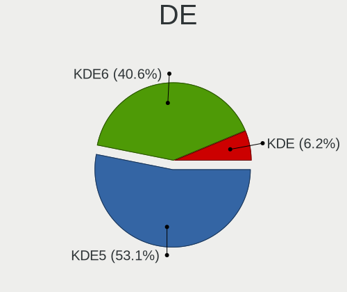
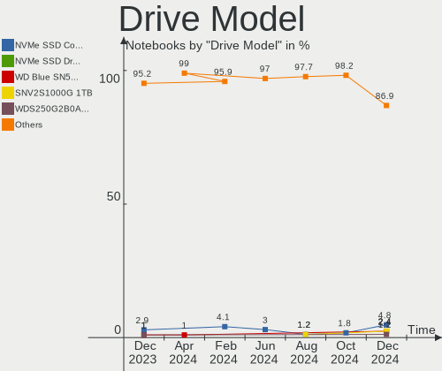
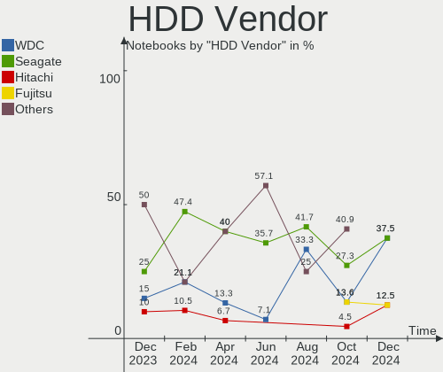
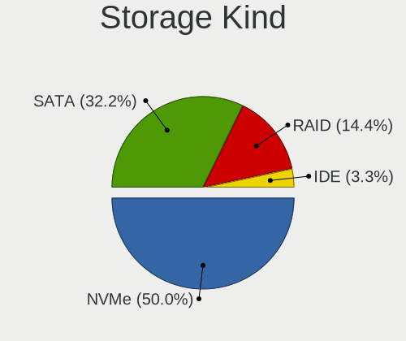
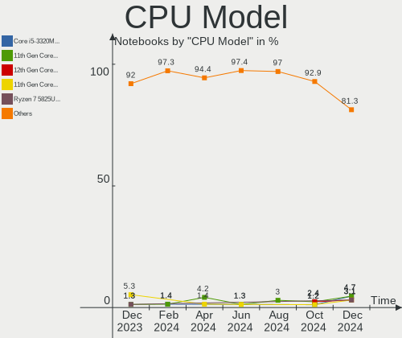
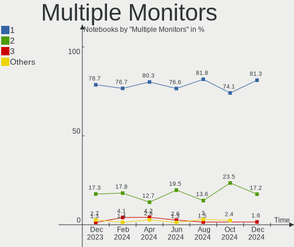
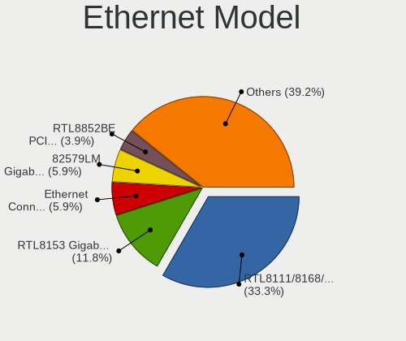
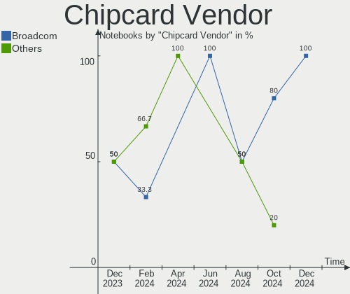

Kubuntu Hardware Trends (Notebook)
----------------------------------

A project to identify most popular hardware characteristics and track their change
over time based on data collected by Kubuntu users at https://Linux-Hardware.org.

Anyone can contribute to the study by uploading probes of their computers by
the [hw-probe](https://github.com/linuxhw/hw-probe) tool:

    sudo -E hw-probe -all -upload

Full-feature report is available here: https://linux-hardware.org/?view=trends&formfactor=notebook

Period: May, 2021.

Contents
--------

- [ OS                       ](#os)
- [ OS Family                ](#os-family)
- [ Kernel                   ](#kernel)
- [ Kernel Family            ](#kernel-family)
- [ Kernel Major Ver.        ](#kernel-major-ver)
- [ Arch                     ](#arch)
- [ DE                       ](#de)
- [ Display Server           ](#display-server)
- [ Display Manager          ](#display-manager)
- [ OS Lang                  ](#os-lang)
- [ Boot Mode                ](#boot-mode)
- [ Filesystem               ](#filesystem)
- [ Part. scheme             ](#part-scheme)
- [ Dual Boot with Linux/BSD ](#dual-boot-with-linux/bsd)
- [ Dual Boot (Win)          ](#dual-boot-win)
- [ Country                  ](#country)
- [ City                     ](#city)
- [ Vendor                   ](#vendor)
- [ Model                    ](#model)
- [ Model Family             ](#model-family)
- [ MFG Year                 ](#mfg-year)
- [ Form Factor              ](#form-factor)
- [ Secure Boot              ](#secure-boot)
- [ Coreboot                 ](#coreboot)
- [ RAM Size                 ](#ram-size)
- [ RAM Used                 ](#ram-used)
- [ Has CD-ROM               ](#has-cd-rom)
- [ Total Drives             ](#total-drives)
- [ Has Ethernet             ](#has-ethernet)
- [ Has WiFi                 ](#has-wifi)
- [ Has Bluetooth            ](#has-bluetooth)
- [ Drive Vendor             ](#drive-vendor)
- [ Drive Model              ](#drive-model)
- [ HDD Vendor               ](#hdd-vendor)
- [ SSD Vendor               ](#ssd-vendor)
- [ Drive Kind               ](#drive-kind)
- [ Drive Connector          ](#drive-connector)
- [ Drive Size               ](#drive-size)
- [ Space Total              ](#space-total)
- [ Space Used               ](#space-used)
- [ Malfunc. Drives          ](#malfunc-drives)
- [ Malfunc. Drive Vendor    ](#malfunc-drive-vendor)
- [ Malfunc. HDD Vendor      ](#malfunc-hdd-vendor)
- [ Malfunc. Drive Kind      ](#malfunc-drive-kind)
- [ Failed Drives            ](#failed-drives)
- [ Failed Drive Vendor      ](#failed-drive-vendor)
- [ Drive Status             ](#drive-status)
- [ Storage Vendor           ](#storage-vendor)
- [ Storage Model            ](#storage-model)
- [ Storage Kind             ](#storage-kind)
- [ CPU Vendor               ](#cpu-vendor)
- [ CPU Model                ](#cpu-model)
- [ CPU Model Family         ](#cpu-model-family)
- [ CPU Cores                ](#cpu-cores)
- [ CPU Sockets              ](#cpu-sockets)
- [ CPU Threads              ](#cpu-threads)
- [ CPU Op-Modes             ](#cpu-op-modes)
- [ CPU Microcode            ](#cpu-microcode)
- [ CPU Microarch            ](#cpu-microarch)
- [ GPU Vendor               ](#gpu-vendor)
- [ GPU Model                ](#gpu-model)
- [ GPU Combo                ](#gpu-combo)
- [ GPU Driver               ](#gpu-driver)
- [ GPU Memory               ](#gpu-memory)
- [ Monitor Vendor           ](#monitor-vendor)
- [ Monitor Model            ](#monitor-model)
- [ Monitor Resolution       ](#monitor-resolution)
- [ Monitor Diagonal         ](#monitor-diagonal)
- [ Monitor Width            ](#monitor-width)
- [ Aspect Ratio             ](#aspect-ratio)
- [ Monitor Area             ](#monitor-area)
- [ Pixel Density            ](#pixel-density)
- [ Multiple Monitors        ](#multiple-monitors)
- [ Net Controller Vendor    ](#net-controller-vendor)
- [ Net Controller Model     ](#net-controller-model)
- [ Wireless Vendor          ](#wireless-vendor)
- [ Wireless Model           ](#wireless-model)
- [ Ethernet Vendor          ](#ethernet-vendor)
- [ Ethernet Model           ](#ethernet-model)
- [ Net Controller Kind      ](#net-controller-kind)
- [ Used Controller          ](#used-controller)
- [ NICs                     ](#nics)
- [ IPv6                     ](#ipv6)
- [ Memory Vendor            ](#memory-vendor)
- [ Memory Model             ](#memory-model)
- [ Memory Kind              ](#memory-kind)
- [ Memory Form Factor       ](#memory-form-factor)
- [ Memory Size              ](#memory-size)
- [ Memory Speed             ](#memory-speed)
- [ Sound Vendor             ](#sound-vendor)
- [ Sound Model              ](#sound-model)
- [ Camera Vendor            ](#camera-vendor)
- [ Camera Model             ](#camera-model)
- [ Fingerprint Vendor       ](#fingerprint-vendor)
- [ Fingerprint Model        ](#fingerprint-model)
- [ Chipcard Vendor          ](#chipcard-vendor)
- [ Chipcard Model           ](#chipcard-model)
- [ Printer Vendor           ](#printer-vendor)
- [ Printer Model            ](#printer-model)
- [ Scanner Vendor           ](#scanner-vendor)
- [ Scanner Model            ](#scanner-model)
- [ Bluetooth Vendor         ](#bluetooth-vendor)
- [ Bluetooth Model          ](#bluetooth-model)
- [ Unsupported Devices      ](#unsupported-devices)
- [ Unsupported Device Types ](#unsupported-device-types)

OS
--

Installed operating systems

| Name          | Notebooks | Percent |
|---------------|-----------|---------|
| Kubuntu 20.04 | 26        | 59.09%  |
| Kubuntu 21.04 | 9         | 20.45%  |
| Kubuntu 20.10 | 5         | 11.36%  |
| Kubuntu 18.04 | 2         | 4.55%   |
| Kubuntu 21.10 | 1         | 2.27%   |
| Kubuntu 2.0   | 1         | 2.27%   |

OS Family
---------

OS without a version

| Name    | Notebooks | Percent |
|---------|-----------|---------|
| Kubuntu | 44        | 100%    |

Kernel
------

Version of the Linux kernel

| Version                   | Notebooks | Percent |
|---------------------------|-----------|---------|
| 5.4.0-73-generic          | 9         | 20.45%  |
| 5.8.0-53-generic          | 6         | 13.64%  |
| 5.8.0-50-generic          | 5         | 11.36%  |
| 5.11.0-16-generic         | 4         | 9.09%   |
| 5.11.0-17-generic         | 3         | 6.82%   |
| 5.8.0-50-lowlatency       | 2         | 4.55%   |
| 5.4.0-72-generic          | 2         | 4.55%   |
| 5.8.0-54-generic          | 1         | 2.27%   |
| 5.8.0-53-lowlatency       | 1         | 2.27%   |
| 5.8.0-36-generic          | 1         | 2.27%   |
| 5.6.0-1056-oem            | 1         | 2.27%   |
| 5.4.0-66-generic          | 1         | 2.27%   |
| 5.4.0-54-generic          | 1         | 2.27%   |
| 5.12.2-051202-generic     | 1         | 2.27%   |
| 5.12.0-8.1-liquorix-amd64 | 1         | 2.27%   |
| 5.12.0                    | 1         | 2.27%   |
| 5.11.17-xanmod1           | 1         | 2.27%   |
| 5.11.0-16-lowlatency      | 1         | 2.27%   |
| 5.10.0-1011-oem           | 1         | 2.27%   |
| 4.15.0-50-generic         | 1         | 2.27%   |

Kernel Family
-------------

Linux kernel without a distro release

| Version | Notebooks | Percent |
|---------|-----------|---------|
| 5.8.0   | 16        | 36.36%  |
| 5.4.0   | 13        | 29.55%  |
| 5.11.0  | 8         | 18.18%  |
| 5.12.0  | 2         | 4.55%   |
| 5.6.0   | 1         | 2.27%   |
| 5.12.2  | 1         | 2.27%   |
| 5.11.17 | 1         | 2.27%   |
| 5.10.0  | 1         | 2.27%   |
| 4.15.0  | 1         | 2.27%   |

Kernel Major Ver.
-----------------

Linux kernel major version

| Version | Notebooks | Percent |
|---------|-----------|---------|
| 5.8     | 16        | 36.36%  |
| 5.4     | 13        | 29.55%  |
| 5.11    | 9         | 20.45%  |
| 5.12    | 3         | 6.82%   |
| 5.6     | 1         | 2.27%   |
| 5.10    | 1         | 2.27%   |
| 4.15    | 1         | 2.27%   |

Arch
----

OS architecture (x86_64, i586, etc.)

| Name   | Notebooks | Percent |
|--------|-----------|---------|
| x86_64 | 44        | 100%    |

DE
--

Desktop Environment

| Name    | Notebooks | Percent |
|---------|-----------|---------|
| KDE     | 22        | 50%     |
| KDE5    | 21        | 47.73%  |
| Unknown | 1         | 2.27%   |

Display Server
--------------

X11 or Wayland

| Name | Notebooks | Percent |
|------|-----------|---------|
| X11  | 44        | 100%    |

Display Manager
---------------

SDDM, LightDM, etc.

| Name    | Notebooks | Percent |
|---------|-----------|---------|
| Unknown | 22        | 50%     |
| SDDM    | 21        | 47.73%  |
| TDM     | 1         | 2.27%   |

OS Lang
-------

Language

| Lang  | Notebooks | Percent |
|-------|-----------|---------|
| en_US | 19        | 43.18%  |
| it_IT | 4         | 9.09%   |
| pt_BR | 3         | 6.82%   |
| fr_FR | 3         | 6.82%   |
| en_GB | 3         | 6.82%   |
| de_DE | 3         | 6.82%   |
| es_UY | 2         | 4.55%   |
| ru_RU | 1         | 2.27%   |
| pt_PT | 1         | 2.27%   |
| nl_NL | 1         | 2.27%   |
| nl_BE | 1         | 2.27%   |
| hu_HU | 1         | 2.27%   |
| es_ES | 1         | 2.27%   |
| en_FI | 1         | 2.27%   |

Boot Mode
---------

EFI or BIOS

| Mode | Notebooks | Percent |
|------|-----------|---------|
| EFI  | 27        | 61.36%  |
| BIOS | 17        | 38.64%  |

Filesystem
----------

Type of filesystem

| Type    | Notebooks | Percent |
|---------|-----------|---------|
| Ext4    | 41        | 93.18%  |
| Btrfs   | 2         | 4.55%   |
| Overlay | 1         | 2.27%   |

Part. scheme
------------

Scheme of partitioning

| Type    | Notebooks | Percent |
|---------|-----------|---------|
| Unknown | 22        | 50%     |
| GPT     | 18        | 40.91%  |
| MBR     | 4         | 9.09%   |

Dual Boot with Linux/BSD
------------------------

Hosting more than one Linux/BSD

| Dual boot | Notebooks | Percent |
|-----------|-----------|---------|
| No        | 38        | 86.36%  |
| Yes       | 6         | 13.64%  |

Dual Boot (Win)
---------------

Hosting Linux and Windows

| Dual boot | Notebooks | Percent |
|-----------|-----------|---------|
| No        | 29        | 65.91%  |
| Yes       | 15        | 34.09%  |

Country
-------

Geographic location (country)

| Country     | Notebooks | Percent |
|-------------|-----------|---------|
| USA         | 7         | 15.91%  |
| Italy       | 4         | 9.09%   |
| Germany     | 4         | 9.09%   |
| Brazil      | 4         | 9.09%   |
| France      | 3         | 6.82%   |
| Uruguay     | 2         | 4.55%   |
| UK          | 2         | 4.55%   |
| Romania     | 2         | 4.55%   |
| Hungary     | 2         | 4.55%   |
| Vietnam     | 1         | 2.27%   |
| Venezuela   | 1         | 2.27%   |
| Ukraine     | 1         | 2.27%   |
| Spain       | 1         | 2.27%   |
| Slovenia    | 1         | 2.27%   |
| Russia      | 1         | 2.27%   |
| Poland      | 1         | 2.27%   |
| Pakistan    | 1         | 2.27%   |
| Netherlands | 1         | 2.27%   |
| Estonia     | 1         | 2.27%   |
| Canada      | 1         | 2.27%   |
| Belgium     | 1         | 2.27%   |
| Bangladesh  | 1         | 2.27%   |
| Angola      | 1         | 2.27%   |

City
----

Geographic location (city)

| City               | Notebooks | Percent |
|--------------------|-----------|---------|
| Rome               | 2         | 4.55%   |
| Phoenix            | 2         | 4.55%   |
| Budapest           | 2         | 4.55%   |
| Valencia           | 1         | 2.27%   |
| Toronto            | 1         | 2.27%   |
| São Paulo         | 1         | 2.27%   |
| Stevenston         | 1         | 2.27%   |
| Schelle            | 1         | 2.27%   |
| Sarandi            | 1         | 2.27%   |
| Rio Grande         | 1         | 2.27%   |
| Palermo            | 1         | 2.27%   |
| Neftekamsk         | 1         | 2.27%   |
| Natick             | 1         | 2.27%   |
| Montevideo         | 1         | 2.27%   |
| Middletown         | 1         | 2.27%   |
| Maracaibo          | 1         | 2.27%   |
| Manaus             | 1         | 2.27%   |
| Lviv               | 1         | 2.27%   |
| Luanda             | 1         | 2.27%   |
| Les Essarts-le-Roi | 1         | 2.27%   |
| Le Teil            | 1         | 2.27%   |
| Lahore             | 1         | 2.27%   |
| La Mesa            | 1         | 2.27%   |
| Kidricevo          | 1         | 2.27%   |
| Karksi-Nuia        | 1         | 2.27%   |
| Joliet             | 1         | 2.27%   |
| Hanoi              | 1         | 2.27%   |
| Hamburg            | 1         | 2.27%   |
| Göttingen         | 1         | 2.27%   |
| Gujan-Mestras      | 1         | 2.27%   |
| Gdynia             | 1         | 2.27%   |
| Gau-Algesheim      | 1         | 2.27%   |
| Emmeloord          | 1         | 2.27%   |
| Dhaka              | 1         | 2.27%   |
| Dartford           | 1         | 2.27%   |
| Colorado Springs   | 1         | 2.27%   |
| Bucharest          | 1         | 2.27%   |
| Brescia            | 1         | 2.27%   |
| Berlin             | 1         | 2.27%   |
| Arad               | 1         | 2.27%   |
| Aires Puros        | 1         | 2.27%   |

Vendor
------

Motherboard manufacturer

| Name            | Notebooks | Percent |
|-----------------|-----------|---------|
| Hewlett-Packard | 13        | 29.55%  |
| Dell            | 10        | 22.73%  |
| Lenovo          | 6         | 13.64%  |
| Acer            | 3         | 6.82%   |
| TUXEDO          | 2         | 4.55%   |
| Unknown         | 2         | 4.55%   |
| Toshiba         | 1         | 2.27%   |
| Sony            | 1         | 2.27%   |
| Purism          | 1         | 2.27%   |
| Positivo        | 1         | 2.27%   |
| Notebook        | 1         | 2.27%   |
| LG Electronics  | 1         | 2.27%   |
| GPU Company     | 1         | 2.27%   |
| Fujitsu         | 1         | 2.27%   |

Model
-----

Motherboard model

| Name                                  | Notebooks | Percent |
|---------------------------------------|-----------|---------|
| Unknown                               | 4         | 9.09%   |
| Toshiba Satellite L850-1C9            | 1         | 2.27%   |
| Sony VGN-FW510F                       | 1         | 2.27%   |
| Purism Librem 15 v3                   | 1         | 2.27%   |
| Positivo Serie AT300                  | 1         | 2.27%   |
| Notebook W54_55SU1,SUW                | 1         | 2.27%   |
| LG A410-K.BE43P1                      | 1         | 2.27%   |
| Lenovo Z40-70 20366                   | 1         | 2.27%   |
| Lenovo XiaoXin Air 12 80UN            | 1         | 2.27%   |
| Lenovo ThinkPad T14s Gen 1 20UHCTO1WW | 1         | 2.27%   |
| Lenovo ThinkPad E550 20DF00CPFR       | 1         | 2.27%   |
| Lenovo IdeaPad Z400 VIWZ1             | 1         | 2.27%   |
| Lenovo IdeaPad S540-14IML 81NF        | 1         | 2.27%   |
| HP ProBook 4520s                      | 1         | 2.27%   |
| HP ProBook 430 G1                     | 1         | 2.27%   |
| HP Pavilion Gaming Laptop 17-cd1xxx   | 1         | 2.27%   |
| HP Pavilion Gaming Laptop 15-cx0xxx   | 1         | 2.27%   |
| HP Pavilion dm4                       | 1         | 2.27%   |
| HP Pavilion 15                        | 1         | 2.27%   |
| HP OMEN Laptop 15-en0xxx              | 1         | 2.27%   |
| HP Laptop 15s-eq1xxx                  | 1         | 2.27%   |
| HP Laptop 15s-eq0xxx                  | 1         | 2.27%   |
| HP ENVY TS 15                         | 1         | 2.27%   |
| HP ENVY TS 14 Sleekbook               | 1         | 2.27%   |
| HP EliteBook 840 G3                   | 1         | 2.27%   |
| HP EliteBook 830 G6                   | 1         | 2.27%   |
| GPU Company GWTC116-2                 | 1         | 2.27%   |
| Fujitsu LIFEBOOK UH572                | 1         | 2.27%   |
| Dell XPS 17 9700                      | 1         | 2.27%   |
| Dell XPS 15 9550                      | 1         | 2.27%   |
| Dell XPS 13 9343                      | 1         | 2.27%   |
| Dell XPS 13 9310                      | 1         | 2.27%   |
| Dell Vostro 14-3468                   | 1         | 2.27%   |
| Dell Precision M4700                  | 1         | 2.27%   |
| Dell Latitude E6410                   | 1         | 2.27%   |
| Dell Latitude 5590                    | 1         | 2.27%   |
| Dell Latitude 5480                    | 1         | 2.27%   |
| Dell G7 7700                          | 1         | 2.27%   |
| Acer Swift SF314-41                   | 1         | 2.27%   |
| Acer Aspire E5-571G                   | 1         | 2.27%   |
| Acer AO722                            | 1         | 2.27%   |

Model Family
------------

Motherboard model prefix

| Name                  | Notebooks | Percent |
|-----------------------|-----------|---------|
| HP Pavilion           | 4         | 9.09%   |
| Dell XPS              | 4         | 9.09%   |
| Unknown               | 4         | 9.09%   |
| Dell Latitude         | 3         | 6.82%   |
| Lenovo ThinkPad       | 2         | 4.55%   |
| Lenovo IdeaPad        | 2         | 4.55%   |
| HP ProBook            | 2         | 4.55%   |
| HP Laptop             | 2         | 4.55%   |
| HP ENVY               | 2         | 4.55%   |
| HP EliteBook          | 2         | 4.55%   |
| Toshiba Satellite     | 1         | 2.27%   |
| Sony VGN-FW510F       | 1         | 2.27%   |
| Purism Librem         | 1         | 2.27%   |
| Positivo Serie        | 1         | 2.27%   |
| Notebook W54          | 1         | 2.27%   |
| LG A410-K.BE43P1      | 1         | 2.27%   |
| Lenovo Z40-70         | 1         | 2.27%   |
| Lenovo XiaoXin        | 1         | 2.27%   |
| HP OMEN               | 1         | 2.27%   |
| GPU Company GWTC116-2 | 1         | 2.27%   |
| Fujitsu LIFEBOOK      | 1         | 2.27%   |
| Dell Vostro           | 1         | 2.27%   |
| Dell Precision        | 1         | 2.27%   |
| Dell G7               | 1         | 2.27%   |
| Acer Swift            | 1         | 2.27%   |
| Acer Aspire           | 1         | 2.27%   |
| Acer AO722            | 1         | 2.27%   |

MFG Year
--------

Motherboard manufacture year

| Year | Notebooks | Percent |
|------|-----------|---------|
| 2021 | 8         | 18.18%  |
| 2020 | 8         | 18.18%  |
| 2019 | 6         | 13.64%  |
| 2013 | 6         | 13.64%  |
| 2017 | 3         | 6.82%   |
| 2015 | 3         | 6.82%   |
| 2014 | 2         | 4.55%   |
| 2012 | 2         | 4.55%   |
| 2011 | 2         | 4.55%   |
| 2010 | 2         | 4.55%   |
| 2016 | 1         | 2.27%   |
| 2009 | 1         | 2.27%   |

Form Factor
-----------

Physical design of the computer

| Name     | Notebooks | Percent |
|----------|-----------|---------|
| Notebook | 44        | 100%    |

Secure Boot
-----------

Enabled or disabled

| State    | Notebooks | Percent |
|----------|-----------|---------|
| Disabled | 41        | 93.18%  |
| Enabled  | 3         | 6.82%   |

Coreboot
--------

Have coreboot on board

| Used | Notebooks | Percent |
|------|-----------|---------|
| No   | 43        | 97.73%  |
| Yes  | 1         | 2.27%   |

RAM Size
--------

Total RAM memory

| Size in GB | Notebooks | Percent |
|------------|-----------|---------|
| 16.01-24.0 | 14        | 31.82%  |
| 8.01-16.0  | 9         | 20.45%  |
| 4.01-8.0   | 8         | 18.18%  |
| 3.01-4.0   | 8         | 18.18%  |
| 32.01-64.0 | 3         | 6.82%   |
| 2.01-3.0   | 1         | 2.27%   |
| 1.01-2.0   | 1         | 2.27%   |

RAM Used
--------

Used RAM memory

| Used GB  | Notebooks | Percent |
|----------|-----------|---------|
| 2.01-3.0 | 15        | 34.09%  |
| 1.01-2.0 | 15        | 34.09%  |
| 4.01-8.0 | 7         | 15.91%  |
| 3.01-4.0 | 6         | 13.64%  |
| 0.51-1.0 | 1         | 2.27%   |

Has CD-ROM
----------

Has CD-ROM on board

| Presented | Notebooks | Percent |
|-----------|-----------|---------|
| No        | 33        | 75%     |
| Yes       | 11        | 25%     |

Total Drives
------------

Number of drives on board

| Drives | Notebooks | Percent |
|--------|-----------|---------|
| 1      | 33        | 75%     |
| 2      | 9         | 20.45%  |
| 4      | 1         | 2.27%   |
| 3      | 1         | 2.27%   |

Has Ethernet
------------

Has Ethernet on board

| Presented | Notebooks | Percent |
|-----------|-----------|---------|
| Yes       | 32        | 72.73%  |
| No        | 12        | 27.27%  |

Has WiFi
--------

Has WiFi module

| Presented | Notebooks | Percent |
|-----------|-----------|---------|
| Yes       | 43        | 97.73%  |
| No        | 1         | 2.27%   |

Has Bluetooth
-------------

Has Bluetooth module

| Presented | Notebooks | Percent |
|-----------|-----------|---------|
| Yes       | 36        | 81.82%  |
| No        | 8         | 18.18%  |

Drive Vendor
------------

Hard drive vendors

| Vendor              | Notebooks | Drives | Percent |
|---------------------|-----------|--------|---------|
| Samsung Electronics | 10        | 10     | 18.18%  |
| Toshiba             | 7         | 7      | 12.73%  |
| WDC                 | 6         | 6      | 10.91%  |
| Kingston            | 4         | 4      | 7.27%   |
| Unknown             | 3         | 4      | 5.45%   |
| SK Hynix            | 3         | 3      | 5.45%   |
| Seagate             | 3         | 3      | 5.45%   |
| SanDisk             | 3         | 3      | 5.45%   |
| HGST                | 3         | 3      | 5.45%   |
| Crucial             | 2         | 2      | 3.64%   |
| China               | 2         | 2      | 3.64%   |
| Silicon Motion      | 1         | 2      | 1.82%   |
| SABRENT             | 1         | 1      | 1.82%   |
| S3                  | 1         | 1      | 1.82%   |
| Phison              | 1         | 1      | 1.82%   |
| LITEON              | 1         | 1      | 1.82%   |
| Intel               | 1         | 1      | 1.82%   |
| Hitachi             | 1         | 1      | 1.82%   |
| CORSAIR             | 1         | 1      | 1.82%   |
| A-DATA Technology   | 1         | 1      | 1.82%   |

Drive Model
-----------

Hard drive models

| Model                                   | Notebooks | Percent |
|-----------------------------------------|-----------|---------|
| WDC WDS100T2B0C-00PXH0 1TB              | 1         | 1.79%   |
| WDC WD5000LPLX-00ZNTT0 500GB            | 1         | 1.79%   |
| WDC WD3200BEVT-60ZCT1 320GB             | 1         | 1.79%   |
| WDC WD2500BEVT-22A23T0 250GB            | 1         | 1.79%   |
| WDC PC SN730 NVMe 1024GB                | 1         | 1.79%   |
| WDC PC SN520 SDAPNUW-256G-1006 256GB    | 1         | 1.79%   |
| Unknown SA04G  4GB                      | 1         | 1.79%   |
| Unknown MMC Card  64GB                  | 1         | 1.79%   |
| Unknown MMC Card  32GB                  | 1         | 1.79%   |
| Unknown Biwin  64GB                     | 1         | 1.79%   |
| Toshiba THNSN5512GPU7 NVMe 512GB        | 1         | 1.79%   |
| Toshiba MQ01ABF050 500GB                | 1         | 1.79%   |
| Toshiba KXG60ZNV512G NVMe KIOXIA 512GB  | 1         | 1.79%   |
| Toshiba KXG60ZNV1T02 NVMe KIOXIA 1024GB | 1         | 1.79%   |
| Toshiba KSG60ZMV512G M.2 2280 512GB SSD | 1         | 1.79%   |
| Toshiba KBG30ZMV512G KIOXIA 512GB       | 1         | 1.79%   |
| Toshiba HDWJ110 1TB                     | 1         | 1.79%   |
| SK Hynix SC311 SATA 256GB SSD           | 1         | 1.79%   |
| SK Hynix NVMe SSD Drive 512GB           | 1         | 1.79%   |
| SK Hynix HFM512GDJTNG-8310A 512GB       | 1         | 1.79%   |
| Silicon Motion NVMe SSD Drive 2TB       | 1         | 1.79%   |
| Seagate ST9500325AS 500GB               | 1         | 1.79%   |
| Seagate ST500LT012-1DG142 500GB         | 1         | 1.79%   |
| Seagate ST500LM012 HN-M500MBB 500GB     | 1         | 1.79%   |
| SanDisk SSD i100 32GB                   | 1         | 1.79%   |
| SanDisk SD8SN8U-256G-1006 256GB SSD     | 1         | 1.79%   |
| Sandisk NVMe SSD Drive 1TB              | 1         | 1.79%   |
| Samsung SSD PM830 2.5 7mm 256GB         | 1         | 1.79%   |
| Samsung SSD 970 EVO Plus 250GB          | 1         | 1.79%   |
| Samsung SSD 860 EVO M.2 250GB           | 1         | 1.79%   |
| Samsung SSD 860 EVO 500GB               | 1         | 1.79%   |
| Samsung SSD 850 EVO 500GB               | 1         | 1.79%   |
| Samsung NVMe SSD Drive 512GB            | 1         | 1.79%   |
| Samsung NVMe SSD Drive 1TB              | 1         | 1.79%   |
| Samsung MZVLW256HEHP-000H1 256GB        | 1         | 1.79%   |
| Samsung MZVLB1T0HBLR-000L2 1TB          | 1         | 1.79%   |
| Samsung MZNTY128HDHP-000L2 128GB SSD    | 1         | 1.79%   |
| SABRENT Disk 240GB                      | 1         | 1.79%   |
| S3 SSD 256GB                            | 1         | 1.79%   |
| Phison NVMe SSD Drive 500GB             | 1         | 1.79%   |
| LITEON L8H-128V2G-11 M.2 2280 128GB SSD | 1         | 1.79%   |
| Kingston SV300S37A120G 120GB SSD        | 1         | 1.79%   |
| Kingston SA400S37480G 480GB SSD         | 1         | 1.79%   |
| Kingston SA400S37240G 240GB SSD         | 1         | 1.79%   |
| Kingston SA400S37120G 120GB SSD         | 1         | 1.79%   |
| Intel SSDPEKNW512G8H 512GB              | 1         | 1.79%   |
| Hitachi HTS547575A9E384 752GB           | 1         | 1.79%   |
| HGST HTS721010A9E630 1TB                | 1         | 1.79%   |
| HGST HTS545050A7E660 500GB              | 1         | 1.79%   |
| HGST HTS545050A7E380 500GB              | 1         | 1.79%   |
| Crucial CT250MX500SSD1 250GB            | 1         | 1.79%   |
| Crucial CT1000P5SSD8 1TB                | 1         | 1.79%   |
| CORSAIR Force LX SSD 256GB              | 1         | 1.79%   |
| China SSD 256GB                         | 1         | 1.79%   |
| China SATA SSD 128GB                    | 1         | 1.79%   |
| A-DATA SP900 128GB SSD                  | 1         | 1.79%   |

HDD Vendor
----------

Hard disk drive vendors

| Vendor  | Notebooks | Drives | Percent |
|---------|-----------|--------|---------|
| WDC     | 3         | 3      | 25%     |
| Seagate | 3         | 3      | 25%     |
| HGST    | 3         | 3      | 25%     |
| Toshiba | 2         | 2      | 16.67%  |
| Hitachi | 1         | 1      | 8.33%   |

SSD Vendor
----------

Solid state drive vendors

| Vendor              | Notebooks | Drives | Percent |
|---------------------|-----------|--------|---------|
| Samsung Electronics | 5         | 5      | 23.81%  |
| Kingston            | 4         | 4      | 19.05%  |
| SanDisk             | 2         | 2      | 9.52%   |
| China               | 2         | 2      | 9.52%   |
| Toshiba             | 1         | 1      | 4.76%   |
| SK Hynix            | 1         | 1      | 4.76%   |
| SABRENT             | 1         | 1      | 4.76%   |
| S3                  | 1         | 1      | 4.76%   |
| LITEON              | 1         | 1      | 4.76%   |
| Crucial             | 1         | 1      | 4.76%   |
| CORSAIR             | 1         | 1      | 4.76%   |
| A-DATA Technology   | 1         | 1      | 4.76%   |

Drive Kind
----------

HDD or SSD

| Kind | Notebooks | Drives | Percent |
|------|-----------|--------|---------|
| SSD  | 18        | 21     | 36%     |
| NVMe | 17        | 20     | 34%     |
| HDD  | 12        | 12     | 24%     |
| MMC  | 3         | 4      | 6%      |

Drive Connector
---------------

SATA, SAS, NVMe, etc.

| Type | Notebooks | Drives | Percent |
|------|-----------|--------|---------|
| SATA | 28        | 32     | 57.14%  |
| NVMe | 17        | 20     | 34.69%  |
| MMC  | 3         | 4      | 6.12%   |
| SAS  | 1         | 1      | 2.04%   |

Drive Size
----------

Size of hard drive

| Size in TB | Notebooks | Drives | Percent |
|------------|-----------|--------|---------|
| 0.01-0.5   | 25        | 29     | 86.21%  |
| 0.51-1.0   | 4         | 4      | 13.79%  |

Space Total
-----------

Amount of disk space available on the file system

| Size in GB | Notebooks | Percent |
|------------|-----------|---------|
| 101-250    | 19        | 43.18%  |
| 251-500    | 11        | 25%     |
| 501-1000   | 7         | 15.91%  |
| 51-100     | 3         | 6.82%   |
| 1001-2000  | 2         | 4.55%   |
| 21-50      | 1         | 2.27%   |
| 1-20       | 1         | 2.27%   |

Space Used
----------

Amount of used disk space

| Used GB  | Notebooks | Percent |
|----------|-----------|---------|
| 1-20     | 11        | 25%     |
| 21-50    | 10        | 22.73%  |
| 51-100   | 9         | 20.45%  |
| 101-250  | 8         | 18.18%  |
| 251-500  | 4         | 9.09%   |
| 501-1000 | 2         | 4.55%   |

Malfunc. Drives
---------------

Drive models with a malfunction

| Model                      | Notebooks | Drives | Percent |
|----------------------------|-----------|--------|---------|
| Toshiba HDWJ110 1TB        | 1         | 1      | 33.33%  |
| Seagate ST9500325AS 500GB  | 1         | 1      | 33.33%  |
| HGST HTS545050A7E380 500GB | 1         | 1      | 33.33%  |

Malfunc. Drive Vendor
---------------------

Vendors of faulty drives

| Vendor  | Notebooks | Drives | Percent |
|---------|-----------|--------|---------|
| Toshiba | 1         | 1      | 33.33%  |
| Seagate | 1         | 1      | 33.33%  |
| HGST    | 1         | 1      | 33.33%  |

Malfunc. HDD Vendor
-------------------

Vendors of faulty HDD drives

| Vendor  | Notebooks | Drives | Percent |
|---------|-----------|--------|---------|
| Toshiba | 1         | 1      | 33.33%  |
| Seagate | 1         | 1      | 33.33%  |
| HGST    | 1         | 1      | 33.33%  |

Malfunc. Drive Kind
-------------------

Kinds of faulty drives

| Kind | Notebooks | Drives | Percent |
|------|-----------|--------|---------|
| HDD  | 3         | 3      | 100%    |

Failed Drives
-------------

Failed drive models

Zero info for selected period =(

Failed Drive Vendor
-------------------

Failed drive vendors

Zero info for selected period =(

Drive Status
------------

Number of failed and malfunc. drives

| Status   | Notebooks | Drives | Percent |
|----------|-----------|--------|---------|
| Detected | 26        | 32     | 54.17%  |
| Works    | 19        | 22     | 39.58%  |
| Malfunc  | 3         | 3      | 6.25%   |

Storage Vendor
--------------

Storage controller vendors

| Vendor                       | Notebooks | Percent |
|------------------------------|-----------|---------|
| Intel                        | 34        | 64.15%  |
| Samsung Electronics          | 5         | 9.43%   |
| Toshiba America Info Systems | 4         | 7.55%   |
| Sandisk                      | 3         | 5.66%   |
| AMD                          | 3         | 5.66%   |
| SK Hynix                     | 2         | 3.77%   |
| Phison Electronics           | 1         | 1.89%   |
| Micron/Crucial Technology    | 1         | 1.89%   |

Storage Model
-------------

Storage controller models

| Model                                                                          | Notebooks | Percent |
|--------------------------------------------------------------------------------|-----------|---------|
| Intel Sunrise Point-LP SATA Controller [AHCI mode]                             | 6         | 10.91%  |
| Intel 82801 Mobile SATA Controller [RAID mode]                                 | 5         | 9.09%   |
| Intel 8 Series SATA Controller 1 [AHCI mode]                                   | 4         | 7.27%   |
| Samsung NVMe SSD Controller SM981/PM981/PM983                                  | 3         | 5.45%   |
| Intel 7 Series Chipset Family 6-port SATA Controller [AHCI mode]               | 3         | 5.45%   |
| Toshiba America Info Systems XG6 NVMe SSD Controller                           | 2         | 3.64%   |
| Samsung NVMe SSD Controller SM961/PM961/SM963                                  | 2         | 3.64%   |
| Intel Wildcat Point-LP SATA Controller [AHCI Mode]                             | 2         | 3.64%   |
| Intel 82801IBM/IEM (ICH9M/ICH9M-E) 4 port SATA Controller [AHCI mode]          | 2         | 3.64%   |
| Intel 8 Series/C220 Series Chipset Family 6-port SATA Controller 1 [AHCI mode] | 2         | 3.64%   |
| Intel 5 Series/3400 Series Chipset 4 port SATA IDE Controller                  | 2         | 3.64%   |
| Intel 5 Series/3400 Series Chipset 2 port SATA IDE Controller                  | 2         | 3.64%   |
| AMD FCH SATA Controller [AHCI mode]                                            | 2         | 3.64%   |
| Toshiba America Info Systems NVMe Controller                                   | 1         | 1.82%   |
| Toshiba America Info Systems BG3 NVMe SSD Controller                           | 1         | 1.82%   |
| SK Hynix Non-Volatile memory controller                                        | 1         | 1.82%   |
| SK Hynix BC501 NVMe Solid State Drive 512GB                                    | 1         | 1.82%   |
| Sandisk WD Blue SN550 NVMe SSD                                                 | 1         | 1.82%   |
| Sandisk WD Blue SN500 / PC SN520 NVMe SSD                                      | 1         | 1.82%   |
| Sandisk WD Black SN750 / PC SN730 NVMe SSD                                     | 1         | 1.82%   |
| Phison E12 NVMe Controller                                                     | 1         | 1.82%   |
| Micron/Crucial Non-Volatile memory controller                                  | 1         | 1.82%   |
| Intel Volume Management Device NVMe RAID Controller                            | 1         | 1.82%   |
| Intel SSD 660P Series                                                          | 1         | 1.82%   |
| Intel HM170/QM170 Chipset SATA Controller [AHCI Mode]                          | 1         | 1.82%   |
| Intel Comet Lake SATA AHCI Controller                                          | 1         | 1.82%   |
| Intel Celeron/Pentium Silver Processor SATA Controller                         | 1         | 1.82%   |
| Intel Cannon Point-LP SATA Controller [AHCI Mode]                              | 1         | 1.82%   |
| Intel 5 Series/3400 Series Chipset 6 port SATA AHCI Controller                 | 1         | 1.82%   |
| Intel 400 Series Chipset Family SATA AHCI Controller                           | 1         | 1.82%   |
| AMD SB7x0/SB8x0/SB9x0 SATA Controller [AHCI mode]                              | 1         | 1.82%   |

Storage Kind
------------

Kind of storage controller (IDE, SATA, NVMe, SAS, ...)

| Kind | Notebooks | Percent |
|------|-----------|---------|
| SATA | 28        | 53.85%  |
| NVMe | 16        | 30.77%  |
| RAID | 6         | 11.54%  |
| IDE  | 2         | 3.85%   |

CPU Vendor
----------

Processor vendors

| Vendor | Notebooks | Percent |
|--------|-----------|---------|
| Intel  | 38        | 86.36%  |
| AMD    | 6         | 13.64%  |

CPU Model
---------

Processor models

| Model                                         | Notebooks | Percent |
|-----------------------------------------------|-----------|---------|
| Intel Core i7-10750H CPU @ 2.60GHz            | 3         | 6.82%   |
| Intel Core i5-6300U CPU @ 2.40GHz             | 2         | 4.55%   |
| Intel Core i5-5200U CPU @ 2.20GHz             | 2         | 4.55%   |
| Intel Core i5-4200U CPU @ 1.60GHz             | 2         | 4.55%   |
| AMD Ryzen 5 3500U with Radeon Vega Mobile Gfx | 2         | 4.55%   |
| Intel Genuine CPU U4100 @ 1.30GHz             | 1         | 2.27%   |
| Intel Core m3-6Y30 CPU @ 0.90GHz              | 1         | 2.27%   |
| Intel Core i7-8565U CPU @ 1.80GHz             | 1         | 2.27%   |
| Intel Core i7-8550U CPU @ 1.80GHz             | 1         | 2.27%   |
| Intel Core i7-7500U CPU @ 2.70GHz             | 1         | 2.27%   |
| Intel Core i7-6700HQ CPU @ 2.60GHz            | 1         | 2.27%   |
| Intel Core i7-6500U CPU @ 2.50GHz             | 1         | 2.27%   |
| Intel Core i7-4710MQ CPU @ 2.50GHz            | 1         | 2.27%   |
| Intel Core i7-3740QM CPU @ 2.70GHz            | 1         | 2.27%   |
| Intel Core i7-3632QM CPU @ 2.20GHz            | 1         | 2.27%   |
| Intel Core i7-3610QM CPU @ 2.30GHz            | 1         | 2.27%   |
| Intel Core i7-10510U CPU @ 1.80GHz            | 1         | 2.27%   |
| Intel Core i5-8265U CPU @ 1.60GHz             | 1         | 2.27%   |
| Intel Core i5-8250U CPU @ 1.60GHz             | 1         | 2.27%   |
| Intel Core i5-4210U CPU @ 1.70GHz             | 1         | 2.27%   |
| Intel Core i5-4200M CPU @ 2.50GHz             | 1         | 2.27%   |
| Intel Core i5-3337U CPU @ 1.80GHz             | 1         | 2.27%   |
| Intel Core i5-2430M CPU @ 2.40GHz             | 1         | 2.27%   |
| Intel Core i5-10210U CPU @ 1.60GHz            | 1         | 2.27%   |
| Intel Core i5 CPU M 520 @ 2.40GHz             | 1         | 2.27%   |
| Intel Core i5 CPU M 480 @ 2.67GHz             | 1         | 2.27%   |
| Intel Core i3-4030U CPU @ 1.90GHz             | 1         | 2.27%   |
| Intel Core i3-4005U CPU @ 1.70GHz             | 1         | 2.27%   |
| Intel Core i3 CPU M 370 @ 2.40GHz             | 1         | 2.27%   |
| Intel Core 2 Duo CPU T6600 @ 2.20GHz          | 1         | 2.27%   |
| Intel Celeron N4020 CPU @ 1.10GHz             | 1         | 2.27%   |
| Intel Atom x5-Z8350 CPU @ 1.44GHz             | 1         | 2.27%   |
| Intel 11th Gen Core i7-1165G7 @ 2.80GHz       | 1         | 2.27%   |
| Intel 11th Gen Core i7-1160G7 @ 1.20GHz       | 1         | 2.27%   |
| AMD Ryzen 7 PRO 4750U with Radeon Graphics    | 1         | 2.27%   |
| AMD Ryzen 7 4800H with Radeon Graphics        | 1         | 2.27%   |
| AMD Ryzen 7 4700U with Radeon Graphics        | 1         | 2.27%   |
| AMD C-50 Processor                            | 1         | 2.27%   |

CPU Model Family
----------------

Processor model prefix

| Model            | Notebooks | Percent |
|------------------|-----------|---------|
| Intel Core i5    | 15        | 34.09%  |
| Intel Core i7    | 13        | 29.55%  |
| Intel Core i3    | 3         | 6.82%   |
| Other            | 2         | 4.55%   |
| AMD Ryzen 7      | 2         | 4.55%   |
| AMD Ryzen 5      | 2         | 4.55%   |
| Intel Genuine    | 1         | 2.27%   |
| Intel Core m3    | 1         | 2.27%   |
| Intel Core 2 Duo | 1         | 2.27%   |
| Intel Celeron    | 1         | 2.27%   |
| Intel Atom       | 1         | 2.27%   |
| AMD Ryzen 7 PRO  | 1         | 2.27%   |
| AMD C-50         | 1         | 2.27%   |

CPU Cores
---------

Number of processor cores

| Number | Notebooks | Percent |
|--------|-----------|---------|
| 2      | 22        | 50%     |
| 4      | 16        | 36.36%  |
| 8      | 3         | 6.82%   |
| 6      | 3         | 6.82%   |

CPU Sockets
-----------

Number of sockets

| Number | Notebooks | Percent |
|--------|-----------|---------|
| 1      | 44        | 100%    |

CPU Threads
-----------

Threads per core (Hyper-Threading)

| Number | Notebooks | Percent |
|--------|-----------|---------|
| 2      | 38        | 86.36%  |
| 1      | 6         | 13.64%  |

CPU Op-Modes
------------

CPU Operation Modes (32-bit, 64-bit)

| Op mode        | Notebooks | Percent |
|----------------|-----------|---------|
| 32-bit, 64-bit | 44        | 100%    |

CPU Microcode
-------------

Microcode number

| Number     | Notebooks | Percent |
|------------|-----------|---------|
| Unknown    | 7         | 15.91%  |
| 0x40651    | 4         | 9.09%   |
| 0xa0652    | 3         | 6.82%   |
| 0x806ec    | 3         | 6.82%   |
| 0x306a9    | 3         | 6.82%   |
| 0x08600106 | 3         | 6.82%   |
| 0x806ea    | 2         | 4.55%   |
| 0x806c1    | 2         | 4.55%   |
| 0x406e3    | 2         | 4.55%   |
| 0x306d4    | 2         | 4.55%   |
| 0x20655    | 2         | 4.55%   |
| 0x08108109 | 2         | 4.55%   |
| 0x806eb    | 1         | 2.27%   |
| 0x806e9    | 1         | 2.27%   |
| 0x706a8    | 1         | 2.27%   |
| 0x406c4    | 1         | 2.27%   |
| 0x306c3    | 1         | 2.27%   |
| 0x206a7    | 1         | 2.27%   |
| 0x20652    | 1         | 2.27%   |
| 0x1067a    | 1         | 2.27%   |
| 0x05000029 | 1         | 2.27%   |

CPU Microarch
-------------

Microarchitecture

| Name          | Notebooks | Percent |
|---------------|-----------|---------|
| KabyLake      | 7         | 15.91%  |
| Haswell       | 7         | 15.91%  |
| Skylake       | 5         | 11.36%  |
| IvyBridge     | 4         | 9.09%   |
| Zen 2         | 3         | 6.82%   |
| Westmere      | 3         | 6.82%   |
| CometLake     | 3         | 6.82%   |
| Zen+          | 2         | 4.55%   |
| TigerLake     | 2         | 4.55%   |
| Penryn        | 2         | 4.55%   |
| Broadwell     | 2         | 4.55%   |
| Silvermont    | 1         | 2.27%   |
| SandyBridge   | 1         | 2.27%   |
| Goldmont plus | 1         | 2.27%   |
| Bobcat        | 1         | 2.27%   |

GPU Vendor
----------

Vendors of graphics cards

| Vendor | Notebooks | Percent |
|--------|-----------|---------|
| Intel  | 34        | 64.15%  |
| Nvidia | 11        | 20.75%  |
| AMD    | 8         | 15.09%  |

GPU Model
---------

Graphics card models

| Model                                                                                    | Notebooks | Percent |
|------------------------------------------------------------------------------------------|-----------|---------|
| Intel Haswell-ULT Integrated Graphics Controller                                         | 5         | 9.43%   |
| Intel Skylake GT2 [HD Graphics 520]                                                      | 3         | 5.66%   |
| Intel CometLake-H GT2 [UHD Graphics]                                                     | 3         | 5.66%   |
| AMD Renoir                                                                               | 3         | 5.66%   |
| Nvidia GF117M [GeForce 610M/710M/810M/820M / GT 620M/625M/630M/720M]                     | 2         | 3.77%   |
| Intel WhiskeyLake-U GT2 [UHD Graphics 620]                                               | 2         | 3.77%   |
| Intel UHD Graphics 620                                                                   | 2         | 3.77%   |
| Intel HD Graphics 5500                                                                   | 2         | 3.77%   |
| Intel Core Processor Integrated Graphics Controller                                      | 2         | 3.77%   |
| Intel CometLake-U GT2 [UHD Graphics]                                                     | 2         | 3.77%   |
| Intel 4th Gen Core Processor Integrated Graphics Controller                              | 2         | 3.77%   |
| Intel 3rd Gen Core processor Graphics Controller                                         | 2         | 3.77%   |
| AMD Picasso                                                                              | 2         | 3.77%   |
| Nvidia TU117M [GeForce GTX 1650 Ti Mobile]                                               | 1         | 1.89%   |
| Nvidia TU117M                                                                            | 1         | 1.89%   |
| Nvidia TU106M [GeForce RTX 2060 Mobile]                                                  | 1         | 1.89%   |
| Nvidia TU104M [GeForce RTX 2070 SUPER Mobile / Max-Q]                                    | 1         | 1.89%   |
| Nvidia GT218M [GeForce 310M]                                                             | 1         | 1.89%   |
| Nvidia GP107M [GeForce GTX 1050 Mobile]                                                  | 1         | 1.89%   |
| Nvidia GM107M [GeForce GTX 960M]                                                         | 1         | 1.89%   |
| Nvidia GK208M [GeForce GT 740M]                                                          | 1         | 1.89%   |
| Nvidia GK107GLM [Quadro K2000M]                                                          | 1         | 1.89%   |
| Intel TigerLake-LP GT2 [Iris Xe Graphics]                                                | 1         | 1.89%   |
| Intel Tiger Lake Iris Xe Graphics                                                        | 1         | 1.89%   |
| Intel Mobile 4 Series Chipset Integrated Graphics Controller                             | 1         | 1.89%   |
| Intel HD Graphics 620                                                                    | 1         | 1.89%   |
| Intel HD Graphics 530                                                                    | 1         | 1.89%   |
| Intel HD Graphics 515                                                                    | 1         | 1.89%   |
| Intel GeminiLake [UHD Graphics 600]                                                      | 1         | 1.89%   |
| Intel Atom/Celeron/Pentium Processor x5-E8000/J3xxx/N3xxx Integrated Graphics Controller | 1         | 1.89%   |
| Intel 2nd Generation Core Processor Family Integrated Graphics Controller                | 1         | 1.89%   |
| AMD Wrestler [Radeon HD 6250]                                                            | 1         | 1.89%   |
| AMD Thames [Radeon HD 7500M/7600M Series]                                                | 1         | 1.89%   |
| AMD RV730/M96 [Mobility Radeon HD 4650/5165]                                             | 1         | 1.89%   |

GPU Combo
---------

Combinations of graphics cards

| Name           | Notebooks | Percent |
|----------------|-----------|---------|
| 1 x Intel      | 26        | 59.09%  |
| Intel + Nvidia | 8         | 18.18%  |
| 1 x AMD        | 7         | 15.91%  |
| 1 x Nvidia     | 2         | 4.55%   |
| AMD + Nvidia   | 1         | 2.27%   |

GPU Driver
----------

Free vs proprietary

| Driver      | Notebooks | Percent |
|-------------|-----------|---------|
| Free        | 40        | 90.91%  |
| Proprietary | 4         | 9.09%   |

GPU Memory
----------

Total video memory

| Size in GB | Notebooks | Percent |
|------------|-----------|---------|
| Unknown    | 31        | 70.45%  |
| 1.01-2.0   | 5         | 11.36%  |
| 0.01-0.5   | 5         | 11.36%  |
| 7.01-8.0   | 1         | 2.27%   |
| 5.01-6.0   | 1         | 2.27%   |
| 3.01-4.0   | 1         | 2.27%   |

Monitor Vendor
--------------

Monitor vendors

| Vendor              | Notebooks | Percent |
|---------------------|-----------|---------|
| LG Display          | 11        | 22.45%  |
| AU Optronics        | 7         | 14.29%  |
| Chimei Innolux      | 6         | 12.24%  |
| BOE                 | 6         | 12.24%  |
| Sharp               | 4         | 8.16%   |
| Samsung Electronics | 4         | 8.16%   |
| Goldstar            | 2         | 4.08%   |
| Dell                | 2         | 4.08%   |
| Vestel Elektronik   | 1         | 2.04%   |
| Sony                | 1         | 2.04%   |
| PANDA               | 1         | 2.04%   |
| KTC                 | 1         | 2.04%   |
| Hewlett-Packard     | 1         | 2.04%   |
| AOC                 | 1         | 2.04%   |
| Acer                | 1         | 2.04%   |

Monitor Model
-------------

Monitor models

| Model                                                                  | Notebooks | Percent |
|------------------------------------------------------------------------|-----------|---------|
| Vestel Elektronik 50UHD_LCD_TV VES3700 3840x2160 1872x1053mm 84.6-inch | 1         | 2.04%   |
| Sony BW8 MS_9001 1600x2560 113x181mm 8.4-inch                          | 1         | 2.04%   |
| Sharp LCD Monitor SHP14FA 3840x2400 288x180mm 13.4-inch                | 1         | 2.04%   |
| Sharp LCD Monitor SHP14D6 3840x2400 366x229mm 17.0-inch                | 1         | 2.04%   |
| Sharp LCD Monitor SHP1453 1920x1080 346x194mm 15.6-inch                | 1         | 2.04%   |
| Sharp LCD Monitor SHP1420 1920x1080 290x170mm 13.2-inch                | 1         | 2.04%   |
| Samsung Electronics LCD Monitor SEC5441 1366x768 344x194mm 15.5-inch   | 1         | 2.04%   |
| Samsung Electronics LCD Monitor SEC3942 1366x768 309x174mm 14.0-inch   | 1         | 2.04%   |
| Samsung Electronics LCD Monitor SEC3551 1366x768 344x194mm 15.5-inch   | 1         | 2.04%   |
| Samsung Electronics LCD Monitor SDC4651 1366x768 344x194mm 15.5-inch   | 1         | 2.04%   |
| PANDA LCD Monitor NCP0040 1920x1080 344x194mm 15.5-inch                | 1         | 2.04%   |
| LG Display LCD Monitor LGD062E 1920x1080 344x194mm 15.5-inch           | 1         | 2.04%   |
| LG Display LCD Monitor LGD061C 1920x1080 294x165mm 13.3-inch           | 1         | 2.04%   |
| LG Display LCD Monitor LGD05F6 1920x1080 309x174mm 14.0-inch           | 1         | 2.04%   |
| LG Display LCD Monitor LGD05EC 1920x1080 309x174mm 14.0-inch           | 1         | 2.04%   |
| LG Display LCD Monitor LGD0490 1920x1080 309x174mm 14.0-inch           | 1         | 2.04%   |
| LG Display LCD Monitor LGD0466 1366x768 309x174mm 14.0-inch            | 1         | 2.04%   |
| LG Display LCD Monitor LGD0456 1366x768 344x194mm 15.5-inch            | 1         | 2.04%   |
| LG Display LCD Monitor LGD03B3 1366x768 309x174mm 14.0-inch            | 1         | 2.04%   |
| LG Display LCD Monitor LGD0371 1366x768 293x165mm 13.2-inch            | 1         | 2.04%   |
| LG Display LCD Monitor LGD0354 1366x768 293x165mm 13.2-inch            | 1         | 2.04%   |
| LG Display LCD Monitor LGD02E9 1366x768 309x174mm 14.0-inch            | 1         | 2.04%   |
| KTC 23L13-H-AN KTC2304 1920x1080 510x287mm 23.0-inch                   | 1         | 2.04%   |
| Hewlett-Packard LA2405 HWP284B 1920x1200 518x324mm 24.1-inch           | 1         | 2.04%   |
| Goldstar M2450D GSM5850 1920x1080 531x299mm 24.0-inch                  | 1         | 2.04%   |
| Goldstar FULL HD GSM5B55 1920x1080 480x270mm 21.7-inch                 | 1         | 2.04%   |
| Dell P2419H DELD0DA 1920x1080 527x296mm 23.8-inch                      | 1         | 2.04%   |
| Dell E2313H DELF045 1920x1080 509x286mm 23.0-inch                      | 1         | 2.04%   |
| Chimei Innolux LCD Monitor CMN15F5 1920x1080 344x193mm 15.5-inch       | 1         | 2.04%   |
| Chimei Innolux LCD Monitor CMN15E8 1920x1080 344x193mm 15.5-inch       | 1         | 2.04%   |
| Chimei Innolux LCD Monitor CMN15B8 1366x768 340x190mm 15.3-inch        | 1         | 2.04%   |
| Chimei Innolux LCD Monitor CMN14F2 1920x1080 309x173mm 13.9-inch       | 1         | 2.04%   |
| Chimei Innolux LCD Monitor CMN14D7 1920x1080 309x173mm 13.9-inch       | 1         | 2.04%   |
| Chimei Innolux LCD Monitor CMN14C0 1920x1080 308x173mm 13.9-inch       | 1         | 2.04%   |
| BOE LCD Monitor BOE0823 1920x1080 382x215mm 17.3-inch                  | 1         | 2.04%   |
| BOE LCD Monitor BOE07A1 1920x1080 344x193mm 15.5-inch                  | 1         | 2.04%   |
| BOE LCD Monitor BOE0771 1366x768 256x144mm 11.6-inch                   | 1         | 2.04%   |
| BOE LCD Monitor BOE06CB 1920x1080 344x194mm 15.5-inch                  | 1         | 2.04%   |
| BOE LCD Monitor BOE0641 1920x1080 344x193mm 15.5-inch                  | 1         | 2.04%   |
| BOE LCD Monitor BOE05F3 1366x768 309x173mm 13.9-inch                   | 1         | 2.04%   |
| AU Optronics LCD Monitor AUO45EC 1366x768 340x190mm 15.3-inch          | 1         | 2.04%   |
| AU Optronics LCD Monitor AUO449D 1920x1080 382x215mm 17.3-inch         | 1         | 2.04%   |
| AU Optronics LCD Monitor AUO41EC 1366x768 340x190mm 15.3-inch          | 1         | 2.04%   |
| AU Optronics LCD Monitor AUO405C 1366x768 256x144mm 11.6-inch          | 1         | 2.04%   |
| AU Optronics LCD Monitor AUO325C 1366x768 256x144mm 11.6-inch          | 1         | 2.04%   |
| AU Optronics LCD Monitor AUO202C 1366x768 293x164mm 13.2-inch          | 1         | 2.04%   |
| AU Optronics LCD Monitor AUO163D 1920x1080 309x173mm 13.9-inch         | 1         | 2.04%   |
| AOC 2590G4 AOC2590 1920x1080 544x303mm 24.5-inch                       | 1         | 2.04%   |
| Acer G237HL ACR03DF 1920x1080 509x286mm 23.0-inch                      | 1         | 2.04%   |

Monitor Resolution
------------------

Monitor screen resolution

| Resolution        | Notebooks | Percent |
|-------------------|-----------|---------|
| 1920x1080 (FHD)   | 23        | 48.94%  |
| 1366x768 (WXGA)   | 18        | 38.3%   |
| 3840x2400         | 2         | 4.26%   |
| 3840x2160 (4K)    | 2         | 4.26%   |
| 2560x1600         | 1         | 2.13%   |
| 1920x1200 (WUXGA) | 1         | 2.13%   |

Monitor Diagonal
----------------

Diagonal size in inches

| Inches | Notebooks | Percent |
|--------|-----------|---------|
| 15     | 15        | 30.61%  |
| 13     | 11        | 22.45%  |
| 14     | 7         | 14.29%  |
| 24     | 4         | 8.16%   |
| 23     | 3         | 6.12%   |
| 17     | 3         | 6.12%   |
| 11     | 3         | 6.12%   |
| 84     | 1         | 2.04%   |
| 21     | 1         | 2.04%   |
| 8      | 1         | 2.04%   |

Monitor Width
-------------

Physical width

| Width in mm | Notebooks | Percent |
|-------------|-----------|---------|
| 301-350     | 26        | 54.17%  |
| 201-300     | 9         | 18.75%  |
| 501-600     | 6         | 12.5%   |
| 351-400     | 4         | 8.33%   |
| 401-500     | 1         | 2.08%   |
| 1501-2000   | 1         | 2.08%   |
| 101-200     | 1         | 2.08%   |

Aspect Ratio
------------

Proportional relationship between the width and the height

| Ratio | Notebooks | Percent |
|-------|-----------|---------|
| 16/9  | 38        | 90.48%  |
| 16/10 | 3         | 7.14%   |
| 0.62  | 1         | 2.38%   |

Monitor Area
------------

Area in inch²

| Area in inch² | Notebooks | Percent |
|----------------|-----------|---------|
| 101-110        | 15        | 31.25%  |
| 81-90          | 12        | 25%     |
| 71-80          | 6         | 12.5%   |
| 201-250        | 5         | 10.42%  |
| 51-60          | 3         | 6.25%   |
| 121-130        | 3         | 6.25%   |
| 251-300        | 2         | 4.17%   |
| More than 1000 | 1         | 2.08%   |
| 1-40           | 1         | 2.08%   |

Pixel Density
-------------

Pixels per inch

| Density       | Notebooks | Percent |
|---------------|-----------|---------|
| 121-160       | 20        | 42.55%  |
| 101-120       | 14        | 29.79%  |
| 51-100        | 8         | 17.02%  |
| More than 240 | 3         | 6.38%   |
| 161-240       | 2         | 4.26%   |

Multiple Monitors
-----------------

Total monitors connected

| Total | Notebooks | Percent |
|-------|-----------|---------|
| 1     | 33        | 75%     |
| 2     | 9         | 20.45%  |
| 3     | 1         | 2.27%   |
| 0     | 1         | 2.27%   |

Net Controller Vendor
---------------------

Controller vendors

| Vendor                   | Notebooks | Percent |
|--------------------------|-----------|---------|
| Realtek Semiconductor    | 24        | 35.82%  |
| Intel                    | 21        | 31.34%  |
| Qualcomm Atheros         | 9         | 13.43%  |
| Broadcom                 | 5         | 7.46%   |
| TP-Link                  | 1         | 1.49%   |
| Samsung Electronics      | 1         | 1.49%   |
| Ralink                   | 1         | 1.49%   |
| Qualcomm                 | 1         | 1.49%   |
| Marvell Technology Group | 1         | 1.49%   |
| Linksys                  | 1         | 1.49%   |
| Huawei Technologies      | 1         | 1.49%   |
| Broadcom Limited         | 1         | 1.49%   |

Net Controller Model
--------------------

Controller models

| Model                                                             | Notebooks | Percent |
|-------------------------------------------------------------------|-----------|---------|
| Realtek RTL8111/8168/8411 PCI Express Gigabit Ethernet Controller | 17        | 21.52%  |
| Intel Comet Lake PCH CNVi WiFi                                    | 3         | 3.8%    |
| Realtek RTL8821CE 802.11ac PCIe Wireless Network Adapter          | 2         | 2.53%   |
| Realtek RTL8723BE PCIe Wireless Network Adapter                   | 2         | 2.53%   |
| Realtek RTL8153 Gigabit Ethernet Adapter                          | 2         | 2.53%   |
| Realtek RTL810xE PCI Express Fast Ethernet controller             | 2         | 2.53%   |
| Qualcomm Atheros AR9485 Wireless Network Adapter                  | 2         | 2.53%   |
| Qualcomm Atheros AR9462 Wireless Network Adapter                  | 2         | 2.53%   |
| Intel Wireless 8265 / 8275                                        | 2         | 2.53%   |
| Intel Wi-Fi 6 AX200                                               | 2         | 2.53%   |
| Intel Ethernet Connection (4) I219-LM                             | 2         | 2.53%   |
| Broadcom BCM4313 802.11bgn Wireless Network Adapter               | 2         | 2.53%   |
| TP-Link TL-WN722N v2/v3 [Realtek RTL8188EUS]                      | 1         | 1.27%   |
| Samsung GT-I9070 (network tethering, USB debugging enabled)       | 1         | 1.27%   |
| Realtek RTL8822CE 802.11ac PCIe Wireless Network Adapter          | 1         | 1.27%   |
| Realtek RTL8822BE 802.11a/b/g/n/ac WiFi adapter                   | 1         | 1.27%   |
| Realtek RTL8188EE Wireless Network Adapter                        | 1         | 1.27%   |
| Realtek Killer E2500 Gigabit Ethernet Controller                  | 1         | 1.27%   |
| Realtek 802.11n WLAN Adapter                                      | 1         | 1.27%   |
| Ralink RT3090 Wireless 802.11n 1T/1R PCIe                         | 1         | 1.27%   |
| Qualcomm QCA6390 Wireless Network Adapter [AX500-DBS (2x2)]       | 1         | 1.27%   |
| Qualcomm Atheros QCA9565 / AR9565 Wireless Network Adapter        | 1         | 1.27%   |
| Qualcomm Atheros QCA9377 802.11ac Wireless Network Adapter        | 1         | 1.27%   |
| Qualcomm Atheros QCA6174 802.11ac Wireless Network Adapter        | 1         | 1.27%   |
| Qualcomm Atheros AR928X Wireless Network Adapter (PCI-Express)    | 1         | 1.27%   |
| Qualcomm Atheros AR8152 v2.0 Fast Ethernet                        | 1         | 1.27%   |
| Qualcomm Atheros AR8131 Gigabit Ethernet                          | 1         | 1.27%   |
| Marvell Group 88E8055 PCI-E Gigabit Ethernet Controller           | 1         | 1.27%   |
| Linksys AE1200 802.11bgn Wireless Adapter [Broadcom BCM43235]     | 1         | 1.27%   |
| Intel Wireless-AC 9260                                            | 1         | 1.27%   |
| Intel Wireless 8260                                               | 1         | 1.27%   |
| Intel Wireless 7265                                               | 1         | 1.27%   |
| Intel Wireless 7260                                               | 1         | 1.27%   |
| Intel Wireless 3160                                               | 1         | 1.27%   |
| Intel WiFi Link 5100                                              | 1         | 1.27%   |
| Intel Wi-Fi 6 AX201                                               | 1         | 1.27%   |
| Intel Ethernet Connection I219-LM                                 | 1         | 1.27%   |
| Intel Ethernet Connection (6) I219-V                              | 1         | 1.27%   |
| Intel Ethernet Connection (3) I218-V                              | 1         | 1.27%   |
| Intel Dual Band Wireless-AC 3165 Plus Bluetooth                   | 1         | 1.27%   |
| Intel Comet Lake PCH-LP CNVi WiFi                                 | 1         | 1.27%   |
| Intel Centrino Wireless-N 2230                                    | 1         | 1.27%   |
| Intel Centrino Wireless-N + WiMAX 6150                            | 1         | 1.27%   |
| Intel Centrino Advanced-N 6235                                    | 1         | 1.27%   |
| Intel 82579LM Gigabit Network Connection (Lewisville)             | 1         | 1.27%   |
| Intel 82577LM Gigabit Network Connection                          | 1         | 1.27%   |
| Huawei E353/E3131                                                 | 1         | 1.27%   |
| Broadcom Limited BCM4352 802.11ac Wireless Network Adapter        | 1         | 1.27%   |
| Broadcom BCM43602 802.11ac Wireless LAN SoC                       | 1         | 1.27%   |
| Broadcom BCM43224 802.11a/b/g/n                                   | 1         | 1.27%   |
| Broadcom BCM43142 802.11b/g/n                                     | 1         | 1.27%   |

Wireless Vendor
---------------

Wireless vendors

| Vendor                | Notebooks | Percent |
|-----------------------|-----------|---------|
| Intel                 | 19        | 42.22%  |
| Realtek Semiconductor | 8         | 17.78%  |
| Qualcomm Atheros      | 8         | 17.78%  |
| Broadcom              | 5         | 11.11%  |
| TP-Link               | 1         | 2.22%   |
| Ralink                | 1         | 2.22%   |
| Qualcomm              | 1         | 2.22%   |
| Linksys               | 1         | 2.22%   |
| Broadcom Limited      | 1         | 2.22%   |

Wireless Model
--------------

Wireless models

| Model                                                          | Notebooks | Percent |
|----------------------------------------------------------------|-----------|---------|
| Intel Comet Lake PCH CNVi WiFi                                 | 3         | 6.67%   |
| Realtek RTL8821CE 802.11ac PCIe Wireless Network Adapter       | 2         | 4.44%   |
| Realtek RTL8723BE PCIe Wireless Network Adapter                | 2         | 4.44%   |
| Qualcomm Atheros AR9485 Wireless Network Adapter               | 2         | 4.44%   |
| Qualcomm Atheros AR9462 Wireless Network Adapter               | 2         | 4.44%   |
| Intel Wireless 8265 / 8275                                     | 2         | 4.44%   |
| Intel Wi-Fi 6 AX200                                            | 2         | 4.44%   |
| Broadcom BCM4313 802.11bgn Wireless Network Adapter            | 2         | 4.44%   |
| TP-Link TL-WN722N v2/v3 [Realtek RTL8188EUS]                   | 1         | 2.22%   |
| Realtek RTL8822CE 802.11ac PCIe Wireless Network Adapter       | 1         | 2.22%   |
| Realtek RTL8822BE 802.11a/b/g/n/ac WiFi adapter                | 1         | 2.22%   |
| Realtek RTL8188EE Wireless Network Adapter                     | 1         | 2.22%   |
| Realtek 802.11n WLAN Adapter                                   | 1         | 2.22%   |
| Ralink RT3090 Wireless 802.11n 1T/1R PCIe                      | 1         | 2.22%   |
| Qualcomm QCA6390 Wireless Network Adapter [AX500-DBS (2x2)]    | 1         | 2.22%   |
| Qualcomm Atheros QCA9565 / AR9565 Wireless Network Adapter     | 1         | 2.22%   |
| Qualcomm Atheros QCA9377 802.11ac Wireless Network Adapter     | 1         | 2.22%   |
| Qualcomm Atheros QCA6174 802.11ac Wireless Network Adapter     | 1         | 2.22%   |
| Qualcomm Atheros AR928X Wireless Network Adapter (PCI-Express) | 1         | 2.22%   |
| Linksys AE1200 802.11bgn Wireless Adapter [Broadcom BCM43235]  | 1         | 2.22%   |
| Intel Wireless-AC 9260                                         | 1         | 2.22%   |
| Intel Wireless 8260                                            | 1         | 2.22%   |
| Intel Wireless 7265                                            | 1         | 2.22%   |
| Intel Wireless 7260                                            | 1         | 2.22%   |
| Intel Wireless 3160                                            | 1         | 2.22%   |
| Intel WiFi Link 5100                                           | 1         | 2.22%   |
| Intel Wi-Fi 6 AX201                                            | 1         | 2.22%   |
| Intel Dual Band Wireless-AC 3165 Plus Bluetooth                | 1         | 2.22%   |
| Intel Comet Lake PCH-LP CNVi WiFi                              | 1         | 2.22%   |
| Intel Centrino Wireless-N 2230                                 | 1         | 2.22%   |
| Intel Centrino Wireless-N + WiMAX 6150                         | 1         | 2.22%   |
| Intel Centrino Advanced-N 6235                                 | 1         | 2.22%   |
| Broadcom Limited BCM4352 802.11ac Wireless Network Adapter     | 1         | 2.22%   |
| Broadcom BCM43602 802.11ac Wireless LAN SoC                    | 1         | 2.22%   |
| Broadcom BCM43224 802.11a/b/g/n                                | 1         | 2.22%   |
| Broadcom BCM43142 802.11b/g/n                                  | 1         | 2.22%   |

Ethernet Vendor
---------------

Ethernet vendors

| Vendor                   | Notebooks | Percent |
|--------------------------|-----------|---------|
| Realtek Semiconductor    | 21        | 63.64%  |
| Intel                    | 7         | 21.21%  |
| Qualcomm Atheros         | 2         | 6.06%   |
| Samsung Electronics      | 1         | 3.03%   |
| Marvell Technology Group | 1         | 3.03%   |
| Huawei Technologies      | 1         | 3.03%   |

Ethernet Model
--------------

Ethernet models

| Model                                                             | Notebooks | Percent |
|-------------------------------------------------------------------|-----------|---------|
| Realtek RTL8111/8168/8411 PCI Express Gigabit Ethernet Controller | 17        | 50%     |
| Realtek RTL8153 Gigabit Ethernet Adapter                          | 2         | 5.88%   |
| Realtek RTL810xE PCI Express Fast Ethernet controller             | 2         | 5.88%   |
| Intel Ethernet Connection (4) I219-LM                             | 2         | 5.88%   |
| Samsung GT-I9070 (network tethering, USB debugging enabled)       | 1         | 2.94%   |
| Realtek Killer E2500 Gigabit Ethernet Controller                  | 1         | 2.94%   |
| Qualcomm Atheros AR8152 v2.0 Fast Ethernet                        | 1         | 2.94%   |
| Qualcomm Atheros AR8131 Gigabit Ethernet                          | 1         | 2.94%   |
| Marvell Group 88E8055 PCI-E Gigabit Ethernet Controller           | 1         | 2.94%   |
| Intel Ethernet Connection I219-LM                                 | 1         | 2.94%   |
| Intel Ethernet Connection (6) I219-V                              | 1         | 2.94%   |
| Intel Ethernet Connection (3) I218-V                              | 1         | 2.94%   |
| Intel 82579LM Gigabit Network Connection (Lewisville)             | 1         | 2.94%   |
| Intel 82577LM Gigabit Network Connection                          | 1         | 2.94%   |
| Huawei E353/E3131                                                 | 1         | 2.94%   |

Net Controller Kind
-------------------

Ethernet, WiFi or modem

| Kind     | Notebooks | Percent |
|----------|-----------|---------|
| WiFi     | 43        | 57.33%  |
| Ethernet | 32        | 42.67%  |

Used Controller
---------------

Currently used network controller

| Kind     | Notebooks | Percent |
|----------|-----------|---------|
| WiFi     | 39        | 65%     |
| Ethernet | 21        | 35%     |

NICs
----

Total network controllers on board

| Total | Notebooks | Percent |
|-------|-----------|---------|
| 2     | 30        | 68.18%  |
| 1     | 12        | 27.27%  |
| 0     | 2         | 4.55%   |

IPv6
----

IPv6 vs IPv4

| Used | Notebooks | Percent |
|------|-----------|---------|
| No   | 29        | 65.91%  |
| Yes  | 15        | 34.09%  |

Memory Vendor
-------------

Memory module vendors

| Vendor              | Notebooks | Percent |
|---------------------|-----------|---------|
| Samsung Electronics | 10        | 31.25%  |
| SK Hynix            | 7         | 21.88%  |
| Micron Technology   | 5         | 15.63%  |
| Kingston            | 3         | 9.38%   |
| Unknown             | 2         | 6.25%   |
| Unknown (ABCD)      | 1         | 3.13%   |
| Smart               | 1         | 3.13%   |
| Ramaxel Technology  | 1         | 3.13%   |
| Crucial             | 1         | 3.13%   |
| Corsair             | 1         | 3.13%   |

Memory Model
------------

Memory module models

| Model                                                            | Notebooks | Percent |
|------------------------------------------------------------------|-----------|---------|
| Samsung RAM M471B5173EB0-YK0 4096MB SODIMM DDR3 1600MT/s         | 2         | 6.25%   |
| Samsung RAM M471A1K43DB1-CTD 8192MB SODIMM DDR4 2667MT/s         | 2         | 6.25%   |
| Samsung RAM M471A1K43CB1-CTD 8192MB SODIMM DDR4 2667MT/s         | 2         | 6.25%   |
| Unknown RAM Module 4GB Row Of Chips LPDDR4 4267MT/s              | 1         | 3.13%   |
| Unknown RAM Module 2048MB SODIMM DDR2                            | 1         | 3.13%   |
| Unknown (ABCD) RAM 123456789012345678 4GB SODIMM LPDDR4 2400MT/s | 1         | 3.13%   |
| Smart RAM SH564568FH8NWLCSFG 2GB SODIMM DDR3 1067MT/s            | 1         | 3.13%   |
| SK Hynix RAM Module 16GB SODIMM DDR4 2667MT/s                    | 1         | 3.13%   |
| SK Hynix RAM HMT851S6AMR6R-PB 4GB Chip DDR3 1600MT/s             | 1         | 3.13%   |
| SK Hynix RAM HMT351S6EFR8A-PB 4096MB SODIMM DDR3 1600MT/s        | 1         | 3.13%   |
| SK Hynix RAM HMT351S6CFR8A-PB 4GB SODIMM DDR3 1600MT/s           | 1         | 3.13%   |
| SK Hynix RAM HMA851S6CJR6N-VK 4GB SODIMM DDR4 2667MT/s           | 1         | 3.13%   |
| SK Hynix RAM HMA81GS6DJR8N-XN 8GB SODIMM DDR4 3200MT/s           | 1         | 3.13%   |
| SK Hynix RAM HMA41GS6AFR8N-TF 8GB SODIMM DDR4 2133MT/s           | 1         | 3.13%   |
| Samsung RAM Module 2GB Row Of Chips LPDDR4 4267MT/s              | 1         | 3.13%   |
| Samsung RAM M471B5673FH0-CH9 2GB SODIMM DDR3 1334MT/s            | 1         | 3.13%   |
| Samsung RAM M471A5244CB0-CTD 4GB SODIMM DDR4 2667MT/s            | 1         | 3.13%   |
| Samsung RAM M471A1K43DB1-CWE 8192MB SODIMM DDR4 3200MT/s         | 1         | 3.13%   |
| Ramaxel RAM RMT3170MN68F9F1600 4GB SODIMM DDR3 1600MT/s          | 1         | 3.13%   |
| Micron RAM 8ATF1G64HZ-3G2J1 8192MB SODIMM DDR4 3200MT/s          | 1         | 3.13%   |
| Micron RAM 8ATF1G64HZ-2G3B1 8GB SODIMM DDR4 2400MT/s             | 1         | 3.13%   |
| Micron RAM 4ATS2G64HZ-3G2B1 16GB SODIMM DDR4 3200MT/s            | 1         | 3.13%   |
| Micron RAM 4ATF51264HZ-2G6E1 4096MB SODIMM DDR4 2667MT/s         | 1         | 3.13%   |
| Micron RAM 4ATF1G64HZ-3G2E2 8GB SODIMM DDR4 3200MT/s             | 1         | 3.13%   |
| Kingston RAM X7C75G-HYC 4096MB SODIMM DDR3 1867MT/s              | 1         | 3.13%   |
| Kingston RAM ACR26D4S9S1ME-4 4096MB SODIMM DDR4 2667MT/s         | 1         | 3.13%   |
| Kingston RAM 99U5469-045.A00LF 4GB SODIMM DDR3 1600MT/s          | 1         | 3.13%   |
| Crucial RAM BLS8G4S240FSDK.8FBD 8192MB SODIMM DDR4 2400MT/s      | 1         | 3.13%   |
| Corsair RAM CMSX8GX3M1A1600C10 8192MB SODIMM DDR3 1600MT/s       | 1         | 3.13%   |

Memory Kind
-----------

Memory module kinds

| Kind   | Notebooks | Percent |
|--------|-----------|---------|
| DDR4   | 15        | 55.56%  |
| DDR3   | 8         | 29.63%  |
| LPDDR4 | 3         | 11.11%  |
| DDR2   | 1         | 3.7%    |

Memory Form Factor
------------------

Physical design of the memory module

| Name         | Notebooks | Percent |
|--------------|-----------|---------|
| SODIMM       | 24        | 88.89%  |
| Row Of Chips | 2         | 7.41%   |
| Chip         | 1         | 3.7%    |

Memory Size
-----------

Memory module size

| Size  | Notebooks | Percent |
|-------|-----------|---------|
| 8192  | 12        | 42.86%  |
| 4096  | 11        | 39.29%  |
| 2048  | 3         | 10.71%  |
| 16384 | 2         | 7.14%   |

Memory Speed
------------

Memory module speed

| Speed   | Notebooks | Percent |
|---------|-----------|---------|
| 2667    | 7         | 25%     |
| 1600    | 6         | 21.43%  |
| 3200    | 5         | 17.86%  |
| 2400    | 3         | 10.71%  |
| 4267    | 2         | 7.14%   |
| 2133    | 1         | 3.57%   |
| 1867    | 1         | 3.57%   |
| 1334    | 1         | 3.57%   |
| 1067    | 1         | 3.57%   |
| Unknown | 1         | 3.57%   |

Sound Vendor
------------

Sound card vendors

| Vendor                 | Notebooks | Percent |
|------------------------|-----------|---------|
| Intel                  | 37        | 68.52%  |
| AMD                    | 8         | 14.81%  |
| Nvidia                 | 6         | 11.11%  |
| Logitech               | 2         | 3.7%    |
| Generalplus Technology | 1         | 1.85%   |

Sound Model
-----------

Sound card models

| Model                                                                      | Notebooks | Percent |
|----------------------------------------------------------------------------|-----------|---------|
| Intel Sunrise Point-LP HD Audio                                            | 7         | 10.29%  |
| Intel Haswell-ULT HD Audio Controller                                      | 5         | 7.35%   |
| Intel 8 Series HD Audio Controller                                         | 5         | 7.35%   |
| AMD Family 17h (Models 10h-1fh) HD Audio Controller                        | 5         | 7.35%   |
| Intel 7 Series/C216 Chipset Family High Definition Audio Controller        | 4         | 5.88%   |
| Intel Comet Lake PCH cAVS                                                  | 3         | 4.41%   |
| Intel 5 Series/3400 Series Chipset High Definition Audio                   | 3         | 4.41%   |
| Intel Xeon E3-1200 v3/4th Gen Core Processor HD Audio Controller           | 2         | 2.94%   |
| Intel Wildcat Point-LP High Definition Audio Controller                    | 2         | 2.94%   |
| Intel Tiger Lake-LP Smart Sound Technology Audio Controller                | 2         | 2.94%   |
| Intel Comet Lake PCH-LP cAVS                                               | 2         | 2.94%   |
| Intel Cannon Point-LP High Definition Audio Controller                     | 2         | 2.94%   |
| Intel Broadwell-U Audio Controller                                         | 2         | 2.94%   |
| Intel 82801I (ICH9 Family) HD Audio Controller                             | 2         | 2.94%   |
| Intel 8 Series/C220 Series Chipset High Definition Audio Controller        | 2         | 2.94%   |
| AMD Renoir Radeon High Definition Audio Controller                         | 2         | 2.94%   |
| AMD Raven/Raven2/Fenghuang HDMI/DP Audio Controller                        | 2         | 2.94%   |
| Nvidia TU107 GeForce GTX 1650 High Definition Audio Controller             | 1         | 1.47%   |
| Nvidia TU106 High Definition Audio Controller                              | 1         | 1.47%   |
| Nvidia TU104 HD Audio Controller                                           | 1         | 1.47%   |
| Nvidia High Definition Audio Controller                                    | 1         | 1.47%   |
| Nvidia GP107GL High Definition Audio Controller                            | 1         | 1.47%   |
| Nvidia GK107 HDMI Audio Controller                                         | 1         | 1.47%   |
| Logitech G930                                                              | 1         | 1.47%   |
| Logitech 960 Headset                                                       | 1         | 1.47%   |
| Intel Celeron/Pentium Silver Processor High Definition Audio               | 1         | 1.47%   |
| Intel 6 Series/C200 Series Chipset Family High Definition Audio Controller | 1         | 1.47%   |
| Intel 100 Series/C230 Series Chipset Family HD Audio Controller            | 1         | 1.47%   |
| Generalplus Technology USB Audio Device                                    | 1         | 1.47%   |
| AMD Wrestler HDMI Audio                                                    | 1         | 1.47%   |
| AMD Turks HDMI Audio [Radeon HD 6500/6600 / 6700M Series]                  | 1         | 1.47%   |
| AMD SBx00 Azalia (Intel HDA)                                               | 1         | 1.47%   |
| AMD RV710/730 HDMI Audio [Radeon HD 4000 series]                           | 1         | 1.47%   |

Camera Vendor
-------------

Camera device vendors

| Vendor                                 | Notebooks | Percent |
|----------------------------------------|-----------|---------|
| Chicony Electronics                    | 11        | 25.58%  |
| Realtek Semiconductor                  | 7         | 16.28%  |
| Microdia                               | 5         | 11.63%  |
| IMC Networks                           | 3         | 6.98%   |
| Cheng Uei Precision Industry (Foxlink) | 2         | 4.65%   |
| Alcor Micro                            | 2         | 4.65%   |
| Acer                                   | 2         | 4.65%   |
| Syntek                                 | 1         | 2.33%   |
| Suyin                                  | 1         | 2.33%   |
| SunplusIT                              | 1         | 2.33%   |
| Ricoh                                  | 1         | 2.33%   |
| Quanta                                 | 1         | 2.33%   |
| MACROSILICON                           | 1         | 2.33%   |
| Luxvisions Innotech Limited            | 1         | 2.33%   |
| KYE Systems (Mouse Systems)            | 1         | 2.33%   |
| Importek                               | 1         | 2.33%   |
| GEMBIRD                                | 1         | 2.33%   |
| ALi                                    | 1         | 2.33%   |

Camera Model
------------

Camera device models

| Model                                                           | Notebooks | Percent |
|-----------------------------------------------------------------|-----------|---------|
| Realtek Integrated_Webcam_HD                                    | 3         | 6.98%   |
| Microdia Integrated_Webcam_HD                                   | 3         | 6.98%   |
| Chicony USB2.0 Camera                                           | 2         | 4.65%   |
| Chicony HP Wide Vision HD Camera                                | 2         | 4.65%   |
| Chicony HD WebCam                                               | 2         | 4.65%   |
| Syntek Lenovo EasyCamera                                        | 1         | 2.33%   |
| Suyin HP TrueVision HD Integrated Webcam                        | 1         | 2.33%   |
| SunplusIT MTD camera                                            | 1         | 2.33%   |
| Ricoh Sony Vaio Integrated Webcam                               | 1         | 2.33%   |
| Realtek WEB CAMERA M9 Pro                                       | 1         | 2.33%   |
| Realtek LG Webcam                                               | 1         | 2.33%   |
| Realtek Integrated Webcam_HD                                    | 1         | 2.33%   |
| Realtek HP "Truevision HD" laptop camera                        | 1         | 2.33%   |
| Quanta HP HD Camera                                             | 1         | 2.33%   |
| Microdia Sonix USB 2.0 Camera                                   | 1         | 2.33%   |
| Microdia Integrated Webcam                                      | 1         | 2.33%   |
| MACROSILICON USB Video                                          | 1         | 2.33%   |
| Luxvisions Innotech Limited HP TrueVision HD Camera             | 1         | 2.33%   |
| KYE Systems (Mouse Systems) AUKEY PC-LM1E Camera                | 1         | 2.33%   |
| Importek FJ Camera                                              | 1         | 2.33%   |
| IMC Networks Lenovo EasyCamera                                  | 1         | 2.33%   |
| IMC Networks Integrated Camera                                  | 1         | 2.33%   |
| IMC Networks HP TrueVision HD Camera                            | 1         | 2.33%   |
| GEMBIRD USB2.0 PC CAMERA                                        | 1         | 2.33%   |
| Chicony USB 2.0 Camera                                          | 1         | 2.33%   |
| Chicony TOSHIBA Web Camera - HD                                 | 1         | 2.33%   |
| Chicony Lenovo Integrated Webcam                                | 1         | 2.33%   |
| Chicony HP Truevision HD                                        | 1         | 2.33%   |
| Chicony HP HD Webcam                                            | 1         | 2.33%   |
| Cheng Uei Precision Industry (Foxlink) Webcam                   | 1         | 2.33%   |
| Cheng Uei Precision Industry (Foxlink) HP Wide Vision HD Camera | 1         | 2.33%   |
| ALi WebCam                                                      | 1         | 2.33%   |
| Alcor Micro USB 2.0 WebCamera                                   | 1         | 2.33%   |
| Alcor Micro HD WebCam                                           | 1         | 2.33%   |
| Acer Lenovo EasyCamera                                          | 1         | 2.33%   |
| Acer Integrated Camera                                          | 1         | 2.33%   |

Fingerprint Vendor
------------------

Fingerprint sensor vendors

| Vendor                     | Notebooks | Percent |
|----------------------------|-----------|---------|
| Validity Sensors           | 3         | 33.33%  |
| Synaptics                  | 2         | 22.22%  |
| Shenzhen Goodix Technology | 2         | 22.22%  |
| LighTuning Technology      | 1         | 11.11%  |
| AuthenTec                  | 1         | 11.11%  |

Fingerprint Model
-----------------

Fingerprint sensor models

| Model                                                      | Notebooks | Percent |
|------------------------------------------------------------|-----------|---------|
| Shenzhen Goodix FingerPrint                                | 2         | 22.22%  |
| Validity Sensors VFS5011 Fingerprint Reader                | 1         | 11.11%  |
| Validity Sensors VFS495 Fingerprint Reader                 | 1         | 11.11%  |
| Validity Sensors Swipe Fingerprint Sensor                  | 1         | 11.11%  |
| Synaptics  VFS7552 Touch Fingerprint Sensor with PurePrint | 1         | 11.11%  |
| LighTuning EgisTec Touch Fingerprint Sensor                | 1         | 11.11%  |
| AuthenTec Fingerprint Sensor                               | 1         | 11.11%  |
| Unknown                                                    | 1         | 11.11%  |

Chipcard Vendor
---------------

Chipcard module vendors

| Vendor      | Notebooks | Percent |
|-------------|-----------|---------|
| Broadcom    | 2         | 66.67%  |
| Alcor Micro | 1         | 33.33%  |

Chipcard Model
--------------

Chipcard module models

| Model                                          | Notebooks | Percent |
|------------------------------------------------|-----------|---------|
| Broadcom BCM5880 Secure Applications Processor | 1         | 33.33%  |
| Broadcom 5880                                  | 1         | 33.33%  |
| Alcor Micro AU9540 Smartcard Reader            | 1         | 33.33%  |

Printer Vendor
--------------

Printer device vendors

Zero info for selected period =(

Printer Model
-------------

Printer device models

Zero info for selected period =(

Scanner Vendor
--------------

Scanner device vendors

Zero info for selected period =(

Scanner Model
-------------

Scanner device models

Zero info for selected period =(

Bluetooth Vendor
----------------

Controller vendors

| Vendor                          | Notebooks | Percent |
|---------------------------------|-----------|---------|
| Intel                           | 16        | 44.44%  |
| Realtek Semiconductor           | 6         | 16.67%  |
| Broadcom                        | 5         | 13.89%  |
| Foxconn / Hon Hai               | 3         | 8.33%   |
| Qualcomm Atheros Communications | 2         | 5.56%   |
| Toshiba                         | 1         | 2.78%   |
| Lite-On Technology              | 1         | 2.78%   |
| IMC Networks                    | 1         | 2.78%   |
| Dell                            | 1         | 2.78%   |

Bluetooth Model
---------------

Controller models

| Model                                           | Notebooks | Percent |
|-------------------------------------------------|-----------|---------|
| Intel Bluetooth Device                          | 6         | 16.67%  |
| Realtek Bluetooth Radio                         | 5         | 13.89%  |
| Intel Bluetooth wireless interface              | 4         | 11.11%  |
| Qualcomm Atheros  Bluetooth Device              | 2         | 5.56%   |
| Intel Centrino Bluetooth Wireless Transceiver   | 2         | 5.56%   |
| Intel AX200 Bluetooth                           | 2         | 5.56%   |
| Foxconn / Hon Hai Bluetooth Device              | 2         | 5.56%   |
| Toshiba Bluetooth USB Host Controller           | 1         | 2.78%   |
| Realtek RTL8723B Bluetooth                      | 1         | 2.78%   |
| Lite-On Bluetooth Device                        | 1         | 2.78%   |
| Intel Wireless-AC 9260 Bluetooth Adapter        | 1         | 2.78%   |
| Intel Bluetooth 9460/9560 Jefferson Peak (JfP)  | 1         | 2.78%   |
| IMC Networks Bluetooth Device                   | 1         | 2.78%   |
| Foxconn / Hon Hai Bluetooth USB Host Controller | 1         | 2.78%   |
| Dell DW375 Bluetooth Module                     | 1         | 2.78%   |
| Broadcom Bluetooth                              | 1         | 2.78%   |
| Broadcom BCM43142A0 Bluetooth Device            | 1         | 2.78%   |
| Broadcom BCM20703A1 Bluetooth 4.1 + LE          | 1         | 2.78%   |
| Broadcom BCM20702A0 Bluetooth                   | 1         | 2.78%   |
| Broadcom BCM2070 Bluetooth 2.1 + EDR            | 1         | 2.78%   |

Unsupported Devices
-------------------

Total unsupported devices on board

| Total | Notebooks | Percent |
|-------|-----------|---------|
| 0     | 26        | 59.09%  |
| 1     | 17        | 38.64%  |
| 2     | 1         | 2.27%   |

Unsupported Device Types
------------------------

Types of unsupported devices

| Type               | Notebooks | Percent |
|--------------------|-----------|---------|
| Fingerprint reader | 9         | 47.37%  |
| Graphics card      | 4         | 21.05%  |
| Chipcard           | 3         | 15.79%  |
| Net/wireless       | 1         | 5.26%   |
| Card reader        | 1         | 5.26%   |
| Camera             | 1         | 5.26%   |

