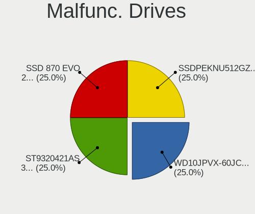
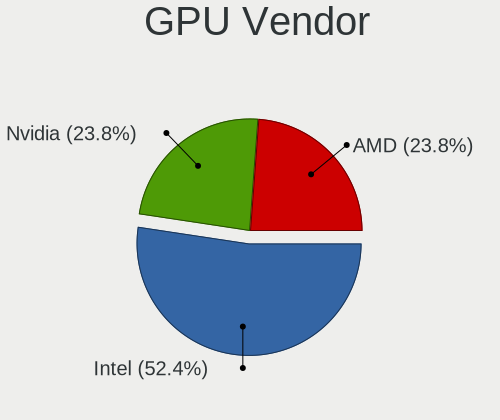
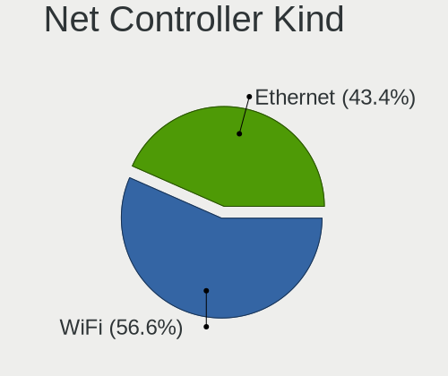
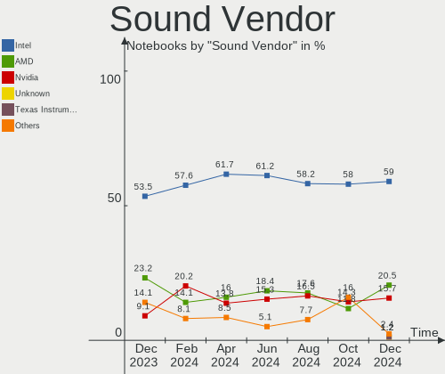
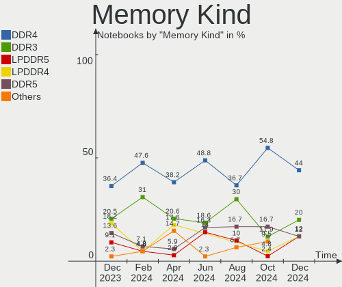

Kubuntu Hardware Trends (Notebooks)
-----------------------------------

A project to identify most popular hardware characteristics and track their change
over time based on data collected by Kubuntu users at https://Linux-Hardware.org.

Anyone can contribute to this report by the [hw-probe](https://github.com/linuxhw/hw-probe) tool:

    sudo -E hw-probe -all -upload

Full-feature report is available here: https://linux-hardware.org/?view=trends&formfactor=notebook

Period: Sep, 2021.

Contents
--------

* [ System ](#system)
  - [ OS                       ](#os)
  - [ OS Family                ](#os-family)
  - [ Kernel                   ](#kernel)
  - [ Kernel Family            ](#kernel-family)
  - [ Kernel Major Ver.        ](#kernel-major-ver)
  - [ Arch                     ](#arch)
  - [ DE                       ](#de)
  - [ Display Server           ](#display-server)
  - [ Display Manager          ](#display-manager)
  - [ OS Lang                  ](#os-lang)
  - [ Boot Mode                ](#boot-mode)
  - [ Filesystem               ](#filesystem)
  - [ Part. scheme             ](#part-scheme)
  - [ Dual Boot with Linux/BSD ](#dual-boot-with-linuxbsd)
  - [ Dual Boot (Win)          ](#dual-boot-win)

* [ Board ](#board)
  - [ Vendor                   ](#vendor)
  - [ Model                    ](#model)
  - [ Model Family             ](#model-family)
  - [ MFG Year                 ](#mfg-year)
  - [ Form Factor              ](#form-factor)
  - [ Secure Boot              ](#secure-boot)
  - [ Coreboot                 ](#coreboot)
  - [ RAM Size                 ](#ram-size)
  - [ RAM Used                 ](#ram-used)
  - [ Total Drives             ](#total-drives)
  - [ Has CD-ROM               ](#has-cd-rom)
  - [ Has Ethernet             ](#has-ethernet)
  - [ Has WiFi                 ](#has-wifi)
  - [ Has Bluetooth            ](#has-bluetooth)

* [ Location ](#location)
  - [ Country                  ](#country)
  - [ City                     ](#city)

* [ Drives ](#drives)
  - [ Drive Vendor             ](#drive-vendor)
  - [ Drive Model              ](#drive-model)
  - [ HDD Vendor               ](#hdd-vendor)
  - [ SSD Vendor               ](#ssd-vendor)
  - [ Drive Kind               ](#drive-kind)
  - [ Drive Connector          ](#drive-connector)
  - [ Drive Size               ](#drive-size)
  - [ Space Total              ](#space-total)
  - [ Space Used               ](#space-used)
  - [ Malfunc. Drives          ](#malfunc-drives)
  - [ Malfunc. Drive Vendor    ](#malfunc-drive-vendor)
  - [ Malfunc. HDD Vendor      ](#malfunc-hdd-vendor)
  - [ Malfunc. Drive Kind      ](#malfunc-drive-kind)
  - [ Failed Drives            ](#failed-drives)
  - [ Failed Drive Vendor      ](#failed-drive-vendor)
  - [ Drive Status             ](#drive-status)

* [ Storage controller ](#storage-controller)
  - [ Storage Vendor           ](#storage-vendor)
  - [ Storage Model            ](#storage-model)
  - [ Storage Kind             ](#storage-kind)

* [ Processor ](#processor)
  - [ CPU Vendor               ](#cpu-vendor)
  - [ CPU Model                ](#cpu-model)
  - [ CPU Model Family         ](#cpu-model-family)
  - [ CPU Cores                ](#cpu-cores)
  - [ CPU Sockets              ](#cpu-sockets)
  - [ CPU Threads              ](#cpu-threads)
  - [ CPU Op-Modes             ](#cpu-op-modes)
  - [ CPU Microcode            ](#cpu-microcode)
  - [ CPU Microarch            ](#cpu-microarch)

* [ Graphics ](#graphics)
  - [ GPU Vendor               ](#gpu-vendor)
  - [ GPU Model                ](#gpu-model)
  - [ GPU Combo                ](#gpu-combo)
  - [ GPU Driver               ](#gpu-driver)
  - [ GPU Memory               ](#gpu-memory)

* [ Monitor ](#monitor)
  - [ Monitor Vendor           ](#monitor-vendor)
  - [ Monitor Model            ](#monitor-model)
  - [ Monitor Resolution       ](#monitor-resolution)
  - [ Monitor Diagonal         ](#monitor-diagonal)
  - [ Monitor Width            ](#monitor-width)
  - [ Aspect Ratio             ](#aspect-ratio)
  - [ Monitor Area             ](#monitor-area)
  - [ Pixel Density            ](#pixel-density)
  - [ Multiple Monitors        ](#multiple-monitors)

* [ Network ](#network)
  - [ Net Controller Vendor    ](#net-controller-vendor)
  - [ Net Controller Model     ](#net-controller-model)
  - [ Wireless Vendor          ](#wireless-vendor)
  - [ Wireless Model           ](#wireless-model)
  - [ Ethernet Vendor          ](#ethernet-vendor)
  - [ Ethernet Model           ](#ethernet-model)
  - [ Net Controller Kind      ](#net-controller-kind)
  - [ Used Controller          ](#used-controller)
  - [ NICs                     ](#nics)
  - [ IPv6                     ](#ipv6)

* [ Bluetooth ](#bluetooth)
  - [ Bluetooth Vendor         ](#bluetooth-vendor)
  - [ Bluetooth Model          ](#bluetooth-model)

* [ Sound ](#sound)
  - [ Sound Vendor             ](#sound-vendor)
  - [ Sound Model              ](#sound-model)

* [ Memory ](#memory)
  - [ Memory Vendor            ](#memory-vendor)
  - [ Memory Model             ](#memory-model)
  - [ Memory Kind              ](#memory-kind)
  - [ Memory Form Factor       ](#memory-form-factor)
  - [ Memory Size              ](#memory-size)
  - [ Memory Speed             ](#memory-speed)

* [ Printers & scanners ](#printers--scanners)
  - [ Printer Vendor           ](#printer-vendor)
  - [ Printer Model            ](#printer-model)
  - [ Scanner Vendor           ](#scanner-vendor)
  - [ Scanner Model            ](#scanner-model)

* [ Camera ](#camera)
  - [ Camera Vendor            ](#camera-vendor)
  - [ Camera Model             ](#camera-model)

* [ Security ](#security)
  - [ Fingerprint Vendor       ](#fingerprint-vendor)
  - [ Fingerprint Model        ](#fingerprint-model)
  - [ Chipcard Vendor          ](#chipcard-vendor)
  - [ Chipcard Model           ](#chipcard-model)

* [ Unsupported ](#unsupported)
  - [ Unsupported Devices      ](#unsupported-devices)
  - [ Unsupported Device Types ](#unsupported-device-types)

System
------

OS
--

Installed operating systems

| Name          | Notebooks | Percent |
|---------------|-----------|---------|
| Kubuntu 20.04 | 23        | 50%     |
| Kubuntu 21.04 | 17        | 36.96%  |
| Kubuntu 21.10 | 2         | 4.35%   |
| Kubuntu 18.04 | 2         | 4.35%   |
| Kubuntu 20.10 | 1         | 2.17%   |
| Kubuntu 2.0   | 1         | 2.17%   |

OS Family
---------

OS without a version

| Name    | Notebooks | Percent |
|---------|-----------|---------|
| Kubuntu | 46        | 100%    |

Kernel
------

Version of the Linux kernel

| Version               | Notebooks | Percent |
|-----------------------|-----------|---------|
| 5.11.0-27-generic     | 9         | 19.57%  |
| 5.11.0-31-generic     | 6         | 13.04%  |
| 5.4.0-84-generic      | 5         | 10.87%  |
| 5.11.0-34-generic     | 5         | 10.87%  |
| 5.4.0-81-generic      | 3         | 6.52%   |
| 5.11.0-36-generic     | 3         | 6.52%   |
| 5.11.0-37-generic     | 2         | 4.35%   |
| 5.11.0-35-generic     | 2         | 4.35%   |
| 5.8.0-63-lowlatency   | 1         | 2.17%   |
| 5.4.0-86-generic      | 1         | 2.17%   |
| 5.4.0-52-generic      | 1         | 2.17%   |
| 5.14.7-051407-generic | 1         | 2.17%   |
| 5.14.2-1-MANJARO      | 1         | 2.17%   |
| 5.14.0-051400-generic | 1         | 2.17%   |
| 5.13.0-17-generic     | 1         | 2.17%   |
| 5.13.0-16-generic     | 1         | 2.17%   |
| 5.11.17-xanmod1       | 1         | 2.17%   |
| 5.11.0-36-lowlatency  | 1         | 2.17%   |
| 5.11.0-16-generic     | 1         | 2.17%   |

Kernel Family
-------------

Linux kernel without a distro release

| Version | Notebooks | Percent |
|---------|-----------|---------|
| 5.11.0  | 29        | 63.04%  |
| 5.4.0   | 10        | 21.74%  |
| 5.13.0  | 2         | 4.35%   |
| 5.8.0   | 1         | 2.17%   |
| 5.14.7  | 1         | 2.17%   |
| 5.14.2  | 1         | 2.17%   |
| 5.14.0  | 1         | 2.17%   |
| 5.11.17 | 1         | 2.17%   |

Kernel Major Ver.
-----------------

Linux kernel major version

| Version | Notebooks | Percent |
|---------|-----------|---------|
| 5.11    | 30        | 65.22%  |
| 5.4     | 10        | 21.74%  |
| 5.14    | 3         | 6.52%   |
| 5.13    | 2         | 4.35%   |
| 5.8     | 1         | 2.17%   |

Arch
----

OS architecture (x86_64, i586, etc.)

| Name   | Notebooks | Percent |
|--------|-----------|---------|
| x86_64 | 46        | 100%    |

DE
--

Desktop Environment

| Name | Notebooks | Percent |
|------|-----------|---------|
| KDE5 | 31        | 67.39%  |
| KDE  | 15        | 32.61%  |

Display Server
--------------

X11 or Wayland

| Name    | Notebooks | Percent |
|---------|-----------|---------|
| X11     | 43        | 93.48%  |
| Wayland | 3         | 6.52%   |

Display Manager
---------------

SDDM, LightDM, etc.

| Name    | Notebooks | Percent |
|---------|-----------|---------|
| SDDM    | 25        | 54.35%  |
| Unknown | 18        | 39.13%  |
| GDM     | 3         | 6.52%   |

OS Lang
-------

Language

| Lang  | Notebooks | Percent |
|-------|-----------|---------|
| en_US | 20        | 43.48%  |
| pt_BR | 5         | 10.87%  |
| C     | 3         | 6.52%   |
| ru_RU | 2         | 4.35%   |
| it_IT | 2         | 4.35%   |
| fr_FR | 2         | 4.35%   |
| es_ES | 2         | 4.35%   |
| en_CA | 2         | 4.35%   |
| de_DE | 2         | 4.35%   |
| fr_CH | 1         | 2.17%   |
| fi_FI | 1         | 2.17%   |
| es_PY | 1         | 2.17%   |
| es_MX | 1         | 2.17%   |
| en_GB | 1         | 2.17%   |
| en_AU | 1         | 2.17%   |

Boot Mode
---------

EFI or BIOS

| Mode | Notebooks | Percent |
|------|-----------|---------|
| EFI  | 29        | 63.04%  |
| BIOS | 17        | 36.96%  |

Filesystem
----------

Type of filesystem

| Type    | Notebooks | Percent |
|---------|-----------|---------|
| Ext4    | 39        | 84.78%  |
| Btrfs   | 6         | 13.04%  |
| Overlay | 1         | 2.17%   |

Part. scheme
------------

Scheme of partitioning

| Type    | Notebooks | Percent |
|---------|-----------|---------|
| GPT     | 22        | 47.83%  |
| Unknown | 21        | 45.65%  |
| MBR     | 3         | 6.52%   |

Dual Boot with Linux/BSD
------------------------

Hosting more than one Linux/BSD

| Dual boot | Notebooks | Percent |
|-----------|-----------|---------|
| No        | 43        | 93.48%  |
| Yes       | 3         | 6.52%   |

Dual Boot (Win)
---------------

Hosting Linux and Windows

| Dual boot | Notebooks | Percent |
|-----------|-----------|---------|
| No        | 31        | 67.39%  |
| Yes       | 15        | 32.61%  |

Board
-----

Vendor
------

Motherboard manufacturer

| Name                             | Notebooks | Percent |
|----------------------------------|-----------|---------|
| Lenovo                           | 14        | 30.43%  |
| ASUSTek Computer                 | 8         | 17.39%  |
| Acer                             | 5         | 10.87%  |
| Dell                             | 4         | 8.7%    |
| MSI                              | 3         | 6.52%   |
| Hewlett-Packard                  | 3         | 6.52%   |
| Positivo                         | 2         | 4.35%   |
| TUXEDO                           | 1         | 2.17%   |
| Sony                             | 1         | 2.17%   |
| Samsung Electronics              | 1         | 2.17%   |
| Panasonic                        | 1         | 2.17%   |
| Google                           | 1         | 2.17%   |
| FUJITSU CLIENT COMPUTING LIMITED | 1         | 2.17%   |
| Unknown                          | 1         | 2.17%   |

Model
-----

Motherboard model

| Name                                            | Notebooks | Percent |
|-------------------------------------------------|-----------|---------|
| ASUS VivoBook_ASUSLaptop X515DA_M515DA          | 2         | 4.35%   |
| TUXEDO Pulse 15 Gen1                            | 1         | 2.17%   |
| Sony VPCCW25FL                                  | 1         | 2.17%   |
| Samsung 950XDB/951XDB/950XDY                    | 1         | 2.17%   |
| Positivo MOBILE                                 | 1         | 2.17%   |
| Positivo CHT12CP                                | 1         | 2.17%   |
| Panasonic CFSX4-1                               | 1         | 2.17%   |
| MSI Modern 14 B4MW                              | 1         | 2.17%   |
| MSI GS63 7RE                                    | 1         | 2.17%   |
| MSI GS60 2PE                                    | 1         | 2.17%   |
| Lenovo ThinkPad X61s 7667DE3                    | 1         | 2.17%   |
| Lenovo ThinkPad T580 20L90026RT                 | 1         | 2.17%   |
| Lenovo ThinkPad T550 20CJS03300                 | 1         | 2.17%   |
| Lenovo ThinkPad T540p 20BE0084BM                | 1         | 2.17%   |
| Lenovo ThinkPad T520 42406AG                    | 1         | 2.17%   |
| Lenovo ThinkPad P15s Gen 2i 20W6000JMH          | 1         | 2.17%   |
| Lenovo ThinkPad E555 20DHA01MCD                 | 1         | 2.17%   |
| Lenovo ThinkPad E14 20RA004YUS                  | 1         | 2.17%   |
| Lenovo ThinkBook 14s-IML 20RS                   | 1         | 2.17%   |
| Lenovo Legion 5 15IMH05H 81Y6                   | 1         | 2.17%   |
| Lenovo IdeaPad S340-14IWL 81N7                  | 1         | 2.17%   |
| Lenovo IdeaPad Gaming 3 15ARH05 82EY            | 1         | 2.17%   |
| Lenovo G500 20236                               | 1         | 2.17%   |
| Lenovo B50-70 20384                             | 1         | 2.17%   |
| HP Pavilion Aero Laptop 13-be0xxx               | 1         | 2.17%   |
| HP Laptop 14s-dq0xxx                            | 1         | 2.17%   |
| HP ENVY Notebook                                | 1         | 2.17%   |
| Google Kohaku                                   | 1         | 2.17%   |
| FUJITSU CLIENT COMPUTING LIMITED LIFEBOOK U9310 | 1         | 2.17%   |
| Dell XPS 15 7590                                | 1         | 2.17%   |
| Dell Latitude 7490                              | 1         | 2.17%   |
| Dell Inspiron 3531                              | 1         | 2.17%   |
| Dell Inspiron 16 7610                           | 1         | 2.17%   |
| ASUS VivoBook_ASUSLaptop X512DA_X512DA          | 1         | 2.17%   |
| ASUS UX330UA                                    | 1         | 2.17%   |
| ASUS TUF Gaming FA506IV_TUF566IV                | 1         | 2.17%   |
| ASUS TP500LN                                    | 1         | 2.17%   |
| ASUS K73SJ                                      | 1         | 2.17%   |
| ASUS ASUS TUF Gaming A15 FA506IV_FA506IV        | 1         | 2.17%   |
| Acer Nitro AN515-54                             | 1         | 2.17%   |
| Acer Aspire F5-573G                             | 1         | 2.17%   |
| Acer Aspire ES1-512                             | 1         | 2.17%   |
| Acer Aspire A315-41                             | 1         | 2.17%   |
| Acer Aspire 7741                                | 1         | 2.17%   |
| Unknown                                         | 1         | 2.17%   |

Model Family
------------

Motherboard model prefix

| Name                                      | Notebooks | Percent |
|-------------------------------------------|-----------|---------|
| Lenovo ThinkPad                           | 8         | 17.39%  |
| Acer Aspire                               | 4         | 8.7%    |
| ASUS VivoBook                             | 3         | 6.52%   |
| Lenovo IdeaPad                            | 2         | 4.35%   |
| Dell Inspiron                             | 2         | 4.35%   |
| TUXEDO Pulse                              | 1         | 2.17%   |
| Sony VPCCW25FL                            | 1         | 2.17%   |
| Samsung 950XDB                            | 1         | 2.17%   |
| Positivo MOBILE                           | 1         | 2.17%   |
| Positivo CHT12CP                          | 1         | 2.17%   |
| Panasonic CFSX4-1                         | 1         | 2.17%   |
| MSI Modern                                | 1         | 2.17%   |
| MSI GS63                                  | 1         | 2.17%   |
| MSI GS60                                  | 1         | 2.17%   |
| Lenovo ThinkBook                          | 1         | 2.17%   |
| Lenovo Legion                             | 1         | 2.17%   |
| Lenovo G500                               | 1         | 2.17%   |
| Lenovo B50-70                             | 1         | 2.17%   |
| HP Pavilion                               | 1         | 2.17%   |
| HP Laptop                                 | 1         | 2.17%   |
| HP ENVY                                   | 1         | 2.17%   |
| Google Kohaku                             | 1         | 2.17%   |
| FUJITSU CLIENT COMPUTING LIMITED LIFEBOOK | 1         | 2.17%   |
| Dell XPS                                  | 1         | 2.17%   |
| Dell Latitude                             | 1         | 2.17%   |
| ASUS UX330UA                              | 1         | 2.17%   |
| ASUS TUF                                  | 1         | 2.17%   |
| ASUS TP500LN                              | 1         | 2.17%   |
| ASUS K73SJ                                | 1         | 2.17%   |
| ASUS ASUS                                 | 1         | 2.17%   |
| Acer Nitro                                | 1         | 2.17%   |
| Unknown                                   | 1         | 2.17%   |

MFG Year
--------

Motherboard manufacture year

| Year | Notebooks | Percent |
|------|-----------|---------|
| 2021 | 18        | 39.13%  |
| 2019 | 7         | 15.22%  |
| 2014 | 5         | 10.87%  |
| 2017 | 3         | 6.52%   |
| 2020 | 2         | 4.35%   |
| 2018 | 2         | 4.35%   |
| 2015 | 2         | 4.35%   |
| 2011 | 2         | 4.35%   |
| 2010 | 2         | 4.35%   |
| 2013 | 1         | 2.17%   |
| 2012 | 1         | 2.17%   |
| 2008 | 1         | 2.17%   |

Form Factor
-----------

Physical design of the computer

| Name     | Notebooks | Percent |
|----------|-----------|---------|
| Notebook | 46        | 100%    |

Secure Boot
-----------

Enabled or disabled

| State    | Notebooks | Percent |
|----------|-----------|---------|
| Disabled | 39        | 84.78%  |
| Enabled  | 7         | 15.22%  |

Coreboot
--------

Have coreboot on board

| Used | Notebooks | Percent |
|------|-----------|---------|
| No   | 45        | 97.83%  |
| Yes  | 1         | 2.17%   |

RAM Size
--------

Total RAM memory

| Size in GB | Notebooks | Percent |
|------------|-----------|---------|
| 4.01-8.0   | 20        | 43.48%  |
| 16.01-24.0 | 8         | 17.39%  |
| 8.01-16.0  | 8         | 17.39%  |
| 3.01-4.0   | 7         | 15.22%  |
| 32.01-64.0 | 2         | 4.35%   |
| 2.01-3.0   | 1         | 2.17%   |

RAM Used
--------

Used RAM memory

| Used GB    | Notebooks | Percent |
|------------|-----------|---------|
| 2.01-3.0   | 16        | 34.78%  |
| 1.01-2.0   | 12        | 26.09%  |
| 4.01-8.0   | 9         | 19.57%  |
| 3.01-4.0   | 5         | 10.87%  |
| 16.01-24.0 | 2         | 4.35%   |
| 8.01-16.0  | 2         | 4.35%   |

Total Drives
------------

Number of drives on board

| Drives | Notebooks | Percent |
|--------|-----------|---------|
| 1      | 35        | 76.09%  |
| 2      | 11        | 23.91%  |

Has CD-ROM
----------

Has CD-ROM on board

| Presented | Notebooks | Percent |
|-----------|-----------|---------|
| No        | 37        | 80.43%  |
| Yes       | 9         | 19.57%  |

Has Ethernet
------------

Has Ethernet on board

| Presented | Notebooks | Percent |
|-----------|-----------|---------|
| Yes       | 32        | 69.57%  |
| No        | 14        | 30.43%  |

Has WiFi
--------

Has WiFi module

| Presented | Notebooks | Percent |
|-----------|-----------|---------|
| Yes       | 45        | 97.83%  |
| No        | 1         | 2.17%   |

Has Bluetooth
-------------

Has Bluetooth module

| Presented | Notebooks | Percent |
|-----------|-----------|---------|
| Yes       | 40        | 86.96%  |
| No        | 6         | 13.04%  |

Location
--------

Country
-------

Geographic location (country)

| Country     | Notebooks | Percent |
|-------------|-----------|---------|
| Russia      | 6         | 13.04%  |
| USA         | 5         | 10.87%  |
| Brazil      | 5         | 10.87%  |
| France      | 4         | 8.7%    |
| Ukraine     | 3         | 6.52%   |
| Germany     | 3         | 6.52%   |
| Indonesia   | 2         | 4.35%   |
| Canada      | 2         | 4.35%   |
| Vietnam     | 1         | 2.17%   |
| UK          | 1         | 2.17%   |
| Turkey      | 1         | 2.17%   |
| Switzerland | 1         | 2.17%   |
| Spain       | 1         | 2.17%   |
| South Korea | 1         | 2.17%   |
| Paraguay    | 1         | 2.17%   |
| Netherlands | 1         | 2.17%   |
| Mexico      | 1         | 2.17%   |
| Italy       | 1         | 2.17%   |
| Finland     | 1         | 2.17%   |
| Cuba        | 1         | 2.17%   |
| China       | 1         | 2.17%   |
| Bulgaria    | 1         | 2.17%   |
| Australia   | 1         | 2.17%   |
| Algeria     | 1         | 2.17%   |

City
----

Geographic location (city)

| City                   | Notebooks | Percent |
|------------------------|-----------|---------|
| Jakarta                | 2         | 4.35%   |
| Yoshkar-Ola            | 1         | 2.17%   |
| Wittmund               | 1         | 2.17%   |
| Varallo Sesia          | 1         | 2.17%   |
| Ulyanovsk              | 1         | 2.17%   |
| Toronto                | 1         | 2.17%   |
| Taboao da Serra        | 1         | 2.17%   |
| Sydney                 | 1         | 2.17%   |
| Springfield            | 1         | 2.17%   |
| Sofia                  | 1         | 2.17%   |
| Sierre                 | 1         | 2.17%   |
| Shanghai               | 1         | 2.17%   |
| Shakhty                | 1         | 2.17%   |
| Seville                | 1         | 2.17%   |
| S??o Pedro             | 1         | 2.17%   |
| S??o Leopoldo          | 1         | 2.17%   |
| Sarandi                | 1         | 2.17%   |
| Saint Leonards-on-Sea  | 1         | 2.17%   |
| Rostov-on-Don          | 1         | 2.17%   |
| Rach Gia               | 1         | 2.17%   |
| Plaza de la Revolucion | 1         | 2.17%   |
| Orlando                | 1         | 2.17%   |
| Moscow                 | 1         | 2.17%   |
| Montreal               | 1         | 2.17%   |
| Missoula               | 1         | 2.17%   |
| Marseille              | 1         | 2.17%   |
| Las Vegas              | 1         | 2.17%   |
| Lamothe-Goas           | 1         | 2.17%   |
| Kyiv                   | 1         | 2.17%   |
| Kropyvnytskyi          | 1         | 2.17%   |
| Kaufungen              | 1         | 2.17%   |
| Izhevsk                | 1         | 2.17%   |
| Istanbul               | 1         | 2.17%   |
| Helsinki               | 1         | 2.17%   |
| Gwangsan-gu            | 1         | 2.17%   |
| Federal Way            | 1         | 2.17%   |
| Elna                   | 1         | 2.17%   |
| Dnipropetrovsk         | 1         | 2.17%   |
| Colombes               | 1         | 2.17%   |
| Ciudad Guzm??n         | 1         | 2.17%   |
| Bremen                 | 1         | 2.17%   |
| Blumenau               | 1         | 2.17%   |
| Asunci??n              | 1         | 2.17%   |
| Amsterdam              | 1         | 2.17%   |
| Ain Beida              | 1         | 2.17%   |

Drives
------

Drive Vendor
------------

Hard drive vendors

| Vendor              | Notebooks | Drives | Percent |
|---------------------|-----------|--------|---------|
| Samsung Electronics | 13        | 13     | 22.81%  |
| WDC                 | 10        | 10     | 17.54%  |
| Seagate             | 8         | 8      | 14.04%  |
| Union Memory        | 3         | 3      | 5.26%   |
| Micron Technology   | 3         | 3      | 5.26%   |
| Unknown             | 2         | 3      | 3.51%   |
| Toshiba             | 2         | 2      | 3.51%   |
| Kingston            | 2         | 2      | 3.51%   |
| Intel               | 2         | 2      | 3.51%   |
| Crucial             | 2         | 2      | 3.51%   |
| TO Exter            | 1         | 1      | 1.75%   |
| Team                | 1         | 1      | 1.75%   |
| SPCC                | 1         | 1      | 1.75%   |
| Solid State Storage | 1         | 1      | 1.75%   |
| SK Hynix            | 1         | 1      | 1.75%   |
| SanDisk             | 1         | 1      | 1.75%   |
| Intenso             | 1         | 1      | 1.75%   |
| HGST                | 1         | 1      | 1.75%   |
| Fujitsu             | 1         | 1      | 1.75%   |
| A-DATA Technology   | 1         | 1      | 1.75%   |

Drive Model
-----------

Hard drive models

| Model                                     | Notebooks | Percent |
|-------------------------------------------|-----------|---------|
| WDC WD10JPVX-22JC3T0 1TB                  | 2         | 3.45%   |
| WDC PC SN530 SDBPNPZ-256G-1002 256GB      | 2         | 3.45%   |
| Seagate ST1000LM024 HN-M101MBB 1TB        | 2         | 3.45%   |
| WDC WD7500BPVT-80HXZT3 752GB              | 1         | 1.72%   |
| WDC WD2500BEVT-22A23T0 250GB              | 1         | 1.72%   |
| WDC WD10SPZX-21Z10T0 1TB                  | 1         | 1.72%   |
| WDC PC SN720 SDAQNTW-512G-1001 512GB      | 1         | 1.72%   |
| WDC PC SN530 SDBPNPZ-1T00-1002 1TB        | 1         | 1.72%   |
| WDC PC SN520 SDAPNUW-512G-1014 512GB      | 1         | 1.72%   |
| Unknown SD32G  32GB                       | 1         | 1.72%   |
| Unknown MMC Card  32GB                    | 1         | 1.72%   |
| Unknown MMC Card  128GB                   | 1         | 1.72%   |
| Union Memory UMIS RPJTJ256MEE1OWX 256GB   | 1         | 1.72%   |
| Union Memory UMIS RPITJ512VME2OWD 512GB   | 1         | 1.72%   |
| Union Memory RPFTJ128PDD2EWX 128GB        | 1         | 1.72%   |
| Toshiba TR200 960GB SSD                   | 1         | 1.72%   |
| Toshiba KBG30ZMT256G 256GB                | 1         | 1.72%   |
| TO Exter nal USB 3.0 4TB                  | 1         | 1.72%   |
| Team L3 SSD 120GB                         | 1         | 1.72%   |
| SPCC Solid State Disk 1024GB              | 1         | 1.72%   |
| Solid State Storage SSSTC CL1-3D256 256GB | 1         | 1.72%   |
| SK Hynix PC601 NVMe 512GB                 | 1         | 1.72%   |
| Seagate ST9500325AS 500GB                 | 1         | 1.72%   |
| Seagate ST9402115AS 40GB                  | 1         | 1.72%   |
| Seagate ST500LT012-1DG142 500GB           | 1         | 1.72%   |
| Seagate ST500LM021-1KJ152 500GB           | 1         | 1.72%   |
| Seagate ST1000LM035-1RK172 1TB            | 1         | 1.72%   |
| Seagate Expansion 1TB                     | 1         | 1.72%   |
| SanDisk SSD U100 24GB                     | 1         | 1.72%   |
| Samsung SSD 870 EVO 250GB                 | 1         | 1.72%   |
| Samsung SSD 860 EVO M.2 250GB             | 1         | 1.72%   |
| Samsung SSD 850 EVO 500GB                 | 1         | 1.72%   |
| Samsung SSD 850 EVO 250GB                 | 1         | 1.72%   |
| Samsung PM9A1 NVMe 1024GB                 | 1         | 1.72%   |
| Samsung NVMe SSD Drive 1TB                | 1         | 1.72%   |
| Samsung NVMe SSD Drive 1024GB             | 1         | 1.72%   |
| Samsung MZVLW256HEHP-00000 256GB          | 1         | 1.72%   |
| Samsung MZVLQ512HALU-00007 512GB          | 1         | 1.72%   |
| Samsung MZVLB512HBJQ-000L2 512GB          | 1         | 1.72%   |
| Samsung MZNLF128HCHP-000H1 128GB SSD      | 1         | 1.72%   |
| Samsung MZ9LQ512HBLU-00B 512GB            | 1         | 1.72%   |
| Samsung MZ7TE512HMHP-000L1 512GB SSD      | 1         | 1.72%   |
| Micron NVMe SSD Drive 256GB               | 1         | 1.72%   |
| Micron MTFDHBA512QFD-1AX1AABHA 512GB      | 1         | 1.72%   |
| Micron MTFDDAV256MBF-1AN15ABHA 256GB SSD  | 1         | 1.72%   |
| Kingston SV300S37A60G 64GB SSD            | 1         | 1.72%   |
| Kingston NVMe SSD Drive 256GB             | 1         | 1.72%   |
| Intenso JAJM600M1024C 1TB SSD             | 1         | 1.72%   |
| Intel SSDSC2CW240A3 240GB                 | 1         | 1.72%   |
| Intel NVMe SSD Drive 512GB                | 1         | 1.72%   |
| HGST HTS541010B7E610 1TB                  | 1         | 1.72%   |
| Fujitsu MHY2200BH 200GB                   | 1         | 1.72%   |
| Crucial CT500MX500SSD1 500GB              | 1         | 1.72%   |
| Crucial CT256M550SSD4 256GB               | 1         | 1.72%   |
| A-DATA HV320 1TB SSD                      | 1         | 1.72%   |

HDD Vendor
----------

Hard disk drive vendors

| Vendor   | Notebooks | Drives | Percent |
|----------|-----------|--------|---------|
| Seagate  | 8         | 8      | 50%     |
| WDC      | 5         | 5      | 31.25%  |
| TO Exter | 1         | 1      | 6.25%   |
| HGST     | 1         | 1      | 6.25%   |
| Fujitsu  | 1         | 1      | 6.25%   |

SSD Vendor
----------

Solid state drive vendors

| Vendor              | Notebooks | Drives | Percent |
|---------------------|-----------|--------|---------|
| Samsung Electronics | 6         | 6      | 35.29%  |
| Crucial             | 2         | 2      | 11.76%  |
| Toshiba             | 1         | 1      | 5.88%   |
| Team                | 1         | 1      | 5.88%   |
| SPCC                | 1         | 1      | 5.88%   |
| SanDisk             | 1         | 1      | 5.88%   |
| Micron Technology   | 1         | 1      | 5.88%   |
| Kingston            | 1         | 1      | 5.88%   |
| Intenso             | 1         | 1      | 5.88%   |
| Intel               | 1         | 1      | 5.88%   |
| A-DATA Technology   | 1         | 1      | 5.88%   |

Drive Kind
----------

HDD or SSD

| Kind | Notebooks | Drives | Percent |
|------|-----------|--------|---------|
| NVMe | 22        | 22     | 39.29%  |
| SSD  | 16        | 17     | 28.57%  |
| HDD  | 16        | 16     | 28.57%  |
| MMC  | 2         | 3      | 3.57%   |

Drive Connector
---------------

SATA, SAS, NVMe, etc.

| Type | Notebooks | Drives | Percent |
|------|-----------|--------|---------|
| SATA | 26        | 30     | 49.06%  |
| NVMe | 22        | 22     | 41.51%  |
| SAS  | 3         | 3      | 5.66%   |
| MMC  | 2         | 3      | 3.77%   |

Drive Size
----------

Size of hard drive

| Size in TB | Notebooks | Drives | Percent |
|------------|-----------|--------|---------|
| 0.01-0.5   | 16        | 18     | 51.61%  |
| 0.51-1.0   | 13        | 13     | 41.94%  |
| 3.01-4.0   | 1         | 1      | 3.23%   |
| 1.01-2.0   | 1         | 1      | 3.23%   |

Space Total
-----------

Amount of disk space available on the file system

| Size in GB | Notebooks | Percent |
|------------|-----------|---------|
| 101-250    | 13        | 28.26%  |
| 501-1000   | 13        | 28.26%  |
| 251-500    | 10        | 21.74%  |
| 51-100     | 4         | 8.7%    |
| 21-50      | 3         | 6.52%   |
| 1001-2000  | 2         | 4.35%   |
| Unknown    | 1         | 2.17%   |

Space Used
----------

Amount of used disk space

| Used GB  | Notebooks | Percent |
|----------|-----------|---------|
| 1-20     | 11        | 23.91%  |
| 51-100   | 9         | 19.57%  |
| 251-500  | 7         | 15.22%  |
| 21-50    | 7         | 15.22%  |
| 101-250  | 7         | 15.22%  |
| 501-1000 | 4         | 8.7%    |
| Unknown  | 1         | 2.17%   |

Malfunc. Drives
---------------

Drive models with a malfunction

| Model                              | Notebooks | Drives | Percent |
|------------------------------------|-----------|--------|---------|
| Seagate ST1000LM024 HN-M101MBB 1TB | 1         | 1      | 100%    |

Malfunc. Drive Vendor
---------------------

Vendors of faulty drives

| Vendor  | Notebooks | Drives | Percent |
|---------|-----------|--------|---------|
| Seagate | 1         | 1      | 100%    |

Malfunc. HDD Vendor
-------------------

Vendors of faulty HDD drives

| Vendor  | Notebooks | Drives | Percent |
|---------|-----------|--------|---------|
| Seagate | 1         | 1      | 100%    |

Malfunc. Drive Kind
-------------------

Kinds of faulty drives

| Kind | Notebooks | Drives | Percent |
|------|-----------|--------|---------|
| HDD  | 1         | 1      | 100%    |

Failed Drives
-------------

Failed drive models

Zero info for selected period =(

Failed Drive Vendor
-------------------

Failed drive vendors

Zero info for selected period =(

Drive Status
------------

Number of failed and malfunc. drives

| Status   | Notebooks | Drives | Percent |
|----------|-----------|--------|---------|
| Works    | 26        | 29     | 53.06%  |
| Detected | 22        | 28     | 44.9%   |
| Malfunc  | 1         | 1      | 2.04%   |

Storage controller
------------------

Storage Vendor
--------------

Storage controller vendors

| Vendor                         | Notebooks | Percent |
|--------------------------------|-----------|---------|
| Intel                          | 29        | 48.33%  |
| AMD                            | 10        | 16.67%  |
| Samsung Electronics            | 7         | 11.67%  |
| Sandisk                        | 5         | 8.33%   |
| Union Memory (Shenzhen)        | 3         | 5%      |
| Micron Technology              | 2         | 3.33%   |
| Toshiba America Info Systems   | 1         | 1.67%   |
| Solid State Storage Technology | 1         | 1.67%   |
| SK Hynix                       | 1         | 1.67%   |
| Kingston Technology Company    | 1         | 1.67%   |

Storage Model
-------------

Storage controller models

| Model                                                                          | Notebooks | Percent |
|--------------------------------------------------------------------------------|-----------|---------|
| AMD FCH SATA Controller [AHCI mode]                                            | 10        | 16.13%  |
| Union Memory (Shenzhen) Non-Volatile memory controller                         | 3         | 4.84%   |
| Sandisk WD Blue SN550 NVMe SSD                                                 | 3         | 4.84%   |
| Samsung NVMe SSD Controller SM981/PM981/PM983                                  | 3         | 4.84%   |
| Intel Sunrise Point-LP SATA Controller [AHCI mode]                             | 3         | 4.84%   |
| Samsung NVMe SSD Controller 980                                                | 2         | 3.23%   |
| Micron Non-Volatile memory controller                                          | 2         | 3.23%   |
| Intel Wildcat Point-LP SATA Controller [AHCI Mode]                             | 2         | 3.23%   |
| Intel Comet Lake SATA AHCI Controller                                          | 2         | 3.23%   |
| Intel Cannon Lake Mobile PCH SATA AHCI Controller                              | 2         | 3.23%   |
| Intel Atom Processor E3800 Series SATA AHCI Controller                         | 2         | 3.23%   |
| Intel 82801IBM/IEM (ICH9M/ICH9M-E) 4 port SATA Controller [AHCI mode]          | 2         | 3.23%   |
| Intel 8 Series/C220 Series Chipset Family 6-port SATA Controller 1 [AHCI mode] | 2         | 3.23%   |
| Intel 8 Series SATA Controller 1 [AHCI mode]                                   | 2         | 3.23%   |
| Intel 6 Series/C200 Series Chipset Family 6 port Mobile SATA AHCI Controller   | 2         | 3.23%   |
| Toshiba America Info Systems BG3 NVMe SSD Controller                           | 1         | 1.61%   |
| Solid State Storage Non-Volatile memory controller                             | 1         | 1.61%   |
| SK Hynix Non-Volatile memory controller                                        | 1         | 1.61%   |
| Sandisk WD Blue SN500 / PC SN520 NVMe SSD                                      | 1         | 1.61%   |
| Sandisk WD Black 2018/SN750 / PC SN720 NVMe SSD                                | 1         | 1.61%   |
| Samsung NVMe SSD Controller SM961/PM961/SM963                                  | 1         | 1.61%   |
| Samsung NVMe SSD Controller PM9A1/PM9A3/980PRO                                 | 1         | 1.61%   |
| Kingston Company OM3PDP3 NVMe SSD                                              | 1         | 1.61%   |
| Intel SSD 660P Series                                                          | 1         | 1.61%   |
| Intel Mobile PM965/GM965 PT IDER Controller                                    | 1         | 1.61%   |
| Intel HM170/QM170 Chipset SATA Controller [AHCI Mode]                          | 1         | 1.61%   |
| Intel Celeron/Pentium Silver Processor SATA Controller                         | 1         | 1.61%   |
| Intel Cannon Point-LP SATA Controller [AHCI Mode]                              | 1         | 1.61%   |
| Intel 82801HM/HEM (ICH8M/ICH8M-E) SATA Controller [AHCI mode]                  | 1         | 1.61%   |
| Intel 82801HM/HEM (ICH8M/ICH8M-E) IDE Controller                               | 1         | 1.61%   |
| Intel 82801 Mobile SATA Controller [RAID mode]                                 | 1         | 1.61%   |
| Intel 7 Series Chipset Family 6-port SATA Controller [AHCI mode]               | 1         | 1.61%   |
| Intel 5 Series/3400 Series Chipset 6 port SATA AHCI Controller                 | 1         | 1.61%   |
| Intel 5 Series/3400 Series Chipset 4 port SATA AHCI Controller                 | 1         | 1.61%   |
| Intel 400 Series Chipset Family SATA AHCI Controller                           | 1         | 1.61%   |

Storage Kind
------------

Kind of storage controller (IDE, SATA, NVMe, SAS, ...)

| Kind | Notebooks | Percent |
|------|-----------|---------|
| SATA | 37        | 60.66%  |
| NVMe | 22        | 36.07%  |
| RAID | 1         | 1.64%   |
| IDE  | 1         | 1.64%   |

Processor
---------

CPU Vendor
----------

Processor vendors

| Vendor | Notebooks | Percent |
|--------|-----------|---------|
| Intel  | 35        | 76.09%  |
| AMD    | 11        | 23.91%  |

CPU Model
---------

Processor models

| Model                                          | Notebooks | Percent |
|------------------------------------------------|-----------|---------|
| Intel Core i5-10210U CPU @ 1.60GHz             | 3         | 6.52%   |
| AMD Ryzen 7 4800H with Radeon Graphics         | 3         | 6.52%   |
| AMD Ryzen 5 3500U with Radeon Vega Mobile Gfx  | 3         | 6.52%   |
| Intel Core i5-9300H CPU @ 2.40GHz              | 2         | 4.35%   |
| Intel Core i5-6200U CPU @ 2.30GHz              | 2         | 4.35%   |
| Intel 11th Gen Core i7-1165G7 @ 2.80GHz        | 2         | 4.35%   |
| Intel Pentium Silver N5030 CPU @ 1.10GHz       | 1         | 2.17%   |
| Intel Pentium CPU N3540 @ 2.16GHz              | 1         | 2.17%   |
| Intel Genuine CPU U4100 @ 1.30GHz              | 1         | 2.17%   |
| Intel Core i7-8550U CPU @ 1.80GHz              | 1         | 2.17%   |
| Intel Core i7-7700HQ CPU @ 2.80GHz             | 1         | 2.17%   |
| Intel Core i7-4800MQ CPU @ 2.70GHz             | 1         | 2.17%   |
| Intel Core i7-4710HQ CPU @ 2.50GHz             | 1         | 2.17%   |
| Intel Core i7-10750H CPU @ 2.60GHz             | 1         | 2.17%   |
| Intel Core i7-10510U CPU @ 1.80GHz             | 1         | 2.17%   |
| Intel Core i5-8350U CPU @ 1.70GHz              | 1         | 2.17%   |
| Intel Core i5-7200U CPU @ 2.50GHz              | 1         | 2.17%   |
| Intel Core i5-5300U CPU @ 2.30GHz              | 1         | 2.17%   |
| Intel Core i5-5200U CPU @ 2.20GHz              | 1         | 2.17%   |
| Intel Core i5-4210U CPU @ 1.70GHz              | 1         | 2.17%   |
| Intel Core i5-2450M CPU @ 2.50GHz              | 1         | 2.17%   |
| Intel Core i5-2430M CPU @ 2.40GHz              | 1         | 2.17%   |
| Intel Core i5 CPU M 480 @ 2.67GHz              | 1         | 2.17%   |
| Intel Core i3-8145U CPU @ 2.10GHz              | 1         | 2.17%   |
| Intel Core i3-4010U CPU @ 1.70GHz              | 1         | 2.17%   |
| Intel Core i3-3110M CPU @ 2.40GHz              | 1         | 2.17%   |
| Intel Core i3 CPU M 330 @ 2.13GHz              | 1         | 2.17%   |
| Intel Core 2 Duo CPU L7500 @ 1.60GHz           | 1         | 2.17%   |
| Intel Celeron Dual-Core CPU T3500 @ 2.10GHz    | 1         | 2.17%   |
| Intel Celeron CPU N2830 @ 2.16GHz              | 1         | 2.17%   |
| Intel Atom x5-Z8350 CPU @ 1.44GHz              | 1         | 2.17%   |
| Intel 11th Gen Core i7-11800H @ 2.30GHz        | 1         | 2.17%   |
| AMD Ryzen 5 5600U with Radeon Graphics         | 1         | 2.17%   |
| AMD Ryzen 5 4600H with Radeon Graphics         | 1         | 2.17%   |
| AMD Ryzen 5 4500U with Radeon Graphics         | 1         | 2.17%   |
| AMD Ryzen 3 2200U with Radeon Vega Mobile Gfx  | 1         | 2.17%   |
| AMD A10-7300 Radeon R6, 10 Compute Cores 4C+6G | 1         | 2.17%   |

CPU Model Family
----------------

Processor model prefix

| Model                   | Notebooks | Percent |
|-------------------------|-----------|---------|
| Intel Core i5           | 15        | 32.61%  |
| Intel Core i7           | 6         | 13.04%  |
| AMD Ryzen 5             | 6         | 13.04%  |
| Intel Core i3           | 4         | 8.7%    |
| Other                   | 3         | 6.52%   |
| AMD Ryzen 7             | 3         | 6.52%   |
| Intel Pentium Silver    | 1         | 2.17%   |
| Intel Pentium           | 1         | 2.17%   |
| Intel Genuine           | 1         | 2.17%   |
| Intel Core 2 Duo        | 1         | 2.17%   |
| Intel Celeron Dual-Core | 1         | 2.17%   |
| Intel Celeron           | 1         | 2.17%   |
| Intel Atom              | 1         | 2.17%   |
| AMD Ryzen 3             | 1         | 2.17%   |
| AMD A10                 | 1         | 2.17%   |

CPU Cores
---------

Number of processor cores

| Number | Notebooks | Percent |
|--------|-----------|---------|
| 4      | 19        | 41.3%   |
| 2      | 19        | 41.3%   |
| 8      | 4         | 8.7%    |
| 6      | 4         | 8.7%    |

CPU Sockets
-----------

Number of sockets

| Number | Notebooks | Percent |
|--------|-----------|---------|
| 1      | 46        | 100%    |

CPU Threads
-----------

Threads per core (Hyper-Threading)

| Number | Notebooks | Percent |
|--------|-----------|---------|
| 2      | 38        | 82.61%  |
| 1      | 8         | 17.39%  |

CPU Op-Modes
------------

CPU Operation Modes (32-bit, 64-bit)

| Op mode        | Notebooks | Percent |
|----------------|-----------|---------|
| 32-bit, 64-bit | 46        | 100%    |

CPU Microcode
-------------

Microcode number

| Number     | Notebooks | Percent |
|------------|-----------|---------|
| Unknown    | 15        | 32.61%  |
| 0x806ec    | 5         | 10.87%  |
| 0x406e3    | 2         | 4.35%   |
| 0x40651    | 2         | 4.35%   |
| 0x306d4    | 2         | 4.35%   |
| 0x08600104 | 2         | 4.35%   |
| 0x08108109 | 2         | 4.35%   |
| 0xa0652    | 1         | 2.17%   |
| 0x906ed    | 1         | 2.17%   |
| 0x906ea    | 1         | 2.17%   |
| 0x906e9    | 1         | 2.17%   |
| 0x806ea    | 1         | 2.17%   |
| 0x806d1    | 1         | 2.17%   |
| 0x806c1    | 1         | 2.17%   |
| 0x406c4    | 1         | 2.17%   |
| 0x306c3    | 1         | 2.17%   |
| 0x306a9    | 1         | 2.17%   |
| 0x30678    | 1         | 2.17%   |
| 0x206a7    | 1         | 2.17%   |
| 0x08600103 | 1         | 2.17%   |
| 0x08108102 | 1         | 2.17%   |
| 0x0810100b | 1         | 2.17%   |
| 0x06003109 | 1         | 2.17%   |

CPU Microarch
-------------

Microarchitecture

| Name          | Notebooks | Percent |
|---------------|-----------|---------|
| KabyLake      | 11        | 23.91%  |
| Zen 2         | 5         | 10.87%  |
| Haswell       | 4         | 8.7%    |
| Zen+          | 3         | 6.52%   |
| Silvermont    | 3         | 6.52%   |
| Westmere      | 2         | 4.35%   |
| TigerLake     | 2         | 4.35%   |
| Skylake       | 2         | 4.35%   |
| SandyBridge   | 2         | 4.35%   |
| Penryn        | 2         | 4.35%   |
| Broadwell     | 2         | 4.35%   |
| Zen 3         | 1         | 2.17%   |
| Zen           | 1         | 2.17%   |
| Steamroller   | 1         | 2.17%   |
| IvyBridge     | 1         | 2.17%   |
| Icelake       | 1         | 2.17%   |
| Goldmont plus | 1         | 2.17%   |
| Core          | 1         | 2.17%   |
| CometLake     | 1         | 2.17%   |

Graphics
--------

GPU Vendor
----------

Vendors of graphics cards

| Vendor | Notebooks | Percent |
|--------|-----------|---------|
| Intel  | 32        | 51.61%  |
| Nvidia | 16        | 25.81%  |
| AMD    | 14        | 22.58%  |

GPU Model
---------

Graphics card models

| Model                                                                                    | Notebooks | Percent |
|------------------------------------------------------------------------------------------|-----------|---------|
| AMD Renoir                                                                               | 5         | 7.81%   |
| Intel CometLake-U GT2 [UHD Graphics]                                                     | 4         | 6.25%   |
| AMD Picasso                                                                              | 3         | 4.69%   |
| Nvidia TU106M [GeForce RTX 2060 Mobile]                                                  | 2         | 3.13%   |
| Intel UHD Graphics 620                                                                   | 2         | 3.13%   |
| Intel TigerLake-LP GT2 [Iris Xe Graphics]                                                | 2         | 3.13%   |
| Intel Skylake GT2 [HD Graphics 520]                                                      | 2         | 3.13%   |
| Intel Mobile 4 Series Chipset Integrated Graphics Controller                             | 2         | 3.13%   |
| Intel HD Graphics 5500                                                                   | 2         | 3.13%   |
| Intel Haswell-ULT Integrated Graphics Controller                                         | 2         | 3.13%   |
| Intel CoffeeLake-H GT2 [UHD Graphics 630]                                                | 2         | 3.13%   |
| Intel Atom Processor Z36xxx/Z37xxx Series Graphics & Display                             | 2         | 3.13%   |
| Intel 4th Gen Core Processor Integrated Graphics Controller                              | 2         | 3.13%   |
| Intel 2nd Generation Core Processor Family Integrated Graphics Controller                | 2         | 3.13%   |
| Nvidia TU117M [GeForce GTX 1650 Mobile / Max-Q]                                          | 1         | 1.56%   |
| Nvidia TU117M                                                                            | 1         | 1.56%   |
| Nvidia TU117GLM [Quadro T500 Mobile]                                                     | 1         | 1.56%   |
| Nvidia TU116M [GeForce GTX 1660 Ti Mobile]                                               | 1         | 1.56%   |
| Nvidia GT216M [GeForce GT 330M]                                                          | 1         | 1.56%   |
| Nvidia GP108M [GeForce MX150]                                                            | 1         | 1.56%   |
| Nvidia GP107M [GeForce GTX 1050 Ti Mobile]                                               | 1         | 1.56%   |
| Nvidia GM108M [GeForce 840M]                                                             | 1         | 1.56%   |
| Nvidia GM107 [GeForce 940MX]                                                             | 1         | 1.56%   |
| Nvidia GK208M [GeForce GT 730M]                                                          | 1         | 1.56%   |
| Nvidia GK104M [GeForce GTX 870M]                                                         | 1         | 1.56%   |
| Nvidia GF119M [Quadro NVS 4200M]                                                         | 1         | 1.56%   |
| Nvidia GF119M [GeForce GT 520M]                                                          | 1         | 1.56%   |
| Nvidia GA106M [GeForce RTX 3060 Mobile / Max-Q]                                          | 1         | 1.56%   |
| Intel WhiskeyLake-U GT2 [UHD Graphics 620]                                               | 1         | 1.56%   |
| Intel TigerLake-H GT1 [UHD Graphics]                                                     | 1         | 1.56%   |
| Intel Mobile GM965/GL960 Integrated Graphics Controller (secondary)                      | 1         | 1.56%   |
| Intel Mobile GM965/GL960 Integrated Graphics Controller (primary)                        | 1         | 1.56%   |
| Intel HD Graphics 630                                                                    | 1         | 1.56%   |
| Intel HD Graphics 620                                                                    | 1         | 1.56%   |
| Intel GeminiLake [UHD Graphics 605]                                                      | 1         | 1.56%   |
| Intel Atom/Celeron/Pentium Processor x5-E8000/J3xxx/N3xxx Integrated Graphics Controller | 1         | 1.56%   |
| Intel 3rd Gen Core processor Graphics Controller                                         | 1         | 1.56%   |
| AMD Raven Ridge [Radeon Vega Series / Radeon Vega Mobile Series]                         | 1         | 1.56%   |
| AMD Mars [Radeon HD 8670A/8670M/8750M / R7 M370]                                         | 1         | 1.56%   |
| AMD Madison [Mobility Radeon HD 5650/5750 / 6530M/6550M]                                 | 1         | 1.56%   |
| AMD Lexa [Radeon 540X/550X/630 / RX 640 / E9171 MCM]                                     | 1         | 1.56%   |
| AMD Kaveri [Radeon R6 Graphics]                                                          | 1         | 1.56%   |
| AMD Jet XT [Radeon R5 M240]                                                              | 1         | 1.56%   |
| AMD Cezanne                                                                              | 1         | 1.56%   |

GPU Combo
---------

Combinations of graphics cards

| Name           | Notebooks | Percent |
|----------------|-----------|---------|
| 1 x Intel      | 19        | 41.3%   |
| Intel + Nvidia | 11        | 23.91%  |
| 1 x AMD        | 8         | 17.39%  |
| AMD + Nvidia   | 3         | 6.52%   |
| 1 x Nvidia     | 2         | 4.35%   |
| Intel + AMD    | 2         | 4.35%   |
| 2 x AMD        | 1         | 2.17%   |

GPU Driver
----------

Free vs proprietary

| Driver      | Notebooks | Percent |
|-------------|-----------|---------|
| Free        | 37        | 80.43%  |
| Proprietary | 8         | 17.39%  |
| Unknown     | 1         | 2.17%   |

GPU Memory
----------

Total video memory

| Size in GB | Notebooks | Percent |
|------------|-----------|---------|
| Unknown    | 29        | 63.04%  |
| 1.01-2.0   | 7         | 15.22%  |
| 0.51-1.0   | 3         | 6.52%   |
| 0.01-0.5   | 3         | 6.52%   |
| 5.01-6.0   | 2         | 4.35%   |
| 3.01-4.0   | 2         | 4.35%   |

Monitor
-------

Monitor Vendor
--------------

Monitor vendors

| Vendor              | Notebooks | Percent |
|---------------------|-----------|---------|
| AU Optronics        | 9         | 15.52%  |
| Chimei Innolux      | 8         | 13.79%  |
| LG Display          | 7         | 12.07%  |
| Samsung Electronics | 6         | 10.34%  |
| BOE                 | 4         | 6.9%    |
| Lenovo              | 3         | 5.17%   |
| Goldstar            | 3         | 5.17%   |
| Dell                | 3         | 5.17%   |
| Sharp               | 2         | 3.45%   |
| PANDA               | 2         | 3.45%   |
| InfoVision          | 2         | 3.45%   |
| Sony                | 1         | 1.72%   |
| Philips             | 1         | 1.72%   |
| Panasonic           | 1         | 1.72%   |
| MSI                 | 1         | 1.72%   |
| JCH                 | 1         | 1.72%   |
| Hewlett-Packard     | 1         | 1.72%   |
| CSO                 | 1         | 1.72%   |
| AOC                 | 1         | 1.72%   |
| Acer                | 1         | 1.72%   |

Monitor Model
-------------

Monitor models

| Model                                                                 | Notebooks | Percent |
|-----------------------------------------------------------------------|-----------|---------|
| Chimei Innolux LCD Monitor CMN15E7 1920x1080 344x193mm 15.5-inch      | 2         | 3.28%   |
| Sony Nvidia Defaul SNY05FA 1366x768 290x170mm 13.2-inch               | 1         | 1.64%   |
| Sharp LQ156M1JW01 SHP14C3 1920x1080 344x194mm 15.5-inch               | 1         | 1.64%   |
| Sharp LCD Monitor SHP14BA 1920x1080 344x194mm 15.5-inch               | 1         | 1.64%   |
| Samsung Electronics S24D332 SAM0F5E 1920x1080 531x299mm 24.0-inch     | 1         | 1.64%   |
| Samsung Electronics LCD Monitor SEC544B 1600x900 382x214mm 17.2-inch  | 1         | 1.64%   |
| Samsung Electronics LCD Monitor SDC4159 1920x1080 344x194mm 15.5-inch | 1         | 1.64%   |
| Samsung Electronics LCD Monitor SDC4142 3840x2160 294x165mm 13.3-inch | 1         | 1.64%   |
| Samsung Electronics LCD Monitor SAM0A7C 1920x1080 700x390mm 31.5-inch | 1         | 1.64%   |
| Samsung Electronics C27F390 SAM0D32 1920x1080 600x340mm 27.2-inch     | 1         | 1.64%   |
| Philips 190WV PHLC014 1440x900 408x255mm 18.9-inch                    | 1         | 1.64%   |
| PANDA LCD Monitor NCP004D 1920x1080 344x194mm 15.5-inch               | 1         | 1.64%   |
| PANDA LCD Monitor NCP002D 1920x1080 344x194mm 15.5-inch               | 1         | 1.64%   |
| Panasonic VVX13F009G00 MEI96A2 1920x1080 290x170mm 13.2-inch          | 1         | 1.64%   |
| MSI MP271 MSI30A2 1920x1080 598x336mm 27.0-inch                       | 1         | 1.64%   |
| LG Display LCD Monitor LGD06B9 1920x1200 286x179mm 13.3-inch          | 1         | 1.64%   |
| LG Display LCD Monitor LGD065A 1920x1080 344x194mm 15.5-inch          | 1         | 1.64%   |
| LG Display LCD Monitor LGD0600 1920x1080 294x165mm 13.3-inch          | 1         | 1.64%   |
| LG Display LCD Monitor LGD0545 3200x1800 293x165mm 13.2-inch          | 1         | 1.64%   |
| LG Display LCD Monitor LGD0465 1366x768 344x194mm 15.5-inch           | 1         | 1.64%   |
| LG Display LCD Monitor LGD03AB 1366x768 344x194mm 15.5-inch           | 1         | 1.64%   |
| LG Display LCD Monitor LGD033A 1366x768 340x190mm 15.3-inch           | 1         | 1.64%   |
| Lenovo M14 LEN61DD 1920x1080 309x174mm 14.0-inch                      | 1         | 1.64%   |
| Lenovo LCD Monitor LEN40B1 1600x900 344x194mm 15.5-inch               | 1         | 1.64%   |
| Lenovo LCD Monitor LEN4000 1024x768 246x185mm 12.1-inch               | 1         | 1.64%   |
| JCH EDGE 27CH3 JCHD003 1920x1080 598x336mm 27.0-inch                  | 1         | 1.64%   |
| JCH ANALOG JCHE220 1920x1080 443x249mm 20.0-inch                      | 1         | 1.64%   |
| InfoVision LCD Monitor IVO057D 1920x1080 309x174mm 14.0-inch          | 1         | 1.64%   |
| InfoVision LCD Monitor IVO048F 1366x768 256x144mm 11.6-inch           | 1         | 1.64%   |
| Hewlett-Packard P231 HWP3114 1920x1080 510x290mm 23.1-inch            | 1         | 1.64%   |
| Hewlett-Packard 24o HPN337C 1920x1080 531x299mm 24.0-inch             | 1         | 1.64%   |
| Goldstar IPS FULLHD GSM5AB6 1920x1080 480x270mm 21.7-inch             | 1         | 1.64%   |
| Goldstar HDR 4K GSM7707 3840x2160 600x340mm 27.2-inch                 | 1         | 1.64%   |
| Goldstar HDR 4K GSM7706 3840x2160 600x340mm 27.2-inch                 | 1         | 1.64%   |
| Goldstar 22MP55 GSM5A24 1680x1050 480x270mm 21.7-inch                 | 1         | 1.64%   |
| Dell U2719DC DEL419C 2560x1440 597x336mm 27.0-inch                    | 1         | 1.64%   |
| Dell U2412M DELA079 1920x1200 518x324mm 24.1-inch                     | 1         | 1.64%   |
| Dell E2016HV DELF06E 1600x900 434x236mm 19.4-inch                     | 1         | 1.64%   |
| CSO LCD Monitor CSO1500 3840x2160 344x194mm 15.5-inch                 | 1         | 1.64%   |
| Chimei Innolux LCD Monitor CMN15F4 1920x1080 344x193mm 15.5-inch      | 1         | 1.64%   |
| Chimei Innolux LCD Monitor CMN15DC 1366x768 344x193mm 15.5-inch       | 1         | 1.64%   |
| Chimei Innolux LCD Monitor CMN15C3 1920x1080 340x190mm 15.3-inch      | 1         | 1.64%   |
| Chimei Innolux LCD Monitor CMN15AB 1366x768 350x190mm 15.7-inch       | 1         | 1.64%   |
| Chimei Innolux LCD Monitor CMN14FF 1920x1080 309x173mm 13.9-inch      | 1         | 1.64%   |
| Chimei Innolux LCD Monitor CMN14D4 1920x1080 309x173mm 13.9-inch      | 1         | 1.64%   |
| BOE LCD Monitor BOE08E8 1920x1080 340x190mm 15.3-inch                 | 1         | 1.64%   |
| BOE LCD Monitor BOE07F1 1920x1080 344x193mm 15.5-inch                 | 1         | 1.64%   |
| BOE LCD Monitor BOE06F2 1920x1080 309x173mm 13.9-inch                 | 1         | 1.64%   |
| BOE LCD Monitor BOE06D7 3840x2160 345x194mm 15.6-inch                 | 1         | 1.64%   |
| AU Optronics LCD Monitor AUO9F91 3072x1920 344x215mm 16.0-inch        | 1         | 1.64%   |
| AU Optronics LCD Monitor AUO71EC 1366x768 340x190mm 15.3-inch         | 1         | 1.64%   |
| AU Optronics LCD Monitor AUO47EC 1366x768 344x193mm 15.5-inch         | 1         | 1.64%   |
| AU Optronics LCD Monitor AUO41EC 1366x768 340x190mm 15.3-inch         | 1         | 1.64%   |
| AU Optronics LCD Monitor AUO403D 1920x1080 309x173mm 13.9-inch        | 1         | 1.64%   |
| AU Optronics LCD Monitor AUO272D 1920x1080 293x165mm 13.2-inch        | 1         | 1.64%   |
| AU Optronics LCD Monitor AUO21ED 1920x1080 344x194mm 15.5-inch        | 1         | 1.64%   |
| AU Optronics LCD Monitor AUO202C 1366x768 293x164mm 13.2-inch         | 1         | 1.64%   |
| AU Optronics LCD Monitor AUO183C 1366x768 309x173mm 13.9-inch         | 1         | 1.64%   |
| AOC 2276WM AOC2276 1920x1080 477x268mm 21.5-inch                      | 1         | 1.64%   |
| Acer X233H ACR009A 1920x1080 510x287mm 23.0-inch                      | 1         | 1.64%   |

Monitor Resolution
------------------

Monitor screen resolution

| Resolution        | Notebooks | Percent |
|-------------------|-----------|---------|
| 1920x1080 (FHD)   | 25        | 49.02%  |
| 1366x768 (WXGA)   | 13        | 25.49%  |
| 3840x2160 (4K)    | 4         | 7.84%   |
| 1600x900 (HD+)    | 3         | 5.88%   |
| 1920x1200 (WUXGA) | 2         | 3.92%   |
| 3200x1800 (QHD+)  | 1         | 1.96%   |
| 3072x1920         | 1         | 1.96%   |
| 2560x1440 (QHD)   | 1         | 1.96%   |
| 1440x900 (WXGA+)  | 1         | 1.96%   |

Monitor Diagonal
----------------

Diagonal size in inches

| Inches | Notebooks | Percent |
|--------|-----------|---------|
| 15     | 25        | 41.67%  |
| 13     | 10        | 16.67%  |
| 27     | 5         | 8.33%   |
| 24     | 3         | 5%      |
| 23     | 3         | 5%      |
| 21     | 3         | 5%      |
| 14     | 3         | 5%      |
| 17     | 2         | 3.33%   |
| 31     | 1         | 1.67%   |
| 20     | 1         | 1.67%   |
| 19     | 1         | 1.67%   |
| 18     | 1         | 1.67%   |
| 16     | 1         | 1.67%   |
| 12     | 1         | 1.67%   |

Monitor Width
-------------

Physical width

| Width in mm | Notebooks | Percent |
|-------------|-----------|---------|
| 301-350     | 32        | 55.17%  |
| 501-600     | 10        | 17.24%  |
| 201-300     | 7         | 12.07%  |
| 401-500     | 6         | 10.34%  |
| 351-400     | 2         | 3.45%   |
| 601-700     | 1         | 1.72%   |

Aspect Ratio
------------

Proportional relationship between the width and the height

| Ratio | Notebooks | Percent |
|-------|-----------|---------|
| 16/9  | 43        | 91.49%  |
| 16/10 | 4         | 8.51%   |

Monitor Area
------------

Area in inch

| Area in inch | Notebooks | Percent |
|----------------|-----------|---------|
| 101-110        | 23        | 38.98%  |
| 81-90          | 7         | 11.86%  |
| 71-80          | 7         | 11.86%  |
| 201-250        | 6         | 10.17%  |
| 301-350        | 5         | 8.47%   |
| 151-200        | 4         | 6.78%   |
| 121-130        | 2         | 3.39%   |
| 91-100         | 2         | 3.39%   |
| 351-500        | 1         | 1.69%   |
| 251-300        | 1         | 1.69%   |
| 111-120        | 1         | 1.69%   |

Pixel Density
-------------

Pixels per inch

| Density       | Notebooks | Percent |
|---------------|-----------|---------|
| 121-160       | 20        | 34.48%  |
| 101-120       | 16        | 27.59%  |
| 51-100        | 11        | 18.97%  |
| More than 240 | 5         | 8.62%   |
| 161-240       | 5         | 8.62%   |
| 1-50          | 1         | 1.72%   |

Multiple Monitors
-----------------

Total monitors connected

| Total | Notebooks | Percent |
|-------|-----------|---------|
| 1     | 31        | 67.39%  |
| 2     | 10        | 21.74%  |
| 3     | 4         | 8.7%    |
| 0     | 1         | 2.17%   |

Network
-------

Net Controller Vendor
---------------------

Controller vendors

| Vendor                            | Notebooks | Percent |
|-----------------------------------|-----------|---------|
| Realtek Semiconductor             | 22        | 32.35%  |
| Intel                             | 22        | 32.35%  |
| Qualcomm Atheros                  | 13        | 19.12%  |
| T & A Mobile Phones               | 1         | 1.47%   |
| Sierra Wireless                   | 1         | 1.47%   |
| Ralink Technology                 | 1         | 1.47%   |
| Ralink                            | 1         | 1.47%   |
| MEDIATEK                          | 1         | 1.47%   |
| Marvell Technology Group          | 1         | 1.47%   |
| JMicron Technology                | 1         | 1.47%   |
| Fibocom                           | 1         | 1.47%   |
| Ericsson Business Mobile Networks | 1         | 1.47%   |
| Broadcom                          | 1         | 1.47%   |
| Apple                             | 1         | 1.47%   |

Net Controller Model
--------------------

Controller models

| Model                                                             | Notebooks | Percent |
|-------------------------------------------------------------------|-----------|---------|
| Realtek RTL8111/8168/8411 PCI Express Gigabit Ethernet Controller | 12        | 14.46%  |
| Realtek RTL8822CE 802.11ac PCIe Wireless Network Adapter          | 5         | 6.02%   |
| Intel Wireless 7265                                               | 4         | 4.82%   |
| Realtek RTL8821CE 802.11ac PCIe Wireless Network Adapter          | 3         | 3.61%   |
| Qualcomm Atheros QCA9565 / AR9565 Wireless Network Adapter        | 3         | 3.61%   |
| Intel Wireless 8265 / 8275                                        | 3         | 3.61%   |
| Intel Wi-Fi 6 AX200                                               | 3         | 3.61%   |
| Intel Comet Lake PCH-LP CNVi WiFi                                 | 3         | 3.61%   |
| Realtek RTL8153 Gigabit Ethernet Adapter                          | 2         | 2.41%   |
| Qualcomm Atheros QCA9377 802.11ac Wireless Network Adapter        | 2         | 2.41%   |
| Intel Wireless 7260                                               | 2         | 2.41%   |
| Intel Wi-Fi 6 AX210/AX211/AX411 160MHz                            | 2         | 2.41%   |
| T & A Mobile Phones QM215-QRD _SN:6B7D8716                        | 1         | 1.2%    |
| Sierra Wireless EM7345 4G LTE                                     | 1         | 1.2%    |
| Realtek RTL8852AE 802.11ax PCIe Wireless Network Adapter          | 1         | 1.2%    |
| Realtek RTL8723BE PCIe Wireless Network Adapter                   | 1         | 1.2%    |
| Realtek RTL8188CE 802.11b/g/n WiFi Adapter                        | 1         | 1.2%    |
| Realtek 802.11ac NIC                                              | 1         | 1.2%    |
| Ralink MT7601U Wireless Adapter                                   | 1         | 1.2%    |
| Ralink RT5390 Wireless 802.11n 1T/1R PCIe                         | 1         | 1.2%    |
| Qualcomm Atheros QCA6174 802.11ac Wireless Network Adapter        | 1         | 1.2%    |
| Qualcomm Atheros Killer E2500 Gigabit Ethernet Controller         | 1         | 1.2%    |
| Qualcomm Atheros Killer E220x Gigabit Ethernet Controller         | 1         | 1.2%    |
| Qualcomm Atheros AR9485 Wireless Network Adapter                  | 1         | 1.2%    |
| Qualcomm Atheros AR928X Wireless Network Adapter (PCI-Express)    | 1         | 1.2%    |
| Qualcomm Atheros AR9287 Wireless Network Adapter (PCI-Express)    | 1         | 1.2%    |
| Qualcomm Atheros AR9285 Wireless Network Adapter (PCI-Express)    | 1         | 1.2%    |
| Qualcomm Atheros AR8162 Fast Ethernet                             | 1         | 1.2%    |
| Qualcomm Atheros AR8151 v2.0 Gigabit Ethernet                     | 1         | 1.2%    |
| Qualcomm Atheros AR8131 Gigabit Ethernet                          | 1         | 1.2%    |
| MEDIATEK MT7630e 802.11bgn Wireless Network Adapter               | 1         | 1.2%    |
| Marvell Group 88E8057 PCI-E Gigabit Ethernet Controller           | 1         | 1.2%    |
| JMicron JMC260 PCI Express Fast Ethernet Controller               | 1         | 1.2%    |
| Intel Tiger Lake PCH CNVi WiFi                                    | 1         | 1.2%    |
| Intel PRO/Wireless 4965 AG or AGN [Kedron] Network Connection     | 1         | 1.2%    |
| Intel Ethernet Connection I217-LM                                 | 1         | 1.2%    |
| Intel Ethernet Connection (4) I219-V                              | 1         | 1.2%    |
| Intel Ethernet Connection (4) I219-LM                             | 1         | 1.2%    |
| Intel Ethernet Connection (3) I218-V                              | 1         | 1.2%    |
| Intel Ethernet Connection (3) I218-LM                             | 1         | 1.2%    |
| Intel Ethernet Connection (13) I219-V                             | 1         | 1.2%    |
| Intel Ethernet Connection (10) I219-LM                            | 1         | 1.2%    |
| Intel Comet Lake PCH CNVi WiFi                                    | 1         | 1.2%    |
| Intel Centrino Wireless-N 135                                     | 1         | 1.2%    |
| Intel Centrino Wireless-N 1000 [Condor Peak]                      | 1         | 1.2%    |
| Intel 82579LM Gigabit Network Connection (Lewisville)             | 1         | 1.2%    |
| Intel 82566MM Gigabit Network Connection                          | 1         | 1.2%    |
| Fibocom L830-EB-00 LTE WWAN Modem                                 | 1         | 1.2%    |
| Ericsson Business Mobile Networks F5521gw                         | 1         | 1.2%    |
| Broadcom NetLink BCM57780 Gigabit Ethernet PCIe                   | 1         | 1.2%    |
| Apple iPhone 4(CDMA)                                              | 1         | 1.2%    |

Wireless Vendor
---------------

Wireless vendors

| Vendor                | Notebooks | Percent |
|-----------------------|-----------|---------|
| Intel                 | 22        | 44.9%   |
| Realtek Semiconductor | 12        | 24.49%  |
| Qualcomm Atheros      | 10        | 20.41%  |
| Sierra Wireless       | 1         | 2.04%   |
| Ralink Technology     | 1         | 2.04%   |
| Ralink                | 1         | 2.04%   |
| MEDIATEK              | 1         | 2.04%   |
| Fibocom               | 1         | 2.04%   |

Wireless Model
--------------

Wireless models

| Model                                                          | Notebooks | Percent |
|----------------------------------------------------------------|-----------|---------|
| Realtek RTL8822CE 802.11ac PCIe Wireless Network Adapter       | 5         | 10.2%   |
| Intel Wireless 7265                                            | 4         | 8.16%   |
| Realtek RTL8821CE 802.11ac PCIe Wireless Network Adapter       | 3         | 6.12%   |
| Qualcomm Atheros QCA9565 / AR9565 Wireless Network Adapter     | 3         | 6.12%   |
| Intel Wireless 8265 / 8275                                     | 3         | 6.12%   |
| Intel Wi-Fi 6 AX200                                            | 3         | 6.12%   |
| Intel Comet Lake PCH-LP CNVi WiFi                              | 3         | 6.12%   |
| Qualcomm Atheros QCA9377 802.11ac Wireless Network Adapter     | 2         | 4.08%   |
| Intel Wireless 7260                                            | 2         | 4.08%   |
| Intel Wi-Fi 6 AX210/AX211/AX411 160MHz                         | 2         | 4.08%   |
| Sierra Wireless EM7345 4G LTE                                  | 1         | 2.04%   |
| Realtek RTL8852AE 802.11ax PCIe Wireless Network Adapter       | 1         | 2.04%   |
| Realtek RTL8723BE PCIe Wireless Network Adapter                | 1         | 2.04%   |
| Realtek RTL8188CE 802.11b/g/n WiFi Adapter                     | 1         | 2.04%   |
| Realtek 802.11ac NIC                                           | 1         | 2.04%   |
| Ralink MT7601U Wireless Adapter                                | 1         | 2.04%   |
| Ralink RT5390 Wireless 802.11n 1T/1R PCIe                      | 1         | 2.04%   |
| Qualcomm Atheros QCA6174 802.11ac Wireless Network Adapter     | 1         | 2.04%   |
| Qualcomm Atheros AR9485 Wireless Network Adapter               | 1         | 2.04%   |
| Qualcomm Atheros AR928X Wireless Network Adapter (PCI-Express) | 1         | 2.04%   |
| Qualcomm Atheros AR9287 Wireless Network Adapter (PCI-Express) | 1         | 2.04%   |
| Qualcomm Atheros AR9285 Wireless Network Adapter (PCI-Express) | 1         | 2.04%   |
| MEDIATEK MT7630e 802.11bgn Wireless Network Adapter            | 1         | 2.04%   |
| Intel Tiger Lake PCH CNVi WiFi                                 | 1         | 2.04%   |
| Intel PRO/Wireless 4965 AG or AGN [Kedron] Network Connection  | 1         | 2.04%   |
| Intel Comet Lake PCH CNVi WiFi                                 | 1         | 2.04%   |
| Intel Centrino Wireless-N 135                                  | 1         | 2.04%   |
| Intel Centrino Wireless-N 1000 [Condor Peak]                   | 1         | 2.04%   |
| Fibocom L830-EB-00 LTE WWAN Modem                              | 1         | 2.04%   |

Ethernet Vendor
---------------

Ethernet vendors

| Vendor                   | Notebooks | Percent |
|--------------------------|-----------|---------|
| Realtek Semiconductor    | 14        | 42.42%  |
| Intel                    | 9         | 27.27%  |
| Qualcomm Atheros         | 5         | 15.15%  |
| T & A Mobile Phones      | 1         | 3.03%   |
| Marvell Technology Group | 1         | 3.03%   |
| JMicron Technology       | 1         | 3.03%   |
| Broadcom                 | 1         | 3.03%   |
| Apple                    | 1         | 3.03%   |

Ethernet Model
--------------

Ethernet models

| Model                                                             | Notebooks | Percent |
|-------------------------------------------------------------------|-----------|---------|
| Realtek RTL8111/8168/8411 PCI Express Gigabit Ethernet Controller | 12        | 36.36%  |
| Realtek RTL8153 Gigabit Ethernet Adapter                          | 2         | 6.06%   |
| T & A Mobile Phones QM215-QRD _SN:6B7D8716                        | 1         | 3.03%   |
| Qualcomm Atheros Killer E2500 Gigabit Ethernet Controller         | 1         | 3.03%   |
| Qualcomm Atheros Killer E220x Gigabit Ethernet Controller         | 1         | 3.03%   |
| Qualcomm Atheros AR8162 Fast Ethernet                             | 1         | 3.03%   |
| Qualcomm Atheros AR8151 v2.0 Gigabit Ethernet                     | 1         | 3.03%   |
| Qualcomm Atheros AR8131 Gigabit Ethernet                          | 1         | 3.03%   |
| Marvell Group 88E8057 PCI-E Gigabit Ethernet Controller           | 1         | 3.03%   |
| JMicron JMC260 PCI Express Fast Ethernet Controller               | 1         | 3.03%   |
| Intel Ethernet Connection I217-LM                                 | 1         | 3.03%   |
| Intel Ethernet Connection (4) I219-V                              | 1         | 3.03%   |
| Intel Ethernet Connection (4) I219-LM                             | 1         | 3.03%   |
| Intel Ethernet Connection (3) I218-V                              | 1         | 3.03%   |
| Intel Ethernet Connection (3) I218-LM                             | 1         | 3.03%   |
| Intel Ethernet Connection (13) I219-V                             | 1         | 3.03%   |
| Intel Ethernet Connection (10) I219-LM                            | 1         | 3.03%   |
| Intel 82579LM Gigabit Network Connection (Lewisville)             | 1         | 3.03%   |
| Intel 82566MM Gigabit Network Connection                          | 1         | 3.03%   |
| Broadcom NetLink BCM57780 Gigabit Ethernet PCIe                   | 1         | 3.03%   |
| Apple iPhone 4(CDMA)                                              | 1         | 3.03%   |

Net Controller Kind
-------------------

Ethernet, WiFi or modem

| Kind     | Notebooks | Percent |
|----------|-----------|---------|
| WiFi     | 45        | 57.69%  |
| Ethernet | 32        | 41.03%  |
| Modem    | 1         | 1.28%   |

Used Controller
---------------

Currently used network controller

| Kind     | Notebooks | Percent |
|----------|-----------|---------|
| WiFi     | 41        | 65.08%  |
| Ethernet | 22        | 34.92%  |

NICs
----

Total network controllers on board

| Total | Notebooks | Percent |
|-------|-----------|---------|
| 2     | 29        | 63.04%  |
| 1     | 16        | 34.78%  |
| 0     | 1         | 2.17%   |

IPv6
----

IPv6 vs IPv4

| Used | Notebooks | Percent |
|------|-----------|---------|
| No   | 36        | 78.26%  |
| Yes  | 10        | 21.74%  |

Bluetooth
---------

Bluetooth Vendor
----------------

Controller vendors

| Vendor                          | Notebooks | Percent |
|---------------------------------|-----------|---------|
| Intel                           | 19        | 48.72%  |
| Realtek Semiconductor           | 5         | 12.82%  |
| Lite-On Technology              | 4         | 10.26%  |
| Qualcomm Atheros Communications | 3         | 7.69%   |
| IMC Networks                    | 3         | 7.69%   |
| Broadcom                        | 3         | 7.69%   |
| Foxconn / Hon Hai               | 2         | 5.13%   |

Bluetooth Model
---------------

Controller models

| Model                                                                               | Notebooks | Percent |
|-------------------------------------------------------------------------------------|-----------|---------|
| Intel Bluetooth wireless interface                                                  | 5         | 12.82%  |
| Realtek Bluetooth Radio                                                             | 4         | 10.26%  |
| Intel AX201 Bluetooth                                                               | 4         | 10.26%  |
| Intel Bluetooth Device                                                              | 3         | 7.69%   |
| Intel AX200 Bluetooth                                                               | 3         | 7.69%   |
| IMC Networks Bluetooth Radio                                                        | 3         | 7.69%   |
| Lite-On Bluetooth Radio                                                             | 2         | 5.13%   |
| Intel AX210 Bluetooth                                                               | 2         | 5.13%   |
| Realtek  Bluetooth 4.2 Adapter                                                      | 1         | 2.56%   |
| Qualcomm Atheros  Bluetooth Device                                                  | 1         | 2.56%   |
| Qualcomm Atheros QCA61x4 Bluetooth 4.0                                              | 1         | 2.56%   |
| Qualcomm Atheros AR3012 Bluetooth 4.0                                               | 1         | 2.56%   |
| Lite-On Qualcomm Atheros QCA9377 Bluetooth                                          | 1         | 2.56%   |
| Lite-On Atheros AR3012 Bluetooth                                                    | 1         | 2.56%   |
| Intel Centrino Bluetooth Wireless Transceiver                                       | 1         | 2.56%   |
| Intel Bluetooth 9460/9560 Jefferson Peak (JfP)                                      | 1         | 2.56%   |
| Foxconn / Hon Hai Foxconn T77H114 BCM2070 [Single-Chip Bluetooth 2.1 + EDR Adapter] | 1         | 2.56%   |
| Foxconn / Hon Hai BT                                                                | 1         | 2.56%   |
| Broadcom Bluetooth                                                                  | 1         | 2.56%   |
| Broadcom BCM2045B (BDC-2.1)                                                         | 1         | 2.56%   |
| Broadcom BCM2045B (BDC-2) [Bluetooth Controller]                                    | 1         | 2.56%   |

Sound
-----

Sound Vendor
------------

Sound card vendors

| Vendor              | Notebooks | Percent |
|---------------------|-----------|---------|
| Intel               | 34        | 59.65%  |
| AMD                 | 12        | 21.05%  |
| Nvidia              | 9         | 15.79%  |
| Kingston Technology | 1         | 1.75%   |
| CMX Systems         | 1         | 1.75%   |

Sound Model
-----------

Sound card models

| Model                                                                      | Notebooks | Percent |
|----------------------------------------------------------------------------|-----------|---------|
| AMD Family 17h (Models 10h-1fh) HD Audio Controller                        | 10        | 13.89%  |
| Intel Sunrise Point-LP HD Audio                                            | 5         | 6.94%   |
| AMD Renoir Radeon High Definition Audio Controller                         | 5         | 6.94%   |
| Intel Comet Lake PCH-LP cAVS                                               | 4         | 5.56%   |
| AMD Raven/Raven2/Fenghuang HDMI/DP Audio Controller                        | 4         | 5.56%   |
| Nvidia TU107 GeForce GTX 1650 High Definition Audio Controller             | 2         | 2.78%   |
| Nvidia TU106 High Definition Audio Controller                              | 2         | 2.78%   |
| Intel Xeon E3-1200 v3/4th Gen Core Processor HD Audio Controller           | 2         | 2.78%   |
| Intel Wildcat Point-LP High Definition Audio Controller                    | 2         | 2.78%   |
| Intel Tiger Lake-LP Smart Sound Technology Audio Controller                | 2         | 2.78%   |
| Intel Haswell-ULT HD Audio Controller                                      | 2         | 2.78%   |
| Intel Cannon Lake PCH cAVS                                                 | 2         | 2.78%   |
| Intel Broadwell-U Audio Controller                                         | 2         | 2.78%   |
| Intel Atom Processor Z36xxx/Z37xxx Series High Definition Audio Controller | 2         | 2.78%   |
| Intel 82801I (ICH9 Family) HD Audio Controller                             | 2         | 2.78%   |
| Intel 8 Series HD Audio Controller                                         | 2         | 2.78%   |
| Intel 6 Series/C200 Series Chipset Family High Definition Audio Controller | 2         | 2.78%   |
| Intel 5 Series/3400 Series Chipset High Definition Audio                   | 2         | 2.78%   |
| Nvidia TU116 High Definition Audio Controller                              | 1         | 1.39%   |
| Nvidia GT216 HDMI Audio Controller                                         | 1         | 1.39%   |
| Nvidia GM107 High Definition Audio Controller [GeForce 940MX]              | 1         | 1.39%   |
| Nvidia GF119 HDMI Audio Controller                                         | 1         | 1.39%   |
| Nvidia Audio device                                                        | 1         | 1.39%   |
| Kingston Technology HyperX Cloud II Wireless                               | 1         | 1.39%   |
| Intel Tiger Lake-H HD Audio Controller                                     | 1         | 1.39%   |
| Intel Comet Lake PCH cAVS                                                  | 1         | 1.39%   |
| Intel CM238 HD Audio Controller                                            | 1         | 1.39%   |
| Intel Celeron/Pentium Silver Processor High Definition Audio               | 1         | 1.39%   |
| Intel Cannon Point-LP High Definition Audio Controller                     | 1         | 1.39%   |
| Intel 82801H (ICH8 Family) HD Audio Controller                             | 1         | 1.39%   |
| Intel 8 Series/C220 Series Chipset High Definition Audio Controller        | 1         | 1.39%   |
| Intel 7 Series/C216 Chipset Family High Definition Audio Controller        | 1         | 1.39%   |
| CMX Systems USB PnP Audio Device                                           | 1         | 1.39%   |
| AMD Redwood HDMI Audio [Radeon HD 5000 Series]                             | 1         | 1.39%   |
| AMD Kaveri HDMI/DP Audio Controller                                        | 1         | 1.39%   |
| AMD FCH Azalia Controller                                                  | 1         | 1.39%   |

Memory
------

Memory Vendor
-------------

Memory module vendors

| Vendor              | Notebooks | Percent |
|---------------------|-----------|---------|
| Samsung Electronics | 10        | 29.41%  |
| SK Hynix            | 7         | 20.59%  |
| Micron Technology   | 5         | 14.71%  |
| Crucial             | 4         | 11.76%  |
| Unknown             | 2         | 5.88%   |
| Ramaxel Technology  | 2         | 5.88%   |
| Kingston            | 2         | 5.88%   |
| Transcend           | 1         | 2.94%   |
| Smart               | 1         | 2.94%   |

Memory Model
------------

Memory module models

| Model                                                         | Notebooks | Percent |
|---------------------------------------------------------------|-----------|---------|
| Samsung RAM M471B5173DB0-YK0 4GB SODIMM DDR3 1600MT/s         | 2         | 5.56%   |
| Micron RAM 4ATF51264HZ-3G2J1 4GB SODIMM DDR4 3200MT/s         | 2         | 5.56%   |
| Crucial RAM CT4G4SFS824A.C8FF 4096MB SODIMM DDR4 2400MT/s     | 2         | 5.56%   |
| Unknown RAM Module 4GB LPDDR3 2133MT/s                        | 1         | 2.78%   |
| Unknown RAM Module 2048MB SODIMM DDR2 667MT/s                 | 1         | 2.78%   |
| Transcend RAM TS1GSK64W6H 8GB SODIMM DDR3 1600MT/s            | 1         | 2.78%   |
| Smart RAM SF4641G8CK8IEHLSBG 8192MB SODIMM DDR4 2667MT/s      | 1         | 2.78%   |
| SK Hynix RAM Module 8GB Row Of Chips LPDDR3 2133MT/s          | 1         | 2.78%   |
| SK Hynix RAM Module 4096MB SODIMM DDR3 1600MT/s               | 1         | 2.78%   |
| SK Hynix RAM HMT451S6AFR8A-PB 4096MB SODIMM DDR3 1600MT/s     | 1         | 2.78%   |
| SK Hynix RAM HMT41GS6BFR8A-PB 8GB SODIMM DDR3 1600MT/s        | 1         | 2.78%   |
| SK Hynix RAM HMAA1GS6CJR6N-XN 8GB SODIMM DDR4 3200MT/s        | 1         | 2.78%   |
| SK Hynix RAM HMA851S6JJR6N-VK 4096MB SODIMM DDR4 2667MT/s     | 1         | 2.78%   |
| SK Hynix RAM HMA81GS6DJR8N-XN 8GB SODIMM DDR4 3200MT/s        | 1         | 2.78%   |
| SK Hynix RAM H9CCNNN8GTMLAR-NTD 2GB SODIMM LPDDR3 1600MT/s    | 1         | 2.78%   |
| Samsung RAM UBE3D4AA-MGCR 2048MB Row Of Chips LPDDR4 4267MT/s | 1         | 2.78%   |
| Samsung RAM M471B5674QH0-YK0 2048MB SODIMM DDR3 1600MT/s      | 1         | 2.78%   |
| Samsung RAM M471B5273EB0-YK0 4096MB SODIMM DDR3 1600MT/s      | 1         | 2.78%   |
| Samsung RAM M471B1G73QH0-YK0 8GB SODIMM DDR3 2667MT/s         | 1         | 2.78%   |
| Samsung RAM M471A2K43DB1-CWE 16384MB SODIMM DDR4 3200MT/s     | 1         | 2.78%   |
| Samsung RAM M471A2K43DB1-CTD 16384MB SODIMM DDR4 2667MT/s     | 1         | 2.78%   |
| Samsung RAM M471A2K43CB1-CRC 16GB SODIMM DDR4 2667MT/s        | 1         | 2.78%   |
| Samsung RAM M471A1K43CB1-CRC 8192MB SODIMM DDR4 2667MT/s      | 1         | 2.78%   |
| Samsung RAM M471A1G44AB0-CWE 8GB SODIMM DDR4 3200MT/s         | 1         | 2.78%   |
| Ramaxel RAM RMT3170ME68F9F1600 4GB SODIMM DDR3 1600MT/s       | 1         | 2.78%   |
| Ramaxel RAM RMSA3260ME78HAF-2666 8GB SODIMM DDR4 2667MT/s     | 1         | 2.78%   |
| Micron RAM MT52L512M32D2PF-10 4GB SODIMM LPDDR3 1867MT/s      | 1         | 2.78%   |
| Micron RAM 4ATF51264HZ-2G6E1 4096MB SODIMM DDR4 2667MT/s      | 1         | 2.78%   |
| Micron RAM 4ATF1G64HZ-3G2E1 8GB SODIMM DDR4 3200MT/s          | 1         | 2.78%   |
| Kingston RAM LV32D4S2S8HD-8 8192MB SODIMM DDR4 3200MT/s       | 1         | 2.78%   |
| Kingston RAM 9905428-435.A00LF 8192MB SODIMM DDR3 1600MT/s    | 1         | 2.78%   |
| Crucial RAM CT8G4SFRA266.C8FP 8GB SODIMM DDR4 2667MT/s        | 1         | 2.78%   |
| Crucial RAM CT51264BF186DJ.M8F 4GB SODIMM DDR3 1867MT/s       | 1         | 2.78%   |

Memory Kind
-----------

Memory module kinds

| Kind   | Notebooks | Percent |
|--------|-----------|---------|
| DDR4   | 15        | 51.72%  |
| DDR3   | 8         | 27.59%  |
| LPDDR3 | 4         | 13.79%  |
| LPDDR4 | 1         | 3.45%   |
| DDR2   | 1         | 3.45%   |

Memory Form Factor
------------------

Physical design of the memory module

| Name         | Notebooks | Percent |
|--------------|-----------|---------|
| SODIMM       | 26        | 89.66%  |
| Row Of Chips | 2         | 6.9%    |
| Unknown      | 1         | 3.45%   |

Memory Size
-----------

Memory module size

| Size  | Notebooks | Percent |
|-------|-----------|---------|
| 8192  | 13        | 41.94%  |
| 4096  | 11        | 35.48%  |
| 2048  | 4         | 12.9%   |
| 16384 | 3         | 9.68%   |

Memory Speed
------------

Memory module speed

| Speed | Notebooks | Percent |
|-------|-----------|---------|
| 3200  | 8         | 25%     |
| 2667  | 8         | 25%     |
| 1600  | 8         | 25%     |
| 2400  | 2         | 6.25%   |
| 2133  | 2         | 6.25%   |
| 1867  | 2         | 6.25%   |
| 4267  | 1         | 3.13%   |
| 667   | 1         | 3.13%   |

Printers & scanners
-------------------

Printer Vendor
--------------

Printer device vendors

Zero info for selected period =(

Printer Model
-------------

Printer device models

Zero info for selected period =(

Scanner Vendor
--------------

Scanner device vendors

Zero info for selected period =(

Scanner Model
-------------

Scanner device models

Zero info for selected period =(

Camera
------

Camera Vendor
-------------

Camera device vendors

| Vendor                                 | Notebooks | Percent |
|----------------------------------------|-----------|---------|
| Chicony Electronics                    | 9         | 21.43%  |
| IMC Networks                           | 7         | 16.67%  |
| Quanta                                 | 4         | 9.52%   |
| Microdia                               | 4         | 9.52%   |
| Acer                                   | 4         | 9.52%   |
| Realtek Semiconductor                  | 3         | 7.14%   |
| Syntek                                 | 2         | 4.76%   |
| Cheng Uei Precision Industry (Foxlink) | 2         | 4.76%   |
| Unknown                                | 1         | 2.38%   |
| Suyin                                  | 1         | 2.38%   |
| Luxvisions Innotech Limited            | 1         | 2.38%   |
| Logitech                               | 1         | 2.38%   |
| Lite-On Technology                     | 1         | 2.38%   |
| Apple                                  | 1         | 2.38%   |
| Alcor Micro                            | 1         | 2.38%   |

Camera Model
------------

Camera device models

| Model                                                           | Notebooks | Percent |
|-----------------------------------------------------------------|-----------|---------|
| IMC Networks USB2.0 HD UVC WebCam                               | 3         | 6.82%   |
| Chicony Integrated Camera                                       | 3         | 6.82%   |
| Syntek Integrated Camera                                        | 2         | 4.55%   |
| Quanta USB2.0 VGA UVC WebCam                                    | 2         | 4.55%   |
| Microdia Integrated_Webcam_HD                                   | 2         | 4.55%   |
| IMC Networks Integrated Camera                                  | 2         | 4.55%   |
| Acer HD Webcam                                                  | 2         | 4.55%   |
| Unknown 720p HD Camera                                          | 1         | 2.27%   |
| Suyin 1.3M HD WebCam                                            | 1         | 2.27%   |
| Realtek Integrated_Webcam_HD                                    | 1         | 2.27%   |
| Realtek HD WebCam                                               | 1         | 2.27%   |
| Realtek Acer 640 x 480 laptop camera                            | 1         | 2.27%   |
| Quanta VGA WebCam                                               | 1         | 2.27%   |
| Quanta HD User Facing                                           | 1         | 2.27%   |
| Microdia Sonix USB 2.0 Camera                                   | 1         | 2.27%   |
| Microdia Laptop_Integrated_Webcam_HD                            | 1         | 2.27%   |
| Luxvisions Innotech Limited HP TrueVision HD Camera             | 1         | 2.27%   |
| Logitech HD Pro Webcam C920                                     | 1         | 2.27%   |
| Lite-On Integrated Camera                                       | 1         | 2.27%   |
| IMC Networks UVC VGA Webcam                                     | 1         | 2.27%   |
| IMC Networks USB2.0 UVC HD Webcam                               | 1         | 2.27%   |
| Chicony Lenovo Integrated Webcam                                | 1         | 2.27%   |
| Chicony Lenovo Integrated Camera (0.3MP)                        | 1         | 2.27%   |
| Chicony Lenovo EasyCamera                                       | 1         | 2.27%   |
| Chicony HD Webcam                                               | 1         | 2.27%   |
| Chicony FJ Camera                                               | 1         | 2.27%   |
| Chicony 8M Camera                                               | 1         | 2.27%   |
| Chicony 720p HD Camera                                          | 1         | 2.27%   |
| Cheng Uei Precision Industry (Foxlink) HP Wide Vision HD Camera | 1         | 2.27%   |
| Cheng Uei Precision Industry (Foxlink) HP Truevision HD         | 1         | 2.27%   |
| Apple iPhone5/5C/5S/6                                           | 1         | 2.27%   |
| Alcor Micro USB 2.0 Camera                                      | 1         | 2.27%   |
| Acer Lenovo EasyCamera                                          | 1         | 2.27%   |
| Acer Integrated IR Camera                                       | 1         | 2.27%   |
| Acer Integrated Camera                                          | 1         | 2.27%   |

Security
--------

Fingerprint Vendor
------------------

Fingerprint sensor vendors

| Vendor                     | Notebooks | Percent |
|----------------------------|-----------|---------|
| Validity Sensors           | 2         | 25%     |
| Synaptics                  | 2         | 25%     |
| Upek                       | 1         | 12.5%   |
| STMicroelectronics         | 1         | 12.5%   |
| Shenzhen Goodix Technology | 1         | 12.5%   |
| Elan Microelectronics      | 1         | 12.5%   |

Fingerprint Model
-----------------

Fingerprint sensor models

| Model                                                  | Notebooks | Percent |
|--------------------------------------------------------|-----------|---------|
| Validity Sensors VFS 5011 fingerprint sensor           | 1         | 12.5%   |
| Validity Sensors Swipe Fingerprint Sensor              | 1         | 12.5%   |
| Upek Biometric Touchchip/Touchstrip Fingerprint Sensor | 1         | 12.5%   |
| Synaptics Prometheus MIS Touch Fingerprint Reader      | 1         | 12.5%   |
| Synaptics Metallica MIS Touch Fingerprint Reader       | 1         | 12.5%   |
| STMicroelectronics Fingerprint Reader                  | 1         | 12.5%   |
| Shenzhen Goodix  FingerPrint Device                    | 1         | 12.5%   |
| Elan ELAN:Fingerprint                                  | 1         | 12.5%   |

Chipcard Vendor
---------------

Chipcard module vendors

| Vendor      | Notebooks | Percent |
|-------------|-----------|---------|
| Alcor Micro | 3         | 75%     |
| Lenovo      | 1         | 25%     |

Chipcard Model
--------------

Chipcard module models

| Model                               | Notebooks | Percent |
|-------------------------------------|-----------|---------|
| Alcor Micro AU9540 Smartcard Reader | 3         | 75%     |
| Lenovo Integrated Smart Card Reader | 1         | 25%     |

Unsupported
-----------

Unsupported Devices
-------------------

Total unsupported devices on board

| Total | Notebooks | Percent |
|-------|-----------|---------|
| 0     | 29        | 63.04%  |
| 1     | 12        | 26.09%  |
| 2     | 3         | 6.52%   |
| 6     | 1         | 2.17%   |
| 3     | 1         | 2.17%   |

Unsupported Device Types
------------------------

Types of unsupported devices

| Type                     | Notebooks | Percent |
|--------------------------|-----------|---------|
| Fingerprint reader       | 8         | 29.63%  |
| Net/wireless             | 4         | 14.81%  |
| Graphics card            | 4         | 14.81%  |
| Chipcard                 | 4         | 14.81%  |
| Bluetooth                | 2         | 7.41%   |
| Sound                    | 1         | 3.7%    |
| Network                  | 1         | 3.7%    |
| Multimedia controller    | 1         | 3.7%    |
| Communication controller | 1         | 3.7%    |
| Camera                   | 1         | 3.7%    |

