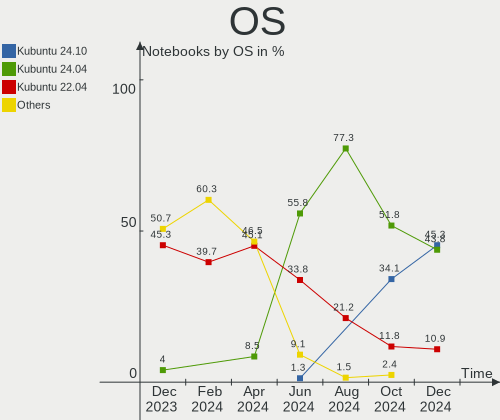
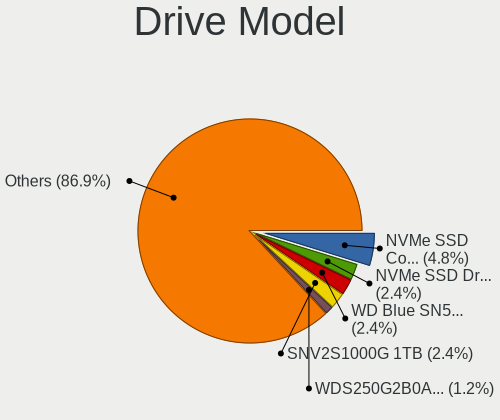
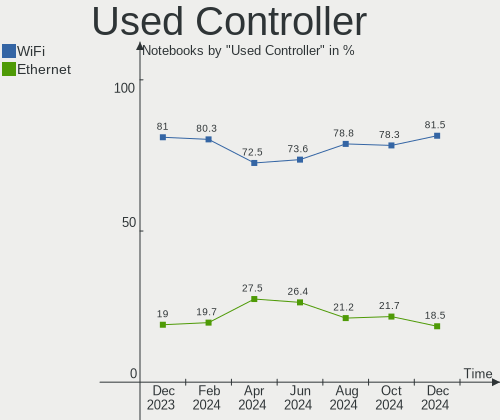
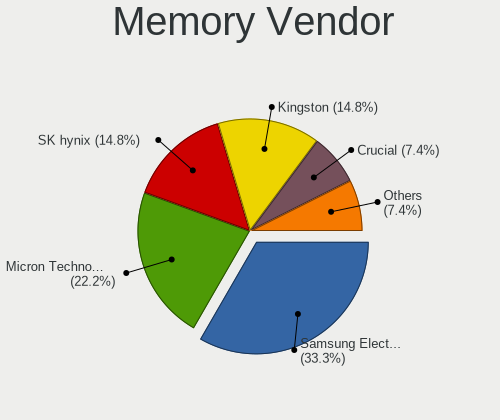
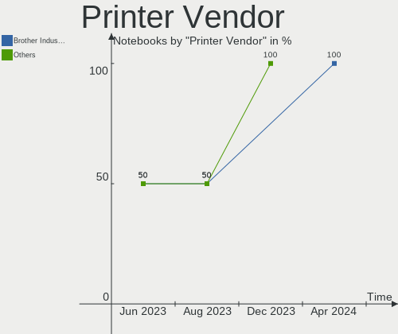
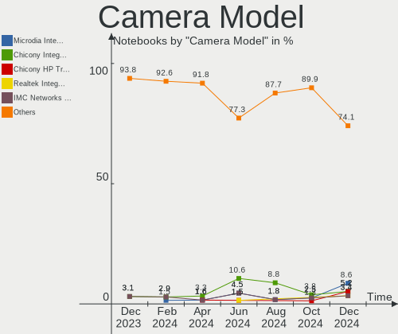

Kubuntu - Hardware Trends (Notebooks)
-------------------------------------

A project to identify most popular hardware characteristics and track their change
over time based on data collected by Linux users at https://Linux-Hardware.org.

Anyone can contribute to this report by the [hw-probe](https://github.com/linuxhw/hw-probe) tool:

    sudo -E hw-probe -all -upload

This report is for one last month. Overall report since the beginning of time: [TestCoverage](https://github.com/linuxhw/TestCoverage)

Period: Oct, 2022.

Contents
--------

* [ System ](#system)
  - [ OS                       ](#os)
  - [ OS Family                ](#os-family)
  - [ Kernel                   ](#kernel)
  - [ Kernel Family            ](#kernel-family)
  - [ Kernel Major Ver.        ](#kernel-major-ver)
  - [ Arch                     ](#arch)
  - [ DE                       ](#de)
  - [ Display Server           ](#display-server)
  - [ Display Manager          ](#display-manager)
  - [ OS Lang                  ](#os-lang)
  - [ Boot Mode                ](#boot-mode)
  - [ Filesystem               ](#filesystem)
  - [ Part. scheme             ](#part-scheme)
  - [ Dual Boot with Linux/BSD ](#dual-boot-with-linuxbsd)
  - [ Dual Boot (Win)          ](#dual-boot-win)

* [ Board ](#board)
  - [ Vendor                   ](#vendor)
  - [ Model                    ](#model)
  - [ Model Family             ](#model-family)
  - [ MFG Year                 ](#mfg-year)
  - [ Form Factor              ](#form-factor)
  - [ Secure Boot              ](#secure-boot)
  - [ Coreboot                 ](#coreboot)
  - [ RAM Size                 ](#ram-size)
  - [ RAM Used                 ](#ram-used)
  - [ Total Drives             ](#total-drives)
  - [ Has CD-ROM               ](#has-cd-rom)
  - [ Has Ethernet             ](#has-ethernet)
  - [ Has WiFi                 ](#has-wifi)
  - [ Has Bluetooth            ](#has-bluetooth)

* [ Location ](#location)
  - [ Country                  ](#country)
  - [ City                     ](#city)

* [ Drives ](#drives)
  - [ Drive Vendor             ](#drive-vendor)
  - [ Drive Model              ](#drive-model)
  - [ HDD Vendor               ](#hdd-vendor)
  - [ SSD Vendor               ](#ssd-vendor)
  - [ Drive Kind               ](#drive-kind)
  - [ Drive Connector          ](#drive-connector)
  - [ Drive Size               ](#drive-size)
  - [ Space Total              ](#space-total)
  - [ Space Used               ](#space-used)
  - [ Malfunc. Drives          ](#malfunc-drives)
  - [ Malfunc. Drive Vendor    ](#malfunc-drive-vendor)
  - [ Malfunc. HDD Vendor      ](#malfunc-hdd-vendor)
  - [ Malfunc. Drive Kind      ](#malfunc-drive-kind)
  - [ Failed Drives            ](#failed-drives)
  - [ Failed Drive Vendor      ](#failed-drive-vendor)
  - [ Drive Status             ](#drive-status)

* [ Storage controller ](#storage-controller)
  - [ Storage Vendor           ](#storage-vendor)
  - [ Storage Model            ](#storage-model)
  - [ Storage Kind             ](#storage-kind)

* [ Processor ](#processor)
  - [ CPU Vendor               ](#cpu-vendor)
  - [ CPU Model                ](#cpu-model)
  - [ CPU Model Family         ](#cpu-model-family)
  - [ CPU Cores                ](#cpu-cores)
  - [ CPU Sockets              ](#cpu-sockets)
  - [ CPU Threads              ](#cpu-threads)
  - [ CPU Op-Modes             ](#cpu-op-modes)
  - [ CPU Microcode            ](#cpu-microcode)
  - [ CPU Microarch            ](#cpu-microarch)

* [ Graphics ](#graphics)
  - [ GPU Vendor               ](#gpu-vendor)
  - [ GPU Model                ](#gpu-model)
  - [ GPU Combo                ](#gpu-combo)
  - [ GPU Driver               ](#gpu-driver)
  - [ GPU Memory               ](#gpu-memory)

* [ Monitor ](#monitor)
  - [ Monitor Vendor           ](#monitor-vendor)
  - [ Monitor Model            ](#monitor-model)
  - [ Monitor Resolution       ](#monitor-resolution)
  - [ Monitor Diagonal         ](#monitor-diagonal)
  - [ Monitor Width            ](#monitor-width)
  - [ Aspect Ratio             ](#aspect-ratio)
  - [ Monitor Area             ](#monitor-area)
  - [ Pixel Density            ](#pixel-density)
  - [ Multiple Monitors        ](#multiple-monitors)

* [ Network ](#network)
  - [ Net Controller Vendor    ](#net-controller-vendor)
  - [ Net Controller Model     ](#net-controller-model)
  - [ Wireless Vendor          ](#wireless-vendor)
  - [ Wireless Model           ](#wireless-model)
  - [ Ethernet Vendor          ](#ethernet-vendor)
  - [ Ethernet Model           ](#ethernet-model)
  - [ Net Controller Kind      ](#net-controller-kind)
  - [ Used Controller          ](#used-controller)
  - [ NICs                     ](#nics)
  - [ IPv6                     ](#ipv6)

* [ Bluetooth ](#bluetooth)
  - [ Bluetooth Vendor         ](#bluetooth-vendor)
  - [ Bluetooth Model          ](#bluetooth-model)

* [ Sound ](#sound)
  - [ Sound Vendor             ](#sound-vendor)
  - [ Sound Model              ](#sound-model)

* [ Memory ](#memory)
  - [ Memory Vendor            ](#memory-vendor)
  - [ Memory Model             ](#memory-model)
  - [ Memory Kind              ](#memory-kind)
  - [ Memory Form Factor       ](#memory-form-factor)
  - [ Memory Size              ](#memory-size)
  - [ Memory Speed             ](#memory-speed)

* [ Printers & scanners ](#printers--scanners)
  - [ Printer Vendor           ](#printer-vendor)
  - [ Printer Model            ](#printer-model)
  - [ Scanner Vendor           ](#scanner-vendor)
  - [ Scanner Model            ](#scanner-model)

* [ Camera ](#camera)
  - [ Camera Vendor            ](#camera-vendor)
  - [ Camera Model             ](#camera-model)

* [ Security ](#security)
  - [ Fingerprint Vendor       ](#fingerprint-vendor)
  - [ Fingerprint Model        ](#fingerprint-model)
  - [ Chipcard Vendor          ](#chipcard-vendor)
  - [ Chipcard Model           ](#chipcard-model)

* [ Unsupported ](#unsupported)
  - [ Unsupported Devices      ](#unsupported-devices)
  - [ Unsupported Device Types ](#unsupported-device-types)

System
------

OS
--

Installed operating systems

| Name          | Notebooks | Percent |
|---------------|-----------|---------|
| Kubuntu 22.04 | 63        | 78.75%  |
| Kubuntu 20.04 | 7         | 8.75%   |
| Kubuntu 22.10 | 5         | 6.25%   |
| Kubuntu 11    | 4         | 5%      |
| Kubuntu 18.04 | 1         | 1.25%   |

OS Family
---------

OS without a version

| Name    | Notebooks | Percent |
|---------|-----------|---------|
| Kubuntu | 80        | 100%    |

Kernel
------

Version of the Linux kernel

| Version                | Notebooks | Percent |
|------------------------|-----------|---------|
| 5.15.0-52-generic      | 22        | 27.5%   |
| 5.15.0-48-generic      | 17        | 21.25%  |
| 5.15.0-50-generic      | 16        | 20%     |
| 5.15.0-43-generic      | 4         | 5%      |
| 5.19.0-23-generic      | 3         | 3.75%   |
| 5.15.0-46-generic      | 2         | 2.5%    |
| 6.0.1-060001-generic   | 1         | 1.25%   |
| 6.0.0-t2               | 1         | 1.25%   |
| 5.4.0-79-generic       | 1         | 1.25%   |
| 5.19.11-051911-generic | 1         | 1.25%   |
| 5.19.0-21-generic      | 1         | 1.25%   |
| 5.19.0-19-generic      | 1         | 1.25%   |
| 5.17.0-1020-oem        | 1         | 1.25%   |
| 5.17.0-1017-oem        | 1         | 1.25%   |
| 5.16.11-051611-generic | 1         | 1.25%   |
| 5.15.65-xanmod1        | 1         | 1.25%   |
| 5.15.0-53-generic      | 1         | 1.25%   |
| 5.15.0-52-lowlatency   | 1         | 1.25%   |
| 5.15.0-48-lowlatency   | 1         | 1.25%   |
| 5.15.0-47-lowlatency   | 1         | 1.25%   |
| 5.15.0-47-generic      | 1         | 1.25%   |
| 5.15.0-10050-tuxedo    | 1         | 1.25%   |

Kernel Family
-------------

Linux kernel without a distro release

| Version | Notebooks | Percent |
|---------|-----------|---------|
| 5.15.0  | 67        | 83.75%  |
| 5.19.0  | 5         | 6.25%   |
| 5.17.0  | 2         | 2.5%    |
| 6.0.1   | 1         | 1.25%   |
| 6.0.0   | 1         | 1.25%   |
| 5.4.0   | 1         | 1.25%   |
| 5.19.11 | 1         | 1.25%   |
| 5.16.11 | 1         | 1.25%   |
| 5.15.65 | 1         | 1.25%   |

Kernel Major Ver.
-----------------

Linux kernel major version

| Version | Notebooks | Percent |
|---------|-----------|---------|
| 5.15    | 68        | 85%     |
| 5.19    | 6         | 7.5%    |
| 6.0     | 2         | 2.5%    |
| 5.17    | 2         | 2.5%    |
| 5.4     | 1         | 1.25%   |
| 5.16    | 1         | 1.25%   |

Arch
----

OS architecture (x86_64, i586, etc.)

| Name   | Notebooks | Percent |
|--------|-----------|---------|
| x86_64 | 80        | 100%    |

DE
--

Desktop Environment

| Name       | Notebooks | Percent |
|------------|-----------|---------|
| KDE5       | 76        | 95%     |
| GNOME      | 2         | 2.5%    |
| X-Cinnamon | 1         | 1.25%   |
| i3         | 1         | 1.25%   |

Display Server
--------------

X11 or Wayland

| Name    | Notebooks | Percent |
|---------|-----------|---------|
| X11     | 77        | 96.25%  |
| Wayland | 2         | 2.5%    |
| Tty     | 1         | 1.25%   |

Display Manager
---------------

SDDM, LightDM, etc.

| Name    | Notebooks | Percent |
|---------|-----------|---------|
| SDDM    | 58        | 72.5%   |
| Unknown | 16        | 20%     |
| LightDM | 3         | 3.75%   |
| GDM3    | 2         | 2.5%    |
| SLiM    | 1         | 1.25%   |

OS Lang
-------

Language

| Lang    | Notebooks | Percent |
|---------|-----------|---------|
| en_US   | 38        | 47.5%   |
| it_IT   | 12        | 15%     |
| fr_FR   | 4         | 5%      |
| de_DE   | 4         | 5%      |
| pl_PL   | 3         | 3.75%   |
| ru_RU   | 2         | 2.5%    |
| pt_BR   | 2         | 2.5%    |
| hu_HU   | 2         | 2.5%    |
| es_CL   | 2         | 2.5%    |
| en_IN   | 2         | 2.5%    |
| nl_BE   | 1         | 1.25%   |
| ko_KR   | 1         | 1.25%   |
| es_ES   | 1         | 1.25%   |
| en_SG   | 1         | 1.25%   |
| en_NZ   | 1         | 1.25%   |
| en_GB   | 1         | 1.25%   |
| en_AU   | 1         | 1.25%   |
| Default | 1         | 1.25%   |
| C       | 1         | 1.25%   |

Boot Mode
---------

EFI or BIOS

| Mode | Notebooks | Percent |
|------|-----------|---------|
| EFI  | 50        | 62.5%   |
| BIOS | 30        | 37.5%   |

Filesystem
----------

Type of filesystem

| Type    | Notebooks | Percent |
|---------|-----------|---------|
| Ext4    | 72        | 90%     |
| Overlay | 4         | 5%      |
| Ext2    | 2         | 2.5%    |
| Ext3    | 1         | 1.25%   |
| Btrfs   | 1         | 1.25%   |

Part. scheme
------------

Scheme of partitioning

| Type    | Notebooks | Percent |
|---------|-----------|---------|
| GPT     | 62        | 77.5%   |
| Unknown | 16        | 20%     |
| MBR     | 2         | 2.5%    |

Dual Boot with Linux/BSD
------------------------

Hosting more than one Linux/BSD

| Dual boot | Notebooks | Percent |
|-----------|-----------|---------|
| No        | 76        | 95%     |
| Yes       | 4         | 5%      |

Dual Boot (Win)
---------------

Hosting Linux and Windows

| Dual boot | Notebooks | Percent |
|-----------|-----------|---------|
| No        | 45        | 56.25%  |
| Yes       | 35        | 43.75%  |

Board
-----

Vendor
------

Motherboard manufacturer

| Name                | Notebooks | Percent |
|---------------------|-----------|---------|
| Lenovo              | 22        | 27.5%   |
| Hewlett-Packard     | 17        | 21.25%  |
| Dell                | 12        | 15%     |
| ASUSTek Computer    | 7         | 8.75%   |
| Acer                | 7         | 8.75%   |
| Apple               | 3         | 3.75%   |
| Samsung Electronics | 2         | 2.5%    |
| HUAWEI              | 2         | 2.5%    |
| TUXEDO              | 1         | 1.25%   |
| Toshiba             | 1         | 1.25%   |
| Tactus              | 1         | 1.25%   |
| Notebook            | 1         | 1.25%   |
| Intel               | 1         | 1.25%   |
| Haier               | 1         | 1.25%   |
| GPU Company         | 1         | 1.25%   |
| Gigabyte Technology | 1         | 1.25%   |

Model
-----

Motherboard model

| Name                                     | Notebooks | Percent |
|------------------------------------------|-----------|---------|
| TUXEDO Stellaris AMD Gen3 (CZN)          | 1         | 1.25%   |
| Toshiba Satellite NB10t-A-102            | 1         | 1.25%   |
| Tactus GeoBook 140                       | 1         | 1.25%   |
| Samsung R430/P430/R480                   | 1         | 1.25%   |
| Samsung 767XCL                           | 1         | 1.25%   |
| Notebook PD5x_7xPNP_PNR_PNN_PNT          | 1         | 1.25%   |
| Lenovo ZHAOYANG E53-80 81CM              | 1         | 1.25%   |
| Lenovo Yoga 2 13 20344                   | 1         | 1.25%   |
| Lenovo V15-IGL 82C3                      | 1         | 1.25%   |
| Lenovo V15 G2 ALC 82KD                   | 1         | 1.25%   |
| Lenovo ThinkPad X230 23256N6             | 1         | 1.25%   |
| Lenovo ThinkPad X1 Carbon 4th 20FB003TUK | 1         | 1.25%   |
| Lenovo ThinkPad T430 2342A19             | 1         | 1.25%   |
| Lenovo ThinkPad P73 20QRS00100           | 1         | 1.25%   |
| Lenovo ThinkPad L15 Gen 2 20X3006YUS     | 1         | 1.25%   |
| Lenovo ThinkPad L15 Gen 1 20U8S0AH00     | 1         | 1.25%   |
| Lenovo ThinkPad E590 20NB005MUS          | 1         | 1.25%   |
| Lenovo ThinkBook 15 G3 ACL 21A4          | 1         | 1.25%   |
| Lenovo ThinkBook 14-IIL 20SL             | 1         | 1.25%   |
| Lenovo ThinkBook 14 G4 ABA 21DK          | 1         | 1.25%   |
| Lenovo Legion 5 17ACH6 82K0              | 1         | 1.25%   |
| Lenovo Legion 5 15ACH6H 82JU             | 1         | 1.25%   |
| Lenovo IdeaPad Y510P 20217               | 1         | 1.25%   |
| Lenovo IdeaPad Gaming 3 15ACH6 82K2      | 1         | 1.25%   |
| Lenovo IdeaPad 320-15IKB 80XL            | 1         | 1.25%   |
| Lenovo IdeaPad 3 15IGL05 81WQ            | 1         | 1.25%   |
| Lenovo IdeaPad 3 15ADA05 81W1            | 1         | 1.25%   |
| Lenovo IdeaPad 1 14IGL05 81VU            | 1         | 1.25%   |
| Intel Infoway                            | 1         | 1.25%   |
| HUAWEI NBD-WXX9                          | 1         | 1.25%   |
| HUAWEI BOHB-WAX9                         | 1         | 1.25%   |
| HP ProBook 640 G2                        | 1         | 1.25%   |
| HP ProBook 640 G1                        | 1         | 1.25%   |
| HP ProBook 450 G5                        | 1         | 1.25%   |
| HP ProBook 440 G8 Notebook PC            | 1         | 1.25%   |
| HP Pavilion Laptop 15-eh1xxx             | 1         | 1.25%   |
| HP Pavilion g6                           | 1         | 1.25%   |
| HP Pavilion dv6                          | 1         | 1.25%   |
| HP OMEN Laptop 15-en0xxx                 | 1         | 1.25%   |
| HP Laptop 17-by4xxx                      | 1         | 1.25%   |

Model Family
------------

Motherboard model prefix

| Name                  | Notebooks | Percent |
|-----------------------|-----------|---------|
| Lenovo ThinkPad       | 7         | 8.75%   |
| Lenovo IdeaPad        | 6         | 7.5%    |
| Acer Aspire           | 5         | 6.25%   |
| HP ProBook            | 4         | 5%      |
| Dell Latitude         | 4         | 5%      |
| Lenovo ThinkBook      | 3         | 3.75%   |
| HP Pavilion           | 3         | 3.75%   |
| HP Laptop             | 3         | 3.75%   |
| Lenovo Legion         | 2         | 2.5%    |
| HP EliteBook          | 2         | 2.5%    |
| Dell XPS              | 2         | 2.5%    |
| Dell Vostro           | 2         | 2.5%    |
| Dell Precision        | 2         | 2.5%    |
| Dell Inspiron         | 2         | 2.5%    |
| TUXEDO Stellaris      | 1         | 1.25%   |
| Toshiba Satellite     | 1         | 1.25%   |
| Tactus GeoBook        | 1         | 1.25%   |
| Samsung R430          | 1         | 1.25%   |
| Samsung 767XCL        | 1         | 1.25%   |
| Notebook PD5x         | 1         | 1.25%   |
| Lenovo ZHAOYANG       | 1         | 1.25%   |
| Lenovo Yoga           | 1         | 1.25%   |
| Lenovo V15-IGL        | 1         | 1.25%   |
| Lenovo V15            | 1         | 1.25%   |
| Intel Infoway         | 1         | 1.25%   |
| HUAWEI NBD-WXX9       | 1         | 1.25%   |
| HUAWEI BOHB-WAX9      | 1         | 1.25%   |
| HP OMEN               | 1         | 1.25%   |
| HP G62                | 1         | 1.25%   |
| HP Compaq             | 1         | 1.25%   |
| HP 470                | 1         | 1.25%   |
| HP 255                | 1         | 1.25%   |
| Haier A1420EM         | 1         | 1.25%   |
| GPU Company GWTC116-2 | 1         | 1.25%   |
| Gigabyte AERO         | 1         | 1.25%   |
| ASUS Zephyrus         | 1         | 1.25%   |
| ASUS X555UA           | 1         | 1.25%   |
| ASUS X455LD           | 1         | 1.25%   |
| ASUS VivoBook         | 1         | 1.25%   |
| ASUS ROG              | 1         | 1.25%   |

MFG Year
--------

Motherboard manufacture year

| Year | Notebooks | Percent |
|------|-----------|---------|
| 2021 | 18        | 22.5%   |
| 2020 | 14        | 17.5%   |
| 2022 | 7         | 8.75%   |
| 2019 | 7         | 8.75%   |
| 2012 | 7         | 8.75%   |
| 2014 | 6         | 7.5%    |
| 2011 | 4         | 5%      |
| 2017 | 3         | 3.75%   |
| 2016 | 3         | 3.75%   |
| 2018 | 2         | 2.5%    |
| 2015 | 2         | 2.5%    |
| 2013 | 2         | 2.5%    |
| 2010 | 2         | 2.5%    |
| 2008 | 2         | 2.5%    |
| 2009 | 1         | 1.25%   |

Form Factor
-----------

Physical design of the computer

| Name     | Notebooks | Percent |
|----------|-----------|---------|
| Notebook | 80        | 100%    |

Secure Boot
-----------

Enabled or disabled

| State    | Notebooks | Percent |
|----------|-----------|---------|
| Disabled | 70        | 87.5%   |
| Enabled  | 10        | 12.5%   |

Coreboot
--------

Have coreboot on board

| Used | Notebooks | Percent |
|------|-----------|---------|
| No   | 80        | 100%    |

RAM Size
--------

Total RAM memory

| Size in GB  | Notebooks | Percent |
|-------------|-----------|---------|
| 8.01-16.0   | 22        | 27.5%   |
| 4.01-8.0    | 20        | 25%     |
| 16.01-24.0  | 15        | 18.75%  |
| 3.01-4.0    | 11        | 13.75%  |
| 32.01-64.0  | 5         | 6.25%   |
| 24.01-32.0  | 4         | 5%      |
| 64.01-256.0 | 2         | 2.5%    |
| 2.01-3.0    | 1         | 1.25%   |

RAM Used
--------

Used RAM memory

| Used GB   | Notebooks | Percent |
|-----------|-----------|---------|
| 2.01-3.0  | 22        | 27.5%   |
| 4.01-8.0  | 18        | 22.5%   |
| 3.01-4.0  | 17        | 21.25%  |
| 1.01-2.0  | 17        | 21.25%  |
| 8.01-16.0 | 5         | 6.25%   |
| 0.51-1.0  | 1         | 1.25%   |

Total Drives
------------

Number of drives on board

| Drives | Notebooks | Percent |
|--------|-----------|---------|
| 1      | 56        | 70%     |
| 2      | 19        | 23.75%  |
| 3      | 3         | 3.75%   |
| 4      | 2         | 2.5%    |

Has CD-ROM
----------

Has CD-ROM on board

| Presented | Notebooks | Percent |
|-----------|-----------|---------|
| No        | 59        | 73.75%  |
| Yes       | 21        | 26.25%  |

Has Ethernet
------------

Has Ethernet on board

| Presented | Notebooks | Percent |
|-----------|-----------|---------|
| Yes       | 65        | 81.25%  |
| No        | 15        | 18.75%  |

Has WiFi
--------

Has WiFi module

| Presented | Notebooks | Percent |
|-----------|-----------|---------|
| Yes       | 79        | 98.75%  |
| No        | 1         | 1.25%   |

Has Bluetooth
-------------

Has Bluetooth module

| Presented | Notebooks | Percent |
|-----------|-----------|---------|
| Yes       | 63        | 78.75%  |
| No        | 17        | 21.25%  |

Location
--------

Country
-------

Geographic location (country)

| Country     | Notebooks | Percent |
|-------------|-----------|---------|
| Italy       | 18        | 22.5%   |
| USA         | 15        | 18.75%  |
| Germany     | 5         | 6.25%   |
| France      | 5         | 6.25%   |
| Russia      | 3         | 3.75%   |
| Poland      | 3         | 3.75%   |
| Hungary     | 3         | 3.75%   |
| Mexico      | 2         | 2.5%    |
| Indonesia   | 2         | 2.5%    |
| India       | 2         | 2.5%    |
| Chile       | 2         | 2.5%    |
| Brazil      | 2         | 2.5%    |
| Belgium     | 2         | 2.5%    |
| Vietnam     | 1         | 1.25%   |
| UK          | 1         | 1.25%   |
| Turkey      | 1         | 1.25%   |
| Spain       | 1         | 1.25%   |
| South Korea | 1         | 1.25%   |
| Slovenia    | 1         | 1.25%   |
| Singapore   | 1         | 1.25%   |
| Romania     | 1         | 1.25%   |
| Pakistan    | 1         | 1.25%   |
| New Zealand | 1         | 1.25%   |
| Lithuania   | 1         | 1.25%   |
| Ireland     | 1         | 1.25%   |
| Estonia     | 1         | 1.25%   |
| Ecuador     | 1         | 1.25%   |
| Bulgaria    | 1         | 1.25%   |
| Australia   | 1         | 1.25%   |

City
----

Geographic location (city)

| City                    | Notebooks | Percent |
|-------------------------|-----------|---------|
| Milan                   | 6         | 7.5%    |
| Moscow                  | 3         | 3.75%   |
| Wroclaw                 | 2         | 2.5%    |
| Turin                   | 2         | 2.5%    |
| Paris                   | 2         | 2.5%    |
| Granozzo con Monticello | 2         | 2.5%    |
| Budapest                | 2         | 2.5%    |
| Berlin                  | 2         | 2.5%    |
| Walbach                 | 1         | 1.25%   |
| Vilnius                 | 1         | 1.25%   |
| Varna                   | 1         | 1.25%   |
| Valdivia                | 1         | 1.25%   |
| Tijuana                 | 1         | 1.25%   |
| Surabaya                | 1         | 1.25%   |
| Singapore               | 1         | 1.25%   |
| Seville                 | 1         | 1.25%   |
| Scottsbluff             | 1         | 1.25%   |
| Schaumburg              | 1         | 1.25%   |
| San Pietro in Volta     | 1         | 1.25%   |
| Samarinda               | 1         | 1.25%   |
| Salerno                 | 1         | 1.25%   |
| Roeselare               | 1         | 1.25%   |
| Rio de Janeiro          | 1         | 1.25%   |
| Rehoboth                | 1         | 1.25%   |
| Ravenna                 | 1         | 1.25%   |
| Quito                   | 1         | 1.25%   |
| Puente Alto             | 1         | 1.25%   |
| Plattsmouth             | 1         | 1.25%   |
| Ocala                   | 1         | 1.25%   |
| North Adams             | 1         | 1.25%   |
| Noida                   | 1         | 1.25%   |
| Murska Sobota           | 1         | 1.25%   |
| Montefiore dell'Aso     | 1         | 1.25%   |
| Minneapolis             | 1         | 1.25%   |
| Mexico City             | 1         | 1.25%   |
| Karachi                 | 1         | 1.25%   |
| Kallosemjen             | 1         | 1.25%   |
| Ixelles-Elsene          | 1         | 1.25%   |
| Ho Chi Minh City        | 1         | 1.25%   |
| Hawthorne               | 1         | 1.25%   |

Drives
------

Drive Vendor
------------

Hard drive vendors

| Vendor                         | Notebooks | Drives | Percent |
|--------------------------------|-----------|--------|---------|
| Samsung Electronics            | 23        | 27     | 22.55%  |
| WDC                            | 9         | 9      | 8.82%   |
| Seagate                        | 9         | 10     | 8.82%   |
| SanDisk                        | 9         | 9      | 8.82%   |
| Crucial                        | 8         | 8      | 7.84%   |
| Toshiba                        | 6         | 6      | 5.88%   |
| Unknown                        | 4         | 4      | 3.92%   |
| Micron Technology              | 4         | 4      | 3.92%   |
| Intel                          | 4         | 4      | 3.92%   |
| SK hynix                       | 3         | 3      | 2.94%   |
| KIOXIA                         | 3         | 3      | 2.94%   |
| Kingston                       | 3         | 3      | 2.94%   |
| HGST                           | 3         | 4      | 2.94%   |
| LITEONIT                       | 2         | 2      | 1.96%   |
| Apple                          | 2         | 2      | 1.96%   |
| WALRAM                         | 1         | 1      | 0.98%   |
| Solid State Storage Technology | 1         | 1      | 0.98%   |
| Smart                          | 1         | 1      | 0.98%   |
| SABRENT                        | 1         | 3      | 0.98%   |
| PNY                            | 1         | 1      | 0.98%   |
| Phison                         | 1         | 1      | 0.98%   |
| Netac                          | 1         | 1      | 0.98%   |
| MidasForce                     | 1         | 1      | 0.98%   |
| Intenso                        | 1         | 1      | 0.98%   |
| Emtec                          | 1         | 1      | 0.98%   |

Drive Model
-----------

Hard drive models

| Model                                           | Notebooks | Percent |
|-------------------------------------------------|-----------|---------|
| Unknown MMC Card  64GB                          | 3         | 2.83%   |
| Samsung SSD 860 EVO 500GB                       | 3         | 2.83%   |
| Crucial CT500P2SSD8 500GB                       | 3         | 2.83%   |
| Toshiba MQ04ABF100 1TB                          | 2         | 1.89%   |
| Seagate ST9750420AS 752GB                       | 2         | 1.89%   |
| Samsung SSD 980 PRO 1TB                         | 2         | 1.89%   |
| Samsung SSD 970 EVO Plus 1TB                    | 2         | 1.89%   |
| Intel SSD 660P Series 1024GB                    | 2         | 1.89%   |
| HGST HTS721010A9E630 1TB                        | 2         | 1.89%   |
| WDC WDS240G2G0B-00EPW0 240GB SSD                | 1         | 0.94%   |
| WDC WDBNCE0010PNC 1TB SSD                       | 1         | 0.94%   |
| WDC WD1200BEVS-22UST0 120GB                     | 1         | 0.94%   |
| WDC WD10SPSX-75A6WT0 1TB                        | 1         | 0.94%   |
| WDC PC SN810 NVMe 512GB                         | 1         | 0.94%   |
| WDC PC SN530 SDBPNPZ-512G-1006 512GB            | 1         | 0.94%   |
| WDC PC SN530 SDBPNPZ-256G-1114 256GB            | 1         | 0.94%   |
| WDC PC SN530 SDBPNPZ-1T00-1006 1TB              | 1         | 0.94%   |
| WDC PC SN530 SDBPMPZ-512G-1101 512GB            | 1         | 0.94%   |
| WALRAM 240G                                     | 1         | 0.94%   |
| Unknown MMC Card  7GB                           | 1         | 0.94%   |
| Toshiba MQ02ABF050H 500GB                       | 1         | 0.94%   |
| Toshiba MQ01ABD100 1TB                          | 1         | 0.94%   |
| Toshiba MK6476GSX 640GB                         | 1         | 0.94%   |
| Toshiba KXG60ZNV256G 256GB                      | 1         | 0.94%   |
| Solid State Storage SSSTC CL1-4D128 128GB       | 1         | 0.94%   |
| Smart SSD XceedValue2 mSATA 32GB                | 1         | 0.94%   |
| SK hynix PC601 HFS256GD9TNG-L2A0A 256GB         | 1         | 0.94%   |
| SK hynix HFS256G39TND-N210A 256GB SSD           | 1         | 0.94%   |
| SK hynix HFM001TD3JX013N 1TB                    | 1         | 0.94%   |
| Seagate ST96812AS 64GB                          | 1         | 0.94%   |
| Seagate ST500LT012-1DG142 500GB                 | 1         | 0.94%   |
| Seagate ST320LT020-9YG142 320GB                 | 1         | 0.94%   |
| Seagate ST2000LM007-1R8174 2TB                  | 1         | 0.94%   |
| Seagate ST1000LM035-1RK172 1TB                  | 1         | 0.94%   |
| Seagate Portable 2TB                            | 1         | 0.94%   |
| Seagate BUP Slim 2TB                            | 1         | 0.94%   |
| Seagate BUP BK 4TB                              | 1         | 0.94%   |
| Sandisk WD Blue SN550 NVMe SSD 1TB              | 1         | 0.94%   |
| Sandisk WD Blue SN500 / PC SN520 NVMe SSD 512GB | 1         | 0.94%   |
| SanDisk Ultra 3D NVMe 2TB                       | 1         | 0.94%   |

HDD Vendor
----------

Hard disk drive vendors

| Vendor  | Notebooks | Drives | Percent |
|---------|-----------|--------|---------|
| Seagate | 8         | 9      | 42.11%  |
| Toshiba | 5         | 5      | 26.32%  |
| HGST    | 3         | 4      | 15.79%  |
| WDC     | 2         | 2      | 10.53%  |
| SABRENT | 1         | 3      | 5.26%   |

SSD Vendor
----------

Solid state drive vendors

| Vendor              | Notebooks | Drives | Percent |
|---------------------|-----------|--------|---------|
| Samsung Electronics | 10        | 12     | 31.25%  |
| SanDisk             | 5         | 5      | 15.63%  |
| Crucial             | 4         | 4      | 12.5%   |
| WDC                 | 2         | 2      | 6.25%   |
| LITEONIT            | 2         | 2      | 6.25%   |
| Smart               | 1         | 1      | 3.13%   |
| SK hynix            | 1         | 1      | 3.13%   |
| Netac               | 1         | 1      | 3.13%   |
| MidasForce          | 1         | 1      | 3.13%   |
| Kingston            | 1         | 1      | 3.13%   |
| Intenso             | 1         | 1      | 3.13%   |
| Intel               | 1         | 1      | 3.13%   |
| Emtec               | 1         | 1      | 3.13%   |
| Apple               | 1         | 1      | 3.13%   |

Drive Kind
----------

HDD or SSD

| Kind    | Notebooks | Drives | Percent |
|---------|-----------|--------|---------|
| NVMe    | 39        | 47     | 42.86%  |
| SSD     | 29        | 34     | 31.87%  |
| HDD     | 17        | 23     | 18.68%  |
| MMC     | 4         | 4      | 4.4%    |
| Unknown | 2         | 2      | 2.2%    |

Drive Connector
---------------

SATA, SAS, NVMe, etc.

| Type | Notebooks | Drives | Percent |
|------|-----------|--------|---------|
| SATA | 40        | 52     | 45.98%  |
| NVMe | 39        | 47     | 44.83%  |
| SAS  | 4         | 7      | 4.6%    |
| MMC  | 4         | 4      | 4.6%    |

Drive Size
----------

Size of hard drive

| Size in TB | Notebooks | Drives | Percent |
|------------|-----------|--------|---------|
| 0.01-0.5   | 29        | 36     | 60.42%  |
| 0.51-1.0   | 15        | 17     | 31.25%  |
| 1.01-2.0   | 3         | 3      | 6.25%   |
| 3.01-4.0   | 1         | 1      | 2.08%   |

Space Total
-----------

Amount of disk space available on the file system

| Size in GB     | Notebooks | Percent |
|----------------|-----------|---------|
| 251-500        | 22        | 27.5%   |
| 101-250        | 18        | 22.5%   |
| 501-1000       | 15        | 18.75%  |
| 1001-2000      | 7         | 8.75%   |
| 1-20           | 6         | 7.5%    |
| 51-100         | 6         | 7.5%    |
| More than 3000 | 3         | 3.75%   |
| 2001-3000      | 2         | 2.5%    |
| 21-50          | 1         | 1.25%   |

Space Used
----------

Amount of used disk space

| Used GB        | Notebooks | Percent |
|----------------|-----------|---------|
| 1-20           | 21        | 26.25%  |
| 21-50          | 15        | 18.75%  |
| 101-250        | 15        | 18.75%  |
| 251-500        | 12        | 15%     |
| 51-100         | 9         | 11.25%  |
| 501-1000       | 4         | 5%      |
| More than 3000 | 2         | 2.5%    |
| 1001-2000      | 2         | 2.5%    |

Malfunc. Drives
---------------

Drive models with a malfunction

| Model                            | Notebooks | Drives | Percent |
|----------------------------------|-----------|--------|---------|
| WDC WDS240G2G0B-00EPW0 240GB SSD | 1         | 1      | 20%     |
| Toshiba MQ04ABF100 1TB           | 1         | 1      | 20%     |
| Seagate ST9750420AS 752GB        | 1         | 1      | 20%     |
| Seagate ST320LT020-9YG142 320GB  | 1         | 1      | 20%     |
| HGST HTS721010A9E630 1TB         | 1         | 1      | 20%     |

Malfunc. Drive Vendor
---------------------

Vendors of faulty drives

| Vendor  | Notebooks | Drives | Percent |
|---------|-----------|--------|---------|
| Seagate | 2         | 2      | 40%     |
| WDC     | 1         | 1      | 20%     |
| Toshiba | 1         | 1      | 20%     |
| HGST    | 1         | 1      | 20%     |

Malfunc. HDD Vendor
-------------------

Vendors of faulty HDD drives

| Vendor  | Notebooks | Drives | Percent |
|---------|-----------|--------|---------|
| Seagate | 2         | 2      | 50%     |
| Toshiba | 1         | 1      | 25%     |
| HGST    | 1         | 1      | 25%     |

Malfunc. Drive Kind
-------------------

Kinds of faulty drives

| Kind | Notebooks | Drives | Percent |
|------|-----------|--------|---------|
| HDD  | 4         | 4      | 80%     |
| SSD  | 1         | 1      | 20%     |

Failed Drives
-------------

Failed drive models

Zero info for selected period =(

Failed Drive Vendor
-------------------

Failed drive vendors

Zero info for selected period =(

Drive Status
------------

Number of failed and malfunc. drives

| Status   | Notebooks | Drives | Percent |
|----------|-----------|--------|---------|
| Works    | 47        | 58     | 55.29%  |
| Detected | 33        | 47     | 38.82%  |
| Malfunc  | 5         | 5      | 5.88%   |

Storage controller
------------------

Storage Vendor
--------------

Storage controller vendors

| Vendor                         | Notebooks | Percent |
|--------------------------------|-----------|---------|
| Intel                          | 53        | 50%     |
| Samsung Electronics            | 13        | 12.26%  |
| AMD                            | 11        | 10.38%  |
| SanDisk                        | 9         | 8.49%   |
| Micron/Crucial Technology      | 4         | 3.77%   |
| Micron Technology              | 4         | 3.77%   |
| Toshiba America Info Systems   | 2         | 1.89%   |
| SK hynix                       | 2         | 1.89%   |
| Phison Electronics             | 2         | 1.89%   |
| KIOXIA                         | 2         | 1.89%   |
| Kingston Technology Company    | 2         | 1.89%   |
| Solid State Storage Technology | 1         | 0.94%   |
| Apple                          | 1         | 0.94%   |

Storage Model
-------------

Storage controller models

| Model                                                                          | Notebooks | Percent |
|--------------------------------------------------------------------------------|-----------|---------|
| AMD FCH SATA Controller [AHCI mode]                                            | 10        | 8.93%   |
| Intel Sunrise Point-LP SATA Controller [AHCI mode]                             | 7         | 6.25%   |
| Intel Volume Management Device NVMe RAID Controller                            | 6         | 5.36%   |
| Intel 7 Series Chipset Family 6-port SATA Controller [AHCI mode]               | 6         | 5.36%   |
| Samsung NVMe SSD Controller SM981/PM981/PM983                                  | 5         | 4.46%   |
| Intel Celeron/Pentium Silver Processor SATA Controller                         | 5         | 4.46%   |
| SanDisk WD Blue SN550 NVMe SSD                                                 | 4         | 3.57%   |
| Samsung NVMe SSD Controller 980                                                | 4         | 3.57%   |
| Micron/Crucial P2 NVMe PCIe SSD                                                | 4         | 3.57%   |
| Micron Non-Volatile memory controller                                          | 4         | 3.57%   |
| Intel 82801 Mobile SATA Controller [RAID mode]                                 | 4         | 3.57%   |
| Samsung NVMe SSD Controller PM9A1/PM9A3/980PRO                                 | 3         | 2.68%   |
| Intel Tiger Lake-LP SATA Controller                                            | 3         | 2.68%   |
| Intel 8 Series/C220 Series Chipset Family 6-port SATA Controller 1 [AHCI mode] | 3         | 2.68%   |
| Intel 8 Series SATA Controller 1 [AHCI mode]                                   | 3         | 2.68%   |
| Toshiba America Info Systems XG6 NVMe SSD Controller                           | 2         | 1.79%   |
| SanDisk Non-Volatile memory controller                                         | 2         | 1.79%   |
| Phison E12 NVMe Controller                                                     | 2         | 1.79%   |
| KIOXIA NVMe SSD Controller BG4                                                 | 2         | 1.79%   |
| Intel SSD 660P Series                                                          | 2         | 1.79%   |
| Intel Comet Lake SATA AHCI Controller                                          | 2         | 1.79%   |
| Intel 6 Series/C200 Series Chipset Family 6 port Mobile SATA AHCI Controller   | 2         | 1.79%   |
| Solid State Storage Non-Volatile memory controller                             | 1         | 0.89%   |
| SK hynix Non-Volatile memory controller                                        | 1         | 0.89%   |
| SK hynix Gold P31 SSD                                                          | 1         | 0.89%   |
| SanDisk WD PC SN810 / Black SN850 NVMe SSD                                     | 1         | 0.89%   |
| SanDisk WD Blue SN500 / PC SN520 NVMe SSD                                      | 1         | 0.89%   |
| SanDisk WD Black NVMe SSD                                                      | 1         | 0.89%   |
| Samsung Electronics Non-Volatile memory controller                             | 1         | 0.89%   |
| Kingston Company Company Non-Volatile memory controller                        | 1         | 0.89%   |
| Kingston Company OM3PDP3 NVMe SSD                                              | 1         | 0.89%   |
| Intel SSD Pro 7600p/760p/E 6100p Series                                        | 1         | 0.89%   |
| Intel Ice Lake-LP SATA Controller [AHCI mode]                                  | 1         | 0.89%   |
| Intel HM170/QM170 Chipset SATA Controller [AHCI Mode]                          | 1         | 0.89%   |
| Intel Cannon Lake Mobile PCH SATA AHCI Controller                              | 1         | 0.89%   |
| Intel Atom Processor E3800 Series SATA AHCI Controller                         | 1         | 0.89%   |
| Intel Alder Lake-P SATA AHCI Controller                                        | 1         | 0.89%   |
| Intel 82801IBM/IEM (ICH9M/ICH9M-E) 4 port SATA Controller [AHCI mode]          | 1         | 0.89%   |
| Intel 82801IBM/IEM (ICH9M/ICH9M-E) 2 port SATA Controller [IDE mode]           | 1         | 0.89%   |
| Intel 82801HM/HEM (ICH8M/ICH8M-E) SATA Controller [AHCI mode]                  | 1         | 0.89%   |

Storage Kind
------------

Kind of storage controller (IDE, SATA, NVMe, SAS, ...)

| Kind | Notebooks | Percent |
|------|-----------|---------|
| SATA | 53        | 50.48%  |
| NVMe | 39        | 37.14%  |
| RAID | 10        | 9.52%   |
| IDE  | 3         | 2.86%   |

Processor
---------

CPU Vendor
----------

Processor vendors

| Vendor | Notebooks | Percent |
|--------|-----------|---------|
| Intel  | 63        | 78.75%  |
| AMD    | 17        | 21.25%  |

CPU Model
---------

Processor models

| Model                                       | Notebooks | Percent |
|---------------------------------------------|-----------|---------|
| Intel Celeron N4020 CPU @ 1.10GHz           | 4         | 5%      |
| AMD Ryzen 7 5800H with Radeon Graphics      | 4         | 5%      |
| AMD Ryzen 7 5700U with Radeon Graphics      | 4         | 5%      |
| Intel Core i7-9750H CPU @ 2.60GHz           | 3         | 3.75%   |
| Intel Core i7-8550U CPU @ 1.80GHz           | 2         | 2.5%    |
| Intel Core i7-3720QM CPU @ 2.60GHz          | 2         | 2.5%    |
| Intel Core i7-3632QM CPU @ 2.20GHz          | 2         | 2.5%    |
| Intel Core i7-1065G7 CPU @ 1.30GHz          | 2         | 2.5%    |
| Intel Core i5-6200U CPU @ 2.30GHz           | 2         | 2.5%    |
| Intel Core i5-3320M CPU @ 2.60GHz           | 2         | 2.5%    |
| Intel 11th Gen Core i7-1165G7 @ 2.80GHz     | 2         | 2.5%    |
| Intel 11th Gen Core i5-1135G7 @ 2.40GHz     | 2         | 2.5%    |
| Intel 11th Gen Core i3-1115G4 @ 3.00GHz     | 2         | 2.5%    |
| Intel Pentium Silver N5030 CPU @ 1.10GHz    | 1         | 1.25%   |
| Intel Pentium Dual-Core CPU T4400 @ 2.20GHz | 1         | 1.25%   |
| Intel Pentium CPU N3510 @ 1.99GHz           | 1         | 1.25%   |
| Intel Pentium CPU 6405U @ 2.40GHz           | 1         | 1.25%   |
| Intel Core i9-9980HK CPU @ 2.40GHz          | 1         | 1.25%   |
| Intel Core i7-8750H CPU @ 2.20GHz           | 1         | 1.25%   |
| Intel Core i7-7700HQ CPU @ 2.80GHz          | 1         | 1.25%   |
| Intel Core i7-7500U CPU @ 2.70GHz           | 1         | 1.25%   |
| Intel Core i7-6500U CPU @ 2.50GHz           | 1         | 1.25%   |
| Intel Core i7-4710HQ CPU @ 2.50GHz          | 1         | 1.25%   |
| Intel Core i7-4702MQ CPU @ 2.20GHz          | 1         | 1.25%   |
| Intel Core i7-4700MQ CPU @ 2.40GHz          | 1         | 1.25%   |
| Intel Core i7-3940XM CPU @ 3.00GHz          | 1         | 1.25%   |
| Intel Core i7-3520M CPU @ 2.90GHz           | 1         | 1.25%   |
| Intel Core i7-10870H CPU @ 2.20GHz          | 1         | 1.25%   |
| Intel Core i7 CPU Q 720 @ 1.60GHz           | 1         | 1.25%   |
| Intel Core i5-L16G7 CPU @ 1.40GHz           | 1         | 1.25%   |
| Intel Core i5-8350U CPU @ 1.70GHz           | 1         | 1.25%   |
| Intel Core i5-8265U CPU @ 1.60GHz           | 1         | 1.25%   |
| Intel Core i5-8250U CPU @ 1.60GHz           | 1         | 1.25%   |
| Intel Core i5-7200U CPU @ 2.50GHz           | 1         | 1.25%   |
| Intel Core i5-4210U CPU @ 1.70GHz           | 1         | 1.25%   |
| Intel Core i5-4200U CPU @ 1.60GHz           | 1         | 1.25%   |
| Intel Core i5-3210M CPU @ 2.50GHz           | 1         | 1.25%   |
| Intel Core i5-2430M CPU @ 2.40GHz           | 1         | 1.25%   |
| Intel Core i5-10300H CPU @ 2.50GHz          | 1         | 1.25%   |
| Intel Core i5-10210U CPU @ 1.60GHz          | 1         | 1.25%   |

CPU Model Family
----------------

Processor model prefix

| Model                   | Notebooks | Percent |
|-------------------------|-----------|---------|
| Intel Core i7           | 22        | 27.5%   |
| Intel Core i5           | 15        | 18.75%  |
| Other                   | 11        | 13.75%  |
| AMD Ryzen 7             | 11        | 13.75%  |
| Intel Celeron           | 6         | 7.5%    |
| Intel Core i3           | 3         | 3.75%   |
| Intel Pentium           | 2         | 2.5%    |
| Intel Pentium Silver    | 1         | 1.25%   |
| Intel Pentium Dual-Core | 1         | 1.25%   |
| Intel Core i9           | 1         | 1.25%   |
| Intel Core 2 Duo        | 1         | 1.25%   |
| AMD Ryzen 9             | 1         | 1.25%   |
| AMD Ryzen 7 PRO         | 1         | 1.25%   |
| AMD Ryzen 5 PRO         | 1         | 1.25%   |
| AMD Ryzen 5             | 1         | 1.25%   |
| AMD E1                  | 1         | 1.25%   |
| AMD A6                  | 1         | 1.25%   |

CPU Cores
---------

Number of processor cores

| Number | Notebooks | Percent |
|--------|-----------|---------|
| 4      | 27        | 33.75%  |
| 2      | 26        | 32.5%   |
| 8      | 15        | 18.75%  |
| 6      | 6         | 7.5%    |
| 14     | 2         | 2.5%    |
| 12     | 1         | 1.25%   |
| 10     | 1         | 1.25%   |
| 5      | 1         | 1.25%   |
| 1      | 1         | 1.25%   |

CPU Sockets
-----------

Number of sockets

| Number | Notebooks | Percent |
|--------|-----------|---------|
| 1      | 80        | 100%    |

CPU Threads
-----------

Threads per core (Hyper-Threading)

| Number | Notebooks | Percent |
|--------|-----------|---------|
| 2      | 67        | 83.75%  |
| 1      | 13        | 16.25%  |

CPU Op-Modes
------------

CPU Operation Modes (32-bit, 64-bit)

| Op mode        | Notebooks | Percent |
|----------------|-----------|---------|
| 32-bit, 64-bit | 80        | 100%    |

CPU Microcode
-------------

Microcode number

| Number     | Notebooks | Percent |
|------------|-----------|---------|
| Unknown    | 27        | 33.75%  |
| 0x306a9    | 5         | 6.25%   |
| 0x906ea    | 4         | 5%      |
| 0x806c1    | 4         | 5%      |
| 0x0a50000c | 4         | 5%      |
| 0x08608103 | 4         | 5%      |
| 0x906a3    | 3         | 3.75%   |
| 0x806ea    | 3         | 3.75%   |
| 0x40651    | 3         | 3.75%   |
| 0x08600106 | 3         | 3.75%   |
| 0x706e5    | 2         | 2.5%    |
| 0x706a8    | 2         | 2.5%    |
| 0x406e3    | 2         | 2.5%    |
| 0x306c3    | 2         | 2.5%    |
| 0xa0652    | 1         | 1.25%   |
| 0x906e9    | 1         | 1.25%   |
| 0x906a4    | 1         | 1.25%   |
| 0x806ec    | 1         | 1.25%   |
| 0x806eb    | 1         | 1.25%   |
| 0x806d1    | 1         | 1.25%   |
| 0x806a1    | 1         | 1.25%   |
| 0x30673    | 1         | 1.25%   |
| 0x1067a    | 1         | 1.25%   |
| 0x08608102 | 1         | 1.25%   |
| 0x0700010b | 1         | 1.25%   |
| 0x03000027 | 1         | 1.25%   |

CPU Microarch
-------------

Microarchitecture

| Name             | Notebooks | Percent |
|------------------|-----------|---------|
| KabyLake         | 15        | 18.75%  |
| IvyBridge        | 9         | 11.25%  |
| Zen 3            | 6         | 7.5%    |
| TigerLake        | 6         | 7.5%    |
| Haswell          | 6         | 7.5%    |
| Goldmont plus    | 6         | 7.5%    |
| Unknown          | 6         | 7.5%    |
| Alderlake Hybrid | 4         | 5%      |
| Zen 2            | 3         | 3.75%   |
| Skylake          | 3         | 3.75%   |
| IceLake          | 3         | 3.75%   |
| SandyBridge      | 2         | 2.5%    |
| Penryn           | 2         | 2.5%    |
| CometLake        | 2         | 2.5%    |
| Zen+             | 1         | 1.25%   |
| Westmere         | 1         | 1.25%   |
| Silvermont       | 1         | 1.25%   |
| Nehalem          | 1         | 1.25%   |
| K10 Llano        | 1         | 1.25%   |
| Jaguar           | 1         | 1.25%   |
| Core             | 1         | 1.25%   |

Graphics
--------

GPU Vendor
----------

Vendors of graphics cards

| Vendor | Notebooks | Percent |
|--------|-----------|---------|
| Intel  | 59        | 55.14%  |
| Nvidia | 28        | 26.17%  |
| AMD    | 20        | 18.69%  |

GPU Model
---------

Graphics card models

| Model                                                                     | Notebooks | Percent |
|---------------------------------------------------------------------------|-----------|---------|
| Intel 3rd Gen Core processor Graphics Controller                          | 8         | 7.41%   |
| Intel GeminiLake [UHD Graphics 600]                                       | 5         | 4.63%   |
| AMD Lucienne                                                              | 5         | 4.63%   |
| Intel UHD Graphics 620                                                    | 4         | 3.7%    |
| Intel TigerLake-LP GT2 [Iris Xe Graphics]                                 | 4         | 3.7%    |
| Intel CoffeeLake-H GT2 [UHD Graphics 630]                                 | 4         | 3.7%    |
| AMD Cezanne                                                               | 4         | 3.7%    |
| Intel Skylake GT2 [HD Graphics 520]                                       | 3         | 2.78%   |
| Intel Haswell-ULT Integrated Graphics Controller                          | 3         | 2.78%   |
| Intel Alder Lake-P Integrated Graphics Controller                         | 3         | 2.78%   |
| Intel 4th Gen Core Processor Integrated Graphics Controller               | 3         | 2.78%   |
| AMD Renoir                                                                | 3         | 2.78%   |
| Nvidia TU106M [GeForce RTX 2060 Mobile]                                   | 2         | 1.85%   |
| Nvidia GK107M [GeForce GT 650M Mac Edition]                               | 2         | 1.85%   |
| Nvidia GA106M [GeForce RTX 3060 Mobile / Max-Q]                           | 2         | 1.85%   |
| Intel Tiger Lake UHD Graphics                                             | 2         | 1.85%   |
| Intel Iris Plus Graphics G7                                               | 2         | 1.85%   |
| Intel HD Graphics 620                                                     | 2         | 1.85%   |
| Intel CometLake-H GT2 [UHD Graphics]                                      | 2         | 1.85%   |
| Intel 2nd Generation Core Processor Family Integrated Graphics Controller | 2         | 1.85%   |
| Nvidia TU117M                                                             | 1         | 0.93%   |
| Nvidia TU117GLM [T550 Laptop GPU]                                         | 1         | 0.93%   |
| Nvidia TU117GLM [Quadro T2000 Mobile / Max-Q]                             | 1         | 0.93%   |
| Nvidia TU117BM [GeForce GTX 1650 Mobile Refresh]                          | 1         | 0.93%   |
| Nvidia TU106M [GeForce RTX 2070 Mobile]                                   | 1         | 0.93%   |
| Nvidia TU106BM [GeForce RTX 2070 Mobile / Max-Q]                          | 1         | 0.93%   |
| Nvidia GT218M [GeForce 310M]                                              | 1         | 0.93%   |
| Nvidia GT216M [GeForce GT 230M]                                           | 1         | 0.93%   |
| Nvidia GP108M [GeForce MX330]                                             | 1         | 0.93%   |
| Nvidia GP107M [GeForce GTX 1050 Mobile]                                   | 1         | 0.93%   |
| Nvidia GP107M [GeForce GTX 1050 3 GB Max-Q]                               | 1         | 0.93%   |
| Nvidia GM108M [GeForce 930MX]                                             | 1         | 0.93%   |
| Nvidia GM108M [GeForce 920MX]                                             | 1         | 0.93%   |
| Nvidia GM107M [GeForce GTX 850M]                                          | 1         | 0.93%   |
| Nvidia GM107 [GeForce 940MX]                                              | 1         | 0.93%   |
| Nvidia GK107M [GeForce GT 755M]                                           | 1         | 0.93%   |
| Nvidia GK104GLM [Quadro K4000M]                                           | 1         | 0.93%   |
| Nvidia GF117M [GeForce 610M/710M/810M/820M / GT 620M/625M/630M/720M]      | 1         | 0.93%   |
| Nvidia GA107M [GeForce RTX 3050 Ti Mobile]                                | 1         | 0.93%   |
| Nvidia GA104M [GeForce RTX 3080 Mobile / Max-Q 8GB/16GB]                  | 1         | 0.93%   |

GPU Combo
---------

Combinations of graphics cards

| Name           | Notebooks | Percent |
|----------------|-----------|---------|
| 1 x Intel      | 36        | 45%     |
| Intel + Nvidia | 18        | 22.5%   |
| 1 x AMD        | 11        | 13.75%  |
| 1 x Nvidia     | 5         | 6.25%   |
| AMD + Nvidia   | 5         | 6.25%   |
| Intel + AMD    | 4         | 5%      |
| 2 x Intel      | 1         | 1.25%   |

GPU Driver
----------

Free vs proprietary

| Driver      | Notebooks | Percent |
|-------------|-----------|---------|
| Free        | 58        | 72.5%   |
| Proprietary | 21        | 26.25%  |
| Unknown     | 1         | 1.25%   |

GPU Memory
----------

Total video memory

| Size in GB | Notebooks | Percent |
|------------|-----------|---------|
| Unknown    | 55        | 68.75%  |
| 0.01-0.5   | 9         | 11.25%  |
| 1.01-2.0   | 6         | 7.5%    |
| 3.01-4.0   | 5         | 6.25%   |
| 5.01-6.0   | 2         | 2.5%    |
| 0.51-1.0   | 2         | 2.5%    |
| 7.01-8.0   | 1         | 1.25%   |

Monitor
-------

Monitor Vendor
--------------

Monitor vendors

| Vendor                  | Notebooks | Percent |
|-------------------------|-----------|---------|
| Chimei Innolux          | 20        | 21.05%  |
| AU Optronics            | 18        | 18.95%  |
| Samsung Electronics     | 12        | 12.63%  |
| BOE                     | 12        | 12.63%  |
| LG Display              | 10        | 10.53%  |
| Hewlett-Packard         | 3         | 3.16%   |
| Apple                   | 3         | 3.16%   |
| Sharp                   | 2         | 2.11%   |
| PANDA                   | 2         | 2.11%   |
| Goldstar                | 2         | 2.11%   |
| SLD                     | 1         | 1.05%   |
| MSI                     | 1         | 1.05%   |
| Lenovo                  | 1         | 1.05%   |
| IBM                     | 1         | 1.05%   |
| HKC                     | 1         | 1.05%   |
| Dell                    | 1         | 1.05%   |
| CVT                     | 1         | 1.05%   |
| CPT                     | 1         | 1.05%   |
| Chi Mei Optoelectronics | 1         | 1.05%   |
| BenQ                    | 1         | 1.05%   |
| ASUSTek Computer        | 1         | 1.05%   |

Monitor Model
-------------

Monitor models

| Model                                                                 | Notebooks | Percent |
|-----------------------------------------------------------------------|-----------|---------|
| Samsung Electronics LCD Monitor SEC5441 1366x768 344x194mm 15.5-inch  | 2         | 2.06%   |
| PANDA LCD Monitor NCP0040 1920x1080 344x194mm 15.5-inch               | 2         | 2.06%   |
| Chimei Innolux LCD Monitor CMN176C 1920x1080 381x214mm 17.2-inch      | 2         | 2.06%   |
| Chimei Innolux LCD Monitor CMN15F5 1920x1080 344x193mm 15.5-inch      | 2         | 2.06%   |
| Chimei Innolux LCD Monitor CMN1521 1920x1080 344x193mm 15.5-inch      | 2         | 2.06%   |
| BOE LCD Monitor BOE069B 1600x900 382x215mm 17.3-inch                  | 2         | 2.06%   |
| AU Optronics LCD Monitor AUO21ED 1920x1080 344x193mm 15.5-inch        | 2         | 2.06%   |
| SLD LCD Monitor SLD003C 1366x768 309x173mm 13.9-inch                  | 1         | 1.03%   |
| Sharp LCD Monitor SHP1548 1920x1200 288x180mm 13.4-inch               | 1         | 1.03%   |
| Sharp LCD Monitor SHP1453 1920x1080 346x194mm 15.6-inch               | 1         | 1.03%   |
| Samsung Electronics T27B300 SAM0933 1920x1080 598x336mm 27.0-inch     | 1         | 1.03%   |
| Samsung Electronics LCD Monitor SEC5044 1920x1080 382x215mm 17.3-inch | 1         | 1.03%   |
| Samsung Electronics LCD Monitor SEC4145 1366x768 310x170mm 13.9-inch  | 1         | 1.03%   |
| Samsung Electronics LCD Monitor SEC3651 1366x768 344x194mm 15.5-inch  | 1         | 1.03%   |
| Samsung Electronics LCD Monitor SEC3047 1366x768 277x156mm 12.5-inch  | 1         | 1.03%   |
| Samsung Electronics LCD Monitor SDC4951 1366x768 344x194mm 15.5-inch  | 1         | 1.03%   |
| Samsung Electronics LCD Monitor SDC4154 2880x1800 302x189mm 14.0-inch | 1         | 1.03%   |
| Samsung Electronics LCD Monitor SAM0E83 3840x2160 950x540mm 43.0-inch | 1         | 1.03%   |
| Samsung Electronics LCD Monitor SAM0B30 1920x1080 885x498mm 40.0-inch | 1         | 1.03%   |
| Samsung Electronics C27F591 SAM0D37 1920x1080 598x336mm 27.0-inch     | 1         | 1.03%   |
| Samsung Electronics 770 Analog SAM12D7 1280x1024 338x270mm 17.0-inch  | 1         | 1.03%   |
| MSI G32CQ4 MSI3DB5 2560x1440 697x392mm 31.5-inch                      | 1         | 1.03%   |
| LG Display LCD Monitor LGD06CF 1920x1080 344x194mm 15.5-inch          | 1         | 1.03%   |
| LG Display LCD Monitor LGD069A 1920x1080 344x194mm 15.5-inch          | 1         | 1.03%   |
| LG Display LCD Monitor LGD05F2 1920x1080 344x194mm 15.5-inch          | 1         | 1.03%   |
| LG Display LCD Monitor LGD05BE 1920x1080 380x210mm 17.1-inch          | 1         | 1.03%   |
| LG Display LCD Monitor LGD046C 1920x1080 382x215mm 17.3-inch          | 1         | 1.03%   |
| LG Display LCD Monitor LGD0416 1920x1080 345x194mm 15.6-inch          | 1         | 1.03%   |
| LG Display LCD Monitor LGD03F1 1600x900 309x174mm 14.0-inch           | 1         | 1.03%   |
| LG Display LCD Monitor LGD033A 1366x768 344x194mm 15.5-inch           | 1         | 1.03%   |
| LG Display LCD Monitor LGD0335 1366x768 310x174mm 14.0-inch           | 1         | 1.03%   |
| LG Display LCD Monitor LGD02AC 1366x768 344x194mm 15.5-inch           | 1         | 1.03%   |
| Lenovo P24h-2L LEN62B2 2560x1440 527x296mm 23.8-inch                  | 1         | 1.03%   |
| IBM IBM9511 T540 TFT Monitor IBM7347 1024x768 304x228mm 15.0-inch     | 1         | 1.03%   |
| HKC LCD Monitor HKC3D00 1920x1080 344x194mm 15.5-inch                 | 1         | 1.03%   |
| Hewlett-Packard E231 HWP3064 1920x1080 510x287mm 23.0-inch            | 1         | 1.03%   |
| Hewlett-Packard 27es HWP3326 1920x1080 598x336mm 27.0-inch            | 1         | 1.03%   |
| Hewlett-Packard 27es HWP3325 1920x1080 598x336mm 27.0-inch            | 1         | 1.03%   |
| Goldstar Ultra HD GSM5B09 3840x2160 600x340mm 27.2-inch               | 1         | 1.03%   |
| Goldstar Ultra HD GSM5B08 3840x2160 600x340mm 27.2-inch               | 1         | 1.03%   |

Monitor Resolution
------------------

Monitor screen resolution

| Resolution        | Notebooks | Percent |
|-------------------|-----------|---------|
| 1920x1080 (FHD)   | 45        | 48.91%  |
| 1366x768 (WXGA)   | 25        | 27.17%  |
| 2560x1440 (QHD)   | 5         | 5.43%   |
| 3840x2160 (4K)    | 3         | 3.26%   |
| 1600x900 (HD+)    | 3         | 3.26%   |
| 2880x1800         | 2         | 2.17%   |
| 1920x1200 (WUXGA) | 2         | 2.17%   |
| 3072x1920         | 1         | 1.09%   |
| 2560x1600         | 1         | 1.09%   |
| 2560x1080         | 1         | 1.09%   |
| 1440x900 (WXGA+)  | 1         | 1.09%   |
| 1280x800 (WXGA)   | 1         | 1.09%   |
| 1280x1024 (SXGA)  | 1         | 1.09%   |
| 1024x768 (XGA)    | 1         | 1.09%   |

Monitor Diagonal
----------------

Diagonal size in inches

| Inches | Notebooks | Percent |
|--------|-----------|---------|
| 15     | 49        | 51.58%  |
| 13     | 10        | 10.53%  |
| 17     | 9         | 9.47%   |
| 14     | 9         | 9.47%   |
| 27     | 6         | 6.32%   |
| 23     | 2         | 2.11%   |
| 16     | 2         | 2.11%   |
| 84     | 1         | 1.05%   |
| 78     | 1         | 1.05%   |
| 54     | 1         | 1.05%   |
| 31     | 1         | 1.05%   |
| 28     | 1         | 1.05%   |
| 24     | 1         | 1.05%   |
| 12     | 1         | 1.05%   |
| 11     | 1         | 1.05%   |

Monitor Width
-------------

Physical width

| Width in mm | Notebooks | Percent |
|-------------|-----------|---------|
| 301-350     | 65        | 69.15%  |
| 351-400     | 10        | 10.64%  |
| 501-600     | 9         | 9.57%   |
| 201-300     | 5         | 5.32%   |
| 601-700     | 2         | 2.13%   |
| 1501-2000   | 2         | 2.13%   |
| 1001-1500   | 1         | 1.06%   |

Aspect Ratio
------------

Proportional relationship between the width and the height

| Ratio | Notebooks | Percent |
|-------|-----------|---------|
| 16/9  | 72        | 84.71%  |
| 16/10 | 10        | 11.76%  |
| 5/4   | 1         | 1.18%   |
| 4/3   | 1         | 1.18%   |
| 21/9  | 1         | 1.18%   |

Monitor Area
------------

Area in inch

| Area in inch | Notebooks | Percent |
|----------------|-----------|---------|
| 101-110        | 49        | 51.58%  |
| 81-90          | 16        | 16.84%  |
| 121-130        | 8         | 8.42%   |
| 301-350        | 6         | 6.32%   |
| More than 1000 | 3         | 3.16%   |
| 71-80          | 3         | 3.16%   |
| 251-300        | 2         | 2.11%   |
| 201-250        | 2         | 2.11%   |
| 111-120        | 2         | 2.11%   |
| 61-70          | 1         | 1.05%   |
| 51-60          | 1         | 1.05%   |
| 351-500        | 1         | 1.05%   |
| 141-150        | 1         | 1.05%   |

Pixel Density
-------------

Pixels per inch

| Density       | Notebooks | Percent |
|---------------|-----------|---------|
| 121-160       | 42        | 45.16%  |
| 101-120       | 24        | 25.81%  |
| 51-100        | 15        | 16.13%  |
| 161-240       | 8         | 8.6%    |
| More than 240 | 2         | 2.15%   |
| 1-50          | 2         | 2.15%   |

Multiple Monitors
-----------------

Total monitors connected

| Total | Notebooks | Percent |
|-------|-----------|---------|
| 1     | 62        | 77.5%   |
| 2     | 16        | 20%     |
| 3     | 1         | 1.25%   |
| 0     | 1         | 1.25%   |

Network
-------

Net Controller Vendor
---------------------

Controller vendors

| Vendor                   | Notebooks | Percent |
|--------------------------|-----------|---------|
| Realtek Semiconductor    | 49        | 37.4%   |
| Intel                    | 36        | 27.48%  |
| Qualcomm Atheros         | 12        | 9.16%   |
| Broadcom                 | 10        | 7.63%   |
| MediaTek                 | 8         | 6.11%   |
| Samsung Electronics      | 4         | 3.05%   |
| Marvell Technology Group | 2         | 1.53%   |
| Broadcom Limited         | 2         | 1.53%   |
| Apple                    | 2         | 1.53%   |
| Sierra Wireless          | 1         | 0.76%   |
| Ralink Technology        | 1         | 0.76%   |
| Lenovo                   | 1         | 0.76%   |
| Dell                     | 1         | 0.76%   |
| D-Link System            | 1         | 0.76%   |
| ASIX Electronics         | 1         | 0.76%   |

Net Controller Model
--------------------

Controller models

| Model                                                             | Notebooks | Percent |
|-------------------------------------------------------------------|-----------|---------|
| Realtek RTL8111/8168/8411 PCI Express Gigabit Ethernet Controller | 32        | 20.65%  |
| Realtek RTL8821CE 802.11ac PCIe Wireless Network Adapter          | 6         | 3.87%   |
| MediaTek MT7921 802.11ax PCI Express Wireless Network Adapter     | 6         | 3.87%   |
| Intel Wi-Fi 6 AX200                                               | 6         | 3.87%   |
| Realtek RTL8822CE 802.11ac PCIe Wireless Network Adapter          | 5         | 3.23%   |
| Intel 82579LM Gigabit Network Connection (Lewisville)             | 5         | 3.23%   |
| Realtek RTL810xE PCI Express Fast Ethernet controller             | 4         | 2.58%   |
| Intel Centrino Advanced-N 6205 [Taylor Peak]                      | 4         | 2.58%   |
| Intel Alder Lake-P PCH CNVi WiFi                                  | 4         | 2.58%   |
| Realtek RTL8852AE 802.11ax PCIe Wireless Network Adapter          | 3         | 1.94%   |
| Realtek RTL8153 Gigabit Ethernet Adapter                          | 3         | 1.94%   |
| Broadcom BCM4313 802.11bgn Wireless Network Adapter               | 3         | 1.94%   |
| Samsung GT-I9070 (network tethering, USB debugging enabled)       | 2         | 1.29%   |
| Samsung Galaxy series, misc. (tethering mode)                     | 2         | 1.29%   |
| Realtek 802.11n WLAN Adapter                                      | 2         | 1.29%   |
| Qualcomm Atheros QCA9565 / AR9565 Wireless Network Adapter        | 2         | 1.29%   |
| Qualcomm Atheros QCA9377 802.11ac Wireless Network Adapter        | 2         | 1.29%   |
| Qualcomm Atheros QCA6174 802.11ac Wireless Network Adapter        | 2         | 1.29%   |
| Intel Wireless 8260                                               | 2         | 1.29%   |
| Intel Wireless 7260                                               | 2         | 1.29%   |
| Intel Wi-Fi 6 AX201                                               | 2         | 1.29%   |
| Intel Gemini Lake PCH CNVi WiFi                                   | 2         | 1.29%   |
| Intel Ethernet Connection I219-V                                  | 2         | 1.29%   |
| Intel Ethernet Connection (13) I219-V                             | 2         | 1.29%   |
| Intel Cannon Lake PCH CNVi WiFi                                   | 2         | 1.29%   |
| Sierra Wireless EM7455 Qualcomm Snapdragon X7 LTE-A               | 1         | 0.65%   |
| Realtek RTL88x2bu [AC1200 Techkey]                                | 1         | 0.65%   |
| Realtek RTL8821AE 802.11ac PCIe Wireless Network Adapter          | 1         | 0.65%   |
| Realtek RTL8125 2.5GbE Controller                                 | 1         | 0.65%   |
| Realtek Realtek Network controller                                | 1         | 0.65%   |
| Realtek Killer E3000 2.5GbE Controller                            | 1         | 0.65%   |
| Ralink MT7601U Wireless Adapter                                   | 1         | 0.65%   |
| Qualcomm Atheros QCA8171 Gigabit Ethernet                         | 1         | 0.65%   |
| Qualcomm Atheros Killer E2500 Gigabit Ethernet Controller         | 1         | 0.65%   |
| Qualcomm Atheros AR9485 Wireless Network Adapter                  | 1         | 0.65%   |
| Qualcomm Atheros AR9462 Wireless Network Adapter                  | 1         | 0.65%   |
| Qualcomm Atheros AR928X Wireless Network Adapter (PCI-Express)    | 1         | 0.65%   |
| Qualcomm Atheros AR9285 Wireless Network Adapter (PCI-Express)    | 1         | 0.65%   |
| Qualcomm Atheros AR8132 Fast Ethernet                             | 1         | 0.65%   |
| MediaTek WLAN controller                                          | 1         | 0.65%   |

Wireless Vendor
---------------

Wireless vendors

| Vendor                | Notebooks | Percent |
|-----------------------|-----------|---------|
| Intel                 | 32        | 39.02%  |
| Realtek Semiconductor | 19        | 23.17%  |
| Qualcomm Atheros      | 10        | 12.2%   |
| MediaTek              | 8         | 9.76%   |
| Broadcom              | 8         | 9.76%   |
| Broadcom Limited      | 2         | 2.44%   |
| Sierra Wireless       | 1         | 1.22%   |
| Ralink Technology     | 1         | 1.22%   |
| D-Link System         | 1         | 1.22%   |

Wireless Model
--------------

Wireless models

| Model                                                                      | Notebooks | Percent |
|----------------------------------------------------------------------------|-----------|---------|
| Realtek RTL8821CE 802.11ac PCIe Wireless Network Adapter                   | 6         | 7.32%   |
| MediaTek MT7921 802.11ax PCI Express Wireless Network Adapter              | 6         | 7.32%   |
| Intel Wi-Fi 6 AX200                                                        | 6         | 7.32%   |
| Realtek RTL8822CE 802.11ac PCIe Wireless Network Adapter                   | 5         | 6.1%    |
| Intel Centrino Advanced-N 6205 [Taylor Peak]                               | 4         | 4.88%   |
| Intel Alder Lake-P PCH CNVi WiFi                                           | 4         | 4.88%   |
| Realtek RTL8852AE 802.11ax PCIe Wireless Network Adapter                   | 3         | 3.66%   |
| Broadcom BCM4313 802.11bgn Wireless Network Adapter                        | 3         | 3.66%   |
| Realtek 802.11n WLAN Adapter                                               | 2         | 2.44%   |
| Qualcomm Atheros QCA9565 / AR9565 Wireless Network Adapter                 | 2         | 2.44%   |
| Qualcomm Atheros QCA9377 802.11ac Wireless Network Adapter                 | 2         | 2.44%   |
| Qualcomm Atheros QCA6174 802.11ac Wireless Network Adapter                 | 2         | 2.44%   |
| Intel Wireless 8260                                                        | 2         | 2.44%   |
| Intel Wireless 7260                                                        | 2         | 2.44%   |
| Intel Wi-Fi 6 AX201                                                        | 2         | 2.44%   |
| Intel Gemini Lake PCH CNVi WiFi                                            | 2         | 2.44%   |
| Intel Cannon Lake PCH CNVi WiFi                                            | 2         | 2.44%   |
| Sierra Wireless EM7455 Qualcomm Snapdragon X7 LTE-A                        | 1         | 1.22%   |
| Realtek RTL88x2bu [AC1200 Techkey]                                         | 1         | 1.22%   |
| Realtek RTL8821AE 802.11ac PCIe Wireless Network Adapter                   | 1         | 1.22%   |
| Realtek Realtek Network controller                                         | 1         | 1.22%   |
| Ralink MT7601U Wireless Adapter                                            | 1         | 1.22%   |
| Qualcomm Atheros AR9485 Wireless Network Adapter                           | 1         | 1.22%   |
| Qualcomm Atheros AR9462 Wireless Network Adapter                           | 1         | 1.22%   |
| Qualcomm Atheros AR928X Wireless Network Adapter (PCI-Express)             | 1         | 1.22%   |
| Qualcomm Atheros AR9285 Wireless Network Adapter (PCI-Express)             | 1         | 1.22%   |
| MediaTek WLAN controller                                                   | 1         | 1.22%   |
| MediaTek MT7630e 802.11bgn Wireless Network Adapter                        | 1         | 1.22%   |
| Intel Wireless-AC 9260                                                     | 1         | 1.22%   |
| Intel Wireless 8265 / 8275                                                 | 1         | 1.22%   |
| Intel Wi-Fi 6 AX210/AX211/AX411 160MHz                                     | 1         | 1.22%   |
| Intel Ice Lake-LP PCH CNVi WiFi                                            | 1         | 1.22%   |
| Intel Dual Band Wireless-AC 3165 Plus Bluetooth                            | 1         | 1.22%   |
| Intel Comet Lake PCH-LP CNVi WiFi                                          | 1         | 1.22%   |
| Intel Comet Lake PCH CNVi WiFi                                             | 1         | 1.22%   |
| Intel Centrino Ultimate-N 6300                                             | 1         | 1.22%   |
| D-Link System AirPlus G DWL-G122 Wireless Adapter(rev.C1) [Ralink RT2571W] | 1         | 1.22%   |
| Broadcom Limited BCM4331 802.11a/b/g/n                                     | 1         | 1.22%   |
| Broadcom Limited BCM43225 802.11b/g/n                                      | 1         | 1.22%   |
| Broadcom BCM4364 802.11ac Wireless Network Adapter                         | 1         | 1.22%   |

Ethernet Vendor
---------------

Ethernet vendors

| Vendor                   | Notebooks | Percent |
|--------------------------|-----------|---------|
| Realtek Semiconductor    | 40        | 56.34%  |
| Intel                    | 14        | 19.72%  |
| Samsung Electronics      | 4         | 5.63%   |
| Broadcom                 | 4         | 5.63%   |
| Qualcomm Atheros         | 3         | 4.23%   |
| Marvell Technology Group | 2         | 2.82%   |
| Apple                    | 2         | 2.82%   |
| Lenovo                   | 1         | 1.41%   |
| ASIX Electronics         | 1         | 1.41%   |

Ethernet Model
--------------

Ethernet models

| Model                                                             | Notebooks | Percent |
|-------------------------------------------------------------------|-----------|---------|
| Realtek RTL8111/8168/8411 PCI Express Gigabit Ethernet Controller | 32        | 44.44%  |
| Intel 82579LM Gigabit Network Connection (Lewisville)             | 5         | 6.94%   |
| Realtek RTL810xE PCI Express Fast Ethernet controller             | 4         | 5.56%   |
| Realtek RTL8153 Gigabit Ethernet Adapter                          | 3         | 4.17%   |
| Samsung GT-I9070 (network tethering, USB debugging enabled)       | 2         | 2.78%   |
| Samsung Galaxy series, misc. (tethering mode)                     | 2         | 2.78%   |
| Intel Ethernet Connection I219-V                                  | 2         | 2.78%   |
| Intel Ethernet Connection (13) I219-V                             | 2         | 2.78%   |
| Realtek RTL8125 2.5GbE Controller                                 | 1         | 1.39%   |
| Realtek Killer E3000 2.5GbE Controller                            | 1         | 1.39%   |
| Qualcomm Atheros QCA8171 Gigabit Ethernet                         | 1         | 1.39%   |
| Qualcomm Atheros Killer E2500 Gigabit Ethernet Controller         | 1         | 1.39%   |
| Qualcomm Atheros AR8132 Fast Ethernet                             | 1         | 1.39%   |
| Marvell Group 88E8055 PCI-E Gigabit Ethernet Controller           | 1         | 1.39%   |
| Marvell Group 88E8040 PCI-E Fast Ethernet Controller              | 1         | 1.39%   |
| Lenovo Android                                                    | 1         | 1.39%   |
| Intel Ethernet Connection I217-V                                  | 1         | 1.39%   |
| Intel Ethernet Connection (7) I219-V                              | 1         | 1.39%   |
| Intel Ethernet Connection (4) I219-LM                             | 1         | 1.39%   |
| Intel Ethernet Connection (16) I219-LM                            | 1         | 1.39%   |
| Intel Ethernet Connection (14) I219-LM                            | 1         | 1.39%   |
| Broadcom NetXtreme BCM57786 Gigabit Ethernet PCIe                 | 1         | 1.39%   |
| Broadcom NetXtreme BCM57765 Gigabit Ethernet PCIe                 | 1         | 1.39%   |
| Broadcom NetXtreme BCM5761 Gigabit Ethernet PCIe                  | 1         | 1.39%   |
| Broadcom NetLink BCM57785 Gigabit Ethernet PCIe                   | 1         | 1.39%   |
| ASIX AX88179 Gigabit Ethernet                                     | 1         | 1.39%   |
| Apple iPad 4/Mini1                                                | 1         | 1.39%   |
| Apple iBridge                                                     | 1         | 1.39%   |

Net Controller Kind
-------------------

Ethernet, WiFi or modem

| Kind     | Notebooks | Percent |
|----------|-----------|---------|
| WiFi     | 79        | 54.48%  |
| Ethernet | 65        | 44.83%  |
| Modem    | 1         | 0.69%   |

Used Controller
---------------

Currently used network controller

| Kind     | Notebooks | Percent |
|----------|-----------|---------|
| WiFi     | 63        | 76.83%  |
| Ethernet | 19        | 23.17%  |

NICs
----

Total network controllers on board

| Total | Notebooks | Percent |
|-------|-----------|---------|
| 2     | 59        | 73.75%  |
| 1     | 19        | 23.75%  |
| 0     | 2         | 2.5%    |

IPv6
----

IPv6 vs IPv4

| Used | Notebooks | Percent |
|------|-----------|---------|
| No   | 60        | 75%     |
| Yes  | 20        | 25%     |

Bluetooth
---------

Bluetooth Vendor
----------------

Controller vendors

| Vendor                          | Notebooks | Percent |
|---------------------------------|-----------|---------|
| Intel                           | 25        | 39.06%  |
| Realtek Semiconductor           | 14        | 21.88%  |
| Qualcomm Atheros Communications | 5         | 7.81%   |
| Foxconn / Hon Hai               | 5         | 7.81%   |
| Lite-On Technology              | 4         | 6.25%   |
| Broadcom                        | 3         | 4.69%   |
| IMC Networks                    | 2         | 3.13%   |
| Cambridge Silicon Radio         | 2         | 3.13%   |
| Apple                           | 2         | 3.13%   |
| Toshiba                         | 1         | 1.56%   |
| Realtek                         | 1         | 1.56%   |

Bluetooth Model
---------------

Controller models

| Model                                               | Notebooks | Percent |
|-----------------------------------------------------|-----------|---------|
| Realtek Bluetooth Radio                             | 12        | 18.75%  |
| Intel Bluetooth wireless interface                  | 6         | 9.38%   |
| Intel Bluetooth 9460/9560 Jefferson Peak (JfP)      | 5         | 7.81%   |
| Intel AX200 Bluetooth                               | 5         | 7.81%   |
| Intel Bluetooth Device                              | 4         | 6.25%   |
| Intel AX201 Bluetooth                               | 4         | 6.25%   |
| Foxconn / Hon Hai Wireless_Device                   | 4         | 6.25%   |
| Realtek  Bluetooth 4.2 Adapter                      | 2         | 3.13%   |
| Qualcomm Atheros  Bluetooth Device                  | 2         | 3.13%   |
| IMC Networks Wireless_Device                        | 2         | 3.13%   |
| Cambridge Silicon Radio Bluetooth Dongle (HCI mode) | 2         | 3.13%   |
| Toshiba Bluetooth Device                            | 1         | 1.56%   |
| Realtek Bluetooth Radio                             | 1         | 1.56%   |
| Qualcomm Atheros QCA61x4 Bluetooth 4.0              | 1         | 1.56%   |
| Qualcomm Atheros Bluetooth USB Host Controller      | 1         | 1.56%   |
| Qualcomm Atheros AR3012 Bluetooth 4.0               | 1         | 1.56%   |
| Lite-On Wireless_Device                             | 1         | 1.56%   |
| Lite-On Qualcomm Atheros QCA9377 Bluetooth          | 1         | 1.56%   |
| Lite-On Bluetooth Device                            | 1         | 1.56%   |
| Lite-On BCM43142A0                                  | 1         | 1.56%   |
| Intel Wireless-AC 9260 Bluetooth Adapter            | 1         | 1.56%   |
| Foxconn / Hon Hai BT                                | 1         | 1.56%   |
| Broadcom HP Portable Bumble Bee                     | 1         | 1.56%   |
| Broadcom BCM20702A0 Bluetooth 4.0                   | 1         | 1.56%   |
| Broadcom BCM20702 Bluetooth 4.0 [ThinkPad]          | 1         | 1.56%   |
| Apple Bluetooth USB Host Controller                 | 1         | 1.56%   |
| Apple Bluetooth Host Controller                     | 1         | 1.56%   |

Sound
-----

Sound Vendor
------------

Sound card vendors

| Vendor              | Notebooks | Percent |
|---------------------|-----------|---------|
| Intel               | 62        | 59.62%  |
| Nvidia              | 19        | 18.27%  |
| AMD                 | 18        | 17.31%  |
| TerraTec Electronic | 1         | 0.96%   |
| Lenovo              | 1         | 0.96%   |
| Hewlett-Packard     | 1         | 0.96%   |
| Corsair             | 1         | 0.96%   |
| Apple               | 1         | 0.96%   |

Sound Model
-----------

Sound card models

| Model                                                                      | Notebooks | Percent |
|----------------------------------------------------------------------------|-----------|---------|
| AMD Family 17h/19h HD Audio Controller                                     | 15        | 12.2%   |
| AMD Renoir Radeon High Definition Audio Controller                         | 10        | 8.13%   |
| Intel Sunrise Point-LP HD Audio                                            | 9         | 7.32%   |
| Intel 7 Series/C216 Chipset Family High Definition Audio Controller        | 9         | 7.32%   |
| Intel Tiger Lake-LP Smart Sound Technology Audio Controller                | 6         | 4.88%   |
| Intel Celeron/Pentium Silver Processor High Definition Audio               | 6         | 4.88%   |
| Nvidia TU106 High Definition Audio Controller                              | 4         | 3.25%   |
| Intel Cannon Lake PCH cAVS                                                 | 4         | 3.25%   |
| Intel Alder Lake PCH-P High Definition Audio Controller                    | 4         | 3.25%   |
| Nvidia TU107 GeForce GTX 1650 High Definition Audio Controller             | 3         | 2.44%   |
| Nvidia GK107 HDMI Audio Controller                                         | 3         | 2.44%   |
| Intel Xeon E3-1200 v3/4th Gen Core Processor HD Audio Controller           | 3         | 2.44%   |
| Intel Haswell-ULT HD Audio Controller                                      | 3         | 2.44%   |
| Intel 8 Series/C220 Series Chipset High Definition Audio Controller        | 3         | 2.44%   |
| Intel 8 Series HD Audio Controller                                         | 3         | 2.44%   |
| Nvidia GA104 High Definition Audio Controller                              | 2         | 1.63%   |
| Intel Ice Lake-LP Smart Sound Technology Audio Controller                  | 2         | 1.63%   |
| Intel Comet Lake PCH-LP cAVS                                               | 2         | 1.63%   |
| Intel Comet Lake PCH cAVS                                                  | 2         | 1.63%   |
| Intel 82801I (ICH9 Family) HD Audio Controller                             | 2         | 1.63%   |
| Intel 6 Series/C200 Series Chipset Family High Definition Audio Controller | 2         | 1.63%   |
| Intel 5 Series/3400 Series Chipset High Definition Audio                   | 2         | 1.63%   |
| AMD FCH Azalia Controller                                                  | 2         | 1.63%   |
| TerraTec Electronic Aureon Dual USB                                        | 1         | 0.81%   |
| Nvidia High Definition Audio Controller                                    | 1         | 0.81%   |
| Nvidia GT216 HDMI Audio Controller                                         | 1         | 0.81%   |
| Nvidia GP107GL High Definition Audio Controller                            | 1         | 0.81%   |
| Nvidia GM107 High Definition Audio Controller [GeForce 940MX]              | 1         | 0.81%   |
| Nvidia GK104 HDMI Audio Controller                                         | 1         | 0.81%   |
| Nvidia GA106 High Definition Audio Controller                              | 1         | 0.81%   |
| Nvidia Audio device                                                        | 1         | 0.81%   |
| Lenovo Yoga ANC Headphones USB                                             | 1         | 0.81%   |
| Intel Tiger Lake-H HD Audio Controller                                     | 1         | 0.81%   |
| Intel HD Graphics SGPC                                                     | 1         | 0.81%   |
| Intel CM238 HD Audio Controller                                            | 1         | 0.81%   |
| Intel Cannon Point-LP High Definition Audio Controller                     | 1         | 0.81%   |
| Intel Atom Processor Z36xxx/Z37xxx Series High Definition Audio Controller | 1         | 0.81%   |
| Intel 82801H (ICH8 Family) HD Audio Controller                             | 1         | 0.81%   |
| Hewlett-Packard USB Audio                                                  | 1         | 0.81%   |
| Corsair VOID ELITE Wireless Gaming Dongle                                  | 1         | 0.81%   |

Memory
------

Memory Vendor
-------------

Memory module vendors

| Vendor              | Notebooks | Percent |
|---------------------|-----------|---------|
| Samsung Electronics | 23        | 33.82%  |
| SK hynix            | 17        | 25%     |
| Micron Technology   | 10        | 14.71%  |
| Crucial             | 4         | 5.88%   |
| Kingston            | 3         | 4.41%   |
| Unknown (ABCD)      | 2         | 2.94%   |
| Unknown             | 1         | 1.47%   |
| Teikon              | 1         | 1.47%   |
| Patriot             | 1         | 1.47%   |
| Nanya Technology    | 1         | 1.47%   |
| GOODRAM             | 1         | 1.47%   |
| Elpida              | 1         | 1.47%   |
| Atermiter           | 1         | 1.47%   |
| A-DATA Technology   | 1         | 1.47%   |
| Unknown             | 1         | 1.47%   |

Memory Model
------------

Memory module models

| Model                                                            | Notebooks | Percent |
|------------------------------------------------------------------|-----------|---------|
| Samsung RAM M471B1G73DB0-YK0 8GB SODIMM DDR3 1600MT/s            | 3         | 4.23%   |
| Unknown (ABCD) RAM 123456789012345678 2GB SODIMM LPDDR4 2400MT/s | 2         | 2.82%   |
| SK hynix RAM HMT351S6CFR8C-PB 4GB SODIMM DDR3 1600MT/s           | 2         | 2.82%   |
| SK hynix RAM HMA81GS6DJR8N-XN 8GB SODIMM DDR4 3200MT/s           | 2         | 2.82%   |
| Samsung RAM M471B5173DB0-YK0 4GB SODIMM DDR3 1600MT/s            | 2         | 2.82%   |
| Samsung RAM M471A2G43AB2-CWE 16GB SODIMM DDR4 3200MT/s           | 2         | 2.82%   |
| Samsung RAM M471A1K43DB1-CWE 8GB SODIMM DDR4 3200MT/s            | 2         | 2.82%   |
| Samsung RAM M471A1G44AB0-CWE 8GB SODIMM DDR4 3200MT/s            | 2         | 2.82%   |
| Unknown RAM Module 2GB SODIMM 800MT/s                            | 1         | 1.41%   |
| Teikon RAM TML251S6EFR8A-PBHC 4GB SODIMM DDR3 1600MT/s           | 1         | 1.41%   |
| SK hynix RAM Module 8GB SODIMM DDR4 2400MT/s                     | 1         | 1.41%   |
| SK hynix RAM Module 8GB SODIMM DDR4 2133MT/s                     | 1         | 1.41%   |
| SK hynix RAM Module 4GB SODIMM DDR3 1600MT/s                     | 1         | 1.41%   |
| SK hynix RAM Module 4GB Row Of Chips LPDDR4 4267MT/s             | 1         | 1.41%   |
| SK hynix RAM HMT451S6BFR8A-PB 4GB SODIMM DDR3 1600MT/s           | 1         | 1.41%   |
| SK hynix RAM HMT325S6CFR8C-PB 2GB SODIMM DDR3 1600MT/s           | 1         | 1.41%   |
| SK hynix RAM HMAA2GS6CJR8N-XN 16GB SODIMM DDR4 3200MT/s          | 1         | 1.41%   |
| SK hynix RAM HMAA1GS6DMR6N-XN 8GB Row Of Chips DDR4 3200MT/s     | 1         | 1.41%   |
| SK hynix RAM HMAA1GS6CJR6N-XN 8GB SODIMM DDR4 3200MT/s           | 1         | 1.41%   |
| SK hynix RAM HMAA1GS6CJR6N-XN 8GB Row Of Chips DDR4 3200MT/s     | 1         | 1.41%   |
| SK hynix RAM HMAA1GS6CJR6N-XN 8192MB SODIMM DDR4 3200MT/s        | 1         | 1.41%   |
| SK hynix RAM HMA81GS6JJR8N-VK 8GB SODIMM DDR4 2667MT/s           | 1         | 1.41%   |
| SK hynix RAM HMA81GS6CJR8N-XN 8192MB SODIMM DDR4 3200MT/s        | 1         | 1.41%   |
| SK hynix RAM HMA81GS6AFR8N-UH 8GB SODIMM DDR4 2667MT/s           | 1         | 1.41%   |
| Samsung RAM U6E3S4AA-MGCR 4GB Row Of Chips LPDDR4 4267MT/s       | 1         | 1.41%   |
| Samsung RAM Module 8GB SODIMM DDR4 2400MT/s                      | 1         | 1.41%   |
| Samsung RAM Module 8GB SODIMM DDR4 2133MT/s                      | 1         | 1.41%   |
| Samsung RAM Module 4GB SODIMM DDR3 1600MT/s                      | 1         | 1.41%   |
| Samsung RAM M471B1G73EB0-YK0 8GB SODIMM DDR3 1600MT/s            | 1         | 1.41%   |
| Samsung RAM M471A4G43AB1-CWE 32GB SODIMM DDR4 3200MT/s           | 1         | 1.41%   |
| Samsung RAM M471A2K43DB1-CWE 16GB SODIMM DDR4 3200MT/s           | 1         | 1.41%   |
| Samsung RAM M471A2K43CB1-CTD 16GB SODIMM DDR4 8400MT/s           | 1         | 1.41%   |
| Samsung RAM M471A2G43AB1-CTD 16GB SODIMM DDR4 2667MT/s           | 1         | 1.41%   |
| Samsung RAM M471A1K43CB1-CTD 8GB SODIMM DDR4 2667MT/s            | 1         | 1.41%   |
| Samsung RAM M471A1G44BB0-CWE 8GB SODIMM DDR4 3200MT/s            | 1         | 1.41%   |
| Samsung RAM K4A8G165WC-BCTD 4GB SODIMM DDR4 2667MT/s             | 1         | 1.41%   |
| Samsung RAM K3LKBKB@BM-MGCP 2GB Row Of Chips LPDDR5 6400MT/s     | 1         | 1.41%   |
| Patriot RAM PSD432G32002S 32GB SODIMM DDR4 3200MT/s              | 1         | 1.41%   |
| Nanya RAM M2S8G64CC8HB4N-DI 8GB SODIMM DDR3 1600MT/s             | 1         | 1.41%   |
| Micron RAM MTC4C10163S1SC48BA1 8GB SODIMM DDR5 4800MT/s          | 1         | 1.41%   |

Memory Kind
-----------

Memory module kinds

| Kind    | Notebooks | Percent |
|---------|-----------|---------|
| DDR4    | 32        | 59.26%  |
| DDR3    | 13        | 24.07%  |
| LPDDR4  | 4         | 7.41%   |
| LPDDR5  | 2         | 3.7%    |
| LPDDR3  | 1         | 1.85%   |
| DDR5    | 1         | 1.85%   |
| Unknown | 1         | 1.85%   |

Memory Form Factor
------------------

Physical design of the memory module

| Name         | Notebooks | Percent |
|--------------|-----------|---------|
| SODIMM       | 50        | 86.21%  |
| Row Of Chips | 7         | 12.07%  |
| Chip         | 1         | 1.72%   |

Memory Size
-----------

Memory module size

| Size  | Notebooks | Percent |
|-------|-----------|---------|
| 8192  | 25        | 40.32%  |
| 4096  | 17        | 27.42%  |
| 16384 | 14        | 22.58%  |
| 2048  | 4         | 6.45%   |
| 32768 | 2         | 3.23%   |

Memory Speed
------------

Memory module speed

| Speed | Notebooks | Percent |
|-------|-----------|---------|
| 3200  | 23        | 40.35%  |
| 1600  | 13        | 22.81%  |
| 2667  | 6         | 10.53%  |
| 2400  | 5         | 8.77%   |
| 6400  | 2         | 3.51%   |
| 4267  | 2         | 3.51%   |
| 8400  | 1         | 1.75%   |
| 4800  | 1         | 1.75%   |
| 2133  | 1         | 1.75%   |
| 1867  | 1         | 1.75%   |
| 1334  | 1         | 1.75%   |
| 800   | 1         | 1.75%   |

Printers & scanners
-------------------

Printer Vendor
--------------

Printer device vendors

| Vendor             | Notebooks | Percent |
|--------------------|-----------|---------|
| Canon              | 1         | 50%     |
| Brother Industries | 1         | 50%     |

Printer Model
-------------

Printer device models

| Model                  | Notebooks | Percent |
|------------------------|-----------|---------|
| Canon iP2600 series    | 1         | 50%     |
| Brother HL-2230 series | 1         | 50%     |

Scanner Vendor
--------------

Scanner device vendors

Zero info for selected period =(

Scanner Model
-------------

Scanner device models

Zero info for selected period =(

Camera
------

Camera Vendor
-------------

Camera device vendors

| Vendor                                 | Notebooks | Percent |
|----------------------------------------|-----------|---------|
| Chicony Electronics                    | 18        | 24.66%  |
| Microdia                               | 9         | 12.33%  |
| Realtek Semiconductor                  | 7         | 9.59%   |
| IMC Networks                           | 6         | 8.22%   |
| Cheng Uei Precision Industry (Foxlink) | 5         | 6.85%   |
| Acer                                   | 4         | 5.48%   |
| Syntek                                 | 3         | 4.11%   |
| Quanta                                 | 3         | 4.11%   |
| Apple                                  | 3         | 4.11%   |
| Suyin                                  | 2         | 2.74%   |
| Luxvisions Innotech Limited            | 2         | 2.74%   |
| Lite-On Technology                     | 2         | 2.74%   |
| Z-Star Microelectronics                | 1         | 1.37%   |
| Y Media                                | 1         | 1.37%   |
| Xiaomi                                 | 1         | 1.37%   |
| SunplusIT                              | 1         | 1.37%   |
| Sunplus Technology                     | 1         | 1.37%   |
| Samsung Electronics                    | 1         | 1.37%   |
| Logitech                               | 1         | 1.37%   |
| Goodong Industry                       | 1         | 1.37%   |
| Alcor Micro                            | 1         | 1.37%   |

Camera Model
------------

Camera device models

| Model                                                           | Notebooks | Percent |
|-----------------------------------------------------------------|-----------|---------|
| Chicony Integrated Camera                                       | 4         | 5.48%   |
| Syntek Integrated Camera                                        | 3         | 4.11%   |
| Microdia Integrated_Webcam_HD                                   | 3         | 4.11%   |
| IMC Networks Integrated Camera                                  | 3         | 4.11%   |
| Chicony HP TrueVision HD Camera                                 | 3         | 4.11%   |
| Acer Integrated Camera                                          | 3         | 4.11%   |
| Chicony Integrated Camera (1280x720@30)                         | 2         | 2.74%   |
| Chicony HP HD Camera                                            | 2         | 2.74%   |
| Chicony HD User Facing                                          | 2         | 2.74%   |
| Cheng Uei Precision Industry (Foxlink) HP Wide Vision HD Camera | 2         | 2.74%   |
| Cheng Uei Precision Industry (Foxlink) HP TrueVision HD Camera  | 2         | 2.74%   |
| Apple FaceTime HD Camera (Built-in)                             | 2         | 2.74%   |
| Z-Star Webcam                                                   | 1         | 1.37%   |
| Y Media USB Camera                                              | 1         | 1.37%   |
| Xiaomi MI 9                                                     | 1         | 1.37%   |
| Suyin HP Integrated Webcam                                      | 1         | 1.37%   |
| Suyin Acer/HP Integrated Webcam [CN0314]                        | 1         | 1.37%   |
| SunplusIT USB camera                                            | 1         | 1.37%   |
| Sunplus 1.3M HD WebCam                                          | 1         | 1.37%   |
| Samsung Galaxy series, misc. (MTP mode)                         | 1         | 1.37%   |
| Realtek USB2.0 VGA UVC WebCam                                   | 1         | 1.37%   |
| Realtek USB Camera                                              | 1         | 1.37%   |
| Realtek Lenovo EasyCamera                                       | 1         | 1.37%   |
| Realtek Integrated_Webcam_HD                                    | 1         | 1.37%   |
| Realtek Integrated Webcam HD                                    | 1         | 1.37%   |
| Realtek HD WebCam                                               | 1         | 1.37%   |
| Realtek 2SF022                                                  | 1         | 1.37%   |
| Quanta ov9734_techfront_camera                                  | 1         | 1.37%   |
| Quanta HP HD Camera                                             | 1         | 1.37%   |
| Quanta Acer FHD User Facing                                     | 1         | 1.37%   |
| Microdia Webcam Vitade AF                                       | 1         | 1.37%   |
| Microdia USB Live camera                                        | 1         | 1.37%   |
| Microdia Laptop_Integrated_Webcam_HD                            | 1         | 1.37%   |
| Microdia Integrated_Webcam_FHD                                  | 1         | 1.37%   |
| Microdia Integrated Webcam                                      | 1         | 1.37%   |
| Microdia Dell Integrated HD Webcam                              | 1         | 1.37%   |
| Luxvisions Innotech Limited Integrated Camera                   | 1         | 1.37%   |
| Luxvisions Innotech Limited HP TrueVision HD Camera             | 1         | 1.37%   |
| Logitech HD Webcam C525                                         | 1         | 1.37%   |
| Lite-On TOSHIBA Web Camera - HD                                 | 1         | 1.37%   |

Security
--------

Fingerprint Vendor
------------------

Fingerprint sensor vendors

| Vendor                     | Notebooks | Percent |
|----------------------------|-----------|---------|
| Validity Sensors           | 3         | 30%     |
| Shenzhen Goodix Technology | 3         | 30%     |
| Synaptics                  | 2         | 20%     |
| Elan Microelectronics      | 2         | 20%     |

Fingerprint Model
-----------------

Fingerprint sensor models

| Model                                                     | Notebooks | Percent |
|-----------------------------------------------------------|-----------|---------|
| Validity Sensors VFS495 Fingerprint Reader                | 2         | 20%     |
| Shenzhen Goodix  FingerPrint Device                       | 2         | 20%     |
| Elan ELAN:ARM-M4                                          | 2         | 20%     |
| Validity Sensors VFS7500 Touch Fingerprint Sensor         | 1         | 10%     |
| Synaptics  FS7604 Touch Fingerprint Sensor with PurePrint | 1         | 10%     |
| Synaptics Metallica MIS Touch Fingerprint Reader          | 1         | 10%     |
| Shenzhen Goodix Fingerprint Reader                        | 1         | 10%     |

Chipcard Vendor
---------------

Chipcard module vendors

| Vendor      | Notebooks | Percent |
|-------------|-----------|---------|
| Broadcom    | 3         | 60%     |
| O2 Micro    | 1         | 20%     |
| Alcor Micro | 1         | 20%     |

Chipcard Model
--------------

Chipcard module models

| Model                                          | Notebooks | Percent |
|------------------------------------------------|-----------|---------|
| O2 Micro OZ776 CCID Smartcard Reader           | 1         | 20%     |
| Broadcom BCM5880 Secure Applications Processor | 1         | 20%     |
| Broadcom 5880                                  | 1         | 20%     |
| Broadcom 58200                                 | 1         | 20%     |
| Alcor Micro AU9540 Smartcard Reader            | 1         | 20%     |

Unsupported
-----------

Unsupported Devices
-------------------

Total unsupported devices on board

| Total | Notebooks | Percent |
|-------|-----------|---------|
| 0     | 54        | 67.5%   |
| 1     | 19        | 23.75%  |
| 2     | 6         | 7.5%    |
| 4     | 1         | 1.25%   |

Unsupported Device Types
------------------------

Types of unsupported devices

| Type                     | Notebooks | Percent |
|--------------------------|-----------|---------|
| Fingerprint reader       | 10        | 31.25%  |
| Graphics card            | 6         | 18.75%  |
| Chipcard                 | 5         | 15.63%  |
| Camera                   | 3         | 9.38%   |
| Sound                    | 2         | 6.25%   |
| Storage                  | 1         | 3.13%   |
| Network                  | 1         | 3.13%   |
| Net/ethernet             | 1         | 3.13%   |
| Multimedia controller    | 1         | 3.13%   |
| Communication controller | 1         | 3.13%   |
| Bluetooth                | 1         | 3.13%   |

