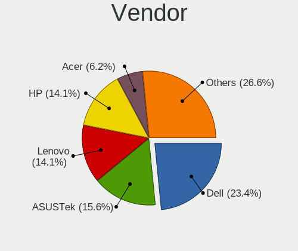
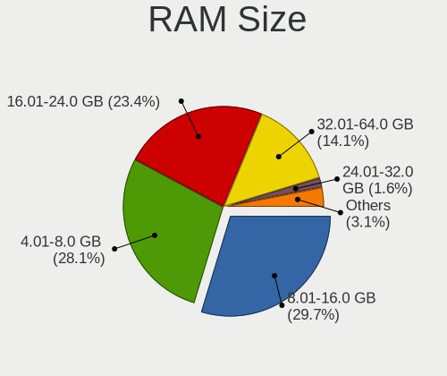
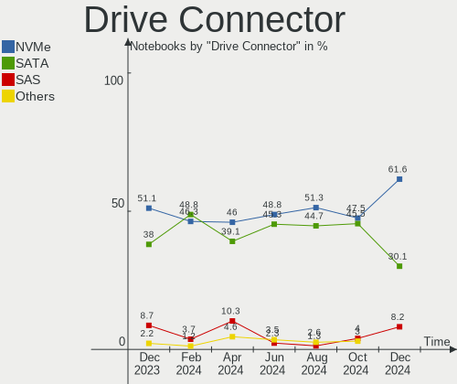
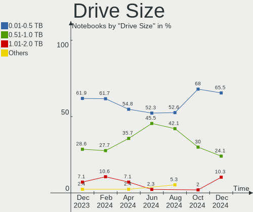
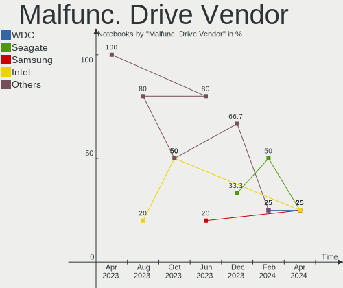
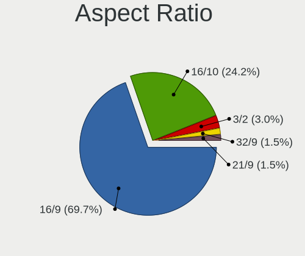
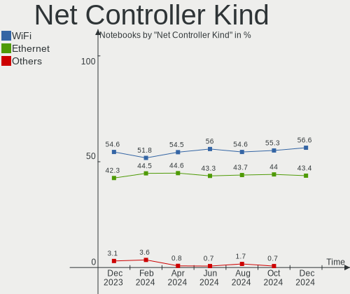

Kubuntu - Hardware Trends (Notebooks)
-------------------------------------

A project to identify most popular hardware characteristics and track their change
over time based on data collected by Linux users at https://Linux-Hardware.org.

Anyone can contribute to this report by the [hw-probe](https://github.com/linuxhw/hw-probe) tool:

    sudo -E hw-probe -all -upload

This report is for one last month. Overall report since the beginning of time: [TestCoverage](https://github.com/linuxhw/TestCoverage)

Period: Jun, 2022.

Contents
--------

* [ System ](#system)
  - [ OS                       ](#os)
  - [ OS Family                ](#os-family)
  - [ Kernel                   ](#kernel)
  - [ Kernel Family            ](#kernel-family)
  - [ Kernel Major Ver.        ](#kernel-major-ver)
  - [ Arch                     ](#arch)
  - [ DE                       ](#de)
  - [ Display Server           ](#display-server)
  - [ Display Manager          ](#display-manager)
  - [ OS Lang                  ](#os-lang)
  - [ Boot Mode                ](#boot-mode)
  - [ Filesystem               ](#filesystem)
  - [ Part. scheme             ](#part-scheme)
  - [ Dual Boot with Linux/BSD ](#dual-boot-with-linuxbsd)
  - [ Dual Boot (Win)          ](#dual-boot-win)

* [ Board ](#board)
  - [ Vendor                   ](#vendor)
  - [ Model                    ](#model)
  - [ Model Family             ](#model-family)
  - [ MFG Year                 ](#mfg-year)
  - [ Form Factor              ](#form-factor)
  - [ Secure Boot              ](#secure-boot)
  - [ Coreboot                 ](#coreboot)
  - [ RAM Size                 ](#ram-size)
  - [ RAM Used                 ](#ram-used)
  - [ Total Drives             ](#total-drives)
  - [ Has CD-ROM               ](#has-cd-rom)
  - [ Has Ethernet             ](#has-ethernet)
  - [ Has WiFi                 ](#has-wifi)
  - [ Has Bluetooth            ](#has-bluetooth)

* [ Location ](#location)
  - [ Country                  ](#country)
  - [ City                     ](#city)

* [ Drives ](#drives)
  - [ Drive Vendor             ](#drive-vendor)
  - [ Drive Model              ](#drive-model)
  - [ HDD Vendor               ](#hdd-vendor)
  - [ SSD Vendor               ](#ssd-vendor)
  - [ Drive Kind               ](#drive-kind)
  - [ Drive Connector          ](#drive-connector)
  - [ Drive Size               ](#drive-size)
  - [ Space Total              ](#space-total)
  - [ Space Used               ](#space-used)
  - [ Malfunc. Drives          ](#malfunc-drives)
  - [ Malfunc. Drive Vendor    ](#malfunc-drive-vendor)
  - [ Malfunc. HDD Vendor      ](#malfunc-hdd-vendor)
  - [ Malfunc. Drive Kind      ](#malfunc-drive-kind)
  - [ Failed Drives            ](#failed-drives)
  - [ Failed Drive Vendor      ](#failed-drive-vendor)
  - [ Drive Status             ](#drive-status)

* [ Storage controller ](#storage-controller)
  - [ Storage Vendor           ](#storage-vendor)
  - [ Storage Model            ](#storage-model)
  - [ Storage Kind             ](#storage-kind)

* [ Processor ](#processor)
  - [ CPU Vendor               ](#cpu-vendor)
  - [ CPU Model                ](#cpu-model)
  - [ CPU Model Family         ](#cpu-model-family)
  - [ CPU Cores                ](#cpu-cores)
  - [ CPU Sockets              ](#cpu-sockets)
  - [ CPU Threads              ](#cpu-threads)
  - [ CPU Op-Modes             ](#cpu-op-modes)
  - [ CPU Microcode            ](#cpu-microcode)
  - [ CPU Microarch            ](#cpu-microarch)

* [ Graphics ](#graphics)
  - [ GPU Vendor               ](#gpu-vendor)
  - [ GPU Model                ](#gpu-model)
  - [ GPU Combo                ](#gpu-combo)
  - [ GPU Driver               ](#gpu-driver)
  - [ GPU Memory               ](#gpu-memory)

* [ Monitor ](#monitor)
  - [ Monitor Vendor           ](#monitor-vendor)
  - [ Monitor Model            ](#monitor-model)
  - [ Monitor Resolution       ](#monitor-resolution)
  - [ Monitor Diagonal         ](#monitor-diagonal)
  - [ Monitor Width            ](#monitor-width)
  - [ Aspect Ratio             ](#aspect-ratio)
  - [ Monitor Area             ](#monitor-area)
  - [ Pixel Density            ](#pixel-density)
  - [ Multiple Monitors        ](#multiple-monitors)

* [ Network ](#network)
  - [ Net Controller Vendor    ](#net-controller-vendor)
  - [ Net Controller Model     ](#net-controller-model)
  - [ Wireless Vendor          ](#wireless-vendor)
  - [ Wireless Model           ](#wireless-model)
  - [ Ethernet Vendor          ](#ethernet-vendor)
  - [ Ethernet Model           ](#ethernet-model)
  - [ Net Controller Kind      ](#net-controller-kind)
  - [ Used Controller          ](#used-controller)
  - [ NICs                     ](#nics)
  - [ IPv6                     ](#ipv6)

* [ Bluetooth ](#bluetooth)
  - [ Bluetooth Vendor         ](#bluetooth-vendor)
  - [ Bluetooth Model          ](#bluetooth-model)

* [ Sound ](#sound)
  - [ Sound Vendor             ](#sound-vendor)
  - [ Sound Model              ](#sound-model)

* [ Memory ](#memory)
  - [ Memory Vendor            ](#memory-vendor)
  - [ Memory Model             ](#memory-model)
  - [ Memory Kind              ](#memory-kind)
  - [ Memory Form Factor       ](#memory-form-factor)
  - [ Memory Size              ](#memory-size)
  - [ Memory Speed             ](#memory-speed)

* [ Printers & scanners ](#printers--scanners)
  - [ Printer Vendor           ](#printer-vendor)
  - [ Printer Model            ](#printer-model)
  - [ Scanner Vendor           ](#scanner-vendor)
  - [ Scanner Model            ](#scanner-model)

* [ Camera ](#camera)
  - [ Camera Vendor            ](#camera-vendor)
  - [ Camera Model             ](#camera-model)

* [ Security ](#security)
  - [ Fingerprint Vendor       ](#fingerprint-vendor)
  - [ Fingerprint Model        ](#fingerprint-model)
  - [ Chipcard Vendor          ](#chipcard-vendor)
  - [ Chipcard Model           ](#chipcard-model)

* [ Unsupported ](#unsupported)
  - [ Unsupported Devices      ](#unsupported-devices)
  - [ Unsupported Device Types ](#unsupported-device-types)

System
------

OS
--

Installed operating systems

| Name          | Notebooks | Percent |
|---------------|-----------|---------|
| Kubuntu 22.04 | 38        | 57.58%  |
| Kubuntu 11.1  | 8         | 12.12%  |
| Kubuntu 11    | 8         | 12.12%  |
| Kubuntu 20.04 | 7         | 10.61%  |
| Kubuntu 21.10 | 2         | 3.03%   |
| Kubuntu 21.04 | 1         | 1.52%   |
| Kubuntu 2.0   | 1         | 1.52%   |
| Kubuntu 18.04 | 1         | 1.52%   |

OS Family
---------

OS without a version

| Name    | Notebooks | Percent |
|---------|-----------|---------|
| Kubuntu | 66        | 100%    |

Kernel
------

Version of the Linux kernel

| Version               | Notebooks | Percent |
|-----------------------|-----------|---------|
| 5.13.0-44-generic     | 10        | 15.15%  |
| 5.15.0-40-generic     | 9         | 13.64%  |
| 5.15.0-39-generic     | 6         | 9.09%   |
| 5.15.0-37-generic     | 5         | 7.58%   |
| 5.13.0-51-generic     | 5         | 7.58%   |
| 5.4.0-113-generic     | 4         | 6.06%   |
| 5.15.0-35-generic     | 4         | 6.06%   |
| 5.15.0-33-generic     | 4         | 6.06%   |
| 5.15.0-25-generic     | 4         | 6.06%   |
| 5.13.0-48-generic     | 4         | 6.06%   |
| 5.13.0-46-generic     | 2         | 3.03%   |
| 5.18.8-051808-generic | 1         | 1.52%   |
| 5.17.4-051704-generic | 1         | 1.52%   |
| 5.16.2-051602-generic | 1         | 1.52%   |
| 5.15.0-24-lowlatency  | 1         | 1.52%   |
| 5.15.0-1007-oracle    | 1         | 1.52%   |
| 5.15.0-10033-tuxedo   | 1         | 1.52%   |
| 5.14.0-1038-oem       | 1         | 1.52%   |
| 5.11.0-49-generic     | 1         | 1.52%   |
| 5.11.0-46-generic     | 1         | 1.52%   |

Kernel Family
-------------

Linux kernel without a distro release

| Version | Notebooks | Percent |
|---------|-----------|---------|
| 5.15.0  | 35        | 53.03%  |
| 5.13.0  | 21        | 31.82%  |
| 5.4.0   | 4         | 6.06%   |
| 5.11.0  | 2         | 3.03%   |
| 5.18.8  | 1         | 1.52%   |
| 5.17.4  | 1         | 1.52%   |
| 5.16.2  | 1         | 1.52%   |
| 5.14.0  | 1         | 1.52%   |

Kernel Major Ver.
-----------------

Linux kernel major version

| Version | Notebooks | Percent |
|---------|-----------|---------|
| 5.15    | 35        | 53.03%  |
| 5.13    | 21        | 31.82%  |
| 5.4     | 4         | 6.06%   |
| 5.11    | 2         | 3.03%   |
| 5.18    | 1         | 1.52%   |
| 5.17    | 1         | 1.52%   |
| 5.16    | 1         | 1.52%   |
| 5.14    | 1         | 1.52%   |

Arch
----

OS architecture (x86_64, i586, etc.)

| Name   | Notebooks | Percent |
|--------|-----------|---------|
| x86_64 | 66        | 100%    |

DE
--

Desktop Environment

| Name | Notebooks | Percent |
|------|-----------|---------|
| KDE5 | 66        | 100%    |

Display Server
--------------

X11 or Wayland

| Name    | Notebooks | Percent |
|---------|-----------|---------|
| X11     | 62        | 93.94%  |
| Wayland | 4         | 6.06%   |

Display Manager
---------------

SDDM, LightDM, etc.

| Name    | Notebooks | Percent |
|---------|-----------|---------|
| SDDM    | 40        | 60.61%  |
| Unknown | 22        | 33.33%  |
| GDM3    | 2         | 3.03%   |
| LightDM | 1         | 1.52%   |
| GDM     | 1         | 1.52%   |

OS Lang
-------

Language

| Lang    | Notebooks | Percent |
|---------|-----------|---------|
| en_US   | 31        | 46.97%  |
| fr_FR   | 6         | 9.09%   |
| de_DE   | 5         | 7.58%   |
| ru_RU   | 4         | 6.06%   |
| es_ES   | 4         | 6.06%   |
| it_IT   | 3         | 4.55%   |
| pt_BR   | 2         | 3.03%   |
| pt_PT   | 1         | 1.52%   |
| pl_PL   | 1         | 1.52%   |
| nl_NL   | 1         | 1.52%   |
| hu_HU   | 1         | 1.52%   |
| es_MX   | 1         | 1.52%   |
| en_ZA   | 1         | 1.52%   |
| en_IN   | 1         | 1.52%   |
| en_IL   | 1         | 1.52%   |
| en_GB   | 1         | 1.52%   |
| en_AU   | 1         | 1.52%   |
| Default | 1         | 1.52%   |

Boot Mode
---------

EFI or BIOS

| Mode | Notebooks | Percent |
|------|-----------|---------|
| BIOS | 36        | 54.55%  |
| EFI  | 30        | 45.45%  |

Filesystem
----------

Type of filesystem

| Type    | Notebooks | Percent |
|---------|-----------|---------|
| Ext4    | 62        | 93.94%  |
| Overlay | 2         | 3.03%   |
| Btrfs   | 2         | 3.03%   |

Part. scheme
------------

Scheme of partitioning

| Type    | Notebooks | Percent |
|---------|-----------|---------|
| Unknown | 34        | 51.52%  |
| GPT     | 30        | 45.45%  |
| MBR     | 2         | 3.03%   |

Dual Boot with Linux/BSD
------------------------

Hosting more than one Linux/BSD

| Dual boot | Notebooks | Percent |
|-----------|-----------|---------|
| No        | 60        | 90.91%  |
| Yes       | 6         | 9.09%   |

Dual Boot (Win)
---------------

Hosting Linux and Windows

| Dual boot | Notebooks | Percent |
|-----------|-----------|---------|
| No        | 43        | 65.15%  |
| Yes       | 23        | 34.85%  |

Board
-----

Vendor
------

Motherboard manufacturer

| Name                | Notebooks | Percent |
|---------------------|-----------|---------|
| Hewlett-Packard     | 15        | 22.73%  |
| Dell                | 12        | 18.18%  |
| Lenovo              | 9         | 13.64%  |
| ASUSTek Computer    | 7         | 10.61%  |
| Toshiba             | 3         | 4.55%   |
| MSI                 | 3         | 4.55%   |
| Samsung Electronics | 2         | 3.03%   |
| Apple               | 2         | 3.03%   |
| Acer                | 2         | 3.03%   |
| TUXEDO              | 1         | 1.52%   |
| System76            | 1         | 1.52%   |
| SLIMBOOK            | 1         | 1.52%   |
| SK hynix            | 1         | 1.52%   |
| Positivo            | 1         | 1.52%   |
| Packard Bell        | 1         | 1.52%   |
| Jumper              | 1         | 1.52%   |
| HONOR               | 1         | 1.52%   |
| Haier               | 1         | 1.52%   |
| GPU Company         | 1         | 1.52%   |
| Clevo               | 1         | 1.52%   |

Model
-----

Motherboard model

| Name                                        | Notebooks | Percent |
|---------------------------------------------|-----------|---------|
| TUXEDO InfinityBook S 15 Gen6               | 1         | 1.52%   |
| Toshiba Satellite L655                      | 1         | 1.52%   |
| Toshiba Satellite L50-A-1D6                 | 1         | 1.52%   |
| Toshiba Satellite C75D-A                    | 1         | 1.52%   |
| System76 Kudu Professional                  | 1         | 1.52%   |
| SLIMBOOK PROX15-AMD                         | 1         | 1.52%   |
| SK hynix Onnyx III                          | 1         | 1.52%   |
| Samsung RV411/RV511/E3511/S3511/RV711/E3411 | 1         | 1.52%   |
| Samsung 300E4C/300E5C/300E7C                | 1         | 1.52%   |
| Positivo Q464C                              | 1         | 1.52%   |
| Packard Bell H17HV                          | 1         | 1.52%   |
| MSI Raider GE66 12UGS                       | 1         | 1.52%   |
| MSI GP76 Leopard 11UH                       | 1         | 1.52%   |
| MSI CX61 2PC                                | 1         | 1.52%   |
| Lenovo V130-15IGM 81HL                      | 1         | 1.52%   |
| Lenovo ThinkPad X61 Tablet 7762H7U          | 1         | 1.52%   |
| Lenovo ThinkPad X1 Extreme 20MGS06400       | 1         | 1.52%   |
| Lenovo ThinkPad P15s Gen 1 20T4000CGE       | 1         | 1.52%   |
| Lenovo ThinkPad P15 Gen 1 20SUS1TB04        | 1         | 1.52%   |
| Lenovo ThinkPad P1 Gen 3 20TH003SUS         | 1         | 1.52%   |
| Lenovo ThinkBook 15 G2 ITL 20VE             | 1         | 1.52%   |
| Lenovo ThinkBook 14-IML 20RV                | 1         | 1.52%   |
| Lenovo IdeaPad 5 15ARE05 81YQ               | 1         | 1.52%   |
| Jumper EZpad                                | 1         | 1.52%   |
| HONOR BOHK-WAX9X                            | 1         | 1.52%   |
| HP ZBook Firefly 14 G7 Mobile Workstation   | 1         | 1.52%   |
| HP Stream Laptop 11-ak0xxx                  | 1         | 1.52%   |
| HP ProBook 650 G2                           | 1         | 1.52%   |
| HP Pavilion Laptop 15-eh1xxx                | 1         | 1.52%   |
| HP Pavilion Gaming Laptop 15-ec1xxx         | 1         | 1.52%   |
| HP Pavilion dv7                             | 1         | 1.52%   |
| HP Pavilion dv6                             | 1         | 1.52%   |
| HP OMEN by Laptop 17-cb0xxx                 | 1         | 1.52%   |
| HP EliteBook 8460p                          | 1         | 1.52%   |
| HP EliteBook 845 G7 Notebook PC             | 1         | 1.52%   |
| HP EliteBook 840 G6                         | 1         | 1.52%   |
| HP EliteBook 820 G1                         | 1         | 1.52%   |
| HP EliteBook 2570p                          | 1         | 1.52%   |
| HP 620                                      | 1         | 1.52%   |
| HP 15                                       | 1         | 1.52%   |
| Haier A1420EM                               | 1         | 1.52%   |
| GPU Company GWTC116-2                       | 1         | 1.52%   |
| Dell XPS 17 9720                            | 1         | 1.52%   |
| Dell XPS 15 9560                            | 1         | 1.52%   |
| Dell Precision 5540                         | 1         | 1.52%   |
| Dell Latitude XT3                           | 1         | 1.52%   |
| Dell Latitude E5470                         | 1         | 1.52%   |
| Dell Latitude 7420                          | 1         | 1.52%   |
| Dell Latitude 5590                          | 1         | 1.52%   |
| Dell Latitude 3420                          | 1         | 1.52%   |
| Dell Inspiron 7537                          | 1         | 1.52%   |
| Dell Inspiron 3521                          | 1         | 1.52%   |
| Dell Inspiron 15-3567                       | 1         | 1.52%   |
| Dell Inspiron 1428                          | 1         | 1.52%   |
| Clevo Modified by dsanke                    | 1         | 1.52%   |
| ASUS ZenBook UX325EA_UX325EA                | 1         | 1.52%   |
| ASUS X550JF                                 | 1         | 1.52%   |
| ASUS UX51VZ                                 | 1         | 1.52%   |
| ASUS TX201LA                                | 1         | 1.52%   |
| ASUS ROG Zephyrus G14 GA402RK_GA402RK       | 1         | 1.52%   |

Model Family
------------

Motherboard model prefix

| Name                  | Notebooks | Percent |
|-----------------------|-----------|---------|
| Lenovo ThinkPad       | 5         | 7.58%   |
| HP EliteBook          | 5         | 7.58%   |
| Dell Latitude         | 5         | 7.58%   |
| HP Pavilion           | 4         | 6.06%   |
| Dell Inspiron         | 4         | 6.06%   |
| Toshiba Satellite     | 3         | 4.55%   |
| Lenovo ThinkBook      | 2         | 3.03%   |
| Dell XPS              | 2         | 3.03%   |
| TUXEDO InfinityBook   | 1         | 1.52%   |
| System76 Kudu         | 1         | 1.52%   |
| SLIMBOOK PROX15-AMD   | 1         | 1.52%   |
| SK hynix Onnyx        | 1         | 1.52%   |
| Samsung RV411         | 1         | 1.52%   |
| Samsung 300E4C        | 1         | 1.52%   |
| Positivo Q464C        | 1         | 1.52%   |
| Packard Bell H17HV    | 1         | 1.52%   |
| MSI Raider            | 1         | 1.52%   |
| MSI GP76              | 1         | 1.52%   |
| MSI CX61              | 1         | 1.52%   |
| Lenovo V130-15IGM     | 1         | 1.52%   |
| Lenovo IdeaPad        | 1         | 1.52%   |
| Jumper EZpad          | 1         | 1.52%   |
| HONOR BOHK-WAX9X      | 1         | 1.52%   |
| HP ZBook              | 1         | 1.52%   |
| HP Stream             | 1         | 1.52%   |
| HP ProBook            | 1         | 1.52%   |
| HP OMEN               | 1         | 1.52%   |
| HP 620                | 1         | 1.52%   |
| HP 15                 | 1         | 1.52%   |
| Haier A1420EM         | 1         | 1.52%   |
| GPU Company GWTC116-2 | 1         | 1.52%   |
| Dell Precision        | 1         | 1.52%   |
| Clevo Modified        | 1         | 1.52%   |
| ASUS ZenBook          | 1         | 1.52%   |
| ASUS X550JF           | 1         | 1.52%   |
| ASUS UX51VZ           | 1         | 1.52%   |
| ASUS TX201LA          | 1         | 1.52%   |
| ASUS ROG              | 1         | 1.52%   |
| ASUS K46CB            | 1         | 1.52%   |
| ASUS GR8              | 1         | 1.52%   |
| Apple MacBookPro5     | 1         | 1.52%   |
| Apple MacBookPro15    | 1         | 1.52%   |
| Acer Nitro            | 1         | 1.52%   |
| Acer Aspire           | 1         | 1.52%   |

MFG Year
--------

Motherboard manufacture year

| Year | Notebooks | Percent |
|------|-----------|---------|
| 2020 | 16        | 24.24%  |
| 2013 | 7         | 10.61%  |
| 2021 | 6         | 9.09%   |
| 2019 | 5         | 7.58%   |
| 2022 | 4         | 6.06%   |
| 2014 | 4         | 6.06%   |
| 2012 | 4         | 6.06%   |
| 2011 | 4         | 6.06%   |
| 2018 | 3         | 4.55%   |
| 2016 | 3         | 4.55%   |
| 2009 | 3         | 4.55%   |
| 2010 | 2         | 3.03%   |
| 2008 | 2         | 3.03%   |
| 2017 | 1         | 1.52%   |
| 2015 | 1         | 1.52%   |
| 2007 | 1         | 1.52%   |

Form Factor
-----------

Physical design of the computer

| Name     | Notebooks | Percent |
|----------|-----------|---------|
| Notebook | 66        | 100%    |

Secure Boot
-----------

Enabled or disabled

| State    | Notebooks | Percent |
|----------|-----------|---------|
| Disabled | 61        | 92.42%  |
| Enabled  | 5         | 7.58%   |

Coreboot
--------

Have coreboot on board

| Used | Notebooks | Percent |
|------|-----------|---------|
| No   | 66        | 100%    |

RAM Size
--------

Total RAM memory

| Size in GB  | Notebooks | Percent |
|-------------|-----------|---------|
| 16.01-24.0  | 15        | 22.73%  |
| 4.01-8.0    | 14        | 21.21%  |
| 3.01-4.0    | 14        | 21.21%  |
| 8.01-16.0   | 13        | 19.7%   |
| 32.01-64.0  | 7         | 10.61%  |
| 64.01-256.0 | 2         | 3.03%   |
| 1.01-2.0    | 1         | 1.52%   |

RAM Used
--------

Used RAM memory

| Used GB   | Notebooks | Percent |
|-----------|-----------|---------|
| 2.01-3.0  | 19        | 28.79%  |
| 3.01-4.0  | 17        | 25.76%  |
| 1.01-2.0  | 13        | 19.7%   |
| 4.01-8.0  | 12        | 18.18%  |
| 8.01-16.0 | 3         | 4.55%   |
| 0.51-1.0  | 2         | 3.03%   |

Total Drives
------------

Number of drives on board

| Drives | Notebooks | Percent |
|--------|-----------|---------|
| 1      | 57        | 86.36%  |
| 2      | 7         | 10.61%  |
| 4      | 1         | 1.52%   |
| 3      | 1         | 1.52%   |

Has CD-ROM
----------

Has CD-ROM on board

| Presented | Notebooks | Percent |
|-----------|-----------|---------|
| No        | 46        | 69.7%   |
| Yes       | 20        | 30.3%   |

Has Ethernet
------------

Has Ethernet on board

| Presented | Notebooks | Percent |
|-----------|-----------|---------|
| Yes       | 51        | 77.27%  |
| No        | 15        | 22.73%  |

Has WiFi
--------

Has WiFi module

| Presented | Notebooks | Percent |
|-----------|-----------|---------|
| Yes       | 64        | 96.97%  |
| No        | 2         | 3.03%   |

Has Bluetooth
-------------

Has Bluetooth module

| Presented | Notebooks | Percent |
|-----------|-----------|---------|
| Yes       | 54        | 81.82%  |
| No        | 12        | 18.18%  |

Location
--------

Country
-------

Geographic location (country)

| Country      | Notebooks | Percent |
|--------------|-----------|---------|
| USA          | 12        | 18.18%  |
| France       | 7         | 10.61%  |
| Spain        | 6         | 9.09%   |
| Germany      | 6         | 9.09%   |
| Russia       | 5         | 7.58%   |
| Italy        | 5         | 7.58%   |
| Slovenia     | 2         | 3.03%   |
| Poland       | 2         | 3.03%   |
| Netherlands  | 2         | 3.03%   |
| Mexico       | 2         | 3.03%   |
| Hungary      | 2         | 3.03%   |
| Brazil       | 2         | 3.03%   |
| Switzerland  | 1         | 1.52%   |
| Sweden       | 1         | 1.52%   |
| South Africa | 1         | 1.52%   |
| Portugal     | 1         | 1.52%   |
| Myanmar      | 1         | 1.52%   |
| Malaysia     | 1         | 1.52%   |
| Israel       | 1         | 1.52%   |
| Indonesia    | 1         | 1.52%   |
| India        | 1         | 1.52%   |
| Denmark      | 1         | 1.52%   |
| Belarus      | 1         | 1.52%   |
| Austria      | 1         | 1.52%   |
| Argentina    | 1         | 1.52%   |

City
----

Geographic location (city)

| City                   | Notebooks | Percent |
|------------------------|-----------|---------|
| St Petersburg          | 2         | 3.03%   |
| Marseille              | 2         | 3.03%   |
| Madrid                 | 2         | 3.03%   |
| Chenove                | 2         | 3.03%   |
| Zaragoza               | 1         | 1.52%   |
| Ypsilanti              | 1         | 1.52%   |
| Yekaterinburg          | 1         | 1.52%   |
| Yangon                 | 1         | 1.52%   |
| Warsaw                 | 1         | 1.52%   |
| Tirschenreuth          | 1         | 1.52%   |
| Terneuzen              | 1         | 1.52%   |
| Tel Aviv               | 1         | 1.52%   |
| Summerville            | 1         | 1.52%   |
| Seville                | 1         | 1.52%   |
| Seattle                | 1         | 1.52%   |
| Rouvray-Saint-Denis    | 1         | 1.52%   |
| Rotenburg an der Fulda | 1         | 1.52%   |
| Rio de Janeiro         | 1         | 1.52%   |
| Porto                  | 1         | 1.52%   |
| Pomarede               | 1         | 1.52%   |
| Picerno                | 1         | 1.52%   |
| Penza                  | 1         | 1.52%   |
| Parma                  | 1         | 1.52%   |
| Owings Mills           | 1         | 1.52%   |
| Nyiregyhaza            | 1         | 1.52%   |
| Newton                 | 1         | 1.52%   |
| Murska Sobota          | 1         | 1.52%   |
| Murcia                 | 1         | 1.52%   |
| Munich                 | 1         | 1.52%   |
| Mossingen              | 1         | 1.52%   |
| Moscow                 | 1         | 1.52%   |
| Moosseedorf            | 1         | 1.52%   |
| Monclova               | 1         | 1.52%   |
| Missoula               | 1         | 1.52%   |
| Minsk                  | 1         | 1.52%   |
| Milan                  | 1         | 1.52%   |
| Miami                  | 1         | 1.52%   |
| Las Vegas              | 1         | 1.52%   |
| Kuala Lumpur           | 1         | 1.52%   |
| Karlsruhe              | 1         | 1.52%   |
| Johannesburg           | 1         | 1.52%   |
| Jakarta                | 1         | 1.52%   |
| Inhapim                | 1         | 1.52%   |
| Holstebro              | 1         | 1.52%   |
| Hoenoe                 | 1         | 1.52%   |
| Grosuplje              | 1         | 1.52%   |
| Gretna                 | 1         | 1.52%   |
| Granbury               | 1         | 1.52%   |
| Goellersdorf           | 1         | 1.52%   |
| Gloversville           | 1         | 1.52%   |
| Gelsenkirchen          | 1         | 1.52%   |
| Fresno                 | 1         | 1.52%   |
| Florence               | 1         | 1.52%   |
| Częstochowa           | 1         | 1.52%   |
| Cazorla                | 1         | 1.52%   |
| Cancún                | 1         | 1.52%   |
| Buenos Aires           | 1         | 1.52%   |
| Brescia                | 1         | 1.52%   |
| Boutiers-Saint-Trojan  | 1         | 1.52%   |
| Berettyóújfalu       | 1         | 1.52%   |

Drives
------

Drive Vendor
------------

Hard drive vendors

| Vendor              | Notebooks | Drives | Percent |
|---------------------|-----------|--------|---------|
| Samsung Electronics | 11        | 11     | 14.86%  |
| WDC                 | 8         | 9      | 10.81%  |
| Seagate             | 7         | 7      | 9.46%   |
| Unknown             | 6         | 7      | 8.11%   |
| SK hynix            | 6         | 6      | 8.11%   |
| Toshiba             | 5         | 5      | 6.76%   |
| Kingston            | 5         | 5      | 6.76%   |
| Crucial             | 4         | 4      | 5.41%   |
| Intel               | 3         | 4      | 4.05%   |
| Hitachi             | 3         | 3      | 4.05%   |
| A-DATA Technology   | 3         | 3      | 4.05%   |
| SanDisk             | 2         | 2      | 2.7%    |
| HGST                | 2         | 2      | 2.7%    |
| Apple               | 2         | 2      | 2.7%    |
| Team                | 1         | 1      | 1.35%   |
| PNY                 | 1         | 1      | 1.35%   |
| Patriot             | 1         | 1      | 1.35%   |
| Micron Technology   | 1         | 1      | 1.35%   |
| Leven               | 1         | 1      | 1.35%   |
| KIOXIA              | 1         | 1      | 1.35%   |
| Intenso             | 1         | 1      | 1.35%   |

Drive Model
-----------

Hard drive models

| Model                                   | Notebooks | Percent |
|-----------------------------------------|-----------|---------|
| Samsung SSD 850 EVO 500GB               | 2         | 2.6%    |
| Samsung MZVLB512HBJQ-000L2 512GB        | 2         | 2.6%    |
| Kingston SA400S37240G 240GB SSD         | 2         | 2.6%    |
| Intel SSDPEKNW512G8 512GB               | 2         | 2.6%    |
| Crucial CT240BX500SSD1 240GB            | 2         | 2.6%    |
| WDC WDS480G2G0C-00AJM0 480GB            | 1         | 1.3%    |
| WDC WDS250G2B0C-00PXH0 250GB            | 1         | 1.3%    |
| WDC WD7500BPVX-22JC3T0 752GB            | 1         | 1.3%    |
| WDC WD3200BEVT-22A23T0 320GB            | 1         | 1.3%    |
| WDC WD10SPZX-60Z10T1 1TB                | 1         | 1.3%    |
| WDC PC SN730 SDBQNTY-1T00-1001 1TB      | 1         | 1.3%    |
| WDC PC SN730 SDBPNTY-512G-1027 512GB    | 1         | 1.3%    |
| WDC PC SN730 NVMe 256GB                 | 1         | 1.3%    |
| WDC PC SN720 SDAQNTW-512G-1001 512GB    | 1         | 1.3%    |
| Unknown SLD128  128GB                   | 1         | 1.3%    |
| Unknown SD/MMC/MS PRO 128GB             | 1         | 1.3%    |
| Unknown SB32G  32GB                     | 1         | 1.3%    |
| Unknown MMC64G  64GB                    | 1         | 1.3%    |
| Unknown MMC Card  64GB                  | 1         | 1.3%    |
| Unknown BJTD4R  32GB                    | 1         | 1.3%    |
| Unknown Biwin  64GB                     | 1         | 1.3%    |
| Toshiba NVMe SSD Drive 2TB              | 1         | 1.3%    |
| Toshiba NVMe SSD Drive 1024GB           | 1         | 1.3%    |
| Toshiba MQ01ABD100 1TB                  | 1         | 1.3%    |
| Toshiba MQ01ABD075 752GB                | 1         | 1.3%    |
| Toshiba KSG60ZMV512G M.2 2280 512GB SSD | 1         | 1.3%    |
| Team T253X5480G 480GB SSD               | 1         | 1.3%    |
| SK hynix PC801 NVMe 1TB                 | 1         | 1.3%    |
| SK hynix PC711 NVMe 512GB               | 1         | 1.3%    |
| SK hynix NVMe SSD Drive 512GB           | 1         | 1.3%    |
| SK hynix NVMe SSD Drive 256GB           | 1         | 1.3%    |
| SK hynix BC711 HFM512GD3JX013N 512GB    | 1         | 1.3%    |
| SK hynix BC511 HFM512GDJTNI-82A0A 512GB | 1         | 1.3%    |
| Seagate ST9250320AS 250GB               | 1         | 1.3%    |
| Seagate ST9250315AS 250GB               | 1         | 1.3%    |
| Seagate ST500LM021-1KJ152 500GB         | 1         | 1.3%    |
| Seagate ST320LT007-9ZV142 320GB         | 1         | 1.3%    |
| Seagate ST250LT007-9ZV14C 250GB         | 1         | 1.3%    |
| Seagate ST2000LM015-2E8174 2TB          | 1         | 1.3%    |
| Seagate ST1000LM024 HN-M101MBB 1TB      | 1         | 1.3%    |
| SanDisk SSD i100 120GB                  | 1         | 1.3%    |
| SanDisk NVMe SSD Drive 500GB            | 1         | 1.3%    |
| Samsung SSD 980 PRO 1TB                 | 1         | 1.3%    |
| Samsung SSD 860 EVO 500GB               | 1         | 1.3%    |
| Samsung SSD 860 EVO 2TB                 | 1         | 1.3%    |
| Samsung SSD 850 EVO 250GB               | 1         | 1.3%    |
| Samsung MZVLB512HBJQ-000H1 512GB        | 1         | 1.3%    |
| Samsung MZ7TE128HMGR-000L2 128GB SSD    | 1         | 1.3%    |
| Samsung MZ7LN256HAJQ-000L2 256GB SSD    | 1         | 1.3%    |
| PNY CS2130 1TB SSD                      | 1         | 1.3%    |
| Patriot Burst 240GB SSD                 | 1         | 1.3%    |
| Micron 3400_MTFDKBA1T0TFH 1TB           | 1         | 1.3%    |
| Leven JAJS600M2TB                       | 1         | 1.3%    |
| KIOXIA NVMe SSD Drive 256GB             | 1         | 1.3%    |
| Kingston SA400S37120G 120GB SSD         | 1         | 1.3%    |
| Kingston OM8PCP3512F-AI1 512GB          | 1         | 1.3%    |
| Kingston NVMe SSD Drive 256GB           | 1         | 1.3%    |
| Intenso SATA III SSD 120GB              | 1         | 1.3%    |
| Intel SSDPEKNW020T8 2TB                 | 1         | 1.3%    |
| Intel NVMe SSD Drive 512GB              | 1         | 1.3%    |

HDD Vendor
----------

Hard disk drive vendors

| Vendor  | Notebooks | Drives | Percent |
|---------|-----------|--------|---------|
| Seagate | 7         | 7      | 36.84%  |
| WDC     | 3         | 3      | 15.79%  |
| Hitachi | 3         | 3      | 15.79%  |
| Toshiba | 2         | 2      | 10.53%  |
| HGST    | 2         | 2      | 10.53%  |
| Unknown | 1         | 1      | 5.26%   |
| Apple   | 1         | 1      | 5.26%   |

SSD Vendor
----------

Solid state drive vendors

| Vendor              | Notebooks | Drives | Percent |
|---------------------|-----------|--------|---------|
| Samsung Electronics | 7         | 7      | 33.33%  |
| Crucial             | 4         | 4      | 19.05%  |
| Kingston            | 3         | 3      | 14.29%  |
| A-DATA Technology   | 2         | 2      | 9.52%   |
| Toshiba             | 1         | 1      | 4.76%   |
| Team                | 1         | 1      | 4.76%   |
| SanDisk             | 1         | 1      | 4.76%   |
| Patriot             | 1         | 1      | 4.76%   |
| Intenso             | 1         | 1      | 4.76%   |

Drive Kind
----------

HDD or SSD

| Kind    | Notebooks | Drives | Percent |
|---------|-----------|--------|---------|
| NVMe    | 28        | 30     | 37.84%  |
| SSD     | 21        | 21     | 28.38%  |
| HDD     | 18        | 19     | 24.32%  |
| MMC     | 6         | 6      | 8.11%   |
| Unknown | 1         | 1      | 1.35%   |

Drive Connector
---------------

SATA, SAS, NVMe, etc.

| Type | Notebooks | Drives | Percent |
|------|-----------|--------|---------|
| SATA | 37        | 40     | 51.39%  |
| NVMe | 28        | 30     | 38.89%  |
| MMC  | 6         | 6      | 8.33%   |
| SAS  | 1         | 1      | 1.39%   |

Drive Size
----------

Size of hard drive

| Size in TB | Notebooks | Drives | Percent |
|------------|-----------|--------|---------|
| 0.01-0.5   | 28        | 30     | 73.68%  |
| 0.51-1.0   | 8         | 8      | 21.05%  |
| 1.01-2.0   | 2         | 2      | 5.26%   |

Space Total
-----------

Amount of disk space available on the file system

| Size in GB     | Notebooks | Percent |
|----------------|-----------|---------|
| 251-500        | 21        | 31.82%  |
| 101-250        | 18        | 27.27%  |
| 501-1000       | 8         | 12.12%  |
| 51-100         | 6         | 9.09%   |
| 1-20           | 4         | 6.06%   |
| 1001-2000      | 3         | 4.55%   |
| Unknown        | 3         | 4.55%   |
| More than 3000 | 2         | 3.03%   |
| 21-50          | 1         | 1.52%   |

Space Used
----------

Amount of used disk space

| Used GB   | Notebooks | Percent |
|-----------|-----------|---------|
| 1-20      | 20        | 30.3%   |
| 101-250   | 13        | 19.7%   |
| 21-50     | 10        | 15.15%  |
| 251-500   | 9         | 13.64%  |
| 51-100    | 6         | 9.09%   |
| 501-1000  | 3         | 4.55%   |
| Unknown   | 3         | 4.55%   |
| 2001-3000 | 1         | 1.52%   |
| 1001-2000 | 1         | 1.52%   |

Malfunc. Drives
---------------

Drive models with a malfunction

| Model                                | Notebooks | Drives | Percent |
|--------------------------------------|-----------|--------|---------|
| Toshiba MQ01ABD075 752GB             | 1         | 1      | 20%     |
| SK hynix BC711 HFM512GD3JX013N 512GB | 1         | 1      | 20%     |
| Hitachi HTS545050B9A300 500GB        | 1         | 1      | 20%     |
| HGST HTS721010A9E630 1TB             | 1         | 1      | 20%     |
| A-DATA Technology SX8200PNP 1TB      | 1         | 1      | 20%     |

Malfunc. Drive Vendor
---------------------

Vendors of faulty drives

| Vendor            | Notebooks | Drives | Percent |
|-------------------|-----------|--------|---------|
| Toshiba           | 1         | 1      | 20%     |
| SK hynix          | 1         | 1      | 20%     |
| Hitachi           | 1         | 1      | 20%     |
| HGST              | 1         | 1      | 20%     |
| A-DATA Technology | 1         | 1      | 20%     |

Malfunc. HDD Vendor
-------------------

Vendors of faulty HDD drives

| Vendor  | Notebooks | Drives | Percent |
|---------|-----------|--------|---------|
| Toshiba | 1         | 1      | 33.33%  |
| Hitachi | 1         | 1      | 33.33%  |
| HGST    | 1         | 1      | 33.33%  |

Malfunc. Drive Kind
-------------------

Kinds of faulty drives

| Kind | Notebooks | Drives | Percent |
|------|-----------|--------|---------|
| HDD  | 3         | 3      | 60%     |
| NVMe | 2         | 2      | 40%     |

Failed Drives
-------------

Failed drive models

Zero info for selected period =(

Failed Drive Vendor
-------------------

Failed drive vendors

Zero info for selected period =(

Drive Status
------------

Number of failed and malfunc. drives

| Status   | Notebooks | Drives | Percent |
|----------|-----------|--------|---------|
| Detected | 36        | 40     | 52.17%  |
| Works    | 28        | 32     | 40.58%  |
| Malfunc  | 5         | 5      | 7.25%   |

Storage controller
------------------

Storage Vendor
--------------

Storage controller vendors

| Vendor                       | Notebooks | Percent |
|------------------------------|-----------|---------|
| Intel                        | 45        | 58.44%  |
| SanDisk                      | 7         | 9.09%   |
| SK hynix                     | 6         | 7.79%   |
| AMD                          | 5         | 6.49%   |
| Samsung Electronics          | 4         | 5.19%   |
| Toshiba America Info Systems | 2         | 2.6%    |
| Kingston Technology Company  | 2         | 2.6%    |
| Phison Electronics           | 1         | 1.3%    |
| Nvidia                       | 1         | 1.3%    |
| Micron Technology            | 1         | 1.3%    |
| KIOXIA                       | 1         | 1.3%    |
| Apple                        | 1         | 1.3%    |
| ADATA Technology             | 1         | 1.3%    |

Storage Model
-------------

Storage controller models

| Model                                                                          | Notebooks | Percent |
|--------------------------------------------------------------------------------|-----------|---------|
| Intel 7 Series Chipset Family 6-port SATA Controller [AHCI mode]               | 6         | 7.23%   |
| Intel 8 Series SATA Controller 1 [AHCI mode]                                   | 5         | 6.02%   |
| AMD FCH SATA Controller [AHCI mode]                                            | 5         | 6.02%   |
| SanDisk WD Black SN750 / PC SN730 NVMe SSD                                     | 4         | 4.82%   |
| Intel Volume Management Device NVMe RAID Controller                            | 4         | 4.82%   |
| Intel 82801IBM/IEM (ICH9M/ICH9M-E) 4 port SATA Controller [AHCI mode]          | 4         | 4.82%   |
| Intel 8 Series/C220 Series Chipset Family 6-port SATA Controller 1 [AHCI mode] | 4         | 4.82%   |
| Samsung NVMe SSD Controller SM981/PM981/PM983                                  | 3         | 3.61%   |
| Intel SSD 660P Series                                                          | 3         | 3.61%   |
| Intel Celeron/Pentium Silver Processor SATA Controller                         | 3         | 3.61%   |
| Intel 82801 Mobile SATA Controller [RAID mode]                                 | 3         | 3.61%   |
| Toshiba America Info Systems XG6 NVMe SSD Controller                           | 2         | 2.41%   |
| SK hynix Non-Volatile memory controller                                        | 2         | 2.41%   |
| SK hynix Gold P31 SSD                                                          | 2         | 2.41%   |
| Intel Tiger Lake-LP SATA Controller [AHCI mode]                                | 2         | 2.41%   |
| Intel Sunrise Point-LP SATA Controller [AHCI mode]                             | 2         | 2.41%   |
| Intel Celeron N3350/Pentium N4200/Atom E3900 Series SATA AHCI Controller       | 2         | 2.41%   |
| Intel 6 Series/C200 Series Chipset Family 6 port Mobile SATA AHCI Controller   | 2         | 2.41%   |
| SK hynix PC300 NVMe Solid State Drive 256GB                                    | 1         | 1.2%    |
| SK hynix BC511                                                                 | 1         | 1.2%    |
| SanDisk WD Blue SN550 NVMe SSD                                                 | 1         | 1.2%    |
| SanDisk WD Black 2018/SN750 / PC SN720 NVMe SSD                                | 1         | 1.2%    |
| SanDisk Non-Volatile memory controller                                         | 1         | 1.2%    |
| Samsung NVMe SSD Controller PM9A1/PM9A3/980PRO                                 | 1         | 1.2%    |
| Phison E12 NVMe Controller                                                     | 1         | 1.2%    |
| Nvidia MCP79 AHCI Controller                                                   | 1         | 1.2%    |
| Micron Non-Volatile memory controller                                          | 1         | 1.2%    |
| KIOXIA Non-Volatile memory controller                                          | 1         | 1.2%    |
| Kingston Company Company Non-Volatile memory controller                        | 1         | 1.2%    |
| Kingston Company OM3PDP3 NVMe SSD                                              | 1         | 1.2%    |
| Intel Q170/Q150/B150/H170/H110/Z170/CM236 Chipset SATA Controller [AHCI Mode]  | 1         | 1.2%    |
| Intel HM170/QM170 Chipset SATA Controller [AHCI Mode]                          | 1         | 1.2%    |
| Intel Comet Lake SATA AHCI Controller                                          | 1         | 1.2%    |
| Intel Cannon Lake Mobile PCH SATA AHCI Controller                              | 1         | 1.2%    |
| Intel 82801HM/HEM (ICH8M/ICH8M-E) SATA Controller [AHCI mode]                  | 1         | 1.2%    |
| Intel 82801HM/HEM (ICH8M/ICH8M-E) IDE Controller                               | 1         | 1.2%    |
| Intel 500 Series Chipset Family SATA AHCI Controller                           | 1         | 1.2%    |
| Intel 5 Series/3400 Series Chipset 4 port SATA IDE Controller                  | 1         | 1.2%    |
| Intel 5 Series/3400 Series Chipset 4 port SATA AHCI Controller                 | 1         | 1.2%    |
| Intel 5 Series/3400 Series Chipset 2 port SATA IDE Controller                  | 1         | 1.2%    |
| Intel 200 Series PCH SATA controller [AHCI mode]                               | 1         | 1.2%    |
| Apple ANS2 NVMe Controller                                                     | 1         | 1.2%    |
| ADATA XPG SX8200 Pro PCIe Gen3x4 M.2 2280 Solid State Drive                    | 1         | 1.2%    |

Storage Kind
------------

Kind of storage controller (IDE, SATA, NVMe, SAS, ...)

| Kind | Notebooks | Percent |
|------|-----------|---------|
| SATA | 44        | 54.32%  |
| NVMe | 28        | 34.57%  |
| RAID | 7         | 8.64%   |
| IDE  | 2         | 2.47%   |

Processor
---------

CPU Vendor
----------

Processor vendors

| Vendor | Notebooks | Percent |
|--------|-----------|---------|
| Intel  | 58        | 87.88%  |
| AMD    | 8         | 12.12%  |

CPU Model
---------

Processor models

| Model                                         | Notebooks | Percent |
|-----------------------------------------------|-----------|---------|
| Intel Core i7-4510U CPU @ 2.00GHz             | 3         | 4.55%   |
| Intel Pentium Dual-Core CPU T4500 @ 2.30GHz   | 2         | 3.03%   |
| Intel Core i7-10510U CPU @ 1.80GHz            | 2         | 3.03%   |
| Intel Core i5-2520M CPU @ 2.50GHz             | 2         | 3.03%   |
| Intel Celeron N4020 CPU @ 1.10GHz             | 2         | 3.03%   |
| Intel 12th Gen Core i7-12700H                 | 2         | 3.03%   |
| Intel 11th Gen Core i7-1165G7 @ 2.80GHz       | 2         | 3.03%   |
| Intel Pentium Silver N5000 CPU @ 1.10GHz      | 1         | 1.52%   |
| Intel Pentium Dual-Core CPU T4200 @ 2.00GHz   | 1         | 1.52%   |
| Intel Core i9-10885H CPU @ 2.40GHz            | 1         | 1.52%   |
| Intel Core i7-9850H CPU @ 2.60GHz             | 1         | 1.52%   |
| Intel Core i7-9750H CPU @ 2.60GHz             | 1         | 1.52%   |
| Intel Core i7-8750H CPU @ 2.20GHz             | 1         | 1.52%   |
| Intel Core i7-8700K CPU @ 3.70GHz             | 1         | 1.52%   |
| Intel Core i7-8559U CPU @ 2.70GHz             | 1         | 1.52%   |
| Intel Core i7-7700HQ CPU @ 2.80GHz            | 1         | 1.52%   |
| Intel Core i7-6820HQ CPU @ 2.70GHz            | 1         | 1.52%   |
| Intel Core i7-4750HQ CPU @ 2.00GHz            | 1         | 1.52%   |
| Intel Core i7-4710MQ CPU @ 2.50GHz            | 1         | 1.52%   |
| Intel Core i7-4700MQ CPU @ 2.40GHz            | 1         | 1.52%   |
| Intel Core i7-3632QM CPU @ 2.20GHz            | 1         | 1.52%   |
| Intel Core i7-3537U CPU @ 2.00GHz             | 1         | 1.52%   |
| Intel Core i7-3520M CPU @ 2.90GHz             | 1         | 1.52%   |
| Intel Core i7-2670QM CPU @ 2.20GHz            | 1         | 1.52%   |
| Intel Core i7-10750H CPU @ 2.60GHz            | 1         | 1.52%   |
| Intel Core i5-8365U CPU @ 1.60GHz             | 1         | 1.52%   |
| Intel Core i5-8250U CPU @ 1.60GHz             | 1         | 1.52%   |
| Intel Core i5-4210U CPU @ 1.70GHz             | 1         | 1.52%   |
| Intel Core i5-4200U CPU @ 1.60GHz             | 1         | 1.52%   |
| Intel Core i5-4200M CPU @ 2.50GHz             | 1         | 1.52%   |
| Intel Core i5-3337U CPU @ 1.80GHz             | 1         | 1.52%   |
| Intel Core i5-3317U CPU @ 1.70GHz             | 1         | 1.52%   |
| Intel Core i5-2410M CPU @ 2.30GHz             | 1         | 1.52%   |
| Intel Core i5-10210U CPU @ 1.60GHz            | 1         | 1.52%   |
| Intel Core i5 CPU M 460 @ 2.53GHz             | 1         | 1.52%   |
| Intel Core i3-6100U CPU @ 2.30GHz             | 1         | 1.52%   |
| Intel Core i3-6006U CPU @ 2.00GHz             | 1         | 1.52%   |
| Intel Core i3 CPU M 380 @ 2.53GHz             | 1         | 1.52%   |
| Intel Core 2 Duo CPU T9600 @ 2.80GHz          | 1         | 1.52%   |
| Intel Core 2 Duo CPU P7450 @ 2.13GHz          | 1         | 1.52%   |
| Intel Core 2 Duo CPU L7700 @ 1.80GHz          | 1         | 1.52%   |
| Intel Celeron N4000 CPU @ 1.10GHz             | 1         | 1.52%   |
| Intel Celeron CPU N3450 @ 1.10GHz             | 1         | 1.52%   |
| Intel Celeron CPU N3350 @ 1.10GHz             | 1         | 1.52%   |
| Intel Atom x5-Z8350 CPU @ 1.44GHz             | 1         | 1.52%   |
| Intel 11th Gen Core i7-11800H @ 2.30GHz       | 1         | 1.52%   |
| Intel 11th Gen Core i7-11390H @ 3.40GHz       | 1         | 1.52%   |
| Intel 11th Gen Core i5-1145G7 @ 2.60GHz       | 1         | 1.52%   |
| Intel 11th Gen Core i5-11400H @ 2.70GHz       | 1         | 1.52%   |
| Intel 11th Gen Core i5-1135G7 @ 2.40GHz       | 1         | 1.52%   |
| AMD Ryzen 9 6900HS with Radeon Graphics       | 1         | 1.52%   |
| AMD Ryzen 7 PRO 4750U with Radeon Graphics    | 1         | 1.52%   |
| AMD Ryzen 7 5700U with Radeon Graphics        | 1         | 1.52%   |
| AMD Ryzen 7 4800U with Radeon Graphics        | 1         | 1.52%   |
| AMD Ryzen 7 4800H with Radeon Graphics        | 1         | 1.52%   |
| AMD Ryzen 7 3700U with Radeon Vega Mobile Gfx | 1         | 1.52%   |
| AMD Ryzen 5 4600H with Radeon Graphics        | 1         | 1.52%   |
| AMD A6-5200 APU with Radeon HD Graphics       | 1         | 1.52%   |

CPU Model Family
----------------

Processor model prefix

| Model                   | Notebooks | Percent |
|-------------------------|-----------|---------|
| Intel Core i7           | 20        | 30.3%   |
| Intel Core i5           | 12        | 18.18%  |
| Other                   | 9         | 13.64%  |
| Intel Celeron           | 5         | 7.58%   |
| AMD Ryzen 7             | 4         | 6.06%   |
| Intel Pentium Dual-Core | 3         | 4.55%   |
| Intel Core i3           | 3         | 4.55%   |
| Intel Core 2 Duo        | 3         | 4.55%   |
| Intel Pentium Silver    | 1         | 1.52%   |
| Intel Core i9           | 1         | 1.52%   |
| Intel Atom              | 1         | 1.52%   |
| AMD Ryzen 9             | 1         | 1.52%   |
| AMD Ryzen 7 PRO         | 1         | 1.52%   |
| AMD Ryzen 5             | 1         | 1.52%   |
| AMD A6                  | 1         | 1.52%   |

CPU Cores
---------

Number of processor cores

| Number | Notebooks | Percent |
|--------|-----------|---------|
| 2      | 27        | 40.91%  |
| 4      | 23        | 34.85%  |
| 8      | 7         | 10.61%  |
| 6      | 7         | 10.61%  |
| 14     | 2         | 3.03%   |

CPU Sockets
-----------

Number of sockets

| Number | Notebooks | Percent |
|--------|-----------|---------|
| 1      | 66        | 100%    |

CPU Threads
-----------

Threads per core (Hyper-Threading)

| Number | Notebooks | Percent |
|--------|-----------|---------|
| 2      | 51        | 77.27%  |
| 1      | 15        | 22.73%  |

CPU Op-Modes
------------

CPU Operation Modes (32-bit, 64-bit)

| Op mode        | Notebooks | Percent |
|----------------|-----------|---------|
| 32-bit, 64-bit | 66        | 100%    |

CPU Microcode
-------------

Microcode number

| Number     | Notebooks | Percent |
|------------|-----------|---------|
| Unknown    | 20        | 30.3%   |
| 0x806ec    | 4         | 6.06%   |
| 0x40651    | 4         | 6.06%   |
| 0x306a9    | 4         | 6.06%   |
| 0x906ea    | 3         | 4.55%   |
| 0x806c1    | 3         | 4.55%   |
| 0x206a7    | 3         | 4.55%   |
| 0x1067a    | 3         | 4.55%   |
| 0x406e3    | 2         | 3.03%   |
| 0x306c3    | 2         | 3.03%   |
| 0x08600106 | 2         | 3.03%   |
| 0x906a3    | 1         | 1.52%   |
| 0x806ea    | 1         | 1.52%   |
| 0x806d1    | 1         | 1.52%   |
| 0x806c2    | 1         | 1.52%   |
| 0x706a8    | 1         | 1.52%   |
| 0x6fb      | 1         | 1.52%   |
| 0x506e3    | 1         | 1.52%   |
| 0x506c9    | 1         | 1.52%   |
| 0x406c4    | 1         | 1.52%   |
| 0x40661    | 1         | 1.52%   |
| 0x20655    | 1         | 1.52%   |
| 0x10676    | 1         | 1.52%   |
| 0x08608103 | 1         | 1.52%   |
| 0x08600103 | 1         | 1.52%   |
| 0x08108109 | 1         | 1.52%   |
| 0x0700010f | 1         | 1.52%   |

CPU Microarch
-------------

Microarchitecture

| Name             | Notebooks | Percent |
|------------------|-----------|---------|
| KabyLake         | 11        | 16.67%  |
| Haswell          | 9         | 13.64%  |
| TigerLake        | 5         | 7.58%   |
| Penryn           | 5         | 7.58%   |
| IvyBridge        | 5         | 7.58%   |
| Zen 2            | 4         | 6.06%   |
| SandyBridge      | 4         | 6.06%   |
| Goldmont plus    | 4         | 6.06%   |
| Unknown          | 4         | 6.06%   |
| Skylake          | 3         | 4.55%   |
| Westmere         | 2         | 3.03%   |
| Goldmont         | 2         | 3.03%   |
| CometLake        | 2         | 3.03%   |
| Zen+             | 1         | 1.52%   |
| Silvermont       | 1         | 1.52%   |
| Jaguar           | 1         | 1.52%   |
| Icelake          | 1         | 1.52%   |
| Core             | 1         | 1.52%   |
| Alderlake Hybrid | 1         | 1.52%   |

Graphics
--------

GPU Vendor
----------

Vendors of graphics cards

| Vendor | Notebooks | Percent |
|--------|-----------|---------|
| Intel  | 48        | 55.17%  |
| Nvidia | 26        | 29.89%  |
| AMD    | 13        | 14.94%  |

GPU Model
---------

Graphics card models

| Model                                                                                    | Notebooks | Percent |
|------------------------------------------------------------------------------------------|-----------|---------|
| Intel TigerLake-LP GT2 [Iris Xe Graphics]                                                | 5         | 5.56%   |
| Intel Haswell-ULT Integrated Graphics Controller                                         | 5         | 5.56%   |
| Intel 3rd Gen Core processor Graphics Controller                                         | 5         | 5.56%   |
| AMD Renoir                                                                               | 4         | 4.44%   |
| Intel Mobile 4 Series Chipset Integrated Graphics Controller                             | 3         | 3.33%   |
| Intel GeminiLake [UHD Graphics 600]                                                      | 3         | 3.33%   |
| Intel CometLake-U GT2 [UHD Graphics]                                                     | 3         | 3.33%   |
| Intel 4th Gen Core Processor Integrated Graphics Controller                              | 3         | 3.33%   |
| Intel 2nd Generation Core Processor Family Integrated Graphics Controller                | 3         | 3.33%   |
| Nvidia TU117GLM [Quadro T1000 Mobile]                                                    | 2         | 2.22%   |
| Nvidia GP108GLM [Quadro P520]                                                            | 2         | 2.22%   |
| Nvidia GK208M [GeForce GT 740M]                                                          | 2         | 2.22%   |
| Nvidia GF117M [GeForce 610M/710M/810M/820M / GT 620M/625M/630M/720M]                     | 2         | 2.22%   |
| Intel TigerLake-H GT1 [UHD Graphics]                                                     | 2         | 2.22%   |
| Intel Skylake GT2 [HD Graphics 520]                                                      | 2         | 2.22%   |
| Intel HD Graphics 500                                                                    | 2         | 2.22%   |
| Nvidia TU117M [GeForce GTX 1650 Ti Mobile]                                               | 1         | 1.11%   |
| Nvidia TU117M [GeForce GTX 1650 Mobile / Max-Q]                                          | 1         | 1.11%   |
| Nvidia TU117GLM [Quadro T2000 Mobile / Max-Q]                                            | 1         | 1.11%   |
| Nvidia TU106M [GeForce RTX 2060 Mobile]                                                  | 1         | 1.11%   |
| Nvidia TU106BM [GeForce RTX 2070 Mobile / Max-Q]                                         | 1         | 1.11%   |
| Nvidia GT218M [GeForce 315M]                                                             | 1         | 1.11%   |
| Nvidia GP107M [GeForce GTX 1050 Ti Mobile]                                               | 1         | 1.11%   |
| Nvidia GP107M [GeForce GTX 1050 Mobile]                                                  | 1         | 1.11%   |
| Nvidia GM108M [GeForce 930M]                                                             | 1         | 1.11%   |
| Nvidia GM107M [GeForce GTX 860M]                                                         | 1         | 1.11%   |
| Nvidia GK107M [GeForce GT 750M]                                                          | 1         | 1.11%   |
| Nvidia GK107M [GeForce GT 740M]                                                          | 1         | 1.11%   |
| Nvidia GK107M [GeForce GT 650M]                                                          | 1         | 1.11%   |
| Nvidia GA107M [GeForce RTX 3050 Mobile]                                                  | 1         | 1.11%   |
| Nvidia GA104M [GeForce RTX 3080 Mobile / Max-Q 8GB/16GB]                                 | 1         | 1.11%   |
| Nvidia GA104 [Geforce RTX 3070 Ti Laptop GPU]                                            | 1         | 1.11%   |
| Nvidia G98M [GeForce 9200M GS]                                                           | 1         | 1.11%   |
| Nvidia G96CM [GeForce 9600M GT]                                                          | 1         | 1.11%   |
| Nvidia C79 [GeForce 9400M]                                                               | 1         | 1.11%   |
| Intel WhiskeyLake-U GT2 [UHD Graphics 620]                                               | 1         | 1.11%   |
| Intel UHD Graphics 620                                                                   | 1         | 1.11%   |
| Intel Mobile GM965/GL960 Integrated Graphics Controller (secondary)                      | 1         | 1.11%   |
| Intel Mobile GM965/GL960 Integrated Graphics Controller (primary)                        | 1         | 1.11%   |
| Intel HD Graphics 630                                                                    | 1         | 1.11%   |
| Intel HD Graphics 530                                                                    | 1         | 1.11%   |
| Intel GeminiLake [UHD Graphics 605]                                                      | 1         | 1.11%   |
| Intel Crystal Well Integrated Graphics Controller                                        | 1         | 1.11%   |
| Intel CometLake-H GT2 [UHD Graphics]                                                     | 1         | 1.11%   |
| Intel CoffeeLake-U GT3e [Iris Plus Graphics 655]                                         | 1         | 1.11%   |
| Intel CoffeeLake-H GT2 [UHD Graphics 630]                                                | 1         | 1.11%   |
| Intel Atom/Celeron/Pentium Processor x5-E8000/J3xxx/N3xxx Integrated Graphics Controller | 1         | 1.11%   |
| Intel Alder Lake-P Integrated Graphics Controller                                        | 1         | 1.11%   |
| AMD Whistler [Radeon HD 6730M/6770M/7690M XT]                                            | 1         | 1.11%   |
| AMD Topaz XT [Radeon R7 M260/M265 / M340/M360 / M440/M445 / 530/535 / 620/625 Mobile]    | 1         | 1.11%   |
| AMD Sun XT [Radeon HD 8670A/8670M/8690M / R5 M330 / M430 / Radeon 520 Mobile]            | 1         | 1.11%   |
| AMD Seymour [Radeon HD 6400M/7400M Series]                                               | 1         | 1.11%   |
| AMD Rembrandt [Radeon 680M]                                                              | 1         | 1.11%   |
| AMD Picasso/Raven 2 [Radeon Vega Series / Radeon Vega Mobile Series]                     | 1         | 1.11%   |
| AMD Park [Mobility Radeon HD 5430/5450/5470]                                             | 1         | 1.11%   |
| AMD Navi 23 [Radeon RX 6650 XT]                                                          | 1         | 1.11%   |
| AMD Lucienne                                                                             | 1         | 1.11%   |
| AMD Kabini [Radeon HD 8400 / R3 Series]                                                  | 1         | 1.11%   |

GPU Combo
---------

Combinations of graphics cards

| Name           | Notebooks | Percent |
|----------------|-----------|---------|
| 1 x Intel      | 28        | 42.42%  |
| Intel + Nvidia | 17        | 25.76%  |
| 1 x AMD        | 8         | 12.12%  |
| 1 x Nvidia     | 7         | 10.61%  |
| Intel + AMD    | 3         | 4.55%   |
| 2 x Nvidia     | 1         | 1.52%   |
| 2 x AMD        | 1         | 1.52%   |
| AMD + Nvidia   | 1         | 1.52%   |

GPU Driver
----------

Free vs proprietary

| Driver      | Notebooks | Percent |
|-------------|-----------|---------|
| Free        | 53        | 80.3%   |
| Proprietary | 12        | 18.18%  |
| Unknown     | 1         | 1.52%   |

GPU Memory
----------

Total video memory

| Size in GB | Notebooks | Percent |
|------------|-----------|---------|
| Unknown    | 45        | 68.18%  |
| 1.01-2.0   | 9         | 13.64%  |
| 0.01-0.5   | 5         | 7.58%   |
| 0.51-1.0   | 3         | 4.55%   |
| 7.01-8.0   | 2         | 3.03%   |
| 5.01-6.0   | 1         | 1.52%   |
| 3.01-4.0   | 1         | 1.52%   |

Monitor
-------

Monitor Vendor
--------------

Monitor vendors

| Vendor                  | Notebooks | Percent |
|-------------------------|-----------|---------|
| Chimei Innolux          | 18        | 23.08%  |
| AU Optronics            | 13        | 16.67%  |
| BOE                     | 8         | 10.26%  |
| LG Display              | 7         | 8.97%   |
| Samsung Electronics     | 6         | 7.69%   |
| Sharp                   | 5         | 6.41%   |
| Dell                    | 3         | 3.85%   |
| Acer                    | 3         | 3.85%   |
| Goldstar                | 2         | 2.56%   |
| Chi Mei Optoelectronics | 2         | 2.56%   |
| Apple                   | 2         | 2.56%   |
| ___                     | 1         | 1.28%   |
| Unknown                 | 1         | 1.28%   |
| SLD                     | 1         | 1.28%   |
| LG Philips              | 1         | 1.28%   |
| Lenovo                  | 1         | 1.28%   |
| InfoVision              | 1         | 1.28%   |
| Fujitsu Siemens         | 1         | 1.28%   |
| Compal                  | 1         | 1.28%   |
| Ancor Communications    | 1         | 1.28%   |

Monitor Model
-------------

Monitor models

| Model                                                                     | Notebooks | Percent |
|---------------------------------------------------------------------------|-----------|---------|
| Chimei Innolux LCD Monitor CMN15E8 1920x1080 340x190mm 15.3-inch          | 2         | 2.56%   |
| Chimei Innolux LCD Monitor CMN1521 1920x1080 344x193mm 15.5-inch          | 2         | 2.56%   |
| AU Optronics LCD Monitor AUO2E3C 1366x768 309x173mm 13.9-inch             | 2         | 2.56%   |
| ___ LCDTV16 ___9000 1360x768                                              | 1         | 1.28%   |
| Unknown LCD TV 9000 1360x768 1600x900mm 72.3-inch                         | 1         | 1.28%   |
| SLD LCD Monitor SLD003C 1366x768 309x173mm 13.9-inch                      | 1         | 1.28%   |
| Sharp LQ156T1JW04 SHP153C 2560x1440 344x194mm 15.5-inch                   | 1         | 1.28%   |
| Sharp LQ156M1JW01 SHP14C3 1920x1080 344x194mm 15.5-inch                   | 1         | 1.28%   |
| Sharp LCD Monitor SHP1542 1920x1080 309x174mm 14.0-inch                   | 1         | 1.28%   |
| Sharp LCD Monitor SHP14BA 1920x1080 344x194mm 15.5-inch                   | 1         | 1.28%   |
| Sharp LCD Monitor SHP1453 1920x1080 346x194mm 15.6-inch                   | 1         | 1.28%   |
| Samsung Electronics S24F350 SAM0D20 1920x1080 521x293mm 23.5-inch         | 1         | 1.28%   |
| Samsung Electronics LCD Monitor SEC5441 1366x768 344x194mm 15.5-inch      | 1         | 1.28%   |
| Samsung Electronics LCD Monitor SDC4C48 1920x1080 344x194mm 15.5-inch     | 1         | 1.28%   |
| Samsung Electronics LCD Monitor SDC4651 1366x768 344x194mm 15.5-inch      | 1         | 1.28%   |
| Samsung Electronics LCD Monitor SDC4158 1920x1080 294x165mm 13.3-inch     | 1         | 1.28%   |
| Samsung Electronics LCD Monitor SAM0B7C 1920x1080 480x270mm 21.7-inch     | 1         | 1.28%   |
| LG Philips LCD Monitor LPLA104 1440x900 370x230mm 17.2-inch               | 1         | 1.28%   |
| LG Display LCD Monitor LGD068D 1920x1080 309x174mm 14.0-inch              | 1         | 1.28%   |
| LG Display LCD Monitor LGD0490 1920x1080 309x174mm 14.0-inch              | 1         | 1.28%   |
| LG Display LCD Monitor LGD03EE 1366x768 277x156mm 12.5-inch               | 1         | 1.28%   |
| LG Display LCD Monitor LGD039F 1366x768 345x194mm 15.6-inch               | 1         | 1.28%   |
| LG Display LCD Monitor LGD0395 1366x768 344x194mm 15.5-inch               | 1         | 1.28%   |
| LG Display LCD Monitor LGD0323 1920x1080 345x194mm 15.6-inch              | 1         | 1.28%   |
| LG Display LCD Monitor LGD01C5 1366x768 293x165mm 13.2-inch               | 1         | 1.28%   |
| Lenovo LCD Monitor LEN4002 1024x768 245x184mm 12.1-inch                   | 1         | 1.28%   |
| InfoVision LCD Monitor IVO8C78 1920x1080 309x174mm 14.0-inch              | 1         | 1.28%   |
| Goldstar ULTRAWIDE GSM76F9 2560x1080 531x298mm 24.0-inch                  | 1         | 1.28%   |
| Goldstar M2362D GSM5758 1920x1080 598x336mm 27.0-inch                     | 1         | 1.28%   |
| Fujitsu Siemens LL 3190S FUS07A8 1280x1024 376x301mm 19.0-inch            | 1         | 1.28%   |
| Dell U2719D DEL415F 2560x1440 600x340mm 27.2-inch                         | 1         | 1.28%   |
| Dell U2717D DEL40EA 2560x1440 597x336mm 27.0-inch                         | 1         | 1.28%   |
| Dell U2414H DELA0B2 1920x1080 527x296mm 23.8-inch                         | 1         | 1.28%   |
| Compal TERRA 2311W WOR2311 1920x1080 509x286mm 23.0-inch                  | 1         | 1.28%   |
| Chimei Innolux LCD Monitor CMN176E 1920x1080 381x214mm 17.2-inch          | 1         | 1.28%   |
| Chimei Innolux LCD Monitor CMN176C 1920x1080 381x214mm 17.2-inch          | 1         | 1.28%   |
| Chimei Innolux LCD Monitor CMN1728 1600x900 382x215mm 17.3-inch           | 1         | 1.28%   |
| Chimei Innolux LCD Monitor CMN15F5 1920x1080 344x193mm 15.5-inch          | 1         | 1.28%   |
| Chimei Innolux LCD Monitor CMN15DB 1366x768 344x193mm 15.5-inch           | 1         | 1.28%   |
| Chimei Innolux LCD Monitor CMN15CA 1366x768 344x193mm 15.5-inch           | 1         | 1.28%   |
| Chimei Innolux LCD Monitor CMN15C3 1920x1080 344x193mm 15.5-inch          | 1         | 1.28%   |
| Chimei Innolux LCD Monitor CMN15BE 1366x768 344x194mm 15.5-inch           | 1         | 1.28%   |
| Chimei Innolux LCD Monitor CMN150C 1920x1080 344x193mm 15.5-inch          | 1         | 1.28%   |
| Chimei Innolux LCD Monitor CMN14FF 1920x1080 309x173mm 13.9-inch          | 1         | 1.28%   |
| Chimei Innolux LCD Monitor CMN1472 1366x768 309x174mm 14.0-inch           | 1         | 1.28%   |
| Chimei Innolux LCD Monitor CMN1401 1920x1080 309x173mm 13.9-inch          | 1         | 1.28%   |
| Chimei Innolux LCD Monitor CMN1147 1366x768 256x144mm 11.6-inch           | 1         | 1.28%   |
| Chimei Innolux LCD Monitor CMN1133 1920x1080 256x144mm 11.6-inch          | 1         | 1.28%   |
| Chi Mei Optoelectronics LCD Monitor CMO1720 1920x1080 382x215mm 17.3-inch | 1         | 1.28%   |
| Chi Mei Optoelectronics LCD Monitor CMO15A3 1366x768 344x193mm 15.5-inch  | 1         | 1.28%   |
| BOE LCD Monitor BOE0A1D 2560x1600 302x189mm 14.0-inch                     | 1         | 1.28%   |
| BOE LCD Monitor BOE0970 1920x1080 309x173mm 13.9-inch                     | 1         | 1.28%   |
| BOE LCD Monitor BOE0947 1920x1080 344x194mm 15.5-inch                     | 1         | 1.28%   |
| BOE LCD Monitor BOE08B9 1920x1080 344x194mm 15.5-inch                     | 1         | 1.28%   |
| BOE LCD Monitor BOE0872 1920x1080 344x194mm 15.5-inch                     | 1         | 1.28%   |
| BOE LCD Monitor BOE07D8 1920x1080 344x194mm 15.5-inch                     | 1         | 1.28%   |
| BOE LCD Monitor BOE06CB 1920x1080 344x194mm 15.5-inch                     | 1         | 1.28%   |
| BOE LCD Monitor BOE0687 1920x1080 344x193mm 15.5-inch                     | 1         | 1.28%   |
| AU Optronics LCD Monitor AUO70ED 1920x1080 344x193mm 15.5-inch            | 1         | 1.28%   |
| AU Optronics LCD Monitor AUO6287 1440x900 367x229mm 17.0-inch             | 1         | 1.28%   |

Monitor Resolution
------------------

Monitor screen resolution

| Resolution       | Notebooks | Percent |
|------------------|-----------|---------|
| 1920x1080 (FHD)  | 35        | 47.95%  |
| 1366x768 (WXGA)  | 20        | 27.4%   |
| 2560x1440 (QHD)  | 4         | 5.48%   |
| 1440x900 (WXGA+) | 4         | 5.48%   |
| 2560x1600        | 2         | 2.74%   |
| 1600x900 (HD+)   | 2         | 2.74%   |
| 3840x2160 (4K)   | 1         | 1.37%   |
| 2560x1080        | 1         | 1.37%   |
| 1360x768         | 1         | 1.37%   |
| 1280x800 (WXGA)  | 1         | 1.37%   |
| 1280x1024 (SXGA) | 1         | 1.37%   |
| 1024x768 (XGA)   | 1         | 1.37%   |

Monitor Diagonal
----------------

Diagonal size in inches

| Inches  | Notebooks | Percent |
|---------|-----------|---------|
| 15      | 32        | 41.03%  |
| 14      | 9         | 11.54%  |
| 13      | 9         | 11.54%  |
| 17      | 6         | 7.69%   |
| 27      | 5         | 6.41%   |
| 23      | 3         | 3.85%   |
| 12      | 3         | 3.85%   |
| 11      | 3         | 3.85%   |
| 24      | 2         | 2.56%   |
| 72      | 1         | 1.28%   |
| 40      | 1         | 1.28%   |
| 34      | 1         | 1.28%   |
| 19      | 1         | 1.28%   |
| 18      | 1         | 1.28%   |
| Unknown | 1         | 1.28%   |

Monitor Width
-------------

Physical width

| Width in mm | Notebooks | Percent |
|-------------|-----------|---------|
| 301-350     | 46        | 59.74%  |
| 201-300     | 9         | 11.69%  |
| 501-600     | 8         | 10.39%  |
| 351-400     | 8         | 10.39%  |
| 801-900     | 1         | 1.3%    |
| 701-800     | 1         | 1.3%    |
| 601-700     | 1         | 1.3%    |
| 401-500     | 1         | 1.3%    |
| 1501-2000   | 1         | 1.3%    |
| Unknown     | 1         | 1.3%    |

Aspect Ratio
------------

Proportional relationship between the width and the height

| Ratio | Notebooks | Percent |
|-------|-----------|---------|
| 16/9  | 57        | 86.36%  |
| 16/10 | 6         | 9.09%   |
| 5/4   | 1         | 1.52%   |
| 4/3   | 1         | 1.52%   |
| 21/9  | 1         | 1.52%   |

Monitor Area
------------

Area in inch²

| Area in inch² | Notebooks | Percent |
|----------------|-----------|---------|
| 101-110        | 32        | 41.03%  |
| 81-90          | 16        | 20.51%  |
| 301-350        | 5         | 6.41%   |
| 201-250        | 5         | 6.41%   |
| 61-70          | 3         | 3.85%   |
| 51-60          | 3         | 3.85%   |
| 131-140        | 3         | 3.85%   |
| 121-130        | 3         | 3.85%   |
| 71-80          | 2         | 2.56%   |
| More than 1000 | 1         | 1.28%   |
| 351-500        | 1         | 1.28%   |
| 151-200        | 1         | 1.28%   |
| 141-150        | 1         | 1.28%   |
| 501-1000       | 1         | 1.28%   |
| Unknown        | 1         | 1.28%   |

Pixel Density
-------------

Pixels per inch

| Density | Notebooks | Percent |
|---------|-----------|---------|
| 121-160 | 35        | 47.3%   |
| 101-120 | 20        | 27.03%  |
| 51-100  | 12        | 16.22%  |
| 161-240 | 5         | 6.76%   |
| 1-50    | 1         | 1.35%   |
| Unknown | 1         | 1.35%   |

Multiple Monitors
-----------------

Total monitors connected

| Total | Notebooks | Percent |
|-------|-----------|---------|
| 1     | 53        | 80.3%   |
| 2     | 10        | 15.15%  |
| 3     | 2         | 3.03%   |
| 0     | 1         | 1.52%   |

Network
-------

Net Controller Vendor
---------------------

Controller vendors

| Vendor                | Notebooks | Percent |
|-----------------------|-----------|---------|
| Realtek Semiconductor | 38        | 36.54%  |
| Intel                 | 36        | 34.62%  |
| Qualcomm Atheros      | 11        | 10.58%  |
| Broadcom              | 9         | 8.65%   |
| Samsung Electronics   | 2         | 1.92%   |
| ASIX Electronics      | 2         | 1.92%   |
| Ralink                | 1         | 0.96%   |
| Nvidia                | 1         | 0.96%   |
| MediaTek              | 1         | 0.96%   |
| Lenovo                | 1         | 0.96%   |
| Dell                  | 1         | 0.96%   |
| Broadcom Limited      | 1         | 0.96%   |

Net Controller Model
--------------------

Controller models

| Model                                                             | Notebooks | Percent |
|-------------------------------------------------------------------|-----------|---------|
| Realtek RTL8111/8168/8411 PCI Express Gigabit Ethernet Controller | 18        | 15%     |
| Intel Wi-Fi 6 AX200                                               | 6         | 5%      |
| Intel Wi-Fi 6 AX201                                               | 5         | 4.17%   |
| Realtek RTL8822CE 802.11ac PCIe Wireless Network Adapter          | 4         | 3.33%   |
| Realtek RTL8153 Gigabit Ethernet Adapter                          | 4         | 3.33%   |
| Realtek RTL810xE PCI Express Fast Ethernet controller             | 4         | 3.33%   |
| Qualcomm Atheros QCA9565 / AR9565 Wireless Network Adapter        | 3         | 2.5%    |
| Intel Wireless 7260                                               | 3         | 2.5%    |
| Intel Comet Lake PCH-LP CNVi WiFi                                 | 3         | 2.5%    |
| Intel 82579LM Gigabit Network Connection (Lewisville)             | 3         | 2.5%    |
| Broadcom BCM4313 802.11bgn Wireless Network Adapter               | 3         | 2.5%    |
| Realtek RTL8188EE Wireless Network Adapter                        | 2         | 1.67%   |
| Realtek 802.11n WLAN Adapter                                      | 2         | 1.67%   |
| Qualcomm Atheros AR9485 Wireless Network Adapter                  | 2         | 1.67%   |
| Intel Wireless 8260                                               | 2         | 1.67%   |
| Intel Comet Lake PCH CNVi WiFi                                    | 2         | 1.67%   |
| Intel Alder Lake-P PCH CNVi WiFi                                  | 2         | 1.67%   |
| ASIX AX88179 Gigabit Ethernet                                     | 2         | 1.67%   |
| Samsung GT-I9070 (network tethering, USB debugging enabled)       | 1         | 0.83%   |
| Samsung Galaxy series, misc. (tethering mode)                     | 1         | 0.83%   |
| Realtek RTL8821AE 802.11ac PCIe Wireless Network Adapter          | 1         | 0.83%   |
| Realtek RTL8723BU 802.11b/g/n WLAN Adapter                        | 1         | 0.83%   |
| Realtek RTL8723AE PCIe Wireless Network Adapter                   | 1         | 0.83%   |
| Realtek RTL8152 Fast Ethernet Adapter                             | 1         | 0.83%   |
| Realtek RTL8125 2.5GbE Controller                                 | 1         | 0.83%   |
| Realtek Killer E3000 2.5GbE Controller                            | 1         | 0.83%   |
| Realtek Killer E2600 Gigabit Ethernet Controller                  | 1         | 0.83%   |
| Realtek 802.11ac NIC                                              | 1         | 0.83%   |
| Ralink RT3090 Wireless 802.11n 1T/1R PCIe                         | 1         | 0.83%   |
| Qualcomm Atheros QCA9377 802.11ac Wireless Network Adapter        | 1         | 0.83%   |
| Qualcomm Atheros QCA8171 Gigabit Ethernet                         | 1         | 0.83%   |
| Qualcomm Atheros QCA6174 802.11ac Wireless Network Adapter        | 1         | 0.83%   |
| Qualcomm Atheros Killer E2500 Gigabit Ethernet Controller         | 1         | 0.83%   |
| Qualcomm Atheros AR8162 Fast Ethernet                             | 1         | 0.83%   |
| Qualcomm Atheros AR8161 Gigabit Ethernet                          | 1         | 0.83%   |
| Qualcomm Atheros AR8151 v2.0 Gigabit Ethernet                     | 1         | 0.83%   |
| Nvidia MCP79 Ethernet                                             | 1         | 0.83%   |
| MediaTek WLAN controller                                          | 1         | 0.83%   |
| Lenovo USB-C Dock Ethernet                                        | 1         | 0.83%   |
| Intel Wireless-AC 9260                                            | 1         | 0.83%   |
| Intel Wireless 8265 / 8275                                        | 1         | 0.83%   |
| Intel WiFi Link 5100                                              | 1         | 0.83%   |
| Intel Wi-Fi 6 AX210/AX211/AX411 160MHz                            | 1         | 0.83%   |
| Intel Tiger Lake PCH CNVi WiFi                                    | 1         | 0.83%   |
| Intel PRO/Wireless 3945ABG [Golan] Network Connection             | 1         | 0.83%   |
| Intel Ethernet Connection I219-V                                  | 1         | 0.83%   |
| Intel Ethernet Connection I218-V                                  | 1         | 0.83%   |
| Intel Ethernet Connection I218-LM                                 | 1         | 0.83%   |
| Intel Ethernet Connection (7) I219-V                              | 1         | 0.83%   |
| Intel Ethernet Connection (6) I219-LM                             | 1         | 0.83%   |
| Intel Ethernet Connection (4) I219-LM                             | 1         | 0.83%   |
| Intel Ethernet Connection (2) I219-LM                             | 1         | 0.83%   |
| Intel Ethernet Connection (11) I219-V                             | 1         | 0.83%   |
| Intel Ethernet Connection (10) I219-V                             | 1         | 0.83%   |
| Intel Dual Band Wireless-AC 3165 Plus Bluetooth                   | 1         | 0.83%   |
| Intel Centrino Ultimate-N 6300                                    | 1         | 0.83%   |
| Intel Centrino Advanced-N 6235                                    | 1         | 0.83%   |
| Intel Centrino Advanced-N 6205 [Taylor Peak]                      | 1         | 0.83%   |
| Intel Cannon Lake PCH CNVi WiFi                                   | 1         | 0.83%   |
| Intel 82566MM Gigabit Network Connection                          | 1         | 0.83%   |

Wireless Vendor
---------------

Wireless vendors

| Vendor                | Notebooks | Percent |
|-----------------------|-----------|---------|
| Intel                 | 34        | 53.13%  |
| Realtek Semiconductor | 12        | 18.75%  |
| Broadcom              | 8         | 12.5%   |
| Qualcomm Atheros      | 7         | 10.94%  |
| Ralink                | 1         | 1.56%   |
| MediaTek              | 1         | 1.56%   |
| Broadcom Limited      | 1         | 1.56%   |

Wireless Model
--------------

Wireless models

| Model                                                      | Notebooks | Percent |
|------------------------------------------------------------|-----------|---------|
| Intel Wi-Fi 6 AX200                                        | 6         | 9.38%   |
| Intel Wi-Fi 6 AX201                                        | 5         | 7.81%   |
| Realtek RTL8822CE 802.11ac PCIe Wireless Network Adapter   | 4         | 6.25%   |
| Qualcomm Atheros QCA9565 / AR9565 Wireless Network Adapter | 3         | 4.69%   |
| Intel Wireless 7260                                        | 3         | 4.69%   |
| Intel Comet Lake PCH-LP CNVi WiFi                          | 3         | 4.69%   |
| Broadcom BCM4313 802.11bgn Wireless Network Adapter        | 3         | 4.69%   |
| Realtek RTL8188EE Wireless Network Adapter                 | 2         | 3.13%   |
| Realtek 802.11n WLAN Adapter                               | 2         | 3.13%   |
| Qualcomm Atheros AR9485 Wireless Network Adapter           | 2         | 3.13%   |
| Intel Wireless 8260                                        | 2         | 3.13%   |
| Intel Comet Lake PCH CNVi WiFi                             | 2         | 3.13%   |
| Intel Alder Lake-P PCH CNVi WiFi                           | 2         | 3.13%   |
| Realtek RTL8821AE 802.11ac PCIe Wireless Network Adapter   | 1         | 1.56%   |
| Realtek RTL8723BU 802.11b/g/n WLAN Adapter                 | 1         | 1.56%   |
| Realtek RTL8723AE PCIe Wireless Network Adapter            | 1         | 1.56%   |
| Realtek 802.11ac NIC                                       | 1         | 1.56%   |
| Ralink RT3090 Wireless 802.11n 1T/1R PCIe                  | 1         | 1.56%   |
| Qualcomm Atheros QCA9377 802.11ac Wireless Network Adapter | 1         | 1.56%   |
| Qualcomm Atheros QCA6174 802.11ac Wireless Network Adapter | 1         | 1.56%   |
| MediaTek WLAN controller                                   | 1         | 1.56%   |
| Intel Wireless-AC 9260                                     | 1         | 1.56%   |
| Intel Wireless 8265 / 8275                                 | 1         | 1.56%   |
| Intel WiFi Link 5100                                       | 1         | 1.56%   |
| Intel Wi-Fi 6 AX210/AX211/AX411 160MHz                     | 1         | 1.56%   |
| Intel Tiger Lake PCH CNVi WiFi                             | 1         | 1.56%   |
| Intel PRO/Wireless 3945ABG [Golan] Network Connection      | 1         | 1.56%   |
| Intel Dual Band Wireless-AC 3165 Plus Bluetooth            | 1         | 1.56%   |
| Intel Centrino Ultimate-N 6300                             | 1         | 1.56%   |
| Intel Centrino Advanced-N 6235                             | 1         | 1.56%   |
| Intel Centrino Advanced-N 6205 [Taylor Peak]               | 1         | 1.56%   |
| Intel Cannon Lake PCH CNVi WiFi                            | 1         | 1.56%   |
| Broadcom Limited BCM4312 802.11b/g LP-PHY                  | 1         | 1.56%   |
| Broadcom BCM4364 802.11ac Wireless Network Adapter         | 1         | 1.56%   |
| Broadcom BCM43228 802.11a/b/g/n                            | 1         | 1.56%   |
| Broadcom BCM4322 802.11a/b/g/n Wireless LAN Controller     | 1         | 1.56%   |
| Broadcom BCM43142 802.11b/g/n                              | 1         | 1.56%   |
| Broadcom BCM4312 802.11b/g LP-PHY                          | 1         | 1.56%   |

Ethernet Vendor
---------------

Ethernet vendors

| Vendor                | Notebooks | Percent |
|-----------------------|-----------|---------|
| Realtek Semiconductor | 29        | 53.7%   |
| Intel                 | 13        | 24.07%  |
| Qualcomm Atheros      | 5         | 9.26%   |
| Samsung Electronics   | 2         | 3.7%    |
| ASIX Electronics      | 2         | 3.7%    |
| Nvidia                | 1         | 1.85%   |
| Lenovo                | 1         | 1.85%   |
| Broadcom              | 1         | 1.85%   |

Ethernet Model
--------------

Ethernet models

| Model                                                             | Notebooks | Percent |
|-------------------------------------------------------------------|-----------|---------|
| Realtek RTL8111/8168/8411 PCI Express Gigabit Ethernet Controller | 18        | 32.73%  |
| Realtek RTL8153 Gigabit Ethernet Adapter                          | 4         | 7.27%   |
| Realtek RTL810xE PCI Express Fast Ethernet controller             | 4         | 7.27%   |
| Intel 82579LM Gigabit Network Connection (Lewisville)             | 3         | 5.45%   |
| ASIX AX88179 Gigabit Ethernet                                     | 2         | 3.64%   |
| Samsung GT-I9070 (network tethering, USB debugging enabled)       | 1         | 1.82%   |
| Samsung Galaxy series, misc. (tethering mode)                     | 1         | 1.82%   |
| Realtek RTL8152 Fast Ethernet Adapter                             | 1         | 1.82%   |
| Realtek RTL8125 2.5GbE Controller                                 | 1         | 1.82%   |
| Realtek Killer E3000 2.5GbE Controller                            | 1         | 1.82%   |
| Realtek Killer E2600 Gigabit Ethernet Controller                  | 1         | 1.82%   |
| Qualcomm Atheros QCA8171 Gigabit Ethernet                         | 1         | 1.82%   |
| Qualcomm Atheros Killer E2500 Gigabit Ethernet Controller         | 1         | 1.82%   |
| Qualcomm Atheros AR8162 Fast Ethernet                             | 1         | 1.82%   |
| Qualcomm Atheros AR8161 Gigabit Ethernet                          | 1         | 1.82%   |
| Qualcomm Atheros AR8151 v2.0 Gigabit Ethernet                     | 1         | 1.82%   |
| Nvidia MCP79 Ethernet                                             | 1         | 1.82%   |
| Lenovo USB-C Dock Ethernet                                        | 1         | 1.82%   |
| Intel Ethernet Connection I219-V                                  | 1         | 1.82%   |
| Intel Ethernet Connection I218-V                                  | 1         | 1.82%   |
| Intel Ethernet Connection I218-LM                                 | 1         | 1.82%   |
| Intel Ethernet Connection (7) I219-V                              | 1         | 1.82%   |
| Intel Ethernet Connection (6) I219-LM                             | 1         | 1.82%   |
| Intel Ethernet Connection (4) I219-LM                             | 1         | 1.82%   |
| Intel Ethernet Connection (2) I219-LM                             | 1         | 1.82%   |
| Intel Ethernet Connection (11) I219-V                             | 1         | 1.82%   |
| Intel Ethernet Connection (10) I219-V                             | 1         | 1.82%   |
| Intel 82566MM Gigabit Network Connection                          | 1         | 1.82%   |
| Broadcom NetXtreme BCM57786 Gigabit Ethernet PCIe                 | 1         | 1.82%   |

Net Controller Kind
-------------------

Ethernet, WiFi or modem

| Kind     | Notebooks | Percent |
|----------|-----------|---------|
| WiFi     | 64        | 55.17%  |
| Ethernet | 51        | 43.97%  |
| Modem    | 1         | 0.86%   |

Used Controller
---------------

Currently used network controller

| Kind     | Notebooks | Percent |
|----------|-----------|---------|
| WiFi     | 55        | 76.39%  |
| Ethernet | 17        | 23.61%  |

NICs
----

Total network controllers on board

| Total | Notebooks | Percent |
|-------|-----------|---------|
| 2     | 44        | 66.67%  |
| 1     | 17        | 25.76%  |
| 0     | 5         | 7.58%   |

IPv6
----

IPv6 vs IPv4

| Used | Notebooks | Percent |
|------|-----------|---------|
| No   | 45        | 68.18%  |
| Yes  | 21        | 31.82%  |

Bluetooth
---------

Bluetooth Vendor
----------------

Controller vendors

| Vendor                          | Notebooks | Percent |
|---------------------------------|-----------|---------|
| Intel                           | 30        | 55.56%  |
| Qualcomm Atheros Communications | 4         | 7.41%   |
| Broadcom                        | 4         | 7.41%   |
| Realtek Semiconductor           | 3         | 5.56%   |
| Lite-On Technology              | 3         | 5.56%   |
| IMC Networks                    | 3         | 5.56%   |
| Toshiba                         | 2         | 3.7%    |
| Realtek                         | 1         | 1.85%   |
| Ralink Technology               | 1         | 1.85%   |
| Hewlett-Packard                 | 1         | 1.85%   |
| Dell                            | 1         | 1.85%   |
| Apple                           | 1         | 1.85%   |

Bluetooth Model
---------------

Controller models

| Model                                            | Notebooks | Percent |
|--------------------------------------------------|-----------|---------|
| Intel Bluetooth Device                           | 11        | 20.37%  |
| Intel Bluetooth wireless interface               | 7         | 12.96%  |
| Intel AX200 Bluetooth                            | 6         | 11.11%  |
| Realtek Bluetooth Radio                          | 3         | 5.56%   |
| Intel Bluetooth 9460/9560 Jefferson Peak (JfP)   | 3         | 5.56%   |
| Toshiba Bluetooth Device                         | 1         | 1.85%   |
| Toshiba Askey Bluetooth Module                   | 1         | 1.85%   |
| Realtek Bluetooth Radio                          | 1         | 1.85%   |
| Ralink Motorola BC4 Bluetooth 3.0+HS Adapter     | 1         | 1.85%   |
| Qualcomm Atheros  Bluetooth Device               | 1         | 1.85%   |
| Qualcomm Atheros QCA61x4 Bluetooth 4.0           | 1         | 1.85%   |
| Qualcomm Atheros AR9462 Bluetooth                | 1         | 1.85%   |
| Qualcomm Atheros AR3012 Bluetooth 4.0            | 1         | 1.85%   |
| Lite-On Broadcom BCM43142A0 Bluetooth Device     | 1         | 1.85%   |
| Lite-On Atheros Bluetooth                        | 1         | 1.85%   |
| Lite-On Atheros AR3012 Bluetooth                 | 1         | 1.85%   |
| Intel Wireless-AC 9260 Bluetooth Adapter         | 1         | 1.85%   |
| Intel Centrino Bluetooth Wireless Transceiver    | 1         | 1.85%   |
| Intel AX210 Bluetooth                            | 1         | 1.85%   |
| IMC Networks Wireless_Device                     | 1         | 1.85%   |
| IMC Networks Bluetooth Radio                     | 1         | 1.85%   |
| IMC Networks Bluetooth                           | 1         | 1.85%   |
| HP Broadcom 2070 Bluetooth Combo                 | 1         | 1.85%   |
| Dell BCM20702A0 Bluetooth Module                 | 1         | 1.85%   |
| Broadcom HP Portable SoftSailing                 | 1         | 1.85%   |
| Broadcom BCM2070 Bluetooth Device                | 1         | 1.85%   |
| Broadcom BCM2070 Bluetooth 2.1 + EDR             | 1         | 1.85%   |
| Broadcom BCM2045B (BDC-2) [Bluetooth Controller] | 1         | 1.85%   |
| Apple Bluetooth USB Host Controller              | 1         | 1.85%   |

Sound
-----

Sound Vendor
------------

Sound card vendors

| Vendor                | Notebooks | Percent |
|-----------------------|-----------|---------|
| Intel                 | 56        | 63.64%  |
| Nvidia                | 13        | 14.77%  |
| AMD                   | 10        | 11.36%  |
| C-Media Electronics   | 3         | 3.41%   |
| Sony                  | 1         | 1.14%   |
| Realtek Semiconductor | 1         | 1.14%   |
| Lenovo                | 1         | 1.14%   |
| Cyber Acoustics       | 1         | 1.14%   |
| Arturia               | 1         | 1.14%   |
| Apple                 | 1         | 1.14%   |

Sound Model
-----------

Sound card models

| Model                                                                             | Notebooks | Percent |
|-----------------------------------------------------------------------------------|-----------|---------|
| AMD Family 17h/19h HD Audio Controller                                            | 7         | 6.67%   |
| Intel 7 Series/C216 Chipset Family High Definition Audio Controller               | 6         | 5.71%   |
| Intel Tiger Lake-LP Smart Sound Technology Audio Controller                       | 5         | 4.76%   |
| Intel Haswell-ULT HD Audio Controller                                             | 5         | 4.76%   |
| Intel 8 Series HD Audio Controller                                                | 5         | 4.76%   |
| Nvidia TU107 GeForce GTX 1650 High Definition Audio Controller                    | 4         | 3.81%   |
| Intel Celeron/Pentium Silver Processor High Definition Audio                      | 4         | 3.81%   |
| Intel 82801I (ICH9 Family) HD Audio Controller                                    | 4         | 3.81%   |
| Intel 8 Series/C220 Series Chipset High Definition Audio Controller               | 4         | 3.81%   |
| AMD Renoir Radeon High Definition Audio Controller                                | 4         | 3.81%   |
| Intel Xeon E3-1200 v3/4th Gen Core Processor HD Audio Controller                  | 3         | 2.86%   |
| Intel Sunrise Point-LP HD Audio                                                   | 3         | 2.86%   |
| Intel Comet Lake PCH-LP cAVS                                                      | 3         | 2.86%   |
| Intel Cannon Lake PCH cAVS                                                        | 3         | 2.86%   |
| Intel 6 Series/C200 Series Chipset Family High Definition Audio Controller        | 3         | 2.86%   |
| Nvidia TU106 High Definition Audio Controller                                     | 2         | 1.9%    |
| Nvidia GK107 HDMI Audio Controller                                                | 2         | 1.9%    |
| Nvidia GA104 High Definition Audio Controller                                     | 2         | 1.9%    |
| Intel Tiger Lake-H HD Audio Controller                                            | 2         | 1.9%    |
| Intel Comet Lake PCH cAVS                                                         | 2         | 1.9%    |
| Intel Celeron N3350/Pentium N4200/Atom E3900 Series Audio Cluster                 | 2         | 1.9%    |
| Intel Cannon Point-LP High Definition Audio Controller                            | 2         | 1.9%    |
| Intel Alder Lake PCH-P High Definition Audio Controller                           | 2         | 1.9%    |
| Intel 5 Series/3400 Series Chipset High Definition Audio                          | 2         | 1.9%    |
| Sony Wireless Headset                                                             | 1         | 0.95%   |
| Realtek Semiconductor USB Audio                                                   | 1         | 0.95%   |
| Nvidia MCP79 High Definition Audio                                                | 1         | 0.95%   |
| Nvidia High Definition Audio Controller                                           | 1         | 0.95%   |
| Nvidia GP107GL High Definition Audio Controller                                   | 1         | 0.95%   |
| Lenovo ThinkPad USB-C Dock Gen2 USB Audio                                         | 1         | 0.95%   |
| Intel Crystal Well HD Audio Controller                                            | 1         | 0.95%   |
| Intel CM238 HD Audio Controller                                                   | 1         | 0.95%   |
| Intel 82801H (ICH8 Family) HD Audio Controller                                    | 1         | 0.95%   |
| Intel 200 Series PCH HD Audio                                                     | 1         | 0.95%   |
| Intel 100 Series/C230 Series Chipset Family HD Audio Controller                   | 1         | 0.95%   |
| Cyber Acoustics AC-5812 USB Headset                                               | 1         | 0.95%   |
| C-Media Electronics Trust USB microphone                                          | 1         | 0.95%   |
| C-Media Electronics SKP PODCAST-300U                                              | 1         | 0.95%   |
| C-Media Electronics Audio Adapter (Unitek Y-247A)                                 | 1         | 0.95%   |
| Arturia KeyLab Essential 61                                                       | 1         | 0.95%   |
| Apple Audio Device                                                                | 1         | 0.95%   |
| AMD Rembrandt Radeon High Definition Audio Controller                             | 1         | 0.95%   |
| AMD Raven/Raven2/Fenghuang HDMI/DP Audio Controller                               | 1         | 0.95%   |
| AMD Navi 21/23 HDMI/DP Audio Controller                                           | 1         | 0.95%   |
| AMD Kabini HDMI/DP Audio                                                          | 1         | 0.95%   |
| AMD FCH Azalia Controller                                                         | 1         | 0.95%   |
| AMD Cedar HDMI Audio [Radeon HD 5400/6300/7300 Series]                            | 1         | 0.95%   |
| AMD Caicos HDMI Audio [Radeon HD 6450 / 7450/8450/8490 OEM / R5 230/235/235X OEM] | 1         | 0.95%   |

Memory
------

Memory Vendor
-------------

Memory module vendors

| Vendor              | Notebooks | Percent |
|---------------------|-----------|---------|
| Samsung Electronics | 15        | 37.5%   |
| SK hynix            | 7         | 17.5%   |
| Kingston            | 7         | 17.5%   |
| Crucial             | 3         | 7.5%    |
| Unknown             | 2         | 5%      |
| Elpida              | 2         | 5%      |
| A-DATA Technology   | 2         | 5%      |
| Unknown (ABCD)      | 1         | 2.5%    |
| Micron Technology   | 1         | 2.5%    |

Memory Model
------------

Memory module models

| Model                                                           | Notebooks | Percent |
|-----------------------------------------------------------------|-----------|---------|
| Elpida RAM EBJ40UG8BBU0-GN-F 4GB SODIMM DDR3 1600MT/s           | 2         | 5%      |
| Unknown RAM Module 8192MB SODIMM DDR3 1600MT/s                  | 1         | 2.5%    |
| Unknown RAM Module 2GB SODIMM DDR2 667MT/s                      | 1         | 2.5%    |
| Unknown (ABCD) RAM 123456789012345678 2GB DIMM LPDDR4 2400MT/s  | 1         | 2.5%    |
| SK hynix RAM Module 8192MB SODIMM DDR4 2667MT/s                 | 1         | 2.5%    |
| SK hynix RAM HMT41GS6AFR8A-PB 8192MB SODIMM DDR3 1600MT/s       | 1         | 2.5%    |
| SK hynix RAM HMAA1GS6CMR6N-VK 8GB SODIMM DDR4 2667MT/s          | 1         | 2.5%    |
| SK hynix RAM HMAA1GS6CMR6N-VK 8GB Row Of Chips DDR4 2667MT/s    | 1         | 2.5%    |
| SK hynix RAM HMAA1GS6CJR6N-XN 8192MB Row Of Chips DDR4 3200MT/s | 1         | 2.5%    |
| SK hynix RAM HMA41GS6AFR8N-TF 8GB SODIMM DDR4 2667MT/s          | 1         | 2.5%    |
| SK hynix RAM HCNNNCPMBLHR-NEE 2GB Row Of Chips LPDDR4 4267MT/s  | 1         | 2.5%    |
| Samsung RAM UBE3D4AA-MGCR 2GB Row Of Chips LPDDR4 4267MT/s      | 1         | 2.5%    |
| Samsung RAM M471B5273CH0-CH9 4GB SODIMM DDR3 1334MT/s           | 1         | 2.5%    |
| Samsung RAM M471B5173QH0-YK0 4GB SODIMM DDR3 1600MT/s           | 1         | 2.5%    |
| Samsung RAM M471B5173EB0-YK0 4GB SODIMM DDR3 1600MT/s           | 1         | 2.5%    |
| Samsung RAM M471B1G73DB0-YK0 8GB SODIMM DDR3 1600MT/s           | 1         | 2.5%    |
| Samsung RAM M471A5244BB0-CRC 8GB SODIMM DDR4 2667MT/s           | 1         | 2.5%    |
| Samsung RAM M471A4G43AB1-CWE 32GB SODIMM DDR4 3200MT/s          | 1         | 2.5%    |
| Samsung RAM M471A2K43DB1-CTD 16384MB SODIMM DDR4 2667MT/s       | 1         | 2.5%    |
| Samsung RAM M471A2G44AM0-CWE 16384MB SODIMM DDR4 3200MT/s       | 1         | 2.5%    |
| Samsung RAM M471A1K43EB1-CWE 8GB SODIMM DDR4 3200MT/s           | 1         | 2.5%    |
| Samsung RAM M471A1K43DB1-CWE 8GB SODIMM DDR4 3200MT/s           | 1         | 2.5%    |
| Samsung RAM M471A1K43CB1-CTD 8GB SODIMM DDR4 2667MT/s           | 1         | 2.5%    |
| Samsung RAM M471A1G44AB0-CWE 8GB Row Of Chips DDR4 3200MT/s     | 1         | 2.5%    |
| Samsung RAM M425R2GA3BB0-CQKOD 16GB SODIMM 4800MT/s             | 1         | 2.5%    |
| Samsung RAM M425R1GB4BB0-CQKOL 8GB SODIMM 4800MT/s              | 1         | 2.5%    |
| Micron RAM Module 16384MB SODIMM DDR4 2667MT/s                  | 1         | 2.5%    |
| Kingston RAM Module 8GB SODIMM DDR4 3200MT/s                    | 1         | 2.5%    |
| Kingston RAM KMKYF9-MID 8GB SODIMM DDR4 2400MT/s                | 1         | 2.5%    |
| Kingston RAM KHX2666C15S4/16G 16GB SODIMM DDR4 2667MT/s         | 1         | 2.5%    |
| Kingston RAM 99U5469-051.A00LF 4GB SODIMM DDR3 1600MT/s         | 1         | 2.5%    |
| Kingston RAM 99U5469-046.A00LF 4GB SODIMM DDR3 1333MT/s         | 1         | 2.5%    |
| Kingston RAM 9905744-062.A00G 32GB SODIMM DDR4 3200MT/s         | 1         | 2.5%    |
| Kingston RAM 9905428-087.A00LF 8GB SODIMM DDR3 1600MT/s         | 1         | 2.5%    |
| Crucial RAM CT8G4SFS824A.M8FD 8192MB SODIMM DDR4 2400MT/s       | 1         | 2.5%    |
| Crucial RAM CB16GS2666.C8ET 16GB SODIMM DDR4 2667MT/s           | 1         | 2.5%    |
| Crucial RAM BLS8G4S240FSD.16FAR 8192MB SODIMM DDR4 2133MT/s     | 1         | 2.5%    |
| A-DATA RAM Module 8GB SODIMM DDR4 3200MT/s                      | 1         | 2.5%    |
| A-DATA RAM AO1P26KCST2-BZISHC 16384MB SODIMM DDR4 2667MT/s      | 1         | 2.5%    |

Memory Kind
-----------

Memory module kinds

| Kind    | Notebooks | Percent |
|---------|-----------|---------|
| DDR4    | 19        | 57.58%  |
| DDR3    | 8         | 24.24%  |
| LPDDR4  | 3         | 9.09%   |
| Unknown | 2         | 6.06%   |
| DDR2    | 1         | 3.03%   |

Memory Form Factor
------------------

Physical design of the memory module

| Name         | Notebooks | Percent |
|--------------|-----------|---------|
| SODIMM       | 28        | 82.35%  |
| Row Of Chips | 5         | 14.71%  |
| DIMM         | 1         | 2.94%   |

Memory Size
-----------

Memory module size

| Size  | Notebooks | Percent |
|-------|-----------|---------|
| 8192  | 19        | 55.88%  |
| 16384 | 7         | 20.59%  |
| 4096  | 5         | 14.71%  |
| 32768 | 2         | 5.88%   |
| 2048  | 1         | 2.94%   |

Memory Speed
------------

Memory module speed

| Speed | Notebooks | Percent |
|-------|-----------|---------|
| 2667  | 10        | 28.57%  |
| 3200  | 8         | 22.86%  |
| 1600  | 7         | 20%     |
| 4800  | 2         | 5.71%   |
| 4267  | 2         | 5.71%   |
| 2400  | 2         | 5.71%   |
| 2133  | 1         | 2.86%   |
| 1334  | 1         | 2.86%   |
| 1333  | 1         | 2.86%   |
| 667   | 1         | 2.86%   |

Printers & scanners
-------------------

Printer Vendor
--------------

Printer device vendors

Zero info for selected period =(

Printer Model
-------------

Printer device models

Zero info for selected period =(

Scanner Vendor
--------------

Scanner device vendors

Zero info for selected period =(

Scanner Model
-------------

Scanner device models

Zero info for selected period =(

Camera
------

Camera Vendor
-------------

Camera device vendors

| Vendor                                 | Notebooks | Percent |
|----------------------------------------|-----------|---------|
| Chicony Electronics                    | 15        | 23.08%  |
| Acer                                   | 8         | 12.31%  |
| Microdia                               | 7         | 10.77%  |
| Sunplus Innovation Technology          | 5         | 7.69%   |
| Quanta                                 | 5         | 7.69%   |
| IMC Networks                           | 5         | 7.69%   |
| Realtek Semiconductor                  | 3         | 4.62%   |
| Cheng Uei Precision Industry (Foxlink) | 3         | 4.62%   |
| Y Media                                | 2         | 3.08%   |
| Silicon Motion                         | 2         | 3.08%   |
| Luxvisions Innotech Limited            | 2         | 3.08%   |
| Suyin                                  | 1         | 1.54%   |
| SunplusIT                              | 1         | 1.54%   |
| Samsung Electronics                    | 1         | 1.54%   |
| Lite-On Technology                     | 1         | 1.54%   |
| Lenovo                                 | 1         | 1.54%   |
| Importek                               | 1         | 1.54%   |
| Generalplus Technology                 | 1         | 1.54%   |
| Apple                                  | 1         | 1.54%   |

Camera Model
------------

Camera device models

| Model                                                           | Notebooks | Percent |
|-----------------------------------------------------------------|-----------|---------|
| Microdia Integrated_Webcam_HD                                   | 5         | 7.58%   |
| Acer Integrated Camera                                          | 4         | 6.06%   |
| Sunplus Integrated_Webcam_HD                                    | 3         | 4.55%   |
| Chicony Integrated Camera                                       | 3         | 4.55%   |
| Y Media USB Camera                                              | 2         | 3.03%   |
| Luxvisions Innotech Limited HP HD Camera                        | 2         | 3.03%   |
| IMC Networks USB2.0 HD UVC WebCam                               | 2         | 3.03%   |
| IMC Networks Integrated Camera                                  | 2         | 3.03%   |
| Chicony USB2.0 HD UVC WebCam                                    | 2         | 3.03%   |
| Chicony HD Webcam                                               | 2         | 3.03%   |
| Suyin HP webcam [dv6-1190en]                                    | 1         | 1.52%   |
| SunplusIT MTD camera                                            | 1         | 1.52%   |
| Sunplus MTD Camera                                              | 1         | 1.52%   |
| Sunplus Full HD webcam                                          | 1         | 1.52%   |
| Silicon Motion WebCam SCB-0385N                                 | 1         | 1.52%   |
| Silicon Motion WebCam SC-13HDL11939N                            | 1         | 1.52%   |
| Samsung Galaxy series, misc. (MTP mode)                         | 1         | 1.52%   |
| Realtek USB Camera                                              | 1         | 1.52%   |
| Realtek Integrated_Webcam_HD                                    | 1         | 1.52%   |
| Realtek HP Webcam                                               | 1         | 1.52%   |
| Quanta USB2.0 HD UVC WebCam                                     | 1         | 1.52%   |
| Quanta HP Wide Vision HD Camera                                 | 1         | 1.52%   |
| Quanta HP TrueVision HD Camera                                  | 1         | 1.52%   |
| Quanta HD User Facing                                           | 1         | 1.52%   |
| Quanta HD Camera                                                | 1         | 1.52%   |
| Microdia Laptop_Integrated_Webcam_HD                            | 1         | 1.52%   |
| Microdia Dell Laptop Integrated Webcam HD                       | 1         | 1.52%   |
| Lite-On TOSHIBA Web Camera - HD                                 | 1         | 1.52%   |
| Lenovo FHD Webcam                                               | 1         | 1.52%   |
| Importek Laptop Integrated Webcam                               | 1         | 1.52%   |
| IMC Networks USB Camera                                         | 1         | 1.52%   |
| Generalplus 808 Camera                                          | 1         | 1.52%   |
| Chicony USB2.0 Camera                                           | 1         | 1.52%   |
| Chicony TOSHIBA Web Camera - HD                                 | 1         | 1.52%   |
| Chicony Integrated HP HD Webcam                                 | 1         | 1.52%   |
| Chicony HP Truevision HD                                        | 1         | 1.52%   |
| Chicony HP Laptop Integrated Webcam [2 MP Fixed]                | 1         | 1.52%   |
| Chicony HP HD Webcam [Fixed]                                    | 1         | 1.52%   |
| Chicony 2M UVC Webcam                                           | 1         | 1.52%   |
| Chicony 1.3M UVC Webcam                                         | 1         | 1.52%   |
| Cheng Uei Precision Industry (Foxlink) HP Wide Vision HD Camera | 1         | 1.52%   |
| Cheng Uei Precision Industry (Foxlink) HP HD Webcam             | 1         | 1.52%   |
| Cheng Uei Precision Industry (Foxlink) HP HD Camera             | 1         | 1.52%   |
| Apple Built-in iSight                                           | 1         | 1.52%   |
| Acer MSI Integrated Webcam                                      | 1         | 1.52%   |
| Acer Integrated IR Camera                                       | 1         | 1.52%   |
| Acer HP TrueVision HD Webcam                                    | 1         | 1.52%   |
| Acer HD Webcam                                                  | 1         | 1.52%   |
| Acer BisonCam, NB Pro                                           | 1         | 1.52%   |

Security
--------

Fingerprint Vendor
------------------

Fingerprint sensor vendors

| Vendor                     | Notebooks | Percent |
|----------------------------|-----------|---------|
| Synaptics                  | 7         | 43.75%  |
| Shenzhen Goodix Technology | 4         | 25%     |
| Validity Sensors           | 3         | 18.75%  |
| STMicroelectronics         | 1         | 6.25%   |
| Elan Microelectronics      | 1         | 6.25%   |

Fingerprint Model
-----------------

Fingerprint sensor models

| Model                                                     | Notebooks | Percent |
|-----------------------------------------------------------|-----------|---------|
| Shenzhen Goodix  Fingerprint Device                       | 4         | 25%     |
| Synaptics Prometheus MIS Touch Fingerprint Reader         | 3         | 18.75%  |
| Synaptics  FS7604 Touch Fingerprint Sensor with PurePrint | 2         | 12.5%   |
| Validity Sensors VFS7552 Touch Fingerprint Sensor         | 1         | 6.25%   |
| Validity Sensors VFS471 Fingerprint Reader                | 1         | 6.25%   |
| Validity Sensors Fingerprint scanner                      | 1         | 6.25%   |
| Synaptics WBDI Device                                     | 1         | 6.25%   |
| Synaptics Metallica MIS Touch Fingerprint Reader          | 1         | 6.25%   |
| STMicroelectronics Fingerprint Reader                     | 1         | 6.25%   |
| Elan ELAN:ARM-M4                                          | 1         | 6.25%   |

Chipcard Vendor
---------------

Chipcard module vendors

| Vendor      | Notebooks | Percent |
|-------------|-----------|---------|
| Broadcom    | 3         | 60%     |
| Alcor Micro | 2         | 40%     |

Chipcard Model
--------------

Chipcard module models

| Model                                                                        | Notebooks | Percent |
|------------------------------------------------------------------------------|-----------|---------|
| Broadcom 5880                                                                | 2         | 40%     |
| Alcor Micro AU9540 Smartcard Reader                                          | 2         | 40%     |
| Broadcom BCM5880 Secure Applications Processor with fingerprint swipe sensor | 1         | 20%     |

Unsupported
-----------

Unsupported Devices
-------------------

Total unsupported devices on board

| Total | Notebooks | Percent |
|-------|-----------|---------|
| 0     | 37        | 56.06%  |
| 1     | 23        | 34.85%  |
| 2     | 5         | 7.58%   |
| 9     | 1         | 1.52%   |

Unsupported Device Types
------------------------

Types of unsupported devices

| Type                     | Notebooks | Percent |
|--------------------------|-----------|---------|
| Fingerprint reader       | 16        | 42.11%  |
| Chipcard                 | 5         | 13.16%  |
| Graphics card            | 4         | 10.53%  |
| Multimedia controller    | 3         | 7.89%   |
| Sound                    | 2         | 5.26%   |
| Net/wireless             | 2         | 5.26%   |
| Bluetooth                | 2         | 5.26%   |
| Storage                  | 1         | 2.63%   |
| Communication controller | 1         | 2.63%   |
| Card reader              | 1         | 2.63%   |
| Camera                   | 1         | 2.63%   |

