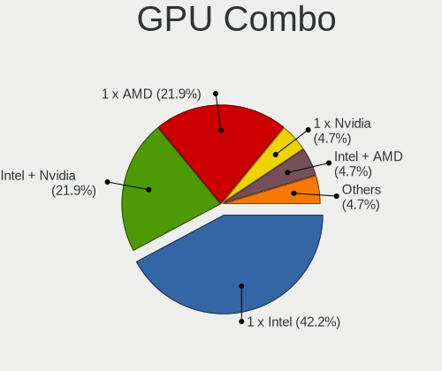

Kubuntu - Hardware Trends (Notebooks)
-------------------------------------

A project to identify most popular hardware characteristics and track their change
over time based on data collected by Linux users at https://Linux-Hardware.org.

Anyone can contribute to this report by the [hw-probe](https://github.com/linuxhw/hw-probe) tool:

    sudo -E hw-probe -all -upload

This report is for one last month. Overall report since the beginning of time: [TestCoverage](https://github.com/linuxhw/TestCoverage)

Period: Dec, 2022.

Contents
--------

* [ System ](#system)
  - [ OS                       ](#os)
  - [ OS Family                ](#os-family)
  - [ Kernel                   ](#kernel)
  - [ Kernel Family            ](#kernel-family)
  - [ Kernel Major Ver.        ](#kernel-major-ver)
  - [ Arch                     ](#arch)
  - [ DE                       ](#de)
  - [ Display Server           ](#display-server)
  - [ Display Manager          ](#display-manager)
  - [ OS Lang                  ](#os-lang)
  - [ Boot Mode                ](#boot-mode)
  - [ Filesystem               ](#filesystem)
  - [ Part. scheme             ](#part-scheme)
  - [ Dual Boot with Linux/BSD ](#dual-boot-with-linuxbsd)
  - [ Dual Boot (Win)          ](#dual-boot-win)

* [ Board ](#board)
  - [ Vendor                   ](#vendor)
  - [ Model                    ](#model)
  - [ Model Family             ](#model-family)
  - [ MFG Year                 ](#mfg-year)
  - [ Form Factor              ](#form-factor)
  - [ Secure Boot              ](#secure-boot)
  - [ Coreboot                 ](#coreboot)
  - [ RAM Size                 ](#ram-size)
  - [ RAM Used                 ](#ram-used)
  - [ Total Drives             ](#total-drives)
  - [ Has CD-ROM               ](#has-cd-rom)
  - [ Has Ethernet             ](#has-ethernet)
  - [ Has WiFi                 ](#has-wifi)
  - [ Has Bluetooth            ](#has-bluetooth)

* [ Location ](#location)
  - [ Country                  ](#country)
  - [ City                     ](#city)

* [ Drives ](#drives)
  - [ Drive Vendor             ](#drive-vendor)
  - [ Drive Model              ](#drive-model)
  - [ HDD Vendor               ](#hdd-vendor)
  - [ SSD Vendor               ](#ssd-vendor)
  - [ Drive Kind               ](#drive-kind)
  - [ Drive Connector          ](#drive-connector)
  - [ Drive Size               ](#drive-size)
  - [ Space Total              ](#space-total)
  - [ Space Used               ](#space-used)
  - [ Malfunc. Drives          ](#malfunc-drives)
  - [ Malfunc. Drive Vendor    ](#malfunc-drive-vendor)
  - [ Malfunc. HDD Vendor      ](#malfunc-hdd-vendor)
  - [ Malfunc. Drive Kind      ](#malfunc-drive-kind)
  - [ Failed Drives            ](#failed-drives)
  - [ Failed Drive Vendor      ](#failed-drive-vendor)
  - [ Drive Status             ](#drive-status)

* [ Storage controller ](#storage-controller)
  - [ Storage Vendor           ](#storage-vendor)
  - [ Storage Model            ](#storage-model)
  - [ Storage Kind             ](#storage-kind)

* [ Processor ](#processor)
  - [ CPU Vendor               ](#cpu-vendor)
  - [ CPU Model                ](#cpu-model)
  - [ CPU Model Family         ](#cpu-model-family)
  - [ CPU Cores                ](#cpu-cores)
  - [ CPU Sockets              ](#cpu-sockets)
  - [ CPU Threads              ](#cpu-threads)
  - [ CPU Op-Modes             ](#cpu-op-modes)
  - [ CPU Microcode            ](#cpu-microcode)
  - [ CPU Microarch            ](#cpu-microarch)

* [ Graphics ](#graphics)
  - [ GPU Vendor               ](#gpu-vendor)
  - [ GPU Model                ](#gpu-model)
  - [ GPU Combo                ](#gpu-combo)
  - [ GPU Driver               ](#gpu-driver)
  - [ GPU Memory               ](#gpu-memory)

* [ Monitor ](#monitor)
  - [ Monitor Vendor           ](#monitor-vendor)
  - [ Monitor Model            ](#monitor-model)
  - [ Monitor Resolution       ](#monitor-resolution)
  - [ Monitor Diagonal         ](#monitor-diagonal)
  - [ Monitor Width            ](#monitor-width)
  - [ Aspect Ratio             ](#aspect-ratio)
  - [ Monitor Area             ](#monitor-area)
  - [ Pixel Density            ](#pixel-density)
  - [ Multiple Monitors        ](#multiple-monitors)

* [ Network ](#network)
  - [ Net Controller Vendor    ](#net-controller-vendor)
  - [ Net Controller Model     ](#net-controller-model)
  - [ Wireless Vendor          ](#wireless-vendor)
  - [ Wireless Model           ](#wireless-model)
  - [ Ethernet Vendor          ](#ethernet-vendor)
  - [ Ethernet Model           ](#ethernet-model)
  - [ Net Controller Kind      ](#net-controller-kind)
  - [ Used Controller          ](#used-controller)
  - [ NICs                     ](#nics)
  - [ IPv6                     ](#ipv6)

* [ Bluetooth ](#bluetooth)
  - [ Bluetooth Vendor         ](#bluetooth-vendor)
  - [ Bluetooth Model          ](#bluetooth-model)

* [ Sound ](#sound)
  - [ Sound Vendor             ](#sound-vendor)
  - [ Sound Model              ](#sound-model)

* [ Memory ](#memory)
  - [ Memory Vendor            ](#memory-vendor)
  - [ Memory Model             ](#memory-model)
  - [ Memory Kind              ](#memory-kind)
  - [ Memory Form Factor       ](#memory-form-factor)
  - [ Memory Size              ](#memory-size)
  - [ Memory Speed             ](#memory-speed)

* [ Printers & scanners ](#printers--scanners)
  - [ Printer Vendor           ](#printer-vendor)
  - [ Printer Model            ](#printer-model)
  - [ Scanner Vendor           ](#scanner-vendor)
  - [ Scanner Model            ](#scanner-model)

* [ Camera ](#camera)
  - [ Camera Vendor            ](#camera-vendor)
  - [ Camera Model             ](#camera-model)

* [ Security ](#security)
  - [ Fingerprint Vendor       ](#fingerprint-vendor)
  - [ Fingerprint Model        ](#fingerprint-model)
  - [ Chipcard Vendor          ](#chipcard-vendor)
  - [ Chipcard Model           ](#chipcard-model)

* [ Unsupported ](#unsupported)
  - [ Unsupported Devices      ](#unsupported-devices)
  - [ Unsupported Device Types ](#unsupported-device-types)

System
------

OS
--

Installed operating systems

| Name          | Notebooks | Percent |
|---------------|-----------|---------|
| Kubuntu 22.04 | 42        | 57.53%  |
| Kubuntu 22.10 | 23        | 31.51%  |
| Kubuntu 20.04 | 5         | 6.85%   |
| Kubuntu 20.10 | 1         | 1.37%   |
| Kubuntu 16.04 | 1         | 1.37%   |
| Kubuntu 11    | 1         | 1.37%   |

OS Family
---------

OS without a version

| Name    | Notebooks | Percent |
|---------|-----------|---------|
| Kubuntu | 73        | 100%    |

Kernel
------

Version of the Linux kernel

| Version                | Notebooks | Percent |
|------------------------|-----------|---------|
| 5.15.0-56-generic      | 32        | 43.84%  |
| 5.19.0-26-generic      | 17        | 23.29%  |
| 5.15.0-53-generic      | 3         | 4.11%   |
| 6.0.9-060009-generic   | 2         | 2.74%   |
| 5.4.0-135-generic      | 2         | 2.74%   |
| 5.15.0-52-generic      | 2         | 2.74%   |
| 5.15.0-43-generic      | 2         | 2.74%   |
| 6.0.6-76060006-generic | 1         | 1.37%   |
| 6.0.0-1006-oem         | 1         | 1.37%   |
| 5.8.0-25-generic       | 1         | 1.37%   |
| 5.19.0-27-generic      | 1         | 1.37%   |
| 5.19.0-23-generic      | 1         | 1.37%   |
| 5.19.0-1012-lowlatency | 1         | 1.37%   |
| 5.17.0-1020-oem        | 1         | 1.37%   |
| 5.15.78                | 1         | 1.37%   |
| 5.15.0-57-generic      | 1         | 1.37%   |
| 5.15.0-53-lowlatency   | 1         | 1.37%   |
| 5.15.0-52-lowlatency   | 1         | 1.37%   |
| 5.15.0-25-generic      | 1         | 1.37%   |
| 4.4.0-210-generic      | 1         | 1.37%   |

Kernel Family
-------------

Linux kernel without a distro release

| Version | Notebooks | Percent |
|---------|-----------|---------|
| 5.15.0  | 43        | 58.9%   |
| 5.19.0  | 20        | 27.4%   |
| 6.0.9   | 2         | 2.74%   |
| 5.4.0   | 2         | 2.74%   |
| 6.0.6   | 1         | 1.37%   |
| 6.0.0   | 1         | 1.37%   |
| 5.8.0   | 1         | 1.37%   |
| 5.17.0  | 1         | 1.37%   |
| 5.15.78 | 1         | 1.37%   |
| 4.4.0   | 1         | 1.37%   |

Kernel Major Ver.
-----------------

Linux kernel major version

| Version | Notebooks | Percent |
|---------|-----------|---------|
| 5.15    | 44        | 60.27%  |
| 5.19    | 20        | 27.4%   |
| 6.0     | 4         | 5.48%   |
| 5.4     | 2         | 2.74%   |
| 5.8     | 1         | 1.37%   |
| 5.17    | 1         | 1.37%   |
| 4.4     | 1         | 1.37%   |

Arch
----

OS architecture (x86_64, i586, etc.)

| Name   | Notebooks | Percent |
|--------|-----------|---------|
| x86_64 | 73        | 100%    |

DE
--

Desktop Environment

| Name | Notebooks | Percent |
|------|-----------|---------|
| KDE5 | 72        | 98.63%  |
| KDE  | 1         | 1.37%   |

Display Server
--------------

X11 or Wayland

| Name    | Notebooks | Percent |
|---------|-----------|---------|
| X11     | 65        | 89.04%  |
| Wayland | 7         | 9.59%   |
| Tty     | 1         | 1.37%   |

Display Manager
---------------

SDDM, LightDM, etc.

| Name    | Notebooks | Percent |
|---------|-----------|---------|
| SDDM    | 55        | 75.34%  |
| Unknown | 12        | 16.44%  |
| LightDM | 2         | 2.74%   |
| GDM3    | 2         | 2.74%   |
| GDM     | 2         | 2.74%   |

OS Lang
-------

Language

| Lang  | Notebooks | Percent |
|-------|-----------|---------|
| en_US | 37        | 50.68%  |
| it_IT | 6         | 8.22%   |
| fr_FR | 6         | 8.22%   |
| de_DE | 6         | 8.22%   |
| en_GB | 3         | 4.11%   |
| ru_RU | 2         | 2.74%   |
| pl_PL | 2         | 2.74%   |
| en_AU | 2         | 2.74%   |
| zh_TW | 1         | 1.37%   |
| tr_TR | 1         | 1.37%   |
| pt_BR | 1         | 1.37%   |
| hu_HU | 1         | 1.37%   |
| fr_CH | 1         | 1.37%   |
| es_ES | 1         | 1.37%   |
| en_SG | 1         | 1.37%   |
| en_IN | 1         | 1.37%   |
| de_AT | 1         | 1.37%   |

Boot Mode
---------

EFI or BIOS

| Mode | Notebooks | Percent |
|------|-----------|---------|
| EFI  | 43        | 58.9%   |
| BIOS | 30        | 41.1%   |

Filesystem
----------

Type of filesystem

| Type    | Notebooks | Percent |
|---------|-----------|---------|
| Ext4    | 64        | 87.67%  |
| Btrfs   | 4         | 5.48%   |
| Overlay | 2         | 2.74%   |
| Zfs     | 1         | 1.37%   |
| Xfs     | 1         | 1.37%   |
| Ext2    | 1         | 1.37%   |

Part. scheme
------------

Scheme of partitioning

| Type    | Notebooks | Percent |
|---------|-----------|---------|
| GPT     | 53        | 72.6%   |
| Unknown | 12        | 16.44%  |
| MBR     | 8         | 10.96%  |

Dual Boot with Linux/BSD
------------------------

Hosting more than one Linux/BSD

| Dual boot | Notebooks | Percent |
|-----------|-----------|---------|
| No        | 68        | 93.15%  |
| Yes       | 5         | 6.85%   |

Dual Boot (Win)
---------------

Hosting Linux and Windows

| Dual boot | Notebooks | Percent |
|-----------|-----------|---------|
| No        | 48        | 65.75%  |
| Yes       | 25        | 34.25%  |

Board
-----

Vendor
------

Motherboard manufacturer

| Name                | Notebooks | Percent |
|---------------------|-----------|---------|
| Lenovo              | 16        | 21.92%  |
| Hewlett-Packard     | 13        | 17.81%  |
| Acer                | 10        | 13.7%   |
| Dell                | 9         | 12.33%  |
| ASUSTek Computer    | 7         | 9.59%   |
| Notebook            | 3         | 4.11%   |
| HUAWEI              | 2         | 2.74%   |
| Apple               | 2         | 2.74%   |
| TUXEDO              | 1         | 1.37%   |
| Timi                | 1         | 1.37%   |
| SGIN                | 1         | 1.37%   |
| Schenker            | 1         | 1.37%   |
| Samsung Electronics | 1         | 1.37%   |
| MSI                 | 1         | 1.37%   |
| Monster             | 1         | 1.37%   |
| Google              | 1         | 1.37%   |
| Fujitsu             | 1         | 1.37%   |
| Framework           | 1         | 1.37%   |
| Carbon Systems      | 1         | 1.37%   |

Model
-----

Motherboard model

| Name                                     | Notebooks | Percent |
|------------------------------------------|-----------|---------|
| TUXEDO InfinityBook Pro Gen7 (MK1)       | 1         | 1.37%   |
| Timi TM1701                              | 1         | 1.37%   |
| SGIN laptop                              | 1         | 1.37%   |
| Schenker XMG APEX (Mid 2021)             | 1         | 1.37%   |
| Samsung 550P5C/550P7C                    | 1         | 1.37%   |
| Notebook P17SM                           | 1         | 1.37%   |
| Notebook NP5x_NP6x_NP7xPNK_PNH_PNJ       | 1         | 1.37%   |
| Notebook NL5xRU                          | 1         | 1.37%   |
| MSI GP62 7QF                             | 1         | 1.37%   |
| Monster TULPAR T7 V21.6                  | 1         | 1.37%   |
| Lenovo ThinkPad X230 23256N6             | 1         | 1.37%   |
| Lenovo ThinkPad X1 Carbon 5th 20HQS0BK00 | 1         | 1.37%   |
| Lenovo ThinkPad T61 7665VJM              | 1         | 1.37%   |
| Lenovo ThinkPad T530 24295XU             | 1         | 1.37%   |
| Lenovo ThinkPad T510 4313CTO             | 1         | 1.37%   |
| Lenovo ThinkPad T470s 20HGS1JN00         | 1         | 1.37%   |
| Lenovo ThinkPad T420 4236PZ0             | 1         | 1.37%   |
| Lenovo ThinkPad R61 8918DMG              | 1         | 1.37%   |
| Lenovo ThinkPad E15 20RD0011MZ           | 1         | 1.37%   |
| Lenovo ThinkBook 15-IML 20RW             | 1         | 1.37%   |
| Lenovo ThinkBook 15 G2 ITL 20VE          | 1         | 1.37%   |
| Lenovo Legion 5 Pro 16ACH6H 82JQ         | 1         | 1.37%   |
| Lenovo IdeaPad 700-17ISK 80RV            | 1         | 1.37%   |
| Lenovo IdeaPad 3 15ADA05 81W1            | 1         | 1.37%   |
| Lenovo G700 20251                        | 1         | 1.37%   |
| Lenovo G50-70 20351                      | 1         | 1.37%   |
| HUAWEI CREM-WXX9                         | 1         | 1.37%   |
| HUAWEI BOM-WXX9                          | 1         | 1.37%   |
| HP Victus by Laptop 16-e1xxx             | 1         | 1.37%   |
| HP Sona                                  | 1         | 1.37%   |
| HP ProBook 450 G8 Notebook PC            | 1         | 1.37%   |
| HP ProBook 450 G2                        | 1         | 1.37%   |
| HP ProBook 430 G2                        | 1         | 1.37%   |
| HP Pavilion g7                           | 1         | 1.37%   |
| HP Pavilion dv7                          | 1         | 1.37%   |
| HP Notebook                              | 1         | 1.37%   |
| HP Laptop 17-by3xxx                      | 1         | 1.37%   |
| HP EliteBook 845 G7 Notebook PC          | 1         | 1.37%   |
| HP EliteBook 745 G3                      | 1         | 1.37%   |
| HP Beats 15                              | 1         | 1.37%   |

Model Family
------------

Motherboard model prefix

| Name                | Notebooks | Percent |
|---------------------|-----------|---------|
| Lenovo ThinkPad     | 9         | 12.33%  |
| Acer Aspire         | 6         | 8.22%   |
| HP ProBook          | 3         | 4.11%   |
| Lenovo ThinkBook    | 2         | 2.74%   |
| Lenovo IdeaPad      | 2         | 2.74%   |
| HP Pavilion         | 2         | 2.74%   |
| HP EliteBook        | 2         | 2.74%   |
| Dell Vostro         | 2         | 2.74%   |
| Dell Precision      | 2         | 2.74%   |
| Dell Latitude       | 2         | 2.74%   |
| Dell Inspiron       | 2         | 2.74%   |
| ASUS VivoBook       | 2         | 2.74%   |
| ASUS ROG            | 2         | 2.74%   |
| Apple MacBookPro14  | 2         | 2.74%   |
| Acer Nitro          | 2         | 2.74%   |
| TUXEDO InfinityBook | 1         | 1.37%   |
| Timi TM1701         | 1         | 1.37%   |
| SGIN laptop         | 1         | 1.37%   |
| Schenker XMG        | 1         | 1.37%   |
| Samsung 550P5C      | 1         | 1.37%   |
| Notebook P17SM      | 1         | 1.37%   |
| Notebook NP5x       | 1         | 1.37%   |
| Notebook NL5xRU     | 1         | 1.37%   |
| MSI GP62            | 1         | 1.37%   |
| Monster TULPAR      | 1         | 1.37%   |
| Lenovo Legion       | 1         | 1.37%   |
| Lenovo G700         | 1         | 1.37%   |
| Lenovo G50-70       | 1         | 1.37%   |
| HUAWEI CREM-WXX9    | 1         | 1.37%   |
| HUAWEI BOM-WXX9     | 1         | 1.37%   |
| HP Victus           | 1         | 1.37%   |
| HP Sona             | 1         | 1.37%   |
| HP Notebook         | 1         | 1.37%   |
| HP Laptop           | 1         | 1.37%   |
| HP Beats            | 1         | 1.37%   |
| HP 550              | 1         | 1.37%   |
| Google Kled         | 1         | 1.37%   |
| Fujitsu LIFEBOOK    | 1         | 1.37%   |
| Framework Laptop    | 1         | 1.37%   |
| Dell XPS            | 1         | 1.37%   |

MFG Year
--------

Motherboard manufacture year

| Year | Notebooks | Percent |
|------|-----------|---------|
| 2022 | 11        | 15.07%  |
| 2021 | 11        | 15.07%  |
| 2020 | 8         | 10.96%  |
| 2018 | 7         | 9.59%   |
| 2019 | 6         | 8.22%   |
| 2017 | 5         | 6.85%   |
| 2016 | 4         | 5.48%   |
| 2011 | 4         | 5.48%   |
| 2014 | 3         | 4.11%   |
| 2013 | 3         | 4.11%   |
| 2012 | 3         | 4.11%   |
| 2015 | 2         | 2.74%   |
| 2008 | 2         | 2.74%   |
| 2007 | 2         | 2.74%   |
| 2010 | 1         | 1.37%   |
| 2009 | 1         | 1.37%   |

Form Factor
-----------

Physical design of the computer

| Name     | Notebooks | Percent |
|----------|-----------|---------|
| Notebook | 73        | 100%    |

Secure Boot
-----------

Enabled or disabled

| State    | Notebooks | Percent |
|----------|-----------|---------|
| Disabled | 65        | 89.04%  |
| Enabled  | 8         | 10.96%  |

Coreboot
--------

Have coreboot on board

| Used | Notebooks | Percent |
|------|-----------|---------|
| No   | 71        | 97.26%  |
| Yes  | 2         | 2.74%   |

RAM Size
--------

Total RAM memory

| Size in GB  | Notebooks | Percent |
|-------------|-----------|---------|
| 16.01-24.0  | 21        | 28.77%  |
| 4.01-8.0    | 18        | 24.66%  |
| 8.01-16.0   | 12        | 16.44%  |
| 32.01-64.0  | 10        | 13.7%   |
| 3.01-4.0    | 7         | 9.59%   |
| 64.01-256.0 | 3         | 4.11%   |
| 24.01-32.0  | 1         | 1.37%   |
| 2.01-3.0    | 1         | 1.37%   |

RAM Used
--------

Used RAM memory

| Used GB    | Notebooks | Percent |
|------------|-----------|---------|
| 3.01-4.0   | 19        | 26.03%  |
| 4.01-8.0   | 16        | 21.92%  |
| 2.01-3.0   | 16        | 21.92%  |
| 1.01-2.0   | 12        | 16.44%  |
| 8.01-16.0  | 7         | 9.59%   |
| 0.51-1.0   | 2         | 2.74%   |
| 16.01-24.0 | 1         | 1.37%   |

Total Drives
------------

Number of drives on board

| Drives | Notebooks | Percent |
|--------|-----------|---------|
| 1      | 54        | 73.97%  |
| 2      | 16        | 21.92%  |
| 3      | 3         | 4.11%   |

Has CD-ROM
----------

Has CD-ROM on board

| Presented | Notebooks | Percent |
|-----------|-----------|---------|
| No        | 55        | 75.34%  |
| Yes       | 18        | 24.66%  |

Has Ethernet
------------

Has Ethernet on board

| Presented | Notebooks | Percent |
|-----------|-----------|---------|
| Yes       | 56        | 76.71%  |
| No        | 17        | 23.29%  |

Has WiFi
--------

Has WiFi module

| Presented | Notebooks | Percent |
|-----------|-----------|---------|
| Yes       | 73        | 100%    |

Has Bluetooth
-------------

Has Bluetooth module

| Presented | Notebooks | Percent |
|-----------|-----------|---------|
| Yes       | 62        | 84.93%  |
| No        | 11        | 15.07%  |

Location
--------

Country
-------

Geographic location (country)

| Country      | Notebooks | Percent |
|--------------|-----------|---------|
| USA          | 12        | 16.44%  |
| Italy        | 9         | 12.33%  |
| France       | 8         | 10.96%  |
| Germany      | 7         | 9.59%   |
| Switzerland  | 4         | 5.48%   |
| Poland       | 4         | 5.48%   |
| Russia       | 3         | 4.11%   |
| UK           | 2         | 2.74%   |
| Hungary      | 2         | 2.74%   |
| Australia    | 2         | 2.74%   |
| Ukraine      | 1         | 1.37%   |
| Turkey       | 1         | 1.37%   |
| Taiwan       | 1         | 1.37%   |
| Spain        | 1         | 1.37%   |
| Slovakia     | 1         | 1.37%   |
| Singapore    | 1         | 1.37%   |
| Serbia       | 1         | 1.37%   |
| Saudi Arabia | 1         | 1.37%   |
| Romania      | 1         | 1.37%   |
| Portugal     | 1         | 1.37%   |
| Netherlands  | 1         | 1.37%   |
| Lithuania    | 1         | 1.37%   |
| India        | 1         | 1.37%   |
| Denmark      | 1         | 1.37%   |
| Chile        | 1         | 1.37%   |
| Cameroon     | 1         | 1.37%   |
| Bulgaria     | 1         | 1.37%   |
| Brazil       | 1         | 1.37%   |
| Belarus      | 1         | 1.37%   |
| Austria      | 1         | 1.37%   |

City
----

Geographic location (city)

| City             | Notebooks | Percent |
|------------------|-----------|---------|
| Warsaw           | 3         | 4.11%   |
| Ambazac          | 2         | 2.74%   |
| Zurich           | 1         | 1.37%   |
| Yekaterinburg    | 1         | 1.37%   |
| Yaoundé         | 1         | 1.37%   |
| Woodbridge       | 1         | 1.37%   |
| Waterflow        | 1         | 1.37%   |
| Walthamstow      | 1         | 1.37%   |
| Vilnius          | 1         | 1.37%   |
| Vienna           | 1         | 1.37%   |
| Unterfoehring    | 1         | 1.37%   |
| Traverse City    | 1         | 1.37%   |
| Taipei           | 1         | 1.37%   |
| St Petersburg    | 1         | 1.37%   |
| Sofia            | 1         | 1.37%   |
| Singapore        | 1         | 1.37%   |
| Sheffield        | 1         | 1.37%   |
| Sava             | 1         | 1.37%   |
| Santiago         | 1         | 1.37%   |
| Roslyn           | 1         | 1.37%   |
| Rosemead         | 1         | 1.37%   |
| Rome             | 1         | 1.37%   |
| Porto            | 1         | 1.37%   |
| Poissy           | 1         | 1.37%   |
| Pescara          | 1         | 1.37%   |
| Pécs            | 1         | 1.37%   |
| Pawtucket        | 1         | 1.37%   |
| Parma            | 1         | 1.37%   |
| Paris            | 1         | 1.37%   |
| Parcay-Meslay    | 1         | 1.37%   |
| Oneşti          | 1         | 1.37%   |
| Oldenburg        | 1         | 1.37%   |
| Nuremberg        | 1         | 1.37%   |
| Novi Sad         | 1         | 1.37%   |
| Nocera Superiore | 1         | 1.37%   |
| Moscow           | 1         | 1.37%   |
| Moorrege         | 1         | 1.37%   |
| Montpelier       | 1         | 1.37%   |
| Milan            | 1         | 1.37%   |
| Melbourne        | 1         | 1.37%   |

Drives
------

Drive Vendor
------------

Hard drive vendors

| Vendor                      | Notebooks | Drives | Percent |
|-----------------------------|-----------|--------|---------|
| Samsung Electronics         | 20        | 22     | 22.47%  |
| WDC                         | 15        | 18     | 16.85%  |
| SanDisk                     | 9         | 9      | 10.11%  |
| SK hynix                    | 6         | 6      | 6.74%   |
| Kingston                    | 6         | 6      | 6.74%   |
| Toshiba                     | 5         | 5      | 5.62%   |
| Micron Technology           | 4         | 4      | 4.49%   |
| Seagate                     | 3         | 3      | 3.37%   |
| Intel                       | 3         | 3      | 3.37%   |
| Crucial                     | 3         | 3      | 3.37%   |
| Unknown                     | 2         | 4      | 2.25%   |
| HGST                        | 2         | 2      | 2.25%   |
| Apple                       | 2         | 3      | 2.25%   |
| SPCC                        | 1         | 1      | 1.12%   |
| Silicon Motion              | 1         | 1      | 1.12%   |
| R580                        | 1         | 1      | 1.12%   |
| Phison                      | 1         | 1      | 1.12%   |
| NGFF                        | 1         | 1      | 1.12%   |
| Mass                        | 1         | 1      | 1.12%   |
| LITEON                      | 1         | 1      | 1.12%   |
| Kingston Technology Company | 1         | 1      | 1.12%   |
| JMicron Technology          | 1         | 1      | 1.12%   |

Drive Model
-----------

Hard drive models

| Model                                                  | Notebooks | Percent |
|--------------------------------------------------------|-----------|---------|
| Toshiba MQ01ABD100 1TB                                 | 3         | 3.16%   |
| WDC WDS100T2B0C-00PXH0 1TB                             | 2         | 2.11%   |
| Samsung SSD 980 PRO 1TB                                | 2         | 2.11%   |
| Samsung SSD 970 EVO Plus 2TB                           | 2         | 2.11%   |
| Samsung NVMe SSD Controller SM961/PM961/SM963 256GB    | 2         | 2.11%   |
| Kingston SA400S37480G 480GB SSD                        | 2         | 2.11%   |
| WDC WDS500G2B0B-00YS70 500GB SSD                       | 1         | 1.05%   |
| WDC WDS500G1B0A-00H9H0 500GB SSD                       | 1         | 1.05%   |
| WDC WDS100T3X0C-00SJG0 1TB                             | 1         | 1.05%   |
| WDC WDS100T2B0B-00YS70 1TB SSD                         | 1         | 1.05%   |
| WDC WDS100T2B0A 1TB SSD                                | 1         | 1.05%   |
| WDC WD6400BEVT-22A0RT0 640GB                           | 1         | 1.05%   |
| WDC WD5000LPCX-24C6HT0 500GB                           | 1         | 1.05%   |
| WDC WD20SPZX-22UA7T0 2TB                               | 1         | 1.05%   |
| WDC WD1600BEVT-60ZCT1 160GB                            | 1         | 1.05%   |
| WDC WD10SPZX-75Z10T1 1TB                               | 1         | 1.05%   |
| WDC WD10SPCX-24HWST1 1TB                               | 1         | 1.05%   |
| WDC WD10JPVX-60JC3T0 1TB                               | 1         | 1.05%   |
| WDC WD10JPVX-22JC3T0 1TB                               | 1         | 1.05%   |
| WDC PC SN730 SDBPNTY-512G                              | 1         | 1.05%   |
| WDC PC SN530 SDBPNPZ-512G-1006 512GB                   | 1         | 1.05%   |
| WDC PC SN520 SDAPMUW-512G-1001 512GB                   | 1         | 1.05%   |
| Unknown MMC Card  8GB                                  | 1         | 1.05%   |
| Unknown MMC Card  7GB                                  | 1         | 1.05%   |
| Unknown MMC Card  128GB                                | 1         | 1.05%   |
| Unknown DA4064  64GB                                   | 1         | 1.05%   |
| Toshiba MQ04ABF100 1TB                                 | 1         | 1.05%   |
| Toshiba KSG60ZMV512G M.2 2280 512GB SSD                | 1         | 1.05%   |
| SPCC Solid State Disk 128GB                            | 1         | 1.05%   |
| SK hynix SKHynix_HFS001TDE9X084N 1024GB                | 1         | 1.05%   |
| SK hynix SKHynix_HFM512GD3HX015N 512GB                 | 1         | 1.05%   |
| SK hynix PC601 NVMe 512GB                              | 1         | 1.05%   |
| SK hynix HFM512GD3JX016N 512GB                         | 1         | 1.05%   |
| SK hynix HFM128GDJTNG-8310A 128GB                      | 1         | 1.05%   |
| SK hynix BC501 NVMe 256GB                              | 1         | 1.05%   |
| Silicon Motion SM2263EN/SM2263XT SSD Controller 1024GB | 1         | 1.05%   |
| Seagate ST2000LM015-2E8174 2TB                         | 1         | 1.05%   |
| Seagate ST1000LM048-2E7172 1TB                         | 1         | 1.05%   |
| Seagate ST1000LM024 HN-M101MBB 1TB                     | 1         | 1.05%   |
| SanDisk X600 M.2 2280 SATA 128GB SSD                   | 1         | 1.05%   |

HDD Vendor
----------

Hard disk drive vendors

| Vendor  | Notebooks | Drives | Percent |
|---------|-----------|--------|---------|
| WDC     | 8         | 8      | 47.06%  |
| Toshiba | 4         | 4      | 23.53%  |
| Seagate | 3         | 3      | 17.65%  |
| HGST    | 2         | 2      | 11.76%  |

SSD Vendor
----------

Solid state drive vendors

| Vendor              | Notebooks | Drives | Percent |
|---------------------|-----------|--------|---------|
| SanDisk             | 7         | 7      | 25.93%  |
| Samsung Electronics | 6         | 7      | 22.22%  |
| WDC                 | 4         | 4      | 14.81%  |
| Kingston            | 3         | 3      | 11.11%  |
| Crucial             | 2         | 2      | 7.41%   |
| Toshiba             | 1         | 1      | 3.7%    |
| SPCC                | 1         | 1      | 3.7%    |
| R580                | 1         | 1      | 3.7%    |
| NGFF                | 1         | 1      | 3.7%    |
| LITEON              | 1         | 1      | 3.7%    |

Drive Kind
----------

HDD or SSD

| Kind    | Notebooks | Drives | Percent |
|---------|-----------|--------|---------|
| NVMe    | 41        | 46     | 47.67%  |
| SSD     | 25        | 28     | 29.07%  |
| HDD     | 16        | 17     | 18.6%   |
| MMC     | 2         | 4      | 2.33%   |
| Unknown | 2         | 2      | 2.33%   |

Drive Connector
---------------

SATA, SAS, NVMe, etc.

| Type | Notebooks | Drives | Percent |
|------|-----------|--------|---------|
| NVMe | 41        | 46     | 50.62%  |
| SATA | 35        | 44     | 43.21%  |
| SAS  | 3         | 3      | 3.7%    |
| MMC  | 2         | 4      | 2.47%   |

Drive Size
----------

Size of hard drive

| Size in TB | Notebooks | Drives | Percent |
|------------|-----------|--------|---------|
| 0.01-0.5   | 21        | 22     | 51.22%  |
| 0.51-1.0   | 18        | 21     | 43.9%   |
| 1.01-2.0   | 2         | 2      | 4.88%   |

Space Total
-----------

Amount of disk space available on the file system

| Size in GB | Notebooks | Percent |
|------------|-----------|---------|
| 251-500    | 26        | 35.62%  |
| 501-1000   | 15        | 20.55%  |
| 101-250    | 14        | 19.18%  |
| 1001-2000  | 11        | 15.07%  |
| 51-100     | 4         | 5.48%   |
| 1-20       | 2         | 2.74%   |
| 2001-3000  | 1         | 1.37%   |

Space Used
----------

Amount of used disk space

| Used GB   | Notebooks | Percent |
|-----------|-----------|---------|
| 1-20      | 16        | 21.92%  |
| 21-50     | 15        | 20.55%  |
| 251-500   | 14        | 19.18%  |
| 51-100    | 11        | 15.07%  |
| 101-250   | 9         | 12.33%  |
| 1001-2000 | 4         | 5.48%   |
| 501-1000  | 4         | 5.48%   |

Malfunc. Drives
---------------

Drive models with a malfunction

| Model                        | Notebooks | Drives | Percent |
|------------------------------|-----------|--------|---------|
| WDC WD6400BEVT-22A0RT0 640GB | 1         | 1      | 25%     |
| SanDisk SSD U100 128GB       | 1         | 1      | 25%     |
| R580 SSD 60GB                | 1         | 1      | 25%     |
| Crucial CT1000P1SSD8 1TB     | 1         | 1      | 25%     |

Malfunc. Drive Vendor
---------------------

Vendors of faulty drives

| Vendor  | Notebooks | Drives | Percent |
|---------|-----------|--------|---------|
| WDC     | 1         | 1      | 25%     |
| SanDisk | 1         | 1      | 25%     |
| R580    | 1         | 1      | 25%     |
| Crucial | 1         | 1      | 25%     |

Malfunc. HDD Vendor
-------------------

Vendors of faulty HDD drives

| Vendor | Notebooks | Drives | Percent |
|--------|-----------|--------|---------|
| WDC    | 1         | 1      | 100%    |

Malfunc. Drive Kind
-------------------

Kinds of faulty drives

| Kind | Notebooks | Drives | Percent |
|------|-----------|--------|---------|
| SSD  | 2         | 2      | 50%     |
| NVMe | 1         | 1      | 25%     |
| HDD  | 1         | 1      | 25%     |

Failed Drives
-------------

Failed drive models

Zero info for selected period =(

Failed Drive Vendor
-------------------

Failed drive vendors

Zero info for selected period =(

Drive Status
------------

Number of failed and malfunc. drives

| Status   | Notebooks | Drives | Percent |
|----------|-----------|--------|---------|
| Works    | 46        | 59     | 58.97%  |
| Detected | 28        | 34     | 35.9%   |
| Malfunc  | 4         | 4      | 5.13%   |

Storage controller
------------------

Storage Vendor
--------------

Storage controller vendors

| Vendor                      | Notebooks | Percent |
|-----------------------------|-----------|---------|
| Intel                       | 46        | 46%     |
| Samsung Electronics         | 15        | 15%     |
| AMD                         | 13        | 13%     |
| SanDisk                     | 8         | 8%      |
| SK hynix                    | 6         | 6%      |
| Micron Technology           | 4         | 4%      |
| Kingston Technology Company | 4         | 4%      |
| Silicon Motion              | 1         | 1%      |
| Phison Electronics          | 1         | 1%      |
| Micron/Crucial Technology   | 1         | 1%      |
| Apple                       | 1         | 1%      |

Storage Model
-------------

Storage controller models

| Model                                                                          | Notebooks | Percent |
|--------------------------------------------------------------------------------|-----------|---------|
| AMD FCH SATA Controller [AHCI mode]                                            | 13        | 11.82%  |
| Samsung NVMe SSD Controller SM981/PM981/PM983                                  | 5         | 4.55%   |
| Intel Volume Management Device NVMe RAID Controller                            | 5         | 4.55%   |
| Intel 6 Series/C200 Series Chipset Family 6 port Mobile SATA AHCI Controller   | 5         | 4.55%   |
| Samsung NVMe SSD Controller SM961/PM961/SM963                                  | 4         | 3.64%   |
| Micron Non-Volatile memory controller                                          | 4         | 3.64%   |
| Intel 7 Series Chipset Family 6-port SATA Controller [AHCI mode]               | 4         | 3.64%   |
| SK hynix Gold P31/PC711 NVMe Solid State Drive                                 | 3         | 2.73%   |
| SanDisk WD Blue SN550 NVMe SSD                                                 | 3         | 2.73%   |
| Samsung NVMe SSD Controller PM9A1/PM9A3/980PRO                                 | 3         | 2.73%   |
| Samsung NVMe SSD Controller 980                                                | 3         | 2.73%   |
| Intel HM170/QM170 Chipset SATA Controller [AHCI Mode]                          | 3         | 2.73%   |
| Intel Comet Lake SATA AHCI Controller                                          | 3         | 2.73%   |
| Intel Cannon Lake Mobile PCH SATA AHCI Controller                              | 3         | 2.73%   |
| Intel Alder Lake-P SATA AHCI Controller                                        | 3         | 2.73%   |
| Intel 82801HM/HEM (ICH8M/ICH8M-E) SATA Controller [AHCI mode]                  | 3         | 2.73%   |
| Intel 82801HM/HEM (ICH8M/ICH8M-E) IDE Controller                               | 3         | 2.73%   |
| Intel 82801 Mobile SATA Controller [RAID mode]                                 | 3         | 2.73%   |
| SK hynix BC501 NVMe Solid State Drive                                          | 2         | 1.82%   |
| SanDisk WD Black SN750 / PC SN730 NVMe SSD                                     | 2         | 1.82%   |
| Intel Sunrise Point-LP SATA Controller [AHCI mode]                             | 2         | 1.82%   |
| Intel Non-Volatile memory controller                                           | 2         | 1.82%   |
| Intel Celeron/Pentium Silver Processor SATA Controller                         | 2         | 1.82%   |
| Intel 8 Series/C220 Series Chipset Family 6-port SATA Controller 1 [AHCI mode] | 2         | 1.82%   |
| Intel 8 Series SATA Controller 1 [AHCI mode]                                   | 2         | 1.82%   |
| SK hynix Non-Volatile memory controller                                        | 1         | 0.91%   |
| Silicon Motion SM2263EN/SM2263XT SSD Controller                                | 1         | 0.91%   |
| SanDisk WD Blue SN570 NVMe SSD                                                 | 1         | 0.91%   |
| SanDisk PC SN520 NVMe SSD                                                      | 1         | 0.91%   |
| SanDisk Non-Volatile memory controller                                         | 1         | 0.91%   |
| Phison PS5013 E13 NVMe Controller                                              | 1         | 0.91%   |
| Micron/Crucial P1 NVMe PCIe SSD                                                | 1         | 0.91%   |
| Kingston Company Company Non-Volatile memory controller                        | 1         | 0.91%   |
| Kingston Company SNVS2000G [NV1 NVMe PCIe SSD 2TB]                             | 1         | 0.91%   |
| Kingston Company OM3PDP3 NVMe SSD                                              | 1         | 0.91%   |
| Kingston Company A2000 NVMe SSD                                                | 1         | 0.91%   |
| Intel Wildcat Point-LP SATA Controller [AHCI Mode]                             | 1         | 0.91%   |
| Intel Tiger Lake-LP SATA Controller                                            | 1         | 0.91%   |
| Intel SSD 600P Series                                                          | 1         | 0.91%   |
| Intel SATA Controller [RAID mode]                                              | 1         | 0.91%   |

Storage Kind
------------

Kind of storage controller (IDE, SATA, NVMe, SAS, ...)

| Kind | Notebooks | Percent |
|------|-----------|---------|
| SATA | 52        | 49.06%  |
| NVMe | 41        | 38.68%  |
| RAID | 9         | 8.49%   |
| IDE  | 4         | 3.77%   |

Processor
---------

CPU Vendor
----------

Processor vendors

| Vendor | Notebooks | Percent |
|--------|-----------|---------|
| Intel  | 54        | 73.97%  |
| AMD    | 19        | 26.03%  |

CPU Model
---------

Processor models

| Model                                    | Notebooks | Percent |
|------------------------------------------|-----------|---------|
| Intel 12th Gen Core i7-12700H            | 3         | 4.11%   |
| Intel Core i5-8250U CPU @ 1.60GHz        | 2         | 2.74%   |
| Intel Core i5-7300HQ CPU @ 2.50GHz       | 2         | 2.74%   |
| Intel Core i5-2520M CPU @ 2.50GHz        | 2         | 2.74%   |
| Intel Core i5-10210U CPU @ 1.60GHz       | 2         | 2.74%   |
| Intel 11th Gen Core i5-11400H @ 2.70GHz  | 2         | 2.74%   |
| Intel 11th Gen Core i5-1135G7 @ 2.40GHz  | 2         | 2.74%   |
| AMD Ryzen 7 6800H with Radeon Graphics   | 2         | 2.74%   |
| AMD Ryzen 7 5800H with Radeon Graphics   | 2         | 2.74%   |
| AMD Ryzen 5 5500U with Radeon Graphics   | 2         | 2.74%   |
| Intel Pentium Silver N5000 CPU @ 1.10GHz | 1         | 1.37%   |
| Intel Core i9-8950HK CPU @ 2.90GHz       | 1         | 1.37%   |
| Intel Core i7-9750H CPU @ 2.60GHz        | 1         | 1.37%   |
| Intel Core i7-8750H CPU @ 2.20GHz        | 1         | 1.37%   |
| Intel Core i7-8550U CPU @ 1.80GHz        | 1         | 1.37%   |
| Intel Core i7-7820HQ CPU @ 2.90GHz       | 1         | 1.37%   |
| Intel Core i7-7700HQ CPU @ 2.80GHz       | 1         | 1.37%   |
| Intel Core i7-7600U CPU @ 2.80GHz        | 1         | 1.37%   |
| Intel Core i7-6820HQ CPU @ 2.70GHz       | 1         | 1.37%   |
| Intel Core i7-6700HQ CPU @ 2.60GHz       | 1         | 1.37%   |
| Intel Core i7-5500U CPU @ 2.40GHz        | 1         | 1.37%   |
| Intel Core i7-4800MQ CPU @ 2.70GHz       | 1         | 1.37%   |
| Intel Core i7-3630QM CPU @ 2.40GHz       | 1         | 1.37%   |
| Intel Core i7-3520M CPU @ 2.90GHz        | 1         | 1.37%   |
| Intel Core i7-10875H CPU @ 2.30GHz       | 1         | 1.37%   |
| Intel Core i7-1065G7 CPU @ 1.30GHz       | 1         | 1.37%   |
| Intel Core i7-10510U CPU @ 1.80GHz       | 1         | 1.37%   |
| Intel Core i7 CPU M 620 @ 2.67GHz        | 1         | 1.37%   |
| Intel Core i5-8350U CPU @ 1.70GHz        | 1         | 1.37%   |
| Intel Core i5-8265U CPU @ 1.60GHz        | 1         | 1.37%   |
| Intel Core i5-7300U CPU @ 2.60GHz        | 1         | 1.37%   |
| Intel Core i5-7267U CPU @ 3.10GHz        | 1         | 1.37%   |
| Intel Core i5-6200U CPU @ 2.30GHz        | 1         | 1.37%   |
| Intel Core i5-4300M CPU @ 2.60GHz        | 1         | 1.37%   |
| Intel Core i5-4210U CPU @ 1.70GHz        | 1         | 1.37%   |
| Intel Core i5-3320M CPU @ 2.60GHz        | 1         | 1.37%   |
| Intel Core i5-2557M CPU @ 1.70GHz        | 1         | 1.37%   |
| Intel Core i5-2430M CPU @ 2.40GHz        | 1         | 1.37%   |
| Intel Core i5-2410M CPU @ 2.30GHz        | 1         | 1.37%   |
| Intel Core i5 CPU M 460 @ 2.53GHz        | 1         | 1.37%   |

CPU Model Family
----------------

Processor model prefix

| Model                | Notebooks | Percent |
|----------------------|-----------|---------|
| Intel Core i5        | 20        | 27.4%   |
| Intel Core i7        | 16        | 21.92%  |
| Other                | 10        | 13.7%   |
| AMD Ryzen 7          | 8         | 10.96%  |
| AMD Ryzen 5          | 5         | 6.85%   |
| Intel Core i3        | 2         | 2.74%   |
| Intel Core 2 Duo     | 2         | 2.74%   |
| Intel Celeron        | 2         | 2.74%   |
| Intel Pentium Silver | 1         | 1.37%   |
| Intel Core i9        | 1         | 1.37%   |
| AMD Ryzen 9          | 1         | 1.37%   |
| AMD Ryzen 5 PRO      | 1         | 1.37%   |
| AMD Ryzen 3          | 1         | 1.37%   |
| AMD PRO A10          | 1         | 1.37%   |
| AMD A8               | 1         | 1.37%   |
| AMD A10              | 1         | 1.37%   |

CPU Cores
---------

Number of processor cores

| Number | Notebooks | Percent |
|--------|-----------|---------|
| 2      | 25        | 34.25%  |
| 4      | 22        | 30.14%  |
| 8      | 10        | 13.7%   |
| 6      | 10        | 13.7%   |
| 14     | 3         | 4.11%   |
| 12     | 1         | 1.37%   |
| 10     | 1         | 1.37%   |
| 1      | 1         | 1.37%   |

CPU Sockets
-----------

Number of sockets

| Number | Notebooks | Percent |
|--------|-----------|---------|
| 1      | 73        | 100%    |

CPU Threads
-----------

Threads per core (Hyper-Threading)

| Number | Notebooks | Percent |
|--------|-----------|---------|
| 2      | 63        | 86.3%   |
| 1      | 10        | 13.7%   |

CPU Op-Modes
------------

CPU Operation Modes (32-bit, 64-bit)

| Op mode        | Notebooks | Percent |
|----------------|-----------|---------|
| 32-bit, 64-bit | 73        | 100%    |

CPU Microcode
-------------

Microcode number

| Number     | Notebooks | Percent |
|------------|-----------|---------|
| Unknown    | 20        | 27.4%   |
| 0x906a3    | 5         | 6.85%   |
| 0x206a7    | 4         | 5.48%   |
| 0x906e9    | 3         | 4.11%   |
| 0x806ea    | 3         | 4.11%   |
| 0x306a9    | 3         | 4.11%   |
| 0x0a50000c | 3         | 4.11%   |
| 0x806ec    | 2         | 2.74%   |
| 0x506e3    | 2         | 2.74%   |
| 0x40651    | 2         | 2.74%   |
| 0x0a404101 | 2         | 2.74%   |
| 0x08608103 | 2         | 2.74%   |
| 0x08600106 | 2         | 2.74%   |
| 0x0810100b | 2         | 2.74%   |
| 0x906ea    | 1         | 1.37%   |
| 0x906a4    | 1         | 1.37%   |
| 0x806eb    | 1         | 1.37%   |
| 0x806e9    | 1         | 1.37%   |
| 0x806d1    | 1         | 1.37%   |
| 0x806c1    | 1         | 1.37%   |
| 0x706e5    | 1         | 1.37%   |
| 0x706a8    | 1         | 1.37%   |
| 0x706a1    | 1         | 1.37%   |
| 0x6fd      | 1         | 1.37%   |
| 0x6fb      | 1         | 1.37%   |
| 0x406e3    | 1         | 1.37%   |
| 0x306c3    | 1         | 1.37%   |
| 0x20655    | 1         | 1.37%   |
| 0x20652    | 1         | 1.37%   |
| 0x08608102 | 1         | 1.37%   |
| 0x08600103 | 1         | 1.37%   |
| 0x08108109 | 1         | 1.37%   |

CPU Microarch
-------------

Microarchitecture

| Name             | Notebooks | Percent |
|------------------|-----------|---------|
| KabyLake         | 18        | 24.66%  |
| Alderlake Hybrid | 6         | 8.22%   |
| Unknown          | 6         | 8.22%   |
| Zen 3            | 5         | 6.85%   |
| SandyBridge      | 5         | 6.85%   |
| IvyBridge        | 4         | 5.48%   |
| Haswell          | 4         | 5.48%   |
| Zen 2            | 3         | 4.11%   |
| Skylake          | 3         | 4.11%   |
| Core             | 3         | 4.11%   |
| Zen              | 2         | 2.74%   |
| Westmere         | 2         | 2.74%   |
| TigerLake        | 2         | 2.74%   |
| IceLake          | 2         | 2.74%   |
| Goldmont plus    | 2         | 2.74%   |
| Excavator        | 2         | 2.74%   |
| Zen+             | 1         | 1.37%   |
| Piledriver       | 1         | 1.37%   |
| CometLake        | 1         | 1.37%   |
| Broadwell        | 1         | 1.37%   |

Graphics
--------

GPU Vendor
----------

Vendors of graphics cards

| Vendor | Notebooks | Percent |
|--------|-----------|---------|
| Intel  | 49        | 47.12%  |
| Nvidia | 30        | 28.85%  |
| AMD    | 25        | 24.04%  |

GPU Model
---------

Graphics card models

| Model                                                                                 | Notebooks | Percent |
|---------------------------------------------------------------------------------------|-----------|---------|
| Nvidia GA106M [GeForce RTX 3060 Mobile / Max-Q]                                       | 5         | 4.76%   |
| Intel 2nd Generation Core Processor Family Integrated Graphics Controller             | 5         | 4.76%   |
| Intel UHD Graphics 620                                                                | 4         | 3.81%   |
| Intel Alder Lake-P Integrated Graphics Controller                                     | 4         | 3.81%   |
| Intel 3rd Gen Core processor Graphics Controller                                      | 4         | 3.81%   |
| AMD Cezanne [Radeon Vega Series / Radeon Vega Mobile Series]                          | 4         | 3.81%   |
| Nvidia GM107M [GeForce GTX 950M]                                                      | 3         | 2.86%   |
| Intel HD Graphics 630                                                                 | 3         | 2.86%   |
| Intel CometLake-U GT2 [UHD Graphics]                                                  | 3         | 2.86%   |
| Intel CoffeeLake-H GT2 [UHD Graphics 630]                                             | 3         | 2.86%   |
| AMD Renoir                                                                            | 3         | 2.86%   |
| AMD Lucienne                                                                          | 3         | 2.86%   |
| Nvidia GP107M [GeForce GTX 1050 Ti Mobile]                                            | 2         | 1.9%    |
| Nvidia GA107M [GeForce RTX 3050 Ti Mobile]                                            | 2         | 1.9%    |
| Nvidia GA107M [GeForce RTX 3050 Mobile]                                               | 2         | 1.9%    |
| Nvidia G86M [Quadro NVS 140M]                                                         | 2         | 1.9%    |
| Intel TigerLake-LP GT2 [Iris Xe Graphics]                                             | 2         | 1.9%    |
| Intel TigerLake-H GT1 [UHD Graphics]                                                  | 2         | 1.9%    |
| Intel HD Graphics 620                                                                 | 2         | 1.9%    |
| Intel HD Graphics 530                                                                 | 2         | 1.9%    |
| Intel Haswell-ULT Integrated Graphics Controller                                      | 2         | 1.9%    |
| Intel 4th Gen Core Processor Integrated Graphics Controller                           | 2         | 1.9%    |
| AMD Wani [Radeon R5/R6/R7 Graphics]                                                   | 2         | 1.9%    |
| AMD Topaz XT [Radeon R7 M260/M265 / M340/M360 / M440/M445 / 530/535 / 620/625 Mobile] | 2         | 1.9%    |
| AMD Seymour [Radeon HD 6400M/7400M Series]                                            | 2         | 1.9%    |
| AMD Rembrandt [Radeon 680M]                                                           | 2         | 1.9%    |
| AMD Raven Ridge [Radeon Vega Series / Radeon Vega Mobile Series]                      | 2         | 1.9%    |
| Nvidia TU117GLM [Quadro T1000 Mobile]                                                 | 1         | 0.95%   |
| Nvidia GT218M [NVS 3100M]                                                             | 1         | 0.95%   |
| Nvidia GP108BM [GeForce MX250]                                                        | 1         | 0.95%   |
| Nvidia GP106M [GeForce GTX 1060 Mobile]                                               | 1         | 0.95%   |
| Nvidia GM108M [GeForce MX130]                                                         | 1         | 0.95%   |
| Nvidia GM107M [GeForce GTX 960M]                                                      | 1         | 0.95%   |
| Nvidia GM107GLM [Quadro M1000M]                                                       | 1         | 0.95%   |
| Nvidia GK104M [GeForce GTX 870M]                                                      | 1         | 0.95%   |
| Nvidia GF119M [Quadro NVS 4200M]                                                      | 1         | 0.95%   |
| Nvidia GF108M [NVS 5400M]                                                             | 1         | 0.95%   |
| Nvidia GF108M [GeForce GT 620M/630M/635M/640M LE]                                     | 1         | 0.95%   |
| Nvidia GF108M [GeForce GT 420M]                                                       | 1         | 0.95%   |
| Nvidia GA104M [GeForce RTX 3070 Mobile / Max-Q]                                       | 1         | 0.95%   |

GPU Combo
---------

Combinations of graphics cards

| Name           | Notebooks | Percent |
|----------------|-----------|---------|
| 1 x Intel      | 23        | 31.51%  |
| Intel + Nvidia | 21        | 28.77%  |
| 1 x AMD        | 15        | 20.55%  |
| Intel + AMD    | 5         | 6.85%   |
| 1 x Nvidia     | 4         | 5.48%   |
| AMD + Nvidia   | 4         | 5.48%   |
| 2 x AMD        | 1         | 1.37%   |

GPU Driver
----------

Free vs proprietary

| Driver      | Notebooks | Percent |
|-------------|-----------|---------|
| Free        | 57        | 78.08%  |
| Proprietary | 16        | 21.92%  |

GPU Memory
----------

Total video memory

| Size in GB | Notebooks | Percent |
|------------|-----------|---------|
| Unknown    | 41        | 56.16%  |
| 0.01-0.5   | 16        | 21.92%  |
| 1.01-2.0   | 6         | 8.22%   |
| 0.51-1.0   | 5         | 6.85%   |
| 3.01-4.0   | 3         | 4.11%   |
| 7.01-8.0   | 1         | 1.37%   |
| 2.01-3.0   | 1         | 1.37%   |

Monitor
-------

Monitor Vendor
--------------

Monitor vendors

| Vendor                  | Notebooks | Percent |
|-------------------------|-----------|---------|
| BOE                     | 19        | 21.11%  |
| LG Display              | 14        | 15.56%  |
| AU Optronics            | 13        | 14.44%  |
| Samsung Electronics     | 8         | 8.89%   |
| Chimei Innolux          | 7         | 7.78%   |
| Dell                    | 5         | 5.56%   |
| Sharp                   | 4         | 4.44%   |
| Chi Mei Optoelectronics | 3         | 3.33%   |
| Goldstar                | 2         | 2.22%   |
| Apple                   | 2         | 2.22%   |
| Acer                    | 2         | 2.22%   |
| Philips                 | 1         | 1.11%   |
| LG Philips              | 1         | 1.11%   |
| Lenovo Group Limited    | 1         | 1.11%   |
| Lenovo                  | 1         | 1.11%   |
| IBM                     | 1         | 1.11%   |
| Hewlett-Packard         | 1         | 1.11%   |
| CVT                     | 1         | 1.11%   |
| CSO                     | 1         | 1.11%   |
| CPT                     | 1         | 1.11%   |
| BenQ                    | 1         | 1.11%   |
| Belinea                 | 1         | 1.11%   |

Monitor Model
-------------

Monitor models

| Model                                                                    | Notebooks | Percent |
|--------------------------------------------------------------------------|-----------|---------|
| Chimei Innolux LCD Monitor CMN14D4 1920x1080 309x173mm 13.9-inch         | 2         | 2.17%   |
| Chi Mei Optoelectronics LCD Monitor CMO1719 1600x900 382x215mm 17.3-inch | 2         | 2.17%   |
| BOE LCD Monitor BOE06A4 1366x768 344x194mm 15.5-inch                     | 2         | 2.17%   |
| Sharp LQ140M1JW49 SHP1523 1920x1080 309x174mm 14.0-inch                  | 1         | 1.09%   |
| Sharp LCD Monitor SHP14B9 3840x2160 344x194mm 15.5-inch                  | 1         | 1.09%   |
| Sharp LCD Monitor SHP148D 3840x2160 344x194mm 15.5-inch                  | 1         | 1.09%   |
| Sharp LCD Monitor SHP1453 1920x1080 346x194mm 15.6-inch                  | 1         | 1.09%   |
| Samsung Electronics SMS27A550H SAM07CC 1920x1080 598x336mm 27.0-inch     | 1         | 1.09%   |
| Samsung Electronics S27F350 SAM0D22 1920x1080 600x340mm 27.2-inch        | 1         | 1.09%   |
| Samsung Electronics S24E450 SAM0C80 1920x1080 520x290mm 23.4-inch        | 1         | 1.09%   |
| Samsung Electronics S24D300 SAM0B45 1920x1080 521x293mm 23.5-inch        | 1         | 1.09%   |
| Samsung Electronics S24C350 SAM0A3A 1920x1080 530x300mm 24.0-inch        | 1         | 1.09%   |
| Samsung Electronics LCD Monitor SEC3252 1600x900 344x194mm 15.5-inch     | 1         | 1.09%   |
| Samsung Electronics LCD Monitor SEC324A 1366x768 344x194mm 15.5-inch     | 1         | 1.09%   |
| Samsung Electronics LCD Monitor SEC3047 1366x768 277x156mm 12.5-inch     | 1         | 1.09%   |
| Samsung Electronics LCD Monitor SDC4161 1920x1080 344x194mm 15.5-inch    | 1         | 1.09%   |
| Philips PHL 241E1 PHLC207 1920x1080 527x296mm 23.8-inch                  | 1         | 1.09%   |
| LG Philips LP154WX4-TLCB LPL3101 1280x800 331x207mm 15.4-inch            | 1         | 1.09%   |
| LG Display LCD Monitor LGD6616 1366x768 277x156mm 12.5-inch              | 1         | 1.09%   |
| LG Display LCD Monitor LGD065A 1920x1080 344x194mm 15.5-inch             | 1         | 1.09%   |
| LG Display LCD Monitor LGD0625 1920x1080 344x194mm 15.5-inch             | 1         | 1.09%   |
| LG Display LCD Monitor LGD05E5 1920x1080 340x190mm 15.3-inch             | 1         | 1.09%   |
| LG Display LCD Monitor LGD05AB 1920x1080 309x174mm 14.0-inch             | 1         | 1.09%   |
| LG Display LCD Monitor LGD053F 1920x1080 344x194mm 15.5-inch             | 1         | 1.09%   |
| LG Display LCD Monitor LGD046F 1920x1080 344x194mm 15.5-inch             | 1         | 1.09%   |
| LG Display LCD Monitor LGD0469 1920x1080 382x215mm 17.3-inch             | 1         | 1.09%   |
| LG Display LCD Monitor LGD0468 1366x768 344x194mm 15.5-inch              | 1         | 1.09%   |
| LG Display LCD Monitor LGD03D9 1366x768 345x194mm 15.6-inch              | 1         | 1.09%   |
| LG Display LCD Monitor LGD0396 1600x900 382x215mm 17.3-inch              | 1         | 1.09%   |
| LG Display LCD Monitor LGD0354 1366x768 293x165mm 13.2-inch              | 1         | 1.09%   |
| LG Display LCD Monitor LGD02E2 1600x900 310x174mm 14.0-inch              | 1         | 1.09%   |
| LG Display LCD Monitor LGD0250 1366x768 350x190mm 15.7-inch              | 1         | 1.09%   |
| Lenovo LCD Monitor LEN40B0 1366x768 344x193mm 15.5-inch                  | 1         | 1.09%   |
| Lenovo Group Limited LCD Monitor 1440x900                                | 1         | 1.09%   |
| IBM LCD Monitor IBM2887 1680x1050 331x207mm 15.4-inch                    | 1         | 1.09%   |
| Hewlett-Packard 27es HWP3325 1920x1080 598x336mm 27.0-inch               | 1         | 1.09%   |
| Goldstar MP59G GSM5B33 1920x1080 480x270mm 21.7-inch                     | 1         | 1.09%   |
| Goldstar BL650 GSM5B88 1920x1080 480x270mm 21.7-inch                     | 1         | 1.09%   |
| Goldstar 23EA63 GSM598E 1920x1080 510x290mm 23.1-inch                    | 1         | 1.09%   |
| Dell U4919DW DELA10F 3840x1080 1198x337mm 49.0-inch                      | 1         | 1.09%   |

Monitor Resolution
------------------

Monitor screen resolution

| Resolution         | Notebooks | Percent |
|--------------------|-----------|---------|
| 1920x1080 (FHD)    | 41        | 51.25%  |
| 1366x768 (WXGA)    | 12        | 15%     |
| 1600x900 (HD+)     | 8         | 10%     |
| 2880x1800          | 3         | 3.75%   |
| 2560x1440 (QHD)    | 3         | 3.75%   |
| 3840x2160 (4K)     | 2         | 2.5%    |
| 2560x1600          | 2         | 2.5%    |
| 2256x1504          | 2         | 2.5%    |
| 1680x1050 (WSXGA+) | 2         | 2.5%    |
| 3840x1080          | 1         | 1.25%   |
| 2520x1680          | 1         | 1.25%   |
| 1920x1200 (WUXGA)  | 1         | 1.25%   |
| 1440x900 (WXGA+)   | 1         | 1.25%   |
| 1280x800 (WXGA)    | 1         | 1.25%   |

Monitor Diagonal
----------------

Diagonal size in inches

| Inches  | Notebooks | Percent |
|---------|-----------|---------|
| 15      | 35        | 38.46%  |
| 17      | 13        | 14.29%  |
| 14      | 10        | 10.99%  |
| 13      | 8         | 8.79%   |
| 27      | 4         | 4.4%    |
| 24      | 4         | 4.4%    |
| 23      | 4         | 4.4%    |
| 16      | 4         | 4.4%    |
| 25      | 2         | 2.2%    |
| 12      | 2         | 2.2%    |
| 49      | 1         | 1.1%    |
| 22      | 1         | 1.1%    |
| 21      | 1         | 1.1%    |
| 20      | 1         | 1.1%    |
| Unknown | 1         | 1.1%    |

Monitor Width
-------------

Physical width

| Width in mm | Notebooks | Percent |
|-------------|-----------|---------|
| 301-350     | 51        | 56.67%  |
| 351-400     | 14        | 15.56%  |
| 501-600     | 13        | 14.44%  |
| 201-300     | 7         | 7.78%   |
| 401-500     | 3         | 3.33%   |
| 1001-1500   | 1         | 1.11%   |
| Unknown     | 1         | 1.11%   |

Aspect Ratio
------------

Proportional relationship between the width and the height

| Ratio   | Notebooks | Percent |
|---------|-----------|---------|
| 16/9    | 60        | 80%     |
| 16/10   | 10        | 13.33%  |
| 3/2     | 3         | 4%      |
| 32/9    | 1         | 1.33%   |
| Unknown | 1         | 1.33%   |

Monitor Area
------------

Area in inch²

| Area in inch² | Notebooks | Percent |
|----------------|-----------|---------|
| 101-110        | 36        | 40.45%  |
| 81-90          | 15        | 16.85%  |
| 121-130        | 11        | 12.36%  |
| 201-250        | 8         | 8.99%   |
| 301-350        | 4         | 4.49%   |
| 71-80          | 3         | 3.37%   |
| 111-120        | 3         | 3.37%   |
| 61-70          | 2         | 2.25%   |
| 251-300        | 2         | 2.25%   |
| 131-140        | 2         | 2.25%   |
| 151-200        | 1         | 1.12%   |
| 501-1000       | 1         | 1.12%   |
| Unknown        | 1         | 1.12%   |

Pixel Density
-------------

Pixels per inch

| Density       | Notebooks | Percent |
|---------------|-----------|---------|
| 121-160       | 43        | 49.43%  |
| 51-100        | 16        | 18.39%  |
| 101-120       | 14        | 16.09%  |
| 161-240       | 9         | 10.34%  |
| More than 240 | 4         | 4.6%    |
| Unknown       | 1         | 1.15%   |

Multiple Monitors
-----------------

Total monitors connected

| Total | Notebooks | Percent |
|-------|-----------|---------|
| 1     | 55        | 75.34%  |
| 2     | 15        | 20.55%  |
| 3     | 2         | 2.74%   |
| 4     | 1         | 1.37%   |

Network
-------

Net Controller Vendor
---------------------

Controller vendors

| Vendor                | Notebooks | Percent |
|-----------------------|-----------|---------|
| Realtek Semiconductor | 43        | 36.13%  |
| Intel                 | 42        | 35.29%  |
| Qualcomm Atheros      | 11        | 9.24%   |
| MediaTek              | 8         | 6.72%   |
| Broadcom              | 7         | 5.88%   |
| Xiaomi                | 1         | 0.84%   |
| TP-Link               | 1         | 0.84%   |
| Texas Instruments     | 1         | 0.84%   |
| Sierra Wireless       | 1         | 0.84%   |
| Huawei Technologies   | 1         | 0.84%   |
| Google                | 1         | 0.84%   |
| DisplayLink           | 1         | 0.84%   |
| ASIX Electronics      | 1         | 0.84%   |

Net Controller Model
--------------------

Controller models

| Model                                                             | Notebooks | Percent |
|-------------------------------------------------------------------|-----------|---------|
| Realtek RTL8111/8168/8411 PCI Express Gigabit Ethernet Controller | 25        | 18.12%  |
| MediaTek MT7921 802.11ax PCI Express Wireless Network Adapter     | 6         | 4.35%   |
| Intel Wireless 8265 / 8275                                        | 5         | 3.62%   |
| Realtek RTL8822CE 802.11ac PCIe Wireless Network Adapter          | 4         | 2.9%    |
| Realtek RTL810xE PCI Express Fast Ethernet controller             | 4         | 2.9%    |
| Intel 82579LM Gigabit Network Connection (Lewisville)             | 4         | 2.9%    |
| Realtek RTL8153 Gigabit Ethernet Adapter                          | 3         | 2.17%   |
| Realtek RTL8125 2.5GbE Controller                                 | 3         | 2.17%   |
| Qualcomm Atheros QCA6174 802.11ac Wireless Network Adapter        | 3         | 2.17%   |
| Intel Wireless 7265                                               | 3         | 2.17%   |
| Intel Wi-Fi 6 AX200                                               | 3         | 2.17%   |
| Intel Ethernet Connection (4) I219-LM                             | 3         | 2.17%   |
| Intel Centrino Advanced-N 6205 [Taylor Peak]                      | 3         | 2.17%   |
| Intel Alder Lake-P PCH CNVi WiFi                                  | 3         | 2.17%   |
| Realtek RTL8821CE 802.11ac PCIe Wireless Network Adapter          | 2         | 1.45%   |
| Realtek RTL8723BE PCIe Wireless Network Adapter                   | 2         | 1.45%   |
| Realtek Killer E2600 Gigabit Ethernet Controller                  | 2         | 1.45%   |
| Qualcomm Atheros QCA9377 802.11ac Wireless Network Adapter        | 2         | 1.45%   |
| Qualcomm Atheros AR9485 Wireless Network Adapter                  | 2         | 1.45%   |
| MediaTek MT7922 802.11ax PCI Express Wireless Network Adapter     | 2         | 1.45%   |
| Intel Wireless 7260                                               | 2         | 1.45%   |
| Intel Wireless 3165                                               | 2         | 1.45%   |
| Intel Wi-Fi 6 AX210/AX211/AX411 160MHz                            | 2         | 1.45%   |
| Intel Wi-Fi 6 AX201                                               | 2         | 1.45%   |
| Intel Comet Lake PCH-LP CNVi WiFi                                 | 2         | 1.45%   |
| Broadcom BCM43602 802.11ac Wireless LAN SoC                       | 2         | 1.45%   |
| Xiaomi Mi/Redmi series (RNDIS)                                    | 1         | 0.72%   |
| TP-Link 802.11ac NIC                                              | 1         | 0.72%   |
| Texas Instruments ACX 111 54Mbps Wireless Interface               | 1         | 0.72%   |
| Sierra Wireless EM7305 Modem                                      | 1         | 0.72%   |
| Realtek RTL8852AE 802.11ax PCIe Wireless Network Adapter          | 1         | 0.72%   |
| Realtek RTL8821AE 802.11ac PCIe Wireless Network Adapter          | 1         | 0.72%   |
| Realtek RTL8188EUS 802.11n Wireless Network Adapter               | 1         | 0.72%   |
| Realtek RTL8188EE Wireless Network Adapter                        | 1         | 0.72%   |
| Realtek RTL8152 Fast Ethernet Adapter                             | 1         | 0.72%   |
| Realtek Realtek Ethernet controller                               | 1         | 0.72%   |
| Realtek 802.11n WLAN Adapter                                      | 1         | 0.72%   |
| Realtek 802.11ac NIC                                              | 1         | 0.72%   |
| Qualcomm Atheros QCA8172 Fast Ethernet                            | 1         | 0.72%   |
| Qualcomm Atheros Osprey Emulation Wireless Network Adapter        | 1         | 0.72%   |

Wireless Vendor
---------------

Wireless vendors

| Vendor                | Notebooks | Percent |
|-----------------------|-----------|---------|
| Intel                 | 39        | 51.32%  |
| Realtek Semiconductor | 13        | 17.11%  |
| Qualcomm Atheros      | 8         | 10.53%  |
| MediaTek              | 8         | 10.53%  |
| Broadcom              | 5         | 6.58%   |
| TP-Link               | 1         | 1.32%   |
| Texas Instruments     | 1         | 1.32%   |
| Sierra Wireless       | 1         | 1.32%   |

Wireless Model
--------------

Wireless models

| Model                                                          | Notebooks | Percent |
|----------------------------------------------------------------|-----------|---------|
| MediaTek MT7921 802.11ax PCI Express Wireless Network Adapter  | 6         | 7.79%   |
| Intel Wireless 8265 / 8275                                     | 5         | 6.49%   |
| Realtek RTL8822CE 802.11ac PCIe Wireless Network Adapter       | 4         | 5.19%   |
| Qualcomm Atheros QCA6174 802.11ac Wireless Network Adapter     | 3         | 3.9%    |
| Intel Wireless 7265                                            | 3         | 3.9%    |
| Intel Wi-Fi 6 AX200                                            | 3         | 3.9%    |
| Intel Centrino Advanced-N 6205 [Taylor Peak]                   | 3         | 3.9%    |
| Intel Alder Lake-P PCH CNVi WiFi                               | 3         | 3.9%    |
| Realtek RTL8821CE 802.11ac PCIe Wireless Network Adapter       | 2         | 2.6%    |
| Realtek RTL8723BE PCIe Wireless Network Adapter                | 2         | 2.6%    |
| Qualcomm Atheros QCA9377 802.11ac Wireless Network Adapter     | 2         | 2.6%    |
| Qualcomm Atheros AR9485 Wireless Network Adapter               | 2         | 2.6%    |
| MediaTek MT7922 802.11ax PCI Express Wireless Network Adapter  | 2         | 2.6%    |
| Intel Wireless 7260                                            | 2         | 2.6%    |
| Intel Wireless 3165                                            | 2         | 2.6%    |
| Intel Wi-Fi 6 AX210/AX211/AX411 160MHz                         | 2         | 2.6%    |
| Intel Wi-Fi 6 AX201                                            | 2         | 2.6%    |
| Intel Comet Lake PCH-LP CNVi WiFi                              | 2         | 2.6%    |
| Broadcom BCM43602 802.11ac Wireless LAN SoC                    | 2         | 2.6%    |
| TP-Link 802.11ac NIC                                           | 1         | 1.3%    |
| Texas Instruments ACX 111 54Mbps Wireless Interface            | 1         | 1.3%    |
| Sierra Wireless EM7305 Modem                                   | 1         | 1.3%    |
| Realtek RTL8852AE 802.11ax PCIe Wireless Network Adapter       | 1         | 1.3%    |
| Realtek RTL8821AE 802.11ac PCIe Wireless Network Adapter       | 1         | 1.3%    |
| Realtek RTL8188EUS 802.11n Wireless Network Adapter            | 1         | 1.3%    |
| Realtek RTL8188EE Wireless Network Adapter                     | 1         | 1.3%    |
| Realtek 802.11n WLAN Adapter                                   | 1         | 1.3%    |
| Realtek 802.11ac NIC                                           | 1         | 1.3%    |
| Qualcomm Atheros AR9287 Wireless Network Adapter (PCI-Express) | 1         | 1.3%    |
| Intel Wireless 8260                                            | 1         | 1.3%    |
| Intel Tiger Lake PCH CNVi WiFi                                 | 1         | 1.3%    |
| Intel PRO/Wireless 4965 AG or AGN [Kedron] Network Connection  | 1         | 1.3%    |
| Intel Gemini Lake PCH CNVi WiFi                                | 1         | 1.3%    |
| Intel Dual Band Wireless-AC 3168NGW [Stone Peak]               | 1         | 1.3%    |
| Intel Dual Band Wireless-AC 3165 Plus Bluetooth                | 1         | 1.3%    |
| Intel Comet Lake PCH CNVi WiFi                                 | 1         | 1.3%    |
| Intel Centrino Wireless-N + WiMAX 6150                         | 1         | 1.3%    |
| Intel Centrino Ultimate-N 6300                                 | 1         | 1.3%    |
| Intel Centrino Advanced-N 6235                                 | 1         | 1.3%    |
| Intel Cannon Point-LP CNVi [Wireless-AC]                       | 1         | 1.3%    |

Ethernet Vendor
---------------

Ethernet vendors

| Vendor                | Notebooks | Percent |
|-----------------------|-----------|---------|
| Realtek Semiconductor | 38        | 63.33%  |
| Intel                 | 12        | 20%     |
| Qualcomm Atheros      | 3         | 5%      |
| Broadcom              | 2         | 3.33%   |
| Xiaomi                | 1         | 1.67%   |
| Huawei Technologies   | 1         | 1.67%   |
| Google                | 1         | 1.67%   |
| DisplayLink           | 1         | 1.67%   |
| ASIX Electronics      | 1         | 1.67%   |

Ethernet Model
--------------

Ethernet models

| Model                                                             | Notebooks | Percent |
|-------------------------------------------------------------------|-----------|---------|
| Realtek RTL8111/8168/8411 PCI Express Gigabit Ethernet Controller | 25        | 40.98%  |
| Realtek RTL810xE PCI Express Fast Ethernet controller             | 4         | 6.56%   |
| Intel 82579LM Gigabit Network Connection (Lewisville)             | 4         | 6.56%   |
| Realtek RTL8153 Gigabit Ethernet Adapter                          | 3         | 4.92%   |
| Realtek RTL8125 2.5GbE Controller                                 | 3         | 4.92%   |
| Intel Ethernet Connection (4) I219-LM                             | 3         | 4.92%   |
| Realtek Killer E2600 Gigabit Ethernet Controller                  | 2         | 3.28%   |
| Xiaomi Mi/Redmi series (RNDIS)                                    | 1         | 1.64%   |
| Realtek RTL8152 Fast Ethernet Adapter                             | 1         | 1.64%   |
| Realtek Realtek Ethernet controller                               | 1         | 1.64%   |
| Qualcomm Atheros QCA8172 Fast Ethernet                            | 1         | 1.64%   |
| Qualcomm Atheros Osprey Emulation Wireless Network Adapter        | 1         | 1.64%   |
| Qualcomm Atheros Killer E2500 Gigabit Ethernet Controller         | 1         | 1.64%   |
| Intel Ethernet Connection I217-V                                  | 1         | 1.64%   |
| Intel 82577LM Gigabit Network Connection                          | 1         | 1.64%   |
| Intel 82566MM Gigabit Network Connection                          | 1         | 1.64%   |
| Intel 82566MC Gigabit Network Connection                          | 1         | 1.64%   |
| Intel 82562GT 10/100 Network Connection                           | 1         | 1.64%   |
| Huawei E353/E3131                                                 | 1         | 1.64%   |
| Google Pixel 6a                                                   | 1         | 1.64%   |
| DisplayLink USB3.0 Dual Video Dock                                | 1         | 1.64%   |
| Broadcom NetXtreme BCM5762 Gigabit Ethernet PCIe                  | 1         | 1.64%   |
| Broadcom NetLink BCM57780 Gigabit Ethernet PCIe                   | 1         | 1.64%   |
| ASIX AX88179 Gigabit Ethernet                                     | 1         | 1.64%   |

Net Controller Kind
-------------------

Ethernet, WiFi or modem

| Kind     | Notebooks | Percent |
|----------|-----------|---------|
| WiFi     | 73        | 56.59%  |
| Ethernet | 56        | 43.41%  |

Used Controller
---------------

Currently used network controller

| Kind     | Notebooks | Percent |
|----------|-----------|---------|
| WiFi     | 57        | 75%     |
| Ethernet | 19        | 25%     |

NICs
----

Total network controllers on board

| Total | Notebooks | Percent |
|-------|-----------|---------|
| 2     | 50        | 68.49%  |
| 1     | 21        | 28.77%  |
| 3     | 1         | 1.37%   |
| 0     | 1         | 1.37%   |

IPv6
----

IPv6 vs IPv4

| Used | Notebooks | Percent |
|------|-----------|---------|
| No   | 57        | 78.08%  |
| Yes  | 16        | 21.92%  |

Bluetooth
---------

Bluetooth Vendor
----------------

Controller vendors

| Vendor                          | Notebooks | Percent |
|---------------------------------|-----------|---------|
| Intel                           | 31        | 50%     |
| Realtek Semiconductor           | 8         | 12.9%   |
| IMC Networks                    | 5         | 8.06%   |
| Lite-On Technology              | 4         | 6.45%   |
| Broadcom                        | 4         | 6.45%   |
| Qualcomm Atheros Communications | 3         | 4.84%   |
| Foxconn / Hon Hai               | 3         | 4.84%   |
| Realtek                         | 2         | 3.23%   |
| Foxconn International           | 1         | 1.61%   |
| Dell                            | 1         | 1.61%   |

Bluetooth Model
---------------

Controller models

| Model                                             | Notebooks | Percent |
|---------------------------------------------------|-----------|---------|
| Intel Bluetooth wireless interface                | 12        | 19.35%  |
| Intel AX201 Bluetooth                             | 8         | 12.9%   |
| Realtek Bluetooth Radio                           | 5         | 8.06%   |
| Intel Bluetooth 9460/9560 Jefferson Peak (JfP)    | 4         | 6.45%   |
| IMC Networks Wireless_Device                      | 4         | 6.45%   |
| Intel AX200 Bluetooth                             | 3         | 4.84%   |
| Realtek  Bluetooth 4.2 Adapter                    | 2         | 3.23%   |
| Realtek Bluetooth Radio                           | 2         | 3.23%   |
| Lite-On Wireless_Device                           | 2         | 3.23%   |
| Intel AX210 Bluetooth                             | 2         | 3.23%   |
| Foxconn / Hon Hai Wireless_Device                 | 2         | 3.23%   |
| Broadcom BCM2045B (BDC-2.1)                       | 2         | 3.23%   |
| Realtek RTL8723B Bluetooth                        | 1         | 1.61%   |
| Qualcomm Atheros  Bluetooth Device                | 1         | 1.61%   |
| Qualcomm Atheros QCA61x4 Bluetooth 4.0            | 1         | 1.61%   |
| Qualcomm Atheros Bluetooth                        | 1         | 1.61%   |
| Lite-On Qualcomm Atheros QCA9377 Bluetooth        | 1         | 1.61%   |
| Lite-On Bluetooth Device                          | 1         | 1.61%   |
| Intel Wireless-AC 3168 Bluetooth                  | 1         | 1.61%   |
| Intel Centrino Bluetooth Wireless Transceiver     | 1         | 1.61%   |
| IMC Networks Bluetooth Radio                      | 1         | 1.61%   |
| Foxconn International BCM43142A0 Bluetooth module | 1         | 1.61%   |
| Foxconn / Hon Hai Bluetooth Device                | 1         | 1.61%   |
| Dell DW375 Bluetooth Module                       | 1         | 1.61%   |
| Broadcom BCM20702 Bluetooth 4.0 [ThinkPad]        | 1         | 1.61%   |
| Broadcom BCM2045B (BDC-2) [Bluetooth Controller]  | 1         | 1.61%   |

Sound
-----

Sound Vendor
------------

Sound card vendors

| Vendor                | Notebooks | Percent |
|-----------------------|-----------|---------|
| Intel                 | 54        | 58.7%   |
| AMD                   | 19        | 20.65%  |
| Nvidia                | 15        | 16.3%   |
| Realtek Semiconductor | 2         | 2.17%   |
| Sony                  | 1         | 1.09%   |
| Plantronics           | 1         | 1.09%   |

Sound Model
-----------

Sound card models

| Model                                                                      | Notebooks | Percent |
|----------------------------------------------------------------------------|-----------|---------|
| AMD Family 17h/19h HD Audio Controller                                     | 14        | 12.5%   |
| AMD Renoir Radeon High Definition Audio Controller                         | 9         | 8.04%   |
| Intel Sunrise Point-LP HD Audio                                            | 8         | 7.14%   |
| Intel Alder Lake PCH-P High Definition Audio Controller                    | 6         | 5.36%   |
| Intel 6 Series/C200 Series Chipset Family High Definition Audio Controller | 5         | 4.46%   |
| Nvidia GA106 High Definition Audio Controller                              | 4         | 3.57%   |
| Intel 7 Series/C216 Chipset Family High Definition Audio Controller        | 4         | 3.57%   |
| Nvidia GF108 High Definition Audio Controller                              | 3         | 2.68%   |
| Intel Comet Lake PCH-LP cAVS                                               | 3         | 2.68%   |
| Intel CM238 HD Audio Controller                                            | 3         | 2.68%   |
| Intel Cannon Lake PCH cAVS                                                 | 3         | 2.68%   |
| Intel 82801H (ICH8 Family) HD Audio Controller                             | 3         | 2.68%   |
| Intel 100 Series/C230 Series Chipset Family HD Audio Controller            | 3         | 2.68%   |
| AMD Raven/Raven2/Fenghuang HDMI/DP Audio Controller                        | 3         | 2.68%   |
| Realtek Semiconductor USB Audio                                            | 2         | 1.79%   |
| Nvidia GA104 High Definition Audio Controller                              | 2         | 1.79%   |
| Nvidia Audio device                                                        | 2         | 1.79%   |
| Intel Xeon E3-1200 v3/4th Gen Core Processor HD Audio Controller           | 2         | 1.79%   |
| Intel Tiger Lake-LP Smart Sound Technology Audio Controller                | 2         | 1.79%   |
| Intel Tiger Lake-H HD Audio Controller                                     | 2         | 1.79%   |
| Intel Haswell-ULT HD Audio Controller                                      | 2         | 1.79%   |
| Intel Celeron/Pentium Silver Processor High Definition Audio               | 2         | 1.79%   |
| Intel 8 Series/C220 Series Chipset High Definition Audio Controller        | 2         | 1.79%   |
| Intel 8 Series HD Audio Controller                                         | 2         | 1.79%   |
| Intel 5 Series/3400 Series Chipset High Definition Audio                   | 2         | 1.79%   |
| AMD Kabini HDMI/DP Audio                                                   | 2         | 1.79%   |
| AMD Family 15h (Models 60h-6fh) Audio Controller                           | 2         | 1.79%   |
| Sony Wireless Headset                                                      | 1         | 0.89%   |
| Plantronics Audio 622 USB                                                  | 1         | 0.89%   |
| Nvidia High Definition Audio Controller                                    | 1         | 0.89%   |
| Nvidia GP106 High Definition Audio Controller                              | 1         | 0.89%   |
| Nvidia GK104 HDMI Audio Controller                                         | 1         | 0.89%   |
| Nvidia GF119 HDMI Audio Controller                                         | 1         | 0.89%   |
| Intel Wildcat Point-LP High Definition Audio Controller                    | 1         | 0.89%   |
| Intel Ice Lake-LP Smart Sound Technology Audio Controller                  | 1         | 0.89%   |
| Intel Comet Lake PCH cAVS                                                  | 1         | 0.89%   |
| Intel Cannon Point-LP High Definition Audio Controller                     | 1         | 0.89%   |
| Intel Broadwell-U Audio Controller                                         | 1         | 0.89%   |
| AMD Trinity HDMI Audio Controller                                          | 1         | 0.89%   |
| AMD Rembrandt Radeon High Definition Audio Controller                      | 1         | 0.89%   |

Memory
------

Memory Vendor
-------------

Memory module vendors

| Vendor              | Notebooks | Percent |
|---------------------|-----------|---------|
| Samsung Electronics | 18        | 26.47%  |
| SK hynix            | 11        | 16.18%  |
| Micron Technology   | 10        | 14.71%  |
| Crucial             | 9         | 13.24%  |
| Kingston            | 5         | 7.35%   |
| Unknown             | 2         | 2.94%   |
| Ramaxel Technology  | 2         | 2.94%   |
| Unknown             | 2         | 2.94%   |
| Wilk                | 1         | 1.47%   |
| Unknown (ABCD)      | 1         | 1.47%   |
| Transcend           | 1         | 1.47%   |
| GOODRAM             | 1         | 1.47%   |
| G.Skill             | 1         | 1.47%   |
| Essencore Limited   | 1         | 1.47%   |
| Elpida              | 1         | 1.47%   |
| A-DATA Technology   | 1         | 1.47%   |
| 89AD000080AD        | 1         | 1.47%   |

Memory Model
------------

Memory module models

| Model                                                         | Notebooks | Percent |
|---------------------------------------------------------------|-----------|---------|
| Unknown                                                       | 2         | 2.86%   |
| Wilk RAM GR3200S464L22/16G 16GB SODIMM DDR4 3200MT/s          | 1         | 1.43%   |
| Unknown RAM Module 4GB SODIMM DDR4 2667MT/s                   | 1         | 1.43%   |
| Unknown RAM Module 2GB SODIMM DDR2 667MT/s                    | 1         | 1.43%   |
| Unknown (ABCD) RAM 123456789012345678 4GB DIMM DDR4 2400MT/s  | 1         | 1.43%   |
| Transcend RAM JM3200HSB-8G 8GB SODIMM DDR4 3200MT/s           | 1         | 1.43%   |
| SK hynix RAM Module 8GB SODIMM DDR4 3200MT/s                  | 1         | 1.43%   |
| SK hynix RAM HMT351S6EFR8A-PB 4GB SODIMM DDR3 1600MT/s        | 1         | 1.43%   |
| SK hynix RAM HMAA1GS6CMR6N-VK 8GB SODIMM DDR4 2667MT/s        | 1         | 1.43%   |
| SK hynix RAM HMAA1GS6CJR6N-XN 8GB SODIMM DDR4 3200MT/s        | 1         | 1.43%   |
| SK hynix RAM HMAA1GS6CJR6N-XN 8GB Row Of Chips DDR4 3200MT/s  | 1         | 1.43%   |
| SK hynix RAM HMA851S6CJR6N-VK 4GB SODIMM DDR4 2400MT/s        | 1         | 1.43%   |
| SK hynix RAM HMA851S6AFR6N-UH 2GB SODIMM LPDDR4 2667MT/s      | 1         | 1.43%   |
| SK hynix RAM HMA82GS6JJR8N-VK 16GB SODIMM DDR4 2667MT/s       | 1         | 1.43%   |
| SK hynix RAM HMA81GS6CJR8N-VK 8GB SODIMM DDR4 2667MT/s        | 1         | 1.43%   |
| SK hynix RAM HMA41GS6AFR8N-TF 8GB SODIMM DDR4 2667MT/s        | 1         | 1.43%   |
| SK hynix RAM H9HCNNNBKMMLXR-NEE 4GB SODIMM LPDDR4 4266MT/s    | 1         | 1.43%   |
| Samsung RAM M471B5773CHS-CH9 2GB SODIMM DDR3 4199MT/s         | 1         | 1.43%   |
| Samsung RAM M471B5673FH0-CH9 2GB SODIMM DDR3 1334MT/s         | 1         | 1.43%   |
| Samsung RAM M471B5273DH0-CK0 4GB SODIMM DDR3 1600MT/s         | 1         | 1.43%   |
| Samsung RAM M471B5273DH0-CH9 4096MB SODIMM DDR3 1334MT/s      | 1         | 1.43%   |
| Samsung RAM M471B5273CH0-CH9 4GB SODIMM DDR3 1334MT/s         | 1         | 1.43%   |
| Samsung RAM M471B5173QH0-YK0 4GB SODIMM DDR3 1600MT/s         | 1         | 1.43%   |
| Samsung RAM M471B5173EB0-YK0 4GB SODIMM DDR3 1600MT/s         | 1         | 1.43%   |
| Samsung RAM M471B1G73EB0-YK0 8GB SODIMM DDR3 1600MT/s         | 1         | 1.43%   |
| Samsung RAM M471B1G73DB0-YK0 8GB SODIMM DDR3 1600MT/s         | 1         | 1.43%   |
| Samsung RAM M471A5244CB0-CWE 4GB SODIMM DDR4 3200MT/s         | 1         | 1.43%   |
| Samsung RAM M471A5244CB0-CRC 4GB SODIMM DDR4 2667MT/s         | 1         | 1.43%   |
| Samsung RAM M471A4G43MB1-CTD 32GB SODIMM DDR4 2667MT/s        | 1         | 1.43%   |
| Samsung RAM M471A4G43AB1-CWE 32GB SODIMM DDR4 3200MT/s        | 1         | 1.43%   |
| Samsung RAM M471A2K43EB1-CWE 16GB SODIMM DDR4 3200MT/s        | 1         | 1.43%   |
| Samsung RAM M471A1K43EB1-CWE 8GB SODIMM DDR4 3200MT/s         | 1         | 1.43%   |
| Samsung RAM M471A1K43DB1-CTD 8GB SODIMM DDR4 2667MT/s         | 1         | 1.43%   |
| Samsung RAM M471A1K43BB1-CRC 8192MB SODIMM DDR4 2667MT/s      | 1         | 1.43%   |
| Samsung RAM M471A1G44AB0-CWE 8GB SODIMM DDR4 3200MT/s         | 1         | 1.43%   |
| Samsung RAM M425R2GA3BB0-CQKOL 16GB SODIMM 4800MT/s           | 1         | 1.43%   |
| Samsung RAM K4A8G165WC-BCTD 4096MB Row Of Chips DDR4 2667MT/s | 1         | 1.43%   |
| Ramaxel RAM RMSA3320MJ78HAF-3200 8GB SODIMM DDR4 3200MT/s     | 1         | 1.43%   |
| Ramaxel RAM RMSA3260MB78HAF2400 8GB SODIMM DDR4 2400MT/s      | 1         | 1.43%   |
| Micron RAM Module 8GB SODIMM LPDDR3 2133MT/s                  | 1         | 1.43%   |

Memory Kind
-----------

Memory module kinds

| Kind   | Notebooks | Percent |
|--------|-----------|---------|
| DDR4   | 36        | 63.16%  |
| DDR3   | 12        | 21.05%  |
| LPDDR4 | 3         | 5.26%   |
| LPDDR3 | 2         | 3.51%   |
| DDR5   | 2         | 3.51%   |
| SDRAM  | 1         | 1.75%   |
| DDR2   | 1         | 1.75%   |

Memory Form Factor
------------------

Physical design of the memory module

| Name         | Notebooks | Percent |
|--------------|-----------|---------|
| SODIMM       | 53        | 91.38%  |
| Row Of Chips | 4         | 6.9%    |
| DIMM         | 1         | 1.72%   |

Memory Size
-----------

Memory module size

| Size  | Notebooks | Percent |
|-------|-----------|---------|
| 8192  | 22        | 36.07%  |
| 16384 | 16        | 26.23%  |
| 4096  | 16        | 26.23%  |
| 2048  | 4         | 6.56%   |
| 32768 | 3         | 4.92%   |

Memory Speed
------------

Memory module speed

| Speed | Notebooks | Percent |
|-------|-----------|---------|
| 3200  | 17        | 28.81%  |
| 2667  | 16        | 27.12%  |
| 1600  | 8         | 13.56%  |
| 2400  | 5         | 8.47%   |
| 2133  | 3         | 5.08%   |
| 1334  | 3         | 5.08%   |
| 4800  | 2         | 3.39%   |
| 1333  | 2         | 3.39%   |
| 4266  | 1         | 1.69%   |
| 4199  | 1         | 1.69%   |
| 667   | 1         | 1.69%   |

Printers & scanners
-------------------

Printer Vendor
--------------

Printer device vendors

Zero info for selected period =(

Printer Model
-------------

Printer device models

Zero info for selected period =(

Scanner Vendor
--------------

Scanner device vendors

Zero info for selected period =(

Scanner Model
-------------

Scanner device models

Zero info for selected period =(

Camera
------

Camera Vendor
-------------

Camera device vendors

| Vendor                                 | Notebooks | Percent |
|----------------------------------------|-----------|---------|
| Chicony Electronics                    | 11        | 15.94%  |
| Quanta                                 | 9         | 13.04%  |
| Acer                                   | 7         | 10.14%  |
| Realtek Semiconductor                  | 6         | 8.7%    |
| IMC Networks                           | 6         | 8.7%    |
| Cheng Uei Precision Industry (Foxlink) | 6         | 8.7%    |
| Microdia                               | 5         | 7.25%   |
| Suyin                                  | 3         | 4.35%   |
| Syntek                                 | 2         | 2.9%    |
| Lite-On Technology                     | 2         | 2.9%    |
| USB Camera CS                          | 1         | 1.45%   |
| Sunplus Innovation Technology          | 1         | 1.45%   |
| STEREOLABS                             | 1         | 1.45%   |
| Sonix Technology                       | 1         | 1.45%   |
| Silicon Motion                         | 1         | 1.45%   |
| ShineTech                              | 1         | 1.45%   |
| Samsung Electronics                    | 1         | 1.45%   |
| Luxvisions Innotech Limited            | 1         | 1.45%   |
| Logitech                               | 1         | 1.45%   |
| Lenovo                                 | 1         | 1.45%   |
| GEMBIRD                                | 1         | 1.45%   |
| Apple                                  | 1         | 1.45%   |

Camera Model
------------

Camera device models

| Model                                                       | Notebooks | Percent |
|-------------------------------------------------------------|-----------|---------|
| Microdia Integrated_Webcam_HD                               | 4         | 5.8%    |
| Quanta HD User Facing                                       | 3         | 4.35%   |
| Quanta ACER HD User Facing                                  | 3         | 4.35%   |
| Realtek Integrated_Webcam_HD                                | 2         | 2.9%    |
| IMC Networks Integrated Camera                              | 2         | 2.9%    |
| Chicony Integrated Camera                                   | 2         | 2.9%    |
| Chicony HD Webcam                                           | 2         | 2.9%    |
| Acer BisonCam,NB Pro                                        | 2         | 2.9%    |
| Acer BisonCam, NB Pro                                       | 2         | 2.9%    |
| USB Camera CS USB Camera CS                                 | 1         | 1.45%   |
| Syntek Lenovo EasyCamera                                    | 1         | 1.45%   |
| Syntek Integrated Camera                                    | 1         | 1.45%   |
| Suyin UVC 0.3M Webcam                                       | 1         | 1.45%   |
| Suyin HP TrueVision HD Integrated Webcam                    | 1         | 1.45%   |
| Suyin 1.3M WebCam (notebook emachines E730, Acer sub-brand) | 1         | 1.45%   |
| Sunplus Integrated_Webcam_HD                                | 1         | 1.45%   |
| STEREOLABS ZED 2                                            | 1         | 1.45%   |
| Sonix USB2.0 HD UVC WebCam                                  | 1         | 1.45%   |
| Silicon Motion WebCam SC-13HDL11939N                        | 1         | 1.45%   |
| ShineTech HD Camera                                         | 1         | 1.45%   |
| Samsung Galaxy A5 (MTP)                                     | 1         | 1.45%   |
| Realtek USB2.0 VGA UVC WebCam                               | 1         | 1.45%   |
| Realtek Laptop Camera                                       | 1         | 1.45%   |
| Realtek Integrated Webcam                                   | 1         | 1.45%   |
| Realtek HD Webcam - Realtek                                 | 1         | 1.45%   |
| Quanta USB2.0 HD UVC WebCam                                 | 1         | 1.45%   |
| Quanta HD Webcam                                            | 1         | 1.45%   |
| Quanta HD Camera                                            | 1         | 1.45%   |
| Microdia USB 2.0 Camera                                     | 1         | 1.45%   |
| Luxvisions Innotech Limited HP HD Camera                    | 1         | 1.45%   |
| Logitech HD Pro Webcam C920                                 | 1         | 1.45%   |
| Lite-On HP HD Webcam                                        | 1         | 1.45%   |
| Lite-On HP HD Camera                                        | 1         | 1.45%   |
| Lenovo Integrated Webcam [R5U877]                           | 1         | 1.45%   |
| IMC Networks VGA UVC WebCam                                 | 1         | 1.45%   |
| IMC Networks UVC VGA Webcam                                 | 1         | 1.45%   |
| IMC Networks SunplusIT Integrated Camera                    | 1         | 1.45%   |
| IMC Networks Lenovo EasyCamera                              | 1         | 1.45%   |
| GEMBIRD USB2.0 PC CAMERA                                    | 1         | 1.45%   |
| Chicony VGA WebCam                                          | 1         | 1.45%   |

Security
--------

Fingerprint Vendor
------------------

Fingerprint sensor vendors

| Vendor                     | Notebooks | Percent |
|----------------------------|-----------|---------|
| Validity Sensors           | 5         | 29.41%  |
| Upek                       | 5         | 29.41%  |
| Shenzhen Goodix Technology | 5         | 29.41%  |
| Synaptics                  | 1         | 5.88%   |
| Elan Microelectronics      | 1         | 5.88%   |

Fingerprint Model
-----------------

Fingerprint sensor models

| Model                                                     | Notebooks | Percent |
|-----------------------------------------------------------|-----------|---------|
| Upek Biometric Touchchip/Touchstrip Fingerprint Sensor    | 5         | 29.41%  |
| Shenzhen Goodix  FingerPrint Device                       | 4         | 23.53%  |
| Validity Sensors Synaptics WBDI                           | 2         | 11.76%  |
| Validity Sensors VFS495 Fingerprint Reader                | 1         | 5.88%   |
| Validity Sensors Swipe Fingerprint Sensor                 | 1         | 5.88%   |
| Validity Sensors Fingerprint scanner                      | 1         | 5.88%   |
| Synaptics  FS7604 Touch Fingerprint Sensor with PurePrint | 1         | 5.88%   |
| Shenzhen Goodix Fingerprint Reader                        | 1         | 5.88%   |
| Elan ELAN:Fingerprint                                     | 1         | 5.88%   |

Chipcard Vendor
---------------

Chipcard module vendors

| Vendor   | Notebooks | Percent |
|----------|-----------|---------|
| Broadcom | 2         | 50%     |
| Upek     | 1         | 25%     |
| Lenovo   | 1         | 25%     |

Chipcard Model
--------------

Chipcard module models

| Model                                                                        | Notebooks | Percent |
|------------------------------------------------------------------------------|-----------|---------|
| Upek TouchChip Fingerprint Coprocessor (WBF advanced mode)                   | 1         | 25%     |
| Lenovo Integrated Smart Card Reader                                          | 1         | 25%     |
| Broadcom BCM5880 Secure Applications Processor with fingerprint swipe sensor | 1         | 25%     |
| Broadcom 5880                                                                | 1         | 25%     |

Unsupported
-----------

Unsupported Devices
-------------------

Total unsupported devices on board

| Total | Notebooks | Percent |
|-------|-----------|---------|
| 0     | 38        | 52.05%  |
| 1     | 30        | 41.1%   |
| 2     | 5         | 6.85%   |

Unsupported Device Types
------------------------

Types of unsupported devices

| Type                  | Notebooks | Percent |
|-----------------------|-----------|---------|
| Fingerprint reader    | 16        | 41.03%  |
| Graphics card         | 6         | 15.38%  |
| Net/wireless          | 5         | 12.82%  |
| Chipcard              | 4         | 10.26%  |
| Camera                | 3         | 7.69%   |
| Net/ethernet          | 2         | 5.13%   |
| Sound                 | 1         | 2.56%   |
| Multimedia controller | 1         | 2.56%   |
| Modem                 | 1         | 2.56%   |

