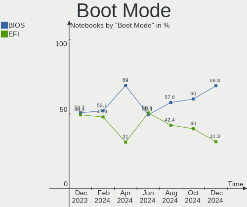
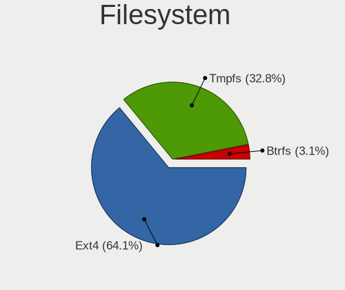
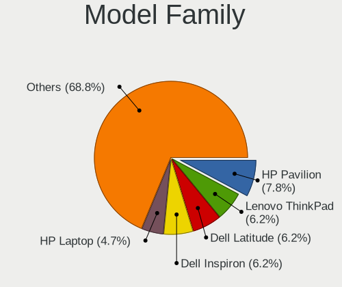
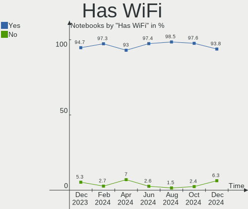
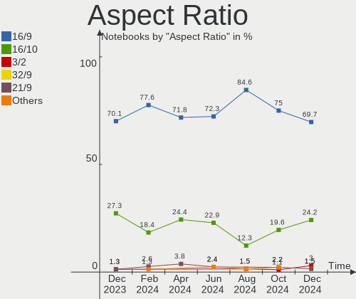
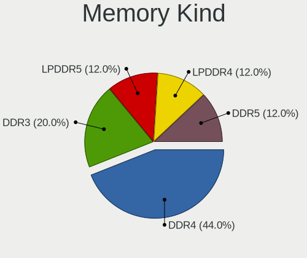
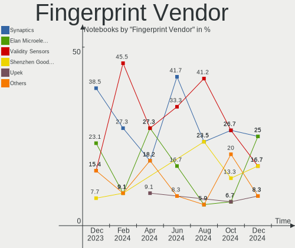

Kubuntu - Hardware Trends (Notebooks)
-------------------------------------

A project to identify most popular hardware characteristics and track their change
over time based on data collected by Linux users at https://Linux-Hardware.org.

Anyone can contribute to this report by the [hw-probe](https://github.com/linuxhw/hw-probe) tool:

    sudo -E hw-probe -all -upload

This report is for one last month. Overall report since the beginning of time: [TestCoverage](https://github.com/linuxhw/TestCoverage)

Period: Aug, 2022.

Contents
--------

* [ System ](#system)
  - [ OS                       ](#os)
  - [ OS Family                ](#os-family)
  - [ Kernel                   ](#kernel)
  - [ Kernel Family            ](#kernel-family)
  - [ Kernel Major Ver.        ](#kernel-major-ver)
  - [ Arch                     ](#arch)
  - [ DE                       ](#de)
  - [ Display Server           ](#display-server)
  - [ Display Manager          ](#display-manager)
  - [ OS Lang                  ](#os-lang)
  - [ Boot Mode                ](#boot-mode)
  - [ Filesystem               ](#filesystem)
  - [ Part. scheme             ](#part-scheme)
  - [ Dual Boot with Linux/BSD ](#dual-boot-with-linuxbsd)
  - [ Dual Boot (Win)          ](#dual-boot-win)

* [ Board ](#board)
  - [ Vendor                   ](#vendor)
  - [ Model                    ](#model)
  - [ Model Family             ](#model-family)
  - [ MFG Year                 ](#mfg-year)
  - [ Form Factor              ](#form-factor)
  - [ Secure Boot              ](#secure-boot)
  - [ Coreboot                 ](#coreboot)
  - [ RAM Size                 ](#ram-size)
  - [ RAM Used                 ](#ram-used)
  - [ Total Drives             ](#total-drives)
  - [ Has CD-ROM               ](#has-cd-rom)
  - [ Has Ethernet             ](#has-ethernet)
  - [ Has WiFi                 ](#has-wifi)
  - [ Has Bluetooth            ](#has-bluetooth)

* [ Location ](#location)
  - [ Country                  ](#country)
  - [ City                     ](#city)

* [ Drives ](#drives)
  - [ Drive Vendor             ](#drive-vendor)
  - [ Drive Model              ](#drive-model)
  - [ HDD Vendor               ](#hdd-vendor)
  - [ SSD Vendor               ](#ssd-vendor)
  - [ Drive Kind               ](#drive-kind)
  - [ Drive Connector          ](#drive-connector)
  - [ Drive Size               ](#drive-size)
  - [ Space Total              ](#space-total)
  - [ Space Used               ](#space-used)
  - [ Malfunc. Drives          ](#malfunc-drives)
  - [ Malfunc. Drive Vendor    ](#malfunc-drive-vendor)
  - [ Malfunc. HDD Vendor      ](#malfunc-hdd-vendor)
  - [ Malfunc. Drive Kind      ](#malfunc-drive-kind)
  - [ Failed Drives            ](#failed-drives)
  - [ Failed Drive Vendor      ](#failed-drive-vendor)
  - [ Drive Status             ](#drive-status)

* [ Storage controller ](#storage-controller)
  - [ Storage Vendor           ](#storage-vendor)
  - [ Storage Model            ](#storage-model)
  - [ Storage Kind             ](#storage-kind)

* [ Processor ](#processor)
  - [ CPU Vendor               ](#cpu-vendor)
  - [ CPU Model                ](#cpu-model)
  - [ CPU Model Family         ](#cpu-model-family)
  - [ CPU Cores                ](#cpu-cores)
  - [ CPU Sockets              ](#cpu-sockets)
  - [ CPU Threads              ](#cpu-threads)
  - [ CPU Op-Modes             ](#cpu-op-modes)
  - [ CPU Microcode            ](#cpu-microcode)
  - [ CPU Microarch            ](#cpu-microarch)

* [ Graphics ](#graphics)
  - [ GPU Vendor               ](#gpu-vendor)
  - [ GPU Model                ](#gpu-model)
  - [ GPU Combo                ](#gpu-combo)
  - [ GPU Driver               ](#gpu-driver)
  - [ GPU Memory               ](#gpu-memory)

* [ Monitor ](#monitor)
  - [ Monitor Vendor           ](#monitor-vendor)
  - [ Monitor Model            ](#monitor-model)
  - [ Monitor Resolution       ](#monitor-resolution)
  - [ Monitor Diagonal         ](#monitor-diagonal)
  - [ Monitor Width            ](#monitor-width)
  - [ Aspect Ratio             ](#aspect-ratio)
  - [ Monitor Area             ](#monitor-area)
  - [ Pixel Density            ](#pixel-density)
  - [ Multiple Monitors        ](#multiple-monitors)

* [ Network ](#network)
  - [ Net Controller Vendor    ](#net-controller-vendor)
  - [ Net Controller Model     ](#net-controller-model)
  - [ Wireless Vendor          ](#wireless-vendor)
  - [ Wireless Model           ](#wireless-model)
  - [ Ethernet Vendor          ](#ethernet-vendor)
  - [ Ethernet Model           ](#ethernet-model)
  - [ Net Controller Kind      ](#net-controller-kind)
  - [ Used Controller          ](#used-controller)
  - [ NICs                     ](#nics)
  - [ IPv6                     ](#ipv6)

* [ Bluetooth ](#bluetooth)
  - [ Bluetooth Vendor         ](#bluetooth-vendor)
  - [ Bluetooth Model          ](#bluetooth-model)

* [ Sound ](#sound)
  - [ Sound Vendor             ](#sound-vendor)
  - [ Sound Model              ](#sound-model)

* [ Memory ](#memory)
  - [ Memory Vendor            ](#memory-vendor)
  - [ Memory Model             ](#memory-model)
  - [ Memory Kind              ](#memory-kind)
  - [ Memory Form Factor       ](#memory-form-factor)
  - [ Memory Size              ](#memory-size)
  - [ Memory Speed             ](#memory-speed)

* [ Printers & scanners ](#printers--scanners)
  - [ Printer Vendor           ](#printer-vendor)
  - [ Printer Model            ](#printer-model)
  - [ Scanner Vendor           ](#scanner-vendor)
  - [ Scanner Model            ](#scanner-model)

* [ Camera ](#camera)
  - [ Camera Vendor            ](#camera-vendor)
  - [ Camera Model             ](#camera-model)

* [ Security ](#security)
  - [ Fingerprint Vendor       ](#fingerprint-vendor)
  - [ Fingerprint Model        ](#fingerprint-model)
  - [ Chipcard Vendor          ](#chipcard-vendor)
  - [ Chipcard Model           ](#chipcard-model)

* [ Unsupported ](#unsupported)
  - [ Unsupported Devices      ](#unsupported-devices)
  - [ Unsupported Device Types ](#unsupported-device-types)

System
------

OS
--

Installed operating systems

| Name          | Notebooks | Percent |
|---------------|-----------|---------|
| Kubuntu 22.04 | 31        | 64.58%  |
| Kubuntu 20.04 | 6         | 12.5%   |
| Kubuntu 11.1  | 5         | 10.42%  |
| Kubuntu 22.10 | 3         | 6.25%   |
| Kubuntu 21.10 | 2         | 4.17%   |
| Kubuntu 11    | 1         | 2.08%   |

OS Family
---------

OS without a version

| Name    | Notebooks | Percent |
|---------|-----------|---------|
| Kubuntu | 48        | 100%    |

Kernel
------

Version of the Linux kernel

| Version                 | Notebooks | Percent |
|-------------------------|-----------|---------|
| 5.15.0-46-generic       | 20        | 41.67%  |
| 5.15.0-43-generic       | 9         | 18.75%  |
| 5.15.0-46-lowlatency    | 3         | 6.25%   |
| 5.15.0-43-lowlatency    | 2         | 4.17%   |
| 5.15.0-41-generic       | 2         | 4.17%   |
| 5.15.0-25-generic       | 2         | 4.17%   |
| 5.13.0-52-lowlatency    | 2         | 4.17%   |
| 6.0.0-060000rc3-generic | 1         | 2.08%   |
| 5.4.0-122-generic       | 1         | 2.08%   |
| 5.18.15-051815-generic  | 1         | 2.08%   |
| 5.15.12-051512-generic  | 1         | 2.08%   |
| 5.15.0-45-lowlatency    | 1         | 2.08%   |
| 5.15.0-45-generic       | 1         | 2.08%   |
| 5.13.0-51-generic       | 1         | 2.08%   |
| 5.13.0-44-generic       | 1         | 2.08%   |

Kernel Family
-------------

Linux kernel without a distro release

| Version | Notebooks | Percent |
|---------|-----------|---------|
| 5.15.0  | 40        | 83.33%  |
| 5.13.0  | 4         | 8.33%   |
| 6.0.0   | 1         | 2.08%   |
| 5.4.0   | 1         | 2.08%   |
| 5.18.15 | 1         | 2.08%   |
| 5.15.12 | 1         | 2.08%   |

Kernel Major Ver.
-----------------

Linux kernel major version

| Version | Notebooks | Percent |
|---------|-----------|---------|
| 5.15    | 41        | 85.42%  |
| 5.13    | 4         | 8.33%   |
| 6.0     | 1         | 2.08%   |
| 5.4     | 1         | 2.08%   |
| 5.18    | 1         | 2.08%   |

Arch
----

OS architecture (x86_64, i586, etc.)

| Name   | Notebooks | Percent |
|--------|-----------|---------|
| x86_64 | 48        | 100%    |

DE
--

Desktop Environment

| Name | Notebooks | Percent |
|------|-----------|---------|
| KDE5 | 48        | 100%    |

Display Server
--------------

X11 or Wayland

| Name    | Notebooks | Percent |
|---------|-----------|---------|
| X11     | 44        | 91.67%  |
| Wayland | 4         | 8.33%   |

Display Manager
---------------

SDDM, LightDM, etc.

| Name    | Notebooks | Percent |
|---------|-----------|---------|
| SDDM    | 27        | 56.25%  |
| Unknown | 16        | 33.33%  |
| GDM3    | 4         | 8.33%   |
| LightDM | 1         | 2.08%   |

OS Lang
-------

Language

| Lang  | Notebooks | Percent |
|-------|-----------|---------|
| en_US | 25        | 52.08%  |
| it_IT | 3         | 6.25%   |
| de_DE | 3         | 6.25%   |
| ru_RU | 2         | 4.17%   |
| pl_PL | 2         | 4.17%   |
| en_CA | 2         | 4.17%   |
| hu_HU | 1         | 2.08%   |
| gl_ES | 1         | 2.08%   |
| fr_FR | 1         | 2.08%   |
| et_EE | 1         | 2.08%   |
| es_VE | 1         | 2.08%   |
| en_NZ | 1         | 2.08%   |
| en_IN | 1         | 2.08%   |
| en_GG | 1         | 2.08%   |
| en_GB | 1         | 2.08%   |
| en_AU | 1         | 2.08%   |
| cs_CZ | 1         | 2.08%   |

Boot Mode
---------

EFI or BIOS

| Mode | Notebooks | Percent |
|------|-----------|---------|
| BIOS | 28        | 58.33%  |
| EFI  | 20        | 41.67%  |

Filesystem
----------

Type of filesystem

| Type    | Notebooks | Percent |
|---------|-----------|---------|
| Ext4    | 44        | 91.67%  |
| Overlay | 2         | 4.17%   |
| Xfs     | 1         | 2.08%   |
| Btrfs   | 1         | 2.08%   |

Part. scheme
------------

Scheme of partitioning

| Type    | Notebooks | Percent |
|---------|-----------|---------|
| Unknown | 28        | 58.33%  |
| GPT     | 19        | 39.58%  |
| MBR     | 1         | 2.08%   |

Dual Boot with Linux/BSD
------------------------

Hosting more than one Linux/BSD

| Dual boot | Notebooks | Percent |
|-----------|-----------|---------|
| No        | 47        | 97.92%  |
| Yes       | 1         | 2.08%   |

Dual Boot (Win)
---------------

Hosting Linux and Windows

| Dual boot | Notebooks | Percent |
|-----------|-----------|---------|
| No        | 35        | 72.92%  |
| Yes       | 13        | 27.08%  |

Board
-----

Vendor
------

Motherboard manufacturer

| Name                           | Notebooks | Percent |
|--------------------------------|-----------|---------|
| Hewlett-Packard                | 12        | 25%     |
| Dell                           | 10        | 20.83%  |
| Lenovo                         | 8         | 16.67%  |
| ASUSTek Computer               | 3         | 6.25%   |
| Toshiba                        | 2         | 4.17%   |
| Apple                          | 2         | 4.17%   |
| Acer                           | 2         | 4.17%   |
| VIT                            | 1         | 2.08%   |
| Timi                           | 1         | 2.08%   |
| Sony                           | 1         | 2.08%   |
| Shanghai Zhaoxin Semiconductor | 1         | 2.08%   |
| Samsung Electronics            | 1         | 2.08%   |
| Panasonic                      | 1         | 2.08%   |
| MSI                            | 1         | 2.08%   |
| Intel                          | 1         | 2.08%   |
| Google                         | 1         | 2.08%   |

Model
-----

Motherboard model

| Name                                     | Notebooks | Percent |
|------------------------------------------|-----------|---------|
| Apple MacBookPro11,1                     | 2         | 4.17%   |
| VIT P2402                                | 1         | 2.08%   |
| Toshiba Satellite P70-B                  | 1         | 2.08%   |
| Toshiba Satellite L850                   | 1         | 2.08%   |
| Timi TM1709                              | 1         | 2.08%   |
| Sony VGN-NR11Z_T                         | 1         | 2.08%   |
| Shanghai Zhaoxin ZXE CRB                 | 1         | 2.08%   |
| Samsung 870Z5E/880Z5E/680Z5E             | 1         | 2.08%   |
| Panasonic CF-53JSWZGFF                   | 1         | 2.08%   |
| MSI GF75 Thin 10SCXR                     | 1         | 2.08%   |
| Lenovo Yoga Slim 7 15ITL05 82AC          | 1         | 2.08%   |
| Lenovo V15-ADA 82C7                      | 1         | 2.08%   |
| Lenovo ThinkPad T500 2082BRG             | 1         | 2.08%   |
| Lenovo ThinkPad T440p 20AWS1AY0U         | 1         | 2.08%   |
| Lenovo ThinkPad T430 2347AT2             | 1         | 2.08%   |
| Lenovo ThinkPad E15 Gen 3 20YG00ATCK     | 1         | 2.08%   |
| Lenovo IdeaPad Gaming 3 15ACH6 82K2      | 1         | 2.08%   |
| Lenovo IdeaPad 330-15IKB 81DC            | 1         | 2.08%   |
| HP ZBook 15 G4                           | 1         | 2.08%   |
| HP ProBook 6570b                         | 1         | 2.08%   |
| HP ProBook 455 G7                        | 1         | 2.08%   |
| HP ProBook 4540s                         | 1         | 2.08%   |
| HP ProBook 440 G8 Notebook PC            | 1         | 2.08%   |
| HP Pavilion Gaming Laptop 16-a0xxx       | 1         | 2.08%   |
| HP Pavilion Gaming Laptop                | 1         | 2.08%   |
| HP Pavilion g6                           | 1         | 2.08%   |
| HP Pavilion dv6700                       | 1         | 2.08%   |
| HP G62                                   | 1         | 2.08%   |
| HP ENVY Laptop 17-ce1xxx                 | 1         | 2.08%   |
| HP EliteBook 8470p                       | 1         | 2.08%   |
| Google Eldrid                            | 1         | 2.08%   |
| Dell XPS 15 9520                         | 1         | 2.08%   |
| Dell Precision 7530                      | 1         | 2.08%   |
| Dell Latitude E6400                      | 1         | 2.08%   |
| Dell Latitude 9420                       | 1         | 2.08%   |
| Dell Latitude 7280                       | 1         | 2.08%   |
| Dell Latitude 5590                       | 1         | 2.08%   |
| Dell Latitude 5420                       | 1         | 2.08%   |
| Dell Inspiron 15-5578                    | 1         | 2.08%   |
| Dell G3 3779                             | 1         | 2.08%   |
| Dell G3 3500                             | 1         | 2.08%   |
| ASUS X540SA                              | 1         | 2.08%   |
| ASUS VivoBook_ASUSLaptop X509DAP_M509DA  | 1         | 2.08%   |
| ASUS VivoBook_ASUSLaptop X3400PA_K3400PA | 1         | 2.08%   |
| Acer Nitro AN517-41                      | 1         | 2.08%   |
| Acer Nitro AN515-57                      | 1         | 2.08%   |
| Unknown                                  | 1         | 2.08%   |

Model Family
------------

Motherboard model prefix

| Name                   | Notebooks | Percent |
|------------------------|-----------|---------|
| Dell Latitude          | 5         | 10.42%  |
| Lenovo ThinkPad        | 4         | 8.33%   |
| HP ProBook             | 4         | 8.33%   |
| HP Pavilion            | 4         | 8.33%   |
| Toshiba Satellite      | 2         | 4.17%   |
| Lenovo IdeaPad         | 2         | 4.17%   |
| Dell G3                | 2         | 4.17%   |
| ASUS VivoBook          | 2         | 4.17%   |
| Apple MacBookPro11     | 2         | 4.17%   |
| Acer Nitro             | 2         | 4.17%   |
| VIT P2402              | 1         | 2.08%   |
| Timi TM1709            | 1         | 2.08%   |
| Sony VGN-NR11Z         | 1         | 2.08%   |
| Shanghai Zhaoxin ZXE   | 1         | 2.08%   |
| Samsung 870Z5E         | 1         | 2.08%   |
| Panasonic CF-53JSWZGFF | 1         | 2.08%   |
| MSI GF75               | 1         | 2.08%   |
| Lenovo Yoga            | 1         | 2.08%   |
| Lenovo V15-ADA         | 1         | 2.08%   |
| HP ZBook               | 1         | 2.08%   |
| HP G62                 | 1         | 2.08%   |
| HP ENVY                | 1         | 2.08%   |
| HP EliteBook           | 1         | 2.08%   |
| Google Eldrid          | 1         | 2.08%   |
| Dell XPS               | 1         | 2.08%   |
| Dell Precision         | 1         | 2.08%   |
| Dell Inspiron          | 1         | 2.08%   |
| ASUS X540SA            | 1         | 2.08%   |
| Unknown                | 1         | 2.08%   |

MFG Year
--------

Motherboard manufacture year

| Year | Notebooks | Percent |
|------|-----------|---------|
| 2021 | 10        | 20.83%  |
| 2020 | 8         | 16.67%  |
| 2018 | 6         | 12.5%   |
| 2012 | 4         | 8.33%   |
| 2014 | 3         | 6.25%   |
| 2013 | 3         | 6.25%   |
| 2008 | 3         | 6.25%   |
| 2022 | 2         | 4.17%   |
| 2017 | 2         | 4.17%   |
| 2011 | 2         | 4.17%   |
| 2019 | 1         | 2.08%   |
| 2016 | 1         | 2.08%   |
| 2015 | 1         | 2.08%   |
| 2010 | 1         | 2.08%   |
| 2007 | 1         | 2.08%   |

Form Factor
-----------

Physical design of the computer

| Name     | Notebooks | Percent |
|----------|-----------|---------|
| Notebook | 48        | 100%    |

Secure Boot
-----------

Enabled or disabled

| State    | Notebooks | Percent |
|----------|-----------|---------|
| Disabled | 40        | 83.33%  |
| Enabled  | 8         | 16.67%  |

Coreboot
--------

Have coreboot on board

| Used | Notebooks | Percent |
|------|-----------|---------|
| No   | 47        | 97.92%  |
| Yes  | 1         | 2.08%   |

RAM Size
--------

Total RAM memory

| Size in GB  | Notebooks | Percent |
|-------------|-----------|---------|
| 16.01-24.0  | 17        | 35.42%  |
| 4.01-8.0    | 13        | 27.08%  |
| 3.01-4.0    | 6         | 12.5%   |
| 8.01-16.0   | 6         | 12.5%   |
| 32.01-64.0  | 2         | 4.17%   |
| 64.01-256.0 | 2         | 4.17%   |
| 24.01-32.0  | 1         | 2.08%   |
| 1.01-2.0    | 1         | 2.08%   |

RAM Used
--------

Used RAM memory

| Used GB   | Notebooks | Percent |
|-----------|-----------|---------|
| 2.01-3.0  | 18        | 37.5%   |
| 4.01-8.0  | 12        | 25%     |
| 3.01-4.0  | 9         | 18.75%  |
| 1.01-2.0  | 7         | 14.58%  |
| 8.01-16.0 | 2         | 4.17%   |

Total Drives
------------

Number of drives on board

| Drives | Notebooks | Percent |
|--------|-----------|---------|
| 1      | 29        | 60.42%  |
| 2      | 18        | 37.5%   |
| 3      | 1         | 2.08%   |

Has CD-ROM
----------

Has CD-ROM on board

| Presented | Notebooks | Percent |
|-----------|-----------|---------|
| No        | 36        | 75%     |
| Yes       | 12        | 25%     |

Has Ethernet
------------

Has Ethernet on board

| Presented | Notebooks | Percent |
|-----------|-----------|---------|
| Yes       | 40        | 83.33%  |
| No        | 8         | 16.67%  |

Has WiFi
--------

Has WiFi module

| Presented | Notebooks | Percent |
|-----------|-----------|---------|
| Yes       | 48        | 100%    |

Has Bluetooth
-------------

Has Bluetooth module

| Presented | Notebooks | Percent |
|-----------|-----------|---------|
| Yes       | 45        | 93.75%  |
| No        | 3         | 6.25%   |

Location
--------

Country
-------

Geographic location (country)

| Country                | Notebooks | Percent |
|------------------------|-----------|---------|
| USA                    | 8         | 16.67%  |
| Russia                 | 4         | 8.33%   |
| Poland                 | 4         | 8.33%   |
| Italy                  | 4         | 8.33%   |
| Germany                | 3         | 6.25%   |
| Canada                 | 3         | 6.25%   |
| UK                     | 2         | 4.17%   |
| France                 | 2         | 4.17%   |
| Czechia                | 2         | 4.17%   |
| China                  | 2         | 4.17%   |
| Australia              | 2         | 4.17%   |
| Venezuela              | 1         | 2.08%   |
| Spain                  | 1         | 2.08%   |
| New Zealand            | 1         | 2.08%   |
| Kyrgyzstan             | 1         | 2.08%   |
| India                  | 1         | 2.08%   |
| Hungary                | 1         | 2.08%   |
| Greece                 | 1         | 2.08%   |
| Estonia                | 1         | 2.08%   |
| Egypt                  | 1         | 2.08%   |
| Denmark                | 1         | 2.08%   |
| Bulgaria               | 1         | 2.08%   |
| Bosnia and Herzegovina | 1         | 2.08%   |

City
----

Geographic location (city)

| City            | Notebooks | Percent |
|-----------------|-----------|---------|
| Wroclaw         | 1         | 2.08%   |
| Vladivostok     | 1         | 2.08%   |
| Tallinn         | 1         | 2.08%   |
| Sydney          | 1         | 2.08%   |
| St. Petersburg  | 1         | 2.08%   |
| Sparks          | 1         | 2.08%   |
| Sosnowiec       | 1         | 2.08%   |
| Sofia           | 1         | 2.08%   |
| Shenzhen        | 1         | 2.08%   |
| Sarajevo        | 1         | 2.08%   |
| Samara          | 1         | 2.08%   |
| Ropczyce        | 1         | 2.08%   |
| Rome            | 1         | 2.08%   |
| Premià de Dalt | 1         | 2.08%   |
| Peoria          | 1         | 2.08%   |
| Pasian di Prato | 1         | 2.08%   |
| Ostrava         | 1         | 2.08%   |
| Oberhausbergen  | 1         | 2.08%   |
| Moscow          | 1         | 2.08%   |
| Montreal        | 1         | 2.08%   |
| Milan           | 1         | 2.08%   |
| Melbourne       | 1         | 2.08%   |
| Kunming         | 1         | 2.08%   |
| Katerini        | 1         | 2.08%   |
| Karlovy Vary    | 1         | 2.08%   |
| Jacksonville    | 1         | 2.08%   |
| Hanover         | 1         | 2.08%   |
| Hampstead       | 1         | 2.08%   |
| Grande Prairie  | 1         | 2.08%   |
| Golders Green   | 1         | 2.08%   |
| Fort Wayne      | 1         | 2.08%   |
| Działdowo      | 1         | 2.08%   |
| Denver          | 1         | 2.08%   |
| Copenhagen      | 1         | 2.08%   |
| Cologne         | 1         | 2.08%   |
| Cold Lake       | 1         | 2.08%   |
| Cheboksary      | 1         | 2.08%   |
| Champagneux     | 1         | 2.08%   |
| Caracas         | 1         | 2.08%   |
| Budapest        | 1         | 2.08%   |
| Brooklyn        | 1         | 2.08%   |
| Brescia         | 1         | 2.08%   |
| Bishkek         | 1         | 2.08%   |
| Bengaluru       | 1         | 2.08%   |
| Augusta         | 1         | 2.08%   |
| Auckland        | 1         | 2.08%   |
| Amberg          | 1         | 2.08%   |
| Al Mansurah     | 1         | 2.08%   |

Drives
------

Drive Vendor
------------

Hard drive vendors

| Vendor                    | Notebooks | Drives | Percent |
|---------------------------|-----------|--------|---------|
| Samsung Electronics       | 12        | 12     | 17.39%  |
| Toshiba                   | 7         | 7      | 10.14%  |
| Kingston                  | 7         | 7      | 10.14%  |
| Unknown                   | 5         | 5      | 7.25%   |
| Crucial                   | 5         | 5      | 7.25%   |
| WDC                       | 4         | 4      | 5.8%    |
| SK hynix                  | 4         | 4      | 5.8%    |
| Seagate                   | 4         | 4      | 5.8%    |
| SanDisk                   | 3         | 3      | 4.35%   |
| Intel                     | 2         | 3      | 2.9%    |
| Apple                     | 2         | 2      | 2.9%    |
| SSSTC                     | 1         | 1      | 1.45%   |
| PNY                       | 1         | 1      | 1.45%   |
| Plextor                   | 1         | 1      | 1.45%   |
| Micron/Crucial Technology | 1         | 1      | 1.45%   |
| LITEON                    | 1         | 1      | 1.45%   |
| KIOXIA                    | 1         | 1      | 1.45%   |
| Intenso                   | 1         | 1      | 1.45%   |
| HGST                      | 1         | 1      | 1.45%   |
| GOODRAM                   | 1         | 1      | 1.45%   |
| External                  | 1         | 1      | 1.45%   |
| Emtec                     | 1         | 1      | 1.45%   |
| Dogfish                   | 1         | 1      | 1.45%   |
| China                     | 1         | 1      | 1.45%   |
| Unknown                   | 1         | 1      | 1.45%   |

Drive Model
-----------

Hard drive models

| Model                                   | Notebooks | Percent |
|-----------------------------------------|-----------|---------|
| Seagate ST1000LM035-1RK172 1TB          | 2         | 2.86%   |
| Samsung NVMe SSD Drive 512GB            | 2         | 2.86%   |
| WDC WDS240G2G0A-00JH30 240GB SSD        | 1         | 1.43%   |
| WDC WDBNCE0010PNC 1TB SSD               | 1         | 1.43%   |
| WDC WD7500BPVX-60JC3T0 752GB            | 1         | 1.43%   |
| WDC WD10SPZX-24Z10 1TB                  | 1         | 1.43%   |
| Unknown SD16G  64GB                     | 1         | 1.43%   |
| Unknown MMC Card  1GB                   | 1         | 1.43%   |
| Unknown MMC Card  128GB                 | 1         | 1.43%   |
| Unknown GD4QT  128GB                    | 1         | 1.43%   |
| Unknown External 120GB                  | 1         | 1.43%   |
| Toshiba THNSNF128GCSS 128GB SSD         | 1         | 1.43%   |
| Toshiba MQ02ABF050H 500GB               | 1         | 1.43%   |
| Toshiba MQ01ABD100 1TB                  | 1         | 1.43%   |
| Toshiba MQ01ABD050 500GB                | 1         | 1.43%   |
| Toshiba KXG50ZNV1T02 NVMe 1024GB        | 1         | 1.43%   |
| Toshiba KSG60ZMV512G M.2 2280 512GB SSD | 1         | 1.43%   |
| Toshiba KBG30ZMS128G 128GB NVMe SSD     | 1         | 1.43%   |
| SSSTC CL1-3D512-Q11 NVMe 512GB          | 1         | 1.43%   |
| SK hynix PC801 NVMe 1TB                 | 1         | 1.43%   |
| SK hynix NVMe SSD Drive 512GB           | 1         | 1.43%   |
| SK hynix NVMe SSD Drive 128GB           | 1         | 1.43%   |
| SK hynix BC711 HFM512GD3JX013N 512GB    | 1         | 1.43%   |
| Seagate ST500LT012-1DG142 500GB         | 1         | 1.43%   |
| Seagate BUP BK 5TB                      | 1         | 1.43%   |
| SanDisk SD7SB3Q-128G-1006 128GB SSD     | 1         | 1.43%   |
| SanDisk NVMe SSD Drive 512GB            | 1         | 1.43%   |
| SanDisk NVMe SSD Drive 1024GB           | 1         | 1.43%   |
| Samsung SSD PM871b 2.5 7mm 256GB        | 1         | 1.43%   |
| Samsung SSD 970 EVO Plus 250GB          | 1         | 1.43%   |
| Samsung SSD 850 EVO 250GB               | 1         | 1.43%   |
| Samsung SSD 840 EVO 750GB               | 1         | 1.43%   |
| Samsung SM963 2.5" NVMe PCIe SSD 1024GB | 1         | 1.43%   |
| Samsung MZVLQ512HALU-000H1 512GB        | 1         | 1.43%   |
| Samsung MZNLN128HAHQ-00000 128GB SSD    | 1         | 1.43%   |
| Samsung MZ9LQ128HBHQ-000H1 128GB        | 1         | 1.43%   |
| Samsung MZ7TY256HDHP-000L7 256GB SSD    | 1         | 1.43%   |
| Samsung MZ7TY128HDHP-000L1 128GB SSD    | 1         | 1.43%   |
| PNY CS900 480GB SSD                     | 1         | 1.43%   |
| Plextor PX-512M5Pro 512GB SSD           | 1         | 1.43%   |
| Micron/Crucial NVMe SSD Drive 500GB     | 1         | 1.43%   |
| LITEON CV3-8D256-11 SATA 256GB SSD      | 1         | 1.43%   |
| KIOXIA KBG40ZNS512G NVMe 512GB          | 1         | 1.43%   |
| Kingston SV300S37A120G 120GB SSD        | 1         | 1.43%   |
| Kingston SKC600256G 256GB SSD           | 1         | 1.43%   |
| Kingston SA400S37480G 480GB SSD         | 1         | 1.43%   |
| Kingston SA2000M81000G 1TB              | 1         | 1.43%   |
| Kingston OM8PDP3256B-AB1 256GB          | 1         | 1.43%   |
| Kingston NVMe SSD Drive 256GB           | 1         | 1.43%   |
| Kingston NVMe SSD Drive 1TB             | 1         | 1.43%   |
| Intenso 512GB                           | 1         | 1.43%   |
| Intel SSDPEKNW010T8H 1TB                | 1         | 1.43%   |
| Intel HBRPEKNX0202AHO 32GB              | 1         | 1.43%   |
| Intel HBRPEKNX0202AH 512GB              | 1         | 1.43%   |
| HGST HTS545050A7E680 500GB              | 1         | 1.43%   |
| GOODRAM SSDPR-CX400-128-G2 128GB        | 1         | 1.43%   |
| External USB3.0 1TB                     | 1         | 1.43%   |
| Emtec X150 240GB                        | 1         | 1.43%   |
| Dogfish SSD 120GB                       | 1         | 1.43%   |
| Crucial CT500MX500SSD1 500GB            | 1         | 1.43%   |

HDD Vendor
----------

Hard disk drive vendors

| Vendor  | Notebooks | Drives | Percent |
|---------|-----------|--------|---------|
| Seagate | 4         | 4      | 36.36%  |
| Toshiba | 3         | 3      | 27.27%  |
| WDC     | 2         | 2      | 18.18%  |
| Unknown | 1         | 1      | 9.09%   |
| HGST    | 1         | 1      | 9.09%   |

SSD Vendor
----------

Solid state drive vendors

| Vendor              | Notebooks | Drives | Percent |
|---------------------|-----------|--------|---------|
| Samsung Electronics | 6         | 6      | 20.69%  |
| Crucial             | 5         | 5      | 17.24%  |
| Kingston            | 3         | 3      | 10.34%  |
| WDC                 | 2         | 2      | 6.9%    |
| Toshiba             | 2         | 2      | 6.9%    |
| Apple               | 2         | 2      | 6.9%    |
| SanDisk             | 1         | 1      | 3.45%   |
| PNY                 | 1         | 1      | 3.45%   |
| Plextor             | 1         | 1      | 3.45%   |
| LITEON              | 1         | 1      | 3.45%   |
| GOODRAM             | 1         | 1      | 3.45%   |
| Emtec               | 1         | 1      | 3.45%   |
| Dogfish             | 1         | 1      | 3.45%   |
| China               | 1         | 1      | 3.45%   |
| Unknown             | 1         | 1      | 3.45%   |

Drive Kind
----------

HDD or SSD

| Kind    | Notebooks | Drives | Percent |
|---------|-----------|--------|---------|
| SSD     | 25        | 29     | 40.98%  |
| NVMe    | 21        | 25     | 34.43%  |
| HDD     | 10        | 11     | 16.39%  |
| MMC     | 4         | 4      | 6.56%   |
| Unknown | 1         | 1      | 1.64%   |

Drive Connector
---------------

SATA, SAS, NVMe, etc.

| Type | Notebooks | Drives | Percent |
|------|-----------|--------|---------|
| SATA | 33        | 39     | 55%     |
| NVMe | 20        | 24     | 33.33%  |
| MMC  | 4         | 4      | 6.67%   |
| SAS  | 3         | 3      | 5%      |

Drive Size
----------

Size of hard drive

| Size in TB | Notebooks | Drives | Percent |
|------------|-----------|--------|---------|
| 0.01-0.5   | 22        | 26     | 61.11%  |
| 0.51-1.0   | 11        | 11     | 30.56%  |
| 1.01-2.0   | 2         | 2      | 5.56%   |
| 4.01-10.0  | 1         | 1      | 2.78%   |

Space Total
-----------

Amount of disk space available on the file system

| Size in GB | Notebooks | Percent |
|------------|-----------|---------|
| 101-250    | 17        | 35.42%  |
| 501-1000   | 13        | 27.08%  |
| 251-500    | 9         | 18.75%  |
| 1001-2000  | 5         | 10.42%  |
| 21-50      | 2         | 4.17%   |
| 1-20       | 1         | 2.08%   |
| 51-100     | 1         | 2.08%   |

Space Used
----------

Amount of used disk space

| Used GB   | Notebooks | Percent |
|-----------|-----------|---------|
| 21-50     | 14        | 29.17%  |
| 1-20      | 13        | 27.08%  |
| 101-250   | 9         | 18.75%  |
| 501-1000  | 5         | 10.42%  |
| 251-500   | 4         | 8.33%   |
| 51-100    | 2         | 4.17%   |
| 1001-2000 | 1         | 2.08%   |

Malfunc. Drives
---------------

Drive models with a malfunction

| Model                           | Notebooks | Drives | Percent |
|---------------------------------|-----------|--------|---------|
| Seagate ST500LT012-1DG142 500GB | 1         | 1      | 50%     |
| HGST HTS545050A7E680 500GB      | 1         | 1      | 50%     |

Malfunc. Drive Vendor
---------------------

Vendors of faulty drives

| Vendor  | Notebooks | Drives | Percent |
|---------|-----------|--------|---------|
| Seagate | 1         | 1      | 50%     |
| HGST    | 1         | 1      | 50%     |

Malfunc. HDD Vendor
-------------------

Vendors of faulty HDD drives

| Vendor  | Notebooks | Drives | Percent |
|---------|-----------|--------|---------|
| Seagate | 1         | 1      | 50%     |
| HGST    | 1         | 1      | 50%     |

Malfunc. Drive Kind
-------------------

Kinds of faulty drives

| Kind | Notebooks | Drives | Percent |
|------|-----------|--------|---------|
| HDD  | 2         | 2      | 100%    |

Failed Drives
-------------

Failed drive models

Zero info for selected period =(

Failed Drive Vendor
-------------------

Failed drive vendors

Zero info for selected period =(

Drive Status
------------

Number of failed and malfunc. drives

| Status   | Notebooks | Drives | Percent |
|----------|-----------|--------|---------|
| Detected | 29        | 43     | 58%     |
| Works    | 19        | 25     | 38%     |
| Malfunc  | 2         | 2      | 4%      |

Storage controller
------------------

Storage Vendor
--------------

Storage controller vendors

| Vendor                         | Notebooks | Percent |
|--------------------------------|-----------|---------|
| Intel                          | 33        | 53.23%  |
| Samsung Electronics            | 7         | 11.29%  |
| AMD                            | 5         | 8.06%   |
| SK hynix                       | 4         | 6.45%   |
| Kingston Technology Company    | 4         | 6.45%   |
| Toshiba America Info Systems   | 2         | 3.23%   |
| SanDisk                        | 2         | 3.23%   |
| Zhaoxin                        | 1         | 1.61%   |
| Solid State Storage Technology | 1         | 1.61%   |
| Micron/Crucial Technology      | 1         | 1.61%   |
| Marvell Technology Group       | 1         | 1.61%   |
| KIOXIA                         | 1         | 1.61%   |

Storage Model
-------------

Storage controller models

| Model                                                                            | Notebooks | Percent |
|----------------------------------------------------------------------------------|-----------|---------|
| Intel 7 Series Chipset Family 6-port SATA Controller [AHCI mode]                 | 7         | 10%     |
| Intel 82801 Mobile SATA Controller [RAID mode]                                   | 5         | 7.14%   |
| AMD FCH SATA Controller [AHCI mode]                                              | 5         | 7.14%   |
| Samsung NVMe SSD Controller 980                                                  | 4         | 5.71%   |
| Intel Sunrise Point-LP SATA Controller [AHCI mode]                               | 4         | 5.71%   |
| Intel Volume Management Device NVMe RAID Controller                              | 3         | 4.29%   |
| SK hynix Gold P31 SSD                                                            | 2         | 2.86%   |
| Samsung NVMe SSD Controller SM981/PM981/PM983                                    | 2         | 2.86%   |
| Kingston Company OM3PDP3 NVMe SSD                                                | 2         | 2.86%   |
| Kingston Company A2000 NVMe SSD                                                  | 2         | 2.86%   |
| Intel Cannon Lake Mobile PCH SATA AHCI Controller                                | 2         | 2.86%   |
| Intel 82801HM/HEM (ICH8M/ICH8M-E) SATA Controller [AHCI mode]                    | 2         | 2.86%   |
| Intel 82801HM/HEM (ICH8M/ICH8M-E) IDE Controller                                 | 2         | 2.86%   |
| Intel 8 Series/C220 Series Chipset Family 6-port SATA Controller 1 [AHCI mode]   | 2         | 2.86%   |
| Intel 7 Series Chipset Family 4-port SATA Controller [IDE mode]                  | 2         | 2.86%   |
| Intel 7 Series Chipset Family 2-port SATA Controller [IDE mode]                  | 2         | 2.86%   |
| Intel 400 Series Chipset Family SATA AHCI Controller                             | 2         | 2.86%   |
| Zhaoxin ZX-100/ZX-200/ZX-E StorX AHCI Controller                                 | 1         | 1.43%   |
| Toshiba America Info Systems Toshiba America Info Non-Volatile memory controller | 1         | 1.43%   |
| Toshiba America Info Systems BG3 NVMe SSD Controller                             | 1         | 1.43%   |
| Solid State Storage Non-Volatile memory controller                               | 1         | 1.43%   |
| SK hynix Non-Volatile memory controller                                          | 1         | 1.43%   |
| SK hynix BC501 NVMe Solid State Drive                                            | 1         | 1.43%   |
| SanDisk WD Blue SN550 NVMe SSD                                                   | 1         | 1.43%   |
| SanDisk WD Black SN750 / PC SN730 NVMe SSD                                       | 1         | 1.43%   |
| Samsung Apple PCIe SSD                                                           | 1         | 1.43%   |
| Micron/Crucial P2 NVMe PCIe SSD                                                  | 1         | 1.43%   |
| Marvell Group 88SS9183 PCIe SSD Controller                                       | 1         | 1.43%   |
| KIOXIA NVMe SSD Controller BG4                                                   | 1         | 1.43%   |
| Intel Tiger Lake-LP SATA Controller                                              | 1         | 1.43%   |
| Intel SSD 660P Series                                                            | 1         | 1.43%   |
| Intel Q170/Q150/B150/H170/H110/Z170/CM236 Chipset SATA Controller [AHCI Mode]    | 1         | 1.43%   |
| Intel Non-Volatile memory controller                                             | 1         | 1.43%   |
| Intel Atom/Celeron/Pentium Processor x5-E8000/J3xxx/N3xxx Series SATA Controller | 1         | 1.43%   |
| Intel 82801IBM/IEM (ICH9M/ICH9M-E) 4 port SATA Controller [AHCI mode]            | 1         | 1.43%   |
| Intel 500 Series Chipset Family SATA AHCI Controller                             | 1         | 1.43%   |
| Intel 5 Series/3400 Series Chipset 4 port SATA AHCI Controller                   | 1         | 1.43%   |

Storage Kind
------------

Kind of storage controller (IDE, SATA, NVMe, SAS, ...)

| Kind | Notebooks | Percent |
|------|-----------|---------|
| SATA | 33        | 50.77%  |
| NVMe | 20        | 30.77%  |
| RAID | 8         | 12.31%  |
| IDE  | 4         | 6.15%   |

Processor
---------

CPU Vendor
----------

Processor vendors

| Vendor       | Notebooks | Percent |
|--------------|-----------|---------|
| Intel        | 40        | 83.33%  |
| AMD          | 7         | 14.58%  |
| CentaurHauls | 1         | 2.08%   |

CPU Model
---------

Processor models

| Model                                          | Notebooks | Percent |
|------------------------------------------------|-----------|---------|
| Intel 11th Gen Core i7-1165G7 @ 2.80GHz        | 3         | 6.25%   |
| Intel Core i5-8250U CPU @ 1.60GHz              | 2         | 4.17%   |
| Intel Core i5-7200U CPU @ 2.50GHz              | 2         | 4.17%   |
| Intel Core i5-3320M CPU @ 2.60GHz              | 2         | 4.17%   |
| Intel Core i5-10300H CPU @ 2.50GHz             | 2         | 4.17%   |
| Intel Xeon E-2176M CPU @ 2.70GHz               | 1         | 2.08%   |
| Intel Pentium Dual CPU T2330 @ 1.60GHz         | 1         | 2.08%   |
| Intel Core i7-9750H CPU @ 2.60GHz              | 1         | 2.08%   |
| Intel Core i7-8750H CPU @ 2.20GHz              | 1         | 2.08%   |
| Intel Core i7-7820HQ CPU @ 2.90GHz             | 1         | 2.08%   |
| Intel Core i7-4710MQ CPU @ 2.50GHz             | 1         | 2.08%   |
| Intel Core i7-4710HQ CPU @ 2.50GHz             | 1         | 2.08%   |
| Intel Core i7-3635QM CPU @ 2.40GHz             | 1         | 2.08%   |
| Intel Core i7-3610QM CPU @ 2.30GHz             | 1         | 2.08%   |
| Intel Core i7-10510U CPU @ 1.80GHz             | 1         | 2.08%   |
| Intel Core i5-7300U CPU @ 2.60GHz              | 1         | 2.08%   |
| Intel Core i5-4288U CPU @ 2.60GHz              | 1         | 2.08%   |
| Intel Core i5-4258U CPU @ 2.40GHz              | 1         | 2.08%   |
| Intel Core i5-3230M CPU @ 2.60GHz              | 1         | 2.08%   |
| Intel Core i5-3210M CPU @ 2.50GHz              | 1         | 2.08%   |
| Intel Core i5-10500H CPU @ 2.50GHz             | 1         | 2.08%   |
| Intel Core i3-3120M CPU @ 2.50GHz              | 1         | 2.08%   |
| Intel Core i3-3110M CPU @ 2.40GHz              | 1         | 2.08%   |
| Intel Core i3 CPU M 350 @ 2.27GHz              | 1         | 2.08%   |
| Intel Core 2 Duo CPU T9600 @ 2.80GHz           | 1         | 2.08%   |
| Intel Core 2 Duo CPU T7250 @ 2.00GHz           | 1         | 2.08%   |
| Intel Core 2 Duo CPU P8700 @ 2.53GHz           | 1         | 2.08%   |
| Intel Celeron CPU N3050 @ 1.60GHz              | 1         | 2.08%   |
| Intel 12th Gen Core i7-12700H                  | 1         | 2.08%   |
| Intel 11th Gen Core i7-1185G7 @ 3.00GHz        | 1         | 2.08%   |
| Intel 11th Gen Core i5-11400H @ 2.70GHz        | 1         | 2.08%   |
| Intel 11th Gen Core i5-1135G7 @ 2.40GHz        | 1         | 2.08%   |
| Intel 11th Gen Core i5-11300H @ 3.10GHz        | 1         | 2.08%   |
| Intel 11th Gen Core i3-1115G4 @ 3.00GHz        | 1         | 2.08%   |
| CentaurHauls ZHAOXIN KaiXian KX-6640MA@2.2+GHz | 1         | 2.08%   |
| AMD Ryzen 7 5800H with Radeon Graphics         | 1         | 2.08%   |
| AMD Ryzen 7 4700U with Radeon Graphics         | 1         | 2.08%   |
| AMD Ryzen 5 5600H with Radeon Graphics         | 1         | 2.08%   |
| AMD Ryzen 5 5500U with Radeon Graphics         | 1         | 2.08%   |
| AMD Ryzen 3 3250U with Radeon Graphics         | 1         | 2.08%   |
| AMD A10-4600M APU with Radeon HD Graphics      | 1         | 2.08%   |
| AMD 3020e with Radeon Graphics                 | 1         | 2.08%   |

CPU Model Family
----------------

Processor model prefix

| Model              | Notebooks | Percent |
|--------------------|-----------|---------|
| Intel Core i5      | 14        | 29.17%  |
| Other              | 11        | 22.92%  |
| Intel Core i7      | 8         | 16.67%  |
| Intel Core i3      | 3         | 6.25%   |
| Intel Core 2 Duo   | 3         | 6.25%   |
| AMD Ryzen 7        | 2         | 4.17%   |
| AMD Ryzen 5        | 2         | 4.17%   |
| Intel Xeon         | 1         | 2.08%   |
| Intel Pentium Dual | 1         | 2.08%   |
| Intel Celeron      | 1         | 2.08%   |
| AMD Ryzen 3        | 1         | 2.08%   |
| AMD A10            | 1         | 2.08%   |

CPU Cores
---------

Number of processor cores

| Number | Notebooks | Percent |
|--------|-----------|---------|
| 2      | 21        | 43.75%  |
| 4      | 17        | 35.42%  |
| 6      | 7         | 14.58%  |
| 8      | 2         | 4.17%   |
| 14     | 1         | 2.08%   |

CPU Sockets
-----------

Number of sockets

| Number | Notebooks | Percent |
|--------|-----------|---------|
| 1      | 48        | 100%    |

CPU Threads
-----------

Threads per core (Hyper-Threading)

| Number | Notebooks | Percent |
|--------|-----------|---------|
| 2      | 40        | 83.33%  |
| 1      | 8         | 16.67%  |

CPU Op-Modes
------------

CPU Operation Modes (32-bit, 64-bit)

| Op mode        | Notebooks | Percent |
|----------------|-----------|---------|
| 32-bit, 64-bit | 48        | 100%    |

CPU Microcode
-------------

Microcode number

| Number     | Notebooks | Percent |
|------------|-----------|---------|
| Unknown    | 22        | 45.83%  |
| 0x806c1    | 4         | 8.33%   |
| 0x306a9    | 4         | 8.33%   |
| 0xa0652    | 2         | 4.17%   |
| 0x806ea    | 2         | 4.17%   |
| 0x806e9    | 2         | 4.17%   |
| 0x906ea    | 1         | 2.08%   |
| 0x906a3    | 1         | 2.08%   |
| 0x806ec    | 1         | 2.08%   |
| 0x6fd      | 1         | 2.08%   |
| 0x406c3    | 1         | 2.08%   |
| 0x306c3    | 1         | 2.08%   |
| 0x1067a    | 1         | 2.08%   |
| 0x0a50000c | 1         | 2.08%   |
| 0x08608103 | 1         | 2.08%   |
| 0x08600106 | 1         | 2.08%   |
| 0x08200103 | 1         | 2.08%   |
| 0x06001119 | 1         | 2.08%   |

CPU Microarch
-------------

Microarchitecture

| Name             | Notebooks | Percent |
|------------------|-----------|---------|
| KabyLake         | 10        | 20.83%  |
| IvyBridge        | 8         | 16.67%  |
| TigerLake        | 7         | 14.58%  |
| Haswell          | 4         | 8.33%   |
| CometLake        | 3         | 6.25%   |
| Unknown          | 3         | 6.25%   |
| Zen 3            | 2         | 4.17%   |
| Penryn           | 2         | 4.17%   |
| Core             | 2         | 4.17%   |
| Zen+             | 1         | 2.08%   |
| Zen 2            | 1         | 2.08%   |
| Zen              | 1         | 2.08%   |
| Westmere         | 1         | 2.08%   |
| Silvermont       | 1         | 2.08%   |
| Piledriver       | 1         | 2.08%   |
| Alderlake Hybrid | 1         | 2.08%   |

Graphics
--------

GPU Vendor
----------

Vendors of graphics cards

| Vendor  | Notebooks | Percent |
|---------|-----------|---------|
| Intel   | 38        | 60.32%  |
| Nvidia  | 13        | 20.63%  |
| AMD     | 11        | 17.46%  |
| Zhaoxin | 1         | 1.59%   |

GPU Model
---------

Graphics card models

| Model                                                                                    | Notebooks | Percent |
|------------------------------------------------------------------------------------------|-----------|---------|
| Intel 3rd Gen Core processor Graphics Controller                                         | 7         | 10.94%  |
| Intel TigerLake-LP GT2 [Iris Xe Graphics]                                                | 6         | 9.38%   |
| Intel HD Graphics 620                                                                    | 3         | 4.69%   |
| Intel CometLake-H GT2 [UHD Graphics]                                                     | 3         | 4.69%   |
| Intel UHD Graphics 620                                                                   | 2         | 3.13%   |
| Intel Mobile 4 Series Chipset Integrated Graphics Controller                             | 2         | 3.13%   |
| Intel Haswell-ULT Integrated Graphics Controller                                         | 2         | 3.13%   |
| Intel CoffeeLake-H GT2 [UHD Graphics 630]                                                | 2         | 3.13%   |
| Intel 4th Gen Core Processor Integrated Graphics Controller                              | 2         | 3.13%   |
| AMD Picasso/Raven 2 [Radeon Vega Series / Radeon Vega Mobile Series]                     | 2         | 3.13%   |
| AMD Cezanne                                                                              | 2         | 3.13%   |
| Zhaoxin ZX-E C-960 GPU                                                                   | 1         | 1.56%   |
| Nvidia TU117M [GeForce GTX 1650 Ti Mobile]                                               | 1         | 1.56%   |
| Nvidia TU117M [GeForce GTX 1650 Mobile / Max-Q]                                          | 1         | 1.56%   |
| Nvidia TU117M                                                                            | 1         | 1.56%   |
| Nvidia TU116M [GeForce GTX 1660 Ti Mobile]                                               | 1         | 1.56%   |
| Nvidia GP108M [GeForce MX250]                                                            | 1         | 1.56%   |
| Nvidia GP107M [GeForce GTX 1050 Ti Mobile]                                               | 1         | 1.56%   |
| Nvidia GP107M [GeForce GTX 1050 3 GB Max-Q]                                              | 1         | 1.56%   |
| Nvidia GP104GLM [Quadro P3200 Mobile]                                                    | 1         | 1.56%   |
| Nvidia GM108M [GeForce MX110]                                                            | 1         | 1.56%   |
| Nvidia GA107M [GeForce RTX 3050 Ti Mobile]                                               | 1         | 1.56%   |
| Nvidia GA107M [GeForce RTX 3050 Mobile]                                                  | 1         | 1.56%   |
| Nvidia GA106M [GeForce RTX 3060 Mobile / Max-Q]                                          | 1         | 1.56%   |
| Nvidia G86M [GeForce 8400M GS]                                                           | 1         | 1.56%   |
| Intel TigerLake-H GT1 [UHD Graphics]                                                     | 1         | 1.56%   |
| Intel Tiger Lake UHD Graphics                                                            | 1         | 1.56%   |
| Intel Mobile GM965/GL960 Integrated Graphics Controller (secondary)                      | 1         | 1.56%   |
| Intel Mobile GM965/GL960 Integrated Graphics Controller (primary)                        | 1         | 1.56%   |
| Intel HD Graphics 630                                                                    | 1         | 1.56%   |
| Intel Core Processor Integrated Graphics Controller                                      | 1         | 1.56%   |
| Intel CometLake-U GT2 [UHD Graphics]                                                     | 1         | 1.56%   |
| Intel Coffee Lake UHD Graphics P630                                                      | 1         | 1.56%   |
| Intel Atom/Celeron/Pentium Processor x5-E8000/J3xxx/N3xxx Integrated Graphics Controller | 1         | 1.56%   |
| Intel Alder Lake-P Integrated Graphics Controller                                        | 1         | 1.56%   |
| AMD Venus PRO [Radeon HD 8850M / R9 M265X]                                               | 1         | 1.56%   |
| AMD Trinity [Radeon HD 7660G]                                                            | 1         | 1.56%   |
| AMD Thames [Radeon HD 7500M/7600M Series]                                                | 1         | 1.56%   |
| AMD RV635/M86 [Mobility Radeon HD 3650]                                                  | 1         | 1.56%   |
| AMD Renoir                                                                               | 1         | 1.56%   |
| AMD Mars [Radeon HD 8670A/8670M/8750M / R7 M370]                                         | 1         | 1.56%   |
| AMD Lucienne                                                                             | 1         | 1.56%   |

GPU Combo
---------

Combinations of graphics cards

| Name           | Notebooks | Percent |
|----------------|-----------|---------|
| 1 x Intel      | 25        | 52.08%  |
| Intel + Nvidia | 10        | 20.83%  |
| 1 x AMD        | 6         | 12.5%   |
| Intel + AMD    | 3         | 6.25%   |
| AMD + Nvidia   | 2         | 4.17%   |
| 1 x Zhaoxin    | 1         | 2.08%   |
| 1 x Nvidia     | 1         | 2.08%   |

GPU Driver
----------

Free vs proprietary

| Driver      | Notebooks | Percent |
|-------------|-----------|---------|
| Free        | 37        | 77.08%  |
| Proprietary | 9         | 18.75%  |
| Unknown     | 2         | 4.17%   |

GPU Memory
----------

Total video memory

| Size in GB | Notebooks | Percent |
|------------|-----------|---------|
| Unknown    | 40        | 83.33%  |
| 0.01-0.5   | 5         | 10.42%  |
| 1.01-2.0   | 3         | 6.25%   |

Monitor
-------

Monitor Vendor
--------------

Monitor vendors

| Vendor                  | Notebooks | Percent |
|-------------------------|-----------|---------|
| AU Optronics            | 13        | 26%     |
| LG Display              | 10        | 20%     |
| Samsung Electronics     | 5         | 10%     |
| Chimei Innolux          | 5         | 10%     |
| BOE                     | 5         | 10%     |
| Dell                    | 3         | 6%      |
| Apple                   | 2         | 4%      |
| Philips                 | 1         | 2%      |
| PANDA                   | 1         | 2%      |
| Lenovo                  | 1         | 2%      |
| Hewlett-Packard         | 1         | 2%      |
| Chi Mei Optoelectronics | 1         | 2%      |
| BenQ                    | 1         | 2%      |
| Acer                    | 1         | 2%      |

Monitor Model
-------------

Monitor models

| Model                                                                    | Notebooks | Percent |
|--------------------------------------------------------------------------|-----------|---------|
| Dell P2419H DELD0DA 1920x1080 527x296mm 23.8-inch                        | 2         | 3.92%   |
| Apple Color LCD APPA018 2560x1600 286x179mm 13.3-inch                    | 2         | 3.92%   |
| Samsung Electronics SMS27A650 SAM082D 1920x1080 598x336mm 27.0-inch      | 1         | 1.96%   |
| Samsung Electronics LCD Monitor SEC5441 1366x768 344x194mm 15.5-inch     | 1         | 1.96%   |
| Samsung Electronics LCD Monitor SEC3345 1280x800 331x207mm 15.4-inch     | 1         | 1.96%   |
| Samsung Electronics LCD Monitor SEC324C 1600x900 310x174mm 14.0-inch     | 1         | 1.96%   |
| Samsung Electronics LCD Monitor SDC4171 2880x1800 302x189mm 14.0-inch    | 1         | 1.96%   |
| Philips PHL 193V5 PHLC0CD 1366x768 410x230mm 18.5-inch                   | 1         | 1.96%   |
| PANDA LCD Monitor NCP004D 1920x1080 344x194mm 15.5-inch                  | 1         | 1.96%   |
| LG Display LCD Monitor LGD069A 1920x1080 344x194mm 15.5-inch             | 1         | 1.96%   |
| LG Display LCD Monitor LGD068D 1920x1080 309x174mm 14.0-inch             | 1         | 1.96%   |
| LG Display LCD Monitor LGD066B 1920x1080 382x215mm 17.3-inch             | 1         | 1.96%   |
| LG Display LCD Monitor LGD063F 1920x1080 382x215mm 17.3-inch             | 1         | 1.96%   |
| LG Display LCD Monitor LGD062E 1920x1080 344x194mm 15.5-inch             | 1         | 1.96%   |
| LG Display LCD Monitor LGD057E 1920x1080 344x194mm 15.5-inch             | 1         | 1.96%   |
| LG Display LCD Monitor LGD0540 1920x1080 344x194mm 15.5-inch             | 1         | 1.96%   |
| LG Display LCD Monitor LGD0511 1920x1080 344x194mm 15.5-inch             | 1         | 1.96%   |
| LG Display LCD Monitor LGD02F2 1366x768 344x194mm 15.5-inch              | 1         | 1.96%   |
| LG Display LCD Monitor LGD02AC 1366x768 344x194mm 15.5-inch              | 1         | 1.96%   |
| Lenovo LCD Monitor LEN4053 1680x1050 331x207mm 15.4-inch                 | 1         | 1.96%   |
| Hewlett-Packard 24mh HPN366E 1920x1080 527x296mm 23.8-inch               | 1         | 1.96%   |
| Dell P2314H DEL4099 1920x1080 509x286mm 23.0-inch                        | 1         | 1.96%   |
| Dell E2418HN DELA105 1920x1080 527x296mm 23.8-inch                       | 1         | 1.96%   |
| Chimei Innolux LCD Monitor CMN176C 1920x1080 381x214mm 17.2-inch         | 1         | 1.96%   |
| Chimei Innolux LCD Monitor CMN1737 1920x1080 381x214mm 17.2-inch         | 1         | 1.96%   |
| Chimei Innolux LCD Monitor CMN15E6 1366x768 344x193mm 15.5-inch          | 1         | 1.96%   |
| Chimei Innolux LCD Monitor CMN1475 1366x768 309x174mm 14.0-inch          | 1         | 1.96%   |
| Chimei Innolux LCD Monitor CMN1474 1366x768 309x174mm 14.0-inch          | 1         | 1.96%   |
| Chi Mei Optoelectronics LCD Monitor CMO15A1 1366x768 344x193mm 15.5-inch | 1         | 1.96%   |
| BOE LCD Monitor BOE0A14 2560x1440 344x194mm 15.5-inch                    | 1         | 1.96%   |
| BOE LCD Monitor BOE08F7 1920x1080 355x200mm 16.0-inch                    | 1         | 1.96%   |
| BOE LCD Monitor BOE08B9 1920x1080 344x194mm 15.5-inch                    | 1         | 1.96%   |
| BOE LCD Monitor BOE07C5 1920x1080 344x194mm 15.5-inch                    | 1         | 1.96%   |
| BOE LCD Monitor BOE06CB 1920x1080 344x194mm 15.5-inch                    | 1         | 1.96%   |
| BenQ GW2255 BNQ78CD 1920x1080 477x268mm 21.5-inch                        | 1         | 1.96%   |
| AU Optronics LCD Monitor AUOED8F 1920x1080 344x193mm 15.5-inch           | 1         | 1.96%   |
| AU Optronics LCD Monitor AUOD1ED 1920x1080 344x193mm 15.5-inch           | 1         | 1.96%   |
| AU Optronics LCD Monitor AUO978F 1920x1080 382x215mm 17.3-inch           | 1         | 1.96%   |
| AU Optronics LCD Monitor AUO81EC 1366x768 344x193mm 15.5-inch            | 1         | 1.96%   |
| AU Optronics LCD Monitor AUO45EC 1366x768 344x193mm 15.5-inch            | 1         | 1.96%   |
| AU Optronics LCD Monitor AUO38ED 1920x1080 344x193mm 15.5-inch           | 1         | 1.96%   |
| AU Optronics LCD Monitor AUO236D 1920x1080 276x155mm 12.5-inch           | 1         | 1.96%   |
| AU Optronics LCD Monitor AUO229E 1600x900 382x214mm 17.2-inch            | 1         | 1.96%   |
| AU Optronics LCD Monitor AUO2290 1920x1200 301x188mm 14.0-inch           | 1         | 1.96%   |
| AU Optronics LCD Monitor AUO21EC 1366x768 340x190mm 15.3-inch            | 1         | 1.96%   |
| AU Optronics LCD Monitor AUO139D 1920x1080 381x214mm 17.2-inch           | 1         | 1.96%   |
| AU Optronics LCD Monitor AUO133D 1920x1080 309x173mm 13.9-inch           | 1         | 1.96%   |
| AU Optronics LCD Monitor AUO12ED 1920x1080 344x193mm 15.5-inch           | 1         | 1.96%   |
| Acer G237HL ACR03DF 1920x1080 510x290mm 23.1-inch                        | 1         | 1.96%   |

Monitor Resolution
------------------

Monitor screen resolution

| Resolution         | Notebooks | Percent |
|--------------------|-----------|---------|
| 1920x1080 (FHD)    | 26        | 57.78%  |
| 1366x768 (WXGA)    | 11        | 24.44%  |
| 2560x1600          | 2         | 4.44%   |
| 2880x1800          | 1         | 2.22%   |
| 2560x1440 (QHD)    | 1         | 2.22%   |
| 1920x1200 (WUXGA)  | 1         | 2.22%   |
| 1680x1050 (WSXGA+) | 1         | 2.22%   |
| 1600x900 (HD+)     | 1         | 2.22%   |
| 1280x800 (WXGA)    | 1         | 2.22%   |

Monitor Diagonal
----------------

Diagonal size in inches

| Inches | Notebooks | Percent |
|--------|-----------|---------|
| 15     | 25        | 49.02%  |
| 17     | 7         | 13.73%  |
| 14     | 5         | 9.8%    |
| 24     | 4         | 7.84%   |
| 13     | 3         | 5.88%   |
| 23     | 2         | 3.92%   |
| 27     | 1         | 1.96%   |
| 21     | 1         | 1.96%   |
| 18     | 1         | 1.96%   |
| 16     | 1         | 1.96%   |
| 12     | 1         | 1.96%   |

Monitor Width
-------------

Physical width

| Width in mm | Notebooks | Percent |
|-------------|-----------|---------|
| 301-350     | 29        | 59.18%  |
| 351-400     | 10        | 20.41%  |
| 501-600     | 5         | 10.2%   |
| 201-300     | 3         | 6.12%   |
| 401-500     | 2         | 4.08%   |

Aspect Ratio
------------

Proportional relationship between the width and the height

| Ratio | Notebooks | Percent |
|-------|-----------|---------|
| 16/9  | 36        | 85.71%  |
| 16/10 | 6         | 14.29%  |

Monitor Area
------------

Area in inch²

| Area in inch² | Notebooks | Percent |
|----------------|-----------|---------|
| 101-110        | 26        | 53.06%  |
| 121-130        | 7         | 14.29%  |
| 81-90          | 6         | 12.24%  |
| 201-250        | 5         | 10.2%   |
| 71-80          | 2         | 4.08%   |
| 61-70          | 1         | 2.04%   |
| 301-350        | 1         | 2.04%   |
| 141-150        | 1         | 2.04%   |

Pixel Density
-------------

Pixels per inch

| Density       | Notebooks | Percent |
|---------------|-----------|---------|
| 121-160       | 23        | 48.94%  |
| 101-120       | 10        | 21.28%  |
| 51-100        | 8         | 17.02%  |
| 161-240       | 5         | 10.64%  |
| More than 240 | 1         | 2.13%   |

Multiple Monitors
-----------------

Total monitors connected

| Total | Notebooks | Percent |
|-------|-----------|---------|
| 1     | 39        | 81.25%  |
| 2     | 4         | 8.33%   |
| 0     | 3         | 6.25%   |
| 4     | 1         | 2.08%   |
| 3     | 1         | 2.08%   |

Network
-------

Net Controller Vendor
---------------------

Controller vendors

| Vendor                   | Notebooks | Percent |
|--------------------------|-----------|---------|
| Intel                    | 31        | 38.75%  |
| Realtek Semiconductor    | 28        | 35%     |
| Qualcomm Atheros         | 5         | 6.25%   |
| MediaTek                 | 4         | 5%      |
| Broadcom Limited         | 2         | 2.5%    |
| Broadcom                 | 2         | 2.5%    |
| TP-Link                  | 1         | 1.25%   |
| Sierra Wireless          | 1         | 1.25%   |
| Samsung Electronics      | 1         | 1.25%   |
| Ralink                   | 1         | 1.25%   |
| Motorola PCS             | 1         | 1.25%   |
| Marvell Technology Group | 1         | 1.25%   |
| Dell                     | 1         | 1.25%   |
| Belkin Components        | 1         | 1.25%   |

Net Controller Model
--------------------

Controller models

| Model                                                                                     | Notebooks | Percent |
|-------------------------------------------------------------------------------------------|-----------|---------|
| Realtek RTL8111/8168/8411 PCI Express Gigabit Ethernet Controller                         | 17        | 18.09%  |
| Intel Wi-Fi 6 AX201                                                                       | 5         | 5.32%   |
| Realtek RTL810xE PCI Express Fast Ethernet controller                                     | 4         | 4.26%   |
| MediaTek MT7921 802.11ax PCI Express Wireless Network Adapter                             | 4         | 4.26%   |
| Intel Centrino Advanced-N 6205 [Taylor Peak]                                              | 4         | 4.26%   |
| Intel Wireless 8265 / 8275                                                                | 3         | 3.19%   |
| Intel 82579LM Gigabit Network Connection (Lewisville)                                     | 3         | 3.19%   |
| Realtek RTL8822CE 802.11ac PCIe Wireless Network Adapter                                  | 2         | 2.13%   |
| Realtek RTL8821CE 802.11ac PCIe Wireless Network Adapter                                  | 2         | 2.13%   |
| Realtek Killer E2600 Gigabit Ethernet Controller                                          | 2         | 2.13%   |
| Qualcomm Atheros AR9485 Wireless Network Adapter                                          | 2         | 2.13%   |
| Intel PRO/Wireless 3945ABG [Golan] Network Connection                                     | 2         | 2.13%   |
| Intel Ethernet Connection (4) I219-LM                                                     | 2         | 2.13%   |
| Intel Comet Lake PCH CNVi WiFi                                                            | 2         | 2.13%   |
| Intel Cannon Lake PCH CNVi WiFi                                                           | 2         | 2.13%   |
| Broadcom Limited BCM4360 802.11ac Wireless Network Adapter                                | 2         | 2.13%   |
| TP-Link UE300 10/100/1000 LAN (ethernet mode) [Realtek RTL8153]                           | 1         | 1.06%   |
| Sierra Wireless MC7700                                                                    | 1         | 1.06%   |
| Samsung Galaxy series, misc. (tethering mode)                                             | 1         | 1.06%   |
| Realtek RTL88x2bu [AC1200 Techkey]                                                        | 1         | 1.06%   |
| Realtek RTL8723AE PCIe Wireless Network Adapter                                           | 1         | 1.06%   |
| Realtek RTL8188EUS 802.11n Wireless Network Adapter                                       | 1         | 1.06%   |
| Realtek RTL8153 Gigabit Ethernet Adapter                                                  | 1         | 1.06%   |
| Ralink RT3290 Wireless 802.11n 1T/1R PCIe                                                 | 1         | 1.06%   |
| Qualcomm Atheros QCA9565 / AR9565 Wireless Network Adapter                                | 1         | 1.06%   |
| Qualcomm Atheros QCA9377 802.11ac Wireless Network Adapter                                | 1         | 1.06%   |
| Qualcomm Atheros AR8161 Gigabit Ethernet                                                  | 1         | 1.06%   |
| Motorola PCS moto g(9) play                                                               | 1         | 1.06%   |
| Marvell Group 88E8039 PCI-E Fast Ethernet Controller                                      | 1         | 1.06%   |
| Intel Wireless-AC 9260                                                                    | 1         | 1.06%   |
| Intel Wireless 7265                                                                       | 1         | 1.06%   |
| Intel Wireless 7260                                                                       | 1         | 1.06%   |
| Intel Wireless 3165                                                                       | 1         | 1.06%   |
| Intel Wireless 3160                                                                       | 1         | 1.06%   |
| Intel Wi-Fi 6 AX210/AX211/AX411 160MHz                                                    | 1         | 1.06%   |
| Intel Wi-Fi 6 AX200                                                                       | 1         | 1.06%   |
| Intel Ultimate N WiFi Link 5300                                                           | 1         | 1.06%   |
| Intel Tiger Lake PCH CNVi WiFi                                                            | 1         | 1.06%   |
| Intel Ethernet Connection I217-LM                                                         | 1         | 1.06%   |
| Intel Ethernet Connection (7) I219-LM                                                     | 1         | 1.06%   |
| Intel Ethernet Connection (2) I219-LM                                                     | 1         | 1.06%   |
| Intel Ethernet Connection (13) I219-V                                                     | 1         | 1.06%   |
| Intel Comet Lake PCH-LP CNVi WiFi                                                         | 1         | 1.06%   |
| Intel Centrino Advanced-N 6235                                                            | 1         | 1.06%   |
| Intel Alder Lake-P PCH CNVi WiFi                                                          | 1         | 1.06%   |
| Intel 82579V Gigabit Network Connection                                                   | 1         | 1.06%   |
| Intel 82567LM Gigabit Network Connection                                                  | 1         | 1.06%   |
| Intel 82567LF Gigabit Network Connection                                                  | 1         | 1.06%   |
| Dell DW5820e L850-GL                                                                      | 1         | 1.06%   |
| Broadcom BCM4322 802.11a/b/g/n Wireless LAN Controller                                    | 1         | 1.06%   |
| Broadcom BCM4313 802.11bgn Wireless Network Adapter                                       | 1         | 1.06%   |
| Belkin Components F7D2101 802.11n Surf & Share Wireless Adapter v1000 [Realtek RTL8192SU] | 1         | 1.06%   |

Wireless Vendor
---------------

Wireless vendors

| Vendor                | Notebooks | Percent |
|-----------------------|-----------|---------|
| Intel                 | 30        | 57.69%  |
| Realtek Semiconductor | 6         | 11.54%  |
| Qualcomm Atheros      | 4         | 7.69%   |
| MediaTek              | 4         | 7.69%   |
| Broadcom Limited      | 2         | 3.85%   |
| Broadcom              | 2         | 3.85%   |
| Sierra Wireless       | 1         | 1.92%   |
| Ralink                | 1         | 1.92%   |
| Dell                  | 1         | 1.92%   |
| Belkin Components     | 1         | 1.92%   |

Wireless Model
--------------

Wireless models

| Model                                                                                     | Notebooks | Percent |
|-------------------------------------------------------------------------------------------|-----------|---------|
| Intel Wi-Fi 6 AX201                                                                       | 5         | 9.43%   |
| MediaTek MT7921 802.11ax PCI Express Wireless Network Adapter                             | 4         | 7.55%   |
| Intel Centrino Advanced-N 6205 [Taylor Peak]                                              | 4         | 7.55%   |
| Intel Wireless 8265 / 8275                                                                | 3         | 5.66%   |
| Realtek RTL8822CE 802.11ac PCIe Wireless Network Adapter                                  | 2         | 3.77%   |
| Realtek RTL8821CE 802.11ac PCIe Wireless Network Adapter                                  | 2         | 3.77%   |
| Qualcomm Atheros AR9485 Wireless Network Adapter                                          | 2         | 3.77%   |
| Intel PRO/Wireless 3945ABG [Golan] Network Connection                                     | 2         | 3.77%   |
| Intel Comet Lake PCH CNVi WiFi                                                            | 2         | 3.77%   |
| Intel Cannon Lake PCH CNVi WiFi                                                           | 2         | 3.77%   |
| Broadcom Limited BCM4360 802.11ac Wireless Network Adapter                                | 2         | 3.77%   |
| Sierra Wireless MC7700                                                                    | 1         | 1.89%   |
| Realtek RTL88x2bu [AC1200 Techkey]                                                        | 1         | 1.89%   |
| Realtek RTL8723AE PCIe Wireless Network Adapter                                           | 1         | 1.89%   |
| Realtek RTL8188EUS 802.11n Wireless Network Adapter                                       | 1         | 1.89%   |
| Ralink RT3290 Wireless 802.11n 1T/1R PCIe                                                 | 1         | 1.89%   |
| Qualcomm Atheros QCA9565 / AR9565 Wireless Network Adapter                                | 1         | 1.89%   |
| Qualcomm Atheros QCA9377 802.11ac Wireless Network Adapter                                | 1         | 1.89%   |
| Intel Wireless-AC 9260                                                                    | 1         | 1.89%   |
| Intel Wireless 7265                                                                       | 1         | 1.89%   |
| Intel Wireless 7260                                                                       | 1         | 1.89%   |
| Intel Wireless 3165                                                                       | 1         | 1.89%   |
| Intel Wireless 3160                                                                       | 1         | 1.89%   |
| Intel Wi-Fi 6 AX210/AX211/AX411 160MHz                                                    | 1         | 1.89%   |
| Intel Wi-Fi 6 AX200                                                                       | 1         | 1.89%   |
| Intel Ultimate N WiFi Link 5300                                                           | 1         | 1.89%   |
| Intel Tiger Lake PCH CNVi WiFi                                                            | 1         | 1.89%   |
| Intel Comet Lake PCH-LP CNVi WiFi                                                         | 1         | 1.89%   |
| Intel Centrino Advanced-N 6235                                                            | 1         | 1.89%   |
| Intel Alder Lake-P PCH CNVi WiFi                                                          | 1         | 1.89%   |
| Dell DW5820e L850-GL                                                                      | 1         | 1.89%   |
| Broadcom BCM4322 802.11a/b/g/n Wireless LAN Controller                                    | 1         | 1.89%   |
| Broadcom BCM4313 802.11bgn Wireless Network Adapter                                       | 1         | 1.89%   |
| Belkin Components F7D2101 802.11n Surf & Share Wireless Adapter v1000 [Realtek RTL8192SU] | 1         | 1.89%   |

Ethernet Vendor
---------------

Ethernet vendors

| Vendor                   | Notebooks | Percent |
|--------------------------|-----------|---------|
| Realtek Semiconductor    | 24        | 60%     |
| Intel                    | 12        | 30%     |
| TP-Link                  | 1         | 2.5%    |
| Samsung Electronics      | 1         | 2.5%    |
| Qualcomm Atheros         | 1         | 2.5%    |
| Marvell Technology Group | 1         | 2.5%    |

Ethernet Model
--------------

Ethernet models

| Model                                                             | Notebooks | Percent |
|-------------------------------------------------------------------|-----------|---------|
| Realtek RTL8111/8168/8411 PCI Express Gigabit Ethernet Controller | 17        | 42.5%   |
| Realtek RTL810xE PCI Express Fast Ethernet controller             | 4         | 10%     |
| Intel 82579LM Gigabit Network Connection (Lewisville)             | 3         | 7.5%    |
| Realtek Killer E2600 Gigabit Ethernet Controller                  | 2         | 5%      |
| Intel Ethernet Connection (4) I219-LM                             | 2         | 5%      |
| TP-Link UE300 10/100/1000 LAN (ethernet mode) [Realtek RTL8153]   | 1         | 2.5%    |
| Samsung Galaxy series, misc. (tethering mode)                     | 1         | 2.5%    |
| Realtek RTL8153 Gigabit Ethernet Adapter                          | 1         | 2.5%    |
| Qualcomm Atheros AR8161 Gigabit Ethernet                          | 1         | 2.5%    |
| Marvell Group 88E8039 PCI-E Fast Ethernet Controller              | 1         | 2.5%    |
| Intel Ethernet Connection I217-LM                                 | 1         | 2.5%    |
| Intel Ethernet Connection (7) I219-LM                             | 1         | 2.5%    |
| Intel Ethernet Connection (2) I219-LM                             | 1         | 2.5%    |
| Intel Ethernet Connection (13) I219-V                             | 1         | 2.5%    |
| Intel 82579V Gigabit Network Connection                           | 1         | 2.5%    |
| Intel 82567LM Gigabit Network Connection                          | 1         | 2.5%    |
| Intel 82567LF Gigabit Network Connection                          | 1         | 2.5%    |

Net Controller Kind
-------------------

Ethernet, WiFi or modem

| Kind     | Notebooks | Percent |
|----------|-----------|---------|
| WiFi     | 48        | 53.93%  |
| Ethernet | 40        | 44.94%  |
| Unknown  | 1         | 1.12%   |

Used Controller
---------------

Currently used network controller

| Kind     | Notebooks | Percent |
|----------|-----------|---------|
| WiFi     | 37        | 77.08%  |
| Ethernet | 11        | 22.92%  |

NICs
----

Total network controllers on board

| Total | Notebooks | Percent |
|-------|-----------|---------|
| 2     | 37        | 77.08%  |
| 1     | 11        | 22.92%  |

IPv6
----

IPv6 vs IPv4

| Used | Notebooks | Percent |
|------|-----------|---------|
| No   | 37        | 77.08%  |
| Yes  | 11        | 22.92%  |

Bluetooth
---------

Bluetooth Vendor
----------------

Controller vendors

| Vendor                          | Notebooks | Percent |
|---------------------------------|-----------|---------|
| Intel                           | 21        | 46.67%  |
| IMC Networks                    | 4         | 8.89%   |
| Broadcom                        | 4         | 8.89%   |
| Realtek Semiconductor           | 3         | 6.67%   |
| Qualcomm Atheros Communications | 2         | 4.44%   |
| Foxconn / Hon Hai               | 2         | 4.44%   |
| Apple                           | 2         | 4.44%   |
| Toshiba                         | 1         | 2.22%   |
| Ralink                          | 1         | 2.22%   |
| Lite-On Technology              | 1         | 2.22%   |
| Hewlett-Packard                 | 1         | 2.22%   |
| Dell                            | 1         | 2.22%   |
| ASUSTek Computer                | 1         | 2.22%   |
| Alps Electric                   | 1         | 2.22%   |

Bluetooth Model
---------------

Controller models

| Model                                              | Notebooks | Percent |
|----------------------------------------------------|-----------|---------|
| Intel AX201 Bluetooth                              | 7         | 15.56%  |
| Intel Bluetooth wireless interface                 | 5         | 11.11%  |
| Intel Bluetooth 9460/9560 Jefferson Peak (JfP)     | 4         | 8.89%   |
| Realtek Bluetooth Radio                            | 3         | 6.67%   |
| Foxconn / Hon Hai Wireless_Device                  | 2         | 4.44%   |
| Apple Bluetooth Host Controller                    | 2         | 4.44%   |
| Toshiba Bluetooth USB Host Controller              | 1         | 2.22%   |
| Ralink RT3290 Bluetooth                            | 1         | 2.22%   |
| Qualcomm Atheros  Bluetooth Device                 | 1         | 2.22%   |
| Qualcomm Atheros Bluetooth                         | 1         | 2.22%   |
| Lite-On Wireless_Device                            | 1         | 2.22%   |
| Intel Wireless-AC 9260 Bluetooth Adapter           | 1         | 2.22%   |
| Intel Centrino Bluetooth Wireless Transceiver      | 1         | 2.22%   |
| Intel Bluetooth Device                             | 1         | 2.22%   |
| Intel AX210 Bluetooth                              | 1         | 2.22%   |
| Intel AX200 Bluetooth                              | 1         | 2.22%   |
| IMC Networks Wireless_Device                       | 1         | 2.22%   |
| IMC Networks Bluetooth Radio                       | 1         | 2.22%   |
| IMC Networks Bluetooth Device                      | 1         | 2.22%   |
| IMC Networks Bluetooth                             | 1         | 2.22%   |
| HP Bluetooth 2.0 Interface [Broadcom BCM2045]      | 1         | 2.22%   |
| Dell Wireless 370 Bluetooth Mini-card              | 1         | 2.22%   |
| Broadcom HP Portable SoftSailing                   | 1         | 2.22%   |
| Broadcom BCM20702A0 Bluetooth 4.0                  | 1         | 2.22%   |
| Broadcom BCM20702 Bluetooth 4.0 [ThinkPad]         | 1         | 2.22%   |
| Broadcom BCM2045B (BDC-2.1) [Bluetooth Controller] | 1         | 2.22%   |
| ASUS Broadcom BCM20702A0 Bluetooth                 | 1         | 2.22%   |
| Alps Electric UGNZG                                | 1         | 2.22%   |

Sound
-----

Sound Vendor
------------

Sound card vendors

| Vendor              | Notebooks | Percent |
|---------------------|-----------|---------|
| Intel               | 40        | 65.57%  |
| AMD                 | 8         | 13.11%  |
| Nvidia              | 7         | 11.48%  |
| ZOOM                | 1         | 1.64%   |
| Zhaoxin             | 1         | 1.64%   |
| M-Audio             | 1         | 1.64%   |
| JMTek               | 1         | 1.64%   |
| GN Netcom           | 1         | 1.64%   |
| Creative Technology | 1         | 1.64%   |

Sound Model
-----------

Sound card models

| Model                                                                                             | Notebooks | Percent |
|---------------------------------------------------------------------------------------------------|-----------|---------|
| Intel 7 Series/C216 Chipset Family High Definition Audio Controller                               | 8         | 11.11%  |
| Intel Tiger Lake-LP Smart Sound Technology Audio Controller                                       | 7         | 9.72%   |
| AMD Family 17h/19h HD Audio Controller                                                            | 6         | 8.33%   |
| Intel Sunrise Point-LP HD Audio                                                                   | 5         | 6.94%   |
| Intel Comet Lake PCH cAVS                                                                         | 3         | 4.17%   |
| Intel Cannon Lake PCH cAVS                                                                        | 3         | 4.17%   |
| AMD Renoir Radeon High Definition Audio Controller                                                | 3         | 4.17%   |
| Nvidia TU107 GeForce GTX 1650 High Definition Audio Controller                                    | 2         | 2.78%   |
| Nvidia GP107GL High Definition Audio Controller                                                   | 2         | 2.78%   |
| Intel Xeon E3-1200 v3/4th Gen Core Processor HD Audio Controller                                  | 2         | 2.78%   |
| Intel Haswell-ULT HD Audio Controller                                                             | 2         | 2.78%   |
| Intel 82801I (ICH9 Family) HD Audio Controller                                                    | 2         | 2.78%   |
| Intel 82801H (ICH8 Family) HD Audio Controller                                                    | 2         | 2.78%   |
| Intel 8 Series/C220 Series Chipset High Definition Audio Controller                               | 2         | 2.78%   |
| Intel 8 Series HD Audio Controller                                                                | 2         | 2.78%   |
| AMD Raven/Raven2/Fenghuang HDMI/DP Audio Controller                                               | 2         | 2.78%   |
| ZOOM U-24                                                                                         | 1         | 1.39%   |
| Zhaoxin ZX-E High Definition Audio Controller                                                     | 1         | 1.39%   |
| Zhaoxin ZX-100/ZX-D/ZX-E High Definition Audio Controller                                         | 1         | 1.39%   |
| Nvidia TU116 High Definition Audio Controller                                                     | 1         | 1.39%   |
| Nvidia GP104 High Definition Audio Controller                                                     | 1         | 1.39%   |
| Nvidia GA106 High Definition Audio Controller                                                     | 1         | 1.39%   |
| M-Audio Oxygen 49                                                                                 | 1         | 1.39%   |
| JMTek Lioncast_LX60_USB_Headset                                                                   | 1         | 1.39%   |
| Intel Tiger Lake-H HD Audio Controller                                                            | 1         | 1.39%   |
| Intel Comet Lake PCH-LP cAVS                                                                      | 1         | 1.39%   |
| Intel CM238 HD Audio Controller                                                                   | 1         | 1.39%   |
| Intel Atom/Celeron/Pentium Processor x5-E8000/J3xxx/N3xxx Series High Definition Audio Controller | 1         | 1.39%   |
| Intel Alder Lake PCH-P High Definition Audio Controller                                           | 1         | 1.39%   |
| Intel 5 Series/3400 Series Chipset High Definition Audio                                          | 1         | 1.39%   |
| GN Netcom Jabra EVOLVE LINK                                                                       | 1         | 1.39%   |
| Creative Technology BT-W3                                                                         | 1         | 1.39%   |
| AMD Turks HDMI Audio [Radeon HD 6500/6600 / 6700M Series]                                         | 1         | 1.39%   |
| AMD Trinity HDMI Audio Controller                                                                 | 1         | 1.39%   |
| AMD FCH Azalia Controller                                                                         | 1         | 1.39%   |

Memory
------

Memory Vendor
-------------

Memory module vendors

| Vendor              | Notebooks | Percent |
|---------------------|-----------|---------|
| SK hynix            | 10        | 33.33%  |
| Samsung Electronics | 6         | 20%     |
| Micron Technology   | 5         | 16.67%  |
| Kingston            | 3         | 10%     |
| Crucial             | 3         | 10%     |
| Shenzhen Zhongteng  | 1         | 3.33%   |
| Shenzhen WODPOSIT   | 1         | 3.33%   |
| AMD                 | 1         | 3.33%   |

Memory Model
------------

Memory module models

| Model                                                          | Notebooks | Percent |
|----------------------------------------------------------------|-----------|---------|
| SK hynix RAM Module 16384MB SODIMM DDR4 3200MT/s               | 1         | 3.23%   |
| SK hynix RAM HMT451S6CFR6A-PB 4GB SODIMM DDR3 1600MT/s         | 1         | 3.23%   |
| SK hynix RAM HMT451S6AFR8A-PB 4096MB SODIMM DDR3 1600MT/s      | 1         | 3.23%   |
| SK hynix RAM HMT351S6CFR8C-PB 4GB SODIMM DDR3 1600MT/s         | 1         | 3.23%   |
| SK hynix RAM HMT325S6CFR8C-PB 2GB SODIMM DDR3 1600MT/s         | 1         | 3.23%   |
| SK hynix RAM HMAA4GS6MJR8N-VK 32GB SODIMM DDR4 2667MT/s        | 1         | 3.23%   |
| SK hynix RAM HMA851S6CJR6N-XN 4GB SODIMM DDR4 3200MT/s         | 1         | 3.23%   |
| SK hynix RAM HMA851S6CJR6N-UH 4GB SODIMM DDR4 2400MT/s         | 1         | 3.23%   |
| SK hynix RAM HMA81GS6AFR8N-UH 8GB SODIMM DDR4 2667MT/s         | 1         | 3.23%   |
| SK hynix RAM HCNNNCPMMLXR-NEE 2GB Row Of Chips LPDDR4 4267MT/s | 1         | 3.23%   |
| Shenzhen Zhongteng RAM Module 16GB SODIMM DDR4 2667MT/s        | 1         | 3.23%   |
| Shenzhen WODPOSIT RAM Module 8GB SODIMM DDR4 2666MT/s          | 1         | 3.23%   |
| Samsung RAM Module 16GB SODIMM DDR4 3200MT/s                   | 1         | 3.23%   |
| Samsung RAM M471A5244CB0-CWE 4GB SODIMM DDR4 3200MT/s          | 1         | 3.23%   |
| Samsung RAM M471A5244CB0-CTD 4096MB SODIMM DDR4 3266MT/s       | 1         | 3.23%   |
| Samsung RAM M471A1K43EB1-CWE 8GB SODIMM DDR4 3200MT/s          | 1         | 3.23%   |
| Samsung RAM M425R4GA3BB0-CQKOL 32GB SODIMM 4800MT/s            | 1         | 3.23%   |
| Samsung RAM K4A8G165WC-BCWE 4GB SODIMM DDR4 3200MT/s           | 1         | 3.23%   |
| Micron RAM 8ATF1G64HZ-3G2R1 8GB SODIMM DDR4 3200MT/s           | 1         | 3.23%   |
| Micron RAM 8ATF1G64HZ-3G2J1 8GB SODIMM DDR4 3200MT/s           | 1         | 3.23%   |
| Micron RAM 4ATF1G64HZ-3G2E1 8GB SODIMM DDR4 3200MT/s           | 1         | 3.23%   |
| Micron RAM 4ATF1G64HZ-3G2B2 8GB SODIMM DDR4 3200MT/s           | 1         | 3.23%   |
| Micron RAM 16KTF51264HZ-1G6M1 4GB SODIMM DDR3 1600MT/s         | 1         | 3.23%   |
| Micron RAM 16KTF1G64HZ-1G9P1 8GB SODIMM DDR3 1867MT/s          | 1         | 3.23%   |
| Kingston RAM KMKYF9-MID 8GB SODIMM DDR4 2400MT/s               | 1         | 3.23%   |
| Kingston RAM 9905624-044.A00G 8GB SODIMM DDR4 2400MT/s         | 1         | 3.23%   |
| Kingston RAM 9905469-105.A00LF 4096MB SODIMM DDR3 1600MT/s     | 1         | 3.23%   |
| Crucial RAM CT8G4SFS824A.M8FD 8GB SODIMM DDR4 2400MT/s         | 1         | 3.23%   |
| Crucial RAM CT51264BF160BJ.C8F 4GB SODIMM DDR3 1600MT/s        | 1         | 3.23%   |
| Crucial RAM CT16G4SFD824A.C16FDD 16GB SODIMM DDR4 2400MT/s     | 1         | 3.23%   |
| AMD RAM R748G2606S2S 8GB SODIMM DDR4 2667MT/s                  | 1         | 3.23%   |

Memory Kind
-----------

Memory module kinds

| Kind    | Notebooks | Percent |
|---------|-----------|---------|
| DDR4    | 16        | 69.57%  |
| DDR3    | 5         | 21.74%  |
| LPDDR4  | 1         | 4.35%   |
| Unknown | 1         | 4.35%   |

Memory Form Factor
------------------

Physical design of the memory module

| Name         | Notebooks | Percent |
|--------------|-----------|---------|
| SODIMM       | 22        | 95.65%  |
| Row Of Chips | 1         | 4.35%   |

Memory Size
-----------

Memory module size

| Size  | Notebooks | Percent |
|-------|-----------|---------|
| 8192  | 10        | 38.46%  |
| 4096  | 9         | 34.62%  |
| 16384 | 4         | 15.38%  |
| 32768 | 2         | 7.69%   |
| 2048  | 1         | 3.85%   |

Memory Speed
------------

Memory module speed

| Speed | Notebooks | Percent |
|-------|-----------|---------|
| 3200  | 9         | 36%     |
| 2667  | 4         | 16%     |
| 1600  | 4         | 16%     |
| 2400  | 3         | 12%     |
| 4800  | 1         | 4%      |
| 4267  | 1         | 4%      |
| 3266  | 1         | 4%      |
| 2666  | 1         | 4%      |
| 1867  | 1         | 4%      |

Printers & scanners
-------------------

Printer Vendor
--------------

Printer device vendors

Zero info for selected period =(

Printer Model
-------------

Printer device models

Zero info for selected period =(

Scanner Vendor
--------------

Scanner device vendors

Zero info for selected period =(

Scanner Model
-------------

Scanner device models

Zero info for selected period =(

Camera
------

Camera Vendor
-------------

Camera device vendors

| Vendor                                 | Notebooks | Percent |
|----------------------------------------|-----------|---------|
| Microdia                               | 7         | 15.56%  |
| Realtek Semiconductor                  | 6         | 13.33%  |
| Quanta                                 | 5         | 11.11%  |
| IMC Networks                           | 5         | 11.11%  |
| Chicony Electronics                    | 5         | 11.11%  |
| Logitech                               | 3         | 6.67%   |
| Syntek                                 | 2         | 4.44%   |
| Sunplus Innovation Technology          | 2         | 4.44%   |
| Luxvisions Innotech Limited            | 2         | 4.44%   |
| Lite-On Technology                     | 2         | 4.44%   |
| Cheng Uei Precision Industry (Foxlink) | 2         | 4.44%   |
| Silicon Motion                         | 1         | 2.22%   |
| Novatek Microelectronics               | 1         | 2.22%   |
| Lenovo                                 | 1         | 2.22%   |
| icSpring                               | 1         | 2.22%   |

Camera Model
------------

Camera device models

| Model                                                           | Notebooks | Percent |
|-----------------------------------------------------------------|-----------|---------|
| Microdia Integrated_Webcam_HD                                   | 4         | 8.89%   |
| IMC Networks Integrated Camera                                  | 3         | 6.67%   |
| Sunplus HP HD Webcam [Fixed]                                    | 2         | 4.44%   |
| Realtek Integrated_Webcam_HD                                    | 2         | 4.44%   |
| Quanta HD User Facing                                           | 2         | 4.44%   |
| Syntek Integrated Camera                                        | 1         | 2.22%   |
| Syntek EasyCamera                                               | 1         | 2.22%   |
| Silicon Motion WebCam SC-10HDP12631N                            | 1         | 2.22%   |
| Realtek USB2.0 VGA UVC WebCam                                   | 1         | 2.22%   |
| Realtek USB Camera                                              | 1         | 2.22%   |
| Realtek Integrated Webcam HD                                    | 1         | 2.22%   |
| Realtek Integrated Webcam                                       | 1         | 2.22%   |
| Quanta HP Wide Vision HD Camera                                 | 1         | 2.22%   |
| Quanta HP Webcam                                                | 1         | 2.22%   |
| Quanta HP HD Camera                                             | 1         | 2.22%   |
| Novatek USB Camera                                              | 1         | 2.22%   |
| Microdia Webcam Vitade AF                                       | 1         | 2.22%   |
| Microdia USB 2.0 Camera                                         | 1         | 2.22%   |
| Microdia HP Webcam-50                                           | 1         | 2.22%   |
| Luxvisions Innotech Limited HP TrueVision HD Camera             | 1         | 2.22%   |
| Luxvisions Innotech Limited HP HD Camera                        | 1         | 2.22%   |
| Logitech Webcam C925e                                           | 1         | 2.22%   |
| Logitech Webcam C310                                            | 1         | 2.22%   |
| Logitech Webcam C270                                            | 1         | 2.22%   |
| Lite-On Integrated Camera                                       | 1         | 2.22%   |
| Lite-On HP Wide Vision HD Camera                                | 1         | 2.22%   |
| Lenovo UVC Camera                                               | 1         | 2.22%   |
| IMC Networks USB2.0 VGA UVC WebCam                              | 1         | 2.22%   |
| IMC Networks USB2.0 HD UVC WebCam                               | 1         | 2.22%   |
| icSpring camera                                                 | 1         | 2.22%   |
| Chicony TOSHIBA Web Camera - HD                                 | 1         | 2.22%   |
| Chicony TOSHIBA Web Camera                                      | 1         | 2.22%   |
| Chicony thinkpad t430s camera                                   | 1         | 2.22%   |
| Chicony HP HD Camera                                            | 1         | 2.22%   |
| Chicony HD Webcam                                               | 1         | 2.22%   |
| Cheng Uei Precision Industry (Foxlink) XiaoMi USB 2.0 Webcam    | 1         | 2.22%   |
| Cheng Uei Precision Industry (Foxlink) HP Wide Vision HD Camera | 1         | 2.22%   |

Security
--------

Fingerprint Vendor
------------------

Fingerprint sensor vendors

| Vendor                     | Notebooks | Percent |
|----------------------------|-----------|---------|
| Synaptics                  | 2         | 28.57%  |
| Shenzhen Goodix Technology | 2         | 28.57%  |
| AuthenTec                  | 2         | 28.57%  |
| Validity Sensors           | 1         | 14.29%  |

Fingerprint Model
-----------------

Fingerprint sensor models

| Model                                                     | Notebooks | Percent |
|-----------------------------------------------------------|-----------|---------|
| Validity Sensors VFS491                                   | 1         | 14.29%  |
| Synaptics  FS7604 Touch Fingerprint Sensor with PurePrint | 1         | 14.29%  |
| Shenzhen Goodix  FingerPrint Device                       | 1         | 14.29%  |
| Shenzhen Goodix Fingerprint Reader                        | 1         | 14.29%  |
| AuthenTec AES2810                                         | 1         | 14.29%  |
| AuthenTec AES2501 Fingerprint Sensor                      | 1         | 14.29%  |
| Unknown                                                   | 1         | 14.29%  |

Chipcard Vendor
---------------

Chipcard module vendors

| Vendor      | Notebooks | Percent |
|-------------|-----------|---------|
| Broadcom    | 5         | 62.5%   |
| Upek        | 1         | 12.5%   |
| Bit4id      | 1         | 12.5%   |
| Alcor Micro | 1         | 12.5%   |

Chipcard Model
--------------

Chipcard module models

| Model                                                      | Notebooks | Percent |
|------------------------------------------------------------|-----------|---------|
| Broadcom 5880                                              | 3         | 37.5%   |
| Upek TouchChip Fingerprint Coprocessor (WBF advanced mode) | 1         | 12.5%   |
| Broadcom BCM5880 Secure Applications Processor             | 1         | 12.5%   |
| Broadcom 58200                                             | 1         | 12.5%   |
| Bit4id miniLector EVO                                      | 1         | 12.5%   |
| Alcor Micro AU9540 Smartcard Reader                        | 1         | 12.5%   |

Unsupported
-----------

Unsupported Devices
-------------------

Total unsupported devices on board

| Total | Notebooks | Percent |
|-------|-----------|---------|
| 0     | 27        | 56.25%  |
| 1     | 16        | 33.33%  |
| 2     | 4         | 8.33%   |
| 3     | 1         | 2.08%   |

Unsupported Device Types
------------------------

Types of unsupported devices

| Type                  | Notebooks | Percent |
|-----------------------|-----------|---------|
| Chipcard              | 8         | 32%     |
| Fingerprint reader    | 7         | 28%     |
| Graphics card         | 5         | 20%     |
| Multimedia controller | 2         | 8%      |
| Sound                 | 1         | 4%      |
| Net/wireless          | 1         | 4%      |
| Bluetooth             | 1         | 4%      |

