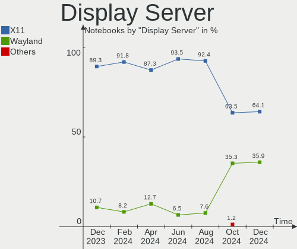
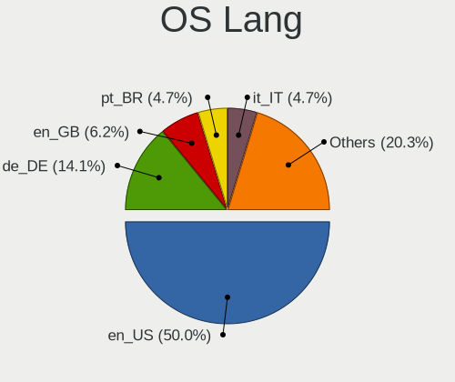
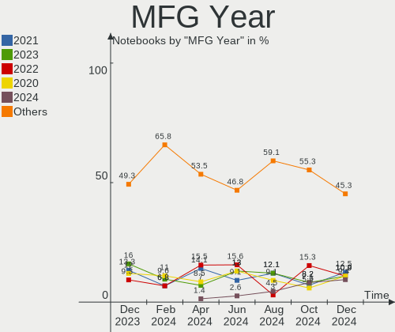
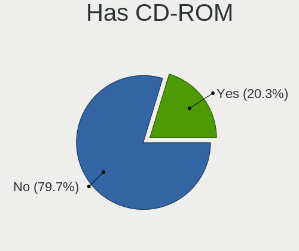

Kubuntu - Hardware Trends (Notebooks)
-------------------------------------

A project to identify most popular hardware characteristics and track their change
over time based on data collected by Linux users at https://Linux-Hardware.org.

Anyone can contribute to this report by the [hw-probe](https://github.com/linuxhw/hw-probe) tool:

    sudo -E hw-probe -all -upload

This report is for one last month. Overall report since the beginning of time: [TestDays](https://github.com/linuxhw/TestDays)

Period: Jan, 2024.

Contents
--------

* [ System ](#system)
  - [ OS                       ](#os)
  - [ OS Family                ](#os-family)
  - [ Kernel                   ](#kernel)
  - [ Kernel Family            ](#kernel-family)
  - [ Kernel Major Ver.        ](#kernel-major-ver)
  - [ Arch                     ](#arch)
  - [ DE                       ](#de)
  - [ Display Server           ](#display-server)
  - [ Display Manager          ](#display-manager)
  - [ OS Lang                  ](#os-lang)
  - [ Boot Mode                ](#boot-mode)
  - [ Filesystem               ](#filesystem)
  - [ Part. scheme             ](#part-scheme)
  - [ Dual Boot with Linux/BSD ](#dual-boot-with-linuxbsd)
  - [ Dual Boot (Win)          ](#dual-boot-win)

* [ Board ](#board)
  - [ Vendor                   ](#vendor)
  - [ Model                    ](#model)
  - [ Model Family             ](#model-family)
  - [ MFG Year                 ](#mfg-year)
  - [ Form Factor              ](#form-factor)
  - [ Secure Boot              ](#secure-boot)
  - [ Coreboot                 ](#coreboot)
  - [ RAM Size                 ](#ram-size)
  - [ RAM Used                 ](#ram-used)
  - [ Total Drives             ](#total-drives)
  - [ Has CD-ROM               ](#has-cd-rom)
  - [ Has Ethernet             ](#has-ethernet)
  - [ Has WiFi                 ](#has-wifi)
  - [ Has Bluetooth            ](#has-bluetooth)

* [ Location ](#location)
  - [ Country                  ](#country)
  - [ City                     ](#city)

* [ Drives ](#drives)
  - [ Drive Vendor             ](#drive-vendor)
  - [ Drive Model              ](#drive-model)
  - [ HDD Vendor               ](#hdd-vendor)
  - [ SSD Vendor               ](#ssd-vendor)
  - [ Drive Kind               ](#drive-kind)
  - [ Drive Connector          ](#drive-connector)
  - [ Drive Size               ](#drive-size)
  - [ Space Total              ](#space-total)
  - [ Space Used               ](#space-used)
  - [ Malfunc. Drives          ](#malfunc-drives)
  - [ Malfunc. Drive Vendor    ](#malfunc-drive-vendor)
  - [ Malfunc. HDD Vendor      ](#malfunc-hdd-vendor)
  - [ Malfunc. Drive Kind      ](#malfunc-drive-kind)
  - [ Failed Drives            ](#failed-drives)
  - [ Failed Drive Vendor      ](#failed-drive-vendor)
  - [ Drive Status             ](#drive-status)

* [ Storage controller ](#storage-controller)
  - [ Storage Vendor           ](#storage-vendor)
  - [ Storage Model            ](#storage-model)
  - [ Storage Kind             ](#storage-kind)

* [ Processor ](#processor)
  - [ CPU Vendor               ](#cpu-vendor)
  - [ CPU Model                ](#cpu-model)
  - [ CPU Model Family         ](#cpu-model-family)
  - [ CPU Cores                ](#cpu-cores)
  - [ CPU Sockets              ](#cpu-sockets)
  - [ CPU Threads              ](#cpu-threads)
  - [ CPU Op-Modes             ](#cpu-op-modes)
  - [ CPU Microcode            ](#cpu-microcode)
  - [ CPU Microarch            ](#cpu-microarch)

* [ Graphics ](#graphics)
  - [ GPU Vendor               ](#gpu-vendor)
  - [ GPU Model                ](#gpu-model)
  - [ GPU Combo                ](#gpu-combo)
  - [ GPU Driver               ](#gpu-driver)
  - [ GPU Memory               ](#gpu-memory)

* [ Monitor ](#monitor)
  - [ Monitor Vendor           ](#monitor-vendor)
  - [ Monitor Model            ](#monitor-model)
  - [ Monitor Resolution       ](#monitor-resolution)
  - [ Monitor Diagonal         ](#monitor-diagonal)
  - [ Monitor Width            ](#monitor-width)
  - [ Aspect Ratio             ](#aspect-ratio)
  - [ Monitor Area             ](#monitor-area)
  - [ Pixel Density            ](#pixel-density)
  - [ Multiple Monitors        ](#multiple-monitors)

* [ Network ](#network)
  - [ Net Controller Vendor    ](#net-controller-vendor)
  - [ Net Controller Model     ](#net-controller-model)
  - [ Wireless Vendor          ](#wireless-vendor)
  - [ Wireless Model           ](#wireless-model)
  - [ Ethernet Vendor          ](#ethernet-vendor)
  - [ Ethernet Model           ](#ethernet-model)
  - [ Net Controller Kind      ](#net-controller-kind)
  - [ Used Controller          ](#used-controller)
  - [ NICs                     ](#nics)
  - [ IPv6                     ](#ipv6)

* [ Bluetooth ](#bluetooth)
  - [ Bluetooth Vendor         ](#bluetooth-vendor)
  - [ Bluetooth Model          ](#bluetooth-model)

* [ Sound ](#sound)
  - [ Sound Vendor             ](#sound-vendor)
  - [ Sound Model              ](#sound-model)

* [ Memory ](#memory)
  - [ Memory Vendor            ](#memory-vendor)
  - [ Memory Model             ](#memory-model)
  - [ Memory Kind              ](#memory-kind)
  - [ Memory Form Factor       ](#memory-form-factor)
  - [ Memory Size              ](#memory-size)
  - [ Memory Speed             ](#memory-speed)

* [ Printers & scanners ](#printers--scanners)
  - [ Printer Vendor           ](#printer-vendor)
  - [ Printer Model            ](#printer-model)
  - [ Scanner Vendor           ](#scanner-vendor)
  - [ Scanner Model            ](#scanner-model)

* [ Camera ](#camera)
  - [ Camera Vendor            ](#camera-vendor)
  - [ Camera Model             ](#camera-model)

* [ Security ](#security)
  - [ Fingerprint Vendor       ](#fingerprint-vendor)
  - [ Fingerprint Model        ](#fingerprint-model)
  - [ Chipcard Vendor          ](#chipcard-vendor)
  - [ Chipcard Model           ](#chipcard-model)

* [ Unsupported ](#unsupported)
  - [ Unsupported Devices      ](#unsupported-devices)
  - [ Unsupported Device Types ](#unsupported-device-types)

System
------

OS
--

Installed operating systems

| Name          | Notebooks | Percent |
|---------------|-----------|---------|
| Kubuntu 23.10 | 37        | 48.68%  |
| Kubuntu 22.04 | 36        | 47.37%  |
| Kubuntu 24.04 | 2         | 2.63%   |
| Kubuntu 18.04 | 1         | 1.32%   |

OS Family
---------

OS without a version

| Name    | Notebooks | Percent |
|---------|-----------|---------|
| Kubuntu | 76        | 100%    |

Kernel
------

Version of the Linux kernel

| Version              | Notebooks | Percent |
|----------------------|-----------|---------|
| 6.5.0-14-generic     | 30        | 39.47%  |
| 6.5.0-15-generic     | 11        | 14.47%  |
| 5.15.0-91-generic    | 8         | 10.53%  |
| 6.2.0-39-generic     | 6         | 7.89%   |
| 6.5.0-9-generic      | 4         | 5.26%   |
| 6.6.0-14-generic     | 2         | 2.63%   |
| 6.5.0-14-lowlatency  | 2         | 2.63%   |
| 6.5.0-1003-intel-opt | 2         | 2.63%   |
| 6.7.1-060701-generic | 1         | 1.32%   |
| 6.7.1                | 1         | 1.32%   |
| 6.7.0-060700-generic | 1         | 1.32%   |
| 6.6.8-060608-generic | 1         | 1.32%   |
| 6.5.0-15-lowlatency  | 1         | 1.32%   |
| 6.2.8-060208-generic | 1         | 1.32%   |
| 6.2.0-26-generic     | 1         | 1.32%   |
| 6.1.69-t2-jammy      | 1         | 1.32%   |
| 5.4.0-150-generic    | 1         | 1.32%   |
| 5.19.0-38-generic    | 1         | 1.32%   |
| 5.15.0-89-generic    | 1         | 1.32%   |

Kernel Family
-------------

Linux kernel without a distro release

| Version | Notebooks | Percent |
|---------|-----------|---------|
| 6.5.0   | 50        | 65.79%  |
| 5.15.0  | 9         | 11.84%  |
| 6.2.0   | 7         | 9.21%   |
| 6.7.1   | 2         | 2.63%   |
| 6.6.0   | 2         | 2.63%   |
| 6.7.0   | 1         | 1.32%   |
| 6.6.8   | 1         | 1.32%   |
| 6.2.8   | 1         | 1.32%   |
| 6.1.69  | 1         | 1.32%   |
| 5.4.0   | 1         | 1.32%   |
| 5.19.0  | 1         | 1.32%   |

Kernel Major Ver.
-----------------

Linux kernel major version

| Version | Notebooks | Percent |
|---------|-----------|---------|
| 6.5     | 50        | 65.79%  |
| 5.15    | 9         | 11.84%  |
| 6.2     | 8         | 10.53%  |
| 6.7     | 3         | 3.95%   |
| 6.6     | 3         | 3.95%   |
| 6.1     | 1         | 1.32%   |
| 5.4     | 1         | 1.32%   |
| 5.19    | 1         | 1.32%   |

Arch
----

OS architecture (x86_64, i586, etc.)

| Name   | Notebooks | Percent |
|--------|-----------|---------|
| x86_64 | 76        | 100%    |

DE
--

Desktop Environment

| Name  | Notebooks | Percent |
|-------|-----------|---------|
| KDE5  | 74        | 97.37%  |
| Unity | 1         | 1.32%   |
| KDE   | 1         | 1.32%   |

Display Server
--------------

X11 or Wayland

| Name    | Notebooks | Percent |
|---------|-----------|---------|
| X11     | 64        | 84.21%  |
| Wayland | 10        | 13.16%  |
| Tty     | 2         | 2.63%   |

Display Manager
---------------

SDDM, LightDM, etc.

| Name    | Notebooks | Percent |
|---------|-----------|---------|
| SDDM    | 54        | 71.05%  |
| Unknown | 21        | 27.63%  |
| LightDM | 1         | 1.32%   |

OS Lang
-------

Language

| Lang  | Notebooks | Percent |
|-------|-----------|---------|
| en_US | 40        | 52.63%  |
| de_DE | 8         | 10.53%  |
| ru_RU | 4         | 5.26%   |
| fr_FR | 4         | 5.26%   |
| it_IT | 3         | 3.95%   |
| en_GB | 3         | 3.95%   |
| en_CA | 3         | 3.95%   |
| C     | 3         | 3.95%   |
| en_IN | 2         | 2.63%   |
| en_AU | 2         | 2.63%   |
| pl_PL | 1         | 1.32%   |
| en_NG | 1         | 1.32%   |
| de_CH | 1         | 1.32%   |
| cs_CZ | 1         | 1.32%   |

Boot Mode
---------

EFI or BIOS

| Mode | Notebooks | Percent |
|------|-----------|---------|
| EFI  | 39        | 51.32%  |
| BIOS | 37        | 48.68%  |

Filesystem
----------

Type of filesystem

| Type    | Notebooks | Percent |
|---------|-----------|---------|
| Ext4    | 55        | 72.37%  |
| Tmpfs   | 17        | 22.37%  |
| Btrfs   | 2         | 2.63%   |
| Overlay | 1         | 1.32%   |
| Unknown | 1         | 1.32%   |

Part. scheme
------------

Scheme of partitioning

| Type    | Notebooks | Percent |
|---------|-----------|---------|
| GPT     | 53        | 69.74%  |
| Unknown | 20        | 26.32%  |
| MBR     | 3         | 3.95%   |

Dual Boot with Linux/BSD
------------------------

Hosting more than one Linux/BSD

| Dual boot | Notebooks | Percent |
|-----------|-----------|---------|
| No        | 71        | 93.42%  |
| Yes       | 5         | 6.58%   |

Dual Boot (Win)
---------------

Hosting Linux and Windows

| Dual boot | Notebooks | Percent |
|-----------|-----------|---------|
| No        | 60        | 78.95%  |
| Yes       | 16        | 21.05%  |

Board
-----

Vendor
------

Motherboard manufacturer

| Name                             | Notebooks | Percent |
|----------------------------------|-----------|---------|
| Dell                             | 14        | 18.42%  |
| Hewlett-Packard                  | 13        | 17.11%  |
| Lenovo                           | 12        | 15.79%  |
| ASUSTek Computer                 | 10        | 13.16%  |
| Acer                             | 6         | 7.89%   |
| MSI                              | 3         | 3.95%   |
| Apple                            | 3         | 3.95%   |
| Samsung Electronics              | 2         | 2.63%   |
| HUAWEI                           | 2         | 2.63%   |
| Google                           | 2         | 2.63%   |
| VALE                             | 1         | 1.32%   |
| Toshiba                          | 1         | 1.32%   |
| System76                         | 1         | 1.32%   |
| Sony                             | 1         | 1.32%   |
| Packard Bell                     | 1         | 1.32%   |
| Micro Computer (HK) Tech Limited | 1         | 1.32%   |
| Medion                           | 1         | 1.32%   |
| Mediacom                         | 1         | 1.32%   |
| Infinix                          | 1         | 1.32%   |

Model
-----

Motherboard model

| Name                                              | Notebooks | Percent |
|---------------------------------------------------|-----------|---------|
| VALE Notebook Slim S132                           | 1         | 1.32%   |
| Toshiba Satellite P300                            | 1         | 1.32%   |
| System76 Pangolin                                 | 1         | 1.32%   |
| Sony VGN-CS190N                                   | 1         | 1.32%   |
| Samsung RV420/RV520/RV720/E3530/S3530/E3420/E3520 | 1         | 1.32%   |
| Samsung 300E5M/300E5L                             | 1         | 1.32%   |
| Packard Bell EasyNote TS11HR                      | 1         | 1.32%   |
| MSI Summit E16Flip A12UCT                         | 1         | 1.32%   |
| MSI Creator Z17 A12UGST                           | 1         | 1.32%   |
| MSI Creator M16 A12UC                             | 1         | 1.32%   |
| Micro (HK) Tech Limited Venus series              | 1         | 1.32%   |
| Medion S14409                                     | 1         | 1.32%   |
| Mediacom WinPad 11,6 FullHD- WPU11                | 1         | 1.32%   |
| Lenovo Yoga Slim 7 Pro 14ARH7 82UU                | 1         | 1.32%   |
| Lenovo V15 G3 IAP 82TT                            | 1         | 1.32%   |
| Lenovo ThinkPad X230 2325BA3                      | 1         | 1.32%   |
| Lenovo ThinkPad Twist 334729G                     | 1         | 1.32%   |
| Lenovo ThinkPad T495 20NJ000XIX                   | 1         | 1.32%   |
| Lenovo ThinkPad T14 Gen 3 21AHA001CD              | 1         | 1.32%   |
| Lenovo ThinkPad L14 Gen 2 20X100LWUK              | 1         | 1.32%   |
| Lenovo ThinkPad E450 20DC003WUS                   | 1         | 1.32%   |
| Lenovo ThinkPad E15 Gen 4 21E6004KGE              | 1         | 1.32%   |
| Lenovo ThinkPad E14 Gen 4 21ECS00000              | 1         | 1.32%   |
| Lenovo IdeaPad Slim 5 16IRL8 82XF                 | 1         | 1.32%   |
| Lenovo IdeaPad 5 15ARE05 81YQ                     | 1         | 1.32%   |
| Infinix ZERO BOOK 13                              | 1         | 1.32%   |
| HUAWEI BOM-WXX9                                   | 1         | 1.32%   |
| HUAWEI BoDE-WXX9                                  | 1         | 1.32%   |
| HP ZBook 14u G5                                   | 1         | 1.32%   |
| HP ProBook 6450b                                  | 1         | 1.32%   |
| HP ProBook 4540s                                  | 1         | 1.32%   |
| HP Pavilion 13 x360 PC                            | 1         | 1.32%   |
| HP OMEN Laptop 15-en1xxx                          | 1         | 1.32%   |
| HP OMEN Laptop 15-ek1xxx                          | 1         | 1.32%   |
| HP Notebook                                       | 1         | 1.32%   |
| HP Laptop 15t-dy100                               | 1         | 1.32%   |
| HP Laptop 15-ef2xxx                               | 1         | 1.32%   |
| HP ENVY m6                                        | 1         | 1.32%   |
| HP EliteBook 8570p                                | 1         | 1.32%   |
| HP EliteBook 8470w                                | 1         | 1.32%   |

Model Family
------------

Motherboard model prefix

| Name                          | Notebooks | Percent |
|-------------------------------|-----------|---------|
| Lenovo ThinkPad               | 8         | 10.53%  |
| Dell Latitude                 | 7         | 9.21%   |
| Dell Inspiron                 | 5         | 6.58%   |
| ASUS VivoBook                 | 5         | 6.58%   |
| Acer Aspire                   | 4         | 5.26%   |
| HP EliteBook                  | 3         | 3.95%   |
| MSI Creator                   | 2         | 2.63%   |
| Lenovo IdeaPad                | 2         | 2.63%   |
| HP ProBook                    | 2         | 2.63%   |
| HP OMEN                       | 2         | 2.63%   |
| HP Laptop                     | 2         | 2.63%   |
| ASUS ROG                      | 2         | 2.63%   |
| VALE Notebook                 | 1         | 1.32%   |
| Toshiba Satellite             | 1         | 1.32%   |
| System76 Pangolin             | 1         | 1.32%   |
| Sony VGN-CS190N               | 1         | 1.32%   |
| Samsung RV420                 | 1         | 1.32%   |
| Samsung 300E5M                | 1         | 1.32%   |
| Packard Bell EasyNote         | 1         | 1.32%   |
| MSI Summit                    | 1         | 1.32%   |
| Micro (HK) Tech Limited Venus | 1         | 1.32%   |
| Medion S14409                 | 1         | 1.32%   |
| Mediacom WinPad               | 1         | 1.32%   |
| Lenovo Yoga                   | 1         | 1.32%   |
| Lenovo V15                    | 1         | 1.32%   |
| Infinix ZERO                  | 1         | 1.32%   |
| HUAWEI BOM-WXX9               | 1         | 1.32%   |
| HUAWEI BoDE-WXX9              | 1         | 1.32%   |
| HP ZBook                      | 1         | 1.32%   |
| HP Pavilion                   | 1         | 1.32%   |
| HP Notebook                   | 1         | 1.32%   |
| HP ENVY                       | 1         | 1.32%   |
| Google Taeko                  | 1         | 1.32%   |
| Google Fleex                  | 1         | 1.32%   |
| Dell Vostro                   | 1         | 1.32%   |
| Dell Precision                | 1         | 1.32%   |
| ASUS Zephyrus                 | 1         | 1.32%   |
| ASUS UX410UAK                 | 1         | 1.32%   |
| ASUS G75VX                    | 1         | 1.32%   |
| Apple MacBookPro14            | 1         | 1.32%   |

MFG Year
--------

Motherboard manufacture year

| Year | Notebooks | Percent |
|------|-----------|---------|
| 2022 | 14        | 18.42%  |
| 2021 | 10        | 13.16%  |
| 2023 | 8         | 10.53%  |
| 2020 | 7         | 9.21%   |
| 2019 | 6         | 7.89%   |
| 2012 | 6         | 7.89%   |
| 2011 | 5         | 6.58%   |
| 2014 | 4         | 5.26%   |
| 2017 | 3         | 3.95%   |
| 2016 | 3         | 3.95%   |
| 2008 | 3         | 3.95%   |
| 2018 | 2         | 2.63%   |
| 2015 | 2         | 2.63%   |
| 2010 | 1         | 1.32%   |
| 2009 | 1         | 1.32%   |
| 2007 | 1         | 1.32%   |

Form Factor
-----------

Physical design of the computer

| Name     | Notebooks | Percent |
|----------|-----------|---------|
| Notebook | 76        | 100%    |

Secure Boot
-----------

Enabled or disabled

| State    | Notebooks | Percent |
|----------|-----------|---------|
| Disabled | 68        | 89.47%  |
| Enabled  | 8         | 10.53%  |

Coreboot
--------

Have coreboot on board

| Used | Notebooks | Percent |
|------|-----------|---------|
| No   | 74        | 97.37%  |
| Yes  | 2         | 2.63%   |

RAM Size
--------

Total RAM memory

| Size in GB  | Notebooks | Percent |
|-------------|-----------|---------|
| 8.01-16.0   | 27        | 35.53%  |
| 4.01-8.0    | 18        | 23.68%  |
| 16.01-24.0  | 14        | 18.42%  |
| 32.01-64.0  | 8         | 10.53%  |
| 3.01-4.0    | 5         | 6.58%   |
| 1.01-2.0    | 2         | 2.63%   |
| 24.01-32.0  | 1         | 1.32%   |
| 64.01-256.0 | 1         | 1.32%   |

RAM Used
--------

Used RAM memory

| Used GB   | Notebooks | Percent |
|-----------|-----------|---------|
| 4.01-8.0  | 22        | 28.95%  |
| 3.01-4.0  | 18        | 23.68%  |
| 1.01-2.0  | 16        | 21.05%  |
| 2.01-3.0  | 14        | 18.42%  |
| 8.01-16.0 | 5         | 6.58%   |
| 0.51-1.0  | 1         | 1.32%   |

Total Drives
------------

Number of drives on board

| Drives | Notebooks | Percent |
|--------|-----------|---------|
| 1      | 56        | 73.68%  |
| 2      | 18        | 23.68%  |
| 3      | 2         | 2.63%   |

Has CD-ROM
----------

Has CD-ROM on board

| Presented | Notebooks | Percent |
|-----------|-----------|---------|
| No        | 61        | 80.26%  |
| Yes       | 15        | 19.74%  |

Has Ethernet
------------

Has Ethernet on board

| Presented | Notebooks | Percent |
|-----------|-----------|---------|
| Yes       | 53        | 69.74%  |
| No        | 23        | 30.26%  |

Has WiFi
--------

Has WiFi module

| Presented | Notebooks | Percent |
|-----------|-----------|---------|
| Yes       | 74        | 97.37%  |
| No        | 2         | 2.63%   |

Has Bluetooth
-------------

Has Bluetooth module

| Presented | Notebooks | Percent |
|-----------|-----------|---------|
| Yes       | 69        | 90.79%  |
| No        | 7         | 9.21%   |

Location
--------

Country
-------

Geographic location (country)

| Country     | Notebooks | Percent |
|-------------|-----------|---------|
| USA         | 22        | 28.95%  |
| Germany     | 10        | 13.16%  |
| Russia      | 6         | 7.89%   |
| Italy       | 4         | 5.26%   |
| France      | 4         | 5.26%   |
| UK          | 3         | 3.95%   |
| Canada      | 3         | 3.95%   |
| Switzerland | 2         | 2.63%   |
| Poland      | 2         | 2.63%   |
| India       | 2         | 2.63%   |
| Brazil      | 2         | 2.63%   |
| Australia   | 2         | 2.63%   |
| Argentina   | 2         | 2.63%   |
| Vietnam     | 1         | 1.32%   |
| Thailand    | 1         | 1.32%   |
| Peru        | 1         | 1.32%   |
| Paraguay    | 1         | 1.32%   |
| Nigeria     | 1         | 1.32%   |
| Mauritius   | 1         | 1.32%   |
| Ireland     | 1         | 1.32%   |
| Iran        | 1         | 1.32%   |
| Hungary     | 1         | 1.32%   |
| Finland     | 1         | 1.32%   |
| Czechia     | 1         | 1.32%   |
| Austria     | 1         | 1.32%   |

City
----

Geographic location (city)

| City               | Notebooks | Percent |
|--------------------|-----------|---------|
| Buenos Aires       | 2         | 2.63%   |
| Bensheim           | 2         | 2.63%   |
| Zogno              | 1         | 1.32%   |
| Wolverhampton      | 1         | 1.32%   |
| Wil                | 1         | 1.32%   |
| West Valley City   | 1         | 1.32%   |
| Warsaw             | 1         | 1.32%   |
| Victoria           | 1         | 1.32%   |
| Tulsa              | 1         | 1.32%   |
| Trout Creek        | 1         | 1.32%   |
| Tomsk              | 1         | 1.32%   |
| Tampere            | 1         | 1.32%   |
| Sydney             | 1         | 1.32%   |
| Surgut             | 1         | 1.32%   |
| Stade              | 1         | 1.32%   |
| St Louis           | 1         | 1.32%   |
| San Antonio        | 1         | 1.32%   |
| Salem              | 1         | 1.32%   |
| Saint-Raphaël     | 1         | 1.32%   |
| Rochester          | 1         | 1.32%   |
| Roanoke            | 1         | 1.32%   |
| Riviere du Rempart | 1         | 1.32%   |
| Riethnordhausen    | 1         | 1.32%   |
| Poznan             | 1         | 1.32%   |
| Porto Alegre       | 1         | 1.32%   |
| Perm               | 1         | 1.32%   |
| Paris              | 1         | 1.32%   |
| Pardubice          | 1         | 1.32%   |
| North Versailles   | 1         | 1.32%   |
| Munich             | 1         | 1.32%   |
| Moscow             | 1         | 1.32%   |
| Montreal           | 1         | 1.32%   |
| Milan              | 1         | 1.32%   |
| Markaz             | 1         | 1.32%   |
| Ludhiana           | 1         | 1.32%   |
| Los Angeles        | 1         | 1.32%   |
| Longmont           | 1         | 1.32%   |
| Leonard            | 1         | 1.32%   |
| Leipzig            | 1         | 1.32%   |
| Le Bosc de Sevis   | 1         | 1.32%   |

Drives
------

Drive Vendor
------------

Hard drive vendors

| Vendor                       | Notebooks | Drives | Percent |
|------------------------------|-----------|--------|---------|
| Samsung Electronics          | 18        | 20     | 19.35%  |
| SK hynix                     | 9         | 9      | 9.68%   |
| SanDisk                      | 7         | 7      | 7.53%   |
| Unknown                      | 5         | 6      | 5.38%   |
| Micron Technology            | 5         | 5      | 5.38%   |
| Kingston                     | 5         | 5      | 5.38%   |
| Crucial                      | 5         | 5      | 5.38%   |
| WDC                          | 4         | 5      | 4.3%    |
| Toshiba                      | 3         | 3      | 3.23%   |
| Silicon Motion               | 3         | 3      | 3.23%   |
| Seagate                      | 3         | 3      | 3.23%   |
| Apple                        | 3         | 4      | 3.23%   |
| SPCC                         | 2         | 2      | 2.15%   |
| SABRENT                      | 2         | 2      | 2.15%   |
| Intel                        | 2         | 2      | 2.15%   |
| HGST                         | 2         | 2      | 2.15%   |
| UMIS                         | 1         | 1      | 1.08%   |
| Transcend                    | 1         | 1      | 1.08%   |
| Shenzhen Longsys Electronics | 1         | 1      | 1.08%   |
| Realtek                      | 1         | 1      | 1.08%   |
| Patriot                      | 1         | 1      | 1.08%   |
| Micron/Crucial Technology    | 1         | 1      | 1.08%   |
| MAXIO Technology (Hangzhou)  | 1         | 2      | 1.08%   |
| Lexar                        | 1         | 1      | 1.08%   |
| KIOXIA                       | 1         | 1      | 1.08%   |
| KingSpec                     | 1         | 1      | 1.08%   |
| Intenso                      | 1         | 1      | 1.08%   |
| Hitachi                      | 1         | 1      | 1.08%   |
| External                     | 1         | 1      | 1.08%   |
| A-DATA Technology            | 1         | 1      | 1.08%   |
| Unknown                      | 1         | 1      | 1.08%   |

Drive Model
-----------

Hard drive models

| Model                                              | Notebooks | Percent |
|----------------------------------------------------|-----------|---------|
| Samsung NVMe SSD Controller PM9A1/PM9A3/980PRO 2TB | 3         | 3.09%   |
| Unknown MMC Card  32GB                             | 2         | 2.06%   |
| SK hynix BC501 NVMe Solid State Drive 512GB        | 2         | 2.06%   |
| Silicon Motion PCIe-8 SSD 512GB                    | 2         | 2.06%   |
| SanDisk NVMe SSD Drive 2TB                         | 2         | 2.06%   |
| Samsung MZVL21T0HCLR-00B00 1TB                     | 2         | 2.06%   |
| SABRENT Disk 500GB                                 | 2         | 2.06%   |
| Micron 2450_MTFDKBA512TFK 512GB                    | 2         | 2.06%   |
| WDC WDS480G2G0C-00AJM0 480GB                       | 1         | 1.03%   |
| WDC WD5000LPCX-24C6HT0 500GB                       | 1         | 1.03%   |
| WDC WD Blue SA510 2.5 500GB                        | 1         | 1.03%   |
| WDC PC SN530 SDBPNPZ-512G-1114 512GB               | 1         | 1.03%   |
| Unknown SABRENT SABRENT 500GB                      | 1         | 1.03%   |
| Unknown SA04G  4GB                                 | 1         | 1.03%   |
| Unknown NCard  32GB                                | 1         | 1.03%   |
| Unknown MMC Card  4GB                              | 1         | 1.03%   |
| UMIS RPJTJ512MGE1QDQ 512GB                         | 1         | 1.03%   |
| Transcend TS240GMTS420S 240GB SSD                  | 1         | 1.03%   |
| Toshiba XG4 NVMe SSD Controller 512GB              | 1         | 1.03%   |
| Toshiba MQ01ABD100 1TB                             | 1         | 1.03%   |
| Toshiba MQ01ABD075 752GB                           | 1         | 1.03%   |
| SPCC Solid State Disk 512GB                        | 1         | 1.03%   |
| SPCC M.2 PCIe SSD 1TB                              | 1         | 1.03%   |
| SK hynix SKHynix_HFM256GDHTNI-87A0B 256GB          | 1         | 1.03%   |
| SK hynix SC210 mSATA 256GB SSD                     | 1         | 1.03%   |
| SK hynix PC801 NVMe 1TB                            | 1         | 1.03%   |
| SK hynix PC401 NVMe 1TB                            | 1         | 1.03%   |
| SK hynix HFM001TD3JX013N 1024GB                    | 1         | 1.03%   |
| SK hynix BC711 NVMe 512GB                          | 1         | 1.03%   |
| SK hynix BC511 256GB                               | 1         | 1.03%   |
| Silicon Motion AGl512G16Al198 512GB                | 1         | 1.03%   |
| Shenzhen Longsys FORESEE XP2100F001T 1TB           | 1         | 1.03%   |
| Seagate ST500LM021-1KJ152 500GB                    | 1         | 1.03%   |
| Seagate ST500LM000-1EJ162 500GB                    | 1         | 1.03%   |
| Seagate BarracudaFastSSD 500GB                     | 1         | 1.03%   |
| Sandisk WD PC SN740 SDDPMQD-512G-1101 512GB        | 1         | 1.03%   |
| Sandisk WD Blue SN550 NVMe SSD 512GB               | 1         | 1.03%   |
| SanDisk SD8SN8U512G1002 512GB SSD                  | 1         | 1.03%   |
| SanDisk SD8SB8U512G1122 512GB SSD                  | 1         | 1.03%   |
| SanDisk NVMe SSD Drive 1TB                         | 1         | 1.03%   |

HDD Vendor
----------

Hard disk drive vendors

| Vendor   | Notebooks | Drives | Percent |
|----------|-----------|--------|---------|
| Toshiba  | 2         | 2      | 22.22%  |
| Seagate  | 2         | 2      | 22.22%  |
| HGST     | 2         | 2      | 22.22%  |
| WDC      | 1         | 1      | 11.11%  |
| Hitachi  | 1         | 1      | 11.11%  |
| External | 1         | 1      | 11.11%  |

SSD Vendor
----------

Solid state drive vendors

| Vendor              | Notebooks | Drives | Percent |
|---------------------|-----------|--------|---------|
| Samsung Electronics | 4         | 4      | 14.29%  |
| Crucial             | 4         | 4      | 14.29%  |
| Kingston            | 3         | 3      | 10.71%  |
| SanDisk             | 2         | 2      | 7.14%   |
| SABRENT             | 2         | 2      | 7.14%   |
| WDC                 | 1         | 2      | 3.57%   |
| Transcend           | 1         | 1      | 3.57%   |
| SPCC                | 1         | 1      | 3.57%   |
| SK hynix            | 1         | 1      | 3.57%   |
| Seagate             | 1         | 1      | 3.57%   |
| Patriot             | 1         | 1      | 3.57%   |
| Micron Technology   | 1         | 1      | 3.57%   |
| Lexar               | 1         | 1      | 3.57%   |
| KingSpec            | 1         | 1      | 3.57%   |
| Intenso             | 1         | 1      | 3.57%   |
| Intel               | 1         | 1      | 3.57%   |
| Apple               | 1         | 1      | 3.57%   |
| A-DATA Technology   | 1         | 1      | 3.57%   |

Drive Kind
----------

HDD or SSD

| Kind    | Notebooks | Drives | Percent |
|---------|-----------|--------|---------|
| NVMe    | 47        | 54     | 53.41%  |
| SSD     | 26        | 29     | 29.55%  |
| HDD     | 9         | 9      | 10.23%  |
| MMC     | 5         | 6      | 5.68%   |
| Unknown | 1         | 1      | 1.14%   |

Drive Connector
---------------

SATA, SAS, NVMe, etc.

| Type | Notebooks | Drives | Percent |
|------|-----------|--------|---------|
| NVMe | 47        | 53     | 52.22%  |
| SATA | 31        | 33     | 34.44%  |
| SAS  | 7         | 7      | 7.78%   |
| MMC  | 5         | 6      | 5.56%   |

Drive Size
----------

Size of hard drive

| Size in TB | Notebooks | Drives | Percent |
|------------|-----------|--------|---------|
| 0.01-0.5   | 24        | 26     | 66.67%  |
| 0.51-1.0   | 11        | 11     | 30.56%  |
| 1.01-2.0   | 1         | 1      | 2.78%   |

Space Total
-----------

Amount of disk space available on the file system

| Size in GB     | Notebooks | Percent |
|----------------|-----------|---------|
| 251-500        | 27        | 35.53%  |
| 501-1000       | 20        | 26.32%  |
| 101-250        | 13        | 17.11%  |
| 1001-2000      | 5         | 6.58%   |
| 51-100         | 4         | 5.26%   |
| More than 3000 | 2         | 2.63%   |
| 21-50          | 2         | 2.63%   |
| 1-20           | 2         | 2.63%   |
| Unknown        | 1         | 1.32%   |

Space Used
----------

Amount of used disk space

| Used GB   | Notebooks | Percent |
|-----------|-----------|---------|
| 1-20      | 19        | 25%     |
| 21-50     | 17        | 22.37%  |
| 101-250   | 13        | 17.11%  |
| 251-500   | 12        | 15.79%  |
| 51-100    | 8         | 10.53%  |
| 501-1000  | 4         | 5.26%   |
| 1001-2000 | 2         | 2.63%   |
| Unknown   | 1         | 1.32%   |

Malfunc. Drives
---------------

Drive models with a malfunction

| Model                          | Notebooks | Drives | Percent |
|--------------------------------|-----------|--------|---------|
| WDC WD5000LPCX-24C6HT0 500GB   | 1         | 1      | 33.33%  |
| SK hynix SC210 mSATA 256GB SSD | 1         | 1      | 33.33%  |
| HGST HTS545050A7E680 500GB     | 1         | 1      | 33.33%  |

Malfunc. Drive Vendor
---------------------

Vendors of faulty drives

| Vendor   | Notebooks | Drives | Percent |
|----------|-----------|--------|---------|
| WDC      | 1         | 1      | 33.33%  |
| SK hynix | 1         | 1      | 33.33%  |
| HGST     | 1         | 1      | 33.33%  |

Malfunc. HDD Vendor
-------------------

Vendors of faulty HDD drives

| Vendor | Notebooks | Drives | Percent |
|--------|-----------|--------|---------|
| WDC    | 1         | 1      | 50%     |
| HGST   | 1         | 1      | 50%     |

Malfunc. Drive Kind
-------------------

Kinds of faulty drives

| Kind | Notebooks | Drives | Percent |
|------|-----------|--------|---------|
| HDD  | 2         | 2      | 66.67%  |
| SSD  | 1         | 1      | 33.33%  |

Failed Drives
-------------

Failed drive models

Zero info for selected period =(

Failed Drive Vendor
-------------------

Failed drive vendors

Zero info for selected period =(

Drive Status
------------

Number of failed and malfunc. drives

| Status   | Notebooks | Drives | Percent |
|----------|-----------|--------|---------|
| Detected | 41        | 53     | 51.9%   |
| Works    | 35        | 43     | 44.3%   |
| Malfunc  | 3         | 3      | 3.8%    |

Storage controller
------------------

Storage Vendor
--------------

Storage controller vendors

| Vendor                       | Notebooks | Percent |
|------------------------------|-----------|---------|
| Intel                        | 42        | 42.86%  |
| Samsung Electronics          | 15        | 15.31%  |
| SK hynix                     | 8         | 8.16%   |
| SanDisk                      | 7         | 7.14%   |
| AMD                          | 7         | 7.14%   |
| Micron Technology            | 4         | 4.08%   |
| Silicon Motion               | 3         | 3.06%   |
| Toshiba America Info Systems | 2         | 2.04%   |
| Micron/Crucial Technology    | 2         | 2.04%   |
| Kingston Technology Company  | 2         | 2.04%   |
| Apple                        | 2         | 2.04%   |
| Union Memory (Shenzhen)      | 1         | 1.02%   |
| Shenzhen Longsys Electronics | 1         | 1.02%   |
| Realtek Semiconductor        | 1         | 1.02%   |
| MAXIO Technology (Hangzhou)  | 1         | 1.02%   |

Storage Model
-------------

Storage controller models

| Model                                                                        | Notebooks | Percent |
|------------------------------------------------------------------------------|-----------|---------|
| Intel 7 Series Chipset Family 6-port SATA Controller [AHCI mode]             | 9         | 9.18%   |
| AMD FCH SATA Controller [AHCI mode]                                          | 7         | 7.14%   |
| Samsung NVMe SSD Controller PM9A1/PM9A3/980PRO                               | 6         | 6.12%   |
| Samsung NVMe SSD Controller SM981/PM981/PM983                                | 5         | 5.1%    |
| Intel Sunrise Point-LP SATA Controller [AHCI mode]                           | 4         | 4.08%   |
| Intel 82801 Mobile SATA Controller [RAID mode]                               | 4         | 4.08%   |
| Samsung NVMe SSD Controller 980 (DRAM-less)                                  | 3         | 3.06%   |
| Micron 2450 NVMe SSD [HendrixV] (DRAM-less)                                  | 3         | 3.06%   |
| Intel Ice Lake-LP SATA Controller [AHCI mode]                                | 3         | 3.06%   |
| Intel Alder Lake-P SATA AHCI Controller                                      | 3         | 3.06%   |
| Intel 82801IBM/IEM (ICH9M/ICH9M-E) 4 port SATA Controller [AHCI mode]        | 3         | 3.06%   |
| Intel 6 Series/C200 Series Chipset Family 6 port Mobile SATA AHCI Controller | 3         | 3.06%   |
| SK hynix Gold P31/BC711/PC711 NVMe Solid State Drive                         | 2         | 2.04%   |
| SK hynix BC511 NVMe SSD                                                      | 2         | 2.04%   |
| SK hynix BC501 NVMe Solid State Drive                                        | 2         | 2.04%   |
| Silicon Motion Non-Volatile memory controller                                | 2         | 2.04%   |
| Sandisk WD PC SN740 NVMe SSD 512GB (DRAM-less)                               | 2         | 2.04%   |
| Sandisk WD Black SN850X NVMe SSD                                             | 2         | 2.04%   |
| SanDisk Ultra 3D / WD Blue SN550 NVMe SSD                                    | 2         | 2.04%   |
| Micron/Crucial P2 [Nick P2] / P3 / P3 Plus NVMe PCIe SSD (DRAM-less)         | 2         | 2.04%   |
| Intel Volume Management Device NVMe RAID Controller                          | 2         | 2.04%   |
| Intel 8 Series SATA Controller 1 [AHCI mode]                                 | 2         | 2.04%   |
| Union Memory (Shenzhen) AM630 PCIe 4.0 x4 NVMe SSD Controller                | 1         | 1.02%   |
| Toshiba America Info Systems XG6 NVMe SSD Controller                         | 1         | 1.02%   |
| Toshiba America Info Systems XG4 NVMe SSD Controller                         | 1         | 1.02%   |
| SK hynix Platinum P41/PC801 NVMe Solid State Drive                           | 1         | 1.02%   |
| SK hynix PC401 NVMe Solid State Drive 256GB                                  | 1         | 1.02%   |
| Silicon Motion SM2262/SM2262EN SSD Controller                                | 1         | 1.02%   |
| Shenzhen Longsys FORESEE XP2100 NVMe SSD (DRAM-less)                         | 1         | 1.02%   |
| SanDisk WD Green SN350 240GB (DRAM-less) / SN560E NVMe SSD                   | 1         | 1.02%   |
| Samsung NVMe SSD Controller PM9B1 (DRAM-less)                                | 1         | 1.02%   |
| Realtek RTS5765DL NVMe SSD Controller (DRAM-less)                            | 1         | 1.02%   |
| Micron 2210 NVMe SSD [Cobain]                                                | 1         | 1.02%   |
| MAXIO (Hangzhou) NVMe SSD Controller MAP1202 (DRAM-less)                     | 1         | 1.02%   |
| Kingston Company NV2 NVMe SSD E21T (DRAM-less)                               | 1         | 1.02%   |
| Kingston Company KC3000/FURY Renegade NVMe SSD E18                           | 1         | 1.02%   |
| Intel Wildcat Point-LP SATA Controller [AHCI Mode]                           | 1         | 1.02%   |
| Intel Volume Management Device NVMe RAID Controller Intel Corporation        | 1         | 1.02%   |
| Intel Tiger Lake-LP SATA Controller                                          | 1         | 1.02%   |
| Intel SSD 670p Series [Keystone Harbor]                                      | 1         | 1.02%   |

Storage Kind
------------

Kind of storage controller (IDE, SATA, NVMe, SAS, ...)

| Kind | Notebooks | Percent |
|------|-----------|---------|
| NVMe | 47        | 49.47%  |
| SATA | 41        | 43.16%  |
| RAID | 7         | 7.37%   |

Processor
---------

CPU Vendor
----------

Processor vendors

| Vendor | Notebooks | Percent |
|--------|-----------|---------|
| Intel  | 60        | 78.95%  |
| AMD    | 16        | 21.05%  |

CPU Model
---------

Processor models

| Model                                   | Notebooks | Percent |
|-----------------------------------------|-----------|---------|
| Intel 11th Gen Core i5-1135G7 @ 2.40GHz | 4         | 5.26%   |
| Intel Core i5-3210M CPU @ 2.50GHz       | 3         | 3.95%   |
| Intel Core i7-1065G7 CPU @ 1.30GHz      | 2         | 2.63%   |
| Intel Core i5-2410M CPU @ 2.30GHz       | 2         | 2.63%   |
| Intel 13th Gen Core i7-1355U            | 2         | 2.63%   |
| Intel 12th Gen Core i7-12700H           | 2         | 2.63%   |
| Intel 12th Gen Core i5-1245U            | 2         | 2.63%   |
| AMD Ryzen 7 5700U with Radeon Graphics  | 2         | 2.63%   |
| Intel Core i7-9750H CPU @ 2.60GHz       | 1         | 1.32%   |
| Intel Core i7-8650U CPU @ 1.90GHz       | 1         | 1.32%   |
| Intel Core i7-7500U CPU @ 2.70GHz       | 1         | 1.32%   |
| Intel Core i7-3740QM CPU @ 2.70GHz      | 1         | 1.32%   |
| Intel Core i7-3630QM CPU @ 2.40GHz      | 1         | 1.32%   |
| Intel Core i7-3540M CPU @ 3.00GHz       | 1         | 1.32%   |
| Intel Core i7-3517U CPU @ 1.90GHz       | 1         | 1.32%   |
| Intel Core i7-10870H CPU @ 2.20GHz      | 1         | 1.32%   |
| Intel Core i7-10750H CPU @ 2.60GHz      | 1         | 1.32%   |
| Intel Core i5-8250U CPU @ 1.60GHz       | 1         | 1.32%   |
| Intel Core i5-7440HQ CPU @ 2.80GHz      | 1         | 1.32%   |
| Intel Core i5-7360U CPU @ 2.30GHz       | 1         | 1.32%   |
| Intel Core i5-7300U CPU @ 2.60GHz       | 1         | 1.32%   |
| Intel Core i5-7200U CPU @ 2.50GHz       | 1         | 1.32%   |
| Intel Core i5-6200U CPU @ 2.30GHz       | 1         | 1.32%   |
| Intel Core i5-5300U CPU @ 2.30GHz       | 1         | 1.32%   |
| Intel Core i5-5200U CPU @ 2.20GHz       | 1         | 1.32%   |
| Intel Core i5-4210U CPU @ 1.70GHz       | 1         | 1.32%   |
| Intel Core i5-3337U CPU @ 1.80GHz       | 1         | 1.32%   |
| Intel Core i5-3320M CPU @ 2.60GHz       | 1         | 1.32%   |
| Intel Core i5-2520M CPU @ 2.50GHz       | 1         | 1.32%   |
| Intel Core i5-2430M CPU @ 2.40GHz       | 1         | 1.32%   |
| Intel Core i5-1035G1 CPU @ 1.00GHz      | 1         | 1.32%   |
| Intel Core i5 CPU M 450 @ 2.40GHz       | 1         | 1.32%   |
| Intel Core i3-N305                      | 1         | 1.32%   |
| Intel Core i3-6006U CPU @ 2.00GHz       | 1         | 1.32%   |
| Intel Core i3-4005U CPU @ 1.70GHz       | 1         | 1.32%   |
| Intel Core i3-1005G1 CPU @ 1.20GHz      | 1         | 1.32%   |
| Intel Core i3-1000NG4 CPU @ 1.10GHz     | 1         | 1.32%   |
| Intel Core 2 Duo CPU T6400 @ 2.00GHz    | 1         | 1.32%   |
| Intel Core 2 Duo CPU T5870 @ 2.00GHz    | 1         | 1.32%   |
| Intel Core 2 Duo CPU P7350 @ 2.00GHz    | 1         | 1.32%   |

CPU Model Family
----------------

Processor model prefix

| Model            | Notebooks | Percent |
|------------------|-----------|---------|
| Intel Core i5    | 20        | 26.32%  |
| Other            | 18        | 23.68%  |
| Intel Core i7    | 11        | 14.47%  |
| AMD Ryzen 5      | 6         | 7.89%   |
| Intel Core i3    | 5         | 6.58%   |
| AMD Ryzen 7      | 5         | 6.58%   |
| Intel Core 2 Duo | 3         | 3.95%   |
| Intel Celeron    | 2         | 2.63%   |
| AMD Ryzen 9      | 2         | 2.63%   |
| Intel Atom       | 1         | 1.32%   |
| AMD Ryzen 7 PRO  | 1         | 1.32%   |
| AMD Ryzen 5 PRO  | 1         | 1.32%   |
| AMD A10          | 1         | 1.32%   |

CPU Cores
---------

Number of processor cores

| Number | Notebooks | Percent |
|--------|-----------|---------|
| 2      | 30        | 39.47%  |
| 4      | 17        | 22.37%  |
| 8      | 10        | 13.16%  |
| 6      | 8         | 10.53%  |
| 10     | 6         | 7.89%   |
| 14     | 4         | 5.26%   |
| 12     | 1         | 1.32%   |

CPU Sockets
-----------

Number of sockets

| Number | Notebooks | Percent |
|--------|-----------|---------|
| 1      | 76        | 100%    |

CPU Threads
-----------

Threads per core (Hyper-Threading)

| Number | Notebooks | Percent |
|--------|-----------|---------|
| 2      | 62        | 81.58%  |
| 1      | 14        | 18.42%  |

CPU Op-Modes
------------

CPU Operation Modes (32-bit, 64-bit)

| Op mode        | Notebooks | Percent |
|----------------|-----------|---------|
| 32-bit, 64-bit | 76        | 100%    |

CPU Microcode
-------------

Microcode number

| Number     | Notebooks | Percent |
|------------|-----------|---------|
| Unknown    | 58        | 76.32%  |
| 0x0a50000d | 3         | 3.95%   |
| 0x206a7    | 2         | 2.63%   |
| 0x0a50000c | 2         | 2.63%   |
| 0x906ea    | 1         | 1.32%   |
| 0x906a4    | 1         | 1.32%   |
| 0x906a3    | 1         | 1.32%   |
| 0x6fd      | 1         | 1.32%   |
| 0x306a9    | 1         | 1.32%   |
| 0x0a404102 | 1         | 1.32%   |
| 0x08a00008 | 1         | 1.32%   |
| 0x08608104 | 1         | 1.32%   |
| 0x08608103 | 1         | 1.32%   |
| 0x08600106 | 1         | 1.32%   |
| 0x08108109 | 1         | 1.32%   |

CPU Microarch
-------------

Microarchitecture

| Name             | Notebooks | Percent |
|------------------|-----------|---------|
| Unknown          | 12        | 15.79%  |
| IvyBridge        | 9         | 11.84%  |
| KabyLake         | 8         | 10.53%  |
| Alderlake Hybrid | 8         | 10.53%  |
| Zen 3            | 6         | 7.89%   |
| TigerLake        | 5         | 6.58%   |
| IceLake          | 5         | 6.58%   |
| SandyBridge      | 4         | 5.26%   |
| Zen+             | 2         | 2.63%   |
| Skylake          | 2         | 2.63%   |
| Penryn           | 2         | 2.63%   |
| Haswell          | 2         | 2.63%   |
| Goldmont plus    | 2         | 2.63%   |
| CometLake        | 2         | 2.63%   |
| Broadwell        | 2         | 2.63%   |
| Zen 2            | 1         | 1.32%   |
| Westmere         | 1         | 1.32%   |
| Silvermont       | 1         | 1.32%   |
| Piledriver       | 1         | 1.32%   |
| Core             | 1         | 1.32%   |

Graphics
--------

GPU Vendor
----------

Vendors of graphics cards

| Vendor | Notebooks | Percent |
|--------|-----------|---------|
| Intel  | 55        | 59.14%  |
| AMD    | 21        | 22.58%  |
| Nvidia | 17        | 18.28%  |

GPU Model
---------

Graphics card models

| Model                                                                                    | Notebooks | Percent |
|------------------------------------------------------------------------------------------|-----------|---------|
| Intel 3rd Gen Core processor Graphics Controller                                         | 6         | 6.38%   |
| Intel TigerLake-LP GT2 [Iris Xe Graphics]                                                | 5         | 5.32%   |
| AMD Cezanne [Radeon Vega Series / Radeon Vega Mobile Series]                             | 5         | 5.32%   |
| Nvidia GA107M [GeForce RTX 3050 Mobile]                                                  | 4         | 4.26%   |
| Intel Alder Lake-UP3 GT2 [Iris Xe Graphics]                                              | 4         | 4.26%   |
| Intel Alder Lake-P GT2 [Iris Xe Graphics]                                                | 4         | 4.26%   |
| Intel 2nd Generation Core Processor Family Integrated Graphics Controller                | 4         | 4.26%   |
| Intel Raptor Lake-P [Iris Xe Graphics]                                                   | 3         | 3.19%   |
| Intel HD Graphics 620                                                                    | 3         | 3.19%   |
| AMD Lucienne                                                                             | 3         | 3.19%   |
| Nvidia TU117M [GeForce GTX 1650 Mobile / Max-Q]                                          | 2         | 2.13%   |
| Nvidia GA106M [GeForce RTX 3060 Mobile / Max-Q]                                          | 2         | 2.13%   |
| Intel UHD Graphics 620                                                                   | 2         | 2.13%   |
| Intel Skylake GT2 [HD Graphics 520]                                                      | 2         | 2.13%   |
| Intel Iris Plus Graphics G7                                                              | 2         | 2.13%   |
| Intel Iris Plus Graphics G1 (Ice Lake)                                                   | 2         | 2.13%   |
| Intel HD Graphics 5500                                                                   | 2         | 2.13%   |
| Intel Haswell-ULT Integrated Graphics Controller                                         | 2         | 2.13%   |
| Intel GeminiLake [UHD Graphics 600]                                                      | 2         | 2.13%   |
| Intel CometLake-H GT2 [UHD Graphics]                                                     | 2         | 2.13%   |
| AMD Thames [Radeon HD 7550M/7570M/7650M]                                                 | 2         | 2.13%   |
| AMD Rembrandt [Radeon 680M]                                                              | 2         | 2.13%   |
| AMD Picasso/Raven 2 [Radeon Vega Series / Radeon Vega Mobile Series]                     | 2         | 2.13%   |
| Nvidia TU106BM [GeForce RTX 2070 Mobile / Max-Q]                                         | 1         | 1.06%   |
| Nvidia GP108M [GeForce MX330]                                                            | 1         | 1.06%   |
| Nvidia GP108M [GeForce MX230]                                                            | 1         | 1.06%   |
| Nvidia GM108M [GeForce 920MX]                                                            | 1         | 1.06%   |
| Nvidia GM107GLM [Quadro M1200 Mobile]                                                    | 1         | 1.06%   |
| Nvidia GK104M [GeForce GTX 670MX]                                                        | 1         | 1.06%   |
| Nvidia GF108M [GeForce GT 540M]                                                          | 1         | 1.06%   |
| Nvidia GA104 [Geforce RTX 3070 Ti Laptop GPU]                                            | 1         | 1.06%   |
| Nvidia G96CM [GeForce 9600M GT]                                                          | 1         | 1.06%   |
| Intel Raptor Lake-P [UHD Graphics]                                                       | 1         | 1.06%   |
| Intel Mobile 4 Series Chipset Integrated Graphics Controller                             | 1         | 1.06%   |
| Intel Iris Plus Graphics G4 (Ice Lake)                                                   | 1         | 1.06%   |
| Intel Iris Plus Graphics 640                                                             | 1         | 1.06%   |
| Intel HD Graphics 630                                                                    | 1         | 1.06%   |
| Intel Core Processor Integrated Graphics Controller                                      | 1         | 1.06%   |
| Intel CoffeeLake-H GT2 [UHD Graphics 630]                                                | 1         | 1.06%   |
| Intel Atom/Celeron/Pentium Processor x5-E8000/J3xxx/N3xxx Integrated Graphics Controller | 1         | 1.06%   |

GPU Combo
---------

Combinations of graphics cards

| Name           | Notebooks | Percent |
|----------------|-----------|---------|
| 1 x Intel      | 41        | 53.95%  |
| 1 x AMD        | 14        | 18.42%  |
| Intel + Nvidia | 11        | 14.47%  |
| AMD + Nvidia   | 4         | 5.26%   |
| 1 x Nvidia     | 2         | 2.63%   |
| Intel + AMD    | 2         | 2.63%   |
| Other          | 1         | 1.32%   |
| 2 x AMD        | 1         | 1.32%   |

GPU Driver
----------

Free vs proprietary

| Driver      | Notebooks | Percent |
|-------------|-----------|---------|
| Free        | 66        | 86.84%  |
| Proprietary | 10        | 13.16%  |

GPU Memory
----------

Total video memory

| Size in GB | Notebooks | Percent |
|------------|-----------|---------|
| Unknown    | 57        | 75%     |
| 0.01-0.5   | 8         | 10.53%  |
| 1.01-2.0   | 4         | 5.26%   |
| 3.01-4.0   | 3         | 3.95%   |
| 0.51-1.0   | 2         | 2.63%   |
| 7.01-8.0   | 1         | 1.32%   |
| 2.01-3.0   | 1         | 1.32%   |

Monitor
-------

Monitor Vendor
--------------

Monitor vendors

| Vendor                  | Notebooks | Percent |
|-------------------------|-----------|---------|
| Chimei Innolux          | 18        | 19.57%  |
| LG Display              | 17        | 18.48%  |
| AU Optronics            | 13        | 14.13%  |
| BOE                     | 11        | 11.96%  |
| Samsung Electronics     | 7         | 7.61%   |
| Dell                    | 5         | 5.43%   |
| Apple                   | 3         | 3.26%   |
| Goldstar                | 2         | 2.17%   |
| ASUSTek Computer        | 2         | 2.17%   |
| AOC                     | 2         | 2.17%   |
| Acer                    | 2         | 2.17%   |
| Vizio                   | 1         | 1.09%   |
| ViewSonic               | 1         | 1.09%   |
| TMX                     | 1         | 1.09%   |
| PANDA                   | 1         | 1.09%   |
| LG Philips              | 1         | 1.09%   |
| KDB                     | 1         | 1.09%   |
| InfoVision              | 1         | 1.09%   |
| Hewlett-Packard         | 1         | 1.09%   |
| Denver                  | 1         | 1.09%   |
| Chi Mei Optoelectronics | 1         | 1.09%   |

Monitor Model
-------------

Monitor models

| Model                                                                 | Notebooks | Percent |
|-----------------------------------------------------------------------|-----------|---------|
| LG Display LCD Monitor LGD0563 1920x1080 344x194mm 15.5-inch          | 2         | 2.15%   |
| Chimei Innolux LCD Monitor CMN151E 1920x1080 344x193mm 15.5-inch      | 2         | 2.15%   |
| BOE LCD Monitor BOE0872 1920x1080 344x194mm 15.5-inch                 | 2         | 2.15%   |
| BOE LCD Monitor BOE084E 1920x1080 382x215mm 17.3-inch                 | 2         | 2.15%   |
| AU Optronics LCD Monitor AUO82ED 1920x1080 344x194mm 15.5-inch        | 2         | 2.15%   |
| Vizio E32-C1 VIZ1004 1920x1080 698x392mm 31.5-inch                    | 1         | 1.08%   |
| ViewSonic VA2247-FHD VSC2F3B 1920x1080 477x268mm 21.5-inch            | 1         | 1.08%   |
| TMX TL156MDMP01-0 TMX1560 3200x2000 336x210mm 15.6-inch               | 1         | 1.08%   |
| Samsung Electronics LF24T35 SAM707E 1920x1080 528x297mm 23.9-inch     | 1         | 1.08%   |
| Samsung Electronics LCD Monitor SEC5441 1366x768 344x194mm 15.5-inch  | 1         | 1.08%   |
| Samsung Electronics LCD Monitor SEC4542 1366x768 309x174mm 14.0-inch  | 1         | 1.08%   |
| Samsung Electronics LCD Monitor SEC3659 1600x900 344x194mm 15.5-inch  | 1         | 1.08%   |
| Samsung Electronics LCD Monitor SEC304F 1680x945 409x230mm 18.5-inch  | 1         | 1.08%   |
| Samsung Electronics LCD Monitor SDC417A 2880x1800 302x189mm 14.0-inch | 1         | 1.08%   |
| Samsung Electronics LCD Monitor SDC4161 1920x1080 344x194mm 15.5-inch | 1         | 1.08%   |
| PANDA LCD Monitor NCP005E 1920x1080 309x174mm 14.0-inch               | 1         | 1.08%   |
| LG Philips LCD Monitor LPLA101 1440x900 367x230mm 17.1-inch           | 1         | 1.08%   |
| LG Display LCD Monitor LGD0709 1920x1080 344x194mm 15.5-inch          | 1         | 1.08%   |
| LG Display LCD Monitor LGD0683 1920x1080 344x194mm 15.5-inch          | 1         | 1.08%   |
| LG Display LCD Monitor LGD05FE 1920x1080 344x194mm 15.5-inch          | 1         | 1.08%   |
| LG Display LCD Monitor LGD05FA 1920x1080 309x174mm 14.0-inch          | 1         | 1.08%   |
| LG Display LCD Monitor LGD05F2 1920x1080 344x194mm 15.5-inch          | 1         | 1.08%   |
| LG Display LCD Monitor LGD05F1 1920x1080 309x174mm 14.0-inch          | 1         | 1.08%   |
| LG Display LCD Monitor LGD0486 1920x1080 309x174mm 14.0-inch          | 1         | 1.08%   |
| LG Display LCD Monitor LGD0484 1366x768 344x194mm 15.5-inch           | 1         | 1.08%   |
| LG Display LCD Monitor LGD0469 1920x1080 382x215mm 17.3-inch          | 1         | 1.08%   |
| LG Display LCD Monitor LGD03D9 1366x768 345x194mm 15.6-inch           | 1         | 1.08%   |
| LG Display LCD Monitor LGD03A3 1366x768 277x156mm 12.5-inch           | 1         | 1.08%   |
| LG Display LCD Monitor LGD037A 1366x768 277x156mm 12.5-inch           | 1         | 1.08%   |
| LG Display LCD Monitor LGD0335 1366x768 310x174mm 14.0-inch           | 1         | 1.08%   |
| LG Display LCD Monitor LGD02B3 1366x768 310x174mm 14.0-inch           | 1         | 1.08%   |
| LG Display LCD Monitor LGD0299 1366x768 293x165mm 13.2-inch           | 1         | 1.08%   |
| KDB LCD Monitor KDB0526 1920x1080 344x194mm 15.5-inch                 | 1         | 1.08%   |
| InfoVision LCD Monitor IVO8C45 2240x1400 302x188mm 14.0-inch          | 1         | 1.08%   |
| Hewlett-Packard 22cwa HWP3183 1920x1080 476x268mm 21.5-inch           | 1         | 1.08%   |
| Goldstar L177WSB GSM448D 1440x900 370x232mm 17.2-inch                 | 1         | 1.08%   |
| Goldstar HDR 4K GSM7706 3840x2160 600x340mm 27.2-inch                 | 1         | 1.08%   |
| Denver M24-FHD-165 LHC2400 1920x1080 527x296mm 23.8-inch              | 1         | 1.08%   |
| Dell U2312HM DEL4072 1920x1080 510x287mm 23.0-inch                    | 1         | 1.08%   |
| Dell S2722DZ DEL4264 2560x1440 597x336mm 27.0-inch                    | 1         | 1.08%   |

Monitor Resolution
------------------

Monitor screen resolution

| Resolution        | Notebooks | Percent |
|-------------------|-----------|---------|
| 1920x1080 (FHD)   | 43        | 51.81%  |
| 1366x768 (WXGA)   | 20        | 24.1%   |
| 2560x1600         | 5         | 6.02%   |
| 2560x1440 (QHD)   | 3         | 3.61%   |
| 2880x1800         | 2         | 2.41%   |
| 1920x1200 (WUXGA) | 2         | 2.41%   |
| 1440x900 (WXGA+)  | 2         | 2.41%   |
| 3840x2160 (4K)    | 1         | 1.2%    |
| 3440x1440         | 1         | 1.2%    |
| 3200x2000         | 1         | 1.2%    |
| 2240x1400         | 1         | 1.2%    |
| 1680x945          | 1         | 1.2%    |
| 1600x900 (HD+)    | 1         | 1.2%    |

Monitor Diagonal
----------------

Diagonal size in inches

| Inches | Notebooks | Percent |
|--------|-----------|---------|
| 15     | 34        | 37.78%  |
| 14     | 13        | 14.44%  |
| 13     | 12        | 13.33%  |
| 23     | 7         | 7.78%   |
| 17     | 7         | 7.78%   |
| 27     | 4         | 4.44%   |
| 21     | 3         | 3.33%   |
| 16     | 3         | 3.33%   |
| 12     | 2         | 2.22%   |
| 54     | 1         | 1.11%   |
| 34     | 1         | 1.11%   |
| 24     | 1         | 1.11%   |
| 18     | 1         | 1.11%   |
| 11     | 1         | 1.11%   |

Monitor Width
-------------

Physical width

| Width in mm | Notebooks | Percent |
|-------------|-----------|---------|
| 301-350     | 53        | 60.23%  |
| 201-300     | 11        | 12.5%   |
| 501-600     | 10        | 11.36%  |
| 351-400     | 8         | 9.09%   |
| 401-500     | 4         | 4.55%   |
| 701-800     | 1         | 1.14%   |
| 1001-1500   | 1         | 1.14%   |

Aspect Ratio
------------

Proportional relationship between the width and the height

| Ratio | Notebooks | Percent |
|-------|-----------|---------|
| 16/9  | 63        | 80.77%  |
| 16/10 | 14        | 17.95%  |
| 21/9  | 1         | 1.28%   |

Monitor Area
------------

Area in inch²

| Area in inch² | Notebooks | Percent |
|----------------|-----------|---------|
| 101-110        | 34        | 37.36%  |
| 81-90          | 18        | 19.78%  |
| 201-250        | 8         | 8.79%   |
| 71-80          | 7         | 7.69%   |
| 121-130        | 6         | 6.59%   |
| 301-350        | 4         | 4.4%    |
| 111-120        | 3         | 3.3%    |
| 61-70          | 2         | 2.2%    |
| 151-200        | 2         | 2.2%    |
| 131-140        | 2         | 2.2%    |
| More than 1000 | 1         | 1.1%    |
| 51-60          | 1         | 1.1%    |
| 351-500        | 1         | 1.1%    |
| 141-150        | 1         | 1.1%    |
| 91-100         | 1         | 1.1%    |

Pixel Density
-------------

Pixels per inch

| Density       | Notebooks | Percent |
|---------------|-----------|---------|
| 121-160       | 40        | 44.94%  |
| 101-120       | 23        | 25.84%  |
| 161-240       | 11        | 12.36%  |
| 51-100        | 11        | 12.36%  |
| More than 240 | 3         | 3.37%   |
| 1-50          | 1         | 1.12%   |

Multiple Monitors
-----------------

Total monitors connected

| Total | Notebooks | Percent |
|-------|-----------|---------|
| 1     | 61        | 80.26%  |
| 2     | 12        | 15.79%  |
| 3     | 2         | 2.63%   |
| 4     | 1         | 1.32%   |

Network
-------

Net Controller Vendor
---------------------

Controller vendors

| Vendor                            | Notebooks | Percent |
|-----------------------------------|-----------|---------|
| Intel                             | 43        | 35.25%  |
| Realtek Semiconductor             | 40        | 32.79%  |
| Qualcomm Atheros                  | 10        | 8.2%    |
| MediaTek                          | 8         | 6.56%   |
| Broadcom                          | 7         | 5.74%   |
| Marvell Technology Group          | 2         | 1.64%   |
| Xiaomi                            | 1         | 0.82%   |
| Samsung Electronics               | 1         | 0.82%   |
| Ralink                            | 1         | 0.82%   |
| Quectel Wireless Solutions        | 1         | 0.82%   |
| Lenovo                            | 1         | 0.82%   |
| Hewlett-Packard                   | 1         | 0.82%   |
| Ericsson Business Mobile Networks | 1         | 0.82%   |
| Edimax Technology                 | 1         | 0.82%   |
| DisplayLink                       | 1         | 0.82%   |
| Broadcom Limited                  | 1         | 0.82%   |
| ASIX Electronics                  | 1         | 0.82%   |
| Apple                             | 1         | 0.82%   |

Net Controller Model
--------------------

Controller models

| Model                                                                  | Notebooks | Percent |
|------------------------------------------------------------------------|-----------|---------|
| Realtek RTL8111/8168/8211/8411 PCI Express Gigabit Ethernet Controller | 20        | 14.29%  |
| Intel Alder Lake-P PCH CNVi WiFi                                       | 8         | 5.71%   |
| Realtek RTL8153 Gigabit Ethernet Adapter                               | 6         | 4.29%   |
| Realtek RTL810xE PCI Express Fast Ethernet controller                  | 6         | 4.29%   |
| MediaTek MT7921 802.11ax PCI Express Wireless Network Adapter          | 6         | 4.29%   |
| Intel 82579LM Gigabit Network Connection (Lewisville)                  | 5         | 3.57%   |
| Qualcomm Atheros QCA9377 802.11ac Wireless Network Adapter             | 4         | 2.86%   |
| Intel Wi-Fi 6 AX200                                                    | 4         | 2.86%   |
| Realtek RTL8821CE 802.11ac PCIe Wireless Network Adapter               | 3         | 2.14%   |
| Qualcomm Atheros QCA9565 / AR9565 Wireless Network Adapter             | 3         | 2.14%   |
| Intel Wireless 8265 / 8275                                             | 3         | 2.14%   |
| Intel Wi-Fi 6 AX201                                                    | 3         | 2.14%   |
| Intel Centrino Advanced-N 6205 [Taylor Peak]                           | 3         | 2.14%   |
| Realtek RTL8852BE PCIe 802.11ax Wireless Network Controller            | 2         | 1.43%   |
| Realtek RTL8822CE 802.11ac PCIe Wireless Network Adapter               | 2         | 1.43%   |
| Qualcomm Atheros QCA6174 802.11ac Wireless Network Adapter             | 2         | 1.43%   |
| Intel Wireless 7265                                                    | 2         | 1.43%   |
| Intel Wireless 7260                                                    | 2         | 1.43%   |
| Intel Wireless 3160                                                    | 2         | 1.43%   |
| Intel WiFi Link 5100                                                   | 2         | 1.43%   |
| Intel Wi-Fi 6E(802.11ax) AX210/AX1675* 2x2 [Typhoon Peak]              | 2         | 1.43%   |
| Intel Raptor Lake PCH CNVi WiFi                                        | 2         | 1.43%   |
| Intel Ethernet Connection (4) I219-LM                                  | 2         | 1.43%   |
| Intel Ethernet Connection (16) I219-V                                  | 2         | 1.43%   |
| Xiaomi Mi/Redmi series (RNDIS)                                         | 1         | 0.71%   |
| Samsung GT-I9070 (network tethering, USB debugging enabled)            | 1         | 0.71%   |
| Realtek RTL88x2bu [AC1200 Techkey]                                     | 1         | 0.71%   |
| Realtek RTL8723BE PCIe Wireless Network Adapter                        | 1         | 0.71%   |
| Realtek RTL8192EU 802.11b/g/n WLAN Adapter                             | 1         | 0.71%   |
| Realtek Killer E2600 GbE Controller                                    | 1         | 0.71%   |
| Ralink RT3290 Wireless 802.11n 1T/1R PCIe                              | 1         | 0.71%   |
| Quectel Wireless Solutions Quectel EM05-CE                             | 1         | 0.71%   |
| Qualcomm Atheros AR8151 v2.0 Gigabit Ethernet                          | 1         | 0.71%   |
| MediaTek Wi-Fi 6E MT7902 Wireless Network Adapter                      | 1         | 0.71%   |
| MediaTek MT7921K (RZ608) Wi-Fi 6E 80MHz                                | 1         | 0.71%   |
| Marvell Group 88E8040T PCI-E Fast Ethernet Controller                  | 1         | 0.71%   |
| Marvell Group 88E8040 PCI-E Fast Ethernet Controller                   | 1         | 0.71%   |
| Lenovo USB-C Dock Ethernet                                             | 1         | 0.71%   |
| Intel Wireless Gigabit 17265                                           | 1         | 0.71%   |
| Intel Wireless 8260                                                    | 1         | 0.71%   |

Wireless Vendor
---------------

Wireless vendors

| Vendor                     | Notebooks | Percent |
|----------------------------|-----------|---------|
| Intel                      | 41        | 53.95%  |
| Realtek Semiconductor      | 9         | 11.84%  |
| Qualcomm Atheros           | 9         | 11.84%  |
| MediaTek                   | 8         | 10.53%  |
| Broadcom                   | 5         | 6.58%   |
| Ralink                     | 1         | 1.32%   |
| Quectel Wireless Solutions | 1         | 1.32%   |
| Edimax Technology          | 1         | 1.32%   |
| Broadcom Limited           | 1         | 1.32%   |

Wireless Model
--------------

Wireless models

| Model                                                          | Notebooks | Percent |
|----------------------------------------------------------------|-----------|---------|
| Intel Alder Lake-P PCH CNVi WiFi                               | 8         | 10.26%  |
| MediaTek MT7921 802.11ax PCI Express Wireless Network Adapter  | 6         | 7.69%   |
| Qualcomm Atheros QCA9377 802.11ac Wireless Network Adapter     | 4         | 5.13%   |
| Intel Wi-Fi 6 AX200                                            | 4         | 5.13%   |
| Realtek RTL8821CE 802.11ac PCIe Wireless Network Adapter       | 3         | 3.85%   |
| Qualcomm Atheros QCA9565 / AR9565 Wireless Network Adapter     | 3         | 3.85%   |
| Intel Wireless 8265 / 8275                                     | 3         | 3.85%   |
| Intel Wi-Fi 6 AX201                                            | 3         | 3.85%   |
| Intel Centrino Advanced-N 6205 [Taylor Peak]                   | 3         | 3.85%   |
| Realtek RTL8852BE PCIe 802.11ax Wireless Network Controller    | 2         | 2.56%   |
| Realtek RTL8822CE 802.11ac PCIe Wireless Network Adapter       | 2         | 2.56%   |
| Qualcomm Atheros QCA6174 802.11ac Wireless Network Adapter     | 2         | 2.56%   |
| Intel Wireless 7265                                            | 2         | 2.56%   |
| Intel Wireless 7260                                            | 2         | 2.56%   |
| Intel Wireless 3160                                            | 2         | 2.56%   |
| Intel WiFi Link 5100                                           | 2         | 2.56%   |
| Intel Wi-Fi 6E(802.11ax) AX210/AX1675* 2x2 [Typhoon Peak]      | 2         | 2.56%   |
| Intel Raptor Lake PCH CNVi WiFi                                | 2         | 2.56%   |
| Realtek RTL88x2bu [AC1200 Techkey]                             | 1         | 1.28%   |
| Realtek RTL8723BE PCIe Wireless Network Adapter                | 1         | 1.28%   |
| Realtek RTL8192EU 802.11b/g/n WLAN Adapter                     | 1         | 1.28%   |
| Ralink RT3290 Wireless 802.11n 1T/1R PCIe                      | 1         | 1.28%   |
| Quectel Wireless Solutions Quectel EM05-CE                     | 1         | 1.28%   |
| MediaTek Wi-Fi 6E MT7902 Wireless Network Adapter              | 1         | 1.28%   |
| MediaTek MT7921K (RZ608) Wi-Fi 6E 80MHz                        | 1         | 1.28%   |
| Intel Wireless Gigabit 17265                                   | 1         | 1.28%   |
| Intel Wireless 8260                                            | 1         | 1.28%   |
| Intel Wi-Fi 5(802.11ac) Wireless-AC 9x6x [Thunder Peak]        | 1         | 1.28%   |
| Intel Ice Lake-LP PCH CNVi WiFi                                | 1         | 1.28%   |
| Intel Gemini Lake PCH CNVi WiFi                                | 1         | 1.28%   |
| Intel Comet Lake PCH CNVi WiFi                                 | 1         | 1.28%   |
| Intel Centrino Wireless-N 2230                                 | 1         | 1.28%   |
| Intel Centrino Wireless-N 1030 [Rainbow Peak]                  | 1         | 1.28%   |
| Intel Cannon Lake PCH CNVi WiFi                                | 1         | 1.28%   |
| Edimax EW-7811Un 802.11n Wireless Adapter [Realtek RTL8188CUS] | 1         | 1.28%   |
| Broadcom Limited BCM43224 802.11a/b/g/n                        | 1         | 1.28%   |
| Broadcom BCM4377b Wireless Network Adapter                     | 1         | 1.28%   |
| Broadcom BCM4352 802.11ac Dual Band Wireless Network Adapter   | 1         | 1.28%   |
| Broadcom BCM4350 802.11ac Wireless Network Adapter             | 1         | 1.28%   |
| Broadcom BCM4331 802.11a/b/g/n                                 | 1         | 1.28%   |

Ethernet Vendor
---------------

Ethernet vendors

| Vendor                   | Notebooks | Percent |
|--------------------------|-----------|---------|
| Realtek Semiconductor    | 33        | 55.93%  |
| Intel                    | 14        | 23.73%  |
| Broadcom                 | 3         | 5.08%   |
| Marvell Technology Group | 2         | 3.39%   |
| Xiaomi                   | 1         | 1.69%   |
| Samsung Electronics      | 1         | 1.69%   |
| Qualcomm Atheros         | 1         | 1.69%   |
| Lenovo                   | 1         | 1.69%   |
| DisplayLink              | 1         | 1.69%   |
| ASIX Electronics         | 1         | 1.69%   |
| Apple                    | 1         | 1.69%   |

Ethernet Model
--------------

Ethernet models

| Model                                                                  | Notebooks | Percent |
|------------------------------------------------------------------------|-----------|---------|
| Realtek RTL8111/8168/8211/8411 PCI Express Gigabit Ethernet Controller | 20        | 33.9%   |
| Realtek RTL8153 Gigabit Ethernet Adapter                               | 6         | 10.17%  |
| Realtek RTL810xE PCI Express Fast Ethernet controller                  | 6         | 10.17%  |
| Intel 82579LM Gigabit Network Connection (Lewisville)                  | 5         | 8.47%   |
| Intel Ethernet Connection (4) I219-LM                                  | 2         | 3.39%   |
| Intel Ethernet Connection (16) I219-V                                  | 2         | 3.39%   |
| Xiaomi Mi/Redmi series (RNDIS)                                         | 1         | 1.69%   |
| Samsung GT-I9070 (network tethering, USB debugging enabled)            | 1         | 1.69%   |
| Realtek Killer E2600 GbE Controller                                    | 1         | 1.69%   |
| Qualcomm Atheros AR8151 v2.0 Gigabit Ethernet                          | 1         | 1.69%   |
| Marvell Group 88E8040T PCI-E Fast Ethernet Controller                  | 1         | 1.69%   |
| Marvell Group 88E8040 PCI-E Fast Ethernet Controller                   | 1         | 1.69%   |
| Lenovo USB-C Dock Ethernet                                             | 1         | 1.69%   |
| Intel Ethernet Connection I218-V                                       | 1         | 1.69%   |
| Intel Ethernet Connection (5) I219-LM                                  | 1         | 1.69%   |
| Intel Ethernet Connection (3) I218-LM                                  | 1         | 1.69%   |
| Intel Ethernet Connection (16) I219-LM                                 | 1         | 1.69%   |
| Intel 82577LC Gigabit Network Connection                               | 1         | 1.69%   |
| DisplayLink USB3.0 Dual Video Dock                                     | 1         | 1.69%   |
| Broadcom NetXtreme BCM57786 Gigabit Ethernet PCIe                      | 1         | 1.69%   |
| Broadcom NetXtreme BCM5764M Gigabit Ethernet PCIe                      | 1         | 1.69%   |
| Broadcom NetLink BCM57785 Gigabit Ethernet PCIe                        | 1         | 1.69%   |
| ASIX AX88179 Gigabit Ethernet                                          | 1         | 1.69%   |
| Apple iBridge                                                          | 1         | 1.69%   |

Net Controller Kind
-------------------

Ethernet, WiFi or modem

| Kind     | Notebooks | Percent |
|----------|-----------|---------|
| WiFi     | 74        | 56.92%  |
| Ethernet | 53        | 40.77%  |
| Modem    | 2         | 1.54%   |
| Unknown  | 1         | 0.77%   |

Used Controller
---------------

Currently used network controller

| Kind     | Notebooks | Percent |
|----------|-----------|---------|
| WiFi     | 66        | 81.48%  |
| Ethernet | 15        | 18.52%  |

NICs
----

Total network controllers on board

| Total | Notebooks | Percent |
|-------|-----------|---------|
| 2     | 43        | 56.58%  |
| 1     | 29        | 38.16%  |
| 3     | 3         | 3.95%   |
| 0     | 1         | 1.32%   |

IPv6
----

IPv6 vs IPv4

| Used | Notebooks | Percent |
|------|-----------|---------|
| No   | 55        | 72.37%  |
| Yes  | 21        | 27.63%  |

Bluetooth
---------

Bluetooth Vendor
----------------

Controller vendors

| Vendor                          | Notebooks | Percent |
|---------------------------------|-----------|---------|
| Intel                           | 35        | 50.72%  |
| Qualcomm Atheros Communications | 7         | 10.14%  |
| Realtek Semiconductor           | 6         | 8.7%    |
| IMC Networks                    | 6         | 8.7%    |
| Broadcom                        | 5         | 7.25%   |
| Lite-On Technology              | 3         | 4.35%   |
| Realtek                         | 1         | 1.45%   |
| Ralink                          | 1         | 1.45%   |
| MediaTek                        | 1         | 1.45%   |
| Foxconn / Hon Hai               | 1         | 1.45%   |
| Cambridge Silicon Radio         | 1         | 1.45%   |
| Apple                           | 1         | 1.45%   |
| Alps Electric                   | 1         | 1.45%   |

Bluetooth Model
---------------

Controller models

| Model                                               | Notebooks | Percent |
|-----------------------------------------------------|-----------|---------|
| Intel Bluetooth wireless interface                  | 10        | 14.49%  |
| Intel Bluetooth Device                              | 8         | 11.59%  |
| Realtek Bluetooth Radio                             | 6         | 8.7%    |
| Intel AX201 Bluetooth                               | 6         | 8.7%    |
| Qualcomm Atheros  Bluetooth Device                  | 5         | 7.25%   |
| Intel AX200 Bluetooth                               | 4         | 5.8%    |
| IMC Networks Wireless_Device                        | 4         | 5.8%    |
| Intel Bluetooth 9460/9560 Jefferson Peak (JfP)      | 3         | 4.35%   |
| Broadcom HP Portable SoftSailing                    | 3         | 4.35%   |
| Intel AX210 Bluetooth                               | 2         | 2.9%    |
| Realtek Bluetooth Radio                             | 1         | 1.45%   |
| Ralink RT3290 Bluetooth                             | 1         | 1.45%   |
| Qualcomm Atheros AR9462 Bluetooth                   | 1         | 1.45%   |
| Qualcomm Atheros AR3011 Bluetooth                   | 1         | 1.45%   |
| MediaTek Wireless_Device                            | 1         | 1.45%   |
| Lite-On Wireless_Device                             | 1         | 1.45%   |
| Lite-On Qualcomm Atheros QCA9377 Bluetooth          | 1         | 1.45%   |
| Lite-On Bluetooth Device                            | 1         | 1.45%   |
| Intel Wireless-AC 9260 Bluetooth Adapter            | 1         | 1.45%   |
| Intel Centrino Bluetooth Wireless Transceiver       | 1         | 1.45%   |
| IMC Networks Bluetooth Radio                        | 1         | 1.45%   |
| IMC Networks BCM20702A0                             | 1         | 1.45%   |
| Foxconn / Hon Hai Wireless_Device                   | 1         | 1.45%   |
| Cambridge Silicon Radio Bluetooth Dongle (HCI mode) | 1         | 1.45%   |
| Broadcom BCM20702 Bluetooth 4.0 [ThinkPad]          | 1         | 1.45%   |
| Broadcom BCM2070 Bluetooth Device                   | 1         | 1.45%   |
| Apple Bluetooth Host Controller                     | 1         | 1.45%   |
| Alps Electric BCM2046 Bluetooth Device              | 1         | 1.45%   |

Sound
-----

Sound Vendor
------------

Sound card vendors

| Vendor                   | Notebooks | Percent |
|--------------------------|-----------|---------|
| Intel                    | 59        | 62.77%  |
| AMD                      | 19        | 20.21%  |
| Nvidia                   | 9         | 9.57%   |
| Silicon Motion           | 1         | 1.06%   |
| Micro Star International | 1         | 1.06%   |
| Logitech                 | 1         | 1.06%   |
| Lenovo                   | 1         | 1.06%   |
| Generalplus Technology   | 1         | 1.06%   |
| Dell                     | 1         | 1.06%   |
| Apple                    | 1         | 1.06%   |

Sound Model
-----------

Sound card models

| Model                                                                      | Notebooks | Percent |
|----------------------------------------------------------------------------|-----------|---------|
| AMD Family 17h/19h HD Audio Controller                                     | 14        | 12.39%  |
| Intel Alder Lake PCH-P High Definition Audio Controller                    | 9         | 7.96%   |
| Intel 7 Series/C216 Chipset Family High Definition Audio Controller        | 9         | 7.96%   |
| AMD Renoir Radeon High Definition Audio Controller                         | 9         | 7.96%   |
| Intel Sunrise Point-LP HD Audio                                            | 8         | 7.08%   |
| Intel Tiger Lake-LP Smart Sound Technology Audio Controller                | 5         | 4.42%   |
| Intel Raptor Lake-P/U/H cAVS                                               | 4         | 3.54%   |
| Intel Ice Lake-LP Smart Sound Technology Audio Controller                  | 4         | 3.54%   |
| Intel 6 Series/C200 Series Chipset Family High Definition Audio Controller | 4         | 3.54%   |
| Intel 82801I (ICH9 Family) HD Audio Controller                             | 3         | 2.65%   |
| AMD Rembrandt Radeon High Definition Audio Controller                      | 3         | 2.65%   |
| Nvidia GA106 High Definition Audio Controller                              | 2         | 1.77%   |
| Intel Wildcat Point-LP High Definition Audio Controller                    | 2         | 1.77%   |
| Intel Haswell-ULT HD Audio Controller                                      | 2         | 1.77%   |
| Intel Comet Lake PCH cAVS                                                  | 2         | 1.77%   |
| Intel Celeron/Pentium Silver Processor High Definition Audio               | 2         | 1.77%   |
| Intel Broadwell-U Audio Controller                                         | 2         | 1.77%   |
| Intel 8 Series HD Audio Controller                                         | 2         | 1.77%   |
| AMD Turks HDMI Audio [Radeon HD 6500/6600 / 6700M Series]                  | 2         | 1.77%   |
| AMD Raven/Raven2/Fenghuang HDMI/DP Audio Controller                        | 2         | 1.77%   |
| Silicon Motion SMI USB Display                                             | 1         | 0.88%   |
| Nvidia TU107 GeForce GTX 1650 High Definition Audio Controller             | 1         | 0.88%   |
| Nvidia TU106 High Definition Audio Controller                              | 1         | 0.88%   |
| Nvidia GM107 High Definition Audio Controller [GeForce 940MX]              | 1         | 0.88%   |
| Nvidia GK104 HDMI Audio Controller                                         | 1         | 0.88%   |
| Nvidia GF108 High Definition Audio Controller                              | 1         | 0.88%   |
| Nvidia GA104 High Definition Audio Controller                              | 1         | 0.88%   |
| Nvidia Audio device                                                        | 1         | 0.88%   |
| Micro Star International MSI DOCK(Audio)                                   | 1         | 0.88%   |
| Logitech Logi USB Headset                                                  | 1         | 0.88%   |
| Lenovo ThinkPad USB-C Dock Gen2 USB Audio                                  | 1         | 0.88%   |
| Intel Smart Sound Technology Audio Controller                              | 1         | 0.88%   |
| Intel CM238 HD Audio Controller                                            | 1         | 0.88%   |
| Intel Cannon Lake PCH cAVS                                                 | 1         | 0.88%   |
| Intel Alder Lake-N PCH High Definition Audio Controller                    | 1         | 0.88%   |
| Intel 5 Series/3400 Series Chipset High Definition Audio                   | 1         | 0.88%   |
| Generalplus Technology USB Audio Device                                    | 1         | 0.88%   |
| Dell S2722DZ                                                               | 1         | 0.88%   |
| Apple Audio Device                                                         | 1         | 0.88%   |
| AMD Trinity HDMI Audio Controller                                          | 1         | 0.88%   |

Memory
------

Memory Vendor
-------------

Memory module vendors

| Vendor              | Notebooks | Percent |
|---------------------|-----------|---------|
| Samsung Electronics | 21        | 33.87%  |
| SK hynix            | 11        | 17.74%  |
| Micron Technology   | 11        | 17.74%  |
| Unknown             | 3         | 4.84%   |
| Kingston            | 3         | 4.84%   |
| Crucial             | 3         | 4.84%   |
| Unknown             | 2         | 3.23%   |
| Unknown (ABCD)      | 1         | 1.61%   |
| MLLSE               | 1         | 1.61%   |
| Lexar               | 1         | 1.61%   |
| G.Skill             | 1         | 1.61%   |
| ff                  | 1         | 1.61%   |
| Elpida              | 1         | 1.61%   |
| A-DATA Technology   | 1         | 1.61%   |
| 4ea5                | 1         | 1.61%   |

Memory Model
------------

Memory module models

| Model                                                               | Notebooks | Percent |
|---------------------------------------------------------------------|-----------|---------|
| SK hynix RAM HMT351S6CFR8C-PB 4GB SODIMM DDR3 1600MT/s              | 2         | 3.17%   |
| SK hynix RAM HMAA1GS6CJR6N-XN 8GB SODIMM DDR4 3200MT/s              | 2         | 3.17%   |
| Samsung RAM M471A1K43DB1-CWE 8GB SODIMM DDR4 3200MT/s               | 2         | 3.17%   |
| Samsung RAM M471A1G44BB0-CWE 8GB SODIMM DDR4 3200MT/s               | 2         | 3.17%   |
| Samsung RAM M471A1G44AB0-CWE 8GB SODIMM DDR4 3200MT/s               | 2         | 3.17%   |
| Micron RAM 8ATF1G64HZ-3G2J1 8GB SODIMM DDR4 3200MT/s                | 2         | 3.17%   |
| Micron RAM 4ATF1G64HZ-3G2F1 8GB SODIMM DDR4 3200MT/s                | 2         | 3.17%   |
| Unknown                                                             | 2         | 3.17%   |
| Unknown RAM Module 8GB SODIMM DDR3 1333MT/s                         | 1         | 1.59%   |
| Unknown RAM Module 2GB SODIMM DDR3 1066MT/s                         | 1         | 1.59%   |
| Unknown RAM Module 1GB SODIMM DDR2                                  | 1         | 1.59%   |
| Unknown (ABCD) RAM 123456789012345678 2048MB SODIMM LPDDR4 2400MT/s | 1         | 1.59%   |
| SK hynix RAM Module 8GB SODIMM DDR4 2400MT/s                        | 1         | 1.59%   |
| SK hynix RAM Module 16GB SODIMM DDR4 2400MT/s                       | 1         | 1.59%   |
| SK hynix RAM HYMP125S64CP8-Y5 2048MB SODIMM DDR2 667MT/s            | 1         | 1.59%   |
| SK hynix RAM HMT125S6TFR8C-H9 2GB SODIMM DDR3 1334MT/s              | 1         | 1.59%   |
| SK hynix RAM HMA81GS6DJR8N-XN 8GB SODIMM DDR4 3200MT/s              | 1         | 1.59%   |
| SK hynix RAM HMA81GS6CJR8N-XN 8192MB SODIMM DDR4 3200MT/s           | 1         | 1.59%   |
| SK hynix RAM H9JCNNNFA5MLYR-N6E 4GB Row Of Chips LPDDR5 6400MT/s    | 1         | 1.59%   |
| Samsung RAM Module 4GB Row Of Chips LPDDR5 4000MT/s                 | 1         | 1.59%   |
| Samsung RAM M471B5773CHS-CH9 2048MB SODIMM DDR3 4199MT/s            | 1         | 1.59%   |
| Samsung RAM M471B5273DH0-CH9 4GB SODIMM DDR3 1334MT/s               | 1         | 1.59%   |
| Samsung RAM M471B5273CH0-CH9 4GB SODIMM DDR3 1334MT/s               | 1         | 1.59%   |
| Samsung RAM M471B5173DB0-YK0 4GB SODIMM DDR3 1600MT/s               | 1         | 1.59%   |
| Samsung RAM M471B1G73QH0-YK0 8GB SODIMM DDR3 1600MT/s               | 1         | 1.59%   |
| Samsung RAM M471A5244CB0-CWE 4GB Row Of Chips DDR4 3200MT/s         | 1         | 1.59%   |
| Samsung RAM M471A5143DB0-CPB 4GB SODIMM DDR4 2133MT/s               | 1         | 1.59%   |
| Samsung RAM M471A2K43EB1-CWE 16GB SODIMM DDR4 3200MT/s              | 1         | 1.59%   |
| Samsung RAM M471A2K43BB1-CRC 16GB SODIMM DDR4 2400MT/s              | 1         | 1.59%   |
| Samsung RAM M471A2G43AB1-CTD 16GB SODIMM DDR4 2667MT/s              | 1         | 1.59%   |
| Samsung RAM M471A1K43EB1-CWE 8GB SODIMM DDR4 3200MT/s               | 1         | 1.59%   |
| Samsung RAM M471A1K43BB0-CPB 8GB SODIMM DDR4 2133MT/s               | 1         | 1.59%   |
| Samsung RAM M471A1G44AB0-CTD 8GB SODIMM DDR4 2667MT/s               | 1         | 1.59%   |
| Samsung RAM K4F8E304HB-MGCJ 1GB LPDDR4 2400MT/s                     | 1         | 1.59%   |
| Samsung RAM K3LKBKB@BM-MGCP 2GB Row Of Chips LPDDR5 6400MT/s        | 1         | 1.59%   |
| MLLSE RAM 1333 4GB 4GB SODIMM DDR3 1333MT/s                         | 1         | 1.59%   |
| Micron RAM MT62F2G32D8DR-031 WT 8GB SODIMM LPDDR5 6400MT/s          | 1         | 1.59%   |
| Micron RAM MT62F1G32D4DR-031 WT 4GB Row Of Chips LPDDR5 6400MT/s    | 1         | 1.59%   |
| Micron RAM Module 4GB SODIMM LPDDR3 2133MT/s                        | 1         | 1.59%   |
| Micron RAM 8ATF1G64HZ-2G3E1 8GB SODIMM DDR4 2400MT/s                | 1         | 1.59%   |

Memory Kind
-----------

Memory module kinds

| Kind   | Notebooks | Percent |
|--------|-----------|---------|
| DDR4   | 27        | 55.1%   |
| DDR3   | 10        | 20.41%  |
| LPDDR5 | 5         | 10.2%   |
| LPDDR4 | 2         | 4.08%   |
| DDR2   | 2         | 4.08%   |
| SDRAM  | 1         | 2.04%   |
| LPDDR3 | 1         | 2.04%   |
| DDR5   | 1         | 2.04%   |

Memory Form Factor
------------------

Physical design of the memory module

| Name         | Notebooks | Percent |
|--------------|-----------|---------|
| SODIMM       | 40        | 81.63%  |
| Row Of Chips | 8         | 16.33%  |
| Unknown      | 1         | 2.04%   |

Memory Size
-----------

Memory module size

| Size  | Notebooks | Percent |
|-------|-----------|---------|
| 8192  | 26        | 48.15%  |
| 4096  | 12        | 22.22%  |
| 16384 | 11        | 20.37%  |
| 2048  | 3         | 5.56%   |
| 1024  | 2         | 3.7%    |

Memory Speed
------------

Memory module speed

| Speed   | Notebooks | Percent |
|---------|-----------|---------|
| 3200    | 19        | 35.19%  |
| 2400    | 7         | 12.96%  |
| 2667    | 5         | 9.26%   |
| 6400    | 4         | 7.41%   |
| 1600    | 4         | 7.41%   |
| 2133    | 3         | 5.56%   |
| 1334    | 3         | 5.56%   |
| 1333    | 3         | 5.56%   |
| 4800    | 1         | 1.85%   |
| 4199    | 1         | 1.85%   |
| 4000    | 1         | 1.85%   |
| 1066    | 1         | 1.85%   |
| 667     | 1         | 1.85%   |
| Unknown | 1         | 1.85%   |

Printers & scanners
-------------------

Printer Vendor
--------------

Printer device vendors

Zero info for selected period =(

Printer Model
-------------

Printer device models

Zero info for selected period =(

Scanner Vendor
--------------

Scanner device vendors

Zero info for selected period =(

Scanner Model
-------------

Scanner device models

Zero info for selected period =(

Camera
------

Camera Vendor
-------------

Camera device vendors

| Vendor                                 | Notebooks | Percent |
|----------------------------------------|-----------|---------|
| Chicony Electronics                    | 12        | 18.75%  |
| Sunplus Innovation Technology          | 8         | 12.5%   |
| Microdia                               | 7         | 10.94%  |
| Quanta                                 | 5         | 7.81%   |
| Acer                                   | 5         | 7.81%   |
| IMC Networks                           | 4         | 6.25%   |
| Suyin                                  | 3         | 4.69%   |
| Luxvisions Innotech Limited            | 3         | 4.69%   |
| Silicon Motion                         | 2         | 3.13%   |
| Realtek Semiconductor                  | 2         | 3.13%   |
| Primax Electronics                     | 2         | 3.13%   |
| Apple                                  | 2         | 3.13%   |
| USB Camera                             | 1         | 1.56%   |
| Sonix Technology                       | 1         | 1.56%   |
| ShineTech                              | 1         | 1.56%   |
| ShineOptics                            | 1         | 1.56%   |
| Ricoh                                  | 1         | 1.56%   |
| Logitech                               | 1         | 1.56%   |
| Cheng Uei Precision Industry (Foxlink) | 1         | 1.56%   |
| Bison Electronics                      | 1         | 1.56%   |
| 8SSC21D67422V1SR3AV5KW1                | 1         | 1.56%   |

Camera Model
------------

Camera device models

| Model                                                    | Notebooks | Percent |
|----------------------------------------------------------|-----------|---------|
| Microdia Integrated_Webcam_HD                            | 3         | 4.69%   |
| Microdia Integrated_Webcam_FHD                           | 3         | 4.69%   |
| Sunplus Integrated_Webcam_HD                             | 2         | 3.13%   |
| Quanta HP TrueVision HD Camera                           | 2         | 3.13%   |
| Primax HP HD Webcam [Fixed]                              | 2         | 3.13%   |
| Luxvisions Innotech Limited HP Wide Vision HD Camera     | 2         | 3.13%   |
| Chicony HP TrueVision HD                                 | 2         | 3.13%   |
| Chicony HD User Facing                                   | 2         | 3.13%   |
| Apple FaceTime HD Camera (Built-in)                      | 2         | 3.13%   |
| Acer Integrated RGB Camera                               | 2         | 3.13%   |
| USB Camera USB Camera                                    | 1         | 1.56%   |
| Suyin Integrated_Webcam_HD                               | 1         | 1.56%   |
| Suyin Acer/HP Integrated Webcam [CN0314]                 | 1         | 1.56%   |
| Suyin 1.3M HD WebCam                                     | 1         | 1.56%   |
| Sunplus MTD camera                                       | 1         | 1.56%   |
| Sunplus Laptop Integrated Webcam FHD                     | 1         | 1.56%   |
| Sunplus Integrated_Webcam_FHD                            | 1         | 1.56%   |
| Sunplus Integrated Camera                                | 1         | 1.56%   |
| Sunplus Dell Integrated Webcam                           | 1         | 1.56%   |
| Sunplus ASUS Webcam                                      | 1         | 1.56%   |
| Sonix USB2.0 FHD UVC WebCam                              | 1         | 1.56%   |
| Silicon Motion WebCam SC-0311139N                        | 1         | 1.56%   |
| Silicon Motion Web Camera                                | 1         | 1.56%   |
| ShineTech USB2.0 HD UVC WebCam                           | 1         | 1.56%   |
| ShineOptics HD Camera                                    | 1         | 1.56%   |
| Ricoh Sony Visual Communication Camera Integrated Webcam | 1         | 1.56%   |
| Realtek USB Camera                                       | 1         | 1.56%   |
| Realtek Integrated_Webcam_HD                             | 1         | 1.56%   |
| Quanta VGA WebCam                                        | 1         | 1.56%   |
| Quanta ov9734_techfront_camera                           | 1         | 1.56%   |
| Quanta HD User Facing                                    | 1         | 1.56%   |
| Microdia Laptop_Integrated_Webcam_HD                     | 1         | 1.56%   |
| Luxvisions Innotech Limited Integrated Camera            | 1         | 1.56%   |
| Logitech Webcam C270                                     | 1         | 1.56%   |
| IMC Networks XHC Camera                                  | 1         | 1.56%   |
| IMC Networks USB2.0 VGA UVC WebCam                       | 1         | 1.56%   |
| IMC Networks Integrated RGB Camera                       | 1         | 1.56%   |
| IMC Networks Integrated Camera                           | 1         | 1.56%   |
| Chicony USB2.0 HD UVC WebCam                             | 1         | 1.56%   |
| Chicony USB 2.0 Camera                                   | 1         | 1.56%   |

Security
--------

Fingerprint Vendor
------------------

Fingerprint sensor vendors

| Vendor                             | Notebooks | Percent |
|------------------------------------|-----------|---------|
| Validity Sensors                   | 4         | 36.36%  |
| Shenzhen Goodix Technology         | 3         | 27.27%  |
| Synaptics                          | 2         | 18.18%  |
| Upek                               | 1         | 9.09%   |
| Realtek USB2.0 Finger Print Bridge | 1         | 9.09%   |

Fingerprint Model
-----------------

Fingerprint sensor models

| Model                                                                      | Notebooks | Percent |
|----------------------------------------------------------------------------|-----------|---------|
| Shenzhen Goodix  Fingerprint Device                                        | 3         | 27.27%  |
| Validity Sensors VFS491                                                    | 2         | 18.18%  |
| Synaptics Prometheus MIS Touch Fingerprint Reader                          | 2         | 18.18%  |
| Validity Sensors VFS5011 Fingerprint Reader                                | 1         | 9.09%   |
| Validity Sensors Synaptics VFS7552 Touch Fingerprint Sensor with PurePrint | 1         | 9.09%   |
| Upek Biometric Touchchip/Touchstrip Fingerprint Sensor                     | 1         | 9.09%   |
| Realtek USB2.0 Finger Print Bridge FocalTech Fingerprint Device            | 1         | 9.09%   |

Chipcard Vendor
---------------

Chipcard module vendors

| Vendor      | Notebooks | Percent |
|-------------|-----------|---------|
| Broadcom    | 5         | 71.43%  |
| Alcor Micro | 2         | 28.57%  |

Chipcard Model
--------------

Chipcard module models

| Model                                          | Notebooks | Percent |
|------------------------------------------------|-----------|---------|
| Broadcom 5880                                  | 2         | 28.57%  |
| Broadcom 58200                                 | 2         | 28.57%  |
| Alcor Micro AU9540 Smartcard Reader            | 2         | 28.57%  |
| Broadcom BCM5880 Secure Applications Processor | 1         | 14.29%  |

Unsupported
-----------

Unsupported Devices
-------------------

Total unsupported devices on board

| Total | Notebooks | Percent |
|-------|-----------|---------|
| 0     | 47        | 61.84%  |
| 1     | 23        | 30.26%  |
| 2     | 5         | 6.58%   |
| 3     | 1         | 1.32%   |

Unsupported Device Types
------------------------

Types of unsupported devices

| Type                  | Notebooks | Percent |
|-----------------------|-----------|---------|
| Fingerprint reader    | 11        | 30.56%  |
| Chipcard              | 7         | 19.44%  |
| Multimedia controller | 4         | 11.11%  |
| Net/wireless          | 3         | 8.33%   |
| Bluetooth             | 3         | 8.33%   |
| Storage               | 2         | 5.56%   |
| Sound                 | 2         | 5.56%   |
| Graphics card         | 2         | 5.56%   |
| Net/ethernet          | 1         | 2.78%   |
| Card reader           | 1         | 2.78%   |

