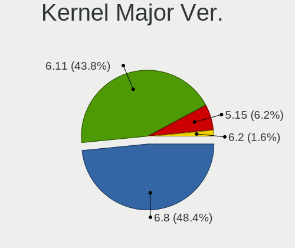
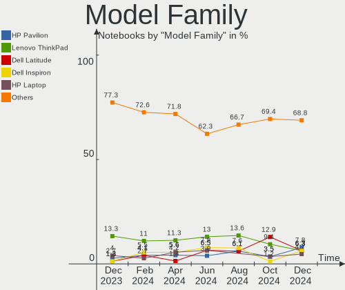
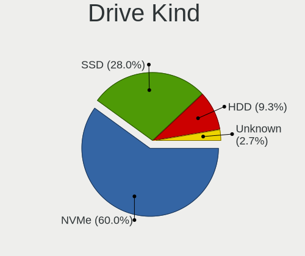
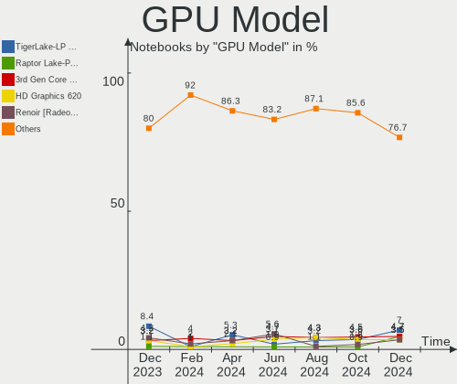
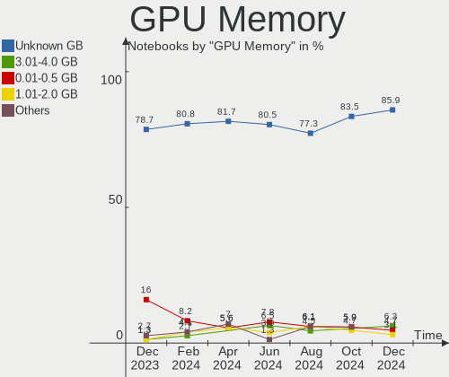
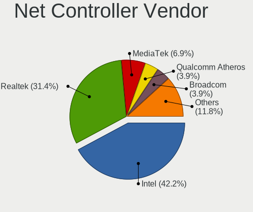
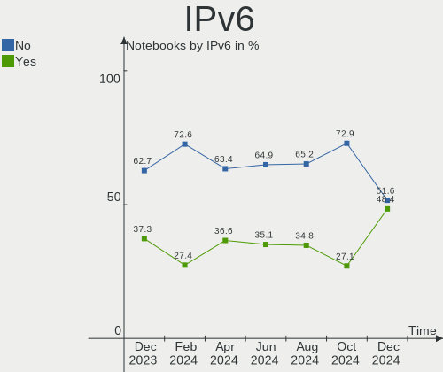

Kubuntu - Hardware Trends (Notebooks)
-------------------------------------

A project to identify most popular hardware characteristics and track their change
over time based on data collected by Linux users at https://Linux-Hardware.org.

Anyone can contribute to this report by the [hw-probe](https://github.com/linuxhw/hw-probe) tool:

    sudo -E hw-probe -all -upload

This report is for one last month. Overall report since the beginning of time: [TestDays](https://github.com/linuxhw/TestDays)

Period: Jul, 2023.

Contents
--------

* [ System ](#system)
  - [ OS                       ](#os)
  - [ OS Family                ](#os-family)
  - [ Kernel                   ](#kernel)
  - [ Kernel Family            ](#kernel-family)
  - [ Kernel Major Ver.        ](#kernel-major-ver)
  - [ Arch                     ](#arch)
  - [ DE                       ](#de)
  - [ Display Server           ](#display-server)
  - [ Display Manager          ](#display-manager)
  - [ OS Lang                  ](#os-lang)
  - [ Boot Mode                ](#boot-mode)
  - [ Filesystem               ](#filesystem)
  - [ Part. scheme             ](#part-scheme)
  - [ Dual Boot with Linux/BSD ](#dual-boot-with-linuxbsd)
  - [ Dual Boot (Win)          ](#dual-boot-win)

* [ Board ](#board)
  - [ Vendor                   ](#vendor)
  - [ Model                    ](#model)
  - [ Model Family             ](#model-family)
  - [ MFG Year                 ](#mfg-year)
  - [ Form Factor              ](#form-factor)
  - [ Secure Boot              ](#secure-boot)
  - [ Coreboot                 ](#coreboot)
  - [ RAM Size                 ](#ram-size)
  - [ RAM Used                 ](#ram-used)
  - [ Total Drives             ](#total-drives)
  - [ Has CD-ROM               ](#has-cd-rom)
  - [ Has Ethernet             ](#has-ethernet)
  - [ Has WiFi                 ](#has-wifi)
  - [ Has Bluetooth            ](#has-bluetooth)

* [ Location ](#location)
  - [ Country                  ](#country)
  - [ City                     ](#city)

* [ Drives ](#drives)
  - [ Drive Vendor             ](#drive-vendor)
  - [ Drive Model              ](#drive-model)
  - [ HDD Vendor               ](#hdd-vendor)
  - [ SSD Vendor               ](#ssd-vendor)
  - [ Drive Kind               ](#drive-kind)
  - [ Drive Connector          ](#drive-connector)
  - [ Drive Size               ](#drive-size)
  - [ Space Total              ](#space-total)
  - [ Space Used               ](#space-used)
  - [ Malfunc. Drives          ](#malfunc-drives)
  - [ Malfunc. Drive Vendor    ](#malfunc-drive-vendor)
  - [ Malfunc. HDD Vendor      ](#malfunc-hdd-vendor)
  - [ Malfunc. Drive Kind      ](#malfunc-drive-kind)
  - [ Failed Drives            ](#failed-drives)
  - [ Failed Drive Vendor      ](#failed-drive-vendor)
  - [ Drive Status             ](#drive-status)

* [ Storage controller ](#storage-controller)
  - [ Storage Vendor           ](#storage-vendor)
  - [ Storage Model            ](#storage-model)
  - [ Storage Kind             ](#storage-kind)

* [ Processor ](#processor)
  - [ CPU Vendor               ](#cpu-vendor)
  - [ CPU Model                ](#cpu-model)
  - [ CPU Model Family         ](#cpu-model-family)
  - [ CPU Cores                ](#cpu-cores)
  - [ CPU Sockets              ](#cpu-sockets)
  - [ CPU Threads              ](#cpu-threads)
  - [ CPU Op-Modes             ](#cpu-op-modes)
  - [ CPU Microcode            ](#cpu-microcode)
  - [ CPU Microarch            ](#cpu-microarch)

* [ Graphics ](#graphics)
  - [ GPU Vendor               ](#gpu-vendor)
  - [ GPU Model                ](#gpu-model)
  - [ GPU Combo                ](#gpu-combo)
  - [ GPU Driver               ](#gpu-driver)
  - [ GPU Memory               ](#gpu-memory)

* [ Monitor ](#monitor)
  - [ Monitor Vendor           ](#monitor-vendor)
  - [ Monitor Model            ](#monitor-model)
  - [ Monitor Resolution       ](#monitor-resolution)
  - [ Monitor Diagonal         ](#monitor-diagonal)
  - [ Monitor Width            ](#monitor-width)
  - [ Aspect Ratio             ](#aspect-ratio)
  - [ Monitor Area             ](#monitor-area)
  - [ Pixel Density            ](#pixel-density)
  - [ Multiple Monitors        ](#multiple-monitors)

* [ Network ](#network)
  - [ Net Controller Vendor    ](#net-controller-vendor)
  - [ Net Controller Model     ](#net-controller-model)
  - [ Wireless Vendor          ](#wireless-vendor)
  - [ Wireless Model           ](#wireless-model)
  - [ Ethernet Vendor          ](#ethernet-vendor)
  - [ Ethernet Model           ](#ethernet-model)
  - [ Net Controller Kind      ](#net-controller-kind)
  - [ Used Controller          ](#used-controller)
  - [ NICs                     ](#nics)
  - [ IPv6                     ](#ipv6)

* [ Bluetooth ](#bluetooth)
  - [ Bluetooth Vendor         ](#bluetooth-vendor)
  - [ Bluetooth Model          ](#bluetooth-model)

* [ Sound ](#sound)
  - [ Sound Vendor             ](#sound-vendor)
  - [ Sound Model              ](#sound-model)

* [ Memory ](#memory)
  - [ Memory Vendor            ](#memory-vendor)
  - [ Memory Model             ](#memory-model)
  - [ Memory Kind              ](#memory-kind)
  - [ Memory Form Factor       ](#memory-form-factor)
  - [ Memory Size              ](#memory-size)
  - [ Memory Speed             ](#memory-speed)

* [ Printers & scanners ](#printers--scanners)
  - [ Printer Vendor           ](#printer-vendor)
  - [ Printer Model            ](#printer-model)
  - [ Scanner Vendor           ](#scanner-vendor)
  - [ Scanner Model            ](#scanner-model)

* [ Camera ](#camera)
  - [ Camera Vendor            ](#camera-vendor)
  - [ Camera Model             ](#camera-model)

* [ Security ](#security)
  - [ Fingerprint Vendor       ](#fingerprint-vendor)
  - [ Fingerprint Model        ](#fingerprint-model)
  - [ Chipcard Vendor          ](#chipcard-vendor)
  - [ Chipcard Model           ](#chipcard-model)

* [ Unsupported ](#unsupported)
  - [ Unsupported Devices      ](#unsupported-devices)
  - [ Unsupported Device Types ](#unsupported-device-types)

System
------

OS
--

Installed operating systems

| Name          | Notebooks | Percent |
|---------------|-----------|---------|
| Kubuntu 22.04 | 27        | 48.21%  |
| Kubuntu 23.04 | 24        | 42.86%  |
| Kubuntu 20.04 | 2         | 3.57%   |
| Kubuntu 23.10 | 1         | 1.79%   |
| Kubuntu 22.10 | 1         | 1.79%   |
| Kubuntu 11    | 1         | 1.79%   |

OS Family
---------

OS without a version

| Name    | Notebooks | Percent |
|---------|-----------|---------|
| Kubuntu | 56        | 100%    |

Kernel
------

Version of the Linux kernel

| Version                | Notebooks | Percent |
|------------------------|-----------|---------|
| 5.19.0-46-generic      | 11        | 19.64%  |
| 6.2.0-24-generic       | 9         | 16.07%  |
| 5.19.0-50-generic      | 5         | 8.93%   |
| 5.15.0-76-generic      | 5         | 8.93%   |
| 6.2.0-25-generic       | 4         | 7.14%   |
| 6.2.0-20-generic       | 3         | 5.36%   |
| 6.4.0-060400-generic   | 2         | 3.57%   |
| 6.2.0-26-generic       | 2         | 3.57%   |
| 6.2.0-1007-lowlatency  | 2         | 3.57%   |
| 5.19.0-1028-lowlatency | 2         | 3.57%   |
| 6.3.9-windows-ubuntu   | 1         | 1.79%   |
| 6.3.7-060307-generic   | 1         | 1.79%   |
| 6.2.0-23-generic       | 1         | 1.79%   |
| 6.2.0-1008-lowlatency  | 1         | 1.79%   |
| 6.1.0-1014-oem         | 1         | 1.79%   |
| 6.0.9-060009-generic   | 1         | 1.79%   |
| 5.19.0-42-generic      | 1         | 1.79%   |
| 5.19.0-1017-lowlatency | 1         | 1.79%   |
| 5.15.0-78-generic      | 1         | 1.79%   |
| 5.15.0-72-generic      | 1         | 1.79%   |
| 5.15.0-56-generic      | 1         | 1.79%   |

Kernel Family
-------------

Linux kernel without a distro release

| Version | Notebooks | Percent |
|---------|-----------|---------|
| 6.2.0   | 22        | 39.29%  |
| 5.19.0  | 20        | 35.71%  |
| 5.15.0  | 8         | 14.29%  |
| 6.4.0   | 2         | 3.57%   |
| 6.3.9   | 1         | 1.79%   |
| 6.3.7   | 1         | 1.79%   |
| 6.1.0   | 1         | 1.79%   |
| 6.0.9   | 1         | 1.79%   |

Kernel Major Ver.
-----------------

Linux kernel major version

| Version | Notebooks | Percent |
|---------|-----------|---------|
| 6.2     | 22        | 39.29%  |
| 5.19    | 20        | 35.71%  |
| 5.15    | 8         | 14.29%  |
| 6.4     | 2         | 3.57%   |
| 6.3     | 2         | 3.57%   |
| 6.1     | 1         | 1.79%   |
| 6.0     | 1         | 1.79%   |

Arch
----

OS architecture (x86_64, i586, etc.)

| Name   | Notebooks | Percent |
|--------|-----------|---------|
| x86_64 | 56        | 100%    |

DE
--

Desktop Environment

| Name  | Notebooks | Percent |
|-------|-----------|---------|
| KDE5  | 54        | 96.43%  |
| KDE   | 1         | 1.79%   |
| GNOME | 1         | 1.79%   |

Display Server
--------------

X11 or Wayland

| Name    | Notebooks | Percent |
|---------|-----------|---------|
| X11     | 52        | 92.86%  |
| Wayland | 4         | 7.14%   |

Display Manager
---------------

SDDM, LightDM, etc.

| Name    | Notebooks | Percent |
|---------|-----------|---------|
| SDDM    | 37        | 66.07%  |
| Unknown | 17        | 30.36%  |
| GDM3    | 1         | 1.79%   |
| GDM     | 1         | 1.79%   |

OS Lang
-------

Language

| Lang    | Notebooks | Percent |
|---------|-----------|---------|
| en_US   | 27        | 48.21%  |
| de_DE   | 8         | 14.29%  |
| en_GB   | 4         | 7.14%   |
| pt_BR   | 2         | 3.57%   |
| pl_PL   | 2         | 3.57%   |
| C       | 2         | 3.57%   |
| nb_NO   | 1         | 1.79%   |
| it_IT   | 1         | 1.79%   |
| fi_FI   | 1         | 1.79%   |
| es_PE   | 1         | 1.79%   |
| es_ES   | 1         | 1.79%   |
| es_AR   | 1         | 1.79%   |
| en_ZA   | 1         | 1.79%   |
| en_NZ   | 1         | 1.79%   |
| en_IN   | 1         | 1.79%   |
| en_CA   | 1         | 1.79%   |
| Default | 1         | 1.79%   |

Boot Mode
---------

EFI or BIOS

| Mode | Notebooks | Percent |
|------|-----------|---------|
| BIOS | 28        | 50%     |
| EFI  | 28        | 50%     |

Filesystem
----------

Type of filesystem

| Type    | Notebooks | Percent |
|---------|-----------|---------|
| Ext4    | 41        | 73.21%  |
| Tmpfs   | 13        | 23.21%  |
| Zfs     | 1         | 1.79%   |
| Overlay | 1         | 1.79%   |

Part. scheme
------------

Scheme of partitioning

| Type    | Notebooks | Percent |
|---------|-----------|---------|
| GPT     | 36        | 64.29%  |
| Unknown | 17        | 30.36%  |
| MBR     | 3         | 5.36%   |

Dual Boot with Linux/BSD
------------------------

Hosting more than one Linux/BSD

| Dual boot | Notebooks | Percent |
|-----------|-----------|---------|
| No        | 54        | 96.43%  |
| Yes       | 2         | 3.57%   |

Dual Boot (Win)
---------------

Hosting Linux and Windows

| Dual boot | Notebooks | Percent |
|-----------|-----------|---------|
| No        | 44        | 78.57%  |
| Yes       | 12        | 21.43%  |

Board
-----

Vendor
------

Motherboard manufacturer

| Name             | Notebooks | Percent |
|------------------|-----------|---------|
| Hewlett-Packard  | 15        | 26.79%  |
| Lenovo           | 12        | 21.43%  |
| Dell             | 11        | 19.64%  |
| Acer             | 7         | 12.5%   |
| ASUSTek Computer | 6         | 10.71%  |
| Toshiba          | 1         | 1.79%   |
| Notebook         | 1         | 1.79%   |
| Fujitsu          | 1         | 1.79%   |
| Apple            | 1         | 1.79%   |
| Unknown          | 1         | 1.79%   |

Model
-----

Motherboard model

| Name                                               | Notebooks | Percent |
|----------------------------------------------------|-----------|---------|
| Lenovo IdeaPad 5 Pro 14ACN6 82L7                   | 2         | 3.57%   |
| Dell G3 3779                                       | 2         | 3.57%   |
| Toshiba Satellite L745                             | 1         | 1.79%   |
| Notebook PC5x_7xHP_HR_HS                           | 1         | 1.79%   |
| Lenovo Z50-75 80EC                                 | 1         | 1.79%   |
| Lenovo V145-15AST 81MT                             | 1         | 1.79%   |
| Lenovo ThinkPad X1 Carbon Gen 10 21CB0088RT        | 1         | 1.79%   |
| Lenovo ThinkPad T460 20FMS43Q00                    | 1         | 1.79%   |
| Lenovo ThinkPad T16 Gen 1 21BVCTO1WW               | 1         | 1.79%   |
| Lenovo ThinkPad E580 20KS003LLM                    | 1         | 1.79%   |
| Lenovo Legion Y540-15IRH 81SX                      | 1         | 1.79%   |
| Lenovo IdeaPad S145-15API 81V7                     | 1         | 1.79%   |
| Lenovo IdeaPad C340-14API 81N6                     | 1         | 1.79%   |
| Lenovo B560 43308UG                                | 1         | 1.79%   |
| HP ZBook Studio 15.6 inch G8 Mobile Workstation PC | 1         | 1.79%   |
| HP ZBook 17 G2                                     | 1         | 1.79%   |
| HP ProBook 650 G1                                  | 1         | 1.79%   |
| HP Presario CQ62                                   | 1         | 1.79%   |
| HP Pavilion 15                                     | 1         | 1.79%   |
| HP Notebook                                        | 1         | 1.79%   |
| HP Laptop 14s-dq2xxx                               | 1         | 1.79%   |
| HP G62                                             | 1         | 1.79%   |
| HP G60                                             | 1         | 1.79%   |
| HP ENVY TS 15                                      | 1         | 1.79%   |
| HP ENVY Notebook                                   | 1         | 1.79%   |
| HP EliteBook 8470p                                 | 1         | 1.79%   |
| HP EliteBook 845 G8 Notebook PC                    | 1         | 1.79%   |
| HP EliteBook 840 G5                                | 1         | 1.79%   |
| HP 240 G7 Notebook PC                              | 1         | 1.79%   |
| Fujitsu LIFEBOOK U757                              | 1         | 1.79%   |
| Dell Precision 3571                                | 1         | 1.79%   |
| Dell Latitude E6530                                | 1         | 1.79%   |
| Dell Latitude E5430 non-vPro                       | 1         | 1.79%   |
| Dell Latitude E5420                                | 1         | 1.79%   |
| Dell Latitude 7530                                 | 1         | 1.79%   |
| Dell Latitude 5511                                 | 1         | 1.79%   |
| Dell Latitude 5290 2-in-1                          | 1         | 1.79%   |
| Dell Inspiron 16 7610                              | 1         | 1.79%   |
| Dell Inspiron 15-3567                              | 1         | 1.79%   |
| ASUS VivoBook_ASUSLaptop X515EA_X515EA             | 1         | 1.79%   |

Model Family
------------

Motherboard model prefix

| Name              | Notebooks | Percent |
|-------------------|-----------|---------|
| Dell Latitude     | 6         | 10.71%  |
| Lenovo ThinkPad   | 4         | 7.14%   |
| Lenovo IdeaPad    | 4         | 7.14%   |
| HP EliteBook      | 3         | 5.36%   |
| ASUS VivoBook     | 3         | 5.36%   |
| Acer Aspire       | 3         | 5.36%   |
| HP ZBook          | 2         | 3.57%   |
| HP ENVY           | 2         | 3.57%   |
| Dell Inspiron     | 2         | 3.57%   |
| Dell G3           | 2         | 3.57%   |
| ASUS ASUS         | 2         | 3.57%   |
| Acer Predator     | 2         | 3.57%   |
| Toshiba Satellite | 1         | 1.79%   |
| Notebook PC5x     | 1         | 1.79%   |
| Lenovo Z50-75     | 1         | 1.79%   |
| Lenovo V145-15AST | 1         | 1.79%   |
| Lenovo Legion     | 1         | 1.79%   |
| Lenovo B560       | 1         | 1.79%   |
| HP ProBook        | 1         | 1.79%   |
| HP Presario       | 1         | 1.79%   |
| HP Pavilion       | 1         | 1.79%   |
| HP Notebook       | 1         | 1.79%   |
| HP Laptop         | 1         | 1.79%   |
| HP G62            | 1         | 1.79%   |
| HP G60            | 1         | 1.79%   |
| HP 240            | 1         | 1.79%   |
| Fujitsu LIFEBOOK  | 1         | 1.79%   |
| Dell Precision    | 1         | 1.79%   |
| ASUS Strix        | 1         | 1.79%   |
| Apple MacBookPro9 | 1         | 1.79%   |
| Acer Nitro        | 1         | 1.79%   |
| Acer ConceptD     | 1         | 1.79%   |
| Unknown           | 1         | 1.79%   |

MFG Year
--------

Motherboard manufacture year

| Year | Notebooks | Percent |
|------|-----------|---------|
| 2021 | 10        | 17.86%  |
| 2018 | 8         | 14.29%  |
| 2022 | 6         | 10.71%  |
| 2019 | 5         | 8.93%   |
| 2020 | 4         | 7.14%   |
| 2011 | 4         | 7.14%   |
| 2014 | 3         | 5.36%   |
| 2013 | 3         | 5.36%   |
| 2012 | 3         | 5.36%   |
| 2010 | 3         | 5.36%   |
| 2023 | 2         | 3.57%   |
| 2016 | 2         | 3.57%   |
| 2017 | 1         | 1.79%   |
| 2015 | 1         | 1.79%   |
| 2008 | 1         | 1.79%   |

Form Factor
-----------

Physical design of the computer

| Name     | Notebooks | Percent |
|----------|-----------|---------|
| Notebook | 56        | 100%    |

Secure Boot
-----------

Enabled or disabled

| State    | Notebooks | Percent |
|----------|-----------|---------|
| Disabled | 50        | 89.29%  |
| Enabled  | 6         | 10.71%  |

Coreboot
--------

Have coreboot on board

| Used | Notebooks | Percent |
|------|-----------|---------|
| No   | 56        | 100%    |

RAM Size
--------

Total RAM memory

| Size in GB | Notebooks | Percent |
|------------|-----------|---------|
| 4.01-8.0   | 16        | 28.57%  |
| 32.01-64.0 | 12        | 21.43%  |
| 16.01-24.0 | 12        | 21.43%  |
| 3.01-4.0   | 7         | 12.5%   |
| 8.01-16.0  | 6         | 10.71%  |
| 1.01-2.0   | 2         | 3.57%   |
| 24.01-32.0 | 1         | 1.79%   |

RAM Used
--------

Used RAM memory

| Used GB    | Notebooks | Percent |
|------------|-----------|---------|
| 4.01-8.0   | 17        | 30.36%  |
| 2.01-3.0   | 12        | 21.43%  |
| 1.01-2.0   | 11        | 19.64%  |
| 3.01-4.0   | 7         | 12.5%   |
| 8.01-16.0  | 7         | 12.5%   |
| 16.01-24.0 | 1         | 1.79%   |
| 0.51-1.0   | 1         | 1.79%   |

Total Drives
------------

Number of drives on board

| Drives | Notebooks | Percent |
|--------|-----------|---------|
| 1      | 36        | 64.29%  |
| 2      | 20        | 35.71%  |

Has CD-ROM
----------

Has CD-ROM on board

| Presented | Notebooks | Percent |
|-----------|-----------|---------|
| No        | 43        | 76.79%  |
| Yes       | 13        | 23.21%  |

Has Ethernet
------------

Has Ethernet on board

| Presented | Notebooks | Percent |
|-----------|-----------|---------|
| Yes       | 47        | 83.93%  |
| No        | 9         | 16.07%  |

Has WiFi
--------

Has WiFi module

| Presented | Notebooks | Percent |
|-----------|-----------|---------|
| Yes       | 54        | 96.43%  |
| No        | 2         | 3.57%   |

Has Bluetooth
-------------

Has Bluetooth module

| Presented | Notebooks | Percent |
|-----------|-----------|---------|
| Yes       | 47        | 83.93%  |
| No        | 9         | 16.07%  |

Location
--------

Country
-------

Geographic location (country)

| Country      | Notebooks | Percent |
|--------------|-----------|---------|
| Germany      | 11        | 19.64%  |
| USA          | 7         | 12.5%   |
| UK           | 4         | 7.14%   |
| Brazil       | 3         | 5.36%   |
| Turkey       | 2         | 3.57%   |
| Serbia       | 2         | 3.57%   |
| Peru         | 2         | 3.57%   |
| Mexico       | 2         | 3.57%   |
| Finland      | 2         | 3.57%   |
| Canada       | 2         | 3.57%   |
| Spain        | 1         | 1.79%   |
| South Africa | 1         | 1.79%   |
| Slovakia     | 1         | 1.79%   |
| Russia       | 1         | 1.79%   |
| Pakistan     | 1         | 1.79%   |
| Norway       | 1         | 1.79%   |
| New Zealand  | 1         | 1.79%   |
| Netherlands  | 1         | 1.79%   |
| Libya        | 1         | 1.79%   |
| Latvia       | 1         | 1.79%   |
| Kazakhstan   | 1         | 1.79%   |
| Ivory Coast  | 1         | 1.79%   |
| Italy        | 1         | 1.79%   |
| India        | 1         | 1.79%   |
| Hungary      | 1         | 1.79%   |
| Czechia      | 1         | 1.79%   |
| Costa Rica   | 1         | 1.79%   |
| Bulgaria     | 1         | 1.79%   |
| Argentina    | 1         | 1.79%   |

City
----

Geographic location (city)

| City            | Notebooks | Percent |
|-----------------|-----------|---------|
| Vancouver       | 2         | 3.57%   |
| Istanbul        | 2         | 3.57%   |
| Helsinki        | 2         | 3.57%   |
| Hamburg         | 2         | 3.57%   |
| Berlin          | 2         | 3.57%   |
| Belgrade        | 2         | 3.57%   |
| Weston          | 1         | 1.79%   |
| Ware            | 1         | 1.79%   |
| Varna           | 1         | 1.79%   |
| Trujillo        | 1         | 1.79%   |
| Tripoli         | 1         | 1.79%   |
| Tatabánya      | 1         | 1.79%   |
| St Petersburg   | 1         | 1.79%   |
| Salzgitter      | 1         | 1.79%   |
| Salt Lake City  | 1         | 1.79%   |
| Riga            | 1         | 1.79%   |
| Regensburg      | 1         | 1.79%   |
| Pretoria        | 1         | 1.79%   |
| Prešov         | 1         | 1.79%   |
| Prague          | 1         | 1.79%   |
| Pforzheim       | 1         | 1.79%   |
| Pavlodar        | 1         | 1.79%   |
| Oaxaca City     | 1         | 1.79%   |
| Morelia         | 1         | 1.79%   |
| Martins Ferry   | 1         | 1.79%   |
| Langevag        | 1         | 1.79%   |
| Koblenz         | 1         | 1.79%   |
| Karachi         | 1         | 1.79%   |
| Islington       | 1         | 1.79%   |
| Isidro Casanova | 1         | 1.79%   |
| Houston         | 1         | 1.79%   |
| Highlands Ranch | 1         | 1.79%   |
| Hanover         | 1         | 1.79%   |
| Hamm            | 1         | 1.79%   |
| Glasgow         | 1         | 1.79%   |
| Forchheim       | 1         | 1.79%   |
| Edinburgh       | 1         | 1.79%   |
| Corumbá        | 1         | 1.79%   |
| Christchurch    | 1         | 1.79%   |
| Chiclayo        | 1         | 1.79%   |

Drives
------

Drive Vendor
------------

Hard drive vendors

| Vendor                      | Notebooks | Drives | Percent |
|-----------------------------|-----------|--------|---------|
| Samsung Electronics         | 13        | 14     | 17.81%  |
| WDC                         | 8         | 8      | 10.96%  |
| Kingston                    | 7         | 7      | 9.59%   |
| Seagate                     | 6         | 6      | 8.22%   |
| Micron Technology           | 6         | 6      | 8.22%   |
| Toshiba                     | 4         | 4      | 5.48%   |
| Intel                       | 4         | 4      | 5.48%   |
| Crucial                     | 4         | 4      | 5.48%   |
| SK hynix                    | 3         | 3      | 4.11%   |
| KIOXIA                      | 2         | 2      | 2.74%   |
| Kingston Technology Company | 2         | 2      | 2.74%   |
| Unknown                     | 1         | 1      | 1.37%   |
| Team                        | 1         | 1      | 1.37%   |
| SPCC                        | 1         | 1      | 1.37%   |
| Silicon Motion              | 1         | 1      | 1.37%   |
| Sandisk                     | 1         | 1      | 1.37%   |
| Patriot                     | 1         | 1      | 1.37%   |
| Lexar                       | 1         | 1      | 1.37%   |
| KingFast                    | 1         | 1      | 1.37%   |
| Intenso                     | 1         | 2      | 1.37%   |
| Hitachi                     | 1         | 1      | 1.37%   |
| FURY                        | 1         | 2      | 1.37%   |
| China                       | 1         | 1      | 1.37%   |
| BAITITON                    | 1         | 1      | 1.37%   |
| A-DATA Technology           | 1         | 1      | 1.37%   |

Drive Model
-----------

Hard drive models

| Model                                               | Notebooks | Percent |
|-----------------------------------------------------|-----------|---------|
| Samsung NVMe SSD Controller SM981/PM981/PM983 500GB | 2         | 2.67%   |
| Samsung MZVL21T0HCLR-00BL7 1TB                      | 2         | 2.67%   |
| Kingston Company SNV2S1000G 1TB                     | 2         | 2.67%   |
| Kingston SA400S37480G 480GB SSD                     | 2         | 2.67%   |
| WDC WDS240G2G0B-00EPW0 240GB SSD                    | 1         | 1.33%   |
| WDC WDS100T2B0A-00SM50 1TB SSD                      | 1         | 1.33%   |
| WDC WD2500BEKT-60V5T1 250GB                         | 1         | 1.33%   |
| WDC WD2500BEKT-60PVMT0 250GB                        | 1         | 1.33%   |
| WDC WD10JPCX-24UE4T0 1TB                            | 1         | 1.33%   |
| WDC PC SN730 SDBPNTY-512G-1101 512GB                | 1         | 1.33%   |
| WDC PC SN720 SDAPNTW-512G-1014 512GB                | 1         | 1.33%   |
| WDC PC SN530 SDBPNPZ-256G-1114 256GB                | 1         | 1.33%   |
| Unknown MMC Card  128GB                             | 1         | 1.33%   |
| Toshiba XG6 NVMe SSD Controller 512GB               | 1         | 1.33%   |
| Toshiba XG4 NVMe SSD Controller 256GB               | 1         | 1.33%   |
| Toshiba MQ04ABF100 1TB                              | 1         | 1.33%   |
| Toshiba MQ01ABD100 1TB                              | 1         | 1.33%   |
| Team L3 EVO SSD 120GB                               | 1         | 1.33%   |
| SPCC Solid State Disk 256GB                         | 1         | 1.33%   |
| SK hynix SC311 SATA 256GB SSD                       | 1         | 1.33%   |
| SK hynix PC601 SED NVMe 512GB                       | 1         | 1.33%   |
| SK hynix BC511 512GB                                | 1         | 1.33%   |
| Silicon Motion ERYING NVME 3.0 512GB                | 1         | 1.33%   |
| Seagate ST9750420AS 752GB                           | 1         | 1.33%   |
| Seagate ST500LM021-1KJ152 500GB                     | 1         | 1.33%   |
| Seagate ST2000LM007-1R8174 2TB                      | 1         | 1.33%   |
| Seagate ST1000LM035-1RK172 1TB                      | 1         | 1.33%   |
| Seagate BUP Slim BK 2TB                             | 1         | 1.33%   |
| Seagate Backup+ Hub BK 8TB                          | 1         | 1.33%   |
| Sandisk WD Black SN750 / PC SN730 NVMe SSD 1024GB   | 1         | 1.33%   |
| Samsung SSD 870 EVO 2TB                             | 1         | 1.33%   |
| Samsung SSD 840 Series 250GB                        | 1         | 1.33%   |
| Samsung PM991a NVMe 256GB                           | 1         | 1.33%   |
| Samsung NVMe SSD Controller PM9A1/PM9A3/980PRO 1TB  | 1         | 1.33%   |
| Samsung MZVLQ256HAJD-000H1 256GB                    | 1         | 1.33%   |
| Samsung MZVLB512HAJQ-000H1 512GB                    | 1         | 1.33%   |
| Samsung MZVLB256HBHQ-000L2 256GB                    | 1         | 1.33%   |
| Samsung MZALQ256HAJD-000L2 256GB                    | 1         | 1.33%   |
| Samsung MZ7TY256HDHP-000L7 256GB SSD                | 1         | 1.33%   |
| Samsung MZ7LN256HAJQ-000L2 256GB SSD                | 1         | 1.33%   |

HDD Vendor
----------

Hard disk drive vendors

| Vendor  | Notebooks | Drives | Percent |
|---------|-----------|--------|---------|
| Seagate | 6         | 6      | 50%     |
| WDC     | 3         | 3      | 25%     |
| Toshiba | 2         | 2      | 16.67%  |
| Hitachi | 1         | 1      | 8.33%   |

SSD Vendor
----------

Solid state drive vendors

| Vendor              | Notebooks | Drives | Percent |
|---------------------|-----------|--------|---------|
| Kingston            | 5         | 5      | 19.23%  |
| Samsung Electronics | 4         | 4      | 15.38%  |
| Crucial             | 4         | 4      | 15.38%  |
| WDC                 | 2         | 2      | 7.69%   |
| Team                | 1         | 1      | 3.85%   |
| SPCC                | 1         | 1      | 3.85%   |
| SK hynix            | 1         | 1      | 3.85%   |
| Patriot             | 1         | 1      | 3.85%   |
| Micron Technology   | 1         | 1      | 3.85%   |
| Lexar               | 1         | 1      | 3.85%   |
| Intenso             | 1         | 2      | 3.85%   |
| FURY                | 1         | 1      | 3.85%   |
| China               | 1         | 1      | 3.85%   |
| BAITITON            | 1         | 1      | 3.85%   |
| A-DATA Technology   | 1         | 1      | 3.85%   |

Drive Kind
----------

HDD or SSD

| Kind    | Notebooks | Drives | Percent |
|---------|-----------|--------|---------|
| NVMe    | 30        | 34     | 42.25%  |
| SSD     | 26        | 27     | 36.62%  |
| HDD     | 12        | 12     | 16.9%   |
| Unknown | 2         | 2      | 2.82%   |
| MMC     | 1         | 1      | 1.41%   |

Drive Connector
---------------

SATA, SAS, NVMe, etc.

| Type | Notebooks | Drives | Percent |
|------|-----------|--------|---------|
| SATA | 32        | 38     | 48.48%  |
| NVMe | 30        | 34     | 45.45%  |
| SAS  | 3         | 3      | 4.55%   |
| MMC  | 1         | 1      | 1.52%   |

Drive Size
----------

Size of hard drive

| Size in TB | Notebooks | Drives | Percent |
|------------|-----------|--------|---------|
| 0.01-0.5   | 24        | 24     | 63.16%  |
| 0.51-1.0   | 8         | 8      | 21.05%  |
| 1.01-2.0   | 5         | 6      | 13.16%  |
| 4.01-10.0  | 1         | 1      | 2.63%   |

Space Total
-----------

Amount of disk space available on the file system

| Size in GB     | Notebooks | Percent |
|----------------|-----------|---------|
| 101-250        | 17        | 30.36%  |
| 251-500        | 16        | 28.57%  |
| 501-1000       | 10        | 17.86%  |
| 1001-2000      | 7         | 12.5%   |
| More than 3000 | 2         | 3.57%   |
| 1-20           | 2         | 3.57%   |
| 2001-3000      | 1         | 1.79%   |
| 51-100         | 1         | 1.79%   |

Space Used
----------

Amount of used disk space

| Used GB        | Notebooks | Percent |
|----------------|-----------|---------|
| 101-250        | 16        | 28.57%  |
| 21-50          | 12        | 21.43%  |
| 1-20           | 10        | 17.86%  |
| 251-500        | 6         | 10.71%  |
| 501-1000       | 6         | 10.71%  |
| 51-100         | 3         | 5.36%   |
| 2001-3000      | 2         | 3.57%   |
| More than 3000 | 1         | 1.79%   |

Malfunc. Drives
---------------

Drive models with a malfunction

| Model                 | Notebooks | Drives | Percent |
|-----------------------|-----------|--------|---------|
| Team L3 EVO SSD 120GB | 1         | 1      | 100%    |

Malfunc. Drive Vendor
---------------------

Vendors of faulty drives

| Vendor | Notebooks | Drives | Percent |
|--------|-----------|--------|---------|
| Team   | 1         | 1      | 100%    |

Malfunc. HDD Vendor
-------------------

Vendors of faulty HDD drives

Zero info for selected period =(

Malfunc. Drive Kind
-------------------

Kinds of faulty drives

| Kind | Notebooks | Drives | Percent |
|------|-----------|--------|---------|
| SSD  | 1         | 1      | 100%    |

Failed Drives
-------------

Failed drive models

Zero info for selected period =(

Failed Drive Vendor
-------------------

Failed drive vendors

Zero info for selected period =(

Drive Status
------------

Number of failed and malfunc. drives

| Status   | Notebooks | Drives | Percent |
|----------|-----------|--------|---------|
| Detected | 33        | 46     | 55%     |
| Works    | 26        | 29     | 43.33%  |
| Malfunc  | 1         | 1      | 1.67%   |

Storage controller
------------------

Storage Vendor
--------------

Storage controller vendors

| Vendor                       | Notebooks | Percent |
|------------------------------|-----------|---------|
| Intel                        | 42        | 54.55%  |
| Samsung Electronics          | 9         | 11.69%  |
| AMD                          | 6         | 7.79%   |
| Micron Technology            | 5         | 6.49%   |
| Kingston Technology Company  | 4         | 5.19%   |
| SanDisk                      | 3         | 3.9%    |
| Toshiba America Info Systems | 2         | 2.6%    |
| SK hynix                     | 2         | 2.6%    |
| KIOXIA                       | 2         | 2.6%    |
| Silicon Motion               | 1         | 1.3%    |
| Nvidia                       | 1         | 1.3%    |

Storage Model
-------------

Storage controller models

| Model                                                                          | Notebooks | Percent |
|--------------------------------------------------------------------------------|-----------|---------|
| Intel Volume Management Device NVMe RAID Controller                            | 8         | 9.64%   |
| Intel Sunrise Point-LP SATA Controller [AHCI mode]                             | 6         | 7.23%   |
| Intel 82801 Mobile SATA Controller [RAID mode]                                 | 5         | 6.02%   |
| AMD FCH SATA Controller [AHCI mode]                                            | 5         | 6.02%   |
| Samsung NVMe SSD Controller SM981/PM981/PM983                                  | 4         | 4.82%   |
| Samsung NVMe SSD Controller 980                                                | 3         | 3.61%   |
| Micron 2210 NVMe SSD [Cobain]                                                  | 3         | 3.61%   |
| Intel SSD 660P Series                                                          | 3         | 3.61%   |
| Intel Alder Lake-P SATA AHCI Controller                                        | 3         | 3.61%   |
| Intel 8 Series/C220 Series Chipset Family 6-port SATA Controller 1 [AHCI mode] | 3         | 3.61%   |
| Intel 7 Series Chipset Family 6-port SATA Controller [AHCI mode]               | 3         | 3.61%   |
| Intel 400 Series Chipset Family SATA AHCI Controller                           | 3         | 3.61%   |
| Samsung NVMe SSD Controller PM9A1/PM9A3/980PRO                                 | 2         | 2.41%   |
| Kingston Company Company Non-Volatile memory controller                        | 2         | 2.41%   |
| Intel Wildcat Point-LP SATA Controller [AHCI Mode]                             | 2         | 2.41%   |
| Intel Tiger Lake-LP SATA Controller                                            | 2         | 2.41%   |
| Intel Cannon Lake Mobile PCH SATA AHCI Controller                              | 2         | 2.41%   |
| Intel 6 Series/C200 Series Chipset Family 6 port Mobile SATA AHCI Controller   | 2         | 2.41%   |
| Intel 5 Series/3400 Series Chipset 4 port SATA AHCI Controller                 | 2         | 2.41%   |
| Toshiba America Info Systems XG6 NVMe SSD Controller                           | 1         | 1.2%    |
| Toshiba America Info Systems XG4 NVMe SSD Controller                           | 1         | 1.2%    |
| SK hynix PC601 NVMe Solid State Drive                                          | 1         | 1.2%    |
| SK hynix BC511 NVMe SSD                                                        | 1         | 1.2%    |
| Silicon Motion SM2263EN/SM2263XT (DRAM-less) NVMe SSD Controllers              | 1         | 1.2%    |
| SanDisk WD Blue SN550 NVMe SSD                                                 | 1         | 1.2%    |
| SanDisk WD Black SN750 / PC SN730 NVMe SSD                                     | 1         | 1.2%    |
| SanDisk WD Black 2018/SN750 / PC SN720 NVMe SSD                                | 1         | 1.2%    |
| Nvidia MCP78S [GeForce 8200] SATA Controller (non-AHCI mode)                   | 1         | 1.2%    |
| Nvidia MCP78S [GeForce 8200] IDE                                               | 1         | 1.2%    |
| Micron 3400 NVMe SSD [Hendrix]                                                 | 1         | 1.2%    |
| Micron 2400 NVMe SSD (DRAM-less)                                               | 1         | 1.2%    |
| KIOXIA NVMe SSD Controller XG7                                                 | 1         | 1.2%    |
| KIOXIA NVMe SSD Controller BG4 (DRAM-less)                                     | 1         | 1.2%    |
| Kingston Company NVMe Controller                                               | 1         | 1.2%    |
| Kingston Company NV1 NVMe SSD                                                  | 1         | 1.2%    |
| Intel SSD 670p Series [Keystone Harbor]                                        | 1         | 1.2%    |
| Intel HM170/QM170 Chipset SATA Controller [AHCI Mode]                          | 1         | 1.2%    |
| Intel Celeron/Pentium Silver Processor SATA Controller                         | 1         | 1.2%    |
| AMD SB7x0/SB8x0/SB9x0 SATA Controller [AHCI mode]                              | 1         | 1.2%    |

Storage Kind
------------

Kind of storage controller (IDE, SATA, NVMe, SAS, ...)

| Kind | Notebooks | Percent |
|------|-----------|---------|
| SATA | 36        | 45%     |
| NVMe | 30        | 37.5%   |
| RAID | 13        | 16.25%  |
| IDE  | 1         | 1.25%   |

Processor
---------

CPU Vendor
----------

Processor vendors

| Vendor | Notebooks | Percent |
|--------|-----------|---------|
| Intel  | 44        | 78.57%  |
| AMD    | 12        | 21.43%  |

CPU Model
---------

Processor models

| Model                                   | Notebooks | Percent |
|-----------------------------------------|-----------|---------|
| Intel Core i5-8350U CPU @ 1.70GHz       | 2         | 3.57%   |
| Intel Core i5-8300H CPU @ 2.30GHz       | 2         | 3.57%   |
| Intel Core i5-7200U CPU @ 2.50GHz       | 2         | 3.57%   |
| Intel Core i5-3210M CPU @ 2.50GHz       | 2         | 3.57%   |
| Intel Core i5-10300H CPU @ 2.50GHz      | 2         | 3.57%   |
| Intel 12th Gen Core i7-1270P            | 2         | 3.57%   |
| Intel 11th Gen Core i7-11800H @ 2.30GHz | 2         | 3.57%   |
| Intel Pentium CPU P6100 @ 2.00GHz       | 1         | 1.79%   |
| Intel Core i7-9750H CPU @ 2.60GHz       | 1         | 1.79%   |
| Intel Core i7-8750H CPU @ 2.20GHz       | 1         | 1.79%   |
| Intel Core i7-8550U CPU @ 1.80GHz       | 1         | 1.79%   |
| Intel Core i7-7700HQ CPU @ 2.80GHz      | 1         | 1.79%   |
| Intel Core i7-4800MQ CPU @ 2.70GHz      | 1         | 1.79%   |
| Intel Core i7-4702MQ CPU @ 2.20GHz      | 1         | 1.79%   |
| Intel Core i7-3720QM CPU @ 2.60GHz      | 1         | 1.79%   |
| Intel Core i7-3632QM CPU @ 2.20GHz      | 1         | 1.79%   |
| Intel Core i7-10850H CPU @ 2.70GHz      | 1         | 1.79%   |
| Intel Core i5-9300H CPU @ 2.40GHz       | 1         | 1.79%   |
| Intel Core i5-8265U CPU @ 1.60GHz       | 1         | 1.79%   |
| Intel Core i5-6300U CPU @ 2.40GHz       | 1         | 1.79%   |
| Intel Core i5-6200U CPU @ 2.30GHz       | 1         | 1.79%   |
| Intel Core i5-5200U CPU @ 2.20GHz       | 1         | 1.79%   |
| Intel Core i5-2520M CPU @ 2.50GHz       | 1         | 1.79%   |
| Intel Core i3-4000M CPU @ 2.40GHz       | 1         | 1.79%   |
| Intel Core i3-3110M CPU @ 2.40GHz       | 1         | 1.79%   |
| Intel Core i3-2350M CPU @ 2.30GHz       | 1         | 1.79%   |
| Intel Core i3 CPU M 350 @ 2.27GHz       | 1         | 1.79%   |
| Intel Celeron N4020 CPU @ 1.10GHz       | 1         | 1.79%   |
| Intel Celeron 3205U @ 1.50GHz           | 1         | 1.79%   |
| Intel 12th Gen Core i9-12900H           | 1         | 1.79%   |
| Intel 12th Gen Core i7-12800H           | 1         | 1.79%   |
| Intel 12th Gen Core i7-1260P            | 1         | 1.79%   |
| Intel 12th Gen Core i5-1250P            | 1         | 1.79%   |
| Intel 11th Gen Core i7-11850H @ 2.50GHz | 1         | 1.79%   |
| Intel 11th Gen Core i7-1165G7 @ 2.80GHz | 1         | 1.79%   |
| Intel 11th Gen Core i5-1135G7 @ 2.40GHz | 1         | 1.79%   |
| Intel 11th Gen Core i3-1115G4 @ 3.00GHz | 1         | 1.79%   |
| AMD Sempron SI-42                       | 1         | 1.79%   |
| AMD Ryzen 7 5800U with Radeon Graphics  | 1         | 1.79%   |
| AMD Ryzen 7 5800HS with Radeon Graphics | 1         | 1.79%   |

CPU Model Family
----------------

Processor model prefix

| Model           | Notebooks | Percent |
|-----------------|-----------|---------|
| Intel Core i5   | 16        | 28.57%  |
| Other           | 12        | 21.43%  |
| Intel Core i7   | 9         | 16.07%  |
| Intel Core i3   | 4         | 7.14%   |
| AMD Ryzen 7     | 3         | 5.36%   |
| Intel Celeron   | 2         | 3.57%   |
| AMD Ryzen 5     | 2         | 3.57%   |
| AMD A6          | 2         | 3.57%   |
| Intel Pentium   | 1         | 1.79%   |
| AMD Sempron     | 1         | 1.79%   |
| AMD Ryzen 5 PRO | 1         | 1.79%   |
| AMD Ryzen 3     | 1         | 1.79%   |
| AMD FX          | 1         | 1.79%   |
| AMD Athlon II   | 1         | 1.79%   |

CPU Cores
---------

Number of processor cores

| Number | Notebooks | Percent |
|--------|-----------|---------|
| 4      | 20        | 35.71%  |
| 2      | 18        | 32.14%  |
| 8      | 5         | 8.93%   |
| 6      | 5         | 8.93%   |
| 12     | 4         | 7.14%   |
| 14     | 2         | 3.57%   |
| 1      | 2         | 3.57%   |

CPU Sockets
-----------

Number of sockets

| Number | Notebooks | Percent |
|--------|-----------|---------|
| 1      | 56        | 100%    |

CPU Threads
-----------

Threads per core (Hyper-Threading)

| Number | Notebooks | Percent |
|--------|-----------|---------|
| 2      | 48        | 85.71%  |
| 1      | 8         | 14.29%  |

CPU Op-Modes
------------

CPU Operation Modes (32-bit, 64-bit)

| Op mode        | Notebooks | Percent |
|----------------|-----------|---------|
| 32-bit, 64-bit | 56        | 100%    |

CPU Microcode
-------------

Microcode number

| Number     | Notebooks | Percent |
|------------|-----------|---------|
| Unknown    | 37        | 66.07%  |
| 0x906a3    | 5         | 8.93%   |
| 0x806ea    | 2         | 3.57%   |
| 0x0a50000c | 2         | 3.57%   |
| 0x906ea    | 1         | 1.79%   |
| 0x806d1    | 1         | 1.79%   |
| 0x706a8    | 1         | 1.79%   |
| 0x406e3    | 1         | 1.79%   |
| 0x306a9    | 1         | 1.79%   |
| 0x0a50000d | 1         | 1.79%   |
| 0x08608102 | 1         | 1.79%   |
| 0x08108102 | 1         | 1.79%   |
| 0x06006705 | 1         | 1.79%   |
| 0x03000027 | 1         | 1.79%   |

CPU Microarch
-------------

Microarchitecture

| Name             | Notebooks | Percent |
|------------------|-----------|---------|
| KabyLake         | 12        | 21.43%  |
| Alderlake Hybrid | 6         | 10.71%  |
| IvyBridge        | 5         | 8.93%   |
| Zen 3            | 4         | 7.14%   |
| TigerLake        | 3         | 5.36%   |
| Haswell          | 3         | 5.36%   |
| CometLake        | 3         | 5.36%   |
| Zen+             | 2         | 3.57%   |
| Westmere         | 2         | 3.57%   |
| Skylake          | 2         | 3.57%   |
| SandyBridge      | 2         | 3.57%   |
| Icelake          | 2         | 3.57%   |
| Broadwell        | 2         | 3.57%   |
| Unknown          | 2         | 3.57%   |
| Steamroller      | 1         | 1.79%   |
| K8 & K10 hybrid  | 1         | 1.79%   |
| K10 Llano        | 1         | 1.79%   |
| K10              | 1         | 1.79%   |
| Goldmont plus    | 1         | 1.79%   |
| Excavator        | 1         | 1.79%   |

Graphics
--------

GPU Vendor
----------

Vendors of graphics cards

| Vendor | Notebooks | Percent |
|--------|-----------|---------|
| Intel  | 44        | 58.67%  |
| Nvidia | 18        | 24%     |
| AMD    | 13        | 17.33%  |

GPU Model
---------

Graphics card models

| Model                                                                         | Notebooks | Percent |
|-------------------------------------------------------------------------------|-----------|---------|
| Intel Alder Lake-P Integrated Graphics Controller                             | 6         | 8%      |
| Intel CoffeeLake-H GT2 [UHD Graphics 630]                                     | 5         | 6.67%   |
| Intel 3rd Gen Core processor Graphics Controller                              | 5         | 6.67%   |
| AMD Cezanne [Radeon Vega Series / Radeon Vega Mobile Series]                  | 4         | 5.33%   |
| Intel UHD Graphics 620                                                        | 3         | 4%      |
| Intel TigerLake-H GT1 [UHD Graphics]                                          | 3         | 4%      |
| Intel CometLake-H GT2 [UHD Graphics]                                          | 3         | 4%      |
| Intel 4th Gen Core Processor Integrated Graphics Controller                   | 3         | 4%      |
| Intel TigerLake-LP GT2 [Iris Xe Graphics]                                     | 2         | 2.67%   |
| Intel Skylake GT2 [HD Graphics 520]                                           | 2         | 2.67%   |
| Intel HD Graphics 620                                                         | 2         | 2.67%   |
| Intel Core Processor Integrated Graphics Controller                           | 2         | 2.67%   |
| Intel 2nd Generation Core Processor Family Integrated Graphics Controller     | 2         | 2.67%   |
| AMD Sun XT [Radeon HD 8670A/8670M/8690M / R5 M330 / M430 / Radeon 520 Mobile] | 2         | 2.67%   |
| AMD Picasso/Raven 2 [Radeon Vega Series / Radeon Vega Mobile Series]          | 2         | 2.67%   |
| Nvidia TU117M [GeForce MX450]                                                 | 1         | 1.33%   |
| Nvidia TU117M [GeForce GTX 1650 Ti Mobile]                                    | 1         | 1.33%   |
| Nvidia TU117M                                                                 | 1         | 1.33%   |
| Nvidia TU116M [GeForce GTX 1660 Ti Mobile]                                    | 1         | 1.33%   |
| Nvidia TU106M [GeForce RTX 2070 Mobile]                                       | 1         | 1.33%   |
| Nvidia TU106M [GeForce RTX 2060 Mobile]                                       | 1         | 1.33%   |
| Nvidia GP107M [GeForce MX150]                                                 | 1         | 1.33%   |
| Nvidia GP107M [GeForce GTX 1050 Ti Mobile]                                    | 1         | 1.33%   |
| Nvidia GP107M [GeForce GTX 1050 Mobile]                                       | 1         | 1.33%   |
| Nvidia GP106M [GeForce GTX 1060 Mobile]                                       | 1         | 1.33%   |
| Nvidia GK107M [GeForce GT 750M]                                               | 1         | 1.33%   |
| Nvidia GK104GLM [Quadro K3100M]                                               | 1         | 1.33%   |
| Nvidia GF108GLM [NVS 5200M]                                                   | 1         | 1.33%   |
| Nvidia GA107GLM [RTX A2000 Mobile]                                            | 1         | 1.33%   |
| Nvidia GA107GLM [RTX A1000 Laptop GPU]                                        | 1         | 1.33%   |
| Nvidia GA104M [GeForce RTX 3070 Mobile / Max-Q]                               | 1         | 1.33%   |
| Nvidia GA103M [GeForce RTX 3080 Ti Laptop GPU]                                | 1         | 1.33%   |
| Nvidia C77 [GeForce 8200M G]                                                  | 1         | 1.33%   |
| Intel WhiskeyLake-U GT2 [UHD Graphics 620]                                    | 1         | 1.33%   |
| Intel Tiger Lake-LP GT2 [UHD Graphics G4]                                     | 1         | 1.33%   |
| Intel HD Graphics 630                                                         | 1         | 1.33%   |
| Intel HD Graphics 5500                                                        | 1         | 1.33%   |
| Intel HD Graphics                                                             | 1         | 1.33%   |
| Intel GeminiLake [UHD Graphics 600]                                           | 1         | 1.33%   |
| AMD Sumo [Radeon HD 6520G]                                                    | 1         | 1.33%   |

GPU Combo
---------

Combinations of graphics cards

| Name           | Notebooks | Percent |
|----------------|-----------|---------|
| 1 x Intel      | 26        | 46.43%  |
| Intel + Nvidia | 16        | 28.57%  |
| 1 x AMD        | 10        | 17.86%  |
| Intel + AMD    | 2         | 3.57%   |
| 1 x Nvidia     | 1         | 1.79%   |
| AMD + Nvidia   | 1         | 1.79%   |

GPU Driver
----------

Free vs proprietary

| Driver      | Notebooks | Percent |
|-------------|-----------|---------|
| Free        | 46        | 82.14%  |
| Proprietary | 10        | 17.86%  |

GPU Memory
----------

Total video memory

| Size in GB | Notebooks | Percent |
|------------|-----------|---------|
| Unknown    | 46        | 82.14%  |
| 0.01-0.5   | 5         | 8.93%   |
| 3.01-4.0   | 2         | 3.57%   |
| 7.01-8.0   | 1         | 1.79%   |
| 5.01-6.0   | 1         | 1.79%   |
| 1.01-2.0   | 1         | 1.79%   |

Monitor
-------

Monitor Vendor
--------------

Monitor vendors

| Vendor                  | Notebooks | Percent |
|-------------------------|-----------|---------|
| AU Optronics            | 16        | 21.92%  |
| BOE                     | 14        | 19.18%  |
| LG Display              | 8         | 10.96%  |
| Samsung Electronics     | 7         | 9.59%   |
| Chimei Innolux          | 7         | 9.59%   |
| Dell                    | 5         | 6.85%   |
| Goldstar                | 4         | 5.48%   |
| Philips                 | 2         | 2.74%   |
| AOC                     | 2         | 2.74%   |
| STA                     | 1         | 1.37%   |
| Sharp                   | 1         | 1.37%   |
| SAC                     | 1         | 1.37%   |
| PANDA                   | 1         | 1.37%   |
| InfoVision              | 1         | 1.37%   |
| Gigabyte Technology     | 1         | 1.37%   |
| Chi Mei Optoelectronics | 1         | 1.37%   |
| Apple                   | 1         | 1.37%   |

Monitor Model
-------------

Monitor models

| Model                                                                | Notebooks | Percent |
|----------------------------------------------------------------------|-----------|---------|
| Chimei Innolux LCD Monitor CMN1521 1920x1080 344x193mm 15.5-inch     | 2         | 2.7%    |
| AU Optronics LCD Monitor AUO61ED 1920x1080 344x193mm 15.5-inch       | 2         | 2.7%    |
| AU Optronics LCD Monitor AUO22EC 1366x768 344x193mm 15.5-inch        | 2         | 2.7%    |
| STA SEMP LEDTV STA0030 1920x540                                      | 1         | 1.35%   |
| Sharp LCD Monitor SHP1479 1920x1280 259x173mm 12.3-inch              | 1         | 1.35%   |
| Samsung Electronics SyncMaster SAM0498 1600x900 443x249mm 20.0-inch  | 1         | 1.35%   |
| Samsung Electronics S19A33x SAM7120 1366x768 410x230mm 18.5-inch     | 1         | 1.35%   |
| Samsung Electronics LCD Monitor SEC5441 1366x768 344x194mm 15.5-inch | 1         | 1.35%   |
| Samsung Electronics LCD Monitor SEC3741 1280x800 331x207mm 15.4-inch | 1         | 1.35%   |
| Samsung Electronics LCD Monitor SEC3651 1366x768 344x194mm 15.5-inch | 1         | 1.35%   |
| Samsung Electronics LCD Monitor SEC354C 1366x768 353x198mm 15.9-inch | 1         | 1.35%   |
| Samsung Electronics LCD Monitor SDC4752 1366x768 344x194mm 15.5-inch | 1         | 1.35%   |
| SAC DM-MONB2205 SAC952D 1920x1080 450x270mm 20.7-inch                | 1         | 1.35%   |
| Philips FTV PHL04C3 3840x2160 1440x810mm 65.0-inch                   | 1         | 1.35%   |
| Philips 272B7QUB PHL0933 2560x1440 597x336mm 27.0-inch               | 1         | 1.35%   |
| PANDA LCD Monitor NCP0066 1920x1080 344x194mm 15.5-inch              | 1         | 1.35%   |
| LG Display LCD Monitor LGD0709 1920x1080 344x194mm 15.5-inch         | 1         | 1.35%   |
| LG Display LCD Monitor LGD0625 1920x1080 344x194mm 15.5-inch         | 1         | 1.35%   |
| LG Display LCD Monitor LGD050B 1920x1080 309x174mm 14.0-inch         | 1         | 1.35%   |
| LG Display LCD Monitor LGD0490 1920x1080 310x170mm 13.9-inch         | 1         | 1.35%   |
| LG Display LCD Monitor LGD046F 1920x1080 344x194mm 15.5-inch         | 1         | 1.35%   |
| LG Display LCD Monitor LGD0338 1600x900 344x194mm 15.5-inch          | 1         | 1.35%   |
| LG Display LCD Monitor LGD0335 1366x768 310x174mm 14.0-inch          | 1         | 1.35%   |
| LG Display LCD Monitor LGD02EB 1366x768 309x174mm 14.0-inch          | 1         | 1.35%   |
| InfoVision LCD Monitor IVO8C45 2240x1400 302x188mm 14.0-inch         | 1         | 1.35%   |
| Goldstar TV SSCR2 GSM8080 3840x2160                                  | 1         | 1.35%   |
| Goldstar LG IPS FULLHD GSM5AB8 1920x1080 480x270mm 21.7-inch         | 1         | 1.35%   |
| Goldstar IPS FULLHD GSM5AB7 1920x1080 480x270mm 21.7-inch            | 1         | 1.35%   |
| Goldstar HDR 4K GSM7706 3840x2160 600x340mm 27.2-inch                | 1         | 1.35%   |
| Goldstar FULL HD GSM5B55 1920x1080 480x270mm 21.7-inch               | 1         | 1.35%   |
| Gigabyte Technology G27Q GBT2709 2560x1440 598x336mm 27.0-inch       | 1         | 1.35%   |
| Dell U2717D DEL40EA 2560x1440 597x336mm 27.0-inch                    | 1         | 1.35%   |
| Dell SE198WFP DELF003 1440x900 408x255mm 18.9-inch                   | 1         | 1.35%   |
| Dell S2421NX DEL41FB 1920x1080 527x296mm 23.8-inch                   | 1         | 1.35%   |
| Dell 2007FP DELA021 1600x1200 410x310mm 20.2-inch                    | 1         | 1.35%   |
| Dell 1908FP DEL4025 1280x1024 376x301mm 19.0-inch                    | 1         | 1.35%   |
| Chimei Innolux LCD Monitor CMN1738 1920x1080 381x214mm 17.2-inch     | 1         | 1.35%   |
| Chimei Innolux LCD Monitor CMN15BB 1920x1080 344x194mm 15.5-inch     | 1         | 1.35%   |
| Chimei Innolux LCD Monitor CMN153E 1920x1080 344x193mm 15.5-inch     | 1         | 1.35%   |
| Chimei Innolux LCD Monitor CMN152E 1920x1080 344x193mm 15.5-inch     | 1         | 1.35%   |

Monitor Resolution
------------------

Monitor screen resolution

| Resolution        | Notebooks | Percent |
|-------------------|-----------|---------|
| 1920x1080 (FHD)   | 27        | 39.13%  |
| 1366x768 (WXGA)   | 18        | 26.09%  |
| 3840x2160 (4K)    | 5         | 7.25%   |
| 2560x1440 (QHD)   | 4         | 5.8%    |
| 2240x1400         | 3         | 4.35%   |
| 1920x1200 (WUXGA) | 2         | 2.9%    |
| 1600x900 (HD+)    | 2         | 2.9%    |
| 3072x1920         | 1         | 1.45%   |
| 2560x1600         | 1         | 1.45%   |
| 1920x540          | 1         | 1.45%   |
| 1920x1280         | 1         | 1.45%   |
| 1600x1200         | 1         | 1.45%   |
| 1440x900 (WXGA+)  | 1         | 1.45%   |
| 1280x800 (WXGA)   | 1         | 1.45%   |
| 1280x1024 (SXGA)  | 1         | 1.45%   |

Monitor Diagonal
----------------

Diagonal size in inches

| Inches | Notebooks | Percent |
|--------|-----------|---------|
| 15     | 30        | 41.1%   |
| 14     | 10        | 13.7%   |
| 27     | 5         | 6.85%   |
| 17     | 5         | 6.85%   |
| 13     | 5         | 6.85%   |
| 16     | 4         | 5.48%   |
| 21     | 3         | 4.11%   |
| 24     | 2         | 2.74%   |
| 20     | 2         | 2.74%   |
| 19     | 2         | 2.74%   |
| 72     | 1         | 1.37%   |
| 65     | 1         | 1.37%   |
| 37     | 1         | 1.37%   |
| 18     | 1         | 1.37%   |
| 12     | 1         | 1.37%   |

Monitor Width
-------------

Physical width

| Width in mm | Notebooks | Percent |
|-------------|-----------|---------|
| 301-350     | 45        | 62.5%   |
| 351-400     | 8         | 11.11%  |
| 501-600     | 7         | 9.72%   |
| 401-500     | 7         | 9.72%   |
| 201-300     | 2         | 2.78%   |
| 801-900     | 1         | 1.39%   |
| 1501-2000   | 1         | 1.39%   |
| 1001-1500   | 1         | 1.39%   |

Aspect Ratio
------------

Proportional relationship between the width and the height

| Ratio | Notebooks | Percent |
|-------|-----------|---------|
| 16/9  | 48        | 77.42%  |
| 16/10 | 11        | 17.74%  |
| 5/4   | 1         | 1.61%   |
| 4/3   | 1         | 1.61%   |
| 3/2   | 1         | 1.61%   |

Monitor Area
------------

Area in inch²

| Area in inch² | Notebooks | Percent |
|----------------|-----------|---------|
| 101-110        | 30        | 41.1%   |
| 81-90          | 15        | 20.55%  |
| 301-350        | 5         | 6.85%   |
| 121-130        | 5         | 6.85%   |
| 201-250        | 4         | 5.48%   |
| 151-200        | 4         | 5.48%   |
| 111-120        | 4         | 5.48%   |
| More than 1000 | 2         | 2.74%   |
| 61-70          | 1         | 1.37%   |
| 251-300        | 1         | 1.37%   |
| 141-150        | 1         | 1.37%   |
| 501-1000       | 1         | 1.37%   |

Pixel Density
-------------

Pixels per inch

| Density       | Notebooks | Percent |
|---------------|-----------|---------|
| 121-160       | 28        | 39.44%  |
| 101-120       | 20        | 28.17%  |
| 51-100        | 14        | 19.72%  |
| 161-240       | 7         | 9.86%   |
| More than 240 | 1         | 1.41%   |
| 1-50          | 1         | 1.41%   |

Multiple Monitors
-----------------

Total monitors connected

| Total | Notebooks | Percent |
|-------|-----------|---------|
| 1     | 38        | 67.86%  |
| 2     | 17        | 30.36%  |
| 3     | 1         | 1.79%   |

Network
-------

Net Controller Vendor
---------------------

Controller vendors

| Vendor                | Notebooks | Percent |
|-----------------------|-----------|---------|
| Realtek Semiconductor | 30        | 30.93%  |
| Intel                 | 26        | 26.8%   |
| Qualcomm Atheros      | 11        | 11.34%  |
| Broadcom              | 8         | 8.25%   |
| MediaTek              | 6         | 6.19%   |
| Broadcom Limited      | 3         | 3.09%   |
| Sierra Wireless       | 2         | 2.06%   |
| Ralink                | 2         | 2.06%   |
| ASIX Electronics      | 2         | 2.06%   |
| Xiaomi                | 1         | 1.03%   |
| TP-Link               | 1         | 1.03%   |
| Samsung Electronics   | 1         | 1.03%   |
| Nvidia                | 1         | 1.03%   |
| Microsoft             | 1         | 1.03%   |
| Hewlett-Packard       | 1         | 1.03%   |
| Dell                  | 1         | 1.03%   |

Net Controller Model
--------------------

Controller models

| Model                                                                   | Notebooks | Percent |
|-------------------------------------------------------------------------|-----------|---------|
| Realtek RTL8111/8168/8411 PCI Express Gigabit Ethernet Controller       | 16        | 14.04%  |
| Intel Alder Lake-P PCH CNVi WiFi                                        | 6         | 5.26%   |
| Realtek RTL810xE PCI Express Fast Ethernet controller                   | 5         | 4.39%   |
| MediaTek MT7921 802.11ax PCI Express Wireless Network Adapter           | 5         | 4.39%   |
| Intel Cannon Lake PCH CNVi WiFi                                         | 5         | 4.39%   |
| Realtek RTL8153 Gigabit Ethernet Adapter                                | 3         | 2.63%   |
| Qualcomm Atheros QCA9377 802.11ac Wireless Network Adapter              | 3         | 2.63%   |
| Qualcomm Atheros AR9285 Wireless Network Adapter (PCI-Express)          | 3         | 2.63%   |
| Intel Tiger Lake PCH CNVi WiFi                                          | 3         | 2.63%   |
| Intel Ethernet Connection (16) I219-LM                                  | 3         | 2.63%   |
| Sierra Wireless EM7455                                                  | 2         | 1.75%   |
| Realtek RTL8821CE 802.11ac PCIe Wireless Network Adapter                | 2         | 1.75%   |
| Realtek Killer E3000 2.5GbE Controller                                  | 2         | 1.75%   |
| Qualcomm Atheros QCA9565 / AR9565 Wireless Network Adapter              | 2         | 1.75%   |
| Intel Wireless 8265 / 8275                                              | 2         | 1.75%   |
| Intel Wireless 8260                                                     | 2         | 1.75%   |
| Intel Ethernet Connection I219-LM                                       | 2         | 1.75%   |
| Intel Comet Lake PCH CNVi WiFi                                          | 2         | 1.75%   |
| Intel Centrino Advanced-N 6205 [Taylor Peak]                            | 2         | 1.75%   |
| Intel 82579LM Gigabit Network Connection (Lewisville)                   | 2         | 1.75%   |
| Broadcom BCM43228 802.11a/b/g/n                                         | 2         | 1.75%   |
| Xiaomi Mi/Redmi series (RNDIS)                                          | 1         | 0.88%   |
| TP-Link TL-WN823N v2/v3 [Realtek RTL8192EU]                             | 1         | 0.88%   |
| Samsung Galaxy series, misc. (tethering mode)                           | 1         | 0.88%   |
| Realtek RTL8822CE 802.11ac PCIe Wireless Network Adapter                | 1         | 0.88%   |
| Realtek RTL8822BE 802.11a/b/g/n/ac WiFi adapter                         | 1         | 0.88%   |
| Realtek RTL8814AU 802.11a/b/g/n/ac Wireless Adapter                     | 1         | 0.88%   |
| Realtek RTL8723DE Wireless Network Adapter                              | 1         | 0.88%   |
| Realtek RTL8723BE PCIe Wireless Network Adapter                         | 1         | 0.88%   |
| Realtek RTL8152 Fast Ethernet Adapter                                   | 1         | 0.88%   |
| Realtek Killer E2600 Gigabit Ethernet Controller                        | 1         | 0.88%   |
| Ralink RT5390 Wireless 802.11n 1T/1R PCIe                               | 1         | 0.88%   |
| Ralink RT3290 Wireless 802.11n 1T/1R PCIe                               | 1         | 0.88%   |
| Qualcomm Atheros QCA6174 802.11ac Wireless Network Adapter              | 1         | 0.88%   |
| Qualcomm Atheros AR9485 Wireless Network Adapter                        | 1         | 0.88%   |
| Qualcomm Atheros AR8152 v2.0 Fast Ethernet                              | 1         | 0.88%   |
| Qualcomm Atheros AR8131 Gigabit Ethernet                                | 1         | 0.88%   |
| Qualcomm Atheros AR242x / AR542x Wireless Network Adapter (PCI-Express) | 1         | 0.88%   |
| Nvidia MCP77 Ethernet                                                   | 1         | 0.88%   |
| Microsoft Xbox Wireless Adapter for Windows                             | 1         | 0.88%   |

Wireless Vendor
---------------

Wireless vendors

| Vendor                | Notebooks | Percent |
|-----------------------|-----------|---------|
| Intel                 | 24        | 38.71%  |
| Qualcomm Atheros      | 10        | 16.13%  |
| Realtek Semiconductor | 7         | 11.29%  |
| Broadcom              | 7         | 11.29%  |
| MediaTek              | 6         | 9.68%   |
| Sierra Wireless       | 2         | 3.23%   |
| Ralink                | 2         | 3.23%   |
| TP-Link               | 1         | 1.61%   |
| Microsoft             | 1         | 1.61%   |
| Dell                  | 1         | 1.61%   |
| Broadcom Limited      | 1         | 1.61%   |

Wireless Model
--------------

Wireless models

| Model                                                                   | Notebooks | Percent |
|-------------------------------------------------------------------------|-----------|---------|
| Intel Alder Lake-P PCH CNVi WiFi                                        | 6         | 9.52%   |
| MediaTek MT7921 802.11ax PCI Express Wireless Network Adapter           | 5         | 7.94%   |
| Intel Cannon Lake PCH CNVi WiFi                                         | 5         | 7.94%   |
| Qualcomm Atheros QCA9377 802.11ac Wireless Network Adapter              | 3         | 4.76%   |
| Qualcomm Atheros AR9285 Wireless Network Adapter (PCI-Express)          | 3         | 4.76%   |
| Intel Tiger Lake PCH CNVi WiFi                                          | 3         | 4.76%   |
| Sierra Wireless EM7455                                                  | 2         | 3.17%   |
| Realtek RTL8821CE 802.11ac PCIe Wireless Network Adapter                | 2         | 3.17%   |
| Qualcomm Atheros QCA9565 / AR9565 Wireless Network Adapter              | 2         | 3.17%   |
| Intel Wireless 8265 / 8275                                              | 2         | 3.17%   |
| Intel Wireless 8260                                                     | 2         | 3.17%   |
| Intel Comet Lake PCH CNVi WiFi                                          | 2         | 3.17%   |
| Intel Centrino Advanced-N 6205 [Taylor Peak]                            | 2         | 3.17%   |
| Broadcom BCM43228 802.11a/b/g/n                                         | 2         | 3.17%   |
| TP-Link TL-WN823N v2/v3 [Realtek RTL8192EU]                             | 1         | 1.59%   |
| Realtek RTL8822CE 802.11ac PCIe Wireless Network Adapter                | 1         | 1.59%   |
| Realtek RTL8822BE 802.11a/b/g/n/ac WiFi adapter                         | 1         | 1.59%   |
| Realtek RTL8814AU 802.11a/b/g/n/ac Wireless Adapter                     | 1         | 1.59%   |
| Realtek RTL8723DE Wireless Network Adapter                              | 1         | 1.59%   |
| Realtek RTL8723BE PCIe Wireless Network Adapter                         | 1         | 1.59%   |
| Ralink RT5390 Wireless 802.11n 1T/1R PCIe                               | 1         | 1.59%   |
| Ralink RT3290 Wireless 802.11n 1T/1R PCIe                               | 1         | 1.59%   |
| Qualcomm Atheros QCA6174 802.11ac Wireless Network Adapter              | 1         | 1.59%   |
| Qualcomm Atheros AR9485 Wireless Network Adapter                        | 1         | 1.59%   |
| Qualcomm Atheros AR242x / AR542x Wireless Network Adapter (PCI-Express) | 1         | 1.59%   |
| Microsoft Xbox Wireless Adapter for Windows                             | 1         | 1.59%   |
| MediaTek 802.11 n WLAN                                                  | 1         | 1.59%   |
| Intel Wireless 7265                                                     | 1         | 1.59%   |
| Intel Wireless 7260                                                     | 1         | 1.59%   |
| Dell DW5811e Snapdragon™ X7 LTE                                    | 1         | 1.59%   |
| Broadcom Limited BCM4352 802.11ac Wireless Network Adapter              | 1         | 1.59%   |
| Broadcom BCM4331 802.11a/b/g/n                                          | 1         | 1.59%   |
| Broadcom BCM43227 802.11b/g/n                                           | 1         | 1.59%   |
| Broadcom BCM43142 802.11b/g/n                                           | 1         | 1.59%   |
| Broadcom BCM4313 802.11bgn Wireless Network Adapter                     | 1         | 1.59%   |
| Broadcom BCM4311 802.11b/g WLAN                                         | 1         | 1.59%   |

Ethernet Vendor
---------------

Ethernet vendors

| Vendor                | Notebooks | Percent |
|-----------------------|-----------|---------|
| Realtek Semiconductor | 28        | 56%     |
| Intel                 | 11        | 22%     |
| Qualcomm Atheros      | 2         | 4%      |
| Broadcom Limited      | 2         | 4%      |
| Broadcom              | 2         | 4%      |
| ASIX Electronics      | 2         | 4%      |
| Xiaomi                | 1         | 2%      |
| Samsung Electronics   | 1         | 2%      |
| Nvidia                | 1         | 2%      |

Ethernet Model
--------------

Ethernet models

| Model                                                             | Notebooks | Percent |
|-------------------------------------------------------------------|-----------|---------|
| Realtek RTL8111/8168/8411 PCI Express Gigabit Ethernet Controller | 16        | 32%     |
| Realtek RTL810xE PCI Express Fast Ethernet controller             | 5         | 10%     |
| Realtek RTL8153 Gigabit Ethernet Adapter                          | 3         | 6%      |
| Intel Ethernet Connection (16) I219-LM                            | 3         | 6%      |
| Realtek Killer E3000 2.5GbE Controller                            | 2         | 4%      |
| Intel Ethernet Connection I219-LM                                 | 2         | 4%      |
| Intel 82579LM Gigabit Network Connection (Lewisville)             | 2         | 4%      |
| Xiaomi Mi/Redmi series (RNDIS)                                    | 1         | 2%      |
| Samsung Galaxy series, misc. (tethering mode)                     | 1         | 2%      |
| Realtek RTL8152 Fast Ethernet Adapter                             | 1         | 2%      |
| Realtek Killer E2600 Gigabit Ethernet Controller                  | 1         | 2%      |
| Qualcomm Atheros AR8152 v2.0 Fast Ethernet                        | 1         | 2%      |
| Qualcomm Atheros AR8131 Gigabit Ethernet                          | 1         | 2%      |
| Nvidia MCP77 Ethernet                                             | 1         | 2%      |
| Intel Ethernet Connection I217-V                                  | 1         | 2%      |
| Intel Ethernet Connection I217-LM                                 | 1         | 2%      |
| Intel Ethernet Connection (4) I219-LM                             | 1         | 2%      |
| Intel Ethernet Connection (11) I219-LM                            | 1         | 2%      |
| Broadcom NetXtreme BCM57765 Gigabit Ethernet PCIe                 | 1         | 2%      |
| Broadcom NetXtreme BCM5761 Gigabit Ethernet PCIe                  | 1         | 2%      |
| Broadcom Limited NetXtreme BCM5761 Gigabit Ethernet PCIe          | 1         | 2%      |
| Broadcom Limited NetLink BCM57785 Gigabit Ethernet PCIe           | 1         | 2%      |
| ASIX AX88772                                                      | 1         | 2%      |
| ASIX AX88179 Gigabit Ethernet                                     | 1         | 2%      |

Net Controller Kind
-------------------

Ethernet, WiFi or modem

| Kind     | Notebooks | Percent |
|----------|-----------|---------|
| WiFi     | 54        | 52.94%  |
| Ethernet | 47        | 46.08%  |
| Modem    | 1         | 0.98%   |

Used Controller
---------------

Currently used network controller

| Kind     | Notebooks | Percent |
|----------|-----------|---------|
| WiFi     | 46        | 79.31%  |
| Ethernet | 12        | 20.69%  |

NICs
----

Total network controllers on board

| Total | Notebooks | Percent |
|-------|-----------|---------|
| 2     | 41        | 73.21%  |
| 1     | 13        | 23.21%  |
| 4     | 1         | 1.79%   |
| 0     | 1         | 1.79%   |

IPv6
----

IPv6 vs IPv4

| Used | Notebooks | Percent |
|------|-----------|---------|
| No   | 34        | 60.71%  |
| Yes  | 22        | 39.29%  |

Bluetooth
---------

Bluetooth Vendor
----------------

Controller vendors

| Vendor                          | Notebooks | Percent |
|---------------------------------|-----------|---------|
| Intel                           | 21        | 44.68%  |
| Qualcomm Atheros Communications | 7         | 14.89%  |
| Realtek Semiconductor           | 5         | 10.64%  |
| Broadcom                        | 4         | 8.51%   |
| IMC Networks                    | 3         | 6.38%   |
| Lite-On Technology              | 2         | 4.26%   |
| Ralink                          | 1         | 2.13%   |
| Foxconn / Hon Hai               | 1         | 2.13%   |
| Dell                            | 1         | 2.13%   |
| Cambridge Silicon Radio         | 1         | 2.13%   |
| Apple                           | 1         | 2.13%   |

Bluetooth Model
---------------

Controller models

| Model                                               | Notebooks | Percent |
|-----------------------------------------------------|-----------|---------|
| Intel Bluetooth wireless interface                  | 6         | 12.77%  |
| Intel Bluetooth Device                              | 5         | 10.64%  |
| Intel Bluetooth 9460/9560 Jefferson Peak (JfP)      | 5         | 10.64%  |
| Intel AX201 Bluetooth                               | 5         | 10.64%  |
| Qualcomm Atheros  Bluetooth Device                  | 4         | 8.51%   |
| Realtek Bluetooth Radio                             | 3         | 6.38%   |
| Lite-On Wireless_Device                             | 2         | 4.26%   |
| IMC Networks Wireless_Device                        | 2         | 4.26%   |
| Realtek RTL8822BE Bluetooth 4.2 Adapter             | 1         | 2.13%   |
| Realtek  Bluetooth 4.2 Adapter                      | 1         | 2.13%   |
| Ralink RT3290 Bluetooth                             | 1         | 2.13%   |
| Qualcomm Atheros QCA61x4 Bluetooth 4.0              | 1         | 2.13%   |
| Qualcomm Atheros AR3012 Bluetooth 4.0               | 1         | 2.13%   |
| Qualcomm Atheros AR3011 Bluetooth                   | 1         | 2.13%   |
| IMC Networks Bluetooth Radio                        | 1         | 2.13%   |
| Foxconn / Hon Hai MediaTek Bluetooth Adapter        | 1         | 2.13%   |
| Dell DW375 Bluetooth Module                         | 1         | 2.13%   |
| Cambridge Silicon Radio Bluetooth Dongle (HCI mode) | 1         | 2.13%   |
| Broadcom HP Portable SoftSailing                    | 1         | 2.13%   |
| Broadcom HP Portable Bumble Bee                     | 1         | 2.13%   |
| Broadcom BCM43142A0 Bluetooth 4.0                   | 1         | 2.13%   |
| Broadcom BCM20702A0                                 | 1         | 2.13%   |
| Apple Bluetooth USB Host Controller                 | 1         | 2.13%   |

Sound
-----

Sound Vendor
------------

Sound card vendors

| Vendor                   | Notebooks | Percent |
|--------------------------|-----------|---------|
| Intel                    | 43        | 55.84%  |
| Nvidia                   | 14        | 18.18%  |
| AMD                      | 11        | 14.29%  |
| Realtek Semiconductor    | 2         | 2.6%    |
| GN Netcom                | 2         | 2.6%    |
| Nordic Semiconductor ASA | 1         | 1.3%    |
| KORG                     | 1         | 1.3%    |
| Hewlett-Packard          | 1         | 1.3%    |
| C-Media Electronics      | 1         | 1.3%    |
| Alesis                   | 1         | 1.3%    |

Sound Model
-----------

Sound card models

| Model                                                                      | Notebooks | Percent |
|----------------------------------------------------------------------------|-----------|---------|
| Intel Sunrise Point-LP HD Audio                                            | 7         | 7.61%   |
| AMD Family 17h/19h HD Audio Controller                                     | 7         | 7.61%   |
| Intel Alder Lake PCH-P High Definition Audio Controller                    | 6         | 6.52%   |
| Intel Cannon Lake PCH cAVS                                                 | 5         | 5.43%   |
| Intel 7 Series/C216 Chipset Family High Definition Audio Controller        | 5         | 5.43%   |
| AMD Renoir Radeon High Definition Audio Controller                         | 5         | 5.43%   |
| Intel Tiger Lake-LP Smart Sound Technology Audio Controller                | 3         | 3.26%   |
| Intel Tiger Lake-H HD Audio Controller                                     | 3         | 3.26%   |
| Intel Comet Lake PCH cAVS                                                  | 3         | 3.26%   |
| Intel 8 Series/C220 Series Chipset High Definition Audio Controller        | 3         | 3.26%   |
| Realtek Semiconductor USB Audio                                            | 2         | 2.17%   |
| Nvidia TU107 GeForce GTX 1650 High Definition Audio Controller             | 2         | 2.17%   |
| Nvidia TU106 High Definition Audio Controller                              | 2         | 2.17%   |
| Nvidia GP107GL High Definition Audio Controller                            | 2         | 2.17%   |
| Nvidia Audio device                                                        | 2         | 2.17%   |
| Intel Xeon E3-1200 v3/4th Gen Core Processor HD Audio Controller           | 2         | 2.17%   |
| Intel Wildcat Point-LP High Definition Audio Controller                    | 2         | 2.17%   |
| Intel Broadwell-U Audio Controller                                         | 2         | 2.17%   |
| Intel 6 Series/C200 Series Chipset Family High Definition Audio Controller | 2         | 2.17%   |
| Intel 5 Series/3400 Series Chipset High Definition Audio                   | 2         | 2.17%   |
| AMD Raven/Raven2/Fenghuang HDMI/DP Audio Controller                        | 2         | 2.17%   |
| AMD FCH Azalia Controller                                                  | 2         | 2.17%   |
| Nvidia TU116 High Definition Audio Controller                              | 1         | 1.09%   |
| Nvidia MCP72XE/MCP72P/MCP78U/MCP78S High Definition Audio                  | 1         | 1.09%   |
| Nvidia GP106 High Definition Audio Controller                              | 1         | 1.09%   |
| Nvidia GK104 HDMI Audio Controller                                         | 1         | 1.09%   |
| Nvidia GF108 High Definition Audio Controller                              | 1         | 1.09%   |
| Nvidia GA104 High Definition Audio Controller                              | 1         | 1.09%   |
| Nordic Semiconductor ASA BLE Remote                                        | 1         | 1.09%   |
| KORG nanoKONTROL2 MIDI Controller                                          | 1         | 1.09%   |
| KORG microKEY-25                                                           | 1         | 1.09%   |
| Intel CM238 HD Audio Controller                                            | 1         | 1.09%   |
| Intel Cannon Point-LP High Definition Audio Controller                     | 1         | 1.09%   |
| Hewlett-Packard USB Audio                                                  | 1         | 1.09%   |
| GN Netcom Jabra Link 380                                                   | 1         | 1.09%   |
| GN Netcom Jabra EVOLVE 20 SE                                               | 1         | 1.09%   |
| C-Media Electronics CM106 Like Sound Device                                | 1         | 1.09%   |
| AMD SBx00 Azalia (Intel HDA)                                               | 1         | 1.09%   |
| AMD Kaveri HDMI/DP Audio Controller                                        | 1         | 1.09%   |
| AMD High Definition Audio Controller                                       | 1         | 1.09%   |

Memory
------

Memory Vendor
-------------

Memory module vendors

| Vendor              | Notebooks | Percent |
|---------------------|-----------|---------|
| Samsung Electronics | 11        | 30.56%  |
| SK hynix            | 9         | 25%     |
| Micron Technology   | 6         | 16.67%  |
| Kingston            | 5         | 13.89%  |
| Crucial             | 2         | 5.56%   |
| Unknown             | 1         | 2.78%   |
| Ramaxel Technology  | 1         | 2.78%   |
| A-DATA Technology   | 1         | 2.78%   |

Memory Model
------------

Memory module models

| Model                                                            | Notebooks | Percent |
|------------------------------------------------------------------|-----------|---------|
| SK hynix RAM HMA851S6DJR6N-XN 4GB SODIMM DDR4 3200MT/s           | 2         | 5.56%   |
| Unknown RAM Module 4GB Row Of Chips LPDDR3 1867MT/s              | 1         | 2.78%   |
| SK hynix RAM Module 4GB SODIMM DDR3 1600MT/s                     | 1         | 2.78%   |
| SK hynix RAM Module 16GB SODIMM DDR4 3200MT/s                    | 1         | 2.78%   |
| SK hynix RAM HMT451S6BFR8A-PB 4GB SODIMM DDR3 1600MT/s           | 1         | 2.78%   |
| SK hynix RAM HMT41GS6BFR8A-PB 8GB SODIMM DDR3 1600MT/s           | 1         | 2.78%   |
| SK hynix RAM HMAA1GS6CJR6N-XN 8GB SODIMM DDR4 3200MT/s           | 1         | 2.78%   |
| SK hynix RAM HMA81GS6DJR8N-XN 8GB SODIMM DDR4 3200MT/s           | 1         | 2.78%   |
| SK hynix RAM H9JCNNNFA5MLYR-N6E 4GB Row Of Chips LPDDR5 6400MT/s | 1         | 2.78%   |
| Samsung RAM Module 8GB SODIMM DDR4 2400MT/s                      | 1         | 2.78%   |
| Samsung RAM M471B5173QH0-YK0 4096MB SODIMM DDR3 1600MT/s         | 1         | 2.78%   |
| Samsung RAM M471B1G73DB0-YK0 8GB SODIMM DDR3 1600MT/s            | 1         | 2.78%   |
| Samsung RAM M471A5244CB0-CWE 4GB SODIMM DDR4 3200MT/s            | 1         | 2.78%   |
| Samsung RAM M471A5244CB0-CTD 4GB SODIMM DDR4 3266MT/s            | 1         | 2.78%   |
| Samsung RAM M471A2K43DB1-CTD 16GB SODIMM DDR4 2667MT/s           | 1         | 2.78%   |
| Samsung RAM M471A2G43BB2-CWE 16GB SODIMM DDR4 3200MT/s           | 1         | 2.78%   |
| Samsung RAM M471A1K43CB1-CRC 8GB SODIMM DDR4 2667MT/s            | 1         | 2.78%   |
| Samsung RAM M471A1G44BB0-CWE 8GB SODIMM DDR4 3200MT/s            | 1         | 2.78%   |
| Samsung RAM K3LKCKC0BM-MGCP 4GB Row Of Chips LPDDR5 6400MT/s     | 1         | 2.78%   |
| Samsung RAM K3LKBKB@BM-MGCP 2GB Row Of Chips LPDDR5 6400MT/s     | 1         | 2.78%   |
| Ramaxel RAM RMSA3260ME78HAF-2666 8GB SODIMM DDR4 2667MT/s        | 1         | 2.78%   |
| Micron RAM 8KTF51264HZ-1G6N1 4GB SODIMM DDR3 1600MT/s            | 1         | 2.78%   |
| Micron RAM 4ATS2G64HZ-3G2B1 16GB SODIMM DDR4 3200MT/s            | 1         | 2.78%   |
| Micron RAM 4ATF51264HZ-2G6E1 4GB SODIMM DDR4 2667MT/s            | 1         | 2.78%   |
| Micron RAM 4ATF1G64HZ-3G2F1 8GB SODIMM DDR4 3200MT/s             | 1         | 2.78%   |
| Micron RAM 4ATF1G64HZ-3G2E1 8GB SODIMM DDR4 3200MT/s             | 1         | 2.78%   |
| Micron RAM 4ATF1264HZ-2G6E1 4GB SODIMM DDR4 2400MT/s             | 1         | 2.78%   |
| Kingston RAM KF3200C20S4/16G 16GB SODIMM DDR4 3200MT/s           | 1         | 2.78%   |
| Kingston RAM KF2666C15S4/8G 8GB SODIMM DDR4 2667MT/s             | 1         | 2.78%   |
| Kingston RAM 99U5469-015.A00LF 2GB SODIMM DDR3 1333MT/s          | 1         | 2.78%   |
| Kingston RAM 9905711-032.A00G 8GB SODIMM DDR4 2667MT/s           | 1         | 2.78%   |
| Kingston RAM 9905624-033.A00G 8GB SODIMM DDR4 2400MT/s           | 1         | 2.78%   |
| Crucial RAM CT32G4SFD832A.C16FE 32GB SODIMM DDR4 3200MT/s        | 1         | 2.78%   |
| Crucial RAM CT16G48C40S5.M8A1 16GB SODIMM DDR5 4800MT/s          | 1         | 2.78%   |
| A-DATA RAM AD73I1B0873EV 2GB SODIMM DDR3 1333MT/s                | 1         | 2.78%   |

Memory Kind
-----------

Memory module kinds

| Kind   | Notebooks | Percent |
|--------|-----------|---------|
| DDR4   | 18        | 60%     |
| DDR3   | 7         | 23.33%  |
| LPDDR5 | 3         | 10%     |
| LPDDR3 | 1         | 3.33%   |
| DDR5   | 1         | 3.33%   |

Memory Form Factor
------------------

Physical design of the memory module

| Name         | Notebooks | Percent |
|--------------|-----------|---------|
| SODIMM       | 26        | 86.67%  |
| Row Of Chips | 4         | 13.33%  |

Memory Size
-----------

Memory module size

| Size  | Notebooks | Percent |
|-------|-----------|---------|
| 8192  | 13        | 40.63%  |
| 4096  | 9         | 28.13%  |
| 16384 | 7         | 21.88%  |
| 2048  | 2         | 6.25%   |
| 32768 | 1         | 3.13%   |

Memory Speed
------------

Memory module speed

| Speed | Notebooks | Percent |
|-------|-----------|---------|
| 3200  | 10        | 32.26%  |
| 2667  | 5         | 16.13%  |
| 1600  | 5         | 16.13%  |
| 6400  | 3         | 9.68%   |
| 2400  | 3         | 9.68%   |
| 1333  | 2         | 6.45%   |
| 4800  | 1         | 3.23%   |
| 3266  | 1         | 3.23%   |
| 1867  | 1         | 3.23%   |

Printers & scanners
-------------------

Printer Vendor
--------------

Printer device vendors

Zero info for selected period =(

Printer Model
-------------

Printer device models

Zero info for selected period =(

Scanner Vendor
--------------

Scanner device vendors

Zero info for selected period =(

Scanner Model
-------------

Scanner device models

Zero info for selected period =(

Camera
------

Camera Vendor
-------------

Camera device vendors

| Vendor                        | Notebooks | Percent |
|-------------------------------|-----------|---------|
| Chicony Electronics           | 14        | 26.92%  |
| IMC Networks                  | 6         | 11.54%  |
| Realtek Semiconductor         | 5         | 9.62%   |
| Quanta                        | 5         | 9.62%   |
| Microdia                      | 5         | 9.62%   |
| Syntek                        | 3         | 5.77%   |
| Sunplus Innovation Technology | 3         | 5.77%   |
| Sonix Technology              | 2         | 3.85%   |
| Acer                          | 2         | 3.85%   |
| Silicon Motion                | 1         | 1.92%   |
| Primax Electronics            | 1         | 1.92%   |
| Luxvisions Innotech Limited   | 1         | 1.92%   |
| Logitech                      | 1         | 1.92%   |
| Lite-On Technology            | 1         | 1.92%   |
| LG Electronics                | 1         | 1.92%   |
| Apple                         | 1         | 1.92%   |

Camera Model
------------

Camera device models

| Model                                                 | Notebooks | Percent |
|-------------------------------------------------------|-----------|---------|
| IMC Networks USB2.0 HD UVC WebCam                     | 3         | 5.66%   |
| Chicony Integrated Camera                             | 3         | 5.66%   |
| Syntek Integrated Camera                              | 2         | 3.77%   |
| Sonix USB2.0 HD UVC WebCam                            | 2         | 3.77%   |
| Realtek Integrated Webcam                             | 2         | 3.77%   |
| Realtek HP Truevision HD                              | 2         | 3.77%   |
| Quanta HD User Facing                                 | 2         | 3.77%   |
| Microdia Integrated_Webcam_HD                         | 2         | 3.77%   |
| Microdia Dell Integrated HD Webcam                    | 2         | 3.77%   |
| Chicony HP TrueVision HD                              | 2         | 3.77%   |
| Chicony HP HD Camera                                  | 2         | 3.77%   |
| Syntek Lenovo EasyCamera                              | 1         | 1.89%   |
| Sunplus Laptop Integrated Webcam FHD                  | 1         | 1.89%   |
| Sunplus Integrated_Webcam_HD                          | 1         | 1.89%   |
| Sunplus 1.3M HD WebCam                                | 1         | 1.89%   |
| Silicon Motion HP Webcam-101                          | 1         | 1.89%   |
| Realtek Integrated_Webcam_HD                          | 1         | 1.89%   |
| Quanta HP HD Camera                                   | 1         | 1.89%   |
| Quanta HD Webcam                                      | 1         | 1.89%   |
| Quanta Acer FHD User Facing                           | 1         | 1.89%   |
| Primax HP HD Webcam [Fixed]                           | 1         | 1.89%   |
| Microdia Integrated_Webcam_FHD                        | 1         | 1.89%   |
| Luxvisions Innotech Limited HP TrueVision HD Camera   | 1         | 1.89%   |
| Logitech Webcam C270                                  | 1         | 1.89%   |
| Lite-On HP HD Webcam                                  | 1         | 1.89%   |
| LG LM-X420xxx/G2/G3 Android Phone (MTP/download mode) | 1         | 1.89%   |
| IMC Networks Integrated Camera                        | 1         | 1.89%   |
| IMC Networks HP TrueVision HD Camera                  | 1         | 1.89%   |
| IMC Networks EasyCamera                               | 1         | 1.89%   |
| Chicony Webcam                                        | 1         | 1.89%   |
| Chicony USB2.0 FHD UVC WebCam                         | 1         | 1.89%   |
| Chicony Lenovo EasyCamera                             | 1         | 1.89%   |
| Chicony Integrated Camera (1280x720@30)               | 1         | 1.89%   |
| Chicony HD WebCam                                     | 1         | 1.89%   |
| Chicony HD User Facing                                | 1         | 1.89%   |
| Chicony FJ Camera                                     | 1         | 1.89%   |
| Apple iPhone 5/5C/5S/6/SE/7/8/X                       | 1         | 1.89%   |
| Apple FaceTime HD Camera                              | 1         | 1.89%   |
| Acer ThinkPad P50 Integrated Camera                   | 1         | 1.89%   |
| Acer BisonCam,NB Pro                                  | 1         | 1.89%   |

Security
--------

Fingerprint Vendor
------------------

Fingerprint sensor vendors

| Vendor                | Notebooks | Percent |
|-----------------------|-----------|---------|
| Validity Sensors      | 5         | 45.45%  |
| Synaptics             | 4         | 36.36%  |
| LighTuning Technology | 1         | 9.09%   |
| AuthenTec             | 1         | 9.09%   |

Fingerprint Model
-----------------

Fingerprint sensor models

| Model                                                                      | Notebooks | Percent |
|----------------------------------------------------------------------------|-----------|---------|
| Validity Sensors VFS495 Fingerprint Reader                                 | 2         | 18.18%  |
| Validity Sensors Swipe Fingerprint Sensor                                  | 2         | 18.18%  |
| Validity Sensors Synaptics VFS7552 Touch Fingerprint Sensor with PurePrint | 1         | 9.09%   |
| Synaptics UWP WBDI Device                                                  | 1         | 9.09%   |
| Synaptics UWP WBDI                                                         | 1         | 9.09%   |
| Synaptics Metallica MOH Touch Fingerprint Reader                           | 1         | 9.09%   |
| Synaptics FS7604 Touch Fingerprint Sensor with PurePrint                   | 1         | 9.09%   |
| LighTuning Fingerprint Reader                                              | 1         | 9.09%   |
| AuthenTec AES2810                                                          | 1         | 9.09%   |

Chipcard Vendor
---------------

Chipcard module vendors

| Vendor       | Notebooks | Percent |
|--------------|-----------|---------|
| Alcor Micro  | 2         | 66.67%  |
| Aladdin R.D. | 1         | 33.33%  |

Chipcard Model
--------------

Chipcard module models

| Model                               | Notebooks | Percent |
|-------------------------------------|-----------|---------|
| Alcor Micro AU9540 Smartcard Reader | 2         | 66.67%  |
| Aladdin R.D. JaCarta                | 1         | 33.33%  |

Unsupported
-----------

Unsupported Devices
-------------------

Total unsupported devices on board

| Total | Notebooks | Percent |
|-------|-----------|---------|
| 0     | 34        | 60.71%  |
| 1     | 20        | 35.71%  |
| 2     | 2         | 3.57%   |

Unsupported Device Types
------------------------

Types of unsupported devices

| Type               | Notebooks | Percent |
|--------------------|-----------|---------|
| Fingerprint reader | 11        | 47.83%  |
| Camera             | 3         | 13.04%  |
| Net/wireless       | 2         | 8.7%    |
| Graphics card      | 2         | 8.7%    |
| Chipcard           | 2         | 8.7%    |
| Storage            | 1         | 4.35%   |
| Card reader        | 1         | 4.35%   |
| Bluetooth          | 1         | 4.35%   |

