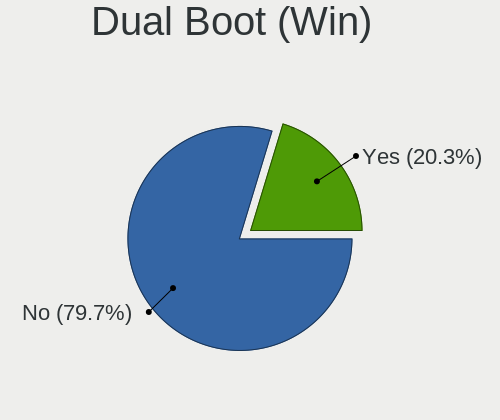
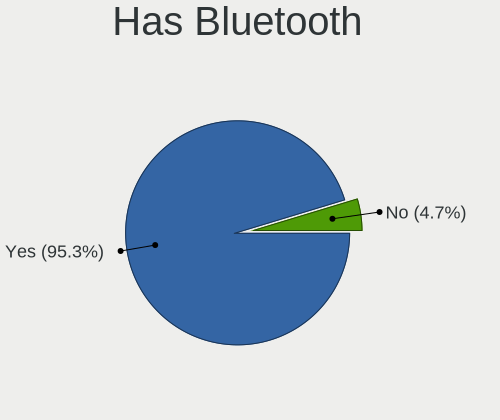
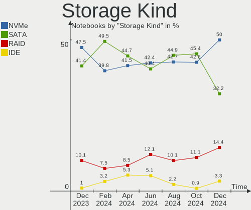

Kubuntu - Hardware Trends (Notebooks)
-------------------------------------

A project to identify most popular hardware characteristics and track their change
over time based on data collected by Linux users at https://Linux-Hardware.org.

Anyone can contribute to this report by the [hw-probe](https://github.com/linuxhw/hw-probe) tool:

    sudo -E hw-probe -all -upload

This report is for one last month. Overall report since the beginning of time: [TestDays](https://github.com/linuxhw/TestDays)

Period: Aug, 2023.

Contents
--------

* [ System ](#system)
  - [ OS                       ](#os)
  - [ OS Family                ](#os-family)
  - [ Kernel                   ](#kernel)
  - [ Kernel Family            ](#kernel-family)
  - [ Kernel Major Ver.        ](#kernel-major-ver)
  - [ Arch                     ](#arch)
  - [ DE                       ](#de)
  - [ Display Server           ](#display-server)
  - [ Display Manager          ](#display-manager)
  - [ OS Lang                  ](#os-lang)
  - [ Boot Mode                ](#boot-mode)
  - [ Filesystem               ](#filesystem)
  - [ Part. scheme             ](#part-scheme)
  - [ Dual Boot with Linux/BSD ](#dual-boot-with-linuxbsd)
  - [ Dual Boot (Win)          ](#dual-boot-win)

* [ Board ](#board)
  - [ Vendor                   ](#vendor)
  - [ Model                    ](#model)
  - [ Model Family             ](#model-family)
  - [ MFG Year                 ](#mfg-year)
  - [ Form Factor              ](#form-factor)
  - [ Secure Boot              ](#secure-boot)
  - [ Coreboot                 ](#coreboot)
  - [ RAM Size                 ](#ram-size)
  - [ RAM Used                 ](#ram-used)
  - [ Total Drives             ](#total-drives)
  - [ Has CD-ROM               ](#has-cd-rom)
  - [ Has Ethernet             ](#has-ethernet)
  - [ Has WiFi                 ](#has-wifi)
  - [ Has Bluetooth            ](#has-bluetooth)

* [ Location ](#location)
  - [ Country                  ](#country)
  - [ City                     ](#city)

* [ Drives ](#drives)
  - [ Drive Vendor             ](#drive-vendor)
  - [ Drive Model              ](#drive-model)
  - [ HDD Vendor               ](#hdd-vendor)
  - [ SSD Vendor               ](#ssd-vendor)
  - [ Drive Kind               ](#drive-kind)
  - [ Drive Connector          ](#drive-connector)
  - [ Drive Size               ](#drive-size)
  - [ Space Total              ](#space-total)
  - [ Space Used               ](#space-used)
  - [ Malfunc. Drives          ](#malfunc-drives)
  - [ Malfunc. Drive Vendor    ](#malfunc-drive-vendor)
  - [ Malfunc. HDD Vendor      ](#malfunc-hdd-vendor)
  - [ Malfunc. Drive Kind      ](#malfunc-drive-kind)
  - [ Failed Drives            ](#failed-drives)
  - [ Failed Drive Vendor      ](#failed-drive-vendor)
  - [ Drive Status             ](#drive-status)

* [ Storage controller ](#storage-controller)
  - [ Storage Vendor           ](#storage-vendor)
  - [ Storage Model            ](#storage-model)
  - [ Storage Kind             ](#storage-kind)

* [ Processor ](#processor)
  - [ CPU Vendor               ](#cpu-vendor)
  - [ CPU Model                ](#cpu-model)
  - [ CPU Model Family         ](#cpu-model-family)
  - [ CPU Cores                ](#cpu-cores)
  - [ CPU Sockets              ](#cpu-sockets)
  - [ CPU Threads              ](#cpu-threads)
  - [ CPU Op-Modes             ](#cpu-op-modes)
  - [ CPU Microcode            ](#cpu-microcode)
  - [ CPU Microarch            ](#cpu-microarch)

* [ Graphics ](#graphics)
  - [ GPU Vendor               ](#gpu-vendor)
  - [ GPU Model                ](#gpu-model)
  - [ GPU Combo                ](#gpu-combo)
  - [ GPU Driver               ](#gpu-driver)
  - [ GPU Memory               ](#gpu-memory)

* [ Monitor ](#monitor)
  - [ Monitor Vendor           ](#monitor-vendor)
  - [ Monitor Model            ](#monitor-model)
  - [ Monitor Resolution       ](#monitor-resolution)
  - [ Monitor Diagonal         ](#monitor-diagonal)
  - [ Monitor Width            ](#monitor-width)
  - [ Aspect Ratio             ](#aspect-ratio)
  - [ Monitor Area             ](#monitor-area)
  - [ Pixel Density            ](#pixel-density)
  - [ Multiple Monitors        ](#multiple-monitors)

* [ Network ](#network)
  - [ Net Controller Vendor    ](#net-controller-vendor)
  - [ Net Controller Model     ](#net-controller-model)
  - [ Wireless Vendor          ](#wireless-vendor)
  - [ Wireless Model           ](#wireless-model)
  - [ Ethernet Vendor          ](#ethernet-vendor)
  - [ Ethernet Model           ](#ethernet-model)
  - [ Net Controller Kind      ](#net-controller-kind)
  - [ Used Controller          ](#used-controller)
  - [ NICs                     ](#nics)
  - [ IPv6                     ](#ipv6)

* [ Bluetooth ](#bluetooth)
  - [ Bluetooth Vendor         ](#bluetooth-vendor)
  - [ Bluetooth Model          ](#bluetooth-model)

* [ Sound ](#sound)
  - [ Sound Vendor             ](#sound-vendor)
  - [ Sound Model              ](#sound-model)

* [ Memory ](#memory)
  - [ Memory Vendor            ](#memory-vendor)
  - [ Memory Model             ](#memory-model)
  - [ Memory Kind              ](#memory-kind)
  - [ Memory Form Factor       ](#memory-form-factor)
  - [ Memory Size              ](#memory-size)
  - [ Memory Speed             ](#memory-speed)

* [ Printers & scanners ](#printers--scanners)
  - [ Printer Vendor           ](#printer-vendor)
  - [ Printer Model            ](#printer-model)
  - [ Scanner Vendor           ](#scanner-vendor)
  - [ Scanner Model            ](#scanner-model)

* [ Camera ](#camera)
  - [ Camera Vendor            ](#camera-vendor)
  - [ Camera Model             ](#camera-model)

* [ Security ](#security)
  - [ Fingerprint Vendor       ](#fingerprint-vendor)
  - [ Fingerprint Model        ](#fingerprint-model)
  - [ Chipcard Vendor          ](#chipcard-vendor)
  - [ Chipcard Model           ](#chipcard-model)

* [ Unsupported ](#unsupported)
  - [ Unsupported Devices      ](#unsupported-devices)
  - [ Unsupported Device Types ](#unsupported-device-types)

System
------

OS
--

Installed operating systems

| Name          | Notebooks | Percent |
|---------------|-----------|---------|
| Kubuntu 22.04 | 31        | 50%     |
| Kubuntu 23.04 | 27        | 43.55%  |
| Kubuntu 20.04 | 2         | 3.23%   |
| Kubuntu 11    | 2         | 3.23%   |

OS Family
---------

OS without a version

| Name    | Notebooks | Percent |
|---------|-----------|---------|
| Kubuntu | 62        | 100%    |

Kernel
------

Version of the Linux kernel

| Version               | Notebooks | Percent |
|-----------------------|-----------|---------|
| 6.2.0-26-generic      | 30        | 48.39%  |
| 6.2.0-27-generic      | 7         | 11.29%  |
| 5.15.0-78-generic     | 5         | 8.06%   |
| 6.2.0-1009-lowlatency | 3         | 4.84%   |
| 6.4.8-060408-generic  | 2         | 3.23%   |
| 5.15.0-79-generic     | 2         | 3.23%   |
| 5.15.0-75-generic     | 2         | 3.23%   |
| 6.4.8-x64v3-xanmod1   | 1         | 1.61%   |
| 6.2.0-31-generic      | 1         | 1.61%   |
| 6.2.0-20-generic      | 1         | 1.61%   |
| 6.2.0-1011-lowlatency | 1         | 1.61%   |
| 6.2.0-060200-generic  | 1         | 1.61%   |
| 5.19.0-50-generic     | 1         | 1.61%   |
| 5.19.0-46-generic     | 1         | 1.61%   |
| 5.19.0-43-generic     | 1         | 1.61%   |
| 5.19.0-41-generic     | 1         | 1.61%   |
| 5.19.0-32-generic     | 1         | 1.61%   |
| 5.15.0-47-generic     | 1         | 1.61%   |

Kernel Family
-------------

Linux kernel without a distro release

| Version | Notebooks | Percent |
|---------|-----------|---------|
| 6.2.0   | 44        | 70.97%  |
| 5.15.0  | 10        | 16.13%  |
| 5.19.0  | 5         | 8.06%   |
| 6.4.8   | 3         | 4.84%   |

Kernel Major Ver.
-----------------

Linux kernel major version

| Version | Notebooks | Percent |
|---------|-----------|---------|
| 6.2     | 44        | 70.97%  |
| 5.15    | 10        | 16.13%  |
| 5.19    | 5         | 8.06%   |
| 6.4     | 3         | 4.84%   |

Arch
----

OS architecture (x86_64, i586, etc.)

| Name   | Notebooks | Percent |
|--------|-----------|---------|
| x86_64 | 62        | 100%    |

DE
--

Desktop Environment

| Name | Notebooks | Percent |
|------|-----------|---------|
| KDE5 | 62        | 100%    |

Display Server
--------------

X11 or Wayland

| Name    | Notebooks | Percent |
|---------|-----------|---------|
| X11     | 57        | 91.94%  |
| Wayland | 5         | 8.06%   |

Display Manager
---------------

SDDM, LightDM, etc.

| Name    | Notebooks | Percent |
|---------|-----------|---------|
| SDDM    | 41        | 66.13%  |
| Unknown | 18        | 29.03%  |
| GDM3    | 2         | 3.23%   |
| LightDM | 1         | 1.61%   |

OS Lang
-------

Language

| Lang  | Notebooks | Percent |
|-------|-----------|---------|
| en_US | 31        | 50%     |
| de_DE | 10        | 16.13%  |
| en_GB | 4         | 6.45%   |
| it_IT | 3         | 4.84%   |
| cs_CZ | 3         | 4.84%   |
| ru_RU | 2         | 3.23%   |
| pt_BR | 2         | 3.23%   |
| en_CA | 2         | 3.23%   |
| zh_HK | 1         | 1.61%   |
| es_CO | 1         | 1.61%   |
| en_ZA | 1         | 1.61%   |
| en_SG | 1         | 1.61%   |
| en_IN | 1         | 1.61%   |

Boot Mode
---------

EFI or BIOS

| Mode | Notebooks | Percent |
|------|-----------|---------|
| BIOS | 33        | 53.23%  |
| EFI  | 29        | 46.77%  |

Filesystem
----------

Type of filesystem

| Type    | Notebooks | Percent |
|---------|-----------|---------|
| Ext4    | 43        | 69.35%  |
| Tmpfs   | 15        | 24.19%  |
| Overlay | 2         | 3.23%   |
| Btrfs   | 2         | 3.23%   |

Part. scheme
------------

Scheme of partitioning

| Type    | Notebooks | Percent |
|---------|-----------|---------|
| GPT     | 40        | 64.52%  |
| Unknown | 18        | 29.03%  |
| MBR     | 4         | 6.45%   |

Dual Boot with Linux/BSD
------------------------

Hosting more than one Linux/BSD

| Dual boot | Notebooks | Percent |
|-----------|-----------|---------|
| No        | 55        | 88.71%  |
| Yes       | 7         | 11.29%  |

Dual Boot (Win)
---------------

Hosting Linux and Windows

| Dual boot | Notebooks | Percent |
|-----------|-----------|---------|
| No        | 44        | 70.97%  |
| Yes       | 18        | 29.03%  |

Board
-----

Vendor
------

Motherboard manufacturer

| Name                   | Notebooks | Percent |
|------------------------|-----------|---------|
| Lenovo                 | 14        | 22.58%  |
| Dell                   | 12        | 19.35%  |
| Hewlett-Packard        | 9         | 14.52%  |
| ASUSTek Computer       | 4         | 6.45%   |
| Acer                   | 4         | 6.45%   |
| HUAWEI                 | 2         | 3.23%   |
| Toshiba                | 1         | 1.61%   |
| TECNO                  | 1         | 1.61%   |
| System76               | 1         | 1.61%   |
| Sony                   | 1         | 1.61%   |
| Schenker               | 1         | 1.61%   |
| Packard Bell           | 1         | 1.61%   |
| MSI                    | 1         | 1.61%   |
| mPTech                 | 1         | 1.61%   |
| Medion                 | 1         | 1.61%   |
| LG Electronics         | 1         | 1.61%   |
| Irbis                  | 1         | 1.61%   |
| GPU Company            | 1         | 1.61%   |
| GPD                    | 1         | 1.61%   |
| Google                 | 1         | 1.61%   |
| Fujitsu                | 1         | 1.61%   |
| Avell High Performance | 1         | 1.61%   |
| Alienware              | 1         | 1.61%   |

Model
-----

Motherboard model

| Name                                     | Notebooks | Percent |
|------------------------------------------|-----------|---------|
| Dell XPS 15 9530                         | 2         | 3.23%   |
| Toshiba Satellite P850                   | 1         | 1.61%   |
| TECNO MEGABOOK T1                        | 1         | 1.61%   |
| System76 Galago Pro                      | 1         | 1.61%   |
| Sony VPCEC390X                           | 1         | 1.61%   |
| Schenker XMG PRO (E23)                   | 1         | 1.61%   |
| Packard Bell EasyNote LS11HR             | 1         | 1.61%   |
| MSI GL65 9SE                             | 1         | 1.61%   |
| mPTech ARC 11.6 128GB HD                 | 1         | 1.61%   |
| Medion P651x series                      | 1         | 1.61%   |
| LG 17Z90N-V.AA72A8                       | 1         | 1.61%   |
| Lenovo Z70-80 80FG                       | 1         | 1.61%   |
| Lenovo Yoga Slim 7 Pro 16ACH6 82QQ       | 1         | 1.61%   |
| Lenovo ThinkPad X230 23256N6             | 1         | 1.61%   |
| Lenovo ThinkPad X1 Carbon 2nd 20A8S1WM01 | 1         | 1.61%   |
| Lenovo ThinkPad W510 4391EC4             | 1         | 1.61%   |
| Lenovo ThinkPad T480 20L50000MC          | 1         | 1.61%   |
| Lenovo ThinkPad T14s Gen 4 21F6CTO1WW    | 1         | 1.61%   |
| Lenovo ThinkPad Edge E540 20C600J3GE     | 1         | 1.61%   |
| Lenovo Legion Pro 5 16IRX8 82WK          | 1         | 1.61%   |
| Lenovo Legion 5 15ARH05H 82B1            | 1         | 1.61%   |
| Lenovo IdeaPad Z580                      | 1         | 1.61%   |
| Lenovo IdeaPad 5 14ITL05 82FE            | 1         | 1.61%   |
| Lenovo IdeaPad 300-14ISK 80Q6            | 1         | 1.61%   |
| Lenovo IdeaPad 3 14ALC6 82KT             | 1         | 1.61%   |
| Irbis NB123                              | 1         | 1.61%   |
| HUAWEI KLVL-WXXW                         | 1         | 1.61%   |
| HUAWEI BOM-WXX9                          | 1         | 1.61%   |
| HP ZBook 15 G3                           | 1         | 1.61%   |
| HP ZBook 14 G2                           | 1         | 1.61%   |
| HP ProBook 450 15.6 inch G9 Notebook PC  | 1         | 1.61%   |
| HP ProBook 440 G5                        | 1         | 1.61%   |
| HP Pavilion Notebook                     | 1         | 1.61%   |
| HP Pavilion Laptop 14-bf0xx              | 1         | 1.61%   |
| HP Laptop 17-ca1xxx                      | 1         | 1.61%   |
| HP ElitePad 1000 G2                      | 1         | 1.61%   |
| HP EliteBook 840 G6                      | 1         | 1.61%   |
| GPU Company GWTN141-10                   | 1         | 1.61%   |
| GPD G1621-02                             | 1         | 1.61%   |
| Google Dragonair                         | 1         | 1.61%   |

Model Family
------------

Motherboard model prefix

| Name                       | Notebooks | Percent |
|----------------------------|-----------|---------|
| Lenovo ThinkPad            | 6         | 9.68%   |
| Dell XPS                   | 5         | 8.06%   |
| Lenovo IdeaPad             | 4         | 6.45%   |
| Dell Latitude              | 3         | 4.84%   |
| Lenovo Legion              | 2         | 3.23%   |
| HP ZBook                   | 2         | 3.23%   |
| HP ProBook                 | 2         | 3.23%   |
| HP Pavilion                | 2         | 3.23%   |
| Dell Precision             | 2         | 3.23%   |
| ASUS ROG                   | 2         | 3.23%   |
| Acer Nitro                 | 2         | 3.23%   |
| Acer Aspire                | 2         | 3.23%   |
| Toshiba Satellite          | 1         | 1.61%   |
| TECNO MEGABOOK             | 1         | 1.61%   |
| System76 Galago            | 1         | 1.61%   |
| Sony VPCEC390X             | 1         | 1.61%   |
| Schenker XMG               | 1         | 1.61%   |
| Packard Bell EasyNote      | 1         | 1.61%   |
| MSI GL65                   | 1         | 1.61%   |
| mPTech ARC                 | 1         | 1.61%   |
| Medion P651x               | 1         | 1.61%   |
| LG 17Z90N-V.AA72A8         | 1         | 1.61%   |
| Lenovo Z70-80              | 1         | 1.61%   |
| Lenovo Yoga                | 1         | 1.61%   |
| Irbis NB123                | 1         | 1.61%   |
| HUAWEI KLVL-WXXW           | 1         | 1.61%   |
| HUAWEI BOM-WXX9            | 1         | 1.61%   |
| HP Laptop                  | 1         | 1.61%   |
| HP ElitePad                | 1         | 1.61%   |
| HP EliteBook               | 1         | 1.61%   |
| GPU Company GWTN141-10     | 1         | 1.61%   |
| GPD G1621-02               | 1         | 1.61%   |
| Google Dragonair           | 1         | 1.61%   |
| Fujitsu LIFEBOOK           | 1         | 1.61%   |
| Dell Vostro                | 1         | 1.61%   |
| Dell Inspiron              | 1         | 1.61%   |
| Avell High Performance C62 | 1         | 1.61%   |
| ASUS VivoBook              | 1         | 1.61%   |
| ASUS N53SV                 | 1         | 1.61%   |
| Alienware 14               | 1         | 1.61%   |

MFG Year
--------

Motherboard manufacture year

| Year | Notebooks | Percent |
|------|-----------|---------|
| 2021 | 12        | 19.35%  |
| 2023 | 7         | 11.29%  |
| 2022 | 7         | 11.29%  |
| 2020 | 5         | 8.06%   |
| 2014 | 5         | 8.06%   |
| 2010 | 5         | 8.06%   |
| 2017 | 4         | 6.45%   |
| 2012 | 4         | 6.45%   |
| 2019 | 3         | 4.84%   |
| 2015 | 3         | 4.84%   |
| 2011 | 3         | 4.84%   |
| 2013 | 2         | 3.23%   |
| 2018 | 1         | 1.61%   |
| 2016 | 1         | 1.61%   |

Form Factor
-----------

Physical design of the computer

| Name     | Notebooks | Percent |
|----------|-----------|---------|
| Notebook | 62        | 100%    |

Secure Boot
-----------

Enabled or disabled

| State    | Notebooks | Percent |
|----------|-----------|---------|
| Disabled | 61        | 98.39%  |
| Enabled  | 1         | 1.61%   |

Coreboot
--------

Have coreboot on board

| Used | Notebooks | Percent |
|------|-----------|---------|
| No   | 60        | 96.77%  |
| Yes  | 2         | 3.23%   |

RAM Size
--------

Total RAM memory

| Size in GB  | Notebooks | Percent |
|-------------|-----------|---------|
| 16.01-24.0  | 17        | 27.42%  |
| 32.01-64.0  | 12        | 19.35%  |
| 4.01-8.0    | 11        | 17.74%  |
| 8.01-16.0   | 10        | 16.13%  |
| 3.01-4.0    | 7         | 11.29%  |
| 24.01-32.0  | 3         | 4.84%   |
| 64.01-256.0 | 2         | 3.23%   |

RAM Used
--------

Used RAM memory

| Used GB    | Notebooks | Percent |
|------------|-----------|---------|
| 4.01-8.0   | 17        | 27.42%  |
| 2.01-3.0   | 15        | 24.19%  |
| 3.01-4.0   | 10        | 16.13%  |
| 8.01-16.0  | 9         | 14.52%  |
| 1.01-2.0   | 8         | 12.9%   |
| 24.01-32.0 | 2         | 3.23%   |
| 16.01-24.0 | 1         | 1.61%   |

Total Drives
------------

Number of drives on board

| Drives | Notebooks | Percent |
|--------|-----------|---------|
| 1      | 37        | 59.68%  |
| 2      | 19        | 30.65%  |
| 3      | 6         | 9.68%   |

Has CD-ROM
----------

Has CD-ROM on board

| Presented | Notebooks | Percent |
|-----------|-----------|---------|
| No        | 53        | 85.48%  |
| Yes       | 9         | 14.52%  |

Has Ethernet
------------

Has Ethernet on board

| Presented | Notebooks | Percent |
|-----------|-----------|---------|
| Yes       | 48        | 77.42%  |
| No        | 14        | 22.58%  |

Has WiFi
--------

Has WiFi module

| Presented | Notebooks | Percent |
|-----------|-----------|---------|
| Yes       | 61        | 98.39%  |
| No        | 1         | 1.61%   |

Has Bluetooth
-------------

Has Bluetooth module

| Presented | Notebooks | Percent |
|-----------|-----------|---------|
| Yes       | 52        | 83.87%  |
| No        | 10        | 16.13%  |

Location
--------

Country
-------

Geographic location (country)

| Country      | Notebooks | Percent |
|--------------|-----------|---------|
| Germany      | 12        | 19.35%  |
| USA          | 9         | 14.52%  |
| UK           | 4         | 6.45%   |
| Czechia      | 4         | 6.45%   |
| Russia       | 3         | 4.84%   |
| Poland       | 3         | 4.84%   |
| Italy        | 3         | 4.84%   |
| Brazil       | 3         | 4.84%   |
| Turkey       | 2         | 3.23%   |
| India        | 2         | 3.23%   |
| Canada       | 2         | 3.23%   |
| Vietnam      | 1         | 1.61%   |
| Taiwan       | 1         | 1.61%   |
| Sweden       | 1         | 1.61%   |
| Spain        | 1         | 1.61%   |
| South Africa | 1         | 1.61%   |
| Slovenia     | 1         | 1.61%   |
| Singapore    | 1         | 1.61%   |
| Netherlands  | 1         | 1.61%   |
| Luxembourg   | 1         | 1.61%   |
| Hungary      | 1         | 1.61%   |
| Greece       | 1         | 1.61%   |
| France       | 1         | 1.61%   |
| Croatia      | 1         | 1.61%   |
| Colombia     | 1         | 1.61%   |
| Bulgaria     | 1         | 1.61%   |

City
----

Geographic location (city)

| City                       | Notebooks | Percent |
|----------------------------|-----------|---------|
| Munich                     | 2         | 3.23%   |
| Berlin                     | 2         | 3.23%   |
| Vol'ginskiy                | 1         | 1.61%   |
| Varna                      | 1         | 1.61%   |
| Ulm                        | 1         | 1.61%   |
| Trescore Balneario         | 1         | 1.61%   |
| Szigetszentmiklos          | 1         | 1.61%   |
| Straznice                  | 1         | 1.61%   |
| St Petersburg              | 1         | 1.61%   |
| Sisak                      | 1         | 1.61%   |
| Singapore                  | 1         | 1.61%   |
| Seville                    | 1         | 1.61%   |
| Sao Paulo                  | 1         | 1.61%   |
| San Antonio                | 1         | 1.61%   |
| Rome                       | 1         | 1.61%   |
| Remscheid                  | 1         | 1.61%   |
| Prague                     | 1         | 1.61%   |
| Porto Alegre               | 1         | 1.61%   |
| Ostrava                    | 1         | 1.61%   |
| Orekhovo-Borisovo Yuzhnoye | 1         | 1.61%   |
| Oldham                     | 1         | 1.61%   |
| Olching                    | 1         | 1.61%   |
| New York                   | 1         | 1.61%   |
| New Castle                 | 1         | 1.61%   |
| New Albany                 | 1         | 1.61%   |
| Münster                   | 1         | 1.61%   |
| Montevrain                 | 1         | 1.61%   |
| Milano                     | 1         | 1.61%   |
| Luxembourg                 | 1         | 1.61%   |
| Lublin                     | 1         | 1.61%   |
| London                     | 1         | 1.61%   |
| Larissa                    | 1         | 1.61%   |
| Kranj                      | 1         | 1.61%   |
| Krakow                     | 1         | 1.61%   |
| Kitchener                  | 1         | 1.61%   |
| Kaohsiung City             | 1         | 1.61%   |
| Johannesburg               | 1         | 1.61%   |
| Jedovnice                  | 1         | 1.61%   |
| Istanbul                   | 1         | 1.61%   |
| Hanover                    | 1         | 1.61%   |

Drives
------

Drive Vendor
------------

Hard drive vendors

| Vendor                      | Notebooks | Drives | Percent |
|-----------------------------|-----------|--------|---------|
| Samsung Electronics         | 15        | 16     | 17.24%  |
| Sandisk                     | 12        | 13     | 13.79%  |
| WDC                         | 7         | 8      | 8.05%   |
| Seagate                     | 6         | 7      | 6.9%    |
| SK hynix                    | 5         | 5      | 5.75%   |
| Intel                       | 5         | 5      | 5.75%   |
| Unknown                     | 4         | 4      | 4.6%    |
| Toshiba                     | 4         | 4      | 4.6%    |
| Kingston                    | 4         | 4      | 4.6%    |
| Micron Technology           | 2         | 2      | 2.3%    |
| KIOXIA                      | 2         | 2      | 2.3%    |
| Kingston Technology Company | 2         | 2      | 2.3%    |
| Crucial                     | 2         | 3      | 2.3%    |
| Wibtek                      | 1         | 1      | 1.15%   |
| SPCC                        | 1         | 1      | 1.15%   |
| Silicon Motion              | 1         | 1      | 1.15%   |
| Phison Electronics          | 1         | 1      | 1.15%   |
| Patriot                     | 1         | 1      | 1.15%   |
| Netac                       | 1         | 1      | 1.15%   |
| Micron/Crucial Technology   | 1         | 1      | 1.15%   |
| LITEON                      | 1         | 1      | 1.15%   |
| Lenovo                      | 1         | 1      | 1.15%   |
| Kimtigo                     | 1         | 1      | 1.15%   |
| JMicron Technology          | 1         | 1      | 1.15%   |
| Hitachi                     | 1         | 1      | 1.15%   |
| HGST                        | 1         | 1      | 1.15%   |
| China                       | 1         | 1      | 1.15%   |
| Biwin Storage Technology    | 1         | 1      | 1.15%   |
| A-DATA Technology           | 1         | 1      | 1.15%   |
| Unknown                     | 1         | 1      | 1.15%   |

Drive Model
-----------

Hard drive models

| Model                                                 | Notebooks | Percent |
|-------------------------------------------------------|-----------|---------|
| Samsung NVMe SSD Controller PM9A1/PM9A3/980PRO 1024GB | 5         | 5.43%   |
| Seagate ST1000LM035-1RK172 1TB                        | 2         | 2.17%   |
| Seagate ST1000LM024 HN-M101MBB 1TB                    | 2         | 2.17%   |
| Sandisk WD Blue SN550 NVMe SSD 250GB                  | 2         | 2.17%   |
| Sandisk WD Black SN850 256GB                          | 2         | 2.17%   |
| Samsung SSD 860 EVO 500GB                             | 2         | 2.17%   |
| Intel SSDPEKNU512GZ 512GB                             | 2         | 2.17%   |
| Wibtek W800S 512GB                                    | 1         | 1.09%   |
| WDC WDS250G2B0A 250GB SSD                             | 1         | 1.09%   |
| WDC WDS240G2G0A-00JH30 240GB SSD                      | 1         | 1.09%   |
| WDC WDS100T2B0A 1TB SSD                               | 1         | 1.09%   |
| WDC WD5000LPLX-08ZNTT0 500GB                          | 1         | 1.09%   |
| WDC WD10JPVX-60JC3T0 1TB                              | 1         | 1.09%   |
| WDC WD Blue SA510 M.2 2280 1000GB                     | 1         | 1.09%   |
| WDC WD Blue SA510 2.5 1000GB                          | 1         | 1.09%   |
| WDC PC SN530 SDBQNPZ-1T00-1016 1TB                    | 1         | 1.09%   |
| Unknown MMC Card  64GB                                | 1         | 1.09%   |
| Unknown MMC Card  32GB                                | 1         | 1.09%   |
| Unknown MMC Card  128GB                               | 1         | 1.09%   |
| Unknown ISOCOM  64GB                                  | 1         | 1.09%   |
| Toshiba MQ01ACF050 500GB                              | 1         | 1.09%   |
| Toshiba MQ01ABD100V -63 1TB                           | 1         | 1.09%   |
| Toshiba MQ01ABD075 752GB                              | 1         | 1.09%   |
| Toshiba KBG40ZNT512G MEMORY 512GB                     | 1         | 1.09%   |
| SPCC Solid State Disk 512GB                           | 1         | 1.09%   |
| SK hynix SKHynix_HFS512GEJ9X115N 512GB                | 1         | 1.09%   |
| SK hynix SKHynix_HFS001TEJ9X162N 1TB                  | 1         | 1.09%   |
| SK hynix PC801 NVMe 512GB                             | 1         | 1.09%   |
| SK hynix PC300 NVMe Solid State Drive 512GB           | 1         | 1.09%   |
| SK hynix HFS512GD9TNG-L2A0A 512GB                     | 1         | 1.09%   |
| Silicon Motion SM2263EN/SM2263XT SSD Controller 256GB | 1         | 1.09%   |
| Seagate ST500VT000-1DK142 500GB                       | 1         | 1.09%   |
| Seagate ST500LT012-1DG142 500GB                       | 1         | 1.09%   |
| Seagate Expansion 2TB                                 | 1         | 1.09%   |
| Sandisk WDC PC SN530 SDBPMPZ-256G-1101 256GB          | 1         | 1.09%   |
| Sandisk WD Blue SN570 500GB                           | 1         | 1.09%   |
| SanDisk SSD PLUS 240GB                                | 1         | 1.09%   |
| SanDisk SDSSDXPS480G 480GB                            | 1         | 1.09%   |
| SanDisk SDSSDHII960G 960GB                            | 1         | 1.09%   |
| SanDisk SDSSDHII120G 120GB                            | 1         | 1.09%   |

HDD Vendor
----------

Hard disk drive vendors

| Vendor  | Notebooks | Drives | Percent |
|---------|-----------|--------|---------|
| Seagate | 6         | 7      | 46.15%  |
| Toshiba | 3         | 3      | 23.08%  |
| WDC     | 2         | 2      | 15.38%  |
| Hitachi | 1         | 1      | 7.69%   |
| HGST    | 1         | 1      | 7.69%   |

SSD Vendor
----------

Solid state drive vendors

| Vendor              | Notebooks | Drives | Percent |
|---------------------|-----------|--------|---------|
| SanDisk             | 6         | 6      | 24%     |
| Samsung Electronics | 6         | 7      | 24%     |
| WDC                 | 4         | 5      | 16%     |
| Kingston            | 2         | 2      | 8%      |
| SPCC                | 1         | 1      | 4%      |
| Patriot             | 1         | 1      | 4%      |
| LITEON              | 1         | 1      | 4%      |
| Kimtigo             | 1         | 1      | 4%      |
| JMicron Technology  | 1         | 1      | 4%      |
| Crucial             | 1         | 1      | 4%      |
| China               | 1         | 1      | 4%      |

Drive Kind
----------

HDD or SSD

| Kind    | Notebooks | Drives | Percent |
|---------|-----------|--------|---------|
| NVMe    | 36        | 44     | 46.75%  |
| SSD     | 22        | 27     | 28.57%  |
| HDD     | 12        | 14     | 15.58%  |
| MMC     | 5         | 5      | 6.49%   |
| Unknown | 2         | 2      | 2.6%    |

Drive Connector
---------------

SATA, SAS, NVMe, etc.

| Type | Notebooks | Drives | Percent |
|------|-----------|--------|---------|
| NVMe | 36        | 44     | 48%     |
| SATA | 30        | 39     | 40%     |
| MMC  | 5         | 5      | 6.67%   |
| SAS  | 4         | 4      | 5.33%   |

Drive Size
----------

Size of hard drive

| Size in TB | Notebooks | Drives | Percent |
|------------|-----------|--------|---------|
| 0.01-0.5   | 16        | 20     | 47.06%  |
| 0.51-1.0   | 14        | 17     | 41.18%  |
| 1.01-2.0   | 3         | 3      | 8.82%   |
| 3.01-4.0   | 1         | 1      | 2.94%   |

Space Total
-----------

Amount of disk space available on the file system

| Size in GB     | Notebooks | Percent |
|----------------|-----------|---------|
| 251-500        | 19        | 30.65%  |
| 101-250        | 13        | 20.97%  |
| 501-1000       | 13        | 20.97%  |
| 1001-2000      | 8         | 12.9%   |
| 51-100         | 4         | 6.45%   |
| More than 3000 | 3         | 4.84%   |
| 2001-3000      | 1         | 1.61%   |
| 1-20           | 1         | 1.61%   |

Space Used
----------

Amount of used disk space

| Used GB        | Notebooks | Percent |
|----------------|-----------|---------|
| 101-250        | 16        | 25.81%  |
| 1-20           | 13        | 20.97%  |
| 51-100         | 12        | 19.35%  |
| 21-50          | 7         | 11.29%  |
| 251-500        | 5         | 8.06%   |
| 501-1000       | 5         | 8.06%   |
| 1001-2000      | 2         | 3.23%   |
| More than 3000 | 1         | 1.61%   |
| 2001-3000      | 1         | 1.61%   |

Malfunc. Drives
---------------

Drive models with a malfunction

| Model                         | Notebooks | Drives | Percent |
|-------------------------------|-----------|--------|---------|
| Toshiba MQ01ABD075 752GB      | 1         | 1      | 20%     |
| SanDisk SSD PLUS 240GB        | 1         | 1      | 20%     |
| SanDisk SDSSDXPS480G 480GB    | 1         | 1      | 20%     |
| LITEON CV8-8E128-HP 128GB SSD | 1         | 1      | 20%     |
| Intel SSDPEKNU512GZ 512GB     | 1         | 1      | 20%     |

Malfunc. Drive Vendor
---------------------

Vendors of faulty drives

| Vendor  | Notebooks | Drives | Percent |
|---------|-----------|--------|---------|
| SanDisk | 2         | 2      | 40%     |
| Toshiba | 1         | 1      | 20%     |
| LITEON  | 1         | 1      | 20%     |
| Intel   | 1         | 1      | 20%     |

Malfunc. HDD Vendor
-------------------

Vendors of faulty HDD drives

| Vendor  | Notebooks | Drives | Percent |
|---------|-----------|--------|---------|
| Toshiba | 1         | 1      | 100%    |

Malfunc. Drive Kind
-------------------

Kinds of faulty drives

| Kind | Notebooks | Drives | Percent |
|------|-----------|--------|---------|
| SSD  | 3         | 3      | 60%     |
| NVMe | 1         | 1      | 20%     |
| HDD  | 1         | 1      | 20%     |

Failed Drives
-------------

Failed drive models

Zero info for selected period =(

Failed Drive Vendor
-------------------

Failed drive vendors

Zero info for selected period =(

Drive Status
------------

Number of failed and malfunc. drives

| Status   | Notebooks | Drives | Percent |
|----------|-----------|--------|---------|
| Detected | 37        | 52     | 53.62%  |
| Works    | 27        | 35     | 39.13%  |
| Malfunc  | 5         | 5      | 7.25%   |

Storage controller
------------------

Storage Vendor
--------------

Storage controller vendors

| Vendor                      | Notebooks | Percent |
|-----------------------------|-----------|---------|
| Intel                       | 39        | 46.99%  |
| SanDisk                     | 8         | 9.64%   |
| Samsung Electronics         | 8         | 9.64%   |
| AMD                         | 7         | 8.43%   |
| SK hynix                    | 5         | 6.02%   |
| Kingston Technology Company | 4         | 4.82%   |
| KIOXIA                      | 3         | 3.61%   |
| Micron/Crucial Technology   | 2         | 2.41%   |
| Micron Technology           | 2         | 2.41%   |
| Silicon Motion              | 1         | 1.2%    |
| Phison Electronics          | 1         | 1.2%    |
| Lenovo                      | 1         | 1.2%    |
| Biwin Storage Technology    | 1         | 1.2%    |
| ADATA Technology            | 1         | 1.2%    |

Storage Model
-------------

Storage controller models

| Model                                                                          | Notebooks | Percent |
|--------------------------------------------------------------------------------|-----------|---------|
| Samsung NVMe SSD Controller PM9A1/PM9A3/980PRO                                 | 6         | 6.98%   |
| AMD FCH SATA Controller [AHCI mode]                                            | 6         | 6.98%   |
| Intel Sunrise Point-LP SATA Controller [AHCI mode]                             | 4         | 4.65%   |
| Intel SSD 670p Series [Keystone Harbor]                                        | 4         | 4.65%   |
| SK hynix Platinum P41/PC801 NVMe Solid State Drive                             | 3         | 3.49%   |
| SanDisk WD PC SN810 / Black SN850 NVMe SSD                                     | 3         | 3.49%   |
| SanDisk WD Blue SN550 NVMe SSD                                                 | 3         | 3.49%   |
| Intel Volume Management Device NVMe RAID Controller Intel Corporation          | 3         | 3.49%   |
| Intel Volume Management Device NVMe RAID Controller                            | 3         | 3.49%   |
| Intel 82801 Mobile SATA Controller [RAID mode]                                 | 3         | 3.49%   |
| Intel 7 Series Chipset Family 6-port SATA Controller [AHCI mode]               | 3         | 3.49%   |
| Samsung NVMe SSD Controller SM981/PM981/PM983                                  | 2         | 2.33%   |
| Micron/Crucial P2 [Nick P2] / P3 / P3 Plus NVMe PCIe SSD (DRAM-less)           | 2         | 2.33%   |
| KIOXIA NVMe SSD Controller BG4 (DRAM-less)                                     | 2         | 2.33%   |
| Kingston Company Company Non-Volatile memory controller                        | 2         | 2.33%   |
| Intel Wildcat Point-LP SATA Controller [AHCI Mode]                             | 2         | 2.33%   |
| Intel 6 Series/C200 Series Chipset Family 6 port Mobile SATA AHCI Controller   | 2         | 2.33%   |
| SK hynix PC601 NVMe Solid State Drive                                          | 1         | 1.16%   |
| SK hynix PC300 NVMe Solid State Drive 512GB                                    | 1         | 1.16%   |
| Silicon Motion SM2263EN/SM2263XT (DRAM-less) NVMe SSD Controllers              | 1         | 1.16%   |
| SanDisk WD Blue SN570 NVMe SSD 1TB                                             | 1         | 1.16%   |
| SanDisk PC SN530 NVMe SSD (DRAM-less)                                          | 1         | 1.16%   |
| Phison PS5013 E13 NVMe Controller                                              | 1         | 1.16%   |
| Micron 3460 NVMe SSD                                                           | 1         | 1.16%   |
| Micron 2400 NVMe SSD (DRAM-less)                                               | 1         | 1.16%   |
| Lenovo LENSE30256GMSP34MEAT3TA                                                 | 1         | 1.16%   |
| KIOXIA NVMe SSD Controller BG5 (DRAM-less)                                     | 1         | 1.16%   |
| Kingston Company NV1 NVMe SSD                                                  | 1         | 1.16%   |
| Kingston Company A2000 NVMe SSD                                                | 1         | 1.16%   |
| Intel Tiger Lake-LP SATA Controller                                            | 1         | 1.16%   |
| Intel Tiger Lake SATA AHCI Controller                                          | 1         | 1.16%   |
| Intel Q170/Q150/B150/H170/H110/Z170/CM236 Chipset SATA Controller [AHCI Mode]  | 1         | 1.16%   |
| Intel Ice Lake-LP SATA Controller [AHCI mode]                                  | 1         | 1.16%   |
| Intel HM170/QM170 Chipset SATA Controller [AHCI Mode]                          | 1         | 1.16%   |
| Intel Comet Lake SATA AHCI Controller                                          | 1         | 1.16%   |
| Intel Celeron/Pentium Silver Processor SATA Controller                         | 1         | 1.16%   |
| Intel Celeron N3350/Pentium N4200/Atom E3900 Series SATA AHCI Controller       | 1         | 1.16%   |
| Intel Cannon Lake Mobile PCH SATA AHCI Controller                              | 1         | 1.16%   |
| Intel 82801IBM/IEM (ICH9M/ICH9M-E) 4 port SATA Controller [AHCI mode]          | 1         | 1.16%   |
| Intel 8 Series/C220 Series Chipset Family 6-port SATA Controller 1 [AHCI mode] | 1         | 1.16%   |

Storage Kind
------------

Kind of storage controller (IDE, SATA, NVMe, SAS, ...)

| Kind | Notebooks | Percent |
|------|-----------|---------|
| NVMe | 34        | 43.59%  |
| SATA | 33        | 42.31%  |
| RAID | 9         | 11.54%  |
| IDE  | 2         | 2.56%   |

Processor
---------

CPU Vendor
----------

Processor vendors

| Vendor | Notebooks | Percent |
|--------|-----------|---------|
| Intel  | 51        | 82.26%  |
| AMD    | 11        | 17.74%  |

CPU Model
---------

Processor models

| Model                                       | Notebooks | Percent |
|---------------------------------------------|-----------|---------|
| AMD Ryzen 5 5500U with Radeon Graphics      | 3         | 4.84%   |
| Intel Core i7-6700HQ CPU @ 2.60GHz          | 2         | 3.23%   |
| Intel Core i7-5500U CPU @ 2.40GHz           | 2         | 3.23%   |
| Intel Core i5-7200U CPU @ 2.50GHz           | 2         | 3.23%   |
| Intel Core i5-1035G1 CPU @ 1.00GHz          | 2         | 3.23%   |
| Intel 13th Gen Core i7-13700H               | 2         | 3.23%   |
| Intel 11th Gen Core i5-1135G7 @ 2.40GHz     | 2         | 3.23%   |
| AMD Ryzen 7 5800H with Radeon Graphics      | 2         | 3.23%   |
| AMD Ryzen 7 4800H with Radeon Graphics      | 2         | 3.23%   |
| Intel Pentium Silver N6000 @ 1.10GHz        | 1         | 1.61%   |
| Intel Pentium Dual-Core CPU T4500 @ 2.30GHz | 1         | 1.61%   |
| Intel Core i7-9750H CPU @ 2.60GHz           | 1         | 1.61%   |
| Intel Core i7-8665U CPU @ 1.90GHz           | 1         | 1.61%   |
| Intel Core i7-7500U CPU @ 2.70GHz           | 1         | 1.61%   |
| Intel Core i7-4700MQ CPU @ 2.40GHz          | 1         | 1.61%   |
| Intel Core i7-3630QM CPU @ 2.40GHz          | 1         | 1.61%   |
| Intel Core i7-2670QM CPU @ 2.20GHz          | 1         | 1.61%   |
| Intel Core i7-2640M CPU @ 2.80GHz           | 1         | 1.61%   |
| Intel Core i7-2630QM CPU @ 2.00GHz          | 1         | 1.61%   |
| Intel Core i7-1065G7 CPU @ 1.30GHz          | 1         | 1.61%   |
| Intel Core i7 CPU Q 820 @ 1.73GHz           | 1         | 1.61%   |
| Intel Core i5-8250U CPU @ 1.60GHz           | 1         | 1.61%   |
| Intel Core i5-6200U CPU @ 2.30GHz           | 1         | 1.61%   |
| Intel Core i5-4300U CPU @ 1.90GHz           | 1         | 1.61%   |
| Intel Core i5-4210M CPU @ 2.60GHz           | 1         | 1.61%   |
| Intel Core i5-3320M CPU @ 2.60GHz           | 1         | 1.61%   |
| Intel Core i5-3210M CPU @ 2.50GHz           | 1         | 1.61%   |
| Intel Core i5-2540M CPU @ 2.60GHz           | 1         | 1.61%   |
| Intel Core i5-10300H CPU @ 2.50GHz          | 1         | 1.61%   |
| Intel Core i5 CPU M 580 @ 2.67GHz           | 1         | 1.61%   |
| Intel Core i3-2370M CPU @ 2.40GHz           | 1         | 1.61%   |
| Intel Core i3-10110U CPU @ 2.10GHz          | 1         | 1.61%   |
| Intel Celeron N4020 CPU @ 1.10GHz           | 1         | 1.61%   |
| Intel Celeron CPU N3350 @ 1.10GHz           | 1         | 1.61%   |
| Intel Atom CPU Z3795 @ 1.60GHz              | 1         | 1.61%   |
| Intel 13th Gen Core i9-13950HX              | 1         | 1.61%   |
| Intel 13th Gen Core i9-13900HX              | 1         | 1.61%   |
| Intel 13th Gen Core i9-13900H               | 1         | 1.61%   |
| Intel 13th Gen Core i7-13700HX              | 1         | 1.61%   |
| Intel 13th Gen Core i7-1355U                | 1         | 1.61%   |

CPU Model Family
----------------

Processor model prefix

| Model                   | Notebooks | Percent |
|-------------------------|-----------|---------|
| Other                   | 17        | 27.42%  |
| Intel Core i7           | 14        | 22.58%  |
| Intel Core i5           | 13        | 20.97%  |
| AMD Ryzen 7             | 4         | 6.45%   |
| AMD Ryzen 5             | 4         | 6.45%   |
| Intel Core i3           | 2         | 3.23%   |
| Intel Celeron           | 2         | 3.23%   |
| Intel Pentium Silver    | 1         | 1.61%   |
| Intel Pentium Dual-Core | 1         | 1.61%   |
| Intel Atom              | 1         | 1.61%   |
| AMD Ryzen 9             | 1         | 1.61%   |
| AMD Athlon II           | 1         | 1.61%   |
| AMD A10                 | 1         | 1.61%   |

CPU Cores
---------

Number of processor cores

| Number | Notebooks | Percent |
|--------|-----------|---------|
| 2      | 20        | 32.26%  |
| 4      | 19        | 30.65%  |
| 10     | 5         | 8.06%   |
| 8      | 5         | 8.06%   |
| 6      | 4         | 6.45%   |
| 14     | 3         | 4.84%   |
| 24     | 2         | 3.23%   |
| 16     | 2         | 3.23%   |
| 12     | 2         | 3.23%   |

CPU Sockets
-----------

Number of sockets

| Number | Notebooks | Percent |
|--------|-----------|---------|
| 1      | 62        | 100%    |

CPU Threads
-----------

Threads per core (Hyper-Threading)

| Number | Notebooks | Percent |
|--------|-----------|---------|
| 2      | 54        | 87.1%   |
| 1      | 8         | 12.9%   |

CPU Op-Modes
------------

CPU Operation Modes (32-bit, 64-bit)

| Op mode        | Notebooks | Percent |
|----------------|-----------|---------|
| 32-bit, 64-bit | 62        | 100%    |

CPU Microcode
-------------

Microcode number

| Number     | Notebooks | Percent |
|------------|-----------|---------|
| Unknown    | 46        | 74.19%  |
| 0x0a50000c | 2         | 3.23%   |
| 0xb06a3    | 1         | 1.61%   |
| 0xb06a2    | 1         | 1.61%   |
| 0x806ea    | 1         | 1.61%   |
| 0x806c1    | 1         | 1.61%   |
| 0x706e5    | 1         | 1.61%   |
| 0x506e3    | 1         | 1.61%   |
| 0x306d4    | 1         | 1.61%   |
| 0x306c3    | 1         | 1.61%   |
| 0x206a7    | 1         | 1.61%   |
| 0x20655    | 1         | 1.61%   |
| 0x0a601203 | 1         | 1.61%   |
| 0x08608103 | 1         | 1.61%   |
| 0x08608102 | 1         | 1.61%   |
| 0x06006118 | 1         | 1.61%   |

CPU Microarch
-------------

Microarchitecture

| Name             | Notebooks | Percent |
|------------------|-----------|---------|
| Unknown          | 14        | 22.58%  |
| KabyLake         | 7         | 11.29%  |
| SandyBridge      | 5         | 8.06%   |
| Alderlake Hybrid | 5         | 8.06%   |
| TigerLake        | 3         | 4.84%   |
| Skylake          | 3         | 4.84%   |
| IvyBridge        | 3         | 4.84%   |
| IceLake          | 3         | 4.84%   |
| Haswell          | 3         | 4.84%   |
| Zen 3            | 2         | 3.23%   |
| Zen 2            | 2         | 3.23%   |
| Broadwell        | 2         | 3.23%   |
| Zen+             | 1         | 1.61%   |
| Westmere         | 1         | 1.61%   |
| Silvermont       | 1         | 1.61%   |
| Penryn           | 1         | 1.61%   |
| Nehalem          | 1         | 1.61%   |
| K10              | 1         | 1.61%   |
| Goldmont plus    | 1         | 1.61%   |
| Goldmont         | 1         | 1.61%   |
| Excavator        | 1         | 1.61%   |
| CometLake        | 1         | 1.61%   |

Graphics
--------

GPU Vendor
----------

Vendors of graphics cards

| Vendor | Notebooks | Percent |
|--------|-----------|---------|
| Intel  | 49        | 56.32%  |
| Nvidia | 23        | 26.44%  |
| AMD    | 15        | 17.24%  |

GPU Model
---------

Graphics card models

| Model                                                                     | Notebooks | Percent |
|---------------------------------------------------------------------------|-----------|---------|
| Intel 2nd Generation Core Processor Family Integrated Graphics Controller | 5         | 5.62%   |
| Intel Raptor Lake-P [Iris Xe Graphics]                                    | 4         | 4.49%   |
| Intel TigerLake-LP GT2 [Iris Xe Graphics]                                 | 3         | 3.37%   |
| Intel HD Graphics 620                                                     | 3         | 3.37%   |
| Intel Alder Lake-UP3 GT2 [Iris Xe Graphics]                               | 3         | 3.37%   |
| Intel 3rd Gen Core processor Graphics Controller                          | 3         | 3.37%   |
| AMD Lucienne                                                              | 3         | 3.37%   |
| Nvidia TU117M [GeForce GTX 1650 Mobile / Max-Q]                           | 2         | 2.25%   |
| Nvidia GA107M [GeForce RTX 3050 Mobile]                                   | 2         | 2.25%   |
| Nvidia GA106M [GeForce RTX 3060 Mobile / Max-Q]                           | 2         | 2.25%   |
| Nvidia AD107M [GeForce RTX 4060 Max-Q / Mobile]                           | 2         | 2.25%   |
| Intel Raptor Lake-S UHD Graphics                                          | 2         | 2.25%   |
| Intel Iris Plus Graphics G1 (Ice Lake)                                    | 2         | 2.25%   |
| Intel HD Graphics 5500                                                    | 2         | 2.25%   |
| Intel HD Graphics 530                                                     | 2         | 2.25%   |
| Intel Alder Lake-HX GT1 [UHD Graphics 770]                                | 2         | 2.25%   |
| Intel 4th Gen Core Processor Integrated Graphics Controller               | 2         | 2.25%   |
| AMD Renoir                                                                | 2         | 2.25%   |
| AMD Cezanne [Radeon Vega Series / Radeon Vega Mobile Series]              | 2         | 2.25%   |
| Nvidia TU117M [GeForce MX450]                                             | 1         | 1.12%   |
| Nvidia TU116M [GeForce GTX 1660 Ti Mobile]                                | 1         | 1.12%   |
| Nvidia TU106M [GeForce RTX 2060 Mobile]                                   | 1         | 1.12%   |
| Nvidia GT216GLM [Quadro FX 880M]                                          | 1         | 1.12%   |
| Nvidia GN21-X11 [GeForce RTX 4090 Laptop GPU]                             | 1         | 1.12%   |
| Nvidia GM108M [GeForce 940MX]                                             | 1         | 1.12%   |
| Nvidia GM108M [GeForce 840M]                                              | 1         | 1.12%   |
| Nvidia GM107M [GeForce GTX 960M]                                          | 1         | 1.12%   |
| Nvidia GM107GLM [Quadro M1000M]                                           | 1         | 1.12%   |
| Nvidia GK107M [GeForce GT 640M]                                           | 1         | 1.12%   |
| Nvidia GK106M [GeForce GTX 765M]                                          | 1         | 1.12%   |
| Nvidia GF119M [NVS 4200M]                                                 | 1         | 1.12%   |
| Nvidia GF108M [GeForce GT 540M]                                           | 1         | 1.12%   |
| Nvidia AD107M [GeForce RTX 4050 Max-Q / Mobile]                           | 1         | 1.12%   |
| Nvidia AD106M [GeForce RTX 4070 Max-Q / Mobile]                           | 1         | 1.12%   |
| Intel WhiskeyLake-U GT2 [UHD Graphics 620]                                | 1         | 1.12%   |
| Intel UHD Graphics 620                                                    | 1         | 1.12%   |
| Intel TigerLake-H GT1 [UHD Graphics]                                      | 1         | 1.12%   |
| Intel Skylake GT2 [HD Graphics 520]                                       | 1         | 1.12%   |
| Intel Mobile 4 Series Chipset Integrated Graphics Controller              | 1         | 1.12%   |
| Intel JasperLake [UHD Graphics]                                           | 1         | 1.12%   |

GPU Combo
---------

Combinations of graphics cards

| Name           | Notebooks | Percent |
|----------------|-----------|---------|
| 1 x Intel      | 28        | 45.16%  |
| Intel + Nvidia | 17        | 27.42%  |
| 1 x AMD        | 6         | 9.68%   |
| AMD + Nvidia   | 5         | 8.06%   |
| Intel + AMD    | 3         | 4.84%   |
| 2 x Intel      | 1         | 1.61%   |
| 2 x AMD        | 1         | 1.61%   |
| 1 x Nvidia     | 1         | 1.61%   |

GPU Driver
----------

Free vs proprietary

| Driver      | Notebooks | Percent |
|-------------|-----------|---------|
| Free        | 43        | 69.35%  |
| Proprietary | 19        | 30.65%  |

GPU Memory
----------

Total video memory

| Size in GB | Notebooks | Percent |
|------------|-----------|---------|
| Unknown    | 46        | 74.19%  |
| 0.01-0.5   | 6         | 9.68%   |
| 1.01-2.0   | 5         | 8.06%   |
| 0.51-1.0   | 2         | 3.23%   |
| 7.01-8.0   | 1         | 1.61%   |
| 5.01-6.0   | 1         | 1.61%   |
| 3.01-4.0   | 1         | 1.61%   |

Monitor
-------

Monitor Vendor
--------------

Monitor vendors

| Vendor                  | Notebooks | Percent |
|-------------------------|-----------|---------|
| BOE                     | 16        | 20.25%  |
| LG Display              | 12        | 15.19%  |
| Samsung Electronics     | 10        | 12.66%  |
| AU Optronics            | 10        | 12.66%  |
| Chimei Innolux          | 6         | 7.59%   |
| Sharp                   | 5         | 6.33%   |
| Acer                    | 3         | 3.8%    |
| Iiyama                  | 2         | 2.53%   |
| Dell                    | 2         | 2.53%   |
| Sony                    | 1         | 1.27%   |
| Sceptre Tech            | 1         | 1.27%   |
| SAC                     | 1         | 1.27%   |
| Philips                 | 1         | 1.27%   |
| PANDA                   | 1         | 1.27%   |
| MSI                     | 1         | 1.27%   |
| Lenovo                  | 1         | 1.27%   |
| InfoVision              | 1         | 1.27%   |
| HUAWEI                  | 1         | 1.27%   |
| Hewlett-Packard         | 1         | 1.27%   |
| CSO                     | 1         | 1.27%   |
| Chi Mei Optoelectronics | 1         | 1.27%   |
| AOC                     | 1         | 1.27%   |

Monitor Model
-------------

Monitor models

| Model                                                                  | Notebooks | Percent |
|------------------------------------------------------------------------|-----------|---------|
| Sony LCD Monitor MS_0025 1920x1080 380x210mm 17.1-inch                 | 1         | 1.27%   |
| Sharp LQ133M1JW65 SHP156E 1920x1080 294x165mm 13.3-inch                | 1         | 1.27%   |
| Sharp LCD Monitor SHP1548 1920x1200 288x180mm 13.4-inch                | 1         | 1.27%   |
| Sharp LCD Monitor SHP1517 3840x2400 366x229mm 17.0-inch                | 1         | 1.27%   |
| Sharp LCD Monitor SHP1515 1920x1200 336x210mm 15.6-inch                | 1         | 1.27%   |
| Sharp LCD Monitor SHP1453 1920x1080 346x194mm 15.6-inch                | 1         | 1.27%   |
| Sceptre Tech Sceptre Q27 SPT0AD2 2560x1440 597x336mm 27.0-inch         | 1         | 1.27%   |
| Samsung Electronics Odyssey G8 SAM7231 3440x1440 809x354mm 34.8-inch   | 1         | 1.27%   |
| Samsung Electronics LF24T35 SAM707D 1920x1080 528x297mm 23.9-inch      | 1         | 1.27%   |
| Samsung Electronics LCD Monitor SEC544B 1600x900 382x214mm 17.2-inch   | 1         | 1.27%   |
| Samsung Electronics LCD Monitor SEC5441 1280x800 331x207mm 15.4-inch   | 1         | 1.27%   |
| Samsung Electronics LCD Monitor SEC4252 1366x768 344x194mm 15.5-inch   | 1         | 1.27%   |
| Samsung Electronics LCD Monitor SEC3551 1366x768 344x194mm 15.5-inch   | 1         | 1.27%   |
| Samsung Electronics LCD Monitor SEC3047 1366x768 277x156mm 12.5-inch   | 1         | 1.27%   |
| Samsung Electronics LCD Monitor SDC4171 2880x1800 302x189mm 14.0-inch  | 1         | 1.27%   |
| Samsung Electronics LCD Monitor SDC414D 3456x2160 336x210mm 15.6-inch  | 1         | 1.27%   |
| Samsung Electronics LCD Monitor SAM094D 1920x1080 1210x680mm 54.6-inch | 1         | 1.27%   |
| SAC DP1 SAC3236 2560x1440 697x393mm 31.5-inch                          | 1         | 1.27%   |
| Philips PHL 223V5 PHLC0CF 1920x1080 477x268mm 21.5-inch                | 1         | 1.27%   |
| PANDA LCD Monitor NCP004A 1920x1080 309x174mm 14.0-inch                | 1         | 1.27%   |
| MSI G27CQ4 MSI3CB0 2560x1440 597x336mm 27.0-inch                       | 1         | 1.27%   |
| LG Display LCD Monitor LGD0709 1920x1080 344x194mm 15.5-inch           | 1         | 1.27%   |
| LG Display LCD Monitor LGD06E1 1920x1080 344x194mm 15.5-inch           | 1         | 1.27%   |
| LG Display LCD Monitor LGD066B 1920x1080 382x215mm 17.3-inch           | 1         | 1.27%   |
| LG Display LCD Monitor LGD064E 1920x1080 309x174mm 14.0-inch           | 1         | 1.27%   |
| LG Display LCD Monitor LGD05F8 2560x1600 366x229mm 17.0-inch           | 1         | 1.27%   |
| LG Display LCD Monitor LGD059E 1920x1080 382x215mm 17.3-inch           | 1         | 1.27%   |
| LG Display LCD Monitor LGD046F 1920x1080 345x194mm 15.6-inch           | 1         | 1.27%   |
| LG Display LCD Monitor LGD0469 1920x1080 382x215mm 17.3-inch           | 1         | 1.27%   |
| LG Display LCD Monitor LGD03EA 1920x1080 309x174mm 14.0-inch           | 1         | 1.27%   |
| LG Display LCD Monitor LGD0289 1600x900 382x215mm 17.3-inch            | 1         | 1.27%   |
| LG Display LCD Monitor LGD0250 1366x768 345x194mm 15.6-inch            | 1         | 1.27%   |
| LG Display LCD Monitor LGD0214 1600x900 344x194mm 15.5-inch            | 1         | 1.27%   |
| Lenovo LCD Monitor LEN40B2 1920x1080 344x193mm 15.5-inch               | 1         | 1.27%   |
| InfoVision LCD Monitor IVO8C65 1920x1080 309x174mm 14.0-inch           | 1         | 1.27%   |
| Iiyama PL2475HD IVM6108 1920x1080 521x293mm 23.5-inch                  | 1         | 1.27%   |
| Iiyama PL2470H IVM615B 1920x1080 527x296mm 23.8-inch                   | 1         | 1.27%   |
| HUAWEI ZQE-CBA HWV6A25 3440x1440 797x334mm 34.0-inch                   | 1         | 1.27%   |
| Hewlett-Packard E243i HPN3462 1920x1200 518x324mm 24.1-inch            | 1         | 1.27%   |
| Dell U2717D DEL40EB 2560x1440 597x336mm 27.0-inch                      | 1         | 1.27%   |

Monitor Resolution
------------------

Monitor screen resolution

| Resolution        | Notebooks | Percent |
|-------------------|-----------|---------|
| 1920x1080 (FHD)   | 30        | 42.86%  |
| 1366x768 (WXGA)   | 15        | 21.43%  |
| 2560x1440 (QHD)   | 5         | 7.14%   |
| 1920x1200 (WUXGA) | 5         | 7.14%   |
| 1600x900 (HD+)    | 4         | 5.71%   |
| 2560x1600         | 3         | 4.29%   |
| 3840x2160 (4K)    | 2         | 2.86%   |
| 3440x1440         | 2         | 2.86%   |
| 3840x2400         | 1         | 1.43%   |
| 3456x2160         | 1         | 1.43%   |
| 2880x1800         | 1         | 1.43%   |
| 2160x1440         | 1         | 1.43%   |

Monitor Diagonal
----------------

Diagonal size in inches

| Inches | Notebooks | Percent |
|--------|-----------|---------|
| 15     | 22        | 28.21%  |
| 17     | 12        | 15.38%  |
| 14     | 12        | 15.38%  |
| 13     | 7         | 8.97%   |
| 24     | 6         | 7.69%   |
| 27     | 4         | 5.13%   |
| 23     | 3         | 3.85%   |
| 16     | 3         | 3.85%   |
| 34     | 2         | 2.56%   |
| 11     | 2         | 2.56%   |
| 54     | 1         | 1.28%   |
| 31     | 1         | 1.28%   |
| 21     | 1         | 1.28%   |
| 12     | 1         | 1.28%   |
| 10     | 1         | 1.28%   |

Monitor Width
-------------

Physical width

| Width in mm | Notebooks | Percent |
|-------------|-----------|---------|
| 301-350     | 40        | 51.95%  |
| 351-400     | 13        | 16.88%  |
| 501-600     | 12        | 15.58%  |
| 201-300     | 7         | 9.09%   |
| 801-900     | 1         | 1.3%    |
| 701-800     | 1         | 1.3%    |
| 601-700     | 1         | 1.3%    |
| 401-500     | 1         | 1.3%    |
| 1001-1500   | 1         | 1.3%    |

Aspect Ratio
------------

Proportional relationship between the width and the height

| Ratio | Notebooks | Percent |
|-------|-----------|---------|
| 16/9  | 50        | 75.76%  |
| 16/10 | 13        | 19.7%   |
| 21/9  | 2         | 3.03%   |
| 3/2   | 1         | 1.52%   |

Monitor Area
------------

Area in inch²

| Area in inch² | Notebooks | Percent |
|----------------|-----------|---------|
| 101-110        | 21        | 26.92%  |
| 81-90          | 17        | 21.79%  |
| 121-130        | 12        | 15.38%  |
| 201-250        | 6         | 7.69%   |
| 301-350        | 4         | 5.13%   |
| 111-120        | 4         | 5.13%   |
| 351-500        | 3         | 3.85%   |
| 251-300        | 3         | 3.85%   |
| 71-80          | 2         | 2.56%   |
| 51-60          | 2         | 2.56%   |
| More than 1000 | 1         | 1.28%   |
| 61-70          | 1         | 1.28%   |
| 41-50          | 1         | 1.28%   |
| 91-100         | 1         | 1.28%   |

Pixel Density
-------------

Pixels per inch

| Density       | Notebooks | Percent |
|---------------|-----------|---------|
| 121-160       | 31        | 40.79%  |
| 101-120       | 17        | 22.37%  |
| 51-100        | 13        | 17.11%  |
| 161-240       | 10        | 13.16%  |
| More than 240 | 4         | 5.26%   |
| 1-50          | 1         | 1.32%   |

Multiple Monitors
-----------------

Total monitors connected

| Total | Notebooks | Percent |
|-------|-----------|---------|
| 1     | 46        | 74.19%  |
| 2     | 14        | 22.58%  |
| 3     | 2         | 3.23%   |

Network
-------

Net Controller Vendor
---------------------

Controller vendors

| Vendor                     | Notebooks | Percent |
|----------------------------|-----------|---------|
| Intel                      | 41        | 41%     |
| Realtek Semiconductor      | 35        | 35%     |
| Qualcomm Atheros           | 7         | 7%      |
| MediaTek                   | 4         | 4%      |
| TP-Link                    | 2         | 2%      |
| Broadcom                   | 2         | 2%      |
| ZyXEL Communications       | 1         | 1%      |
| ZTE WCDMA Technologies MSM | 1         | 1%      |
| Xiaomi                     | 1         | 1%      |
| Marvell Technology Group   | 1         | 1%      |
| Lenovo                     | 1         | 1%      |
| Hewlett-Packard            | 1         | 1%      |
| Edimax Technology          | 1         | 1%      |
| Broadcom Limited           | 1         | 1%      |
| ASIX Electronics           | 1         | 1%      |

Net Controller Model
--------------------

Controller models

| Model                                                             | Notebooks | Percent |
|-------------------------------------------------------------------|-----------|---------|
| Realtek RTL8111/8168/8411 PCI Express Gigabit Ethernet Controller | 18        | 14.88%  |
| Realtek RTL8153 Gigabit Ethernet Adapter                          | 5         | 4.13%   |
| Intel Alder Lake-P PCH CNVi WiFi                                  | 5         | 4.13%   |
| Intel Raptor Lake PCH CNVi WiFi                                   | 4         | 3.31%   |
| Realtek RTL8125 2.5GbE Controller                                 | 3         | 2.48%   |
| Realtek RTL810xE PCI Express Fast Ethernet controller             | 3         | 2.48%   |
| MediaTek MT7921 802.11ax PCI Express Wireless Network Adapter     | 3         | 2.48%   |
| Intel Wireless 7260                                               | 3         | 2.48%   |
| Intel Ice Lake-LP PCH CNVi WiFi                                   | 3         | 2.48%   |
| Intel 82579LM Gigabit Network Connection (Lewisville)             | 3         | 2.48%   |
| Intel 700 Series Chipset Family Wi-Fi                             | 3         | 2.48%   |
| Realtek RTL8822CE 802.11ac PCIe Wireless Network Adapter          | 2         | 1.65%   |
| Realtek Killer E2600 Gigabit Ethernet Controller                  | 2         | 1.65%   |
| Intel Wireless 8265 / 8275                                        | 2         | 1.65%   |
| Intel Wi-Fi 6 AX210/AX211/AX411 160MHz                            | 2         | 1.65%   |
| Intel Wi-Fi 6 AX201                                               | 2         | 1.65%   |
| Intel Ethernet Connection (16) I219-LM                            | 2         | 1.65%   |
| Intel Centrino Ultimate-N 6300                                    | 2         | 1.65%   |
| ZyXEL ZyXEL Dual-Band Wireless AC USB Adapter                     | 1         | 0.83%   |
| ZTE WCDMA MSM SCSI CD-ROM 2.31                                    | 1         | 0.83%   |
| Xiaomi Mi/Redmi series (RNDIS + ADB)                              | 1         | 0.83%   |
| TP-Link UE300 10/100/1000 LAN (ethernet mode) [Realtek RTL8153]   | 1         | 0.83%   |
| TP-Link TL-WN823N v2/v3 [Realtek RTL8192EU]                       | 1         | 0.83%   |
| Realtek RTL88x2bu [AC1200 Techkey]                                | 1         | 0.83%   |
| Realtek RTL8852AE 802.11ax PCIe Wireless Network Adapter          | 1         | 0.83%   |
| Realtek RTL8821CE 802.11ac PCIe Wireless Network Adapter          | 1         | 0.83%   |
| Realtek RTL8723BU 802.11b/g/n WLAN Adapter                        | 1         | 0.83%   |
| Realtek RTL8723BE PCIe Wireless Network Adapter                   | 1         | 0.83%   |
| Realtek RTL8192SE Wireless LAN Controller                         | 1         | 0.83%   |
| Realtek RTL8191SEvB Wireless LAN Controller                       | 1         | 0.83%   |
| Realtek 802.11n WLAN Adapter                                      | 1         | 0.83%   |
| Qualcomm Atheros QCA9565 / AR9565 Wireless Network Adapter        | 1         | 0.83%   |
| Qualcomm Atheros QCA9377 802.11ac Wireless Network Adapter        | 1         | 0.83%   |
| Qualcomm Atheros QCA6174 802.11ac Wireless Network Adapter        | 1         | 0.83%   |
| Qualcomm Atheros Killer E220x Gigabit Ethernet Controller         | 1         | 0.83%   |
| Qualcomm Atheros AR9485 Wireless Network Adapter                  | 1         | 0.83%   |
| Qualcomm Atheros AR9462 Wireless Network Adapter                  | 1         | 0.83%   |
| Qualcomm Atheros AR9285 Wireless Network Adapter (PCI-Express)    | 1         | 0.83%   |
| Qualcomm Atheros AR8151 v2.0 Gigabit Ethernet                     | 1         | 0.83%   |
| MediaTek MT7922 802.11ax PCI Express Wireless Network Adapter     | 1         | 0.83%   |

Wireless Vendor
---------------

Wireless vendors

| Vendor                | Notebooks | Percent |
|-----------------------|-----------|---------|
| Intel                 | 41        | 62.12%  |
| Realtek Semiconductor | 10        | 15.15%  |
| Qualcomm Atheros      | 6         | 9.09%   |
| MediaTek              | 4         | 6.06%   |
| ZyXEL Communications  | 1         | 1.52%   |
| TP-Link               | 1         | 1.52%   |
| Hewlett-Packard       | 1         | 1.52%   |
| Edimax Technology     | 1         | 1.52%   |
| Broadcom              | 1         | 1.52%   |

Wireless Model
--------------

Wireless models

| Model                                                          | Notebooks | Percent |
|----------------------------------------------------------------|-----------|---------|
| Intel Alder Lake-P PCH CNVi WiFi                               | 5         | 7.46%   |
| Intel Raptor Lake PCH CNVi WiFi                                | 4         | 5.97%   |
| MediaTek MT7921 802.11ax PCI Express Wireless Network Adapter  | 3         | 4.48%   |
| Intel Wireless 7260                                            | 3         | 4.48%   |
| Intel Ice Lake-LP PCH CNVi WiFi                                | 3         | 4.48%   |
| Intel 700 Series Chipset Family Wi-Fi                          | 3         | 4.48%   |
| Realtek RTL8822CE 802.11ac PCIe Wireless Network Adapter       | 2         | 2.99%   |
| Intel Wireless 8265 / 8275                                     | 2         | 2.99%   |
| Intel Wi-Fi 6 AX210/AX211/AX411 160MHz                         | 2         | 2.99%   |
| Intel Wi-Fi 6 AX201                                            | 2         | 2.99%   |
| Intel Centrino Ultimate-N 6300                                 | 2         | 2.99%   |
| ZyXEL ZyXEL Dual-Band Wireless AC USB Adapter                  | 1         | 1.49%   |
| TP-Link TL-WN823N v2/v3 [Realtek RTL8192EU]                    | 1         | 1.49%   |
| Realtek RTL88x2bu [AC1200 Techkey]                             | 1         | 1.49%   |
| Realtek RTL8852AE 802.11ax PCIe Wireless Network Adapter       | 1         | 1.49%   |
| Realtek RTL8821CE 802.11ac PCIe Wireless Network Adapter       | 1         | 1.49%   |
| Realtek RTL8723BU 802.11b/g/n WLAN Adapter                     | 1         | 1.49%   |
| Realtek RTL8723BE PCIe Wireless Network Adapter                | 1         | 1.49%   |
| Realtek RTL8192SE Wireless LAN Controller                      | 1         | 1.49%   |
| Realtek RTL8191SEvB Wireless LAN Controller                    | 1         | 1.49%   |
| Realtek 802.11n WLAN Adapter                                   | 1         | 1.49%   |
| Qualcomm Atheros QCA9565 / AR9565 Wireless Network Adapter     | 1         | 1.49%   |
| Qualcomm Atheros QCA9377 802.11ac Wireless Network Adapter     | 1         | 1.49%   |
| Qualcomm Atheros QCA6174 802.11ac Wireless Network Adapter     | 1         | 1.49%   |
| Qualcomm Atheros AR9485 Wireless Network Adapter               | 1         | 1.49%   |
| Qualcomm Atheros AR9462 Wireless Network Adapter               | 1         | 1.49%   |
| Qualcomm Atheros AR9285 Wireless Network Adapter (PCI-Express) | 1         | 1.49%   |
| MediaTek MT7922 802.11ax PCI Express Wireless Network Adapter  | 1         | 1.49%   |
| Intel Wireless 8260                                            | 1         | 1.49%   |
| Intel Wireless 7265                                            | 1         | 1.49%   |
| Intel Wi-Fi 6 AX201 160MHz                                     | 1         | 1.49%   |
| Intel Wi-Fi 6 AX200                                            | 1         | 1.49%   |
| Intel Tiger Lake PCH CNVi WiFi                                 | 1         | 1.49%   |
| Intel PRO/Wireless 5100 AGN [Shiloh] Network Connection        | 1         | 1.49%   |
| Intel Dual Band Wireless-AC 3168NGW [Stone Peak]               | 1         | 1.49%   |
| Intel Dual Band Wireless-AC 3165 Plus Bluetooth                | 1         | 1.49%   |
| Intel Comet Lake PCH-LP CNVi WiFi                              | 1         | 1.49%   |
| Intel Comet Lake PCH CNVi WiFi                                 | 1         | 1.49%   |
| Intel Centrino Wireless-N 2230                                 | 1         | 1.49%   |
| Intel Centrino Wireless-N 2200                                 | 1         | 1.49%   |

Ethernet Vendor
---------------

Ethernet vendors

| Vendor                     | Notebooks | Percent |
|----------------------------|-----------|---------|
| Realtek Semiconductor      | 28        | 54.9%   |
| Intel                      | 13        | 25.49%  |
| Qualcomm Atheros           | 2         | 3.92%   |
| ZTE WCDMA Technologies MSM | 1         | 1.96%   |
| Xiaomi                     | 1         | 1.96%   |
| TP-Link                    | 1         | 1.96%   |
| Marvell Technology Group   | 1         | 1.96%   |
| Lenovo                     | 1         | 1.96%   |
| Broadcom Limited           | 1         | 1.96%   |
| Broadcom                   | 1         | 1.96%   |
| ASIX Electronics           | 1         | 1.96%   |

Ethernet Model
--------------

Ethernet models

| Model                                                                          | Notebooks | Percent |
|--------------------------------------------------------------------------------|-----------|---------|
| Realtek RTL8111/8168/8411 PCI Express Gigabit Ethernet Controller              | 18        | 33.33%  |
| Realtek RTL8153 Gigabit Ethernet Adapter                                       | 5         | 9.26%   |
| Realtek RTL8125 2.5GbE Controller                                              | 3         | 5.56%   |
| Realtek RTL810xE PCI Express Fast Ethernet controller                          | 3         | 5.56%   |
| Intel 82579LM Gigabit Network Connection (Lewisville)                          | 3         | 5.56%   |
| Realtek Killer E2600 Gigabit Ethernet Controller                               | 2         | 3.7%    |
| Intel Ethernet Connection (16) I219-LM                                         | 2         | 3.7%    |
| ZTE WCDMA MSM SCSI CD-ROM 2.31                                                 | 1         | 1.85%   |
| Xiaomi Mi/Redmi series (RNDIS + ADB)                                           | 1         | 1.85%   |
| TP-Link UE300 10/100/1000 LAN (ethernet mode) [Realtek RTL8153]                | 1         | 1.85%   |
| Qualcomm Atheros Killer E220x Gigabit Ethernet Controller                      | 1         | 1.85%   |
| Qualcomm Atheros AR8151 v2.0 Gigabit Ethernet                                  | 1         | 1.85%   |
| Marvell Group Yukon Optima 88E8059 [PCIe Gigabit Ethernet Controller with AVB] | 1         | 1.85%   |
| Lenovo ThinkPad Dock Ethernet [Realtek RTL8153B]                               | 1         | 1.85%   |
| Intel Ethernet Controller I219-LM                                              | 1         | 1.85%   |
| Intel Ethernet Connection I218-LM                                              | 1         | 1.85%   |
| Intel Ethernet Connection (6) I219-LM                                          | 1         | 1.85%   |
| Intel Ethernet Connection (4) I219-V                                           | 1         | 1.85%   |
| Intel Ethernet Connection (3) I218-LM                                          | 1         | 1.85%   |
| Intel Ethernet Connection (2) I219-LM                                          | 1         | 1.85%   |
| Intel Ethernet Connection (17) I219-LM                                         | 1         | 1.85%   |
| Intel 82577LM Gigabit Network Connection                                       | 1         | 1.85%   |
| Broadcom NetXtreme BCM57762 Gigabit Ethernet PCIe                              | 1         | 1.85%   |
| Broadcom Limited NetLink BCM57780 Gigabit Ethernet PCIe                        | 1         | 1.85%   |
| ASIX AX88179 Gigabit Ethernet                                                  | 1         | 1.85%   |

Net Controller Kind
-------------------

Ethernet, WiFi or modem

| Kind     | Notebooks | Percent |
|----------|-----------|---------|
| WiFi     | 61        | 56.48%  |
| Ethernet | 47        | 43.52%  |

Used Controller
---------------

Currently used network controller

| Kind     | Notebooks | Percent |
|----------|-----------|---------|
| WiFi     | 50        | 74.63%  |
| Ethernet | 17        | 25.37%  |

NICs
----

Total network controllers on board

| Total | Notebooks | Percent |
|-------|-----------|---------|
| 2     | 41        | 66.13%  |
| 1     | 16        | 25.81%  |
| 0     | 3         | 4.84%   |
| 3     | 2         | 3.23%   |

IPv6
----

IPv6 vs IPv4

| Used | Notebooks | Percent |
|------|-----------|---------|
| No   | 44        | 70.97%  |
| Yes  | 18        | 29.03%  |

Bluetooth
---------

Bluetooth Vendor
----------------

Controller vendors

| Vendor                          | Notebooks | Percent |
|---------------------------------|-----------|---------|
| Intel                           | 35        | 66.04%  |
| Realtek Semiconductor           | 3         | 5.66%   |
| Qualcomm Atheros Communications | 3         | 5.66%   |
| Lite-On Technology              | 3         | 5.66%   |
| Realtek                         | 2         | 3.77%   |
| IMC Networks                    | 2         | 3.77%   |
| Foxconn / Hon Hai               | 2         | 3.77%   |
| Dell                            | 1         | 1.89%   |
| Cambridge Silicon Radio         | 1         | 1.89%   |
| Broadcom                        | 1         | 1.89%   |

Bluetooth Model
---------------

Controller models

| Model                                                                               | Notebooks | Percent |
|-------------------------------------------------------------------------------------|-----------|---------|
| Intel Bluetooth Device                                                              | 12        | 22.64%  |
| Intel Bluetooth wireless interface                                                  | 8         | 15.09%  |
| Intel AX201 Bluetooth                                                               | 6         | 11.32%  |
| Intel Bluetooth 9460/9560 Jefferson Peak (JfP)                                      | 5         | 9.43%   |
| Realtek Bluetooth Radio                                                             | 2         | 3.77%   |
| Realtek 802.11ac WLAN Adapter                                                       | 2         | 3.77%   |
| Intel AX210 Bluetooth                                                               | 2         | 3.77%   |
| IMC Networks Wireless_Device                                                        | 2         | 3.77%   |
| Realtek  Bluetooth 4.2 Adapter                                                      | 1         | 1.89%   |
| Qualcomm Atheros QCA61x4 Bluetooth 4.0                                              | 1         | 1.89%   |
| Qualcomm Atheros Bluetooth USB Host Controller                                      | 1         | 1.89%   |
| Qualcomm Atheros AR3012 Bluetooth 4.0                                               | 1         | 1.89%   |
| Lite-On Wireless_Device                                                             | 1         | 1.89%   |
| Lite-On Qualcomm Atheros QCA9377 Bluetooth                                          | 1         | 1.89%   |
| Lite-On BCM20702A0                                                                  | 1         | 1.89%   |
| Intel Centrino Bluetooth Wireless Transceiver                                       | 1         | 1.89%   |
| Intel AX200 Bluetooth                                                               | 1         | 1.89%   |
| Foxconn / Hon Hai Wireless_Device                                                   | 1         | 1.89%   |
| Foxconn / Hon Hai Foxconn T77H114 BCM2070 [Single-Chip Bluetooth 2.1 + EDR Adapter] | 1         | 1.89%   |
| Dell DW375 Bluetooth Module                                                         | 1         | 1.89%   |
| Cambridge Silicon Radio Bluetooth Dongle (HCI mode)                                 | 1         | 1.89%   |
| Broadcom BCM20702 Bluetooth 4.0 [ThinkPad]                                          | 1         | 1.89%   |

Sound
-----

Sound Vendor
------------

Sound card vendors

| Vendor                | Notebooks | Percent |
|-----------------------|-----------|---------|
| Intel                 | 50        | 59.52%  |
| Nvidia                | 14        | 16.67%  |
| AMD                   | 12        | 14.29%  |
| Lenovo                | 2         | 2.38%   |
| C-Media Electronics   | 2         | 2.38%   |
| Realtek Semiconductor | 1         | 1.19%   |
| Hewlett-Packard       | 1         | 1.19%   |
| GN Netcom             | 1         | 1.19%   |
| Conexant Systems      | 1         | 1.19%   |

Sound Model
-----------

Sound card models

| Model                                                                      | Notebooks | Percent |
|----------------------------------------------------------------------------|-----------|---------|
| AMD Family 17h/19h HD Audio Controller                                     | 7         | 7.37%   |
| Intel Sunrise Point-LP HD Audio                                            | 5         | 5.26%   |
| AMD Renoir Radeon High Definition Audio Controller                         | 5         | 5.26%   |
| Nvidia Audio device                                                        | 4         | 4.21%   |
| Intel Raptor Lake-P/U/H cAVS                                               | 4         | 4.21%   |
| Intel Alder Lake PCH-P High Definition Audio Controller                    | 4         | 4.21%   |
| Intel 7 Series/C216 Chipset Family High Definition Audio Controller        | 4         | 4.21%   |
| Intel 6 Series/C200 Series Chipset Family High Definition Audio Controller | 4         | 4.21%   |
| Intel Tiger Lake-LP Smart Sound Technology Audio Controller                | 3         | 3.16%   |
| Intel Ice Lake-LP Smart Sound Technology Audio Controller                  | 3         | 3.16%   |
| Intel 700 Series Chipset Family Precise Touch and Stylus Port #1           | 3         | 3.16%   |
| Nvidia GA106 High Definition Audio Controller                              | 2         | 2.11%   |
| Intel Xeon E3-1200 v3/4th Gen Core Processor HD Audio Controller           | 2         | 2.11%   |
| Intel Wildcat Point-LP High Definition Audio Controller                    | 2         | 2.11%   |
| Intel Broadwell-U Audio Controller                                         | 2         | 2.11%   |
| Intel 8 Series/C220 Series Chipset High Definition Audio Controller        | 2         | 2.11%   |
| Intel 5 Series/3400 Series Chipset High Definition Audio                   | 2         | 2.11%   |
| Intel 100 Series/C230 Series Chipset Family HD Audio Controller            | 2         | 2.11%   |
| Realtek Semiconductor USB Audio                                            | 1         | 1.05%   |
| Nvidia TU116 High Definition Audio Controller                              | 1         | 1.05%   |
| Nvidia TU107 GeForce GTX 1650 High Definition Audio Controller             | 1         | 1.05%   |
| Nvidia TU106 High Definition Audio Controller                              | 1         | 1.05%   |
| Nvidia GT216 HDMI Audio Controller                                         | 1         | 1.05%   |
| Nvidia GM107 High Definition Audio Controller [GeForce 940MX]              | 1         | 1.05%   |
| Nvidia GK106 HDMI Audio Controller                                         | 1         | 1.05%   |
| Nvidia GF119 HDMI Audio Controller                                         | 1         | 1.05%   |
| Nvidia GF108 High Definition Audio Controller                              | 1         | 1.05%   |
| Lenovo Yoga ANC Headphones USB                                             | 1         | 1.05%   |
| Lenovo ThinkPad Dock Audio                                                 | 1         | 1.05%   |
| Intel Tiger Lake-H HD Audio Controller                                     | 1         | 1.05%   |
| Intel Jasper Lake HD Audio                                                 | 1         | 1.05%   |
| Intel Haswell-ULT HD Audio Controller                                      | 1         | 1.05%   |
| Intel Comet Lake PCH-LP cAVS                                               | 1         | 1.05%   |
| Intel Comet Lake PCH cAVS                                                  | 1         | 1.05%   |
| Intel Celeron/Pentium Silver Processor High Definition Audio               | 1         | 1.05%   |
| Intel Celeron N3350/Pentium N4200/Atom E3900 Series Audio Cluster          | 1         | 1.05%   |
| Intel Cannon Point-LP High Definition Audio Controller                     | 1         | 1.05%   |
| Intel Cannon Lake PCH cAVS                                                 | 1         | 1.05%   |
| Intel Alder Lake-S HD Audio Controller                                     | 1         | 1.05%   |
| Intel Alder Lake Smart Sound Technology Audio Controller                   | 1         | 1.05%   |

Memory
------

Memory Vendor
-------------

Memory module vendors

| Vendor              | Notebooks | Percent |
|---------------------|-----------|---------|
| SK hynix            | 11        | 24.44%  |
| Samsung Electronics | 9         | 20%     |
| Micron Technology   | 8         | 17.78%  |
| Crucial             | 3         | 6.67%   |
| Unknown (ABCD)      | 2         | 4.44%   |
| Unknown             | 2         | 4.44%   |
| Kingston            | 2         | 4.44%   |
| A-DATA Technology   | 2         | 4.44%   |
| Smart               | 1         | 2.22%   |
| GOODRAM             | 1         | 2.22%   |
| G.Skill             | 1         | 2.22%   |
| Elpida              | 1         | 2.22%   |
| Corsair             | 1         | 2.22%   |
| Unknown             | 1         | 2.22%   |

Memory Model
------------

Memory module models

| Model                                                            | Notebooks | Percent |
|------------------------------------------------------------------|-----------|---------|
| Unknown (ABCD) RAM 123456789012345678 4GB SODIMM LPDDR4 2400MT/s | 2         | 4.17%   |
| SK hynix RAM Module 8GB SODIMM DDR4 2133MT/s                     | 2         | 4.17%   |
| Samsung RAM M471B1G73DB0-YK0 8GB SODIMM DDR3 1600MT/s            | 2         | 4.17%   |
| Crucial RAM CT16G4SFRA32A.M8FF 16GB SODIMM DDR4 3200MT/s         | 2         | 4.17%   |
| Unknown RAM Module 4GB SODIMM DDR3                               | 1         | 2.08%   |
| Unknown RAM Module 4GB SODIMM 800MT/s                            | 1         | 2.08%   |
| Smart RAM SMS4WEC8C1K0446FCG 8GB SODIMM DDR4 3200MT/s            | 1         | 2.08%   |
| SK hynix RAM Module 16GB SODIMM DDR4 3200MT/s                    | 1         | 2.08%   |
| SK hynix RAM HMT41GS6BFR8A-PB 8192MB SODIMM DDR3 1600MT/s        | 1         | 2.08%   |
| SK hynix RAM HMT41GS6AFR8A-PB 8GB SODIMM DDR3 1600MT/s           | 1         | 2.08%   |
| SK hynix RAM HMT351S6CFR8C-PB 4GB SODIMM DDR3 1600MT/s           | 1         | 2.08%   |
| SK hynix RAM HMT351S6BFR8C-H9 4GB SODIMM DDR3 1333MT/s           | 1         | 2.08%   |
| SK hynix RAM HMCG88MEBSA092N 32GB SODIMM DDR5 4800MT/s           | 1         | 2.08%   |
| SK hynix RAM HMCG78MEBSA095N 16GB SODIMM DDR5 4800MT/s           | 1         | 2.08%   |
| SK hynix RAM HMCG66AGBSA092N 8GB SODIMM DDR5 5600MT/s            | 1         | 2.08%   |
| SK hynix RAM HMAA1GS6CMR6N-XN 8GB SODIMM DDR4 3200MT/s           | 1         | 2.08%   |
| SK hynix RAM HMA81GS6CJR8N-VK 8GB SODIMM DDR4 2667MT/s           | 1         | 2.08%   |
| Samsung RAM M471B5674-H0-YK0--- 4GB Chip DDR3 1600MT/s           | 1         | 2.08%   |
| Samsung RAM M471B5273DH0-CH9 4GB SODIMM DDR3 1334MT/s            | 1         | 2.08%   |
| Samsung RAM M471B5173EB0-YK0 4GB SODIMM DDR3 1600MT/s            | 1         | 2.08%   |
| Samsung RAM M471B1G73EB0-YK0 8GB SODIMM DDR3 1600MT/s            | 1         | 2.08%   |
| Samsung RAM M471A1K43CB1-CTD 8GB SODIMM DDR4 2667MT/s            | 1         | 2.08%   |
| Samsung RAM M471A1G44AB0-CWE 8GB Row Of Chips DDR4 3200MT/s      | 1         | 2.08%   |
| Samsung RAM M425R1GB4BB0-CWMOD 8GB SODIMM DDR5 5600MT/s          | 1         | 2.08%   |
| Samsung RAM K4A8G165WC-BCTD 4GB Row Of Chips DDR4 2667MT/s       | 1         | 2.08%   |
| Micron RAM MTC4C10163S1SC48BA1 8GB SODIMM DDR5 4800MT/s          | 1         | 2.08%   |
| Micron RAM MT62F2G32D4DS-026 WT 4GB SODIMM LPDDR5 7500MT/s       | 1         | 2.08%   |
| Micron RAM MT53D1536M64D8EG-046 8GB Row Of Chips LPDDR4 3733MT/s | 1         | 2.08%   |
| Micron RAM Module 8GB SODIMM DDR4 3200MT/s                       | 1         | 2.08%   |
| Micron RAM Module 4GB Row Of Chips LPDDR4 4267MT/s               | 1         | 2.08%   |
| Micron RAM 64HZ-1G6E1 8GB SODIMM DDR3 1600MT/s                   | 1         | 2.08%   |
| Micron RAM 4ATF1G64HZ-3G2E1 8GB Row Of Chips DDR4 3200MT/s       | 1         | 2.08%   |
| Micron RAM 4ATF1G64HZ-3G2B2 8GB SODIMM DDR4 3200MT/s             | 1         | 2.08%   |
| Micron RAM 16KTF1G64HZ-1G6E1 8GB SODIMM DDR3 1600MT/s            | 1         | 2.08%   |
| Kingston RAM KHX2400C14S4/16G 16GB SODIMM DDR4 2667MT/s          | 1         | 2.08%   |
| Kingston RAM 9905712-008.A00G 16GB SODIMM DDR4 2400MT/s          | 1         | 2.08%   |
| GOODRAM RAM GR3200S464L22/16G 16GB SODIMM DDR4 3200MT/s          | 1         | 2.08%   |
| G.Skill RAM F4-2666C19-16GRS 16GB SODIMM DDR4 2667MT/s           | 1         | 2.08%   |
| Elpida RAM EBJ41UF8BCS0-DJ-F 4GB SODIMM DDR3 1334MT/s            | 1         | 2.08%   |
| Crucial RAM CT8G3S1339M.M16FE 8GB SODIMM DDR3 1333MT/s           | 1         | 2.08%   |

Memory Kind
-----------

Memory module kinds

| Kind    | Notebooks | Percent |
|---------|-----------|---------|
| DDR4    | 14        | 37.84%  |
| DDR3    | 11        | 29.73%  |
| LPDDR4  | 5         | 13.51%  |
| DDR5    | 5         | 13.51%  |
| LPDDR5  | 1         | 2.7%    |
| Unknown | 1         | 2.7%    |

Memory Form Factor
------------------

Physical design of the memory module

| Name         | Notebooks | Percent |
|--------------|-----------|---------|
| SODIMM       | 30        | 81.08%  |
| Row Of Chips | 6         | 16.22%  |
| Chip         | 1         | 2.7%    |

Memory Size
-----------

Memory module size

| Size  | Notebooks | Percent |
|-------|-----------|---------|
| 8192  | 23        | 56.1%   |
| 4096  | 8         | 19.51%  |
| 16384 | 7         | 17.07%  |
| 32768 | 1         | 2.44%   |
| 12288 | 1         | 2.44%   |
| 2048  | 1         | 2.44%   |

Memory Speed
------------

Memory module speed

| Speed   | Notebooks | Percent |
|---------|-----------|---------|
| 3200    | 9         | 23.08%  |
| 1600    | 7         | 17.95%  |
| 2667    | 4         | 10.26%  |
| 4800    | 3         | 7.69%   |
| 2400    | 3         | 7.69%   |
| 5600    | 2         | 5.13%   |
| 2133    | 2         | 5.13%   |
| 1334    | 2         | 5.13%   |
| 1333    | 2         | 5.13%   |
| 7500    | 1         | 2.56%   |
| 4267    | 1         | 2.56%   |
| 3733    | 1         | 2.56%   |
| 800     | 1         | 2.56%   |
| Unknown | 1         | 2.56%   |

Printers & scanners
-------------------

Printer Vendor
--------------

Printer device vendors

| Vendor             | Notebooks | Percent |
|--------------------|-----------|---------|
| Canon              | 1         | 50%     |
| Brother Industries | 1         | 50%     |

Printer Model
-------------

Printer device models

| Model               | Notebooks | Percent |
|---------------------|-----------|---------|
| Canon LBP6020       | 1         | 50%     |
| Brother DCP-J1050DW | 1         | 50%     |

Scanner Vendor
--------------

Scanner device vendors

Zero info for selected period =(

Scanner Model
-------------

Scanner device models

Zero info for selected period =(

Camera
------

Camera Vendor
-------------

Camera device vendors

| Vendor                                 | Notebooks | Percent |
|----------------------------------------|-----------|---------|
| Chicony Electronics                    | 12        | 20.69%  |
| Microdia                               | 9         | 15.52%  |
| Cheng Uei Precision Industry (Foxlink) | 6         | 10.34%  |
| Syntek                                 | 4         | 6.9%    |
| Sunplus Innovation Technology          | 4         | 6.9%    |
| IMC Networks                           | 4         | 6.9%    |
| Bison Electronics                      | 4         | 6.9%    |
| Realtek Semiconductor                  | 2         | 3.45%   |
| Quanta                                 | 2         | 3.45%   |
| Alcor Micro                            | 2         | 3.45%   |
| USB Camera CS                          | 1         | 1.72%   |
| Suyin                                  | 1         | 1.72%   |
| SunplusIT                              | 1         | 1.72%   |
| Logitech                               | 1         | 1.72%   |
| Lite-On Technology                     | 1         | 1.72%   |
| Lenovo                                 | 1         | 1.72%   |
| icSpring                               | 1         | 1.72%   |
| Apple                                  | 1         | 1.72%   |
| Anker PowerConf C200                   | 1         | 1.72%   |

Camera Model
------------

Camera device models

| Model                                                                      | Notebooks | Percent |
|----------------------------------------------------------------------------|-----------|---------|
| Microdia Integrated_Webcam_HD                                              | 4         | 6.9%    |
| Syntek Integrated Camera                                                   | 3         | 5.17%   |
| Chicony Integrated Camera                                                  | 3         | 5.17%   |
| Chicony HP HD Camera                                                       | 3         | 5.17%   |
| Quanta HD User Facing                                                      | 2         | 3.45%   |
| Microdia Integrated_Webcam_FHD                                             | 2         | 3.45%   |
| IMC Networks USB2.0 HD UVC WebCam                                          | 2         | 3.45%   |
| Cheng Uei Precision Industry (Foxlink) HP Wide Vision HD Camera            | 2         | 3.45%   |
| Bison HD Webcam                                                            | 2         | 3.45%   |
| USB Camera CS USB Camera CS                                                | 1         | 1.72%   |
| Syntek Lenovo EasyCamera                                                   | 1         | 1.72%   |
| Suyin 1.3M HD WebCam                                                       | 1         | 1.72%   |
| SunplusIT USB Camera                                                       | 1         | 1.72%   |
| Sunplus Lenovo EasyCamera                                                  | 1         | 1.72%   |
| Sunplus Laptop_Integrated_Webcam_FHD                                       | 1         | 1.72%   |
| Sunplus Integrated_Webcam_HD                                               | 1         | 1.72%   |
| Sunplus Integrated_Webcam_FHD                                              | 1         | 1.72%   |
| Realtek MTD camera                                                         | 1         | 1.72%   |
| Realtek LG Camera                                                          | 1         | 1.72%   |
| Microdia Webcam                                                            | 1         | 1.72%   |
| Microdia Laptop_Integrated_Webcam_HD                                       | 1         | 1.72%   |
| Microdia Laptop_Integrated_Webcam_FHD                                      | 1         | 1.72%   |
| Logitech HD Webcam C525                                                    | 1         | 1.72%   |
| Lite-On Integrated Camera                                                  | 1         | 1.72%   |
| Lenovo Integrated Webcam [R5U877]                                          | 1         | 1.72%   |
| IMC Networks HD Camera                                                     | 1         | 1.72%   |
| IMC Networks 2M Integrated Webcam                                          | 1         | 1.72%   |
| icSpring camera                                                            | 1         | 1.72%   |
| Chicony TOSHIBA Web Camera - HD                                            | 1         | 1.72%   |
| Chicony Lenovo EasyCamera                                                  | 1         | 1.72%   |
| Chicony Integrated HD WebCam                                               | 1         | 1.72%   |
| Chicony Integrated Camera [ThinkPad]                                       | 1         | 1.72%   |
| Chicony HP HD Webcam                                                       | 1         | 1.72%   |
| Chicony FJ Camera                                                          | 1         | 1.72%   |
| Cheng Uei Precision Industry (Foxlink) Webcam                              | 1         | 1.72%   |
| Cheng Uei Precision Industry (Foxlink) HP Wide Vision HD integrated webcam | 1         | 1.72%   |
| Cheng Uei Precision Industry (Foxlink) HP TrueVision HD Camera             | 1         | 1.72%   |
| Cheng Uei Precision Industry (Foxlink) HD Camera                           | 1         | 1.72%   |
| Bison SunplusIT Integrated Camera                                          | 1         | 1.72%   |
| Bison BisonCam,NB Pro                                                      | 1         | 1.72%   |

Security
--------

Fingerprint Vendor
------------------

Fingerprint sensor vendors

| Vendor                     | Notebooks | Percent |
|----------------------------|-----------|---------|
| Validity Sensors           | 5         | 55.56%  |
| Shenzhen Goodix Technology | 2         | 22.22%  |
| Upek                       | 1         | 11.11%  |
| Synaptics                  | 1         | 11.11%  |

Fingerprint Model
-----------------

Fingerprint sensor models

| Model                                                  | Notebooks | Percent |
|--------------------------------------------------------|-----------|---------|
| Validity Sensors VFS495 Fingerprint Reader             | 3         | 33.33%  |
| Shenzhen Goodix  Fingerprint Device                    | 2         | 22.22%  |
| Validity Sensors VFS5011 Fingerprint Reader            | 1         | 11.11%  |
| Validity Sensors VFS 5011 fingerprint sensor           | 1         | 11.11%  |
| Upek Biometric Touchchip/Touchstrip Fingerprint Sensor | 1         | 11.11%  |
| Synaptics Metallica MIS Touch Fingerprint Reader       | 1         | 11.11%  |

Chipcard Vendor
---------------

Chipcard module vendors

| Vendor      | Notebooks | Percent |
|-------------|-----------|---------|
| Broadcom    | 4         | 57.14%  |
| Alcor Micro | 2         | 28.57%  |
| Lenovo      | 1         | 14.29%  |

Chipcard Model
--------------

Chipcard module models

| Model                                          | Notebooks | Percent |
|------------------------------------------------|-----------|---------|
| Broadcom BCM5880 Secure Applications Processor | 2         | 28.57%  |
| Broadcom 58200                                 | 2         | 28.57%  |
| Alcor Micro AU9540 Smartcard Reader            | 2         | 28.57%  |
| Lenovo Integrated Smart Card Reader            | 1         | 14.29%  |

Unsupported
-----------

Unsupported Devices
-------------------

Total unsupported devices on board

| Total | Notebooks | Percent |
|-------|-----------|---------|
| 0     | 37        | 59.68%  |
| 1     | 20        | 32.26%  |
| 2     | 5         | 8.06%   |

Unsupported Device Types
------------------------

Types of unsupported devices

| Type                  | Notebooks | Percent |
|-----------------------|-----------|---------|
| Fingerprint reader    | 9         | 32.14%  |
| Chipcard              | 6         | 21.43%  |
| Camera                | 3         | 10.71%  |
| Storage               | 2         | 7.14%   |
| Net/wireless          | 2         | 7.14%   |
| Graphics card         | 2         | 7.14%   |
| Bluetooth             | 2         | 7.14%   |
| Sound                 | 1         | 3.57%   |
| Multimedia controller | 1         | 3.57%   |

