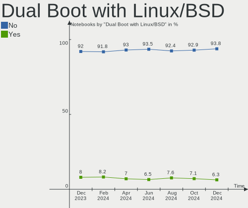
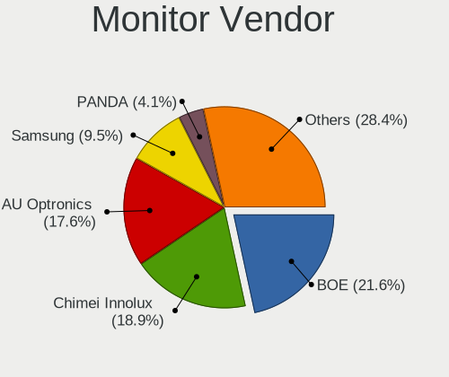
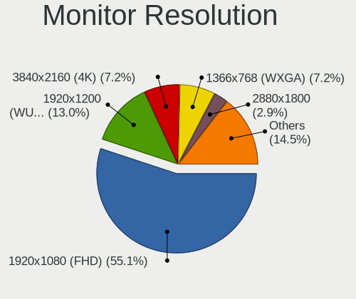
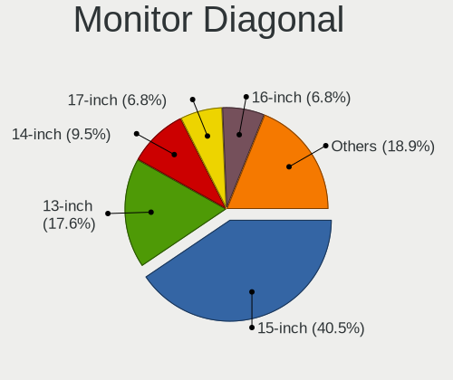
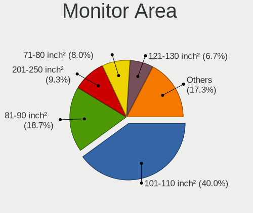
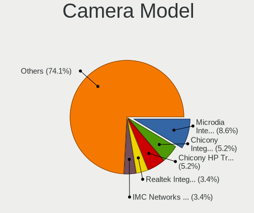

Kubuntu - Hardware Trends (Notebooks)
-------------------------------------

A project to identify most popular hardware characteristics and track their change
over time based on data collected by Linux users at https://Linux-Hardware.org.

Anyone can contribute to this report by the [hw-probe](https://github.com/linuxhw/hw-probe) tool:

    sudo -E hw-probe -all -upload

This report is for one last month. Overall report since the beginning of time: [TestCoverage](https://github.com/linuxhw/TestCoverage)

Period: May, 2022.

Contents
--------

* [ System ](#system)
  - [ OS                       ](#os)
  - [ OS Family                ](#os-family)
  - [ Kernel                   ](#kernel)
  - [ Kernel Family            ](#kernel-family)
  - [ Kernel Major Ver.        ](#kernel-major-ver)
  - [ Arch                     ](#arch)
  - [ DE                       ](#de)
  - [ Display Server           ](#display-server)
  - [ Display Manager          ](#display-manager)
  - [ OS Lang                  ](#os-lang)
  - [ Boot Mode                ](#boot-mode)
  - [ Filesystem               ](#filesystem)
  - [ Part. scheme             ](#part-scheme)
  - [ Dual Boot with Linux/BSD ](#dual-boot-with-linuxbsd)
  - [ Dual Boot (Win)          ](#dual-boot-win)

* [ Board ](#board)
  - [ Vendor                   ](#vendor)
  - [ Model                    ](#model)
  - [ Model Family             ](#model-family)
  - [ MFG Year                 ](#mfg-year)
  - [ Form Factor              ](#form-factor)
  - [ Secure Boot              ](#secure-boot)
  - [ Coreboot                 ](#coreboot)
  - [ RAM Size                 ](#ram-size)
  - [ RAM Used                 ](#ram-used)
  - [ Total Drives             ](#total-drives)
  - [ Has CD-ROM               ](#has-cd-rom)
  - [ Has Ethernet             ](#has-ethernet)
  - [ Has WiFi                 ](#has-wifi)
  - [ Has Bluetooth            ](#has-bluetooth)

* [ Location ](#location)
  - [ Country                  ](#country)
  - [ City                     ](#city)

* [ Drives ](#drives)
  - [ Drive Vendor             ](#drive-vendor)
  - [ Drive Model              ](#drive-model)
  - [ HDD Vendor               ](#hdd-vendor)
  - [ SSD Vendor               ](#ssd-vendor)
  - [ Drive Kind               ](#drive-kind)
  - [ Drive Connector          ](#drive-connector)
  - [ Drive Size               ](#drive-size)
  - [ Space Total              ](#space-total)
  - [ Space Used               ](#space-used)
  - [ Malfunc. Drives          ](#malfunc-drives)
  - [ Malfunc. Drive Vendor    ](#malfunc-drive-vendor)
  - [ Malfunc. HDD Vendor      ](#malfunc-hdd-vendor)
  - [ Malfunc. Drive Kind      ](#malfunc-drive-kind)
  - [ Failed Drives            ](#failed-drives)
  - [ Failed Drive Vendor      ](#failed-drive-vendor)
  - [ Drive Status             ](#drive-status)

* [ Storage controller ](#storage-controller)
  - [ Storage Vendor           ](#storage-vendor)
  - [ Storage Model            ](#storage-model)
  - [ Storage Kind             ](#storage-kind)

* [ Processor ](#processor)
  - [ CPU Vendor               ](#cpu-vendor)
  - [ CPU Model                ](#cpu-model)
  - [ CPU Model Family         ](#cpu-model-family)
  - [ CPU Cores                ](#cpu-cores)
  - [ CPU Sockets              ](#cpu-sockets)
  - [ CPU Threads              ](#cpu-threads)
  - [ CPU Op-Modes             ](#cpu-op-modes)
  - [ CPU Microcode            ](#cpu-microcode)
  - [ CPU Microarch            ](#cpu-microarch)

* [ Graphics ](#graphics)
  - [ GPU Vendor               ](#gpu-vendor)
  - [ GPU Model                ](#gpu-model)
  - [ GPU Combo                ](#gpu-combo)
  - [ GPU Driver               ](#gpu-driver)
  - [ GPU Memory               ](#gpu-memory)

* [ Monitor ](#monitor)
  - [ Monitor Vendor           ](#monitor-vendor)
  - [ Monitor Model            ](#monitor-model)
  - [ Monitor Resolution       ](#monitor-resolution)
  - [ Monitor Diagonal         ](#monitor-diagonal)
  - [ Monitor Width            ](#monitor-width)
  - [ Aspect Ratio             ](#aspect-ratio)
  - [ Monitor Area             ](#monitor-area)
  - [ Pixel Density            ](#pixel-density)
  - [ Multiple Monitors        ](#multiple-monitors)

* [ Network ](#network)
  - [ Net Controller Vendor    ](#net-controller-vendor)
  - [ Net Controller Model     ](#net-controller-model)
  - [ Wireless Vendor          ](#wireless-vendor)
  - [ Wireless Model           ](#wireless-model)
  - [ Ethernet Vendor          ](#ethernet-vendor)
  - [ Ethernet Model           ](#ethernet-model)
  - [ Net Controller Kind      ](#net-controller-kind)
  - [ Used Controller          ](#used-controller)
  - [ NICs                     ](#nics)
  - [ IPv6                     ](#ipv6)

* [ Bluetooth ](#bluetooth)
  - [ Bluetooth Vendor         ](#bluetooth-vendor)
  - [ Bluetooth Model          ](#bluetooth-model)

* [ Sound ](#sound)
  - [ Sound Vendor             ](#sound-vendor)
  - [ Sound Model              ](#sound-model)

* [ Memory ](#memory)
  - [ Memory Vendor            ](#memory-vendor)
  - [ Memory Model             ](#memory-model)
  - [ Memory Kind              ](#memory-kind)
  - [ Memory Form Factor       ](#memory-form-factor)
  - [ Memory Size              ](#memory-size)
  - [ Memory Speed             ](#memory-speed)

* [ Printers & scanners ](#printers--scanners)
  - [ Printer Vendor           ](#printer-vendor)
  - [ Printer Model            ](#printer-model)
  - [ Scanner Vendor           ](#scanner-vendor)
  - [ Scanner Model            ](#scanner-model)

* [ Camera ](#camera)
  - [ Camera Vendor            ](#camera-vendor)
  - [ Camera Model             ](#camera-model)

* [ Security ](#security)
  - [ Fingerprint Vendor       ](#fingerprint-vendor)
  - [ Fingerprint Model        ](#fingerprint-model)
  - [ Chipcard Vendor          ](#chipcard-vendor)
  - [ Chipcard Model           ](#chipcard-model)

* [ Unsupported ](#unsupported)
  - [ Unsupported Devices      ](#unsupported-devices)
  - [ Unsupported Device Types ](#unsupported-device-types)

System
------

OS
--

Installed operating systems

| Name          | Notebooks | Percent |
|---------------|-----------|---------|
| Kubuntu 22.04 | 28        | 51.85%  |
| Kubuntu 20.04 | 14        | 25.93%  |
| Kubuntu 21.10 | 7         | 12.96%  |
| Kubuntu 11    | 3         | 5.56%   |
| Kubuntu 21.04 | 1         | 1.85%   |
| Kubuntu 2.0   | 1         | 1.85%   |

OS Family
---------

OS without a version

| Name    | Notebooks | Percent |
|---------|-----------|---------|
| Kubuntu | 54        | 100%    |

Kernel
------

Version of the Linux kernel

| Version               | Notebooks | Percent |
|-----------------------|-----------|---------|
| 5.15.0-27-generic     | 8         | 14.81%  |
| 5.15.0-33-generic     | 6         | 11.11%  |
| 5.13.0-40-generic     | 6         | 11.11%  |
| 5.13.0-44-generic     | 5         | 9.26%   |
| 5.13.0-41-generic     | 5         | 9.26%   |
| 5.15.0-30-generic     | 4         | 7.41%   |
| 5.4.0-109-generic     | 3         | 5.56%   |
| 5.15.0-25-generic     | 3         | 5.56%   |
| 5.4.0-113-generic     | 2         | 3.7%    |
| 5.4.0-110-generic     | 2         | 3.7%    |
| 5.15.0-32-generic     | 2         | 3.7%    |
| 5.15.0-30-lowlatency  | 2         | 3.7%    |
| 5.4.0-59-generic      | 1         | 1.85%   |
| 5.17.5-051705-generic | 1         | 1.85%   |
| 5.15.0-29-generic     | 1         | 1.85%   |
| 5.15.0-10033-tuxedo   | 1         | 1.85%   |
| 5.11.0-49-generic     | 1         | 1.85%   |
| 5.11.0-27-generic     | 1         | 1.85%   |

Kernel Family
-------------

Linux kernel without a distro release

| Version | Notebooks | Percent |
|---------|-----------|---------|
| 5.15.0  | 27        | 50%     |
| 5.13.0  | 16        | 29.63%  |
| 5.4.0   | 8         | 14.81%  |
| 5.11.0  | 2         | 3.7%    |
| 5.17.5  | 1         | 1.85%   |

Kernel Major Ver.
-----------------

Linux kernel major version

| Version | Notebooks | Percent |
|---------|-----------|---------|
| 5.15    | 27        | 50%     |
| 5.13    | 16        | 29.63%  |
| 5.4     | 8         | 14.81%  |
| 5.11    | 2         | 3.7%    |
| 5.17    | 1         | 1.85%   |

Arch
----

OS architecture (x86_64, i586, etc.)

| Name   | Notebooks | Percent |
|--------|-----------|---------|
| x86_64 | 54        | 100%    |

DE
--

Desktop Environment

| Name | Notebooks | Percent |
|------|-----------|---------|
| KDE5 | 54        | 100%    |

Display Server
--------------

X11 or Wayland

| Name    | Notebooks | Percent |
|---------|-----------|---------|
| X11     | 53        | 98.15%  |
| Wayland | 1         | 1.85%   |

Display Manager
---------------

SDDM, LightDM, etc.

| Name    | Notebooks | Percent |
|---------|-----------|---------|
| SDDM    | 40        | 74.07%  |
| Unknown | 13        | 24.07%  |
| GDM3    | 1         | 1.85%   |

OS Lang
-------

Language

| Lang  | Notebooks | Percent |
|-------|-----------|---------|
| en_US | 27        | 50%     |
| de_DE | 5         | 9.26%   |
| en_GB | 3         | 5.56%   |
| en_AU | 3         | 5.56%   |
| ru_RU | 2         | 3.7%    |
| es_ES | 2         | 3.7%    |
| en_CA | 2         | 3.7%    |
| tr_TR | 1         | 1.85%   |
| sl_SI | 1         | 1.85%   |
| pt_BR | 1         | 1.85%   |
| hr_HR | 1         | 1.85%   |
| fr_FR | 1         | 1.85%   |
| es_MX | 1         | 1.85%   |
| es_EC | 1         | 1.85%   |
| en_ZA | 1         | 1.85%   |
| en_PH | 1         | 1.85%   |
| en_NZ | 1         | 1.85%   |

Boot Mode
---------

EFI or BIOS

| Mode | Notebooks | Percent |
|------|-----------|---------|
| BIOS | 28        | 51.85%  |
| EFI  | 26        | 48.15%  |

Filesystem
----------

Type of filesystem

| Type    | Notebooks | Percent |
|---------|-----------|---------|
| Ext4    | 50        | 92.59%  |
| Btrfs   | 2         | 3.7%    |
| Zfs     | 1         | 1.85%   |
| Overlay | 1         | 1.85%   |

Part. scheme
------------

Scheme of partitioning

| Type    | Notebooks | Percent |
|---------|-----------|---------|
| Unknown | 25        | 46.3%   |
| GPT     | 24        | 44.44%  |
| MBR     | 5         | 9.26%   |

Dual Boot with Linux/BSD
------------------------

Hosting more than one Linux/BSD

| Dual boot | Notebooks | Percent |
|-----------|-----------|---------|
| No        | 51        | 94.44%  |
| Yes       | 3         | 5.56%   |

Dual Boot (Win)
---------------

Hosting Linux and Windows

| Dual boot | Notebooks | Percent |
|-----------|-----------|---------|
| No        | 32        | 59.26%  |
| Yes       | 22        | 40.74%  |

Board
-----

Vendor
------

Motherboard manufacturer

| Name                | Notebooks | Percent |
|---------------------|-----------|---------|
| Hewlett-Packard     | 13        | 24.07%  |
| Lenovo              | 9         | 16.67%  |
| Dell                | 9         | 16.67%  |
| Acer                | 7         | 12.96%  |
| ASUSTek Computer    | 4         | 7.41%   |
| Toshiba             | 2         | 3.7%    |
| HUAWEI              | 2         | 3.7%    |
| Apple               | 2         | 3.7%    |
| TUXEDO              | 1         | 1.85%   |
| Razer               | 1         | 1.85%   |
| Medion              | 1         | 1.85%   |
| Google              | 1         | 1.85%   |
| Gigabyte Technology | 1         | 1.85%   |
| Alienware           | 1         | 1.85%   |

Model
-----

Motherboard model

| Name                                   | Notebooks | Percent |
|----------------------------------------|-----------|---------|
| HP ProBook 6470b                       | 2         | 3.7%    |
| TUXEDO Polaris 15 AMD Gen1             | 1         | 1.85%   |
| Toshiba Satellite C650D                | 1         | 1.85%   |
| Toshiba PORTEGE Z10t-A                 | 1         | 1.85%   |
| Razer Blade 15 Mid 2019-Base           | 1         | 1.85%   |
| Medion S6445 MD61489                   | 1         | 1.85%   |
| Lenovo ThinkPad X201 3680AC2           | 1         | 1.85%   |
| Lenovo ThinkPad T430 2347AT2           | 1         | 1.85%   |
| Lenovo ThinkPad T400 6474AL9           | 1         | 1.85%   |
| Lenovo ThinkPad E14 20RBS25S00         | 1         | 1.85%   |
| Lenovo IdeaPad L340-15IRH Gaming 81LK  | 1         | 1.85%   |
| Lenovo IdeaPad Gaming 3 15IHU6 82K1    | 1         | 1.85%   |
| Lenovo IdeaPad 500-15ISK 80NT          | 1         | 1.85%   |
| Lenovo IdeaPad 3 15ITL6 82H8           | 1         | 1.85%   |
| Lenovo G780 20138                      | 1         | 1.85%   |
| HUAWEI HVY-WXX9                        | 1         | 1.85%   |
| HUAWEI CREM-WXX9                       | 1         | 1.85%   |
| HP ProBook 6570b                       | 1         | 1.85%   |
| HP ProBook 6450b                       | 1         | 1.85%   |
| HP ProBook 470 G1                      | 1         | 1.85%   |
| HP Pavilion Laptop 15-cw1xxx           | 1         | 1.85%   |
| HP Pavilion Laptop 13-bb0xxx           | 1         | 1.85%   |
| HP Pavilion Gaming Laptop 15z-ec200    | 1         | 1.85%   |
| HP Pavilion g4                         | 1         | 1.85%   |
| HP Pavilion dv7                        | 1         | 1.85%   |
| HP 2000                                | 1         | 1.85%   |
| HP 15                                  | 1         | 1.85%   |
| Google Coral                           | 1         | 1.85%   |
| Gigabyte AORUS 15 XE4                  | 1         | 1.85%   |
| Dell XPS 13 9370                       | 1         | 1.85%   |
| Dell Vostro 5625                       | 1         | 1.85%   |
| Dell Vostro 5481                       | 1         | 1.85%   |
| Dell Precision 7710                    | 1         | 1.85%   |
| Dell Latitude E6540                    | 1         | 1.85%   |
| Dell Inspiron 7572                     | 1         | 1.85%   |
| Dell Inspiron 5593                     | 1         | 1.85%   |
| Dell Inspiron 15 7000 Gaming           | 1         | 1.85%   |
| Dell G7 7588                           | 1         | 1.85%   |
| ASUS X550JX                            | 1         | 1.85%   |
| ASUS X540LA                            | 1         | 1.85%   |
| ASUS VivoBook_ASUSLaptop X421EA_S433EA | 1         | 1.85%   |
| ASUS ROG Strix G513QY_G513QY           | 1         | 1.85%   |
| Apple MacBookPro13,2                   | 1         | 1.85%   |
| Apple MacBookPro11,2                   | 1         | 1.85%   |
| Alienware 17                           | 1         | 1.85%   |
| Acer Swift SFX14-41G                   | 1         | 1.85%   |
| Acer Predator PH315-53                 | 1         | 1.85%   |
| Acer Nitro AN515-45                    | 1         | 1.85%   |
| Acer Aspire M5-581TG                   | 1         | 1.85%   |
| Acer Aspire E5-573                     | 1         | 1.85%   |
| Acer Aspire AV15-51                    | 1         | 1.85%   |
| Acer Aspire A515-55                    | 1         | 1.85%   |
| Unknown                                | 1         | 1.85%   |

Model Family
------------

Motherboard model prefix

| Name               | Notebooks | Percent |
|--------------------|-----------|---------|
| HP ProBook         | 5         | 9.26%   |
| HP Pavilion        | 5         | 9.26%   |
| Lenovo ThinkPad    | 4         | 7.41%   |
| Lenovo IdeaPad     | 4         | 7.41%   |
| Acer Aspire        | 4         | 7.41%   |
| Dell Inspiron      | 3         | 5.56%   |
| Dell Vostro        | 2         | 3.7%    |
| TUXEDO Polaris     | 1         | 1.85%   |
| Toshiba Satellite  | 1         | 1.85%   |
| Toshiba PORTEGE    | 1         | 1.85%   |
| Razer Blade        | 1         | 1.85%   |
| Medion S6445       | 1         | 1.85%   |
| Lenovo G780        | 1         | 1.85%   |
| HUAWEI HVY-WXX9    | 1         | 1.85%   |
| HUAWEI CREM-WXX9   | 1         | 1.85%   |
| HP 2000            | 1         | 1.85%   |
| HP 15              | 1         | 1.85%   |
| Google Coral       | 1         | 1.85%   |
| Gigabyte AORUS     | 1         | 1.85%   |
| Dell XPS           | 1         | 1.85%   |
| Dell Precision     | 1         | 1.85%   |
| Dell Latitude      | 1         | 1.85%   |
| Dell G7            | 1         | 1.85%   |
| ASUS X550JX        | 1         | 1.85%   |
| ASUS X540LA        | 1         | 1.85%   |
| ASUS VivoBook      | 1         | 1.85%   |
| ASUS ROG           | 1         | 1.85%   |
| Apple MacBookPro13 | 1         | 1.85%   |
| Apple MacBookPro11 | 1         | 1.85%   |
| Alienware 17       | 1         | 1.85%   |
| Acer Swift         | 1         | 1.85%   |
| Acer Predator      | 1         | 1.85%   |
| Acer Nitro         | 1         | 1.85%   |
| Unknown            | 1         | 1.85%   |

MFG Year
--------

Motherboard manufacture year

| Year | Notebooks | Percent |
|------|-----------|---------|
| 2021 | 10        | 18.52%  |
| 2020 | 6         | 11.11%  |
| 2019 | 6         | 11.11%  |
| 2012 | 6         | 11.11%  |
| 2018 | 5         | 9.26%   |
| 2013 | 5         | 9.26%   |
| 2015 | 4         | 7.41%   |
| 2010 | 3         | 5.56%   |
| 2017 | 2         | 3.7%    |
| 2011 | 2         | 3.7%    |
| 2008 | 2         | 3.7%    |
| 2022 | 1         | 1.85%   |
| 2016 | 1         | 1.85%   |
| 2007 | 1         | 1.85%   |

Form Factor
-----------

Physical design of the computer

| Name     | Notebooks | Percent |
|----------|-----------|---------|
| Notebook | 54        | 100%    |

Secure Boot
-----------

Enabled or disabled

| State    | Notebooks | Percent |
|----------|-----------|---------|
| Disabled | 51        | 94.44%  |
| Enabled  | 3         | 5.56%   |

Coreboot
--------

Have coreboot on board

| Used | Notebooks | Percent |
|------|-----------|---------|
| No   | 53        | 98.15%  |
| Yes  | 1         | 1.85%   |

RAM Size
--------

Total RAM memory

| Size in GB  | Notebooks | Percent |
|-------------|-----------|---------|
| 16.01-24.0  | 17        | 31.48%  |
| 4.01-8.0    | 15        | 27.78%  |
| 8.01-16.0   | 11        | 20.37%  |
| 3.01-4.0    | 6         | 11.11%  |
| 32.01-64.0  | 2         | 3.7%    |
| 2.01-3.0    | 2         | 3.7%    |
| 64.01-256.0 | 1         | 1.85%   |

RAM Used
--------

Used RAM memory

| Used GB   | Notebooks | Percent |
|-----------|-----------|---------|
| 1.01-2.0  | 17        | 31.48%  |
| 4.01-8.0  | 16        | 29.63%  |
| 2.01-3.0  | 13        | 24.07%  |
| 3.01-4.0  | 7         | 12.96%  |
| 8.01-16.0 | 1         | 1.85%   |

Total Drives
------------

Number of drives on board

| Drives | Notebooks | Percent |
|--------|-----------|---------|
| 1      | 33        | 61.11%  |
| 2      | 19        | 35.19%  |
| 4      | 1         | 1.85%   |
| 0      | 1         | 1.85%   |

Has CD-ROM
----------

Has CD-ROM on board

| Presented | Notebooks | Percent |
|-----------|-----------|---------|
| No        | 38        | 70.37%  |
| Yes       | 16        | 29.63%  |

Has Ethernet
------------

Has Ethernet on board

| Presented | Notebooks | Percent |
|-----------|-----------|---------|
| Yes       | 45        | 83.33%  |
| No        | 9         | 16.67%  |

Has WiFi
--------

Has WiFi module

| Presented | Notebooks | Percent |
|-----------|-----------|---------|
| Yes       | 54        | 100%    |

Has Bluetooth
-------------

Has Bluetooth module

| Presented | Notebooks | Percent |
|-----------|-----------|---------|
| Yes       | 45        | 83.33%  |
| No        | 9         | 16.67%  |

Location
--------

Country
-------

Geographic location (country)

| Country      | Notebooks | Percent |
|--------------|-----------|---------|
| USA          | 14        | 25.93%  |
| Germany      | 5         | 9.26%   |
| UK           | 3         | 5.56%   |
| Russia       | 3         | 5.56%   |
| Australia    | 3         | 5.56%   |
| Spain        | 2         | 3.7%    |
| Netherlands  | 2         | 3.7%    |
| Canada       | 2         | 3.7%    |
| Brazil       | 2         | 3.7%    |
| UAE          | 1         | 1.85%   |
| Turkey       | 1         | 1.85%   |
| Switzerland  | 1         | 1.85%   |
| Sri Lanka    | 1         | 1.85%   |
| South Africa | 1         | 1.85%   |
| Slovenia     | 1         | 1.85%   |
| Philippines  | 1         | 1.85%   |
| Paraguay     | 1         | 1.85%   |
| New Zealand  | 1         | 1.85%   |
| Mexico       | 1         | 1.85%   |
| Kyrgyzstan   | 1         | 1.85%   |
| Indonesia    | 1         | 1.85%   |
| Greece       | 1         | 1.85%   |
| Georgia      | 1         | 1.85%   |
| France       | 1         | 1.85%   |
| Ecuador      | 1         | 1.85%   |
| Croatia      | 1         | 1.85%   |
| Bangladesh   | 1         | 1.85%   |

City
----

Geographic location (city)

| City               | Notebooks | Percent |
|--------------------|-----------|---------|
| Perth Amboy        | 2         | 3.7%    |
| Moscow             | 2         | 3.7%    |
| Casa Grande        | 2         | 3.7%    |
| Brisbane           | 2         | 3.7%    |
| Zapopan            | 1         | 1.85%   |
| Woodbine           | 1         | 1.85%   |
| Weimar             | 1         | 1.85%   |
| Vitoria-Gasteiz    | 1         | 1.85%   |
| Vermilion          | 1         | 1.85%   |
| St. Petersburg     | 1         | 1.85%   |
| St Petersburg      | 1         | 1.85%   |
| Sherpur            | 1         | 1.85%   |
| Sesvete            | 1         | 1.85%   |
| Seattle            | 1         | 1.85%   |
| Sao Paulo          | 1         | 1.85%   |
| San Pedro          | 1         | 1.85%   |
| Reigate            | 1         | 1.85%   |
| Quito              | 1         | 1.85%   |
| Phoenix            | 1         | 1.85%   |
| Pass Christian     | 1         | 1.85%   |
| Oviedo             | 1         | 1.85%   |
| Northwood          | 1         | 1.85%   |
| Nieuwegein         | 1         | 1.85%   |
| Napier City        | 1         | 1.85%   |
| Montreal           | 1         | 1.85%   |
| Midlothian         | 1         | 1.85%   |
| Madrid             | 1         | 1.85%   |
| Limbach-Oberfrohna | 1         | 1.85%   |
| Lesicno            | 1         | 1.85%   |
| Leipzig            | 1         | 1.85%   |
| Katerini           | 1         | 1.85%   |
| K'alak'i T'bilisi  | 1         | 1.85%   |
| Johannesburg       | 1         | 1.85%   |
| Jakarta            | 1         | 1.85%   |
| Izmir              | 1         | 1.85%   |
| Doncaster          | 1         | 1.85%   |
| Dieppe             | 1         | 1.85%   |
| Dallas             | 1         | 1.85%   |
| Colombo            | 1         | 1.85%   |
| Cleveland          | 1         | 1.85%   |
| Bonn               | 1         | 1.85%   |
| Bishkek            | 1         | 1.85%   |
| Bern               | 1         | 1.85%   |
| Berlin             | 1         | 1.85%   |
| Asunción          | 1         | 1.85%   |
| Ascot              | 1         | 1.85%   |
| Amsterdam          | 1         | 1.85%   |
| Americana          | 1         | 1.85%   |
| Adelaide           | 1         | 1.85%   |
| Abu Dhabi          | 1         | 1.85%   |

Drives
------

Drive Vendor
------------

Hard drive vendors

| Vendor                         | Notebooks | Drives | Percent |
|--------------------------------|-----------|--------|---------|
| Samsung Electronics            | 11        | 13     | 15.94%  |
| Seagate                        | 8         | 8      | 11.59%  |
| Sandisk                        | 7         | 7      | 10.14%  |
| WDC                            | 6         | 7      | 8.7%    |
| Toshiba                        | 5         | 5      | 7.25%   |
| Intel                          | 5         | 6      | 7.25%   |
| Kingston                       | 4         | 4      | 5.8%    |
| Crucial                        | 3         | 3      | 4.35%   |
| Unknown                        | 2         | 2      | 2.9%    |
| SK Hynix                       | 2         | 2      | 2.9%    |
| LITEON                         | 2         | 2      | 2.9%    |
| Apple                          | 2         | 3      | 2.9%    |
| UMIS                           | 1         | 1      | 1.45%   |
| Solid State Storage Technology | 1         | 1      | 1.45%   |
| Silicon Motion                 | 1         | 1      | 1.45%   |
| Realtek Semiconductor          | 1         | 1      | 1.45%   |
| Phison                         | 1         | 1      | 1.45%   |
| Micron Technology              | 1         | 1      | 1.45%   |
| Inateck                        | 1         | 1      | 1.45%   |
| Hitachi                        | 1         | 1      | 1.45%   |
| HGST HTS                       | 1         | 1      | 1.45%   |
| China                          | 1         | 1      | 1.45%   |
| A-DATA Technology              | 1         | 1      | 1.45%   |
| Unknown                        | 1         | 1      | 1.45%   |

Drive Model
-----------

Hard drive models

| Model                                    | Notebooks | Percent |
|------------------------------------------|-----------|---------|
| SK Hynix NVMe SSD Drive 512GB            | 2         | 2.7%    |
| Seagate ST1000LM035-1RK172 1TB           | 2         | 2.7%    |
| SanDisk SSD PLUS 120GB                   | 2         | 2.7%    |
| Samsung SSD 860 EVO M.2 500GB            | 2         | 2.7%    |
| WDC WDS100T2G0A-00JH30 1TB SSD           | 1         | 1.35%   |
| WDC WD7500BPKX-75HPJT0 752GB             | 1         | 1.35%   |
| WDC WD5000BPVT-75HXZT3 500GB             | 1         | 1.35%   |
| WDC WD5000BPKX-22HPJT0 500GB             | 1         | 1.35%   |
| WDC WD10SPSX-60A6WT0 1TB                 | 1         | 1.35%   |
| WDC WD10JPLX-00MBPT0 1TB                 | 1         | 1.35%   |
| WDC PC SN730 SDBPNTY-512G                | 1         | 1.35%   |
| Unknown hB8aP  32GB                      | 1         | 1.35%   |
| Unknown 00000  8GB                       | 1         | 1.35%   |
| UMIS RPJTJ256MEE1OWX 256GB               | 1         | 1.35%   |
| Toshiba THNSNJ256GMCU 256GB SSD          | 1         | 1.35%   |
| Toshiba NVMe SSD Drive 512GB             | 1         | 1.35%   |
| Toshiba MQ01ABD075 752GB                 | 1         | 1.35%   |
| Toshiba MQ01ABD050V 500GB                | 1         | 1.35%   |
| Toshiba KXG50ZNV256G NVMe 256GB          | 1         | 1.35%   |
| Solid State Storage NVMe SSD Drive 256GB | 1         | 1.35%   |
| Silicon Motion PCIe-8 SSD 512GB          | 1         | 1.35%   |
| Seagate ST9160412AS 160GB                | 1         | 1.35%   |
| Seagate ST500LT012-9WS142 500GB          | 1         | 1.35%   |
| Seagate ST500LT012-1DG142 500GB          | 1         | 1.35%   |
| Seagate ST500LM012 HN-M500MBB 500GB      | 1         | 1.35%   |
| Seagate ST1000LM024 HN-M101MBB 1TB       | 1         | 1.35%   |
| Seagate Expansion HDD 2TB                | 1         | 1.35%   |
| SanDisk X600 M.2 2280 SATA 128GB SSD     | 1         | 1.35%   |
| SanDisk SDSSDH3 512G                     | 1         | 1.35%   |
| SanDisk SDSSDA240G 240GB                 | 1         | 1.35%   |
| SanDisk Portable SSD 480GB               | 1         | 1.35%   |
| Sandisk NVMe SSD Drive 1024GB            | 1         | 1.35%   |
| Samsung SSD 970 EVO Plus 500GB           | 1         | 1.35%   |
| Samsung SSD 860 QVO 1TB                  | 1         | 1.35%   |
| Samsung SSD 860 EVO 500GB                | 1         | 1.35%   |
| Samsung SSD 860 EVO 2TB                  | 1         | 1.35%   |
| Samsung SSD 850 EVO mSATA 250GB          | 1         | 1.35%   |
| Samsung SSD 850 EVO M.2 1TB              | 1         | 1.35%   |
| Samsung SSD 850 EVO 1TB                  | 1         | 1.35%   |
| Samsung NVMe SSD Drive 512GB             | 1         | 1.35%   |
| Samsung NVMe SSD Drive 1TB               | 1         | 1.35%   |
| Samsung MZVLQ1T0HALB-000H1 1TB           | 1         | 1.35%   |
| Samsung MZVLQ1T0HALB-00000 1TB           | 1         | 1.35%   |
| Realtek NVMe SSD Drive 1024GB            | 1         | 1.35%   |
| Phison NVMe SSD Drive 1024GB             | 1         | 1.35%   |
| Micron MTFDHBA256TDV-1AY1AABHA 256GB     | 1         | 1.35%   |
| LITEON CV8-8E128 128GB SSD               | 1         | 1.35%   |
| LITEON CV3-8D128-11 SATA 128GB SSD       | 1         | 1.35%   |
| Kingston SA400S37960G 960GB SSD          | 1         | 1.35%   |
| Kingston SA400S37240G 240GB SSD          | 1         | 1.35%   |
| Kingston OM8PDP3512B-AA1 512GB           | 1         | 1.35%   |
| Kingston NVMe SSD Drive 512GB            | 1         | 1.35%   |
| Intel SSDPEKNW512G8L 512GB               | 1         | 1.35%   |
| Intel SSDPEKNW512G8H 512GB               | 1         | 1.35%   |
| Intel SSDPEKNW020T8 2TB                  | 1         | 1.35%   |
| Intel SSDPEKNW010T8 1TB                  | 1         | 1.35%   |
| Intel HBRPEKNX0202AO 32GB                | 1         | 1.35%   |
| Intel HBRPEKNX0202A 512GB                | 1         | 1.35%   |
| Inateck FE2005 1TB                       | 1         | 1.35%   |
| Hitachi HTS543232A7A384 320GB            | 1         | 1.35%   |

HDD Vendor
----------

Hard disk drive vendors

| Vendor   | Notebooks | Drives | Percent |
|----------|-----------|--------|---------|
| Seagate  | 8         | 8      | 47.06%  |
| WDC      | 5         | 5      | 29.41%  |
| Toshiba  | 2         | 2      | 11.76%  |
| Hitachi  | 1         | 1      | 5.88%   |
| HGST HTS | 1         | 1      | 5.88%   |

SSD Vendor
----------

Solid state drive vendors

| Vendor              | Notebooks | Drives | Percent |
|---------------------|-----------|--------|---------|
| SanDisk             | 6         | 6      | 26.09%  |
| Samsung Electronics | 6         | 8      | 26.09%  |
| Crucial             | 3         | 3      | 13.04%  |
| LITEON              | 2         | 2      | 8.7%    |
| Kingston            | 2         | 2      | 8.7%    |
| WDC                 | 1         | 1      | 4.35%   |
| Toshiba             | 1         | 1      | 4.35%   |
| Apple               | 1         | 1      | 4.35%   |
| A-DATA Technology   | 1         | 1      | 4.35%   |

Drive Kind
----------

HDD or SSD

| Kind    | Notebooks | Drives | Percent |
|---------|-----------|--------|---------|
| NVMe    | 23        | 27     | 34.85%  |
| SSD     | 21        | 25     | 31.82%  |
| HDD     | 17        | 17     | 25.76%  |
| MMC     | 3         | 3      | 4.55%   |
| Unknown | 2         | 2      | 3.03%   |

Drive Connector
---------------

SATA, SAS, NVMe, etc.

| Type | Notebooks | Drives | Percent |
|------|-----------|--------|---------|
| SATA | 32        | 40     | 51.61%  |
| NVMe | 23        | 27     | 37.1%   |
| SAS  | 4         | 4      | 6.45%   |
| MMC  | 3         | 3      | 4.84%   |

Drive Size
----------

Size of hard drive

| Size in TB | Notebooks | Drives | Percent |
|------------|-----------|--------|---------|
| 0.01-0.5   | 24        | 25     | 61.54%  |
| 0.51-1.0   | 12        | 14     | 30.77%  |
| 1.01-2.0   | 3         | 3      | 7.69%   |

Space Total
-----------

Amount of disk space available on the file system

| Size in GB     | Notebooks | Percent |
|----------------|-----------|---------|
| 101-250        | 13        | 24.07%  |
| 251-500        | 12        | 22.22%  |
| 501-1000       | 11        | 20.37%  |
| 1001-2000      | 7         | 12.96%  |
| 51-100         | 5         | 9.26%   |
| 2001-3000      | 3         | 5.56%   |
| More than 3000 | 1         | 1.85%   |
| 21-50          | 1         | 1.85%   |
| 1-20           | 1         | 1.85%   |

Space Used
----------

Amount of used disk space

| Used GB   | Notebooks | Percent |
|-----------|-----------|---------|
| 1-20      | 11        | 20.37%  |
| 51-100    | 11        | 20.37%  |
| 21-50     | 10        | 18.52%  |
| 101-250   | 6         | 11.11%  |
| 501-1000  | 6         | 11.11%  |
| 251-500   | 5         | 9.26%   |
| 1001-2000 | 4         | 7.41%   |
| 2001-3000 | 1         | 1.85%   |

Malfunc. Drives
---------------

Drive models with a malfunction

| Model                             | Notebooks | Drives | Percent |
|-----------------------------------|-----------|--------|---------|
| Toshiba MQ01ABD075 752GB          | 1         | 1      | 25%     |
| Seagate ST500LT012-9WS142 500GB   | 1         | 1      | 25%     |
| Crucial CT128M550SSD1 128GB       | 1         | 1      | 25%     |
| A-DATA Technology SP550 240GB SSD | 1         | 1      | 25%     |

Malfunc. Drive Vendor
---------------------

Vendors of faulty drives

| Vendor            | Notebooks | Drives | Percent |
|-------------------|-----------|--------|---------|
| Toshiba           | 1         | 1      | 25%     |
| Seagate           | 1         | 1      | 25%     |
| Crucial           | 1         | 1      | 25%     |
| A-DATA Technology | 1         | 1      | 25%     |

Malfunc. HDD Vendor
-------------------

Vendors of faulty HDD drives

| Vendor  | Notebooks | Drives | Percent |
|---------|-----------|--------|---------|
| Toshiba | 1         | 1      | 50%     |
| Seagate | 1         | 1      | 50%     |

Malfunc. Drive Kind
-------------------

Kinds of faulty drives

| Kind | Notebooks | Drives | Percent |
|------|-----------|--------|---------|
| SSD  | 2         | 2      | 50%     |
| HDD  | 2         | 2      | 50%     |

Failed Drives
-------------

Failed drive models

Zero info for selected period =(

Failed Drive Vendor
-------------------

Failed drive vendors

Zero info for selected period =(

Drive Status
------------

Number of failed and malfunc. drives

| Status   | Notebooks | Drives | Percent |
|----------|-----------|--------|---------|
| Detected | 28        | 34     | 47.46%  |
| Works    | 27        | 36     | 45.76%  |
| Malfunc  | 4         | 4      | 6.78%   |

Storage controller
------------------

Storage Vendor
--------------

Storage controller vendors

| Vendor                         | Notebooks | Percent |
|--------------------------------|-----------|---------|
| Intel                          | 39        | 57.35%  |
| AMD                            | 8         | 11.76%  |
| Samsung Electronics            | 6         | 8.82%   |
| Toshiba America Info Systems   | 2         | 2.94%   |
| SK Hynix                       | 2         | 2.94%   |
| Sandisk                        | 2         | 2.94%   |
| Kingston Technology Company    | 2         | 2.94%   |
| Union Memory (Shenzhen)        | 1         | 1.47%   |
| Solid State Storage Technology | 1         | 1.47%   |
| Silicon Motion                 | 1         | 1.47%   |
| Realtek Semiconductor          | 1         | 1.47%   |
| Phison Electronics             | 1         | 1.47%   |
| Micron Technology              | 1         | 1.47%   |
| Apple                          | 1         | 1.47%   |

Storage Model
-------------

Storage controller models

| Model                                                                            | Notebooks | Percent |
|----------------------------------------------------------------------------------|-----------|---------|
| Intel 7 Series Chipset Family 6-port SATA Controller [AHCI mode]                 | 7         | 9.21%   |
| AMD FCH SATA Controller [AHCI mode]                                              | 7         | 9.21%   |
| Intel 82801 Mobile SATA Controller [RAID mode]                                   | 6         | 7.89%   |
| Intel Volume Management Device NVMe RAID Controller                              | 4         | 5.26%   |
| Intel SSD 660P Series                                                            | 4         | 5.26%   |
| Samsung NVMe SSD Controller 980                                                  | 3         | 3.95%   |
| Intel Tiger Lake-LP SATA Controller [AHCI mode]                                  | 3         | 3.95%   |
| Intel 82801IBM/IEM (ICH9M/ICH9M-E) 4 port SATA Controller [AHCI mode]            | 3         | 3.95%   |
| Sandisk WD Black SN750 / PC SN730 NVMe SSD                                       | 2         | 2.63%   |
| Kingston Company OM3PDP3 NVMe SSD                                                | 2         | 2.63%   |
| Intel Wildcat Point-LP SATA Controller [AHCI Mode]                               | 2         | 2.63%   |
| Intel Cannon Lake Mobile PCH SATA AHCI Controller                                | 2         | 2.63%   |
| Intel 8 Series/C220 Series Chipset Family 6-port SATA Controller 1 [AHCI mode]   | 2         | 2.63%   |
| Union Memory (Shenzhen) Non-Volatile memory controller                           | 1         | 1.32%   |
| Toshiba America Info Systems XG4 NVMe SSD Controller                             | 1         | 1.32%   |
| Toshiba America Info Systems Toshiba America Info Non-Volatile memory controller | 1         | 1.32%   |
| Solid State Storage Non-Volatile memory controller                               | 1         | 1.32%   |
| SK Hynix Gold P31 SSD                                                            | 1         | 1.32%   |
| SK Hynix BC511                                                                   | 1         | 1.32%   |
| Silicon Motion Non-Volatile memory controller                                    | 1         | 1.32%   |
| Samsung NVMe SSD Controller SM981/PM981/PM983                                    | 1         | 1.32%   |
| Samsung NVMe SSD Controller PM9A1/PM9A3/980PRO                                   | 1         | 1.32%   |
| Samsung Apple PCIe SSD                                                           | 1         | 1.32%   |
| Realtek Realtek Non-Volatile memory controller                                   | 1         | 1.32%   |
| Phison E18 PCIe4 NVMe Controller                                                 | 1         | 1.32%   |
| Micron Non-Volatile memory controller                                            | 1         | 1.32%   |
| Intel Sunrise Point-LP SATA Controller [AHCI mode]                               | 1         | 1.32%   |
| Intel Q170/Q150/B150/H170/H110/Z170/CM236 Chipset SATA Controller [AHCI Mode]    | 1         | 1.32%   |
| Intel Non-Volatile memory controller                                             | 1         | 1.32%   |
| Intel Ice Lake-LP SATA Controller [AHCI mode]                                    | 1         | 1.32%   |
| Intel HM170/QM170 Chipset SATA Controller [AHCI Mode]                            | 1         | 1.32%   |
| Intel Comet Lake SATA AHCI Controller                                            | 1         | 1.32%   |
| Intel Cannon Point-LP SATA Controller [AHCI Mode]                                | 1         | 1.32%   |
| Intel 82801GBM/GHM (ICH7-M Family) SATA Controller [AHCI mode]                   | 1         | 1.32%   |
| Intel 82801G (ICH7 Family) IDE Controller                                        | 1         | 1.32%   |
| Intel 8 Series SATA Controller 1 [AHCI mode]                                     | 1         | 1.32%   |
| Intel 5 Series/3400 Series Chipset 6 port SATA AHCI Controller                   | 1         | 1.32%   |
| Intel 5 Series/3400 Series Chipset 4 port SATA IDE Controller                    | 1         | 1.32%   |
| Intel 5 Series/3400 Series Chipset 2 port SATA IDE Controller                    | 1         | 1.32%   |
| Intel 400 Series Chipset Family SATA AHCI Controller                             | 1         | 1.32%   |
| Apple S3X NVMe Controller                                                        | 1         | 1.32%   |
| AMD SB7x0/SB8x0/SB9x0 SATA Controller [AHCI mode]                                | 1         | 1.32%   |

Storage Kind
------------

Kind of storage controller (IDE, SATA, NVMe, SAS, ...)

| Kind | Notebooks | Percent |
|------|-----------|---------|
| SATA | 38        | 52.05%  |
| NVMe | 23        | 31.51%  |
| RAID | 10        | 13.7%   |
| IDE  | 2         | 2.74%   |

Processor
---------

CPU Vendor
----------

Processor vendors

| Vendor | Notebooks | Percent |
|--------|-----------|---------|
| Intel  | 43        | 79.63%  |
| AMD    | 11        | 20.37%  |

CPU Model
---------

Processor models

| Model                                         | Notebooks | Percent |
|-----------------------------------------------|-----------|---------|
| Intel Core i5-3320M CPU @ 2.60GHz             | 3         | 5.56%   |
| Intel Core i7-8550U CPU @ 1.80GHz             | 2         | 3.7%    |
| Intel Core i7-1065G7 CPU @ 1.30GHz            | 2         | 3.7%    |
| Intel 11th Gen Core i5-1135G7 @ 2.40GHz       | 2         | 3.7%    |
| AMD Ryzen 7 5800H with Radeon Graphics        | 2         | 3.7%    |
| AMD Ryzen 5 4600H with Radeon Graphics        | 2         | 3.7%    |
| Intel Pentium CPU N4200 @ 1.10GHz             | 1         | 1.85%   |
| Intel Core i7-9750H CPU @ 2.60GHz             | 1         | 1.85%   |
| Intel Core i7-8750H CPU @ 2.20GHz             | 1         | 1.85%   |
| Intel Core i7-8565U CPU @ 1.80GHz             | 1         | 1.85%   |
| Intel Core i7-7700HQ CPU @ 2.80GHz            | 1         | 1.85%   |
| Intel Core i7-6820HQ CPU @ 2.70GHz            | 1         | 1.85%   |
| Intel Core i7-4770HQ CPU @ 2.20GHz            | 1         | 1.85%   |
| Intel Core i7-4720HQ CPU @ 2.60GHz            | 1         | 1.85%   |
| Intel Core i7-4700MQ CPU @ 2.40GHz            | 1         | 1.85%   |
| Intel Core i7-4510U CPU @ 2.00GHz             | 1         | 1.85%   |
| Intel Core i7-3612QM CPU @ 2.10GHz            | 1         | 1.85%   |
| Intel Core i7-3537U CPU @ 2.00GHz             | 1         | 1.85%   |
| Intel Core i7-10750H CPU @ 2.60GHz            | 1         | 1.85%   |
| Intel Core i5-9300H CPU @ 2.40GHz             | 1         | 1.85%   |
| Intel Core i5-8265U CPU @ 1.60GHz             | 1         | 1.85%   |
| Intel Core i5-6267U CPU @ 2.90GHz             | 1         | 1.85%   |
| Intel Core i5-6200U CPU @ 2.30GHz             | 1         | 1.85%   |
| Intel Core i5-4300M CPU @ 2.60GHz             | 1         | 1.85%   |
| Intel Core i5-3439Y CPU @ 1.50GHz             | 1         | 1.85%   |
| Intel Core i5-3210M CPU @ 2.50GHz             | 1         | 1.85%   |
| Intel Core i5-10210U CPU @ 1.60GHz            | 1         | 1.85%   |
| Intel Core i5 CPU M 520 @ 2.40GHz             | 1         | 1.85%   |
| Intel Core i5 CPU M 450 @ 2.40GHz             | 1         | 1.85%   |
| Intel Core i3-5020U CPU @ 2.20GHz             | 1         | 1.85%   |
| Intel Core i3-5005U CPU @ 2.00GHz             | 1         | 1.85%   |
| Intel Core i3-4000M CPU @ 2.40GHz             | 1         | 1.85%   |
| Intel Core 2 Quad CPU Q9000 @ 2.00GHz         | 1         | 1.85%   |
| Intel Core 2 Duo CPU P8400 @ 2.26GHz          | 1         | 1.85%   |
| Intel Core 2 CPU T5600 @ 1.83GHz              | 1         | 1.85%   |
| Intel Celeron Dual-Core CPU T3500 @ 2.10GHz   | 1         | 1.85%   |
| Intel 12th Gen Core i7-12700H                 | 1         | 1.85%   |
| Intel 11th Gen Core i7-1165G7 @ 2.80GHz       | 1         | 1.85%   |
| Intel 11th Gen Core i5-1155G7 @ 2.50GHz       | 1         | 1.85%   |
| Intel 11th Gen Core i5-11300H @ 3.10GHz       | 1         | 1.85%   |
| AMD Ryzen 9 5900HX with Radeon Graphics       | 1         | 1.85%   |
| AMD Ryzen 7 5825U with Radeon Graphics        | 1         | 1.85%   |
| AMD Ryzen 5 5600U with Radeon Graphics        | 1         | 1.85%   |
| AMD Ryzen 5 5600H with Radeon Graphics        | 1         | 1.85%   |
| AMD Ryzen 5 3500U with Radeon Vega Mobile Gfx | 1         | 1.85%   |
| AMD E-300 APU with Radeon HD Graphics         | 1         | 1.85%   |
| AMD A6-3420M APU with Radeon HD Graphics      | 1         | 1.85%   |

CPU Model Family
----------------

Processor model prefix

| Model                   | Notebooks | Percent |
|-------------------------|-----------|---------|
| Intel Core i7           | 16        | 29.63%  |
| Intel Core i5           | 13        | 24.07%  |
| Other                   | 6         | 11.11%  |
| AMD Ryzen 5             | 5         | 9.26%   |
| Intel Core i3           | 3         | 5.56%   |
| AMD Ryzen 7             | 3         | 5.56%   |
| Intel Pentium           | 1         | 1.85%   |
| Intel Core 2 Quad       | 1         | 1.85%   |
| Intel Core 2 Duo        | 1         | 1.85%   |
| Intel Core 2            | 1         | 1.85%   |
| Intel Celeron Dual-Core | 1         | 1.85%   |
| AMD Ryzen 9             | 1         | 1.85%   |
| AMD E                   | 1         | 1.85%   |
| AMD A6                  | 1         | 1.85%   |

CPU Cores
---------

Number of processor cores

| Number | Notebooks | Percent |
|--------|-----------|---------|
| 4      | 23        | 42.59%  |
| 2      | 19        | 35.19%  |
| 6      | 7         | 12.96%  |
| 8      | 4         | 7.41%   |
| 14     | 1         | 1.85%   |

CPU Sockets
-----------

Number of sockets

| Number | Notebooks | Percent |
|--------|-----------|---------|
| 1      | 54        | 100%    |

CPU Threads
-----------

Threads per core (Hyper-Threading)

| Number | Notebooks | Percent |
|--------|-----------|---------|
| 2      | 47        | 87.04%  |
| 1      | 7         | 12.96%  |

CPU Op-Modes
------------

CPU Operation Modes (32-bit, 64-bit)

| Op mode        | Notebooks | Percent |
|----------------|-----------|---------|
| 32-bit, 64-bit | 54        | 100%    |

CPU Microcode
-------------

Microcode number

| Number     | Notebooks | Percent |
|------------|-----------|---------|
| Unknown    | 20        | 37.04%  |
| 0x306a9    | 5         | 9.26%   |
| 0x306c3    | 4         | 7.41%   |
| 0x806c1    | 3         | 5.56%   |
| 0x1067a    | 3         | 5.56%   |
| 0x806eb    | 2         | 3.7%    |
| 0x306d4    | 2         | 3.7%    |
| 0x20655    | 2         | 3.7%    |
| 0x0a50000c | 2         | 3.7%    |
| 0x906ea    | 1         | 1.85%   |
| 0x806ea    | 1         | 1.85%   |
| 0x806c2    | 1         | 1.85%   |
| 0x706e5    | 1         | 1.85%   |
| 0x6f6      | 1         | 1.85%   |
| 0x506e3    | 1         | 1.85%   |
| 0x40661    | 1         | 1.85%   |
| 0x08600106 | 1         | 1.85%   |
| 0x08600103 | 1         | 1.85%   |
| 0x08108102 | 1         | 1.85%   |
| 0x03000027 | 1         | 1.85%   |

CPU Microarch
-------------

Microarchitecture

| Name      | Notebooks | Percent |
|-----------|-----------|---------|
| KabyLake  | 9         | 16.67%  |
| IvyBridge | 7         | 12.96%  |
| Zen 3     | 6         | 11.11%  |
| Haswell   | 6         | 11.11%  |
| TigerLake | 5         | 9.26%   |
| Skylake   | 3         | 5.56%   |
| Penryn    | 3         | 5.56%   |
| Zen 2     | 2         | 3.7%    |
| Westmere  | 2         | 3.7%    |
| IceLake   | 2         | 3.7%    |
| Broadwell | 2         | 3.7%    |
| Zen+      | 1         | 1.85%   |
| K10 Llano | 1         | 1.85%   |
| Goldmont  | 1         | 1.85%   |
| Core      | 1         | 1.85%   |
| CometLake | 1         | 1.85%   |
| Bobcat    | 1         | 1.85%   |
| Unknown   | 1         | 1.85%   |

Graphics
--------

GPU Vendor
----------

Vendors of graphics cards

| Vendor | Notebooks | Percent |
|--------|-----------|---------|
| Intel  | 42        | 56%     |
| Nvidia | 17        | 22.67%  |
| AMD    | 16        | 21.33%  |

GPU Model
---------

Graphics card models

| Model                                                                                 | Notebooks | Percent |
|---------------------------------------------------------------------------------------|-----------|---------|
| Intel 3rd Gen Core processor Graphics Controller                                      | 7         | 8.97%   |
| Intel TigerLake-LP GT2 [Iris Xe Graphics]                                             | 5         | 6.41%   |
| AMD Cezanne                                                                           | 5         | 6.41%   |
| Intel 4th Gen Core Processor Integrated Graphics Controller                           | 4         | 5.13%   |
| Intel CoffeeLake-H GT2 [UHD Graphics 630]                                             | 3         | 3.85%   |
| Nvidia TU106M [GeForce RTX 2060 Mobile]                                               | 2         | 2.56%   |
| Nvidia GA107M [GeForce RTX 3050 Mobile]                                               | 2         | 2.56%   |
| Intel WhiskeyLake-U GT2 [UHD Graphics 620]                                            | 2         | 2.56%   |
| Intel UHD Graphics 620                                                                | 2         | 2.56%   |
| Intel Mobile 4 Series Chipset Integrated Graphics Controller                          | 2         | 2.56%   |
| Intel Iris Plus Graphics G7                                                           | 2         | 2.56%   |
| Intel HD Graphics 5500                                                                | 2         | 2.56%   |
| Intel Core Processor Integrated Graphics Controller                                   | 2         | 2.56%   |
| AMD Renoir                                                                            | 2         | 2.56%   |
| Nvidia TU117M [GeForce GTX 1650 Mobile / Max-Q]                                       | 1         | 1.28%   |
| Nvidia TU117M                                                                         | 1         | 1.28%   |
| Nvidia TU116M [GeForce GTX 1660 Ti Mobile]                                            | 1         | 1.28%   |
| Nvidia GP108M [GeForce MX150]                                                         | 1         | 1.28%   |
| Nvidia GP107M [GeForce GTX 1050 Ti Mobile]                                            | 1         | 1.28%   |
| Nvidia GP106M [GeForce GTX 1060 Mobile]                                               | 1         | 1.28%   |
| Nvidia GM108M [GeForce MX130]                                                         | 1         | 1.28%   |
| Nvidia GM107M [GeForce GTX 950M]                                                      | 1         | 1.28%   |
| Nvidia GK107M [GeForce GT 640M]                                                       | 1         | 1.28%   |
| Nvidia GK106M [GeForce GTX 770M]                                                      | 1         | 1.28%   |
| Nvidia GF108M [GeForce GT 635M]                                                       | 1         | 1.28%   |
| Nvidia GA104M [GeForce RTX 3070 Mobile / Max-Q]                                       | 1         | 1.28%   |
| Nvidia GA104 [Geforce RTX 3070 Ti Laptop GPU]                                         | 1         | 1.28%   |
| Intel Skylake GT2 [HD Graphics 520]                                                   | 1         | 1.28%   |
| Intel Mobile 945GM/GMS/GME, 943/940GML Express Integrated Graphics Controller         | 1         | 1.28%   |
| Intel Mobile 945GM/GMS, 943/940GML Express Integrated Graphics Controller             | 1         | 1.28%   |
| Intel Iris Graphics 550                                                               | 1         | 1.28%   |
| Intel HD Graphics 630                                                                 | 1         | 1.28%   |
| Intel HD Graphics 530                                                                 | 1         | 1.28%   |
| Intel Haswell-ULT Integrated Graphics Controller                                      | 1         | 1.28%   |
| Intel Crystal Well Integrated Graphics Controller                                     | 1         | 1.28%   |
| Intel CometLake-U GT2 [UHD Graphics]                                                  | 1         | 1.28%   |
| Intel CometLake-H GT2 [UHD Graphics]                                                  | 1         | 1.28%   |
| Intel Celeron N3350/Pentium N4200/Atom E3900 Series Integrated Graphics Controller    | 1         | 1.28%   |
| Intel Alder Lake-P Integrated Graphics Controller                                     | 1         | 1.28%   |
| AMD Wrestler [Radeon HD 6310]                                                         | 1         | 1.28%   |
| AMD Venus XTX [Radeon HD 8890M / R9 M275X/M375X]                                      | 1         | 1.28%   |
| AMD Topaz XT [Radeon R7 M260/M265 / M340/M360 / M440/M445 / 530/535 / 620/625 Mobile] | 1         | 1.28%   |
| AMD Sumo [Radeon HD 6520G]                                                            | 1         | 1.28%   |
| AMD Seymour [Radeon HD 6400M/7400M Series]                                            | 1         | 1.28%   |
| AMD RV730/M96 [Mobility Radeon HD 4650/5165]                                          | 1         | 1.28%   |
| AMD Picasso/Raven 2 [Radeon Vega Series / Radeon Vega Mobile Series]                  | 1         | 1.28%   |
| AMD Navi 22 [Radeon RX 6700/6700 XT/6750 XT / 6800M]                                  | 1         | 1.28%   |
| AMD Mars [Radeon HD 8670A/8670M/8750M / R7 M370]                                      | 1         | 1.28%   |
| AMD Mars XTX [Radeon HD 8790M]                                                        | 1         | 1.28%   |
| AMD Barcelo                                                                           | 1         | 1.28%   |

GPU Combo
---------

Combinations of graphics cards

| Name           | Notebooks | Percent |
|----------------|-----------|---------|
| 1 x Intel      | 25        | 46.3%   |
| Intel + Nvidia | 13        | 24.07%  |
| 1 x AMD        | 6         | 11.11%  |
| Intel + AMD    | 4         | 7.41%   |
| AMD + Nvidia   | 4         | 7.41%   |
| 2 x AMD        | 2         | 3.7%    |

GPU Driver
----------

Free vs proprietary

| Driver      | Notebooks | Percent |
|-------------|-----------|---------|
| Free        | 43        | 79.63%  |
| Proprietary | 11        | 20.37%  |

GPU Memory
----------

Total video memory

| Size in GB | Notebooks | Percent |
|------------|-----------|---------|
| Unknown    | 39        | 72.22%  |
| 1.01-2.0   | 4         | 7.41%   |
| 0.01-0.5   | 4         | 7.41%   |
| 0.51-1.0   | 3         | 5.56%   |
| 3.01-4.0   | 2         | 3.7%    |
| 7.01-8.0   | 1         | 1.85%   |
| 2.01-3.0   | 1         | 1.85%   |

Monitor
-------

Monitor Vendor
--------------

Monitor vendors

| Vendor              | Notebooks | Percent |
|---------------------|-----------|---------|
| LG Display          | 12        | 17.65%  |
| AU Optronics        | 11        | 16.18%  |
| Chimei Innolux      | 10        | 14.71%  |
| BOE                 | 10        | 14.71%  |
| Samsung Electronics | 5         | 7.35%   |
| Goldstar            | 4         | 5.88%   |
| Hewlett-Packard     | 3         | 4.41%   |
| ASUSTek Computer    | 3         | 4.41%   |
| Sharp               | 2         | 2.94%   |
| Lenovo              | 2         | 2.94%   |
| Dell                | 2         | 2.94%   |
| Apple               | 2         | 2.94%   |
| Vizio               | 1         | 1.47%   |
| Acer                | 1         | 1.47%   |

Monitor Model
-------------

Monitor models

| Model                                                                | Notebooks | Percent |
|----------------------------------------------------------------------|-----------|---------|
| Vizio D55u-D1 VIZ1011 3840x2160 1210x680mm 54.6-inch                 | 1         | 1.45%   |
| Sharp LCD Monitor SHP148B 3840x2160 294x165mm 13.3-inch              | 1         | 1.45%   |
| Sharp LCD Monitor SHP1450 3840x2160 350x190mm 15.7-inch              | 1         | 1.45%   |
| Samsung Electronics LCD Monitor SEC4256 1600x900 382x215mm 17.3-inch | 1         | 1.45%   |
| Samsung Electronics LCD Monitor SEC4142 1280x800 303x190mm 14.1-inch | 1         | 1.45%   |
| Samsung Electronics LCD Monitor SEC324C 1600x900 310x174mm 14.0-inch | 1         | 1.45%   |
| Samsung Electronics LCD Monitor SEC3150 1366x768 344x193mm 15.5-inch | 1         | 1.45%   |
| Samsung Electronics LCD Monitor SDC4E51 1366x768 344x194mm 15.5-inch | 1         | 1.45%   |
| LG Display LCD Monitor LGD05E5 1920x1080 344x194mm 15.5-inch         | 1         | 1.45%   |
| LG Display LCD Monitor LGD0459 1920x1080 382x215mm 17.3-inch         | 1         | 1.45%   |
| LG Display LCD Monitor LGD0456 1366x768 344x194mm 15.5-inch          | 1         | 1.45%   |
| LG Display LCD Monitor LGD039D 1366x768 344x194mm 15.5-inch          | 1         | 1.45%   |
| LG Display LCD Monitor LGD0395 1366x768 344x194mm 15.5-inch          | 1         | 1.45%   |
| LG Display LCD Monitor LGD0386 1366x768 309x174mm 14.0-inch          | 1         | 1.45%   |
| LG Display LCD Monitor LGD0357 1600x900 382x215mm 17.3-inch          | 1         | 1.45%   |
| LG Display LCD Monitor LGD02F2 1366x768 344x194mm 15.5-inch          | 1         | 1.45%   |
| LG Display LCD Monitor LGD02E9 1366x768 309x174mm 14.0-inch          | 1         | 1.45%   |
| LG Display LCD Monitor LGD02DA 1920x1080 382x215mm 17.3-inch         | 1         | 1.45%   |
| LG Display LCD Monitor LGD0254 1600x900 310x174mm 14.0-inch          | 1         | 1.45%   |
| LG Display LCD Monitor LGD01DD 1600x900 382x215mm 17.3-inch          | 1         | 1.45%   |
| Lenovo LCD Monitor LEN4035 1280x800 303x190mm 14.1-inch              | 1         | 1.45%   |
| Lenovo LCD Monitor LEN4011 1280x800 261x163mm 12.1-inch              | 1         | 1.45%   |
| Hewlett-Packard LA2306 HWP294B 1920x1080 509x286mm 23.0-inch         | 1         | 1.45%   |
| Hewlett-Packard 24mh HPN366E 1920x1080 527x296mm 23.8-inch           | 1         | 1.45%   |
| Hewlett-Packard 2310 HWP288F 1920x1080 510x290mm 23.1-inch           | 1         | 1.45%   |
| Goldstar LX26W GSM5652 1680x1050 474x296mm 22.0-inch                 | 1         | 1.45%   |
| Goldstar IPS FULLHD GSM5AB8 1920x1080 480x270mm 21.7-inch            | 1         | 1.45%   |
| Goldstar HDR WFHD GSM7714 2560x1080 798x334mm 34.1-inch              | 1         | 1.45%   |
| Goldstar FULL HD GSM5B55 1920x1080 480x270mm 21.7-inch               | 1         | 1.45%   |
| Dell U3415W DELA0A6 3440x1440 798x335mm 34.1-inch                    | 1         | 1.45%   |
| Dell U2719DC DEL417E 2560x1440 597x336mm 27.0-inch                   | 1         | 1.45%   |
| Dell U2412M DELA07A 1920x1200 518x324mm 24.1-inch                    | 1         | 1.45%   |
| Chimei Innolux LCD Monitor CMN15C4 1920x1080 344x193mm 15.5-inch     | 1         | 1.45%   |
| Chimei Innolux LCD Monitor CMN15BA 1920x1080 344x194mm 15.5-inch     | 1         | 1.45%   |
| Chimei Innolux LCD Monitor CMN1540 2560x1440 344x193mm 15.5-inch     | 1         | 1.45%   |
| Chimei Innolux LCD Monitor CMN152A 2560x1440 344x193mm 15.5-inch     | 1         | 1.45%   |
| Chimei Innolux LCD Monitor CMN1521 1920x1080 344x193mm 15.5-inch     | 1         | 1.45%   |
| Chimei Innolux LCD Monitor CMN150D 1920x1080 344x193mm 15.5-inch     | 1         | 1.45%   |
| Chimei Innolux LCD Monitor CMN14E5 1920x1080 309x173mm 13.9-inch     | 1         | 1.45%   |
| Chimei Innolux LCD Monitor CMN14D5 1920x1080 309x173mm 13.9-inch     | 1         | 1.45%   |
| Chimei Innolux LCD Monitor CMN14D4 1920x1080 309x173mm 13.9-inch     | 1         | 1.45%   |
| Chimei Innolux LCD Monitor CMN139F 1920x1080 293x165mm 13.2-inch     | 1         | 1.45%   |
| BOE LCD Monitor BOE0A34 1920x1200 345x215mm 16.0-inch                | 1         | 1.45%   |
| BOE LCD Monitor BOE09D3 1920x1080 344x194mm 15.5-inch                | 1         | 1.45%   |
| BOE LCD Monitor BOE094A 1920x1080 344x194mm 15.5-inch                | 1         | 1.45%   |
| BOE LCD Monitor BOE092F 2520x1680 338x226mm 16.0-inch                | 1         | 1.45%   |
| BOE LCD Monitor BOE0900 1920x1080 344x194mm 15.5-inch                | 1         | 1.45%   |
| BOE LCD Monitor BOE0878 1920x1080 355x200mm 16.0-inch                | 1         | 1.45%   |
| BOE LCD Monitor BOE0819 1920x1080 344x194mm 15.5-inch                | 1         | 1.45%   |
| BOE LCD Monitor BOE0747 1920x1080 344x194mm 15.5-inch                | 1         | 1.45%   |
| BOE LCD Monitor BOE0700 1920x1080 344x194mm 15.5-inch                | 1         | 1.45%   |
| BOE LCD Monitor BOE06B4 1920x1080 344x194mm 15.5-inch                | 1         | 1.45%   |
| AU Optronics LCD Monitor AUOD1ED 1920x1080 344x193mm 15.5-inch       | 1         | 1.45%   |
| AU Optronics LCD Monitor AUOAF90 1920x1080 344x193mm 15.5-inch       | 1         | 1.45%   |
| AU Optronics LCD Monitor AUO63ED 1920x1080 344x193mm 15.5-inch       | 1         | 1.45%   |
| AU Optronics LCD Monitor AUO61ED 1920x1080 344x194mm 15.5-inch       | 1         | 1.45%   |
| AU Optronics LCD Monitor AUO453D 1920x1080 309x174mm 14.0-inch       | 1         | 1.45%   |
| AU Optronics LCD Monitor AUO38ED 1920x1080 344x193mm 15.5-inch       | 1         | 1.45%   |
| AU Optronics LCD Monitor AUO31EC 1366x768 344x193mm 15.5-inch        | 1         | 1.45%   |
| AU Optronics LCD Monitor AUO315D 1920x1080 256x144mm 11.6-inch       | 1         | 1.45%   |

Monitor Resolution
------------------

Monitor screen resolution

| Resolution         | Notebooks | Percent |
|--------------------|-----------|---------|
| 1920x1080 (FHD)    | 30        | 46.15%  |
| 1366x768 (WXGA)    | 10        | 15.38%  |
| 2560x1440 (QHD)    | 5         | 7.69%   |
| 1600x900 (HD+)     | 5         | 7.69%   |
| 3840x2160 (4K)     | 4         | 6.15%   |
| 1280x800 (WXGA)    | 3         | 4.62%   |
| 2880x1800          | 2         | 3.08%   |
| 1920x1200 (WUXGA)  | 2         | 3.08%   |
| 3440x1440          | 1         | 1.54%   |
| 2560x1080          | 1         | 1.54%   |
| 2520x1680          | 1         | 1.54%   |
| 1680x1050 (WSXGA+) | 1         | 1.54%   |

Monitor Diagonal
----------------

Diagonal size in inches

| Inches | Notebooks | Percent |
|--------|-----------|---------|
| 15     | 31        | 45.59%  |
| 13     | 7         | 10.29%  |
| 14     | 6         | 8.82%   |
| 17     | 5         | 7.35%   |
| 27     | 3         | 4.41%   |
| 24     | 3         | 4.41%   |
| 16     | 3         | 4.41%   |
| 34     | 2         | 2.94%   |
| 23     | 2         | 2.94%   |
| 21     | 2         | 2.94%   |
| 54     | 1         | 1.47%   |
| 22     | 1         | 1.47%   |
| 12     | 1         | 1.47%   |
| 11     | 1         | 1.47%   |

Monitor Width
-------------

Physical width

| Width in mm | Notebooks | Percent |
|-------------|-----------|---------|
| 301-350     | 42        | 61.76%  |
| 501-600     | 8         | 11.76%  |
| 351-400     | 7         | 10.29%  |
| 201-300     | 5         | 7.35%   |
| 401-500     | 3         | 4.41%   |
| 701-800     | 2         | 2.94%   |
| 1001-1500   | 1         | 1.47%   |

Aspect Ratio
------------

Proportional relationship between the width and the height

| Ratio | Notebooks | Percent |
|-------|-----------|---------|
| 16/9  | 47        | 82.46%  |
| 16/10 | 6         | 10.53%  |
| 3/2   | 2         | 3.51%   |
| 21/9  | 2         | 3.51%   |

Monitor Area
------------

Area in inch²

| Area in inch² | Notebooks | Percent |
|----------------|-----------|---------|
| 101-110        | 32        | 47.06%  |
| 81-90          | 10        | 14.71%  |
| 201-250        | 7         | 10.29%  |
| 121-130        | 5         | 7.35%   |
| 71-80          | 3         | 4.41%   |
| 301-350        | 3         | 4.41%   |
| 351-500        | 2         | 2.94%   |
| 111-120        | 2         | 2.94%   |
| More than 1000 | 1         | 1.47%   |
| 61-70          | 1         | 1.47%   |
| 51-60          | 1         | 1.47%   |
| 251-300        | 1         | 1.47%   |

Pixel Density
-------------

Pixels per inch

| Density       | Notebooks | Percent |
|---------------|-----------|---------|
| 121-160       | 29        | 42.65%  |
| 101-120       | 21        | 30.88%  |
| 51-100        | 9         | 13.24%  |
| 161-240       | 6         | 8.82%   |
| More than 240 | 3         | 4.41%   |

Multiple Monitors
-----------------

Total monitors connected

| Total | Notebooks | Percent |
|-------|-----------|---------|
| 1     | 41        | 75.93%  |
| 2     | 11        | 20.37%  |
| 3     | 2         | 3.7%    |

Network
-------

Net Controller Vendor
---------------------

Controller vendors

| Vendor                | Notebooks | Percent |
|-----------------------|-----------|---------|
| Realtek Semiconductor | 33        | 35.48%  |
| Intel                 | 29        | 31.18%  |
| Qualcomm Atheros      | 13        | 13.98%  |
| Broadcom              | 9         | 9.68%   |
| MEDIATEK              | 4         | 4.3%    |
| TP-Link               | 2         | 2.15%   |
| Huawei Technologies   | 1         | 1.08%   |
| Google                | 1         | 1.08%   |
| D-Link                | 1         | 1.08%   |

Net Controller Model
--------------------

Controller models

| Model                                                             | Notebooks | Percent |
|-------------------------------------------------------------------|-----------|---------|
| Realtek RTL8111/8168/8411 PCI Express Gigabit Ethernet Controller | 19        | 17.59%  |
| Realtek RTL810xE PCI Express Fast Ethernet controller             | 5         | 4.63%   |
| MEDIATEK MT7921 802.11ax PCI Express Wireless Network Adapter     | 4         | 3.7%    |
| Intel Wi-Fi 6 AX201                                               | 4         | 3.7%    |
| Realtek RTL8822CE 802.11ac PCIe Wireless Network Adapter          | 3         | 2.78%   |
| Intel Cannon Lake PCH CNVi WiFi                                   | 3         | 2.78%   |
| Intel 82579V Gigabit Network Connection                           | 3         | 2.78%   |
| Realtek RTL8188CE 802.11b/g/n WiFi Adapter                        | 2         | 1.85%   |
| Realtek RTL8153 Gigabit Ethernet Adapter                          | 2         | 1.85%   |
| Realtek RTL8152 Fast Ethernet Adapter                             | 2         | 1.85%   |
| Realtek Killer E2600 Gigabit Ethernet Controller                  | 2         | 1.85%   |
| Qualcomm Atheros QCA9565 / AR9565 Wireless Network Adapter        | 2         | 1.85%   |
| Qualcomm Atheros QCA9377 802.11ac Wireless Network Adapter        | 2         | 1.85%   |
| Qualcomm Atheros QCA6174 802.11ac Wireless Network Adapter        | 2         | 1.85%   |
| Qualcomm Atheros AR9485 Wireless Network Adapter                  | 2         | 1.85%   |
| Intel Centrino Advanced-N 6205 [Taylor Peak]                      | 2         | 1.85%   |
| Intel Cannon Point-LP CNVi [Wireless-AC]                          | 2         | 1.85%   |
| Intel 82579LM Gigabit Network Connection (Lewisville)             | 2         | 1.85%   |
| TP-Link USB 10/100/1000 LAN                                       | 1         | 0.93%   |
| TP-Link 802.11ac WLAN Adapter                                     | 1         | 0.93%   |
| Realtek RTL88x2bu [AC1200 Techkey]                                | 1         | 0.93%   |
| Realtek RTL8852AE 802.11ax PCIe Wireless Network Adapter          | 1         | 0.93%   |
| Realtek RTL8821CE 802.11ac PCIe Wireless Network Adapter          | 1         | 0.93%   |
| Realtek RTL8821AE 802.11ac PCIe Wireless Network Adapter          | 1         | 0.93%   |
| Realtek RTL8188EE Wireless Network Adapter                        | 1         | 0.93%   |
| Realtek RTL8125 2.5GbE Controller                                 | 1         | 0.93%   |
| Realtek 802.11ac NIC                                              | 1         | 0.93%   |
| Qualcomm Atheros Killer E2400 Gigabit Ethernet Controller         | 1         | 0.93%   |
| Qualcomm Atheros Killer E220x Gigabit Ethernet Controller         | 1         | 0.93%   |
| Qualcomm Atheros AR9462 Wireless Network Adapter                  | 1         | 0.93%   |
| Qualcomm Atheros AR8162 Fast Ethernet                             | 1         | 0.93%   |
| Qualcomm Atheros AR8152 v2.0 Fast Ethernet                        | 1         | 0.93%   |
| Intel Wireless 8260                                               | 1         | 0.93%   |
| Intel Wireless 7265                                               | 1         | 0.93%   |
| Intel Wireless 3165                                               | 1         | 0.93%   |
| Intel Wi-Fi 6 AX210/AX211/AX411 160MHz                            | 1         | 0.93%   |
| Intel Wi-Fi 6 AX200                                               | 1         | 0.93%   |
| Intel Ultimate N WiFi Link 5300                                   | 1         | 0.93%   |
| Intel PRO/Wireless 5100 AGN [Shiloh] Network Connection           | 1         | 0.93%   |
| Intel PRO/Wireless 3945ABG [Golan] Network Connection             | 1         | 0.93%   |
| Intel Ice Lake-LP PCH CNVi WiFi                                   | 1         | 0.93%   |
| Intel Ethernet Connection I217-LM                                 | 1         | 0.93%   |
| Intel Ethernet Connection (2) I219-LM                             | 1         | 0.93%   |
| Intel Dual Band Wireless-AC 3165 Plus Bluetooth                   | 1         | 0.93%   |
| Intel Comet Lake PCH-LP CNVi WiFi                                 | 1         | 0.93%   |
| Intel Comet Lake PCH CNVi WiFi                                    | 1         | 0.93%   |
| Intel Centrino Wireless-N 1000 [Condor Peak]                      | 1         | 0.93%   |
| Intel Centrino Advanced-N 6235                                    | 1         | 0.93%   |
| Intel 82577LM Gigabit Network Connection                          | 1         | 0.93%   |
| Intel 82577LC Gigabit Network Connection                          | 1         | 0.93%   |
| Intel 82567LM Gigabit Network Connection                          | 1         | 0.93%   |
| Huawei MAR-LX1A                                                   | 1         | 0.93%   |
| Google Nexus/Pixel Device (tether)                                | 1         | 0.93%   |
| D-Link 802.11ac NIC                                               | 1         | 0.93%   |
| Broadcom NetXtreme BCM5753M Gigabit Ethernet PCI Express          | 1         | 0.93%   |
| Broadcom NetLink BCM57780 Gigabit Ethernet PCIe                   | 1         | 0.93%   |
| Broadcom BCM43602 802.11ac Wireless LAN SoC                       | 1         | 0.93%   |
| Broadcom BCM4360 802.11ac Wireless Network Adapter                | 1         | 0.93%   |
| Broadcom BCM4352 802.11ac Wireless Network Adapter                | 1         | 0.93%   |
| Broadcom BCM43228 802.11a/b/g/n                                   | 1         | 0.93%   |

Wireless Vendor
---------------

Wireless vendors

| Vendor                | Notebooks | Percent |
|-----------------------|-----------|---------|
| Intel                 | 25        | 44.64%  |
| Realtek Semiconductor | 9         | 16.07%  |
| Qualcomm Atheros      | 9         | 16.07%  |
| Broadcom              | 7         | 12.5%   |
| MEDIATEK              | 4         | 7.14%   |
| TP-Link               | 1         | 1.79%   |
| D-Link                | 1         | 1.79%   |

Wireless Model
--------------

Wireless models

| Model                                                         | Notebooks | Percent |
|---------------------------------------------------------------|-----------|---------|
| MEDIATEK MT7921 802.11ax PCI Express Wireless Network Adapter | 4         | 6.9%    |
| Intel Wi-Fi 6 AX201                                           | 4         | 6.9%    |
| Realtek RTL8822CE 802.11ac PCIe Wireless Network Adapter      | 3         | 5.17%   |
| Intel Cannon Lake PCH CNVi WiFi                               | 3         | 5.17%   |
| Realtek RTL8188CE 802.11b/g/n WiFi Adapter                    | 2         | 3.45%   |
| Qualcomm Atheros QCA9565 / AR9565 Wireless Network Adapter    | 2         | 3.45%   |
| Qualcomm Atheros QCA9377 802.11ac Wireless Network Adapter    | 2         | 3.45%   |
| Qualcomm Atheros QCA6174 802.11ac Wireless Network Adapter    | 2         | 3.45%   |
| Qualcomm Atheros AR9485 Wireless Network Adapter              | 2         | 3.45%   |
| Intel Centrino Advanced-N 6205 [Taylor Peak]                  | 2         | 3.45%   |
| Intel Cannon Point-LP CNVi [Wireless-AC]                      | 2         | 3.45%   |
| TP-Link 802.11ac WLAN Adapter                                 | 1         | 1.72%   |
| Realtek RTL88x2bu [AC1200 Techkey]                            | 1         | 1.72%   |
| Realtek RTL8852AE 802.11ax PCIe Wireless Network Adapter      | 1         | 1.72%   |
| Realtek RTL8821CE 802.11ac PCIe Wireless Network Adapter      | 1         | 1.72%   |
| Realtek RTL8821AE 802.11ac PCIe Wireless Network Adapter      | 1         | 1.72%   |
| Realtek RTL8188EE Wireless Network Adapter                    | 1         | 1.72%   |
| Realtek 802.11ac NIC                                          | 1         | 1.72%   |
| Qualcomm Atheros AR9462 Wireless Network Adapter              | 1         | 1.72%   |
| Intel Wireless 8260                                           | 1         | 1.72%   |
| Intel Wireless 7265                                           | 1         | 1.72%   |
| Intel Wireless 3165                                           | 1         | 1.72%   |
| Intel Wi-Fi 6 AX210/AX211/AX411 160MHz                        | 1         | 1.72%   |
| Intel Wi-Fi 6 AX200                                           | 1         | 1.72%   |
| Intel Ultimate N WiFi Link 5300                               | 1         | 1.72%   |
| Intel PRO/Wireless 5100 AGN [Shiloh] Network Connection       | 1         | 1.72%   |
| Intel PRO/Wireless 3945ABG [Golan] Network Connection         | 1         | 1.72%   |
| Intel Ice Lake-LP PCH CNVi WiFi                               | 1         | 1.72%   |
| Intel Dual Band Wireless-AC 3165 Plus Bluetooth               | 1         | 1.72%   |
| Intel Comet Lake PCH-LP CNVi WiFi                             | 1         | 1.72%   |
| Intel Comet Lake PCH CNVi WiFi                                | 1         | 1.72%   |
| Intel Centrino Wireless-N 1000 [Condor Peak]                  | 1         | 1.72%   |
| Intel Centrino Advanced-N 6235                                | 1         | 1.72%   |
| D-Link 802.11ac NIC                                           | 1         | 1.72%   |
| Broadcom BCM43602 802.11ac Wireless LAN SoC                   | 1         | 1.72%   |
| Broadcom BCM4360 802.11ac Wireless Network Adapter            | 1         | 1.72%   |
| Broadcom BCM4352 802.11ac Wireless Network Adapter            | 1         | 1.72%   |
| Broadcom BCM43228 802.11a/b/g/n                               | 1         | 1.72%   |
| Broadcom BCM43142 802.11b/g/n                                 | 1         | 1.72%   |
| Broadcom BCM4313 802.11bgn Wireless Network Adapter           | 1         | 1.72%   |
| Broadcom BCM4312 802.11b/g LP-PHY                             | 1         | 1.72%   |

Ethernet Vendor
---------------

Ethernet vendors

| Vendor                | Notebooks | Percent |
|-----------------------|-----------|---------|
| Realtek Semiconductor | 29        | 60.42%  |
| Intel                 | 10        | 20.83%  |
| Qualcomm Atheros      | 4         | 8.33%   |
| Broadcom              | 2         | 4.17%   |
| TP-Link               | 1         | 2.08%   |
| Huawei Technologies   | 1         | 2.08%   |
| Google                | 1         | 2.08%   |

Ethernet Model
--------------

Ethernet models

| Model                                                             | Notebooks | Percent |
|-------------------------------------------------------------------|-----------|---------|
| Realtek RTL8111/8168/8411 PCI Express Gigabit Ethernet Controller | 19        | 38%     |
| Realtek RTL810xE PCI Express Fast Ethernet controller             | 5         | 10%     |
| Intel 82579V Gigabit Network Connection                           | 3         | 6%      |
| Realtek RTL8153 Gigabit Ethernet Adapter                          | 2         | 4%      |
| Realtek RTL8152 Fast Ethernet Adapter                             | 2         | 4%      |
| Realtek Killer E2600 Gigabit Ethernet Controller                  | 2         | 4%      |
| Intel 82579LM Gigabit Network Connection (Lewisville)             | 2         | 4%      |
| TP-Link USB 10/100/1000 LAN                                       | 1         | 2%      |
| Realtek RTL8125 2.5GbE Controller                                 | 1         | 2%      |
| Qualcomm Atheros Killer E2400 Gigabit Ethernet Controller         | 1         | 2%      |
| Qualcomm Atheros Killer E220x Gigabit Ethernet Controller         | 1         | 2%      |
| Qualcomm Atheros AR8162 Fast Ethernet                             | 1         | 2%      |
| Qualcomm Atheros AR8152 v2.0 Fast Ethernet                        | 1         | 2%      |
| Intel Ethernet Connection I217-LM                                 | 1         | 2%      |
| Intel Ethernet Connection (2) I219-LM                             | 1         | 2%      |
| Intel 82577LM Gigabit Network Connection                          | 1         | 2%      |
| Intel 82577LC Gigabit Network Connection                          | 1         | 2%      |
| Intel 82567LM Gigabit Network Connection                          | 1         | 2%      |
| Huawei MAR-LX1A                                                   | 1         | 2%      |
| Google Nexus/Pixel Device (tether)                                | 1         | 2%      |
| Broadcom NetXtreme BCM5753M Gigabit Ethernet PCI Express          | 1         | 2%      |
| Broadcom NetLink BCM57780 Gigabit Ethernet PCIe                   | 1         | 2%      |

Net Controller Kind
-------------------

Ethernet, WiFi or modem

| Kind     | Notebooks | Percent |
|----------|-----------|---------|
| WiFi     | 54        | 54.55%  |
| Ethernet | 45        | 45.45%  |

Used Controller
---------------

Currently used network controller

| Kind     | Notebooks | Percent |
|----------|-----------|---------|
| WiFi     | 46        | 79.31%  |
| Ethernet | 12        | 20.69%  |

NICs
----

Total network controllers on board

| Total | Notebooks | Percent |
|-------|-----------|---------|
| 2     | 43        | 79.63%  |
| 1     | 11        | 20.37%  |

IPv6
----

IPv6 vs IPv4

| Used | Notebooks | Percent |
|------|-----------|---------|
| No   | 38        | 70.37%  |
| Yes  | 16        | 29.63%  |

Bluetooth
---------

Bluetooth Vendor
----------------

Controller vendors

| Vendor                          | Notebooks | Percent |
|---------------------------------|-----------|---------|
| Intel                           | 19        | 42.22%  |
| Broadcom                        | 5         | 11.11%  |
| IMC Networks                    | 4         | 8.89%   |
| Realtek Semiconductor           | 3         | 6.67%   |
| Qualcomm Atheros Communications | 3         | 6.67%   |
| Lite-On Technology              | 3         | 6.67%   |
| Foxconn / Hon Hai               | 3         | 6.67%   |
| Hewlett-Packard                 | 2         | 4.44%   |
| Realtek                         | 1         | 2.22%   |
| Foxconn International           | 1         | 2.22%   |
| Apple                           | 1         | 2.22%   |

Bluetooth Model
---------------

Controller models

| Model                                             | Notebooks | Percent |
|---------------------------------------------------|-----------|---------|
| Intel Bluetooth 9460/9560 Jefferson Peak (JfP)    | 6         | 13.33%  |
| Intel AX201 Bluetooth                             | 6         | 13.33%  |
| Intel Bluetooth wireless interface                | 4         | 8.89%   |
| Broadcom HP Portable SoftSailing                  | 3         | 6.67%   |
| Realtek Bluetooth Radio                           | 2         | 4.44%   |
| Qualcomm Atheros  Bluetooth Device                | 2         | 4.44%   |
| Lite-On Wireless_Device                           | 2         | 4.44%   |
| Foxconn / Hon Hai Bluetooth Device                | 2         | 4.44%   |
| Realtek  Bluetooth 4.2 Adapter                    | 1         | 2.22%   |
| Realtek Bluetooth Radio                           | 1         | 2.22%   |
| Qualcomm Atheros AR3012 Bluetooth                 | 1         | 2.22%   |
| Lite-On Qualcomm Atheros QCA9377 Bluetooth        | 1         | 2.22%   |
| Intel Centrino Bluetooth Wireless Transceiver     | 1         | 2.22%   |
| Intel AX210 Bluetooth                             | 1         | 2.22%   |
| Intel AX200 Bluetooth                             | 1         | 2.22%   |
| IMC Networks Wireless_Device                      | 1         | 2.22%   |
| IMC Networks Bluetooth Radio                      | 1         | 2.22%   |
| IMC Networks Bluetooth Device                     | 1         | 2.22%   |
| IMC Networks BCM20702A0                           | 1         | 2.22%   |
| HP Broadcom 2070 Bluetooth Combo                  | 1         | 2.22%   |
| HP Bluetooth 2.0 Interface [Broadcom BCM2045]     | 1         | 2.22%   |
| Foxconn International BCM43142A0 Bluetooth module | 1         | 2.22%   |
| Foxconn / Hon Hai Wireless_Device                 | 1         | 2.22%   |
| Broadcom BCM20702 Bluetooth 4.0 [ThinkPad]        | 1         | 2.22%   |
| Broadcom BCM2070 Bluetooth 2.1 + EDR              | 1         | 2.22%   |
| Apple Bluetooth Host Controller                   | 1         | 2.22%   |

Sound
-----

Sound Vendor
------------

Sound card vendors

| Vendor    | Notebooks | Percent |
|-----------|-----------|---------|
| Intel     | 43        | 62.32%  |
| AMD       | 13        | 18.84%  |
| Nvidia    | 11        | 15.94%  |
| Razer USA | 1         | 1.45%   |
| Logitech  | 1         | 1.45%   |

Sound Model
-----------

Sound card models

| Model                                                                   | Notebooks | Percent |
|-------------------------------------------------------------------------|-----------|---------|
| AMD Family 17h/19h HD Audio Controller                                  | 8         | 9.52%   |
| Intel 7 Series/C216 Chipset Family High Definition Audio Controller     | 7         | 8.33%   |
| Intel Tiger Lake-LP Smart Sound Technology Audio Controller             | 5         | 5.95%   |
| Intel 8 Series/C220 Series Chipset High Definition Audio Controller     | 5         | 5.95%   |
| AMD Renoir Radeon High Definition Audio Controller                      | 5         | 5.95%   |
| Intel Xeon E3-1200 v3/4th Gen Core Processor HD Audio Controller        | 4         | 4.76%   |
| Intel Sunrise Point-LP HD Audio                                         | 4         | 4.76%   |
| Intel Cannon Lake PCH cAVS                                              | 3         | 3.57%   |
| Intel 82801I (ICH9 Family) HD Audio Controller                          | 3         | 3.57%   |
| Nvidia TU107 GeForce GTX 1650 High Definition Audio Controller          | 2         | 2.38%   |
| Nvidia TU106 High Definition Audio Controller                           | 2         | 2.38%   |
| Nvidia GA104 High Definition Audio Controller                           | 2         | 2.38%   |
| Intel Wildcat Point-LP High Definition Audio Controller                 | 2         | 2.38%   |
| Intel Ice Lake-LP Smart Sound Technology Audio Controller               | 2         | 2.38%   |
| Intel Cannon Point-LP High Definition Audio Controller                  | 2         | 2.38%   |
| Intel Broadwell-U Audio Controller                                      | 2         | 2.38%   |
| Intel 5 Series/3400 Series Chipset High Definition Audio                | 2         | 2.38%   |
| Razer USA Kraken Tournament Edition                                     | 1         | 1.19%   |
| Nvidia TU116 High Definition Audio Controller                           | 1         | 1.19%   |
| Nvidia GP107GL High Definition Audio Controller                         | 1         | 1.19%   |
| Nvidia GP106 High Definition Audio Controller                           | 1         | 1.19%   |
| Nvidia GK106 HDMI Audio Controller                                      | 1         | 1.19%   |
| Nvidia GF108 High Definition Audio Controller                           | 1         | 1.19%   |
| Logitech H390 headset with microphone                                   | 1         | 1.19%   |
| Intel NM10/ICH7 Family High Definition Audio Controller                 | 1         | 1.19%   |
| Intel Haswell-ULT HD Audio Controller                                   | 1         | 1.19%   |
| Intel Crystal Well HD Audio Controller                                  | 1         | 1.19%   |
| Intel Comet Lake PCH-LP cAVS                                            | 1         | 1.19%   |
| Intel Comet Lake PCH cAVS                                               | 1         | 1.19%   |
| Intel CM238 HD Audio Controller                                         | 1         | 1.19%   |
| Intel Celeron N3350/Pentium N4200/Atom E3900 Series Audio Cluster       | 1         | 1.19%   |
| Intel Alder Lake PCH-P High Definition Audio Controller                 | 1         | 1.19%   |
| Intel 8 Series HD Audio Controller                                      | 1         | 1.19%   |
| Intel 100 Series/C230 Series Chipset Family HD Audio Controller         | 1         | 1.19%   |
| AMD SBx00 Azalia (Intel HDA)                                            | 1         | 1.19%   |
| AMD RV710/730 HDMI Audio [Radeon HD 4000 series]                        | 1         | 1.19%   |
| AMD Raven/Raven2/Fenghuang HDMI/DP Audio Controller                     | 1         | 1.19%   |
| AMD Oland/Hainan/Cape Verde/Pitcairn HDMI Audio [Radeon HD 7000 Series] | 1         | 1.19%   |
| AMD Navi 21/23 HDMI/DP Audio Controller                                 | 1         | 1.19%   |
| AMD FCH Azalia Controller                                               | 1         | 1.19%   |
| AMD BeaverCreek HDMI Audio [Radeon HD 6500D and 6400G-6600G series]     | 1         | 1.19%   |

Memory
------

Memory Vendor
-------------

Memory module vendors

| Vendor              | Notebooks | Percent |
|---------------------|-----------|---------|
| SK Hynix            | 11        | 26.19%  |
| Samsung Electronics | 11        | 26.19%  |
| Kingston            | 6         | 14.29%  |
| Micron Technology   | 5         | 11.9%   |
| Crucial             | 3         | 7.14%   |
| A-DATA Technology   | 2         | 4.76%   |
| Unknown             | 1         | 2.38%   |
| Silicon Power       | 1         | 2.38%   |
| Qimonda             | 1         | 2.38%   |
| Nanya Technology    | 1         | 2.38%   |

Memory Model
------------

Memory module models

| Model                                                             | Notebooks | Percent |
|-------------------------------------------------------------------|-----------|---------|
| Samsung RAM M471A5244CB0-CWE 4GB SODIMM DDR4 3200MT/s             | 2         | 4.55%   |
| Crucial RAM CT16G4SFD8213.C16FAD 16384MB SODIMM DDR4 2133MT/s     | 2         | 4.55%   |
| Unknown RAM Module 4GB SODIMM DDR3 1333MT/s                       | 1         | 2.27%   |
| SK Hynix RAM Module 8GB SODIMM DDR3 1600MT/s                      | 1         | 2.27%   |
| SK Hynix RAM HMT451S6AFR8A-PB 4GB SODIMM DDR3 1600MT/s            | 1         | 2.27%   |
| SK Hynix RAM HMT351S6CFR8C-H9 4096MB SODIMM DDR3 1334MT/s         | 1         | 2.27%   |
| SK Hynix RAM HMT351S6AFR8C-H9 4GB SODIMM DDR3 1334MT/s            | 1         | 2.27%   |
| SK Hynix RAM HMT112S6TFR8C-H9 1GB SODIMM DDR3 1333MT/s            | 1         | 2.27%   |
| SK Hynix RAM HMP351S6AFR8C-S6 4GB SODIMM DDR2 800MT/s             | 1         | 2.27%   |
| SK Hynix RAM HMAA1GS6CJR6N-XN 8GB SODIMM DDR4 3200MT/s            | 1         | 2.27%   |
| SK Hynix RAM HMA851S6DJR6N-XN 4GB Row Of Chips DDR4 3200MT/s      | 1         | 2.27%   |
| SK Hynix RAM HMA82GS6AFR8N-UH 16384MB SODIMM DDR4 2667MT/s        | 1         | 2.27%   |
| SK Hynix RAM HMA81GS6DJR8N-XN 8GB SODIMM DDR4 3200MT/s            | 1         | 2.27%   |
| SK Hynix RAM HMA81GS6CJR8N-VK 8192MB SODIMM DDR4 2667MT/s         | 1         | 2.27%   |
| SK Hynix RAM HMA81GS6AFR8N-UH 8GB SODIMM DDR4 2667MT/s            | 1         | 2.27%   |
| SK Hynix RAM H5ANAG6NCMR-XNC 8GB Row Of Chips DDR4 3200MT/s       | 1         | 2.27%   |
| Silicon Power RAM Module 8GB SODIMM DDR3 1600MT/s                 | 1         | 2.27%   |
| Samsung RAM M471B5173QH0-YK0 4GB SODIMM DDR3 1600MT/s             | 1         | 2.27%   |
| Samsung RAM M471B5173EB0-YK0 4GB SODIMM DDR3 1600MT/s             | 1         | 2.27%   |
| Samsung RAM M471B5173BH0-CK0 4GB DDR3 1600MT/s                    | 1         | 2.27%   |
| Samsung RAM M471A5244CB0-CWE 4GB Row Of Chips DDR4 3200MT/s       | 1         | 2.27%   |
| Samsung RAM M471A1K43DB1-CTD 8GB SODIMM DDR4 2667MT/s             | 1         | 2.27%   |
| Samsung RAM M471A1G44AB0-CWE 8GB SODIMM DDR4 3200MT/s             | 1         | 2.27%   |
| Samsung RAM M471A1G44AB0-CWE 8GB Row Of Chips DDR4 3200MT/s       | 1         | 2.27%   |
| Samsung RAM M4 70T5663QZ3-CF7 2GB SODIMM DDR2 2048MT/s            | 1         | 2.27%   |
| Samsung RAM M4 70T5663EH3-CF7 2GB SODIMM DDR2 975MT/s             | 1         | 2.27%   |
| Qimonda RAM 64T128021HDL3SB 1GB SODIMM DDR2 667MT/s               | 1         | 2.27%   |
| Nanya RAM M2S4G64CB8HG4N-DI 4GB SODIMM DDR3 1600MT/s              | 1         | 2.27%   |
| Micron RAM MT52L512M32D2PF-10 4096MB Row Of Chips LPDDR3 1867MT/s | 1         | 2.27%   |
| Micron RAM 4ATF51264HZ-2G6E1 4GB SODIMM DDR4 2667MT/s             | 1         | 2.27%   |
| Micron RAM 4ATF1G64HZ-3G2E1 8192MB Row Of Chips DDR4 3200MT/s     | 1         | 2.27%   |
| Micron RAM 4ATF1G64HZ-3G2B2 8GB SODIMM DDR4 3200MT/s              | 1         | 2.27%   |
| Micron RAM 4471A5244CB0-CWE 4GB SODIMM DDR4 3200MT/s              | 1         | 2.27%   |
| Kingston RAM ASU1333D3S9DR8/2G 2048MB SODIMM DDR3 4199MT/s        | 1         | 2.27%   |
| Kingston RAM 99U5469-051.A00LF 4096MB SODIMM DDR3 1600MT/s        | 1         | 2.27%   |
| Kingston RAM 99U5428-101.A00LF 8GB SODIMM DDR3 1600MT/s           | 1         | 2.27%   |
| Kingston RAM 99U5428-063.A00LF 8192MB SODIMM DDR3 1600MT/s        | 1         | 2.27%   |
| Kingston RAM 99U5428-046.A00LF 4GB SODIMM DDR3 1600MT/s           | 1         | 2.27%   |
| Kingston RAM 9905711-017.A00G 4GB SODIMM DDR4 2667MT/s            | 1         | 2.27%   |
| Crucial RAM CT102464BF160B.C16 8192MB SODIMM DDR3 1600MT/s        | 1         | 2.27%   |
| A-DATA RAM AO1P26KC8T1-BXPS 8GB SODIMM DDR4 2667MT/s              | 1         | 2.27%   |
| A-DATA RAM AD73I1B0873EV 2GB SODIMM DDR3 1333MT/s                 | 1         | 2.27%   |

Memory Kind
-----------

Memory module kinds

| Kind   | Notebooks | Percent |
|--------|-----------|---------|
| DDR4   | 17        | 47.22%  |
| DDR3   | 13        | 36.11%  |
| SDRAM  | 3         | 8.33%   |
| DDR2   | 2         | 5.56%   |
| LPDDR3 | 1         | 2.78%   |

Memory Form Factor
------------------

Physical design of the memory module

| Name         | Notebooks | Percent |
|--------------|-----------|---------|
| SODIMM       | 29        | 80.56%  |
| Row Of Chips | 6         | 16.67%  |
| Unknown      | 1         | 2.78%   |

Memory Size
-----------

Memory module size

| Size  | Notebooks | Percent |
|-------|-----------|---------|
| 8192  | 15        | 39.47%  |
| 4096  | 14        | 36.84%  |
| 2048  | 4         | 10.53%  |
| 16384 | 3         | 7.89%   |
| 1024  | 2         | 5.26%   |

Memory Speed
------------

Memory module speed

| Speed | Notebooks | Percent |
|-------|-----------|---------|
| 1600  | 11        | 29.73%  |
| 3200  | 9         | 24.32%  |
| 2667  | 6         | 16.22%  |
| 2133  | 2         | 5.41%   |
| 2048  | 2         | 5.41%   |
| 1333  | 2         | 5.41%   |
| 4199  | 1         | 2.7%    |
| 1867  | 1         | 2.7%    |
| 1334  | 1         | 2.7%    |
| 800   | 1         | 2.7%    |
| 667   | 1         | 2.7%    |

Printers & scanners
-------------------

Printer Vendor
--------------

Printer device vendors

| Vendor      | Notebooks | Percent |
|-------------|-----------|---------|
| Seiko Epson | 1         | 100%    |

Printer Model
-------------

Printer device models

| Model                    | Notebooks | Percent |
|--------------------------|-----------|---------|
| Seiko Epson L3110 Series | 1         | 100%    |

Scanner Vendor
--------------

Scanner device vendors

Zero info for selected period =(

Scanner Model
-------------

Scanner device models

Zero info for selected period =(

Camera
------

Camera Vendor
-------------

Camera device vendors

| Vendor                                 | Notebooks | Percent |
|----------------------------------------|-----------|---------|
| Chicony Electronics                    | 15        | 30.61%  |
| IMC Networks                           | 6         | 12.24%  |
| Sunplus Innovation Technology          | 5         | 10.2%   |
| Microdia                               | 5         | 10.2%   |
| Realtek Semiconductor                  | 3         | 6.12%   |
| Cheng Uei Precision Industry (Foxlink) | 3         | 6.12%   |
| Samsung Electronics                    | 2         | 4.08%   |
| Quanta                                 | 2         | 4.08%   |
| Logitech                               | 2         | 4.08%   |
| Acer                                   | 2         | 4.08%   |
| Luxvisions Innotech Limited            | 1         | 2.04%   |
| Lite-On Technology                     | 1         | 2.04%   |
| Goodong                                | 1         | 2.04%   |
| Apple                                  | 1         | 2.04%   |

Camera Model
------------

Camera device models

| Model                                                                      | Notebooks | Percent |
|----------------------------------------------------------------------------|-----------|---------|
| Sunplus Integrated_Webcam_HD                                               | 3         | 6%      |
| Chicony HD WebCam                                                          | 3         | 6%      |
| Chicony HD User Facing                                                     | 3         | 6%      |
| Samsung Galaxy A5 (MTP)                                                    | 2         | 4%      |
| Quanta HD User Facing                                                      | 2         | 4%      |
| IMC Networks Integrated Camera                                             | 2         | 4%      |
| Sunplus Laptop Integrated Webcam FHD                                       | 1         | 2%      |
| Sunplus HD WebCam                                                          | 1         | 2%      |
| Realtek USB Camera                                                         | 1         | 2%      |
| Realtek Integrated_Webcam_HD                                               | 1         | 2%      |
| Realtek Integrated Webcam                                                  | 1         | 2%      |
| Microdia USB 2.0 Camera                                                    | 1         | 2%      |
| Microdia Integrated_Webcam_HD                                              | 1         | 2%      |
| Microdia Integrated_Webcam_FHD                                             | 1         | 2%      |
| Microdia Integrated Webcam                                                 | 1         | 2%      |
| Microdia HP Webcam-101                                                     | 1         | 2%      |
| Luxvisions Innotech Limited HP Wide Vision HD Camera                       | 1         | 2%      |
| Logitech Webcam C310                                                       | 1         | 2%      |
| Logitech C922 Pro Stream Webcam                                            | 1         | 2%      |
| Lite-On Integrated Camera                                                  | 1         | 2%      |
| IMC Networks USB2.0 HD UVC WebCam                                          | 1         | 2%      |
| IMC Networks USB Camera                                                    | 1         | 2%      |
| IMC Networks HP TrueVision HD Camera                                       | 1         | 2%      |
| IMC Networks HD Camera                                                     | 1         | 2%      |
| Goodong USB Camera                                                         | 1         | 2%      |
| Chicony USB2.0 VGA UVC WebCam                                              | 1         | 2%      |
| Chicony USB2.0 HD UVC WebCam                                               | 1         | 2%      |
| Chicony TOSHIBA Web Camera - HD                                            | 1         | 2%      |
| Chicony TOSHIBA Web Camera - 3M                                            | 1         | 2%      |
| Chicony thinkpad t430s camera                                              | 1         | 2%      |
| Chicony Lenovo EasyCamera                                                  | 1         | 2%      |
| Chicony Integrated HP HD Webcam                                            | 1         | 2%      |
| Chicony Integrated Camera                                                  | 1         | 2%      |
| Chicony HP Truevision HD                                                   | 1         | 2%      |
| Chicony HP HD Webcam                                                       | 1         | 2%      |
| Cheng Uei Precision Industry (Foxlink) HP Wide Vision HD Integrated Webcam | 1         | 2%      |
| Cheng Uei Precision Industry (Foxlink) HP Webcam-101                       | 1         | 2%      |
| Cheng Uei Precision Industry (Foxlink) HD Camera                           | 1         | 2%      |
| Apple iBridge                                                              | 1         | 2%      |
| Acer Lenovo EasyCamera                                                     | 1         | 2%      |
| Acer HP Webcam                                                             | 1         | 2%      |

Security
--------

Fingerprint Vendor
------------------

Fingerprint sensor vendors

| Vendor                     | Notebooks | Percent |
|----------------------------|-----------|---------|
| Shenzhen Goodix Technology | 4         | 44.44%  |
| Validity Sensors           | 2         | 22.22%  |
| Elan Microelectronics      | 2         | 22.22%  |
| AuthenTec                  | 1         | 11.11%  |

Fingerprint Model
-----------------

Fingerprint sensor models

| Model                                      | Notebooks | Percent |
|--------------------------------------------|-----------|---------|
| Shenzhen Goodix  FingerPrint Device        | 4         | 44.44%  |
| Validity Sensors VFS491                    | 1         | 11.11%  |
| Validity Sensors VFS451 Fingerprint Reader | 1         | 11.11%  |
| Elan ELAN:Fingerprint                      | 1         | 11.11%  |
| Elan ELAN:ARM-M4                           | 1         | 11.11%  |
| AuthenTec AES2501 Fingerprint Sensor       | 1         | 11.11%  |

Chipcard Vendor
---------------

Chipcard module vendors

| Vendor   | Notebooks | Percent |
|----------|-----------|---------|
| Upek     | 1         | 50%     |
| Broadcom | 1         | 50%     |

Chipcard Model
--------------

Chipcard module models

| Model                                                      | Notebooks | Percent |
|------------------------------------------------------------|-----------|---------|
| Upek TouchChip Fingerprint Coprocessor (WBF advanced mode) | 1         | 50%     |
| Broadcom BCM5880 Secure Applications Processor             | 1         | 50%     |

Unsupported
-----------

Unsupported Devices
-------------------

Total unsupported devices on board

| Total | Notebooks | Percent |
|-------|-----------|---------|
| 0     | 36        | 66.67%  |
| 1     | 14        | 25.93%  |
| 2     | 4         | 7.41%   |

Unsupported Device Types
------------------------

Types of unsupported devices

| Type                     | Notebooks | Percent |
|--------------------------|-----------|---------|
| Fingerprint reader       | 9         | 40.91%  |
| Camera                   | 4         | 18.18%  |
| Net/wireless             | 2         | 9.09%   |
| Multimedia controller    | 2         | 9.09%   |
| Graphics card            | 2         | 9.09%   |
| Chipcard                 | 2         | 9.09%   |
| Communication controller | 1         | 4.55%   |

