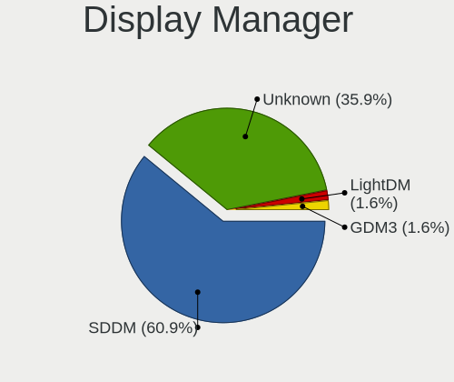
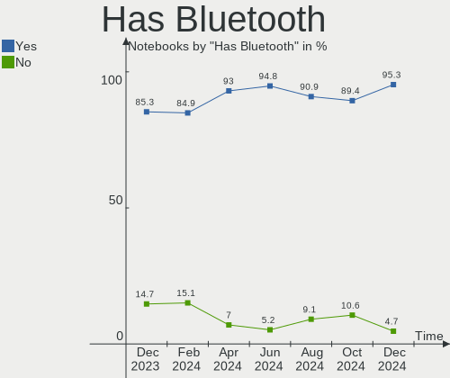
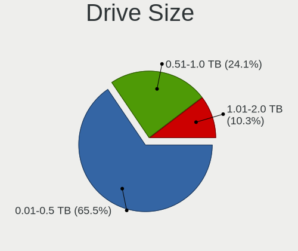
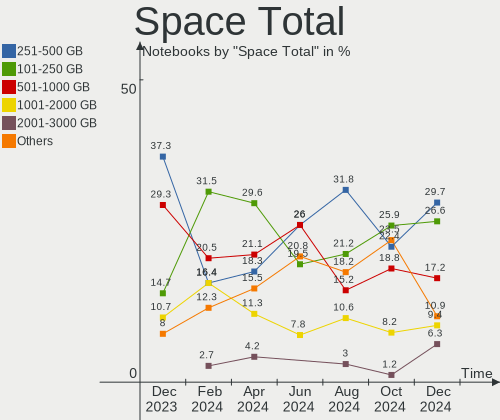
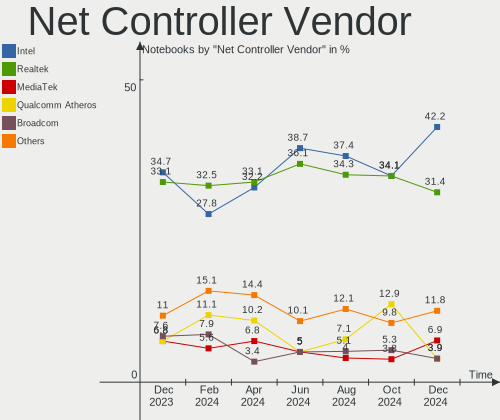
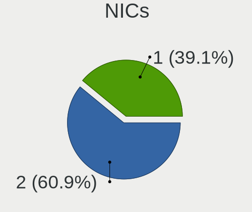
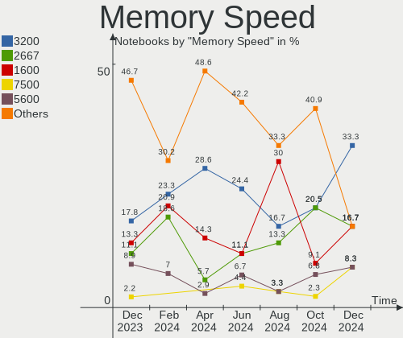
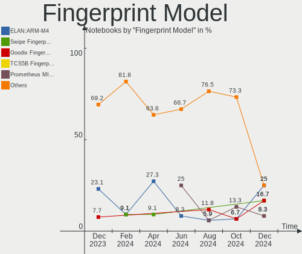
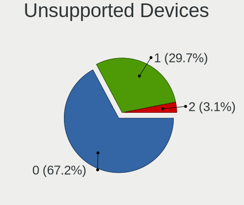
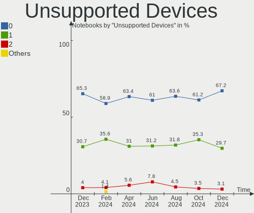

Kubuntu Hardware Trends (Notebook)
----------------------------------

A project to identify most popular hardware characteristics and track their change
over time based on data collected by Kubuntu users at https://Linux-Hardware.org.

Anyone can contribute to the study by uploading probes of their computers by
the [hw-probe](https://github.com/linuxhw/hw-probe) tool:

    sudo -E hw-probe -all -upload

Full-feature report is available here: https://linux-hardware.org/?view=trends&formfactor=notebook

Period: Jun, 2021.

Contents
--------

- [ OS                       ](#os)
- [ OS Family                ](#os-family)
- [ Kernel                   ](#kernel)
- [ Kernel Family            ](#kernel-family)
- [ Kernel Major Ver.        ](#kernel-major-ver)
- [ Arch                     ](#arch)
- [ DE                       ](#de)
- [ Display Server           ](#display-server)
- [ Display Manager          ](#display-manager)
- [ OS Lang                  ](#os-lang)
- [ Boot Mode                ](#boot-mode)
- [ Filesystem               ](#filesystem)
- [ Part. scheme             ](#part-scheme)
- [ Dual Boot with Linux/BSD ](#dual-boot-with-linux/bsd)
- [ Dual Boot (Win)          ](#dual-boot-win)
- [ Country                  ](#country)
- [ City                     ](#city)
- [ Vendor                   ](#vendor)
- [ Model                    ](#model)
- [ Model Family             ](#model-family)
- [ MFG Year                 ](#mfg-year)
- [ Form Factor              ](#form-factor)
- [ Secure Boot              ](#secure-boot)
- [ Coreboot                 ](#coreboot)
- [ RAM Size                 ](#ram-size)
- [ RAM Used                 ](#ram-used)
- [ Has CD-ROM               ](#has-cd-rom)
- [ Total Drives             ](#total-drives)
- [ Has Ethernet             ](#has-ethernet)
- [ Has WiFi                 ](#has-wifi)
- [ Has Bluetooth            ](#has-bluetooth)
- [ Drive Vendor             ](#drive-vendor)
- [ Drive Model              ](#drive-model)
- [ HDD Vendor               ](#hdd-vendor)
- [ SSD Vendor               ](#ssd-vendor)
- [ Drive Kind               ](#drive-kind)
- [ Drive Connector          ](#drive-connector)
- [ Drive Size               ](#drive-size)
- [ Space Total              ](#space-total)
- [ Space Used               ](#space-used)
- [ Malfunc. Drives          ](#malfunc-drives)
- [ Malfunc. Drive Vendor    ](#malfunc-drive-vendor)
- [ Malfunc. HDD Vendor      ](#malfunc-hdd-vendor)
- [ Malfunc. Drive Kind      ](#malfunc-drive-kind)
- [ Failed Drives            ](#failed-drives)
- [ Failed Drive Vendor      ](#failed-drive-vendor)
- [ Drive Status             ](#drive-status)
- [ Storage Vendor           ](#storage-vendor)
- [ Storage Model            ](#storage-model)
- [ Storage Kind             ](#storage-kind)
- [ CPU Vendor               ](#cpu-vendor)
- [ CPU Model                ](#cpu-model)
- [ CPU Model Family         ](#cpu-model-family)
- [ CPU Cores                ](#cpu-cores)
- [ CPU Sockets              ](#cpu-sockets)
- [ CPU Threads              ](#cpu-threads)
- [ CPU Op-Modes             ](#cpu-op-modes)
- [ CPU Microcode            ](#cpu-microcode)
- [ CPU Microarch            ](#cpu-microarch)
- [ GPU Vendor               ](#gpu-vendor)
- [ GPU Model                ](#gpu-model)
- [ GPU Combo                ](#gpu-combo)
- [ GPU Driver               ](#gpu-driver)
- [ GPU Memory               ](#gpu-memory)
- [ Monitor Vendor           ](#monitor-vendor)
- [ Monitor Model            ](#monitor-model)
- [ Monitor Resolution       ](#monitor-resolution)
- [ Monitor Diagonal         ](#monitor-diagonal)
- [ Monitor Width            ](#monitor-width)
- [ Aspect Ratio             ](#aspect-ratio)
- [ Monitor Area             ](#monitor-area)
- [ Pixel Density            ](#pixel-density)
- [ Multiple Monitors        ](#multiple-monitors)
- [ Net Controller Vendor    ](#net-controller-vendor)
- [ Net Controller Model     ](#net-controller-model)
- [ Wireless Vendor          ](#wireless-vendor)
- [ Wireless Model           ](#wireless-model)
- [ Ethernet Vendor          ](#ethernet-vendor)
- [ Ethernet Model           ](#ethernet-model)
- [ Net Controller Kind      ](#net-controller-kind)
- [ Used Controller          ](#used-controller)
- [ NICs                     ](#nics)
- [ IPv6                     ](#ipv6)
- [ Memory Vendor            ](#memory-vendor)
- [ Memory Model             ](#memory-model)
- [ Memory Kind              ](#memory-kind)
- [ Memory Form Factor       ](#memory-form-factor)
- [ Memory Size              ](#memory-size)
- [ Memory Speed             ](#memory-speed)
- [ Sound Vendor             ](#sound-vendor)
- [ Sound Model              ](#sound-model)
- [ Camera Vendor            ](#camera-vendor)
- [ Camera Model             ](#camera-model)
- [ Fingerprint Vendor       ](#fingerprint-vendor)
- [ Fingerprint Model        ](#fingerprint-model)
- [ Chipcard Vendor          ](#chipcard-vendor)
- [ Chipcard Model           ](#chipcard-model)
- [ Printer Vendor           ](#printer-vendor)
- [ Printer Model            ](#printer-model)
- [ Scanner Vendor           ](#scanner-vendor)
- [ Scanner Model            ](#scanner-model)
- [ Bluetooth Vendor         ](#bluetooth-vendor)
- [ Bluetooth Model          ](#bluetooth-model)
- [ Unsupported Devices      ](#unsupported-devices)
- [ Unsupported Device Types ](#unsupported-device-types)

OS
--

Installed operating systems

| Name          | Notebooks | Percent |
|---------------|-----------|---------|
| Kubuntu 20.04 | 23        | 56.1%   |
| Kubuntu 21.04 | 13        | 31.71%  |
| Kubuntu 20.10 | 3         | 7.32%   |
| Kubuntu 18.04 | 2         | 4.88%   |

OS Family
---------

OS without a version

| Name    | Notebooks | Percent |
|---------|-----------|---------|
| Kubuntu | 41        | 100%    |

Kernel
------

Version of the Linux kernel

| Version                | Notebooks | Percent |
|------------------------|-----------|---------|
| 5.8.0-55-generic       | 13        | 31.71%  |
| 5.11.0-18-generic      | 6         | 14.63%  |
| 5.4.0-74-generic       | 3         | 7.32%   |
| 5.11.0-22-generic      | 3         | 7.32%   |
| 5.8.0-53-generic       | 2         | 4.88%   |
| 5.12.8-xanmod1         | 2         | 4.88%   |
| 5.8.0-59-generic       | 1         | 2.44%   |
| 5.8.0-57-generic       | 1         | 2.44%   |
| 5.8.0-43-generic       | 1         | 2.44%   |
| 5.8.0-41-generic       | 1         | 2.44%   |
| 5.8.0-33-generic       | 1         | 2.44%   |
| 5.5.5-050505-generic   | 1         | 2.44%   |
| 5.4.0-72-generic       | 1         | 2.44%   |
| 5.12.10-051210-generic | 1         | 2.44%   |
| 5.11.17-xanmod1        | 1         | 2.44%   |
| 5.11.0-19-lowlatency   | 1         | 2.44%   |
| 5.11.0-16-lowlatency   | 1         | 2.44%   |
| 5.10.23-051023-generic | 1         | 2.44%   |

Kernel Family
-------------

Linux kernel without a distro release

| Version | Notebooks | Percent |
|---------|-----------|---------|
| 5.8.0   | 20        | 48.78%  |
| 5.11.0  | 11        | 26.83%  |
| 5.4.0   | 4         | 9.76%   |
| 5.12.8  | 2         | 4.88%   |
| 5.5.5   | 1         | 2.44%   |
| 5.12.10 | 1         | 2.44%   |
| 5.11.17 | 1         | 2.44%   |
| 5.10.23 | 1         | 2.44%   |

Kernel Major Ver.
-----------------

Linux kernel major version

| Version | Notebooks | Percent |
|---------|-----------|---------|
| 5.8     | 20        | 48.78%  |
| 5.11    | 12        | 29.27%  |
| 5.4     | 4         | 9.76%   |
| 5.12    | 3         | 7.32%   |
| 5.5     | 1         | 2.44%   |
| 5.10    | 1         | 2.44%   |

Arch
----

OS architecture (x86_64, i586, etc.)

| Name   | Notebooks | Percent |
|--------|-----------|---------|
| x86_64 | 41        | 100%    |

DE
--

Desktop Environment

| Name | Notebooks | Percent |
|------|-----------|---------|
| KDE  | 22        | 53.66%  |
| KDE5 | 19        | 46.34%  |

Display Server
--------------

X11 or Wayland

| Name    | Notebooks | Percent |
|---------|-----------|---------|
| X11     | 40        | 97.56%  |
| Wayland | 1         | 2.44%   |

Display Manager
---------------

SDDM, LightDM, etc.

| Name    | Notebooks | Percent |
|---------|-----------|---------|
| Unknown | 22        | 53.66%  |
| SDDM    | 17        | 41.46%  |
| TDM     | 1         | 2.44%   |
| GDM     | 1         | 2.44%   |

OS Lang
-------

Language

| Lang  | Notebooks | Percent |
|-------|-----------|---------|
| en_US | 12        | 29.27%  |
| fr_FR | 5         | 12.2%   |
| ru_RU | 4         | 9.76%   |
| en_GB | 4         | 9.76%   |
| pt_BR | 3         | 7.32%   |
| de_DE | 3         | 7.32%   |
| es_CO | 2         | 4.88%   |
| pt_PT | 1         | 2.44%   |
| it_IT | 1         | 2.44%   |
| fr_CH | 1         | 2.44%   |
| es_CL | 1         | 2.44%   |
| en_IN | 1         | 2.44%   |
| en_DK | 1         | 2.44%   |
| en_AU | 1         | 2.44%   |
| C     | 1         | 2.44%   |

Boot Mode
---------

EFI or BIOS

| Mode | Notebooks | Percent |
|------|-----------|---------|
| EFI  | 27        | 65.85%  |
| BIOS | 14        | 34.15%  |

Filesystem
----------

Type of filesystem

| Type    | Notebooks | Percent |
|---------|-----------|---------|
| Ext4    | 35        | 85.37%  |
| Btrfs   | 4         | 9.76%   |
| Overlay | 2         | 4.88%   |

Part. scheme
------------

Scheme of partitioning

| Type    | Notebooks | Percent |
|---------|-----------|---------|
| Unknown | 22        | 53.66%  |
| GPT     | 19        | 46.34%  |

Dual Boot with Linux/BSD
------------------------

Hosting more than one Linux/BSD

| Dual boot | Notebooks | Percent |
|-----------|-----------|---------|
| No        | 36        | 87.8%   |
| Yes       | 5         | 12.2%   |

Dual Boot (Win)
---------------

Hosting Linux and Windows

| Dual boot | Notebooks | Percent |
|-----------|-----------|---------|
| No        | 31        | 75.61%  |
| Yes       | 10        | 24.39%  |

Country
-------

Geographic location (country)

| Country      | Notebooks | Percent |
|--------------|-----------|---------|
| France       | 6         | 14.63%  |
| Russia       | 4         | 9.76%   |
| Germany      | 4         | 9.76%   |
| Brazil       | 4         | 9.76%   |
| USA          | 3         | 7.32%   |
| UK           | 3         | 7.32%   |
| Colombia     | 3         | 7.32%   |
| Switzerland  | 2         | 4.88%   |
| Spain        | 1         | 2.44%   |
| Saudi Arabia | 1         | 2.44%   |
| Portugal     | 1         | 2.44%   |
| Poland       | 1         | 2.44%   |
| Italy        | 1         | 2.44%   |
| India        | 1         | 2.44%   |
| Greece       | 1         | 2.44%   |
| Croatia      | 1         | 2.44%   |
| Chile        | 1         | 2.44%   |
| Belgium      | 1         | 2.44%   |
| Belarus      | 1         | 2.44%   |
| Australia    | 1         | 2.44%   |

City
----

Geographic location (city)

| City              | Notebooks | Percent |
|-------------------|-----------|---------|
| London            | 2         | 4.88%   |
| Geisenhausen      | 2         | 4.88%   |
| Zagreb            | 1         | 2.44%   |
| Yekaterinburg     | 1         | 2.44%   |
| Wroclaw           | 1         | 2.44%   |
| Winnsboro         | 1         | 2.44%   |
| Vladivostok       | 1         | 2.44%   |
| Villeneuve-le-Roi | 1         | 2.44%   |
| Tabuk             | 1         | 2.44%   |
| Surry Hills       | 1         | 2.44%   |
| Sun City Center   | 1         | 2.44%   |
| St Petersburg     | 1         | 2.44%   |
| Sesimbra          | 1         | 2.44%   |
| Schollenberg      | 1         | 2.44%   |
| Sarandi           | 1         | 2.44%   |
| Santo André      | 1         | 2.44%   |
| Santiago          | 1         | 2.44%   |
| San Francisco     | 1         | 2.44%   |
| Paris             | 1         | 2.44%   |
| Ostseebad Binz    | 1         | 2.44%   |
| Odintsovo         | 1         | 2.44%   |
| Magenta           | 1         | 2.44%   |
| Madrid            | 1         | 2.44%   |
| Lesigny           | 1         | 2.44%   |
| Kidderminster     | 1         | 2.44%   |
| Itaborai          | 1         | 2.44%   |
| Ipiales           | 1         | 2.44%   |
| Hamburg           | 1         | 2.44%   |
| Fribourg          | 1         | 2.44%   |
| Delhi             | 1         | 2.44%   |
| Couzeix           | 1         | 2.44%   |
| Charenton-le-Pont | 1         | 2.44%   |
| Canavieiras       | 1         | 2.44%   |
| Buenaventura      | 1         | 2.44%   |
| Brussels          | 1         | 2.44%   |
| Borisov           | 1         | 2.44%   |
| Bogotá           | 1         | 2.44%   |
| Aureilhan         | 1         | 2.44%   |
| Athens            | 1         | 2.44%   |

Vendor
------

Motherboard manufacturer

| Name             | Notebooks | Percent |
|------------------|-----------|---------|
| Dell             | 11        | 26.83%  |
| Lenovo           | 9         | 21.95%  |
| Hewlett-Packard  | 5         | 12.2%   |
| Acer             | 4         | 9.76%   |
| ASUSTek Computer | 3         | 7.32%   |
| System76         | 2         | 4.88%   |
| HUAWEI           | 2         | 4.88%   |
| Unknown          | 2         | 4.88%   |
| Toshiba          | 1         | 2.44%   |
| Intel            | 1         | 2.44%   |
| Apple            | 1         | 2.44%   |

Model
-----

Motherboard model

| Name                                    | Notebooks | Percent |
|-----------------------------------------|-----------|---------|
| HP EliteBook 850 G1                     | 2         | 4.88%   |
| Unknown                                 | 2         | 4.88%   |
| Toshiba QOSMIO X70-A                    | 1         | 2.44%   |
| System76 Oryx Pro                       | 1         | 2.44%   |
| System76 Kudu Professional              | 1         | 2.44%   |
| Lenovo Yoga 3 14 80JH                   | 1         | 2.44%   |
| Lenovo Yoga 14sACH 2021 82MS            | 1         | 2.44%   |
| Lenovo ThinkPad X230 2325AT6            | 1         | 2.44%   |
| Lenovo ThinkPad T470p 20J60042MZ        | 1         | 2.44%   |
| Lenovo ThinkPad L14 Gen 1 20U6S12200    | 1         | 2.44%   |
| Lenovo IdeaPad S145-15API 81V7          | 1         | 2.44%   |
| Lenovo IdeaPad Gaming 3 15IMH05 81Y4    | 1         | 2.44%   |
| Lenovo IdeaPad 330-15IKB 81FE           | 1         | 2.44%   |
| Lenovo IdeaPad 320-15ABR 80XS           | 1         | 2.44%   |
| Intel ChiefRiver                        | 1         | 2.44%   |
| HUAWEI NBLK-WAX9X                       | 1         | 2.44%   |
| HUAWEI HLYL-WXX9                        | 1         | 2.44%   |
| HP ProBook 450 G7                       | 1         | 2.44%   |
| HP Pavilion Gaming Laptop 15-cx0xxx     | 1         | 2.44%   |
| HP Laptop 15-ef1xxx                     | 1         | 2.44%   |
| Dell XPS 13 7390                        | 1         | 2.44%   |
| Dell Latitude E6520                     | 1         | 2.44%   |
| Dell Latitude E6410                     | 1         | 2.44%   |
| Dell Latitude E6330                     | 1         | 2.44%   |
| Dell Latitude E5570                     | 1         | 2.44%   |
| Dell Latitude E5430 non-vPro            | 1         | 2.44%   |
| Dell Latitude 5590                      | 1         | 2.44%   |
| Dell Latitude 5580                      | 1         | 2.44%   |
| Dell Latitude 5501                      | 1         | 2.44%   |
| Dell Latitude 3400                      | 1         | 2.44%   |
| Dell G3 3590                            | 1         | 2.44%   |
| ASUS ZenBook UX425IA_UM425IA            | 1         | 2.44%   |
| ASUS VivoBook_ASUSLaptop X412DA_X412DA  | 1         | 2.44%   |
| ASUS VivoBook_ASUS Laptop E210MA_E210MA | 1         | 2.44%   |
| Apple MacBookPro14,1                    | 1         | 2.44%   |
| Acer Aspire V5-572G                     | 1         | 2.44%   |
| Acer Aspire E5-771G                     | 1         | 2.44%   |
| Acer Aspire E5-572G                     | 1         | 2.44%   |
| Acer Aspire A515-44                     | 1         | 2.44%   |

Model Family
------------

Motherboard model prefix

| Name               | Notebooks | Percent |
|--------------------|-----------|---------|
| Dell Latitude      | 9         | 21.95%  |
| Lenovo IdeaPad     | 4         | 9.76%   |
| Acer Aspire        | 4         | 9.76%   |
| Lenovo ThinkPad    | 3         | 7.32%   |
| Lenovo Yoga        | 2         | 4.88%   |
| HP EliteBook       | 2         | 4.88%   |
| ASUS VivoBook      | 2         | 4.88%   |
| Unknown            | 2         | 4.88%   |
| Toshiba QOSMIO     | 1         | 2.44%   |
| System76 Oryx      | 1         | 2.44%   |
| System76 Kudu      | 1         | 2.44%   |
| Intel ChiefRiver   | 1         | 2.44%   |
| HUAWEI NBLK-WAX9X  | 1         | 2.44%   |
| HUAWEI HLYL-WXX9   | 1         | 2.44%   |
| HP ProBook         | 1         | 2.44%   |
| HP Pavilion        | 1         | 2.44%   |
| HP Laptop          | 1         | 2.44%   |
| Dell XPS           | 1         | 2.44%   |
| Dell G3            | 1         | 2.44%   |
| ASUS ZenBook       | 1         | 2.44%   |
| Apple MacBookPro14 | 1         | 2.44%   |

MFG Year
--------

Motherboard manufacture year

| Year | Notebooks | Percent |
|------|-----------|---------|
| 2020 | 13        | 31.71%  |
| 2021 | 7         | 17.07%  |
| 2018 | 7         | 17.07%  |
| 2012 | 3         | 7.32%   |
| 2017 | 2         | 4.88%   |
| 2016 | 2         | 4.88%   |
| 2014 | 2         | 4.88%   |
| 2019 | 1         | 2.44%   |
| 2015 | 1         | 2.44%   |
| 2013 | 1         | 2.44%   |
| 2011 | 1         | 2.44%   |
| 2010 | 1         | 2.44%   |

Form Factor
-----------

Physical design of the computer

| Name     | Notebooks | Percent |
|----------|-----------|---------|
| Notebook | 41        | 100%    |

Secure Boot
-----------

Enabled or disabled

| State    | Notebooks | Percent |
|----------|-----------|---------|
| Disabled | 36        | 87.8%   |
| Enabled  | 5         | 12.2%   |

Coreboot
--------

Have coreboot on board

| Used | Notebooks | Percent |
|------|-----------|---------|
| No   | 41        | 100%    |

RAM Size
--------

Total RAM memory

| Size in GB | Notebooks | Percent |
|------------|-----------|---------|
| 4.01-8.0   | 15        | 36.59%  |
| 16.01-24.0 | 10        | 24.39%  |
| 8.01-16.0  | 8         | 19.51%  |
| 3.01-4.0   | 6         | 14.63%  |
| 32.01-64.0 | 1         | 2.44%   |
| 2.01-3.0   | 1         | 2.44%   |

RAM Used
--------

Used RAM memory

| Used GB   | Notebooks | Percent |
|-----------|-----------|---------|
| 4.01-8.0  | 17        | 41.46%  |
| 1.01-2.0  | 11        | 26.83%  |
| 2.01-3.0  | 9         | 21.95%  |
| 3.01-4.0  | 2         | 4.88%   |
| 8.01-16.0 | 2         | 4.88%   |

Has CD-ROM
----------

Has CD-ROM on board

| Presented | Notebooks | Percent |
|-----------|-----------|---------|
| No        | 34        | 82.93%  |
| Yes       | 7         | 17.07%  |

Total Drives
------------

Number of drives on board

| Drives | Notebooks | Percent |
|--------|-----------|---------|
| 1      | 30        | 73.17%  |
| 2      | 9         | 21.95%  |
| 5      | 1         | 2.44%   |
| 3      | 1         | 2.44%   |

Has Ethernet
------------

Has Ethernet on board

| Presented | Notebooks | Percent |
|-----------|-----------|---------|
| Yes       | 30        | 73.17%  |
| No        | 11        | 26.83%  |

Has WiFi
--------

Has WiFi module

| Presented | Notebooks | Percent |
|-----------|-----------|---------|
| Yes       | 41        | 100%    |

Has Bluetooth
-------------

Has Bluetooth module

| Presented | Notebooks | Percent |
|-----------|-----------|---------|
| Yes       | 32        | 78.05%  |
| No        | 9         | 21.95%  |

Drive Vendor
------------

Hard drive vendors

| Vendor              | Notebooks | Drives | Percent |
|---------------------|-----------|--------|---------|
| Samsung Electronics | 15        | 19     | 27.27%  |
| WDC                 | 7         | 7      | 12.73%  |
| Unknown             | 5         | 5      | 9.09%   |
| SK Hynix            | 4         | 4      | 7.27%   |
| Seagate             | 2         | 2      | 3.64%   |
| Sandisk             | 2         | 2      | 3.64%   |
| Kingston            | 2         | 2      | 3.64%   |
| KingSpec            | 2         | 2      | 3.64%   |
| Crucial             | 2         | 2      | 3.64%   |
| XPG                 | 1         | 1      | 1.82%   |
| Union Memory        | 1         | 1      | 1.82%   |
| Toshiba             | 1         | 1      | 1.82%   |
| TCSUNBOW            | 1         | 1      | 1.82%   |
| Silicon Motion      | 1         | 1      | 1.82%   |
| Micron Technology   | 1         | 1      | 1.82%   |
| Lite-On             | 1         | 1      | 1.82%   |
| KIOXIA              | 1         | 1      | 1.82%   |
| Hitachi             | 1         | 1      | 1.82%   |
| HGST                | 1         | 1      | 1.82%   |
| Corsair             | 1         | 1      | 1.82%   |
| China               | 1         | 1      | 1.82%   |
| Apple               | 1         | 2      | 1.82%   |
| A-DATA Technology   | 1         | 1      | 1.82%   |

Drive Model
-----------

Hard drive models

| Model                                   | Notebooks | Percent |
|-----------------------------------------|-----------|---------|
| Samsung SSD 860 QVO 1TB                 | 2         | 3.39%   |
| Samsung SSD 850 EVO 250GB               | 2         | 3.39%   |
| Samsung NVMe SSD Drive 512GB            | 2         | 3.39%   |
| KingSpec P3-512 512GB                   | 2         | 3.39%   |
| XPG NVMe SSD Drive 512GB                | 1         | 1.69%   |
| WDC WDS240G2G0A-00JH30 240GB SSD        | 1         | 1.69%   |
| WDC WD2500BEVT-22A23T0 250GB            | 1         | 1.69%   |
| WDC WD10SPZX-24Z10T0 1TB                | 1         | 1.69%   |
| WDC WD10SPZX-24Z10 1TB                  | 1         | 1.69%   |
| WDC PC SN730 SDBPNTY-512G-1027 512GB    | 1         | 1.69%   |
| WDC PC SN730 NVMe 512GB                 | 1         | 1.69%   |
| WDC PC SN520 NVMe 512GB                 | 1         | 1.69%   |
| Unknown RZX-19SSD6G/120G 120GB          | 1         | 1.69%   |
| Unknown MMC Card  7GB                   | 1         | 1.69%   |
| Unknown MMC Card  32GB                  | 1         | 1.69%   |
| Unknown MMC Card  128GB                 | 1         | 1.69%   |
| Unknown 00000  4GB                      | 1         | 1.69%   |
| Union Memory UMIS RPJTJ256MEE1OWX 256GB | 1         | 1.69%   |
| Toshiba THNSNH256GMCT 256GB SSD         | 1         | 1.69%   |
| TCSUNBOW X3 240GB SSD                   | 1         | 1.69%   |
| SK Hynix NVMe SSD Drive 1024GB          | 1         | 1.69%   |
| SK Hynix HFS128G32TND-N210A 128GB SSD   | 1         | 1.69%   |
| SK Hynix HFM512GDJTNI-82A0A 512GB       | 1         | 1.69%   |
| SK Hynix BC511 NVMe 256GB               | 1         | 1.69%   |
| Silicon Motion NVMe SSD Drive 1024GB    | 1         | 1.69%   |
| Seagate Portable 2TB                    | 1         | 1.69%   |
| Seagate Expansion Desk 2TB              | 1         | 1.69%   |
| SanDisk SD9SN8W-256G-1006 256GB SSD     | 1         | 1.69%   |
| Sandisk NVMe SSD Drive 256GB            | 1         | 1.69%   |
| Samsung SSD PM830 2.5 7mm 128GB         | 1         | 1.69%   |
| Samsung SSD 870 EVO 1TB                 | 1         | 1.69%   |
| Samsung SSD 840 EVO 1TB mSATA           | 1         | 1.69%   |
| Samsung Portable SSD T5 1TB             | 1         | 1.69%   |
| Samsung PM981 NVMe 256GB                | 1         | 1.69%   |
| Samsung NVMe SSD Drive 1TB              | 1         | 1.69%   |
| Samsung MZYTE256HMHP-000L2 256GB SSD    | 1         | 1.69%   |
| Samsung MZVLQ512HALU-000H1 512GB        | 1         | 1.69%   |
| Samsung MZVLQ256HAJD-000H1 256GB        | 1         | 1.69%   |
| Samsung MZVLB512HBJQ-000L7 512GB        | 1         | 1.69%   |
| Samsung MZVLB512HAJQ-000H1 512GB        | 1         | 1.69%   |
| Samsung MZVLB1T0HALR-000L7 1TB          | 1         | 1.69%   |
| Samsung MZ7TE256HMHP-000L2 256GB SSD    | 1         | 1.69%   |
| Micron 2200S NVMe 512GB                 | 1         | 1.69%   |
| Lite-On NVMe SSD Drive 512GB            | 1         | 1.69%   |
| KIOXIA KBG40ZNV256G 256GB               | 1         | 1.69%   |
| Kingston SUV400S37240G 240GB SSD        | 1         | 1.69%   |
| Kingston SKC600512G 512GB SSD           | 1         | 1.69%   |
| Hitachi HTS543232A7A384 320GB           | 1         | 1.69%   |
| HGST HTS721010A9E630 1TB                | 1         | 1.69%   |
| Crucial CT480BX500SSD1 480GB            | 1         | 1.69%   |
| Crucial CT250MX500SSD1 250GB            | 1         | 1.69%   |
| Corsair Force MP600 2TB                 | 1         | 1.69%   |
| China SSD 256GB                         | 1         | 1.69%   |
| Apple SSD AP0128J 8.1KB                 | 1         | 1.69%   |
| A-DATA SU650 120GB SSD                  | 1         | 1.69%   |

HDD Vendor
----------

Hard disk drive vendors

| Vendor  | Notebooks | Drives | Percent |
|---------|-----------|--------|---------|
| WDC     | 3         | 3      | 50%     |
| Seagate | 1         | 1      | 16.67%  |
| Hitachi | 1         | 1      | 16.67%  |
| HGST    | 1         | 1      | 16.67%  |

SSD Vendor
----------

Solid state drive vendors

| Vendor              | Notebooks | Drives | Percent |
|---------------------|-----------|--------|---------|
| Samsung Electronics | 8         | 10     | 36.36%  |
| Kingston            | 2         | 2      | 9.09%   |
| KingSpec            | 2         | 2      | 9.09%   |
| Crucial             | 2         | 2      | 9.09%   |
| WDC                 | 1         | 1      | 4.55%   |
| Unknown             | 1         | 1      | 4.55%   |
| Toshiba             | 1         | 1      | 4.55%   |
| TCSUNBOW            | 1         | 1      | 4.55%   |
| SK Hynix            | 1         | 1      | 4.55%   |
| SanDisk             | 1         | 1      | 4.55%   |
| China               | 1         | 1      | 4.55%   |
| A-DATA Technology   | 1         | 1      | 4.55%   |

Drive Kind
----------

HDD or SSD

| Kind    | Notebooks | Drives | Percent |
|---------|-----------|--------|---------|
| NVMe    | 22        | 25     | 42.31%  |
| SSD     | 19        | 24     | 36.54%  |
| HDD     | 6         | 6      | 11.54%  |
| MMC     | 4         | 4      | 7.69%   |
| Unknown | 1         | 1      | 1.92%   |

Drive Connector
---------------

SATA, SAS, NVMe, etc.

| Type | Notebooks | Drives | Percent |
|------|-----------|--------|---------|
| SATA | 23        | 28     | 44.23%  |
| NVMe | 22        | 25     | 42.31%  |
| MMC  | 4         | 4      | 7.69%   |
| SAS  | 3         | 3      | 5.77%   |

Drive Size
----------

Size of hard drive

| Size in TB | Notebooks | Drives | Percent |
|------------|-----------|--------|---------|
| 0.01-0.5   | 17        | 18     | 60.71%  |
| 0.51-1.0   | 10        | 11     | 35.71%  |
| 1.01-2.0   | 1         | 1      | 3.57%   |

Space Total
-----------

Amount of disk space available on the file system

| Size in GB | Notebooks | Percent |
|------------|-----------|---------|
| 251-500    | 15        | 36.59%  |
| 101-250    | 14        | 34.15%  |
| 501-1000   | 5         | 12.2%   |
| 2001-3000  | 2         | 4.88%   |
| 1-20       | 2         | 4.88%   |
| 51-100     | 2         | 4.88%   |
| 1001-2000  | 1         | 2.44%   |

Space Used
----------

Amount of used disk space

| Used GB   | Notebooks | Percent |
|-----------|-----------|---------|
| 1-20      | 13        | 31.71%  |
| 101-250   | 10        | 24.39%  |
| 251-500   | 8         | 19.51%  |
| 51-100    | 4         | 9.76%   |
| 21-50     | 3         | 7.32%   |
| 501-1000  | 2         | 4.88%   |
| 1001-2000 | 1         | 2.44%   |

Malfunc. Drives
---------------

Drive models with a malfunction

| Model                               | Notebooks | Drives | Percent |
|-------------------------------------|-----------|--------|---------|
| SanDisk SD9SN8W-256G-1006 256GB SSD | 1         | 1      | 100%    |

Malfunc. Drive Vendor
---------------------

Vendors of faulty drives

| Vendor  | Notebooks | Drives | Percent |
|---------|-----------|--------|---------|
| SanDisk | 1         | 1      | 100%    |

Malfunc. HDD Vendor
-------------------

Vendors of faulty HDD drives

Zero info for selected period =(

Malfunc. Drive Kind
-------------------

Kinds of faulty drives

| Kind | Notebooks | Drives | Percent |
|------|-----------|--------|---------|
| SSD  | 1         | 1      | 100%    |

Failed Drives
-------------

Failed drive models

Zero info for selected period =(

Failed Drive Vendor
-------------------

Failed drive vendors

Zero info for selected period =(

Drive Status
------------

Number of failed and malfunc. drives

| Status   | Notebooks | Drives | Percent |
|----------|-----------|--------|---------|
| Detected | 25        | 34     | 53.19%  |
| Works    | 21        | 25     | 44.68%  |
| Malfunc  | 1         | 1      | 2.13%   |

Storage Vendor
--------------

Storage controller vendors

| Vendor                  | Notebooks | Percent |
|-------------------------|-----------|---------|
| Intel                   | 28        | 52.83%  |
| Samsung Electronics     | 5         | 9.43%   |
| AMD                     | 5         | 9.43%   |
| Sandisk                 | 4         | 7.55%   |
| SK Hynix                | 3         | 5.66%   |
| Union Memory (Shenzhen) | 1         | 1.89%   |
| Silicon Motion          | 1         | 1.89%   |
| Phison Electronics      | 1         | 1.89%   |
| Micron Technology       | 1         | 1.89%   |
| Lite-On Technology      | 1         | 1.89%   |
| KIOXIA                  | 1         | 1.89%   |
| Apple                   | 1         | 1.89%   |
| ADATA Technology        | 1         | 1.89%   |

Storage Model
-------------

Storage controller models

| Model                                                                          | Notebooks | Percent |
|--------------------------------------------------------------------------------|-----------|---------|
| AMD FCH SATA Controller [AHCI mode]                                            | 5         | 9.43%   |
| Samsung NVMe SSD Controller SM981/PM981/PM983                                  | 4         | 7.55%   |
| Intel Cannon Lake Mobile PCH SATA AHCI Controller                              | 4         | 7.55%   |
| Intel 82801 Mobile SATA Controller [RAID mode]                                 | 4         | 7.55%   |
| Intel 7 Series Chipset Family 6-port SATA Controller [AHCI mode]               | 4         | 7.55%   |
| Intel 8 Series/C220 Series Chipset Family 6-port SATA Controller 1 [AHCI mode] | 3         | 5.66%   |
| SK Hynix BC511                                                                 | 2         | 3.77%   |
| Sandisk WD Black SN750 / PC SN730 NVMe SSD                                     | 2         | 3.77%   |
| Intel Wildcat Point-LP SATA Controller [AHCI Mode]                             | 2         | 3.77%   |
| Intel Sunrise Point-LP SATA Controller [AHCI mode]                             | 2         | 3.77%   |
| Intel Celeron/Pentium Silver Processor SATA Controller                         | 2         | 3.77%   |
| Intel 8 Series SATA Controller 1 [AHCI mode]                                   | 2         | 3.77%   |
| Union Memory (Shenzhen) Non-Volatile memory controller                         | 1         | 1.89%   |
| SK Hynix NVMe SSD Controller                                                   | 1         | 1.89%   |
| Silicon Motion SM2263EN/SM2263XT SSD Controller                                | 1         | 1.89%   |
| Sandisk WD Blue SN500 / PC SN520 NVMe SSD                                      | 1         | 1.89%   |
| Sandisk PC SN520 NVMe SSD                                                      | 1         | 1.89%   |
| Samsung NVMe Controller                                                        | 1         | 1.89%   |
| Phison E16 PCIe4 NVMe Controller                                               | 1         | 1.89%   |
| Micron Non-Volatile memory controller                                          | 1         | 1.89%   |
| Lite-On Non-Volatile memory controller                                         | 1         | 1.89%   |
| KIOXIA Non-Volatile memory controller                                          | 1         | 1.89%   |
| Intel Comet Lake SATA AHCI Controller                                          | 1         | 1.89%   |
| Intel Cannon Point-LP SATA Controller [AHCI Mode]                              | 1         | 1.89%   |
| Intel 82801IBM/IEM (ICH9M/ICH9M-E) 4 port SATA Controller [AHCI mode]          | 1         | 1.89%   |
| Intel 6 Series/C200 Series Chipset Family 6 port Mobile SATA AHCI Controller   | 1         | 1.89%   |
| Intel 400 Series Chipset Family SATA AHCI Controller                           | 1         | 1.89%   |
| Apple S3X NVMe Controller                                                      | 1         | 1.89%   |
| ADATA XPG SX8200 Pro PCIe Gen3x4 M.2 2280 Solid State Drive                    | 1         | 1.89%   |

Storage Kind
------------

Kind of storage controller (IDE, SATA, NVMe, SAS, ...)

| Kind | Notebooks | Percent |
|------|-----------|---------|
| SATA | 29        | 54.72%  |
| NVMe | 20        | 37.74%  |
| RAID | 4         | 7.55%   |

CPU Vendor
----------

Processor vendors

| Vendor | Notebooks | Percent |
|--------|-----------|---------|
| Intel  | 31        | 75.61%  |
| AMD    | 10        | 24.39%  |

CPU Model
---------

Processor models

| Model                                           | Notebooks | Percent |
|-------------------------------------------------|-----------|---------|
| AMD Ryzen 7 4700U with Radeon Graphics          | 3         | 7.32%   |
| AMD Ryzen 5 3500U with Radeon Vega Mobile Gfx   | 3         | 7.32%   |
| Intel Core i7-5500U CPU @ 2.40GHz               | 2         | 4.88%   |
| Intel Core i5-8250U CPU @ 1.60GHz               | 2         | 4.88%   |
| Intel Core i5-4300U CPU @ 1.90GHz               | 2         | 4.88%   |
| Intel Core i5-3320M CPU @ 2.60GHz               | 2         | 4.88%   |
| Intel Pentium CPU B960 @ 2.20GHz                | 1         | 2.44%   |
| Intel Genuine CPU U4100 @ 1.30GHz               | 1         | 2.44%   |
| Intel Core i7-9850H CPU @ 2.60GHz               | 1         | 2.44%   |
| Intel Core i7-9750H CPU @ 2.60GHz               | 1         | 2.44%   |
| Intel Core i7-8750H CPU @ 2.20GHz               | 1         | 2.44%   |
| Intel Core i7-7700HQ CPU @ 2.80GHz              | 1         | 2.44%   |
| Intel Core i7-6600U CPU @ 2.60GHz               | 1         | 2.44%   |
| Intel Core i7-4910MQ CPU @ 2.90GHz              | 1         | 2.44%   |
| Intel Core i7-4712MQ CPU @ 2.30GHz              | 1         | 2.44%   |
| Intel Core i7-4700MQ CPU @ 2.40GHz              | 1         | 2.44%   |
| Intel Core i7-10510U CPU @ 1.80GHz              | 1         | 2.44%   |
| Intel Core i5-8365U CPU @ 1.60GHz               | 1         | 2.44%   |
| Intel Core i5-8300H CPU @ 2.30GHz               | 1         | 2.44%   |
| Intel Core i5-7360U CPU @ 2.30GHz               | 1         | 2.44%   |
| Intel Core i5-6300U CPU @ 2.40GHz               | 1         | 2.44%   |
| Intel Core i5-3340M CPU @ 2.70GHz               | 1         | 2.44%   |
| Intel Core i5-3337U CPU @ 1.80GHz               | 1         | 2.44%   |
| Intel Core i5-2520M CPU @ 2.50GHz               | 1         | 2.44%   |
| Intel Core i5-10300H CPU @ 2.50GHz              | 1         | 2.44%   |
| Intel Core i5 CPU M 560 @ 2.67GHz               | 1         | 2.44%   |
| Intel Core i3-10110U CPU @ 2.10GHz              | 1         | 2.44%   |
| Intel Celeron N4020 CPU @ 1.10GHz               | 1         | 2.44%   |
| Intel Celeron J4125 CPU @ 2.00GHz               | 1         | 2.44%   |
| AMD Ryzen 7 5800H with Radeon Graphics          | 1         | 2.44%   |
| AMD Ryzen 5 PRO 4650U with Radeon Graphics      | 1         | 2.44%   |
| AMD Ryzen 5 4600H with Radeon Graphics          | 1         | 2.44%   |
| AMD A12-9720P RADEON R7, 12 COMPUTE CORES 4C+8G | 1         | 2.44%   |

CPU Model Family
----------------

Processor model prefix

| Model           | Notebooks | Percent |
|-----------------|-----------|---------|
| Intel Core i5   | 15        | 36.59%  |
| Intel Core i7   | 11        | 26.83%  |
| AMD Ryzen 7     | 4         | 9.76%   |
| AMD Ryzen 5     | 4         | 9.76%   |
| Intel Celeron   | 2         | 4.88%   |
| Intel Pentium   | 1         | 2.44%   |
| Intel Genuine   | 1         | 2.44%   |
| Intel Core i3   | 1         | 2.44%   |
| AMD Ryzen 5 PRO | 1         | 2.44%   |
| AMD A12         | 1         | 2.44%   |

CPU Cores
---------

Number of processor cores

| Number | Notebooks | Percent |
|--------|-----------|---------|
| 2      | 18        | 43.9%   |
| 4      | 14        | 34.15%  |
| 6      | 5         | 12.2%   |
| 8      | 4         | 9.76%   |

CPU Sockets
-----------

Number of sockets

| Number | Notebooks | Percent |
|--------|-----------|---------|
| 1      | 41        | 100%    |

CPU Threads
-----------

Threads per core (Hyper-Threading)

| Number | Notebooks | Percent |
|--------|-----------|---------|
| 2      | 34        | 82.93%  |
| 1      | 7         | 17.07%  |

CPU Op-Modes
------------

CPU Operation Modes (32-bit, 64-bit)

| Op mode        | Notebooks | Percent |
|----------------|-----------|---------|
| 32-bit, 64-bit | 41        | 100%    |

CPU Microcode
-------------

Microcode number

| Number     | Notebooks | Percent |
|------------|-----------|---------|
| Unknown    | 12        | 29.27%  |
| 0x806ec    | 3         | 7.32%   |
| 0x906ea    | 2         | 4.88%   |
| 0x806ea    | 2         | 4.88%   |
| 0x706a8    | 2         | 4.88%   |
| 0x40651    | 2         | 4.88%   |
| 0x306c3    | 2         | 4.88%   |
| 0x306a9    | 2         | 4.88%   |
| 0x206a7    | 2         | 4.88%   |
| 0x08600106 | 2         | 4.88%   |
| 0x08600104 | 2         | 4.88%   |
| 0xa0652    | 1         | 2.44%   |
| 0x906ed    | 1         | 2.44%   |
| 0x906e9    | 1         | 2.44%   |
| 0x806e9    | 1         | 2.44%   |
| 0x406e3    | 1         | 2.44%   |
| 0x08600103 | 1         | 2.44%   |
| 0x08108109 | 1         | 2.44%   |
| 0x06006118 | 1         | 2.44%   |

CPU Microarch
-------------

Microarchitecture

| Name          | Notebooks | Percent |
|---------------|-----------|---------|
| KabyLake      | 11        | 26.83%  |
| Zen 2         | 5         | 12.2%   |
| Haswell       | 5         | 12.2%   |
| IvyBridge     | 4         | 9.76%   |
| Zen+          | 3         | 7.32%   |
| Skylake       | 2         | 4.88%   |
| SandyBridge   | 2         | 4.88%   |
| Goldmont plus | 2         | 4.88%   |
| Broadwell     | 2         | 4.88%   |
| Zen 3         | 1         | 2.44%   |
| Westmere      | 1         | 2.44%   |
| Penryn        | 1         | 2.44%   |
| Excavator     | 1         | 2.44%   |
| CometLake     | 1         | 2.44%   |

GPU Vendor
----------

Vendors of graphics cards

| Vendor | Notebooks | Percent |
|--------|-----------|---------|
| Intel  | 31        | 59.62%  |
| AMD    | 11        | 21.15%  |
| Nvidia | 10        | 19.23%  |

GPU Model
---------

Graphics card models

| Model                                                                                 | Notebooks | Percent |
|---------------------------------------------------------------------------------------|-----------|---------|
| AMD Renoir                                                                            | 5         | 9.62%   |
| Intel CoffeeLake-H GT2 [UHD Graphics 630]                                             | 4         | 7.69%   |
| Intel 3rd Gen Core processor Graphics Controller                                      | 4         | 7.69%   |
| Intel 4th Gen Core Processor Integrated Graphics Controller                           | 3         | 5.77%   |
| AMD Picasso                                                                           | 3         | 5.77%   |
| Nvidia GF117M [GeForce 610M/710M/810M/820M / GT 620M/625M/630M/720M]                  | 2         | 3.85%   |
| Intel UHD Graphics 620                                                                | 2         | 3.85%   |
| Intel Skylake GT2 [HD Graphics 520]                                                   | 2         | 3.85%   |
| Intel HD Graphics 5500                                                                | 2         | 3.85%   |
| Intel Haswell-ULT Integrated Graphics Controller                                      | 2         | 3.85%   |
| Intel GeminiLake [UHD Graphics 600]                                                   | 2         | 3.85%   |
| Intel CometLake-U GT2 [UHD Graphics]                                                  | 2         | 3.85%   |
| Intel 2nd Generation Core Processor Family Integrated Graphics Controller             | 2         | 3.85%   |
| Nvidia TU117M                                                                         | 1         | 1.92%   |
| Nvidia TU116M [GeForce GTX 1660 Ti Mobile]                                            | 1         | 1.92%   |
| Nvidia TU106M [GeForce RTX 2070 Mobile]                                               | 1         | 1.92%   |
| Nvidia GP107M [GeForce MX150]                                                         | 1         | 1.92%   |
| Nvidia GP107M [GeForce GTX 1050 Mobile]                                               | 1         | 1.92%   |
| Nvidia GM108M [GeForce 940MX]                                                         | 1         | 1.92%   |
| Nvidia GM108M [GeForce 840M]                                                          | 1         | 1.92%   |
| Nvidia GK106M [GeForce GTX 770M]                                                      | 1         | 1.92%   |
| Intel WhiskeyLake-U GT2 [UHD Graphics 620]                                            | 1         | 1.92%   |
| Intel Mobile 4 Series Chipset Integrated Graphics Controller                          | 1         | 1.92%   |
| Intel Iris Plus Graphics 640                                                          | 1         | 1.92%   |
| Intel HD Graphics 630                                                                 | 1         | 1.92%   |
| Intel Core Processor Integrated Graphics Controller                                   | 1         | 1.92%   |
| Intel CometLake-H GT2 [UHD Graphics]                                                  | 1         | 1.92%   |
| AMD Wani [Radeon R5/R6/R7 Graphics]                                                   | 1         | 1.92%   |
| AMD Topaz XT [Radeon R7 M260/M265 / M340/M360 / M440/M445 / 530/535 / 620/625 Mobile] | 1         | 1.92%   |
| AMD Cezanne                                                                           | 1         | 1.92%   |

GPU Combo
---------

Combinations of graphics cards

| Name           | Notebooks | Percent |
|----------------|-----------|---------|
| 1 x Intel      | 20        | 48.78%  |
| Intel + Nvidia | 10        | 24.39%  |
| 1 x AMD        | 10        | 24.39%  |
| Intel + AMD    | 1         | 2.44%   |

GPU Driver
----------

Free vs proprietary

| Driver      | Notebooks | Percent |
|-------------|-----------|---------|
| Free        | 36        | 87.8%   |
| Proprietary | 5         | 12.2%   |

GPU Memory
----------

Total video memory

| Size in GB | Notebooks | Percent |
|------------|-----------|---------|
| Unknown    | 29        | 70.73%  |
| 0.01-0.5   | 5         | 12.2%   |
| 1.01-2.0   | 2         | 4.88%   |
| 7.01-8.0   | 1         | 2.44%   |
| 5.01-6.0   | 1         | 2.44%   |
| 3.01-4.0   | 1         | 2.44%   |
| 2.01-3.0   | 1         | 2.44%   |
| 0.51-1.0   | 1         | 2.44%   |

Monitor Vendor
--------------

Monitor vendors

| Vendor                  | Notebooks | Percent |
|-------------------------|-----------|---------|
| Chimei Innolux          | 10        | 20.83%  |
| BOE                     | 10        | 20.83%  |
| AU Optronics            | 9         | 18.75%  |
| LG Display              | 5         | 10.42%  |
| Samsung Electronics     | 4         | 8.33%   |
| Iiyama                  | 2         | 4.17%   |
| Dell                    | 2         | 4.17%   |
| Toshiba                 | 1         | 2.08%   |
| STD                     | 1         | 2.08%   |
| PANDA                   | 1         | 2.08%   |
| CSO                     | 1         | 2.08%   |
| Chi Mei Optoelectronics | 1         | 2.08%   |
| Apple                   | 1         | 2.08%   |

Monitor Model
-------------

Monitor models

| Model                                                                     | Notebooks | Percent |
|---------------------------------------------------------------------------|-----------|---------|
| Chimei Innolux LCD Monitor CMN15DB 1366x768 344x193mm 15.5-inch           | 2         | 4%      |
| BOE LCD Monitor BOE06CB 1920x1080 344x194mm 15.5-inch                     | 2         | 4%      |
| AU Optronics LCD Monitor AUO35ED 1920x1080 344x193mm 15.5-inch            | 2         | 4%      |
| Toshiba LCD-MONITOR LCD1885 1366x768 410x230mm 18.5-inch                  | 1         | 2%      |
| STD STD HDMI TV STD00C7 1920x1080 698x392mm 31.5-inch                     | 1         | 2%      |
| Samsung Electronics U32R59x SAM0F94 3840x2160 697x392mm 31.5-inch         | 1         | 2%      |
| Samsung Electronics SyncMaster SAM0569 1680x1050 459x296mm 21.5-inch      | 1         | 2%      |
| Samsung Electronics LCD Monitor SEC5441 1366x768 344x194mm 15.5-inch      | 1         | 2%      |
| Samsung Electronics LCD Monitor SAM0A7C 1920x1080 700x390mm 31.5-inch     | 1         | 2%      |
| PANDA LCD Monitor NCP0035 1920x1080 309x174mm 14.0-inch                   | 1         | 2%      |
| LG Display LCD Monitor LGD065A 1920x1080 344x194mm 15.5-inch              | 1         | 2%      |
| LG Display LCD Monitor LGD0502 2560x1440 310x174mm 14.0-inch              | 1         | 2%      |
| LG Display LCD Monitor LGD047A 1920x1080 309x174mm 14.0-inch              | 1         | 2%      |
| LG Display LCD Monitor LGD033E 1366x768 309x174mm 14.0-inch               | 1         | 2%      |
| LG Display LCD Monitor LGD02EC 1366x768 293x165mm 13.2-inch               | 1         | 2%      |
| Iiyama PL2483H IVM6138 1920x1080 531x299mm 24.0-inch                      | 1         | 2%      |
| Iiyama PL2409HD IVM560C 1920x1080 521x293mm 23.5-inch                     | 1         | 2%      |
| Dell U2412M DELA07B 1920x1200 518x324mm 24.1-inch                         | 1         | 2%      |
| Dell U2412M DELA07A 1920x1200 518x324mm 24.1-inch                         | 1         | 2%      |
| Dell P2719HC DEL4186 1920x1080 598x336mm 27.0-inch                        | 1         | 2%      |
| Dell P2717H DEL40F6 1920x1080 598x336mm 27.0-inch                         | 1         | 2%      |
| CSO LCD Monitor CSO1402 2880x1800 302x188mm 14.0-inch                     | 1         | 2%      |
| Chimei Innolux LCD Monitor CMNAE0D 1600x900 388x219mm 17.5-inch           | 1         | 2%      |
| Chimei Innolux LCD Monitor CMN1604 1920x1080 355x199mm 16.0-inch          | 1         | 2%      |
| Chimei Innolux LCD Monitor CMN1602 1920x1080 355x199mm 16.0-inch          | 1         | 2%      |
| Chimei Innolux LCD Monitor CMN15E7 1920x1080 344x193mm 15.5-inch          | 1         | 2%      |
| Chimei Innolux LCD Monitor CMN15C3 1920x1080 340x190mm 15.3-inch          | 1         | 2%      |
| Chimei Innolux LCD Monitor CMN14D6 1366x768 309x173mm 13.9-inch           | 1         | 2%      |
| Chimei Innolux LCD Monitor CMN1404 1920x1080 309x173mm 13.9-inch          | 1         | 2%      |
| Chimei Innolux LCD Monitor CMN1132 1366x768 260x140mm 11.6-inch           | 1         | 2%      |
| Chi Mei Optoelectronics LCD Monitor CMO1720 1920x1080 382x215mm 17.3-inch | 1         | 2%      |
| BOE LCD Monitor BOE0869 1920x1080 344x194mm 15.5-inch                     | 1         | 2%      |
| BOE LCD Monitor BOE0854 1920x1080 344x194mm 15.5-inch                     | 1         | 2%      |
| BOE LCD Monitor BOE082E 1920x1080 309x174mm 14.0-inch                     | 1         | 2%      |
| BOE LCD Monitor BOE0819 1920x1080 344x194mm 15.5-inch                     | 1         | 2%      |
| BOE LCD Monitor BOE07A1 1920x1080 344x193mm 15.5-inch                     | 1         | 2%      |
| BOE LCD Monitor BOE0757 1366x768 344x194mm 15.5-inch                      | 1         | 2%      |
| BOE LCD Monitor BOE06A4 1366x768 344x194mm 15.5-inch                      | 1         | 2%      |
| BOE LCD Monitor BOE0632 1920x1080 344x194mm 15.5-inch                     | 1         | 2%      |
| AU Optronics LCD Monitor AUO81EC 1366x768 344x193mm 15.5-inch             | 1         | 2%      |
| AU Optronics LCD Monitor AUO723C 1366x768 309x173mm 13.9-inch             | 1         | 2%      |
| AU Optronics LCD Monitor AUO5B2D 1920x1080 293x162mm 13.2-inch            | 1         | 2%      |
| AU Optronics LCD Monitor AUO20EC 1366x768 344x193mm 15.5-inch             | 1         | 2%      |
| AU Optronics LCD Monitor AUO209D 1920x1080 380x210mm 17.1-inch            | 1         | 2%      |
| AU Optronics LCD Monitor AUO202C 1366x768 293x164mm 13.2-inch             | 1         | 2%      |
| AU Optronics LCD Monitor AUO106C 1366x768 277x156mm 12.5-inch             | 1         | 2%      |
| Apple Color LCD APPA033 2880x1800 286x179mm 13.3-inch                     | 1         | 2%      |

Monitor Resolution
------------------

Monitor screen resolution

| Resolution         | Notebooks | Percent |
|--------------------|-----------|---------|
| 1920x1080 (FHD)    | 21        | 47.73%  |
| 1366x768 (WXGA)    | 16        | 36.36%  |
| 2880x1800          | 2         | 4.55%   |
| 3840x2160 (4K)     | 1         | 2.27%   |
| 2560x1440 (QHD)    | 1         | 2.27%   |
| 1920x1200 (WUXGA)  | 1         | 2.27%   |
| 1680x1050 (WSXGA+) | 1         | 2.27%   |
| 1600x900 (HD+)     | 1         | 2.27%   |

Monitor Diagonal
----------------

Diagonal size in inches

| Inches | Notebooks | Percent |
|--------|-----------|---------|
| 15     | 20        | 41.67%  |
| 14     | 6         | 12.5%   |
| 13     | 6         | 12.5%   |
| 31     | 3         | 6.25%   |
| 17     | 3         | 6.25%   |
| 24     | 2         | 4.17%   |
| 16     | 2         | 4.17%   |
| 27     | 1         | 2.08%   |
| 23     | 1         | 2.08%   |
| 21     | 1         | 2.08%   |
| 18     | 1         | 2.08%   |
| 12     | 1         | 2.08%   |
| 11     | 1         | 2.08%   |

Monitor Width
-------------

Physical width

| Width in mm | Notebooks | Percent |
|-------------|-----------|---------|
| 301-350     | 27        | 56.25%  |
| 351-400     | 6         | 12.5%   |
| 201-300     | 6         | 12.5%   |
| 501-600     | 4         | 8.33%   |
| 601-700     | 3         | 6.25%   |
| 401-500     | 2         | 4.17%   |

Aspect Ratio
------------

Proportional relationship between the width and the height

| Ratio | Notebooks | Percent |
|-------|-----------|---------|
| 16/9  | 39        | 90.7%   |
| 16/10 | 4         | 9.3%    |

Monitor Area
------------

Area in inch²

| Area in inch² | Notebooks | Percent |
|----------------|-----------|---------|
| 101-110        | 22        | 45.83%  |
| 81-90          | 8         | 16.67%  |
| 71-80          | 4         | 8.33%   |
| 351-500        | 3         | 6.25%   |
| 201-250        | 3         | 6.25%   |
| 121-130        | 2         | 4.17%   |
| 61-70          | 1         | 2.08%   |
| 51-60          | 1         | 2.08%   |
| 301-350        | 1         | 2.08%   |
| 251-300        | 1         | 2.08%   |
| 141-150        | 1         | 2.08%   |
| 131-140        | 1         | 2.08%   |

Pixel Density
-------------

Pixels per inch

| Density       | Notebooks | Percent |
|---------------|-----------|---------|
| 121-160       | 23        | 47.92%  |
| 101-120       | 12        | 25%     |
| 51-100        | 8         | 16.67%  |
| More than 240 | 2         | 4.17%   |
| 161-240       | 2         | 4.17%   |
| 1-50          | 1         | 2.08%   |

Multiple Monitors
-----------------

Total monitors connected

| Total | Notebooks | Percent |
|-------|-----------|---------|
| 1     | 33        | 80.49%  |
| 2     | 6         | 14.63%  |
| 3     | 2         | 4.88%   |

Net Controller Vendor
---------------------

Controller vendors

| Vendor                | Notebooks | Percent |
|-----------------------|-----------|---------|
| Intel                 | 25        | 41.67%  |
| Realtek Semiconductor | 18        | 30%     |
| Qualcomm Atheros      | 9         | 15%     |
| Broadcom              | 3         | 5%      |
| SEGGER                | 1         | 1.67%   |
| Ralink Technology     | 1         | 1.67%   |
| Ralink                | 1         | 1.67%   |
| MediaTek              | 1         | 1.67%   |
| DisplayLink           | 1         | 1.67%   |

Net Controller Model
--------------------

Controller models

| Model                                                             | Notebooks | Percent |
|-------------------------------------------------------------------|-----------|---------|
| Realtek RTL8111/8168/8411 PCI Express Gigabit Ethernet Controller | 14        | 18.67%  |
| Intel Wireless 8265 / 8275                                        | 5         | 6.67%   |
| Intel Wi-Fi 6 AX200                                               | 5         | 6.67%   |
| Qualcomm Atheros QCA9377 802.11ac Wireless Network Adapter        | 4         | 5.33%   |
| Intel Wireless 7260                                               | 3         | 4%      |
| Intel Centrino Advanced-N 6205 [Taylor Peak]                      | 3         | 4%      |
| Intel 82579LM Gigabit Network Connection (Lewisville)             | 3         | 4%      |
| Realtek RTL8822CE 802.11ac PCIe Wireless Network Adapter          | 2         | 2.67%   |
| Realtek RTL8153 Gigabit Ethernet Adapter                          | 2         | 2.67%   |
| Intel Ethernet Connection I218-LM                                 | 2         | 2.67%   |
| Intel Ethernet Connection (4) I219-LM                             | 2         | 2.67%   |
| Intel Cannon Lake PCH CNVi WiFi                                   | 2         | 2.67%   |
| Broadcom BCM4313 802.11bgn Wireless Network Adapter               | 2         | 2.67%   |
| SEGGER J-Link Ultra                                               | 1         | 1.33%   |
| Realtek RTL8822BE 802.11a/b/g/n/ac WiFi adapter                   | 1         | 1.33%   |
| Realtek RTL8723BU 802.11b/g/n WLAN Adapter                        | 1         | 1.33%   |
| Ralink MT7601U Wireless Adapter                                   | 1         | 1.33%   |
| Ralink RT3290 Wireless 802.11n 1T/1R PCIe                         | 1         | 1.33%   |
| Qualcomm Atheros QCA9565 / AR9565 Wireless Network Adapter        | 1         | 1.33%   |
| Qualcomm Atheros QCA6174 802.11ac Wireless Network Adapter        | 1         | 1.33%   |
| Qualcomm Atheros AR928X Wireless Network Adapter (PCI-Express)    | 1         | 1.33%   |
| Qualcomm Atheros AR9285 Wireless Network Adapter (PCI-Express)    | 1         | 1.33%   |
| Qualcomm Atheros AR8161 Gigabit Ethernet                          | 1         | 1.33%   |
| Qualcomm Atheros AR8131 Gigabit Ethernet                          | 1         | 1.33%   |
| MediaTek Phh-Treble with GApps                                    | 1         | 1.33%   |
| Intel Wireless 8260                                               | 1         | 1.33%   |
| Intel Wireless 7265                                               | 1         | 1.33%   |
| Intel Wireless 3160                                               | 1         | 1.33%   |
| Intel Ethernet Connection I219-LM                                 | 1         | 1.33%   |
| Intel Ethernet Connection (7) I219-LM                             | 1         | 1.33%   |
| Intel Ethernet Connection (5) I219-V                              | 1         | 1.33%   |
| Intel Dual Band Wireless-AC 3165 Plus Bluetooth                   | 1         | 1.33%   |
| Intel Comet Lake PCH-LP CNVi WiFi                                 | 1         | 1.33%   |
| Intel Comet Lake PCH CNVi WiFi                                    | 1         | 1.33%   |
| Intel Centrino Advanced-N 6200                                    | 1         | 1.33%   |
| Intel 82577LM Gigabit Network Connection                          | 1         | 1.33%   |
| DisplayLink Dell Universal Dock D6000                             | 1         | 1.33%   |
| Broadcom NetXtreme BCM5761 Gigabit Ethernet PCIe                  | 1         | 1.33%   |
| Broadcom BCM4350 802.11ac Wireless Network Adapter                | 1         | 1.33%   |

Wireless Vendor
---------------

Wireless vendors

| Vendor                | Notebooks | Percent |
|-----------------------|-----------|---------|
| Intel                 | 25        | 59.52%  |
| Qualcomm Atheros      | 8         | 19.05%  |
| Realtek Semiconductor | 4         | 9.52%   |
| Broadcom              | 3         | 7.14%   |
| Ralink Technology     | 1         | 2.38%   |
| Ralink                | 1         | 2.38%   |

Wireless Model
--------------

Wireless models

| Model                                                          | Notebooks | Percent |
|----------------------------------------------------------------|-----------|---------|
| Intel Wireless 8265 / 8275                                     | 5         | 11.9%   |
| Intel Wi-Fi 6 AX200                                            | 5         | 11.9%   |
| Qualcomm Atheros QCA9377 802.11ac Wireless Network Adapter     | 4         | 9.52%   |
| Intel Wireless 7260                                            | 3         | 7.14%   |
| Intel Centrino Advanced-N 6205 [Taylor Peak]                   | 3         | 7.14%   |
| Realtek RTL8822CE 802.11ac PCIe Wireless Network Adapter       | 2         | 4.76%   |
| Intel Cannon Lake PCH CNVi WiFi                                | 2         | 4.76%   |
| Broadcom BCM4313 802.11bgn Wireless Network Adapter            | 2         | 4.76%   |
| Realtek RTL8822BE 802.11a/b/g/n/ac WiFi adapter                | 1         | 2.38%   |
| Realtek RTL8723BU 802.11b/g/n WLAN Adapter                     | 1         | 2.38%   |
| Ralink MT7601U Wireless Adapter                                | 1         | 2.38%   |
| Ralink RT3290 Wireless 802.11n 1T/1R PCIe                      | 1         | 2.38%   |
| Qualcomm Atheros QCA9565 / AR9565 Wireless Network Adapter     | 1         | 2.38%   |
| Qualcomm Atheros QCA6174 802.11ac Wireless Network Adapter     | 1         | 2.38%   |
| Qualcomm Atheros AR928X Wireless Network Adapter (PCI-Express) | 1         | 2.38%   |
| Qualcomm Atheros AR9285 Wireless Network Adapter (PCI-Express) | 1         | 2.38%   |
| Intel Wireless 8260                                            | 1         | 2.38%   |
| Intel Wireless 7265                                            | 1         | 2.38%   |
| Intel Wireless 3160                                            | 1         | 2.38%   |
| Intel Dual Band Wireless-AC 3165 Plus Bluetooth                | 1         | 2.38%   |
| Intel Comet Lake PCH-LP CNVi WiFi                              | 1         | 2.38%   |
| Intel Comet Lake PCH CNVi WiFi                                 | 1         | 2.38%   |
| Intel Centrino Advanced-N 6200                                 | 1         | 2.38%   |
| Broadcom BCM4350 802.11ac Wireless Network Adapter             | 1         | 2.38%   |

Ethernet Vendor
---------------

Ethernet vendors

| Vendor                | Notebooks | Percent |
|-----------------------|-----------|---------|
| Realtek Semiconductor | 16        | 50%     |
| Intel                 | 11        | 34.38%  |
| Qualcomm Atheros      | 2         | 6.25%   |
| MediaTek              | 1         | 3.13%   |
| DisplayLink           | 1         | 3.13%   |
| Broadcom              | 1         | 3.13%   |

Ethernet Model
--------------

Ethernet models

| Model                                                             | Notebooks | Percent |
|-------------------------------------------------------------------|-----------|---------|
| Realtek RTL8111/8168/8411 PCI Express Gigabit Ethernet Controller | 14        | 43.75%  |
| Intel 82579LM Gigabit Network Connection (Lewisville)             | 3         | 9.38%   |
| Realtek RTL8153 Gigabit Ethernet Adapter                          | 2         | 6.25%   |
| Intel Ethernet Connection I218-LM                                 | 2         | 6.25%   |
| Intel Ethernet Connection (4) I219-LM                             | 2         | 6.25%   |
| Qualcomm Atheros AR8161 Gigabit Ethernet                          | 1         | 3.13%   |
| Qualcomm Atheros AR8131 Gigabit Ethernet                          | 1         | 3.13%   |
| MediaTek Phh-Treble with GApps                                    | 1         | 3.13%   |
| Intel Ethernet Connection I219-LM                                 | 1         | 3.13%   |
| Intel Ethernet Connection (7) I219-LM                             | 1         | 3.13%   |
| Intel Ethernet Connection (5) I219-V                              | 1         | 3.13%   |
| Intel 82577LM Gigabit Network Connection                          | 1         | 3.13%   |
| DisplayLink Dell Universal Dock D6000                             | 1         | 3.13%   |
| Broadcom NetXtreme BCM5761 Gigabit Ethernet PCIe                  | 1         | 3.13%   |

Net Controller Kind
-------------------

Ethernet, WiFi or modem

| Kind     | Notebooks | Percent |
|----------|-----------|---------|
| WiFi     | 41        | 56.94%  |
| Ethernet | 30        | 41.67%  |
| Modem    | 1         | 1.39%   |

Used Controller
---------------

Currently used network controller

| Kind     | Notebooks | Percent |
|----------|-----------|---------|
| WiFi     | 37        | 66.07%  |
| Ethernet | 19        | 33.93%  |

NICs
----

Total network controllers on board

| Total | Notebooks | Percent |
|-------|-----------|---------|
| 2     | 27        | 65.85%  |
| 1     | 14        | 34.15%  |

IPv6
----

IPv6 vs IPv4

| Used | Notebooks | Percent |
|------|-----------|---------|
| No   | 35        | 85.37%  |
| Yes  | 6         | 14.63%  |

Memory Vendor
-------------

Memory module vendors

| Vendor              | Notebooks | Percent |
|---------------------|-----------|---------|
| SK Hynix            | 11        | 39.29%  |
| Samsung Electronics | 6         | 21.43%  |
| Micron Technology   | 5         | 17.86%  |
| Kingston            | 2         | 7.14%   |
| SMART Brazil        | 1         | 3.57%   |
| Ramaxel Technology  | 1         | 3.57%   |
| Nanya Technology    | 1         | 3.57%   |
| Crucial             | 1         | 3.57%   |

Memory Model
------------

Memory module models

| Model                                                            | Notebooks | Percent |
|------------------------------------------------------------------|-----------|---------|
| Samsung RAM M471B1G73QH0-YK0 8GB SODIMM DDR3 1600MT/s            | 2         | 6.9%    |
| SMART Brazil RAM SMS4TDC3C0K0446SCG 4GB SODIMM DDR4 2667MT/s     | 1         | 3.45%   |
| SK Hynix RAM Module 16384MB SODIMM DDR4 3200MT/s                 | 1         | 3.45%   |
| SK Hynix RAM HMT451S6BFR8A-PB 4GB SODIMM DDR3 1600MT/s           | 1         | 3.45%   |
| SK Hynix RAM HMT325S6CFR8C-H9 2GB SODIMM DDR3 1333MT/s           | 1         | 3.45%   |
| SK Hynix RAM HMAA1GS6CMR6N-VK 8GB Row Of Chips DDR4 2667MT/s     | 1         | 3.45%   |
| SK Hynix RAM HMA851S6JJR6N-VK 4GB SODIMM DDR4 2667MT/s           | 1         | 3.45%   |
| SK Hynix RAM HMA851S6CJR6N-VK 4GB SODIMM DDR4 2667MT/s           | 1         | 3.45%   |
| SK Hynix RAM HMA851S6CJR6N-VK 4GB Row Of Chips DDR4 2667MT/s     | 1         | 3.45%   |
| SK Hynix RAM HMA82GS6DJR8N-VK 16384MB SODIMM DDR4 2667MT/s       | 1         | 3.45%   |
| SK Hynix RAM HMA81GS6DJR8N-XN 8GB SODIMM DDR4 3200MT/s           | 1         | 3.45%   |
| SK Hynix RAM H9CCNNNCLGALAR-NVD 8GB Row Of Chips LPDDR3 2133MT/s | 1         | 3.45%   |
| SK Hynix RAM GKE160SO102408-3000 16384MB SODIMM DDR4 3000MT/s    | 1         | 3.45%   |
| Samsung RAM Module 8192MB SODIMM DDR4 3200MT/s                   | 1         | 3.45%   |
| Samsung RAM M471B5273EB0-CK0 4096MB SODIMM DDR3 4199MT/s         | 1         | 3.45%   |
| Samsung RAM M471A5244CB0-CWE 4GB SODIMM DDR4 3200MT/s            | 1         | 3.45%   |
| Samsung RAM M471A1K43DB1-CWE 8GB SODIMM DDR4 3200MT/s            | 1         | 3.45%   |
| Samsung RAM M471A1K43DB1-CTD 8GB SODIMM DDR4 2667MT/s            | 1         | 3.45%   |
| Ramaxel RAM RMSA3300ME78HBF-2666 16384MB SODIMM DDR4 2667MT/s    | 1         | 3.45%   |
| Nanya RAM NT2GC64B88B0NS-CG 2GB SODIMM DDR3 1334MT/s             | 1         | 3.45%   |
| Micron RAM MT53E1G32D4NQ-046 8192MB SODIMM LPDDR4 4266MT/s       | 1         | 3.45%   |
| Micron RAM Module 4096MB SODIMM LPDDR3 2133MT/s                  | 1         | 3.45%   |
| Micron RAM 8ATF1G64HZ-2G6D1 8GB SODIMM DDR4 2667MT/s             | 1         | 3.45%   |
| Micron RAM 8ATF1G64HZ-2G3H1 8192MB SODIMM DDR4 2400MT/s          | 1         | 3.45%   |
| Micron RAM 16ATF1G64HZ-2G1A2 8192MB SODIMM DDR4 2133MT/s         | 1         | 3.45%   |
| Kingston RAM LV32D4S2S8HD-8 8GB SODIMM DDR4 3200MT/s             | 1         | 3.45%   |
| Kingston RAM KMKYF9-MIB 8192MB SODIMM DDR4 2400MT/s              | 1         | 3.45%   |
| Crucial RAM CT16G4SFD832A.M16FJ 16384MB SODIMM DDR4 3200MT/s     | 1         | 3.45%   |

Memory Kind
-----------

Memory module kinds

| Kind   | Notebooks | Percent |
|--------|-----------|---------|
| DDR4   | 18        | 72%     |
| DDR3   | 3         | 12%     |
| LPDDR3 | 2         | 8%      |
| SDRAM  | 1         | 4%      |
| LPDDR4 | 1         | 4%      |

Memory Form Factor
------------------

Physical design of the memory module

| Name         | Notebooks | Percent |
|--------------|-----------|---------|
| SODIMM       | 22        | 88%     |
| Row Of Chips | 3         | 12%     |

Memory Size
-----------

Memory module size

| Size  | Notebooks | Percent |
|-------|-----------|---------|
| 8192  | 14        | 50%     |
| 4096  | 8         | 28.57%  |
| 16384 | 5         | 17.86%  |
| 2048  | 1         | 3.57%   |

Memory Speed
------------

Memory module speed

| Speed | Notebooks | Percent |
|-------|-----------|---------|
| 2667  | 9         | 33.33%  |
| 3200  | 6         | 22.22%  |
| 2133  | 3         | 11.11%  |
| 2400  | 2         | 7.41%   |
| 1600  | 2         | 7.41%   |
| 4266  | 1         | 3.7%    |
| 4199  | 1         | 3.7%    |
| 3000  | 1         | 3.7%    |
| 1334  | 1         | 3.7%    |
| 1333  | 1         | 3.7%    |

Sound Vendor
------------

Sound card vendors

| Vendor                | Notebooks | Percent |
|-----------------------|-----------|---------|
| Intel                 | 31        | 63.27%  |
| AMD                   | 10        | 20.41%  |
| Nvidia                | 5         | 10.2%   |
| Realtek Semiconductor | 2         | 4.08%   |
| ZOOM                  | 1         | 2.04%   |

Sound Model
-----------

Sound card models

| Model                                                                      | Notebooks | Percent |
|----------------------------------------------------------------------------|-----------|---------|
| AMD Family 17h (Models 10h-1fh) HD Audio Controller                        | 9         | 13.64%  |
| AMD Renoir Radeon High Definition Audio Controller                         | 6         | 9.09%   |
| Intel Sunrise Point-LP HD Audio                                            | 5         | 7.58%   |
| Intel 7 Series/C216 Chipset Family High Definition Audio Controller        | 5         | 7.58%   |
| Intel Cannon Lake PCH cAVS                                                 | 4         | 6.06%   |
| Intel Xeon E3-1200 v3/4th Gen Core Processor HD Audio Controller           | 3         | 4.55%   |
| Intel 8 Series/C220 Series Chipset High Definition Audio Controller        | 3         | 4.55%   |
| AMD Raven/Raven2/Fenghuang HDMI/DP Audio Controller                        | 3         | 4.55%   |
| Realtek Semiconductor USB Audio                                            | 2         | 3.03%   |
| Intel Wildcat Point-LP High Definition Audio Controller                    | 2         | 3.03%   |
| Intel Haswell-ULT HD Audio Controller                                      | 2         | 3.03%   |
| Intel Comet Lake PCH-LP cAVS                                               | 2         | 3.03%   |
| Intel Celeron/Pentium Silver Processor High Definition Audio               | 2         | 3.03%   |
| Intel Broadwell-U Audio Controller                                         | 2         | 3.03%   |
| Intel 8 Series HD Audio Controller                                         | 2         | 3.03%   |
| ZOOM U-22                                                                  | 1         | 1.52%   |
| Nvidia TU116 High Definition Audio Controller                              | 1         | 1.52%   |
| Nvidia TU107 GeForce GTX 1650 High Definition Audio Controller             | 1         | 1.52%   |
| Nvidia TU106 High Definition Audio Controller                              | 1         | 1.52%   |
| Nvidia GP107GL High Definition Audio Controller                            | 1         | 1.52%   |
| Nvidia GK106 HDMI Audio Controller                                         | 1         | 1.52%   |
| Intel Comet Lake PCH cAVS                                                  | 1         | 1.52%   |
| Intel CM238 HD Audio Controller                                            | 1         | 1.52%   |
| Intel Cannon Point-LP High Definition Audio Controller                     | 1         | 1.52%   |
| Intel 82801I (ICH9 Family) HD Audio Controller                             | 1         | 1.52%   |
| Intel 6 Series/C200 Series Chipset Family High Definition Audio Controller | 1         | 1.52%   |
| Intel 5 Series/3400 Series Chipset High Definition Audio                   | 1         | 1.52%   |
| AMD Kabini HDMI/DP Audio                                                   | 1         | 1.52%   |
| AMD Family 15h (Models 60h-6fh) Audio Controller                           | 1         | 1.52%   |

Camera Vendor
-------------

Camera device vendors

| Vendor                        | Notebooks | Percent |
|-------------------------------|-----------|---------|
| IMC Networks                  | 5         | 15.15%  |
| Chicony Electronics           | 5         | 15.15%  |
| Realtek Semiconductor         | 4         | 12.12%  |
| Microdia                      | 4         | 12.12%  |
| Acer                          | 4         | 12.12%  |
| Syntek                        | 3         | 9.09%   |
| Quanta                        | 3         | 9.09%   |
| Sunplus Innovation Technology | 2         | 6.06%   |
| Ricoh                         | 1         | 3.03%   |
| Image Processor               | 1         | 3.03%   |
| GEMBIRD                       | 1         | 3.03%   |

Camera Model
------------

Camera device models

| Model                                    | Notebooks | Percent |
|------------------------------------------|-----------|---------|
| Realtek Integrated_Webcam_HD             | 3         | 9.09%   |
| Syntek Integrated Camera                 | 2         | 6.06%   |
| Sunplus Integrated_Webcam_HD             | 2         | 6.06%   |
| IMC Networks USB2.0 HD UVC WebCam        | 2         | 6.06%   |
| Chicony Integrated Camera                | 2         | 6.06%   |
| Chicony HD WebCam                        | 2         | 6.06%   |
| Syntek EasyCamera                        | 1         | 3.03%   |
| Ricoh HD Webcam                          | 1         | 3.03%   |
| Realtek EasyCamera                       | 1         | 3.03%   |
| Quanta ov9734_techfront_camera           | 1         | 3.03%   |
| Quanta HP HD Camera                      | 1         | 3.03%   |
| Quanta HD User Facing                    | 1         | 3.03%   |
| Microdia Sonix USB 2.0 Camera            | 1         | 3.03%   |
| Microdia Laptop_Integrated_Webcam_E4HD   | 1         | 3.03%   |
| Microdia Integrated_Webcam_HD            | 1         | 3.03%   |
| Microdia Dell Integrated HD Webcam       | 1         | 3.03%   |
| IMC Networks USB2.0 VGA UVC WebCam       | 1         | 3.03%   |
| IMC Networks ov9734_azurewave_camera     | 1         | 3.03%   |
| IMC Networks HP TrueVision HD Camera     | 1         | 3.03%   |
| Image Processor USB 2.0 PC Cam           | 1         | 3.03%   |
| GEMBIRD USB2.0 PC CAMERA                 | 1         | 3.03%   |
| Chicony HP Wide Vision HD Camera         | 1         | 3.03%   |
| Acer Lenovo EasyCamera integrated webcam | 1         | 3.03%   |
| Acer Integrated Camera                   | 1         | 3.03%   |
| Acer BisonCam,NB Pro                     | 1         | 3.03%   |
| Acer BisonCam, NB Pro                    | 1         | 3.03%   |

Fingerprint Vendor
------------------

Fingerprint sensor vendors

| Vendor                     | Notebooks | Percent |
|----------------------------|-----------|---------|
| Shenzhen Goodix Technology | 3         | 50%     |
| Validity Sensors           | 1         | 16.67%  |
| Synaptics                  | 1         | 16.67%  |
| Elan Microelectronics      | 1         | 16.67%  |

Fingerprint Model
-----------------

Fingerprint sensor models

| Model                               | Notebooks | Percent |
|-------------------------------------|-----------|---------|
| Shenzhen Goodix Fingerprint Reader  | 2         | 33.33%  |
| Validity Sensors Synaptics WBDI     | 1         | 16.67%  |
| Shenzhen Goodix  Fingerprint Device | 1         | 16.67%  |
| Elan ELAN:Fingerprint               | 1         | 16.67%  |
| Unknown                             | 1         | 16.67%  |

Chipcard Vendor
---------------

Chipcard module vendors

| Vendor      | Notebooks | Percent |
|-------------|-----------|---------|
| Broadcom    | 6         | 66.67%  |
| Alcor Micro | 2         | 22.22%  |
| Clay Logic  | 1         | 11.11%  |

Chipcard Model
--------------

Chipcard module models

| Model                                          | Notebooks | Percent |
|------------------------------------------------|-----------|---------|
| Broadcom BCM5880 Secure Applications Processor | 3         | 33.33%  |
| Broadcom 5880                                  | 2         | 22.22%  |
| Alcor Micro AU9540 Smartcard Reader            | 2         | 22.22%  |
| Clay Logic Nitrokey Pro                        | 1         | 11.11%  |
| Broadcom 58200                                 | 1         | 11.11%  |

Printer Vendor
--------------

Printer device vendors

| Vendor          | Notebooks | Percent |
|-----------------|-----------|---------|
| Hewlett-Packard | 1         | 100%    |

Printer Model
-------------

Printer device models

| Model         | Notebooks | Percent |
|---------------|-----------|---------|
| HP Laser 107a | 1         | 100%    |

Scanner Vendor
--------------

Scanner device vendors

Zero info for selected period =(

Scanner Model
-------------

Scanner device models

Zero info for selected period =(

Bluetooth Vendor
----------------

Controller vendors

| Vendor                          | Notebooks | Percent |
|---------------------------------|-----------|---------|
| Intel                           | 19        | 57.58%  |
| Qualcomm Atheros Communications | 4         | 12.12%  |
| Realtek Semiconductor           | 2         | 6.06%   |
| Realtek                         | 2         | 6.06%   |
| Dell                            | 2         | 6.06%   |
| Toshiba                         | 1         | 3.03%   |
| Ralink                          | 1         | 3.03%   |
| Lite-On Technology              | 1         | 3.03%   |
| Broadcom                        | 1         | 3.03%   |

Bluetooth Model
---------------

Controller models

| Model                                          | Notebooks | Percent |
|------------------------------------------------|-----------|---------|
| Intel Bluetooth wireless interface             | 10        | 30.3%   |
| Intel AX200 Bluetooth                          | 5         | 15.15%  |
| Qualcomm Atheros  Bluetooth Device             | 4         | 12.12%  |
| Realtek Bluetooth Radio                        | 2         | 6.06%   |
| Intel Bluetooth Device                         | 2         | 6.06%   |
| Intel Bluetooth 9460/9560 Jefferson Peak (JfP) | 2         | 6.06%   |
| Toshiba Askey Bluetooth Module                 | 1         | 3.03%   |
| Realtek  Bluetooth 4.2 Adapter                 | 1         | 3.03%   |
| Realtek Bluetooth Radio                        | 1         | 3.03%   |
| Ralink RT3290 Bluetooth                        | 1         | 3.03%   |
| Lite-On Bluetooth Device                       | 1         | 3.03%   |
| Dell DW375 Bluetooth Module                    | 1         | 3.03%   |
| Dell BCM20702A0 Bluetooth Module               | 1         | 3.03%   |
| Broadcom Bluetooth                             | 1         | 3.03%   |

Unsupported Devices
-------------------

Total unsupported devices on board

| Total | Notebooks | Percent |
|-------|-----------|---------|
| 0     | 21        | 51.22%  |
| 1     | 17        | 41.46%  |
| 2     | 3         | 7.32%   |

Unsupported Device Types
------------------------

Types of unsupported devices

| Type                     | Notebooks | Percent |
|--------------------------|-----------|---------|
| Chipcard                 | 8         | 34.78%  |
| Fingerprint reader       | 6         | 26.09%  |
| Graphics card            | 2         | 8.7%    |
| Storage                  | 1         | 4.35%   |
| Net/wireless             | 1         | 4.35%   |
| Net/ethernet             | 1         | 4.35%   |
| Multimedia controller    | 1         | 4.35%   |
| Communication controller | 1         | 4.35%   |
| Camera                   | 1         | 4.35%   |
| Bluetooth                | 1         | 4.35%   |

