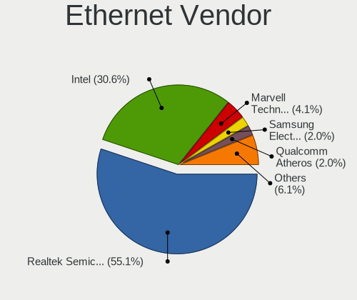
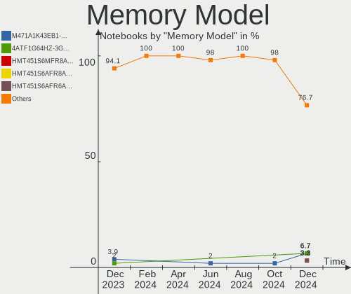

Kubuntu Hardware Trends (Notebook)
----------------------------------

A project to identify most popular hardware characteristics and track their change
over time based on data collected by Kubuntu users at https://Linux-Hardware.org.

Anyone can contribute to the study by uploading probes of their computers by
the [hw-probe](https://github.com/linuxhw/hw-probe) tool:

    sudo -E hw-probe -all -upload

Full-feature report is available here: https://linux-hardware.org/?view=trends&formfactor=notebook

Period: Mar, 2021.

Contents
--------

- [ OS                       ](#os)
- [ OS Family                ](#os-family)
- [ Kernel                   ](#kernel)
- [ Kernel Family            ](#kernel-family)
- [ Kernel Major Ver.        ](#kernel-major-ver)
- [ Arch                     ](#arch)
- [ DE                       ](#de)
- [ Display Server           ](#display-server)
- [ Display Manager          ](#display-manager)
- [ OS Lang                  ](#os-lang)
- [ Boot Mode                ](#boot-mode)
- [ Filesystem               ](#filesystem)
- [ Part. scheme             ](#part-scheme)
- [ Dual Boot with Linux/BSD ](#dual-boot-with-linux/bsd)
- [ Dual Boot (Win)          ](#dual-boot-win)
- [ Country                  ](#country)
- [ City                     ](#city)
- [ Vendor                   ](#vendor)
- [ Model                    ](#model)
- [ Model Family             ](#model-family)
- [ MFG Year                 ](#mfg-year)
- [ Form Factor              ](#form-factor)
- [ Secure Boot              ](#secure-boot)
- [ Coreboot                 ](#coreboot)
- [ RAM Size                 ](#ram-size)
- [ RAM Used                 ](#ram-used)
- [ Has CD-ROM               ](#has-cd-rom)
- [ Total Drives             ](#total-drives)
- [ Has Ethernet             ](#has-ethernet)
- [ Has WiFi                 ](#has-wifi)
- [ Has Bluetooth            ](#has-bluetooth)
- [ Drive Vendor             ](#drive-vendor)
- [ Drive Model              ](#drive-model)
- [ HDD Vendor               ](#hdd-vendor)
- [ SSD Vendor               ](#ssd-vendor)
- [ Drive Kind               ](#drive-kind)
- [ Drive Connector          ](#drive-connector)
- [ Drive Size               ](#drive-size)
- [ Space Total              ](#space-total)
- [ Space Used               ](#space-used)
- [ Malfunc. Drives          ](#malfunc-drives)
- [ Malfunc. Drive Vendor    ](#malfunc-drive-vendor)
- [ Malfunc. HDD Vendor      ](#malfunc-hdd-vendor)
- [ Malfunc. Drive Kind      ](#malfunc-drive-kind)
- [ Failed Drives            ](#failed-drives)
- [ Failed Drive Vendor      ](#failed-drive-vendor)
- [ Drive Status             ](#drive-status)
- [ Storage Vendor           ](#storage-vendor)
- [ Storage Model            ](#storage-model)
- [ Storage Kind             ](#storage-kind)
- [ CPU Vendor               ](#cpu-vendor)
- [ CPU Model                ](#cpu-model)
- [ CPU Model Family         ](#cpu-model-family)
- [ CPU Cores                ](#cpu-cores)
- [ CPU Sockets              ](#cpu-sockets)
- [ CPU Threads              ](#cpu-threads)
- [ CPU Op-Modes             ](#cpu-op-modes)
- [ CPU Microcode            ](#cpu-microcode)
- [ CPU Microarch            ](#cpu-microarch)
- [ GPU Vendor               ](#gpu-vendor)
- [ GPU Model                ](#gpu-model)
- [ GPU Combo                ](#gpu-combo)
- [ GPU Driver               ](#gpu-driver)
- [ GPU Memory               ](#gpu-memory)
- [ Monitor Vendor           ](#monitor-vendor)
- [ Monitor Model            ](#monitor-model)
- [ Monitor Resolution       ](#monitor-resolution)
- [ Monitor Diagonal         ](#monitor-diagonal)
- [ Monitor Width            ](#monitor-width)
- [ Aspect Ratio             ](#aspect-ratio)
- [ Monitor Area             ](#monitor-area)
- [ Pixel Density            ](#pixel-density)
- [ Multiple Monitors        ](#multiple-monitors)
- [ Net Controller Vendor    ](#net-controller-vendor)
- [ Net Controller Model     ](#net-controller-model)
- [ Wireless Vendor          ](#wireless-vendor)
- [ Wireless Model           ](#wireless-model)
- [ Ethernet Vendor          ](#ethernet-vendor)
- [ Ethernet Model           ](#ethernet-model)
- [ Net Controller Kind      ](#net-controller-kind)
- [ Used Controller          ](#used-controller)
- [ NICs                     ](#nics)
- [ IPv6                     ](#ipv6)
- [ Memory Vendor            ](#memory-vendor)
- [ Memory Model             ](#memory-model)
- [ Memory Kind              ](#memory-kind)
- [ Memory Form Factor       ](#memory-form-factor)
- [ Memory Size              ](#memory-size)
- [ Memory Speed             ](#memory-speed)
- [ Sound Vendor             ](#sound-vendor)
- [ Sound Model              ](#sound-model)
- [ Camera Vendor            ](#camera-vendor)
- [ Camera Model             ](#camera-model)
- [ Fingerprint Vendor       ](#fingerprint-vendor)
- [ Fingerprint Model        ](#fingerprint-model)
- [ Chipcard Vendor          ](#chipcard-vendor)
- [ Chipcard Model           ](#chipcard-model)
- [ Printer Vendor           ](#printer-vendor)
- [ Printer Model            ](#printer-model)
- [ Scanner Vendor           ](#scanner-vendor)
- [ Scanner Model            ](#scanner-model)
- [ Bluetooth Vendor         ](#bluetooth-vendor)
- [ Bluetooth Model          ](#bluetooth-model)
- [ Unsupported Devices      ](#unsupported-devices)
- [ Unsupported Device Types ](#unsupported-device-types)

OS
--

Installed operating systems

| Name          | Notebooks | Percent |
|---------------|-----------|---------|
| Kubuntu 20.04 | 29        | 60.42%  |
| Kubuntu 20.10 | 16        | 33.33%  |
| Kubuntu 21.04 | 2         | 4.17%   |
| Kubuntu 18.04 | 1         | 2.08%   |

OS Family
---------

OS without a version

| Name    | Notebooks | Percent |
|---------|-----------|---------|
| Kubuntu | 48        | 100%    |

Kernel
------

Version of the Linux kernel

| Version                | Notebooks | Percent |
|------------------------|-----------|---------|
| 5.8.0-44-generic       | 10        | 20.83%  |
| 5.4.0-66-generic       | 8         | 16.67%  |
| 5.8.0-45-generic       | 7         | 14.58%  |
| 5.4.0-67-generic       | 6         | 12.5%   |
| 5.8.0-48-generic       | 4         | 8.33%   |
| 5.8.0-45-lowlatency    | 2         | 4.17%   |
| 5.11.0-051100-generic  | 2         | 4.17%   |
| 5.10.0-14-generic      | 2         | 4.17%   |
| 5.8.0-44-lowlatency    | 1         | 2.08%   |
| 5.8.0-25-lowlatency    | 1         | 2.08%   |
| 5.6.0-1052-oem         | 1         | 2.08%   |
| 5.4.0-70-lowlatency    | 1         | 2.08%   |
| 5.4.0-70-generic       | 1         | 2.08%   |
| 5.11.6-051106-generic  | 1         | 2.08%   |
| 5.10.22-051022-generic | 1         | 2.08%   |

Kernel Family
-------------

Linux kernel without a distro release

| Version | Notebooks | Percent |
|---------|-----------|---------|
| 5.8.0   | 25        | 52.08%  |
| 5.4.0   | 16        | 33.33%  |
| 5.11.0  | 2         | 4.17%   |
| 5.10.0  | 2         | 4.17%   |
| 5.6.0   | 1         | 2.08%   |
| 5.11.6  | 1         | 2.08%   |
| 5.10.22 | 1         | 2.08%   |

Kernel Major Ver.
-----------------

Linux kernel major version

| Version | Notebooks | Percent |
|---------|-----------|---------|
| 5.8     | 25        | 52.08%  |
| 5.4     | 16        | 33.33%  |
| 5.11    | 3         | 6.25%   |
| 5.10    | 3         | 6.25%   |
| 5.6     | 1         | 2.08%   |

Arch
----

OS architecture (x86_64, i586, etc.)

| Name   | Notebooks | Percent |
|--------|-----------|---------|
| x86_64 | 48        | 100%    |

DE
--

Desktop Environment

| Name  | Notebooks | Percent |
|-------|-----------|---------|
| KDE5  | 24        | 50%     |
| KDE   | 23        | 47.92%  |
| GNOME | 1         | 2.08%   |

Display Server
--------------

X11 or Wayland

| Name    | Notebooks | Percent |
|---------|-----------|---------|
| X11     | 43        | 89.58%  |
| Wayland | 4         | 8.33%   |
| Tty     | 1         | 2.08%   |

Display Manager
---------------

SDDM, LightDM, etc.

| Name    | Notebooks | Percent |
|---------|-----------|---------|
| Unknown | 23        | 47.92%  |
| SDDM    | 20        | 41.67%  |
| GDM     | 5         | 10.42%  |

OS Lang
-------

Language

| Lang  | Notebooks | Percent |
|-------|-----------|---------|
| en_US | 19        | 39.58%  |
| ru_RU | 6         | 12.5%   |
| en_CA | 5         | 10.42%  |
| pt_BR | 4         | 8.33%   |
| es_ES | 3         | 6.25%   |
| it_IT | 2         | 4.17%   |
| fr_FR | 2         | 4.17%   |
| sv_SE | 1         | 2.08%   |
| ru_UA | 1         | 2.08%   |
| es_MX | 1         | 2.08%   |
| en_IN | 1         | 2.08%   |
| en_GB | 1         | 2.08%   |
| de_DE | 1         | 2.08%   |
| C     | 1         | 2.08%   |

Boot Mode
---------

EFI or BIOS

| Mode | Notebooks | Percent |
|------|-----------|---------|
| EFI  | 31        | 64.58%  |
| BIOS | 17        | 35.42%  |

Filesystem
----------

Type of filesystem

| Type    | Notebooks | Percent |
|---------|-----------|---------|
| Ext4    | 47        | 97.92%  |
| Overlay | 1         | 2.08%   |

Part. scheme
------------

Scheme of partitioning

| Type    | Notebooks | Percent |
|---------|-----------|---------|
| Unknown | 23        | 47.92%  |
| GPT     | 21        | 43.75%  |
| MBR     | 4         | 8.33%   |

Dual Boot with Linux/BSD
------------------------

Hosting more than one Linux/BSD

| Dual boot | Notebooks | Percent |
|-----------|-----------|---------|
| No        | 41        | 85.42%  |
| Yes       | 7         | 14.58%  |

Dual Boot (Win)
---------------

Hosting Linux and Windows

| Dual boot | Notebooks | Percent |
|-----------|-----------|---------|
| No        | 30        | 62.5%   |
| Yes       | 18        | 37.5%   |

Country
-------

Geographic location (country)

| Country  | Notebooks | Percent |
|----------|-----------|---------|
| Russia   | 6         | 12.5%   |
| USA      | 5         | 10.42%  |
| Germany  | 4         | 8.33%   |
| Brazil   | 4         | 8.33%   |
| Ukraine  | 3         | 6.25%   |
| Spain    | 3         | 6.25%   |
| France   | 3         | 6.25%   |
| Canada   | 3         | 6.25%   |
| Mexico   | 2         | 4.17%   |
| Bulgaria | 2         | 4.17%   |
| Belgium  | 2         | 4.17%   |
| Vietnam  | 1         | 2.08%   |
| Vatican  | 1         | 2.08%   |
| UK       | 1         | 2.08%   |
| Sweden   | 1         | 2.08%   |
| Serbia   | 1         | 2.08%   |
| Poland   | 1         | 2.08%   |
| Nepal    | 1         | 2.08%   |
| Italy    | 1         | 2.08%   |
| India    | 1         | 2.08%   |
| Finland  | 1         | 2.08%   |
| Belarus  | 1         | 2.08%   |

City
----

Geographic location (city)

| City                | Notebooks | Percent |
|---------------------|-----------|---------|
| Moscow              | 3         | 6.25%   |
| Sofia               | 2         | 4.17%   |
| Madrid              | 2         | 4.17%   |
| Kyiv                | 2         | 4.17%   |
| Krasnodar           | 2         | 4.17%   |
| Warsaw              | 1         | 2.08%   |
| Vatican City        | 1         | 2.08%   |
| Toulouse            | 1         | 2.08%   |
| St Petersburg       | 1         | 2.08%   |
| Somerville          | 1         | 2.08%   |
| Pune                | 1         | 2.08%   |
| Presidente Prudente | 1         | 2.08%   |
| Phoenix             | 1         | 2.08%   |
| Paris               | 1         | 2.08%   |
| Palma               | 1         | 2.08%   |
| Old Orchard Beach   | 1         | 2.08%   |
| Munich              | 1         | 2.08%   |
| Morelia             | 1         | 2.08%   |
| Montreal            | 1         | 2.08%   |
| Minsk               | 1         | 2.08%   |
| Marseille           | 1         | 2.08%   |
| Malmo               | 1         | 2.08%   |
| Longueuil           | 1         | 2.08%   |
| Kathmandu           | 1         | 2.08%   |
| Kamloops            | 1         | 2.08%   |
| Helsinki            | 1         | 2.08%   |
| Goiânia            | 1         | 2.08%   |
| Ghent               | 1         | 2.08%   |
| Frankfurt am Main   | 1         | 2.08%   |
| Düsseldorf         | 1         | 2.08%   |
| Da Nang             | 1         | 2.08%   |
| Ciudad Guzmán      | 1         | 2.08%   |
| Chernihiv           | 1         | 2.08%   |
| Cardiff             | 1         | 2.08%   |
| Brescia             | 1         | 2.08%   |
| Boutersem           | 1         | 2.08%   |
| Bloomfield Hills    | 1         | 2.08%   |
| Berlin              | 1         | 2.08%   |
| Belém              | 1         | 2.08%   |
| Belgrade            | 1         | 2.08%   |
| Atlanta             | 1         | 2.08%   |
| Antas               | 1         | 2.08%   |

Vendor
------

Motherboard manufacturer

| Name                | Notebooks | Percent |
|---------------------|-----------|---------|
| Hewlett-Packard     | 11        | 22.92%  |
| Dell                | 11        | 22.92%  |
| ASUSTek Computer    | 6         | 12.5%   |
| Lenovo              | 5         | 10.42%  |
| Samsung Electronics | 2         | 4.17%   |
| Notebook            | 2         | 4.17%   |
| MSI                 | 2         | 4.17%   |
| Acer                | 2         | 4.17%   |
| TUXEDO              | 1         | 2.08%   |
| Timi                | 1         | 2.08%   |
| Sony                | 1         | 2.08%   |
| Positivo            | 1         | 2.08%   |
| Intel               | 1         | 2.08%   |
| HUAWEI              | 1         | 2.08%   |
| Google              | 1         | 2.08%   |

Model
-----

Motherboard model

| Name                                     | Notebooks | Percent |
|------------------------------------------|-----------|---------|
| Dell XPS 13 9370                         | 2         | 4.17%   |
| ASUS VivoBook_ASUSLaptop X512DA_X512DA   | 2         | 4.17%   |
| TUXEDO InfinityBook S 14 Gen6            | 1         | 2.08%   |
| Timi TM1607                              | 1         | 2.08%   |
| Sony VPCCW25FL                           | 1         | 2.08%   |
| Samsung RV415/RV515                      | 1         | 2.08%   |
| Samsung 370E4K                           | 1         | 2.08%   |
| Positivo C14CR01                         | 1         | 2.08%   |
| Notebook W65_67SF                        | 1         | 2.08%   |
| Notebook W54_55_94_95_97AU,AUQ           | 1         | 2.08%   |
| MSI Modern 15 A10M                       | 1         | 2.08%   |
| MSI GL75 Leopard 10SCSR                  | 1         | 2.08%   |
| Lenovo ThinkPad X1 Carbon 7th 20QD000SUS | 1         | 2.08%   |
| Lenovo ThinkPad T440 20B7S2SM00          | 1         | 2.08%   |
| Lenovo ThinkPad T14 Gen 1 20S0000MGE     | 1         | 2.08%   |
| Lenovo ThinkPad E15 Gen 2 20TD0019BM     | 1         | 2.08%   |
| Lenovo IdeaPad S340-14API 81NB           | 1         | 2.08%   |
| Intel Tiger Lake Client Platform         | 1         | 2.08%   |
| HUAWEI MACHR-WX9                         | 1         | 2.08%   |
| HP Stream Notebook PC 14                 | 1         | 2.08%   |
| HP ProBook 6470b                         | 1         | 2.08%   |
| HP ProBook 4730s                         | 1         | 2.08%   |
| HP ProBook 455 G7                        | 1         | 2.08%   |
| HP Pavilion g6                           | 1         | 2.08%   |
| HP Pavilion 15                           | 1         | 2.08%   |
| HP Laptop 15s-fq2xxx                     | 1         | 2.08%   |
| HP Laptop 15s-eq1xxx                     | 1         | 2.08%   |
| HP EliteBook 840 G5                      | 1         | 2.08%   |
| HP EliteBook 2570p                       | 1         | 2.08%   |
| HP 2000                                  | 1         | 2.08%   |
| Google Coral                             | 1         | 2.08%   |
| Dell XPS M1530                           | 1         | 2.08%   |
| Dell XPS L701X                           | 1         | 2.08%   |
| Dell XPS 15 9500                         | 1         | 2.08%   |
| Dell XPS 13 9310                         | 1         | 2.08%   |
| Dell Precision 5550                      | 1         | 2.08%   |
| Dell Latitude E4310                      | 1         | 2.08%   |
| Dell Latitude 5590                       | 1         | 2.08%   |
| Dell Latitude 5501                       | 1         | 2.08%   |
| Dell Inspiron N7110                      | 1         | 2.08%   |
| ASUS X541NA                              | 1         | 2.08%   |
| ASUS VivoBook_ASUSLaptop X421IA_M433IA   | 1         | 2.08%   |
| ASUS N551JM                              | 1         | 2.08%   |
| ASUS ASUS TUF Gaming A15 FA506II_FA506II | 1         | 2.08%   |
| Acer Nitro AN515-43                      | 1         | 2.08%   |
| Acer Aspire A515-44G                     | 1         | 2.08%   |

Model Family
------------

Motherboard model prefix

| Name                | Notebooks | Percent |
|---------------------|-----------|---------|
| Dell XPS            | 6         | 12.5%   |
| Lenovo ThinkPad     | 4         | 8.33%   |
| HP ProBook          | 3         | 6.25%   |
| Dell Latitude       | 3         | 6.25%   |
| ASUS VivoBook       | 3         | 6.25%   |
| HP Pavilion         | 2         | 4.17%   |
| HP Laptop           | 2         | 4.17%   |
| HP EliteBook        | 2         | 4.17%   |
| TUXEDO InfinityBook | 1         | 2.08%   |
| Timi TM1607         | 1         | 2.08%   |
| Sony VPCCW25FL      | 1         | 2.08%   |
| Samsung RV415       | 1         | 2.08%   |
| Samsung 370E4K      | 1         | 2.08%   |
| Positivo C14CR01    | 1         | 2.08%   |
| Notebook W65        | 1         | 2.08%   |
| Notebook W54        | 1         | 2.08%   |
| MSI Modern          | 1         | 2.08%   |
| MSI GL75            | 1         | 2.08%   |
| Lenovo IdeaPad      | 1         | 2.08%   |
| Intel Tiger         | 1         | 2.08%   |
| HUAWEI MACHR-WX9    | 1         | 2.08%   |
| HP Stream           | 1         | 2.08%   |
| HP 2000             | 1         | 2.08%   |
| Google Coral        | 1         | 2.08%   |
| Dell Precision      | 1         | 2.08%   |
| Dell Inspiron       | 1         | 2.08%   |
| ASUS X541NA         | 1         | 2.08%   |
| ASUS N551JM         | 1         | 2.08%   |
| ASUS ASUS           | 1         | 2.08%   |
| Acer Nitro          | 1         | 2.08%   |
| Acer Aspire         | 1         | 2.08%   |

MFG Year
--------

Motherboard manufacture year

| Year | Notebooks | Percent |
|------|-----------|---------|
| 2020 | 16        | 33.33%  |
| 2019 | 8         | 16.67%  |
| 2021 | 4         | 8.33%   |
| 2014 | 4         | 8.33%   |
| 2011 | 3         | 6.25%   |
| 2018 | 2         | 4.17%   |
| 2017 | 2         | 4.17%   |
| 2016 | 2         | 4.17%   |
| 2013 | 2         | 4.17%   |
| 2012 | 2         | 4.17%   |
| 2015 | 1         | 2.08%   |
| 2010 | 1         | 2.08%   |
| 2008 | 1         | 2.08%   |

Form Factor
-----------

Physical design of the computer

| Name     | Notebooks | Percent |
|----------|-----------|---------|
| Notebook | 48        | 100%    |

Secure Boot
-----------

Enabled or disabled

| State    | Notebooks | Percent |
|----------|-----------|---------|
| Disabled | 44        | 91.67%  |
| Enabled  | 4         | 8.33%   |

Coreboot
--------

Have coreboot on board

| Used | Notebooks | Percent |
|------|-----------|---------|
| No   | 47        | 97.92%  |
| Yes  | 1         | 2.08%   |

RAM Size
--------

Total RAM memory

| Size in GB  | Notebooks | Percent |
|-------------|-----------|---------|
| 4.01-8.0    | 12        | 25%     |
| 8.01-16.0   | 10        | 20.83%  |
| 3.01-4.0    | 9         | 18.75%  |
| 16.01-24.0  | 9         | 18.75%  |
| 32.01-64.0  | 5         | 10.42%  |
| 24.01-32.0  | 1         | 2.08%   |
| 64.01-256.0 | 1         | 2.08%   |
| 1.01-2.0    | 1         | 2.08%   |

RAM Used
--------

Used RAM memory

| Used GB   | Notebooks | Percent |
|-----------|-----------|---------|
| 4.01-8.0  | 11        | 22.92%  |
| 3.01-4.0  | 10        | 20.83%  |
| 2.01-3.0  | 10        | 20.83%  |
| 1.01-2.0  | 10        | 20.83%  |
| 8.01-16.0 | 7         | 14.58%  |

Has CD-ROM
----------

Has CD-ROM on board

| Presented | Notebooks | Percent |
|-----------|-----------|---------|
| No        | 35        | 72.92%  |
| Yes       | 13        | 27.08%  |

Total Drives
------------

Number of drives on board

| Drives | Notebooks | Percent |
|--------|-----------|---------|
| 1      | 35        | 72.92%  |
| 2      | 10        | 20.83%  |
| 3      | 2         | 4.17%   |
| 0      | 1         | 2.08%   |

Has Ethernet
------------

Has Ethernet on board

| Presented | Notebooks | Percent |
|-----------|-----------|---------|
| Yes       | 34        | 70.83%  |
| No        | 14        | 29.17%  |

Has WiFi
--------

Has WiFi module

| Presented | Notebooks | Percent |
|-----------|-----------|---------|
| Yes       | 46        | 95.83%  |
| No        | 2         | 4.17%   |

Has Bluetooth
-------------

Has Bluetooth module

| Presented | Notebooks | Percent |
|-----------|-----------|---------|
| Yes       | 39        | 81.25%  |
| No        | 9         | 18.75%  |

Drive Vendor
------------

Hard drive vendors

| Vendor              | Notebooks | Drives | Percent |
|---------------------|-----------|--------|---------|
| Samsung Electronics | 11        | 11     | 18.64%  |
| WDC                 | 7         | 8      | 11.86%  |
| Seagate             | 7         | 7      | 11.86%  |
| Toshiba             | 6         | 6      | 10.17%  |
| Unknown             | 5         | 5      | 8.47%   |
| Intel               | 5         | 5      | 8.47%   |
| Kingston            | 4         | 4      | 6.78%   |
| SK Hynix            | 3         | 3      | 5.08%   |
| Crucial             | 3         | 3      | 5.08%   |
| SanDisk             | 2         | 2      | 3.39%   |
| Silicon Motion      | 1         | 1      | 1.69%   |
| Micron Technology   | 1         | 1      | 1.69%   |
| Hitachi             | 1         | 1      | 1.69%   |
| HGST                | 1         | 1      | 1.69%   |
| Fujitsu             | 1         | 1      | 1.69%   |
| BHT                 | 1         | 1      | 1.69%   |

Drive Model
-----------

Hard drive models

| Model                                   | Notebooks | Percent |
|-----------------------------------------|-----------|---------|
| Samsung NVMe SSD Drive 512GB            | 3         | 5%      |
| Unknown MMC Card  32GB                  | 2         | 3.33%   |
| Seagate ST9500325AS 500GB               | 2         | 3.33%   |
| WDC WDS500G2B0B-00YS70 500GB SSD        | 1         | 1.67%   |
| WDC WD10SPZX-21Z10T0 1TB                | 1         | 1.67%   |
| WDC WD10SPZX-17Z10T1 1TB                | 1         | 1.67%   |
| WDC WD10JPVX-08JC3T5 1TB                | 1         | 1.67%   |
| WDC PC SN730 SDBQNTY-512G-1001 512GB    | 1         | 1.67%   |
| WDC PC SN730 SDBPNTY-512G-1032 512GB    | 1         | 1.67%   |
| WDC PC SN530 SDBPNPZ-1T00-1002 1TB      | 1         | 1.67%   |
| WDC PC SN520 SDAPNUW-256G-1006 256GB    | 1         | 1.67%   |
| Unknown TO  8GB                         | 1         | 1.67%   |
| Unknown SU32G  32GB                     | 1         | 1.67%   |
| Unknown MMC Card  2GB                   | 1         | 1.67%   |
| Toshiba MQ01ABF032 320GB                | 1         | 1.67%   |
| Toshiba MQ01ABD100 1TB                  | 1         | 1.67%   |
| Toshiba MK5076GSX 500GB                 | 1         | 1.67%   |
| Toshiba KXG60ZNV512G 512GB              | 1         | 1.67%   |
| Toshiba KSG60ZMV512G M.2 2280 512GB SSD | 1         | 1.67%   |
| Toshiba DT01ACA200 2TB                  | 1         | 1.67%   |
| SK Hynix SC401 SATA 512GB SSD           | 1         | 1.67%   |
| SK Hynix HFS256G39MND-3510A 256GB SSD   | 1         | 1.67%   |
| SK Hynix HFM256GDJTNG-8310A 256GB       | 1         | 1.67%   |
| Silicon Motion NVMe SSD Drive 512GB     | 1         | 1.67%   |
| Seagate ST9750423AS 752GB               | 1         | 1.67%   |
| Seagate ST750LM022 HN-M750MBB 752GB     | 1         | 1.67%   |
| Seagate ST500LT012-1DG142 500GB         | 1         | 1.67%   |
| Seagate ST1000LM035-1RK172 1TB          | 1         | 1.67%   |
| Seagate ST1000LM014-1EJ164 1TB          | 1         | 1.67%   |
| SanDisk Ultra II 480GB SSD              | 1         | 1.67%   |
| Sandisk NVMe SSD Drive 512GB            | 1         | 1.67%   |
| Samsung SSD 960 PRO 512GB               | 1         | 1.67%   |
| Samsung SSD 870 EVO 250GB               | 1         | 1.67%   |
| Samsung SSD 860 EVO M.2 1TB             | 1         | 1.67%   |
| Samsung SSD 850 EVO 500GB               | 1         | 1.67%   |
| Samsung PM9A1 NVMe 1024GB               | 1         | 1.67%   |
| Samsung NVMe SSD Drive 1TB              | 1         | 1.67%   |
| Samsung MZVLB512HAJQ-000H1 512GB        | 1         | 1.67%   |
| Samsung HN-M500MBB 500GB                | 1         | 1.67%   |
| Micron 2300 NVMe 1024GB                 | 1         | 1.67%   |
| Kingston SV300S37A120G 120GB SSD        | 1         | 1.67%   |
| Kingston SA400S37240G 240GB SSD         | 1         | 1.67%   |
| Kingston OM8PDP3256B-AI1 256GB          | 1         | 1.67%   |
| Kingston NVMe SSD Drive 512GB           | 1         | 1.67%   |
| Intel SSDPEKNW512G8H 512GB              | 1         | 1.67%   |
| Intel SSDPEKNW512G8 512GB               | 1         | 1.67%   |
| Intel SSDPEKKF010T8L 1TB                | 1         | 1.67%   |
| Intel SSDPEKKF010T8 NVMe 1024GB         | 1         | 1.67%   |
| Intel NVMe SSD Drive 512GB              | 1         | 1.67%   |
| Hitachi HTS725025A9A364 250GB           | 1         | 1.67%   |
| HGST HTS725032A7E630 320GB              | 1         | 1.67%   |
| Fujitsu MHZ2320BJ FFS G2 320GB          | 1         | 1.67%   |
| Crucial CT525MX300SSD1 528GB            | 1         | 1.67%   |
| Crucial CT512MX100SSD1 512GB            | 1         | 1.67%   |
| Crucial CT2000MX500SSD1 2TB             | 1         | 1.67%   |
| BHT WR202A1032G 670215F5 32GB           | 1         | 1.67%   |

HDD Vendor
----------

Hard disk drive vendors

| Vendor              | Notebooks | Drives | Percent |
|---------------------|-----------|--------|---------|
| Seagate             | 7         | 7      | 38.89%  |
| Toshiba             | 4         | 4      | 22.22%  |
| WDC                 | 3         | 3      | 16.67%  |
| Samsung Electronics | 1         | 1      | 5.56%   |
| Hitachi             | 1         | 1      | 5.56%   |
| HGST                | 1         | 1      | 5.56%   |
| Fujitsu             | 1         | 1      | 5.56%   |

SSD Vendor
----------

Solid state drive vendors

| Vendor              | Notebooks | Drives | Percent |
|---------------------|-----------|--------|---------|
| Samsung Electronics | 3         | 3      | 23.08%  |
| Crucial             | 3         | 3      | 23.08%  |
| SK Hynix            | 2         | 2      | 15.38%  |
| Kingston            | 2         | 2      | 15.38%  |
| WDC                 | 1         | 1      | 7.69%   |
| Toshiba             | 1         | 1      | 7.69%   |
| SanDisk             | 1         | 1      | 7.69%   |

Drive Kind
----------

HDD or SSD

| Kind    | Notebooks | Drives | Percent |
|---------|-----------|--------|---------|
| NVMe    | 23        | 23     | 38.98%  |
| HDD     | 18        | 18     | 30.51%  |
| SSD     | 12        | 13     | 20.34%  |
| MMC     | 5         | 5      | 8.47%   |
| Unknown | 1         | 1      | 1.69%   |

Drive Connector
---------------

SATA, SAS, NVMe, etc.

| Type | Notebooks | Drives | Percent |
|------|-----------|--------|---------|
| SATA | 28        | 31     | 49.12%  |
| NVMe | 23        | 23     | 40.35%  |
| MMC  | 5         | 5      | 8.77%   |
| SAS  | 1         | 1      | 1.75%   |

Drive Size
----------

Size of hard drive

| Size in TB | Notebooks | Drives | Percent |
|------------|-----------|--------|---------|
| 0.01-0.5   | 16        | 16     | 53.33%  |
| 0.51-1.0   | 13        | 13     | 43.33%  |
| 1.01-2.0   | 1         | 2      | 3.33%   |

Space Total
-----------

Amount of disk space available on the file system

| Size in GB     | Notebooks | Percent |
|----------------|-----------|---------|
| 251-500        | 18        | 37.5%   |
| 101-250        | 10        | 20.83%  |
| 501-1000       | 9         | 18.75%  |
| 21-50          | 6         | 12.5%   |
| 1001-2000      | 2         | 4.17%   |
| More than 3000 | 1         | 2.08%   |
| 51-100         | 1         | 2.08%   |
| Unknown        | 1         | 2.08%   |

Space Used
----------

Amount of used disk space

| Used GB  | Notebooks | Percent |
|----------|-----------|---------|
| 101-250  | 15        | 31.25%  |
| 1-20     | 10        | 20.83%  |
| 251-500  | 8         | 16.67%  |
| 21-50    | 7         | 14.58%  |
| 51-100   | 4         | 8.33%   |
| 501-1000 | 3         | 6.25%   |
| Unknown  | 1         | 2.08%   |

Malfunc. Drives
---------------

Drive models with a malfunction

| Model                                 | Notebooks | Drives | Percent |
|---------------------------------------|-----------|--------|---------|
| Toshiba MK5076GSX 500GB               | 1         | 1      | 25%     |
| SK Hynix SC401 SATA 512GB SSD         | 1         | 1      | 25%     |
| Samsung Electronics SSD 850 EVO 500GB | 1         | 1      | 25%     |
| Samsung Electronics HN-M500MBB 500GB  | 1         | 1      | 25%     |

Malfunc. Drive Vendor
---------------------

Vendors of faulty drives

| Vendor              | Notebooks | Drives | Percent |
|---------------------|-----------|--------|---------|
| Samsung Electronics | 2         | 2      | 50%     |
| Toshiba             | 1         | 1      | 25%     |
| SK Hynix            | 1         | 1      | 25%     |

Malfunc. HDD Vendor
-------------------

Vendors of faulty HDD drives

| Vendor              | Notebooks | Drives | Percent |
|---------------------|-----------|--------|---------|
| Toshiba             | 1         | 1      | 50%     |
| Samsung Electronics | 1         | 1      | 50%     |

Malfunc. Drive Kind
-------------------

Kinds of faulty drives

| Kind | Notebooks | Drives | Percent |
|------|-----------|--------|---------|
| SSD  | 2         | 2      | 50%     |
| HDD  | 2         | 2      | 50%     |

Failed Drives
-------------

Failed drive models

Zero info for selected period =(

Failed Drive Vendor
-------------------

Failed drive vendors

Zero info for selected period =(

Drive Status
------------

Number of failed and malfunc. drives

| Status   | Notebooks | Drives | Percent |
|----------|-----------|--------|---------|
| Detected | 24        | 31     | 48.98%  |
| Works    | 21        | 25     | 42.86%  |
| Malfunc  | 4         | 4      | 8.16%   |

Storage Vendor
--------------

Storage controller vendors

| Vendor                       | Notebooks | Percent |
|------------------------------|-----------|---------|
| Intel                        | 28        | 48.28%  |
| AMD                          | 12        | 20.69%  |
| Samsung Electronics          | 7         | 12.07%  |
| Sandisk                      | 5         | 8.62%   |
| Kingston Technology Company  | 2         | 3.45%   |
| Toshiba America Info Systems | 1         | 1.72%   |
| SK Hynix                     | 1         | 1.72%   |
| Silicon Motion               | 1         | 1.72%   |
| Micron Technology            | 1         | 1.72%   |

Storage Model
-------------

Storage controller models

| Model                                                                          | Notebooks | Percent |
|--------------------------------------------------------------------------------|-----------|---------|
| AMD FCH SATA Controller [AHCI mode]                                            | 11        | 18.64%  |
| Intel SSD 660P Series                                                          | 3         | 5.08%   |
| Intel 7 Series Chipset Family 6-port SATA Controller [AHCI mode]               | 3         | 5.08%   |
| Sandisk WD Blue SN500 / PC SN520 NVMe SSD                                      | 2         | 3.39%   |
| Sandisk WD Black SN750 / PC SN730 NVMe SSD                                     | 2         | 3.39%   |
| Samsung NVMe SSD Controller SM981/PM981/PM983                                  | 2         | 3.39%   |
| Samsung NVMe SSD Controller PM9A1/980PRO                                       | 2         | 3.39%   |
| Samsung NVMe Controller                                                        | 2         | 3.39%   |
| Intel Wildcat Point-LP SATA Controller [AHCI Mode]                             | 2         | 3.39%   |
| Intel Sunrise Point-LP SATA Controller [AHCI mode]                             | 2         | 3.39%   |
| Intel SSD Pro 7600p/760p/E 6100p Series                                        | 2         | 3.39%   |
| Intel 82801 Mobile SATA Controller [RAID mode]                                 | 2         | 3.39%   |
| Intel 8 Series/C220 Series Chipset Family 6-port SATA Controller 1 [AHCI mode] | 2         | 3.39%   |
| Intel 8 Series SATA Controller 1 [AHCI mode]                                   | 2         | 3.39%   |
| Intel 6 Series/C200 Series Chipset Family 6 port Mobile SATA AHCI Controller   | 2         | 3.39%   |
| Intel 5 Series/3400 Series Chipset 6 port SATA AHCI Controller                 | 2         | 3.39%   |
| Toshiba America Info Systems XG6 NVMe SSD Controller                           | 1         | 1.69%   |
| SK Hynix BC501 NVMe Solid State Drive 512GB                                    | 1         | 1.69%   |
| Silicon Motion SM2263EN/SM2263XT SSD Controller                                | 1         | 1.69%   |
| Sandisk WD Blue SN550 NVMe SSD                                                 | 1         | 1.69%   |
| Samsung NVMe SSD Controller SM961/PM961/SM963                                  | 1         | 1.69%   |
| Micron Non-Volatile memory controller                                          | 1         | 1.69%   |
| Kingston Company Company Non-Volatile memory controller                        | 1         | 1.69%   |
| Kingston Company OM3PDP3 NVMe SSD                                              | 1         | 1.69%   |
| Intel Volume Management Device NVMe RAID Controller                            | 1         | 1.69%   |
| Intel Tiger Lake-LP SATA Controller [AHCI mode]                                | 1         | 1.69%   |
| Intel Celeron N3350/Pentium N4200/Atom E3900 Series SATA AHCI Controller       | 1         | 1.69%   |
| Intel Cannon Lake Mobile PCH SATA AHCI Controller                              | 1         | 1.69%   |
| Intel 82801HM/HEM (ICH8M/ICH8M-E) SATA Controller [AHCI mode]                  | 1         | 1.69%   |
| Intel 82801HM/HEM (ICH8M/ICH8M-E) IDE Controller                               | 1         | 1.69%   |
| Intel 400 Series Chipset Family SATA AHCI Controller                           | 1         | 1.69%   |
| AMD SB7x0/SB8x0/SB9x0 SATA Controller [AHCI mode]                              | 1         | 1.69%   |

Storage Kind
------------

Kind of storage controller (IDE, SATA, NVMe, SAS, ...)

| Kind | Notebooks | Percent |
|------|-----------|---------|
| SATA | 32        | 54.24%  |
| NVMe | 23        | 38.98%  |
| RAID | 3         | 5.08%   |
| IDE  | 1         | 1.69%   |

CPU Vendor
----------

Processor vendors

| Vendor | Notebooks | Percent |
|--------|-----------|---------|
| Intel  | 35        | 72.92%  |
| AMD    | 13        | 27.08%  |

CPU Model
---------

Processor models

| Model                                           | Notebooks | Percent |
|-------------------------------------------------|-----------|---------|
| Intel Core i7-8550U CPU @ 1.80GHz               | 3         | 6.25%   |
| Intel 11th Gen Core i7-1165G7 @ 2.80GHz         | 3         | 6.25%   |
| AMD Ryzen 7 4700U with Radeon Graphics          | 3         | 6.25%   |
| AMD Ryzen 5 3500U with Radeon Vega Mobile Gfx   | 3         | 6.25%   |
| Intel Core i7-10750H CPU @ 2.60GHz              | 2         | 4.17%   |
| Intel Core i7-10510U CPU @ 1.80GHz              | 2         | 4.17%   |
| Intel Core i3-5005U CPU @ 2.00GHz               | 2         | 4.17%   |
| Intel Pentium Gold 7505 @ 2.00GHz               | 1         | 2.08%   |
| Intel Pentium CPU N4200 @ 1.10GHz               | 1         | 2.08%   |
| Intel Core m3-7Y30 CPU @ 1.00GHz                | 1         | 2.08%   |
| Intel Core i9-10885H CPU @ 2.40GHz              | 1         | 2.08%   |
| Intel Core i7-9850H CPU @ 2.60GHz               | 1         | 2.08%   |
| Intel Core i7-8665U CPU @ 1.90GHz               | 1         | 2.08%   |
| Intel Core i7-8565U CPU @ 1.80GHz               | 1         | 2.08%   |
| Intel Core i7-4710HQ CPU @ 2.50GHz              | 1         | 2.08%   |
| Intel Core i7-4700MQ CPU @ 2.40GHz              | 1         | 2.08%   |
| Intel Core i7-3520M CPU @ 2.90GHz               | 1         | 2.08%   |
| Intel Core i7-2670QM CPU @ 2.20GHz              | 1         | 2.08%   |
| Intel Core i7 CPU Q 740 @ 1.73GHz               | 1         | 2.08%   |
| Intel Core i5-8250U CPU @ 1.60GHz               | 1         | 2.08%   |
| Intel Core i5-4210U CPU @ 1.70GHz               | 1         | 2.08%   |
| Intel Core i5-4200U CPU @ 1.60GHz               | 1         | 2.08%   |
| Intel Core i5-3320M CPU @ 2.60GHz               | 1         | 2.08%   |
| Intel Core i5-2450M CPU @ 2.50GHz               | 1         | 2.08%   |
| Intel Core i5 CPU M 560 @ 2.67GHz               | 1         | 2.08%   |
| Intel Core i3-2310M CPU @ 2.10GHz               | 1         | 2.08%   |
| Intel Core i3 CPU M 330 @ 2.13GHz               | 1         | 2.08%   |
| Intel Core 2 Duo CPU T9300 @ 2.50GHz            | 1         | 2.08%   |
| Intel Celeron CPU N3450 @ 1.10GHz               | 1         | 2.08%   |
| Intel 11th Gen Core i7-1185G7E @ 2.80GHz        | 1         | 2.08%   |
| AMD Ryzen 7 4800H with Radeon Graphics          | 1         | 2.08%   |
| AMD Ryzen 5 3550H with Radeon Vega Mobile Gfx   | 1         | 2.08%   |
| AMD Ryzen 3 3250U with Radeon Graphics          | 1         | 2.08%   |
| AMD E2-3000M APU with Radeon HD Graphics        | 1         | 2.08%   |
| AMD E-350 Processor                             | 1         | 2.08%   |
| AMD E-300 APU with Radeon HD Graphics           | 1         | 2.08%   |
| AMD A4 Micro-6400T APU + AMD Radeon R3 Graphics | 1         | 2.08%   |

CPU Model Family
----------------

Processor model prefix

| Model              | Notebooks | Percent |
|--------------------|-----------|---------|
| Intel Core i7      | 15        | 31.25%  |
| Intel Core i5      | 6         | 12.5%   |
| Other              | 4         | 8.33%   |
| Intel Core i3      | 4         | 8.33%   |
| AMD Ryzen 7        | 4         | 8.33%   |
| AMD Ryzen 5        | 4         | 8.33%   |
| AMD E              | 2         | 4.17%   |
| Intel Pentium Gold | 1         | 2.08%   |
| Intel Pentium      | 1         | 2.08%   |
| Intel Core m3      | 1         | 2.08%   |
| Intel Core i9      | 1         | 2.08%   |
| Intel Core 2 Duo   | 1         | 2.08%   |
| Intel Celeron      | 1         | 2.08%   |
| AMD Ryzen 3        | 1         | 2.08%   |
| AMD E2             | 1         | 2.08%   |
| AMD A4             | 1         | 2.08%   |

CPU Cores
---------

Number of processor cores

| Number | Notebooks | Percent |
|--------|-----------|---------|
| 4      | 23        | 47.92%  |
| 2      | 17        | 35.42%  |
| 8      | 5         | 10.42%  |
| 6      | 3         | 6.25%   |

CPU Sockets
-----------

Number of sockets

| Number | Notebooks | Percent |
|--------|-----------|---------|
| 1      | 48        | 100%    |

CPU Threads
-----------

Threads per core (Hyper-Threading)

| Number | Notebooks | Percent |
|--------|-----------|---------|
| 2      | 38        | 79.17%  |
| 1      | 10        | 20.83%  |

CPU Op-Modes
------------

CPU Operation Modes (32-bit, 64-bit)

| Op mode        | Notebooks | Percent |
|----------------|-----------|---------|
| 32-bit, 64-bit | 48        | 100%    |

CPU Microcode
-------------

Microcode number

| Number     | Notebooks | Percent |
|------------|-----------|---------|
| Unknown    | 8         | 16.67%  |
| 0x806ec    | 4         | 8.33%   |
| 0x806c1    | 4         | 8.33%   |
| 0x08108102 | 4         | 8.33%   |
| 0xa0652    | 3         | 6.25%   |
| 0x806ea    | 3         | 6.25%   |
| 0x206a7    | 3         | 6.25%   |
| 0x506c9    | 2         | 4.17%   |
| 0x40651    | 2         | 4.17%   |
| 0x306d4    | 2         | 4.17%   |
| 0x306c3    | 2         | 4.17%   |
| 0x08600106 | 2         | 4.17%   |
| 0x906ed    | 1         | 2.08%   |
| 0x306a9    | 1         | 2.08%   |
| 0x10676    | 1         | 2.08%   |
| 0x08600103 | 1         | 2.08%   |
| 0x08108109 | 1         | 2.08%   |
| 0x07030105 | 1         | 2.08%   |
| 0x05000119 | 1         | 2.08%   |
| 0x05000029 | 1         | 2.08%   |
| 0x03000027 | 1         | 2.08%   |

CPU Microarch
-------------

Microarchitecture

| Name        | Notebooks | Percent |
|-------------|-----------|---------|
| KabyLake    | 10        | 20.83%  |
| Zen+        | 5         | 10.42%  |
| TigerLake   | 5         | 10.42%  |
| Zen 2       | 4         | 8.33%   |
| Haswell     | 4         | 8.33%   |
| SandyBridge | 3         | 6.25%   |
| CometLake   | 3         | 6.25%   |
| Westmere    | 2         | 4.17%   |
| IvyBridge   | 2         | 4.17%   |
| Goldmont    | 2         | 4.17%   |
| Broadwell   | 2         | 4.17%   |
| Bobcat      | 2         | 4.17%   |
| Puma        | 1         | 2.08%   |
| Penryn      | 1         | 2.08%   |
| Nehalem     | 1         | 2.08%   |
| K10 Llano   | 1         | 2.08%   |

GPU Vendor
----------

Vendors of graphics cards

| Vendor | Notebooks | Percent |
|--------|-----------|---------|
| Intel  | 32        | 55.17%  |
| AMD    | 14        | 24.14%  |
| Nvidia | 12        | 20.69%  |

GPU Model
---------

Graphics card models

| Model                                                                              | Notebooks | Percent |
|------------------------------------------------------------------------------------|-----------|---------|
| AMD Picasso                                                                        | 5         | 8.33%   |
| Intel UHD Graphics 620                                                             | 4         | 6.67%   |
| Intel TigerLake GT2 [Iris Xe Graphics]                                             | 4         | 6.67%   |
| AMD Renoir                                                                         | 4         | 6.67%   |
| Nvidia TU117M [GeForce GTX 1650 Ti Mobile]                                         | 3         | 5%      |
| Intel CometLake-H GT2 [UHD Graphics]                                               | 3         | 5%      |
| Intel 2nd Generation Core Processor Family Integrated Graphics Controller          | 3         | 5%      |
| Intel WhiskeyLake-U GT2 [UHD Graphics 620]                                         | 2         | 3.33%   |
| Intel HD Graphics 5500                                                             | 2         | 3.33%   |
| Intel Haswell-ULT Integrated Graphics Controller                                   | 2         | 3.33%   |
| Intel CometLake-U GT2 [UHD Graphics]                                               | 2         | 3.33%   |
| Intel 4th Gen Core Processor Integrated Graphics Controller                        | 2         | 3.33%   |
| Intel 3rd Gen Core processor Graphics Controller                                   | 2         | 3.33%   |
| AMD Wrestler [Radeon HD 6310]                                                      | 2         | 3.33%   |
| Nvidia TU117GLM [Quadro T2000 Mobile / Max-Q]                                      | 1         | 1.67%   |
| Nvidia GT216M [GeForce GT 330M]                                                    | 1         | 1.67%   |
| Nvidia GP108BM [GeForce MX250]                                                     | 1         | 1.67%   |
| Nvidia GP107M [GeForce MX150]                                                      | 1         | 1.67%   |
| Nvidia GM108M [GeForce 840M]                                                       | 1         | 1.67%   |
| Nvidia GM107M [GeForce GTX 860M]                                                   | 1         | 1.67%   |
| Nvidia GF108M [GeForce GT 525M]                                                    | 1         | 1.67%   |
| Nvidia GF106M [GeForce GT 445M]                                                    | 1         | 1.67%   |
| Nvidia G84M [GeForce 8600M GT]                                                     | 1         | 1.67%   |
| Intel Tiger Lake UHD Graphics                                                      | 1         | 1.67%   |
| Intel HD Graphics 615                                                              | 1         | 1.67%   |
| Intel HD Graphics 500                                                              | 1         | 1.67%   |
| Intel Core Processor Integrated Graphics Controller                                | 1         | 1.67%   |
| Intel CoffeeLake-H GT2 [UHD Graphics 630]                                          | 1         | 1.67%   |
| Intel Celeron N3350/Pentium N4200/Atom E3900 Series Integrated Graphics Controller | 1         | 1.67%   |
| AMD SuperSumo [Radeon HD 6380G]                                                    | 1         | 1.67%   |
| AMD Seymour [Radeon HD 6400M/7400M Series]                                         | 1         | 1.67%   |
| AMD Mullins [Radeon R3E Graphics]                                                  | 1         | 1.67%   |
| AMD Lexa [Radeon 540X/550X/630 / RX 640 / E9171 MCM]                               | 1         | 1.67%   |
| AMD Baffin [Radeon RX 460/560D / Pro 450/455/460/555/555X/560/560X]                | 1         | 1.67%   |

GPU Combo
---------

Combinations of graphics cards

| Name           | Notebooks | Percent |
|----------------|-----------|---------|
| 1 x Intel      | 23        | 47.92%  |
| 1 x AMD        | 10        | 20.83%  |
| Intel + Nvidia | 8         | 16.67%  |
| 1 x Nvidia     | 3         | 6.25%   |
| 2 x AMD        | 2         | 4.17%   |
| Intel + AMD    | 1         | 2.08%   |
| AMD + Nvidia   | 1         | 2.08%   |

GPU Driver
----------

Free vs proprietary

| Driver      | Notebooks | Percent |
|-------------|-----------|---------|
| Free        | 40        | 83.33%  |
| Proprietary | 7         | 14.58%  |
| Unknown     | 1         | 2.08%   |

GPU Memory
----------

Total video memory

| Size in GB | Notebooks | Percent |
|------------|-----------|---------|
| Unknown    | 32        | 66.67%  |
| 0.01-0.5   | 7         | 14.58%  |
| 1.01-2.0   | 5         | 10.42%  |
| 3.01-4.0   | 2         | 4.17%   |
| 0.51-1.0   | 2         | 4.17%   |

Monitor Vendor
--------------

Monitor vendors

| Vendor                  | Notebooks | Percent |
|-------------------------|-----------|---------|
| LG Display              | 12        | 20.34%  |
| BOE                     | 6         | 10.17%  |
| AU Optronics            | 6         | 10.17%  |
| Sharp                   | 5         | 8.47%   |
| Dell                    | 5         | 8.47%   |
| Samsung Electronics     | 4         | 6.78%   |
| Chimei Innolux          | 3         | 5.08%   |
| Chi Mei Optoelectronics | 3         | 5.08%   |
| BenQ                    | 3         | 5.08%   |
| PANDA                   | 2         | 3.39%   |
| Unknown                 | 1         | 1.69%   |
| Seiko/Epson             | 1         | 1.69%   |
| Lenovo                  | 1         | 1.69%   |
| JDI                     | 1         | 1.69%   |
| InfoVision              | 1         | 1.69%   |
| Iiyama                  | 1         | 1.69%   |
| Goldstar                | 1         | 1.69%   |
| AVX                     | 1         | 1.69%   |
| Ancor Communications    | 1         | 1.69%   |
| Acer                    | 1         | 1.69%   |

Monitor Model
-------------

Monitor models

| Model                                                                    | Notebooks | Percent |
|--------------------------------------------------------------------------|-----------|---------|
| Sharp LCD Monitor SHP14D1 1920x1200 336x210mm 15.6-inch                  | 2         | 3.33%   |
| LG Display LCD Monitor LGD0563 1920x1080 344x194mm 15.5-inch             | 2         | 3.33%   |
| Chi Mei Optoelectronics LCD Monitor CMO1718 1600x900 382x215mm 17.3-inch | 2         | 3.33%   |
| Unknown LCD Monitor Sony Nvidia Default Flat Panel 1366x768              | 1         | 1.67%   |
| Sharp LCD Monitor SHP14FA 3840x2400 288x180mm 13.4-inch                  | 1         | 1.67%   |
| Sharp LCD Monitor SHP148B 3840x2160 294x165mm 13.3-inch                  | 1         | 1.67%   |
| Sharp LCD Monitor SHP1484 1920x1080 294x165mm 13.3-inch                  | 1         | 1.67%   |
| Seiko/Epson LCD Monitor 1920x1200                                        | 1         | 1.67%   |
| Samsung Electronics S34J55x SAM0F71 3440x1440 797x333mm 34.0-inch        | 1         | 1.67%   |
| Samsung Electronics LCD Monitor SEC345A 1366x768 309x174mm 14.0-inch     | 1         | 1.67%   |
| Samsung Electronics LCD Monitor SDC4951 1366x768 344x194mm 15.5-inch     | 1         | 1.67%   |
| Samsung Electronics LCD Monitor SDC324C 1920x1080 344x194mm 15.5-inch    | 1         | 1.67%   |
| PANDA LCD Monitor NCP0046 1920x1080 344x194mm 15.5-inch                  | 1         | 1.67%   |
| PANDA LCD Monitor NCP003D 1920x1080 344x194mm 15.5-inch                  | 1         | 1.67%   |
| LG Display LCD Monitor LGD05FF 1920x1080 344x194mm 15.5-inch             | 1         | 1.67%   |
| LG Display LCD Monitor LGD05EC 1920x1080 309x174mm 14.0-inch             | 1         | 1.67%   |
| LG Display LCD Monitor LGD040A 1920x1080 310x170mm 13.9-inch             | 1         | 1.67%   |
| LG Display LCD Monitor LGD03F0 1366x768 310x174mm 14.0-inch              | 1         | 1.67%   |
| LG Display LCD Monitor LGD0391 1600x900 380x210mm 17.1-inch              | 1         | 1.67%   |
| LG Display LCD Monitor LGD0385 1366x768 309x174mm 14.0-inch              | 1         | 1.67%   |
| LG Display LCD Monitor LGD0384 1366x768 344x194mm 15.5-inch              | 1         | 1.67%   |
| LG Display LCD Monitor LGD02F2 1366x768 344x194mm 15.5-inch              | 1         | 1.67%   |
| LG Display LCD Monitor LGD027B 1600x900 382x215mm 17.3-inch              | 1         | 1.67%   |
| LG Display LCD Monitor LGD024D 1366x768 294x166mm 13.3-inch              | 1         | 1.67%   |
| Lenovo LCD Monitor LEN40BA 1920x1080 344x194mm 15.5-inch                 | 1         | 1.67%   |
| JDI LCD Monitor JDI422A 3000x2000 293x196mm 13.9-inch                    | 1         | 1.67%   |
| InfoVision LCD Monitor IVO057F 1920x1080 309x174mm 14.0-inch             | 1         | 1.67%   |
| Iiyama PL2730Q IVM6643 2560x1440 597x336mm 27.0-inch                     | 1         | 1.67%   |
| Goldstar LCD Monitor GSM580D 1920x1080 510x290mm 23.1-inch               | 1         | 1.67%   |
| Dell U2719DC DEL417E 2560x1440 597x336mm 27.0-inch                       | 1         | 1.67%   |
| Dell U2715H DELD067 2560x1440 597x336mm 27.0-inch                        | 1         | 1.67%   |
| Dell U2419H DEL4148 1920x1080 527x296mm 23.8-inch                        | 1         | 1.67%   |
| Dell U2415 DELA0B8 1920x1080 520x320mm 24.0-inch                         | 1         | 1.67%   |
| Dell P2317H DEL40F4 1920x1080 509x286mm 23.0-inch                        | 1         | 1.67%   |
| Dell E2418HN DELA105 1920x1080 527x296mm 23.8-inch                       | 1         | 1.67%   |
| Chimei Innolux LCD Monitor CMN15F5 1920x1080 344x193mm 15.5-inch         | 1         | 1.67%   |
| Chimei Innolux LCD Monitor CMN15E8 1920x1080 344x193mm 15.5-inch         | 1         | 1.67%   |
| Chimei Innolux LCD Monitor CMN14A1 1366x768 309x174mm 14.0-inch          | 1         | 1.67%   |
| Chi Mei Optoelectronics LCD Monitor CMO1465 1366x768 309x174mm 14.0-inch | 1         | 1.67%   |
| BOE LCD Monitor BOE07F1 1920x1080 344x193mm 15.5-inch                    | 1         | 1.67%   |
| BOE LCD Monitor BOE07DB 1920x1080 309x174mm 14.0-inch                    | 1         | 1.67%   |
| BOE LCD Monitor BOE07C8 3840x2160 309x174mm 14.0-inch                    | 1         | 1.67%   |
| BOE LCD Monitor BOE06CB 1920x1080 344x194mm 15.5-inch                    | 1         | 1.67%   |
| BOE LCD Monitor BOE0691 1920x1080 280x165mm 12.8-inch                    | 1         | 1.67%   |
| BOE LCD Monitor BOE05FE 1366x768 309x173mm 13.9-inch                     | 1         | 1.67%   |
| BenQ LCD BNQ801B 2560x1440 527x296mm 23.8-inch                           | 1         | 1.67%   |
| BenQ GW2270 BNQ78DB 1920x1080 476x268mm 21.5-inch                        | 1         | 1.67%   |
| BenQ GL2023 BNQ78CC 1600x900 443x249mm 20.0-inch                         | 1         | 1.67%   |
| AVX AVT GC570-D AVX0050 3840x2160                                        | 1         | 1.67%   |
| AU Optronics LCD Monitor AUO978F 1920x1080 382x215mm 17.3-inch           | 1         | 1.67%   |
| AU Optronics LCD Monitor AUO623D 1920x1080 309x174mm 14.0-inch           | 1         | 1.67%   |
| AU Optronics LCD Monitor AUO403D 1920x1080 309x173mm 13.9-inch           | 1         | 1.67%   |
| AU Optronics LCD Monitor AUO303D 1920x1080 309x174mm 14.0-inch           | 1         | 1.67%   |
| AU Optronics LCD Monitor AUO21ED 1920x1080 344x194mm 15.5-inch           | 1         | 1.67%   |
| AU Optronics LCD Monitor AUO206C 1366x768 277x156mm 12.5-inch            | 1         | 1.67%   |
| Ancor Communications PB248 ACI24A3 1920x1200 518x324mm 24.1-inch         | 1         | 1.67%   |
| Acer G237HL ACR03DF 1920x1080 509x286mm 23.0-inch                        | 1         | 1.67%   |

Monitor Resolution
------------------

Monitor screen resolution

| Resolution        | Notebooks | Percent |
|-------------------|-----------|---------|
| 1920x1080 (FHD)   | 23        | 41.82%  |
| 1366x768 (WXGA)   | 11        | 20%     |
| 1920x1200 (WUXGA) | 5         | 9.09%   |
| 1600x900 (HD+)    | 5         | 9.09%   |
| 3840x2160 (4K)    | 4         | 7.27%   |
| 2560x1440 (QHD)   | 4         | 7.27%   |
| 3840x2400         | 1         | 1.82%   |
| 3440x1440         | 1         | 1.82%   |
| 3000x2000         | 1         | 1.82%   |

Monitor Diagonal
----------------

Diagonal size in inches

| Inches  | Notebooks | Percent |
|---------|-----------|---------|
| 15      | 17        | 28.33%  |
| 14      | 13        | 21.67%  |
| 24      | 5         | 8.33%   |
| 17      | 5         | 8.33%   |
| 13      | 5         | 8.33%   |
| 27      | 4         | 6.67%   |
| 23      | 3         | 5%      |
| Unknown | 3         | 5%      |
| 12      | 2         | 3.33%   |
| 34      | 1         | 1.67%   |
| 21      | 1         | 1.67%   |
| 20      | 1         | 1.67%   |

Monitor Width
-------------

Physical width

| Width in mm | Notebooks | Percent |
|-------------|-----------|---------|
| 301-350     | 31        | 52.54%  |
| 501-600     | 11        | 18.64%  |
| 201-300     | 6         | 10.17%  |
| 351-400     | 5         | 8.47%   |
| Unknown     | 3         | 5.08%   |
| 401-500     | 2         | 3.39%   |
| 701-800     | 1         | 1.69%   |

Aspect Ratio
------------

Proportional relationship between the width and the height

| Ratio   | Notebooks | Percent |
|---------|-----------|---------|
| 16/9    | 41        | 82%     |
| 16/10   | 5         | 10%     |
| Unknown | 2         | 4%      |
| 3/2     | 1         | 2%      |
| 21/9    | 1         | 2%      |

Monitor Area
------------

Area in inch²

| Area in inch² | Notebooks | Percent |
|----------------|-----------|---------|
| 101-110        | 17        | 28.81%  |
| 81-90          | 15        | 25.42%  |
| 201-250        | 6         | 10.17%  |
| 121-130        | 5         | 8.47%   |
| 71-80          | 4         | 6.78%   |
| 301-350        | 4         | 6.78%   |
| Unknown        | 3         | 5.08%   |
| 251-300        | 2         | 3.39%   |
| 61-70          | 1         | 1.69%   |
| 351-500        | 1         | 1.69%   |
| 151-200        | 1         | 1.69%   |

Pixel Density
-------------

Pixels per inch

| Density       | Notebooks | Percent |
|---------------|-----------|---------|
| 121-160       | 23        | 39.66%  |
| 101-120       | 18        | 31.03%  |
| 51-100        | 7         | 12.07%  |
| More than 240 | 4         | 6.9%    |
| 161-240       | 3         | 5.17%   |
| Unknown       | 3         | 5.17%   |

Multiple Monitors
-----------------

Total monitors connected

| Total | Notebooks | Percent |
|-------|-----------|---------|
| 1     | 33        | 68.75%  |
| 2     | 12        | 25%     |
| 3     | 2         | 4.17%   |
| 0     | 1         | 2.08%   |

Net Controller Vendor
---------------------

Controller vendors

| Vendor                          | Notebooks | Percent |
|---------------------------------|-----------|---------|
| Intel                           | 28        | 39.44%  |
| Realtek Semiconductor           | 23        | 32.39%  |
| Qualcomm Atheros                | 9         | 12.68%  |
| Broadcom Inc. and subsidiaries  | 3         | 4.23%   |
| Marvell Technology Group        | 2         | 2.82%   |
| Qualcomm Atheros Communications | 1         | 1.41%   |
| Qualcomm                        | 1         | 1.41%   |
| Lenovo                          | 1         | 1.41%   |
| JMicron Technology              | 1         | 1.41%   |
| Huawei Technologies             | 1         | 1.41%   |
| DisplayLink                     | 1         | 1.41%   |

Net Controller Model
--------------------

Controller models

| Model                                                                     | Notebooks | Percent |
|---------------------------------------------------------------------------|-----------|---------|
| Realtek RTL8111/8168/8411 PCI Express Gigabit Ethernet Controller         | 12        | 14.29%  |
| Realtek RTL810xE PCI Express Fast Ethernet controller                     | 6         | 7.14%   |
| Intel Wireless 8265 / 8275                                                | 5         | 5.95%   |
| Intel Wi-Fi 6 AX200                                                       | 4         | 4.76%   |
| Realtek RTL8153 Gigabit Ethernet Adapter                                  | 3         | 3.57%   |
| Qualcomm Atheros QCA6174 802.11ac Wireless Network Adapter                | 3         | 3.57%   |
| Intel Comet Lake PCH CNVi WiFi                                            | 3         | 3.57%   |
| Realtek RTL8821CE 802.11ac PCIe Wireless Network Adapter                  | 2         | 2.38%   |
| Realtek RTL8188EE Wireless Network Adapter                                | 2         | 2.38%   |
| Qualcomm Atheros AR9485 Wireless Network Adapter                          | 2         | 2.38%   |
| Qualcomm Atheros AR9285 Wireless Network Adapter (PCI-Express)            | 2         | 2.38%   |
| Intel Wireless 7260                                                       | 2         | 2.38%   |
| Intel Comet Lake PCH-LP CNVi WiFi                                         | 2         | 2.38%   |
| Intel Cannon Point-LP CNVi [Wireless-AC]                                  | 2         | 2.38%   |
| Realtek RTL8822CE 802.11ac PCIe Wireless Network Adapter                  | 1         | 1.19%   |
| Realtek RTL8723BE PCIe Wireless Network Adapter                           | 1         | 1.19%   |
| Realtek RTL8188CE 802.11b/g/n WiFi Adapter                                | 1         | 1.19%   |
| Qualcomm QCA6390 Wireless Network Adapter [AX500-DBS (2x2)]               | 1         | 1.19%   |
| Qualcomm Atheros QCA9565 / AR9565 Wireless Network Adapter                | 1         | 1.19%   |
| Qualcomm Atheros QCA9377 802.11ac Wireless Network Adapter                | 1         | 1.19%   |
| Qualcomm Atheros AR9271 802.11n                                           | 1         | 1.19%   |
| Marvell Group 88E8057 PCI-E Gigabit Ethernet Controller                   | 1         | 1.19%   |
| Marvell Group 88E8040 PCI-E Fast Ethernet Controller                      | 1         | 1.19%   |
| Lenovo ThinkPad Lan                                                       | 1         | 1.19%   |
| JMicron JMC250 PCI Express Gigabit Ethernet Controller                    | 1         | 1.19%   |
| Intel Wireless-AC 9560 [Jefferson Peak]                                   | 1         | 1.19%   |
| Intel Wireless 7265                                                       | 1         | 1.19%   |
| Intel Wi-Fi 6 AX201                                                       | 1         | 1.19%   |
| Intel PRO/Wireless 4965 AG or AGN [Kedron] Network Connection             | 1         | 1.19%   |
| Intel Ethernet Controller I225-LM                                         | 1         | 1.19%   |
| Intel Ethernet Connection I218-V                                          | 1         | 1.19%   |
| Intel Ethernet Connection (7) I219-LM                                     | 1         | 1.19%   |
| Intel Ethernet Connection (4) I219-V                                      | 1         | 1.19%   |
| Intel Ethernet Connection (4) I219-LM                                     | 1         | 1.19%   |
| Intel Ethernet Connection (13) I219-LM                                    | 1         | 1.19%   |
| Intel Ethernet Connection (10) I219-V                                     | 1         | 1.19%   |
| Intel Centrino Wireless-N 1030 [Rainbow Peak]                             | 1         | 1.19%   |
| Intel Centrino Wireless-N 1000 [Condor Peak]                              | 1         | 1.19%   |
| Intel Centrino Ultimate-N 6300                                            | 1         | 1.19%   |
| Intel Centrino Advanced-N 6205 [Taylor Peak]                              | 1         | 1.19%   |
| Intel 82579V Gigabit Network Connection                                   | 1         | 1.19%   |
| Intel 82579LM Gigabit Network Connection (Lewisville)                     | 1         | 1.19%   |
| Intel 82577LM Gigabit Network Connection                                  | 1         | 1.19%   |
| Huawei ME936 LTE/HSDPA+ 4G modem                                          | 1         | 1.19%   |
| DisplayLink Dell Universal Dock D6000                                     | 1         | 1.19%   |
| Broadcom Inc. and subsidiaries BCM43228 802.11a/b/g/n                     | 1         | 1.19%   |
| Broadcom Inc. and subsidiaries BCM43142 802.11b/g/n                       | 1         | 1.19%   |
| Broadcom Inc. and subsidiaries BCM4313 802.11bgn Wireless Network Adapter | 1         | 1.19%   |

Wireless Vendor
---------------

Wireless vendors

| Vendor                          | Notebooks | Percent |
|---------------------------------|-----------|---------|
| Intel                           | 26        | 55.32%  |
| Qualcomm Atheros                | 9         | 19.15%  |
| Realtek Semiconductor           | 7         | 14.89%  |
| Broadcom Inc. and subsidiaries  | 3         | 6.38%   |
| Qualcomm Atheros Communications | 1         | 2.13%   |
| Qualcomm                        | 1         | 2.13%   |

Wireless Model
--------------

Wireless models

| Model                                                                     | Notebooks | Percent |
|---------------------------------------------------------------------------|-----------|---------|
| Intel Wireless 8265 / 8275                                                | 5         | 10.64%  |
| Intel Wi-Fi 6 AX200                                                       | 4         | 8.51%   |
| Qualcomm Atheros QCA6174 802.11ac Wireless Network Adapter                | 3         | 6.38%   |
| Intel Comet Lake PCH CNVi WiFi                                            | 3         | 6.38%   |
| Realtek RTL8821CE 802.11ac PCIe Wireless Network Adapter                  | 2         | 4.26%   |
| Realtek RTL8188EE Wireless Network Adapter                                | 2         | 4.26%   |
| Qualcomm Atheros AR9485 Wireless Network Adapter                          | 2         | 4.26%   |
| Qualcomm Atheros AR9285 Wireless Network Adapter (PCI-Express)            | 2         | 4.26%   |
| Intel Wireless 7260                                                       | 2         | 4.26%   |
| Intel Comet Lake PCH-LP CNVi WiFi                                         | 2         | 4.26%   |
| Intel Cannon Point-LP CNVi [Wireless-AC]                                  | 2         | 4.26%   |
| Realtek RTL8822CE 802.11ac PCIe Wireless Network Adapter                  | 1         | 2.13%   |
| Realtek RTL8723BE PCIe Wireless Network Adapter                           | 1         | 2.13%   |
| Realtek RTL8188CE 802.11b/g/n WiFi Adapter                                | 1         | 2.13%   |
| Qualcomm QCA6390 Wireless Network Adapter [AX500-DBS (2x2)]               | 1         | 2.13%   |
| Qualcomm Atheros QCA9565 / AR9565 Wireless Network Adapter                | 1         | 2.13%   |
| Qualcomm Atheros QCA9377 802.11ac Wireless Network Adapter                | 1         | 2.13%   |
| Qualcomm Atheros AR9271 802.11n                                           | 1         | 2.13%   |
| Intel Wireless-AC 9560 [Jefferson Peak]                                   | 1         | 2.13%   |
| Intel Wireless 7265                                                       | 1         | 2.13%   |
| Intel Wi-Fi 6 AX201                                                       | 1         | 2.13%   |
| Intel PRO/Wireless 4965 AG or AGN [Kedron] Network Connection             | 1         | 2.13%   |
| Intel Centrino Wireless-N 1030 [Rainbow Peak]                             | 1         | 2.13%   |
| Intel Centrino Wireless-N 1000 [Condor Peak]                              | 1         | 2.13%   |
| Intel Centrino Ultimate-N 6300                                            | 1         | 2.13%   |
| Intel Centrino Advanced-N 6205 [Taylor Peak]                              | 1         | 2.13%   |
| Broadcom Inc. and subsidiaries BCM43228 802.11a/b/g/n                     | 1         | 2.13%   |
| Broadcom Inc. and subsidiaries BCM43142 802.11b/g/n                       | 1         | 2.13%   |
| Broadcom Inc. and subsidiaries BCM4313 802.11bgn Wireless Network Adapter | 1         | 2.13%   |

Ethernet Vendor
---------------

Ethernet vendors

| Vendor                   | Notebooks | Percent |
|--------------------------|-----------|---------|
| Realtek Semiconductor    | 21        | 60%     |
| Intel                    | 9         | 25.71%  |
| Marvell Technology Group | 2         | 5.71%   |
| Lenovo                   | 1         | 2.86%   |
| JMicron Technology       | 1         | 2.86%   |
| DisplayLink              | 1         | 2.86%   |

Ethernet Model
--------------

Ethernet models

| Model                                                             | Notebooks | Percent |
|-------------------------------------------------------------------|-----------|---------|
| Realtek RTL8111/8168/8411 PCI Express Gigabit Ethernet Controller | 12        | 33.33%  |
| Realtek RTL810xE PCI Express Fast Ethernet controller             | 6         | 16.67%  |
| Realtek RTL8153 Gigabit Ethernet Adapter                          | 3         | 8.33%   |
| Marvell Group 88E8057 PCI-E Gigabit Ethernet Controller           | 1         | 2.78%   |
| Marvell Group 88E8040 PCI-E Fast Ethernet Controller              | 1         | 2.78%   |
| Lenovo ThinkPad Lan                                               | 1         | 2.78%   |
| JMicron JMC250 PCI Express Gigabit Ethernet Controller            | 1         | 2.78%   |
| Intel Ethernet Controller I225-LM                                 | 1         | 2.78%   |
| Intel Ethernet Connection I218-V                                  | 1         | 2.78%   |
| Intel Ethernet Connection (7) I219-LM                             | 1         | 2.78%   |
| Intel Ethernet Connection (4) I219-V                              | 1         | 2.78%   |
| Intel Ethernet Connection (4) I219-LM                             | 1         | 2.78%   |
| Intel Ethernet Connection (13) I219-LM                            | 1         | 2.78%   |
| Intel Ethernet Connection (10) I219-V                             | 1         | 2.78%   |
| Intel 82579V Gigabit Network Connection                           | 1         | 2.78%   |
| Intel 82579LM Gigabit Network Connection (Lewisville)             | 1         | 2.78%   |
| Intel 82577LM Gigabit Network Connection                          | 1         | 2.78%   |
| DisplayLink Dell Universal Dock D6000                             | 1         | 2.78%   |

Net Controller Kind
-------------------

Ethernet, WiFi or modem

| Kind     | Notebooks | Percent |
|----------|-----------|---------|
| WiFi     | 46        | 56.79%  |
| Ethernet | 34        | 41.98%  |
| Modem    | 1         | 1.23%   |

Used Controller
---------------

Currently used network controller

| Kind     | Notebooks | Percent |
|----------|-----------|---------|
| WiFi     | 41        | 65.08%  |
| Ethernet | 22        | 34.92%  |

NICs
----

Total network controllers on board

| Total | Notebooks | Percent |
|-------|-----------|---------|
| 2     | 29        | 60.42%  |
| 1     | 19        | 39.58%  |

IPv6
----

IPv6 vs IPv4

| Used | Notebooks | Percent |
|------|-----------|---------|
| No   | 38        | 79.17%  |
| Yes  | 10        | 20.83%  |

Memory Vendor
-------------

Memory module vendors

| Vendor              | Notebooks | Percent |
|---------------------|-----------|---------|
| Samsung Electronics | 13        | 38.24%  |
| Micron Technology   | 6         | 17.65%  |
| SK Hynix            | 5         | 14.71%  |
| Kingston            | 4         | 11.76%  |
| Unknown             | 2         | 5.88%   |
| Apacer              | 2         | 5.88%   |
| Smart               | 1         | 2.94%   |
| Crucial             | 1         | 2.94%   |

Memory Model
------------

Memory module models

| Model                                                         | Notebooks | Percent |
|---------------------------------------------------------------|-----------|---------|
| Samsung RAM M471A5244CB0-CTD 4096MB SODIMM DDR4 2667MT/s      | 2         | 5.56%   |
| Samsung RAM M471A1K43CB1-CTD 8192MB SODIMM DDR4 2667MT/s      | 2         | 5.56%   |
| Micron RAM MT52L1G32D4PG-093 8GB Row Of Chips LPDDR3 2133MT/s | 2         | 5.56%   |
| Unknown RAM Module 8192MB SODIMM DDR4 3200MT/s                | 1         | 2.78%   |
| Unknown RAM Module 4096MB Row Of Chips LPDDR4 4267MT/s        | 1         | 2.78%   |
| Smart RAM SH564568FH8NZPHSCG 2048MB SODIMM DDR3 1333MT/s      | 1         | 2.78%   |
| SK Hynix RAM Module 16GB SODIMM DDR4 3200MT/s                 | 1         | 2.78%   |
| SK Hynix RAM HMT41GS6AFR8A-PB 8GB SODIMM DDR3 1600MT/s        | 1         | 2.78%   |
| SK Hynix RAM HMT351S6BFR8C-H9 4096MB SODIMM DDR3 1333MT/s     | 1         | 2.78%   |
| SK Hynix RAM HMA851S6JJR6N-VK 4GB SODIMM DDR4 2667MT/s        | 1         | 2.78%   |
| SK Hynix RAM H9HCNNN8KUMLHR 1GB 2400MT/s                      | 1         | 2.78%   |
| Samsung RAM Module 8GB Row Of Chips LPDDR3 2133MT/s           | 1         | 2.78%   |
| Samsung RAM Module 8192MB SODIMM DDR4 2400MT/s                | 1         | 2.78%   |
| Samsung RAM Module 8192MB SODIMM DDR3 1600MT/s                | 1         | 2.78%   |
| Samsung RAM M471B5773DH0-CH9 2048MB SODIMM DDR3 1600MT/s      | 1         | 2.78%   |
| Samsung RAM M471B5773CHS-CH9 2GB SODIMM DDR3 4199MT/s         | 1         | 2.78%   |
| Samsung RAM M471B5173DB0-YK0 4GB SODIMM DDR3 1600MT/s         | 1         | 2.78%   |
| Samsung RAM M471B1G73QHO-YK0 8GB SODIMM DDR3 1600MT/s         | 1         | 2.78%   |
| Samsung RAM M471A2K43DB1-CWE 16384MB SODIMM DDR4 3200MT/s     | 1         | 2.78%   |
| Samsung RAM M471A2G44AM0-CWE 16384MB SODIMM DDR4 3200MT/s     | 1         | 2.78%   |
| Samsung RAM K4E6E304EB-EGCG 4GB Row Of Chips LPDDR3 2133MT/s  | 1         | 2.78%   |
| Micron RAM 8KTF51264HZ-1G6E1 4096MB SODIMM DDR3 1600MT/s      | 1         | 2.78%   |
| Micron RAM 4ATF1G64HZ-3G2E1 8192MB SODIMM DDR4 3200MT/s       | 1         | 2.78%   |
| Micron RAM 16JSF51264HZ-1G4D1 4096MB SODIMM DDR3 1334MT/s     | 1         | 2.78%   |
| Micron RAM 16ATF4G64HZ-3G2E2 32GB SODIMM DDR4 3200MT/s        | 1         | 2.78%   |
| Kingston RAM MSI32D4S2S1ME-8 8192MB SODIMM DDR4 3200MT/s      | 1         | 2.78%   |
| Kingston RAM KHX3200C20S4/16GX 16384MB SODIMM DDR4 3200MT/s   | 1         | 2.78%   |
| Kingston RAM KHX2400C14S4/16G 16384MB SODIMM DDR4 2667MT/s    | 1         | 2.78%   |
| Kingston RAM ACR26D4S9S8ME-8 8192MB SODIMM DDR4 2667MT/s      | 1         | 2.78%   |
| Kingston RAM 9905700-012.A00G 8192MB SODIMM DDR4 2667MT/s     | 1         | 2.78%   |
| Crucial RAM CT102464BF160B.M16 8192MB SODIMM DDR3 1600MT/s    | 1         | 2.78%   |
| Apacer RAM 78.B2GCM.AU00C 4096MB SODIMM DDR3 1333MT/s         | 1         | 2.78%   |
| Apacer RAM 76.C346G.C850C 8192MB SODIMM DDR3 1600MT/s         | 1         | 2.78%   |

Memory Kind
-----------

Memory module kinds

| Kind   | Notebooks | Percent |
|--------|-----------|---------|
| DDR4   | 14        | 46.67%  |
| DDR3   | 9         | 30%     |
| LPDDR3 | 4         | 13.33%  |
| LPDDR4 | 2         | 6.67%   |
| SDRAM  | 1         | 3.33%   |

Memory Form Factor
------------------

Physical design of the memory module

| Name         | Notebooks | Percent |
|--------------|-----------|---------|
| SODIMM       | 23        | 79.31%  |
| Row Of Chips | 5         | 17.24%  |
| Unknown      | 1         | 3.45%   |

Memory Size
-----------

Memory module size

| Size  | Notebooks | Percent |
|-------|-----------|---------|
| 8192  | 14        | 46.67%  |
| 4096  | 8         | 26.67%  |
| 16384 | 4         | 13.33%  |
| 2048  | 2         | 6.67%   |
| 32768 | 1         | 3.33%   |
| 1024  | 1         | 3.33%   |

Memory Speed
------------

Memory module speed

| Speed | Notebooks | Percent |
|-------|-----------|---------|
| 3200  | 7         | 21.88%  |
| 1600  | 7         | 21.88%  |
| 2667  | 6         | 18.75%  |
| 2133  | 4         | 12.5%   |
| 1333  | 3         | 9.38%   |
| 2400  | 2         | 6.25%   |
| 4267  | 1         | 3.13%   |
| 4199  | 1         | 3.13%   |
| 1334  | 1         | 3.13%   |

Sound Vendor
------------

Sound card vendors

| Vendor                 | Notebooks | Percent |
|------------------------|-----------|---------|
| Intel                  | 35        | 59.32%  |
| AMD                    | 13        | 22.03%  |
| Nvidia                 | 5         | 8.47%   |
| GN Netcom              | 2         | 3.39%   |
| Realtek Semiconductor  | 1         | 1.69%   |
| Logitech               | 1         | 1.69%   |
| Generalplus Technology | 1         | 1.69%   |
| C-Media Electronics    | 1         | 1.69%   |

Sound Model
-----------

Sound card models

| Model                                                                      | Notebooks | Percent |
|----------------------------------------------------------------------------|-----------|---------|
| AMD Family 17h (Models 10h-1fh) HD Audio Controller                        | 9         | 11.54%  |
| Intel Tiger Lake-LP Smart Sound Technology Audio Controller                | 5         | 6.41%   |
| Intel Sunrise Point-LP HD Audio                                            | 5         | 6.41%   |
| AMD Raven/Raven2/Fenghuang HDMI/DP Audio Controller                        | 5         | 6.41%   |
| AMD Renoir Radeon High Definition Audio Controller                         | 4         | 5.13%   |
| Intel Comet Lake PCH cAVS                                                  | 3         | 3.85%   |
| Intel 7 Series/C216 Chipset Family High Definition Audio Controller        | 3         | 3.85%   |
| Intel 5 Series/3400 Series Chipset High Definition Audio                   | 3         | 3.85%   |
| AMD FCH Azalia Controller                                                  | 3         | 3.85%   |
| Intel Xeon E3-1200 v3/4th Gen Core Processor HD Audio Controller           | 2         | 2.56%   |
| Intel Wildcat Point-LP High Definition Audio Controller                    | 2         | 2.56%   |
| Intel Haswell-ULT HD Audio Controller                                      | 2         | 2.56%   |
| Intel Comet Lake PCH-LP cAVS                                               | 2         | 2.56%   |
| Intel Celeron N3350/Pentium N4200/Atom E3900 Series Audio Cluster          | 2         | 2.56%   |
| Intel Cannon Point-LP High Definition Audio Controller                     | 2         | 2.56%   |
| Intel Broadwell-U Audio Controller                                         | 2         | 2.56%   |
| Intel 8 Series/C220 Series Chipset High Definition Audio Controller        | 2         | 2.56%   |
| Intel 8 Series HD Audio Controller                                         | 2         | 2.56%   |
| Intel 6 Series/C200 Series Chipset Family High Definition Audio Controller | 2         | 2.56%   |
| AMD Wrestler HDMI Audio                                                    | 2         | 2.56%   |
| Realtek Semiconductor USB Audio                                            | 1         | 1.28%   |
| Nvidia TU107 GeForce GTX 1650 High Definition Audio Controller             | 1         | 1.28%   |
| Nvidia GT216 HDMI Audio Controller                                         | 1         | 1.28%   |
| Nvidia GP107GL High Definition Audio Controller                            | 1         | 1.28%   |
| Nvidia GF108 High Definition Audio Controller                              | 1         | 1.28%   |
| Nvidia GF106 High Definition Audio Controller                              | 1         | 1.28%   |
| Logitech BCC950 ConferenceCam                                              | 1         | 1.28%   |
| Intel Cannon Lake PCH cAVS                                                 | 1         | 1.28%   |
| Intel 82801H (ICH8 Family) HD Audio Controller                             | 1         | 1.28%   |
| GN Netcom Jabra Link 380                                                   | 1         | 1.28%   |
| GN Netcom Jabra EVOLVE 65                                                  | 1         | 1.28%   |
| Generalplus Technology USB Audio Device                                    | 1         | 1.28%   |
| C-Media Electronics Auna Mic CM900                                         | 1         | 1.28%   |
| AMD SBx00 Azalia (Intel HDA)                                               | 1         | 1.28%   |
| AMD Kabini HDMI/DP Audio                                                   | 1         | 1.28%   |
| AMD BeaverCreek HDMI Audio [Radeon HD 6500D and 6400G-6600G series]        | 1         | 1.28%   |

Camera Vendor
-------------

Camera device vendors

| Vendor                                 | Notebooks | Percent |
|----------------------------------------|-----------|---------|
| IMC Networks                           | 8         | 17.39%  |
| Chicony Electronics                    | 8         | 17.39%  |
| Microdia                               | 6         | 13.04%  |
| Quanta                                 | 4         | 8.7%    |
| Acer                                   | 4         | 8.7%    |
| Realtek Semiconductor                  | 3         | 6.52%   |
| Silicon Motion                         | 2         | 4.35%   |
| Logitech                               | 2         | 4.35%   |
| Syntek                                 | 1         | 2.17%   |
| Suyin                                  | 1         | 2.17%   |
| Sunplus Technology                     | 1         | 2.17%   |
| Sunplus Innovation Technology          | 1         | 2.17%   |
| Primax Electronics                     | 1         | 2.17%   |
| OmniVision Technologies                | 1         | 2.17%   |
| Luxvisions Innotech Limited            | 1         | 2.17%   |
| kingcome                               | 1         | 2.17%   |
| Cheng Uei Precision Industry (Foxlink) | 1         | 2.17%   |

Camera Model
------------

Camera device models

| Model                                                   | Notebooks | Percent |
|---------------------------------------------------------|-----------|---------|
| Microdia Integrated_Webcam_HD                           | 4         | 8.7%    |
| IMC Networks USB2.0 HD UVC WebCam                       | 4         | 8.7%    |
| Realtek Integrated_Webcam_HD                            | 3         | 6.52%   |
| IMC Networks Integrated Camera                          | 2         | 4.35%   |
| Acer BisonCam, NB Pro                                   | 2         | 4.35%   |
| Syntek Integrated Camera                                | 1         | 2.17%   |
| Suyin HP Truevision HD                                  | 1         | 2.17%   |
| Sunplus ASUS Webcam                                     | 1         | 2.17%   |
| Sunplus Laptop_Integrated_Webcam_HD                     | 1         | 2.17%   |
| Silicon Motion WebCam SC-0311139N                       | 1         | 2.17%   |
| Silicon Motion ATIV VGA Camera                          | 1         | 2.17%   |
| Quanta Laptop_Integrated_Webcam_2HDM                    | 1         | 2.17%   |
| Quanta HP HD Camera                                     | 1         | 2.17%   |
| Quanta HD Webcam                                        | 1         | 2.17%   |
| Quanta HD User Facing                                   | 1         | 2.17%   |
| Primax Dell Laptop Integrated Webcam 2Mpix              | 1         | 2.17%   |
| OmniVision OV2640 Webcam                                | 1         | 2.17%   |
| Microdia Integrated Camera                              | 1         | 2.17%   |
| Microdia HP Webcam-101                                  | 1         | 2.17%   |
| Luxvisions Innotech Limited HP TrueVision HD Camera     | 1         | 2.17%   |
| Logitech Webcam C270                                    | 1         | 2.17%   |
| Logitech BCC950 ConferenceCam                           | 1         | 2.17%   |
| kingcome HD Camera                                      | 1         | 2.17%   |
| IMC Networks USB2.0 UVC HD Webcam                       | 1         | 2.17%   |
| IMC Networks HP TrueVision HD Camera                    | 1         | 2.17%   |
| Chicony XiaoMi USB 2.0 Webcam                           | 1         | 2.17%   |
| Chicony USB2.0 Camera                                   | 1         | 2.17%   |
| Chicony USB 2.0 Camera                                  | 1         | 2.17%   |
| Chicony Integrated Camera                               | 1         | 2.17%   |
| Chicony HP Truevision HD camera                         | 1         | 2.17%   |
| Chicony HP HD Webcam [Fixed]                            | 1         | 2.17%   |
| Chicony HP HD Camera                                    | 1         | 2.17%   |
| Chicony HD User Facing                                  | 1         | 2.17%   |
| Cheng Uei Precision Industry (Foxlink) HP Truevision HD | 1         | 2.17%   |
| Acer SunplusIT INC. Integrated Camera                   | 1         | 2.17%   |
| Acer HD Webcam                                          | 1         | 2.17%   |

Fingerprint Vendor
------------------

Fingerprint sensor vendors

| Vendor                     | Notebooks | Percent |
|----------------------------|-----------|---------|
| Shenzhen Goodix Technology | 3         | 27.27%  |
| Elan Microelectronics      | 3         | 27.27%  |
| Validity Sensors           | 2         | 18.18%  |
| Synaptics                  | 2         | 18.18%  |
| STMicroelectronics         | 1         | 9.09%   |

Fingerprint Model
-----------------

Fingerprint sensor models

| Model                                                                      | Notebooks | Percent |
|----------------------------------------------------------------------------|-----------|---------|
| Shenzhen Goodix FingerPrint                                                | 3         | 27.27%  |
| Elan ELAN:Fingerprint                                                      | 3         | 27.27%  |
| Validity Sensors VFS491                                                    | 1         | 9.09%   |
| Validity Sensors Synaptics VFS7552 Touch Fingerprint Sensor with PurePrint | 1         | 9.09%   |
| Synaptics  FS7604 Touch Fingerprint Sensor with PurePrint                  | 1         | 9.09%   |
| Synaptics Prometheus MIS Touch Fingerprint Reader                          | 1         | 9.09%   |
| STMicroelectronics Fingerprint Reader                                      | 1         | 9.09%   |

Chipcard Vendor
---------------

Chipcard module vendors

| Vendor           | Notebooks | Percent |
|------------------|-----------|---------|
| Broadcom         | 2         | 50%     |
| SCM Microsystems | 1         | 25%     |
| Alcor Micro      | 1         | 25%     |

Chipcard Model
--------------

Chipcard module models

| Model                                                      | Notebooks | Percent |
|------------------------------------------------------------|-----------|---------|
| SCM Microsystems SCR3340 - ExpressCard54 Smart Card Reader | 1         | 25%     |
| Broadcom BCM5880 Secure Applications Processor             | 1         | 25%     |
| Broadcom 5880                                              | 1         | 25%     |
| Alcor Micro AU9540 Smartcard Reader                        | 1         | 25%     |

Printer Vendor
--------------

Printer device vendors

Zero info for selected period =(

Printer Model
-------------

Printer device models

Zero info for selected period =(

Scanner Vendor
--------------

Scanner device vendors

Zero info for selected period =(

Scanner Model
-------------

Scanner device models

Zero info for selected period =(

Bluetooth Vendor
----------------

Controller vendors

| Vendor                          | Notebooks | Percent |
|---------------------------------|-----------|---------|
| Intel                           | 22        | 56.41%  |
| Broadcom                        | 4         | 10.26%  |
| Realtek Semiconductor           | 3         | 7.69%   |
| Qualcomm Atheros Communications | 3         | 7.69%   |
| Foxconn / Hon Hai               | 3         | 7.69%   |
| Lite-On Technology              | 2         | 5.13%   |
| IMC Networks                    | 1         | 2.56%   |
| Dell                            | 1         | 2.56%   |

Bluetooth Model
---------------

Controller models

| Model                                                                               | Notebooks | Percent |
|-------------------------------------------------------------------------------------|-----------|---------|
| Intel Bluetooth wireless interface                                                  | 8         | 20.51%  |
| Intel Bluetooth Device                                                              | 5         | 12.82%  |
| Intel Bluetooth 9460/9560 Jefferson Peak (JfP)                                      | 4         | 10.26%  |
| Intel AX200 Bluetooth                                                               | 4         | 10.26%  |
| Realtek Bluetooth Radio                                                             | 2         | 5.13%   |
| Foxconn / Hon Hai Bluetooth Device                                                  | 2         | 5.13%   |
| Realtek  Bluetooth 4.2 Adapter                                                      | 1         | 2.56%   |
| Qualcomm Atheros  Bluetooth Device                                                  | 1         | 2.56%   |
| Qualcomm Atheros AR3012 Bluetooth 4.0                                               | 1         | 2.56%   |
| Qualcomm Atheros AR3011 Bluetooth                                                   | 1         | 2.56%   |
| Lite-On Bluetooth Radio                                                             | 1         | 2.56%   |
| Lite-On Bluetooth Device                                                            | 1         | 2.56%   |
| Intel Centrino Advanced-N 6230 Bluetooth adapter                                    | 1         | 2.56%   |
| IMC Networks Bluetooth USB Host Controller                                          | 1         | 2.56%   |
| Foxconn / Hon Hai Foxconn T77H114 BCM2070 [Single-Chip Bluetooth 2.1 + EDR Adapter] | 1         | 2.56%   |
| Dell Wireless 355 Bluetooth                                                         | 1         | 2.56%   |
| Broadcom HP Portable SoftSailing                                                    | 1         | 2.56%   |
| Broadcom BCM43142A0 Bluetooth 4.0                                                   | 1         | 2.56%   |
| Broadcom BCM20702A0 Bluetooth 4.0                                                   | 1         | 2.56%   |
| Broadcom BCM2070 Bluetooth Device                                                   | 1         | 2.56%   |

Unsupported Devices
-------------------

Total unsupported devices on board

| Total | Notebooks | Percent |
|-------|-----------|---------|
| 0     | 29        | 60.42%  |
| 1     | 15        | 31.25%  |
| 2     | 3         | 6.25%   |
| 3     | 1         | 2.08%   |

Unsupported Device Types
------------------------

Types of unsupported devices

| Type                     | Notebooks | Percent |
|--------------------------|-----------|---------|
| Fingerprint reader       | 11        | 45.83%  |
| Graphics card            | 4         | 16.67%  |
| Chipcard                 | 4         | 16.67%  |
| Sound                    | 1         | 4.17%   |
| Net/wireless             | 1         | 4.17%   |
| Multimedia controller    | 1         | 4.17%   |
| Communication controller | 1         | 4.17%   |
| Card reader              | 1         | 4.17%   |

