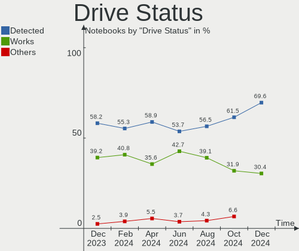
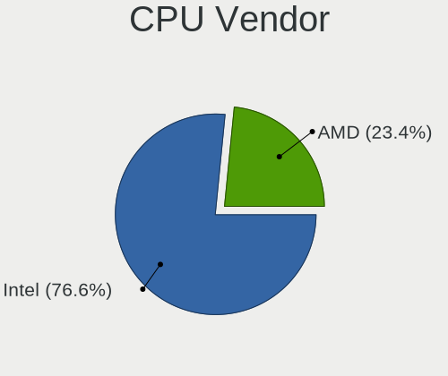
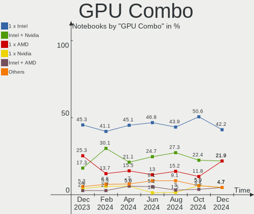
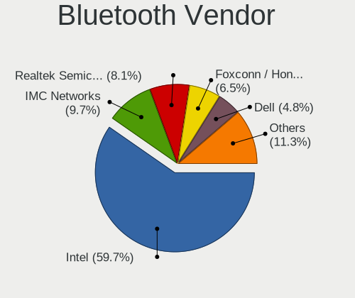

Kubuntu - Hardware Trends (Notebooks)
-------------------------------------

A project to identify most popular hardware characteristics and track their change
over time based on data collected by Linux users at https://Linux-Hardware.org.

Anyone can contribute to this report by the [hw-probe](https://github.com/linuxhw/hw-probe) tool:

    sudo -E hw-probe -all -upload

This report is for one last month. Overall report since the beginning of time: [TestDays](https://github.com/linuxhw/TestDays)

Period: Feb, 2023.

Contents
--------

* [ System ](#system)
  - [ OS                       ](#os)
  - [ OS Family                ](#os-family)
  - [ Kernel                   ](#kernel)
  - [ Kernel Family            ](#kernel-family)
  - [ Kernel Major Ver.        ](#kernel-major-ver)
  - [ Arch                     ](#arch)
  - [ DE                       ](#de)
  - [ Display Server           ](#display-server)
  - [ Display Manager          ](#display-manager)
  - [ OS Lang                  ](#os-lang)
  - [ Boot Mode                ](#boot-mode)
  - [ Filesystem               ](#filesystem)
  - [ Part. scheme             ](#part-scheme)
  - [ Dual Boot with Linux/BSD ](#dual-boot-with-linuxbsd)
  - [ Dual Boot (Win)          ](#dual-boot-win)

* [ Board ](#board)
  - [ Vendor                   ](#vendor)
  - [ Model                    ](#model)
  - [ Model Family             ](#model-family)
  - [ MFG Year                 ](#mfg-year)
  - [ Form Factor              ](#form-factor)
  - [ Secure Boot              ](#secure-boot)
  - [ Coreboot                 ](#coreboot)
  - [ RAM Size                 ](#ram-size)
  - [ RAM Used                 ](#ram-used)
  - [ Total Drives             ](#total-drives)
  - [ Has CD-ROM               ](#has-cd-rom)
  - [ Has Ethernet             ](#has-ethernet)
  - [ Has WiFi                 ](#has-wifi)
  - [ Has Bluetooth            ](#has-bluetooth)

* [ Location ](#location)
  - [ Country                  ](#country)
  - [ City                     ](#city)

* [ Drives ](#drives)
  - [ Drive Vendor             ](#drive-vendor)
  - [ Drive Model              ](#drive-model)
  - [ HDD Vendor               ](#hdd-vendor)
  - [ SSD Vendor               ](#ssd-vendor)
  - [ Drive Kind               ](#drive-kind)
  - [ Drive Connector          ](#drive-connector)
  - [ Drive Size               ](#drive-size)
  - [ Space Total              ](#space-total)
  - [ Space Used               ](#space-used)
  - [ Malfunc. Drives          ](#malfunc-drives)
  - [ Malfunc. Drive Vendor    ](#malfunc-drive-vendor)
  - [ Malfunc. HDD Vendor      ](#malfunc-hdd-vendor)
  - [ Malfunc. Drive Kind      ](#malfunc-drive-kind)
  - [ Failed Drives            ](#failed-drives)
  - [ Failed Drive Vendor      ](#failed-drive-vendor)
  - [ Drive Status             ](#drive-status)

* [ Storage controller ](#storage-controller)
  - [ Storage Vendor           ](#storage-vendor)
  - [ Storage Model            ](#storage-model)
  - [ Storage Kind             ](#storage-kind)

* [ Processor ](#processor)
  - [ CPU Vendor               ](#cpu-vendor)
  - [ CPU Model                ](#cpu-model)
  - [ CPU Model Family         ](#cpu-model-family)
  - [ CPU Cores                ](#cpu-cores)
  - [ CPU Sockets              ](#cpu-sockets)
  - [ CPU Threads              ](#cpu-threads)
  - [ CPU Op-Modes             ](#cpu-op-modes)
  - [ CPU Microcode            ](#cpu-microcode)
  - [ CPU Microarch            ](#cpu-microarch)

* [ Graphics ](#graphics)
  - [ GPU Vendor               ](#gpu-vendor)
  - [ GPU Model                ](#gpu-model)
  - [ GPU Combo                ](#gpu-combo)
  - [ GPU Driver               ](#gpu-driver)
  - [ GPU Memory               ](#gpu-memory)

* [ Monitor ](#monitor)
  - [ Monitor Vendor           ](#monitor-vendor)
  - [ Monitor Model            ](#monitor-model)
  - [ Monitor Resolution       ](#monitor-resolution)
  - [ Monitor Diagonal         ](#monitor-diagonal)
  - [ Monitor Width            ](#monitor-width)
  - [ Aspect Ratio             ](#aspect-ratio)
  - [ Monitor Area             ](#monitor-area)
  - [ Pixel Density            ](#pixel-density)
  - [ Multiple Monitors        ](#multiple-monitors)

* [ Network ](#network)
  - [ Net Controller Vendor    ](#net-controller-vendor)
  - [ Net Controller Model     ](#net-controller-model)
  - [ Wireless Vendor          ](#wireless-vendor)
  - [ Wireless Model           ](#wireless-model)
  - [ Ethernet Vendor          ](#ethernet-vendor)
  - [ Ethernet Model           ](#ethernet-model)
  - [ Net Controller Kind      ](#net-controller-kind)
  - [ Used Controller          ](#used-controller)
  - [ NICs                     ](#nics)
  - [ IPv6                     ](#ipv6)

* [ Bluetooth ](#bluetooth)
  - [ Bluetooth Vendor         ](#bluetooth-vendor)
  - [ Bluetooth Model          ](#bluetooth-model)

* [ Sound ](#sound)
  - [ Sound Vendor             ](#sound-vendor)
  - [ Sound Model              ](#sound-model)

* [ Memory ](#memory)
  - [ Memory Vendor            ](#memory-vendor)
  - [ Memory Model             ](#memory-model)
  - [ Memory Kind              ](#memory-kind)
  - [ Memory Form Factor       ](#memory-form-factor)
  - [ Memory Size              ](#memory-size)
  - [ Memory Speed             ](#memory-speed)

* [ Printers & scanners ](#printers--scanners)
  - [ Printer Vendor           ](#printer-vendor)
  - [ Printer Model            ](#printer-model)
  - [ Scanner Vendor           ](#scanner-vendor)
  - [ Scanner Model            ](#scanner-model)

* [ Camera ](#camera)
  - [ Camera Vendor            ](#camera-vendor)
  - [ Camera Model             ](#camera-model)

* [ Security ](#security)
  - [ Fingerprint Vendor       ](#fingerprint-vendor)
  - [ Fingerprint Model        ](#fingerprint-model)
  - [ Chipcard Vendor          ](#chipcard-vendor)
  - [ Chipcard Model           ](#chipcard-model)

* [ Unsupported ](#unsupported)
  - [ Unsupported Devices      ](#unsupported-devices)
  - [ Unsupported Device Types ](#unsupported-device-types)

System
------

OS
--

Installed operating systems

| Name          | Notebooks | Percent |
|---------------|-----------|---------|
| Kubuntu 22.04 | 42        | 53.85%  |
| Kubuntu 22.10 | 32        | 41.03%  |
| Kubuntu 23.04 | 2         | 2.56%   |
| Kubuntu 20.04 | 2         | 2.56%   |

OS Family
---------

OS without a version

| Name    | Notebooks | Percent |
|---------|-----------|---------|
| Kubuntu | 78        | 100%    |

Kernel
------

Version of the Linux kernel

| Version                  | Notebooks | Percent |
|--------------------------|-----------|---------|
| 5.15.0-60-generic        | 19        | 24.36%  |
| 5.19.0-31-generic        | 18        | 23.08%  |
| 5.15.0-58-generic        | 9         | 11.54%  |
| 5.19.0-29-generic        | 5         | 6.41%   |
| 5.19.0-35-generic        | 4         | 5.13%   |
| 5.19.0-32-generic        | 4         | 5.13%   |
| 6.1.12-060112-generic    | 2         | 2.56%   |
| 6.1.0-1006-oem           | 2         | 2.56%   |
| 6.1.9-060109-generic     | 1         | 1.28%   |
| 6.1.8-060108-generic     | 1         | 1.28%   |
| 6.1.7-060107-generic     | 1         | 1.28%   |
| 6.1.11-060111-generic    | 1         | 1.28%   |
| 6.1.0-14-generic         | 1         | 1.28%   |
| 6.0.9-060009-generic     | 1         | 1.28%   |
| 6.0.0+                   | 1         | 1.28%   |
| 5.4.0-90-generic         | 1         | 1.28%   |
| 5.19.0-21-generic        | 1         | 1.28%   |
| 5.18.10-76051810-generic | 1         | 1.28%   |
| 5.17.0-1020-oem          | 1         | 1.28%   |
| 5.15.0-60-lowlatency     | 1         | 1.28%   |
| 5.15.0-57-generic        | 1         | 1.28%   |
| 5.15.0-56-generic        | 1         | 1.28%   |
| 5.13.0-39-generic        | 1         | 1.28%   |

Kernel Family
-------------

Linux kernel without a distro release

| Version | Notebooks | Percent |
|---------|-----------|---------|
| 5.19.0  | 32        | 41.03%  |
| 5.15.0  | 31        | 39.74%  |
| 6.1.0   | 3         | 3.85%   |
| 6.1.12  | 2         | 2.56%   |
| 6.1.9   | 1         | 1.28%   |
| 6.1.8   | 1         | 1.28%   |
| 6.1.7   | 1         | 1.28%   |
| 6.1.11  | 1         | 1.28%   |
| 6.0.9   | 1         | 1.28%   |
| 6.0.0   | 1         | 1.28%   |
| 5.4.0   | 1         | 1.28%   |
| 5.18.10 | 1         | 1.28%   |
| 5.17.0  | 1         | 1.28%   |
| 5.13.0  | 1         | 1.28%   |

Kernel Major Ver.
-----------------

Linux kernel major version

| Version | Notebooks | Percent |
|---------|-----------|---------|
| 5.19    | 32        | 41.03%  |
| 5.15    | 31        | 39.74%  |
| 6.1     | 9         | 11.54%  |
| 6.0     | 2         | 2.56%   |
| 5.4     | 1         | 1.28%   |
| 5.18    | 1         | 1.28%   |
| 5.17    | 1         | 1.28%   |
| 5.13    | 1         | 1.28%   |

Arch
----

OS architecture (x86_64, i586, etc.)

| Name   | Notebooks | Percent |
|--------|-----------|---------|
| x86_64 | 78        | 100%    |

DE
--

Desktop Environment

| Name  | Notebooks | Percent |
|-------|-----------|---------|
| KDE5  | 75        | 96.15%  |
| KDE   | 2         | 2.56%   |
| GNOME | 1         | 1.28%   |

Display Server
--------------

X11 or Wayland

| Name    | Notebooks | Percent |
|---------|-----------|---------|
| X11     | 68        | 87.18%  |
| Wayland | 9         | 11.54%  |
| Tty     | 1         | 1.28%   |

Display Manager
---------------

SDDM, LightDM, etc.

| Name    | Notebooks | Percent |
|---------|-----------|---------|
| SDDM    | 53        | 67.95%  |
| Unknown | 20        | 25.64%  |
| GDM3    | 4         | 5.13%   |
| LightDM | 1         | 1.28%   |

OS Lang
-------

Language

| Lang   | Notebooks | Percent |
|--------|-----------|---------|
| en_US  | 38        | 48.72%  |
| de_DE  | 7         | 8.97%   |
| pt_BR  | 4         | 5.13%   |
| it_IT  | 4         | 5.13%   |
| en_IN  | 3         | 3.85%   |
| en_GB  | 3         | 3.85%   |
| fr_FR  | 2         | 2.56%   |
| es_MX  | 2         | 2.56%   |
| en_SG  | 2         | 2.56%   |
| en_AU  | 2         | 2.56%   |
| zh_CN  | 1         | 1.28%   |
| tr_TR  | 1         | 1.28%   |
| ru_RU  | 1         | 1.28%   |
| pl_PL  | 1         | 1.28%   |
| hu_HU  | 1         | 1.28%   |
| fr_BE  | 1         | 1.28%   |
| es_US  | 1         | 1.28%   |
| es_419 | 1         | 1.28%   |
| en_PH  | 1         | 1.28%   |
| en_CA  | 1         | 1.28%   |
| cs_CZ  | 1         | 1.28%   |

Boot Mode
---------

EFI or BIOS

| Mode | Notebooks | Percent |
|------|-----------|---------|
| EFI  | 42        | 53.85%  |
| BIOS | 36        | 46.15%  |

Filesystem
----------

Type of filesystem

| Type    | Notebooks | Percent |
|---------|-----------|---------|
| Ext4    | 73        | 93.59%  |
| Overlay | 2         | 2.56%   |
| Btrfs   | 2         | 2.56%   |
| Zfs     | 1         | 1.28%   |

Part. scheme
------------

Scheme of partitioning

| Type    | Notebooks | Percent |
|---------|-----------|---------|
| GPT     | 56        | 71.79%  |
| Unknown | 20        | 25.64%  |
| MBR     | 2         | 2.56%   |

Dual Boot with Linux/BSD
------------------------

Hosting more than one Linux/BSD

| Dual boot | Notebooks | Percent |
|-----------|-----------|---------|
| No        | 71        | 91.03%  |
| Yes       | 7         | 8.97%   |

Dual Boot (Win)
---------------

Hosting Linux and Windows

| Dual boot | Notebooks | Percent |
|-----------|-----------|---------|
| No        | 47        | 60.26%  |
| Yes       | 31        | 39.74%  |

Board
-----

Vendor
------

Motherboard manufacturer

| Name                | Notebooks | Percent |
|---------------------|-----------|---------|
| Lenovo              | 21        | 26.92%  |
| Hewlett-Packard     | 14        | 17.95%  |
| ASUSTek Computer    | 12        | 15.38%  |
| Dell                | 9         | 11.54%  |
| Acer                | 6         | 7.69%   |
| MSI                 | 3         | 3.85%   |
| Alienware           | 2         | 2.56%   |
| System76            | 1         | 1.28%   |
| Samsung Electronics | 1         | 1.28%   |
| HUAWEI              | 1         | 1.28%   |
| GPU Company         | 1         | 1.28%   |
| Google              | 1         | 1.28%   |
| Gigabyte Technology | 1         | 1.28%   |
| Framework           | 1         | 1.28%   |
| Digibras            | 1         | 1.28%   |
| Chuwi               | 1         | 1.28%   |
| Apple               | 1         | 1.28%   |
| A-DATA Technology   | 1         | 1.28%   |

Model
-----

Motherboard model

| Name                                 | Notebooks | Percent |
|--------------------------------------|-----------|---------|
| Dell Precision 7540                  | 2         | 2.56%   |
| ASUS TUF Gaming FX705DT_FX705DT      | 2         | 2.56%   |
| System76 Gazelle                     | 1         | 1.28%   |
| Samsung 305E4A/305E5A/305E7A         | 1         | 1.28%   |
| MSI GS73 Stealth 8RF                 | 1         | 1.28%   |
| MSI GE75 Raider 9SE                  | 1         | 1.28%   |
| MSI GE62VR 6RF                       | 1         | 1.28%   |
| Lenovo ZHAOYANG K4e-ITL 82Q1         | 1         | 1.28%   |
| Lenovo ThinkPad Yoga 11e 20DAS02S00  | 1         | 1.28%   |
| Lenovo ThinkPad X230 23256N6         | 1         | 1.28%   |
| Lenovo ThinkPad W530 2463A49         | 1         | 1.28%   |
| Lenovo ThinkPad T470 20HES3X300      | 1         | 1.28%   |
| Lenovo ThinkPad T460 20FMS66R00      | 1         | 1.28%   |
| Lenovo ThinkPad T450 20BV0001US      | 1         | 1.28%   |
| Lenovo ThinkPad T440p 20AWS3E201     | 1         | 1.28%   |
| Lenovo ThinkPad T14 Gen 1 20S0000JGE | 1         | 1.28%   |
| Lenovo ThinkPad L430 24663D1         | 1         | 1.28%   |
| Lenovo ThinkPad L15 Gen 2 20X300P0GE | 1         | 1.28%   |
| Lenovo ThinkPad L13 20R30006PB       | 1         | 1.28%   |
| Lenovo ThinkPad E14 Gen 4 21EB000KAU | 1         | 1.28%   |
| Lenovo ThinkPad E14 20RAS1AQ00       | 1         | 1.28%   |
| Lenovo ThinkBook 15 G2 ITL 20VE      | 1         | 1.28%   |
| Lenovo IdeaPad U310 Touch            | 1         | 1.28%   |
| Lenovo IdeaPad S340-15API 81NC       | 1         | 1.28%   |
| Lenovo IdeaPad S145-15API 81V7       | 1         | 1.28%   |
| Lenovo IdeaPad 5 Pro 14ACN6 82L7     | 1         | 1.28%   |
| Lenovo IdeaPad 320-15ISK 80XH        | 1         | 1.28%   |
| Lenovo IdeaPad 3 15ADA05 81W1        | 1         | 1.28%   |
| HUAWEI CREM-WXX9                     | 1         | 1.28%   |
| HP Victus by Laptop 16z-e100         | 1         | 1.28%   |
| HP ProBook 6470b                     | 1         | 1.28%   |
| HP ProBook 4730s                     | 1         | 1.28%   |
| HP ProBook 440 G5                    | 1         | 1.28%   |
| HP Pavilion Laptop 15-cw1xxx         | 1         | 1.28%   |
| HP Pavilion Laptop 15-cs3xxx         | 1         | 1.28%   |
| HP Pavilion Aero Laptop 13-be0xxx    | 1         | 1.28%   |
| HP Pavilion 11 x360 PC               | 1         | 1.28%   |
| HP Notebook                          | 1         | 1.28%   |
| HP Laptop 15-da2xxx                  | 1         | 1.28%   |
| HP G62                               | 1         | 1.28%   |

Model Family
------------

Motherboard model prefix

| Name                      | Notebooks | Percent |
|---------------------------|-----------|---------|
| Lenovo ThinkPad           | 13        | 16.67%  |
| Lenovo IdeaPad            | 6         | 7.69%   |
| HP Pavilion               | 4         | 5.13%   |
| ASUS VivoBook             | 4         | 5.13%   |
| HP ProBook                | 3         | 3.85%   |
| Dell Precision            | 2         | 2.56%   |
| Dell Inspiron             | 2         | 2.56%   |
| ASUS TUF                  | 2         | 2.56%   |
| ASUS ASUS                 | 2         | 2.56%   |
| Acer Swift                | 2         | 2.56%   |
| Acer Nitro                | 2         | 2.56%   |
| Acer Aspire               | 2         | 2.56%   |
| System76 Gazelle          | 1         | 1.28%   |
| Samsung 305E4A            | 1         | 1.28%   |
| MSI GS73                  | 1         | 1.28%   |
| MSI GE75                  | 1         | 1.28%   |
| MSI GE62VR                | 1         | 1.28%   |
| Lenovo ZHAOYANG           | 1         | 1.28%   |
| Lenovo ThinkBook          | 1         | 1.28%   |
| HUAWEI CREM-WXX9          | 1         | 1.28%   |
| HP Victus                 | 1         | 1.28%   |
| HP Notebook               | 1         | 1.28%   |
| HP Laptop                 | 1         | 1.28%   |
| HP G62                    | 1         | 1.28%   |
| HP G60                    | 1         | 1.28%   |
| HP EliteBook              | 1         | 1.28%   |
| HP 255                    | 1         | 1.28%   |
| GPU Company GWTC116-2     | 1         | 1.28%   |
| Google Blooguard          | 1         | 1.28%   |
| Gigabyte GB-BKi5(H)A-7200 | 1         | 1.28%   |
| Framework Laptop          | 1         | 1.28%   |
| Digibras NH4CU03          | 1         | 1.28%   |
| Dell XPS                  | 1         | 1.28%   |
| Dell Vostro               | 1         | 1.28%   |
| Dell System               | 1         | 1.28%   |
| Dell Latitude             | 1         | 1.28%   |
| Dell G15                  | 1         | 1.28%   |
| Chuwi Hi10                | 1         | 1.28%   |
| ASUS X75VD                | 1         | 1.28%   |
| ASUS X555LJ               | 1         | 1.28%   |

MFG Year
--------

Motherboard manufacture year

| Year | Notebooks | Percent |
|------|-----------|---------|
| 2021 | 15        | 19.23%  |
| 2019 | 15        | 19.23%  |
| 2022 | 10        | 12.82%  |
| 2020 | 7         | 8.97%   |
| 2017 | 6         | 7.69%   |
| 2012 | 5         | 6.41%   |
| 2016 | 3         | 3.85%   |
| 2015 | 3         | 3.85%   |
| 2014 | 3         | 3.85%   |
| 2013 | 3         | 3.85%   |
| 2011 | 3         | 3.85%   |
| 2010 | 2         | 2.56%   |
| 2023 | 1         | 1.28%   |
| 2018 | 1         | 1.28%   |
| 2008 | 1         | 1.28%   |

Form Factor
-----------

Physical design of the computer

| Name     | Notebooks | Percent |
|----------|-----------|---------|
| Notebook | 78        | 100%    |

Secure Boot
-----------

Enabled or disabled

| State    | Notebooks | Percent |
|----------|-----------|---------|
| Disabled | 70        | 89.74%  |
| Enabled  | 8         | 10.26%  |

Coreboot
--------

Have coreboot on board

| Used | Notebooks | Percent |
|------|-----------|---------|
| No   | 77        | 98.72%  |
| Yes  | 1         | 1.28%   |

RAM Size
--------

Total RAM memory

| Size in GB  | Notebooks | Percent |
|-------------|-----------|---------|
| 4.01-8.0    | 28        | 35.9%   |
| 16.01-24.0  | 17        | 21.79%  |
| 8.01-16.0   | 14        | 17.95%  |
| 32.01-64.0  | 7         | 8.97%   |
| 3.01-4.0    | 6         | 7.69%   |
| 64.01-256.0 | 3         | 3.85%   |
| 1.01-2.0    | 2         | 2.56%   |
| 24.01-32.0  | 1         | 1.28%   |

RAM Used
--------

Used RAM memory

| Used GB    | Notebooks | Percent |
|------------|-----------|---------|
| 4.01-8.0   | 24        | 30.77%  |
| 2.01-3.0   | 22        | 28.21%  |
| 3.01-4.0   | 14        | 17.95%  |
| 1.01-2.0   | 12        | 15.38%  |
| 8.01-16.0  | 4         | 5.13%   |
| 16.01-24.0 | 1         | 1.28%   |
| 0.51-1.0   | 1         | 1.28%   |

Total Drives
------------

Number of drives on board

| Drives | Notebooks | Percent |
|--------|-----------|---------|
| 1      | 40        | 51.28%  |
| 2      | 31        | 39.74%  |
| 3      | 7         | 8.97%   |

Has CD-ROM
----------

Has CD-ROM on board

| Presented | Notebooks | Percent |
|-----------|-----------|---------|
| No        | 66        | 84.62%  |
| Yes       | 12        | 15.38%  |

Has Ethernet
------------

Has Ethernet on board

| Presented | Notebooks | Percent |
|-----------|-----------|---------|
| Yes       | 58        | 74.36%  |
| No        | 20        | 25.64%  |

Has WiFi
--------

Has WiFi module

| Presented | Notebooks | Percent |
|-----------|-----------|---------|
| Yes       | 76        | 97.44%  |
| No        | 2         | 2.56%   |

Has Bluetooth
-------------

Has Bluetooth module

| Presented | Notebooks | Percent |
|-----------|-----------|---------|
| Yes       | 64        | 82.05%  |
| No        | 14        | 17.95%  |

Location
--------

Country
-------

Geographic location (country)

| Country     | Notebooks | Percent |
|-------------|-----------|---------|
| USA         | 19        | 24.36%  |
| Germany     | 8         | 10.26%  |
| Italy       | 7         | 8.97%   |
| France      | 5         | 6.41%   |
| Brazil      | 4         | 5.13%   |
| UK          | 3         | 3.85%   |
| Russia      | 3         | 3.85%   |
| Mexico      | 3         | 3.85%   |
| India       | 3         | 3.85%   |
| Turkey      | 2         | 2.56%   |
| Singapore   | 2         | 2.56%   |
| Poland      | 2         | 2.56%   |
| Australia   | 2         | 2.56%   |
| Thailand    | 1         | 1.28%   |
| Sweden      | 1         | 1.28%   |
| Slovenia    | 1         | 1.28%   |
| Slovakia    | 1         | 1.28%   |
| Philippines | 1         | 1.28%   |
| Paraguay    | 1         | 1.28%   |
| Latvia      | 1         | 1.28%   |
| Indonesia   | 1         | 1.28%   |
| Hungary     | 1         | 1.28%   |
| Guatemala   | 1         | 1.28%   |
| Finland     | 1         | 1.28%   |
| Czechia     | 1         | 1.28%   |
| China       | 1         | 1.28%   |
| Canada      | 1         | 1.28%   |
| Belgium     | 1         | 1.28%   |

City
----

Geographic location (city)

| City                  | Notebooks | Percent |
|-----------------------|-----------|---------|
| Singapore             | 2         | 2.56%   |
| Paris                 | 2         | 2.56%   |
| Moscow                | 2         | 2.56%   |
| Mexico City           | 2         | 2.56%   |
| Lakeland              | 2         | 2.56%   |
| Waterbury             | 1         | 1.28%   |
| Vallendar             | 1         | 1.28%   |
| Tournai               | 1         | 1.28%   |
| Taranto               | 1         | 1.28%   |
| Tampa                 | 1         | 1.28%   |
| Sunderland            | 1         | 1.28%   |
| Sidoarjo              | 1         | 1.28%   |
| Schweinfurt           | 1         | 1.28%   |
| Sao Joao das Missoes  | 1         | 1.28%   |
| San Lorenzo           | 1         | 1.28%   |
| San Lazzaro di Savena | 1         | 1.28%   |
| Saint Johns           | 1         | 1.28%   |
| Rouen                 | 1         | 1.28%   |
| Riga                  | 1         | 1.28%   |
| Rho                   | 1         | 1.28%   |
| Prague                | 1         | 1.28%   |
| Poznan                | 1         | 1.28%   |
| Phoenix               | 1         | 1.28%   |
| Perth                 | 1         | 1.28%   |
| Ogden                 | 1         | 1.28%   |
| New Delhi             | 1         | 1.28%   |
| Moseley               | 1         | 1.28%   |
| Moerfelden-Walldorf   | 1         | 1.28%   |
| Modena                | 1         | 1.28%   |
| Milford               | 1         | 1.28%   |
| Milan                 | 1         | 1.28%   |
| Miami                 | 1         | 1.28%   |
| Matinhos              | 1         | 1.28%   |
| Los Angeles           | 1         | 1.28%   |
| Ljubljana             | 1         | 1.28%   |
| Leipzig               | 1         | 1.28%   |
| Landshut              | 1         | 1.28%   |
| Krasnodar             | 1         | 1.28%   |
| Krakow                | 1         | 1.28%   |
| Karlsruhe             | 1         | 1.28%   |

Drives
------

Drive Vendor
------------

Hard drive vendors

| Vendor                    | Notebooks | Drives | Percent |
|---------------------------|-----------|--------|---------|
| Samsung Electronics       | 22        | 23     | 18.97%  |
| Seagate                   | 14        | 14     | 12.07%  |
| WDC                       | 9         | 9      | 7.76%   |
| Sandisk                   | 9         | 11     | 7.76%   |
| Toshiba                   | 6         | 6      | 5.17%   |
| Unknown                   | 5         | 5      | 4.31%   |
| SK hynix                  | 5         | 8      | 4.31%   |
| Kingston                  | 5         | 5      | 4.31%   |
| Intel                     | 5         | 6      | 4.31%   |
| Micron Technology         | 4         | 4      | 3.45%   |
| HGST                      | 4         | 4      | 3.45%   |
| China                     | 4         | 4      | 3.45%   |
| Crucial                   | 3         | 3      | 2.59%   |
| Unknown                   | 3         | 3      | 2.59%   |
| SPCC                      | 2         | 2      | 1.72%   |
| ADATA Technology          | 2         | 2      | 1.72%   |
| WALRAM                    | 1         | 1      | 0.86%   |
| UMIS                      | 1         | 1      | 0.86%   |
| Timetec                   | 1         | 1      | 0.86%   |
| Phison                    | 1         | 1      | 0.86%   |
| Micron/Crucial Technology | 1         | 1      | 0.86%   |
| KIOXIA                    | 1         | 1      | 0.86%   |
| JMicron Technology        | 1         | 1      | 0.86%   |
| HUSKY                     | 1         | 1      | 0.86%   |
| HIKSEMI                   | 1         | 1      | 0.86%   |
| FORESEE                   | 1         | 1      | 0.86%   |
| CT500MX5                  | 1         | 1      | 0.86%   |
| CT1000P2                  | 1         | 1      | 0.86%   |
| BAITITON                  | 1         | 1      | 0.86%   |
| Aura                      | 1         | 1      | 0.86%   |

Drive Model
-----------

Hard drive models

| Model                                               | Notebooks | Percent |
|-----------------------------------------------------|-----------|---------|
| Seagate ST500LM012 HN-M500MBB 500GB                 | 3         | 2.48%   |
| Seagate ST2000LM015-2E8174 2TB                      | 3         | 2.48%   |
| Unknown                                             | 3         | 2.48%   |
| Toshiba MQ01ABD100 1TB                              | 2         | 1.65%   |
| SPCC Solid State Disk 512GB                         | 2         | 1.65%   |
| Seagate ST500LM021-1KJ152 500GB                     | 2         | 1.65%   |
| Seagate ST1000LM048-2E7172 1TB                      | 2         | 1.65%   |
| Seagate ST1000LM035-1RK172 1TB                      | 2         | 1.65%   |
| Sandisk WD Blue SN550 NVMe SSD 1TB                  | 2         | 1.65%   |
| Sandisk WD Black SN750 / PC SN730 NVMe SSD 512GB    | 2         | 1.65%   |
| Samsung SSD 850 EVO mSATA 500GB                     | 2         | 1.65%   |
| Samsung NVMe SSD Controller SM981/PM981/PM983 250GB | 2         | 1.65%   |
| Samsung MZVLQ1T0HALB-00000 1024GB                   | 2         | 1.65%   |
| Samsung MZVLB256HBHQ-000L7 256GB                    | 2         | 1.65%   |
| Kingston SA400S37480G 480GB SSD                     | 2         | 1.65%   |
| Intel SSD 660P Series 1024GB                        | 2         | 1.65%   |
| HGST HTS721010A9E630 1TB                            | 2         | 1.65%   |
| China SSD 128GB                                     | 2         | 1.65%   |
| WDC WDS250G2B0B-00YS70 250GB SSD                    | 1         | 0.83%   |
| WDC WDS240G2G0A-00JH30 240GB SSD                    | 1         | 0.83%   |
| WDC WDS200T2B0C-00PXH0 2TB                          | 1         | 0.83%   |
| WDC WD5000LPCX-24C6HT0 500GB                        | 1         | 0.83%   |
| WDC WD10SPZX-21Z10T0 1TB                            | 1         | 0.83%   |
| WDC WD10SPZX-08Z10 1TB                              | 1         | 0.83%   |
| WDC PC SN720 SDAPNTW-512G                           | 1         | 0.83%   |
| WDC PC SN530 SDBPNPZ-512G-1114 512GB                | 1         | 0.83%   |
| WDC PC SN530 NVMe 512GB                             | 1         | 0.83%   |
| WALRAM 240G                                         | 1         | 0.83%   |
| Unknown SD128  128GB                                | 1         | 0.83%   |
| Unknown MMC Card  64GB                              | 1         | 0.83%   |
| Unknown MMC Card  1GB                               | 1         | 0.83%   |
| Unknown MMC Card  128GB                             | 1         | 0.83%   |
| Unknown DA4128  128GB                               | 1         | 0.83%   |
| UMIS RPFTJ256PDD2MWX 256GB                          | 1         | 0.83%   |
| Toshiba MQ02ABF050H 500GB                           | 1         | 0.83%   |
| Toshiba MQ01ACF050 500GB                            | 1         | 0.83%   |
| Toshiba KXG50PNV1T02 NVMe 1024GB                    | 1         | 0.83%   |
| Toshiba BG3 NVMe SSD Controller 256GB               | 1         | 0.83%   |
| Timetec 35TTFP6PCIE-1TB                             | 1         | 0.83%   |
| SK hynix PC801 NVMe 2TB                             | 1         | 0.83%   |

HDD Vendor
----------

Hard disk drive vendors

| Vendor  | Notebooks | Drives | Percent |
|---------|-----------|--------|---------|
| Seagate | 14        | 14     | 56%     |
| Toshiba | 4         | 4      | 16%     |
| HGST    | 4         | 4      | 16%     |
| WDC     | 3         | 3      | 12%     |

SSD Vendor
----------

Solid state drive vendors

| Vendor              | Notebooks | Drives | Percent |
|---------------------|-----------|--------|---------|
| Samsung Electronics | 9         | 9      | 28.13%  |
| Kingston            | 4         | 4      | 12.5%   |
| China               | 4         | 4      | 12.5%   |
| WDC                 | 2         | 2      | 6.25%   |
| SPCC                | 2         | 2      | 6.25%   |
| SanDisk             | 2         | 2      | 6.25%   |
| Micron Technology   | 1         | 1      | 3.13%   |
| Intel               | 1         | 1      | 3.13%   |
| HUSKY               | 1         | 1      | 3.13%   |
| HIKSEMI             | 1         | 1      | 3.13%   |
| FORESEE             | 1         | 1      | 3.13%   |
| CT500MX5            | 1         | 1      | 3.13%   |
| CT1000P2            | 1         | 1      | 3.13%   |
| Crucial             | 1         | 1      | 3.13%   |
| BAITITON            | 1         | 1      | 3.13%   |

Drive Kind
----------

HDD or SSD

| Kind    | Notebooks | Drives | Percent |
|---------|-----------|--------|---------|
| NVMe    | 45        | 55     | 41.67%  |
| SSD     | 27        | 32     | 25%     |
| HDD     | 25        | 25     | 23.15%  |
| MMC     | 7         | 7      | 6.48%   |
| Unknown | 4         | 4      | 3.7%    |

Drive Connector
---------------

SATA, SAS, NVMe, etc.

| Type | Notebooks | Drives | Percent |
|------|-----------|--------|---------|
| NVMe | 45        | 55     | 46.88%  |
| SATA | 40        | 57     | 41.67%  |
| MMC  | 7         | 7      | 7.29%   |
| SAS  | 4         | 4      | 4.17%   |

Drive Size
----------

Size of hard drive

| Size in TB | Notebooks | Drives | Percent |
|------------|-----------|--------|---------|
| 0.01-0.5   | 26        | 34     | 53.06%  |
| 0.51-1.0   | 15        | 15     | 30.61%  |
| 1.01-2.0   | 8         | 8      | 16.33%  |

Space Total
-----------

Amount of disk space available on the file system

| Size in GB     | Notebooks | Percent |
|----------------|-----------|---------|
| 251-500        | 23        | 29.49%  |
| 101-250        | 16        | 20.51%  |
| 501-1000       | 14        | 17.95%  |
| 1001-2000      | 9         | 11.54%  |
| More than 3000 | 6         | 7.69%   |
| 2001-3000      | 5         | 6.41%   |
| 21-50          | 2         | 2.56%   |
| 1-20           | 2         | 2.56%   |
| 51-100         | 1         | 1.28%   |

Space Used
----------

Amount of used disk space

| Used GB        | Notebooks | Percent |
|----------------|-----------|---------|
| 101-250        | 19        | 24.36%  |
| 51-100         | 15        | 19.23%  |
| 1-20           | 12        | 15.38%  |
| 251-500        | 11        | 14.1%   |
| 1001-2000      | 8         | 10.26%  |
| 21-50          | 7         | 8.97%   |
| 501-1000       | 3         | 3.85%   |
| 2001-3000      | 2         | 2.56%   |
| More than 3000 | 1         | 1.28%   |

Malfunc. Drives
---------------

Drive models with a malfunction

| Model                               | Notebooks | Drives | Percent |
|-------------------------------------|-----------|--------|---------|
| Seagate ST2000LM015-2E8174 2TB      | 1         | 1      | 20%     |
| Seagate ST2000LM007-1R8174 2TB      | 1         | 1      | 20%     |
| Seagate ST1000LM035-1RK172 1TB      | 1         | 1      | 20%     |
| Samsung Electronics SSD 870 EVO 1TB | 1         | 1      | 20%     |
| BAITITON BT58SSD09S 240GB           | 1         | 1      | 20%     |

Malfunc. Drive Vendor
---------------------

Vendors of faulty drives

| Vendor              | Notebooks | Drives | Percent |
|---------------------|-----------|--------|---------|
| Seagate             | 3         | 3      | 60%     |
| Samsung Electronics | 1         | 1      | 20%     |
| BAITITON            | 1         | 1      | 20%     |

Malfunc. HDD Vendor
-------------------

Vendors of faulty HDD drives

| Vendor  | Notebooks | Drives | Percent |
|---------|-----------|--------|---------|
| Seagate | 3         | 3      | 100%    |

Malfunc. Drive Kind
-------------------

Kinds of faulty drives

| Kind | Notebooks | Drives | Percent |
|------|-----------|--------|---------|
| HDD  | 3         | 3      | 60%     |
| SSD  | 2         | 2      | 40%     |

Failed Drives
-------------

Failed drive models

Zero info for selected period =(

Failed Drive Vendor
-------------------

Failed drive vendors

Zero info for selected period =(

Drive Status
------------

Number of failed and malfunc. drives

| Status   | Notebooks | Drives | Percent |
|----------|-----------|--------|---------|
| Detected | 42        | 60     | 47.73%  |
| Works    | 41        | 58     | 46.59%  |
| Malfunc  | 5         | 5      | 5.68%   |

Storage controller
------------------

Storage Vendor
--------------

Storage controller vendors

| Vendor                       | Notebooks | Percent |
|------------------------------|-----------|---------|
| Intel                        | 49        | 45.79%  |
| Samsung Electronics          | 14        | 13.08%  |
| SanDisk                      | 11        | 10.28%  |
| AMD                          | 11        | 10.28%  |
| SK hynix                     | 5         | 4.67%   |
| Micron/Crucial Technology    | 3         | 2.8%    |
| Micron Technology            | 3         | 2.8%    |
| Toshiba America Info Systems | 2         | 1.87%   |
| Nvidia                       | 2         | 1.87%   |
| ADATA Technology             | 2         | 1.87%   |
| Union Memory (Shenzhen)      | 1         | 0.93%   |
| Silicon Motion               | 1         | 0.93%   |
| Phison Electronics           | 1         | 0.93%   |
| KIOXIA                       | 1         | 0.93%   |
| Kingston Technology Company  | 1         | 0.93%   |

Storage Model
-------------

Storage controller models

| Model                                                                          | Notebooks | Percent |
|--------------------------------------------------------------------------------|-----------|---------|
| AMD FCH SATA Controller [AHCI mode]                                            | 11        | 9.82%   |
| Samsung NVMe SSD Controller 980                                                | 7         | 6.25%   |
| Intel 7 Series Chipset Family 6-port SATA Controller [AHCI mode]               | 7         | 6.25%   |
| Samsung NVMe SSD Controller SM981/PM981/PM983                                  | 6         | 5.36%   |
| Intel Volume Management Device NVMe RAID Controller                            | 6         | 5.36%   |
| Intel Sunrise Point-LP SATA Controller [AHCI mode]                             | 5         | 4.46%   |
| Intel Cannon Lake Mobile PCH SATA AHCI Controller                              | 5         | 4.46%   |
| Intel 82801 Mobile SATA Controller [RAID mode]                                 | 5         | 4.46%   |
| SanDisk Non-Volatile memory controller                                         | 4         | 3.57%   |
| SanDisk WD Blue SN550 NVMe SSD                                                 | 3         | 2.68%   |
| Micron Non-Volatile memory controller                                          | 3         | 2.68%   |
| Intel Comet Lake SATA AHCI Controller                                          | 3         | 2.68%   |
| SK hynix Gold P31/PC711 NVMe Solid State Drive                                 | 2         | 1.79%   |
| SanDisk WD Black SN750 / PC SN730 NVMe SSD                                     | 2         | 1.79%   |
| Micron/Crucial P2 NVMe PCIe SSD                                                | 2         | 1.79%   |
| Intel Wildcat Point-LP SATA Controller [AHCI Mode]                             | 2         | 1.79%   |
| Intel Tiger Lake-LP SATA Controller                                            | 2         | 1.79%   |
| Intel SSD 660P Series                                                          | 2         | 1.79%   |
| Intel Non-Volatile memory controller                                           | 2         | 1.79%   |
| Intel HM170/QM170 Chipset SATA Controller [AHCI Mode]                          | 2         | 1.79%   |
| Intel Celeron/Pentium Silver Processor SATA Controller                         | 2         | 1.79%   |
| Intel Atom Processor E3800 Series SATA AHCI Controller                         | 2         | 1.79%   |
| Intel 8 Series/C220 Series Chipset Family 6-port SATA Controller 1 [AHCI mode] | 2         | 1.79%   |
| Intel 6 Series/C200 Series Chipset Family 6 port Mobile SATA AHCI Controller   | 2         | 1.79%   |
| Union Memory (Shenzhen) Non-Volatile memory controller                         | 1         | 0.89%   |
| Toshiba America Info Systems XG5 NVMe SSD Controller                           | 1         | 0.89%   |
| Toshiba America Info Systems BG3 NVMe SSD Controller                           | 1         | 0.89%   |
| SK hynix Platinum P41 NVMe Solid State Drive 2TB                               | 1         | 0.89%   |
| SK hynix PC400 NVMe SSD                                                        | 1         | 0.89%   |
| SK hynix BC511                                                                 | 1         | 0.89%   |
| Silicon Motion SM2263EN/SM2263XT SSD Controller                                | 1         | 0.89%   |
| SanDisk WD PC SN810 / Black SN850 NVMe SSD                                     | 1         | 0.89%   |
| SanDisk WD Blue SN570 NVMe SSD                                                 | 1         | 0.89%   |
| SanDisk WD Black 2018/SN750 / PC SN720 NVMe SSD                                | 1         | 0.89%   |
| Samsung NVMe SSD Controller PM9A1/PM9A3/980PRO                                 | 1         | 0.89%   |
| Phison E12 NVMe Controller                                                     | 1         | 0.89%   |
| Nvidia MCP89 SATA Controller (AHCI mode)                                       | 1         | 0.89%   |
| Nvidia MCP78S [GeForce 8200] SATA Controller (non-AHCI mode)                   | 1         | 0.89%   |
| Nvidia MCP78S [GeForce 8200] IDE                                               | 1         | 0.89%   |
| Micron/Crucial P1 NVMe PCIe SSD                                                | 1         | 0.89%   |

Storage Kind
------------

Kind of storage controller (IDE, SATA, NVMe, SAS, ...)

| Kind | Notebooks | Percent |
|------|-----------|---------|
| SATA | 49        | 46.23%  |
| NVMe | 45        | 42.45%  |
| RAID | 11        | 10.38%  |
| IDE  | 1         | 0.94%   |

Processor
---------

CPU Vendor
----------

Processor vendors

| Vendor | Notebooks | Percent |
|--------|-----------|---------|
| Intel  | 56        | 71.79%  |
| AMD    | 22        | 28.21%  |

CPU Model
---------

Processor models

| Model                                         | Notebooks | Percent |
|-----------------------------------------------|-----------|---------|
| Intel Core i7-9750H CPU @ 2.60GHz             | 3         | 3.85%   |
| Intel Core i5-7200U CPU @ 2.50GHz             | 3         | 3.85%   |
| Intel Core i5-10210U CPU @ 1.60GHz            | 3         | 3.85%   |
| Intel 11th Gen Core i7-1165G7 @ 2.80GHz       | 3         | 3.85%   |
| AMD Ryzen 7 5800H with Radeon Graphics        | 3         | 3.85%   |
| AMD Ryzen 5 5600U with Radeon Graphics        | 3         | 3.85%   |
| Intel Core i5-2430M CPU @ 2.40GHz             | 2         | 2.56%   |
| Intel Celeron N4020 CPU @ 1.10GHz             | 2         | 2.56%   |
| Intel 12th Gen Core i7-1260P                  | 2         | 2.56%   |
| AMD Ryzen 9 6900HX with Radeon Graphics       | 2         | 2.56%   |
| AMD Ryzen 7 3750H with Radeon Vega Mobile Gfx | 2         | 2.56%   |
| AMD Ryzen 7 3700U with Radeon Vega Mobile Gfx | 2         | 2.56%   |
| AMD Ryzen 5 3500U with Radeon Vega Mobile Gfx | 2         | 2.56%   |
| Intel Pentium Silver N5030 CPU @ 1.10GHz      | 1         | 1.28%   |
| Intel Pentium CPU N3520 @ 2.16GHz             | 1         | 1.28%   |
| Intel Pentium CPU 6405U @ 2.40GHz             | 1         | 1.28%   |
| Intel Core i9-9980HK CPU @ 2.40GHz            | 1         | 1.28%   |
| Intel Core i7-8750H CPU @ 2.20GHz             | 1         | 1.28%   |
| Intel Core i7-8550U CPU @ 1.80GHz             | 1         | 1.28%   |
| Intel Core i7-7700HQ CPU @ 2.80GHz            | 1         | 1.28%   |
| Intel Core i7-7500U CPU @ 2.70GHz             | 1         | 1.28%   |
| Intel Core i7-6700HQ CPU @ 2.60GHz            | 1         | 1.28%   |
| Intel Core i7-6600U CPU @ 2.60GHz             | 1         | 1.28%   |
| Intel Core i7-5500U CPU @ 2.40GHz             | 1         | 1.28%   |
| Intel Core i7-4980HQ CPU @ 2.80GHz            | 1         | 1.28%   |
| Intel Core i7-4710HQ CPU @ 2.50GHz            | 1         | 1.28%   |
| Intel Core i7-4700MQ CPU @ 2.40GHz            | 1         | 1.28%   |
| Intel Core i7-3720QM CPU @ 2.60GHz            | 1         | 1.28%   |
| Intel Core i7-10510U CPU @ 1.80GHz            | 1         | 1.28%   |
| Intel Core i5-8265U CPU @ 1.60GHz             | 1         | 1.28%   |
| Intel Core i5-7300U CPU @ 2.60GHz             | 1         | 1.28%   |
| Intel Core i5-5300U CPU @ 2.30GHz             | 1         | 1.28%   |
| Intel Core i5-3340M CPU @ 2.70GHz             | 1         | 1.28%   |
| Intel Core i5-3337U CPU @ 1.80GHz             | 1         | 1.28%   |
| Intel Core i5-3320M CPU @ 2.60GHz             | 1         | 1.28%   |
| Intel Core i5-3230M CPU @ 2.60GHz             | 1         | 1.28%   |
| Intel Core i5-3210M CPU @ 2.50GHz             | 1         | 1.28%   |
| Intel Core i5-1035G1 CPU @ 1.00GHz            | 1         | 1.28%   |
| Intel Core i5-10300H CPU @ 2.50GHz            | 1         | 1.28%   |
| Intel Core i3-6006U CPU @ 2.00GHz             | 1         | 1.28%   |

CPU Model Family
----------------

Processor model prefix

| Model                | Notebooks | Percent |
|----------------------|-----------|---------|
| Intel Core i5        | 18        | 23.08%  |
| Intel Core i7        | 15        | 19.23%  |
| Other                | 11        | 14.1%   |
| AMD Ryzen 7          | 9         | 11.54%  |
| AMD Ryzen 5          | 6         | 7.69%   |
| Intel Celeron        | 4         | 5.13%   |
| Intel Core i3        | 3         | 3.85%   |
| AMD Ryzen 9          | 3         | 3.85%   |
| Intel Pentium        | 2         | 2.56%   |
| Intel Pentium Silver | 1         | 1.28%   |
| Intel Core i9        | 1         | 1.28%   |
| Intel Core 2 Duo     | 1         | 1.28%   |
| AMD Sempron          | 1         | 1.28%   |
| AMD Ryzen 7 PRO      | 1         | 1.28%   |
| AMD Ryzen 3          | 1         | 1.28%   |
| AMD A6               | 1         | 1.28%   |

CPU Cores
---------

Number of processor cores

| Number | Notebooks | Percent |
|--------|-----------|---------|
| 4      | 32        | 41.03%  |
| 2      | 22        | 28.21%  |
| 8      | 10        | 12.82%  |
| 6      | 9         | 11.54%  |
| 12     | 2         | 2.56%   |
| 14     | 1         | 1.28%   |
| 10     | 1         | 1.28%   |
| 1      | 1         | 1.28%   |

CPU Sockets
-----------

Number of sockets

| Number | Notebooks | Percent |
|--------|-----------|---------|
| 1      | 78        | 100%    |

CPU Threads
-----------

Threads per core (Hyper-Threading)

| Number | Notebooks | Percent |
|--------|-----------|---------|
| 2      | 67        | 85.9%   |
| 1      | 11        | 14.1%   |

CPU Op-Modes
------------

CPU Operation Modes (32-bit, 64-bit)

| Op mode        | Notebooks | Percent |
|----------------|-----------|---------|
| 32-bit, 64-bit | 78        | 100%    |

CPU Microcode
-------------

Microcode number

| Number     | Notebooks | Percent |
|------------|-----------|---------|
| Unknown    | 34        | 43.59%  |
| 0x306a9    | 5         | 6.41%   |
| 0x806c1    | 4         | 5.13%   |
| 0x0a50000c | 4         | 5.13%   |
| 0x806ec    | 3         | 3.85%   |
| 0x806e9    | 3         | 3.85%   |
| 0x0a50000d | 3         | 3.85%   |
| 0x906ea    | 2         | 2.56%   |
| 0x906a3    | 2         | 2.56%   |
| 0x706a8    | 2         | 2.56%   |
| 0x08108102 | 2         | 2.56%   |
| 0xa0652    | 1         | 1.28%   |
| 0x906ed    | 1         | 1.28%   |
| 0x906e9    | 1         | 1.28%   |
| 0x806ea    | 1         | 1.28%   |
| 0x806d1    | 1         | 1.28%   |
| 0x806c2    | 1         | 1.28%   |
| 0x706e5    | 1         | 1.28%   |
| 0x506e3    | 1         | 1.28%   |
| 0x406e3    | 1         | 1.28%   |
| 0x40661    | 1         | 1.28%   |
| 0x306d4    | 1         | 1.28%   |
| 0x306c3    | 1         | 1.28%   |
| 0x0a404101 | 1         | 1.28%   |
| 0x03000027 | 1         | 1.28%   |

CPU Microarch
-------------

Microarchitecture

| Name             | Notebooks | Percent |
|------------------|-----------|---------|
| KabyLake         | 18        | 23.08%  |
| Zen 3            | 9         | 11.54%  |
| Zen+             | 7         | 8.97%   |
| IvyBridge        | 7         | 8.97%   |
| Unknown          | 7         | 8.97%   |
| TigerLake        | 6         | 7.69%   |
| Skylake          | 3         | 3.85%   |
| Haswell          | 3         | 3.85%   |
| Goldmont plus    | 3         | 3.85%   |
| Silvermont       | 2         | 2.56%   |
| SandyBridge      | 2         | 2.56%   |
| IceLake          | 2         | 2.56%   |
| Broadwell        | 2         | 2.56%   |
| Alderlake Hybrid | 2         | 2.56%   |
| Westmere         | 1         | 1.28%   |
| Penryn           | 1         | 1.28%   |
| K8 & K10 hybrid  | 1         | 1.28%   |
| K10 Llano        | 1         | 1.28%   |
| CometLake        | 1         | 1.28%   |

Graphics
--------

GPU Vendor
----------

Vendors of graphics cards

| Vendor | Notebooks | Percent |
|--------|-----------|---------|
| Intel  | 55        | 50.46%  |
| AMD    | 28        | 25.69%  |
| Nvidia | 26        | 23.85%  |

GPU Model
---------

Graphics card models

| Model                                                                     | Notebooks | Percent |
|---------------------------------------------------------------------------|-----------|---------|
| AMD Cezanne [Radeon Vega Series / Radeon Vega Mobile Series]              | 8         | 7.34%   |
| Intel 3rd Gen Core processor Graphics Controller                          | 7         | 6.42%   |
| AMD Picasso/Raven 2 [Radeon Vega Series / Radeon Vega Mobile Series]      | 7         | 6.42%   |
| Intel TigerLake-LP GT2 [Iris Xe Graphics]                                 | 6         | 5.5%    |
| Intel HD Graphics 620                                                     | 5         | 4.59%   |
| Intel CoffeeLake-H GT2 [UHD Graphics 630]                                 | 5         | 4.59%   |
| Intel CometLake-U GT2 [UHD Graphics]                                      | 4         | 3.67%   |
| Nvidia TU117M [GeForce GTX 1650 Mobile / Max-Q]                           | 3         | 2.75%   |
| Nvidia GA107M [GeForce RTX 3050 Ti Mobile]                                | 3         | 2.75%   |
| Nvidia GA107M [GeForce RTX 3050 Mobile]                                   | 3         | 2.75%   |
| Intel Alder Lake-P Integrated Graphics Controller                         | 3         | 2.75%   |
| AMD Rembrandt [Radeon 680M]                                               | 3         | 2.75%   |
| Nvidia TU117M [GeForce MX450]                                             | 2         | 1.83%   |
| Nvidia GA104M [GeForce RTX 3070 Mobile / Max-Q]                           | 2         | 1.83%   |
| Intel HD Graphics 5500                                                    | 2         | 1.83%   |
| Intel GeminiLake [UHD Graphics 600]                                       | 2         | 1.83%   |
| Intel Atom Processor Z36xxx/Z37xxx Series Graphics & Display              | 2         | 1.83%   |
| Intel 4th Gen Core Processor Integrated Graphics Controller               | 2         | 1.83%   |
| Intel 2nd Generation Core Processor Family Integrated Graphics Controller | 2         | 1.83%   |
| AMD Lexa XT [Radeon PRO WX 3200]                                          | 2         | 1.83%   |
| Nvidia TU117M [GeForce GTX 1650 Ti Mobile]                                | 1         | 0.92%   |
| Nvidia TU106M [GeForce RTX 2060 Mobile]                                   | 1         | 0.92%   |
| Nvidia MCP89 [GeForce 320M]                                               | 1         | 0.92%   |
| Nvidia GP107M [GeForce GTX 1050 Mobile]                                   | 1         | 0.92%   |
| Nvidia GP106M [GeForce GTX 1060 Mobile]                                   | 1         | 0.92%   |
| Nvidia GP104M [GeForce GTX 1070 Mobile]                                   | 1         | 0.92%   |
| Nvidia GM204M [GeForce GTX 980M]                                          | 1         | 0.92%   |
| Nvidia GM107M [GeForce GTX 850M]                                          | 1         | 0.92%   |
| Nvidia GK208BM [GeForce 920M]                                             | 1         | 0.92%   |
| Nvidia GK107GLM [Quadro K1000M]                                           | 1         | 0.92%   |
| Nvidia GF119M [GeForce 610M]                                              | 1         | 0.92%   |
| Nvidia GA104M [Geforce RTX 3070 Ti Laptop GPU]                            | 1         | 0.92%   |
| Nvidia C77 [GeForce 8200M G]                                              | 1         | 0.92%   |
| Intel WhiskeyLake-U GT2 [UHD Graphics 620]                                | 1         | 0.92%   |
| Intel UHD Graphics 620                                                    | 1         | 0.92%   |
| Intel TigerLake-H GT1 [UHD Graphics]                                      | 1         | 0.92%   |
| Intel Skylake GT2 [HD Graphics 520]                                       | 1         | 0.92%   |
| Intel JasperLake [UHD Graphics]                                           | 1         | 0.92%   |
| Intel Iris Plus Graphics G1 (Ice Lake)                                    | 1         | 0.92%   |
| Intel HD Graphics 630                                                     | 1         | 0.92%   |

GPU Combo
---------

Combinations of graphics cards

| Name           | Notebooks | Percent |
|----------------|-----------|---------|
| 1 x Intel      | 32        | 41.03%  |
| Intel + Nvidia | 15        | 19.23%  |
| 1 x AMD        | 12        | 15.38%  |
| AMD + Nvidia   | 9         | 11.54%  |
| Intel + AMD    | 7         | 8.97%   |
| 1 x Nvidia     | 2         | 2.56%   |
| Other          | 1         | 1.28%   |

GPU Driver
----------

Free vs proprietary

| Driver      | Notebooks | Percent |
|-------------|-----------|---------|
| Free        | 57        | 73.08%  |
| Proprietary | 21        | 26.92%  |

GPU Memory
----------

Total video memory

| Size in GB | Notebooks | Percent |
|------------|-----------|---------|
| Unknown    | 57        | 73.08%  |
| 0.01-0.5   | 7         | 8.97%   |
| 3.01-4.0   | 5         | 6.41%   |
| 7.01-8.0   | 3         | 3.85%   |
| 1.01-2.0   | 3         | 3.85%   |
| 0.51-1.0   | 2         | 2.56%   |
| 5.01-6.0   | 1         | 1.28%   |

Monitor
-------

Monitor Vendor
--------------

Monitor vendors

| Vendor               | Notebooks | Percent |
|----------------------|-----------|---------|
| AU Optronics         | 17        | 17.17%  |
| Chimei Innolux       | 15        | 15.15%  |
| BOE                  | 15        | 15.15%  |
| Samsung Electronics  | 13        | 13.13%  |
| LG Display           | 12        | 12.12%  |
| Goldstar             | 4         | 4.04%   |
| Dell                 | 3         | 3.03%   |
| Ancor Communications | 3         | 3.03%   |
| PANDA                | 2         | 2.02%   |
| NEC Computers        | 2         | 2.02%   |
| Apple                | 2         | 2.02%   |
| ViewSonic            | 1         | 1.01%   |
| Sharp                | 1         | 1.01%   |
| Lenovo               | 1         | 1.01%   |
| LED                  | 1         | 1.01%   |
| Insignia             | 1         | 1.01%   |
| InfoVision           | 1         | 1.01%   |
| Iiyama               | 1         | 1.01%   |
| Grundig              | 1         | 1.01%   |
| CVT                  | 1         | 1.01%   |
| CSO                  | 1         | 1.01%   |
| Acer                 | 1         | 1.01%   |

Monitor Model
-------------

Monitor models

| Model                                                                 | Notebooks | Percent |
|-----------------------------------------------------------------------|-----------|---------|
| Chimei Innolux LCD Monitor CMN14D4 1920x1080 309x173mm 13.9-inch      | 4         | 4.04%   |
| Chimei Innolux LCD Monitor CMN1521 1920x1080 344x193mm 15.5-inch      | 2         | 2.02%   |
| AU Optronics LCD Monitor AUO429D 1920x1080 382x215mm 17.3-inch        | 2         | 2.02%   |
| ViewSonic VX2758-Series VSCA738 2560x1440 598x336mm 27.0-inch         | 1         | 1.01%   |
| Sharp LCD Monitor SHP1517 3840x2400 366x229mm 17.0-inch               | 1         | 1.01%   |
| Samsung Electronics S24F350 SAM0D20 1920x1080 521x293mm 23.5-inch     | 1         | 1.01%   |
| Samsung Electronics LS27AG30x SAM717A 1920x1080 597x336mm 27.0-inch   | 1         | 1.01%   |
| Samsung Electronics LCD Monitor SEC4249 1366x768 309x174mm 14.0-inch  | 1         | 1.01%   |
| Samsung Electronics LCD Monitor SEC354C 1366x768 353x198mm 15.9-inch  | 1         | 1.01%   |
| Samsung Electronics LCD Monitor SEC345A 1366x768 309x174mm 14.0-inch  | 1         | 1.01%   |
| Samsung Electronics LCD Monitor SEC3254 1600x900 367x230mm 17.1-inch  | 1         | 1.01%   |
| Samsung Electronics LCD Monitor SEC314F 1600x900 382x215mm 17.3-inch  | 1         | 1.01%   |
| Samsung Electronics LCD Monitor SEC3047 1366x768 277x156mm 12.5-inch  | 1         | 1.01%   |
| Samsung Electronics LCD Monitor SDC4171 2880x1800 302x189mm 14.0-inch | 1         | 1.01%   |
| Samsung Electronics LCD Monitor SDC415D 3840x2400 344x215mm 16.0-inch | 1         | 1.01%   |
| Samsung Electronics LCD Monitor SDC354A 1366x768 344x194mm 15.5-inch  | 1         | 1.01%   |
| Samsung Electronics LCD Monitor SAM0B60 1920x1080 887x500mm 40.1-inch | 1         | 1.01%   |
| Samsung Electronics C24F390 SAM0D2C 1920x1080 521x293mm 23.5-inch     | 1         | 1.01%   |
| PANDA LCD Monitor NCP0063 1920x1080 344x194mm 15.5-inch               | 1         | 1.01%   |
| PANDA LCD Monitor NCP005F 1920x1080 344x194mm 15.5-inch               | 1         | 1.01%   |
| NEC Computers P463 NEC6930 1920x1080 1018x573mm 46.0-inch             | 1         | 1.01%   |
| NEC Computers EA241WM NEC674E 1920x1200 520x320mm 24.0-inch           | 1         | 1.01%   |
| LG Display LCD Monitor LGD0709 1920x1080 344x194mm 15.5-inch          | 1         | 1.01%   |
| LG Display LCD Monitor LGD06DA 1920x1080 344x194mm 15.5-inch          | 1         | 1.01%   |
| LG Display LCD Monitor LGD0659 2560x1600 312x195mm 14.5-inch          | 1         | 1.01%   |
| LG Display LCD Monitor LGD062E 1920x1080 344x194mm 15.5-inch          | 1         | 1.01%   |
| LG Display LCD Monitor LGD05E5 1920x1080 344x194mm 15.5-inch          | 1         | 1.01%   |
| LG Display LCD Monitor LGD056D 1920x1080 382x215mm 17.3-inch          | 1         | 1.01%   |
| LG Display LCD Monitor LGD046F 1920x1080 344x194mm 15.5-inch          | 1         | 1.01%   |
| LG Display LCD Monitor LGD0459 1920x1080 382x215mm 17.3-inch          | 1         | 1.01%   |
| LG Display LCD Monitor LGD033C 1366x768 309x174mm 14.0-inch           | 1         | 1.01%   |
| LG Display LCD Monitor LGD0335 1366x768 310x174mm 14.0-inch           | 1         | 1.01%   |
| LG Display LCD Monitor LGD02E1 1600x900 382x215mm 17.3-inch           | 1         | 1.01%   |
| LG Display LCD Monitor LGD02AC 1366x768 344x194mm 15.5-inch           | 1         | 1.01%   |
| Lenovo LCD Monitor LEN40B2 1920x1080 344x193mm 15.5-inch              | 1         | 1.01%   |
| LED TV LED2831 1920x1080 710x410mm 32.3-inch                          | 1         | 1.01%   |
| Insignia NS-24E730A12 BBY0042 1920x1080 640x384mm 29.4-inch           | 1         | 1.01%   |
| InfoVision LCD Monitor IVO0536 1920x1080 294x165mm 13.3-inch          | 1         | 1.01%   |
| Iiyama PL2483H IVM6138 1920x1080 531x299mm 24.0-inch                  | 1         | 1.01%   |
| Grundig TV GRU4448 1920x1080                                          | 1         | 1.01%   |

Monitor Resolution
------------------

Monitor screen resolution

| Resolution        | Notebooks | Percent |
|-------------------|-----------|---------|
| 1920x1080 (FHD)   | 47        | 52.22%  |
| 1366x768 (WXGA)   | 16        | 17.78%  |
| 3840x2160 (4K)    | 6         | 6.67%   |
| 1600x900 (HD+)    | 5         | 5.56%   |
| 2560x1440 (QHD)   | 4         | 4.44%   |
| 1920x1200 (WUXGA) | 3         | 3.33%   |
| 3840x2400         | 2         | 2.22%   |
| 2880x1800         | 2         | 2.22%   |
| 3440x1440         | 1         | 1.11%   |
| 2560x1600         | 1         | 1.11%   |
| 2560x1080         | 1         | 1.11%   |
| 2520x1680         | 1         | 1.11%   |
| 2256x1504         | 1         | 1.11%   |

Monitor Diagonal
----------------

Diagonal size in inches

| Inches | Notebooks | Percent |
|--------|-----------|---------|
| 15     | 31        | 31.31%  |
| 14     | 14        | 14.14%  |
| 13     | 12        | 12.12%  |
| 17     | 11        | 11.11%  |
| 27     | 8         | 8.08%   |
| 23     | 4         | 4.04%   |
| 11     | 4         | 4.04%   |
| 24     | 3         | 3.03%   |
| 16     | 3         | 3.03%   |
| 54     | 2         | 2.02%   |
| 34     | 2         | 2.02%   |
| 49     | 1         | 1.01%   |
| 46     | 1         | 1.01%   |
| 32     | 1         | 1.01%   |
| 31     | 1         | 1.01%   |
| 12     | 1         | 1.01%   |

Monitor Width
-------------

Physical width

| Width in mm | Notebooks | Percent |
|-------------|-----------|---------|
| 301-350     | 53        | 54.64%  |
| 351-400     | 13        | 13.4%   |
| 501-600     | 10        | 10.31%  |
| 201-300     | 10        | 10.31%  |
| 1001-1500   | 4         | 4.12%   |
| 701-800     | 3         | 3.09%   |
| 601-700     | 3         | 3.09%   |
| 401-500     | 1         | 1.03%   |

Aspect Ratio
------------

Proportional relationship between the width and the height

| Ratio | Notebooks | Percent |
|-------|-----------|---------|
| 16/9  | 69        | 83.13%  |
| 16/10 | 10        | 12.05%  |
| 3/2   | 2         | 2.41%   |
| 21/9  | 2         | 2.41%   |

Monitor Area
------------

Area in inch

| Area in inch | Notebooks | Percent |
|----------------|-----------|---------|
| 101-110        | 32        | 32.65%  |
| 81-90          | 21        | 21.43%  |
| 121-130        | 10        | 10.2%   |
| 301-350        | 8         | 8.16%   |
| 201-250        | 6         | 6.12%   |
| 71-80          | 4         | 4.08%   |
| 51-60          | 4         | 4.08%   |
| More than 1000 | 3         | 3.06%   |
| 351-500        | 3         | 3.06%   |
| 111-120        | 2         | 2.04%   |
| 61-70          | 1         | 1.02%   |
| 251-300        | 1         | 1.02%   |
| 131-140        | 1         | 1.02%   |
| 501-1000       | 1         | 1.02%   |
| 91-100         | 1         | 1.02%   |

Pixel Density
-------------

Pixels per inch

| Density       | Notebooks | Percent |
|---------------|-----------|---------|
| 121-160       | 47        | 48.96%  |
| 101-120       | 15        | 15.63%  |
| 51-100        | 14        | 14.58%  |
| 161-240       | 12        | 12.5%   |
| More than 240 | 5         | 5.21%   |
| 1-50          | 3         | 3.13%   |

Multiple Monitors
-----------------

Total monitors connected

| Total | Notebooks | Percent |
|-------|-----------|---------|
| 1     | 60        | 76.92%  |
| 2     | 14        | 17.95%  |
| 3     | 3         | 3.85%   |
| 4     | 1         | 1.28%   |

Network
-------

Net Controller Vendor
---------------------

Controller vendors

| Vendor                            | Notebooks | Percent |
|-----------------------------------|-----------|---------|
| Realtek Semiconductor             | 44        | 38.6%   |
| Intel                             | 36        | 31.58%  |
| Qualcomm Atheros                  | 12        | 10.53%  |
| MediaTek                          | 12        | 10.53%  |
| Ralink                            | 2         | 1.75%   |
| Broadcom                          | 2         | 1.75%   |
| ZyDAS                             | 1         | 0.88%   |
| Samsung Electronics               | 1         | 0.88%   |
| Nvidia                            | 1         | 0.88%   |
| NIIMBOT                           | 1         | 0.88%   |
| Ericsson Business Mobile Networks | 1         | 0.88%   |
| DisplayLink                       | 1         | 0.88%   |

Net Controller Model
--------------------

Controller models

| Model                                                             | Notebooks | Percent |
|-------------------------------------------------------------------|-----------|---------|
| Realtek RTL8111/8168/8411 PCI Express Gigabit Ethernet Controller | 25        | 17.24%  |
| MediaTek MT7921 802.11ax PCI Express Wireless Network Adapter     | 9         | 6.21%   |
| Realtek RTL810xE PCI Express Fast Ethernet controller             | 6         | 4.14%   |
| Realtek RTL8821CE 802.11ac PCIe Wireless Network Adapter          | 5         | 3.45%   |
| Realtek RTL8822CE 802.11ac PCIe Wireless Network Adapter          | 4         | 2.76%   |
| Realtek RTL8153 Gigabit Ethernet Adapter                          | 4         | 2.76%   |
| Intel Comet Lake PCH-LP CNVi WiFi                                 | 4         | 2.76%   |
| Realtek RTL8188CE 802.11b/g/n WiFi Adapter                        | 3         | 2.07%   |
| Qualcomm Atheros QCA9377 802.11ac Wireless Network Adapter        | 3         | 2.07%   |
| Qualcomm Atheros QCA6174 802.11ac Wireless Network Adapter        | 3         | 2.07%   |
| Intel Wireless 3165                                               | 3         | 2.07%   |
| Intel Wi-Fi 6 AX201                                               | 3         | 2.07%   |
| Intel Wi-Fi 6 AX200                                               | 3         | 2.07%   |
| Intel Ethernet Connection (10) I219-V                             | 3         | 2.07%   |
| Intel Centrino Advanced-N 6205 [Taylor Peak]                      | 3         | 2.07%   |
| Intel Cannon Lake PCH CNVi WiFi                                   | 3         | 2.07%   |
| Intel Alder Lake-P PCH CNVi WiFi                                  | 3         | 2.07%   |
| Realtek RTL8821AE 802.11ac PCIe Wireless Network Adapter          | 2         | 1.38%   |
| Realtek RTL8125 2.5GbE Controller                                 | 2         | 1.38%   |
| Realtek Killer E2600 Gigabit Ethernet Controller                  | 2         | 1.38%   |
| Qualcomm Atheros Killer E2500 Gigabit Ethernet Controller         | 2         | 1.38%   |
| MediaTek MT7922 802.11ax PCI Express Wireless Network Adapter     | 2         | 1.38%   |
| Intel Wireless 8265 / 8275                                        | 2         | 1.38%   |
| Intel Wireless 7260                                               | 2         | 1.38%   |
| Intel Ethernet Connection I219-LM                                 | 2         | 1.38%   |
| Intel Ethernet Connection (7) I219-LM                             | 2         | 1.38%   |
| Intel 82579LM Gigabit Network Connection (Lewisville)             | 2         | 1.38%   |
| ZyDAS ZD1211 802.11g                                              | 1         | 0.69%   |
| Samsung Galaxy series, misc. (tethering mode)                     | 1         | 0.69%   |
| Realtek RTL8852AE 802.11ax PCIe Wireless Network Adapter          | 1         | 0.69%   |
| Realtek RTL8822BE 802.11a/b/g/n/ac WiFi adapter                   | 1         | 0.69%   |
| Realtek RTL8723BE PCIe Wireless Network Adapter                   | 1         | 0.69%   |
| Realtek RTL8188EUS 802.11n Wireless Network Adapter               | 1         | 0.69%   |
| Realtek Realtek Network controller                                | 1         | 0.69%   |
| Realtek Realtek Ethernet controller                               | 1         | 0.69%   |
| Realtek 802.11n WLAN Adapter                                      | 1         | 0.69%   |
| Ralink RT5390 Wireless 802.11n 1T/1R PCIe                         | 1         | 0.69%   |
| Ralink RT3290 Wireless 802.11n 1T/1R PCIe                         | 1         | 0.69%   |
| Qualcomm Atheros Killer E2400 Gigabit Ethernet Controller         | 1         | 0.69%   |
| Qualcomm Atheros Killer E220x Gigabit Ethernet Controller         | 1         | 0.69%   |

Wireless Vendor
---------------

Wireless vendors

| Vendor                            | Notebooks | Percent |
|-----------------------------------|-----------|---------|
| Intel                             | 35        | 44.87%  |
| Realtek Semiconductor             | 19        | 24.36%  |
| MediaTek                          | 10        | 12.82%  |
| Qualcomm Atheros                  | 8         | 10.26%  |
| Ralink                            | 2         | 2.56%   |
| Broadcom                          | 2         | 2.56%   |
| ZyDAS                             | 1         | 1.28%   |
| Ericsson Business Mobile Networks | 1         | 1.28%   |

Wireless Model
--------------

Wireless models

| Model                                                                   | Notebooks | Percent |
|-------------------------------------------------------------------------|-----------|---------|
| MediaTek MT7921 802.11ax PCI Express Wireless Network Adapter           | 7         | 8.86%   |
| Realtek RTL8821CE 802.11ac PCIe Wireless Network Adapter                | 5         | 6.33%   |
| Realtek RTL8822CE 802.11ac PCIe Wireless Network Adapter                | 4         | 5.06%   |
| Intel Comet Lake PCH-LP CNVi WiFi                                       | 4         | 5.06%   |
| Realtek RTL8188CE 802.11b/g/n WiFi Adapter                              | 3         | 3.8%    |
| Qualcomm Atheros QCA9377 802.11ac Wireless Network Adapter              | 3         | 3.8%    |
| Qualcomm Atheros QCA6174 802.11ac Wireless Network Adapter              | 3         | 3.8%    |
| Intel Wireless 3165                                                     | 3         | 3.8%    |
| Intel Wi-Fi 6 AX201                                                     | 3         | 3.8%    |
| Intel Wi-Fi 6 AX200                                                     | 3         | 3.8%    |
| Intel Centrino Advanced-N 6205 [Taylor Peak]                            | 3         | 3.8%    |
| Intel Cannon Lake PCH CNVi WiFi                                         | 3         | 3.8%    |
| Intel Alder Lake-P PCH CNVi WiFi                                        | 3         | 3.8%    |
| Realtek RTL8821AE 802.11ac PCIe Wireless Network Adapter                | 2         | 2.53%   |
| MediaTek MT7922 802.11ax PCI Express Wireless Network Adapter           | 2         | 2.53%   |
| Intel Wireless 8265 / 8275                                              | 2         | 2.53%   |
| Intel Wireless 7260                                                     | 2         | 2.53%   |
| ZyDAS ZD1211 802.11g                                                    | 1         | 1.27%   |
| Realtek RTL8852AE 802.11ax PCIe Wireless Network Adapter                | 1         | 1.27%   |
| Realtek RTL8822BE 802.11a/b/g/n/ac WiFi adapter                         | 1         | 1.27%   |
| Realtek RTL8723BE PCIe Wireless Network Adapter                         | 1         | 1.27%   |
| Realtek RTL8188EUS 802.11n Wireless Network Adapter                     | 1         | 1.27%   |
| Realtek Realtek Network controller                                      | 1         | 1.27%   |
| Realtek 802.11n WLAN Adapter                                            | 1         | 1.27%   |
| Ralink RT5390 Wireless 802.11n 1T/1R PCIe                               | 1         | 1.27%   |
| Ralink RT3290 Wireless 802.11n 1T/1R PCIe                               | 1         | 1.27%   |
| Qualcomm Atheros AR9485 Wireless Network Adapter                        | 1         | 1.27%   |
| Qualcomm Atheros AR242x / AR542x Wireless Network Adapter (PCI-Express) | 1         | 1.27%   |
| MediaTek MT7630e 802.11bgn Wireless Network Adapter                     | 1         | 1.27%   |
| Intel Wireless 8260                                                     | 1         | 1.27%   |
| Intel Wireless 7265                                                     | 1         | 1.27%   |
| Intel Wi-Fi 6 AX210/AX211/AX411 160MHz                                  | 1         | 1.27%   |
| Intel Ice Lake-LP PCH CNVi WiFi                                         | 1         | 1.27%   |
| Intel Dual Band Wireless-AC 3168NGW [Stone Peak]                        | 1         | 1.27%   |
| Intel Comet Lake PCH CNVi WiFi                                          | 1         | 1.27%   |
| Intel Centrino Wireless-N 2230                                          | 1         | 1.27%   |
| Intel Centrino Wireless-N 1030 [Rainbow Peak]                           | 1         | 1.27%   |
| Intel Cannon Point-LP CNVi [Wireless-AC]                                | 1         | 1.27%   |
| Ericsson Business Mobile Networks N5321 gw                              | 1         | 1.27%   |
| Broadcom BCM43224 802.11a/b/g/n                                         | 1         | 1.27%   |

Ethernet Vendor
---------------

Ethernet vendors

| Vendor                | Notebooks | Percent |
|-----------------------|-----------|---------|
| Realtek Semiconductor | 37        | 59.68%  |
| Intel                 | 15        | 24.19%  |
| Qualcomm Atheros      | 5         | 8.06%   |
| MediaTek              | 2         | 3.23%   |
| Samsung Electronics   | 1         | 1.61%   |
| Nvidia                | 1         | 1.61%   |
| DisplayLink           | 1         | 1.61%   |

Ethernet Model
--------------

Ethernet models

| Model                                                             | Notebooks | Percent |
|-------------------------------------------------------------------|-----------|---------|
| Realtek RTL8111/8168/8411 PCI Express Gigabit Ethernet Controller | 25        | 38.46%  |
| Realtek RTL810xE PCI Express Fast Ethernet controller             | 6         | 9.23%   |
| Realtek RTL8153 Gigabit Ethernet Adapter                          | 4         | 6.15%   |
| Intel Ethernet Connection (10) I219-V                             | 3         | 4.62%   |
| Realtek RTL8125 2.5GbE Controller                                 | 2         | 3.08%   |
| Realtek Killer E2600 Gigabit Ethernet Controller                  | 2         | 3.08%   |
| Qualcomm Atheros Killer E2500 Gigabit Ethernet Controller         | 2         | 3.08%   |
| MediaTek MT7921 802.11ax PCI Express Wireless Network Adapter     | 2         | 3.08%   |
| Intel Ethernet Connection I219-LM                                 | 2         | 3.08%   |
| Intel Ethernet Connection (7) I219-LM                             | 2         | 3.08%   |
| Intel 82579LM Gigabit Network Connection (Lewisville)             | 2         | 3.08%   |
| Samsung Galaxy series, misc. (tethering mode)                     | 1         | 1.54%   |
| Realtek Realtek Ethernet controller                               | 1         | 1.54%   |
| Qualcomm Atheros Killer E2400 Gigabit Ethernet Controller         | 1         | 1.54%   |
| Qualcomm Atheros Killer E220x Gigabit Ethernet Controller         | 1         | 1.54%   |
| Qualcomm Atheros AR8161 Gigabit Ethernet                          | 1         | 1.54%   |
| Nvidia MCP77 Ethernet                                             | 1         | 1.54%   |
| Intel Ethernet Connection I217-LM                                 | 1         | 1.54%   |
| Intel Ethernet Connection (4) I219-LM                             | 1         | 1.54%   |
| Intel Ethernet Connection (3) I218-LM                             | 1         | 1.54%   |
| Intel Ethernet Connection (16) I219-LM                            | 1         | 1.54%   |
| Intel Ethernet Connection (13) I219-V                             | 1         | 1.54%   |
| Intel 82579V Gigabit Network Connection                           | 1         | 1.54%   |
| DisplayLink Quad Video Dock                                       | 1         | 1.54%   |

Net Controller Kind
-------------------

Ethernet, WiFi or modem

| Kind     | Notebooks | Percent |
|----------|-----------|---------|
| WiFi     | 76        | 56.3%   |
| Ethernet | 58        | 42.96%  |
| Modem    | 1         | 0.74%   |

Used Controller
---------------

Currently used network controller

| Kind     | Notebooks | Percent |
|----------|-----------|---------|
| WiFi     | 68        | 80.95%  |
| Ethernet | 16        | 19.05%  |

NICs
----

Total network controllers on board

| Total | Notebooks | Percent |
|-------|-----------|---------|
| 2     | 57        | 73.08%  |
| 1     | 20        | 25.64%  |
| 0     | 1         | 1.28%   |

IPv6
----

IPv6 vs IPv4

| Used | Notebooks | Percent |
|------|-----------|---------|
| No   | 53        | 67.95%  |
| Yes  | 25        | 32.05%  |

Bluetooth
---------

Bluetooth Vendor
----------------

Controller vendors

| Vendor                          | Notebooks | Percent |
|---------------------------------|-----------|---------|
| Intel                           | 29        | 45.31%  |
| Realtek Semiconductor           | 10        | 15.63%  |
| IMC Networks                    | 7         | 10.94%  |
| Foxconn / Hon Hai               | 6         | 9.38%   |
| Qualcomm Atheros Communications | 5         | 7.81%   |
| Lite-On Technology              | 4         | 6.25%   |
| Ralink                          | 1         | 1.56%   |
| Broadcom                        | 1         | 1.56%   |
| Apple                           | 1         | 1.56%   |

Bluetooth Model
---------------

Controller models

| Model                                            | Notebooks | Percent |
|--------------------------------------------------|-----------|---------|
| Intel Bluetooth wireless interface               | 8         | 12.5%   |
| Intel AX201 Bluetooth                            | 8         | 12.5%   |
| Realtek Bluetooth Radio                          | 7         | 10.94%  |
| Intel Bluetooth 9460/9560 Jefferson Peak (JfP)   | 5         | 7.81%   |
| Foxconn / Hon Hai Wireless_Device                | 5         | 7.81%   |
| IMC Networks Bluetooth Radio                     | 4         | 6.25%   |
| Qualcomm Atheros  Bluetooth Device               | 3         | 4.69%   |
| Lite-On Wireless_Device                          | 3         | 4.69%   |
| IMC Networks Wireless_Device                     | 3         | 4.69%   |
| Intel Bluetooth Device                           | 2         | 3.13%   |
| Intel AX200 Bluetooth                            | 2         | 3.13%   |
| Realtek RTL8821A Bluetooth                       | 1         | 1.56%   |
| Realtek  Bluetooth 4.2 Adapter                   | 1         | 1.56%   |
| Realtek CSR BS8510                               | 1         | 1.56%   |
| Ralink RT3290 Bluetooth                          | 1         | 1.56%   |
| Qualcomm Atheros QCA61x4 Bluetooth 4.0           | 1         | 1.56%   |
| Qualcomm Atheros AR3012 Bluetooth 4.0            | 1         | 1.56%   |
| Lite-On Bluetooth Device                         | 1         | 1.56%   |
| Intel Wireless-AC 3168 Bluetooth                 | 1         | 1.56%   |
| Intel Centrino Bluetooth Wireless Transceiver    | 1         | 1.56%   |
| Intel Centrino Advanced-N 6230 Bluetooth adapter | 1         | 1.56%   |
| Intel AX210 Bluetooth                            | 1         | 1.56%   |
| Foxconn / Hon Hai BT                             | 1         | 1.56%   |
| Broadcom BCM20702 Bluetooth 4.0 [ThinkPad]       | 1         | 1.56%   |
| Apple Bluetooth USB Host Controller              | 1         | 1.56%   |

Sound
-----

Sound Vendor
------------

Sound card vendors

| Vendor              | Notebooks | Percent |
|---------------------|-----------|---------|
| Intel               | 55        | 53.4%   |
| AMD                 | 23        | 22.33%  |
| Nvidia              | 19        | 18.45%  |
| Hewlett-Packard     | 2         | 1.94%   |
| Texas Instruments   | 1         | 0.97%   |
| Lenovo              | 1         | 0.97%   |
| JMTek               | 1         | 0.97%   |
| C-Media Electronics | 1         | 0.97%   |

Sound Model
-----------

Sound card models

| Model                                                                      | Notebooks | Percent |
|----------------------------------------------------------------------------|-----------|---------|
| AMD Family 17h/19h HD Audio Controller                                     | 20        | 15.87%  |
| AMD Renoir Radeon High Definition Audio Controller                         | 9         | 7.14%   |
| Intel Sunrise Point-LP HD Audio                                            | 8         | 6.35%   |
| Intel 7 Series/C216 Chipset Family High Definition Audio Controller        | 7         | 5.56%   |
| Intel Tiger Lake-LP Smart Sound Technology Audio Controller                | 6         | 4.76%   |
| Intel Comet Lake PCH-LP cAVS                                               | 5         | 3.97%   |
| Intel Cannon Lake PCH cAVS                                                 | 5         | 3.97%   |
| AMD Raven/Raven2/Fenghuang HDMI/DP Audio Controller                        | 5         | 3.97%   |
| Nvidia TU107 GeForce GTX 1650 High Definition Audio Controller             | 4         | 3.17%   |
| Nvidia Audio device                                                        | 4         | 3.17%   |
| Intel Alder Lake PCH-P High Definition Audio Controller                    | 4         | 3.17%   |
| Nvidia GA104 High Definition Audio Controller                              | 3         | 2.38%   |
| Intel Celeron/Pentium Silver Processor High Definition Audio               | 3         | 2.38%   |
| Intel 8 Series/C220 Series Chipset High Definition Audio Controller        | 3         | 2.38%   |
| AMD Rembrandt Radeon High Definition Audio Controller                      | 3         | 2.38%   |
| Intel Xeon E3-1200 v3/4th Gen Core Processor HD Audio Controller           | 2         | 1.59%   |
| Intel Wildcat Point-LP High Definition Audio Controller                    | 2         | 1.59%   |
| Intel Broadwell-U Audio Controller                                         | 2         | 1.59%   |
| Intel Atom Processor Z36xxx/Z37xxx Series High Definition Audio Controller | 2         | 1.59%   |
| Intel 6 Series/C200 Series Chipset Family High Definition Audio Controller | 2         | 1.59%   |
| Hewlett-Packard USB Audio                                                  | 2         | 1.59%   |
| AMD Baffin HDMI/DP Audio [Radeon RX 550 640SP / RX 560/560X]               | 2         | 1.59%   |
| Texas Instruments PCM2902 Audio Codec                                      | 1         | 0.79%   |
| Nvidia TU106 High Definition Audio Controller                              | 1         | 0.79%   |
| Nvidia MCP89 High Definition Audio                                         | 1         | 0.79%   |
| Nvidia MCP72XE/MCP72P/MCP78U/MCP78S High Definition Audio                  | 1         | 0.79%   |
| Nvidia GP107GL High Definition Audio Controller                            | 1         | 0.79%   |
| Nvidia GP106 High Definition Audio Controller                              | 1         | 0.79%   |
| Nvidia GP104 High Definition Audio Controller                              | 1         | 0.79%   |
| Nvidia GK208 HDMI/DP Audio Controller                                      | 1         | 0.79%   |
| Nvidia GK107 HDMI Audio Controller                                         | 1         | 0.79%   |
| Lenovo ThinkPad USB-C Dock Audio                                           | 1         | 0.79%   |
| JMTek USB PnP Audio Device                                                 | 1         | 0.79%   |
| Intel Tiger Lake-H HD Audio Controller                                     | 1         | 0.79%   |
| Intel Jasper Lake HD Audio                                                 | 1         | 0.79%   |
| Intel Ice Lake-LP Smart Sound Technology Audio Controller                  | 1         | 0.79%   |
| Intel Crystal Well HD Audio Controller                                     | 1         | 0.79%   |
| Intel Comet Lake PCH cAVS                                                  | 1         | 0.79%   |
| Intel CM238 HD Audio Controller                                            | 1         | 0.79%   |
| Intel Cannon Point-LP High Definition Audio Controller                     | 1         | 0.79%   |

Memory
------

Memory Vendor
-------------

Memory module vendors

| Vendor              | Notebooks | Percent |
|---------------------|-----------|---------|
| Samsung Electronics | 19        | 31.15%  |
| SK hynix            | 11        | 18.03%  |
| Micron Technology   | 9         | 14.75%  |
| Crucial             | 5         | 8.2%    |
| Kingston            | 4         | 6.56%   |
| Ramaxel Technology  | 3         | 4.92%   |
| Unknown (ABCD)      | 1         | 1.64%   |
| Unknown             | 1         | 1.64%   |
| Nanya Technology    | 1         | 1.64%   |
| Goldkey             | 1         | 1.64%   |
| ff                  | 1         | 1.64%   |
| Elpida              | 1         | 1.64%   |
| Corsair             | 1         | 1.64%   |
| A-DATA Technology   | 1         | 1.64%   |
| 4ea5                | 1         | 1.64%   |
| Unknown             | 1         | 1.64%   |

Memory Model
------------

Memory module models

| Model                                                            | Notebooks | Percent |
|------------------------------------------------------------------|-----------|---------|
| Samsung RAM M471A1G44AB0-CWE 8GB SODIMM DDR4 3200MT/s            | 3         | 4.69%   |
| SK hynix RAM HMA81GS6AFR8N-UH 8GB SODIMM DDR4 2667MT/s           | 2         | 3.13%   |
| Samsung RAM M471A5244CB0-CTD 4GB SODIMM DDR4 3266MT/s            | 2         | 3.13%   |
| Samsung RAM M471A5244CB0-CRC 4GB SODIMM DDR4 2667MT/s            | 2         | 3.13%   |
| Unknown RAM Module 8GB SODIMM DDR4 2133MT/s                      | 1         | 1.56%   |
| Unknown (ABCD) RAM 123456789012345678 2GB SODIMM LPDDR4 2400MT/s | 1         | 1.56%   |
| SK hynix RAM Module 8GB SODIMM DDR4 2133MT/s                     | 1         | 1.56%   |
| SK hynix RAM HMT451S6MFR8A-PB 4GB SODIMM DDR3 1600MT/s           | 1         | 1.56%   |
| SK hynix RAM HMT351S6EFR8C-PB 4GB SODIMM DDR3 1600MT/s           | 1         | 1.56%   |
| SK hynix RAM HMCG88MEBSA092N 32GB SODIMM DDR5 4800MT/s           | 1         | 1.56%   |
| SK hynix RAM HMAA2GS6AJR8N-XN 16GB SODIMM DDR4 3200MT/s          | 1         | 1.56%   |
| SK hynix RAM HMAA1GS6CJR6N-XN 8GB SODIMM DDR4 3200MT/s           | 1         | 1.56%   |
| SK hynix RAM HMA851S6CJR6N-XN 4GB SODIMM DDR4 3200MT/s           | 1         | 1.56%   |
| SK hynix RAM HMA851S6AFR6N-UH 4GB SODIMM DDR4 2667MT/s           | 1         | 1.56%   |
| SK hynix RAM HMA81GS6DJR8N-XN 8GB SODIMM DDR4 3200MT/s           | 1         | 1.56%   |
| SK hynix RAM HMA81GS6CJR8N-VK 8GB SODIMM DDR4 2667MT/s           | 1         | 1.56%   |
| Samsung RAM U6E3S4AA-MGCR 1GB Row Of Chips LPDDR4 4267MT/s       | 1         | 1.56%   |
| Samsung RAM Module 8GB SODIMM DDR4 3200MT/s                      | 1         | 1.56%   |
| Samsung RAM M471B5173DB0-YK0 4GB SODIMM DDR3 1600MT/s            | 1         | 1.56%   |
| Samsung RAM M471B5173CB0-YK0 4GB SODIMM DDR3 1600MT/s            | 1         | 1.56%   |
| Samsung RAM M471B1G73EB0-YK0 8192MB SODIMM DDR3 1600MT/s         | 1         | 1.56%   |
| Samsung RAM M471B1G73DB0-YK0 8192MB SODIMM DDR3 1600MT/s         | 1         | 1.56%   |
| Samsung RAM M471B1G73BH0-YK0 8GB SODIMM DDR3 1600MT/s            | 1         | 1.56%   |
| Samsung RAM M471B1G73BH0-CK0 8GB SODIMM DDR3 1600MT/s            | 1         | 1.56%   |
| Samsung RAM M471A4G43MB1-CTD 32GB SODIMM DDR4 2667MT/s           | 1         | 1.56%   |
| Samsung RAM M471A1K43EB1-CWE 8GB SODIMM DDR4 3200MT/s            | 1         | 1.56%   |
| Samsung RAM M471A1K43CB1-CTD 8GB SODIMM DDR4 2667MT/s            | 1         | 1.56%   |
| Samsung RAM M471A1G44BB0-CWE 8GB Row Of Chips DDR4 3200MT/s      | 1         | 1.56%   |
| Samsung RAM K4UBE3D4AA-MGCR 8GB SODIMM LPDDR4 4266MT/s           | 1         | 1.56%   |
| Samsung RAM K4F8E304HB-MGCJ 1GB LPDDR4 2400MT/s                  | 1         | 1.56%   |
| Ramaxel RAM RMT3170EB68F9W1600 4GB SODIMM DDR3 1600MT/s          | 1         | 1.56%   |
| Ramaxel RAM RMSA3320ME88HBF-3200 16GB SODIMM DDR4 3200MT/s       | 1         | 1.56%   |
| Ramaxel RAM RMSA3260NA78HAF-2666 8GB SODIMM DDR4 2667MT/s        | 1         | 1.56%   |
| Nanya RAM NT4GC64B8HG0NS-DI 4GB SODIMM DDR3 1600MT/s             | 1         | 1.56%   |
| Micron RAM MTC4C10163S1SC48BA1 8GB SODIMM DDR5 4800MT/s          | 1         | 1.56%   |
| Micron RAM MT53E1G32D2NP-046 2GB Row Of Chips LPDDR4 4267MT/s    | 1         | 1.56%   |
| Micron RAM 8KTF51264HZ-1G6N1 4GB SODIMM DDR3 1600MT/s            | 1         | 1.56%   |
| Micron RAM 8ATF1G64HZ-3G2J1 8GB SODIMM DDR4 3200MT/s             | 1         | 1.56%   |
| Micron RAM 53E1G32D4NQ-046 2GB Row Of Chips LPDDR4 4267MT/s      | 1         | 1.56%   |
| Micron RAM 4ATF51264HZ-3G2E1 4GB SODIMM DDR4 3200MT/s            | 1         | 1.56%   |

Memory Kind
-----------

Memory module kinds

| Kind   | Notebooks | Percent |
|--------|-----------|---------|
| DDR4   | 31        | 62%     |
| DDR3   | 8         | 16%     |
| LPDDR4 | 7         | 14%     |
| DDR5   | 3         | 6%      |
| LPDDR5 | 1         | 2%      |

Memory Form Factor
------------------

Physical design of the memory module

| Name         | Notebooks | Percent |
|--------------|-----------|---------|
| SODIMM       | 45        | 90%     |
| Row Of Chips | 4         | 8%      |
| Unknown      | 1         | 2%      |

Memory Size
-----------

Memory module size

| Size  | Notebooks | Percent |
|-------|-----------|---------|
| 8192  | 29        | 53.7%   |
| 4096  | 12        | 22.22%  |
| 16384 | 6         | 11.11%  |
| 32768 | 5         | 9.26%   |
| 2048  | 1         | 1.85%   |
| 1024  | 1         | 1.85%   |

Memory Speed
------------

Memory module speed

| Speed | Notebooks | Percent |
|-------|-----------|---------|
| 3200  | 17        | 33.33%  |
| 2667  | 9         | 17.65%  |
| 1600  | 8         | 15.69%  |
| 2400  | 4         | 7.84%   |
| 4800  | 3         | 5.88%   |
| 4267  | 3         | 5.88%   |
| 2133  | 3         | 5.88%   |
| 3266  | 2         | 3.92%   |
| 6400  | 1         | 1.96%   |
| 4266  | 1         | 1.96%   |

Printers & scanners
-------------------

Printer Vendor
--------------

Printer device vendors

| Vendor          | Notebooks | Percent |
|-----------------|-----------|---------|
| Hewlett-Packard | 1         | 100%    |

Printer Model
-------------

Printer device models

| Model                            | Notebooks | Percent |
|----------------------------------|-----------|---------|
| HP LaserJet Professional P 1102w | 1         | 100%    |

Scanner Vendor
--------------

Scanner device vendors

Zero info for selected period =(

Scanner Model
-------------

Scanner device models

Zero info for selected period =(

Camera
------

Camera Vendor
-------------

Camera device vendors

| Vendor                                 | Notebooks | Percent |
|----------------------------------------|-----------|---------|
| Chicony Electronics                    | 17        | 23.94%  |
| Quanta                                 | 8         | 11.27%  |
| IMC Networks                           | 8         | 11.27%  |
| Realtek Semiconductor                  | 7         | 9.86%   |
| Microdia                               | 5         | 7.04%   |
| Acer                                   | 5         | 7.04%   |
| Sunplus Innovation Technology          | 4         | 5.63%   |
| Cheng Uei Precision Industry (Foxlink) | 4         | 5.63%   |
| Syntek                                 | 3         | 4.23%   |
| Logitech                               | 2         | 2.82%   |
| Suyin                                  | 1         | 1.41%   |
| Sonix Technology                       | 1         | 1.41%   |
| Silicon Motion                         | 1         | 1.41%   |
| ShineTech                              | 1         | 1.41%   |
| Samsung Electronics                    | 1         | 1.41%   |
| Pixart Imaging                         | 1         | 1.41%   |
| icSpring                               | 1         | 1.41%   |
| Apple                                  | 1         | 1.41%   |

Camera Model
------------

Camera device models

| Model                                   | Notebooks | Percent |
|-----------------------------------------|-----------|---------|
| Chicony Integrated Camera               | 7         | 9.59%   |
| IMC Networks USB2.0 HD UVC WebCam       | 5         | 6.85%   |
| Microdia Integrated_Webcam_HD           | 4         | 5.48%   |
| Syntek Integrated Camera                | 3         | 4.11%   |
| Quanta HD User Facing                   | 3         | 4.11%   |
| Realtek Integrated_Webcam_HD            | 2         | 2.74%   |
| Quanta HP Wide Vision HD Camera         | 2         | 2.74%   |
| IMC Networks Integrated Camera          | 2         | 2.74%   |
| Chicony HP Truevision HD camera         | 2         | 2.74%   |
| Acer Integrated Camera                  | 2         | 2.74%   |
| Suyin UVC HD Webcam                     | 1         | 1.37%   |
| Sunplus Laptop_Integrated_Webcam_HD     | 1         | 1.37%   |
| Sunplus Integrated_Webcam_FHD           | 1         | 1.37%   |
| Sunplus HP HD Webcam [Fixed]            | 1         | 1.37%   |
| Sunplus FHD Camera Microphone           | 1         | 1.37%   |
| Sonix USB2.0 HD UVC WebCam              | 1         | 1.37%   |
| Silicon Motion WebCam SCB-1100N         | 1         | 1.37%   |
| ShineTech HD Camera                     | 1         | 1.37%   |
| Samsung Galaxy A5 (MTP)                 | 1         | 1.37%   |
| Realtek USB Camera                      | 1         | 1.37%   |
| Realtek Integrated Webcam               | 1         | 1.37%   |
| Realtek Front Camera                    | 1         | 1.37%   |
| Realtek EasyCamera                      | 1         | 1.37%   |
| Realtek Back Camera                     | 1         | 1.37%   |
| Realtek 2SF022                          | 1         | 1.37%   |
| Quanta USB2.0 HD UVC WebCam             | 1         | 1.37%   |
| Quanta HP HD Camera                     | 1         | 1.37%   |
| Quanta HD Webcam                        | 1         | 1.37%   |
| Pixart Imaging USB2.0_Camera            | 1         | 1.37%   |
| Microdia Integrated_Webcam_FHD          | 1         | 1.37%   |
| Logitech HD Pro Webcam C920             | 1         | 1.37%   |
| Logitech C922 Pro Stream Webcam         | 1         | 1.37%   |
| IMC Networks Lenovo EasyCamera          | 1         | 1.37%   |
| icSpring camera                         | 1         | 1.37%   |
| Chicony Webcam                          | 1         | 1.37%   |
| Chicony USB2.0 VGA UVC WebCam           | 1         | 1.37%   |
| Chicony USB2.0 Camera                   | 1         | 1.37%   |
| Chicony Integrated IR Camera            | 1         | 1.37%   |
| Chicony Integrated Camera [ThinkPad]    | 1         | 1.37%   |
| Chicony Integrated Camera (1280x720@30) | 1         | 1.37%   |

Security
--------

Fingerprint Vendor
------------------

Fingerprint sensor vendors

| Vendor                             | Notebooks | Percent |
|------------------------------------|-----------|---------|
| Validity Sensors                   | 3         | 30%     |
| Synaptics                          | 2         | 20%     |
| Elan Microelectronics              | 2         | 20%     |
| Upek                               | 1         | 10%     |
| Shenzhen Goodix Technology         | 1         | 10%     |
| Realtek USB2.0 Finger Print Bridge | 1         | 10%     |

Fingerprint Model
-----------------

Fingerprint sensor models

| Model                                                           | Notebooks | Percent |
|-----------------------------------------------------------------|-----------|---------|
| Validity Sensors VFS 5011 fingerprint sensor                    | 2         | 20%     |
| Validity Sensors VFS495 Fingerprint Reader                      | 1         | 10%     |
| Upek Biometric Touchchip/Touchstrip Fingerprint Sensor          | 1         | 10%     |
| Synaptics Prometheus MIS Touch Fingerprint Reader               | 1         | 10%     |
| Shenzhen Goodix Fingerprint Reader                              | 1         | 10%     |
| Realtek USB2.0 Finger Print Bridge FocalTech Fingerprint Device | 1         | 10%     |
| Elan ELAN:Fingerprint                                           | 1         | 10%     |
| Elan ELAN:ARM-M4                                                | 1         | 10%     |
| Unknown                                                         | 1         | 10%     |

Chipcard Vendor
---------------

Chipcard module vendors

| Vendor      | Notebooks | Percent |
|-------------|-----------|---------|
| Alcor Micro | 4         | 66.67%  |
| Broadcom    | 2         | 33.33%  |

Chipcard Model
--------------

Chipcard module models

| Model                               | Notebooks | Percent |
|-------------------------------------|-----------|---------|
| Alcor Micro AU9540 Smartcard Reader | 4         | 66.67%  |
| Broadcom 58200                      | 2         | 33.33%  |

Unsupported
-----------

Unsupported Devices
-------------------

Total unsupported devices on board

| Total | Notebooks | Percent |
|-------|-----------|---------|
| 0     | 58        | 74.36%  |
| 1     | 16        | 20.51%  |
| 2     | 4         | 5.13%   |

Unsupported Device Types
------------------------

Types of unsupported devices

| Type                  | Notebooks | Percent |
|-----------------------|-----------|---------|
| Fingerprint reader    | 10        | 43.48%  |
| Chipcard              | 6         | 26.09%  |
| Bluetooth             | 2         | 8.7%    |
| Network               | 1         | 4.35%   |
| Net/wireless          | 1         | 4.35%   |
| Multimedia controller | 1         | 4.35%   |
| Graphics card         | 1         | 4.35%   |
| Camera                | 1         | 4.35%   |

