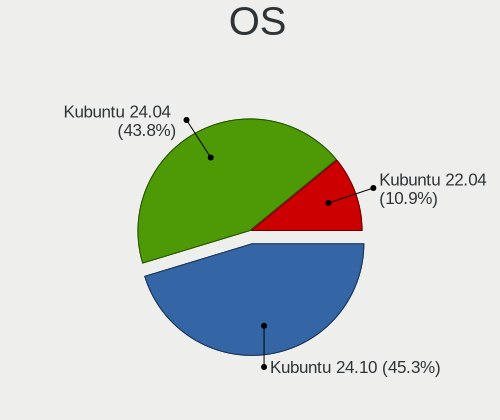
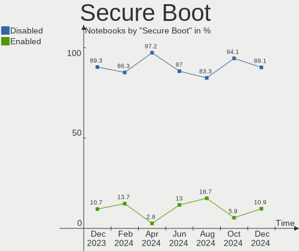
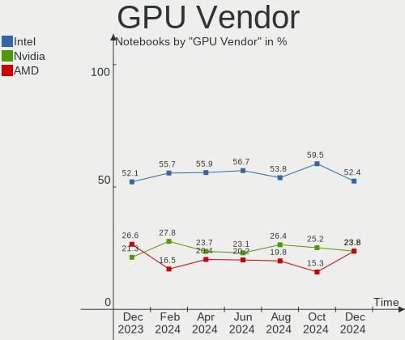
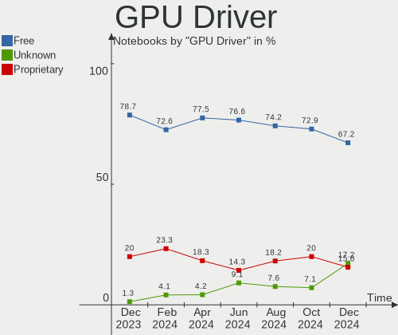
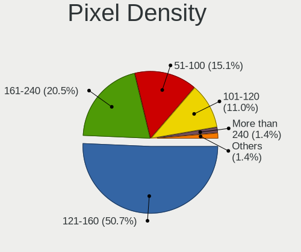
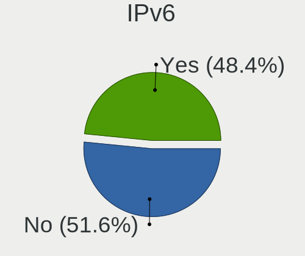
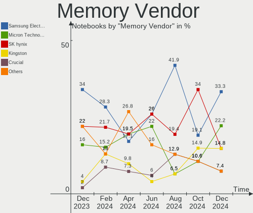
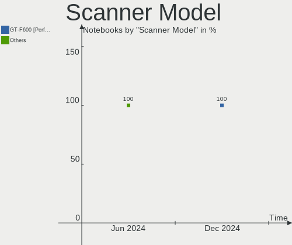

Kubuntu - Hardware Trends (Notebooks)
-------------------------------------

A project to identify most popular hardware characteristics and track their change
over time based on data collected by Linux users at https://Linux-Hardware.org.

Anyone can contribute to this report by the [hw-probe](https://github.com/linuxhw/hw-probe) tool:

    sudo -E hw-probe -all -upload

This report is for one last month. Overall report since the beginning of time: [TestDays](https://github.com/linuxhw/TestDays)

Period: Dec, 2024.

Contents
--------

* [ System ](#system)
  - [ OS                       ](#os)
  - [ OS Family                ](#os-family)
  - [ Kernel                   ](#kernel)
  - [ Kernel Family            ](#kernel-family)
  - [ Kernel Major Ver.        ](#kernel-major-ver)
  - [ Arch                     ](#arch)
  - [ DE                       ](#de)
  - [ Display Server           ](#display-server)
  - [ Display Manager          ](#display-manager)
  - [ OS Lang                  ](#os-lang)
  - [ Boot Mode                ](#boot-mode)
  - [ Filesystem               ](#filesystem)
  - [ Part. scheme             ](#part-scheme)
  - [ Dual Boot with Linux/BSD ](#dual-boot-with-linuxbsd)
  - [ Dual Boot (Win)          ](#dual-boot-win)

* [ Board ](#board)
  - [ Vendor                   ](#vendor)
  - [ Model                    ](#model)
  - [ Model Family             ](#model-family)
  - [ MFG Year                 ](#mfg-year)
  - [ Form Factor              ](#form-factor)
  - [ Secure Boot              ](#secure-boot)
  - [ Coreboot                 ](#coreboot)
  - [ RAM Size                 ](#ram-size)
  - [ RAM Used                 ](#ram-used)
  - [ Total Drives             ](#total-drives)
  - [ Has CD-ROM               ](#has-cd-rom)
  - [ Has Ethernet             ](#has-ethernet)
  - [ Has WiFi                 ](#has-wifi)
  - [ Has Bluetooth            ](#has-bluetooth)

* [ Location ](#location)
  - [ Country                  ](#country)
  - [ City                     ](#city)

* [ Drives ](#drives)
  - [ Drive Vendor             ](#drive-vendor)
  - [ Drive Model              ](#drive-model)
  - [ HDD Vendor               ](#hdd-vendor)
  - [ SSD Vendor               ](#ssd-vendor)
  - [ Drive Kind               ](#drive-kind)
  - [ Drive Connector          ](#drive-connector)
  - [ Drive Size               ](#drive-size)
  - [ Space Total              ](#space-total)
  - [ Space Used               ](#space-used)
  - [ Malfunc. Drives          ](#malfunc-drives)
  - [ Malfunc. Drive Vendor    ](#malfunc-drive-vendor)
  - [ Malfunc. HDD Vendor      ](#malfunc-hdd-vendor)
  - [ Malfunc. Drive Kind      ](#malfunc-drive-kind)
  - [ Failed Drives            ](#failed-drives)
  - [ Failed Drive Vendor      ](#failed-drive-vendor)
  - [ Drive Status             ](#drive-status)

* [ Storage controller ](#storage-controller)
  - [ Storage Vendor           ](#storage-vendor)
  - [ Storage Model            ](#storage-model)
  - [ Storage Kind             ](#storage-kind)

* [ Processor ](#processor)
  - [ CPU Vendor               ](#cpu-vendor)
  - [ CPU Model                ](#cpu-model)
  - [ CPU Model Family         ](#cpu-model-family)
  - [ CPU Cores                ](#cpu-cores)
  - [ CPU Sockets              ](#cpu-sockets)
  - [ CPU Threads              ](#cpu-threads)
  - [ CPU Op-Modes             ](#cpu-op-modes)
  - [ CPU Microcode            ](#cpu-microcode)
  - [ CPU Microarch            ](#cpu-microarch)

* [ Graphics ](#graphics)
  - [ GPU Vendor               ](#gpu-vendor)
  - [ GPU Model                ](#gpu-model)
  - [ GPU Combo                ](#gpu-combo)
  - [ GPU Driver               ](#gpu-driver)
  - [ GPU Memory               ](#gpu-memory)

* [ Monitor ](#monitor)
  - [ Monitor Vendor           ](#monitor-vendor)
  - [ Monitor Model            ](#monitor-model)
  - [ Monitor Resolution       ](#monitor-resolution)
  - [ Monitor Diagonal         ](#monitor-diagonal)
  - [ Monitor Width            ](#monitor-width)
  - [ Aspect Ratio             ](#aspect-ratio)
  - [ Monitor Area             ](#monitor-area)
  - [ Pixel Density            ](#pixel-density)
  - [ Multiple Monitors        ](#multiple-monitors)

* [ Network ](#network)
  - [ Net Controller Vendor    ](#net-controller-vendor)
  - [ Net Controller Model     ](#net-controller-model)
  - [ Wireless Vendor          ](#wireless-vendor)
  - [ Wireless Model           ](#wireless-model)
  - [ Ethernet Vendor          ](#ethernet-vendor)
  - [ Ethernet Model           ](#ethernet-model)
  - [ Net Controller Kind      ](#net-controller-kind)
  - [ Used Controller          ](#used-controller)
  - [ NICs                     ](#nics)
  - [ IPv6                     ](#ipv6)

* [ Bluetooth ](#bluetooth)
  - [ Bluetooth Vendor         ](#bluetooth-vendor)
  - [ Bluetooth Model          ](#bluetooth-model)

* [ Sound ](#sound)
  - [ Sound Vendor             ](#sound-vendor)
  - [ Sound Model              ](#sound-model)

* [ Memory ](#memory)
  - [ Memory Vendor            ](#memory-vendor)
  - [ Memory Model             ](#memory-model)
  - [ Memory Kind              ](#memory-kind)
  - [ Memory Form Factor       ](#memory-form-factor)
  - [ Memory Size              ](#memory-size)
  - [ Memory Speed             ](#memory-speed)

* [ Printers & scanners ](#printers--scanners)
  - [ Printer Vendor           ](#printer-vendor)
  - [ Printer Model            ](#printer-model)
  - [ Scanner Vendor           ](#scanner-vendor)
  - [ Scanner Model            ](#scanner-model)

* [ Camera ](#camera)
  - [ Camera Vendor            ](#camera-vendor)
  - [ Camera Model             ](#camera-model)

* [ Security ](#security)
  - [ Fingerprint Vendor       ](#fingerprint-vendor)
  - [ Fingerprint Model        ](#fingerprint-model)
  - [ Chipcard Vendor          ](#chipcard-vendor)
  - [ Chipcard Model           ](#chipcard-model)

* [ Unsupported ](#unsupported)
  - [ Unsupported Devices      ](#unsupported-devices)
  - [ Unsupported Device Types ](#unsupported-device-types)

System
------

OS
--

Installed operating systems

| Name          | Notebooks | Percent |
|---------------|-----------|---------|
| Kubuntu 24.10 | 29        | 45.31%  |
| Kubuntu 24.04 | 28        | 43.75%  |
| Kubuntu 22.04 | 7         | 10.94%  |

OS Family
---------

OS without a version

| Name    | Notebooks | Percent |
|---------|-----------|---------|
| Kubuntu | 64        | 100%    |

Kernel
------

Version of the Linux kernel

| Version                  | Notebooks | Percent |
|--------------------------|-----------|---------|
| 6.11.0-9-generic         | 17        | 26.56%  |
| 6.8.0-51-generic         | 13        | 20.31%  |
| 6.8.0-49-generic         | 9         | 14.06%  |
| 6.11.0-13-generic        | 5         | 7.81%   |
| 6.8.0-50-generic         | 3         | 4.69%   |
| 6.11.0-8-generic         | 3         | 4.69%   |
| 6.11.0-12-generic        | 2         | 3.13%   |
| 5.15.0-126-lowlatency    | 2         | 3.13%   |
| 6.8.0-50-lowlatency      | 1         | 1.56%   |
| 6.8.0-49-lowlatency      | 1         | 1.56%   |
| 6.8.0-48-generic         | 1         | 1.56%   |
| 6.8.0-47-lowlatency      | 1         | 1.56%   |
| 6.8.0-41-generic         | 1         | 1.56%   |
| 6.8.0-38-generic         | 1         | 1.56%   |
| 6.2.0-39-generic         | 1         | 1.56%   |
| 6.11.10-1-liquorix-amd64 | 1         | 1.56%   |
| 5.15.0-125-generic       | 1         | 1.56%   |
| 5.15.0-102-generic       | 1         | 1.56%   |

Kernel Family
-------------

Linux kernel without a distro release

| Version | Notebooks | Percent |
|---------|-----------|---------|
| 6.8.0   | 31        | 48.44%  |
| 6.11.0  | 27        | 42.19%  |
| 5.15.0  | 4         | 6.25%   |
| 6.2.0   | 1         | 1.56%   |
| 6.11.10 | 1         | 1.56%   |

Kernel Major Ver.
-----------------

Linux kernel major version

| Version | Notebooks | Percent |
|---------|-----------|---------|
| 6.8     | 31        | 48.44%  |
| 6.11    | 28        | 43.75%  |
| 5.15    | 4         | 6.25%   |
| 6.2     | 1         | 1.56%   |

Arch
----

OS architecture (x86_64, i586, etc.)

| Name   | Notebooks | Percent |
|--------|-----------|---------|
| x86_64 | 64        | 100%    |

DE
--

Desktop Environment

| Name | Notebooks | Percent |
|------|-----------|---------|
| KDE5 | 34        | 53.13%  |
| KDE6 | 26        | 40.63%  |
| KDE  | 4         | 6.25%   |

Display Server
--------------

X11 or Wayland

| Name    | Notebooks | Percent |
|---------|-----------|---------|
| X11     | 41        | 64.06%  |
| Wayland | 23        | 35.94%  |

Display Manager
---------------

SDDM, LightDM, etc.

| Name    | Notebooks | Percent |
|---------|-----------|---------|
| SDDM    | 39        | 60.94%  |
| Unknown | 23        | 35.94%  |
| LightDM | 1         | 1.56%   |
| GDM3    | 1         | 1.56%   |

OS Lang
-------

Language

| Lang  | Notebooks | Percent |
|-------|-----------|---------|
| en_US | 32        | 50%     |
| de_DE | 9         | 14.06%  |
| en_GB | 4         | 6.25%   |
| pt_BR | 3         | 4.69%   |
| it_IT | 3         | 4.69%   |
| fr_FR | 2         | 3.13%   |
| es_ES | 2         | 3.13%   |
| en_CA | 2         | 3.13%   |
| tr_TR | 1         | 1.56%   |
| pt_PT | 1         | 1.56%   |
| pl_PL | 1         | 1.56%   |
| nl_BE | 1         | 1.56%   |
| en_IN | 1         | 1.56%   |
| en_AU | 1         | 1.56%   |
| ar_EG | 1         | 1.56%   |

Boot Mode
---------

EFI or BIOS

| Mode | Notebooks | Percent |
|------|-----------|---------|
| BIOS | 44        | 68.75%  |
| EFI  | 20        | 31.25%  |

Filesystem
----------

Type of filesystem

| Type  | Notebooks | Percent |
|-------|-----------|---------|
| Ext4  | 41        | 64.06%  |
| Tmpfs | 21        | 32.81%  |
| Btrfs | 2         | 3.13%   |

Part. scheme
------------

Scheme of partitioning

| Type    | Notebooks | Percent |
|---------|-----------|---------|
| GPT     | 36        | 56.25%  |
| Unknown | 23        | 35.94%  |
| MBR     | 5         | 7.81%   |

Dual Boot with Linux/BSD
------------------------

Hosting more than one Linux/BSD

| Dual boot | Notebooks | Percent |
|-----------|-----------|---------|
| No        | 60        | 93.75%  |
| Yes       | 4         | 6.25%   |

Dual Boot (Win)
---------------

Hosting Linux and Windows

| Dual boot | Notebooks | Percent |
|-----------|-----------|---------|
| No        | 51        | 79.69%  |
| Yes       | 13        | 20.31%  |

Board
-----

Vendor
------

Motherboard manufacturer

| Name                | Notebooks | Percent |
|---------------------|-----------|---------|
| Dell                | 15        | 23.44%  |
| ASUSTek Computer    | 10        | 15.63%  |
| Lenovo              | 9         | 14.06%  |
| Hewlett-Packard     | 9         | 14.06%  |
| Acer                | 4         | 6.25%   |
| Samsung Electronics | 2         | 3.13%   |
| Panasonic           | 2         | 3.13%   |
| MSI                 | 2         | 3.13%   |
| Fujitsu             | 2         | 3.13%   |
| Unknown             | 2         | 3.13%   |
| HUAWEI              | 1         | 1.56%   |
| Google              | 1         | 1.56%   |
| Dynabook            | 1         | 1.56%   |
| Clevo               | 1         | 1.56%   |
| Chuwi               | 1         | 1.56%   |
| ASRock              | 1         | 1.56%   |
| Apple               | 1         | 1.56%   |

Model
-----

Motherboard model

| Name                                        | Notebooks | Percent |
|---------------------------------------------|-----------|---------|
| Unknown                                     | 2         | 3.13%   |
| Samsung 950XDB/951XDB/950XDY                | 1         | 1.56%   |
| Samsung 730U3E/740U3E                       | 1         | 1.56%   |
| Panasonic CF-31SBLEB1M                      | 1         | 1.56%   |
| Panasonic CF-191DCSG1M                      | 1         | 1.56%   |
| MSI GF65 Thin 9SD                           | 1         | 1.56%   |
| MSI Creator Z17 A12UGST                     | 1         | 1.56%   |
| Lenovo V15 G4 AMN 82YU                      | 1         | 1.56%   |
| Lenovo ThinkPad X13 Gen 1 20UF000ACD        | 1         | 1.56%   |
| Lenovo ThinkPad X1 Carbon Gen 10 21CBCTO1WW | 1         | 1.56%   |
| Lenovo ThinkPad E15 Gen 2 20TD00B7US        | 1         | 1.56%   |
| Lenovo ThinkPad E14 Gen 5 21JKCTO1WW        | 1         | 1.56%   |
| Lenovo LOQ 15IRX9 83DV                      | 1         | 1.56%   |
| Lenovo Legion 5 15IMH05 82AU                | 1         | 1.56%   |
| Lenovo IdeaPad Slim 5 14IRL8 82XD           | 1         | 1.56%   |
| Lenovo IdeaPad Gaming 3 15IHU6 82K1         | 1         | 1.56%   |
| HUAWEI NBLK-WAX9X                           | 1         | 1.56%   |
| HP ZBook 14u G6                             | 1         | 1.56%   |
| HP Pavilion Power Laptop 15-cb0xx           | 1         | 1.56%   |
| HP Pavilion Laptop 15-eh0xxx                | 1         | 1.56%   |
| HP Pavilion Laptop 15-cc1xx                 | 1         | 1.56%   |
| HP Pavilion Laptop 14-dv0xxx                | 1         | 1.56%   |
| HP Pavilion HDX9000                         | 1         | 1.56%   |
| HP Laptop 17-cp0xxx                         | 1         | 1.56%   |
| HP Laptop 15-dy2xxx                         | 1         | 1.56%   |
| HP Laptop 15-db0xxx                         | 1         | 1.56%   |
| Google Voxel                                | 1         | 1.56%   |
| Fujitsu LIFEBOOK U758                       | 1         | 1.56%   |
| Fujitsu FMVU09001                           | 1         | 1.56%   |
| Dynabook PORTEGE X40-K                      | 1         | 1.56%   |
| Dell XPS 9315                               | 1         | 1.56%   |
| Dell XPS 15 7590                            | 1         | 1.56%   |
| Dell XPS 13 9305                            | 1         | 1.56%   |
| Dell Vostro 5625                            | 1         | 1.56%   |
| Dell Precision M4800                        | 1         | 1.56%   |
| Dell Precision 7520                         | 1         | 1.56%   |
| Dell Precision 3591                         | 1         | 1.56%   |
| Dell Latitude E6430                         | 1         | 1.56%   |
| Dell Latitude 5580                          | 1         | 1.56%   |
| Dell Latitude 5430                          | 1         | 1.56%   |

Model Family
------------

Motherboard model prefix

| Name                   | Notebooks | Percent |
|------------------------|-----------|---------|
| HP Pavilion            | 5         | 7.81%   |
| Lenovo ThinkPad        | 4         | 6.25%   |
| Dell Latitude          | 4         | 6.25%   |
| Dell Inspiron          | 4         | 6.25%   |
| HP Laptop              | 3         | 4.69%   |
| Dell XPS               | 3         | 4.69%   |
| Dell Precision         | 3         | 4.69%   |
| ASUS VivoBook          | 3         | 4.69%   |
| ASUS ASUS              | 3         | 4.69%   |
| Acer Aspire            | 3         | 4.69%   |
| Lenovo IdeaPad         | 2         | 3.13%   |
| ASUS ROG               | 2         | 3.13%   |
| Unknown                | 2         | 3.13%   |
| Samsung 950XDB         | 1         | 1.56%   |
| Samsung 730U3E         | 1         | 1.56%   |
| Panasonic CF-31SBLEB1M | 1         | 1.56%   |
| Panasonic CF-191DCSG1M | 1         | 1.56%   |
| MSI GF65               | 1         | 1.56%   |
| MSI Creator            | 1         | 1.56%   |
| Lenovo V15             | 1         | 1.56%   |
| Lenovo LOQ             | 1         | 1.56%   |
| Lenovo Legion          | 1         | 1.56%   |
| HUAWEI NBLK-WAX9X      | 1         | 1.56%   |
| HP ZBook               | 1         | 1.56%   |
| Google Voxel           | 1         | 1.56%   |
| Fujitsu LIFEBOOK       | 1         | 1.56%   |
| Fujitsu FMVU09001      | 1         | 1.56%   |
| Dynabook PORTEGE       | 1         | 1.56%   |
| Dell Vostro            | 1         | 1.56%   |
| Clevo P170HMx          | 1         | 1.56%   |
| Chuwi GemiBook         | 1         | 1.56%   |
| ASUS X556URK           | 1         | 1.56%   |
| ASUS G750JX            | 1         | 1.56%   |
| ASRock Z390            | 1         | 1.56%   |
| Apple MacBookPro11     | 1         | 1.56%   |
| Acer Nitro             | 1         | 1.56%   |

MFG Year
--------

Motherboard manufacture year

| Year | Notebooks | Percent |
|------|-----------|---------|
| 2021 | 8         | 12.5%   |
| 2023 | 7         | 10.94%  |
| 2022 | 7         | 10.94%  |
| 2020 | 7         | 10.94%  |
| 2024 | 6         | 9.38%   |
| 2019 | 6         | 9.38%   |
| 2017 | 5         | 7.81%   |
| 2013 | 5         | 7.81%   |
| 2014 | 3         | 4.69%   |
| 2012 | 3         | 4.69%   |
| 2018 | 2         | 3.13%   |
| 2016 | 1         | 1.56%   |
| 2015 | 1         | 1.56%   |
| 2011 | 1         | 1.56%   |
| 2008 | 1         | 1.56%   |
| 2007 | 1         | 1.56%   |

Form Factor
-----------

Physical design of the computer

| Name     | Notebooks | Percent |
|----------|-----------|---------|
| Notebook | 64        | 100%    |

Secure Boot
-----------

Enabled or disabled

| State    | Notebooks | Percent |
|----------|-----------|---------|
| Disabled | 57        | 89.06%  |
| Enabled  | 7         | 10.94%  |

Coreboot
--------

Have coreboot on board

| Used | Notebooks | Percent |
|------|-----------|---------|
| No   | 63        | 98.44%  |
| Yes  | 1         | 1.56%   |

RAM Size
--------

Total RAM memory

| Size in GB | Notebooks | Percent |
|------------|-----------|---------|
| 8.01-16.0  | 19        | 29.69%  |
| 4.01-8.0   | 18        | 28.13%  |
| 16.01-24.0 | 15        | 23.44%  |
| 32.01-64.0 | 9         | 14.06%  |
| 3.01-4.0   | 1         | 1.56%   |
| 24.01-32.0 | 1         | 1.56%   |
| 2.01-3.0   | 1         | 1.56%   |

RAM Used
--------

Used RAM memory

| Used GB    | Notebooks | Percent |
|------------|-----------|---------|
| 3.01-4.0   | 18        | 28.13%  |
| 4.01-8.0   | 14        | 21.88%  |
| 2.01-3.0   | 14        | 21.88%  |
| 1.01-2.0   | 9         | 14.06%  |
| 8.01-16.0  | 7         | 10.94%  |
| 16.01-24.0 | 2         | 3.13%   |

Total Drives
------------

Number of drives on board

| Drives | Notebooks | Percent |
|--------|-----------|---------|
| 1      | 50        | 78.13%  |
| 2      | 11        | 17.19%  |
| 3      | 2         | 3.13%   |
| 4      | 1         | 1.56%   |

Has CD-ROM
----------

Has CD-ROM on board

| Presented | Notebooks | Percent |
|-----------|-----------|---------|
| No        | 51        | 79.69%  |
| Yes       | 13        | 20.31%  |

Has Ethernet
------------

Has Ethernet on board

| Presented | Notebooks | Percent |
|-----------|-----------|---------|
| Yes       | 46        | 71.88%  |
| No        | 18        | 28.13%  |

Has WiFi
--------

Has WiFi module

| Presented | Notebooks | Percent |
|-----------|-----------|---------|
| Yes       | 60        | 93.75%  |
| No        | 4         | 6.25%   |

Has Bluetooth
-------------

Has Bluetooth module

| Presented | Notebooks | Percent |
|-----------|-----------|---------|
| Yes       | 61        | 95.31%  |
| No        | 3         | 4.69%   |

Location
--------

Country
-------

Geographic location (country)

| Country   | Notebooks | Percent |
|-----------|-----------|---------|
| USA       | 16        | 25%     |
| Germany   | 9         | 14.06%  |
| Italy     | 4         | 6.25%   |
| France    | 3         | 4.69%   |
| Egypt     | 3         | 4.69%   |
| Brazil    | 3         | 4.69%   |
| UK        | 2         | 3.13%   |
| Spain     | 2         | 3.13%   |
| Russia    | 2         | 3.13%   |
| India     | 2         | 3.13%   |
| Greece    | 2         | 3.13%   |
| Canada    | 2         | 3.13%   |
| Belgium   | 2         | 3.13%   |
| Turkey    | 1         | 1.56%   |
| Thailand  | 1         | 1.56%   |
| Portugal  | 1         | 1.56%   |
| Poland    | 1         | 1.56%   |
| Myanmar   | 1         | 1.56%   |
| Moldova   | 1         | 1.56%   |
| Malaysia  | 1         | 1.56%   |
| Jordan    | 1         | 1.56%   |
| Japan     | 1         | 1.56%   |
| China     | 1         | 1.56%   |
| Barbados  | 1         | 1.56%   |
| Australia | 1         | 1.56%   |

City
----

Geographic location (city)

| City                 | Notebooks | Percent |
|----------------------|-----------|---------|
| Dieterskirchen       | 2         | 3.13%   |
| Cairo                | 2         | 3.13%   |
| Zagarolo             | 1         | 1.56%   |
| Yangon               | 1         | 1.56%   |
| Verviers             | 1         | 1.56%   |
| Valongo              | 1         | 1.56%   |
| Tomsk                | 1         | 1.56%   |
| Thessaloniki         | 1         | 1.56%   |
| Sao José dos Campos | 1         | 1.56%   |
| Sacramento           | 1         | 1.56%   |
| Rochdale             | 1         | 1.56%   |
| Rio de Janeiro       | 1         | 1.56%   |
| Ridgeley             | 1         | 1.56%   |
| Richmond             | 1         | 1.56%   |
| Reus                 | 1         | 1.56%   |
| Portland             | 1         | 1.56%   |
| Plainfield           | 1         | 1.56%   |
| Piraeus              | 1         | 1.56%   |
| Pessac-sur-Dordogne  | 1         | 1.56%   |
| Parker               | 1         | 1.56%   |
| Oxford               | 1         | 1.56%   |
| Nurtingen            | 1         | 1.56%   |
| New Port Richey      | 1         | 1.56%   |
| Nanaimo              | 1         | 1.56%   |
| Mumbai               | 1         | 1.56%   |
| Misawa               | 1         | 1.56%   |
| Milano               | 1         | 1.56%   |
| Mesa                 | 1         | 1.56%   |
| Ludwigsburg          | 1         | 1.56%   |
| Latina               | 1         | 1.56%   |
| Jacksonville         | 1         | 1.56%   |
| Izmir                | 1         | 1.56%   |
| Irvington            | 1         | 1.56%   |
| Huddersfield         | 1         | 1.56%   |
| Hesperia             | 1         | 1.56%   |
| Henderson            | 1         | 1.56%   |
| Hamburg              | 1         | 1.56%   |
| Grande-Synthe        | 1         | 1.56%   |
| Göttingen           | 1         | 1.56%   |
| George Town          | 1         | 1.56%   |

Drives
------

Drive Vendor
------------

Hard drive vendors

| Vendor                       | Notebooks | Drives | Percent |
|------------------------------|-----------|--------|---------|
| Samsung Electronics          | 18        | 20     | 22.78%  |
| Sandisk                      | 12        | 13     | 15.19%  |
| Seagate                      | 4         | 5      | 5.06%   |
| Micron Technology            | 4         | 4      | 5.06%   |
| WDC                          | 3         | 4      | 3.8%    |
| SK hynix                     | 3         | 3      | 3.8%    |
| Crucial                      | 3         | 3      | 3.8%    |
| Unknown                      | 2         | 2      | 2.53%   |
| Toshiba                      | 2         | 2      | 2.53%   |
| SPCC                         | 2         | 2      | 2.53%   |
| PNY                          | 2         | 2      | 2.53%   |
| Kingston Technology Company  | 2         | 2      | 2.53%   |
| Kingston                     | 2         | 2      | 2.53%   |
| A-DATA Technology            | 2         | 2      | 2.53%   |
| Union Memory (Shenzhen)      | 1         | 1      | 1.27%   |
| UMIS                         | 1         | 1      | 1.27%   |
| Silicon Motion               | 1         | 1      | 1.27%   |
| Shenzhen Longsys Electronics | 1         | 1      | 1.27%   |
| SD                           | 1         | 1      | 1.27%   |
| Realtek Semiconductor        | 1         | 1      | 1.27%   |
| PNY USB                      | 1         | 1      | 1.27%   |
| Phison Electronics           | 1         | 1      | 1.27%   |
| Phison                       | 1         | 1      | 1.27%   |
| LITEONIT                     | 1         | 1      | 1.27%   |
| KIOXIA                       | 1         | 1      | 1.27%   |
| Intel                        | 1         | 1      | 1.27%   |
| Hitachi                      | 1         | 1      | 1.27%   |
| Fujitsu                      | 1         | 1      | 1.27%   |
| EAGET                        | 1         | 1      | 1.27%   |
| China                        | 1         | 1      | 1.27%   |
| Biwin Storage Technology     | 1         | 1      | 1.27%   |
| Apple                        | 1         | 1      | 1.27%   |

Drive Model
-----------

Hard drive models

| Model                                               | Notebooks | Percent |
|-----------------------------------------------------|-----------|---------|
| Samsung NVMe SSD Controller SM981/PM981/PM983 512GB | 4         | 4.76%   |
| Unknown NVMe SSD Drive 512GB                        | 2         | 2.38%   |
| Sandisk WD Blue SN550 NVMe SSD 256GB                | 2         | 2.38%   |
| Kingston Company SNV2S1000G 1TB                     | 2         | 2.38%   |
| WDC WDS250G2B0A-00SM50 250GB SSD                    | 1         | 1.19%   |
| WDC WD2500BEVT-08A23T1 250GB                        | 1         | 1.19%   |
| WDC WD1200BEVS-08RST2 120GB                         | 1         | 1.19%   |
| WDC WD10EZRZ-00HTKB0 1TB                            | 1         | 1.19%   |
| Union Memory (Shenzhen) UMIS RPJTJ512MKP1QDY 512GB  | 1         | 1.19%   |
| UMIS RPJTJ512MKP1QDY 512GB                          | 1         | 1.19%   |
| Toshiba XG6 NVMe SSD Controller 1024GB              | 1         | 1.19%   |
| Toshiba BG3 NVMe SSD Controller 128GB               | 1         | 1.19%   |
| SPCC M.2 PCIe SSD 256GB                             | 1         | 1.19%   |
| SPCC 2.5 SSD 1024GB                                 | 1         | 1.19%   |
| SK hynix SKHynix_HFM256GD3HX015N 256GB              | 1         | 1.19%   |
| SK hynix HFM256GD3JX016N 256GB                      | 1         | 1.19%   |
| SK hynix BC901 NVMe 1024GB                          | 1         | 1.19%   |
| Silicon Motion NVME 512GB                           | 1         | 1.19%   |
| Shenzhen Longsys Lexar SSD NM710 2TB                | 1         | 1.19%   |
| Seagate ST9500420AS 500GB                           | 1         | 1.19%   |
| Seagate ST1000LM024 HN-M101MBB 1TB                  | 1         | 1.19%   |
| Seagate Expansion SSD 500GB                         | 1         | 1.19%   |
| Seagate BUP Slim BK 2TB                             | 1         | 1.19%   |
| Seagate Basic 4TB                                   | 1         | 1.19%   |
| SD Ultra 3D 1000GB                                  | 1         | 1.19%   |
| Sandisk WD_BLACK SN850X 2000GB                      | 1         | 1.19%   |
| Sandisk WD PC SN740 SDDQNQD-512G-1014 512GB         | 1         | 1.19%   |
| Sandisk WD PC SN740 SDDPNQD-512G-1002 512GB         | 1         | 1.19%   |
| Sandisk WD Blue SN500 / PC SN520 NVMe SSD 256GB     | 1         | 1.19%   |
| Sandisk WD Black SN750 / PC SN730 NVMe SSD 512GB    | 1         | 1.19%   |
| SanDisk SSD PLUS 480 480GB                          | 1         | 1.19%   |
| SanDisk SSD PLUS 240GB                              | 1         | 1.19%   |
| SanDisk SDSSDA240G 240GB                            | 1         | 1.19%   |
| Sandisk PC SN530 NVMe WDC 512GB                     | 1         | 1.19%   |
| SanDisk NVMe SSD Drive 4TB                          | 1         | 1.19%   |
| SanDisk NVMe SSD Drive 1TB                          | 1         | 1.19%   |
| Samsung SSD 990 PRO 1TB                             | 1         | 1.19%   |
| Samsung SSD 980 PRO 500GB                           | 1         | 1.19%   |
| Samsung SSD 870 EVO 500GB                           | 1         | 1.19%   |
| Samsung SSD 860 EVO 500GB                           | 1         | 1.19%   |

HDD Vendor
----------

Hard disk drive vendors

| Vendor  | Notebooks | Drives | Percent |
|---------|-----------|--------|---------|
| WDC     | 3         | 3      | 37.5%   |
| Seagate | 3         | 3      | 37.5%   |
| Hitachi | 1         | 1      | 12.5%   |
| Fujitsu | 1         | 1      | 12.5%   |

SSD Vendor
----------

Solid state drive vendors

| Vendor              | Notebooks | Drives | Percent |
|---------------------|-----------|--------|---------|
| Samsung Electronics | 6         | 7      | 27.27%  |
| SanDisk             | 3         | 3      | 13.64%  |
| Crucial             | 2         | 2      | 9.09%   |
| WDC                 | 1         | 1      | 4.55%   |
| SPCC                | 1         | 1      | 4.55%   |
| Seagate             | 1         | 1      | 4.55%   |
| PNY USB             | 1         | 1      | 4.55%   |
| PNY                 | 1         | 1      | 4.55%   |
| LITEONIT            | 1         | 1      | 4.55%   |
| Kingston            | 1         | 1      | 4.55%   |
| EAGET               | 1         | 1      | 4.55%   |
| China               | 1         | 1      | 4.55%   |
| Apple               | 1         | 1      | 4.55%   |
| A-DATA Technology   | 1         | 1      | 4.55%   |

Drive Kind
----------

HDD or SSD

| Kind    | Notebooks | Drives | Percent |
|---------|-----------|--------|---------|
| NVMe    | 45        | 51     | 60%     |
| SSD     | 21        | 23     | 28%     |
| HDD     | 7         | 8      | 9.33%   |
| Unknown | 2         | 2      | 2.67%   |

Drive Connector
---------------

SATA, SAS, NVMe, etc.

| Type | Notebooks | Drives | Percent |
|------|-----------|--------|---------|
| NVMe | 45        | 50     | 61.64%  |
| SATA | 22        | 26     | 30.14%  |
| SAS  | 6         | 8      | 8.22%   |

Drive Size
----------

Size of hard drive

| Size in TB | Notebooks | Drives | Percent |
|------------|-----------|--------|---------|
| 0.01-0.5   | 19        | 21     | 65.52%  |
| 0.51-1.0   | 7         | 7      | 24.14%  |
| 1.01-2.0   | 3         | 3      | 10.34%  |

Space Total
-----------

Amount of disk space available on the file system

| Size in GB     | Notebooks | Percent |
|----------------|-----------|---------|
| 251-500        | 19        | 29.69%  |
| 101-250        | 17        | 26.56%  |
| 501-1000       | 11        | 17.19%  |
| 1001-2000      | 6         | 9.38%   |
| 2001-3000      | 4         | 6.25%   |
| 51-100         | 4         | 6.25%   |
| More than 3000 | 1         | 1.56%   |
| 21-50          | 1         | 1.56%   |
| Unknown        | 1         | 1.56%   |

Space Used
----------

Amount of used disk space

| Used GB   | Notebooks | Percent |
|-----------|-----------|---------|
| 101-250   | 15        | 23.44%  |
| 21-50     | 14        | 21.88%  |
| 51-100    | 10        | 15.63%  |
| 1-20      | 9         | 14.06%  |
| 251-500   | 7         | 10.94%  |
| 501-1000  | 6         | 9.38%   |
| 2001-3000 | 1         | 1.56%   |
| 1001-2000 | 1         | 1.56%   |
| Unknown   | 1         | 1.56%   |

Malfunc. Drives
---------------

Drive models with a malfunction

Zero info for selected period =(

Malfunc. Drive Vendor
---------------------

Vendors of faulty drives

Zero info for selected period =(

Malfunc. HDD Vendor
-------------------

Vendors of faulty HDD drives

Zero info for selected period =(

Malfunc. Drive Kind
-------------------

Kinds of faulty drives

Zero info for selected period =(

Failed Drives
-------------

Failed drive models

Zero info for selected period =(

Failed Drive Vendor
-------------------

Failed drive vendors

Zero info for selected period =(

Drive Status
------------

Number of failed and malfunc. drives

| Status   | Notebooks | Drives | Percent |
|----------|-----------|--------|---------|
| Detected | 48        | 60     | 69.57%  |
| Works    | 21        | 24     | 30.43%  |

Storage controller
------------------

Storage Vendor
--------------

Storage controller vendors

| Vendor                                  | Notebooks | Percent |
|-----------------------------------------|-----------|---------|
| Intel                                   | 37        | 42.05%  |
| Samsung Electronics                     | 12        | 13.64%  |
| SanDisk                                 | 10        | 11.36%  |
| Phison Electronics                      | 4         | 4.55%   |
| Micron Technology                       | 4         | 4.55%   |
| SK hynix                                | 3         | 3.41%   |
| Kingston Technology Company             | 3         | 3.41%   |
| Toshiba America Info Systems            | 2         | 2.27%   |
| AMD                                     | 2         | 2.27%   |
| Silicon Motion                          | 1         | 1.14%   |
| Silicon Image                           | 1         | 1.14%   |
| Shenzhen Unionmemory Information System | 1         | 1.14%   |
| Shenzhen Longsys Electronics            | 1         | 1.14%   |
| Realtek Semiconductor                   | 1         | 1.14%   |
| Micron/Crucial Technology               | 1         | 1.14%   |
| KIOXIA                                  | 1         | 1.14%   |
| INNOGRIT                                | 1         | 1.14%   |
| Biwin Storage Technology                | 1         | 1.14%   |
| ADATA Technology                        | 1         | 1.14%   |
| Unknown                                 | 1         | 1.14%   |

Storage Model
-------------

Storage controller models

| Model                                                                                       | Notebooks | Percent |
|---------------------------------------------------------------------------------------------|-----------|---------|
| Intel Volume Management Device NVMe RAID Controller                                         | 7         | 7.45%   |
| Intel Sunrise Point-LP SATA Controller [AHCI mode]                                          | 5         | 5.32%   |
| Samsung NVMe SSD Controller SM981/PM981/PM983                                               | 4         | 4.26%   |
| Intel Volume Management Device NVMe RAID Controller Intel Corporation                       | 3         | 3.19%   |
| Intel 7 Series Chipset Family 6-port SATA Controller [AHCI mode]                            | 3         | 3.19%   |
| SK hynix Gold P31/BC711/PC711 NVMe Solid State Drive                                        | 2         | 2.13%   |
| SanDisk WD Black SN770 / PC SN740 256GB / PC SN560 (DRAM-less) NVMe SSD                     | 2         | 2.13%   |
| SanDisk Ultra 3D / WD PC SN530, IX SN530, Blue SN550 NVMe SSD (DRAM-less)                   | 2         | 2.13%   |
| SanDisk Extreme Pro / WD Black SN750 / PC SN730 / Red SN700 NVMe SSD                        | 2         | 2.13%   |
| Samsung NVMe SSD Controller PM9B1 (DRAM-less)                                               | 2         | 2.13%   |
| Samsung NVMe SSD Controller PM9A1/PM9A3/980PRO                                              | 2         | 2.13%   |
| Samsung NVMe SSD Controller 980 (DRAM-less)                                                 | 2         | 2.13%   |
| Phison PS5013-E13 PCIe3 NVMe Controller (DRAM-less)                                         | 2         | 2.13%   |
| Phison E12 NVMe Controller                                                                  | 2         | 2.13%   |
| Kingston Company NV2 NVMe SSD [E21T] (DRAM-less)                                            | 2         | 2.13%   |
| Intel Ice Lake-LP SATA Controller [AHCI mode]                                               | 2         | 2.13%   |
| Intel 82801HM/HEM (ICH8M/ICH8M-E) SATA Controller [AHCI mode]                               | 2         | 2.13%   |
| Intel 82801HM/HEM (ICH8M/ICH8M-E) IDE Controller                                            | 2         | 2.13%   |
| Intel 82801 Mobile SATA Controller [RAID mode]                                              | 2         | 2.13%   |
| Intel 8 Series SATA Controller 1 [AHCI mode]                                                | 2         | 2.13%   |
| AMD FCH SATA Controller [AHCI mode]                                                         | 2         | 2.13%   |
| Toshiba America Info Systems XG6 NVMe SSD Controller                                        | 1         | 1.06%   |
| Toshiba America Info Systems BG3 x2 NVMe SSD Controller (DRAM-less)                         | 1         | 1.06%   |
| SK hynix BC901 NVMe Solid State Drive (DRAM-less)                                           | 1         | 1.06%   |
| Silicon Motion SM2263EN/SM2263XT (DRAM-less) NVMe SSD Controllers                           | 1         | 1.06%   |
| Silicon Image SiI 3531 [SATALink/SATARaid] Serial ATA Controller                            | 1         | 1.06%   |
| Shenzhen Unionmemory Information System RPETJ512MKP1QDQ PCIe 4.0 NVMe SSD 512GB (DRAM-less) | 1         | 1.06%   |
| Shenzhen Longsys Lexar NM790 NVME SSD (DRAM-less)                                           | 1         | 1.06%   |
| Sandisk WD PC SN5000S M.2 2280 NVMe SSD (DRAM-less)                                         | 1         | 1.06%   |
| SanDisk WD Blue SN500 / PC SN520 x2 M.2 2280 NVMe SSD                                       | 1         | 1.06%   |
| Sandisk WD Black SN850X NVMe SSD                                                            | 1         | 1.06%   |
| SanDisk IX SN530 NVMe SSD (DRAM-less)                                                       | 1         | 1.06%   |
| Samsung S4LN053X01 AHCI SSD Controller(Apple slot)                                          | 1         | 1.06%   |
| Samsung NVMe SSD Controller S4LV008[Pascal]                                                 | 1         | 1.06%   |
| Realtek RTS5765DL NVMe SSD Controller (DRAM-less)                                           | 1         | 1.06%   |
| Micron/Crucial P2 [Nick P2] / P3 / P3 Plus NVMe PCIe SSD (DRAM-less)                        | 1         | 1.06%   |
| Micron Non-Volatile memory controller                                                       | 1         | 1.06%   |
| Micron 3460 NVMe SSD                                                                        | 1         | 1.06%   |
| Micron 2450 NVMe SSD [HendrixV] (DRAM-less)                                                 | 1         | 1.06%   |
| Micron 2300 NVMe SSD [Santana]                                                              | 1         | 1.06%   |

Storage Kind
------------

Kind of storage controller (IDE, SATA, NVMe, SAS, ...)

| Kind | Notebooks | Percent |
|------|-----------|---------|
| NVMe | 45        | 50%     |
| SATA | 29        | 32.22%  |
| RAID | 13        | 14.44%  |
| IDE  | 3         | 3.33%   |

Processor
---------

CPU Vendor
----------

Processor vendors

| Vendor | Notebooks | Percent |
|--------|-----------|---------|
| Intel  | 49        | 76.56%  |
| AMD    | 15        | 23.44%  |

CPU Model
---------

Processor models

| Model                                   | Notebooks | Percent |
|-----------------------------------------|-----------|---------|
| Intel Core i5-3320M CPU @ 2.60GHz       | 3         | 4.69%   |
| Intel 11th Gen Core i7-1165G7 @ 2.80GHz | 3         | 4.69%   |
| Intel 12th Gen Core i7-1270P            | 2         | 3.13%   |
| Intel 11th Gen Core i5-1135G7 @ 2.40GHz | 2         | 3.13%   |
| AMD Ryzen 7 5825U with Radeon Graphics  | 2         | 3.13%   |
| Intel N95                               | 1         | 1.56%   |
| Intel Core Ultra 9 185H                 | 1         | 1.56%   |
| Intel Core i9-9980HK CPU @ 2.40GHz      | 1         | 1.56%   |
| Intel Core i7-8665U CPU @ 1.90GHz       | 1         | 1.56%   |
| Intel Core i7-8550U CPU @ 1.80GHz       | 1         | 1.56%   |
| Intel Core i7-7700HQ CPU @ 2.80GHz      | 1         | 1.56%   |
| Intel Core i7-7500U CPU @ 2.70GHz       | 1         | 1.56%   |
| Intel Core i7-6500U CPU @ 2.50GHz       | 1         | 1.56%   |
| Intel Core i7-4800MQ CPU @ 2.70GHz      | 1         | 1.56%   |
| Intel Core i7-4770HQ CPU @ 2.20GHz      | 1         | 1.56%   |
| Intel Core i7-4700HQ CPU @ 2.40GHz      | 1         | 1.56%   |
| Intel Core i7-4500U CPU @ 1.80GHz       | 1         | 1.56%   |
| Intel Core i7-3537U CPU @ 2.00GHz       | 1         | 1.56%   |
| Intel Core i7-2720QM CPU @ 2.20GHz      | 1         | 1.56%   |
| Intel Core i7-10750H CPU @ 2.60GHz      | 1         | 1.56%   |
| Intel Core i7-1065G7 CPU @ 1.30GHz      | 1         | 1.56%   |
| Intel Core i5-9400F CPU @ 2.90GHz       | 1         | 1.56%   |
| Intel Core i5-9300H CPU @ 2.40GHz       | 1         | 1.56%   |
| Intel Core i5-7300U CPU @ 2.60GHz       | 1         | 1.56%   |
| Intel Core i5-7300HQ CPU @ 2.50GHz      | 1         | 1.56%   |
| Intel Core i5-7200U CPU @ 2.50GHz       | 1         | 1.56%   |
| Intel Core i5-6300U CPU @ 2.40GHz       | 1         | 1.56%   |
| Intel Core i3-4030U CPU @ 1.90GHz       | 1         | 1.56%   |
| Intel Core i3-1005G1 CPU @ 1.20GHz      | 1         | 1.56%   |
| Intel Core 2 Duo CPU T7500 @ 2.20GHz    | 1         | 1.56%   |
| Intel Core 2 Duo CPU T5450 @ 1.66GHz    | 1         | 1.56%   |
| Intel Celeron J4115 CPU @ 1.80GHz       | 1         | 1.56%   |
| Intel 13th Gen Core i7-13700H           | 1         | 1.56%   |
| Intel 13th Gen Core i7-13650HX          | 1         | 1.56%   |
| Intel 13th Gen Core i7-1355U            | 1         | 1.56%   |
| Intel 13th Gen Core i5-13500H           | 1         | 1.56%   |
| Intel 13th Gen Core i5-13420H           | 1         | 1.56%   |
| Intel 13th Gen Core i3-1315U            | 1         | 1.56%   |
| Intel 12th Gen Core i7-12700H           | 1         | 1.56%   |
| Intel 12th Gen Core i7-1250U            | 1         | 1.56%   |

CPU Model Family
----------------

Processor model prefix

| Model            | Notebooks | Percent |
|------------------|-----------|---------|
| Other            | 21        | 32.81%  |
| Intel Core i7    | 13        | 20.31%  |
| Intel Core i5    | 9         | 14.06%  |
| AMD Ryzen 7      | 7         | 10.94%  |
| AMD Ryzen 5      | 3         | 4.69%   |
| Intel Core i3    | 2         | 3.13%   |
| Intel Core 2 Duo | 2         | 3.13%   |
| AMD Ryzen 3      | 2         | 3.13%   |
| Intel Core i9    | 1         | 1.56%   |
| Intel Core       | 1         | 1.56%   |
| Intel Celeron    | 1         | 1.56%   |
| AMD Ryzen 9      | 1         | 1.56%   |
| AMD Ryzen 7 PRO  | 1         | 1.56%   |

CPU Cores
---------

Number of processor cores

| Number | Notebooks | Percent |
|--------|-----------|---------|
| 4      | 21        | 32.81%  |
| 2      | 16        | 25%     |
| 8      | 11        | 17.19%  |
| 6      | 5         | 7.81%   |
| 12     | 4         | 6.25%   |
| 14     | 3         | 4.69%   |
| 10     | 3         | 4.69%   |
| 16     | 1         | 1.56%   |

CPU Sockets
-----------

Number of sockets

| Number | Notebooks | Percent |
|--------|-----------|---------|
| 1      | 64        | 100%    |

CPU Threads
-----------

Threads per core (Hyper-Threading)

| Number | Notebooks | Percent |
|--------|-----------|---------|
| 2      | 54        | 84.38%  |
| 1      | 10        | 15.63%  |

CPU Op-Modes
------------

CPU Operation Modes (32-bit, 64-bit)

| Op mode        | Notebooks | Percent |
|----------------|-----------|---------|
| 32-bit, 64-bit | 64        | 100%    |

CPU Microcode
-------------

Microcode number

| Number     | Notebooks | Percent |
|------------|-----------|---------|
| Unknown    | 62        | 96.88%  |
| 0xa0652    | 1         | 1.56%   |
| 0x08608103 | 1         | 1.56%   |

CPU Microarch
-------------

Microarchitecture

| Name             | Notebooks | Percent |
|------------------|-----------|---------|
| Unknown          | 12        | 18.75%  |
| KabyLake         | 10        | 15.63%  |
| Alderlake Hybrid | 8         | 12.5%   |
| TigerLake        | 7         | 10.94%  |
| Haswell          | 5         | 7.81%   |
| Zen 3            | 4         | 6.25%   |
| IvyBridge        | 4         | 6.25%   |
| Zen 2            | 3         | 4.69%   |
| Skylake          | 2         | 3.13%   |
| IceLake          | 2         | 3.13%   |
| Core             | 2         | 3.13%   |
| Zen+             | 1         | 1.56%   |
| Zen              | 1         | 1.56%   |
| SandyBridge      | 1         | 1.56%   |
| Goldmont plus    | 1         | 1.56%   |
| CometLake        | 1         | 1.56%   |

Graphics
--------

GPU Vendor
----------

Vendors of graphics cards

| Vendor | Notebooks | Percent |
|--------|-----------|---------|
| Intel  | 44        | 52.38%  |
| Nvidia | 20        | 23.81%  |
| AMD    | 20        | 23.81%  |

GPU Model
---------

Graphics card models

| Model                                                               | Notebooks | Percent |
|---------------------------------------------------------------------|-----------|---------|
| Intel TigerLake-LP GT2 [Iris Xe Graphics]                           | 6         | 6.98%   |
| Intel Raptor Lake-P [UHD Graphics]                                  | 4         | 4.65%   |
| Intel 3rd Gen Core processor Graphics Controller                    | 4         | 4.65%   |
| Intel HD Graphics 620                                               | 3         | 3.49%   |
| AMD Renoir [Radeon Vega Series / Radeon Vega Mobile Series]         | 3         | 3.49%   |
| AMD Barcelo                                                         | 3         | 3.49%   |
| Nvidia TU117M [GeForce GTX 1650 Mobile / Max-Q]                     | 2         | 2.33%   |
| Nvidia GA104 [Geforce RTX 3070 Ti Laptop GPU]                       | 2         | 2.33%   |
| Intel Skylake GT2 [HD Graphics 520]                                 | 2         | 2.33%   |
| Intel HD Graphics 630                                               | 2         | 2.33%   |
| Intel Haswell-ULT Integrated Graphics Controller                    | 2         | 2.33%   |
| Intel CoffeeLake-H GT2 [UHD Graphics 630]                           | 2         | 2.33%   |
| Intel Alder Lake-P GT2 [Iris Xe Graphics]                           | 2         | 2.33%   |
| AMD Rembrandt [Radeon 680M]                                         | 2         | 2.33%   |
| AMD Mendocino                                                       | 2         | 2.33%   |
| Nvidia TU117M [GeForce GTX 1650 Ti Mobile]                          | 1         | 1.16%   |
| Nvidia TU116M [GeForce GTX 1660 Ti Mobile]                          | 1         | 1.16%   |
| Nvidia GP107M [GeForce GTX 1050 Mobile]                             | 1         | 1.16%   |
| Nvidia GM108M [GeForce 940MX]                                       | 1         | 1.16%   |
| Nvidia GM108M [GeForce 930MX]                                       | 1         | 1.16%   |
| Nvidia GM107GLM [Quadro M1200 Mobile]                               | 1         | 1.16%   |
| Nvidia GK107M [GeForce GT 750M]                                     | 1         | 1.16%   |
| Nvidia GK107GLM [Quadro K1100M]                                     | 1         | 1.16%   |
| Nvidia GK106M [GeForce GTX 770M]                                    | 1         | 1.16%   |
| Nvidia GF106M [GeForce GTX 460M]                                    | 1         | 1.16%   |
| Nvidia GA107M [GeForce RTX 3050 Ti Mobile]                          | 1         | 1.16%   |
| Nvidia GA107M [GeForce RTX 2050]                                    | 1         | 1.16%   |
| Nvidia GA107BM / GN20-P0-R-K2 [GeForce RTX 3050 6GB Laptop GPU]     | 1         | 1.16%   |
| Nvidia GA106M [GeForce RTX 3060 Mobile / Max-Q]                     | 1         | 1.16%   |
| Nvidia AD107M [GeForce RTX 4060 Max-Q / Mobile]                     | 1         | 1.16%   |
| Nvidia AD107GLM [RTX 2000 Ada Generation Laptop GPU]                | 1         | 1.16%   |
| Intel WhiskeyLake-U GT2 [UHD Graphics 620]                          | 1         | 1.16%   |
| Intel UHD Graphics 620                                              | 1         | 1.16%   |
| Intel TigerLake-H GT1 [UHD Graphics]                                | 1         | 1.16%   |
| Intel Tiger Lake-LP GT2 [UHD Graphics G4]                           | 1         | 1.16%   |
| Intel Raptor Lake-S UHD Graphics                                    | 1         | 1.16%   |
| Intel Raptor Lake-P [Iris Xe Graphics]                              | 1         | 1.16%   |
| Intel Mobile GM965/GL960 Integrated Graphics Controller (secondary) | 1         | 1.16%   |
| Intel Mobile GM965/GL960 Integrated Graphics Controller (primary)   | 1         | 1.16%   |
| Intel Meteor Lake-P [Intel Arc Graphics]                            | 1         | 1.16%   |

GPU Combo
---------

Combinations of graphics cards

| Name           | Notebooks | Percent |
|----------------|-----------|---------|
| 1 x Intel      | 27        | 42.19%  |
| Intel + Nvidia | 14        | 21.88%  |
| 1 x AMD        | 14        | 21.88%  |
| 1 x Nvidia     | 3         | 4.69%   |
| Intel + AMD    | 3         | 4.69%   |
| AMD + Nvidia   | 2         | 3.13%   |
| 2 x AMD        | 1         | 1.56%   |

GPU Driver
----------

Free vs proprietary

| Driver      | Notebooks | Percent |
|-------------|-----------|---------|
| Free        | 43        | 67.19%  |
| Unknown     | 11        | 17.19%  |
| Proprietary | 10        | 15.63%  |

GPU Memory
----------

Total video memory

| Size in GB | Notebooks | Percent |
|------------|-----------|---------|
| Unknown    | 55        | 85.94%  |
| 3.01-4.0   | 4         | 6.25%   |
| 0.01-0.5   | 3         | 4.69%   |
| 1.01-2.0   | 2         | 3.13%   |

Monitor
-------

Monitor Vendor
--------------

Monitor vendors

| Vendor                  | Notebooks | Percent |
|-------------------------|-----------|---------|
| BOE                     | 16        | 21.62%  |
| Chimei Innolux          | 14        | 18.92%  |
| AU Optronics            | 13        | 17.57%  |
| Samsung Electronics     | 7         | 9.46%   |
| PANDA                   | 3         | 4.05%   |
| LG Display              | 3         | 4.05%   |
| Dell                    | 3         | 4.05%   |
| Sharp                   | 2         | 2.7%    |
| LG Philips              | 2         | 2.7%    |
| Chi Mei Optoelectronics | 2         | 2.7%    |
| Vizio                   | 1         | 1.35%   |
| Vestel Elektronik       | 1         | 1.35%   |
| Pixio                   | 1         | 1.35%   |
| InfoVision              | 1         | 1.35%   |
| Goldstar                | 1         | 1.35%   |
| Denver                  | 1         | 1.35%   |
| BenQ                    | 1         | 1.35%   |
| Apple                   | 1         | 1.35%   |
| Acer                    | 1         | 1.35%   |

Monitor Model
-------------

Monitor models

| Model                                                                 | Notebooks | Percent |
|-----------------------------------------------------------------------|-----------|---------|
| Chimei Innolux LCD Monitor CMN15D5 1920x1080 344x193mm 15.5-inch      | 2         | 2.67%   |
| Vizio D32hn-D0 VIZ1007 1366x768 698x392mm 31.5-inch                   | 1         | 1.33%   |
| Vestel Elektronik 49FHD_LCD_TV VES3700 1920x1080 1280x720mm 57.8-inch | 1         | 1.33%   |
| Sharp LQ133M1JW28 SHP1483 1920x1080 294x165mm 13.3-inch               | 1         | 1.33%   |
| Sharp LCD Monitor SHP1548 1920x1200 288x180mm 13.4-inch               | 1         | 1.33%   |
| Samsung Electronics U28D590 SAM0B81 3840x2160 608x345mm 27.5-inch     | 1         | 1.33%   |
| Samsung Electronics S34CG50 SAM730E 3440x1440 798x334mm 34.1-inch     | 1         | 1.33%   |
| Samsung Electronics LCD Monitor SDC8B4F 1920x1080 344x194mm 15.5-inch | 1         | 1.33%   |
| Samsung Electronics LCD Monitor SDC4187 1920x1200 302x189mm 14.0-inch | 1         | 1.33%   |
| Samsung Electronics LCD Monitor SDC4159 1920x1080 344x194mm 15.5-inch | 1         | 1.33%   |
| Samsung Electronics Color LCD SDCA029 2160x1440 252x168mm 11.9-inch   | 1         | 1.33%   |
| Samsung Electronics C24F390 SAM0D2C 1920x1080 521x293mm 23.5-inch     | 1         | 1.33%   |
| Pixio HDMI WAM2700 2560x1440 597x336mm 27.0-inch                      | 1         | 1.33%   |
| PANDA LCD Monitor NCP005E 1920x1080 309x174mm 14.0-inch               | 1         | 1.33%   |
| PANDA LCD Monitor NCP004D 1920x1080 344x194mm 15.5-inch               | 1         | 1.33%   |
| PANDA LCD Monitor NCP0046 1920x1080 344x194mm 15.5-inch               | 1         | 1.33%   |
| LG Philips LCD Monitor LPL0201 1280x800 331x207mm 15.4-inch           | 1         | 1.33%   |
| LG Philips LCD Monitor LPL0050 1680x1050 433x271mm 20.1-inch          | 1         | 1.33%   |
| LG Display LCD Monitor LGD068A 1920x1080 309x174mm 14.0-inch          | 1         | 1.33%   |
| LG Display LCD Monitor LGD062F 1920x1080 344x194mm 15.5-inch          | 1         | 1.33%   |
| LG Display LCD Monitor LGD0285 1920x1080 383x215mm 17.3-inch          | 1         | 1.33%   |
| InfoVision LCD Monitor IVO8C44 1920x1200 302x189mm 14.0-inch          | 1         | 1.33%   |
| Goldstar 22MB65 GSM5A2E 1680x1050 480x300mm 22.3-inch                 | 1         | 1.33%   |
| Denver PrimetekH3CQC LHCFFFF 3840x1080 1197x337mm 49.0-inch           | 1         | 1.33%   |
| Dell U2412M DELA002 1920x1080 520x320mm 24.0-inch                     | 1         | 1.33%   |
| Dell S2419H DELD0D1 1920x1080 527x296mm 23.8-inch                     | 1         | 1.33%   |
| Dell P2417H DELA0DC 1920x1080 527x296mm 23.8-inch                     | 1         | 1.33%   |
| Dell P2414H DELA09B 1920x1080 527x297mm 23.8-inch                     | 1         | 1.33%   |
| Chimei Innolux P130ZFA-BA1 CMN8201 2160x1440 275x183mm 13.0-inch      | 1         | 1.33%   |
| Chimei Innolux N140HCA-EAC CMN148F 1920x1080 309x173mm 13.9-inch      | 1         | 1.33%   |
| Chimei Innolux LCD Monitor CMN176F 1920x1080 381x214mm 17.2-inch      | 1         | 1.33%   |
| Chimei Innolux LCD Monitor CMN1618 1920x1200 344x215mm 16.0-inch      | 1         | 1.33%   |
| Chimei Innolux LCD Monitor CMN15E6 1366x768 344x193mm 15.5-inch       | 1         | 1.33%   |
| Chimei Innolux LCD Monitor CMN1550 1920x1080 344x193mm 15.5-inch      | 1         | 1.33%   |
| Chimei Innolux LCD Monitor CMN1540 2560x1440 344x193mm 15.5-inch      | 1         | 1.33%   |
| Chimei Innolux LCD Monitor CMN14FF 1920x1080 309x173mm 13.9-inch      | 1         | 1.33%   |
| Chimei Innolux LCD Monitor CMN14F5 1920x1080 309x173mm 13.9-inch      | 1         | 1.33%   |
| Chimei Innolux LCD Monitor CMN14E0 1920x1080 309x173mm 13.9-inch      | 1         | 1.33%   |
| Chimei Innolux LCD Monitor CMN1417 1920x1200 301x188mm 14.0-inch      | 1         | 1.33%   |
| Chimei Innolux LCD Monitor CMN1343 1920x1080 294x165mm 13.3-inch      | 1         | 1.33%   |

Monitor Resolution
------------------

Monitor screen resolution

| Resolution         | Notebooks | Percent |
|--------------------|-----------|---------|
| 1920x1080 (FHD)    | 38        | 55.07%  |
| 1920x1200 (WUXGA)  | 9         | 13.04%  |
| 3840x2160 (4K)     | 5         | 7.25%   |
| 1366x768 (WXGA)    | 5         | 7.25%   |
| 2880x1800          | 2         | 2.9%    |
| 2560x1600          | 2         | 2.9%    |
| 1680x1050 (WSXGA+) | 2         | 2.9%    |
| 3440x1440          | 1         | 1.45%   |
| 2560x1440 (QHD)    | 1         | 1.45%   |
| 2256x1504          | 1         | 1.45%   |
| 2160x1440          | 1         | 1.45%   |
| 1600x900 (HD+)     | 1         | 1.45%   |
| 1280x800 (WXGA)    | 1         | 1.45%   |

Monitor Diagonal
----------------

Diagonal size in inches

| Inches | Notebooks | Percent |
|--------|-----------|---------|
| 15     | 30        | 40.54%  |
| 13     | 13        | 17.57%  |
| 14     | 7         | 9.46%   |
| 17     | 5         | 6.76%   |
| 16     | 5         | 6.76%   |
| 24     | 4         | 5.41%   |
| 27     | 2         | 2.7%    |
| 23     | 2         | 2.7%    |
| 84     | 1         | 1.35%   |
| 49     | 1         | 1.35%   |
| 38     | 1         | 1.35%   |
| 34     | 1         | 1.35%   |
| 22     | 1         | 1.35%   |
| 20     | 1         | 1.35%   |

Monitor Width
-------------

Physical width

| Width in mm | Notebooks | Percent |
|-------------|-----------|---------|
| 301-350     | 48        | 64.86%  |
| 501-600     | 7         | 9.46%   |
| 201-300     | 7         | 9.46%   |
| 351-400     | 5         | 6.76%   |
| 401-500     | 2         | 2.7%    |
| 801-900     | 1         | 1.35%   |
| 701-800     | 1         | 1.35%   |
| 601-700     | 1         | 1.35%   |
| 1501-2000   | 1         | 1.35%   |
| 1001-1500   | 1         | 1.35%   |

Aspect Ratio
------------

Proportional relationship between the width and the height

| Ratio | Notebooks | Percent |
|-------|-----------|---------|
| 16/9  | 46        | 69.7%   |
| 16/10 | 16        | 24.24%  |
| 3/2   | 2         | 3.03%   |
| 32/9  | 1         | 1.52%   |
| 21/9  | 1         | 1.52%   |

Monitor Area
------------

Area in inch²

| Area in inch² | Notebooks | Percent |
|----------------|-----------|---------|
| 101-110        | 30        | 40%     |
| 81-90          | 14        | 18.67%  |
| 201-250        | 7         | 9.33%   |
| 71-80          | 6         | 8%      |
| 121-130        | 5         | 6.67%   |
| 111-120        | 5         | 6.67%   |
| 301-350        | 2         | 2.67%   |
| 501-1000       | 2         | 2.67%   |
| More than 1000 | 1         | 1.33%   |
| 351-500        | 1         | 1.33%   |
| 251-300        | 1         | 1.33%   |
| 151-200        | 1         | 1.33%   |

Pixel Density
-------------

Pixels per inch

| Density       | Notebooks | Percent |
|---------------|-----------|---------|
| 121-160       | 37        | 50.68%  |
| 161-240       | 15        | 20.55%  |
| 51-100        | 11        | 15.07%  |
| 101-120       | 8         | 10.96%  |
| More than 240 | 1         | 1.37%   |
| 1-50          | 1         | 1.37%   |

Multiple Monitors
-----------------

Total monitors connected

| Total | Notebooks | Percent |
|-------|-----------|---------|
| 1     | 52        | 81.25%  |
| 2     | 11        | 17.19%  |
| 3     | 1         | 1.56%   |

Network
-------

Net Controller Vendor
---------------------

Controller vendors

| Vendor                   | Notebooks | Percent |
|--------------------------|-----------|---------|
| Intel                    | 43        | 42.16%  |
| Realtek Semiconductor    | 32        | 31.37%  |
| MediaTek                 | 7         | 6.86%   |
| Qualcomm Atheros         | 4         | 3.92%   |
| Broadcom                 | 4         | 3.92%   |
| Sierra Wireless          | 3         | 2.94%   |
| Ralink Technology        | 2         | 1.96%   |
| Marvell Technology Group | 2         | 1.96%   |
| Samsung Electronics      | 1         | 0.98%   |
| Lenovo                   | 1         | 0.98%   |
| JMicron Technology       | 1         | 0.98%   |
| Dell                     | 1         | 0.98%   |
| Broadcom Limited         | 1         | 0.98%   |

Net Controller Model
--------------------

Controller models

| Model                                                                  | Notebooks | Percent |
|------------------------------------------------------------------------|-----------|---------|
| Realtek RTL8111/8168/8211/8411 PCI Express Gigabit Ethernet Controller | 17        | 14.41%  |
| Realtek RTL8153 Gigabit Ethernet Adapter                               | 6         | 5.08%   |
| Intel Alder Lake-P PCH CNVi WiFi                                       | 5         | 4.24%   |
| MediaTek MT7921 802.11ax PCI Express Wireless Network Adapter          | 4         | 3.39%   |
| Intel Wireless 8265 / 8275                                             | 4         | 3.39%   |
| Intel Wi-Fi 6 AX201                                                    | 4         | 3.39%   |
| Intel Wi-Fi 6 AX200                                                    | 4         | 3.39%   |
| Intel Raptor Lake PCH CNVi WiFi                                        | 4         | 3.39%   |
| Intel Centrino Advanced-N 6235                                         | 4         | 3.39%   |
| Realtek RTL8852BE PCIe 802.11ax Wireless Network Controller            | 3         | 2.54%   |
| Realtek RTL8821CE 802.11ac PCIe Wireless Network Adapter               | 3         | 2.54%   |
| Intel Ethernet Connection (4) I219-LM                                  | 3         | 2.54%   |
| Intel 82579LM Gigabit Network Connection (Lewisville)                  | 3         | 2.54%   |
| Realtek RTL810xE PCI Express Fast Ethernet controller                  | 2         | 1.69%   |
| Qualcomm Atheros QCA9377 802.11ac Wireless Network Adapter             | 2         | 1.69%   |
| MediaTek MT7922 802.11ax PCI Express Wireless Network Adapter          | 2         | 1.69%   |
| Intel Ethernet Connection (16) I219-V                                  | 2         | 1.69%   |
| Sierra Wireless MC8305 Modem                                           | 1         | 0.85%   |
| Sierra Wireless MC7750                                                 | 1         | 0.85%   |
| Sierra Wireless EM7305 Modem                                           | 1         | 0.85%   |
| Samsung Galaxy series, misc. (tethering mode)                          | 1         | 0.85%   |
| Realtek RTL8852AE WiFi 6 802.11ax PCIe Adapter                         | 1         | 0.85%   |
| Realtek RTL8822CE 802.11ac PCIe Wireless Network Adapter               | 1         | 0.85%   |
| Realtek RTL8125 2.5GbE Controller                                      | 1         | 0.85%   |
| Realtek Killer E2600 GbE Controller                                    | 1         | 0.85%   |
| Realtek 802.11ac NIC                                                   | 1         | 0.85%   |
| Ralink RT5370 Wireless Adapter                                         | 1         | 0.85%   |
| Ralink RT2870 Wireless Adapter                                         | 1         | 0.85%   |
| Qualcomm Atheros QCA8171 Gigabit Ethernet                              | 1         | 0.85%   |
| Qualcomm Atheros QCA6174 802.11ac Wireless Network Adapter             | 1         | 0.85%   |
| MediaTek Wi-Fi 6E MT7902 Wireless Network Adapter                      | 1         | 0.85%   |
| Marvell Group 88E8055 PCI-E Gigabit Ethernet Controller                | 1         | 0.85%   |
| Marvell Group 88E8040 PCI-E Fast Ethernet Controller                   | 1         | 0.85%   |
| Lenovo ThinkPad TBT 3 Dock                                             | 1         | 0.85%   |
| JMicron JMC250 PCI Express Gigabit Ethernet Controller                 | 1         | 0.85%   |
| Intel Wireless 7265                                                    | 1         | 0.85%   |
| Intel Wireless 3160                                                    | 1         | 0.85%   |
| Intel Wi-Fi 6E(802.11ax) AX210/AX1675* 2x2 [Typhoon Peak]              | 1         | 0.85%   |
| Intel Tiger Lake PCH CNVi WiFi                                         | 1         | 0.85%   |
| Intel Raptor Lake-S PCH CNVi WiFi                                      | 1         | 0.85%   |

Wireless Vendor
---------------

Wireless vendors

| Vendor                | Notebooks | Percent |
|-----------------------|-----------|---------|
| Intel                 | 40        | 59.7%   |
| Realtek Semiconductor | 7         | 10.45%  |
| MediaTek              | 6         | 8.96%   |
| Broadcom              | 4         | 5.97%   |
| Sierra Wireless       | 3         | 4.48%   |
| Qualcomm Atheros      | 3         | 4.48%   |
| Ralink Technology     | 2         | 2.99%   |
| Dell                  | 1         | 1.49%   |
| Broadcom Limited      | 1         | 1.49%   |

Wireless Model
--------------

Wireless models

| Model                                                                | Notebooks | Percent |
|----------------------------------------------------------------------|-----------|---------|
| Intel Alder Lake-P PCH CNVi WiFi                                     | 5         | 7.46%   |
| MediaTek MT7921 802.11ax PCI Express Wireless Network Adapter        | 4         | 5.97%   |
| Intel Wireless 8265 / 8275                                           | 4         | 5.97%   |
| Intel Wi-Fi 6 AX201                                                  | 4         | 5.97%   |
| Intel Wi-Fi 6 AX200                                                  | 4         | 5.97%   |
| Intel Raptor Lake PCH CNVi WiFi                                      | 4         | 5.97%   |
| Intel Centrino Advanced-N 6235                                       | 4         | 5.97%   |
| Realtek RTL8821CE 802.11ac PCIe Wireless Network Adapter             | 3         | 4.48%   |
| Qualcomm Atheros QCA9377 802.11ac Wireless Network Adapter           | 2         | 2.99%   |
| Sierra Wireless MC8305 Modem                                         | 1         | 1.49%   |
| Sierra Wireless MC7750                                               | 1         | 1.49%   |
| Sierra Wireless EM7305 Modem                                         | 1         | 1.49%   |
| Realtek RTL8852BE PCIe 802.11ax Wireless Network Controller          | 1         | 1.49%   |
| Realtek RTL8852AE WiFi 6 802.11ax PCIe Adapter                       | 1         | 1.49%   |
| Realtek RTL8822CE 802.11ac PCIe Wireless Network Adapter             | 1         | 1.49%   |
| Realtek 802.11ac NIC                                                 | 1         | 1.49%   |
| Ralink RT5370 Wireless Adapter                                       | 1         | 1.49%   |
| Ralink RT2870 Wireless Adapter                                       | 1         | 1.49%   |
| Qualcomm Atheros QCA6174 802.11ac Wireless Network Adapter           | 1         | 1.49%   |
| MediaTek Wi-Fi 6E MT7902 Wireless Network Adapter                    | 1         | 1.49%   |
| MediaTek MT7922 802.11ax PCI Express Wireless Network Adapter        | 1         | 1.49%   |
| Intel Wireless 7265                                                  | 1         | 1.49%   |
| Intel Wireless 3160                                                  | 1         | 1.49%   |
| Intel Wi-Fi 6E(802.11ax) AX210/AX1675* 2x2 [Typhoon Peak]            | 1         | 1.49%   |
| Intel Tiger Lake PCH CNVi WiFi                                       | 1         | 1.49%   |
| Intel Raptor Lake-S PCH CNVi WiFi                                    | 1         | 1.49%   |
| Intel PRO/Wireless 4965 AG or AGN [Kedron] Network Connection        | 1         | 1.49%   |
| Intel Meteor Lake PCH CNVi WiFi                                      | 1         | 1.49%   |
| Intel Ice Lake-LP PCH CNVi WiFi                                      | 1         | 1.49%   |
| Intel Gemini Lake PCH CNVi WiFi                                      | 1         | 1.49%   |
| Intel Dual Band Wireless-AC 3168NGW [Stone Peak]                     | 1         | 1.49%   |
| Intel Comet Lake PCH CNVi WiFi                                       | 1         | 1.49%   |
| Intel Centrino Advanced-N 6230 [Rainbow Peak]                        | 1         | 1.49%   |
| Intel Centrino Advanced-N 6205 [Taylor Peak]                         | 1         | 1.49%   |
| Intel Cannon Point-LP CNVi [Wireless-AC]                             | 1         | 1.49%   |
| Intel Cannon Lake PCH CNVi WiFi                                      | 1         | 1.49%   |
| Dell DW5811e Snapdragon™ X7 LTE                                 | 1         | 1.49%   |
| Broadcom Limited BCM4352 802.11ac Dual Band Wireless Network Adapter | 1         | 1.49%   |
| Broadcom BCM4360 802.11ac Dual Band Wireless Network Adapter         | 1         | 1.49%   |
| Broadcom BCM4352 802.11ac Dual Band Wireless Network Adapter         | 1         | 1.49%   |

Ethernet Vendor
---------------

Ethernet vendors

| Vendor                   | Notebooks | Percent |
|--------------------------|-----------|---------|
| Realtek Semiconductor    | 27        | 55.1%   |
| Intel                    | 15        | 30.61%  |
| Marvell Technology Group | 2         | 4.08%   |
| Samsung Electronics      | 1         | 2.04%   |
| Qualcomm Atheros         | 1         | 2.04%   |
| MediaTek                 | 1         | 2.04%   |
| Lenovo                   | 1         | 2.04%   |
| JMicron Technology       | 1         | 2.04%   |

Ethernet Model
--------------

Ethernet models

| Model                                                                  | Notebooks | Percent |
|------------------------------------------------------------------------|-----------|---------|
| Realtek RTL8111/8168/8211/8411 PCI Express Gigabit Ethernet Controller | 17        | 33.33%  |
| Realtek RTL8153 Gigabit Ethernet Adapter                               | 6         | 11.76%  |
| Intel Ethernet Connection (4) I219-LM                                  | 3         | 5.88%   |
| Intel 82579LM Gigabit Network Connection (Lewisville)                  | 3         | 5.88%   |
| Realtek RTL8852BE PCIe 802.11ax Wireless Network Controller            | 2         | 3.92%   |
| Realtek RTL810xE PCI Express Fast Ethernet controller                  | 2         | 3.92%   |
| Intel Ethernet Connection (16) I219-V                                  | 2         | 3.92%   |
| Samsung Galaxy series, misc. (tethering mode)                          | 1         | 1.96%   |
| Realtek RTL8125 2.5GbE Controller                                      | 1         | 1.96%   |
| Realtek Killer E2600 GbE Controller                                    | 1         | 1.96%   |
| Qualcomm Atheros QCA8171 Gigabit Ethernet                              | 1         | 1.96%   |
| MediaTek MT7922 802.11ax PCI Express Wireless Network Adapter          | 1         | 1.96%   |
| Marvell Group 88E8055 PCI-E Gigabit Ethernet Controller                | 1         | 1.96%   |
| Marvell Group 88E8040 PCI-E Fast Ethernet Controller                   | 1         | 1.96%   |
| Lenovo ThinkPad TBT 3 Dock                                             | 1         | 1.96%   |
| JMicron JMC250 PCI Express Gigabit Ethernet Controller                 | 1         | 1.96%   |
| Intel Ethernet Controller I219-LM                                      | 1         | 1.96%   |
| Intel Ethernet Connection I217-LM                                      | 1         | 1.96%   |
| Intel Ethernet Connection (7) I219-V                                   | 1         | 1.96%   |
| Intel Ethernet Connection (6) I219-LM                                  | 1         | 1.96%   |
| Intel Ethernet Connection (5) I219-LM                                  | 1         | 1.96%   |
| Intel Ethernet Connection (23) I219-V                                  | 1         | 1.96%   |
| Intel Ethernet Connection (16) I219-LM                                 | 1         | 1.96%   |

Net Controller Kind
-------------------

Ethernet, WiFi or modem

| Kind     | Notebooks | Percent |
|----------|-----------|---------|
| WiFi     | 60        | 56.6%   |
| Ethernet | 46        | 43.4%   |

Used Controller
---------------

Currently used network controller

| Kind     | Notebooks | Percent |
|----------|-----------|---------|
| WiFi     | 53        | 81.54%  |
| Ethernet | 12        | 18.46%  |

NICs
----

Total network controllers on board

| Total | Notebooks | Percent |
|-------|-----------|---------|
| 2     | 39        | 60.94%  |
| 1     | 25        | 39.06%  |

IPv6
----

IPv6 vs IPv4

| Used | Notebooks | Percent |
|------|-----------|---------|
| No   | 33        | 51.56%  |
| Yes  | 31        | 48.44%  |

Bluetooth
---------

Bluetooth Vendor
----------------

Controller vendors

| Vendor                          | Notebooks | Percent |
|---------------------------------|-----------|---------|
| Intel                           | 37        | 59.68%  |
| IMC Networks                    | 6         | 9.68%   |
| Realtek Semiconductor           | 5         | 8.06%   |
| Foxconn / Hon Hai               | 4         | 6.45%   |
| Dell                            | 3         | 4.84%   |
| Lite-On Technology              | 2         | 3.23%   |
| Realtek                         | 1         | 1.61%   |
| Qualcomm Atheros Communications | 1         | 1.61%   |
| Cambridge Silicon Radio         | 1         | 1.61%   |
| Broadcom                        | 1         | 1.61%   |
| Apple                           | 1         | 1.61%   |

Bluetooth Model
---------------

Controller models

| Model                                               | Notebooks | Percent |
|-----------------------------------------------------|-----------|---------|
| Intel AX211 Bluetooth                               | 8         | 12.9%   |
| Intel AX201 Bluetooth                               | 7         | 11.29%  |
| Intel Bluetooth wireless interface                  | 6         | 9.68%   |
| Intel Bluetooth 9460/9560 Jefferson Peak (JfP)      | 5         | 8.06%   |
| Realtek Bluetooth Radio                             | 4         | 6.45%   |
| Intel Centrino Bluetooth Wireless Transceiver       | 4         | 6.45%   |
| Intel AX200 Bluetooth                               | 4         | 6.45%   |
| IMC Networks Wireless_Device                        | 2         | 3.23%   |
| IMC Networks Bluetooth Radio                        | 2         | 3.23%   |
| Foxconn / Hon Hai Wireless_Device                   | 2         | 3.23%   |
| Realtek  Bluetooth 4.2 Adapter                      | 1         | 1.61%   |
| Realtek Bluetooth Radio                             | 1         | 1.61%   |
| Qualcomm Atheros  Bluetooth Device                  | 1         | 1.61%   |
| Lite-On Wireless_Device                             | 1         | 1.61%   |
| Lite-On Qualcomm Atheros QCA9377 Bluetooth          | 1         | 1.61%   |
| Intel Wireless-AC 3168 Bluetooth                    | 1         | 1.61%   |
| Intel Centrino Advanced-N 6230 Bluetooth adapter    | 1         | 1.61%   |
| Intel AX210 Bluetooth                               | 1         | 1.61%   |
| IMC Networks Bluetooth Device                       | 1         | 1.61%   |
| IMC Networks BCM20702A0                             | 1         | 1.61%   |
| Foxconn / Hon Hai MediaTek MT7921 Bluetooth         | 1         | 1.61%   |
| Foxconn / Hon Hai MediaTek Bluetooth Adapter        | 1         | 1.61%   |
| Dell Wireless 355 Bluetooth                         | 1         | 1.61%   |
| Dell Broadcom BCM20702A0 Bluetooth                  | 1         | 1.61%   |
| Dell BCM20702A0 Bluetooth Module                    | 1         | 1.61%   |
| Cambridge Silicon Radio Bluetooth Dongle (HCI mode) | 1         | 1.61%   |
| Broadcom BCM43142 Bluetooth 4.0                     | 1         | 1.61%   |
| Apple Bluetooth Host Controller                     | 1         | 1.61%   |

Sound
-----

Sound Vendor
------------

Sound card vendors

| Vendor              | Notebooks | Percent |
|---------------------|-----------|---------|
| Intel               | 49        | 59.04%  |
| AMD                 | 17        | 20.48%  |
| Nvidia              | 13        | 15.66%  |
| Unknown             | 1         | 1.2%    |
| Texas Instruments   | 1         | 1.2%    |
| Sony                | 1         | 1.2%    |
| C-Media Electronics | 1         | 1.2%    |

Sound Model
-----------

Sound card models

| Model                                                                      | Notebooks | Percent |
|----------------------------------------------------------------------------|-----------|---------|
| AMD Family 17h/19h/1ah HD Audio Controller                                 | 15        | 14.85%  |
| AMD Renoir Radeon High Definition Audio Controller                         | 8         | 7.92%   |
| Intel Tiger Lake-LP Smart Sound Technology Audio Controller                | 7         | 6.93%   |
| Intel Sunrise Point-LP HD Audio                                            | 6         | 5.94%   |
| Intel Raptor Lake-P/U/H cAVS                                               | 5         | 4.95%   |
| Intel Alder Lake PCH-P High Definition Audio Controller                    | 4         | 3.96%   |
| Intel 7 Series/C216 Chipset Family High Definition Audio Controller        | 4         | 3.96%   |
| AMD Rembrandt Radeon High Definition Audio Controller                      | 4         | 3.96%   |
| Intel Cannon Lake PCH cAVS                                                 | 3         | 2.97%   |
| Intel 8 Series/C220 Series Chipset High Definition Audio Controller        | 3         | 2.97%   |
| Nvidia GA107 High Definition Audio Controller                              | 2         | 1.98%   |
| Nvidia GA104 High Definition Audio Controller                              | 2         | 1.98%   |
| Intel Ice Lake-LP Smart Sound Technology Audio Controller                  | 2         | 1.98%   |
| Intel Haswell-ULT HD Audio Controller                                      | 2         | 1.98%   |
| Intel CM238 HD Audio Controller                                            | 2         | 1.98%   |
| Intel 82801H (ICH8 Family) HD Audio Controller                             | 2         | 1.98%   |
| Intel 8 Series HD Audio Controller                                         | 2         | 1.98%   |
| AMD Raven/Raven2/Fenghuang HDMI/DP Audio Controller                        | 2         | 1.98%   |
| Unknown USB MIDI Interface                                                 | 1         | 0.99%   |
| Texas Instruments PCM2902 Audio Codec                                      | 1         | 0.99%   |
| Sony DualShock 4 [CUH-ZCT2x]                                               | 1         | 0.99%   |
| Nvidia TU116 High Definition Audio Controller                              | 1         | 0.99%   |
| Nvidia TU107 GeForce GTX 1650 High Definition Audio Controller             | 1         | 0.99%   |
| Nvidia GP107GL High Definition Audio Controller                            | 1         | 0.99%   |
| Nvidia GM107 High Definition Audio Controller [GeForce 940MX]              | 1         | 0.99%   |
| Nvidia GK107 HDMI Audio Controller                                         | 1         | 0.99%   |
| Nvidia GK106 HDMI Audio Controller                                         | 1         | 0.99%   |
| Nvidia GF106 High Definition Audio Controller                              | 1         | 0.99%   |
| Nvidia GA106 High Definition Audio Controller                              | 1         | 0.99%   |
| Nvidia AD107 High Definition Audio Controller                              | 1         | 0.99%   |
| Intel Tiger Lake-H HD Audio Controller                                     | 1         | 0.99%   |
| Intel Raptor Lake High Definition Audio Controller                         | 1         | 0.99%   |
| Intel Meteor Lake-P HD Audio Controller                                    | 1         | 0.99%   |
| Intel Crystal Well HD Audio Controller                                     | 1         | 0.99%   |
| Intel Comet Lake PCH cAVS                                                  | 1         | 0.99%   |
| Intel Celeron/Pentium Silver Processor High Definition Audio               | 1         | 0.99%   |
| Intel Cannon Point-LP High Definition Audio Controller                     | 1         | 0.99%   |
| Intel Alder Lake-N PCH High Definition Audio Controller                    | 1         | 0.99%   |
| Intel Alder Lake Smart Sound Technology Audio Controller                   | 1         | 0.99%   |
| Intel 6 Series/C200 Series Chipset Family High Definition Audio Controller | 1         | 0.99%   |

Memory
------

Memory Vendor
-------------

Memory module vendors

| Vendor              | Notebooks | Percent |
|---------------------|-----------|---------|
| Samsung Electronics | 9         | 33.33%  |
| Micron Technology   | 6         | 22.22%  |
| SK hynix            | 4         | 14.81%  |
| Kingston            | 4         | 14.81%  |
| Crucial             | 2         | 7.41%   |
| GOODRAM             | 1         | 3.7%    |
| A-DATA Technology   | 1         | 3.7%    |

Memory Model
------------

Memory module models

| Model                                                        | Notebooks | Percent |
|--------------------------------------------------------------|-----------|---------|
| Samsung RAM M471A1K43EB1-CWE 8GB SODIMM DDR4 3200MT/s        | 2         | 6.67%   |
| Micron RAM 4ATF1G64HZ-3G2E2 8GB SODIMM DDR4 3200MT/s         | 2         | 6.67%   |
| SK hynix RAM HMT451S6MFR8A-PB 4GB SODIMM DDR3 1600MT/s       | 1         | 3.33%   |
| SK hynix RAM HMT451S6AFR8A-PB 4GB SODIMM DDR3 1600MT/s       | 1         | 3.33%   |
| SK hynix RAM HMT451S6AFR6A-PB 4GB SODIMM DDR3 1600MT/s       | 1         | 3.33%   |
| SK hynix RAM HMAA1GS6CJR6N-XN 8GB SODIMM DDR4 3200MT/s       | 1         | 3.33%   |
| SK hynix RAM HMA851S6AFR6N-UH 4GB SODIMM DDR4 2667MT/s       | 1         | 3.33%   |
| Samsung RAM UBE3D4AA-MGCR 2GB Row Of Chips LPDDR4 4267MT/s   | 1         | 3.33%   |
| Samsung RAM Module 1GB Row Of Chips LPDDR4 2667MT/s          | 1         | 3.33%   |
| Samsung RAM M471A5244CB0-CRC 4GB SODIMM DDR4 2667MT/s        | 1         | 3.33%   |
| Samsung RAM M471A2K43EB1-CWE 16GB SODIMM DDR4 3200MT/s       | 1         | 3.33%   |
| Samsung RAM M471A1K43CB1-CRC 8GB SODIMM DDR4 2667MT/s        | 1         | 3.33%   |
| Samsung RAM M471A1G44BB0-CWE 8GB SODIMM DDR4 3200MT/s        | 1         | 3.33%   |
| Samsung RAM K3LK6K6@BM-BGCP 4GB Row Of Chips LPDDR5 6400MT/s | 1         | 3.33%   |
| Samsung RAM K3KL9L90CM-MGCT 8GB SODIMM LPDDR5 7500MT/s       | 1         | 3.33%   |
| Micron RAM MT62F2G32D4DS-026 WT 8192MB Row Of Chips 7500MT/s | 1         | 3.33%   |
| Micron RAM MT40A2G16TBB-062E:F 16GB SODIMM DDR4 3200MT/s     | 1         | 3.33%   |
| Micron RAM Module 8GB SODIMM DDR3 1600MT/s                   | 1         | 3.33%   |
| Micron RAM 4ATF1G64HZ-3G2F1 8GB SODIMM DDR4 3200MT/s         | 1         | 3.33%   |
| Kingston RAM KF548S38-16 16GB SODIMM DDR5 4800MT/s           | 1         | 3.33%   |
| Kingston RAM HP32D4S2S1ME-8 8GB SODIMM DDR4 3200MT/s         | 1         | 3.33%   |
| Kingston RAM 99U5428-040.A01LF 4GB SODIMM DDR3 1334MT/s      | 1         | 3.33%   |
| Kingston RAM 9905789-103.A00G 32GB SODIMM DDR5 5600MT/s      | 1         | 3.33%   |
| Kingston RAM 9905428-012.A00LF 4GB SODIMM DDR3 1334MT/s      | 1         | 3.33%   |
| GOODRAM RAM GR2666S464L19/16G 16GB SODIMM DDR4 2667MT/s      | 1         | 3.33%   |
| Crucial RAM CT8G4SFRA32A.M8FJ 8GB SODIMM DDR4 3200MT/s       | 1         | 3.33%   |
| Crucial RAM CT102464BF160B.M16 8GB SODIMM DDR3 1600MT/s      | 1         | 3.33%   |
| A-DATA RAM AI1V56WCSV1-B1CS 16GB SODIMM DDR5 5600MT/s        | 1         | 3.33%   |

Memory Kind
-----------

Memory module kinds

| Kind   | Notebooks | Percent |
|--------|-----------|---------|
| DDR4   | 11        | 44%     |
| DDR3   | 5         | 20%     |
| LPDDR5 | 3         | 12%     |
| LPDDR4 | 3         | 12%     |
| DDR5   | 3         | 12%     |

Memory Form Factor
------------------

Physical design of the memory module

| Name         | Notebooks | Percent |
|--------------|-----------|---------|
| SODIMM       | 20        | 83.33%  |
| Row Of Chips | 4         | 16.67%  |

Memory Size
-----------

Memory module size

| Size  | Notebooks | Percent |
|-------|-----------|---------|
| 8192  | 13        | 52%     |
| 16384 | 5         | 20%     |
| 4096  | 5         | 20%     |
| 32768 | 1         | 4%      |
| 1024  | 1         | 4%      |

Memory Speed
------------

Memory module speed

| Speed | Notebooks | Percent |
|-------|-----------|---------|
| 3200  | 8         | 33.33%  |
| 2667  | 4         | 16.67%  |
| 1600  | 4         | 16.67%  |
| 7500  | 2         | 8.33%   |
| 5600  | 2         | 8.33%   |
| 6400  | 1         | 4.17%   |
| 4800  | 1         | 4.17%   |
| 4267  | 1         | 4.17%   |
| 1334  | 1         | 4.17%   |

Printers & scanners
-------------------

Printer Vendor
--------------

Printer device vendors

Zero info for selected period =(

Printer Model
-------------

Printer device models

Zero info for selected period =(

Scanner Vendor
--------------

Scanner device vendors

| Vendor      | Notebooks | Percent |
|-------------|-----------|---------|
| Seiko Epson | 1         | 100%    |

Scanner Model
-------------

Scanner device models

| Model                                 | Notebooks | Percent |
|---------------------------------------|-----------|---------|
| Seiko Epson GT-F600 [Perfection 4180] | 1         | 100%    |

Camera
------

Camera Vendor
-------------

Camera device vendors

| Vendor                                 | Notebooks | Percent |
|----------------------------------------|-----------|---------|
| Chicony Electronics                    | 13        | 22.41%  |
| Microdia                               | 10        | 17.24%  |
| IMC Networks                           | 6         | 10.34%  |
| Realtek Semiconductor                  | 4         | 6.9%    |
| Bison Electronics                      | 3         | 5.17%   |
| Suyin                                  | 2         | 3.45%   |
| Sonix Technology                       | 2         | 3.45%   |
| Quanta                                 | 2         | 3.45%   |
| Luxvisions Innotech Limited            | 2         | 3.45%   |
| Z-Star Microelectronics                | 1         | 1.72%   |
| Syntek                                 | 1         | 1.72%   |
| Sunplus Innovation Technology          | 1         | 1.72%   |
| Silicon Motion                         | 1         | 1.72%   |
| ShineTech                              | 1         | 1.72%   |
| Shenzhen Kingcome Optoelectronic       | 1         | 1.72%   |
| Samsung Electronics                    | 1         | 1.72%   |
| OmniVision Technologies                | 1         | 1.72%   |
| Intel                                  | 1         | 1.72%   |
| GEMBIRD                                | 1         | 1.72%   |
| DX-230705-A                            | 1         | 1.72%   |
| Cheng Uei Precision Industry (Foxlink) | 1         | 1.72%   |
| Alcor Micro                            | 1         | 1.72%   |
| Acer                                   | 1         | 1.72%   |

Camera Model
------------

Camera device models

| Model                                             | Notebooks | Percent |
|---------------------------------------------------|-----------|---------|
| Microdia Integrated_Webcam_HD                     | 5         | 8.62%   |
| Chicony Integrated Camera                         | 3         | 5.17%   |
| Chicony HP TrueVision HD Camera                   | 3         | 5.17%   |
| Realtek Integrated_Webcam_FHD                     | 2         | 3.45%   |
| IMC Networks USB2.0 HD UVC WebCam                 | 2         | 3.45%   |
| Chicony HP Wide Vision HD Camera                  | 2         | 3.45%   |
| Chicony FJ Camera                                 | 2         | 3.45%   |
| Z-Star 338 Camera                                 | 1         | 1.72%   |
| Syntek Integrated Camera                          | 1         | 1.72%   |
| Suyin HD WebCam                                   | 1         | 1.72%   |
| Suyin Acer CrystalEye Webcam                      | 1         | 1.72%   |
| Sunplus Integrated_Webcam_HD                      | 1         | 1.72%   |
| Sonix ASUS HD webcam                              | 1         | 1.72%   |
| Sonix ASUS FHD webcam                             | 1         | 1.72%   |
| Silicon Motion WebCam SC-10HDP12631N              | 1         | 1.72%   |
| ShineTech USB2.0 HD UVC WebCam                    | 1         | 1.72%   |
| Shenzhen Kingcome Optoelectronic 720p HD Camera   | 1         | 1.72%   |
| Samsung Galaxy series, misc. (MTP mode)           | 1         | 1.72%   |
| Realtek Integrated Webcam HD                      | 1         | 1.72%   |
| Realtek HP Wide Vision HD Camera                  | 1         | 1.72%   |
| Quanta VGA WebCam                                 | 1         | 1.72%   |
| Quanta HD User Facing                             | 1         | 1.72%   |
| OmniVision OV2640 Webcam                          | 1         | 1.72%   |
| Microdia Webcam Vitade AF                         | 1         | 1.72%   |
| Microdia USB 2.0 Camera                           | 1         | 1.72%   |
| Microdia Laptop_Integrated_Webcam_HD              | 1         | 1.72%   |
| Microdia Integrated_Webcam_FHD                    | 1         | 1.72%   |
| Microdia Integrated Webcam                        | 1         | 1.72%   |
| Luxvisions Innotech Limited Integrated RGB Camera | 1         | 1.72%   |
| Luxvisions Innotech Limited Integrated Camera     | 1         | 1.72%   |
| Intel RealSense 3D Camera (Front F200)            | 1         | 1.72%   |
| IMC Networks USB2.0 VGA UVC WebCam                | 1         | 1.72%   |
| IMC Networks USB2.0 UVC HD Webcam                 | 1         | 1.72%   |
| IMC Networks ov9734_azurewave_camera              | 1         | 1.72%   |
| IMC Networks Integrated Camera                    | 1         | 1.72%   |
| GEMBIRD USB2.0 PC CAMERA                          | 1         | 1.72%   |
| DX-230705-A HD WebCam                             | 1         | 1.72%   |
| Chicony Web Camera - HD                           | 1         | 1.72%   |
| Chicony HD User Facing                            | 1         | 1.72%   |
| Chicony ACER HD User Facing                       | 1         | 1.72%   |

Security
--------

Fingerprint Vendor
------------------

Fingerprint sensor vendors

| Vendor                     | Notebooks | Percent |
|----------------------------|-----------|---------|
| Synaptics                  | 3         | 25%     |
| Elan Microelectronics      | 3         | 25%     |
| Validity Sensors           | 2         | 16.67%  |
| Shenzhen Goodix Technology | 2         | 16.67%  |
| Upek                       | 1         | 8.33%   |
| AuthenTec                  | 1         | 8.33%   |

Fingerprint Model
-----------------

Fingerprint sensor models

| Model                                             | Notebooks | Percent |
|---------------------------------------------------|-----------|---------|
| Elan ELAN:ARM-M4                                  | 3         | 25%     |
| Validity Sensors Swipe Fingerprint Sensor         | 2         | 16.67%  |
| Shenzhen Goodix  Fingerprint Device               | 2         | 16.67%  |
| Upek TCS5B Fingerprint sensor                     | 1         | 8.33%   |
| Synaptics Prometheus MIS Touch Fingerprint Reader | 1         | 8.33%   |
| Synaptics Prometheus Fingerprint Reader           | 1         | 8.33%   |
| Synaptics Fingerprint reader [HP G6]              | 1         | 8.33%   |
| AuthenTec AES2501 Fingerprint Sensor              | 1         | 8.33%   |

Chipcard Vendor
---------------

Chipcard module vendors

| Vendor   | Notebooks | Percent |
|----------|-----------|---------|
| Broadcom | 4         | 100%    |

Chipcard Model
--------------

Chipcard module models

| Model                                          | Notebooks | Percent |
|------------------------------------------------|-----------|---------|
| Broadcom 5880                                  | 2         | 50%     |
| Broadcom BCM5880 Secure Applications Processor | 1         | 25%     |
| Broadcom 58200                                 | 1         | 25%     |

Unsupported
-----------

Unsupported Devices
-------------------

Total unsupported devices on board

| Total | Notebooks | Percent |
|-------|-----------|---------|
| 0     | 43        | 67.19%  |
| 1     | 19        | 29.69%  |
| 2     | 2         | 3.13%   |

Unsupported Device Types
------------------------

Types of unsupported devices

| Type                  | Notebooks | Percent |
|-----------------------|-----------|---------|
| Fingerprint reader    | 11        | 52.38%  |
| Chipcard              | 4         | 19.05%  |
| Multimedia controller | 3         | 14.29%  |
| Net/wireless          | 1         | 4.76%   |
| Graphics card         | 1         | 4.76%   |
| Camera                | 1         | 4.76%   |

