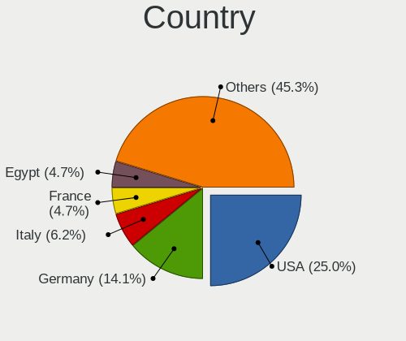
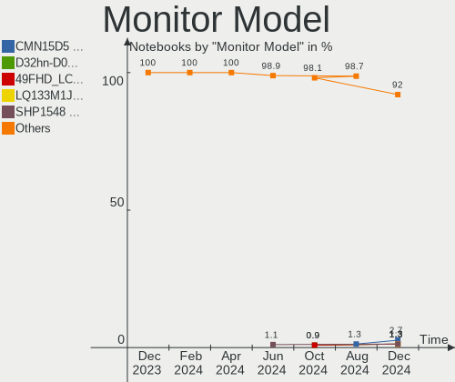

Kubuntu - Hardware Trends (Notebooks)
-------------------------------------

A project to identify most popular hardware characteristics and track their change
over time based on data collected by Linux users at https://Linux-Hardware.org.

Anyone can contribute to this report by the [hw-probe](https://github.com/linuxhw/hw-probe) tool:

    sudo -E hw-probe -all -upload

This report is for one last month. Overall report since the beginning of time: [TestCoverage](https://github.com/linuxhw/TestCoverage)

Period: Jan, 2023.

Contents
--------

* [ System ](#system)
  - [ OS                       ](#os)
  - [ OS Family                ](#os-family)
  - [ Kernel                   ](#kernel)
  - [ Kernel Family            ](#kernel-family)
  - [ Kernel Major Ver.        ](#kernel-major-ver)
  - [ Arch                     ](#arch)
  - [ DE                       ](#de)
  - [ Display Server           ](#display-server)
  - [ Display Manager          ](#display-manager)
  - [ OS Lang                  ](#os-lang)
  - [ Boot Mode                ](#boot-mode)
  - [ Filesystem               ](#filesystem)
  - [ Part. scheme             ](#part-scheme)
  - [ Dual Boot with Linux/BSD ](#dual-boot-with-linuxbsd)
  - [ Dual Boot (Win)          ](#dual-boot-win)

* [ Board ](#board)
  - [ Vendor                   ](#vendor)
  - [ Model                    ](#model)
  - [ Model Family             ](#model-family)
  - [ MFG Year                 ](#mfg-year)
  - [ Form Factor              ](#form-factor)
  - [ Secure Boot              ](#secure-boot)
  - [ Coreboot                 ](#coreboot)
  - [ RAM Size                 ](#ram-size)
  - [ RAM Used                 ](#ram-used)
  - [ Total Drives             ](#total-drives)
  - [ Has CD-ROM               ](#has-cd-rom)
  - [ Has Ethernet             ](#has-ethernet)
  - [ Has WiFi                 ](#has-wifi)
  - [ Has Bluetooth            ](#has-bluetooth)

* [ Location ](#location)
  - [ Country                  ](#country)
  - [ City                     ](#city)

* [ Drives ](#drives)
  - [ Drive Vendor             ](#drive-vendor)
  - [ Drive Model              ](#drive-model)
  - [ HDD Vendor               ](#hdd-vendor)
  - [ SSD Vendor               ](#ssd-vendor)
  - [ Drive Kind               ](#drive-kind)
  - [ Drive Connector          ](#drive-connector)
  - [ Drive Size               ](#drive-size)
  - [ Space Total              ](#space-total)
  - [ Space Used               ](#space-used)
  - [ Malfunc. Drives          ](#malfunc-drives)
  - [ Malfunc. Drive Vendor    ](#malfunc-drive-vendor)
  - [ Malfunc. HDD Vendor      ](#malfunc-hdd-vendor)
  - [ Malfunc. Drive Kind      ](#malfunc-drive-kind)
  - [ Failed Drives            ](#failed-drives)
  - [ Failed Drive Vendor      ](#failed-drive-vendor)
  - [ Drive Status             ](#drive-status)

* [ Storage controller ](#storage-controller)
  - [ Storage Vendor           ](#storage-vendor)
  - [ Storage Model            ](#storage-model)
  - [ Storage Kind             ](#storage-kind)

* [ Processor ](#processor)
  - [ CPU Vendor               ](#cpu-vendor)
  - [ CPU Model                ](#cpu-model)
  - [ CPU Model Family         ](#cpu-model-family)
  - [ CPU Cores                ](#cpu-cores)
  - [ CPU Sockets              ](#cpu-sockets)
  - [ CPU Threads              ](#cpu-threads)
  - [ CPU Op-Modes             ](#cpu-op-modes)
  - [ CPU Microcode            ](#cpu-microcode)
  - [ CPU Microarch            ](#cpu-microarch)

* [ Graphics ](#graphics)
  - [ GPU Vendor               ](#gpu-vendor)
  - [ GPU Model                ](#gpu-model)
  - [ GPU Combo                ](#gpu-combo)
  - [ GPU Driver               ](#gpu-driver)
  - [ GPU Memory               ](#gpu-memory)

* [ Monitor ](#monitor)
  - [ Monitor Vendor           ](#monitor-vendor)
  - [ Monitor Model            ](#monitor-model)
  - [ Monitor Resolution       ](#monitor-resolution)
  - [ Monitor Diagonal         ](#monitor-diagonal)
  - [ Monitor Width            ](#monitor-width)
  - [ Aspect Ratio             ](#aspect-ratio)
  - [ Monitor Area             ](#monitor-area)
  - [ Pixel Density            ](#pixel-density)
  - [ Multiple Monitors        ](#multiple-monitors)

* [ Network ](#network)
  - [ Net Controller Vendor    ](#net-controller-vendor)
  - [ Net Controller Model     ](#net-controller-model)
  - [ Wireless Vendor          ](#wireless-vendor)
  - [ Wireless Model           ](#wireless-model)
  - [ Ethernet Vendor          ](#ethernet-vendor)
  - [ Ethernet Model           ](#ethernet-model)
  - [ Net Controller Kind      ](#net-controller-kind)
  - [ Used Controller          ](#used-controller)
  - [ NICs                     ](#nics)
  - [ IPv6                     ](#ipv6)

* [ Bluetooth ](#bluetooth)
  - [ Bluetooth Vendor         ](#bluetooth-vendor)
  - [ Bluetooth Model          ](#bluetooth-model)

* [ Sound ](#sound)
  - [ Sound Vendor             ](#sound-vendor)
  - [ Sound Model              ](#sound-model)

* [ Memory ](#memory)
  - [ Memory Vendor            ](#memory-vendor)
  - [ Memory Model             ](#memory-model)
  - [ Memory Kind              ](#memory-kind)
  - [ Memory Form Factor       ](#memory-form-factor)
  - [ Memory Size              ](#memory-size)
  - [ Memory Speed             ](#memory-speed)

* [ Printers & scanners ](#printers--scanners)
  - [ Printer Vendor           ](#printer-vendor)
  - [ Printer Model            ](#printer-model)
  - [ Scanner Vendor           ](#scanner-vendor)
  - [ Scanner Model            ](#scanner-model)

* [ Camera ](#camera)
  - [ Camera Vendor            ](#camera-vendor)
  - [ Camera Model             ](#camera-model)

* [ Security ](#security)
  - [ Fingerprint Vendor       ](#fingerprint-vendor)
  - [ Fingerprint Model        ](#fingerprint-model)
  - [ Chipcard Vendor          ](#chipcard-vendor)
  - [ Chipcard Model           ](#chipcard-model)

* [ Unsupported ](#unsupported)
  - [ Unsupported Devices      ](#unsupported-devices)
  - [ Unsupported Device Types ](#unsupported-device-types)

System
------

OS
--

Installed operating systems

| Name          | Notebooks | Percent |
|---------------|-----------|---------|
| Kubuntu 22.04 | 40        | 47.06%  |
| Kubuntu 22.10 | 36        | 42.35%  |
| Kubuntu 20.04 | 6         | 7.06%   |
| Kubuntu 23.04 | 3         | 3.53%   |

OS Family
---------

OS without a version

| Name    | Notebooks | Percent |
|---------|-----------|---------|
| Kubuntu | 85        | 100%    |

Kernel
------

Version of the Linux kernel

| Version                     | Notebooks | Percent |
|-----------------------------|-----------|---------|
| 5.15.0-58-generic           | 19        | 22.35%  |
| 5.15.0-56-generic           | 11        | 12.94%  |
| 5.19.0-26-generic           | 10        | 11.76%  |
| 5.19.0-29-generic           | 9         | 10.59%  |
| 5.15.0-57-generic           | 6         | 7.06%   |
| 5.19.0-21-generic           | 5         | 5.88%   |
| 5.19.0-28-generic           | 4         | 4.71%   |
| 5.19.0-31-generic           | 3         | 3.53%   |
| 5.17.0-1026-oem             | 2         | 2.35%   |
| 6.1.8-060108-generic        | 1         | 1.18%   |
| 6.1.7-060107-generic        | 1         | 1.18%   |
| 6.1.6-060106-generic        | 1         | 1.18%   |
| 6.1.5-060105-generic        | 1         | 1.18%   |
| 6.1.0-060100rc4-generic     | 1         | 1.18%   |
| 6.0.9-060009-generic        | 1         | 1.18%   |
| 6.0.0-1009-oem              | 1         | 1.18%   |
| 5.4.0-137-generic           | 1         | 1.18%   |
| 5.4.0-132-generic           | 1         | 1.18%   |
| 5.19.0-1015-lowlatency      | 1         | 1.18%   |
| 5.19.0-1014-lowlatency      | 1         | 1.18%   |
| 5.15.0-58-lowlatency        | 1         | 1.18%   |
| 5.15.0-43-lowlatency        | 1         | 1.18%   |
| 5.15.0-39-generic           | 1         | 1.18%   |
| 5.15.0-322205121620-generic | 1         | 1.18%   |
| 5.10.0-051000-generic       | 1         | 1.18%   |

Kernel Family
-------------

Linux kernel without a distro release

| Version | Notebooks | Percent |
|---------|-----------|---------|
| 5.15.0  | 40        | 47.06%  |
| 5.19.0  | 33        | 38.82%  |
| 5.4.0   | 2         | 2.35%   |
| 5.17.0  | 2         | 2.35%   |
| 6.1.8   | 1         | 1.18%   |
| 6.1.7   | 1         | 1.18%   |
| 6.1.6   | 1         | 1.18%   |
| 6.1.5   | 1         | 1.18%   |
| 6.1.0   | 1         | 1.18%   |
| 6.0.9   | 1         | 1.18%   |
| 6.0.0   | 1         | 1.18%   |
| 5.10.0  | 1         | 1.18%   |

Kernel Major Ver.
-----------------

Linux kernel major version

| Version | Notebooks | Percent |
|---------|-----------|---------|
| 5.15    | 40        | 47.06%  |
| 5.19    | 33        | 38.82%  |
| 6.1     | 5         | 5.88%   |
| 6.0     | 2         | 2.35%   |
| 5.4     | 2         | 2.35%   |
| 5.17    | 2         | 2.35%   |
| 5.10    | 1         | 1.18%   |

Arch
----

OS architecture (x86_64, i586, etc.)

| Name   | Notebooks | Percent |
|--------|-----------|---------|
| x86_64 | 85        | 100%    |

DE
--

Desktop Environment

| Name  | Notebooks | Percent |
|-------|-----------|---------|
| KDE5  | 80        | 94.12%  |
| KDE   | 3         | 3.53%   |
| GNOME | 2         | 2.35%   |

Display Server
--------------

X11 or Wayland

| Name    | Notebooks | Percent |
|---------|-----------|---------|
| X11     | 79        | 92.94%  |
| Wayland | 6         | 7.06%   |

Display Manager
---------------

SDDM, LightDM, etc.

| Name    | Notebooks | Percent |
|---------|-----------|---------|
| SDDM    | 61        | 71.76%  |
| Unknown | 22        | 25.88%  |
| GDM3    | 2         | 2.35%   |

OS Lang
-------

Language

| Lang    | Notebooks | Percent |
|---------|-----------|---------|
| en_US   | 39        | 45.88%  |
| de_DE   | 7         | 8.24%   |
| ru_RU   | 6         | 7.06%   |
| es_ES   | 5         | 5.88%   |
| it_IT   | 4         | 4.71%   |
| en_GB   | 3         | 3.53%   |
| pl_PL   | 2         | 2.35%   |
| fr_FR   | 2         | 2.35%   |
| zh_CN   | 1         | 1.18%   |
| tr_TR   | 1         | 1.18%   |
| sv_SE   | 1         | 1.18%   |
| pt_BR   | 1         | 1.18%   |
| lt_LT   | 1         | 1.18%   |
| es_US   | 1         | 1.18%   |
| es_419  | 1         | 1.18%   |
| en_SG   | 1         | 1.18%   |
| en_NZ   | 1         | 1.18%   |
| en_IN   | 1         | 1.18%   |
| en_DE   | 1         | 1.18%   |
| en_CA   | 1         | 1.18%   |
| en_AU   | 1         | 1.18%   |
| el_GR   | 1         | 1.18%   |
| Default | 1         | 1.18%   |
| cs_CZ   | 1         | 1.18%   |
| C       | 1         | 1.18%   |

Boot Mode
---------

EFI or BIOS

| Mode | Notebooks | Percent |
|------|-----------|---------|
| EFI  | 51        | 60%     |
| BIOS | 34        | 40%     |

Filesystem
----------

Type of filesystem

| Type    | Notebooks | Percent |
|---------|-----------|---------|
| Ext4    | 74        | 87.06%  |
| Btrfs   | 6         | 7.06%   |
| Overlay | 4         | 4.71%   |
| Zfs     | 1         | 1.18%   |

Part. scheme
------------

Scheme of partitioning

| Type    | Notebooks | Percent |
|---------|-----------|---------|
| GPT     | 57        | 67.06%  |
| Unknown | 23        | 27.06%  |
| MBR     | 5         | 5.88%   |

Dual Boot with Linux/BSD
------------------------

Hosting more than one Linux/BSD

| Dual boot | Notebooks | Percent |
|-----------|-----------|---------|
| No        | 77        | 90.59%  |
| Yes       | 8         | 9.41%   |

Dual Boot (Win)
---------------

Hosting Linux and Windows

| Dual boot | Notebooks | Percent |
|-----------|-----------|---------|
| No        | 55        | 64.71%  |
| Yes       | 30        | 35.29%  |

Board
-----

Vendor
------

Motherboard manufacturer

| Name             | Notebooks | Percent |
|------------------|-----------|---------|
| Lenovo           | 17        | 20%     |
| Acer             | 14        | 16.47%  |
| Hewlett-Packard  | 13        | 15.29%  |
| Dell             | 12        | 14.12%  |
| MSI              | 8         | 9.41%   |
| ASUSTek Computer | 6         | 7.06%   |
| Notebook         | 2         | 2.35%   |
| HUAWEI           | 2         | 2.35%   |
| Google           | 2         | 2.35%   |
| TrekStor         | 1         | 1.18%   |
| Sony             | 1         | 1.18%   |
| Medion           | 1         | 1.18%   |
| MACHENIKE        | 1         | 1.18%   |
| Framework        | 1         | 1.18%   |
| Dynabook         | 1         | 1.18%   |
| Carbon Systems   | 1         | 1.18%   |
| Apple            | 1         | 1.18%   |
| Unknown          | 1         | 1.18%   |

Model
-----

Motherboard model

| Name                                        | Notebooks | Percent |
|---------------------------------------------|-----------|---------|
| HP Notebook                                 | 2         | 2.35%   |
| TrekStor Surfbook A13B                      | 1         | 1.18%   |
| Sony SVE1513B4E                             | 1         | 1.18%   |
| Notebook W35xSS_370SS                       | 1         | 1.18%   |
| Notebook NP5x_NP6x_NP7xPNK_PNH_PNJ          | 1         | 1.18%   |
| MSI Raider GE76 12UGS                       | 1         | 1.18%   |
| MSI Raider GE67HX 12UGS                     | 1         | 1.18%   |
| MSI Prestige 15 A12SC                       | 1         | 1.18%   |
| MSI Prestige 14 A10RAS                      | 1         | 1.18%   |
| MSI GS66 Stealth 10SE                       | 1         | 1.18%   |
| MSI Bravo 17 A4DDK                          | 1         | 1.18%   |
| MSI Bravo 15 B5DD                           | 1         | 1.18%   |
| MSI Alpha 17 B5EEK                          | 1         | 1.18%   |
| Medion E15410                               | 1         | 1.18%   |
| MACHENIKE MACHCREATOR-16                    | 1         | 1.18%   |
| Lenovo V15 G2 ITL 82KB                      | 1         | 1.18%   |
| Lenovo ThinkPad X260 20F5S28R00             | 1         | 1.18%   |
| Lenovo ThinkPad X230 23256N6                | 1         | 1.18%   |
| Lenovo ThinkPad X1 Extreme Gen 5 21DECTO1WW | 1         | 1.18%   |
| Lenovo ThinkPad X1 Carbon 5th 20HQS03P00    | 1         | 1.18%   |
| Lenovo ThinkPad T580 20LA0025MX             | 1         | 1.18%   |
| Lenovo ThinkPad L430 24663D1                | 1         | 1.18%   |
| Lenovo ThinkPad L380 20M6S2YE00             | 1         | 1.18%   |
| Lenovo Legion S7 15ACH6 82K8                | 1         | 1.18%   |
| Lenovo Legion 5 Pro 16ACH6H 82JQ            | 1         | 1.18%   |
| Lenovo Legion 5 17ACH6 82K0                 | 1         | 1.18%   |
| Lenovo Legion 5 15ACH6 82JW                 | 1         | 1.18%   |
| Lenovo IdeaPad S145-15API 81V7              | 1         | 1.18%   |
| Lenovo IdeaPad 720S-14IKB 81BD              | 1         | 1.18%   |
| Lenovo IdeaPad 5 15IIL05 81YK               | 1         | 1.18%   |
| Lenovo IdeaPad 5 15ARE05 81YQ               | 1         | 1.18%   |
| Lenovo IdeaPad 3 15ADA05 81W1               | 1         | 1.18%   |
| HUAWEI NBLL-WXX9                            | 1         | 1.18%   |
| HUAWEI KLVL-WXX9                            | 1         | 1.18%   |
| HP ProBook 6570b                            | 1         | 1.18%   |
| HP ProBook 6470b                            | 1         | 1.18%   |
| HP Laptop 17-by3xxx                         | 1         | 1.18%   |
| HP Laptop 15-ef2xxx                         | 1         | 1.18%   |
| HP Laptop 15-da2xxx                         | 1         | 1.18%   |
| HP Laptop 15-da0xxx                         | 1         | 1.18%   |

Model Family
------------

Motherboard model prefix

| Name                     | Notebooks | Percent |
|--------------------------|-----------|---------|
| Lenovo ThinkPad          | 7         | 8.24%   |
| Acer Aspire              | 6         | 7.06%   |
| Lenovo IdeaPad           | 5         | 5.88%   |
| Lenovo Legion            | 4         | 4.71%   |
| HP Laptop                | 4         | 4.71%   |
| Dell Latitude            | 4         | 4.71%   |
| Dell Inspiron            | 4         | 4.71%   |
| Acer Swift               | 3         | 3.53%   |
| Acer Nitro               | 3         | 3.53%   |
| MSI Raider               | 2         | 2.35%   |
| MSI Prestige             | 2         | 2.35%   |
| MSI Bravo                | 2         | 2.35%   |
| HP ProBook               | 2         | 2.35%   |
| HP Notebook              | 2         | 2.35%   |
| HP EliteBook             | 2         | 2.35%   |
| ASUS Zenbook             | 2         | 2.35%   |
| TrekStor Surfbook        | 1         | 1.18%   |
| Sony SVE1513B4E          | 1         | 1.18%   |
| Notebook W35xSS          | 1         | 1.18%   |
| Notebook NP5x            | 1         | 1.18%   |
| MSI GS66                 | 1         | 1.18%   |
| MSI Alpha                | 1         | 1.18%   |
| Medion E15410            | 1         | 1.18%   |
| MACHENIKE MACHCREATOR-16 | 1         | 1.18%   |
| Lenovo V15               | 1         | 1.18%   |
| HUAWEI NBLL-WXX9         | 1         | 1.18%   |
| HUAWEI KLVL-WXX9         | 1         | 1.18%   |
| HP ENVY                  | 1         | 1.18%   |
| HP 255                   | 1         | 1.18%   |
| HP 250                   | 1         | 1.18%   |
| Google Rammus            | 1         | 1.18%   |
| Google Lillipup          | 1         | 1.18%   |
| Framework Laptop         | 1         | 1.18%   |
| Dynabook Satellite       | 1         | 1.18%   |
| Dell XPS                 | 1         | 1.18%   |
| Dell Vostro              | 1         | 1.18%   |
| Dell Precision           | 1         | 1.18%   |
| Dell G3                  | 1         | 1.18%   |
| Carbon Systems Iridium   | 1         | 1.18%   |
| ASUS VivoBook            | 1         | 1.18%   |

MFG Year
--------

Motherboard manufacture year

| Year | Notebooks | Percent |
|------|-----------|---------|
| 2021 | 17        | 20%     |
| 2022 | 14        | 16.47%  |
| 2020 | 13        | 15.29%  |
| 2012 | 9         | 10.59%  |
| 2019 | 8         | 9.41%   |
| 2018 | 7         | 8.24%   |
| 2017 | 7         | 8.24%   |
| 2014 | 3         | 3.53%   |
| 2016 | 2         | 2.35%   |
| 2013 | 2         | 2.35%   |
| 2023 | 1         | 1.18%   |
| 2015 | 1         | 1.18%   |
| 2009 | 1         | 1.18%   |

Form Factor
-----------

Physical design of the computer

| Name     | Notebooks | Percent |
|----------|-----------|---------|
| Notebook | 85        | 100%    |

Secure Boot
-----------

Enabled or disabled

| State    | Notebooks | Percent |
|----------|-----------|---------|
| Disabled | 72        | 84.71%  |
| Enabled  | 13        | 15.29%  |

Coreboot
--------

Have coreboot on board

| Used | Notebooks | Percent |
|------|-----------|---------|
| No   | 83        | 97.65%  |
| Yes  | 2         | 2.35%   |

RAM Size
--------

Total RAM memory

| Size in GB  | Notebooks | Percent |
|-------------|-----------|---------|
| 4.01-8.0    | 25        | 29.41%  |
| 16.01-24.0  | 19        | 22.35%  |
| 8.01-16.0   | 18        | 21.18%  |
| 32.01-64.0  | 12        | 14.12%  |
| 3.01-4.0    | 6         | 7.06%   |
| 24.01-32.0  | 2         | 2.35%   |
| 64.01-256.0 | 2         | 2.35%   |
| 2.01-3.0    | 1         | 1.18%   |

RAM Used
--------

Used RAM memory

| Used GB   | Notebooks | Percent |
|-----------|-----------|---------|
| 2.01-3.0  | 26        | 30.59%  |
| 4.01-8.0  | 22        | 25.88%  |
| 3.01-4.0  | 22        | 25.88%  |
| 1.01-2.0  | 9         | 10.59%  |
| 8.01-16.0 | 6         | 7.06%   |

Total Drives
------------

Number of drives on board

| Drives | Notebooks | Percent |
|--------|-----------|---------|
| 1      | 59        | 69.41%  |
| 2      | 21        | 24.71%  |
| 3      | 4         | 4.71%   |
| 4      | 1         | 1.18%   |

Has CD-ROM
----------

Has CD-ROM on board

| Presented | Notebooks | Percent |
|-----------|-----------|---------|
| No        | 72        | 84.71%  |
| Yes       | 13        | 15.29%  |

Has Ethernet
------------

Has Ethernet on board

| Presented | Notebooks | Percent |
|-----------|-----------|---------|
| Yes       | 55        | 64.71%  |
| No        | 30        | 35.29%  |

Has WiFi
--------

Has WiFi module

| Presented | Notebooks | Percent |
|-----------|-----------|---------|
| Yes       | 85        | 100%    |

Has Bluetooth
-------------

Has Bluetooth module

| Presented | Notebooks | Percent |
|-----------|-----------|---------|
| Yes       | 77        | 90.59%  |
| No        | 8         | 9.41%   |

Location
--------

Country
-------

Geographic location (country)

| Country      | Notebooks | Percent |
|--------------|-----------|---------|
| USA          | 21        | 24.71%  |
| Germany      | 11        | 12.94%  |
| Spain        | 5         | 5.88%   |
| Italy        | 4         | 4.71%   |
| UK           | 3         | 3.53%   |
| Russia       | 3         | 3.53%   |
| Poland       | 3         | 3.53%   |
| France       | 3         | 3.53%   |
| Slovakia     | 2         | 2.35%   |
| Georgia      | 2         | 2.35%   |
| Canada       | 2         | 2.35%   |
| Belgium      | 2         | 2.35%   |
| Turkey       | 1         | 1.18%   |
| Sweden       | 1         | 1.18%   |
| Sri Lanka    | 1         | 1.18%   |
| South Korea  | 1         | 1.18%   |
| Singapore    | 1         | 1.18%   |
| Saudi Arabia | 1         | 1.18%   |
| Portugal     | 1         | 1.18%   |
| Pakistan     | 1         | 1.18%   |
| Nicaragua    | 1         | 1.18%   |
| New Zealand  | 1         | 1.18%   |
| Netherlands  | 1         | 1.18%   |
| Mexico       | 1         | 1.18%   |
| Lithuania    | 1         | 1.18%   |
| Kazakhstan   | 1         | 1.18%   |
| Japan        | 1         | 1.18%   |
| India        | 1         | 1.18%   |
| Denmark      | 1         | 1.18%   |
| Czechia      | 1         | 1.18%   |
| Croatia      | 1         | 1.18%   |
| Bulgaria     | 1         | 1.18%   |
| Brazil       | 1         | 1.18%   |
| Belarus      | 1         | 1.18%   |
| Bangladesh   | 1         | 1.18%   |
| Australia    | 1         | 1.18%   |

City
----

Geographic location (city)

| City               | Notebooks | Percent |
|--------------------|-----------|---------|
| Paris              | 2         | 2.35%   |
| Moscow             | 2         | 2.35%   |
| Madrid             | 2         | 2.35%   |
| Chatham            | 2         | 2.35%   |
| Berlin             | 2         | 2.35%   |
| Batumi             | 2         | 2.35%   |
| Albuquerque        | 2         | 2.35%   |
| Žilina            | 1         | 1.18%   |
| Wroclaw            | 1         | 1.18%   |
| Wolfsburg          | 1         | 1.18%   |
| Weimar             | 1         | 1.18%   |
| Vilnius            | 1         | 1.18%   |
| Vancouver          | 1         | 1.18%   |
| Tulsa              | 1         | 1.18%   |
| Tokyo              | 1         | 1.18%   |
| Stuttgart          | 1         | 1.18%   |
| St. Petersburg     | 1         | 1.18%   |
| Springfield        | 1         | 1.18%   |
| Sofia              | 1         | 1.18%   |
| Snezhinsk          | 1         | 1.18%   |
| Smolec             | 1         | 1.18%   |
| Singapore          | 1         | 1.18%   |
| Seattle            | 1         | 1.18%   |
| Saint Egidien      | 1         | 1.18%   |
| Sabadell           | 1         | 1.18%   |
| Rosenheim          | 1         | 1.18%   |
| Rawalpindi         | 1         | 1.18%   |
| Quarrata           | 1         | 1.18%   |
| Prata di Pordenone | 1         | 1.18%   |
| Poznan             | 1         | 1.18%   |
| Peterborough       | 1         | 1.18%   |
| Palm City          | 1         | 1.18%   |
| Oostkamp           | 1         | 1.18%   |
| Nordmaling         | 1         | 1.18%   |
| New York           | 1         | 1.18%   |
| Naaldwijk          | 1         | 1.18%   |
| Munich             | 1         | 1.18%   |
| Mukarov            | 1         | 1.18%   |
| Minsk              | 1         | 1.18%   |
| Minneapolis        | 1         | 1.18%   |

Drives
------

Drive Vendor
------------

Hard drive vendors

| Vendor                         | Notebooks | Drives | Percent |
|--------------------------------|-----------|--------|---------|
| Samsung Electronics            | 21        | 24     | 18.58%  |
| WDC                            | 10        | 10     | 8.85%   |
| Seagate                        | 8         | 9      | 7.08%   |
| Micron Technology              | 8         | 8      | 7.08%   |
| SanDisk                        | 7         | 8      | 6.19%   |
| SK hynix                       | 6         | 6      | 5.31%   |
| Unknown                        | 5         | 5      | 4.42%   |
| Toshiba                        | 5         | 5      | 4.42%   |
| KIOXIA                         | 5         | 5      | 4.42%   |
| Kingston                       | 5         | 5      | 4.42%   |
| Intel                          | 4         | 4      | 3.54%   |
| China                          | 4         | 4      | 3.54%   |
| Phison Electronics             | 3         | 3      | 2.65%   |
| HGST                           | 3         | 3      | 2.65%   |
| Crucial                        | 3         | 3      | 2.65%   |
| Realtek Semiconductor          | 2         | 2      | 1.77%   |
| Hitachi                        | 2         | 2      | 1.77%   |
| Apacer                         | 2         | 2      | 1.77%   |
| WALRAM                         | 1         | 1      | 0.88%   |
| Union Memory                   | 1         | 1      | 0.88%   |
| UMIS                           | 1         | 1      | 0.88%   |
| SPCC                           | 1         | 1      | 0.88%   |
| Solid State Storage Technology | 1         | 1      | 0.88%   |
| Micron/Crucial Technology      | 1         | 1      | 0.88%   |
| KIOXIA-EXCERIA                 | 1         | 1      | 0.88%   |
| Jumper                         | 1         | 1      | 0.88%   |
| BAITITON                       | 1         | 1      | 0.88%   |
| Aura                           | 1         | 1      | 0.88%   |

Drive Model
-----------

Hard drive models

| Model                                        | Notebooks | Percent |
|----------------------------------------------|-----------|---------|
| Unknown MMC Card  64GB                       | 2         | 1.75%   |
| Toshiba MQ01ABD100 1TB                       | 2         | 1.75%   |
| SK hynix SKHynix_HFS001TDE9X084N 1TB         | 2         | 1.75%   |
| Seagate ST500LM021-1KJ152 500GB              | 2         | 1.75%   |
| Seagate ST2000LX001-1RG174 2TB               | 2         | 1.75%   |
| Samsung SSD 980 PRO 1TB                      | 2         | 1.75%   |
| Micron 2450_MTFDKBA1T0TFK 1TB                | 2         | 1.75%   |
| KIOXIA KBG40ZNS256G NVMe 256GB               | 2         | 1.75%   |
| Intel SSD 660P Series 512GB                  | 2         | 1.75%   |
| WDC WDS200T2B0C-00PXH0 2TB                   | 1         | 0.88%   |
| WDC WD7500BPKX-80HPJT0 752GB                 | 1         | 0.88%   |
| WDC WD5000LPCX-21VHAT0 500GB                 | 1         | 0.88%   |
| WDC WD10SPZX-60Z10T0 1TB                     | 1         | 0.88%   |
| WDC WD10SPZX-21Z10T0 1TB                     | 1         | 0.88%   |
| WDC WD10SPZX-08Z10 1TB                       | 1         | 0.88%   |
| WDC WD10 JPVX-00JC3T0 1TB                    | 1         | 0.88%   |
| WDC WD My Passport 264F 1TB                  | 1         | 0.88%   |
| WDC WD Elements SE SSD 1TB                   | 1         | 0.88%   |
| WDC PC SN530 SDBPNPZ-512G-1027 512GB         | 1         | 0.88%   |
| WALRAM 240G                                  | 1         | 0.88%   |
| Unknown SLD64G  64GB                         | 1         | 0.88%   |
| Unknown MMC Card  32GB                       | 1         | 0.88%   |
| Unknown MMC Card  256GB                      | 1         | 0.88%   |
| Union Memory UMIS RPJTJ128MEE1MWX 128GB      | 1         | 0.88%   |
| UMIS RPJTJ256MEE1OWX 256GB                   | 1         | 0.88%   |
| Toshiba KBG40ZNV512G MEMORY 512GB            | 1         | 0.88%   |
| Toshiba HDWL120 2TB                          | 1         | 0.88%   |
| Toshiba BG3 NVMe SSD Controller 256GB        | 1         | 0.88%   |
| SPCC M.2 PCIe SSD 1TB                        | 1         | 0.88%   |
| Solid State Storage SSSTC CA6-8D512 512GB    | 1         | 0.88%   |
| SK hynix SHPP41-2000GM 2TB                   | 1         | 0.88%   |
| SK hynix SC311 SATA 256GB SSD                | 1         | 0.88%   |
| SK hynix HFM256GDJTNG-8310A 256GB            | 1         | 0.88%   |
| SK hynix BC501 NVMe Solid State Drive 512GB  | 1         | 0.88%   |
| Seagate ST8000VX 004-2M1101 8TB              | 1         | 0.88%   |
| Seagate ST500LM000-1EJ162-SSHD-8GB           | 1         | 0.88%   |
| Seagate ST1000LM035-1RK172 1TB               | 1         | 0.88%   |
| Seagate Expansion 240GB                      | 1         | 0.88%   |
| Sandisk WDC WDS240G2G0C-00AJM0 240GB         | 1         | 0.88%   |
| Sandisk WDC PC SN530 SDBPMPZ-512G-1101 512GB | 1         | 0.88%   |

HDD Vendor
----------

Hard disk drive vendors

| Vendor  | Notebooks | Drives | Percent |
|---------|-----------|--------|---------|
| Seagate | 8         | 9      | 36.36%  |
| WDC     | 6         | 6      | 27.27%  |
| Toshiba | 3         | 3      | 13.64%  |
| HGST    | 3         | 3      | 13.64%  |
| Hitachi | 2         | 2      | 9.09%   |

SSD Vendor
----------

Solid state drive vendors

| Vendor              | Notebooks | Drives | Percent |
|---------------------|-----------|--------|---------|
| Samsung Electronics | 4         | 4      | 18.18%  |
| China               | 4         | 4      | 18.18%  |
| SanDisk             | 3         | 3      | 13.64%  |
| Kingston            | 2         | 2      | 9.09%   |
| Crucial             | 2         | 2      | 9.09%   |
| Apacer              | 2         | 2      | 9.09%   |
| WDC                 | 1         | 1      | 4.55%   |
| SK hynix            | 1         | 1      | 4.55%   |
| Jumper              | 1         | 1      | 4.55%   |
| Intel               | 1         | 1      | 4.55%   |
| BAITITON            | 1         | 1      | 4.55%   |

Drive Kind
----------

HDD or SSD

| Kind    | Notebooks | Drives | Percent |
|---------|-----------|--------|---------|
| NVMe    | 58        | 65     | 53.7%   |
| HDD     | 22        | 23     | 20.37%  |
| SSD     | 20        | 22     | 18.52%  |
| MMC     | 6         | 6      | 5.56%   |
| Unknown | 2         | 2      | 1.85%   |

Drive Connector
---------------

SATA, SAS, NVMe, etc.

| Type | Notebooks | Drives | Percent |
|------|-----------|--------|---------|
| NVMe | 58        | 65     | 57.43%  |
| SATA | 32        | 40     | 31.68%  |
| MMC  | 6         | 6      | 5.94%   |
| SAS  | 5         | 7      | 4.95%   |

Drive Size
----------

Size of hard drive

| Size in TB | Notebooks | Drives | Percent |
|------------|-----------|--------|---------|
| 0.01-0.5   | 20        | 25     | 52.63%  |
| 0.51-1.0   | 13        | 15     | 34.21%  |
| 1.01-2.0   | 4         | 4      | 10.53%  |
| 4.01-10.0  | 1         | 1      | 2.63%   |

Space Total
-----------

Amount of disk space available on the file system

| Size in GB     | Notebooks | Percent |
|----------------|-----------|---------|
| 251-500        | 22        | 25.88%  |
| 501-1000       | 20        | 23.53%  |
| 101-250        | 13        | 15.29%  |
| 1001-2000      | 11        | 12.94%  |
| More than 3000 | 6         | 7.06%   |
| 2001-3000      | 4         | 4.71%   |
| 51-100         | 4         | 4.71%   |
| 1-20           | 3         | 3.53%   |
| 21-50          | 1         | 1.18%   |
| Unknown        | 1         | 1.18%   |

Space Used
----------

Amount of used disk space

| Used GB        | Notebooks | Percent |
|----------------|-----------|---------|
| 101-250        | 25        | 29.41%  |
| 1-20           | 14        | 16.47%  |
| 51-100         | 12        | 14.12%  |
| 251-500        | 10        | 11.76%  |
| 21-50          | 9         | 10.59%  |
| 501-1000       | 6         | 7.06%   |
| More than 3000 | 3         | 3.53%   |
| 1001-2000      | 3         | 3.53%   |
| 2001-3000      | 2         | 2.35%   |
| Unknown        | 1         | 1.18%   |

Malfunc. Drives
---------------

Drive models with a malfunction

| Model                     | Notebooks | Drives | Percent |
|---------------------------|-----------|--------|---------|
| BAITITON BT58SSD09S 240GB | 1         | 1      | 100%    |

Malfunc. Drive Vendor
---------------------

Vendors of faulty drives

| Vendor   | Notebooks | Drives | Percent |
|----------|-----------|--------|---------|
| BAITITON | 1         | 1      | 100%    |

Malfunc. HDD Vendor
-------------------

Vendors of faulty HDD drives

Zero info for selected period =(

Malfunc. Drive Kind
-------------------

Kinds of faulty drives

| Kind | Notebooks | Drives | Percent |
|------|-----------|--------|---------|
| SSD  | 1         | 1      | 100%    |

Failed Drives
-------------

Failed drive models

Zero info for selected period =(

Failed Drive Vendor
-------------------

Failed drive vendors

Zero info for selected period =(

Drive Status
------------

Number of failed and malfunc. drives

| Status   | Notebooks | Drives | Percent |
|----------|-----------|--------|---------|
| Works    | 48        | 59     | 53.33%  |
| Detected | 41        | 58     | 45.56%  |
| Malfunc  | 1         | 1      | 1.11%   |

Storage controller
------------------

Storage Vendor
--------------

Storage controller vendors

| Vendor                         | Notebooks | Percent |
|--------------------------------|-----------|---------|
| Intel                          | 44        | 38.26%  |
| Samsung Electronics            | 17        | 14.78%  |
| AMD                            | 13        | 11.3%   |
| Micron Technology              | 8         | 6.96%   |
| KIOXIA                         | 7         | 6.09%   |
| SanDisk                        | 6         | 5.22%   |
| SK hynix                       | 5         | 4.35%   |
| Realtek Semiconductor          | 3         | 2.61%   |
| Kingston Technology Company    | 3         | 2.61%   |
| Union Memory (Shenzhen)        | 2         | 1.74%   |
| Phison Electronics             | 2         | 1.74%   |
| Micron/Crucial Technology      | 2         | 1.74%   |
| Toshiba America Info Systems   | 1         | 0.87%   |
| Solid State Storage Technology | 1         | 0.87%   |
| Silicon Motion                 | 1         | 0.87%   |

Storage Model
-------------

Storage controller models

| Model                                                                          | Notebooks | Percent |
|--------------------------------------------------------------------------------|-----------|---------|
| AMD FCH SATA Controller [AHCI mode]                                            | 13        | 10.83%  |
| Micron Non-Volatile memory controller                                          | 8         | 6.67%   |
| Intel 7 Series Chipset Family 6-port SATA Controller [AHCI mode]               | 8         | 6.67%   |
| Intel Volume Management Device NVMe RAID Controller                            | 7         | 5.83%   |
| Samsung NVMe SSD Controller SM981/PM981/PM983                                  | 6         | 5%      |
| Samsung NVMe SSD Controller PM9A1/PM9A3/980PRO                                 | 6         | 5%      |
| KIOXIA NVMe SSD Controller BG4                                                 | 6         | 5%      |
| Intel Sunrise Point-LP SATA Controller [AHCI mode]                             | 4         | 3.33%   |
| SanDisk Non-Volatile memory controller                                         | 3         | 2.5%    |
| Samsung NVMe SSD Controller 980                                                | 3         | 2.5%    |
| Realtek Realtek Non-Volatile memory controller                                 | 3         | 2.5%    |
| Kingston Company Company Non-Volatile memory controller                        | 3         | 2.5%    |
| Intel Tiger Lake-LP SATA Controller                                            | 3         | 2.5%    |
| Intel Celeron/Pentium Silver Processor SATA Controller                         | 3         | 2.5%    |
| Intel 8 Series/C220 Series Chipset Family 6-port SATA Controller 1 [AHCI mode] | 3         | 2.5%    |
| Union Memory (Shenzhen) Non-Volatile memory controller                         | 2         | 1.67%   |
| SK hynix Gold P31/PC711 NVMe Solid State Drive                                 | 2         | 1.67%   |
| SK hynix BC501 NVMe Solid State Drive                                          | 2         | 1.67%   |
| SanDisk WD PC SN810 / Black SN850 NVMe SSD                                     | 2         | 1.67%   |
| Samsung NVMe SSD Controller SM961/PM961/SM963                                  | 2         | 1.67%   |
| Micron/Crucial P5 Plus NVMe PCIe SSD                                           | 2         | 1.67%   |
| Intel SSD 660P Series                                                          | 2         | 1.67%   |
| Intel Ice Lake-LP SATA Controller [AHCI mode]                                  | 2         | 1.67%   |
| Intel HM170/QM170 Chipset SATA Controller [AHCI Mode]                          | 2         | 1.67%   |
| Intel Comet Lake SATA AHCI Controller                                          | 2         | 1.67%   |
| Intel Celeron N3350/Pentium N4200/Atom E3900 Series SATA AHCI Controller       | 2         | 1.67%   |
| Intel Cannon Lake Mobile PCH SATA AHCI Controller                              | 2         | 1.67%   |
| Intel Alder Lake-P SATA AHCI Controller                                        | 2         | 1.67%   |
| Intel 82801 Mobile SATA Controller [RAID mode]                                 | 2         | 1.67%   |
| Toshiba America Info Systems BG3 NVMe SSD Controller                           | 1         | 0.83%   |
| Solid State Storage Non-Volatile memory controller                             | 1         | 0.83%   |
| SK hynix Non-Volatile memory controller                                        | 1         | 0.83%   |
| Silicon Motion SM2262/SM2262EN SSD Controller                                  | 1         | 0.83%   |
| SanDisk WD Blue SN550 NVMe SSD                                                 | 1         | 0.83%   |
| Phison NVMe Storage Controller                                                 | 1         | 0.83%   |
| Phison Electronics Non-Volatile memory controller                              | 1         | 0.83%   |
| KIOXIA NVMe SSD                                                                | 1         | 0.83%   |
| Intel SSD Pro 7600p/760p/E 6100p Series                                        | 1         | 0.83%   |
| Intel 82801IBM/IEM (ICH9M/ICH9M-E) 4 port SATA Controller [AHCI mode]          | 1         | 0.83%   |
| Intel 8 Series SATA Controller 1 [AHCI mode]                                   | 1         | 0.83%   |

Storage Kind
------------

Kind of storage controller (IDE, SATA, NVMe, SAS, ...)

| Kind | Notebooks | Percent |
|------|-----------|---------|
| NVMe | 57        | 49.57%  |
| SATA | 48        | 41.74%  |
| RAID | 9         | 7.83%   |
| IDE  | 1         | 0.87%   |

Processor
---------

CPU Vendor
----------

Processor vendors

| Vendor | Notebooks | Percent |
|--------|-----------|---------|
| Intel  | 60        | 70.59%  |
| AMD    | 25        | 29.41%  |

CPU Model
---------

Processor models

| Model                                         | Notebooks | Percent |
|-----------------------------------------------|-----------|---------|
| AMD Ryzen 7 5800H with Radeon Graphics        | 6         | 7.06%   |
| Intel 12th Gen Core i7-12700H                 | 5         | 5.88%   |
| Intel 11th Gen Core i5-1135G7 @ 2.40GHz       | 5         | 5.88%   |
| Intel Core i5-3320M CPU @ 2.60GHz             | 3         | 3.53%   |
| Intel Core i5-3230M CPU @ 2.60GHz             | 3         | 3.53%   |
| Intel Core i7-7700HQ CPU @ 2.80GHz            | 2         | 2.35%   |
| Intel Core i5-8250U CPU @ 1.60GHz             | 2         | 2.35%   |
| Intel Celeron CPU N3350 @ 1.10GHz             | 2         | 2.35%   |
| AMD Ryzen 7 4800H with Radeon Graphics        | 2         | 2.35%   |
| AMD Ryzen 7 3750H with Radeon Vega Mobile Gfx | 2         | 2.35%   |
| AMD Ryzen 5 5500U with Radeon Graphics        | 2         | 2.35%   |
| AMD Ryzen 5 4500U with Radeon Graphics        | 2         | 2.35%   |
| Intel Pentium Silver N5000 CPU @ 1.10GHz      | 1         | 1.18%   |
| Intel Pentium CPU 6405U @ 2.40GHz             | 1         | 1.18%   |
| Intel Core m3-8100Y CPU @ 1.10GHz             | 1         | 1.18%   |
| Intel Core i9-8950HK CPU @ 2.90GHz            | 1         | 1.18%   |
| Intel Core i7-8750H CPU @ 2.20GHz             | 1         | 1.18%   |
| Intel Core i7-8550U CPU @ 1.80GHz             | 1         | 1.18%   |
| Intel Core i7-7500U CPU @ 2.70GHz             | 1         | 1.18%   |
| Intel Core i7-4870HQ CPU @ 2.50GHz            | 1         | 1.18%   |
| Intel Core i7-4810MQ CPU @ 2.80GHz            | 1         | 1.18%   |
| Intel Core i7-4702MQ CPU @ 2.20GHz            | 1         | 1.18%   |
| Intel Core i7-4700HQ CPU @ 2.40GHz            | 1         | 1.18%   |
| Intel Core i7-4500U CPU @ 1.80GHz             | 1         | 1.18%   |
| Intel Core i7-10750H CPU @ 2.60GHz            | 1         | 1.18%   |
| Intel Core i7-1065G7 CPU @ 1.30GHz            | 1         | 1.18%   |
| Intel Core i7-10510U CPU @ 1.80GHz            | 1         | 1.18%   |
| Intel Core i5-8400H CPU @ 2.50GHz             | 1         | 1.18%   |
| Intel Core i5-7200U CPU @ 2.50GHz             | 1         | 1.18%   |
| Intel Core i5-6300U CPU @ 2.40GHz             | 1         | 1.18%   |
| Intel Core i5-6200U CPU @ 2.30GHz             | 1         | 1.18%   |
| Intel Core i5-3340M CPU @ 2.70GHz             | 1         | 1.18%   |
| Intel Core i5-1035G1 CPU @ 1.00GHz            | 1         | 1.18%   |
| Intel Core i5-10210U CPU @ 1.60GHz            | 1         | 1.18%   |
| Intel Core i3-8130U CPU @ 2.20GHz             | 1         | 1.18%   |
| Intel Core i3-7100U CPU @ 2.40GHz             | 1         | 1.18%   |
| Intel Core i3-3120M CPU @ 2.50GHz             | 1         | 1.18%   |
| Intel Core i3-2377M CPU @ 1.50GHz             | 1         | 1.18%   |
| Intel Core i3-1005G1 CPU @ 1.20GHz            | 1         | 1.18%   |
| Intel Core 2 Duo CPU T6570 @ 2.10GHz          | 1         | 1.18%   |

CPU Model Family
----------------

Processor model prefix

| Model                | Notebooks | Percent |
|----------------------|-----------|---------|
| Other                | 17        | 20%     |
| Intel Core i5        | 15        | 17.65%  |
| AMD Ryzen 7          | 15        | 17.65%  |
| Intel Core i7        | 13        | 15.29%  |
| Intel Core i3        | 5         | 5.88%   |
| Intel Celeron        | 5         | 5.88%   |
| AMD Ryzen 5          | 4         | 4.71%   |
| AMD Ryzen 9          | 2         | 2.35%   |
| Intel Pentium Silver | 1         | 1.18%   |
| Intel Pentium        | 1         | 1.18%   |
| Intel Core m3        | 1         | 1.18%   |
| Intel Core i9        | 1         | 1.18%   |
| Intel Core 2 Duo     | 1         | 1.18%   |
| AMD Ryzen 7 PRO      | 1         | 1.18%   |
| AMD Ryzen 5 PRO      | 1         | 1.18%   |
| AMD Ryzen 3          | 1         | 1.18%   |
| AMD A6               | 1         | 1.18%   |

CPU Cores
---------

Number of processor cores

| Number | Notebooks | Percent |
|--------|-----------|---------|
| 2      | 27        | 31.76%  |
| 4      | 25        | 29.41%  |
| 8      | 15        | 17.65%  |
| 6      | 8         | 9.41%   |
| 14     | 7         | 8.24%   |
| 16     | 1         | 1.18%   |
| 12     | 1         | 1.18%   |
| 10     | 1         | 1.18%   |

CPU Sockets
-----------

Number of sockets

| Number | Notebooks | Percent |
|--------|-----------|---------|
| 1      | 85        | 100%    |

CPU Threads
-----------

Threads per core (Hyper-Threading)

| Number | Notebooks | Percent |
|--------|-----------|---------|
| 2      | 73        | 85.88%  |
| 1      | 12        | 14.12%  |

CPU Op-Modes
------------

CPU Operation Modes (32-bit, 64-bit)

| Op mode        | Notebooks | Percent |
|----------------|-----------|---------|
| 32-bit, 64-bit | 85        | 100%    |

CPU Microcode
-------------

Microcode number

| Number     | Notebooks | Percent |
|------------|-----------|---------|
| Unknown    | 35        | 41.18%  |
| 0x906a3    | 8         | 9.41%   |
| 0x806ea    | 4         | 4.71%   |
| 0x806c1    | 4         | 4.71%   |
| 0x806e9    | 3         | 3.53%   |
| 0x08608103 | 3         | 3.53%   |
| 0x906e9    | 2         | 2.35%   |
| 0x706e5    | 2         | 2.35%   |
| 0x706a1    | 2         | 2.35%   |
| 0x506c9    | 2         | 2.35%   |
| 0x306a9    | 2         | 2.35%   |
| 0x08600106 | 2         | 2.35%   |
| 0x906ea    | 1         | 1.18%   |
| 0x906a4    | 1         | 1.18%   |
| 0x90672    | 1         | 1.18%   |
| 0x706a8    | 1         | 1.18%   |
| 0x406e3    | 1         | 1.18%   |
| 0x406c4    | 1         | 1.18%   |
| 0x40661    | 1         | 1.18%   |
| 0x306c3    | 1         | 1.18%   |
| 0x0a50000c | 1         | 1.18%   |
| 0x0a404102 | 1         | 1.18%   |
| 0x0a404101 | 1         | 1.18%   |
| 0x08600109 | 1         | 1.18%   |
| 0x08600104 | 1         | 1.18%   |
| 0x08108109 | 1         | 1.18%   |
| 0x0810100b | 1         | 1.18%   |
| 0x07030105 | 1         | 1.18%   |

CPU Microarch
-------------

Microarchitecture

| Name             | Notebooks | Percent |
|------------------|-----------|---------|
| KabyLake         | 16        | 18.82%  |
| Alderlake Hybrid | 10        | 11.76%  |
| IvyBridge        | 8         | 9.41%   |
| Zen 3            | 7         | 8.24%   |
| Unknown          | 7         | 8.24%   |
| Zen 2            | 6         | 7.06%   |
| TigerLake        | 6         | 7.06%   |
| Haswell          | 5         | 5.88%   |
| Zen+             | 4         | 4.71%   |
| IceLake          | 3         | 3.53%   |
| Goldmont plus    | 3         | 3.53%   |
| Skylake          | 2         | 2.35%   |
| Goldmont         | 2         | 2.35%   |
| Zen              | 1         | 1.18%   |
| Silvermont       | 1         | 1.18%   |
| SandyBridge      | 1         | 1.18%   |
| Puma             | 1         | 1.18%   |
| Penryn           | 1         | 1.18%   |
| CometLake        | 1         | 1.18%   |

Graphics
--------

GPU Vendor
----------

Vendors of graphics cards

| Vendor | Notebooks | Percent |
|--------|-----------|---------|
| Intel  | 57        | 51.35%  |
| Nvidia | 28        | 25.23%  |
| AMD    | 26        | 23.42%  |

GPU Model
---------

Graphics card models

| Model                                                                         | Notebooks | Percent |
|-------------------------------------------------------------------------------|-----------|---------|
| Intel Alder Lake-P Integrated Graphics Controller                             | 8         | 7.02%   |
| Intel 3rd Gen Core processor Graphics Controller                              | 7         | 6.14%   |
| AMD Renoir                                                                    | 6         | 5.26%   |
| Intel TigerLake-LP GT2 [Iris Xe Graphics]                                     | 5         | 4.39%   |
| AMD Cezanne [Radeon Vega Series / Radeon Vega Mobile Series]                  | 5         | 4.39%   |
| Intel UHD Graphics 620                                                        | 4         | 3.51%   |
| AMD Picasso/Raven 2 [Radeon Vega Series / Radeon Vega Mobile Series]          | 4         | 3.51%   |
| Nvidia TU117M [GeForce GTX 1650 Mobile / Max-Q]                               | 3         | 2.63%   |
| Nvidia GA104 [Geforce RTX 3070 Ti Laptop GPU]                                 | 3         | 2.63%   |
| Intel HD Graphics 620                                                         | 3         | 2.63%   |
| Intel 4th Gen Core Processor Integrated Graphics Controller                   | 3         | 2.63%   |
| AMD Rembrandt [Radeon 680M]                                                   | 3         | 2.63%   |
| AMD Lucienne                                                                  | 3         | 2.63%   |
| Nvidia GA107M [GeForce RTX 3050 Ti Mobile]                                    | 2         | 1.75%   |
| Nvidia GA107M [GeForce RTX 3050 Mobile]                                       | 2         | 1.75%   |
| Intel Skylake GT2 [HD Graphics 520]                                           | 2         | 1.75%   |
| Intel Iris Plus Graphics G1 (Ice Lake)                                        | 2         | 1.75%   |
| Intel HD Graphics 630                                                         | 2         | 1.75%   |
| Intel HD Graphics 500                                                         | 2         | 1.75%   |
| Intel GeminiLake [UHD Graphics 600]                                           | 2         | 1.75%   |
| Intel CometLake-U GT2 [UHD Graphics]                                          | 2         | 1.75%   |
| Intel CoffeeLake-H GT2 [UHD Graphics 630]                                     | 2         | 1.75%   |
| AMD Sun XT [Radeon HD 8670A/8670M/8690M / R5 M330 / M430 / Radeon 520 Mobile] | 2         | 1.75%   |
| AMD Navi 14 [Radeon RX 5500/5500M / Pro 5500M]                                | 2         | 1.75%   |
| Nvidia TU117BM [GeForce GTX 1650 Mobile Refresh]                              | 1         | 0.88%   |
| Nvidia TU106M [GeForce RTX 2060 Mobile]                                       | 1         | 0.88%   |
| Nvidia GP108M [GeForce MX330]                                                 | 1         | 0.88%   |
| Nvidia GP108M [GeForce MX230]                                                 | 1         | 0.88%   |
| Nvidia GP108M [GeForce MX150]                                                 | 1         | 0.88%   |
| Nvidia GP107M [GeForce GTX 1050 Ti Mobile]                                    | 1         | 0.88%   |
| Nvidia GP107M [GeForce GTX 1050 Mobile]                                       | 1         | 0.88%   |
| Nvidia GP106M [GeForce GTX 1060 Mobile]                                       | 1         | 0.88%   |
| Nvidia GP104GLM [Quadro P4200 Mobile]                                         | 1         | 0.88%   |
| Nvidia GM108M [GeForce MX130]                                                 | 1         | 0.88%   |
| Nvidia GM107M [GeForce GTX 860M]                                              | 1         | 0.88%   |
| Nvidia GK107M [GeForce GT 750M]                                               | 1         | 0.88%   |
| Nvidia GK107M [GeForce GT 750M Mac Edition]                                   | 1         | 0.88%   |
| Nvidia GK107M [GeForce GT 730M]                                               | 1         | 0.88%   |
| Nvidia GK106M [GeForce GTX 760M]                                              | 1         | 0.88%   |
| Nvidia GA107BM [GeForce RTX 3050 Ti Mobile]                                   | 1         | 0.88%   |

GPU Combo
---------

Combinations of graphics cards

| Name           | Notebooks | Percent |
|----------------|-----------|---------|
| 1 x Intel      | 37        | 43.53%  |
| Intel + Nvidia | 18        | 21.18%  |
| 1 x AMD        | 15        | 17.65%  |
| AMD + Nvidia   | 6         | 7.06%   |
| 1 x Nvidia     | 4         | 4.71%   |
| 2 x AMD        | 3         | 3.53%   |
| Intel + AMD    | 2         | 2.35%   |

GPU Driver
----------

Free vs proprietary

| Driver      | Notebooks | Percent |
|-------------|-----------|---------|
| Free        | 63        | 74.12%  |
| Proprietary | 22        | 25.88%  |

GPU Memory
----------

Total video memory

| Size in GB | Notebooks | Percent |
|------------|-----------|---------|
| Unknown    | 62        | 72.94%  |
| 0.01-0.5   | 10        | 11.76%  |
| 1.01-2.0   | 4         | 4.71%   |
| 5.01-6.0   | 3         | 3.53%   |
| 3.01-4.0   | 3         | 3.53%   |
| 7.01-8.0   | 2         | 2.35%   |
| 0.51-1.0   | 1         | 1.18%   |

Monitor
-------

Monitor Vendor
--------------

Monitor vendors

| Vendor               | Notebooks | Percent |
|----------------------|-----------|---------|
| BOE                  | 26        | 26%     |
| AU Optronics         | 19        | 19%     |
| Chimei Innolux       | 14        | 14%     |
| Samsung Electronics  | 11        | 11%     |
| LG Display           | 7         | 7%      |
| Sharp                | 3         | 3%      |
| InfoVision           | 3         | 3%      |
| Dell                 | 3         | 3%      |
| Lenovo               | 2         | 2%      |
| Hewlett-Packard      | 2         | 2%      |
| Goldstar             | 2         | 2%      |
| Sceptre Tech         | 1         | 1%      |
| Philips              | 1         | 1%      |
| GreenWood            | 1         | 1%      |
| Gateway              | 1         | 1%      |
| Denver               | 1         | 1%      |
| CSO                  | 1         | 1%      |
| Apple                | 1         | 1%      |
| Ancor Communications | 1         | 1%      |

Monitor Model
-------------

Monitor models

| Model                                                                 | Notebooks | Percent |
|-----------------------------------------------------------------------|-----------|---------|
| Samsung Electronics LCD Monitor SEC5441 1366x768 344x194mm 15.5-inch  | 2         | 1.94%   |
| Chimei Innolux LCD Monitor CMN175C 1920x1080 381x214mm 17.2-inch      | 2         | 1.94%   |
| Chimei Innolux LCD Monitor CMN15E7 1920x1080 344x193mm 15.5-inch      | 2         | 1.94%   |
| BOE LCD Monitor BOE08D5 1920x1080 344x194mm 15.5-inch                 | 2         | 1.94%   |
| BOE LCD Monitor BOE06A9 1920x1080 344x193mm 15.5-inch                 | 2         | 1.94%   |
| AU Optronics LCD Monitor AUO139D 1920x1080 381x214mm 17.2-inch        | 2         | 1.94%   |
| Sharp LQ173M1JW08 SHP1544 1920x1080 382x215mm 17.3-inch               | 1         | 0.97%   |
| Sharp LQ156M1JW03 SHP14C5 1920x1080 344x194mm 15.5-inch               | 1         | 0.97%   |
| Sharp LCD Monitor SHP1476 3840x2160 346x194mm 15.6-inch               | 1         | 0.97%   |
| Sceptre Tech Sceptre C35 SPT0DB7 3440x1440 819x346mm 35.0-inch        | 1         | 0.97%   |
| Samsung Electronics SyncMaster SAM0498 1600x900 443x249mm 20.0-inch   | 1         | 0.97%   |
| Samsung Electronics SyncMaster SAM0351 1680x1050 459x296mm 21.5-inch  | 1         | 0.97%   |
| Samsung Electronics LF24T450F SAM7094 1920x1080 527x296mm 23.8-inch   | 1         | 0.97%   |
| Samsung Electronics LCD Monitor SEC345A 1366x768 309x174mm 14.0-inch  | 1         | 0.97%   |
| Samsung Electronics LCD Monitor SEC3047 1366x768 277x156mm 12.5-inch  | 1         | 0.97%   |
| Samsung Electronics LCD Monitor SDC4C51 1366x768 344x194mm 15.5-inch  | 1         | 0.97%   |
| Samsung Electronics LCD Monitor SDC4179 2560x1440 344x194mm 15.5-inch | 1         | 0.97%   |
| Samsung Electronics LCD Monitor SDC4171 2880x1800 302x189mm 14.0-inch | 1         | 0.97%   |
| Samsung Electronics LCD Monitor SDC324C 1920x1080 344x194mm 15.5-inch | 1         | 0.97%   |
| Samsung Electronics LCD Monitor SAM0900 1366x768 410x230mm 18.5-inch  | 1         | 0.97%   |
| Philips PHL 288E2 PHLC231 3840x2160 620x340mm 27.8-inch               | 1         | 0.97%   |
| LG Display LCD Monitor LGD071D 1920x1080 344x194mm 15.5-inch          | 1         | 0.97%   |
| LG Display LCD Monitor LGD06AA 3840x2400 344x215mm 16.0-inch          | 1         | 0.97%   |
| LG Display LCD Monitor LGD064C 1920x1080 344x194mm 15.5-inch          | 1         | 0.97%   |
| LG Display LCD Monitor LGD0475 1920x1080 345x194mm 15.6-inch          | 1         | 0.97%   |
| LG Display LCD Monitor LGD0395 1366x768 344x194mm 15.5-inch           | 1         | 0.97%   |
| LG Display LCD Monitor LGD0375 1366x768 309x174mm 14.0-inch           | 1         | 0.97%   |
| LG Display LCD Monitor LGD0335 1366x768 310x174mm 14.0-inch           | 1         | 0.97%   |
| Lenovo T24i-10 LEN61A6 1920x1080 527x296mm 23.8-inch                  | 1         | 0.97%   |
| Lenovo LCD Monitor LEN40BA 1920x1080 344x194mm 15.5-inch              | 1         | 0.97%   |
| InfoVision LCD Monitor IVO061F 1920x1080 344x194mm 15.5-inch          | 1         | 0.97%   |
| InfoVision LCD Monitor IVO0536 1920x1080 294x165mm 13.3-inch          | 1         | 0.97%   |
| InfoVision LCD Monitor IVO04E5 1366x768 276x155mm 12.5-inch           | 1         | 0.97%   |
| Hewlett-Packard 22w HPN342E 1920x1080 476x268mm 21.5-inch             | 1         | 0.97%   |
| Hewlett-Packard 22cwa HWP3183 1920x1080 476x268mm 21.5-inch           | 1         | 0.97%   |
| GreenWood ARZOPA GWD1580 1920x1080 350x200mm 15.9-inch                | 1         | 0.97%   |
| Goldstar IPS235 GSM587C 1920x1080 510x290mm 23.1-inch                 | 1         | 0.97%   |
| Goldstar 24MB35 GSM5A49 1920x1080 510x290mm 23.1-inch                 | 1         | 0.97%   |
| Gateway HX2000 GWY00CC 1600x900 442x249mm 20.0-inch                   | 1         | 0.97%   |
| Denver FQ270 LHC2700 2560x1440 597x336mm 27.0-inch                    | 1         | 0.97%   |

Monitor Resolution
------------------

Monitor screen resolution

| Resolution         | Notebooks | Percent |
|--------------------|-----------|---------|
| 1920x1080 (FHD)    | 53        | 55.79%  |
| 1366x768 (WXGA)    | 18        | 18.95%  |
| 2560x1440 (QHD)    | 7         | 7.37%   |
| 3840x2160 (4K)     | 3         | 3.16%   |
| 2560x1600          | 3         | 3.16%   |
| 2880x1800          | 2         | 2.11%   |
| 1920x1200 (WUXGA)  | 2         | 2.11%   |
| 1600x900 (HD+)     | 2         | 2.11%   |
| 3840x2400          | 1         | 1.05%   |
| 3440x1440          | 1         | 1.05%   |
| 2256x1504          | 1         | 1.05%   |
| 2160x1440          | 1         | 1.05%   |
| 1680x1050 (WSXGA+) | 1         | 1.05%   |

Monitor Diagonal
----------------

Diagonal size in inches

| Inches | Notebooks | Percent |
|--------|-----------|---------|
| 15     | 41        | 40.59%  |
| 14     | 13        | 12.87%  |
| 17     | 12        | 11.88%  |
| 13     | 10        | 9.9%    |
| 27     | 5         | 4.95%   |
| 23     | 4         | 3.96%   |
| 16     | 4         | 3.96%   |
| 21     | 3         | 2.97%   |
| 20     | 2         | 1.98%   |
| 12     | 2         | 1.98%   |
| 11     | 2         | 1.98%   |
| 35     | 1         | 0.99%   |
| 31     | 1         | 0.99%   |
| 24     | 1         | 0.99%   |

Monitor Width
-------------

Physical width

| Width in mm | Notebooks | Percent |
|-------------|-----------|---------|
| 301-350     | 59        | 59%     |
| 351-400     | 14        | 14%     |
| 201-300     | 10        | 10%     |
| 501-600     | 9         | 9%      |
| 401-500     | 5         | 5%      |
| 601-700     | 2         | 2%      |
| 801-900     | 1         | 1%      |

Aspect Ratio
------------

Proportional relationship between the width and the height

| Ratio | Notebooks | Percent |
|-------|-----------|---------|
| 16/9  | 76        | 86.36%  |
| 16/10 | 9         | 10.23%  |
| 3/2   | 2         | 2.27%   |
| 21/9  | 1         | 1.14%   |

Monitor Area
------------

Area in inch²

| Area in inch² | Notebooks | Percent |
|----------------|-----------|---------|
| 101-110        | 41        | 40.59%  |
| 81-90          | 19        | 18.81%  |
| 121-130        | 12        | 11.88%  |
| 201-250        | 7         | 6.93%   |
| 301-350        | 5         | 4.95%   |
| 71-80          | 4         | 3.96%   |
| 111-120        | 4         | 3.96%   |
| 61-70          | 2         | 1.98%   |
| 51-60          | 2         | 1.98%   |
| 351-500        | 2         | 1.98%   |
| 151-200        | 2         | 1.98%   |
| 91-100         | 1         | 0.99%   |

Pixel Density
-------------

Pixels per inch

| Density       | Notebooks | Percent |
|---------------|-----------|---------|
| 121-160       | 53        | 53%     |
| 101-120       | 18        | 18%     |
| 161-240       | 15        | 15%     |
| 51-100        | 10        | 10%     |
| More than 240 | 3         | 3%      |
| 1-50          | 1         | 1%      |

Multiple Monitors
-----------------

Total monitors connected

| Total | Notebooks | Percent |
|-------|-----------|---------|
| 1     | 68        | 80%     |
| 2     | 15        | 17.65%  |
| 3     | 2         | 2.35%   |

Network
-------

Net Controller Vendor
---------------------

Controller vendors

| Vendor                | Notebooks | Percent |
|-----------------------|-----------|---------|
| Realtek Semiconductor | 49        | 40.5%   |
| Intel                 | 41        | 33.88%  |
| Qualcomm Atheros      | 15        | 12.4%   |
| MediaTek              | 6         | 4.96%   |
| Broadcom              | 5         | 4.13%   |
| Qualcomm              | 1         | 0.83%   |
| NetGear               | 1         | 0.83%   |
| Lenovo                | 1         | 0.83%   |
| DisplayLink           | 1         | 0.83%   |
| Broadcom Limited      | 1         | 0.83%   |

Net Controller Model
--------------------

Controller models

| Model                                                             | Notebooks | Percent |
|-------------------------------------------------------------------|-----------|---------|
| Realtek RTL8111/8168/8411 PCI Express Gigabit Ethernet Controller | 29        | 20.28%  |
| Intel Alder Lake-P PCH CNVi WiFi                                  | 8         | 5.59%   |
| Realtek RTL8821CE 802.11ac PCIe Wireless Network Adapter          | 6         | 4.2%    |
| Realtek RTL810xE PCI Express Fast Ethernet controller             | 5         | 3.5%    |
| Qualcomm Atheros QCA6174 802.11ac Wireless Network Adapter        | 5         | 3.5%    |
| Intel Wi-Fi 6 AX200                                               | 5         | 3.5%    |
| Realtek RTL8822CE 802.11ac PCIe Wireless Network Adapter          | 4         | 2.8%    |
| Qualcomm Atheros QCA9377 802.11ac Wireless Network Adapter        | 4         | 2.8%    |
| MediaTek MT7921 802.11ax PCI Express Wireless Network Adapter     | 4         | 2.8%    |
| Intel Wi-Fi 6 AX201                                               | 4         | 2.8%    |
| Realtek RTL8852AE 802.11ax PCIe Wireless Network Adapter          | 3         | 2.1%    |
| Realtek RTL8723BE PCIe Wireless Network Adapter                   | 3         | 2.1%    |
| Qualcomm Atheros AR9462 Wireless Network Adapter                  | 3         | 2.1%    |
| Intel Wireless 8265 / 8275                                        | 3         | 2.1%    |
| Intel Wi-Fi 6 AX210/AX211/AX411 160MHz                            | 3         | 2.1%    |
| Intel Ethernet Connection (4) I219-V                              | 3         | 2.1%    |
| Intel Centrino Advanced-N 6205 [Taylor Peak]                      | 3         | 2.1%    |
| Realtek RTL8153 Gigabit Ethernet Adapter                          | 2         | 1.4%    |
| Realtek Killer E3000 2.5GbE Controller                            | 2         | 1.4%    |
| Realtek Killer E2600 Gigabit Ethernet Controller                  | 2         | 1.4%    |
| Qualcomm Atheros AR9485 Wireless Network Adapter                  | 2         | 1.4%    |
| Intel Wireless 7265                                               | 2         | 1.4%    |
| Intel Ethernet Connection (7) I219-LM                             | 2         | 1.4%    |
| Intel Comet Lake PCH-LP CNVi WiFi                                 | 2         | 1.4%    |
| Intel Cannon Lake PCH CNVi WiFi                                   | 2         | 1.4%    |
| Intel 82579V Gigabit Network Connection                           | 2         | 1.4%    |
| Intel 82579LM Gigabit Network Connection (Lewisville)             | 2         | 1.4%    |
| Broadcom NetLink BCM57785 Gigabit Ethernet PCIe                   | 2         | 1.4%    |
| Realtek RTL88x2bu [AC1200 Techkey]                                | 1         | 0.7%    |
| Realtek RTL8723DE Wireless Network Adapter                        | 1         | 0.7%    |
| Realtek RTL8188EE Wireless Network Adapter                        | 1         | 0.7%    |
| Realtek RTL8188CE 802.11b/g/n WiFi Adapter                        | 1         | 0.7%    |
| Realtek RTL8125 2.5GbE Controller                                 | 1         | 0.7%    |
| Qualcomm QCNFA765 Wireless Network Adapter                        | 1         | 0.7%    |
| Qualcomm Atheros AR9285 Wireless Network Adapter (PCI-Express)    | 1         | 0.7%    |
| NetGear WNDA3100v2 802.11abgn [Broadcom BCM4323]                  | 1         | 0.7%    |
| MediaTek WLAN controller                                          | 1         | 0.7%    |
| MediaTek MT7922 802.11ax PCI Express Wireless Network Adapter     | 1         | 0.7%    |
| Lenovo TB-8705F                                                   | 1         | 0.7%    |
| Intel Wireless 8260                                               | 1         | 0.7%    |

Wireless Vendor
---------------

Wireless vendors

| Vendor                | Notebooks | Percent |
|-----------------------|-----------|---------|
| Intel                 | 39        | 45.88%  |
| Realtek Semiconductor | 20        | 23.53%  |
| Qualcomm Atheros      | 15        | 17.65%  |
| MediaTek              | 6         | 7.06%   |
| Broadcom              | 2         | 2.35%   |
| Qualcomm              | 1         | 1.18%   |
| NetGear               | 1         | 1.18%   |
| Broadcom Limited      | 1         | 1.18%   |

Wireless Model
--------------

Wireless models

| Model                                                          | Notebooks | Percent |
|----------------------------------------------------------------|-----------|---------|
| Intel Alder Lake-P PCH CNVi WiFi                               | 8         | 9.41%   |
| Realtek RTL8821CE 802.11ac PCIe Wireless Network Adapter       | 6         | 7.06%   |
| Qualcomm Atheros QCA6174 802.11ac Wireless Network Adapter     | 5         | 5.88%   |
| Intel Wi-Fi 6 AX200                                            | 5         | 5.88%   |
| Realtek RTL8822CE 802.11ac PCIe Wireless Network Adapter       | 4         | 4.71%   |
| Qualcomm Atheros QCA9377 802.11ac Wireless Network Adapter     | 4         | 4.71%   |
| MediaTek MT7921 802.11ax PCI Express Wireless Network Adapter  | 4         | 4.71%   |
| Intel Wi-Fi 6 AX201                                            | 4         | 4.71%   |
| Realtek RTL8852AE 802.11ax PCIe Wireless Network Adapter       | 3         | 3.53%   |
| Realtek RTL8723BE PCIe Wireless Network Adapter                | 3         | 3.53%   |
| Qualcomm Atheros AR9462 Wireless Network Adapter               | 3         | 3.53%   |
| Intel Wireless 8265 / 8275                                     | 3         | 3.53%   |
| Intel Wi-Fi 6 AX210/AX211/AX411 160MHz                         | 3         | 3.53%   |
| Intel Centrino Advanced-N 6205 [Taylor Peak]                   | 3         | 3.53%   |
| Qualcomm Atheros AR9485 Wireless Network Adapter               | 2         | 2.35%   |
| Intel Wireless 7265                                            | 2         | 2.35%   |
| Intel Comet Lake PCH-LP CNVi WiFi                              | 2         | 2.35%   |
| Intel Cannon Lake PCH CNVi WiFi                                | 2         | 2.35%   |
| Realtek RTL88x2bu [AC1200 Techkey]                             | 1         | 1.18%   |
| Realtek RTL8723DE Wireless Network Adapter                     | 1         | 1.18%   |
| Realtek RTL8188EE Wireless Network Adapter                     | 1         | 1.18%   |
| Realtek RTL8188CE 802.11b/g/n WiFi Adapter                     | 1         | 1.18%   |
| Qualcomm QCNFA765 Wireless Network Adapter                     | 1         | 1.18%   |
| Qualcomm Atheros AR9285 Wireless Network Adapter (PCI-Express) | 1         | 1.18%   |
| NetGear WNDA3100v2 802.11abgn [Broadcom BCM4323]               | 1         | 1.18%   |
| MediaTek WLAN controller                                       | 1         | 1.18%   |
| MediaTek MT7922 802.11ax PCI Express Wireless Network Adapter  | 1         | 1.18%   |
| Intel Wireless 8260                                            | 1         | 1.18%   |
| Intel Wireless 7260                                            | 1         | 1.18%   |
| Intel Ice Lake-LP PCH CNVi WiFi                                | 1         | 1.18%   |
| Intel Dual Band Wireless-AC 3168NGW [Stone Peak]               | 1         | 1.18%   |
| Intel Dual Band Wireless-AC 3165 Plus Bluetooth                | 1         | 1.18%   |
| Intel Comet Lake PCH CNVi WiFi                                 | 1         | 1.18%   |
| Intel Alder Lake-S PCH CNVi WiFi                               | 1         | 1.18%   |
| Broadcom Limited BCM4352 802.11ac Wireless Network Adapter     | 1         | 1.18%   |
| Broadcom BCM4360 802.11ac Wireless Network Adapter             | 1         | 1.18%   |
| Broadcom BCM43228 802.11a/b/g/n                                | 1         | 1.18%   |

Ethernet Vendor
---------------

Ethernet vendors

| Vendor                | Notebooks | Percent |
|-----------------------|-----------|---------|
| Realtek Semiconductor | 40        | 70.18%  |
| Intel                 | 11        | 19.3%   |
| Broadcom              | 4         | 7.02%   |
| Lenovo                | 1         | 1.75%   |
| DisplayLink           | 1         | 1.75%   |

Ethernet Model
--------------

Ethernet models

| Model                                                             | Notebooks | Percent |
|-------------------------------------------------------------------|-----------|---------|
| Realtek RTL8111/8168/8411 PCI Express Gigabit Ethernet Controller | 29        | 50%     |
| Realtek RTL810xE PCI Express Fast Ethernet controller             | 5         | 8.62%   |
| Intel Ethernet Connection (4) I219-V                              | 3         | 5.17%   |
| Realtek RTL8153 Gigabit Ethernet Adapter                          | 2         | 3.45%   |
| Realtek Killer E3000 2.5GbE Controller                            | 2         | 3.45%   |
| Realtek Killer E2600 Gigabit Ethernet Controller                  | 2         | 3.45%   |
| Intel Ethernet Connection (7) I219-LM                             | 2         | 3.45%   |
| Intel 82579V Gigabit Network Connection                           | 2         | 3.45%   |
| Intel 82579LM Gigabit Network Connection (Lewisville)             | 2         | 3.45%   |
| Broadcom NetLink BCM57785 Gigabit Ethernet PCIe                   | 2         | 3.45%   |
| Realtek RTL8125 2.5GbE Controller                                 | 1         | 1.72%   |
| Lenovo TB-8705F                                                   | 1         | 1.72%   |
| Intel Ethernet controller                                         | 1         | 1.72%   |
| Intel Ethernet Connection I219-LM                                 | 1         | 1.72%   |
| DisplayLink Dell Universal Dock D6000                             | 1         | 1.72%   |
| Broadcom NetXtreme BCM57762 Gigabit Ethernet PCIe                 | 1         | 1.72%   |
| Broadcom NetLink BCM57780 Gigabit Ethernet PCIe                   | 1         | 1.72%   |

Net Controller Kind
-------------------

Ethernet, WiFi or modem

| Kind     | Notebooks | Percent |
|----------|-----------|---------|
| WiFi     | 84        | 60.43%  |
| Ethernet | 55        | 39.57%  |

Used Controller
---------------

Currently used network controller

| Kind     | Notebooks | Percent |
|----------|-----------|---------|
| WiFi     | 78        | 86.67%  |
| Ethernet | 12        | 13.33%  |

NICs
----

Total network controllers on board

| Total | Notebooks | Percent |
|-------|-----------|---------|
| 2     | 54        | 63.53%  |
| 1     | 29        | 34.12%  |
| 0     | 2         | 2.35%   |

IPv6
----

IPv6 vs IPv4

| Used | Notebooks | Percent |
|------|-----------|---------|
| No   | 59        | 69.41%  |
| Yes  | 26        | 30.59%  |

Bluetooth
---------

Bluetooth Vendor
----------------

Controller vendors

| Vendor                          | Notebooks | Percent |
|---------------------------------|-----------|---------|
| Intel                           | 35        | 45.45%  |
| Realtek Semiconductor           | 12        | 15.58%  |
| Foxconn / Hon Hai               | 7         | 9.09%   |
| Qualcomm Atheros Communications | 6         | 7.79%   |
| IMC Networks                    | 5         | 6.49%   |
| Lite-On Technology              | 4         | 5.19%   |
| Broadcom                        | 4         | 5.19%   |
| Realtek                         | 2         | 2.6%    |
| Dell                            | 1         | 1.3%    |
| Apple                           | 1         | 1.3%    |

Bluetooth Model
---------------

Controller models

| Model                                             | Notebooks | Percent |
|---------------------------------------------------|-----------|---------|
| Intel Bluetooth Device                            | 13        | 16.88%  |
| Realtek Bluetooth Radio                           | 9         | 11.69%  |
| Intel Bluetooth wireless interface                | 8         | 10.39%  |
| Qualcomm Atheros  Bluetooth Device                | 6         | 7.79%   |
| Intel Bluetooth 9460/9560 Jefferson Peak (JfP)    | 5         | 6.49%   |
| Intel AX200 Bluetooth                             | 5         | 6.49%   |
| Intel AX210 Bluetooth                             | 3         | 3.9%    |
| Foxconn / Hon Hai Wireless_Device                 | 3         | 3.9%    |
| Foxconn / Hon Hai Bluetooth Device                | 3         | 3.9%    |
| Realtek  Bluetooth 4.2 Adapter                    | 2         | 2.6%    |
| Realtek Bluetooth Radio                           | 2         | 2.6%    |
| Lite-On Wireless_Device                           | 2         | 2.6%    |
| Lite-On Bluetooth Device                          | 2         | 2.6%    |
| IMC Networks Bluetooth Radio                      | 2         | 2.6%    |
| Broadcom BCM20702 Bluetooth 4.0 [ThinkPad]        | 2         | 2.6%    |
| Realtek 802.11n WLAN Adapter                      | 1         | 1.3%    |
| Intel Wireless-AC 3168 Bluetooth                  | 1         | 1.3%    |
| IMC Networks Wireless_Device                      | 1         | 1.3%    |
| IMC Networks Bluetooth Device                     | 1         | 1.3%    |
| IMC Networks Atheros AR3012 Bluetooth 4.0 Adapter | 1         | 1.3%    |
| Foxconn / Hon Hai Bluetooth USB Host Controller   | 1         | 1.3%    |
| Dell Wireless 360 Bluetooth                       | 1         | 1.3%    |
| Broadcom HP Portable SoftSailing                  | 1         | 1.3%    |
| Broadcom BCM20702A0                               | 1         | 1.3%    |
| Apple Bluetooth Host Controller                   | 1         | 1.3%    |

Sound
-----

Sound Vendor
------------

Sound card vendors

| Vendor               | Notebooks | Percent |
|----------------------|-----------|---------|
| Intel                | 60        | 56.6%   |
| AMD                  | 26        | 24.53%  |
| Nvidia               | 15        | 14.15%  |
| C-Media Electronics  | 2         | 1.89%   |
| Texas Instruments    | 1         | 0.94%   |
| Princeton Technology | 1         | 0.94%   |
| Dell                 | 1         | 0.94%   |

Sound Model
-----------

Sound card models

| Model                                                                                             | Notebooks | Percent |
|---------------------------------------------------------------------------------------------------|-----------|---------|
| AMD Family 17h/19h HD Audio Controller                                                            | 23        | 17.83%  |
| Intel Sunrise Point-LP HD Audio                                                                   | 10        | 7.75%   |
| Intel Alder Lake PCH-P High Definition Audio Controller                                           | 10        | 7.75%   |
| AMD Renoir Radeon High Definition Audio Controller                                                | 10        | 7.75%   |
| Intel 7 Series/C216 Chipset Family High Definition Audio Controller                               | 9         | 6.98%   |
| Intel Tiger Lake-LP Smart Sound Technology Audio Controller                                       | 6         | 4.65%   |
| Nvidia GA104 High Definition Audio Controller                                                     | 4         | 3.1%    |
| Intel 8 Series/C220 Series Chipset High Definition Audio Controller                               | 4         | 3.1%    |
| AMD Raven/Raven2/Fenghuang HDMI/DP Audio Controller                                               | 4         | 3.1%    |
| Nvidia Audio device                                                                               | 3         | 2.33%   |
| Intel Xeon E3-1200 v3/4th Gen Core Processor HD Audio Controller                                  | 3         | 2.33%   |
| Intel Ice Lake-LP Smart Sound Technology Audio Controller                                         | 3         | 2.33%   |
| Intel Comet Lake PCH-LP cAVS                                                                      | 3         | 2.33%   |
| Intel Celeron/Pentium Silver Processor High Definition Audio                                      | 3         | 2.33%   |
| Intel Cannon Lake PCH cAVS                                                                        | 3         | 2.33%   |
| Nvidia TU107 GeForce GTX 1650 High Definition Audio Controller                                    | 2         | 1.55%   |
| Intel CM238 HD Audio Controller                                                                   | 2         | 1.55%   |
| Intel Celeron N3350/Pentium N4200/Atom E3900 Series Audio Cluster                                 | 2         | 1.55%   |
| AMD Rembrandt Radeon High Definition Audio Controller                                             | 2         | 1.55%   |
| AMD Navi 10 HDMI Audio                                                                            | 2         | 1.55%   |
| Texas Instruments PCM2902 Audio Codec                                                             | 1         | 0.78%   |
| Princeton Technology USB Audio                                                                    | 1         | 0.78%   |
| Nvidia TU106 High Definition Audio Controller                                                     | 1         | 0.78%   |
| Nvidia GP107GL High Definition Audio Controller                                                   | 1         | 0.78%   |
| Nvidia GP106 High Definition Audio Controller                                                     | 1         | 0.78%   |
| Nvidia GP104 High Definition Audio Controller                                                     | 1         | 0.78%   |
| Nvidia GK107 HDMI Audio Controller                                                                | 1         | 0.78%   |
| Nvidia GA106 High Definition Audio Controller                                                     | 1         | 0.78%   |
| Intel Haswell-ULT HD Audio Controller                                                             | 1         | 0.78%   |
| Intel Comet Lake PCH cAVS                                                                         | 1         | 0.78%   |
| Intel Atom/Celeron/Pentium Processor x5-E8000/J3xxx/N3xxx Series High Definition Audio Controller | 1         | 0.78%   |
| Intel Alder Lake-S HD Audio Controller                                                            | 1         | 0.78%   |
| Intel 82801I (ICH9 Family) HD Audio Controller                                                    | 1         | 0.78%   |
| Intel 8 Series HD Audio Controller                                                                | 1         | 0.78%   |
| Dell Headset WH3022                                                                               | 1         | 0.78%   |
| C-Media Electronics USB Advanced Audio Device                                                     | 1         | 0.78%   |
| C-Media Electronics JPL-100-USB                                                                   | 1         | 0.78%   |
| AMD Turks HDMI Audio [Radeon HD 6500/6600 / 6700M Series]                                         | 1         | 0.78%   |
| AMD Navi 21/23 HDMI/DP Audio Controller                                                           | 1         | 0.78%   |
| AMD Kabini HDMI/DP Audio                                                                          | 1         | 0.78%   |

Memory
------

Memory Vendor
-------------

Memory module vendors

| Vendor              | Notebooks | Percent |
|---------------------|-----------|---------|
| Samsung Electronics | 23        | 33.82%  |
| SK hynix            | 17        | 25%     |
| Micron Technology   | 7         | 10.29%  |
| Crucial             | 6         | 8.82%   |
| Kingston            | 5         | 7.35%   |
| Unknown (ABCD)      | 2         | 2.94%   |
| Unknown             | 2         | 2.94%   |
| Wilk                | 1         | 1.47%   |
| Transcend           | 1         | 1.47%   |
| Nanya Technology    | 1         | 1.47%   |
| GOODRAM             | 1         | 1.47%   |
| Essencore Limited   | 1         | 1.47%   |
| Corsair             | 1         | 1.47%   |

Memory Model
------------

Memory module models

| Model                                                            | Notebooks | Percent |
|------------------------------------------------------------------|-----------|---------|
| SK hynix RAM HMA81GS6AFR8N-UH 8192MB SODIMM DDR4 2667MT/s        | 3         | 4.29%   |
| Unknown (ABCD) RAM 123456789012345678 2GB SODIMM LPDDR4 2400MT/s | 2         | 2.86%   |
| Samsung RAM M471B1G73DB0-YK0 8GB SODIMM DDR3 1600MT/s            | 2         | 2.86%   |
| Samsung RAM M471A1K43DB1-CWE 8GB SODIMM DDR4 3200MT/s            | 2         | 2.86%   |
| Samsung RAM M471A1K43CB1-CRC 8GB SODIMM DDR4 2667MT/s            | 2         | 2.86%   |
| Samsung RAM M471A1G44AB0-CWE 8GB Row Of Chips DDR4 3200MT/s      | 2         | 2.86%   |
| Samsung RAM M425R2GA3BB0-CQKOL 16GB SODIMM DDR5 4800MT/s         | 2         | 2.86%   |
| Micron RAM 4ATF51264HZ-3G2J1 4GB SODIMM DDR4 3200MT/s            | 2         | 2.86%   |
| Kingston RAM KHYXPX-MIE 8GB SODIMM DDR4 2667MT/s                 | 2         | 2.86%   |
| Crucial RAM CT16G4SFD832A.M16FRS 16GB SODIMM DDR4 3200MT/s       | 2         | 2.86%   |
| Unknown                                                          | 2         | 2.86%   |
| Wilk RAM GR3200S464L22/16G 16GB SODIMM DDR4 3200MT/s             | 1         | 1.43%   |
| Transcend RAM JM3200HSB-16G 16GB SODIMM DDR4 3200MT/s            | 1         | 1.43%   |
| SK hynix RAM Module 8GB SODIMM DDR3 1600MT/s                     | 1         | 1.43%   |
| SK hynix RAM Module 2GB SODIMM DDR3 1600MT/s                     | 1         | 1.43%   |
| SK hynix RAM HMT451S6BFR8A-PB 4GB SODIMM DDR3 1600MT/s           | 1         | 1.43%   |
| SK hynix RAM HMAA1GS6CJR6N-XN 8GB SODIMM DDR4 3200MT/s           | 1         | 1.43%   |
| SK hynix RAM HMA851S6DJR6N-XN 4GB Row Of Chips DDR4 3200MT/s     | 1         | 1.43%   |
| SK hynix RAM HMA851S6CJR6N-XN 4GB Row Of Chips DDR4 3200MT/s     | 1         | 1.43%   |
| SK hynix RAM HMA851S6CJR6N-VK 4GB Row Of Chips DDR4 2667MT/s     | 1         | 1.43%   |
| SK hynix RAM HMA851S6AFR6N-UH 4GB SODIMM DDR4 2667MT/s           | 1         | 1.43%   |
| SK hynix RAM HMA82GS6JJR8N-VK 16GB SODIMM DDR4 2667MT/s          | 1         | 1.43%   |
| SK hynix RAM HMA81GS6MFR8N-UH 8192MB SODIMM DDR4 2400MT/s        | 1         | 1.43%   |
| SK hynix RAM HMA81GS6JJR8N-VK 8GB SODIMM DDR4 2667MT/s           | 1         | 1.43%   |
| SK hynix RAM HMA81GS6CJR8N-XN 8GB SODIMM DDR4 3200MT/s           | 1         | 1.43%   |
| SK hynix RAM H9JCNNNCP3MLYR-N6E 2GB Row Of Chips LPDDR5 6400MT/s | 1         | 1.43%   |
| SK hynix RAM H9HCNNNCPMMLXR-NEE 2GB Row Of Chips LPDDR4 4267MT/s | 1         | 1.43%   |
| SK hynix RAM H5TC4G63CFR-PBA 2GB SODIMM DDR3 1600MT/s            | 1         | 1.43%   |
| Samsung RAM Module 16GB SODIMM DDR5 4800MT/s                     | 1         | 1.43%   |
| Samsung RAM Module 16GB SODIMM DDR4 2667MT/s                     | 1         | 1.43%   |
| Samsung RAM M471B5173EB0-YK0 4GB SODIMM DDR3 1600MT/s            | 1         | 1.43%   |
| Samsung RAM M471B5173CB0-YK0 4GB SODIMM DDR3 1600MT/s            | 1         | 1.43%   |
| Samsung RAM M471B1G73EB0-YK0 8GB SODIMM DDR3 1600MT/s            | 1         | 1.43%   |
| Samsung RAM M471A2K43EB1-CWE 16GB SODIMM DDR4 3200MT/s           | 1         | 1.43%   |
| Samsung RAM M471A2K43CB1-CRC 16GB SODIMM DDR4 2667MT/s           | 1         | 1.43%   |
| Samsung RAM M471A1K43CB1-CTD 8GB SODIMM DDR4 2667MT/s            | 1         | 1.43%   |
| Samsung RAM M471A1G44BB0-CWE 8GB SODIMM DDR4 3200MT/s            | 1         | 1.43%   |
| Samsung RAM M471A1G44AB0-CWE 8GB SODIMM DDR4 3200MT/s            | 1         | 1.43%   |
| Samsung RAM M471A1G44AB0-CTD 8GB Row Of Chips DDR4 2667MT/s      | 1         | 1.43%   |
| Samsung RAM M425R1GB4BB0-CQKOL 8GB SODIMM DDR5 4800MT/s          | 1         | 1.43%   |

Memory Kind
-----------

Memory module kinds

| Kind   | Notebooks | Percent |
|--------|-----------|---------|
| DDR4   | 37        | 63.79%  |
| DDR3   | 8         | 13.79%  |
| LPDDR4 | 5         | 8.62%   |
| DDR5   | 4         | 6.9%    |
| LPDDR5 | 2         | 3.45%   |
| LPDDR3 | 2         | 3.45%   |

Memory Form Factor
------------------

Physical design of the memory module

| Name         | Notebooks | Percent |
|--------------|-----------|---------|
| SODIMM       | 48        | 81.36%  |
| Row Of Chips | 10        | 16.95%  |
| Unknown      | 1         | 1.69%   |

Memory Size
-----------

Memory module size

| Size  | Notebooks | Percent |
|-------|-----------|---------|
| 8192  | 31        | 50.82%  |
| 16384 | 14        | 22.95%  |
| 4096  | 9         | 14.75%  |
| 2048  | 4         | 6.56%   |
| 32768 | 3         | 4.92%   |

Memory Speed
------------

Memory module speed

| Speed | Notebooks | Percent |
|-------|-----------|---------|
| 3200  | 22        | 35.48%  |
| 2667  | 14        | 22.58%  |
| 1600  | 8         | 12.9%   |
| 2400  | 7         | 11.29%  |
| 4800  | 4         | 6.45%   |
| 6400  | 2         | 3.23%   |
| 4267  | 2         | 3.23%   |
| 1867  | 2         | 3.23%   |
| 1334  | 1         | 1.61%   |

Printers & scanners
-------------------

Printer Vendor
--------------

Printer device vendors

| Vendor             | Notebooks | Percent |
|--------------------|-----------|---------|
| Seiko Epson        | 1         | 50%     |
| Brother Industries | 1         | 50%     |

Printer Model
-------------

Printer device models

| Model                      | Notebooks | Percent |
|----------------------------|-----------|---------|
| Seiko Epson ET-2700 Series | 1         | 50%     |
| Brother HL-L2390DW         | 1         | 50%     |

Scanner Vendor
--------------

Scanner device vendors

Zero info for selected period =(

Scanner Model
-------------

Scanner device models

Zero info for selected period =(

Camera
------

Camera Vendor
-------------

Camera device vendors

| Vendor                                 | Notebooks | Percent |
|----------------------------------------|-----------|---------|
| Chicony Electronics                    | 14        | 17.72%  |
| Acer                                   | 13        | 16.46%  |
| Quanta                                 | 12        | 15.19%  |
| Sunplus Innovation Technology          | 7         | 8.86%   |
| IMC Networks                           | 6         | 7.59%   |
| Syntek                                 | 4         | 5.06%   |
| Microdia                               | 4         | 5.06%   |
| Realtek Semiconductor                  | 3         | 3.8%    |
| Cheng Uei Precision Industry (Foxlink) | 3         | 3.8%    |
| Suyin                                  | 2         | 2.53%   |
| Luxvisions Innotech Limited            | 2         | 2.53%   |
| ARC International                      | 2         | 2.53%   |
| Y Media                                | 1         | 1.27%   |
| Sonix Technology                       | 1         | 1.27%   |
| Silicon Motion                         | 1         | 1.27%   |
| OYT Tech                               | 1         | 1.27%   |
| Logitech                               | 1         | 1.27%   |
| Apple                                  | 1         | 1.27%   |
| Alcor Micro                            | 1         | 1.27%   |

Camera Model
------------

Camera device models

| Model                                                          | Notebooks | Percent |
|----------------------------------------------------------------|-----------|---------|
| Acer Integrated Camera                                         | 5         | 6.33%   |
| Syntek Integrated Camera                                       | 4         | 5.06%   |
| Sunplus Integrated_Webcam_HD                                   | 4         | 5.06%   |
| Chicony Integrated Camera                                      | 3         | 3.8%    |
| Chicony HD Webcam                                              | 3         | 3.8%    |
| Acer HD Camera                                                 | 3         | 3.8%    |
| Sunplus HD WebCam                                              | 2         | 2.53%   |
| Quanta USB2.0 HD UVC WebCam                                    | 2         | 2.53%   |
| Quanta HP TrueVision HD Camera                                 | 2         | 2.53%   |
| Quanta HD Webcam                                               | 2         | 2.53%   |
| Quanta HD User Facing                                          | 2         | 2.53%   |
| Quanta ACER HD User Facing                                     | 2         | 2.53%   |
| Microdia Integrated_Webcam_HD                                  | 2         | 2.53%   |
| IMC Networks USB2.0 HD UVC WebCam                              | 2         | 2.53%   |
| Chicony Integrated Camera (1280x720@30)                        | 2         | 2.53%   |
| Chicony HP TrueVision HD                                       | 2         | 2.53%   |
| Cheng Uei Precision Industry (Foxlink) HP TrueVision HD Camera | 2         | 2.53%   |
| ARC International Camera                                       | 2         | 2.53%   |
| Acer HD Webcam                                                 | 2         | 2.53%   |
| Y Media USB Camera                                             | 1         | 1.27%   |
| Suyin VGA Webcam                                               | 1         | 1.27%   |
| Suyin HD WebCam                                                | 1         | 1.27%   |
| Sunplus Asus Webcam                                            | 1         | 1.27%   |
| Sonix USB2.0 VGAUVC WebCam                                     | 1         | 1.27%   |
| Silicon Motion 300k Pixel Camera                               | 1         | 1.27%   |
| Realtek Laptop Camera                                          | 1         | 1.27%   |
| Realtek Integrated_Webcam_HD                                   | 1         | 1.27%   |
| Realtek Integrated Webcam                                      | 1         | 1.27%   |
| Quanta Integrated_Webcam_2M                                    | 1         | 1.27%   |
| Quanta HP HD Camera                                            | 1         | 1.27%   |
| OYT Tech OYV1RDFF5                                             | 1         | 1.27%   |
| Microdia Webcam Vitade AF                                      | 1         | 1.27%   |
| Microdia HP Webcam                                             | 1         | 1.27%   |
| Luxvisions Innotech Limited HP TrueVision HD Camera            | 1         | 1.27%   |
| Luxvisions Innotech Limited HP 5MP Camera                      | 1         | 1.27%   |
| Logitech HD Webcam C615                                        | 1         | 1.27%   |
| IMC Networks XHC Camera                                        | 1         | 1.27%   |
| IMC Networks SunplusIT Integrated Camera                       | 1         | 1.27%   |
| IMC Networks ov9734_azurewave_camera                           | 1         | 1.27%   |
| IMC Networks Integrated Camera                                 | 1         | 1.27%   |

Security
--------

Fingerprint Vendor
------------------

Fingerprint sensor vendors

| Vendor                     | Notebooks | Percent |
|----------------------------|-----------|---------|
| Synaptics                  | 6         | 42.86%  |
| Validity Sensors           | 3         | 21.43%  |
| Shenzhen Goodix Technology | 3         | 21.43%  |
| Upek                       | 1         | 7.14%   |
| LighTuning Technology      | 1         | 7.14%   |

Fingerprint Model
-----------------

Fingerprint sensor models

| Model                                                  | Notebooks | Percent |
|--------------------------------------------------------|-----------|---------|
| Unknown                                                | 4         | 28.57%  |
| Shenzhen Goodix  Fingerprint Device                    | 3         | 21.43%  |
| Validity Sensors VFS7552 Touch Fingerprint Sensor      | 1         | 7.14%   |
| Validity Sensors Synaptics WBDI                        | 1         | 7.14%   |
| Validity Sensors Swipe Fingerprint Sensor              | 1         | 7.14%   |
| Upek Biometric Touchchip/Touchstrip Fingerprint Sensor | 1         | 7.14%   |
| Synaptics  WBDI                                        | 1         | 7.14%   |
| Synaptics Metallica MIS Touch Fingerprint Reader       | 1         | 7.14%   |
| LighTuning EgisTec Touch Fingerprint Sensor            | 1         | 7.14%   |

Chipcard Vendor
---------------

Chipcard module vendors

| Vendor                | Notebooks | Percent |
|-----------------------|-----------|---------|
| Broadcom              | 3         | 60%     |
| Alcor Micro           | 1         | 20%     |
| Advanced Card Systems | 1         | 20%     |

Chipcard Model
--------------

Chipcard module models

| Model                               | Notebooks | Percent |
|-------------------------------------|-----------|---------|
| Broadcom 5880                       | 2         | 40%     |
| Broadcom 58200                      | 1         | 20%     |
| Alcor Micro AU9540 Smartcard Reader | 1         | 20%     |
| Advanced Card Systems ACR39U        | 1         | 20%     |

Unsupported
-----------

Unsupported Devices
-------------------

Total unsupported devices on board

| Total | Notebooks | Percent |
|-------|-----------|---------|
| 0     | 58        | 68.24%  |
| 1     | 24        | 28.24%  |
| 2     | 2         | 2.35%   |
| 4     | 1         | 1.18%   |

Unsupported Device Types
------------------------

Types of unsupported devices

| Type                  | Notebooks | Percent |
|-----------------------|-----------|---------|
| Fingerprint reader    | 13        | 41.94%  |
| Multimedia controller | 5         | 16.13%  |
| Chipcard              | 4         | 12.9%   |
| Camera                | 3         | 9.68%   |
| Sound                 | 1         | 3.23%   |
| Net/wireless          | 1         | 3.23%   |
| Modem                 | 1         | 3.23%   |
| Graphics card         | 1         | 3.23%   |
| Card reader           | 1         | 3.23%   |
| Bluetooth             | 1         | 3.23%   |

