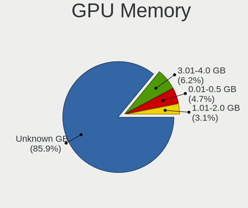
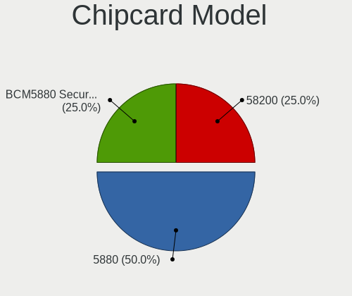

Kubuntu Hardware Trends (Notebooks)
-----------------------------------

A project to identify most popular hardware characteristics and track their change
over time based on data collected by Kubuntu users at https://Linux-Hardware.org.

Anyone can contribute to this report by the [hw-probe](https://github.com/linuxhw/hw-probe) tool:

    sudo -E hw-probe -all -upload

Full-feature report is available here: https://linux-hardware.org/?view=trends

Period: Dec, 2021.

Contents
--------

* [ System ](#system)
  - [ OS                       ](#os)
  - [ OS Family                ](#os-family)
  - [ Kernel                   ](#kernel)
  - [ Kernel Family            ](#kernel-family)
  - [ Kernel Major Ver.        ](#kernel-major-ver)
  - [ Arch                     ](#arch)
  - [ DE                       ](#de)
  - [ Display Server           ](#display-server)
  - [ Display Manager          ](#display-manager)
  - [ OS Lang                  ](#os-lang)
  - [ Boot Mode                ](#boot-mode)
  - [ Filesystem               ](#filesystem)
  - [ Part. scheme             ](#part-scheme)
  - [ Dual Boot with Linux/BSD ](#dual-boot-with-linuxbsd)
  - [ Dual Boot (Win)          ](#dual-boot-win)

* [ Board ](#board)
  - [ Vendor                   ](#vendor)
  - [ Model                    ](#model)
  - [ Model Family             ](#model-family)
  - [ MFG Year                 ](#mfg-year)
  - [ Form Factor              ](#form-factor)
  - [ Secure Boot              ](#secure-boot)
  - [ Coreboot                 ](#coreboot)
  - [ RAM Size                 ](#ram-size)
  - [ RAM Used                 ](#ram-used)
  - [ Total Drives             ](#total-drives)
  - [ Has CD-ROM               ](#has-cd-rom)
  - [ Has Ethernet             ](#has-ethernet)
  - [ Has WiFi                 ](#has-wifi)
  - [ Has Bluetooth            ](#has-bluetooth)

* [ Location ](#location)
  - [ Country                  ](#country)
  - [ City                     ](#city)

* [ Drives ](#drives)
  - [ Drive Vendor             ](#drive-vendor)
  - [ Drive Model              ](#drive-model)
  - [ HDD Vendor               ](#hdd-vendor)
  - [ SSD Vendor               ](#ssd-vendor)
  - [ Drive Kind               ](#drive-kind)
  - [ Drive Connector          ](#drive-connector)
  - [ Drive Size               ](#drive-size)
  - [ Space Total              ](#space-total)
  - [ Space Used               ](#space-used)
  - [ Malfunc. Drives          ](#malfunc-drives)
  - [ Malfunc. Drive Vendor    ](#malfunc-drive-vendor)
  - [ Malfunc. HDD Vendor      ](#malfunc-hdd-vendor)
  - [ Malfunc. Drive Kind      ](#malfunc-drive-kind)
  - [ Failed Drives            ](#failed-drives)
  - [ Failed Drive Vendor      ](#failed-drive-vendor)
  - [ Drive Status             ](#drive-status)

* [ Storage controller ](#storage-controller)
  - [ Storage Vendor           ](#storage-vendor)
  - [ Storage Model            ](#storage-model)
  - [ Storage Kind             ](#storage-kind)

* [ Processor ](#processor)
  - [ CPU Vendor               ](#cpu-vendor)
  - [ CPU Model                ](#cpu-model)
  - [ CPU Model Family         ](#cpu-model-family)
  - [ CPU Cores                ](#cpu-cores)
  - [ CPU Sockets              ](#cpu-sockets)
  - [ CPU Threads              ](#cpu-threads)
  - [ CPU Op-Modes             ](#cpu-op-modes)
  - [ CPU Microcode            ](#cpu-microcode)
  - [ CPU Microarch            ](#cpu-microarch)

* [ Graphics ](#graphics)
  - [ GPU Vendor               ](#gpu-vendor)
  - [ GPU Model                ](#gpu-model)
  - [ GPU Combo                ](#gpu-combo)
  - [ GPU Driver               ](#gpu-driver)
  - [ GPU Memory               ](#gpu-memory)

* [ Monitor ](#monitor)
  - [ Monitor Vendor           ](#monitor-vendor)
  - [ Monitor Model            ](#monitor-model)
  - [ Monitor Resolution       ](#monitor-resolution)
  - [ Monitor Diagonal         ](#monitor-diagonal)
  - [ Monitor Width            ](#monitor-width)
  - [ Aspect Ratio             ](#aspect-ratio)
  - [ Monitor Area             ](#monitor-area)
  - [ Pixel Density            ](#pixel-density)
  - [ Multiple Monitors        ](#multiple-monitors)

* [ Network ](#network)
  - [ Net Controller Vendor    ](#net-controller-vendor)
  - [ Net Controller Model     ](#net-controller-model)
  - [ Wireless Vendor          ](#wireless-vendor)
  - [ Wireless Model           ](#wireless-model)
  - [ Ethernet Vendor          ](#ethernet-vendor)
  - [ Ethernet Model           ](#ethernet-model)
  - [ Net Controller Kind      ](#net-controller-kind)
  - [ Used Controller          ](#used-controller)
  - [ NICs                     ](#nics)
  - [ IPv6                     ](#ipv6)

* [ Bluetooth ](#bluetooth)
  - [ Bluetooth Vendor         ](#bluetooth-vendor)
  - [ Bluetooth Model          ](#bluetooth-model)

* [ Sound ](#sound)
  - [ Sound Vendor             ](#sound-vendor)
  - [ Sound Model              ](#sound-model)

* [ Memory ](#memory)
  - [ Memory Vendor            ](#memory-vendor)
  - [ Memory Model             ](#memory-model)
  - [ Memory Kind              ](#memory-kind)
  - [ Memory Form Factor       ](#memory-form-factor)
  - [ Memory Size              ](#memory-size)
  - [ Memory Speed             ](#memory-speed)

* [ Printers & scanners ](#printers--scanners)
  - [ Printer Vendor           ](#printer-vendor)
  - [ Printer Model            ](#printer-model)
  - [ Scanner Vendor           ](#scanner-vendor)
  - [ Scanner Model            ](#scanner-model)

* [ Camera ](#camera)
  - [ Camera Vendor            ](#camera-vendor)
  - [ Camera Model             ](#camera-model)

* [ Security ](#security)
  - [ Fingerprint Vendor       ](#fingerprint-vendor)
  - [ Fingerprint Model        ](#fingerprint-model)
  - [ Chipcard Vendor          ](#chipcard-vendor)
  - [ Chipcard Model           ](#chipcard-model)

* [ Unsupported ](#unsupported)
  - [ Unsupported Devices      ](#unsupported-devices)
  - [ Unsupported Device Types ](#unsupported-device-types)

System
------

OS
--

Installed operating systems

| Name          | Notebooks | Percent |
|---------------|-----------|---------|
| Kubuntu 21.10 | 27        | 47.37%  |
| Kubuntu 20.04 | 22        | 38.6%   |
| Kubuntu 21.04 | 5         | 8.77%   |
| Kubuntu 20.10 | 2         | 3.51%   |
| Kubuntu 22.04 | 1         | 1.75%   |

OS Family
---------

OS without a version

| Name    | Notebooks | Percent |
|---------|-----------|---------|
| Kubuntu | 57        | 100%    |

Kernel
------

Version of the Linux kernel

| Version               | Notebooks | Percent |
|-----------------------|-----------|---------|
| 5.13.0-22-generic     | 17        | 29.82%  |
| 5.11.0-41-generic     | 10        | 17.54%  |
| 5.4.0-91-generic      | 5         | 8.77%   |
| 5.13.0-19-generic     | 4         | 7.02%   |
| 5.11.0-43-generic     | 4         | 7.02%   |
| 5.8.0-63-generic      | 2         | 3.51%   |
| 5.13.0-23-generic     | 2         | 3.51%   |
| 5.10.0-1052-oem       | 2         | 3.51%   |
| 5.15.7-051507-generic | 1         | 1.75%   |
| 5.15.6-051506-generic | 1         | 1.75%   |
| 5.15.5-core           | 1         | 1.75%   |
| 5.15.10               | 1         | 1.75%   |
| 5.15.0-051500-generic | 1         | 1.75%   |
| 5.14.9-051409-generic | 1         | 1.75%   |
| 5.13.0-22-lowlatency  | 1         | 1.75%   |
| 5.13.0-21-generic     | 1         | 1.75%   |
| 5.12.6-051206-generic | 1         | 1.75%   |
| 5.11.0-40-generic     | 1         | 1.75%   |
| 5.11.0-18-generic     | 1         | 1.75%   |

Kernel Family
-------------

Linux kernel without a distro release

| Version | Notebooks | Percent |
|---------|-----------|---------|
| 5.13.0  | 25        | 43.86%  |
| 5.11.0  | 16        | 28.07%  |
| 5.4.0   | 5         | 8.77%   |
| 5.8.0   | 2         | 3.51%   |
| 5.10.0  | 2         | 3.51%   |
| 5.15.7  | 1         | 1.75%   |
| 5.15.6  | 1         | 1.75%   |
| 5.15.5  | 1         | 1.75%   |
| 5.15.10 | 1         | 1.75%   |
| 5.15.0  | 1         | 1.75%   |
| 5.14.9  | 1         | 1.75%   |
| 5.12.6  | 1         | 1.75%   |

Kernel Major Ver.
-----------------

Linux kernel major version

| Version | Notebooks | Percent |
|---------|-----------|---------|
| 5.13    | 25        | 43.86%  |
| 5.11    | 16        | 28.07%  |
| 5.4     | 5         | 8.77%   |
| 5.15    | 5         | 8.77%   |
| 5.8     | 2         | 3.51%   |
| 5.10    | 2         | 3.51%   |
| 5.14    | 1         | 1.75%   |
| 5.12    | 1         | 1.75%   |

Arch
----

OS architecture (x86_64, i586, etc.)

| Name   | Notebooks | Percent |
|--------|-----------|---------|
| x86_64 | 57        | 100%    |

DE
--

Desktop Environment

| Name   | Notebooks | Percent |
|--------|-----------|---------|
| KDE5   | 54        | 94.74%  |
| KDE    | 1         | 1.75%   |
| GNOME  | 1         | 1.75%   |
| Budgie | 1         | 1.75%   |

Display Server
--------------

X11 or Wayland

| Name    | Notebooks | Percent |
|---------|-----------|---------|
| X11     | 54        | 94.74%  |
| Wayland | 2         | 3.51%   |
| Tty     | 1         | 1.75%   |

Display Manager
---------------

SDDM, LightDM, etc.

| Name    | Notebooks | Percent |
|---------|-----------|---------|
| SDDM    | 45        | 78.95%  |
| Unknown | 7         | 12.28%  |
| GDM     | 3         | 5.26%   |
| LightDM | 2         | 3.51%   |

OS Lang
-------

Language

| Lang  | Notebooks | Percent |
|-------|-----------|---------|
| en_US | 22        | 38.6%   |
| de_DE | 6         | 10.53%  |
| it_IT | 3         | 5.26%   |
| fr_FR | 3         | 5.26%   |
| en_IN | 3         | 5.26%   |
| ru_UA | 2         | 3.51%   |
| ru_RU | 2         | 3.51%   |
| fr_BE | 2         | 3.51%   |
| es_ES | 2         | 3.51%   |
| en_AU | 2         | 3.51%   |
| sk_SK | 1         | 1.75%   |
| pt_PT | 1         | 1.75%   |
| pt_BR | 1         | 1.75%   |
| nl_NL | 1         | 1.75%   |
| es_MX | 1         | 1.75%   |
| en_ZA | 1         | 1.75%   |
| en_NL | 1         | 1.75%   |
| cs_CZ | 1         | 1.75%   |
| C     | 1         | 1.75%   |
| be_BY | 1         | 1.75%   |

Boot Mode
---------

EFI or BIOS

| Mode | Notebooks | Percent |
|------|-----------|---------|
| EFI  | 41        | 71.93%  |
| BIOS | 16        | 28.07%  |

Filesystem
----------

Type of filesystem

| Type    | Notebooks | Percent |
|---------|-----------|---------|
| Ext4    | 52        | 91.23%  |
| Btrfs   | 3         | 5.26%   |
| Overlay | 2         | 3.51%   |

Part. scheme
------------

Scheme of partitioning

| Type    | Notebooks | Percent |
|---------|-----------|---------|
| GPT     | 32        | 56.14%  |
| Unknown | 23        | 40.35%  |
| MBR     | 2         | 3.51%   |

Dual Boot with Linux/BSD
------------------------

Hosting more than one Linux/BSD

| Dual boot | Notebooks | Percent |
|-----------|-----------|---------|
| No        | 50        | 87.72%  |
| Yes       | 7         | 12.28%  |

Dual Boot (Win)
---------------

Hosting Linux and Windows

| Dual boot | Notebooks | Percent |
|-----------|-----------|---------|
| No        | 30        | 52.63%  |
| Yes       | 27        | 47.37%  |

Board
-----

Vendor
------

Motherboard manufacturer

| Name             | Notebooks | Percent |
|------------------|-----------|---------|
| Lenovo           | 13        | 22.81%  |
| Dell             | 11        | 19.3%   |
| ASUSTek Computer | 11        | 19.3%   |
| Hewlett-Packard  | 10        | 17.54%  |
| MSI              | 4         | 7.02%   |
| Unknown          | 2         | 3.51%   |
| Timi             | 1         | 1.75%   |
| Mediacom         | 1         | 1.75%   |
| HUAWEI           | 1         | 1.75%   |
| Chuwi            | 1         | 1.75%   |
| Apple            | 1         | 1.75%   |
| Acer             | 1         | 1.75%   |

Model
-----

Motherboard model

| Name                                   | Notebooks | Percent |
|----------------------------------------|-----------|---------|
| ASUS ROG Zephyrus M16 GU603HE_GU603HE  | 2         | 3.51%   |
| Unknown                                | 2         | 3.51%   |
| Timi Mi Gaming Laptop 15.6             | 1         | 1.75%   |
| MSI Pulse GL76 11UEK                   | 1         | 1.75%   |
| MSI GE75 Raider 10SE                   | 1         | 1.75%   |
| MSI GE62 2QD                           | 1         | 1.75%   |
| MSI Delta 15 A5EFK                     | 1         | 1.75%   |
| Mediacom M-SB151                       | 1         | 1.75%   |
| Lenovo Z50-70 20354                    | 1         | 1.75%   |
| Lenovo V580c 20160                     | 1         | 1.75%   |
| Lenovo ThinkPad L15 Gen 2 20X3005FSP   | 1         | 1.75%   |
| Lenovo ThinkPad E480 20KN001QRT        | 1         | 1.75%   |
| Lenovo ThinkPad E15 Gen 3 20YGS02R00   | 1         | 1.75%   |
| Lenovo ThinkPad E15 Gen 2 20TD0019RI   | 1         | 1.75%   |
| Lenovo ThinkBook 14 G3 ACL 21A2        | 1         | 1.75%   |
| Lenovo ThinkBook 13s G2 ITL 20V9       | 1         | 1.75%   |
| Lenovo Legion Y530-15ICH 81FV          | 1         | 1.75%   |
| Lenovo Legion 5 15ARH05H 82B1          | 1         | 1.75%   |
| Lenovo G710 20252                      | 1         | 1.75%   |
| Lenovo G505 20240                      | 1         | 1.75%   |
| Lenovo G500 20236                      | 1         | 1.75%   |
| HUAWEI NBLK-WAX9X                      | 1         | 1.75%   |
| HP ZBook 15 G4                         | 1         | 1.75%   |
| HP ProBook 640 G4                      | 1         | 1.75%   |
| HP Presario CQ57                       | 1         | 1.75%   |
| HP Pavilion g6                         | 1         | 1.75%   |
| HP Pavilion dv6                        | 1         | 1.75%   |
| HP Laptop 15-ef0xxx                    | 1         | 1.75%   |
| HP Laptop 15-db0xxx                    | 1         | 1.75%   |
| HP ENVY Laptop 17-ce1xxx               | 1         | 1.75%   |
| HP ENVY Laptop 13-aq1xxx               | 1         | 1.75%   |
| HP 250 G5 Notebook PC                  | 1         | 1.75%   |
| Dell XPS 15 9550                       | 1         | 1.75%   |
| Dell XPS 15 9500                       | 1         | 1.75%   |
| Dell XPS 13 7390                       | 1         | 1.75%   |
| Dell Precision 5520                    | 1         | 1.75%   |
| Dell Precision 5510                    | 1         | 1.75%   |
| Dell Latitude E5530 non-vPro           | 1         | 1.75%   |
| Dell Latitude D830                     | 1         | 1.75%   |
| Dell Latitude 5590                     | 1         | 1.75%   |
| Dell Latitude 3420                     | 1         | 1.75%   |
| Dell Inspiron N4050                    | 1         | 1.75%   |
| Dell Inspiron 5570                     | 1         | 1.75%   |
| Chuwi GemiBook                         | 1         | 1.75%   |
| ASUS ZenBook UX435EG_UX435EG           | 1         | 1.75%   |
| ASUS ZenBook UX425EA_UX425EA           | 1         | 1.75%   |
| ASUS X580VD                            | 1         | 1.75%   |
| ASUS VivoBook_ASUSLaptop X712EA_S712EA | 1         | 1.75%   |
| ASUS VivoBook_ASUSLaptop X571GT_X571GT | 1         | 1.75%   |
| ASUS VivoBook_ASUSLaptop X515JA_F515JA | 1         | 1.75%   |
| ASUS ROG Strix G712LU_G712LU           | 1         | 1.75%   |
| ASUS K72Jr                             | 1         | 1.75%   |
| ASUS ASUS EXPERTBOOK P2451FA_P2451FA   | 1         | 1.75%   |
| Apple MacBookPro11,5                   | 1         | 1.75%   |
| Acer Aspire VN7-572TG                  | 1         | 1.75%   |

Model Family
------------

Motherboard model prefix

| Name               | Notebooks | Percent |
|--------------------|-----------|---------|
| Lenovo ThinkPad    | 4         | 7.02%   |
| Dell Latitude      | 4         | 7.02%   |
| Dell XPS           | 3         | 5.26%   |
| ASUS VivoBook      | 3         | 5.26%   |
| ASUS ROG           | 3         | 5.26%   |
| Lenovo ThinkBook   | 2         | 3.51%   |
| Lenovo Legion      | 2         | 3.51%   |
| HP Pavilion        | 2         | 3.51%   |
| HP Laptop          | 2         | 3.51%   |
| HP ENVY            | 2         | 3.51%   |
| Dell Precision     | 2         | 3.51%   |
| Dell Inspiron      | 2         | 3.51%   |
| ASUS ZenBook       | 2         | 3.51%   |
| Unknown            | 2         | 3.51%   |
| Timi Mi            | 1         | 1.75%   |
| MSI Pulse          | 1         | 1.75%   |
| MSI GE75           | 1         | 1.75%   |
| MSI GE62           | 1         | 1.75%   |
| MSI Delta          | 1         | 1.75%   |
| Mediacom M-SB151   | 1         | 1.75%   |
| Lenovo Z50-70      | 1         | 1.75%   |
| Lenovo V580c       | 1         | 1.75%   |
| Lenovo G710        | 1         | 1.75%   |
| Lenovo G505        | 1         | 1.75%   |
| Lenovo G500        | 1         | 1.75%   |
| HUAWEI NBLK-WAX9X  | 1         | 1.75%   |
| HP ZBook           | 1         | 1.75%   |
| HP ProBook         | 1         | 1.75%   |
| HP Presario        | 1         | 1.75%   |
| HP 250             | 1         | 1.75%   |
| Chuwi GemiBook     | 1         | 1.75%   |
| ASUS X580VD        | 1         | 1.75%   |
| ASUS K72Jr         | 1         | 1.75%   |
| ASUS ASUS          | 1         | 1.75%   |
| Apple MacBookPro11 | 1         | 1.75%   |
| Acer Aspire        | 1         | 1.75%   |

MFG Year
--------

Motherboard manufacture year

| Year | Notebooks | Percent |
|------|-----------|---------|
| 2021 | 22        | 38.6%   |
| 2020 | 12        | 21.05%  |
| 2019 | 5         | 8.77%   |
| 2013 | 5         | 8.77%   |
| 2016 | 3         | 5.26%   |
| 2011 | 3         | 5.26%   |
| 2018 | 2         | 3.51%   |
| 2017 | 2         | 3.51%   |
| 2015 | 1         | 1.75%   |
| 2014 | 1         | 1.75%   |
| 2010 | 1         | 1.75%   |

Form Factor
-----------

Physical design of the computer

| Name     | Notebooks | Percent |
|----------|-----------|---------|
| Notebook | 57        | 100%    |

Secure Boot
-----------

Enabled or disabled

| State    | Notebooks | Percent |
|----------|-----------|---------|
| Disabled | 52        | 91.23%  |
| Enabled  | 5         | 8.77%   |

Coreboot
--------

Have coreboot on board

| Used | Notebooks | Percent |
|------|-----------|---------|
| No   | 57        | 100%    |

RAM Size
--------

Total RAM memory

| Size in GB | Notebooks | Percent |
|------------|-----------|---------|
| 16.01-24.0 | 22        | 38.6%   |
| 4.01-8.0   | 13        | 22.81%  |
| 32.01-64.0 | 9         | 15.79%  |
| 8.01-16.0  | 9         | 15.79%  |
| 1.01-2.0   | 2         | 3.51%   |
| 3.01-4.0   | 1         | 1.75%   |
| 24.01-32.0 | 1         | 1.75%   |

RAM Used
--------

Used RAM memory

| Used GB    | Notebooks | Percent |
|------------|-----------|---------|
| 2.01-3.0   | 21        | 36.84%  |
| 4.01-8.0   | 10        | 17.54%  |
| 1.01-2.0   | 10        | 17.54%  |
| 3.01-4.0   | 8         | 14.04%  |
| 8.01-16.0  | 4         | 7.02%   |
| 0.51-1.0   | 2         | 3.51%   |
| 24.01-32.0 | 1         | 1.75%   |
| 16.01-24.0 | 1         | 1.75%   |

Total Drives
------------

Number of drives on board

| Drives | Notebooks | Percent |
|--------|-----------|---------|
| 1      | 37        | 64.91%  |
| 2      | 15        | 26.32%  |
| 3      | 5         | 8.77%   |

Has CD-ROM
----------

Has CD-ROM on board

| Presented | Notebooks | Percent |
|-----------|-----------|---------|
| No        | 46        | 80.7%   |
| Yes       | 11        | 19.3%   |

Has Ethernet
------------

Has Ethernet on board

| Presented | Notebooks | Percent |
|-----------|-----------|---------|
| Yes       | 42        | 73.68%  |
| No        | 15        | 26.32%  |

Has WiFi
--------

Has WiFi module

| Presented | Notebooks | Percent |
|-----------|-----------|---------|
| Yes       | 56        | 98.25%  |
| No        | 1         | 1.75%   |

Has Bluetooth
-------------

Has Bluetooth module

| Presented | Notebooks | Percent |
|-----------|-----------|---------|
| Yes       | 50        | 87.72%  |
| No        | 7         | 12.28%  |

Location
--------

Country
-------

Geographic location (country)

| Country      | Notebooks | Percent |
|--------------|-----------|---------|
| USA          | 10        | 17.54%  |
| Germany      | 6         | 10.53%  |
| Ukraine      | 4         | 7.02%   |
| Italy        | 4         | 7.02%   |
| France       | 4         | 7.02%   |
| Spain        | 3         | 5.26%   |
| India        | 3         | 5.26%   |
| Turkey       | 2         | 3.51%   |
| Russia       | 2         | 3.51%   |
| Iran         | 2         | 3.51%   |
| Brazil       | 2         | 3.51%   |
| Belgium      | 2         | 3.51%   |
| Australia    | 2         | 3.51%   |
| Vietnam      | 1         | 1.75%   |
| South Africa | 1         | 1.75%   |
| Slovakia     | 1         | 1.75%   |
| Romania      | 1         | 1.75%   |
| Portugal     | 1         | 1.75%   |
| Poland       | 1         | 1.75%   |
| Mexico       | 1         | 1.75%   |
| Japan        | 1         | 1.75%   |
| Czechia      | 1         | 1.75%   |
| Croatia      | 1         | 1.75%   |
| Belarus      | 1         | 1.75%   |

City
----

Geographic location (city)

| City              | Notebooks | Percent |
|-------------------|-----------|---------|
| Schonaich         | 2         | 3.51%   |
| Moscow            | 2         | 3.51%   |
| Kyiv              | 2         | 3.51%   |
| Istanbul          | 2         | 3.51%   |
| Berlin            | 2         | 3.51%   |
| Zagreb            | 1         | 1.75%   |
| Wolgast           | 1         | 1.75%   |
| Warsaw            | 1         | 1.75%   |
| Toluca            | 1         | 1.75%   |
| Tehran            | 1         | 1.75%   |
| Somerville        | 1         | 1.75%   |
| S??o Paulo        | 1         | 1.75%   |
| Roissy-en-Brie    | 1         | 1.75%   |
| Pune              | 1         | 1.75%   |
| Prague            | 1         | 1.75%   |
| Potchefstroom     | 1         | 1.75%   |
| Portland          | 1         | 1.75%   |
| Poitiers          | 1         | 1.75%   |
| Perth             | 1         | 1.75%   |
| Pata              | 1         | 1.75%   |
| Paris             | 1         | 1.75%   |
| Minsk             | 1         | 1.75%   |
| Milan             | 1         | 1.75%   |
| M??laga           | 1         | 1.75%   |
| Madrid            | 1         | 1.75%   |
| Leverkusen        | 1         | 1.75%   |
| Kremenchug        | 1         | 1.75%   |
| Kolkata           | 1         | 1.75%   |
| Kharkiv           | 1         | 1.75%   |
| Kerrville         | 1         | 1.75%   |
| Karaj             | 1         | 1.75%   |
| Jamaica Plain     | 1         | 1.75%   |
| Inhumas           | 1         | 1.75%   |
| Hanoi             | 1         | 1.75%   |
| Guadalajara       | 1         | 1.75%   |
| Grasse            | 1         | 1.75%   |
| Ginowan           | 1         | 1.75%   |
| Euless            | 1         | 1.75%   |
| Estarreja         | 1         | 1.75%   |
| Escalon           | 1         | 1.75%   |
| Dallas            | 1         | 1.75%   |
| Conway            | 1         | 1.75%   |
| Cleveland         | 1         | 1.75%   |
| Cinisello Balsamo | 1         | 1.75%   |
| Cerfontaine       | 1         | 1.75%   |
| Canberra          | 1         | 1.75%   |
| Calcio            | 1         | 1.75%   |
| Bucharest         | 1         | 1.75%   |
| Brescia           | 1         | 1.75%   |
| Boone             | 1         | 1.75%   |
| Bastogne          | 1         | 1.75%   |
| Ambala            | 1         | 1.75%   |

Drives
------

Drive Vendor
------------

Hard drive vendors

| Vendor                    | Notebooks | Drives | Percent |
|---------------------------|-----------|--------|---------|
| WDC                       | 14        | 15     | 17.72%  |
| Samsung Electronics       | 13        | 15     | 16.46%  |
| Intel                     | 11        | 11     | 13.92%  |
| Toshiba                   | 7         | 7      | 8.86%   |
| Seagate                   | 5         | 5      | 6.33%   |
| Micron Technology         | 4         | 5      | 5.06%   |
| Kingston                  | 4         | 4      | 5.06%   |
| SK Hynix                  | 3         | 3      | 3.8%    |
| Crucial                   | 3         | 4      | 3.8%    |
| Unknown                   | 2         | 2      | 2.53%   |
| HGST                      | 2         | 2      | 2.53%   |
| A-DATA Technology         | 2         | 2      | 2.53%   |
| Zheino                    | 1         | 1      | 1.27%   |
| Transcend                 | 1         | 1      | 1.27%   |
| SanDisk                   | 1         | 1      | 1.27%   |
| PLEXTOR                   | 1         | 1      | 1.27%   |
| Micron/Crucial Technology | 1         | 1      | 1.27%   |
| LITEON                    | 1         | 1      | 1.27%   |
| KingSpec                  | 1         | 1      | 1.27%   |
| Apple                     | 1         | 1      | 1.27%   |
| Unknown                   | 1         | 1      | 1.27%   |

Drive Model
-----------

Hard drive models

| Model                                   | Notebooks | Percent |
|-----------------------------------------|-----------|---------|
| Intel NVMe SSD Drive 512GB              | 4         | 4.82%   |
| WDC PC SN530 SDBPMPZ-512G-1101 512GB    | 2         | 2.41%   |
| Toshiba MQ04ABF100 1TB                  | 2         | 2.41%   |
| SK Hynix NVMe SSD Drive 256GB           | 2         | 2.41%   |
| Seagate ST1000LM024 HN-M101MBB 1TB      | 2         | 2.41%   |
| Intel SSDPEKNW512G8 512GB               | 2         | 2.41%   |
| Intel SSDPEKNW010T8 1TB                 | 2         | 2.41%   |
| Zheino CHN 25SATAS3 128 128GB SSD       | 1         | 1.2%    |
| WDC WDS240G2G0A-00JH30 240GB SSD        | 1         | 1.2%    |
| WDC WDS200T2B0A-00SM50 2TB SSD          | 1         | 1.2%    |
| WDC WDS120G2G0A-00JH30 120GB SSD        | 1         | 1.2%    |
| WDC WDS100T1X0E-00AFY0 1TB              | 1         | 1.2%    |
| WDC WDBNCE5000PNC 500GB SSD             | 1         | 1.2%    |
| WDC WD5000LPVT-24G33T1 500GB            | 1         | 1.2%    |
| WDC WD5000LPLX-60ZNTT1 500GB            | 1         | 1.2%    |
| WDC WD3200BPVT-00ZEST0 320GB            | 1         | 1.2%    |
| WDC WD10JPVX-60JC3T0 1TB                | 1         | 1.2%    |
| WDC WD My Passport 261B 500GB           | 1         | 1.2%    |
| WDC PC SN730 SDBPNTY-512G-1027 512GB    | 1         | 1.2%    |
| WDC PC SN520 SDAPNUW-512G-1006 512GB    | 1         | 1.2%    |
| WDC PC SN520 SDAPNUW-256G-1006 256GB    | 1         | 1.2%    |
| Unknown SD32G  32GB                     | 1         | 1.2%    |
| Unknown MMC Card  128GB                 | 1         | 1.2%    |
| Transcend TS1TMTE220S 1TB               | 1         | 1.2%    |
| Toshiba THNSNJ128G8NY 128GB SSD         | 1         | 1.2%    |
| Toshiba THNSN5512GPU7 NVMe 512GB        | 1         | 1.2%    |
| Toshiba NVMe SSD Drive 512GB            | 1         | 1.2%    |
| Toshiba KXG6AZNV512G 512GB              | 1         | 1.2%    |
| Toshiba KSG60ZMV512G M.2 2280 512GB SSD | 1         | 1.2%    |
| SK Hynix HFS256G39TND-N210A 256GB SSD   | 1         | 1.2%    |
| Seagate ST2000LM007-1R8174 2TB          | 1         | 1.2%    |
| Seagate ST1000LM048-2E7172 1TB          | 1         | 1.2%    |
| Seagate ST1000LM014-1EJ164 1TB          | 1         | 1.2%    |
| SanDisk SSD PLUS 480GB                  | 1         | 1.2%    |
| Samsung SSD 960 EVO 1TB                 | 1         | 1.2%    |
| Samsung SSD 870 EVO 250GB               | 1         | 1.2%    |
| Samsung SSD 860 QVO 1TB                 | 1         | 1.2%    |
| Samsung SSD 860 EVO mSATA 250GB         | 1         | 1.2%    |
| Samsung SSD 860 EVO M.2 500GB           | 1         | 1.2%    |
| Samsung SSD 860 EVO 1TB                 | 1         | 1.2%    |
| Samsung SSD 850 EVO 500GB               | 1         | 1.2%    |
| Samsung SSD 840 Series 120GB            | 1         | 1.2%    |
| Samsung SSD 830 Series 128GB            | 1         | 1.2%    |
| Samsung NVMe SSD Drive 512GB            | 1         | 1.2%    |
| Samsung NVMe SSD Drive 2TB              | 1         | 1.2%    |
| Samsung NVMe SSD Drive 1024GB           | 1         | 1.2%    |
| Samsung MZVLQ512HALU-00000 512GB        | 1         | 1.2%    |
| Samsung MZALQ512HALU-000L1 512GB        | 1         | 1.2%    |
| Samsung HM500JI 500GB                   | 1         | 1.2%    |
| PLEXTOR PX-512M8PeG 512GB               | 1         | 1.2%    |
| Micron/Crucial NVMe SSD Drive 500GB     | 1         | 1.2%    |
| Micron NVMe SSD Drive 512GB             | 1         | 1.2%    |
| Micron NVMe SSD Drive 1024GB            | 1         | 1.2%    |
| Micron 2210_MTFDHBA512QFD 512GB         | 1         | 1.2%    |
| Micron 2210_MTFDHBA1T0QFD 1TB           | 1         | 1.2%    |
| Micron 1100_MTFDDAV256TBN 256GB SSD     | 1         | 1.2%    |
| LITEON CA3-8D256 256GB                  | 1         | 1.2%    |
| Kingston SV300S37A120G 120GB SSD        | 1         | 1.2%    |
| Kingston OM8PCP3512F-AA 512GB           | 1         | 1.2%    |
| Kingston OM8P0S3256B-A0 256GB SSD       | 1         | 1.2%    |

HDD Vendor
----------

Hard disk drive vendors

| Vendor              | Notebooks | Drives | Percent |
|---------------------|-----------|--------|---------|
| Seagate             | 5         | 5      | 35.71%  |
| WDC                 | 4         | 4      | 28.57%  |
| Toshiba             | 2         | 2      | 14.29%  |
| HGST                | 2         | 2      | 14.29%  |
| Samsung Electronics | 1         | 1      | 7.14%   |

SSD Vendor
----------

Solid state drive vendors

| Vendor              | Notebooks | Drives | Percent |
|---------------------|-----------|--------|---------|
| Samsung Electronics | 7         | 8      | 28%     |
| WDC                 | 4         | 4      | 16%     |
| Crucial             | 3         | 4      | 12%     |
| Toshiba             | 2         | 2      | 8%      |
| Kingston            | 2         | 2      | 8%      |
| Zheino              | 1         | 1      | 4%      |
| SK Hynix            | 1         | 1      | 4%      |
| SanDisk             | 1         | 1      | 4%      |
| Micron Technology   | 1         | 1      | 4%      |
| KingSpec            | 1         | 1      | 4%      |
| Apple               | 1         | 1      | 4%      |
| A-DATA Technology   | 1         | 1      | 4%      |

Drive Kind
----------

HDD or SSD

| Kind    | Notebooks | Drives | Percent |
|---------|-----------|--------|---------|
| NVMe    | 33        | 39     | 45.21%  |
| SSD     | 23        | 27     | 31.51%  |
| HDD     | 13        | 14     | 17.81%  |
| MMC     | 3         | 3      | 4.11%   |
| Unknown | 1         | 1      | 1.37%   |

Drive Connector
---------------

SATA, SAS, NVMe, etc.

| Type | Notebooks | Drives | Percent |
|------|-----------|--------|---------|
| NVMe | 33        | 39     | 47.83%  |
| SATA | 32        | 41     | 46.38%  |
| MMC  | 3         | 3      | 4.35%   |
| SAS  | 1         | 1      | 1.45%   |

Drive Size
----------

Size of hard drive

| Size in TB | Notebooks | Drives | Percent |
|------------|-----------|--------|---------|
| 0.01-0.5   | 20        | 23     | 55.56%  |
| 0.51-1.0   | 13        | 14     | 36.11%  |
| 1.01-2.0   | 3         | 4      | 8.33%   |

Space Total
-----------

Amount of disk space available on the file system

| Size in GB | Notebooks | Percent |
|------------|-----------|---------|
| 251-500    | 21        | 36.84%  |
| 101-250    | 17        | 29.82%  |
| 501-1000   | 9         | 15.79%  |
| 1001-2000  | 4         | 7.02%   |
| 51-100     | 3         | 5.26%   |
| 21-50      | 1         | 1.75%   |
| 2001-3000  | 1         | 1.75%   |
| 1-20       | 1         | 1.75%   |

Space Used
----------

Amount of used disk space

| Used GB   | Notebooks | Percent |
|-----------|-----------|---------|
| 101-250   | 19        | 33.33%  |
| 21-50     | 12        | 21.05%  |
| 1-20      | 10        | 17.54%  |
| 51-100    | 5         | 8.77%   |
| 251-500   | 4         | 7.02%   |
| 501-1000  | 4         | 7.02%   |
| 1001-2000 | 3         | 5.26%   |

Malfunc. Drives
---------------

Drive models with a malfunction

| Model                               | Notebooks | Drives | Percent |
|-------------------------------------|-----------|--------|---------|
| WDC WD5000LPVT-24G33T1 500GB        | 1         | 1      | 20%     |
| Seagate ST1000LM048-2E7172 1TB      | 1         | 1      | 20%     |
| Seagate ST1000LM024 HN-M101MBB 1TB  | 1         | 1      | 20%     |
| SanDisk SSD PLUS 480GB              | 1         | 1      | 20%     |
| Samsung Electronics SSD 960 EVO 1TB | 1         | 1      | 20%     |

Malfunc. Drive Vendor
---------------------

Vendors of faulty drives

| Vendor              | Notebooks | Drives | Percent |
|---------------------|-----------|--------|---------|
| Seagate             | 2         | 2      | 40%     |
| WDC                 | 1         | 1      | 20%     |
| SanDisk             | 1         | 1      | 20%     |
| Samsung Electronics | 1         | 1      | 20%     |

Malfunc. HDD Vendor
-------------------

Vendors of faulty HDD drives

| Vendor  | Notebooks | Drives | Percent |
|---------|-----------|--------|---------|
| Seagate | 2         | 2      | 66.67%  |
| WDC     | 1         | 1      | 33.33%  |

Malfunc. Drive Kind
-------------------

Kinds of faulty drives

| Kind | Notebooks | Drives | Percent |
|------|-----------|--------|---------|
| HDD  | 3         | 3      | 60%     |
| NVMe | 1         | 1      | 20%     |
| SSD  | 1         | 1      | 20%     |

Failed Drives
-------------

Failed drive models

Zero info for selected period =(

Failed Drive Vendor
-------------------

Failed drive vendors

Zero info for selected period =(

Drive Status
------------

Number of failed and malfunc. drives

| Status   | Notebooks | Drives | Percent |
|----------|-----------|--------|---------|
| Works    | 33        | 47     | 50.77%  |
| Detected | 27        | 32     | 41.54%  |
| Malfunc  | 5         | 5      | 7.69%   |

Storage controller
------------------

Storage Vendor
--------------

Storage controller vendors

| Vendor                       | Notebooks | Percent |
|------------------------------|-----------|---------|
| Intel                        | 42        | 56%     |
| Samsung Electronics          | 7         | 9.33%   |
| Sandisk                      | 6         | 8%      |
| AMD                          | 6         | 8%      |
| Toshiba America Info Systems | 3         | 4%      |
| Micron Technology            | 3         | 4%      |
| SK Hynix                     | 2         | 2.67%   |
| Lite-On Technology           | 2         | 2.67%   |
| Silicon Motion               | 1         | 1.33%   |
| Micron/Crucial Technology    | 1         | 1.33%   |
| Kingston Technology Company  | 1         | 1.33%   |
| ADATA Technology             | 1         | 1.33%   |

Storage Model
-------------

Storage controller models

| Model                                                                          | Notebooks | Percent |
|--------------------------------------------------------------------------------|-----------|---------|
| Intel SSD 660P Series                                                          | 7         | 8.05%   |
| Intel 82801 Mobile SATA Controller [RAID mode]                                 | 7         | 8.05%   |
| Intel Sunrise Point-LP SATA Controller [AHCI mode]                             | 6         | 6.9%    |
| Intel Volume Management Device NVMe RAID Controller                            | 5         | 5.75%   |
| AMD FCH SATA Controller [AHCI mode]                                            | 5         | 5.75%   |
| Samsung NVMe SSD Controller SM981/PM981/PM983                                  | 3         | 3.45%   |
| Micron Non-Volatile memory controller                                          | 3         | 3.45%   |
| Intel Q170/Q150/B150/H170/H110/Z170/CM236 Chipset SATA Controller [AHCI Mode]  | 3         | 3.45%   |
| Intel Non-Volatile memory controller                                           | 3         | 3.45%   |
| Intel Celeron/Pentium Silver Processor SATA Controller                         | 3         | 3.45%   |
| Intel 7 Series Chipset Family 6-port SATA Controller [AHCI mode]               | 3         | 3.45%   |
| Toshiba America Info Systems XG6 NVMe SSD Controller                           | 2         | 2.3%    |
| Sandisk WD Blue SN500 / PC SN520 NVMe SSD                                      | 2         | 2.3%    |
| Sandisk Non-Volatile memory controller                                         | 2         | 2.3%    |
| Samsung NVMe SSD Controller 980                                                | 2         | 2.3%    |
| Intel Tiger Lake-LP SATA Controller [AHCI mode]                                | 2         | 2.3%    |
| Intel Cannon Lake Mobile PCH SATA AHCI Controller                              | 2         | 2.3%    |
| Intel 8 Series/C220 Series Chipset Family 6-port SATA Controller 1 [AHCI mode] | 2         | 2.3%    |
| Toshiba America Info Systems NVMe Controller                                   | 1         | 1.15%   |
| SK Hynix Non-Volatile memory controller                                        | 1         | 1.15%   |
| SK Hynix BC501 NVMe Solid State Drive                                          | 1         | 1.15%   |
| Silicon Motion SM2262/SM2262EN SSD Controller                                  | 1         | 1.15%   |
| Sandisk WD PC SN810 / Black SN850 NVMe SSD                                     | 1         | 1.15%   |
| Sandisk WD Black SN750 / PC SN730 NVMe SSD                                     | 1         | 1.15%   |
| Samsung NVMe SSD Controller SM961/PM961/SM963                                  | 1         | 1.15%   |
| Samsung Electronics SATA controller                                            | 1         | 1.15%   |
| Micron/Crucial P2 NVMe PCIe SSD                                                | 1         | 1.15%   |
| Lite-On Non-Volatile memory controller                                         | 1         | 1.15%   |
| Lite-On M8Pe Series NVMe SSD                                                   | 1         | 1.15%   |
| Kingston Company Company Non-Volatile memory controller                        | 1         | 1.15%   |
| Intel NVMe Optane Memory Series                                                | 1         | 1.15%   |
| Intel HM170/QM170 Chipset SATA Controller [AHCI Mode]                          | 1         | 1.15%   |
| Intel Comet Lake SATA AHCI Controller                                          | 1         | 1.15%   |
| Intel 82801HM/HEM (ICH8M/ICH8M-E) SATA Controller [AHCI mode]                  | 1         | 1.15%   |
| Intel 82801HM/HEM (ICH8M/ICH8M-E) IDE Controller                               | 1         | 1.15%   |
| Intel 8 Series SATA Controller 1 [AHCI mode]                                   | 1         | 1.15%   |
| Intel 6 Series/C200 Series Chipset Family 6 port Mobile SATA AHCI Controller   | 1         | 1.15%   |
| Intel 500 Series Chipset Family SATA AHCI Controller                           | 1         | 1.15%   |
| Intel 5 Series/3400 Series Chipset 4 port SATA AHCI Controller                 | 1         | 1.15%   |
| Intel 400 Series Chipset Family SATA AHCI Controller                           | 1         | 1.15%   |
| AMD SB7x0/SB8x0/SB9x0 SATA Controller [AHCI mode]                              | 1         | 1.15%   |
| AMD FCH IDE Controller                                                         | 1         | 1.15%   |
| ADATA XPG SX8200 Pro PCIe Gen3x4 M.2 2280 Solid State Drive                    | 1         | 1.15%   |

Storage Kind
------------

Kind of storage controller (IDE, SATA, NVMe, SAS, ...)

| Kind | Notebooks | Percent |
|------|-----------|---------|
| SATA | 36        | 43.9%   |
| NVMe | 32        | 39.02%  |
| RAID | 12        | 14.63%  |
| IDE  | 2         | 2.44%   |

Processor
---------

CPU Vendor
----------

Processor vendors

| Vendor | Notebooks | Percent |
|--------|-----------|---------|
| Intel  | 47        | 82.46%  |
| AMD    | 10        | 17.54%  |

CPU Model
---------

Processor models

| Model                                         | Notebooks | Percent |
|-----------------------------------------------|-----------|---------|
| Intel 11th Gen Core i7-1165G7 @ 2.80GHz       | 6         | 10.53%  |
| Intel Core i7-10750H CPU @ 2.60GHz            | 3         | 5.26%   |
| Intel Core i7-10510U CPU @ 1.80GHz            | 3         | 5.26%   |
| Intel 11th Gen Core i7-11800H @ 2.30GHz       | 3         | 5.26%   |
| Intel Core i7-9750H CPU @ 2.60GHz             | 2         | 3.51%   |
| Intel Core i7-7820HQ CPU @ 2.90GHz            | 2         | 3.51%   |
| Intel Core i5-8250U CPU @ 1.60GHz             | 2         | 3.51%   |
| AMD Ryzen 7 5700U with Radeon Graphics        | 2         | 3.51%   |
| AMD Ryzen 5 3500U with Radeon Vega Mobile Gfx | 2         | 3.51%   |
| Intel Core i7-8550U CPU @ 1.80GHz             | 1         | 1.75%   |
| Intel Core i7-7700HQ CPU @ 2.80GHz            | 1         | 1.75%   |
| Intel Core i7-6820HQ CPU @ 2.70GHz            | 1         | 1.75%   |
| Intel Core i7-6700HQ CPU @ 2.60GHz            | 1         | 1.75%   |
| Intel Core i7-6600U CPU @ 2.60GHz             | 1         | 1.75%   |
| Intel Core i7-6500U CPU @ 2.50GHz             | 1         | 1.75%   |
| Intel Core i7-4980HQ CPU @ 2.80GHz            | 1         | 1.75%   |
| Intel Core i7-4720HQ CPU @ 2.60GHz            | 1         | 1.75%   |
| Intel Core i7-4702MQ CPU @ 2.20GHz            | 1         | 1.75%   |
| Intel Core i7-4510U CPU @ 2.00GHz             | 1         | 1.75%   |
| Intel Core i7-3612QM CPU @ 2.10GHz            | 1         | 1.75%   |
| Intel Core i7-3520M CPU @ 2.90GHz             | 1         | 1.75%   |
| Intel Core i7-10710U CPU @ 1.10GHz            | 1         | 1.75%   |
| Intel Core i7-1065G7 CPU @ 1.30GHz            | 1         | 1.75%   |
| Intel Core i5-8300H CPU @ 2.30GHz             | 1         | 1.75%   |
| Intel Core i5-7300U CPU @ 2.60GHz             | 1         | 1.75%   |
| Intel Core i5-6200U CPU @ 2.30GHz             | 1         | 1.75%   |
| Intel Core i5-3230M CPU @ 2.60GHz             | 1         | 1.75%   |
| Intel Core i5-2430M CPU @ 2.40GHz             | 1         | 1.75%   |
| Intel Core i3-3110M CPU @ 2.40GHz             | 1         | 1.75%   |
| Intel Core i3 CPU M 350 @ 2.27GHz             | 1         | 1.75%   |
| Intel Core 2 Duo CPU T7300 @ 2.00GHz          | 1         | 1.75%   |
| Intel Celeron N4100 CPU @ 1.10GHz             | 1         | 1.75%   |
| Intel Celeron N4020 CPU @ 1.10GHz             | 1         | 1.75%   |
| Intel Celeron J4115 CPU @ 1.80GHz             | 1         | 1.75%   |
| Intel 11th Gen Core i5-1135G7 @ 2.40GHz       | 1         | 1.75%   |
| AMD Ryzen 7 5800H with Radeon Graphics        | 1         | 1.75%   |
| AMD Ryzen 5 4600H with Radeon Graphics        | 1         | 1.75%   |
| AMD E1-2100 APU with Radeon HD Graphics       | 1         | 1.75%   |
| AMD C-50 Processor                            | 1         | 1.75%   |
| AMD A6-9225 RADEON R4, 5 COMPUTE CORES 2C+3G  | 1         | 1.75%   |
| AMD A6-3410MX APU with Radeon HD Graphics     | 1         | 1.75%   |

CPU Model Family
----------------

Processor model prefix

| Model            | Notebooks | Percent |
|------------------|-----------|---------|
| Intel Core i7    | 24        | 42.11%  |
| Other            | 10        | 17.54%  |
| Intel Core i5    | 7         | 12.28%  |
| Intel Celeron    | 3         | 5.26%   |
| AMD Ryzen 7      | 3         | 5.26%   |
| AMD Ryzen 5      | 3         | 5.26%   |
| Intel Core i3    | 2         | 3.51%   |
| AMD A6           | 2         | 3.51%   |
| Intel Core 2 Duo | 1         | 1.75%   |
| AMD E1           | 1         | 1.75%   |
| AMD C-50         | 1         | 1.75%   |

CPU Cores
---------

Number of processor cores

| Number | Notebooks | Percent |
|--------|-----------|---------|
| 4      | 29        | 50.88%  |
| 2      | 15        | 26.32%  |
| 6      | 7         | 12.28%  |
| 8      | 6         | 10.53%  |

CPU Sockets
-----------

Number of sockets

| Number | Notebooks | Percent |
|--------|-----------|---------|
| 1      | 57        | 100%    |

CPU Threads
-----------

Threads per core (Hyper-Threading)

| Number | Notebooks | Percent |
|--------|-----------|---------|
| 2      | 49        | 85.96%  |
| 1      | 8         | 14.04%  |

CPU Op-Modes
------------

CPU Operation Modes (32-bit, 64-bit)

| Op mode        | Notebooks | Percent |
|----------------|-----------|---------|
| 32-bit, 64-bit | 57        | 100%    |

CPU Microcode
-------------

Microcode number

| Number     | Notebooks | Percent |
|------------|-----------|---------|
| Unknown    | 11        | 19.3%   |
| 0x806c1    | 6         | 10.53%  |
| 0x906ea    | 3         | 5.26%   |
| 0x906e9    | 3         | 5.26%   |
| 0x806ec    | 3         | 5.26%   |
| 0x806d1    | 3         | 5.26%   |
| 0x306a9    | 3         | 5.26%   |
| 0xa0652    | 2         | 3.51%   |
| 0x806ea    | 2         | 3.51%   |
| 0x706a1    | 2         | 3.51%   |
| 0x506e3    | 2         | 3.51%   |
| 0x406e3    | 2         | 3.51%   |
| 0x306c3    | 2         | 3.51%   |
| 0x08608103 | 2         | 3.51%   |
| 0x08108109 | 2         | 3.51%   |
| 0x706e5    | 1         | 1.75%   |
| 0x706a8    | 1         | 1.75%   |
| 0x6fa      | 1         | 1.75%   |
| 0x20655    | 1         | 1.75%   |
| 0x0a50000c | 1         | 1.75%   |
| 0x0700010f | 1         | 1.75%   |
| 0x06006705 | 1         | 1.75%   |
| 0x05000029 | 1         | 1.75%   |
| 0x03000027 | 1         | 1.75%   |

CPU Microarch
-------------

Microarchitecture

| Name          | Notebooks | Percent |
|---------------|-----------|---------|
| KabyLake      | 13        | 22.81%  |
| TigerLake     | 7         | 12.28%  |
| Skylake       | 5         | 8.77%   |
| IvyBridge     | 4         | 7.02%   |
| Icelake       | 4         | 7.02%   |
| Haswell       | 4         | 7.02%   |
| CometLake     | 4         | 7.02%   |
| Goldmont plus | 3         | 5.26%   |
| Zen+          | 2         | 3.51%   |
| Unknown       | 2         | 3.51%   |
| Zen 3         | 1         | 1.75%   |
| Zen 2         | 1         | 1.75%   |
| Westmere      | 1         | 1.75%   |
| SandyBridge   | 1         | 1.75%   |
| K10 Llano     | 1         | 1.75%   |
| Jaguar        | 1         | 1.75%   |
| Excavator     | 1         | 1.75%   |
| Core          | 1         | 1.75%   |
| Bobcat        | 1         | 1.75%   |

Graphics
--------

GPU Vendor
----------

Vendors of graphics cards

| Vendor | Notebooks | Percent |
|--------|-----------|---------|
| Intel  | 45        | 56.25%  |
| Nvidia | 21        | 26.25%  |
| AMD    | 14        | 17.5%   |

GPU Model
---------

Graphics card models

| Model                                                                                 | Notebooks | Percent |
|---------------------------------------------------------------------------------------|-----------|---------|
| Intel TigerLake-LP GT2 [Iris Xe Graphics]                                             | 7         | 8.43%   |
| Intel 3rd Gen Core processor Graphics Controller                                      | 4         | 4.82%   |
| Nvidia TU116M [GeForce GTX 1660 Ti Mobile]                                            | 3         | 3.61%   |
| Intel UHD Graphics 620                                                                | 3         | 3.61%   |
| Intel TigerLake-H GT1 [UHD Graphics]                                                  | 3         | 3.61%   |
| Intel Skylake GT2 [HD Graphics 520]                                                   | 3         | 3.61%   |
| Intel HD Graphics 630                                                                 | 3         | 3.61%   |
| Intel GeminiLake [UHD Graphics 600]                                                   | 3         | 3.61%   |
| Intel CometLake-U GT2 [UHD Graphics]                                                  | 3         | 3.61%   |
| Intel CometLake-H GT2 [UHD Graphics]                                                  | 3         | 3.61%   |
| Intel CoffeeLake-H GT2 [UHD Graphics 630]                                             | 3         | 3.61%   |
| Nvidia GP107M [GeForce GTX 1050 Mobile]                                               | 2         | 2.41%   |
| Nvidia GM107M [GeForce GTX 960M]                                                      | 2         | 2.41%   |
| Nvidia GA107M [GeForce RTX 3050 Ti Mobile]                                            | 2         | 2.41%   |
| Intel HD Graphics 530                                                                 | 2         | 2.41%   |
| Intel 4th Gen Core Processor Integrated Graphics Controller                           | 2         | 2.41%   |
| AMD Picasso/Raven 2 [Radeon Vega Series / Radeon Vega Mobile Series]                  | 2         | 2.41%   |
| AMD Lucienne                                                                          | 2         | 2.41%   |
| Nvidia TU117M [GeForce MX450]                                                         | 1         | 1.2%    |
| Nvidia TU117M [GeForce GTX 1650 Ti Mobile]                                            | 1         | 1.2%    |
| Nvidia TU117M [GeForce GTX 1650 Mobile / Max-Q]                                       | 1         | 1.2%    |
| Nvidia TU106M [GeForce RTX 2060 Mobile]                                               | 1         | 1.2%    |
| Nvidia GP108M [GeForce MX250]                                                         | 1         | 1.2%    |
| Nvidia GM108M [GeForce 840M]                                                          | 1         | 1.2%    |
| Nvidia GM107M [GeForce GTX 950M]                                                      | 1         | 1.2%    |
| Nvidia GM107GLM [Quadro M1200 Mobile]                                                 | 1         | 1.2%    |
| Nvidia GM107GLM [Quadro M1000M]                                                       | 1         | 1.2%    |
| Nvidia GK208M [GeForce GT 740M]                                                       | 1         | 1.2%    |
| Nvidia GF117M [GeForce 610M/710M/810M/820M / GT 620M/625M/630M/720M]                  | 1         | 1.2%    |
| Nvidia GA106M [GeForce RTX 3060 Mobile / Max-Q]                                       | 1         | 1.2%    |
| Intel Mobile GM965/GL960 Integrated Graphics Controller (secondary)                   | 1         | 1.2%    |
| Intel Mobile GM965/GL960 Integrated Graphics Controller (primary)                     | 1         | 1.2%    |
| Intel Iris Plus Graphics G7                                                           | 1         | 1.2%    |
| Intel HD Graphics 620                                                                 | 1         | 1.2%    |
| Intel Haswell-ULT Integrated Graphics Controller                                      | 1         | 1.2%    |
| Intel Comet Lake UHD Graphics                                                         | 1         | 1.2%    |
| Intel 2nd Generation Core Processor Family Integrated Graphics Controller             | 1         | 1.2%    |
| AMD Wrestler [Radeon HD 6250]                                                         | 1         | 1.2%    |
| AMD Whistler [Radeon HD 6630M/6650M/6750M/7670M/7690M]                                | 1         | 1.2%    |
| AMD Venus XT [Radeon HD 8870M / R9 M270X/M370X]                                       | 1         | 1.2%    |
| AMD Topaz XT [Radeon R7 M260/M265 / M340/M360 / M440/M445 / 530/535 / 620/625 Mobile] | 1         | 1.2%    |
| AMD Sun XT [Radeon HD 8670A/8670M/8690M / R5 M330 / M430 / Radeon 520 Mobile]         | 1         | 1.2%    |
| AMD Sumo [Radeon HD 6520G]                                                            | 1         | 1.2%    |
| AMD Stoney [Radeon R2/R3/R4/R5 Graphics]                                              | 1         | 1.2%    |
| AMD Renoir                                                                            | 1         | 1.2%    |
| AMD Park [Mobility Radeon HD 5430/5450/5470]                                          | 1         | 1.2%    |
| AMD Navi 22 [Radeon RX 6700/6700 XT / 6800M]                                          | 1         | 1.2%    |
| AMD Kabini [Radeon HD 8210]                                                           | 1         | 1.2%    |
| AMD Cezanne                                                                           | 1         | 1.2%    |

GPU Combo
---------

Combinations of graphics cards

| Name           | Notebooks | Percent |
|----------------|-----------|---------|
| 1 x Intel      | 23        | 40.35%  |
| Intel + Nvidia | 20        | 35.09%  |
| 1 x AMD        | 9         | 15.79%  |
| 2 x AMD        | 2         | 3.51%   |
| Intel + AMD    | 2         | 3.51%   |
| AMD + Nvidia   | 1         | 1.75%   |

GPU Driver
----------

Free vs proprietary

| Driver      | Notebooks | Percent |
|-------------|-----------|---------|
| Free        | 42        | 73.68%  |
| Proprietary | 14        | 24.56%  |
| Unknown     | 1         | 1.75%   |

GPU Memory
----------

Total video memory

| Size in GB | Notebooks | Percent |
|------------|-----------|---------|
| Unknown    | 37        | 64.91%  |
| 1.01-2.0   | 5         | 8.77%   |
| 3.01-4.0   | 4         | 7.02%   |
| 0.51-1.0   | 4         | 7.02%   |
| 0.01-0.5   | 4         | 7.02%   |
| 5.01-6.0   | 3         | 5.26%   |

Monitor
-------

Monitor Vendor
--------------

Monitor vendors

| Vendor                  | Notebooks | Percent |
|-------------------------|-----------|---------|
| BOE                     | 11        | 15.28%  |
| Chimei Innolux          | 10        | 13.89%  |
| AU Optronics            | 9         | 12.5%   |
| Samsung Electronics     | 8         | 11.11%  |
| Sharp                   | 6         | 8.33%   |
| LG Display              | 4         | 5.56%   |
| Dell                    | 4         | 5.56%   |
| Chi Mei Optoelectronics | 3         | 4.17%   |
| PANDA                   | 2         | 2.78%   |
| InfoVision              | 2         | 2.78%   |
| Hewlett-Packard         | 2         | 2.78%   |
| Goldstar                | 2         | 2.78%   |
| Acer                    | 2         | 2.78%   |
| Toshiba                 | 1         | 1.39%   |
| Medion                  | 1         | 1.39%   |
| Lenovo                  | 1         | 1.39%   |
| Iiyama                  | 1         | 1.39%   |
| HKC                     | 1         | 1.39%   |
| Apple                   | 1         | 1.39%   |
| Ancor Communications    | 1         | 1.39%   |

Monitor Model
-------------

Monitor models

| Model                                                                    | Notebooks | Percent |
|--------------------------------------------------------------------------|-----------|---------|
| Sharp LCD Monitor SHP143E 3840x2160 346x194mm 15.6-inch                  | 2         | 2.7%    |
| Chi Mei Optoelectronics LCD Monitor CMO15A2 1366x768 344x193mm 15.5-inch | 2         | 2.7%    |
| AU Optronics LCD Monitor AUOC199 2560x1600 344x215mm 16.0-inch           | 2         | 2.7%    |
| Toshiba ScreenXpert TSB8888 1080x2160                                    | 1         | 1.35%   |
| Sharp LQ156M1JW03 SHP155D 1920x1080 344x194mm 15.5-inch                  | 1         | 1.35%   |
| Sharp LCD Monitor SHP14D1 1920x1200 336x210mm 15.6-inch                  | 1         | 1.35%   |
| Sharp LCD Monitor SHP14AD 3840x2160 294x165mm 13.3-inch                  | 1         | 1.35%   |
| Sharp LCD Monitor SHP1476 3840x2160 346x194mm 15.6-inch                  | 1         | 1.35%   |
| Samsung Electronics U28E590 SAM0C4D 3840x2160 607x345mm 27.5-inch        | 1         | 1.35%   |
| Samsung Electronics S34J55x SAM0F71 3440x1440 797x333mm 34.0-inch        | 1         | 1.35%   |
| Samsung Electronics S22C450 SAM09C6 1680x1050 473x291mm 21.9-inch        | 1         | 1.35%   |
| Samsung Electronics LCD Monitor SEC5441 1366x768 344x194mm 15.5-inch     | 1         | 1.35%   |
| Samsung Electronics LCD Monitor SEC3350 1680x1050 331x207mm 15.4-inch    | 1         | 1.35%   |
| Samsung Electronics LCD Monitor SEC3152 1366x768 344x194mm 15.5-inch     | 1         | 1.35%   |
| Samsung Electronics LCD Monitor SDC434B 3840x2160 340x190mm 15.3-inch    | 1         | 1.35%   |
| Samsung Electronics LCD Monitor SDC324C 1920x1080 344x194mm 15.5-inch    | 1         | 1.35%   |
| PANDA LM156LF1L03 NCP001C 1920x1080 344x194mm 15.5-inch                  | 1         | 1.35%   |
| PANDA LCD Monitor NCP0042 1920x1080 344x194mm 15.5-inch                  | 1         | 1.35%   |
| Medion MD 20122 MED3601 1680x1050 474x296mm 22.0-inch                    | 1         | 1.35%   |
| LG Display LCD Monitor LGD0615 1920x1080 382x215mm 17.3-inch             | 1         | 1.35%   |
| LG Display LCD Monitor LGD057E 1920x1080 344x194mm 15.5-inch             | 1         | 1.35%   |
| LG Display LCD Monitor LGD046F 1920x1080 344x194mm 15.5-inch             | 1         | 1.35%   |
| LG Display LCD Monitor LGD033A 1366x768 340x190mm 15.3-inch              | 1         | 1.35%   |
| Lenovo LCD Monitor LEN40BA 1920x1080 344x194mm 15.5-inch                 | 1         | 1.35%   |
| InfoVision M140NWR2 R1 IVO057A 1366x768 309x174mm 14.0-inch              | 1         | 1.35%   |
| InfoVision LCD Monitor IVO854A 1920x1200 286x179mm 13.3-inch             | 1         | 1.35%   |
| Iiyama PLX2283H IVM5638 1920x1080 477x268mm 21.5-inch                    | 1         | 1.35%   |
| HKC LCD Monitor HKC36B1 1366x768 309x174mm 14.0-inch                     | 1         | 1.35%   |
| Hewlett-Packard Z27 HPN3535 3840x2160 597x336mm 27.0-inch                | 1         | 1.35%   |
| Hewlett-Packard P222va HWP322B 1920x1080 476x268mm 21.5-inch             | 1         | 1.35%   |
| Hewlett-Packard 24es HWP3320 1920x1080 527x296mm 23.8-inch               | 1         | 1.35%   |
| Goldstar HDR 4K GSM7706 3840x2160 600x340mm 27.2-inch                    | 1         | 1.35%   |
| Goldstar 22MP55 GSM5A24 1680x1050 480x270mm 21.7-inch                    | 1         | 1.35%   |
| Dell UZ2215H DELF050 1920x1080 476x268mm 21.5-inch                       | 1         | 1.35%   |
| Dell U2312HM DEL4072 1920x1080 510x290mm 23.1-inch                       | 1         | 1.35%   |
| Dell P2719H DEL4184 1920x1080 598x336mm 27.0-inch                        | 1         | 1.35%   |
| Dell P2415Q DELA0BE 2048x1280 530x300mm 24.0-inch                        | 1         | 1.35%   |
| Dell 1704FPT DEL4005 1280x1024 338x270mm 17.0-inch                       | 1         | 1.35%   |
| Chimei Innolux P130ZDZ-EF1 CMN8201 2160x1440 275x183mm 13.0-inch         | 1         | 1.35%   |
| Chimei Innolux LCD Monitor CMN1728 1600x900 382x215mm 17.3-inch          | 1         | 1.35%   |
| Chimei Innolux LCD Monitor CMN15E7 1920x1080 344x193mm 15.5-inch         | 1         | 1.35%   |
| Chimei Innolux LCD Monitor CMN15DC 1366x768 344x193mm 15.5-inch          | 1         | 1.35%   |
| Chimei Innolux LCD Monitor CMN1520 1920x1080 344x193mm 15.5-inch         | 1         | 1.35%   |
| Chimei Innolux LCD Monitor CMN151E 1920x1080 344x193mm 15.5-inch         | 1         | 1.35%   |
| Chimei Innolux LCD Monitor CMN14E5 1920x1080 309x173mm 13.9-inch         | 1         | 1.35%   |
| Chimei Innolux LCD Monitor CMN14D5 1920x1080 309x173mm 13.9-inch         | 1         | 1.35%   |
| Chimei Innolux LCD Monitor CMN14C3 1366x768 309x173mm 13.9-inch          | 1         | 1.35%   |
| Chimei Innolux LCD Monitor CMN140A 1920x1080 309x173mm 13.9-inch         | 1         | 1.35%   |
| Chi Mei Optoelectronics LCD Monitor CMO15A7 1366x768 350x190mm 15.7-inch | 1         | 1.35%   |
| BOE LCD Monitor BOE08BE 1920x1080 382x215mm 17.3-inch                    | 1         | 1.35%   |
| BOE LCD Monitor BOE0897 1366x768 344x194mm 15.5-inch                     | 1         | 1.35%   |
| BOE LCD Monitor BOE0877 1920x1080 309x173mm 13.9-inch                    | 1         | 1.35%   |
| BOE LCD Monitor BOE0867 1920x1080 344x193mm 15.5-inch                    | 1         | 1.35%   |
| BOE LCD Monitor BOE084E 1920x1080 382x215mm 17.3-inch                    | 1         | 1.35%   |
| BOE LCD Monitor BOE07E9 1920x1080 309x174mm 14.0-inch                    | 1         | 1.35%   |
| BOE LCD Monitor BOE0742 1920x1080 309x173mm 13.9-inch                    | 1         | 1.35%   |
| BOE LCD Monitor BOE06FB 1920x1080 344x194mm 15.5-inch                    | 1         | 1.35%   |
| BOE LCD Monitor BOE06CB 1920x1080 344x194mm 15.5-inch                    | 1         | 1.35%   |
| BOE LCD Monitor BOE0687 1920x1080 344x193mm 15.5-inch                    | 1         | 1.35%   |
| BOE LCD Monitor BOE0610 1920x1080 344x193mm 15.5-inch                    | 1         | 1.35%   |

Monitor Resolution
------------------

Monitor screen resolution

| Resolution         | Notebooks | Percent |
|--------------------|-----------|---------|
| 1920x1080 (FHD)    | 35        | 53.03%  |
| 1366x768 (WXGA)    | 12        | 18.18%  |
| 3840x2160 (4K)     | 7         | 10.61%  |
| 2560x1600          | 2         | 3.03%   |
| 1920x1200 (WUXGA)  | 2         | 3.03%   |
| 1680x1050 (WSXGA+) | 2         | 3.03%   |
| 1280x1024 (SXGA)   | 2         | 3.03%   |
| 3440x1440          | 1         | 1.52%   |
| 2880x1800          | 1         | 1.52%   |
| 2160x1440          | 1         | 1.52%   |
| 1600x900 (HD+)     | 1         | 1.52%   |

Monitor Diagonal
----------------

Diagonal size in inches

| Inches | Notebooks | Percent |
|--------|-----------|---------|
| 15     | 34        | 45.95%  |
| 13     | 10        | 13.51%  |
| 17     | 7         | 9.46%   |
| 21     | 5         | 6.76%   |
| 27     | 4         | 5.41%   |
| 24     | 3         | 4.05%   |
| 23     | 3         | 4.05%   |
| 14     | 3         | 4.05%   |
| 16     | 2         | 2.7%    |
| 34     | 1         | 1.35%   |
| 26     | 1         | 1.35%   |
| 22     | 1         | 1.35%   |

Monitor Width
-------------

Physical width

| Width in mm | Notebooks | Percent |
|-------------|-----------|---------|
| 301-350     | 44        | 60.27%  |
| 501-600     | 10        | 13.7%   |
| 351-400     | 7         | 9.59%   |
| 401-500     | 6         | 8.22%   |
| 201-300     | 4         | 5.48%   |
| 701-800     | 1         | 1.37%   |
| 601-700     | 1         | 1.37%   |

Aspect Ratio
------------

Proportional relationship between the width and the height

| Ratio | Notebooks | Percent |
|-------|-----------|---------|
| 16/9  | 48        | 80%     |
| 16/10 | 8         | 13.33%  |
| 5/4   | 1         | 1.67%   |
| 4/3   | 1         | 1.67%   |
| 3/2   | 1         | 1.67%   |
| 21/9  | 1         | 1.67%   |

Monitor Area
------------

Area in inch

| Area in inch | Notebooks | Percent |
|----------------|-----------|---------|
| 101-110        | 34        | 47.22%  |
| 81-90          | 9         | 12.5%   |
| 201-250        | 8         | 11.11%  |
| 301-350        | 5         | 6.94%   |
| 121-130        | 5         | 6.94%   |
| 71-80          | 4         | 5.56%   |
| 151-200        | 2         | 2.78%   |
| 111-120        | 2         | 2.78%   |
| 351-500        | 1         | 1.39%   |
| 141-150        | 1         | 1.39%   |
| 131-140        | 1         | 1.39%   |

Pixel Density
-------------

Pixels per inch

| Density       | Notebooks | Percent |
|---------------|-----------|---------|
| 121-160       | 31        | 45.59%  |
| 101-120       | 12        | 17.65%  |
| 51-100        | 11        | 16.18%  |
| 161-240       | 9         | 13.24%  |
| More than 240 | 5         | 7.35%   |

Multiple Monitors
-----------------

Total monitors connected

| Total | Notebooks | Percent |
|-------|-----------|---------|
| 1     | 42        | 73.68%  |
| 2     | 10        | 17.54%  |
| 3     | 3         | 5.26%   |
| 4     | 1         | 1.75%   |
| 0     | 1         | 1.75%   |

Network
-------

Net Controller Vendor
---------------------

Controller vendors

| Vendor                | Notebooks | Percent |
|-----------------------|-----------|---------|
| Intel                 | 34        | 38.64%  |
| Realtek Semiconductor | 33        | 37.5%   |
| Qualcomm Atheros      | 8         | 9.09%   |
| Broadcom              | 7         | 7.95%   |
| MediaTek              | 3         | 3.41%   |
| Xiaomi                | 1         | 1.14%   |
| Ralink                | 1         | 1.14%   |
| Broadcom Limited      | 1         | 1.14%   |

Net Controller Model
--------------------

Controller models

| Model                                                             | Notebooks | Percent |
|-------------------------------------------------------------------|-----------|---------|
| Realtek RTL8111/8168/8411 PCI Express Gigabit Ethernet Controller | 21        | 20.79%  |
| Intel Wi-Fi 6 AX201                                               | 6         | 5.94%   |
| Intel Wireless 8265 / 8275                                        | 5         | 4.95%   |
| Realtek RTL810xE PCI Express Fast Ethernet controller             | 4         | 3.96%   |
| Intel Wi-Fi 6 AX200                                               | 3         | 2.97%   |
| Intel Comet Lake PCH-LP CNVi WiFi                                 | 3         | 2.97%   |
| Intel Comet Lake PCH CNVi WiFi                                    | 3         | 2.97%   |
| Broadcom BCM4313 802.11bgn Wireless Network Adapter               | 3         | 2.97%   |
| Realtek RTL8822CE 802.11ac PCIe Wireless Network Adapter          | 2         | 1.98%   |
| Realtek RTL8821CE 802.11ac PCIe Wireless Network Adapter          | 2         | 1.98%   |
| Realtek RTL8723BU 802.11b/g/n WLAN Adapter                        | 2         | 1.98%   |
| Realtek RTL8153 Gigabit Ethernet Adapter                          | 2         | 1.98%   |
| Realtek Realtek Ethernet controller                               | 2         | 1.98%   |
| Qualcomm Atheros QCA8172 Fast Ethernet                            | 2         | 1.98%   |
| MEDIATEK Network controller                                       | 2         | 1.98%   |
| Intel Wireless 3165                                               | 2         | 1.98%   |
| Intel Ethernet Connection (4) I219-LM                             | 2         | 1.98%   |
| Intel Dual Band Wireless-AC 3165 Plus Bluetooth                   | 2         | 1.98%   |
| Intel Cannon Lake PCH CNVi WiFi                                   | 2         | 1.98%   |
| Broadcom BCM43602 802.11ac Wireless LAN SoC                       | 2         | 1.98%   |
| Broadcom BCM43142 802.11b/g/n                                     | 2         | 1.98%   |
| Xiaomi Mi/Redmi series (RNDIS + ADB)                              | 1         | 0.99%   |
| Realtek RTL8852AE 802.11ax PCIe Wireless Network Adapter          | 1         | 0.99%   |
| Realtek RTL8723DE Wireless Network Adapter                        | 1         | 0.99%   |
| Realtek RTL8723BE PCIe Wireless Network Adapter                   | 1         | 0.99%   |
| Realtek RTL8188EUS 802.11n Wireless Network Adapter               | 1         | 0.99%   |
| Realtek RTL8152 Fast Ethernet Adapter                             | 1         | 0.99%   |
| Ralink RT3290 Wireless 802.11n 1T/1R PCIe                         | 1         | 0.99%   |
| Qualcomm Atheros QCA9565 / AR9565 Wireless Network Adapter        | 1         | 0.99%   |
| Qualcomm Atheros QCA6174 802.11ac Wireless Network Adapter        | 1         | 0.99%   |
| Qualcomm Atheros Killer E2500 Gigabit Ethernet Controller         | 1         | 0.99%   |
| Qualcomm Atheros Killer E220x Gigabit Ethernet Controller         | 1         | 0.99%   |
| Qualcomm Atheros AR9285 Wireless Network Adapter (PCI-Express)    | 1         | 0.99%   |
| Qualcomm Atheros AR8162 Fast Ethernet                             | 1         | 0.99%   |
| Qualcomm Atheros AR8131 Gigabit Ethernet                          | 1         | 0.99%   |
| MediaTek WP5 Pro                                                  | 1         | 0.99%   |
| Intel Wireless 8260                                               | 1         | 0.99%   |
| Intel Wireless 7260                                               | 1         | 0.99%   |
| Intel Wireless 3160                                               | 1         | 0.99%   |
| Intel Wi-Fi 6 AX210/AX211/AX411 160MHz                            | 1         | 0.99%   |
| Intel Tiger Lake PCH CNVi WiFi                                    | 1         | 0.99%   |
| Intel Gemini Lake PCH CNVi WiFi                                   | 1         | 0.99%   |
| Intel Ethernet Connection (2) I219-LM                             | 1         | 0.99%   |
| Intel Ethernet Connection (13) I219-V                             | 1         | 0.99%   |
| Intel Ethernet Connection (10) I219-V                             | 1         | 0.99%   |
| Intel Centrino Wireless-N 135                                     | 1         | 0.99%   |
| Broadcom NetXtreme BCM5761 Gigabit Ethernet PCIe                  | 1         | 0.99%   |
| Broadcom Limited BCM4321 802.11a/b/g/n                            | 1         | 0.99%   |

Wireless Vendor
---------------

Wireless vendors

| Vendor                | Notebooks | Percent |
|-----------------------|-----------|---------|
| Intel                 | 33        | 57.89%  |
| Realtek Semiconductor | 10        | 17.54%  |
| Broadcom              | 7         | 12.28%  |
| Qualcomm Atheros      | 3         | 5.26%   |
| MEDIATEK              | 2         | 3.51%   |
| Ralink                | 1         | 1.75%   |
| Broadcom Limited      | 1         | 1.75%   |

Wireless Model
--------------

Wireless models

| Model                                                          | Notebooks | Percent |
|----------------------------------------------------------------|-----------|---------|
| Intel Wi-Fi 6 AX201                                            | 6         | 10.53%  |
| Intel Wireless 8265 / 8275                                     | 5         | 8.77%   |
| Intel Wi-Fi 6 AX200                                            | 3         | 5.26%   |
| Intel Comet Lake PCH-LP CNVi WiFi                              | 3         | 5.26%   |
| Intel Comet Lake PCH CNVi WiFi                                 | 3         | 5.26%   |
| Broadcom BCM4313 802.11bgn Wireless Network Adapter            | 3         | 5.26%   |
| Realtek RTL8822CE 802.11ac PCIe Wireless Network Adapter       | 2         | 3.51%   |
| Realtek RTL8821CE 802.11ac PCIe Wireless Network Adapter       | 2         | 3.51%   |
| Realtek RTL8723BU 802.11b/g/n WLAN Adapter                     | 2         | 3.51%   |
| MEDIATEK Network controller                                    | 2         | 3.51%   |
| Intel Wireless 3165                                            | 2         | 3.51%   |
| Intel Dual Band Wireless-AC 3165 Plus Bluetooth                | 2         | 3.51%   |
| Intel Cannon Lake PCH CNVi WiFi                                | 2         | 3.51%   |
| Broadcom BCM43602 802.11ac Wireless LAN SoC                    | 2         | 3.51%   |
| Broadcom BCM43142 802.11b/g/n                                  | 2         | 3.51%   |
| Realtek RTL8852AE 802.11ax PCIe Wireless Network Adapter       | 1         | 1.75%   |
| Realtek RTL8723DE Wireless Network Adapter                     | 1         | 1.75%   |
| Realtek RTL8723BE PCIe Wireless Network Adapter                | 1         | 1.75%   |
| Realtek RTL8188EUS 802.11n Wireless Network Adapter            | 1         | 1.75%   |
| Ralink RT3290 Wireless 802.11n 1T/1R PCIe                      | 1         | 1.75%   |
| Qualcomm Atheros QCA9565 / AR9565 Wireless Network Adapter     | 1         | 1.75%   |
| Qualcomm Atheros QCA6174 802.11ac Wireless Network Adapter     | 1         | 1.75%   |
| Qualcomm Atheros AR9285 Wireless Network Adapter (PCI-Express) | 1         | 1.75%   |
| Intel Wireless 8260                                            | 1         | 1.75%   |
| Intel Wireless 7260                                            | 1         | 1.75%   |
| Intel Wireless 3160                                            | 1         | 1.75%   |
| Intel Wi-Fi 6 AX210/AX211/AX411 160MHz                         | 1         | 1.75%   |
| Intel Tiger Lake PCH CNVi WiFi                                 | 1         | 1.75%   |
| Intel Gemini Lake PCH CNVi WiFi                                | 1         | 1.75%   |
| Intel Centrino Wireless-N 135                                  | 1         | 1.75%   |
| Broadcom Limited BCM4321 802.11a/b/g/n                         | 1         | 1.75%   |

Ethernet Vendor
---------------

Ethernet vendors

| Vendor                | Notebooks | Percent |
|-----------------------|-----------|---------|
| Realtek Semiconductor | 29        | 67.44%  |
| Qualcomm Atheros      | 6         | 13.95%  |
| Intel                 | 5         | 11.63%  |
| Xiaomi                | 1         | 2.33%   |
| MediaTek              | 1         | 2.33%   |
| Broadcom              | 1         | 2.33%   |

Ethernet Model
--------------

Ethernet models

| Model                                                             | Notebooks | Percent |
|-------------------------------------------------------------------|-----------|---------|
| Realtek RTL8111/8168/8411 PCI Express Gigabit Ethernet Controller | 21        | 47.73%  |
| Realtek RTL810xE PCI Express Fast Ethernet controller             | 4         | 9.09%   |
| Realtek RTL8153 Gigabit Ethernet Adapter                          | 2         | 4.55%   |
| Realtek Realtek Ethernet controller                               | 2         | 4.55%   |
| Qualcomm Atheros QCA8172 Fast Ethernet                            | 2         | 4.55%   |
| Intel Ethernet Connection (4) I219-LM                             | 2         | 4.55%   |
| Xiaomi Mi/Redmi series (RNDIS + ADB)                              | 1         | 2.27%   |
| Realtek RTL8152 Fast Ethernet Adapter                             | 1         | 2.27%   |
| Qualcomm Atheros Killer E2500 Gigabit Ethernet Controller         | 1         | 2.27%   |
| Qualcomm Atheros Killer E220x Gigabit Ethernet Controller         | 1         | 2.27%   |
| Qualcomm Atheros AR8162 Fast Ethernet                             | 1         | 2.27%   |
| Qualcomm Atheros AR8131 Gigabit Ethernet                          | 1         | 2.27%   |
| MediaTek WP5 Pro                                                  | 1         | 2.27%   |
| Intel Ethernet Connection (2) I219-LM                             | 1         | 2.27%   |
| Intel Ethernet Connection (13) I219-V                             | 1         | 2.27%   |
| Intel Ethernet Connection (10) I219-V                             | 1         | 2.27%   |
| Broadcom NetXtreme BCM5761 Gigabit Ethernet PCIe                  | 1         | 2.27%   |

Net Controller Kind
-------------------

Ethernet, WiFi or modem

| Kind     | Notebooks | Percent |
|----------|-----------|---------|
| WiFi     | 56        | 57.14%  |
| Ethernet | 42        | 42.86%  |

Used Controller
---------------

Currently used network controller

| Kind     | Notebooks | Percent |
|----------|-----------|---------|
| WiFi     | 51        | 60.71%  |
| Ethernet | 33        | 39.29%  |

NICs
----

Total network controllers on board

| Total | Notebooks | Percent |
|-------|-----------|---------|
| 2     | 37        | 64.91%  |
| 1     | 19        | 33.33%  |
| 0     | 1         | 1.75%   |

IPv6
----

IPv6 vs IPv4

| Used | Notebooks | Percent |
|------|-----------|---------|
| No   | 45        | 78.95%  |
| Yes  | 12        | 21.05%  |

Bluetooth
---------

Bluetooth Vendor
----------------

Controller vendors

| Vendor                          | Notebooks | Percent |
|---------------------------------|-----------|---------|
| Intel                           | 31        | 60.78%  |
| Realtek Semiconductor           | 5         | 9.8%    |
| IMC Networks                    | 3         | 5.88%   |
| Qualcomm Atheros Communications | 2         | 3.92%   |
| Cambridge Silicon Radio         | 2         | 3.92%   |
| Broadcom                        | 2         | 3.92%   |
| Realtek                         | 1         | 1.96%   |
| Ralink                          | 1         | 1.96%   |
| Lite-On Technology              | 1         | 1.96%   |
| Foxconn International           | 1         | 1.96%   |
| Dell                            | 1         | 1.96%   |
| Apple                           | 1         | 1.96%   |

Bluetooth Model
---------------

Controller models

| Model                                               | Notebooks | Percent |
|-----------------------------------------------------|-----------|---------|
| Intel Bluetooth Device                              | 21        | 41.18%  |
| Intel Bluetooth wireless interface                  | 6         | 11.76%  |
| Intel AX200 Bluetooth                               | 3         | 5.88%   |
| Realtek  Bluetooth 4.2 Adapter                      | 2         | 3.92%   |
| Realtek Bluetooth Radio                             | 2         | 3.92%   |
| IMC Networks Wireless_Device                        | 2         | 3.92%   |
| Cambridge Silicon Radio Bluetooth Dongle (HCI mode) | 2         | 3.92%   |
| Realtek RTL8723B Bluetooth                          | 1         | 1.96%   |
| Realtek Bluetooth Radio                             | 1         | 1.96%   |
| Ralink RT3290 Bluetooth                             | 1         | 1.96%   |
| Qualcomm Atheros AR3012 Bluetooth 4.0               | 1         | 1.96%   |
| Qualcomm Atheros AR3011 Bluetooth                   | 1         | 1.96%   |
| Lite-On Bluetooth Device                            | 1         | 1.96%   |
| Intel Centrino Bluetooth Wireless Transceiver       | 1         | 1.96%   |
| IMC Networks Bluetooth Radio                        | 1         | 1.96%   |
| Foxconn International BCM43142A0 Bluetooth module   | 1         | 1.96%   |
| Dell Wireless 360 Bluetooth                         | 1         | 1.96%   |
| Broadcom BCM20703A1 Bluetooth 4.1 + LE              | 1         | 1.96%   |
| Broadcom BCM2070 Bluetooth 2.1 + EDR                | 1         | 1.96%   |
| Apple Bluetooth Host Controller                     | 1         | 1.96%   |

Sound
-----

Sound Vendor
------------

Sound card vendors

| Vendor                | Notebooks | Percent |
|-----------------------|-----------|---------|
| Intel                 | 47        | 62.67%  |
| AMD                   | 12        | 16%     |
| Nvidia                | 8         | 10.67%  |
| GN Netcom             | 3         | 4%      |
| Texas Instruments     | 1         | 1.33%   |
| Realtek Semiconductor | 1         | 1.33%   |
| Logitech              | 1         | 1.33%   |
| Conexant Systems      | 1         | 1.33%   |
| C-Media Electronics   | 1         | 1.33%   |

Sound Model
-----------

Sound card models

| Model                                                                      | Notebooks | Percent |
|----------------------------------------------------------------------------|-----------|---------|
| Intel Tiger Lake-LP Smart Sound Technology Audio Controller                | 7         | 8.05%   |
| Intel Sunrise Point-LP HD Audio                                            | 7         | 8.05%   |
| AMD Family 17h (Models 10h-1fh) HD Audio Controller                        | 6         | 6.9%    |
| Intel Comet Lake PCH-LP cAVS                                               | 4         | 4.6%    |
| Intel 7 Series/C216 Chipset Family High Definition Audio Controller        | 4         | 4.6%    |
| Nvidia TU116 High Definition Audio Controller                              | 3         | 3.45%   |
| Nvidia Audio device                                                        | 3         | 3.45%   |
| Intel Tiger Lake-H HD Audio Controller                                     | 3         | 3.45%   |
| Intel Comet Lake PCH cAVS                                                  | 3         | 3.45%   |
| Intel CM238 HD Audio Controller                                            | 3         | 3.45%   |
| Intel Celeron/Pentium Silver Processor High Definition Audio               | 3         | 3.45%   |
| Intel Cannon Lake PCH cAVS                                                 | 3         | 3.45%   |
| Intel 8 Series/C220 Series Chipset High Definition Audio Controller        | 3         | 3.45%   |
| AMD Renoir Radeon High Definition Audio Controller                         | 3         | 3.45%   |
| Intel Xeon E3-1200 v3/4th Gen Core Processor HD Audio Controller           | 2         | 2.3%    |
| Intel 100 Series/C230 Series Chipset Family HD Audio Controller            | 2         | 2.3%    |
| AMD Raven/Raven2/Fenghuang HDMI/DP Audio Controller                        | 2         | 2.3%    |
| AMD FCH Azalia Controller                                                  | 2         | 2.3%    |
| Texas Instruments PCM2902 Audio Codec                                      | 1         | 1.15%   |
| Realtek Semiconductor USB Audio                                            | 1         | 1.15%   |
| Nvidia TU106 High Definition Audio Controller                              | 1         | 1.15%   |
| Nvidia GP107GL High Definition Audio Controller                            | 1         | 1.15%   |
| Logitech 960 Headset                                                       | 1         | 1.15%   |
| Intel Ice Lake-LP Smart Sound Technology Audio Controller                  | 1         | 1.15%   |
| Intel Haswell-ULT HD Audio Controller                                      | 1         | 1.15%   |
| Intel 82801H (ICH8 Family) HD Audio Controller                             | 1         | 1.15%   |
| Intel 8 Series HD Audio Controller                                         | 1         | 1.15%   |
| Intel 6 Series/C200 Series Chipset Family High Definition Audio Controller | 1         | 1.15%   |
| Intel 5 Series/3400 Series Chipset High Definition Audio                   | 1         | 1.15%   |
| GN Netcom Jabra UC VOICE 550a MS                                           | 1         | 1.15%   |
| GN Netcom Jabra Link 380                                                   | 1         | 1.15%   |
| GN Netcom Jabra EVOLVE 20 SE MS                                            | 1         | 1.15%   |
| Conexant Systems DELL UZ2215H                                              | 1         | 1.15%   |
| C-Media Electronics Auna Mic CM900                                         | 1         | 1.15%   |
| AMD SBx00 Azalia (Intel HDA)                                               | 1         | 1.15%   |
| AMD Oland/Hainan/Cape Verde/Pitcairn HDMI Audio [Radeon HD 7000 Series]    | 1         | 1.15%   |
| AMD Navi 21 HDMI Audio [Radeon RX 6800/6800 XT / 6900 XT]                  | 1         | 1.15%   |
| AMD Kabini HDMI/DP Audio                                                   | 1         | 1.15%   |
| AMD High Definition Audio Controller                                       | 1         | 1.15%   |
| AMD Family 15h (Models 60h-6fh) Audio Controller                           | 1         | 1.15%   |
| AMD Cedar HDMI Audio [Radeon HD 5400/6300/7300 Series]                     | 1         | 1.15%   |
| AMD BeaverCreek HDMI Audio [Radeon HD 6500D and 6400G-6600G series]        | 1         | 1.15%   |

Memory
------

Memory Vendor
-------------

Memory module vendors

| Vendor              | Notebooks | Percent |
|---------------------|-----------|---------|
| Samsung Electronics | 14        | 25.45%  |
| SK Hynix            | 10        | 18.18%  |
| Kingston            | 10        | 18.18%  |
| Micron Technology   | 7         | 12.73%  |
| Unknown (ABCD)      | 2         | 3.64%   |
| Crucial             | 2         | 3.64%   |
| A-DATA Technology   | 2         | 3.64%   |
| Unknown             | 1         | 1.82%   |
| Transcend           | 1         | 1.82%   |
| SHARETRONIC         | 1         | 1.82%   |
| Ramaxel Technology  | 1         | 1.82%   |
| Nanya Technology    | 1         | 1.82%   |
| KingFast            | 1         | 1.82%   |
| Elpida              | 1         | 1.82%   |
| Corsair             | 1         | 1.82%   |

Memory Model
------------

Memory module models

| Model                                                            | Notebooks | Percent |
|------------------------------------------------------------------|-----------|---------|
| Unknown (ABCD) RAM 123456789012345678 2GB SODIMM LPDDR4 2400MT/s | 2         | 3.39%   |
| SK Hynix RAM HMAA1GS6CJR6N-XN 8192MB SODIMM DDR4 3200MT/s        | 2         | 3.39%   |
| Samsung RAM M471A1K43DB1-CTD 8GB SODIMM DDR4 2667MT/s            | 2         | 3.39%   |
| Samsung RAM M471A1K43CB1-CRC 8192MB SODIMM DDR4 2667MT/s         | 2         | 3.39%   |
| Micron RAM 8ATF1G64HZ-3G2J1 8GB SODIMM DDR4 3200MT/s             | 2         | 3.39%   |
| Micron RAM 4ATF1G64HZ-3G2E1 8GB SODIMM DDR4 3200MT/s             | 2         | 3.39%   |
| Unknown RAM Module 4GB SODIMM DDR4 2667MT/s                      | 1         | 1.69%   |
| Transcend RAM JM3200HSE-16G 16384MB SODIMM DDR4 3200MT/s         | 1         | 1.69%   |
| SK Hynix RAM Module 8GB SODIMM DDR3 1600MT/s                     | 1         | 1.69%   |
| SK Hynix RAM Module 16GB SODIMM DDR4 2400MT/s                    | 1         | 1.69%   |
| SK Hynix RAM HMT41GS6BFR8A-PB 8192MB SODIMM DDR3 1600MT/s        | 1         | 1.69%   |
| SK Hynix RAM HMA851S6DJR6N-XN 4096MB SODIMM DDR4 3200MT/s        | 1         | 1.69%   |
| SK Hynix RAM HMA851S6CJR6N-VK 4096MB SODIMM DDR4 2667MT/s        | 1         | 1.69%   |
| SK Hynix RAM HMA82GS6DJR8N-XN 16GB SODIMM DDR4 3200MT/s          | 1         | 1.69%   |
| SK Hynix RAM HMA81GS6AFR8N-UH 8GB SODIMM DDR4 2667MT/s           | 1         | 1.69%   |
| SK Hynix RAM HMA41GS6AFR8N-TF 8GB SODIMM DDR4 2667MT/s           | 1         | 1.69%   |
| SHARETRONIC RAM Module 2048MB SODIMM DDR3 800MT/s                | 1         | 1.69%   |
| Samsung RAM UBE3D4AA-MGCR 2GB Row Of Chips LPDDR4 4267MT/s       | 1         | 1.69%   |
| Samsung RAM M471B5173DB0-YK0 4096MB SODIMM DDR3 1600MT/s         | 1         | 1.69%   |
| Samsung RAM M471A5244CB0-CTD 4GB Row Of Chips DDR4 2667MT/s      | 1         | 1.69%   |
| Samsung RAM M471A2K43DB1-CTD 16384MB SODIMM DDR4 2667MT/s        | 1         | 1.69%   |
| Samsung RAM M471A1K43EB1-CWE 8GB SODIMM DDR4 3200MT/s            | 1         | 1.69%   |
| Samsung RAM M471A1K43DB1-CWE 8192MB SODIMM DDR4 3200MT/s         | 1         | 1.69%   |
| Samsung RAM M471A1G44AB0-CWE 8GB SODIMM DDR4 3200MT/s            | 1         | 1.69%   |
| Samsung RAM M471A1G44AB0-CWE 8GB Row Of Chips DDR4 3200MT/s      | 1         | 1.69%   |
| Samsung RAM M471A1G43DB0-CPB 8GB SODIMM DDR4 2400MT/s            | 1         | 1.69%   |
| Samsung RAM M4 70T5267AZ3-CF7 4GB SODIMM DDR 800MT/s             | 1         | 1.69%   |
| Samsung RAM 16G2400CL17 16GB SODIMM DDR4 2400MT/s                | 1         | 1.69%   |
| Ramaxel RAM RMSA3320ME88HBF-3200 16384MB SODIMM DDR4 3200MT/s    | 1         | 1.69%   |
| Nanya RAM NT2GC64B88B0NS-CG 2GB SODIMM DDR3 1334MT/s             | 1         | 1.69%   |
| Micron RAM 53E1G32D2NP-046 2GB Row Of Chips LPDDR4 4267MT/s      | 1         | 1.69%   |
| Micron RAM 4ATF51264HZ-3G2J1 4096MB SODIMM DDR4 3200MT/s         | 1         | 1.69%   |
| Micron RAM 4ATF1G64HZ-3G2E2 8192MB SODIMM DDR4 3200MT/s          | 1         | 1.69%   |
| Micron RAM 16KTF51264HZ-1G6M1 4096MB SODIMM DDR3 1600MT/s        | 1         | 1.69%   |
| Micron RAM 16ATF2G64HZ-3G2J1 16GB SODIMM DDR4 3200MT/s           | 1         | 1.69%   |
| Kingston RAM KHX2666C15S4/16G 16384MB SODIMM DDR4 2667MT/s       | 1         | 1.69%   |
| Kingston RAM KHX2400C14S4/8G 8GB SODIMM DDR4 2400MT/s            | 1         | 1.69%   |
| Kingston RAM HP536727-H41-ELD 4096MB SODIMM DDR3 1600MT/s        | 1         | 1.69%   |
| Kingston RAM HP26D4S9S8HJ-8 8192MB SODIMM DDR4 2667MT/s          | 1         | 1.69%   |
| Kingston RAM 99U5712-002.A00G 16384MB SODIMM DDR4 2667MT/s       | 1         | 1.69%   |
| Kingston RAM 99U5428-078.A00LF 8GB SODIMM DDR3 1600MT/s          | 1         | 1.69%   |
| Kingston RAM 99U5428-018.A00LF 8192MB SODIMM DDR3 1600MT/s       | 1         | 1.69%   |
| Kingston RAM 9905744-076.A00G 16GB SODIMM DDR4 2667MT/s          | 1         | 1.69%   |
| Kingston RAM 9905700-047.A00G 16384MB SODIMM DDR4 2667MT/s       | 1         | 1.69%   |
| Kingston RAM 9905630-059.A00G 16GB SODIMM DDR4 2400MT/s          | 1         | 1.69%   |
| Kingston RAM 9905624-043.A00G 8192MB SODIMM DDR4 2667MT/s        | 1         | 1.69%   |
| KingFast RAM KF2666NDCD4 8192MB SODIMM DDR4 2667MT/s             | 1         | 1.69%   |
| Elpida RAM EBJ21UE8BFU0-DJ-F 2048MB SODIMM DDR3 1334MT/s         | 1         | 1.69%   |
| Crucial RAM CT32G4SFD8266.C16FB 32GB SODIMM DDR4 2667MT/s        | 1         | 1.69%   |
| Crucial RAM CB8GS2666.C8JT 8192MB SODIMM DDR4 2667MT/s           | 1         | 1.69%   |
| Corsair RAM CMSX4GX3M1A1600C9 4GB SODIMM DDR3 1600MT/s           | 1         | 1.69%   |
| A-DATA RAM Module 16GB SODIMM DDR4 2667MT/s                      | 1         | 1.69%   |
| A-DATA RAM Module 16384MB SODIMM DDR4 3200MT/s                   | 1         | 1.69%   |

Memory Kind
-----------

Memory module kinds

| Kind   | Notebooks | Percent |
|--------|-----------|---------|
| DDR4   | 31        | 70.45%  |
| DDR3   | 8         | 18.18%  |
| LPDDR4 | 4         | 9.09%   |
| DDR2   | 1         | 2.27%   |

Memory Form Factor
------------------

Physical design of the memory module

| Name         | Notebooks | Percent |
|--------------|-----------|---------|
| SODIMM       | 41        | 91.11%  |
| Row Of Chips | 4         | 8.89%   |

Memory Size
-----------

Memory module size

| Size  | Notebooks | Percent |
|-------|-----------|---------|
| 8192  | 23        | 46.94%  |
| 16384 | 13        | 26.53%  |
| 4096  | 9         | 18.37%  |
| 2048  | 3         | 6.12%   |
| 32768 | 1         | 2.04%   |

Memory Speed
------------

Memory module speed

| Speed | Notebooks | Percent |
|-------|-----------|---------|
| 2667  | 16        | 34.04%  |
| 3200  | 12        | 25.53%  |
| 2400  | 7         | 14.89%  |
| 1600  | 6         | 12.77%  |
| 4267  | 2         | 4.26%   |
| 1334  | 2         | 4.26%   |
| 800   | 2         | 4.26%   |

Printers & scanners
-------------------

Printer Vendor
--------------

Printer device vendors

| Vendor | Notebooks | Percent |
|--------|-----------|---------|
| Xerox  | 1         | 100%    |

Printer Model
-------------

Printer device models

| Model               | Notebooks | Percent |
|---------------------|-----------|---------|
| Xerox Phaser 6500DN | 1         | 100%    |

Scanner Vendor
--------------

Scanner device vendors

Zero info for selected period =(

Scanner Model
-------------

Scanner device models

Zero info for selected period =(

Camera
------

Camera Vendor
-------------

Camera device vendors

| Vendor                                 | Notebooks | Percent |
|----------------------------------------|-----------|---------|
| IMC Networks                           | 16        | 29.63%  |
| Chicony Electronics                    | 9         | 16.67%  |
| Microdia                               | 7         | 12.96%  |
| Acer                                   | 7         | 12.96%  |
| Sunplus Innovation Technology          | 4         | 7.41%   |
| Realtek Semiconductor                  | 3         | 5.56%   |
| Logitech                               | 2         | 3.7%    |
| USB Camera                             | 1         | 1.85%   |
| Silicon Motion                         | 1         | 1.85%   |
| Luxvisions Innotech Limited            | 1         | 1.85%   |
| Lite-On Technology                     | 1         | 1.85%   |
| Genesys Logic                          | 1         | 1.85%   |
| Cheng Uei Precision Industry (Foxlink) | 1         | 1.85%   |

Camera Model
------------

Camera device models

| Model                                                           | Notebooks | Percent |
|-----------------------------------------------------------------|-----------|---------|
| IMC Networks USB2.0 HD UVC WebCam                               | 8         | 14.81%  |
| IMC Networks Integrated Camera                                  | 5         | 9.26%   |
| Sunplus Integrated_Webcam_HD                                    | 3         | 5.56%   |
| Microdia Webcam Vitade AF                                       | 3         | 5.56%   |
| Microdia Integrated_Webcam_HD                                   | 3         | 5.56%   |
| Acer HD Webcam                                                  | 3         | 5.56%   |
| Logitech HD Pro Webcam C920                                     | 2         | 3.7%    |
| Chicony Integrated Camera                                       | 2         | 3.7%    |
| Chicony HP HD Camera                                            | 2         | 3.7%    |
| USB Camera USB Camera                                           | 1         | 1.85%   |
| Sunplus XiaoMi USB 2.0 Webcam                                   | 1         | 1.85%   |
| Silicon Motion 2M Rear Camera                                   | 1         | 1.85%   |
| Realtek Lenovo EasyCamera                                       | 1         | 1.85%   |
| Realtek Integrated_Webcam_FHD                                   | 1         | 1.85%   |
| Realtek Integrated Webcam                                       | 1         | 1.85%   |
| Microdia USB Live camera                                        | 1         | 1.85%   |
| Luxvisions Innotech Limited HP TrueVision HD Camera             | 1         | 1.85%   |
| Lite-On HP Webcam                                               | 1         | 1.85%   |
| IMC Networks USB2.0 VGA UVC WebCam                              | 1         | 1.85%   |
| IMC Networks ov9734_azurewave_camera                            | 1         | 1.85%   |
| IMC Networks Integrated Webcam                                  | 1         | 1.85%   |
| Genesys Logic Camera                                            | 1         | 1.85%   |
| Chicony Lenovo EasyCamera                                       | 1         | 1.85%   |
| Chicony HP Webcam-101                                           | 1         | 1.85%   |
| Chicony HP Webcam                                               | 1         | 1.85%   |
| Chicony HP Truevision HD                                        | 1         | 1.85%   |
| Chicony HD WebCam                                               | 1         | 1.85%   |
| Cheng Uei Precision Industry (Foxlink) HP Wide Vision HD Camera | 1         | 1.85%   |
| Acer SunplusIT Integrated Camera                                | 1         | 1.85%   |
| Acer Lenovo Integrated Webcam                                   | 1         | 1.85%   |
| Acer Lenovo EasyCamera                                          | 1         | 1.85%   |
| Acer Integrated Camera                                          | 1         | 1.85%   |

Security
--------

Fingerprint Vendor
------------------

Fingerprint sensor vendors

| Vendor                     | Notebooks | Percent |
|----------------------------|-----------|---------|
| Shenzhen Goodix Technology | 5         | 38.46%  |
| Synaptics                  | 4         | 30.77%  |
| Validity Sensors           | 2         | 15.38%  |
| Upek                       | 1         | 7.69%   |
| STMicroelectronics         | 1         | 7.69%   |

Fingerprint Model
-----------------

Fingerprint sensor models

| Model                                                  | Notebooks | Percent |
|--------------------------------------------------------|-----------|---------|
| Shenzhen Goodix  FingerPrint Device                    | 4         | 30.77%  |
| Unknown                                                | 2         | 15.38%  |
| Validity Sensors VFS495 Fingerprint Reader             | 1         | 7.69%   |
| Validity Sensors Fingerprint scanner                   | 1         | 7.69%   |
| Upek Biometric Touchchip/Touchstrip Fingerprint Sensor | 1         | 7.69%   |
| Synaptics Prometheus MIS Touch Fingerprint Reader      | 1         | 7.69%   |
| Synaptics Metallica MOH Touch Fingerprint Reader       | 1         | 7.69%   |
| STMicroelectronics Fingerprint Reader                  | 1         | 7.69%   |
| Shenzhen Goodix FingerPrint                            | 1         | 7.69%   |

Chipcard Vendor
---------------

Chipcard module vendors

| Vendor                | Notebooks | Percent |
|-----------------------|-----------|---------|
| O2 Micro              | 2         | 40%     |
| Realtek Semiconductor | 1         | 20%     |
| Broadcom              | 1         | 20%     |
| Alcor Micro           | 1         | 20%     |

Chipcard Model
--------------

Chipcard module models

| Model                                             | Notebooks | Percent |
|---------------------------------------------------|-----------|---------|
| O2 Micro OZ776 CCID Smartcard Reader              | 2         | 40%     |
| Realtek Semiconductor Smart Card Reader Interface | 1         | 20%     |
| Broadcom 5880                                     | 1         | 20%     |
| Alcor Micro AU9540 Smartcard Reader               | 1         | 20%     |

Unsupported
-----------

Unsupported Devices
-------------------

Total unsupported devices on board

| Total | Notebooks | Percent |
|-------|-----------|---------|
| 0     | 34        | 59.65%  |
| 1     | 20        | 35.09%  |
| 2     | 3         | 5.26%   |

Unsupported Device Types
------------------------

Types of unsupported devices

| Type                  | Notebooks | Percent |
|-----------------------|-----------|---------|
| Fingerprint reader    | 12        | 46.15%  |
| Graphics card         | 6         | 23.08%  |
| Chipcard              | 4         | 15.38%  |
| Net/wireless          | 1         | 3.85%   |
| Net/ethernet          | 1         | 3.85%   |
| Multimedia controller | 1         | 3.85%   |
| Bluetooth             | 1         | 3.85%   |

