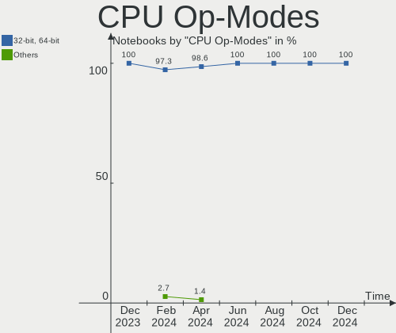
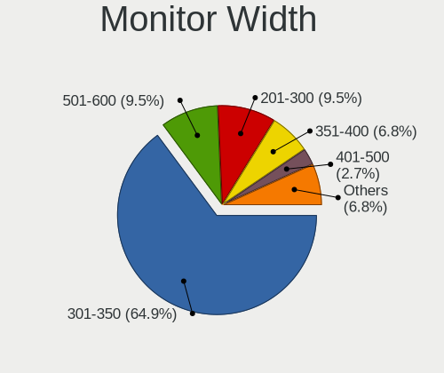

Kubuntu - Hardware Trends (Notebooks)
-------------------------------------

A project to identify most popular hardware characteristics and track their change
over time based on data collected by Linux users at https://Linux-Hardware.org.

Anyone can contribute to this report by the [hw-probe](https://github.com/linuxhw/hw-probe) tool:

    sudo -E hw-probe -all -upload

This report is for one last month. Overall report since the beginning of time: [TestDays](https://github.com/linuxhw/TestDays)

Period: May, 2023.

Contents
--------

* [ System ](#system)
  - [ OS                       ](#os)
  - [ OS Family                ](#os-family)
  - [ Kernel                   ](#kernel)
  - [ Kernel Family            ](#kernel-family)
  - [ Kernel Major Ver.        ](#kernel-major-ver)
  - [ Arch                     ](#arch)
  - [ DE                       ](#de)
  - [ Display Server           ](#display-server)
  - [ Display Manager          ](#display-manager)
  - [ OS Lang                  ](#os-lang)
  - [ Boot Mode                ](#boot-mode)
  - [ Filesystem               ](#filesystem)
  - [ Part. scheme             ](#part-scheme)
  - [ Dual Boot with Linux/BSD ](#dual-boot-with-linuxbsd)
  - [ Dual Boot (Win)          ](#dual-boot-win)

* [ Board ](#board)
  - [ Vendor                   ](#vendor)
  - [ Model                    ](#model)
  - [ Model Family             ](#model-family)
  - [ MFG Year                 ](#mfg-year)
  - [ Form Factor              ](#form-factor)
  - [ Secure Boot              ](#secure-boot)
  - [ Coreboot                 ](#coreboot)
  - [ RAM Size                 ](#ram-size)
  - [ RAM Used                 ](#ram-used)
  - [ Total Drives             ](#total-drives)
  - [ Has CD-ROM               ](#has-cd-rom)
  - [ Has Ethernet             ](#has-ethernet)
  - [ Has WiFi                 ](#has-wifi)
  - [ Has Bluetooth            ](#has-bluetooth)

* [ Location ](#location)
  - [ Country                  ](#country)
  - [ City                     ](#city)

* [ Drives ](#drives)
  - [ Drive Vendor             ](#drive-vendor)
  - [ Drive Model              ](#drive-model)
  - [ HDD Vendor               ](#hdd-vendor)
  - [ SSD Vendor               ](#ssd-vendor)
  - [ Drive Kind               ](#drive-kind)
  - [ Drive Connector          ](#drive-connector)
  - [ Drive Size               ](#drive-size)
  - [ Space Total              ](#space-total)
  - [ Space Used               ](#space-used)
  - [ Malfunc. Drives          ](#malfunc-drives)
  - [ Malfunc. Drive Vendor    ](#malfunc-drive-vendor)
  - [ Malfunc. HDD Vendor      ](#malfunc-hdd-vendor)
  - [ Malfunc. Drive Kind      ](#malfunc-drive-kind)
  - [ Failed Drives            ](#failed-drives)
  - [ Failed Drive Vendor      ](#failed-drive-vendor)
  - [ Drive Status             ](#drive-status)

* [ Storage controller ](#storage-controller)
  - [ Storage Vendor           ](#storage-vendor)
  - [ Storage Model            ](#storage-model)
  - [ Storage Kind             ](#storage-kind)

* [ Processor ](#processor)
  - [ CPU Vendor               ](#cpu-vendor)
  - [ CPU Model                ](#cpu-model)
  - [ CPU Model Family         ](#cpu-model-family)
  - [ CPU Cores                ](#cpu-cores)
  - [ CPU Sockets              ](#cpu-sockets)
  - [ CPU Threads              ](#cpu-threads)
  - [ CPU Op-Modes             ](#cpu-op-modes)
  - [ CPU Microcode            ](#cpu-microcode)
  - [ CPU Microarch            ](#cpu-microarch)

* [ Graphics ](#graphics)
  - [ GPU Vendor               ](#gpu-vendor)
  - [ GPU Model                ](#gpu-model)
  - [ GPU Combo                ](#gpu-combo)
  - [ GPU Driver               ](#gpu-driver)
  - [ GPU Memory               ](#gpu-memory)

* [ Monitor ](#monitor)
  - [ Monitor Vendor           ](#monitor-vendor)
  - [ Monitor Model            ](#monitor-model)
  - [ Monitor Resolution       ](#monitor-resolution)
  - [ Monitor Diagonal         ](#monitor-diagonal)
  - [ Monitor Width            ](#monitor-width)
  - [ Aspect Ratio             ](#aspect-ratio)
  - [ Monitor Area             ](#monitor-area)
  - [ Pixel Density            ](#pixel-density)
  - [ Multiple Monitors        ](#multiple-monitors)

* [ Network ](#network)
  - [ Net Controller Vendor    ](#net-controller-vendor)
  - [ Net Controller Model     ](#net-controller-model)
  - [ Wireless Vendor          ](#wireless-vendor)
  - [ Wireless Model           ](#wireless-model)
  - [ Ethernet Vendor          ](#ethernet-vendor)
  - [ Ethernet Model           ](#ethernet-model)
  - [ Net Controller Kind      ](#net-controller-kind)
  - [ Used Controller          ](#used-controller)
  - [ NICs                     ](#nics)
  - [ IPv6                     ](#ipv6)

* [ Bluetooth ](#bluetooth)
  - [ Bluetooth Vendor         ](#bluetooth-vendor)
  - [ Bluetooth Model          ](#bluetooth-model)

* [ Sound ](#sound)
  - [ Sound Vendor             ](#sound-vendor)
  - [ Sound Model              ](#sound-model)

* [ Memory ](#memory)
  - [ Memory Vendor            ](#memory-vendor)
  - [ Memory Model             ](#memory-model)
  - [ Memory Kind              ](#memory-kind)
  - [ Memory Form Factor       ](#memory-form-factor)
  - [ Memory Size              ](#memory-size)
  - [ Memory Speed             ](#memory-speed)

* [ Printers & scanners ](#printers--scanners)
  - [ Printer Vendor           ](#printer-vendor)
  - [ Printer Model            ](#printer-model)
  - [ Scanner Vendor           ](#scanner-vendor)
  - [ Scanner Model            ](#scanner-model)

* [ Camera ](#camera)
  - [ Camera Vendor            ](#camera-vendor)
  - [ Camera Model             ](#camera-model)

* [ Security ](#security)
  - [ Fingerprint Vendor       ](#fingerprint-vendor)
  - [ Fingerprint Model        ](#fingerprint-model)
  - [ Chipcard Vendor          ](#chipcard-vendor)
  - [ Chipcard Model           ](#chipcard-model)

* [ Unsupported ](#unsupported)
  - [ Unsupported Devices      ](#unsupported-devices)
  - [ Unsupported Device Types ](#unsupported-device-types)

System
------

OS
--

Installed operating systems

| Name          | Notebooks | Percent |
|---------------|-----------|---------|
| Kubuntu 23.04 | 30        | 46.88%  |
| Kubuntu 22.04 | 30        | 46.88%  |
| Kubuntu 20.04 | 3         | 4.69%   |
| Kubuntu 22.10 | 1         | 1.56%   |

OS Family
---------

OS without a version

| Name    | Notebooks | Percent |
|---------|-----------|---------|
| Kubuntu | 64        | 100%    |

Kernel
------

Version of the Linux kernel

| Version                | Notebooks | Percent |
|------------------------|-----------|---------|
| 6.2.0-20-generic       | 26        | 40.63%  |
| 5.19.0-41-generic      | 10        | 15.63%  |
| 5.15.0-71-generic      | 7         | 10.94%  |
| 5.19.0-42-generic      | 6         | 9.38%   |
| 5.15.0-72-generic      | 6         | 9.38%   |
| 6.3.4-060304-generic   | 2         | 3.13%   |
| 6.3.3-060303-generic   | 1         | 1.56%   |
| 6.3.1-060301-generic   | 1         | 1.56%   |
| 5.4.0-89-generic       | 1         | 1.56%   |
| 5.19.0-32-generic      | 1         | 1.56%   |
| 5.19.0-21-generic      | 1         | 1.56%   |
| 5.19.0-1023-lowlatency | 1         | 1.56%   |
| 5.15.0-72-lowlatency   | 1         | 1.56%   |

Kernel Family
-------------

Linux kernel without a distro release

| Version | Notebooks | Percent |
|---------|-----------|---------|
| 6.2.0   | 26        | 40.63%  |
| 5.19.0  | 19        | 29.69%  |
| 5.15.0  | 14        | 21.88%  |
| 6.3.4   | 2         | 3.13%   |
| 6.3.3   | 1         | 1.56%   |
| 6.3.1   | 1         | 1.56%   |
| 5.4.0   | 1         | 1.56%   |

Kernel Major Ver.
-----------------

Linux kernel major version

| Version | Notebooks | Percent |
|---------|-----------|---------|
| 6.2     | 26        | 40.63%  |
| 5.19    | 19        | 29.69%  |
| 5.15    | 14        | 21.88%  |
| 6.3     | 4         | 6.25%   |
| 5.4     | 1         | 1.56%   |

Arch
----

OS architecture (x86_64, i586, etc.)

| Name   | Notebooks | Percent |
|--------|-----------|---------|
| x86_64 | 64        | 100%    |

DE
--

Desktop Environment

| Name  | Notebooks | Percent |
|-------|-----------|---------|
| KDE5  | 61        | 95.31%  |
| KDE   | 2         | 3.13%   |
| GNOME | 1         | 1.56%   |

Display Server
--------------

X11 or Wayland

| Name    | Notebooks | Percent |
|---------|-----------|---------|
| X11     | 60        | 93.75%  |
| Wayland | 3         | 4.69%   |
| Tty     | 1         | 1.56%   |

Display Manager
---------------

SDDM, LightDM, etc.

| Name    | Notebooks | Percent |
|---------|-----------|---------|
| SDDM    | 46        | 71.88%  |
| Unknown | 15        | 23.44%  |
| LightDM | 2         | 3.13%   |
| GDM3    | 1         | 1.56%   |

OS Lang
-------

Language

| Lang   | Notebooks | Percent |
|--------|-----------|---------|
| en_US  | 30        | 46.88%  |
| de_DE  | 6         | 9.38%   |
| pl_PL  | 3         | 4.69%   |
| en_IN  | 3         | 4.69%   |
| en_GB  | 3         | 4.69%   |
| ru_RU  | 2         | 3.13%   |
| it_IT  | 2         | 3.13%   |
| en_NZ  | 2         | 3.13%   |
| C      | 2         | 3.13%   |
| zh_CN  | 1         | 1.56%   |
| sv_SE  | 1         | 1.56%   |
| pt_PT  | 1         | 1.56%   |
| pt_BR  | 1         | 1.56%   |
| nl_NL  | 1         | 1.56%   |
| fr_FR  | 1         | 1.56%   |
| fr_CH  | 1         | 1.56%   |
| es_ES  | 1         | 1.56%   |
| es_419 | 1         | 1.56%   |
| el_GR  | 1         | 1.56%   |
| de_AT  | 1         | 1.56%   |

Boot Mode
---------

EFI or BIOS

| Mode | Notebooks | Percent |
|------|-----------|---------|
| EFI  | 39        | 60.94%  |
| BIOS | 25        | 39.06%  |

Filesystem
----------

Type of filesystem

| Type    | Notebooks | Percent |
|---------|-----------|---------|
| Ext4    | 50        | 78.13%  |
| Tmpfs   | 8         | 12.5%   |
| Overlay | 4         | 6.25%   |
| Zfs     | 1         | 1.56%   |
| Btrfs   | 1         | 1.56%   |

Part. scheme
------------

Scheme of partitioning

| Type    | Notebooks | Percent |
|---------|-----------|---------|
| GPT     | 47        | 73.44%  |
| Unknown | 15        | 23.44%  |
| MBR     | 2         | 3.13%   |

Dual Boot with Linux/BSD
------------------------

Hosting more than one Linux/BSD

| Dual boot | Notebooks | Percent |
|-----------|-----------|---------|
| No        | 62        | 96.88%  |
| Yes       | 2         | 3.13%   |

Dual Boot (Win)
---------------

Hosting Linux and Windows

| Dual boot | Notebooks | Percent |
|-----------|-----------|---------|
| No        | 41        | 64.06%  |
| Yes       | 23        | 35.94%  |

Board
-----

Vendor
------

Motherboard manufacturer

| Name                | Notebooks | Percent |
|---------------------|-----------|---------|
| Lenovo              | 15        | 23.44%  |
| Dell                | 13        | 20.31%  |
| Hewlett-Packard     | 11        | 17.19%  |
| Acer                | 6         | 9.38%   |
| ASUSTek Computer    | 4         | 6.25%   |
| HUAWEI              | 3         | 4.69%   |
| Google              | 2         | 3.13%   |
| TerraQue            | 1         | 1.56%   |
| Samsung Electronics | 1         | 1.56%   |
| Razer               | 1         | 1.56%   |
| PC Specialist       | 1         | 1.56%   |
| Notebook            | 1         | 1.56%   |
| MSI                 | 1         | 1.56%   |
| Medion              | 1         | 1.56%   |
| Fujitsu             | 1         | 1.56%   |
| BOSGAME             | 1         | 1.56%   |
| Apple               | 1         | 1.56%   |

Model
-----

Motherboard model

| Name                                               | Notebooks | Percent |
|----------------------------------------------------|-----------|---------|
| TerraQue W65_W67RB                                 | 1         | 1.56%   |
| Samsung R425/R525                                  | 1         | 1.56%   |
| Razer Blade Pro 17 (2019)                          | 1         | 1.56%   |
| PC Specialist P65_67RSRP                           | 1         | 1.56%   |
| Notebook NLx0MU                                    | 1         | 1.56%   |
| MSI Titan GT77HX 13VH                              | 1         | 1.56%   |
| Medion E11201                                      | 1         | 1.56%   |
| Lenovo ThinkPad X1 Carbon Gen 11 21HMCTO1WW        | 1         | 1.56%   |
| Lenovo ThinkPad T460s 20F9CTO1WW                   | 1         | 1.56%   |
| Lenovo ThinkPad T16 Gen 1 21BVCTO1WW               | 1         | 1.56%   |
| Lenovo ThinkPad T15 Gen 2i 20W4008XSC              | 1         | 1.56%   |
| Lenovo ThinkPad E15 Gen 4 21EES00100               | 1         | 1.56%   |
| Lenovo ThinkPad E15 Gen 4 21EDCTO1WW               | 1         | 1.56%   |
| Lenovo ThinkPad E14 Gen 4 21ECS00000               | 1         | 1.56%   |
| Lenovo ThinkPad E14 Gen 3 20YDS02D00               | 1         | 1.56%   |
| Lenovo ThinkBook 15 G4 IAP 21DJ                    | 1         | 1.56%   |
| Lenovo Legion 5 15IMH05 82AU                       | 1         | 1.56%   |
| Lenovo IdeaPad Y700-15ISK 80NV                     | 1         | 1.56%   |
| Lenovo IdeaPad 700-17ISK 80RV                      | 1         | 1.56%   |
| Lenovo IdeaPad 3 15IAU7 82RK                       | 1         | 1.56%   |
| Lenovo IdeaPad 3 15ALC6 82MF                       | 1         | 1.56%   |
| Lenovo IdeaPad 3 15ADA05 81W1                      | 1         | 1.56%   |
| HUAWEI NBD-WXX9                                    | 1         | 1.56%   |
| HUAWEI HVY-WXX9                                    | 1         | 1.56%   |
| HUAWEI BOHB-WAX9                                   | 1         | 1.56%   |
| HP ZBook Studio 15.6 inch G8 Mobile Workstation PC | 1         | 1.56%   |
| HP ProBook 440 G5                                  | 1         | 1.56%   |
| HP Pavilion Laptop 15-eg0xxx                       | 1         | 1.56%   |
| HP Pavilion Gaming Laptop 15-ec0xxx                | 1         | 1.56%   |
| HP Laptop 15-da2xxx                                | 1         | 1.56%   |
| HP Laptop 14-fq0xxx                                | 1         | 1.56%   |
| HP ENVY TS 15                                      | 1         | 1.56%   |
| HP EliteBook 865 16 inch G9 Notebook PC            | 1         | 1.56%   |
| HP EliteBook 8470p                                 | 1         | 1.56%   |
| HP Compaq CQ58                                     | 1         | 1.56%   |
| HP 350 G1                                          | 1         | 1.56%   |
| Google Lars                                        | 1         | 1.56%   |
| Google Bluebird                                    | 1         | 1.56%   |
| Fujitsu LIFEBOOK U748                              | 1         | 1.56%   |
| Dell XPS 15 7590                                   | 1         | 1.56%   |

Model Family
------------

Motherboard model prefix

| Name              | Notebooks | Percent |
|-------------------|-----------|---------|
| Lenovo ThinkPad   | 8         | 12.5%   |
| Dell Latitude     | 6         | 9.38%   |
| Lenovo IdeaPad    | 5         | 7.81%   |
| Acer Aspire       | 5         | 7.81%   |
| HP Pavilion       | 2         | 3.13%   |
| HP Laptop         | 2         | 3.13%   |
| HP EliteBook      | 2         | 3.13%   |
| Dell XPS          | 2         | 3.13%   |
| Dell Inspiron     | 2         | 3.13%   |
| TerraQue W65      | 1         | 1.56%   |
| Samsung R425      | 1         | 1.56%   |
| Razer Blade       | 1         | 1.56%   |
| PC Specialist P65 | 1         | 1.56%   |
| Notebook NLx0MU   | 1         | 1.56%   |
| MSI Titan         | 1         | 1.56%   |
| Medion E11201     | 1         | 1.56%   |
| Lenovo ThinkBook  | 1         | 1.56%   |
| Lenovo Legion     | 1         | 1.56%   |
| HUAWEI NBD-WXX9   | 1         | 1.56%   |
| HUAWEI HVY-WXX9   | 1         | 1.56%   |
| HUAWEI BOHB-WAX9  | 1         | 1.56%   |
| HP ZBook          | 1         | 1.56%   |
| HP ProBook        | 1         | 1.56%   |
| HP ENVY           | 1         | 1.56%   |
| HP Compaq         | 1         | 1.56%   |
| HP 350            | 1         | 1.56%   |
| Google Lars       | 1         | 1.56%   |
| Google Bluebird   | 1         | 1.56%   |
| Fujitsu LIFEBOOK  | 1         | 1.56%   |
| Dell Precision    | 1         | 1.56%   |
| Dell G3           | 1         | 1.56%   |
| Dell G15          | 1         | 1.56%   |
| BOSGAME B95       | 1         | 1.56%   |
| ASUS Zenbook      | 1         | 1.56%   |
| ASUS X750JB       | 1         | 1.56%   |
| ASUS VivoBook     | 1         | 1.56%   |
| ASUS ROG          | 1         | 1.56%   |
| Apple MacBookPro9 | 1         | 1.56%   |
| Acer Swift        | 1         | 1.56%   |

MFG Year
--------

Motherboard manufacture year

| Year | Notebooks | Percent |
|------|-----------|---------|
| 2022 | 11        | 17.19%  |
| 2021 | 11        | 17.19%  |
| 2020 | 8         | 12.5%   |
| 2019 | 7         | 10.94%  |
| 2016 | 6         | 9.38%   |
| 2023 | 5         | 7.81%   |
| 2013 | 3         | 4.69%   |
| 2012 | 3         | 4.69%   |
| 2018 | 2         | 3.13%   |
| 2017 | 2         | 3.13%   |
| 2014 | 2         | 3.13%   |
| 2015 | 1         | 1.56%   |
| 2011 | 1         | 1.56%   |
| 2010 | 1         | 1.56%   |
| 2008 | 1         | 1.56%   |

Form Factor
-----------

Physical design of the computer

| Name     | Notebooks | Percent |
|----------|-----------|---------|
| Notebook | 64        | 100%    |

Secure Boot
-----------

Enabled or disabled

| State    | Notebooks | Percent |
|----------|-----------|---------|
| Disabled | 52        | 81.25%  |
| Enabled  | 12        | 18.75%  |

Coreboot
--------

Have coreboot on board

| Used | Notebooks | Percent |
|------|-----------|---------|
| No   | 62        | 96.88%  |
| Yes  | 2         | 3.13%   |

RAM Size
--------

Total RAM memory

| Size in GB  | Notebooks | Percent |
|-------------|-----------|---------|
| 4.01-8.0    | 17        | 26.56%  |
| 16.01-24.0  | 16        | 25%     |
| 8.01-16.0   | 12        | 18.75%  |
| 32.01-64.0  | 9         | 14.06%  |
| 3.01-4.0    | 6         | 9.38%   |
| 24.01-32.0  | 2         | 3.13%   |
| 64.01-256.0 | 1         | 1.56%   |
| 1.01-2.0    | 1         | 1.56%   |

RAM Used
--------

Used RAM memory

| Used GB   | Notebooks | Percent |
|-----------|-----------|---------|
| 4.01-8.0  | 18        | 28.13%  |
| 2.01-3.0  | 16        | 25%     |
| 1.01-2.0  | 14        | 21.88%  |
| 3.01-4.0  | 11        | 17.19%  |
| 8.01-16.0 | 5         | 7.81%   |

Total Drives
------------

Number of drives on board

| Drives | Notebooks | Percent |
|--------|-----------|---------|
| 1      | 47        | 73.44%  |
| 2      | 15        | 23.44%  |
| 3      | 2         | 3.13%   |

Has CD-ROM
----------

Has CD-ROM on board

| Presented | Notebooks | Percent |
|-----------|-----------|---------|
| No        | 53        | 82.81%  |
| Yes       | 11        | 17.19%  |

Has Ethernet
------------

Has Ethernet on board

| Presented | Notebooks | Percent |
|-----------|-----------|---------|
| Yes       | 46        | 71.88%  |
| No        | 18        | 28.13%  |

Has WiFi
--------

Has WiFi module

| Presented | Notebooks | Percent |
|-----------|-----------|---------|
| Yes       | 64        | 100%    |

Has Bluetooth
-------------

Has Bluetooth module

| Presented | Notebooks | Percent |
|-----------|-----------|---------|
| Yes       | 57        | 89.06%  |
| No        | 7         | 10.94%  |

Location
--------

Country
-------

Geographic location (country)

| Country     | Notebooks | Percent |
|-------------|-----------|---------|
| USA         | 11        | 17.19%  |
| Germany     | 9         | 14.06%  |
| UK          | 4         | 6.25%   |
| India       | 4         | 6.25%   |
| Spain       | 3         | 4.69%   |
| Poland      | 3         | 4.69%   |
| France      | 3         | 4.69%   |
| Russia      | 2         | 3.13%   |
| Portugal    | 2         | 3.13%   |
| New Zealand | 2         | 3.13%   |
| Netherlands | 2         | 3.13%   |
| Japan       | 2         | 3.13%   |
| Italy       | 2         | 3.13%   |
| Brazil      | 2         | 3.13%   |
| Belgium     | 2         | 3.13%   |
| Sweden      | 1         | 1.56%   |
| Qatar       | 1         | 1.56%   |
| Norway      | 1         | 1.56%   |
| Mexico      | 1         | 1.56%   |
| Greece      | 1         | 1.56%   |
| Czechia     | 1         | 1.56%   |
| Croatia     | 1         | 1.56%   |
| Colombia    | 1         | 1.56%   |
| Canada      | 1         | 1.56%   |
| Austria     | 1         | 1.56%   |
| Argentina   | 1         | 1.56%   |

City
----

Geographic location (city)

| City             | Notebooks | Percent |
|------------------|-----------|---------|
| Paris            | 2         | 3.13%   |
| Munich           | 2         | 3.13%   |
| Zagreb           | 1         | 1.56%   |
| Waianae          | 1         | 1.56%   |
| Villa Dominico   | 1         | 1.56%   |
| Valencia         | 1         | 1.56%   |
| Tokyo            | 1         | 1.56%   |
| Theydon Bois     | 1         | 1.56%   |
| Szczecin         | 1         | 1.56%   |
| Sundsvall        | 1         | 1.56%   |
| Sumter           | 1         | 1.56%   |
| Sherbrooke       | 1         | 1.56%   |
| Salt Lake City   | 1         | 1.56%   |
| Ribeirao Preto   | 1         | 1.56%   |
| Rewal            | 1         | 1.56%   |
| Prague           | 1         | 1.56%   |
| Poznan           | 1         | 1.56%   |
| Portimao         | 1         | 1.56%   |
| Olathe           | 1         | 1.56%   |
| Nizhniy Novgorod | 1         | 1.56%   |
| New Delhi        | 1         | 1.56%   |
| Nashik           | 1         | 1.56%   |
| Münster         | 1         | 1.56%   |
| Motoyoyogicho    | 1         | 1.56%   |
| Moscow           | 1         | 1.56%   |
| Milano           | 1         | 1.56%   |
| Madrid           | 1         | 1.56%   |
| Maastricht       | 1         | 1.56%   |
| Leonding         | 1         | 1.56%   |
| La Mesa          | 1         | 1.56%   |
| Jamundi          | 1         | 1.56%   |
| Isleworth        | 1         | 1.56%   |
| Irvine           | 1         | 1.56%   |
| Hyderabad        | 1         | 1.56%   |
| Hialeah          | 1         | 1.56%   |
| Harvest          | 1         | 1.56%   |
| Hamburg          | 1         | 1.56%   |
| Greenwich        | 1         | 1.56%   |
| Greenville       | 1         | 1.56%   |
| Ghent            | 1         | 1.56%   |

Drives
------

Drive Vendor
------------

Hard drive vendors

| Vendor                  | Notebooks | Drives | Percent |
|-------------------------|-----------|--------|---------|
| Samsung Electronics     | 15        | 16     | 18.29%  |
| WDC                     | 6         | 7      | 7.32%   |
| Toshiba                 | 6         | 7      | 7.32%   |
| Sandisk                 | 6         | 6      | 7.32%   |
| Unknown                 | 5         | 5      | 6.1%    |
| Seagate                 | 5         | 5      | 6.1%    |
| Kingston                | 5         | 5      | 6.1%    |
| Intel                   | 5         | 5      | 6.1%    |
| SK hynix                | 4         | 4      | 4.88%   |
| Micron Technology       | 4         | 4      | 4.88%   |
| Crucial                 | 3         | 3      | 3.66%   |
| UMIS                    | 2         | 2      | 2.44%   |
| WALRAM                  | 1         | 1      | 1.22%   |
| Union Memory (Shenzhen) | 1         | 1      | 1.22%   |
| SSSTC                   | 1         | 1      | 1.22%   |
| SSDPR-CX                | 1         | 1      | 1.22%   |
| Solid State Storage     | 1         | 1      | 1.22%   |
| Silicon Motion          | 1         | 1      | 1.22%   |
| Phison Electronics      | 1         | 1      | 1.22%   |
| Phison                  | 1         | 1      | 1.22%   |
| Patriot                 | 1         | 1      | 1.22%   |
| Lenovo                  | 1         | 1      | 1.22%   |
| KIOXIA                  | 1         | 1      | 1.22%   |
| ICY BOX                 | 1         | 1      | 1.22%   |
| HGST                    | 1         | 1      | 1.22%   |
| GOODRAM                 | 1         | 1      | 1.22%   |
| ADATA Technology        | 1         | 2      | 1.22%   |
| A-DATA Technology       | 1         | 1      | 1.22%   |

Drive Model
-----------

Hard drive models

| Model                                         | Notebooks | Percent |
|-----------------------------------------------|-----------|---------|
| Unknown MMC Card  32GB                        | 3         | 3.53%   |
| UMIS RPJTJ512MGE1QDQ 512GB                    | 2         | 2.35%   |
| Toshiba XG6 NVMe SSD Controller 256GB         | 2         | 2.35%   |
| Seagate ST500LT012-1DG142 500GB               | 2         | 2.35%   |
| SanDisk NVMe SSD Drive 2TB                    | 2         | 2.35%   |
| Kingston SA400S37480G 480GB SSD               | 2         | 2.35%   |
| Intel SSD 660P Series 512GB                   | 2         | 2.35%   |
| WDC WDS500G2B0C-00PXH0 500GB                  | 1         | 1.18%   |
| WDC WDS480G2G0C-00AJM0 480GB                  | 1         | 1.18%   |
| WDC WDS100T2B0C-00PXH0 1TB                    | 1         | 1.18%   |
| WDC WD3200BEVT-22ZCT0 320GB                   | 1         | 1.18%   |
| WDC WD16 00AVBB-63SYA0 160GB                  | 1         | 1.18%   |
| WDC WD Elements SE SSD 1TB                    | 1         | 1.18%   |
| WDC PC SN530 NVMe 512GB                       | 1         | 1.18%   |
| WALRAM 240G                                   | 1         | 1.18%   |
| Unknown SC16G  16GB                           | 1         | 1.18%   |
| Unknown Biwin  64GB                           | 1         | 1.18%   |
| Union Memory (Shenzhen) RPFTJ256PDD2MWX 256GB | 1         | 1.18%   |
| Toshiba THNSFJ256GDNU A 256GB SSD             | 1         | 1.18%   |
| Toshiba MQ02ABF100 1TB                        | 1         | 1.18%   |
| Toshiba MQ01ACF050 500GB                      | 1         | 1.18%   |
| Toshiba KXG6AZNV1T02 1TB                      | 1         | 1.18%   |
| Toshiba KXG60ZNV256G 256GB                    | 1         | 1.18%   |
| SSSTC CL4-4D512-Q79 512GB                     | 1         | 1.18%   |
| SSDPR-CX 400-256-G2 256GB                     | 1         | 1.18%   |
| Solid State Storage SSSTC CL1-4D256 256GB     | 1         | 1.18%   |
| SK hynix SKHynix_HFM512GDHTNI-87A0B 512GB     | 1         | 1.18%   |
| SK hynix PC401 NVMe 512GB                     | 1         | 1.18%   |
| SK hynix HFM512GD3JX016N 512GB                | 1         | 1.18%   |
| SK hynix BC711 HFM256GD3JX013N 256GB          | 1         | 1.18%   |
| Silicon Motion PCIe-8 SSD 256GB               | 1         | 1.18%   |
| Seagate ST500LM021-1KJ152 500GB               | 1         | 1.18%   |
| Seagate ST1000LM049-2GH172 1TB                | 1         | 1.18%   |
| Seagate Expansion 1TB                         | 1         | 1.18%   |
| Sandisk WDC WDS240G2G0C-00AJM0 240GB          | 1         | 1.18%   |
| Sandisk WD Blue SN570 1TB                     | 1         | 1.18%   |
| SanDisk SSD PLUS 480 GB                       | 1         | 1.18%   |
| SanDisk NVMe SSD Drive 1TB                    | 1         | 1.18%   |
| Samsung SSD 980 500GB                         | 1         | 1.18%   |
| Samsung SSD 970 EVO Plus 500GB                | 1         | 1.18%   |

HDD Vendor
----------

Hard disk drive vendors

| Vendor  | Notebooks | Drives | Percent |
|---------|-----------|--------|---------|
| Seagate | 5         | 5      | 50%     |
| WDC     | 2         | 2      | 20%     |
| Toshiba | 2         | 2      | 20%     |
| HGST    | 1         | 1      | 10%     |

SSD Vendor
----------

Solid state drive vendors

| Vendor              | Notebooks | Drives | Percent |
|---------------------|-----------|--------|---------|
| Kingston            | 3         | 3      | 17.65%  |
| Crucial             | 3         | 3      | 17.65%  |
| Samsung Electronics | 2         | 2      | 11.76%  |
| WDC                 | 1         | 1      | 5.88%   |
| Toshiba             | 1         | 1      | 5.88%   |
| SanDisk             | 1         | 1      | 5.88%   |
| Patriot             | 1         | 1      | 5.88%   |
| Micron Technology   | 1         | 1      | 5.88%   |
| Lenovo              | 1         | 1      | 5.88%   |
| Intel               | 1         | 1      | 5.88%   |
| GOODRAM             | 1         | 1      | 5.88%   |
| A-DATA Technology   | 1         | 1      | 5.88%   |

Drive Kind
----------

HDD or SSD

| Kind    | Notebooks | Drives | Percent |
|---------|-----------|--------|---------|
| NVMe    | 44        | 51     | 56.41%  |
| SSD     | 16        | 17     | 20.51%  |
| HDD     | 10        | 10     | 12.82%  |
| MMC     | 5         | 5      | 6.41%   |
| Unknown | 3         | 3      | 3.85%   |

Drive Connector
---------------

SATA, SAS, NVMe, etc.

| Type | Notebooks | Drives | Percent |
|------|-----------|--------|---------|
| NVMe | 44        | 51     | 57.14%  |
| SATA | 24        | 25     | 31.17%  |
| MMC  | 5         | 5      | 6.49%   |
| SAS  | 4         | 5      | 5.19%   |

Drive Size
----------

Size of hard drive

| Size in TB | Notebooks | Drives | Percent |
|------------|-----------|--------|---------|
| 0.01-0.5   | 16        | 17     | 64%     |
| 0.51-1.0   | 7         | 8      | 28%     |
| 1.01-2.0   | 2         | 2      | 8%      |

Space Total
-----------

Amount of disk space available on the file system

| Size in GB     | Notebooks | Percent |
|----------------|-----------|---------|
| 251-500        | 20        | 31.25%  |
| 101-250        | 17        | 26.56%  |
| 501-1000       | 9         | 14.06%  |
| 1001-2000      | 6         | 9.38%   |
| 1-20           | 3         | 4.69%   |
| 51-100         | 3         | 4.69%   |
| More than 3000 | 2         | 3.13%   |
| 21-50          | 2         | 3.13%   |
| 2001-3000      | 1         | 1.56%   |
| Unknown        | 1         | 1.56%   |

Space Used
----------

Amount of used disk space

| Used GB        | Notebooks | Percent |
|----------------|-----------|---------|
| 1-20           | 16        | 25%     |
| 251-500        | 12        | 18.75%  |
| 101-250        | 12        | 18.75%  |
| 21-50          | 9         | 14.06%  |
| 51-100         | 9         | 14.06%  |
| 1001-2000      | 2         | 3.13%   |
| 501-1000       | 2         | 3.13%   |
| More than 3000 | 1         | 1.56%   |
| Unknown        | 1         | 1.56%   |

Malfunc. Drives
---------------

Drive models with a malfunction

| Model                                | Notebooks | Drives | Percent |
|--------------------------------------|-----------|--------|---------|
| SK hynix BC711 HFM256GD3JX013N 256GB | 1         | 1      | 100%    |

Malfunc. Drive Vendor
---------------------

Vendors of faulty drives

| Vendor   | Notebooks | Drives | Percent |
|----------|-----------|--------|---------|
| SK hynix | 1         | 1      | 100%    |

Malfunc. HDD Vendor
-------------------

Vendors of faulty HDD drives

Zero info for selected period =(

Malfunc. Drive Kind
-------------------

Kinds of faulty drives

| Kind | Notebooks | Drives | Percent |
|------|-----------|--------|---------|
| NVMe | 1         | 1      | 100%    |

Failed Drives
-------------

Failed drive models

Zero info for selected period =(

Failed Drive Vendor
-------------------

Failed drive vendors

Zero info for selected period =(

Drive Status
------------

Number of failed and malfunc. drives

| Status   | Notebooks | Drives | Percent |
|----------|-----------|--------|---------|
| Works    | 36        | 40     | 50.7%   |
| Detected | 34        | 45     | 47.89%  |
| Malfunc  | 1         | 1      | 1.41%   |

Storage controller
------------------

Storage Vendor
--------------

Storage controller vendors

| Vendor                         | Notebooks | Percent |
|--------------------------------|-----------|---------|
| Intel                          | 36        | 42.86%  |
| Samsung Electronics            | 13        | 15.48%  |
| SanDisk                        | 8         | 9.52%   |
| AMD                            | 6         | 7.14%   |
| SK hynix                       | 4         | 4.76%   |
| Union Memory (Shenzhen)        | 3         | 3.57%   |
| Toshiba America Info Systems   | 3         | 3.57%   |
| Micron Technology              | 3         | 3.57%   |
| Solid State Storage Technology | 2         | 2.38%   |
| Phison Electronics             | 2         | 2.38%   |
| Kingston Technology Company    | 2         | 2.38%   |
| Silicon Motion                 | 1         | 1.19%   |
| KIOXIA                         | 1         | 1.19%   |

Storage Model
-------------

Storage controller models

| Model                                                                          | Notebooks | Percent |
|--------------------------------------------------------------------------------|-----------|---------|
| Samsung NVMe SSD Controller 980                                                | 5         | 5.56%   |
| Intel Volume Management Device NVMe RAID Controller                            | 5         | 5.56%   |
| Intel Sunrise Point-LP SATA Controller [AHCI mode]                             | 5         | 5.56%   |
| AMD FCH SATA Controller [AHCI mode]                                            | 5         | 5.56%   |
| SanDisk Non-Volatile memory controller                                         | 4         | 4.44%   |
| Samsung NVMe SSD Controller PM9A1/PM9A3/980PRO                                 | 4         | 4.44%   |
| Intel HM170/QM170 Chipset SATA Controller [AHCI Mode]                          | 4         | 4.44%   |
| Intel Cannon Lake Mobile PCH SATA AHCI Controller                              | 4         | 4.44%   |
| Toshiba America Info Systems XG6 NVMe SSD Controller                           | 3         | 3.33%   |
| Micron NVMe Storage Controller                                                 | 3         | 3.33%   |
| Intel 82801 Mobile SATA Controller [RAID mode]                                 | 3         | 3.33%   |
| Intel 8 Series/C220 Series Chipset Family 6-port SATA Controller 1 [AHCI mode] | 3         | 3.33%   |
| Intel 7 Series Chipset Family 6-port SATA Controller [AHCI mode]               | 3         | 3.33%   |
| Union Memory (Shenzhen) AM630 PCIe 4.0 x4 NVMe SSD Controller                  | 2         | 2.22%   |
| Solid State Storage Non-Volatile memory controller                             | 2         | 2.22%   |
| SK hynix Gold P31/PC711 NVMe Solid State Drive                                 | 2         | 2.22%   |
| Samsung NVMe SSD Controller SM981/PM981/PM983                                  | 2         | 2.22%   |
| Samsung NVMe SSD Controller SM961/PM961/SM963                                  | 2         | 2.22%   |
| Intel Tiger Lake-LP SATA Controller                                            | 2         | 2.22%   |
| Intel SSD 660P Series                                                          | 2         | 2.22%   |
| Intel Non-Volatile memory controller                                           | 2         | 2.22%   |
| Intel Comet Lake SATA AHCI Controller                                          | 2         | 2.22%   |
| Union Memory (Shenzhen) Non-Volatile memory controller                         | 1         | 1.11%   |
| SK hynix PC401 NVMe Solid State Drive 256GB                                    | 1         | 1.11%   |
| SK hynix BC511                                                                 | 1         | 1.11%   |
| Silicon Motion Non-Volatile memory controller                                  | 1         | 1.11%   |
| SanDisk WD PC SN810 / Black SN850 NVMe SSD                                     | 1         | 1.11%   |
| SanDisk WD Blue SN570 NVMe SSD 1TB                                             | 1         | 1.11%   |
| SanDisk WD Blue SN550 NVMe SSD                                                 | 1         | 1.11%   |
| SanDisk WD Black SN750 / PC SN730 NVMe SSD                                     | 1         | 1.11%   |
| Phison PS5013 E13 NVMe Controller                                              | 1         | 1.11%   |
| Phison E16 PCIe4 NVMe Controller                                               | 1         | 1.11%   |
| KIOXIA NVMe SSD Controller BG4                                                 | 1         | 1.11%   |
| Kingston Company Company Non-Volatile memory controller                        | 1         | 1.11%   |
| Kingston Company KC2000 NVMe SSD                                               | 1         | 1.11%   |
| Intel SATA Controller [RAID mode]                                              | 1         | 1.11%   |
| Intel SATA controller                                                          | 1         | 1.11%   |
| Intel Ice Lake-LP SATA Controller [AHCI mode]                                  | 1         | 1.11%   |
| Intel Celeron N3350/Pentium N4200/Atom E3900 Series SATA AHCI Controller       | 1         | 1.11%   |
| Intel Alder Lake-P SATA AHCI Controller                                        | 1         | 1.11%   |

Storage Kind
------------

Kind of storage controller (IDE, SATA, NVMe, SAS, ...)

| Kind | Notebooks | Percent |
|------|-----------|---------|
| NVMe | 43        | 49.43%  |
| SATA | 35        | 40.23%  |
| RAID | 9         | 10.34%  |

Processor
---------

CPU Vendor
----------

Processor vendors

| Vendor | Notebooks | Percent |
|--------|-----------|---------|
| Intel  | 47        | 73.44%  |
| AMD    | 17        | 26.56%  |

CPU Model
---------

Processor models

| Model                                   | Notebooks | Percent |
|-----------------------------------------|-----------|---------|
| Intel Core i7-6700HQ CPU @ 2.60GHz      | 4         | 6.25%   |
| Intel 11th Gen Core i7-1165G7 @ 2.80GHz | 3         | 4.69%   |
| Intel Core i5-6200U CPU @ 2.30GHz       | 2         | 3.13%   |
| Intel 12th Gen Core i5-1235U            | 2         | 3.13%   |
| Intel 11th Gen Core i3-1115G4 @ 3.00GHz | 2         | 3.13%   |
| AMD Ryzen 7 6800H with Radeon Graphics  | 2         | 3.13%   |
| AMD Ryzen 7 5825U with Radeon Graphics  | 2         | 3.13%   |
| AMD Ryzen 5 5500U with Radeon Graphics  | 2         | 3.13%   |
| AMD Ryzen 3 3250U with Radeon Graphics  | 2         | 3.13%   |
| Intel Pentium CPU 6405U @ 2.40GHz       | 1         | 1.56%   |
| Intel N95                               | 1         | 1.56%   |
| Intel Core i9-9980HK CPU @ 2.40GHz      | 1         | 1.56%   |
| Intel Core i7-9750H CPU @ 2.60GHz       | 1         | 1.56%   |
| Intel Core i7-8850H CPU @ 2.60GHz       | 1         | 1.56%   |
| Intel Core i7-8550U CPU @ 1.80GHz       | 1         | 1.56%   |
| Intel Core i7-6600U CPU @ 2.60GHz       | 1         | 1.56%   |
| Intel Core i7-4702MQ CPU @ 2.20GHz      | 1         | 1.56%   |
| Intel Core i7-4700HQ CPU @ 2.40GHz      | 1         | 1.56%   |
| Intel Core i7-3615QM CPU @ 2.30GHz      | 1         | 1.56%   |
| Intel Core i7-3520M CPU @ 2.90GHz       | 1         | 1.56%   |
| Intel Core i7-10750H CPU @ 2.60GHz      | 1         | 1.56%   |
| Intel Core i7-1065G7 CPU @ 1.30GHz      | 1         | 1.56%   |
| Intel Core i5-9300H CPU @ 2.40GHz       | 1         | 1.56%   |
| Intel Core i5-7200U CPU @ 2.50GHz       | 1         | 1.56%   |
| Intel Core i5-6300HQ CPU @ 2.30GHz      | 1         | 1.56%   |
| Intel Core i5-4200M CPU @ 2.50GHz       | 1         | 1.56%   |
| Intel Core i5-3320M CPU @ 2.60GHz       | 1         | 1.56%   |
| Intel Core i5-1035G1 CPU @ 1.00GHz      | 1         | 1.56%   |
| Intel Core i5-10210U CPU @ 1.60GHz      | 1         | 1.56%   |
| Intel Core i3-6157U CPU @ 2.40GHz       | 1         | 1.56%   |
| Intel Core i3-4005U CPU @ 1.70GHz       | 1         | 1.56%   |
| Intel Core i3-1005G1 CPU @ 1.20GHz      | 1         | 1.56%   |
| Intel Core 2 Duo CPU P8400 @ 2.26GHz    | 1         | 1.56%   |
| Intel Celeron N4020 CPU @ 1.10GHz       | 1         | 1.56%   |
| Intel Celeron CPU N3450 @ 1.10GHz       | 1         | 1.56%   |
| Intel Celeron CPU B830 @ 1.80GHz        | 1         | 1.56%   |
| Intel Celeron CPU 3855U @ 1.60GHz       | 1         | 1.56%   |
| Intel 13th Gen Core i9-13980HX          | 1         | 1.56%   |
| Intel 13th Gen Core i7-1365U            | 1         | 1.56%   |
| Intel 12th Gen Core i7-1270P            | 1         | 1.56%   |

CPU Model Family
----------------

Processor model prefix

| Model                   | Notebooks | Percent |
|-------------------------|-----------|---------|
| Other                   | 14        | 21.88%  |
| Intel Core i7           | 14        | 21.88%  |
| Intel Core i5           | 9         | 14.06%  |
| AMD Ryzen 5             | 8         | 12.5%   |
| AMD Ryzen 7             | 5         | 7.81%   |
| Intel Celeron           | 4         | 6.25%   |
| Intel Core i3           | 3         | 4.69%   |
| AMD Ryzen 3             | 2         | 3.13%   |
| Intel Pentium           | 1         | 1.56%   |
| Intel Core i9           | 1         | 1.56%   |
| Intel Core 2 Duo        | 1         | 1.56%   |
| AMD Athlon II Dual-Core | 1         | 1.56%   |
| AMD A4                  | 1         | 1.56%   |

CPU Cores
---------

Number of processor cores

| Number | Notebooks | Percent |
|--------|-----------|---------|
| 4      | 22        | 34.38%  |
| 2      | 20        | 31.25%  |
| 6      | 10        | 15.63%  |
| 8      | 7         | 10.94%  |
| 10     | 3         | 4.69%   |
| 24     | 1         | 1.56%   |
| 12     | 1         | 1.56%   |

CPU Sockets
-----------

Number of sockets

| Number | Notebooks | Percent |
|--------|-----------|---------|
| 1      | 64        | 100%    |

CPU Threads
-----------

Threads per core (Hyper-Threading)

| Number | Notebooks | Percent |
|--------|-----------|---------|
| 2      | 55        | 85.94%  |
| 1      | 9         | 14.06%  |

CPU Op-Modes
------------

CPU Operation Modes (32-bit, 64-bit)

| Op mode        | Notebooks | Percent |
|----------------|-----------|---------|
| 32-bit, 64-bit | 64        | 100%    |

CPU Microcode
-------------

Microcode number

| Number     | Notebooks | Percent |
|------------|-----------|---------|
| Unknown    | 35        | 54.69%  |
| 0x806c1    | 4         | 6.25%   |
| 0x906ea    | 3         | 4.69%   |
| 0x0a50000c | 3         | 4.69%   |
| 0x0a404102 | 3         | 4.69%   |
| 0x706e5    | 2         | 3.13%   |
| 0x506e3    | 2         | 3.13%   |
| 0x406e3    | 2         | 3.13%   |
| 0x306a9    | 2         | 3.13%   |
| 0x08108109 | 2         | 3.13%   |
| 0x906ed    | 1         | 1.56%   |
| 0x906a4    | 1         | 1.56%   |
| 0x906a3    | 1         | 1.56%   |
| 0x806ea    | 1         | 1.56%   |
| 0x40651    | 1         | 1.56%   |
| 0x08608102 | 1         | 1.56%   |

CPU Microarch
-------------

Microarchitecture

| Name             | Notebooks | Percent |
|------------------|-----------|---------|
| Skylake          | 10        | 15.63%  |
| Unknown          | 9         | 14.06%  |
| KabyLake         | 8         | 12.5%   |
| TigerLake        | 7         | 10.94%  |
| Alderlake Hybrid | 5         | 7.81%   |
| Zen 3            | 4         | 6.25%   |
| Haswell          | 4         | 6.25%   |
| Zen+             | 3         | 4.69%   |
| IvyBridge        | 3         | 4.69%   |
| IceLake          | 3         | 4.69%   |
| Zen 2            | 1         | 1.56%   |
| SandyBridge      | 1         | 1.56%   |
| Puma             | 1         | 1.56%   |
| Penryn           | 1         | 1.56%   |
| K10              | 1         | 1.56%   |
| Goldmont plus    | 1         | 1.56%   |
| Goldmont         | 1         | 1.56%   |
| CometLake        | 1         | 1.56%   |

Graphics
--------

GPU Vendor
----------

Vendors of graphics cards

| Vendor | Notebooks | Percent |
|--------|-----------|---------|
| Intel  | 46        | 53.49%  |
| Nvidia | 23        | 26.74%  |
| AMD    | 17        | 19.77%  |

GPU Model
---------

Graphics card models

| Model                                                                | Notebooks | Percent |
|----------------------------------------------------------------------|-----------|---------|
| Intel TigerLake-LP GT2 [Iris Xe Graphics]                            | 5         | 5.81%   |
| Intel HD Graphics 530                                                | 5         | 5.81%   |
| Intel CoffeeLake-H GT2 [UHD Graphics 630]                            | 4         | 4.65%   |
| AMD Rembrandt [Radeon 680M]                                          | 4         | 4.65%   |
| Intel Skylake GT2 [HD Graphics 520]                                  | 3         | 3.49%   |
| Intel 4th Gen Core Processor Integrated Graphics Controller          | 3         | 3.49%   |
| Intel 3rd Gen Core processor Graphics Controller                     | 3         | 3.49%   |
| AMD Picasso/Raven 2 [Radeon Vega Series / Radeon Vega Mobile Series] | 3         | 3.49%   |
| AMD Lucienne                                                         | 3         | 3.49%   |
| AMD Barcelo                                                          | 3         | 3.49%   |
| Nvidia TU117M [GeForce GTX 1650 Mobile / Max-Q]                      | 2         | 2.33%   |
| Nvidia GK107M [GeForce GT 750M]                                      | 2         | 2.33%   |
| Nvidia GA107M [GeForce RTX 3050 Mobile]                              | 2         | 2.33%   |
| Intel Tiger Lake-LP GT2 [UHD Graphics G4]                            | 2         | 2.33%   |
| Intel Iris Plus Graphics G1 (Ice Lake)                               | 2         | 2.33%   |
| Nvidia TU117M                                                        | 1         | 1.16%   |
| Nvidia TU106M [GeForce RTX 2060 Mobile]                              | 1         | 1.16%   |
| Nvidia GP107M [GeForce GTX 1050 3 GB Max-Q]                          | 1         | 1.16%   |
| Nvidia GP107GLM [Quadro P1000 Mobile]                                | 1         | 1.16%   |
| Nvidia GP106BM [GeForce GTX 1060 Mobile 6GB]                         | 1         | 1.16%   |
| Nvidia GM108M [GeForce 940M]                                         | 1         | 1.16%   |
| Nvidia GM108M [GeForce 930M]                                         | 1         | 1.16%   |
| Nvidia GM108M [GeForce 930MX]                                        | 1         | 1.16%   |
| Nvidia GM107M [GeForce GTX 960M]                                     | 1         | 1.16%   |
| Nvidia GM107M [GeForce GTX 950M]                                     | 1         | 1.16%   |
| Nvidia GK208M [GeForce GT 740M]                                      | 1         | 1.16%   |
| Nvidia GK107M [GeForce GT 650M Mac Edition]                          | 1         | 1.16%   |
| Nvidia GA107GLM [RTX A2000 Mobile]                                   | 1         | 1.16%   |
| Nvidia GA107BM [GeForce RTX 3050 Mobile]                             | 1         | 1.16%   |
| Nvidia GA104 [Geforce RTX 3070 Ti Laptop GPU]                        | 1         | 1.16%   |
| Nvidia G98M [Quadro NVS 160M]                                        | 1         | 1.16%   |
| Nvidia AD104M [GeForce RTX 4080 Max-Q / Mobile]                      | 1         | 1.16%   |
| Intel UHD Graphics 620                                               | 1         | 1.16%   |
| Intel TigerLake-H GT1 [UHD Graphics]                                 | 1         | 1.16%   |
| Intel Raptor Lake-S UHD Graphics                                     | 1         | 1.16%   |
| Intel Raptor Lake-P [Iris Xe Graphics]                               | 1         | 1.16%   |
| Intel Iris Plus Graphics G7                                          | 1         | 1.16%   |
| Intel Iris Graphics 550                                              | 1         | 1.16%   |
| Intel HD Graphics 620                                                | 1         | 1.16%   |
| Intel HD Graphics 510                                                | 1         | 1.16%   |

GPU Combo
---------

Combinations of graphics cards

| Name           | Notebooks | Percent |
|----------------|-----------|---------|
| 1 x Intel      | 28        | 43.75%  |
| Intel + Nvidia | 17        | 26.56%  |
| 1 x AMD        | 12        | 18.75%  |
| AMD + Nvidia   | 5         | 7.81%   |
| Other          | 1         | 1.56%   |
| 1 x Nvidia     | 1         | 1.56%   |

GPU Driver
----------

Free vs proprietary

| Driver      | Notebooks | Percent |
|-------------|-----------|---------|
| Free        | 48        | 75%     |
| Proprietary | 14        | 21.88%  |
| Unknown     | 2         | 3.13%   |

GPU Memory
----------

Total video memory

| Size in GB | Notebooks | Percent |
|------------|-----------|---------|
| Unknown    | 50        | 78.13%  |
| 0.01-0.5   | 5         | 7.81%   |
| 1.01-2.0   | 3         | 4.69%   |
| 0.51-1.0   | 3         | 4.69%   |
| 3.01-4.0   | 2         | 3.13%   |
| 5.01-6.0   | 1         | 1.56%   |

Monitor
-------

Monitor Vendor
--------------

Monitor vendors

| Vendor              | Notebooks | Percent |
|---------------------|-----------|---------|
| BOE                 | 16        | 20%     |
| AU Optronics        | 13        | 16.25%  |
| Samsung Electronics | 12        | 15%     |
| Chimei Innolux      | 10        | 12.5%   |
| LG Display          | 8         | 10%     |
| Goldstar            | 4         | 5%      |
| Sharp               | 2         | 2.5%    |
| UGD                 | 1         | 1.25%   |
| Philips             | 1         | 1.25%   |
| PANDA               | 1         | 1.25%   |
| Panasonic           | 1         | 1.25%   |
| Medion              | 1         | 1.25%   |
| LOE                 | 1         | 1.25%   |
| LG Philips          | 1         | 1.25%   |
| KDC                 | 1         | 1.25%   |
| KDB                 | 1         | 1.25%   |
| Denver              | 1         | 1.25%   |
| Dell                | 1         | 1.25%   |
| CSO                 | 1         | 1.25%   |
| ASUSTek Computer    | 1         | 1.25%   |
| Apple               | 1         | 1.25%   |
| Acer                | 1         | 1.25%   |

Monitor Model
-------------

Monitor models

| Model                                                                 | Notebooks | Percent |
|-----------------------------------------------------------------------|-----------|---------|
| AU Optronics LCD Monitor AUOE48D 1920x1080 344x194mm 15.5-inch        | 2         | 2.44%   |
| UGD CD220F (H) UGD2210 1920x1080 527x296mm 23.8-inch                  | 1         | 1.22%   |
| Sharp LCD Monitor SHP14CB 1920x1200 290x180mm 13.4-inch               | 1         | 1.22%   |
| Sharp LCD Monitor SHP149A 1920x1080 344x194mm 15.5-inch               | 1         | 1.22%   |
| Samsung Electronics U28E590 SAM0C4E 3840x2160 608x345mm 27.5-inch     | 1         | 1.22%   |
| Samsung Electronics T27B300 SAM0933 1920x1080 598x336mm 27.0-inch     | 1         | 1.22%   |
| Samsung Electronics SyncMaster SAM05E8 1920x1080                      | 1         | 1.22%   |
| Samsung Electronics SyncMaster SAM04AF 1680x1050 470x300mm 22.0-inch  | 1         | 1.22%   |
| Samsung Electronics SyncMaster SAM0498 1600x900 443x249mm 20.0-inch   | 1         | 1.22%   |
| Samsung Electronics LF24T450F SAM7094 1920x1080 527x296mm 23.8-inch   | 1         | 1.22%   |
| Samsung Electronics LF24T35 SAM707E 1920x1080 528x297mm 23.9-inch     | 1         | 1.22%   |
| Samsung Electronics LCD Monitor SEC5441 1280x800 331x207mm 15.4-inch  | 1         | 1.22%   |
| Samsung Electronics LCD Monitor SEC4542 1366x768 309x174mm 14.0-inch  | 1         | 1.22%   |
| Samsung Electronics LCD Monitor SDCA029 3840x2160 344x194mm 15.5-inch | 1         | 1.22%   |
| Samsung Electronics LCD Monitor SDC4642 1366x768 309x174mm 14.0-inch  | 1         | 1.22%   |
| Samsung Electronics LCD Monitor SDC4193 2880x1800 302x189mm 14.0-inch | 1         | 1.22%   |
| Samsung Electronics LCD Monitor SDC4171 2880x1800 302x189mm 14.0-inch | 1         | 1.22%   |
| Samsung Electronics C27F398 SAM0D44 1920x1080 598x336mm 27.0-inch     | 1         | 1.22%   |
| Philips PHL 276E8V PHLC18F 3840x2160 597x336mm 27.0-inch              | 1         | 1.22%   |
| PANDA LCD Monitor NCP003F 1920x1080 344x194mm 15.5-inch               | 1         | 1.22%   |
| Panasonic TV MEIA081 1280x720 698x392mm 31.5-inch                     | 1         | 1.22%   |
| Medion MD 20122 MED3602 1680x1050 474x296mm 22.0-inch                 | 1         | 1.22%   |
| LOE LOEWE HDMI TV LOE0610 1280x720 700x394mm 31.6-inch                | 1         | 1.22%   |
| LG Philips LCD Monitor LPL0AA8 1440x900 331x207mm 15.4-inch           | 1         | 1.22%   |
| LG Display LCD Monitor LGD04FF 1920x1080 309x174mm 14.0-inch          | 1         | 1.22%   |
| LG Display LCD Monitor LGD04AF 1366x768 344x194mm 15.5-inch           | 1         | 1.22%   |
| LG Display LCD Monitor LGD04A7 1920x1080 344x194mm 15.5-inch          | 1         | 1.22%   |
| LG Display LCD Monitor LGD046D 1920x1080 309x174mm 14.0-inch          | 1         | 1.22%   |
| LG Display LCD Monitor LGD046C 1920x1080 382x215mm 17.3-inch          | 1         | 1.22%   |
| LG Display LCD Monitor LGD0469 1920x1080 382x215mm 17.3-inch          | 1         | 1.22%   |
| LG Display LCD Monitor LGD0390 1600x900 382x215mm 17.3-inch           | 1         | 1.22%   |
| LG Display LCD Monitor LGD034D 1366x768 344x194mm 15.5-inch           | 1         | 1.22%   |
| KDC LCD Monitor KDC0109 1366x768 256x144mm 11.6-inch                  | 1         | 1.22%   |
| KDB LCD Monitor KDB0101 1366x768 256x144mm 11.6-inch                  | 1         | 1.22%   |
| Goldstar ULTRAWIDE GSM7770 2560x1080 798x334mm 34.1-inch              | 1         | 1.22%   |
| Goldstar ULTRAWIDE GSM76F6 3440x1440 800x335mm 34.1-inch              | 1         | 1.22%   |
| Goldstar TV SSCR2 GSM8080 3840x2160                                   | 1         | 1.22%   |
| Goldstar LG HDR WQHD GSM772E 3440x1440 800x340mm 34.2-inch            | 1         | 1.22%   |
| Denver M24-FHD-165 LHC2400 1920x1080 527x296mm 23.8-inch              | 1         | 1.22%   |
| Dell U2722DE DEL4237 2560x1440 597x336mm 27.0-inch                    | 1         | 1.22%   |

Monitor Resolution
------------------

Monitor screen resolution

| Resolution         | Notebooks | Percent |
|--------------------|-----------|---------|
| 1920x1080 (FHD)    | 33        | 45.21%  |
| 1366x768 (WXGA)    | 14        | 19.18%  |
| 3840x2160 (4K)     | 6         | 8.22%   |
| 1600x900 (HD+)     | 4         | 5.48%   |
| 2560x1440 (QHD)    | 3         | 4.11%   |
| 1920x1200 (WUXGA)  | 3         | 4.11%   |
| 2880x1800          | 2         | 2.74%   |
| 1680x1050 (WSXGA+) | 2         | 2.74%   |
| 1440x900 (WXGA+)   | 2         | 2.74%   |
| 3440x1440          | 1         | 1.37%   |
| 2560x1080          | 1         | 1.37%   |
| 1920x540           | 1         | 1.37%   |
| 1280x720 (HD)      | 1         | 1.37%   |

Monitor Diagonal
----------------

Diagonal size in inches

| Inches  | Notebooks | Percent |
|---------|-----------|---------|
| 15      | 31        | 38.75%  |
| 14      | 11        | 13.75%  |
| 17      | 8         | 10%     |
| 27      | 6         | 7.5%    |
| 13      | 6         | 7.5%    |
| 16      | 3         | 3.75%   |
| 34      | 2         | 2.5%    |
| 31      | 2         | 2.5%    |
| 23      | 2         | 2.5%    |
| 22      | 2         | 2.5%    |
| 11      | 2         | 2.5%    |
| 72      | 1         | 1.25%   |
| 40      | 1         | 1.25%   |
| 24      | 1         | 1.25%   |
| 20      | 1         | 1.25%   |
| Unknown | 1         | 1.25%   |

Monitor Width
-------------

Physical width

| Width in mm | Notebooks | Percent |
|-------------|-----------|---------|
| 301-350     | 48        | 60%     |
| 351-400     | 10        | 12.5%   |
| 501-600     | 8         | 10%     |
| 601-700     | 3         | 3.75%   |
| 401-500     | 3         | 3.75%   |
| 201-300     | 3         | 3.75%   |
| 701-800     | 2         | 2.5%    |
| 801-900     | 1         | 1.25%   |
| 1501-2000   | 1         | 1.25%   |
| Unknown     | 1         | 1.25%   |

Aspect Ratio
------------

Proportional relationship between the width and the height

| Ratio | Notebooks | Percent |
|-------|-----------|---------|
| 16/9  | 56        | 83.58%  |
| 16/10 | 9         | 13.43%  |
| 21/9  | 2         | 2.99%   |

Monitor Area
------------

Area in inch²

| Area in inch² | Notebooks | Percent |
|----------------|-----------|---------|
| 101-110        | 32        | 40%     |
| 81-90          | 16        | 20%     |
| 121-130        | 7         | 8.75%   |
| 301-350        | 6         | 7.5%    |
| 201-250        | 5         | 6.25%   |
| 351-500        | 4         | 5%      |
| 51-60          | 2         | 2.5%    |
| 111-120        | 2         | 2.5%    |
| More than 1000 | 1         | 1.25%   |
| 71-80          | 1         | 1.25%   |
| 151-200        | 1         | 1.25%   |
| 131-140        | 1         | 1.25%   |
| 501-1000       | 1         | 1.25%   |
| Unknown        | 1         | 1.25%   |

Pixel Density
-------------

Pixels per inch

| Density       | Notebooks | Percent |
|---------------|-----------|---------|
| 121-160       | 38        | 49.35%  |
| 101-120       | 16        | 20.78%  |
| 51-100        | 12        | 15.58%  |
| More than 240 | 5         | 6.49%   |
| 161-240       | 4         | 5.19%   |
| 1-50          | 1         | 1.3%    |
| Unknown       | 1         | 1.3%    |

Multiple Monitors
-----------------

Total monitors connected

| Total | Notebooks | Percent |
|-------|-----------|---------|
| 1     | 46        | 71.88%  |
| 2     | 12        | 18.75%  |
| 3     | 4         | 6.25%   |
| 0     | 2         | 3.13%   |

Network
-------

Net Controller Vendor
---------------------

Controller vendors

| Vendor                     | Notebooks | Percent |
|----------------------------|-----------|---------|
| Realtek Semiconductor      | 37        | 38.95%  |
| Intel                      | 32        | 33.68%  |
| MediaTek                   | 8         | 8.42%   |
| Qualcomm Atheros           | 7         | 7.37%   |
| Ralink                     | 3         | 3.16%   |
| Lenovo                     | 2         | 2.11%   |
| Broadcom Limited           | 2         | 2.11%   |
| Broadcom                   | 2         | 2.11%   |
| Shenzhen Goodix Technology | 1         | 1.05%   |
| Marvell Technology Group   | 1         | 1.05%   |

Net Controller Model
--------------------

Controller models

| Model                                                             | Notebooks | Percent |
|-------------------------------------------------------------------|-----------|---------|
| Realtek RTL8111/8168/8411 PCI Express Gigabit Ethernet Controller | 22        | 19.13%  |
| Realtek RTL8822CE 802.11ac PCIe Wireless Network Adapter          | 5         | 4.35%   |
| MediaTek MT7921 802.11ax PCI Express Wireless Network Adapter     | 5         | 4.35%   |
| Intel Wireless 8260                                               | 5         | 4.35%   |
| Realtek RTL8852BE PCIe 802.11ax Wireless Network Controller       | 4         | 3.48%   |
| Realtek RTL8153 Gigabit Ethernet Adapter                          | 4         | 3.48%   |
| Intel Wireless 8265 / 8275                                        | 4         | 3.48%   |
| Intel Wi-Fi 6 AX200                                               | 4         | 3.48%   |
| Realtek RTL8821CE 802.11ac PCIe Wireless Network Adapter          | 3         | 2.61%   |
| Qualcomm Atheros QCA9377 802.11ac Wireless Network Adapter        | 3         | 2.61%   |
| Intel Wi-Fi 6 AX201                                               | 3         | 2.61%   |
| Realtek RTL8125 2.5GbE Controller                                 | 2         | 1.74%   |
| Realtek RTL810xE PCI Express Fast Ethernet controller             | 2         | 1.74%   |
| Ralink RT3290 Wireless 802.11n 1T/1R PCIe                         | 2         | 1.74%   |
| MediaTek MT7922 802.11ax PCI Express Wireless Network Adapter     | 2         | 1.74%   |
| Intel Ethernet Connection (4) I219-LM                             | 2         | 1.74%   |
| Intel Ethernet Connection (13) I219-V                             | 2         | 1.74%   |
| Intel Alder Lake-P PCH CNVi WiFi                                  | 2         | 1.74%   |
| Shenzhen Goodix Unknow device                                     | 1         | 0.87%   |
| Realtek RTL8152 Fast Ethernet Adapter                             | 1         | 0.87%   |
| Realtek Killer E3000 2.5GbE Controller                            | 1         | 0.87%   |
| Ralink RT5390R 802.11bgn PCIe Wireless Network Adapter            | 1         | 0.87%   |
| Qualcomm Atheros QCA6174 802.11ac Wireless Network Adapter        | 1         | 0.87%   |
| Qualcomm Atheros AR9462 Wireless Network Adapter                  | 1         | 0.87%   |
| Qualcomm Atheros AR9287 Wireless Network Adapter (PCI-Express)    | 1         | 0.87%   |
| Qualcomm Atheros AR9285 Wireless Network Adapter (PCI-Express)    | 1         | 0.87%   |
| MediaTek 802.11AC MT7663 Wireless Network Adapter                 | 1         | 0.87%   |
| Marvell Group 88E8040 PCI-E Fast Ethernet Controller              | 1         | 0.87%   |
| Lenovo USB-C Dock Ethernet                                        | 1         | 0.87%   |
| Lenovo ThinkPad TBT 3 Dock                                        | 1         | 0.87%   |
| Intel Wireless-AC 9260                                            | 1         | 0.87%   |
| Intel Wireless 7265                                               | 1         | 0.87%   |
| Intel Wireless 3165                                               | 1         | 0.87%   |
| Intel Ultimate N WiFi Link 5300                                   | 1         | 0.87%   |
| Intel Tiger Lake PCH CNVi WiFi                                    | 1         | 0.87%   |
| Intel Ice Lake-LP PCH CNVi WiFi                                   | 1         | 0.87%   |
| Intel Gemini Lake PCH CNVi WiFi                                   | 1         | 0.87%   |
| Intel Ethernet Controller I225-V                                  | 1         | 0.87%   |
| Intel Ethernet Connection I219-V                                  | 1         | 0.87%   |
| Intel Ethernet Connection (2) I219-LM                             | 1         | 0.87%   |

Wireless Vendor
---------------

Wireless vendors

| Vendor                | Notebooks | Percent |
|-----------------------|-----------|---------|
| Intel                 | 31        | 48.44%  |
| Realtek Semiconductor | 12        | 18.75%  |
| MediaTek              | 8         | 12.5%   |
| Qualcomm Atheros      | 7         | 10.94%  |
| Ralink                | 3         | 4.69%   |
| Broadcom              | 2         | 3.13%   |
| Broadcom Limited      | 1         | 1.56%   |

Wireless Model
--------------

Wireless models

| Model                                                          | Notebooks | Percent |
|----------------------------------------------------------------|-----------|---------|
| Realtek RTL8822CE 802.11ac PCIe Wireless Network Adapter       | 5         | 7.81%   |
| MediaTek MT7921 802.11ax PCI Express Wireless Network Adapter  | 5         | 7.81%   |
| Intel Wireless 8260                                            | 5         | 7.81%   |
| Realtek RTL8852BE PCIe 802.11ax Wireless Network Controller    | 4         | 6.25%   |
| Intel Wireless 8265 / 8275                                     | 4         | 6.25%   |
| Intel Wi-Fi 6 AX200                                            | 4         | 6.25%   |
| Realtek RTL8821CE 802.11ac PCIe Wireless Network Adapter       | 3         | 4.69%   |
| Qualcomm Atheros QCA9377 802.11ac Wireless Network Adapter     | 3         | 4.69%   |
| Intel Wi-Fi 6 AX201                                            | 3         | 4.69%   |
| Ralink RT3290 Wireless 802.11n 1T/1R PCIe                      | 2         | 3.13%   |
| MediaTek MT7922 802.11ax PCI Express Wireless Network Adapter  | 2         | 3.13%   |
| Intel Alder Lake-P PCH CNVi WiFi                               | 2         | 3.13%   |
| Ralink RT5390R 802.11bgn PCIe Wireless Network Adapter         | 1         | 1.56%   |
| Qualcomm Atheros QCA6174 802.11ac Wireless Network Adapter     | 1         | 1.56%   |
| Qualcomm Atheros AR9462 Wireless Network Adapter               | 1         | 1.56%   |
| Qualcomm Atheros AR9287 Wireless Network Adapter (PCI-Express) | 1         | 1.56%   |
| Qualcomm Atheros AR9285 Wireless Network Adapter (PCI-Express) | 1         | 1.56%   |
| MediaTek 802.11AC MT7663 Wireless Network Adapter              | 1         | 1.56%   |
| Intel Wireless-AC 9260                                         | 1         | 1.56%   |
| Intel Wireless 7265                                            | 1         | 1.56%   |
| Intel Wireless 3165                                            | 1         | 1.56%   |
| Intel Ultimate N WiFi Link 5300                                | 1         | 1.56%   |
| Intel Tiger Lake PCH CNVi WiFi                                 | 1         | 1.56%   |
| Intel Ice Lake-LP PCH CNVi WiFi                                | 1         | 1.56%   |
| Intel Gemini Lake PCH CNVi WiFi                                | 1         | 1.56%   |
| Intel Dual Band Wireless-AC 3165 Plus Bluetooth                | 1         | 1.56%   |
| Intel Comet Lake PCH-LP CNVi WiFi                              | 1         | 1.56%   |
| Intel Comet Lake PCH CNVi WiFi                                 | 1         | 1.56%   |
| Intel Centrino Advanced-N 6205 [Taylor Peak]                   | 1         | 1.56%   |
| Intel Alder Lake-U CNVi: Wireless-AC                           | 1         | 1.56%   |
| Intel 700 Series Chipset Family Wi-Fi                          | 1         | 1.56%   |
| Broadcom Limited BCM4352 802.11ac Wireless Network Adapter     | 1         | 1.56%   |
| Broadcom BCM4331 802.11a/b/g/n                                 | 1         | 1.56%   |
| Broadcom BCM4313 802.11bgn Wireless Network Adapter            | 1         | 1.56%   |

Ethernet Vendor
---------------

Ethernet vendors

| Vendor                   | Notebooks | Percent |
|--------------------------|-----------|---------|
| Realtek Semiconductor    | 31        | 63.27%  |
| Intel                    | 12        | 24.49%  |
| Lenovo                   | 2         | 4.08%   |
| Broadcom                 | 2         | 4.08%   |
| Marvell Technology Group | 1         | 2.04%   |
| Broadcom Limited         | 1         | 2.04%   |

Ethernet Model
--------------

Ethernet models

| Model                                                             | Notebooks | Percent |
|-------------------------------------------------------------------|-----------|---------|
| Realtek RTL8111/8168/8411 PCI Express Gigabit Ethernet Controller | 22        | 44%     |
| Realtek RTL8153 Gigabit Ethernet Adapter                          | 4         | 8%      |
| Realtek RTL8125 2.5GbE Controller                                 | 2         | 4%      |
| Realtek RTL810xE PCI Express Fast Ethernet controller             | 2         | 4%      |
| Intel Ethernet Connection (4) I219-LM                             | 2         | 4%      |
| Intel Ethernet Connection (13) I219-V                             | 2         | 4%      |
| Realtek RTL8152 Fast Ethernet Adapter                             | 1         | 2%      |
| Realtek Killer E3000 2.5GbE Controller                            | 1         | 2%      |
| Marvell Group 88E8040 PCI-E Fast Ethernet Controller              | 1         | 2%      |
| Lenovo USB-C Dock Ethernet                                        | 1         | 2%      |
| Lenovo ThinkPad TBT 3 Dock                                        | 1         | 2%      |
| Intel Ethernet Controller I225-V                                  | 1         | 2%      |
| Intel Ethernet Connection I219-V                                  | 1         | 2%      |
| Intel Ethernet Connection (2) I219-LM                             | 1         | 2%      |
| Intel Ethernet Connection (16) I219-V                             | 1         | 2%      |
| Intel Ethernet Connection (16) I219-LM                            | 1         | 2%      |
| Intel Ethernet Connection (13) I219-LM                            | 1         | 2%      |
| Intel 82579LM Gigabit Network Connection (Lewisville)             | 1         | 2%      |
| Intel 82567LM Gigabit Network Connection                          | 1         | 2%      |
| Broadcom NetXtreme BCM57765 Gigabit Ethernet PCIe                 | 1         | 2%      |
| Broadcom NetXtreme BCM5761 Gigabit Ethernet PCIe                  | 1         | 2%      |
| Broadcom Limited NetLink BCM57780 Gigabit Ethernet PCIe           | 1         | 2%      |

Net Controller Kind
-------------------

Ethernet, WiFi or modem

| Kind     | Notebooks | Percent |
|----------|-----------|---------|
| WiFi     | 64        | 57.66%  |
| Ethernet | 46        | 41.44%  |
| Unknown  | 1         | 0.9%    |

Used Controller
---------------

Currently used network controller

| Kind     | Notebooks | Percent |
|----------|-----------|---------|
| WiFi     | 52        | 78.79%  |
| Ethernet | 14        | 21.21%  |

NICs
----

Total network controllers on board

| Total | Notebooks | Percent |
|-------|-----------|---------|
| 2     | 43        | 67.19%  |
| 1     | 21        | 32.81%  |

IPv6
----

IPv6 vs IPv4

| Used | Notebooks | Percent |
|------|-----------|---------|
| No   | 42        | 65.63%  |
| Yes  | 22        | 34.38%  |

Bluetooth
---------

Bluetooth Vendor
----------------

Controller vendors

| Vendor                          | Notebooks | Percent |
|---------------------------------|-----------|---------|
| Intel                           | 28        | 49.12%  |
| Realtek Semiconductor           | 11        | 19.3%   |
| Lite-On Technology              | 4         | 7.02%   |
| Qualcomm Atheros Communications | 3         | 5.26%   |
| Foxconn / Hon Hai               | 3         | 5.26%   |
| Ralink                          | 2         | 3.51%   |
| IMC Networks                    | 2         | 3.51%   |
| Broadcom                        | 2         | 3.51%   |
| Dell                            | 1         | 1.75%   |
| Apple                           | 1         | 1.75%   |

Bluetooth Model
---------------

Controller models

| Model                                          | Notebooks | Percent |
|------------------------------------------------|-----------|---------|
| Intel Bluetooth wireless interface             | 12        | 21.05%  |
| Realtek Bluetooth Radio                        | 10        | 17.54%  |
| Intel AX201 Bluetooth                          | 7         | 12.28%  |
| Intel AX200 Bluetooth                          | 4         | 7.02%   |
| Qualcomm Atheros  Bluetooth Device             | 3         | 5.26%   |
| Lite-On Wireless_Device                        | 3         | 5.26%   |
| Ralink RT3290 Bluetooth                        | 2         | 3.51%   |
| Intel Bluetooth Device                         | 2         | 3.51%   |
| Intel Bluetooth 9460/9560 Jefferson Peak (JfP) | 2         | 3.51%   |
| IMC Networks Wireless_Device                   | 2         | 3.51%   |
| Realtek  Bluetooth 4.2 Adapter                 | 1         | 1.75%   |
| Lite-On Qualcomm Atheros QCA9377 Bluetooth     | 1         | 1.75%   |
| Intel Wireless-AC 9260 Bluetooth Adapter       | 1         | 1.75%   |
| Foxconn / Hon Hai Wireless_Device              | 1         | 1.75%   |
| Foxconn / Hon Hai MediaTek Bluetooth Adapter   | 1         | 1.75%   |
| Foxconn / Hon Hai Bluetooth Device             | 1         | 1.75%   |
| Dell BCM20702A0 Bluetooth Module               | 1         | 1.75%   |
| Broadcom HP Portable SoftSailing               | 1         | 1.75%   |
| Broadcom BCM20702A0                            | 1         | 1.75%   |
| Apple Bluetooth USB Host Controller            | 1         | 1.75%   |

Sound
-----

Sound Vendor
------------

Sound card vendors

| Vendor                | Notebooks | Percent |
|-----------------------|-----------|---------|
| Intel                 | 47        | 55.95%  |
| AMD                   | 17        | 20.24%  |
| Nvidia                | 9         | 10.71%  |
| Realtek Semiconductor | 2         | 2.38%   |
| Lenovo                | 2         | 2.38%   |
| Razer USA             | 1         | 1.19%   |
| JMTek                 | 1         | 1.19%   |
| Hewlett-Packard       | 1         | 1.19%   |
| GN Netcom             | 1         | 1.19%   |
| Fujitsu               | 1         | 1.19%   |
| DSEA A/S              | 1         | 1.19%   |
| C-Media Electronics   | 1         | 1.19%   |

Sound Model
-----------

Sound card models

| Model                                                               | Notebooks | Percent |
|---------------------------------------------------------------------|-----------|---------|
| AMD Family 17h/19h HD Audio Controller                              | 15        | 14.56%  |
| AMD Renoir Radeon High Definition Audio Controller                  | 8         | 7.77%   |
| Intel Tiger Lake-LP Smart Sound Technology Audio Controller         | 7         | 6.8%    |
| Intel Sunrise Point-LP HD Audio                                     | 7         | 6.8%    |
| Intel 100 Series/C230 Series Chipset Family HD Audio Controller     | 5         | 4.85%   |
| Intel Cannon Lake PCH cAVS                                          | 4         | 3.88%   |
| Intel 7 Series/C216 Chipset Family High Definition Audio Controller | 4         | 3.88%   |
| Intel Xeon E3-1200 v3/4th Gen Core Processor HD Audio Controller    | 3         | 2.91%   |
| Intel Ice Lake-LP Smart Sound Technology Audio Controller           | 3         | 2.91%   |
| Intel Alder Lake PCH-P High Definition Audio Controller             | 3         | 2.91%   |
| Intel 8 Series/C220 Series Chipset High Definition Audio Controller | 3         | 2.91%   |
| AMD Rembrandt Radeon High Definition Audio Controller               | 3         | 2.91%   |
| Realtek Semiconductor USB Audio                                     | 2         | 1.94%   |
| Nvidia TU107 GeForce GTX 1650 High Definition Audio Controller      | 2         | 1.94%   |
| Nvidia Audio device                                                 | 2         | 1.94%   |
| Intel Comet Lake PCH-LP cAVS                                        | 2         | 1.94%   |
| AMD Raven/Raven2/Fenghuang HDMI/DP Audio Controller                 | 2         | 1.94%   |
| Razer USA Razer USB Sound Card                                      | 1         | 0.97%   |
| Nvidia TU106 High Definition Audio Controller                       | 1         | 0.97%   |
| Nvidia GP107GL High Definition Audio Controller                     | 1         | 0.97%   |
| Nvidia GP106 High Definition Audio Controller                       | 1         | 0.97%   |
| Nvidia GK107 HDMI Audio Controller                                  | 1         | 0.97%   |
| Nvidia GA104 High Definition Audio Controller                       | 1         | 0.97%   |
| Lenovo ThinkPad USB-C Dock Gen2 USB Audio                           | 1         | 0.97%   |
| Lenovo ThinkPad Thunderbolt 3 Dock USB Audio                        | 1         | 0.97%   |
| JMTek audio controller                                              | 1         | 0.97%   |
| Intel Tiger Lake-H HD Audio Controller                              | 1         | 0.97%   |
| Intel Haswell-ULT HD Audio Controller                               | 1         | 0.97%   |
| Intel Comet Lake PCH cAVS                                           | 1         | 0.97%   |
| Intel Celeron/Pentium Silver Processor High Definition Audio        | 1         | 0.97%   |
| Intel Celeron N3350/Pentium N4200/Atom E3900 Series Audio Cluster   | 1         | 0.97%   |
| Intel Alder Lake-U cAVS (Audio, Voice, Speech)                      | 1         | 0.97%   |
| Intel Alder Lake-N HD Graphics SGPC                                 | 1         | 0.97%   |
| Intel 82801I (ICH9 Family) HD Audio Controller                      | 1         | 0.97%   |
| Intel 8 Series HD Audio Controller                                  | 1         | 0.97%   |
| Intel 700 Series Chipset Family Precise Touch and Stylus Port #1    | 1         | 0.97%   |
| Hewlett-Packard USB Audio                                           | 1         | 0.97%   |
| GN Netcom Jabra Link 380                                            | 1         | 0.97%   |
| Fujitsu USB Audio                                                   | 1         | 0.97%   |
| DSEA A/S Headset [PC 8]                                             | 1         | 0.97%   |

Memory
------

Memory Vendor
-------------

Memory module vendors

| Vendor              | Notebooks | Percent |
|---------------------|-----------|---------|
| Samsung Electronics | 17        | 33.33%  |
| Micron Technology   | 9         | 17.65%  |
| SK hynix            | 6         | 11.76%  |
| Kingston            | 5         | 9.8%    |
| Crucial             | 5         | 9.8%    |
| Ramaxel Technology  | 3         | 5.88%   |
| Unknown             | 2         | 3.92%   |
| Unknown (ABCD)      | 1         | 1.96%   |
| Corsair             | 1         | 1.96%   |
| 4ea5                | 1         | 1.96%   |
| Unknown             | 1         | 1.96%   |

Memory Model
------------

Memory module models

| Model                                                            | Notebooks | Percent |
|------------------------------------------------------------------|-----------|---------|
| Samsung RAM M471A1G44BB0-CWE 8GB SODIMM DDR4 3200MT/s            | 3         | 5.77%   |
| SK hynix RAM HMAA1GS6CJR6N-XN 8GB SODIMM DDR4 3200MT/s           | 2         | 3.85%   |
| Samsung RAM M471B1G73DB0-YK0 8GB SODIMM DDR3 1600MT/s            | 2         | 3.85%   |
| Samsung RAM M471A1G44BB0-CWE 8GB Row Of Chips DDR4 3200MT/s      | 2         | 3.85%   |
| Ramaxel RAM RMSA3310MF96HAF-3200 8GB SODIMM DDR4 3200MT/s        | 2         | 3.85%   |
| Micron RAM 4ATS2G64HZ-3G2B1 16GB SODIMM DDR4 3200MT/s            | 2         | 3.85%   |
| Unknown RAM Module 8GB Row Of Chips LPDDR4 4267MT/s              | 1         | 1.92%   |
| Unknown RAM Module 4GB Chip DDR4 2133MT/s                        | 1         | 1.92%   |
| Unknown (ABCD) RAM 123456789012345678 2GB SODIMM LPDDR4 2400MT/s | 1         | 1.92%   |
| SK hynix RAM Module 8GB SODIMM DDR4 2133MT/s                     | 1         | 1.92%   |
| SK hynix RAM HMA851S6JJR6N-VK 4GB SODIMM DDR4 2667MT/s           | 1         | 1.92%   |
| SK hynix RAM HMA82GS6DJR8N-VK 16GB SODIMM DDR4 2667MT/s          | 1         | 1.92%   |
| SK hynix RAM H58G66AK6BX070 4GB Row Of Chips LPDDR5 6400MT/s     | 1         | 1.92%   |
| Samsung RAM U6E3S4AA-MGCR 1GB Row Of Chips LPDDR4 4267MT/s       | 1         | 1.92%   |
| Samsung RAM Module 8GB SODIMM DDR5 4800MT/s                      | 1         | 1.92%   |
| Samsung RAM M471A2K43CB1-CTD 16GB SODIMM DDR4 8400MT/s           | 1         | 1.92%   |
| Samsung RAM M471A2K43CB1-CRC 16GB SODIMM DDR4 2667MT/s           | 1         | 1.92%   |
| Samsung RAM M471A2G43BB2-CWE 16GB SODIMM DDR4 3200MT/s           | 1         | 1.92%   |
| Samsung RAM M471A1K43CB1-CTD 8GB SODIMM DDR4 2667MT/s            | 1         | 1.92%   |
| Samsung RAM M471A1K43BB1-CRC 8GB SODIMM DDR4 2667MT/s            | 1         | 1.92%   |
| Samsung RAM M425R4GA3BB0-CQKOL 32GB SODIMM DDR5 4800MT/s         | 1         | 1.92%   |
| Samsung RAM K4F6E3S4HM-MGCJ 2GB LPDDR4 2400MT/s                  | 1         | 1.92%   |
| Samsung RAM K4A8G165WC-BCTD 4GB SODIMM DDR4 2667MT/s             | 1         | 1.92%   |
| Ramaxel RAM RMSA3260MB78HAF2400 8GB SODIMM DDR4 2400MT/s         | 1         | 1.92%   |
| Micron RAM MTC4C10163S1SC48BA1 8GB SODIMM DDR5 4800MT/s          | 1         | 1.92%   |
| Micron RAM MT62F1G32D4DR-031 WT 4GB SODIMM LPDDR5 6400MT/s       | 1         | 1.92%   |
| Micron RAM Module 8GB SODIMM DDR4 3200MT/s                       | 1         | 1.92%   |
| Micron RAM 8ATF1G64HZ-3G2J1 8GB SODIMM DDR4 3200MT/s             | 1         | 1.92%   |
| Micron RAM 4ATF51264HZ-3G2R1 4GB SODIMM DDR4 3200MT/s            | 1         | 1.92%   |
| Micron RAM 4ATF1G64HZ-3G2F1 8GB SODIMM DDR4 3200MT/s             | 1         | 1.92%   |
| Micron RAM 16KTF1G64HZ-1G6E1 8GB SODIMM DDR3 1600MT/s            | 1         | 1.92%   |
| Kingston RAM KHX2400C14S4/16G 16384MB SODIMM DDR4 2667MT/s       | 1         | 1.92%   |
| Kingston RAM KHX2133C13S4/4G 4GB SODIMM DDR4 2133MT/s            | 1         | 1.92%   |
| Kingston RAM 9905700-095.A00G 16GB SODIMM DDR4 3200MT/s          | 1         | 1.92%   |
| Kingston RAM 9905700-072.A01G 16GB SODIMM DDR4 3200MT/s          | 1         | 1.92%   |
| Kingston RAM 9905428-154.A00LF 8GB SODIMM DDR3 1333MT/s          | 1         | 1.92%   |
| Crucial RAM Module 8GB SODIMM DDR3 1600MT/s                      | 1         | 1.92%   |
| Crucial RAM CT16G4SFRA32A.C8FB 16GB SODIMM DDR4 3200MT/s         | 1         | 1.92%   |
| Crucial RAM CT16G4SFD832A.C16FP 16GB SODIMM DDR4 3200MT/s        | 1         | 1.92%   |
| Crucial RAM CT16G4SFD824A.C16FE 16GB SODIMM DDR4 2667MT/s        | 1         | 1.92%   |

Memory Kind
-----------

Memory module kinds

| Kind   | Notebooks | Percent |
|--------|-----------|---------|
| DDR4   | 26        | 65%     |
| DDR3   | 5         | 12.5%   |
| LPDDR4 | 4         | 10%     |
| DDR5   | 3         | 7.5%    |
| LPDDR5 | 2         | 5%      |

Memory Form Factor
------------------

Physical design of the memory module

| Name         | Notebooks | Percent |
|--------------|-----------|---------|
| SODIMM       | 35        | 83.33%  |
| Row Of Chips | 5         | 11.9%   |
| Chip         | 1         | 2.38%   |
| Unknown      | 1         | 2.38%   |

Memory Size
-----------

Memory module size

| Size  | Notebooks | Percent |
|-------|-----------|---------|
| 8192  | 20        | 47.62%  |
| 16384 | 12        | 28.57%  |
| 4096  | 8         | 19.05%  |
| 32768 | 1         | 2.38%   |
| 2048  | 1         | 2.38%   |

Memory Speed
------------

Memory module speed

| Speed | Notebooks | Percent |
|-------|-----------|---------|
| 3200  | 14        | 34.15%  |
| 2667  | 8         | 19.51%  |
| 2400  | 4         | 9.76%   |
| 1600  | 4         | 9.76%   |
| 4800  | 3         | 7.32%   |
| 6400  | 2         | 4.88%   |
| 4267  | 2         | 4.88%   |
| 2133  | 2         | 4.88%   |
| 8400  | 1         | 2.44%   |
| 1333  | 1         | 2.44%   |

Printers & scanners
-------------------

Printer Vendor
--------------

Printer device vendors

Zero info for selected period =(

Printer Model
-------------

Printer device models

Zero info for selected period =(

Scanner Vendor
--------------

Scanner device vendors

Zero info for selected period =(

Scanner Model
-------------

Scanner device models

Zero info for selected period =(

Camera
------

Camera Vendor
-------------

Camera device vendors

| Vendor                                 | Notebooks | Percent |
|----------------------------------------|-----------|---------|
| Chicony Electronics                    | 14        | 22.22%  |
| Microdia                               | 8         | 12.7%   |
| Realtek Semiconductor                  | 6         | 9.52%   |
| Quanta                                 | 6         | 9.52%   |
| IMC Networks                           | 5         | 7.94%   |
| Cheng Uei Precision Industry (Foxlink) | 5         | 7.94%   |
| Sunplus Innovation Technology          | 4         | 6.35%   |
| Acer                                   | 4         | 6.35%   |
| Logitech                               | 3         | 4.76%   |
| Syntek                                 | 2         | 3.17%   |
| Luxvisions Innotech Limited            | 2         | 3.17%   |
| Z-Star Microelectronics                | 1         | 1.59%   |
| OYT Tech                               | 1         | 1.59%   |
| Bison Electronics                      | 1         | 1.59%   |
| Apple                                  | 1         | 1.59%   |

Camera Model
------------

Camera device models

| Model                                             | Notebooks | Percent |
|---------------------------------------------------|-----------|---------|
| Microdia Integrated_Webcam_HD                     | 4         | 6.35%   |
| Chicony Integrated Camera                         | 4         | 6.35%   |
| Realtek Integrated_Webcam_HD                      | 3         | 4.76%   |
| IMC Networks Integrated Camera                    | 3         | 4.76%   |
| Sunplus Integrated_Webcam_HD                      | 2         | 3.17%   |
| Chicony USB 2.0 Camera                            | 2         | 3.17%   |
| Chicony HD WebCam                                 | 2         | 3.17%   |
| Chicony HD User Facing                            | 2         | 3.17%   |
| Cheng Uei Precision Industry (Foxlink) Webcam     | 2         | 3.17%   |
| Acer Integrated RGB Camera                        | 2         | 3.17%   |
| Z-Star Webcam                                     | 1         | 1.59%   |
| Syntek Lenovo EasyCamera                          | 1         | 1.59%   |
| Syntek Integrated Camera                          | 1         | 1.59%   |
| Sunplus HP HD Webcam [Fixed]                      | 1         | 1.59%   |
| Sunplus HD WebCam                                 | 1         | 1.59%   |
| Realtek Integrated Webcam_HD                      | 1         | 1.59%   |
| Realtek HP Truevision HD                          | 1         | 1.59%   |
| Realtek Asus laptop camera                        | 1         | 1.59%   |
| Quanta USB2.0 HD UVC WebCam                       | 1         | 1.59%   |
| Quanta ov9734_techfront_camera                    | 1         | 1.59%   |
| Quanta HP HD Camera                               | 1         | 1.59%   |
| Quanta HP 5MP Camera                              | 1         | 1.59%   |
| Quanta HD User Facing                             | 1         | 1.59%   |
| Quanta HD Camera                                  | 1         | 1.59%   |
| OYT Tech OYV1RDFF1                                | 1         | 1.59%   |
| Microdia Webcam Vitade AF                         | 1         | 1.59%   |
| Microdia Sonix Integrated Webcam                  | 1         | 1.59%   |
| Microdia Integrated Webcam                        | 1         | 1.59%   |
| Microdia CameraA                                  | 1         | 1.59%   |
| Luxvisions Innotech Limited Integrated RGB Camera | 1         | 1.59%   |
| Luxvisions Innotech Limited Integrated Camera     | 1         | 1.59%   |
| Logitech Webcam C925e                             | 1         | 1.59%   |
| Logitech HD Pro Webcam C920                       | 1         | 1.59%   |
| Logitech BRIO 4K Stream Edition                   | 1         | 1.59%   |
| IMC Networks USB2.0 HD UVC WebCam                 | 1         | 1.59%   |
| IMC Networks HP TrueVision HD Camera              | 1         | 1.59%   |
| Chicony HP TrueVision HD Camera                   | 1         | 1.59%   |
| Chicony HP Truevision HD                          | 1         | 1.59%   |
| Chicony FJ Camera                                 | 1         | 1.59%   |
| Chicony 720p HD Camera                            | 1         | 1.59%   |

Security
--------

Fingerprint Vendor
------------------

Fingerprint sensor vendors

| Vendor                     | Notebooks | Percent |
|----------------------------|-----------|---------|
| Validity Sensors           | 4         | 30.77%  |
| Synaptics                  | 4         | 30.77%  |
| Shenzhen Goodix Technology | 4         | 30.77%  |
| LighTuning Technology      | 1         | 7.69%   |

Fingerprint Model
-----------------

Fingerprint sensor models

| Model                                                    | Notebooks | Percent |
|----------------------------------------------------------|-----------|---------|
| Synaptics FS7604 Touch Fingerprint Sensor with PurePrint | 2         | 15.38%  |
| Shenzhen Goodix  Fingerprint Device                      | 2         | 15.38%  |
| Validity Sensors VFS7500 Touch Fingerprint Sensor        | 1         | 7.69%   |
| Validity Sensors VFS495 Fingerprint Reader               | 1         | 7.69%   |
| Validity Sensors VFS491                                  | 1         | 7.69%   |
| Validity Sensors Swipe Fingerprint Sensor                | 1         | 7.69%   |
| Synaptics UWP WBDI Device                                | 1         | 7.69%   |
| Synaptics Prometheus MIS Touch Fingerprint Reader        | 1         | 7.69%   |
| Shenzhen Goodix Fingerprint Reader                       | 1         | 7.69%   |
| Shenzhen Goodix FingerPrint                              | 1         | 7.69%   |
| LighTuning ES603 Swipe Fingerprint Sensor                | 1         | 7.69%   |

Chipcard Vendor
---------------

Chipcard module vendors

| Vendor      | Notebooks | Percent |
|-------------|-----------|---------|
| Broadcom    | 3         | 50%     |
| Alcor Micro | 2         | 33.33%  |
| O2 Micro    | 1         | 16.67%  |

Chipcard Model
--------------

Chipcard module models

| Model                                          | Notebooks | Percent |
|------------------------------------------------|-----------|---------|
| Broadcom 5880                                  | 2         | 33.33%  |
| Alcor Micro AU9540 Smartcard Reader            | 2         | 33.33%  |
| O2 Micro OZ776 CCID Smartcard Reader           | 1         | 16.67%  |
| Broadcom BCM5880 Secure Applications Processor | 1         | 16.67%  |

Unsupported
-----------

Unsupported Devices
-------------------

Total unsupported devices on board

| Total | Notebooks | Percent |
|-------|-----------|---------|
| 0     | 35        | 54.69%  |
| 1     | 22        | 34.38%  |
| 2     | 6         | 9.38%   |
| 3     | 1         | 1.56%   |

Unsupported Device Types
------------------------

Types of unsupported devices

| Type                  | Notebooks | Percent |
|-----------------------|-----------|---------|
| Fingerprint reader    | 13        | 34.21%  |
| Chipcard              | 7         | 18.42%  |
| Graphics card         | 6         | 15.79%  |
| Camera                | 4         | 10.53%  |
| Net/wireless          | 2         | 5.26%   |
| Multimedia controller | 2         | 5.26%   |
| Bluetooth             | 2         | 5.26%   |
| Network               | 1         | 2.63%   |
| Card reader           | 1         | 2.63%   |

