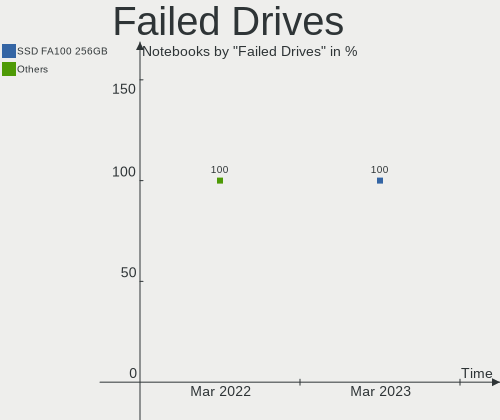
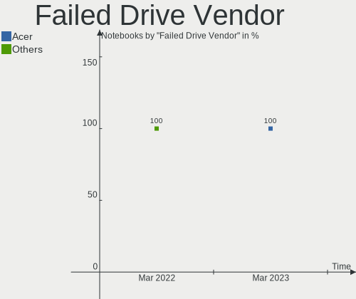
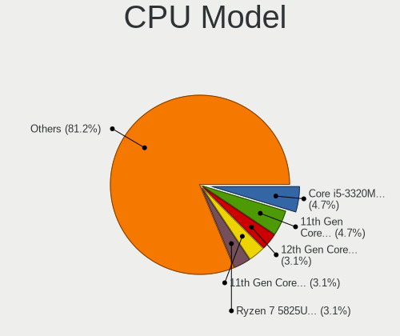
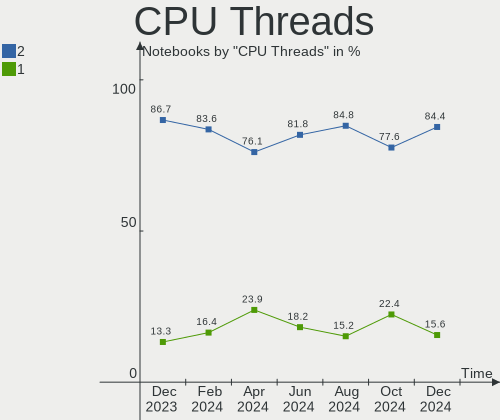
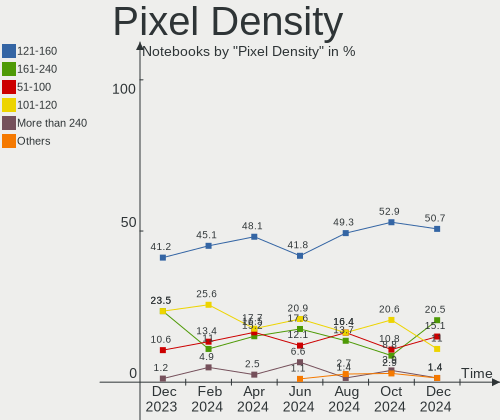
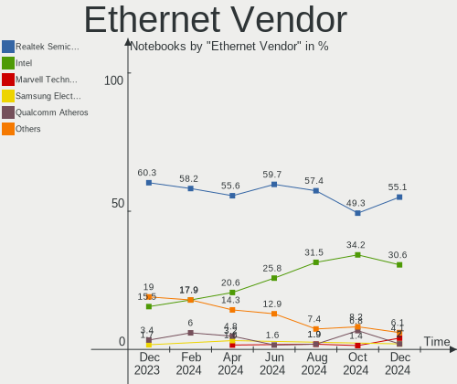
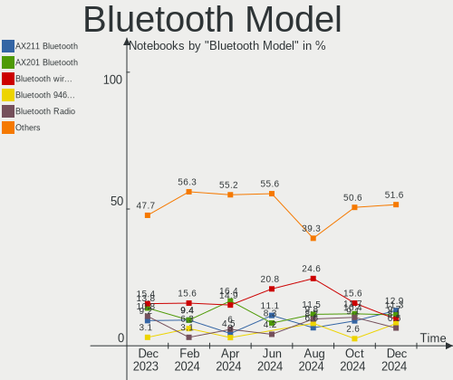

Kubuntu - Hardware Trends (Notebooks)
-------------------------------------

A project to identify most popular hardware characteristics and track their change
over time based on data collected by Linux users at https://Linux-Hardware.org.

Anyone can contribute to this report by the [hw-probe](https://github.com/linuxhw/hw-probe) tool:

    sudo -E hw-probe -all -upload

This report is for one last month. Overall report since the beginning of time: [TestDays](https://github.com/linuxhw/TestDays)

Period: Mar, 2023.

Contents
--------

* [ System ](#system)
  - [ OS                       ](#os)
  - [ OS Family                ](#os-family)
  - [ Kernel                   ](#kernel)
  - [ Kernel Family            ](#kernel-family)
  - [ Kernel Major Ver.        ](#kernel-major-ver)
  - [ Arch                     ](#arch)
  - [ DE                       ](#de)
  - [ Display Server           ](#display-server)
  - [ Display Manager          ](#display-manager)
  - [ OS Lang                  ](#os-lang)
  - [ Boot Mode                ](#boot-mode)
  - [ Filesystem               ](#filesystem)
  - [ Part. scheme             ](#part-scheme)
  - [ Dual Boot with Linux/BSD ](#dual-boot-with-linuxbsd)
  - [ Dual Boot (Win)          ](#dual-boot-win)

* [ Board ](#board)
  - [ Vendor                   ](#vendor)
  - [ Model                    ](#model)
  - [ Model Family             ](#model-family)
  - [ MFG Year                 ](#mfg-year)
  - [ Form Factor              ](#form-factor)
  - [ Secure Boot              ](#secure-boot)
  - [ Coreboot                 ](#coreboot)
  - [ RAM Size                 ](#ram-size)
  - [ RAM Used                 ](#ram-used)
  - [ Total Drives             ](#total-drives)
  - [ Has CD-ROM               ](#has-cd-rom)
  - [ Has Ethernet             ](#has-ethernet)
  - [ Has WiFi                 ](#has-wifi)
  - [ Has Bluetooth            ](#has-bluetooth)

* [ Location ](#location)
  - [ Country                  ](#country)
  - [ City                     ](#city)

* [ Drives ](#drives)
  - [ Drive Vendor             ](#drive-vendor)
  - [ Drive Model              ](#drive-model)
  - [ HDD Vendor               ](#hdd-vendor)
  - [ SSD Vendor               ](#ssd-vendor)
  - [ Drive Kind               ](#drive-kind)
  - [ Drive Connector          ](#drive-connector)
  - [ Drive Size               ](#drive-size)
  - [ Space Total              ](#space-total)
  - [ Space Used               ](#space-used)
  - [ Malfunc. Drives          ](#malfunc-drives)
  - [ Malfunc. Drive Vendor    ](#malfunc-drive-vendor)
  - [ Malfunc. HDD Vendor      ](#malfunc-hdd-vendor)
  - [ Malfunc. Drive Kind      ](#malfunc-drive-kind)
  - [ Failed Drives            ](#failed-drives)
  - [ Failed Drive Vendor      ](#failed-drive-vendor)
  - [ Drive Status             ](#drive-status)

* [ Storage controller ](#storage-controller)
  - [ Storage Vendor           ](#storage-vendor)
  - [ Storage Model            ](#storage-model)
  - [ Storage Kind             ](#storage-kind)

* [ Processor ](#processor)
  - [ CPU Vendor               ](#cpu-vendor)
  - [ CPU Model                ](#cpu-model)
  - [ CPU Model Family         ](#cpu-model-family)
  - [ CPU Cores                ](#cpu-cores)
  - [ CPU Sockets              ](#cpu-sockets)
  - [ CPU Threads              ](#cpu-threads)
  - [ CPU Op-Modes             ](#cpu-op-modes)
  - [ CPU Microcode            ](#cpu-microcode)
  - [ CPU Microarch            ](#cpu-microarch)

* [ Graphics ](#graphics)
  - [ GPU Vendor               ](#gpu-vendor)
  - [ GPU Model                ](#gpu-model)
  - [ GPU Combo                ](#gpu-combo)
  - [ GPU Driver               ](#gpu-driver)
  - [ GPU Memory               ](#gpu-memory)

* [ Monitor ](#monitor)
  - [ Monitor Vendor           ](#monitor-vendor)
  - [ Monitor Model            ](#monitor-model)
  - [ Monitor Resolution       ](#monitor-resolution)
  - [ Monitor Diagonal         ](#monitor-diagonal)
  - [ Monitor Width            ](#monitor-width)
  - [ Aspect Ratio             ](#aspect-ratio)
  - [ Monitor Area             ](#monitor-area)
  - [ Pixel Density            ](#pixel-density)
  - [ Multiple Monitors        ](#multiple-monitors)

* [ Network ](#network)
  - [ Net Controller Vendor    ](#net-controller-vendor)
  - [ Net Controller Model     ](#net-controller-model)
  - [ Wireless Vendor          ](#wireless-vendor)
  - [ Wireless Model           ](#wireless-model)
  - [ Ethernet Vendor          ](#ethernet-vendor)
  - [ Ethernet Model           ](#ethernet-model)
  - [ Net Controller Kind      ](#net-controller-kind)
  - [ Used Controller          ](#used-controller)
  - [ NICs                     ](#nics)
  - [ IPv6                     ](#ipv6)

* [ Bluetooth ](#bluetooth)
  - [ Bluetooth Vendor         ](#bluetooth-vendor)
  - [ Bluetooth Model          ](#bluetooth-model)

* [ Sound ](#sound)
  - [ Sound Vendor             ](#sound-vendor)
  - [ Sound Model              ](#sound-model)

* [ Memory ](#memory)
  - [ Memory Vendor            ](#memory-vendor)
  - [ Memory Model             ](#memory-model)
  - [ Memory Kind              ](#memory-kind)
  - [ Memory Form Factor       ](#memory-form-factor)
  - [ Memory Size              ](#memory-size)
  - [ Memory Speed             ](#memory-speed)

* [ Printers & scanners ](#printers--scanners)
  - [ Printer Vendor           ](#printer-vendor)
  - [ Printer Model            ](#printer-model)
  - [ Scanner Vendor           ](#scanner-vendor)
  - [ Scanner Model            ](#scanner-model)

* [ Camera ](#camera)
  - [ Camera Vendor            ](#camera-vendor)
  - [ Camera Model             ](#camera-model)

* [ Security ](#security)
  - [ Fingerprint Vendor       ](#fingerprint-vendor)
  - [ Fingerprint Model        ](#fingerprint-model)
  - [ Chipcard Vendor          ](#chipcard-vendor)
  - [ Chipcard Model           ](#chipcard-model)

* [ Unsupported ](#unsupported)
  - [ Unsupported Devices      ](#unsupported-devices)
  - [ Unsupported Device Types ](#unsupported-device-types)

System
------

OS
--

Installed operating systems

| Name          | Notebooks | Percent |
|---------------|-----------|---------|
| Kubuntu 22.04 | 39        | 48.15%  |
| Kubuntu 22.10 | 36        | 44.44%  |
| Kubuntu 23.04 | 3         | 3.7%    |
| Kubuntu 20.04 | 2         | 2.47%   |
| Kubuntu 11    | 1         | 1.23%   |

OS Family
---------

OS without a version

| Name    | Notebooks | Percent |
|---------|-----------|---------|
| Kubuntu | 81        | 100%    |

Kernel
------

Version of the Linux kernel

| Version                | Notebooks | Percent |
|------------------------|-----------|---------|
| 5.19.0-35-generic      | 34        | 41.98%  |
| 5.15.0-67-generic      | 12        | 14.81%  |
| 5.19.0-38-generic      | 10        | 12.35%  |
| 5.19.0-32-generic      | 3         | 3.7%    |
| 6.2.2-060202-generic   | 2         | 2.47%   |
| 6.2.0-18-generic       | 2         | 2.47%   |
| 5.15.0-60-generic      | 2         | 2.47%   |
| 6.2.8-060208-generic   | 1         | 1.23%   |
| 6.2.5-060205-generic   | 1         | 1.23%   |
| 6.1.12-060112-generic  | 1         | 1.23%   |
| 6.1.0-1007-oem         | 1         | 1.23%   |
| 5.19.17-051917-generic | 1         | 1.23%   |
| 5.19.0-40-generic      | 1         | 1.23%   |
| 5.19.0-37-generic      | 1         | 1.23%   |
| 5.19.0-31-generic      | 1         | 1.23%   |
| 5.19.0-26-generic      | 1         | 1.23%   |
| 5.19.0-21-generic      | 1         | 1.23%   |
| 5.19.0-1018-lowlatency | 1         | 1.23%   |
| 5.19.0-1015-lowlatency | 1         | 1.23%   |
| 5.15.0-67-lowlatency   | 1         | 1.23%   |
| 5.15.0-58-lowlatency   | 1         | 1.23%   |
| 5.14.0-1054-oem        | 1         | 1.23%   |
| 5.11.0-43-generic      | 1         | 1.23%   |

Kernel Family
-------------

Linux kernel without a distro release

| Version | Notebooks | Percent |
|---------|-----------|---------|
| 5.19.0  | 54        | 66.67%  |
| 5.15.0  | 16        | 19.75%  |
| 6.2.2   | 2         | 2.47%   |
| 6.2.0   | 2         | 2.47%   |
| 6.2.8   | 1         | 1.23%   |
| 6.2.5   | 1         | 1.23%   |
| 6.1.12  | 1         | 1.23%   |
| 6.1.0   | 1         | 1.23%   |
| 5.19.17 | 1         | 1.23%   |
| 5.14.0  | 1         | 1.23%   |
| 5.11.0  | 1         | 1.23%   |

Kernel Major Ver.
-----------------

Linux kernel major version

| Version | Notebooks | Percent |
|---------|-----------|---------|
| 5.19    | 55        | 67.9%   |
| 5.15    | 16        | 19.75%  |
| 6.2     | 6         | 7.41%   |
| 6.1     | 2         | 2.47%   |
| 5.14    | 1         | 1.23%   |
| 5.11    | 1         | 1.23%   |

Arch
----

OS architecture (x86_64, i586, etc.)

| Name   | Notebooks | Percent |
|--------|-----------|---------|
| x86_64 | 81        | 100%    |

DE
--

Desktop Environment

| Name  | Notebooks | Percent |
|-------|-----------|---------|
| KDE5  | 77        | 95.06%  |
| KDE   | 2         | 2.47%   |
| XFCE  | 1         | 1.23%   |
| GNOME | 1         | 1.23%   |

Display Server
--------------

X11 or Wayland

| Name    | Notebooks | Percent |
|---------|-----------|---------|
| X11     | 69        | 85.19%  |
| Wayland | 11        | 13.58%  |
| Tty     | 1         | 1.23%   |

Display Manager
---------------

SDDM, LightDM, etc.

| Name    | Notebooks | Percent |
|---------|-----------|---------|
| SDDM    | 53        | 65.43%  |
| Unknown | 21        | 25.93%  |
| LightDM | 3         | 3.7%    |
| GDM3    | 3         | 3.7%    |
| GDM     | 1         | 1.23%   |

OS Lang
-------

Language

| Lang  | Notebooks | Percent |
|-------|-----------|---------|
| en_US | 36        | 44.44%  |
| fr_FR | 6         | 7.41%   |
| en_IN | 5         | 6.17%   |
| en_GB | 5         | 6.17%   |
| pt_BR | 4         | 4.94%   |
| en_CA | 4         | 4.94%   |
| ru_RU | 3         | 3.7%    |
| de_DE | 3         | 3.7%    |
| zh_CN | 2         | 2.47%   |
| tr_TR | 2         | 2.47%   |
| pl_PL | 1         | 1.23%   |
| it_IT | 1         | 1.23%   |
| hu_HU | 1         | 1.23%   |
| fr_CH | 1         | 1.23%   |
| fr_BE | 1         | 1.23%   |
| es_CR | 1         | 1.23%   |
| es_CL | 1         | 1.23%   |
| en_SG | 1         | 1.23%   |
| en_AU | 1         | 1.23%   |
| ca_ES | 1         | 1.23%   |
| C     | 1         | 1.23%   |

Boot Mode
---------

EFI or BIOS

| Mode | Notebooks | Percent |
|------|-----------|---------|
| EFI  | 49        | 60.49%  |
| BIOS | 32        | 39.51%  |

Filesystem
----------

Type of filesystem

| Type  | Notebooks | Percent |
|-------|-----------|---------|
| Ext4  | 76        | 93.83%  |
| Btrfs | 5         | 6.17%   |

Part. scheme
------------

Scheme of partitioning

| Type    | Notebooks | Percent |
|---------|-----------|---------|
| GPT     | 60        | 74.07%  |
| Unknown | 19        | 23.46%  |
| MBR     | 2         | 2.47%   |

Dual Boot with Linux/BSD
------------------------

Hosting more than one Linux/BSD

| Dual boot | Notebooks | Percent |
|-----------|-----------|---------|
| No        | 75        | 92.59%  |
| Yes       | 6         | 7.41%   |

Dual Boot (Win)
---------------

Hosting Linux and Windows

| Dual boot | Notebooks | Percent |
|-----------|-----------|---------|
| No        | 45        | 55.56%  |
| Yes       | 36        | 44.44%  |

Board
-----

Vendor
------

Motherboard manufacturer

| Name                   | Notebooks | Percent |
|------------------------|-----------|---------|
| Lenovo                 | 18        | 22.22%  |
| Dell                   | 17        | 20.99%  |
| Hewlett-Packard        | 11        | 13.58%  |
| ASUSTek Computer       | 8         | 9.88%   |
| HUAWEI                 | 5         | 6.17%   |
| Acer                   | 3         | 3.7%    |
| Toshiba                | 2         | 2.47%   |
| MSI                    | 2         | 2.47%   |
| Gigabyte Technology    | 2         | 2.47%   |
| Sony                   | 1         | 1.23%   |
| Notebook               | 1         | 1.23%   |
| Motion Computing       | 1         | 1.23%   |
| Maibenben              | 1         | 1.23%   |
| Intel                  | 1         | 1.23%   |
| HONOR                  | 1         | 1.23%   |
| Digibras               | 1         | 1.23%   |
| Datto                  | 1         | 1.23%   |
| Chuwi                  | 1         | 1.23%   |
| Carbon Systems         | 1         | 1.23%   |
| Avell High Performance | 1         | 1.23%   |
| Apple                  | 1         | 1.23%   |
| Alienware              | 1         | 1.23%   |

Model
-----

Motherboard model

| Name                                  | Notebooks | Percent |
|---------------------------------------|-----------|---------|
| HUAWEI HVY-WXX9                       | 2         | 2.47%   |
| HP Laptop 15-ef2xxx                   | 2         | 2.47%   |
| Dell Latitude E6420                   | 2         | 2.47%   |
| Dell Latitude 5420                    | 2         | 2.47%   |
| Dell Inspiron 15-3567                 | 2         | 2.47%   |
| Toshiba Satellite L515                | 1         | 1.23%   |
| Toshiba QOSMIO X70-A                  | 1         | 1.23%   |
| Sony VGN-NW270F                       | 1         | 1.23%   |
| Notebook NV4xPZ                       | 1         | 1.23%   |
| MSI Modern 15 A5M                     | 1         | 1.23%   |
| MSI GE70 2PE                          | 1         | 1.23%   |
| Motion Computing J3600                | 1         | 1.23%   |
| Maibenben JinMai6 series              | 1         | 1.23%   |
| Lenovo XiaoXin-15ARE 2020 81YR        | 1         | 1.23%   |
| Lenovo ThinkPad X390 20Q0000SMX       | 1         | 1.23%   |
| Lenovo ThinkPad X230 23256N6          | 1         | 1.23%   |
| Lenovo ThinkPad X13 Gen 2a 20XH0076IG | 1         | 1.23%   |
| Lenovo ThinkPad T480 20L6S3H102       | 1         | 1.23%   |
| Lenovo ThinkPad T470 W10DG 20JNA03XUS | 1         | 1.23%   |
| Lenovo ThinkPad SL 2743NSC            | 1         | 1.23%   |
| Lenovo ThinkPad E480 20KNA01HIG       | 1         | 1.23%   |
| Lenovo ThinkPad E15 Gen 4 21E6004KGE  | 1         | 1.23%   |
| Lenovo ThinkBook 15 G2 ITL 20VE       | 1         | 1.23%   |
| Lenovo ThinkBook 14 G2 ITL 20VD       | 1         | 1.23%   |
| Lenovo Legion Y540-15IRH 81SX         | 1         | 1.23%   |
| Lenovo Legion 5 Pro 16IAH7H 82RF      | 1         | 1.23%   |
| Lenovo Legion 5 17ACH6 82K0           | 1         | 1.23%   |
| Lenovo IdeaPad Gaming 3 15ACH6 82K2   | 1         | 1.23%   |
| Lenovo IdeaPad 5 Pro 14ARH7 82SJ      | 1         | 1.23%   |
| Lenovo IdeaPad 5 15ARE05 81YQ         | 1         | 1.23%   |
| Lenovo IdeaPad 3 15ALC6 82KU          | 1         | 1.23%   |
| Intel Whiskey Platform                | 1         | 1.23%   |
| HUAWEI KLVL-WXX9                      | 1         | 1.23%   |
| HUAWEI KLVDZ-WXX9                     | 1         | 1.23%   |
| HUAWEI HN-WX9X                        | 1         | 1.23%   |
| HONOR BBR-WAX9                        | 1         | 1.23%   |
| HP ZBook 15 G6                        | 1         | 1.23%   |
| HP ZBook 15                           | 1         | 1.23%   |
| HP ProBook 640 G4                     | 1         | 1.23%   |
| HP Pavilion Laptop 15-eh1xxx          | 1         | 1.23%   |

Model Family
------------

Motherboard model prefix

| Name                       | Notebooks | Percent |
|----------------------------|-----------|---------|
| Lenovo ThinkPad            | 8         | 9.88%   |
| Dell Inspiron              | 6         | 7.41%   |
| Dell Latitude              | 5         | 6.17%   |
| Lenovo IdeaPad             | 4         | 4.94%   |
| Dell XPS                   | 4         | 4.94%   |
| Lenovo Legion              | 3         | 3.7%    |
| HP Laptop                  | 3         | 3.7%    |
| ASUS VivoBook              | 3         | 3.7%    |
| Lenovo ThinkBook           | 2         | 2.47%   |
| HUAWEI HVY-WXX9            | 2         | 2.47%   |
| HP ZBook                   | 2         | 2.47%   |
| HP Pavilion                | 2         | 2.47%   |
| HP EliteBook               | 2         | 2.47%   |
| Dell Vostro                | 2         | 2.47%   |
| ASUS ASUS                  | 2         | 2.47%   |
| Acer Nitro                 | 2         | 2.47%   |
| Toshiba Satellite          | 1         | 1.23%   |
| Toshiba QOSMIO             | 1         | 1.23%   |
| Sony VGN-NW270F            | 1         | 1.23%   |
| Notebook NV4xPZ            | 1         | 1.23%   |
| MSI Modern                 | 1         | 1.23%   |
| MSI GE70                   | 1         | 1.23%   |
| Motion Computing J3600     | 1         | 1.23%   |
| Maibenben JinMai6          | 1         | 1.23%   |
| Lenovo XiaoXin-15ARE       | 1         | 1.23%   |
| Intel Whiskey              | 1         | 1.23%   |
| HUAWEI KLVL-WXX9           | 1         | 1.23%   |
| HUAWEI KLVDZ-WXX9          | 1         | 1.23%   |
| HUAWEI HN-WX9X             | 1         | 1.23%   |
| HONOR BBR-WAX9             | 1         | 1.23%   |
| HP ProBook                 | 1         | 1.23%   |
| HP ENVY                    | 1         | 1.23%   |
| Gigabyte AERO              | 1         | 1.23%   |
| Gigabyte A7                | 1         | 1.23%   |
| Digibras NH4CU03           | 1         | 1.23%   |
| Datto 1000                 | 1         | 1.23%   |
| Chuwi CoreBook             | 1         | 1.23%   |
| Carbon Systems Iridium     | 1         | 1.23%   |
| Avell High Performance C62 | 1         | 1.23%   |
| ASUS T300CHI               | 1         | 1.23%   |

MFG Year
--------

Motherboard manufacture year

| Year | Notebooks | Percent |
|------|-----------|---------|
| 2021 | 16        | 19.75%  |
| 2022 | 14        | 17.28%  |
| 2020 | 13        | 16.05%  |
| 2019 | 9         | 11.11%  |
| 2013 | 5         | 6.17%   |
| 2011 | 4         | 4.94%   |
| 2018 | 3         | 3.7%    |
| 2017 | 3         | 3.7%    |
| 2016 | 3         | 3.7%    |
| 2014 | 3         | 3.7%    |
| 2015 | 2         | 2.47%   |
| 2012 | 2         | 2.47%   |
| 2009 | 2         | 2.47%   |
| 2010 | 1         | 1.23%   |
| 2008 | 1         | 1.23%   |

Form Factor
-----------

Physical design of the computer

| Name     | Notebooks | Percent |
|----------|-----------|---------|
| Notebook | 81        | 100%    |

Secure Boot
-----------

Enabled or disabled

| State    | Notebooks | Percent |
|----------|-----------|---------|
| Disabled | 66        | 81.48%  |
| Enabled  | 15        | 18.52%  |

Coreboot
--------

Have coreboot on board

| Used | Notebooks | Percent |
|------|-----------|---------|
| No   | 81        | 100%    |

RAM Size
--------

Total RAM memory

| Size in GB  | Notebooks | Percent |
|-------------|-----------|---------|
| 8.01-16.0   | 22        | 27.16%  |
| 16.01-24.0  | 21        | 25.93%  |
| 4.01-8.0    | 17        | 20.99%  |
| 32.01-64.0  | 12        | 14.81%  |
| 3.01-4.0    | 5         | 6.17%   |
| 24.01-32.0  | 2         | 2.47%   |
| 64.01-256.0 | 2         | 2.47%   |

RAM Used
--------

Used RAM memory

| Used GB    | Notebooks | Percent |
|------------|-----------|---------|
| 3.01-4.0   | 23        | 28.4%   |
| 4.01-8.0   | 21        | 25.93%  |
| 2.01-3.0   | 17        | 20.99%  |
| 1.01-2.0   | 12        | 14.81%  |
| 8.01-16.0  | 5         | 6.17%   |
| 24.01-32.0 | 1         | 1.23%   |
| 16.01-24.0 | 1         | 1.23%   |
| 0.51-1.0   | 1         | 1.23%   |

Total Drives
------------

Number of drives on board

| Drives | Notebooks | Percent |
|--------|-----------|---------|
| 1      | 59        | 72.84%  |
| 2      | 17        | 20.99%  |
| 3      | 4         | 4.94%   |
| 4      | 1         | 1.23%   |

Has CD-ROM
----------

Has CD-ROM on board

| Presented | Notebooks | Percent |
|-----------|-----------|---------|
| No        | 68        | 83.95%  |
| Yes       | 13        | 16.05%  |

Has Ethernet
------------

Has Ethernet on board

| Presented | Notebooks | Percent |
|-----------|-----------|---------|
| Yes       | 58        | 71.6%   |
| No        | 23        | 28.4%   |

Has WiFi
--------

Has WiFi module

| Presented | Notebooks | Percent |
|-----------|-----------|---------|
| Yes       | 81        | 100%    |

Has Bluetooth
-------------

Has Bluetooth module

| Presented | Notebooks | Percent |
|-----------|-----------|---------|
| Yes       | 72        | 88.89%  |
| No        | 9         | 11.11%  |

Location
--------

Country
-------

Geographic location (country)

| Country                | Notebooks | Percent |
|------------------------|-----------|---------|
| USA                    | 19        | 23.46%  |
| Germany                | 6         | 7.41%   |
| France                 | 6         | 7.41%   |
| UK                     | 5         | 6.17%   |
| India                  | 5         | 6.17%   |
| Brazil                 | 5         | 6.17%   |
| Canada                 | 4         | 4.94%   |
| Turkey                 | 3         | 3.7%    |
| Russia                 | 3         | 3.7%    |
| Italy                  | 2         | 2.47%   |
| China                  | 2         | 2.47%   |
| Belgium                | 2         | 2.47%   |
| Tanzania               | 1         | 1.23%   |
| Sweden                 | 1         | 1.23%   |
| Spain                  | 1         | 1.23%   |
| Slovakia               | 1         | 1.23%   |
| Singapore              | 1         | 1.23%   |
| Serbia                 | 1         | 1.23%   |
| Romania                | 1         | 1.23%   |
| Réunion               | 1         | 1.23%   |
| Poland                 | 1         | 1.23%   |
| Netherlands            | 1         | 1.23%   |
| Mexico                 | 1         | 1.23%   |
| Malaysia               | 1         | 1.23%   |
| Luxembourg             | 1         | 1.23%   |
| Finland                | 1         | 1.23%   |
| Costa Rica             | 1         | 1.23%   |
| Chile                  | 1         | 1.23%   |
| Bosnia and Herzegovina | 1         | 1.23%   |
| Austria                | 1         | 1.23%   |
| Australia              | 1         | 1.23%   |

City
----

Geographic location (city)

| City                 | Notebooks | Percent |
|----------------------|-----------|---------|
| Castro Valley        | 2         | 2.47%   |
| Bengaluru            | 2         | 2.47%   |
| Yaroslavl            | 1         | 1.23%   |
| Xiamen               | 1         | 1.23%   |
| Xi'an                | 1         | 1.23%   |
| Xalapa               | 1         | 1.23%   |
| Wroclaw              | 1         | 1.23%   |
| Vsevolozhsk          | 1         | 1.23%   |
| Vienna               | 1         | 1.23%   |
| Tubbergen            | 1         | 1.23%   |
| Tournefeuille        | 1         | 1.23%   |
| Takoma Park          | 1         | 1.23%   |
| St Petersburg        | 1         | 1.23%   |
| Spring Valley        | 1         | 1.23%   |
| Spanga               | 1         | 1.23%   |
| Singapore            | 1         | 1.23%   |
| Sfantu Gheorghe      | 1         | 1.23%   |
| Sao Joao das Missoes | 1         | 1.23%   |
| Santos               | 1         | 1.23%   |
| San Francisco        | 1         | 1.23%   |
| Salford              | 1         | 1.23%   |
| Sainte-Marie         | 1         | 1.23%   |
| Roquebilliere        | 1         | 1.23%   |
| Rio Segundo          | 1         | 1.23%   |
| Quesnoy-sur-Deule    | 1         | 1.23%   |
| Pune                 | 1         | 1.23%   |
| Porto Alegre         | 1         | 1.23%   |
| Porcia               | 1         | 1.23%   |
| Peterborough         | 1         | 1.23%   |
| Périgueux           | 1         | 1.23%   |
| Pasadena             | 1         | 1.23%   |
| Padre Las Casas      | 1         | 1.23%   |
| Oxford               | 1         | 1.23%   |
| Novi Sad             | 1         | 1.23%   |
| Mumbai               | 1         | 1.23%   |
| Montreal             | 1         | 1.23%   |
| Minneapolis          | 1         | 1.23%   |
| Milford              | 1         | 1.23%   |
| Milano               | 1         | 1.23%   |
| Miami                | 1         | 1.23%   |

Drives
------

Drive Vendor
------------

Hard drive vendors

| Vendor                    | Notebooks | Drives | Percent |
|---------------------------|-----------|--------|---------|
| Samsung Electronics       | 21        | 25     | 19.81%  |
| Intel                     | 13        | 13     | 12.26%  |
| WDC                       | 10        | 10     | 9.43%   |
| SanDisk                   | 9         | 9      | 8.49%   |
| Crucial                   | 7         | 7      | 6.6%    |
| Kingston                  | 6         | 6      | 5.66%   |
| Seagate                   | 5         | 5      | 4.72%   |
| Toshiba                   | 4         | 4      | 3.77%   |
| A-DATA Technology         | 4         | 4      | 3.77%   |
| Micron Technology         | 3         | 3      | 2.83%   |
| Unknown                   | 2         | 2      | 1.89%   |
| SK hynix                  | 2         | 2      | 1.89%   |
| Netac                     | 2         | 2      | 1.89%   |
| KIOXIA                    | 2         | 2      | 1.89%   |
| YMTC                      | 1         | 1      | 0.94%   |
| UMIS                      | 1         | 1      | 0.94%   |
| SSSTC                     | 1         | 1      | 0.94%   |
| SPCC                      | 1         | 1      | 0.94%   |
| Phison                    | 1         | 1      | 0.94%   |
| Micron/Crucial Technology | 1         | 1      | 0.94%   |
| Kimtigo                   | 1         | 1      | 0.94%   |
| HUSKY                     | 1         | 1      | 0.94%   |
| Hitachi                   | 1         | 1      | 0.94%   |
| HGST                      | 1         | 1      | 0.94%   |
| Hewlett-Packard           | 1         | 1      | 0.94%   |
| Dogfish                   | 1         | 1      | 0.94%   |
| CT500BX5                  | 1         | 1      | 0.94%   |
| Corsair                   | 1         | 1      | 0.94%   |
| Acer                      | 1         | 1      | 0.94%   |
| Unknown                   | 1         | 1      | 0.94%   |

Drive Model
-----------

Hard drive models

| Model                                          | Notebooks | Percent |
|------------------------------------------------|-----------|---------|
| Intel SSDPEKNU512GZ 512GB                      | 3         | 2.73%   |
| WDC WDS240G2G0A-00JH30 240GB SSD               | 2         | 1.82%   |
| Samsung SSD 980 PRO 1TB                        | 2         | 1.82%   |
| Samsung SSD 970 EVO Plus 250GB                 | 2         | 1.82%   |
| Kingston SNVS2000G 2TB                         | 2         | 1.82%   |
| Intel SSDPEKNW512GZL 512GB                     | 2         | 1.82%   |
| Intel SSDPEKNU512GZH 512GB                     | 2         | 1.82%   |
| YMTC PC005 512GB                               | 1         | 0.91%   |
| WDC WDS200T2B0B-00YS70 2TB SSD                 | 1         | 0.91%   |
| WDC WD3200BEVT-22ZCT0 320GB                    | 1         | 0.91%   |
| WDC WD10SPZX-21Z10T0 1TB                       | 1         | 0.91%   |
| WDC WD10JPVX-75JC3T0 1TB                       | 1         | 0.91%   |
| WDC PC SN810 NVMe 512GB                        | 1         | 0.91%   |
| WDC PC SN730 SDBPNTY-512G-1036 512GB           | 1         | 0.91%   |
| WDC PC SN530 SDBPNPZ-256G-1006 256GB           | 1         | 0.91%   |
| WDC PC SN530 NVMe 512GB                        | 1         | 0.91%   |
| Unknown NVMe SSD Drive 512GB                   | 1         | 0.91%   |
| Unknown MMC Card  16GB                         | 1         | 0.91%   |
| UMIS RPETJ512MGE2QDQ 512GB                     | 1         | 0.91%   |
| Toshiba XG6 NVMe SSD Controller 512GB          | 1         | 0.91%   |
| Toshiba THNSNH256GMCT 256GB SSD                | 1         | 0.91%   |
| Toshiba MQ04ABF100 1TB                         | 1         | 0.91%   |
| Toshiba KXG60ZNV512G 512GB                     | 1         | 0.91%   |
| SSSTC CL1-3D256-Q11 NVMe 256GB                 | 1         | 0.91%   |
| SPCC M.2 PCIe SSD 1TB                          | 1         | 0.91%   |
| SK hynix SKHynix_HFS512GD9TNI-L2A0B 512GB      | 1         | 0.91%   |
| SK hynix BC511 512GB                           | 1         | 0.91%   |
| Seagate ST500LM012 HN-M500MBB 500GB            | 1         | 0.91%   |
| Seagate ST1000LM049-2GH172 1TB                 | 1         | 0.91%   |
| Seagate ST1000LM048-2E7172 1TB                 | 1         | 0.91%   |
| Seagate ST1000LM035-1RK172 1TB                 | 1         | 0.91%   |
| Seagate ST1000LM014-1EJ164-SSHD 1TB            | 1         | 0.91%   |
| Sandisk WD Blue SN570 250GB                    | 1         | 0.91%   |
| Sandisk WD Blue SN550 NVMe SSD 256GB           | 1         | 0.91%   |
| Sandisk WD Black SN750 / PC SN730 NVMe SSD 1TB | 1         | 0.91%   |
| SanDisk SSD PLUS 480GB                         | 1         | 0.91%   |
| SanDisk SSD i110 128GB                         | 1         | 0.91%   |
| SanDisk SD9SN8W128G1102 128GB SSD              | 1         | 0.91%   |
| SanDisk SD6SB1M-256G-1006 256GB SSD            | 1         | 0.91%   |
| Sandisk PC SN530 NVMe WDC 256GB                | 1         | 0.91%   |

HDD Vendor
----------

Hard disk drive vendors

| Vendor              | Notebooks | Drives | Percent |
|---------------------|-----------|--------|---------|
| Seagate             | 5         | 5      | 41.67%  |
| WDC                 | 3         | 3      | 25%     |
| Toshiba             | 1         | 1      | 8.33%   |
| Samsung Electronics | 1         | 1      | 8.33%   |
| Hitachi             | 1         | 1      | 8.33%   |
| HGST                | 1         | 1      | 8.33%   |

SSD Vendor
----------

Solid state drive vendors

| Vendor              | Notebooks | Drives | Percent |
|---------------------|-----------|--------|---------|
| Samsung Electronics | 7         | 8      | 20.59%  |
| Crucial             | 6         | 6      | 17.65%  |
| SanDisk             | 4         | 4      | 11.76%  |
| WDC                 | 3         | 3      | 8.82%   |
| Intel               | 3         | 3      | 8.82%   |
| Toshiba             | 1         | 1      | 2.94%   |
| Netac               | 1         | 1      | 2.94%   |
| Micron Technology   | 1         | 1      | 2.94%   |
| Kingston            | 1         | 1      | 2.94%   |
| Kimtigo             | 1         | 1      | 2.94%   |
| HUSKY               | 1         | 1      | 2.94%   |
| Hewlett-Packard     | 1         | 1      | 2.94%   |
| Dogfish             | 1         | 1      | 2.94%   |
| CT500BX5            | 1         | 1      | 2.94%   |
| Corsair             | 1         | 1      | 2.94%   |
| A-DATA Technology   | 1         | 1      | 2.94%   |

Drive Kind
----------

HDD or SSD

| Kind | Notebooks | Drives | Percent |
|------|-----------|--------|---------|
| NVMe | 53        | 61     | 55.21%  |
| SSD  | 29        | 35     | 30.21%  |
| HDD  | 12        | 12     | 12.5%   |
| MMC  | 2         | 2      | 2.08%   |

Drive Connector
---------------

SATA, SAS, NVMe, etc.

| Type | Notebooks | Drives | Percent |
|------|-----------|--------|---------|
| NVMe | 53        | 61     | 57.61%  |
| SATA | 36        | 46     | 39.13%  |
| MMC  | 2         | 2      | 2.17%   |
| SAS  | 1         | 1      | 1.09%   |

Drive Size
----------

Size of hard drive

| Size in TB | Notebooks | Drives | Percent |
|------------|-----------|--------|---------|
| 0.01-0.5   | 22        | 27     | 52.38%  |
| 0.51-1.0   | 17        | 17     | 40.48%  |
| 1.01-2.0   | 2         | 2      | 4.76%   |
| 3.01-4.0   | 1         | 1      | 2.38%   |

Space Total
-----------

Amount of disk space available on the file system

| Size in GB     | Notebooks | Percent |
|----------------|-----------|---------|
| 101-250        | 24        | 29.63%  |
| 251-500        | 20        | 24.69%  |
| 501-1000       | 20        | 24.69%  |
| 1001-2000      | 10        | 12.35%  |
| 21-50          | 2         | 2.47%   |
| 51-100         | 2         | 2.47%   |
| More than 3000 | 1         | 1.23%   |
| 2001-3000      | 1         | 1.23%   |
| Unknown        | 1         | 1.23%   |

Space Used
----------

Amount of used disk space

| Used GB        | Notebooks | Percent |
|----------------|-----------|---------|
| 101-250        | 18        | 22.22%  |
| 21-50          | 16        | 19.75%  |
| 51-100         | 14        | 17.28%  |
| 1-20           | 12        | 14.81%  |
| 251-500        | 9         | 11.11%  |
| 501-1000       | 9         | 11.11%  |
| More than 3000 | 1         | 1.23%   |
| 1001-2000      | 1         | 1.23%   |
| Unknown        | 1         | 1.23%   |

Malfunc. Drives
---------------

Drive models with a malfunction

| Model                        | Notebooks | Drives | Percent |
|------------------------------|-----------|--------|---------|
| Crucial CT1050MX300SSD1 1TB  | 1         | 1      | 50%     |
| A-DATA Technology FALCON 1TB | 1         | 1      | 50%     |

Malfunc. Drive Vendor
---------------------

Vendors of faulty drives

| Vendor            | Notebooks | Drives | Percent |
|-------------------|-----------|--------|---------|
| Crucial           | 1         | 1      | 50%     |
| A-DATA Technology | 1         | 1      | 50%     |

Malfunc. HDD Vendor
-------------------

Vendors of faulty HDD drives

Zero info for selected period =(

Malfunc. Drive Kind
-------------------

Kinds of faulty drives

| Kind | Notebooks | Drives | Percent |
|------|-----------|--------|---------|
| NVMe | 1         | 1      | 50%     |
| SSD  | 1         | 1      | 50%     |

Failed Drives
-------------

Failed drive models

| Model                | Notebooks | Drives | Percent |
|----------------------|-----------|--------|---------|
| Acer SSD FA100 256GB | 1         | 1      | 100%    |

Failed Drive Vendor
-------------------

Failed drive vendors

| Vendor | Notebooks | Drives | Percent |
|--------|-----------|--------|---------|
| Acer   | 1         | 1      | 100%    |

Drive Status
------------

Number of failed and malfunc. drives

| Status   | Notebooks | Drives | Percent |
|----------|-----------|--------|---------|
| Works    | 48        | 59     | 56.47%  |
| Detected | 34        | 48     | 40%     |
| Malfunc  | 2         | 2      | 2.35%   |
| Failed   | 1         | 1      | 1.18%   |

Storage controller
------------------

Storage Vendor
--------------

Storage controller vendors

| Vendor                         | Notebooks | Percent |
|--------------------------------|-----------|---------|
| Intel                          | 52        | 46.85%  |
| Samsung Electronics            | 14        | 12.61%  |
| AMD                            | 10        | 9.01%   |
| SanDisk                        | 9         | 8.11%   |
| Kingston Technology Company    | 5         | 4.5%    |
| Toshiba America Info Systems   | 3         | 2.7%    |
| SK hynix                       | 2         | 1.8%    |
| Realtek Semiconductor          | 2         | 1.8%    |
| Micron/Crucial Technology      | 2         | 1.8%    |
| Micron Technology              | 2         | 1.8%    |
| ADATA Technology               | 2         | 1.8%    |
| Yangtze Memory Technologies    | 1         | 0.9%    |
| Union Memory (Shenzhen)        | 1         | 0.9%    |
| Solid State Storage Technology | 1         | 0.9%    |
| Phison Electronics             | 1         | 0.9%    |
| Netac Technology               | 1         | 0.9%    |
| KIOXIA                         | 1         | 0.9%    |
| INNOGRIT                       | 1         | 0.9%    |
| Unknown                        | 1         | 0.9%    |

Storage Model
-------------

Storage controller models

| Model                                                                          | Notebooks | Percent |
|--------------------------------------------------------------------------------|-----------|---------|
| Intel Volume Management Device NVMe RAID Controller                            | 10        | 8.2%    |
| AMD FCH SATA Controller [AHCI mode]                                            | 10        | 8.2%    |
| Samsung NVMe SSD Controller SM981/PM981/PM983                                  | 9         | 7.38%   |
| Intel Sunrise Point-LP SATA Controller [AHCI mode]                             | 7         | 5.74%   |
| Intel Non-Volatile memory controller                                           | 7         | 5.74%   |
| Intel Cannon Lake Mobile PCH SATA AHCI Controller                              | 5         | 4.1%    |
| Samsung NVMe SSD Controller PM9A1/PM9A3/980PRO                                 | 4         | 3.28%   |
| Intel 8 Series/C220 Series Chipset Family 6-port SATA Controller 1 [AHCI mode] | 4         | 3.28%   |
| Toshiba America Info Systems XG6 NVMe SSD Controller                           | 3         | 2.46%   |
| Sandisk Non-Volatile memory controller                                         | 3         | 2.46%   |
| Intel Tiger Lake-LP SATA Controller                                            | 3         | 2.46%   |
| Intel 82801IBM/IEM (ICH9M/ICH9M-E) 4 port SATA Controller [AHCI mode]          | 3         | 2.46%   |
| Intel 82801 Mobile SATA Controller [RAID mode]                                 | 3         | 2.46%   |
| Intel 7 Series Chipset Family 6-port SATA Controller [AHCI mode]               | 3         | 2.46%   |
| SanDisk WD Blue SN550 NVMe SSD                                                 | 2         | 1.64%   |
| SanDisk WD Black SN750 / PC SN730 NVMe SSD                                     | 2         | 1.64%   |
| Samsung NVMe SSD Controller 980                                                | 2         | 1.64%   |
| Realtek NVMe Controller                                                        | 2         | 1.64%   |
| Micron NVMe Storage Controller                                                 | 2         | 1.64%   |
| Kingston Company NVMe Controller                                               | 2         | 1.64%   |
| Intel Comet Lake SATA AHCI Controller                                          | 2         | 1.64%   |
| Intel 6 Series/C200 Series Chipset Family 6 port Mobile SATA AHCI Controller   | 2         | 1.64%   |
| Yangtze Memory Non-Volatile memory controller                                  | 1         | 0.82%   |
| Union Memory (Shenzhen) AM630 PCIe 4.0 x4 NVMe SSD Controller                  | 1         | 0.82%   |
| Solid State Storage Non-Volatile memory controller                             | 1         | 0.82%   |
| SK hynix Non-Volatile memory controller                                        | 1         | 0.82%   |
| SK hynix BC511                                                                 | 1         | 0.82%   |
| SanDisk WD PC SN810 / Black SN850 NVMe SSD                                     | 1         | 0.82%   |
| SanDisk WD Blue SN570 NVMe SSD 1TB                                             | 1         | 0.82%   |
| Samsung NVMe SSD Controller SM951/PM951                                        | 1         | 0.82%   |
| Phison E16 PCIe4 NVMe Controller                                               | 1         | 0.82%   |
| Netac Non-Volatile memory controller                                           | 1         | 0.82%   |
| Micron/Crucial P2 NVMe PCIe SSD                                                | 1         | 0.82%   |
| Micron/Crucial NVMe Storage Controller                                         | 1         | 0.82%   |
| KIOXIA NVMe SSD Controller BG4                                                 | 1         | 0.82%   |
| Kingston Company U-SNS8154P3 NVMe SSD                                          | 1         | 0.82%   |
| Kingston Company Company Non-Volatile memory controller                        | 1         | 0.82%   |
| Kingston Company SNVS2000G [NV1 NVMe PCIe SSD 2TB]                             | 1         | 0.82%   |
| Intel Wildcat Point-LP SATA Controller [AHCI Mode]                             | 1         | 0.82%   |
| Intel SSD Pro 7600p/760p/E 6100p Series                                        | 1         | 0.82%   |

Storage Kind
------------

Kind of storage controller (IDE, SATA, NVMe, SAS, ...)

| Kind | Notebooks | Percent |
|------|-----------|---------|
| NVMe | 53        | 46.9%   |
| SATA | 46        | 40.71%  |
| RAID | 13        | 11.5%   |
| IDE  | 1         | 0.88%   |

Processor
---------

CPU Vendor
----------

Processor vendors

| Vendor | Notebooks | Percent |
|--------|-----------|---------|
| Intel  | 57        | 70.37%  |
| AMD    | 24        | 29.63%  |

CPU Model
---------

Processor models

| Model                                       | Notebooks | Percent |
|---------------------------------------------|-----------|---------|
| AMD Ryzen 7 5800H with Radeon Graphics      | 5         | 6.17%   |
| Intel 11th Gen Core i7-1165G7 @ 2.80GHz     | 4         | 4.94%   |
| Intel Core i7-4700MQ CPU @ 2.40GHz          | 3         | 3.7%    |
| Intel 11th Gen Core i5-1135G7 @ 2.40GHz     | 3         | 3.7%    |
| AMD Ryzen 5 5500U with Radeon Graphics      | 3         | 3.7%    |
| Intel Core i7-9750H CPU @ 2.60GHz           | 2         | 2.47%   |
| Intel Core i7-8750H CPU @ 2.20GHz           | 2         | 2.47%   |
| Intel Core i7-2640M CPU @ 2.80GHz           | 2         | 2.47%   |
| Intel Core i5-2520M CPU @ 2.50GHz           | 2         | 2.47%   |
| Intel Core i5-10210U CPU @ 1.60GHz          | 2         | 2.47%   |
| Intel 12th Gen Core i7-1260P                | 2         | 2.47%   |
| AMD Ryzen 7 5700U with Radeon Graphics      | 2         | 2.47%   |
| AMD Ryzen 5 4600H with Radeon Graphics      | 2         | 2.47%   |
| Intel Pentium Dual-Core CPU T4400 @ 2.20GHz | 1         | 1.23%   |
| Intel Pentium CPU N3520 @ 2.16GHz           | 1         | 1.23%   |
| Intel Core M-5Y71 CPU @ 1.20GHz             | 1         | 1.23%   |
| Intel Core i7-9850H CPU @ 2.60GHz           | 1         | 1.23%   |
| Intel Core i7-8650U CPU @ 1.90GHz           | 1         | 1.23%   |
| Intel Core i7-8565U CPU @ 1.80GHz           | 1         | 1.23%   |
| Intel Core i7-6600U CPU @ 2.60GHz           | 1         | 1.23%   |
| Intel Core i7-4710HQ CPU @ 2.50GHz          | 1         | 1.23%   |
| Intel Core i7-3687U CPU @ 2.10GHz           | 1         | 1.23%   |
| Intel Core i7-3630QM CPU @ 2.40GHz          | 1         | 1.23%   |
| Intel Core i7-10875H CPU @ 2.30GHz          | 1         | 1.23%   |
| Intel Core i5-8365U CPU @ 1.60GHz           | 1         | 1.23%   |
| Intel Core i5-8350U CPU @ 1.70GHz           | 1         | 1.23%   |
| Intel Core i5-8265U CPU @ 1.60GHz           | 1         | 1.23%   |
| Intel Core i5-8250U CPU @ 1.60GHz           | 1         | 1.23%   |
| Intel Core i5-7200U CPU @ 2.50GHz           | 1         | 1.23%   |
| Intel Core i5-6300U CPU @ 2.40GHz           | 1         | 1.23%   |
| Intel Core i5-3320M CPU @ 2.60GHz           | 1         | 1.23%   |
| Intel Core i5-10300H CPU @ 2.50GHz          | 1         | 1.23%   |
| Intel Core i5 CPU M 480 @ 2.67GHz           | 1         | 1.23%   |
| Intel Core i3-7020U CPU @ 2.30GHz           | 1         | 1.23%   |
| Intel Core i3-6006U CPU @ 2.00GHz           | 1         | 1.23%   |
| Intel Core i3-3217U CPU @ 1.80GHz           | 1         | 1.23%   |
| Intel Core 2 Duo CPU T6600 @ 2.20GHz        | 1         | 1.23%   |
| Intel Core 2 Duo CPU T6570 @ 2.10GHz        | 1         | 1.23%   |
| Intel Celeron N4100 CPU @ 1.10GHz           | 1         | 1.23%   |
| Intel 12th Gen Core i9-12900HK              | 1         | 1.23%   |

CPU Model Family
----------------

Processor model prefix

| Model                   | Notebooks | Percent |
|-------------------------|-----------|---------|
| Other                   | 18        | 22.22%  |
| Intel Core i7           | 17        | 20.99%  |
| AMD Ryzen 7             | 14        | 17.28%  |
| Intel Core i5           | 13        | 16.05%  |
| AMD Ryzen 5             | 6         | 7.41%   |
| Intel Core i3           | 3         | 3.7%    |
| Intel Core 2 Duo        | 2         | 2.47%   |
| Intel Pentium Dual-Core | 1         | 1.23%   |
| Intel Pentium           | 1         | 1.23%   |
| Intel Core M            | 1         | 1.23%   |
| Intel Celeron           | 1         | 1.23%   |
| AMD Ryzen 9             | 1         | 1.23%   |
| AMD Ryzen 7 PRO         | 1         | 1.23%   |
| AMD GX                  | 1         | 1.23%   |
| AMD A6                  | 1         | 1.23%   |

CPU Cores
---------

Number of processor cores

| Number | Notebooks | Percent |
|--------|-----------|---------|
| 4      | 28        | 34.57%  |
| 2      | 19        | 23.46%  |
| 8      | 18        | 22.22%  |
| 6      | 10        | 12.35%  |
| 14     | 3         | 3.7%    |
| 12     | 2         | 2.47%   |
| 10     | 1         | 1.23%   |

CPU Sockets
-----------

Number of sockets

| Number | Notebooks | Percent |
|--------|-----------|---------|
| 1      | 81        | 100%    |

CPU Threads
-----------

Threads per core (Hyper-Threading)

| Number | Notebooks | Percent |
|--------|-----------|---------|
| 2      | 73        | 90.12%  |
| 1      | 8         | 9.88%   |

CPU Op-Modes
------------

CPU Operation Modes (32-bit, 64-bit)

| Op mode        | Notebooks | Percent |
|----------------|-----------|---------|
| 32-bit, 64-bit | 81        | 100%    |

CPU Microcode
-------------

Microcode number

| Number     | Notebooks | Percent |
|------------|-----------|---------|
| Unknown    | 31        | 38.27%  |
| 0x806c1    | 7         | 8.64%   |
| 0x906a3    | 6         | 7.41%   |
| 0x0a50000c | 5         | 6.17%   |
| 0x906ea    | 3         | 3.7%    |
| 0x406e3    | 3         | 3.7%    |
| 0x806ec    | 2         | 2.47%   |
| 0x806ea    | 2         | 2.47%   |
| 0x1067a    | 2         | 2.47%   |
| 0x08608103 | 2         | 2.47%   |
| 0x08600106 | 2         | 2.47%   |
| 0x906ed    | 1         | 1.23%   |
| 0x906a4    | 1         | 1.23%   |
| 0x806d1    | 1         | 1.23%   |
| 0x806c2    | 1         | 1.23%   |
| 0x706a1    | 1         | 1.23%   |
| 0x306a9    | 1         | 1.23%   |
| 0x20655    | 1         | 1.23%   |
| 0x0a50000d | 1         | 1.23%   |
| 0x0a404102 | 1         | 1.23%   |
| 0x0a404101 | 1         | 1.23%   |
| 0x08608104 | 1         | 1.23%   |
| 0x08600104 | 1         | 1.23%   |
| 0x08108109 | 1         | 1.23%   |
| 0x0810100b | 1         | 1.23%   |
| 0x0700010f | 1         | 1.23%   |
| 0x06006705 | 1         | 1.23%   |

CPU Microarch
-------------

Microarchitecture

| Name             | Notebooks | Percent |
|------------------|-----------|---------|
| KabyLake         | 15        | 18.52%  |
| TigerLake        | 9         | 11.11%  |
| Unknown          | 9         | 11.11%  |
| Zen 3            | 7         | 8.64%   |
| Alderlake Hybrid | 7         | 8.64%   |
| Zen 2            | 5         | 6.17%   |
| SandyBridge      | 4         | 4.94%   |
| IvyBridge        | 4         | 4.94%   |
| Haswell          | 4         | 4.94%   |
| Skylake          | 3         | 3.7%    |
| Penryn           | 3         | 3.7%    |
| CometLake        | 2         | 2.47%   |
| Zen+             | 1         | 1.23%   |
| Zen              | 1         | 1.23%   |
| Westmere         | 1         | 1.23%   |
| Silvermont       | 1         | 1.23%   |
| Jaguar           | 1         | 1.23%   |
| Icelake          | 1         | 1.23%   |
| Goldmont plus    | 1         | 1.23%   |
| Excavator        | 1         | 1.23%   |
| Broadwell        | 1         | 1.23%   |

Graphics
--------

GPU Vendor
----------

Vendors of graphics cards

| Vendor | Notebooks | Percent |
|--------|-----------|---------|
| Intel  | 53        | 51.96%  |
| AMD    | 25        | 24.51%  |
| Nvidia | 24        | 23.53%  |

GPU Model
---------

Graphics card models

| Model                                                                     | Notebooks | Percent |
|---------------------------------------------------------------------------|-----------|---------|
| Intel TigerLake-LP GT2 [Iris Xe Graphics]                                 | 9         | 8.82%   |
| AMD Cezanne [Radeon Vega Series / Radeon Vega Mobile Series]              | 6         | 5.88%   |
| AMD Renoir                                                                | 5         | 4.9%    |
| AMD Lucienne                                                              | 5         | 4.9%    |
| Intel CoffeeLake-H GT2 [UHD Graphics 630]                                 | 4         | 3.92%   |
| Intel Alder Lake-P Integrated Graphics Controller                         | 4         | 3.92%   |
| Intel 3rd Gen Core processor Graphics Controller                          | 4         | 3.92%   |
| Intel 2nd Generation Core Processor Family Integrated Graphics Controller | 4         | 3.92%   |
| Nvidia GA107M [GeForce RTX 3050 Ti Mobile]                                | 3         | 2.94%   |
| Nvidia GA106M [GeForce RTX 3060 Mobile / Max-Q]                           | 3         | 2.94%   |
| Intel WhiskeyLake-U GT2 [UHD Graphics 620]                                | 3         | 2.94%   |
| Intel UHD Graphics 620                                                    | 3         | 2.94%   |
| Intel Skylake GT2 [HD Graphics 520]                                       | 3         | 2.94%   |
| Intel Mobile 4 Series Chipset Integrated Graphics Controller              | 3         | 2.94%   |
| Intel 4th Gen Core Processor Integrated Graphics Controller               | 3         | 2.94%   |
| AMD Rembrandt [Radeon 680M]                                               | 3         | 2.94%   |
| Nvidia GA107M [GeForce RTX 3050 Mobile]                                   | 2         | 1.96%   |
| Intel TigerLake-H GT1 [UHD Graphics]                                      | 2         | 1.96%   |
| Intel HD Graphics 620                                                     | 2         | 1.96%   |
| Intel CometLake-U GT2 [UHD Graphics]                                      | 2         | 1.96%   |
| Intel CometLake-H GT2 [UHD Graphics]                                      | 2         | 1.96%   |
| Nvidia TU117M [GeForce GTX 1650 Ti Mobile]                                | 1         | 0.98%   |
| Nvidia TU117M [GeForce GTX 1650 Mobile / Max-Q]                           | 1         | 0.98%   |
| Nvidia TU117GLM [Quadro T2000 Mobile / Max-Q]                             | 1         | 0.98%   |
| Nvidia TU117BM [GeForce GTX 1650 Mobile Refresh]                          | 1         | 0.98%   |
| Nvidia TU116M [GeForce GTX 1660 Ti Mobile]                                | 1         | 0.98%   |
| Nvidia TU106M [GeForce RTX 2070 Mobile]                                   | 1         | 0.98%   |
| Nvidia TU106M [GeForce RTX 2060 Max-Q]                                    | 1         | 0.98%   |
| Nvidia GP108M [GeForce MX150]                                             | 1         | 0.98%   |
| Nvidia GP107M [GeForce GTX 1050 Ti Mobile]                                | 1         | 0.98%   |
| Nvidia GP107M [GeForce GTX 1050 3 GB Max-Q]                               | 1         | 0.98%   |
| Nvidia GM107M [GeForce GTX 860M]                                          | 1         | 0.98%   |
| Nvidia GK208M [GeForce GT 740M]                                           | 1         | 0.98%   |
| Nvidia GK107GLM [Quadro K1100M]                                           | 1         | 0.98%   |
| Nvidia GK106M [GeForce GTX 770M]                                          | 1         | 0.98%   |
| Nvidia GF108M [GeForce GT 635M]                                           | 1         | 0.98%   |
| Nvidia GA104M [Geforce RTX 3070 Ti Laptop GPU]                            | 1         | 0.98%   |
| Intel HD Graphics 5300                                                    | 1         | 0.98%   |
| Intel GeminiLake [UHD Graphics 600]                                       | 1         | 0.98%   |
| Intel Atom Processor Z36xxx/Z37xxx Series Graphics & Display              | 1         | 0.98%   |

GPU Combo
---------

Combinations of graphics cards

| Name           | Notebooks | Percent |
|----------------|-----------|---------|
| 1 x Intel      | 38        | 46.91%  |
| 1 x AMD        | 19        | 23.46%  |
| Intel + Nvidia | 15        | 18.52%  |
| AMD + Nvidia   | 6         | 7.41%   |
| 1 x Nvidia     | 3         | 3.7%    |

GPU Driver
----------

Free vs proprietary

| Driver      | Notebooks | Percent |
|-------------|-----------|---------|
| Free        | 63        | 77.78%  |
| Proprietary | 18        | 22.22%  |

GPU Memory
----------

Total video memory

| Size in GB | Notebooks | Percent |
|------------|-----------|---------|
| Unknown    | 52        | 64.2%   |
| 0.01-0.5   | 13        | 16.05%  |
| 3.01-4.0   | 6         | 7.41%   |
| 1.01-2.0   | 4         | 4.94%   |
| 0.51-1.0   | 3         | 3.7%    |
| 7.01-8.0   | 2         | 2.47%   |
| 5.01-6.0   | 1         | 1.23%   |

Monitor
-------

Monitor Vendor
--------------

Monitor vendors

| Vendor               | Notebooks | Percent |
|----------------------|-----------|---------|
| Chimei Innolux       | 18        | 17.65%  |
| BOE                  | 18        | 17.65%  |
| LG Display           | 14        | 13.73%  |
| AU Optronics         | 14        | 13.73%  |
| Samsung Electronics  | 10        | 9.8%    |
| Sharp                | 6         | 5.88%   |
| Dell                 | 4         | 3.92%   |
| Goldstar             | 3         | 2.94%   |
| Philips              | 2         | 1.96%   |
| Lenovo               | 2         | 1.96%   |
| Hewlett-Packard      | 2         | 1.96%   |
| ASUSTek Computer     | 2         | 1.96%   |
| Sceptre Tech         | 1         | 0.98%   |
| MiTAC                | 1         | 0.98%   |
| CSO                  | 1         | 0.98%   |
| CHD                  | 1         | 0.98%   |
| BenQ                 | 1         | 0.98%   |
| Apple                | 1         | 0.98%   |
| Ancor Communications | 1         | 0.98%   |

Monitor Model
-------------

Monitor models

| Model                                                                 | Notebooks | Percent |
|-----------------------------------------------------------------------|-----------|---------|
| Chimei Innolux LCD Monitor CMN153B 1920x1080 344x193mm 15.5-inch      | 3         | 2.94%   |
| Samsung Electronics LCD Monitor SDC415D 3840x2400 344x215mm 16.0-inch | 2         | 1.96%   |
| Chimei Innolux LCD Monitor CMN15DB 1366x768 344x193mm 15.5-inch       | 2         | 1.96%   |
| Sharp LQ125T1JX03 SHP142C 2560x1440 277x155mm 12.5-inch               | 1         | 0.98%   |
| Sharp LCD Monitor SHP154D 1920x1080 309x174mm 14.0-inch               | 1         | 0.98%   |
| Sharp LCD Monitor SHP14F9 1920x1200 288x180mm 13.4-inch               | 1         | 0.98%   |
| Sharp LCD Monitor SHP14D6 3840x2400 366x229mm 17.0-inch               | 1         | 0.98%   |
| Sharp LCD Monitor SHP149A 1920x1080 344x194mm 15.5-inch               | 1         | 0.98%   |
| Sharp LCD Monitor SHP147B 1920x1080 290x170mm 13.2-inch               | 1         | 0.98%   |
| Sceptre Tech Sceptre L24 SPT098C 1920x1080 530x300mm 24.0-inch        | 1         | 0.98%   |
| Samsung Electronics S24R65x SAM1023 1920x1080 527x296mm 23.8-inch     | 1         | 0.98%   |
| Samsung Electronics LF24T35 SAM707D 1920x1080 528x297mm 23.9-inch     | 1         | 0.98%   |
| Samsung Electronics LCD Monitor SEC5A42 1366x768 309x174mm 14.0-inch  | 1         | 0.98%   |
| Samsung Electronics LCD Monitor SEC3047 1366x768 277x156mm 12.5-inch  | 1         | 0.98%   |
| Samsung Electronics LCD Monitor SAM7017 3840x2160 950x540mm 43.0-inch | 1         | 0.98%   |
| Samsung Electronics LCD Monitor SAM0A7C 1366x768 698x393mm 31.5-inch  | 1         | 0.98%   |
| Samsung Electronics LCD Monitor SAM0200 1280x720                      | 1         | 0.98%   |
| Samsung Electronics LC49G95T SAM7052 3840x1080 1193x336mm 48.8-inch   | 1         | 0.98%   |
| Philips PHL 242G5 PHLC0C4 1920x1080 531x299mm 24.0-inch               | 1         | 0.98%   |
| Philips 272P4 PHL08C5 2560x1440 597x336mm 27.0-inch                   | 1         | 0.98%   |
| MiTAC TV MTCEE01 1920x1080                                            | 1         | 0.98%   |
| LG Display LCD Monitor LGD40BA 1920x1080 344x194mm 15.5-inch          | 1         | 0.98%   |
| LG Display LCD Monitor LGD06B3 1920x1200 336x210mm 15.6-inch          | 1         | 0.98%   |
| LG Display LCD Monitor LGD0696 1920x1200 286x179mm 13.3-inch          | 1         | 0.98%   |
| LG Display LCD Monitor LGD0676 1920x1080 309x174mm 14.0-inch          | 1         | 0.98%   |
| LG Display LCD Monitor LGD066B 1920x1080 382x215mm 17.3-inch          | 1         | 0.98%   |
| LG Display LCD Monitor LGD0659 2560x1600 312x195mm 14.5-inch          | 1         | 0.98%   |
| LG Display LCD Monitor LGD060A 1920x1080 294x165mm 13.3-inch          | 1         | 0.98%   |
| LG Display LCD Monitor LGD05C0 1920x1080 344x194mm 15.5-inch          | 1         | 0.98%   |
| LG Display LCD Monitor LGD0563 1920x1080 344x194mm 15.5-inch          | 1         | 0.98%   |
| LG Display LCD Monitor LGD03FB 1920x1080 382x215mm 17.3-inch          | 1         | 0.98%   |
| LG Display LCD Monitor LGD038E 1366x768 344x194mm 15.5-inch           | 1         | 0.98%   |
| LG Display LCD Monitor LGD033C 1366x768 309x174mm 14.0-inch           | 1         | 0.98%   |
| LG Display LCD Monitor LGD02DF 1600x900 310x174mm 14.0-inch           | 1         | 0.98%   |
| LG Display LCD Monitor LGD01E6 1366x768 309x174mm 14.0-inch           | 1         | 0.98%   |
| Lenovo LEN P24q-20 LEN61F5 2560x1440 527x296mm 23.8-inch              | 1         | 0.98%   |
| Lenovo LCD Monitor LEN4035 1280x800 303x190mm 14.1-inch               | 1         | 0.98%   |
| Hewlett-Packard 22cwa HWP3183 1920x1080 476x268mm 21.5-inch           | 1         | 0.98%   |
| Hewlett-Packard 20kd HWP332F 1440x900 419x262mm 19.5-inch             | 1         | 0.98%   |
| Goldstar ULTRAGEAR GSM5BD2 2560x1440 697x392mm 31.5-inch              | 1         | 0.98%   |

Monitor Resolution
------------------

Monitor screen resolution

| Resolution        | Notebooks | Percent |
|-------------------|-----------|---------|
| 1920x1080 (FHD)   | 49        | 51.58%  |
| 1366x768 (WXGA)   | 14        | 14.74%  |
| 1920x1200 (WUXGA) | 6         | 6.32%   |
| 2560x1440 (QHD)   | 5         | 5.26%   |
| 3840x2160 (4K)    | 4         | 4.21%   |
| 3840x2400         | 3         | 3.16%   |
| 2160x1440         | 3         | 3.16%   |
| 2560x1600         | 2         | 2.11%   |
| 1600x900 (HD+)    | 2         | 2.11%   |
| 1280x800 (WXGA)   | 2         | 2.11%   |
| 3840x1080         | 1         | 1.05%   |
| 3440x1440         | 1         | 1.05%   |
| 2240x1400         | 1         | 1.05%   |
| 1440x900 (WXGA+)  | 1         | 1.05%   |
| 1280x720 (HD)     | 1         | 1.05%   |

Monitor Diagonal
----------------

Diagonal size in inches

| Inches  | Notebooks | Percent |
|---------|-----------|---------|
| 15      | 26        | 25.49%  |
| 14      | 16        | 15.69%  |
| 13      | 14        | 13.73%  |
| 17      | 11        | 10.78%  |
| 24      | 6         | 5.88%   |
| 16      | 6         | 5.88%   |
| 27      | 4         | 3.92%   |
| 23      | 3         | 2.94%   |
| 72      | 2         | 1.96%   |
| 31      | 2         | 1.96%   |
| 12      | 2         | 1.96%   |
| Unknown | 2         | 1.96%   |
| 84      | 1         | 0.98%   |
| 63      | 1         | 0.98%   |
| 48      | 1         | 0.98%   |
| 34      | 1         | 0.98%   |
| 21      | 1         | 0.98%   |
| 19      | 1         | 0.98%   |
| 18      | 1         | 0.98%   |
| 11      | 1         | 0.98%   |

Monitor Width
-------------

Physical width

| Width in mm | Notebooks | Percent |
|-------------|-----------|---------|
| 301-350     | 50        | 49.02%  |
| 501-600     | 13        | 12.75%  |
| 351-400     | 13        | 12.75%  |
| 201-300     | 13        | 12.75%  |
| 401-500     | 3         | 2.94%   |
| 1501-2000   | 3         | 2.94%   |
| 601-700     | 2         | 1.96%   |
| 1001-1500   | 2         | 1.96%   |
| Unknown     | 2         | 1.96%   |
| 701-800     | 1         | 0.98%   |

Aspect Ratio
------------

Proportional relationship between the width and the height

| Ratio   | Notebooks | Percent |
|---------|-----------|---------|
| 16/9    | 66        | 75.86%  |
| 16/10   | 15        | 17.24%  |
| 3/2     | 3         | 3.45%   |
| 32/9    | 1         | 1.15%   |
| 21/9    | 1         | 1.15%   |
| Unknown | 1         | 1.15%   |

Monitor Area
------------

Area in inch²

| Area in inch² | Notebooks | Percent |
|----------------|-----------|---------|
| 101-110        | 28        | 27.45%  |
| 81-90          | 22        | 21.57%  |
| 121-130        | 11        | 10.78%  |
| 201-250        | 9         | 8.82%   |
| 71-80          | 7         | 6.86%   |
| More than 1000 | 4         | 3.92%   |
| 301-350        | 4         | 3.92%   |
| 111-120        | 4         | 3.92%   |
| 351-500        | 3         | 2.94%   |
| 61-70          | 2         | 1.96%   |
| Unknown        | 2         | 1.96%   |
| 51-60          | 1         | 0.98%   |
| 251-300        | 1         | 0.98%   |
| 151-200        | 1         | 0.98%   |
| 141-150        | 1         | 0.98%   |
| 501-1000       | 1         | 0.98%   |
| 91-100         | 1         | 0.98%   |

Pixel Density
-------------

Pixels per inch

| Density       | Notebooks | Percent |
|---------------|-----------|---------|
| 121-160       | 44        | 43.56%  |
| 101-120       | 18        | 17.82%  |
| 161-240       | 16        | 15.84%  |
| 51-100        | 16        | 15.84%  |
| More than 240 | 3         | 2.97%   |
| 1-50          | 2         | 1.98%   |
| Unknown       | 2         | 1.98%   |

Multiple Monitors
-----------------

Total monitors connected

| Total | Notebooks | Percent |
|-------|-----------|---------|
| 1     | 58        | 71.6%   |
| 2     | 22        | 27.16%  |
| 3     | 1         | 1.23%   |

Network
-------

Net Controller Vendor
---------------------

Controller vendors

| Vendor                     | Notebooks | Percent |
|----------------------------|-----------|---------|
| Intel                      | 52        | 39.69%  |
| Realtek Semiconductor      | 43        | 32.82%  |
| Qualcomm Atheros           | 12        | 9.16%   |
| MediaTek                   | 8         | 6.11%   |
| Broadcom                   | 2         | 1.53%   |
| ASIX Electronics           | 2         | 1.53%   |
| Wacom                      | 1         | 0.76%   |
| Sierra Wireless            | 1         | 0.76%   |
| Shenzhen Goodix Technology | 1         | 0.76%   |
| Ralink                     | 1         | 0.76%   |
| Motorola PCS               | 1         | 0.76%   |
| Marvell Technology Group   | 1         | 0.76%   |
| Lenovo                     | 1         | 0.76%   |
| JMicron Technology         | 1         | 0.76%   |
| Fibocom                    | 1         | 0.76%   |
| Dell                       | 1         | 0.76%   |
| Broadcom Limited           | 1         | 0.76%   |
| Apple                      | 1         | 0.76%   |

Net Controller Model
--------------------

Controller models

| Model                                                             | Notebooks | Percent |
|-------------------------------------------------------------------|-----------|---------|
| Realtek RTL8111/8168/8411 PCI Express Gigabit Ethernet Controller | 21        | 13.82%  |
| Intel Wi-Fi 6 AX201                                               | 9         | 5.92%   |
| Intel Wi-Fi 6 AX200                                               | 7         | 4.61%   |
| Intel Alder Lake-P PCH CNVi WiFi                                  | 7         | 4.61%   |
| Realtek RTL810xE PCI Express Fast Ethernet controller             | 6         | 3.95%   |
| Realtek RTL8822CE 802.11ac PCIe Wireless Network Adapter          | 5         | 3.29%   |
| MediaTek MT7921 802.11ax PCI Express Wireless Network Adapter     | 5         | 3.29%   |
| Intel 82579LM Gigabit Network Connection (Lewisville)             | 5         | 3.29%   |
| Realtek RTL8153 Gigabit Ethernet Adapter                          | 3         | 1.97%   |
| Intel Wireless 3160                                               | 3         | 1.97%   |
| Realtek RTL8852AE 802.11ax PCIe Wireless Network Adapter          | 2         | 1.32%   |
| Realtek RTL8821CE 802.11ac PCIe Wireless Network Adapter          | 2         | 1.32%   |
| Realtek RTL8125 2.5GbE Controller                                 | 2         | 1.32%   |
| Realtek Killer E2600 Gigabit Ethernet Controller                  | 2         | 1.32%   |
| Qualcomm Atheros QCA9565 / AR9565 Wireless Network Adapter        | 2         | 1.32%   |
| Qualcomm Atheros QCA6174 802.11ac Wireless Network Adapter        | 2         | 1.32%   |
| Qualcomm Atheros AR9285 Wireless Network Adapter (PCI-Express)    | 2         | 1.32%   |
| Intel Wireless 8265 / 8275                                        | 2         | 1.32%   |
| Intel Wireless 8260                                               | 2         | 1.32%   |
| Intel Wireless 7265                                               | 2         | 1.32%   |
| Intel Ethernet Connection I219-LM                                 | 2         | 1.32%   |
| Intel Ethernet Connection (4) I219-LM                             | 2         | 1.32%   |
| Intel Comet Lake PCH-LP CNVi WiFi                                 | 2         | 1.32%   |
| Intel Comet Lake PCH CNVi WiFi                                    | 2         | 1.32%   |
| Intel Centrino Advanced-N 6235                                    | 2         | 1.32%   |
| Intel Cannon Point-LP CNVi [Wireless-AC]                          | 2         | 1.32%   |
| Intel Cannon Lake PCH CNVi WiFi                                   | 2         | 1.32%   |
| ASIX AX88179 Gigabit Ethernet                                     | 2         | 1.32%   |
| Wacom ACK-40401 [Wireless Accessory Kit]                          | 1         | 0.66%   |
| Sierra Wireless MC7710                                            | 1         | 0.66%   |
| Shenzhen Goodix Unknow device                                     | 1         | 0.66%   |
| Realtek RTL88x2bu [AC1200 Techkey]                                | 1         | 0.66%   |
| Realtek RTL8814AU 802.11a/b/g/n/ac Wireless Adapter               | 1         | 0.66%   |
| Realtek RTL8812AU 802.11a/b/g/n/ac 2T2R DB WLAN Adapter           | 1         | 0.66%   |
| Realtek RTL8188CE 802.11b/g/n WiFi Adapter                        | 1         | 0.66%   |
| Realtek PCIe GbE Family Controller                                | 1         | 0.66%   |
| Ralink RT3290 Wireless 802.11n 1T/1R PCIe                         | 1         | 0.66%   |
| Qualcomm Atheros QCA9377 802.11ac Wireless Network Adapter        | 1         | 0.66%   |
| Qualcomm Atheros Killer E2500 Gigabit Ethernet Controller         | 1         | 0.66%   |
| Qualcomm Atheros Killer E220x Gigabit Ethernet Controller         | 1         | 0.66%   |

Wireless Vendor
---------------

Wireless vendors

| Vendor                | Notebooks | Percent |
|-----------------------|-----------|---------|
| Intel                 | 51        | 57.95%  |
| Realtek Semiconductor | 12        | 13.64%  |
| Qualcomm Atheros      | 9         | 10.23%  |
| MediaTek              | 8         | 9.09%   |
| Broadcom              | 2         | 2.27%   |
| Wacom                 | 1         | 1.14%   |
| Sierra Wireless       | 1         | 1.14%   |
| Ralink                | 1         | 1.14%   |
| Fibocom               | 1         | 1.14%   |
| Dell                  | 1         | 1.14%   |
| Broadcom Limited      | 1         | 1.14%   |

Wireless Model
--------------

Wireless models

| Model                                                                   | Notebooks | Percent |
|-------------------------------------------------------------------------|-----------|---------|
| Intel Wi-Fi 6 AX201                                                     | 9         | 10.11%  |
| Intel Wi-Fi 6 AX200                                                     | 7         | 7.87%   |
| Intel Alder Lake-P PCH CNVi WiFi                                        | 7         | 7.87%   |
| Realtek RTL8822CE 802.11ac PCIe Wireless Network Adapter                | 5         | 5.62%   |
| MediaTek MT7921 802.11ax PCI Express Wireless Network Adapter           | 5         | 5.62%   |
| Intel Wireless 3160                                                     | 3         | 3.37%   |
| Realtek RTL8852AE 802.11ax PCIe Wireless Network Adapter                | 2         | 2.25%   |
| Realtek RTL8821CE 802.11ac PCIe Wireless Network Adapter                | 2         | 2.25%   |
| Qualcomm Atheros QCA9565 / AR9565 Wireless Network Adapter              | 2         | 2.25%   |
| Qualcomm Atheros QCA6174 802.11ac Wireless Network Adapter              | 2         | 2.25%   |
| Qualcomm Atheros AR9285 Wireless Network Adapter (PCI-Express)          | 2         | 2.25%   |
| Intel Wireless 8265 / 8275                                              | 2         | 2.25%   |
| Intel Wireless 8260                                                     | 2         | 2.25%   |
| Intel Wireless 7265                                                     | 2         | 2.25%   |
| Intel Comet Lake PCH-LP CNVi WiFi                                       | 2         | 2.25%   |
| Intel Comet Lake PCH CNVi WiFi                                          | 2         | 2.25%   |
| Intel Centrino Advanced-N 6235                                          | 2         | 2.25%   |
| Intel Cannon Point-LP CNVi [Wireless-AC]                                | 2         | 2.25%   |
| Intel Cannon Lake PCH CNVi WiFi                                         | 2         | 2.25%   |
| Wacom ACK-40401 [Wireless Accessory Kit]                                | 1         | 1.12%   |
| Sierra Wireless MC7710                                                  | 1         | 1.12%   |
| Realtek RTL88x2bu [AC1200 Techkey]                                      | 1         | 1.12%   |
| Realtek RTL8814AU 802.11a/b/g/n/ac Wireless Adapter                     | 1         | 1.12%   |
| Realtek RTL8812AU 802.11a/b/g/n/ac 2T2R DB WLAN Adapter                 | 1         | 1.12%   |
| Realtek RTL8188CE 802.11b/g/n WiFi Adapter                              | 1         | 1.12%   |
| Ralink RT3290 Wireless 802.11n 1T/1R PCIe                               | 1         | 1.12%   |
| Qualcomm Atheros QCA9377 802.11ac Wireless Network Adapter              | 1         | 1.12%   |
| Qualcomm Atheros AR9485 Wireless Network Adapter                        | 1         | 1.12%   |
| Qualcomm Atheros AR242x / AR542x Wireless Network Adapter (PCI-Express) | 1         | 1.12%   |
| MediaTek MT7922 802.11ax PCI Express Wireless Network Adapter           | 1         | 1.12%   |
| MediaTek MT7921K (RZ608) Wi-Fi 6E 80MHz                                 | 1         | 1.12%   |
| MediaTek MT7612U 802.11a/b/g/n/ac Wireless Adapter                      | 1         | 1.12%   |
| Intel Wireless 7260                                                     | 1         | 1.12%   |
| Intel Wireless 3165                                                     | 1         | 1.12%   |
| Intel Wi-Fi 6 AX210/AX211/AX411 160MHz                                  | 1         | 1.12%   |
| Intel Tiger Lake PCH CNVi WiFi                                          | 1         | 1.12%   |
| Intel PRO/Wireless 5100 AGN [Shiloh] Network Connection                 | 1         | 1.12%   |
| Intel Gemini Lake PCH CNVi WiFi                                         | 1         | 1.12%   |
| Intel Dual Band Wireless-AC 3165 Plus Bluetooth                         | 1         | 1.12%   |
| Intel Centrino Ultimate-N 6300                                          | 1         | 1.12%   |

Ethernet Vendor
---------------

Ethernet vendors

| Vendor                   | Notebooks | Percent |
|--------------------------|-----------|---------|
| Realtek Semiconductor    | 35        | 57.38%  |
| Intel                    | 15        | 24.59%  |
| Qualcomm Atheros         | 3         | 4.92%   |
| ASIX Electronics         | 2         | 3.28%   |
| Motorola PCS             | 1         | 1.64%   |
| Marvell Technology Group | 1         | 1.64%   |
| Lenovo                   | 1         | 1.64%   |
| JMicron Technology       | 1         | 1.64%   |
| Broadcom                 | 1         | 1.64%   |
| Apple                    | 1         | 1.64%   |

Ethernet Model
--------------

Ethernet models

| Model                                                             | Notebooks | Percent |
|-------------------------------------------------------------------|-----------|---------|
| Realtek RTL8111/8168/8411 PCI Express Gigabit Ethernet Controller | 21        | 33.87%  |
| Realtek RTL810xE PCI Express Fast Ethernet controller             | 6         | 9.68%   |
| Intel 82579LM Gigabit Network Connection (Lewisville)             | 5         | 8.06%   |
| Realtek RTL8153 Gigabit Ethernet Adapter                          | 3         | 4.84%   |
| Realtek RTL8125 2.5GbE Controller                                 | 2         | 3.23%   |
| Realtek Killer E2600 Gigabit Ethernet Controller                  | 2         | 3.23%   |
| Intel Ethernet Connection I219-LM                                 | 2         | 3.23%   |
| Intel Ethernet Connection (4) I219-LM                             | 2         | 3.23%   |
| ASIX AX88179 Gigabit Ethernet                                     | 2         | 3.23%   |
| Realtek PCIe GbE Family Controller                                | 1         | 1.61%   |
| Qualcomm Atheros Killer E2500 Gigabit Ethernet Controller         | 1         | 1.61%   |
| Qualcomm Atheros Killer E220x Gigabit Ethernet Controller         | 1         | 1.61%   |
| Qualcomm Atheros AR8161 Gigabit Ethernet                          | 1         | 1.61%   |
| Motorola PCS moto g pure                                          | 1         | 1.61%   |
| Marvell Group 88E8057 PCI-E Gigabit Ethernet Controller           | 1         | 1.61%   |
| Lenovo ThinkPad Dock Ethernet [Realtek RTL8153B]                  | 1         | 1.61%   |
| JMicron JMC250 PCI Express Gigabit Ethernet Controller            | 1         | 1.61%   |
| Intel I210 Gigabit Network Connection                             | 1         | 1.61%   |
| Intel Ethernet Connection I217-LM                                 | 1         | 1.61%   |
| Intel Ethernet Connection (7) I219-LM                             | 1         | 1.61%   |
| Intel Ethernet Connection (6) I219-V                              | 1         | 1.61%   |
| Intel Ethernet Connection (16) I219-V                             | 1         | 1.61%   |
| Intel Ethernet Connection (13) I219-V                             | 1         | 1.61%   |
| Intel Ethernet Connection (13) I219-LM                            | 1         | 1.61%   |
| Broadcom NetXtreme BCM57765 Gigabit Ethernet PCIe                 | 1         | 1.61%   |
| Apple iPad 4/Mini1                                                | 1         | 1.61%   |

Net Controller Kind
-------------------

Ethernet, WiFi or modem

| Kind     | Notebooks | Percent |
|----------|-----------|---------|
| WiFi     | 81        | 57.86%  |
| Ethernet | 58        | 41.43%  |
| Unknown  | 1         | 0.71%   |

Used Controller
---------------

Currently used network controller

| Kind     | Notebooks | Percent |
|----------|-----------|---------|
| WiFi     | 66        | 75.86%  |
| Ethernet | 21        | 24.14%  |

NICs
----

Total network controllers on board

| Total | Notebooks | Percent |
|-------|-----------|---------|
| 2     | 50        | 61.73%  |
| 1     | 28        | 34.57%  |
| 3     | 3         | 3.7%    |

IPv6
----

IPv6 vs IPv4

| Used | Notebooks | Percent |
|------|-----------|---------|
| No   | 62        | 76.54%  |
| Yes  | 19        | 23.46%  |

Bluetooth
---------

Bluetooth Vendor
----------------

Controller vendors

| Vendor                          | Notebooks | Percent |
|---------------------------------|-----------|---------|
| Intel                           | 45        | 61.64%  |
| Realtek Semiconductor           | 6         | 8.22%   |
| Qualcomm Atheros Communications | 5         | 6.85%   |
| IMC Networks                    | 4         | 5.48%   |
| Realtek                         | 2         | 2.74%   |
| Foxconn / Hon Hai               | 2         | 2.74%   |
| Toshiba                         | 1         | 1.37%   |
| SINO WEALTH                     | 1         | 1.37%   |
| Ralink                          | 1         | 1.37%   |
| MediaTek                        | 1         | 1.37%   |
| Lite-On Technology              | 1         | 1.37%   |
| Hewlett-Packard                 | 1         | 1.37%   |
| Dell                            | 1         | 1.37%   |
| ASUSTek Computer                | 1         | 1.37%   |
| Apple                           | 1         | 1.37%   |

Bluetooth Model
---------------

Controller models

| Model                                             | Notebooks | Percent |
|---------------------------------------------------|-----------|---------|
| Intel AX201 Bluetooth                             | 16        | 21.92%  |
| Intel Bluetooth wireless interface                | 10        | 13.7%   |
| Intel AX200 Bluetooth                             | 7         | 9.59%   |
| Realtek Bluetooth Radio                           | 6         | 8.22%   |
| Intel Bluetooth 9460/9560 Jefferson Peak (JfP)    | 6         | 8.22%   |
| Qualcomm Atheros  Bluetooth Device                | 3         | 4.11%   |
| Intel Bluetooth Device                            | 3         | 4.11%   |
| IMC Networks Wireless_Device                      | 3         | 4.11%   |
| Realtek Bluetooth Radio                           | 2         | 2.74%   |
| Qualcomm Atheros QCA61x4 Bluetooth 4.0            | 2         | 2.74%   |
| Intel Centrino Bluetooth Wireless Transceiver     | 2         | 2.74%   |
| Foxconn / Hon Hai Wireless_Device                 | 2         | 2.74%   |
| Toshiba Askey Bluetooth Module                    | 1         | 1.37%   |
| SINO WEALTH RK Bluetooth Keyboar                  | 1         | 1.37%   |
| Ralink RT3290 Bluetooth                           | 1         | 1.37%   |
| MediaTek Wireless_Device                          | 1         | 1.37%   |
| Lite-On Wireless_Device                           | 1         | 1.37%   |
| Intel AX210 Bluetooth                             | 1         | 1.37%   |
| IMC Networks Atheros AR3012 Bluetooth 4.0 Adapter | 1         | 1.37%   |
| HP Broadcom 2070 Bluetooth Combo                  | 1         | 1.37%   |
| Dell DW375 Bluetooth Module                       | 1         | 1.37%   |
| ASUS BT-270 Bluetooth Adapter                     | 1         | 1.37%   |
| Apple Bluetooth Host Controller                   | 1         | 1.37%   |

Sound
-----

Sound Vendor
------------

Sound card vendors

| Vendor               | Notebooks | Percent |
|----------------------|-----------|---------|
| Intel                | 57        | 51.35%  |
| AMD                  | 24        | 21.62%  |
| Nvidia               | 18        | 16.22%  |
| C-Media Electronics  | 2         | 1.8%    |
| Texas Instruments    | 1         | 0.9%    |
| Razer USA            | 1         | 0.9%    |
| Princeton Technology | 1         | 0.9%    |
| Lenovo               | 1         | 0.9%    |
| Hewlett-Packard      | 1         | 0.9%    |
| GN Netcom            | 1         | 0.9%    |
| Focusrite-Novation   | 1         | 0.9%    |
| Corsair              | 1         | 0.9%    |
| ASUSTek Computer     | 1         | 0.9%    |
| Astro Gaming         | 1         | 0.9%    |

Sound Model
-----------

Sound card models

| Model                                                                      | Notebooks | Percent |
|----------------------------------------------------------------------------|-----------|---------|
| AMD Family 17h/19h HD Audio Controller                                     | 20        | 14.81%  |
| AMD Renoir Radeon High Definition Audio Controller                         | 15        | 11.11%  |
| Intel Tiger Lake-LP Smart Sound Technology Audio Controller                | 9         | 6.67%   |
| Intel Sunrise Point-LP HD Audio                                            | 8         | 5.93%   |
| Intel Alder Lake PCH-P High Definition Audio Controller                    | 7         | 5.19%   |
| Intel Cannon Lake PCH cAVS                                                 | 5         | 3.7%    |
| Nvidia Audio device                                                        | 4         | 2.96%   |
| Intel 8 Series/C220 Series Chipset High Definition Audio Controller        | 4         | 2.96%   |
| Intel 7 Series/C216 Chipset Family High Definition Audio Controller        | 4         | 2.96%   |
| Intel 6 Series/C200 Series Chipset Family High Definition Audio Controller | 4         | 2.96%   |
| Nvidia TU107 GeForce GTX 1650 High Definition Audio Controller             | 3         | 2.22%   |
| Nvidia GA106 High Definition Audio Controller                              | 3         | 2.22%   |
| Intel Xeon E3-1200 v3/4th Gen Core Processor HD Audio Controller           | 3         | 2.22%   |
| Intel Cannon Point-LP High Definition Audio Controller                     | 3         | 2.22%   |
| Intel 82801I (ICH9 Family) HD Audio Controller                             | 3         | 2.22%   |
| Nvidia TU106 High Definition Audio Controller                              | 2         | 1.48%   |
| Intel Tiger Lake-H HD Audio Controller                                     | 2         | 1.48%   |
| Intel Comet Lake PCH-LP cAVS                                               | 2         | 1.48%   |
| Intel Comet Lake PCH cAVS                                                  | 2         | 1.48%   |
| AMD Rembrandt Radeon High Definition Audio Controller                      | 2         | 1.48%   |
| AMD Raven/Raven2/Fenghuang HDMI/DP Audio Controller                        | 2         | 1.48%   |
| Texas Instruments PCM2912A Audio Codec                                     | 1         | 0.74%   |
| Razer USA Razer BlackShark V2 Pro                                          | 1         | 0.74%   |
| Princeton Technology USB Audio                                             | 1         | 0.74%   |
| Nvidia TU116 High Definition Audio Controller                              | 1         | 0.74%   |
| Nvidia GP107GL High Definition Audio Controller                            | 1         | 0.74%   |
| Nvidia GK107 HDMI Audio Controller                                         | 1         | 0.74%   |
| Nvidia GK106 HDMI Audio Controller                                         | 1         | 0.74%   |
| Nvidia GF108 High Definition Audio Controller                              | 1         | 0.74%   |
| Nvidia GA104 High Definition Audio Controller                              | 1         | 0.74%   |
| Lenovo ThinkPad Dock Audio                                                 | 1         | 0.74%   |
| Intel Wildcat Point-LP High Definition Audio Controller                    | 1         | 0.74%   |
| Intel Celeron/Pentium Silver Processor High Definition Audio               | 1         | 0.74%   |
| Intel Broadwell-U Audio Controller                                         | 1         | 0.74%   |
| Intel Atom Processor Z36xxx/Z37xxx Series High Definition Audio Controller | 1         | 0.74%   |
| Intel 5 Series/3400 Series Chipset High Definition Audio                   | 1         | 0.74%   |
| Hewlett-Packard USB Audio                                                  | 1         | 0.74%   |
| GN Netcom Jabra LINK 360                                                   | 1         | 0.74%   |
| Focusrite-Novation Scarlett Solo (3rd Gen.)                                | 1         | 0.74%   |
| Corsair CORSAIR HS60 PRO SURROUND                                          | 1         | 0.74%   |

Memory
------

Memory Vendor
-------------

Memory module vendors

| Vendor              | Notebooks | Percent |
|---------------------|-----------|---------|
| SK hynix            | 15        | 22.73%  |
| Samsung Electronics | 14        | 21.21%  |
| Micron Technology   | 12        | 18.18%  |
| Crucial             | 9         | 13.64%  |
| Unknown             | 3         | 4.55%   |
| Kingston            | 3         | 4.55%   |
| Corsair             | 2         | 3.03%   |
| A-DATA Technology   | 2         | 3.03%   |
| Unknown (ABCD)      | 1         | 1.52%   |
| Unknown (8AD6)      | 1         | 1.52%   |
| Ramaxel Technology  | 1         | 1.52%   |
| GOODRAM             | 1         | 1.52%   |
| G.Skill             | 1         | 1.52%   |
| ASint Technology    | 1         | 1.52%   |

Memory Model
------------

Memory module models

| Model                                                            | Notebooks | Percent |
|------------------------------------------------------------------|-----------|---------|
| Micron RAM 8ATF1G64HZ-3G2R1 8GB SODIMM DDR4 3200MT/s             | 3         | 4.35%   |
| SK hynix RAM HMAA1GS6CJR6N-XN 8GB Row Of Chips DDR4 3200MT/s     | 2         | 2.9%    |
| SK hynix RAM HMA81GS6CJR8N-XN 8GB SODIMM DDR4 3200MT/s           | 2         | 2.9%    |
| Samsung RAM M471B1G73DB0-YK0 8GB SODIMM DDR3 1600MT/s            | 2         | 2.9%    |
| Micron RAM Module 16GB SODIMM DDR4 3200MT/s                      | 2         | 2.9%    |
| Micron RAM 4ATF1G64HZ-3G2E1 8GB Row Of Chips DDR4 3200MT/s       | 2         | 2.9%    |
| Crucial RAM CT8G4SFRA32A.C8FN 8GB SODIMM DDR4 3200MT/s           | 2         | 2.9%    |
| Unknown RAM Module 2GB SODIMM DDR2 667MT/s                       | 1         | 1.45%   |
| Unknown RAM Module 2GB Row Of Chips LPDDR4 4267MT/s              | 1         | 1.45%   |
| Unknown RAM Module 16GB Row Of Chips LPDDR4 4267MT/s             | 1         | 1.45%   |
| Unknown (ABCD) RAM 123456789012345678 1GB DIMM DDR3 2400MT/s     | 1         | 1.45%   |
| Unknown (8AD6) RAM FD4AS3200C8GZH 8GB SODIMM DDR4 3200MT/s       | 1         | 1.45%   |
| SK hynix RAM M471A1K43CB1-CTD 8GB SODIMM DDR4 2400MT/s           | 1         | 1.45%   |
| SK hynix RAM HMT351S6BFR8C-H9 4GB SODIMM DDR3 1333MT/s           | 1         | 1.45%   |
| SK hynix RAM HMCG78MEBSA092N 16GB SODIMM DDR5 4800MT/s           | 1         | 1.45%   |
| SK hynix RAM HMAA2GS6CJR8N-XN 16GB SODIMM DDR4 3200MT/s          | 1         | 1.45%   |
| SK hynix RAM HMAA1GS6CMR6N-VK 8GB SODIMM DDR4 2667MT/s           | 1         | 1.45%   |
| SK hynix RAM HMA851S6CJR6N-VK 8GB SODIMM DDR4 2667MT/s           | 1         | 1.45%   |
| SK hynix RAM HMA851S6CJR6N-UH 4GB SODIMM DDR4 2400MT/s           | 1         | 1.45%   |
| SK hynix RAM HMA81GS6JJR8N-VK 8GB SODIMM DDR4 2667MT/s           | 1         | 1.45%   |
| SK hynix RAM HMA41GS6AFR8N-TF 8GB SODIMM DDR4 2667MT/s           | 1         | 1.45%   |
| SK hynix RAM H9JCNNNFA5MLYR-N6E 8GB SODIMM LPDDR5 6400MT/s       | 1         | 1.45%   |
| SK hynix RAM H9JCNNNCP3MLYR-N6E 2GB Row Of Chips LPDDR5 6400MT/s | 1         | 1.45%   |
| Samsung RAM U6E3S4AA-MGCR 1GB Row Of Chips LPDDR4 4267MT/s       | 1         | 1.45%   |
| Samsung RAM Module 8GB SODIMM DDR4 2400MT/s                      | 1         | 1.45%   |
| Samsung RAM Module 16GB SODIMM DDR4 3200MT/s                     | 1         | 1.45%   |
| Samsung RAM M471B1G73EB0-YK0 8GB SODIMM DDR3 1600MT/s            | 1         | 1.45%   |
| Samsung RAM M471A1K43DB1-CTD 8GB SODIMM DDR4 2667MT/s            | 1         | 1.45%   |
| Samsung RAM M471A1K43CB1-CRC 8GB SODIMM DDR4 2667MT/s            | 1         | 1.45%   |
| Samsung RAM M471A1K43BB1-CRC 8GB SODIMM DDR4 2667MT/s            | 1         | 1.45%   |
| Samsung RAM M471A1G44BB0-CWE 8GB SODIMM DDR4 3200MT/s            | 1         | 1.45%   |
| Samsung RAM M471A1G44AB0-CWE 8GB Row Of Chips DDR4 3200MT/s      | 1         | 1.45%   |
| Samsung RAM M471A1G44AB0-CTD 8GB Row Of Chips DDR4 2667MT/s      | 1         | 1.45%   |
| Samsung RAM K4UBE3D4AA-MGCR 8GB SODIMM LPDDR4 4266MT/s           | 1         | 1.45%   |
| Samsung RAM K4AAG165WB-BCWE 8GB SODIMM DDR4 3200MT/s             | 1         | 1.45%   |
| Samsung RAM K4A8G165WC-BCTD 4GB SODIMM DDR4 2667MT/s             | 1         | 1.45%   |
| Ramaxel RAM RMSA3300ME78HBF-2666 16GB SODIMM DDR4 2667MT/s       | 1         | 1.45%   |
| Micron RAM MTC8C1084S1SC48BA1 16GB SODIMM 4800MT/s               | 1         | 1.45%   |
| Micron RAM MT62F1G32D4DR-031 WT 4GB Row Of Chips LPDDR5 6400MT/s | 1         | 1.45%   |
| Micron RAM 4ATF51264HZ-2G6E1 4GB SODIMM DDR4 2667MT/s            | 1         | 1.45%   |

Memory Kind
-----------

Memory module kinds

| Kind   | Notebooks | Percent |
|--------|-----------|---------|
| DDR4   | 37        | 66.07%  |
| DDR3   | 7         | 12.5%   |
| LPDDR4 | 5         | 8.93%   |
| LPDDR5 | 3         | 5.36%   |
| DDR5   | 3         | 5.36%   |
| DDR2   | 1         | 1.79%   |

Memory Form Factor
------------------

Physical design of the memory module

| Name         | Notebooks | Percent |
|--------------|-----------|---------|
| SODIMM       | 45        | 78.95%  |
| Row Of Chips | 11        | 19.3%   |
| DIMM         | 1         | 1.75%   |

Memory Size
-----------

Memory module size

| Size  | Notebooks | Percent |
|-------|-----------|---------|
| 8192  | 33        | 53.23%  |
| 16384 | 15        | 24.19%  |
| 4096  | 8         | 12.9%   |
| 2048  | 4         | 6.45%   |
| 32768 | 2         | 3.23%   |

Memory Speed
------------

Memory module speed

| Speed | Notebooks | Percent |
|-------|-----------|---------|
| 3200  | 23        | 38.98%  |
| 2667  | 12        | 20.34%  |
| 2400  | 6         | 10.17%  |
| 6400  | 3         | 5.08%   |
| 4800  | 3         | 5.08%   |
| 4267  | 3         | 5.08%   |
| 1600  | 3         | 5.08%   |
| 1333  | 3         | 5.08%   |
| 4266  | 1         | 1.69%   |
| 1334  | 1         | 1.69%   |
| 667   | 1         | 1.69%   |

Printers & scanners
-------------------

Printer Vendor
--------------

Printer device vendors

Zero info for selected period =(

Printer Model
-------------

Printer device models

Zero info for selected period =(

Scanner Vendor
--------------

Scanner device vendors

Zero info for selected period =(

Scanner Model
-------------

Scanner device models

Zero info for selected period =(

Camera
------

Camera Vendor
-------------

Camera device vendors

| Vendor                                 | Notebooks | Percent |
|----------------------------------------|-----------|---------|
| Quanta                                 | 10        | 12.66%  |
| IMC Networks                           | 10        | 12.66%  |
| Microdia                               | 9         | 11.39%  |
| Realtek Semiconductor                  | 8         | 10.13%  |
| Chicony Electronics                    | 8         | 10.13%  |
| Acer                                   | 8         | 10.13%  |
| Sunplus Innovation Technology          | 6         | 7.59%   |
| Sonix Technology                       | 3         | 3.8%    |
| Syntek                                 | 2         | 2.53%   |
| Samsung Electronics                    | 2         | 2.53%   |
| Lite-On Technology                     | 2         | 2.53%   |
| Cheng Uei Precision Industry (Foxlink) | 2         | 2.53%   |
| Apple                                  | 2         | 2.53%   |
| YGTek                                  | 1         | 1.27%   |
| The Imaging Source Europe              | 1         | 1.27%   |
| Suyin                                  | 1         | 1.27%   |
| Primax Electronics                     | 1         | 1.27%   |
| Luxvisions Innotech Limited            | 1         | 1.27%   |
| Lenovo                                 | 1         | 1.27%   |
| Anker PowerConf C200                   | 1         | 1.27%   |

Camera Model
------------

Camera device models

| Model                                         | Notebooks | Percent |
|-----------------------------------------------|-----------|---------|
| Microdia Integrated_Webcam_HD                 | 6         | 7.59%   |
| IMC Networks Integrated Camera                | 5         | 6.33%   |
| Sunplus Integrated_Webcam_HD                  | 3         | 3.8%    |
| Realtek Integrated_Webcam_HD                  | 3         | 3.8%    |
| Quanta HP TrueVision HD Camera                | 3         | 3.8%    |
| IMC Networks HD Camera                        | 3         | 3.8%    |
| Syntek Integrated Camera                      | 2         | 2.53%   |
| Sonix USB2.0 HD UVC WebCam                    | 2         | 2.53%   |
| Samsung Galaxy A5 (MTP)                       | 2         | 2.53%   |
| Realtek Integrated Webcam                     | 2         | 2.53%   |
| Quanta HD User Facing                         | 2         | 2.53%   |
| Microdia Webcam Vitade AF                     | 2         | 2.53%   |
| Acer Integrated RGB Camera                    | 2         | 2.53%   |
| Acer Integrated Camera                        | 2         | 2.53%   |
| Acer HD Webcam                                | 2         | 2.53%   |
| YGTek Webcam                                  | 1         | 1.27%   |
| The Imaging Source Europe DFx 21BU04 Camera   | 1         | 1.27%   |
| Suyin USB 2.0 Camera                          | 1         | 1.27%   |
| Sunplus Hy HD Camera                          | 1         | 1.27%   |
| Sunplus HD WebCam                             | 1         | 1.27%   |
| Sunplus Asus Webcam                           | 1         | 1.27%   |
| Sonix USB2.0 FHD UVC WebCam                   | 1         | 1.27%   |
| Realtek USB2.0 HD UVC WebCam                  | 1         | 1.27%   |
| Realtek USB Video device                      | 1         | 1.27%   |
| Realtek Integrated_Webcam_FHD                 | 1         | 1.27%   |
| Quanta USB2.0 HD UVC WebCam                   | 1         | 1.27%   |
| Quanta HP Wide Vision HD Camera               | 1         | 1.27%   |
| Quanta HP HD Camera                           | 1         | 1.27%   |
| Quanta HD Webcam                              | 1         | 1.27%   |
| Quanta HD Camera                              | 1         | 1.27%   |
| Primax HP HD Webcam [Fixed]                   | 1         | 1.27%   |
| Microdia Integrated_Webcam_FHD                | 1         | 1.27%   |
| Luxvisions Innotech Limited Integrated Camera | 1         | 1.27%   |
| Lite-On Integrated Camera                     | 1         | 1.27%   |
| Lite-On HP HD Camera                          | 1         | 1.27%   |
| Lenovo CNF7237&CNF7238                        | 1         | 1.27%   |
| IMC Networks USB2.0 HD UVC WebCam             | 1         | 1.27%   |
| IMC Networks Integrated Webcam                | 1         | 1.27%   |
| Chicony USB2.0 Camera                         | 1         | 1.27%   |
| Chicony Sony Visual Communication Camera      | 1         | 1.27%   |

Security
--------

Fingerprint Vendor
------------------

Fingerprint sensor vendors

| Vendor                             | Notebooks | Percent |
|------------------------------------|-----------|---------|
| Shenzhen Goodix Technology         | 8         | 36.36%  |
| Synaptics                          | 5         | 22.73%  |
| Validity Sensors                   | 2         | 9.09%   |
| Realtek USB2.0 Finger Print Bridge | 2         | 9.09%   |
| Elan Microelectronics              | 2         | 9.09%   |
| Upek                               | 1         | 4.55%   |
| LighTuning Technology              | 1         | 4.55%   |
| AuthenTec                          | 1         | 4.55%   |

Fingerprint Model
-----------------

Fingerprint sensor models

| Model                                                           | Notebooks | Percent |
|-----------------------------------------------------------------|-----------|---------|
| Shenzhen Goodix  Fingerprint Device                             | 5         | 22.73%  |
| Shenzhen Goodix FingerPrint                                     | 2         | 9.09%   |
| Realtek USB2.0 Finger Print Bridge FocalTech Fingerprint Device | 2         | 9.09%   |
| Elan ELAN:ARM-M4                                                | 2         | 9.09%   |
| Validity Sensors VFS495 Fingerprint Reader                      | 1         | 4.55%   |
| Validity Sensors Swipe Fingerprint Sensor                       | 1         | 4.55%   |
| Upek Biometric Touchchip/Touchstrip Fingerprint Sensor          | 1         | 4.55%   |
| Synaptics  VFS7552 Touch Fingerprint Sensor with PurePrint      | 1         | 4.55%   |
| Synaptics Prometheus MIS Touch Fingerprint Reader               | 1         | 4.55%   |
| Synaptics Metallica MOH Touch Fingerprint Reader                | 1         | 4.55%   |
| Synaptics Metallica MIS Touch Fingerprint Reader                | 1         | 4.55%   |
| Synaptics FS7604 Touch Fingerprint Sensor with PurePrint        | 1         | 4.55%   |
| Shenzhen Goodix Fingerprint Reader                              | 1         | 4.55%   |
| LighTuning EgisTec Touch Fingerprint Sensor                     | 1         | 4.55%   |
| AuthenTec AES2550 Fingerprint Sensor                            | 1         | 4.55%   |

Chipcard Vendor
---------------

Chipcard module vendors

| Vendor                | Notebooks | Percent |
|-----------------------|-----------|---------|
| Broadcom              | 5         | 62.5%   |
| Clay Logic            | 1         | 12.5%   |
| Alcor Micro           | 1         | 12.5%   |
| Advanced Card Systems | 1         | 12.5%   |

Chipcard Model
--------------

Chipcard module models

| Model                                          | Notebooks | Percent |
|------------------------------------------------|-----------|---------|
| Broadcom BCM5880 Secure Applications Processor | 2         | 25%     |
| Broadcom 58200                                 | 2         | 25%     |
| Clay Logic Nitrokey Pro                        | 1         | 12.5%   |
| Broadcom 5880                                  | 1         | 12.5%   |
| Alcor Micro AU9540 Smartcard Reader            | 1         | 12.5%   |
| Advanced Card Systems ACR39U                   | 1         | 12.5%   |

Unsupported
-----------

Unsupported Devices
-------------------

Total unsupported devices on board

| Total | Notebooks | Percent |
|-------|-----------|---------|
| 0     | 40        | 49.38%  |
| 1     | 32        | 39.51%  |
| 2     | 9         | 11.11%  |

Unsupported Device Types
------------------------

Types of unsupported devices

| Type                  | Notebooks | Percent |
|-----------------------|-----------|---------|
| Fingerprint reader    | 21        | 42%     |
| Chipcard              | 7         | 14%     |
| Graphics card         | 6         | 12%     |
| Camera                | 6         | 12%     |
| Net/wireless          | 3         | 6%      |
| Storage               | 2         | 4%      |
| Multimedia controller | 2         | 4%      |
| Network               | 1         | 2%      |
| Net/ethernet          | 1         | 2%      |
| Bluetooth             | 1         | 2%      |

