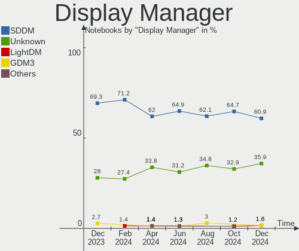
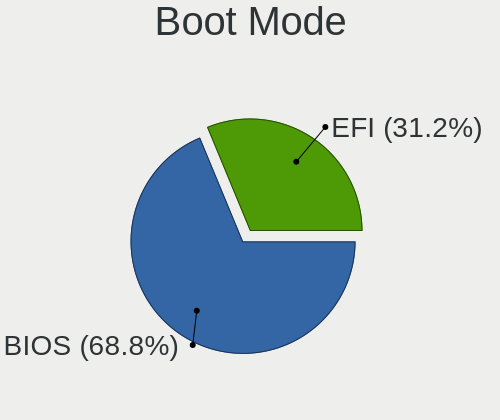
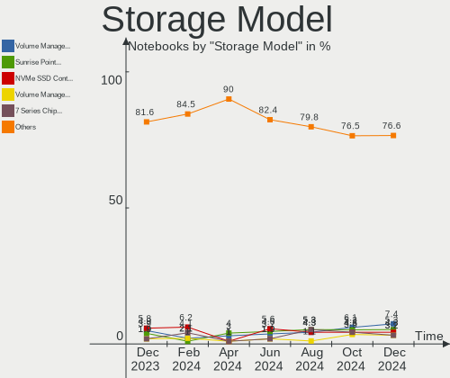
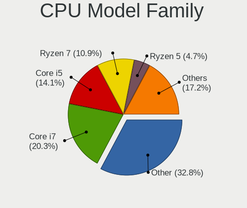
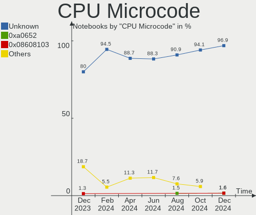
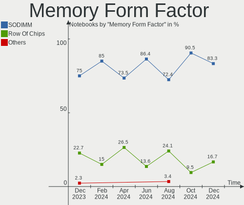
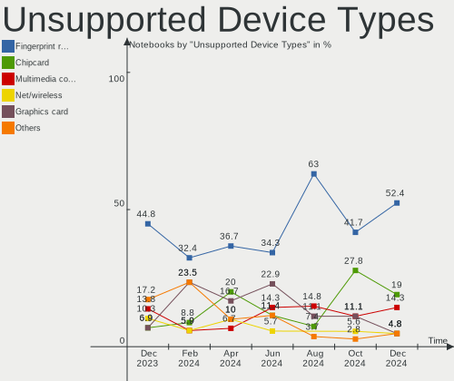

Kubuntu Hardware Trends (Notebooks)
-----------------------------------

A project to identify most popular hardware characteristics and track their change
over time based on data collected by Kubuntu users at https://Linux-Hardware.org.

Anyone can contribute to this report by the [hw-probe](https://github.com/linuxhw/hw-probe) tool:

    sudo -E hw-probe -all -upload

Full-feature report is available here: https://linux-hardware.org/?view=trends

Period: Feb, 2022.

Contents
--------

* [ System ](#system)
  - [ OS                       ](#os)
  - [ OS Family                ](#os-family)
  - [ Kernel                   ](#kernel)
  - [ Kernel Family            ](#kernel-family)
  - [ Kernel Major Ver.        ](#kernel-major-ver)
  - [ Arch                     ](#arch)
  - [ DE                       ](#de)
  - [ Display Server           ](#display-server)
  - [ Display Manager          ](#display-manager)
  - [ OS Lang                  ](#os-lang)
  - [ Boot Mode                ](#boot-mode)
  - [ Filesystem               ](#filesystem)
  - [ Part. scheme             ](#part-scheme)
  - [ Dual Boot with Linux/BSD ](#dual-boot-with-linuxbsd)
  - [ Dual Boot (Win)          ](#dual-boot-win)

* [ Board ](#board)
  - [ Vendor                   ](#vendor)
  - [ Model                    ](#model)
  - [ Model Family             ](#model-family)
  - [ MFG Year                 ](#mfg-year)
  - [ Form Factor              ](#form-factor)
  - [ Secure Boot              ](#secure-boot)
  - [ Coreboot                 ](#coreboot)
  - [ RAM Size                 ](#ram-size)
  - [ RAM Used                 ](#ram-used)
  - [ Total Drives             ](#total-drives)
  - [ Has CD-ROM               ](#has-cd-rom)
  - [ Has Ethernet             ](#has-ethernet)
  - [ Has WiFi                 ](#has-wifi)
  - [ Has Bluetooth            ](#has-bluetooth)

* [ Location ](#location)
  - [ Country                  ](#country)
  - [ City                     ](#city)

* [ Drives ](#drives)
  - [ Drive Vendor             ](#drive-vendor)
  - [ Drive Model              ](#drive-model)
  - [ HDD Vendor               ](#hdd-vendor)
  - [ SSD Vendor               ](#ssd-vendor)
  - [ Drive Kind               ](#drive-kind)
  - [ Drive Connector          ](#drive-connector)
  - [ Drive Size               ](#drive-size)
  - [ Space Total              ](#space-total)
  - [ Space Used               ](#space-used)
  - [ Malfunc. Drives          ](#malfunc-drives)
  - [ Malfunc. Drive Vendor    ](#malfunc-drive-vendor)
  - [ Malfunc. HDD Vendor      ](#malfunc-hdd-vendor)
  - [ Malfunc. Drive Kind      ](#malfunc-drive-kind)
  - [ Failed Drives            ](#failed-drives)
  - [ Failed Drive Vendor      ](#failed-drive-vendor)
  - [ Drive Status             ](#drive-status)

* [ Storage controller ](#storage-controller)
  - [ Storage Vendor           ](#storage-vendor)
  - [ Storage Model            ](#storage-model)
  - [ Storage Kind             ](#storage-kind)

* [ Processor ](#processor)
  - [ CPU Vendor               ](#cpu-vendor)
  - [ CPU Model                ](#cpu-model)
  - [ CPU Model Family         ](#cpu-model-family)
  - [ CPU Cores                ](#cpu-cores)
  - [ CPU Sockets              ](#cpu-sockets)
  - [ CPU Threads              ](#cpu-threads)
  - [ CPU Op-Modes             ](#cpu-op-modes)
  - [ CPU Microcode            ](#cpu-microcode)
  - [ CPU Microarch            ](#cpu-microarch)

* [ Graphics ](#graphics)
  - [ GPU Vendor               ](#gpu-vendor)
  - [ GPU Model                ](#gpu-model)
  - [ GPU Combo                ](#gpu-combo)
  - [ GPU Driver               ](#gpu-driver)
  - [ GPU Memory               ](#gpu-memory)

* [ Monitor ](#monitor)
  - [ Monitor Vendor           ](#monitor-vendor)
  - [ Monitor Model            ](#monitor-model)
  - [ Monitor Resolution       ](#monitor-resolution)
  - [ Monitor Diagonal         ](#monitor-diagonal)
  - [ Monitor Width            ](#monitor-width)
  - [ Aspect Ratio             ](#aspect-ratio)
  - [ Monitor Area             ](#monitor-area)
  - [ Pixel Density            ](#pixel-density)
  - [ Multiple Monitors        ](#multiple-monitors)

* [ Network ](#network)
  - [ Net Controller Vendor    ](#net-controller-vendor)
  - [ Net Controller Model     ](#net-controller-model)
  - [ Wireless Vendor          ](#wireless-vendor)
  - [ Wireless Model           ](#wireless-model)
  - [ Ethernet Vendor          ](#ethernet-vendor)
  - [ Ethernet Model           ](#ethernet-model)
  - [ Net Controller Kind      ](#net-controller-kind)
  - [ Used Controller          ](#used-controller)
  - [ NICs                     ](#nics)
  - [ IPv6                     ](#ipv6)

* [ Bluetooth ](#bluetooth)
  - [ Bluetooth Vendor         ](#bluetooth-vendor)
  - [ Bluetooth Model          ](#bluetooth-model)

* [ Sound ](#sound)
  - [ Sound Vendor             ](#sound-vendor)
  - [ Sound Model              ](#sound-model)

* [ Memory ](#memory)
  - [ Memory Vendor            ](#memory-vendor)
  - [ Memory Model             ](#memory-model)
  - [ Memory Kind              ](#memory-kind)
  - [ Memory Form Factor       ](#memory-form-factor)
  - [ Memory Size              ](#memory-size)
  - [ Memory Speed             ](#memory-speed)

* [ Printers & scanners ](#printers--scanners)
  - [ Printer Vendor           ](#printer-vendor)
  - [ Printer Model            ](#printer-model)
  - [ Scanner Vendor           ](#scanner-vendor)
  - [ Scanner Model            ](#scanner-model)

* [ Camera ](#camera)
  - [ Camera Vendor            ](#camera-vendor)
  - [ Camera Model             ](#camera-model)

* [ Security ](#security)
  - [ Fingerprint Vendor       ](#fingerprint-vendor)
  - [ Fingerprint Model        ](#fingerprint-model)
  - [ Chipcard Vendor          ](#chipcard-vendor)
  - [ Chipcard Model           ](#chipcard-model)

* [ Unsupported ](#unsupported)
  - [ Unsupported Devices      ](#unsupported-devices)
  - [ Unsupported Device Types ](#unsupported-device-types)

System
------

OS
--

Installed operating systems

| Name          | Notebooks | Percent |
|---------------|-----------|---------|
| Kubuntu 20.04 | 26        | 41.94%  |
| Kubuntu 21.10 | 23        | 37.1%   |
| Kubuntu 11    | 6         | 9.68%   |
| Kubuntu 22.04 | 5         | 8.06%   |
| Kubuntu 21.04 | 1         | 1.61%   |
| Kubuntu 18.04 | 1         | 1.61%   |

OS Family
---------

OS without a version

| Name    | Notebooks | Percent |
|---------|-----------|---------|
| Kubuntu | 62        | 100%    |

Kernel
------

Version of the Linux kernel

| Version                  | Notebooks | Percent |
|--------------------------|-----------|---------|
| 5.13.0-28-generic        | 27        | 43.55%  |
| 5.13.0-30-generic        | 15        | 24.19%  |
| 5.15.0-18-generic        | 4         | 6.45%   |
| 5.4.0-97-generic         | 2         | 3.23%   |
| 5.13.0-30-lowlatency     | 2         | 3.23%   |
| 5.13.0-27-generic        | 2         | 3.23%   |
| 5.4.0-99-generic         | 1         | 1.61%   |
| 5.4.0-65-generic         | 1         | 1.61%   |
| 5.4.0-42-generic         | 1         | 1.61%   |
| 5.17.0-051700rc5-generic | 1         | 1.61%   |
| 5.17.0-051700rc4-generic | 1         | 1.61%   |
| 5.16.8-051608-generic    | 1         | 1.61%   |
| 5.16.5                   | 1         | 1.61%   |
| 5.13.0-29-generic        | 1         | 1.61%   |
| 5.13.0-19-generic        | 1         | 1.61%   |
| 5.11.0-49-generic        | 1         | 1.61%   |

Kernel Family
-------------

Linux kernel without a distro release

| Version | Notebooks | Percent |
|---------|-----------|---------|
| 5.13.0  | 48        | 77.42%  |
| 5.4.0   | 5         | 8.06%   |
| 5.15.0  | 4         | 6.45%   |
| 5.17.0  | 2         | 3.23%   |
| 5.16.8  | 1         | 1.61%   |
| 5.16.5  | 1         | 1.61%   |
| 5.11.0  | 1         | 1.61%   |

Kernel Major Ver.
-----------------

Linux kernel major version

| Version | Notebooks | Percent |
|---------|-----------|---------|
| 5.13    | 48        | 77.42%  |
| 5.4     | 5         | 8.06%   |
| 5.15    | 4         | 6.45%   |
| 5.17    | 2         | 3.23%   |
| 5.16    | 2         | 3.23%   |
| 5.11    | 1         | 1.61%   |

Arch
----

OS architecture (x86_64, i586, etc.)

| Name   | Notebooks | Percent |
|--------|-----------|---------|
| x86_64 | 62        | 100%    |

DE
--

Desktop Environment

| Name | Notebooks | Percent |
|------|-----------|---------|
| KDE5 | 62        | 100%    |

Display Server
--------------

X11 or Wayland

| Name    | Notebooks | Percent |
|---------|-----------|---------|
| X11     | 57        | 91.94%  |
| Wayland | 3         | 4.84%   |
| Tty     | 2         | 3.23%   |

Display Manager
---------------

SDDM, LightDM, etc.

| Name    | Notebooks | Percent |
|---------|-----------|---------|
| SDDM    | 47        | 75.81%  |
| Unknown | 10        | 16.13%  |
| GDM3    | 3         | 4.84%   |
| LightDM | 2         | 3.23%   |

OS Lang
-------

Language

| Lang  | Notebooks | Percent |
|-------|-----------|---------|
| en_US | 22        | 35.48%  |
| ru_RU | 4         | 6.45%   |
| fr_FR | 4         | 6.45%   |
| de_DE | 4         | 6.45%   |
| pl_PL | 3         | 4.84%   |
| pt_BR | 2         | 3.23%   |
| it_IT | 2         | 3.23%   |
| es_ES | 2         | 3.23%   |
| en_GB | 2         | 3.23%   |
| C     | 2         | 3.23%   |
| be_BY | 2         | 3.23%   |
| sv_SE | 1         | 1.61%   |
| sl_SI | 1         | 1.61%   |
| ro_RO | 1         | 1.61%   |
| hu_HU | 1         | 1.61%   |
| hr_HR | 1         | 1.61%   |
| es_CR | 1         | 1.61%   |
| es_AR | 1         | 1.61%   |
| en_ZA | 1         | 1.61%   |
| en_NZ | 1         | 1.61%   |
| en_IN | 1         | 1.61%   |
| en_CA | 1         | 1.61%   |
| de_AT | 1         | 1.61%   |
| cs_CZ | 1         | 1.61%   |

Boot Mode
---------

EFI or BIOS

| Mode | Notebooks | Percent |
|------|-----------|---------|
| EFI  | 37        | 59.68%  |
| BIOS | 25        | 40.32%  |

Filesystem
----------

Type of filesystem

| Type    | Notebooks | Percent |
|---------|-----------|---------|
| Ext4    | 59        | 95.16%  |
| Xfs     | 1         | 1.61%   |
| Overlay | 1         | 1.61%   |
| Btrfs   | 1         | 1.61%   |

Part. scheme
------------

Scheme of partitioning

| Type    | Notebooks | Percent |
|---------|-----------|---------|
| GPT     | 32        | 51.61%  |
| Unknown | 25        | 40.32%  |
| MBR     | 5         | 8.06%   |

Dual Boot with Linux/BSD
------------------------

Hosting more than one Linux/BSD

| Dual boot | Notebooks | Percent |
|-----------|-----------|---------|
| No        | 57        | 91.94%  |
| Yes       | 5         | 8.06%   |

Dual Boot (Win)
---------------

Hosting Linux and Windows

| Dual boot | Notebooks | Percent |
|-----------|-----------|---------|
| No        | 43        | 69.35%  |
| Yes       | 19        | 30.65%  |

Board
-----

Vendor
------

Motherboard manufacturer

| Name                | Notebooks | Percent |
|---------------------|-----------|---------|
| Lenovo              | 16        | 25.81%  |
| Dell                | 10        | 16.13%  |
| Hewlett-Packard     | 9         | 14.52%  |
| ASUSTek Computer    | 8         | 12.9%   |
| MSI                 | 3         | 4.84%   |
| Acer                | 3         | 4.84%   |
| Timi                | 2         | 3.23%   |
| Toshiba             | 1         | 1.61%   |
| Sony                | 1         | 1.61%   |
| Semp Toshiba        | 1         | 1.61%   |
| Schenker            | 1         | 1.61%   |
| Samsung Electronics | 1         | 1.61%   |
| Medion              | 1         | 1.61%   |
| LG Electronics      | 1         | 1.61%   |
| HUAWEI              | 1         | 1.61%   |
| Fujitsu Siemens     | 1         | 1.61%   |
| Digma               | 1         | 1.61%   |
| Apple               | 1         | 1.61%   |

Model
-----

Motherboard model

| Name                                       | Notebooks | Percent |
|--------------------------------------------|-----------|---------|
| HP Notebook                                | 2         | 3.23%   |
| Toshiba Satellite S55-C                    | 1         | 1.61%   |
| Timi RedmiBook 14 II                       | 1         | 1.61%   |
| Timi Mi Laptop Air 12.5                    | 1         | 1.61%   |
| Sony VPCF236FM                             | 1         | 1.61%   |
| Semp Toshiba IS 1412                       | 1         | 1.61%   |
| Schenker VIA 15                            | 1         | 1.61%   |
| Samsung 300E4A/300E5A/300E7A/3430EA/3530EA | 1         | 1.61%   |
| MSI Prestige 14 A10RB                      | 1         | 1.61%   |
| MSI Katana GF76 11UC                       | 1         | 1.61%   |
| MSI GE62 6QD                               | 1         | 1.61%   |
| Medion E4241 MD60996                       | 1         | 1.61%   |
| LG 16Z90P-G.AA78C                          | 1         | 1.61%   |
| Lenovo V580c 20160                         | 1         | 1.61%   |
| Lenovo V14-IIL 82C4                        | 1         | 1.61%   |
| Lenovo V14 G2 ITL 82NM                     | 1         | 1.61%   |
| Lenovo ThinkPad T460s 20F9S1G200           | 1         | 1.61%   |
| Lenovo ThinkPad T430 23495P8               | 1         | 1.61%   |
| Lenovo ThinkPad T14s Gen 1 20UH001QGE      | 1         | 1.61%   |
| Lenovo ThinkPad L430 2468CTO               | 1         | 1.61%   |
| Lenovo ThinkPad L14 Gen 2 20X1S07900       | 1         | 1.61%   |
| Lenovo ThinkPad L14 Gen 1 20U5S01S00       | 1         | 1.61%   |
| Lenovo ThinkPad E14 20RBS25S00             | 1         | 1.61%   |
| Lenovo Legion 5 17ACH6 82K0                | 1         | 1.61%   |
| Lenovo IdeaPad S145-15API 81UT             | 1         | 1.61%   |
| Lenovo IdeaPad 3 15ARE05 81W4              | 1         | 1.61%   |
| Lenovo G710 20252                          | 1         | 1.61%   |
| Lenovo G500 20236                          | 1         | 1.61%   |
| Lenovo G50-70 20351                        | 1         | 1.61%   |
| HUAWEI HVY-WXX9                            | 1         | 1.61%   |
| HP Victus by Laptop 16-e0xxx               | 1         | 1.61%   |
| HP Pavilion Laptop 14-ce0xxx               | 1         | 1.61%   |
| HP Pavilion dv6                            | 1         | 1.61%   |
| HP Laptop 15g-br1xx                        | 1         | 1.61%   |
| HP EliteBook 8760w                         | 1         | 1.61%   |
| HP EliteBook 8570w                         | 1         | 1.61%   |
| HP Compaq Presario CQ71                    | 1         | 1.61%   |
| Fujitsu Siemens LIFEBOOK S6420             | 1         | 1.61%   |
| Digma CITI E401 ET4007EW                   | 1         | 1.61%   |
| Dell XPS 15 9560                           | 1         | 1.61%   |
| Dell Vostro 5490                           | 1         | 1.61%   |
| Dell System XPS L502X                      | 1         | 1.61%   |
| Dell Latitude E6320                        | 1         | 1.61%   |
| Dell Latitude E5570                        | 1         | 1.61%   |
| Dell Latitude E5440                        | 1         | 1.61%   |
| Dell Latitude 5580                         | 1         | 1.61%   |
| Dell Inspiron 3793                         | 1         | 1.61%   |
| Dell Inspiron 3583                         | 1         | 1.61%   |
| Dell Inspiron 1525                         | 1         | 1.61%   |
| ASUS ZenBook UX434IQ_UM433IQ               | 1         | 1.61%   |
| ASUS X550JX                                | 1         | 1.61%   |
| ASUS X540NA                                | 1         | 1.61%   |
| ASUS Vivobook_ASUSLaptop X3500PA_K3500PA   | 1         | 1.61%   |
| ASUS GL753VD                               | 1         | 1.61%   |
| ASUS G75VW                                 | 1         | 1.61%   |
| ASUS ASUS TUF Gaming F15 FX506HM_FX506HM   | 1         | 1.61%   |
| ASUS ASUS BR1100CKA BR1100CKA_BR1100CKA    | 1         | 1.61%   |
| Apple MacBookPro8,1                        | 1         | 1.61%   |
| Acer Aspire A515-45                        | 1         | 1.61%   |
| Acer Aspire 5750G                          | 1         | 1.61%   |

Model Family
------------

Motherboard model prefix

| Name                     | Notebooks | Percent |
|--------------------------|-----------|---------|
| Lenovo ThinkPad          | 7         | 11.29%  |
| Dell Latitude            | 4         | 6.45%   |
| Dell Inspiron            | 3         | 4.84%   |
| Acer Aspire              | 3         | 4.84%   |
| Lenovo IdeaPad           | 2         | 3.23%   |
| HP Pavilion              | 2         | 3.23%   |
| HP Notebook              | 2         | 3.23%   |
| HP EliteBook             | 2         | 3.23%   |
| ASUS ASUS                | 2         | 3.23%   |
| Toshiba Satellite        | 1         | 1.61%   |
| Timi RedmiBook           | 1         | 1.61%   |
| Timi Mi                  | 1         | 1.61%   |
| Sony VPCF236FM           | 1         | 1.61%   |
| Semp Toshiba IS          | 1         | 1.61%   |
| Schenker VIA             | 1         | 1.61%   |
| Samsung 300E4A           | 1         | 1.61%   |
| MSI Prestige             | 1         | 1.61%   |
| MSI Katana               | 1         | 1.61%   |
| MSI GE62                 | 1         | 1.61%   |
| Medion E4241             | 1         | 1.61%   |
| LG 16Z90P-G.AA78C        | 1         | 1.61%   |
| Lenovo V580c             | 1         | 1.61%   |
| Lenovo V14-IIL           | 1         | 1.61%   |
| Lenovo V14               | 1         | 1.61%   |
| Lenovo Legion            | 1         | 1.61%   |
| Lenovo G710              | 1         | 1.61%   |
| Lenovo G500              | 1         | 1.61%   |
| Lenovo G50-70            | 1         | 1.61%   |
| HUAWEI HVY-WXX9          | 1         | 1.61%   |
| HP Victus                | 1         | 1.61%   |
| HP Laptop                | 1         | 1.61%   |
| HP Compaq                | 1         | 1.61%   |
| Fujitsu Siemens LIFEBOOK | 1         | 1.61%   |
| Digma CITI               | 1         | 1.61%   |
| Dell XPS                 | 1         | 1.61%   |
| Dell Vostro              | 1         | 1.61%   |
| Dell System              | 1         | 1.61%   |
| ASUS ZenBook             | 1         | 1.61%   |
| ASUS X550JX              | 1         | 1.61%   |
| ASUS X540NA              | 1         | 1.61%   |
| ASUS Vivobook            | 1         | 1.61%   |
| ASUS GL753VD             | 1         | 1.61%   |
| ASUS G75VW               | 1         | 1.61%   |
| Apple MacBookPro8        | 1         | 1.61%   |

MFG Year
--------

Motherboard manufacture year

| Year | Notebooks | Percent |
|------|-----------|---------|
| 2021 | 9         | 14.52%  |
| 2020 | 9         | 14.52%  |
| 2019 | 8         | 12.9%   |
| 2017 | 7         | 11.29%  |
| 2011 | 7         | 11.29%  |
| 2012 | 5         | 8.06%   |
| 2013 | 4         | 6.45%   |
| 2015 | 3         | 4.84%   |
| 2008 | 3         | 4.84%   |
| 2018 | 2         | 3.23%   |
| 2016 | 2         | 3.23%   |
| 2009 | 2         | 3.23%   |
| 2010 | 1         | 1.61%   |

Form Factor
-----------

Physical design of the computer

| Name     | Notebooks | Percent |
|----------|-----------|---------|
| Notebook | 62        | 100%    |

Secure Boot
-----------

Enabled or disabled

| State    | Notebooks | Percent |
|----------|-----------|---------|
| Disabled | 55        | 88.71%  |
| Enabled  | 7         | 11.29%  |

Coreboot
--------

Have coreboot on board

| Used | Notebooks | Percent |
|------|-----------|---------|
| No   | 62        | 100%    |

RAM Size
--------

Total RAM memory

| Size in GB  | Notebooks | Percent |
|-------------|-----------|---------|
| 4.01-8.0    | 15        | 24.19%  |
| 16.01-24.0  | 13        | 20.97%  |
| 8.01-16.0   | 13        | 20.97%  |
| 3.01-4.0    | 12        | 19.35%  |
| 32.01-64.0  | 5         | 8.06%   |
| 24.01-32.0  | 2         | 3.23%   |
| 2.01-3.0    | 1         | 1.61%   |
| 64.01-256.0 | 1         | 1.61%   |

RAM Used
--------

Used RAM memory

| Used GB    | Notebooks | Percent |
|------------|-----------|---------|
| 2.01-3.0   | 18        | 29.03%  |
| 1.01-2.0   | 18        | 29.03%  |
| 4.01-8.0   | 14        | 22.58%  |
| 3.01-4.0   | 6         | 9.68%   |
| 8.01-16.0  | 5         | 8.06%   |
| 16.01-24.0 | 1         | 1.61%   |

Total Drives
------------

Number of drives on board

| Drives | Notebooks | Percent |
|--------|-----------|---------|
| 1      | 41        | 66.13%  |
| 2      | 20        | 32.26%  |
| 3      | 1         | 1.61%   |

Has CD-ROM
----------

Has CD-ROM on board

| Presented | Notebooks | Percent |
|-----------|-----------|---------|
| No        | 36        | 58.06%  |
| Yes       | 26        | 41.94%  |

Has Ethernet
------------

Has Ethernet on board

| Presented | Notebooks | Percent |
|-----------|-----------|---------|
| Yes       | 49        | 79.03%  |
| No        | 13        | 20.97%  |

Has WiFi
--------

Has WiFi module

| Presented | Notebooks | Percent |
|-----------|-----------|---------|
| Yes       | 60        | 96.77%  |
| No        | 2         | 3.23%   |

Has Bluetooth
-------------

Has Bluetooth module

| Presented | Notebooks | Percent |
|-----------|-----------|---------|
| Yes       | 48        | 77.42%  |
| No        | 14        | 22.58%  |

Location
--------

Country
-------

Geographic location (country)

| Country      | Notebooks | Percent |
|--------------|-----------|---------|
| USA          | 7         | 11.29%  |
| Germany      | 7         | 11.29%  |
| Russia       | 5         | 8.06%   |
| France       | 5         | 8.06%   |
| Brazil       | 4         | 6.45%   |
| Spain        | 3         | 4.84%   |
| Belarus      | 3         | 4.84%   |
| Slovenia     | 2         | 3.23%   |
| Romania      | 2         | 3.23%   |
| Poland       | 2         | 3.23%   |
| Italy        | 2         | 3.23%   |
| Yemen        | 1         | 1.61%   |
| Ukraine      | 1         | 1.61%   |
| UK           | 1         | 1.61%   |
| Taiwan       | 1         | 1.61%   |
| Switzerland  | 1         | 1.61%   |
| Sweden       | 1         | 1.61%   |
| South Korea  | 1         | 1.61%   |
| South Africa | 1         | 1.61%   |
| Serbia       | 1         | 1.61%   |
| Norway       | 1         | 1.61%   |
| Netherlands  | 1         | 1.61%   |
| Mexico       | 1         | 1.61%   |
| India        | 1         | 1.61%   |
| Hungary      | 1         | 1.61%   |
| Czechia      | 1         | 1.61%   |
| Croatia      | 1         | 1.61%   |
| Costa Rica   | 1         | 1.61%   |
| China        | 1         | 1.61%   |
| Canada       | 1         | 1.61%   |
| Argentina    | 1         | 1.61%   |

City
----

Geographic location (city)

| City                        | Notebooks | Percent |
|-----------------------------|-----------|---------|
| Moscow                      | 4         | 6.45%   |
| Minsk                       | 3         | 4.84%   |
| Cologne                     | 2         | 3.23%   |
| Zurich                      | 1         | 1.61%   |
| Wroclaw                     | 1         | 1.61%   |
| Wildflecken                 | 1         | 1.61%   |
| Villa Nueva                 | 1         | 1.61%   |
| Venlo                       | 1         | 1.61%   |
| Tychy                       | 1         | 1.61%   |
| Toulouse                    | 1         | 1.61%   |
| Taipei                      | 1         | 1.61%   |
| Seoul                       | 1         | 1.61%   |
| Schifferstadt               | 1         | 1.61%   |
| São Paulo                | 1         | 1.61%   |
| Sault Ste. Marie            | 1         | 1.61%   |
| Sanaa                       | 1         | 1.61%   |
| San Francisco del Rincón | 1         | 1.61%   |
| Rocca Priora                | 1         | 1.61%   |
| Prague                      | 1         | 1.61%   |
| Phoenix                     | 1         | 1.61%   |
| Perugia                     | 1         | 1.61%   |
| Oslo                        | 1         | 1.61%   |
| Obninsk                     | 1         | 1.61%   |
| New York                    | 1         | 1.61%   |
| Nîmes                    | 1         | 1.61%   |
| Natal                       | 1         | 1.61%   |
| Meyzieu                     | 1         | 1.61%   |
| Madrid                      | 1         | 1.61%   |
| Ljutomer                    | 1         | 1.61%   |
| Ljubljana                   | 1         | 1.61%   |
| Las Vegas                   | 1         | 1.61%   |
| Kyiv                        | 1         | 1.61%   |
| Kunming                     | 1         | 1.61%   |
| Huddinge                    | 1         | 1.61%   |
| Heredia                     | 1         | 1.61%   |
| Gandia                      | 1         | 1.61%   |
| Frisco                      | 1         | 1.61%   |
| Edinburgh                   | 1         | 1.61%   |
| Donostia / San Sebastian    | 1         | 1.61%   |
| Demmin                      | 1         | 1.61%   |
| Darmstadt                   | 1         | 1.61%   |
| Creutzwald                  | 1         | 1.61%   |
| Charlotte                   | 1         | 1.61%   |
| Cape Town                   | 1         | 1.61%   |
| Bucharest                   | 1         | 1.61%   |
| Broken Arrow                | 1         | 1.61%   |
| Brest                       | 1         | 1.61%   |
| Brasília                 | 1         | 1.61%   |
| Bogdanovci                  | 1         | 1.61%   |
| Belgrade                    | 1         | 1.61%   |
| Békéscsaba            | 1         | 1.61%   |
| Balneário Camboriú    | 1         | 1.61%   |
| Baia Mare                   | 1         | 1.61%   |
| Anderson                    | 1         | 1.61%   |
| Andernach                   | 1         | 1.61%   |
| Ahmedabad                   | 1         | 1.61%   |

Drives
------

Drive Vendor
------------

Hard drive vendors

| Vendor                         | Notebooks | Drives | Percent |
|--------------------------------|-----------|--------|---------|
| Samsung Electronics            | 19        | 20     | 24.36%  |
| WDC                            | 11        | 13     | 14.1%   |
| SanDisk                        | 6         | 6      | 7.69%   |
| Kingston                       | 6         | 6      | 7.69%   |
| Seagate                        | 5         | 5      | 6.41%   |
| Crucial                        | 5         | 6      | 6.41%   |
| Toshiba                        | 4         | 4      | 5.13%   |
| SK Hynix                       | 4         | 4      | 5.13%   |
| Unknown                        | 2         | 2      | 2.56%   |
| Solid State Storage Technology | 2         | 2      | 2.56%   |
| KIOXIA                         | 2         | 2      | 2.56%   |
| Intel                          | 2         | 3      | 2.56%   |
| Zheino                         | 1         | 1      | 1.28%   |
| Verbatim                       | 1         | 1      | 1.28%   |
| Team                           | 1         | 1      | 1.28%   |
| Micron Technology              | 1         | 1      | 1.28%   |
| KingFast                       | 1         | 1      | 1.28%   |
| ipTIME                         | 1         | 1      | 1.28%   |
| Hitachi                        | 1         | 1      | 1.28%   |
| HGST                           | 1         | 1      | 1.28%   |
| ASM1153U                       | 1         | 1      | 1.28%   |
| Unknown                        | 1         | 1      | 1.28%   |

Drive Model
-----------

Hard drive models

| Model                                     | Notebooks | Percent |
|-------------------------------------------|-----------|---------|
| Solid State Storage NVMe SSD Drive 256GB  | 2         | 2.44%   |
| Seagate ST1000LM024 HN-M101MBB 1TB        | 2         | 2.44%   |
| Sandisk NVMe SSD Drive 256GB              | 2         | 2.44%   |
| Samsung SSD 970 EVO Plus 500GB            | 2         | 2.44%   |
| Samsung SSD 870 EVO 250GB                 | 2         | 2.44%   |
| Samsung HM500JI 500GB                     | 2         | 2.44%   |
| Zheino CHN 25SATAS3 128 128GB SSD         | 1         | 1.22%   |
| WDC WDS500G2B0B-00YS70 500GB SSD          | 1         | 1.22%   |
| WDC WDS200T1X0E-00AFY0 2TB                | 1         | 1.22%   |
| WDC WDS100T2B0C-00PXH0 1TB                | 1         | 1.22%   |
| WDC WDS100T2B0C 1TB                       | 1         | 1.22%   |
| WDC WD6400BPVT-22HXZT3 640GB              | 1         | 1.22%   |
| WDC WD5000LPZX-80Z10T0 500GB              | 1         | 1.22%   |
| WDC WD5000BPVT-00HXZT3 500GB              | 1         | 1.22%   |
| WDC WD3200BPVT-22JJ5T0 320GB              | 1         | 1.22%   |
| WDC WD10SPZX-24Z10 1TB                    | 1         | 1.22%   |
| WDC WD10JPVX-60JC3T1 1TB                  | 1         | 1.22%   |
| WDC PC SN730 SDBPNTY-512G-1006 512GB      | 1         | 1.22%   |
| WDC PC SN730 SDBPNTY-1T00-1032 1TB        | 1         | 1.22%   |
| WDC PC SN520 SDAPMUW-128G-1101 128GB      | 1         | 1.22%   |
| Verbatim Vi500 S3 120GB SSD               | 1         | 1.22%   |
| Unknown MMC Card  32GB                    | 1         | 1.22%   |
| Unknown 064G38  64GB                      | 1         | 1.22%   |
| Toshiba THNSNJ128GVNU 128GB SSD           | 1         | 1.22%   |
| Toshiba MQ01ABD100 1TB                    | 1         | 1.22%   |
| Toshiba MK7559GSXP 752GB                  | 1         | 1.22%   |
| Toshiba KBG30ZMS128G 128GB NVMe SSD       | 1         | 1.22%   |
| Team TM8FPD512G 512GB                     | 1         | 1.22%   |
| SK Hynix SKHynix_HFM512GDHTNI-87A0B 512GB | 1         | 1.22%   |
| SK Hynix NVMe SSD Drive 512GB             | 1         | 1.22%   |
| SK Hynix HFS001TD9TNG-L2A0A 1TB           | 1         | 1.22%   |
| SK Hynix HFM256GDJTNG-8310A 256GB         | 1         | 1.22%   |
| Seagate ST9160411ASG 160GB                | 1         | 1.22%   |
| Seagate ST2000LM007-1R8174 2TB            | 1         | 1.22%   |
| Seagate ST1000LM048-2E7172 1TB            | 1         | 1.22%   |
| SanDisk SSD PLUS 240GB                    | 1         | 1.22%   |
| SanDisk SSD G5 BICS4 1TB                  | 1         | 1.22%   |
| SanDisk SDSSDH3 500G                      | 1         | 1.22%   |
| SanDisk SD8SN8U128G1002 128GB SSD         | 1         | 1.22%   |
| Samsung SSD PM871b M.2 2280 256GB         | 1         | 1.22%   |
| Samsung SSD PM810 FDE 2.5 256GB           | 1         | 1.22%   |
| Samsung SSD 980 500GB                     | 1         | 1.22%   |
| Samsung SSD 860 EVO mSATA 250GB           | 1         | 1.22%   |
| Samsung SSD 860 EVO M.2 2TB               | 1         | 1.22%   |
| Samsung SSD 860 EVO 500GB                 | 1         | 1.22%   |
| Samsung SSD 860 EVO 250GB                 | 1         | 1.22%   |
| Samsung SSD 850 EVO mSATA 250GB           | 1         | 1.22%   |
| Samsung SSD 850 EVO 500GB                 | 1         | 1.22%   |
| Samsung NVMe SSD Drive 1TB                | 1         | 1.22%   |
| Samsung MZVLB512HBJQ-00000 512GB          | 1         | 1.22%   |
| Samsung MZVLB1T0HBLR-000L7 1TB            | 1         | 1.22%   |
| Samsung MZNLH512HALU-00000 512GB SSD      | 1         | 1.22%   |
| Samsung HM250HI 250GB                     | 1         | 1.22%   |
| Micron 2210_MTFDHBA1T0QFD 1TB             | 1         | 1.22%   |
| KIOXIA NVMe SSD Drive 256GB               | 1         | 1.22%   |
| KIOXIA KBG40ZNS512G NVMe 512GB            | 1         | 1.22%   |
| Kingston SV300S37A480G 480GB SSD          | 1         | 1.22%   |
| Kingston SV300S37A120G 120GB SSD          | 1         | 1.22%   |
| Kingston SUV500MS480G 480GB SSD           | 1         | 1.22%   |
| Kingston SA400S37240G 240GB SSD           | 1         | 1.22%   |

HDD Vendor
----------

Hard disk drive vendors

| Vendor              | Notebooks | Drives | Percent |
|---------------------|-----------|--------|---------|
| WDC                 | 6         | 6      | 31.58%  |
| Seagate             | 5         | 5      | 26.32%  |
| Samsung Electronics | 3         | 3      | 15.79%  |
| Toshiba             | 2         | 2      | 10.53%  |
| ipTIME              | 1         | 1      | 5.26%   |
| Hitachi             | 1         | 1      | 5.26%   |
| HGST                | 1         | 1      | 5.26%   |

SSD Vendor
----------

Solid state drive vendors

| Vendor              | Notebooks | Drives | Percent |
|---------------------|-----------|--------|---------|
| Samsung Electronics | 11        | 11     | 35.48%  |
| Kingston            | 5         | 5      | 16.13%  |
| Crucial             | 5         | 6      | 16.13%  |
| SanDisk             | 4         | 4      | 12.9%   |
| Zheino              | 1         | 1      | 3.23%   |
| WDC                 | 1         | 1      | 3.23%   |
| Verbatim            | 1         | 1      | 3.23%   |
| Toshiba             | 1         | 1      | 3.23%   |
| KingFast            | 1         | 1      | 3.23%   |
| Intel               | 1         | 1      | 3.23%   |

Drive Kind
----------

HDD or SSD

| Kind    | Notebooks | Drives | Percent |
|---------|-----------|--------|---------|
| SSD     | 27        | 32     | 36%     |
| NVMe    | 25        | 28     | 33.33%  |
| HDD     | 19        | 19     | 25.33%  |
| MMC     | 3         | 3      | 4%      |
| Unknown | 1         | 1      | 1.33%   |

Drive Connector
---------------

SATA, SAS, NVMe, etc.

| Type | Notebooks | Drives | Percent |
|------|-----------|--------|---------|
| SATA | 40        | 50     | 57.14%  |
| NVMe | 25        | 28     | 35.71%  |
| MMC  | 3         | 3      | 4.29%   |
| SAS  | 2         | 2      | 2.86%   |

Drive Size
----------

Size of hard drive

| Size in TB | Notebooks | Drives | Percent |
|------------|-----------|--------|---------|
| 0.01-0.5   | 29        | 32     | 61.7%   |
| 0.51-1.0   | 13        | 13     | 27.66%  |
| 1.01-2.0   | 5         | 6      | 10.64%  |

Space Total
-----------

Amount of disk space available on the file system

| Size in GB     | Notebooks | Percent |
|----------------|-----------|---------|
| 251-500        | 19        | 30.65%  |
| 101-250        | 17        | 27.42%  |
| 501-1000       | 12        | 19.35%  |
| 1001-2000      | 6         | 9.68%   |
| 21-50          | 3         | 4.84%   |
| 51-100         | 3         | 4.84%   |
| More than 3000 | 1         | 1.61%   |
| 2001-3000      | 1         | 1.61%   |

Space Used
----------

Amount of used disk space

| Used GB        | Notebooks | Percent |
|----------------|-----------|---------|
| 1-20           | 22        | 35.48%  |
| 21-50          | 9         | 14.52%  |
| 101-250        | 9         | 14.52%  |
| 51-100         | 8         | 12.9%   |
| 251-500        | 6         | 9.68%   |
| 501-1000       | 5         | 8.06%   |
| 1001-2000      | 2         | 3.23%   |
| More than 3000 | 1         | 1.61%   |

Malfunc. Drives
---------------

Drive models with a malfunction

| Model                              | Notebooks | Drives | Percent |
|------------------------------------|-----------|--------|---------|
| WDC WD10JPVX-60JC3T1 1TB           | 1         | 1      | 20%     |
| Toshiba MK7559GSXP 752GB           | 1         | 1      | 20%     |
| Seagate ST1000LM024 HN-M101MBB 1TB | 1         | 1      | 20%     |
| SanDisk SSD PLUS 240GB             | 1         | 1      | 20%     |
| HGST HTS721010A9E630 1TB           | 1         | 1      | 20%     |

Malfunc. Drive Vendor
---------------------

Vendors of faulty drives

| Vendor  | Notebooks | Drives | Percent |
|---------|-----------|--------|---------|
| WDC     | 1         | 1      | 20%     |
| Toshiba | 1         | 1      | 20%     |
| Seagate | 1         | 1      | 20%     |
| SanDisk | 1         | 1      | 20%     |
| HGST    | 1         | 1      | 20%     |

Malfunc. HDD Vendor
-------------------

Vendors of faulty HDD drives

| Vendor  | Notebooks | Drives | Percent |
|---------|-----------|--------|---------|
| WDC     | 1         | 1      | 25%     |
| Toshiba | 1         | 1      | 25%     |
| Seagate | 1         | 1      | 25%     |
| HGST    | 1         | 1      | 25%     |

Malfunc. Drive Kind
-------------------

Kinds of faulty drives

| Kind | Notebooks | Drives | Percent |
|------|-----------|--------|---------|
| HDD  | 4         | 4      | 80%     |
| SSD  | 1         | 1      | 20%     |

Failed Drives
-------------

Failed drive models

Zero info for selected period =(

Failed Drive Vendor
-------------------

Failed drive vendors

Zero info for selected period =(

Drive Status
------------

Number of failed and malfunc. drives

| Status   | Notebooks | Drives | Percent |
|----------|-----------|--------|---------|
| Works    | 32        | 42     | 50%     |
| Detected | 27        | 36     | 42.19%  |
| Malfunc  | 5         | 5      | 7.81%   |

Storage controller
------------------

Storage Vendor
--------------

Storage controller vendors

| Vendor                         | Notebooks | Percent |
|--------------------------------|-----------|---------|
| Intel                          | 42        | 53.85%  |
| AMD                            | 10        | 12.82%  |
| Sandisk                        | 8         | 10.26%  |
| Samsung Electronics            | 6         | 7.69%   |
| SK Hynix                       | 4         | 5.13%   |
| Solid State Storage Technology | 2         | 2.56%   |
| KIOXIA                         | 2         | 2.56%   |
| Toshiba America Info Systems   | 1         | 1.28%   |
| Silicon Motion                 | 1         | 1.28%   |
| Micron Technology              | 1         | 1.28%   |
| Kingston Technology Company    | 1         | 1.28%   |

Storage Model
-------------

Storage controller models

| Model                                                                          | Notebooks | Percent |
|--------------------------------------------------------------------------------|-----------|---------|
| AMD FCH SATA Controller [AHCI mode]                                            | 9         | 10.98%  |
| Intel 6 Series/C200 Series Chipset Family 6 port Mobile SATA AHCI Controller   | 7         | 8.54%   |
| Intel 7 Series Chipset Family 6-port SATA Controller [AHCI mode]               | 6         | 7.32%   |
| Samsung NVMe SSD Controller SM981/PM981/PM983                                  | 5         | 6.1%    |
| Intel Sunrise Point-LP SATA Controller [AHCI mode]                             | 4         | 4.88%   |
| Sandisk WD Black SN750 / PC SN730 NVMe SSD                                     | 3         | 3.66%   |
| Intel HM170/QM170 Chipset SATA Controller [AHCI Mode]                          | 3         | 3.66%   |
| Intel 82801IBM/IEM (ICH9M/ICH9M-E) 4 port SATA Controller [AHCI mode]          | 3         | 3.66%   |
| Solid State Storage Non-Volatile memory controller                             | 2         | 2.44%   |
| Sandisk WD Blue SN550 NVMe SSD                                                 | 2         | 2.44%   |
| KIOXIA Non-Volatile memory controller                                          | 2         | 2.44%   |
| Intel Volume Management Device NVMe RAID Controller                            | 2         | 2.44%   |
| Intel Ice Lake-LP SATA Controller [AHCI mode]                                  | 2         | 2.44%   |
| Intel Comet Lake SATA AHCI Controller                                          | 2         | 2.44%   |
| Intel 8 Series/C220 Series Chipset Family 6-port SATA Controller 1 [AHCI mode] | 2         | 2.44%   |
| Intel 8 Series SATA Controller 1 [AHCI mode]                                   | 2         | 2.44%   |
| Toshiba America Info Systems XG6 NVMe SSD Controller                           | 1         | 1.22%   |
| SK Hynix Non-Volatile memory controller                                        | 1         | 1.22%   |
| SK Hynix Gold P31 SSD                                                          | 1         | 1.22%   |
| SK Hynix BC511                                                                 | 1         | 1.22%   |
| SK Hynix BC501 NVMe Solid State Drive                                          | 1         | 1.22%   |
| Silicon Motion SM2263EN/SM2263XT SSD Controller                                | 1         | 1.22%   |
| Sandisk WD PC SN810 / Black SN850 NVMe SSD                                     | 1         | 1.22%   |
| Sandisk WD Blue SN500 / PC SN520 NVMe SSD                                      | 1         | 1.22%   |
| Sandisk PC SN520 NVMe SSD                                                      | 1         | 1.22%   |
| Samsung NVMe SSD Controller 980                                                | 1         | 1.22%   |
| Micron Non-Volatile memory controller                                          | 1         | 1.22%   |
| Kingston Company Company Non-Volatile memory controller                        | 1         | 1.22%   |
| Intel Wildcat Point-LP SATA Controller [AHCI Mode]                             | 1         | 1.22%   |
| Intel Tiger Lake-LP SATA Controller [AHCI mode]                                | 1         | 1.22%   |
| Intel Q170/Q150/B150/H170/H110/Z170/CM236 Chipset SATA Controller [AHCI Mode]  | 1         | 1.22%   |
| Intel Non-Volatile memory controller                                           | 1         | 1.22%   |
| Intel Celeron N3350/Pentium N4200/Atom E3900 Series SATA AHCI Controller       | 1         | 1.22%   |
| Intel Cannon Point-LP SATA Controller [AHCI Mode]                              | 1         | 1.22%   |
| Intel 82801HM/HEM (ICH8M/ICH8M-E) SATA Controller [AHCI mode]                  | 1         | 1.22%   |
| Intel 82801HM/HEM (ICH8M/ICH8M-E) IDE Controller                               | 1         | 1.22%   |
| Intel 82801 Mobile SATA Controller [RAID mode]                                 | 1         | 1.22%   |
| Intel 500 Series Chipset Family SATA AHCI Controller                           | 1         | 1.22%   |
| Intel 5 Series/3400 Series Chipset 4 port SATA IDE Controller                  | 1         | 1.22%   |
| Intel 5 Series/3400 Series Chipset 2 port SATA IDE Controller                  | 1         | 1.22%   |
| AMD SB7x0/SB8x0/SB9x0 SATA Controller [AHCI mode]                              | 1         | 1.22%   |
| AMD SB7x0/SB8x0/SB9x0 IDE Controller                                           | 1         | 1.22%   |

Storage Kind
------------

Kind of storage controller (IDE, SATA, NVMe, SAS, ...)

| Kind | Notebooks | Percent |
|------|-----------|---------|
| SATA | 48        | 60.76%  |
| NVMe | 25        | 31.65%  |
| RAID | 3         | 3.8%    |
| IDE  | 3         | 3.8%    |

Processor
---------

CPU Vendor
----------

Processor vendors

| Vendor | Notebooks | Percent |
|--------|-----------|---------|
| Intel  | 48        | 77.42%  |
| AMD    | 14        | 22.58%  |

CPU Model
---------

Processor models

| Model                                           | Notebooks | Percent |
|-------------------------------------------------|-----------|---------|
| AMD Ryzen 5 4500U with Radeon Graphics          | 3         | 4.84%   |
| Intel Core i7-7700HQ CPU @ 2.80GHz              | 2         | 3.23%   |
| Intel Core i7-10510U CPU @ 1.80GHz              | 2         | 3.23%   |
| Intel Core i5-8250U CPU @ 1.60GHz               | 2         | 3.23%   |
| Intel Atom x5-Z8350 CPU @ 1.44GHz               | 2         | 3.23%   |
| Intel 11th Gen Core i5-11400H @ 2.70GHz         | 2         | 3.23%   |
| Intel 11th Gen Core i5-1135G7 @ 2.40GHz         | 2         | 3.23%   |
| AMD Ryzen 5 3500U with Radeon Vega Mobile Gfx   | 2         | 3.23%   |
| Intel Pentium Silver N6000 @ 1.10GHz            | 1         | 1.61%   |
| Intel Pentium Dual-Core CPU T4300 @ 2.10GHz     | 1         | 1.61%   |
| Intel Core m3-8100Y CPU @ 1.10GHz               | 1         | 1.61%   |
| Intel Core i7-7820HQ CPU @ 2.90GHz              | 1         | 1.61%   |
| Intel Core i7-6700HQ CPU @ 2.60GHz              | 1         | 1.61%   |
| Intel Core i7-6600U CPU @ 2.60GHz               | 1         | 1.61%   |
| Intel Core i7-5500U CPU @ 2.40GHz               | 1         | 1.61%   |
| Intel Core i7-4720HQ CPU @ 2.60GHz              | 1         | 1.61%   |
| Intel Core i7-4702MQ CPU @ 2.20GHz              | 1         | 1.61%   |
| Intel Core i7-4600U CPU @ 2.10GHz               | 1         | 1.61%   |
| Intel Core i7-3612QM CPU @ 2.10GHz              | 1         | 1.61%   |
| Intel Core i7-3610QM CPU @ 2.30GHz              | 1         | 1.61%   |
| Intel Core i7-2760QM CPU @ 2.40GHz              | 1         | 1.61%   |
| Intel Core i7-2670QM CPU @ 2.20GHz              | 1         | 1.61%   |
| Intel Core i7-2640M CPU @ 2.80GHz               | 1         | 1.61%   |
| Intel Core i7-2630QM CPU @ 2.00GHz              | 1         | 1.61%   |
| Intel Core i7-1065G7 CPU @ 1.30GHz              | 1         | 1.61%   |
| Intel Core i5-8265U CPU @ 1.60GHz               | 1         | 1.61%   |
| Intel Core i5-6300U CPU @ 2.40GHz               | 1         | 1.61%   |
| Intel Core i5-3360M CPU @ 2.80GHz               | 1         | 1.61%   |
| Intel Core i5-3320M CPU @ 2.60GHz               | 1         | 1.61%   |
| Intel Core i5-3230M CPU @ 2.60GHz               | 1         | 1.61%   |
| Intel Core i5-2520M CPU @ 2.50GHz               | 1         | 1.61%   |
| Intel Core i5-2430M CPU @ 2.40GHz               | 1         | 1.61%   |
| Intel Core i5-10210U CPU @ 1.60GHz              | 1         | 1.61%   |
| Intel Core i3-4030U CPU @ 1.90GHz               | 1         | 1.61%   |
| Intel Core i3-3110M CPU @ 2.40GHz               | 1         | 1.61%   |
| Intel Core i3-2350M CPU @ 2.30GHz               | 1         | 1.61%   |
| Intel Core i3-1005G1 CPU @ 1.20GHz              | 1         | 1.61%   |
| Intel Core i3 CPU M 370 @ 2.40GHz               | 1         | 1.61%   |
| Intel Core 2 Duo CPU T5800 @ 2.00GHz            | 1         | 1.61%   |
| Intel Core 2 Duo CPU P8700 @ 2.53GHz            | 1         | 1.61%   |
| Intel Celeron Dual-Core CPU T3100 @ 1.90GHz     | 1         | 1.61%   |
| Intel Celeron CPU N3350 @ 1.10GHz               | 1         | 1.61%   |
| Intel 11th Gen Core i7-1165G7 @ 2.80GHz         | 1         | 1.61%   |
| Intel 11th Gen Core i5-11300H @ 3.10GHz         | 1         | 1.61%   |
| AMD Ryzen 7 PRO 4750U with Radeon Graphics      | 1         | 1.61%   |
| AMD Ryzen 7 5800H with Radeon Graphics          | 1         | 1.61%   |
| AMD Ryzen 7 5700U with Radeon Graphics          | 1         | 1.61%   |
| AMD Ryzen 5 PRO 4650U with Radeon Graphics      | 1         | 1.61%   |
| AMD Ryzen 5 5600H with Radeon Graphics          | 1         | 1.61%   |
| AMD Ryzen 5 4600H with Radeon Graphics          | 1         | 1.61%   |
| AMD Athlon X2 Dual-Core QL-65                   | 1         | 1.61%   |
| AMD A6-5200 APU with Radeon HD Graphics         | 1         | 1.61%   |
| AMD A10-9600P RADEON R5, 10 COMPUTE CORES 4C+6G | 1         | 1.61%   |

CPU Model Family
----------------

Processor model prefix

| Model                   | Notebooks | Percent |
|-------------------------|-----------|---------|
| Intel Core i7           | 18        | 29.03%  |
| Intel Core i5           | 10        | 16.13%  |
| AMD Ryzen 5             | 7         | 11.29%  |
| Other                   | 6         | 9.68%   |
| Intel Core i3           | 5         | 8.06%   |
| Intel Core 2 Duo        | 2         | 3.23%   |
| Intel Atom              | 2         | 3.23%   |
| AMD Ryzen 7             | 2         | 3.23%   |
| Intel Pentium Silver    | 1         | 1.61%   |
| Intel Pentium Dual-Core | 1         | 1.61%   |
| Intel Core m3           | 1         | 1.61%   |
| Intel Celeron Dual-Core | 1         | 1.61%   |
| Intel Celeron           | 1         | 1.61%   |
| AMD Ryzen 7 PRO         | 1         | 1.61%   |
| AMD Ryzen 5 PRO         | 1         | 1.61%   |
| AMD Athlon X2           | 1         | 1.61%   |
| AMD A6                  | 1         | 1.61%   |
| AMD A10                 | 1         | 1.61%   |

CPU Cores
---------

Number of processor cores

| Number | Notebooks | Percent |
|--------|-----------|---------|
| 4      | 28        | 45.16%  |
| 2      | 23        | 37.1%   |
| 6      | 8         | 12.9%   |
| 8      | 3         | 4.84%   |

CPU Sockets
-----------

Number of sockets

| Number | Notebooks | Percent |
|--------|-----------|---------|
| 1      | 62        | 100%    |

CPU Threads
-----------

Threads per core (Hyper-Threading)

| Number | Notebooks | Percent |
|--------|-----------|---------|
| 2      | 49        | 79.03%  |
| 1      | 13        | 20.97%  |

CPU Op-Modes
------------

CPU Operation Modes (32-bit, 64-bit)

| Op mode        | Notebooks | Percent |
|----------------|-----------|---------|
| 32-bit, 64-bit | 62        | 100%    |

CPU Microcode
-------------

Microcode number

| Number     | Notebooks | Percent |
|------------|-----------|---------|
| Unknown    | 13        | 20.97%  |
| 0x206a7    | 6         | 9.68%   |
| 0x08600106 | 6         | 9.68%   |
| 0x306a9    | 5         | 8.06%   |
| 0x806c1    | 3         | 4.84%   |
| 0x906e9    | 2         | 3.23%   |
| 0x806ec    | 2         | 3.23%   |
| 0x806ea    | 2         | 3.23%   |
| 0x806d1    | 2         | 3.23%   |
| 0x406e3    | 2         | 3.23%   |
| 0x306c3    | 2         | 3.23%   |
| 0x1067a    | 2         | 3.23%   |
| 0x0a50000c | 2         | 3.23%   |
| 0x08108102 | 2         | 3.23%   |
| 0x906c0    | 1         | 1.61%   |
| 0x806e9    | 1         | 1.61%   |
| 0x706e5    | 1         | 1.61%   |
| 0x6fd      | 1         | 1.61%   |
| 0x506e3    | 1         | 1.61%   |
| 0x506c9    | 1         | 1.61%   |
| 0x406c4    | 1         | 1.61%   |
| 0x40651    | 1         | 1.61%   |
| 0x08608102 | 1         | 1.61%   |
| 0x0600611a | 1         | 1.61%   |
| 0x02000057 | 1         | 1.61%   |

CPU Microarch
-------------

Microarchitecture

| Name            | Notebooks | Percent |
|-----------------|-----------|---------|
| KabyLake        | 10        | 16.13%  |
| SandyBridge     | 7         | 11.29%  |
| Zen 2           | 6         | 9.68%   |
| IvyBridge       | 6         | 9.68%   |
| TigerLake       | 4         | 6.45%   |
| IceLake         | 4         | 6.45%   |
| Haswell         | 4         | 6.45%   |
| Skylake         | 3         | 4.84%   |
| Penryn          | 3         | 4.84%   |
| Zen+            | 2         | 3.23%   |
| Zen 3           | 2         | 3.23%   |
| Silvermont      | 2         | 3.23%   |
| Westmere        | 1         | 1.61%   |
| Tremont         | 1         | 1.61%   |
| K8 & K10 hybrid | 1         | 1.61%   |
| Jaguar          | 1         | 1.61%   |
| Goldmont        | 1         | 1.61%   |
| Excavator       | 1         | 1.61%   |
| Core            | 1         | 1.61%   |
| Broadwell       | 1         | 1.61%   |
| Unknown         | 1         | 1.61%   |

Graphics
--------

GPU Vendor
----------

Vendors of graphics cards

| Vendor | Notebooks | Percent |
|--------|-----------|---------|
| Intel  | 43        | 51.19%  |
| Nvidia | 21        | 25%     |
| AMD    | 20        | 23.81%  |

GPU Model
---------

Graphics card models

| Model                                                                                    | Notebooks | Percent |
|------------------------------------------------------------------------------------------|-----------|---------|
| AMD Renoir                                                                               | 6         | 7.06%   |
| Intel 2nd Generation Core Processor Family Integrated Graphics Controller                | 5         | 5.88%   |
| Intel TigerLake-LP GT2 [Iris Xe Graphics]                                                | 4         | 4.71%   |
| Intel 3rd Gen Core processor Graphics Controller                                         | 4         | 4.71%   |
| Intel Mobile 4 Series Chipset Integrated Graphics Controller                             | 3         | 3.53%   |
| Intel HD Graphics 630                                                                    | 3         | 3.53%   |
| Intel CometLake-U GT2 [UHD Graphics]                                                     | 3         | 3.53%   |
| Nvidia GP108M [GeForce MX250]                                                            | 2         | 2.35%   |
| Nvidia GP107M [GeForce GTX 1050 Mobile]                                                  | 2         | 2.35%   |
| Nvidia GF117M [GeForce 610M/710M/810M/820M / GT 620M/625M/630M/720M]                     | 2         | 2.35%   |
| Intel UHD Graphics 620                                                                   | 2         | 2.35%   |
| Intel TigerLake-H GT1 [UHD Graphics]                                                     | 2         | 2.35%   |
| Intel Skylake GT2 [HD Graphics 520]                                                      | 2         | 2.35%   |
| Intel Haswell-ULT Integrated Graphics Controller                                         | 2         | 2.35%   |
| Intel Atom/Celeron/Pentium Processor x5-E8000/J3xxx/N3xxx Integrated Graphics Controller | 2         | 2.35%   |
| Intel 4th Gen Core Processor Integrated Graphics Controller                              | 2         | 2.35%   |
| AMD Picasso/Raven 2 [Radeon Vega Series / Radeon Vega Mobile Series]                     | 2         | 2.35%   |
| AMD Cezanne                                                                              | 2         | 2.35%   |
| Nvidia TU117M [GeForce GTX 1650 Mobile / Max-Q]                                          | 1         | 1.18%   |
| Nvidia TU117BM [GeForce GTX 1650 Mobile Refresh]                                         | 1         | 1.18%   |
| Nvidia GP108M [GeForce MX230]                                                            | 1         | 1.18%   |
| Nvidia GP107M [GeForce MX350]                                                            | 1         | 1.18%   |
| Nvidia GM108M [GeForce MX130]                                                            | 1         | 1.18%   |
| Nvidia GM107M [GeForce GTX 960M]                                                         | 1         | 1.18%   |
| Nvidia GM107M [GeForce GTX 950M]                                                         | 1         | 1.18%   |
| Nvidia GM107 [GeForce 940MX]                                                             | 1         | 1.18%   |
| Nvidia GK208M [GeForce GT 740M]                                                          | 1         | 1.18%   |
| Nvidia GF114M [GeForce GTX 670M]                                                         | 1         | 1.18%   |
| Nvidia GF108M [GeForce GT 540M]                                                          | 1         | 1.18%   |
| Nvidia GF108M [GeForce GT 525M]                                                          | 1         | 1.18%   |
| Nvidia GF104GLM [Quadro 3000M]                                                           | 1         | 1.18%   |
| Nvidia GA107M [GeForce RTX 3050 Mobile]                                                  | 1         | 1.18%   |
| Nvidia GA106M [GeForce RTX 3060 Mobile / Max-Q]                                          | 1         | 1.18%   |
| Intel WhiskeyLake-U GT2 [UHD Graphics 620]                                               | 1         | 1.18%   |
| Intel UHD Graphics 615                                                                   | 1         | 1.18%   |
| Intel Mobile GM965/GL960 Integrated Graphics Controller (secondary)                      | 1         | 1.18%   |
| Intel Mobile GM965/GL960 Integrated Graphics Controller (primary)                        | 1         | 1.18%   |
| Intel JasperLake [UHD Graphics]                                                          | 1         | 1.18%   |
| Intel Iris Plus Graphics G7                                                              | 1         | 1.18%   |
| Intel Iris Plus Graphics G1 (Ice Lake)                                                   | 1         | 1.18%   |
| Intel HD Graphics 5500                                                                   | 1         | 1.18%   |
| Intel HD Graphics 530                                                                    | 1         | 1.18%   |
| Intel HD Graphics 500                                                                    | 1         | 1.18%   |
| AMD Wani [Radeon R5/R6/R7 Graphics]                                                      | 1         | 1.18%   |
| AMD Topaz XT [Radeon R7 M260/M265 / M340/M360 / M440/M445 / 530/535 / 620/625 Mobile]    | 1         | 1.18%   |
| AMD Sun XT [Radeon HD 8670A/8670M/8690M / R5 M330 / M430 / Radeon 520 Mobile]            | 1         | 1.18%   |
| AMD Sun LE [Radeon HD 8550M / R5 M230]                                                   | 1         | 1.18%   |
| AMD RV710/M92 [Mobility Radeon HD 4530/4570/545v]                                        | 1         | 1.18%   |
| AMD Madison [Mobility Radeon HD 5650/5750 / 6530M/6550M]                                 | 1         | 1.18%   |
| AMD Lucienne                                                                             | 1         | 1.18%   |
| AMD Kabini [Radeon HD 8400 / R3 Series]                                                  | 1         | 1.18%   |
| AMD Jet PRO [Radeon R5 M230 / R7 M260DX / Radeon 520 Mobile]                             | 1         | 1.18%   |
| AMD Chelsea XT GL [FirePro M4000]                                                        | 1         | 1.18%   |

GPU Combo
---------

Combinations of graphics cards

| Name           | Notebooks | Percent |
|----------------|-----------|---------|
| 1 x Intel      | 24        | 38.71%  |
| Intel + Nvidia | 15        | 24.19%  |
| 1 x AMD        | 13        | 20.97%  |
| Intel + AMD    | 4         | 6.45%   |
| 1 x Nvidia     | 3         | 4.84%   |
| AMD + Nvidia   | 3         | 4.84%   |

GPU Driver
----------

Free vs proprietary

| Driver      | Notebooks | Percent |
|-------------|-----------|---------|
| Free        | 48        | 77.42%  |
| Proprietary | 12        | 19.35%  |
| Unknown     | 2         | 3.23%   |

GPU Memory
----------

Total video memory

| Size in GB | Notebooks | Percent |
|------------|-----------|---------|
| Unknown    | 35        | 56.45%  |
| 1.01-2.0   | 11        | 17.74%  |
| 0.01-0.5   | 8         | 12.9%   |
| 0.51-1.0   | 4         | 6.45%   |
| 3.01-4.0   | 2         | 3.23%   |
| 5.01-6.0   | 1         | 1.61%   |
| 2.01-3.0   | 1         | 1.61%   |

Monitor
-------

Monitor Vendor
--------------

Monitor vendors

| Vendor                  | Notebooks | Percent |
|-------------------------|-----------|---------|
| BOE                     | 13        | 18.06%  |
| LG Display              | 12        | 16.67%  |
| Chimei Innolux          | 12        | 16.67%  |
| Samsung Electronics     | 11        | 15.28%  |
| AU Optronics            | 5         | 6.94%   |
| Goldstar                | 4         | 5.56%   |
| Dell                    | 4         | 5.56%   |
| Chi Mei Optoelectronics | 2         | 2.78%   |
| STA                     | 1         | 1.39%   |
| Sharp                   | 1         | 1.39%   |
| Philips                 | 1         | 1.39%   |
| MTD                     | 1         | 1.39%   |
| JCH                     | 1         | 1.39%   |
| Hewlett-Packard         | 1         | 1.39%   |
| CPT                     | 1         | 1.39%   |
| Apple                   | 1         | 1.39%   |
| AOC                     | 1         | 1.39%   |

Monitor Model
-------------

Monitor models

| Model                                                                     | Notebooks | Percent |
|---------------------------------------------------------------------------|-----------|---------|
| Samsung Electronics LCD Monitor SEC5441 1366x768 344x194mm 15.5-inch      | 2         | 2.7%    |
| STA LCD Monitor STA5DCA 1366x768 256x144mm 11.6-inch                      | 1         | 1.35%   |
| Sharp LCD Monitor SHP1476 3840x2160 346x194mm 15.6-inch                   | 1         | 1.35%   |
| Samsung Electronics SyncMaster SAM01AE 1600x1200 408x306mm 20.1-inch      | 1         | 1.35%   |
| Samsung Electronics LS49A950U SAM71CE 3840x1080 1192x336mm 48.8-inch      | 1         | 1.35%   |
| Samsung Electronics LCD Monitor SEC544B 1600x900 382x214mm 17.2-inch      | 1         | 1.35%   |
| Samsung Electronics LCD Monitor SEC364D 1600x900 382x214mm 17.2-inch      | 1         | 1.35%   |
| Samsung Electronics LCD Monitor SEC3152 1366x768 344x194mm 15.5-inch      | 1         | 1.35%   |
| Samsung Electronics LCD Monitor SDC5441 1366x768 344x194mm 15.5-inch      | 1         | 1.35%   |
| Samsung Electronics LCD Monitor SDC4852 1366x768 344x194mm 15.5-inch      | 1         | 1.35%   |
| Samsung Electronics LCD Monitor SDC4161 1920x1080 344x194mm 15.5-inch     | 1         | 1.35%   |
| Samsung Electronics C24F390 SAM0D2C 1920x1080 521x293mm 23.5-inch         | 1         | 1.35%   |
| Philips 245P PHL089E 1920x1200 519x324mm 24.1-inch                        | 1         | 1.35%   |
| MTD LCD Monitor MTD0001 1280x800 303x190mm 14.1-inch                      | 1         | 1.35%   |
| LG Display LP156WH1-TLA3 LGD01C2 1366x768 344x194mm 15.5-inch             | 1         | 1.35%   |
| LG Display LCD Monitor LGD0694 2560x1600 344x215mm 16.0-inch              | 1         | 1.35%   |
| LG Display LCD Monitor LGD05F1 1920x1080 309x174mm 14.0-inch              | 1         | 1.35%   |
| LG Display LCD Monitor LGD0551 1920x1080 309x174mm 14.0-inch              | 1         | 1.35%   |
| LG Display LCD Monitor LGD04E8 1920x1080 382x215mm 17.3-inch              | 1         | 1.35%   |
| LG Display LCD Monitor LGD049B 1920x1080 344x194mm 15.5-inch              | 1         | 1.35%   |
| LG Display LCD Monitor LGD046F 1920x1080 344x194mm 15.5-inch              | 1         | 1.35%   |
| LG Display LCD Monitor LGD0456 1366x768 344x194mm 15.5-inch               | 1         | 1.35%   |
| LG Display LCD Monitor LGD0362 1600x900 309x174mm 14.0-inch               | 1         | 1.35%   |
| LG Display LCD Monitor LGD033A 1366x768 344x194mm 15.5-inch               | 1         | 1.35%   |
| LG Display LCD Monitor LGD02DC 1366x768 344x194mm 15.5-inch               | 1         | 1.35%   |
| LG Display LCD Monitor LGD0259 1920x1080 345x194mm 15.6-inch              | 1         | 1.35%   |
| JCH UDEA Monitor JCHE276 1920x1080 480x270mm 21.7-inch                    | 1         | 1.35%   |
| Hewlett-Packard LV1911 HWP3005 1366x768 410x230mm 18.5-inch               | 1         | 1.35%   |
| Goldstar ULTRAWIDE GSM76E4 3440x1440 800x335mm 34.1-inch                  | 1         | 1.35%   |
| Goldstar LX26W GSM5652 1680x1050 474x296mm 22.0-inch                      | 1         | 1.35%   |
| Goldstar LG ULTRAWIDE GSM5AE2 3440x1440 800x340mm 34.2-inch               | 1         | 1.35%   |
| Goldstar IPS FULLHD GSM5AB8 1920x1080 480x270mm 21.7-inch                 | 1         | 1.35%   |
| Goldstar 22MP55 GSM5A24 1920x1080 477x268mm 21.5-inch                     | 1         | 1.35%   |
| Dell UZ2215H DELF050 1920x1080 476x268mm 21.5-inch                        | 1         | 1.35%   |
| Dell U2721DE DEL41DE 2560x1440 597x336mm 27.0-inch                        | 1         | 1.35%   |
| Dell S2721DS DELA19D 2560x1440 597x336mm 27.0-inch                        | 1         | 1.35%   |
| Dell P1917S DELD091 1280x1024 380x300mm 19.1-inch                         | 1         | 1.35%   |
| CPT LCD Monitor CPT141F 1280x800 331x207mm 15.4-inch                      | 1         | 1.35%   |
| Chimei Innolux LCD Monitor CMN175C 1920x1080 381x214mm 17.2-inch          | 1         | 1.35%   |
| Chimei Innolux LCD Monitor CMN1738 1920x1080 381x214mm 17.2-inch          | 1         | 1.35%   |
| Chimei Innolux LCD Monitor CMN1728 1600x900 382x215mm 17.3-inch           | 1         | 1.35%   |
| Chimei Innolux LCD Monitor CMN1606 1920x1080 355x199mm 16.0-inch          | 1         | 1.35%   |
| Chimei Innolux LCD Monitor CMN15E8 1920x1080 344x193mm 15.5-inch          | 1         | 1.35%   |
| Chimei Innolux LCD Monitor CMN15DB 1366x768 344x193mm 15.5-inch           | 1         | 1.35%   |
| Chimei Innolux LCD Monitor CMN15CA 1366x768 344x193mm 15.5-inch           | 1         | 1.35%   |
| Chimei Innolux LCD Monitor CMN1521 1920x1080 344x193mm 15.5-inch          | 1         | 1.35%   |
| Chimei Innolux LCD Monitor CMN14E5 1920x1080 309x173mm 13.9-inch          | 1         | 1.35%   |
| Chimei Innolux LCD Monitor CMN14D5 1920x1080 309x173mm 13.9-inch          | 1         | 1.35%   |
| Chimei Innolux LCD Monitor CMN14D4 1920x1080 309x173mm 13.9-inch          | 1         | 1.35%   |
| Chimei Innolux LCD Monitor CMN14A7 1920x1080 308x173mm 13.9-inch          | 1         | 1.35%   |
| Chi Mei Optoelectronics LCD Monitor CMO1601 1920x1080 370x190mm 16.4-inch | 1         | 1.35%   |
| Chi Mei Optoelectronics LCD Monitor                                       | 1         | 1.35%   |
| BOE LCD Monitor BOE0932 1920x1080 309x174mm 14.0-inch                     | 1         | 1.35%   |
| BOE LCD Monitor BOE08ED 1920x1080 309x174mm 14.0-inch                     | 1         | 1.35%   |
| BOE LCD Monitor BOE08C7 1920x1080 309x174mm 14.0-inch                     | 1         | 1.35%   |
| BOE LCD Monitor BOE0878 1920x1080 355x200mm 16.0-inch                     | 1         | 1.35%   |
| BOE LCD Monitor BOE082E 1920x1080 309x174mm 14.0-inch                     | 1         | 1.35%   |
| BOE LCD Monitor BOE0812 1920x1080 344x194mm 15.5-inch                     | 1         | 1.35%   |
| BOE LCD Monitor BOE0802 1920x1080 344x193mm 15.5-inch                     | 1         | 1.35%   |
| BOE LCD Monitor BOE07E9 1920x1080 309x174mm 14.0-inch                     | 1         | 1.35%   |

Monitor Resolution
------------------

Monitor screen resolution

| Resolution         | Notebooks | Percent |
|--------------------|-----------|---------|
| 1920x1080 (FHD)    | 34        | 50%     |
| 1366x768 (WXGA)    | 14        | 20.59%  |
| 1600x900 (HD+)     | 4         | 5.88%   |
| 1280x800 (WXGA)    | 3         | 4.41%   |
| 3840x2160 (4K)     | 2         | 2.94%   |
| 3840x1080          | 2         | 2.94%   |
| 2560x1440 (QHD)    | 2         | 2.94%   |
| 3440x1440          | 1         | 1.47%   |
| 2560x1600          | 1         | 1.47%   |
| 1920x1200 (WUXGA)  | 1         | 1.47%   |
| 1680x1050 (WSXGA+) | 1         | 1.47%   |
| 1600x1200          | 1         | 1.47%   |
| 1280x1024 (SXGA)   | 1         | 1.47%   |
| Unknown            | 1         | 1.47%   |

Monitor Diagonal
----------------

Diagonal size in inches

| Inches  | Notebooks | Percent |
|---------|-----------|---------|
| 15      | 28        | 38.89%  |
| 14      | 11        | 15.28%  |
| 17      | 6         | 8.33%   |
| 13      | 6         | 8.33%   |
| 21      | 4         | 5.56%   |
| 16      | 4         | 5.56%   |
| 27      | 2         | 2.78%   |
| 48      | 1         | 1.39%   |
| 34      | 1         | 1.39%   |
| 24      | 1         | 1.39%   |
| 23      | 1         | 1.39%   |
| 22      | 1         | 1.39%   |
| 20      | 1         | 1.39%   |
| 19      | 1         | 1.39%   |
| 18      | 1         | 1.39%   |
| 12      | 1         | 1.39%   |
| 11      | 1         | 1.39%   |
| Unknown | 1         | 1.39%   |

Monitor Width
-------------

Physical width

| Width in mm | Notebooks | Percent |
|-------------|-----------|---------|
| 301-350     | 43        | 59.72%  |
| 351-400     | 12        | 16.67%  |
| 401-500     | 7         | 9.72%   |
| 501-600     | 4         | 5.56%   |
| 201-300     | 3         | 4.17%   |
| 701-800     | 1         | 1.39%   |
| 1001-1500   | 1         | 1.39%   |
| Unknown     | 1         | 1.39%   |

Aspect Ratio
------------

Proportional relationship between the width and the height

| Ratio   | Notebooks | Percent |
|---------|-----------|---------|
| 16/9    | 52        | 82.54%  |
| 16/10   | 6         | 9.52%   |
| 5/4     | 1         | 1.59%   |
| 4/3     | 1         | 1.59%   |
| 32/9    | 1         | 1.59%   |
| 21/9    | 1         | 1.59%   |
| Unknown | 1         | 1.59%   |

Monitor Area
------------

Area in inch²

| Area in inch² | Notebooks | Percent |
|----------------|-----------|---------|
| 101-110        | 29        | 40.28%  |
| 81-90          | 17        | 23.61%  |
| 201-250        | 5         | 6.94%   |
| 121-130        | 5         | 6.94%   |
| 151-200        | 3         | 4.17%   |
| 301-350        | 2         | 2.78%   |
| 111-120        | 2         | 2.78%   |
| 71-80          | 1         | 1.39%   |
| 51-60          | 1         | 1.39%   |
| 351-500        | 1         | 1.39%   |
| 251-300        | 1         | 1.39%   |
| 141-150        | 1         | 1.39%   |
| 131-140        | 1         | 1.39%   |
| 501-1000       | 1         | 1.39%   |
| 91-100         | 1         | 1.39%   |
| Unknown        | 1         | 1.39%   |

Pixel Density
-------------

Pixels per inch

| Density       | Notebooks | Percent |
|---------------|-----------|---------|
| 121-160       | 34        | 48.57%  |
| 101-120       | 22        | 31.43%  |
| 51-100        | 10        | 14.29%  |
| 161-240       | 2         | 2.86%   |
| More than 240 | 1         | 1.43%   |
| Unknown       | 1         | 1.43%   |

Multiple Monitors
-----------------

Total monitors connected

| Total | Notebooks | Percent |
|-------|-----------|---------|
| 1     | 42        | 67.74%  |
| 2     | 17        | 27.42%  |
| 0     | 2         | 3.23%   |
| 3     | 1         | 1.61%   |

Network
-------

Net Controller Vendor
---------------------

Controller vendors

| Vendor                          | Notebooks | Percent |
|---------------------------------|-----------|---------|
| Realtek Semiconductor           | 35        | 36.08%  |
| Intel                           | 35        | 36.08%  |
| Qualcomm Atheros                | 15        | 15.46%  |
| Broadcom                        | 5         | 5.15%   |
| MEDIATEK                        | 2         | 2.06%   |
| TP-Link                         | 1         | 1.03%   |
| Qualcomm Atheros Communications | 1         | 1.03%   |
| Marvell Technology Group        | 1         | 1.03%   |
| Lenovo                          | 1         | 1.03%   |
| Dell                            | 1         | 1.03%   |

Net Controller Model
--------------------

Controller models

| Model                                                                                         | Notebooks | Percent |
|-----------------------------------------------------------------------------------------------|-----------|---------|
| Realtek RTL8111/8168/8411 PCI Express Gigabit Ethernet Controller                             | 24        | 20.51%  |
| Intel Wi-Fi 6 AX200                                                                           | 6         | 5.13%   |
| Realtek RTL810xE PCI Express Fast Ethernet controller                                         | 5         | 4.27%   |
| Qualcomm Atheros QCA9377 802.11ac Wireless Network Adapter                                    | 4         | 3.42%   |
| Intel 82579LM Gigabit Network Connection (Lewisville)                                         | 4         | 3.42%   |
| Qualcomm Atheros QCA6174 802.11ac Wireless Network Adapter                                    | 3         | 2.56%   |
| Intel Comet Lake PCH-LP CNVi WiFi                                                             | 3         | 2.56%   |
| Intel Centrino Advanced-N 6205 [Taylor Peak]                                                  | 3         | 2.56%   |
| Realtek RTL8852AE 802.11ax PCIe Wireless Network Adapter                                      | 2         | 1.71%   |
| Realtek RTL8188EE Wireless Network Adapter                                                    | 2         | 1.71%   |
| Qualcomm Atheros QCA9565 / AR9565 Wireless Network Adapter                                    | 2         | 1.71%   |
| Qualcomm Atheros AR9285 Wireless Network Adapter (PCI-Express)                                | 2         | 1.71%   |
| MEDIATEK MT7921 802.11ax PCI Express Wireless Network Adapter                                 | 2         | 1.71%   |
| Intel Wireless 8265 / 8275                                                                    | 2         | 1.71%   |
| Intel Wireless 7260                                                                           | 2         | 1.71%   |
| Intel Wi-Fi 6 AX201                                                                           | 2         | 1.71%   |
| Intel Tiger Lake PCH CNVi WiFi                                                                | 2         | 1.71%   |
| Intel Ethernet Connection I219-LM                                                             | 2         | 1.71%   |
| Intel Dual Band Wireless-AC 3168NGW [Stone Peak]                                              | 2         | 1.71%   |
| Intel Centrino Wireless-N 1000 [Condor Peak]                                                  | 2         | 1.71%   |
| Broadcom NetXtreme BCM57762 Gigabit Ethernet PCIe                                             | 2         | 1.71%   |
| TP-Link 802.11ac WLAN Adapter                                                                 | 1         | 0.85%   |
| Realtek USB 10/100/1G/2.5G LAN                                                                | 1         | 0.85%   |
| Realtek RTL8822CE 802.11ac PCIe Wireless Network Adapter                                      | 1         | 0.85%   |
| Realtek RTL8821CE 802.11ac PCIe Wireless Network Adapter                                      | 1         | 0.85%   |
| Realtek RTL8821AE 802.11ac PCIe Wireless Network Adapter                                      | 1         | 0.85%   |
| Realtek RTL8188CE 802.11b/g/n WiFi Adapter                                                    | 1         | 0.85%   |
| Realtek RTL8187B Wireless 802.11g 54Mbps Network Adapter                                      | 1         | 0.85%   |
| Realtek RTL8153 Gigabit Ethernet Adapter                                                      | 1         | 0.85%   |
| Realtek RTL8152 Fast Ethernet Adapter                                                         | 1         | 0.85%   |
| Realtek Realtek 8812AU/8821AU 802.11ac WLAN Adapter [USB Wireless Dual-Band Adapter 2.4/5Ghz] | 1         | 0.85%   |
| Qualcomm Atheros QCA8172 Fast Ethernet                                                        | 1         | 0.85%   |
| Qualcomm Atheros Killer E2400 Gigabit Ethernet Controller                                     | 1         | 0.85%   |
| Qualcomm Atheros AR9271 802.11n                                                               | 1         | 0.85%   |
| Qualcomm Atheros AR9485 Wireless Network Adapter                                              | 1         | 0.85%   |
| Qualcomm Atheros AR9287 Wireless Network Adapter (PCI-Express)                                | 1         | 0.85%   |
| Qualcomm Atheros AR8162 Fast Ethernet                                                         | 1         | 0.85%   |
| Qualcomm Atheros AR8151 v2.0 Gigabit Ethernet                                                 | 1         | 0.85%   |
| Qualcomm Atheros AR8151 v1.0 Gigabit Ethernet                                                 | 1         | 0.85%   |
| Marvell Group 88E8040 PCI-E Fast Ethernet Controller                                          | 1         | 0.85%   |
| Lenovo USB-C Dock Ethernet                                                                    | 1         | 0.85%   |
| Intel Wireless 8260                                                                           | 1         | 0.85%   |
| Intel Wireless 7265                                                                           | 1         | 0.85%   |
| Intel Wireless 3165                                                                           | 1         | 0.85%   |
| Intel Wi-Fi 6 AX201 160MHz                                                                    | 1         | 0.85%   |
| Intel Ultimate N WiFi Link 5300                                                               | 1         | 0.85%   |
| Intel Ice Lake-LP PCH CNVi WiFi                                                               | 1         | 0.85%   |
| Intel Ethernet Connection I218-LM                                                             | 1         | 0.85%   |
| Intel Ethernet Connection (5) I219-LM                                                         | 1         | 0.85%   |
| Intel Ethernet Connection (13) I219-V                                                         | 1         | 0.85%   |
| Intel Centrino Wireless-N 6150                                                                | 1         | 0.85%   |
| Intel Centrino Wireless-N 135                                                                 | 1         | 0.85%   |
| Intel Centrino Wireless-N 100                                                                 | 1         | 0.85%   |
| Intel Centrino Wireless-N + WiMAX 6150                                                        | 1         | 0.85%   |
| Dell F3607gw v2 Mobile Broadband Module                                                       | 1         | 0.85%   |
| Broadcom NetXtreme BCM57765 Gigabit Ethernet PCIe                                             | 1         | 0.85%   |
| Broadcom NetLink BCM57785 Gigabit Ethernet PCIe                                               | 1         | 0.85%   |
| Broadcom BCM4331 802.11a/b/g/n                                                                | 1         | 0.85%   |
| Broadcom BCM43142 802.11b/g/n                                                                 | 1         | 0.85%   |
| Broadcom BCM4312 802.11b/g LP-PHY                                                             | 1         | 0.85%   |

Wireless Vendor
---------------

Wireless vendors

| Vendor                          | Notebooks | Percent |
|---------------------------------|-----------|---------|
| Intel                           | 33        | 52.38%  |
| Qualcomm Atheros                | 13        | 20.63%  |
| Realtek Semiconductor           | 10        | 15.87%  |
| Broadcom                        | 3         | 4.76%   |
| MEDIATEK                        | 2         | 3.17%   |
| TP-Link                         | 1         | 1.59%   |
| Qualcomm Atheros Communications | 1         | 1.59%   |

Wireless Model
--------------

Wireless models

| Model                                                                                         | Notebooks | Percent |
|-----------------------------------------------------------------------------------------------|-----------|---------|
| Intel Wi-Fi 6 AX200                                                                           | 6         | 9.38%   |
| Qualcomm Atheros QCA9377 802.11ac Wireless Network Adapter                                    | 4         | 6.25%   |
| Qualcomm Atheros QCA6174 802.11ac Wireless Network Adapter                                    | 3         | 4.69%   |
| Intel Comet Lake PCH-LP CNVi WiFi                                                             | 3         | 4.69%   |
| Intel Centrino Advanced-N 6205 [Taylor Peak]                                                  | 3         | 4.69%   |
| Realtek RTL8852AE 802.11ax PCIe Wireless Network Adapter                                      | 2         | 3.13%   |
| Realtek RTL8188EE Wireless Network Adapter                                                    | 2         | 3.13%   |
| Qualcomm Atheros QCA9565 / AR9565 Wireless Network Adapter                                    | 2         | 3.13%   |
| Qualcomm Atheros AR9285 Wireless Network Adapter (PCI-Express)                                | 2         | 3.13%   |
| MEDIATEK MT7921 802.11ax PCI Express Wireless Network Adapter                                 | 2         | 3.13%   |
| Intel Wireless 8265 / 8275                                                                    | 2         | 3.13%   |
| Intel Wireless 7260                                                                           | 2         | 3.13%   |
| Intel Wi-Fi 6 AX201                                                                           | 2         | 3.13%   |
| Intel Tiger Lake PCH CNVi WiFi                                                                | 2         | 3.13%   |
| Intel Dual Band Wireless-AC 3168NGW [Stone Peak]                                              | 2         | 3.13%   |
| Intel Centrino Wireless-N 1000 [Condor Peak]                                                  | 2         | 3.13%   |
| TP-Link 802.11ac WLAN Adapter                                                                 | 1         | 1.56%   |
| Realtek RTL8822CE 802.11ac PCIe Wireless Network Adapter                                      | 1         | 1.56%   |
| Realtek RTL8821CE 802.11ac PCIe Wireless Network Adapter                                      | 1         | 1.56%   |
| Realtek RTL8821AE 802.11ac PCIe Wireless Network Adapter                                      | 1         | 1.56%   |
| Realtek RTL8188CE 802.11b/g/n WiFi Adapter                                                    | 1         | 1.56%   |
| Realtek RTL8187B Wireless 802.11g 54Mbps Network Adapter                                      | 1         | 1.56%   |
| Realtek Realtek 8812AU/8821AU 802.11ac WLAN Adapter [USB Wireless Dual-Band Adapter 2.4/5Ghz] | 1         | 1.56%   |
| Qualcomm Atheros AR9271 802.11n                                                               | 1         | 1.56%   |
| Qualcomm Atheros AR9485 Wireless Network Adapter                                              | 1         | 1.56%   |
| Qualcomm Atheros AR9287 Wireless Network Adapter (PCI-Express)                                | 1         | 1.56%   |
| Intel Wireless 8260                                                                           | 1         | 1.56%   |
| Intel Wireless 7265                                                                           | 1         | 1.56%   |
| Intel Wireless 3165                                                                           | 1         | 1.56%   |
| Intel Wi-Fi 6 AX201 160MHz                                                                    | 1         | 1.56%   |
| Intel Ultimate N WiFi Link 5300                                                               | 1         | 1.56%   |
| Intel Ice Lake-LP PCH CNVi WiFi                                                               | 1         | 1.56%   |
| Intel Centrino Wireless-N 6150                                                                | 1         | 1.56%   |
| Intel Centrino Wireless-N 135                                                                 | 1         | 1.56%   |
| Intel Centrino Wireless-N 100                                                                 | 1         | 1.56%   |
| Intel Centrino Wireless-N + WiMAX 6150                                                        | 1         | 1.56%   |
| Broadcom BCM4331 802.11a/b/g/n                                                                | 1         | 1.56%   |
| Broadcom BCM43142 802.11b/g/n                                                                 | 1         | 1.56%   |
| Broadcom BCM4312 802.11b/g LP-PHY                                                             | 1         | 1.56%   |

Ethernet Vendor
---------------

Ethernet vendors

| Vendor                   | Notebooks | Percent |
|--------------------------|-----------|---------|
| Realtek Semiconductor    | 31        | 62%     |
| Intel                    | 9         | 18%     |
| Qualcomm Atheros         | 5         | 10%     |
| Broadcom                 | 3         | 6%      |
| Marvell Technology Group | 1         | 2%      |
| Lenovo                   | 1         | 2%      |

Ethernet Model
--------------

Ethernet models

| Model                                                             | Notebooks | Percent |
|-------------------------------------------------------------------|-----------|---------|
| Realtek RTL8111/8168/8411 PCI Express Gigabit Ethernet Controller | 24        | 46.15%  |
| Realtek RTL810xE PCI Express Fast Ethernet controller             | 5         | 9.62%   |
| Intel 82579LM Gigabit Network Connection (Lewisville)             | 4         | 7.69%   |
| Intel Ethernet Connection I219-LM                                 | 2         | 3.85%   |
| Broadcom NetXtreme BCM57762 Gigabit Ethernet PCIe                 | 2         | 3.85%   |
| Realtek USB 10/100/1G/2.5G LAN                                    | 1         | 1.92%   |
| Realtek RTL8153 Gigabit Ethernet Adapter                          | 1         | 1.92%   |
| Realtek RTL8152 Fast Ethernet Adapter                             | 1         | 1.92%   |
| Qualcomm Atheros QCA8172 Fast Ethernet                            | 1         | 1.92%   |
| Qualcomm Atheros Killer E2400 Gigabit Ethernet Controller         | 1         | 1.92%   |
| Qualcomm Atheros AR8162 Fast Ethernet                             | 1         | 1.92%   |
| Qualcomm Atheros AR8151 v2.0 Gigabit Ethernet                     | 1         | 1.92%   |
| Qualcomm Atheros AR8151 v1.0 Gigabit Ethernet                     | 1         | 1.92%   |
| Marvell Group 88E8040 PCI-E Fast Ethernet Controller              | 1         | 1.92%   |
| Lenovo USB-C Dock Ethernet                                        | 1         | 1.92%   |
| Intel Ethernet Connection I218-LM                                 | 1         | 1.92%   |
| Intel Ethernet Connection (5) I219-LM                             | 1         | 1.92%   |
| Intel Ethernet Connection (13) I219-V                             | 1         | 1.92%   |
| Broadcom NetXtreme BCM57765 Gigabit Ethernet PCIe                 | 1         | 1.92%   |
| Broadcom NetLink BCM57785 Gigabit Ethernet PCIe                   | 1         | 1.92%   |

Net Controller Kind
-------------------

Ethernet, WiFi or modem

| Kind     | Notebooks | Percent |
|----------|-----------|---------|
| WiFi     | 60        | 55.05%  |
| Ethernet | 48        | 44.04%  |
| Modem    | 1         | 0.92%   |

Used Controller
---------------

Currently used network controller

| Kind     | Notebooks | Percent |
|----------|-----------|---------|
| WiFi     | 55        | 57.89%  |
| Ethernet | 39        | 41.05%  |
| Modem    | 1         | 1.05%   |

NICs
----

Total network controllers on board

| Total | Notebooks | Percent |
|-------|-----------|---------|
| 2     | 46        | 74.19%  |
| 1     | 12        | 19.35%  |
| 0     | 3         | 4.84%   |
| 3     | 1         | 1.61%   |

IPv6
----

IPv6 vs IPv4

| Used | Notebooks | Percent |
|------|-----------|---------|
| No   | 49        | 79.03%  |
| Yes  | 13        | 20.97%  |

Bluetooth
---------

Bluetooth Vendor
----------------

Controller vendors

| Vendor                          | Notebooks | Percent |
|---------------------------------|-----------|---------|
| Intel                           | 24        | 48.98%  |
| Qualcomm Atheros Communications | 5         | 10.2%   |
| Realtek Semiconductor           | 3         | 6.12%   |
| IMC Networks                    | 3         | 6.12%   |
| Realtek                         | 2         | 4.08%   |
| Qualcomm Atheros                | 2         | 4.08%   |
| Dell                            | 2         | 4.08%   |
| Broadcom                        | 2         | 4.08%   |
| Taiyo Yuden                     | 1         | 2.04%   |
| Lite-On Technology              | 1         | 2.04%   |
| Hewlett-Packard                 | 1         | 2.04%   |
| Foxconn International           | 1         | 2.04%   |
| Foxconn / Hon Hai               | 1         | 2.04%   |
| Apple                           | 1         | 2.04%   |

Bluetooth Model
---------------

Controller models

| Model                                             | Notebooks | Percent |
|---------------------------------------------------|-----------|---------|
| Intel Bluetooth Device                            | 6         | 12.24%  |
| Intel AX201 Bluetooth                             | 6         | 12.24%  |
| Qualcomm Atheros  Bluetooth Device                | 5         | 10.2%   |
| Intel AX200 Bluetooth                             | 5         | 10.2%   |
| Intel Bluetooth wireless interface                | 4         | 8.16%   |
| Realtek Bluetooth Radio                           | 2         | 4.08%   |
| Realtek Bluetooth Radio                           | 2         | 4.08%   |
| Qualcomm Atheros AR3012 Bluetooth 4.0             | 2         | 4.08%   |
| Intel Wireless-AC 3168 Bluetooth                  | 2         | 4.08%   |
| Taiyo Yuden Bluetooth Device (V2.1+EDR)           | 1         | 2.04%   |
| Realtek  Bluetooth 4.2 Adapter                    | 1         | 2.04%   |
| Lite-On Bluetooth Device                          | 1         | 2.04%   |
| Intel Centrino Bluetooth Wireless Transceiver     | 1         | 2.04%   |
| IMC Networks Wireless_Device                      | 1         | 2.04%   |
| IMC Networks Bluetooth Radio                      | 1         | 2.04%   |
| IMC Networks Atheros AR3012 Bluetooth 4.0 Adapter | 1         | 2.04%   |
| HP Broadcom 2070 Bluetooth Combo                  | 1         | 2.04%   |
| Foxconn International BCM43142A0 Bluetooth module | 1         | 2.04%   |
| Foxconn / Hon Hai Wireless_Device                 | 1         | 2.04%   |
| Dell Wireless 355 Bluetooth                       | 1         | 2.04%   |
| Dell DW375 Bluetooth Module                       | 1         | 2.04%   |
| Broadcom HP Portable SoftSailing                  | 1         | 2.04%   |
| Broadcom BCM20702 Bluetooth 4.0 [ThinkPad]        | 1         | 2.04%   |
| Apple Bluetooth Host Controller                   | 1         | 2.04%   |

Sound
-----

Sound Vendor
------------

Sound card vendors

| Vendor                    | Notebooks | Percent |
|---------------------------|-----------|---------|
| Intel                     | 46        | 58.97%  |
| AMD                       | 16        | 20.51%  |
| Nvidia                    | 8         | 10.26%  |
| Conexant Systems          | 2         | 2.56%   |
| Sennheiser Communications | 1         | 1.28%   |
| Plantronics               | 1         | 1.28%   |
| Lenovo                    | 1         | 1.28%   |
| Google                    | 1         | 1.28%   |
| GN Netcom                 | 1         | 1.28%   |
| Alesis                    | 1         | 1.28%   |

Sound Model
-----------

Sound card models

| Model                                                                      | Notebooks | Percent |
|----------------------------------------------------------------------------|-----------|---------|
| AMD Family 17h/19h HD Audio Controller                                     | 10        | 10.53%  |
| AMD Renoir Radeon High Definition Audio Controller                         | 8         | 8.42%   |
| Intel 6 Series/C200 Series Chipset Family High Definition Audio Controller | 7         | 7.37%   |
| Intel 7 Series/C216 Chipset Family High Definition Audio Controller        | 6         | 6.32%   |
| Intel Sunrise Point-LP HD Audio                                            | 5         | 5.26%   |
| Intel Tiger Lake-LP Smart Sound Technology Audio Controller                | 4         | 4.21%   |
| Intel Comet Lake PCH-LP cAVS                                               | 3         | 3.16%   |
| Intel CM238 HD Audio Controller                                            | 3         | 3.16%   |
| Intel 82801I (ICH9 Family) HD Audio Controller                             | 3         | 3.16%   |
| Nvidia TU107 GeForce GTX 1650 High Definition Audio Controller             | 2         | 2.11%   |
| Nvidia GF108 High Definition Audio Controller                              | 2         | 2.11%   |
| Intel Xeon E3-1200 v3/4th Gen Core Processor HD Audio Controller           | 2         | 2.11%   |
| Intel Tiger Lake-H HD Audio Controller                                     | 2         | 2.11%   |
| Intel Ice Lake-LP Smart Sound Technology Audio Controller                  | 2         | 2.11%   |
| Intel Haswell-ULT HD Audio Controller                                      | 2         | 2.11%   |
| Intel 8 Series/C220 Series Chipset High Definition Audio Controller        | 2         | 2.11%   |
| Intel 8 Series HD Audio Controller                                         | 2         | 2.11%   |
| AMD Raven/Raven2/Fenghuang HDMI/DP Audio Controller                        | 2         | 2.11%   |
| AMD Kabini HDMI/DP Audio                                                   | 2         | 2.11%   |
| Sennheiser Communications Headset [PC 8]                                   | 1         | 1.05%   |
| Plantronics Poly Voyager Base CD                                           | 1         | 1.05%   |
| Nvidia GM107 High Definition Audio Controller [GeForce 940MX]              | 1         | 1.05%   |
| Nvidia GF114 HDMI Audio Controller                                         | 1         | 1.05%   |
| Nvidia GF104 High Definition Audio Controller                              | 1         | 1.05%   |
| Nvidia Audio device                                                        | 1         | 1.05%   |
| Lenovo ThinkPad USB-C Dock Gen2 USB Audio                                  | 1         | 1.05%   |
| Intel Wildcat Point-LP High Definition Audio Controller                    | 1         | 1.05%   |
| Intel Jasper Lake HD Audio                                                 | 1         | 1.05%   |
| Intel Celeron N3350/Pentium N4200/Atom E3900 Series Audio Cluster          | 1         | 1.05%   |
| Intel Cannon Point-LP High Definition Audio Controller                     | 1         | 1.05%   |
| Intel Broadwell-U Audio Controller                                         | 1         | 1.05%   |
| Intel 82801H (ICH8 Family) HD Audio Controller                             | 1         | 1.05%   |
| Intel 5 Series/3400 Series Chipset High Definition Audio                   | 1         | 1.05%   |
| Intel 100 Series/C230 Series Chipset Family HD Audio Controller            | 1         | 1.05%   |
| Google Pixel earbuds                                                       | 1         | 1.05%   |
| GN Netcom Jabra Link 380                                                   | 1         | 1.05%   |
| Conexant Systems HP Dock Audio                                             | 1         | 1.05%   |
| Conexant Systems DELL UZ2215H                                              | 1         | 1.05%   |
| AMD SBx00 Azalia (Intel HDA)                                               | 1         | 1.05%   |
| AMD RV710/730 HDMI Audio [Radeon HD 4000 series]                           | 1         | 1.05%   |
| AMD Redwood HDMI Audio [Radeon HD 5000 Series]                             | 1         | 1.05%   |
| AMD Oland/Hainan/Cape Verde/Pitcairn HDMI Audio [Radeon HD 7000 Series]    | 1         | 1.05%   |
| AMD FCH Azalia Controller                                                  | 1         | 1.05%   |
| AMD Family 15h (Models 60h-6fh) Audio Controller                           | 1         | 1.05%   |
| Alesis io|2                                                                | 1         | 1.05%   |

Memory
------

Memory Vendor
-------------

Memory module vendors

| Vendor              | Notebooks | Percent |
|---------------------|-----------|---------|
| Samsung Electronics | 19        | 39.58%  |
| Micron Technology   | 8         | 16.67%  |
| SK Hynix            | 5         | 10.42%  |
| Unknown             | 4         | 8.33%   |
| Crucial             | 3         | 6.25%   |
| Corsair             | 2         | 4.17%   |
| Transcend           | 1         | 2.08%   |
| Nanya Technology    | 1         | 2.08%   |
| Kingston            | 1         | 2.08%   |
| GOODRAM             | 1         | 2.08%   |
| Elpida              | 1         | 2.08%   |
| A-DATA Technology   | 1         | 2.08%   |
| Unknown             | 1         | 2.08%   |

Memory Model
------------

Memory module models

| Model                                                         | Notebooks | Percent |
|---------------------------------------------------------------|-----------|---------|
| Samsung RAM M471B5173QH0-YK0 4096MB SODIMM DDR3 1600MT/s      | 2         | 4%      |
| Samsung RAM M471B5173EB0-YK0 4GB SODIMM DDR3 1600MT/s         | 2         | 4%      |
| Unknown RAM Module 8192MB SODIMM DDR4 2400MT/s                | 1         | 2%      |
| Unknown RAM Module 4GB SODIMM DDR3                            | 1         | 2%      |
| Unknown RAM Module 4GB Chip DDR4 2133MT/s                     | 1         | 2%      |
| Unknown RAM Module 1024MB SODIMM DDR3 1866MT/s                | 1         | 2%      |
| Transcend RAM JM2666HSH-4G 4096MB Row Of Chips DDR4 2667MT/s  | 1         | 2%      |
| SK Hynix RAM Module 4096MB SODIMM DDR3 1066MT/s               | 1         | 2%      |
| SK Hynix RAM HMT41GS6BFR8A-PB 8192MB SODIMM DDR3 1600MT/s     | 1         | 2%      |
| SK Hynix RAM HMA851S6CJR6N-XN 4096MB SODIMM DDR4 3200MT/s     | 1         | 2%      |
| SK Hynix RAM HMA451S6AFR8N-TF 4GB SODIMM DDR4 2133MT/s        | 1         | 2%      |
| SK Hynix RAM HMA41GS6AFR8N-TF 8GB SODIMM DDR4 2667MT/s        | 1         | 2%      |
| Samsung RAM UBE3D4AA-MGCR 2GB Row Of Chips LPDDR4 4267MT/s    | 1         | 2%      |
| Samsung RAM M471B5173DB0-YK0 4GB SODIMM DDR3 1600MT/s         | 1         | 2%      |
| Samsung RAM M471A5644EB0-CPB 2GB SODIMM DDR4 2133MT/s         | 1         | 2%      |
| Samsung RAM M471A5244CB0-CWE 4GB SODIMM DDR4 3200MT/s         | 1         | 2%      |
| Samsung RAM M471A4G43MB1-CTD 32GB SODIMM DDR4 2667MT/s        | 1         | 2%      |
| Samsung RAM M471A2K43CB1-CTD 16GB SODIMM DDR4 2667MT/s        | 1         | 2%      |
| Samsung RAM M471A2K43CB1-CRC 16GB SODIMM DDR4 2667MT/s        | 1         | 2%      |
| Samsung RAM M471A2G44AM0-CWE 16GB SODIMM DDR4 3200MT/s        | 1         | 2%      |
| Samsung RAM M471A1K43DB1-CWE 8GB SODIMM DDR4 3200MT/s         | 1         | 2%      |
| Samsung RAM M471A1K43DB1-CTD 8GB SODIMM DDR4 2667MT/s         | 1         | 2%      |
| Samsung RAM M471A1K43BB1-CTD 8GB SODIMM DDR4 2667MT/s         | 1         | 2%      |
| Samsung RAM M471A1K43BB1-CRC 8192MB SODIMM DDR4 2667MT/s      | 1         | 2%      |
| Samsung RAM M471A1G44AB0-CWE 8GB Row Of Chips DDR4 3200MT/s   | 1         | 2%      |
| Samsung RAM M471A1G44AB0-CTD 8GB SODIMM DDR4 2667MT/s         | 1         | 2%      |
| Samsung RAM K3QF3F30BM-AGCF 2GB Row Of Chips LPDDR3 1867MT/s  | 1         | 2%      |
| Nanya RAM NT2GC64B88B0NS-CG 2GB SODIMM DDR3 1334MT/s          | 1         | 2%      |
| Micron RAM MT53E512M32D2NP-046 4GB SODIMM LPDDR4 4266MT/s     | 1         | 2%      |
| Micron RAM 8ATF1G64HZ-2G6D1 8GB SODIMM DDR4 2667MT/s          | 1         | 2%      |
| Micron RAM 8ATF1G64HZ-2G3H1 8192MB SODIMM DDR4 2400MT/s       | 1         | 2%      |
| Micron RAM 4ATF51264HZ-3G2J1 4GB SODIMM DDR4 3200MT/s         | 1         | 2%      |
| Micron RAM 4ATF51264HZ-3G2E1 4GB SODIMM DDR4 3200MT/s         | 1         | 2%      |
| Micron RAM 4ATF51264HZ-2G6E! 4GB SODIMM DDR4 2400MT/s         | 1         | 2%      |
| Micron RAM 4ATF1G64HZ-3G2E1 8192MB Row Of Chips DDR4 3200MT/s | 1         | 2%      |
| Micron RAM 4471A5244CB0-CWE 4096MB SODIMM DDR4 3200MT/s       | 1         | 2%      |
| Kingston RAM 99U5428-018.A00LF 8GB SODIMM DDR3 1600MT/s       | 1         | 2%      |
| GOODRAM RAM GR3200S464L22/16G 16GB SODIMM DDR4 3200MT/s       | 1         | 2%      |
| Elpida RAM EBE21UE8ACUA-8G-E 2GB SODIMM DDR2 975MT/s          | 1         | 2%      |
| Elpida RAM EBE11UE6ACUA-8G-E 1024MB SODIMM DDR2 800MT/s       | 1         | 2%      |
| Crucial RAM ct8g4sfs8320.c8fd1 8GB SODIMM DDR4 3200MT/s       | 1         | 2%      |
| Crucial RAM CT16G4SFD824A.C16FP 16GB SODIMM DDR4 2133MT/s     | 1         | 2%      |
| Crucial RAM CB16GS2666.C8ET 16384MB SODIMM DDR4 2667MT/s      | 1         | 2%      |
| Corsair RAM Module 8GB SODIMM DDR3 1333MT/s                   | 1         | 2%      |
| Corsair RAM Module 4GB SODIMM DDR3 1333MT/s                   | 1         | 2%      |
| Corsair RAM CMSO8GX3M1A1333C9 8GB SODIMM DDR3 1334MT/s        | 1         | 2%      |
| A-DATA RAM Module 8GB SODIMM DDR4 1200MT/s                    | 1         | 2%      |
| Unknown                                                       | 1         | 2%      |

Memory Kind
-----------

Memory module kinds

| Kind   | Notebooks | Percent |
|--------|-----------|---------|
| DDR4   | 24        | 60%     |
| DDR3   | 12        | 30%     |
| LPDDR4 | 2         | 5%      |
| LPDDR3 | 1         | 2.5%    |
| DDR2   | 1         | 2.5%    |

Memory Form Factor
------------------

Physical design of the memory module

| Name         | Notebooks | Percent |
|--------------|-----------|---------|
| SODIMM       | 36        | 85.71%  |
| Row Of Chips | 5         | 11.9%   |
| Chip         | 1         | 2.38%   |

Memory Size
-----------

Memory module size

| Size  | Notebooks | Percent |
|-------|-----------|---------|
| 8192  | 16        | 35.56%  |
| 4096  | 16        | 35.56%  |
| 16384 | 6         | 13.33%  |
| 2048  | 4         | 8.89%   |
| 1024  | 2         | 4.44%   |
| 32768 | 1         | 2.22%   |

Memory Speed
------------

Memory module speed

| Speed   | Notebooks | Percent |
|---------|-----------|---------|
| 2667    | 11        | 25%     |
| 3200    | 9         | 20.45%  |
| 1600    | 6         | 13.64%  |
| 2400    | 3         | 6.82%   |
| 2133    | 3         | 6.82%   |
| 1334    | 2         | 4.55%   |
| 4267    | 1         | 2.27%   |
| 4266    | 1         | 2.27%   |
| 1867    | 1         | 2.27%   |
| 1866    | 1         | 2.27%   |
| 1333    | 1         | 2.27%   |
| 1200    | 1         | 2.27%   |
| 1066    | 1         | 2.27%   |
| 975     | 1         | 2.27%   |
| 800     | 1         | 2.27%   |
| Unknown | 1         | 2.27%   |

Printers & scanners
-------------------

Printer Vendor
--------------

Printer device vendors

| Vendor | Notebooks | Percent |
|--------|-----------|---------|
| Canon  | 1         | 100%    |

Printer Model
-------------

Printer device models

| Model             | Notebooks | Percent |
|-------------------|-----------|---------|
| Canon PIXMA MP250 | 1         | 100%    |

Scanner Vendor
--------------

Scanner device vendors

Zero info for selected period =(

Scanner Model
-------------

Scanner device models

Zero info for selected period =(

Camera
------

Camera Vendor
-------------

Camera device vendors

| Vendor                                 | Notebooks | Percent |
|----------------------------------------|-----------|---------|
| IMC Networks                           | 8         | 15.09%  |
| Acer                                   | 8         | 15.09%  |
| Realtek Semiconductor                  | 7         | 13.21%  |
| Chicony Electronics                    | 7         | 13.21%  |
| Quanta                                 | 4         | 7.55%   |
| Microdia                               | 4         | 7.55%   |
| Sunplus Innovation Technology          | 3         | 5.66%   |
| Syntek                                 | 2         | 3.77%   |
| Apple                                  | 2         | 3.77%   |
| Suyin                                  | 1         | 1.89%   |
| Sonix Technology                       | 1         | 1.89%   |
| Silicon Motion                         | 1         | 1.89%   |
| Ricoh                                  | 1         | 1.89%   |
| Logitech                               | 1         | 1.89%   |
| DJKANA1BIF866I                         | 1         | 1.89%   |
| Cheng Uei Precision Industry (Foxlink) | 1         | 1.89%   |
| ALi                                    | 1         | 1.89%   |

Camera Model
------------

Camera device models

| Model                                            | Notebooks | Percent |
|--------------------------------------------------|-----------|---------|
| Acer Integrated Camera                           | 4         | 7.55%   |
| Realtek Integrated_Webcam_HD                     | 3         | 5.66%   |
| IMC Networks USB2.0 HD UVC WebCam                | 3         | 5.66%   |
| Chicony Integrated Camera                        | 3         | 5.66%   |
| Syntek Integrated Camera                         | 2         | 3.77%   |
| Microdia Integrated_Webcam_HD                    | 2         | 3.77%   |
| IMC Networks Integrated Camera                   | 2         | 3.77%   |
| Suyin 1.3M HD WebCam                             | 1         | 1.89%   |
| Sunplus XiaoMi USB 2.0 Webcam                    | 1         | 1.89%   |
| Sunplus HP Universal Camera                      | 1         | 1.89%   |
| Sunplus ASUS Webcam                              | 1         | 1.89%   |
| Sonix USB2.0 HD UVC WebCam                       | 1         | 1.89%   |
| Silicon Motion WebCam SC-0311139N                | 1         | 1.89%   |
| Ricoh USB2.0 Camera                              | 1         | 1.89%   |
| Realtek USB Camera                               | 1         | 1.89%   |
| Realtek LG Camera                                | 1         | 1.89%   |
| Realtek Integrated_Webcam_FHD                    | 1         | 1.89%   |
| Realtek Integrated Webcam_HD                     | 1         | 1.89%   |
| Quanta Laptop_Integrated_Webcam_2HDM             | 1         | 1.89%   |
| Quanta HP Webcam-101                             | 1         | 1.89%   |
| Quanta HP Webcam                                 | 1         | 1.89%   |
| Quanta HD User Facing                            | 1         | 1.89%   |
| Microdia Integrated Webcam                       | 1         | 1.89%   |
| Microdia HP Webcam                               | 1         | 1.89%   |
| Logitech Webcam C600                             | 1         | 1.89%   |
| IMC Networks USB2.0 VGA UVC WebCam               | 1         | 1.89%   |
| IMC Networks USB2.0 HD IR UVC WebCam             | 1         | 1.89%   |
| IMC Networks HD Camera                           | 1         | 1.89%   |
| DJKANA1BIF866I HP Wide Vision HD Camera          | 1         | 1.89%   |
| Chicony Lenovo EasyCamera                        | 1         | 1.89%   |
| Chicony HP Wide Vision HD Camera                 | 1         | 1.89%   |
| Chicony HD Webcam                                | 1         | 1.89%   |
| Chicony CNF8161                                  | 1         | 1.89%   |
| Cheng Uei Precision Industry (Foxlink) HP Webcam | 1         | 1.89%   |
| Apple iPhone 5/5C/5S/6/SE                        | 1         | 1.89%   |
| Apple FaceTime HD Camera                         | 1         | 1.89%   |
| ALi Gateway Webcam                               | 1         | 1.89%   |
| Acer Lenovo Integrated Webcam                    | 1         | 1.89%   |
| Acer Lenovo EasyCamera                           | 1         | 1.89%   |
| Acer HD Webcam                                   | 1         | 1.89%   |
| Acer HD Camera                                   | 1         | 1.89%   |

Security
--------

Fingerprint Vendor
------------------

Fingerprint sensor vendors

| Vendor                     | Notebooks | Percent |
|----------------------------|-----------|---------|
| Validity Sensors           | 3         | 27.27%  |
| Synaptics                  | 3         | 27.27%  |
| Shenzhen Goodix Technology | 3         | 27.27%  |
| Upek                       | 1         | 9.09%   |
| AuthenTec                  | 1         | 9.09%   |

Fingerprint Model
-----------------

Fingerprint sensor models

| Model                                                  | Notebooks | Percent |
|--------------------------------------------------------|-----------|---------|
| Synaptics Prometheus MIS Touch Fingerprint Reader      | 2         | 18.18%  |
| Shenzhen Goodix  Fingerprint Device                    | 2         | 18.18%  |
| Validity Sensors VFS7552 Touch Fingerprint Sensor      | 1         | 9.09%   |
| Validity Sensors VFS7500 Touch Fingerprint Sensor      | 1         | 9.09%   |
| Validity Sensors VFS471 Fingerprint Reader             | 1         | 9.09%   |
| Upek Biometric Touchchip/Touchstrip Fingerprint Sensor | 1         | 9.09%   |
| Shenzhen Goodix Fingerprint Reader                     | 1         | 9.09%   |
| AuthenTec AES2501 Fingerprint Sensor                   | 1         | 9.09%   |
| Unknown                                                | 1         | 9.09%   |

Chipcard Vendor
---------------

Chipcard module vendors

| Vendor      | Notebooks | Percent |
|-------------|-----------|---------|
| Alcor Micro | 3         | 42.86%  |
| Broadcom    | 2         | 28.57%  |
| Upek        | 1         | 14.29%  |
| O2 Micro    | 1         | 14.29%  |

Chipcard Model
--------------

Chipcard module models

| Model                                                      | Notebooks | Percent |
|------------------------------------------------------------|-----------|---------|
| Alcor Micro AU9540 Smartcard Reader                        | 3         | 42.86%  |
| Upek TouchChip Fingerprint Coprocessor (WBF advanced mode) | 1         | 14.29%  |
| O2 Micro OZ776 CCID Smartcard Reader                       | 1         | 14.29%  |
| Broadcom BCM5880 Secure Applications Processor             | 1         | 14.29%  |
| Broadcom 5880                                              | 1         | 14.29%  |

Unsupported
-----------

Unsupported Devices
-------------------

Total unsupported devices on board

| Total | Notebooks | Percent |
|-------|-----------|---------|
| 0     | 38        | 61.29%  |
| 1     | 19        | 30.65%  |
| 2     | 4         | 6.45%   |
| 4     | 1         | 1.61%   |

Unsupported Device Types
------------------------

Types of unsupported devices

| Type                     | Notebooks | Percent |
|--------------------------|-----------|---------|
| Fingerprint reader       | 11        | 36.67%  |
| Chipcard                 | 7         | 23.33%  |
| Graphics card            | 6         | 20%     |
| Net/wireless             | 2         | 6.67%   |
| Sound                    | 1         | 3.33%   |
| Multimedia controller    | 1         | 3.33%   |
| Communication controller | 1         | 3.33%   |
| Bluetooth                | 1         | 3.33%   |

