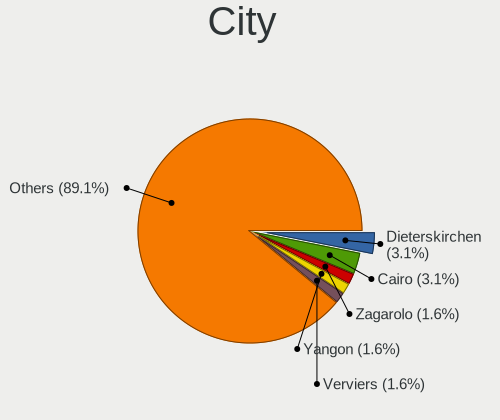
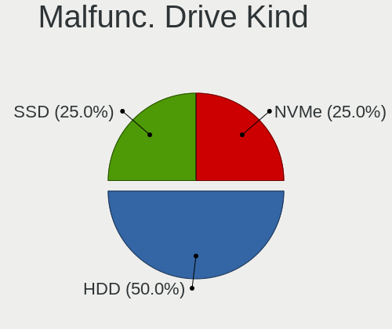
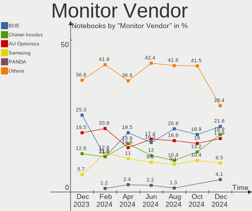
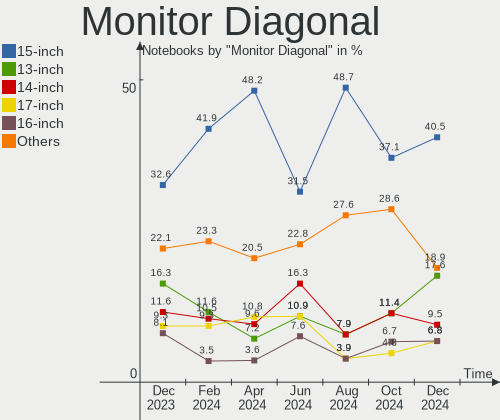
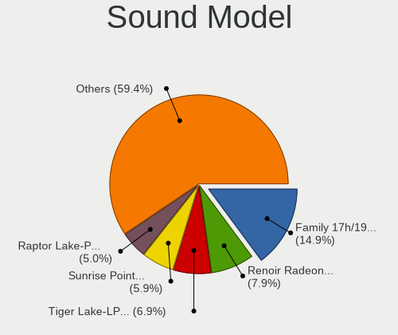
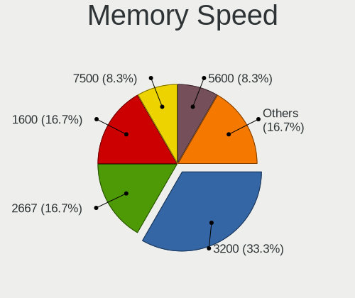
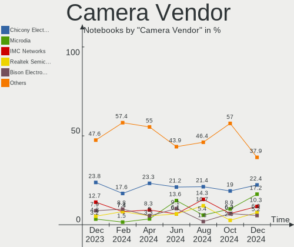

Kubuntu - Hardware Trends (Notebooks)
-------------------------------------

A project to identify most popular hardware characteristics and track their change
over time based on data collected by Linux users at https://Linux-Hardware.org.

Anyone can contribute to this report by the [hw-probe](https://github.com/linuxhw/hw-probe) tool:

    sudo -E hw-probe -all -upload

This report is for one last month. Overall report since the beginning of time: [TestDays](https://github.com/linuxhw/TestDays)

Period: Oct, 2023.

Contents
--------

* [ System ](#system)
  - [ OS                       ](#os)
  - [ OS Family                ](#os-family)
  - [ Kernel                   ](#kernel)
  - [ Kernel Family            ](#kernel-family)
  - [ Kernel Major Ver.        ](#kernel-major-ver)
  - [ Arch                     ](#arch)
  - [ DE                       ](#de)
  - [ Display Server           ](#display-server)
  - [ Display Manager          ](#display-manager)
  - [ OS Lang                  ](#os-lang)
  - [ Boot Mode                ](#boot-mode)
  - [ Filesystem               ](#filesystem)
  - [ Part. scheme             ](#part-scheme)
  - [ Dual Boot with Linux/BSD ](#dual-boot-with-linuxbsd)
  - [ Dual Boot (Win)          ](#dual-boot-win)

* [ Board ](#board)
  - [ Vendor                   ](#vendor)
  - [ Model                    ](#model)
  - [ Model Family             ](#model-family)
  - [ MFG Year                 ](#mfg-year)
  - [ Form Factor              ](#form-factor)
  - [ Secure Boot              ](#secure-boot)
  - [ Coreboot                 ](#coreboot)
  - [ RAM Size                 ](#ram-size)
  - [ RAM Used                 ](#ram-used)
  - [ Total Drives             ](#total-drives)
  - [ Has CD-ROM               ](#has-cd-rom)
  - [ Has Ethernet             ](#has-ethernet)
  - [ Has WiFi                 ](#has-wifi)
  - [ Has Bluetooth            ](#has-bluetooth)

* [ Location ](#location)
  - [ Country                  ](#country)
  - [ City                     ](#city)

* [ Drives ](#drives)
  - [ Drive Vendor             ](#drive-vendor)
  - [ Drive Model              ](#drive-model)
  - [ HDD Vendor               ](#hdd-vendor)
  - [ SSD Vendor               ](#ssd-vendor)
  - [ Drive Kind               ](#drive-kind)
  - [ Drive Connector          ](#drive-connector)
  - [ Drive Size               ](#drive-size)
  - [ Space Total              ](#space-total)
  - [ Space Used               ](#space-used)
  - [ Malfunc. Drives          ](#malfunc-drives)
  - [ Malfunc. Drive Vendor    ](#malfunc-drive-vendor)
  - [ Malfunc. HDD Vendor      ](#malfunc-hdd-vendor)
  - [ Malfunc. Drive Kind      ](#malfunc-drive-kind)
  - [ Failed Drives            ](#failed-drives)
  - [ Failed Drive Vendor      ](#failed-drive-vendor)
  - [ Drive Status             ](#drive-status)

* [ Storage controller ](#storage-controller)
  - [ Storage Vendor           ](#storage-vendor)
  - [ Storage Model            ](#storage-model)
  - [ Storage Kind             ](#storage-kind)

* [ Processor ](#processor)
  - [ CPU Vendor               ](#cpu-vendor)
  - [ CPU Model                ](#cpu-model)
  - [ CPU Model Family         ](#cpu-model-family)
  - [ CPU Cores                ](#cpu-cores)
  - [ CPU Sockets              ](#cpu-sockets)
  - [ CPU Threads              ](#cpu-threads)
  - [ CPU Op-Modes             ](#cpu-op-modes)
  - [ CPU Microcode            ](#cpu-microcode)
  - [ CPU Microarch            ](#cpu-microarch)

* [ Graphics ](#graphics)
  - [ GPU Vendor               ](#gpu-vendor)
  - [ GPU Model                ](#gpu-model)
  - [ GPU Combo                ](#gpu-combo)
  - [ GPU Driver               ](#gpu-driver)
  - [ GPU Memory               ](#gpu-memory)

* [ Monitor ](#monitor)
  - [ Monitor Vendor           ](#monitor-vendor)
  - [ Monitor Model            ](#monitor-model)
  - [ Monitor Resolution       ](#monitor-resolution)
  - [ Monitor Diagonal         ](#monitor-diagonal)
  - [ Monitor Width            ](#monitor-width)
  - [ Aspect Ratio             ](#aspect-ratio)
  - [ Monitor Area             ](#monitor-area)
  - [ Pixel Density            ](#pixel-density)
  - [ Multiple Monitors        ](#multiple-monitors)

* [ Network ](#network)
  - [ Net Controller Vendor    ](#net-controller-vendor)
  - [ Net Controller Model     ](#net-controller-model)
  - [ Wireless Vendor          ](#wireless-vendor)
  - [ Wireless Model           ](#wireless-model)
  - [ Ethernet Vendor          ](#ethernet-vendor)
  - [ Ethernet Model           ](#ethernet-model)
  - [ Net Controller Kind      ](#net-controller-kind)
  - [ Used Controller          ](#used-controller)
  - [ NICs                     ](#nics)
  - [ IPv6                     ](#ipv6)

* [ Bluetooth ](#bluetooth)
  - [ Bluetooth Vendor         ](#bluetooth-vendor)
  - [ Bluetooth Model          ](#bluetooth-model)

* [ Sound ](#sound)
  - [ Sound Vendor             ](#sound-vendor)
  - [ Sound Model              ](#sound-model)

* [ Memory ](#memory)
  - [ Memory Vendor            ](#memory-vendor)
  - [ Memory Model             ](#memory-model)
  - [ Memory Kind              ](#memory-kind)
  - [ Memory Form Factor       ](#memory-form-factor)
  - [ Memory Size              ](#memory-size)
  - [ Memory Speed             ](#memory-speed)

* [ Printers & scanners ](#printers--scanners)
  - [ Printer Vendor           ](#printer-vendor)
  - [ Printer Model            ](#printer-model)
  - [ Scanner Vendor           ](#scanner-vendor)
  - [ Scanner Model            ](#scanner-model)

* [ Camera ](#camera)
  - [ Camera Vendor            ](#camera-vendor)
  - [ Camera Model             ](#camera-model)

* [ Security ](#security)
  - [ Fingerprint Vendor       ](#fingerprint-vendor)
  - [ Fingerprint Model        ](#fingerprint-model)
  - [ Chipcard Vendor          ](#chipcard-vendor)
  - [ Chipcard Model           ](#chipcard-model)

* [ Unsupported ](#unsupported)
  - [ Unsupported Devices      ](#unsupported-devices)
  - [ Unsupported Device Types ](#unsupported-device-types)

System
------

OS
--

Installed operating systems

| Name          | Notebooks | Percent |
|---------------|-----------|---------|
| Kubuntu 22.04 | 46        | 52.27%  |
| Kubuntu 23.04 | 19        | 21.59%  |
| Kubuntu 23.10 | 18        | 20.45%  |
| Kubuntu 20.04 | 3         | 3.41%   |
| Kubuntu 14.04 | 1         | 1.14%   |
| Kubuntu 11    | 1         | 1.14%   |

OS Family
---------

OS without a version

| Name    | Notebooks | Percent |
|---------|-----------|---------|
| Kubuntu | 88        | 100%    |

Kernel
------

Version of the Linux kernel

| Version                         | Notebooks | Percent |
|---------------------------------|-----------|---------|
| 6.2.0-34-generic                | 24        | 27.27%  |
| 6.5.0-9-generic                 | 14        | 15.91%  |
| 6.2.0-33-generic                | 8         | 9.09%   |
| 6.2.0-35-generic                | 7         | 7.95%   |
| 5.15.0-87-generic               | 5         | 5.68%   |
| 6.5.0-10-generic                | 3         | 3.41%   |
| 6.2.0-26-generic                | 3         | 3.41%   |
| 6.2.0-32-generic                | 2         | 2.27%   |
| 6.2.0-1015-lowlatency           | 2         | 2.27%   |
| 5.15.0-86-generic               | 2         | 2.27%   |
| 5.15.0-75-generic               | 2         | 2.27%   |
| 6.5.7-1-liquorix-amd64          | 1         | 1.14%   |
| 6.5.0-5-generic                 | 1         | 1.14%   |
| 6.2.0-36-generic                | 1         | 1.14%   |
| 6.2.0-31-generic                | 1         | 1.14%   |
| 6.2.0-20-generic                | 1         | 1.14%   |
| 6.2.0-1014-lowlatency           | 1         | 1.14%   |
| 6.2.0-10025-tuxedo              | 1         | 1.14%   |
| 6.1.55-x64v3-xanmod1            | 1         | 1.14%   |
| 5.8.0-59-generic                | 1         | 1.14%   |
| 5.19.0-50-generic               | 1         | 1.14%   |
| 5.15.60-wuying-x86              | 1         | 1.14%   |
| 5.15.0-87-lowlatency            | 1         | 1.14%   |
| 5.15.0-84-generic               | 1         | 1.14%   |
| 5.15.0-67-generic               | 1         | 1.14%   |
| 5.15.0-43-generic               | 1         | 1.14%   |
| 4.14.23-ck1-mainline-core2-rjvb | 1         | 1.14%   |

Kernel Family
-------------

Linux kernel without a distro release

| Version | Notebooks | Percent |
|---------|-----------|---------|
| 6.2.0   | 51        | 57.95%  |
| 6.5.0   | 18        | 20.45%  |
| 5.15.0  | 13        | 14.77%  |
| 6.5.7   | 1         | 1.14%   |
| 6.1.55  | 1         | 1.14%   |
| 5.8.0   | 1         | 1.14%   |
| 5.19.0  | 1         | 1.14%   |
| 5.15.60 | 1         | 1.14%   |
| 4.14.23 | 1         | 1.14%   |

Kernel Major Ver.
-----------------

Linux kernel major version

| Version | Notebooks | Percent |
|---------|-----------|---------|
| 6.2     | 51        | 57.95%  |
| 6.5     | 19        | 21.59%  |
| 5.15    | 14        | 15.91%  |
| 6.1     | 1         | 1.14%   |
| 5.8     | 1         | 1.14%   |
| 5.19    | 1         | 1.14%   |
| 4.14    | 1         | 1.14%   |

Arch
----

OS architecture (x86_64, i586, etc.)

| Name   | Notebooks | Percent |
|--------|-----------|---------|
| x86_64 | 88        | 100%    |

DE
--

Desktop Environment

| Name  | Notebooks | Percent |
|-------|-----------|---------|
| KDE5  | 84        | 95.45%  |
| KDE   | 2         | 2.27%   |
| KDE4  | 1         | 1.14%   |
| GNOME | 1         | 1.14%   |

Display Server
--------------

X11 or Wayland

| Name    | Notebooks | Percent |
|---------|-----------|---------|
| X11     | 80        | 90.91%  |
| Wayland | 6         | 6.82%   |
| Tty     | 2         | 2.27%   |

Display Manager
---------------

SDDM, LightDM, etc.

| Name    | Notebooks | Percent |
|---------|-----------|---------|
| SDDM    | 60        | 68.18%  |
| Unknown | 23        | 26.14%  |
| GDM3    | 3         | 3.41%   |
| LightDM | 1         | 1.14%   |
| KDM     | 1         | 1.14%   |

OS Lang
-------

Language

| Lang           | Notebooks | Percent |
|----------------|-----------|---------|
| en_US          | 35        | 39.77%  |
| de_DE          | 12        | 13.64%  |
| it_IT          | 7         | 7.95%   |
| en_GB          | 5         | 5.68%   |
| pt_BR          | 4         | 4.55%   |
| ru_RU          | 3         | 3.41%   |
| es_ES          | 3         | 3.41%   |
| en_AU          | 3         | 3.41%   |
| zh_CN          | 1         | 1.14%   |
| pl_PL          | 1         | 1.14%   |
| nb_NO          | 1         | 1.14%   |
| ja_JP          | 1         | 1.14%   |
| hu_HU          | 1         | 1.14%   |
| fr_FR          | 1         | 1.14%   |
| fr_BE          | 1         | 1.14%   |
| fi_FI          | 1         | 1.14%   |
| es_AR          | 1         | 1.14%   |
| en_NZ          | 1         | 1.14%   |
| en_IN          | 1         | 1.14%   |
| en_IE          | 1         | 1.14%   |
| en_CA          | 1         | 1.14%   |
| Default        | 1         | 1.14%   |
| cs_CZ          | 1         | 1.14%   |
| ca_ES@valencia | 1         | 1.14%   |

Boot Mode
---------

EFI or BIOS

| Mode | Notebooks | Percent |
|------|-----------|---------|
| EFI  | 48        | 54.55%  |
| BIOS | 40        | 45.45%  |

Filesystem
----------

Type of filesystem

| Type    | Notebooks | Percent |
|---------|-----------|---------|
| Ext4    | 59        | 67.05%  |
| Tmpfs   | 21        | 23.86%  |
| Overlay | 5         | 5.68%   |
| Zfs     | 1         | 1.14%   |
| Xfs     | 1         | 1.14%   |
| Btrfs   | 1         | 1.14%   |

Part. scheme
------------

Scheme of partitioning

| Type    | Notebooks | Percent |
|---------|-----------|---------|
| GPT     | 63        | 71.59%  |
| Unknown | 23        | 26.14%  |
| MBR     | 2         | 2.27%   |

Dual Boot with Linux/BSD
------------------------

Hosting more than one Linux/BSD

| Dual boot | Notebooks | Percent |
|-----------|-----------|---------|
| No        | 77        | 87.5%   |
| Yes       | 11        | 12.5%   |

Dual Boot (Win)
---------------

Hosting Linux and Windows

| Dual boot | Notebooks | Percent |
|-----------|-----------|---------|
| No        | 61        | 69.32%  |
| Yes       | 27        | 30.68%  |

Board
-----

Vendor
------

Motherboard manufacturer

| Name                           | Notebooks | Percent |
|--------------------------------|-----------|---------|
| Hewlett-Packard                | 22        | 25%     |
| Dell                           | 16        | 18.18%  |
| Lenovo                         | 14        | 15.91%  |
| ASUSTek Computer               | 9         | 10.23%  |
| Acer                           | 8         | 9.09%   |
| Google                         | 2         | 2.27%   |
| WUYING                         | 1         | 1.14%   |
| TUXEDO                         | 1         | 1.14%   |
| Toshiba                        | 1         | 1.14%   |
| Timi                           | 1         | 1.14%   |
| Shanghai Zhaoxin Semiconductor | 1         | 1.14%   |
| Schenker                       | 1         | 1.14%   |
| Samsung Electronics            | 1         | 1.14%   |
| Notebook                       | 1         | 1.14%   |
| Medion                         | 1         | 1.14%   |
| MACHENIKE                      | 1         | 1.14%   |
| GPU Company                    | 1         | 1.14%   |
| GMKtec                         | 1         | 1.14%   |
| EXTRA Computer                 | 1         | 1.14%   |
| AZW                            | 1         | 1.14%   |
| Avell High Performance         | 1         | 1.14%   |
| Apple                          | 1         | 1.14%   |
| Alienware                      | 1         | 1.14%   |

Model
-----

Motherboard model

| Name                                               | Notebooks | Percent |
|----------------------------------------------------|-----------|---------|
| Dell Latitude 7490                                 | 2         | 2.27%   |
| Dell Latitude 5530                                 | 2         | 2.27%   |
| WUYING NS01-4BGXG                                  | 1         | 1.14%   |
| TUXEDO Book XP15 / XP17 Gen12                      | 1         | 1.14%   |
| Toshiba Satellite P850                             | 1         | 1.14%   |
| Timi RedmiBook Pro 15                              | 1         | 1.14%   |
| Shanghai Zhaoxin ZXE CRB                           | 1         | 1.14%   |
| Schenker VIA 15 Pro (M22)                          | 1         | 1.14%   |
| Samsung RC420/RC520/RC720                          | 1         | 1.14%   |
| Notebook W510LU                                    | 1         | 1.14%   |
| Medion E15302                                      | 1         | 1.14%   |
| MACHENIKE MACHCREATOR-16                           | 1         | 1.14%   |
| Lenovo Yoga Slim 6 14IAP8 82WU                     | 1         | 1.14%   |
| Lenovo Yoga Creator 7 15IMH05 82DS                 | 1         | 1.14%   |
| Lenovo Yoga 2 Pro 20266                            | 1         | 1.14%   |
| Lenovo ThinkPad X1 Carbon Gen 10 21CB000HUS        | 1         | 1.14%   |
| Lenovo ThinkPad X1 Carbon 6th 20KH002RUS           | 1         | 1.14%   |
| Lenovo ThinkPad X1 Carbon 5th 20HQS01A0Y           | 1         | 1.14%   |
| Lenovo ThinkPad L450 20DSS26200                    | 1         | 1.14%   |
| Lenovo ThinkPad E15 Gen 2 20TD002MGE               | 1         | 1.14%   |
| Lenovo ThinkBook 15-IIL 20SM                       | 1         | 1.14%   |
| Lenovo ThinkBook 14p Gen 3 21EJ                    | 1         | 1.14%   |
| Lenovo IdeaPad Slim 5 16IRL8 82XF                  | 1         | 1.14%   |
| Lenovo IdeaPad S540-13IML 81XA                     | 1         | 1.14%   |
| Lenovo IdeaPad Gaming 3 15IMH05 82CG               | 1         | 1.14%   |
| Lenovo IdeaPad 3 14ARE05 81W3                      | 1         | 1.14%   |
| HP ZBook Studio 15.6 inch G8 Mobile Workstation PC | 1         | 1.14%   |
| HP ZBook Firefly 14 inch G10 Mobile Workstation PC | 1         | 1.14%   |
| HP ZBook 17 G3                                     | 1         | 1.14%   |
| HP ZBook 15 G3                                     | 1         | 1.14%   |
| HP ProBook 4540s                                   | 1         | 1.14%   |
| HP ProBook 450 G7                                  | 1         | 1.14%   |
| HP ProBook 440 G6                                  | 1         | 1.14%   |
| HP ProBook 4340s                                   | 1         | 1.14%   |
| HP Pavilion Notebook                               | 1         | 1.14%   |
| HP Pavilion Laptop 15-eg2xxx                       | 1         | 1.14%   |
| HP Pavilion g7                                     | 1         | 1.14%   |
| HP Pavilion 17                                     | 1         | 1.14%   |
| HP Pavilion 11 x360 PC                             | 1         | 1.14%   |
| HP Laptop 17-cp0xxx                                | 1         | 1.14%   |

Model Family
------------

Motherboard model prefix

| Name                       | Notebooks | Percent |
|----------------------------|-----------|---------|
| Dell Latitude              | 9         | 10.23%  |
| Lenovo ThinkPad            | 5         | 5.68%   |
| HP Pavilion                | 5         | 5.68%   |
| Acer Aspire                | 5         | 5.68%   |
| Lenovo IdeaPad             | 4         | 4.55%   |
| HP ZBook                   | 4         | 4.55%   |
| HP ProBook                 | 4         | 4.55%   |
| HP Laptop                  | 4         | 4.55%   |
| ASUS VivoBook              | 4         | 4.55%   |
| Lenovo Yoga                | 3         | 3.41%   |
| HP EliteBook               | 3         | 3.41%   |
| Dell Inspiron              | 3         | 3.41%   |
| Lenovo ThinkBook           | 2         | 2.27%   |
| Dell Precision             | 2         | 2.27%   |
| ASUS ROG                   | 2         | 2.27%   |
| Acer Nitro                 | 2         | 2.27%   |
| WUYING NS01-4BGXG          | 1         | 1.14%   |
| TUXEDO Book                | 1         | 1.14%   |
| Toshiba Satellite          | 1         | 1.14%   |
| Timi RedmiBook             | 1         | 1.14%   |
| Shanghai Zhaoxin ZXE       | 1         | 1.14%   |
| Schenker VIA               | 1         | 1.14%   |
| Samsung RC420              | 1         | 1.14%   |
| Notebook W510LU            | 1         | 1.14%   |
| Medion E15302              | 1         | 1.14%   |
| MACHENIKE MACHCREATOR-16   | 1         | 1.14%   |
| HP G60                     | 1         | 1.14%   |
| HP 14                      | 1         | 1.14%   |
| GPU Company GWTN141-10     | 1         | 1.14%   |
| Google Woomax              | 1         | 1.14%   |
| Google Blorb               | 1         | 1.14%   |
| GMKtec NucBox5             | 1         | 1.14%   |
| EXTRA MS-1758              | 1         | 1.14%   |
| Dell Vostro                | 1         | 1.14%   |
| Dell G7                    | 1         | 1.14%   |
| AZW SEi                    | 1         | 1.14%   |
| Avell High Performance C62 | 1         | 1.14%   |
| ASUS X450LCP               | 1         | 1.14%   |
| ASUS K56CM                 | 1         | 1.14%   |
| ASUS ASUS                  | 1         | 1.14%   |

MFG Year
--------

Motherboard manufacture year

| Year | Notebooks | Percent |
|------|-----------|---------|
| 2022 | 13        | 14.77%  |
| 2023 | 11        | 12.5%   |
| 2021 | 10        | 11.36%  |
| 2019 | 9         | 10.23%  |
| 2013 | 7         | 7.95%   |
| 2012 | 7         | 7.95%   |
| 2020 | 6         | 6.82%   |
| 2011 | 6         | 6.82%   |
| 2018 | 5         | 5.68%   |
| 2015 | 5         | 5.68%   |
| 2016 | 4         | 4.55%   |
| 2017 | 2         | 2.27%   |
| 2014 | 2         | 2.27%   |
| 2008 | 1         | 1.14%   |

Form Factor
-----------

Physical design of the computer

| Name     | Notebooks | Percent |
|----------|-----------|---------|
| Notebook | 88        | 100%    |

Secure Boot
-----------

Enabled or disabled

| State    | Notebooks | Percent |
|----------|-----------|---------|
| Disabled | 80        | 90.91%  |
| Enabled  | 8         | 9.09%   |

Coreboot
--------

Have coreboot on board

| Used | Notebooks | Percent |
|------|-----------|---------|
| No   | 86        | 97.73%  |
| Yes  | 2         | 2.27%   |

RAM Size
--------

Total RAM memory

| Size in GB | Notebooks | Percent |
|------------|-----------|---------|
| 16.01-24.0 | 26        | 29.55%  |
| 4.01-8.0   | 21        | 23.86%  |
| 32.01-64.0 | 15        | 17.05%  |
| 8.01-16.0  | 14        | 15.91%  |
| 3.01-4.0   | 7         | 7.95%   |
| 24.01-32.0 | 3         | 3.41%   |
| 2.01-3.0   | 1         | 1.14%   |
| 1.01-2.0   | 1         | 1.14%   |

RAM Used
--------

Used RAM memory

| Used GB    | Notebooks | Percent |
|------------|-----------|---------|
| 4.01-8.0   | 24        | 27.27%  |
| 2.01-3.0   | 20        | 22.73%  |
| 3.01-4.0   | 19        | 21.59%  |
| 1.01-2.0   | 17        | 19.32%  |
| 8.01-16.0  | 4         | 4.55%   |
| 16.01-24.0 | 2         | 2.27%   |
| 0.51-1.0   | 2         | 2.27%   |

Total Drives
------------

Number of drives on board

| Drives | Notebooks | Percent |
|--------|-----------|---------|
| 1      | 56        | 63.64%  |
| 2      | 28        | 31.82%  |
| 3      | 4         | 4.55%   |

Has CD-ROM
----------

Has CD-ROM on board

| Presented | Notebooks | Percent |
|-----------|-----------|---------|
| No        | 71        | 80.68%  |
| Yes       | 17        | 19.32%  |

Has Ethernet
------------

Has Ethernet on board

| Presented | Notebooks | Percent |
|-----------|-----------|---------|
| Yes       | 66        | 75%     |
| No        | 22        | 25%     |

Has WiFi
--------

Has WiFi module

| Presented | Notebooks | Percent |
|-----------|-----------|---------|
| Yes       | 87        | 98.86%  |
| No        | 1         | 1.14%   |

Has Bluetooth
-------------

Has Bluetooth module

| Presented | Notebooks | Percent |
|-----------|-----------|---------|
| Yes       | 80        | 90.91%  |
| No        | 8         | 9.09%   |

Location
--------

Country
-------

Geographic location (country)

| Country      | Notebooks | Percent |
|--------------|-----------|---------|
| USA          | 15        | 17.05%  |
| Germany      | 13        | 14.77%  |
| Italy        | 10        | 11.36%  |
| Brazil       | 4         | 4.55%   |
| UK           | 3         | 3.41%   |
| Spain        | 3         | 3.41%   |
| Russia       | 3         | 3.41%   |
| Poland       | 3         | 3.41%   |
| Iran         | 3         | 3.41%   |
| Hungary      | 3         | 3.41%   |
| Australia    | 3         | 3.41%   |
| India        | 2         | 2.27%   |
| France       | 2         | 2.27%   |
| China        | 2         | 2.27%   |
| South Africa | 1         | 1.14%   |
| Panama       | 1         | 1.14%   |
| Pakistan     | 1         | 1.14%   |
| Norway       | 1         | 1.14%   |
| New Zealand  | 1         | 1.14%   |
| Nepal        | 1         | 1.14%   |
| Mexico       | 1         | 1.14%   |
| Lebanon      | 1         | 1.14%   |
| Latvia       | 1         | 1.14%   |
| Japan        | 1         | 1.14%   |
| Ireland      | 1         | 1.14%   |
| Finland      | 1         | 1.14%   |
| Egypt        | 1         | 1.14%   |
| Czechia      | 1         | 1.14%   |
| Chile        | 1         | 1.14%   |
| Canada       | 1         | 1.14%   |
| Belgium      | 1         | 1.14%   |
| Bangladesh   | 1         | 1.14%   |
| Argentina    | 1         | 1.14%   |

City
----

Geographic location (city)

| City                    | Notebooks | Percent |
|-------------------------|-----------|---------|
| Budapest                | 3         | 3.41%   |
| Trescore Balneario      | 2         | 2.27%   |
| Tehran                  | 2         | 2.27%   |
| Rome                    | 2         | 2.27%   |
| Halle                   | 2         | 2.27%   |
| Frankfurt am Main       | 2         | 2.27%   |
| Westminster             | 1         | 1.14%   |
| Warsaw                  | 1         | 1.14%   |
| Verona                  | 1         | 1.14%   |
| Venice                  | 1         | 1.14%   |
| Vancouver               | 1         | 1.14%   |
| Ufa                     | 1         | 1.14%   |
| Toulouse                | 1         | 1.14%   |
| Taylorsville            | 1         | 1.14%   |
| Takada                  | 1         | 1.14%   |
| Sydney                  | 1         | 1.14%   |
| Stopnica                | 1         | 1.14%   |
| Southampton             | 1         | 1.14%   |
| San Joaquin             | 1         | 1.14%   |
| Salaspils               | 1         | 1.14%   |
| Rüsselsheim am Main    | 1         | 1.14%   |
| Roseville               | 1         | 1.14%   |
| Riverview               | 1         | 1.14%   |
| Reno                    | 1         | 1.14%   |
| Recife                  | 1         | 1.14%   |
| Rajshahi                | 1         | 1.14%   |
| Porto Alegre            | 1         | 1.14%   |
| Pittsburgh              | 1         | 1.14%   |
| Philadelphia            | 1         | 1.14%   |
| Pehuajó                | 1         | 1.14%   |
| Passau                  | 1         | 1.14%   |
| Panama City             | 1         | 1.14%   |
| Palmerston North        | 1         | 1.14%   |
| Palladam                | 1         | 1.14%   |
| Oparany                 | 1         | 1.14%   |
| Onda                    | 1         | 1.14%   |
| Olinda                  | 1         | 1.14%   |
| New Albany              | 1         | 1.14%   |
| Neustadt am Ruebenberge | 1         | 1.14%   |
| Moss                    | 1         | 1.14%   |

Drives
------

Drive Vendor
------------

Hard drive vendors

| Vendor                      | Notebooks | Drives | Percent |
|-----------------------------|-----------|--------|---------|
| Samsung Electronics         | 15        | 16     | 13.04%  |
| SK hynix                    | 11        | 11     | 9.57%   |
| Seagate                     | 10        | 10     | 8.7%    |
| WDC                         | 9         | 11     | 7.83%   |
| Intel                       | 8         | 8      | 6.96%   |
| Kingston                    | 6         | 6      | 5.22%   |
| SanDisk                     | 5         | 7      | 4.35%   |
| Unknown                     | 4         | 4      | 3.48%   |
| KIOXIA                      | 4         | 4      | 3.48%   |
| Crucial                     | 4         | 5      | 3.48%   |
| Toshiba                     | 3         | 3      | 2.61%   |
| Micron Technology           | 3         | 3      | 2.61%   |
| Hitachi                     | 3         | 3      | 2.61%   |
| China                       | 3         | 3      | 2.61%   |
| JMicron Technology          | 2         | 2      | 1.74%   |
| A-DATA Technology           | 2         | 2      | 1.74%   |
| XUM                         | 1         | 1      | 0.87%   |
| XPG                         | 1         | 1      | 0.87%   |
| Wibtek                      | 1         | 1      | 0.87%   |
| Verbatim                    | 1         | 1      | 0.87%   |
| UMIS                        | 1         | 1      | 0.87%   |
| Transcend                   | 1         | 1      | 0.87%   |
| Team                        | 1         | 1      | 0.87%   |
| SSSTC                       | 1         | 1      | 0.87%   |
| SSK SD30                    | 1         | 1      | 0.87%   |
| Silicon Motion              | 1         | 1      | 0.87%   |
| PNY                         | 1         | 1      | 0.87%   |
| Phison Electronics          | 1         | 1      | 0.87%   |
| Micron/Crucial Technology   | 1         | 1      | 0.87%   |
| LITEONIT                    | 1         | 1      | 0.87%   |
| LITEON                      | 1         | 1      | 0.87%   |
| Kingston Technology Company | 1         | 1      | 0.87%   |
| Kingchuxing                 | 1         | 1      | 0.87%   |
| Intenso                     | 1         | 1      | 0.87%   |
| HGST                        | 1         | 1      | 0.87%   |
| Fujitsu                     | 1         | 1      | 0.87%   |
| Fanxiang                    | 1         | 1      | 0.87%   |
| Corsair                     | 1         | 1      | 0.87%   |
| Unknown                     | 1         | 1      | 0.87%   |

Drive Model
-----------

Hard drive models

| Model                                                 | Notebooks | Percent |
|-------------------------------------------------------|-----------|---------|
| Samsung NVMe SSD Controller PM9A1/PM9A3/980PRO 1TB    | 3         | 2.5%    |
| WDC WD10JPVX-75JC3T0 1TB                              | 2         | 1.67%   |
| Unknown MMC Card  64GB                                | 2         | 1.67%   |
| SK hynix HFM128GDJTNG-8310A 128GB                     | 2         | 1.67%   |
| Samsung NVMe SSD Controller SM981/PM981/PM983 1TB     | 2         | 1.67%   |
| XUM HX256GSSDM2 256GB                                 | 1         | 0.83%   |
| XPG GAMMIX S70 BLADE 2TB                              | 1         | 0.83%   |
| Wibtek W800S 512GB SSD                                | 1         | 0.83%   |
| WDC WDS500G2B0B-00YS70 500GB SSD                      | 1         | 0.83%   |
| WDC WDS120G1G0A-00SS50 120GB SSD                      | 1         | 0.83%   |
| WDC WDS100T2G0A-00JH30 1TB SSD                        | 1         | 0.83%   |
| WDC WD10JPVX-22JC3T0 1TB                              | 1         | 0.83%   |
| WDC WD10JPVT-60A1YT0 1TB                              | 1         | 0.83%   |
| WDC WD easystore 480GB                                | 1         | 0.83%   |
| WDC PC SN730 SDBPNTY-512G-1101 512GB                  | 1         | 0.83%   |
| WDC PC SN530 NVMe 512GB                               | 1         | 0.83%   |
| WDC PC SN520 SDAPNUW-256G-1006 256GB                  | 1         | 0.83%   |
| Verbatim Vi560 S3 512GB SSD                           | 1         | 0.83%   |
| Unknown SD/MMC/MS PRO 16GB                            | 1         | 0.83%   |
| Unknown NVMe SSD Drive 1TB                            | 1         | 0.83%   |
| UMIS RPITJ512PED2OWX 512GB                            | 1         | 0.83%   |
| Transcend TS256GMTS400S 256GB SSD                     | 1         | 0.83%   |
| Toshiba XG6 NVMe SSD Controller 256GB                 | 1         | 0.83%   |
| Toshiba MQ01ACF050 500GB                              | 1         | 0.83%   |
| Toshiba MQ01ABF050 500GB                              | 1         | 0.83%   |
| Team T253X1120G 120GB SSD                             | 1         | 0.83%   |
| SSSTC CA6-8D512 512GB                                 | 1         | 0.83%   |
| SSK SD30 1 512GB                                      | 1         | 0.83%   |
| SK hynix SKHynix_HFM512GD3HX015N 512GB                | 1         | 0.83%   |
| SK hynix SC308 SATA 256GB SSD                         | 1         | 0.83%   |
| SK hynix SC308 SATA 128GB SSD                         | 1         | 0.83%   |
| SK hynix PC801 NVMe 1TB                               | 1         | 0.83%   |
| SK hynix PC801 HFS001TEJ9X101N 1024GB                 | 1         | 0.83%   |
| SK hynix PC300 NVMe 512GB                             | 1         | 0.83%   |
| SK hynix HFS512GEJ9X125N 512GB                        | 1         | 0.83%   |
| SK hynix BC711 HFM512GD3JX013N 512GB                  | 1         | 0.83%   |
| SK hynix BC511 512GB                                  | 1         | 0.83%   |
| Silicon Motion SM2263EN/SM2263XT SSD Controller 256GB | 1         | 0.83%   |
| Seagate ST9500424AS 500GB                             | 1         | 0.83%   |
| Seagate ST750LM022 HN-M750MBB 752GB                   | 1         | 0.83%   |

HDD Vendor
----------

Hard disk drive vendors

| Vendor  | Notebooks | Drives | Percent |
|---------|-----------|--------|---------|
| Seagate | 10        | 10     | 45.45%  |
| WDC     | 4         | 4      | 18.18%  |
| Hitachi | 3         | 3      | 13.64%  |
| Toshiba | 2         | 2      | 9.09%   |
| Unknown | 1         | 1      | 4.55%   |
| HGST    | 1         | 1      | 4.55%   |
| Fujitsu | 1         | 1      | 4.55%   |

SSD Vendor
----------

Solid state drive vendors

| Vendor              | Notebooks | Drives | Percent |
|---------------------|-----------|--------|---------|
| Samsung Electronics | 4         | 4      | 12.12%  |
| Kingston            | 3         | 3      | 9.09%   |
| Intel               | 3         | 3      | 9.09%   |
| China               | 3         | 3      | 9.09%   |
| WDC                 | 2         | 3      | 6.06%   |
| SK hynix            | 2         | 2      | 6.06%   |
| XUM                 | 1         | 1      | 3.03%   |
| Wibtek              | 1         | 1      | 3.03%   |
| Verbatim            | 1         | 1      | 3.03%   |
| Transcend           | 1         | 1      | 3.03%   |
| Team                | 1         | 1      | 3.03%   |
| SanDisk             | 1         | 1      | 3.03%   |
| PNY                 | 1         | 1      | 3.03%   |
| Micron Technology   | 1         | 1      | 3.03%   |
| LITEONIT            | 1         | 1      | 3.03%   |
| LITEON              | 1         | 1      | 3.03%   |
| Kingchuxing         | 1         | 1      | 3.03%   |
| Intenso             | 1         | 1      | 3.03%   |
| Fanxiang            | 1         | 1      | 3.03%   |
| Crucial             | 1         | 1      | 3.03%   |
| Corsair             | 1         | 1      | 3.03%   |
| A-DATA Technology   | 1         | 1      | 3.03%   |

Drive Kind
----------

HDD or SSD

| Kind    | Notebooks | Drives | Percent |
|---------|-----------|--------|---------|
| NVMe    | 47        | 59     | 44.34%  |
| SSD     | 31        | 34     | 29.25%  |
| HDD     | 22        | 22     | 20.75%  |
| MMC     | 3         | 3      | 2.83%   |
| Unknown | 3         | 3      | 2.83%   |

Drive Connector
---------------

SATA, SAS, NVMe, etc.

| Type | Notebooks | Drives | Percent |
|------|-----------|--------|---------|
| NVMe | 46        | 58     | 46%     |
| SATA | 46        | 55     | 46%     |
| SAS  | 5         | 5      | 5%      |
| MMC  | 3         | 3      | 3%      |

Drive Size
----------

Size of hard drive

| Size in TB | Notebooks | Drives | Percent |
|------------|-----------|--------|---------|
| 0.01-0.5   | 33        | 37     | 64.71%  |
| 0.51-1.0   | 14        | 15     | 27.45%  |
| 1.01-2.0   | 3         | 3      | 5.88%   |
| 3.01-4.0   | 1         | 1      | 1.96%   |

Space Total
-----------

Amount of disk space available on the file system

| Size in GB     | Notebooks | Percent |
|----------------|-----------|---------|
| 251-500        | 28        | 31.82%  |
| 101-250        | 19        | 21.59%  |
| 501-1000       | 12        | 13.64%  |
| 1001-2000      | 11        | 12.5%   |
| 1-20           | 8         | 9.09%   |
| 51-100         | 4         | 4.55%   |
| 2001-3000      | 3         | 3.41%   |
| More than 3000 | 2         | 2.27%   |
| 21-50          | 1         | 1.14%   |

Space Used
----------

Amount of used disk space

| Used GB   | Notebooks | Percent |
|-----------|-----------|---------|
| 1-20      | 22        | 25%     |
| 21-50     | 17        | 19.32%  |
| 101-250   | 16        | 18.18%  |
| 51-100    | 12        | 13.64%  |
| 251-500   | 10        | 11.36%  |
| 501-1000  | 7         | 7.95%   |
| 1001-2000 | 4         | 4.55%   |

Malfunc. Drives
---------------

Drive models with a malfunction

| Model                         | Notebooks | Drives | Percent |
|-------------------------------|-----------|--------|---------|
| Intel SSDSC2BF180A4L 180GB    | 1         | 1      | 50%     |
| Hitachi HTS547550A9E384 500GB | 1         | 1      | 50%     |

Malfunc. Drive Vendor
---------------------

Vendors of faulty drives

| Vendor  | Notebooks | Drives | Percent |
|---------|-----------|--------|---------|
| Intel   | 1         | 1      | 50%     |
| Hitachi | 1         | 1      | 50%     |

Malfunc. HDD Vendor
-------------------

Vendors of faulty HDD drives

| Vendor  | Notebooks | Drives | Percent |
|---------|-----------|--------|---------|
| Hitachi | 1         | 1      | 100%    |

Malfunc. Drive Kind
-------------------

Kinds of faulty drives

| Kind | Notebooks | Drives | Percent |
|------|-----------|--------|---------|
| SSD  | 1         | 1      | 50%     |
| HDD  | 1         | 1      | 50%     |

Failed Drives
-------------

Failed drive models

Zero info for selected period =(

Failed Drive Vendor
-------------------

Failed drive vendors

Zero info for selected period =(

Drive Status
------------

Number of failed and malfunc. drives

| Status   | Notebooks | Drives | Percent |
|----------|-----------|--------|---------|
| Detected | 50        | 65     | 54.35%  |
| Works    | 40        | 54     | 43.48%  |
| Malfunc  | 2         | 2      | 2.17%   |

Storage controller
------------------

Storage Vendor
--------------

Storage controller vendors

| Vendor                         | Notebooks | Percent |
|--------------------------------|-----------|---------|
| Intel                          | 53        | 47.75%  |
| Samsung Electronics            | 11        | 9.91%   |
| SK hynix                       | 9         | 8.11%   |
| AMD                            | 7         | 6.31%   |
| SanDisk                        | 6         | 5.41%   |
| Micron/Crucial Technology      | 4         | 3.6%    |
| Kingston Technology Company    | 4         | 3.6%    |
| KIOXIA                         | 3         | 2.7%    |
| Toshiba America Info Systems   | 2         | 1.8%    |
| Micron Technology              | 2         | 1.8%    |
| ADATA Technology               | 2         | 1.8%    |
| Zhaoxin                        | 1         | 0.9%    |
| Union Memory (Shenzhen)        | 1         | 0.9%    |
| Solid State Storage Technology | 1         | 0.9%    |
| Silicon Motion                 | 1         | 0.9%    |
| Phison Electronics             | 1         | 0.9%    |
| Nvidia                         | 1         | 0.9%    |
| MAXIO Technology (Hangzhou)    | 1         | 0.9%    |
| JMicron Technology             | 1         | 0.9%    |

Storage Model
-------------

Storage controller models

| Model                                                                         | Notebooks | Percent |
|-------------------------------------------------------------------------------|-----------|---------|
| Intel 7 Series Chipset Family 6-port SATA Controller [AHCI mode]              | 8         | 6.72%   |
| AMD FCH SATA Controller [AHCI mode]                                           | 6         | 5.04%   |
| Samsung NVMe SSD Controller PM9A1/PM9A3/980PRO                                | 5         | 4.2%    |
| Intel Volume Management Device NVMe RAID Controller                           | 5         | 4.2%    |
| Intel SSD 670p Series [Keystone Harbor]                                       | 4         | 3.36%   |
| Intel 82801 Mobile SATA Controller [RAID mode]                                | 4         | 3.36%   |
| SK hynix Platinum P41/PC801 NVMe Solid State Drive                            | 3         | 2.52%   |
| Samsung NVMe SSD Controller SM981/PM981/PM983                                 | 3         | 2.52%   |
| Intel Sunrise Point-LP SATA Controller [AHCI mode]                            | 3         | 2.52%   |
| Intel Q170/Q150/B150/H170/H110/Z170/CM236 Chipset SATA Controller [AHCI Mode] | 3         | 2.52%   |
| Intel 8 Series SATA Controller 1 [AHCI mode]                                  | 3         | 2.52%   |
| Intel 6 Series/C200 Series Chipset Family 6 port Mobile SATA AHCI Controller  | 3         | 2.52%   |
| Intel 400 Series Chipset Family SATA AHCI Controller                          | 3         | 2.52%   |
| Toshiba America Info Systems XG6 NVMe SSD Controller                          | 2         | 1.68%   |
| SK hynix Gold P31/BC711/PC711 NVMe Solid State Drive                          | 2         | 1.68%   |
| SK hynix BC501 NVMe Solid State Drive                                         | 2         | 1.68%   |
| SanDisk WD Black SN770 / PC SN740 256GB / PC SN560 (DRAM-less) NVMe SSD       | 2         | 1.68%   |
| Samsung NVMe SSD Controller SM961/PM961/SM963                                 | 2         | 1.68%   |
| Micron/Crucial P5 Plus NVMe PCIe SSD                                          | 2         | 1.68%   |
| Micron/Crucial P2 [Nick P2] / P3 / P3 Plus NVMe PCIe SSD (DRAM-less)          | 2         | 1.68%   |
| KIOXIA NVMe SSD Controller BG4 (DRAM-less)                                    | 2         | 1.68%   |
| Intel Wildcat Point-LP SATA Controller [AHCI Mode]                            | 2         | 1.68%   |
| Intel Tiger Lake-LP SATA Controller                                           | 2         | 1.68%   |
| Intel Comet Lake SATA AHCI Controller                                         | 2         | 1.68%   |
| Intel Cannon Point-LP SATA Controller [AHCI Mode]                             | 2         | 1.68%   |
| Intel Cannon Lake Mobile PCH SATA AHCI Controller                             | 2         | 1.68%   |
| Zhaoxin ZX-100/ZX-200/KX-6000/KX-6000G/KH-40000 StorX AHCI Controller         | 1         | 0.84%   |
| Union Memory (Shenzhen) RPITJ512PED2OWX NVMe SSD 512GB                        | 1         | 0.84%   |
| Solid State Storage Non-Volatile memory controller                            | 1         | 0.84%   |
| SK hynix PC300 NVMe Solid State Drive 512GB                                   | 1         | 0.84%   |
| SK hynix BC511 NVMe SSD                                                       | 1         | 0.84%   |
| Silicon Motion SM2263EN/SM2263XT (DRAM-less) NVMe SSD Controllers             | 1         | 0.84%   |
| Sandisk WD PC SN740 NVMe SSD 512GB (DRAM-less)                                | 1         | 0.84%   |
| SanDisk WD Blue SN500 / PC SN520 x2 M.2 2280 NVMe SSD                         | 1         | 0.84%   |
| SanDisk Ultra 3D / WD Blue SN550 NVMe SSD                                     | 1         | 0.84%   |
| SanDisk IX SN530 NVMe SSD (DRAM-less)                                         | 1         | 0.84%   |
| SanDisk Extreme Pro / WD Black SN750 / PC SN730 / Red SN700 NVMe SSD          | 1         | 0.84%   |
| Samsung NVMe SSD Controller PM9B1 (DRAM-less)                                 | 1         | 0.84%   |
| Samsung NVMe SSD Controller 980 (DRAM-less)                                   | 1         | 0.84%   |
| Phison PS5013-E13 PCIe3 NVMe Controller (DRAM-less)                           | 1         | 0.84%   |

Storage Kind
------------

Kind of storage controller (IDE, SATA, NVMe, SAS, ...)

| Kind | Notebooks | Percent |
|------|-----------|---------|
| SATA | 50        | 46.73%  |
| NVMe | 46        | 42.99%  |
| RAID | 9         | 8.41%   |
| IDE  | 2         | 1.87%   |

Processor
---------

CPU Vendor
----------

Processor vendors

| Vendor       | Notebooks | Percent |
|--------------|-----------|---------|
| Intel        | 68        | 77.27%  |
| AMD          | 19        | 21.59%  |
| CentaurHauls | 1         | 1.14%   |

CPU Model
---------

Processor models

| Model                                   | Notebooks | Percent |
|-----------------------------------------|-----------|---------|
| Intel 12th Gen Core i5-1240P            | 3         | 3.41%   |
| Intel Core i7-9750H CPU @ 2.60GHz       | 2         | 2.27%   |
| Intel Core i7-8650U CPU @ 1.90GHz       | 2         | 2.27%   |
| Intel Core i7-3630QM CPU @ 2.40GHz      | 2         | 2.27%   |
| Intel Core i7-10750H CPU @ 2.60GHz      | 2         | 2.27%   |
| Intel Core i7-1065G7 CPU @ 1.30GHz      | 2         | 2.27%   |
| Intel Core i5-7300U CPU @ 2.60GHz       | 2         | 2.27%   |
| Intel Core i5-10210U CPU @ 1.60GHz      | 2         | 2.27%   |
| Intel Core i3-3110M CPU @ 2.40GHz       | 2         | 2.27%   |
| Intel 12th Gen Core i7-12700H           | 2         | 2.27%   |
| Intel 12th Gen Core i7-1255U            | 2         | 2.27%   |
| Intel 11th Gen Core i7-1165G7 @ 2.80GHz | 2         | 2.27%   |
| AMD Ryzen 7 7735HS with Radeon Graphics | 2         | 2.27%   |
| Intel Pentium CPU N3540 @ 2.16GHz       | 1         | 1.14%   |
| Intel Core i7-7820HQ CPU @ 2.90GHz      | 1         | 1.14%   |
| Intel Core i7-6820HQ CPU @ 2.70GHz      | 1         | 1.14%   |
| Intel Core i7-6700HQ CPU @ 2.60GHz      | 1         | 1.14%   |
| Intel Core i7-6600U CPU @ 2.60GHz       | 1         | 1.14%   |
| Intel Core i7-4700MQ CPU @ 2.40GHz      | 1         | 1.14%   |
| Intel Core i7-4610M CPU @ 3.00GHz       | 1         | 1.14%   |
| Intel Core i7-4500U CPU @ 1.80GHz       | 1         | 1.14%   |
| Intel Core i7-3517U CPU @ 1.90GHz       | 1         | 1.14%   |
| Intel Core i7-10870H CPU @ 2.20GHz      | 1         | 1.14%   |
| Intel Core i7-10850H CPU @ 2.70GHz      | 1         | 1.14%   |
| Intel Core i7-10510U CPU @ 1.80GHz      | 1         | 1.14%   |
| Intel Core i5-8279U CPU @ 2.40GHz       | 1         | 1.14%   |
| Intel Core i5-8250U CPU @ 1.60GHz       | 1         | 1.14%   |
| Intel Core i5-6200U CPU @ 2.30GHz       | 1         | 1.14%   |
| Intel Core i5-5300U CPU @ 2.30GHz       | 1         | 1.14%   |
| Intel Core i5-5200U CPU @ 2.20GHz       | 1         | 1.14%   |
| Intel Core i5-4210U CPU @ 1.70GHz       | 1         | 1.14%   |
| Intel Core i5-3230M CPU @ 2.60GHz       | 1         | 1.14%   |
| Intel Core i5-3210M CPU @ 2.50GHz       | 1         | 1.14%   |
| Intel Core i5-2520M CPU @ 2.50GHz       | 1         | 1.14%   |
| Intel Core i5-2450M CPU @ 2.50GHz       | 1         | 1.14%   |
| Intel Core i5-2415M CPU @ 2.30GHz       | 1         | 1.14%   |
| Intel Core i5-2410M CPU @ 2.30GHz       | 1         | 1.14%   |
| Intel Core i3-8145U CPU @ 2.10GHz       | 1         | 1.14%   |
| Intel Core i3-4010U CPU @ 1.70GHz       | 1         | 1.14%   |
| Intel Core i3-2370M CPU @ 2.40GHz       | 1         | 1.14%   |

CPU Model Family
----------------

Processor model prefix

| Model         | Notebooks | Percent |
|---------------|-----------|---------|
| Intel Core i7 | 21        | 23.86%  |
| Other         | 20        | 22.73%  |
| Intel Core i5 | 16        | 18.18%  |
| AMD Ryzen 7   | 6         | 6.82%   |
| Intel Core i3 | 5         | 5.68%   |
| Intel Celeron | 5         | 5.68%   |
| AMD Ryzen 5   | 5         | 5.68%   |
| AMD Athlon    | 2         | 2.27%   |
| AMD A8        | 2         | 2.27%   |
| Intel Pentium | 1         | 1.14%   |
| Intel Atom    | 1         | 1.14%   |
| AMD Sempron   | 1         | 1.14%   |
| AMD PRO A10   | 1         | 1.14%   |
| AMD E         | 1         | 1.14%   |
| AMD A4        | 1         | 1.14%   |

CPU Cores
---------

Number of processor cores

| Number | Notebooks | Percent |
|--------|-----------|---------|
| 4      | 29        | 32.95%  |
| 2      | 29        | 32.95%  |
| 8      | 9         | 10.23%  |
| 6      | 8         | 9.09%   |
| 12     | 5         | 5.68%   |
| 14     | 3         | 3.41%   |
| 10     | 3         | 3.41%   |
| 16     | 1         | 1.14%   |
| 1      | 1         | 1.14%   |

CPU Sockets
-----------

Number of sockets

| Number | Notebooks | Percent |
|--------|-----------|---------|
| 1      | 88        | 100%    |

CPU Threads
-----------

Threads per core (Hyper-Threading)

| Number | Notebooks | Percent |
|--------|-----------|---------|
| 2      | 70        | 79.55%  |
| 1      | 18        | 20.45%  |

CPU Op-Modes
------------

CPU Operation Modes (32-bit, 64-bit)

| Op mode        | Notebooks | Percent |
|----------------|-----------|---------|
| 32-bit, 64-bit | 88        | 100%    |

CPU Microcode
-------------

Microcode number

| Number     | Notebooks | Percent |
|------------|-----------|---------|
| Unknown    | 69        | 78.41%  |
| 0x0a404102 | 3         | 3.41%   |
| 0x806ec    | 2         | 2.27%   |
| 0x306a9    | 2         | 2.27%   |
| 0x08108109 | 2         | 2.27%   |
| 0xa0652    | 1         | 1.14%   |
| 0x906e9    | 1         | 1.14%   |
| 0x906c0    | 1         | 1.14%   |
| 0x906a4    | 1         | 1.14%   |
| 0x906a3    | 1         | 1.14%   |
| 0x806ea    | 1         | 1.14%   |
| 0x406c3    | 1         | 1.14%   |
| 0x40651    | 1         | 1.14%   |
| 0x0a50000d | 1         | 1.14%   |
| 0x06001119 | 1         | 1.14%   |

CPU Microarch
-------------

Microarchitecture

| Name             | Notebooks | Percent |
|------------------|-----------|---------|
| KabyLake         | 13        | 14.77%  |
| Unknown          | 13        | 14.77%  |
| Alderlake Hybrid | 8         | 9.09%   |
| IvyBridge        | 7         | 7.95%   |
| TigerLake        | 5         | 5.68%   |
| SandyBridge      | 5         | 5.68%   |
| Haswell          | 5         | 5.68%   |
| Zen+             | 4         | 4.55%   |
| Skylake          | 4         | 4.55%   |
| CometLake        | 4         | 4.55%   |
| Zen 3            | 2         | 2.27%   |
| Zen 2            | 2         | 2.27%   |
| Silvermont       | 2         | 2.27%   |
| IceLake          | 2         | 2.27%   |
| Goldmont plus    | 2         | 2.27%   |
| Excavator        | 2         | 2.27%   |
| Broadwell        | 2         | 2.27%   |
| Tremont          | 1         | 1.14%   |
| Puma             | 1         | 1.14%   |
| Piledriver       | 1         | 1.14%   |
| K8 & K10 hybrid  | 1         | 1.14%   |
| Bonnell          | 1         | 1.14%   |
| Bobcat           | 1         | 1.14%   |

Graphics
--------

GPU Vendor
----------

Vendors of graphics cards

| Vendor  | Notebooks | Percent |
|---------|-----------|---------|
| Intel   | 65        | 55.08%  |
| Nvidia  | 28        | 23.73%  |
| AMD     | 24        | 20.34%  |
| Zhaoxin | 1         | 0.85%   |

GPU Model
---------

Graphics card models

| Model                                                                     | Notebooks | Percent |
|---------------------------------------------------------------------------|-----------|---------|
| Intel 3rd Gen Core processor Graphics Controller                          | 6         | 5.04%   |
| Intel TigerLake-LP GT2 [Iris Xe Graphics]                                 | 5         | 4.2%    |
| Nvidia TU117M [GeForce GTX 1650 Mobile / Max-Q]                           | 4         | 3.36%   |
| Intel CometLake-H GT2 [UHD Graphics]                                      | 4         | 3.36%   |
| Intel Alder Lake-P GT2 [Iris Xe Graphics]                                 | 4         | 3.36%   |
| AMD Picasso/Raven 2 [Radeon Vega Series / Radeon Vega Mobile Series]      | 4         | 3.36%   |
| Intel UHD Graphics 620                                                    | 3         | 2.52%   |
| Intel Haswell-ULT Integrated Graphics Controller                          | 3         | 2.52%   |
| Intel CometLake-U GT2 [UHD Graphics]                                      | 3         | 2.52%   |
| Intel Alder Lake-UP3 GT2 [Iris Xe Graphics]                               | 3         | 2.52%   |
| Intel 2nd Generation Core Processor Family Integrated Graphics Controller | 3         | 2.52%   |
| AMD Rembrandt [Radeon 680M]                                               | 3         | 2.52%   |
| Nvidia TU117M [GeForce MX450]                                             | 2         | 1.68%   |
| Nvidia GM107GLM [Quadro M2000M]                                           | 2         | 1.68%   |
| Nvidia GA107M [GeForce RTX 3050 Mobile]                                   | 2         | 1.68%   |
| Nvidia GA106M [GeForce RTX 3060 Mobile / Max-Q]                           | 2         | 1.68%   |
| Intel TigerLake-H GT1 [UHD Graphics]                                      | 2         | 1.68%   |
| Intel Skylake GT2 [HD Graphics 520]                                       | 2         | 1.68%   |
| Intel Raptor Lake-P [Iris Xe Graphics]                                    | 2         | 1.68%   |
| Intel JasperLake [UHD Graphics]                                           | 2         | 1.68%   |
| Intel Iris Plus Graphics G7                                               | 2         | 1.68%   |
| Intel HD Graphics 620                                                     | 2         | 1.68%   |
| Intel HD Graphics 5500                                                    | 2         | 1.68%   |
| Intel HD Graphics 530                                                     | 2         | 1.68%   |
| Intel GeminiLake [UHD Graphics 600]                                       | 2         | 1.68%   |
| Intel CoffeeLake-H GT2 [UHD Graphics 630]                                 | 2         | 1.68%   |
| Intel Alder Lake-P Integrated Graphics Controller                         | 2         | 1.68%   |
| Intel 4th Gen Core Processor Integrated Graphics Controller               | 2         | 1.68%   |
| AMD Renoir [Radeon RX Vega 6 (Ryzen 4000/5000 Mobile Series)]             | 2         | 1.68%   |
| AMD Lucienne                                                              | 2         | 1.68%   |
| Zhaoxin ZX-E C-960 GPU                                                    | 1         | 0.84%   |
| Nvidia TU106M [GeForce RTX 2070 Mobile]                                   | 1         | 0.84%   |
| Nvidia GP108M [GeForce MX230]                                             | 1         | 0.84%   |
| Nvidia GM108M [GeForce MX130]                                             | 1         | 0.84%   |
| Nvidia GM107GLM [Quadro M1200 Mobile]                                     | 1         | 0.84%   |
| Nvidia GK208M [GeForce GT 740M]                                           | 1         | 0.84%   |
| Nvidia GK107M [GeForce GT 640M]                                           | 1         | 0.84%   |
| Nvidia GK104GLM [Quadro K3100M]                                           | 1         | 0.84%   |
| Nvidia GF119M [NVS 4200M]                                                 | 1         | 0.84%   |
| Nvidia GF119M [GeForce GT 520M]                                           | 1         | 0.84%   |

GPU Combo
---------

Combinations of graphics cards

| Name           | Notebooks | Percent |
|----------------|-----------|---------|
| 1 x Intel      | 36        | 40.91%  |
| Intel + Nvidia | 24        | 27.27%  |
| 1 x AMD        | 17        | 19.32%  |
| Intel + AMD    | 4         | 4.55%   |
| 1 x Nvidia     | 2         | 2.27%   |
| AMD + Nvidia   | 2         | 2.27%   |
| Other          | 1         | 1.14%   |
| 2 x AMD        | 1         | 1.14%   |
| 1 x Zhaoxin    | 1         | 1.14%   |

GPU Driver
----------

Free vs proprietary

| Driver      | Notebooks | Percent |
|-------------|-----------|---------|
| Free        | 70        | 79.55%  |
| Proprietary | 14        | 15.91%  |
| Unknown     | 4         | 4.55%   |

GPU Memory
----------

Total video memory

| Size in GB | Notebooks | Percent |
|------------|-----------|---------|
| Unknown    | 69        | 78.41%  |
| 3.01-4.0   | 7         | 7.95%   |
| 0.51-1.0   | 4         | 4.55%   |
| 0.01-0.5   | 4         | 4.55%   |
| 7.01-8.0   | 2         | 2.27%   |
| 1.01-2.0   | 2         | 2.27%   |

Monitor
-------

Monitor Vendor
--------------

Monitor vendors

| Vendor                  | Notebooks | Percent |
|-------------------------|-----------|---------|
| Chimei Innolux          | 21        | 19.09%  |
| AU Optronics            | 20        | 18.18%  |
| BOE                     | 16        | 14.55%  |
| Samsung Electronics     | 12        | 10.91%  |
| LG Display              | 10        | 9.09%   |
| Goldstar                | 7         | 6.36%   |
| PANDA                   | 3         | 2.73%   |
| Chi Mei Optoelectronics | 3         | 2.73%   |
| Dell                    | 2         | 1.82%   |
| CSO                     | 2         | 1.82%   |
| ASUSTek Computer        | 2         | 1.82%   |
| Acer                    | 2         | 1.82%   |
| TMX                     | 1         | 0.91%   |
| Philips                 | 1         | 0.91%   |
| Lenovo                  | 1         | 0.91%   |
| KIG                     | 1         | 0.91%   |
| GreenWood               | 1         | 0.91%   |
| BenQ                    | 1         | 0.91%   |
| Apple                   | 1         | 0.91%   |
| AOC                     | 1         | 0.91%   |
| Ancor Communications    | 1         | 0.91%   |
| AGO                     | 1         | 0.91%   |

Monitor Model
-------------

Monitor models

| Model                                                                 | Notebooks | Percent |
|-----------------------------------------------------------------------|-----------|---------|
| Goldstar FULL HD GSM5B55 1920x1080 480x270mm 21.7-inch                | 2         | 1.8%    |
| Chimei Innolux LCD Monitor CMN15E7 1920x1080 344x193mm 15.5-inch      | 2         | 1.8%    |
| Chimei Innolux LCD Monitor CMN1521 1920x1080 344x193mm 15.5-inch      | 2         | 1.8%    |
| Chimei Innolux LCD Monitor CMN1490 1366x768 309x173mm 13.9-inch       | 2         | 1.8%    |
| BOE LCD Monitor BOE06CB 1920x1080 340x190mm 15.3-inch                 | 2         | 1.8%    |
| AU Optronics LCD Monitor AUO5799 1920x1080 344x194mm 15.5-inch        | 2         | 1.8%    |
| Acer G237HL ACR03DF 1920x1080 510x290mm 23.1-inch                     | 2         | 1.8%    |
| TMX TL156MDMP11-0 TMX1560 3200x2000 336x210mm 15.6-inch               | 1         | 0.9%    |
| Samsung Electronics SyncMaster SAM01BB 1280x1024 376x301mm 19.0-inch  | 1         | 0.9%    |
| Samsung Electronics S22A33x SAM7122 1920x1080 479x260mm 21.5-inch     | 1         | 0.9%    |
| Samsung Electronics LS49A950U SAM71CD 3840x1080 1190x340mm 48.7-inch  | 1         | 0.9%    |
| Samsung Electronics LS49A950U SAM71CC 3840x1080 1192x336mm 48.8-inch  | 1         | 0.9%    |
| Samsung Electronics LF24T35 SAM707D 1920x1080 528x297mm 23.9-inch     | 1         | 0.9%    |
| Samsung Electronics LCD Monitor SEC544B 1600x900 382x214mm 17.2-inch  | 1         | 0.9%    |
| Samsung Electronics LCD Monitor SEC3953 1366x768 256x144mm 11.6-inch  | 1         | 0.9%    |
| Samsung Electronics LCD Monitor SEC364A 1366x768 344x194mm 15.5-inch  | 1         | 0.9%    |
| Samsung Electronics LCD Monitor SEC334A 1366x768 344x194mm 15.5-inch  | 1         | 0.9%    |
| Samsung Electronics LCD Monitor SDC424A 3200x1800 293x165mm 13.2-inch | 1         | 0.9%    |
| Samsung Electronics LCD Monitor SDC4178 3200x2000 344x215mm 16.0-inch | 1         | 0.9%    |
| Samsung Electronics LCD Monitor SDC3654 1600x900 382x215mm 17.3-inch  | 1         | 0.9%    |
| Samsung Electronics LCD Monitor SAM0B32 1366x768 607x345mm 27.5-inch  | 1         | 0.9%    |
| Philips PHL 243V7 PHLC155 1920x1080 530x300mm 24.0-inch               | 1         | 0.9%    |
| PANDA LCD Monitor NCP0046 1920x1080 344x194mm 15.5-inch               | 1         | 0.9%    |
| PANDA LCD Monitor NCP002E 1920x1080 344x194mm 15.5-inch               | 1         | 0.9%    |
| PANDA LCD Monitor NCP002D 1920x1080 344x194mm 15.5-inch               | 1         | 0.9%    |
| LG Display LCD Monitor LGD0709 1920x1080 344x194mm 15.5-inch          | 1         | 0.9%    |
| LG Display LCD Monitor LGD0659 2560x1600 312x195mm 14.5-inch          | 1         | 0.9%    |
| LG Display LCD Monitor LGD05E5 1920x1080 344x194mm 15.5-inch          | 1         | 0.9%    |
| LG Display LCD Monitor LGD058B 2560x1440 309x174mm 14.0-inch          | 1         | 0.9%    |
| LG Display LCD Monitor LGD049B 1920x1080 344x194mm 15.5-inch          | 1         | 0.9%    |
| LG Display LCD Monitor LGD045E 1366x768 309x174mm 14.0-inch           | 1         | 0.9%    |
| LG Display LCD Monitor LGD0383 1600x900 382x215mm 17.3-inch           | 1         | 0.9%    |
| LG Display LCD Monitor LGD0354 1366x768 293x165mm 13.2-inch           | 1         | 0.9%    |
| LG Display LCD Monitor LGD0340 1600x900 383x215mm 17.3-inch           | 1         | 0.9%    |
| LG Display LCD Monitor LGD02DC 1366x768 344x194mm 15.5-inch           | 1         | 0.9%    |
| Lenovo L28u-35 LEN66EC 3840x2160 620x350mm 28.0-inch                  | 1         | 0.9%    |
| KIG 238 Monitor KIG2381 1920x1080 409x330mm 20.7-inch                 | 1         | 0.9%    |
| GreenWood ARZOPA GWD1580 1920x1080 350x200mm 15.9-inch                | 1         | 0.9%    |
| Goldstar ULTRAGEAR GSM5C02 1920x1080 600x340mm 27.2-inch              | 1         | 0.9%    |
| Goldstar TV SSCR2 GSM8080 3840x2160                                   | 1         | 0.9%    |

Monitor Resolution
------------------

Monitor screen resolution

| Resolution         | Notebooks | Percent |
|--------------------|-----------|---------|
| 1920x1080 (FHD)    | 45        | 45.45%  |
| 1366x768 (WXGA)    | 18        | 18.18%  |
| 1600x900 (HD+)     | 8         | 8.08%   |
| 3840x2160 (4K)     | 5         | 5.05%   |
| 2560x1600          | 5         | 5.05%   |
| 2560x1440 (QHD)    | 4         | 4.04%   |
| 1920x1200 (WUXGA)  | 3         | 3.03%   |
| 3200x2000          | 2         | 2.02%   |
| 2240x1400          | 2         | 2.02%   |
| 3840x1080          | 1         | 1.01%   |
| 3200x1800 (QHD+)   | 1         | 1.01%   |
| 2880x1800          | 1         | 1.01%   |
| 1680x1050 (WSXGA+) | 1         | 1.01%   |
| 1280x800 (WXGA)    | 1         | 1.01%   |
| 1280x1024 (SXGA)   | 1         | 1.01%   |
| 1024x600           | 1         | 1.01%   |

Monitor Diagonal
----------------

Diagonal size in inches

| Inches | Notebooks | Percent |
|--------|-----------|---------|
| 15     | 38        | 35.51%  |
| 14     | 15        | 14.02%  |
| 17     | 13        | 12.15%  |
| 13     | 8         | 7.48%   |
| 27     | 6         | 5.61%   |
| 16     | 5         | 4.67%   |
| 23     | 4         | 3.74%   |
| 21     | 3         | 2.8%    |
| 20     | 3         | 2.8%    |
| 24     | 2         | 1.87%   |
| 12     | 2         | 1.87%   |
| 11     | 2         | 1.87%   |
| 72     | 1         | 0.93%   |
| 48     | 1         | 0.93%   |
| 40     | 1         | 0.93%   |
| 28     | 1         | 0.93%   |
| 19     | 1         | 0.93%   |
| 10     | 1         | 0.93%   |

Monitor Width
-------------

Physical width

| Width in mm | Notebooks | Percent |
|-------------|-----------|---------|
| 301-350     | 60        | 57.14%  |
| 351-400     | 14        | 13.33%  |
| 501-600     | 11        | 10.48%  |
| 201-300     | 10        | 9.52%   |
| 401-500     | 5         | 4.76%   |
| 601-700     | 2         | 1.9%    |
| 801-900     | 1         | 0.95%   |
| 1501-2000   | 1         | 0.95%   |
| 1001-1500   | 1         | 0.95%   |

Aspect Ratio
------------

Proportional relationship between the width and the height

| Ratio | Notebooks | Percent |
|-------|-----------|---------|
| 16/9  | 73        | 79.35%  |
| 16/10 | 15        | 16.3%   |
| 6/5   | 1         | 1.09%   |
| 5/4   | 1         | 1.09%   |
| 4/3   | 1         | 1.09%   |
| 32/9  | 1         | 1.09%   |

Monitor Area
------------

Area in inch²

| Area in inch² | Notebooks | Percent |
|----------------|-----------|---------|
| 101-110        | 38        | 35.19%  |
| 81-90          | 20        | 18.52%  |
| 121-130        | 13        | 12.04%  |
| 201-250        | 8         | 7.41%   |
| 301-350        | 7         | 6.48%   |
| 111-120        | 5         | 4.63%   |
| 151-200        | 4         | 3.7%    |
| 71-80          | 3         | 2.78%   |
| 91-100         | 3         | 2.78%   |
| 51-60          | 2         | 1.85%   |
| 501-1000       | 2         | 1.85%   |
| More than 1000 | 1         | 0.93%   |
| 61-70          | 1         | 0.93%   |
| 41-50          | 1         | 0.93%   |

Pixel Density
-------------

Pixels per inch

| Density       | Notebooks | Percent |
|---------------|-----------|---------|
| 121-160       | 46        | 43.81%  |
| 101-120       | 28        | 26.67%  |
| 51-100        | 14        | 13.33%  |
| 161-240       | 13        | 12.38%  |
| More than 240 | 3         | 2.86%   |
| 1-50          | 1         | 0.95%   |

Multiple Monitors
-----------------

Total monitors connected

| Total | Notebooks | Percent |
|-------|-----------|---------|
| 1     | 60        | 68.18%  |
| 2     | 19        | 21.59%  |
| 3     | 5         | 5.68%   |
| 0     | 4         | 4.55%   |

Network
-------

Net Controller Vendor
---------------------

Controller vendors

| Vendor                | Notebooks | Percent |
|-----------------------|-----------|---------|
| Intel                 | 56        | 41.18%  |
| Realtek Semiconductor | 51        | 37.5%   |
| Qualcomm Atheros      | 11        | 8.09%   |
| Broadcom              | 5         | 3.68%   |
| Ralink                | 4         | 2.94%   |
| MediaTek              | 4         | 2.94%   |
| Hewlett-Packard       | 2         | 1.47%   |
| Qualcomm              | 1         | 0.74%   |
| Nvidia                | 1         | 0.74%   |
| Dell                  | 1         | 0.74%   |

Net Controller Model
--------------------

Controller models

| Model                                                             | Notebooks | Percent |
|-------------------------------------------------------------------|-----------|---------|
| Realtek RTL8111/8168/8411 PCI Express Gigabit Ethernet Controller | 21        | 13.29%  |
| Realtek RTL810xE PCI Express Fast Ethernet controller             | 9         | 5.7%    |
| Intel Alder Lake-P PCH CNVi WiFi                                  | 7         | 4.43%   |
| Intel Wireless 8265 / 8275                                        | 6         | 3.8%    |
| Intel Wireless 7265                                               | 6         | 3.8%    |
| Intel Wireless 8260                                               | 5         | 3.16%   |
| Intel Wi-Fi 6 AX201                                               | 5         | 3.16%   |
| Intel Ethernet Connection (4) I219-LM                             | 5         | 3.16%   |
| Realtek RTL8822CE 802.11ac PCIe Wireless Network Adapter          | 4         | 2.53%   |
| Realtek RTL8821CE 802.11ac PCIe Wireless Network Adapter          | 4         | 2.53%   |
| Realtek RTL8153 Gigabit Ethernet Adapter                          | 4         | 2.53%   |
| Ralink RT3290 Wireless 802.11n 1T/1R PCIe                         | 4         | 2.53%   |
| Qualcomm Atheros AR9485 Wireless Network Adapter                  | 4         | 2.53%   |
| Intel Comet Lake PCH-LP CNVi WiFi                                 | 3         | 1.9%    |
| Intel Comet Lake PCH CNVi WiFi                                    | 3         | 1.9%    |
| Realtek RTL8852BE PCIe 802.11ax Wireless Network Controller       | 2         | 1.27%   |
| Realtek Killer E2600 Gigabit Ethernet Controller                  | 2         | 1.27%   |
| MediaTek MT7922 802.11ax PCI Express Wireless Network Adapter     | 2         | 1.27%   |
| Intel Wireless 7260                                               | 2         | 1.27%   |
| Intel Wi-Fi 6 AX200                                               | 2         | 1.27%   |
| Intel Tiger Lake PCH CNVi WiFi                                    | 2         | 1.27%   |
| Intel Raptor Lake PCH CNVi WiFi                                   | 2         | 1.27%   |
| Intel Ethernet Connection I219-LM                                 | 2         | 1.27%   |
| Intel Ethernet Connection (2) I219-LM                             | 2         | 1.27%   |
| Intel Ethernet Connection (16) I219-LM                            | 2         | 1.27%   |
| Intel 82579LM Gigabit Network Connection (Lewisville)             | 2         | 1.27%   |
| Broadcom BCM4313 802.11bgn Wireless Network Adapter               | 2         | 1.27%   |
| Realtek RTL88x2bu [AC1200 Techkey]                                | 1         | 0.63%   |
| Realtek RTL8822BE 802.11a/b/g/n/ac WiFi adapter                   | 1         | 0.63%   |
| Realtek RTL8723BE PCIe Wireless Network Adapter                   | 1         | 0.63%   |
| Realtek RTL8723AE PCIe Wireless Network Adapter                   | 1         | 0.63%   |
| Realtek RTL8125 2.5GbE Controller                                 | 1         | 0.63%   |
| Realtek Killer E3000 2.5GbE Controller                            | 1         | 0.63%   |
| Realtek Killer E2500 Gigabit Ethernet Controller                  | 1         | 0.63%   |
| Qualcomm Redmi Note 8                                             | 1         | 0.63%   |
| Qualcomm Atheros QCA9565 / AR9565 Wireless Network Adapter        | 1         | 0.63%   |
| Qualcomm Atheros QCA9377 802.11ac Wireless Network Adapter        | 1         | 0.63%   |
| Qualcomm Atheros QCA8171 Gigabit Ethernet                         | 1         | 0.63%   |
| Qualcomm Atheros AR9287 Wireless Network Adapter (PCI-Express)    | 1         | 0.63%   |
| Qualcomm Atheros AR8161 Gigabit Ethernet                          | 1         | 0.63%   |

Wireless Vendor
---------------

Wireless vendors

| Vendor                | Notebooks | Percent |
|-----------------------|-----------|---------|
| Intel                 | 55        | 61.11%  |
| Realtek Semiconductor | 14        | 15.56%  |
| Qualcomm Atheros      | 8         | 8.89%   |
| Ralink                | 4         | 4.44%   |
| Broadcom              | 4         | 4.44%   |
| MediaTek              | 3         | 3.33%   |
| Hewlett-Packard       | 1         | 1.11%   |
| Dell                  | 1         | 1.11%   |

Wireless Model
--------------

Wireless models

| Model                                                                   | Notebooks | Percent |
|-------------------------------------------------------------------------|-----------|---------|
| Intel Alder Lake-P PCH CNVi WiFi                                        | 7         | 7.78%   |
| Intel Wireless 8265 / 8275                                              | 6         | 6.67%   |
| Intel Wireless 7265                                                     | 6         | 6.67%   |
| Intel Wireless 8260                                                     | 5         | 5.56%   |
| Intel Wi-Fi 6 AX201                                                     | 5         | 5.56%   |
| Realtek RTL8822CE 802.11ac PCIe Wireless Network Adapter                | 4         | 4.44%   |
| Realtek RTL8821CE 802.11ac PCIe Wireless Network Adapter                | 4         | 4.44%   |
| Ralink RT3290 Wireless 802.11n 1T/1R PCIe                               | 4         | 4.44%   |
| Qualcomm Atheros AR9485 Wireless Network Adapter                        | 4         | 4.44%   |
| Intel Comet Lake PCH-LP CNVi WiFi                                       | 3         | 3.33%   |
| Intel Comet Lake PCH CNVi WiFi                                          | 3         | 3.33%   |
| Realtek RTL8852BE PCIe 802.11ax Wireless Network Controller             | 2         | 2.22%   |
| MediaTek MT7922 802.11ax PCI Express Wireless Network Adapter           | 2         | 2.22%   |
| Intel Wireless 7260                                                     | 2         | 2.22%   |
| Intel Wi-Fi 6 AX200                                                     | 2         | 2.22%   |
| Intel Tiger Lake PCH CNVi WiFi                                          | 2         | 2.22%   |
| Intel Raptor Lake PCH CNVi WiFi                                         | 2         | 2.22%   |
| Broadcom BCM4313 802.11bgn Wireless Network Adapter                     | 2         | 2.22%   |
| Realtek RTL88x2bu [AC1200 Techkey]                                      | 1         | 1.11%   |
| Realtek RTL8822BE 802.11a/b/g/n/ac WiFi adapter                         | 1         | 1.11%   |
| Realtek RTL8723BE PCIe Wireless Network Adapter                         | 1         | 1.11%   |
| Realtek RTL8723AE PCIe Wireless Network Adapter                         | 1         | 1.11%   |
| Qualcomm Atheros QCA9565 / AR9565 Wireless Network Adapter              | 1         | 1.11%   |
| Qualcomm Atheros QCA9377 802.11ac Wireless Network Adapter              | 1         | 1.11%   |
| Qualcomm Atheros AR9287 Wireless Network Adapter (PCI-Express)          | 1         | 1.11%   |
| Qualcomm Atheros AR242x / AR542x Wireless Network Adapter (PCI-Express) | 1         | 1.11%   |
| MediaTek MT7921 802.11ax PCI Express Wireless Network Adapter           | 1         | 1.11%   |
| Intel Wireless-AC 9260                                                  | 1         | 1.11%   |
| Intel Wireless 3165                                                     | 1         | 1.11%   |
| Intel Wireless 3160                                                     | 1         | 1.11%   |
| Intel Wi-Fi 6 AX210/AX211/AX411 160MHz                                  | 1         | 1.11%   |
| Intel Wi-Fi 6 AX201 160MHz                                              | 1         | 1.11%   |
| Intel Ice Lake-LP PCH CNVi WiFi                                         | 1         | 1.11%   |
| Intel Gemini Lake PCH CNVi WiFi                                         | 1         | 1.11%   |
| Intel Centrino Wireless-N 2230                                          | 1         | 1.11%   |
| Intel Centrino Ultimate-N 6300                                          | 1         | 1.11%   |
| Intel Centrino Advanced-N 6235                                          | 1         | 1.11%   |
| Intel Cannon Lake PCH CNVi WiFi                                         | 1         | 1.11%   |
| Intel 700 Series Chipset Family Wi-Fi                                   | 1         | 1.11%   |
| HP lt4112 Gobi 4G Module Network Device                                 | 1         | 1.11%   |

Ethernet Vendor
---------------

Ethernet vendors

| Vendor                | Notebooks | Percent |
|-----------------------|-----------|---------|
| Realtek Semiconductor | 39        | 57.35%  |
| Intel                 | 19        | 27.94%  |
| Qualcomm Atheros      | 4         | 5.88%   |
| Broadcom              | 2         | 2.94%   |
| Qualcomm              | 1         | 1.47%   |
| Nvidia                | 1         | 1.47%   |
| MediaTek              | 1         | 1.47%   |
| Hewlett-Packard       | 1         | 1.47%   |

Ethernet Model
--------------

Ethernet models

| Model                                                             | Notebooks | Percent |
|-------------------------------------------------------------------|-----------|---------|
| Realtek RTL8111/8168/8411 PCI Express Gigabit Ethernet Controller | 21        | 30.88%  |
| Realtek RTL810xE PCI Express Fast Ethernet controller             | 9         | 13.24%  |
| Intel Ethernet Connection (4) I219-LM                             | 5         | 7.35%   |
| Realtek RTL8153 Gigabit Ethernet Adapter                          | 4         | 5.88%   |
| Realtek Killer E2600 Gigabit Ethernet Controller                  | 2         | 2.94%   |
| Intel Ethernet Connection I219-LM                                 | 2         | 2.94%   |
| Intel Ethernet Connection (2) I219-LM                             | 2         | 2.94%   |
| Intel Ethernet Connection (16) I219-LM                            | 2         | 2.94%   |
| Intel 82579LM Gigabit Network Connection (Lewisville)             | 2         | 2.94%   |
| Realtek RTL8125 2.5GbE Controller                                 | 1         | 1.47%   |
| Realtek Killer E3000 2.5GbE Controller                            | 1         | 1.47%   |
| Realtek Killer E2500 Gigabit Ethernet Controller                  | 1         | 1.47%   |
| Qualcomm Redmi Note 8                                             | 1         | 1.47%   |
| Qualcomm Atheros QCA8171 Gigabit Ethernet                         | 1         | 1.47%   |
| Qualcomm Atheros AR8161 Gigabit Ethernet                          | 1         | 1.47%   |
| Qualcomm Atheros AR8152 v2.0 Fast Ethernet                        | 1         | 1.47%   |
| Qualcomm Atheros AR8151 v2.0 Gigabit Ethernet                     | 1         | 1.47%   |
| Nvidia MCP77 Ethernet                                             | 1         | 1.47%   |
| MediaTek RMX3085                                                  | 1         | 1.47%   |
| Intel Ethernet Controller I225-V                                  | 1         | 1.47%   |
| Intel Ethernet Connection I217-LM                                 | 1         | 1.47%   |
| Intel Ethernet Connection (5) I219-LM                             | 1         | 1.47%   |
| Intel Ethernet Connection (3) I218-V                              | 1         | 1.47%   |
| Intel Ethernet Connection (3) I218-LM                             | 1         | 1.47%   |
| Intel Ethernet Connection (11) I219-LM                            | 1         | 1.47%   |
| HP lt4120 Snapdragon X5 LTE                                       | 1         | 1.47%   |
| Broadcom NetXtreme BCM57765 Gigabit Ethernet PCIe                 | 1         | 1.47%   |
| Broadcom NetXtreme BCM5762 Gigabit Ethernet PCIe                  | 1         | 1.47%   |

Net Controller Kind
-------------------

Ethernet, WiFi or modem

| Kind     | Notebooks | Percent |
|----------|-----------|---------|
| WiFi     | 87        | 56.86%  |
| Ethernet | 66        | 43.14%  |

Used Controller
---------------

Currently used network controller

| Kind     | Notebooks | Percent |
|----------|-----------|---------|
| WiFi     | 74        | 81.32%  |
| Ethernet | 17        | 18.68%  |

NICs
----

Total network controllers on board

| Total | Notebooks | Percent |
|-------|-----------|---------|
| 2     | 61        | 69.32%  |
| 1     | 26        | 29.55%  |
| 0     | 1         | 1.14%   |

IPv6
----

IPv6 vs IPv4

| Used | Notebooks | Percent |
|------|-----------|---------|
| No   | 66        | 75%     |
| Yes  | 22        | 25%     |

Bluetooth
---------

Bluetooth Vendor
----------------

Controller vendors

| Vendor                          | Notebooks | Percent |
|---------------------------------|-----------|---------|
| Intel                           | 52        | 64.2%   |
| IMC Networks                    | 9         | 11.11%  |
| Realtek Semiconductor           | 7         | 8.64%   |
| Ralink                          | 4         | 4.94%   |
| Qualcomm Atheros Communications | 2         | 2.47%   |
| Foxconn / Hon Hai               | 2         | 2.47%   |
| Broadcom                        | 2         | 2.47%   |
| Lite-On Technology              | 1         | 1.23%   |
| ASUSTek Computer                | 1         | 1.23%   |
| Apple                           | 1         | 1.23%   |

Bluetooth Model
---------------

Controller models

| Model                                           | Notebooks | Percent |
|-------------------------------------------------|-----------|---------|
| Intel Bluetooth wireless interface              | 20        | 24.69%  |
| Intel AX201 Bluetooth                           | 13        | 16.05%  |
| Intel Bluetooth Device                          | 7         | 8.64%   |
| Intel Bluetooth 9460/9560 Jefferson Peak (JfP)  | 6         | 7.41%   |
| IMC Networks Bluetooth Radio                    | 6         | 7.41%   |
| Realtek Bluetooth Radio                         | 5         | 6.17%   |
| Ralink RT3290 Bluetooth                         | 4         | 4.94%   |
| Realtek  Bluetooth 4.2 Adapter                  | 2         | 2.47%   |
| Intel Centrino Bluetooth Wireless Transceiver   | 2         | 2.47%   |
| Intel AX200 Bluetooth                           | 2         | 2.47%   |
| IMC Networks Wireless_Device                    | 2         | 2.47%   |
| Qualcomm Atheros Bluetooth USB Host Controller  | 1         | 1.23%   |
| Qualcomm Atheros AR9462 Bluetooth               | 1         | 1.23%   |
| Lite-On Qualcomm Atheros QCA9377 Bluetooth      | 1         | 1.23%   |
| Intel Wireless-AC 9260 Bluetooth Adapter        | 1         | 1.23%   |
| Intel AX210 Bluetooth                           | 1         | 1.23%   |
| IMC Networks Bluetooth                          | 1         | 1.23%   |
| Foxconn / Hon Hai Wireless_Device               | 1         | 1.23%   |
| Foxconn / Hon Hai Bluetooth USB Host Controller | 1         | 1.23%   |
| Broadcom HP Portable SoftSailing                | 1         | 1.23%   |
| Broadcom BCM2070 Bluetooth Device               | 1         | 1.23%   |
| ASUS ASUS USB-BT500                             | 1         | 1.23%   |
| Apple Bluetooth Host Controller                 | 1         | 1.23%   |

Sound
-----

Sound Vendor
------------

Sound card vendors

| Vendor                                       | Notebooks | Percent |
|----------------------------------------------|-----------|---------|
| Intel                                        | 68        | 56.2%   |
| Nvidia                                       | 20        | 16.53%  |
| AMD                                          | 20        | 16.53%  |
| GN Netcom                                    | 2         | 1.65%   |
| Zoran Co. Personal Media Division (Nogatech) | 1         | 0.83%   |
| Zhaoxin                                      | 1         | 0.83%   |
| Spreadtrum Communications                    | 1         | 0.83%   |
| Sennheiser Communications                    | 1         | 0.83%   |
| OS AS700 USB                                 | 1         | 0.83%   |
| Nordic Semiconductor ASA                     | 1         | 0.83%   |
| JMTek                                        | 1         | 0.83%   |
| Hewlett-Packard                              | 1         | 0.83%   |
| C-Media Electronics                          | 1         | 0.83%   |
| BTD 600                                      | 1         | 0.83%   |
| ASUSTek Computer                             | 1         | 0.83%   |

Sound Model
-----------

Sound card models

| Model                                                                             | Notebooks | Percent |
|-----------------------------------------------------------------------------------|-----------|---------|
| AMD Family 17h/19h HD Audio Controller                                            | 12        | 8.22%   |
| Intel Alder Lake PCH-P High Definition Audio Controller                           | 9         | 6.16%   |
| Intel 7 Series/C216 Chipset Family High Definition Audio Controller               | 8         | 5.48%   |
| Intel Sunrise Point-LP HD Audio                                                   | 7         | 4.79%   |
| AMD Renoir Radeon High Definition Audio Controller                                | 6         | 4.11%   |
| Nvidia Audio device                                                               | 5         | 3.42%   |
| Intel Tiger Lake-LP Smart Sound Technology Audio Controller                       | 5         | 3.42%   |
| Intel Comet Lake PCH cAVS                                                         | 4         | 2.74%   |
| Intel 6 Series/C200 Series Chipset Family High Definition Audio Controller        | 4         | 2.74%   |
| AMD Raven/Raven2/Fenghuang HDMI/DP Audio Controller                               | 4         | 2.74%   |
| Nvidia TU107 GeForce GTX 1650 High Definition Audio Controller                    | 3         | 2.05%   |
| Nvidia GM107 High Definition Audio Controller [GeForce 940MX]                     | 3         | 2.05%   |
| Nvidia GA106 High Definition Audio Controller                                     | 3         | 2.05%   |
| Intel Haswell-ULT HD Audio Controller                                             | 3         | 2.05%   |
| Intel Comet Lake PCH-LP cAVS                                                      | 3         | 2.05%   |
| Intel 8 Series HD Audio Controller                                                | 3         | 2.05%   |
| AMD Rembrandt Radeon High Definition Audio Controller                             | 3         | 2.05%   |
| Intel Xeon E3-1200 v3/4th Gen Core Processor HD Audio Controller                  | 2         | 1.37%   |
| Intel Wildcat Point-LP High Definition Audio Controller                           | 2         | 1.37%   |
| Intel Tiger Lake-H HD Audio Controller                                            | 2         | 1.37%   |
| Intel Raptor Lake-P/U/H cAVS                                                      | 2         | 1.37%   |
| Intel Jasper Lake HD Audio                                                        | 2         | 1.37%   |
| Intel Ice Lake-LP Smart Sound Technology Audio Controller                         | 2         | 1.37%   |
| Intel Celeron/Pentium Silver Processor High Definition Audio                      | 2         | 1.37%   |
| Intel Cannon Point-LP High Definition Audio Controller                            | 2         | 1.37%   |
| Intel Cannon Lake PCH cAVS                                                        | 2         | 1.37%   |
| Intel Broadwell-U Audio Controller                                                | 2         | 1.37%   |
| Intel 8 Series/C220 Series Chipset High Definition Audio Controller               | 2         | 1.37%   |
| Intel 100 Series/C230 Series Chipset Family HD Audio Controller                   | 2         | 1.37%   |
| AMD Kabini HDMI/DP Audio                                                          | 2         | 1.37%   |
| AMD FCH Azalia Controller                                                         | 2         | 1.37%   |
| AMD Family 15h (Models 60h-6fh) Audio Controller                                  | 2         | 1.37%   |
| Zoran Co. Personal Media Division (Nogatech) USB Audio and HID                    | 1         | 0.68%   |
| Zhaoxin ZX-E High Definition Audio Controller                                     | 1         | 0.68%   |
| Zhaoxin ZX-100/KX-5000/KX-6000/KX-6000G/KH-40000 High Definition Audio Controller | 1         | 0.68%   |
| Spreadtrum Communications Optus X Max                                             | 1         | 0.68%   |
| Sennheiser Communications PXC 550                                                 | 1         | 0.68%   |
| OS AS700 USB OS AS700 USB                                                         | 1         | 0.68%   |
| Nvidia TU106 High Definition Audio Controller                                     | 1         | 0.68%   |
| Nvidia MCP72XE/MCP72P/MCP78U/MCP78S High Definition Audio                         | 1         | 0.68%   |

Memory
------

Memory Vendor
-------------

Memory module vendors

| Vendor                             | Notebooks | Percent |
|------------------------------------|-----------|---------|
| Samsung Electronics                | 18        | 28.57%  |
| SK hynix                           | 10        | 15.87%  |
| Micron Technology                  | 8         | 12.7%   |
| Crucial                            | 5         | 7.94%   |
| Nanya Technology                   | 3         | 4.76%   |
| Kingston                           | 3         | 4.76%   |
| A-DATA Technology                  | 3         | 4.76%   |
| Unknown (08C8)                     | 1         | 1.59%   |
| Unknown                            | 1         | 1.59%   |
| Smart                              | 1         | 1.59%   |
| Shenzhen WODPOSIT                  | 1         | 1.59%   |
| Lexar                              | 1         | 1.59%   |
| KINGBANK                           | 1         | 1.59%   |
| Kimtigo Semiconductor (HK) Limited | 1         | 1.59%   |
| G.Skill                            | 1         | 1.59%   |
| ff                                 | 1         | 1.59%   |
| Elpida                             | 1         | 1.59%   |
| Corsair                            | 1         | 1.59%   |
| 4ea5                               | 1         | 1.59%   |
| Unknown                            | 1         | 1.59%   |

Memory Model
------------

Memory module models

| Model                                                            | Notebooks | Percent |
|------------------------------------------------------------------|-----------|---------|
| SK hynix RAM HMT351S6CFR8C-PB 4GB SODIMM DDR3 1600MT/s           | 2         | 3.03%   |
| Samsung RAM M471B5173QH0-YK0 4GB SODIMM DDR3 1600MT/s            | 2         | 3.03%   |
| Samsung RAM M471A2K43DB1-CTD 16GB SODIMM DDR4 2667MT/s           | 2         | 3.03%   |
| Unknown RAM Module 4GB SODIMM                                    | 1         | 1.52%   |
| Unknown (08C8) RAM Module 16GB SODIMM DDR4 2933MT/s              | 1         | 1.52%   |
| Smart RAM SF4642G8CK8IEHLSBG 16GB SODIMM DDR4 2667MT/s           | 1         | 1.52%   |
| SK hynix RAM HMT451S6MFR8C-PB 4GB SODIMM DDR3 1600MT/s           | 1         | 1.52%   |
| SK hynix RAM HMT41GS6BFR8A-PB 8192MB SODIMM DDR3 1600MT/s        | 1         | 1.52%   |
| SK hynix RAM HMT325S6CFR8C-PB 2GB SODIMM DDR3 1600MT/s           | 1         | 1.52%   |
| SK hynix RAM HMAG68EXNSA051N 8GB SODIMM DDR4 3200MT/s            | 1         | 1.52%   |
| SK hynix RAM HMAB2GS6CMR6N-XN 16384MB SODIMM DDR4 3200MT/s       | 1         | 1.52%   |
| SK hynix RAM HMAA2GS6CJR8N-XN 16GB SODIMM DDR4 3200MT/s          | 1         | 1.52%   |
| SK hynix RAM HMA82GS6DJR8N-XN 16GB SODIMM DDR4 3200MT/s          | 1         | 1.52%   |
| SK hynix RAM H9CCNNNBJTALAR-NUD 4GB Row Of Chips LPDDR3 1867MT/s | 1         | 1.52%   |
| SK hynix RAM H58G56AK6BX069 8GB Row Of Chips LPDDR5 6400MT/s     | 1         | 1.52%   |
| Shenzhen WODPOSIT RAM Module 8GB SODIMM DDR4 2666MT/s            | 1         | 1.52%   |
| Samsung RAM U6E3S4AA-MGCR 1GB Row Of Chips LPDDR4 4267MT/s       | 1         | 1.52%   |
| Samsung RAM Module 8GB SODIMM DDR4 2133MT/s                      | 1         | 1.52%   |
| Samsung RAM Module 16GB SODIMM DDR5 5600MT/s                     | 1         | 1.52%   |
| Samsung RAM M471B5273DH0-CK0 4GB SODIMM DDR3 1600MT/s            | 1         | 1.52%   |
| Samsung RAM M471B1G73DB0-YK0 8GB SODIMM DDR3 1600MT/s            | 1         | 1.52%   |
| Samsung RAM M471B1G73BH0-YK0 8GB SODIMM DDR3 1600MT/s            | 1         | 1.52%   |
| Samsung RAM M471A5244CB0-CRC 4GB SODIMM DDR4 2667MT/s            | 1         | 1.52%   |
| Samsung RAM M471A5244BB0-CWE 4GB SODIMM DDR4 3200MT/s            | 1         | 1.52%   |
| Samsung RAM M471A4G43AB1-CWE 32GB SODIMM DDR4 3200MT/s           | 1         | 1.52%   |
| Samsung RAM M471A2K43BB1-CRC 16GB SODIMM DDR4 2400MT/s           | 1         | 1.52%   |
| Samsung RAM M471A2G43BB2-CWE 16GB SODIMM DDR4 3200MT/s           | 1         | 1.52%   |
| Samsung RAM M471A1G44AB0-CWE 8GB Row Of Chips DDR4 3200MT/s      | 1         | 1.52%   |
| Samsung RAM M425R1GB4BB0-CQKOL 8GB SODIMM DDR5 4800MT/s          | 1         | 1.52%   |
| Samsung RAM K4F8E304HB-MGCJ 1GB 2400MT/s                         | 1         | 1.52%   |
| Samsung RAM K4EBE304EB-EGCG 8GB Row Of Chips LPDDR3 2133MT/s     | 1         | 1.52%   |
| Samsung RAM K4A8G165WC-BCTD 4GB SODIMM DDR4 2667MT/s             | 1         | 1.52%   |
| Nanya RAM NT8GA64D88CX3S-JR 8GB SODIMM DDR4 3200MT/s             | 1         | 1.52%   |
| Nanya RAM NT4GC64B8HG0NS-CG 4GB SODIMM DDR3 1334MT/s             | 1         | 1.52%   |
| Nanya RAM Module 4GB SODIMM DDR4 2400MT/s                        | 1         | 1.52%   |
| Micron RAM MTC4C10163S1SC48BA1 8GB SODIMM DDR5 4800MT/s          | 1         | 1.52%   |
| Micron RAM MT62F2G32D8DR-031 WT 8GB Row Of Chips LPDDR5 6400MT/s | 1         | 1.52%   |
| Micron RAM MT40A512M16TB-062E_J 4GB SODIMM DDR4 3200MT/s         | 1         | 1.52%   |
| Micron RAM Module 4096MB Row Of Chips LPDDR4 3200MT/s            | 1         | 1.52%   |
| Micron RAM 8ATF1G64HZ-3G2R1 8GB SODIMM DDR4 3200MT/s             | 1         | 1.52%   |

Memory Kind
-----------

Memory module kinds

| Kind    | Notebooks | Percent |
|---------|-----------|---------|
| DDR4    | 28        | 53.85%  |
| DDR3    | 12        | 23.08%  |
| DDR5    | 4         | 7.69%   |
| LPDDR4  | 3         | 5.77%   |
| LPDDR5  | 2         | 3.85%   |
| LPDDR3  | 2         | 3.85%   |
| Unknown | 1         | 1.92%   |

Memory Form Factor
------------------

Physical design of the memory module

| Name         | Notebooks | Percent |
|--------------|-----------|---------|
| SODIMM       | 43        | 82.69%  |
| Row Of Chips | 8         | 15.38%  |
| Unknown      | 1         | 1.92%   |

Memory Size
-----------

Memory module size

| Size  | Notebooks | Percent |
|-------|-----------|---------|
| 8192  | 20        | 35.09%  |
| 16384 | 17        | 29.82%  |
| 4096  | 15        | 26.32%  |
| 32768 | 3         | 5.26%   |
| 2048  | 1         | 1.75%   |
| 1024  | 1         | 1.75%   |

Memory Speed
------------

Memory module speed

| Speed   | Notebooks | Percent |
|---------|-----------|---------|
| 3200    | 17        | 30.91%  |
| 1600    | 11        | 20%     |
| 2667    | 7         | 12.73%  |
| 2400    | 4         | 7.27%   |
| 4800    | 3         | 5.45%   |
| 6400    | 2         | 3.64%   |
| 5600    | 2         | 3.64%   |
| 2133    | 2         | 3.64%   |
| 4267    | 1         | 1.82%   |
| 2933    | 1         | 1.82%   |
| 2666    | 1         | 1.82%   |
| 1867    | 1         | 1.82%   |
| 1334    | 1         | 1.82%   |
| 1333    | 1         | 1.82%   |
| Unknown | 1         | 1.82%   |

Printers & scanners
-------------------

Printer Vendor
--------------

Printer device vendors

Zero info for selected period =(

Printer Model
-------------

Printer device models

Zero info for selected period =(

Scanner Vendor
--------------

Scanner device vendors

Zero info for selected period =(

Scanner Model
-------------

Scanner device models

Zero info for selected period =(

Camera
------

Camera Vendor
-------------

Camera device vendors

| Vendor                                 | Notebooks | Percent |
|----------------------------------------|-----------|---------|
| Chicony Electronics                    | 16        | 18.82%  |
| Realtek Semiconductor                  | 11        | 12.94%  |
| Quanta                                 | 8         | 9.41%   |
| Microdia                               | 8         | 9.41%   |
| IMC Networks                           | 8         | 9.41%   |
| Bison Electronics                      | 8         | 9.41%   |
| Sunplus Innovation Technology          | 6         | 7.06%   |
| Cheng Uei Precision Industry (Foxlink) | 5         | 5.88%   |
| Sonix Technology                       | 3         | 3.53%   |
| Logitech                               | 2         | 2.35%   |
| Lite-On Technology                     | 2         | 2.35%   |
| Y Media                                | 1         | 1.18%   |
| Syntek                                 | 1         | 1.18%   |
| SunplusIT                              | 1         | 1.18%   |
| Primax Electronics                     | 1         | 1.18%   |
| Luxvisions Innotech Limited            | 1         | 1.18%   |
| Linux Foundation                       | 1         | 1.18%   |
| DigiTech                               | 1         | 1.18%   |
| Apple                                  | 1         | 1.18%   |

Camera Model
------------

Camera device models

| Model                                               | Notebooks | Percent |
|-----------------------------------------------------|-----------|---------|
| Realtek Integrated_Webcam_HD                        | 5         | 5.88%   |
| Microdia Integrated_Webcam_HD                       | 3         | 3.53%   |
| IMC Networks Integrated Camera                      | 3         | 3.53%   |
| Chicony Integrated Camera                           | 3         | 3.53%   |
| Sonix USB2.0 HD UVC WebCam                          | 2         | 2.35%   |
| Realtek HP Truevision HD integrated webcam          | 2         | 2.35%   |
| Realtek HP Truevision HD                            | 2         | 2.35%   |
| Quanta HP HD Camera                                 | 2         | 2.35%   |
| Quanta ACER HD User Facing                          | 2         | 2.35%   |
| Microdia Integrated_Webcam_FHD                      | 2         | 2.35%   |
| Lite-On HP HD Camera                                | 2         | 2.35%   |
| Chicony HP TrueVision HD Camera                     | 2         | 2.35%   |
| Bison Integrated RGB Camera                         | 2         | 2.35%   |
| Bison Integrated Camera                             | 2         | 2.35%   |
| Y Media USB Camera                                  | 1         | 1.18%   |
| Syntek Integrated Camera                            | 1         | 1.18%   |
| SunplusIT Front Camera                              | 1         | 1.18%   |
| Sunplus XiaoMi USB 2.0 Webcam                       | 1         | 1.18%   |
| Sunplus SPCA2085 PC Camera                          | 1         | 1.18%   |
| Sunplus MTD Camera                                  | 1         | 1.18%   |
| Sunplus Integrated_Webcam_FHD                       | 1         | 1.18%   |
| Sunplus HP HD Webcam [Fixed]                        | 1         | 1.18%   |
| Sunplus 1.3M HD WebCam                              | 1         | 1.18%   |
| Sonix USB2.0 FHD UVC WebCam                         | 1         | 1.18%   |
| Realtek USB2.0 camera                               | 1         | 1.18%   |
| Realtek Integrated Webcam HD                        | 1         | 1.18%   |
| Quanta USB2.0 HD UVC WebCam                         | 1         | 1.18%   |
| Quanta HP Wide Vision HD Camera                     | 1         | 1.18%   |
| Quanta HP TrueVision HD Camera                      | 1         | 1.18%   |
| Quanta HD User Facing                               | 1         | 1.18%   |
| Primax HP HD Webcam [Fixed]                         | 1         | 1.18%   |
| Microdia Webcam Vitade AF                           | 1         | 1.18%   |
| Microdia Laptop_Integrated_Webcam_HD                | 1         | 1.18%   |
| Microdia Integrated Webcam                          | 1         | 1.18%   |
| Luxvisions Innotech Limited HP TrueVision HD Camera | 1         | 1.18%   |
| Logitech HD Pro Webcam C920                         | 1         | 1.18%   |
| Logitech C922 Pro Stream Webcam                     | 1         | 1.18%   |
| Linux Foundation NexiGo N970P 4K Camera             | 1         | 1.18%   |
| IMC Networks XHC Camera                             | 1         | 1.18%   |
| IMC Networks USB2.0 VGA UVC WebCam                  | 1         | 1.18%   |

Security
--------

Fingerprint Vendor
------------------

Fingerprint sensor vendors

| Vendor                             | Notebooks | Percent |
|------------------------------------|-----------|---------|
| Validity Sensors                   | 6         | 37.5%   |
| Synaptics                          | 5         | 31.25%  |
| Shenzhen Goodix Technology         | 2         | 12.5%   |
| Realtek USB2.0 Finger Print Bridge | 1         | 6.25%   |
| FocalTech                          | 1         | 6.25%   |
| Elan Microelectronics              | 1         | 6.25%   |

Fingerprint Model
-----------------

Fingerprint sensor models

| Model                                                           | Notebooks | Percent |
|-----------------------------------------------------------------|-----------|---------|
| Validity Sensors VFS495 Fingerprint Reader                      | 3         | 18.75%  |
| Synaptics FS7604 Touch Fingerprint Sensor with PurePrint        | 2         | 12.5%   |
| Shenzhen Goodix  FingerPrint Device                             | 2         | 12.5%   |
| Validity Sensors VFS5011 Fingerprint Reader                     | 1         | 6.25%   |
| Validity Sensors VFS491                                         | 1         | 6.25%   |
| Validity Sensors Synaptics WBDI                                 | 1         | 6.25%   |
| Synaptics TouchPad                                              | 1         | 6.25%   |
| Synaptics  FS7604 Touch Fingerprint Sensor with PurePrint       | 1         | 6.25%   |
| Synaptics Metallica MIS Touch Fingerprint Reader                | 1         | 6.25%   |
| Realtek USB2.0 Finger Print Bridge FocalTech Fingerprint Device | 1         | 6.25%   |
| FocalTech Fingerprint Device                                    | 1         | 6.25%   |
| Elan ELAN:ARM-M4                                                | 1         | 6.25%   |

Chipcard Vendor
---------------

Chipcard module vendors

| Vendor      | Notebooks | Percent |
|-------------|-----------|---------|
| Broadcom    | 6         | 85.71%  |
| Alcor Micro | 1         | 14.29%  |

Chipcard Model
--------------

Chipcard module models

| Model                                                                        | Notebooks | Percent |
|------------------------------------------------------------------------------|-----------|---------|
| Broadcom 5880                                                                | 3         | 42.86%  |
| Broadcom BCM5880 Secure Applications Processor with fingerprint swipe sensor | 1         | 14.29%  |
| Broadcom BCM5880 Secure Applications Processor                               | 1         | 14.29%  |
| Broadcom 58200                                                               | 1         | 14.29%  |
| Alcor Micro AU9540 Smartcard Reader                                          | 1         | 14.29%  |

Unsupported
-----------

Unsupported Devices
-------------------

Total unsupported devices on board

| Total | Notebooks | Percent |
|-------|-----------|---------|
| 0     | 54        | 61.36%  |
| 1     | 26        | 29.55%  |
| 2     | 7         | 7.95%   |
| 3     | 1         | 1.14%   |

Unsupported Device Types
------------------------

Types of unsupported devices

| Type                     | Notebooks | Percent |
|--------------------------|-----------|---------|
| Fingerprint reader       | 16        | 39.02%  |
| Chipcard                 | 6         | 14.63%  |
| Graphics card            | 5         | 12.2%   |
| Bluetooth                | 4         | 9.76%   |
| Net/wireless             | 3         | 7.32%   |
| Multimedia controller    | 2         | 4.88%   |
| Camera                   | 2         | 4.88%   |
| Storage                  | 1         | 2.44%   |
| Sound                    | 1         | 2.44%   |
| Communication controller | 1         | 2.44%   |

