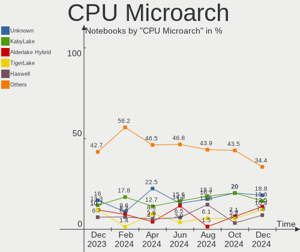
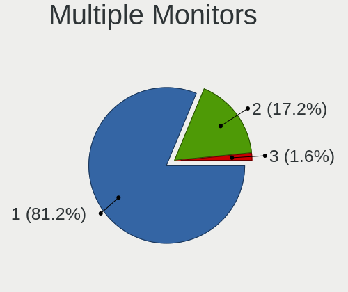

Kubuntu - Hardware Trends (Notebooks)
-------------------------------------

A project to identify most popular hardware characteristics and track their change
over time based on data collected by Linux users at https://Linux-Hardware.org.

Anyone can contribute to this report by the [hw-probe](https://github.com/linuxhw/hw-probe) tool:

    sudo -E hw-probe -all -upload

This report is for one last month. Overall report since the beginning of time: [TestCoverage](https://github.com/linuxhw/TestCoverage)

Period: Sep, 2022.

Contents
--------

* [ System ](#system)
  - [ OS                       ](#os)
  - [ OS Family                ](#os-family)
  - [ Kernel                   ](#kernel)
  - [ Kernel Family            ](#kernel-family)
  - [ Kernel Major Ver.        ](#kernel-major-ver)
  - [ Arch                     ](#arch)
  - [ DE                       ](#de)
  - [ Display Server           ](#display-server)
  - [ Display Manager          ](#display-manager)
  - [ OS Lang                  ](#os-lang)
  - [ Boot Mode                ](#boot-mode)
  - [ Filesystem               ](#filesystem)
  - [ Part. scheme             ](#part-scheme)
  - [ Dual Boot with Linux/BSD ](#dual-boot-with-linuxbsd)
  - [ Dual Boot (Win)          ](#dual-boot-win)

* [ Board ](#board)
  - [ Vendor                   ](#vendor)
  - [ Model                    ](#model)
  - [ Model Family             ](#model-family)
  - [ MFG Year                 ](#mfg-year)
  - [ Form Factor              ](#form-factor)
  - [ Secure Boot              ](#secure-boot)
  - [ Coreboot                 ](#coreboot)
  - [ RAM Size                 ](#ram-size)
  - [ RAM Used                 ](#ram-used)
  - [ Total Drives             ](#total-drives)
  - [ Has CD-ROM               ](#has-cd-rom)
  - [ Has Ethernet             ](#has-ethernet)
  - [ Has WiFi                 ](#has-wifi)
  - [ Has Bluetooth            ](#has-bluetooth)

* [ Location ](#location)
  - [ Country                  ](#country)
  - [ City                     ](#city)

* [ Drives ](#drives)
  - [ Drive Vendor             ](#drive-vendor)
  - [ Drive Model              ](#drive-model)
  - [ HDD Vendor               ](#hdd-vendor)
  - [ SSD Vendor               ](#ssd-vendor)
  - [ Drive Kind               ](#drive-kind)
  - [ Drive Connector          ](#drive-connector)
  - [ Drive Size               ](#drive-size)
  - [ Space Total              ](#space-total)
  - [ Space Used               ](#space-used)
  - [ Malfunc. Drives          ](#malfunc-drives)
  - [ Malfunc. Drive Vendor    ](#malfunc-drive-vendor)
  - [ Malfunc. HDD Vendor      ](#malfunc-hdd-vendor)
  - [ Malfunc. Drive Kind      ](#malfunc-drive-kind)
  - [ Failed Drives            ](#failed-drives)
  - [ Failed Drive Vendor      ](#failed-drive-vendor)
  - [ Drive Status             ](#drive-status)

* [ Storage controller ](#storage-controller)
  - [ Storage Vendor           ](#storage-vendor)
  - [ Storage Model            ](#storage-model)
  - [ Storage Kind             ](#storage-kind)

* [ Processor ](#processor)
  - [ CPU Vendor               ](#cpu-vendor)
  - [ CPU Model                ](#cpu-model)
  - [ CPU Model Family         ](#cpu-model-family)
  - [ CPU Cores                ](#cpu-cores)
  - [ CPU Sockets              ](#cpu-sockets)
  - [ CPU Threads              ](#cpu-threads)
  - [ CPU Op-Modes             ](#cpu-op-modes)
  - [ CPU Microcode            ](#cpu-microcode)
  - [ CPU Microarch            ](#cpu-microarch)

* [ Graphics ](#graphics)
  - [ GPU Vendor               ](#gpu-vendor)
  - [ GPU Model                ](#gpu-model)
  - [ GPU Combo                ](#gpu-combo)
  - [ GPU Driver               ](#gpu-driver)
  - [ GPU Memory               ](#gpu-memory)

* [ Monitor ](#monitor)
  - [ Monitor Vendor           ](#monitor-vendor)
  - [ Monitor Model            ](#monitor-model)
  - [ Monitor Resolution       ](#monitor-resolution)
  - [ Monitor Diagonal         ](#monitor-diagonal)
  - [ Monitor Width            ](#monitor-width)
  - [ Aspect Ratio             ](#aspect-ratio)
  - [ Monitor Area             ](#monitor-area)
  - [ Pixel Density            ](#pixel-density)
  - [ Multiple Monitors        ](#multiple-monitors)

* [ Network ](#network)
  - [ Net Controller Vendor    ](#net-controller-vendor)
  - [ Net Controller Model     ](#net-controller-model)
  - [ Wireless Vendor          ](#wireless-vendor)
  - [ Wireless Model           ](#wireless-model)
  - [ Ethernet Vendor          ](#ethernet-vendor)
  - [ Ethernet Model           ](#ethernet-model)
  - [ Net Controller Kind      ](#net-controller-kind)
  - [ Used Controller          ](#used-controller)
  - [ NICs                     ](#nics)
  - [ IPv6                     ](#ipv6)

* [ Bluetooth ](#bluetooth)
  - [ Bluetooth Vendor         ](#bluetooth-vendor)
  - [ Bluetooth Model          ](#bluetooth-model)

* [ Sound ](#sound)
  - [ Sound Vendor             ](#sound-vendor)
  - [ Sound Model              ](#sound-model)

* [ Memory ](#memory)
  - [ Memory Vendor            ](#memory-vendor)
  - [ Memory Model             ](#memory-model)
  - [ Memory Kind              ](#memory-kind)
  - [ Memory Form Factor       ](#memory-form-factor)
  - [ Memory Size              ](#memory-size)
  - [ Memory Speed             ](#memory-speed)

* [ Printers & scanners ](#printers--scanners)
  - [ Printer Vendor           ](#printer-vendor)
  - [ Printer Model            ](#printer-model)
  - [ Scanner Vendor           ](#scanner-vendor)
  - [ Scanner Model            ](#scanner-model)

* [ Camera ](#camera)
  - [ Camera Vendor            ](#camera-vendor)
  - [ Camera Model             ](#camera-model)

* [ Security ](#security)
  - [ Fingerprint Vendor       ](#fingerprint-vendor)
  - [ Fingerprint Model        ](#fingerprint-model)
  - [ Chipcard Vendor          ](#chipcard-vendor)
  - [ Chipcard Model           ](#chipcard-model)

* [ Unsupported ](#unsupported)
  - [ Unsupported Devices      ](#unsupported-devices)
  - [ Unsupported Device Types ](#unsupported-device-types)

System
------

OS
--

Installed operating systems

| Name          | Notebooks | Percent |
|---------------|-----------|---------|
| Kubuntu 22.04 | 39        | 72.22%  |
| Kubuntu 20.04 | 7         | 12.96%  |
| Kubuntu 11    | 4         | 7.41%   |
| Kubuntu 22.10 | 1         | 1.85%   |
| Kubuntu 21.10 | 1         | 1.85%   |
| Kubuntu 16.04 | 1         | 1.85%   |
| Kubuntu 11.1  | 1         | 1.85%   |

OS Family
---------

OS without a version

| Name    | Notebooks | Percent |
|---------|-----------|---------|
| Kubuntu | 54        | 100%    |

Kernel
------

Version of the Linux kernel

| Version               | Notebooks | Percent |
|-----------------------|-----------|---------|
| 5.15.0-47-generic     | 20        | 37.04%  |
| 5.15.0-48-generic     | 14        | 25.93%  |
| 5.15.0-46-generic     | 4         | 7.41%   |
| 5.4.0-125-generic     | 2         | 3.7%    |
| 5.19.5-051905-generic | 2         | 3.7%    |
| 5.15.0-43-generic     | 2         | 3.7%    |
| 5.15.0-41-generic     | 2         | 3.7%    |
| 5.4.0-126-generic     | 1         | 1.85%   |
| 5.19.2-051902-generic | 1         | 1.85%   |
| 5.19.0-15-generic     | 1         | 1.85%   |
| 5.17.0-1016-oem       | 1         | 1.85%   |
| 5.15.65-xanmod1       | 1         | 1.85%   |
| 5.15.0-48-lowlatency  | 1         | 1.85%   |
| 5.13.0-52-generic     | 1         | 1.85%   |
| 4.15.0-192-generic    | 1         | 1.85%   |

Kernel Family
-------------

Linux kernel without a distro release

| Version | Notebooks | Percent |
|---------|-----------|---------|
| 5.15.0  | 43        | 79.63%  |
| 5.4.0   | 3         | 5.56%   |
| 5.19.5  | 2         | 3.7%    |
| 5.19.2  | 1         | 1.85%   |
| 5.19.0  | 1         | 1.85%   |
| 5.17.0  | 1         | 1.85%   |
| 5.15.65 | 1         | 1.85%   |
| 5.13.0  | 1         | 1.85%   |
| 4.15.0  | 1         | 1.85%   |

Kernel Major Ver.
-----------------

Linux kernel major version

| Version | Notebooks | Percent |
|---------|-----------|---------|
| 5.15    | 44        | 81.48%  |
| 5.19    | 4         | 7.41%   |
| 5.4     | 3         | 5.56%   |
| 5.17    | 1         | 1.85%   |
| 5.13    | 1         | 1.85%   |
| 4.15    | 1         | 1.85%   |

Arch
----

OS architecture (x86_64, i586, etc.)

| Name   | Notebooks | Percent |
|--------|-----------|---------|
| x86_64 | 54        | 100%    |

DE
--

Desktop Environment

| Name | Notebooks | Percent |
|------|-----------|---------|
| KDE5 | 54        | 100%    |

Display Server
--------------

X11 or Wayland

| Name    | Notebooks | Percent |
|---------|-----------|---------|
| X11     | 51        | 94.44%  |
| Wayland | 3         | 5.56%   |

Display Manager
---------------

SDDM, LightDM, etc.

| Name    | Notebooks | Percent |
|---------|-----------|---------|
| SDDM    | 39        | 72.22%  |
| Unknown | 14        | 25.93%  |
| GDM3    | 1         | 1.85%   |

OS Lang
-------

Language

| Lang  | Notebooks | Percent |
|-------|-----------|---------|
| en_US | 26        | 48.15%  |
| it_IT | 7         | 12.96%  |
| de_DE | 5         | 9.26%   |
| pt_BR | 3         | 5.56%   |
| en_SG | 2         | 3.7%    |
| ru_RU | 1         | 1.85%   |
| pl_PL | 1         | 1.85%   |
| ja_JP | 1         | 1.85%   |
| fr_FR | 1         | 1.85%   |
| fr_BE | 1         | 1.85%   |
| es_VE | 1         | 1.85%   |
| en_PH | 1         | 1.85%   |
| en_GB | 1         | 1.85%   |
| en_CA | 1         | 1.85%   |
| en_AU | 1         | 1.85%   |
| ca_ES | 1         | 1.85%   |

Boot Mode
---------

EFI or BIOS

| Mode | Notebooks | Percent |
|------|-----------|---------|
| EFI  | 29        | 53.7%   |
| BIOS | 25        | 46.3%   |

Filesystem
----------

Type of filesystem

| Type    | Notebooks | Percent |
|---------|-----------|---------|
| Ext4    | 52        | 96.3%   |
| Overlay | 1         | 1.85%   |
| Ext3    | 1         | 1.85%   |

Part. scheme
------------

Scheme of partitioning

| Type    | Notebooks | Percent |
|---------|-----------|---------|
| Unknown | 26        | 48.15%  |
| GPT     | 24        | 44.44%  |
| MBR     | 4         | 7.41%   |

Dual Boot with Linux/BSD
------------------------

Hosting more than one Linux/BSD

| Dual boot | Notebooks | Percent |
|-----------|-----------|---------|
| No        | 52        | 96.3%   |
| Yes       | 2         | 3.7%    |

Dual Boot (Win)
---------------

Hosting Linux and Windows

| Dual boot | Notebooks | Percent |
|-----------|-----------|---------|
| No        | 37        | 68.52%  |
| Yes       | 17        | 31.48%  |

Board
-----

Vendor
------

Motherboard manufacturer

| Name                | Notebooks | Percent |
|---------------------|-----------|---------|
| Lenovo              | 17        | 31.48%  |
| Hewlett-Packard     | 10        | 18.52%  |
| Dell                | 10        | 18.52%  |
| ASUSTek Computer    | 4         | 7.41%   |
| Acer                | 4         | 7.41%   |
| Samsung Electronics | 2         | 3.7%    |
| Google              | 2         | 3.7%    |
| Sony                | 1         | 1.85%   |
| Notebook            | 1         | 1.85%   |
| MSI                 | 1         | 1.85%   |
| HUAWEI              | 1         | 1.85%   |
| Gigabyte Technology | 1         | 1.85%   |

Model
-----

Motherboard model

| Name                                        | Notebooks | Percent |
|---------------------------------------------|-----------|---------|
| HP 255 G8 Notebook PC                       | 2         | 3.7%    |
| Dell Latitude 7430                          | 2         | 3.7%    |
| Sony SVE1512J6EW                            | 1         | 1.85%   |
| Samsung RV411/RV511/E3511/S3511/RV711/E3411 | 1         | 1.85%   |
| Samsung 270E5G/270E5U                       | 1         | 1.85%   |
| Notebook NV4XMB,ME,MZ                       | 1         | 1.85%   |
| MSI Delta 15 A5EFK                          | 1         | 1.85%   |
| Lenovo ThinkPad X230 23256N6                | 1         | 1.85%   |
| Lenovo ThinkPad X1 Extreme Gen 5 21DE001QMH | 1         | 1.85%   |
| Lenovo ThinkPad T460 20FMS08U00             | 1         | 1.85%   |
| Lenovo ThinkPad T430 2349NZ8                | 1         | 1.85%   |
| Lenovo ThinkPad T430 2347AT2                | 1         | 1.85%   |
| Lenovo ThinkPad T14 Gen 1 20S1SB9L00        | 1         | 1.85%   |
| Lenovo ThinkPad L14 Gen 2 20X1S07900        | 1         | 1.85%   |
| Lenovo ThinkPad E590 20NB005MUS             | 1         | 1.85%   |
| Lenovo ThinkPad E15 Gen 3 20YG00ATCK        | 1         | 1.85%   |
| Lenovo ThinkPad E14 20RBS25S00              | 1         | 1.85%   |
| Lenovo ThinkBook 14 G2 ITL 20VD             | 1         | 1.85%   |
| Lenovo Legion 5 Pro 16ITH6H 82JD            | 1         | 1.85%   |
| Lenovo IdeaPad 3 15ARE05 81W4               | 1         | 1.85%   |
| Lenovo IdeaPad 1 14IGL05 81VU               | 1         | 1.85%   |
| Lenovo G780 20138                           | 1         | 1.85%   |
| Lenovo G50-45 80E3                          | 1         | 1.85%   |
| Lenovo B40-70 80F30005BR                    | 1         | 1.85%   |
| HUAWEI BOHB-WAX9                            | 1         | 1.85%   |
| HP ZBook 15 G6                              | 1         | 1.85%   |
| HP Pavilion Gaming Laptop 15-ec0xxx         | 1         | 1.85%   |
| HP Pavilion 14                              | 1         | 1.85%   |
| HP Notebook                                 | 1         | 1.85%   |
| HP Laptop 15-da0xxx                         | 1         | 1.85%   |
| HP EliteBook 8560p                          | 1         | 1.85%   |
| HP EliteBook 8470p                          | 1         | 1.85%   |
| HP EliteBook 840 G3                         | 1         | 1.85%   |
| Google Treeya                               | 1         | 1.85%   |
| Google Blooglet                             | 1         | 1.85%   |
| Gigabyte AORUS 7 SB                         | 1         | 1.85%   |
| Dell XPS 15 9560                            | 1         | 1.85%   |
| Dell Vostro 3700                            | 1         | 1.85%   |
| Dell Precision M4800                        | 1         | 1.85%   |
| Dell Latitude E5530 non-vPro                | 1         | 1.85%   |

Model Family
------------

Motherboard model prefix

| Name             | Notebooks | Percent |
|------------------|-----------|---------|
| Lenovo ThinkPad  | 10        | 18.52%  |
| Dell Latitude    | 4         | 7.41%   |
| HP EliteBook     | 3         | 5.56%   |
| Acer Aspire      | 3         | 5.56%   |
| Lenovo IdeaPad   | 2         | 3.7%    |
| HP Pavilion      | 2         | 3.7%    |
| HP 255           | 2         | 3.7%    |
| Dell Inspiron    | 2         | 3.7%    |
| Sony SVE1512J6EW | 1         | 1.85%   |
| Samsung RV411    | 1         | 1.85%   |
| Samsung 270E5G   | 1         | 1.85%   |
| Notebook NV4XMB  | 1         | 1.85%   |
| MSI Delta        | 1         | 1.85%   |
| Lenovo ThinkBook | 1         | 1.85%   |
| Lenovo Legion    | 1         | 1.85%   |
| Lenovo G780      | 1         | 1.85%   |
| Lenovo G50-45    | 1         | 1.85%   |
| Lenovo B40-70    | 1         | 1.85%   |
| HUAWEI BOHB-WAX9 | 1         | 1.85%   |
| HP ZBook         | 1         | 1.85%   |
| HP Notebook      | 1         | 1.85%   |
| HP Laptop        | 1         | 1.85%   |
| Google Treeya    | 1         | 1.85%   |
| Google Blooglet  | 1         | 1.85%   |
| Gigabyte AORUS   | 1         | 1.85%   |
| Dell XPS         | 1         | 1.85%   |
| Dell Vostro      | 1         | 1.85%   |
| Dell Precision   | 1         | 1.85%   |
| Dell G15         | 1         | 1.85%   |
| ASUS UX51VZA     | 1         | 1.85%   |
| ASUS N56VZ       | 1         | 1.85%   |
| ASUS K93SV       | 1         | 1.85%   |
| ASUS G501VW      | 1         | 1.85%   |
| Acer Predator    | 1         | 1.85%   |

MFG Year
--------

Motherboard manufacture year

| Year | Notebooks | Percent |
|------|-----------|---------|
| 2020 | 9         | 16.67%  |
| 2012 | 9         | 16.67%  |
| 2021 | 6         | 11.11%  |
| 2022 | 5         | 9.26%   |
| 2019 | 5         | 9.26%   |
| 2011 | 4         | 7.41%   |
| 2016 | 3         | 5.56%   |
| 2015 | 3         | 5.56%   |
| 2013 | 3         | 5.56%   |
| 2017 | 2         | 3.7%    |
| 2014 | 2         | 3.7%    |
| 2018 | 1         | 1.85%   |
| 2010 | 1         | 1.85%   |
| 2008 | 1         | 1.85%   |

Form Factor
-----------

Physical design of the computer

| Name     | Notebooks | Percent |
|----------|-----------|---------|
| Notebook | 54        | 100%    |

Secure Boot
-----------

Enabled or disabled

| State    | Notebooks | Percent |
|----------|-----------|---------|
| Disabled | 48        | 88.89%  |
| Enabled  | 6         | 11.11%  |

Coreboot
--------

Have coreboot on board

| Used | Notebooks | Percent |
|------|-----------|---------|
| No   | 52        | 96.3%   |
| Yes  | 2         | 3.7%    |

RAM Size
--------

Total RAM memory

| Size in GB | Notebooks | Percent |
|------------|-----------|---------|
| 16.01-24.0 | 17        | 31.48%  |
| 4.01-8.0   | 15        | 27.78%  |
| 3.01-4.0   | 9         | 16.67%  |
| 8.01-16.0  | 8         | 14.81%  |
| 32.01-64.0 | 3         | 5.56%   |
| 24.01-32.0 | 1         | 1.85%   |
| 2.01-3.0   | 1         | 1.85%   |

RAM Used
--------

Used RAM memory

| Used GB   | Notebooks | Percent |
|-----------|-----------|---------|
| 2.01-3.0  | 14        | 25.93%  |
| 4.01-8.0  | 13        | 24.07%  |
| 1.01-2.0  | 13        | 24.07%  |
| 3.01-4.0  | 10        | 18.52%  |
| 8.01-16.0 | 3         | 5.56%   |
| 0.51-1.0  | 1         | 1.85%   |

Total Drives
------------

Number of drives on board

| Drives | Notebooks | Percent |
|--------|-----------|---------|
| 1      | 33        | 61.11%  |
| 2      | 18        | 33.33%  |
| 3      | 2         | 3.7%    |
| 4      | 1         | 1.85%   |

Has CD-ROM
----------

Has CD-ROM on board

| Presented | Notebooks | Percent |
|-----------|-----------|---------|
| No        | 38        | 70.37%  |
| Yes       | 16        | 29.63%  |

Has Ethernet
------------

Has Ethernet on board

| Presented | Notebooks | Percent |
|-----------|-----------|---------|
| Yes       | 44        | 81.48%  |
| No        | 10        | 18.52%  |

Has WiFi
--------

Has WiFi module

| Presented | Notebooks | Percent |
|-----------|-----------|---------|
| Yes       | 54        | 100%    |

Has Bluetooth
-------------

Has Bluetooth module

| Presented | Notebooks | Percent |
|-----------|-----------|---------|
| Yes       | 49        | 90.74%  |
| No        | 5         | 9.26%   |

Location
--------

Country
-------

Geographic location (country)

| Country     | Notebooks | Percent |
|-------------|-----------|---------|
| Italy       | 9         | 16.67%  |
| USA         | 8         | 14.81%  |
| Germany     | 6         | 11.11%  |
| Brazil      | 5         | 9.26%   |
| Russia      | 3         | 5.56%   |
| Indonesia   | 3         | 5.56%   |
| Singapore   | 2         | 3.7%    |
| France      | 2         | 3.7%    |
| Venezuela   | 1         | 1.85%   |
| UK          | 1         | 1.85%   |
| Sweden      | 1         | 1.85%   |
| Spain       | 1         | 1.85%   |
| Serbia      | 1         | 1.85%   |
| Portugal    | 1         | 1.85%   |
| Poland      | 1         | 1.85%   |
| Philippines | 1         | 1.85%   |
| Netherlands | 1         | 1.85%   |
| Mexico      | 1         | 1.85%   |
| Japan       | 1         | 1.85%   |
| Czechia     | 1         | 1.85%   |
| Croatia     | 1         | 1.85%   |
| Canada      | 1         | 1.85%   |
| Belgium     | 1         | 1.85%   |
| Australia   | 1         | 1.85%   |

City
----

Geographic location (city)

| City               | Notebooks | Percent |
|--------------------|-----------|---------|
| Singapore          | 2         | 3.7%    |
| Rome               | 2         | 3.7%    |
| Zagreb             | 1         | 1.85%   |
| Washington         | 1         | 1.85%   |
| Turin              | 1         | 1.85%   |
| Tokyo              | 1         | 1.85%   |
| Tasikmalaya        | 1         | 1.85%   |
| Suzano             | 1         | 1.85%   |
| Sundsvall          | 1         | 1.85%   |
| St. Petersburg     | 1         | 1.85%   |
| St Petersburg      | 1         | 1.85%   |
| Semarang           | 1         | 1.85%   |
| Scurcola Marsicana | 1         | 1.85%   |
| Sao Paulo          | 1         | 1.85%   |
| Rio das Ostras     | 1         | 1.85%   |
| Regina             | 1         | 1.85%   |
| Plattsmouth        | 1         | 1.85%   |
| Paranaque City     | 1         | 1.85%   |
| Nuremberg          | 1         | 1.85%   |
| Moscow             | 1         | 1.85%   |
| Mexico City        | 1         | 1.85%   |
| Mesa               | 1         | 1.85%   |
| Lomianki           | 1         | 1.85%   |
| Lisbon             | 1         | 1.85%   |
| Karlovy Vary       | 1         | 1.85%   |
| Jacksonville       | 1         | 1.85%   |
| Ixelles-Elsene     | 1         | 1.85%   |
| Itajuba            | 1         | 1.85%   |
| Imperia            | 1         | 1.85%   |
| Hobart             | 1         | 1.85%   |
| Hamburg            | 1         | 1.85%   |
| Garching           | 1         | 1.85%   |
| Gallarate          | 1         | 1.85%   |
| Fucecchio          | 1         | 1.85%   |
| Florianópolis     | 1         | 1.85%   |
| Cologne            | 1         | 1.85%   |
| Chenove            | 1         | 1.85%   |
| Castelnau-le-Lez   | 1         | 1.85%   |
| Caracas            | 1         | 1.85%   |
| Cambiano           | 1         | 1.85%   |

Drives
------

Drive Vendor
------------

Hard drive vendors

| Vendor                         | Notebooks | Drives | Percent |
|--------------------------------|-----------|--------|---------|
| Samsung Electronics            | 10        | 10     | 13.16%  |
| WDC                            | 8         | 8      | 10.53%  |
| Toshiba                        | 7         | 7      | 9.21%   |
| Unknown                        | 6         | 8      | 7.89%   |
| Seagate                        | 6         | 7      | 7.89%   |
| SanDisk                        | 6         | 6      | 7.89%   |
| SK hynix                       | 4         | 4      | 5.26%   |
| Micron Technology              | 3         | 3      | 3.95%   |
| Intel                          | 3         | 3      | 3.95%   |
| HGST                           | 3         | 3      | 3.95%   |
| Crucial                        | 3         | 3      | 3.95%   |
| A-DATA Technology              | 3         | 3      | 3.95%   |
| Phison Electronics             | 2         | 2      | 2.63%   |
| Solid State Storage Technology | 1         | 1      | 1.32%   |
| Smart                          | 1         | 1      | 1.32%   |
| Patriot                        | 1         | 1      | 1.32%   |
| Micron/Crucial Technology      | 1         | 2      | 1.32%   |
| KIOXIA                         | 1         | 1      | 1.32%   |
| Kingston                       | 1         | 1      | 1.32%   |
| JMicron Technology             | 1         | 1      | 1.32%   |
| Hitachi                        | 1         | 1      | 1.32%   |
| Dogfish                        | 1         | 1      | 1.32%   |
| DERLER                         | 1         | 1      | 1.32%   |
| BAITITON                       | 1         | 1      | 1.32%   |
| ADATA Technology               | 1         | 1      | 1.32%   |

Drive Model
-----------

Hard drive models

| Model                                    | Notebooks | Percent |
|------------------------------------------|-----------|---------|
| Seagate ST1000LM024 HN-M101MBB 1TB       | 2         | 2.56%   |
| SanDisk NVMe SSD Drive 256GB             | 2         | 2.56%   |
| Samsung SSD 840 EVO 250GB                | 2         | 2.56%   |
| WDC WDBNCE0010PNC 1TB SSD                | 1         | 1.28%   |
| WDC WD6400BPVT-55HXZT3 640GB             | 1         | 1.28%   |
| WDC WD5000LPLX-00ZNTT0 500GB             | 1         | 1.28%   |
| WDC WD5000LPCX-24C6HT0 500GB             | 1         | 1.28%   |
| WDC WD10SPZX-00Z10T0 1TB                 | 1         | 1.28%   |
| WDC WD10JPCX-24UE4T0 1TB                 | 1         | 1.28%   |
| WDC PC SN530 SDBPMPZ-256G-1101 256GB     | 1         | 1.28%   |
| WDC PC SN530 NVMe 512GB                  | 1         | 1.28%   |
| Unknown SC64G  64GB                      | 1         | 1.28%   |
| Unknown MMC Card  64GB                   | 1         | 1.28%   |
| Unknown MMC Card  32GB                   | 1         | 1.28%   |
| Unknown MMC Card  256GB                  | 1         | 1.28%   |
| Unknown ED2S5  128GB                     | 1         | 1.28%   |
| Unknown DA4032  32GB                     | 1         | 1.28%   |
| Unknown CUTB42  64GB                     | 1         | 1.28%   |
| Toshiba XG6 NVMe SSD Controller 512GB    | 1         | 1.28%   |
| Toshiba MQ01ACF050 500GB                 | 1         | 1.28%   |
| Toshiba MQ01ABD100 1TB                   | 1         | 1.28%   |
| Toshiba MQ01ABD075 752GB                 | 1         | 1.28%   |
| Toshiba KXG6AZNV512G 512GB               | 1         | 1.28%   |
| Toshiba KXG60ZNV256G 256GB               | 1         | 1.28%   |
| Toshiba KBG30ZMV256G 256GB               | 1         | 1.28%   |
| Solid State Storage NVMe SSD Drive 256GB | 1         | 1.28%   |
| Smart SSD 256GB                          | 1         | 1.28%   |
| SK hynix SKHynix_HFM512GD3HX015N 512GB   | 1         | 1.28%   |
| SK hynix PC801 NVMe 512GB                | 1         | 1.28%   |
| SK hynix HFS256G39TND-N210A 256GB SSD    | 1         | 1.28%   |
| SK hynix BC711 HFM256GD3JX013N 256GB     | 1         | 1.28%   |
| Seagate ST9320423AS 320GB                | 1         | 1.28%   |
| Seagate ST750LM022 HN-M750MBB 752GB      | 1         | 1.28%   |
| Seagate Expansion 1TB                    | 1         | 1.28%   |
| Seagate BUP Slim 1TB                     | 1         | 1.28%   |
| Seagate BUP BK 5TB                       | 1         | 1.28%   |
| SanDisk SSD PLUS 480GB                   | 1         | 1.28%   |
| SanDisk SD8SN8U-256G-1006 256GB SSD      | 1         | 1.28%   |
| SanDisk NVMe SSD Drive 1TB               | 1         | 1.28%   |
| SanDisk A400 NVMe 512GB                  | 1         | 1.28%   |

HDD Vendor
----------

Hard disk drive vendors

| Vendor  | Notebooks | Drives | Percent |
|---------|-----------|--------|---------|
| Seagate | 6         | 7      | 33.33%  |
| WDC     | 5         | 5      | 27.78%  |
| Toshiba | 3         | 3      | 16.67%  |
| HGST    | 3         | 3      | 16.67%  |
| Hitachi | 1         | 1      | 5.56%   |

SSD Vendor
----------

Solid state drive vendors

| Vendor              | Notebooks | Drives | Percent |
|---------------------|-----------|--------|---------|
| Samsung Electronics | 7         | 7      | 30.43%  |
| Crucial             | 3         | 3      | 13.04%  |
| SanDisk             | 2         | 2      | 8.7%    |
| A-DATA Technology   | 2         | 2      | 8.7%    |
| WDC                 | 1         | 1      | 4.35%   |
| Smart               | 1         | 1      | 4.35%   |
| SK hynix            | 1         | 1      | 4.35%   |
| Patriot             | 1         | 1      | 4.35%   |
| Micron Technology   | 1         | 1      | 4.35%   |
| Intel               | 1         | 1      | 4.35%   |
| Dogfish             | 1         | 1      | 4.35%   |
| DERLER              | 1         | 1      | 4.35%   |
| BAITITON            | 1         | 1      | 4.35%   |

Drive Kind
----------

HDD or SSD

| Kind | Notebooks | Drives | Percent |
|------|-----------|--------|---------|
| NVMe | 25        | 30     | 36.23%  |
| SSD  | 21        | 23     | 30.43%  |
| HDD  | 17        | 19     | 24.64%  |
| MMC  | 6         | 8      | 8.7%    |

Drive Connector
---------------

SATA, SAS, NVMe, etc.

| Type | Notebooks | Drives | Percent |
|------|-----------|--------|---------|
| SATA | 29        | 39     | 46.77%  |
| NVMe | 24        | 29     | 38.71%  |
| MMC  | 6         | 8      | 9.68%   |
| SAS  | 3         | 4      | 4.84%   |

Drive Size
----------

Size of hard drive

| Size in TB | Notebooks | Drives | Percent |
|------------|-----------|--------|---------|
| 0.01-0.5   | 21        | 25     | 58.33%  |
| 0.51-1.0   | 14        | 16     | 38.89%  |
| 4.01-10.0  | 1         | 1      | 2.78%   |

Space Total
-----------

Amount of disk space available on the file system

| Size in GB     | Notebooks | Percent |
|----------------|-----------|---------|
| 251-500        | 14        | 25.93%  |
| 101-250        | 13        | 24.07%  |
| 51-100         | 9         | 16.67%  |
| 501-1000       | 8         | 14.81%  |
| 1001-2000      | 6         | 11.11%  |
| More than 3000 | 2         | 3.7%    |
| 21-50          | 1         | 1.85%   |
| 1-20           | 1         | 1.85%   |

Space Used
----------

Amount of used disk space

| Used GB        | Notebooks | Percent |
|----------------|-----------|---------|
| 21-50          | 14        | 25.93%  |
| 101-250        | 9         | 16.67%  |
| 1-20           | 9         | 16.67%  |
| 251-500        | 7         | 12.96%  |
| 51-100         | 7         | 12.96%  |
| 501-1000       | 5         | 9.26%   |
| More than 3000 | 2         | 3.7%    |
| 1001-2000      | 1         | 1.85%   |

Malfunc. Drives
---------------

Drive models with a malfunction

| Model                                               | Notebooks | Drives | Percent |
|-----------------------------------------------------|-----------|--------|---------|
| Toshiba MQ01ACF050 500GB                            | 1         | 1      | 12.5%   |
| SK hynix BC711 HFM256GD3JX013N 256GB                | 1         | 1      | 12.5%   |
| Samsung Electronics SSD 840 PRO Series 256GB        | 1         | 1      | 12.5%   |
| Micron Technology MTFDDAV256TDL-1AW1ZABHA 256GB SSD | 1         | 1      | 12.5%   |
| Hitachi HTS723232A7A364 320GB                       | 1         | 1      | 12.5%   |
| Crucial CT128M550SSD1 128GB                         | 1         | 1      | 12.5%   |
| BAITITON BT58SSD09S 240GB                           | 1         | 1      | 12.5%   |
| A-DATA Technology XM11 256GB-V2 SSD                 | 1         | 1      | 12.5%   |

Malfunc. Drive Vendor
---------------------

Vendors of faulty drives

| Vendor              | Notebooks | Drives | Percent |
|---------------------|-----------|--------|---------|
| Toshiba             | 1         | 1      | 12.5%   |
| SK hynix            | 1         | 1      | 12.5%   |
| Samsung Electronics | 1         | 1      | 12.5%   |
| Micron Technology   | 1         | 1      | 12.5%   |
| Hitachi             | 1         | 1      | 12.5%   |
| Crucial             | 1         | 1      | 12.5%   |
| BAITITON            | 1         | 1      | 12.5%   |
| A-DATA Technology   | 1         | 1      | 12.5%   |

Malfunc. HDD Vendor
-------------------

Vendors of faulty HDD drives

| Vendor  | Notebooks | Drives | Percent |
|---------|-----------|--------|---------|
| Toshiba | 1         | 1      | 50%     |
| Hitachi | 1         | 1      | 50%     |

Malfunc. Drive Kind
-------------------

Kinds of faulty drives

| Kind | Notebooks | Drives | Percent |
|------|-----------|--------|---------|
| SSD  | 4         | 5      | 57.14%  |
| HDD  | 2         | 2      | 28.57%  |
| NVMe | 1         | 1      | 14.29%  |

Failed Drives
-------------

Failed drive models

Zero info for selected period =(

Failed Drive Vendor
-------------------

Failed drive vendors

Zero info for selected period =(

Drive Status
------------

Number of failed and malfunc. drives

| Status   | Notebooks | Drives | Percent |
|----------|-----------|--------|---------|
| Detected | 28        | 43     | 45.9%   |
| Works    | 26        | 29     | 42.62%  |
| Malfunc  | 7         | 8      | 11.48%  |

Storage controller
------------------

Storage Vendor
--------------

Storage controller vendors

| Vendor                         | Notebooks | Percent |
|--------------------------------|-----------|---------|
| Intel                          | 36        | 54.55%  |
| Toshiba America Info Systems   | 5         | 7.58%   |
| SanDisk                        | 5         | 7.58%   |
| AMD                            | 5         | 7.58%   |
| SK hynix                       | 3         | 4.55%   |
| Samsung Electronics            | 3         | 4.55%   |
| Phison Electronics             | 2         | 3.03%   |
| Micron Technology              | 2         | 3.03%   |
| ADATA Technology               | 2         | 3.03%   |
| Solid State Storage Technology | 1         | 1.52%   |
| Micron/Crucial Technology      | 1         | 1.52%   |
| Kingston Technology Company    | 1         | 1.52%   |

Storage Model
-------------

Storage controller models

| Model                                                                        | Notebooks | Percent |
|------------------------------------------------------------------------------|-----------|---------|
| Intel 7 Series Chipset Family 6-port SATA Controller [AHCI mode]             | 9         | 12.86%  |
| AMD FCH SATA Controller [AHCI mode]                                          | 5         | 7.14%   |
| Toshiba America Info Systems XG6 NVMe SSD Controller                         | 4         | 5.71%   |
| Intel Sunrise Point-LP SATA Controller [AHCI mode]                           | 4         | 5.71%   |
| Intel HM170/QM170 Chipset SATA Controller [AHCI Mode]                        | 4         | 5.71%   |
| SanDisk Non-Volatile memory controller                                       | 3         | 4.29%   |
| Intel 82801 Mobile SATA Controller [RAID mode]                               | 3         | 4.29%   |
| SK hynix Gold P31 SSD                                                        | 2         | 2.86%   |
| Micron Non-Volatile memory controller                                        | 2         | 2.86%   |
| Intel Comet Lake SATA AHCI Controller                                        | 2         | 2.86%   |
| Intel 8 Series SATA Controller 1 [AHCI mode]                                 | 2         | 2.86%   |
| Intel 6 Series/C200 Series Chipset Family 6 port Mobile SATA AHCI Controller | 2         | 2.86%   |
| Intel 500 Series Chipset Family SATA AHCI Controller                         | 2         | 2.86%   |
| Toshiba America Info Systems BG3 NVMe SSD Controller                         | 1         | 1.43%   |
| Solid State Storage Non-Volatile memory controller                           | 1         | 1.43%   |
| SK hynix Non-Volatile memory controller                                      | 1         | 1.43%   |
| SanDisk WD Blue SN570 NVMe SSD                                               | 1         | 1.43%   |
| SanDisk WD Blue SN550 NVMe SSD                                               | 1         | 1.43%   |
| SanDisk WD Black NVMe SSD                                                    | 1         | 1.43%   |
| Samsung NVMe SSD Controller SM961/PM961/SM963                                | 1         | 1.43%   |
| Samsung NVMe SSD Controller PM9A1/PM9A3/980PRO                               | 1         | 1.43%   |
| Samsung NVMe SSD Controller 980                                              | 1         | 1.43%   |
| Phison PS5013 E13 NVMe Controller                                            | 1         | 1.43%   |
| Phison E12 NVMe Controller                                                   | 1         | 1.43%   |
| Micron/Crucial Non-Volatile memory controller                                | 1         | 1.43%   |
| Kingston Company A2000 NVMe SSD                                              | 1         | 1.43%   |
| Intel Volume Management Device NVMe RAID Controller                          | 1         | 1.43%   |
| Intel Tiger Lake-LP SATA Controller                                          | 1         | 1.43%   |
| Intel SSD 660P Series                                                        | 1         | 1.43%   |
| Intel SSD 600P Series                                                        | 1         | 1.43%   |
| Intel Cannon Lake Mobile PCH SATA AHCI Controller                            | 1         | 1.43%   |
| Intel 82801IBM/IEM (ICH9M/ICH9M-E) 4 port SATA Controller [AHCI mode]        | 1         | 1.43%   |
| Intel 7 Series Chipset Family 4-port SATA Controller [IDE mode]              | 1         | 1.43%   |
| Intel 7 Series Chipset Family 2-port SATA Controller [IDE mode]              | 1         | 1.43%   |
| Intel 5 Series/3400 Series Chipset 6 port SATA AHCI Controller               | 1         | 1.43%   |
| Intel 5 Series/3400 Series Chipset 4 port SATA AHCI Controller               | 1         | 1.43%   |
| Intel 400 Series Chipset Family SATA AHCI Controller                         | 1         | 1.43%   |
| ADATA XPG SX8200 Pro PCIe Gen3x4 M.2 2280 Solid State Drive                  | 1         | 1.43%   |
| ADATA Non-Volatile memory controller                                         | 1         | 1.43%   |

Storage Kind
------------

Kind of storage controller (IDE, SATA, NVMe, SAS, ...)

| Kind | Notebooks | Percent |
|------|-----------|---------|
| SATA | 36        | 55.38%  |
| NVMe | 24        | 36.92%  |
| RAID | 4         | 6.15%   |
| IDE  | 1         | 1.54%   |

Processor
---------

CPU Vendor
----------

Processor vendors

| Vendor | Notebooks | Percent |
|--------|-----------|---------|
| Intel  | 45        | 83.33%  |
| AMD    | 9         | 16.67%  |

CPU Model
---------

Processor models

| Model                                         | Notebooks | Percent |
|-----------------------------------------------|-----------|---------|
| Intel Core i5-3320M CPU @ 2.60GHz             | 3         | 5.56%   |
| Intel 11th Gen Core i5-1135G7 @ 2.40GHz       | 3         | 5.56%   |
| Intel Core i7-7700HQ CPU @ 2.80GHz            | 2         | 3.7%    |
| Intel Core i7-6700HQ CPU @ 2.60GHz            | 2         | 3.7%    |
| Intel Core i7-3612QM CPU @ 2.10GHz            | 2         | 3.7%    |
| Intel Core i5-7200U CPU @ 2.50GHz             | 2         | 3.7%    |
| Intel Core i5-10210U CPU @ 1.60GHz            | 2         | 3.7%    |
| Intel Celeron N4020 CPU @ 1.10GHz             | 2         | 3.7%    |
| Intel 11th Gen Core i7-11800H @ 2.30GHz       | 2         | 3.7%    |
| AMD Ryzen 5 5500U with Radeon Graphics        | 2         | 3.7%    |
| Intel Core i7-9750H CPU @ 2.60GHz             | 1         | 1.85%   |
| Intel Core i7-8550U CPU @ 1.80GHz             | 1         | 1.85%   |
| Intel Core i7-6600U CPU @ 2.60GHz             | 1         | 1.85%   |
| Intel Core i7-4800MQ CPU @ 2.70GHz            | 1         | 1.85%   |
| Intel Core i7-3610QM CPU @ 2.30GHz            | 1         | 1.85%   |
| Intel Core i7-3520M CPU @ 2.90GHz             | 1         | 1.85%   |
| Intel Core i7-2670QM CPU @ 2.20GHz            | 1         | 1.85%   |
| Intel Core i7-10750H CPU @ 2.60GHz            | 1         | 1.85%   |
| Intel Core i7-10510U CPU @ 1.80GHz            | 1         | 1.85%   |
| Intel Core i5-8265U CPU @ 1.60GHz             | 1         | 1.85%   |
| Intel Core i5-6300U CPU @ 2.40GHz             | 1         | 1.85%   |
| Intel Core i5-4210U CPU @ 1.70GHz             | 1         | 1.85%   |
| Intel Core i5-3210M CPU @ 2.50GHz             | 1         | 1.85%   |
| Intel Core i5-2540M CPU @ 2.60GHz             | 1         | 1.85%   |
| Intel Core i5 CPU M 430 @ 2.27GHz             | 1         | 1.85%   |
| Intel Core i3-4005U CPU @ 1.70GHz             | 1         | 1.85%   |
| Intel Core i3-3110M CPU @ 2.40GHz             | 1         | 1.85%   |
| Intel Core i3-2367M CPU @ 1.40GHz             | 1         | 1.85%   |
| Intel Core i3 CPU M 380 @ 2.53GHz             | 1         | 1.85%   |
| Intel Core 2 Duo CPU P8400 @ 2.26GHz          | 1         | 1.85%   |
| Intel Celeron CPU N3060 @ 1.60GHz             | 1         | 1.85%   |
| Intel Celeron CPU 1007U @ 1.50GHz             | 1         | 1.85%   |
| Intel 12th Gen Core i7-1270P                  | 1         | 1.85%   |
| Intel 12th Gen Core i7-12700H                 | 1         | 1.85%   |
| Intel 12th Gen Core i5-1245U                  | 1         | 1.85%   |
| AMD Ryzen 9 5900HX with Radeon Graphics       | 1         | 1.85%   |
| AMD Ryzen 7 5700U with Radeon Graphics        | 1         | 1.85%   |
| AMD Ryzen 5 4500U with Radeon Graphics        | 1         | 1.85%   |
| AMD Ryzen 5 3550H with Radeon Vega Mobile Gfx | 1         | 1.85%   |
| AMD Ryzen 3 5300U with Radeon Graphics        | 1         | 1.85%   |

CPU Model Family
----------------

Processor model prefix

| Model            | Notebooks | Percent |
|------------------|-----------|---------|
| Intel Core i7    | 15        | 27.78%  |
| Intel Core i5    | 13        | 24.07%  |
| Other            | 8         | 14.81%  |
| Intel Core i3    | 4         | 7.41%   |
| Intel Celeron    | 4         | 7.41%   |
| AMD Ryzen 5      | 4         | 7.41%   |
| Intel Core 2 Duo | 1         | 1.85%   |
| AMD Ryzen 9      | 1         | 1.85%   |
| AMD Ryzen 7      | 1         | 1.85%   |
| AMD Ryzen 3      | 1         | 1.85%   |
| AMD E1           | 1         | 1.85%   |
| AMD A4           | 1         | 1.85%   |

CPU Cores
---------

Number of processor cores

| Number | Notebooks | Percent |
|--------|-----------|---------|
| 2      | 23        | 42.59%  |
| 4      | 19        | 35.19%  |
| 6      | 5         | 9.26%   |
| 8      | 4         | 7.41%   |
| 14     | 1         | 1.85%   |
| 12     | 1         | 1.85%   |
| 10     | 1         | 1.85%   |

CPU Sockets
-----------

Number of sockets

| Number | Notebooks | Percent |
|--------|-----------|---------|
| 1      | 54        | 100%    |

CPU Threads
-----------

Threads per core (Hyper-Threading)

| Number | Notebooks | Percent |
|--------|-----------|---------|
| 2      | 45        | 83.33%  |
| 1      | 9         | 16.67%  |

CPU Op-Modes
------------

CPU Operation Modes (32-bit, 64-bit)

| Op mode        | Notebooks | Percent |
|----------------|-----------|---------|
| 32-bit, 64-bit | 54        | 100%    |

CPU Microcode
-------------

Microcode number

| Number     | Notebooks | Percent |
|------------|-----------|---------|
| Unknown    | 20        | 37.04%  |
| 0x306a9    | 6         | 11.11%  |
| 0x806ec    | 3         | 5.56%   |
| 0x806c1    | 2         | 3.7%    |
| 0x406e3    | 2         | 3.7%    |
| 0x40651    | 2         | 3.7%    |
| 0x906ea    | 1         | 1.85%   |
| 0x906a4    | 1         | 1.85%   |
| 0x906a3    | 1         | 1.85%   |
| 0x806eb    | 1         | 1.85%   |
| 0x806ea    | 1         | 1.85%   |
| 0x806e9    | 1         | 1.85%   |
| 0x806d1    | 1         | 1.85%   |
| 0x706a8    | 1         | 1.85%   |
| 0x506e3    | 1         | 1.85%   |
| 0x306c3    | 1         | 1.85%   |
| 0x20655    | 1         | 1.85%   |
| 0x20652    | 1         | 1.85%   |
| 0x1067a    | 1         | 1.85%   |
| 0x0a50000c | 1         | 1.85%   |
| 0x08608103 | 1         | 1.85%   |
| 0x08608102 | 1         | 1.85%   |
| 0x08600106 | 1         | 1.85%   |
| 0x08108109 | 1         | 1.85%   |
| 0x06006705 | 1         | 1.85%   |

CPU Microarch
-------------

Microarchitecture

| Name             | Notebooks | Percent |
|------------------|-----------|---------|
| KabyLake         | 10        | 18.52%  |
| IvyBridge        | 10        | 18.52%  |
| Unknown          | 6         | 11.11%  |
| Skylake          | 4         | 7.41%   |
| TigerLake        | 3         | 5.56%   |
| SandyBridge      | 3         | 5.56%   |
| Haswell          | 3         | 5.56%   |
| Westmere         | 2         | 3.7%    |
| Goldmont plus    | 2         | 3.7%    |
| Alderlake Hybrid | 2         | 3.7%    |
| Zen+             | 1         | 1.85%   |
| Zen 3            | 1         | 1.85%   |
| Zen 2            | 1         | 1.85%   |
| Silvermont       | 1         | 1.85%   |
| Puma             | 1         | 1.85%   |
| Penryn           | 1         | 1.85%   |
| Icelake          | 1         | 1.85%   |
| Excavator        | 1         | 1.85%   |
| CometLake        | 1         | 1.85%   |

Graphics
--------

GPU Vendor
----------

Vendors of graphics cards

| Vendor | Notebooks | Percent |
|--------|-----------|---------|
| Intel  | 42        | 57.53%  |
| Nvidia | 19        | 26.03%  |
| AMD    | 12        | 16.44%  |

GPU Model
---------

Graphics card models

| Model                                                                                    | Notebooks | Percent |
|------------------------------------------------------------------------------------------|-----------|---------|
| Intel 3rd Gen Core processor Graphics Controller                                         | 10        | 13.51%  |
| AMD Lucienne                                                                             | 4         | 5.41%   |
| Intel TigerLake-LP GT2 [Iris Xe Graphics]                                                | 3         | 4.05%   |
| Intel CometLake-U GT2 [UHD Graphics]                                                     | 3         | 4.05%   |
| Nvidia GM107M [GeForce GTX 960M]                                                         | 2         | 2.7%    |
| Nvidia GK107M [GeForce GT 650M]                                                          | 2         | 2.7%    |
| Intel TigerLake-H GT1 [UHD Graphics]                                                     | 2         | 2.7%    |
| Intel Skylake GT2 [HD Graphics 520]                                                      | 2         | 2.7%    |
| Intel HD Graphics 630                                                                    | 2         | 2.7%    |
| Intel HD Graphics 620                                                                    | 2         | 2.7%    |
| Intel HD Graphics 530                                                                    | 2         | 2.7%    |
| Intel Haswell-ULT Integrated Graphics Controller                                         | 2         | 2.7%    |
| Intel GeminiLake [UHD Graphics 600]                                                      | 2         | 2.7%    |
| Intel Alder Lake-P Integrated Graphics Controller                                        | 2         | 2.7%    |
| Intel 2nd Generation Core Processor Family Integrated Graphics Controller                | 2         | 2.7%    |
| Nvidia TU116M [GeForce GTX 1660 Ti Mobile]                                               | 1         | 1.35%   |
| Nvidia GT218M [GeForce 315M]                                                             | 1         | 1.35%   |
| Nvidia GT216M [GeForce GT 330M]                                                          | 1         | 1.35%   |
| Nvidia GP108M [GeForce MX330]                                                            | 1         | 1.35%   |
| Nvidia GP107M [GeForce GTX 1050 Mobile]                                                  | 1         | 1.35%   |
| Nvidia GP107M [GeForce GTX 1050 3 GB Max-Q]                                              | 1         | 1.35%   |
| Nvidia GP106M [GeForce GTX 1060 Mobile]                                                  | 1         | 1.35%   |
| Nvidia GM108M [GeForce MX130]                                                            | 1         | 1.35%   |
| Nvidia GM108M [GeForce 840M]                                                             | 1         | 1.35%   |
| Nvidia GK106GLM [Quadro K2100M]                                                          | 1         | 1.35%   |
| Nvidia GF108M [GeForce GT 635M]                                                          | 1         | 1.35%   |
| Nvidia GF108M [GeForce GT 540M]                                                          | 1         | 1.35%   |
| Nvidia GA107M [GeForce RTX 3050 Ti Mobile]                                               | 1         | 1.35%   |
| Nvidia GA106M [GeForce RTX 3060 Mobile / Max-Q]                                          | 1         | 1.35%   |
| Nvidia GA104M [GeForce RTX 3070 Mobile / Max-Q]                                          | 1         | 1.35%   |
| Intel WhiskeyLake-U GT2 [UHD Graphics 620]                                               | 1         | 1.35%   |
| Intel VGA compatible controller                                                          | 1         | 1.35%   |
| Intel UHD Graphics 620                                                                   | 1         | 1.35%   |
| Intel Mobile 4 Series Chipset Integrated Graphics Controller                             | 1         | 1.35%   |
| Intel CometLake-H GT2 [UHD Graphics]                                                     | 1         | 1.35%   |
| Intel CoffeeLake-H GT2 [UHD Graphics 630]                                                | 1         | 1.35%   |
| Intel Atom/Celeron/Pentium Processor x5-E8000/J3xxx/N3xxx Integrated Graphics Controller | 1         | 1.35%   |
| Intel 4th Gen Core Processor Integrated Graphics Controller                              | 1         | 1.35%   |
| AMD Topaz XT [Radeon R7 M260/M265 / M340/M360 / M440/M445 / 530/535 / 620/625 Mobile]    | 1         | 1.35%   |
| AMD Sun XT [Radeon HD 8670A/8670M/8690M / R5 M330 / M430 / Radeon 520 Mobile]            | 1         | 1.35%   |

GPU Combo
---------

Combinations of graphics cards

| Name           | Notebooks | Percent |
|----------------|-----------|---------|
| 1 x Intel      | 23        | 42.59%  |
| Intel + Nvidia | 16        | 29.63%  |
| 1 x AMD        | 8         | 14.81%  |
| 1 x Nvidia     | 2         | 3.7%    |
| Intel + AMD    | 2         | 3.7%    |
| Other          | 1         | 1.85%   |
| 2 x AMD        | 1         | 1.85%   |
| AMD + Nvidia   | 1         | 1.85%   |

GPU Driver
----------

Free vs proprietary

| Driver      | Notebooks | Percent |
|-------------|-----------|---------|
| Free        | 41        | 75.93%  |
| Proprietary | 13        | 24.07%  |

GPU Memory
----------

Total video memory

| Size in GB | Notebooks | Percent |
|------------|-----------|---------|
| Unknown    | 39        | 72.22%  |
| 1.01-2.0   | 7         | 12.96%  |
| 0.01-0.5   | 4         | 7.41%   |
| 0.51-1.0   | 2         | 3.7%    |
| 3.01-4.0   | 1         | 1.85%   |
| 8.01-16.0  | 1         | 1.85%   |

Monitor
-------

Monitor Vendor
--------------

Monitor vendors

| Vendor                  | Notebooks | Percent |
|-------------------------|-----------|---------|
| Chimei Innolux          | 12        | 17.14%  |
| LG Display              | 11        | 15.71%  |
| AU Optronics            | 10        | 14.29%  |
| Samsung Electronics     | 9         | 12.86%  |
| BOE                     | 5         | 7.14%   |
| Goldstar                | 4         | 5.71%   |
| Sharp                   | 3         | 4.29%   |
| Hewlett-Packard         | 3         | 4.29%   |
| CSO                     | 2         | 2.86%   |
| Chi Mei Optoelectronics | 2         | 2.86%   |
| Vizio                   | 1         | 1.43%   |
| Vestel Elektronik       | 1         | 1.43%   |
| Panasonic               | 1         | 1.43%   |
| Lenovo                  | 1         | 1.43%   |
| InfoVision              | 1         | 1.43%   |
| Gigabyte Technology     | 1         | 1.43%   |
| CVT                     | 1         | 1.43%   |
| BenQ                    | 1         | 1.43%   |
| Acer                    | 1         | 1.43%   |

Monitor Model
-------------

Monitor models

| Model                                                                 | Notebooks | Percent |
|-----------------------------------------------------------------------|-----------|---------|
| Samsung Electronics LCD Monitor SEC5441 1366x768 353x198mm 15.9-inch  | 3         | 4.29%   |
| LG Display LCD Monitor LGD062E 1920x1080 344x194mm 15.5-inch          | 2         | 2.86%   |
| Chimei Innolux LCD Monitor CMN15F5 1920x1080 344x193mm 15.5-inch      | 2         | 2.86%   |
| Chimei Innolux LCD Monitor CMN14D4 1920x1080 309x173mm 13.9-inch      | 2         | 2.86%   |
| Vizio E241-A1 VIZ0098 1920x1080 521x293mm 23.5-inch                   | 1         | 1.43%   |
| Vestel Elektronik 24W_LCD_TV VES3700 1920x1080 706x398mm 31.9-inch    | 1         | 1.43%   |
| Sharp LQ156M1JW03 SHP155D 1920x1080 344x194mm 15.5-inch               | 1         | 1.43%   |
| Sharp LCD Monitor SHP1453 1920x1080 346x194mm 15.6-inch               | 1         | 1.43%   |
| Sharp HDMI SHP113E 1920x1080 1330x748mm 60.1-inch                     | 1         | 1.43%   |
| Samsung Electronics LCD Monitor SEC4256 1600x900 382x215mm 17.3-inch  | 1         | 1.43%   |
| Samsung Electronics LCD Monitor SEC324C 1600x900 310x174mm 14.0-inch  | 1         | 1.43%   |
| Samsung Electronics LCD Monitor SEC314C 1920x1080 344x194mm 15.5-inch | 1         | 1.43%   |
| Samsung Electronics LCD Monitor SEC3047 1366x768 277x156mm 12.5-inch  | 1         | 1.43%   |
| Samsung Electronics LCD Monitor SDC324C 1920x1080 344x194mm 15.5-inch | 1         | 1.43%   |
| Samsung Electronics C24F390 SAM0D2C 1920x1080 521x293mm 23.5-inch     | 1         | 1.43%   |
| Panasonic TV MEIC13A 1920x540                                         | 1         | 1.43%   |
| LG Display LCD Monitor LGD06C3 1920x1080 309x174mm 14.0-inch          | 1         | 1.43%   |
| LG Display LCD Monitor LGD069A 1920x1080 344x194mm 15.5-inch          | 1         | 1.43%   |
| LG Display LCD Monitor LGD0615 1920x1080 382x215mm 17.3-inch          | 1         | 1.43%   |
| LG Display LCD Monitor LGD04D9 3840x2160 344x194mm 15.5-inch          | 1         | 1.43%   |
| LG Display LCD Monitor LGD04A7 1920x1080 344x194mm 15.5-inch          | 1         | 1.43%   |
| LG Display LCD Monitor LGD033F 1366x768 310x174mm 14.0-inch           | 1         | 1.43%   |
| LG Display LCD Monitor LGD0323 1920x1080 345x194mm 15.6-inch          | 1         | 1.43%   |
| LG Display LCD Monitor LGD0288 1600x900 382x215mm 17.3-inch           | 1         | 1.43%   |
| LG Display LCD Monitor LGD0258 1600x900 345x194mm 15.6-inch           | 1         | 1.43%   |
| Lenovo C22-25 LEN66AF 1920x1080 477x268mm 21.5-inch                   | 1         | 1.43%   |
| InfoVision LCD Monitor IVO0579 1366x768 310x170mm 13.9-inch           | 1         | 1.43%   |
| Hewlett-Packard P222va HWP322B 1920x1080 477x268mm 21.5-inch          | 1         | 1.43%   |
| Hewlett-Packard E242 HWP326E 1920x1200 518x324mm 24.1-inch            | 1         | 1.43%   |
| Hewlett-Packard 24mh HPN366E 1920x1080 527x296mm 23.8-inch            | 1         | 1.43%   |
| Goldstar ULTRAWIDE GSM76FD 2560x1080 798x334mm 34.1-inch              | 1         | 1.43%   |
| Goldstar HDR WFHD GSM7714 2560x1080 798x334mm 34.1-inch               | 1         | 1.43%   |
| Goldstar FULL HD GSM5ABB 1920x1080 480x270mm 21.7-inch                | 1         | 1.43%   |
| Goldstar 22MP55 GSM5A26 1920x1080 477x268mm 21.5-inch                 | 1         | 1.43%   |
| Gigabyte Technology M32U GBT3204 3840x2160 697x392mm 31.5-inch        | 1         | 1.43%   |
| CVT LCD CVT001A 1360x768 330x210mm 15.4-inch                          | 1         | 1.43%   |
| CSO LCD Monitor CSO160B 2560x1600 345x215mm 16.0-inch                 | 1         | 1.43%   |
| CSO LCD Monitor CSO1606 2560x1600 345x215mm 16.0-inch                 | 1         | 1.43%   |
| Chimei Innolux LCD Monitor CMN15E6 1366x768 344x193mm 15.5-inch       | 1         | 1.43%   |
| Chimei Innolux LCD Monitor CMN15D3 1920x1080 344x193mm 15.5-inch      | 1         | 1.43%   |

Monitor Resolution
------------------

Monitor screen resolution

| Resolution      | Notebooks | Percent |
|-----------------|-----------|---------|
| 1920x1080 (FHD) | 33        | 53.23%  |
| 1366x768 (WXGA) | 17        | 27.42%  |
| 1600x900 (HD+)  | 4         | 6.45%   |
| 3840x2160 (4K)  | 3         | 4.84%   |
| 2560x1600       | 2         | 3.23%   |
| 2560x1080       | 2         | 3.23%   |
| 1920x540        | 1         | 1.61%   |

Monitor Diagonal
----------------

Diagonal size in inches

| Inches | Notebooks | Percent |
|--------|-----------|---------|
| 15     | 30        | 42.86%  |
| 13     | 8         | 11.43%  |
| 14     | 7         | 10%     |
| 21     | 4         | 5.71%   |
| 24     | 3         | 4.29%   |
| 17     | 3         | 4.29%   |
| 34     | 2         | 2.86%   |
| 31     | 2         | 2.86%   |
| 23     | 2         | 2.86%   |
| 16     | 2         | 2.86%   |
| 11     | 2         | 2.86%   |
| 84     | 1         | 1.43%   |
| 60     | 1         | 1.43%   |
| 42     | 1         | 1.43%   |
| 18     | 1         | 1.43%   |
| 12     | 1         | 1.43%   |

Monitor Width
-------------

Physical width

| Width in mm | Notebooks | Percent |
|-------------|-----------|---------|
| 301-350     | 41        | 58.57%  |
| 351-400     | 8         | 11.43%  |
| 501-600     | 5         | 7.14%   |
| 401-500     | 5         | 7.14%   |
| 201-300     | 4         | 5.71%   |
| 701-800     | 2         | 2.86%   |
| 601-700     | 2         | 2.86%   |
| 1501-2000   | 1         | 1.43%   |
| 1001-1500   | 1         | 1.43%   |
| 901-1000    | 1         | 1.43%   |

Aspect Ratio
------------

Proportional relationship between the width and the height

| Ratio | Notebooks | Percent |
|-------|-----------|---------|
| 16/9  | 53        | 89.83%  |
| 16/10 | 4         | 6.78%   |
| 21/9  | 2         | 3.39%   |

Monitor Area
------------

Area in inch²

| Area in inch² | Notebooks | Percent |
|----------------|-----------|---------|
| 101-110        | 30        | 42.86%  |
| 81-90          | 14        | 20%     |
| 201-250        | 6         | 8.57%   |
| 351-500        | 4         | 5.71%   |
| 121-130        | 3         | 4.29%   |
| More than 1000 | 2         | 2.86%   |
| 51-60          | 2         | 2.86%   |
| 151-200        | 2         | 2.86%   |
| 111-120        | 2         | 2.86%   |
| 71-80          | 1         | 1.43%   |
| 61-70          | 1         | 1.43%   |
| 251-300        | 1         | 1.43%   |
| 141-150        | 1         | 1.43%   |
| 501-1000       | 1         | 1.43%   |

Pixel Density
-------------

Pixels per inch

| Density       | Notebooks | Percent |
|---------------|-----------|---------|
| 121-160       | 31        | 46.97%  |
| 101-120       | 18        | 27.27%  |
| 51-100        | 13        | 19.7%   |
| 161-240       | 2         | 3.03%   |
| More than 240 | 1         | 1.52%   |
| 1-50          | 1         | 1.52%   |

Multiple Monitors
-----------------

Total monitors connected

| Total | Notebooks | Percent |
|-------|-----------|---------|
| 1     | 39        | 72.22%  |
| 2     | 14        | 25.93%  |
| 3     | 1         | 1.85%   |

Network
-------

Net Controller Vendor
---------------------

Controller vendors

| Vendor                | Notebooks | Percent |
|-----------------------|-----------|---------|
| Realtek Semiconductor | 31        | 37.35%  |
| Intel                 | 29        | 34.94%  |
| Qualcomm Atheros      | 12        | 14.46%  |
| Broadcom              | 6         | 7.23%   |
| MediaTek              | 2         | 2.41%   |
| Broadcom Limited      | 2         | 2.41%   |
| Ralink Technology     | 1         | 1.2%    |

Net Controller Model
--------------------

Controller models

| Model                                                             | Notebooks | Percent |
|-------------------------------------------------------------------|-----------|---------|
| Realtek RTL8111/8168/8411 PCI Express Gigabit Ethernet Controller | 21        | 21%     |
| Intel Centrino Advanced-N 6205 [Taylor Peak]                      | 5         | 5%      |
| Intel 82579LM Gigabit Network Connection (Lewisville)             | 5         | 5%      |
| Qualcomm Atheros QCA6174 802.11ac Wireless Network Adapter        | 4         | 4%      |
| Realtek RTL8852AE 802.11ax PCIe Wireless Network Adapter          | 3         | 3%      |
| Realtek RTL8153 Gigabit Ethernet Adapter                          | 3         | 3%      |
| Realtek RTL810xE PCI Express Fast Ethernet controller             | 3         | 3%      |
| Intel Wi-Fi 6 AX200                                               | 3         | 3%      |
| Intel Comet Lake PCH-LP CNVi WiFi                                 | 3         | 3%      |
| Intel Alder Lake-P PCH CNVi WiFi                                  | 3         | 3%      |
| Realtek RTL8822CE 802.11ac PCIe Wireless Network Adapter          | 2         | 2%      |
| Realtek RTL8723BE PCIe Wireless Network Adapter                   | 2         | 2%      |
| Qualcomm Atheros QCA9565 / AR9565 Wireless Network Adapter        | 2         | 2%      |
| Qualcomm Atheros AR9485 Wireless Network Adapter                  | 2         | 2%      |
| Qualcomm Atheros AR9462 Wireless Network Adapter                  | 2         | 2%      |
| MediaTek MT7921 802.11ax PCI Express Wireless Network Adapter     | 2         | 2%      |
| Intel Wireless 8260                                               | 2         | 2%      |
| Intel Wireless 7260                                               | 2         | 2%      |
| Intel Wireless 3165                                               | 2         | 2%      |
| Intel Tiger Lake PCH CNVi WiFi                                    | 2         | 2%      |
| Intel Ethernet Connection I219-LM                                 | 2         | 2%      |
| Broadcom BCM43142 802.11b/g/n                                     | 2         | 2%      |
| Broadcom BCM4313 802.11bgn Wireless Network Adapter               | 2         | 2%      |
| Realtek RTL8821CE 802.11ac PCIe Wireless Network Adapter          | 1         | 1%      |
| Realtek Killer E2600 Gigabit Ethernet Controller                  | 1         | 1%      |
| Realtek 802.11ac NIC                                              | 1         | 1%      |
| Ralink MT7601U Wireless Adapter                                   | 1         | 1%      |
| Qualcomm Atheros AR8162 Fast Ethernet                             | 1         | 1%      |
| Qualcomm Atheros AR8161 Gigabit Ethernet                          | 1         | 1%      |
| Qualcomm Atheros AR8151 v2.0 Gigabit Ethernet                     | 1         | 1%      |
| Intel Wireless-AC 9260                                            | 1         | 1%      |
| Intel Wi-Fi 6 AX210/AX211/AX411 160MHz                            | 1         | 1%      |
| Intel Wi-Fi 6 AX201                                               | 1         | 1%      |
| Intel Gemini Lake PCH CNVi WiFi                                   | 1         | 1%      |
| Intel Ethernet Connection I217-LM                                 | 1         | 1%      |
| Intel Ethernet Connection (7) I219-LM                             | 1         | 1%      |
| Intel Ethernet Connection (13) I219-V                             | 1         | 1%      |
| Intel Ethernet Connection (10) I219-V                             | 1         | 1%      |
| Intel Centrino Advanced-N 6235                                    | 1         | 1%      |
| Broadcom NetXtreme BCM5761e Gigabit Ethernet PCIe                 | 1         | 1%      |

Wireless Vendor
---------------

Wireless vendors

| Vendor                | Notebooks | Percent |
|-----------------------|-----------|---------|
| Intel                 | 27        | 48.21%  |
| Qualcomm Atheros      | 10        | 17.86%  |
| Realtek Semiconductor | 9         | 16.07%  |
| Broadcom              | 5         | 8.93%   |
| MediaTek              | 2         | 3.57%   |
| Broadcom Limited      | 2         | 3.57%   |
| Ralink Technology     | 1         | 1.79%   |

Wireless Model
--------------

Wireless models

| Model                                                         | Notebooks | Percent |
|---------------------------------------------------------------|-----------|---------|
| Intel Centrino Advanced-N 6205 [Taylor Peak]                  | 5         | 8.93%   |
| Qualcomm Atheros QCA6174 802.11ac Wireless Network Adapter    | 4         | 7.14%   |
| Realtek RTL8852AE 802.11ax PCIe Wireless Network Adapter      | 3         | 5.36%   |
| Intel Wi-Fi 6 AX200                                           | 3         | 5.36%   |
| Intel Comet Lake PCH-LP CNVi WiFi                             | 3         | 5.36%   |
| Intel Alder Lake-P PCH CNVi WiFi                              | 3         | 5.36%   |
| Realtek RTL8822CE 802.11ac PCIe Wireless Network Adapter      | 2         | 3.57%   |
| Realtek RTL8723BE PCIe Wireless Network Adapter               | 2         | 3.57%   |
| Qualcomm Atheros QCA9565 / AR9565 Wireless Network Adapter    | 2         | 3.57%   |
| Qualcomm Atheros AR9485 Wireless Network Adapter              | 2         | 3.57%   |
| Qualcomm Atheros AR9462 Wireless Network Adapter              | 2         | 3.57%   |
| MediaTek MT7921 802.11ax PCI Express Wireless Network Adapter | 2         | 3.57%   |
| Intel Wireless 8260                                           | 2         | 3.57%   |
| Intel Wireless 7260                                           | 2         | 3.57%   |
| Intel Wireless 3165                                           | 2         | 3.57%   |
| Intel Tiger Lake PCH CNVi WiFi                                | 2         | 3.57%   |
| Broadcom BCM43142 802.11b/g/n                                 | 2         | 3.57%   |
| Broadcom BCM4313 802.11bgn Wireless Network Adapter           | 2         | 3.57%   |
| Realtek RTL8821CE 802.11ac PCIe Wireless Network Adapter      | 1         | 1.79%   |
| Realtek 802.11ac NIC                                          | 1         | 1.79%   |
| Ralink MT7601U Wireless Adapter                               | 1         | 1.79%   |
| Intel Wireless-AC 9260                                        | 1         | 1.79%   |
| Intel Wi-Fi 6 AX210/AX211/AX411 160MHz                        | 1         | 1.79%   |
| Intel Wi-Fi 6 AX201                                           | 1         | 1.79%   |
| Intel Gemini Lake PCH CNVi WiFi                               | 1         | 1.79%   |
| Intel Centrino Advanced-N 6235                                | 1         | 1.79%   |
| Broadcom Limited BCM4352 802.11ac Wireless Network Adapter    | 1         | 1.79%   |
| Broadcom Limited BCM4312 802.11b/g LP-PHY                     | 1         | 1.79%   |
| Broadcom BCM43224 802.11a/b/g/n                               | 1         | 1.79%   |

Ethernet Vendor
---------------

Ethernet vendors

| Vendor                | Notebooks | Percent |
|-----------------------|-----------|---------|
| Realtek Semiconductor | 28        | 63.64%  |
| Intel                 | 11        | 25%     |
| Qualcomm Atheros      | 3         | 6.82%   |
| Broadcom              | 2         | 4.55%   |

Ethernet Model
--------------

Ethernet models

| Model                                                             | Notebooks | Percent |
|-------------------------------------------------------------------|-----------|---------|
| Realtek RTL8111/8168/8411 PCI Express Gigabit Ethernet Controller | 21        | 47.73%  |
| Intel 82579LM Gigabit Network Connection (Lewisville)             | 5         | 11.36%  |
| Realtek RTL8153 Gigabit Ethernet Adapter                          | 3         | 6.82%   |
| Realtek RTL810xE PCI Express Fast Ethernet controller             | 3         | 6.82%   |
| Intel Ethernet Connection I219-LM                                 | 2         | 4.55%   |
| Realtek Killer E2600 Gigabit Ethernet Controller                  | 1         | 2.27%   |
| Qualcomm Atheros AR8162 Fast Ethernet                             | 1         | 2.27%   |
| Qualcomm Atheros AR8161 Gigabit Ethernet                          | 1         | 2.27%   |
| Qualcomm Atheros AR8151 v2.0 Gigabit Ethernet                     | 1         | 2.27%   |
| Intel Ethernet Connection I217-LM                                 | 1         | 2.27%   |
| Intel Ethernet Connection (7) I219-LM                             | 1         | 2.27%   |
| Intel Ethernet Connection (13) I219-V                             | 1         | 2.27%   |
| Intel Ethernet Connection (10) I219-V                             | 1         | 2.27%   |
| Broadcom NetXtreme BCM5761e Gigabit Ethernet PCIe                 | 1         | 2.27%   |
| Broadcom NetXtreme BCM5761 Gigabit Ethernet PCIe                  | 1         | 2.27%   |

Net Controller Kind
-------------------

Ethernet, WiFi or modem

| Kind     | Notebooks | Percent |
|----------|-----------|---------|
| WiFi     | 54        | 55.1%   |
| Ethernet | 44        | 44.9%   |

Used Controller
---------------

Currently used network controller

| Kind     | Notebooks | Percent |
|----------|-----------|---------|
| WiFi     | 47        | 81.03%  |
| Ethernet | 11        | 18.97%  |

NICs
----

Total network controllers on board

| Total | Notebooks | Percent |
|-------|-----------|---------|
| 2     | 41        | 75.93%  |
| 1     | 13        | 24.07%  |

IPv6
----

IPv6 vs IPv4

| Used | Notebooks | Percent |
|------|-----------|---------|
| No   | 40        | 74.07%  |
| Yes  | 14        | 25.93%  |

Bluetooth
---------

Bluetooth Vendor
----------------

Controller vendors

| Vendor                          | Notebooks | Percent |
|---------------------------------|-----------|---------|
| Intel                           | 21        | 42%     |
| Realtek Semiconductor           | 7         | 14%     |
| Qualcomm Atheros Communications | 5         | 10%     |
| Broadcom                        | 5         | 10%     |
| Foxconn / Hon Hai               | 3         | 6%      |
| Lite-On Technology              | 2         | 4%      |
| IMC Networks                    | 2         | 4%      |
| Dell                            | 2         | 4%      |
| Foxconn International           | 1         | 2%      |
| Edimax Technology               | 1         | 2%      |
| Cambridge Silicon Radio         | 1         | 2%      |

Bluetooth Model
---------------

Controller models

| Model                                               | Notebooks | Percent |
|-----------------------------------------------------|-----------|---------|
| Intel Bluetooth wireless interface                  | 6         | 12%     |
| Realtek Bluetooth Radio                             | 5         | 10%     |
| Intel AX201 Bluetooth                               | 5         | 10%     |
| Qualcomm Atheros QCA61x4 Bluetooth 4.0              | 3         | 6%      |
| Intel AX200 Bluetooth                               | 3         | 6%      |
| Qualcomm Atheros AR3012 Bluetooth 4.0               | 2         | 4%      |
| Intel Bluetooth Device                              | 2         | 4%      |
| Intel Bluetooth 9460/9560 Jefferson Peak (JfP)      | 2         | 4%      |
| Broadcom BCM20702 Bluetooth 4.0 [ThinkPad]          | 2         | 4%      |
| Realtek RTL8723B Bluetooth                          | 1         | 2%      |
| Realtek  Bluetooth 4.2 Adapter                      | 1         | 2%      |
| Lite-On Wireless_Device                             | 1         | 2%      |
| Lite-On Bluetooth Device                            | 1         | 2%      |
| Intel Wireless-AC 9260 Bluetooth Adapter            | 1         | 2%      |
| Intel Centrino Bluetooth Wireless Transceiver       | 1         | 2%      |
| Intel AX210 Bluetooth                               | 1         | 2%      |
| IMC Networks Bluetooth Device                       | 1         | 2%      |
| IMC Networks Atheros AR3012 Bluetooth 4.0 Adapter   | 1         | 2%      |
| Foxconn International BCM43142A0 Bluetooth module   | 1         | 2%      |
| Foxconn / Hon Hai Wireless_Device                   | 1         | 2%      |
| Foxconn / Hon Hai Bluetooth USB Host Controller     | 1         | 2%      |
| Foxconn / Hon Hai Bluetooth Device                  | 1         | 2%      |
| Edimax Bluetooth Adapter                            | 1         | 2%      |
| Dell Wireless 365 Bluetooth                         | 1         | 2%      |
| Dell Broadcom BCM20702A0 Bluetooth                  | 1         | 2%      |
| Cambridge Silicon Radio Bluetooth Dongle (HCI mode) | 1         | 2%      |
| Broadcom BCM43142A0 Bluetooth Device                | 1         | 2%      |
| Broadcom BCM20702A0 Bluetooth 4.0                   | 1         | 2%      |
| Broadcom BCM2070 Bluetooth Device                   | 1         | 2%      |

Sound
-----

Sound Vendor
------------

Sound card vendors

| Vendor             | Notebooks | Percent |
|--------------------|-----------|---------|
| Intel              | 44        | 61.97%  |
| Nvidia             | 13        | 18.31%  |
| AMD                | 10        | 14.08%  |
| Razer USA          | 1         | 1.41%   |
| GN Netcom          | 1         | 1.41%   |
| Focusrite-Novation | 1         | 1.41%   |
| DisplayLink        | 1         | 1.41%   |

Sound Model
-----------

Sound card models

| Model                                                                                             | Notebooks | Percent |
|---------------------------------------------------------------------------------------------------|-----------|---------|
| Intel 7 Series/C216 Chipset Family High Definition Audio Controller                               | 11        | 13.41%  |
| AMD Family 17h/19h HD Audio Controller                                                            | 7         | 8.54%   |
| AMD Renoir Radeon High Definition Audio Controller                                                | 6         | 7.32%   |
| Intel Sunrise Point-LP HD Audio                                                                   | 5         | 6.1%    |
| Intel Tiger Lake-LP Smart Sound Technology Audio Controller                                       | 3         | 3.66%   |
| Intel Comet Lake PCH-LP cAVS                                                                      | 3         | 3.66%   |
| Intel Alder Lake PCH-P High Definition Audio Controller                                           | 3         | 3.66%   |
| Nvidia GK107 HDMI Audio Controller                                                                | 2         | 2.44%   |
| Nvidia GF108 High Definition Audio Controller                                                     | 2         | 2.44%   |
| Intel Tiger Lake-H HD Audio Controller                                                            | 2         | 2.44%   |
| Intel Haswell-ULT HD Audio Controller                                                             | 2         | 2.44%   |
| Intel CM238 HD Audio Controller                                                                   | 2         | 2.44%   |
| Intel Celeron/Pentium Silver Processor High Definition Audio                                      | 2         | 2.44%   |
| Intel 8 Series HD Audio Controller                                                                | 2         | 2.44%   |
| Intel 6 Series/C200 Series Chipset Family High Definition Audio Controller                        | 2         | 2.44%   |
| Intel 5 Series/3400 Series Chipset High Definition Audio                                          | 2         | 2.44%   |
| Razer USA Kraken Tournament Edition                                                               | 1         | 1.22%   |
| Nvidia TU116 High Definition Audio Controller                                                     | 1         | 1.22%   |
| Nvidia High Definition Audio Controller                                                           | 1         | 1.22%   |
| Nvidia GT216 HDMI Audio Controller                                                                | 1         | 1.22%   |
| Nvidia GP107GL High Definition Audio Controller                                                   | 1         | 1.22%   |
| Nvidia GP106 High Definition Audio Controller                                                     | 1         | 1.22%   |
| Nvidia GK106 HDMI Audio Controller                                                                | 1         | 1.22%   |
| Nvidia GA106 High Definition Audio Controller                                                     | 1         | 1.22%   |
| Nvidia GA104 High Definition Audio Controller                                                     | 1         | 1.22%   |
| Nvidia Audio device                                                                               | 1         | 1.22%   |
| Intel Xeon E3-1200 v3/4th Gen Core Processor HD Audio Controller                                  | 1         | 1.22%   |
| Intel Comet Lake PCH cAVS                                                                         | 1         | 1.22%   |
| Intel Cannon Point-LP High Definition Audio Controller                                            | 1         | 1.22%   |
| Intel Cannon Lake PCH cAVS                                                                        | 1         | 1.22%   |
| Intel Atom/Celeron/Pentium Processor x5-E8000/J3xxx/N3xxx Series High Definition Audio Controller | 1         | 1.22%   |
| Intel 82801I (ICH9 Family) HD Audio Controller                                                    | 1         | 1.22%   |
| Intel 8 Series/C220 Series Chipset High Definition Audio Controller                               | 1         | 1.22%   |
| Intel 100 Series/C230 Series Chipset Family HD Audio Controller                                   | 1         | 1.22%   |
| GN Netcom Jabra Link 380                                                                          | 1         | 1.22%   |
| Focusrite-Novation Scarlett 2i2 Camera                                                            | 1         | 1.22%   |
| DisplayLink HDMI Adapter                                                                          | 1         | 1.22%   |
| AMD Navi 21/23 HDMI/DP Audio Controller                                                           | 1         | 1.22%   |
| AMD Kabini HDMI/DP Audio                                                                          | 1         | 1.22%   |
| AMD High Definition Audio Controller                                                              | 1         | 1.22%   |

Memory
------

Memory Vendor
-------------

Memory module vendors

| Vendor              | Notebooks | Percent |
|---------------------|-----------|---------|
| Samsung Electronics | 16        | 36.36%  |
| SK hynix            | 10        | 22.73%  |
| Micron Technology   | 4         | 9.09%   |
| Kingston            | 3         | 6.82%   |
| Crucial             | 2         | 4.55%   |
| A-DATA Technology   | 2         | 4.55%   |
| Unknown             | 2         | 4.55%   |
| V-GeN               | 1         | 2.27%   |
| Unknown (8A02)      | 1         | 2.27%   |
| Unknown             | 1         | 2.27%   |
| Ramaxel Technology  | 1         | 2.27%   |
| Elpida              | 1         | 2.27%   |

Memory Model
------------

Memory module models

| Model                                                        | Notebooks | Percent |
|--------------------------------------------------------------|-----------|---------|
| SK hynix RAM HMT351S6CFR8C-PB 4GB SODIMM DDR3 1600MT/s       | 3         | 6.12%   |
| Samsung RAM M471B1G73DB0-YK0 8GB SODIMM DDR3 1600MT/s        | 3         | 6.12%   |
| SK hynix RAM HMA81GS6AFR8N-UH 8192MB SODIMM DDR4 2667MT/s    | 2         | 4.08%   |
| Samsung RAM M471A5244CB0-CWE 4GB SODIMM DDR4 3200MT/s        | 2         | 4.08%   |
| Unknown                                                      | 2         | 4.08%   |
| V-GeN RAM D3R4GS16B8R 4096MB SODIMM DDR3 1600MT/s            | 1         | 2.04%   |
| Unknown RAM Module 4GB SODIMM DDR3                           | 1         | 2.04%   |
| Unknown (8A02) RAM DDR3 1600 4G 4GB SODIMM DDR3 1600MT/s     | 1         | 2.04%   |
| Unknown (8A02) RAM DDR3 1600 4G 4GB Chip DDR3 1600MT/s       | 1         | 2.04%   |
| SK hynix RAM Module 32GB SODIMM DDR4 2667MT/s                | 1         | 2.04%   |
| SK hynix RAM HMT451S6AFR8A-PB 4GB SODIMM DDR3 1600MT/s       | 1         | 2.04%   |
| SK hynix RAM HMAB2GS6AMR6N-XN 16GB SODIMM DDR4 3200MT/s      | 1         | 2.04%   |
| SK hynix RAM HMAA1GS6CJR6N-XN 8GB Row Of Chips DDR4 3200MT/s | 1         | 2.04%   |
| SK hynix RAM HMA851S6AFR6N-UH 4GB SODIMM DDR4 2667MT/s       | 1         | 2.04%   |
| SK hynix RAM HMA41GS6AFR8N-TF 8GB SODIMM DDR4 2667MT/s       | 1         | 2.04%   |
| Samsung RAM Module 8GB SODIMM DDR4 2133MT/s                  | 1         | 2.04%   |
| Samsung RAM M471B5673FH0-CH9 2GB SODIMM DDR3 1334MT/s        | 1         | 2.04%   |
| Samsung RAM M471B2874EH1-CH9 1GB SODIMM DDR3 1333MT/s        | 1         | 2.04%   |
| Samsung RAM M471A2K43DB1-CTD 16GB SODIMM DDR4 2667MT/s       | 1         | 2.04%   |
| Samsung RAM M471A1K43EB1-CWE 8GB SODIMM DDR4 3200MT/s        | 1         | 2.04%   |
| Samsung RAM M471A1K43DB1-CWE 8192MB SODIMM DDR4 3200MT/s     | 1         | 2.04%   |
| Samsung RAM M471A1K43CB1-CTD 8GB SODIMM DDR4 2667MT/s        | 1         | 2.04%   |
| Samsung RAM M471A1K43CB1-CRC 8GB SODIMM DDR4 2667MT/s        | 1         | 2.04%   |
| Samsung RAM M471A1K43BB0-CPB 8GB SODIMM DDR4 2133MT/s        | 1         | 2.04%   |
| Samsung RAM M471A1G44AB0-CWE 8GB SODIMM DDR4 3200MT/s        | 1         | 2.04%   |
| Samsung RAM K4A8G165WC-BCTD 4GB SODIMM DDR4 2667MT/s         | 1         | 2.04%   |
| Samsung RAM 1G73BH0-YK0 8GB SODIMM DDR3 1333MT/s             | 1         | 2.04%   |
| Ramaxel RAM RMSA3320ME88HBF-3200 16GB SODIMM DDR4 3200MT/s   | 1         | 2.04%   |
| Micron RAM MTC8C1084S1SC48BA1 16GB SODIMM 4800MT/s           | 1         | 2.04%   |
| Micron RAM 4471A5244CB0-CWE 4GB Row Of Chips DDR4 3200MT/s   | 1         | 2.04%   |
| Micron RAM 16KTF1G64HZ-1G6E1 8GB SODIMM DDR3 1600MT/s        | 1         | 2.04%   |
| Micron RAM 16ATF2G64HZ-2G3H1 16GB SODIMM DDR4 2400MT/s       | 1         | 2.04%   |
| Kingston RAM HP16D3LS1KBG/4G 4GB SODIMM DDR3 1600MT/s        | 1         | 2.04%   |
| Kingston RAM 99U5428-063.A00LF 8GB SODIMM DDR3 1600MT/s      | 1         | 2.04%   |
| Kingston RAM 9905428-051.A00LF 4GB SODIMM DDR3 1334MT/s      | 1         | 2.04%   |
| Elpida RAM Module 4GB SODIMM DDR3 1600MT/s                   | 1         | 2.04%   |
| Elpida RAM Module 4096MB SODIMM DDR3 1600MT/s                | 1         | 2.04%   |
| Crucial RAM CT8G4SFRA32A.C8FE 8GB SODIMM DDR4 3200MT/s       | 1         | 2.04%   |
| Crucial RAM CT8G4SFRA32A.C4FE 8GB SODIMM DDR4 3200MT/s       | 1         | 2.04%   |
| A-DATA RAM AL1P32NC8T2-B91S 8GB SODIMM DDR4 3200MT/s         | 1         | 2.04%   |

Memory Kind
-----------

Memory module kinds

| Kind   | Notebooks | Percent |
|--------|-----------|---------|
| DDR4   | 19        | 55.88%  |
| DDR3   | 12        | 35.29%  |
| LPDDR5 | 1         | 2.94%   |
| LPDDR4 | 1         | 2.94%   |
| DDR5   | 1         | 2.94%   |

Memory Form Factor
------------------

Physical design of the memory module

| Name         | Notebooks | Percent |
|--------------|-----------|---------|
| SODIMM       | 31        | 86.11%  |
| Row Of Chips | 4         | 11.11%  |
| Chip         | 1         | 2.78%   |

Memory Size
-----------

Memory module size

| Size  | Notebooks | Percent |
|-------|-----------|---------|
| 8192  | 17        | 47.22%  |
| 4096  | 11        | 30.56%  |
| 16384 | 4         | 11.11%  |
| 2048  | 2         | 5.56%   |
| 32768 | 1         | 2.78%   |
| 1024  | 1         | 2.78%   |

Memory Speed
------------

Memory module speed

| Speed   | Notebooks | Percent |
|---------|-----------|---------|
| 3200    | 10        | 27.03%  |
| 1600    | 9         | 24.32%  |
| 2667    | 8         | 21.62%  |
| 2133    | 2         | 5.41%   |
| 1334    | 2         | 5.41%   |
| 1333    | 2         | 5.41%   |
| 6400    | 1         | 2.7%    |
| 4800    | 1         | 2.7%    |
| 2400    | 1         | 2.7%    |
| Unknown | 1         | 2.7%    |

Printers & scanners
-------------------

Printer Vendor
--------------

Printer device vendors

| Vendor             | Notebooks | Percent |
|--------------------|-----------|---------|
| Hewlett-Packard    | 1         | 50%     |
| Brother Industries | 1         | 50%     |

Printer Model
-------------

Printer device models

| Model                  | Notebooks | Percent |
|------------------------|-----------|---------|
| HP DeskJet 2300 series | 1         | 50%     |
| Brother MFC-J4340DW    | 1         | 50%     |

Scanner Vendor
--------------

Scanner device vendors

Zero info for selected period =(

Scanner Model
-------------

Scanner device models

Zero info for selected period =(

Camera
------

Camera Vendor
-------------

Camera device vendors

| Vendor                        | Notebooks | Percent |
|-------------------------------|-----------|---------|
| Chicony Electronics           | 17        | 32.08%  |
| Microdia                      | 7         | 13.21%  |
| Acer                          | 6         | 11.32%  |
| Quanta                        | 5         | 9.43%   |
| Sunplus Innovation Technology | 3         | 5.66%   |
| Realtek Semiconductor         | 3         | 5.66%   |
| IMC Networks                  | 3         | 5.66%   |
| Silicon Motion                | 2         | 3.77%   |
| Samsung Electronics           | 1         | 1.89%   |
| Luxvisions Innotech Limited   | 1         | 1.89%   |
| Logitech                      | 1         | 1.89%   |
| Lite-On Technology            | 1         | 1.89%   |
| Generalplus Technology        | 1         | 1.89%   |
| eMPIA Technology              | 1         | 1.89%   |
| Alcor Micro                   | 1         | 1.89%   |

Camera Model
------------

Camera device models

| Model                                     | Notebooks | Percent |
|-------------------------------------------|-----------|---------|
| Chicony USB2.0 Camera                     | 3         | 5.66%   |
| Chicony Integrated Camera                 | 3         | 5.66%   |
| Acer Integrated Camera                    | 3         | 5.66%   |
| Quanta HP TrueVision HD Camera            | 2         | 3.77%   |
| Microdia Integrated_Webcam_HD             | 2         | 3.77%   |
| Microdia Integrated_Webcam_FHD            | 2         | 3.77%   |
| IMC Networks Integrated Camera            | 2         | 3.77%   |
| Chicony HP TrueVision HD Camera           | 2         | 3.77%   |
| Acer Lenovo EasyCamera                    | 2         | 3.77%   |
| Sunplus Integrated_Webcam_HD              | 1         | 1.89%   |
| Sunplus Integrated Webcam                 | 1         | 1.89%   |
| Sunplus ASUS USB2.0 Webcam                | 1         | 1.89%   |
| Silicon Motion WebCam SCB-0385N           | 1         | 1.89%   |
| Silicon Motion WebCam SC-10HDD12636N      | 1         | 1.89%   |
| Samsung Galaxy A5 (MTP)                   | 1         | 1.89%   |
| Realtek HP "Truevision HD" laptop camera  | 1         | 1.89%   |
| Realtek HD Webcam - Realtek               | 1         | 1.89%   |
| Realtek EasyCamera                        | 1         | 1.89%   |
| Quanta HP Wide Vision HD Camera           | 1         | 1.89%   |
| Quanta HD Webcam                          | 1         | 1.89%   |
| Quanta HD User Facing                     | 1         | 1.89%   |
| Microdia Webcam Vitade AF                 | 1         | 1.89%   |
| Microdia Laptop_Integrated_Webcam_2M      | 1         | 1.89%   |
| Microdia Integrated Webcam                | 1         | 1.89%   |
| Luxvisions Innotech Limited EasyCamera 1M | 1         | 1.89%   |
| Logitech StreamCam                        | 1         | 1.89%   |
| Lite-On HP HD Camera                      | 1         | 1.89%   |
| IMC Networks HD Camera                    | 1         | 1.89%   |
| Generalplus GENERAL WEBCAM                | 1         | 1.89%   |
| eMPIA USB 2.0 Webcam                      | 1         | 1.89%   |
| Chicony USB2.0 HD UVC WebCam              | 1         | 1.89%   |
| Chicony thinkpad t430s camera             | 1         | 1.89%   |
| Chicony Lenovo EasyCamera                 | 1         | 1.89%   |
| Chicony Integrated Camera [ThinkPad]      | 1         | 1.89%   |
| Chicony Integrated Camera (1280x720@30)   | 1         | 1.89%   |
| Chicony HP TrueVision HD                  | 1         | 1.89%   |
| Chicony HP HD Camera                      | 1         | 1.89%   |
| Chicony HD WebCam (Asus N-series)         | 1         | 1.89%   |
| Chicony HD WebCam                         | 1         | 1.89%   |
| Alcor Micro ASUS USB2.0 WebCam            | 1         | 1.89%   |

Security
--------

Fingerprint Vendor
------------------

Fingerprint sensor vendors

| Vendor                     | Notebooks | Percent |
|----------------------------|-----------|---------|
| Validity Sensors           | 4         | 44.44%  |
| Synaptics                  | 3         | 33.33%  |
| Shenzhen Goodix Technology | 2         | 22.22%  |

Fingerprint Model
-----------------

Fingerprint sensor models

| Model                                                      | Notebooks | Percent |
|------------------------------------------------------------|-----------|---------|
| Synaptics Prometheus MIS Touch Fingerprint Reader          | 2         | 22.22%  |
| Shenzhen Goodix  FingerPrint Device                        | 2         | 22.22%  |
| Validity Sensors VFS5011 Fingerprint Reader                | 1         | 11.11%  |
| Validity Sensors VFS495 Fingerprint Reader                 | 1         | 11.11%  |
| Validity Sensors VFS471 Fingerprint Reader                 | 1         | 11.11%  |
| Validity Sensors VFS300 Fingerprint Reader                 | 1         | 11.11%  |
| Synaptics  VFS7552 Touch Fingerprint Sensor with PurePrint | 1         | 11.11%  |

Chipcard Vendor
---------------

Chipcard module vendors

| Vendor      | Notebooks | Percent |
|-------------|-----------|---------|
| Broadcom    | 2         | 40%     |
| Upek        | 1         | 20%     |
| O2 Micro    | 1         | 20%     |
| Alcor Micro | 1         | 20%     |

Chipcard Model
--------------

Chipcard module models

| Model                                                      | Notebooks | Percent |
|------------------------------------------------------------|-----------|---------|
| Upek TouchChip Fingerprint Coprocessor (WBF advanced mode) | 1         | 20%     |
| O2 Micro OZ776 CCID Smartcard Reader                       | 1         | 20%     |
| Broadcom BCM5880 Secure Applications Processor             | 1         | 20%     |
| Broadcom 58200                                             | 1         | 20%     |
| Alcor Micro AU9540 Smartcard Reader                        | 1         | 20%     |

Unsupported
-----------

Unsupported Devices
-------------------

Total unsupported devices on board

| Total | Notebooks | Percent |
|-------|-----------|---------|
| 0     | 38        | 70.37%  |
| 1     | 13        | 24.07%  |
| 2     | 3         | 5.56%   |

Unsupported Device Types
------------------------

Types of unsupported devices

| Type               | Notebooks | Percent |
|--------------------|-----------|---------|
| Fingerprint reader | 9         | 47.37%  |
| Chipcard           | 4         | 21.05%  |
| Graphics card      | 3         | 15.79%  |
| Camera             | 2         | 10.53%  |
| Net/wireless       | 1         | 5.26%   |

