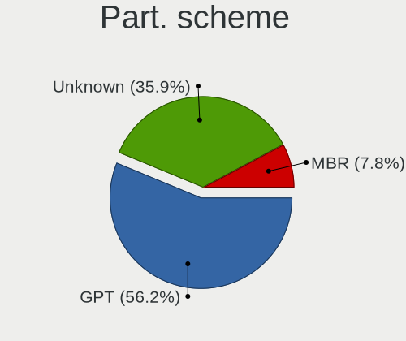
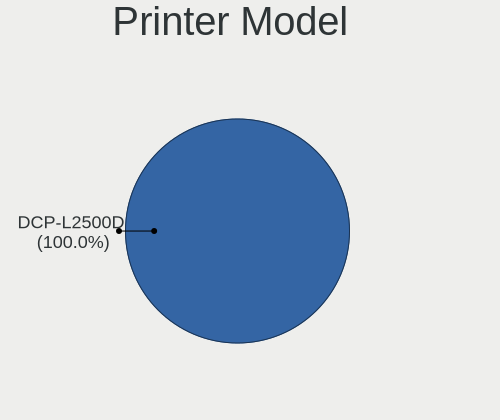

Kubuntu - Hardware Trends (Notebooks)
-------------------------------------

A project to identify most popular hardware characteristics and track their change
over time based on data collected by Linux users at https://Linux-Hardware.org.

Anyone can contribute to this report by the [hw-probe](https://github.com/linuxhw/hw-probe) tool:

    sudo -E hw-probe -all -upload

This report is for one last month. Overall report since the beginning of time: [TestDays](https://github.com/linuxhw/TestDays)

Period: Nov, 2023.

Contents
--------

* [ System ](#system)
  - [ OS                       ](#os)
  - [ OS Family                ](#os-family)
  - [ Kernel                   ](#kernel)
  - [ Kernel Family            ](#kernel-family)
  - [ Kernel Major Ver.        ](#kernel-major-ver)
  - [ Arch                     ](#arch)
  - [ DE                       ](#de)
  - [ Display Server           ](#display-server)
  - [ Display Manager          ](#display-manager)
  - [ OS Lang                  ](#os-lang)
  - [ Boot Mode                ](#boot-mode)
  - [ Filesystem               ](#filesystem)
  - [ Part. scheme             ](#part-scheme)
  - [ Dual Boot with Linux/BSD ](#dual-boot-with-linuxbsd)
  - [ Dual Boot (Win)          ](#dual-boot-win)

* [ Board ](#board)
  - [ Vendor                   ](#vendor)
  - [ Model                    ](#model)
  - [ Model Family             ](#model-family)
  - [ MFG Year                 ](#mfg-year)
  - [ Form Factor              ](#form-factor)
  - [ Secure Boot              ](#secure-boot)
  - [ Coreboot                 ](#coreboot)
  - [ RAM Size                 ](#ram-size)
  - [ RAM Used                 ](#ram-used)
  - [ Total Drives             ](#total-drives)
  - [ Has CD-ROM               ](#has-cd-rom)
  - [ Has Ethernet             ](#has-ethernet)
  - [ Has WiFi                 ](#has-wifi)
  - [ Has Bluetooth            ](#has-bluetooth)

* [ Location ](#location)
  - [ Country                  ](#country)
  - [ City                     ](#city)

* [ Drives ](#drives)
  - [ Drive Vendor             ](#drive-vendor)
  - [ Drive Model              ](#drive-model)
  - [ HDD Vendor               ](#hdd-vendor)
  - [ SSD Vendor               ](#ssd-vendor)
  - [ Drive Kind               ](#drive-kind)
  - [ Drive Connector          ](#drive-connector)
  - [ Drive Size               ](#drive-size)
  - [ Space Total              ](#space-total)
  - [ Space Used               ](#space-used)
  - [ Malfunc. Drives          ](#malfunc-drives)
  - [ Malfunc. Drive Vendor    ](#malfunc-drive-vendor)
  - [ Malfunc. HDD Vendor      ](#malfunc-hdd-vendor)
  - [ Malfunc. Drive Kind      ](#malfunc-drive-kind)
  - [ Failed Drives            ](#failed-drives)
  - [ Failed Drive Vendor      ](#failed-drive-vendor)
  - [ Drive Status             ](#drive-status)

* [ Storage controller ](#storage-controller)
  - [ Storage Vendor           ](#storage-vendor)
  - [ Storage Model            ](#storage-model)
  - [ Storage Kind             ](#storage-kind)

* [ Processor ](#processor)
  - [ CPU Vendor               ](#cpu-vendor)
  - [ CPU Model                ](#cpu-model)
  - [ CPU Model Family         ](#cpu-model-family)
  - [ CPU Cores                ](#cpu-cores)
  - [ CPU Sockets              ](#cpu-sockets)
  - [ CPU Threads              ](#cpu-threads)
  - [ CPU Op-Modes             ](#cpu-op-modes)
  - [ CPU Microcode            ](#cpu-microcode)
  - [ CPU Microarch            ](#cpu-microarch)

* [ Graphics ](#graphics)
  - [ GPU Vendor               ](#gpu-vendor)
  - [ GPU Model                ](#gpu-model)
  - [ GPU Combo                ](#gpu-combo)
  - [ GPU Driver               ](#gpu-driver)
  - [ GPU Memory               ](#gpu-memory)

* [ Monitor ](#monitor)
  - [ Monitor Vendor           ](#monitor-vendor)
  - [ Monitor Model            ](#monitor-model)
  - [ Monitor Resolution       ](#monitor-resolution)
  - [ Monitor Diagonal         ](#monitor-diagonal)
  - [ Monitor Width            ](#monitor-width)
  - [ Aspect Ratio             ](#aspect-ratio)
  - [ Monitor Area             ](#monitor-area)
  - [ Pixel Density            ](#pixel-density)
  - [ Multiple Monitors        ](#multiple-monitors)

* [ Network ](#network)
  - [ Net Controller Vendor    ](#net-controller-vendor)
  - [ Net Controller Model     ](#net-controller-model)
  - [ Wireless Vendor          ](#wireless-vendor)
  - [ Wireless Model           ](#wireless-model)
  - [ Ethernet Vendor          ](#ethernet-vendor)
  - [ Ethernet Model           ](#ethernet-model)
  - [ Net Controller Kind      ](#net-controller-kind)
  - [ Used Controller          ](#used-controller)
  - [ NICs                     ](#nics)
  - [ IPv6                     ](#ipv6)

* [ Bluetooth ](#bluetooth)
  - [ Bluetooth Vendor         ](#bluetooth-vendor)
  - [ Bluetooth Model          ](#bluetooth-model)

* [ Sound ](#sound)
  - [ Sound Vendor             ](#sound-vendor)
  - [ Sound Model              ](#sound-model)

* [ Memory ](#memory)
  - [ Memory Vendor            ](#memory-vendor)
  - [ Memory Model             ](#memory-model)
  - [ Memory Kind              ](#memory-kind)
  - [ Memory Form Factor       ](#memory-form-factor)
  - [ Memory Size              ](#memory-size)
  - [ Memory Speed             ](#memory-speed)

* [ Printers & scanners ](#printers--scanners)
  - [ Printer Vendor           ](#printer-vendor)
  - [ Printer Model            ](#printer-model)
  - [ Scanner Vendor           ](#scanner-vendor)
  - [ Scanner Model            ](#scanner-model)

* [ Camera ](#camera)
  - [ Camera Vendor            ](#camera-vendor)
  - [ Camera Model             ](#camera-model)

* [ Security ](#security)
  - [ Fingerprint Vendor       ](#fingerprint-vendor)
  - [ Fingerprint Model        ](#fingerprint-model)
  - [ Chipcard Vendor          ](#chipcard-vendor)
  - [ Chipcard Model           ](#chipcard-model)

* [ Unsupported ](#unsupported)
  - [ Unsupported Devices      ](#unsupported-devices)
  - [ Unsupported Device Types ](#unsupported-device-types)

System
------

OS
--

Installed operating systems

| Name          | Notebooks | Percent |
|---------------|-----------|---------|
| Kubuntu 23.10 | 31        | 43.66%  |
| Kubuntu 22.04 | 31        | 43.66%  |
| Kubuntu 23.04 | 7         | 9.86%   |
| Kubuntu 20.10 | 2         | 2.82%   |

OS Family
---------

OS without a version

| Name    | Notebooks | Percent |
|---------|-----------|---------|
| Kubuntu | 71        | 100%    |

Kernel
------

Version of the Linux kernel

| Version                | Notebooks | Percent |
|------------------------|-----------|---------|
| 6.5.0-10-generic       | 21        | 29.58%  |
| 6.2.0-36-generic       | 15        | 21.13%  |
| 6.5.0-13-generic       | 4         | 5.63%   |
| 6.2.0-37-generic       | 4         | 5.63%   |
| 5.15.0-88-generic      | 4         | 5.63%   |
| 6.2.0-34-generic       | 3         | 4.23%   |
| 6.5.0-10-lowlatency    | 2         | 2.82%   |
| 6.2.0-35-generic       | 2         | 2.82%   |
| 5.15.0-75-generic      | 2         | 2.82%   |
| 6.6.2-custom           | 1         | 1.41%   |
| 6.5.0-9-generic        | 1         | 1.41%   |
| 6.3.8-x64v3-xanmod1    | 1         | 1.41%   |
| 6.2.16-060216-generic  | 1         | 1.41%   |
| 6.2.0-32-generic       | 1         | 1.41%   |
| 6.2.0-26-generic       | 1         | 1.41%   |
| 6.2.0-1016-lowlatency  | 1         | 1.41%   |
| 5.8.0-63-generic       | 1         | 1.41%   |
| 5.8.0-33-generic       | 1         | 1.41%   |
| 5.8.0-25-generic       | 1         | 1.41%   |
| 5.19.0-1017-lowlatency | 1         | 1.41%   |
| 5.15.0-87-generic      | 1         | 1.41%   |
| 5.15.0-43-generic      | 1         | 1.41%   |
| 5.14.0-1055-oem        | 1         | 1.41%   |

Kernel Family
-------------

Linux kernel without a distro release

| Version | Notebooks | Percent |
|---------|-----------|---------|
| 6.5.0   | 28        | 39.44%  |
| 6.2.0   | 27        | 38.03%  |
| 5.15.0  | 8         | 11.27%  |
| 5.8.0   | 3         | 4.23%   |
| 6.6.2   | 1         | 1.41%   |
| 6.3.8   | 1         | 1.41%   |
| 6.2.16  | 1         | 1.41%   |
| 5.19.0  | 1         | 1.41%   |
| 5.14.0  | 1         | 1.41%   |

Kernel Major Ver.
-----------------

Linux kernel major version

| Version | Notebooks | Percent |
|---------|-----------|---------|
| 6.5     | 28        | 39.44%  |
| 6.2     | 28        | 39.44%  |
| 5.15    | 8         | 11.27%  |
| 5.8     | 3         | 4.23%   |
| 6.6     | 1         | 1.41%   |
| 6.3     | 1         | 1.41%   |
| 5.19    | 1         | 1.41%   |
| 5.14    | 1         | 1.41%   |

Arch
----

OS architecture (x86_64, i586, etc.)

| Name   | Notebooks | Percent |
|--------|-----------|---------|
| x86_64 | 71        | 100%    |

DE
--

Desktop Environment

| Name | Notebooks | Percent |
|------|-----------|---------|
| KDE5 | 69        | 97.18%  |
| KDE  | 2         | 2.82%   |

Display Server
--------------

X11 or Wayland

| Name    | Notebooks | Percent |
|---------|-----------|---------|
| X11     | 63        | 88.73%  |
| Wayland | 8         | 11.27%  |

Display Manager
---------------

SDDM, LightDM, etc.

| Name    | Notebooks | Percent |
|---------|-----------|---------|
| SDDM    | 49        | 69.01%  |
| Unknown | 19        | 26.76%  |
| GDM3    | 3         | 4.23%   |

OS Lang
-------

Language

| Lang  | Notebooks | Percent |
|-------|-----------|---------|
| en_US | 28        | 39.44%  |
| it_IT | 7         | 9.86%   |
| fr_FR | 6         | 8.45%   |
| de_DE | 5         | 7.04%   |
| es_ES | 4         | 5.63%   |
| en_GB | 3         | 4.23%   |
| ru_RU | 2         | 2.82%   |
| hu_HU | 2         | 2.82%   |
| C     | 2         | 2.82%   |
| zh_TW | 1         | 1.41%   |
| uk_UA | 1         | 1.41%   |
| ru_UA | 1         | 1.41%   |
| fr_BE | 1         | 1.41%   |
| es_MX | 1         | 1.41%   |
| es_CR | 1         | 1.41%   |
| en_ZA | 1         | 1.41%   |
| en_PH | 1         | 1.41%   |
| en_NZ | 1         | 1.41%   |
| en_CA | 1         | 1.41%   |
| en_AU | 1         | 1.41%   |
| de_CH | 1         | 1.41%   |

Boot Mode
---------

EFI or BIOS

| Mode | Notebooks | Percent |
|------|-----------|---------|
| EFI  | 41        | 57.75%  |
| BIOS | 30        | 42.25%  |

Filesystem
----------

Type of filesystem

| Type    | Notebooks | Percent |
|---------|-----------|---------|
| Ext4    | 53        | 74.65%  |
| Tmpfs   | 16        | 22.54%  |
| Overlay | 1         | 1.41%   |
| Btrfs   | 1         | 1.41%   |

Part. scheme
------------

Scheme of partitioning

| Type    | Notebooks | Percent |
|---------|-----------|---------|
| GPT     | 47        | 66.2%   |
| Unknown | 19        | 26.76%  |
| MBR     | 5         | 7.04%   |

Dual Boot with Linux/BSD
------------------------

Hosting more than one Linux/BSD

| Dual boot | Notebooks | Percent |
|-----------|-----------|---------|
| No        | 65        | 91.55%  |
| Yes       | 6         | 8.45%   |

Dual Boot (Win)
---------------

Hosting Linux and Windows

| Dual boot | Notebooks | Percent |
|-----------|-----------|---------|
| No        | 41        | 57.75%  |
| Yes       | 30        | 42.25%  |

Board
-----

Vendor
------

Motherboard manufacturer

| Name                             | Notebooks | Percent |
|----------------------------------|-----------|---------|
| Hewlett-Packard                  | 19        | 26.76%  |
| Lenovo                           | 16        | 22.54%  |
| ASUSTek Computer                 | 10        | 14.08%  |
| Dell                             | 8         | 11.27%  |
| Acer                             | 6         | 8.45%   |
| Wortmann AG                      | 1         | 1.41%   |
| Toshiba                          | 1         | 1.41%   |
| Sony                             | 1         | 1.41%   |
| Samsung Electronics              | 1         | 1.41%   |
| PC Specialist                    | 1         | 1.41%   |
| Micro Computer (HK) Tech Limited | 1         | 1.41%   |
| Jumper                           | 1         | 1.41%   |
| HUAWEI                           | 1         | 1.41%   |
| GPU Company                      | 1         | 1.41%   |
| DEXP                             | 1         | 1.41%   |
| CHIPHD                           | 1         | 1.41%   |
| Apple                            | 1         | 1.41%   |

Model
-----

Motherboard model

| Name                                        | Notebooks | Percent |
|---------------------------------------------|-----------|---------|
| Wortmann AG 1220777_1400328                 | 1         | 1.41%   |
| Toshiba Satellite L550                      | 1         | 1.41%   |
| Sony VPCSA3J1E                              | 1         | 1.41%   |
| Samsung 730QCJ/730QCR                       | 1         | 1.41%   |
| PC Specialist Lafite Pro II 15              | 1         | 1.41%   |
| Micro (HK) Tech Limited Venus series        | 1         | 1.41%   |
| Lenovo V17 G3 IAP 82U1                      | 1         | 1.41%   |
| Lenovo ThinkPad X1 Carbon Gen 11 21HMCTO1WW | 1         | 1.41%   |
| Lenovo ThinkPad T480s 20L7001MHV            | 1         | 1.41%   |
| Lenovo ThinkPad T480 20L6S5VP3U             | 1         | 1.41%   |
| Lenovo ThinkPad T14s Gen 3 21CQCTO1WW       | 1         | 1.41%   |
| Lenovo ThinkPad T14 Gen 1 20S00044IX        | 1         | 1.41%   |
| Lenovo ThinkPad P14s Gen 4 21K5001HUS       | 1         | 1.41%   |
| Lenovo ThinkPad L560 20F2S0DA00             | 1         | 1.41%   |
| Lenovo ThinkPad E595 20NFCTO1WW             | 1         | 1.41%   |
| Lenovo ThinkPad E14 Gen 4 21ECS00000        | 1         | 1.41%   |
| Lenovo ThinkBook 14p Gen 3 21EJ             | 1         | 1.41%   |
| Lenovo Legion Y540-15IRH-PG0 81SY           | 1         | 1.41%   |
| Lenovo Legion 5 15ARH05H 82B1               | 1         | 1.41%   |
| Lenovo IdeaPad Pro 5 16APH8 83AR            | 1         | 1.41%   |
| Lenovo IdeaPad 3 15IIL05 81WE               | 1         | 1.41%   |
| Lenovo G550 2958                            | 1         | 1.41%   |
| Jumper EZbook                               | 1         | 1.41%   |
| HUAWEI KPL-W0X                              | 1         | 1.41%   |
| HP ZBook 15 G2                              | 1         | 1.41%   |
| HP ProBook 6570b                            | 1         | 1.41%   |
| HP ProBook 650 G5                           | 1         | 1.41%   |
| HP ProBook 450 G2                           | 1         | 1.41%   |
| HP ProBook 440 G7                           | 1         | 1.41%   |
| HP ProBook 430 G6                           | 1         | 1.41%   |
| HP Pavilion Laptop 15-eg0xxx                | 1         | 1.41%   |
| HP Pavilion Laptop 14-bf0xx                 | 1         | 1.41%   |
| HP Pavilion Gaming Laptop 17-cd2xxx         | 1         | 1.41%   |
| HP Pavilion Gaming Laptop 15-dk0xxx         | 1         | 1.41%   |
| HP Pavilion g6                              | 1         | 1.41%   |
| HP Pavilion 17                              | 1         | 1.41%   |
| HP Pavilion 15                              | 1         | 1.41%   |
| HP Notebook                                 | 1         | 1.41%   |
| HP EliteBook 8470p                          | 1         | 1.41%   |
| HP EliteBook 840 G8 Notebook PC             | 1         | 1.41%   |

Model Family
------------

Motherboard model prefix

| Name                          | Notebooks | Percent |
|-------------------------------|-----------|---------|
| Lenovo ThinkPad               | 9         | 12.68%  |
| HP Pavilion                   | 7         | 9.86%   |
| HP ProBook                    | 5         | 7.04%   |
| Acer Aspire                   | 5         | 7.04%   |
| HP EliteBook                  | 3         | 4.23%   |
| Dell Latitude                 | 3         | 4.23%   |
| Dell Inspiron                 | 3         | 4.23%   |
| ASUS VivoBook                 | 3         | 4.23%   |
| Lenovo Legion                 | 2         | 2.82%   |
| Lenovo IdeaPad                | 2         | 2.82%   |
| ASUS ROG                      | 2         | 2.82%   |
| Wortmann AG 1220777           | 1         | 1.41%   |
| Toshiba Satellite             | 1         | 1.41%   |
| Sony VPCSA3J1E                | 1         | 1.41%   |
| Samsung 730QCJ                | 1         | 1.41%   |
| PC Specialist Lafite          | 1         | 1.41%   |
| Micro (HK) Tech Limited Venus | 1         | 1.41%   |
| Lenovo V17                    | 1         | 1.41%   |
| Lenovo ThinkBook              | 1         | 1.41%   |
| Lenovo G550                   | 1         | 1.41%   |
| Jumper EZbook                 | 1         | 1.41%   |
| HUAWEI KPL-W0X                | 1         | 1.41%   |
| HP ZBook                      | 1         | 1.41%   |
| HP Notebook                   | 1         | 1.41%   |
| HP 355                        | 1         | 1.41%   |
| HP 255                        | 1         | 1.41%   |
| GPU Company GWTN156-2BK       | 1         | 1.41%   |
| DEXP Aquilon                  | 1         | 1.41%   |
| Dell XPS                      | 1         | 1.41%   |
| Dell Precision                | 1         | 1.41%   |
| CHIPHD XM21                   | 1         | 1.41%   |
| ASUS Zenbook                  | 1         | 1.41%   |
| ASUS X555QA                   | 1         | 1.41%   |
| ASUS X541NA                   | 1         | 1.41%   |
| ASUS Q524UQ                   | 1         | 1.41%   |
| ASUS ASUS                     | 1         | 1.41%   |
| Apple MacBookPro8             | 1         | 1.41%   |
| Acer Swift                    | 1         | 1.41%   |

MFG Year
--------

Motherboard manufacture year

| Year | Notebooks | Percent |
|------|-----------|---------|
| 2020 | 10        | 14.08%  |
| 2019 | 10        | 14.08%  |
| 2022 | 8         | 11.27%  |
| 2023 | 6         | 8.45%   |
| 2021 | 6         | 8.45%   |
| 2018 | 6         | 8.45%   |
| 2017 | 5         | 7.04%   |
| 2013 | 4         | 5.63%   |
| 2016 | 3         | 4.23%   |
| 2015 | 3         | 4.23%   |
| 2014 | 3         | 4.23%   |
| 2011 | 3         | 4.23%   |
| 2012 | 2         | 2.82%   |
| 2009 | 2         | 2.82%   |

Form Factor
-----------

Physical design of the computer

| Name     | Notebooks | Percent |
|----------|-----------|---------|
| Notebook | 71        | 100%    |

Secure Boot
-----------

Enabled or disabled

| State    | Notebooks | Percent |
|----------|-----------|---------|
| Disabled | 61        | 85.92%  |
| Enabled  | 10        | 14.08%  |

Coreboot
--------

Have coreboot on board

| Used | Notebooks | Percent |
|------|-----------|---------|
| No   | 71        | 100%    |

RAM Size
--------

Total RAM memory

| Size in GB  | Notebooks | Percent |
|-------------|-----------|---------|
| 4.01-8.0    | 17        | 23.94%  |
| 8.01-16.0   | 15        | 21.13%  |
| 32.01-64.0  | 12        | 16.9%   |
| 16.01-24.0  | 12        | 16.9%   |
| 3.01-4.0    | 9         | 12.68%  |
| 24.01-32.0  | 5         | 7.04%   |
| 64.01-256.0 | 1         | 1.41%   |

RAM Used
--------

Used RAM memory

| Used GB    | Notebooks | Percent |
|------------|-----------|---------|
| 2.01-3.0   | 21        | 29.58%  |
| 4.01-8.0   | 20        | 28.17%  |
| 3.01-4.0   | 14        | 19.72%  |
| 1.01-2.0   | 9         | 12.68%  |
| 8.01-16.0  | 4         | 5.63%   |
| 16.01-24.0 | 2         | 2.82%   |
| 0.51-1.0   | 1         | 1.41%   |

Total Drives
------------

Number of drives on board

| Drives | Notebooks | Percent |
|--------|-----------|---------|
| 1      | 51        | 71.83%  |
| 2      | 16        | 22.54%  |
| 3      | 3         | 4.23%   |
| 0      | 1         | 1.41%   |

Has CD-ROM
----------

Has CD-ROM on board

| Presented | Notebooks | Percent |
|-----------|-----------|---------|
| No        | 54        | 76.06%  |
| Yes       | 17        | 23.94%  |

Has Ethernet
------------

Has Ethernet on board

| Presented | Notebooks | Percent |
|-----------|-----------|---------|
| Yes       | 53        | 74.65%  |
| No        | 18        | 25.35%  |

Has WiFi
--------

Has WiFi module

| Presented | Notebooks | Percent |
|-----------|-----------|---------|
| Yes       | 71        | 100%    |

Has Bluetooth
-------------

Has Bluetooth module

| Presented | Notebooks | Percent |
|-----------|-----------|---------|
| Yes       | 62        | 87.32%  |
| No        | 9         | 12.68%  |

Location
--------

Country
-------

Geographic location (country)

| Country         | Notebooks | Percent |
|-----------------|-----------|---------|
| USA             | 11        | 15.49%  |
| Italy           | 9         | 12.68%  |
| Germany         | 9         | 12.68%  |
| France          | 7         | 9.86%   |
| Spain           | 4         | 5.63%   |
| UK              | 3         | 4.23%   |
| Russia          | 3         | 4.23%   |
| Belgium         | 3         | 4.23%   |
| Hungary         | 2         | 2.82%   |
| Canada          | 2         | 2.82%   |
| Australia       | 2         | 2.82%   |
| Ukraine         | 1         | 1.41%   |
| Turkey          | 1         | 1.41%   |
| Taiwan          | 1         | 1.41%   |
| South Africa    | 1         | 1.41%   |
| Romania         | 1         | 1.41%   |
| Poland          | 1         | 1.41%   |
| Philippines     | 1         | 1.41%   |
| North Macedonia | 1         | 1.41%   |
| Nicaragua       | 1         | 1.41%   |
| Netherlands     | 1         | 1.41%   |
| Montenegro      | 1         | 1.41%   |
| Indonesia       | 1         | 1.41%   |
| Greece          | 1         | 1.41%   |
| Czechia         | 1         | 1.41%   |
| Costa Rica      | 1         | 1.41%   |
| Argentina       | 1         | 1.41%   |

City
----

Geographic location (city)

| City                | Notebooks | Percent |
|---------------------|-----------|---------|
| Milano              | 2         | 2.82%   |
| Brussels            | 2         | 2.82%   |
| Westminster         | 1         | 1.41%   |
| Warsaw              | 1         | 1.41%   |
| Warburg             | 1         | 1.41%   |
| Vitoria-Gasteiz     | 1         | 1.41%   |
| Trier               | 1         | 1.41%   |
| Toronto             | 1         | 1.41%   |
| Thessaloniki        | 1         | 1.41%   |
| Termoli             | 1         | 1.41%   |
| Szeged              | 1         | 1.41%   |
| Sydney              | 1         | 1.41%   |
| Strejnicu           | 1         | 1.41%   |
| Shotts              | 1         | 1.41%   |
| Settimo Torinese    | 1         | 1.41%   |
| Sartrouville        | 1         | 1.41%   |
| San Diego           | 1         | 1.41%   |
| Saint-Avold         | 1         | 1.41%   |
| Rotterdam           | 1         | 1.41%   |
| Prilep              | 1         | 1.41%   |
| Podgorica           | 1         | 1.41%   |
| Plaimpied-Givaudins | 1         | 1.41%   |
| Pilsen              | 1         | 1.41%   |
| Perth               | 1         | 1.41%   |
| Paris               | 1         | 1.41%   |
| Palembang           | 1         | 1.41%   |
| Olathe              | 1         | 1.41%   |
| Nanterre            | 1         | 1.41%   |
| Mühlhausen         | 1         | 1.41%   |
| Morehead City       | 1         | 1.41%   |
| Moncks Corner       | 1         | 1.41%   |
| Milan               | 1         | 1.41%   |
| Martin              | 1         | 1.41%   |
| Managua             | 1         | 1.41%   |
| Madrid              | 1         | 1.41%   |
| Laval               | 1         | 1.41%   |
| Kyiv                | 1         | 1.41%   |
| Koblenz             | 1         | 1.41%   |
| Kazan’            | 1         | 1.41%   |
| Johannesburg        | 1         | 1.41%   |

Drives
------

Drive Vendor
------------

Hard drive vendors

| Vendor                       | Notebooks | Drives | Percent |
|------------------------------|-----------|--------|---------|
| Samsung Electronics          | 16        | 17     | 17.58%  |
| WDC                          | 10        | 10     | 10.99%  |
| SK hynix                     | 9         | 9      | 9.89%   |
| Intel                        | 7         | 7      | 7.69%   |
| Seagate                      | 6         | 7      | 6.59%   |
| Kingston                     | 6         | 6      | 6.59%   |
| Toshiba                      | 5         | 5      | 5.49%   |
| SanDisk                      | 4         | 5      | 4.4%    |
| Unknown                      | 3         | 3      | 3.3%    |
| Micron Technology            | 2         | 2      | 2.2%    |
| XPG                          | 1         | 1      | 1.1%    |
| V-GeN                        | 1         | 1      | 1.1%    |
| UMIS                         | 1         | 1      | 1.1%    |
| Team                         | 1         | 1      | 1.1%    |
| TCSUNBOW                     | 1         | 1      | 1.1%    |
| StoreJet                     | 1         | 1      | 1.1%    |
| SPCC                         | 1         | 1      | 1.1%    |
| Shenzhen Longsys Electronics | 1         | 1      | 1.1%    |
| Patriot                      | 1         | 1      | 1.1%    |
| NT-512                       | 1         | 1      | 1.1%    |
| Micron/Crucial Technology    | 1         | 1      | 1.1%    |
| MAXIO Technology (Hangzhou)  | 1         | 1      | 1.1%    |
| KIOXIA                       | 1         | 1      | 1.1%    |
| KESU                         | 1         | 1      | 1.1%    |
| Hjwdz                        | 1         | 1      | 1.1%    |
| Hitachi                      | 1         | 1      | 1.1%    |
| Hikvision                    | 1         | 1      | 1.1%    |
| GeIL                         | 1         | 1      | 1.1%    |
| Crucial                      | 1         | 1      | 1.1%    |
| Corsair                      | 1         | 1      | 1.1%    |
| China                        | 1         | 1      | 1.1%    |
| BAITITON                     | 1         | 1      | 1.1%    |
| A-DATA Technology            | 1         | 1      | 1.1%    |

Drive Model
-----------

Hard drive models

| Model                                               | Notebooks | Percent |
|-----------------------------------------------------|-----------|---------|
| Toshiba MQ01ABD100 1TB                              | 3         | 3.19%   |
| SK hynix BC711 HFM512GD3JX013N 512GB                | 2         | 2.13%   |
| SK hynix BC501 NVMe Solid State Drive 512GB         | 2         | 2.13%   |
| Seagate ST1000LM035-1RK172 1TB                      | 2         | 2.13%   |
| Samsung NVMe SSD Controller SM981/PM981/PM983 250GB | 2         | 2.13%   |
| Samsung NVMe SSD Controller PM9A1/PM9A3/980PRO 2TB  | 2         | 2.13%   |
| Samsung MZALQ512HALU-000L2 512GB                    | 2         | 2.13%   |
| Kingston SA400S37480G 480GB SSD                     | 2         | 2.13%   |
| Intel SSD 660P Series 512GB                         | 2         | 2.13%   |
| XPG GAMMIX S70 BLADE 2TB                            | 1         | 1.06%   |
| WDC WDS480G2G0C-00AJM0 480GB                        | 1         | 1.06%   |
| WDC WD5000LPLX-60ZNTT2 500GB                        | 1         | 1.06%   |
| WDC WD5000BPVT-80HXZT3 500GB                        | 1         | 1.06%   |
| WDC WD20SPZX-08UA7 2TB                              | 1         | 1.06%   |
| WDC WD10SPZX-60Z10T0 1TB                            | 1         | 1.06%   |
| WDC WD10JPVX-60JC3T0 1TB                            | 1         | 1.06%   |
| WDC WD10JPVT-60A1YT0 1TB                            | 1         | 1.06%   |
| WDC WD Blue SA510 M.2 2280 1000GB                   | 1         | 1.06%   |
| WDC PC SN810 NVMe 1024GB                            | 1         | 1.06%   |
| WDC PC SN520 NVMe 128GB                             | 1         | 1.06%   |
| V-GeN V-GEN12SM22AR512SDK 512GB                     | 1         | 1.06%   |
| Unknown SD/MMC/MS PRO 128GB                         | 1         | 1.06%   |
| Unknown NVMe SSD Drive 2TB                          | 1         | 1.06%   |
| Unknown 064G30  64GB                                | 1         | 1.06%   |
| UMIS RPJTJ512MGE1QDQ 512GB                          | 1         | 1.06%   |
| Toshiba MK4055GSX 400GB                             | 1         | 1.06%   |
| Toshiba BG3 NVMe SSD Controller 128GB               | 1         | 1.06%   |
| Team T2532TB SSD                                    | 1         | 1.06%   |
| TCSUNBOW X3 240GB SSD                               | 1         | 1.06%   |
| StoreJet Transcend 752GB                            | 1         | 1.06%   |
| SPCC Solid State Disk 512GB                         | 1         | 1.06%   |
| SK hynix SKHynix_HFS001TEJ9X162N 1TB                | 1         | 1.06%   |
| SK hynix SKHynix_HFS001TEJ4X112N 1TB                | 1         | 1.06%   |
| SK hynix HFM512GDJTNI-82A0A 512GB                   | 1         | 1.06%   |
| SK hynix HFM128GDJTNG-8310A 128GB                   | 1         | 1.06%   |
| SK hynix BC511 512GB                                | 1         | 1.06%   |
| Shenzhen Longsys Lexar SSD NM790 1TB                | 1         | 1.06%   |
| Seagate ST9250315AS 250GB                           | 1         | 1.06%   |
| Seagate ST750LM022 HN-M750MBB 752GB                 | 1         | 1.06%   |
| Seagate ST2000LM003 HN-M201RAD 2TB                  | 1         | 1.06%   |

HDD Vendor
----------

Hard disk drive vendors

| Vendor   | Notebooks | Drives | Percent |
|----------|-----------|--------|---------|
| WDC      | 6         | 6      | 30%     |
| Seagate  | 6         | 7      | 30%     |
| Toshiba  | 4         | 4      | 20%     |
| Unknown  | 1         | 1      | 5%      |
| StoreJet | 1         | 1      | 5%      |
| KESU     | 1         | 1      | 5%      |
| Hitachi  | 1         | 1      | 5%      |

SSD Vendor
----------

Solid state drive vendors

| Vendor              | Notebooks | Drives | Percent |
|---------------------|-----------|--------|---------|
| Kingston            | 5         | 5      | 22.73%  |
| Samsung Electronics | 3         | 3      | 13.64%  |
| Intel               | 2         | 2      | 9.09%   |
| WDC                 | 1         | 1      | 4.55%   |
| Team                | 1         | 1      | 4.55%   |
| TCSUNBOW            | 1         | 1      | 4.55%   |
| SPCC                | 1         | 1      | 4.55%   |
| SanDisk             | 1         | 1      | 4.55%   |
| Patriot             | 1         | 1      | 4.55%   |
| NT-512              | 1         | 1      | 4.55%   |
| GeIL                | 1         | 1      | 4.55%   |
| Crucial             | 1         | 1      | 4.55%   |
| China               | 1         | 1      | 4.55%   |
| BAITITON            | 1         | 1      | 4.55%   |
| A-DATA Technology   | 1         | 1      | 4.55%   |

Drive Kind
----------

HDD or SSD

| Kind    | Notebooks | Drives | Percent |
|---------|-----------|--------|---------|
| NVMe    | 43        | 47     | 48.86%  |
| SSD     | 22        | 22     | 25%     |
| HDD     | 19        | 21     | 21.59%  |
| MMC     | 2         | 2      | 2.27%   |
| Unknown | 2         | 2      | 2.27%   |

Drive Connector
---------------

SATA, SAS, NVMe, etc.

| Type | Notebooks | Drives | Percent |
|------|-----------|--------|---------|
| NVMe | 43        | 47     | 51.19%  |
| SATA | 34        | 40     | 40.48%  |
| SAS  | 5         | 5      | 5.95%   |
| MMC  | 2         | 2      | 2.38%   |

Drive Size
----------

Size of hard drive

| Size in TB | Notebooks | Drives | Percent |
|------------|-----------|--------|---------|
| 0.01-0.5   | 19        | 21     | 48.72%  |
| 0.51-1.0   | 15        | 17     | 38.46%  |
| 1.01-2.0   | 5         | 5      | 12.82%  |

Space Total
-----------

Amount of disk space available on the file system

| Size in GB     | Notebooks | Percent |
|----------------|-----------|---------|
| 101-250        | 20        | 28.17%  |
| 501-1000       | 16        | 22.54%  |
| 251-500        | 15        | 21.13%  |
| 1001-2000      | 11        | 15.49%  |
| 1-20           | 3         | 4.23%   |
| 51-100         | 3         | 4.23%   |
| 2001-3000      | 2         | 2.82%   |
| More than 3000 | 1         | 1.41%   |

Space Used
----------

Amount of used disk space

| Used GB   | Notebooks | Percent |
|-----------|-----------|---------|
| 1-20      | 14        | 19.72%  |
| 101-250   | 13        | 18.31%  |
| 501-1000  | 12        | 16.9%   |
| 251-500   | 10        | 14.08%  |
| 21-50     | 10        | 14.08%  |
| 51-100    | 10        | 14.08%  |
| 1001-2000 | 2         | 2.82%   |

Malfunc. Drives
---------------

Drive models with a malfunction

| Model                               | Notebooks | Drives | Percent |
|-------------------------------------|-----------|--------|---------|
| Seagate ST750LM022 HN-M750MBB 752GB | 1         | 1      | 50%     |
| Kingston SA400S37480G 480GB SSD     | 1         | 1      | 50%     |

Malfunc. Drive Vendor
---------------------

Vendors of faulty drives

| Vendor   | Notebooks | Drives | Percent |
|----------|-----------|--------|---------|
| Seagate  | 1         | 1      | 50%     |
| Kingston | 1         | 1      | 50%     |

Malfunc. HDD Vendor
-------------------

Vendors of faulty HDD drives

| Vendor  | Notebooks | Drives | Percent |
|---------|-----------|--------|---------|
| Seagate | 1         | 1      | 100%    |

Malfunc. Drive Kind
-------------------

Kinds of faulty drives

| Kind | Notebooks | Drives | Percent |
|------|-----------|--------|---------|
| SSD  | 1         | 1      | 50%     |
| HDD  | 1         | 1      | 50%     |

Failed Drives
-------------

Failed drive models

Zero info for selected period =(

Failed Drive Vendor
-------------------

Failed drive vendors

Zero info for selected period =(

Drive Status
------------

Number of failed and malfunc. drives

| Status   | Notebooks | Drives | Percent |
|----------|-----------|--------|---------|
| Detected | 37        | 49     | 49.33%  |
| Works    | 36        | 43     | 48%     |
| Malfunc  | 2         | 2      | 2.67%   |

Storage controller
------------------

Storage Vendor
--------------

Storage controller vendors

| Vendor                       | Notebooks | Percent |
|------------------------------|-----------|---------|
| Intel                        | 46        | 47.92%  |
| Samsung Electronics          | 13        | 13.54%  |
| AMD                          | 10        | 10.42%  |
| SK hynix                     | 9         | 9.38%   |
| SanDisk                      | 5         | 5.21%   |
| Micron Technology            | 2         | 2.08%   |
| Union Memory (Shenzhen)      | 1         | 1.04%   |
| Toshiba America Info Systems | 1         | 1.04%   |
| Solidigm                     | 1         | 1.04%   |
| Silicon Motion               | 1         | 1.04%   |
| Shenzhen Longsys Electronics | 1         | 1.04%   |
| Phison Electronics           | 1         | 1.04%   |
| Micron/Crucial Technology    | 1         | 1.04%   |
| MAXIO Technology (Hangzhou)  | 1         | 1.04%   |
| KIOXIA                       | 1         | 1.04%   |
| Kingston Technology Company  | 1         | 1.04%   |
| ADATA Technology             | 1         | 1.04%   |

Storage Model
-------------

Storage controller models

| Model                                                                    | Notebooks | Percent |
|--------------------------------------------------------------------------|-----------|---------|
| AMD FCH SATA Controller [AHCI mode]                                      | 10        | 9.52%   |
| Intel Volume Management Device NVMe RAID Controller                      | 8         | 7.62%   |
| Samsung NVMe SSD Controller 980 (DRAM-less)                              | 5         | 4.76%   |
| Intel Sunrise Point-LP SATA Controller [AHCI mode]                       | 5         | 4.76%   |
| Samsung NVMe SSD Controller SM981/PM981/PM983                            | 4         | 3.81%   |
| Intel Wildcat Point-LP SATA Controller [AHCI Mode]                       | 4         | 3.81%   |
| Intel Tiger Lake-LP SATA Controller                                      | 4         | 3.81%   |
| Intel 82801 Mobile SATA Controller [RAID mode]                           | 4         | 3.81%   |
| Intel 7 Series Chipset Family 6-port SATA Controller [AHCI mode]         | 4         | 3.81%   |
| SK hynix BC501 NVMe Solid State Drive                                    | 3         | 2.86%   |
| Samsung NVMe SSD Controller PM9A1/PM9A3/980PRO                           | 3         | 2.86%   |
| Intel SSD 660P Series                                                    | 3         | 2.86%   |
| Intel Celeron N3350/Pentium N4200/Atom E3900 Series SATA AHCI Controller | 3         | 2.86%   |
| Intel Cannon Lake Mobile PCH SATA AHCI Controller                        | 3         | 2.86%   |
| SK hynix Gold P31/BC711/PC711 NVMe Solid State Drive                     | 2         | 1.9%    |
| SK hynix BC511 NVMe SSD                                                  | 2         | 1.9%    |
| SanDisk WD Black SN770 / PC SN740 256GB / PC SN560 (DRAM-less) NVMe SSD  | 2         | 1.9%    |
| Intel Tiger Lake SATA AHCI Controller                                    | 2         | 1.9%    |
| Intel SSD 670p Series [Keystone Harbor]                                  | 2         | 1.9%    |
| Intel Ice Lake-LP SATA Controller [AHCI mode]                            | 2         | 1.9%    |
| Intel Cannon Point-LP SATA Controller [AHCI Mode]                        | 2         | 1.9%    |
| Intel 82801IBM/IEM (ICH9M/ICH9M-E) 4 port SATA Controller [AHCI mode]    | 2         | 1.9%    |
| Union Memory (Shenzhen) AM630 PCIe 4.0 x4 NVMe SSD Controller            | 1         | 0.95%   |
| Toshiba America Info Systems BG3 x2 NVMe SSD Controller (DRAM-less)      | 1         | 0.95%   |
| Solidigm P41 Plus NVMe SSD (DRAM-less) [Echo Harbor]                     | 1         | 0.95%   |
| SK hynix Platinum P41/PC801 NVMe Solid State Drive                       | 1         | 0.95%   |
| SK hynix BC901 NVMe Solid State Drive (DRAM-less)                        | 1         | 0.95%   |
| Silicon Motion SM2263EN/SM2263XT (DRAM-less) NVMe SSD Controllers        | 1         | 0.95%   |
| Shenzhen Longsys Non-Volatile memory controller                          | 1         | 0.95%   |
| SanDisk WD PC SN810 / Black SN850 NVMe SSD                               | 1         | 0.95%   |
| SanDisk WD Green SN350 240GB (DRAM-less) / SN560E NVMe SSD               | 1         | 0.95%   |
| SanDisk PC SN520 x2 M.2 2230 NVMe SSD                                    | 1         | 0.95%   |
| SanDisk Extreme Pro / WD Black SN750 / PC SN730 / Red SN700 NVMe SSD     | 1         | 0.95%   |
| Samsung NVMe SSD Controller PM9B1 (DRAM-less)                            | 1         | 0.95%   |
| Phison E12 NVMe Controller                                               | 1         | 0.95%   |
| Micron/Crucial P2 [Nick P2] / P3 / P3 Plus NVMe PCIe SSD (DRAM-less)     | 1         | 0.95%   |
| Micron 3400 NVMe SSD [Hendrix]                                           | 1         | 0.95%   |
| Micron 2450 NVMe SSD [HendrixV] (DRAM-less)                              | 1         | 0.95%   |
| MAXIO (Hangzhou) NVMe SSD Controller MAP1202                             | 1         | 0.95%   |
| KIOXIA NVMe SSD Controller BG4 (DRAM-less)                               | 1         | 0.95%   |

Storage Kind
------------

Kind of storage controller (IDE, SATA, NVMe, SAS, ...)

| Kind | Notebooks | Percent |
|------|-----------|---------|
| SATA | 47        | 46.08%  |
| NVMe | 43        | 42.16%  |
| RAID | 12        | 11.76%  |

Processor
---------

CPU Vendor
----------

Processor vendors

| Vendor | Notebooks | Percent |
|--------|-----------|---------|
| Intel  | 54        | 76.06%  |
| AMD    | 17        | 23.94%  |

CPU Model
---------

Processor models

| Model                                         | Notebooks | Percent |
|-----------------------------------------------|-----------|---------|
| Intel Core i7-9750H CPU @ 2.60GHz             | 2         | 2.82%   |
| Intel Core i7-5500U CPU @ 2.40GHz             | 2         | 2.82%   |
| Intel Core i7-10510U CPU @ 1.80GHz            | 2         | 2.82%   |
| Intel Celeron CPU N3450 @ 1.10GHz             | 2         | 2.82%   |
| Intel 11th Gen Core i7-11850H @ 2.50GHz       | 2         | 2.82%   |
| Intel 11th Gen Core i7-1165G7 @ 2.80GHz       | 2         | 2.82%   |
| Intel 11th Gen Core i3-1115G4 @ 3.00GHz       | 2         | 2.82%   |
| AMD Ryzen 7 6800H with Radeon Graphics        | 2         | 2.82%   |
| AMD Ryzen 5 3500U with Radeon Vega Mobile Gfx | 2         | 2.82%   |
| Intel Pentium Dual-Core CPU T4300 @ 2.10GHz   | 1         | 1.41%   |
| Intel Pentium CPU N4200 @ 1.10GHz             | 1         | 1.41%   |
| Intel Core i9-8950HK CPU @ 2.90GHz            | 1         | 1.41%   |
| Intel Core i7-8550U CPU @ 1.80GHz             | 1         | 1.41%   |
| Intel Core i7-7500U CPU @ 2.70GHz             | 1         | 1.41%   |
| Intel Core i7-6600U CPU @ 2.60GHz             | 1         | 1.41%   |
| Intel Core i7-6500U CPU @ 2.50GHz             | 1         | 1.41%   |
| Intel Core i7-5600U CPU @ 2.60GHz             | 1         | 1.41%   |
| Intel Core i7-2640M CPU @ 2.80GHz             | 1         | 1.41%   |
| Intel Core i5-9300H CPU @ 2.40GHz             | 1         | 1.41%   |
| Intel Core i5-8350U CPU @ 1.70GHz             | 1         | 1.41%   |
| Intel Core i5-8265U CPU @ 1.60GHz             | 1         | 1.41%   |
| Intel Core i5-8250U CPU @ 1.60GHz             | 1         | 1.41%   |
| Intel Core i5-7200U CPU @ 2.50GHz             | 1         | 1.41%   |
| Intel Core i5-6200U CPU @ 2.30GHz             | 1         | 1.41%   |
| Intel Core i5-5300U CPU @ 2.30GHz             | 1         | 1.41%   |
| Intel Core i5-4210M CPU @ 2.60GHz             | 1         | 1.41%   |
| Intel Core i5-4200U CPU @ 1.60GHz             | 1         | 1.41%   |
| Intel Core i5-3360M CPU @ 2.80GHz             | 1         | 1.41%   |
| Intel Core i5-3230M CPU @ 2.60GHz             | 1         | 1.41%   |
| Intel Core i5-3210M CPU @ 2.50GHz             | 1         | 1.41%   |
| Intel Core i5-2430M CPU @ 2.40GHz             | 1         | 1.41%   |
| Intel Core i5-1035G1 CPU @ 1.00GHz            | 1         | 1.41%   |
| Intel Core i5-10210U CPU @ 1.60GHz            | 1         | 1.41%   |
| Intel Core i3-N305                            | 1         | 1.41%   |
| Intel Core i3-8145U CPU @ 2.10GHz             | 1         | 1.41%   |
| Intel Core i3-6006U CPU @ 2.00GHz             | 1         | 1.41%   |
| Intel Core i3-3217U CPU @ 1.80GHz             | 1         | 1.41%   |
| Intel Core i3-1005G1 CPU @ 1.20GHz            | 1         | 1.41%   |
| Intel Core 2 Duo CPU T6500 @ 2.10GHz          | 1         | 1.41%   |
| Intel Celeron N4020 CPU @ 1.10GHz             | 1         | 1.41%   |

CPU Model Family
----------------

Processor model prefix

| Model                   | Notebooks | Percent |
|-------------------------|-----------|---------|
| Other                   | 15        | 21.13%  |
| Intel Core i5           | 15        | 21.13%  |
| Intel Core i7           | 12        | 16.9%   |
| AMD Ryzen 7             | 6         | 8.45%   |
| Intel Core i3           | 5         | 7.04%   |
| AMD Ryzen 5             | 5         | 7.04%   |
| Intel Celeron           | 3         | 4.23%   |
| AMD Ryzen 7 PRO         | 2         | 2.82%   |
| Intel Pentium Dual-Core | 1         | 1.41%   |
| Intel Pentium           | 1         | 1.41%   |
| Intel Core i9           | 1         | 1.41%   |
| Intel Core 2 Duo        | 1         | 1.41%   |
| AMD Ryzen 3             | 1         | 1.41%   |
| AMD A8                  | 1         | 1.41%   |
| AMD A6                  | 1         | 1.41%   |
| AMD A10                 | 1         | 1.41%   |

CPU Cores
---------

Number of processor cores

| Number | Notebooks | Percent |
|--------|-----------|---------|
| 2      | 27        | 38.03%  |
| 4      | 22        | 30.99%  |
| 8      | 10        | 14.08%  |
| 6      | 5         | 7.04%   |
| 14     | 3         | 4.23%   |
| 12     | 2         | 2.82%   |
| 10     | 1         | 1.41%   |
| 1      | 1         | 1.41%   |

CPU Sockets
-----------

Number of sockets

| Number | Notebooks | Percent |
|--------|-----------|---------|
| 1      | 71        | 100%    |

CPU Threads
-----------

Threads per core (Hyper-Threading)

| Number | Notebooks | Percent |
|--------|-----------|---------|
| 2      | 60        | 84.51%  |
| 1      | 11        | 15.49%  |

CPU Op-Modes
------------

CPU Operation Modes (32-bit, 64-bit)

| Op mode        | Notebooks | Percent |
|----------------|-----------|---------|
| 32-bit, 64-bit | 71        | 100%    |

CPU Microcode
-------------

Microcode number

| Number     | Notebooks | Percent |
|------------|-----------|---------|
| Unknown    | 58        | 81.69%  |
| 0x306a9    | 2         | 2.82%   |
| 0x08108102 | 2         | 2.82%   |
| 0x906ea    | 1         | 1.41%   |
| 0x806c1    | 1         | 1.41%   |
| 0x0a704103 | 1         | 1.41%   |
| 0x0a50000d | 1         | 1.41%   |
| 0x0a404102 | 1         | 1.41%   |
| 0x08600104 | 1         | 1.41%   |
| 0x08600103 | 1         | 1.41%   |
| 0x08108109 | 1         | 1.41%   |
| 0x08101016 | 1         | 1.41%   |

CPU Microarch
-------------

Microarchitecture

| Name             | Notebooks | Percent |
|------------------|-----------|---------|
| KabyLake         | 14        | 19.72%  |
| Unknown          | 8         | 11.27%  |
| TigerLake        | 7         | 9.86%   |
| Alderlake Hybrid | 5         | 7.04%   |
| Zen+             | 4         | 5.63%   |
| Skylake          | 4         | 5.63%   |
| IvyBridge        | 4         | 5.63%   |
| Broadwell        | 4         | 5.63%   |
| Zen 2            | 3         | 4.23%   |
| Icelake          | 3         | 4.23%   |
| Goldmont         | 3         | 4.23%   |
| SandyBridge      | 2         | 2.82%   |
| Penryn           | 2         | 2.82%   |
| Haswell          | 2         | 2.82%   |
| Zen 3            | 1         | 1.41%   |
| Zen              | 1         | 1.41%   |
| Puma             | 1         | 1.41%   |
| Piledriver       | 1         | 1.41%   |
| Goldmont plus    | 1         | 1.41%   |
| Excavator        | 1         | 1.41%   |

Graphics
--------

GPU Vendor
----------

Vendors of graphics cards

| Vendor | Notebooks | Percent |
|--------|-----------|---------|
| Intel  | 53        | 57.61%  |
| AMD    | 22        | 23.91%  |
| Nvidia | 17        | 18.48%  |

GPU Model
---------

Graphics card models

| Model                                                                         | Notebooks | Percent |
|-------------------------------------------------------------------------------|-----------|---------|
| Nvidia TU117M [GeForce GTX 1650 Mobile / Max-Q]                               | 5         | 5.32%   |
| Intel TigerLake-LP GT2 [Iris Xe Graphics]                                     | 5         | 5.32%   |
| Intel Skylake GT2 [HD Graphics 520]                                           | 4         | 4.26%   |
| Intel HD Graphics 5500                                                        | 4         | 4.26%   |
| Intel CoffeeLake-H GT2 [UHD Graphics 630]                                     | 4         | 4.26%   |
| Intel 3rd Gen Core processor Graphics Controller                              | 4         | 4.26%   |
| AMD Picasso/Raven 2 [Radeon Vega Series / Radeon Vega Mobile Series]          | 4         | 4.26%   |
| Intel UHD Graphics 620                                                        | 3         | 3.19%   |
| Intel CometLake-U GT2 [UHD Graphics]                                          | 3         | 3.19%   |
| Intel Alder Lake-P GT2 [Iris Xe Graphics]                                     | 3         | 3.19%   |
| AMD Sun XT [Radeon HD 8670A/8670M/8690M / R5 M330 / M430 / Radeon 520 Mobile] | 3         | 3.19%   |
| AMD Renoir [Radeon RX Vega 6 (Ryzen 4000/5000 Mobile Series)]                 | 3         | 3.19%   |
| AMD Rembrandt [Radeon 680M]                                                   | 3         | 3.19%   |
| Intel WhiskeyLake-U GT2 [UHD Graphics 620]                                    | 2         | 2.13%   |
| Intel TigerLake-H GT1 [UHD Graphics]                                          | 2         | 2.13%   |
| Intel Tiger Lake-LP GT2 [UHD Graphics G4]                                     | 2         | 2.13%   |
| Intel Iris Plus Graphics G1 (Ice Lake)                                        | 2         | 2.13%   |
| Intel HD Graphics 620                                                         | 2         | 2.13%   |
| Intel HD Graphics 500                                                         | 2         | 2.13%   |
| Intel 2nd Generation Core Processor Family Integrated Graphics Controller     | 2         | 2.13%   |
| AMD Phoenix1                                                                  | 2         | 2.13%   |
| Nvidia TU117M [GeForce MX450]                                                 | 1         | 1.06%   |
| Nvidia TU117GLM [T600 Mobile]                                                 | 1         | 1.06%   |
| Nvidia TU106M [GeForce RTX 2060 Mobile]                                       | 1         | 1.06%   |
| Nvidia GP108M [GeForce MX250]                                                 | 1         | 1.06%   |
| Nvidia GP107M [GeForce GTX 1050 Ti Mobile]                                    | 1         | 1.06%   |
| Nvidia GM108M [GeForce MX130]                                                 | 1         | 1.06%   |
| Nvidia GM108M [GeForce 940MX]                                                 | 1         | 1.06%   |
| Nvidia GM108M [GeForce 840M]                                                  | 1         | 1.06%   |
| Nvidia GM107 [GeForce 940MX]                                                  | 1         | 1.06%   |
| Nvidia GK107GLM [Quadro K1100M]                                               | 1         | 1.06%   |
| Nvidia GA107M [GeForce RTX 3050 Mobile]                                       | 1         | 1.06%   |
| Nvidia GA104 [Geforce RTX 3070 Ti Laptop GPU]                                 | 1         | 1.06%   |
| Intel Raptor Lake-P [Iris Xe Graphics]                                        | 1         | 1.06%   |
| Intel Mobile 4 Series Chipset Integrated Graphics Controller                  | 1         | 1.06%   |
| Intel Haswell-ULT Integrated Graphics Controller                              | 1         | 1.06%   |
| Intel GeminiLake [UHD Graphics 600]                                           | 1         | 1.06%   |
| Intel Apollo Lake [HD Graphics 505]                                           | 1         | 1.06%   |
| Intel Alder Lake-UP3 GT2 [UHD Graphics]                                       | 1         | 1.06%   |
| Intel Alder Lake-P Integrated Graphics Controller                             | 1         | 1.06%   |

GPU Combo
---------

Combinations of graphics cards

| Name           | Notebooks | Percent |
|----------------|-----------|---------|
| 1 x Intel      | 34        | 47.89%  |
| Intel + Nvidia | 15        | 21.13%  |
| 1 x AMD        | 14        | 19.72%  |
| Intel + AMD    | 4         | 5.63%   |
| 2 x AMD        | 2         | 2.82%   |
| AMD + Nvidia   | 2         | 2.82%   |

GPU Driver
----------

Free vs proprietary

| Driver      | Notebooks | Percent |
|-------------|-----------|---------|
| Free        | 61        | 85.92%  |
| Proprietary | 10        | 14.08%  |

GPU Memory
----------

Total video memory

| Size in GB | Notebooks | Percent |
|------------|-----------|---------|
| Unknown    | 56        | 78.87%  |
| 1.01-2.0   | 6         | 8.45%   |
| 0.51-1.0   | 4         | 5.63%   |
| 0.01-0.5   | 3         | 4.23%   |
| 3.01-4.0   | 2         | 2.82%   |

Monitor
-------

Monitor Vendor
--------------

Monitor vendors

| Vendor              | Notebooks | Percent |
|---------------------|-----------|---------|
| BOE                 | 23        | 25.56%  |
| Chimei Innolux      | 13        | 14.44%  |
| AU Optronics        | 11        | 12.22%  |
| Samsung Electronics | 9         | 10%     |
| LG Display          | 9         | 10%     |
| Dell                | 5         | 5.56%   |
| PANDA               | 3         | 3.33%   |
| Goldstar            | 2         | 2.22%   |
| TXD                 | 1         | 1.11%   |
| Sharp               | 1         | 1.11%   |
| Philips             | 1         | 1.11%   |
| MSI                 | 1         | 1.11%   |
| Hewlett-Packard     | 1         | 1.11%   |
| GreenWood           | 1         | 1.11%   |
| Gigabyte Technology | 1         | 1.11%   |
| CSO                 | 1         | 1.11%   |
| Compal              | 1         | 1.11%   |
| BenQ                | 1         | 1.11%   |
| Belinea             | 1         | 1.11%   |
| ASUSTek Computer    | 1         | 1.11%   |
| Apple               | 1         | 1.11%   |
| AOC                 | 1         | 1.11%   |
| Acer                | 1         | 1.11%   |

Monitor Model
-------------

Monitor models

| Model                                                                 | Notebooks | Percent |
|-----------------------------------------------------------------------|-----------|---------|
| Chimei Innolux LCD Monitor CMN14D4 1920x1080 309x173mm 13.9-inch      | 3         | 3.26%   |
| AU Optronics LCD Monitor AUO71EC 1366x768 344x193mm 15.5-inch         | 2         | 2.17%   |
| AU Optronics LCD Monitor AUO21ED 1920x1080 344x194mm 15.5-inch        | 2         | 2.17%   |
| TXD HDMI TXD2360 1920x1080                                            | 1         | 1.09%   |
| Sharp LCD Monitor SHP149A 1920x1080 344x194mm 15.5-inch               | 1         | 1.09%   |
| Samsung Electronics S24D330 SAM0D92 1920x1080 531x299mm 24.0-inch     | 1         | 1.09%   |
| Samsung Electronics S22F350 SAM0D1A 1920x1080 477x268mm 21.5-inch     | 1         | 1.09%   |
| Samsung Electronics LCD Monitor SEC544B 1600x900 382x215mm 17.3-inch  | 1         | 1.09%   |
| Samsung Electronics LCD Monitor SEC325A 1366x768 344x194mm 15.5-inch  | 1         | 1.09%   |
| Samsung Electronics LCD Monitor SDC4A51 1366x768 344x194mm 15.5-inch  | 1         | 1.09%   |
| Samsung Electronics LCD Monitor SDC4951 1366x768 344x194mm 15.5-inch  | 1         | 1.09%   |
| Samsung Electronics LCD Monitor SDC4193 2880x1800 302x189mm 14.0-inch | 1         | 1.09%   |
| Samsung Electronics LCD Monitor SDC415F 3840x2160 344x194mm 15.5-inch | 1         | 1.09%   |
| Samsung Electronics LCD Monitor SDC3654 1600x900 382x215mm 17.3-inch  | 1         | 1.09%   |
| Samsung Electronics LC24RG50 SAM0F90 1920x1080 532x304mm 24.1-inch    | 1         | 1.09%   |
| Philips PHL 241B7Q PHL0909 1920x1080 527x296mm 23.8-inch              | 1         | 1.09%   |
| PANDA LCD Monitor NCP003F 1920x1080 344x194mm 15.5-inch               | 1         | 1.09%   |
| PANDA LCD Monitor NCP003D 1920x1080 344x194mm 15.5-inch               | 1         | 1.09%   |
| PANDA LCD Monitor NCP0036 1920x1080 344x194mm 15.5-inch               | 1         | 1.09%   |
| MSI MAG322CQRV MSI3DA4 2560x1440 700x390mm 31.5-inch                  | 1         | 1.09%   |
| LG Display LP156WH2-TLAA LGD0230 1366x768 344x194mm 15.5-inch         | 1         | 1.09%   |
| LG Display LCD Monitor LGD06CF 1920x1080 344x194mm 15.5-inch          | 1         | 1.09%   |
| LG Display LCD Monitor LGD065A 1920x1080 344x194mm 15.5-inch          | 1         | 1.09%   |
| LG Display LCD Monitor LGD0611 1920x1080 382x215mm 17.3-inch          | 1         | 1.09%   |
| LG Display LCD Monitor LGD060F 1920x1080 309x174mm 14.0-inch          | 1         | 1.09%   |
| LG Display LCD Monitor LGD05FA 1920x1080 310x170mm 13.9-inch          | 1         | 1.09%   |
| LG Display LCD Monitor LGD0563 1920x1080 344x194mm 15.5-inch          | 1         | 1.09%   |
| LG Display LCD Monitor LGD0465 1366x768 344x194mm 15.5-inch           | 1         | 1.09%   |
| LG Display LCD Monitor LGD034D 1366x768 344x194mm 15.5-inch           | 1         | 1.09%   |
| Hewlett-Packard 24w HPN3431 1920x1080 527x296mm 23.8-inch             | 1         | 1.09%   |
| GreenWood ARZOPA GWD1580 1920x1080 350x200mm 15.9-inch                | 1         | 1.09%   |
| Goldstar QHD GSM7729 2560x1440 697x392mm 31.5-inch                    | 1         | 1.09%   |
| Goldstar 27GL850 GSM5B80 2560x1440 697x392mm 31.5-inch                | 1         | 1.09%   |
| Gigabyte Technology G32QC GBT3200 2560x1440 697x392mm 31.5-inch       | 1         | 1.09%   |
| Dell S2722DZ DEL4264 2560x1440 597x336mm 27.0-inch                    | 1         | 1.09%   |
| Dell S2409W DELA039 1920x1080 531x298mm 24.0-inch                     | 1         | 1.09%   |
| Dell S2340L DELD058 1920x1080 509x286mm 23.0-inch                     | 1         | 1.09%   |
| Dell P2417H DELA0DC 1920x1080 527x296mm 23.8-inch                     | 1         | 1.09%   |
| Dell P2417H DELA0DB 1920x1080 527x296mm 23.8-inch                     | 1         | 1.09%   |
| Dell AW2518HF DELA103 1920x1080 544x303mm 24.5-inch                   | 1         | 1.09%   |

Monitor Resolution
------------------

Monitor screen resolution

| Resolution        | Notebooks | Percent |
|-------------------|-----------|---------|
| 1920x1080 (FHD)   | 45        | 55.56%  |
| 1366x768 (WXGA)   | 17        | 20.99%  |
| 2560x1440 (QHD)   | 6         | 7.41%   |
| 1600x900 (HD+)    | 3         | 3.7%    |
| 3840x2160 (4K)    | 2         | 2.47%   |
| 1920x1200 (WUXGA) | 2         | 2.47%   |
| 3840x1100         | 1         | 1.23%   |
| 2880x1800         | 1         | 1.23%   |
| 2560x1600         | 1         | 1.23%   |
| 2240x1400         | 1         | 1.23%   |
| 1280x800 (WXGA)   | 1         | 1.23%   |
| 1280x1024 (SXGA)  | 1         | 1.23%   |

Monitor Diagonal
----------------

Diagonal size in inches

| Inches  | Notebooks | Percent |
|---------|-----------|---------|
| 15      | 38        | 42.7%   |
| 14      | 14        | 15.73%  |
| 13      | 10        | 11.24%  |
| 24      | 6         | 6.74%   |
| 17      | 6         | 6.74%   |
| 31      | 5         | 5.62%   |
| 23      | 3         | 3.37%   |
| 27      | 2         | 2.25%   |
| 21      | 1         | 1.12%   |
| 19      | 1         | 1.12%   |
| 16      | 1         | 1.12%   |
| 12      | 1         | 1.12%   |
| Unknown | 1         | 1.12%   |

Monitor Width
-------------

Physical width

| Width in mm | Notebooks | Percent |
|-------------|-----------|---------|
| 301-350     | 58        | 68.24%  |
| 501-600     | 10        | 11.76%  |
| 351-400     | 6         | 7.06%   |
| 601-700     | 5         | 5.88%   |
| 201-300     | 4         | 4.71%   |
| 401-500     | 1         | 1.18%   |
| Unknown     | 1         | 1.18%   |

Aspect Ratio
------------

Proportional relationship between the width and the height

| Ratio | Notebooks | Percent |
|-------|-----------|---------|
| 16/9  | 66        | 89.19%  |
| 16/10 | 6         | 8.11%   |
| 5/4   | 1         | 1.35%   |
| 3.40  | 1         | 1.35%   |

Monitor Area
------------

Area in inch²

| Area in inch² | Notebooks | Percent |
|----------------|-----------|---------|
| 101-110        | 38        | 42.7%   |
| 81-90          | 21        | 23.6%   |
| 201-250        | 8         | 8.99%   |
| 121-130        | 6         | 6.74%   |
| 351-500        | 5         | 5.62%   |
| 71-80          | 3         | 3.37%   |
| 301-350        | 2         | 2.25%   |
| 251-300        | 2         | 2.25%   |
| 51-60          | 1         | 1.12%   |
| 151-200        | 1         | 1.12%   |
| 111-120        | 1         | 1.12%   |
| Unknown        | 1         | 1.12%   |

Pixel Density
-------------

Pixels per inch

| Density       | Notebooks | Percent |
|---------------|-----------|---------|
| 121-160       | 39        | 45.88%  |
| 101-120       | 22        | 25.88%  |
| 51-100        | 13        | 15.29%  |
| 161-240       | 8         | 9.41%   |
| More than 240 | 2         | 2.35%   |
| Unknown       | 1         | 1.18%   |

Multiple Monitors
-----------------

Total monitors connected

| Total | Notebooks | Percent |
|-------|-----------|---------|
| 1     | 54        | 76.06%  |
| 2     | 13        | 18.31%  |
| 4     | 2         | 2.82%   |
| 3     | 2         | 2.82%   |

Network
-------

Net Controller Vendor
---------------------

Controller vendors

| Vendor                    | Notebooks | Percent |
|---------------------------|-----------|---------|
| Realtek Semiconductor     | 42        | 37.84%  |
| Intel                     | 41        | 36.94%  |
| Qualcomm Atheros          | 6         | 5.41%   |
| Broadcom                  | 5         | 4.5%    |
| MediaTek                  | 3         | 2.7%    |
| Qualcomm                  | 2         | 1.8%    |
| DisplayLink               | 2         | 1.8%    |
| Dell                      | 2         | 1.8%    |
| ASIX Electronics          | 2         | 1.8%    |
| Xiaomi                    | 1         | 0.9%    |
| TP-Link                   | 1         | 0.9%    |
| Spreadtrum Communications | 1         | 0.9%    |
| Samsung Electronics       | 1         | 0.9%    |
| Ralink                    | 1         | 0.9%    |
| ASUSTek Computer          | 1         | 0.9%    |

Net Controller Model
--------------------

Controller models

| Model                                                             | Notebooks | Percent |
|-------------------------------------------------------------------|-----------|---------|
| Realtek RTL8111/8168/8411 PCI Express Gigabit Ethernet Controller | 24        | 17.78%  |
| Realtek RTL810xE PCI Express Fast Ethernet controller             | 8         | 5.93%   |
| Intel Alder Lake-P PCH CNVi WiFi                                  | 4         | 2.96%   |
| Realtek RTL8821CE 802.11ac PCIe Wireless Network Adapter          | 3         | 2.22%   |
| Realtek RTL8723BE PCIe Wireless Network Adapter                   | 3         | 2.22%   |
| Realtek RTL8153 Gigabit Ethernet Adapter                          | 3         | 2.22%   |
| Qualcomm Atheros QCA6174 802.11ac Wireless Network Adapter        | 3         | 2.22%   |
| Intel Wireless 8265 / 8275                                        | 3         | 2.22%   |
| Intel Wireless 7265                                               | 3         | 2.22%   |
| Intel Wi-Fi 6 AX210/AX211/AX411 160MHz                            | 3         | 2.22%   |
| Intel Wi-Fi 6 AX201                                               | 3         | 2.22%   |
| Intel Wi-Fi 6 AX200                                               | 3         | 2.22%   |
| Intel Comet Lake PCH-LP CNVi WiFi                                 | 3         | 2.22%   |
| Intel Cannon Lake PCH CNVi WiFi                                   | 3         | 2.22%   |
| Realtek RTL8852BE PCIe 802.11ax Wireless Network Controller       | 2         | 1.48%   |
| Realtek RTL8822CE 802.11ac PCIe Wireless Network Adapter          | 2         | 1.48%   |
| Qualcomm QCNFA765 Wireless Network Adapter                        | 2         | 1.48%   |
| MediaTek MT7922 802.11ax PCI Express Wireless Network Adapter     | 2         | 1.48%   |
| Intel Wireless 8260                                               | 2         | 1.48%   |
| Intel Wireless 3165                                               | 2         | 1.48%   |
| Intel Ethernet Connection (3) I218-LM                             | 2         | 1.48%   |
| Intel Ethernet Connection (14) I219-LM                            | 2         | 1.48%   |
| Intel Centrino Advanced-N 6205 [Taylor Peak]                      | 2         | 1.48%   |
| Intel 82579LM Gigabit Network Connection (Lewisville)             | 2         | 1.48%   |
| ASIX AX88179 Gigabit Ethernet                                     | 2         | 1.48%   |
| Xiaomi Mi/Redmi series (RNDIS)                                    | 1         | 0.74%   |
| TP-Link AC600 wireless Realtek RTL8811AU [Archer T2U Nano]        | 1         | 0.74%   |
| Spreadtrum Unisoc Phone                                           | 1         | 0.74%   |
| Samsung Galaxy series, misc. (tethering mode)                     | 1         | 0.74%   |
| Realtek USB 10/100/1G/2.5G LAN                                    | 1         | 0.74%   |
| Realtek RTL88x2bu [AC1200 Techkey]                                | 1         | 0.74%   |
| Realtek RTL8852AE WiFi 6 802.11ax PCIe Adapter                    | 1         | 0.74%   |
| Realtek RTL8822BE 802.11a/b/g/n/ac WiFi adapter                   | 1         | 0.74%   |
| Realtek RTL8821AE 802.11ac PCIe Wireless Network Adapter          | 1         | 0.74%   |
| Realtek RTL8125 2.5GbE Controller                                 | 1         | 0.74%   |
| Realtek 802.11n WLAN Adapter                                      | 1         | 0.74%   |
| Ralink RT3290 Wireless 802.11n 1T/1R PCIe                         | 1         | 0.74%   |
| Qualcomm Atheros QCA9565 / AR9565 Wireless Network Adapter        | 1         | 0.74%   |
| Qualcomm Atheros QCA9377 802.11ac Wireless Network Adapter        | 1         | 0.74%   |
| Qualcomm Atheros AR9485 Wireless Network Adapter                  | 1         | 0.74%   |

Wireless Vendor
---------------

Wireless vendors

| Vendor                | Notebooks | Percent |
|-----------------------|-----------|---------|
| Intel                 | 40        | 53.33%  |
| Realtek Semiconductor | 15        | 20%     |
| Qualcomm Atheros      | 6         | 8%      |
| Broadcom              | 4         | 5.33%   |
| MediaTek              | 3         | 4%      |
| Qualcomm              | 2         | 2.67%   |
| Dell                  | 2         | 2.67%   |
| TP-Link               | 1         | 1.33%   |
| Ralink                | 1         | 1.33%   |
| ASUSTek Computer      | 1         | 1.33%   |

Wireless Model
--------------

Wireless models

| Model                                                         | Notebooks | Percent |
|---------------------------------------------------------------|-----------|---------|
| Intel Alder Lake-P PCH CNVi WiFi                              | 4         | 5.33%   |
| Realtek RTL8821CE 802.11ac PCIe Wireless Network Adapter      | 3         | 4%      |
| Realtek RTL8723BE PCIe Wireless Network Adapter               | 3         | 4%      |
| Qualcomm Atheros QCA6174 802.11ac Wireless Network Adapter    | 3         | 4%      |
| Intel Wireless 8265 / 8275                                    | 3         | 4%      |
| Intel Wireless 7265                                           | 3         | 4%      |
| Intel Wi-Fi 6 AX210/AX211/AX411 160MHz                        | 3         | 4%      |
| Intel Wi-Fi 6 AX201                                           | 3         | 4%      |
| Intel Wi-Fi 6 AX200                                           | 3         | 4%      |
| Intel Comet Lake PCH-LP CNVi WiFi                             | 3         | 4%      |
| Intel Cannon Lake PCH CNVi WiFi                               | 3         | 4%      |
| Realtek RTL8852BE PCIe 802.11ax Wireless Network Controller   | 2         | 2.67%   |
| Realtek RTL8822CE 802.11ac PCIe Wireless Network Adapter      | 2         | 2.67%   |
| Qualcomm QCNFA765 Wireless Network Adapter                    | 2         | 2.67%   |
| MediaTek MT7922 802.11ax PCI Express Wireless Network Adapter | 2         | 2.67%   |
| Intel Wireless 8260                                           | 2         | 2.67%   |
| Intel Wireless 3165                                           | 2         | 2.67%   |
| Intel Centrino Advanced-N 6205 [Taylor Peak]                  | 2         | 2.67%   |
| TP-Link AC600 wireless Realtek RTL8811AU [Archer T2U Nano]    | 1         | 1.33%   |
| Realtek RTL88x2bu [AC1200 Techkey]                            | 1         | 1.33%   |
| Realtek RTL8852AE WiFi 6 802.11ax PCIe Adapter                | 1         | 1.33%   |
| Realtek RTL8822BE 802.11a/b/g/n/ac WiFi adapter               | 1         | 1.33%   |
| Realtek RTL8821AE 802.11ac PCIe Wireless Network Adapter      | 1         | 1.33%   |
| Realtek 802.11n WLAN Adapter                                  | 1         | 1.33%   |
| Ralink RT3290 Wireless 802.11n 1T/1R PCIe                     | 1         | 1.33%   |
| Qualcomm Atheros QCA9565 / AR9565 Wireless Network Adapter    | 1         | 1.33%   |
| Qualcomm Atheros QCA9377 802.11ac Wireless Network Adapter    | 1         | 1.33%   |
| Qualcomm Atheros AR9485 Wireless Network Adapter              | 1         | 1.33%   |
| MediaTek MT7921 802.11ax PCI Express Wireless Network Adapter | 1         | 1.33%   |
| Intel Wireless 7260                                           | 1         | 1.33%   |
| Intel Wireless 3160                                           | 1         | 1.33%   |
| Intel WiFi Link 5100                                          | 1         | 1.33%   |
| Intel Tiger Lake PCH CNVi WiFi                                | 1         | 1.33%   |
| Intel Raptor Lake PCH CNVi WiFi                               | 1         | 1.33%   |
| Intel Ice Lake-LP PCH CNVi WiFi                               | 1         | 1.33%   |
| Intel Dual Band Wireless-AC 3168NGW [Stone Peak]              | 1         | 1.33%   |
| Intel Centrino Advanced-N 6230 [Rainbow Peak]                 | 1         | 1.33%   |
| Intel Cannon Point-LP CNVi [Wireless-AC]                      | 1         | 1.33%   |
| Dell Wireless 5809e Gobi™ 4G LTE Mobile Broadband Card   | 1         | 1.33%   |
| Dell DW5811e Snapdragon™ X7 LTE                          | 1         | 1.33%   |

Ethernet Vendor
---------------

Ethernet vendors

| Vendor                    | Notebooks | Percent |
|---------------------------|-----------|---------|
| Realtek Semiconductor     | 36        | 61.02%  |
| Intel                     | 13        | 22.03%  |
| Broadcom                  | 3         | 5.08%   |
| DisplayLink               | 2         | 3.39%   |
| ASIX Electronics          | 2         | 3.39%   |
| Xiaomi                    | 1         | 1.69%   |
| Spreadtrum Communications | 1         | 1.69%   |
| Samsung Electronics       | 1         | 1.69%   |

Ethernet Model
--------------

Ethernet models

| Model                                                             | Notebooks | Percent |
|-------------------------------------------------------------------|-----------|---------|
| Realtek RTL8111/8168/8411 PCI Express Gigabit Ethernet Controller | 24        | 40%     |
| Realtek RTL810xE PCI Express Fast Ethernet controller             | 8         | 13.33%  |
| Realtek RTL8153 Gigabit Ethernet Adapter                          | 3         | 5%      |
| Intel Ethernet Connection (3) I218-LM                             | 2         | 3.33%   |
| Intel Ethernet Connection (14) I219-LM                            | 2         | 3.33%   |
| Intel 82579LM Gigabit Network Connection (Lewisville)             | 2         | 3.33%   |
| ASIX AX88179 Gigabit Ethernet                                     | 2         | 3.33%   |
| Xiaomi Mi/Redmi series (RNDIS)                                    | 1         | 1.67%   |
| Spreadtrum Unisoc Phone                                           | 1         | 1.67%   |
| Samsung Galaxy series, misc. (tethering mode)                     | 1         | 1.67%   |
| Realtek USB 10/100/1G/2.5G LAN                                    | 1         | 1.67%   |
| Realtek RTL8125 2.5GbE Controller                                 | 1         | 1.67%   |
| Intel Ethernet Connection I219-V                                  | 1         | 1.67%   |
| Intel Ethernet Connection I219-LM                                 | 1         | 1.67%   |
| Intel Ethernet Connection I217-LM                                 | 1         | 1.67%   |
| Intel Ethernet Connection (6) I219-V                              | 1         | 1.67%   |
| Intel Ethernet Connection (4) I219-V                              | 1         | 1.67%   |
| Intel Ethernet Connection (4) I219-LM                             | 1         | 1.67%   |
| Intel Ethernet Connection (10) I219-V                             | 1         | 1.67%   |
| DisplayLink UG69PD10 Docking                                      | 1         | 1.67%   |
| DisplayLink Comsol CMDL32D                                        | 1         | 1.67%   |
| Broadcom NetXtreme BCM57786 Gigabit Ethernet PCIe                 | 1         | 1.67%   |
| Broadcom NetXtreme BCM57765 Gigabit Ethernet PCIe                 | 1         | 1.67%   |
| Broadcom NetLink BCM5906M Fast Ethernet PCI Express               | 1         | 1.67%   |

Net Controller Kind
-------------------

Ethernet, WiFi or modem

| Kind     | Notebooks | Percent |
|----------|-----------|---------|
| WiFi     | 71        | 57.26%  |
| Ethernet | 53        | 42.74%  |

Used Controller
---------------

Currently used network controller

| Kind     | Notebooks | Percent |
|----------|-----------|---------|
| WiFi     | 63        | 84%     |
| Ethernet | 12        | 16%     |

NICs
----

Total network controllers on board

| Total | Notebooks | Percent |
|-------|-----------|---------|
| 2     | 47        | 66.2%   |
| 1     | 22        | 30.99%  |
| 3     | 1         | 1.41%   |
| 0     | 1         | 1.41%   |

IPv6
----

IPv6 vs IPv4

| Used | Notebooks | Percent |
|------|-----------|---------|
| No   | 44        | 61.97%  |
| Yes  | 27        | 38.03%  |

Bluetooth
---------

Bluetooth Vendor
----------------

Controller vendors

| Vendor                          | Notebooks | Percent |
|---------------------------------|-----------|---------|
| Intel                           | 34        | 54.84%  |
| Realtek Semiconductor           | 11        | 17.74%  |
| Lite-On Technology              | 5         | 8.06%   |
| Broadcom                        | 4         | 6.45%   |
| USI                             | 2         | 3.23%   |
| Foxconn / Hon Hai               | 2         | 3.23%   |
| Ralink                          | 1         | 1.61%   |
| Qualcomm Atheros Communications | 1         | 1.61%   |
| IMC Networks                    | 1         | 1.61%   |
| Apple                           | 1         | 1.61%   |

Bluetooth Model
---------------

Controller models

| Model                                            | Notebooks | Percent |
|--------------------------------------------------|-----------|---------|
| Intel Bluetooth wireless interface               | 11        | 17.74%  |
| Realtek Bluetooth Radio                          | 8         | 12.9%   |
| Intel AX201 Bluetooth                            | 7         | 11.29%  |
| Intel Bluetooth 9460/9560 Jefferson Peak (JfP)   | 5         | 8.06%   |
| Intel Bluetooth Device                           | 3         | 4.84%   |
| Intel AX210 Bluetooth                            | 3         | 4.84%   |
| Intel AX200 Bluetooth                            | 3         | 4.84%   |
| USI Bluetooth Device                             | 2         | 3.23%   |
| Lite-On Bluetooth Device                         | 2         | 3.23%   |
| Realtek RTL8822BE Bluetooth 4.2 Adapter          | 1         | 1.61%   |
| Realtek  Bluetooth 4.2 Adapter                   | 1         | 1.61%   |
| Realtek 802.11ac WLAN Adapter                    | 1         | 1.61%   |
| Ralink RT3290 Bluetooth                          | 1         | 1.61%   |
| Qualcomm Atheros QCA61x4 Bluetooth 4.0           | 1         | 1.61%   |
| Lite-On Wireless_Device                          | 1         | 1.61%   |
| Lite-On Qualcomm Atheros QCA9377 Bluetooth       | 1         | 1.61%   |
| Lite-On Atheros AR3012 Bluetooth                 | 1         | 1.61%   |
| Intel Wireless-AC 3168 Bluetooth                 | 1         | 1.61%   |
| Intel Centrino Advanced-N 6230 Bluetooth adapter | 1         | 1.61%   |
| IMC Networks Bluetooth Radio                     | 1         | 1.61%   |
| Foxconn / Hon Hai Wireless_Device                | 1         | 1.61%   |
| Foxconn / Hon Hai Bluetooth Adapter              | 1         | 1.61%   |
| Broadcom HP Portable SoftSailing                 | 1         | 1.61%   |
| Broadcom HP Portable Bumble Bee                  | 1         | 1.61%   |
| Broadcom BCM43142A0 Bluetooth                    | 1         | 1.61%   |
| Broadcom BCM20702A0 Bluetooth 4.0                | 1         | 1.61%   |
| Apple Bluetooth Host Controller                  | 1         | 1.61%   |

Sound
-----

Sound Vendor
------------

Sound card vendors

| Vendor                 | Notebooks | Percent |
|------------------------|-----------|---------|
| Intel                  | 54        | 60%     |
| AMD                    | 18        | 20%     |
| Nvidia                 | 9         | 10%     |
| GN Netcom              | 2         | 2.22%   |
| Creative Technology    | 2         | 2.22%   |
| SteelSeries ApS        | 1         | 1.11%   |
| Stadium USB microphone | 1         | 1.11%   |
| Generalplus Technology | 1         | 1.11%   |
| Dell                   | 1         | 1.11%   |
| C-Media Electronics    | 1         | 1.11%   |

Sound Model
-----------

Sound card models

| Model                                                                      | Notebooks | Percent |
|----------------------------------------------------------------------------|-----------|---------|
| AMD Family 17h/19h HD Audio Controller                                     | 14        | 12.84%  |
| Intel Sunrise Point-LP HD Audio                                            | 9         | 8.26%   |
| Intel Tiger Lake-LP Smart Sound Technology Audio Controller                | 7         | 6.42%   |
| Intel Alder Lake PCH-P High Definition Audio Controller                    | 5         | 4.59%   |
| AMD Raven/Raven2/Fenghuang HDMI/DP Audio Controller                        | 5         | 4.59%   |
| Nvidia TU107 GeForce GTX 1650 High Definition Audio Controller             | 4         | 3.67%   |
| Intel Wildcat Point-LP High Definition Audio Controller                    | 4         | 3.67%   |
| Intel Cannon Lake PCH cAVS                                                 | 4         | 3.67%   |
| Intel Broadwell-U Audio Controller                                         | 4         | 3.67%   |
| Intel 7 Series/C216 Chipset Family High Definition Audio Controller        | 4         | 3.67%   |
| AMD Rembrandt Radeon High Definition Audio Controller                      | 4         | 3.67%   |
| Intel Comet Lake PCH-LP cAVS                                               | 3         | 2.75%   |
| Intel Celeron N3350/Pentium N4200/Atom E3900 Series Audio Cluster          | 3         | 2.75%   |
| Intel Tiger Lake-H HD Audio Controller                                     | 2         | 1.83%   |
| Intel Ice Lake-LP Smart Sound Technology Audio Controller                  | 2         | 1.83%   |
| Intel Cannon Point-LP High Definition Audio Controller                     | 2         | 1.83%   |
| Intel 82801I (ICH9 Family) HD Audio Controller                             | 2         | 1.83%   |
| Intel 6 Series/C200 Series Chipset Family High Definition Audio Controller | 2         | 1.83%   |
| AMD Renoir Radeon High Definition Audio Controller                         | 2         | 1.83%   |
| AMD Kabini HDMI/DP Audio                                                   | 2         | 1.83%   |
| AMD FCH Azalia Controller                                                  | 2         | 1.83%   |
| SteelSeries ApS SteelSeries Arctis 7                                       | 1         | 0.92%   |
| Stadium USB microphone Stadium USB microphone                              | 1         | 0.92%   |
| Nvidia TU106 High Definition Audio Controller                              | 1         | 0.92%   |
| Nvidia GM107 High Definition Audio Controller [GeForce 940MX]              | 1         | 0.92%   |
| Nvidia GK107 HDMI Audio Controller                                         | 1         | 0.92%   |
| Nvidia GA104 High Definition Audio Controller                              | 1         | 0.92%   |
| Nvidia Audio device                                                        | 1         | 0.92%   |
| Intel Raptor Lake-P/U/H cAVS                                               | 1         | 0.92%   |
| Intel Haswell-ULT HD Audio Controller                                      | 1         | 0.92%   |
| Intel Celeron/Pentium Silver Processor High Definition Audio               | 1         | 0.92%   |
| Intel Alder Lake-N HD Graphics SGPC                                        | 1         | 0.92%   |
| Intel 8 Series/C220 Series Chipset High Definition Audio Controller        | 1         | 0.92%   |
| Intel 8 Series HD Audio Controller                                         | 1         | 0.92%   |
| GN Netcom Jabra UC VOICE 550a                                              | 1         | 0.92%   |
| GN Netcom DELL PRO STEREO HEADSET UC150                                    | 1         | 0.92%   |
| Generalplus Technology USB Audio Device                                    | 1         | 0.92%   |
| Dell S2722DZ                                                               | 1         | 0.92%   |
| Creative Technology Sound BlasterX G6                                      | 1         | 0.92%   |
| Creative Technology SB Omni Surround 5.1                                   | 1         | 0.92%   |

Memory
------

Memory Vendor
-------------

Memory module vendors

| Vendor              | Notebooks | Percent |
|---------------------|-----------|---------|
| Samsung Electronics | 15        | 27.78%  |
| SK hynix            | 12        | 22.22%  |
| Micron Technology   | 7         | 12.96%  |
| Kingston            | 7         | 12.96%  |
| Unknown (ABCD)      | 3         | 5.56%   |
| A-DATA Technology   | 3         | 5.56%   |
| Unknown             | 2         | 3.7%    |
| Ramaxel Technology  | 1         | 1.85%   |
| KLEVV               | 1         | 1.85%   |
| Crucial             | 1         | 1.85%   |
| Corsair             | 1         | 1.85%   |
| Apacer              | 1         | 1.85%   |

Memory Model
------------

Memory module models

| Model                                                             | Notebooks | Percent |
|-------------------------------------------------------------------|-----------|---------|
| Unknown (ABCD) RAM 123456789012345678 2GB SODIMM LPDDR4 2400MT/s  | 2         | 3.51%   |
| SK hynix RAM HMAA1GS6CJR6N-XN 8GB SODIMM DDR4 3200MT/s            | 2         | 3.51%   |
| Samsung RAM M471A5244CB0-CTD 4GB SODIMM DDR4 3266MT/s             | 2         | 3.51%   |
| Micron RAM 4ATF1G64HZ-3G2E1 8GB SODIMM DDR4 3200MT/s              | 2         | 3.51%   |
| Unknown RAM Module 4GB SODIMM DDR3 1600MT/s                       | 1         | 1.75%   |
| Unknown RAM Module 4GB SODIMM DDR3                                | 1         | 1.75%   |
| Unknown (ABCD) RAM 123456789012345678 1536MB DIMM LPDDR4 2400MT/s | 1         | 1.75%   |
| SK hynix RAM Module 16GB SODIMM DDR4 3200MT/s                     | 1         | 1.75%   |
| SK hynix RAM HMT41GS6BFR8A-PB 8GB SODIMM DDR3 1600MT/s            | 1         | 1.75%   |
| SK hynix RAM HMAB2GS6AMR6N-XN 16GB SODIMM DDR4 3200MT/s           | 1         | 1.75%   |
| SK hynix RAM HMA851S6CJR6N-XN 4GB SODIMM DDR4 3200MT/s            | 1         | 1.75%   |
| SK hynix RAM HMA851S6CJR6N-VK 4GB SODIMM DDR4 2667MT/s            | 1         | 1.75%   |
| SK hynix RAM HMA851S6AFR6N-UH 4GB Row Of Chips DDR4 2400MT/s      | 1         | 1.75%   |
| SK hynix RAM HMA81GS6DJR8N-XN 8GB SODIMM DDR4 3200MT/s            | 1         | 1.75%   |
| SK hynix RAM HMA81GS6DJR8N-VK 8GB SODIMM DDR4 2667MT/s            | 1         | 1.75%   |
| SK hynix RAM H9JCNNNFA5MLYR-N6E 4GB Row Of Chips LPDDR5 6400MT/s  | 1         | 1.75%   |
| SK hynix RAM H58G66AK6BX070 4GB Row Of Chips LPDDR5 6400MT/s      | 1         | 1.75%   |
| Samsung RAM U6E3S4AA-MGCR 1GB Row Of Chips LPDDR4 4267MT/s        | 1         | 1.75%   |
| Samsung RAM Module 16GB SODIMM DDR4 2667MT/s                      | 1         | 1.75%   |
| Samsung RAM M471A5244CB0-CWE 4GB SODIMM DDR4 3200MT/s             | 1         | 1.75%   |
| Samsung RAM M471A5244CB0-CTD 4GB Row Of Chips DDR4 2667MT/s       | 1         | 1.75%   |
| Samsung RAM M471A5244CB0-CTD 4GB DDR4 2667MT/s                    | 1         | 1.75%   |
| Samsung RAM M471A5244CB0-CRC 4096MB SODIMM DDR4 2667MT/s          | 1         | 1.75%   |
| Samsung RAM M471A4G43BB1-CWE 32GB SODIMM DDR4 3200MT/s            | 1         | 1.75%   |
| Samsung RAM M471A2K43DB1-CTD 16GB SODIMM DDR4 2667MT/s            | 1         | 1.75%   |
| Samsung RAM M471A2G43BB2-CWE 16GB SODIMM DDR4 3200MT/s            | 1         | 1.75%   |
| Samsung RAM M471A1K43EB1-CWE 8GB SODIMM DDR4 3200MT/s             | 1         | 1.75%   |
| Samsung RAM M471A1K43BB1-CRC 8192MB SODIMM DDR4 2667MT/s          | 1         | 1.75%   |
| Samsung RAM M471A1G44BB0-CWE 8GB SODIMM DDR4 3200MT/s             | 1         | 1.75%   |
| Samsung RAM M471A1G44BB0-CWE 8GB Row Of Chips DDR4 3200MT/s       | 1         | 1.75%   |
| Samsung RAM M471A1G44AB0-CTD 8GB DDR4 2667MT/s                    | 1         | 1.75%   |
| Samsung RAM M425R1GB4BB0-CQKOL 8GB SODIMM 4800MT/s                | 1         | 1.75%   |
| Ramaxel RAM Module 8GB SODIMM DDR4 2667MT/s                       | 1         | 1.75%   |
| Micron RAM MT62F2G32D8DR-031 WT 8GB SODIMM LPDDR5 6400MT/s        | 1         | 1.75%   |
| Micron RAM MT62F2G32D4DS-026 WT 8GB SODIMM LPDDR5 7500MT/s        | 1         | 1.75%   |
| Micron RAM Module 2GB Row Of Chips LPDDR5 6400MT/s                | 1         | 1.75%   |
| Micron RAM 8KTF51264HZ-1G6E1 4GB SODIMM DDR3 1600MT/s             | 1         | 1.75%   |
| Micron RAM 16KTF1G64HZ-1G6E1 8GB SODIMM DDR3 1600MT/s             | 1         | 1.75%   |
| KLEVV RAM KD44GS481-26N1900 4096MB SODIMM DDR4 2400MT/s           | 1         | 1.75%   |
| Kingston RAM LV32D4S2S8HD-8 8GB SODIMM DDR4 3200MT/s              | 1         | 1.75%   |

Memory Kind
-----------

Memory module kinds

| Kind   | Notebooks | Percent |
|--------|-----------|---------|
| DDR4   | 25        | 58.14%  |
| DDR3   | 8         | 18.6%   |
| LPDDR5 | 5         | 11.63%  |
| LPDDR4 | 4         | 9.3%    |
| DDR5   | 1         | 2.33%   |

Memory Form Factor
------------------

Physical design of the memory module

| Name         | Notebooks | Percent |
|--------------|-----------|---------|
| SODIMM       | 35        | 79.55%  |
| Row Of Chips | 7         | 15.91%  |
| DIMM         | 1         | 2.27%   |
| Unknown      | 1         | 2.27%   |

Memory Size
-----------

Memory module size

| Size  | Notebooks | Percent |
|-------|-----------|---------|
| 8192  | 20        | 40.82%  |
| 4096  | 16        | 32.65%  |
| 16384 | 11        | 22.45%  |
| 32768 | 1         | 2.04%   |
| 2048  | 1         | 2.04%   |

Memory Speed
------------

Memory module speed

| Speed   | Notebooks | Percent |
|---------|-----------|---------|
| 3200    | 14        | 28.57%  |
| 2667    | 12        | 24.49%  |
| 2400    | 6         | 12.24%  |
| 1600    | 6         | 12.24%  |
| 6400    | 4         | 8.16%   |
| 3266    | 2         | 4.08%   |
| 7500    | 1         | 2.04%   |
| 4800    | 1         | 2.04%   |
| 4267    | 1         | 2.04%   |
| 1333    | 1         | 2.04%   |
| Unknown | 1         | 2.04%   |

Printers & scanners
-------------------

Printer Vendor
--------------

Printer device vendors

| Vendor      | Notebooks | Percent |
|-------------|-----------|---------|
| Dymo-CoStar | 1         | 100%    |

Printer Model
-------------

Printer device models

| Model                       | Notebooks | Percent |
|-----------------------------|-----------|---------|
| Dymo-CoStar LabelWriter 400 | 1         | 100%    |

Scanner Vendor
--------------

Scanner device vendors

Zero info for selected period =(

Scanner Model
-------------

Scanner device models

Zero info for selected period =(

Camera
------

Camera Vendor
-------------

Camera device vendors

| Vendor                                 | Notebooks | Percent |
|----------------------------------------|-----------|---------|
| Chicony Electronics                    | 21        | 32.81%  |
| Quanta                                 | 7         | 10.94%  |
| IMC Networks                           | 7         | 10.94%  |
| Realtek Semiconductor                  | 5         | 7.81%   |
| Lite-On Technology                     | 4         | 6.25%   |
| Bison Electronics                      | 4         | 6.25%   |
| Sunplus Innovation Technology          | 3         | 4.69%   |
| Microdia                               | 3         | 4.69%   |
| Cheng Uei Precision Industry (Foxlink) | 3         | 4.69%   |
| Suyin                                  | 2         | 3.13%   |
| Shenzhen Kingcome Optoelectronic       | 1         | 1.56%   |
| Ricoh                                  | 1         | 1.56%   |
| Hy-UXGA(B5M2)-Camera                   | 1         | 1.56%   |
| Apple                                  | 1         | 1.56%   |
| Alcor Micro                            | 1         | 1.56%   |

Camera Model
------------

Camera device models

| Model                                                           | Notebooks | Percent |
|-----------------------------------------------------------------|-----------|---------|
| Chicony Integrated Camera                                       | 7         | 10.94%  |
| Quanta HD User Facing                                           | 3         | 4.69%   |
| IMC Networks USB2.0 VGA UVC WebCam                              | 3         | 4.69%   |
| Realtek Integrated_Webcam_HD                                    | 2         | 3.13%   |
| Quanta HP HD Camera                                             | 2         | 3.13%   |
| Microdia Integrated_Webcam_HD                                   | 2         | 3.13%   |
| IMC Networks USB2.0 HD UVC WebCam                               | 2         | 3.13%   |
| IMC Networks Integrated Camera                                  | 2         | 3.13%   |
| Chicony HP HD Webcam                                            | 2         | 3.13%   |
| Cheng Uei Precision Industry (Foxlink) HP Wide Vision HD Camera | 2         | 3.13%   |
| Bison Integrated RGB Camera                                     | 2         | 3.13%   |
| Suyin Lenovo EasyCamera Integrated Webcam                       | 1         | 1.56%   |
| Suyin HD WebCam                                                 | 1         | 1.56%   |
| Sunplus Integrated_Webcam_HD                                    | 1         | 1.56%   |
| Sunplus Integrated_Webcam_FHD                                   | 1         | 1.56%   |
| Sunplus FHD Camera Microphone                                   | 1         | 1.56%   |
| Shenzhen Kingcome Optoelectronic 720p HD Camera                 | 1         | 1.56%   |
| Ricoh USB2.0 Camera                                             | 1         | 1.56%   |
| Realtek HP Truevision HD                                        | 1         | 1.56%   |
| Realtek HP "Truevision HD" laptop camera                        | 1         | 1.56%   |
| Realtek HD WebCam                                               | 1         | 1.56%   |
| Quanta HP Wide Vision HD Camera                                 | 1         | 1.56%   |
| Quanta hm1091_techfront                                         | 1         | 1.56%   |
| Microdia Laptop_Integrated_Webcam_HD                            | 1         | 1.56%   |
| Lite-On Integrated Camera                                       | 1         | 1.56%   |
| Lite-On HP Wide Vision HD Camera                                | 1         | 1.56%   |
| Lite-On HP Webcam                                               | 1         | 1.56%   |
| Lite-On HP HD Camera                                            | 1         | 1.56%   |
| Hy-UXGA(B5M2)-Camera Hy-UXGA(B5M2)-Camera                       | 1         | 1.56%   |
| Chicony USB2.0 VGA UVC WebCam                                   | 1         | 1.56%   |
| Chicony USB2.0 UVC WebCam                                       | 1         | 1.56%   |
| Chicony USB2.0 HD UVC WebCam                                    | 1         | 1.56%   |
| Chicony USB2.0 Camera                                           | 1         | 1.56%   |
| Chicony Integrated HP HD Webcam                                 | 1         | 1.56%   |
| Chicony Integrated Camera (1280x720@30)                         | 1         | 1.56%   |
| Chicony HP Webcam-50                                            | 1         | 1.56%   |
| Chicony HP Truevision HD camera                                 | 1         | 1.56%   |
| Chicony HP TrueVision HD                                        | 1         | 1.56%   |
| Chicony HP HD Camera                                            | 1         | 1.56%   |
| Chicony HD Webcam                                               | 1         | 1.56%   |

Security
--------

Fingerprint Vendor
------------------

Fingerprint sensor vendors

| Vendor                     | Notebooks | Percent |
|----------------------------|-----------|---------|
| Validity Sensors           | 6         | 46.15%  |
| Synaptics                  | 3         | 23.08%  |
| Shenzhen Goodix Technology | 1         | 7.69%   |
| Samsung Electronics        | 1         | 7.69%   |
| Elan Microelectronics      | 1         | 7.69%   |
| AuthenTec                  | 1         | 7.69%   |

Fingerprint Model
-----------------

Fingerprint sensor models

| Model                                                                      | Notebooks | Percent |
|----------------------------------------------------------------------------|-----------|---------|
| Validity Sensors VFS495 Fingerprint Reader                                 | 3         | 23.08%  |
| Synaptics Metallica MIS Touch Fingerprint Reader                           | 2         | 15.38%  |
| Validity Sensors VFS491                                                    | 1         | 7.69%   |
| Validity Sensors Synaptics VFS7552 Touch Fingerprint Sensor with PurePrint | 1         | 7.69%   |
| Validity Sensors Swipe Fingerprint Sensor                                  | 1         | 7.69%   |
| Synaptics Prometheus MIS Touch Fingerprint Reader                          | 1         | 7.69%   |
| Shenzhen Goodix  FingerPrint Device                                        | 1         | 7.69%   |
| Samsung Fingerprint Sensor Device - 730B                                   | 1         | 7.69%   |
| Elan ELAN:Fingerprint                                                      | 1         | 7.69%   |
| AuthenTec AES1660 Fingerprint Sensor                                       | 1         | 7.69%   |

Chipcard Vendor
---------------

Chipcard module vendors

| Vendor      | Notebooks | Percent |
|-------------|-----------|---------|
| Broadcom    | 4         | 80%     |
| Alcor Micro | 1         | 20%     |

Chipcard Model
--------------

Chipcard module models

| Model                                                                        | Notebooks | Percent |
|------------------------------------------------------------------------------|-----------|---------|
| Broadcom 58200                                                               | 2         | 40%     |
| Broadcom BCM5880 Secure Applications Processor with fingerprint swipe sensor | 1         | 20%     |
| Broadcom 5880                                                                | 1         | 20%     |
| Alcor Micro AU9540 Smartcard Reader                                          | 1         | 20%     |

Unsupported
-----------

Unsupported Devices
-------------------

Total unsupported devices on board

| Total | Notebooks | Percent |
|-------|-----------|---------|
| 0     | 47        | 66.2%   |
| 1     | 20        | 28.17%  |
| 2     | 4         | 5.63%   |

Unsupported Device Types
------------------------

Types of unsupported devices

| Type                  | Notebooks | Percent |
|-----------------------|-----------|---------|
| Fingerprint reader    | 12        | 44.44%  |
| Chipcard              | 5         | 18.52%  |
| Graphics card         | 4         | 14.81%  |
| Multimedia controller | 2         | 7.41%   |
| Sound                 | 1         | 3.7%    |
| Net/wireless          | 1         | 3.7%    |
| Modem                 | 1         | 3.7%    |
| Bluetooth             | 1         | 3.7%    |

