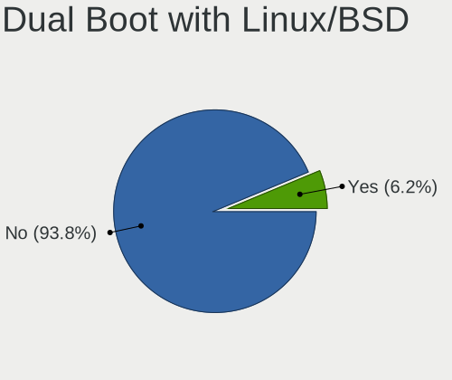
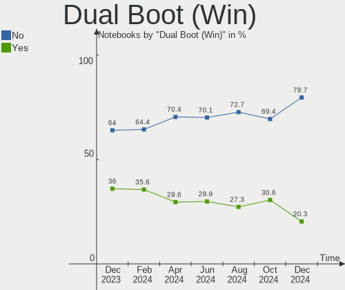
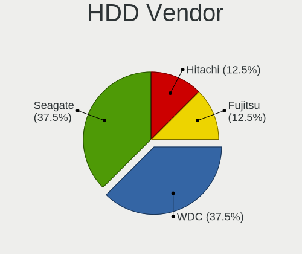
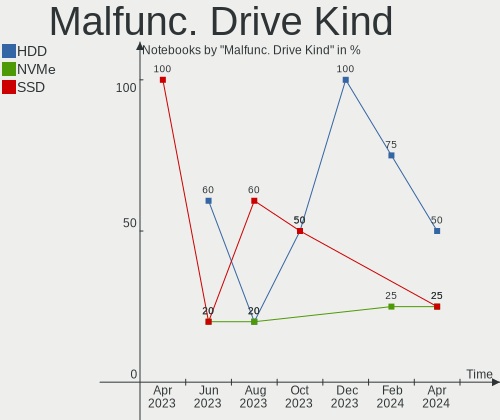

Kubuntu - Hardware Trends (Notebooks)
-------------------------------------

A project to identify most popular hardware characteristics and track their change
over time based on data collected by Linux users at https://Linux-Hardware.org.

Anyone can contribute to this report by the [hw-probe](https://github.com/linuxhw/hw-probe) tool:

    sudo -E hw-probe -all -upload

This report is for one last month. Overall report since the beginning of time: [TestDays](https://github.com/linuxhw/TestDays)

Period: Apr, 2024.

Contents
--------

* [ System ](#system)
  - [ OS                       ](#os)
  - [ OS Family                ](#os-family)
  - [ Kernel                   ](#kernel)
  - [ Kernel Family            ](#kernel-family)
  - [ Kernel Major Ver.        ](#kernel-major-ver)
  - [ Arch                     ](#arch)
  - [ DE                       ](#de)
  - [ Display Server           ](#display-server)
  - [ Display Manager          ](#display-manager)
  - [ OS Lang                  ](#os-lang)
  - [ Boot Mode                ](#boot-mode)
  - [ Filesystem               ](#filesystem)
  - [ Part. scheme             ](#part-scheme)
  - [ Dual Boot with Linux/BSD ](#dual-boot-with-linuxbsd)
  - [ Dual Boot (Win)          ](#dual-boot-win)

* [ Board ](#board)
  - [ Vendor                   ](#vendor)
  - [ Model                    ](#model)
  - [ Model Family             ](#model-family)
  - [ MFG Year                 ](#mfg-year)
  - [ Form Factor              ](#form-factor)
  - [ Secure Boot              ](#secure-boot)
  - [ Coreboot                 ](#coreboot)
  - [ RAM Size                 ](#ram-size)
  - [ RAM Used                 ](#ram-used)
  - [ Total Drives             ](#total-drives)
  - [ Has CD-ROM               ](#has-cd-rom)
  - [ Has Ethernet             ](#has-ethernet)
  - [ Has WiFi                 ](#has-wifi)
  - [ Has Bluetooth            ](#has-bluetooth)

* [ Location ](#location)
  - [ Country                  ](#country)
  - [ City                     ](#city)

* [ Drives ](#drives)
  - [ Drive Vendor             ](#drive-vendor)
  - [ Drive Model              ](#drive-model)
  - [ HDD Vendor               ](#hdd-vendor)
  - [ SSD Vendor               ](#ssd-vendor)
  - [ Drive Kind               ](#drive-kind)
  - [ Drive Connector          ](#drive-connector)
  - [ Drive Size               ](#drive-size)
  - [ Space Total              ](#space-total)
  - [ Space Used               ](#space-used)
  - [ Malfunc. Drives          ](#malfunc-drives)
  - [ Malfunc. Drive Vendor    ](#malfunc-drive-vendor)
  - [ Malfunc. HDD Vendor      ](#malfunc-hdd-vendor)
  - [ Malfunc. Drive Kind      ](#malfunc-drive-kind)
  - [ Failed Drives            ](#failed-drives)
  - [ Failed Drive Vendor      ](#failed-drive-vendor)
  - [ Drive Status             ](#drive-status)

* [ Storage controller ](#storage-controller)
  - [ Storage Vendor           ](#storage-vendor)
  - [ Storage Model            ](#storage-model)
  - [ Storage Kind             ](#storage-kind)

* [ Processor ](#processor)
  - [ CPU Vendor               ](#cpu-vendor)
  - [ CPU Model                ](#cpu-model)
  - [ CPU Model Family         ](#cpu-model-family)
  - [ CPU Cores                ](#cpu-cores)
  - [ CPU Sockets              ](#cpu-sockets)
  - [ CPU Threads              ](#cpu-threads)
  - [ CPU Op-Modes             ](#cpu-op-modes)
  - [ CPU Microcode            ](#cpu-microcode)
  - [ CPU Microarch            ](#cpu-microarch)

* [ Graphics ](#graphics)
  - [ GPU Vendor               ](#gpu-vendor)
  - [ GPU Model                ](#gpu-model)
  - [ GPU Combo                ](#gpu-combo)
  - [ GPU Driver               ](#gpu-driver)
  - [ GPU Memory               ](#gpu-memory)

* [ Monitor ](#monitor)
  - [ Monitor Vendor           ](#monitor-vendor)
  - [ Monitor Model            ](#monitor-model)
  - [ Monitor Resolution       ](#monitor-resolution)
  - [ Monitor Diagonal         ](#monitor-diagonal)
  - [ Monitor Width            ](#monitor-width)
  - [ Aspect Ratio             ](#aspect-ratio)
  - [ Monitor Area             ](#monitor-area)
  - [ Pixel Density            ](#pixel-density)
  - [ Multiple Monitors        ](#multiple-monitors)

* [ Network ](#network)
  - [ Net Controller Vendor    ](#net-controller-vendor)
  - [ Net Controller Model     ](#net-controller-model)
  - [ Wireless Vendor          ](#wireless-vendor)
  - [ Wireless Model           ](#wireless-model)
  - [ Ethernet Vendor          ](#ethernet-vendor)
  - [ Ethernet Model           ](#ethernet-model)
  - [ Net Controller Kind      ](#net-controller-kind)
  - [ Used Controller          ](#used-controller)
  - [ NICs                     ](#nics)
  - [ IPv6                     ](#ipv6)

* [ Bluetooth ](#bluetooth)
  - [ Bluetooth Vendor         ](#bluetooth-vendor)
  - [ Bluetooth Model          ](#bluetooth-model)

* [ Sound ](#sound)
  - [ Sound Vendor             ](#sound-vendor)
  - [ Sound Model              ](#sound-model)

* [ Memory ](#memory)
  - [ Memory Vendor            ](#memory-vendor)
  - [ Memory Model             ](#memory-model)
  - [ Memory Kind              ](#memory-kind)
  - [ Memory Form Factor       ](#memory-form-factor)
  - [ Memory Size              ](#memory-size)
  - [ Memory Speed             ](#memory-speed)

* [ Printers & scanners ](#printers--scanners)
  - [ Printer Vendor           ](#printer-vendor)
  - [ Printer Model            ](#printer-model)
  - [ Scanner Vendor           ](#scanner-vendor)
  - [ Scanner Model            ](#scanner-model)

* [ Camera ](#camera)
  - [ Camera Vendor            ](#camera-vendor)
  - [ Camera Model             ](#camera-model)

* [ Security ](#security)
  - [ Fingerprint Vendor       ](#fingerprint-vendor)
  - [ Fingerprint Model        ](#fingerprint-model)
  - [ Chipcard Vendor          ](#chipcard-vendor)
  - [ Chipcard Model           ](#chipcard-model)

* [ Unsupported ](#unsupported)
  - [ Unsupported Devices      ](#unsupported-devices)
  - [ Unsupported Device Types ](#unsupported-device-types)

System
------

OS
--

Installed operating systems

| Name          | Notebooks | Percent |
|---------------|-----------|---------|
| Kubuntu 22.04 | 32        | 45.07%  |
| Kubuntu 23.10 | 29        | 40.85%  |
| Kubuntu 24.04 | 6         | 8.45%   |
| Kubuntu 20.04 | 2         | 2.82%   |
| Kubuntu 23.04 | 1         | 1.41%   |
| Kubuntu 2.1   | 1         | 1.41%   |

OS Family
---------

OS without a version

| Name    | Notebooks | Percent |
|---------|-----------|---------|
| Kubuntu | 71        | 100%    |

Kernel
------

Version of the Linux kernel

| Version                | Notebooks | Percent |
|------------------------|-----------|---------|
| 6.5.0-27-generic       | 19        | 26.76%  |
| 6.5.0-28-generic       | 15        | 21.13%  |
| 6.5.0-26-generic       | 7         | 9.86%   |
| 6.8.0-31-generic       | 5         | 7.04%   |
| 5.15.0-102-generic     | 3         | 4.23%   |
| 6.8.1-060801-generic   | 2         | 2.82%   |
| 6.5.0-9-generic        | 2         | 2.82%   |
| 6.5.0-26-lowlatency    | 2         | 2.82%   |
| 5.15.0-101-generic     | 2         | 2.82%   |
| 6.8.6-3-liquorix-amd64 | 1         | 1.41%   |
| 6.6.28-custom          | 1         | 1.41%   |
| 6.6.25-t2-mantic       | 1         | 1.41%   |
| 6.5.0-28-lowlatency    | 1         | 1.41%   |
| 6.5.0-27-lowlatency    | 1         | 1.41%   |
| 6.5.0-25-generic       | 1         | 1.41%   |
| 6.5.0-18-generic       | 1         | 1.41%   |
| 6.5.0-15-lowlatency    | 1         | 1.41%   |
| 6.5.0-1013-laptop      | 1         | 1.41%   |
| 6.2.0-39-generic       | 1         | 1.41%   |
| 6.2.0-26-generic       | 1         | 1.41%   |
| 5.4.0-125-generic      | 1         | 1.41%   |
| 5.15.0-91-generic      | 1         | 1.41%   |
| 5.15.0-86-generic      | 1         | 1.41%   |

Kernel Family
-------------

Linux kernel without a distro release

| Version | Notebooks | Percent |
|---------|-----------|---------|
| 6.5.0   | 51        | 71.83%  |
| 5.15.0  | 7         | 9.86%   |
| 6.8.0   | 5         | 7.04%   |
| 6.8.1   | 2         | 2.82%   |
| 6.2.0   | 2         | 2.82%   |
| 6.8.6   | 1         | 1.41%   |
| 6.6.28  | 1         | 1.41%   |
| 6.6.25  | 1         | 1.41%   |
| 5.4.0   | 1         | 1.41%   |

Kernel Major Ver.
-----------------

Linux kernel major version

| Version | Notebooks | Percent |
|---------|-----------|---------|
| 6.5     | 51        | 71.83%  |
| 6.8     | 8         | 11.27%  |
| 5.15    | 7         | 9.86%   |
| 6.6     | 2         | 2.82%   |
| 6.2     | 2         | 2.82%   |
| 5.4     | 1         | 1.41%   |

Arch
----

OS architecture (x86_64, i586, etc.)

| Name    | Notebooks | Percent |
|---------|-----------|---------|
| x86_64  | 70        | 98.59%  |
| aarch64 | 1         | 1.41%   |

DE
--

Desktop Environment

| Name  | Notebooks | Percent |
|-------|-----------|---------|
| KDE5  | 67        | 94.37%  |
| KDE   | 2         | 2.82%   |
| KDE6  | 1         | 1.41%   |
| GNOME | 1         | 1.41%   |

Display Server
--------------

X11 or Wayland

| Name    | Notebooks | Percent |
|---------|-----------|---------|
| X11     | 62        | 87.32%  |
| Wayland | 9         | 12.68%  |

Display Manager
---------------

SDDM, LightDM, etc.

| Name    | Notebooks | Percent |
|---------|-----------|---------|
| SDDM    | 44        | 61.97%  |
| Unknown | 24        | 33.8%   |
| LightDM | 1         | 1.41%   |
| GDM3    | 1         | 1.41%   |
| GDM     | 1         | 1.41%   |

OS Lang
-------

Language

| Lang  | Notebooks | Percent |
|-------|-----------|---------|
| en_US | 37        | 52.11%  |
| pt_BR | 5         | 7.04%   |
| it_IT | 5         | 7.04%   |
| de_DE | 4         | 5.63%   |
| ru_RU | 3         | 4.23%   |
| en_GB | 3         | 4.23%   |
| en_IN | 2         | 2.82%   |
| en_CA | 2         | 2.82%   |
| tr_TR | 1         | 1.41%   |
| pt_PT | 1         | 1.41%   |
| nb_NO | 1         | 1.41%   |
| fr_FR | 1         | 1.41%   |
| es_CR | 1         | 1.41%   |
| en_ZW | 1         | 1.41%   |
| en_ZA | 1         | 1.41%   |
| en_NZ | 1         | 1.41%   |
| en_IL | 1         | 1.41%   |
| en_AG | 1         | 1.41%   |

Boot Mode
---------

EFI or BIOS

| Mode | Notebooks | Percent |
|------|-----------|---------|
| BIOS | 49        | 69.01%  |
| EFI  | 22        | 30.99%  |

Filesystem
----------

Type of filesystem

| Type    | Notebooks | Percent |
|---------|-----------|---------|
| Ext4    | 46        | 64.79%  |
| Tmpfs   | 21        | 29.58%  |
| Overlay | 2         | 2.82%   |
| Zfs     | 1         | 1.41%   |
| Btrfs   | 1         | 1.41%   |

Part. scheme
------------

Scheme of partitioning

| Type    | Notebooks | Percent |
|---------|-----------|---------|
| GPT     | 40        | 56.34%  |
| Unknown | 24        | 33.8%   |
| MBR     | 7         | 9.86%   |

Dual Boot with Linux/BSD
------------------------

Hosting more than one Linux/BSD

| Dual boot | Notebooks | Percent |
|-----------|-----------|---------|
| No        | 66        | 92.96%  |
| Yes       | 5         | 7.04%   |

Dual Boot (Win)
---------------

Hosting Linux and Windows

| Dual boot | Notebooks | Percent |
|-----------|-----------|---------|
| No        | 50        | 70.42%  |
| Yes       | 21        | 29.58%  |

Board
-----

Vendor
------

Motherboard manufacturer

| Name                   | Notebooks | Percent |
|------------------------|-----------|---------|
| Lenovo                 | 15        | 21.13%  |
| Hewlett-Packard        | 14        | 19.72%  |
| Dell                   | 7         | 9.86%   |
| ASUSTek Computer       | 7         | 9.86%   |
| Acer                   | 6         | 8.45%   |
| MSI                    | 3         | 4.23%   |
| Apple                  | 3         | 4.23%   |
| Samsung Electronics    | 2         | 2.82%   |
| Toshiba                | 1         | 1.41%   |
| Timi                   | 1         | 1.41%   |
| TECNO                  | 1         | 1.41%   |
| Maibenben              | 1         | 1.41%   |
| Intel Client Systems   | 1         | 1.41%   |
| HUAWEI                 | 1         | 1.41%   |
| Gigabyte Technology    | 1         | 1.41%   |
| Fujitsu                | 1         | 1.41%   |
| Framework              | 1         | 1.41%   |
| EXTRA Computer         | 1         | 1.41%   |
| Clevo                  | 1         | 1.41%   |
| Carbon Systems         | 1         | 1.41%   |
| Avell High Performance | 1         | 1.41%   |
| Alienware              | 1         | 1.41%   |

Model
-----

Motherboard model

| Name                                  | Notebooks | Percent |
|---------------------------------------|-----------|---------|
| Toshiba TECRA R850                    | 1         | 1.41%   |
| Timi RedmiBook Pro 14S                | 1         | 1.41%   |
| TECNO MEGABOOK T1                     | 1         | 1.41%   |
| Samsung 950XED                        | 1         | 1.41%   |
| Samsung 550XDA                        | 1         | 1.41%   |
| MSI Prestige 14Evo A11M               | 1         | 1.41%   |
| MSI MS-7D46                           | 1         | 1.41%   |
| MSI Katana GF76 11SC                  | 1         | 1.41%   |
| Maibenben MaiBook M                   | 1         | 1.41%   |
| Lenovo Z70-80 80FG                    | 1         | 1.41%   |
| Lenovo V310-14ISK 80SX                | 1         | 1.41%   |
| Lenovo ThinkPad X13s Gen 1 21BYS03Y00 | 1         | 1.41%   |
| Lenovo ThinkPad W540 20BHS0KY08       | 1         | 1.41%   |
| Lenovo ThinkPad T570 20H9CTO1WW       | 1         | 1.41%   |
| Lenovo ThinkPad T530 2359CTO          | 1         | 1.41%   |
| Lenovo ThinkPad T450 20BUS0B000       | 1         | 1.41%   |
| Lenovo ThinkPad T14 Gen 3 21AH00DFPB  | 1         | 1.41%   |
| Lenovo ThinkPad E590 20NB005MUS       | 1         | 1.41%   |
| Lenovo ThinkPad E520 1143R77          | 1         | 1.41%   |
| Lenovo ThinkBook 16 G4+ IAP 21CY      | 1         | 1.41%   |
| Lenovo ThinkBook 15 G2 ITL 20VE       | 1         | 1.41%   |
| Lenovo Legion Slim 5 16APH8 82Y9      | 1         | 1.41%   |
| Lenovo IdeaPad 330S-15IKB 81F5        | 1         | 1.41%   |
| Lenovo IdeaPad 3 15ABA7 82RN          | 1         | 1.41%   |
| Intel Client Systems LAPBC710         | 1         | 1.41%   |
| HUAWEI RLEFG-XX                       | 1         | 1.41%   |
| HP Stream Laptop 14-ax0XX             | 1         | 1.41%   |
| HP ProBook x360 11 G1 EE              | 1         | 1.41%   |
| HP ProBook 4520s                      | 1         | 1.41%   |
| HP Pavilion Power Laptop 15-cb0xx     | 1         | 1.41%   |
| HP Pavilion Laptop 15-eh0xxx          | 1         | 1.41%   |
| HP Pavilion g7                        | 1         | 1.41%   |
| HP Laptop 15s-fq5xxx                  | 1         | 1.41%   |
| HP Laptop 15-fd0xxx                   | 1         | 1.41%   |
| HP Laptop 15-dy2xxx                   | 1         | 1.41%   |
| HP Laptop 15-bs1xx                    | 1         | 1.41%   |
| HP G42                                | 1         | 1.41%   |
| HP EliteBook 8730w                    | 1         | 1.41%   |
| HP Compaq 8710w (GT649PA#ABG)         | 1         | 1.41%   |
| HP 15                                 | 1         | 1.41%   |

Model Family
------------

Motherboard model prefix

| Name                          | Notebooks | Percent |
|-------------------------------|-----------|---------|
| Lenovo ThinkPad               | 8         | 11.27%  |
| HP Laptop                     | 4         | 5.63%   |
| Dell Inspiron                 | 4         | 5.63%   |
| Acer Aspire                   | 4         | 5.63%   |
| HP Pavilion                   | 3         | 4.23%   |
| Lenovo ThinkBook              | 2         | 2.82%   |
| Lenovo IdeaPad                | 2         | 2.82%   |
| HP ProBook                    | 2         | 2.82%   |
| ASUS ROG                      | 2         | 2.82%   |
| Acer Nitro                    | 2         | 2.82%   |
| Toshiba TECRA                 | 1         | 1.41%   |
| Timi RedmiBook                | 1         | 1.41%   |
| TECNO MEGABOOK                | 1         | 1.41%   |
| Samsung 950XED                | 1         | 1.41%   |
| Samsung 550XDA                | 1         | 1.41%   |
| MSI Prestige                  | 1         | 1.41%   |
| MSI MS-7D46                   | 1         | 1.41%   |
| MSI Katana                    | 1         | 1.41%   |
| Maibenben MaiBook             | 1         | 1.41%   |
| Lenovo Z70-80                 | 1         | 1.41%   |
| Lenovo V310-14ISK             | 1         | 1.41%   |
| Lenovo Legion                 | 1         | 1.41%   |
| Intel Client Systems LAPBC710 | 1         | 1.41%   |
| HUAWEI RLEFG-XX               | 1         | 1.41%   |
| HP Stream                     | 1         | 1.41%   |
| HP G42                        | 1         | 1.41%   |
| HP EliteBook                  | 1         | 1.41%   |
| HP Compaq                     | 1         | 1.41%   |
| HP 15                         | 1         | 1.41%   |
| Gigabyte G5                   | 1         | 1.41%   |
| Fujitsu FARQ01024             | 1         | 1.41%   |
| Framework Laptop              | 1         | 1.41%   |
| EXTRA MS-1758                 | 1         | 1.41%   |
| Dell XPS                      | 1         | 1.41%   |
| Dell Latitude                 | 1         | 1.41%   |
| Dell G15                      | 1         | 1.41%   |
| Clevo P170EM                  | 1         | 1.41%   |
| Carbon Systems Iridium        | 1         | 1.41%   |
| Avell High Performance B.ON   | 1         | 1.41%   |
| ASUS X756UXK                  | 1         | 1.41%   |

MFG Year
--------

Motherboard manufacture year

| Year | Notebooks | Percent |
|------|-----------|---------|
| 2022 | 11        | 15.49%  |
| 2021 | 10        | 14.08%  |
| 2020 | 7         | 9.86%   |
| 2023 | 5         | 7.04%   |
| 2017 | 5         | 7.04%   |
| 2016 | 5         | 7.04%   |
| 2011 | 5         | 7.04%   |
| 2019 | 4         | 5.63%   |
| 2018 | 3         | 4.23%   |
| 2013 | 3         | 4.23%   |
| 2012 | 3         | 4.23%   |
| 2015 | 2         | 2.82%   |
| 2014 | 2         | 2.82%   |
| 2010 | 2         | 2.82%   |
| 2008 | 2         | 2.82%   |
| 2024 | 1         | 1.41%   |
| 2007 | 1         | 1.41%   |

Form Factor
-----------

Physical design of the computer

| Name     | Notebooks | Percent |
|----------|-----------|---------|
| Notebook | 71        | 100%    |

Secure Boot
-----------

Enabled or disabled

| State    | Notebooks | Percent |
|----------|-----------|---------|
| Disabled | 69        | 97.18%  |
| Enabled  | 2         | 2.82%   |

Coreboot
--------

Have coreboot on board

| Used | Notebooks | Percent |
|------|-----------|---------|
| No   | 71        | 100%    |

RAM Size
--------

Total RAM memory

| Size in GB | Notebooks | Percent |
|------------|-----------|---------|
| 16.01-24.0 | 23        | 32.39%  |
| 8.01-16.0  | 16        | 22.54%  |
| 4.01-8.0   | 13        | 18.31%  |
| 32.01-64.0 | 7         | 9.86%   |
| 3.01-4.0   | 7         | 9.86%   |
| 24.01-32.0 | 3         | 4.23%   |
| 2.01-3.0   | 1         | 1.41%   |
| 1.01-2.0   | 1         | 1.41%   |

RAM Used
--------

Used RAM memory

| Used GB    | Notebooks | Percent |
|------------|-----------|---------|
| 2.01-3.0   | 21        | 29.58%  |
| 4.01-8.0   | 17        | 23.94%  |
| 3.01-4.0   | 17        | 23.94%  |
| 1.01-2.0   | 10        | 14.08%  |
| 8.01-16.0  | 4         | 5.63%   |
| 16.01-24.0 | 2         | 2.82%   |

Total Drives
------------

Number of drives on board

| Drives | Notebooks | Percent |
|--------|-----------|---------|
| 1      | 49        | 69.01%  |
| 2      | 17        | 23.94%  |
| 3      | 4         | 5.63%   |
| 4      | 1         | 1.41%   |

Has CD-ROM
----------

Has CD-ROM on board

| Presented | Notebooks | Percent |
|-----------|-----------|---------|
| No        | 51        | 71.83%  |
| Yes       | 20        | 28.17%  |

Has Ethernet
------------

Has Ethernet on board

| Presented | Notebooks | Percent |
|-----------|-----------|---------|
| Yes       | 54        | 76.06%  |
| No        | 17        | 23.94%  |

Has WiFi
--------

Has WiFi module

| Presented | Notebooks | Percent |
|-----------|-----------|---------|
| Yes       | 68        | 95.77%  |
| No        | 3         | 4.23%   |

Has Bluetooth
-------------

Has Bluetooth module

| Presented | Notebooks | Percent |
|-----------|-----------|---------|
| Yes       | 66        | 92.96%  |
| No        | 5         | 7.04%   |

Location
--------

Country
-------

Geographic location (country)

| Country      | Notebooks | Percent |
|--------------|-----------|---------|
| USA          | 18        | 25.35%  |
| Germany      | 9         | 12.68%  |
| Italy        | 7         | 9.86%   |
| Brazil       | 5         | 7.04%   |
| Russia       | 4         | 5.63%   |
| India        | 3         | 4.23%   |
| France       | 3         | 4.23%   |
| UK           | 2         | 2.82%   |
| Poland       | 2         | 2.82%   |
| Norway       | 2         | 2.82%   |
| Canada       | 2         | 2.82%   |
| Zimbabwe     | 1         | 1.41%   |
| Turkey       | 1         | 1.41%   |
| South Africa | 1         | 1.41%   |
| Slovakia     | 1         | 1.41%   |
| Portugal     | 1         | 1.41%   |
| New Zealand  | 1         | 1.41%   |
| Malaysia     | 1         | 1.41%   |
| Israel       | 1         | 1.41%   |
| Indonesia    | 1         | 1.41%   |
| Greece       | 1         | 1.41%   |
| Costa Rica   | 1         | 1.41%   |
| China        | 1         | 1.41%   |
| Bulgaria     | 1         | 1.41%   |
| Belgium      | 1         | 1.41%   |

City
----

Geographic location (city)

| City                 | Notebooks | Percent |
|----------------------|-----------|---------|
| Rio Grande           | 2         | 2.82%   |
| Moscow               | 2         | 2.82%   |
| Volgograd            | 1         | 1.41%   |
| Trondheim            | 1         | 1.41%   |
| Terzigno             | 1         | 1.41%   |
| Surabaya             | 1         | 1.41%   |
| Stadtlohn            | 1         | 1.41%   |
| St Petersburg        | 1         | 1.41%   |
| Sofia                | 1         | 1.41%   |
| Silver Spring        | 1         | 1.41%   |
| Shimla               | 1         | 1.41%   |
| Secaucus             | 1         | 1.41%   |
| Santo André         | 1         | 1.41%   |
| Rome                 | 1         | 1.41%   |
| Richmond             | 1         | 1.41%   |
| Reggio Calabria      | 1         | 1.41%   |
| Pune                 | 1         | 1.41%   |
| Providence           | 1         | 1.41%   |
| Porto-Vecchio        | 1         | 1.41%   |
| Pleasanton           | 1         | 1.41%   |
| Plattsmouth          | 1         | 1.41%   |
| Paris                | 1         | 1.41%   |
| Oslo                 | 1         | 1.41%   |
| Oldham               | 1         | 1.41%   |
| Olathe               | 1         | 1.41%   |
| North Versailles     | 1         | 1.41%   |
| Nepean               | 1         | 1.41%   |
| Napier City          | 1         | 1.41%   |
| Munich               | 1         | 1.41%   |
| Mosciano Sant'Angelo | 1         | 1.41%   |
| Longueuil            | 1         | 1.41%   |
| Lodz                 | 1         | 1.41%   |
| Limbach-Oberfrohna   | 1         | 1.41%   |
| Krakow               | 1         | 1.41%   |
| Kota Kinabalu        | 1         | 1.41%   |
| Kiryat Ono           | 1         | 1.41%   |
| Joinville            | 1         | 1.41%   |
| Johannesburg         | 1         | 1.41%   |
| Jacksonville         | 1         | 1.41%   |
| Irvington            | 1         | 1.41%   |

Drives
------

Drive Vendor
------------

Hard drive vendors

| Vendor                      | Notebooks | Drives | Percent |
|-----------------------------|-----------|--------|---------|
| Samsung Electronics         | 19        | 24     | 21.11%  |
| Intel                       | 9         | 10     | 10%     |
| Seagate                     | 6         | 7      | 6.67%   |
| Micron Technology           | 6         | 6      | 6.67%   |
| Sandisk                     | 5         | 5      | 5.56%   |
| WDC                         | 4         | 4      | 4.44%   |
| Unknown                     | 4         | 4      | 4.44%   |
| SK hynix                    | 4         | 4      | 4.44%   |
| HGST                        | 4         | 4      | 4.44%   |
| KIOXIA                      | 3         | 3      | 3.33%   |
| Toshiba                     | 2         | 2      | 2.22%   |
| SPCC                        | 2         | 2      | 2.22%   |
| Kingston                    | 2         | 2      | 2.22%   |
| Crucial                     | 2         | 3      | 2.22%   |
| China                       | 2         | 2      | 2.22%   |
| Apple                       | 2         | 2      | 2.22%   |
| ADATA Technology            | 2         | 2      | 2.22%   |
| StoreJet                    | 1         | 1      | 1.11%   |
| SSK SD30                    | 1         | 1      | 1.11%   |
| Silicon Motion              | 1         | 1      | 1.11%   |
| Phison Electronics          | 1         | 1      | 1.11%   |
| Phison                      | 1         | 1      | 1.11%   |
| Kingston Technology Company | 1         | 1      | 1.11%   |
| Kingmax                     | 1         | 1      | 1.11%   |
| Hitachi                     | 1         | 1      | 1.11%   |
| Hikvision                   | 1         | 1      | 1.11%   |
| DST                         | 1         | 1      | 1.11%   |
| A-DATA Technology           | 1         | 1      | 1.11%   |
| Unknown                     | 1         | 1      | 1.11%   |

Drive Model
-----------

Hard drive models

| Model                                             | Notebooks | Percent |
|---------------------------------------------------|-----------|---------|
| Samsung MZVL2512HCJQ-00B00 512GB                  | 3         | 3.09%   |
| Intel SSDPEKNU512GZ 512GB                         | 3         | 3.09%   |
| Samsung NVMe SSD Controller SM961/PM961/SM963 1TB | 2         | 2.06%   |
| Intel SSD 660P Series 1024GB                      | 2         | 2.06%   |
| HGST HTS721010A9E630 1TB                          | 2         | 2.06%   |
| HGST HTS541010A9E680 1TB                          | 2         | 2.06%   |
| WDC WDS100T2B0A-00SM50 1TB SSD                    | 1         | 1.03%   |
| WDC WDBNCE0010PNC 1TB SSD                         | 1         | 1.03%   |
| WDC WD10SPZX-21Z10T0 1TB                          | 1         | 1.03%   |
| WDC WD10JPVX-60JC3T0 1TB                          | 1         | 1.03%   |
| Unknown MMC Card  32GB                            | 1         | 1.03%   |
| Unknown MMC Card  2GB                             | 1         | 1.03%   |
| Unknown MMC Card  128GB                           | 1         | 1.03%   |
| Unknown MMC Card  1072GB                          | 1         | 1.03%   |
| Toshiba MQ04ABF100 1TB                            | 1         | 1.03%   |
| Toshiba A100 240GB SSD                            | 1         | 1.03%   |
| StoreJet Disk 2TB                                 | 1         | 1.03%   |
| SSK SD30 1 512GB                                  | 1         | 1.03%   |
| SPCC Solid State Disk 256GB                       | 1         | 1.03%   |
| SPCC Solid State Disk 128GB                       | 1         | 1.03%   |
| SK hynix SKHynix_HFS512GEJ9X115N 512GB            | 1         | 1.03%   |
| SK hynix SKHynix_HFM512GD3HX015N 512GB            | 1         | 1.03%   |
| SK hynix SHPP41-1000GM 1TB                        | 1         | 1.03%   |
| SK hynix SHGP31-2000GM 2TB                        | 1         | 1.03%   |
| Silicon Motion SM2262/SM2262EN SSD Controller 2TB | 1         | 1.03%   |
| Seagate ST9500325AS 500GB                         | 1         | 1.03%   |
| Seagate ST9320423AS 320GB                         | 1         | 1.03%   |
| Seagate ST9320421AS 320GB                         | 1         | 1.03%   |
| Seagate ST1000LM024 HN-M101MBB 1TB                | 1         | 1.03%   |
| Seagate ST1000LM014-1EJ164 1TB                    | 1         | 1.03%   |
| Seagate Expansion 2TB                             | 1         | 1.03%   |
| Seagate BUP Slim 2TB                              | 1         | 1.03%   |
| Sandisk WD Blue SN550 NVMe SSD 2TB                | 1         | 1.03%   |
| SanDisk SDSSDX240GG25 240GB                       | 1         | 1.03%   |
| SanDisk SD8SN8U-128G-1006 128GB SSD               | 1         | 1.03%   |
| Sandisk PC SN530 NVMe WDC 256GB                   | 1         | 1.03%   |
| Sandisk PC SN520 NVMe SSD 512GB                   | 1         | 1.03%   |
| Samsung SSD 990 PRO 1TB                           | 1         | 1.03%   |
| Samsung SSD 980 PRO 1TB                           | 1         | 1.03%   |
| Samsung SSD 970 EVO Plus 2TB S4J4NX0W808667H      | 1         | 1.03%   |

HDD Vendor
----------

Hard disk drive vendors

| Vendor   | Notebooks | Drives | Percent |
|----------|-----------|--------|---------|
| Seagate  | 6         | 7      | 40%     |
| HGST     | 4         | 4      | 26.67%  |
| WDC      | 2         | 2      | 13.33%  |
| Toshiba  | 1         | 1      | 6.67%   |
| StoreJet | 1         | 1      | 6.67%   |
| Hitachi  | 1         | 1      | 6.67%   |

SSD Vendor
----------

Solid state drive vendors

| Vendor              | Notebooks | Drives | Percent |
|---------------------|-----------|--------|---------|
| Samsung Electronics | 8         | 8      | 28.57%  |
| Intel               | 3         | 3      | 10.71%  |
| WDC                 | 2         | 2      | 7.14%   |
| SPCC                | 2         | 2      | 7.14%   |
| SanDisk             | 2         | 2      | 7.14%   |
| Crucial             | 2         | 3      | 7.14%   |
| China               | 2         | 2      | 7.14%   |
| Toshiba             | 1         | 1      | 3.57%   |
| Micron Technology   | 1         | 1      | 3.57%   |
| Kingston            | 1         | 1      | 3.57%   |
| Kingmax             | 1         | 1      | 3.57%   |
| DST                 | 1         | 1      | 3.57%   |
| Apple               | 1         | 1      | 3.57%   |
| Unknown             | 1         | 1      | 3.57%   |

Drive Kind
----------

HDD or SSD

| Kind    | Notebooks | Drives | Percent |
|---------|-----------|--------|---------|
| NVMe    | 40        | 46     | 44.94%  |
| SSD     | 28        | 29     | 31.46%  |
| HDD     | 15        | 16     | 16.85%  |
| MMC     | 4         | 4      | 4.49%   |
| Unknown | 2         | 3      | 2.25%   |

Drive Connector
---------------

SATA, SAS, NVMe, etc.

| Type | Notebooks | Drives | Percent |
|------|-----------|--------|---------|
| NVMe | 40        | 45     | 45.98%  |
| SATA | 34        | 38     | 39.08%  |
| SAS  | 9         | 11     | 10.34%  |
| MMC  | 4         | 4      | 4.6%    |

Drive Size
----------

Size of hard drive

| Size in TB | Notebooks | Drives | Percent |
|------------|-----------|--------|---------|
| 0.01-0.5   | 23        | 24     | 53.49%  |
| 0.51-1.0   | 15        | 16     | 34.88%  |
| 1.01-2.0   | 4         | 4      | 9.3%    |
| 3.01-4.0   | 1         | 1      | 2.33%   |

Space Total
-----------

Amount of disk space available on the file system

| Size in GB     | Notebooks | Percent |
|----------------|-----------|---------|
| 101-250        | 21        | 29.58%  |
| 501-1000       | 15        | 21.13%  |
| 251-500        | 13        | 18.31%  |
| 1001-2000      | 8         | 11.27%  |
| 1-20           | 4         | 5.63%   |
| 51-100         | 4         | 5.63%   |
| 2001-3000      | 3         | 4.23%   |
| 21-50          | 2         | 2.82%   |
| More than 3000 | 1         | 1.41%   |

Space Used
----------

Amount of used disk space

| Used GB        | Notebooks | Percent |
|----------------|-----------|---------|
| 1-20           | 17        | 23.94%  |
| 51-100         | 16        | 22.54%  |
| 21-50          | 12        | 16.9%   |
| 101-250        | 10        | 14.08%  |
| 501-1000       | 7         | 9.86%   |
| 251-500        | 6         | 8.45%   |
| More than 3000 | 1         | 1.41%   |
| 2001-3000      | 1         | 1.41%   |
| 1001-2000      | 1         | 1.41%   |

Malfunc. Drives
---------------

Drive models with a malfunction

| Model                                 | Notebooks | Drives | Percent |
|---------------------------------------|-----------|--------|---------|
| WDC WD10JPVX-60JC3T0 1TB              | 1         | 1      | 25%     |
| Seagate ST9320421AS 320GB             | 1         | 1      | 25%     |
| Samsung Electronics SSD 870 EVO 250GB | 1         | 1      | 25%     |
| Intel SSDPEKNU512GZ 512GB             | 1         | 1      | 25%     |

Malfunc. Drive Vendor
---------------------

Vendors of faulty drives

| Vendor              | Notebooks | Drives | Percent |
|---------------------|-----------|--------|---------|
| WDC                 | 1         | 1      | 25%     |
| Seagate             | 1         | 1      | 25%     |
| Samsung Electronics | 1         | 1      | 25%     |
| Intel               | 1         | 1      | 25%     |

Malfunc. HDD Vendor
-------------------

Vendors of faulty HDD drives

| Vendor  | Notebooks | Drives | Percent |
|---------|-----------|--------|---------|
| WDC     | 1         | 1      | 50%     |
| Seagate | 1         | 1      | 50%     |

Malfunc. Drive Kind
-------------------

Kinds of faulty drives

| Kind | Notebooks | Drives | Percent |
|------|-----------|--------|---------|
| HDD  | 2         | 2      | 50%     |
| NVMe | 1         | 1      | 25%     |
| SSD  | 1         | 1      | 25%     |

Failed Drives
-------------

Failed drive models

Zero info for selected period =(

Failed Drive Vendor
-------------------

Failed drive vendors

Zero info for selected period =(

Drive Status
------------

Number of failed and malfunc. drives

| Status   | Notebooks | Drives | Percent |
|----------|-----------|--------|---------|
| Detected | 43        | 65     | 58.9%   |
| Works    | 26        | 29     | 35.62%  |
| Malfunc  | 4         | 4      | 5.48%   |

Storage controller
------------------

Storage Vendor
--------------

Storage controller vendors

| Vendor                      | Notebooks | Percent |
|-----------------------------|-----------|---------|
| Intel                       | 48        | 52.75%  |
| Samsung Electronics         | 13        | 14.29%  |
| AMD                         | 7         | 7.69%   |
| Micron Technology           | 5         | 5.49%   |
| SK hynix                    | 4         | 4.4%    |
| SanDisk                     | 3         | 3.3%    |
| KIOXIA                      | 3         | 3.3%    |
| ADATA Technology            | 3         | 3.3%    |
| Phison Electronics          | 2         | 2.2%    |
| Kingston Technology Company | 2         | 2.2%    |
| Silicon Motion              | 1         | 1.1%    |

Storage Model
-------------

Storage controller models

| Model                                                                                  | Notebooks | Percent |
|----------------------------------------------------------------------------------------|-----------|---------|
| AMD FCH SATA Controller [AHCI mode]                                                    | 7         | 7%      |
| Samsung NVMe SSD Controller PM9A1/PM9A3/980PRO                                         | 4         | 4%      |
| Intel Sunrise Point-LP SATA Controller [AHCI mode]                                     | 4         | 4%      |
| Intel 82801 Mobile SATA Controller [RAID mode]                                         | 4         | 4%      |
| Intel 6 Series/C200 Series Chipset Family 6 port Mobile SATA AHCI Controller           | 4         | 4%      |
| Samsung NVMe SSD Controller SM961/PM961/SM963                                          | 3         | 3%      |
| Samsung NVMe SSD Controller 980 (DRAM-less)                                            | 3         | 3%      |
| Micron 2450 NVMe SSD [HendrixV] (DRAM-less)                                            | 3         | 3%      |
| Intel Wildcat Point-LP SATA Controller [AHCI Mode]                                     | 3         | 3%      |
| Intel Volume Management Device NVMe RAID Controller                                    | 3         | 3%      |
| Intel Tiger Lake SATA AHCI Controller                                                  | 3         | 3%      |
| Intel SSD 670p Series [Keystone Harbor]                                                | 3         | 3%      |
| Intel SSD 660P Series                                                                  | 3         | 3%      |
| Intel 8 Series/C220 Series Chipset Family 6-port SATA Controller 1 [AHCI mode]         | 3         | 3%      |
| SK hynix Platinum P41/PC801 NVMe Solid State Drive                                     | 2         | 2%      |
| SK hynix Gold P31/BC711/PC711 NVMe Solid State Drive                                   | 2         | 2%      |
| Micron 2210 NVMe SSD [Cobain]                                                          | 2         | 2%      |
| Intel Tiger Lake-LP SATA Controller                                                    | 2         | 2%      |
| Intel Alder Lake-P SATA AHCI Controller                                                | 2         | 2%      |
| Intel 82801HM/HEM (ICH8M/ICH8M-E) SATA Controller [AHCI mode]                          | 2         | 2%      |
| Intel 82801HM/HEM (ICH8M/ICH8M-E) IDE Controller                                       | 2         | 2%      |
| Intel 7 Series Chipset Family 4-port SATA Controller [IDE mode]                        | 2         | 2%      |
| Intel 7 Series Chipset Family 2-port SATA Controller [IDE mode]                        | 2         | 2%      |
| Intel 5 Series/3400 Series Chipset 4 port SATA AHCI Controller                         | 2         | 2%      |
| ADATA XPG GAMMIXS1 1L, XPG GAMMIX S5, LEGEND 710 / 740, SWORDFISH NVMe SSD (DRAM-less) | 2         | 2%      |
| Silicon Motion SM2262/SM2262EN SSD Controller                                          | 1         | 1%      |
| SanDisk Ultra 3D / WD Blue SN550 NVMe SSD                                              | 1         | 1%      |
| SanDisk PC SN520 x2 M.2 2242 NVMe SSD                                                  | 1         | 1%      |
| SanDisk IX SN530 NVMe SSD (DRAM-less)                                                  | 1         | 1%      |
| Samsung S4LN058A01[SSUBX] AHCI SSD Controller (Apple slot)                             | 1         | 1%      |
| Samsung NVMe SSD Controller SM981/PM981/PM983                                          | 1         | 1%      |
| Samsung NVMe SSD Controller S4LV008[Pascal]                                            | 1         | 1%      |
| Samsung NVMe SSD Controller PM9B1 (DRAM-less)                                          | 1         | 1%      |
| Phison PS5021-E21 PCIe4 NVMe Controller (DRAM-less)                                    | 1         | 1%      |
| Phison PS5015-E15 PCIe3 NVMe Controller (DRAM-less)                                    | 1         | 1%      |
| KIOXIA NVMe SSD Controller BG5 (DRAM-less)                                             | 1         | 1%      |
| KIOXIA NVMe SSD Controller BG4 (DRAM-less)                                             | 1         | 1%      |
| KIOXIA NVMe SSD                                                                        | 1         | 1%      |
| Kingston Company OM3PDP3 NVMe SSD                                                      | 1         | 1%      |
| Kingston Company KC3000/FURY Renegade NVMe SSD E18                                     | 1         | 1%      |

Storage Kind
------------

Kind of storage controller (IDE, SATA, NVMe, SAS, ...)

| Kind | Notebooks | Percent |
|------|-----------|---------|
| SATA | 42        | 44.68%  |
| NVMe | 39        | 41.49%  |
| RAID | 8         | 8.51%   |
| IDE  | 5         | 5.32%   |

Processor
---------

CPU Vendor
----------

Processor vendors

| Vendor | Notebooks | Percent |
|--------|-----------|---------|
| Intel  | 58        | 81.69%  |
| AMD    | 12        | 16.9%   |
| ARM    | 1         | 1.41%   |

CPU Model
---------

Processor models

| Model                                   | Notebooks | Percent |
|-----------------------------------------|-----------|---------|
| Intel Core i7-2640M CPU @ 2.80GHz       | 3         | 4.23%   |
| Intel 11th Gen Core i7-1165G7 @ 2.80GHz | 3         | 4.23%   |
| Intel Core i7-3630QM CPU @ 2.40GHz      | 2         | 2.82%   |
| Intel Core i5-7200U CPU @ 2.50GHz       | 2         | 2.82%   |
| Intel Core i5-5300U CPU @ 2.30GHz       | 2         | 2.82%   |
| Intel Core i3-6006U CPU @ 2.00GHz       | 2         | 2.82%   |
| Intel 12th Gen Core i7-1255U            | 2         | 2.82%   |
| Intel 12th Gen Core i5-1235U            | 2         | 2.82%   |
| Intel 11th Gen Core i5-11400H @ 2.70GHz | 2         | 2.82%   |
| AMD Ryzen 5 5625U with Radeon Graphics  | 2         | 2.82%   |
| AMD Ryzen 5 4500U with Radeon Graphics  | 2         | 2.82%   |
| Intel Pentium CPU N4200 @ 1.10GHz       | 1         | 1.41%   |
| Intel Pentium CPU N3540 @ 2.16GHz       | 1         | 1.41%   |
| Intel N200                              | 1         | 1.41%   |
| Intel Core i7-9750H CPU @ 2.60GHz       | 1         | 1.41%   |
| Intel Core i7-8750H CPU @ 2.20GHz       | 1         | 1.41%   |
| Intel Core i7-8550U CPU @ 1.80GHz       | 1         | 1.41%   |
| Intel Core i7-7700HQ CPU @ 2.80GHz      | 1         | 1.41%   |
| Intel Core i7-6700HQ CPU @ 2.60GHz      | 1         | 1.41%   |
| Intel Core i7-5500U CPU @ 2.40GHz       | 1         | 1.41%   |
| Intel Core i7-4870HQ CPU @ 2.50GHz      | 1         | 1.41%   |
| Intel Core i7-4800MQ CPU @ 2.70GHz      | 1         | 1.41%   |
| Intel Core i7-4720HQ CPU @ 2.60GHz      | 1         | 1.41%   |
| Intel Core i7-4700MQ CPU @ 2.40GHz      | 1         | 1.41%   |
| Intel Core i7-3520M CPU @ 2.90GHz       | 1         | 1.41%   |
| Intel Core i5-8265U CPU @ 1.60GHz       | 1         | 1.41%   |
| Intel Core i5-8250U CPU @ 1.60GHz       | 1         | 1.41%   |
| Intel Core i5-1035G1 CPU @ 1.00GHz      | 1         | 1.41%   |
| Intel Core i5-10310U CPU @ 1.70GHz      | 1         | 1.41%   |
| Intel Core i5-10300H CPU @ 2.50GHz      | 1         | 1.41%   |
| Intel Core i5 CPU M 460 @ 2.53GHz       | 1         | 1.41%   |
| Intel Core i3-2330M CPU @ 2.20GHz       | 1         | 1.41%   |
| Intel Core i3 CPU M 390 @ 2.67GHz       | 1         | 1.41%   |
| Intel Core 2 Duo CPU T9600 @ 2.80GHz    | 1         | 1.41%   |
| Intel Core 2 Duo CPU T7700 @ 2.40GHz    | 1         | 1.41%   |
| Intel Core 2 Duo CPU T6400 @ 2.00GHz    | 1         | 1.41%   |
| Intel Celeron CPU P4600 @ 2.00GHz       | 1         | 1.41%   |
| Intel Celeron CPU N3060 @ 1.60GHz       | 1         | 1.41%   |
| Intel 13th Gen Core i9-13900H           | 1         | 1.41%   |
| Intel 13th Gen Core i7-1360P            | 1         | 1.41%   |

CPU Model Family
----------------

Processor model prefix

| Model            | Notebooks | Percent |
|------------------|-----------|---------|
| Other            | 22        | 30.99%  |
| Intel Core i7    | 16        | 22.54%  |
| Intel Core i5    | 10        | 14.08%  |
| AMD Ryzen 5      | 6         | 8.45%   |
| Intel Core i3    | 4         | 5.63%   |
| Intel Core 2 Duo | 3         | 4.23%   |
| AMD Ryzen 9      | 3         | 4.23%   |
| Intel Pentium    | 2         | 2.82%   |
| Intel Celeron    | 2         | 2.82%   |
| AMD Ryzen 7      | 2         | 2.82%   |
| AMD A4           | 1         | 1.41%   |

CPU Cores
---------

Number of processor cores

| Number | Notebooks | Percent |
|--------|-----------|---------|
| 4      | 25        | 35.21%  |
| 2      | 20        | 28.17%  |
| 6      | 11        | 15.49%  |
| 8      | 5         | 7.04%   |
| 12     | 4         | 5.63%   |
| 10     | 4         | 5.63%   |
| 14     | 2         | 2.82%   |

CPU Sockets
-----------

Number of sockets

| Number | Notebooks | Percent |
|--------|-----------|---------|
| 1      | 71        | 100%    |

CPU Threads
-----------

Threads per core (Hyper-Threading)

| Number | Notebooks | Percent |
|--------|-----------|---------|
| 2      | 54        | 76.06%  |
| 1      | 17        | 23.94%  |

CPU Op-Modes
------------

CPU Operation Modes (32-bit, 64-bit)

| Op mode        | Notebooks | Percent |
|----------------|-----------|---------|
| 32-bit, 64-bit | 70        | 98.59%  |
| 64-bit         | 1         | 1.41%   |

CPU Microcode
-------------

Microcode number

| Number     | Notebooks | Percent |
|------------|-----------|---------|
| Unknown    | 63        | 88.73%  |
| 0xb06a2    | 1         | 1.41%   |
| 0x806eb    | 1         | 1.41%   |
| 0x806ea    | 1         | 1.41%   |
| 0x30678    | 1         | 1.41%   |
| 0x0a704104 | 1         | 1.41%   |
| 0x0a50000c | 1         | 1.41%   |
| 0x08600104 | 1         | 1.41%   |
| 0x07030105 | 1         | 1.41%   |

CPU Microarch
-------------

Microarchitecture

| Name             | Notebooks | Percent |
|------------------|-----------|---------|
| Unknown          | 16        | 22.54%  |
| KabyLake         | 9         | 12.68%  |
| TigerLake        | 6         | 8.45%   |
| SandyBridge      | 4         | 5.63%   |
| Haswell          | 4         | 5.63%   |
| Zen 3            | 3         | 4.23%   |
| Zen 2            | 3         | 4.23%   |
| Westmere         | 3         | 4.23%   |
| Skylake          | 3         | 4.23%   |
| IvyBridge        | 3         | 4.23%   |
| Broadwell        | 3         | 4.23%   |
| Alderlake Hybrid | 3         | 4.23%   |
| Silvermont       | 2         | 2.82%   |
| Penryn           | 2         | 2.82%   |
| IceLake          | 2         | 2.82%   |
| Zen+             | 1         | 1.41%   |
| Puma             | 1         | 1.41%   |
| Goldmont         | 1         | 1.41%   |
| Core             | 1         | 1.41%   |
| CometLake        | 1         | 1.41%   |

Graphics
--------

GPU Vendor
----------

Vendors of graphics cards

| Vendor | Notebooks | Percent |
|--------|-----------|---------|
| Intel  | 52        | 55.91%  |
| Nvidia | 22        | 23.66%  |
| AMD    | 19        | 20.43%  |

GPU Model
---------

Graphics card models

| Model                                                                         | Notebooks | Percent |
|-------------------------------------------------------------------------------|-----------|---------|
| Intel TigerLake-LP GT2 [Iris Xe Graphics]                                     | 5         | 5.26%   |
| Intel Alder Lake-UP3 GT2 [Iris Xe Graphics]                                   | 4         | 4.21%   |
| Intel TigerLake-H GT1 [UHD Graphics]                                          | 3         | 3.16%   |
| Intel Raptor Lake-P [Iris Xe Graphics]                                        | 3         | 3.16%   |
| Intel HD Graphics 5500                                                        | 3         | 3.16%   |
| Intel Core Processor Integrated Graphics Controller                           | 3         | 3.16%   |
| Intel Alder Lake-P GT2 [Iris Xe Graphics]                                     | 3         | 3.16%   |
| Intel 4th Gen Core Processor Integrated Graphics Controller                   | 3         | 3.16%   |
| Intel 3rd Gen Core processor Graphics Controller                              | 3         | 3.16%   |
| Intel 2nd Generation Core Processor Family Integrated Graphics Controller     | 3         | 3.16%   |
| AMD Renoir [Radeon RX Vega 6 (Ryzen 4000/5000 Mobile Series)]                 | 3         | 3.16%   |
| Nvidia TU117M [GeForce GTX 1650 Mobile / Max-Q]                               | 2         | 2.11%   |
| Nvidia TU116M [GeForce GTX 1660 Ti Mobile]                                    | 2         | 2.11%   |
| Nvidia GM107M [GeForce GTX 950M]                                              | 2         | 2.11%   |
| Intel UHD Graphics 620                                                        | 2         | 2.11%   |
| Intel HD Graphics 620                                                         | 2         | 2.11%   |
| Intel CoffeeLake-H GT2 [UHD Graphics 630]                                     | 2         | 2.11%   |
| AMD Sun XT [Radeon HD 8670A/8670M/8690M / R5 M330 / M430 / Radeon 520 Mobile] | 2         | 2.11%   |
| AMD Seymour [Radeon HD 6400M/7400M Series]                                    | 2         | 2.11%   |
| AMD Phoenix1                                                                  | 2         | 2.11%   |
| AMD Lucienne                                                                  | 2         | 2.11%   |
| AMD Barcelo                                                                   | 2         | 2.11%   |
| Nvidia TU106M [GeForce RTX 2060 Max-Q]                                        | 1         | 1.05%   |
| Nvidia GP107M [GeForce GTX 1050 Mobile]                                       | 1         | 1.05%   |
| Nvidia GP106BM [GeForce GTX 1060 Mobile 6GB]                                  | 1         | 1.05%   |
| Nvidia GM108M [GeForce 840M]                                                  | 1         | 1.05%   |
| Nvidia GK208M [GeForce GT 740M]                                               | 1         | 1.05%   |
| Nvidia GK107GLM [Quadro K1100M]                                               | 1         | 1.05%   |
| Nvidia GK104M [GeForce GTX 680M]                                              | 1         | 1.05%   |
| Nvidia GF108M [GeForce GT 635M]                                               | 1         | 1.05%   |
| Nvidia GF108M [GeForce GT 525M]                                               | 1         | 1.05%   |
| Nvidia GA107M [GeForce RTX 3050 Ti Mobile]                                    | 1         | 1.05%   |
| Nvidia GA107M [GeForce RTX 3050 Mobile]                                       | 1         | 1.05%   |
| Nvidia GA107M [GeForce RTX 2050]                                              | 1         | 1.05%   |
| Nvidia GA104 [GeForce RTX 3060 Ti Lite Hash Rate]                             | 1         | 1.05%   |
| Nvidia G94GLM [Quadro FX 2700M]                                               | 1         | 1.05%   |
| Nvidia G84GLM [Quadro FX 1600M]                                               | 1         | 1.05%   |
| Nvidia AD107M [GeForce RTX 4050 Max-Q / Mobile]                               | 1         | 1.05%   |
| Intel WhiskeyLake-U GT2 [UHD Graphics 620]                                    | 1         | 1.05%   |
| Intel Tiger Lake-LP GT2 [UHD Graphics G4]                                     | 1         | 1.05%   |

GPU Combo
---------

Combinations of graphics cards

| Name           | Notebooks | Percent |
|----------------|-----------|---------|
| 1 x Intel      | 32        | 45.07%  |
| Intel + Nvidia | 15        | 21.13%  |
| 1 x AMD        | 11        | 15.49%  |
| 1 x Nvidia     | 4         | 5.63%   |
| Intel + AMD    | 4         | 5.63%   |
| AMD + Nvidia   | 3         | 4.23%   |
| Other          | 1         | 1.41%   |
| 2 x AMD        | 1         | 1.41%   |

GPU Driver
----------

Free vs proprietary

| Driver      | Notebooks | Percent |
|-------------|-----------|---------|
| Free        | 55        | 77.46%  |
| Proprietary | 13        | 18.31%  |
| Unknown     | 3         | 4.23%   |

GPU Memory
----------

Total video memory

| Size in GB | Notebooks | Percent |
|------------|-----------|---------|
| Unknown    | 58        | 81.69%  |
| 1.01-2.0   | 4         | 5.63%   |
| 0.01-0.5   | 4         | 5.63%   |
| 0.51-1.0   | 3         | 4.23%   |
| 5.01-6.0   | 1         | 1.41%   |
| 8.01-16.0  | 1         | 1.41%   |

Monitor
-------

Monitor Vendor
--------------

Monitor vendors

| Vendor                  | Notebooks | Percent |
|-------------------------|-----------|---------|
| BOE                     | 16        | 19.51%  |
| Chimei Innolux          | 13        | 15.85%  |
| AU Optronics            | 12        | 14.63%  |
| Samsung Electronics     | 9         | 10.98%  |
| LG Display              | 6         | 7.32%   |
| Dell                    | 3         | 3.66%   |
| Apple                   | 3         | 3.66%   |
| PANDA                   | 2         | 2.44%   |
| Lenovo                  | 2         | 2.44%   |
| Goldstar                | 2         | 2.44%   |
| Chi Mei Optoelectronics | 2         | 2.44%   |
| Acer                    | 2         | 2.44%   |
| ViewSonic               | 1         | 1.22%   |
| Toshiba                 | 1         | 1.22%   |
| TMX                     | 1         | 1.22%   |
| Sharp                   | 1         | 1.22%   |
| Panasonic               | 1         | 1.22%   |
| InfoVision              | 1         | 1.22%   |
| Iiyama                  | 1         | 1.22%   |
| Hewlett-Packard         | 1         | 1.22%   |
| CSO                     | 1         | 1.22%   |
| ASUSTek Computer        | 1         | 1.22%   |

Monitor Model
-------------

Monitor models

| Model                                                                 | Notebooks | Percent |
|-----------------------------------------------------------------------|-----------|---------|
| Chimei Innolux LCD Monitor CMN15E8 1920x1080 344x193mm 15.5-inch      | 2         | 2.38%   |
| BOE LCD Monitor BOE08F5 1920x1080 344x194mm 15.5-inch                 | 2         | 2.38%   |
| ViewSonic XG2703-GS VSCBA32 2560x1440 598x336mm 27.0-inch             | 1         | 1.19%   |
| Toshiba Internal LCD TOS5092 1600x900 344x193mm 15.5-inch             | 1         | 1.19%   |
| TMX TL156VDXP01 TMX1560 1920x1080 344x194mm 15.5-inch                 | 1         | 1.19%   |
| Sharp LQ133M1JW12 SHP1433 1920x1080 294x165mm 13.3-inch               | 1         | 1.19%   |
| Samsung Electronics LCD Monitor SEC5742 1366x768 309x174mm 14.0-inch  | 1         | 1.19%   |
| Samsung Electronics LCD Monitor SEC5441 1366x768 344x194mm 15.5-inch  | 1         | 1.19%   |
| Samsung Electronics LCD Monitor SEC3551 1366x768 344x194mm 15.5-inch  | 1         | 1.19%   |
| Samsung Electronics LCD Monitor SEC3358 1280x800 331x207mm 15.4-inch  | 1         | 1.19%   |
| Samsung Electronics LCD Monitor SEC3152 1366x768 344x194mm 15.5-inch  | 1         | 1.19%   |
| Samsung Electronics LCD Monitor SDC4163 3456x2160 288x180mm 13.4-inch | 1         | 1.19%   |
| Samsung Electronics LCD Monitor SDC4161 1920x1080 344x194mm 15.5-inch | 1         | 1.19%   |
| Samsung Electronics LCD Monitor SDC4159 1920x1080 344x194mm 15.5-inch | 1         | 1.19%   |
| Samsung Electronics LCD Monitor SAM065E 1360x768 410x256mm 19.0-inch  | 1         | 1.19%   |
| Samsung Electronics C27F390 SAM0D32 1920x1080 598x336mm 27.0-inch     | 1         | 1.19%   |
| PANDA LCD Monitor NCP006A 2560x1600 302x189mm 14.0-inch               | 1         | 1.19%   |
| PANDA LCD Monitor NCP005F 1920x1080 344x194mm 15.5-inch               | 1         | 1.19%   |
| Panasonic VVX13F009G00 MEI96A2 1920x1080 344x193mm 15.5-inch          | 1         | 1.19%   |
| LG Display LCD Monitor LGD3A01 1920x1200 367x230mm 17.1-inch          | 1         | 1.19%   |
| LG Display LCD Monitor LGD05B5 1920x1080 382x215mm 17.3-inch          | 1         | 1.19%   |
| LG Display LCD Monitor LGD046F 1920x1080 340x190mm 15.3-inch          | 1         | 1.19%   |
| LG Display LCD Monitor LGD0469 1920x1080 382x215mm 17.3-inch          | 1         | 1.19%   |
| LG Display LCD Monitor LGD038E 1366x768 344x194mm 15.5-inch           | 1         | 1.19%   |
| LG Display LCD Monitor LGD027A 1600x900 382x215mm 17.3-inch           | 1         | 1.19%   |
| Lenovo T24i-30 LEN63CF 1920x1080 527x296mm 23.8-inch                  | 1         | 1.19%   |
| Lenovo S24e-20 LEN62AE 1920x1080 527x296mm 23.8-inch                  | 1         | 1.19%   |
| Lenovo LEN T27p-10 LEN61DA 3840x2160 600x340mm 27.2-inch              | 1         | 1.19%   |
| InfoVision LCD Monitor IVO854B 1920x1200 290x180mm 13.4-inch          | 1         | 1.19%   |
| Iiyama PL3461WQ IVM7614 3440x1440 800x335mm 34.1-inch                 | 1         | 1.19%   |
| Hewlett-Packard E232 HWP3279 1920x1080 509x286mm 23.0-inch            | 1         | 1.19%   |
| Goldstar ULTRAWIDE GSM76F9 2560x1080 531x298mm 24.0-inch              | 1         | 1.19%   |
| Goldstar 25UM58G GSM5B98 2560x1080 673x284mm 28.8-inch                | 1         | 1.19%   |
| Dell U2415 DELA0B8 1920x1200 518x324mm 24.1-inch                      | 1         | 1.19%   |
| Dell U2412M DELA07A 1920x1200 518x324mm 24.1-inch                     | 1         | 1.19%   |
| Dell ST2320L DELF024 1920x1080 509x286mm 23.0-inch                    | 1         | 1.19%   |
| CSO LCD Monitor CSO160C 2560x1600 344x215mm 16.0-inch                 | 1         | 1.19%   |
| Chimei Innolux LCD Monitor CMN1735 1920x1080 382x215mm 17.3-inch      | 1         | 1.19%   |
| Chimei Innolux LCD Monitor CMN15E7 1920x1080 344x193mm 15.5-inch      | 1         | 1.19%   |
| Chimei Innolux LCD Monitor CMN15E6 1366x768 344x193mm 15.5-inch       | 1         | 1.19%   |

Monitor Resolution
------------------

Monitor screen resolution

| Resolution        | Notebooks | Percent |
|-------------------|-----------|---------|
| 1920x1080 (FHD)   | 40        | 50%     |
| 1366x768 (WXGA)   | 12        | 15%     |
| 1920x1200 (WUXGA) | 9         | 11.25%  |
| 2560x1600         | 3         | 3.75%   |
| 2560x1440 (QHD)   | 3         | 3.75%   |
| 3840x2160 (4K)    | 2         | 2.5%    |
| 2880x1800         | 2         | 2.5%    |
| 2560x1080         | 2         | 2.5%    |
| 1600x900 (HD+)    | 2         | 2.5%    |
| 1280x800 (WXGA)   | 2         | 2.5%    |
| 3456x2160         | 1         | 1.25%   |
| 3440x1440         | 1         | 1.25%   |
| 3200x2000         | 1         | 1.25%   |

Monitor Diagonal
----------------

Diagonal size in inches

| Inches | Notebooks | Percent |
|--------|-----------|---------|
| 15     | 40        | 48.19%  |
| 17     | 10        | 12.05%  |
| 14     | 8         | 9.64%   |
| 13     | 6         | 7.23%   |
| 23     | 5         | 6.02%   |
| 27     | 3         | 3.61%   |
| 16     | 3         | 3.61%   |
| 34     | 2         | 2.41%   |
| 24     | 2         | 2.41%   |
| 40     | 1         | 1.2%    |
| 28     | 1         | 1.2%    |
| 19     | 1         | 1.2%    |
| 11     | 1         | 1.2%    |

Monitor Width
-------------

Physical width

| Width in mm | Notebooks | Percent |
|-------------|-----------|---------|
| 301-350     | 52        | 63.41%  |
| 351-400     | 11        | 13.41%  |
| 501-600     | 9         | 10.98%  |
| 201-300     | 5         | 6.1%    |
| 701-800     | 2         | 2.44%   |
| 801-900     | 1         | 1.22%   |
| 601-700     | 1         | 1.22%   |
| 401-500     | 1         | 1.22%   |

Aspect Ratio
------------

Proportional relationship between the width and the height

| Ratio | Notebooks | Percent |
|-------|-----------|---------|
| 16/9  | 56        | 71.79%  |
| 16/10 | 19        | 24.36%  |
| 21/9  | 3         | 3.85%   |

Monitor Area
------------

Area in inch²

| Area in inch² | Notebooks | Percent |
|----------------|-----------|---------|
| 101-110        | 40        | 48.19%  |
| 81-90          | 12        | 14.46%  |
| 121-130        | 8         | 9.64%   |
| 201-250        | 5         | 6.02%   |
| 301-350        | 3         | 3.61%   |
| 251-300        | 3         | 3.61%   |
| 111-120        | 3         | 3.61%   |
| 71-80          | 2         | 2.41%   |
| 351-500        | 2         | 2.41%   |
| 131-140        | 2         | 2.41%   |
| 51-60          | 1         | 1.2%    |
| 151-200        | 1         | 1.2%    |
| 501-1000       | 1         | 1.2%    |

Pixel Density
-------------

Pixels per inch

| Density       | Notebooks | Percent |
|---------------|-----------|---------|
| 121-160       | 38        | 47.5%   |
| 101-120       | 14        | 17.5%   |
| 51-100        | 13        | 16.25%  |
| 161-240       | 12        | 15%     |
| More than 240 | 3         | 3.75%   |

Multiple Monitors
-----------------

Total monitors connected

| Total | Notebooks | Percent |
|-------|-----------|---------|
| 1     | 57        | 80.28%  |
| 2     | 9         | 12.68%  |
| 3     | 3         | 4.23%   |
| 0     | 2         | 2.82%   |

Network
-------

Net Controller Vendor
---------------------

Controller vendors

| Vendor                   | Notebooks | Percent |
|--------------------------|-----------|---------|
| Realtek Semiconductor    | 39        | 33.05%  |
| Intel                    | 38        | 32.2%   |
| Qualcomm Atheros         | 12        | 10.17%  |
| MediaTek                 | 8         | 6.78%   |
| Broadcom                 | 4         | 3.39%   |
| TP-Link                  | 3         | 2.54%   |
| Samsung Electronics      | 3         | 2.54%   |
| Ralink                   | 2         | 1.69%   |
| OPPO Electronics         | 2         | 1.69%   |
| ASIX Electronics         | 2         | 1.69%   |
| Ralink Technology        | 1         | 0.85%   |
| Qualcomm                 | 1         | 0.85%   |
| Microsoft                | 1         | 0.85%   |
| Marvell Technology Group | 1         | 0.85%   |
| Google                   | 1         | 0.85%   |

Net Controller Model
--------------------

Controller models

| Model                                                                  | Notebooks | Percent |
|------------------------------------------------------------------------|-----------|---------|
| Realtek RTL8111/8168/8211/8411 PCI Express Gigabit Ethernet Controller | 25        | 18.66%  |
| Intel Wireless 7265                                                    | 6         | 4.48%   |
| Realtek RTL810xE PCI Express Fast Ethernet controller                  | 5         | 3.73%   |
| Intel Wi-Fi 6 AX201                                                    | 5         | 3.73%   |
| MediaTek MT7921 802.11ax PCI Express Wireless Network Adapter          | 4         | 2.99%   |
| Qualcomm Atheros QCA9377 802.11ac Wireless Network Adapter             | 3         | 2.24%   |
| Intel Wi-Fi 6 AX200                                                    | 3         | 2.24%   |
| Intel Tiger Lake PCH CNVi WiFi                                         | 3         | 2.24%   |
| Intel Alder Lake-P PCH CNVi WiFi                                       | 3         | 2.24%   |
| TP-Link UE300 10/100/1000 LAN (ethernet mode) [Realtek RTL8153]        | 2         | 1.49%   |
| Samsung Galaxy series, misc. (tethering mode)                          | 2         | 1.49%   |
| Realtek RTL8822CE 802.11ac PCIe Wireless Network Adapter               | 2         | 1.49%   |
| Realtek RTL8821CE 802.11ac PCIe Wireless Network Adapter               | 2         | 1.49%   |
| Realtek RTL8153 Gigabit Ethernet Adapter                               | 2         | 1.49%   |
| Realtek RTL8152 Fast Ethernet Adapter                                  | 2         | 1.49%   |
| Qualcomm Atheros QCA9565 / AR9565 Wireless Network Adapter             | 2         | 1.49%   |
| Qualcomm Atheros QCA6174 802.11ac Wireless Network Adapter             | 2         | 1.49%   |
| Qualcomm Atheros Killer E2500 Gigabit Ethernet Controller              | 2         | 1.49%   |
| Qualcomm Atheros AR9485 Wireless Network Adapter                       | 2         | 1.49%   |
| OPPO SM8350-MTP _SN:9338D66C                                           | 2         | 1.49%   |
| MediaTek MT7922 802.11ax PCI Express Wireless Network Adapter          | 2         | 1.49%   |
| Intel Wireless 8265 / 8275                                             | 2         | 1.49%   |
| Intel Raptor Lake PCH CNVi WiFi                                        | 2         | 1.49%   |
| Intel Ethernet Connection (3) I218-LM                                  | 2         | 1.49%   |
| Intel Ethernet Connection (16) I219-V                                  | 2         | 1.49%   |
| Intel 82579LM Gigabit Network Connection (Lewisville)                  | 2         | 1.49%   |
| Broadcom BCM43602 802.11ac Wireless LAN SoC                            | 2         | 1.49%   |
| ASIX AX88179 Gigabit Ethernet                                          | 2         | 1.49%   |
| TP-Link TL-WN722N v2/v3 [Realtek RTL8188EUS]                           | 1         | 0.75%   |
| Samsung GT-I9070 (network tethering, USB debugging enabled)            | 1         | 0.75%   |
| Realtek USB 10/100/1G/2.5G LAN                                         | 1         | 0.75%   |
| Realtek RTL8852BE PCIe 802.11ax Wireless Network Controller [1T1R]     | 1         | 0.75%   |
| Realtek RTL8723DE Wireless Network Adapter                             | 1         | 0.75%   |
| Realtek RTL8723AE PCIe Wireless Network Adapter                        | 1         | 0.75%   |
| Realtek RTL8188CE 802.11b/g/n WiFi Adapter                             | 1         | 0.75%   |
| Ralink MT7601U Wireless Adapter                                        | 1         | 0.75%   |
| Ralink RT3290 Wireless 802.11n 1T/1R PCIe                              | 1         | 0.75%   |
| Ralink RT3090 Wireless 802.11n 1T/1R PCIe                              | 1         | 0.75%   |
| Qualcomm QCNFA765 Wireless Network Adapter                             | 1         | 0.75%   |
| Qualcomm Atheros AR9285 Wireless Network Adapter (PCI-Express)         | 1         | 0.75%   |

Wireless Vendor
---------------

Wireless vendors

| Vendor                | Notebooks | Percent |
|-----------------------|-----------|---------|
| Intel                 | 35        | 49.3%   |
| Qualcomm Atheros      | 10        | 14.08%  |
| Realtek Semiconductor | 8         | 11.27%  |
| MediaTek              | 8         | 11.27%  |
| Broadcom              | 4         | 5.63%   |
| Ralink                | 2         | 2.82%   |
| TP-Link               | 1         | 1.41%   |
| Ralink Technology     | 1         | 1.41%   |
| Qualcomm              | 1         | 1.41%   |
| Microsoft             | 1         | 1.41%   |

Wireless Model
--------------

Wireless models

| Model                                                              | Notebooks | Percent |
|--------------------------------------------------------------------|-----------|---------|
| Intel Wireless 7265                                                | 6         | 8.45%   |
| Intel Wi-Fi 6 AX201                                                | 5         | 7.04%   |
| MediaTek MT7921 802.11ax PCI Express Wireless Network Adapter      | 4         | 5.63%   |
| Qualcomm Atheros QCA9377 802.11ac Wireless Network Adapter         | 3         | 4.23%   |
| Intel Wi-Fi 6 AX200                                                | 3         | 4.23%   |
| Intel Tiger Lake PCH CNVi WiFi                                     | 3         | 4.23%   |
| Intel Alder Lake-P PCH CNVi WiFi                                   | 3         | 4.23%   |
| Realtek RTL8822CE 802.11ac PCIe Wireless Network Adapter           | 2         | 2.82%   |
| Realtek RTL8821CE 802.11ac PCIe Wireless Network Adapter           | 2         | 2.82%   |
| Qualcomm Atheros QCA9565 / AR9565 Wireless Network Adapter         | 2         | 2.82%   |
| Qualcomm Atheros QCA6174 802.11ac Wireless Network Adapter         | 2         | 2.82%   |
| Qualcomm Atheros AR9485 Wireless Network Adapter                   | 2         | 2.82%   |
| MediaTek MT7922 802.11ax PCI Express Wireless Network Adapter      | 2         | 2.82%   |
| Intel Wireless 8265 / 8275                                         | 2         | 2.82%   |
| Intel Raptor Lake PCH CNVi WiFi                                    | 2         | 2.82%   |
| Broadcom BCM43602 802.11ac Wireless LAN SoC                        | 2         | 2.82%   |
| TP-Link TL-WN722N v2/v3 [Realtek RTL8188EUS]                       | 1         | 1.41%   |
| Realtek RTL8852BE PCIe 802.11ax Wireless Network Controller [1T1R] | 1         | 1.41%   |
| Realtek RTL8723DE Wireless Network Adapter                         | 1         | 1.41%   |
| Realtek RTL8723AE PCIe Wireless Network Adapter                    | 1         | 1.41%   |
| Realtek RTL8188CE 802.11b/g/n WiFi Adapter                         | 1         | 1.41%   |
| Ralink MT7601U Wireless Adapter                                    | 1         | 1.41%   |
| Ralink RT3290 Wireless 802.11n 1T/1R PCIe                          | 1         | 1.41%   |
| Ralink RT3090 Wireless 802.11n 1T/1R PCIe                          | 1         | 1.41%   |
| Qualcomm QCNFA765 Wireless Network Adapter                         | 1         | 1.41%   |
| Qualcomm Atheros AR9285 Wireless Network Adapter (PCI-Express)     | 1         | 1.41%   |
| Microsoft Xbox 360 Wireless Adapter                                | 1         | 1.41%   |
| MediaTek Wi-Fi 6E MT7902 Wireless Network Adapter                  | 1         | 1.41%   |
| MediaTek 802.11AC MT7663 Wireless Network Adapter                  | 1         | 1.41%   |
| Intel Wireless 7260                                                | 1         | 1.41%   |
| Intel Wireless 3165                                                | 1         | 1.41%   |
| Intel Wi-Fi 5(802.11ac) Wireless-AC 9x6x [Thunder Peak]            | 1         | 1.41%   |
| Intel Ultimate N WiFi Link 5300                                    | 1         | 1.41%   |
| Intel PRO/Wireless 4965 AG or AGN [Kedron] Network Connection      | 1         | 1.41%   |
| Intel Ice Lake-LP PCH CNVi WiFi                                    | 1         | 1.41%   |
| Intel Comet Lake PCH-LP CNVi WiFi                                  | 1         | 1.41%   |
| Intel Comet Lake PCH CNVi WiFi                                     | 1         | 1.41%   |
| Intel Centrino Wireless-N 2200                                     | 1         | 1.41%   |
| Intel Centrino Advanced-N 6235                                     | 1         | 1.41%   |
| Intel Centrino Advanced-N 6230 [Rainbow Peak]                      | 1         | 1.41%   |

Ethernet Vendor
---------------

Ethernet vendors

| Vendor                   | Notebooks | Percent |
|--------------------------|-----------|---------|
| Realtek Semiconductor    | 35        | 55.56%  |
| Intel                    | 13        | 20.63%  |
| Samsung Electronics      | 3         | 4.76%   |
| Qualcomm Atheros         | 3         | 4.76%   |
| TP-Link                  | 2         | 3.17%   |
| OPPO Electronics         | 2         | 3.17%   |
| ASIX Electronics         | 2         | 3.17%   |
| Marvell Technology Group | 1         | 1.59%   |
| Google                   | 1         | 1.59%   |
| Broadcom                 | 1         | 1.59%   |

Ethernet Model
--------------

Ethernet models

| Model                                                                  | Notebooks | Percent |
|------------------------------------------------------------------------|-----------|---------|
| Realtek RTL8111/8168/8211/8411 PCI Express Gigabit Ethernet Controller | 25        | 39.68%  |
| Realtek RTL810xE PCI Express Fast Ethernet controller                  | 5         | 7.94%   |
| TP-Link UE300 10/100/1000 LAN (ethernet mode) [Realtek RTL8153]        | 2         | 3.17%   |
| Samsung Galaxy series, misc. (tethering mode)                          | 2         | 3.17%   |
| Realtek RTL8153 Gigabit Ethernet Adapter                               | 2         | 3.17%   |
| Realtek RTL8152 Fast Ethernet Adapter                                  | 2         | 3.17%   |
| Qualcomm Atheros Killer E2500 Gigabit Ethernet Controller              | 2         | 3.17%   |
| OPPO SM8350-MTP _SN:9338D66C                                           | 2         | 3.17%   |
| Intel Ethernet Connection (3) I218-LM                                  | 2         | 3.17%   |
| Intel Ethernet Connection (16) I219-V                                  | 2         | 3.17%   |
| Intel 82579LM Gigabit Network Connection (Lewisville)                  | 2         | 3.17%   |
| ASIX AX88179 Gigabit Ethernet                                          | 2         | 3.17%   |
| Samsung GT-I9070 (network tethering, USB debugging enabled)            | 1         | 1.59%   |
| Realtek USB 10/100/1G/2.5G LAN                                         | 1         | 1.59%   |
| Qualcomm Atheros AR8161 Gigabit Ethernet                               | 1         | 1.59%   |
| Marvell Group 88E8040 PCI-E Fast Ethernet Controller                   | 1         | 1.59%   |
| Intel Ethernet Connection I217-LM                                      | 1         | 1.59%   |
| Intel Ethernet Connection (4) I219-V                                   | 1         | 1.59%   |
| Intel Ethernet Connection (17) I219-V                                  | 1         | 1.59%   |
| Intel Ethernet Connection (10) I219-LM                                 | 1         | 1.59%   |
| Intel 82599 10 Gigabit Network Connection                              | 1         | 1.59%   |
| Intel 82567LM Gigabit Network Connection                               | 1         | 1.59%   |
| Intel 82566MM Gigabit Network Connection                               | 1         | 1.59%   |
| Google Pixel 6                                                         | 1         | 1.59%   |
| Broadcom NetXtreme BCM57765 Gigabit Ethernet PCIe                      | 1         | 1.59%   |

Net Controller Kind
-------------------

Ethernet, WiFi or modem

| Kind     | Notebooks | Percent |
|----------|-----------|---------|
| WiFi     | 68        | 55.74%  |
| Ethernet | 54        | 44.26%  |

Used Controller
---------------

Currently used network controller

| Kind     | Notebooks | Percent |
|----------|-----------|---------|
| WiFi     | 51        | 73.91%  |
| Ethernet | 18        | 26.09%  |

NICs
----

Total network controllers on board

| Total | Notebooks | Percent |
|-------|-----------|---------|
| 2     | 43        | 60.56%  |
| 1     | 27        | 38.03%  |
| 3     | 1         | 1.41%   |

IPv6
----

IPv6 vs IPv4

| Used | Notebooks | Percent |
|------|-----------|---------|
| No   | 45        | 63.38%  |
| Yes  | 26        | 36.62%  |

Bluetooth
---------

Bluetooth Vendor
----------------

Controller vendors

| Vendor                          | Notebooks | Percent |
|---------------------------------|-----------|---------|
| Intel                           | 32        | 47.76%  |
| Realtek Semiconductor           | 7         | 10.45%  |
| IMC Networks                    | 6         | 8.96%   |
| Qualcomm Atheros Communications | 4         | 5.97%   |
| Lite-On Technology              | 4         | 5.97%   |
| Foxconn / Hon Hai               | 3         | 4.48%   |
| Hewlett-Packard                 | 2         | 2.99%   |
| Broadcom                        | 2         | 2.99%   |
| Apple                           | 2         | 2.99%   |
| TP-Link                         | 1         | 1.49%   |
| Ralink Technology               | 1         | 1.49%   |
| Ralink                          | 1         | 1.49%   |
| MediaTek                        | 1         | 1.49%   |
| Dell                            | 1         | 1.49%   |

Bluetooth Model
---------------

Controller models

| Model                                             | Notebooks | Percent |
|---------------------------------------------------|-----------|---------|
| Intel AX201 Bluetooth                             | 11        | 16.42%  |
| Intel Bluetooth wireless interface                | 8         | 11.94%  |
| Realtek Bluetooth Radio                           | 4         | 5.97%   |
| Intel AX211 Bluetooth                             | 3         | 4.48%   |
| Intel AX200 Bluetooth                             | 3         | 4.48%   |
| Realtek  Bluetooth 4.2 Adapter                    | 2         | 2.99%   |
| Qualcomm Atheros  Bluetooth Device                | 2         | 2.99%   |
| Lite-On Wireless_Device                           | 2         | 2.99%   |
| Intel Bluetooth Device                            | 2         | 2.99%   |
| Intel Bluetooth 9460/9560 Jefferson Peak (JfP)    | 2         | 2.99%   |
| IMC Networks Wireless_Device                      | 2         | 2.99%   |
| HP Bluetooth 2.0 Interface [Broadcom BCM2045]     | 2         | 2.99%   |
| Apple Bluetooth Host Controller                   | 2         | 2.99%   |
| TP-Link UB500 Adapter                             | 1         | 1.49%   |
| Realtek 802.11ac WLAN Adapter                     | 1         | 1.49%   |
| Ralink Motorola BC4 Bluetooth 3.0+HS Adapter      | 1         | 1.49%   |
| Ralink RT3290 Bluetooth                           | 1         | 1.49%   |
| Qualcomm Atheros QCA61x4 Bluetooth 4.0            | 1         | 1.49%   |
| Qualcomm Atheros AR3012 Bluetooth 4.0             | 1         | 1.49%   |
| MediaTek Wireless_Device                          | 1         | 1.49%   |
| Lite-On Qualcomm Atheros QCA9377 Bluetooth        | 1         | 1.49%   |
| Lite-On Bluetooth Device                          | 1         | 1.49%   |
| Intel Wireless-AC 9260 Bluetooth Adapter          | 1         | 1.49%   |
| Intel Centrino Bluetooth Wireless Transceiver     | 1         | 1.49%   |
| Intel Centrino Advanced-N 6230 Bluetooth adapter  | 1         | 1.49%   |
| IMC Networks Bluetooth USB Host Controller        | 1         | 1.49%   |
| IMC Networks Bluetooth Device                     | 1         | 1.49%   |
| IMC Networks Bluetooth                            | 1         | 1.49%   |
| IMC Networks Atheros AR3012 Bluetooth 4.0 Adapter | 1         | 1.49%   |
| Foxconn / Hon Hai Wireless_Device                 | 1         | 1.49%   |
| Foxconn / Hon Hai MediaTek MT7921 Bluetooth       | 1         | 1.49%   |
| Foxconn / Hon Hai MediaTek Bluetooth Adapter      | 1         | 1.49%   |
| Dell Wireless 355 Bluetooth                       | 1         | 1.49%   |
| Broadcom BCM20702 Bluetooth 4.0 [ThinkPad]        | 1         | 1.49%   |
| Broadcom BCM2045B (BDC-2.1)                       | 1         | 1.49%   |

Sound
-----

Sound Vendor
------------

Sound card vendors

| Vendor                               | Notebooks | Percent |
|--------------------------------------|-----------|---------|
| Intel                                | 58        | 61.7%   |
| AMD                                  | 15        | 15.96%  |
| Nvidia                               | 13        | 13.83%  |
| Thesycon Systemsoftware & Consulting | 1         | 1.06%   |
| PreSonus Audio Electronics           | 1         | 1.06%   |
| Kingston Technology                  | 1         | 1.06%   |
| Hewlett-Packard                      | 1         | 1.06%   |
| C-Media Electronics                  | 1         | 1.06%   |
| Arturia                              | 1         | 1.06%   |
| Alesis                               | 1         | 1.06%   |
| AKAI Professional M.I.               | 1         | 1.06%   |

Sound Model
-----------

Sound card models

| Model                                                                                             | Notebooks | Percent |
|---------------------------------------------------------------------------------------------------|-----------|---------|
| AMD Family 17h/19h HD Audio Controller                                                            | 11        | 9.73%   |
| AMD Renoir Radeon High Definition Audio Controller                                                | 8         | 7.08%   |
| Intel Alder Lake PCH-P High Definition Audio Controller                                           | 7         | 6.19%   |
| Intel Tiger Lake-LP Smart Sound Technology Audio Controller                                       | 6         | 5.31%   |
| Intel Sunrise Point-LP HD Audio                                                                   | 6         | 5.31%   |
| Intel 8 Series/C220 Series Chipset High Definition Audio Controller                               | 4         | 3.54%   |
| Intel 6 Series/C200 Series Chipset Family High Definition Audio Controller                        | 4         | 3.54%   |
| Nvidia Audio device                                                                               | 3         | 2.65%   |
| Intel Xeon E3-1200 v3/4th Gen Core Processor HD Audio Controller                                  | 3         | 2.65%   |
| Intel Wildcat Point-LP High Definition Audio Controller                                           | 3         | 2.65%   |
| Intel Tiger Lake-H HD Audio Controller                                                            | 3         | 2.65%   |
| Intel Raptor Lake-P/U/H cAVS                                                                      | 3         | 2.65%   |
| Intel Broadwell-U Audio Controller                                                                | 3         | 2.65%   |
| Intel 7 Series/C216 Chipset Family High Definition Audio Controller                               | 3         | 2.65%   |
| Intel 5 Series/3400 Series Chipset High Definition Audio                                          | 3         | 2.65%   |
| Nvidia TU116 High Definition Audio Controller                                                     | 2         | 1.77%   |
| Nvidia GF108 High Definition Audio Controller                                                     | 2         | 1.77%   |
| Intel Cannon Lake PCH cAVS                                                                        | 2         | 1.77%   |
| Intel 82801H (ICH8 Family) HD Audio Controller                                                    | 2         | 1.77%   |
| AMD Rembrandt Radeon High Definition Audio Controller                                             | 2         | 1.77%   |
| Thesycon Systemsoftware & Consulting DAC8PRO                                                      | 1         | 0.88%   |
| PreSonus Audio Electronics PreSonus AudioBox iTwo                                                 | 1         | 0.88%   |
| Nvidia TU106 High Definition Audio Controller                                                     | 1         | 0.88%   |
| Nvidia GP107GL High Definition Audio Controller                                                   | 1         | 0.88%   |
| Nvidia GP106 High Definition Audio Controller                                                     | 1         | 0.88%   |
| Nvidia GK107 HDMI Audio Controller                                                                | 1         | 0.88%   |
| Nvidia GK104 HDMI Audio Controller                                                                | 1         | 0.88%   |
| Nvidia GA104 High Definition Audio Controller                                                     | 1         | 0.88%   |
| Kingston Technology HyperX 7.1 Audio                                                              | 1         | 0.88%   |
| Intel Ice Lake-LP Smart Sound Technology Audio Controller                                         | 1         | 0.88%   |
| Intel Comet Lake PCH-LP cAVS                                                                      | 1         | 0.88%   |
| Intel Comet Lake PCH cAVS                                                                         | 1         | 0.88%   |
| Intel CM238 HD Audio Controller                                                                   | 1         | 0.88%   |
| Intel Celeron N3350/Pentium N4200/Atom E3900 Series Audio Cluster                                 | 1         | 0.88%   |
| Intel Cannon Point-LP High Definition Audio Controller                                            | 1         | 0.88%   |
| Intel Atom/Celeron/Pentium Processor x5-E8000/J3xxx/N3xxx Series High Definition Audio Controller | 1         | 0.88%   |
| Intel Atom Processor Z36xxx/Z37xxx Series High Definition Audio Controller                        | 1         | 0.88%   |
| Intel Alder Lake-S HD Audio Controller                                                            | 1         | 0.88%   |
| Intel Alder Lake-N PCH High Definition Audio Controller                                           | 1         | 0.88%   |
| Intel 82801I (ICH9 Family) HD Audio Controller                                                    | 1         | 0.88%   |

Memory
------

Memory Vendor
-------------

Memory module vendors

| Vendor              | Notebooks | Percent |
|---------------------|-----------|---------|
| SK hynix            | 8         | 19.51%  |
| Micron Technology   | 8         | 19.51%  |
| Samsung Electronics | 7         | 17.07%  |
| Kingston            | 4         | 9.76%   |
| Crucial             | 3         | 7.32%   |
| Unknown             | 3         | 7.32%   |
| Unknown             | 1         | 2.44%   |
| Transcend           | 1         | 2.44%   |
| Smart               | 1         | 2.44%   |
| Ramaxel Technology  | 1         | 2.44%   |
| Patriot             | 1         | 2.44%   |
| Goldenmars          | 1         | 2.44%   |
| Corsair             | 1         | 2.44%   |
| A-DATA Technology   | 1         | 2.44%   |

Memory Model
------------

Memory module models

| Model                                                            | Notebooks | Percent |
|------------------------------------------------------------------|-----------|---------|
| Unknown                                                          | 3         | 6.98%   |
| Micron RAM 53E1G32D4NQ-046 2GB Row Of Chips LPDDR4 4267MT/s      | 2         | 4.65%   |
| Crucial RAM CT8G4SFS832A.M8FR 8GB SODIMM DDR4 3200MT/s           | 2         | 4.65%   |
| Unknown RAM Module 2048MB Row Of Chips LPDDR4 4267MT/s           | 1         | 2.33%   |
| Transcend RAM JM3200HSE-32G 32GB SODIMM DDR4 3200MT/s            | 1         | 2.33%   |
| Smart RAM SH564568FH8NZPHSCG 2GB SODIMM DDR3 1333MT/s            | 1         | 2.33%   |
| SK hynix RAM Module 8GB SODIMM DDR3 1600MT/s                     | 1         | 2.33%   |
| SK hynix RAM HYMP125S64CP8-Y5 2GB SODIMM DDR2 667MT/s            | 1         | 2.33%   |
| SK hynix RAM HYMP125S64CP8-S6 2GB SODIMM DDR2 800MT/s            | 1         | 2.33%   |
| SK hynix RAM HMAA1GS6CJR6N-XN 8GB Row Of Chips DDR4 3200MT/s     | 1         | 2.33%   |
| SK hynix RAM HMA851S6AFR6N-UH 4GB SODIMM DDR4 2667MT/s           | 1         | 2.33%   |
| SK hynix RAM HMA81GS6CJR8N-XN 8GB SODIMM DDR4 3200MT/s           | 1         | 2.33%   |
| SK hynix RAM HMA81GS6AFR8N-UH 8GB SODIMM DDR4 2667MT/s           | 1         | 2.33%   |
| SK hynix RAM HCNNNCPMMLXR-NEE 2GB Row Of Chips LPDDR4 4267MT/s   | 1         | 2.33%   |
| Samsung RAM M471B5273DH0-CK0 4096MB SODIMM DDR3 1600MT/s         | 1         | 2.33%   |
| Samsung RAM M471B5173DB0-YK0 4GB SODIMM DDR3 1600MT/s            | 1         | 2.33%   |
| Samsung RAM M471B2873FHS-CH9 1GB SODIMM DDR3 1334MT/s            | 1         | 2.33%   |
| Samsung RAM M471B1G73DB0-YK0 8GB SODIMM DDR3 1600MT/s            | 1         | 2.33%   |
| Samsung RAM M471A5143EB0-CPB 4GB SODIMM DDR4 2133MT/s            | 1         | 2.33%   |
| Samsung RAM M471A1G44AB0-CWE 8GB Row Of Chips DDR4 3200MT/s      | 1         | 2.33%   |
| Samsung RAM M4 70T5663QZ3-CF7 2GB SODIMM DDR2 2048MT/s           | 1         | 2.33%   |
| Ramaxel RAM RMSA3320MJ78HAF-3200 8GB SODIMM DDR4 3200MT/s        | 1         | 2.33%   |
| Patriot RAM PSD34G13332S 4GB SODIMM DDR3 1334MT/s                | 1         | 2.33%   |
| Micron RAM MT53D1536M64D8EG-046 8GB Row Of Chips LPDDR4 3733MT/s | 1         | 2.33%   |
| Micron RAM MT40A1G16TB-062E:F 8GB Row Of Chips DDR4 3200MT/s     | 1         | 2.33%   |
| Micron RAM Module 8GB SODIMM LPDDR3 2133MT/s                     | 1         | 2.33%   |
| Micron RAM 8ATF2G64HZ-3G2B1 16GB SODIMM DDR4 3200MT/s            | 1         | 2.33%   |
| Micron RAM 8ATF1G64HZ-3G2R1 8GB SODIMM DDR4 3200MT/s             | 1         | 2.33%   |
| Micron RAM 8ATF1G64HZ-3G2J1 8GB SODIMM DDR4 3200MT/s             | 1         | 2.33%   |
| Micron RAM 16ATF2G64HZ-3G2J1 16GB SODIMM DDR4 3200MT/s           | 1         | 2.33%   |
| Kingston RAM KF556S40-16 16GB SODIMM DDR5 5600MT/s               | 1         | 2.33%   |
| Kingston RAM KF3200C20S4/16G 16GB SODIMM DDR4 3200MT/s           | 1         | 2.33%   |
| Kingston RAM 99U5417-027.A00G 4GB SODIMM DDR3 1600MT/s           | 1         | 2.33%   |
| Kingston RAM 9905711-067.A00G 8GB SODIMM DDR4 3200MT/s           | 1         | 2.33%   |
| Goldenmars RAM GMT20028UDX825-667 2GB SODIMM DDR2 667MT/s        | 1         | 2.33%   |
| Crucial RAM CT8G48C40S5.M4A1 8GB SODIMM DDR5 4800MT/s            | 1         | 2.33%   |
| Corsair RAM Module 8GB SODIMM DDR3 1333MT/s                      | 1         | 2.33%   |
| Corsair RAM Module 4GB SODIMM DDR3 1333MT/s                      | 1         | 2.33%   |
| A-DATA RAM AO1L16BC4R1-BQSS 4096MB SODIMM DDR3 1600MT/s          | 1         | 2.33%   |

Memory Kind
-----------

Memory module kinds

| Kind   | Notebooks | Percent |
|--------|-----------|---------|
| DDR4   | 12        | 35.29%  |
| DDR3   | 8         | 23.53%  |
| LPDDR4 | 6         | 17.65%  |
| LPDDR3 | 2         | 5.88%   |
| DDR5   | 2         | 5.88%   |
| DDR2   | 2         | 5.88%   |
| SDRAM  | 1         | 2.94%   |
| LPDDR5 | 1         | 2.94%   |

Memory Form Factor
------------------

Physical design of the memory module

| Name         | Notebooks | Percent |
|--------------|-----------|---------|
| SODIMM       | 25        | 73.53%  |
| Row Of Chips | 9         | 26.47%  |

Memory Size
-----------

Memory module size

| Size  | Notebooks | Percent |
|-------|-----------|---------|
| 8192  | 15        | 41.67%  |
| 4096  | 8         | 22.22%  |
| 2048  | 8         | 22.22%  |
| 16384 | 3         | 8.33%   |
| 32768 | 1         | 2.78%   |
| 12288 | 1         | 2.78%   |

Memory Speed
------------

Memory module speed

| Speed | Notebooks | Percent |
|-------|-----------|---------|
| 3200  | 10        | 28.57%  |
| 1600  | 6         | 17.14%  |
| 4267  | 4         | 11.43%  |
| 2667  | 2         | 5.71%   |
| 2133  | 2         | 5.71%   |
| 1334  | 2         | 5.71%   |
| 1333  | 2         | 5.71%   |
| 6400  | 1         | 2.86%   |
| 5600  | 1         | 2.86%   |
| 4800  | 1         | 2.86%   |
| 3733  | 1         | 2.86%   |
| 2048  | 1         | 2.86%   |
| 800   | 1         | 2.86%   |
| 667   | 1         | 2.86%   |

Printers & scanners
-------------------

Printer Vendor
--------------

Printer device vendors

| Vendor             | Notebooks | Percent |
|--------------------|-----------|---------|
| Brother Industries | 1         | 100%    |

Printer Model
-------------

Printer device models

| Model              | Notebooks | Percent |
|--------------------|-----------|---------|
| Brother DCP-L2500D | 1         | 100%    |

Scanner Vendor
--------------

Scanner device vendors

Zero info for selected period =(

Scanner Model
-------------

Scanner device models

Zero info for selected period =(

Camera
------

Camera Vendor
-------------

Camera device vendors

| Vendor                                 | Notebooks | Percent |
|----------------------------------------|-----------|---------|
| Chicony Electronics                    | 14        | 23.33%  |
| Sunplus Innovation Technology          | 6         | 10%     |
| Quanta                                 | 6         | 10%     |
| IMC Networks                           | 5         | 8.33%   |
| Cheng Uei Precision Industry (Foxlink) | 5         | 8.33%   |
| SunplusIT                              | 3         | 5%      |
| Realtek Semiconductor                  | 3         | 5%      |
| Syntek                                 | 2         | 3.33%   |
| Suyin                                  | 2         | 3.33%   |
| Microdia                               | 2         | 3.33%   |
| Apple                                  | 2         | 3.33%   |
| Acer                                   | 2         | 3.33%   |
| Samsung Electronics                    | 1         | 1.67%   |
| OmniVision Technologies                | 1         | 1.67%   |
| Microsoft                              | 1         | 1.67%   |
| Luxvisions Innotech Limited            | 1         | 1.67%   |
| Logitech                               | 1         | 1.67%   |
| Lite-On Technology                     | 1         | 1.67%   |
| Bison Electronics                      | 1         | 1.67%   |
| BillionPixels                          | 1         | 1.67%   |

Camera Model
------------

Camera device models

| Model                                                           | Notebooks | Percent |
|-----------------------------------------------------------------|-----------|---------|
| IMC Networks Integrated Camera                                  | 2         | 3.28%   |
| Chicony Integrated Camera                                       | 2         | 3.28%   |
| Chicony HD User Facing                                          | 2         | 3.28%   |
| Cheng Uei Precision Industry (Foxlink) HP True Vision HD Camera | 2         | 3.28%   |
| Syntek Lenovo EasyCamera                                        | 1         | 1.64%   |
| Syntek Integrated Camera                                        | 1         | 1.64%   |
| Suyin HP Webcam-101                                             | 1         | 1.64%   |
| Suyin HP Truevision HD                                          | 1         | 1.64%   |
| SunplusIT USB Camera                                            | 1         | 1.64%   |
| SunplusIT FHD Webcam                                            | 1         | 1.64%   |
| SunplusIT 1080p FHD Camera                                      | 1         | 1.64%   |
| Sunplus XiaoMi USB 2.0 Webcam                                   | 1         | 1.64%   |
| Sunplus Laptop Integrated Webcam FHD                            | 1         | 1.64%   |
| Sunplus Integrated_Webcam_HD                                    | 1         | 1.64%   |
| Sunplus HP Wide Vision HD                                       | 1         | 1.64%   |
| Sunplus Dell HD Webcam                                          | 1         | 1.64%   |
| Sunplus Asus Webcam                                             | 1         | 1.64%   |
| Samsung Galaxy series, misc. (MTP mode)                         | 1         | 1.64%   |
| Realtek Integrated_Webcam_HD                                    | 1         | 1.64%   |
| Realtek HP Wide Vision HD Camera                                | 1         | 1.64%   |
| Realtek Acer 640 x 480 laptop camera                            | 1         | 1.64%   |
| Quanta USB HD Webcam                                            | 1         | 1.64%   |
| Quanta HP Wide Vision HD Camera                                 | 1         | 1.64%   |
| Quanta HP TrueVision HD Camera                                  | 1         | 1.64%   |
| Quanta HD User Facing                                           | 1         | 1.64%   |
| Quanta FHD Camera                                               | 1         | 1.64%   |
| Quanta ACER HD User Facing                                      | 1         | 1.64%   |
| OmniVision OV2640 Webcam                                        | 1         | 1.64%   |
| Microsoft LifeCam VX-800                                        | 1         | 1.64%   |
| Microdia Integrated_Webcam_HD                                   | 1         | 1.64%   |
| Microdia Integrated_Webcam_FHD                                  | 1         | 1.64%   |
| Luxvisions Innotech Limited Integrated Camera                   | 1         | 1.64%   |
| Logitech Logi Webcam C920e                                      | 1         | 1.64%   |
| Lite-On Integrated Camera                                       | 1         | 1.64%   |
| IMC Networks USB2.0 UVC HD Webcam                               | 1         | 1.64%   |
| IMC Networks USB2.0 HD UVC WebCam                               | 1         | 1.64%   |
| IMC Networks EasyCamera                                         | 1         | 1.64%   |
| Chicony USB2.0 VGA UVC WebCam                                   | 1         | 1.64%   |
| Chicony USB2.0 Camera                                           | 1         | 1.64%   |
| Chicony Integrated Camera [ThinkPad]                            | 1         | 1.64%   |

Security
--------

Fingerprint Vendor
------------------

Fingerprint sensor vendors

| Vendor                | Notebooks | Percent |
|-----------------------|-----------|---------|
| Validity Sensors      | 3         | 30%     |
| Elan Microelectronics | 3         | 30%     |
| AuthenTec             | 2         | 20%     |
| Upek                  | 1         | 10%     |
| Synaptics             | 1         | 10%     |

Fingerprint Model
-----------------

Fingerprint sensor models

| Model                                                  | Notebooks | Percent |
|--------------------------------------------------------|-----------|---------|
| Elan ELAN:ARM-M4                                       | 3         | 30%     |
| Validity Sensors VFS5011 Fingerprint Reader            | 1         | 10%     |
| Validity Sensors VFS451 Fingerprint Reader             | 1         | 10%     |
| Validity Sensors Swipe Fingerprint Sensor              | 1         | 10%     |
| Upek Biometric Touchchip/Touchstrip Fingerprint Sensor | 1         | 10%     |
| Synaptics WBDI Fingerprint Reader USB 086              | 1         | 10%     |
| AuthenTec Fingerprint Sensor                           | 1         | 10%     |
| AuthenTec AES2501 Fingerprint Sensor                   | 1         | 10%     |

Chipcard Vendor
---------------

Chipcard module vendors

| Vendor                | Notebooks | Percent |
|-----------------------|-----------|---------|
| Alcor Micro           | 4         | 57.14%  |
| O2 Micro              | 1         | 14.29%  |
| Lenovo                | 1         | 14.29%  |
| Advanced Card Systems | 1         | 14.29%  |

Chipcard Model
--------------

Chipcard module models

| Model                                | Notebooks | Percent |
|--------------------------------------|-----------|---------|
| Alcor Micro AU9540 Smartcard Reader  | 4         | 57.14%  |
| O2 Micro OZ776 CCID Smartcard Reader | 1         | 14.29%  |
| Lenovo Integrated Smart Card Reader  | 1         | 14.29%  |
| Advanced Card Systems ACR39U         | 1         | 14.29%  |

Unsupported
-----------

Unsupported Devices
-------------------

Total unsupported devices on board

| Total | Notebooks | Percent |
|-------|-----------|---------|
| 0     | 46        | 64.79%  |
| 1     | 21        | 29.58%  |
| 2     | 4         | 5.63%   |

Unsupported Device Types
------------------------

Types of unsupported devices

| Type                  | Notebooks | Percent |
|-----------------------|-----------|---------|
| Fingerprint reader    | 10        | 34.48%  |
| Chipcard              | 6         | 20.69%  |
| Graphics card         | 5         | 17.24%  |
| Net/wireless          | 3         | 10.34%  |
| Multimedia controller | 2         | 6.9%    |
| Camera                | 2         | 6.9%    |
| Bluetooth             | 1         | 3.45%   |

