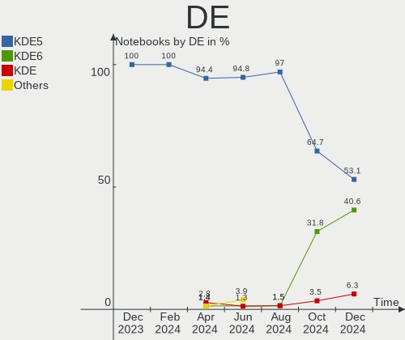
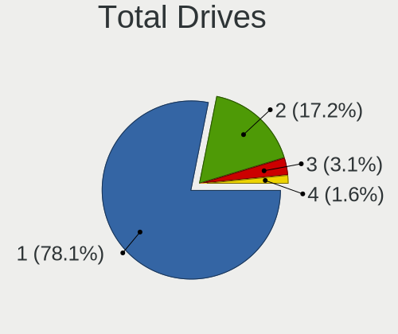
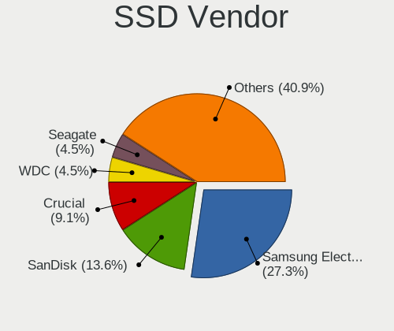
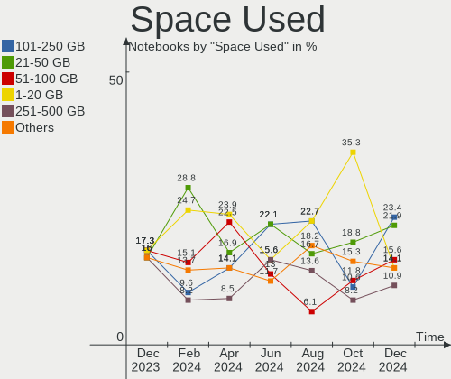
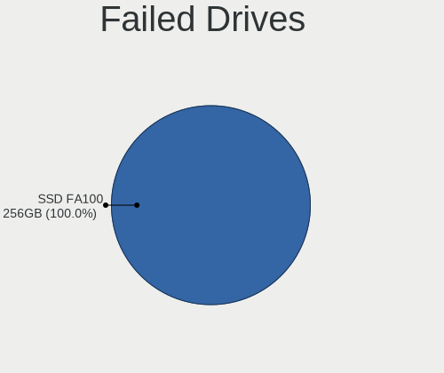
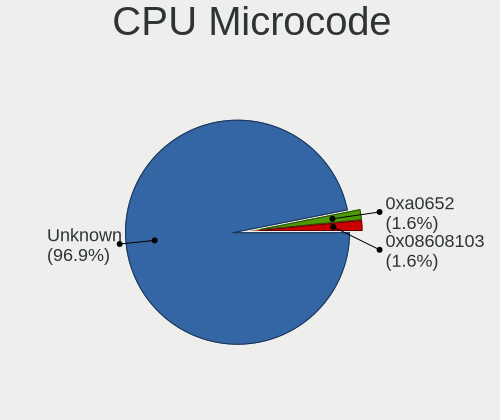
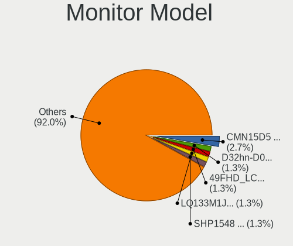
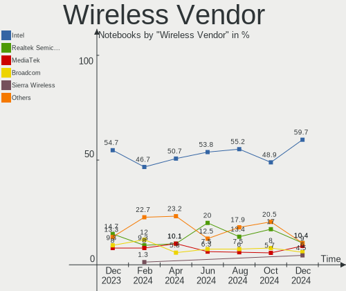

Kubuntu Hardware Trends (Notebooks)
-----------------------------------

A project to identify most popular hardware characteristics and track their change
over time based on data collected by Kubuntu users at https://Linux-Hardware.org.

Anyone can contribute to this report by the [hw-probe](https://github.com/linuxhw/hw-probe) tool:

    sudo -E hw-probe -all -upload

Full-feature report is available here: https://linux-hardware.org/?view=trends

Period: Mar, 2022.

Contents
--------

* [ System ](#system)
  - [ OS                       ](#os)
  - [ OS Family                ](#os-family)
  - [ Kernel                   ](#kernel)
  - [ Kernel Family            ](#kernel-family)
  - [ Kernel Major Ver.        ](#kernel-major-ver)
  - [ Arch                     ](#arch)
  - [ DE                       ](#de)
  - [ Display Server           ](#display-server)
  - [ Display Manager          ](#display-manager)
  - [ OS Lang                  ](#os-lang)
  - [ Boot Mode                ](#boot-mode)
  - [ Filesystem               ](#filesystem)
  - [ Part. scheme             ](#part-scheme)
  - [ Dual Boot with Linux/BSD ](#dual-boot-with-linuxbsd)
  - [ Dual Boot (Win)          ](#dual-boot-win)

* [ Board ](#board)
  - [ Vendor                   ](#vendor)
  - [ Model                    ](#model)
  - [ Model Family             ](#model-family)
  - [ MFG Year                 ](#mfg-year)
  - [ Form Factor              ](#form-factor)
  - [ Secure Boot              ](#secure-boot)
  - [ Coreboot                 ](#coreboot)
  - [ RAM Size                 ](#ram-size)
  - [ RAM Used                 ](#ram-used)
  - [ Total Drives             ](#total-drives)
  - [ Has CD-ROM               ](#has-cd-rom)
  - [ Has Ethernet             ](#has-ethernet)
  - [ Has WiFi                 ](#has-wifi)
  - [ Has Bluetooth            ](#has-bluetooth)

* [ Location ](#location)
  - [ Country                  ](#country)
  - [ City                     ](#city)

* [ Drives ](#drives)
  - [ Drive Vendor             ](#drive-vendor)
  - [ Drive Model              ](#drive-model)
  - [ HDD Vendor               ](#hdd-vendor)
  - [ SSD Vendor               ](#ssd-vendor)
  - [ Drive Kind               ](#drive-kind)
  - [ Drive Connector          ](#drive-connector)
  - [ Drive Size               ](#drive-size)
  - [ Space Total              ](#space-total)
  - [ Space Used               ](#space-used)
  - [ Malfunc. Drives          ](#malfunc-drives)
  - [ Malfunc. Drive Vendor    ](#malfunc-drive-vendor)
  - [ Malfunc. HDD Vendor      ](#malfunc-hdd-vendor)
  - [ Malfunc. Drive Kind      ](#malfunc-drive-kind)
  - [ Failed Drives            ](#failed-drives)
  - [ Failed Drive Vendor      ](#failed-drive-vendor)
  - [ Drive Status             ](#drive-status)

* [ Storage controller ](#storage-controller)
  - [ Storage Vendor           ](#storage-vendor)
  - [ Storage Model            ](#storage-model)
  - [ Storage Kind             ](#storage-kind)

* [ Processor ](#processor)
  - [ CPU Vendor               ](#cpu-vendor)
  - [ CPU Model                ](#cpu-model)
  - [ CPU Model Family         ](#cpu-model-family)
  - [ CPU Cores                ](#cpu-cores)
  - [ CPU Sockets              ](#cpu-sockets)
  - [ CPU Threads              ](#cpu-threads)
  - [ CPU Op-Modes             ](#cpu-op-modes)
  - [ CPU Microcode            ](#cpu-microcode)
  - [ CPU Microarch            ](#cpu-microarch)

* [ Graphics ](#graphics)
  - [ GPU Vendor               ](#gpu-vendor)
  - [ GPU Model                ](#gpu-model)
  - [ GPU Combo                ](#gpu-combo)
  - [ GPU Driver               ](#gpu-driver)
  - [ GPU Memory               ](#gpu-memory)

* [ Monitor ](#monitor)
  - [ Monitor Vendor           ](#monitor-vendor)
  - [ Monitor Model            ](#monitor-model)
  - [ Monitor Resolution       ](#monitor-resolution)
  - [ Monitor Diagonal         ](#monitor-diagonal)
  - [ Monitor Width            ](#monitor-width)
  - [ Aspect Ratio             ](#aspect-ratio)
  - [ Monitor Area             ](#monitor-area)
  - [ Pixel Density            ](#pixel-density)
  - [ Multiple Monitors        ](#multiple-monitors)

* [ Network ](#network)
  - [ Net Controller Vendor    ](#net-controller-vendor)
  - [ Net Controller Model     ](#net-controller-model)
  - [ Wireless Vendor          ](#wireless-vendor)
  - [ Wireless Model           ](#wireless-model)
  - [ Ethernet Vendor          ](#ethernet-vendor)
  - [ Ethernet Model           ](#ethernet-model)
  - [ Net Controller Kind      ](#net-controller-kind)
  - [ Used Controller          ](#used-controller)
  - [ NICs                     ](#nics)
  - [ IPv6                     ](#ipv6)

* [ Bluetooth ](#bluetooth)
  - [ Bluetooth Vendor         ](#bluetooth-vendor)
  - [ Bluetooth Model          ](#bluetooth-model)

* [ Sound ](#sound)
  - [ Sound Vendor             ](#sound-vendor)
  - [ Sound Model              ](#sound-model)

* [ Memory ](#memory)
  - [ Memory Vendor            ](#memory-vendor)
  - [ Memory Model             ](#memory-model)
  - [ Memory Kind              ](#memory-kind)
  - [ Memory Form Factor       ](#memory-form-factor)
  - [ Memory Size              ](#memory-size)
  - [ Memory Speed             ](#memory-speed)

* [ Printers & scanners ](#printers--scanners)
  - [ Printer Vendor           ](#printer-vendor)
  - [ Printer Model            ](#printer-model)
  - [ Scanner Vendor           ](#scanner-vendor)
  - [ Scanner Model            ](#scanner-model)

* [ Camera ](#camera)
  - [ Camera Vendor            ](#camera-vendor)
  - [ Camera Model             ](#camera-model)

* [ Security ](#security)
  - [ Fingerprint Vendor       ](#fingerprint-vendor)
  - [ Fingerprint Model        ](#fingerprint-model)
  - [ Chipcard Vendor          ](#chipcard-vendor)
  - [ Chipcard Model           ](#chipcard-model)

* [ Unsupported ](#unsupported)
  - [ Unsupported Devices      ](#unsupported-devices)
  - [ Unsupported Device Types ](#unsupported-device-types)

System
------

OS
--

Installed operating systems

| Name          | Notebooks | Percent |
|---------------|-----------|---------|
| Kubuntu 20.04 | 24        | 48%     |
| Kubuntu 21.10 | 19        | 38%     |
| Kubuntu 11    | 5         | 10%     |
| Kubuntu 21.04 | 1         | 2%      |
| Kubuntu 18.04 | 1         | 2%      |

OS Family
---------

OS without a version

| Name    | Notebooks | Percent |
|---------|-----------|---------|
| Kubuntu | 50        | 100%    |

Kernel
------

Version of the Linux kernel

| Version                  | Notebooks | Percent |
|--------------------------|-----------|---------|
| 5.13.0-35-generic        | 16        | 32%     |
| 5.13.0-30-generic        | 9         | 18%     |
| 5.13.0-37-generic        | 8         | 16%     |
| 5.4.0-105-generic        | 3         | 6%      |
| 5.13.0-35-lowlatency     | 2         | 4%      |
| 5.8.0-44-generic         | 1         | 2%      |
| 5.4.0-104-generic        | 1         | 2%      |
| 5.4.0-100-generic        | 1         | 2%      |
| 5.17.0-051700rc7-generic | 1         | 2%      |
| 5.14.0-1031-oem          | 1         | 2%      |
| 5.13.0-39-generic        | 1         | 2%      |
| 5.13.0-38-generic        | 1         | 2%      |
| 5.13.0-36-generic        | 1         | 2%      |
| 5.13.0-32-generic        | 1         | 2%      |
| 5.13.0-19-generic        | 1         | 2%      |
| 5.10.0-1038-oem          | 1         | 2%      |
| 4.15.0-169-generic       | 1         | 2%      |

Kernel Family
-------------

Linux kernel without a distro release

| Version | Notebooks | Percent |
|---------|-----------|---------|
| 5.13.0  | 40        | 80%     |
| 5.4.0   | 5         | 10%     |
| 5.8.0   | 1         | 2%      |
| 5.17.0  | 1         | 2%      |
| 5.14.0  | 1         | 2%      |
| 5.10.0  | 1         | 2%      |
| 4.15.0  | 1         | 2%      |

Kernel Major Ver.
-----------------

Linux kernel major version

| Version | Notebooks | Percent |
|---------|-----------|---------|
| 5.13    | 40        | 80%     |
| 5.4     | 5         | 10%     |
| 5.8     | 1         | 2%      |
| 5.17    | 1         | 2%      |
| 5.14    | 1         | 2%      |
| 5.10    | 1         | 2%      |
| 4.15    | 1         | 2%      |

Arch
----

OS architecture (x86_64, i586, etc.)

| Name   | Notebooks | Percent |
|--------|-----------|---------|
| x86_64 | 50        | 100%    |

DE
--

Desktop Environment

| Name | Notebooks | Percent |
|------|-----------|---------|
| KDE5 | 48        | 96%     |
| KDE  | 2         | 4%      |

Display Server
--------------

X11 or Wayland

| Name    | Notebooks | Percent |
|---------|-----------|---------|
| X11     | 48        | 96%     |
| Wayland | 1         | 2%      |
| Tty     | 1         | 2%      |

Display Manager
---------------

SDDM, LightDM, etc.

| Name    | Notebooks | Percent |
|---------|-----------|---------|
| SDDM    | 36        | 72%     |
| Unknown | 11        | 22%     |
| LightDM | 1         | 2%      |
| GDM3    | 1         | 2%      |
| GDM     | 1         | 2%      |

OS Lang
-------

Language

| Lang  | Notebooks | Percent |
|-------|-----------|---------|
| en_US | 20        | 40%     |
| pt_BR | 3         | 6%      |
| fr_FR | 3         | 6%      |
| de_DE | 3         | 6%      |
| sk_SK | 2         | 4%      |
| it_IT | 2         | 4%      |
| es_ES | 2         | 4%      |
| en_IN | 2         | 4%      |
| ru_RU | 1         | 2%      |
| pl_PL | 1         | 2%      |
| hu_HU | 1         | 2%      |
| es_CL | 1         | 2%      |
| en_ZA | 1         | 2%      |
| en_SG | 1         | 2%      |
| en_IE | 1         | 2%      |
| en_HK | 1         | 2%      |
| en_GB | 1         | 2%      |
| en_CA | 1         | 2%      |
| de_CH | 1         | 2%      |
| C     | 1         | 2%      |
| be_BY | 1         | 2%      |

Boot Mode
---------

EFI or BIOS

| Mode | Notebooks | Percent |
|------|-----------|---------|
| EFI  | 30        | 60%     |
| BIOS | 20        | 40%     |

Filesystem
----------

Type of filesystem

| Type    | Notebooks | Percent |
|---------|-----------|---------|
| Ext4    | 49        | 98%     |
| Overlay | 1         | 2%      |

Part. scheme
------------

Scheme of partitioning

| Type    | Notebooks | Percent |
|---------|-----------|---------|
| GPT     | 23        | 46%     |
| Unknown | 22        | 44%     |
| MBR     | 5         | 10%     |

Dual Boot with Linux/BSD
------------------------

Hosting more than one Linux/BSD

| Dual boot | Notebooks | Percent |
|-----------|-----------|---------|
| No        | 44        | 88%     |
| Yes       | 6         | 12%     |

Dual Boot (Win)
---------------

Hosting Linux and Windows

| Dual boot | Notebooks | Percent |
|-----------|-----------|---------|
| No        | 31        | 62%     |
| Yes       | 19        | 38%     |

Board
-----

Vendor
------

Motherboard manufacturer

| Name                   | Notebooks | Percent |
|------------------------|-----------|---------|
| ASUSTek Computer       | 12        | 24%     |
| Dell                   | 11        | 22%     |
| Lenovo                 | 9         | 18%     |
| Hewlett-Packard        | 4         | 8%      |
| Acer                   | 3         | 6%      |
| MSI                    | 2         | 4%      |
| Apple                  | 2         | 4%      |
| Samsung Electronics    | 1         | 2%      |
| Razer                  | 1         | 2%      |
| Positivo               | 1         | 2%      |
| Panasonic              | 1         | 2%      |
| HUAWEI                 | 1         | 2%      |
| Avell High Performance | 1         | 2%      |
| Unknown                | 1         | 2%      |

Model
-----

Motherboard model

| Name                                                 | Notebooks | Percent |
|------------------------------------------------------|-----------|---------|
| Lenovo IdeaPad S145-15IIL 82DJ                       | 2         | 4%      |
| Samsung 300E4Z/300E5Z/300E7Z                         | 1         | 2%      |
| Razer Blade 15 Advanced Model (Mid 2021) - RZ09-0409 | 1         | 2%      |
| Positivo Q232A                                       | 1         | 2%      |
| Panasonic FZ-M1CC-51BE                               | 1         | 2%      |
| MSI Katana GF76 11UC                                 | 1         | 2%      |
| MSI GP76 Leopard 11UH                                | 1         | 2%      |
| Lenovo ThinkPad X220 4290EC5                         | 1         | 2%      |
| Lenovo ThinkPad X1 Extreme 20MFS0PE00                | 1         | 2%      |
| Lenovo ThinkPad T540p 20BEA00FRT                     | 1         | 2%      |
| Lenovo ThinkPad T430 2347AT2                         | 1         | 2%      |
| Lenovo ThinkPad P1 Gen 3 20TH003SUS                  | 1         | 2%      |
| Lenovo IdeaPad S530-13IWL 81J7                       | 1         | 2%      |
| Lenovo B580 20144                                    | 1         | 2%      |
| HUAWEI BOHB-WAX9                                     | 1         | 2%      |
| HP Stream Notebook PC 14                             | 1         | 2%      |
| HP ProBook 430 G2                                    | 1         | 2%      |
| HP Pavilion 14                                       | 1         | 2%      |
| HP EliteBook 850 G5                                  | 1         | 2%      |
| Dell XPS 15 7590                                     | 1         | 2%      |
| Dell XPS 13 9310                                     | 1         | 2%      |
| Dell XPS 13 9305                                     | 1         | 2%      |
| Dell Vostro 5470                                     | 1         | 2%      |
| Dell Vostro 15 3515                                  | 1         | 2%      |
| Dell System Inspiron N7110                           | 1         | 2%      |
| Dell Precision M6300                                 | 1         | 2%      |
| Dell Latitude E6530                                  | 1         | 2%      |
| Dell Latitude E6430                                  | 1         | 2%      |
| Dell Latitude 5290 2-in-1                            | 1         | 2%      |
| Dell Inspiron 5379                                   | 1         | 2%      |
| Avell High Performance B.ON                          | 1         | 2%      |
| ASUS ZenBook UX435EG_UX435EG                         | 1         | 2%      |
| ASUS X555LNB                                         | 1         | 2%      |
| ASUS VivoBook_ASUSLaptop X7600PC_N7600PC             | 1         | 2%      |
| ASUS VivoBook_ASUSLaptop X521FA_S533FA               | 1         | 2%      |
| ASUS VivoBook_ASUSLaptop X513EA_K513EA               | 1         | 2%      |
| ASUS VivoBook_ASUSLaptop M3401QC_M3401QC             | 1         | 2%      |
| ASUS UX331UN                                         | 1         | 2%      |
| ASUS N550LF                                          | 1         | 2%      |
| ASUS K73E                                            | 1         | 2%      |
| ASUS K55N                                            | 1         | 2%      |
| ASUS K52Jr                                           | 1         | 2%      |
| ASUS ASUS EXPERTBOOK B1400CEAEY_B1400CEAE            | 1         | 2%      |
| Apple MacBookPro14,1                                 | 1         | 2%      |
| Apple MacBookPro12,1                                 | 1         | 2%      |
| Acer Swift SF314-54G                                 | 1         | 2%      |
| Acer Nitro AN515-56                                  | 1         | 2%      |
| Acer Aspire 5750G                                    | 1         | 2%      |
| Unknown                                              | 1         | 2%      |

Model Family
------------

Motherboard model prefix

| Name                        | Notebooks | Percent |
|-----------------------------|-----------|---------|
| Lenovo ThinkPad             | 5         | 10%     |
| ASUS VivoBook               | 4         | 8%      |
| Lenovo IdeaPad              | 3         | 6%      |
| Dell XPS                    | 3         | 6%      |
| Dell Latitude               | 3         | 6%      |
| Dell Vostro                 | 2         | 4%      |
| Samsung 300E4Z              | 1         | 2%      |
| Razer Blade                 | 1         | 2%      |
| Positivo Q232A              | 1         | 2%      |
| Panasonic FZ-M1CC-51BE      | 1         | 2%      |
| MSI Katana                  | 1         | 2%      |
| MSI GP76                    | 1         | 2%      |
| Lenovo B580                 | 1         | 2%      |
| HUAWEI BOHB-WAX9            | 1         | 2%      |
| HP Stream                   | 1         | 2%      |
| HP ProBook                  | 1         | 2%      |
| HP Pavilion                 | 1         | 2%      |
| HP EliteBook                | 1         | 2%      |
| Dell System                 | 1         | 2%      |
| Dell Precision              | 1         | 2%      |
| Dell Inspiron               | 1         | 2%      |
| Avell High Performance B.ON | 1         | 2%      |
| ASUS ZenBook                | 1         | 2%      |
| ASUS X555LNB                | 1         | 2%      |
| ASUS UX331UN                | 1         | 2%      |
| ASUS N550LF                 | 1         | 2%      |
| ASUS K73E                   | 1         | 2%      |
| ASUS K55N                   | 1         | 2%      |
| ASUS K52Jr                  | 1         | 2%      |
| ASUS ASUS                   | 1         | 2%      |
| Apple MacBookPro14          | 1         | 2%      |
| Apple MacBookPro12          | 1         | 2%      |
| Acer Swift                  | 1         | 2%      |
| Acer Nitro                  | 1         | 2%      |
| Acer Aspire                 | 1         | 2%      |
| Unknown                     | 1         | 2%      |

MFG Year
--------

Motherboard manufacture year

| Year | Notebooks | Percent |
|------|-----------|---------|
| 2021 | 11        | 22%     |
| 2020 | 6         | 12%     |
| 2018 | 5         | 10%     |
| 2012 | 5         | 10%     |
| 2011 | 5         | 10%     |
| 2019 | 4         | 8%      |
| 2014 | 4         | 8%      |
| 2017 | 3         | 6%      |
| 2013 | 3         | 6%      |
| 2022 | 1         | 2%      |
| 2016 | 1         | 2%      |
| 2009 | 1         | 2%      |
| 2007 | 1         | 2%      |

Form Factor
-----------

Physical design of the computer

| Name     | Notebooks | Percent |
|----------|-----------|---------|
| Notebook | 50        | 100%    |

Secure Boot
-----------

Enabled or disabled

| State    | Notebooks | Percent |
|----------|-----------|---------|
| Disabled | 44        | 88%     |
| Enabled  | 6         | 12%     |

Coreboot
--------

Have coreboot on board

| Used | Notebooks | Percent |
|------|-----------|---------|
| No   | 50        | 100%    |

RAM Size
--------

Total RAM memory

| Size in GB  | Notebooks | Percent |
|-------------|-----------|---------|
| 4.01-8.0    | 18        | 36%     |
| 16.01-24.0  | 14        | 28%     |
| 8.01-16.0   | 9         | 18%     |
| 3.01-4.0    | 4         | 8%      |
| 32.01-64.0  | 2         | 4%      |
| 1.01-2.0    | 2         | 4%      |
| 64.01-256.0 | 1         | 2%      |

RAM Used
--------

Used RAM memory

| Used GB   | Notebooks | Percent |
|-----------|-----------|---------|
| 1.01-2.0  | 19        | 38%     |
| 2.01-3.0  | 12        | 24%     |
| 4.01-8.0  | 9         | 18%     |
| 3.01-4.0  | 5         | 10%     |
| 8.01-16.0 | 4         | 8%      |
| 0.51-1.0  | 1         | 2%      |

Total Drives
------------

Number of drives on board

| Drives | Notebooks | Percent |
|--------|-----------|---------|
| 1      | 36        | 72%     |
| 2      | 13        | 26%     |
| 3      | 1         | 2%      |

Has CD-ROM
----------

Has CD-ROM on board

| Presented | Notebooks | Percent |
|-----------|-----------|---------|
| No        | 36        | 72%     |
| Yes       | 14        | 28%     |

Has Ethernet
------------

Has Ethernet on board

| Presented | Notebooks | Percent |
|-----------|-----------|---------|
| Yes       | 27        | 54%     |
| No        | 23        | 46%     |

Has WiFi
--------

Has WiFi module

| Presented | Notebooks | Percent |
|-----------|-----------|---------|
| Yes       | 49        | 98%     |
| No        | 1         | 2%      |

Has Bluetooth
-------------

Has Bluetooth module

| Presented | Notebooks | Percent |
|-----------|-----------|---------|
| Yes       | 43        | 86%     |
| No        | 7         | 14%     |

Location
--------

Country
-------

Geographic location (country)

| Country      | Notebooks | Percent |
|--------------|-----------|---------|
| USA          | 7         | 14%     |
| Brazil       | 5         | 10%     |
| Germany      | 4         | 8%      |
| France       | 4         | 8%      |
| Italy        | 3         | 6%      |
| UK           | 2         | 4%      |
| Switzerland  | 2         | 4%      |
| Spain        | 2         | 4%      |
| Slovakia     | 2         | 4%      |
| Russia       | 2         | 4%      |
| India        | 2         | 4%      |
| Ukraine      | 1         | 2%      |
| Thailand     | 1         | 2%      |
| Sweden       | 1         | 2%      |
| South Africa | 1         | 2%      |
| Singapore    | 1         | 2%      |
| Poland       | 1         | 2%      |
| Mexico       | 1         | 2%      |
| Ireland      | 1         | 2%      |
| Indonesia    | 1         | 2%      |
| Hungary      | 1         | 2%      |
| Hong Kong    | 1         | 2%      |
| Georgia      | 1         | 2%      |
| Chile        | 1         | 2%      |
| Canada       | 1         | 2%      |
| Belarus      | 1         | 2%      |

City
----

Geographic location (city)

| City                     | Notebooks | Percent |
|--------------------------|-----------|---------|
| Moscow                   | 2         | 4%      |
| Zurich                   | 1         | 2%      |
| Zaragoza                 | 1         | 2%      |
| Washington               | 1         | 2%      |
| Vitória                 | 1         | 2%      |
| Trimmis                  | 1         | 2%      |
| Toulouse                 | 1         | 2%      |
| Surat Thani              | 1         | 2%      |
| Stockholm                | 1         | 2%      |
| St. Petersburg           | 1         | 2%      |
| Singapore                | 1         | 2%      |
| Sherman Oaks             | 1         | 2%      |
| Santo Antonio da Platina | 1         | 2%      |
| Rumsey                   | 1         | 2%      |
| Rotthalmunster           | 1         | 2%      |
| Rotherhithe              | 1         | 2%      |
| Rocca Priora             | 1         | 2%      |
| Rho                      | 1         | 2%      |
| Rennes                   | 1         | 2%      |
| Presidente Dutra         | 1         | 2%      |
| Porto Alegre             | 1         | 2%      |
| Pomarede                 | 1         | 2%      |
| Paris                    | 1         | 2%      |
| New Ross                 | 1         | 2%      |
| Mumbai                   | 1         | 2%      |
| Missoula                 | 1         | 2%      |
| Minsk                    | 1         | 2%      |
| Milan                    | 1         | 2%      |
| Memmingen                | 1         | 2%      |
| Martin                   | 1         | 2%      |
| Manteca                  | 1         | 2%      |
| Maipu                    | 1         | 2%      |
| Lubliniec                | 1         | 2%      |
| Laichingen               | 1         | 2%      |
| Kyiv                     | 1         | 2%      |
| Kowloon                  | 1         | 2%      |
| Kirkby-in-Furness        | 1         | 2%      |
| K'alak'i T'bilisi        | 1         | 2%      |
| Jakarta                  | 1         | 2%      |
| Dharwad                  | 1         | 2%      |
| Curitiba                 | 1         | 2%      |
| Ciudad Obregón          | 1         | 2%      |
| Chattanooga              | 1         | 2%      |
| Centurion                | 1         | 2%      |
| Cambridge                | 1         | 2%      |
| Budapest                 | 1         | 2%      |
| Bratislava               | 1         | 2%      |
| Arnsberg                 | 1         | 2%      |
| Alcorcón                | 1         | 2%      |

Drives
------

Drive Vendor
------------

Hard drive vendors

| Vendor                         | Notebooks | Drives | Percent |
|--------------------------------|-----------|--------|---------|
| Samsung Electronics            | 11        | 11     | 17.19%  |
| WDC                            | 8         | 8      | 12.5%   |
| Sandisk                        | 7         | 7      | 10.94%  |
| Unknown                        | 5         | 5      | 7.81%   |
| Intel                          | 4         | 4      | 6.25%   |
| Toshiba                        | 3         | 3      | 4.69%   |
| Kingston                       | 3         | 3      | 4.69%   |
| A-DATA Technology              | 3         | 3      | 4.69%   |
| KIOXIA                         | 2         | 2      | 3.13%   |
| Hitachi                        | 2         | 2      | 3.13%   |
| Apple                          | 2         | 3      | 3.13%   |
| Solid State Storage Technology | 1         | 1      | 1.56%   |
| SK Hynix                       | 1         | 1      | 1.56%   |
| Silicon Motion                 | 1         | 1      | 1.56%   |
| ShanDianZhe                    | 1         | 1      | 1.56%   |
| Seagate                        | 1         | 1      | 1.56%   |
| Mushkin                        | 1         | 1      | 1.56%   |
| Micron Technology              | 1         | 1      | 1.56%   |
| Intenso                        | 1         | 1      | 1.56%   |
| HGST                           | 1         | 1      | 1.56%   |
| GOODRAM                        | 1         | 1      | 1.56%   |
| Crucial                        | 1         | 1      | 1.56%   |
| China                          | 1         | 1      | 1.56%   |
| BHT                            | 1         | 1      | 1.56%   |
| Unknown                        | 1         | 1      | 1.56%   |

Drive Model
-----------

Hard drive models

| Model                                    | Notebooks | Percent |
|------------------------------------------|-----------|---------|
| Unknown MMC Card  32GB                   | 2         | 3.13%   |
| Sandisk NVMe SSD Drive 512GB             | 2         | 3.13%   |
| Kingston OM8PCP3512F-AI1 512GB           | 2         | 3.13%   |
| Intel SSDPEKNW512G8 512GB                | 2         | 3.13%   |
| WDC WD6400BPVT-75HXZT3 640GB             | 1         | 1.56%   |
| WDC WD6400BPVT-22HXZT3 640GB             | 1         | 1.56%   |
| WDC WD5000BPVT-08HXZT3 500GB             | 1         | 1.56%   |
| WDC WD3200LPVX-75V0TT0 320GB             | 1         | 1.56%   |
| WDC WD10SPZX-21Z10T0 1TB                 | 1         | 1.56%   |
| WDC WD10SPZX-00Z10T0 1TB                 | 1         | 1.56%   |
| WDC PC SN730 NVMe 512GB                  | 1         | 1.56%   |
| WDC PC SN530 SDBPNPZ-512G-1114 512GB     | 1         | 1.56%   |
| Unknown SD/MMC/MS PRO 32GB               | 1         | 1.56%   |
| Unknown SC128  128GB                     | 1         | 1.56%   |
| Unknown MMC Card  16GB                   | 1         | 1.56%   |
| Toshiba NVMe SSD Drive 1024GB            | 1         | 1.56%   |
| Toshiba MQ04ABF100 1TB                   | 1         | 1.56%   |
| Toshiba MQ01ABD075 752GB                 | 1         | 1.56%   |
| Solid State Storage NVMe SSD Drive 256GB | 1         | 1.56%   |
| SK Hynix HFM001TD3JX013N 1TB             | 1         | 1.56%   |
| Silicon Motion NVMe SSD Drive 1TB        | 1         | 1.56%   |
| ShanDianZhe SSD 512GB                    | 1         | 1.56%   |
| Seagate ST500LM012 HN-M500MBB 500GB      | 1         | 1.56%   |
| SanDisk X400 M.2 2280 12 128GB SSD       | 1         | 1.56%   |
| SanDisk SSD U110 16GB                    | 1         | 1.56%   |
| SanDisk SSD PLUS 240GB                   | 1         | 1.56%   |
| SanDisk SSD PLUS 1000GB                  | 1         | 1.56%   |
| SanDisk SL32G  32GB                      | 1         | 1.56%   |
| Samsung SSD PM871b 2.5 7mm 512GB         | 1         | 1.56%   |
| Samsung SSD 970 EVO Plus 2TB             | 1         | 1.56%   |
| Samsung SSD 860 EVO M.2 500GB            | 1         | 1.56%   |
| Samsung SSD 860 EVO 250GB                | 1         | 1.56%   |
| Samsung SSD 850 EVO 500GB                | 1         | 1.56%   |
| Samsung PM981 NVMe 256GB                 | 1         | 1.56%   |
| Samsung NVMe SSD Drive 1024GB            | 1         | 1.56%   |
| Samsung MZVLQ256HAJD-000AC 256GB         | 1         | 1.56%   |
| Samsung MZVLB512HAJQ-000H1 512GB         | 1         | 1.56%   |
| Samsung M3 Portable 2TB                  | 1         | 1.56%   |
| Samsung HM500JI 500GB                    | 1         | 1.56%   |
| Mushkin MKNSSDSR250GB                    | 1         | 1.56%   |
| Micron 1100_MTFDDAV512TBN 512GB SSD      | 1         | 1.56%   |
| KIOXIA KXG60PNV2T04 NVMe 2048GB          | 1         | 1.56%   |
| KIOXIA KBG40ZNS512G NVMe 512GB           | 1         | 1.56%   |
| Kingston SA400S37480G 480GB SSD          | 1         | 1.56%   |
| Intenso SSD Sata III 512GB               | 1         | 1.56%   |
| Intel SSDSC2KB960G8 960GB                | 1         | 1.56%   |
| Intel NVMe SSD Drive 512GB               | 1         | 1.56%   |
| Hitachi HTS723232A7A364 320GB            | 1         | 1.56%   |
| Hitachi HTS545032B9A300 320GB            | 1         | 1.56%   |
| HGST HTS721075A9E630 752GB               | 1         | 1.56%   |
| GOODRAM C50 64GB SSD                     | 1         | 1.56%   |
| Crucial CT1050MX300SSD1 1050GB           | 1         | 1.56%   |
| China SSD 128GB                          | 1         | 1.56%   |
| BHT WR202A1032G 670215F5 32GB            | 1         | 1.56%   |
| Apple SSD SM0128G 121GB                  | 1         | 1.56%   |
| Apple SSD AP0128J 8.1KB                  | 1         | 1.56%   |
| A-DATA SU650 480GB SSD                   | 1         | 1.56%   |
| A-DATA IM2P33F8A-512GD 512GB             | 1         | 1.56%   |
| A-DATA IM2P33F3A NVMe 256GB              | 1         | 1.56%   |
| Unknown                                  | 1         | 1.56%   |

HDD Vendor
----------

Hard disk drive vendors

| Vendor              | Notebooks | Drives | Percent |
|---------------------|-----------|--------|---------|
| WDC                 | 6         | 6      | 40%     |
| Toshiba             | 2         | 2      | 13.33%  |
| Samsung Electronics | 2         | 2      | 13.33%  |
| Hitachi             | 2         | 2      | 13.33%  |
| Unknown             | 1         | 1      | 6.67%   |
| Seagate             | 1         | 1      | 6.67%   |
| HGST                | 1         | 1      | 6.67%   |

SSD Vendor
----------

Solid state drive vendors

| Vendor              | Notebooks | Drives | Percent |
|---------------------|-----------|--------|---------|
| SanDisk             | 4         | 4      | 20%     |
| Samsung Electronics | 4         | 4      | 20%     |
| ShanDianZhe         | 1         | 1      | 5%      |
| Mushkin             | 1         | 1      | 5%      |
| Micron Technology   | 1         | 1      | 5%      |
| Kingston            | 1         | 1      | 5%      |
| Intenso             | 1         | 1      | 5%      |
| Intel               | 1         | 1      | 5%      |
| GOODRAM             | 1         | 1      | 5%      |
| Crucial             | 1         | 1      | 5%      |
| China               | 1         | 1      | 5%      |
| BHT                 | 1         | 1      | 5%      |
| Apple               | 1         | 1      | 5%      |
| A-DATA Technology   | 1         | 1      | 5%      |

Drive Kind
----------

HDD or SSD

| Kind | Notebooks | Drives | Percent |
|------|-----------|--------|---------|
| NVMe | 23        | 24     | 37.1%   |
| SSD  | 19        | 20     | 30.65%  |
| HDD  | 14        | 15     | 22.58%  |
| MMC  | 6         | 6      | 9.68%   |

Drive Connector
---------------

SATA, SAS, NVMe, etc.

| Type | Notebooks | Drives | Percent |
|------|-----------|--------|---------|
| SATA | 28        | 32     | 46.67%  |
| NVMe | 23        | 24     | 38.33%  |
| MMC  | 6         | 6      | 10%     |
| SAS  | 3         | 3      | 5%      |

Drive Size
----------

Size of hard drive

| Size in TB | Notebooks | Drives | Percent |
|------------|-----------|--------|---------|
| 0.01-0.5   | 18        | 20     | 56.25%  |
| 0.51-1.0   | 12        | 13     | 37.5%   |
| 1.01-2.0   | 2         | 2      | 6.25%   |

Space Total
-----------

Amount of disk space available on the file system

| Size in GB     | Notebooks | Percent |
|----------------|-----------|---------|
| 251-500        | 17        | 34%     |
| 101-250        | 10        | 20%     |
| 501-1000       | 8         | 16%     |
| 51-100         | 5         | 10%     |
| 21-50          | 3         | 6%      |
| 1001-2000      | 3         | 6%      |
| 1-20           | 2         | 4%      |
| More than 3000 | 1         | 2%      |
| 2001-3000      | 1         | 2%      |

Space Used
----------

Amount of used disk space

| Used GB   | Notebooks | Percent |
|-----------|-----------|---------|
| 1-20      | 19        | 38%     |
| 251-500   | 9         | 18%     |
| 101-250   | 7         | 14%     |
| 21-50     | 6         | 12%     |
| 51-100    | 5         | 10%     |
| 501-1000  | 3         | 6%      |
| 1001-2000 | 1         | 2%      |

Malfunc. Drives
---------------

Drive models with a malfunction

| Model                               | Notebooks | Drives | Percent |
|-------------------------------------|-----------|--------|---------|
| Seagate ST500LM012 HN-M500MBB 500GB | 1         | 1      | 100%    |

Malfunc. Drive Vendor
---------------------

Vendors of faulty drives

| Vendor  | Notebooks | Drives | Percent |
|---------|-----------|--------|---------|
| Seagate | 1         | 1      | 100%    |

Malfunc. HDD Vendor
-------------------

Vendors of faulty HDD drives

| Vendor  | Notebooks | Drives | Percent |
|---------|-----------|--------|---------|
| Seagate | 1         | 1      | 100%    |

Malfunc. Drive Kind
-------------------

Kinds of faulty drives

| Kind | Notebooks | Drives | Percent |
|------|-----------|--------|---------|
| HDD  | 1         | 1      | 100%    |

Failed Drives
-------------

Failed drive models

| Model                     | Notebooks | Drives | Percent |
|---------------------------|-----------|--------|---------|
| Intel SSDSC2KB960G8 960GB | 1         | 1      | 100%    |

Failed Drive Vendor
-------------------

Failed drive vendors

| Vendor | Notebooks | Drives | Percent |
|--------|-----------|--------|---------|
| Intel  | 1         | 1      | 100%    |

Drive Status
------------

Number of failed and malfunc. drives

| Status   | Notebooks | Drives | Percent |
|----------|-----------|--------|---------|
| Detected | 28        | 31     | 50%     |
| Works    | 26        | 32     | 46.43%  |
| Malfunc  | 1         | 1      | 1.79%   |
| Failed   | 1         | 1      | 1.79%   |

Storage controller
------------------

Storage Vendor
--------------

Storage controller vendors

| Vendor                         | Notebooks | Percent |
|--------------------------------|-----------|---------|
| Intel                          | 35        | 59.32%  |
| Samsung Electronics            | 6         | 10.17%  |
| Sandisk                        | 4         | 6.78%   |
| AMD                            | 3         | 5.08%   |
| Toshiba America Info Systems   | 2         | 3.39%   |
| Kingston Technology Company    | 2         | 3.39%   |
| ADATA Technology               | 2         | 3.39%   |
| Solid State Storage Technology | 1         | 1.69%   |
| SK Hynix                       | 1         | 1.69%   |
| Silicon Motion                 | 1         | 1.69%   |
| KIOXIA                         | 1         | 1.69%   |
| Apple                          | 1         | 1.69%   |

Storage Model
-------------

Storage controller models

| Model                                                                          | Notebooks | Percent |
|--------------------------------------------------------------------------------|-----------|---------|
| Intel Volume Management Device NVMe RAID Controller                            | 6         | 9.09%   |
| Intel 8 Series SATA Controller 1 [AHCI mode]                                   | 5         | 7.58%   |
| Intel 6 Series/C200 Series Chipset Family 6 port Mobile SATA AHCI Controller   | 5         | 7.58%   |
| Intel 82801 Mobile SATA Controller [RAID mode]                                 | 4         | 6.06%   |
| Samsung NVMe SSD Controller SM981/PM981/PM983                                  | 3         | 4.55%   |
| Intel Tiger Lake-LP SATA Controller [AHCI mode]                                | 3         | 4.55%   |
| Intel Sunrise Point-LP SATA Controller [AHCI mode]                             | 3         | 4.55%   |
| Intel SSD 660P Series                                                          | 3         | 4.55%   |
| AMD FCH SATA Controller [AHCI mode]                                            | 3         | 4.55%   |
| Toshiba America Info Systems XG6 NVMe SSD Controller                           | 2         | 3.03%   |
| Sandisk WD Blue SN550 NVMe SSD                                                 | 2         | 3.03%   |
| Kingston Company Company Non-Volatile memory controller                        | 2         | 3.03%   |
| ADATA Non-Volatile memory controller                                           | 2         | 3.03%   |
| Solid State Storage Non-Volatile memory controller                             | 1         | 1.52%   |
| SK Hynix Gold P31 SSD                                                          | 1         | 1.52%   |
| Silicon Motion SM2263EN/SM2263XT SSD Controller                                | 1         | 1.52%   |
| Sandisk WD Black SN750 / PC SN730 NVMe SSD                                     | 1         | 1.52%   |
| Sandisk PC SN520 NVMe SSD                                                      | 1         | 1.52%   |
| Samsung NVMe SSD Controller PM9A1/PM9A3/980PRO                                 | 1         | 1.52%   |
| Samsung NVMe SSD Controller 980                                                | 1         | 1.52%   |
| Samsung Electronics SATA controller                                            | 1         | 1.52%   |
| KIOXIA Non-Volatile memory controller                                          | 1         | 1.52%   |
| Intel Wildcat Point-LP SATA Controller [AHCI Mode]                             | 1         | 1.52%   |
| Intel Ice Lake-LP SATA Controller [AHCI mode]                                  | 1         | 1.52%   |
| Intel Comet Lake SATA AHCI Controller                                          | 1         | 1.52%   |
| Intel Comet Lake PCH-LP SATA RAID Premium Controller                           | 1         | 1.52%   |
| Intel Cannon Lake Mobile PCH SATA AHCI Controller                              | 1         | 1.52%   |
| Intel 82801HM/HEM (ICH8M/ICH8M-E) SATA Controller [IDE mode]                   | 1         | 1.52%   |
| Intel 82801HM/HEM (ICH8M/ICH8M-E) IDE Controller                               | 1         | 1.52%   |
| Intel 8 Series/C220 Series Chipset Family 6-port SATA Controller 1 [AHCI mode] | 1         | 1.52%   |
| Intel 7 Series Chipset Family 6-port SATA Controller [AHCI mode]               | 1         | 1.52%   |
| Intel 7 Series Chipset Family 4-port SATA Controller [IDE mode]                | 1         | 1.52%   |
| Intel 7 Series Chipset Family 2-port SATA Controller [IDE mode]                | 1         | 1.52%   |
| Intel 500 Series Chipset Family SATA AHCI Controller                           | 1         | 1.52%   |
| Intel 5 Series/3400 Series Chipset 4 port SATA AHCI Controller                 | 1         | 1.52%   |
| Apple S3X NVMe Controller                                                      | 1         | 1.52%   |

Storage Kind
------------

Kind of storage controller (IDE, SATA, NVMe, SAS, ...)

| Kind | Notebooks | Percent |
|------|-----------|---------|
| SATA | 28        | 43.75%  |
| NVMe | 23        | 35.94%  |
| RAID | 11        | 17.19%  |
| IDE  | 2         | 3.13%   |

Processor
---------

CPU Vendor
----------

Processor vendors

| Vendor | Notebooks | Percent |
|--------|-----------|---------|
| Intel  | 46        | 92%     |
| AMD    | 4         | 8%      |

CPU Model
---------

Processor models

| Model                                           | Notebooks | Percent |
|-------------------------------------------------|-----------|---------|
| Intel 11th Gen Core i7-1165G7 @ 2.80GHz         | 5         | 10%     |
| Intel Core i7-8550U CPU @ 1.80GHz               | 3         | 6%      |
| Intel Core i5-4200U CPU @ 1.60GHz               | 2         | 4%      |
| Intel 11th Gen Core i7-11800H @ 2.30GHz         | 2         | 4%      |
| Intel Pentium CPU B950 @ 2.10GHz                | 1         | 2%      |
| Intel Core i9-10885H CPU @ 2.40GHz              | 1         | 2%      |
| Intel Core i7-9750H CPU @ 2.60GHz               | 1         | 2%      |
| Intel Core i7-8750H CPU @ 2.20GHz               | 1         | 2%      |
| Intel Core i7-8650U CPU @ 1.90GHz               | 1         | 2%      |
| Intel Core i7-8565U CPU @ 1.80GHz               | 1         | 2%      |
| Intel Core i7-4700MQ CPU @ 2.40GHz              | 1         | 2%      |
| Intel Core i7-3540M CPU @ 3.00GHz               | 1         | 2%      |
| Intel Core i7-2670QM CPU @ 2.20GHz              | 1         | 2%      |
| Intel Core i7-2630QM CPU @ 2.00GHz              | 1         | 2%      |
| Intel Core i7-1065G7 CPU @ 1.30GHz              | 1         | 2%      |
| Intel Core i5-8250U CPU @ 1.60GHz               | 1         | 2%      |
| Intel Core i5-7360U CPU @ 2.30GHz               | 1         | 2%      |
| Intel Core i5-5257U CPU @ 2.70GHz               | 1         | 2%      |
| Intel Core i5-4302Y CPU @ 1.60GHz               | 1         | 2%      |
| Intel Core i5-4210U CPU @ 1.70GHz               | 1         | 2%      |
| Intel Core i5-3340M CPU @ 2.70GHz               | 1         | 2%      |
| Intel Core i5-3320M CPU @ 2.60GHz               | 1         | 2%      |
| Intel Core i5-2520M CPU @ 2.50GHz               | 1         | 2%      |
| Intel Core i5-2430M CPU @ 2.40GHz               | 1         | 2%      |
| Intel Core i5-1035G1 CPU @ 1.00GHz              | 1         | 2%      |
| Intel Core i5-10210U CPU @ 1.60GHz              | 1         | 2%      |
| Intel Core i3-5010U CPU @ 2.10GHz               | 1         | 2%      |
| Intel Core i3-4030U CPU @ 1.90GHz               | 1         | 2%      |
| Intel Core i3-2328M CPU @ 2.20GHz               | 1         | 2%      |
| Intel Core i3-10110U CPU @ 2.10GHz              | 1         | 2%      |
| Intel Core i3 CPU M 350 @ 2.27GHz               | 1         | 2%      |
| Intel Core 2 Duo CPU T9300 @ 2.50GHz            | 1         | 2%      |
| Intel Celeron CPU 3867U @ 1.80GHz               | 1         | 2%      |
| Intel Atom x5-Z8350 CPU @ 1.44GHz               | 1         | 2%      |
| Intel 11th Gen Core i7-11370H @ 3.30GHz         | 1         | 2%      |
| Intel 11th Gen Core i5-11400H @ 2.70GHz         | 1         | 2%      |
| Intel 11th Gen Core i5-1135G7 @ 2.40GHz         | 1         | 2%      |
| Intel 11th Gen Core i5-11300H @ 3.10GHz         | 1         | 2%      |
| AMD Ryzen 7 5800H with Radeon Graphics          | 1         | 2%      |
| AMD Ryzen 5 3450U with Radeon Vega Mobile Gfx   | 1         | 2%      |
| AMD A8-4500M APU with Radeon HD Graphics        | 1         | 2%      |
| AMD A4 Micro-6400T APU + AMD Radeon R3 Graphics | 1         | 2%      |

CPU Model Family
----------------

Processor model prefix

| Model            | Notebooks | Percent |
|------------------|-----------|---------|
| Intel Core i5    | 13        | 26%     |
| Intel Core i7    | 12        | 24%     |
| Other            | 11        | 22%     |
| Intel Core i3    | 5         | 10%     |
| Intel Pentium    | 1         | 2%      |
| Intel Core i9    | 1         | 2%      |
| Intel Core 2 Duo | 1         | 2%      |
| Intel Celeron    | 1         | 2%      |
| Intel Atom       | 1         | 2%      |
| AMD Ryzen 7      | 1         | 2%      |
| AMD Ryzen 5      | 1         | 2%      |
| AMD A8           | 1         | 2%      |
| AMD A4           | 1         | 2%      |

CPU Cores
---------

Number of processor cores

| Number | Notebooks | Percent |
|--------|-----------|---------|
| 4      | 23        | 46%     |
| 2      | 20        | 40%     |
| 8      | 4         | 8%      |
| 6      | 3         | 6%      |

CPU Sockets
-----------

Number of sockets

| Number | Notebooks | Percent |
|--------|-----------|---------|
| 1      | 50        | 100%    |

CPU Threads
-----------

Threads per core (Hyper-Threading)

| Number | Notebooks | Percent |
|--------|-----------|---------|
| 2      | 45        | 90%     |
| 1      | 5         | 10%     |

CPU Op-Modes
------------

CPU Operation Modes (32-bit, 64-bit)

| Op mode        | Notebooks | Percent |
|----------------|-----------|---------|
| 32-bit, 64-bit | 50        | 100%    |

CPU Microcode
-------------

Microcode number

| Number     | Notebooks | Percent |
|------------|-----------|---------|
| Unknown    | 11        | 22%     |
| 0x806c1    | 6         | 12%     |
| 0x806ea    | 5         | 10%     |
| 0x40651    | 5         | 10%     |
| 0x206a7    | 5         | 10%     |
| 0x806ec    | 3         | 6%      |
| 0x906ea    | 2         | 4%      |
| 0x806d1    | 2         | 4%      |
| 0x706e5    | 2         | 4%      |
| 0x306d4    | 2         | 4%      |
| 0xa0652    | 1         | 2%      |
| 0x806e9    | 1         | 2%      |
| 0x406c4    | 1         | 2%      |
| 0x306a9    | 1         | 2%      |
| 0x08108109 | 1         | 2%      |
| 0x07030105 | 1         | 2%      |
| 0x06001119 | 1         | 2%      |

CPU Microarch
-------------

Microarchitecture

| Name        | Notebooks | Percent |
|-------------|-----------|---------|
| KabyLake    | 12        | 24%     |
| TigerLake   | 8         | 16%     |
| SandyBridge | 6         | 12%     |
| Haswell     | 6         | 12%     |
| IceLake     | 4         | 8%      |
| IvyBridge   | 3         | 6%      |
| Broadwell   | 2         | 4%      |
| Zen+        | 1         | 2%      |
| Zen 3       | 1         | 2%      |
| Westmere    | 1         | 2%      |
| Silvermont  | 1         | 2%      |
| Puma        | 1         | 2%      |
| Piledriver  | 1         | 2%      |
| Penryn      | 1         | 2%      |
| CometLake   | 1         | 2%      |
| Unknown     | 1         | 2%      |

Graphics
--------

GPU Vendor
----------

Vendors of graphics cards

| Vendor | Notebooks | Percent |
|--------|-----------|---------|
| Intel  | 43        | 61.43%  |
| Nvidia | 22        | 31.43%  |
| AMD    | 5         | 7.14%   |

GPU Model
---------

Graphics card models

| Model                                                                                    | Notebooks | Percent |
|------------------------------------------------------------------------------------------|-----------|---------|
| Intel TigerLake-LP GT2 [Iris Xe Graphics]                                                | 8         | 11.43%  |
| Intel 2nd Generation Core Processor Family Integrated Graphics Controller                | 6         | 8.57%   |
| Intel UHD Graphics 620                                                                   | 5         | 7.14%   |
| Intel Haswell-ULT Integrated Graphics Controller                                         | 4         | 5.71%   |
| Nvidia GP108M [GeForce MX150]                                                            | 3         | 4.29%   |
| Nvidia GA107M [GeForce RTX 3050 Mobile]                                                  | 3         | 4.29%   |
| Intel TigerLake-H GT1 [UHD Graphics]                                                     | 3         | 4.29%   |
| Nvidia TU117M [GeForce GTX 1650 Mobile / Max-Q]                                          | 2         | 2.86%   |
| Nvidia GM108M [GeForce 840M]                                                             | 2         | 2.86%   |
| Nvidia GF108GLM [NVS 5200M]                                                              | 2         | 2.86%   |
| Nvidia GA104M [GeForce RTX 3080 Mobile / Max-Q 8GB/16GB]                                 | 2         | 2.86%   |
| Intel CometLake-U GT2 [UHD Graphics]                                                     | 2         | 2.86%   |
| Intel CoffeeLake-H GT2 [UHD Graphics 630]                                                | 2         | 2.86%   |
| Intel 3rd Gen Core processor Graphics Controller                                         | 2         | 2.86%   |
| Nvidia TU117M [GeForce MX450]                                                            | 1         | 1.43%   |
| Nvidia TU117GLM [Quadro T2000 Mobile / Max-Q]                                            | 1         | 1.43%   |
| Nvidia GP107M [GeForce GTX 1050 Ti Mobile]                                               | 1         | 1.43%   |
| Nvidia GK208M [GeForce GT 740M]                                                          | 1         | 1.43%   |
| Nvidia GK208M [GeForce GT 730M]                                                          | 1         | 1.43%   |
| Nvidia GK107M [GeForce GT 745M]                                                          | 1         | 1.43%   |
| Nvidia GF108M [GeForce GT 525M]                                                          | 1         | 1.43%   |
| Nvidia G84GLM [Quadro FX 1600M]                                                          | 1         | 1.43%   |
| Intel WhiskeyLake-U GT2 [UHD Graphics 620]                                               | 1         | 1.43%   |
| Intel Kaby Lake-U GT1 Integrated Graphics Controller                                     | 1         | 1.43%   |
| Intel Iris Plus Graphics G7                                                              | 1         | 1.43%   |
| Intel Iris Plus Graphics G1 (Ice Lake)                                                   | 1         | 1.43%   |
| Intel Iris Plus Graphics 640                                                             | 1         | 1.43%   |
| Intel Iris Graphics 6100                                                                 | 1         | 1.43%   |
| Intel HD Graphics 5500                                                                   | 1         | 1.43%   |
| Intel Haswell-ULT High Definition Audio Controller [HD Graphics]                         | 1         | 1.43%   |
| Intel CometLake-H GT2 [UHD Graphics]                                                     | 1         | 1.43%   |
| Intel Atom/Celeron/Pentium Processor x5-E8000/J3xxx/N3xxx Integrated Graphics Controller | 1         | 1.43%   |
| Intel 4th Gen Core Processor Integrated Graphics Controller                              | 1         | 1.43%   |
| AMD Trinity [Radeon HD 7640G]                                                            | 1         | 1.43%   |
| AMD Picasso/Raven 2 [Radeon Vega Series / Radeon Vega Mobile Series]                     | 1         | 1.43%   |
| AMD Park [Mobility Radeon HD 5430/5450/5470]                                             | 1         | 1.43%   |
| AMD Mullins [Radeon R3E Graphics]                                                        | 1         | 1.43%   |
| AMD Cezanne                                                                              | 1         | 1.43%   |

GPU Combo
---------

Combinations of graphics cards

| Name           | Notebooks | Percent |
|----------------|-----------|---------|
| 1 x Intel      | 24        | 48%     |
| Intel + Nvidia | 19        | 38%     |
| 1 x AMD        | 4         | 8%      |
| 1 x Nvidia     | 2         | 4%      |
| AMD + Nvidia   | 1         | 2%      |

GPU Driver
----------

Free vs proprietary

| Driver      | Notebooks | Percent |
|-------------|-----------|---------|
| Free        | 36        | 72%     |
| Proprietary | 14        | 28%     |

GPU Memory
----------

Total video memory

| Size in GB | Notebooks | Percent |
|------------|-----------|---------|
| Unknown    | 34        | 68%     |
| 1.01-2.0   | 9         | 18%     |
| 3.01-4.0   | 2         | 4%      |
| 0.51-1.0   | 2         | 4%      |
| 0.01-0.5   | 2         | 4%      |
| 7.01-8.0   | 1         | 2%      |

Monitor
-------

Monitor Vendor
--------------

Monitor vendors

| Vendor                  | Notebooks | Percent |
|-------------------------|-----------|---------|
| LG Display              | 9         | 14.75%  |
| Samsung Electronics     | 8         | 13.11%  |
| BOE                     | 8         | 13.11%  |
| AU Optronics            | 8         | 13.11%  |
| Chimei Innolux          | 6         | 9.84%   |
| Hewlett-Packard         | 5         | 8.2%    |
| Sharp                   | 4         | 6.56%   |
| Toshiba                 | 2         | 3.28%   |
| Apple                   | 2         | 3.28%   |
| ViewSonic               | 1         | 1.64%   |
| UTV                     | 1         | 1.64%   |
| Lenovo                  | 1         | 1.64%   |
| KDC                     | 1         | 1.64%   |
| Dell                    | 1         | 1.64%   |
| CPT                     | 1         | 1.64%   |
| Chi Mei Optoelectronics | 1         | 1.64%   |
| ASUSTek Computer        | 1         | 1.64%   |
| Ancor Communications    | 1         | 1.64%   |

Monitor Model
-------------

Monitor models

| Model                                                                    | Notebooks | Percent |
|--------------------------------------------------------------------------|-----------|---------|
| ViewSonic VA2448 SERIES VSC3828 1920x1080 521x293mm 23.5-inch            | 1         | 1.64%   |
| UTV MONITOR UTV002F 3840x2160 1872x1053mm 84.6-inch                      | 1         | 1.64%   |
| Toshiba TV TSB010B 1920x1080 926x523mm 41.9-inch                         | 1         | 1.64%   |
| Toshiba ScreenXpert TSB8888 1080x2160                                    | 1         | 1.64%   |
| Sharp LQ156T1JW03 SHP1529 2560x1440 344x194mm 15.5-inch                  | 1         | 1.64%   |
| Sharp LCD Monitor SHP14F9 1920x1200 288x180mm 13.4-inch                  | 1         | 1.64%   |
| Sharp LCD Monitor SHP14AE 1920x1080 294x165mm 13.3-inch                  | 1         | 1.64%   |
| Sharp LCD Monitor SHP1479 1920x1280 259x173mm 12.3-inch                  | 1         | 1.64%   |
| Samsung Electronics LCD Monitor SEC544B 1600x900 310x174mm 14.0-inch     | 1         | 1.64%   |
| Samsung Electronics LCD Monitor SEC3859 1366x768 293x165mm 13.2-inch     | 1         | 1.64%   |
| Samsung Electronics LCD Monitor SEC324C 1600x900 310x174mm 14.0-inch     | 1         | 1.64%   |
| Samsung Electronics LCD Monitor SEC3155 1920x1200 367x230mm 17.1-inch    | 1         | 1.64%   |
| Samsung Electronics LCD Monitor SEC3152 1366x768 344x194mm 15.5-inch     | 1         | 1.64%   |
| Samsung Electronics LCD Monitor SDCA029 3840x2160 344x194mm 15.5-inch    | 1         | 1.64%   |
| Samsung Electronics LCD Monitor SDC4171 2880x1800 302x189mm 14.0-inch    | 1         | 1.64%   |
| Samsung Electronics LCD Monitor SDC415D 3840x2400 344x215mm 16.0-inch    | 1         | 1.64%   |
| LG Display LCD Monitor LGD0599 1920x1080 309x174mm 14.0-inch             | 1         | 1.64%   |
| LG Display LCD Monitor LGD0563 1920x1080 344x194mm 15.5-inch             | 1         | 1.64%   |
| LG Display LCD Monitor LGD045D 1366x768 345x194mm 15.6-inch              | 1         | 1.64%   |
| LG Display LCD Monitor LGD033F 1366x768 310x174mm 14.0-inch              | 1         | 1.64%   |
| LG Display LCD Monitor LGD033E 1366x768 309x174mm 14.0-inch              | 1         | 1.64%   |
| LG Display LCD Monitor LGD032C 1920x1080 344x194mm 15.5-inch             | 1         | 1.64%   |
| LG Display LCD Monitor LGD02DC 1366x768 344x194mm 15.5-inch              | 1         | 1.64%   |
| LG Display LCD Monitor LGD02D3 1366x768 277x156mm 12.5-inch              | 1         | 1.64%   |
| LG Display LCD Monitor LGD02D1 1600x900 382x215mm 17.3-inch              | 1         | 1.64%   |
| Lenovo LEN L22e-20 LEN65DE 1920x1080 476x268mm 21.5-inch                 | 1         | 1.64%   |
| KDC LCD Monitor KDC0830 1920x1080 344x193mm 15.5-inch                    | 1         | 1.64%   |
| Hewlett-Packard Z27 HPN3535 3840x2160 597x336mm 27.0-inch                | 1         | 1.64%   |
| Hewlett-Packard Z24n G2 HPN3485 1920x1200 518x324mm 24.1-inch            | 1         | 1.64%   |
| Hewlett-Packard x20LED HWP2910 1600x900 443x249mm 20.0-inch              | 1         | 1.64%   |
| Hewlett-Packard E243i HPN3462 1920x1200 518x324mm 24.1-inch              | 1         | 1.64%   |
| Hewlett-Packard 24mh HPN366E 1920x1080 527x296mm 23.8-inch               | 1         | 1.64%   |
| Dell U3415W DELA0A6 3440x1440 798x335mm 34.1-inch                        | 1         | 1.64%   |
| CPT LCD Monitor CPT1CEB 1280x800                                         | 1         | 1.64%   |
| Chimei Innolux LCD Monitor CMN176E 1920x1080 381x214mm 17.2-inch         | 1         | 1.64%   |
| Chimei Innolux LCD Monitor CMN15E5 1920x1080 344x193mm 15.5-inch         | 1         | 1.64%   |
| Chimei Innolux LCD Monitor CMN150C 1920x1080 344x193mm 15.5-inch         | 1         | 1.64%   |
| Chimei Innolux LCD Monitor CMN14D4 1920x1080 309x173mm 13.9-inch         | 1         | 1.64%   |
| Chimei Innolux LCD Monitor CMN14A1 1366x768 309x174mm 14.0-inch          | 1         | 1.64%   |
| Chimei Innolux LCD Monitor CMN1476 1366x768 309x174mm 14.0-inch          | 1         | 1.64%   |
| Chi Mei Optoelectronics LCD Monitor CMO15A7 1366x768 344x193mm 15.5-inch | 1         | 1.64%   |
| BOE LCD Monitor BOE08F5 1920x1080 344x194mm 15.5-inch                    | 1         | 1.64%   |
| BOE LCD Monitor BOE0872 1920x1080 344x194mm 15.5-inch                    | 1         | 1.64%   |
| BOE LCD Monitor BOE0812 1920x1080 344x194mm 15.5-inch                    | 1         | 1.64%   |
| BOE LCD Monitor BOE07E9 1920x1080 309x174mm 14.0-inch                    | 1         | 1.64%   |
| BOE LCD Monitor BOE07D7 1920x1080 294x165mm 13.3-inch                    | 1         | 1.64%   |
| BOE LCD Monitor BOE07CB 1920x1080 344x193mm 15.5-inch                    | 1         | 1.64%   |
| BOE LCD Monitor BOE0792 1920x1080 344x194mm 15.5-inch                    | 1         | 1.64%   |
| BOE LCD Monitor BOE0757 1366x768 344x194mm 15.5-inch                     | 1         | 1.64%   |
| AU Optronics LCD Monitor AUOAF90 1920x1080 344x193mm 15.5-inch           | 1         | 1.64%   |
| AU Optronics LCD Monitor AUO978F 1920x1080 382x215mm 17.3-inch           | 1         | 1.64%   |
| AU Optronics LCD Monitor AUO492D 1920x1080 293x165mm 13.2-inch           | 1         | 1.64%   |
| AU Optronics LCD Monitor AUO47EC 1366x768 344x193mm 15.5-inch            | 1         | 1.64%   |
| AU Optronics LCD Monitor AUO34ED 1920x1080 344x193mm 15.5-inch           | 1         | 1.64%   |
| AU Optronics LCD Monitor AUO23ED 1920x1080 344x194mm 15.5-inch           | 1         | 1.64%   |
| AU Optronics LCD Monitor AUO193C 1366x768 309x173mm 13.9-inch            | 1         | 1.64%   |
| AU Optronics LCD Monitor AUO102D 1920x1080 293x165mm 13.2-inch           | 1         | 1.64%   |
| ASUSTek Computer VP28U AUS28B1 3840x2160 621x341mm 27.9-inch             | 1         | 1.64%   |
| Apple Color LCD APPA033 2880x1800 286x179mm 13.3-inch                    | 1         | 1.64%   |
| Apple Color LCD APPA029 2560x1600 286x179mm 13.3-inch                    | 1         | 1.64%   |

Monitor Resolution
------------------

Monitor screen resolution

| Resolution        | Notebooks | Percent |
|-------------------|-----------|---------|
| 1920x1080 (FHD)   | 26        | 44.83%  |
| 1366x768 (WXGA)   | 13        | 22.41%  |
| 1600x900 (HD+)    | 4         | 6.9%    |
| 3840x2160 (4K)    | 3         | 5.17%   |
| 2880x1800         | 2         | 3.45%   |
| 2560x1440 (QHD)   | 2         | 3.45%   |
| 1920x1200 (WUXGA) | 2         | 3.45%   |
| 3840x2400         | 1         | 1.72%   |
| 3440x1440         | 1         | 1.72%   |
| 2560x1600         | 1         | 1.72%   |
| 1920x1280         | 1         | 1.72%   |
| 1280x800 (WXGA)   | 1         | 1.72%   |
| 1280x1024 (SXGA)  | 1         | 1.72%   |

Monitor Diagonal
----------------

Diagonal size in inches

| Inches  | Notebooks | Percent |
|---------|-----------|---------|
| 15      | 22        | 36.07%  |
| 13      | 10        | 16.39%  |
| 14      | 7         | 11.48%  |
| 17      | 5         | 8.2%    |
| 27      | 2         | 3.28%   |
| 24      | 2         | 3.28%   |
| 23      | 2         | 3.28%   |
| 12      | 2         | 3.28%   |
| 84      | 1         | 1.64%   |
| 72      | 1         | 1.64%   |
| 34      | 1         | 1.64%   |
| 26      | 1         | 1.64%   |
| 25      | 1         | 1.64%   |
| 21      | 1         | 1.64%   |
| 20      | 1         | 1.64%   |
| 16      | 1         | 1.64%   |
| Unknown | 1         | 1.64%   |

Monitor Width
-------------

Physical width

| Width in mm | Notebooks | Percent |
|-------------|-----------|---------|
| 301-350     | 31        | 50.82%  |
| 201-300     | 10        | 16.39%  |
| 501-600     | 7         | 11.48%  |
| 351-400     | 6         | 9.84%   |
| 401-500     | 2         | 3.28%   |
| 1501-2000   | 2         | 3.28%   |
| 701-800     | 1         | 1.64%   |
| 601-700     | 1         | 1.64%   |
| Unknown     | 1         | 1.64%   |

Aspect Ratio
------------

Proportional relationship between the width and the height

| Ratio | Notebooks | Percent |
|-------|-----------|---------|
| 16/9  | 41        | 78.85%  |
| 16/10 | 8         | 15.38%  |
| 4/3   | 1         | 1.92%   |
| 3/2   | 1         | 1.92%   |
| 21/9  | 1         | 1.92%   |

Monitor Area
------------

Area in inch²

| Area in inch² | Notebooks | Percent |
|----------------|-----------|---------|
| 101-110        | 22        | 36.07%  |
| 81-90          | 10        | 16.39%  |
| 71-80          | 7         | 11.48%  |
| 121-130        | 4         | 6.56%   |
| 301-350        | 3         | 4.92%   |
| 251-300        | 3         | 4.92%   |
| 201-250        | 3         | 4.92%   |
| More than 1000 | 2         | 3.28%   |
| 61-70          | 2         | 3.28%   |
| 351-500        | 1         | 1.64%   |
| 151-200        | 1         | 1.64%   |
| 131-140        | 1         | 1.64%   |
| 111-120        | 1         | 1.64%   |
| Unknown        | 1         | 1.64%   |

Pixel Density
-------------

Pixels per inch

| Density       | Notebooks | Percent |
|---------------|-----------|---------|
| 121-160       | 20        | 33.9%   |
| 101-120       | 15        | 25.42%  |
| 161-240       | 9         | 15.25%  |
| 51-100        | 9         | 15.25%  |
| More than 240 | 4         | 6.78%   |
| 1-50          | 1         | 1.69%   |
| Unknown       | 1         | 1.69%   |

Multiple Monitors
-----------------

Total monitors connected

| Total | Notebooks | Percent |
|-------|-----------|---------|
| 1     | 37        | 74%     |
| 2     | 13        | 26%     |

Network
-------

Net Controller Vendor
---------------------

Controller vendors

| Vendor                            | Notebooks | Percent |
|-----------------------------------|-----------|---------|
| Intel                             | 36        | 50%     |
| Realtek Semiconductor             | 15        | 20.83%  |
| Broadcom                          | 6         | 8.33%   |
| Qualcomm Atheros                  | 5         | 6.94%   |
| Broadcom Limited                  | 2         | 2.78%   |
| TP-Link                           | 1         | 1.39%   |
| Sierra Wireless                   | 1         | 1.39%   |
| Ralink                            | 1         | 1.39%   |
| MEDIATEK                          | 1         | 1.39%   |
| JMicron Technology                | 1         | 1.39%   |
| Fitbit                            | 1         | 1.39%   |
| Ericsson Business Mobile Networks | 1         | 1.39%   |
| ASIX Electronics                  | 1         | 1.39%   |

Net Controller Model
--------------------

Controller models

| Model                                                             | Notebooks | Percent |
|-------------------------------------------------------------------|-----------|---------|
| Realtek RTL8111/8168/8411 PCI Express Gigabit Ethernet Controller | 8         | 10%     |
| Intel Wi-Fi 6 AX201                                               | 7         | 8.75%   |
| Intel Wireless 7260                                               | 4         | 5%      |
| Intel 82579LM Gigabit Network Connection (Lewisville)             | 4         | 5%      |
| Realtek RTL8153 Gigabit Ethernet Adapter                          | 3         | 3.75%   |
| Intel Wi-Fi 6 AX200                                               | 3         | 3.75%   |
| Intel Wireless 8265 / 8275                                        | 2         | 2.5%    |
| Intel Wireless 3165                                               | 2         | 2.5%    |
| Intel Wi-Fi 6 AX210/AX211/AX411 160MHz                            | 2         | 2.5%    |
| Intel Comet Lake PCH-LP CNVi WiFi                                 | 2         | 2.5%    |
| Intel Centrino Advanced-N 6205 [Taylor Peak]                      | 2         | 2.5%    |
| Broadcom BCM43142 802.11b/g/n                                     | 2         | 2.5%    |
| TP-Link 802.11ac WLAN Adapter                                     | 1         | 1.25%   |
| Sierra Wireless EM7305                                            | 1         | 1.25%   |
| Realtek RTL8821CE 802.11ac PCIe Wireless Network Adapter          | 1         | 1.25%   |
| Realtek RTL8723BE PCIe Wireless Network Adapter                   | 1         | 1.25%   |
| Realtek RTL8125 2.5GbE Controller                                 | 1         | 1.25%   |
| Realtek RTL810xE PCI Express Fast Ethernet controller             | 1         | 1.25%   |
| Realtek Killer E2600 Gigabit Ethernet Controller                  | 1         | 1.25%   |
| Ralink RT5390 Wireless 802.11n 1T/1R PCIe                         | 1         | 1.25%   |
| Qualcomm Atheros QCA9377 802.11ac Wireless Network Adapter        | 1         | 1.25%   |
| Qualcomm Atheros QCA6174 802.11ac Wireless Network Adapter        | 1         | 1.25%   |
| Qualcomm Atheros AR9287 Wireless Network Adapter (PCI-Express)    | 1         | 1.25%   |
| Qualcomm Atheros AR9285 Wireless Network Adapter (PCI-Express)    | 1         | 1.25%   |
| Qualcomm Atheros AR8151 v2.0 Gigabit Ethernet                     | 1         | 1.25%   |
| MEDIATEK MT7921 802.11ax PCI Express Wireless Network Adapter     | 1         | 1.25%   |
| JMicron JMC250 PCI Express Gigabit Ethernet Controller            | 1         | 1.25%   |
| Intel Wireless 7265                                               | 1         | 1.25%   |
| Intel Tiger Lake PCH CNVi WiFi                                    | 1         | 1.25%   |
| Intel PRO/Wireless 4965 AG or AGN [Kedron] Network Connection     | 1         | 1.25%   |
| Intel Ice Lake-LP PCH CNVi WiFi                                   | 1         | 1.25%   |
| Intel I210 Gigabit Network Connection                             | 1         | 1.25%   |
| Intel Ethernet Connection I217-LM                                 | 1         | 1.25%   |
| Intel Ethernet Connection (4) I219-LM                             | 1         | 1.25%   |
| Intel Ethernet Connection (13) I219-V                             | 1         | 1.25%   |
| Intel Comet Lake PCH CNVi WiFi                                    | 1         | 1.25%   |
| Intel Centrino Wireless-N 2230                                    | 1         | 1.25%   |
| Intel Centrino Wireless-N 130                                     | 1         | 1.25%   |
| Intel Centrino Wireless-N 1030 [Rainbow Peak]                     | 1         | 1.25%   |
| Intel Centrino Ultimate-N 6300                                    | 1         | 1.25%   |
| Intel Cannon Point-LP CNVi [Wireless-AC]                          | 1         | 1.25%   |
| Intel Cannon Lake PCH CNVi WiFi                                   | 1         | 1.25%   |
| Fitbit Versa 2                                                    | 1         | 1.25%   |
| Ericsson Business Mobile Networks F5521gw                         | 1         | 1.25%   |
| Broadcom NetLink BCM57785 Gigabit Ethernet PCIe                   | 1         | 1.25%   |
| Broadcom Limited NetXtreme BCM5756ME Gigabit Ethernet PCI Express | 1         | 1.25%   |
| Broadcom Limited BCM43142 802.11b/g/n                             | 1         | 1.25%   |
| Broadcom BCM43602 802.11ac Wireless LAN SoC                       | 1         | 1.25%   |
| Broadcom BCM4350 802.11ac Wireless Network Adapter                | 1         | 1.25%   |
| Broadcom BCM43228 802.11a/b/g/n                                   | 1         | 1.25%   |
| ASIX AX88179 Gigabit Ethernet                                     | 1         | 1.25%   |

Wireless Vendor
---------------

Wireless vendors

| Vendor                | Notebooks | Percent |
|-----------------------|-----------|---------|
| Intel                 | 35        | 68.63%  |
| Broadcom              | 5         | 9.8%    |
| Qualcomm Atheros      | 4         | 7.84%   |
| Realtek Semiconductor | 2         | 3.92%   |
| TP-Link               | 1         | 1.96%   |
| Sierra Wireless       | 1         | 1.96%   |
| Ralink                | 1         | 1.96%   |
| MEDIATEK              | 1         | 1.96%   |
| Broadcom Limited      | 1         | 1.96%   |

Wireless Model
--------------

Wireless models

| Model                                                          | Notebooks | Percent |
|----------------------------------------------------------------|-----------|---------|
| Intel Wi-Fi 6 AX201                                            | 7         | 13.73%  |
| Intel Wireless 7260                                            | 4         | 7.84%   |
| Intel Wi-Fi 6 AX200                                            | 3         | 5.88%   |
| Intel Wireless 8265 / 8275                                     | 2         | 3.92%   |
| Intel Wireless 3165                                            | 2         | 3.92%   |
| Intel Wi-Fi 6 AX210/AX211/AX411 160MHz                         | 2         | 3.92%   |
| Intel Comet Lake PCH-LP CNVi WiFi                              | 2         | 3.92%   |
| Intel Centrino Advanced-N 6205 [Taylor Peak]                   | 2         | 3.92%   |
| Broadcom BCM43142 802.11b/g/n                                  | 2         | 3.92%   |
| TP-Link 802.11ac WLAN Adapter                                  | 1         | 1.96%   |
| Sierra Wireless EM7305                                         | 1         | 1.96%   |
| Realtek RTL8821CE 802.11ac PCIe Wireless Network Adapter       | 1         | 1.96%   |
| Realtek RTL8723BE PCIe Wireless Network Adapter                | 1         | 1.96%   |
| Ralink RT5390 Wireless 802.11n 1T/1R PCIe                      | 1         | 1.96%   |
| Qualcomm Atheros QCA9377 802.11ac Wireless Network Adapter     | 1         | 1.96%   |
| Qualcomm Atheros QCA6174 802.11ac Wireless Network Adapter     | 1         | 1.96%   |
| Qualcomm Atheros AR9287 Wireless Network Adapter (PCI-Express) | 1         | 1.96%   |
| Qualcomm Atheros AR9285 Wireless Network Adapter (PCI-Express) | 1         | 1.96%   |
| MEDIATEK MT7921 802.11ax PCI Express Wireless Network Adapter  | 1         | 1.96%   |
| Intel Wireless 7265                                            | 1         | 1.96%   |
| Intel Tiger Lake PCH CNVi WiFi                                 | 1         | 1.96%   |
| Intel PRO/Wireless 4965 AG or AGN [Kedron] Network Connection  | 1         | 1.96%   |
| Intel Ice Lake-LP PCH CNVi WiFi                                | 1         | 1.96%   |
| Intel Comet Lake PCH CNVi WiFi                                 | 1         | 1.96%   |
| Intel Centrino Wireless-N 2230                                 | 1         | 1.96%   |
| Intel Centrino Wireless-N 130                                  | 1         | 1.96%   |
| Intel Centrino Wireless-N 1030 [Rainbow Peak]                  | 1         | 1.96%   |
| Intel Centrino Ultimate-N 6300                                 | 1         | 1.96%   |
| Intel Cannon Point-LP CNVi [Wireless-AC]                       | 1         | 1.96%   |
| Intel Cannon Lake PCH CNVi WiFi                                | 1         | 1.96%   |
| Broadcom Limited BCM43142 802.11b/g/n                          | 1         | 1.96%   |
| Broadcom BCM43602 802.11ac Wireless LAN SoC                    | 1         | 1.96%   |
| Broadcom BCM4350 802.11ac Wireless Network Adapter             | 1         | 1.96%   |
| Broadcom BCM43228 802.11a/b/g/n                                | 1         | 1.96%   |

Ethernet Vendor
---------------

Ethernet vendors

| Vendor                | Notebooks | Percent |
|-----------------------|-----------|---------|
| Realtek Semiconductor | 14        | 51.85%  |
| Intel                 | 8         | 29.63%  |
| Qualcomm Atheros      | 1         | 3.7%    |
| JMicron Technology    | 1         | 3.7%    |
| Broadcom Limited      | 1         | 3.7%    |
| Broadcom              | 1         | 3.7%    |
| ASIX Electronics      | 1         | 3.7%    |

Ethernet Model
--------------

Ethernet models

| Model                                                             | Notebooks | Percent |
|-------------------------------------------------------------------|-----------|---------|
| Realtek RTL8111/8168/8411 PCI Express Gigabit Ethernet Controller | 8         | 29.63%  |
| Intel 82579LM Gigabit Network Connection (Lewisville)             | 4         | 14.81%  |
| Realtek RTL8153 Gigabit Ethernet Adapter                          | 3         | 11.11%  |
| Realtek RTL8125 2.5GbE Controller                                 | 1         | 3.7%    |
| Realtek RTL810xE PCI Express Fast Ethernet controller             | 1         | 3.7%    |
| Realtek Killer E2600 Gigabit Ethernet Controller                  | 1         | 3.7%    |
| Qualcomm Atheros AR8151 v2.0 Gigabit Ethernet                     | 1         | 3.7%    |
| JMicron JMC250 PCI Express Gigabit Ethernet Controller            | 1         | 3.7%    |
| Intel I210 Gigabit Network Connection                             | 1         | 3.7%    |
| Intel Ethernet Connection I217-LM                                 | 1         | 3.7%    |
| Intel Ethernet Connection (4) I219-LM                             | 1         | 3.7%    |
| Intel Ethernet Connection (13) I219-V                             | 1         | 3.7%    |
| Broadcom NetLink BCM57785 Gigabit Ethernet PCIe                   | 1         | 3.7%    |
| Broadcom Limited NetXtreme BCM5756ME Gigabit Ethernet PCI Express | 1         | 3.7%    |
| ASIX AX88179 Gigabit Ethernet                                     | 1         | 3.7%    |

Net Controller Kind
-------------------

Ethernet, WiFi or modem

| Kind     | Notebooks | Percent |
|----------|-----------|---------|
| WiFi     | 49        | 62.82%  |
| Ethernet | 27        | 34.62%  |
| Modem    | 2         | 2.56%   |

Used Controller
---------------

Currently used network controller

| Kind     | Notebooks | Percent |
|----------|-----------|---------|
| WiFi     | 40        | 70.18%  |
| Ethernet | 17        | 29.82%  |

NICs
----

Total network controllers on board

| Total | Notebooks | Percent |
|-------|-----------|---------|
| 1     | 26        | 52%     |
| 2     | 23        | 46%     |
| 0     | 1         | 2%      |

IPv6
----

IPv6 vs IPv4

| Used | Notebooks | Percent |
|------|-----------|---------|
| No   | 32        | 64%     |
| Yes  | 18        | 36%     |

Bluetooth
---------

Bluetooth Vendor
----------------

Controller vendors

| Vendor                          | Notebooks | Percent |
|---------------------------------|-----------|---------|
| Intel                           | 30        | 68.18%  |
| Broadcom                        | 3         | 6.82%   |
| Realtek Semiconductor           | 2         | 4.55%   |
| Qualcomm Atheros Communications | 2         | 4.55%   |
| Dell                            | 2         | 4.55%   |
| Lite-On Technology              | 1         | 2.27%   |
| IMC Networks                    | 1         | 2.27%   |
| Cambridge Silicon Radio         | 1         | 2.27%   |
| ASUSTek Computer                | 1         | 2.27%   |
| Apple                           | 1         | 2.27%   |

Bluetooth Model
---------------

Controller models

| Model                                               | Notebooks | Percent |
|-----------------------------------------------------|-----------|---------|
| Intel AX201 Bluetooth                               | 10        | 22.73%  |
| Intel Bluetooth wireless interface                  | 9         | 20.45%  |
| Intel Bluetooth 9460/9560 Jefferson Peak (JfP)      | 4         | 9.09%   |
| Intel AX200 Bluetooth                               | 3         | 6.82%   |
| Realtek Bluetooth Radio                             | 2         | 4.55%   |
| Qualcomm Atheros  Bluetooth Device                  | 2         | 4.55%   |
| Intel Centrino Advanced-N 6230 Bluetooth adapter    | 2         | 4.55%   |
| Intel AX210 Bluetooth                               | 2         | 4.55%   |
| Lite-On Broadcom BCM43142A0 Bluetooth Device        | 1         | 2.27%   |
| IMC Networks Wireless_Device                        | 1         | 2.27%   |
| Dell Wireless 360 Bluetooth                         | 1         | 2.27%   |
| Dell BCM20702A0 Bluetooth Module                    | 1         | 2.27%   |
| Cambridge Silicon Radio Bluetooth Dongle (HCI mode) | 1         | 2.27%   |
| Broadcom BCM43142A0 Bluetooth Device                | 1         | 2.27%   |
| Broadcom BCM43142A0 Bluetooth 4.0                   | 1         | 2.27%   |
| Broadcom BCM20702 Bluetooth 4.0 [ThinkPad]          | 1         | 2.27%   |
| ASUS BT-253 Bluetooth Adapter                       | 1         | 2.27%   |
| Apple Bluetooth Host Controller                     | 1         | 2.27%   |

Sound
-----

Sound Vendor
------------

Sound card vendors

| Vendor                | Notebooks | Percent |
|-----------------------|-----------|---------|
| Intel                 | 46        | 74.19%  |
| Nvidia                | 8         | 12.9%   |
| AMD                   | 5         | 8.06%   |
| Realtek Semiconductor | 1         | 1.61%   |
| Logitech              | 1         | 1.61%   |
| Hewlett-Packard       | 1         | 1.61%   |

Sound Model
-----------

Sound card models

| Model                                                                                   | Notebooks | Percent |
|-----------------------------------------------------------------------------------------|-----------|---------|
| Intel Tiger Lake-LP Smart Sound Technology Audio Controller                             | 8         | 10.81%  |
| Intel Sunrise Point-LP HD Audio                                                         | 7         | 9.46%   |
| Intel Haswell-ULT HD Audio Controller                                                   | 5         | 6.76%   |
| Intel 8 Series HD Audio Controller                                                      | 5         | 6.76%   |
| Intel 6 Series/C200 Series Chipset Family High Definition Audio Controller              | 5         | 6.76%   |
| Intel 7 Series/C216 Chipset Family High Definition Audio Controller                     | 4         | 5.41%   |
| Nvidia GF108 High Definition Audio Controller                                           | 3         | 4.05%   |
| Intel Tiger Lake-H HD Audio Controller                                                  | 3         | 4.05%   |
| Nvidia TU107 GeForce GTX 1650 High Definition Audio Controller                          | 2         | 2.7%    |
| Nvidia GA104 High Definition Audio Controller                                           | 2         | 2.7%    |
| Intel Wildcat Point-LP High Definition Audio Controller                                 | 2         | 2.7%    |
| Intel Ice Lake-LP Smart Sound Technology Audio Controller                               | 2         | 2.7%    |
| Intel Comet Lake PCH-LP cAVS                                                            | 2         | 2.7%    |
| Intel Cannon Lake PCH cAVS                                                              | 2         | 2.7%    |
| Intel Broadwell-U Audio Controller                                                      | 2         | 2.7%    |
| AMD FCH Azalia Controller                                                               | 2         | 2.7%    |
| AMD Family 17h/19h HD Audio Controller                                                  | 2         | 2.7%    |
| Realtek Semiconductor USB Audio                                                         | 1         | 1.35%   |
| Nvidia GP107GL High Definition Audio Controller                                         | 1         | 1.35%   |
| Logitech G930                                                                           | 1         | 1.35%   |
| Intel Xeon E3-1200 v3/4th Gen Core Processor HD Audio Controller                        | 1         | 1.35%   |
| Intel Comet Lake PCH cAVS                                                               | 1         | 1.35%   |
| Intel Cannon Point-LP High Definition Audio Controller                                  | 1         | 1.35%   |
| Intel Atom/Celeron/Pentium Processor x5-E8000/J3xxx/N3xxx Series Low Power Engine Audio | 1         | 1.35%   |
| Intel 82801H (ICH8 Family) HD Audio Controller                                          | 1         | 1.35%   |
| Intel 8 Series/C220 Series Chipset High Definition Audio Controller                     | 1         | 1.35%   |
| Intel 5 Series/3400 Series Chipset High Definition Audio                                | 1         | 1.35%   |
| Hewlett-Packard USB Audio                                                               | 1         | 1.35%   |
| AMD Trinity HDMI Audio Controller                                                       | 1         | 1.35%   |
| AMD Renoir Radeon High Definition Audio Controller                                      | 1         | 1.35%   |
| AMD Raven/Raven2/Fenghuang HDMI/DP Audio Controller                                     | 1         | 1.35%   |
| AMD Kabini HDMI/DP Audio                                                                | 1         | 1.35%   |
| AMD Cedar HDMI Audio [Radeon HD 5400/6300/7300 Series]                                  | 1         | 1.35%   |

Memory
------

Memory Vendor
-------------

Memory module vendors

| Vendor              | Notebooks | Percent |
|---------------------|-----------|---------|
| Samsung Electronics | 8         | 25.81%  |
| Micron Technology   | 7         | 22.58%  |
| Kingston            | 5         | 16.13%  |
| SK Hynix            | 4         | 12.9%   |
| Unknown             | 3         | 9.68%   |
| V-GeN               | 1         | 3.23%   |
| Smart               | 1         | 3.23%   |
| Nanya Technology    | 1         | 3.23%   |
| Crucial             | 1         | 3.23%   |

Memory Model
------------

Memory module models

| Model                                                       | Notebooks | Percent |
|-------------------------------------------------------------|-----------|---------|
| Samsung RAM M471B5273DH0-CH9 4096MB SODIMM DDR3 1334MT/s    | 3         | 9.68%   |
| V-GeN RAM D3R4GS16B8R 4096MB SODIMM DDR3 1600MT/s           | 1         | 3.23%   |
| Unknown RAM Module 4096MB Row Of Chips LPDDR3 1867MT/s      | 1         | 3.23%   |
| Unknown RAM Module 2GB Row Of Chips LPDDR4 4267MT/s         | 1         | 3.23%   |
| Unknown RAM Module 2048MB Row Of Chips LPDDR4 4267MT/s      | 1         | 3.23%   |
| Smart RAM SMS4WEC8C1K0446FCG 8192MB SODIMM DDR4 3200MT/s    | 1         | 3.23%   |
| SK Hynix RAM Module 4096MB SODIMM DDR3 1867MT/s             | 1         | 3.23%   |
| SK Hynix RAM HMAA4GS6AJR8N-XN 32GB SODIMM DDR4 3200MT/s     | 1         | 3.23%   |
| SK Hynix RAM HMA81GS6DJR8N-XN 8GB SODIMM DDR4 3200MT/s      | 1         | 3.23%   |
| SK Hynix RAM HMA81GS6CJR8N-VK 8192MB SODIMM DDR4 2667MT/s   | 1         | 3.23%   |
| Samsung RAM M471B5173QH0-YK0 4096MB SODIMM DDR3 1600MT/s    | 1         | 3.23%   |
| Samsung RAM M471B1G73BH0-YK0 8192MB SODIMM DDR3 1600MT/s    | 1         | 3.23%   |
| Samsung RAM M471A5244CB0-CTD 4096MB SODIMM DDR4 3266MT/s    | 1         | 3.23%   |
| Samsung RAM M471A1K43DB1-CWE 8192MB SODIMM DDR4 3200MT/s    | 1         | 3.23%   |
| Samsung RAM M471A1G44AB0-CWE 8GB SODIMM DDR4 3200MT/s       | 1         | 3.23%   |
| Nanya RAM NT2GC64B88B0NS-CG 2048MB SODIMM DDR3 1334MT/s     | 1         | 3.23%   |
| Micron RAM Module 8192MB SODIMM DDR4 3200MT/s               | 1         | 3.23%   |
| Micron RAM Module 4GB SODIMM LPDDR3 2133MT/s                | 1         | 3.23%   |
| Micron RAM Module 16384MB SODIMM DDR4 2400MT/s              | 1         | 3.23%   |
| Micron RAM M471A2K43CB1-CTD 16384MB SODIMM DDR4 2400MT/s    | 1         | 3.23%   |
| Micron RAM 8ATF1G64HZ-2G6J1 8192MB SODIMM DDR4 2667MT/s     | 1         | 3.23%   |
| Micron RAM 53E1G32D4NQ-046 2GB Row Of Chips LPDDR4 4267MT/s | 1         | 3.23%   |
| Micron RAM 53E1G32D2NP-046 2GB Row Of Chips LPDDR4 4267MT/s | 1         | 3.23%   |
| Kingston RAM K821PJ-MID 16GB SODIMM DDR4 2400MT/s           | 1         | 3.23%   |
| Kingston RAM HP16D3LS1KBG/4G 4096MB SODIMM DDR3 1600MT/s    | 1         | 3.23%   |
| Kingston RAM 99U5428-080.A00LF 8GB SODIMM DDR3 1333MT/s     | 1         | 3.23%   |
| Kingston RAM 9905428-427.A00LF 8GB SODIMM DDR3 1600MT/s     | 1         | 3.23%   |
| Kingston RAM 9905428-045.A00LF 4096MB SODIMM DDR3 1334MT/s  | 1         | 3.23%   |
| Crucial RAM CB16GS2666.C8ET 16GB SODIMM DDR4 2667MT/s       | 1         | 3.23%   |

Memory Kind
-----------

Memory module kinds

| Kind   | Notebooks | Percent |
|--------|-----------|---------|
| DDR4   | 13        | 44.83%  |
| DDR3   | 10        | 34.48%  |
| LPDDR4 | 4         | 13.79%  |
| LPDDR3 | 2         | 6.9%    |

Memory Form Factor
------------------

Physical design of the memory module

| Name         | Notebooks | Percent |
|--------------|-----------|---------|
| SODIMM       | 24        | 82.76%  |
| Row Of Chips | 5         | 17.24%  |

Memory Size
-----------

Memory module size

| Size  | Notebooks | Percent |
|-------|-----------|---------|
| 8192  | 11        | 37.93%  |
| 4096  | 9         | 31.03%  |
| 16384 | 4         | 13.79%  |
| 2048  | 4         | 13.79%  |
| 32768 | 1         | 3.45%   |

Memory Speed
------------

Memory module speed

| Speed | Notebooks | Percent |
|-------|-----------|---------|
| 3200  | 6         | 20.69%  |
| 4267  | 4         | 13.79%  |
| 1600  | 4         | 13.79%  |
| 1334  | 4         | 13.79%  |
| 2667  | 3         | 10.34%  |
| 2400  | 3         | 10.34%  |
| 1867  | 2         | 6.9%    |
| 3266  | 1         | 3.45%   |
| 2133  | 1         | 3.45%   |
| 1333  | 1         | 3.45%   |

Printers & scanners
-------------------

Printer Vendor
--------------

Printer device vendors

| Vendor             | Notebooks | Percent |
|--------------------|-----------|---------|
| Brother Industries | 1         | 100%    |

Printer Model
-------------

Printer device models

| Model                    | Notebooks | Percent |
|--------------------------|-----------|---------|
| Brother HL-5450DN series | 1         | 100%    |

Scanner Vendor
--------------

Scanner device vendors

Zero info for selected period =(

Scanner Model
-------------

Scanner device models

Zero info for selected period =(

Camera
------

Camera Vendor
-------------

Camera device vendors

| Vendor                        | Notebooks | Percent |
|-------------------------------|-----------|---------|
| IMC Networks                  | 12        | 23.53%  |
| Chicony Electronics           | 7         | 13.73%  |
| Acer                          | 7         | 13.73%  |
| Microdia                      | 6         | 11.76%  |
| Realtek Semiconductor         | 4         | 7.84%   |
| Logitech                      | 4         | 7.84%   |
| Sunplus Innovation Technology | 3         | 5.88%   |
| Syntek                        | 2         | 3.92%   |
| Suyin                         | 2         | 3.92%   |
| Silicon Motion                | 1         | 1.96%   |
| Quanta                        | 1         | 1.96%   |
| Genesys Logic                 | 1         | 1.96%   |
| Alcor Micro                   | 1         | 1.96%   |

Camera Model
------------

Camera device models

| Model                                    | Notebooks | Percent |
|------------------------------------------|-----------|---------|
| IMC Networks USB2.0 HD UVC WebCam        | 6         | 11.54%  |
| Microdia Integrated_Webcam_HD            | 3         | 5.77%   |
| Acer Integrated Camera                   | 3         | 5.77%   |
| Syntek Integrated Camera                 | 2         | 3.85%   |
| Realtek Integrated_Webcam_HD             | 2         | 3.85%   |
| Microdia Integrated Webcam               | 2         | 3.85%   |
| Acer HD Webcam                           | 2         | 3.85%   |
| Suyin HP Truevision HD                   | 1         | 1.92%   |
| Suyin 1.3M HD WebCam                     | 1         | 1.92%   |
| Sunplus Laptop_Integrated_Webcam_HD      | 1         | 1.92%   |
| Sunplus Integrated_Webcam_HD             | 1         | 1.92%   |
| Sunplus HD User Facing                   | 1         | 1.92%   |
| Silicon Motion WebCam SC-03FFL11939N     | 1         | 1.92%   |
| Realtek USB Camera                       | 1         | 1.92%   |
| Realtek HP "Truevision HD" laptop camera | 1         | 1.92%   |
| Quanta HP HD Camera                      | 1         | 1.92%   |
| Microdia Webcam Vitade AF                | 1         | 1.92%   |
| Logitech Webcam C930e                    | 1         | 1.92%   |
| Logitech Webcam C210                     | 1         | 1.92%   |
| Logitech HD Pro Webcam C920              | 1         | 1.92%   |
| Logitech BRIO                            | 1         | 1.92%   |
| IMC Networks UVC VGA Webcam              | 1         | 1.92%   |
| IMC Networks USB2.0 VGA UVC WebCam       | 1         | 1.92%   |
| IMC Networks USB FHD Webcam              | 1         | 1.92%   |
| IMC Networks Integrated RGB Camera       | 1         | 1.92%   |
| IMC Networks Integrated Camera           | 1         | 1.92%   |
| IMC Networks HD Camera                   | 1         | 1.92%   |
| Genesys Logic Camera                     | 1         | 1.92%   |
| Chicony UVC 1.00 device HD UVC WebCam    | 1         | 1.92%   |
| Chicony thinkpad t430s camera            | 1         | 1.92%   |
| Chicony Lenovo Integrated Camera (0.3MP) | 1         | 1.92%   |
| Chicony HP HD Webcam                     | 1         | 1.92%   |
| Chicony HD WebCam (Asus N-series)        | 1         | 1.92%   |
| Chicony HD User Facing                   | 1         | 1.92%   |
| Chicony 2.0M UVC Webcam / CNF7129        | 1         | 1.92%   |
| Alcor Micro USB 2.0 PC cam               | 1         | 1.92%   |
| Acer USB2.0 Camera                       | 1         | 1.92%   |
| Acer USB HD Webcam                       | 1         | 1.92%   |
| Acer Integrated IR Camera                | 1         | 1.92%   |

Security
--------

Fingerprint Vendor
------------------

Fingerprint sensor vendors

| Vendor                     | Notebooks | Percent |
|----------------------------|-----------|---------|
| Shenzhen Goodix Technology | 3         | 37.5%   |
| Validity Sensors           | 2         | 25%     |
| Synaptics                  | 2         | 25%     |
| LighTuning Technology      | 1         | 12.5%   |

Fingerprint Model
-----------------

Fingerprint sensor models

| Model                                                                      | Notebooks | Percent |
|----------------------------------------------------------------------------|-----------|---------|
| Validity Sensors VFS 5011 fingerprint sensor                               | 1         | 12.5%   |
| Validity Sensors Synaptics VFS7552 Touch Fingerprint Sensor with PurePrint | 1         | 12.5%   |
| Synaptics Prometheus MIS Touch Fingerprint Reader                          | 1         | 12.5%   |
| Synaptics Metallica MIS Touch Fingerprint Reader                           | 1         | 12.5%   |
| Shenzhen Goodix  Fingerprint Device                                        | 1         | 12.5%   |
| Shenzhen Goodix Fingerprint Reader                                         | 1         | 12.5%   |
| Shenzhen Goodix FingerPrint                                                | 1         | 12.5%   |
| LighTuning EgisTec Touch Fingerprint Sensor                                | 1         | 12.5%   |

Chipcard Vendor
---------------

Chipcard module vendors

| Vendor              | Notebooks | Percent |
|---------------------|-----------|---------|
| Upek                | 1         | 25%     |
| O2 Micro            | 1         | 25%     |
| Chicony Electronics | 1         | 25%     |
| Alcor Micro         | 1         | 25%     |

Chipcard Model
--------------

Chipcard module models

| Model                                                      | Notebooks | Percent |
|------------------------------------------------------------|-----------|---------|
| Upek TouchChip Fingerprint Coprocessor (WBF advanced mode) | 1         | 25%     |
| O2 Micro OZ776 CCID Smartcard Reader                       | 1         | 25%     |
| Chicony Electronics HP Skylab USB Smartcard Keyboard       | 1         | 25%     |
| Alcor Micro AU9540 Smartcard Reader                        | 1         | 25%     |

Unsupported
-----------

Unsupported Devices
-------------------

Total unsupported devices on board

| Total | Notebooks | Percent |
|-------|-----------|---------|
| 0     | 31        | 62%     |
| 1     | 18        | 36%     |
| 2     | 1         | 2%      |

Unsupported Device Types
------------------------

Types of unsupported devices

| Type                  | Notebooks | Percent |
|-----------------------|-----------|---------|
| Fingerprint reader    | 7         | 35%     |
| Multimedia controller | 4         | 20%     |
| Graphics card         | 3         | 15%     |
| Chipcard              | 3         | 15%     |
| Net/wireless          | 2         | 10%     |
| Sound                 | 1         | 5%      |

