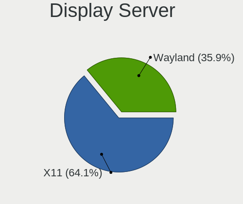
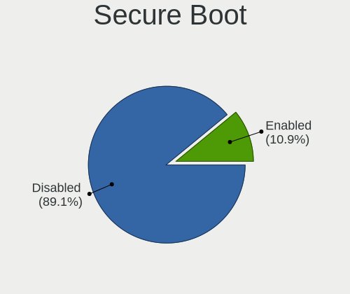
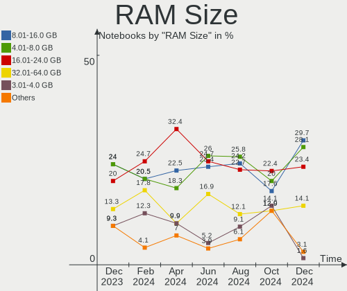
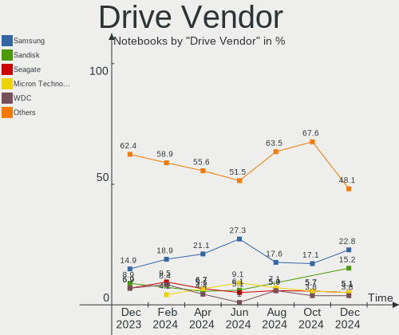
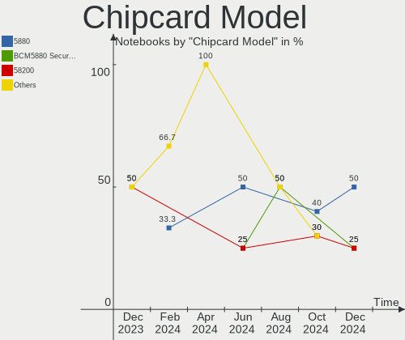

Kubuntu - Hardware Trends (Notebooks)
-------------------------------------

A project to identify most popular hardware characteristics and track their change
over time based on data collected by Linux users at https://Linux-Hardware.org.

Anyone can contribute to this report by the [hw-probe](https://github.com/linuxhw/hw-probe) tool:

    sudo -E hw-probe -all -upload

This report is for one last month. Overall report since the beginning of time: [TestDays](https://github.com/linuxhw/TestDays)

Period: Sep, 2023.

Contents
--------

* [ System ](#system)
  - [ OS                       ](#os)
  - [ OS Family                ](#os-family)
  - [ Kernel                   ](#kernel)
  - [ Kernel Family            ](#kernel-family)
  - [ Kernel Major Ver.        ](#kernel-major-ver)
  - [ Arch                     ](#arch)
  - [ DE                       ](#de)
  - [ Display Server           ](#display-server)
  - [ Display Manager          ](#display-manager)
  - [ OS Lang                  ](#os-lang)
  - [ Boot Mode                ](#boot-mode)
  - [ Filesystem               ](#filesystem)
  - [ Part. scheme             ](#part-scheme)
  - [ Dual Boot with Linux/BSD ](#dual-boot-with-linuxbsd)
  - [ Dual Boot (Win)          ](#dual-boot-win)

* [ Board ](#board)
  - [ Vendor                   ](#vendor)
  - [ Model                    ](#model)
  - [ Model Family             ](#model-family)
  - [ MFG Year                 ](#mfg-year)
  - [ Form Factor              ](#form-factor)
  - [ Secure Boot              ](#secure-boot)
  - [ Coreboot                 ](#coreboot)
  - [ RAM Size                 ](#ram-size)
  - [ RAM Used                 ](#ram-used)
  - [ Total Drives             ](#total-drives)
  - [ Has CD-ROM               ](#has-cd-rom)
  - [ Has Ethernet             ](#has-ethernet)
  - [ Has WiFi                 ](#has-wifi)
  - [ Has Bluetooth            ](#has-bluetooth)

* [ Location ](#location)
  - [ Country                  ](#country)
  - [ City                     ](#city)

* [ Drives ](#drives)
  - [ Drive Vendor             ](#drive-vendor)
  - [ Drive Model              ](#drive-model)
  - [ HDD Vendor               ](#hdd-vendor)
  - [ SSD Vendor               ](#ssd-vendor)
  - [ Drive Kind               ](#drive-kind)
  - [ Drive Connector          ](#drive-connector)
  - [ Drive Size               ](#drive-size)
  - [ Space Total              ](#space-total)
  - [ Space Used               ](#space-used)
  - [ Malfunc. Drives          ](#malfunc-drives)
  - [ Malfunc. Drive Vendor    ](#malfunc-drive-vendor)
  - [ Malfunc. HDD Vendor      ](#malfunc-hdd-vendor)
  - [ Malfunc. Drive Kind      ](#malfunc-drive-kind)
  - [ Failed Drives            ](#failed-drives)
  - [ Failed Drive Vendor      ](#failed-drive-vendor)
  - [ Drive Status             ](#drive-status)

* [ Storage controller ](#storage-controller)
  - [ Storage Vendor           ](#storage-vendor)
  - [ Storage Model            ](#storage-model)
  - [ Storage Kind             ](#storage-kind)

* [ Processor ](#processor)
  - [ CPU Vendor               ](#cpu-vendor)
  - [ CPU Model                ](#cpu-model)
  - [ CPU Model Family         ](#cpu-model-family)
  - [ CPU Cores                ](#cpu-cores)
  - [ CPU Sockets              ](#cpu-sockets)
  - [ CPU Threads              ](#cpu-threads)
  - [ CPU Op-Modes             ](#cpu-op-modes)
  - [ CPU Microcode            ](#cpu-microcode)
  - [ CPU Microarch            ](#cpu-microarch)

* [ Graphics ](#graphics)
  - [ GPU Vendor               ](#gpu-vendor)
  - [ GPU Model                ](#gpu-model)
  - [ GPU Combo                ](#gpu-combo)
  - [ GPU Driver               ](#gpu-driver)
  - [ GPU Memory               ](#gpu-memory)

* [ Monitor ](#monitor)
  - [ Monitor Vendor           ](#monitor-vendor)
  - [ Monitor Model            ](#monitor-model)
  - [ Monitor Resolution       ](#monitor-resolution)
  - [ Monitor Diagonal         ](#monitor-diagonal)
  - [ Monitor Width            ](#monitor-width)
  - [ Aspect Ratio             ](#aspect-ratio)
  - [ Monitor Area             ](#monitor-area)
  - [ Pixel Density            ](#pixel-density)
  - [ Multiple Monitors        ](#multiple-monitors)

* [ Network ](#network)
  - [ Net Controller Vendor    ](#net-controller-vendor)
  - [ Net Controller Model     ](#net-controller-model)
  - [ Wireless Vendor          ](#wireless-vendor)
  - [ Wireless Model           ](#wireless-model)
  - [ Ethernet Vendor          ](#ethernet-vendor)
  - [ Ethernet Model           ](#ethernet-model)
  - [ Net Controller Kind      ](#net-controller-kind)
  - [ Used Controller          ](#used-controller)
  - [ NICs                     ](#nics)
  - [ IPv6                     ](#ipv6)

* [ Bluetooth ](#bluetooth)
  - [ Bluetooth Vendor         ](#bluetooth-vendor)
  - [ Bluetooth Model          ](#bluetooth-model)

* [ Sound ](#sound)
  - [ Sound Vendor             ](#sound-vendor)
  - [ Sound Model              ](#sound-model)

* [ Memory ](#memory)
  - [ Memory Vendor            ](#memory-vendor)
  - [ Memory Model             ](#memory-model)
  - [ Memory Kind              ](#memory-kind)
  - [ Memory Form Factor       ](#memory-form-factor)
  - [ Memory Size              ](#memory-size)
  - [ Memory Speed             ](#memory-speed)

* [ Printers & scanners ](#printers--scanners)
  - [ Printer Vendor           ](#printer-vendor)
  - [ Printer Model            ](#printer-model)
  - [ Scanner Vendor           ](#scanner-vendor)
  - [ Scanner Model            ](#scanner-model)

* [ Camera ](#camera)
  - [ Camera Vendor            ](#camera-vendor)
  - [ Camera Model             ](#camera-model)

* [ Security ](#security)
  - [ Fingerprint Vendor       ](#fingerprint-vendor)
  - [ Fingerprint Model        ](#fingerprint-model)
  - [ Chipcard Vendor          ](#chipcard-vendor)
  - [ Chipcard Model           ](#chipcard-model)

* [ Unsupported ](#unsupported)
  - [ Unsupported Devices      ](#unsupported-devices)
  - [ Unsupported Device Types ](#unsupported-device-types)

System
------

OS
--

Installed operating systems

| Name          | Notebooks | Percent |
|---------------|-----------|---------|
| Kubuntu 22.04 | 34        | 56.67%  |
| Kubuntu 23.04 | 21        | 35%     |
| Kubuntu 23.10 | 3         | 5%      |
| Kubuntu 20.04 | 2         | 3.33%   |

OS Family
---------

OS without a version

| Name    | Notebooks | Percent |
|---------|-----------|---------|
| Kubuntu | 60        | 100%    |

Kernel
------

Version of the Linux kernel

| Version               | Notebooks | Percent |
|-----------------------|-----------|---------|
| 6.2.0-32-generic      | 16        | 26.67%  |
| 6.2.0-33-generic      | 15        | 25%     |
| 6.2.0-31-generic      | 5         | 8.33%   |
| 5.15.0-83-generic     | 5         | 8.33%   |
| 5.15.0-82-generic     | 4         | 6.67%   |
| 6.5.3-060503-generic  | 1         | 1.67%   |
| 6.5.2                 | 1         | 1.67%   |
| 6.5.0-5-generic       | 1         | 1.67%   |
| 6.4.10-060410-generic | 1         | 1.67%   |
| 6.3.0-7-generic       | 1         | 1.67%   |
| 6.2.16-060216-generic | 1         | 1.67%   |
| 6.2.0-9032-generic    | 1         | 1.67%   |
| 6.2.0-34-generic      | 1         | 1.67%   |
| 6.2.0-27-generic      | 1         | 1.67%   |
| 6.2.0-1013-lowlatency | 1         | 1.67%   |
| 5.4.0-152-generic     | 1         | 1.67%   |
| 5.19.0-46-generic     | 1         | 1.67%   |
| 5.15.0-76-generic     | 1         | 1.67%   |
| 5.15.0-75-generic     | 1         | 1.67%   |
| 5.15.0-25-generic     | 1         | 1.67%   |

Kernel Family
-------------

Linux kernel without a distro release

| Version | Notebooks | Percent |
|---------|-----------|---------|
| 6.2.0   | 40        | 66.67%  |
| 5.15.0  | 12        | 20%     |
| 6.5.3   | 1         | 1.67%   |
| 6.5.2   | 1         | 1.67%   |
| 6.5.0   | 1         | 1.67%   |
| 6.4.10  | 1         | 1.67%   |
| 6.3.0   | 1         | 1.67%   |
| 6.2.16  | 1         | 1.67%   |
| 5.4.0   | 1         | 1.67%   |
| 5.19.0  | 1         | 1.67%   |

Kernel Major Ver.
-----------------

Linux kernel major version

| Version | Notebooks | Percent |
|---------|-----------|---------|
| 6.2     | 41        | 68.33%  |
| 5.15    | 12        | 20%     |
| 6.5     | 3         | 5%      |
| 6.4     | 1         | 1.67%   |
| 6.3     | 1         | 1.67%   |
| 5.4     | 1         | 1.67%   |
| 5.19    | 1         | 1.67%   |

Arch
----

OS architecture (x86_64, i586, etc.)

| Name   | Notebooks | Percent |
|--------|-----------|---------|
| x86_64 | 60        | 100%    |

DE
--

Desktop Environment

| Name  | Notebooks | Percent |
|-------|-----------|---------|
| KDE5  | 57        | 95%     |
| GNOME | 2         | 3.33%   |
| KDE   | 1         | 1.67%   |

Display Server
--------------

X11 or Wayland

| Name    | Notebooks | Percent |
|---------|-----------|---------|
| X11     | 51        | 85%     |
| Wayland | 8         | 13.33%  |
| Tty     | 1         | 1.67%   |

Display Manager
---------------

SDDM, LightDM, etc.

| Name    | Notebooks | Percent |
|---------|-----------|---------|
| SDDM    | 42        | 70%     |
| Unknown | 15        | 25%     |
| GDM3    | 3         | 5%      |

OS Lang
-------

Language

| Lang  | Notebooks | Percent |
|-------|-----------|---------|
| en_US | 26        | 43.33%  |
| en_GB | 6         | 10%     |
| de_DE | 4         | 6.67%   |
| es_ES | 3         | 5%      |
| it_IT | 2         | 3.33%   |
| fr_FR | 2         | 3.33%   |
| es_MX | 2         | 3.33%   |
| en_IN | 2         | 3.33%   |
| en_CA | 2         | 3.33%   |
| zh_TW | 1         | 1.67%   |
| zh_CN | 1         | 1.67%   |
| ru_RU | 1         | 1.67%   |
| es_CR | 1         | 1.67%   |
| es_CO | 1         | 1.67%   |
| en_SG | 1         | 1.67%   |
| en_PH | 1         | 1.67%   |
| en_NZ | 1         | 1.67%   |
| en_DK | 1         | 1.67%   |
| en_AG | 1         | 1.67%   |
| C     | 1         | 1.67%   |

Boot Mode
---------

EFI or BIOS

| Mode | Notebooks | Percent |
|------|-----------|---------|
| EFI  | 33        | 55%     |
| BIOS | 27        | 45%     |

Filesystem
----------

Type of filesystem

| Type    | Notebooks | Percent |
|---------|-----------|---------|
| Ext4    | 49        | 81.67%  |
| Tmpfs   | 8         | 13.33%  |
| Zfs     | 1         | 1.67%   |
| Overlay | 1         | 1.67%   |
| Btrfs   | 1         | 1.67%   |

Part. scheme
------------

Scheme of partitioning

| Type    | Notebooks | Percent |
|---------|-----------|---------|
| GPT     | 40        | 66.67%  |
| Unknown | 15        | 25%     |
| MBR     | 5         | 8.33%   |

Dual Boot with Linux/BSD
------------------------

Hosting more than one Linux/BSD

| Dual boot | Notebooks | Percent |
|-----------|-----------|---------|
| No        | 58        | 96.67%  |
| Yes       | 2         | 3.33%   |

Dual Boot (Win)
---------------

Hosting Linux and Windows

| Dual boot | Notebooks | Percent |
|-----------|-----------|---------|
| No        | 43        | 71.67%  |
| Yes       | 17        | 28.33%  |

Board
-----

Vendor
------

Motherboard manufacturer

| Name             | Notebooks | Percent |
|------------------|-----------|---------|
| Lenovo           | 19        | 31.67%  |
| ASUSTek Computer | 10        | 16.67%  |
| Hewlett-Packard  | 8         | 13.33%  |
| Dell             | 7         | 11.67%  |
| Apple            | 5         | 8.33%   |
| Notebook         | 2         | 3.33%   |
| MSI              | 2         | 3.33%   |
| Valve            | 1         | 1.67%   |
| Toshiba          | 1         | 1.67%   |
| Google           | 1         | 1.67%   |
| Fujitsu Siemens  | 1         | 1.67%   |
| CHIPHD           | 1         | 1.67%   |
| Alienware        | 1         | 1.67%   |
| Acer             | 1         | 1.67%   |

Model
-----

Motherboard model

| Name                                        | Notebooks | Percent |
|---------------------------------------------|-----------|---------|
| Lenovo IdeaPad 3 15ALC6 82KU                | 2         | 3.33%   |
| Valve Jupiter                               | 1         | 1.67%   |
| Toshiba Satellite Pro C70-B                 | 1         | 1.67%   |
| Notebook W65_67SR                           | 1         | 1.67%   |
| Notebook P65_P67SA                          | 1         | 1.67%   |
| MSI Modern 15 A5M                           | 1         | 1.67%   |
| MSI GE75 Raider 9SE                         | 1         | 1.67%   |
| Lenovo ThinkPad X270 W10DG 20K5S4K200       | 1         | 1.67%   |
| Lenovo ThinkPad X230 2325FG0                | 1         | 1.67%   |
| Lenovo ThinkPad X230 23256N6                | 1         | 1.67%   |
| Lenovo ThinkPad X1 Carbon Gen 11 21HMCTO1WW | 1         | 1.67%   |
| Lenovo ThinkPad X1 Carbon Gen 10 21CB007ART | 1         | 1.67%   |
| Lenovo ThinkPad T495s 20QKS0SD00            | 1         | 1.67%   |
| Lenovo ThinkPad T16 Gen 1 21BVCTO1WW        | 1         | 1.67%   |
| Lenovo ThinkPad T14s Gen 4 21F6CTO1WW       | 1         | 1.67%   |
| Lenovo ThinkPad T14s Gen 1 20UJS0VD00       | 1         | 1.67%   |
| Lenovo ThinkPad P17 Gen 1 20SQS1AG00        | 1         | 1.67%   |
| Lenovo Legion Slim 5 16APH8 82Y9            | 1         | 1.67%   |
| Lenovo Legion 5 Pro 16ACH6H 82JQ            | 1         | 1.67%   |
| Lenovo Legion 5 15ACH6H 82JU                | 1         | 1.67%   |
| Lenovo IdeaPad S145-15API 81UT              | 1         | 1.67%   |
| Lenovo IdeaPad 700-15ISK 80RU               | 1         | 1.67%   |
| Lenovo IdeaPad 3 15ARE05 81W4               | 1         | 1.67%   |
| Lenovo B480 20140                           | 1         | 1.67%   |
| HP ProBook 650 G1                           | 1         | 1.67%   |
| HP ProBook 440 G8 Notebook PC               | 1         | 1.67%   |
| HP Notebook                                 | 1         | 1.67%   |
| HP ENVY TS 15                               | 1         | 1.67%   |
| HP EliteBook 8770w                          | 1         | 1.67%   |
| HP EliteBook 845 G8 Notebook PC             | 1         | 1.67%   |
| HP EliteBook 745 G3                         | 1         | 1.67%   |
| HP Compaq 6820s                             | 1         | 1.67%   |
| Google Robo360                              | 1         | 1.67%   |
| Fujitsu Siemens LIFEBOOK E8410              | 1         | 1.67%   |
| Dell Precision 7520                         | 1         | 1.67%   |
| Dell Latitude E6500                         | 1         | 1.67%   |
| Dell Latitude E5470                         | 1         | 1.67%   |
| Dell Latitude 7490                          | 1         | 1.67%   |
| Dell Latitude 7420                          | 1         | 1.67%   |
| Dell Inspiron 5520                          | 1         | 1.67%   |

Model Family
------------

Motherboard model prefix

| Name                     | Notebooks | Percent |
|--------------------------|-----------|---------|
| Lenovo ThinkPad          | 10        | 16.67%  |
| Lenovo IdeaPad           | 5         | 8.33%   |
| Dell Latitude            | 4         | 6.67%   |
| ASUS VivoBook            | 4         | 6.67%   |
| Lenovo Legion            | 3         | 5%      |
| HP EliteBook             | 3         | 5%      |
| HP ProBook               | 2         | 3.33%   |
| Dell Inspiron            | 2         | 3.33%   |
| Apple MacBookPro11       | 2         | 3.33%   |
| Valve Jupiter            | 1         | 1.67%   |
| Toshiba Satellite        | 1         | 1.67%   |
| Notebook W65             | 1         | 1.67%   |
| Notebook P65             | 1         | 1.67%   |
| MSI Modern               | 1         | 1.67%   |
| MSI GE75                 | 1         | 1.67%   |
| Lenovo B480              | 1         | 1.67%   |
| HP Notebook              | 1         | 1.67%   |
| HP ENVY                  | 1         | 1.67%   |
| HP Compaq                | 1         | 1.67%   |
| Google Robo360           | 1         | 1.67%   |
| Fujitsu Siemens LIFEBOOK | 1         | 1.67%   |
| Dell Precision           | 1         | 1.67%   |
| CHIPHD XM21              | 1         | 1.67%   |
| ASUS X580VD              | 1         | 1.67%   |
| ASUS S400CA              | 1         | 1.67%   |
| ASUS K72Jr               | 1         | 1.67%   |
| ASUS K52JB               | 1         | 1.67%   |
| ASUS G551JM              | 1         | 1.67%   |
| ASUS ASUS                | 1         | 1.67%   |
| Apple MacBookPro9        | 1         | 1.67%   |
| Apple MacBookPro8        | 1         | 1.67%   |
| Apple MacBookAir7        | 1         | 1.67%   |
| Alienware x15            | 1         | 1.67%   |
| Acer Aspire              | 1         | 1.67%   |

MFG Year
--------

Motherboard manufacture year

| Year | Notebooks | Percent |
|------|-----------|---------|
| 2021 | 9         | 15%     |
| 2023 | 6         | 10%     |
| 2012 | 6         | 10%     |
| 2020 | 5         | 8.33%   |
| 2019 | 5         | 8.33%   |
| 2017 | 5         | 8.33%   |
| 2022 | 4         | 6.67%   |
| 2014 | 4         | 6.67%   |
| 2013 | 4         | 6.67%   |
| 2015 | 3         | 5%      |
| 2016 | 2         | 3.33%   |
| 2007 | 2         | 3.33%   |
| 2018 | 1         | 1.67%   |
| 2011 | 1         | 1.67%   |
| 2010 | 1         | 1.67%   |
| 2009 | 1         | 1.67%   |
| 2008 | 1         | 1.67%   |

Form Factor
-----------

Physical design of the computer

| Name     | Notebooks | Percent |
|----------|-----------|---------|
| Notebook | 60        | 100%    |

Secure Boot
-----------

Enabled or disabled

| State    | Notebooks | Percent |
|----------|-----------|---------|
| Disabled | 57        | 95%     |
| Enabled  | 3         | 5%      |

Coreboot
--------

Have coreboot on board

| Used | Notebooks | Percent |
|------|-----------|---------|
| No   | 59        | 98.33%  |
| Yes  | 1         | 1.67%   |

RAM Size
--------

Total RAM memory

| Size in GB  | Notebooks | Percent |
|-------------|-----------|---------|
| 16.01-24.0  | 15        | 25%     |
| 8.01-16.0   | 13        | 21.67%  |
| 4.01-8.0    | 10        | 16.67%  |
| 32.01-64.0  | 9         | 15%     |
| 3.01-4.0    | 7         | 11.67%  |
| 24.01-32.0  | 3         | 5%      |
| 2.01-3.0    | 1         | 1.67%   |
| 64.01-256.0 | 1         | 1.67%   |
| 1.01-2.0    | 1         | 1.67%   |

RAM Used
--------

Used RAM memory

| Used GB   | Notebooks | Percent |
|-----------|-----------|---------|
| 2.01-3.0  | 16        | 26.67%  |
| 4.01-8.0  | 15        | 25%     |
| 1.01-2.0  | 12        | 20%     |
| 3.01-4.0  | 11        | 18.33%  |
| 8.01-16.0 | 6         | 10%     |

Total Drives
------------

Number of drives on board

| Drives | Notebooks | Percent |
|--------|-----------|---------|
| 1      | 40        | 66.67%  |
| 2      | 19        | 31.67%  |
| 3      | 1         | 1.67%   |

Has CD-ROM
----------

Has CD-ROM on board

| Presented | Notebooks | Percent |
|-----------|-----------|---------|
| No        | 49        | 81.67%  |
| Yes       | 11        | 18.33%  |

Has Ethernet
------------

Has Ethernet on board

| Presented | Notebooks | Percent |
|-----------|-----------|---------|
| Yes       | 48        | 80%     |
| No        | 12        | 20%     |

Has WiFi
--------

Has WiFi module

| Presented | Notebooks | Percent |
|-----------|-----------|---------|
| Yes       | 60        | 100%    |

Has Bluetooth
-------------

Has Bluetooth module

| Presented | Notebooks | Percent |
|-----------|-----------|---------|
| Yes       | 53        | 88.33%  |
| No        | 7         | 11.67%  |

Location
--------

Country
-------

Geographic location (country)

| Country     | Notebooks | Percent |
|-------------|-----------|---------|
| USA         | 9         | 15%     |
| Germany     | 9         | 15%     |
| UK          | 5         | 8.33%   |
| Spain       | 3         | 5%      |
| Kazakhstan  | 3         | 5%      |
| Canada      | 3         | 5%      |
| Taiwan      | 2         | 3.33%   |
| Poland      | 2         | 3.33%   |
| Mexico      | 2         | 3.33%   |
| Italy       | 2         | 3.33%   |
| India       | 2         | 3.33%   |
| France      | 2         | 3.33%   |
| Vietnam     | 1         | 1.67%   |
| Singapore   | 1         | 1.67%   |
| Russia      | 1         | 1.67%   |
| Philippines | 1         | 1.67%   |
| New Zealand | 1         | 1.67%   |
| Hungary     | 1         | 1.67%   |
| Georgia     | 1         | 1.67%   |
| Egypt       | 1         | 1.67%   |
| Czechia     | 1         | 1.67%   |
| Costa Rica  | 1         | 1.67%   |
| Colombia    | 1         | 1.67%   |
| China       | 1         | 1.67%   |
| Bulgaria    | 1         | 1.67%   |
| Bangladesh  | 1         | 1.67%   |
| Austria     | 1         | 1.67%   |
| Argentina   | 1         | 1.67%   |

City
----

Geographic location (city)

| City                     | Notebooks | Percent |
|--------------------------|-----------|---------|
| Almaty                   | 3         | 5%      |
| Stuttgart                | 2         | 3.33%   |
| Portland                 | 2         | 3.33%   |
| Żywiec                  | 1         | 1.67%   |
| Zhubei                   | 1         | 1.67%   |
| Wuhan                    | 1         | 1.67%   |
| Wooster                  | 1         | 1.67%   |
| Wolverhampton            | 1         | 1.67%   |
| Vienna                   | 1         | 1.67%   |
| Vercel-Villedieu-le-Camp | 1         | 1.67%   |
| Tuxtla Gutiérrez        | 1         | 1.67%   |
| Tigre                    | 1         | 1.67%   |
| Tbilisi                  | 1         | 1.67%   |
| Surrey                   | 1         | 1.67%   |
| Surat                    | 1         | 1.67%   |
| Singapore                | 1         | 1.67%   |
| Shumen                   | 1         | 1.67%   |
| Schwarzenbruck           | 1         | 1.67%   |
| Santiago de Cali         | 1         | 1.67%   |
| Rogers                   | 1         | 1.67%   |
| Rioverde                 | 1         | 1.67%   |
| Pune                     | 1         | 1.67%   |
| Poznan                   | 1         | 1.67%   |
| Port Coquitlam           | 1         | 1.67%   |
| Paltan                   | 1         | 1.67%   |
| Oxford                   | 1         | 1.67%   |
| Munich                   | 1         | 1.67%   |
| Moscow                   | 1         | 1.67%   |
| Monestier-de-Clermont    | 1         | 1.67%   |
| Lliria                   | 1         | 1.67%   |
| Little Rock              | 1         | 1.67%   |
| Leipzig                  | 1         | 1.67%   |
| LaSalle                  | 1         | 1.67%   |
| l'Hospitalet de l'Infant | 1         | 1.67%   |
| Kladno                   | 1         | 1.67%   |
| Hsinchu                  | 1         | 1.67%   |
| Ho Chi Minh City         | 1         | 1.67%   |
| Heidenheim               | 1         | 1.67%   |
| Greenwich                | 1         | 1.67%   |
| Grecia                   | 1         | 1.67%   |

Drives
------

Drive Vendor
------------

Hard drive vendors

| Vendor              | Notebooks | Drives | Percent |
|---------------------|-----------|--------|---------|
| Samsung Electronics | 15        | 16     | 18.29%  |
| Toshiba             | 7         | 7      | 8.54%   |
| Micron Technology   | 7         | 7      | 8.54%   |
| SanDisk             | 6         | 7      | 7.32%   |
| Seagate             | 5         | 5      | 6.1%    |
| Crucial             | 5         | 5      | 6.1%    |
| SK hynix            | 4         | 4      | 4.88%   |
| WDC                 | 3         | 3      | 3.66%   |
| Unknown             | 3         | 4      | 3.66%   |
| Kingston            | 3         | 3      | 3.66%   |
| Intel               | 3         | 3      | 3.66%   |
| HGST                | 3         | 3      | 3.66%   |
| KIOXIA              | 2         | 2      | 2.44%   |
| China               | 2         | 2      | 2.44%   |
| Apple               | 2         | 2      | 2.44%   |
| Union Memory        | 1         | 1      | 1.22%   |
| TXRUI               | 1         | 1      | 1.22%   |
| Transcend           | 1         | 1      | 1.22%   |
| Team                | 1         | 1      | 1.22%   |
| Silicon Motion      | 1         | 1      | 1.22%   |
| SADAYU              | 1         | 1      | 1.22%   |
| SABRENT             | 1         | 1      | 1.22%   |
| LT                  | 1         | 1      | 1.22%   |
| Inateck             | 1         | 1      | 1.22%   |
| Hitachi             | 1         | 1      | 1.22%   |
| Fujitsu             | 1         | 1      | 1.22%   |
| BAITITON            | 1         | 1      | 1.22%   |

Drive Model
-----------

Hard drive models

| Model                                               | Notebooks | Percent |
|-----------------------------------------------------|-----------|---------|
| Toshiba MQ01ABD100 1TB                              | 2         | 2.35%   |
| Sandisk WD Black SN750 / PC SN730 NVMe SSD 512GB    | 2         | 2.35%   |
| Samsung SSD 980 1TB                                 | 2         | 2.35%   |
| WDC WD800BEVS-07RST0 80GB                           | 1         | 1.18%   |
| WDC PC SN530 SDBPTPZ-1T00 1TB                       | 1         | 1.18%   |
| WDC PC SN530 SDBPNPZ-512G-1006 512GB                | 1         | 1.18%   |
| Unknown SL64G  64GB                                 | 1         | 1.18%   |
| Unknown NVMe SSD Drive 1TB                          | 1         | 1.18%   |
| Unknown HBG4a2  32GB                                | 1         | 1.18%   |
| Unknown 064G30  64GB                                | 1         | 1.18%   |
| Union Memory UMIS RPJTJ256MEE1OWX 256GB             | 1         | 1.18%   |
| TXRUI N650 256GB                                    | 1         | 1.18%   |
| Transcend TS120GMTS420S 120GB SSD                   | 1         | 1.18%   |
| Toshiba XG4 NVMe SSD Controller 512GB               | 1         | 1.18%   |
| Toshiba THNSNH128GMCT 128GB SSD                     | 1         | 1.18%   |
| Toshiba MK5061GSY 500GB                             | 1         | 1.18%   |
| Toshiba KBG40ZNT512G MEMORY 512GB                   | 1         | 1.18%   |
| Toshiba BG3 NVMe SSD Controller 512GB               | 1         | 1.18%   |
| Team T253X1240G 240GB SSD                           | 1         | 1.18%   |
| SK hynix SKHynix_HFS512GEJ9X115N 512GB              | 1         | 1.18%   |
| SK hynix SKHynix_HFS512GD9TNI-L2B0B 512GB           | 1         | 1.18%   |
| SK hynix SKHynix_HFS001TEJ9X162N 1TB                | 1         | 1.18%   |
| SK hynix SKHynix_HFS001TDE9X084N 1TB                | 1         | 1.18%   |
| Silicon Motion SM2262/SM2262EN SSD Controller 500GB | 1         | 1.18%   |
| Seagate ST1000LM048-2E7172 1TB                      | 1         | 1.18%   |
| Seagate ST1000LM035-1RK172 1TB                      | 1         | 1.18%   |
| Seagate ST1000LM014-1EJ164 1TB                      | 1         | 1.18%   |
| Seagate Game Drive Xbox 4TB                         | 1         | 1.18%   |
| Seagate Expansion HDD 16TB                          | 1         | 1.18%   |
| Sandisk WD Blue SN570 1TB                           | 1         | 1.18%   |
| SanDisk SSD U100 24GB                               | 1         | 1.18%   |
| SanDisk SSD PLUS 480GB                              | 1         | 1.18%   |
| SanDisk SDSSDH3500G 500GB                           | 1         | 1.18%   |
| SanDisk SD7TB3Q-256G-1006 256GB SSD                 | 1         | 1.18%   |
| Samsung SSD SM841N mSATA 128GB                      | 1         | 1.18%   |
| Samsung SSD 990 PRO 2TB                             | 1         | 1.18%   |
| Samsung SSD 970 EVO 1TB                             | 1         | 1.18%   |
| Samsung SSD 870 EVO 1TB                             | 1         | 1.18%   |
| Samsung SSD 860 EVO 1TB                             | 1         | 1.18%   |
| Samsung SSD 850 EVO 500GB                           | 1         | 1.18%   |

HDD Vendor
----------

Hard disk drive vendors

| Vendor              | Notebooks | Drives | Percent |
|---------------------|-----------|--------|---------|
| Seagate             | 4         | 4      | 26.67%  |
| Toshiba             | 3         | 3      | 20%     |
| HGST                | 3         | 3      | 20%     |
| WDC                 | 1         | 1      | 6.67%   |
| Samsung Electronics | 1         | 1      | 6.67%   |
| SABRENT             | 1         | 1      | 6.67%   |
| Hitachi             | 1         | 1      | 6.67%   |
| Fujitsu             | 1         | 1      | 6.67%   |

SSD Vendor
----------

Solid state drive vendors

| Vendor              | Notebooks | Drives | Percent |
|---------------------|-----------|--------|---------|
| Crucial             | 5         | 5      | 17.86%  |
| SanDisk             | 4         | 4      | 14.29%  |
| Samsung Electronics | 4         | 4      | 14.29%  |
| Micron Technology   | 3         | 3      | 10.71%  |
| China               | 2         | 2      | 7.14%   |
| Apple               | 2         | 2      | 7.14%   |
| Transcend           | 1         | 1      | 3.57%   |
| Toshiba             | 1         | 1      | 3.57%   |
| Team                | 1         | 1      | 3.57%   |
| SADAYU              | 1         | 1      | 3.57%   |
| LT                  | 1         | 1      | 3.57%   |
| Kingston            | 1         | 1      | 3.57%   |
| Intel               | 1         | 1      | 3.57%   |
| BAITITON            | 1         | 1      | 3.57%   |

Drive Kind
----------

HDD or SSD

| Kind    | Notebooks | Drives | Percent |
|---------|-----------|--------|---------|
| NVMe    | 34        | 37     | 44.16%  |
| SSD     | 25        | 28     | 32.47%  |
| HDD     | 14        | 15     | 18.18%  |
| MMC     | 2         | 3      | 2.6%    |
| Unknown | 2         | 2      | 2.6%    |

Drive Connector
---------------

SATA, SAS, NVMe, etc.

| Type | Notebooks | Drives | Percent |
|------|-----------|--------|---------|
| NVMe | 34        | 36     | 47.89%  |
| SATA | 31        | 42     | 43.66%  |
| SAS  | 4         | 4      | 5.63%   |
| MMC  | 2         | 3      | 2.82%   |

Drive Size
----------

Size of hard drive

| Size in TB | Notebooks | Drives | Percent |
|------------|-----------|--------|---------|
| 0.01-0.5   | 23        | 29     | 63.89%  |
| 0.51-1.0   | 12        | 13     | 33.33%  |
| 10.01-20.0 | 1         | 1      | 2.78%   |

Space Total
-----------

Amount of disk space available on the file system

| Size in GB     | Notebooks | Percent |
|----------------|-----------|---------|
| 501-1000       | 19        | 31.67%  |
| 251-500        | 14        | 23.33%  |
| 101-250        | 12        | 20%     |
| 1001-2000      | 6         | 10%     |
| 21-50          | 3         | 5%      |
| 51-100         | 3         | 5%      |
| More than 3000 | 1         | 1.67%   |
| 2001-3000      | 1         | 1.67%   |
| 1-20           | 1         | 1.67%   |

Space Used
----------

Amount of used disk space

| Used GB   | Notebooks | Percent |
|-----------|-----------|---------|
| 1-20      | 16        | 26.67%  |
| 101-250   | 12        | 20%     |
| 21-50     | 10        | 16.67%  |
| 501-1000  | 9         | 15%     |
| 251-500   | 6         | 10%     |
| 51-100    | 6         | 10%     |
| 1001-2000 | 1         | 1.67%   |

Malfunc. Drives
---------------

Drive models with a malfunction

| Model                             | Notebooks | Drives | Percent |
|-----------------------------------|-----------|--------|---------|
| Toshiba MQ01ABD100 1TB            | 1         | 1      | 33.33%  |
| Toshiba MK5061GSY 500GB           | 1         | 1      | 33.33%  |
| Samsung Electronics HM321HI 320GB | 1         | 1      | 33.33%  |

Malfunc. Drive Vendor
---------------------

Vendors of faulty drives

| Vendor              | Notebooks | Drives | Percent |
|---------------------|-----------|--------|---------|
| Toshiba             | 2         | 2      | 66.67%  |
| Samsung Electronics | 1         | 1      | 33.33%  |

Malfunc. HDD Vendor
-------------------

Vendors of faulty HDD drives

| Vendor              | Notebooks | Drives | Percent |
|---------------------|-----------|--------|---------|
| Toshiba             | 2         | 2      | 66.67%  |
| Samsung Electronics | 1         | 1      | 33.33%  |

Malfunc. Drive Kind
-------------------

Kinds of faulty drives

| Kind | Notebooks | Drives | Percent |
|------|-----------|--------|---------|
| HDD  | 2         | 3      | 100%    |

Failed Drives
-------------

Failed drive models

Zero info for selected period =(

Failed Drive Vendor
-------------------

Failed drive vendors

Zero info for selected period =(

Drive Status
------------

Number of failed and malfunc. drives

| Status   | Notebooks | Drives | Percent |
|----------|-----------|--------|---------|
| Works    | 34        | 41     | 52.31%  |
| Detected | 29        | 41     | 44.62%  |
| Malfunc  | 2         | 3      | 3.08%   |

Storage controller
------------------

Storage Vendor
--------------

Storage controller vendors

| Vendor                       | Notebooks | Percent |
|------------------------------|-----------|---------|
| Intel                        | 33        | 42.86%  |
| Samsung Electronics          | 12        | 15.58%  |
| AMD                          | 9         | 11.69%  |
| SK hynix                     | 4         | 5.19%   |
| SanDisk                      | 4         | 5.19%   |
| Micron Technology            | 4         | 5.19%   |
| Toshiba America Info Systems | 3         | 3.9%    |
| KIOXIA                       | 2         | 2.6%    |
| Kingston Technology Company  | 2         | 2.6%    |
| Union Memory (Shenzhen)      | 1         | 1.3%    |
| Solidigm                     | 1         | 1.3%    |
| Silicon Motion               | 1         | 1.3%    |
| JMicron Technology           | 1         | 1.3%    |

Storage Model
-------------

Storage controller models

| Model                                                                          | Notebooks | Percent |
|--------------------------------------------------------------------------------|-----------|---------|
| AMD FCH SATA Controller [AHCI mode]                                            | 9         | 10.84%  |
| Intel 7 Series Chipset Family 6-port SATA Controller [AHCI mode]               | 7         | 8.43%   |
| Intel 8 Series/C220 Series Chipset Family 6-port SATA Controller 1 [AHCI mode] | 5         | 6.02%   |
| Samsung NVMe SSD Controller PM9A1/PM9A3/980PRO                                 | 3         | 3.61%   |
| Samsung NVMe SSD Controller 980                                                | 3         | 3.61%   |
| Intel Volume Management Device NVMe RAID Controller                            | 3         | 3.61%   |
| SK hynix Platinum P41/PC801 NVMe Solid State Drive                             | 2         | 2.41%   |
| SanDisk WD Black SN750 / PC SN730 NVMe SSD                                     | 2         | 2.41%   |
| Samsung S4LN058A01[SSUBX] AHCI SSD Controller (Apple slot)                     | 2         | 2.41%   |
| Samsung NVMe SSD Controller SM981/PM981/PM983                                  | 2         | 2.41%   |
| Samsung NVMe SSD Controller SM961/PM961/SM963                                  | 2         | 2.41%   |
| KIOXIA NVMe SSD Controller BG4 (DRAM-less)                                     | 2         | 2.41%   |
| Intel SATA Controller [RAID mode]                                              | 2         | 2.41%   |
| Intel 82801HM/HEM (ICH8M/ICH8M-E) SATA Controller [AHCI mode]                  | 2         | 2.41%   |
| Intel 82801HM/HEM (ICH8M/ICH8M-E) IDE Controller                               | 2         | 2.41%   |
| Intel 82801 Mobile SATA Controller [RAID mode]                                 | 2         | 2.41%   |
| Intel 5 Series/3400 Series Chipset 4 port SATA AHCI Controller                 | 2         | 2.41%   |
| Union Memory (Shenzhen) AM620 PCIe 3.0 NVMe SSD 256GB                          | 1         | 1.2%    |
| Toshiba America Info Systems XG6 NVMe SSD Controller                           | 1         | 1.2%    |
| Toshiba America Info Systems XG4 NVMe SSD Controller                           | 1         | 1.2%    |
| Toshiba America Info Systems BG3 NVMe SSD Controller                           | 1         | 1.2%    |
| Solidigm P41 Plus NVMe SSD (DRAM-less)                                         | 1         | 1.2%    |
| SK hynix PC611 NVMe Solid State Drive                                          | 1         | 1.2%    |
| SK hynix Gold P31/BC711/PC711 NVMe Solid State Drive                           | 1         | 1.2%    |
| Silicon Motion SM2262/SM2262EN SSD Controller                                  | 1         | 1.2%    |
| SanDisk WD Blue SN570 NVMe SSD 1TB                                             | 1         | 1.2%    |
| SanDisk WD Blue SN550 NVMe SSD                                                 | 1         | 1.2%    |
| SanDisk IX SN530 NVMe SSD (DRAM-less)                                          | 1         | 1.2%    |
| Samsung NVMe SSD Controller S4LV008[Pascal]                                    | 1         | 1.2%    |
| Micron 3400 NVMe SSD [Hendrix]                                                 | 1         | 1.2%    |
| Micron 2450 NVMe SSD [HendrixV] (DRAM-less)                                    | 1         | 1.2%    |
| Micron 2400 NVMe SSD (DRAM-less)                                               | 1         | 1.2%    |
| Micron 2210 NVMe SSD [Cobain]                                                  | 1         | 1.2%    |
| Kingston Company OM8PCP Design-In PCIe 3 NVMe SSD (DRAM-less)                  | 1         | 1.2%    |
| Kingston Company KC3000/Renegade NVMe SSD                                      | 1         | 1.2%    |
| JMicron JMB360 AHCI Controller                                                 | 1         | 1.2%    |
| Intel Volume Management Device NVMe RAID Controller Intel Corporation          | 1         | 1.2%    |
| Intel Sunrise Point-LP SATA Controller [AHCI mode]                             | 1         | 1.2%    |
| Intel SSD 670p Series [Keystone Harbor]                                        | 1         | 1.2%    |
| Intel Q170/Q150/B150/H170/H110/Z170/CM236 Chipset SATA Controller [AHCI Mode]  | 1         | 1.2%    |

Storage Kind
------------

Kind of storage controller (IDE, SATA, NVMe, SAS, ...)

| Kind | Notebooks | Percent |
|------|-----------|---------|
| SATA | 37        | 46.25%  |
| NVMe | 33        | 41.25%  |
| RAID | 8         | 10%     |
| IDE  | 2         | 2.5%    |

Processor
---------

CPU Vendor
----------

Processor vendors

| Vendor | Notebooks | Percent |
|--------|-----------|---------|
| Intel  | 45        | 75%     |
| AMD    | 15        | 25%     |

CPU Model
---------

Processor models

| Model                                  | Notebooks | Percent |
|----------------------------------------|-----------|---------|
| Intel Core i5-3320M CPU @ 2.60GHz      | 2         | 3.33%   |
| Intel Celeron CPU N3450 @ 1.10GHz      | 2         | 3.33%   |
| Intel 13th Gen Core i7-1355U           | 2         | 3.33%   |
| AMD Ryzen 7 5700U with Radeon Graphics | 2         | 3.33%   |
| Intel Pentium CPU B950 @ 2.10GHz       | 1         | 1.67%   |
| Intel Core i7-9750H CPU @ 2.60GHz      | 1         | 1.67%   |
| Intel Core i7-8650U CPU @ 1.90GHz      | 1         | 1.67%   |
| Intel Core i7-7700HQ CPU @ 2.80GHz     | 1         | 1.67%   |
| Intel Core i7-6820HQ CPU @ 2.70GHz     | 1         | 1.67%   |
| Intel Core i7-4870HQ CPU @ 2.50GHz     | 1         | 1.67%   |
| Intel Core i7-4720HQ CPU @ 2.60GHz     | 1         | 1.67%   |
| Intel Core i7-4710HQ CPU @ 2.50GHz     | 1         | 1.67%   |
| Intel Core i7-4702MQ CPU @ 2.20GHz     | 1         | 1.67%   |
| Intel Core i7-4700MQ CPU @ 2.40GHz     | 1         | 1.67%   |
| Intel Core i7-3630QM CPU @ 2.40GHz     | 1         | 1.67%   |
| Intel Core i7-3612QM CPU @ 2.10GHz     | 1         | 1.67%   |
| Intel Core i7-2640M CPU @ 2.80GHz      | 1         | 1.67%   |
| Intel Core i7-10750H CPU @ 2.60GHz     | 1         | 1.67%   |
| Intel Core i5-8265U CPU @ 1.60GHz      | 1         | 1.67%   |
| Intel Core i5-7200U CPU @ 2.50GHz      | 1         | 1.67%   |
| Intel Core i5-6440HQ CPU @ 2.60GHz     | 1         | 1.67%   |
| Intel Core i5-6300U CPU @ 2.40GHz      | 1         | 1.67%   |
| Intel Core i5-6300HQ CPU @ 2.30GHz     | 1         | 1.67%   |
| Intel Core i5-5350U CPU @ 1.80GHz      | 1         | 1.67%   |
| Intel Core i5-4310M CPU @ 2.70GHz      | 1         | 1.67%   |
| Intel Core i5-4288U CPU @ 2.60GHz      | 1         | 1.67%   |
| Intel Core i5-4210U CPU @ 1.70GHz      | 1         | 1.67%   |
| Intel Core i5-3337U CPU @ 1.80GHz      | 1         | 1.67%   |
| Intel Core i5-3210M CPU @ 2.50GHz      | 1         | 1.67%   |
| Intel Core i5-10300H CPU @ 2.50GHz     | 1         | 1.67%   |
| Intel Core i5 CPU M 450 @ 2.40GHz      | 1         | 1.67%   |
| Intel Core i3 CPU M 350 @ 2.27GHz      | 1         | 1.67%   |
| Intel Core 2 Duo CPU T7100 @ 1.80GHz   | 1         | 1.67%   |
| Intel Core 2 Duo CPU P8700 @ 2.53GHz   | 1         | 1.67%   |
| Intel Celeron CPU 550 @ 2.00GHz        | 1         | 1.67%   |
| Intel 13th Gen Core i9-13980HX         | 1         | 1.67%   |
| Intel 12th Gen Core i7-1270P           | 1         | 1.67%   |
| Intel 12th Gen Core i7-12650H          | 1         | 1.67%   |
| Intel 12th Gen Core i7-1260P           | 1         | 1.67%   |
| Intel 12th Gen Core i5-1235U           | 1         | 1.67%   |

CPU Model Family
----------------

Processor model prefix

| Model            | Notebooks | Percent |
|------------------|-----------|---------|
| Intel Core i5    | 15        | 25%     |
| Intel Core i7    | 13        | 21.67%  |
| Other            | 11        | 18.33%  |
| AMD Ryzen 7      | 5         | 8.33%   |
| Intel Celeron    | 3         | 5%      |
| AMD Ryzen 7 PRO  | 3         | 5%      |
| AMD Ryzen 5      | 3         | 5%      |
| Intel Core 2 Duo | 2         | 3.33%   |
| AMD Ryzen 3      | 2         | 3.33%   |
| Intel Pentium    | 1         | 1.67%   |
| Intel Core i3    | 1         | 1.67%   |
| AMD PRO A10      | 1         | 1.67%   |

CPU Cores
---------

Number of processor cores

| Number | Notebooks | Percent |
|--------|-----------|---------|
| 4      | 22        | 36.67%  |
| 2      | 18        | 30%     |
| 8      | 8         | 13.33%  |
| 10     | 4         | 6.67%   |
| 6      | 4         | 6.67%   |
| 12     | 2         | 3.33%   |
| 24     | 1         | 1.67%   |
| 1      | 1         | 1.67%   |

CPU Sockets
-----------

Number of sockets

| Number | Notebooks | Percent |
|--------|-----------|---------|
| 1      | 60        | 100%    |

CPU Threads
-----------

Threads per core (Hyper-Threading)

| Number | Notebooks | Percent |
|--------|-----------|---------|
| 2      | 49        | 81.67%  |
| 1      | 11        | 18.33%  |

CPU Op-Modes
------------

CPU Operation Modes (32-bit, 64-bit)

| Op mode        | Notebooks | Percent |
|----------------|-----------|---------|
| 32-bit, 64-bit | 60        | 100%    |

CPU Microcode
-------------

Microcode number

| Number     | Notebooks | Percent |
|------------|-----------|---------|
| Unknown    | 42        | 70%     |
| 0x306c3    | 2         | 3.33%   |
| 0x0a50000c | 2         | 3.33%   |
| 0x08608103 | 2         | 3.33%   |
| 0x906a3    | 1         | 1.67%   |
| 0x806ea    | 1         | 1.67%   |
| 0x306a9    | 1         | 1.67%   |
| 0x20655    | 1         | 1.67%   |
| 0x1067a    | 1         | 1.67%   |
| 0x10661    | 1         | 1.67%   |
| 0x0a704103 | 1         | 1.67%   |
| 0x0a50000d | 1         | 1.67%   |
| 0x08900201 | 1         | 1.67%   |
| 0x08600109 | 1         | 1.67%   |
| 0x08600102 | 1         | 1.67%   |
| 0x08108109 | 1         | 1.67%   |

CPU Microarch
-------------

Microarchitecture

| Name             | Notebooks | Percent |
|------------------|-----------|---------|
| Haswell          | 8         | 13.33%  |
| IvyBridge        | 6         | 10%     |
| Alderlake Hybrid | 6         | 10%     |
| Unknown          | 6         | 10%     |
| KabyLake         | 5         | 8.33%   |
| Zen 3            | 4         | 6.67%   |
| Skylake          | 4         | 6.67%   |
| Zen+             | 3         | 5%      |
| Zen 2            | 2         | 3.33%   |
| Westmere         | 2         | 3.33%   |
| TigerLake        | 2         | 3.33%   |
| SandyBridge      | 2         | 3.33%   |
| Goldmont         | 2         | 3.33%   |
| Core             | 2         | 3.33%   |
| CometLake        | 2         | 3.33%   |
| Penryn           | 1         | 1.67%   |
| Icelake          | 1         | 1.67%   |
| Excavator        | 1         | 1.67%   |
| Broadwell        | 1         | 1.67%   |

Graphics
--------

GPU Vendor
----------

Vendors of graphics cards

| Vendor | Notebooks | Percent |
|--------|-----------|---------|
| Intel  | 41        | 52.56%  |
| AMD    | 21        | 26.92%  |
| Nvidia | 16        | 20.51%  |

GPU Model
---------

Graphics card models

| Model                                                                     | Notebooks | Percent |
|---------------------------------------------------------------------------|-----------|---------|
| Intel 4th Gen Core Processor Integrated Graphics Controller               | 5         | 6.33%   |
| Intel 3rd Gen Core processor Graphics Controller                          | 5         | 6.33%   |
| Intel HD Graphics 530                                                     | 3         | 3.8%    |
| AMD Picasso/Raven 2 [Radeon Vega Series / Radeon Vega Mobile Series]      | 3         | 3.8%    |
| AMD Lucienne                                                              | 3         | 3.8%    |
| AMD Cezanne [Radeon Vega Series / Radeon Vega Mobile Series]              | 3         | 3.8%    |
| Nvidia GK107M [GeForce GT 750M]                                           | 2         | 2.53%   |
| Nvidia GA106M [GeForce RTX 3060 Mobile / Max-Q]                           | 2         | 2.53%   |
| Nvidia GA104M [GeForce RTX 3070 Mobile / Max-Q]                           | 2         | 2.53%   |
| Nvidia AD107M [GeForce RTX 4060 Max-Q / Mobile]                           | 2         | 2.53%   |
| Intel TigerLake-LP GT2 [Iris Xe Graphics]                                 | 2         | 2.53%   |
| Intel Raptor Lake-P [Iris Xe Graphics]                                    | 2         | 2.53%   |
| Intel HD Graphics 500                                                     | 2         | 2.53%   |
| Intel Haswell-ULT Integrated Graphics Controller                          | 2         | 2.53%   |
| Intel CometLake-H GT2 [UHD Graphics]                                      | 2         | 2.53%   |
| Intel Alder Lake-P Integrated Graphics Controller                         | 2         | 2.53%   |
| Intel 2nd Generation Core Processor Family Integrated Graphics Controller | 2         | 2.53%   |
| AMD Renoir                                                                | 2         | 2.53%   |
| Nvidia TU117M                                                             | 1         | 1.27%   |
| Nvidia TU117GLM [Quadro T1000 Mobile]                                     | 1         | 1.27%   |
| Nvidia TU106M [GeForce RTX 2060 Mobile]                                   | 1         | 1.27%   |
| Nvidia GP107M [GeForce GTX 1050 Mobile]                                   | 1         | 1.27%   |
| Nvidia GM206GLM [Quadro M2200 Mobile]                                     | 1         | 1.27%   |
| Nvidia GM204M [GeForce GTX 965M]                                          | 1         | 1.27%   |
| Nvidia GM107M [GeForce GTX 950M]                                          | 1         | 1.27%   |
| Nvidia GM107M [GeForce GTX 860M]                                          | 1         | 1.27%   |
| Intel WhiskeyLake-U GT2 [UHD Graphics 620]                                | 1         | 1.27%   |
| Intel UHD Graphics 620                                                    | 1         | 1.27%   |
| Intel TigerLake-H GT1 [UHD Graphics]                                      | 1         | 1.27%   |
| Intel Skylake GT2 [HD Graphics 520]                                       | 1         | 1.27%   |
| Intel Raptor Lake-S UHD Graphics                                          | 1         | 1.27%   |
| Intel Mobile GM965/GL960 Integrated Graphics Controller (secondary)       | 1         | 1.27%   |
| Intel Mobile GM965/GL960 Integrated Graphics Controller (primary)         | 1         | 1.27%   |
| Intel Mobile 4 Series Chipset Integrated Graphics Controller              | 1         | 1.27%   |
| Intel HD Graphics 630                                                     | 1         | 1.27%   |
| Intel HD Graphics 620                                                     | 1         | 1.27%   |
| Intel HD Graphics 6000                                                    | 1         | 1.27%   |
| Intel Crystal Well Integrated Graphics Controller                         | 1         | 1.27%   |
| Intel CoffeeLake-H GT2 [UHD Graphics 630]                                 | 1         | 1.27%   |
| Intel Alder Lake-UP3 GT2 [Iris Xe Graphics]                               | 1         | 1.27%   |

GPU Combo
---------

Combinations of graphics cards

| Name           | Notebooks | Percent |
|----------------|-----------|---------|
| 1 x Intel      | 26        | 43.33%  |
| 1 x AMD        | 16        | 26.67%  |
| Intel + Nvidia | 13        | 21.67%  |
| AMD + Nvidia   | 3         | 5%      |
| Intel + AMD    | 2         | 3.33%   |

GPU Driver
----------

Free vs proprietary

| Driver      | Notebooks | Percent |
|-------------|-----------|---------|
| Free        | 48        | 80%     |
| Proprietary | 11        | 18.33%  |
| Unknown     | 1         | 1.67%   |

GPU Memory
----------

Total video memory

| Size in GB | Notebooks | Percent |
|------------|-----------|---------|
| Unknown    | 43        | 71.67%  |
| 0.01-0.5   | 7         | 11.67%  |
| 3.01-4.0   | 3         | 5%      |
| 5.01-6.0   | 2         | 3.33%   |
| 1.01-2.0   | 2         | 3.33%   |
| 0.51-1.0   | 2         | 3.33%   |
| 7.01-8.0   | 1         | 1.67%   |

Monitor
-------

Monitor Vendor
--------------

Monitor vendors

| Vendor                  | Notebooks | Percent |
|-------------------------|-----------|---------|
| LG Display              | 10        | 14.08%  |
| AU Optronics            | 10        | 14.08%  |
| Chimei Innolux          | 9         | 12.68%  |
| Samsung Electronics     | 8         | 11.27%  |
| BOE                     | 7         | 9.86%   |
| Apple                   | 5         | 7.04%   |
| Dell                    | 4         | 5.63%   |
| CSO                     | 3         | 4.23%   |
| InfoVision              | 2         | 2.82%   |
| Hewlett-Packard         | 2         | 2.82%   |
| Goldstar                | 2         | 2.82%   |
| Chi Mei Optoelectronics | 2         | 2.82%   |
| ViewSonic               | 1         | 1.41%   |
| Valve                   | 1         | 1.41%   |
| Philips                 | 1         | 1.41%   |
| Lenovo                  | 1         | 1.41%   |
| Eizo                    | 1         | 1.41%   |
| AOC                     | 1         | 1.41%   |
| Ancor Communications    | 1         | 1.41%   |

Monitor Model
-------------

Monitor models

| Model                                                                     | Notebooks | Percent |
|---------------------------------------------------------------------------|-----------|---------|
| Chi Mei Optoelectronics LCD Monitor CMO1720 1920x1080 380x210mm 17.1-inch | 2         | 2.82%   |
| Apple LCD Monitor APP9CC5 1280x800 286x179mm 13.3-inch                    | 2         | 2.82%   |
| ViewSonic XG2703-GS VSCBA32 2560x1440 598x336mm 27.0-inch                 | 1         | 1.41%   |
| Valve ANX7530 U VLV3001 800x1280 100x150mm 7.1-inch                       | 1         | 1.41%   |
| Samsung Electronics SyncMaster SAM0498 1600x900 443x249mm 20.0-inch       | 1         | 1.41%   |
| Samsung Electronics LCD Monitor SEC5441 1366x768 344x194mm 15.5-inch      | 1         | 1.41%   |
| Samsung Electronics LCD Monitor SEC3747 1440x900 367x230mm 17.1-inch      | 1         | 1.41%   |
| Samsung Electronics LCD Monitor SEC3047 1366x768 277x156mm 12.5-inch      | 1         | 1.41%   |
| Samsung Electronics LCD Monitor SDC4193 2880x1800 302x189mm 14.0-inch     | 1         | 1.41%   |
| Samsung Electronics LCD Monitor SDC4178 3200x2000 344x215mm 16.0-inch     | 1         | 1.41%   |
| Samsung Electronics LCD Monitor SDC4152 2880x1800 302x189mm 14.0-inch     | 1         | 1.41%   |
| Samsung Electronics LCD Monitor SDC324C 1920x1080 344x194mm 15.5-inch     | 1         | 1.41%   |
| Philips PHL 276E9Q PHLC17B 1920x1080 598x336mm 27.0-inch                  | 1         | 1.41%   |
| LG Display LCD Monitor LGD06CA 1920x1080 309x174mm 14.0-inch              | 1         | 1.41%   |
| LG Display LCD Monitor LGD0690 2560x1440 344x194mm 15.5-inch              | 1         | 1.41%   |
| LG Display LCD Monitor LGD05E5 1920x1080 344x194mm 15.5-inch              | 1         | 1.41%   |
| LG Display LCD Monitor LGD05BE 1920x1080 382x215mm 17.3-inch              | 1         | 1.41%   |
| LG Display LCD Monitor LGD05B7 1920x1080 309x174mm 14.0-inch              | 1         | 1.41%   |
| LG Display LCD Monitor LGD049B 1920x1080 344x194mm 15.5-inch              | 1         | 1.41%   |
| LG Display LCD Monitor LGD03A3 1366x768 277x156mm 12.5-inch               | 1         | 1.41%   |
| LG Display LCD Monitor LGD0397 1600x900 382x215mm 17.3-inch               | 1         | 1.41%   |
| LG Display LCD Monitor LGD0383 1600x900 382x215mm 17.3-inch               | 1         | 1.41%   |
| LG Display LCD Monitor LGD033A 1366x768 344x194mm 15.5-inch               | 1         | 1.41%   |
| Lenovo LEN G27c-10 LEN66A3 1920x1080 597x336mm 27.0-inch                  | 1         | 1.41%   |
| InfoVision LCD Monitor IVO8CDF 1920x1080 309x174mm 14.0-inch              | 1         | 1.41%   |
| InfoVision LCD Monitor IVO04E3 1366x768 277x156mm 12.5-inch               | 1         | 1.41%   |
| Hewlett-Packard X24ih HPN36DA 1920x1080 527x297mm 23.8-inch               | 1         | 1.41%   |
| Hewlett-Packard M27f FHD HPN3852 1920x1080 597x336mm 27.0-inch            | 1         | 1.41%   |
| Goldstar HDR WFHD GSM7714 2560x1080 798x334mm 34.1-inch                   | 1         | 1.41%   |
| Goldstar HDR 4K GSM7706 3840x2160 600x340mm 27.2-inch                     | 1         | 1.41%   |
| Eizo EV2450 ENC2531 1920x1080 528x297mm 23.9-inch                         | 1         | 1.41%   |
| Dell S3220DGF DELD0F2 2560x1440 697x392mm 31.5-inch                       | 1         | 1.41%   |
| Dell S2340L DELD058 1920x1080 509x286mm 23.0-inch                         | 1         | 1.41%   |
| Dell P2419HC DELA11C 1920x1080 527x296mm 23.8-inch                        | 1         | 1.41%   |
| Dell AW2518HF DELA103 1920x1080 544x303mm 24.5-inch                       | 1         | 1.41%   |
| CSO LCD Monitor CSO161D 2560x1600 345x215mm 16.0-inch                     | 1         | 1.41%   |
| CSO LCD Monitor CSO1600 2560x1600 345x215mm 16.0-inch                     | 1         | 1.41%   |
| CSO LCD Monitor CSO1404 1920x1200 302x189mm 14.0-inch                     | 1         | 1.41%   |
| Chimei Innolux LCD Monitor CMN1760 1920x1080 381x214mm 17.2-inch          | 1         | 1.41%   |
| Chimei Innolux LCD Monitor CMN15F5 1920x1080 344x193mm 15.5-inch          | 1         | 1.41%   |

Monitor Resolution
------------------

Monitor screen resolution

| Resolution        | Notebooks | Percent |
|-------------------|-----------|---------|
| 1920x1080 (FHD)   | 30        | 46.15%  |
| 1366x768 (WXGA)   | 10        | 15.38%  |
| 2560x1600         | 4         | 6.15%   |
| 2560x1440 (QHD)   | 4         | 6.15%   |
| 2880x1800         | 3         | 4.62%   |
| 1600x900 (HD+)    | 3         | 4.62%   |
| 1440x900 (WXGA+)  | 3         | 4.62%   |
| 1920x1200 (WUXGA) | 2         | 3.08%   |
| 1280x800 (WXGA)   | 2         | 3.08%   |
| 800x1280          | 1         | 1.54%   |
| 3840x2160 (4K)    | 1         | 1.54%   |
| 3200x2000         | 1         | 1.54%   |
| 2560x1080         | 1         | 1.54%   |

Monitor Diagonal
----------------

Diagonal size in inches

| Inches | Notebooks | Percent |
|--------|-----------|---------|
| 15     | 20        | 28.17%  |
| 14     | 9         | 12.68%  |
| 13     | 9         | 12.68%  |
| 17     | 7         | 9.86%   |
| 27     | 5         | 7.04%   |
| 24     | 5         | 7.04%   |
| 16     | 5         | 7.04%   |
| 12     | 4         | 5.63%   |
| 23     | 2         | 2.82%   |
| 34     | 1         | 1.41%   |
| 31     | 1         | 1.41%   |
| 20     | 1         | 1.41%   |
| 11     | 1         | 1.41%   |
| 7      | 1         | 1.41%   |

Monitor Width
-------------

Physical width

| Width in mm | Notebooks | Percent |
|-------------|-----------|---------|
| 301-350     | 38        | 53.52%  |
| 501-600     | 12        | 16.9%   |
| 201-300     | 9         | 12.68%  |
| 351-400     | 8         | 11.27%  |
| 701-800     | 1         | 1.41%   |
| 601-700     | 1         | 1.41%   |
| 401-500     | 1         | 1.41%   |
| 1-100       | 1         | 1.41%   |

Aspect Ratio
------------

Proportional relationship between the width and the height

| Ratio | Notebooks | Percent |
|-------|-----------|---------|
| 16/9  | 43        | 71.67%  |
| 16/10 | 15        | 25%     |
| 21/9  | 1         | 1.67%   |
| 0.67  | 1         | 1.67%   |

Monitor Area
------------

Area in inch²

| Area in inch² | Notebooks | Percent |
|----------------|-----------|---------|
| 101-110        | 20        | 28.17%  |
| 81-90          | 17        | 23.94%  |
| 201-250        | 6         | 8.45%   |
| 121-130        | 6         | 8.45%   |
| 301-350        | 5         | 7.04%   |
| 111-120        | 5         | 7.04%   |
| 61-70          | 3         | 4.23%   |
| 71-80          | 2         | 2.82%   |
| 351-500        | 2         | 2.82%   |
| 51-60          | 1         | 1.41%   |
| 1-40           | 1         | 1.41%   |
| 251-300        | 1         | 1.41%   |
| 151-200        | 1         | 1.41%   |
| 131-140        | 1         | 1.41%   |

Pixel Density
-------------

Pixels per inch

| Density       | Notebooks | Percent |
|---------------|-----------|---------|
| 121-160       | 30        | 42.86%  |
| 51-100        | 15        | 21.43%  |
| 161-240       | 12        | 17.14%  |
| 101-120       | 11        | 15.71%  |
| More than 240 | 2         | 2.86%   |

Multiple Monitors
-----------------

Total monitors connected

| Total | Notebooks | Percent |
|-------|-----------|---------|
| 1     | 44        | 73.33%  |
| 2     | 15        | 25%     |
| 0     | 1         | 1.67%   |

Network
-------

Net Controller Vendor
---------------------

Controller vendors

| Vendor                | Notebooks | Percent |
|-----------------------|-----------|---------|
| Intel                 | 35        | 37.23%  |
| Realtek Semiconductor | 24        | 25.53%  |
| Qualcomm Atheros      | 7         | 7.45%   |
| Broadcom              | 7         | 7.45%   |
| MediaTek              | 6         | 6.38%   |
| Broadcom Limited      | 4         | 4.26%   |
| DisplayLink           | 2         | 2.13%   |
| ASIX Electronics      | 2         | 2.13%   |
| TP-Link               | 1         | 1.06%   |
| Samsung Electronics   | 1         | 1.06%   |
| Qualcomm              | 1         | 1.06%   |
| Lenovo                | 1         | 1.06%   |
| JMicron Technology    | 1         | 1.06%   |
| ICS Advent            | 1         | 1.06%   |
| Hewlett-Packard       | 1         | 1.06%   |

Net Controller Model
--------------------

Controller models

| Model                                                                   | Notebooks | Percent |
|-------------------------------------------------------------------------|-----------|---------|
| Realtek RTL8111/8168/8411 PCI Express Gigabit Ethernet Controller       | 17        | 15.32%  |
| Intel Wireless 7260                                                     | 4         | 3.6%    |
| Intel Wi-Fi 6 AX200                                                     | 4         | 3.6%    |
| Realtek RTL8822CE 802.11ac PCIe Wireless Network Adapter                | 3         | 2.7%    |
| Realtek RTL810xE PCI Express Fast Ethernet controller                   | 3         | 2.7%    |
| Intel Wireless 8265 / 8275                                              | 3         | 2.7%    |
| Intel Wireless 7265                                                     | 3         | 2.7%    |
| Intel 82579LM Gigabit Network Connection (Lewisville)                   | 3         | 2.7%    |
| MediaTek Wi-Fi 6E MT7902 Wireless Network Adapter                       | 2         | 1.8%    |
| MediaTek MT7922 802.11ax PCI Express Wireless Network Adapter           | 2         | 1.8%    |
| MediaTek MT7921 802.11ax PCI Express Wireless Network Adapter           | 2         | 1.8%    |
| Intel Wireless 8260                                                     | 2         | 1.8%    |
| Intel Wi-Fi 6 AX210/AX211/AX411 160MHz                                  | 2         | 1.8%    |
| Intel Wi-Fi 6 AX201                                                     | 2         | 1.8%    |
| Intel Raptor Lake PCH CNVi WiFi                                         | 2         | 1.8%    |
| Intel Alder Lake-P PCH CNVi WiFi                                        | 2         | 1.8%    |
| Broadcom NetXtreme BCM57765 Gigabit Ethernet PCIe                       | 2         | 1.8%    |
| Broadcom Limited BCM4360 802.11ac Wireless Network Adapter              | 2         | 1.8%    |
| Broadcom BCM4331 802.11a/b/g/n                                          | 2         | 1.8%    |
| TP-Link UE300 10/100/1000 LAN (ethernet mode) [Realtek RTL8153]         | 1         | 0.9%    |
| Samsung Galaxy series, misc. (tethering mode)                           | 1         | 0.9%    |
| Realtek RTL88x2bu [AC1200 Techkey]                                      | 1         | 0.9%    |
| Realtek RTL8852AE 802.11ax PCIe Wireless Network Adapter                | 1         | 0.9%    |
| Realtek RTL8723BE PCIe Wireless Network Adapter                         | 1         | 0.9%    |
| Realtek RTL8723AE PCIe Wireless Network Adapter                         | 1         | 0.9%    |
| Realtek RTL8125 2.5GbE Controller                                       | 1         | 0.9%    |
| Qualcomm QCNFA765 Wireless Network Adapter                              | 1         | 0.9%    |
| Qualcomm Atheros QCA9377 802.11ac Wireless Network Adapter              | 1         | 0.9%    |
| Qualcomm Atheros QCA6174 802.11ac Wireless Network Adapter              | 1         | 0.9%    |
| Qualcomm Atheros Killer E2500 Gigabit Ethernet Controller               | 1         | 0.9%    |
| Qualcomm Atheros AR9485 Wireless Network Adapter                        | 1         | 0.9%    |
| Qualcomm Atheros AR928X Wireless Network Adapter (PCI-Express)          | 1         | 0.9%    |
| Qualcomm Atheros AR8161 Gigabit Ethernet                                | 1         | 0.9%    |
| Qualcomm Atheros AR8131 Gigabit Ethernet                                | 1         | 0.9%    |
| Qualcomm Atheros AR242x / AR542x Wireless Network Adapter (PCI-Express) | 1         | 0.9%    |
| Lenovo USB-C to LAN                                                     | 1         | 0.9%    |
| JMicron JMC250 PCI Express Gigabit Ethernet Controller                  | 1         | 0.9%    |
| Intel Wireless-AC 9260                                                  | 1         | 0.9%    |
| Intel Wireless 3165                                                     | 1         | 0.9%    |
| Intel Ethernet Connection I219-LM                                       | 1         | 0.9%    |

Wireless Vendor
---------------

Wireless vendors

| Vendor                | Notebooks | Percent |
|-----------------------|-----------|---------|
| Intel                 | 32        | 51.61%  |
| Realtek Semiconductor | 7         | 11.29%  |
| MediaTek              | 6         | 9.68%   |
| Broadcom              | 6         | 9.68%   |
| Qualcomm Atheros      | 5         | 8.06%   |
| Broadcom Limited      | 4         | 6.45%   |
| Qualcomm              | 1         | 1.61%   |
| Hewlett-Packard       | 1         | 1.61%   |

Wireless Model
--------------

Wireless models

| Model                                                                   | Notebooks | Percent |
|-------------------------------------------------------------------------|-----------|---------|
| Intel Wireless 7260                                                     | 4         | 6.45%   |
| Intel Wi-Fi 6 AX200                                                     | 4         | 6.45%   |
| Realtek RTL8822CE 802.11ac PCIe Wireless Network Adapter                | 3         | 4.84%   |
| Intel Wireless 8265 / 8275                                              | 3         | 4.84%   |
| Intel Wireless 7265                                                     | 3         | 4.84%   |
| MediaTek Wi-Fi 6E MT7902 Wireless Network Adapter                       | 2         | 3.23%   |
| MediaTek MT7922 802.11ax PCI Express Wireless Network Adapter           | 2         | 3.23%   |
| MediaTek MT7921 802.11ax PCI Express Wireless Network Adapter           | 2         | 3.23%   |
| Intel Wireless 8260                                                     | 2         | 3.23%   |
| Intel Wi-Fi 6 AX210/AX211/AX411 160MHz                                  | 2         | 3.23%   |
| Intel Wi-Fi 6 AX201                                                     | 2         | 3.23%   |
| Intel Raptor Lake PCH CNVi WiFi                                         | 2         | 3.23%   |
| Intel Alder Lake-P PCH CNVi WiFi                                        | 2         | 3.23%   |
| Broadcom Limited BCM4360 802.11ac Wireless Network Adapter              | 2         | 3.23%   |
| Broadcom BCM4331 802.11a/b/g/n                                          | 2         | 3.23%   |
| Realtek RTL88x2bu [AC1200 Techkey]                                      | 1         | 1.61%   |
| Realtek RTL8852AE 802.11ax PCIe Wireless Network Adapter                | 1         | 1.61%   |
| Realtek RTL8723BE PCIe Wireless Network Adapter                         | 1         | 1.61%   |
| Realtek RTL8723AE PCIe Wireless Network Adapter                         | 1         | 1.61%   |
| Qualcomm QCNFA765 Wireless Network Adapter                              | 1         | 1.61%   |
| Qualcomm Atheros QCA9377 802.11ac Wireless Network Adapter              | 1         | 1.61%   |
| Qualcomm Atheros QCA6174 802.11ac Wireless Network Adapter              | 1         | 1.61%   |
| Qualcomm Atheros AR9485 Wireless Network Adapter                        | 1         | 1.61%   |
| Qualcomm Atheros AR928X Wireless Network Adapter (PCI-Express)          | 1         | 1.61%   |
| Qualcomm Atheros AR242x / AR542x Wireless Network Adapter (PCI-Express) | 1         | 1.61%   |
| Intel Wireless-AC 9260                                                  | 1         | 1.61%   |
| Intel Wireless 3165                                                     | 1         | 1.61%   |
| Intel Dual Band Wireless-AC 3165 Plus Bluetooth                         | 1         | 1.61%   |
| Intel Comet Lake PCH CNVi WiFi                                          | 1         | 1.61%   |
| Intel Centrino Wireless-N 2230                                          | 1         | 1.61%   |
| Intel Centrino Ultimate-N 6300                                          | 1         | 1.61%   |
| Intel Centrino Advanced-N 6205 [Taylor Peak]                            | 1         | 1.61%   |
| Intel Cannon Lake PCH CNVi WiFi                                         | 1         | 1.61%   |
| HP lt4112 Gobi 4G Module Network Device                                 | 1         | 1.61%   |
| Broadcom Limited BCM4352 802.11ac Wireless Network Adapter              | 1         | 1.61%   |
| Broadcom Limited BCM4312 802.11b/g LP-PHY                               | 1         | 1.61%   |
| Broadcom BCM43602 802.11ac Wireless LAN SoC                             | 1         | 1.61%   |
| Broadcom BCM43142 802.11b/g/n                                           | 1         | 1.61%   |
| Broadcom BCM4313 802.11bgn Wireless Network Adapter                     | 1         | 1.61%   |
| Broadcom BCM4311 802.11a/b/g                                            | 1         | 1.61%   |

Ethernet Vendor
---------------

Ethernet vendors

| Vendor                | Notebooks | Percent |
|-----------------------|-----------|---------|
| Realtek Semiconductor | 21        | 42.86%  |
| Intel                 | 13        | 26.53%  |
| Qualcomm Atheros      | 3         | 6.12%   |
| Broadcom              | 3         | 6.12%   |
| DisplayLink           | 2         | 4.08%   |
| ASIX Electronics      | 2         | 4.08%   |
| TP-Link               | 1         | 2.04%   |
| Samsung Electronics   | 1         | 2.04%   |
| Lenovo                | 1         | 2.04%   |
| JMicron Technology    | 1         | 2.04%   |
| ICS Advent            | 1         | 2.04%   |

Ethernet Model
--------------

Ethernet models

| Model                                                             | Notebooks | Percent |
|-------------------------------------------------------------------|-----------|---------|
| Realtek RTL8111/8168/8411 PCI Express Gigabit Ethernet Controller | 17        | 34.69%  |
| Realtek RTL810xE PCI Express Fast Ethernet controller             | 3         | 6.12%   |
| Intel 82579LM Gigabit Network Connection (Lewisville)             | 3         | 6.12%   |
| Broadcom NetXtreme BCM57765 Gigabit Ethernet PCIe                 | 2         | 4.08%   |
| TP-Link UE300 10/100/1000 LAN (ethernet mode) [Realtek RTL8153]   | 1         | 2.04%   |
| Samsung Galaxy series, misc. (tethering mode)                     | 1         | 2.04%   |
| Realtek RTL8125 2.5GbE Controller                                 | 1         | 2.04%   |
| Qualcomm Atheros Killer E2500 Gigabit Ethernet Controller         | 1         | 2.04%   |
| Qualcomm Atheros AR8161 Gigabit Ethernet                          | 1         | 2.04%   |
| Qualcomm Atheros AR8131 Gigabit Ethernet                          | 1         | 2.04%   |
| Lenovo USB-C to LAN                                               | 1         | 2.04%   |
| JMicron JMC250 PCI Express Gigabit Ethernet Controller            | 1         | 2.04%   |
| Intel Ethernet Connection I219-LM                                 | 1         | 2.04%   |
| Intel Ethernet Connection I217-LM                                 | 1         | 2.04%   |
| Intel Ethernet Connection (5) I219-LM                             | 1         | 2.04%   |
| Intel Ethernet Connection (4) I219-LM                             | 1         | 2.04%   |
| Intel Ethernet Connection (2) I219-LM                             | 1         | 2.04%   |
| Intel Ethernet Connection (16) I219-LM                            | 1         | 2.04%   |
| Intel Ethernet Connection (11) I219-V                             | 1         | 2.04%   |
| Intel 82567LM Gigabit Network Connection                          | 1         | 2.04%   |
| Intel 82566MC Gigabit Network Connection                          | 1         | 2.04%   |
| Intel 82562GT 10/100 Network Connection                           | 1         | 2.04%   |
| ICS Advent DM9601 Fast Ethernet Adapter                           | 1         | 2.04%   |
| DisplayLink USB3.0 dock                                           | 1         | 2.04%   |
| DisplayLink Dell Universal Dock D6000                             | 1         | 2.04%   |
| Broadcom NetXtreme BCM5762 Gigabit Ethernet PCIe                  | 1         | 2.04%   |
| ASIX AX88772                                                      | 1         | 2.04%   |
| ASIX AX88179 Gigabit Ethernet                                     | 1         | 2.04%   |

Net Controller Kind
-------------------

Ethernet, WiFi or modem

| Kind     | Notebooks | Percent |
|----------|-----------|---------|
| WiFi     | 60        | 55.56%  |
| Ethernet | 48        | 44.44%  |

Used Controller
---------------

Currently used network controller

| Kind     | Notebooks | Percent |
|----------|-----------|---------|
| WiFi     | 54        | 84.38%  |
| Ethernet | 10        | 15.63%  |

NICs
----

Total network controllers on board

| Total | Notebooks | Percent |
|-------|-----------|---------|
| 2     | 41        | 68.33%  |
| 1     | 19        | 31.67%  |

IPv6
----

IPv6 vs IPv4

| Used | Notebooks | Percent |
|------|-----------|---------|
| No   | 38        | 63.33%  |
| Yes  | 22        | 36.67%  |

Bluetooth
---------

Bluetooth Vendor
----------------

Controller vendors

| Vendor                          | Notebooks | Percent |
|---------------------------------|-----------|---------|
| Intel                           | 27        | 50%     |
| IMC Networks                    | 5         | 9.26%   |
| Broadcom                        | 5         | 9.26%   |
| Apple                           | 5         | 9.26%   |
| Realtek Semiconductor           | 4         | 7.41%   |
| Toshiba                         | 2         | 3.7%    |
| Qualcomm Atheros Communications | 2         | 3.7%    |
| Foxconn / Hon Hai               | 2         | 3.7%    |
| Lite-On Technology              | 1         | 1.85%   |
| Cambridge Silicon Radio         | 1         | 1.85%   |

Bluetooth Model
---------------

Controller models

| Model                                               | Notebooks | Percent |
|-----------------------------------------------------|-----------|---------|
| Intel Bluetooth wireless interface                  | 13        | 24.07%  |
| Realtek Bluetooth Radio                             | 4         | 7.41%   |
| Intel AX200 Bluetooth                               | 4         | 7.41%   |
| IMC Networks Wireless_Device                        | 4         | 7.41%   |
| Intel Bluetooth Device                              | 3         | 5.56%   |
| Apple Bluetooth Host Controller                     | 3         | 5.56%   |
| Intel AX210 Bluetooth                               | 2         | 3.7%    |
| Intel AX201 Bluetooth                               | 2         | 3.7%    |
| Broadcom BCM20702A0                                 | 2         | 3.7%    |
| Broadcom BCM20702 Bluetooth 4.0 [ThinkPad]          | 2         | 3.7%    |
| Apple Bluetooth USB Host Controller                 | 2         | 3.7%    |
| Toshiba RT Bluetooth Radio                          | 1         | 1.85%   |
| Toshiba BCM43142A0                                  | 1         | 1.85%   |
| Qualcomm Atheros  Bluetooth Device                  | 1         | 1.85%   |
| Qualcomm Atheros QCA61x4 Bluetooth 4.0              | 1         | 1.85%   |
| Lite-On Wireless_Device                             | 1         | 1.85%   |
| Intel Wireless-AC 9260 Bluetooth Adapter            | 1         | 1.85%   |
| Intel Centrino Bluetooth Wireless Transceiver       | 1         | 1.85%   |
| Intel Bluetooth 9460/9560 Jefferson Peak (JfP)      | 1         | 1.85%   |
| IMC Networks Bluetooth Radio                        | 1         | 1.85%   |
| Foxconn / Hon Hai Wireless_Device                   | 1         | 1.85%   |
| Foxconn / Hon Hai Bluetooth Device                  | 1         | 1.85%   |
| Cambridge Silicon Radio Bluetooth Dongle (HCI mode) | 1         | 1.85%   |
| Broadcom HP Portable SoftSailing                    | 1         | 1.85%   |

Sound
-----

Sound Vendor
------------

Sound card vendors

| Vendor          | Notebooks | Percent |
|-----------------|-----------|---------|
| Intel           | 45        | 60.81%  |
| AMD             | 18        | 24.32%  |
| Nvidia          | 10        | 13.51%  |
| Hewlett-Packard | 1         | 1.35%   |

Sound Model
-----------

Sound card models

| Model                                                                      | Notebooks | Percent |
|----------------------------------------------------------------------------|-----------|---------|
| AMD Family 17h/19h HD Audio Controller                                     | 13        | 13.68%  |
| Intel 7 Series/C216 Chipset Family High Definition Audio Controller        | 7         | 7.37%   |
| AMD Renoir Radeon High Definition Audio Controller                         | 7         | 7.37%   |
| Intel 8 Series/C220 Series Chipset High Definition Audio Controller        | 6         | 6.32%   |
| Intel Xeon E3-1200 v3/4th Gen Core Processor HD Audio Controller           | 5         | 5.26%   |
| Intel Alder Lake PCH-P High Definition Audio Controller                    | 4         | 4.21%   |
| Intel Sunrise Point-LP HD Audio                                            | 3         | 3.16%   |
| AMD Raven/Raven2/Fenghuang HDMI/DP Audio Controller                        | 3         | 3.16%   |
| Nvidia TU107 GeForce GTX 1650 High Definition Audio Controller             | 2         | 2.11%   |
| Nvidia GA106 High Definition Audio Controller                              | 2         | 2.11%   |
| Nvidia GA104 High Definition Audio Controller                              | 2         | 2.11%   |
| Nvidia Audio device                                                        | 2         | 2.11%   |
| Intel Tiger Lake-LP Smart Sound Technology Audio Controller                | 2         | 2.11%   |
| Intel Raptor Lake-P/U/H cAVS                                               | 2         | 2.11%   |
| Intel Haswell-ULT HD Audio Controller                                      | 2         | 2.11%   |
| Intel Comet Lake PCH cAVS                                                  | 2         | 2.11%   |
| Intel CM238 HD Audio Controller                                            | 2         | 2.11%   |
| Intel Celeron N3350/Pentium N4200/Atom E3900 Series Audio Cluster          | 2         | 2.11%   |
| Intel 82801H (ICH8 Family) HD Audio Controller                             | 2         | 2.11%   |
| Intel 8 Series HD Audio Controller                                         | 2         | 2.11%   |
| Intel 5 Series/3400 Series Chipset High Definition Audio                   | 2         | 2.11%   |
| Intel 100 Series/C230 Series Chipset Family HD Audio Controller            | 2         | 2.11%   |
| AMD Rembrandt Radeon High Definition Audio Controller                      | 2         | 2.11%   |
| Nvidia TU106 High Definition Audio Controller                              | 1         | 1.05%   |
| Nvidia GM206 High Definition Audio Controller                              | 1         | 1.05%   |
| Intel Wildcat Point-LP High Definition Audio Controller                    | 1         | 1.05%   |
| Intel Tiger Lake-H HD Audio Controller                                     | 1         | 1.05%   |
| Intel Crystal Well HD Audio Controller                                     | 1         | 1.05%   |
| Intel Cannon Point-LP High Definition Audio Controller                     | 1         | 1.05%   |
| Intel Cannon Lake PCH cAVS                                                 | 1         | 1.05%   |
| Intel Broadwell-U Audio Controller                                         | 1         | 1.05%   |
| Intel 82801I (ICH9 Family) HD Audio Controller                             | 1         | 1.05%   |
| Intel 700 Series Chipset Family Precise Touch and Stylus Port #1           | 1         | 1.05%   |
| Intel 6 Series/C200 Series Chipset Family High Definition Audio Controller | 1         | 1.05%   |
| Hewlett-Packard HyperX Virtual Surround Sound                              | 1         | 1.05%   |
| AMD RV710/730 HDMI Audio [Radeon HD 4000 series]                           | 1         | 1.05%   |
| AMD Oland/Hainan/Cape Verde/Pitcairn HDMI Audio [Radeon HD 7000 Series]    | 1         | 1.05%   |
| AMD Kabini HDMI/DP Audio                                                   | 1         | 1.05%   |
| AMD Family 15h (Models 60h-6fh) Audio Controller                           | 1         | 1.05%   |
| AMD Cedar HDMI Audio [Radeon HD 5400/6300/7300 Series]                     | 1         | 1.05%   |

Memory
------

Memory Vendor
-------------

Memory module vendors

| Vendor              | Notebooks | Percent |
|---------------------|-----------|---------|
| Samsung Electronics | 18        | 36.73%  |
| SK hynix            | 9         | 18.37%  |
| Micron Technology   | 5         | 10.2%   |
| Corsair             | 3         | 6.12%   |
| Transcend           | 2         | 4.08%   |
| A-DATA Technology   | 2         | 4.08%   |
| Unknown (ABCD)      | 1         | 2.04%   |
| Timetec             | 1         | 2.04%   |
| Team                | 1         | 2.04%   |
| Ramaxel Technology  | 1         | 2.04%   |
| Nanya Technology    | 1         | 2.04%   |
| Kingston            | 1         | 2.04%   |
| G.Skill             | 1         | 2.04%   |
| fef5                | 1         | 2.04%   |
| Elpida              | 1         | 2.04%   |
| Crucial             | 1         | 2.04%   |

Memory Model
------------

Memory module models

| Model                                                          | Notebooks | Percent |
|----------------------------------------------------------------|-----------|---------|
| Samsung RAM M471B1G73DB0-YK0 8GB SODIMM DDR3 1600MT/s          | 2         | 3.7%    |
| Unknown (ABCD) RAM 123456789012345678 4GB DIMM LPDDR4 2400MT/s | 1         | 1.85%   |
| Transcend RAM TS256MSK64W6N 2GB SODIMM DDR3 1600MT/s           | 1         | 1.85%   |
| Transcend RAM Module 16GB SODIMM DDR4 3200MT/s                 | 1         | 1.85%   |
| Timetec RAM S16G-3200 16GB SODIMM DDR4 2133MT/s                | 1         | 1.85%   |
| Team RAM Module 16GB SODIMM DDR4 2667MT/s                      | 1         | 1.85%   |
| SK hynix RAM Module 4GB SODIMM DDR3 1600MT/s                   | 1         | 1.85%   |
| SK hynix RAM HMT41GS6MFR8C-PB 8GB SODIMM DDR3 1600MT/s         | 1         | 1.85%   |
| SK hynix RAM HMT351S6CFR8C-PB 4GB SODIMM DDR3 1600MT/s         | 1         | 1.85%   |
| SK hynix RAM HMCG78MEBSA095N 16GB SODIMM DDR5 4800MT/s         | 1         | 1.85%   |
| SK hynix RAM HMAB2GS6AMR6N-XN 16GB Row Of Chips DDR4 3200MT/s  | 1         | 1.85%   |
| SK hynix RAM HMA851S6DJR6N-XN 4GB Row Of Chips DDR4 3200MT/s   | 1         | 1.85%   |
| SK hynix RAM HMA851S6CJR6N-XN 4GB SODIMM DDR4 3200MT/s         | 1         | 1.85%   |
| SK hynix RAM HMA81GS6AFR8N-UH 8GB SODIMM DDR4 2667MT/s         | 1         | 1.85%   |
| SK hynix RAM HCNNNCPMMLXR-NEE 2GB Row Of Chips LPDDR4 4267MT/s | 1         | 1.85%   |
| Samsung RAM Module 2GB SODIMM DDR3 1600MT/s                    | 1         | 1.85%   |
| Samsung RAM Module 16GB SODIMM DDR4 3200MT/s                   | 1         | 1.85%   |
| Samsung RAM M471B5773DH0-CK0 2GB SODIMM DDR3 1600MT/s          | 1         | 1.85%   |
| Samsung RAM M471B1G73EB0-YK0 8GB SODIMM DDR3 1600MT/s          | 1         | 1.85%   |
| Samsung RAM M471A5244CB0-CWE 4GB SODIMM DDR4 3200MT/s          | 1         | 1.85%   |
| Samsung RAM M471A5244CB0-CWE 4GB Row Of Chips DDR4 3200MT/s    | 1         | 1.85%   |
| Samsung RAM M471A2K43DB1-CTD 16GB SODIMM DDR4 2667MT/s         | 1         | 1.85%   |
| Samsung RAM M471A2G43BB2-CWE 16GB SODIMM DDR4 3200MT/s         | 1         | 1.85%   |
| Samsung RAM M471A2G43AB2-CWE 16GB SODIMM DDR4 3200MT/s         | 1         | 1.85%   |
| Samsung RAM M471A1K43EB1-CWE 8GB SODIMM DDR4 3200MT/s          | 1         | 1.85%   |
| Samsung RAM M471A1K43DB1-CWE 8GB SODIMM DDR4 3200MT/s          | 1         | 1.85%   |
| Samsung RAM M471A1G44BB0-CWE 8GB SODIMM DDR4 3200MT/s          | 1         | 1.85%   |
| Samsung RAM M471A1G44AB0-CWE 8GB SODIMM DDR4 3200MT/s          | 1         | 1.85%   |
| Samsung RAM M425R2GA3BB0-CQKOL 16GB SODIMM DDR5 4800MT/s       | 1         | 1.85%   |
| Samsung RAM M425R1GB4BB0-CWMOD 8GB SODIMM DDR5 5600MT/s        | 1         | 1.85%   |
| Samsung RAM K4F8E304HB-MGCJ 1GB LPDDR4 2400MT/s                | 1         | 1.85%   |
| Samsung RAM K3LK7K70BM-BGCP000 4GB SODIMM LPDDR5 4266MT/s      | 1         | 1.85%   |
| Samsung RAM K3KL9L90CM-MGCT 4GB Row Of Chips LPDDR5 6400MT/s   | 1         | 1.85%   |
| Ramaxel RAM RMT3170ME68F9F1600 4GB SODIMM DDR3 1600MT/s        | 1         | 1.85%   |
| Nanya RAM NT2GT64U8HD0BN-AD 2GB SODIMM DDR2 800MT/s            | 1         | 1.85%   |
| Micron RAM MTC8C1084S1SC48BA1 16GB SODIMM DDR5 4800MT/s        | 1         | 1.85%   |
| Micron RAM MT62F2G32D4DS-026 WT 4GB SODIMM LPDDR5 7500MT/s     | 1         | 1.85%   |
| Micron RAM MT62F1G32D4DR-031 8GB Row Of Chips LPDDR5 6400MT/s  | 1         | 1.85%   |
| Micron RAM 8JTF5126 4HZ1G6D 1 4GB SODIMM DDR3 1600MT/s         | 1         | 1.85%   |
| Micron RAM 4ATS2G64HZ-3G2B1 16GB SODIMM DDR4 3200MT/s          | 1         | 1.85%   |

Memory Kind
-----------

Memory module kinds

| Kind    | Notebooks | Percent |
|---------|-----------|---------|
| DDR4    | 15        | 36.59%  |
| DDR3    | 13        | 31.71%  |
| LPDDR5  | 4         | 9.76%   |
| LPDDR4  | 3         | 7.32%   |
| DDR5    | 3         | 7.32%   |
| SDRAM   | 1         | 2.44%   |
| DDR2    | 1         | 2.44%   |
| Unknown | 1         | 2.44%   |

Memory Form Factor
------------------

Physical design of the memory module

| Name         | Notebooks | Percent |
|--------------|-----------|---------|
| SODIMM       | 33        | 80.49%  |
| Row Of Chips | 6         | 14.63%  |
| DIMM         | 1         | 2.44%   |
| Unknown      | 1         | 2.44%   |

Memory Size
-----------

Memory module size

| Size  | Notebooks | Percent |
|-------|-----------|---------|
| 8192  | 14        | 30.43%  |
| 16384 | 13        | 28.26%  |
| 4096  | 11        | 23.91%  |
| 2048  | 6         | 13.04%  |
| 32768 | 1         | 2.17%   |
| 1024  | 1         | 2.17%   |

Memory Speed
------------

Memory module speed

| Speed | Notebooks | Percent |
|-------|-----------|---------|
| 3200  | 12        | 27.91%  |
| 1600  | 11        | 25.58%  |
| 2667  | 4         | 9.3%    |
| 6400  | 2         | 4.65%   |
| 4800  | 2         | 4.65%   |
| 2400  | 2         | 4.65%   |
| 1333  | 2         | 4.65%   |
| 7500  | 1         | 2.33%   |
| 5600  | 1         | 2.33%   |
| 4267  | 1         | 2.33%   |
| 4266  | 1         | 2.33%   |
| 2133  | 1         | 2.33%   |
| 2048  | 1         | 2.33%   |
| 1334  | 1         | 2.33%   |
| 667   | 1         | 2.33%   |

Printers & scanners
-------------------

Printer Vendor
--------------

Printer device vendors

Zero info for selected period =(

Printer Model
-------------

Printer device models

Zero info for selected period =(

Scanner Vendor
--------------

Scanner device vendors

Zero info for selected period =(

Scanner Model
-------------

Scanner device models

Zero info for selected period =(

Camera
------

Camera Vendor
-------------

Camera device vendors

| Vendor                                 | Notebooks | Percent |
|----------------------------------------|-----------|---------|
| Chicony Electronics                    | 12        | 24%     |
| IMC Networks                           | 9         | 18%     |
| Sunplus Innovation Technology          | 4         | 8%      |
| Sonix Technology                       | 3         | 6%      |
| Microdia                               | 3         | 6%      |
| Luxvisions Innotech Limited            | 3         | 6%      |
| Bison Electronics                      | 3         | 6%      |
| Acer                                   | 3         | 6%      |
| Lite-On Technology                     | 2         | 4%      |
| Apple                                  | 2         | 4%      |
| Syntek                                 | 1         | 2%      |
| Suyin                                  | 1         | 2%      |
| Primax Electronics                     | 1         | 2%      |
| Logitech                               | 1         | 2%      |
| Importek                               | 1         | 2%      |
| Cheng Uei Precision Industry (Foxlink) | 1         | 2%      |

Camera Model
------------

Camera device models

| Model                                               | Notebooks | Percent |
|-----------------------------------------------------|-----------|---------|
| Chicony Integrated Camera                           | 6         | 12%     |
| Microdia Integrated_Webcam_HD                       | 3         | 6%      |
| IMC Networks Integrated Camera                      | 3         | 6%      |
| Sunplus Integrated_Webcam_HD                        | 2         | 4%      |
| Sonix USB2.0 FHD UVC WebCam                         | 2         | 4%      |
| Luxvisions Innotech Limited HP HD Camera            | 2         | 4%      |
| IMC Networks USB2.0 HD UVC WebCam                   | 2         | 4%      |
| IMC Networks Integrated Webcam                      | 2         | 4%      |
| Chicony Integrated Camera [ThinkPad]                | 2         | 4%      |
| Chicony HP Truevision HD                            | 2         | 4%      |
| Bison HD Webcam                                     | 2         | 4%      |
| Apple FaceTime HD Camera                            | 2         | 4%      |
| Syntek Integrated Camera                            | 1         | 2%      |
| Suyin Laptop_Integrated_Webcam_HD                   | 1         | 2%      |
| Sunplus Integrated_Webcam_FHD                       | 1         | 2%      |
| Sunplus Asus Webcam                                 | 1         | 2%      |
| Sonix USB2.0 HD UVC WebCam                          | 1         | 2%      |
| Primax HP HD Webcam [Fixed]                         | 1         | 2%      |
| Luxvisions Innotech Limited Integrated Camera       | 1         | 2%      |
| Logitech Quickcam 3000 For Business                 | 1         | 2%      |
| Lite-On HP HD Camera                                | 1         | 2%      |
| Lite-On EasyCamera 5M                               | 1         | 2%      |
| Importek TOSHIBA Web Camera - HD                    | 1         | 2%      |
| IMC Networks USB2.0 VGA UVC WebCam                  | 1         | 2%      |
| IMC Networks USB2.0 UVC HD Webcam                   | 1         | 2%      |
| Chicony EasyCamera                                  | 1         | 2%      |
| Chicony ACER HD User Facing                         | 1         | 2%      |
| Cheng Uei Precision Industry (Foxlink) HP HD Webcam | 1         | 2%      |
| Bison Integrated Camera                             | 1         | 2%      |
| Acer Lenovo EasyCamera                              | 1         | 2%      |
| Acer Integrated Camera                              | 1         | 2%      |
| Acer BisonCam, NB Pro                               | 1         | 2%      |

Security
--------

Fingerprint Vendor
------------------

Fingerprint sensor vendors

| Vendor                             | Notebooks | Percent |
|------------------------------------|-----------|---------|
| Synaptics                          | 5         | 38.46%  |
| Validity Sensors                   | 3         | 23.08%  |
| Upek                               | 2         | 15.38%  |
| Realtek USB2.0 Finger Print Bridge | 1         | 7.69%   |
| LighTuning Technology              | 1         | 7.69%   |
| Elan Microelectronics              | 1         | 7.69%   |

Fingerprint Model
-----------------

Fingerprint sensor models

| Model                                                           | Notebooks | Percent |
|-----------------------------------------------------------------|-----------|---------|
| Synaptics Prometheus MIS Touch Fingerprint Reader               | 3         | 23.08%  |
| Upek Biometric Touchchip/Touchstrip Fingerprint Sensor          | 2         | 15.38%  |
| Validity Sensors VFS495 Fingerprint Reader                      | 1         | 7.69%   |
| Validity Sensors VFS491                                         | 1         | 7.69%   |
| Validity Sensors Swipe Fingerprint Sensor                       | 1         | 7.69%   |
| Synaptics UWP WBDI Device                                       | 1         | 7.69%   |
| Synaptics  FS7604 Touch Fingerprint Sensor with PurePrint       | 1         | 7.69%   |
| Realtek USB2.0 Finger Print Bridge FocalTech Fingerprint Device | 1         | 7.69%   |
| LighTuning ES603 Swipe Fingerprint Sensor                       | 1         | 7.69%   |
| Elan ELAN:Fingerprint                                           | 1         | 7.69%   |

Chipcard Vendor
---------------

Chipcard module vendors

| Vendor      | Notebooks | Percent |
|-------------|-----------|---------|
| Broadcom    | 3         | 60%     |
| Alcor Micro | 2         | 40%     |

Chipcard Model
--------------

Chipcard module models

| Model                                          | Notebooks | Percent |
|------------------------------------------------|-----------|---------|
| Broadcom 5880                                  | 2         | 40%     |
| Alcor Micro AU9540 Smartcard Reader            | 2         | 40%     |
| Broadcom BCM5880 Secure Applications Processor | 1         | 20%     |

Unsupported
-----------

Unsupported Devices
-------------------

Total unsupported devices on board

| Total | Notebooks | Percent |
|-------|-----------|---------|
| 1     | 28        | 46.67%  |
| 0     | 27        | 45%     |
| 2     | 5         | 8.33%   |

Unsupported Device Types
------------------------

Types of unsupported devices

| Type                  | Notebooks | Percent |
|-----------------------|-----------|---------|
| Fingerprint reader    | 13        | 34.21%  |
| Multimedia controller | 7         | 18.42%  |
| Graphics card         | 5         | 13.16%  |
| Chipcard              | 5         | 13.16%  |
| Net/wireless          | 3         | 7.89%   |
| Bluetooth             | 2         | 5.26%   |
| Storage               | 1         | 2.63%   |
| Sound                 | 1         | 2.63%   |
| Camera                | 1         | 2.63%   |

