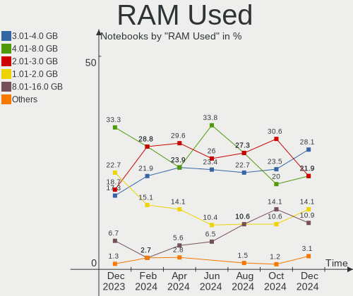
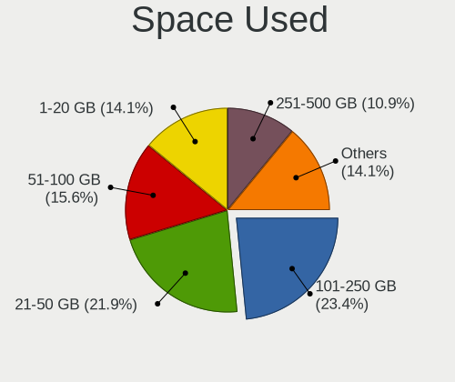
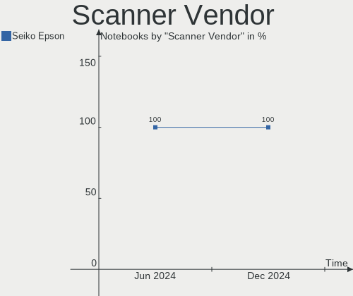

Kubuntu Hardware Trends (Notebooks)
-----------------------------------

A project to identify most popular hardware characteristics and track their change
over time based on data collected by Kubuntu users at https://Linux-Hardware.org.

Anyone can contribute to this report by the [hw-probe](https://github.com/linuxhw/hw-probe) tool:

    sudo -E hw-probe -all -upload

Full-feature report is available here: https://linux-hardware.org/?view=trends

Period: Jan, 2022.

Contents
--------

* [ System ](#system)
  - [ OS                       ](#os)
  - [ OS Family                ](#os-family)
  - [ Kernel                   ](#kernel)
  - [ Kernel Family            ](#kernel-family)
  - [ Kernel Major Ver.        ](#kernel-major-ver)
  - [ Arch                     ](#arch)
  - [ DE                       ](#de)
  - [ Display Server           ](#display-server)
  - [ Display Manager          ](#display-manager)
  - [ OS Lang                  ](#os-lang)
  - [ Boot Mode                ](#boot-mode)
  - [ Filesystem               ](#filesystem)
  - [ Part. scheme             ](#part-scheme)
  - [ Dual Boot with Linux/BSD ](#dual-boot-with-linuxbsd)
  - [ Dual Boot (Win)          ](#dual-boot-win)

* [ Board ](#board)
  - [ Vendor                   ](#vendor)
  - [ Model                    ](#model)
  - [ Model Family             ](#model-family)
  - [ MFG Year                 ](#mfg-year)
  - [ Form Factor              ](#form-factor)
  - [ Secure Boot              ](#secure-boot)
  - [ Coreboot                 ](#coreboot)
  - [ RAM Size                 ](#ram-size)
  - [ RAM Used                 ](#ram-used)
  - [ Total Drives             ](#total-drives)
  - [ Has CD-ROM               ](#has-cd-rom)
  - [ Has Ethernet             ](#has-ethernet)
  - [ Has WiFi                 ](#has-wifi)
  - [ Has Bluetooth            ](#has-bluetooth)

* [ Location ](#location)
  - [ Country                  ](#country)
  - [ City                     ](#city)

* [ Drives ](#drives)
  - [ Drive Vendor             ](#drive-vendor)
  - [ Drive Model              ](#drive-model)
  - [ HDD Vendor               ](#hdd-vendor)
  - [ SSD Vendor               ](#ssd-vendor)
  - [ Drive Kind               ](#drive-kind)
  - [ Drive Connector          ](#drive-connector)
  - [ Drive Size               ](#drive-size)
  - [ Space Total              ](#space-total)
  - [ Space Used               ](#space-used)
  - [ Malfunc. Drives          ](#malfunc-drives)
  - [ Malfunc. Drive Vendor    ](#malfunc-drive-vendor)
  - [ Malfunc. HDD Vendor      ](#malfunc-hdd-vendor)
  - [ Malfunc. Drive Kind      ](#malfunc-drive-kind)
  - [ Failed Drives            ](#failed-drives)
  - [ Failed Drive Vendor      ](#failed-drive-vendor)
  - [ Drive Status             ](#drive-status)

* [ Storage controller ](#storage-controller)
  - [ Storage Vendor           ](#storage-vendor)
  - [ Storage Model            ](#storage-model)
  - [ Storage Kind             ](#storage-kind)

* [ Processor ](#processor)
  - [ CPU Vendor               ](#cpu-vendor)
  - [ CPU Model                ](#cpu-model)
  - [ CPU Model Family         ](#cpu-model-family)
  - [ CPU Cores                ](#cpu-cores)
  - [ CPU Sockets              ](#cpu-sockets)
  - [ CPU Threads              ](#cpu-threads)
  - [ CPU Op-Modes             ](#cpu-op-modes)
  - [ CPU Microcode            ](#cpu-microcode)
  - [ CPU Microarch            ](#cpu-microarch)

* [ Graphics ](#graphics)
  - [ GPU Vendor               ](#gpu-vendor)
  - [ GPU Model                ](#gpu-model)
  - [ GPU Combo                ](#gpu-combo)
  - [ GPU Driver               ](#gpu-driver)
  - [ GPU Memory               ](#gpu-memory)

* [ Monitor ](#monitor)
  - [ Monitor Vendor           ](#monitor-vendor)
  - [ Monitor Model            ](#monitor-model)
  - [ Monitor Resolution       ](#monitor-resolution)
  - [ Monitor Diagonal         ](#monitor-diagonal)
  - [ Monitor Width            ](#monitor-width)
  - [ Aspect Ratio             ](#aspect-ratio)
  - [ Monitor Area             ](#monitor-area)
  - [ Pixel Density            ](#pixel-density)
  - [ Multiple Monitors        ](#multiple-monitors)

* [ Network ](#network)
  - [ Net Controller Vendor    ](#net-controller-vendor)
  - [ Net Controller Model     ](#net-controller-model)
  - [ Wireless Vendor          ](#wireless-vendor)
  - [ Wireless Model           ](#wireless-model)
  - [ Ethernet Vendor          ](#ethernet-vendor)
  - [ Ethernet Model           ](#ethernet-model)
  - [ Net Controller Kind      ](#net-controller-kind)
  - [ Used Controller          ](#used-controller)
  - [ NICs                     ](#nics)
  - [ IPv6                     ](#ipv6)

* [ Bluetooth ](#bluetooth)
  - [ Bluetooth Vendor         ](#bluetooth-vendor)
  - [ Bluetooth Model          ](#bluetooth-model)

* [ Sound ](#sound)
  - [ Sound Vendor             ](#sound-vendor)
  - [ Sound Model              ](#sound-model)

* [ Memory ](#memory)
  - [ Memory Vendor            ](#memory-vendor)
  - [ Memory Model             ](#memory-model)
  - [ Memory Kind              ](#memory-kind)
  - [ Memory Form Factor       ](#memory-form-factor)
  - [ Memory Size              ](#memory-size)
  - [ Memory Speed             ](#memory-speed)

* [ Printers & scanners ](#printers--scanners)
  - [ Printer Vendor           ](#printer-vendor)
  - [ Printer Model            ](#printer-model)
  - [ Scanner Vendor           ](#scanner-vendor)
  - [ Scanner Model            ](#scanner-model)

* [ Camera ](#camera)
  - [ Camera Vendor            ](#camera-vendor)
  - [ Camera Model             ](#camera-model)

* [ Security ](#security)
  - [ Fingerprint Vendor       ](#fingerprint-vendor)
  - [ Fingerprint Model        ](#fingerprint-model)
  - [ Chipcard Vendor          ](#chipcard-vendor)
  - [ Chipcard Model           ](#chipcard-model)

* [ Unsupported ](#unsupported)
  - [ Unsupported Devices      ](#unsupported-devices)
  - [ Unsupported Device Types ](#unsupported-device-types)

System
------

OS
--

Installed operating systems

| Name          | Notebooks | Percent |
|---------------|-----------|---------|
| Kubuntu 21.10 | 25        | 42.37%  |
| Kubuntu 20.04 | 20        | 33.9%   |
| Kubuntu 21.04 | 6         | 10.17%  |
| Kubuntu 11    | 6         | 10.17%  |
| Kubuntu 18.04 | 2         | 3.39%   |

OS Family
---------

OS without a version

| Name    | Notebooks | Percent |
|---------|-----------|---------|
| Kubuntu | 59        | 100%    |

Kernel
------

Version of the Linux kernel

| Version                  | Notebooks | Percent |
|--------------------------|-----------|---------|
| 5.13.0-27-generic        | 16        | 27.12%  |
| 5.13.0-23-generic        | 6         | 10.17%  |
| 5.13.0-25-generic        | 4         | 6.78%   |
| 5.13.0-22-generic        | 4         | 6.78%   |
| 5.4.0-92-generic         | 3         | 5.08%   |
| 5.13.0-19-generic        | 3         | 5.08%   |
| 5.11.0-49-generic        | 3         | 5.08%   |
| 5.11.0-41-generic        | 3         | 5.08%   |
| 5.4.0-94-generic         | 2         | 3.39%   |
| 5.13.0-25-lowlatency     | 2         | 3.39%   |
| 5.11.0-46-generic        | 2         | 3.39%   |
| 5.11.0-44-generic        | 2         | 3.39%   |
| 5.9.0-050900-generic     | 1         | 1.69%   |
| 5.8.0-33-generic         | 1         | 1.69%   |
| 5.4.0-96-generic         | 1         | 1.69%   |
| 5.4.0-91-generic         | 1         | 1.69%   |
| 5.15.15-76051515-generic | 1         | 1.69%   |
| 5.13.0-22-lowlatency     | 1         | 1.69%   |
| 5.11.0-43-generic        | 1         | 1.69%   |
| 5.11.0-37-generic        | 1         | 1.69%   |
| 5.10.0-1057-oem          | 1         | 1.69%   |

Kernel Family
-------------

Linux kernel without a distro release

| Version | Notebooks | Percent |
|---------|-----------|---------|
| 5.13.0  | 36        | 61.02%  |
| 5.11.0  | 12        | 20.34%  |
| 5.4.0   | 7         | 11.86%  |
| 5.9.0   | 1         | 1.69%   |
| 5.8.0   | 1         | 1.69%   |
| 5.15.15 | 1         | 1.69%   |
| 5.10.0  | 1         | 1.69%   |

Kernel Major Ver.
-----------------

Linux kernel major version

| Version | Notebooks | Percent |
|---------|-----------|---------|
| 5.13    | 36        | 61.02%  |
| 5.11    | 12        | 20.34%  |
| 5.4     | 7         | 11.86%  |
| 5.9     | 1         | 1.69%   |
| 5.8     | 1         | 1.69%   |
| 5.15    | 1         | 1.69%   |
| 5.10    | 1         | 1.69%   |

Arch
----

OS architecture (x86_64, i586, etc.)

| Name   | Notebooks | Percent |
|--------|-----------|---------|
| x86_64 | 59        | 100%    |

DE
--

Desktop Environment

| Name | Notebooks | Percent |
|------|-----------|---------|
| KDE5 | 58        | 98.31%  |
| KDE  | 1         | 1.69%   |

Display Server
--------------

X11 or Wayland

| Name    | Notebooks | Percent |
|---------|-----------|---------|
| X11     | 58        | 98.31%  |
| Wayland | 1         | 1.69%   |

Display Manager
---------------

SDDM, LightDM, etc.

| Name    | Notebooks | Percent |
|---------|-----------|---------|
| SDDM    | 44        | 74.58%  |
| Unknown | 11        | 18.64%  |
| LightDM | 2         | 3.39%   |
| GDM3    | 1         | 1.69%   |
| GDM     | 1         | 1.69%   |

OS Lang
-------

Language

| Lang  | Notebooks | Percent |
|-------|-----------|---------|
| en_US | 20        | 33.9%   |
| de_DE | 9         | 15.25%  |
| en_GB | 3         | 5.08%   |
| ru_UA | 2         | 3.39%   |
| ru_RU | 2         | 3.39%   |
| pt_BR | 2         | 3.39%   |
| it_IT | 2         | 3.39%   |
| fr_FR | 2         | 3.39%   |
| tr_TR | 1         | 1.69%   |
| sl_SI | 1         | 1.69%   |
| pl_PL | 1         | 1.69%   |
| id_ID | 1         | 1.69%   |
| hr_HR | 1         | 1.69%   |
| es_SV | 1         | 1.69%   |
| es_PY | 1         | 1.69%   |
| es_ES | 1         | 1.69%   |
| en_IN | 1         | 1.69%   |
| en_IE | 1         | 1.69%   |
| en_DE | 1         | 1.69%   |
| en_CA | 1         | 1.69%   |
| en_AU | 1         | 1.69%   |
| cs_CZ | 1         | 1.69%   |
| ca_ES | 1         | 1.69%   |
| C     | 1         | 1.69%   |
| bg_BG | 1         | 1.69%   |

Boot Mode
---------

EFI or BIOS

| Mode | Notebooks | Percent |
|------|-----------|---------|
| EFI  | 34        | 57.63%  |
| BIOS | 25        | 42.37%  |

Filesystem
----------

Type of filesystem

| Type    | Notebooks | Percent |
|---------|-----------|---------|
| Ext4    | 53        | 89.83%  |
| Overlay | 3         | 5.08%   |
| Btrfs   | 3         | 5.08%   |

Part. scheme
------------

Scheme of partitioning

| Type    | Notebooks | Percent |
|---------|-----------|---------|
| GPT     | 33        | 55.93%  |
| Unknown | 24        | 40.68%  |
| MBR     | 2         | 3.39%   |

Dual Boot with Linux/BSD
------------------------

Hosting more than one Linux/BSD

| Dual boot | Notebooks | Percent |
|-----------|-----------|---------|
| No        | 51        | 86.44%  |
| Yes       | 8         | 13.56%  |

Dual Boot (Win)
---------------

Hosting Linux and Windows

| Dual boot | Notebooks | Percent |
|-----------|-----------|---------|
| No        | 41        | 69.49%  |
| Yes       | 18        | 30.51%  |

Board
-----

Vendor
------

Motherboard manufacturer

| Name                | Notebooks | Percent |
|---------------------|-----------|---------|
| Lenovo              | 14        | 23.73%  |
| Hewlett-Packard     | 11        | 18.64%  |
| Dell                | 11        | 18.64%  |
| ASUSTek Computer    | 4         | 6.78%   |
| Sony                | 3         | 5.08%   |
| MSI                 | 3         | 5.08%   |
| Acer                | 3         | 5.08%   |
| Samsung Electronics | 2         | 3.39%   |
| Toshiba             | 1         | 1.69%   |
| System76            | 1         | 1.69%   |
| Packard Bell        | 1         | 1.69%   |
| Notebook            | 1         | 1.69%   |
| Irbis               | 1         | 1.69%   |
| HUAWEI              | 1         | 1.69%   |
| Fujitsu Siemens     | 1         | 1.69%   |
| Fujitsu             | 1         | 1.69%   |

Model
-----

Motherboard model

| Name                                       | Notebooks | Percent |
|--------------------------------------------|-----------|---------|
| Toshiba Satellite S55-C                    | 1         | 1.69%   |
| System76 Serval WS                         | 1         | 1.69%   |
| Sony VPCSB1B9E                             | 1         | 1.69%   |
| Sony VPCCA35FA                             | 1         | 1.69%   |
| Sony SVD13213SGW                           | 1         | 1.69%   |
| Samsung R538/R578/R778                     | 1         | 1.69%   |
| Samsung 300E4A/300E5A/300E7A/3430EA/3530EA | 1         | 1.69%   |
| Packard Bell EasyNote TK85                 | 1         | 1.69%   |
| Notebook NH5x_NH7x_HHx_HJx_HKx             | 1         | 1.69%   |
| MSI GF63 Thin 10SCXR                       | 1         | 1.69%   |
| MSI GF63 Thin 10SC                         | 1         | 1.69%   |
| MSI GE62 2QD                               | 1         | 1.69%   |
| Lenovo Y520-15IKBN 80WK                    | 1         | 1.69%   |
| Lenovo ThinkPad X1 Carbon 5th 20HQS08X1J   | 1         | 1.69%   |
| Lenovo ThinkPad T590 20N5S0MR00            | 1         | 1.69%   |
| Lenovo ThinkPad T14s Gen 1 20UH002XUS      | 1         | 1.69%   |
| Lenovo ThinkPad P51 20HHCTO1WW             | 1         | 1.69%   |
| Lenovo ThinkPad L440 20AT002YGE            | 1         | 1.69%   |
| Lenovo ThinkPad E595 20NF0000GE            | 1         | 1.69%   |
| Lenovo ThinkBook 15 G2 ITL 20VE            | 1         | 1.69%   |
| Lenovo Legion 5 17ACH6 82K0                | 1         | 1.69%   |
| Lenovo IdeaPad S145-15AST 81N3             | 1         | 1.69%   |
| Lenovo IdeaPad S145-15API 81V7             | 1         | 1.69%   |
| Lenovo IdeaPad 5 15ARE05 81YQ              | 1         | 1.69%   |
| Lenovo G500 20236                          | 1         | 1.69%   |
| Lenovo B590 20208                          | 1         | 1.69%   |
| Irbis NB120                                | 1         | 1.69%   |
| HUAWEI WRTD-WXX9                           | 1         | 1.69%   |
| HP ZBook Power G7 Mobile Workstation       | 1         | 1.69%   |
| HP ZBook 17 G2                             | 1         | 1.69%   |
| HP Victus by Laptop 16-e0xxx               | 1         | 1.69%   |
| HP Pavilion Laptop 14-ce0xxx               | 1         | 1.69%   |
| HP Pavilion dv7                            | 1         | 1.69%   |
| HP Laptop 15z-ef1xxx                       | 1         | 1.69%   |
| HP Laptop 15s-eq0xxx                       | 1         | 1.69%   |
| HP G60                                     | 1         | 1.69%   |
| HP EliteBook 8570w                         | 1         | 1.69%   |
| HP Compaq Presario CQ40                    | 1         | 1.69%   |
| HP 250 G5 Notebook PC                      | 1         | 1.69%   |
| Fujitsu Siemens AMILO Xi 1526              | 1         | 1.69%   |
| Fujitsu LIFEBOOK E753                      | 1         | 1.69%   |
| Dell XPS 13 9310                           | 1         | 1.69%   |
| Dell Vostro 14 5410                        | 1         | 1.69%   |
| Dell Precision 5520                        | 1         | 1.69%   |
| Dell Precision 5510                        | 1         | 1.69%   |
| Dell Latitude E5430 vPro                   | 1         | 1.69%   |
| Dell Latitude D830                         | 1         | 1.69%   |
| Dell Latitude 7490                         | 1         | 1.69%   |
| Dell Latitude 7410                         | 1         | 1.69%   |
| Dell Latitude 5411                         | 1         | 1.69%   |
| Dell Inspiron 3421                         | 1         | 1.69%   |
| Dell G5 5500                               | 1         | 1.69%   |
| ASUS VivoBook_ASUSLaptop X532EQ_S532EQ     | 1         | 1.69%   |
| ASUS S400CA                                | 1         | 1.69%   |
| ASUS G771JMC                               | 1         | 1.69%   |
| ASUS ASUS TUF Gaming A15 FA506IV_FA506IV   | 1         | 1.69%   |
| Acer Aspire F5-771G                        | 1         | 1.69%   |
| Acer Aspire E1-571                         | 1         | 1.69%   |
| Acer Aspire A515-44                        | 1         | 1.69%   |

Model Family
------------

Motherboard model prefix

| Name                  | Notebooks | Percent |
|-----------------------|-----------|---------|
| Lenovo ThinkPad       | 6         | 10.17%  |
| Dell Latitude         | 5         | 8.47%   |
| Lenovo IdeaPad        | 3         | 5.08%   |
| Acer Aspire           | 3         | 5.08%   |
| MSI GF63              | 2         | 3.39%   |
| HP ZBook              | 2         | 3.39%   |
| HP Pavilion           | 2         | 3.39%   |
| HP Laptop             | 2         | 3.39%   |
| Dell Precision        | 2         | 3.39%   |
| Toshiba Satellite     | 1         | 1.69%   |
| System76 Serval       | 1         | 1.69%   |
| Sony VPCSB1B9E        | 1         | 1.69%   |
| Sony VPCCA35FA        | 1         | 1.69%   |
| Sony SVD13213SGW      | 1         | 1.69%   |
| Samsung R538          | 1         | 1.69%   |
| Samsung 300E4A        | 1         | 1.69%   |
| Packard Bell EasyNote | 1         | 1.69%   |
| Notebook NH5x         | 1         | 1.69%   |
| MSI GE62              | 1         | 1.69%   |
| Lenovo Y520-15IKBN    | 1         | 1.69%   |
| Lenovo ThinkBook      | 1         | 1.69%   |
| Lenovo Legion         | 1         | 1.69%   |
| Lenovo G500           | 1         | 1.69%   |
| Lenovo B590           | 1         | 1.69%   |
| Irbis NB120           | 1         | 1.69%   |
| HUAWEI WRTD-WXX9      | 1         | 1.69%   |
| HP Victus             | 1         | 1.69%   |
| HP G60                | 1         | 1.69%   |
| HP EliteBook          | 1         | 1.69%   |
| HP Compaq             | 1         | 1.69%   |
| HP 250                | 1         | 1.69%   |
| Fujitsu Siemens AMILO | 1         | 1.69%   |
| Fujitsu LIFEBOOK      | 1         | 1.69%   |
| Dell XPS              | 1         | 1.69%   |
| Dell Vostro           | 1         | 1.69%   |
| Dell Inspiron         | 1         | 1.69%   |
| Dell G5               | 1         | 1.69%   |
| ASUS VivoBook         | 1         | 1.69%   |
| ASUS S400CA           | 1         | 1.69%   |
| ASUS G771JMC          | 1         | 1.69%   |
| ASUS ASUS             | 1         | 1.69%   |

MFG Year
--------

Motherboard manufacture year

| Year | Notebooks | Percent |
|------|-----------|---------|
| 2020 | 12        | 20.34%  |
| 2021 | 9         | 15.25%  |
| 2012 | 6         | 10.17%  |
| 2019 | 5         | 8.47%   |
| 2017 | 4         | 6.78%   |
| 2016 | 3         | 5.08%   |
| 2014 | 3         | 5.08%   |
| 2013 | 3         | 5.08%   |
| 2011 | 3         | 5.08%   |
| 2008 | 3         | 5.08%   |
| 2018 | 2         | 3.39%   |
| 2015 | 2         | 3.39%   |
| 2010 | 2         | 3.39%   |
| 2007 | 2         | 3.39%   |

Form Factor
-----------

Physical design of the computer

| Name     | Notebooks | Percent |
|----------|-----------|---------|
| Notebook | 59        | 100%    |

Secure Boot
-----------

Enabled or disabled

| State    | Notebooks | Percent |
|----------|-----------|---------|
| Disabled | 53        | 89.83%  |
| Enabled  | 6         | 10.17%  |

Coreboot
--------

Have coreboot on board

| Used | Notebooks | Percent |
|------|-----------|---------|
| No   | 59        | 100%    |

RAM Size
--------

Total RAM memory

| Size in GB  | Notebooks | Percent |
|-------------|-----------|---------|
| 16.01-24.0  | 19        | 32.2%   |
| 4.01-8.0    | 12        | 20.34%  |
| 8.01-16.0   | 9         | 15.25%  |
| 32.01-64.0  | 6         | 10.17%  |
| 3.01-4.0    | 5         | 8.47%   |
| 1.01-2.0    | 3         | 5.08%   |
| 24.01-32.0  | 2         | 3.39%   |
| 2.01-3.0    | 2         | 3.39%   |
| 64.01-256.0 | 1         | 1.69%   |

RAM Used
--------

Used RAM memory

| Used GB    | Notebooks | Percent |
|------------|-----------|---------|
| 1.01-2.0   | 19        | 32.2%   |
| 4.01-8.0   | 17        | 28.81%  |
| 2.01-3.0   | 9         | 15.25%  |
| 8.01-16.0  | 7         | 11.86%  |
| 3.01-4.0   | 5         | 8.47%   |
| 16.01-24.0 | 1         | 1.69%   |
| 0.51-1.0   | 1         | 1.69%   |

Total Drives
------------

Number of drives on board

| Drives | Notebooks | Percent |
|--------|-----------|---------|
| 1      | 40        | 67.8%   |
| 2      | 15        | 25.42%  |
| 3      | 4         | 6.78%   |

Has CD-ROM
----------

Has CD-ROM on board

| Presented | Notebooks | Percent |
|-----------|-----------|---------|
| No        | 41        | 69.49%  |
| Yes       | 18        | 30.51%  |

Has Ethernet
------------

Has Ethernet on board

| Presented | Notebooks | Percent |
|-----------|-----------|---------|
| Yes       | 49        | 83.05%  |
| No        | 10        | 16.95%  |

Has WiFi
--------

Has WiFi module

| Presented | Notebooks | Percent |
|-----------|-----------|---------|
| Yes       | 58        | 98.31%  |
| No        | 1         | 1.69%   |

Has Bluetooth
-------------

Has Bluetooth module

| Presented | Notebooks | Percent |
|-----------|-----------|---------|
| Yes       | 48        | 81.36%  |
| No        | 11        | 18.64%  |

Location
--------

Country
-------

Geographic location (country)

| Country      | Notebooks | Percent |
|--------------|-----------|---------|
| Germany      | 10        | 16.95%  |
| USA          | 8         | 13.56%  |
| Ukraine      | 4         | 6.78%   |
| UK           | 4         | 6.78%   |
| Spain        | 3         | 5.08%   |
| Italy        | 3         | 5.08%   |
| Slovenia     | 2         | 3.39%   |
| Russia       | 2         | 3.39%   |
| Ireland      | 2         | 3.39%   |
| France       | 2         | 3.39%   |
| Czechia      | 2         | 3.39%   |
| Brazil       | 2         | 3.39%   |
| Austria      | 2         | 3.39%   |
| Turkey       | 1         | 1.69%   |
| Saudi Arabia | 1         | 1.69%   |
| Poland       | 1         | 1.69%   |
| Paraguay     | 1         | 1.69%   |
| Netherlands  | 1         | 1.69%   |
| Indonesia    | 1         | 1.69%   |
| India        | 1         | 1.69%   |
| Hungary      | 1         | 1.69%   |
| El Salvador  | 1         | 1.69%   |
| Croatia      | 1         | 1.69%   |
| Canada       | 1         | 1.69%   |
| Bulgaria     | 1         | 1.69%   |
| Australia    | 1         | 1.69%   |

City
----

Geographic location (city)

| City                  | Notebooks | Percent |
|-----------------------|-----------|---------|
| Wigan                 | 2         | 3.39%   |
| Valencia              | 2         | 3.39%   |
| Schonaich             | 2         | 3.39%   |
| Kyiv                  | 2         | 3.39%   |
| Hamburg               | 2         | 3.39%   |
| Hailsham              | 2         | 3.39%   |
| Winter Park           | 1         | 1.69%   |
| Waukesha              | 1         | 1.69%   |
| Warsaw                | 1         | 1.69%   |
| Tiel                  | 1         | 1.69%   |
| Soltau                | 1         | 1.69%   |
| Sofia                 | 1         | 1.69%   |
| Slovenj Gradec        | 1         | 1.69%   |
| San Salvador          | 1         | 1.69%   |
| Saint-Lin-Laurentides | 1         | 1.69%   |
| Praia Grande          | 1         | 1.69%   |
| Prague                | 1         | 1.69%   |
| Portoro??             | 1         | 1.69%   |
| Philadelphia          | 1         | 1.69%   |
| Perth                 | 1         | 1.69%   |
| Paris                 | 1         | 1.69%   |
| Osijek                | 1         | 1.69%   |
| Odessa                | 1         | 1.69%   |
| Novosibirsk           | 1         | 1.69%   |
| Midleton              | 1         | 1.69%   |
| Lawrenceburg          | 1         | 1.69%   |
| Klagenfurt            | 1         | 1.69%   |
| Kiskunhalas           | 1         | 1.69%   |
| Kharkiv               | 1         | 1.69%   |
| Kaliningrad           | 1         | 1.69%   |
| Jeddah                | 1         | 1.69%   |
| Istanbul              | 1         | 1.69%   |
| Innsbruck             | 1         | 1.69%   |
| Hav?­?™ov             | 1         | 1.69%   |
| Hanover               | 1         | 1.69%   |
| Emmerich              | 1         | 1.69%   |
| Durgapur              | 1         | 1.69%   |
| Dublin                | 1         | 1.69%   |
| Dresden               | 1         | 1.69%   |
| Dallas                | 1         | 1.69%   |
| Corpus Christi        | 1         | 1.69%   |
| Catania               | 1         | 1.69%   |
| Caen                  | 1         | 1.69%   |
| Bras?­lia             | 1         | 1.69%   |
| Bekasi                | 1         | 1.69%   |
| Bedburg               | 1         | 1.69%   |
| Bad Toelz             | 1         | 1.69%   |
| Azzanello             | 1         | 1.69%   |
| Atlanta               | 1         | 1.69%   |
| Asunci??n             | 1         | 1.69%   |
| Asti                  | 1         | 1.69%   |
| Amesbury              | 1         | 1.69%   |
| Albacete              | 1         | 1.69%   |

Drives
------

Drive Vendor
------------

Hard drive vendors

| Vendor              | Notebooks | Drives  | Percent |
|---------------------|-----------|---------|---------|
| Samsung Electronics | 17        | 20      | 21.52%  |
| WDC                 | 8         | 8       | 10.13%  |
| Seagate             | 8         | 9       | 10.13%  |
| Kingston            | 8         | 8       | 10.13%  |
| SanDisk             | 7         | 7       | 8.86%   |
| Crucial             | 5         | 5       | 6.33%   |
| Toshiba             | 4         | 4       | 5.06%   |
| SK Hynix            | 3         | 3       | 3.8%    |
| Micron Technology   | 3         | 3       | 3.8%    |
| KIOXIA              | 3         | 3       | 3.8%    |
| Intel               | 2         | 2       | 2.53%   |
| HGST                | 2         | 2       | 2.53%   |
| Team                | 1         | 1       | 1.27%   |
| TCSUNBOW            | 1         | 1       | 1.27%   |
| SPCC                | 1         | 1       | 1.27%   |
| KingSpec            | 1         | 1       | 1.27%   |
| Hitachi             | 1         | 1       | 1.27%   |
| Hewlett-Packard     | 1         | Unknown | 1.27%   |
| GOODRAM             | 1         | 1       | 1.27%   |
| Apacer              | 1         | 1       | 1.27%   |
| Unknown             | 1         | 1       | 1.27%   |

Drive Model
-----------

Hard drive models

| Model                                | Notebooks | Percent |
|--------------------------------------|-----------|---------|
| Seagate ST1000LM024 HN-M101MBB 1TB   | 2         | 2.44%   |
| Sandisk NVMe SSD Drive 512GB         | 2         | 2.44%   |
| Samsung SSD 970 EVO Plus 1TB         | 2         | 2.44%   |
| Samsung SSD 860 EVO 1TB              | 2         | 2.44%   |
| Crucial CT500MX500SSD1 500GB         | 2         | 2.44%   |
| WDC WD7500BPVX-75JC3T0 752GB         | 1         | 1.22%   |
| WDC WD7500BPKX-22HPJT0 752GB         | 1         | 1.22%   |
| WDC WD5000LPVT-22G33T0 500GB         | 1         | 1.22%   |
| WDC WD5000LPCX-24VHAT0 500GB         | 1         | 1.22%   |
| WDC WD10JPVX-60JC3T0 1TB             | 1         | 1.22%   |
| WDC PC SN730 SDBPNTY-512G-1006 512GB | 1         | 1.22%   |
| WDC PC SN520 SDAPNUW-512G-1006 512GB | 1         | 1.22%   |
| WDC PC SN520 SDAPMUW-512G-1001 512GB | 1         | 1.22%   |
| Toshiba THNSNJ128G8NY 128GB SSD      | 1         | 1.22%   |
| Toshiba MQ04ABF100 1TB               | 1         | 1.22%   |
| Toshiba MK2556GSY 250GB              | 1         | 1.22%   |
| Toshiba KBG30ZMV256G 256GB           | 1         | 1.22%   |
| Team TM8FPD512G 512GB                | 1         | 1.22%   |
| TCSUNBOW X3 240GB SSD                | 1         | 1.22%   |
| SPCC Solid State Disk 1024GB         | 1         | 1.22%   |
| SK Hynix NVMe SSD Drive 512GB        | 1         | 1.22%   |
| SK Hynix HFM512GDJTNI-82A0A 512GB    | 1         | 1.22%   |
| SK Hynix BC511 NVMe 512GB            | 1         | 1.22%   |
| Seagate ST500LT012-9WS142 500GB      | 1         | 1.22%   |
| Seagate ST2000LM007-1R8174 2TB       | 1         | 1.22%   |
| Seagate ST2000DM 008-2FR102 2TB      | 1         | 1.22%   |
| Seagate ST1000LX015-1U7172 1TB       | 1         | 1.22%   |
| Seagate ST1000LM048-2E7172 1TB       | 1         | 1.22%   |
| Seagate ST1000LM035-1RK172 1TB       | 1         | 1.22%   |
| Seagate ST1000LM014-1EJ164 1TB       | 1         | 1.22%   |
| SanDisk SSD U100 24GB                | 1         | 1.22%   |
| SanDisk SSD G5 BICS4 1TB             | 1         | 1.22%   |
| SanDisk SD6PP4M-256G-1006 256GB SSD  | 1         | 1.22%   |
| Sandisk NVMe SSD Drive 1TB           | 1         | 1.22%   |
| Sandisk NVMe SSD Drive 1024GB        | 1         | 1.22%   |
| Samsung SSD 970 EVO Plus 500GB       | 1         | 1.22%   |
| Samsung SSD 870 QVO 1TB              | 1         | 1.22%   |
| Samsung SSD 870 EVO 250GB            | 1         | 1.22%   |
| Samsung SSD 860 PRO 512GB            | 1         | 1.22%   |
| Samsung SSD 860 EVO M.2 500GB        | 1         | 1.22%   |
| Samsung SSD 860 EVO 4TB              | 1         | 1.22%   |
| Samsung SSD 850 PRO 512GB            | 1         | 1.22%   |
| Samsung SSD 850 EVO 250GB            | 1         | 1.22%   |
| Samsung NVMe SSD Drive 2TB           | 1         | 1.22%   |
| Samsung NVMe SSD Drive 1TB           | 1         | 1.22%   |
| Samsung MZVLW512HMJP-000L7 512GB     | 1         | 1.22%   |
| Samsung MZVKW512HMJP-000L7 512GB     | 1         | 1.22%   |
| Samsung MZNTD128HAGM-00000 128GB SSD | 1         | 1.22%   |
| Samsung MZHPU256HCGL-00004 256GB SSD | 1         | 1.22%   |
| Samsung HM250HI 250GB                | 1         | 1.22%   |
| Micron MTFDHBA512TDV 512GB           | 1         | 1.22%   |
| Micron 2300 NVMe 512GB               | 1         | 1.22%   |
| Micron 2210_MTFDHBA512QFD 512GB      | 1         | 1.22%   |
| KIOXIA KXG70PNV2T04 NVMe 2048GB      | 1         | 1.22%   |
| KIOXIA KXG60ZNV512G 512GB            | 1         | 1.22%   |
| KIOXIA KBG30ZMV256G 256GB            | 1         | 1.22%   |
| Kingston SUV500MS480G 480GB SSD      | 1         | 1.22%   |
| Kingston SNVS250G 250GB              | 1         | 1.22%   |
| Kingston SNVS1000G 1TB               | 1         | 1.22%   |
| Kingston SM2280S3G2120G 120GB SSD    | 1         | 1.22%   |

HDD Vendor
----------

Hard disk drive vendors

| Vendor              | Notebooks | Drives | Percent |
|---------------------|-----------|--------|---------|
| Seagate             | 8         | 9      | 42.11%  |
| WDC                 | 5         | 5      | 26.32%  |
| Toshiba             | 2         | 2      | 10.53%  |
| HGST                | 2         | 2      | 10.53%  |
| Samsung Electronics | 1         | 1      | 5.26%   |
| Hitachi             | 1         | 1      | 5.26%   |

SSD Vendor
----------

Solid state drive vendors

| Vendor              | Notebooks | Drives | Percent |
|---------------------|-----------|--------|---------|
| Samsung Electronics | 10        | 11     | 34.48%  |
| Kingston            | 5         | 5      | 17.24%  |
| Crucial             | 5         | 5      | 17.24%  |
| SanDisk             | 3         | 3      | 10.34%  |
| Toshiba             | 1         | 1      | 3.45%   |
| TCSUNBOW            | 1         | 1      | 3.45%   |
| SPCC                | 1         | 1      | 3.45%   |
| KingSpec            | 1         | 1      | 3.45%   |
| GOODRAM             | 1         | 1      | 3.45%   |
| Apacer              | 1         | 1      | 3.45%   |

Drive Kind
----------

HDD or SSD

| Kind    | Notebooks | Drives  | Percent |
|---------|-----------|---------|---------|
| NVMe    | 28        | 31      | 37.84%  |
| SSD     | 26        | 30      | 35.14%  |
| HDD     | 18        | 20      | 24.32%  |
| MMC     | 1         | 1       | 1.35%   |
| Unknown | 1         | Unknown | 1.35%   |

Drive Connector
---------------

SATA, SAS, NVMe, etc.

| Type | Notebooks | Drives | Percent |
|------|-----------|--------|---------|
| SATA | 37        | 49     | 54.41%  |
| NVMe | 28        | 31     | 41.18%  |
| SAS  | 2         | 1      | 2.94%   |
| MMC  | 1         | 1      | 1.47%   |

Drive Size
----------

Size of hard drive

| Size in TB | Notebooks | Drives | Percent |
|------------|-----------|--------|---------|
| 0.01-0.5   | 22        | 25     | 50%     |
| 0.51-1.0   | 17        | 20     | 38.64%  |
| 1.01-2.0   | 4         | 4      | 9.09%   |
| 3.01-4.0   | 1         | 1      | 2.27%   |

Space Total
-----------

Amount of disk space available on the file system

| Size in GB     | Notebooks | Percent |
|----------------|-----------|---------|
| 251-500        | 22        | 37.29%  |
| 101-250        | 12        | 20.34%  |
| 501-1000       | 11        | 18.64%  |
| 1001-2000      | 5         | 8.47%   |
| More than 3000 | 3         | 5.08%   |
| 1-20           | 3         | 5.08%   |
| 21-50          | 1         | 1.69%   |
| 2001-3000      | 1         | 1.69%   |
| 51-100         | 1         | 1.69%   |

Space Used
----------

Amount of used disk space

| Used GB        | Notebooks | Percent |
|----------------|-----------|---------|
| 1-20           | 19        | 32.2%   |
| 101-250        | 11        | 18.64%  |
| 251-500        | 10        | 16.95%  |
| 51-100         | 7         | 11.86%  |
| 21-50          | 6         | 10.17%  |
| 501-1000       | 3         | 5.08%   |
| More than 3000 | 2         | 3.39%   |
| 1001-2000      | 1         | 1.69%   |

Malfunc. Drives
---------------

Drive models with a malfunction

| Model                              | Notebooks | Drives | Percent |
|------------------------------------|-----------|--------|---------|
| WDC WD5000LPVT-22G33T0 500GB       | 1         | 1      | 25%     |
| Seagate ST500LT012-9WS142 500GB    | 1         | 1      | 25%     |
| Seagate ST1000LM035-1RK172 1TB     | 1         | 1      | 25%     |
| Seagate ST1000LM024 HN-M101MBB 1TB | 1         | 1      | 25%     |

Malfunc. Drive Vendor
---------------------

Vendors of faulty drives

| Vendor  | Notebooks | Drives | Percent |
|---------|-----------|--------|---------|
| Seagate | 3         | 3      | 75%     |
| WDC     | 1         | 1      | 25%     |

Malfunc. HDD Vendor
-------------------

Vendors of faulty HDD drives

| Vendor  | Notebooks | Drives | Percent |
|---------|-----------|--------|---------|
| Seagate | 3         | 3      | 75%     |
| WDC     | 1         | 1      | 25%     |

Malfunc. Drive Kind
-------------------

Kinds of faulty drives

| Kind | Notebooks | Drives | Percent |
|------|-----------|--------|---------|
| HDD  | 4         | 4      | 100%    |

Failed Drives
-------------

Failed drive models

Zero info for selected period =(

Failed Drive Vendor
-------------------

Failed drive vendors

Zero info for selected period =(

Drive Status
------------

Number of failed and malfunc. drives

| Status   | Notebooks | Drives | Percent |
|----------|-----------|--------|---------|
| Works    | 33        | 44     | 51.56%  |
| Detected | 27        | 34     | 42.19%  |
| Malfunc  | 4         | 4      | 6.25%   |

Storage controller
------------------

Storage Vendor
--------------

Storage controller vendors

| Vendor                       | Notebooks | Percent |
|------------------------------|-----------|---------|
| Intel                        | 40        | 50.63%  |
| Samsung Electronics          | 8         | 10.13%  |
| AMD                          | 8         | 10.13%  |
| Sandisk                      | 7         | 8.86%   |
| Toshiba America Info Systems | 3         | 3.8%    |
| SK Hynix                     | 3         | 3.8%    |
| Micron Technology            | 3         | 3.8%    |
| Kingston Technology Company  | 3         | 3.8%    |
| VIA Technologies             | 1         | 1.27%   |
| Silicon Motion               | 1         | 1.27%   |
| Marvell Technology Group     | 1         | 1.27%   |
| KIOXIA                       | 1         | 1.27%   |

Storage Model
-------------

Storage controller models

| Model                                                                          | Notebooks | Percent |
|--------------------------------------------------------------------------------|-----------|---------|
| AMD FCH SATA Controller [AHCI mode]                                            | 8         | 9.41%   |
| Intel 7 Series Chipset Family 6-port SATA Controller [AHCI mode]               | 6         | 7.06%   |
| Samsung NVMe SSD Controller SM981/PM981/PM983                                  | 5         | 5.88%   |
| Sandisk WD Black SN750 / PC SN730 NVMe SSD                                     | 4         | 4.71%   |
| Intel 8 Series/C220 Series Chipset Family 6-port SATA Controller 1 [AHCI mode] | 4         | 4.71%   |
| Intel 400 Series Chipset Family SATA AHCI Controller                           | 4         | 4.71%   |
| SK Hynix BC511                                                                 | 3         | 3.53%   |
| Micron Non-Volatile memory controller                                          | 3         | 3.53%   |
| Intel Volume Management Device NVMe RAID Controller                            | 3         | 3.53%   |
| Intel Sunrise Point-LP SATA Controller [AHCI mode]                             | 3         | 3.53%   |
| Intel 82801 Mobile SATA Controller [RAID mode]                                 | 3         | 3.53%   |
| Intel 6 Series/C200 Series Chipset Family 6 port Mobile SATA AHCI Controller   | 3         | 3.53%   |
| Toshiba America Info Systems BG3 NVMe SSD Controller                           | 2         | 2.35%   |
| Samsung NVMe SSD Controller SM961/PM961/SM963                                  | 2         | 2.35%   |
| Kingston Company Company Non-Volatile memory controller                        | 2         | 2.35%   |
| Intel SSD 660P Series                                                          | 2         | 2.35%   |
| Intel Q170/Q150/B150/H170/H110/Z170/CM236 Chipset SATA Controller [AHCI Mode]  | 2         | 2.35%   |
| Intel 82801IBM/IEM (ICH9M/ICH9M-E) 4 port SATA Controller [AHCI mode]          | 2         | 2.35%   |
| Intel 5 Series/3400 Series Chipset 4 port SATA AHCI Controller                 | 2         | 2.35%   |
| VIA VT6421 IDE/SATA Controller                                                 | 1         | 1.18%   |
| Toshiba America Info Systems XG6 NVMe SSD Controller                           | 1         | 1.18%   |
| Silicon Motion SM2263EN/SM2263XT SSD Controller                                | 1         | 1.18%   |
| Sandisk WD Blue SN570 NVMe SSD                                                 | 1         | 1.18%   |
| Sandisk WD Blue SN500 / PC SN520 NVMe SSD                                      | 1         | 1.18%   |
| Sandisk PC SN520 NVMe SSD                                                      | 1         | 1.18%   |
| Samsung XP941 PCIe SSD                                                         | 1         | 1.18%   |
| Marvell Group 88SS9183 PCIe SSD Controller                                     | 1         | 1.18%   |
| KIOXIA Non-Volatile memory controller                                          | 1         | 1.18%   |
| Kingston Company SNVS2000G [NV1 NVMe PCIe SSD 2TB]                             | 1         | 1.18%   |
| Intel Wildcat Point-LP SATA Controller [AHCI Mode]                             | 1         | 1.18%   |
| Intel Tiger Lake-LP SATA Controller [AHCI mode]                                | 1         | 1.18%   |
| Intel Celeron/Pentium Silver Processor SATA Controller                         | 1         | 1.18%   |
| Intel 82801HM/HEM (ICH8M/ICH8M-E) SATA Controller [AHCI mode]                  | 1         | 1.18%   |
| Intel 82801HM/HEM (ICH8M/ICH8M-E) IDE Controller                               | 1         | 1.18%   |
| Intel 82801GBM/GHM (ICH7-M Family) SATA Controller [IDE mode]                  | 1         | 1.18%   |
| Intel 82801G (ICH7 Family) IDE Controller                                      | 1         | 1.18%   |
| Intel 8 Series SATA Controller 1 [AHCI mode]                                   | 1         | 1.18%   |
| Intel 7 Series Chipset Family 4-port SATA Controller [IDE mode]                | 1         | 1.18%   |
| Intel 7 Series Chipset Family 2-port SATA Controller [IDE mode]                | 1         | 1.18%   |
| Intel 500 Series Chipset Family SATA AHCI Controller                           | 1         | 1.18%   |
| AMD 400 Series Chipset SATA Controller                                         | 1         | 1.18%   |

Storage Kind
------------

Kind of storage controller (IDE, SATA, NVMe, SAS, ...)

| Kind | Notebooks | Percent |
|------|-----------|---------|
| SATA | 40        | 51.28%  |
| NVMe | 28        | 35.9%   |
| RAID | 7         | 8.97%   |
| IDE  | 3         | 3.85%   |

Processor
---------

CPU Vendor
----------

Processor vendors

| Vendor | Notebooks | Percent |
|--------|-----------|---------|
| Intel  | 47        | 79.66%  |
| AMD    | 12        | 20.34%  |

CPU Model
---------

Processor models

| Model                                         | Notebooks | Percent |
|-----------------------------------------------|-----------|---------|
| AMD Ryzen 7 3700U with Radeon Vega Mobile Gfx | 3         | 5.08%   |
| Intel Core i7-7700HQ CPU @ 2.80GHz            | 2         | 3.39%   |
| Intel Core i7-10850H CPU @ 2.70GHz            | 2         | 3.39%   |
| Intel Core i5-3230M CPU @ 2.60GHz             | 2         | 3.39%   |
| Intel Core i5-10300H CPU @ 2.50GHz            | 2         | 3.39%   |
| Intel Core i3-3217U CPU @ 1.80GHz             | 2         | 3.39%   |
| Intel Core i3-3110M CPU @ 2.40GHz             | 2         | 3.39%   |
| Intel 11th Gen Core i5-1135G7 @ 2.40GHz       | 2         | 3.39%   |
| Intel Pentium Dual-Core CPU T4300 @ 2.10GHz   | 1         | 1.69%   |
| Intel Genuine CPU 585 @ 2.16GHz               | 1         | 1.69%   |
| Intel Core i7-8565U CPU @ 1.80GHz             | 1         | 1.69%   |
| Intel Core i7-7820HQ CPU @ 2.90GHz            | 1         | 1.69%   |
| Intel Core i7-7600U CPU @ 2.80GHz             | 1         | 1.69%   |
| Intel Core i7-6820HQ CPU @ 2.70GHz            | 1         | 1.69%   |
| Intel Core i7-5500U CPU @ 2.40GHz             | 1         | 1.69%   |
| Intel Core i7-4720HQ CPU @ 2.60GHz            | 1         | 1.69%   |
| Intel Core i7-4710MQ CPU @ 2.50GHz            | 1         | 1.69%   |
| Intel Core i7-4710HQ CPU @ 2.50GHz            | 1         | 1.69%   |
| Intel Core i7-2670QM CPU @ 2.20GHz            | 1         | 1.69%   |
| Intel Core i7-2620M CPU @ 2.70GHz             | 1         | 1.69%   |
| Intel Core i5-8350U CPU @ 1.70GHz             | 1         | 1.69%   |
| Intel Core i5-8250U CPU @ 1.60GHz             | 1         | 1.69%   |
| Intel Core i5-7200U CPU @ 2.50GHz             | 1         | 1.69%   |
| Intel Core i5-6200U CPU @ 2.30GHz             | 1         | 1.69%   |
| Intel Core i5-4200U CPU @ 1.60GHz             | 1         | 1.69%   |
| Intel Core i5-4200M CPU @ 2.50GHz             | 1         | 1.69%   |
| Intel Core i5-3360M CPU @ 2.80GHz             | 1         | 1.69%   |
| Intel Core i5-3340M CPU @ 2.70GHz             | 1         | 1.69%   |
| Intel Core i5-2430M CPU @ 2.40GHz             | 1         | 1.69%   |
| Intel Core i5-10500H CPU @ 2.50GHz            | 1         | 1.69%   |
| Intel Core i5-10310U CPU @ 1.70GHz            | 1         | 1.69%   |
| Intel Core i5 CPU M 460 @ 2.53GHz             | 1         | 1.69%   |
| Intel Core i3-2350M CPU @ 2.30GHz             | 1         | 1.69%   |
| Intel Core i3 CPU M 380 @ 2.53GHz             | 1         | 1.69%   |
| Intel Core 2 Duo CPU T7300 @ 2.00GHz          | 1         | 1.69%   |
| Intel Core 2 CPU T5500 @ 1.66GHz              | 1         | 1.69%   |
| Intel Celeron N4020 CPU @ 1.10GHz             | 1         | 1.69%   |
| Intel 11th Gen Core i7-1185G7 @ 3.00GHz       | 1         | 1.69%   |
| Intel 11th Gen Core i7-11800H @ 2.30GHz       | 1         | 1.69%   |
| Intel 11th Gen Core i7-1165G7 @ 2.80GHz       | 1         | 1.69%   |
| Intel 11th Gen Core i7-11370H @ 3.30GHz       | 1         | 1.69%   |
| AMD Ryzen 9 3900 12-Core Processor            | 1         | 1.69%   |
| AMD Ryzen 7 PRO 4750U with Radeon Graphics    | 1         | 1.69%   |
| AMD Ryzen 7 5800H with Radeon Graphics        | 1         | 1.69%   |
| AMD Ryzen 7 4800H with Radeon Graphics        | 1         | 1.69%   |
| AMD Ryzen 7 4700U with Radeon Graphics        | 1         | 1.69%   |
| AMD Ryzen 5 5600H with Radeon Graphics        | 1         | 1.69%   |
| AMD Ryzen 5 4500U with Radeon Graphics        | 1         | 1.69%   |
| AMD Athlon Gold 3150U with Radeon Graphics    | 1         | 1.69%   |
| AMD A6-9225 RADEON R4, 5 COMPUTE CORES 2C+3G  | 1         | 1.69%   |

CPU Model Family
----------------

Processor model prefix

| Model                   | Notebooks | Percent |
|-------------------------|-----------|---------|
| Intel Core i5           | 16        | 27.12%  |
| Intel Core i7           | 14        | 23.73%  |
| Other                   | 6         | 10.17%  |
| Intel Core i3           | 6         | 10.17%  |
| AMD Ryzen 7             | 6         | 10.17%  |
| AMD Ryzen 5             | 2         | 3.39%   |
| Intel Pentium Dual-Core | 1         | 1.69%   |
| Intel Genuine           | 1         | 1.69%   |
| Intel Core 2 Duo        | 1         | 1.69%   |
| Intel Core 2            | 1         | 1.69%   |
| Intel Celeron           | 1         | 1.69%   |
| AMD Ryzen 9             | 1         | 1.69%   |
| AMD Ryzen 7 PRO         | 1         | 1.69%   |
| AMD Athlon              | 1         | 1.69%   |
| AMD A6                  | 1         | 1.69%   |

CPU Cores
---------

Number of processor cores

| Number | Notebooks | Percent |
|--------|-----------|---------|
| 2      | 25        | 42.37%  |
| 4      | 22        | 37.29%  |
| 8      | 5         | 8.47%   |
| 6      | 5         | 8.47%   |
| 12     | 1         | 1.69%   |
| 1      | 1         | 1.69%   |

CPU Sockets
-----------

Number of sockets

| Number | Notebooks | Percent |
|--------|-----------|---------|
| 1      | 59        | 100%    |

CPU Threads
-----------

Threads per core (Hyper-Threading)

| Number | Notebooks | Percent |
|--------|-----------|---------|
| 2      | 50        | 84.75%  |
| 1      | 9         | 15.25%  |

CPU Op-Modes
------------

CPU Operation Modes (32-bit, 64-bit)

| Op mode        | Notebooks | Percent |
|----------------|-----------|---------|
| 32-bit, 64-bit | 59        | 100%    |

CPU Microcode
-------------

Microcode number

| Number     | Notebooks | Percent |
|------------|-----------|---------|
| Unknown    | 12        | 20.34%  |
| 0x306a9    | 6         | 10.17%  |
| 0xa0652    | 5         | 8.47%   |
| 0x206a7    | 4         | 6.78%   |
| 0x806c1    | 3         | 5.08%   |
| 0x306c3    | 3         | 5.08%   |
| 0x906e9    | 2         | 3.39%   |
| 0x806e9    | 2         | 3.39%   |
| 0x20655    | 2         | 3.39%   |
| 0x0a50000c | 2         | 3.39%   |
| 0x08108102 | 2         | 3.39%   |
| 0x806ec    | 1         | 1.69%   |
| 0x806ea    | 1         | 1.69%   |
| 0x806d1    | 1         | 1.69%   |
| 0x706a8    | 1         | 1.69%   |
| 0x6fd      | 1         | 1.69%   |
| 0x6fa      | 1         | 1.69%   |
| 0x6f6      | 1         | 1.69%   |
| 0x406e3    | 1         | 1.69%   |
| 0x40651    | 1         | 1.69%   |
| 0x306d4    | 1         | 1.69%   |
| 0x1067a    | 1         | 1.69%   |
| 0x08701013 | 1         | 1.69%   |
| 0x08600106 | 1         | 1.69%   |
| 0x08600104 | 1         | 1.69%   |
| 0x08600103 | 1         | 1.69%   |
| 0x08108109 | 1         | 1.69%   |

CPU Microarch
-------------

Microarchitecture

| Name          | Notebooks | Percent |
|---------------|-----------|---------|
| KabyLake      | 9         | 15.25%  |
| IvyBridge     | 8         | 13.56%  |
| Zen 2         | 5         | 8.47%   |
| TigerLake     | 5         | 8.47%   |
| Haswell       | 5         | 8.47%   |
| CometLake     | 5         | 8.47%   |
| Zen+          | 4         | 6.78%   |
| SandyBridge   | 4         | 6.78%   |
| Core          | 3         | 5.08%   |
| Zen 3         | 2         | 3.39%   |
| Westmere      | 2         | 3.39%   |
| Skylake       | 2         | 3.39%   |
| Penryn        | 1         | 1.69%   |
| Icelake       | 1         | 1.69%   |
| Goldmont plus | 1         | 1.69%   |
| Excavator     | 1         | 1.69%   |
| Broadwell     | 1         | 1.69%   |

Graphics
--------

GPU Vendor
----------

Vendors of graphics cards

| Vendor | Notebooks | Percent |
|--------|-----------|---------|
| Intel  | 42        | 50.6%   |
| Nvidia | 23        | 27.71%  |
| AMD    | 18        | 21.69%  |

GPU Model
---------

Graphics card models

| Model                                                                         | Notebooks | Percent |
|-------------------------------------------------------------------------------|-----------|---------|
| Intel 3rd Gen Core processor Graphics Controller                              | 7         | 8.33%   |
| Intel TigerLake-LP GT2 [Iris Xe Graphics]                                     | 5         | 5.95%   |
| Intel CometLake-H GT2 [UHD Graphics]                                          | 5         | 5.95%   |
| Intel 2nd Generation Core Processor Family Integrated Graphics Controller     | 4         | 4.76%   |
| AMD Renoir                                                                    | 4         | 4.76%   |
| AMD Picasso/Raven 2 [Radeon Vega Series / Radeon Vega Mobile Series]          | 4         | 4.76%   |
| Nvidia TU117M [GeForce GTX 1650 Mobile / Max-Q]                               | 3         | 3.57%   |
| Intel HD Graphics 630                                                         | 3         | 3.57%   |
| Intel 4th Gen Core Processor Integrated Graphics Controller                   | 3         | 3.57%   |
| Nvidia TU117M [GeForce MX450]                                                 | 2         | 2.38%   |
| Nvidia GM107GLM [Quadro M1200 Mobile]                                         | 2         | 2.38%   |
| Intel UHD Graphics 620                                                        | 2         | 2.38%   |
| Intel Mobile 4 Series Chipset Integrated Graphics Controller                  | 2         | 2.38%   |
| Intel HD Graphics 620                                                         | 2         | 2.38%   |
| AMD Whistler [Radeon HD 6630M/6650M/6750M/7670M/7690M]                        | 2         | 2.38%   |
| AMD Park [Mobility Radeon HD 5430/5450/5470]                                  | 2         | 2.38%   |
| AMD Cezanne                                                                   | 2         | 2.38%   |
| Nvidia TU117M                                                                 | 1         | 1.19%   |
| Nvidia TU117GLM [Quadro T1000 Mobile]                                         | 1         | 1.19%   |
| Nvidia TU117BM [GeForce GTX 1650 Mobile Refresh]                              | 1         | 1.19%   |
| Nvidia TU116M [GeForce GTX 1660 Ti Mobile]                                    | 1         | 1.19%   |
| Nvidia TU106M [GeForce RTX 2070 Mobile / Max-Q Refresh]                       | 1         | 1.19%   |
| Nvidia TU106M [GeForce RTX 2060 Mobile]                                       | 1         | 1.19%   |
| Nvidia GP108M [GeForce MX250]                                                 | 1         | 1.19%   |
| Nvidia GP107M [GeForce MX350]                                                 | 1         | 1.19%   |
| Nvidia GP107M [GeForce GTX 1050 Mobile]                                       | 1         | 1.19%   |
| Nvidia GM107M [GeForce GTX 960M]                                              | 1         | 1.19%   |
| Nvidia GM107M [GeForce GTX 950M]                                              | 1         | 1.19%   |
| Nvidia GM107M [GeForce GTX 860M]                                              | 1         | 1.19%   |
| Nvidia GM107GLM [Quadro M1000M]                                               | 1         | 1.19%   |
| Nvidia GM107GLM [Quadro K2200M]                                               | 1         | 1.19%   |
| Nvidia GF117M [GeForce 610M/710M/810M/820M / GT 620M/625M/630M/720M]          | 1         | 1.19%   |
| Nvidia G73M [GeForce Go 7600]                                                 | 1         | 1.19%   |
| Intel WhiskeyLake-U GT2 [UHD Graphics 620]                                    | 1         | 1.19%   |
| Intel TigerLake-H GT1 [UHD Graphics]                                          | 1         | 1.19%   |
| Intel Skylake GT2 [HD Graphics 520]                                           | 1         | 1.19%   |
| Intel Mobile GM965/GL960 Integrated Graphics Controller (secondary)           | 1         | 1.19%   |
| Intel Mobile GM965/GL960 Integrated Graphics Controller (primary)             | 1         | 1.19%   |
| Intel HD Graphics 5500                                                        | 1         | 1.19%   |
| Intel HD Graphics 530                                                         | 1         | 1.19%   |
| Intel Haswell-ULT Integrated Graphics Controller                              | 1         | 1.19%   |
| Intel GeminiLake [UHD Graphics 600]                                           | 1         | 1.19%   |
| Intel CometLake-U GT2 [UHD Graphics]                                          | 1         | 1.19%   |
| AMD Whistler [Radeon HD 6730M/6770M/7690M XT]                                 | 1         | 1.19%   |
| AMD Sun XT [Radeon HD 8670A/8670M/8690M / R5 M330 / M430 / Radeon 520 Mobile] | 1         | 1.19%   |
| AMD Stoney [Radeon R2/R3/R4/R5 Graphics]                                      | 1         | 1.19%   |
| AMD Chelsea XT GL [FirePro M4000]                                             | 1         | 1.19%   |

GPU Combo
---------

Combinations of graphics cards

| Name           | Notebooks | Percent |
|----------------|-----------|---------|
| 1 x Intel      | 21        | 35.59%  |
| Intel + Nvidia | 17        | 28.81%  |
| 1 x AMD        | 11        | 18.64%  |
| Intel + AMD    | 4         | 6.78%   |
| 1 x Nvidia     | 3         | 5.08%   |
| AMD + Nvidia   | 3         | 5.08%   |

GPU Driver
----------

Free vs proprietary

| Driver      | Notebooks | Percent |
|-------------|-----------|---------|
| Free        | 44        | 74.58%  |
| Proprietary | 14        | 23.73%  |
| Unknown     | 1         | 1.69%   |

GPU Memory
----------

Total video memory

| Size in GB | Notebooks | Percent |
|------------|-----------|---------|
| Unknown    | 39        | 66.1%   |
| 1.01-2.0   | 7         | 11.86%  |
| 3.01-4.0   | 5         | 8.47%   |
| 0.01-0.5   | 4         | 6.78%   |
| 0.51-1.0   | 3         | 5.08%   |
| 7.01-8.0   | 1         | 1.69%   |

Monitor
-------

Monitor Vendor
--------------

Monitor vendors

| Vendor                  | Notebooks | Percent |
|-------------------------|-----------|---------|
| LG Display              | 16        | 20.25%  |
| AU Optronics            | 13        | 16.46%  |
| Samsung Electronics     | 9         | 11.39%  |
| Dell                    | 5         | 6.33%   |
| Chimei Innolux          | 5         | 6.33%   |
| BOE                     | 5         | 6.33%   |
| Sharp                   | 4         | 5.06%   |
| PANDA                   | 2         | 2.53%   |
| Lenovo                  | 2         | 2.53%   |
| Iiyama                  | 2         | 2.53%   |
| Goldstar                | 2         | 2.53%   |
| Chi Mei Optoelectronics | 2         | 2.53%   |
| Ancor Communications    | 2         | 2.53%   |
| Acer                    | 2         | 2.53%   |
| ViewSonic               | 1         | 1.27%   |
| Toshiba                 | 1         | 1.27%   |
| PCT                     | 1         | 1.27%   |
| Panasonic               | 1         | 1.27%   |
| NEC Computers           | 1         | 1.27%   |
| JYC                     | 1         | 1.27%   |
| ASUSTek Computer        | 1         | 1.27%   |
| AOC                     | 1         | 1.27%   |

Monitor Model
-------------

Monitor models

| Model                                                                    | Notebooks | Percent |
|--------------------------------------------------------------------------|-----------|---------|
| Lenovo LCD Monitor LEN40BA 1920x1080 344x194mm 15.5-inch                 | 2         | 2.53%   |
| Iiyama PLX2283H IVM5638 1920x1080 477x268mm 21.5-inch                    | 2         | 2.53%   |
| Dell P2415Q DELA0BE 3840x2160 527x296mm 23.8-inch                        | 2         | 2.53%   |
| ViewSonic VP2468 Series VSCB032 1920x1080 527x296mm 23.8-inch            | 1         | 1.27%   |
| Toshiba ScreenXpert TSB8888 1080x2160                                    | 1         | 1.27%   |
| Sharp LCD Monitor SHP1542 1920x1080 309x174mm 14.0-inch                  | 1         | 1.27%   |
| Sharp LCD Monitor SHP14FA 3840x2400 288x180mm 13.4-inch                  | 1         | 1.27%   |
| Sharp LCD Monitor SHP1476 3840x2160 346x194mm 15.6-inch                  | 1         | 1.27%   |
| Sharp LCD Monitor SHP143E 3840x2160 346x194mm 15.6-inch                  | 1         | 1.27%   |
| Samsung Electronics S24F350 SAM0D20 1920x1080 521x293mm 23.5-inch        | 1         | 1.27%   |
| Samsung Electronics LCD Monitor SEC544B 1600x900 344x194mm 15.5-inch     | 1         | 1.27%   |
| Samsung Electronics LCD Monitor SEC4D42 1280x800 303x190mm 14.1-inch     | 1         | 1.27%   |
| Samsung Electronics LCD Monitor SEC364D 1600x900 382x214mm 17.2-inch     | 1         | 1.27%   |
| Samsung Electronics LCD Monitor SEC3451 1366x768 344x194mm 15.5-inch     | 1         | 1.27%   |
| Samsung Electronics LCD Monitor SEC3350 1680x1050 331x207mm 15.4-inch    | 1         | 1.27%   |
| Samsung Electronics LCD Monitor SDC324C 1920x1080 344x194mm 15.5-inch    | 1         | 1.27%   |
| Samsung Electronics C27F390 SAM0D32 1920x1080 598x336mm 27.0-inch        | 1         | 1.27%   |
| Samsung Electronics C24F390 SAM0D2C 1920x1080 521x293mm 23.5-inch        | 1         | 1.27%   |
| PCT VGA TO HDMI PCTFB0E 1920x1200                                        | 1         | 1.27%   |
| PANDA LCD Monitor NCP0046 1920x1080 344x194mm 15.5-inch                  | 1         | 1.27%   |
| PANDA LCD Monitor NCP002D 1920x1080 344x194mm 15.5-inch                  | 1         | 1.27%   |
| Panasonic LCD Monitor MEI96A2 2880x1620 344x193mm 15.5-inch              | 1         | 1.27%   |
| NEC Computers EA234WMi NEC691E 1920x1080 509x286mm 23.0-inch             | 1         | 1.27%   |
| LG Display LCD Monitor LGD065A 1920x1080 344x194mm 15.5-inch             | 1         | 1.27%   |
| LG Display LCD Monitor LGD064C 1920x1080 344x194mm 15.5-inch             | 1         | 1.27%   |
| LG Display LCD Monitor LGD0625 1920x1080 344x194mm 15.5-inch             | 1         | 1.27%   |
| LG Display LCD Monitor LGD05FA 1920x1080 309x174mm 14.0-inch             | 1         | 1.27%   |
| LG Display LCD Monitor LGD05E5 1920x1080 344x194mm 15.5-inch             | 1         | 1.27%   |
| LG Display LCD Monitor LGD058B 2560x1440 309x174mm 14.0-inch             | 1         | 1.27%   |
| LG Display LCD Monitor LGD0533 1920x1080 344x194mm 15.5-inch             | 1         | 1.27%   |
| LG Display LCD Monitor LGD046C 1920x1080 382x215mm 17.3-inch             | 1         | 1.27%   |
| LG Display LCD Monitor LGD0456 1366x768 344x194mm 15.5-inch              | 1         | 1.27%   |
| LG Display LCD Monitor LGD03FC 1600x900 309x174mm 14.0-inch              | 1         | 1.27%   |
| LG Display LCD Monitor LGD0353 1366x768 345x194mm 15.6-inch              | 1         | 1.27%   |
| LG Display LCD Monitor LGD033F 1366x768 309x174mm 14.0-inch              | 1         | 1.27%   |
| LG Display LCD Monitor LGD033A 1366x768 344x194mm 15.5-inch              | 1         | 1.27%   |
| LG Display LCD Monitor LGD02DF 1600x900 310x174mm 14.0-inch              | 1         | 1.27%   |
| LG Display LCD Monitor LGD02DC 1366x768 344x194mm 15.5-inch              | 1         | 1.27%   |
| LG Display LCD Monitor LGD0259 1920x1080 350x190mm 15.7-inch             | 1         | 1.27%   |
| JYC PC2TV JYC1001 1920x1080 708x398mm 32.0-inch                          | 1         | 1.27%   |
| Goldstar 2D HD TV GSM59CB 1366x768 509x286mm 23.0-inch                   | 1         | 1.27%   |
| Goldstar 22MP55 GSM5A24 1920x1080 477x268mm 21.5-inch                    | 1         | 1.27%   |
| Dell U3219Q DELA125 3840x2160 697x392mm 31.5-inch                        | 1         | 1.27%   |
| Dell U2412M DELA07A 1920x1200 518x324mm 24.1-inch                        | 1         | 1.27%   |
| Dell SE2416H DELD082 1920x1080 527x296mm 23.8-inch                       | 1         | 1.27%   |
| Chimei Innolux LCD Monitor CMN175C 1920x1080 381x214mm 17.2-inch         | 1         | 1.27%   |
| Chimei Innolux LCD Monitor CMN1606 1920x1080 355x199mm 16.0-inch         | 1         | 1.27%   |
| Chimei Innolux LCD Monitor CMN15E6 1366x768 344x193mm 15.5-inch          | 1         | 1.27%   |
| Chimei Innolux LCD Monitor CMN151E 1920x1080 344x193mm 15.5-inch         | 1         | 1.27%   |
| Chimei Innolux LCD Monitor CMN14E7 1920x1080 309x173mm 13.9-inch         | 1         | 1.27%   |
| Chi Mei Optoelectronics LCD Monitor CMO1680 1366x768 344x193mm 15.5-inch | 1         | 1.27%   |
| Chi Mei Optoelectronics LCD Monitor CMO15A3 1366x768 344x193mm 15.5-inch | 1         | 1.27%   |
| BOE LCD Monitor BOE096E 1366x768 256x144mm 11.6-inch                     | 1         | 1.27%   |
| BOE LCD Monitor BOE0920 1366x768 344x194mm 15.5-inch                     | 1         | 1.27%   |
| BOE LCD Monitor BOE0892 2160x1440 275x183mm 13.0-inch                    | 1         | 1.27%   |
| BOE LCD Monitor BOE0812 1920x1080 344x194mm 15.5-inch                    | 1         | 1.27%   |
| BOE LCD Monitor BOE0687 1920x1080 344x193mm 15.5-inch                    | 1         | 1.27%   |
| AU Optronics LCD Monitor AUOED8F 1920x1080 344x193mm 15.5-inch           | 1         | 1.27%   |
| AU Optronics LCD Monitor AUO978F 1920x1080 382x215mm 17.3-inch           | 1         | 1.27%   |
| AU Optronics LCD Monitor AUO81EC 1366x768 344x193mm 15.5-inch            | 1         | 1.27%   |

Monitor Resolution
------------------

Monitor screen resolution

| Resolution         | Notebooks | Percent |
|--------------------|-----------|---------|
| 1920x1080 (FHD)    | 34        | 50%     |
| 1366x768 (WXGA)    | 15        | 22.06%  |
| 3840x2160 (4K)     | 4         | 5.88%   |
| 1600x900 (HD+)     | 4         | 5.88%   |
| 2560x1440 (QHD)    | 2         | 2.94%   |
| 1920x1200 (WUXGA)  | 2         | 2.94%   |
| 3840x2400          | 1         | 1.47%   |
| 3840x1080          | 1         | 1.47%   |
| 2160x1440          | 1         | 1.47%   |
| 1680x1050 (WSXGA+) | 1         | 1.47%   |
| 1280x800 (WXGA)    | 1         | 1.47%   |
| 1280x1024 (SXGA)   | 1         | 1.47%   |
| Unknown            | 1         | 1.47%   |

Monitor Diagonal
----------------

Diagonal size in inches

| Inches  | Notebooks | Percent |
|---------|-----------|---------|
| 15      | 31        | 39.74%  |
| 14      | 10        | 12.82%  |
| 17      | 7         | 8.97%   |
| 24      | 6         | 7.69%   |
| 23      | 6         | 7.69%   |
| 13      | 5         | 6.41%   |
| 21      | 4         | 5.13%   |
| 27      | 2         | 2.56%   |
| Unknown | 2         | 2.56%   |
| 32      | 1         | 1.28%   |
| 31      | 1         | 1.28%   |
| 26      | 1         | 1.28%   |
| 16      | 1         | 1.28%   |
| 11      | 1         | 1.28%   |

Monitor Width
-------------

Physical width

| Width in mm | Notebooks | Percent |
|-------------|-----------|---------|
| 301-350     | 44        | 57.89%  |
| 501-600     | 13        | 17.11%  |
| 351-400     | 8         | 10.53%  |
| 401-500     | 4         | 5.26%   |
| 201-300     | 3         | 3.95%   |
| Unknown     | 2         | 2.63%   |
| 701-800     | 1         | 1.32%   |
| 601-700     | 1         | 1.32%   |

Aspect Ratio
------------

Proportional relationship between the width and the height

| Ratio   | Notebooks | Percent |
|---------|-----------|---------|
| 16/9    | 52        | 86.67%  |
| 16/10   | 5         | 8.33%   |
| 4/3     | 1         | 1.67%   |
| 3/2     | 1         | 1.67%   |
| Unknown | 1         | 1.67%   |

Monitor Area
------------

Area in inch²

| Area in inch² | Notebooks | Percent |
|----------------|-----------|---------|
| 101-110        | 32        | 42.11%  |
| 81-90          | 13        | 17.11%  |
| 201-250        | 11        | 14.47%  |
| 121-130        | 7         | 9.21%   |
| 301-350        | 3         | 3.95%   |
| 71-80          | 2         | 2.63%   |
| 351-500        | 2         | 2.63%   |
| 251-300        | 2         | 2.63%   |
| Unknown        | 2         | 2.63%   |
| 51-60          | 1         | 1.32%   |
| 151-200        | 1         | 1.32%   |

Pixel Density
-------------

Pixels per inch

| Density       | Notebooks | Percent |
|---------------|-----------|---------|
| 121-160       | 34        | 45.33%  |
| 101-120       | 17        | 22.67%  |
| 51-100        | 14        | 18.67%  |
| More than 240 | 4         | 5.33%   |
| 161-240       | 4         | 5.33%   |
| Unknown       | 2         | 2.67%   |

Multiple Monitors
-----------------

Total monitors connected

| Total | Notebooks | Percent |
|-------|-----------|---------|
| 1     | 40        | 67.8%   |
| 2     | 13        | 22.03%  |
| 3     | 5         | 8.47%   |
| 0     | 1         | 1.69%   |

Network
-------

Net Controller Vendor
---------------------

Controller vendors

| Vendor                            | Notebooks | Percent |
|-----------------------------------|-----------|---------|
| Realtek Semiconductor             | 34        | 35.42%  |
| Intel                             | 34        | 35.42%  |
| Qualcomm Atheros                  | 11        | 11.46%  |
| Broadcom                          | 5         | 5.21%   |
| Qualcomm                          | 2         | 2.08%   |
| MEDIATEK                          | 2         | 2.08%   |
| TP-Link                           | 1         | 1.04%   |
| Sierra Wireless                   | 1         | 1.04%   |
| NetGear                           | 1         | 1.04%   |
| Marvell Technology Group          | 1         | 1.04%   |
| Huawei Technologies               | 1         | 1.04%   |
| Ericsson Business Mobile Networks | 1         | 1.04%   |
| D-Link                            | 1         | 1.04%   |
| Broadcom Limited                  | 1         | 1.04%   |

Net Controller Model
--------------------

Controller models

| Model                                                                | Notebooks | Percent |
|----------------------------------------------------------------------|-----------|---------|
| Realtek RTL8111/8168/8411 PCI Express Gigabit Ethernet Controller    | 22        | 18.8%   |
| Realtek RTL8153 Gigabit Ethernet Adapter                             | 6         | 5.13%   |
| Intel Comet Lake PCH CNVi WiFi                                       | 5         | 4.27%   |
| Intel Wireless 8265 / 8275                                           | 4         | 3.42%   |
| Intel Wi-Fi 6 AX201                                                  | 4         | 3.42%   |
| Realtek RTL8821CE 802.11ac PCIe Wireless Network Adapter             | 3         | 2.56%   |
| Realtek RTL810xE PCI Express Fast Ethernet controller                | 3         | 2.56%   |
| Intel Wireless 7260                                                  | 3         | 2.56%   |
| Intel Wi-Fi 6 AX200                                                  | 3         | 2.56%   |
| Intel 82579LM Gigabit Network Connection (Lewisville)                | 3         | 2.56%   |
| Realtek RTL8822CE 802.11ac PCIe Wireless Network Adapter             | 2         | 1.71%   |
| Qualcomm Atheros QCA9377 802.11ac Wireless Network Adapter           | 2         | 1.71%   |
| Qualcomm Atheros AR9485 Wireless Network Adapter                     | 2         | 1.71%   |
| MEDIATEK MT7921 802.11ax PCI Express Wireless Network Adapter        | 2         | 1.71%   |
| Intel Ethernet Connection (4) I219-LM                                | 2         | 1.71%   |
| Intel Centrino Advanced-N 6205 [Taylor Peak]                         | 2         | 1.71%   |
| TP-Link 802.11ac WLAN Adapter                                        | 1         | 0.85%   |
| Sierra Wireless EM7455                                               | 1         | 0.85%   |
| Realtek RTL88x2bu [AC1200 Techkey]                                   | 1         | 0.85%   |
| Realtek RTL8852AE 802.11ax PCIe Wireless Network Adapter             | 1         | 0.85%   |
| Realtek RTL8822BE 802.11a/b/g/n/ac WiFi adapter                      | 1         | 0.85%   |
| Realtek RTL8821AE 802.11ac PCIe Wireless Network Adapter             | 1         | 0.85%   |
| Realtek RTL8723BU 802.11b/g/n WLAN Adapter                           | 1         | 0.85%   |
| Realtek RTL8169 PCI Gigabit Ethernet Controller                      | 1         | 0.85%   |
| Realtek Killer E2500 Gigabit Ethernet Controller                     | 1         | 0.85%   |
| Qualcomm U673C                                                       | 1         | 0.85%   |
| Qualcomm QCA6390 Wireless Network Adapter [AX500-DBS (2x2)]          | 1         | 0.85%   |
| Qualcomm Atheros QCA9565 / AR9565 Wireless Network Adapter           | 1         | 0.85%   |
| Qualcomm Atheros QCA6174 802.11ac Wireless Network Adapter           | 1         | 0.85%   |
| Qualcomm Atheros Killer E220x Gigabit Ethernet Controller            | 1         | 0.85%   |
| Qualcomm Atheros AR9462 Wireless Network Adapter                     | 1         | 0.85%   |
| Qualcomm Atheros AR9287 Wireless Network Adapter (PCI-Express)       | 1         | 0.85%   |
| Qualcomm Atheros AR8162 Fast Ethernet                                | 1         | 0.85%   |
| Qualcomm Atheros AR8161 Gigabit Ethernet                             | 1         | 0.85%   |
| Qualcomm Atheros AR8151 v2.0 Gigabit Ethernet                        | 1         | 0.85%   |
| NetGear WN111(v2) RangeMax Next Wireless [Atheros AR9170+AR9101]     | 1         | 0.85%   |
| Marvell Group 88E8040 PCI-E Fast Ethernet Controller                 | 1         | 0.85%   |
| Intel Wireless 8260                                                  | 1         | 0.85%   |
| Intel Wireless 3165                                                  | 1         | 0.85%   |
| Intel Wireless 3160                                                  | 1         | 0.85%   |
| Intel Tiger Lake PCH CNVi WiFi                                       | 1         | 0.85%   |
| Intel PRO/Wireless 4965 AG or AGN [Kedron] Network Connection        | 1         | 0.85%   |
| Intel PRO/Wireless 3945ABG [Golan] Network Connection                | 1         | 0.85%   |
| Intel Ethernet Connection I217-V                                     | 1         | 0.85%   |
| Intel Ethernet Connection I217-LM                                    | 1         | 0.85%   |
| Intel Ethernet Connection (6) I219-V                                 | 1         | 0.85%   |
| Intel Ethernet Connection (5) I219-V                                 | 1         | 0.85%   |
| Intel Ethernet Connection (11) I219-LM                               | 1         | 0.85%   |
| Intel Ethernet Connection (10) I219-LM                               | 1         | 0.85%   |
| Intel Comet Lake PCH-LP CNVi WiFi                                    | 1         | 0.85%   |
| Intel Centrino Wireless-N 135                                        | 1         | 0.85%   |
| Intel Centrino Wireless-N 1030 [Rainbow Peak]                        | 1         | 0.85%   |
| Intel Centrino Wireless-N 1000 [Condor Peak]                         | 1         | 0.85%   |
| Intel Centrino Wireless-N 100                                        | 1         | 0.85%   |
| Intel Centrino Advanced-N 6235                                       | 1         | 0.85%   |
| Intel Cannon Point-LP CNVi [Wireless-AC]                             | 1         | 0.85%   |
| Huawei Mobile Broadband Module                                       | 1         | 0.85%   |
| Ericsson Business Mobile Networks N5321 gw                           | 1         | 0.85%   |
| D-Link DWA-171 AC600 DB Wireless Adapter(rev.A1) [Realtek RTL8811AU] | 1         | 0.85%   |
| Broadcom NetLink BCM57785 Gigabit Ethernet PCIe                      | 1         | 0.85%   |

Wireless Vendor
---------------

Wireless vendors

| Vendor                | Notebooks | Percent |
|-----------------------|-----------|---------|
| Intel                 | 34        | 53.97%  |
| Realtek Semiconductor | 10        | 15.87%  |
| Qualcomm Atheros      | 8         | 12.7%   |
| Broadcom              | 3         | 4.76%   |
| MEDIATEK              | 2         | 3.17%   |
| TP-Link               | 1         | 1.59%   |
| Sierra Wireless       | 1         | 1.59%   |
| Qualcomm              | 1         | 1.59%   |
| NetGear               | 1         | 1.59%   |
| D-Link                | 1         | 1.59%   |
| Broadcom Limited      | 1         | 1.59%   |

Wireless Model
--------------

Wireless models

| Model                                                                | Notebooks | Percent |
|----------------------------------------------------------------------|-----------|---------|
| Intel Comet Lake PCH CNVi WiFi                                       | 5         | 7.94%   |
| Intel Wireless 8265 / 8275                                           | 4         | 6.35%   |
| Intel Wi-Fi 6 AX201                                                  | 4         | 6.35%   |
| Realtek RTL8821CE 802.11ac PCIe Wireless Network Adapter             | 3         | 4.76%   |
| Intel Wireless 7260                                                  | 3         | 4.76%   |
| Intel Wi-Fi 6 AX200                                                  | 3         | 4.76%   |
| Realtek RTL8822CE 802.11ac PCIe Wireless Network Adapter             | 2         | 3.17%   |
| Qualcomm Atheros QCA9377 802.11ac Wireless Network Adapter           | 2         | 3.17%   |
| Qualcomm Atheros AR9485 Wireless Network Adapter                     | 2         | 3.17%   |
| MEDIATEK MT7921 802.11ax PCI Express Wireless Network Adapter        | 2         | 3.17%   |
| Intel Centrino Advanced-N 6205 [Taylor Peak]                         | 2         | 3.17%   |
| TP-Link 802.11ac WLAN Adapter                                        | 1         | 1.59%   |
| Sierra Wireless EM7455                                               | 1         | 1.59%   |
| Realtek RTL88x2bu [AC1200 Techkey]                                   | 1         | 1.59%   |
| Realtek RTL8852AE 802.11ax PCIe Wireless Network Adapter             | 1         | 1.59%   |
| Realtek RTL8822BE 802.11a/b/g/n/ac WiFi adapter                      | 1         | 1.59%   |
| Realtek RTL8821AE 802.11ac PCIe Wireless Network Adapter             | 1         | 1.59%   |
| Realtek RTL8723BU 802.11b/g/n WLAN Adapter                           | 1         | 1.59%   |
| Qualcomm QCA6390 Wireless Network Adapter [AX500-DBS (2x2)]          | 1         | 1.59%   |
| Qualcomm Atheros QCA9565 / AR9565 Wireless Network Adapter           | 1         | 1.59%   |
| Qualcomm Atheros QCA6174 802.11ac Wireless Network Adapter           | 1         | 1.59%   |
| Qualcomm Atheros AR9462 Wireless Network Adapter                     | 1         | 1.59%   |
| Qualcomm Atheros AR9287 Wireless Network Adapter (PCI-Express)       | 1         | 1.59%   |
| NetGear WN111(v2) RangeMax Next Wireless [Atheros AR9170+AR9101]     | 1         | 1.59%   |
| Intel Wireless 8260                                                  | 1         | 1.59%   |
| Intel Wireless 3165                                                  | 1         | 1.59%   |
| Intel Wireless 3160                                                  | 1         | 1.59%   |
| Intel Tiger Lake PCH CNVi WiFi                                       | 1         | 1.59%   |
| Intel PRO/Wireless 4965 AG or AGN [Kedron] Network Connection        | 1         | 1.59%   |
| Intel PRO/Wireless 3945ABG [Golan] Network Connection                | 1         | 1.59%   |
| Intel Comet Lake PCH-LP CNVi WiFi                                    | 1         | 1.59%   |
| Intel Centrino Wireless-N 135                                        | 1         | 1.59%   |
| Intel Centrino Wireless-N 1030 [Rainbow Peak]                        | 1         | 1.59%   |
| Intel Centrino Wireless-N 1000 [Condor Peak]                         | 1         | 1.59%   |
| Intel Centrino Wireless-N 100                                        | 1         | 1.59%   |
| Intel Centrino Advanced-N 6235                                       | 1         | 1.59%   |
| Intel Cannon Point-LP CNVi [Wireless-AC]                             | 1         | 1.59%   |
| D-Link DWA-171 AC600 DB Wireless Adapter(rev.A1) [Realtek RTL8811AU] | 1         | 1.59%   |
| Broadcom Limited BCM4321 802.11a/b/g/n                               | 1         | 1.59%   |
| Broadcom BCM43142 802.11b/g/n                                        | 1         | 1.59%   |
| Broadcom BCM4313 802.11bgn Wireless Network Adapter                  | 1         | 1.59%   |
| Broadcom BCM4312 802.11b/g LP-PHY                                    | 1         | 1.59%   |

Ethernet Vendor
---------------

Ethernet vendors

| Vendor                   | Notebooks | Percent |
|--------------------------|-----------|---------|
| Realtek Semiconductor    | 30        | 61.22%  |
| Intel                    | 11        | 22.45%  |
| Qualcomm Atheros         | 4         | 8.16%   |
| Broadcom                 | 2         | 4.08%   |
| Qualcomm                 | 1         | 2.04%   |
| Marvell Technology Group | 1         | 2.04%   |

Ethernet Model
--------------

Ethernet models

| Model                                                             | Notebooks | Percent |
|-------------------------------------------------------------------|-----------|---------|
| Realtek RTL8111/8168/8411 PCI Express Gigabit Ethernet Controller | 22        | 42.31%  |
| Realtek RTL8153 Gigabit Ethernet Adapter                          | 6         | 11.54%  |
| Realtek RTL810xE PCI Express Fast Ethernet controller             | 3         | 5.77%   |
| Intel 82579LM Gigabit Network Connection (Lewisville)             | 3         | 5.77%   |
| Intel Ethernet Connection (4) I219-LM                             | 2         | 3.85%   |
| Realtek RTL8169 PCI Gigabit Ethernet Controller                   | 1         | 1.92%   |
| Realtek Killer E2500 Gigabit Ethernet Controller                  | 1         | 1.92%   |
| Qualcomm U673C                                                    | 1         | 1.92%   |
| Qualcomm Atheros Killer E220x Gigabit Ethernet Controller         | 1         | 1.92%   |
| Qualcomm Atheros AR8162 Fast Ethernet                             | 1         | 1.92%   |
| Qualcomm Atheros AR8161 Gigabit Ethernet                          | 1         | 1.92%   |
| Qualcomm Atheros AR8151 v2.0 Gigabit Ethernet                     | 1         | 1.92%   |
| Marvell Group 88E8040 PCI-E Fast Ethernet Controller              | 1         | 1.92%   |
| Intel Ethernet Connection I217-V                                  | 1         | 1.92%   |
| Intel Ethernet Connection I217-LM                                 | 1         | 1.92%   |
| Intel Ethernet Connection (6) I219-V                              | 1         | 1.92%   |
| Intel Ethernet Connection (5) I219-V                              | 1         | 1.92%   |
| Intel Ethernet Connection (11) I219-LM                            | 1         | 1.92%   |
| Intel Ethernet Connection (10) I219-LM                            | 1         | 1.92%   |
| Broadcom NetLink BCM57785 Gigabit Ethernet PCIe                   | 1         | 1.92%   |
| Broadcom NetLink BCM57780 Gigabit Ethernet PCIe                   | 1         | 1.92%   |

Net Controller Kind
-------------------

Ethernet, WiFi or modem

| Kind     | Notebooks | Percent |
|----------|-----------|---------|
| WiFi     | 58        | 53.21%  |
| Ethernet | 49        | 44.95%  |
| Modem    | 2         | 1.83%   |

Used Controller
---------------

Currently used network controller

| Kind     | Notebooks | Percent |
|----------|-----------|---------|
| WiFi     | 54        | 55.67%  |
| Ethernet | 42        | 43.3%   |
| Modem    | 1         | 1.03%   |

NICs
----

Total network controllers on board

| Total | Notebooks | Percent |
|-------|-----------|---------|
| 2     | 45        | 76.27%  |
| 1     | 12        | 20.34%  |
| 0     | 2         | 3.39%   |

IPv6
----

IPv6 vs IPv4

| Used | Notebooks | Percent |
|------|-----------|---------|
| No   | 52        | 88.14%  |
| Yes  | 7         | 11.86%  |

Bluetooth
---------

Bluetooth Vendor
----------------

Controller vendors

| Vendor                          | Notebooks | Percent |
|---------------------------------|-----------|---------|
| Intel                           | 25        | 51.02%  |
| Realtek Semiconductor           | 8         | 16.33%  |
| Foxconn / Hon Hai               | 4         | 8.16%   |
| Lite-On Technology              | 3         | 6.12%   |
| Qualcomm Atheros Communications | 2         | 4.08%   |
| Dell                            | 2         | 4.08%   |
| Cambridge Silicon Radio         | 2         | 4.08%   |
| Broadcom                        | 2         | 4.08%   |
| Foxconn International           | 1         | 2.04%   |

Bluetooth Model
---------------

Controller models

| Model                                                                               | Notebooks | Percent |
|-------------------------------------------------------------------------------------|-----------|---------|
| Intel Bluetooth Device                                                              | 18        | 36%     |
| Realtek Bluetooth Radio                                                             | 4         | 8%      |
| Intel Bluetooth wireless interface                                                  | 3         | 6%      |
| Realtek  Bluetooth 4.2 Adapter                                                      | 2         | 4%      |
| Intel Centrino Bluetooth Wireless Transceiver                                       | 2         | 4%      |
| Foxconn / Hon Hai Wireless_Device                                                   | 2         | 4%      |
| Foxconn / Hon Hai Foxconn T77H114 BCM2070 [Single-Chip Bluetooth 2.1 + EDR Adapter] | 2         | 4%      |
| Cambridge Silicon Radio Bluetooth Dongle (HCI mode)                                 | 2         | 4%      |
| Realtek RTL8822BE Bluetooth 4.2 Adapter                                             | 1         | 2%      |
| Realtek RTL8821A Bluetooth                                                          | 1         | 2%      |
| Qualcomm Atheros  Bluetooth Device                                                  | 1         | 2%      |
| Qualcomm Atheros AR9462 Bluetooth                                                   | 1         | 2%      |
| Lite-On Qualcomm Atheros QCA9377 Bluetooth                                          | 1         | 2%      |
| Lite-On Bluetooth Radio                                                             | 1         | 2%      |
| Lite-On Bluetooth Device                                                            | 1         | 2%      |
| Intel Centrino Advanced-N 6230 Bluetooth adapter                                    | 1         | 2%      |
| Intel Bluetooth 9460/9560 Jefferson Peak (JfP)                                      | 1         | 2%      |
| Foxconn International BCM43142A0 Bluetooth module                                   | 1         | 2%      |
| Foxconn / Hon Hai Bluetooth Device                                                  | 1         | 2%      |
| Dell Wireless 360 Bluetooth                                                         | 1         | 2%      |
| Dell BCM20702A0 Bluetooth Module                                                    | 1         | 2%      |
| Broadcom HP Portable SoftSailing                                                    | 1         | 2%      |
| Broadcom BCM2070 Bluetooth Device                                                   | 1         | 2%      |

Sound
-----

Sound Vendor
------------

Sound card vendors

| Vendor                | Notebooks | Percent |
|-----------------------|-----------|---------|
| Intel                 | 47        | 60.26%  |
| AMD                   | 15        | 19.23%  |
| Nvidia                | 8         | 10.26%  |
| Realtek Semiconductor | 3         | 3.85%   |
| RODE Microphones      | 1         | 1.28%   |
| Lenovo                | 1         | 1.28%   |
| Hewlett-Packard       | 1         | 1.28%   |
| GN Netcom             | 1         | 1.28%   |
| AUDIOLAB              | 1         | 1.28%   |

Sound Model
-----------

Sound card models

| Model                                                                      | Notebooks | Percent |
|----------------------------------------------------------------------------|-----------|---------|
| AMD Family 17h (Models 10h-1fh) HD Audio Controller                        | 10        | 10.75%  |
| Intel 7 Series/C216 Chipset Family High Definition Audio Controller        | 8         | 8.6%    |
| Intel Tiger Lake-LP Smart Sound Technology Audio Controller                | 5         | 5.38%   |
| Intel Sunrise Point-LP HD Audio                                            | 5         | 5.38%   |
| Intel Comet Lake PCH cAVS                                                  | 5         | 5.38%   |
| AMD Renoir Radeon High Definition Audio Controller                         | 5         | 5.38%   |
| Intel 8 Series/C220 Series Chipset High Definition Audio Controller        | 4         | 4.3%    |
| Intel 6 Series/C200 Series Chipset Family High Definition Audio Controller | 4         | 4.3%    |
| AMD Raven/Raven2/Fenghuang HDMI/DP Audio Controller                        | 4         | 4.3%    |
| Realtek Semiconductor USB Audio                                            | 3         | 3.23%   |
| Nvidia TU107 GeForce GTX 1650 High Definition Audio Controller             | 3         | 3.23%   |
| Intel Xeon E3-1200 v3/4th Gen Core Processor HD Audio Controller           | 3         | 3.23%   |
| Intel CM238 HD Audio Controller                                            | 3         | 3.23%   |
| Nvidia TU106 High Definition Audio Controller                              | 2         | 2.15%   |
| Nvidia GM107 High Definition Audio Controller [GeForce 940MX]              | 2         | 2.15%   |
| Intel 82801I (ICH9 Family) HD Audio Controller                             | 2         | 2.15%   |
| Intel 5 Series/3400 Series Chipset High Definition Audio                   | 2         | 2.15%   |
| AMD Cedar HDMI Audio [Radeon HD 5400/6300/7300 Series]                     | 2         | 2.15%   |
| RODE Microphones RODE NT-USB                                               | 1         | 1.08%   |
| Nvidia TU116 High Definition Audio Controller                              | 1         | 1.08%   |
| Lenovo ThinkPad USB-C Dock Audio                                           | 1         | 1.08%   |
| Intel Wildcat Point-LP High Definition Audio Controller                    | 1         | 1.08%   |
| Intel Tiger Lake-H HD Audio Controller                                     | 1         | 1.08%   |
| Intel NM10/ICH7 Family High Definition Audio Controller                    | 1         | 1.08%   |
| Intel Haswell-ULT HD Audio Controller                                      | 1         | 1.08%   |
| Intel Comet Lake PCH-LP cAVS                                               | 1         | 1.08%   |
| Intel Celeron/Pentium Silver Processor High Definition Audio               | 1         | 1.08%   |
| Intel Cannon Point-LP High Definition Audio Controller                     | 1         | 1.08%   |
| Intel Broadwell-U Audio Controller                                         | 1         | 1.08%   |
| Intel 82801H (ICH8 Family) HD Audio Controller                             | 1         | 1.08%   |
| Intel 8 Series HD Audio Controller                                         | 1         | 1.08%   |
| Intel 100 Series/C230 Series Chipset Family HD Audio Controller            | 1         | 1.08%   |
| Hewlett-Packard E243m                                                      | 1         | 1.08%   |
| GN Netcom Jabra PRO 9460                                                   | 1         | 1.08%   |
| AUDIOLAB USB Audio 2.0                                                     | 1         | 1.08%   |
| AMD Starship/Matisse HD Audio Controller                                   | 1         | 1.08%   |
| AMD Oland/Hainan/Cape Verde/Pitcairn HDMI Audio [Radeon HD 7000 Series]    | 1         | 1.08%   |
| AMD High Definition Audio Controller                                       | 1         | 1.08%   |
| AMD Family 15h (Models 60h-6fh) Audio Controller                           | 1         | 1.08%   |

Memory
------

Memory Vendor
-------------

Memory module vendors

| Vendor              | Notebooks | Percent |
|---------------------|-----------|---------|
| Samsung Electronics | 17        | 37.78%  |
| Crucial             | 6         | 13.33%  |
| SK Hynix            | 5         | 11.11%  |
| Micron Technology   | 4         | 8.89%   |
| Kingston            | 3         | 6.67%   |
| Nanya Technology    | 2         | 4.44%   |
| Unknown (ABCD)      | 1         | 2.22%   |
| Unknown             | 1         | 2.22%   |
| Transcend           | 1         | 2.22%   |
| SMART Brazil        | 1         | 2.22%   |
| Reboto              | 1         | 2.22%   |
| GOODRAM             | 1         | 2.22%   |
| Apacer              | 1         | 2.22%   |
| A-DATA Technology   | 1         | 2.22%   |

Memory Model
------------

Memory module models

| Model                                                            | Notebooks | Percent |
|------------------------------------------------------------------|-----------|---------|
| Samsung RAM M471B5173DB0-YK0 4GB SODIMM DDR3 1600MT/s            | 2         | 3.85%   |
| Samsung RAM M471A1K43CB1-CRC 8GB SODIMM DDR4 2667MT/s            | 2         | 3.85%   |
| Unknown RAM Module 4096MB Row Of Chips LPDDR4 4267MT/s           | 1         | 1.92%   |
| Unknown (ABCD) RAM 123456789012345678 4GB SODIMM LPDDR3 2400MT/s | 1         | 1.92%   |
| Transcend RAM JM2666HSG-8G 8GB SODIMM DDR4 2667MT/s              | 1         | 1.92%   |
| SMART Brazil RAM SMS4TDC3C0K0446SCG 4096MB SODIMM DDR4 2667MT/s  | 1         | 1.92%   |
| SK Hynix RAM HMT451S6MFR8C-PB 4GB SODIMM DDR3 1600MT/s           | 1         | 1.92%   |
| SK Hynix RAM HMT451S6BFR8A-PB 4096MB SODIMM DDR3 1600MT/s        | 1         | 1.92%   |
| SK Hynix RAM HMT451S6AFR8A-PB 4GB SODIMM DDR3 1600MT/s           | 1         | 1.92%   |
| SK Hynix RAM HMT41GS6BFR8A-PB 8192MB SODIMM DDR3 1600MT/s        | 1         | 1.92%   |
| SK Hynix RAM HMAA1GS6CMR8N-VK 8GB Row Of Chips DDR4 2667MT/s     | 1         | 1.92%   |
| SK Hynix RAM HMA851S6CJR6N-VK 4GB SODIMM DDR4 2667MT/s           | 1         | 1.92%   |
| SK Hynix RAM HMA81GS6AFR8N-UH 8192MB SODIMM DDR4 2667MT/s        | 1         | 1.92%   |
| Samsung RAM M471B5773CHS-CH9 2GB SODIMM DDR3 4199MT/s            | 1         | 1.92%   |
| Samsung RAM M471B5773CHS-CF8 2048MB SODIMM DDR3 1067MT/s         | 1         | 1.92%   |
| Samsung RAM M471B5173BH0-YK0 4GB SODIMM DDR3 1600MT/s            | 1         | 1.92%   |
| Samsung RAM M471B2873FHS-CF8 1GB SODIMM DDR3 1067MT/s            | 1         | 1.92%   |
| Samsung RAM M471B1G73DB0-YK0 8GB SODIMM DDR3 1600MT/s            | 1         | 1.92%   |
| Samsung RAM M471A5244CB0-CWE 4GB SODIMM DDR4 3200MT/s            | 1         | 1.92%   |
| Samsung RAM M471A5244CB0-CWE 4GB Row Of Chips DDR4 3200MT/s      | 1         | 1.92%   |
| Samsung RAM M471A2K43DB1-CWE 16GB SODIMM DDR4 3200MT/s           | 1         | 1.92%   |
| Samsung RAM M471A2K43DB1-CTD 16GB SODIMM DDR4 2667MT/s           | 1         | 1.92%   |
| Samsung RAM M471A2K43CB1-CTD 16384MB SODIMM DDR4 2667MT/s        | 1         | 1.92%   |
| Samsung RAM M471A2K43CB1-CRC 16GB SODIMM DDR4 2667MT/s           | 1         | 1.92%   |
| Samsung RAM M471A1K43DB1-CWE 8GB SODIMM DDR4 3200MT/s            | 1         | 1.92%   |
| Samsung RAM M471A1K43CB1-CTD 8GB SODIMM DDR4 2667MT/s            | 1         | 1.92%   |
| Samsung RAM M471A1G44BB0-CWE 8192MB SODIMM DDR4 3200MT/s         | 1         | 1.92%   |
| Samsung RAM M4 70T5267AZ3-CF7 4GB SODIMM DDR 800MT/s             | 1         | 1.92%   |
| Samsung RAM K4EBE304EB-EGCF 8GB Row Of Chips LPDDR3 1867MT/s     | 1         | 1.92%   |
| Reboto RAM Module 8GB SODIMM DDR3 1600MT/s                       | 1         | 1.92%   |
| Reboto RAM DDR3 8G1600 8GB SODIMM DDR3 1600MT/s                  | 1         | 1.92%   |
| Nanya RAM NT8GA64D88CX3S-JR 8192MB SODIMM DDR4 3200MT/s          | 1         | 1.92%   |
| Nanya RAM NT4GC64B8HG0NS-CG 4096MB SODIMM DDR3 1334MT/s          | 1         | 1.92%   |
| Nanya RAM NT4GC64B8HB0NS-CG 4GB SODIMM DDR3 1334MT/s             | 1         | 1.92%   |
| Micron RAM Module 8192MB SODIMM DDR4 3200MT/s                    | 1         | 1.92%   |
| Micron RAM 8JTF5126 4HZ1G6D 1 4096MB SODIMM DDR3 1600MT/s        | 1         | 1.92%   |
| Micron RAM 4ATF1G64HZ-3G2E1 8GB SODIMM DDR4 3200MT/s             | 1         | 1.92%   |
| Micron RAM 16ATF4G64HZ-3G2B2 32GB SODIMM DDR4 3200MT/s           | 1         | 1.92%   |
| Kingston RAM HP26D4S9S8HJ-8 8GB SODIMM DDR4 2667MT/s             | 1         | 1.92%   |
| Kingston RAM ACR24D4S7S8MB-8 8GB SODIMM DDR4 2400MT/s            | 1         | 1.92%   |
| Kingston RAM 99U5428-078.A00LF 8GB SODIMM DDR3 1600MT/s          | 1         | 1.92%   |
| GOODRAM RAM GR3200S464L22/16G 16GB SODIMM DDR4 3200MT/s          | 1         | 1.92%   |
| Crucial RAM Module 4096MB SODIMM DDR3 1600MT/s                   | 1         | 1.92%   |
| Crucial RAM CT16G4SFRA266.M16FRS 16GB SODIMM DDR4 2667MT/s       | 1         | 1.92%   |
| Crucial RAM CT16G4SFD832A.M16FJ 16GB SODIMM DDR4 3200MT/s        | 1         | 1.92%   |
| Crucial RAM CT16G4SFD824A.C16FE 16384MB SODIMM DDR4 2400MT/s     | 1         | 1.92%   |
| Crucial RAM CT102464BF186D.M16 8GB SODIMM DDR3 1867MT/s          | 1         | 1.92%   |
| Crucial RAM CT102464BF160B.C16 8GB SODIMM DDR3 1600MT/s          | 1         | 1.92%   |
| Apacer RAM D22.27562S.001 8GB SODIMM DDR4 3200MT/s               | 1         | 1.92%   |
| A-DATA RAM DDR4 2666 16384MB SODIMM DDR4 2400MT/s                | 1         | 1.92%   |

Memory Kind
-----------

Memory module kinds

| Kind   | Notebooks | Percent |
|--------|-----------|---------|
| DDR4   | 23        | 58.97%  |
| DDR3   | 11        | 28.21%  |
| LPDDR4 | 2         | 5.13%   |
| SDRAM  | 1         | 2.56%   |
| LPDDR3 | 1         | 2.56%   |
| DDR2   | 1         | 2.56%   |

Memory Form Factor
------------------

Physical design of the memory module

| Name         | Notebooks | Percent |
|--------------|-----------|---------|
| SODIMM       | 35        | 89.74%  |
| Row Of Chips | 4         | 10.26%  |

Memory Size
-----------

Memory module size

| Size  | Notebooks | Percent |
|-------|-----------|---------|
| 8192  | 18        | 41.86%  |
| 4096  | 13        | 30.23%  |
| 16384 | 8         | 18.6%   |
| 2048  | 2         | 4.65%   |
| 32768 | 1         | 2.33%   |
| 1024  | 1         | 2.33%   |

Memory Speed
------------

Memory module speed

| Speed | Notebooks | Percent |
|-------|-----------|---------|
| 3200  | 11        | 26.83%  |
| 2667  | 11        | 26.83%  |
| 1600  | 8         | 19.51%  |
| 2400  | 4         | 9.76%   |
| 1867  | 2         | 4.88%   |
| 4267  | 1         | 2.44%   |
| 4199  | 1         | 2.44%   |
| 1334  | 1         | 2.44%   |
| 1067  | 1         | 2.44%   |
| 800   | 1         | 2.44%   |

Printers & scanners
-------------------

Printer Vendor
--------------

Printer device vendors

| Vendor              | Notebooks | Percent |
|---------------------|-----------|---------|
| Xerox               | 1         | 50%     |
| Samsung Electronics | 1         | 50%     |

Printer Model
-------------

Printer device models

| Model                   | Notebooks | Percent |
|-------------------------|-----------|---------|
| Xerox Phaser 6500DN     | 1         | 50%     |
| Samsung SCX-3200 Series | 1         | 50%     |

Scanner Vendor
--------------

Scanner device vendors

| Vendor | Notebooks | Percent |
|--------|-----------|---------|
| Canon  | 1         | 100%    |

Scanner Model
-------------

Scanner device models

| Model                              | Notebooks | Percent |
|------------------------------------|-----------|---------|
| Canon CanoScan N670U/N676U/LiDE 20 | 1         | 100%    |

Camera
------

Camera Vendor
-------------

Camera device vendors

| Vendor                                 | Notebooks | Percent |
|----------------------------------------|-----------|---------|
| Chicony Electronics                    | 10        | 18.52%  |
| Sunplus Innovation Technology          | 7         | 12.96%  |
| IMC Networks                           | 5         | 9.26%   |
| Acer                                   | 5         | 9.26%   |
| Microdia                               | 4         | 7.41%   |
| Syntek                                 | 3         | 5.56%   |
| Realtek Semiconductor                  | 3         | 5.56%   |
| Ricoh                                  | 2         | 3.7%    |
| Quanta                                 | 2         | 3.7%    |
| Luxvisions Innotech Limited            | 2         | 3.7%    |
| USB Camera CS                          | 1         | 1.85%   |
| Suyin                                  | 1         | 1.85%   |
| Sonix Technology                       | 1         | 1.85%   |
| Silicon Motion                         | 1         | 1.85%   |
| Logitech                               | 1         | 1.85%   |
| Lite-On Technology                     | 1         | 1.85%   |
| Intel                                  | 1         | 1.85%   |
| DJJHPA1G4EP1ZW                         | 1         | 1.85%   |
| DigiTech                               | 1         | 1.85%   |
| Cheng Uei Precision Industry (Foxlink) | 1         | 1.85%   |
| Apple                                  | 1         | 1.85%   |

Camera Model
------------

Camera device models

| Model                                                                    | Notebooks | Percent |
|--------------------------------------------------------------------------|-----------|---------|
| Sunplus Integrated_Webcam_HD                                             | 4         | 7.27%   |
| Syntek Integrated Camera                                                 | 3         | 5.45%   |
| Acer Integrated Camera                                                   | 3         | 5.45%   |
| Ricoh USB2.0 Camera                                                      | 2         | 3.64%   |
| Realtek Integrated_Webcam_HD                                             | 2         | 3.64%   |
| Microdia Integrated_Webcam_HD                                            | 2         | 3.64%   |
| IMC Networks Integrated Camera                                           | 2         | 3.64%   |
| Chicony USB2.0 Camera                                                    | 2         | 3.64%   |
| Chicony Integrated Camera                                                | 2         | 3.64%   |
| USB Camera CS USB Camera CS                                              | 1         | 1.82%   |
| Suyin Webcam-101                                                         | 1         | 1.82%   |
| Sunplus HP Universal Camera                                              | 1         | 1.82%   |
| Sunplus HD WebCam                                                        | 1         | 1.82%   |
| Sunplus Asus Webcam                                                      | 1         | 1.82%   |
| Sonix HP Webcam-101                                                      | 1         | 1.82%   |
| Silicon Motion WebCam SC-0311139N                                        | 1         | 1.82%   |
| Realtek Rear Camera                                                      | 1         | 1.82%   |
| Realtek Front Camera                                                     | 1         | 1.82%   |
| Quanta HP TrueVision HD Camera                                           | 1         | 1.82%   |
| Quanta HD User Facing                                                    | 1         | 1.82%   |
| Microdia USB Live camera                                                 | 1         | 1.82%   |
| Microdia Laptop_Integrated_Webcam_E4HD                                   | 1         | 1.82%   |
| Luxvisions Innotech Limited HP Wide Vision HD Camera                     | 1         | 1.82%   |
| Luxvisions Innotech Limited HP TrueVision HD Camera                      | 1         | 1.82%   |
| Logitech C922 Pro Stream Webcam                                          | 1         | 1.82%   |
| Lite-On HP Wide Vision FHD Camera                                        | 1         | 1.82%   |
| Intel RealSense 3D Camera (Front F200)                                   | 1         | 1.82%   |
| IMC Networks USB2.0 HD UVC WebCam                                        | 1         | 1.82%   |
| IMC Networks USB2.0 HD IR UVC WebCam                                     | 1         | 1.82%   |
| IMC Networks HD Camera                                                   | 1         | 1.82%   |
| DJJHPA1G4EP1ZW HP HD Camera                                              | 1         | 1.82%   |
| DigiTech USB 2.0 PC Camera                                               | 1         | 1.82%   |
| Chicony Lenovo EasyCamera                                                | 1         | 1.82%   |
| Chicony Integrated Camera (1280x720@30)                                  | 1         | 1.82%   |
| Chicony HP Webcam                                                        | 1         | 1.82%   |
| Chicony HD WebCam                                                        | 1         | 1.82%   |
| Chicony EasyCamera                                                       | 1         | 1.82%   |
| Chicony 1.3M Webcam                                                      | 1         | 1.82%   |
| Cheng Uei Precision Industry (Foxlink) HP EliteBook integrated HD Webcam | 1         | 1.82%   |
| Apple iPhone 5/5C/5S/6/SE                                                | 1         | 1.82%   |
| Acer Lenovo Integrated Webcam                                            | 1         | 1.82%   |
| Acer HP TrueVision HD                                                    | 1         | 1.82%   |

Security
--------

Fingerprint Vendor
------------------

Fingerprint sensor vendors

| Vendor                     | Notebooks | Percent |
|----------------------------|-----------|---------|
| Validity Sensors           | 5         | 38.46%  |
| Shenzhen Goodix Technology | 3         | 23.08%  |
| Synaptics                  | 2         | 15.38%  |
| AuthenTec                  | 2         | 15.38%  |
| STMicroelectronics         | 1         | 7.69%   |

Fingerprint Model
-----------------

Fingerprint sensor models

| Model                                             | Notebooks | Percent |
|---------------------------------------------------|-----------|---------|
| Validity Sensors Synaptics WBDI                   | 2         | 15.38%  |
| Synaptics Prometheus MIS Touch Fingerprint Reader | 2         | 15.38%  |
| Validity Sensors VFS5011 Fingerprint Reader       | 1         | 7.69%   |
| Validity Sensors VFS495 Fingerprint Reader        | 1         | 7.69%   |
| Validity Sensors Fingerprint scanner              | 1         | 7.69%   |
| STMicroelectronics Fingerprint Reader             | 1         | 7.69%   |
| Shenzhen Goodix  FingerPrint Device               | 1         | 7.69%   |
| Shenzhen Goodix Fingerprint Reader                | 1         | 7.69%   |
| Shenzhen Goodix FingerPrint                       | 1         | 7.69%   |
| AuthenTec AES2810                                 | 1         | 7.69%   |
| AuthenTec AES1660 Fingerprint Sensor              | 1         | 7.69%   |

Chipcard Vendor
---------------

Chipcard module vendors

| Vendor                    | Notebooks | Percent |
|---------------------------|-----------|---------|
| O2 Micro                  | 2         | 28.57%  |
| Broadcom                  | 2         | 28.57%  |
| Realtek Semiconductor     | 1         | 14.29%  |
| Fujitsu Siemens Computers | 1         | 14.29%  |
| Alcor Micro               | 1         | 14.29%  |

Chipcard Model
--------------

Chipcard module models

| Model                                             | Notebooks | Percent |
|---------------------------------------------------|-----------|---------|
| O2 Micro OZ776 CCID Smartcard Reader              | 2         | 28.57%  |
| Realtek Semiconductor Smart Card Reader Interface | 1         | 14.29%  |
| Fujitsu Siemens Computers Keyboard KB SCR         | 1         | 14.29%  |
| Broadcom 5880                                     | 1         | 14.29%  |
| Broadcom 58200                                    | 1         | 14.29%  |
| Alcor Micro AU9540 Smartcard Reader               | 1         | 14.29%  |

Unsupported
-----------

Unsupported Devices
-------------------

Total unsupported devices on board

| Total | Notebooks | Percent |
|-------|-----------|---------|
| 0     | 33        | 55.93%  |
| 1     | 24        | 40.68%  |
| 2     | 2         | 3.39%   |

Unsupported Device Types
------------------------

Types of unsupported devices

| Type                  | Notebooks | Percent |
|-----------------------|-----------|---------|
| Fingerprint reader    | 13        | 46.43%  |
| Graphics card         | 6         | 21.43%  |
| Chipcard              | 6         | 21.43%  |
| Net/wireless          | 2         | 7.14%   |
| Multimedia controller | 1         | 3.57%   |

