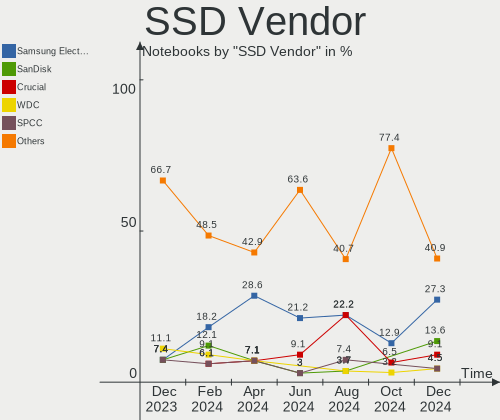
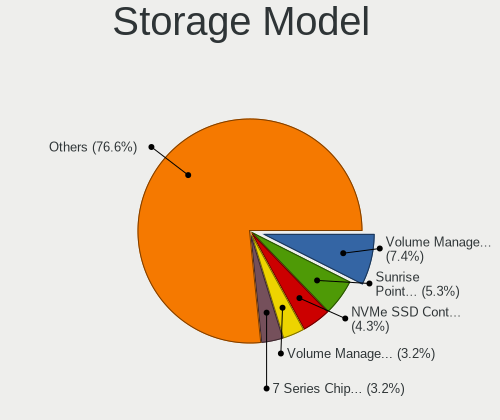
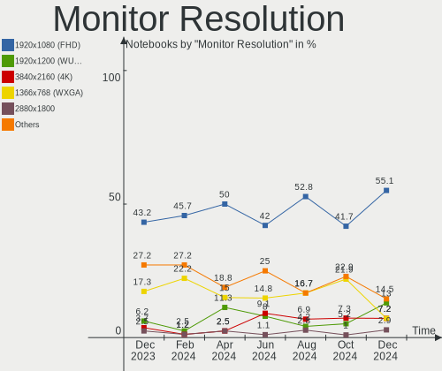
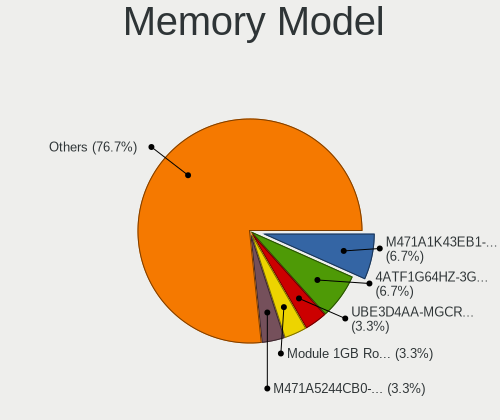

Kubuntu Hardware Trends (Notebooks)
-----------------------------------

A project to identify most popular hardware characteristics and track their change
over time based on data collected by Kubuntu users at https://Linux-Hardware.org.

Anyone can contribute to this report by the [hw-probe](https://github.com/linuxhw/hw-probe) tool:

    sudo -E hw-probe -all -upload

This report is for one last month. Overall report since the beginning of time: [TestCoverage](https://github.com/linuxhw/TestCoverage)

Period: Apr, 2022.

Contents
--------

* [ System ](#system)
  - [ OS                       ](#os)
  - [ OS Family                ](#os-family)
  - [ Kernel                   ](#kernel)
  - [ Kernel Family            ](#kernel-family)
  - [ Kernel Major Ver.        ](#kernel-major-ver)
  - [ Arch                     ](#arch)
  - [ DE                       ](#de)
  - [ Display Server           ](#display-server)
  - [ Display Manager          ](#display-manager)
  - [ OS Lang                  ](#os-lang)
  - [ Boot Mode                ](#boot-mode)
  - [ Filesystem               ](#filesystem)
  - [ Part. scheme             ](#part-scheme)
  - [ Dual Boot with Linux/BSD ](#dual-boot-with-linuxbsd)
  - [ Dual Boot (Win)          ](#dual-boot-win)

* [ Board ](#board)
  - [ Vendor                   ](#vendor)
  - [ Model                    ](#model)
  - [ Model Family             ](#model-family)
  - [ MFG Year                 ](#mfg-year)
  - [ Form Factor              ](#form-factor)
  - [ Secure Boot              ](#secure-boot)
  - [ Coreboot                 ](#coreboot)
  - [ RAM Size                 ](#ram-size)
  - [ RAM Used                 ](#ram-used)
  - [ Total Drives             ](#total-drives)
  - [ Has CD-ROM               ](#has-cd-rom)
  - [ Has Ethernet             ](#has-ethernet)
  - [ Has WiFi                 ](#has-wifi)
  - [ Has Bluetooth            ](#has-bluetooth)

* [ Location ](#location)
  - [ Country                  ](#country)
  - [ City                     ](#city)

* [ Drives ](#drives)
  - [ Drive Vendor             ](#drive-vendor)
  - [ Drive Model              ](#drive-model)
  - [ HDD Vendor               ](#hdd-vendor)
  - [ SSD Vendor               ](#ssd-vendor)
  - [ Drive Kind               ](#drive-kind)
  - [ Drive Connector          ](#drive-connector)
  - [ Drive Size               ](#drive-size)
  - [ Space Total              ](#space-total)
  - [ Space Used               ](#space-used)
  - [ Malfunc. Drives          ](#malfunc-drives)
  - [ Malfunc. Drive Vendor    ](#malfunc-drive-vendor)
  - [ Malfunc. HDD Vendor      ](#malfunc-hdd-vendor)
  - [ Malfunc. Drive Kind      ](#malfunc-drive-kind)
  - [ Failed Drives            ](#failed-drives)
  - [ Failed Drive Vendor      ](#failed-drive-vendor)
  - [ Drive Status             ](#drive-status)

* [ Storage controller ](#storage-controller)
  - [ Storage Vendor           ](#storage-vendor)
  - [ Storage Model            ](#storage-model)
  - [ Storage Kind             ](#storage-kind)

* [ Processor ](#processor)
  - [ CPU Vendor               ](#cpu-vendor)
  - [ CPU Model                ](#cpu-model)
  - [ CPU Model Family         ](#cpu-model-family)
  - [ CPU Cores                ](#cpu-cores)
  - [ CPU Sockets              ](#cpu-sockets)
  - [ CPU Threads              ](#cpu-threads)
  - [ CPU Op-Modes             ](#cpu-op-modes)
  - [ CPU Microcode            ](#cpu-microcode)
  - [ CPU Microarch            ](#cpu-microarch)

* [ Graphics ](#graphics)
  - [ GPU Vendor               ](#gpu-vendor)
  - [ GPU Model                ](#gpu-model)
  - [ GPU Combo                ](#gpu-combo)
  - [ GPU Driver               ](#gpu-driver)
  - [ GPU Memory               ](#gpu-memory)

* [ Monitor ](#monitor)
  - [ Monitor Vendor           ](#monitor-vendor)
  - [ Monitor Model            ](#monitor-model)
  - [ Monitor Resolution       ](#monitor-resolution)
  - [ Monitor Diagonal         ](#monitor-diagonal)
  - [ Monitor Width            ](#monitor-width)
  - [ Aspect Ratio             ](#aspect-ratio)
  - [ Monitor Area             ](#monitor-area)
  - [ Pixel Density            ](#pixel-density)
  - [ Multiple Monitors        ](#multiple-monitors)

* [ Network ](#network)
  - [ Net Controller Vendor    ](#net-controller-vendor)
  - [ Net Controller Model     ](#net-controller-model)
  - [ Wireless Vendor          ](#wireless-vendor)
  - [ Wireless Model           ](#wireless-model)
  - [ Ethernet Vendor          ](#ethernet-vendor)
  - [ Ethernet Model           ](#ethernet-model)
  - [ Net Controller Kind      ](#net-controller-kind)
  - [ Used Controller          ](#used-controller)
  - [ NICs                     ](#nics)
  - [ IPv6                     ](#ipv6)

* [ Bluetooth ](#bluetooth)
  - [ Bluetooth Vendor         ](#bluetooth-vendor)
  - [ Bluetooth Model          ](#bluetooth-model)

* [ Sound ](#sound)
  - [ Sound Vendor             ](#sound-vendor)
  - [ Sound Model              ](#sound-model)

* [ Memory ](#memory)
  - [ Memory Vendor            ](#memory-vendor)
  - [ Memory Model             ](#memory-model)
  - [ Memory Kind              ](#memory-kind)
  - [ Memory Form Factor       ](#memory-form-factor)
  - [ Memory Size              ](#memory-size)
  - [ Memory Speed             ](#memory-speed)

* [ Printers & scanners ](#printers--scanners)
  - [ Printer Vendor           ](#printer-vendor)
  - [ Printer Model            ](#printer-model)
  - [ Scanner Vendor           ](#scanner-vendor)
  - [ Scanner Model            ](#scanner-model)

* [ Camera ](#camera)
  - [ Camera Vendor            ](#camera-vendor)
  - [ Camera Model             ](#camera-model)

* [ Security ](#security)
  - [ Fingerprint Vendor       ](#fingerprint-vendor)
  - [ Fingerprint Model        ](#fingerprint-model)
  - [ Chipcard Vendor          ](#chipcard-vendor)
  - [ Chipcard Model           ](#chipcard-model)

* [ Unsupported ](#unsupported)
  - [ Unsupported Devices      ](#unsupported-devices)
  - [ Unsupported Device Types ](#unsupported-device-types)

System
------

OS
--

Installed operating systems

| Name          | Notebooks | Percent |
|---------------|-----------|---------|
| Kubuntu 20.04 | 31        | 43.06%  |
| Kubuntu 21.10 | 23        | 31.94%  |
| Kubuntu 22.04 | 11        | 15.28%  |
| Kubuntu 11    | 5         | 6.94%   |
| Kubuntu 20.10 | 1         | 1.39%   |
| Kubuntu 18.04 | 1         | 1.39%   |

OS Family
---------

OS without a version

| Name    | Notebooks | Percent |
|---------|-----------|---------|
| Kubuntu | 72        | 100%    |

Kernel
------

Version of the Linux kernel

| Version                | Notebooks | Percent |
|------------------------|-----------|---------|
| 5.13.0-39-generic      | 33        | 45.83%  |
| 5.13.0-40-generic      | 11        | 15.28%  |
| 5.15.0-27-generic      | 4         | 5.56%   |
| 5.15.0-25-generic      | 4         | 5.56%   |
| 5.13.0-30-generic      | 3         | 4.17%   |
| 5.4.0-107-generic      | 2         | 2.78%   |
| 5.15.0-23-generic      | 2         | 2.78%   |
| 5.8.0-63-generic       | 1         | 1.39%   |
| 5.4.0-96-generic       | 1         | 1.39%   |
| 5.4.0-80-generic       | 1         | 1.39%   |
| 5.4.0-109-generic      | 1         | 1.39%   |
| 5.17.2-051702-generic  | 1         | 1.39%   |
| 5.17.0-051700-generic  | 1         | 1.39%   |
| 5.16.10-xanmod1        | 1         | 1.39%   |
| 5.15.34-xanmod1        | 1         | 1.39%   |
| 5.15.34-051534-generic | 1         | 1.39%   |
| 5.14.17-051417-generic | 1         | 1.39%   |
| 5.14.0-1032-oem        | 1         | 1.39%   |
| 5.13.0-37-generic      | 1         | 1.39%   |
| 5.13.0-27-generic      | 1         | 1.39%   |

Kernel Family
-------------

Linux kernel without a distro release

| Version | Notebooks | Percent |
|---------|-----------|---------|
| 5.13.0  | 49        | 68.06%  |
| 5.15.0  | 10        | 13.89%  |
| 5.4.0   | 5         | 6.94%   |
| 5.15.34 | 2         | 2.78%   |
| 5.8.0   | 1         | 1.39%   |
| 5.17.2  | 1         | 1.39%   |
| 5.17.0  | 1         | 1.39%   |
| 5.16.10 | 1         | 1.39%   |
| 5.14.17 | 1         | 1.39%   |
| 5.14.0  | 1         | 1.39%   |

Kernel Major Ver.
-----------------

Linux kernel major version

| Version | Notebooks | Percent |
|---------|-----------|---------|
| 5.13    | 49        | 68.06%  |
| 5.15    | 12        | 16.67%  |
| 5.4     | 5         | 6.94%   |
| 5.17    | 2         | 2.78%   |
| 5.14    | 2         | 2.78%   |
| 5.8     | 1         | 1.39%   |
| 5.16    | 1         | 1.39%   |

Arch
----

OS architecture (x86_64, i586, etc.)

| Name   | Notebooks | Percent |
|--------|-----------|---------|
| x86_64 | 72        | 100%    |

DE
--

Desktop Environment

| Name  | Notebooks | Percent |
|-------|-----------|---------|
| KDE5  | 70        | 97.22%  |
| LXQt  | 1         | 1.39%   |
| GNOME | 1         | 1.39%   |

Display Server
--------------

X11 or Wayland

| Name    | Notebooks | Percent |
|---------|-----------|---------|
| X11     | 67        | 93.06%  |
| Wayland | 4         | 5.56%   |
| Tty     | 1         | 1.39%   |

Display Manager
---------------

SDDM, LightDM, etc.

| Name    | Notebooks | Percent |
|---------|-----------|---------|
| SDDM    | 47        | 65.28%  |
| Unknown | 16        | 22.22%  |
| GDM     | 5         | 6.94%   |
| LightDM | 2         | 2.78%   |
| GDM3    | 2         | 2.78%   |

OS Lang
-------

Language

| Lang  | Notebooks | Percent |
|-------|-----------|---------|
| en_US | 28        | 38.89%  |
| de_DE | 10        | 13.89%  |
| en_GB | 5         | 6.94%   |
| it_IT | 4         | 5.56%   |
| fr_FR | 4         | 5.56%   |
| pt_BR | 3         | 4.17%   |
| ru_RU | 2         | 2.78%   |
| pl_PL | 2         | 2.78%   |
| es_MX | 2         | 2.78%   |
| es_ES | 2         | 2.78%   |
| zh_CN | 1         | 1.39%   |
| ru_UA | 1         | 1.39%   |
| hu_HU | 1         | 1.39%   |
| es_AR | 1         | 1.39%   |
| en_IN | 1         | 1.39%   |
| en_IE | 1         | 1.39%   |
| en_CA | 1         | 1.39%   |
| el_GR | 1         | 1.39%   |
| de_CH | 1         | 1.39%   |
| C     | 1         | 1.39%   |

Boot Mode
---------

EFI or BIOS

| Mode | Notebooks | Percent |
|------|-----------|---------|
| EFI  | 45        | 62.5%   |
| BIOS | 27        | 37.5%   |

Filesystem
----------

Type of filesystem

| Type    | Notebooks | Percent |
|---------|-----------|---------|
| Ext4    | 66        | 91.67%  |
| Btrfs   | 3         | 4.17%   |
| Xfs     | 2         | 2.78%   |
| Overlay | 1         | 1.39%   |

Part. scheme
------------

Scheme of partitioning

| Type    | Notebooks | Percent |
|---------|-----------|---------|
| GPT     | 37        | 51.39%  |
| Unknown | 29        | 40.28%  |
| MBR     | 6         | 8.33%   |

Dual Boot with Linux/BSD
------------------------

Hosting more than one Linux/BSD

| Dual boot | Notebooks | Percent |
|-----------|-----------|---------|
| No        | 65        | 90.28%  |
| Yes       | 7         | 9.72%   |

Dual Boot (Win)
---------------

Hosting Linux and Windows

| Dual boot | Notebooks | Percent |
|-----------|-----------|---------|
| No        | 49        | 68.06%  |
| Yes       | 23        | 31.94%  |

Board
-----

Vendor
------

Motherboard manufacturer

| Name                           | Notebooks | Percent |
|--------------------------------|-----------|---------|
| Lenovo                         | 24        | 33.33%  |
| Dell                           | 17        | 23.61%  |
| Hewlett-Packard                | 7         | 9.72%   |
| ASUSTek Computer               | 5         | 6.94%   |
| Acer                           | 3         | 4.17%   |
| Sony                           | 2         | 2.78%   |
| Positivo                       | 2         | 2.78%   |
| Wortmann AG                    | 1         | 1.39%   |
| TUXEDO                         | 1         | 1.39%   |
| Toshiba                        | 1         | 1.39%   |
| Shanghai Zhaoxin Semiconductor | 1         | 1.39%   |
| Samsung Electronics            | 1         | 1.39%   |
| Notebook                       | 1         | 1.39%   |
| HUAWEI                         | 1         | 1.39%   |
| HONOR                          | 1         | 1.39%   |
| Framework                      | 1         | 1.39%   |
| eMachines                      | 1         | 1.39%   |
| Dynabook                       | 1         | 1.39%   |
| Unknown                        | 1         | 1.39%   |

Model
-----

Motherboard model

| Name                                      | Notebooks | Percent |
|-------------------------------------------|-----------|---------|
| Dell Latitude E6540                       | 2         | 2.78%   |
| Wortmann AG TERRA_MOBILE_1749             | 1         | 1.39%   |
| TUXEDO Aura 15 Gen1                       | 1         | 1.39%   |
| Toshiba Satellite P70-B                   | 1         | 1.39%   |
| Sony VPCF236FM                            | 1         | 1.39%   |
| Sony SVE1511W1ESI                         | 1         | 1.39%   |
| Shanghai Zhaoxin ZXE CRB                  | 1         | 1.39%   |
| Samsung R425D/R525D                       | 1         | 1.39%   |
| Positivo W940TU                           | 1         | 1.39%   |
| Positivo N1250                            | 1         | 1.39%   |
| Notebook NS50_70MU                        | 1         | 1.39%   |
| Lenovo Z50-75 80EC                        | 1         | 1.39%   |
| Lenovo ThinkPad X260 20F5S0W22B           | 1         | 1.39%   |
| Lenovo ThinkPad X1 Extreme 2nd 20QVS0FP00 | 1         | 1.39%   |
| Lenovo ThinkPad X1 Extreme 2nd 20QV0007US | 1         | 1.39%   |
| Lenovo ThinkPad T560 20FJS0NT04           | 1         | 1.39%   |
| Lenovo ThinkPad T530 24296HG              | 1         | 1.39%   |
| Lenovo ThinkPad T530 2394CTO              | 1         | 1.39%   |
| Lenovo ThinkPad T450 20BV0001US           | 1         | 1.39%   |
| Lenovo ThinkPad T430 2349T2A              | 1         | 1.39%   |
| Lenovo ThinkPad T420 4180DV2              | 1         | 1.39%   |
| Lenovo ThinkPad T420 41786UU              | 1         | 1.39%   |
| Lenovo ThinkPad P51 20HH000AUS            | 1         | 1.39%   |
| Lenovo ThinkPad L15 Gen 1 20U8S0AH00      | 1         | 1.39%   |
| Lenovo ThinkPad Edge E540 20C6003VSP      | 1         | 1.39%   |
| Lenovo ThinkPad E14 Gen 3 20Y7CTO1WW      | 1         | 1.39%   |
| Lenovo ThinkPad E14 20RBS25S00            | 1         | 1.39%   |
| Lenovo ThinkBook 15-IML 20RW              | 1         | 1.39%   |
| Lenovo ThinkBook 15 G2 ARE 20VG           | 1         | 1.39%   |
| Lenovo IdeaPadFlex 14 20308               | 1         | 1.39%   |
| Lenovo IdeaPad Z585                       | 1         | 1.39%   |
| Lenovo IdeaPad 710S Plus Touch-13IKB 80YQ | 1         | 1.39%   |
| Lenovo IdeaPad 5 Pro 14ITL6 82L3          | 1         | 1.39%   |
| Lenovo IdeaPad 330S-15IKB 81F5            | 1         | 1.39%   |
| Lenovo G40-45 80E1                        | 1         | 1.39%   |
| HUAWEI KLVL-WXXW                          | 1         | 1.39%   |
| HONOR NBD-WXX9                            | 1         | 1.39%   |
| HP Pavilion Laptop 15-cs3xxx              | 1         | 1.39%   |
| HP Pavilion g6                            | 1         | 1.39%   |
| HP OMEN Laptop 15-en0xxx                  | 1         | 1.39%   |
| HP Laptop 14s-fq0xxx                      | 1         | 1.39%   |
| HP ENVY 17                                | 1         | 1.39%   |
| HP ENVY 15                                | 1         | 1.39%   |
| HP 250 G5 Notebook PC                     | 1         | 1.39%   |
| Framework Laptop                          | 1         | 1.39%   |
| eMachines G525                            | 1         | 1.39%   |
| Dynabook PORTEGE X30L-J                   | 1         | 1.39%   |
| Dell XPS 15 9510                          | 1         | 1.39%   |
| Dell XPS 15 7590                          | 1         | 1.39%   |
| Dell XPS 13 9310                          | 1         | 1.39%   |
| Dell XPS 13 9300                          | 1         | 1.39%   |
| Dell Vostro 15 3515                       | 1         | 1.39%   |
| Dell Studio 1558                          | 1         | 1.39%   |
| Dell Precision 5520                       | 1         | 1.39%   |
| Dell Latitude XT3                         | 1         | 1.39%   |
| Dell Latitude E6530                       | 1         | 1.39%   |
| Dell Latitude 7410                        | 1         | 1.39%   |
| Dell Latitude 7400                        | 1         | 1.39%   |
| Dell Latitude 5591                        | 1         | 1.39%   |
| Dell Latitude 5480                        | 1         | 1.39%   |

Model Family
------------

Motherboard model prefix

| Name                 | Notebooks | Percent |
|----------------------|-----------|---------|
| Lenovo ThinkPad      | 15        | 20.83%  |
| Dell Latitude        | 8         | 11.11%  |
| Lenovo IdeaPad       | 4         | 5.56%   |
| Dell XPS             | 4         | 5.56%   |
| Lenovo ThinkBook     | 2         | 2.78%   |
| HP Pavilion          | 2         | 2.78%   |
| HP ENVY              | 2         | 2.78%   |
| Wortmann AG TERRA    | 1         | 1.39%   |
| TUXEDO Aura          | 1         | 1.39%   |
| Toshiba Satellite    | 1         | 1.39%   |
| Sony VPCF236FM       | 1         | 1.39%   |
| Sony SVE1511W1ESI    | 1         | 1.39%   |
| Shanghai Zhaoxin ZXE | 1         | 1.39%   |
| Samsung R425D        | 1         | 1.39%   |
| Positivo W940TU      | 1         | 1.39%   |
| Positivo N1250       | 1         | 1.39%   |
| Notebook NS50        | 1         | 1.39%   |
| Lenovo Z50-75        | 1         | 1.39%   |
| Lenovo IdeaPadFlex   | 1         | 1.39%   |
| Lenovo G40-45        | 1         | 1.39%   |
| HUAWEI KLVL-WXXW     | 1         | 1.39%   |
| HONOR NBD-WXX9       | 1         | 1.39%   |
| HP OMEN              | 1         | 1.39%   |
| HP Laptop            | 1         | 1.39%   |
| HP 250               | 1         | 1.39%   |
| Framework Laptop     | 1         | 1.39%   |
| eMachines G525       | 1         | 1.39%   |
| Dynabook PORTEGE     | 1         | 1.39%   |
| Dell Vostro          | 1         | 1.39%   |
| Dell Studio          | 1         | 1.39%   |
| Dell Precision       | 1         | 1.39%   |
| Dell Inspiron        | 1         | 1.39%   |
| Dell G7              | 1         | 1.39%   |
| ASUS ZenBook         | 1         | 1.39%   |
| ASUS VivoBook        | 1         | 1.39%   |
| ASUS S551LB          | 1         | 1.39%   |
| ASUS G750JS          | 1         | 1.39%   |
| ASUS G550JK          | 1         | 1.39%   |
| Acer Swift           | 1         | 1.39%   |
| Acer Nitro           | 1         | 1.39%   |
| Acer Aspire          | 1         | 1.39%   |
| Unknown              | 1         | 1.39%   |

MFG Year
--------

Motherboard manufacture year

| Year | Notebooks | Percent |
|------|-----------|---------|
| 2021 | 14        | 19.44%  |
| 2019 | 10        | 13.89%  |
| 2020 | 9         | 12.5%   |
| 2014 | 7         | 9.72%   |
| 2011 | 6         | 8.33%   |
| 2016 | 5         | 6.94%   |
| 2013 | 5         | 6.94%   |
| 2012 | 5         | 6.94%   |
| 2010 | 4         | 5.56%   |
| 2017 | 3         | 4.17%   |
| 2018 | 2         | 2.78%   |
| 2015 | 1         | 1.39%   |
| 2009 | 1         | 1.39%   |

Form Factor
-----------

Physical design of the computer

| Name     | Notebooks | Percent |
|----------|-----------|---------|
| Notebook | 72        | 100%    |

Secure Boot
-----------

Enabled or disabled

| State    | Notebooks | Percent |
|----------|-----------|---------|
| Disabled | 62        | 86.11%  |
| Enabled  | 10        | 13.89%  |

Coreboot
--------

Have coreboot on board

| Used | Notebooks | Percent |
|------|-----------|---------|
| No   | 71        | 98.61%  |
| Yes  | 1         | 1.39%   |

RAM Size
--------

Total RAM memory

| Size in GB  | Notebooks | Percent |
|-------------|-----------|---------|
| 16.01-24.0  | 25        | 34.72%  |
| 4.01-8.0    | 19        | 26.39%  |
| 8.01-16.0   | 13        | 18.06%  |
| 3.01-4.0    | 7         | 9.72%   |
| 32.01-64.0  | 5         | 6.94%   |
| 2.01-3.0    | 1         | 1.39%   |
| 64.01-256.0 | 1         | 1.39%   |
| 1.01-2.0    | 1         | 1.39%   |

RAM Used
--------

Used RAM memory

| Used GB   | Notebooks | Percent |
|-----------|-----------|---------|
| 4.01-8.0  | 19        | 26.39%  |
| 1.01-2.0  | 17        | 23.61%  |
| 2.01-3.0  | 16        | 22.22%  |
| 8.01-16.0 | 14        | 19.44%  |
| 3.01-4.0  | 6         | 8.33%   |

Total Drives
------------

Number of drives on board

| Drives | Notebooks | Percent |
|--------|-----------|---------|
| 1      | 57        | 79.17%  |
| 2      | 13        | 18.06%  |
| 3      | 2         | 2.78%   |

Has CD-ROM
----------

Has CD-ROM on board

| Presented | Notebooks | Percent |
|-----------|-----------|---------|
| No        | 50        | 69.44%  |
| Yes       | 22        | 30.56%  |

Has Ethernet
------------

Has Ethernet on board

| Presented | Notebooks | Percent |
|-----------|-----------|---------|
| Yes       | 56        | 77.78%  |
| No        | 16        | 22.22%  |

Has WiFi
--------

Has WiFi module

| Presented | Notebooks | Percent |
|-----------|-----------|---------|
| Yes       | 72        | 100%    |

Has Bluetooth
-------------

Has Bluetooth module

| Presented | Notebooks | Percent |
|-----------|-----------|---------|
| Yes       | 60        | 83.33%  |
| No        | 12        | 16.67%  |

Location
--------

Country
-------

Geographic location (country)

| Country     | Notebooks | Percent |
|-------------|-----------|---------|
| Germany     | 14        | 19.44%  |
| USA         | 12        | 16.67%  |
| France      | 5         | 6.94%   |
| UK          | 4         | 5.56%   |
| Italy       | 4         | 5.56%   |
| Brazil      | 4         | 5.56%   |
| Spain       | 3         | 4.17%   |
| Russia      | 3         | 4.17%   |
| Mexico      | 3         | 4.17%   |
| Poland      | 2         | 2.78%   |
| China       | 2         | 2.78%   |
| Ukraine     | 1         | 1.39%   |
| Thailand    | 1         | 1.39%   |
| Switzerland | 1         | 1.39%   |
| Romania     | 1         | 1.39%   |
| Portugal    | 1         | 1.39%   |
| Netherlands | 1         | 1.39%   |
| Malawi      | 1         | 1.39%   |
| Lithuania   | 1         | 1.39%   |
| Ireland     | 1         | 1.39%   |
| Indonesia   | 1         | 1.39%   |
| India       | 1         | 1.39%   |
| Hungary     | 1         | 1.39%   |
| Greece      | 1         | 1.39%   |
| Canada      | 1         | 1.39%   |
| Belgium     | 1         | 1.39%   |
| Argentina   | 1         | 1.39%   |

City
----

Geographic location (city)

| City                   | Notebooks | Percent |
|------------------------|-----------|---------|
| Beijing                | 2         | 2.78%   |
| Zurich                 | 1         | 1.39%   |
| Zaragoza               | 1         | 1.39%   |
| Wichita Falls          | 1         | 1.39%   |
| Warsaw                 | 1         | 1.39%   |
| Vilnius                | 1         | 1.39%   |
| Uaua                   | 1         | 1.39%   |
| Tustin                 | 1         | 1.39%   |
| Stavropol              | 1         | 1.39%   |
| St Louis               | 1         | 1.39%   |
| Sindelfingen           | 1         | 1.39%   |
| Sechelt                | 1         | 1.39%   |
| Sarandi                | 1         | 1.39%   |
| Sao Paulo              | 1         | 1.39%   |
| Roubaix                | 1         | 1.39%   |
| Rotenburg an der Fulda | 1         | 1.39%   |
| Rostov-on-Don          | 1         | 1.39%   |
| Rome                   | 1         | 1.39%   |
| Rho                    | 1         | 1.39%   |
| Plauen                 | 1         | 1.39%   |
| Orlienas               | 1         | 1.39%   |
| Odivelas               | 1         | 1.39%   |
| Novosibirsk            | 1         | 1.39%   |
| New York               | 1         | 1.39%   |
| Nakhon Pathom          | 1         | 1.39%   |
| Monticello             | 1         | 1.39%   |
| Montbéliard           | 1         | 1.39%   |
| Midlothian             | 1         | 1.39%   |
| Mexico City            | 1         | 1.39%   |
| Medford                | 1         | 1.39%   |
| Massa Fermana          | 1         | 1.39%   |
| Mariano Moreno         | 1         | 1.39%   |
| Magenta                | 1         | 1.39%   |
| Lünen                 | 1         | 1.39%   |
| Los Angeles            | 1         | 1.39%   |
| Levallois-Perret       | 1         | 1.39%   |
| Lawrenceville          | 1         | 1.39%   |
| Kissenbruck            | 1         | 1.39%   |
| Karawang               | 1         | 1.39%   |
| Horishni Plavni        | 1         | 1.39%   |
| Hamburg                | 1         | 1.39%   |
| Guadalajara            | 1         | 1.39%   |
| Griesheim              | 1         | 1.39%   |
| Gersthofen             | 1         | 1.39%   |
| Frankfurt am Main      | 1         | 1.39%   |
| Dublin                 | 1         | 1.39%   |
| Dordrecht              | 1         | 1.39%   |
| Deva                   | 1         | 1.39%   |
| Darmstadt              | 1         | 1.39%   |
| Cologne                | 1         | 1.39%   |
| Chepstow               | 1         | 1.39%   |
| Caninde                | 1         | 1.39%   |
| Cabo San Lucas         | 1         | 1.39%   |
| Bytom                  | 1         | 1.39%   |
| Budapest               | 1         | 1.39%   |
| Bruges                 | 1         | 1.39%   |
| Brooklyn               | 1         | 1.39%   |
| Bristol                | 1         | 1.39%   |
| Brentwood              | 1         | 1.39%   |
| Bougival               | 1         | 1.39%   |

Drives
------

Drive Vendor
------------

Hard drive vendors

| Vendor                         | Notebooks | Drives | Percent |
|--------------------------------|-----------|--------|---------|
| Samsung Electronics            | 22        | 25     | 26.19%  |
| WDC                            | 10        | 10     | 11.9%   |
| Toshiba                        | 7         | 7      | 8.33%   |
| Kingston                       | 7         | 7      | 8.33%   |
| Seagate                        | 5         | 6      | 5.95%   |
| Crucial                        | 5         | 5      | 5.95%   |
| SK Hynix                       | 4         | 4      | 4.76%   |
| Unknown                        | 3         | 3      | 3.57%   |
| Silicon Motion                 | 2         | 2      | 2.38%   |
| Intenso                        | 2         | 2      | 2.38%   |
| Hitachi                        | 2         | 2      | 2.38%   |
| HGST                           | 2         | 3      | 2.38%   |
| China                          | 2         | 2      | 2.38%   |
| Varro                          | 1         | 1      | 1.19%   |
| Solid State Storage Technology | 1         | 1      | 1.19%   |
| SanDisk                        | 1         | 1      | 1.19%   |
| Phison                         | 1         | 1      | 1.19%   |
| Patriot                        | 1         | 1      | 1.19%   |
| Micron Technology              | 1         | 1      | 1.19%   |
| KIOXIA                         | 1         | 1      | 1.19%   |
| KingSpec                       | 1         | 1      | 1.19%   |
| JMicron                        | 1         | 1      | 1.19%   |
| ASENNO                         | 1         | 1      | 1.19%   |
| Unknown                        | 1         | 1      | 1.19%   |

Drive Model
-----------

Hard drive models

| Model                                    | Notebooks | Percent |
|------------------------------------------|-----------|---------|
| Toshiba MQ04ABF100 1TB                   | 2         | 2.27%   |
| Seagate ST1000LM024 HN-M101MBB 1TB       | 2         | 2.27%   |
| Samsung NVMe SSD Drive 1TB               | 2         | 2.27%   |
| Samsung MZVLB512HBJQ-000L7 512GB         | 2         | 2.27%   |
| Hitachi HTS547575A9E384 752GB            | 2         | 2.27%   |
| WDC WDS500G2B0A-00SM50 500GB SSD         | 1         | 1.14%   |
| WDC WDS240G2G0A-00JH30 240GB SSD         | 1         | 1.14%   |
| WDC WDS100T3X0C-00SJG0 1TB               | 1         | 1.14%   |
| WDC WD2500BEVT-22A23T0 250GB             | 1         | 1.14%   |
| WDC WD10JPVX-60JC3T0 1TB                 | 1         | 1.14%   |
| WDC WD10JPVT-00A1YT0 1TB                 | 1         | 1.14%   |
| WDC WD10JPCX-24UE4T0 1TB                 | 1         | 1.14%   |
| WDC PC SN730 SDBQNTY-1T00-1001 1TB       | 1         | 1.14%   |
| WDC PC SN730 SDBPNTY-512G-1036 512GB     | 1         | 1.14%   |
| WDC PC SN730 NVMe 1024GB                 | 1         | 1.14%   |
| Varro BULLDOZER-240GB SSD                | 1         | 1.14%   |
| Unknown SC16G  16GB                      | 1         | 1.14%   |
| Unknown MMC Card  64GB                   | 1         | 1.14%   |
| Unknown GFAQK  512GB                     | 1         | 1.14%   |
| Toshiba THNSNK256GCS8 SATA 256GB SSD     | 1         | 1.14%   |
| Toshiba MQ01ABD100 1TB                   | 1         | 1.14%   |
| Toshiba MK7559GSXP 752GB                 | 1         | 1.14%   |
| Toshiba KSG60ZMV256G M.2 2280 256GB SSD  | 1         | 1.14%   |
| Toshiba KBG40ZNV512G MEMORY 512GB        | 1         | 1.14%   |
| Solid State Storage NVMe SSD Drive 256GB | 1         | 1.14%   |
| SK Hynix SHGP31-1000GM-2 1TB             | 1         | 1.14%   |
| SK Hynix SC311 SATA 512GB SSD            | 1         | 1.14%   |
| SK Hynix HFS128G32TNF-N3A0A 128GB SSD    | 1         | 1.14%   |
| SK Hynix HFM001TD3JX016N 1TB             | 1         | 1.14%   |
| Silicon Motion NVMe SSD Drive 512GB      | 1         | 1.14%   |
| Silicon Motion NVMe SSD Drive 1TB        | 1         | 1.14%   |
| Seagate ST500LM012 HN-M500MBB 500GB      | 1         | 1.14%   |
| Seagate ST500LM000-SSHD-8GB              | 1         | 1.14%   |
| Seagate ST500LM000-1EJ162 500GB          | 1         | 1.14%   |
| Seagate ST2000LM003 HN-M201RAD 2TB       | 1         | 1.14%   |
| SanDisk Ultra II 960GB SSD               | 1         | 1.14%   |
| Samsung SSD SM841N mSATA 256GB SED       | 1         | 1.14%   |
| Samsung SSD 980 1TB                      | 1         | 1.14%   |
| Samsung SSD 970 EVO Plus 2TB             | 1         | 1.14%   |
| Samsung SSD 970 EVO 500GB                | 1         | 1.14%   |
| Samsung SSD 860 QVO 1TB                  | 1         | 1.14%   |
| Samsung SSD 860 PRO 1TB                  | 1         | 1.14%   |
| Samsung SSD 860 EVO M.2 500GB            | 1         | 1.14%   |
| Samsung SSD 860 EVO 500GB                | 1         | 1.14%   |
| Samsung SSD 850 EVO 500GB                | 1         | 1.14%   |
| Samsung PM981a NVMe 512GB                | 1         | 1.14%   |
| Samsung PM981a NVMe 256GB                | 1         | 1.14%   |
| Samsung NVMe SSD Drive 512GB             | 1         | 1.14%   |
| Samsung NVMe SSD Drive 500GB             | 1         | 1.14%   |
| Samsung NVMe SSD Drive 1024GB            | 1         | 1.14%   |
| Samsung MZVLW512HMJP-000L2 512GB         | 1         | 1.14%   |
| Samsung MZVLB512HBJQ-000H1 512GB         | 1         | 1.14%   |
| Samsung MZVLB1T0HALR-000L7 1TB           | 1         | 1.14%   |
| Samsung MZALQ256HBJD-00BL1 256GB         | 1         | 1.14%   |
| Samsung MZALQ256HAJD-000L2 256GB         | 1         | 1.14%   |
| Samsung HM321HI 320GB                    | 1         | 1.14%   |
| Phison NVMe SSD Drive 512GB              | 1         | 1.14%   |
| Patriot Burst Elite 120GB SSD            | 1         | 1.14%   |
| Micron 2300 NVMe 1024GB                  | 1         | 1.14%   |
| KIOXIA KXG70PNV2T04 NVMe 2048GB          | 1         | 1.14%   |

HDD Vendor
----------

Hard disk drive vendors

| Vendor              | Notebooks | Drives | Percent |
|---------------------|-----------|--------|---------|
| Seagate             | 5         | 6      | 27.78%  |
| WDC                 | 4         | 4      | 22.22%  |
| Toshiba             | 4         | 4      | 22.22%  |
| Hitachi             | 2         | 2      | 11.11%  |
| HGST                | 2         | 3      | 11.11%  |
| Samsung Electronics | 1         | 1      | 5.56%   |

SSD Vendor
----------

Solid state drive vendors

| Vendor              | Notebooks | Drives | Percent |
|---------------------|-----------|--------|---------|
| Samsung Electronics | 5         | 6      | 17.24%  |
| Kingston            | 4         | 4      | 13.79%  |
| Crucial             | 4         | 4      | 13.79%  |
| WDC                 | 2         | 2      | 6.9%    |
| Toshiba             | 2         | 2      | 6.9%    |
| SK Hynix            | 2         | 2      | 6.9%    |
| China               | 2         | 2      | 6.9%    |
| Varro               | 1         | 1      | 3.45%   |
| SanDisk             | 1         | 1      | 3.45%   |
| Patriot             | 1         | 1      | 3.45%   |
| KingSpec            | 1         | 1      | 3.45%   |
| JMicron             | 1         | 1      | 3.45%   |
| Intenso             | 1         | 1      | 3.45%   |
| ASENNO              | 1         | 1      | 3.45%   |
| Unknown             | 1         | 1      | 3.45%   |

Drive Kind
----------

HDD or SSD

| Kind    | Notebooks | Drives | Percent |
|---------|-----------|--------|---------|
| NVMe    | 31        | 35     | 38.27%  |
| SSD     | 28        | 30     | 34.57%  |
| HDD     | 18        | 20     | 22.22%  |
| MMC     | 3         | 3      | 3.7%    |
| Unknown | 1         | 1      | 1.23%   |

Drive Connector
---------------

SATA, SAS, NVMe, etc.

| Type | Notebooks | Drives | Percent |
|------|-----------|--------|---------|
| SATA | 44        | 49     | 55%     |
| NVMe | 31        | 35     | 38.75%  |
| MMC  | 3         | 3      | 3.75%   |
| SAS  | 2         | 2      | 2.5%    |

Drive Size
----------

Size of hard drive

| Size in TB | Notebooks | Drives | Percent |
|------------|-----------|--------|---------|
| 0.01-0.5   | 29        | 32     | 61.7%   |
| 0.51-1.0   | 17        | 17     | 36.17%  |
| 1.01-2.0   | 1         | 1      | 2.13%   |

Space Total
-----------

Amount of disk space available on the file system

| Size in GB | Notebooks | Percent |
|------------|-----------|---------|
| 251-500    | 23        | 31.94%  |
| 101-250    | 22        | 30.56%  |
| 501-1000   | 18        | 25%     |
| 1001-2000  | 5         | 6.94%   |
| 51-100     | 3         | 4.17%   |
| 21-50      | 1         | 1.39%   |

Space Used
----------

Amount of used disk space

| Used GB  | Notebooks | Percent |
|----------|-----------|---------|
| 101-250  | 18        | 25%     |
| 251-500  | 16        | 22.22%  |
| 21-50    | 14        | 19.44%  |
| 51-100   | 12        | 16.67%  |
| 1-20     | 8         | 11.11%  |
| 501-1000 | 4         | 5.56%   |

Malfunc. Drives
---------------

Drive models with a malfunction

| Model                                   | Notebooks | Drives | Percent |
|-----------------------------------------|-----------|--------|---------|
| Toshiba THNSNK256GCS8 SATA 256GB SSD    | 1         | 1      | 20%     |
| Toshiba KSG60ZMV256G M.2 2280 256GB SSD | 1         | 1      | 20%     |
| Seagate ST500LM012 HN-M500MBB 500GB     | 1         | 1      | 20%     |
| Hitachi HTS547575A9E384 752GB           | 1         | 1      | 20%     |
| ASENNO AS25 1TB SSD                     | 1         | 1      | 20%     |

Malfunc. Drive Vendor
---------------------

Vendors of faulty drives

| Vendor  | Notebooks | Drives | Percent |
|---------|-----------|--------|---------|
| Toshiba | 2         | 2      | 40%     |
| Seagate | 1         | 1      | 20%     |
| Hitachi | 1         | 1      | 20%     |
| ASENNO  | 1         | 1      | 20%     |

Malfunc. HDD Vendor
-------------------

Vendors of faulty HDD drives

| Vendor  | Notebooks | Drives | Percent |
|---------|-----------|--------|---------|
| Seagate | 1         | 1      | 50%     |
| Hitachi | 1         | 1      | 50%     |

Malfunc. Drive Kind
-------------------

Kinds of faulty drives

| Kind | Notebooks | Drives | Percent |
|------|-----------|--------|---------|
| SSD  | 3         | 3      | 60%     |
| HDD  | 2         | 2      | 40%     |

Failed Drives
-------------

Failed drive models

Zero info for selected period =(

Failed Drive Vendor
-------------------

Failed drive vendors

Zero info for selected period =(

Drive Status
------------

Number of failed and malfunc. drives

| Status   | Notebooks | Drives | Percent |
|----------|-----------|--------|---------|
| Works    | 40        | 49     | 52.63%  |
| Detected | 31        | 35     | 40.79%  |
| Malfunc  | 5         | 5      | 6.58%   |

Storage controller
------------------

Storage Vendor
--------------

Storage controller vendors

| Vendor                         | Notebooks | Percent |
|--------------------------------|-----------|---------|
| Intel                          | 44        | 50%     |
| Samsung Electronics            | 16        | 18.18%  |
| AMD                            | 10        | 11.36%  |
| Sandisk                        | 4         | 4.55%   |
| Kingston Technology Company    | 3         | 3.41%   |
| SK Hynix                       | 2         | 2.27%   |
| Silicon Motion                 | 2         | 2.27%   |
| KIOXIA                         | 2         | 2.27%   |
| Zhaoxin                        | 1         | 1.14%   |
| Solid State Storage Technology | 1         | 1.14%   |
| Phison Electronics             | 1         | 1.14%   |
| Micron/Crucial Technology      | 1         | 1.14%   |
| Micron Technology              | 1         | 1.14%   |

Storage Model
-------------

Storage controller models

| Model                                                                          | Notebooks | Percent |
|--------------------------------------------------------------------------------|-----------|---------|
| Samsung NVMe SSD Controller SM981/PM981/PM983                                  | 10        | 11.24%  |
| Intel 8 Series/C220 Series Chipset Family 6-port SATA Controller 1 [AHCI mode] | 9         | 10.11%  |
| AMD FCH SATA Controller [AHCI mode]                                            | 8         | 8.99%   |
| Samsung NVMe SSD Controller 980                                                | 5         | 5.62%   |
| Intel Sunrise Point-LP SATA Controller [AHCI mode]                             | 5         | 5.62%   |
| Intel 82801 Mobile SATA Controller [RAID mode]                                 | 5         | 5.62%   |
| Sandisk WD Black SN750 / PC SN730 NVMe SSD                                     | 4         | 4.49%   |
| Intel 7 Series Chipset Family 6-port SATA Controller [AHCI mode]               | 4         | 4.49%   |
| Intel Volume Management Device NVMe RAID Controller                            | 3         | 3.37%   |
| Intel 6 Series/C200 Series Chipset Family 6 port Mobile SATA AHCI Controller   | 3         | 3.37%   |
| SK Hynix Gold P31 SSD                                                          | 2         | 2.25%   |
| Silicon Motion SM2263EN/SM2263XT SSD Controller                                | 2         | 2.25%   |
| KIOXIA Non-Volatile memory controller                                          | 2         | 2.25%   |
| Intel Q170/Q150/B150/H170/H110/Z170/CM236 Chipset SATA Controller [AHCI Mode]  | 2         | 2.25%   |
| Intel Comet Lake SATA AHCI Controller                                          | 2         | 2.25%   |
| Intel Cannon Lake Mobile PCH SATA AHCI Controller                              | 2         | 2.25%   |
| Intel 82801IBM/IEM (ICH9M/ICH9M-E) 4 port SATA Controller [AHCI mode]          | 2         | 2.25%   |
| Intel 8 Series SATA Controller 1 [AHCI mode]                                   | 2         | 2.25%   |
| Zhaoxin ZX-100/ZX-200/ZX-E StorX AHCI Controller                               | 1         | 1.12%   |
| Solid State Storage Non-Volatile memory controller                             | 1         | 1.12%   |
| Samsung NVMe SSD Controller SM961/PM961/SM963                                  | 1         | 1.12%   |
| Phison PS5013 E13 NVMe Controller                                              | 1         | 1.12%   |
| Micron/Crucial Non-Volatile memory controller                                  | 1         | 1.12%   |
| Micron Non-Volatile memory controller                                          | 1         | 1.12%   |
| Kingston Company Company Non-Volatile memory controller                        | 1         | 1.12%   |
| Kingston Company OM3PDP3 NVMe SSD                                              | 1         | 1.12%   |
| Kingston Company A2000 NVMe SSD                                                | 1         | 1.12%   |
| Intel Wildcat Point-LP SATA Controller [AHCI Mode]                             | 1         | 1.12%   |
| Intel Celeron/Pentium Silver Processor SATA Controller                         | 1         | 1.12%   |
| Intel Cannon Point-LP SATA Controller [AHCI Mode]                              | 1         | 1.12%   |
| Intel Atom Processor E3800 Series SATA AHCI Controller                         | 1         | 1.12%   |
| Intel 500 Series Chipset Family SATA AHCI Controller                           | 1         | 1.12%   |
| Intel 5 Series/3400 Series Chipset 4 port SATA AHCI Controller                 | 1         | 1.12%   |
| AMD SB7x0/SB8x0/SB9x0 SATA Controller [AHCI mode]                              | 1         | 1.12%   |
| AMD FCH SATA Controller [IDE mode]                                             | 1         | 1.12%   |

Storage Kind
------------

Kind of storage controller (IDE, SATA, NVMe, SAS, ...)

| Kind | Notebooks | Percent |
|------|-----------|---------|
| SATA | 48        | 55.17%  |
| NVMe | 31        | 35.63%  |
| RAID | 8         | 9.2%    |

Processor
---------

CPU Vendor
----------

Processor vendors

| Vendor       | Notebooks | Percent |
|--------------|-----------|---------|
| Intel        | 56        | 77.78%  |
| AMD          | 15        | 20.83%  |
| CentaurHauls | 1         | 1.39%   |

CPU Model
---------

Processor models

| Model                                          | Notebooks | Percent |
|------------------------------------------------|-----------|---------|
| Intel Core i7-9750H CPU @ 2.60GHz              | 3         | 4.17%   |
| Intel Core i7-1065G7 CPU @ 1.30GHz             | 3         | 4.17%   |
| Intel Core i7-4710HQ CPU @ 2.50GHz             | 2         | 2.78%   |
| Intel Core i7-4700MQ CPU @ 2.40GHz             | 2         | 2.78%   |
| Intel Core i7-3630QM CPU @ 2.40GHz             | 2         | 2.78%   |
| Intel Core i5-6200U CPU @ 2.30GHz              | 2         | 2.78%   |
| Intel Core i5-2520M CPU @ 2.50GHz              | 2         | 2.78%   |
| Intel Core i5-10210U CPU @ 1.60GHz             | 2         | 2.78%   |
| Intel 11th Gen Core i7-11800H @ 2.30GHz        | 2         | 2.78%   |
| Intel 11th Gen Core i7-1165G7 @ 2.80GHz        | 2         | 2.78%   |
| Intel 11th Gen Core i5-1135G7 @ 2.40GHz        | 2         | 2.78%   |
| Intel Genuine CPU U4100 @ 1.30GHz              | 1         | 1.39%   |
| Intel Core i9-9880H CPU @ 2.30GHz              | 1         | 1.39%   |
| Intel Core i7-8850H CPU @ 2.60GHz              | 1         | 1.39%   |
| Intel Core i7-8665U CPU @ 1.90GHz              | 1         | 1.39%   |
| Intel Core i7-8565U CPU @ 1.80GHz              | 1         | 1.39%   |
| Intel Core i7-7820HQ CPU @ 2.90GHz             | 1         | 1.39%   |
| Intel Core i7-7700HQ CPU @ 2.80GHz             | 1         | 1.39%   |
| Intel Core i7-7500U CPU @ 2.70GHz              | 1         | 1.39%   |
| Intel Core i7-4810MQ CPU @ 2.80GHz             | 1         | 1.39%   |
| Intel Core i7-4720HQ CPU @ 2.60GHz             | 1         | 1.39%   |
| Intel Core i7-4500U CPU @ 1.80GHz              | 1         | 1.39%   |
| Intel Core i7-3540M CPU @ 3.00GHz              | 1         | 1.39%   |
| Intel Core i7-2670QM CPU @ 2.20GHz             | 1         | 1.39%   |
| Intel Core i7-10610U CPU @ 1.80GHz             | 1         | 1.39%   |
| Intel Core i5-8250U CPU @ 1.60GHz              | 1         | 1.39%   |
| Intel Core i5-7440HQ CPU @ 2.80GHz             | 1         | 1.39%   |
| Intel Core i5-7200U CPU @ 2.50GHz              | 1         | 1.39%   |
| Intel Core i5-6300U CPU @ 2.40GHz              | 1         | 1.39%   |
| Intel Core i5-5300U CPU @ 2.30GHz              | 1         | 1.39%   |
| Intel Core i5-4310M CPU @ 2.70GHz              | 1         | 1.39%   |
| Intel Core i5-4210M CPU @ 2.60GHz              | 1         | 1.39%   |
| Intel Core i5-4200M CPU @ 2.50GHz              | 1         | 1.39%   |
| Intel Core i5-3320M CPU @ 2.60GHz              | 1         | 1.39%   |
| Intel Core i5-2540M CPU @ 2.60GHz              | 1         | 1.39%   |
| Intel Core i5-2450M CPU @ 2.50GHz              | 1         | 1.39%   |
| Intel Core i5 CPU M 430 @ 2.27GHz              | 1         | 1.39%   |
| Intel Core i3-4010U CPU @ 1.70GHz              | 1         | 1.39%   |
| Intel Celeron N4020 CPU @ 1.10GHz              | 1         | 1.39%   |
| Intel Celeron CPU N2930 @ 1.83GHz              | 1         | 1.39%   |
| Intel Celeron CPU 900 @ 2.20GHz                | 1         | 1.39%   |
| Intel 11th Gen Core i7-1185G7 @ 3.00GHz        | 1         | 1.39%   |
| Intel 11th Gen Core i5-1155G7 @ 2.50GHz        | 1         | 1.39%   |
| CentaurHauls ZHAOXIN KaiXian KX-6640MA@2.2+GHz | 1         | 1.39%   |
| AMD Ryzen 7 PRO 4750U with Radeon Graphics     | 1         | 1.39%   |
| AMD Ryzen 7 5800H with Radeon Graphics         | 1         | 1.39%   |
| AMD Ryzen 7 5700U with Radeon Graphics         | 1         | 1.39%   |
| AMD Ryzen 7 4800H with Radeon Graphics         | 1         | 1.39%   |
| AMD Ryzen 7 4700U with Radeon Graphics         | 1         | 1.39%   |
| AMD Ryzen 5 5500U with Radeon Graphics         | 1         | 1.39%   |
| AMD Ryzen 3 5300U with Radeon Graphics         | 1         | 1.39%   |
| AMD Ryzen 3 4300U with Radeon Graphics         | 1         | 1.39%   |
| AMD Ryzen 3 3250U with Radeon Graphics         | 1         | 1.39%   |
| AMD FX-7500 Radeon R7, 10 Compute Cores 4C+6G  | 1         | 1.39%   |
| AMD E2-3000M APU with Radeon HD Graphics       | 1         | 1.39%   |
| AMD Athlon II P340 Dual-Core Processor         | 1         | 1.39%   |
| AMD A8-6410 APU with AMD Radeon R5 Graphics    | 1         | 1.39%   |
| AMD A10-4600M APU with Radeon HD Graphics      | 1         | 1.39%   |
| AMD 3020e with Radeon Graphics                 | 1         | 1.39%   |

CPU Model Family
----------------

Processor model prefix

| Model           | Notebooks | Percent |
|-----------------|-----------|---------|
| Intel Core i7   | 24        | 33.33%  |
| Intel Core i5   | 18        | 25%     |
| Other           | 10        | 13.89%  |
| AMD Ryzen 7     | 4         | 5.56%   |
| Intel Celeron   | 3         | 4.17%   |
| AMD Ryzen 3     | 3         | 4.17%   |
| Intel Genuine   | 1         | 1.39%   |
| Intel Core i9   | 1         | 1.39%   |
| Intel Core i3   | 1         | 1.39%   |
| AMD Ryzen 7 PRO | 1         | 1.39%   |
| AMD Ryzen 5     | 1         | 1.39%   |
| AMD FX          | 1         | 1.39%   |
| AMD E2          | 1         | 1.39%   |
| AMD Athlon II   | 1         | 1.39%   |
| AMD A8          | 1         | 1.39%   |
| AMD A10         | 1         | 1.39%   |

CPU Cores
---------

Number of processor cores

| Number | Notebooks | Percent |
|--------|-----------|---------|
| 4      | 32        | 44.44%  |
| 2      | 26        | 36.11%  |
| 8      | 8         | 11.11%  |
| 6      | 5         | 6.94%   |
| 1      | 1         | 1.39%   |

CPU Sockets
-----------

Number of sockets

| Number | Notebooks | Percent |
|--------|-----------|---------|
| 1      | 72        | 100%    |

CPU Threads
-----------

Threads per core (Hyper-Threading)

| Number | Notebooks | Percent |
|--------|-----------|---------|
| 2      | 60        | 83.33%  |
| 1      | 12        | 16.67%  |

CPU Op-Modes
------------

CPU Operation Modes (32-bit, 64-bit)

| Op mode        | Notebooks | Percent |
|----------------|-----------|---------|
| 32-bit, 64-bit | 72        | 100%    |

CPU Microcode
-------------

Microcode number

| Number     | Notebooks | Percent |
|------------|-----------|---------|
| Unknown    | 18        | 25%     |
| 0x306c3    | 6         | 8.33%   |
| 0x206a7    | 5         | 6.94%   |
| 0x806c1    | 4         | 5.56%   |
| 0x306a9    | 4         | 5.56%   |
| 0x08600106 | 4         | 5.56%   |
| 0x906e9    | 3         | 4.17%   |
| 0x406e3    | 3         | 4.17%   |
| 0x906ea    | 2         | 2.78%   |
| 0x806e9    | 2         | 2.78%   |
| 0x40651    | 2         | 2.78%   |
| 0x906ed    | 1         | 1.39%   |
| 0x806ec    | 1         | 1.39%   |
| 0x806eb    | 1         | 1.39%   |
| 0x806ea    | 1         | 1.39%   |
| 0x806d1    | 1         | 1.39%   |
| 0x706e5    | 1         | 1.39%   |
| 0x706a8    | 1         | 1.39%   |
| 0x306d4    | 1         | 1.39%   |
| 0x30678    | 1         | 1.39%   |
| 0x20652    | 1         | 1.39%   |
| 0x1067a    | 1         | 1.39%   |
| 0x08608103 | 1         | 1.39%   |
| 0x08608102 | 1         | 1.39%   |
| 0x08200103 | 1         | 1.39%   |
| 0x08108109 | 1         | 1.39%   |
| 0x07030105 | 1         | 1.39%   |
| 0x06001119 | 1         | 1.39%   |
| 0x03000027 | 1         | 1.39%   |
| 0x010000c8 | 1         | 1.39%   |

CPU Microarch
-------------

Microarchitecture

| Name          | Notebooks | Percent |
|---------------|-----------|---------|
| KabyLake      | 16        | 22.22%  |
| Haswell       | 11        | 15.28%  |
| TigerLake     | 6         | 8.33%   |
| SandyBridge   | 5         | 6.94%   |
| Unknown       | 5         | 6.94%   |
| Zen 2         | 4         | 5.56%   |
| IvyBridge     | 4         | 5.56%   |
| Icelake       | 4         | 5.56%   |
| Skylake       | 3         | 4.17%   |
| Penryn        | 2         | 2.78%   |
| Zen+          | 1         | 1.39%   |
| Zen 3         | 1         | 1.39%   |
| Zen           | 1         | 1.39%   |
| Westmere      | 1         | 1.39%   |
| Steamroller   | 1         | 1.39%   |
| Silvermont    | 1         | 1.39%   |
| Puma          | 1         | 1.39%   |
| Piledriver    | 1         | 1.39%   |
| K10 Llano     | 1         | 1.39%   |
| K10           | 1         | 1.39%   |
| Goldmont plus | 1         | 1.39%   |
| Broadwell     | 1         | 1.39%   |

Graphics
--------

GPU Vendor
----------

Vendors of graphics cards

| Vendor  | Notebooks | Percent |
|---------|-----------|---------|
| Intel   | 52        | 54.17%  |
| Nvidia  | 22        | 22.92%  |
| AMD     | 21        | 21.88%  |
| Zhaoxin | 1         | 1.04%   |

GPU Model
---------

Graphics card models

| Model                                                                         | Notebooks | Percent |
|-------------------------------------------------------------------------------|-----------|---------|
| Intel 4th Gen Core Processor Integrated Graphics Controller                   | 9         | 9.18%   |
| Intel TigerLake-LP GT2 [Iris Xe Graphics]                                     | 6         | 6.12%   |
| Intel CoffeeLake-H GT2 [UHD Graphics 630]                                     | 5         | 5.1%    |
| AMD Renoir                                                                    | 4         | 4.08%   |
| Nvidia TU117M [GeForce GTX 1650 Mobile / Max-Q]                               | 3         | 3.06%   |
| Nvidia GK208M [GeForce GT 740M]                                               | 3         | 3.06%   |
| Intel Skylake GT2 [HD Graphics 520]                                           | 3         | 3.06%   |
| Intel Iris Plus Graphics G7                                                   | 3         | 3.06%   |
| Intel HD Graphics 630                                                         | 3         | 3.06%   |
| Intel CometLake-U GT2 [UHD Graphics]                                          | 3         | 3.06%   |
| Intel 3rd Gen Core processor Graphics Controller                              | 3         | 3.06%   |
| Intel 2nd Generation Core Processor Family Integrated Graphics Controller     | 3         | 3.06%   |
| AMD Lucienne                                                                  | 3         | 3.06%   |
| Nvidia GM107GLM [Quadro M1200 Mobile]                                         | 2         | 2.04%   |
| Nvidia GA107M [GeForce RTX 3050 Mobile]                                       | 2         | 2.04%   |
| Intel WhiskeyLake-U GT2 [UHD Graphics 620]                                    | 2         | 2.04%   |
| Intel TigerLake-H GT1 [UHD Graphics]                                          | 2         | 2.04%   |
| Intel Mobile 4 Series Chipset Integrated Graphics Controller                  | 2         | 2.04%   |
| Intel HD Graphics 620                                                         | 2         | 2.04%   |
| Intel Haswell-ULT Integrated Graphics Controller                              | 2         | 2.04%   |
| AMD Picasso/Raven 2 [Radeon Vega Series / Radeon Vega Mobile Series]          | 2         | 2.04%   |
| AMD Mars XTX [Radeon HD 8790M]                                                | 2         | 2.04%   |
| Zhaoxin ZX-E C-960 GPU                                                        | 1         | 1.02%   |
| Nvidia TU116M [GeForce GTX 1660 Ti Mobile]                                    | 1         | 1.02%   |
| Nvidia TU106M [GeForce RTX 2060 Mobile]                                       | 1         | 1.02%   |
| Nvidia GP108M [GeForce MX250]                                                 | 1         | 1.02%   |
| Nvidia GP107M [GeForce GTX 1050 Mobile]                                       | 1         | 1.02%   |
| Nvidia GM108M [GeForce MX130]                                                 | 1         | 1.02%   |
| Nvidia GM108M [GeForce 930MX]                                                 | 1         | 1.02%   |
| Nvidia GM107M [GeForce GTX 850M]                                              | 1         | 1.02%   |
| Nvidia GK104M [GeForce GTX 870M]                                              | 1         | 1.02%   |
| Nvidia GF119M [Quadro NVS 4200M]                                              | 1         | 1.02%   |
| Nvidia GF108M [GeForce GT 540M]                                               | 1         | 1.02%   |
| Nvidia GF108GLM [NVS 5200M]                                                   | 1         | 1.02%   |
| Nvidia GA107M [GeForce RTX 3050 Ti Mobile]                                    | 1         | 1.02%   |
| Intel UHD Graphics 620                                                        | 1         | 1.02%   |
| Intel HD Graphics 5500                                                        | 1         | 1.02%   |
| Intel GeminiLake [UHD Graphics 600]                                           | 1         | 1.02%   |
| Intel Atom Processor Z36xxx/Z37xxx Series Graphics & Display                  | 1         | 1.02%   |
| AMD Venus PRO [Radeon HD 8850M / R9 M265X]                                    | 1         | 1.02%   |
| AMD Trinity [Radeon HD 7660G]                                                 | 1         | 1.02%   |
| AMD Thames [Radeon HD 7550M/7570M/7650M]                                      | 1         | 1.02%   |
| AMD Thames [Radeon HD 7500M/7600M Series]                                     | 1         | 1.02%   |
| AMD SuperSumo [Radeon HD 6380G]                                               | 1         | 1.02%   |
| AMD Sun XT [Radeon HD 8670A/8670M/8690M / R5 M330 / M430 / Radeon 520 Mobile] | 1         | 1.02%   |
| AMD RV710/M92 [Mobility Radeon HD 4530/4570/545v]                             | 1         | 1.02%   |
| AMD RS880M [Mobility Radeon HD 4225/4250]                                     | 1         | 1.02%   |
| AMD Park [Mobility Radeon HD 5430/5450/5470]                                  | 1         | 1.02%   |
| AMD Mullins [Radeon R4/R5 Graphics]                                           | 1         | 1.02%   |
| AMD Kaveri [Radeon R6/R7 Graphics]                                            | 1         | 1.02%   |
| AMD Cezanne                                                                   | 1         | 1.02%   |

GPU Combo
---------

Combinations of graphics cards

| Name           | Notebooks | Percent |
|----------------|-----------|---------|
| 1 x Intel      | 30        | 41.67%  |
| Intel + Nvidia | 17        | 23.61%  |
| 1 x AMD        | 13        | 18.06%  |
| Intel + AMD    | 4         | 5.56%   |
| 1 x Nvidia     | 3         | 4.17%   |
| 2 x AMD        | 2         | 2.78%   |
| AMD + Nvidia   | 2         | 2.78%   |
| 1 x Zhaoxin    | 1         | 1.39%   |

GPU Driver
----------

Free vs proprietary

| Driver      | Notebooks | Percent |
|-------------|-----------|---------|
| Free        | 54        | 75%     |
| Proprietary | 15        | 20.83%  |
| Unknown     | 3         | 4.17%   |

GPU Memory
----------

Total video memory

| Size in GB | Notebooks | Percent |
|------------|-----------|---------|
| Unknown    | 45        | 62.5%   |
| 0.01-0.5   | 9         | 12.5%   |
| 1.01-2.0   | 8         | 11.11%  |
| 3.01-4.0   | 5         | 6.94%   |
| 0.51-1.0   | 4         | 5.56%   |
| 5.01-6.0   | 1         | 1.39%   |

Monitor
-------

Monitor Vendor
--------------

Monitor vendors

| Vendor                  | Notebooks | Percent |
|-------------------------|-----------|---------|
| AU Optronics            | 16        | 19.05%  |
| BOE                     | 14        | 16.67%  |
| Chimei Innolux          | 11        | 13.1%   |
| LG Display              | 8         | 9.52%   |
| Samsung Electronics     | 7         | 8.33%   |
| Sharp                   | 5         | 5.95%   |
| Goldstar                | 4         | 4.76%   |
| PANDA                   | 3         | 3.57%   |
| Dell                    | 3         | 3.57%   |
| Lenovo                  | 2         | 2.38%   |
| Hewlett-Packard         | 2         | 2.38%   |
| Vestel Elektronik       | 1         | 1.19%   |
| Philips                 | 1         | 1.19%   |
| MSI                     | 1         | 1.19%   |
| InnoLux Display         | 1         | 1.19%   |
| InfoVision              | 1         | 1.19%   |
| Iiyama                  | 1         | 1.19%   |
| Chi Mei Optoelectronics | 1         | 1.19%   |
| Ancor Communications    | 1         | 1.19%   |
| Acer                    | 1         | 1.19%   |

Monitor Model
-------------

Monitor models

| Model                                                                 | Notebooks | Percent |
|-----------------------------------------------------------------------|-----------|---------|
| LG Display LCD Monitor LGD032C 1920x1080 344x194mm 15.5-inch          | 2         | 2.35%   |
| AU Optronics LCD Monitor AUO11ED 1920x1080 344x193mm 15.5-inch        | 2         | 2.35%   |
| Vestel Elektronik 40UHD_LCD_TV VES3700 3840x2160 890x500mm 40.2-inch  | 1         | 1.18%   |
| Sharp LCD Monitor SHP1516 3840x2400 336x210mm 15.6-inch               | 1         | 1.18%   |
| Sharp LCD Monitor SHP14F9 1920x1200 288x180mm 13.4-inch               | 1         | 1.18%   |
| Sharp LCD Monitor SHP14CC 3840x2400 288x180mm 13.4-inch               | 1         | 1.18%   |
| Sharp LCD Monitor SHP14BA 1920x1080 344x194mm 15.5-inch               | 1         | 1.18%   |
| Sharp LCD Monitor SHP1476 3840x2160 346x194mm 15.6-inch               | 1         | 1.18%   |
| Samsung Electronics S24C650 SAM09E7 1920x1080 521x293mm 23.5-inch     | 1         | 1.18%   |
| Samsung Electronics LCD Monitor SEC4542 1366x768 309x174mm 14.0-inch  | 1         | 1.18%   |
| Samsung Electronics LCD Monitor SEC4252 1366x768 344x194mm 15.5-inch  | 1         | 1.18%   |
| Samsung Electronics LCD Monitor SEC315A 1366x768 344x194mm 15.5-inch  | 1         | 1.18%   |
| Samsung Electronics LCD Monitor SDC4651 1366x768 344x194mm 15.5-inch  | 1         | 1.18%   |
| Samsung Electronics LCD Monitor SDC4171 2880x1800 302x189mm 14.0-inch | 1         | 1.18%   |
| Samsung Electronics LCD Monitor SDC324C 1920x1080 344x194mm 15.5-inch | 1         | 1.18%   |
| Philips FTV PHL01EA 1920x1080 640x360mm 28.9-inch                     | 1         | 1.18%   |
| PANDA LM156LF9L01 NCP0028 1920x1080 344x194mm 15.5-inch               | 1         | 1.18%   |
| PANDA LCD Monitor NCP004D 1920x1080 344x194mm 15.5-inch               | 1         | 1.18%   |
| PANDA LCD Monitor NCP002E 1920x1080 344x194mm 15.5-inch               | 1         | 1.18%   |
| MSI MAG321CURV MSI3DA2 3840x2160 700x390mm 31.5-inch                  | 1         | 1.18%   |
| LG Display LCD Monitor LGD40A0 1366x768 310x174mm 14.0-inch           | 1         | 1.18%   |
| LG Display LCD Monitor LGD05F6 1920x1080 309x174mm 14.0-inch          | 1         | 1.18%   |
| LG Display LCD Monitor LGD0558 1920x1080 309x174mm 14.0-inch          | 1         | 1.18%   |
| LG Display LCD Monitor LGD0538 1920x1080 344x194mm 15.5-inch          | 1         | 1.18%   |
| LG Display LCD Monitor LGD04EF 1920x1080 294x165mm 13.3-inch          | 1         | 1.18%   |
| LG Display LCD Monitor LGD01C5 1366x768 293x165mm 13.2-inch           | 1         | 1.18%   |
| Lenovo LEN S28u-10 LEN61E6 3840x2160 621x341mm 27.9-inch              | 1         | 1.18%   |
| Lenovo LCD Monitor LEN40B2 1920x1080 344x193mm 15.5-inch              | 1         | 1.18%   |
| InnoLux Display LCD Monitor INL000A 1366x768 344x194mm 15.5-inch      | 1         | 1.18%   |
| InfoVision LCD Monitor IVO04E3 1366x768 277x156mm 12.5-inch           | 1         | 1.18%   |
| Iiyama PLX2283H IVM5638 1920x1080 477x268mm 21.5-inch                 | 1         | 1.18%   |
| Hewlett-Packard E232 HWP3279 1920x1080 509x286mm 23.0-inch            | 1         | 1.18%   |
| Hewlett-Packard 23xi HWP3032 1920x1080 509x286mm 23.0-inch            | 1         | 1.18%   |
| Goldstar ULTRAWIDE GSM59F2 2560x1080 798x334mm 34.1-inch              | 1         | 1.18%   |
| Goldstar ULTRAWIDE GSM59F1 2560x1080 677x290mm 29.0-inch              | 1         | 1.18%   |
| Goldstar LX26W GSM5652 1680x1050 474x296mm 22.0-inch                  | 1         | 1.18%   |
| Goldstar HDR 4K GSM7706 3840x2160 600x340mm 27.2-inch                 | 1         | 1.18%   |
| Dell S2721DGF DEL41D9 2560x1440 597x336mm 27.0-inch                   | 1         | 1.18%   |
| Dell S2715H DEL40BB 1920x1080 598x336mm 27.0-inch                     | 1         | 1.18%   |
| Dell P2415Q DELA0BE 3840x2160 527x296mm 23.8-inch                     | 1         | 1.18%   |
| Dell P2412H DELA07D 1920x1080 531x299mm 24.0-inch                     | 1         | 1.18%   |
| Chimei Innolux LCD Monitor CMN1733 1600x900 382x215mm 17.3-inch       | 1         | 1.18%   |
| Chimei Innolux LCD Monitor CMN15F5 1920x1080 344x193mm 15.5-inch      | 1         | 1.18%   |
| Chimei Innolux LCD Monitor CMN15E7 1920x1080 344x193mm 15.5-inch      | 1         | 1.18%   |
| Chimei Innolux LCD Monitor CMN15C0 1920x1080 344x194mm 15.5-inch      | 1         | 1.18%   |
| Chimei Innolux LCD Monitor CMN150C 1920x1080 344x193mm 15.5-inch      | 1         | 1.18%   |
| Chimei Innolux LCD Monitor CMN14E5 1920x1080 309x173mm 13.9-inch      | 1         | 1.18%   |
| Chimei Innolux LCD Monitor CMN14D6 1366x768 309x173mm 13.9-inch       | 1         | 1.18%   |
| Chimei Innolux LCD Monitor CMN14D5 1920x1080 309x173mm 13.9-inch      | 1         | 1.18%   |
| Chimei Innolux LCD Monitor CMN1482 1600x900 309x174mm 14.0-inch       | 1         | 1.18%   |
| Chimei Innolux LCD Monitor CMN1471 1366x768 309x174mm 14.0-inch       | 1         | 1.18%   |
| Chimei Innolux LCD Monitor CMN13A2 1920x1080 293x165mm 13.2-inch      | 1         | 1.18%   |
| Chi Mei Optoelectronics LCD Monitor 1920x1080                         | 1         | 1.18%   |
| BOE LCD Monitor BOE09DE 1920x1080 309x174mm 14.0-inch                 | 1         | 1.18%   |
| BOE LCD Monitor BOE095F 2256x1504 285x190mm 13.5-inch                 | 1         | 1.18%   |
| BOE LCD Monitor BOE0931 2240x1400 302x189mm 14.0-inch                 | 1         | 1.18%   |
| BOE LCD Monitor BOE092E 1920x1080 310x173mm 14.0-inch                 | 1         | 1.18%   |
| BOE LCD Monitor BOE08C6 1920x1080 344x194mm 15.5-inch                 | 1         | 1.18%   |
| BOE LCD Monitor BOE0893 2160x1440 296x197mm 14.0-inch                 | 1         | 1.18%   |
| BOE LCD Monitor BOE086E 1920x1080 344x194mm 15.5-inch                 | 1         | 1.18%   |

Monitor Resolution
------------------

Monitor screen resolution

| Resolution         | Notebooks | Percent |
|--------------------|-----------|---------|
| 1920x1080 (FHD)    | 39        | 49.37%  |
| 1366x768 (WXGA)    | 18        | 22.78%  |
| 3840x2160 (4K)     | 5         | 6.33%   |
| 1600x900 (HD+)     | 5         | 6.33%   |
| 3840x2400          | 2         | 2.53%   |
| 2560x1080          | 2         | 2.53%   |
| 2880x1800          | 1         | 1.27%   |
| 2560x1440 (QHD)    | 1         | 1.27%   |
| 2256x1504          | 1         | 1.27%   |
| 2240x1400          | 1         | 1.27%   |
| 2160x1440          | 1         | 1.27%   |
| 1920x1200 (WUXGA)  | 1         | 1.27%   |
| 1680x1050 (WSXGA+) | 1         | 1.27%   |
| 1440x900 (WXGA+)   | 1         | 1.27%   |

Monitor Diagonal
----------------

Diagonal size in inches

| Inches  | Notebooks | Percent |
|---------|-----------|---------|
| 15      | 32        | 37.65%  |
| 14      | 14        | 16.47%  |
| 13      | 14        | 16.47%  |
| 17      | 5         | 5.88%   |
| 27      | 4         | 4.71%   |
| 23      | 3         | 3.53%   |
| 34      | 2         | 2.35%   |
| 24      | 2         | 2.35%   |
| 84      | 1         | 1.18%   |
| 65      | 1         | 1.18%   |
| 31      | 1         | 1.18%   |
| 22      | 1         | 1.18%   |
| 21      | 1         | 1.18%   |
| 19      | 1         | 1.18%   |
| 18      | 1         | 1.18%   |
| 12      | 1         | 1.18%   |
| Unknown | 1         | 1.18%   |

Monitor Width
-------------

Physical width

| Width in mm | Notebooks | Percent |
|-------------|-----------|---------|
| 301-350     | 52        | 62.65%  |
| 201-300     | 9         | 10.84%  |
| 501-600     | 6         | 7.23%   |
| 351-400     | 5         | 6.02%   |
| 401-500     | 4         | 4.82%   |
| 701-800     | 2         | 2.41%   |
| 601-700     | 2         | 2.41%   |
| 1501-2000   | 1         | 1.2%    |
| 1001-1500   | 1         | 1.2%    |
| Unknown     | 1         | 1.2%    |

Aspect Ratio
------------

Proportional relationship between the width and the height

| Ratio   | Notebooks | Percent |
|---------|-----------|---------|
| 16/9    | 60        | 82.19%  |
| 16/10   | 8         | 10.96%  |
| 3/2     | 2         | 2.74%   |
| 21/9    | 2         | 2.74%   |
| Unknown | 1         | 1.37%   |

Monitor Area
------------

Area in inch²

| Area in inch² | Notebooks | Percent |
|----------------|-----------|---------|
| 101-110        | 32        | 38.1%   |
| 81-90          | 22        | 26.19%  |
| 71-80          | 6         | 7.14%   |
| 201-250        | 6         | 7.14%   |
| 301-350        | 4         | 4.76%   |
| 121-130        | 4         | 4.76%   |
| 351-500        | 3         | 3.57%   |
| More than 1000 | 2         | 2.38%   |
| 61-70          | 1         | 1.19%   |
| 151-200        | 1         | 1.19%   |
| 141-150        | 1         | 1.19%   |
| 131-140        | 1         | 1.19%   |
| Unknown        | 1         | 1.19%   |

Pixel Density
-------------

Pixels per inch

| Density       | Notebooks | Percent |
|---------------|-----------|---------|
| 121-160       | 38        | 45.78%  |
| 101-120       | 21        | 25.3%   |
| 51-100        | 10        | 12.05%  |
| 161-240       | 8         | 9.64%   |
| More than 240 | 4         | 4.82%   |
| 1-50          | 1         | 1.2%    |
| Unknown       | 1         | 1.2%    |

Multiple Monitors
-----------------

Total monitors connected

| Total | Notebooks | Percent |
|-------|-----------|---------|
| 1     | 55        | 76.39%  |
| 2     | 12        | 16.67%  |
| 3     | 3         | 4.17%   |
| 0     | 2         | 2.78%   |

Network
-------

Net Controller Vendor
---------------------

Controller vendors

| Vendor                            | Notebooks | Percent |
|-----------------------------------|-----------|---------|
| Intel                             | 46        | 39.66%  |
| Realtek Semiconductor             | 41        | 35.34%  |
| Qualcomm Atheros                  | 12        | 10.34%  |
| MEDIATEK                          | 3         | 2.59%   |
| Ericsson Business Mobile Networks | 2         | 1.72%   |
| Dell                              | 2         | 1.72%   |
| Ralink Technology                 | 1         | 0.86%   |
| Ralink                            | 1         | 0.86%   |
| Qualcomm                          | 1         | 0.86%   |
| Marvell Technology Group          | 1         | 0.86%   |
| Lenovo                            | 1         | 0.86%   |
| Google                            | 1         | 0.86%   |
| D-Link                            | 1         | 0.86%   |
| Broadcom Limited                  | 1         | 0.86%   |
| Broadcom                          | 1         | 0.86%   |
| ASIX Electronics                  | 1         | 0.86%   |

Net Controller Model
--------------------

Controller models

| Model                                                              | Notebooks | Percent |
|--------------------------------------------------------------------|-----------|---------|
| Realtek RTL8111/8168/8411 PCI Express Gigabit Ethernet Controller  | 24        | 16.9%   |
| Intel Wi-Fi 6 AX200                                                | 8         | 5.63%   |
| Intel 82579LM Gigabit Network Connection (Lewisville)              | 7         | 4.93%   |
| Realtek RTL8153 Gigabit Ethernet Adapter                           | 5         | 3.52%   |
| Realtek RTL810xE PCI Express Fast Ethernet controller              | 5         | 3.52%   |
| Qualcomm Atheros AR9485 Wireless Network Adapter                   | 5         | 3.52%   |
| Intel Centrino Advanced-N 6205 [Taylor Peak]                       | 5         | 3.52%   |
| Intel Wireless 8265 / 8275                                         | 4         | 2.82%   |
| MEDIATEK MT7921 802.11ax PCI Express Wireless Network Adapter      | 3         | 2.11%   |
| Intel Wi-Fi 6 AX201                                                | 3         | 2.11%   |
| Intel Ice Lake-LP PCH CNVi WiFi                                    | 3         | 2.11%   |
| Intel Comet Lake PCH-LP CNVi WiFi                                  | 3         | 2.11%   |
| Realtek RTL8821CE 802.11ac PCIe Wireless Network Adapter           | 2         | 1.41%   |
| Realtek RTL8723BE PCIe Wireless Network Adapter                    | 2         | 1.41%   |
| Qualcomm Atheros QCA9377 802.11ac Wireless Network Adapter         | 2         | 1.41%   |
| Qualcomm Atheros AR9285 Wireless Network Adapter (PCI-Express)     | 2         | 1.41%   |
| Intel Wireless 8260                                                | 2         | 1.41%   |
| Intel Wireless 7265                                                | 2         | 1.41%   |
| Intel Wireless 7260                                                | 2         | 1.41%   |
| Intel Wireless 3160                                                | 2         | 1.41%   |
| Intel Tiger Lake PCH CNVi WiFi                                     | 2         | 1.41%   |
| Intel Ethernet Connection (7) I219-LM                              | 2         | 1.41%   |
| Intel Centrino Ultimate-N 6300                                     | 2         | 1.41%   |
| Intel Cannon Point-LP CNVi [Wireless-AC]                           | 2         | 1.41%   |
| Ericsson Business Mobile Networks H5321 gw Mobile Broadband Module | 2         | 1.41%   |
| Realtek RTL88x2bu [AC1200 Techkey]                                 | 1         | 0.7%    |
| Realtek RTL8822CE 802.11ac PCIe Wireless Network Adapter           | 1         | 0.7%    |
| Realtek RTL8814AU 802.11a/b/g/n/ac Wireless Adapter                | 1         | 0.7%    |
| Realtek RTL8811AU 802.11a/b/g/n/ac WLAN Adapter                    | 1         | 0.7%    |
| Realtek RTL8723BU 802.11b/g/n WLAN Adapter                         | 1         | 0.7%    |
| Realtek RTL8188EE Wireless Network Adapter                         | 1         | 0.7%    |
| Realtek RTL8188CE 802.11b/g/n WiFi Adapter                         | 1         | 0.7%    |
| Realtek Killer E2600 Gigabit Ethernet Controller                   | 1         | 0.7%    |
| Realtek Killer E2500 Gigabit Ethernet Controller                   | 1         | 0.7%    |
| Ralink MT7601U Wireless Adapter                                    | 1         | 0.7%    |
| Ralink RT3290 Wireless 802.11n 1T/1R PCIe                          | 1         | 0.7%    |
| Qualcomm QCA6390 Wireless Network Adapter                          | 1         | 0.7%    |
| Qualcomm Atheros QCA9565 / AR9565 Wireless Network Adapter         | 1         | 0.7%    |
| Qualcomm Atheros QCA8171 Gigabit Ethernet                          | 1         | 0.7%    |
| Qualcomm Atheros AR928X Wireless Network Adapter (PCI-Express)     | 1         | 0.7%    |
| Qualcomm Atheros AR8132 Fast Ethernet                              | 1         | 0.7%    |
| Qualcomm Atheros AR8131 Gigabit Ethernet                           | 1         | 0.7%    |
| Marvell Group 88E8040 PCI-E Fast Ethernet Controller               | 1         | 0.7%    |
| Lenovo Powered Hub                                                 | 1         | 0.7%    |
| Intel Wireless-AC 9260                                             | 1         | 0.7%    |
| Intel Wireless 3165                                                | 1         | 0.7%    |
| Intel Wi-Fi 6 AX210/AX211/AX411 160MHz                             | 1         | 0.7%    |
| Intel Ethernet Connection I219-V                                   | 1         | 0.7%    |
| Intel Ethernet Connection I219-LM                                  | 1         | 0.7%    |
| Intel Ethernet Connection I217-LM                                  | 1         | 0.7%    |
| Intel Ethernet Connection (7) I219-V                               | 1         | 0.7%    |
| Intel Ethernet Connection (5) I219-V                               | 1         | 0.7%    |
| Intel Ethernet Connection (5) I219-LM                              | 1         | 0.7%    |
| Intel Ethernet Connection (3) I218-LM                              | 1         | 0.7%    |
| Intel Ethernet Connection (13) I219-V                              | 1         | 0.7%    |
| Intel Centrino Wireless-N 6150                                     | 1         | 0.7%    |
| Intel Centrino Wireless-N + WiMAX 6150                             | 1         | 0.7%    |
| Intel Centrino Advanced-N 6235                                     | 1         | 0.7%    |
| Intel Cannon Lake PCH CNVi WiFi                                    | 1         | 0.7%    |
| Google Nexus/Pixel Device (tether)                                 | 1         | 0.7%    |

Wireless Vendor
---------------

Wireless vendors

| Vendor                | Notebooks | Percent |
|-----------------------|-----------|---------|
| Intel                 | 46        | 58.97%  |
| Realtek Semiconductor | 11        | 14.1%   |
| Qualcomm Atheros      | 11        | 14.1%   |
| MEDIATEK              | 3         | 3.85%   |
| Ralink Technology     | 1         | 1.28%   |
| Ralink                | 1         | 1.28%   |
| Qualcomm              | 1         | 1.28%   |
| Dell                  | 1         | 1.28%   |
| D-Link                | 1         | 1.28%   |
| Broadcom Limited      | 1         | 1.28%   |
| Broadcom              | 1         | 1.28%   |

Wireless Model
--------------

Wireless models

| Model                                                                | Notebooks | Percent |
|----------------------------------------------------------------------|-----------|---------|
| Intel Wi-Fi 6 AX200                                                  | 8         | 10.13%  |
| Qualcomm Atheros AR9485 Wireless Network Adapter                     | 5         | 6.33%   |
| Intel Centrino Advanced-N 6205 [Taylor Peak]                         | 5         | 6.33%   |
| Intel Wireless 8265 / 8275                                           | 4         | 5.06%   |
| MEDIATEK MT7921 802.11ax PCI Express Wireless Network Adapter        | 3         | 3.8%    |
| Intel Wi-Fi 6 AX201                                                  | 3         | 3.8%    |
| Intel Ice Lake-LP PCH CNVi WiFi                                      | 3         | 3.8%    |
| Intel Comet Lake PCH-LP CNVi WiFi                                    | 3         | 3.8%    |
| Realtek RTL8821CE 802.11ac PCIe Wireless Network Adapter             | 2         | 2.53%   |
| Realtek RTL8723BE PCIe Wireless Network Adapter                      | 2         | 2.53%   |
| Qualcomm Atheros QCA9377 802.11ac Wireless Network Adapter           | 2         | 2.53%   |
| Qualcomm Atheros AR9285 Wireless Network Adapter (PCI-Express)       | 2         | 2.53%   |
| Intel Wireless 8260                                                  | 2         | 2.53%   |
| Intel Wireless 7265                                                  | 2         | 2.53%   |
| Intel Wireless 7260                                                  | 2         | 2.53%   |
| Intel Wireless 3160                                                  | 2         | 2.53%   |
| Intel Tiger Lake PCH CNVi WiFi                                       | 2         | 2.53%   |
| Intel Centrino Ultimate-N 6300                                       | 2         | 2.53%   |
| Intel Cannon Point-LP CNVi [Wireless-AC]                             | 2         | 2.53%   |
| Realtek RTL88x2bu [AC1200 Techkey]                                   | 1         | 1.27%   |
| Realtek RTL8822CE 802.11ac PCIe Wireless Network Adapter             | 1         | 1.27%   |
| Realtek RTL8814AU 802.11a/b/g/n/ac Wireless Adapter                  | 1         | 1.27%   |
| Realtek RTL8811AU 802.11a/b/g/n/ac WLAN Adapter                      | 1         | 1.27%   |
| Realtek RTL8723BU 802.11b/g/n WLAN Adapter                           | 1         | 1.27%   |
| Realtek RTL8188EE Wireless Network Adapter                           | 1         | 1.27%   |
| Realtek RTL8188CE 802.11b/g/n WiFi Adapter                           | 1         | 1.27%   |
| Ralink MT7601U Wireless Adapter                                      | 1         | 1.27%   |
| Ralink RT3290 Wireless 802.11n 1T/1R PCIe                            | 1         | 1.27%   |
| Qualcomm QCA6390 Wireless Network Adapter                            | 1         | 1.27%   |
| Qualcomm Atheros QCA9565 / AR9565 Wireless Network Adapter           | 1         | 1.27%   |
| Qualcomm Atheros AR928X Wireless Network Adapter (PCI-Express)       | 1         | 1.27%   |
| Intel Wireless-AC 9260                                               | 1         | 1.27%   |
| Intel Wireless 3165                                                  | 1         | 1.27%   |
| Intel Wi-Fi 6 AX210/AX211/AX411 160MHz                               | 1         | 1.27%   |
| Intel Centrino Wireless-N 6150                                       | 1         | 1.27%   |
| Intel Centrino Wireless-N + WiMAX 6150                               | 1         | 1.27%   |
| Intel Centrino Advanced-N 6235                                       | 1         | 1.27%   |
| Intel Cannon Lake PCH CNVi WiFi                                      | 1         | 1.27%   |
| Dell DW5811e Snapdragon™ X7 LTE                                 | 1         | 1.27%   |
| D-Link DWA-131 Wireless N Nano Adapter (Rev. E1) [Realtek RTL8192EU] | 1         | 1.27%   |
| Broadcom Limited BCM4312 802.11b/g LP-PHY                            | 1         | 1.27%   |
| Broadcom BCM4352 802.11ac Wireless Network Adapter                   | 1         | 1.27%   |

Ethernet Vendor
---------------

Ethernet vendors

| Vendor                   | Notebooks | Percent |
|--------------------------|-----------|---------|
| Realtek Semiconductor    | 35        | 59.32%  |
| Intel                    | 17        | 28.81%  |
| Qualcomm Atheros         | 3         | 5.08%   |
| Marvell Technology Group | 1         | 1.69%   |
| Lenovo                   | 1         | 1.69%   |
| Google                   | 1         | 1.69%   |
| ASIX Electronics         | 1         | 1.69%   |

Ethernet Model
--------------

Ethernet models

| Model                                                             | Notebooks | Percent |
|-------------------------------------------------------------------|-----------|---------|
| Realtek RTL8111/8168/8411 PCI Express Gigabit Ethernet Controller | 24        | 40%     |
| Intel 82579LM Gigabit Network Connection (Lewisville)             | 7         | 11.67%  |
| Realtek RTL8153 Gigabit Ethernet Adapter                          | 5         | 8.33%   |
| Realtek RTL810xE PCI Express Fast Ethernet controller             | 5         | 8.33%   |
| Intel Ethernet Connection (7) I219-LM                             | 2         | 3.33%   |
| Realtek Killer E2600 Gigabit Ethernet Controller                  | 1         | 1.67%   |
| Realtek Killer E2500 Gigabit Ethernet Controller                  | 1         | 1.67%   |
| Qualcomm Atheros QCA8171 Gigabit Ethernet                         | 1         | 1.67%   |
| Qualcomm Atheros AR8132 Fast Ethernet                             | 1         | 1.67%   |
| Qualcomm Atheros AR8131 Gigabit Ethernet                          | 1         | 1.67%   |
| Marvell Group 88E8040 PCI-E Fast Ethernet Controller              | 1         | 1.67%   |
| Lenovo Powered Hub                                                | 1         | 1.67%   |
| Intel Ethernet Connection I219-V                                  | 1         | 1.67%   |
| Intel Ethernet Connection I219-LM                                 | 1         | 1.67%   |
| Intel Ethernet Connection I217-LM                                 | 1         | 1.67%   |
| Intel Ethernet Connection (7) I219-V                              | 1         | 1.67%   |
| Intel Ethernet Connection (5) I219-V                              | 1         | 1.67%   |
| Intel Ethernet Connection (5) I219-LM                             | 1         | 1.67%   |
| Intel Ethernet Connection (3) I218-LM                             | 1         | 1.67%   |
| Intel Ethernet Connection (13) I219-V                             | 1         | 1.67%   |
| Google Nexus/Pixel Device (tether)                                | 1         | 1.67%   |
| ASIX AX88179 Gigabit Ethernet                                     | 1         | 1.67%   |

Net Controller Kind
-------------------

Ethernet, WiFi or modem

| Kind     | Notebooks | Percent |
|----------|-----------|---------|
| WiFi     | 72        | 54.96%  |
| Ethernet | 56        | 42.75%  |
| Modem    | 3         | 2.29%   |

Used Controller
---------------

Currently used network controller

| Kind     | Notebooks | Percent |
|----------|-----------|---------|
| WiFi     | 67        | 89.33%  |
| Ethernet | 8         | 10.67%  |

NICs
----

Total network controllers on board

| Total | Notebooks | Percent |
|-------|-----------|---------|
| 2     | 52        | 72.22%  |
| 1     | 19        | 26.39%  |
| 0     | 1         | 1.39%   |

IPv6
----

IPv6 vs IPv4

| Used | Notebooks | Percent |
|------|-----------|---------|
| No   | 49        | 68.06%  |
| Yes  | 23        | 31.94%  |

Bluetooth
---------

Bluetooth Vendor
----------------

Controller vendors

| Vendor                          | Notebooks | Percent |
|---------------------------------|-----------|---------|
| Intel                           | 34        | 55.74%  |
| Broadcom                        | 6         | 9.84%   |
| Qualcomm Atheros Communications | 5         | 8.2%    |
| Realtek Semiconductor           | 4         | 6.56%   |
| IMC Networks                    | 4         | 6.56%   |
| Foxconn / Hon Hai               | 2         | 3.28%   |
| Dell                            | 2         | 3.28%   |
| TP-Link                         | 1         | 1.64%   |
| Realtek                         | 1         | 1.64%   |
| Ralink                          | 1         | 1.64%   |
| Lite-On Technology              | 1         | 1.64%   |

Bluetooth Model
---------------

Controller models

| Model                                           | Notebooks | Percent |
|-------------------------------------------------|-----------|---------|
| Intel Bluetooth Device                          | 10        | 16.39%  |
| Intel Bluetooth wireless interface              | 9         | 14.75%  |
| Intel AX200 Bluetooth                           | 8         | 13.11%  |
| Intel Bluetooth 9460/9560 Jefferson Peak (JfP)  | 4         | 6.56%   |
| Qualcomm Atheros AR3012 Bluetooth 4.0           | 3         | 4.92%   |
| Broadcom BCM20702 Bluetooth 4.0 [ThinkPad]      | 3         | 4.92%   |
| Realtek Bluetooth Radio                         | 2         | 3.28%   |
| Qualcomm Atheros  Bluetooth Device              | 2         | 3.28%   |
| IMC Networks Bluetooth USB Host Controller      | 2         | 3.28%   |
| Dell BCM20702A0 Bluetooth Module                | 2         | 3.28%   |
| Broadcom BCM2045B (BDC-2.1)                     | 2         | 3.28%   |
| TP-Link UB500 Adapter                           | 1         | 1.64%   |
| Realtek RTL8723B Bluetooth                      | 1         | 1.64%   |
| Realtek  Bluetooth 4.2 Adapter                  | 1         | 1.64%   |
| Realtek Bluetooth Radio                         | 1         | 1.64%   |
| Ralink RT3290 Bluetooth                         | 1         | 1.64%   |
| Lite-On Wireless_Device                         | 1         | 1.64%   |
| Intel Wireless-AC 9260 Bluetooth Adapter        | 1         | 1.64%   |
| Intel Centrino Bluetooth Wireless Transceiver   | 1         | 1.64%   |
| Intel AX210 Bluetooth                           | 1         | 1.64%   |
| IMC Networks Wireless_Device                    | 1         | 1.64%   |
| IMC Networks BCM20702A0                         | 1         | 1.64%   |
| Foxconn / Hon Hai Wireless_Device               | 1         | 1.64%   |
| Foxconn / Hon Hai Bluetooth USB Host Controller | 1         | 1.64%   |
| Broadcom Bluetooth                              | 1         | 1.64%   |

Sound
-----

Sound Vendor
------------

Sound card vendors

| Vendor                | Notebooks | Percent |
|-----------------------|-----------|---------|
| Intel                 | 56        | 63.64%  |
| AMD                   | 17        | 19.32%  |
| Nvidia                | 10        | 11.36%  |
| Realtek Semiconductor | 2         | 2.27%   |
| Zhaoxin               | 1         | 1.14%   |
| GN Netcom             | 1         | 1.14%   |
| C-Media Electronics   | 1         | 1.14%   |

Sound Model
-----------

Sound card models

| Model                                                                      | Notebooks | Percent |
|----------------------------------------------------------------------------|-----------|---------|
| Intel Xeon E3-1200 v3/4th Gen Core Processor HD Audio Controller           | 9         | 7.89%   |
| Intel 8 Series/C220 Series Chipset High Definition Audio Controller        | 9         | 7.89%   |
| AMD Family 17h/19h HD Audio Controller                                     | 9         | 7.89%   |
| AMD Renoir Radeon High Definition Audio Controller                         | 7         | 6.14%   |
| Intel Tiger Lake-LP Smart Sound Technology Audio Controller                | 6         | 5.26%   |
| Intel Sunrise Point-LP HD Audio                                            | 6         | 5.26%   |
| Intel Cannon Lake PCH cAVS                                                 | 5         | 4.39%   |
| Intel 7 Series/C216 Chipset Family High Definition Audio Controller        | 5         | 4.39%   |
| Intel 6 Series/C200 Series Chipset Family High Definition Audio Controller | 4         | 3.51%   |
| AMD FCH Azalia Controller                                                  | 4         | 3.51%   |
| Intel Ice Lake-LP Smart Sound Technology Audio Controller                  | 3         | 2.63%   |
| Intel Comet Lake PCH-LP cAVS                                               | 3         | 2.63%   |
| Intel CM238 HD Audio Controller                                            | 3         | 2.63%   |
| Realtek Semiconductor USB Audio                                            | 2         | 1.75%   |
| Nvidia TU107 GeForce GTX 1650 High Definition Audio Controller             | 2         | 1.75%   |
| Nvidia GF108 High Definition Audio Controller                              | 2         | 1.75%   |
| Intel Tiger Lake-H HD Audio Controller                                     | 2         | 1.75%   |
| Intel Haswell-ULT HD Audio Controller                                      | 2         | 1.75%   |
| Intel Cannon Point-LP High Definition Audio Controller                     | 2         | 1.75%   |
| Intel 82801I (ICH9 Family) HD Audio Controller                             | 2         | 1.75%   |
| Intel 8 Series HD Audio Controller                                         | 2         | 1.75%   |
| AMD Raven/Raven2/Fenghuang HDMI/DP Audio Controller                        | 2         | 1.75%   |
| Zhaoxin ZX-E High Definition Audio Controller                              | 1         | 0.88%   |
| Zhaoxin ZX-100/ZX-D/ZX-E High Definition Audio Controller                  | 1         | 0.88%   |
| Nvidia TU116 High Definition Audio Controller                              | 1         | 0.88%   |
| Nvidia TU106 High Definition Audio Controller                              | 1         | 0.88%   |
| Nvidia GP107GL High Definition Audio Controller                            | 1         | 0.88%   |
| Nvidia GM107 High Definition Audio Controller [GeForce 940MX]              | 1         | 0.88%   |
| Nvidia GF119 HDMI Audio Controller                                         | 1         | 0.88%   |
| Nvidia Audio device                                                        | 1         | 0.88%   |
| Intel Wildcat Point-LP High Definition Audio Controller                    | 1         | 0.88%   |
| Intel Celeron/Pentium Silver Processor High Definition Audio               | 1         | 0.88%   |
| Intel Broadwell-U Audio Controller                                         | 1         | 0.88%   |
| Intel Atom Processor Z36xxx/Z37xxx Series High Definition Audio Controller | 1         | 0.88%   |
| Intel 5 Series/3400 Series Chipset High Definition Audio                   | 1         | 0.88%   |
| GN Netcom Jabra SPEAK 510                                                  | 1         | 0.88%   |
| C-Media Electronics CM106 Like Sound Device                                | 1         | 0.88%   |
| AMD Turks HDMI Audio [Radeon HD 6500/6600 / 6700M Series]                  | 1         | 0.88%   |
| AMD Trinity HDMI Audio Controller                                          | 1         | 0.88%   |
| AMD SBx00 Azalia (Intel HDA)                                               | 1         | 0.88%   |
| AMD RV710/730 HDMI Audio [Radeon HD 4000 series]                           | 1         | 0.88%   |
| AMD RS880 HDMI Audio [Radeon HD 4200 Series]                               | 1         | 0.88%   |
| AMD Kaveri HDMI/DP Audio Controller                                        | 1         | 0.88%   |
| AMD Kabini HDMI/DP Audio                                                   | 1         | 0.88%   |
| AMD BeaverCreek HDMI Audio [Radeon HD 6500D and 6400G-6600G series]        | 1         | 0.88%   |

Memory
------

Memory Vendor
-------------

Memory module vendors

| Vendor              | Notebooks | Percent |
|---------------------|-----------|---------|
| Samsung Electronics | 16        | 28.07%  |
| SK Hynix            | 13        | 22.81%  |
| Unknown             | 5         | 8.77%   |
| Micron Technology   | 5         | 8.77%   |
| Kingston            | 4         | 7.02%   |
| Crucial             | 4         | 7.02%   |
| A-DATA Technology   | 3         | 5.26%   |
| Wilk                | 1         | 1.75%   |
| Unknown (ABCD)      | 1         | 1.75%   |
| Shenzhen WODPOSIT   | 1         | 1.75%   |
| Nanya Technology    | 1         | 1.75%   |
| Kllisre             | 1         | 1.75%   |
| G.Skill             | 1         | 1.75%   |
| Unknown             | 1         | 1.75%   |

Memory Model
------------

Memory module models

| Model                                                            | Notebooks | Percent |
|------------------------------------------------------------------|-----------|---------|
| Samsung RAM M471B1G73QH0-YK0 8GB SODIMM DDR3 1600MT/s            | 3         | 5%      |
| Unknown RAM Module 8GB SODIMM DDR3 1600MT/s                      | 2         | 3.33%   |
| SK Hynix RAM HMT351S6CFR8C-PB 4GB SODIMM DDR3 1600MT/s           | 2         | 3.33%   |
| SK Hynix RAM HMAA2GS6AJR8N-XN 16384MB SODIMM DDR4 3200MT/s       | 2         | 3.33%   |
| SK Hynix RAM HMA81GS6AFR8N-UH 8GB SODIMM DDR4 2667MT/s           | 2         | 3.33%   |
| Samsung RAM M471A2K43DB1-CWE 16GB SODIMM DDR4 3200MT/s           | 2         | 3.33%   |
| Samsung RAM M471A1K43CB1-CRC 8GB SODIMM DDR4 2667MT/s            | 2         | 3.33%   |
| Micron RAM 4ATF1G64HZ-3G2E1 8GB SODIMM DDR4 3200MT/s             | 2         | 3.33%   |
| Crucial RAM CT32G4SFD8266.C16FB 32GB SODIMM DDR4 2667MT/s        | 2         | 3.33%   |
| Wilk RAM GR3200S464L22S/8G 8GB SODIMM DDR4 3200MT/s              | 1         | 1.67%   |
| Unknown RAM Module 8192MB Row Of Chips LPDDR4 4267MT/s           | 1         | 1.67%   |
| Unknown RAM Module 4GB Row Of Chips LPDDR4 4267MT/s              | 1         | 1.67%   |
| Unknown RAM Module 4096MB SODIMM 800MT/s                         | 1         | 1.67%   |
| Unknown (ABCD) RAM 123456789012345678 3GB SODIMM LPDDR4 2400MT/s | 1         | 1.67%   |
| SK Hynix RAM HMT451S6BFR8A-PB 4096MB SODIMM DDR3 1600MT/s        | 1         | 1.67%   |
| SK Hynix RAM HMT351S6BFR8C-H9 4096MB SODIMM DDR3 1333MT/s        | 1         | 1.67%   |
| SK Hynix RAM HMAA1GS6CMR6N-VK 8GB SODIMM DDR4 2667MT/s           | 1         | 1.67%   |
| SK Hynix RAM HMA851S6AFR6N-UH 4096MB SODIMM DDR4 2667MT/s        | 1         | 1.67%   |
| SK Hynix RAM HMA81GS6JJR8N-VK 8GB SODIMM DDR4 2667MT/s           | 1         | 1.67%   |
| SK Hynix RAM HMA81GS6CJR8N-VK 8192MB SODIMM DDR4 2667MT/s        | 1         | 1.67%   |
| SK Hynix RAM H9HCNNNBKMMLXR-NEE 4GB SODIMM LPDDR4 4266MT/s       | 1         | 1.67%   |
| Shenzhen WODPOSIT RAM Module 8GB SODIMM DDR4 2666MT/s            | 1         | 1.67%   |
| Samsung RAM Module 16GB Row Of Chips DDR4 3200MT/s               | 1         | 1.67%   |
| Samsung RAM M471B5173QH0-YK0 4GB SODIMM DDR3 1600MT/s            | 1         | 1.67%   |
| Samsung RAM M471B5173DB0-YK0 4096MB SODIMM DDR3 1600MT/s         | 1         | 1.67%   |
| Samsung RAM M471B1G73EB0-YK0 8GB Chip DDR3 1600MT/s              | 1         | 1.67%   |
| Samsung RAM M471B1G73DB0-YK0 8GB SODIMM DDR3 1600MT/s            | 1         | 1.67%   |
| Samsung RAM M471A2K43EB1-CWE 16384MB SODIMM DDR4 3200MT/s        | 1         | 1.67%   |
| Samsung RAM M471A2K43DB1-CTD 16GB SODIMM DDR4 2667MT/s           | 1         | 1.67%   |
| Samsung RAM M471A1K43DB1-CWE 8192MB SODIMM DDR4 3200MT/s         | 1         | 1.67%   |
| Samsung RAM M471A1K43DB1-CTD 8GB SODIMM DDR4 2667MT/s            | 1         | 1.67%   |
| Samsung RAM M471A1K43CB1-CTD 8192MB SODIMM DDR4 2667MT/s         | 1         | 1.67%   |
| Samsung RAM M471A1K43BB0-CPB 8GB SODIMM DDR4 2133MT/s            | 1         | 1.67%   |
| Nanya RAM NT4GC64C88B1NS-DI 4096MB SODIMM DDR3 1600MT/s          | 1         | 1.67%   |
| Micron RAM 8ATF2G64HZ-3G2E1 8192MB Row Of Chips DDR4 3200MT/s    | 1         | 1.67%   |
| Micron RAM 4ATS1G64HZ-2G6E1 8192MB Row Of Chips DDR4 2667MT/s    | 1         | 1.67%   |
| Micron RAM 4ATS1G64HZ-2G3A1 8GB SODIMM DDR4 2400MT/s             | 1         | 1.67%   |
| Kllisre RAM KRE-D3S1333M/4G 4GB SODIMM DDR3 1333MT/s             | 1         | 1.67%   |
| Kingston RAM KN2M64-ETB 8GB SODIMM DDR3 1600MT/s                 | 1         | 1.67%   |
| Kingston RAM KHYXPX-MID 8192MB SODIMM DDR4 2667MT/s              | 1         | 1.67%   |
| Kingston RAM KHX2400C14S4/16G 16GB SODIMM DDR4 2667MT/s          | 1         | 1.67%   |
| Kingston RAM 9905712-008.A00G 16GB SODIMM DDR4 2400MT/s          | 1         | 1.67%   |
| Kingston RAM 9905428-051.A00L 4GB SODIMM DDR3 666MT/s            | 1         | 1.67%   |
| G.Skill RAM F4-2400C16-16GRS 16GB SODIMM DDR4 2667MT/s           | 1         | 1.67%   |
| Crucial RAM CT8G4SFRA32A.M8FRS 8192MB SODIMM DDR4 3200MT/s       | 1         | 1.67%   |
| Crucial RAM CT16G4SFRA32A.M16FRS 16384MB SODIMM DDR4 3200MT/s    | 1         | 1.67%   |
| A-DATA RAM AO1P24HC8T1-BSFS 8192MB SODIMM DDR4 2400MT/s          | 1         | 1.67%   |
| A-DATA RAM AM1L16BC8R2-B1QS 8GB SODIMM DDR3 1600MT/s             | 1         | 1.67%   |
| A-DATA RAM AD73I1B0873EV 2048MB SODIMM DDR3 1333MT/s             | 1         | 1.67%   |
| Unknown                                                          | 1         | 1.67%   |

Memory Kind
-----------

Memory module kinds

| Kind    | Notebooks | Percent |
|---------|-----------|---------|
| DDR4    | 29        | 59.18%  |
| DDR3    | 14        | 28.57%  |
| LPDDR4  | 5         | 10.2%   |
| Unknown | 1         | 2.04%   |

Memory Form Factor
------------------

Physical design of the memory module

| Name         | Notebooks | Percent |
|--------------|-----------|---------|
| SODIMM       | 43        | 87.76%  |
| Row Of Chips | 5         | 10.2%   |
| Chip         | 1         | 2.04%   |

Memory Size
-----------

Memory module size

| Size  | Notebooks | Percent |
|-------|-----------|---------|
| 8192  | 28        | 50.91%  |
| 4096  | 13        | 23.64%  |
| 16384 | 11        | 20%     |
| 32768 | 2         | 3.64%   |
| 2048  | 1         | 1.82%   |

Memory Speed
------------

Memory module speed

| Speed | Notebooks | Percent |
|-------|-----------|---------|
| 2667  | 17        | 32.08%  |
| 3200  | 11        | 20.75%  |
| 1600  | 11        | 20.75%  |
| 2400  | 4         | 7.55%   |
| 1333  | 3         | 5.66%   |
| 4267  | 2         | 3.77%   |
| 4266  | 1         | 1.89%   |
| 2666  | 1         | 1.89%   |
| 2133  | 1         | 1.89%   |
| 800   | 1         | 1.89%   |
| 666   | 1         | 1.89%   |

Printers & scanners
-------------------

Printer Vendor
--------------

Printer device vendors

Zero info for selected period =(

Printer Model
-------------

Printer device models

Zero info for selected period =(

Scanner Vendor
--------------

Scanner device vendors

Zero info for selected period =(

Scanner Model
-------------

Scanner device models

Zero info for selected period =(

Camera
------

Camera Vendor
-------------

Camera device vendors

| Vendor                                 | Notebooks | Percent |
|----------------------------------------|-----------|---------|
| Chicony Electronics                    | 18        | 25.71%  |
| Microdia                               | 14        | 20%     |
| IMC Networks                           | 8         | 11.43%  |
| Acer                                   | 7         | 10%     |
| Realtek Semiconductor                  | 6         | 8.57%   |
| Sunplus Innovation Technology          | 4         | 5.71%   |
| Cheng Uei Precision Industry (Foxlink) | 3         | 4.29%   |
| Ricoh                                  | 2         | 2.86%   |
| SunplusIT                              | 1         | 1.43%   |
| Silicon Motion                         | 1         | 1.43%   |
| Samsung Electronics                    | 1         | 1.43%   |
| Quanta                                 | 1         | 1.43%   |
| Luxvisions Innotech Limited            | 1         | 1.43%   |
| Logitech                               | 1         | 1.43%   |
| Importek                               | 1         | 1.43%   |
| Apple                                  | 1         | 1.43%   |

Camera Model
------------

Camera device models

| Model                                                                      | Notebooks | Percent |
|----------------------------------------------------------------------------|-----------|---------|
| Chicony Integrated Camera                                                  | 8         | 11.43%  |
| Microdia Integrated_Webcam_HD                                              | 5         | 7.14%   |
| Acer Integrated Camera                                                     | 4         | 5.71%   |
| Realtek Integrated_Webcam_HD                                               | 3         | 4.29%   |
| Sunplus Integrated_Webcam_HD                                               | 2         | 2.86%   |
| Ricoh USB2.0 Camera                                                        | 2         | 2.86%   |
| Microdia Webcam Vitade AF                                                  | 2         | 2.86%   |
| Microdia Integrated Webcam                                                 | 2         | 2.86%   |
| IMC Networks USB2.0 UVC HD Webcam                                          | 2         | 2.86%   |
| IMC Networks Integrated Camera                                             | 2         | 2.86%   |
| Chicony USB2.0 Camera                                                      | 2         | 2.86%   |
| Chicony HD User Facing                                                     | 2         | 2.86%   |
| Acer ThinkPad Integrated Camera                                            | 2         | 2.86%   |
| SunplusIT MTD camera                                                       | 1         | 1.43%   |
| Sunplus Lenovo EasyCamera                                                  | 1         | 1.43%   |
| Sunplus Laptop_Integrated_Webcam_HD                                        | 1         | 1.43%   |
| Silicon Motion WebCam SCB-0355N                                            | 1         | 1.43%   |
| Samsung Galaxy A5 (MTP)                                                    | 1         | 1.43%   |
| Realtek Integrated Webcam                                                  | 1         | 1.43%   |
| Realtek Integrated Camera                                                  | 1         | 1.43%   |
| Realtek HP Truevision HD                                                   | 1         | 1.43%   |
| Quanta HD User Facing                                                      | 1         | 1.43%   |
| Microdia Sonix USB 2.0 Camera                                              | 1         | 1.43%   |
| Microdia Lenovo EasyCamera                                                 | 1         | 1.43%   |
| Microdia Laptop_Integrated_Webcam_HD                                       | 1         | 1.43%   |
| Microdia Laptop_Integrated_Webcam_2M                                       | 1         | 1.43%   |
| Microdia HP Integrated Webcam                                              | 1         | 1.43%   |
| Luxvisions Innotech Limited HP TrueVision HD Camera                        | 1         | 1.43%   |
| Logitech HD Pro Webcam C920                                                | 1         | 1.43%   |
| Importek TOSHIBA Web Camera - HD                                           | 1         | 1.43%   |
| IMC Networks USB2.0 HD UVC WebCam                                          | 1         | 1.43%   |
| IMC Networks USB2.0 HD IR UVC WebCam                                       | 1         | 1.43%   |
| IMC Networks HD Camera                                                     | 1         | 1.43%   |
| IMC Networks EasyCamera                                                    | 1         | 1.43%   |
| Chicony Web Camera - HD                                                    | 1         | 1.43%   |
| Chicony USB2.0 HD UVC WebCam                                               | 1         | 1.43%   |
| Chicony thinkpad t430s camera                                              | 1         | 1.43%   |
| Chicony Lenovo EasyCamera                                                  | 1         | 1.43%   |
| Chicony HP Wide Vision HD Camera                                           | 1         | 1.43%   |
| Chicony HP Webcam                                                          | 1         | 1.43%   |
| Cheng Uei Precision Industry (Foxlink) Webcam                              | 1         | 1.43%   |
| Cheng Uei Precision Industry (Foxlink) HP Wide Vision HD Integrated Webcam | 1         | 1.43%   |
| Cheng Uei Precision Industry (Foxlink) HD Camera                           | 1         | 1.43%   |
| Apple iPhone 5/5C/5S/6/SE                                                  | 1         | 1.43%   |
| Acer BisonCam,NB Pro                                                       | 1         | 1.43%   |

Security
--------

Fingerprint Vendor
------------------

Fingerprint sensor vendors

| Vendor                     | Notebooks | Percent |
|----------------------------|-----------|---------|
| Validity Sensors           | 7         | 41.18%  |
| Shenzhen Goodix Technology | 6         | 35.29%  |
| Upek                       | 2         | 11.76%  |
| Synaptics                  | 2         | 11.76%  |

Fingerprint Model
-----------------

Fingerprint sensor models

| Model                                                  | Notebooks | Percent |
|--------------------------------------------------------|-----------|---------|
| Validity Sensors VFS 5011 fingerprint sensor           | 2         | 11.76%  |
| Validity Sensors Synaptics WBDI                        | 2         | 11.76%  |
| Validity Sensors Swipe Fingerprint Sensor              | 2         | 11.76%  |
| Upek Biometric Touchchip/Touchstrip Fingerprint Sensor | 2         | 11.76%  |
| Synaptics Prometheus MIS Touch Fingerprint Reader      | 2         | 11.76%  |
| Shenzhen Goodix  FingerPrint Device                    | 2         | 11.76%  |
| Shenzhen Goodix Fingerprint Reader                     | 2         | 11.76%  |
| Shenzhen Goodix FingerPrint                            | 2         | 11.76%  |
| Validity Sensors VFS5011 Fingerprint Reader            | 1         | 5.88%   |

Chipcard Vendor
---------------

Chipcard module vendors

| Vendor           | Notebooks | Percent |
|------------------|-----------|---------|
| Broadcom         | 7         | 63.64%  |
| Upek             | 2         | 18.18%  |
| In Focus Systems | 1         | 9.09%   |
| Alcor Micro      | 1         | 9.09%   |

Chipcard Model
--------------

Chipcard module models

| Model                                                                        | Notebooks | Percent |
|------------------------------------------------------------------------------|-----------|---------|
| Upek TouchChip Fingerprint Coprocessor (WBF advanced mode)                   | 2         | 18.18%  |
| Broadcom BCM5880 Secure Applications Processor with fingerprint swipe sensor | 2         | 18.18%  |
| Broadcom 5880                                                                | 2         | 18.18%  |
| Broadcom 58200                                                               | 2         | 18.18%  |
| In Focus Systems EMV Smartcard Reader                                        | 1         | 9.09%   |
| Broadcom BCM5880 Secure Applications Processor                               | 1         | 9.09%   |
| Alcor Micro AU9540 Smartcard Reader                                          | 1         | 9.09%   |

Unsupported
-----------

Unsupported Devices
-------------------

Total unsupported devices on board

| Total | Notebooks | Percent |
|-------|-----------|---------|
| 0     | 34        | 47.22%  |
| 1     | 33        | 45.83%  |
| 2     | 4         | 5.56%   |
| 3     | 1         | 1.39%   |

Unsupported Device Types
------------------------

Types of unsupported devices

| Type                  | Notebooks | Percent |
|-----------------------|-----------|---------|
| Fingerprint reader    | 17        | 39.53%  |
| Chipcard              | 9         | 20.93%  |
| Graphics card         | 6         | 13.95%  |
| Net/wireless          | 3         | 6.98%   |
| Bluetooth             | 3         | 6.98%   |
| Sound                 | 1         | 2.33%   |
| Net/ethernet          | 1         | 2.33%   |
| Multimedia controller | 1         | 2.33%   |
| Card reader           | 1         | 2.33%   |
| Camera                | 1         | 2.33%   |

